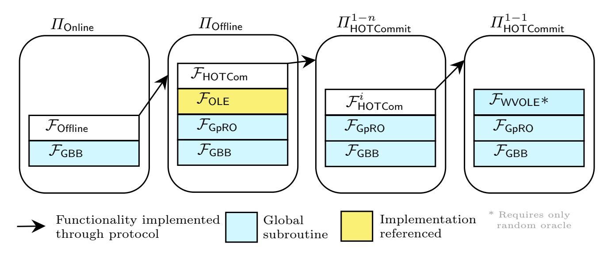

{0}------------------------------------------------

# Efficient, UC-secure and Publicly Auditable MPC from OLE & VOLE-in-the-head

Carsten Baum[1](https://orcid.org/0000-0001-7905-0198) and Chiara-Marie Zok[1](https://orcid.org/0009-0007-0395-1978)

Technical University of Denmark, {cabau,chizo}@dtu.dk

Abstract. Secure Multiparty Computation (MPC) computes on private input data, but generally does not guarantee correctness of the output towards third parties. This property, also called public auditability, was first studied explicitly by Baum et al. (SCN 2014). Their work and its follow-ups generate a Non-Interactive Zero-Knowledge proof of correctness of the MPC outcome during the MPC protocol, ensuring validity of the output even if all parties are corrupted.

In this work, we revisit and improve the MPC with Public Auditability blueprint. While the original work uses a version of the SPDZ MPC protocol with expensive lattice-based preprocessing, our construction combines any generic OLE-based preprocessing with a publicly verifiable somewhat linearly homomorphic commitment scheme from VOLEin-the-head in a non-trivial way. Our commitment scheme relies solely on random oracle calls instead of previously used linearly homomorphic commitments based on structured Public-Key assumptions.

# 1 Introduction

Secure multi-party computation (MPC) allows a set of mutually distrusting parties P1, . . . ,P<sup>n</sup> to evaluate a function on their inputs in a privacy-preserving way. When the computation is completed, participants learn nothing except the output of the function. MPC protocols can be used in a variety of contexts such as private voting, auctions or privacy preserving machine learning [\[14](#page-31-0)[,26](#page-32-0)[,29,](#page-32-1)[1,](#page-30-0)[27\]](#page-32-2) (to just mention some examples). A widely used paradigm to construct secret sharing-based MPC protocols divides computation into a preprocessing and online phase, with the most popular approaches following the BDOZ and SPDZ protocols [\[21,](#page-31-1)[13,](#page-31-2)[20\]](#page-31-3). There, during the computationally heavy preprocessing phase, correlated randomness is generated that is then consumed during the lightweight online phase.

In addition to privacy, MPC guarantees that the output of the computation is correct. This is especially important when MPC is used for computations with large impact such as e-voting. However, MPC guarantees hold only to the participating parties and only for corruptions up to the corruption threshold, which is usually strictly smaller than the total number of parties. Publicly Auditable MPC, first introduced in [\[8\]](#page-30-1), solves this by giving an external party the possibility to audit the transcript after the computation took place. Their MPC protocol 

{1}------------------------------------------------

(and follow-up works such as [\[32\]](#page-32-3)) ensures privacy as long as at least one party is honest, and correctness even if all parties are corrupted. This is achieved in the presence of an external, incorruptible auditor that does not have a secret state and that is not involved in the computation.

Public verifiability can trivially be realized if each party constructs a Non-Interactive Zero-Knowledge proof (NIZK) of correctness while it participates in the MPC protocol. When instantiating this with generic NIZKs [\[2,](#page-30-2)[12\]](#page-30-3) this leads to suboptimal performance due to the approach being non-black box in the underlying MPC protocol or having to produce the NIZK inside MPC. [\[8\]](#page-30-1) avoid this by relying on the [\[21\]](#page-31-1) MPC protocol, that has an information-theoretic online phase where all protocol messages are openings of linear secret sharings. By letting all MPC messages be sent through a bulletin board, which works as a broadcast with memory, the protocol messages can be retained by anyone including the auditor.

[\[8\]](#page-30-1) then lets each party commit to its shares using linearly homomorphic Pedersen commitments. This allows anyone to establish correctness of the reconstruction of secret sharings and thus the correctness of the MPC output. The construction relies on lattice-based threshold somewhat homomorphic encryption (SHE) for a publicly verifiable preprocessing. The linear homomorphism of the commitments is used to achieve verifiability of the online phase, but this also means that their protocol can only be instantiated for computations over fields as large as Discrete Logarithm (DLOG)-hard groups. In addition, they rely on SHE with computationally costly proofs of verifiable decryption where the plaintext space must be as large as the DLOG-hard group of the commitments.

# 1.1 Our Contributions

In this work, we improve the [\[8\]](#page-30-1) blueprint in multiple ways. First, we show that the underlying MPC scheme can be instantiated using recent Pseudorandom Correlation Generator (PCG)-based preprocessing for Oblivious Linear Evaluation (OLE) correlations, reducing the communication overhead due to triple generation. Moreover, we show that the recent Vector-OLE-in-the-Head (VOLEitH) paradigm allows for the construction of suitable linearly homomorphic commitments that make the MPC scheme publicly verifiable without using any assumptions but a Random Oracle. This avoids both expensive verifiable decryption as well as commitments based on public-key assumptions. Finally, we prove our constructions secure in the Universal Composability (UC) framework.

Better UC one-time homomorphic commitments. It is well-known that UCsecure VOLE-based homomorphic commitments can easily be constructed based on a PCG preprocessing [\[35,](#page-32-4)[10,](#page-30-4)[34\]](#page-32-5). However, these are designated-verifier commitments that require a private state, making them unsuitable for Auditable MPC. We observe that VOLE-in-the-head ZK proofs implicitly define linearly homomorphic commitments, but where such commitments only can be opened 

{2}------------------------------------------------

once. We formalize and analyze their construction in the UC framework and construct the first UC-secure one-time linearly homomorphic commitment scheme<sup>1</sup> from VOLEitH. These commitments can, in turn, be constructed only assuming a Random oracle, and we provide a UC formalization that permits their use in non-interactive protocols based on the Fiat-Shamir transform. Moreover, we show that our commitments can be opened more than once: basically, a sender can send openings to the future by committing to the opening using the Random Oracle and thus open the openings at a later point.

Efficient Auditable MPC for any (large) field using OLE. [8] relies on the linear homomorphism and public verifiability of Pedersen commitments, and also that those commitments can be opened repeatedly without weakening security. We simplify the preprocessing, redesign how the MPC protocol uses the linearly homomorphic commitments, and show how to reconcile the one-time property with the required verifiability of the openings. Namely, we observe that it is sufficient if the commitment scheme allows for two reliable openings: one to verify all opened secret sharings in the MPC protocol, and another to verify the output. The second opening can be realized from sending openings to the future which our commitment scheme permits. Using the linearity of the commitment scheme, we implicitly construct a computationally lightweight NIZK tailored to our MPC scheme that efficiently proves honest behavior of parties.

### 1.2 Technical Overview

High-level structure of the MPC protocol. We begin by describing the architecture of our MPC protocol from a high level, before showing how the individual parts are constructed. For a visual overview, see Figure 1. All our protocols make use of the global bulletin board  $\mathcal{F}_{\mathsf{GBB}}$  for communication and almost all protocols use the global random oracle  $\mathcal{F}_{\mathsf{GpRO}}$  for various purposes. The transcript on  $\mathcal{F}_{\mathsf{GBB}}$  can be used by any auditor to verify the correctness of the computation as soon as the output is sent to the bulletin board. The MPC protocol follows the offline-online paradigm. The online phase, formalized by functionality  $\mathcal{F}_{\mathsf{Online}}$  (see Section 6) is realized through the protocol  $\Pi_{\mathsf{Online}}$ .

For a fixed circuit  $\mathcal{C}$  the parties first generate all required correlated randomness, and commitments to it, using the functionality  $\mathcal{F}_{\text{Offline}}$ . This correlated randomness is consumed in the circuit computation. We realize  $\mathcal{F}_{\text{Offline}}$  through the protocol  $\Pi_{\text{Offline}}$  where we use the OLE functionality  $\mathcal{F}_{\text{OLE}}$  to generate Beaver Triples and a functionality  $\mathcal{F}_{\text{HOTCom}}$  to commit to random values and triples. To realize  $\mathcal{F}_{\text{HOTCom}}$ , which formally describes our VOLEitH-based commitments with public verifiability, we first construct a protocol  $\Pi_{\text{HOTCommit}}^{1-1}$  that realizes a version of  $\mathcal{F}_{\text{HOTCom}}$  (called  $\mathcal{F}_{\text{HOTCom}}^{i}$ ). This single-sender single-receiver commitment is built on top of  $\mathcal{F}_{\text{WVOLE}}$ , a functionality that generates weak VOLE

<span id="page-2-0"></span>One-time UC-secure linearly homomorphic commitments from random oracles have previously been constructed in [18], but our construction yields concretely better parameters due to the use of VOLEitH.

{3}------------------------------------------------

<span id="page-3-0"></span>

Fig. 1: Overview of protocols and functionalities.

correlations for a sender and a receiver. We then show how to use multiple  $\mathcal{F}_{\mathsf{HOTCom}}^i$  instances to realize  $\mathcal{F}_{\mathsf{HOTCom}}$  in the single-sender multi-receiver setting based on the protocol  $\Pi_{\mathsf{HOTCommit}}^{1-n}$ . This two-step construction of  $\mathcal{F}_{\mathsf{HOTCom}}$  is necessary to allow senders to reliably open commitments to individual receivers. We finally realize  $\mathcal{F}_{\mathsf{WVOLE}}$  by carefully formalizing and analyzing the previous  $\mathsf{VOLEitH}$  construction in the UC framework. For  $\mathcal{F}_{\mathsf{OLE}}$  we give references for existing implementations. Hence our construction only relies on a global random oracle, a bulletin board and  $\mathsf{OLE}$ .

OLE & MPC. We use a version of the BDOZ MPC protocol [13] for the online phase. In BDOZ, each party  $\mathcal{P}_i$  of the n parties  $\mathcal{P}_1, \ldots, \mathcal{P}_n$  holds a share  $x_i \in \mathbb{F}$  of a secret x such that  $x = x_1 + \cdots + x_n$  where  $\mathbb{F}$  is a finite field. To make sure parties do not alter their shares, BDOZ uses pair-wise linearly homomorphic MACs. This prevents parties from revealing inconsistent shares  $x_i' \neq x_i$  of the secret, while it still allows all parties to perform linear computations on the shared secrets. BDOZ also uses preprocessed and shared multiplication triples together with Beaver's circuit randomization technique [11] to perform multiplications on secret-shared data. Recently, Rachuri & Scholl [30] have shown how to implement a preprocessing phase for SPDZ-type protocols using pair-wise Programmable PCGs that generate Oblivious Linear Evaluation correlations over a large field  $\mathbb{F}$ . We use their approach for preprocessing, but with heavy modifications to achieve public verifiability.

VOLEs & linearly homomorphic MACs. In the BDOZ MACs, the sender (the party holding the share) has the share  $x_i \in \mathbb{F}$  and a MAC  $w_i \in \mathbb{F}$ , while the receiver (the party establishing correctness of the opening) holds  $\Delta, v_i \in \mathbb{F}$  such that  $w_i = v_i + x_i \Delta$ . To reveal the share in a verifiable way, the sender sends  $x_i, w_i$  to the receiver, who checks that the correlation holds. For all shares of  $\mathcal{P}_i$  towards the same receiver  $\mathcal{P}_j$ , the receiver uses the same  $\Delta$  in all correlations (making the MAC scheme linearly homomorphic). Put differently, correctly established MACs on secret shares form a Vector Oblivious Linear Evaluation (VOLE) cor-

{4}------------------------------------------------

relation. However, security of the MACs fails in the public verifiability setting as ∆ becomes known to the sender if all parties are corrupted.

Making VOLE MACs into publicly verifiable commitments. Public verifiability for VOLE correlations was recently addressed in [\[7\]](#page-30-6). Their work extends the PCG-based ZK proofs of [\[35](#page-32-4)[,10,](#page-30-4)[34\]](#page-32-5) towards public verifiability of VOLE-based NIZKs. [\[7\]](#page-30-6) achieve this by observing that a weaker form of VOLE is sufficient for VOLE-based MACs used in NIZKs, viewing these MACs as commitments. The sender obtains x<sup>i</sup> , w<sup>i</sup> already during the commitment phase, and can conduct arbitrary (at this point unverifiable) openings of commitments. Once all operations on commitments and their openings are completed, ∆ is generated as a random oracle output. Finally, based on this choice of ∆, the receiver learns v<sup>i</sup> which allows it to verify the openings.

In [\[7\]](#page-30-6) the focus lies on achieving VOLE-based NIZK proofs. We formalize the properties of the commitment scheme that [\[7\]](#page-30-6) actually achieves, and prove that their construction yields one-time linear UC-secure commitments. Towards this, we have to explicitly apply the Fiat-Shamir transform to construct the commitment scheme instead of directly compiling to NIZKs as in previous works. As the one-time property is insufficient for use in MPC, we use that, during an opening, the sender can commit to its opening x<sup>i</sup> , w<sup>i</sup> using a regular UC commitment instead of sending it directly to the receiver. This gives the sender a limited way to make openings even after the verifier's key ∆ has been publicly revealed. We formalize this property, which we call delayed openings, and use it in our construction.

Having only single-receiver commitments is insufficient for use in MPC protocols, where we want each party to be committed to its shares consistently towards all other parties. We therefore use a consistency check based on a universal hash, combined with a global bulletin board that we use as broadcast channel. To reliably avoid cheating even if all parties are corrupted, we determine the challenge used in the check using the Fiat-Shamir transform applied to all commitments previously made. In addition, we show how the check integrates with our commitment scheme with its constraints on verifiable openings.

Commitments in MPC. We then integrate our new commitment scheme into the MPC protocol. There, the parties will use OLEs to generate secret sharings of multiplication triples. We then let parties post commitments to their shares on a public bulletin board. This will also be used by parties to open commitments during evaluation of the MPC protocol, and we check correctness of the multiplication triples akin to [\[28\]](#page-32-7). All verification steps of the MPC scheme, as well as the actual computation, can be combined into a single verifiable opening. However, in order to achieve input independence (as in previous works), we only reveal the output of the computation once all consistency checks passed.

Universal Composition and Fiat-Shamir. We formalize lower-level primitives such as weak VOLE and one-time commitments in UC, give a composable con

{5}------------------------------------------------

struction and analyze all security guarantees modularly. This clashes with the use of the Fiat-Shamir transform when generating challenges in many ways: for example, to generate a challenge that tests if multiplication triples are wellformed, the challenge must be computed based on the state of the UC functionality which holds the shares. However, normal UC functionalities do not offer such a mechanism, and a (global) random oracle cannot hash such a state either. While this could in theory be resolved by combining all primitives into a single functionality, this approach would strongly contradict the modularity of UC.

We therefore carefully model a challenge generation mechanism into our functionalities where parties (and the auditor) can obtain unpredictable challenges for higher-level protocols based on the functionality's state. However, any rushing adversary (or in particular any adversary if all parties are corrupted) can choose its inputs to the functionality, observe which challenge this generates, and adaptively change its choice of inputs. This mimics a real-world attack where an attacker simulates the impact of its messages onto random oracle outputs before posting messages to the bulletin board. Our UC modeling permits such attacks by allowing attackers to obtain this information or even reset functionalities.

Communication complexity and Open problems. In order to quantify the cost of our protocol, we have analyzed its communication complexity in terms of bits sent per party and total number of rounds and separated them by offline and online phase. The offline phase can be completed in 5 rounds while the online phase takes 4 + D rounds, where D is the circuit depth. For details see Appendix [C.](#page-35-0) While our work addresses some drawbacks of the state-of-the-art, other questions remain open. For example, our construction does not yet work for binary circuits. We describe limitations and open problems in Appendix [A.](#page-32-8)

## 1.3 Related Work

Cunningham et al. [\[19\]](#page-31-5) extended [\[8\]](#page-30-1) by the use of so-called Commitment Enhanced Secret Sharing. The authors introduce the notion of completely identifiable auditability by adding linear homomorphic commitments to each additive share. [\[19\]](#page-31-5) uses Pedersen commitments so the construction is not post-quantum secure. Schoenmakers and Veeningen [\[32\]](#page-32-3) use a threshold version of Paillier and generic NIZK, making their work also not post-quantum secure. The authors achieve universally verifiable MPC, which extends public auditability to prove correctness of an encryption of a secret result. By relying on a generic NIZK, both the proof size and prover runtime cannot be optimized for the specific MPC scheme. In [\[31\]](#page-32-9), the authors present an enhanced version of [\[8,](#page-30-1)[19\]](#page-31-5) that uses lattice-based commitments and additionally supports lower corruption thresholds towards robustness. Their work heavily relies on NIZKs during the offline phase to show correctness of lattice-based commitments, ciphertexts and multiplications and requiring a CRS for the commitment scheme. In comparison, our offline phase is essentially equivalent to the OLE-based preprocessing of [\[30\]](#page-32-6) and works using any UC-secure OLE. Parties simply commit to the outcomes and run a very lightweight and standard multiplication triple check.

{6}------------------------------------------------

Baldimtsi et al. |4| define the notion of crowd-verifiable zero-knowledge (CVZR) proofs to achieve what they call end-to-end verifiable MPC such that cheating can be detected even if the setup assumption of a well-formed CRS does not hold. Similar to [8], [32] and [19] Baldimtsi et al. consider separation of input and computation parties but in contrast to prior work they also consider corruption of input parties. Our construction does not support separation of input and computation parties. They prove their construction secure in the random oracle model without using trapdoor commitments. They state that their construction as is, is secure when at least one computation party is honest but can be easily altered to achieve public audibility following the notion of [8] when the computation result is publicly decrypted. However, they show that their approach is limited to only certain securely computed functions, and they require super-polynomial security assumptions. In our work, we boost single-receiver commitments to multi-receiver commitments. To combat cheating adversaries that provide inconsistent shares [22] also used pairwise homomorphic commitments. Their construction is secure in the dishonest majority setting and can be instantiated using minimal assumptions. In summary, all previous works either are not post-quantum secure, only support a subset of all possible functions or do not support full corruption. Our construction instead only relies on random oracles, works for all circuits and is secure even if all parties are corrupted. We provide a comparison in Table 1.

<span id="page-6-0"></span>

|             | Ours     | [8]      | [4]        | [19]     | [22] | [31]    | [30]  | [32]     |
|-------------|----------|----------|------------|----------|------|---------|-------|----------|
| Auditable   | <b>√</b> | ✓        | <b>(√)</b> | ✓        | X    | ✓       | X     | ✓        |
| Composable  | UC       | UC       | UC         | UC       | UC   | UC      | UC    | X        |
| Assumptions | OLE      | Lattice+ | subexp.    | Lattice+ | PRG+ | Lattice | pPCGs | Paillier |
| (except RO) |          | DLOG     | TPKE       | DLOG     | ОТ   |         |       |          |
| Setup       | X        | CRS      | X          | CRS      | X    | CRS     | X     | TPKE     |
| PQ          | <b>√</b> | X        | X          | X        | ✓    | ✓       | ✓     | X        |

Table 1: Comparison of related work. All constructions that do not support full corruption are secure in the dishonest majority setting. TPKE = Threshold Public Key Encryption, pPCG = programmable PCG.

# 2 Preliminaries and Notation

We use [x..y] to denote the interval  $\{x, x+1, ..., y\}$  and write [x] for [1..x]. We write vectors in lower-case bold letters such as  $\mathbf{x}$ , and matrices as upper-case bold letters such as  $\mathbf{A}$ . For a matrix  $\mathbf{A} \in \mathbb{F}^{m \times n}$  we use  $\mathbf{A}_i$  to denote the *i*'th row and  $\mathbf{A}^j$  for the *j*th column.  $\mathbf{A}[i,j]$  denotes the element at row *i* and column *j* of the matrix  $\mathbf{A}$ . Similarly, we use  $\mathbf{x}[i]$  or  $x_i$  to denote the *i*th element of  $\mathbf{x}$ .

We use  $\lambda$  for the security parameter. Parties in this work are usually denoted using the symbol  $\mathcal{P}$ . We write  $v^i$  to indicate that v is either sent by or sent to  $\mathcal{P}_i$ . For a value v with index id we write  $v_{id}$  and with  $v_{id}^i$  we denote a value v with index id that was sent either to or by  $\mathcal{P}_i$ . In our protocols and functionalities,

{7}------------------------------------------------

we use lists (using notation li) and maps (using notation mp) to store values. If elements have to be addressable by an ID they are stored inside maps and otherwise in lists. Flags (which are essentially publicly known variables with notation fl) are used to indicate states of functionalities and protocols to ensure that certain operations can only be performed when preliminary actions are completed. Additional preliminaries can be found in Appendix B.

### 2.1 Linear Codes

Let  $\mathbb{F}$  be a finite field and  $n_{\mathcal{C}}, k_{\mathcal{C}} \in \mathbb{N}$  be integers. A linear code  $\mathcal{C} \subset \mathbb{F}^{n_{\mathcal{C}}}$  is a  $k_{\mathcal{C}}$ -dimensional vector subspace of  $\mathbb{F}^{n_{\mathcal{C}}}$ ,  $1 \leq k_{\mathcal{C}} \leq n_{\mathcal{C}}$ . Defining

$$d_{\mathcal{C}} = \min\{\#\text{non-zero indices of } \mathbf{c} \mid \mathbf{c} \in \mathcal{C} \setminus \{\mathbf{0}\}\},\$$

we say that  $\mathcal{C}$  is a linear code over  $\mathbb{F}$  with length  $n_{\mathcal{C}}$ , dimension  $k_{\mathcal{C}}$  and (minimum) distance  $d_{\mathcal{C}}$  or  $[n_{\mathcal{C}}, d_{\mathcal{C}}, k_{\mathcal{C}}]$ -code for short.

A matrix  $\mathbf{G} \in \mathbb{F}^{k_{\mathcal{C}} \times n_{\mathcal{C}}}$  is a generator matrix of  $\mathcal{C}$  if  $\mathbf{x}^T \mathbf{G}$  generates  $\mathcal{C}$ , i.e.  $\mathcal{C} = \{\mathbf{x}^T \mathbf{G} \mid \mathbf{x} \in \mathbb{F}^{k_{\mathcal{C}}}\}$ . If  $\mathbf{G}$  is of the form  $[\mathbf{I}_{k_{\mathcal{C}}} | \mathbf{A}]$ , where  $\mathbf{I}_{k_{\mathcal{C}}}$  is the  $k_{\mathcal{C}} \times k_{\mathcal{C}}$  identity matrix, then  $\mathbf{G}$  is called *systematic*.

### 2.2 UC & Functionalities

We model protocols and their security in this work using the Universal Composability (UC) framework [16]. See Appendix B.2 for a short UC introduction.

Notation. Throughout this work, we will denote functionalities using  $\mathcal{F}$ , protocols using  $\mathcal{I}$ , the adversary as  $\mathcal{A}$  and simulators as  $\mathcal{S}$ . The operations of a functionality act as abstract interfaces that can be invoked by parties and the adversary, independent of any protocol implementation. Those interfaces are usually denoted in **Bold Text** inside a functionality. A first interaction with a functionality  $\mathcal{F}$  for such a interface can always either be triggered by an honest party, or by the adversary  $\mathcal{A}$  playing the role of a dishonest party. Always stating this fact, however, would make our functionalities harder to read. To simplify notation, we write that a message can be sent by a possibly corrupted party, meaning that formally  $\mathcal{A}$  sends the message on behalf of the corrupted party.

Functionalities. We use ideal functionalities for random oracles  $\mathcal{F}_{\mathsf{GpRO}}$  and public bulletin boards  $\mathcal{F}_{\mathsf{GBB}}$ , which can be found in Figure 3 and Figure 2 respectively. Both are modeled as global subroutines. Note that  $\mathcal{F}_{\mathsf{GBB}}$  as a bulletin board allows external parties to read from it at any point. It naturally acts as a broadcast channel during a protocol, and we therefore sometimes write broadcasting when we mean that a party is writing to  $\mathcal{F}_{\mathsf{GBB}}$ . We use the formulation of [17] to model our global random oracle.

In their approach, the authors only let functionalities (machines with  $pid = \bot$ ) program the oracle. The calling functionality can initially be assigned control of

{8}------------------------------------------------

the oracle and is then referred to as the controller of the session. Only registered controllers of sid can program points that have not been queried before. In this formulation of the global random oracle the programming access is controlled by the calling functionalities. To not further complicate our functionalities we model this access structure as a macro Macropro described in Figure 4. Throughout the paper, we implicitly assume that every functionality first invokes **Init Control** and performs programming to  $\mathcal{F}_{\mathsf{GpRO}}$  via the predefined macro. For clarity and brevity, this is not repeated in the description of individual functionalities.

## <span id="page-8-1"></span> $\mathcal{F}_{\mathsf{GBB}}$ (global)

 $\mathcal{F}_{\mathsf{GBB}}$  is parameterized by  $\mathsf{pid}^{\mathsf{sid}} = \mathcal{P}_1, \dots, \mathcal{P}_n$ . Only parties  $\mathcal{P} \in \mathsf{pid}^{\mathsf{sid}}$  can write to  $\mathcal{F}_{\mathsf{GBB}}$  for that session. Any party as well as any functionality can read all previously posted messages.

**Broadcast** On input (Broadcast, sid, m) from  $\mathcal{P}_i$ :

- 1. If this is the first activation initialize  $\mathtt{li}_{\mathrm{H}}^{\mathrm{sid}}$  and set  $\mathsf{bid}^{\mathrm{sid}} = 0$ . 2. If  $\mathcal{P}_i$  in  $\mathsf{pid}^{\mathrm{sid}}$ , store the tuple  $(\mathsf{bid}^{\mathrm{sid}}, \mathcal{P}_i, m)$  in  $\mathtt{li}_{\mathrm{H}}^{\mathrm{sid}}$ . Increase  $\mathsf{bid}^{\mathrm{sid}}$  by 1 and send (Broadcast, m,  $\mathsf{bid}^{\mathrm{sid}}$ ) to every  $\mathcal{P}_{j\neq i} \in \mathsf{pid}^{\mathrm{sid}}$ .

**Verify** On input (Verify, sid) from any party return li<sup>sid</sup>.

Fig. 2: Ideal global bulletin board functionality.

### <span id="page-8-0"></span> $\mathcal{F}_{\mathsf{GpRO}}$ (global)

 $\mathcal{F}_{\mathsf{GpRO}}$  interacts with a set of parties. For each session  $\mathcal{F}_{\mathsf{GpRO}}$  can be controlled by a party with  $sid = \bot$  (functionalities) which has previously been assigned control. Let  $\mathtt{mp}_{\mathtt{ctrl}}$  be an initially empty map storing controllers of each session and  $\mathtt{li}_{H}^{\mathsf{sid}}$  be an initially empty list for each  $\mathsf{sid}.$   $\mathcal{F}_{\mathsf{GpRO}}$  samples from a finite space  $\mathcal{T}$  whose description length is polynomial in the security parameter.

**Assign control** Upon receiving (Control, sid) from a party  $\mathcal{P}_i$  with pid =  $\perp$ , add (sid,  $\mathcal{P}_i$ ) to  $mp_{ctrl}$  and return  $li_H^{sid}$ .

Query On input (Query, sid,  $m, \mathcal{T}$ ) from a party  $\mathcal{P}_i$ .

- 1. If  $\mathcal{P}'$  is registered as the controller of this sid in  $mp_{ctrl}$ , output (ProgramReq, sid,  $\mathcal{P}, m, \mathcal{T}$ ) to  $\mathcal{P}'$ .
- 2. Upon response (Program, sid,  $m, \mathcal{T}, h$ ) and if there is no record of the
- form  $(m, \mathcal{T}, \cdot) \in \mathtt{li}_{\mathrm{H}}^{\mathsf{sid}}$ , then add  $(m, \mathcal{T}, h)$  to  $\mathtt{li}_{\mathrm{H}}^{\mathsf{sid}}$ . 3. Find  $(m, \mathcal{T}, h) \in \mathtt{li}_{\mathrm{H}}^{\mathsf{sid}}$  if it is absent, generate  $h \leftarrow \mathcal{T}$ . Add the tuple to  $li_H^{sid}$  and send (Query, sid, h) to the caller.

<span id="page-8-2"></span>Fig. 3: Global Random Oracle functionality  $\mathcal{F}_{\mathsf{GpRO}}$  following [17].

For  $\mathcal{F}_{\mathsf{GpRO}}$  we use the following, well-known fact (see e.g. [5]):

{9}------------------------------------------------

### <span id="page-9-0"></span>MacroPrg

If any of the processes return ⊥ abort the execution inside the calling functionality. Every functionality keeps track of initially empty map lisid <sup>H</sup> . We only allow programming from the ideal process adversary (S) with same sid as the calling functionality.

Init control send (Control,sid) to FGpRO and wait for its response m. If m = (Ok, Hist) and Hist ̸= ⊥ output ⊥.

Program On input (ProgramReq,sid, m, T ) from FGpRO. Send (Program,sid, m, T , h) to S and wait for its response h. Forward (Program,sid, m, T , h)) to FGpRO.

Fig. 4: Macro for programming the random oracle

Proposition 1 (Random oracle graph game). Let H : {0, 1} <sup>∗</sup> → T be a random oracle and consider following game with an adversary A. The game keeps track of a directed graph G = (V, E), initially empty, and proceeds as follows: The adversary can (repeatedly) query H at some x. Let H(x) = y.

- If y ∈ V but there is no edge (x ′ , y) ∈ E, then the adversary wins. (Preimage)
- If an edge (x ′ , y) ∈ E exists with x ′ ̸= x, then the adversary wins. (Collision)
- Else, add nodes x and y to V and add an edge e = (x, y) from x to y to E.

Let A be an adversary which makes at most Q queries to H. Then the probability that A wins is bounded by Q2/|T |.

In addition, our protocols also use an Oblivious Linear Evaluation (OLE) functionality (see [Figure 5\)](#page-9-1). There exists a variety of protocols to efficiently implement this primitive, such as [\[23,](#page-31-9)[24\]](#page-31-10). Protocols based on Pseudorandom Correlation Generators have been proposed, following the breakthrough work of [\[15\]](#page-31-11). They implement OLE with sublinear communication (in the correlation length ℓ) where the shares of honest parties are pseudorandom.

# <span id="page-9-1"></span>FOLE

FOLE interacts between two parties P<sup>S</sup> and PR. The functionality is parameterized by the finite field F and output length ℓ.

Extend On input (Extend,sid, u) from P<sup>S</sup> and input (Extend,sid, x) from P<sup>R</sup> where u, x ∈ F ℓ .

- 1. If P<sup>R</sup> is corrupt wait for A to send v. Otherwise sample v ← F ℓ .
- 2. If P<sup>S</sup> is honest, compute w = u · x + v. If P<sup>S</sup> is corrupt wait for A to send w and recompute v accordingly.
- 3. Output w to P<sup>S</sup> and v to PR.

Fig. 5: OLE functionality FOLE.

{10}------------------------------------------------

## <span id="page-10-0"></span>2.3 VOLEs and VOLE-based MACs

Given a field  $\mathbb{F}$ , a VOLE correlation of length  $\ell$  is a pair of random variables  $(\boldsymbol{w}, \boldsymbol{u}) \in \mathbb{F}^{\ell} \times \mathbb{F}^{\ell}$  and  $(\boldsymbol{v}, \Delta) \in \mathbb{F}^{\ell} \times \mathbb{F}$ , subject to the constraint that  $w_i = v_i + u_i \cdot \Delta$ . The correlation exists between two parties, the sender  $\mathcal{P}_{S}$  and receiver  $\mathcal{P}_{R}$ .  $\mathcal{P}_{S}$  is given  $(\boldsymbol{w}, \boldsymbol{u})$ , while  $\mathcal{P}_{R}$  learns  $(\boldsymbol{v}, \Delta)$ . It is an instantiation of the correlation generated by  $\mathcal{F}_{OLE}$  where all  $x_i$  are  $\Delta$ .

VOLE can be used to build a simple, information-theoretic MAC scheme with homomorphic properties for use in MPC protocols, such as described in [13]. There, the secret held by the sender is  $\mathbf{u}$  while the MACs are defined by  $\mathbf{w}$ .  $\Delta$ ,  $\mathbf{v}$  are the keys held by the verifier. To see that the scheme is linearly homomorphic, observe that for any  $\alpha, \delta \in \mathbb{F}$  and VOLE correlations  $w_1 = v_1 + u_1 \Delta$  and  $w_2 = v_2 + u_2 \Delta$ , it holds that

<span id="page-10-1"></span>
$$\underbrace{\alpha w_1 + w_2}_{\text{computed by } \mathcal{P}_{S}} = \underbrace{\alpha v_1 + v_2 - \Delta \delta}_{\text{computed by } \mathcal{P}_{R}} + \underbrace{(\alpha u_1 + u_2 + \delta)}_{\text{computed by } \mathcal{P}_{S}} \Delta$$

is a valid VOLE correlation for the secret  $\alpha u_1 + u_2 + \Delta$  whose MACs and keys can be locally computed by  $\mathcal{P}_S$ ,  $\mathcal{P}_R$  respectively.

To open a secret u, the sender sends both u, w to  $\mathcal{P}_{R}$ , which in turn checks that  $w = u \cdot \Delta + v$ . The MAC w cannot be forged for a different secret  $u' \neq u$  with probability larger than  $1/|\mathbb{F}|$  (see e.g. [9, Section 3.1] for a proof):

**Lemma 1.** Let  $v, \Delta$  be a VOLE commitment to u with MAC w. Assume that  $\mathcal{P}_S$  sends  $u', w' \in \mathbb{F}$  to  $\mathcal{P}_R$  such that  $u \neq u'$ . Let  $\mathcal{P}_R$  accept if  $w' = u'\Delta + v$ , and otherwise reject. Then  $\mathcal{P}_R$  accepts with probability at most  $1/|\mathbb{F}|$ .

## 3 Formalizing Auditable MPC

We now recap the UC formalization of Publicly Verifiable (Auditable) Secure Multiparty Computation as first presented in [8].

In Figure 6 we present the ideal functionality  $\mathcal{F}_{\text{Online}}$ . In  $\mathcal{F}_{\text{Online}}$  each party can input private values  $x^i \in \mathbb{F}$  for a fixed field  $\mathbb{F}$  and compute a predetermined circuit using these values. The circuit can be built from multiplication and linear gates corresponding to the same operations in  $\mathbb{F}$ . Moreover, the parties  $\mathcal{P}$  can, upon agreement, open the outputs of the computation. In addition, an auditor  $\mathcal{P}_A$  is an additional party that can interact with the functionality and verify the correctness of the computation output y after it is opened. The auditor will, on input y, output accept if the circuit  $\mathcal{C}$  on input  $x^1, \ldots, x^n$  outputs y. If the value y is not identical to the output of  $\mathcal{C}$ , the auditor will output reject.

Parties. The functionality interacts with a set of n parties  $\mathcal{P}_1, \ldots, \mathcal{P}_n$  that provide inputs and evaluate the circuit  $\mathcal{C}$ . The adversary  $\mathcal{A}$  can corrupt arbitrarily many of the parties. If at least one party is honest correctness and input privacy

{11}------------------------------------------------

<span id="page-11-0"></span>FOnline

FOnline interacts with an adversary A, a set of computation parties P and an auditor PA. Let F be a field.

Initialize On input (Init,sid, C) from all parties in P, where C is a circuit with n inputs, one output, and addition and multiplication gates over F:

1. A sends the set of corrupted parties P ⊆ P ˜ .

Input On input (Input,sid, i, idx, x) from P<sup>i</sup> with x ∈ F and (Input,sid, i, idx) from all other parties.

- 1. Store (idx, x) and ignore all messages (Input,sid) with the same idx.
- 2. If all parties are corrupted, send (Input,sid, i, idx, x) to A.

Compute On input (Compute,sid) from all parties Pi:

- 1. Assign inputs to input gates of C. If some input gates are unassigned, output (Abort,sid).
- 2. Compute y<sup>c</sup> = C(x1, . . . , xn).
- 3. Send y<sup>c</sup> to A and wait for A to respond with y ∗ . If |P| ˜ = n all values y <sup>∗</sup> ∈ F ∪ {⊥} are valid. If |P| ˜ < n only y <sup>∗</sup> ∈ {yc, ⊥} is valid.
- 4. Send (Output,sid, y<sup>∗</sup> ) to all P<sup>i</sup> if y ∗ is valid, and (Abort,sid) otherwise.

Audit On input (Audit,sid, y) from P<sup>A</sup> and if Compute has finished:

- 1. If y = y<sup>c</sup> = y ∗ send (Accept,sid) to PA.
- 2. If y <sup>∗</sup> = ⊥ send (AuditNotPossible,sid) to PA.
- 3. If y ̸= y<sup>c</sup> or y ̸= y ∗ send (Reject,sid) to PA.

Fig. 6: Functionality FOnline of Auditable MPC.

are guaranteed. If all parties are dishonest only correctness can be guaranteed and the auditor P<sup>A</sup> can verify the output after the computation of C is finished. We model P<sup>A</sup> as an incorruptible party.

Realizing FOnline. To maintain a state that is shared by all protocols we use session identifiers sid throughout our construction. When realizing FOnline, all steps of the computation are send to the bulletin board, such that P<sup>A</sup> can later get the transcript of the computation. We present the protocol in [Section 6.](#page-26-0)

# 4 One-time Homomorphic Commitments

In this section, we build a one-time homomorphic commitment scheme from a weak form of VOLE. Namely, we use a special VOLE functionality, whose ideas were introduced in [\[7\]](#page-30-6), with publicly revealed ∆ to implement VOLEbased commitments. The commitment functionality FHOTCom that we realize is described in Figures [7](#page-12-0) and [8.](#page-13-0)

We now describe the functionality in more detail. The functionality FHOTCom is a multi-receiver commitment scheme, run between a sender PS, a set of receivers P<sup>R</sup> and an auditor PA. After initialization using Init, the sender may create mc commitments in multiple rounds using Commit. Linear operations can then be applied to previously committed values using Add and Linear. Commitments

{12}------------------------------------------------

# <span id="page-12-0"></span>FHOTCom (Part 1)

FHOTCom interacts with the sender PS, a set of receivers PR, an auditor P<sup>A</sup> and an adversary A who is allowed to corrupt every party except PA. If A or a party sends (Abort,sid) it halts.

The functionality is parameterized by a field Fp. Let flopen be a flag that is initially 0 and ligen, liopen, lichal be lists and mpcom, mpchal be maps - all are initially empty. Challenges are generated from a finite set T .

Init Upon input (Init,sid, mc) from P<sup>S</sup> set ligen := {cid1, . . . , cidmc} and output (Init,sid, mc) to all parties in P<sup>R</sup> and A. Let U be the set of all Fp-linear functions in cid1, . . . , cidmc.

Commit On input (Commit,sid,(cid<sup>j</sup> , m<sup>j</sup> )j∈[k]) from PS, if flopen = 0, {cidj}j∈[k] ⊆ ligen, m<sup>j</sup> ∈ F<sup>p</sup> and (cid<sup>j</sup> , ∗) ∈/ mpcom for all j ∈ [k]:

- 1. Let (state, ∗) be the last item on lichal or state = ⊥ if it is empty. If P<sup>S</sup> is corrupted, wait for message (ChalSel,sid, c) and let ch be as in (ligen∥(state,(cid<sup>j</sup> , m<sup>j</sup> )j∈[k])∥c, ch) ∈ mpchal. If sender is honest, set ch \$←− T . Add (state∥(cid<sup>j</sup> , m<sup>j</sup> )j∈[k] , ch) to lichal.
- 2. Add the value (cid<sup>j</sup> ,(m<sup>j</sup> , id<sup>j</sup> )) for all j ∈ [k] to mpcom where id<sup>j</sup> is the identity function in U.
- 3. Send (Receipt,sid,(cid<sup>j</sup> )j∈[k] , ch) to all P<sup>i</sup> ∈ PR, P<sup>S</sup> and A.

Challenge Test On input (TestChallenge,sid, mc, L) from A where L = (cid<sup>j</sup> , m<sup>j</sup> )j∈[k] is a list with elements with each cid<sup>j</sup> ∈ T = {cid1, . . . , cidmc} and if P<sup>S</sup> is corrupted:

- 1. If (T∥L∥i, ∗) ∈ mpchal set c = i + 1 for the largest i, otherwise c = 0.
- 2. Sample ch \$←− T , add (T∥L∥c, ch) to mpchal and send (ch, c) to <sup>A</sup>.

Hint On input (Hint,sid,(cid<sup>j</sup> )j∈[k] , i) from PS, if (cid<sup>j</sup> ,(m<sup>j</sup> , ∗)) ∈ mpcom for every j ∈ [k], flopen = 0 and i ∈ {0, . . . , |PR|}:

- 1. If P<sup>S</sup> is corrupt, wait for input (Hint,sid,(x<sup>j</sup> )j∈[k]) from A where x<sup>j</sup> ∈ Fp. Otherwise set x<sup>j</sup> = m<sup>j</sup> .
- 2. For each j ∈ [k] if x<sup>j</sup> := m<sup>j</sup> add (cid<sup>j</sup> , ¬delay, x<sup>j</sup> , 1, i) to liopen, otherwise add (cid<sup>j</sup> , ¬delay, x<sup>j</sup> , 0, i).
- 3. If i = 0 send (Hint,sid,(cid<sup>j</sup> , x<sup>j</sup> )j∈[k]) to all P<sup>i</sup> ∈ P<sup>R</sup> and A.
- 4. If i ̸= 0 send (PrivHint,sid,(cid<sup>j</sup> , x<sup>j</sup> )j∈[k]) to Pi.

Delayed Hint On input (DelHint,sid,(cid<sup>j</sup> )j∈[k]) from PS, if (cid<sup>j</sup> ,(m<sup>j</sup> , ∗)) ∈ mpcom for every j ∈ [k] and if flopen = 0:

- 1. If P<sup>S</sup> is corrupt, wait for input (Hint,sid,(x<sup>j</sup> )j∈[k]) from A where x<sup>j</sup> ∈ Fp. Otherwise set x<sup>j</sup> := m<sup>j</sup> .
- 2. For every j ∈ [k] if x<sup>j</sup> = m<sup>j</sup> add (cid<sup>j</sup> , delay, x<sup>j</sup> , 1) to liopen, otherwise add (cid<sup>j</sup> , delay, x<sup>j</sup> , 0).
- 3. Send (DelHint,sid,(cid<sup>j</sup> )j∈[k]) to all parties in PR.

Fig. 7: Ideal functionality for one-time homomorphic commitments.

and linear operations can be done until the sender calls Open. Thereafter, these operations are not permitted anymore as a special flag flopen is then set. Commitments and operations on them are internally stored in a special map mpcom

{13}------------------------------------------------

```
FHOTCom (Part 2)
Add On input (Add,sid,(cidj )j∈[3]) from PS and if flopen = 0, check if
    (cid3, ∗) ∈/ mpcom, cid3 ∈/ ligen and {(cid1,(m1, f1)),(cid2,(m2, f2))} ⊆
    mpcom:
     1. Store tuple (cid3,(m1 + m2, f1 + f2)) in mpcom.
     2. Send (Add,sid,(cidj )j∈[3]) to all Pi ∈ PR and A.
Linear On input (Linear,sid, cid1, cid2, α, δ) from PS and if flopen = 0, if
    (cid2, ∗) ∈/ mpcom,cid2 ∈/ ligen and (cid1,(m1, f1)) ∈ mpcom:
     1. Store (cid2, α · m1 + δ, α · f1 + δ) in mpcom.
     2. Send (Linear,sid, cid1, cid2, α, δ) to all Pi ∈ PR and A.
Open On input (Open,sid) from PS and if flopen = 0: Set flopen ← 1 and
    send (Open,sid) to all parties.
Delayed Open On input (Open,sid) from PS and if flopen = 1:
     1. Let L := {(cidj , xj ) | (cidj , delay, xj , bj ) ∈ liopen}.
     2. Replace each (cidj , delay, xj , bj ) ∈ liopen with (cidj , ¬delay, xj , bj , 0).
     3. Set flopen ← 2 and send (Open,sid, L) to each party in PR.
Verify On input (Verify,sid,(cidj , mj )j∈[k]) from any party Pi ∈ PR and if
    flopen ̸= 0:
     – Return (Verified,sid) if (cidj , ¬delay, mj , 1, 0) ∈ liopen or
        (cidj , ¬delay, mj , 1, i) ∈ liopen for every j ∈ [k]
     – Otherwise return (VerifyFailed,sid).
Audit On input (Audit,sid,(cidj , fj )j∈[k]) by PA, if cidj ∈ U and flopen = 2:
     1. Let L := {(cidj , mj ) | (cidj , ¬delay, mj , 1, 0) ∈ liopen}.
     2. Return (Audit,sid, L) if (cidj , ¬delay, mj , 1, 0) ∈ liopen and
        (cidj ,(mj , fj ))) ∈ mpcom, for every j ∈ [k]. Otherwise return
        (AuditFailed,sid).
Challenges On input (Challenges,sid) from any party or A output L =
    (((cidj ), chk) | ((cidj , mj ), chk) ∈ lichal).
```

Fig. 8: Ideal functionality for one-time homomorphic commitments, continued.

based on unique commitment IDs cid. Some of the commitment IDs are reserved for using Commit and stored in a list ligen.

Instead of multiple rounds of openings of commitments, the functionality permits so-called hints. A hint allows an honest party to reveal a committed value in a verifiable way, while a dishonest sender can change the hint outputs at will. However, since hints are verifiable, such a change to the outputs is visible after Open is called. Hints can be public and private, meaning that output can either be opened to an individual receiver or all receivers in a verifiable way. Private hints are only verifiable by the receiver and no other party.

A sender can also send hints to the future by using Delayed Hints before calling Open. Revealing these hints through Delayed Open can only be used after Open. The (dishonest) sender can always decide not to reveal such a hint at this point, but it cannot change the value that is revealed anymore. Also, once such a delayed hint is revealed it is verifiable by all parties, just as regular 

{14}------------------------------------------------

hints. FHOTCom keeps track of hints and openings in the list liopen, including information about delayed hints now being visible or receivers of hints.

Audits. The auditor P<sup>A</sup> acts as an additional receiver that is incorruptible. It can, however, not obtain private hints. In comparison to the other parties, it can only verify hints after Delayed Open is called. At that point, it can verify both regular and delayed hints.

Generating challenges. The protocol implementing FHOTCom consists of random oracle calls and messages sent to a bulletin board FGBB. As such, this permits generating unpredictable challenges (to be used by protocols using FHOTCom as a building block) using the Fiat-Shamir paradigm where the messages on the Bulletin Board are hashed. However, this allows a corrupt sender, ahead of time, to simulate protocol transcripts before posting to FGBB, thus seeing what Fiat-Shamir challenges the simulated transcripts lead to. To capture this advantage, we additionally allow the attacker to use the functionality such that it shows which challenges its input choices generate. That is, we explicitly model challenge generation into the functionality, as well as explicit challenge testing which the adversary can do using Challenge Test.

During Commit, the dishonest sender can then pick any such tested challenge that it observed before. Based on the state, challenges can then be read by other parties such as the auditor using Challenges. The challenge space (essentially, the output space of the underlying random oracle) is defined by T . To ensure consistency, mappings between functionality states and generated challenges are stored in a map mpchal. The different challenges that can be derived publicly given the current and previous states of the functionality are stored in lichal.

## 4.1 Weak VOLE

To implement FHOTCom we use a weak form of VOLE, which we describe in FWVOLE in Figure [9.](#page-16-0) It implements a form of VOLE correlation generation, described in Section [2.3](#page-10-0) to allow linear commitments. However, it does not generate the correlation shares of the sender and the receiver simultaneously. Instead, initially P<sup>S</sup> learns its shares of the correlation, as well as ∆. The choice of ∆ is dependent on the message that it intends to send on the broadcast channel, which is modeled by the additional input m. P<sup>R</sup> learns ∆, m, but initially not Q. However, once the parties enter Deliver then Q is forwarded to PR. Note that every choice of m leads to a different ∆, and an adversary can test which m generates which ∆ without generating interaction via Delta Test. This reflects that the implementation later generates ∆ as the output of a hash function evaluated on the protocol transcript and m. The functionality stores the (m, ∆) that is chosen by the adversary in the flag fl∆. The functionality does not keep any secret from the sender if it is dishonest. In addition, FWVOLE allows an auditor to obtain the same information as P<sup>R</sup> at any later point. It is precisely the use of m that ties Q, ∆ to an external context (such as other messages on a broadcast channel) making audit meaningful even if both PS,P<sup>R</sup> are corrupted.

{15}------------------------------------------------

To allow using FWVOLE in a Fiat-Shamir context by other protocols, the functionality also generates an additional challenge ch once U, V are fixed by the sender but before the VOLE challenge ∆ is chosen. This allows higher-level protocols to derive an unpredictable value ch once inputs are fixed. This is in line with an actual implementation where U, V can already be extracted from random oracle-based commitments before the opening takes place later, for which ∆ is necessary. The challenge ch will later be computed by hashing RO commitments containing U, V. Since the adversary could simulate how multiple choices of U, V and commitments thereof generate different hash function outputs and thus ch values, we allow the adversary to test output challenges using Challenge Test before inputting them to the functionality. As all this information is available as a public transcript and ch can also be derived by other parties, the functionality allows third parties to generate challenges using Challenge. As in FHOTCom, we use a map mpchal to keep track of all challenges generated to the adversary and store the ultimately chosen challenge in the flag flch.

A previous (interactive) version of FWVOLE was presented in [\[7\]](#page-30-6), where the authors also show how to instantiate it. We adjust their protocols to fit our functionality. The asynchronous generation of ∆, Q can easily be realized by running the original protocol from [\[7\]](#page-30-6), but where ∆ is now chosen based on a random oracle evaluated on the sender's message. PA's operations can be permitted by letting the parties communicate via a broadcast channel. This way, P<sup>A</sup> can obtain ∆, Q and other information the same way as P<sup>R</sup> does in the protocol. These modifications to the protocol and the security proof of [\[7\]](#page-30-6) can be found in Appendix [D.](#page-37-0)

# 4.2 From weak VOLE to single-receiver one-time commitments

We will now describe a protocol that implements FHOTCom in the FWVOLE-hybrid model for |PR| = 1, i.e. for one receiver, working over F<sup>p</sup> for large values of p. For small p, we refer to Appendix [A.](#page-32-8)

How to set up commitments. Between sender P<sup>S</sup> and receiver PR, we assume the existence of one instance of FWVOLE where P<sup>S</sup> is the sender and P<sup>R</sup> acts as receiver. The parties wish to commit to at most mc messages, where k<sup>C</sup> is the dimension of an underlying linear code C and we set ℓ = ⌈mc/kC⌉. The parties run Init on FWVOLE and P<sup>S</sup> learns U, V. Each of these matrices have 2ℓ rows, where we use U to define the commitments to messages and V to perform consistency checks. We refer to the commitments from U as "level 1" VOLEs, and the VOLEs in the consistency check (which additionally use V) as "level 0" VOLEs.

More concretely, sender uses U ∈ F 2ℓ×k<sup>C</sup> p to define a "level 1" VOLE with a yet unknown challenge ∆1. The upper half of U, i.e. the first ℓ rows, will be used for the message part of the VOLE (the degree-1 coefficient, which we call U1) commitments, while its lower half of U will act as the MAC (the degree 0 coefficient of each VOLE, also called U2). That means, the "level 1" VOLEs are

{16}------------------------------------------------

# <span id="page-16-0"></span> $\mathcal{F}_{\mathsf{WVOLE}}$

The functionality interacts with a sender  $\mathcal{P}_{S}$ , a receiver  $\mathcal{P}_{R}$ , an adversary  $\mathcal{A}$ , an auditor  $\mathcal{P}_{A}$  and the functionality  $\mathcal{F}_{\mathsf{GpRO}}$ . Upon initialization,  $\mathcal{A}$  can corrupt any of  $\mathcal{P}_{S}$ ,  $\mathcal{P}_{R}$  or even both, but never  $\mathcal{P}_{A}$ .  $\mathcal{F}_{\mathsf{WVOLE}}$  is parametrized by a prime p as well as an  $[n_{\mathcal{C}}, k_{\mathcal{C}}, d_{\mathcal{C}}]_{p}$  linear code  $\mathcal{C}$  over  $\mathbb{F}_{p}$  with generator matrix  $\mathbf{G} \in \mathbb{F}_{p}^{k_{\mathcal{C}} \times n_{\mathcal{C}}}$  and a set  $[N] \subseteq \mathbb{F}_{p}$ . Let  $\mathcal{T}$  be a set of possible challenges and  $\mathfrak{fl}_{\mathsf{ch}}$ ,  $\mathfrak{fl}_{\Delta}$  be flags that are initially  $\bot$ . Let  $\mathfrak{mp}_{\mathsf{chal}}$  be a map that is initially empty.

Init Upon first input (Init, sid,  $\ell$ ) from  $\mathcal{P}_{S}$ :

- 1. If  $\mathcal{P}_{S}$  is honest, then sample  $\mathbf{U} \stackrel{\$}{\leftarrow} \mathbb{F}_{p}^{\ell \times k_{\mathcal{C}}}$ ,  $\mathbf{V} \stackrel{\$}{\leftarrow} \mathbb{F}_{p}^{\ell \times n_{\mathcal{C}}}$ , and  $\mathbf{ch} \stackrel{\$}{\leftarrow} \mathcal{T}$ , set  $\mathtt{fl}_{\mathrm{ch}} \leftarrow (\ell, \mathbf{ch})$  and send (Sender, sid,  $\mathbf{U}, \mathbf{V}, \mathbf{ch}$ ) to  $\mathcal{P}_{S}$ .
- 2. If  $\mathcal{P}_{S}$  is corrupt, receive (Sender, sid,  $\mathbf{U}, \mathbf{V}, c$ ) from  $\mathcal{A}$  where  $(\ell \| \mathbf{U} \| \mathbf{V} \| c, \mathbf{ch}) \in \mathfrak{mp}_{chal}$ . Then set  $\mathfrak{fl}_{ch} \leftarrow (\ell, \mathbf{ch})$ .
- 3. Finally, send (Init, sid,  $\ell$ , ch) to  $\mathcal{P}_{R}$ .

Init Done Upon first input (InitDone, sid, m) from  $\mathcal{P}_{S}$  and if  $\mathfrak{fl}_{ch} \neq \bot$ :

- 1. Set  $\Delta \leftarrow \text{getDelta}(\text{sid}, \ell, \mathbf{ch}, m)$  and  $\text{fl}_{\Delta} \leftarrow (m, \Delta)$ .
- 2. Finally, send (Done, sid,  $m, \Delta$ ) to both  $\mathcal{P}_{S}$  and  $\mathcal{P}_{R}$ .

**Deliver** Upon first input (Deliver, sid) from  $\mathcal{P}_{S}$  and if  $\mathtt{fl}_{\Delta} \neq \bot$ :

- 1. Compute  $\mathbf{Q} := \mathbf{V} + \mathbf{UGdiag}(\Delta)$  and send (Corr, sid,  $\mathbf{Q}$ ) to  $\mathcal{P}_{\mathbf{R}}$ .
- Challenge Test On input (TestChallenge, sid,  $\ell$ ,  $\mathbf{U}$ ,  $\mathbf{V}$ ) from  $\mathcal{A}$  where  $\mathbf{U} \in \mathbb{F}_p^{\ell \times k_{\mathcal{C}}}$  and  $\mathbf{V} \in \mathbb{F}_p^{\ell \times n_{\mathcal{C}}}$ :
  - 1. If  $(\ell \|\mathbf{U}\|\mathbf{V}\|c,*) \in \mathfrak{mp}_{chal}$  then let i=c+1 where c is the highest such value. Otherwise, let c=0.
- 2. Sample  $\operatorname{\mathbf{ch}} \stackrel{\$}{\leftarrow} \mathcal{T}$ , store  $(\ell \| \mathbf{U} \| \mathbf{V} \| c, \mathbf{ch})$  in  $\operatorname{\mathsf{mp}}_{\operatorname{chal}}$  and send  $(c, \mathbf{ch})$  to  $\mathcal{A}$ . Delta Test On input (TestDelta, sid,  $\ell$ ,  $\operatorname{\mathbf{ch}}$ , m) from  $\mathcal{A}$  where  $\operatorname{\mathbf{ch}} \in \mathcal{T}$  and  $m \in \{0,1\}^*$ : Return  $\operatorname{\mathsf{getDelta}}(\operatorname{\mathsf{sid}}, \ell, \operatorname{\mathbf{ch}}, m)$ .

**Audit** Upon receiving (Audit, sid) from  $\mathcal{P}_A$ :

- If no (Corr, sid) message was sent to  $\mathcal{P}_{R}$ , then return (AuditFailed, sid).
- Otherwise return (Corr, sid,  $\ell$ , ch, m,  $\Delta$ , Q) where  $\mathtt{fl}_{\mathrm{ch}} = (\ell, \mathbf{ch})$ ,  $\mathtt{fl}_{\Delta} = (m, \Delta)$ .

Challenge Upon receiving (Challenge, sid) from any party or  $\mathcal{A}$  let  $\mathfrak{fl}_{ch} = (\ell, \mathbf{ch})$  and return (Challenge, sid,  $\mathbf{ch}$ ).

Procedure getDelta(sid,  $\ell$ , ch, m):

- 1. If  $(\ell \| \mathbf{ch} \| m, \Delta') \in \mathfrak{mp}_{chal}$  then set  $\Delta := \Delta'$
- 2. Otherwise sample  $\Delta \stackrel{\$}{\leftarrow} [N]^{n_{\mathcal{C}}}$  and store  $(\ell \| \mathbf{ch} \| m, \Delta)$  in  $\mathsf{mp}_{\mathsf{chal}}$ .
- 3. Return  $\Delta$ .

Fig. 9: Ideal Functionality  $\mathcal{F}_{\mathsf{WVOLE}}^{p,N,\mathcal{C}}$  for auditable weak VOLE.

formed by the equation  $\mathbf{U}_1X + \mathbf{U}_2$  modulo p where X is the indeterminate, to be replaced later by  $\Delta_1$ . After **Init** terminates, the sender therefore holds the secrets and MACs of random level-1 VOLEs which it can use to commit.

For each linear operation on the level-1 VOLE commitments, sender and receiver keep track of the linear functions which they apply to the level-1 VOLE commitments generated as mentioned above. Given an input m to be committed to and an unused index  $(i,j) \in [\ell] \times [k_{\mathcal{C}}]$  in  $\mathbf{U}_1$  (i.e. an unused level-1 VOLE),

{17}------------------------------------------------

# <span id="page-17-0"></span> $\Pi_{\mathsf{HOTCommit}}^{1-1}$ (Part 1)

The protocol is run by a sender  $\mathcal{P}_{S}$ , a receiver  $\mathcal{P}_{R}$  and an auditor  $\mathcal{P}_{A}$ . It is parametrized by a prime p as well as the  $[n_{\mathcal{C}}, k_{\mathcal{C}}, d_{\mathcal{C}}]_{p}$  linear code  $\mathcal{C}$  over  $\mathbb{F}_{p}$ . We define the generator matrix  $\mathbf{G} \in \mathbb{F}_{p}^{k_{\mathcal{C}} \times n_{\mathcal{C}}}$  for  $\mathcal{C}$  as well as a set  $S_{\Delta} \subseteq \mathbb{F}_{p}$ . There exists an instance  $\mathcal{F}_{WVOLE}$  of  $\mathcal{F}_{WVOLE}^{p,N,\mathcal{C}}$  between  $\mathcal{P}_{S}$  and receiver  $\mathcal{P}_{R}$  which  $\mathcal{P}_{A}$  can also access. Moreover, all parties have access to a random oracle  $\mathcal{F}_{GpRO}$  and bulletin board  $\mathcal{F}_{GBB}$ . Let  $\mathcal{T}$  be a challenge space. In the following, when we say that a party aborts then it also broadcasts (Abort, sid).

Each party maintains initially empty lists  $\mathtt{li}_{\mathrm{gen}}$ ,  $\mathtt{li}_{\mathrm{chal}}$  and maps  $\mathtt{mp}_{\mathrm{com}}$ ,  $\mathtt{mp}_{\mathrm{open}}$ . We denote by  $\mathsf{f}_j \in \mathbb{F}_p[X_1,\ldots,X_{\ell k_{\mathcal{C}}}]$  the polynomial  $\mathsf{f}_j(x_1,\ldots,x_{\ell k_{\mathcal{C}}})=x_j$ . For any degree-1 polynomial f let  $f^{(0)}$  denote the polynomial that consists of the degree-0 monomials of f and  $f^{(1)}$  be the sum of the degree-1 monomials of f.

**Init** On first input (Init, sid, mc) to  $\mathcal{P}_S$ :

- 1. Let  $\ell := \lceil \text{mc}/k_{\mathcal{C}} \rceil$ . Send (Init, sid,  $2\ell$ ) to  $\mathcal{F}_{\text{WVOLE}}$ .  $\mathcal{P}_{\text{S}}$  obtains  $\mathbf{U} \in \mathbb{F}_p^{2\ell \times k_{\mathcal{C}}}$ ,  $\mathbf{V} \in \mathbb{F}_p^{2\ell \times n_{\mathcal{C}}}$  and  $\overline{\mathbf{ch}} \in \mathcal{T}$  from  $\mathcal{F}_{\text{WVOLE}}$ .
- 2. Set  $\mathbf{V}_1 := \mathbf{V}_{[1..\ell]}, \mathbf{V}_2 := \mathbf{V}_{[\ell+1..2\ell]}, \mathbf{U}_1 := \mathbf{U}_{[1..\ell]} \text{ and } \mathbf{U}_2 := \mathbf{U}_{[\ell+1..2\ell]}.$  We denote by  $\mathbf{u}_1, \dots, \mathbf{u}_\ell$  the  $\ell$  rows of  $\mathbf{U}_2$ .
- 3. For each  $j \in [\ell k_{\mathcal{C}}]$  add  $\operatorname{cid}_j$  to its list  $\operatorname{ligen}$ .

 $\mathcal{P}_{\mathbf{R}}$ , upon obtaining (Init, sid,  $2\ell$ ,  $\overline{\mathbf{ch}}$ ), for each  $j \in [\ell k_{\mathcal{C}}]$  adds  $\operatorname{cid}_{j}$  to  $\operatorname{li}_{\operatorname{gen}}$ . Commit On input (Commit, sid,  $(\operatorname{cid}_{\iota_{j}}, m_{j})_{j \in [k]}$ ) to  $\mathcal{P}_{\mathbf{S}}$  where each  $\operatorname{cid}_{\iota_{j}} \in \operatorname{li}_{\operatorname{gen}}$  and  $m_{j} \in \mathbb{F}_{p}$ :

- 1.  $\mathcal{P}_{S}$  for each  $j \in [k]$  writes  $x = \iota_{j} \mod \ell$  and  $y := (\iota_{j} x)/\ell$ . Then it broadcasts  $d_{j} := m_{j} \mathbf{U}[x+1, y+1]$ .
- 2.  $\mathcal{P}_{S}$  for each  $j \in [k]$  locally adds  $(\operatorname{cid}_{\iota_{j}}, (m_{j}, f_{\iota_{j}}))$  to  $\operatorname{mp}_{\operatorname{com}}$ , while  $\mathcal{P}_{R}$  upon receiving the broadcast message adds  $(\operatorname{cid}_{\iota_{j}}, (d_{\iota_{j}}, f_{\iota_{j}}))$  to  $\operatorname{mp}_{\operatorname{com}}$ .
- 3. Both parties remove each  $\operatorname{cid}_{\iota_j}$  from their list  $\operatorname{ligen}$ .
- 4. Both parties send (Query, sid,  $\overline{\mathbf{ch}} \| \mathtt{mp}_{\mathrm{com}}, \mathcal{T}$ ) to  $\mathcal{F}_{\mathsf{GpRO}}$  and obtain  $\mathbf{ch}$ . Let  $L = (\mathsf{cid}_j \mid (\mathsf{cid}_j, *) \in \mathsf{mp}_{\mathrm{com}})$ . Then they add  $(\overline{\mathbf{ch}} \| L, \mathbf{ch})$  to  $\mathtt{li}_{\mathrm{chal}}$  and output  $\mathbf{ch}$ .

Fig. 10: Protocol  $\Pi_{\mathsf{HOTCommit}}^{1-1}$  implementing  $\mathcal{F}_{\mathsf{HOTCom}}$  for 1 receiver.

 $\mathcal{P}_{S}$  announces a correction value  $d = x - \mathbf{U}_{1}[i,j]$  to be broadcast. d allows  $\mathcal{P}_{R}$  to later correct its share of the level-1 VOLE commitment (i,j) to the secret x using the additive homomorphism of VOLE commitments.

Hinting and opening. To hint towards the receiver, the sender will simply reveal the committed value of the level-1 commitment but not the corresponding MAC in  $U_2$  (or the linear combination applied to these MACs). To open towards the receiver,  $\mathcal{P}_S$  first reveals all the MACs of the opened level-1 commitments to the receiver, which we denote for simplicity here as A. The sender then uses the random oracle on input A and the transcript to generate the big-field VOLE challenge  $\Delta_1$ . It can compute all the level-1 VOLE commitment keys, namely the matrix  $\mathbf{S} = \mathbf{U}_1 \Delta_1 + \mathbf{U}_2$  and give them to the receiver. Note that in a regular definition of VOLE,  $\mathbf{S}$  is generated by the VOLE protocol and hidden from  $\mathcal{P}_S$ .

{18}------------------------------------------------

```
\Pi_{\mathsf{HOTCommit}}^{1-1} (Part 2)
Hint On input (\mathsf{Hint},\mathsf{sid},(\mathsf{cid}_j)_{j\in[k]},i) to \mathcal{P}_{\mathrm{S}}, if (\mathsf{cid}_j,(m_j,f_j))\in\mathsf{mp}_{\mathrm{com}} for
         every j \in [k] and if Open has not run yet, \mathcal{P}_{S} does the following:
         If i = 0 broadcast (\operatorname{cid}_j, m_j)_{j \in [k]} and add (\operatorname{cid}_j, (m_j, f_j, \operatorname{pub})) to \operatorname{mp}_{\operatorname{open}}.
         If i=1
                   1. Sample r_j \in \{0,1\}^{\lambda} and compute g_j := f_j^{(0)} + f_j^{(1)}(\mathbf{u}_1, \dots, \mathbf{u}_{\ell}).
                   2. For j \in [k] send (Query, sid, (m_j || g_j || r_j), \mathcal{T}) to \mathcal{F}_{\mathsf{GpRO}} to obtain c_j.
                   3. Broadcast (\operatorname{cid}_j, c_j)_{j \in [k]} and send (\operatorname{cid}_j, m_j)_{j \in [k]} to \mathcal{P}_{\mathbf{R}}.
                   4. Add (\operatorname{cid}_j, (m_j, g_j, r_j, c_j, f_j, \operatorname{priv})) to \operatorname{mp}_{\operatorname{open}}.
         \mathcal{P}_{R}, upon receiving (\operatorname{cid}_{j}, m_{j})_{j \in [k]} from \mathcal{P}_{S} via broadcast, if
         (\operatorname{cid}_j,(d_j,f_j)) \in \operatorname{mp}_{\operatorname{com}} for every j \in [k], if Open has not run yet
         and if no (\operatorname{cid}_j, *) \in \operatorname{mp}_{\operatorname{open}}, add each (\operatorname{cid}_j, (m_j, d_j, f_j, \operatorname{pub})) to \operatorname{mp}_{\operatorname{open}}.
         \mathcal{P}_{R}, upon receiving (\operatorname{cid}_{j}, m_{j})_{j \in [k]} from \mathcal{P}_{S} and the broadcast (\operatorname{cid}_{j}, c_{j})_{j \in [k]},
        if (\operatorname{cid}_j, (d_j, f_j)) \in \operatorname{mp}_{\operatorname{com}} for every j \in [k], if Open has not run yet and if
        no (\operatorname{cid}_j, *) \in \operatorname{mp}_{\operatorname{open}}, \operatorname{add} (\operatorname{cid}_j, (m_j, c_j, d_j, f_j, \operatorname{priv})) to \operatorname{mp}_{\operatorname{open}} for j \in [k].
Delayed Hint On input (DelHint, sid, (\operatorname{cid}_j)_{j\in[k]}) to \mathcal{P}_S, if (\operatorname{cid}_j, (m_j, f_j)) \in
        \mathtt{mp}_{\mathrm{com}} for every j \in [k] and if Open has not run yet, \mathcal{P}_{\mathrm{S}} does the following:
           1. Sample r_j \in \{0,1\}^{\lambda} and compute g_j := f_j^{(0)} + f_j^{(1)}(\mathbf{u}_1, \dots, \mathbf{u}_{\ell}).
           2. Send (Query, sid, m_j ||g_j|| r_j, \mathcal{T}) to \mathcal{F}_{\mathsf{GpRO}} and obtain the response c_j for
                 each j \in [k]. Then broadcast (\operatorname{cid}_j, c_j)_{j \in [k]}.
           3. Add (\operatorname{cid}_j, (m_j, g_j, r_j, c_j, f_j, \operatorname{delay})) to \operatorname{mp}_{\operatorname{open}}.
         \mathcal{P}_{\mathrm{R}}, upon receiving the broadcast (\mathsf{cid}_j, c_j)_{j \in [k]}, if (\mathsf{cid}_j, (d_j, f_j)) \in \mathsf{mp}_{\mathrm{com}}
        for every j \in [k], if Open has not run yet and if no (\operatorname{cid}_j, *) \in \operatorname{mp}_{\operatorname{open}}, adds
         (\operatorname{cid}_j, (c_j, d_j, f_j, \operatorname{delay})) to \operatorname{mp}_{\operatorname{open}} for each j \in [k].
Add On input (Add, sid, (cid_j)_{j \in [3]}) to \mathcal{P}_S, if no call to Open was made yet,
        check if (\operatorname{cid}_3, *) \notin \operatorname{mp}_{\operatorname{com}}, \operatorname{cid}_3 \notin \operatorname{li}_{\operatorname{gen}}  and \{(\operatorname{cid}_1, (A, f_1)), (\operatorname{cid}_2, (B, f_2))\} \subseteq
         mp_{com}. It so:
            - Each party adds (\operatorname{cid}_3, (A+B, f_1+f_2)) to \operatorname{mp}_{\operatorname{com}}.
Linear On input (Linear, sid, cid<sub>1</sub>, cid<sub>2</sub>, \alpha, \beta) to \mathcal{P}_S, if Open was not called yet,
         check if (\operatorname{cid}_2, *) \notin \operatorname{mp}_{\operatorname{com}}, \operatorname{cid}_2 \notin \operatorname{li}_{\operatorname{gen}} and (\operatorname{cid}_1, (A, f)) \in \operatorname{mp}_{\operatorname{com}}. If so:
            - \operatorname{Set} g = \alpha f + \beta
            - Each party adds (\operatorname{cid}_2, (\alpha A + \beta, g)) to \operatorname{mp}_{\operatorname{com}}
```

Fig. 11: Protocol  $\Pi_{\mathsf{HOTCommit}}^{1-1}$  implementing  $\mathcal{F}_{\mathsf{HOTCom}}$  for 1 receiver

The receiver, upon receiving A and S, first recomputes  $\Delta_1$ . With this information and the other messages from the sender, it can apply all the differences d to the matrix S, thus correcting all level-1 VOLE commitment keys of random messages to the actual messages. Then it applies all linear operations  $f_j$  that were supposed to lead to the messages  $m_j$  revealed earlier by the sender in hint.  $\mathcal{P}_R$  checks that the resulting keys are consistent with the opened MACs in A.

At this point, the commitment protocol is not secure: the sender could have lied when generating S, which it generated after  $\Delta_1$  is chosen, and the receiver does

{19}------------------------------------------------

# <span id="page-19-2"></span> $\Pi_{\mathsf{HOTCommit}}^{1-1}$ (Part 3)

**Open** On first input (Open, sid)  $\mathcal{P}_{S}$  does the following:

1. Compute  $g_j := f_j^{(0)} + f_j^{(1)}(\mathbf{u}_1, \dots, \mathbf{u}_{\ell})$  and define

$$\begin{split} A_{\text{pub}} := & \{ (\mathsf{cid}_j, m_j, g_j, f_j) \mid (\mathsf{cid}_j, (m_j, f_j)) \in \mathsf{mp}_{\text{open}} \} \\ A_{\text{priv}} := & \{ (\mathsf{cid}_j, c_j, f_j) \mid (\mathsf{cid}_j, (m_j, g_j, r_j, c_j, f_j, \mathsf{priv})) \in \mathsf{mp}_{\text{open}} \} \\ A_{\text{delay}} := & \{ (\mathsf{cid}_j, c_j, f_j) \mid (\mathsf{cid}_j, (m_j, g_j, r_j, c_j, f_j, \mathsf{delay})) \in \mathsf{mp}_{\text{open}} \} \\ B_{\text{priv}} := & \{ (\mathsf{cid}_j, m_j, g_j, r_j) \mid (\mathsf{cid}_j, (m_j, g_j, r_j, c_j, f_j, \mathsf{priv})) \in \mathsf{mp}_{\text{open}} \} \end{split}$$

- 2.  $\mathcal{P}_{S}$  sends (Query, sid,  $\overline{\mathbf{ch}} \|A_{\text{pub}}\|A_{\text{priv}}\|A_{\text{delay}}, p)$  to  $\mathcal{F}_{\mathsf{GpRO}}$  and obtains  $\Delta_{1}$ .
- 3.  $\mathcal{P}_{S}$  computes  $\mathbf{S} := \mathbf{U}_{2} + \mathbf{U}_{1}\Delta_{1}$  and  $\mathbf{D} := \mathbf{V}_{2} + \mathbf{V}_{1}\Delta_{1}$ .
- 4.  $\mathcal{P}_{S}$  broadcasts  $(\mathbf{S}, \mathbf{D}, A_{pub}, A_{delay})$  and sends  $B_{priv}$  to  $\mathcal{P}_{R}$ .
- 5. Let m be the concatenation of all broadcast messages in order. Then send (InitDone, sid, m) and (Deliver, sid) to  $\mathcal{F}_{WVOLE}$ .

Upon receiving  $B_{\tt priv}$  from  $\mathcal{P}_{\tt S},\,\mathcal{P}_{\tt R}$  does the following:

- 1. Obtain (Done, sid,  $m, \Delta_0$ ) from  $\mathcal{F}_{WVOLE}$ .
- <span id="page-19-0"></span>2. Check that  $\mathbf{S}, \mathbf{D}, A_{\text{pub}}, A_{\text{delay}}$  as contained in m was broadcast on  $\mathcal{F}_{\text{GBB}}$ . If not, then abort.
- <span id="page-19-1"></span>3. For each  $(\operatorname{cid}_j, m_j, g_j, f_j) \in A_{\operatorname{pub}}$  if  $(\operatorname{cid}_j, (m_j, d_j, f_j, \operatorname{pub})) \in \operatorname{li}_{\operatorname{open}}$  for every  $j \in [k]$  replace each  $(\operatorname{cid}_j, (m_j, d_j, f_j, \operatorname{pub}))$  in  $\operatorname{mp}_{\operatorname{open}}$  with  $(\operatorname{cid}_j, (m_j, g_j, d_j, f_j, \operatorname{pub}))$ .
- 4. For each  $(\operatorname{cid}_j, m_j, g_j, r_j) \in B_{\operatorname{priv}}$ , if  $(\operatorname{cid}_j, (m_j, c_j, d_j, f_j, \operatorname{priv})) \in \operatorname{mp}_{\operatorname{open}}$  for every  $j \in [k]$  send  $(\operatorname{Query}, \operatorname{sid}, m_j \| g_j \| r_j, \mathcal{T})$  to  $\mathcal{F}_{\operatorname{GpRO}}$  and check if the response is  $c_j$ . If so, then replace each  $(\operatorname{cid}_j, (m_j, c_j, d_j, f_j, \operatorname{priv}))$  in  $\operatorname{mp}_{\operatorname{open}}$  with  $(\operatorname{cid}_j, (m_j, g_j, c_j, d_j, f_j, \operatorname{priv}))$ . Otherwise abort.
- 5. Obtain (Corr, sid,  $\mathbf{Q}$ ) from  $\mathcal{F}_{\mathsf{WVOLE}}$  where  $\mathbf{Q} \in \mathbb{F}_p^{2\ell \times n_{\mathcal{C}}}$ . Set  $\mathbf{Q}_1 := \mathbf{Q}_{[1..\ell]}$  and  $\mathbf{Q}_2 := \mathbf{Q}_{[\ell+1..2\ell]}$ .

**Delayed Open** On second input (Open, sid)  $\mathcal{P}_{S}$  computes and broadcasts

$$A_{\mathtt{delay},\mathtt{open}} := \{(\mathsf{cid}_j, m_j, g_j, r_j, f_j) \mid (\mathsf{cid}_j, (m_j, g_j, r_j, c_j, f_j, \mathtt{delay})) \in \mathtt{mp}_{\mathtt{open}}\}$$

Upon observing  $A_{\text{delay,open}}$  on  $\mathcal{F}_{\text{GBB}}$  broadcast by  $\mathcal{P}_{\text{S}}$ ,  $\mathcal{P}_{\text{R}}$  does the following:

- 1. For each  $(\operatorname{cid}_j, m_j, g_j, r_j, f_j) \in A_{\operatorname{delay,open}}$ , if  $(\operatorname{cid}_j, (c_j, d_j, f_j, \operatorname{delay})) \in \operatorname{mp_{open}}$  for every  $j \in [k]$  and  $(\operatorname{cid}_j, c_j, f_j) \in A_{\operatorname{delay}}$  send (Query, sid,  $m_j \|g_j\|r_j, \mathcal{T}$ ) to  $\mathcal{F}_{\mathsf{GpRO}}$  and check if the response is  $c_j$ .
- 2. If  $c_j$  is correct then replace each  $(\operatorname{cid}_j, (c_j, d_j, f_j, \operatorname{delay}))$  in  $\operatorname{mp}_{\operatorname{open}}$  with  $(\operatorname{cid}_j, (m_j, g_j, r_j, d_j, f_j, \operatorname{delay}))$ . Otherwise abort.

Challenges Upon input (Challenges, sid) to any party, send (Challenge, sid) to  $\mathcal{F}_{WVOLE}$ . If it returns  $\bot$  return  $\bot$ , otherwise obtain  $\overline{\mathbf{ch}}$ . Then go through every **Commit** broadcast on  $\mathcal{F}_{GBB}$ , beginning with the first posted, and compute  $\mathtt{li}_{chal}$  as  $\mathcal{P}_R$  does in **Commit** using  $\overline{\mathbf{ch}}$ . Then output  $\mathtt{li}_{chal}$ .

Fig. 12: Protocol  $\Pi_{\mathsf{HOTCommit}}^{1-1}$  implementing  $\mathcal{F}_{\mathsf{HOTCom}}$  for 1 receiver

{20}------------------------------------------------

# <span id="page-20-0"></span> $\Pi_{\mathsf{HOTCommit}}^{1-1}$ (Part 4)

**Verify** On input (Verify, sid,  $(\operatorname{cid}'_j, m'_j)_{j \in [k]}$ ) to  $\mathcal{P}_R$  where all  $(\operatorname{cid}'_j, \dots) \in \operatorname{mp}_{\operatorname{open}}$ , if **Open** was finished and  $\mathcal{P}_R$  did not abort it does the following: 1. Compute

$$\begin{split} A_{\text{pub}} := & \{ (\mathsf{cid}_j, m_j, g_j, f_j) \mid (\mathsf{cid}_j, (m_j, g_j, d_j, f_j, \mathsf{pub})) \in \mathsf{mp}_{\text{open}} \} \\ A_{\text{priv}} := & \{ (\mathsf{cid}_j, c_j, f_j) \mid (\mathsf{cid}_j, (m_j, g_j, c_j, d_j, f_j, \mathsf{priv})) \in \mathsf{mp}_{\text{open}} \} \\ A_{\text{delay}} := & \{ (\mathsf{cid}_j, c_j, f_j) \mid \frac{(\mathsf{cid}_j, (m_j, g_j, r_j, d_j, f_j, \mathsf{delay})) \in \mathsf{mp}_{\text{open}} \text{ or } \\ & (\mathsf{cid}_j, (c_j, d_j, f_j, \mathsf{delay})) \in \mathsf{mp}_{\text{open}} \end{cases} \end{split}$$

- 2. Send (Query, sid,  $\overline{\mathbf{ch}} \| A_{\text{pub}} \| A_{\text{priv}} \| A_{\text{delay}}, p)$  to  $\mathcal{F}_{\mathsf{GpRO}}$  and obtain  $\Delta_1$ .
- 3. Let  $\Gamma \in \mathbb{F}_p^{\ell \times k_{\mathcal{C}}}$  be such that

$$\boldsymbol{\Gamma}[i,j] := \begin{cases} d_{(j-1)\ell+i-1} & \text{ if } (\mathsf{cid}_j', (m_j', g_j, d_j, f_j, \mathsf{pub})) \in \mathsf{mp}_{\mathrm{open}} \\ & \text{ or } (\mathsf{cid}_j', (m_j', g_j, c_j, d_j, f_j, \mathsf{priv})) \in \mathsf{mp}_{\mathrm{open}} \\ & \text{ or } (\mathsf{cid}_j', (m_j', g_j, r_j, d_j, f_j, \mathsf{delay})) \in \mathsf{mp}_{\mathrm{open}} \\ 0 & \text{ otherwise} \end{cases}$$

- 4. Let  $f_j$  be all the polynomials used to define  $\Gamma$ .
- 5. Set  $\mathbf{S}' := \mathbf{S} + \mathbf{\Gamma} \Delta_1$  and denote row i as  $\mathbf{s}'_i$
- 6. For each  $(\operatorname{cid}'_j, (m'_j, g_j, d_j, f_j, \operatorname{pub}))$ ,  $(\operatorname{cid}'_j, (m'_j, g_j, c_j, d_j, f_j, \operatorname{priv}))$  and  $(\operatorname{cid}'_j, (m'_j, g_j, r_j, d_j, f_j, \operatorname{delay}))$  in  $\operatorname{mp}_{\operatorname{open}}$  check that

$$g_j = f_j^{(0)} + f_j^{(1)}(\mathbf{s}_1', \dots, \mathbf{s}_\ell') - m_j \Delta_1$$

7. Check that  $\mathbf{D} = \mathbf{Q}_2 + \mathbf{Q}_1 \Delta_1 - \mathcal{C}(\mathbf{S}) \cdot \mathsf{diag}(\Delta_0)$ 

**Audit** On input (Audit, sid,  $(\operatorname{cid}'_j, f'_j)_{j \in [k]}$ )  $\mathcal{P}_A$  does the following:

- 1. If  $\mathcal{P}_{S}$  or  $\mathcal{P}_{R}$  broadcast (Abort, sid) then return (AuditFailed, sid).
- 2. Send (Audit, sid) to  $\mathcal{F}_{WVOLE}$ . If it returns (AuditFailed, sid) return (AuditFailed, sid), otherwise store  $\ell$ ,  $\overline{\mathbf{ch}}$ , m,  $\Delta_0$ ,  $\mathbf{Q}$ .
- 3. If m is not identical with the messages broadcast by  $\mathcal{P}_{S}$  in the respective order then return (AuditFailed, sid).
- 4. Set  $A_{priv} := \emptyset$  and recompute ligen like  $\mathcal{P}_R$  in Init.
- 5. For each Commit, Hint, Delayed Hint, Add, Linear perform the actions that  $\mathcal{P}_R$  performs.
- 6. For each **Hint** with i=1 and a broadcast message  $(\operatorname{cid}_j, c_j)_{j\in[k]}$  if  $(\operatorname{cid}_j, (d_j, f_j)) \in \operatorname{mp}_{\operatorname{com}}$  and if no  $(\operatorname{cid}_j, \ldots) \in \operatorname{li}_{\operatorname{open}}$  add all  $(\operatorname{cid}_j, c_j, f_j)$  to  $A_{\operatorname{priv}}$ .
- 7. Run steps 2 and 3 of  $\mathcal{P}_R$  in **Open** and all steps in **Delayed Open**.
- 8. Recompute  $A_{\text{pub}}, A_{\text{delay}}$  like  $\mathcal{P}_{R}$  does during **Verify**. If  $(\text{cid}'_{j}, m'_{j}, \dots, f'_{j}) \notin A_{\text{pub}} \cup A_{\text{delay}}$  for some  $\text{cid}'_{j}$  return (AuditFailed, sid).
- 9. Run **Verify** with input  $(\operatorname{cid}'_j, m'_j)_{j \in [k]}$  and  $A_{\operatorname{priv}}$  as computed above. Output  $(\operatorname{Audit}, \operatorname{sid}, (\operatorname{cid}'_j, m'_j)_{j \in [k]})$  if it accepts, otherwise output  $(\operatorname{AuditFailed}, \operatorname{sid})$ .

Fig. 13: Protocol  $\Pi_{\mathsf{HOTCommit}}^{1-1}$  implementing  $\mathcal{F}_{\mathsf{HOTCom}}$  for 1 receiver

{21}------------------------------------------------

not have any guarantee yet that S is well-formed. By changing S the sender could have forged the level-1 VOLE keys of the receiver, easily allowing it to pass the MAC check outlined above. We therefore now explain how the receiver uses Q and ∆<sup>0</sup> generated by FWVOLE to verify that S was formed correctly.

Checking the VOLE key matrix S. The receiver can check the correctness of S based on its share of the correlation that FWVOLE outputs. We call the correlation formed by FWVOLE the "level-0" VOLEs. Recall that the receiver obtains Q = UGdiag(∆0)+V, by definition of FWVOLE. This is a subspace-VOLE correlation, where all of U is now the committed secret: the secrets of the initial random level-1 VOLEs (U1) are identical to the first ℓ rows of the level-0 VOLE correlation. Moreover, the MACs (U2) of the level-1 VOLEs are identical to the lower half of the level-0 VOLE correlation. Thus, they both form the secret of the level-0 VOLE, and S is a publicly known linear transform of the rows of the secret of the level-0 VOLEs, i.e. of U. Since this is a row-wise linear transform on U, we can check correctness of S using the level-0 VOLE correlation.

Towards this, the sender additionally sends D = V<sup>2</sup> + V1∆<sup>1</sup> alongside S. This applies the same linear transform which generated S from U, but this time on the MACs of the level-0 VOLEs (i.e. on V). Then, the receiver obtains (Done, sid, m, ∆0) and (Corr,sid, Q) from FWVOLE. Denoting the first ℓ rows of Q as Q<sup>1</sup> and lower ℓ rows as Q2, the receiver can compute Q<sup>2</sup> + Q1∆1. If S, D were formed correctly, then it must hold that

$$\underbrace{\mathbf{Q}_2 + \mathbf{Q}_1 \Delta_1}_{\text{level-0 VOLE Key}} = \underbrace{\mathbf{V}_2 + \mathbf{V}_1 \Delta_1}_{\text{level-0 VOLE MAC } \mathbf{D}} + \underbrace{\mathcal{C}(\mathbf{S})}_{\text{level-0 VOLE message}} \cdot \text{diag}(\Delta_0)$$

This equation is checked by the receiver, which broadcasts (Abort,sid) if the check fails. Security follows because S is encoded in the linear code C using the public generator matrix G during the check, while Q of FWVOLE is also correlated using C. To pass the check with an inconsistent input, one can show that P<sup>S</sup> must essentially guess ∆<sup>0</sup> in at least d<sup>C</sup> positions before it is chosen.

Complications due to delayed and private hints. While this description describes the general commitment protocol that we construct, it must also perform Hint with a private opening and Delayed Hint as specified in FHOTCom. While implementing this complicates the protocol description on a formal level, the ideas for achieving these properties are simple: For any Hint with a private opening the sender hashes the message m, together with some randomness r, into a commitment c using the random oracle FGpRO. c is broadcast, while m, r are sent to the receiver. Later, c is part of the challenge to derive ∆<sup>1</sup> (thus binding P<sup>S</sup> to m) and, upon receiving the MAC in private, the receiver can check the MAC and validity of the opening of the commitment c. This also allows third parties to recompute ∆<sup>1</sup> as only c is used to derive it, which is crucial for auditing. Delayed Hint works similarly: there, the message m whose opening is delayed will be committed to in a commitment c that is broadcast. Then, when the delayed hint is opened during Delayed Open, the message and randomness (as well as 

{22}------------------------------------------------

the MAC) are revealed. The receiver can again check if the commitment indeed contains m and that the MAC is valid. This time, however, m as well as the MAC will be broadcast, as they are not private outputs.

Audits and Challenges. To perform Audit, the auditor will collect all messages to be verified from the broadcast channel. It then uses  $\mathcal{F}_{WVOLE}$ 's Audit to obtain the same Q matrix of the level-0 VOLE correlation that  $\mathcal{P}_R$  obtained (as well as  $\Delta_0$ ) and then basically performs the same operations and checks that  $\mathcal{P}_R$  did during the protocol to apply linear homomorphisms and check openings. One crucial difference is that  $\mathcal{P}_A$  does not have access to private openings done via **Private Hint**, but it has access to the commitments that contain the messages (which are broadcast). This is sufficient to recompute  $\Delta_1$ .

To ensure that  $\Delta_1$  is unpredictable to the adversary, the computation involves the use of the challenge  $\overline{\mathbf{ch}} \in \{0,1\}^{2\lambda}$  generated by the hybrid functionality. This is only generated after the inputs of the sender to  $\mathcal{F}_{WVOLE}$  are fixed. By construction, we ensure that the challenge  $\Delta_0$  of the level-0 VOLE correlation is only chosen after all other messages (and also  $\Delta_1$ ) are fixed. Figures 10, 11, 12 and 13 contain the full protocol.

<span id="page-22-0"></span>**Theorem 1.** Let  $\lambda$  be the security parameter,  $\mathcal{C}$  be an  $[n_{\mathcal{C}}, k_{\mathcal{C}}, d_{\mathcal{C}}]$ -linear code over  $\mathbb{F}_p$  and N < p. The protocol  $\Pi_{\mathsf{HOTCommit}}^{1-1}$  securely implements  $\mathcal{F}_{\mathsf{HOTCom}}$  against any PPT static adversary  $\mathcal{A}$  corrupting at most both  $\mathcal{P}_S$ ,  $\mathcal{P}_R$  but never  $\mathcal{P}_A$ , in the  $\mathcal{F}_{\mathsf{WVOLE}}^{p,N,\mathcal{C}}$ -hybrid model with access to global subroutines  $\mathcal{F}_{\mathsf{GBB}}$ ,  $\mathcal{F}_{\mathsf{GpRO}}$ .  $\mathcal{A}$  makes at most Q queries to the Random Oracle. The distinguishing advantage of  $\mathcal{Z}$  is at most  $Q/2^{\lambda} + Q/N^{d_{\mathcal{C}}} + Q/p + Q^2/2^{2\lambda} + Q^2/p$ , and we use  $\mathcal{T} = 2^{2\lambda}$  as challenge space for  $\mathcal{F}_{\mathsf{WVOLE}}$ .

The proof can be found in Appendix E. The  $Q^2/p$ -term in the theorem is only an artifact of the simplified construction of the protocol: it comes from random oracle calls on inputs from  $\mathbb{F}_p$  that have to generate a challenge. In practice, this can be resolved by always requiring 2-3 values to be committed simultaneously.

The proof, while lengthy, is relatively straightforward: we provide two simulation strategies, depending on the sender being corrupted or not. If the sender is honest, then messages and commitments send during **Commit**, **Hint** or **Delayed Hint** are essentially random. During **Open**, we carefully choose the  $g_j$  to fit based on the simulated messages and outputs of the ideal functionality. If the sender is dishonest, then we use the extraction strategy from [7], which works because the challenges  $\Delta_1, \Delta_0$  are unpredictable to the sender and because the transcript influences  $\Delta_0$  generated by  $\mathcal{F}_{WVOLE}$  as well. We use **Challenge Test** of  $\mathcal{F}_{WVOLE}$  to simulate random oracle responses for choices of  $\mathbf{U}, \mathbf{V}$ .

### 4.3 From single-receiver to multi-receiver one-time commitments

We now extend the previous protocol to the multi-receiver setting where  $|\mathcal{P}_{R}| > 1$  using the protocol  $\Pi_{\mathsf{HOTCommit}}^{1-n}$ . It is realized in the  $\mathcal{F}_{\mathsf{GBB}}$ ,  $\mathcal{F}_{\mathsf{GpRO}}$ ,  $\mathcal{F}_{\mathsf{HOTCom}}$ -hybrid

{23}------------------------------------------------

model and described in Figure 20 and Figure 21 in Appendix F.  $\Pi_{\mathsf{HOTCommit}}^{1-n}$  runs an instance of  $\mathcal{F}_{\mathsf{HOTCom}}$  with every receiver, committing to the same value everywhere. To show consistency, it uses the linearly homomorphic properties of the commitment scheme.

In more detail, the sender  $\mathcal{P}_{S}$  initializes one instance of  $\mathcal{F}_{HOTCom}$  with each party  $\mathcal{P}_{i} \in \mathcal{P}_{R}$ , which we denote as  $\mathcal{F}_{HOTCom}^{i}$ . During Commit, Hint, Delayed Hint, Open, Add, Linear and Verify  $\mathcal{P}_{S}$  will send the same message to each  $\mathcal{F}_{HOTCom}^{i}$ . For Hint with a private receiver the sender only has to send the message to  $\mathcal{F}_{HOTCom}^{i}$  with receiver  $\mathcal{P}_{i}$ . Every message in Delayed Hint will be revealed during Delayed Open.

During Commit the sender could commit to different messages between two or more instances of  $\mathcal{F}_{\mathsf{HOTCom}}^i$ . This is easy to catch for all messages that are opened through **Hint** or **Delayed Open** as  $\mathcal{P}_{\mathsf{S}}$  will send the correct value to  $\mathcal{F}_{\mathsf{GBB}}$  before revealing it at each  $\mathcal{F}_{\mathsf{HOTCom}}^i$ . Each  $\mathcal{P}_i$  can then compare the value they received from  $\mathcal{F}_{\mathsf{HOTCom}}^i$  with the value that was sent to  $\mathcal{F}_{\mathsf{GBB}}$ . To further ensure that the values that are sent via **Private Hint** are consistent, the parties perform a **Consistency Check** procedure during **Open**: there, they sample a universal hash function which is applied to all committed values. Afterwards, they open the outcome of the universal hash. If any difference is observed, then the commitments are inconsistent.

To prevent leakage of secrets, **Consistency Check** uses an additional value r to which the sender committed herself to during **Init**. In order to sample a universal hash function, the parties use the challenge value from the most recent **Commit** to derive as many challenge values as there are commitment values. Later, any auditor  $\mathcal{P}_A$  can verify the correctness of any commitment opening by inspecting  $\mathcal{F}_{\mathsf{GBB}}$  and verifying outputs with each  $\mathcal{F}^i_{\mathsf{HOTCom}}$ . To implement **Challenges**, note that each  $\mathcal{F}^i_{\mathsf{HOTCom}}$  outputs a challenge upon commitment to the sender and receiver, but makes the value also accessible to any other party. Every party  $\mathcal{P}_i \in \mathcal{P}_R$  obtains the challenges of all functionalities and hashes these together using  $\mathcal{F}_{\mathsf{GpRO}}$ . In Appendix F we prove the following theorem:

<span id="page-23-0"></span>**Theorem 2.** In the  $(\mathcal{F}_{\mathsf{GBB}}, \mathcal{F}_{\mathsf{GpRO}}, \mathcal{F}_{\mathsf{HOTCom}}^{1-1})$ -hybrid model the protocol  $\Pi_{\mathsf{HOTCommit}}^{1-n}$  implements  $\mathcal{F}_{\mathsf{HOTCom}}$  over the field  $\mathbb{F}_p$  with statistical security against any static active adversary corrupting at most all of  $\mathcal{P}_S, \mathcal{P}_R$  but never  $\mathcal{P}_A$ . The adversary makes at most Q queries to  $\mathcal{F}_{\mathsf{GpRO}}$ , and the distinguishing advantage at most  $Q/p + Q/2^{\lambda} + Q^2/2^{2\lambda}$ . The challenge space is  $\mathcal{T} = \{0,1\}^{2\lambda}$ .

The proof strategy again distinguishes between an honest and dishonest sender. If the sender is honest, then we simply program the  $\mathcal{F}_{\mathsf{HOTCom}}^i$  functionalities to make the correct outputs and use the hiding property of the universal hash to simulate the consistency check. If the sender is corrupted, then the adversary can cheat by either committing to different values to each party or by sending hints that differ from the commitments. While the latter is easy to catch, the former is caught through the consistency check which uses that the challenge for

{24}------------------------------------------------

the check is unpredictable by using a challenge value generated by  $\mathcal{F}_{\mathsf{HOTCom}}$ . To make this consistent, we emulate random oracle responses for challenge queries by outputting what  $\mathcal{F}_{\mathsf{HOTCom}}$  outputs. This is guaranteed to work as the simulator controls challenge generation of the  $\mathcal{F}^i_{\mathsf{HOTCom}}$  instances, whose challenges are unpredictable to the attacker before actually committing to a value (thus allowing to program). This simulation also succeeds if all receivers are corrupt.

# 5 Offline Phase

During the online phase of the MPC protocol, pre-generated random values and triples are used to evaluate the circuit. Therefore, we now introduce the functionality  $\mathcal{F}_{\text{Offline}}$  in Figure 14 that generates these with UC security. Note that the triples generated by the functionality might not be well-formed. However, this will be corrected for during the online phase.

We now give a short description of  $\mathcal{F}_{Offline}$ . Upon initialization in **Initialize**, the parties have to decide how many sharings for random values and triples can be generated later, which is correlated to the number of input and multiplication gates of the circuit  $\mathcal{C}$  that is evaluated by a protocol using  $\mathcal{F}_{Offline}$ . For each of these challenges, the offline functionality will reserve certain IDs which refer to them internally. These IDs can be used by the parties to reliably open the sharings later. These are either triple IDs (tid) or IDs for input sharings (rid). During **Input** and **Triples** random additive sharings will be generated among all parties. The adversary is allowed to pick his shares and make triples incorrect using additive terms. Moreover, sharings that exist can have linear transforms applied to them using commands in the functionality. However, the ID of the result must always differ from IDs reserved for inputs and triples for technical reasons. The functionality stores the shares internally in the map  $mp_{val}$ .

Finally, parties are allowed to open their sharings either privately towards a party (type = 0) or in public (type = 1) using **Open**. In either case, an attacker is allowed to add an additive error to the revealed value, but this cheating is noted by the functionality. Parties can also decide to delay an opening to a later stage (type = 2), and release such a delayed sharing later on. This is similar to the **Open** and **Delayed Open** of  $\mathcal{F}_{\mathsf{HOTCom}}$ , but where now all parties can be senders. Opened values are stored internally in the list  $\mathtt{li}_{\mathsf{open}}$ , together with attributes if they are private or delayed openings.

At this point, the opened values might be wrong and cannot yet be verified. **Release** upon first call will make all opened values verifiable. Thereafter, a call to **Full Release** makes openings also verifiable to the auditor. Similar to  $\mathcal{F}_{\mathsf{HOTCom}}$  the functionality permits opening values in private, which cannot be verified by the auditor. The state of verifiability is stored in the flag  $\mathtt{fl}_{\mathsf{ver}}$ .

To ease use with other protocols in the Fiat-Shamir setting, the functionality generates challenge values upon committing by the participants and an adversary can test which challenges its controlled parties' inputs would generate before 

{25}------------------------------------------------

committing using **Triples**. We keep track of the number of generated challenges using ccount. If not all parties are corrupted, the attacker must choose a challenge consistent with the remaining state which we enforce using an extra min variable. To allow simulation of the protocol in the head of the attacker if all parties are corrupted, such an attacker can also reset the functionality at any point. This resets ccount as well, allowing it to also set the challenge to a value related to previous states. The same challenge values can later be queried by the auditor. As before, we use  $mp_{chal}$  to keep track of all generated challenges and store the ultimately chosen challenge in the flag  $fl_{ch}$ .

## 5.1 Offline Protocol

The offline phase is implemented through  $\Pi_{\text{Offline}}$  shown in Figure 16 Figure 17. The protocol generates authenticated random values and pairwise authenticated partial triples, in a style similar to [30]. Just as in the functionality, each secret in the protocol is additively shared. Each party  $\mathcal{P}_i$  is a sender in an instance of  $\mathcal{F}_{\text{HOTCom}}$  where it is committed to for its share and where the functionality has n receivers. The shares can be opened and verified via  $\mathcal{F}_{\text{HOTCom}}$ , and linear operations can be applied as well. Finally, the auditor  $\mathcal{P}_{\text{A}}$  can verify outputs by using the **Audit** interfaces of all  $\mathcal{F}_{\text{HOTCom}}$  instances to obtain the shares and comparing with its input.

However, one difficulty is that  $\mathcal{F}_{\text{Offline}}$  must output potentially faulty triples  $(a^i, b^i, c^i)$  such that, if no party cheats,  $\sum a^i \cdot \sum b^i = \sum c^i$ . We achieve this by using an instance of  $\mathcal{F}_{\text{OLE}}$  between each ordered pair of parties  $\mathcal{P}_i, \mathcal{P}_j$ . Here, we follow [30] and many earlier works that each  $c^i$  can be computed as

<span id="page-25-0"></span>
$$c^i = a^i \cdot b^i + \sum_{j < i} a^j \cdot b^i + \sum_{j < i} a^i \cdot b^j$$

While  $a^i \cdot b^i$  can be computed by each  $\mathcal{P}_i$  locally, it uses  $\mathcal{F}_{\mathsf{OLE}}$  together with every  $\mathcal{P}_j$  to obtain additive shares of  $a^j \cdot b^i$ ,  $a^i \cdot b^j$  which it adds to  $a^i \cdot b^i$  before committing to the sum. In Appendix G we prove the following statement:

**Theorem 3.** In the  $(\mathcal{F}_{\mathsf{GBB}}, \mathcal{F}_{\mathsf{HOTCom}}, \mathcal{F}_{\mathsf{OLE}})$ -hybrid model, the protocol  $\Pi_{\mathsf{Offline}}$  securely implements  $\mathcal{F}_{\mathsf{Offline}}$  with security against any static active adversary corrupting at most all parties in  $\mathcal{P}$  but never  $\mathcal{P}_A$ . If the adversary makes at most Q queries to  $\mathcal{F}_{\mathsf{GpRO}}$  then the distinguishing advantage is at most  $Q^2/2^{2\lambda}$ . The provided challenge space is  $\mathcal{T} = \mathbb{F}_p^*$ .

To prove the statement, we provide different simulators depending on there being an honest party (except  $\mathcal{P}_{A}$ ) or if all parties are corrupted. If an honest party exists, then the simulation strategy mainly follows [30] with small adjustments for the commitments. If all parties are corrupted, we alter the strategy to generate unpredictable challenges for the attacker based on  $\mathcal{F}_{GpRO}$  queries. Here, we can emulate consistent  $\mathcal{F}_{GpRO}$  outputs by using that its inputs, combined with the inputs to all  $\mathcal{F}_{HOTCom}^{i}$ , fix all inputs to the  $\mathcal{F}_{Offline}$  functionality necessary to compute the challenge. We then use reset until the adversary finishes a transcript to obtain more challenges if needed for the simulation.

{26}------------------------------------------------

### <span id="page-26-1"></span> $\mathcal{F}_{\mathsf{Offline}}$ (Part 1)

 $\mathcal{F}_{Offline}$  interacts with a set of parties  $\mathcal{P}$ , an auditor  $\mathcal{P}_{A}$  and an adversary  $\mathcal{A}$ .  $\mathcal{A}$  may corrupt a subset of parties  $\tilde{\mathcal{P}} \subseteq \mathcal{P}$  but never  $\mathcal{P}_{A}$ . Let  $\mathbb{F}$  be a field. The adversary or any party may send (Abort, sid) at any point, whereupon  $\mathcal{F}_{Offline}$  sends (Abort, sid) to all parties and aborts. The provided challenge space is  $\mathcal{T} = \mathbb{F}_p^*$ . Let  $\mathfrak{fl}_{ch}$ ,  $\mathfrak{fl}_{ver}$  be flags that are initially  $\bot$ ,  $\mathfrak{li}_{open}$  be an initially empty list and  $\mathfrak{mp}_{val}$ ,  $\mathfrak{mp}_{chal}$  be empty maps. If all parties are corrupt and  $\mathcal{A}$  sends reset, reset  $\mathfrak{mp}_{val}$  and  $\mathfrak{fl}_{ch}$ .

**Initialize** On first input (Init, sid, in, m) from all parties in  $\mathcal{P}$ :

- 1. Store in for the number of random values and m for the triples.
- 2. Set tid = 1, rid = 1, ccount = 0,  $fl_{ver} = \bot$  and  $fl_{ch} = \bot$ .

**Input** On first input (Input, sid) from all parties parties in  $\mathcal{P}$  and if  $\mathtt{fl}_{\mathrm{ver}} = \bot$ :

- 1. For each  $l \in [\mathsf{in}]$  and all honest parties  $\mathcal{P}_i \in \mathcal{P} \setminus \tilde{\mathcal{P}}$  choose  $(r_l^i)_{l \in [\mathsf{in}]} \stackrel{\$}{\leftarrow} \mathbb{F}$ .
- 2. Wait for  $\mathcal{A}$  to send  $(\operatorname{rid}_l, r_l^i)_{l \in [\operatorname{in}]}$  for every  $\mathcal{P}_i \in \tilde{\mathcal{P}}$ .
- 3. Set  $r_l = \sum r_l^i$  and store  $(\operatorname{rid}_l, r_i)_{l \in [\operatorname{in}]}$  in  $\operatorname{mp}_{\operatorname{val}}$ . Send (ShareInput, sid,  $(\operatorname{rid}, r^i)_{l \in [\operatorname{in}]}$  to each  $\mathcal{P}_i$ .

**Triples** On first input (Triples, sid) from all parties in  $\mathcal{P}$  and if  $\mathfrak{fl}_{ver} = \bot$ :

- 1. For all honest parties  $\mathcal{P}_i \in \mathcal{P} \setminus \tilde{\mathcal{P}}$  sample  $(a_l^i, b_l^i)_{l \in [m]} \stackrel{\$}{\leftarrow} \mathbb{F}$ . Increase ccount and set min = ccount.
- 2. If  $|\tilde{P}| = 0$ 
  - (a) Set  $a = \sum_{i \in \mathcal{P}} a_l^i$ ,  $b = \sum_{i \in \mathcal{P}} b_l^i$  and sample  $c_l^i \stackrel{\$}{\leftarrow} \mathbb{F}$  subject to the constraint that  $c_l = \sum_{i \in \mathcal{P}} c_l^i$ .
  - (b) Append  $(\mathsf{tid}_a, a), (\mathsf{tid}_b, b)_l, (\mathsf{tid}_c, c)$  to  $\mathsf{mp}_{\mathsf{val}}$  and sample  $\mathsf{fl}_{\mathsf{ch}} \overset{\$}{\leftarrow} \mathcal{T}$ .
- 3. If  $|\tilde{P}| > 0$ 
  - (a) Wait for  $\mathcal{A}$  to send (Values, sid,  $((a^i, b^i, c^i)_{i \in \tilde{\mathcal{P}}}, \Delta_c, (\delta_a^j, \delta_b^j)_{j \in \mathcal{P} \setminus \tilde{\mathcal{P}}})))$  and let state be a copy of  $mp_{val}$ .
  - (b) Set  $a = \sum_{i \in \mathcal{P}} \hat{a^i}$ ,  $b = \sum_{i \in \mathcal{P}} b^i$  and  $c = a \cdot b + \sum_{i \in \mathcal{P} \setminus \tilde{\mathcal{P}}} a^i \cdot \delta^i_a + b^i \cdot \delta^i_b + \Delta_c$ .
  - (c) For all honest parties  $\mathcal{P}_i \in \mathcal{P} \setminus \tilde{\mathcal{P}}$  sample  $c^i \stackrel{\$}{\leftarrow} \mathbb{F}$  subject to the constraint that  $c = \sum_{i \in \mathcal{P}} c^i$ .
  - (d) Append  $(\operatorname{tid}_a, a), (\operatorname{tid}_b, b), (\operatorname{tid}_c, c)$  to state.
  - (e) Sample  $\mathbf{ch} \stackrel{\$}{\leftarrow} \mathcal{T}$ , append  $(\mathsf{state} \| ccount, \mathbf{ch})$  to  $\mathsf{mp}_{chal}$  and  $\mathsf{send}$   $(\mathbf{ch}, ccount)$  to  $\mathcal{A}$ .
  - (f) If  $\mathcal{A}$  sends reject then increase ccount and go to step a. If  $\mathcal{A}$  sends (accept, t) and  $t \geq min$  find (state' $||t, \mathbf{ch}|$ ) in  $mp_{chal}$ , add (tid<sub>a</sub>, a), (tid<sub>b</sub>, b), (tid<sub>c</sub>, c) from state' to  $mp_{val}$  and set  $fl_{ch} = \mathbf{ch}$ .
- 4. Send (ShareTriple, sid, (tid,  $a^i, b^i, c^i$ ),  $\mathfrak{fl}_{ch}$ ) to each party  $\mathcal{P}_i \in \mathcal{P} \setminus \tilde{\mathcal{P}}$ .

Fig. 14: Ideal functionality  $\mathcal{F}_{\mathsf{Offline}}$ 

# <span id="page-26-0"></span>6 Online Protocol

We present the protocol  $\Pi_{\text{Online}}$  in Figure 27 and Figure 28 for the online phase. The protocol uses  $\mathcal{F}_{\text{Offline}}$  to share inputs, create multiplication triples, perform linear operations and reconstruct shared values. Public messages are sent through

{27}------------------------------------------------

### $\mathcal{F}_{\mathsf{Offline}}$ (Part 2)

**Linear** On input (Linear, sid, id<sub>1</sub>, id<sub>2</sub>,  $\alpha$ ,  $\delta$ ) from all parties, where (id<sub>1</sub>,  $v_1$ )  $\in$   $\mathsf{mp}_{\mathrm{val}}$ , (id<sub>2</sub>,\*)  $\notin$   $\mathsf{mp}_{\mathrm{val}}$  and id<sub>2</sub>  $\neq$  rid<sub>\*</sub>, tid<sub>\*</sub>,  $\mathsf{fl}_{\mathrm{ver}} = \bot$  and  $\alpha$ ,  $\delta \in \mathbb{F}$ : Set  $v_2 = \alpha \cdot v_1 + \delta$  and store (id<sub>2</sub>,  $v_2$ ) in  $\mathsf{mp}_{\mathrm{val}}$ .

- On input (Linear, sid, id<sub>1</sub>, id<sub>2</sub>, id<sub>3</sub>) from all parties, where  $\{(id_1, v_1)(id_2, v_2)\} \subseteq mp_{val}, (id_3, *) \notin mp_{val} \text{ and } id_3 \neq rid_*, tid_*$  and  $fl_{ver} = \bot$ : Set  $v_3 = v_1 + v_2$  and add id<sub>1</sub>, id<sub>2</sub>, id<sub>3</sub>

**Open** On input (Open, sid, id, type, i) from all parties, if  $\mathtt{fl}_{\mathrm{ver}} = \bot$ , (id, v)  $\in$   $\mathtt{mp}_{\mathrm{val}}$ , type  $\in [0..2]$  and  $i \in [0..n]$ :

- 1. If type = 1 or type = 0 and  $\mathcal{P}_i \in \tilde{\mathcal{P}}$  send (Open, sid, id, i, v) to  $\mathcal{A}$ .
- 2. Wait for  $\mathcal{A}$  to send  $\Delta \in \mathbb{F}, \delta \in \{0,1\}$ . If  $\Delta \neq 0$  or  $\delta = 0$  set c = 0, otherwise set c = 1.
- 3. Append (id, type,  $v + \Delta, i, c$ ) to  $li_{open}$ .
- 4. If type = 0 and  $\mathcal{P}_i \notin \tilde{\mathcal{P}}$  send (Open, sid,  $i, v + \Delta$ ) to  $\mathcal{P}_i$ .
- 5. If type = 1 send (Open, sid,  $i, v + \Delta$ ) to all parties.
- 6. If type = 2 send (DOpen, sid) to all parties.

**Release** On input (Release, sid) from all parties and if  $\mathfrak{fl}_{ver} = \bot$ : Set  $\mathfrak{fl}_{ver} = 1$  and send (Release, sid) to each party.

Full Release On input (Release, sid) from all parties and if  $\mathtt{fl}_{\mathrm{ver}} = 1$ :

- 1. For each  $(id, 2, v, i) \in li_{open}$  send (Release, sid, id, v) to the adversary.
- 2. Upon input (Ok, sid) from the adversary, replace each (id, 2, v, i) on  $li_{open}$  with (id, 1, v, i) and let L be the list of all (id, v).
- 3. Set  $fl_{ver} = 2$  and send (Release, sid, L) to each party.

**Verify** On input (Verify, sid, L) from  $\mathcal{P}_i$  where for each id  $\in L$  there is a value  $(id, *, v, *, c) \in \mathtt{li}_{\mathrm{open}}$  and if  $\mathtt{fl}_{\mathrm{ver}} \neq \bot$ :

1. If  $(id, 1, *, *) \in li_{open}$  or  $(id, 0, *, i) \in li_{open}$  for each  $id \in L$  output accept, otherwise reject.

Challenge On input (Challenge, sid) by  $\mathcal{P}_A$  return  $\mathtt{fl}_{ch}$ .

**Audit** On input (Audit, sid,  $(id_l, m_l, f_l, b_l)_{l \in [k]}$ ) from  $\mathcal{P}_A$  where  $\mathfrak{fl}_{ver} = 2$  and each  $f_l$  is a linear function in  $\mathsf{tid}_j$ ,  $\mathsf{rid}_j$ :

1. If  $(id_l, 1, m_l, *) \in li_{open}$  for all  $l \in [k]$  then return accept, else reject.

Fig. 15: Ideal functionality  $\mathcal{F}_{\mathsf{Offline}}$ 

 $\mathcal{F}_{\mathsf{GBB}}$  and randomness is created using the challenge mechanism of  $\mathcal{F}_{\mathsf{Offline}}$ . During the initialization triples and random values are created by  $\mathcal{F}_{\mathsf{Offline}}$ , and these are additively shared among the parties. For each input gate of the circuit one random sharing is needed and for each multiplication gate two triples will be created. Since triples may not be correct when returned by  $\mathcal{F}_{\mathsf{Offline}}$ , they are then verified using the **Triple Check** procedure. For each triple that is verified, one additional triple has to be consumed in the process.

To check correctness of a triple, we use the method due to [28]. During that procedure a random value  $\tau$  is generated based on previous messages send to  $\mathcal{F}_{\mathsf{GBB}}$ . To verify one triple x, y, z using another a, b, c, the parties compute and open  $\rho = \tau \cdot x + a$  and  $\sigma = y + b$ . Using these, they compute and open

$$v = \tau \cdot z - c + \sigma \cdot a + \rho \cdot b - \sigma \cdot \rho$$

{28}------------------------------------------------

# <span id="page-28-0"></span> $\Pi_{\mathsf{Offline}}$ (Part 1)

The protocol runs among n parties  $\mathcal{P}$ . All parties have access to the global subroutines  $\mathcal{F}_{\mathsf{GpRO}}$  and  $\mathcal{F}_{\mathsf{GBB}}$ . Each  $\mathcal{P}_i$  initializes an instance of  $\mathcal{F}_{\mathsf{HOTCom}}$ , such that it is the sender while every other party is in the set of receivers. We denote this instance as  $\mathcal{F}^i_{\mathsf{HOTCom}}$ , and each has challenge space  $\{0,1\}^{2\lambda}$ . Additionally each ordered pair of parties has one instance of  $\mathcal{F}_{\mathsf{OLE}}$  running between them. When a party does not send an expected message then broadcast (Broadcast, Abort) and stop the protocol. Each  $\mathcal{P}_i$  sets  $\mathfrak{fl}_{\mathsf{coms}} = 0$  and  $c = \bot$ .

**Initialize** On input (Init, sid, in, m) every party  $\mathcal{P}_i$  sends (Init, sid, in + 3m) to all instances of  $\mathcal{F}_{\mathsf{HOTCom}}$ .

Input On input (Input, sid) and if Initialize has been executed and  $\mathfrak{fl}_{coms} = 0$ ,  $\mathcal{P}_i$  does the following in times in parallel:

- 1. Sample  $r^i \stackrel{\$}{\leftarrow} \mathbb{F}$  and send (Commit, sid, (rid,  $r^i$ )) to  $\mathcal{F}^i_{\mathsf{HOTCom}}$ .
- 2. If all commits are finished, increase  $fl_{coms}$  and output  $(rid_l, r_l^i)_{l \in [in]}$ .

**Triples** On input (Triples, sid), if **Initialize** has been executed and  $\mathfrak{fl}_{coms} = 1$ ,  $\mathcal{P}_i$  does the following m times in parallel:

- 1. For all  $l \in [m]$  sample  $a^i, b^i$  uniformly at random and send (Commit, sid,  $(\operatorname{tid}_j, j^i)_{j \in \{a,b\}}$ ) to  $\mathcal{F}^i_{\mathsf{HOTCom}}$ .
- 2. For each ordered set of parties  $(\mathcal{P}_i, \mathcal{P}_j)$ ,  $\mathcal{P}_i$  sends (Extend, sid,  $a^i$ ) and  $\mathcal{P}_j$  sends (Extend, sid,  $b^j$ ) to  $\mathcal{F}_{\mathsf{OLE}}$ .  $\mathcal{P}_i$  receives  $w^{i,j} = a^i \cdot b^j v^{i,j}$  while  $\mathcal{P}_i$  receives  $v^{i,j}$ .
- 3. Repeat the aforementioned step with inputs (Extend, sid,  $a^j$ ) from  $\mathcal{P}_j$  and (Extend, sid,  $b^i$ ) from  $\mathcal{P}_i$ .  $\mathcal{P}_j$  obtains  $w^{i,j}$  while  $\mathcal{P}_i$  gets  $v^{i,j}$ .
- 4. For each  $l \in [m]$  party  $\mathcal{P}_i$  computes  $c^i = a^i \cdot b^i + \sum_{i \neq i}^n w^{i,j} + v^{i,j}$
- 5. Each party  $\mathcal{P}_i$  sends (Commit, sid,  $(\mathsf{tid}_c, c^i)$ ) to  $\mathcal{F}_{\mathsf{HOTCom}}^i$ .
- 6. From the last commit response, each party  $\mathcal{P}_i$  obtains the challenge value  $\overline{\mathbf{ch}}^j$  from each  $\mathcal{F}_{\mathsf{HOTCom}}^j$ .
- 7. Send (Query, sid,  $(\overline{\mathbf{ch}}^1 || \dots || \overline{\mathbf{ch}}^{|P|}), \mathbb{F}_p^*)$  to  $\mathcal{F}_{\mathsf{GpRO}}$  and obtain **ch**.
- 8. Output  $((\mathsf{tid}_l, a_l^i, b_l^i, c_l^i, l)_{l \in [\mathsf{m}]}, \mathbf{ch})$ . Increase  $\mathsf{fl}_{\mathrm{coms}}$ .

**Linear** On input (Linear, sid, id<sub>1</sub>, id<sub>2</sub>,  $\alpha$ ,  $\beta$ ) where  $\alpha$ ,  $\beta \in \mathbb{F}$   $\mathcal{P}_i$  sends (Linear, sid, id<sub>1</sub>, id<sub>2</sub>,  $\alpha$ ,  $\beta$ ) to  $\mathcal{F}^i_{\mathsf{HOTCom}}$ . On input (Linear, sid, id<sub>1</sub>, id<sub>2</sub>, id<sub>3</sub>),  $\mathcal{P}_i$  sends (Add, sid, id<sub>1</sub>, id<sub>2</sub>, id<sub>3</sub>) to  $\mathcal{F}^i_{\mathsf{HOTCom}}$ .

Fig. 16: Protocol  $\Pi_{\text{Offline}}$  to implement the preprocessing phase.

which is expected to be 0. If the triples are not correct, then v can falsely open to 0 with probability  $\frac{1}{|\mathbb{F}|-1}$  as explained in [28]. Once the triple check was successful, parties can share their inputs using **Input**. For any  $\mathcal{P}_i$  to share a value x, they will require a random value r, which was created during **Init** and is privately opened to  $\mathcal{P}_i$ .  $\mathcal{P}_i$  will then send  $\delta = x + r$  to  $\mathcal{F}_{\mathsf{GBB}}$ , allowing parties to publicly correct the sharing of r to x.

To evaluate the circuit  $\mathcal{C}$  the parties use the **Linear** and **Multiply** commands. As the shares have linear properties, computing linear gates of  $\mathcal{C}$  is straightforward. For multiplication we use multiplication triples as proposed by Beaver [11]: When x, y and a, b, c are additively shared and  $c = a \cdot b$  then  $z = \alpha \cdot b + \beta \cdot a - \alpha \cdot \beta + c$ 

{29}------------------------------------------------

### <span id="page-29-0"></span>Π<sub>Offline</sub> (Part 2)

**Open** On input (Open, sid, id, type, j) where id was committed to using  $\mathcal{F}_{\mathsf{HOTCom}}$ , type  $\in [0..2]$  and  $j \in [0..n]$ ,  $\mathcal{P}_i$  does the following:

- If type  $\in \{0,1\}$  send (Hint, sid, id, j) to  $\mathcal{F}_{\mathsf{HOTCom}}^i$ .
- If type = 1 or type = 0 and i = j then obtain (Hint, sid, id,  $v^j$ ) from all  $\mathcal{F}^j_{\mathsf{HOTCom}}$ , compute  $v = \sum_{j=1}^n v^j$  where  $v^i$  is the value  $\mathcal{P}_i$  committed to for id in  $\mathcal{F}^i_{\mathsf{HOTCom}}$  and output v.
- If type = 2 send (DelHint, sid, id) to  $\mathcal{F}_{\mathsf{HOTCom}}^i$  and wait for (DelHint, sid, id) from every  $\mathcal{F}_{\mathsf{HOTCom}}^j$ .

**Release** On input (Release, sid) each  $\mathcal{P}_i$  sends (Open, sid) to  $\mathcal{F}_{\mathsf{HOTCom}}^i$ . If any  $\mathcal{F}_{\mathsf{HOTCom}}^i$  outputs (Abort, sid) then abort.

**Full Release** On input (Release, sid) each party  $\mathcal{P}_i$  does the following:

- 1. Send (Open, sid) to  $\mathcal{F}_{\mathsf{HOTCom}}^i$ . If any  $\mathcal{F}_{\mathsf{HOTCom}}^j$  aborts then abort.
- 2. Upon obtaining (Open, sid,  $L^j$ ) from each  $\mathcal{F}_{\mathsf{HOTCom}}^j$  where  $L^j = \{(\mathsf{id}_l, v_l^j)\}_{l \in [k]}$ , set  $v_l = \sum_{j=1}^n \mathsf{id}_l^j$
- 3. Output  $\{(\mathsf{id}_l, v_l)\}_{l \in [k]}$ .

**Verify** On input (Verify, sid,  $(\operatorname{cid}_l)_{l \in [k]}$ , h),  $\mathcal{P}_i$  does the following:

- 1. Let  $v_l^j$  be the shares of  $\operatorname{cid}_l$  that  $\mathcal{P}_i$  obtained previously. If any  $v_l^j$  is undefined then output reject.
- 2. Send (Verify, sid,  $(\operatorname{cid}_l, v_l^j)_{l \in [k]}$ ) to each  $\mathcal{F}_{HOTCom}^j$ .
- 3. If any  $\mathcal{F}_{\mathsf{HOTCom}}^{j}$  returns (VerifyFailed, sid) then output reject.

Audit On input (Audit, sid,  $(\operatorname{cid}_l, m_l, f_l)_{l \in [k]}, h$ ),  $\mathcal{P}_A$  does the following:

- 1. Send (Audit, sid,  $(\operatorname{cid}_l, f_l)_{l \in [k]}$ ) to each  $\mathcal{F}_{\mathsf{HOTCom}}^i$ . If any  $\mathcal{F}_{\mathsf{HOTCom}}^i$  returns (AuditFailed, sid) output reject.
- 2. If all return (Audit, sid,  $L^j$ ) with  $L^j = (\mathrm{id}_l, v_l^j)$  then set  $m'_l = \sum_{j=1}^n v_l^j$ . If any  $m_l \neq m'_l$  output reject, otherwise output accept.

Challenge On input (Challenge, sid) to  $\mathcal{P}_A$  send (Challenges, sid) to every  $\mathcal{F}_{\mathsf{HOTCom}}^i$  instance. In the returned list take the most recent challenge that is associated with **Triples** for each  $\mathcal{F}_{\mathsf{HOTCom}}^i$  instance  $\overline{\mathbf{ch}}^i$ . Concatenate all  $\overline{\mathbf{ch}}^i$  values and query  $\mathcal{F}_{\mathsf{GpRO}}$ , output what it outputs.

<span id="page-29-1"></span>Fig. 17: Protocol  $\Pi_{\text{Offline}}$  to implement the preprocessing phase.

is equivalent to  $z = x \cdot y$  when computing and opening  $\alpha = x - a$  and  $\beta = y - b$ . For all linear computations, the correctness of openings can be verified using  $\mathcal{F}_{\text{Offline}}$ , hence our computation yields a correct y if no party cheated. Before outputting the result of the circuit, **Verify** is called to check if the adversary cheated in the computation or during openings (thus implying correctness of triples). After **Output** was successful and y is public, any auditor  $\mathcal{P}_{\text{A}}$  can use **Audit** of  $\mathcal{F}_{\text{Offline}}$  to verify the the computation. The full protocol can be found in 27 and 28 in Appendix H, as well as the security proof.

**Theorem 4.** In the  $(\mathcal{F}_{\mathsf{GBB}}, \mathcal{F}_{\mathsf{Offline}})$ -hybrid model, the protocol  $\Pi_{\mathsf{Online}}$  implements  $\mathcal{F}_{\mathsf{Online}}$  with statistical security against any static active adversary. Assuming the adversary sends reject or reset at most Q times to  $\mathcal{F}_{\mathsf{Offline}}$ , the distinguishing advantage is at most  $\frac{Q}{|\mathbb{F}|-1}$ .

{30}------------------------------------------------

# References

- <span id="page-30-0"></span>1. Adida, B.: Helios: Web-based open-audit voting. In: van Oorschot, P.C. (ed.) USENIX Security 2008. pp. 335–348. USENIX Association (Jul / Aug 2008), [http://www.usenix.org/events/sec08/tech/full\\_papers/adida/adida.pdf](http://www.usenix.org/events/sec08/tech/full_papers/adida/adida.pdf)
- <span id="page-30-2"></span>2. Ames, S., Hazay, C., Ishai, Y., Venkitasubramaniam, M.: Ligero: Lightweight sublinear arguments without a trusted setup. In: Thuraisingham, B.M., Evans, D., Malkin, T., Xu, D. (eds.) ACM CCS 2017. pp. 2087–2104. ACM Press (Oct / Nov 2017). <https://doi.org/10.1145/3133956.3134104>
- <span id="page-30-10"></span>3. Badertscher, C., Canetti, R., Hesse, J., Tackmann, B., Zikas, V.: Universal composition with global subroutines: Capturing global setup within plain UC. In: Pass, R., Pietrzak, K. (eds.) TCC 2020, Part III. LNCS, vol. 12552, pp. 1–30. Springer, Cham (Nov 2020). [https://doi.org/10.1007/978-3-030-64381-2\\_1](https://doi.org/10.1007/978-3-030-64381-2_1)
- <span id="page-30-7"></span>4. Baldimtsi, F., Kiayias, A., Zacharias, T., Zhang, B.: Crowd verifiable zeroknowledge and end-to-end verifiable multiparty computation. In: Moriai, S., Wang, H. (eds.) ASIACRYPT 2020, Part III. LNCS, vol. 12493, pp. 717–748. Springer, Cham (Dec 2020). [https://doi.org/10.1007/978-3-030-64840-4\\_24](https://doi.org/10.1007/978-3-030-64840-4_24)
- <span id="page-30-8"></span>5. Baum, C., Beullens, W., Braun, L., Delpech de Saint Guilhem, C., Klooß, M., Majenz, C., Mukherjee, S., Orsini, E., Ramacher, S., Rechberger, C., Roy, L., Scholl, P.: Shorter, tighter, FAESTer: Optimizations and improved (QROM) analysis for VOLE-in-the-head signatures. In: Kalai, Y.T., Kamara, S.F. (eds.) CRYPTO 2025, Part VI. LNCS, vol. 16005, pp. 124–156. Springer, Cham (Aug 2025). [https:](https://doi.org/10.1007/978-3-032-01887-8_5) [//doi.org/10.1007/978-3-032-01887-8\\_5](https://doi.org/10.1007/978-3-032-01887-8_5)
- <span id="page-30-11"></span>6. Baum, C., Beullens, W., Mukherjee, S., Orsini, E., Ramacher, S., Rechberger, C., Roy, L., Scholl, P.: One tree to rule them all: Optimizing GGM trees and OWFs for post-quantum signatures. In: Chung, K.M., Sasaki, Y. (eds.) ASIACRYPT 2024, Part I. LNCS, vol. 15484, pp. 463–493. Springer, Singapore (Dec 2024). [https:](https://doi.org/10.1007/978-981-96-0875-1_15) [//doi.org/10.1007/978-981-96-0875-1\\_15](https://doi.org/10.1007/978-981-96-0875-1_15)
- <span id="page-30-6"></span>7. Baum, C., Braun, L., Delpech de Saint Guilhem, C., Klooß, M., Orsini, E., Roy, L., Scholl, P.: Publicly verifiable zero-knowledge and post-quantum signatures from VOLE-in-the-head. In: Handschuh, H., Lysyanskaya, A. (eds.) CRYPTO 2023, Part V. LNCS, vol. 14085, pp. 581–615. Springer, Cham (Aug 2023). [https://](https://doi.org/10.1007/978-3-031-38554-4_19) [doi.org/10.1007/978-3-031-38554-4\\_19](https://doi.org/10.1007/978-3-031-38554-4_19)
- <span id="page-30-1"></span>8. Baum, C., Damgård, I., Orlandi, C.: Publicly auditable secure multi-party computation. In: Abdalla, M., De Prisco, R. (eds.) SCN 14. LNCS, vol. 8642, pp. 175–196. Springer, Cham (Sep 2014). [https://doi.org/10.1007/978-3-319-10879-7\\_11](https://doi.org/10.1007/978-3-319-10879-7_11)
- <span id="page-30-9"></span>9. Baum, C., Dittmer, S., Scholl, P., Wang, X.: Sok: vector OLE-based zeroknowledge protocols. DCC 91(11), 3527–3561 (2023). [https://doi.org/10.1007/](https://doi.org/10.1007/s10623-023-01292-8) [s10623-023-01292-8](https://doi.org/10.1007/s10623-023-01292-8)
- <span id="page-30-4"></span>10. Baum, C., Malozemoff, A.J., Rosen, M.B., Scholl, P.: Mac'n'cheese: Zero-knowledge proofs for boolean and arithmetic circuits with nested disjunctions. In: Malkin, T., Peikert, C. (eds.) CRYPTO 2021, Part IV. LNCS, vol. 12828, pp. 92– 122. Springer, Cham, Virtual Event (Aug 2021). [https://doi.org/10.1007/](https://doi.org/10.1007/978-3-030-84259-8_4) [978-3-030-84259-8\\_4](https://doi.org/10.1007/978-3-030-84259-8_4)
- <span id="page-30-5"></span>11. Beaver, D.: Efficient multiparty protocols using circuit randomization. In: Feigenbaum, J. (ed.) CRYPTO'91. LNCS, vol. 576, pp. 420–432. Springer, Berlin, Heidelberg (Aug 1992). [https://doi.org/10.1007/3-540-46766-1\\_34](https://doi.org/10.1007/3-540-46766-1_34)
- <span id="page-30-3"></span>12. Ben-Sasson, E., Bentov, I., Horesh, Y., Riabzev, M.: Scalable zero knowledge with no trusted setup. In: Boldyreva, A., Micciancio, D. (eds.) CRYPTO 2019, Part III. LNCS, vol. 11694, pp. 701–732. Springer, Cham (Aug 2019). [https://doi.org/](https://doi.org/10.1007/978-3-030-26954-8_23) [10.1007/978-3-030-26954-8\\_23](https://doi.org/10.1007/978-3-030-26954-8_23)

{31}------------------------------------------------

- <span id="page-31-2"></span>13. Bendlin, R., Damgård, I., Orlandi, C., Zakarias, S.: Semi-homomorphic encryption and multiparty computation. In: Paterson, K.G. (ed.) EUROCRYPT 2011. LNCS, vol. 6632, pp. 169–188. Springer, Berlin, Heidelberg (May 2011). [https://doi.](https://doi.org/10.1007/978-3-642-20465-4_11) [org/10.1007/978-3-642-20465-4\\_11](https://doi.org/10.1007/978-3-642-20465-4_11)
- <span id="page-31-0"></span>14. Bogetoft, P., Christensen, D.L., Damgård, I., Geisler, M., Jakobsen, T., Krøigaard, M., Nielsen, J.D., Nielsen, J.B., Nielsen, K., Pagter, J., Schwartzbach, M.I., Toft, T.: Secure multiparty computation goes live. In: Dingledine, R., Golle, P. (eds.) FC 2009. LNCS, vol. 5628, pp. 325–343. Springer, Berlin, Heidelberg (Feb 2009). [https://doi.org/10.1007/978-3-642-03549-4\\_20](https://doi.org/10.1007/978-3-642-03549-4_20)
- <span id="page-31-11"></span>15. Boyle, E., Couteau, G., Gilboa, N., Ishai, Y., Kohl, L., Scholl, P.: Efficient pseudorandom correlation generators from ring-LPN. In: Micciancio, D., Ristenpart, T. (eds.) CRYPTO 2020, Part II. LNCS, vol. 12171, pp. 387–416. Springer, Cham (Aug 2020). [https://doi.org/10.1007/978-3-030-56880-1\\_14](https://doi.org/10.1007/978-3-030-56880-1_14)
- <span id="page-31-7"></span>16. Canetti, R.: Universally composable security: A new paradigm for cryptographic protocols. In: 42nd FOCS. pp. 136–145. IEEE Computer Society Press (Oct 2001). <https://doi.org/10.1109/SFCS.2001.959888>
- <span id="page-31-8"></span>17. Canetti, R., Chen, M.: Universally composable succinct vector commitments and applications. In: Theory of Cryptography Conference. pp. 642–674. Springer (2025)
- <span id="page-31-4"></span>18. Cascudo, I., Damgård, I., David, B., Döttling, N., Dowsley, R., Giacomelli, I.: Efficient UC commitment extension with homomorphism for free (and applications). In: Galbraith, S.D., Moriai, S. (eds.) ASIACRYPT 2019, Part II. LNCS, vol. 11922, pp. 606–635. Springer, Cham (Dec 2019). [https://doi.org/10.1007/](https://doi.org/10.1007/978-3-030-34621-8_22) [978-3-030-34621-8\\_22](https://doi.org/10.1007/978-3-030-34621-8_22)
- <span id="page-31-5"></span>19. Cunningham, R.K., Fuller, B., Yakoubov, S.: Catching MPC cheaters: Identification and openability. In: Shikata, J. (ed.) ICITS 17. LNCS, vol. 10681, pp. 110–134. Springer, Cham (Nov / Dec 2017). [https://doi.org/10.1007/](https://doi.org/10.1007/978-3-319-72089-0_7) [978-3-319-72089-0\\_7](https://doi.org/10.1007/978-3-319-72089-0_7)
- <span id="page-31-3"></span>20. Damgård, I., Keller, M., Larraia, E., Pastro, V., Scholl, P., Smart, N.P.: Practical covertly secure MPC for dishonest majority - or: Breaking the SPDZ limits. In: Crampton, J., Jajodia, S., Mayes, K. (eds.) ESORICS 2013. LNCS, vol. 8134, pp. 1–18. Springer, Berlin, Heidelberg (Sep 2013). [https://doi.org/10.1007/](https://doi.org/10.1007/978-3-642-40203-6_1) [978-3-642-40203-6\\_1](https://doi.org/10.1007/978-3-642-40203-6_1)
- <span id="page-31-1"></span>21. Damgård, I., Pastro, V., Smart, N.P., Zakarias, S.: Multiparty computation from somewhat homomorphic encryption. In: Safavi-Naini, R., Canetti, R. (eds.) CRYPTO 2012. LNCS, vol. 7417, pp. 643–662. Springer, Berlin, Heidelberg (Aug 2012). [https://doi.org/10.1007/978-3-642-32009-5\\_38](https://doi.org/10.1007/978-3-642-32009-5_38)
- <span id="page-31-6"></span>22. Frederiksen, T.K., Pinkas, B., Yanai, A.: Committed MPC - maliciously secure multiparty computation from homomorphic commitments. In: Abdalla, M., Dahab, R. (eds.) PKC 2018, Part I. LNCS, vol. 10769, pp. 587–619. Springer, Cham (Mar 2018). [https://doi.org/10.1007/978-3-319-76578-5\\_20](https://doi.org/10.1007/978-3-319-76578-5_20)
- <span id="page-31-9"></span>23. Gilboa, N.: Two party RSA key generation. In: Wiener, M.J. (ed.) CRYPTO'99. LNCS, vol. 1666, pp. 116–129. Springer, Berlin, Heidelberg (Aug 1999). [https:](https://doi.org/10.1007/3-540-48405-1_8) [//doi.org/10.1007/3-540-48405-1\\_8](https://doi.org/10.1007/3-540-48405-1_8)
- <span id="page-31-10"></span>24. Keller, M., Orsini, E., Scholl, P.: MASCOT: Faster malicious arithmetic secure computation with oblivious transfer. In: Weippl, E.R., Katzenbeisser, S., Kruegel, C., Myers, A.C., Halevi, S. (eds.) ACM CCS 2016. pp. 830–842. ACM Press (Oct 2016). <https://doi.org/10.1145/2976749.2978357>
- <span id="page-31-12"></span>25. Keller, M., Pastro, V., Rotaru, D.: Overdrive: Making SPDZ great again. In: Nielsen, J.B., Rijmen, V. (eds.) EUROCRYPT 2018, Part III. LNCS, vol. 10822, pp. 158–189. Springer, Cham (Apr / May 2018). [https://doi.org/10.1007/](https://doi.org/10.1007/978-3-319-78372-7_6) [978-3-319-78372-7\\_6](https://doi.org/10.1007/978-3-319-78372-7_6)

{32}------------------------------------------------

- <span id="page-32-0"></span>26. Knott, B., Venkataraman, S., Hannun, A., Sengupta, S., Ibrahim, M., van der Maaten, L.: Crypten: Secure multi-party computation meets machine learning. Advances in Neural Information Processing Systems 34, 4961–4973 (2021)
- <span id="page-32-2"></span>27. Küsters, R., Liedtke, J., Müller, J., Rausch, D., Vogt, A.: Ordinos: A verifiable tally-hiding E-voting system. In: 2020 IEEE European Symposium on Security and Privacy. pp. 216–235. IEEE Computer Society Press (Sep 2020). [https://](https://doi.org/10.1109/EuroSP48549.2020.00022) [doi.org/10.1109/EuroSP48549.2020.00022](https://doi.org/10.1109/EuroSP48549.2020.00022)
- <span id="page-32-7"></span>28. Lindell, Y., Nof, A.: A framework for constructing fast MPC over arithmetic circuits with malicious adversaries and an honest-majority. In: Thuraisingham, B.M., Evans, D., Malkin, T., Xu, D. (eds.) ACM CCS 2017. pp. 259–276. ACM Press (Oct / Nov 2017). <https://doi.org/10.1145/3133956.3133999>
- <span id="page-32-1"></span>29. Nair, D.G., Binu, V., Kumar, G.S.: An improved e-voting scheme using secret sharing based secure multi-party computation. arXiv preprint arXiv:1502.07469 (2015)
- <span id="page-32-6"></span>30. Rachuri, R., Scholl, P.: Le mans: Dynamic and fluid MPC for dishonest majority. In: Dodis, Y., Shrimpton, T. (eds.) CRYPTO 2022, Part I. LNCS, vol. 13507, pp. 719–749. Springer, Cham (Aug 2022). [https://doi.org/10.1007/](https://doi.org/10.1007/978-3-031-15802-5_25) [978-3-031-15802-5\\_25](https://doi.org/10.1007/978-3-031-15802-5_25)
- <span id="page-32-9"></span>31. Rivinius, M., Reisert, P., Rausch, D., Küsters, R.: Publicly accountable robust multi-party computation. In: 2022 IEEE Symposium on Security and Privacy. pp. 2430–2449. IEEE Computer Society Press (May 2022). [https://doi.org/10.](https://doi.org/10.1109/SP46214.2022.9833608) [1109/SP46214.2022.9833608](https://doi.org/10.1109/SP46214.2022.9833608)
- <span id="page-32-3"></span>32. Schoenmakers, B., Veeningen, M.: Universally verifiable multiparty computation from threshold homomorphic cryptosystems. In: Malkin, T., Kolesnikov, V., Lewko, A.B., Polychronakis, M. (eds.) ACNS 2015. LNCS, vol. 9092, pp. 3–22. Springer, Cham (Jun 2015). [https://doi.org/10.1007/978-3-319-28166-7\\_1](https://doi.org/10.1007/978-3-319-28166-7_1)
- <span id="page-32-10"></span>33. Shoup, V.: A computational introduction to number theory and algebra. Cambridge university press (2009)
- <span id="page-32-5"></span>34. Weng, C., Yang, K., Katz, J., Wang, X.: Wolverine: Fast, scalable, and communication-efficient zero-knowledge proofs for boolean and arithmetic circuits. In: 2021 IEEE Symposium on Security and Privacy. pp. 1074–1091. IEEE Computer Society Press (May 2021). <https://doi.org/10.1109/SP40001.2021.00056>
- <span id="page-32-4"></span>35. Yang, K., Sarkar, P., Weng, C., Wang, X.: QuickSilver: Efficient and affordable zero-knowledge proofs for circuits and polynomials over any field. In: Vigna, G., Shi, E. (eds.) ACM CCS 2021. pp. 2986–3001. ACM Press (Nov 2021). [https:](https://doi.org/10.1145/3460120.3484556) [//doi.org/10.1145/3460120.3484556](https://doi.org/10.1145/3460120.3484556)

# <span id="page-32-8"></span>A Open problems

While we give the first construction of plausibly post-quantum verifiable MPC from generic assumptions (the existence of OLE and a random oracle) and in fact the first MPC protocol that uses VOLEitHfor MACs, there are multiple shortcomings which may lead to interesting future work.

No support for binary circuits. Our construction relies on an MPC scheme which is only secure for fields F of size exponential in the security parameter. While this is an improvement over [\[8\]](#page-30-1), it would be interesting to extend our techniques to polynomial-size fields or even F2. Note that our one-time linear commitment 

{33}------------------------------------------------

scheme can be adapted to this setting by using techniques from [\[7\]](#page-30-6) and the dependence on exponential field size mainly stems from the [\[30\]](#page-32-6) protocol.

Client-server setting with one message. One interesting property of [\[8\]](#page-30-1) is that it allows a client-server MPC use, where clients can give input to the MPC protocol and must only send one message to the servers. This crucially relies on the clients being able to check commitment openings for correctness, which is not possible with our hint mechanism in just one round. It would therefore be interesting if our protocol can be adapted to the client-server setting with one-round client communication.

Identifiable abort. An interesting, related property to public verifiability is to let MPC parties deduce who cheated in a MPC protocol in case of abort. This is also called identifiable abort. In this work, we focus on public verifiability as the main security goal. We believe that our construction could be modified to also permit identifiable abort, e.g. by including an identifiable triple generation protocol. However, this is beyond the scope of this work.

# <span id="page-33-0"></span>B Extended Preliminaries

# B.1 Universal Hash functions

A universal hash function family H is an efficiently samplable set of functions such that, upon choosing two different inputs x, y it holds that h(x) = h(y) with bounded probability for a randomly chosen h ∈ H.

<span id="page-33-1"></span>Definition 1 (Universal Hash function). Let H = {h : S → T}, where S, T are finite sets, then H is a family of ϵ-universal hash functions if

<span id="page-33-2"></span>
$$\forall x, y \in S, x \neq y : \Pr_{h \in_R \mathcal{H}}[h(x) = h(y)] \le \epsilon$$

The family of 1/p-universal hash functions used in the work is defined as:

Proposition 2. Let p be a prime and l be a positive integer. Then for every input r = (r1, . . . , rn+1) ∈ F l+1 p , the function

<span id="page-33-3"></span>
$$h_{\mathbf{s}}: \mathbb{F}_p^l \to \mathbb{F}_p, \qquad (r_1, \dots, r_{l+1}) \mapsto r_{n+1} + \sum_{i=1}^l r_i \dot{s}_i$$

is a 1/p-universal hash function according to Definition [1.](#page-33-1)

Proof. See e.g. [\[33,](#page-32-10) Example 8.37].

In this work, we use universal hash functions that are hiding.

{34}------------------------------------------------

Definition 2 (Hiding). A matrix H ∈ F r×(n+h) <sup>p</sup> is n-hiding if the distribution of Hv is independent from v[1..n] when v[n+1..n+h] is chosen uniformly at random from F h p . A hash family H is n-hiding if every H ∈ H is n-hiding.

The construction in Proposition [2](#page-33-2) fulfills this property for r = h = 1 if the value vn+1 is chosen uniformly at random.

# <span id="page-34-0"></span>B.2 The UC Framework

We use a version of the universal composability (UC) framework [\[16\]](#page-31-7) that respects global subroutines [\[3\]](#page-30-10) for analyzing security of our protocols.

In UC, protocols are run by interactive Turing Machines (iTMs) called parties which we denote with a P. The adversary A, which is also an iTM, can actively corrupt any of these parties and then gains full control over it, seeing messages that it obtains and choosing any messages that the corrupted party or parties send. In this work we only consider static corruptions, meaning that the choice of corruption is fixed from the beginning of the protocol.

The parties can communicate with each other directly and with so-called ideal functionalities (which themselves are iTMs). These ideal functionalities are denoted by F and abstractly describe cryptographic protocols with certain guarantees. As usual, we define security with respect to an iTM Z called the environment. The environment provides inputs to the parties, receives outputs from them and controls A.

To define security, let π <sup>F</sup>1,... ◦A be the distribution of the output of an arbitrary Z when interacting with A in a real protocol instance π using ideal functionalities F1, . . . . Furthermore, let Sim denote an ideal world adversary and F ◦ Sim be the distribution of the output of Z when interacting with parties which run with F instead of π and where Sim takes care of adversarial behavior.

Definition 3. We say that π UC-securely implements F if for every iTM A there exists an iTM Sim (with black-box access to A) such that for every environment Z, the outputs of Z ◦ π <sup>F</sup>1,... ◦ A and Z ◦ F ◦ Sim are identical except with negligible probability.

UC with global subroutines. While UC allows to analyze security of protocols under arbitrary composition, it falls short of modeling global routines that maintain a shared state for multiple sessions - such as random oracles or bulletin boards. Therefore, we analyze our work in the Universal Composition with Global Subroutines (UCGS) model, proposed in [\[3\]](#page-30-10).

Let π be a protocol that makes use of a global subroutine G (or more such subroutines). UCGS describes how to transform π, G into a standard UC-protocol M[π, G]. This gives π, F and Z access to G such that it UC-emulates M[F, G]. The global subroutine G has to fulfill the regularity condition: a subroutine is 

{35}------------------------------------------------

regular if only previously registered machines can speak with it and if it does not activate other machines outside of  $\pi$ . Moreover, the subroutine is not allowed to spawn any new instances of the protocol calling it.

**Definition 4.** We say that  $\pi$  implements  $\mathcal{F}$  in the presence of a global subroutine  $\mathcal{G}$  if for any  $\mathcal{A}$  there exists an iTM  $\mathcal{S}$  such that for every environment  $\mathcal{Z}$  the outputs of an execution  $EXEC_{\pi,\mathcal{A},\mathcal{Z}}^G$  are identical to an execution  $EXEC_{\mathcal{F},\mathcal{S},\mathcal{Z}}^G$  except with negligible probability.

More details, as well as a composition theorem for UCGS and further examples, can be found in [3].

# <span id="page-35-0"></span>C Communication Complexity

We estimate the communication complexity and divide the communication cost in offline and online phase. Communication is measured on a per-sender basis. As sending messages to  $\mathcal{F}_{\mathsf{GBB}}$  is different from sending peer-to-peer messages we classify communication cost according to the used channel. We further assume, that all n parties send their messages simultaneously and (if possible) each party will bundle their messages to one message instead of sending separate messages in consecutive rounds. We leave out compressible protocol management information that we currently send along through  $\mathcal{F}_{\mathsf{GBB}}$  - this includes terms like chall, commitment IDs and indices of functions on commitments such as  $f_{id}$ . As before, we assume that the circuit has in input gates and m multiplication gates.

Broadcast Offline Phase. Each pair of parties has to use **Init** in  $\mathcal{F}_{\mathsf{WVOLE}}$  both as sender and receiver where a total of  $\mathrm{mc} = \mathrm{in} + 6\mathrm{m} + 1$  commitments must be supported. Towards instantiating  $\mathcal{F}_{\mathsf{HOTCom}}$  we assume that  $k_{\mathcal{C}} = n_{\mathcal{C}} = \mathcal{O}(\lambda)$  and we set  $N = \mathcal{O}(\lambda)$  asymptotically as well. During initialization,  $\Pi_{\mathsf{IndWVole}}$  broadcasts  $(n-1) \cdot 2\lambda$  bits (for H for each receiver) while  $\Pi_{\mathsf{CodeWVole}}$  sends

$$(n-1)\log(p)\cdot((2\ell+1)(n_{\mathcal{C}}-k_{\mathcal{C}})+n_{\mathcal{C}}+k_{\mathcal{C}})$$

to communicate  $\mathbf{C}, \widetilde{\mathbf{U}}, \widetilde{\mathbf{V}}$  where  $\ell = \lceil \mathrm{mc}/k_{\mathcal{C}} \rceil$ . This is achieved in 3 broadcast rounds. During the offline protocol all input values as well as the a, b values of the Beaver triples can be generated and committed to simultaneously. Together with the initial broadcast of the circuit  $\mathcal{C}$  and the finalization of the triple generation our offline phase can be instantiated with 3 broadcast rounds. In them, each party broadcasts

$$(n-1)\cdot \mathrm{mc}\cdot \log(p)$$

bits to commit to the triples as well as input blindings and the blinding used in the consistency check of  $\Pi_{\mathsf{HOTCommit}}^{1-n}$ . Table 2 gives an overview of the amount of bits that has to be send over broadcast as well as the number of rounds for each of these operations.

{36}------------------------------------------------

Broadcast Online Phase. The online phase includes (triple) verification, the input of secret values for all parties, the circuit evaluation and the output, which includes verification and opening of  $\mathcal{F}_{WVOLE}$ . We assume that in the circuit  $\mathcal{C}$  a maximum of  $\mathcal{W}$  multiplications can be performed in parallel and the depth  $\mathcal{D}$  is the maximum number of multiplications that have to be performed consecutively. The online phase can be completed in  $4 + \mathcal{D}$  rounds, the details for each phase and number of bits can be found in Table 3.

To verify the triples, each party has to communicate 4 openings which amounts to  $4 \text{m} \log(p)$  bits of broadcast. During the input phase, each party broadcasts  $(n-1) \cdot \text{in} \cdot 2\lambda$  bits for commitments used in private openings. To then evaluate the circuit, each party must broadcast  $2 \text{m} \log(p)$  bits to perform multiplications using Beaver's circuit randomization technique. During the output phase the final value y is sent to the future using **Delayed Hint** for which a total of  $(n-1)\cdot 2\lambda + 2\lambda$  have to be sent via  $\mathcal{F}_{\text{GBB}}$ . The consistency check that is performed in  $\Pi^{1-n}_{\text{HOTCommit}}$  before the release of previously opened values amounts to only  $\log(p)$  bits. For the final release of y a total of  $(n-1)\cdot 2\log(p) + \lambda$  bits are send to the broadcast channel.

More dominant is the communication part of **Open** in  $\Pi_{\mathsf{HOTCommit}}^{1-1}$ , where each instance must broadcast  $A_{\mathsf{pub}}, A_{\mathsf{delay}}, \mathbf{S}, \mathbf{D}$  which communicates

$$(n-1) \cdot \log(p) \cdot (\ell \cdot k_{\mathcal{C}} + \ell \cdot n_{\mathcal{C}} + (\mathsf{in} + 5\mathsf{m})) + n \cdot 2\lambda$$

bits via the broadcast channel. In  $\mathcal{F}_{WVOLE}$  the main communication stems from **Deliver** and **InitDone** run by  $\Pi_{IndWVole}$  where we broadcast the  $\mathbf{t}_{i,j}, \mathbf{r}_{i,j}, c_{i,j}$  values which amount to

$$(n-1) \cdot 2n_{\mathcal{C}} \cdot (\lambda \cdot N + (N-1) \cdot \ell \cdot \log(p))$$

bits of communication. The overall amount of bits during **Output** sum up to

$$(2n-1) \cdot 2\lambda + 3\lambda + \log(p) + (n-1) \cdot 2\log(p) + (n-1) \cdot \log(p) \cdot (\ell \cdot k_{\mathcal{C}} + \ell \cdot n_{\mathcal{C}} + (\mathsf{in} + 5\mathsf{m})) + (n-1) \cdot 2n_{\mathcal{C}} \cdot (\lambda \cdot N + (N-1) \cdot \ell \cdot \log(p)).$$

Peer-to-peer communication. All communication that is peer-to-peer comes from  $\mathcal{F}_{\mathsf{OLE}}$  and private openings done in  $\mathcal{F}_{\mathsf{HOTCom}}$ . As our construction is flexible in which schemes to use for implementing  $\mathcal{F}_{\mathsf{OLE}}$  an exact number of rounds as well as the length of messages can not be given. In the offline phase each pair of parties uses **Extend** in  $\mathcal{F}_{\mathsf{OLE}}$  twice, where they extend  $u, x \in \mathbb{F}^{\ell}$  to  $v, w \in \mathbb{F}^{\ell}$ . OLE can be implemented in communication sublinear in  $\ell$  [15] in a constant number of rounds. The opening of the in input commitments via **Hint** sends a total of  $\mathsf{in} \cdot \mathsf{log}(p)$  bits with another  $\mathsf{in} \cdot (\mathsf{log}(p) + 2\lambda)$  bits during **Open**.

Cost of auditability. To examine the costs of adding public audibility to the underlying MPC protocol, we compare our work to [30]. Their construction is secure

{37}------------------------------------------------

in the dishonest majority setting and supports dynamic switching of committees. For the comparison we assume that no switching is performed. This paper is a prime candidate for comparison as the offline phase in our construction is quite similar to the one in [30]. The first source of additional cost is the need for a bulletin board rather than a standard broadcast channel. In addition, there are three further sources of overhead. First, the matrices for the linear codes used in  $\mathcal{F}_{\text{HOTCom}}$  must be communicated. Their dimensions are at most  $\ell \cdot n_{\mathcal{C}} = O(|C|)$ . Second, instead of using a global MAC key for all required values (as in [30]), our construction requires a separate commitment for each value. Third, compared to the [30] approach, where private openings are sent only to the receiving party, each party must additionally post a commitment to the bulletin board, which also applies to delayed openings in a similar way.

In terms of triple verification [30] and our construction use different approaches but both require 6 openings in total. In their approach the  $c = a \cdot b$  value has to be authenticated using one opening and every gate in the circuit is evaluated once using the actual value and once using a randomized value, consuming two triples for each multiplication. In our approach we use the opening procedure from [28]. [30] can be realized in different ways, combining their preprocessing with the SPDZ implementation of ([25], [24]) where triples are verified during the offline phase yielding the most efficient online communication. When using this implementation the communication during the preprocessing phase are  $O(|C|) + O(n \log(|C|))$  field elements, while the communication during the online phase can be as low as 2|C| field elements. This however ignores that the preprocessing phase uses programmable PCGs whose communication is dependent on the security parameter  $(\lambda)$ . When the triple verification is not performed in the offline phase and their dynamic online phase is used (allowing one switch of committees between offline and online phase) the communication complexity in the preprocessing phase is lower with  $O(n \log |C|)$  field elements, while the online phase communication is higher with 6|C| field elements. Also ignoring the programmable PCGs implementation.

Our approach requires  $O(n \cdot \lambda \cdot |C|)$  bits to be communicated per party during the preprocessing phase while our triple verification requires  $n(3 \cdot \mathsf{m})$  field elements. The remainder of our online phase requires roughly  $|C| \cdot n$  field elements and additional  $O(n \cdot \lambda^2 \cdot |C|)$  bits where most of the overhead is due to the commitment openings. This can trivially be lowered to  $O(n \cdot \lambda \cdot \log(\lambda) \cdot |C|)$  by generating the  $\mathbf{t}_{i,j}, r_{i,j}$  in  $\Pi_{\mathsf{IndWVole}}$  as output of a GGM tree and only revealing seeds of the opened paths, as done in [7,6].

# <span id="page-37-0"></span>D Constructing $\mathcal{F}_{\mathsf{WVOLE}}$ for Theorem 1

We will now outline how to construct  $\mathcal{F}_{\mathsf{WVOLE}}^{p,N,\mathcal{C}}$  with parameters as required for  $\mathcal{F}_{\mathsf{HOTCom}}$ . As in [7] we will achieve this in two steps: first, we build an intermediate  $\mathcal{F}_{\mathsf{WVOLE}}^{p,N,\mathbb{F}_p^{n_{\mathcal{C}}}}$  functionality where  $k_{\mathcal{C}}=n_{\mathcal{C}}$ , i.e. all columns of  $\mathbf{U}$  are random and independent. Then, using  $\mathcal{F}_{\mathsf{WVOLE}}^{p,N,\mathbb{F}_p^{n_{\mathcal{C}}}}$  we build the linear-code  $\mathcal{F}_{\mathsf{WVOLE}}^{p,N,\mathcal{C}}$  by letting

{38}------------------------------------------------

<span id="page-38-0"></span>

| Offline                                                               | Total bits                                                     | Big-O (bits)                               | Rounds |
|-----------------------------------------------------------------------|----------------------------------------------------------------|--------------------------------------------|--------|
| C, H                                                                  |                                                                | $n \cdot \lambda$                          | 1      |
| $\mathbf{C}, \widetilde{\mathbf{U}}, \widetilde{\mathbf{V}},  r_{cc}$ | $(n-1)\log(p)\cdot((2\ell+1)(n_{\mathcal{C}}-k_{\mathcal{C}})$ | $n \cdot \log(p) \cdot \ell \cdot \lambda$ | 2      |
|                                                                       | $ +n_{\mathcal{C}}+k_{\mathcal{C}}+1\rangle$                   |                                            |        |
| $\{r_j\}_{j\inin},\{a_k,b_k\}_{k\in2m}$                               |                                                                | $n(in + m) \cdot \log(p)$                  | 1      |
| $\{c_k\}_{k\in 2m}$                                                   | $(2m)\cdot(n-1)\cdot\log(p)$                                   | $n \cdot m \cdot \log(p)$                  | 1      |

Table 2: Overview of offline phase communication through  $\mathcal{F}_{\mathsf{GBB}}$ , where only  $\mathcal{P}_1$  sends  $\mathcal{C}$ . Bits are counted for one party, the commitment of  $r_{cc}$  is used for the consistency check in  $\Pi_{\mathsf{HOTCommit}}^{1-n}$ .

<span id="page-38-1"></span>

| Online   | Total bits                                                                                                                                                            | Big-O (bits)                                 | Rounds        |
|----------|-----------------------------------------------------------------------------------------------------------------------------------------------------------------------|----------------------------------------------|---------------|
| Triple   | $4(n-1) \cdot \log(p) + 2(n-1) \cdot 2\lambda$                                                                                                                        | $n(\log(p) + \lambda)$                       | 1             |
| Verify   |                                                                                                                                                                       |                                              |               |
| Input    | $in \cdot \log(p)$                                                                                                                                                    | $in \cdot \log(p)$                           | 1             |
| Multiply | $\mathcal{W} \cdot 2n(\log(p))$                                                                                                                                       | $(\mathcal{W} \cdot n) \cdot \log(p)$        | $\mathcal{D}$ |
| Output   | $\frac{(2n-1)\cdot 2\lambda + 3\lambda + \log(p) + (n-1)\cdot 2\log(p)}{(n-1)\cdot \log(p)\cdot (\ell\cdot k_{\mathcal{C}} + \ell\cdot n_{\mathcal{C}} + (in + 5m))}$ | $n \cdot \lambda( \mathcal{C}  + \lambda^2)$ | 2             |
|          | $\left  (n-1) \cdot \log(p) \cdot (\ell \cdot k_{\mathcal{C}} + \ell \cdot n_{\mathcal{C}} + (in + 5m)) \right $                                                      | $+\lambda \cdot \ell \cdot \log(p)$          |               |
|          | $+(n-1)\cdot 2n_{\mathcal{C}}\cdot (\lambda\cdot N+(N-1)\cdot \ell\cdot \log(p))$                                                                                     |                                              |               |

Table 3: Overview of online phase communication through  $\mathcal{F}_{\mathsf{GBB}}$ . Bits are counted for one party.

 $\mathcal{P}_S$  correlate the columns of U according to  $\mathcal{C}$  row-wise and using a consistency check to guarantee that the correlation is correct.

# D.1 Building $\mathcal{F}_{\mathsf{WVOLE}}^{p,N,\mathbb{F}_p^{n_{\mathcal{C}}}}$

We now describe the protocol  $\Pi_{\mathsf{IndWVole}}$ , which implements  $\mathcal{F}_{\mathsf{WVOLE}}^{p,N,\mathbb{F}_p^{n_c}}$ . Our construction is very simple and uses the random oracle model to construct commitments, where we build subspace VOLE from a batch vector commitment. It also is highly unoptimized with respect to communication, as we mainly focus on making the protocol from [7] auditable. Any optimizations for smaller vector commitments and openings from [7] and other works also apply to our protocol.

{39}------------------------------------------------

## <span id="page-39-0"></span>ΠIndWVole

We let N = poly(λ), N < p. Let n<sup>C</sup> be given. The protocol runs between PS, PR, P<sup>A</sup> and has access to global functionalities FGpRO, FGBB. Let T = {0, 1} <sup>2</sup><sup>λ</sup> be the challenge space.

Init On (Init,sid, ℓ), P<sup>S</sup> does the following:

- 1. For i ∈ [N], j ∈ [nC], sample ti,j \$ ←− F ℓ <sup>p</sup> and ri,j \$←− {0, 1} λ .
- 2. For each j ∈ [nC] compute u<sup>j</sup> := P i∈[N] ti,j and v<sup>j</sup> := − P i∈[N] i· ti,j .
- 3. For each i ∈ [N], j ∈ [nC] send (Query,sid, ti,j∥ri,j , {0, 1} 2λ ) to FGpRO and obtain ci,j . Then send (Query,sid, ℓ∥(ci,j ) j∈[nC] i∈[N] , {0, 1} 2λ ) to FGpRO and obtain H and send (Query,sid, ℓ∥H, T ) to FGpRO and obtain h ∈ T .
- 4. Set U = [u1∥ · · · ∥u<sup>n</sup><sup>C</sup> ] and V = [v1∥ · · · ∥v<sup>n</sup><sup>C</sup> ]. Then broadcast (ℓ, H) and output (U, V, h).

Upon seeing (ℓ, H) on FGBB, P<sup>R</sup> sends (Query,sid, ℓ∥H, T ) to FGpRO and denotes the response as h ∈ T . Then it outputs (Init,sid, ℓ, h).

Init Done Upon input (InitDone,sid, m), P<sup>S</sup> does the following:

- 1. P<sup>S</sup> broadcasts (m,(ci,j ) j∈[nC] i∈[N] ).
- 2. P<sup>R</sup> sends (Query,sid, ℓ∥(ci,j ) j∈[nC] i∈[N] , {0, 1} 2λ ) to FGpRO. If the result differs from H then it aborts.
- 3. Both P<sup>S</sup> and P<sup>R</sup> send (Query,sid, m∥(ci,j ) j∈[nC] i∈[N] , [N] <sup>n</sup><sup>C</sup> ) to FGpRO and denote the response as ∆. Each party then outputs (Done,sid, ∆).

Deliver On input (Deliver,sid), P<sup>S</sup> does as follows:

1. Broadcast ti,j , ri,j for i ∈ [N] \ {∆[i]}, j ∈ [nC].

Upon observing the broadcast message ti,j , ri,j for i ∈ [N]\ {∆[i]}, j ∈ [nC] from P<sup>S</sup> and if ℓ, H, m,(ci,j ) j∈[nC] i∈[N] is broadcast by P<sup>S</sup> as well, P<sup>R</sup> acts as follows:

- 1. Send (Query,sid, ti,j∥ri,j , {0, 1} 2λ ) to FGpRO for all i ∈ [N] \ {∆[j]}, j ∈ [nC] and check that the response is ci,j . If any ci,j is not correct, abort.
- 2. Compute q<sup>j</sup> := P i∈[N]\{∆[j]} ti,j (∆[j] − i) for each j ∈ [nC].
- 3. Set Q = [q1∥ . . . ∥q<sup>n</sup><sup>C</sup> ] and output (Corr,sid, Q).

Audit On input (Audit,sid) act as follows:

- 1. Check that the messages ℓ, H, m,(ci,j ) j∈[nC] i∈[N] and ti,j , ri,j for i ∈ [N] \ {∆[i]}, j ∈ [nC] were broadcast in this order. If not, then abort.
- 2. Send (Query,sid, ℓ∥H, T ) to FGpRO and denote the response as h.
- 3. Send (Query,sid, ℓ∥(ci,j ) j∈[nC] i∈[N] , {0, 1} 2λ ) to FGpRO. If the result differs from H then abort.
- 4. Send (Query,sid, m∥(ci,j ) j∈[nC] i∈[N] , [N] <sup>n</sup><sup>C</sup> ) to FGpRO and obtain ∆.
- 5. Compute Q as P<sup>R</sup> in Deliver and output (ℓ, h, m, ∆, Q). Abort if it aborts.

Challenge If ℓ, H has been broadcast send (Query,sid, ℓ∥H, T ) to FGpRO, obtain h ∈ T and output (Challenge,sid, h). Otherwise output (Challenge,sid, ⊥).

Fig. 18: Protocol ΠIndWVole

{40}------------------------------------------------

**Theorem 5.** The protocol  $\Pi_{\mathsf{IndWVole}}$ , given in Figure 18, securely realizes  $\mathcal{F}_{\mathsf{WVOLE}}^{p,N,\mathbb{F}_p^{n,\mathcal{C}}}$  using the global subroutines  $\mathcal{F}_{\mathsf{GpRO}}$ ,  $\mathcal{F}_{\mathsf{GBB}}$ . Any malicious adversary making Q calls to  $\mathcal{F}_{\mathsf{GpRO}}$  can distinguish with probability at most  $Q/2^{\lambda} + Q/N^{n_{\mathcal{C}}} + Q^2/2^{2\lambda}$ .

As can be seen from the protocol  $\Pi_{\mathsf{IndWVole}}$ , all columns of **U** are independent and so are all indices of  $\Delta$  chosen. Thus, we only give the security proof for  $n_{\mathcal{C}} = 1$  as the generalization is obvious.

The following equation demonstrates why the protocol is indeed correct:

<span id="page-40-0"></span>
$$\mathbf{q} = \sum_{i \in [N] \setminus \{\Delta\}} \mathbf{t}_i(\Delta - i) = \sum_{i \in [N]} \mathbf{t}_i(\Delta - i) = \sum_{i \in [N]} \mathbf{t}_i\Delta - \sum_{i \in [N]} i \cdot \mathbf{t}_i = \mathbf{u}\Delta + \mathbf{v}$$
(1)

Proof.

<u>Malicious</u>  $\mathcal{P}_R$ . The high level idea is that the adversary gets to see every  $\mathbf{t}_i$ , except for  $\mathbf{t}_{\Delta}$ , as well as all the  $r_i$  except  $r_{\Delta}$ . However, unless the adversary can guess  $r_{\Delta}$  it cannot distinguish and we can rely on  $\mathbf{t}_{\Delta}$  being random making  $\mathbf{u} = \sum_{i \in [N]} \mathbf{t}_i$  uniformly random in  $\mathbb{F}_p$ .

We now construct a simulator. The simulator, upon receiving (Init, sid,  $\ell$ , h) from  $\mathcal{F}_{\mathsf{WVOLE}}$ , will generate all  $c_i$  as uniformly random commitments and program  $\mathcal{F}_{\mathsf{GpRO}}$  to output the uniformly random  $H \in \{0,1\}^{2\lambda}$  on input  $\ell \| (c_i)_{i \in [N]}$ . It also programs the random oracle to output h on input H. Then it broadcasts  $(\ell, H)$ . Upon receiving (Done, sid,  $m, \Delta$ ) it programs  $\mathcal{F}_{\mathsf{GpRO}}$  to output  $\Delta$  on input  $m \| (c_i)_{i \in [N]}$  and broadcasts  $(m, (c_i)_{i \in [N]})$ .

Upon receiving (Corr, sid, q) it samples all  $\mathbf{t}_i$ ,  $i \neq \Delta$  uniformly at random from  $\mathbb{F}_p^{\ell}$  subject to the constraint that they add up to  $\mathbf{q}$  for  $\Delta$  according to Equation 1. Then program  $\mathcal{F}_{\mathsf{GpRO}}$  to output  $c_i$  on input  $\mathbf{t}_i || r_i$  for uniformly random  $r_i$ , and broadcast all  $\mathbf{t}_i$ ,  $r_i$  for  $i \neq \Delta$ . The resulting protocol output is indistinguishable to an adversary as the  $\mathbf{t}_i$  are chosen uniformly in both cases, unless it has sent a query to  $\mathcal{F}_{\mathsf{GpRO}}$  before on input  $\mathbf{t}_i$ ,  $r_i$  so that it cannot be programmed to output  $c_i$ . Similarly, since the  $c_i$  are chosen at random and the random oracle is programmed to output  $\Delta$  before they are broadcast,  $\mathcal{A}$  can only detect the programming if it queried the  $\Delta$ -generating input in advance. The same reasoning also holds for H. Since  $r_i$ ,  $c_i$ , H are chosen uniformly at random from  $\{0,1\}^{2\lambda}$  by the simulator and the adversary makes at most Q queries, this happens with probability at most  $Q/2^{2\lambda}$ .

<u>Malicious</u>  $\mathcal{P}_S$ . The simulator will react to queries to  $\mathcal{F}_{\mathsf{GpRO}}$ . For all inputs to  $\overline{\mathcal{F}_{\mathsf{GpRO}}}$ , if they are of the form  $\ell \| H$  where H itself is a previous output of  $\mathcal{F}_{\mathsf{GpRO}}$  on inputs  $(c_i)_{i \in [N]}$  then find all  $\mathcal{F}_{\mathsf{GpRO}}$  preimages of all  $c_i$  (abort if there is more than one or one, and abort if there is more than one preimage for H). Construct

{41}------------------------------------------------

 $\mathbf{u}, \mathbf{v}$  as in Equation 1, and use **Challenge Test** to generate the response h to be output by  $\mathcal{F}_{\mathsf{GpRO}}$ . For repeated queries to  $\mathcal{F}_{\mathsf{GpRO}}$ , respond with the previous response. If some of the  $(c_i)$  do not have preimages then emulate the RO honestly. In addition, for all inputs of the form  $m\|(c_i)_{i\in[N]}$  when all  $c_i$  are queried and valid as mentioned above, use **Delta Test** to generate the response  $\Delta$  to be output by  $\mathcal{F}_{\mathsf{GpRO}}$ . For any other input to the RO, emulate the Random Oracle honestly.

The simulator, upon obtaining the  $\ell \| H$  broadcast by the adversary, observes the random oracle queries that output  $c_i$  as outlined above. Again, if there is any collision (i.e. two inputs generate the same  $c_i$  as output) then abort. If any  $c_i$  has no valid preimage, then sample the corresponding  $\mathbf{t}_i$  uniformly at random. If the resulting query to  $\mathcal{F}_{\mathsf{GpRO}}$  has not been made before that would generate h, then execute it as outlined in the previous paragraph. Construct  $\mathbf{u}, \mathbf{v}$  as in Equation 1 and send them to  $\mathcal{F}_{\mathsf{WVOLE}}$  where c is chosen to be the consistent index with the previously made  $\mathcal{F}_{\mathsf{GpRO}}$  query and  $\mathcal{F}_{\mathsf{WVOLE}}$  response.

Wait for the adversary to broadcast  $m, (c_i)_{i \in [N]}$  and check if  $\ell \| (c_i)_{i \in [N]}$  hashes to H. If not then abort, otherwise send (InitDone, sid, m) to  $\mathcal{F}_{WVOLE}$ .

Wait for the adversary to broadcast openings according to all the  $c_i$  except  $c_{\Delta}$ , as in the protocol. If any opening is invalid then abort. If  $c_{\Delta}$  did not have a valid preimage as a random oracle output, then also abort. Otherwise, send (Deliver, sid) to  $\mathcal{F}_{WVOLE}$ .

If all  $c_i \in \{0,1\}^{2\lambda}$  have a unique preimage which are opened correctly by the adversary, then the simulation is perfect. If the adversary finds a collision in the Random Oracle for an output  $c_i$  or for H then the simulation aborts, but the probability for this event is  $Q^2/2^{2\lambda}$  by Proposition 1 as the adversary makes at most Q queries to  $\mathcal{F}_{\mathsf{GpRO}}$ . The simulation also aborts if more than one  $c_i$  didn't have a preimage that could be extracted or if H did not have a preimage, but in that case the adversary will not be able to open these during the **Deliver** phase of the protocol<sup>2</sup>. However, if the adversary did not generate  $c_{\Delta}$  as a random oracle output but all other are correctly formed, then the simulation fails as the simulator aborts. However,  $\Delta$  is chosen by the functionality at random after all  $c_i$  are fixed via  $\mathcal{F}_{\mathsf{GpRO}}$  in the simulation. Here, the adversary may query  $\mathcal{F}_{\mathsf{GpRO}}$  (and thus trigger **Delta Test**) before broadcasting and the probability of  $\mathcal{A}$  guessing  $\Delta$  correctly is 1/N for each such query. If there are  $n_{\mathcal{C}}$  parallel instances, then the chance of this event is  $1/N^{n_c}$ . As the adversary can make at most Q queries to the random oracle, his success probability of achieving this event is  $Q/N^{n_c}$  as stated in the theorem.

<u>Malicious</u>  $\mathcal{P}_S$  and  $\mathcal{P}_R$ . The simulator works identical to the case of the dishonest sender outlined above.

<span id="page-41-0"></span>To be precise, the adversary could make random oracle queries after broadcasting H or  $m, c_i$  to match these with valid openings, but the success probability is bounded by  $(N+1)Q/2^{2\lambda}$  which is substantially smaller than the  $Q^2/2^{2\lambda}$  collision probability.

{42}------------------------------------------------

# D.2 From $\mathcal{F}_{\mathsf{WVOLE}}^{p,N,\mathbb{F}_p^{n_c}}$ to $\mathcal{F}_{\mathsf{WVOLE}}^{p,N,\mathcal{C}}$

Let  $\mathcal{C}$  be a systematic  $[n_{\mathcal{C}}, d_{\mathcal{C}}, k_{\mathcal{C}}]$ -code. We assume that it is linear, systematic and has generator matrix  $\mathbf{G} \in \mathbb{F}_p^{k_{\mathcal{C}} \times n_{\mathcal{C}}}$ .

In the construction, we use the 1/p-universal hash functions as defined in Definition 2. Its matrices  $\mathbf{H} \in \mathbb{F}_p^{1 \times (n+1)}$  are n-hiding according to Definition 2.

The protocol follows a straightforward approach.  $\mathcal{P}_{S}$ , upon obtaining  $(\overline{\mathbf{U}}, \mathbf{V})$  from  $\mathcal{F}_{WVOLE}^{p,N,\mathbb{F}_p^{n_c}}$  considers the first  $k_c$  columns of  $\overline{\mathbf{U}}$  as the output, whereas  $\mathbf{V}$  remains untouched. Since we assume that  $\mathcal{C}$  is systematic, we therefore have to correct the remaining  $n_c - k_c$  columns of  $\overline{\mathbf{U}}$  to be  $\mathbf{UG}$ .  $\mathcal{P}_{S}$  does this by computing the difference  $[\mathbf{0}\,\mathbf{C}] = \mathbf{UG} - \overline{\mathbf{U}}$  and broadcasting  $\mathbf{C}$ . Note that the first  $k_c$  columns of  $\mathbf{UG} - \overline{\mathbf{U}}$  must be zero, as they define the messages of the row codewords.

After receiving  $\Delta, \overline{\mathbf{Q}}$  from  $\mathcal{F}_{\mathsf{WVOLE}}$ ,  $\mathcal{P}_{\mathsf{S}}$  can now correct it to  $\mathbf{Q}$  by adding  $[\mathbf{0}\,\mathbf{C}]\mathsf{diag}(\Delta)$  to it. This is correct because

$$\begin{split} \overline{\mathbf{Q}} + [\mathbf{0}\,\mathbf{C}] \mathsf{diag}(\Delta) &= \mathbf{V} + \overline{\mathbf{U}} \mathsf{diag}(\Delta) + [\mathbf{0}\,\mathbf{C}] \mathsf{diag}(\Delta) \\ &= \mathbf{V} + \overline{\mathbf{U}} \mathsf{diag}(\Delta) + (\mathbf{U}\mathbf{G} - \overline{\mathbf{U}}) \mathsf{diag}(\Delta) \\ &= \mathbf{V} + \mathbf{U}\mathbf{G} \mathsf{diag}(\Delta) \end{split}$$

However, this correction does not make sure that  $\mathbf{C}$  is correctly formed. Thus in addition,  $\mathcal{P}_S$  also samples an  $\ell$ -hiding universal linear hash function  $\mathbf{H}$  based on  $\mathbf{C}$  and applies it both to  $\mathbf{U}$  and  $\mathbf{V}$ . It then broadcasts the resulting  $\widetilde{\mathbf{U}}, \widetilde{\mathbf{V}}$ . Looking ahead, if  $\mathbf{Q} = \mathbf{U}\mathbf{G}\mathrm{diag}(\Delta) + \mathbf{V}$ , then  $\mathbf{H}\mathbf{Q} = \widetilde{\mathbf{U}}\mathbf{G}\mathrm{diag}(\Delta) + \widetilde{\mathbf{V}}$ . At the same time, if  $\mathbf{C}$  will not correct  $\mathbf{Q}$  to the aforementioned relation (or if  $\widetilde{\mathbf{U}}, \widetilde{\mathbf{V}}$  are not well-formed), then the resulting check including  $\Delta$  will fail with very high probability over the random choice of  $\Delta$ . To produce  $\ell$  output rows, we let the sender produce  $\ell+1$  correlated rows and use that  $\mathbf{H}$  is  $\ell$ -hiding as it adds the last row in the process, which is discarded after the check.

Towards generating challenges, we assume that the hybrid functionality  $\mathcal{F}_{\mathsf{WVOLE}}^{p,N,\mathbb{F}_p^nc}$  in our protocol uses an output challenge set  $\mathcal{T} = \{0,1\}^{2\lambda}$  and itself generates the same challenge set. We then hash the challenge it generates, together with the protocol transcript, to define the challenge output of this functionality.

**Theorem 6.** Let C be a systematic  $[n_C, d_C, k_C]$ -linear code. The protocol  $\Pi_{\mathsf{CodeWVole}}$ , given in Figure 19, securely realizes  $\mathcal{F}_{\mathsf{WVOLE}}^{p,N,\mathcal{C}}$  in the  $\mathcal{F}_{\mathsf{WVOLE}}^{p,N,\mathbb{F}_p^{n_C}}$ -hybrid model using the global subroutines  $\mathcal{F}_{\mathsf{GpRO}}$ ,  $\mathcal{F}_{\mathsf{GBB}}$ . Any malicious adversary making Q calls to  $\mathcal{F}_{\mathsf{GpRO}}$  or **Challenge Test** or **Delta Test** can distinguish with probability at most  $Q/p^{n_C+k_C}+Q\binom{n_C}{k_C+1}/p+Q^2/2^{2\lambda}$ .

If all parties are honest, then completeness is clear from the description above. Our proof generally follows the strategy in [7].

{43}------------------------------------------------

#### <span id="page-43-0"></span>Protocol $\Pi_{\mathsf{CodeWVole}}$

 $\mathcal{H} \subseteq \mathbb{F}_p^{1 \times (\ell+1)}$  is a family of  $\ell$ -hiding, 1/p-universal linear hash functions. The protocol uses  $\mathcal{F}_{\mathsf{WVOLE}}^{p,N,\mathbb{F}_p^n\mathcal{C}}$ ,  $\mathcal{F}_{\mathsf{GpRO}}$ ,  $\mathcal{F}_{\mathsf{GBB}}$  as hybrid functionalities. Let  $\mathcal{T} = \{0,1\}^{2\lambda}$ be the challenge space.

Init On (Init, sid,  $\ell$ ),  $\mathcal{P}_{S}$  runs the following protocol:

- 1. Send (Init, sid,  $\ell + 1$ ) to  $\mathcal{F}_{\mathsf{WVOLE}}^{p,N,\mathbb{F}_p^{n_C}}$ . 2. Receive  $\overline{\mathbf{U}} \in \mathbb{F}_p^{(\ell+1)\times n_C}$ ,  $\mathbf{V} \in \mathbb{F}_p^{(\ell+1)\times n_C}$  and h from  $\mathcal{F}_{\mathsf{WVOLE}}^{p,N,\mathbb{F}_p^{n_C}}$
- 3. Let  $\mathbf{U} = \overline{\mathbf{U}}^{[1..k_{\mathcal{C}}]}$  be the first  $k_{\mathcal{C}}$  columns of  $\overline{\mathbf{U}}$ . 4. Let  $[\mathbf{0}\,\mathbf{C}] := \mathbf{U}\mathbf{G} \overline{\mathbf{U}}$  where  $\mathbf{C} \in \mathbb{F}_p^{(\ell+1)\times(n_{\mathcal{C}}-k_{\mathcal{C}})}$  and broadcast  $\mathbf{C}$ .
- 5. Choose  $\mathbf{H} \in \mathcal{H}$  as the response to the query (Query, sid,  $h \| \mathbf{C}, \mathbb{F}_p^{\ell}$ ) to  $\mathcal{F}_{\mathsf{GpRO}}$  and compute  $\dot{\mathbf{U}} := \mathbf{H}\mathbf{U}$  and  $\dot{\mathbf{V}} := \mathbf{H}\mathbf{V}$ .
- 6. Broadcast  $(\widetilde{\mathbf{U}}, \widetilde{\mathbf{V}})$  and output  $(\mathbf{U}_{[1..\ell]}, \mathbf{V}_{[1..\ell]})$ .

 $\mathcal{P}_{R}$ , upon obtaining (Init, sid,  $\ell$ , h) from  $\mathcal{F}_{WVOLE}^{p,N,\mathbb{F}_{p}^{n_{\mathcal{C}}}}$  and observing the broadcasts  $\mathbf{C}, \widetilde{\mathbf{U}}, \widetilde{\mathbf{V}}$  queries  $\mathcal{F}_{\mathsf{GpRO}}$  on input (Query, sid,  $h \| \mathbf{C} \| \widetilde{\mathbf{U}} \| \widetilde{\mathbf{V}}, \mathcal{T}$ ) to obtain h'. Then it outputs (Done, sid,  $\ell, h'$ ).

Init Done On input (InitDone, sid, m)  $\mathcal{P}_{S}$  sends (InitDone, sid,  $\mathbf{C} \|\mathbf{U}\|\mathbf{V}\|m$ ) to  $\mathcal{F}_{\mathsf{WVOLE}}^{p,N,\mathbb{F}_p^{n_{\mathcal{C}}}}$ . Both  $\mathcal{P}_{\mathsf{S}}$  and  $\mathcal{P}_{\mathsf{R}}$  obtain  $m,\Delta,$  and  $\mathcal{P}_{\mathsf{R}}$  checks that the output of  $\mathcal{F}_{\mathsf{WVOLE}}^{p,N,\mathbb{F}_p^{n_{\mathcal{C}}}}$  is consistent with the broadcast  $\widetilde{\mathbf{U}},\widetilde{\mathbf{V}},\mathbf{C}$ .

**Deliver** On (Deliver, sid),  $\mathcal{P}_{S}$  does the following:

1. Send (Deliver, sid) to  $\mathcal{F}_{WVOLE}^{p,N,\mathbb{F}_p^{n_c}}$ .

 $\mathcal{P}_{R}$  then does the following:

- 1. Check if  $\mathcal{P}_S$  broadcast  $\mathbf{C}$  first and then  $(\widetilde{\mathbf{U}}, \widetilde{\mathbf{V}})$ . If not, abort.
- 2. Obtain (Corr, sid,  $\overline{\mathbf{Q}}$ ) from  $\mathcal{F}_{\mathsf{WVOLE}}^{p,N,\mathbb{F}_p^{n_{\mathcal{C}}}}$ . By definition,  $\overline{\mathbf{Q}} = \overline{\mathbf{U}}\mathsf{diag}(\Delta) + \mathbf{V}$ .
- 3. Compute  $\mathbf{Q} := \mathbf{Q} + [\mathbf{0} \, \mathbf{C}] \mathsf{diag}(\Delta)$ .
- 4. Recompute **H** as the response to sending (Query, sid,  $h \| \mathbf{C}, \mathbb{F}_p^{\ell}$ ) to  $\mathcal{F}_{\mathsf{GpRO}}$ .
- 5. Abort if  $\mathbf{V} \neq \mathbf{HQ} \mathbf{UGdiag}(\Delta)$ . Otherwise output  $(\mathbf{Q}_{[1..\ell]})$ .

<span id="page-43-1"></span> $\mathbf{Audit}\ \mathrm{On\ input}\ (\mathsf{Audit},\mathsf{sid})\ \mathcal{P}_A\ \mathrm{acts}\ \mathrm{as\ follows:}$ 

- 1. Obtain  $(\ell, h, \mathbf{C} \| \widetilde{\mathbf{U}} \| \widetilde{\mathbf{V}} \| m, \Delta, \overline{\mathbf{Q}})$  by sending (Audit, sid) to  $\mathcal{F}_{\mathsf{WVOLE}}^{p, N, \mathbb{F}_p^{n_{\mathcal{C}}}}$ . If there are no broadcasts of C or  $\widetilde{U} \| \widetilde{V}$  on  $\mathcal{F}_{\mathsf{GBB}}$  then abort.
- 2. Send (Query, sid,  $h \| \mathbf{C} \| \mathbf{U} \| \mathbf{V}, \mathcal{T}$ ) to  $\mathcal{F}_{\mathsf{GpRO}}$  to obtain h'.
- 3. Compute  $\mathbf{Q}$  as  $\mathcal{P}_{R}$  does in **Deliver** and abort if it aborts.
- 4. Output  $(\ell, h', m, \Delta, \mathbf{Q})$

Challenge On input (Challenge, sid)

- Send (Challenge, sid) to  $\mathcal{F}_{\mathsf{WVOLE}}^{p,N,\mathbb{F}_p^{n_C}}$  and obtain h. If  $h = \bot$  or  $\mathbf{C}, \widetilde{\mathbf{U}}, \widetilde{\mathbf{V}}$ have not been broadcast then output (Challenge, sid,  $\perp$ ).
- Query  $\mathcal{F}_{\mathsf{GpRO}}$  on input (Query, sid,  $h \| \mathbf{C} \| \mathbf{U} \| \mathbf{V}, \mathcal{T}$ ) to obtain h'. Then output (Challenge, sid, h').

Fig. 19: Protocol  $\Pi_{\mathsf{CodeWVole}}$  achieving subspace VOLE

## Proof.

Malicious  $\mathcal{P}_R$ . The simulator works as follows: it honestly simulates an instance

{44}------------------------------------------------

of  $\mathcal{F}_{\mathsf{WVOLE}}^{p,N,\mathbb{F}_p^{n_{\mathcal{C}}}}$  towards the adversary. Upon obtaining (Done, sid,  $\ell$ , h) from  $\mathcal{F}_{\mathsf{WVOLE}}^{p,N,\mathcal{C}}$  it first samples  $\overline{h} \in \{0,1\}^{2\lambda}$  uniformly at random. Then sample  $\mathbf{C} \in \mathbb{F}_p^{(\ell+1)\times(n_{\mathcal{C}}-k_{\mathcal{C}})}$  uniformly at random. Choose  $\mathbf{H}$  consistently with  $\mathcal{F}_{\mathsf{GpRO}}$  and choose uniformly random  $\widetilde{\mathbf{U}} \in \mathbb{F}_p^{k_{\mathcal{C}}}, \widetilde{\mathbf{V}} \in \mathbb{F}_p^{n_{\mathcal{C}}}$ . Program  $\mathcal{F}_{\mathsf{GpRO}}$  to output h on input  $\overline{h} \|\mathbf{C}\|\widetilde{\mathbf{U}}\|\widetilde{\mathbf{V}}$  where  $\overline{h}$  was chosen as outlined above. Finally, we let  $\mathcal{F}_{\mathsf{WVOLE}}^{p,N,\mathbb{F}_p^{n_{\mathcal{C}}}}$  output (Init, sid,  $\ell+1,\overline{h}$ ) and broadcast  $\mathbf{C}$  as well as  $(\widetilde{\mathbf{U}},\widetilde{\mathbf{V}})$ .

Upon obtaining (InitDone, sid,  $m, \Delta$ ) from  $\mathcal{F}_{\mathsf{WVOLE}}^{p,N,\mathcal{C}}$  let  $\mathcal{F}_{\mathsf{WVOLE}}^{p,N,\mathbb{F}_p^{n_{\mathcal{C}}}}$  deliver (Done, sid,  $\mathbf{C} \|\widetilde{\mathbf{U}}\|\widetilde{\mathbf{V}}\|m, \Delta$ ).

Upon obtaining (Corr, sid, 
$$\mathbf{Q}$$
) from  $\mathcal{F}_{\mathsf{WVOLE}}^{p,N,\mathcal{C}}$  set  $\overline{\mathbf{Q}}_{[1..\ell]} = \mathbf{Q} - [\mathbf{0}\,\mathbf{C}]_{[1..\ell]} \mathsf{diag}(\Delta)$  and  $\overline{\mathbf{Q}}_{\ell+1} = \widetilde{\mathbf{V}} + \widetilde{\mathbf{U}}\mathbf{G}\mathsf{diag}(\Delta) - \mathbf{H}^{[1..\ell]}\mathbf{Q}_{[1..\ell]}$ . Let  $\mathcal{F}_{\mathsf{WVOLE}}^{p,N,\mathbb{F}_p^n\mathcal{C}}$  output (Corr, sid,  $\Delta, \overline{\mathbf{Q}}$ ).

Note that by construction, the chosen  $\widetilde{\mathbf{U}}, \widetilde{\mathbf{V}}, \mathbf{C}$  and the  $\Delta, \widetilde{\mathbf{Q}}$  fulfill the check in Step 5 of **Deliver** of  $\Pi_{\mathsf{CodeWVole}}$ . It remains to show that all other values have the same distribution as in the protocol.

Note that  $\mathbf{C}$  as generated in the protocol includes the term  $\overline{\mathbf{U}}$  which is uniformly random.  $\mathcal{P}_{\mathbf{R}}$  never learns  $\overline{\mathbf{U}}$ , but only  $\overline{\mathbf{Q}}$  which additionally contains the uniformly random additive term  $\mathbf{V}$ . Thus,  $\mathbf{C}$  is identically distributed in both cases. Moreover, by the  $\ell$ -hiding property of the universal hash function family  $\mathcal{H}$  and the fact that  $\mathbf{U}_{\ell+1}, \mathbf{V}_{\ell+1}$  are uniformly random in  $\mathbb{F}_p^{kc}$  and  $\mathbb{F}_p^{nc}$  respectively,  $\widetilde{\mathbf{U}}$  and  $\widetilde{\mathbf{V}}$  also have the same distribution in both settings. Finally, the value  $\Delta$  is consistent. The rows  $\overline{\mathbf{Q}}$  are uniquely defined to be consistent with  $\mathbf{U}, \mathbf{V}, \Delta$  of  $\mathcal{F}_{\mathbf{WVOLE}}^{p,N,\mathcal{C}}$  and the last row is uniquely defined by the check in Step 5. Thus, the simulation is perfectly indistinguishable except for calls of  $\mathcal{A}$  to  $\mathcal{F}_{\mathsf{GpRO}}$ . However, when we program  $\mathcal{F}_{\mathsf{GpRO}}$  on input  $\overline{h} \| \mathbf{C} \| \widetilde{\mathbf{U}} \| \widetilde{\mathbf{V}}$  to output h then  $\mathcal{A}$  had to predict the uniformly random input  $\overline{h} \in \{0,1\}^{2\lambda}$  in order to detect the programming. Given that  $\mathcal{A}$  makes Q queries to  $\mathcal{F}_{\mathsf{GpRO}}$ , this happens with probability at most  $Q/2^{2\lambda}$ .

<u>Malicious  $\mathcal{P}_S$ .</u> The simulator again honestly simulates an instance of  $\mathcal{F}_{WVOLE}^{p,N,\mathbb{F}_p^{n_c}}$  towards the adversary. We will take care of the adversarial calls to **Challenge Test** and **Delta Test** below.

The hybrid functionality outputs  $\overline{\mathbf{U}}$ ,  $\mathbf{V}$  to the adversary (or lets it choose both), who in response broadcasts  $\mathbf{C}$  and thereafter  $\widetilde{\mathbf{U}}$ ,  $\widetilde{\mathbf{V}}$ . Note that this is tied to one choice of h generated by  $\mathcal{F}_{\mathsf{WVOLE}}^{p,N,\mathbb{F}_p^{n_{\mathcal{C}}}}$ .

Generate candidate correlation inputs. From these broadcasts, the simulator must first obtain inputs for the ideal functionality  $\mathcal{F}_{\mathsf{WVOLE}}^{p,N,\mathcal{C}}$  which are consistent with the protocol messages, and send them to  $\mathcal{F}_{\mathsf{WVOLE}}^{p,N,\mathcal{C}}$  for **Init**.

{45}------------------------------------------------

Recompute **H** by making the query (Query, sid,  $h \| \mathbf{C}, \mathbb{F}_p^{\ell}$ ) to  $\mathcal{F}_{\mathsf{GpRO}}$  as in the protocol and set  $\mathbf{U}_D := \overline{\mathbf{U}} + [\mathbf{0} \, \mathbf{C}]$ . Then

$$\begin{split} \mathbf{Q} &= \overline{\mathbf{Q}} + [\mathbf{0}\,\mathbf{C}]\mathsf{diag}(\varDelta) \\ &= \overline{\mathbf{U}}\mathsf{diag}(\varDelta) + \mathbf{V} + [\mathbf{0}\,\mathbf{C}]\mathsf{diag}(\varDelta) \\ &= \mathbf{U}_D\mathsf{diag}(\varDelta) + \mathbf{V} \end{split}$$

would be obtained by the receiver. The adversary is supposed to respond with  $\mathbf{H}\mathbf{U}_D$  and  $\mathbf{H}\mathbf{V}$  in the consistency check. We define the differences to the actual values  $\widetilde{\mathbf{U}}$ ,  $\widetilde{\mathbf{V}}$  which it sends as  $\widehat{\mathbf{U}} = \mathbf{H}\mathbf{U}_D - \widetilde{\mathbf{U}}\mathbf{G}$  and  $\widehat{\mathbf{V}} = \mathbf{H}\mathbf{V} - \widetilde{\mathbf{V}}$ .

For the correct responses,  $\mathbf{H}\mathbf{V} = \mathbf{H}\mathbf{Q} - \mathbf{H}\mathbf{U}_D\mathsf{diag}(\Delta)$  must hold for all  $\Delta$ . If the protocol consistency check  $\widetilde{\mathbf{V}} = \mathbf{H}\mathbf{Q} - \widetilde{\mathbf{U}}\mathbf{G}\mathsf{diag}(\Delta)$  also holds, then we have that  $\widehat{\mathbf{V}} = -\widehat{\mathbf{U}}\mathsf{diag}(\Delta)$ . Thus, for the check to pass, we can solve this system of linear equations for  $\Delta$ .

If no solution for  $\Delta$  exists, then the simulator aborts. This is because the adversary cannot pass the check for any choice of  $\Delta$  of the ideal functionality. Otherwise, call such a solution  $\Delta^*$ . There are indices  $\mathtt{Cols} \subseteq [n_{\mathcal{C}}]$  corresponding to the non-zero columns of  $\widehat{\mathbf{U}}$  and for those  $i \in \mathtt{Cols}$  we must later have that  $\Delta[i] = \Delta^*[i]$ . Otherwise, the protocol consistency check will fail anyways.

Let  $\mathcal{C}_{-\mathtt{Cols}}$  be the code  $\mathcal{C}$  punctured at all indices in Cols. We decode all rows of  $\mathbf{U}_D$  after removing columns corresponding to Cols according to  $\mathcal{C}_{-\mathtt{Cols}}$ . If any row of  $\mathbf{U}_D$  (punctured at Cols) is not already in  $\mathcal{C}_{-\mathtt{Cols}}$  then abort. If  $|\mathtt{Cols}| > d_{\mathcal{C}}$  then pick a random decoding that is consistent. Otherwise, let  $\mathbf{U}^*$  be the decoded rows, set  $\mathbf{V}^* = \mathbf{V} + (\mathbf{U}_D - \mathbf{U}^*\mathbf{G}) \operatorname{diag}(\Delta^*)$  and send the first  $\ell$  rows of  $\mathbf{U}^*, \mathbf{V}^*$  to  $\mathcal{F}_{\mathsf{WVOLE}}^{p,N,\mathcal{C}}$ . This means that the simulator will first send (TestChallenge, sid,  $\ell$ ,  $\mathbf{U}_{[1..\ell]}^*, \mathbf{V}_{[1..\ell]}^*$ ) and then (Sender, sid,  $\mathbf{U}_{[1..\ell]}^*, \mathbf{V}_{[1..\ell]}^*$ , 0) to  $\mathcal{F}_{\mathsf{WVOLE}}^{p,N,\mathcal{C}}$ .

Correctness of the extracted inputs. If the functionality  $\mathcal{F}_{\mathsf{WVOLE}}^{p,N,\mathcal{C}}$  delivers output, then upon fixing  $\Delta$  it holds that

$$\mathbf{V}^* = \mathbf{V} + \mathbf{U}_D \mathsf{diag}(\Delta) - \mathbf{U}^* \mathbf{G} \mathsf{diag}(\Delta)$$
  
=  $\mathbf{Q} - \mathbf{U}^* \mathbf{G} \mathsf{diag}(\Delta)$ 

This is consistent on all columns not in Cols as  $U_D - U^*G$  vanishes, and for those in Cols it is correct if  $\Delta[i] = \Delta^*[i]$ , which holds if the consistency check in the protocol passed. This also means that the outputs of  $\mathcal{F}_{WVOLE}$  as well as the protocol fulfill the same required correlation.

Note that we abort the simulation in two cases: either if no solution  $\Delta^*$  could be found, or if some rows in the punctured  $\mathbf{U}_D$  do not lie in  $\mathcal{C}_{-\mathtt{Cols}}$ . For the first event, this implies that the consistency check will fail and can be discarded. Therefore, we must bound the probability of the second event. For this, let  $\mathcal{K}$  be the collection of sets of columns of  $\mathbf{G}$  such that every  $c \in \mathcal{K}$  is linearly dependent, while all proper subsets of c are linearly independent. By construction,  $|\mathcal{K}| =$ 

{46}------------------------------------------------

 $\binom{n_{\mathcal{C}}}{\dim + 1}$ . Hence, every element in  $\mathcal{K}$  is a proper sub-code of  $\mathcal{C}$  with minimal distance 1.

If the consistency check of the protocol passes, then

$$\widetilde{\mathbf{V}} = \mathbf{H}\mathbf{Q} - \widetilde{\mathbf{U}}\mathbf{G}\mathsf{diag}(\Delta) = \mathbf{H}\mathbf{V} + \mathbf{H}\mathbf{U}_D\mathsf{diag}(\Delta) - \widetilde{\mathbf{U}}\mathbf{G}\mathsf{diag}(\Delta).$$

This requires that  $\mathbf{HU}_D$  is in  $\mathcal{C}$  due to the free choice of  $\Delta$ . Therefore, the indices of  $\mathbf{HU}_D$  that are not in Cols must be in the punctured code  $\mathcal{C}_{-\text{Cols}}$ . We now bound the probability that one (or more rows) of  $\mathbf{U}_D$  punctured at Cols are not in  $\mathcal{C}_{-\text{Cols}}$ , while  $\mathbf{HU}_D$  punctured at Cols is in  $\mathcal{C}_{-\text{Cols}}$ .

Towards this, let  $\mathbf{P}_{\mathcal{C}}$  be the parity check matrix of the code  $\mathcal{C}$ .  $\mathbf{H}\mathbf{U}_D$  is in  $\mathcal{C}$  if and only if  $\mathbf{H}\mathbf{U}_D\mathbf{P}_{\mathcal{C}} = \mathbf{0}$ . Note that every  $c \in \mathcal{K}$  induces a code  $\mathcal{C}_c$  of length  $k_{\mathcal{C}} + 1$  and dimension  $k_{\mathcal{C}}$ . Thus, for every  $c \in \mathcal{K}$  we can define a parity check vector  $\mathbf{p}_c \in \mathbb{F}_p^{k_{\mathcal{C}}+1}$  for  $\mathcal{C}_c$  so that  $\forall \mathbf{x} \in \mathbb{F}_p^{k_{\mathcal{C}}+1} : \mathbf{x} \in \mathcal{C}_c \leftrightarrow \langle \mathbf{x}, \mathbf{p}_c \rangle = 0$ .

In general, for any  $\mathbf{x} \in \mathbb{F}_p^{n_C}$  we have that if for all  $c \in \mathcal{K}$  it holds that  ${}^3\langle \mathbf{x}_c, \mathbf{p}_c \rangle = 0$ , then it holds that  $\mathbf{x}\mathbf{P}_{\mathcal{C}} = \mathbf{0}$ . Therefore, in order to bound the probability that a matrix  $\mathbf{U}_D$  is not in  $\mathcal{C}$  (or a submatrix not in the punctured code) while  $\mathbf{H}\mathbf{U}_D$  being in  $\mathcal{C}$ , we can look at the individual event for each code  $\mathcal{C}_c$  and the chosen  $\mathbf{H}$  and then apply a union bound over all  $c \in \mathcal{K}$ . Due to the uniform choice of  $\mathbf{H}$  after  $\mathbf{U}_D$  is fixed, the probability of  $\forall c \in \mathcal{K} : \mathbf{H}(\mathbf{U}_c\mathbf{p}_c^\top) = \mathbf{0}$  can be bounded by  $\binom{n_c}{k_c+1}/p$ . As the adversary may make up to Q queries to the Random Oracle using different choices of  $\mathbf{C}$ , each resulting in a different  $\mathbf{H}$ , its success probability is  $Q\binom{n_c}{k_c+1}/p$ .

Identifying the correct inputs to the hybrid functionality. The aforementioned argument requires that the simulator can identify the correct  $\overline{\mathbf{U}}$ ,  $\mathbf{V}$  for the input extraction, which is only possible if they were previously provided to the simulated  $\mathcal{F}_{\mathsf{WVOLE}}^{p,N,\mathbb{F}_p^{n\mathcal{C}}}$  by  $\mathcal{A}$ . However, since the query that generates  $\mathbf{H}$  also includes the input  $h \in \mathcal{T}$  that is chosen uniformly at random by the simulator only after it obtained the inputs  $\overline{\mathbf{U}}$ ,  $\mathbf{V}$  from the adversary, the attacker must essentially find two inputs to  $\mathcal{F}_{\mathsf{WVOLE}}^{p,N,\mathbb{F}_p^{n\mathcal{C}}}$  which generate a collision on h values. The probability of this event is at most  $Q^2/2^{2\lambda}$  due to Proposition 1.

Simulating h'. In order to simulate the  $\mathcal{F}_{\mathsf{GpRO}}$  queries that generate h', note that if  $\mathcal{A}$  has sent  $\overline{\mathbf{U}}$ ,  $\mathbf{V}$  corresponding to  $\mathbf{C}$ ,  $\widetilde{\mathbf{U}}$ ,  $\widetilde{\mathbf{V}}$  to  $\mathcal{F}_{\mathsf{WVOLE}}^{p,N,\mathbb{F}_p^{n_{\mathcal{C}}}}$  then it has obtained h, which was chosen uniformly at random. Thus, whenever we see an  $\mathcal{F}_{\mathsf{GpRO}}$  input query with a h that we generated for an input, we can perfectly simulate the query by computing  $\mathbf{U}$ ,  $\mathbf{V}$  for the **Challenge Test** interface (as well as  $\ell$ ) of  $\mathcal{F}_{\mathsf{WVOLE}}^{p,N,\mathcal{C}}$  as outlined in Generate candidate correlation inputs above. Given its output h' we then program  $\mathcal{F}_{\mathsf{GpRO}}$  to give the response h' that was obtained from  $\mathcal{F}_{\mathsf{WVOLE}}^{p,N,\mathcal{C}}$ . For all other h that were not generated by  $\mathcal{F}_{\mathsf{WVOLE}}^{p,N,\mathbb{F}_p^{n_{\mathcal{C}}}}$  we respond with random outputs. However, this fails if the wrong input is extracted or if the

<span id="page-46-0"></span><sup>&</sup>lt;sup>3</sup> Here,  $\mathbf{x}_c$  is the subvector of  $\mathbf{x}$  punctured at all indices except c.

{47}------------------------------------------------

adversary guesses a h that is later generated by  $\mathcal{F}_{\mathsf{WVOLE}}^{p,N,\mathbb{F}_p^{n_c}}$ . In the former case, this probability is at most  $Q\binom{n_c}{k_c+1}/p$  over Q queries to  $\mathcal{F}_{\mathsf{GpRO}}$ . For the latter event, this happens with probability at most  $Q^2/2^{2\lambda}$  due to Proposition 1.

Simulating Challenge Test and Delta Test queries. For any Challenge Test query with input  $\overline{\mathbf{U}}$ ,  $\mathbf{V}$  to  $\mathcal{F}_{\mathsf{WVOLE}}^{p,N,\mathbb{F}_p^{nC}}$  output a uniformly random value h. For any Delta Test query  $(\ell+1,h,\mathbf{C}\|\widetilde{\mathbf{U}}\|\widetilde{\mathbf{V}}\|m)$  to  $\mathcal{F}_{\mathsf{WVOLE}}^{p,N,\mathbb{F}_p^{nC}}$  where h was output by  $\mathcal{F}_{\mathsf{WVOLE}}^{p,N,\mathbb{F}_p^{nC}}$  before, we can use the Challenge Test interface of  $\mathcal{F}_{\mathsf{WVOLE}}^{p,N,\mathcal{C}}$  as in the h' simulation case to compute the corresponding h'. We can then send  $(\ell,h',m)$  to Delta Test of  $\mathcal{F}_{\mathsf{WVOLE}}^{p,N,\mathcal{C}}$  and obtain  $\Delta$ . Finally, we let  $\mathcal{F}_{\mathsf{WVOLE}}^{p,N,\mathbb{F}_p^{nC}}$  output this value  $\Delta$ . If h was not generated by Challenge Test before then generate h' as a random value and use it for the Delta Test query to  $\mathcal{F}_{\mathsf{WVOLE}}^{p,N,\mathcal{C}}$ . This fails if we extract the incorrect input to Challenge Test of  $\mathcal{F}_{\mathsf{WVOLE}}^{p,N,\mathcal{C}}$ , which happens for all Q queries with probability at most  $Q(\binom{nc}{kc+1})/p$ . Alternatively, this fails if different inputs were provided to  $\mathcal{F}_{\mathsf{WVOLE}}^{p,N,\mathbb{F}_p^{nC}}$  which generate the same h. This event happens with probability at most  $Q^2/2^{2\lambda}$  due to Proposition 1. In addition, we can have that we program the output of Delta Test for a previously unqueried input h that is only later generated by Challenge Test. This event happens with probability at most  $Q/2^{2\lambda}$ .

<u>Malicious</u>  $\mathcal{P}_S$  and  $\mathcal{P}_R$ . The proof is identical to the setting of the dishonest  $\mathcal{P}_S$  above, as  $\mathcal{P}_R$  does not do anything in the protocol and the output of  $\mathcal{P}_A$  is identical to that of an honest  $\mathcal{P}_R$ .

# <span id="page-47-0"></span>E Proof of Theorem 1 (Single receiver Commitments)

For the proof, we will provide three simulators:  $\mathcal{S}_{HOT-1-HonestSender}$  against a dishonest receiver,  $\mathcal{S}_{HOT-1-HonestReceiver}$  against a dishonest receiver and  $\mathcal{S}_{HOT-1-BothCorrupted}$  where both the sender and receiver can be dishonest. This is sufficient, as corruptions are static.

Proof.

 $\frac{\mathcal{S}_{\text{HOT-}1-\text{HonestSender}}.}{\text{Whenever}} \text{ The simulator simulates } \mathcal{F}_{\text{WVOLE}} \text{ and has access to } \mathcal{F}_{\text{GpRO}}, \mathcal{F}_{\text{GBB}}.$   $\overline{\text{Whenever}} \mathcal{P}_{\text{R}} \text{ broadcasts (Abort, sid)}, \ \mathcal{S}_{\text{HOT-}1-\text{HonestSender}} \text{ sends (Abort, sid) to } \mathcal{F}_{\text{HOTCom}}.$ 

Init Upon receiving message (Init, sid, mc) from  $\mathcal{F}_{\mathsf{HOTCom}}$   $\mathcal{S}_{\mathsf{HOT-1-HonestSender}}$  simulates the protocol and all functionalities honestly.

Commit Upon obtaining (Receipt, sid,  $(\operatorname{cid}_j)_{j\in[k]}$ , ch) choose all  $d_j \in \mathbb{F}_p$  uniformly at random and program  $\mathcal{F}_{\mathsf{GpRO}}$  to output ch on input (Query, sid,  $\overline{\mathbf{ch}} \| \mathtt{mp}_{\mathsf{com}}$ ). If the programming fails, then abort. Otherwise, run the protocol.

{48}------------------------------------------------

Add and Linear Follow the protocol honestly.

Hint Upon receiving (Hint, sid,  $(\operatorname{cid}_j, x_j)_{j \in [k]}, 0$ ) from  $\mathcal{F}_{\mathsf{HOTCom}}$ , broadcast  $(\operatorname{cid}_j, x_j)_{j \in [k]}$  and otherwise follow the protocol. Upon receiving (Hint, sid,  $(\operatorname{cid}_j, x_j)_{j \in [k]}, 1$ ) from  $\mathcal{F}_{\mathsf{HOTCom}}$ , sample uniformly random  $c_j \in \{0,1\}^{2\lambda}$ . Then broadcast  $(\operatorname{cid}_j, c_j)_{j \in [k]}$  and send  $(\operatorname{cid}_j, x_j)_{j \in [k]}$  to  $\mathcal{P}_{\mathsf{R}}$ .

**Delayed Hint** Upon receiving (DelHint, sid,  $(\operatorname{cid}_j)_{j \in [k]}$ ) from  $\mathcal{F}_{\mathsf{HOTCom}}$ , sample uniformly random  $c_j \in \{0,1\}^{2\lambda}$ . Then broadcast  $(\operatorname{cid}_j, c_j)_{j \in [k]}$ .

Open Upon receiving the first (Open, sid) from  $\mathcal{F}_{\mathsf{HOTCom}}$ , the simulator chooses  $\Delta_1$  uniformly at random. It computes  $\mathbf{S}, \mathbf{D}$  according to the protocol, computes  $\Gamma$  as the verifier would compute it in the protocol and sets all  $g_j$  for opened messages such that  $g_j = f_j^{(0)} + f_j^{(1)}(\mathbf{s}_1', \dots, \mathbf{s}_\ell') - m_j \Delta_1$ , which is always uniquely possible by construction. Moreover, it samples  $r_j$  for  $B_{\text{priv}}$  uniformly at random, which now fully defines  $A_{\text{pub}}, A_{\text{priv}}, A_{\text{delay}}, B_{\text{priv}}$ . The simulator reprograms  $\mathcal{F}_{\mathsf{GpRO}}$  to output  $\Delta_1$  on input  $\mathbf{ch} \|A_{\mathsf{pub}}\|A_{\mathsf{priv}}\|A_{\mathsf{delay}}$ . If the adversary sent this input to  $\mathcal{F}_{\mathsf{GpRO}}$  before, though, then the simulator aborts. The simulator also reprograms the random oracle to output  $c_j$  on input  $m_j \|g_j\|r_j$  for each  $c_j$  generated during **Private Hint**. Again, if the adversary queried  $m_j \|g_j\|r_j$  to  $\mathcal{F}_{\mathsf{GpRO}}$  before then abort. Finally, it broadcasts  $\mathbf{S}, \mathbf{D}, A_{\mathsf{pub}}, A_{\mathsf{delay}}$  and sends  $B_{\mathsf{priv}}$  to  $\mathcal{P}_{\mathsf{R}}$ .

**Delayed Open** Upon receiving the second (Open, sid,  $(\operatorname{cid}_j, m_j)_{j \in [k]}$ ) from  $\mathcal{F}_{\mathsf{HOTCom}}$ , the simulator computes the remaining  $g_j = f_j^{(0)} + f_j^{(1)}(\mathbf{s}'_1, \ldots, \mathbf{s}'_\ell) - m_j \Delta_1$ . It then samples  $r_j$  for  $A_{\mathsf{delay,open}}$  uniformly at random, and reprograms the Random Oracle to output  $c_j$  on input  $m_j \|g_j\| r_j$  for each  $c_j$  generated during **Delayed Hint**. If the adversary queried  $m_j \|g_j\| r_j$  to  $\mathcal{F}_{\mathsf{GpRO}}$  before then abort. Finally, it broadcasts  $A_{\mathsf{delay,open}}$ .

Verify, Audit and Challenges Simulate  $\mathcal{F}_{WVOLE}$  honestly.

We now argue indistinguishability of transcripts via a series of hybrids.

Let  $\mathcal{H}_0$  be the distribution of all the messages towards the adversary and honest outputs as in the protocol  $\Pi_{\mathsf{HOTCommit}}^{1-1}$ .

Let  $\mathcal{H}_1$  be defined like  $\mathcal{H}_0$ , except that we now sample the commitments  $c_j$  uniformly at random as in the simulation and only later program the random oracle so that the consistency checks pass. The commitments  $c_j$  obtained during **Hint** and **Delayed Hint** are outputs of  $\mathcal{F}_{\mathsf{GpRO}}$  in the protocol. As  $\mathcal{F}_{\mathsf{GpRO}}$  is a random oracle, the  $c_j$  are indeed indistinguishably distributed given that they are computed in the protocol using a uniformly random string  $r_j \in \{0,1\}^{\lambda}$  only revealed later to  $\mathcal{P}_{\mathsf{R}}$ . Note that the simulator aborts if it fails to program the Random Oracle on inputs that lead to  $c_j$ . But to query on an input that leads to  $c_j$ ,  $\mathcal{A}$  had to guess a string  $r_j$  of length  $\lambda$  bits correctly. As the adversary makes Q queries to the Random Oracle, his success probability in guessing  $r_j$  (and thus aborting the protocol and distinguishing between  $\mathcal{H}_0$  and  $\mathcal{H}_1$ ) is at most  $Q/2^{\lambda}$ .

{49}------------------------------------------------

Let  $\mathcal{H}_2$  be defined like  $\mathcal{H}_1$ , except that we choose  $d_j$  obtained in **Commit** uniformly at random as in the simulation, but then change the  $g_j$  according to  $m_j$ . We also now program  $\mathcal{F}_{\mathsf{GpRO}}$  to output challenge values h accordingly. This is perfectly indistinguishable, as  $m_j$  is blinded in the protocol by an element from  $\mathbf{U}_1$  that is chosen uniformly at random by  $\mathcal{F}_{\mathsf{WVOLE}}$ , but may fail as we program the random oracle. Note that the adversary never learns anything about  $\mathbf{U}_1$  throughout the protocol except a sum involving  $\mathbf{U}_2$  where  $\mathbf{U}_2$  is also uniformly random. To address the abort probability, note that the adversary makes at most Q queries to  $\mathcal{F}_{\mathsf{GpRO}}$ , where during each query it might have guessed  $d_j$  correctly, so the error probability is  $Q^2/p$ .

Let  $\mathcal{H}_3$  be defined like  $\mathcal{H}_2$ , except that we now also choose  $\Delta_1$  uniformly at random as in the simulation and have the simulated  $g_j$  fulfill the equation like the real  $g_j$  do in the protocol. Note that  $\mathbf{S}, \mathbf{D}$  are computed as in the protocol and therefore have the same distribution. Also, this sampling fixes  $A_{\text{pub}}, A_{\text{delay}}$  and  $B_{\text{priv}}$  to have the same distribution in the protocol and in the simulation.  $\mathcal{H}_3$  is identical to the distribution of the simulator.

Note that the simulator again aborts if it fails to program the Random Oracle on the input that leads to  $\Delta_1$ . If the last **Hint** before the call **Open** had i = 1, then due to the random choice of  $c_j$  sent to  $\mathcal{P}_R$  the abort probability trivially follows by observing that the revealed  $r_j$  is chosen uniformly at random during the simulation. If the last message was **Hint** with i = 0, then note that we send  $A_{\text{pub}}$  during **Open** that contains  $g_j$  which is chosen uniformly at random, leading to the same abort probability of most  $Q/2^{\lambda}$ . Finally, if the last message was a **Delayed Hint** then we could have chosen  $\Delta_1$  at that point where also a uniformly random  $c_j \in \{0,1\}^{2\lambda}$  was generated by the simulator and that is part of the query that generates  $\Delta_1$ .

 $S_{\text{HOT-}1-\text{HonestReceiver}}$ . The simulator simulates  $\mathcal{F}_{\text{WVOLE}}$  and has access to  $\mathcal{F}_{\text{GpRO}}$  and  $\mathcal{F}_{\text{GBB}}$ . Whenever  $\mathcal{P}_{\text{S}}$  broadcasts (Abort, sid),  $S_{\text{HOT-}1-\text{HonestReceiver}}$  sends (Abort, sid) to  $\mathcal{F}_{\text{HOTCom}}$ . Note that at any point of the protocol, the adversary can send (Query, sid,  $\overline{\mathbf{ch}} \| \dots$ ) to  $\mathcal{F}_{\text{GpRO}}$  whose response we compute by looking up which query on  $\mathcal{F}_{\text{WVOLE}}$  generated the output  $\overline{\mathbf{ch}}$  and then translating the other inputs of the RO query into a **Challenge Test** query at  $\mathcal{F}_{\text{HOTCom}}$ . The output of this query will become the response of  $\mathcal{F}_{\text{GpRO}}$ , i.e. we program the random oracle on this point. The programming only fails if the adversary ever predicts  $\overline{\mathbf{ch}}$  from  $\mathcal{F}_{\text{WVOLE}}$  and makes a random oracle query that we respond to without querying  $\mathcal{F}_{\text{HOTCom}}$ , which only happens with probability at most  $Q^2/2^{2\lambda}$  by Proposition 1. We now proceed with the protocol simulation:

Init  $\mathcal{S}_{\mathsf{HOT-1-HonestReceiver}}$  simulates the protocol and  $\mathcal{F}_{\mathsf{WVOLE}}$  honestly. If  $\mathcal{P}_{\mathsf{S}}$  sent the correct (Init, sid,  $2\ell$ ) to  $\mathcal{F}_{\mathsf{WVOLE}}$  then calculate mc and send (Init, sid, mc) in its name to  $\mathcal{F}_{\mathsf{HOTCom}}$ . Store the matrices  $\mathbf{U}, \mathbf{V}$  that  $\mathcal{P}_{\mathsf{S}}$  obtained from (or supplied to)  $\mathcal{F}_{\mathsf{WVOLE}}$  and the challenge  $\overline{\mathbf{ch}}$  generated by it.

**Commit** Upon obtaining all  $d_j$  via broadcast from  $\mathcal{P}_S$ , recompute  $m_j = d_j + \mathbf{U}[x+1,y+1]$  for x,y as computed in the protocol based on the stored

{50}------------------------------------------------

matrix U for ch. Then send (Commit,sid,(cidι<sup>j</sup> , m<sup>j</sup> )j∈[k]) to FHOTCom and otherwise follow the protocol.

Add and Linear Follow the protocol honestly.

Hint Upon receiving the broadcast (cid<sup>j</sup> , x<sup>j</sup> )j∈[k] from P<sup>S</sup> send (Hint,sid,(cid<sup>j</sup> , x<sup>j</sup> )j∈[k] , 0) to FHOTCom and otherwise follow the protocol. If any x<sup>j</sup> is different from the m<sup>j</sup> P<sup>S</sup> should have sent based on the values extracted during Commit then set the flag cheated1 ← ⊤.

Upon receiving the broadcast (cid<sup>j</sup> , c<sup>j</sup> )j∈[k] and the private message (cid<sup>j</sup> , x<sup>j</sup> ) from P<sup>S</sup> send (Hint,sid,(cid<sup>j</sup> , x<sup>j</sup> )j∈[k] , 1) to FHOTCom and otherwise follow the protocol. If any c<sup>j</sup> was not the output of FGpRO on input x<sup>j</sup> or if any x<sup>j</sup> preimage is different from the m<sup>j</sup> P<sup>S</sup> should have sent based on the values extracted during Commit then set the flag cheated1 ← ⊤.

Delayed Hint Upon receiving the broadcast (cid<sup>j</sup> , c<sup>j</sup> )j∈[k] from PS, find the preimage x<sup>j</sup> for each c<sup>j</sup> under the random oracle. If any c<sup>j</sup> does not have a preimage under FGpRO or there are multiple preimages then let x<sup>j</sup> be a random value in Fp. If x<sup>j</sup> ̸= m<sup>j</sup> where m<sup>j</sup> is the value of the commitment cid<sup>j</sup> based on what was extracted during Commit then set cheated2 ← ⊤. Send (DelHint,sid,(cid<sup>j</sup> , x<sup>j</sup> )j∈[k]) to FHOTCom and otherwise follow the protocol.

Open Upon receiving the broadcast Apub, Adelay, S ∗ , D<sup>∗</sup> as well as the private Bpriv do the following:

- 1. Run the same steps as P<sup>R</sup> runs in the protocol for Open. If any of the c<sup>j</sup> of Hint did not have a preimage before the call or is incorrect, then set cheated1 ← ⊤. If cheated1 = ⊤ or there is any FGpRO output queried by A that has more than two inputs (a collision) then send (Abort,sid) to FHOTCom.
- 2. Perform the checks in Verify. If any of them fails then send (Abort,sid) to FHOTCom. Otherwise send (Open,sid).

Delayed Open Upon receiving the broadcast Adelay,open do the following:

- 1. Run the same steps as P<sup>R</sup> runs in the protocol for Delayed Open. If any of the c<sup>j</sup> for Delayed Open did not have a preimage before the call or is incorrect, then set cheated2 ← ⊤. If cheated2 = ⊤ or there is any FGpRO output queried by A that has more than two inputs (a collision) then send (Abort,sid) to FHOTCom.
- 2. Perform the checks in Verify. If any of them fails then send (Abort,sid) to FHOTCom. Otherwise send (Open,sid).

Verify, Audit and Challenges Send the command to FHOTCom and output what it outputs.

{51}------------------------------------------------

The simulation and the protocol can only be distinguished if  $\mathcal{S}_{\mathsf{HOT-1-HonestReceiver}}$  aborts when  $\mathcal{P}_{\mathsf{R}}$  would not in the real protocol. This happens when preimages of  $\overline{\Delta}_1$  or some  $c_j$  are undefined but nevertheless opened correctly later, or if the adversary found any collision on a random oracle output, or if any  $x_j$  revealed during **Hint** or **Delayed Hint** was different from the previously extracted  $m_j$ . For the random oracle collisions or preimages that did not exist, we can bound the probability of this event by Proposition 1 as  $Q^2/2^{2\lambda}$  if Q random oracle calls are made by  $\mathcal{A}$ . Now, assume that the adversary was able to open  $x_j \neq m_j$  and make the protocol **Verify** be correct, while  $\mathcal{S}_{\mathsf{HOT-1-HonestReceiver}}$  aborts.

For the sake of argument, assume that  $S^* = S$  that  $\mathcal{P}_S$  should have sent in the protocol. Since all the  $g_j$  are fixed before  $\Delta_1$  is uniformly chosen by the random oracle (and since S is correct), the chance that  $\Delta_1$  is chosen such that the check passes is 1/p by Lemma 1. However, note that  $\mathcal{A}$  may perform up to Q queries to  $\mathcal{F}_{\mathsf{GpRO}}$  with different choices of  $g_j$  before outputting any response to  $\mathcal{S}_{\mathsf{HOT-1-HonestReceiver}}$ . Thus, the probability that it finds an accepting  $\Delta_1$  during these calls is Q/p by a union bound.

However, it could be that  $\mathbf{S}^* \neq \mathbf{S}$  or  $\mathbf{D}^* \neq \mathbf{D}$ . Let  $\mathbf{S}_E = \mathbf{S}^* - \mathbf{S}$  and  $\mathbf{D}_E = \mathbf{D}^* - \mathbf{D}$ . Since  $\mathbf{D} = \mathbf{Q}_2 + \mathbf{Q}_1 \Delta_1 - \mathcal{C}(\mathbf{S}) \cdot \operatorname{diag}(\Delta_0)$  and  $\mathbf{D}^* = \mathbf{Q}_2 + \mathbf{Q}_1 \Delta_1 - \mathcal{C}(\mathbf{S}^*) \cdot \operatorname{diag}(\Delta_0)$  we have that  $\mathbf{D}_E^* = -\mathcal{C}(\mathbf{S}_E^*) \cdot \operatorname{diag}(\Delta_0)$ . Since  $\mathbf{S}_E^* \neq 0$  by assumption,  $\mathcal{C}(\mathbf{S}_E^*)$  is non-zero in at least  $d_{\mathcal{C}}$  positions, in which  $\mathcal{A}$  would have had to predict the entries in  $\Delta_0$  to fulfill the equation.  $\Delta_0$  is chosen as an unpredictable output of  $\mathbf{Delta}$  Test or Init Done (whose input m uniquely fixes the transcript) to a query  $\mathcal{A}$  might have made and that includes  $\mathbf{S}^*, \mathbf{D}^*$ , and for each query the chance of having guessed  $\Delta_0$  in the right coordinates correctly is  $1/N^{d_{\mathcal{C}}}$  for each attempt. Overall, the adversary can cheat in this check with probability  $Q/N^{d_{\mathcal{C}}}$  by a union bound over all queries made to  $\mathbf{Delta}$  Test.

Finally, since **Audit** outputs what **Verify** outputs, it will also only be incorrect when the real protocol succeeds but the simulation aborts. This has been analyzed above. **Challenges** is computed identically as how they are generated during **Commit** making them consistent between protocol and simulation.

 $S_{\text{HOT-1-BothCorrupted}}$ . The simulator can trivially be constructed from  $\overline{S_{\text{HOT-1-HonestReceiver}}}$ . It again runs  $\mathcal{F}_{\text{WVOLE}}$  towards both the dishonest sender and receiver and the same techniques for input extraction and consistency checking still apply as communication only happens from  $\mathcal{P}_{\text{S}}$  to  $\mathcal{P}_{\text{R}}$  via  $\mathcal{F}_{\text{GBB}}$ , privately or through  $\mathcal{F}_{\text{WVOLE}}$ . The simulator can extract all openings except **Hint** with i=1 but since the output of it is not verifiable by  $\mathcal{P}_{\text{A}}$  anyways, this does not pose a problem.

The security argument follows the same way as above, and we must only focus on **Audit**. However, the verification algorithm of **Audit** is identical to **Verify** (except that it skips private outputs to  $\mathcal{P}_{R}$ ). So the argument concerning the unpredictability of  $\Delta_{0}$  still applies:  $\mathcal{P}_{S}$  and  $\mathcal{P}_{R}$  only learn  $\Delta_{0}$  after all other messages defining  $A_{pub}$ ,  $A_{priv}$ ,  $A_{delay}$ ,  $\Delta_{1}$ , S, D have been broadcast and U, V have been fixed, which makes the transcript verifiable by  $\mathcal{P}_{A}$ .

{52}------------------------------------------------

# <span id="page-52-0"></span>F Multi-Receiver commitment protocol and proof

We describe the protocol  $\Pi_{\mathsf{HOTCommit}}^{1-n}$  in Figures 20 and 21.

## F.1 Proof of Theorem 2

We prove Theorem 2 by providing two simulators. The simulator  $\mathcal{S}_{\mathsf{HOTCCorruptSender}}$  shown in Figure 22 and Figure 23 assumes that the sender  $\mathcal{P}_{S}$  and a subset of the receivers  $\mathcal{P}_{R}$  are corrupt, while the simulator in  $\mathcal{S}_{\mathsf{HOTCHonestSender}}$  shown in Figure 24 assumes the sender is honest and some or all  $\mathcal{P} \in \mathcal{P}_{R}$  are corrupt.

Proof.

Corrupt sender. When the sender  $\mathcal{P}_{S}$  is corrupt the adversary can cheat in two ways. Either by using hints that are different to the commitment values or by sending inconsistent values during **Commit** to the different instances of  $\mathcal{F}_{\mathsf{HOTCom}}^{i}$ .

During Initialize S will start local instances of  $\mathcal{F}_{\mathsf{HOTCom}}^i$  to simulate communication with corrupt parties and send init to  $\mathcal{F}_{\mathsf{HOTCom}}$  with which honest parties will communicate. In **Commit** the sender will send one message to each instance of  $\mathcal{F}_{\mathsf{HOTCom}}^i$  for every  $i \in [|\mathcal{P}_{\mathsf{R}}|]$ . If  $\mathcal{P}_{\mathsf{S}}$  is cheating by sending inconsistent values  $\mathcal{S}$  will set  $\mathfrak{fl}_{cheated} = \top$ . Although  $\mathcal{S}$  detects cheating during Commit, it only aborts the execution based on that during **Open**, in order to maintain consistency with  $\Pi_{\mathsf{HOTCommit}}^{1-n}$ . The simulator will take the values sent to  $\mathcal{F}_{\mathsf{HOTCom}}^1$ as reference for the remainder of the simulation (assuming that these are the extracted inputs) as we are only interested if  $\mathcal{P}_{S}$  cheated or not. When commit in each  $\mathcal{F}_{\mathsf{HOTCom}}^i$  instance is completed it will output a random value  $\overline{\mathbf{ch}}^i$ . The value is sampled uniformly at random for each commitment and thus unpredictable. In  $\Pi_{\mathsf{HOTCommit}}^{1-n}$  these values are then combined to **ch** by querying  $\mathcal{F}_{\mathsf{GpRO}}$ on message  $\overline{\mathbf{ch}}^1 \| \dots$  To be consistent with  $\mathcal{F}_{\mathsf{HOTCom}}$  the simulator has to program  $\mathcal{F}_{\mathsf{GpRO}}$  such that a query with  $\overline{\mathbf{ch}}^1 \| \dots$  will output the same as  $\mathcal{F}_{\mathsf{HOTCom}}$ . However, an adversary may have queried this input before the  $\overline{\mathbf{ch}}^{i}$  are output by  $\mathcal{F}_{\mathsf{HOTCom}}^i$  and then programming is not possible, making the simulator abort and the simulation distinguishable. The probability of this event is  $\frac{Q^2}{2^{2\lambda}}$  as given by Proposition 1, because each  $\overline{\mathbf{ch}}^i$  comes from  $\{0,1\}^{2\lambda}$ .

When **Hint** is executed  $\mathcal{P}_{S}$  will send the value to  $\mathcal{F}_{GBB}$  and all  $\mathcal{F}_{HOTCom}^{i}$  instances.  $\mathcal{S}$  will compare the value that is send to  $\mathcal{F}_{GBB}$  with the value the  $\mathcal{F}_{HOTCom}^{i}$  instances output and abort if these do not match. The value that was sent via  $\mathcal{F}_{GBB}$  is given to  $\mathcal{F}_{HOTCom}$ .

For **Delayed Hint** we extract the values from the commitment com that the adversary broadcasts. Delayed values are opened in **Delayed Open** when the commitment is opened and the opening verified. Here the adversary can cheat by finding another preimage to  $com \in \{0,1\}^{2\lambda}$ , which it can do in Q queries to

{53}------------------------------------------------

# <span id="page-53-0"></span> $\Pi_{\mathsf{HOTCommit}}^{1-n}$ (Part 1)

In the protocol, a sender  $\mathcal{P}_{S}$  interacts with a set of receivers  $\mathcal{P}_{R}$  and auditor  $\mathcal{P}_{A}$ . All parties have access to an instance of  $\mathcal{F}_{\mathsf{GpRO}}$  and  $\mathcal{F}_{\mathsf{GBB}}$ .  $\mathcal{F}_{\mathsf{HOTCom}}$  is used in the  $|\mathcal{P}_{R}| = 1$  setting. The  $\mathcal{F}_{\mathsf{HOTCom}}$  instance between  $\mathcal{P}_{S}$  and a party  $\mathcal{P}_{i} \in \mathcal{P}_{R}$  is denoted  $\mathcal{F}_{\mathsf{HOTCom}}^{i}$ . Let  $\mathcal{T} = \{0,1\}^{2\lambda}$  for  $\mathcal{F}_{\mathsf{HOTCom}}^{i}$ .

Init On input (Init, sid, mc) to all parties, initialize one instance of  $\mathcal{F}_{\mathsf{HOTCom}}$  for every party  $\mathcal{P}_i \in \mathcal{P}_{\mathrm{R}}$ .

- 1. Send (Init, sid, mc + 1) to each instance of  $\mathcal{F}_{\mathsf{HOTCom}}$ .
- 2.  $\mathcal{P}_{S}$  samples  $r \leftarrow \mathbb{F}_{p}$  at random.
- 3. Send (Commit, sid, (cid<sub>mc+1</sub>, r)) to each instance  $\mathcal{F}_{\mathsf{HOTCom}}^i$  for  $i \in [|\mathcal{P}_{\mathsf{R}}|]$ .

Commit On input (Commit, sid,  $(\operatorname{cid}_j, m_j)_{j \in [k]}$ )),  $\mathcal{P}_{S}$  sends (Commit, sid,  $(\operatorname{cid}_j, m_j)_{j \in [k]}$ )) to all instances of  $\mathcal{F}^i_{\mathsf{HOTCom}}$  for  $i \in [|\mathcal{P}_{R}|]$ . It then obtains  $\overline{\mathbf{ch}}^i$  that was returned by each  $\mathcal{F}^i_{\mathsf{HOTCom}}$  instance.

- 1. Each party  $\mathcal{P}_j$  obtains all  $\overline{\mathbf{ch}}^i$  that were returned by each  $\mathcal{F}_{\mathsf{HOTCom}}^i$  instance
- 2. Every party sends (Query, sid,  $\overline{\mathbf{ch}}^1 \| \dots \| \overline{\mathbf{ch}}^{|\mathcal{P}_R|}, \mathcal{T}$ ) to  $\mathcal{F}_{\mathsf{GpRO}}$  and outputs the returned value  $\mathbf{ch}$ .

**Hint** On input  $(\mathsf{Hint}, \mathsf{sid}, (\mathsf{cid}_j)_{j \in [k]}, i)$  to  $\mathcal{P}_{\mathbf{S}}$  where each  $(\mathsf{cid}_j, m_j)$  was sent to **Commit** before: If  $i \neq 0$  then  $\mathcal{P}_{\mathbf{S}}$  sends  $(\mathsf{Hint}, \mathsf{sid}, (\mathsf{cid}_j)_{j \in [k]}, 1)$  to  $\mathcal{F}^i_{\mathsf{HOTCom}}$ . If i = 0 then:

- 1.  $\mathcal{P}_{S}$  sends (Broadcast,  $(\text{cid}_{j}, m_{j})_{j \in [k]}$ ) to  $\mathcal{F}_{GBB}$ .
- 2. Additionally,  $\mathcal{P}_{S}$  sends  $(\mathsf{Hint},\mathsf{sid},(\mathsf{cid}_{j})_{j\in[k]},0)$  to all instances of  $\mathcal{F}_{\mathsf{HOTCom}}^{i}$  for  $i\in[|\mathcal{P}_{R}|]$ .
- 3. Each receiver  $\mathcal{P}_i$  compares  $(\operatorname{cid}_j, m_j)_{j \in [k]}$  that was sent to  $\mathcal{F}_{\mathsf{GBB}}$  with the value  $(m'_j)_{j \in [k]}$  that is the output of **Hint**. If  $m_j \neq m'_j$  then broadcast (Abort, sid) and abort the protocol.

**Delayed Hint** On input (DelHint, sid,  $(\operatorname{cid}_j)_{j \in [k]}$ ),  $\mathcal{P}_{S}$  does the following:

- 1. Sample  $r \leftarrow \{0,1\}^{\lambda}$  uniformly at random.
- 2. Send (Query, sid,  $(\operatorname{cid}_j, m_j)_{j \in [k]} || r, \mathcal{T})$  to  $\mathcal{F}_{\mathsf{GpRO}}$  and obtain com.
- 3. Broadcast (Broadcast, com) and send (DelHint, sid,  $(cid_j)_{j \in [k]}$ ) to all  $\mathcal{F}_{\mathsf{HOTCom}}^i$  for  $i \in [|\mathcal{P}_{\mathsf{R}}|]$ .

**Open** On first input (Open, sid),  $\mathcal{P}_{S}$  does the following:

- 1. Run the procedure Consistency Check.
- 2.  $\mathcal{P}_{S}$  sends (Open, sid) to every instance of  $\mathcal{F}_{HOTCom}^{i}$  for  $i \in [|\mathcal{P}_{R}|]$ . Every  $\mathcal{P}_{i} \in \mathcal{P}_{R}$  sends (Verify, sid, cid<sub>h</sub>, h) to  $\mathcal{F}_{HOTCom}^{i}$ . If the check passes then it continues, otherwise it broadcasts (Broadcast, Abort) and aborts.

**Delayed Open** On second input (Open, sid),  $\mathcal{P}_{S}$  does the following:

- 1. Send (Broadcast,  $(\operatorname{cid}_j, m_j)_{j \in [k]}$ ), r) for the  $\operatorname{cid}_j$  sent in **Delayed Hint**.
- 2.  $\mathcal{P}_{S}$  sends (Open, sid) to every instance of  $\mathcal{F}_{HOTCom}^{i}$  for  $i \in [|\mathcal{P}_{R}|]$ . Thereupon, each party in  $\mathcal{P}_{R}$  sends (Query, sid,  $(\operatorname{cid}_{j}, m_{j})_{j \in [k]})||r, \mathcal{T})$  to  $\mathcal{F}_{GpRO}$  and compares the result with com. If it is not identical, then broadcast (Broadcast, abort) and abort.

Fig. 20: Protocol  $\Pi_{\mathsf{HOTCommit}}^{1-n}$  implementing multi-receiver one-time commitments.

{54}------------------------------------------------

# <span id="page-54-0"></span> $\Pi_{\mathsf{HOTCommit}}^{1-n}$ (Part 2)

Add On input  $(Add, sid, (cid_j)_{j \in [3]})$ , forward the message to every instance  $\mathcal{F}_{\mathsf{HOTCom}}^i$  for  $i \in [|\mathcal{P}_{\mathbf{R}}|]$ .

**Linear** On input (Linear, sid, cid<sub>1</sub>, cid<sub>2</sub>,  $\alpha$ ,  $\delta$ ), forward the message to every instance  $\mathcal{F}_{\mathsf{HOTCom}}^i$  for  $i \in [|\mathcal{P}_{\mathsf{R}}|]$ .

**Verify** On input (Verify, sid, L) to any  $\mathcal{P}_i \in \mathcal{P}_R$ , send (Verify, sid, L) to  $\mathcal{F}_{\mathsf{HOTCom}}^i$  and output what it outputs.

**Audit** On input (Audit, sid,  $(\operatorname{cid}_j, f_j)_{j \in [k]}$ ) to  $\mathcal{P}_A$  where  $f_j$  are  $\mathbb{F}_p$ -linear functions created by **Add** and **Linear**:

- 1. Send (Challenges, sid) to each  $\mathcal{F}_{\mathsf{HOTCom}}^i$ . Let  $\overline{\mathbf{ch}}^i$  be the last challenge on each returned list. Then send (Query, sid,  $\overline{\mathbf{ch}}^1 || \dots || \overline{\mathbf{ch}}^{|\mathcal{P}_{\mathrm{R}}|}, \mathcal{T}$ ) to  $\mathcal{F}_{\mathsf{GpRO}}$  and obtain the response  $\mathbf{ch}$ .
- 2. Send (Query, sid,  $\mathbf{ch}$ ,  $\mathbb{F}_p^{\mathrm{mc}}$ ) to get  $c_1, \ldots, c_{\mathrm{mc}}$ .
- 3. Send (Audit, sid, cid<sub>j</sub>,  $\sum_{j \in [k]} c_j \cdot \text{cid}_j + \text{cid}_{\text{mc}+1}$ ) to every instance  $\mathcal{F}^i_{\text{HOTCom}}$ . If they return different messages (Audit, sid, L) then return (AuditFailed, sid).
- 4. Send (Audit, sid,  $(\operatorname{cid}_j, f_j)_{j \in [k]}$ ) to every  $\mathcal{F}^i_{\mathsf{HOTCom}}$  instance for  $i \in [|\mathcal{P}_{\mathbf{R}}|]$ . If all output the same (Audit, sid, L) then output (Audit, sid, L), otherwise (AuditFailed, sid).

Challenges On input (Challenges, sid) to  $\mathcal{P}_A$ :

- 1. For each  $i \in \mathcal{P}_{R}$  send (Challenges, sid) to  $\mathcal{F}_{HOTCom}^{i}$  and obtain  $L_{i}$ .
- 2. Compute each  $\mathbf{ch}_i$  as any receiver computes it in **Commit** and output all such values.

Procedure Consistency Check Subroutine to verify that commitments and their openings are consistent.

- 1. Let **ch** be the most recent challenge. Send (Query, sid, **ch**,  $\mathbb{F}_p^{\text{mc}}$ ) to  $\mathcal{F}_{\mathsf{GpRO}}$  and denote the output as  $c_1, \ldots, c_{\text{mc}}$ .
- 2.  $\mathcal{P}_{S}$  computes  $cc = r + \sum_{j=1}^{mc} c_j \cdot m_j$  and sends (Broadcast, cc) to  $\mathcal{F}_{GBB}$ .
- 3. Compute the function on the previous steps on every  $\mathcal{F}_{\mathsf{HOTCom}}^i$ , using  $\mathsf{cid}_r$  and  $\mathsf{cid}_r$ , ...,  $\mathsf{cid}_{\mathsf{mc}}$ . Denote the resulting commitment ID as  $\mathsf{cid}_{cc}$ .
- 4.  $\mathcal{P}_{S}$  sends (Hint, sid, cid<sub>cc</sub>, 0) to every instance of  $\mathcal{F}_{HOTCom}^{i}$ .
- 5. Each  $\mathcal{P}_i \in \mathcal{P}_R$  verifies that  $m_{cc}$  received from  $\mathcal{F}_{\mathsf{HOTCom}}^i$  equals cc. If  $m_{cc} \neq cc$  send (Broadcast, Abort) to  $\mathcal{F}_{\mathsf{GBB}}$  and output 0.

Fig. 21: Protocol  $\Pi_{\mathsf{HOTCommit}}^{1-n}$  implementing multi-receiver one-time commitments.

RO with probability at most  $\frac{Q^2}{2^{2\lambda}}$ . For **Add**, **Linear** the simulation is straight forward as the simulator follows the steps of the protocol.

**Open** the parties perform a consistency check that uses outputs from  $\mathcal{F}_{\mathsf{GpRO}}$  and the universal hash function defined in Proposition 2. Note that the challenges  $c_1, \ldots, c_{\mathrm{mc}}$  used in the **Consistency Check** are chosen based on all  $\overline{\mathbf{ch}}^i$ , which are only generated once the commitments (which may be different for each  $\mathcal{F}_{\mathsf{HOTCom}}^i$ ) have been sent. The probability that  $\mathcal{A}$  has made the query to  $\mathcal{F}_{\mathsf{GpRO}}$ 

{55}------------------------------------------------

that generates the challenges  $c_1, \ldots, c_{\text{mc}}$  before the  $\overline{\mathbf{ch}}^i$  are chosen is bounded by  $\frac{Q^2}{2^{2\lambda}}$  as  $\overline{\mathbf{ch}}^i \in \{0,1\}^{2\lambda}$ . During the consistency check  $\mathcal{P}_{\mathrm{S}}$  will open the value  $m_{cc}$  which, if commitments are consistent throughout the  $\mathcal{F}_{\mathsf{HOTCom}}^i$  instances, is equal to the value h that was broadcast. The simulator will always abort if the commitments were inconsistent, while the protocol continues if  $\mathcal{A}$  found a collision for the universal hash function. The universal hash function is fixed by the random challenge, and the probability of a collision is  $\frac{1}{p}$  for each query. This gives a  $\frac{Q}{p}$  distinguishing advantage for  $\mathcal{Z}$  on this event, or  $\frac{Q}{p} + \frac{Q^2}{2^{2\lambda}}$  in total.

Sender and all receivers corrupt. When all parties including the sender are dishonest the simulator will follow the steps of the dishonest sender simulator to extract the inputs of the sender. In the simulation, the simulator will always abort (and not extract inputs) if  $\mathcal{A}$  attempts to cheat. In the protocol, the parties will output (VerifyFailed, sid) if  $\mathcal{A}$  cheats by sending inconsistent values and the consistency check fails, which reduces to the same distinguishing advantage as mentioned above.

Honest sender. When the sender is honest and a subset or all  $\mathcal{P}_i \in \mathcal{P}_R$  are corrupt  $\mathcal{S}$  will simulate the outputs of every  $\mathcal{F}_{\mathsf{HOTCom}}^i$  instance. During  $\mathbf{Init}\ \mathcal{S}$  will follow the steps of  $\Pi_{\mathsf{HOTCommit}}^{1-n}$  such that there exists an instance of  $\mathcal{F}_{\mathsf{HOTCom}}^i$  for every  $\mathcal{P}_i \in C$ . When  $\mathcal{S}$  receives (Receipt, sid,  $(\operatorname{cid}_j)_{j \in [k]}$ , ch) they send a commitment message to each  $\mathcal{F}_{\mathsf{HOTCom}}^i$  using 0 as a dummy value. This is indistinguishable for any  $\mathcal{P}_i \in C$  as their instance will only output the commitment ID. To replicate the challenge value ch (which will be the output of  $\mathcal{F}_{\mathsf{HOTCom}}$ ) the simulator chooses random  $\overline{\mathbf{ch}}^{\imath}$  values to  $\mathcal{F}_{\mathsf{GBB}}$  and programs  $\mathcal{F}_{\mathsf{GpRO}}$  such that it outputs  $\mathbf{ch}$ when queried on  $\overline{\mathbf{ch}}^1 \| \dots$  Since each  $\overline{\mathbf{ch}}^i$  is in  $\{0,1\}^{2\lambda}$  and the adversary makes at most Q queries to  $\mathcal{F}_{\mathsf{GpRO}}$ , the programming can fail with probability at most  $Q^2/2^{2\lambda}$ . For Add, Linear, Verify and Audit the simulation is straight forward as they are non-interactive.  $\mathcal S$  simply lets every  $\mathcal F^i_{\mathsf{HOTCom}}$  instance output what was send by  $\mathcal{F}_{\mathsf{HOTCom}}$ . For **Hint**  $\mathcal{S}$  has to broadcast the value received from  $\mathcal{F}_{\mathsf{HOTCom}}$  first. For **Delayed Hint** it broadcasts a random commitment. When **Open** is executed S will first perform the consistency check and open cc to the value send to  $\mathcal{F}_{\mathsf{GBB}}$ . When the sender is honest the functionality and protocol are not distinguishable by any environment  $\mathcal{Z}$ . The value cc is indistinguishable from the protocol because the chosen universal hash function is hiding as per Definition 2. During **Delayed Open** the simulator equivocates the simulated commitment to the real openings L by programming the random oracle on a random input. During Q queries to the random oracle before programming (thus leading to an abort), the adversary could have guessed r with probability at most  $Q/2^{\lambda}$ .

{56}------------------------------------------------

# <span id="page-56-0"></span> $\mathcal{S}_{\mathsf{HOTCCorruptSender}}$ (Part 1)

H denotes the honest parties and C the corrupt parties. Every  $\mathcal{P}_i$  is connected to one instance of  $\mathcal{F}_{\mathsf{HOTCom}}^i$ .  $\mathcal{S}$  will simulate all  $\mathcal{F}_{\mathsf{HOTCom}}^i$  for  $\mathcal{P}_i \in \mathbb{H}$ . Let m denote the number of honest parties. Note that **Verify**, **Challenges** and **Audit** are non-interactive protocols and need no simulation.

On input  $(\mathsf{Query}, \mathsf{sid}, \overline{\mathbf{ch}}^1 \| \dots, \mathcal{T})$  to  $\mathcal{F}_{\mathsf{GpRO}}$  check if each  $\overline{\mathbf{ch}}^i$  was output by  $\mathcal{F}^i_{\mathsf{HOTCom}}$ . If so, if the same  $(\mathsf{cid}_j, m_j)_{j \in [k]}$  were sent to all  $\mathcal{F}^i_{\mathsf{HOTCom}}$  instances and if all  $\overline{\mathbf{ch}}^i$  were output to the same input by all  $\mathcal{F}^i_{\mathsf{HOTCom}}$  then send all  $(\mathsf{cid}_j, m_j)_{j \in [k]}$  to **Challenge Test** of  $\mathcal{F}_{\mathsf{HOTCom}}$  and let  $\mathcal{F}_{\mathsf{GpRO}}$  output what it outputs. Otherwise simulate  $\mathcal{F}_{\mathsf{GpRO}}$  honestly.

## Init 1. Set $fl_{cheated} = \bot$ .

- 2. Start local instance of  $\Pi_{\mathsf{HOTCommit}}^{1-n}$ , such that there exists one instance of  $\mathcal{F}_{\mathsf{HOTCom}}^{i}$  for every party.
- 3. Run all steps of **Init** in  $\Pi^{1-n}_{\mathsf{HOTCommit}}$  and simulate honest parties  $\mathcal{P} \in \mathbb{H}$ .
- 4. Send (Init, sid, mc) to  $\mathcal{F}_{\mathsf{HOTCom}}$  if **Init** in  $\Pi^{1-n}_{\mathsf{HOTCommit}}$  finishes.

Commit  $\mathcal{P}_{S}$  will send one message for each instance of  $\mathcal{F}_{HOTCom}^{i}$ . Let  $M^{i}$  be the message (Commit, sid, n, (cid<sub>j</sub>,  $m_{j}$ )<sub> $j \in [k]$ </sub>) intended for  $\mathcal{P}_{i} \in \mathcal{P}_{R}$ .

- 1. Wait until  $\mathcal{P}_{S}$  sends all commit messages  $M^{1}, \ldots, M^{|\mathcal{P}_{R}|}$ , where  $M^{1}$  is intended for  $\mathcal{F}_{HOTCom}^{i}$ .
- 2. For every message  $M_{i>1}$  that was sent by  $\mathcal{P}_{S}$  to  $\mathcal{F}_{\mathsf{HOTCom}}^{i}$ , compute  $\delta = M^{1} M^{i}$ . If  $\delta \neq 0$  for any of the messages, set  $\mathfrak{fl}_{cheated} = \top$ .
- 3. Send  $M^1$  to  $\mathcal{F}_{\mathsf{HOTCom}}$  and wait for the challenge output **ch**. Program  $\mathcal{F}_{\mathsf{GpRO}}$  such that it will output **h** when queried on  $\overline{\mathbf{ch}}^1 || \dots || \overline{\mathbf{ch}}^{|\mathcal{P}_{\mathrm{R}}|}$ . If the programming fails, then abort.

**Hint** On input (Hint, sid, cid<sub>j</sub>)<sub>j ∈ [k]</sub>, 0) by  $\mathcal{P}_{S}$  to each  $\mathcal{F}_{HOTCom}^{i}$ :

- 1. Wait for  $\mathcal{P}_{S}$  to broadcast  $(\operatorname{cid}_{j}, x_{j})_{j \in [k]}$ .
- 2. Wait for input (Hint, sid,  $(m_j)_{j \in [k]}$ ) sent by  $\mathcal{A}$  to each  $\mathcal{F}_{\mathsf{HOTCom}}^i$  with  $\mathcal{P}_i \in \mathcal{H}$ .
- 3. If any  $m_j \neq x_j$  send (abort, sid) to  $\mathcal{F}_{\mathsf{HOTCom}}$  and (Broadcast, abort) to  $\mathcal{F}_{\mathsf{GBB}}$ .
- 4. Send (Hint, sid,  $(\operatorname{cid}_j)_{j \in [k]}$ , 0) and (Hint, sid,  $(x_j)_{j \in [k]}$ ) to  $\mathcal{F}_{\mathsf{HOTCom}}$ .

On input  $(\mathsf{Hint}, \mathsf{sid}, \mathsf{cid}_j)_{j \in [k]}, 1)$  by  $\mathcal{P}_{\mathsf{S}}$  to  $\mathcal{F}^i_{\mathsf{HOTCom}}$  where  $i \in \mathsf{H}$ :

- 1. Wait for input (Hint, sid,  $(m_j)_{j \in [k]}$ ) sent by  $\mathcal{A}$  to  $\mathcal{F}_{\mathsf{HOTCom}}^i$ .
- 2. Send (Hint, sid,  $(\operatorname{cid}_{j})_{j \in [k]}$ , i) to  $\mathcal{F}_{\mathsf{HOTCom}}$
- 3. Input  $(m^j)_{j \in [k]}$  to  $\mathcal{F}_{\mathsf{HOTCom}}$ .

Fig. 22: Simulator of  $\mathcal{F}_{\mathsf{HOTCom}}$  with parameter  $|\mathcal{P}_{\mathrm{R}}| > 1$  and corrupt sender

{57}------------------------------------------------

#### <span id="page-57-0"></span> $\mathcal{S}_{\mathsf{HOTCCorruptSender}}$ (Part 2)

**Delayed Hint** On input (DelHint, sid,  $(\operatorname{cid}_j)_{j \in [k]}$ ) by  $\mathcal{P}_S$  to each  $\mathcal{F}^i_{\mathsf{HOTCom}}$ :

- 1. Wait for the broadcast (Broadcast, com) on  $\mathcal{F}_{GBB}$ . Let  $(\operatorname{cid}_j, m_j)_{j \in [k]} || r$ be the preimage under  $\mathcal{F}_{\mathsf{GpRO}}$ . If any value is undefined, then let  $m_j$  be uniformly random.
- 2. Wait for input (Hint, sid,  $(m_j)_{j \in [k]}$ ) sent by  $\mathcal{A}$  to each  $\mathcal{F}_{\mathsf{HOTCom}}^i$  with  $\mathcal{P}_i \in \mathtt{H}.$
- 3. Send (DelHint, sid,  $(\operatorname{cid}_j)_{j \in [k]}$ ) and  $(\operatorname{Hint}, \operatorname{sid}, (m_j)_{j \in [k]})$  to  $\mathcal{F}_{\mathsf{HOTCom}}$ .

**Open** On first input (Open, sid) to each  $\mathcal{F}_{\mathsf{HOTCom}}^i$  by  $\mathcal{P}_{\mathsf{S}}$ :

1. Follow the **Consistency Check** procedure in  $\Pi_{\mathsf{HOTCommit}}^{1-n}$ . If  $m_h \neq h$ abort.

**Delayed Open** On second input (Open, sid) to each  $\mathcal{F}_{\mathsf{HOTCom}}^i$  by  $\mathcal{P}_{\mathsf{S}}$ : Wait for  $\mathcal{P}_{\mathrm{S}}$  to broadcast L', r' and recompute com. If any message in L' does not coincide with the messages committed in com or  $r' \neq r$  then send (Abort, sid) to  $\mathcal{F}_{\mathsf{HOTCom}}$ , otherwise send (Open, sid).

**Add** Follow the steps described in  $\Pi_{\mathsf{HOTCommit}}^{1-n}$ .

**Linear** Follow the steps described in  $\Pi_{\mathsf{HOTCommit}}^{1-n}$ . **Verify** Follow the steps described in  $\Pi_{\mathsf{HOTCommit}}^{1-n}$ , if  $\mathsf{fl}_{\mathsf{cheated}} = \top$  output (VerifyFailed, sid).

Fig. 23: Simulator of  $\mathcal{F}_{\mathsf{HOTCom}}$  with parameter  $|\mathcal{P}_{\mathrm{R}}| > 1$  and corrupt sender.

{58}------------------------------------------------

### <span id="page-58-0"></span> $\mathcal{S}_{\mathsf{HOTCHonestSender}}$

In the following the sender  $\mathcal{P}_S$  is honest and the set of all receivers is denoted as  $\mathcal{P}_R$ . It denotes honest receivers and C the corrupt receivers. If any dishonest party broadcasts (Broadcast, abort), then send (Abort, sid) to  $\mathcal{F}_{\mathsf{HOTCom}}$ . Note that **Verify**, **Challenges** and **Audit** are non-interactive and require no simulation.

 $\mathbf{Init} \ \mathrm{Upon} \ (\mathsf{Init}, \mathsf{sid}, \mathrm{mc}) \ \mathrm{from} \ \mathcal{F}_{\mathsf{HOTCom}} \text{:}$ 

- 1. Start local instance of  $\Pi_{\mathsf{HOTCommit}}^{1-n}$  with which the corrupt parties will communicate. Therefore, each  $\mathcal{P} \in \mathbb{C}$  will have access to its own instance of  $\mathcal{F}_{\mathsf{HOTCom}}^i$  where the  $\mathcal{P}_{\mathsf{S}}$  is simulated by  $\mathcal{S}$ . The instance has  $\mathsf{mc}+1$  commitments.
- 2. Simulate honest uncorrupted receivers towards the adversary.
- Commit Upon message (Receipt, sid,  $(\operatorname{cid}_j)_{j\in[k]}$ , ch) from  $\mathcal{F}_{\mathsf{HOTCom}}$   $\mathcal{S}$  sends (Commit, sid,  $(\operatorname{cid}_j, 0)_{j\in[k]}$ ) to each  $\mathcal{F}^i_{\mathsf{HOTCom}}$  instance. It picks uniformly random  $\overline{\mathbf{ch}}^i$  for each  $\mathcal{F}^i_{\mathsf{HOTCom}}$  to output, and programs  $\mathcal{F}_{\mathsf{GpRO}}$  to output ch on input (Query, sid,  $\overline{\mathbf{ch}}^1 \| \dots, \mathcal{T}$ ). If the programming fails, then abort.

**Hint** On input (Hint, sid,  $(\operatorname{cid}_j, x_j)_{j \in [k]}, i$ ) from  $\mathcal{F}_{\mathsf{HOTCom}}$ , if i = 0:

- 1. Send (Broadcast,  $x_j)_{j \in [k]}$ ) to  $\mathcal{F}_{GBB}$ .
- 2. Make each  $\mathcal{F}_{\mathsf{HOTCom}}^i$  output the value  $x_j$  for ID  $\mathsf{cid}_j$ .

If  $i \neq 0$ , then let the instance of  $\mathcal{F}_{\mathsf{HOTCom}}^i$  where  $\mathcal{P}_i$  is the receiver output the message received from  $\mathcal{F}_{\mathsf{HOTCom}}$ . Also respond to verification queries to  $\mathcal{F}_{\mathsf{HOTCom}}^i$  with the obtained value.

**Delayed Hint** Upon message (DelHint, sid,  $(\operatorname{cid}_j)_{j \in [k]}$ ) from  $\mathcal{F}_{\mathsf{HOTCom}}$ :

- 1. Let  $com \in \{0,1\}^{2\lambda}$  be uniformly random. Broadcast (Broadcast, com) on  $\mathcal{F}_{\mathsf{GBB}}$ .
- 2. Let each  $\mathcal{F}_{\mathsf{HOTCom}}^i$  instance output (DelHint, sid,  $(\mathsf{cid}_j)_{j \in [k]}$ ).

Open Upon first message (Open, sid) from  $\mathcal{F}_{\mathsf{HOTCom}}$ , run the protocol honestly. **Delayed Open** Upon second message (Open, sid) from  $\mathcal{F}_{\mathsf{HOTCom}}$ :

- 1. Obtain (Open, sid, L) from  $\mathcal{F}_{HOTCom}$ .
- 2. Sample a uniformly random  $r \in \{0,1\}^{\lambda}$  and program  $\mathcal{F}_{\mathsf{GpRO}}$  to output com on input L||r. If the programming fails, then abort.
- 3. Broadcast (Broadcast, L||r) on  $\mathcal{F}_{\mathsf{GBB}}$  and respond to all verification queries on  $\mathcal{F}^{i}_{\mathsf{HOTCom}}$  for L accordingly.

**Add** Wait for  $\mathcal{F}_{\mathsf{HOTCom}}$  to send  $(\mathsf{Add},\mathsf{sid},(\mathsf{cid}_i)_{[3]})$  and send  $(\mathsf{Add},\mathsf{sid},(\mathsf{cid}_j)_{[3]})$  to each instance of  $\mathcal{F}^i_{\mathsf{HOTCom}}$ .

**Linear** Wait for  $\mathcal{F}_{\mathsf{HOTCom}}$  to send (Linear, sid,  $cid_1, cid_2, \alpha, \delta$ ) and send (Linear, sid,  $cid_1, cid_2, \alpha, \delta$ ) to each instance of  $\mathcal{F}^i_{\mathsf{HOTCom}}$ .

**Verify** When **Verify** was send by  $\mathcal{P}_i \in C$  though an instance of  $\mathcal{F}_{\mathsf{HOTCom}}^i$ , forward the message to  $\mathcal{F}_{\mathsf{HOTCom}}$  and let all  $\mathcal{F}_{\mathsf{HOTCom}}^i$  instances output what  $\mathcal{F}_{\mathsf{HOTCom}}$  outputs.

Fig. 24: Simulator of  $\mathcal{F}_{\mathsf{HOTCom}}$  with parameter  $|\mathcal{P}_{R}| > 1$  and honest sender.

{59}------------------------------------------------

# <span id="page-59-0"></span>G Proof of Theorem 3 (Offline Protocol)

In the proof, we mainly focus on the case with the presence of at least one honest party in  $\mathcal{P}$ , whose simulator  $\mathcal{S}_{\mathsf{OffHonP}}$  we describe in Figure 25 and Figure 26. We then argue how the setting where every party in  $\mathcal{P}$  is corrupted follows.

*Proof.* In the proof, we will focus on the case where there is one random value/triple and therefore drop the index l to simplify notation.

At least one honest party. During **Initialize** the simulator initializes an instance of  $\Pi_{\text{Offline}}$ . The simulator uses dummy values for all  $\mathcal{P} \in \mathbb{H}$  throughout the protocol. For **Linear**, **Verify** the simulation is straightforward as the parties follow the steps in  $\Pi_{\text{Offline}}$ .

For every party  $\mathcal{P}_c \in C$  the simulator stores the share  $r_c$  that the party inputs into  $\mathcal{F}_{\mathsf{Com}}^c$  during **Input** and forwards them to  $\mathcal{F}_{\mathsf{Offline}}$ .

During the **Triples** protocol, the adversary  $\mathcal{A}$  can add two types of errors to the honest sharings. The first is a multiplicative error, denoted by  $\delta_a^h$  and  $\delta_b^h$ , which can differ for every honest party  $\mathcal{P}_h$ . The second is an additive term  $\Delta_c$  for all dishonest parties.

During  $\Pi_{\text{Offline}} \delta_a^h, \delta_b^h$  are introduced when one or more of the dishonest parties  $\mathcal{P}_c$  send inputs to  $\mathcal{F}_{\text{OLE}}$  which differ from their additive shares  $a^c, b^c$  that they have committed to in  $\mathcal{F}_{\text{HOTCom}}$  before. In the simulation this is modeled by going through each interaction of an honest party  $\mathcal{P}_h$  with each party  $\mathcal{P}_c \in \mathbb{C}$  and recording the difference between the values  $\overline{a}^c, \overline{b}^c$  that the adversary inputs for  $\mathcal{F}_{\text{OLE}}$  and the values  $a^c, b^c$  that were committed previously. Clearly, the difference  $\overline{a}^c - a^c$  is multiplied with the honest  $b^h$  when using  $\mathcal{F}_{\text{OLE}}$  and both parties obtain additive shares of the result, therefore it impacts the product as the aforementioned error. We therefore add this term to  $\delta_b^h$ , as well as any error introduced by any other dishonest party when multiplying with  $b^h$ . The same reasoning applies when computing  $\delta_a^h$ . Here, note that from the perspective of the adversary, while the shares of the honest party get multiplied with a value chosen by the attacker, making the error multiplicative makes it independent of the concrete choice of shares of the honest parties i.e. identical in simulation and the real protocol.

Furthermore, the **Triples** protocol will output a challenge value h. For every input to  $\mathcal{F}_{\mathsf{HOTCom}}^i$  the adversary will see a uniformly random challenge output. These are then combined, in the protocol via  $\mathcal{F}_{\mathsf{GpRO}}$ , to a challenge to be output by the protocol.  $\mathcal{S}$  will wait until  $\mathcal{F}_{\mathsf{HOTCom}}$  sends  $\mathbf{ch}$  as a response to all commitments and will program  $\mathcal{F}_{\mathsf{GpRO}}$  to output  $\mathbf{ch}$  when queried on  $(\overline{\mathbf{ch}}^1||\dots||\overline{\mathbf{ch}}^{|\mathcal{P}|})$ . Note that this can fail if  $\mathcal{F}_{\mathsf{GpRO}}$  was already programmed to a different output, but this can only happen if  $\mathcal{A}$  guessed  $\overline{\mathbf{ch}}^i \in \{0,1\}^{2\lambda}$  before it was output by  $\mathcal{F}_{\mathsf{HOTCom}}^i$ . As the adversary makes at most Q queries to  $\mathcal{F}_{\mathsf{GpRO}}$ , the distinguishing advantage due to this event is at most  $Q^2/2^{2\lambda}$  by Proposition 1.

{60}------------------------------------------------

### <span id="page-60-0"></span>Simulator $S_{\mathsf{OffHonP}}$ (Part 1)

In the following honest parties are denoted as H and corrupt parties as C. The simulator  $\mathcal{S}_{\mathsf{OffHonP}}$  maintains a copy of shares from all parties and updates them accordingly.

Upon query (Query, sid,  $\overline{\mathbf{ch}}^1 \| \dots, \mathbb{F}_p^*$ ) to  $\mathcal{F}_{\mathsf{GpRO}}$  and if all  $\overline{\mathbf{ch}}^i$  were generated by  $\mathcal{F}_{HOTCom}^{i}$  as a last response to a commitment of shares for **Triples**, send all shares as input to **Triples** in  $\mathcal{F}_{\mathsf{Offline}}$  and afterwards send reject. Let  $\mathcal{F}_{\mathsf{GpRO}}$ output what  $\mathcal{F}_{\mathsf{Offline}}$  outputs. Otherwise, simulate  $\mathcal{F}_{\mathsf{GpRO}}$  honestly.

### Initialize

- 1. Start a local instance of  $\Pi_{\text{Offline}}$  with which the corrupt parties communicate. Simulate parties  $\mathcal{P} \in \mathbb{H}$  and functionalities  $\mathcal{F}_{\mathsf{HOTCom}}$  and  $\mathcal{F}_{\mathsf{OLE}}$ .
- 2. Run **Initialize** for all honest parties.
- 3. Upon obtaining (Init, sid, in + 3m) from  $\mathcal{F}_{HOTCom}^{j}$ ,  $j \in C$  send (Init, sid, in, m) to  $\mathcal{F}_{\mathsf{Offline}}$

Input Run the protocol honestly for each party in H and commit to random shares. Send shares that  $\mathcal{P}_i \in \mathcal{C}$  inputs into  $\mathcal{F}_{HOTCom}^i$  to  $\mathcal{F}_{Offline}$ .

### **Triples**

- 1. For each  $l \in [m], \mathcal{P}_h \in \mathbb{H}$  set  $\delta_{a,l}^h = \delta_{b,l}^h = 0$ .
- 2. Follow step 1 of the protocol honestly. For the honest  $a_l^h, b_k^h$  use the values generated by the simulator before. Let  $a_l^c, b_l^c$  to be the values inserted into  $\mathcal{F}_{\mathsf{HOTCom}}^c$  by the dishonest parties  $\mathcal{P}_c \in \mathbb{C}$ .
- 3. Simulate the interactions between each honest  $\mathcal{P}_h$  and each corrupted  $\mathcal{P}_c$  for each  $l \in [\mathbf{m}]$  as follows:
  - (a) Simulate calls to  $\mathcal{F}_{OLE}$  of  $\mathcal{P}_h$  with values  $a_l^h$  and  $b_l^h$  defined above.
  - (b) For each dishonest party  $\mathcal{P}_c$ , wait until  $\mathcal{P}_c$  sends its multiplicative shares  $(\overline{a}_{h,l}^c, \overline{b}_{h,l}^c)$  to the instances of  $\mathcal{F}_{\mathsf{OLE}}$ .
  - (c) Add  $\overline{a}_{h,l}^c a_l^c$  to  $\delta_{a,l}^h$  and  $\overline{b}_{h,l}^c b_l^c$  to  $\delta_{b,l}^h$ .
  - (d) Wait for each  $\mathcal{P}_c$  to send  $\overline{c}_l^c$  to  $\mathcal{F}_{\mathsf{HOTCom}}^c$ .
- (e) After the final commit wait for each  $\mathcal{F}_{\mathsf{HOTCom}}^i$  instance to 4. Compute  $c_l = (\sum_h a_l^h + \sum_c \overline{a}_l^c) \cdot (\sum_h b_l^h + \sum_c \overline{b}_l^c)$  and for every honest party set  $c_l^h = a_l^h b_l^h + \sum_{j=1}^n (w_{j,l}^h + v_{j,l}^h)$ .
- 5. Set  $\Delta_{c,l} = \sum_{c \in \mathbb{C}} \overline{c}_l^c (c_l \sum_{h \in \mathbb{H}} c_l^h)$
- 6. When every interaction between all pairs of parties is completed as the last dishonest party commits to its share, input  $\delta_{a,l}^h$ ,  $\delta_{b,l}^h$  for each honest party,  $a_l^c, b_l^c, \bar{c}_l^c$  for each dishonest party  $\mathcal{P}_c$  as well as the cumulative  $\Delta_{c,l}$ . Then obtain h as a response.
- 7. Before outputting  $\overline{\mathbf{ch}}^{\iota}$ program  $\mathcal{F}_{\mathsf{GpRO}}$  $\mathbf{so}$ that on input  $(\overline{\mathbf{ch}}^1||\dots||\overline{\mathbf{ch}}^{|\mathcal{P}|})$  it will output  $\mathbf{ch}$  (if its not already programmed to this value). If  $\mathcal{F}_{\mathsf{GpRO}}$  cannot be reprogrammed, abort.

**Linear** For any (Linear, sid) sent by a dishonest party to  $\mathcal{F}_{HOTCom}^{\jmath}$  send the respective command to  $\mathcal{F}_{\mathsf{Offline}}$ .

Fig. 25: Simulator for  $\Pi_{\mathsf{Offline}}$  where at least one party is honest.

After all  $\mathcal{F}_{\mathsf{OLE}}$  interactions are completed, all parties commit to their additive share of c using  $\mathcal{F}_{\mathsf{HOTCom}}$ . Corrupt parties  $\mathcal{P}_c$  can introduce an additive error  $\Delta_c$ 

{61}------------------------------------------------

### <span id="page-61-0"></span>Simulator $S_{OffHonP}$ (Part 2)

Open All openings are simulated as follows:

- 1. Wait for the message (Open, sid, id, i, v) from  $\mathcal{F}_{\text{Offline}}$ . Change the committed share  $v_h$  of the simulated honest party  $\mathcal{P}_h$  with the smallest index in  $\mathcal{F}_{\text{HOTCom}}^h$  such that  $v = \sum_j v_j$ .
- 2. Let all simulated honest parties run the protocol honestly & set  $\delta = 0$ .
- 3. Wait for each  $\mathcal{P}_c \in \mathbb{C}$  to let  $\mathcal{F}_{\mathsf{HOTCom}}^{\jmath}$  release  $(\mathsf{cid}^c, \overline{v}^c)$  (either towards an honest party or all parties).
- 4. Set  $\Delta_c = \sum_{c \in C} (\overline{v}^c v^c)$ . If any  $\overline{v}^c \neq v^c$  then set  $\delta = 1$
- 5. Input  $(\Delta_c, \delta)$  to  $\mathcal{F}_{\text{Offline}}$ .
- 6. If instead type = 2 then wait for all dishonest parties to send (DelHint, sid, id) as well as (Hint, sid,  $v^c$ ) to each  $\mathcal{F}^c_{\mathsf{HOTCom}}$ , compute  $\Delta_c$ ,  $\delta$  as before and then send (Open, sid, id, 2, 0) and  $\Delta_c$ ,  $\delta$  to  $\mathcal{F}_{\mathsf{Offline}}$ .

**Release** Send (Release, sid) for each dishonest  $\mathcal{P}_c$  upon first message (Open, sid) from  $\mathcal{F}_{HOTCom}^c$ .

#### Full Release

- 1. Send (Release, sid) for each dishonest  $\mathcal{P}_c$  upon first message (Open, sid) from  $\mathcal{F}_{\mathsf{HOTCom}}^c$ .
- 2. Upon obtaining (Release, sid, id, v) for each delayed id adjust the share  $v_h$  of the simulated honest party  $\mathcal{P}_h$  with the smallest index at  $\mathcal{F}_{\mathsf{HOTCom}}^h$  such that  $v = \sum_j v_j$ .
- 3. Simulate the protocol honestly.

**Verify** Follow the steps of **Verify** in  $\Pi_{\text{Offline}}$ .

Challenge Follow the steps of Challenge in  $\Pi_{\text{Offline}}$ .

Fig. 26: Simulator for  $\Pi_{\text{Offline}}$  where at least one party is honest.

to the product by committing to a share  $\bar{c}^c \neq c^c$  where  $c^c$  is the value they should have committed to considering the outputs of  $\mathcal{F}_{\mathsf{OLE}}$ . To compute this additional additive error, note that  $\mathcal{S}_{\mathsf{OffHonP}}$  has all shares of a,b of both the simulated honest and the dishonest parties. We use the honest shares of  $\mathcal{P}_h$  and the shares  $\bar{a}^c, \bar{b}^c$  that the adversary uses for  $\mathcal{F}_{\mathsf{OLE}}$  to define the product c as it would be computed in the protocol at this point, including the errors  $\delta_a^h, \delta_b^h$  introduced by the adversary. Thus, the output of the multiplication protocol using the inputs to  $\mathcal{F}_{\mathsf{OLE}}$  can be written as

$$c = \left(\sum_{h} a^{h} + \sum_{c} \overline{a}^{c}\right) \cdot \left(\sum_{h} b^{h} + \sum_{c} \overline{b}^{c}\right)$$

for which the adversary can provide additive shares if it followed the protocol. However, the sum  $\sum_h c^h + \sum_c \overline{c}^c$  may differ from c, and this difference defines the additive error term  $\Delta_c$ . Note that this computation of  $\Delta_c$  removes all dependence on the  $a^h, b^h, c^h$  of simulated honest parties and is therefore independent of the choice of the simulator. Hence, adding this constant error to the actual product in  $\mathcal{F}_{\text{Offline}}$  is not noticed by the adversary, and protocol and simulation are indistinguishable when the outcomes are reconstructed later.

{62}------------------------------------------------

During **Open** the simulator obtains from  $\mathcal{F}_{\text{Offline}}$  the correct openings, and adjusts the output of a single instance of  $\mathcal{F}_{\text{HOTCom}}$  towards  $\mathcal{A}$  accordingly. It also waits for the openings from all  $\mathcal{P}_c \in \mathbb{C}$ . The sent values are compared to the values stored earlier, and the difference to the correct value is set as  $\Delta_c$  that the simulator will input to  $\mathcal{F}_{\text{Offline}}$ . In addition, it can happen that  $\Delta_c = 0$  but shares of dishonest parties are still not opened correctly. In this case,  $\mathcal{S}_{\text{OffHonP}}$  will set  $\delta = 1$  and send this to  $\mathcal{F}_{\text{Offline}}$  as well. During **Full Release**, the opening is equally equivocated to the correct value v as during **Open**.

The openings that  $\mathcal{S}_{\mathsf{OffHonP}}$  makes towards  $\mathcal{A}$  have shares of the same distribution as in the protocol. Towards this, note that in both cases they reconstruct to the correct secret. If only one party is honest, then by definition the revealed share has the correct distribution. If more than one party is honest, for all but one of the parties the shares are distributed exactly as they are in the protocol. This is because we simulate the shares of each honest party (except the one we use for equivocation) by exactly following the protocol. For the last party, the distribution must be identical by correctness of the reconstruction. Moreover, **Verify** will output the same both during simulation and in the real protocol: in the real protocol, it outputs if dishonest parties open a share incorrectly. In the simulation, it does the same as  $\mathcal{F}_{\mathsf{HOTCom}}^h$  for the equivocated honest party will always output that the equivocated share was valid to begin with.

All parties corrupted. In this case, the simulator only has to extract the shares for Input and Triples for input into  $\mathcal{F}_{\text{Offline}}$  as it simulates all instances of  $\mathcal{F}_{\text{HOTCom}}$  and otherwise just forwards messages to  $\mathcal{F}_{\text{Offline}}$  for completion of protocol steps. It also has to simulate  $\mathcal{F}_{\text{GpRO}}$  and performs this as in  $\mathcal{S}_{\text{OffHonP}}$ . The shares sent to  $\mathcal{F}_{\text{HOTCom}}^i$  fully define which openings are correct and are input into  $\mathcal{F}_{\text{Offline}}$ , and eventually the challenge h. In comparison to  $\mathcal{S}_{\text{OffHonP}}$  it can happen that a random oracle output for Triples may happen for Input shares that were not sent to  $\mathcal{F}_{\text{Offline}}$  as  $\mathcal{A}$  "simulates" a protocol execution and the generated Fiat Shamir responses locally. To emulate this and the expected output challenges,  $\mathcal{F}_{\text{Offline}}$  allows the simulator to tentatively submit shares and then reset  $\mathcal{F}_{\text{Offline}}$  to try different shares afterwards. We use this to simulate responses correctly, and then let the simulator choose the correct response according the commitments of shares to all  $\mathcal{F}_{\text{HOTCom}}^i$  by  $\mathcal{A}$ . Note that while this seems to be a stronger adversarial capability, it still only leads to at most Q random oracle queries that lead to reprogramming, and thus a distinguishing advantage of at most  $Q^2/2^{2\lambda}$ .

 $\Pi_{\text{Offline}}$  shows error during **Audit** exactly when a dishonest party either didn't open its share correctly or if the reconstructed sum is not equal to the input to the audit procedure.  $\mathcal{F}_{\text{Offline}}$  computes its result the same way, as incorrect openings in the simulation are forwarded by the simulator as  $\Delta$ ,  $\delta$  inputs during **Open** leading to the same abort during **Audit** as well.

# <span id="page-62-0"></span>H Online Protocol

We present the online phase of the MPC scheme in Figure 27 and Figure 28.

{63}------------------------------------------------

### <span id="page-63-0"></span>ΠOnline (Part 1)

The protocol runs among parties P which evaluate the circuit C over F, and the auditor PA. All parties have access to the bulletin board FGBB and the offline functionality FOffline. The communication is synchronous. When a party does not send a message, (Abort,sid) is send through FGBB and the protocol is aborted. FOffline uses challenge space T = F ∗ p.

Initialize Given the circuit C let in be the number of input values and m for the number of multiplication gates. Let mpval be a map that is initially empty.

- 1. P<sup>1</sup> sends C to FGBB. If the circuit is incorrect, then abort.
- 2. All parties send (Init,sid, in, 2m) to FOffline.
- 3. All parties then invoke (Input,sid) and (Triples,sid). Each party stores all shares it obtains in mpval.
- 4. Use Verify Triples to verify that the triples are correct.

Input P<sup>i</sup> wants to share input x ∈ F under identifier idx.

- 1. Let id<sup>r</sup> be the first unused id in mpval.
- 2. Each party sends (Open,sid, idr, 0, Pi) to FOffline.
- 3. Upon obtaining (Open,sid, i, r) from FOffline, P<sup>i</sup> computes δ = x − r and sends (Broadcast, Pi, δ) to FGBB.
- 4. Upon seeing δ on FGBB, each party sends (linear,sid, idr, idx, 1, δ) to FOffline.

# Procedure Verify Triples

- 1. Let τ be the challenge returned by FOffline when generating triples.
- 2. Each of the parties compute ρ = τ · x + a and σ = y + b using linear operations in FOffline.
- 3. The parties then reconstruct ρ and σ using FOffline.
- 4. P<sup>1</sup> broadcasts ρ, σ, τ . If the value differs from the opened value, abort.
- 5. All parties compute v = τ · z − c + σ · a + ρ · b − ρ · σ using linear operations in FOffline.
- 6. Open v by sending (Open,sid, idv, 1, 0) to FOffline. If v ̸= 0, abort.

Fig. 27: Online protocol ΠOnline that securely realizes FOnline (Input and Computation).

# H.1 Security of the online protocol

Proof. We prove [Theorem 4](#page-29-1) by providing a simulator SOnHonP( [Figure 29\)](#page-66-0) when at least one party is honest and SOnFull( [Figure 30\)](#page-67-0) for the fully malicious case. The adversary can cheat by either introducing an error into the multiplication triples such that a · b + ∆ = c with ∆ ̸= 0 or adding an error to a public, private or delayed opening. In both settings the simulator will first initialize FOnline, start a local copy of ΠOnline and initialize FOffline with which all dishonest parties communicate. The simulation of Linear and Multiply is straight forward in either setting. The main difference lies in the point in time the simulator outputs that A cheated.

{64}------------------------------------------------

# <span id="page-64-0"></span>ΠOnline (Part 2)

Compute When Init and Input have been executed before and all input gates of C have inputs assigned, all parties do the following for each gate in C with inputs idx, id<sup>y</sup> in mpval and where the output id<sup>z</sup> has not yet been computed:

Linear Evaluate the gate using Linear in FOffline. Then store id<sup>z</sup> in mpval. Multiply

- 1. The parties find an unused triple ida, idb, idc.
- 2. The parties use Linear of FOffline to compute α = x−a, β = y −b. Denote the outputs as idα, idβ.
- 3. Every P<sup>i</sup> ∈ P sends (Open,sid, idα, 1, i) and (Open,sid, idβ, 1, i) to FOffline.
- 4. P<sup>1</sup> sends α, β to FGBB. If the values are incorrect, then abort.
- 5. Upon having obtained α, β from FOffline, each party computes id<sup>z</sup> on FOffline where z = α · b + β · a − α · β + c using Linear.
- 6. Mark ida, idb, id<sup>c</sup> as used.

Output After all gates are evaluated, the parties open the output as follows:

- 1. Let id<sup>y</sup> be the ID of the output. All parties send (Open,sid, idy, 2, 0) to FOffline.
- 2. Every party sends (Release,sid) to FOffline.
- 3. Let L<sup>o</sup> be the list of all opened α, β, ρ, σ, v during the computation and triple verification. Send (Verify,sid, Lo) to FOffline.
- 4. For P<sup>i</sup> let L<sup>i</sup> list all IDs opened privately to P<sup>i</sup> during Input. Send (Verify,sid, Li) to FOffline.
- 5. If Verify outputs reject then send (Abort,sid) to FGBB and abort.
- 6. If no party aborts then all parties send (Release,sid) to FOffline and obtain y.
- 7. Send (Verify,sid, idy) to FOffline. If FOffline responds with Accept then output y. Otherwise send (Abort,sid) to FGBB and abort.

Audit Upon input (Audit,sid, y′ ) to the auditor PA, it does the following:

- 1. Check if any party broadcast (Abort,sid) on FGBB. If so, then output (NoAuditPossible,sid).
- 2. Send (Challenge,sid) to FOffline to obtain τ .
- 3. P<sup>A</sup> sends (Verify,sid) to FGBB to retrieve the list of all opened messages denoted by li<sup>m</sup> which opened all α, β, ρ, σ, v and the output y. P<sup>A</sup> changes li<sup>m</sup> so that it also contains all the applied linear functions f<sup>l</sup> which can be reconstructed using τ .
- 4. Let id<sup>y</sup> be the output and y be the opened value on FGBB. If y ̸= y ′ then output (Reject,sid).
- 5. P<sup>A</sup> sends (Audit,sid, lim) to FOffline. If FOffline returns reject, output (Reject,sid). Otherwise output (Accept,sid).

Fig. 28: Online protocol ΠOnline that securely realizes FOnline

At least one honest party. When at least one party is honest, S has to simulate these parties in the local copy of ΠOnline. When A introduces an additive error to any of the triples set flcheated = ⊤ but only abort the execution when v opens to 

{65}------------------------------------------------

another value than 0 in the **Verify Triple** procedure. Additionally, when using any opening and  $\mathcal{A}$  adds an error to the opened value  $\mathfrak{fl}_{cheated}$  will be set to  $\top$ . During **Output** a delayed opening of  $y^*$  is performed followed by a verification of all previously opened values, including their linear computations. Each party also includes the values that were privately opened to them in the verification process. Any honest party would abort the execution when Verify in  $\mathcal{F}_{\text{Offline}}$ returns reject, so S aborts if  $fl_{cheated} = T$  which includes all of these cases and any other case of cheating. After  $y^*$  is released the parties by reprogramming  $\mathcal{F}_{\mathsf{Offline}}$  they perform another verification, similarly honest parties would abort the execution based on the answer of  $\mathcal{F}_{\mathsf{Offline}}$ .  $\mathcal{S}$  will forward  $y^*$  to  $\mathcal{F}_{\mathsf{Online}}$  which will abort if  $y^* \notin \{y, \bot\}$ , where y is the correct value computed by  $\mathcal{F}_{\mathsf{Online}}$ . **Audit** is straight forward in this setting as the protocol output is identical to the  $\mathcal{F}_{\mathsf{Online}}$  output.  $\mathcal{S}$  will always abort the execution while honest parties in a protocol will not abort the execution in the case of a cheating  $\mathcal{A}$ , when  $\mathcal{A}$  wins in the triple check despite triples being inconsistent. We discuss the probability for this scenario after we present the fully malicious setting.

Fully malicious setting. When no party is honest there is not much simulation to be done, except of  $\mathcal{F}_{\text{Offline}}$  towards the corrupted parties. Moreover,  $\mathcal{S}$  will not reveal cheating during **Output**, as no malicious party would abort the computation even if  $\mathcal{F}_{\text{Offline}}$  returns reject or  $v \neq 0$  (unless they explicitly abort). Only when  $\mathcal{P}_{\text{A}}$  queries **Audit** the protocol should reject in the case of malicious behavior.  $\mathcal{F}_{\text{Online}}$  will always output (Reject, sid, y) if  $\mathcal{A}$  cheated, but the protocol will falsely accept y in the same case that honest parties will falsely accept the computation in the previously discussed case.

False triple check. The value  $\tau$  is generated by  $\mathcal{F}_{\text{Offline}}$  and can be any value in  $\mathbb{F}\setminus 0$ . Any new choice of triples changes the value of  $\tau$  and  $\mathcal{A}$  can test  $\tau$  when triples are sent during **Triples**. If the adversary is not satisfied with  $\tau$  (i.e. the test would not pass),  $\mathcal{A}$  can send reject and try new inputs, or reset the functionality by sending reset if all parties are corrupted. It is important that all triple shares of the adversary must be chosen before the adversary learns  $\tau$ . For each  $\tau$  the probability of a false accepting **Triple Verification** is  $\frac{1}{|\mathbb{F}|-1}$  as described and proven in [28]. Hence the total distinguishing advantage for any environment  $\mathcal{Z}$  is  $\frac{Q}{|\mathbb{F}|-1}$ , where Q equals the number of reject or reset messages that the adversary can send.

{66}------------------------------------------------

### <span id="page-66-0"></span>Simulator SOnHonP

In the following we denote H as honest and C as corrupt parties. Initially set flcheated = ⊥. If at any point a party broadcasts (Abort,sid) then send (Abort, sid) to FOnline.

#### Initialize

- 1. Upon observing the broadcast of C and if no party aborts, send (Init, sid, C) to FOnline.
- 2. Start a local instance of ΠOnline with which all P ∈ C communicate. Simulate honest parties in H.
- 3. Initialize a copy of FOffline by running all steps of Initialize. All parties communicate with the instance of FOffline through the simulator.
- 4. Follow the steps of Initialize in ΠOnline. When A inputs any δa, δ<sup>b</sup> or ∆<sup>c</sup> that is ̸= 0 to FOffline during Triple, set flcheated = ⊤.
- 5. When the opening of v during the Verify Triples procedure is v ̸= 0, abort the execution.

## Input

- 1. For every P<sup>i</sup> ∈ H, simulate ΠOnline honestly using a dummy input upon receiving (Input,sid, i, idx) from FOnline. If any party in C inputs ∆ ̸= 0 to FOffline during Open, set flcheated = ⊤.
- 2. For any party P<sup>i</sup> ∈ C wait until P<sup>i</sup> sends δ through FGBB. Compute x = δ + r and send (Input,sid, i, idx, x) to FOnline.

Compute When Initialize and Input have been executed before, evaluate C gate per gate. For Linear and Multiply follow the steps in ΠOnline.

### Output

- 1. Simulate the delayed open during Output. The adversary inputs ∆ into FOffline.
- 2. Run the first (Release,sid) with FOffline. If flcheated = ⊤ then abort.
- 3. Otherwise send (Compute,sid) to FOnline and wait for the output y.
- 4. Wait for parties to send the second (Release,sid) and let FOffline output y <sup>∗</sup> = y+∆. If ∆ ̸= 0 let FOffline output reject during Verify of y ∗ and accept if ∆ = 0.
- 5. Send (Output,sid, y<sup>∗</sup> ) to FOnline.

Fig. 29: Simulator for the online phase where at least one party is honest.

{67}------------------------------------------------

### <span id="page-67-0"></span>Simulator SOnFull

In the following all parties are corrupt. Initially set flcheated = ⊥. The simulator waits until the computation is complete and all messages are send to FGBB before the simulation begins. If at any point a party broadcasts (Abort,sid) then send (Abort,sid) to FOnline.

### Initialize

- 1. Initialize a copy of FOffline with which the parties communicate.
- 2. Upon observing the circuit C being broadcast, send (Init,sid, C) to FOnline.
- 3. Emulate an instance of FOffline honestly.
- 4. If A sends a malformed triple to FOffline, set flcheated = ⊤.

Input Wait for P<sup>i</sup> to broadcast δ. Input x = δ + r to FOnline, where r is the value opened through FOffline.

Compute If any of the openings during a multiplication is incorrect, set flcheated = ⊤.

#### Output

- 1. Upon having observed all openings of FGBB and if (Release,sid) has been used as in the protocol, send (Compute,sid) to FOnline and obtain y. Let ∆ be the value sent through Open when releasing the output.
- 2. Set y <sup>∗</sup> = y + ∆ and send (Output,sid, y<sup>∗</sup> ) to FOnline. If y <sup>∗</sup> ∈ { / y, ⊥}, set flcheated = ⊤.
- 3. If flcheated = ⊤ then let Audit in FOffline always fail during audit of the output y ∗ .

Fig. 30: Simulator for the online phase in the fully malicious setting.