{0}------------------------------------------------

# **Is it Really Broken? The Failure of DL-SCA Scoring Metrics under Non-Uniform Priors**

Nathan Rousselot1,2 , Karine Heydemann1 , Loïc Masure2 , Vincent Migairou1 , and Rémi Strullu3

> 1 Thales, France 2 LIRMM, Univ. Montpellier, CNRS, France 3 ANSSI, France

**Abstract.** This paper investigates a recent, claimed state-of-the-art attack on the ASCADv2 dataset, a higher-order masked and shuffled AES implementation, which we demonstrate to be a false positive. Despite successful validation using classical metrics, including a converging Guessing Entropy (GE), we prove that the model learned no actual side-channel leakage. Instead, it exploited a statistical bias in the intermediate value distribution.

We argue that the usual scoring function used in the GE is an unreliable metric in the presence of such biases. To address this critical evaluation flaw, we propose a set of methods to avoid falling in this pitfall. First, we introduce pre-emptive methods to detect significant biases in the target's value distribution before profiling, as well as post-mortem ones to examine the resulting model. Second, we present guidelines to avoid regimes where the GE is unreliable, and we derive the *Asymptotically Optimal Distinguisher*, a new, lightweight distinguisher that provably neutralizes the influence of learned priors in the GE metric, thereby isolating the information gained purely from the side-channel leakage. We demonstrate our methodology by successfully identifying the ASCADv2 false positive and applying it to synthetically biased versions of the ASCADv1 dataset.

**Keywords:** Side-Channel Analysis · Deep Learning · Evaluation Methodology · Guessing Entropy · False Positive · Dataset Bias.

## **1 Introduction**

Side-Channel Attacks (SCAs) [\[4\]](#page-21-0) are well-known threats to secure components such as cryptographic devices. *Profiled SCAs* consist of formulating the attack as a (supervised) classification problem, often requiring access to an open sample of the targeted device. Recent advances in Deep Learning have led to the emergence of Deep Learning-based Side-Channel Attacks (DL-SCAs) [\[5\]](#page-21-1), which are still considered state-of-the-art techniques for performing profiled SCAs. However, while theoretically able to break through any countermeasure [\[3\]](#page-21-2), some implementations remain unbroken. This is the case for higher-order masked implementations, which

{1}------------------------------------------------

are exponentially costlier to break, particularly in a *non-worst case* scenario [\[6\]](#page-21-3), *i.e.*, when the practitioner has no access to shares during profiling.

Recent works [\[12\]](#page-22-0) showed promising results and supposedly broke an affine masked implementation of AES combined with a shuffling countermeasure: the ASCADv2 dataset [\[9\]](#page-22-1). Despite the apparent success of the attack, verified both by deep learning-specific metrics and classical SCA metrics, it turns out this result is a false positive due to a bias in the labels. This once again illustrates the challenge of profiled attacks against higher-order masked implementations, and raises questions about current evaluation methodologies.

The problem of profiling under strong class imbalance is not new. In particular, it has been studied in the context of DL-SCA with Hamming weight labeling [\[11\]](#page-22-2). The authors propose to use classical deep learning methods to mitigate the class imbalance, such as oversampling. However, the authors still make the uniformity assumption on the *identity* labels, transferring to a binomial prior in the Hamming weight labelling. When this assumption is relaxed (as is done in this paper), the distribution on the *attack set* cannot be realistically measured and, hence adjusted with oversampling. A solution would be to avoid imbalance during the acquisition phase. While this is supposedly possible for an evaluator, it is not possible for researchers relying on public datasets. In this paper, we investigate how the uniformity assumption on the labels led to the failure of the evaluation methodologies and led to a false positive on the public dataset: ASCADv2. We show that classical metrics used in DL-SCA evaluations, including the guessing entropy, can be misleading in the presence of biases in the intermediate values' distribution. Consequently, we make the following contributions:

- **–** We introduce pre-emptive methods to raise warnings before training a DL-SCA model, such as statistical tests to detect biases in the intermediate values' distribution.
- **–** We propose post-mortem methods to analyze the trained model and detect whether it has learned actual leakage information or exploited biases. Among them, we propose to (i) do an ablation study [\[13\]](#page-22-3) on the different layers of the model, (ii) probe the activations of the model and observe how they react to different inputs, (iii) perform gradient visualization [\[7\]](#page-21-4), (iv) measure the entropy of the predictions of the model.
- **–** We introduce a new, asymptotically optimal distinguisher to the guessing entropy for DL-SCA that provably discards the influence of learned priors, focusing solely on the information gained from the side-channel leakage while maintaining linear computational complexity.

The remainder of this paper is organized as follows. Section [2](#page-2-0) provides the necessary background and notations. Section [3](#page-3-0) details the motivating case study, presenting the false positive obtained on the ASCADv2 dataset. In Section [4,](#page-4-0) we prove that the usual estimation of Guessing Entropy for DL-SCA fails to distinguish between genuine leakage learning and statistical bias exploitation. Section [5](#page-6-0) introduces our proposed diagnostic methods, divided into pre-emptive statistical tests and post-mortem model analyzes. Section [6](#page-12-0) proposes the *Asymptotically Optimal Distinguisher*, a fix in the guessing entropy estimation designed

{2}------------------------------------------------

to neutralize the influence of learned priors. Section [7](#page-16-0) validates our methodology by applying it to controlled, synthetically biased versions of the ASCADv1 dataset. Section [8](#page-20-0) summarizes all the methods and discusses what the ideal methodology is. Finally, Section [9](#page-20-1) concludes the paper.

## **2 Background and Notations**

This section details the typical methodology for profiled Side-Channel Analysis (SCA) and defines the standard metrics used to evaluate attack success. We consider the standard scenario where an adversary attempts to recover a secret cryptographic key k ? from a device by observing physical leakages.

### **2.1 Profiled Side-Channel Analysis**

The profiled attack scenario proceeds in two distinct phases: a profiling phase (acquisition and training) and an attack phase (acquisition and key recovery).

- **–** *Profiling acquisition*: The adversary has access to a copy of the target device for which they have full control over the secret key and inputs. A dataset of Np *profiling traces* is acquired. It is modeled as a realization of the random variable Sp , {(**x**1, z1), . . . ,(**x**Np , zNp )} ∼ Pr[**X**, Z] Np , where **x**i ∈ X represents the leakage trace and zi ∈ Z is the associated sensitive intermediate value (the label).
- **–** *Training phase*: Using Sp, the adversary builds a probabilistic model F : X → P(Z). In the context of Deep Learning-based SCA (DL-SCA), this model is typically a neural network ending with a Softmax layer. Consequently, for a given input trace **x**, the output vector **y** = F(**x**) provides an estimate of the *posterior probabilities*:

$$\mathbf{y}[s] \approx \Pr(Z = s \mid \mathbf{X} = \mathbf{x}), \quad \forall s \in \mathcal{Z}.$$
 (1)

- **–** *Attack acquisition*: The adversary measures Na *attack traces* from the target device containing the unknown secret key k ? . This dataset is denoted as Sa , {(**x**1, p1, k? ), . . . ,(**x**Na , pNa , k? )}, where pi denotes the known public text (plaintext or ciphertext) associated with trace **x**i . The intermediate values depend on the unknown secret key via a cryptographic function f, such that zi = f(pi , k? ).
- **–** *Key Recovery*: The adversary applies the trained model F to the attack traces to obtain prediction vectors **y**i = F(**x**i). To recover the key, these predictions are combined using a *distinguisher* **d**Sa [key]. The key recovery is performed by selecting the key hypothesis with the highest score:

$$\tilde{k^*} = \underset{\text{key} \in \mathcal{K}}{\text{arg max}} \ \mathbf{d}_{S_a}[\text{key}].$$
(2)

{3}------------------------------------------------

#### **2.2 Evaluation Metrics**

To assess the performance of the attack, the key hypotheses are sorted in descending order according to their scores **d**Sa . The position of the correct key k ? in this sorted vector is denoted as the *rank*. Formally, the rank function gSa (k ? ) is defined as:

$$g_{S_a}(k^*) \triangleq 1 + \sum_{\text{key} \in \mathcal{K} \setminus \{k^*\}} \mathbf{1}_{\mathbf{d}_{S_a}[\text{key}] \ge \mathbf{d}_{S_a}[k^*]},$$
 (3)

where 1 is the indicator function. An attack is successful if gSa (k ? ) = 1. Since the measurements and the attack process involve randomness, the rank is a random variable. The efficiency of an attack is usually monitored using the *Guessing Entropy* (GE), which estimates the average rank of the correct key as the number of attack traces increases:

$$GE(N_a) \triangleq \underset{S_a}{\mathbb{E}} \left[ g_{S_a}(k^*) \right].$$
 (4)

In practice, the GE is estimated by averaging the rank over multiple independent experiments. A converging GE (approaching 1) is the standard criterion for claiming a successful attack in the literature for one byte. Prior to computing the GE, the prediction vectors **y**i can be used to compute other metrics such as the negative log-likelihood (NLL), which extends to the *Perceived Information* (PI) which informally tells us *how many bits* has a statistical model learned about the sensitive variable [\[8\]](#page-21-5). It is computed by subtracting the NLL to the entropy of Z. In the next sections, when talking about PI, we refer to the PI associated to the trained model. PIprior denotes the PI obtained when learning the prior distribution of z. Finally, PIopt denotes the PI obtained by the *optimal* model. In controlled settings (such as for simulated data), PIopt can be exactly computed. In real world datasets, its exact value is not known. Instead, we consider PIopt the best known result in the literature (if any) for a given real world dataset.

### **3 Supposed Patient Zero: A False Positive on ASCADv2**

In this section, we present the case study that motivated this work: the false positive obtained on the ASCADv2 dataset [\[12\]](#page-22-0). ASCADv2 [\[9\]](#page-22-1) is a public dataset designed to evaluate advanced deep-learning based SCA. It is a collection of measurements of an AES implementation protected with an affine masking scheme [\[2\]](#page-21-6) with a loop shuffling countermeasure. The *extracted* dataset contains 500,000 profiling traces and 15,000 attack traces, each composed of 15,000 samples.

### **3.1 Scoop Attack on ASCADv2**

The published attack on ASCADv2 relies on a simple multi-layer perceptron with a single hidden layer, using the Scoop optimizer designed to train DL-SCA models against higher-order leakage. This model is counting a total of 231 millions parameters. Observing the training curves in Fig. [1,](#page-4-1) we can see that both the

{4}------------------------------------------------

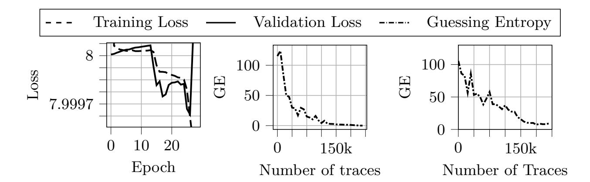

Fig. 1: Training example of a successful model on ASCADv2 dataset using Scoop [\(left\)](#page-4-1) and the corresponding guessing entropy [\(center\)](#page-4-1). Figures taken from [\[12\]](#page-22-0). Figure [right](#page-4-1) shows the GE of this model with input weights to zero.

training and validation losses decrease below the threshold corresponding to a blind guess, namely the entropy H [Y ] = 8 for an 8-bit intermediate value. This indicates that the model has reached positive *perceived information* and is supposedly able to successfully perform the attack. This is further confirmed by the guessing entropy curve in Fig. [1,](#page-4-1) showing a successful key byte recovery after around 250,000 traces.

#### **3.2 False Positive**

From the open model released by Rousselot *et al.* [\[12\]](#page-22-0), we have made analysis revealing that the results obtained on ASCADv2 were in fact a false positive. Indeed, by setting all weights of the first layer of the multi-layer perceptron (MLP) to zero (effectively removing any influence from the input traces), the guessing entropy keeps converging towards 1 (Fig. [1](#page-4-1) [\(right\)](#page-4-1)). Consequently, it seems that instead of learning effective side-channel leakage, the model built a shortcut, such as learning the prior distribution of the intermediate values bytes. Interestingly, this phenomenon was not detected by the training metrics, nor by the evaluation metrics. This raises questions about the current evaluation methodologies for DL-SCAs.

### **4 The Failure of Posterior Distinguishers based GE**

Despite being confirmed both by the convergence of the loss function, and of the guessing entropy, the attack by Rousselot *et al.* turned out to be a false positive. In this section, we investigate how this is possible, and give initial clues as to why such metrics failed in the aforementioned attack.

{5}------------------------------------------------

#### **4.1 A Critical Pitfall in DL-SCA Distinguisher**

Recall that a DL-SCA model outputs an estimation of the posterior probabilities **y**i [s] ≈ Pr(Z = s | **X** = **x**i). Following Bayes' theorem, this can be expanded as:

$$\Pr(Z = s \mid \mathbf{X} = \mathbf{x}_i) = \frac{\Pr(\mathbf{X} = \mathbf{x}_i \mid Z = s) \cdot \Pr(Z = s)}{\Pr(\mathbf{X} = \mathbf{x}_i)}.$$
 (5)

**Definition 1.** *The posterior distinguisher is the aggregation of the log-likelihoods at the outputs of the model* F*, such that*

$$\mathbf{d}_{S_a}[key] \triangleq \sum_{i=1}^{N_a} \log (\mathbf{y}_i[z_{i,key}]) \text{ where } z_{i,key} = f(p_i, key).$$
 (6)

**Proposition 1.** *Consider a SCA problem. The optimal distinguisher is:*

$$\boldsymbol{d}_{S_a}^{(opt)}[key] \triangleq \prod_{i=1}^{N_a} \Pr(\boldsymbol{X} = \boldsymbol{x}_i | Z = s)$$
 (7)

ut

*and is called the* maximum likelihood distinguisher*.*

**Lemma 1.** *Consider* F ∗ *the optimal model for a DL-SCA problem, such that* F ∗ (*x*i) = Pr(Z = s|*X* = *x*i)*. Assuming that* Z ∼ U(0, |Z|) *then*

$$d_{S_a}[key] \propto d_{S_a}^{opt}[key].$$

*Proof.* Using bayes rule we have that

$$F^*(\mathbf{x}_i) = \frac{\Pr(\mathbf{X} = \mathbf{x}_i \mid Z = s) \cdot \Pr(Z = s)}{\Pr(\mathbf{X} = \mathbf{x}_i)}.$$

Its associated posterior distinguisher is given in Eq. [\(6\)](#page-5-0). Remembering that the key recovery step provided in Eq. [\(2\)](#page-2-1), we notice that it actually acts as a *maximum a posteriori* (MAP) estimator on F ∗ (**x**i) hence the term Pr(**X** = **x**i) can be ignored. Furthermore, since Z ∼ U(0, |Z|), then Pr(Z = s) = 1/|Z| for any s hence it can be ignored as well. We indeed have that

$$\mathbf{d}_{S_a}[\ker] \propto \prod_{i=1}^{N_a} \Pr(\mathbf{X} = \mathbf{x}_i | Z = s) = \mathbf{d}_{S_a}^{\mathrm{opt}}[\ker].$$

**Corollary 1.** *(based on Lemma [1'](#page-5-1)s proof)* Z 6∼ U(0, |Z|)*, then the posterior distinguisher deviates from the, optimal, maximum likelihood distinguisher, and the prior distribution of* Z *will skew the score on the bias on intermediate values, potentially making the estimated guessing entropy converge despite no actual leakage being learned.*

{6}------------------------------------------------

This means that, under uniformity, using the output of the model as the distinguisher is the right way to approach the optimal distinguisher, this assumption can, however, be crude. This problem is exacerbated in highly-secured implementations, where the relevant information is scarce and lies in higher-order statistics of the leakage trace. In such scenarios, it might become easier for the model to minimize its loss by exploiting the label prior Pr(Z) rather than extracting the actual leakage Pr(**X** | Z), leading to deceptively low GE values. This is precisely what occurred in the ASCADv2 case study, as we have shown in Section [3.2.](#page-4-2)

#### **4.2 Toy Example**

To visualize this phenomenon, let us consider a toy example where the sensitive variable Z is a single bit. We construct a dataset where Z is biased: Pr(Z = 0) = 0.7 and Pr(Z = 1) = 0.3. Hence, the entropy of Z is H [Z] ≈ 0.88 bits. Let us consider measurements **X** that are completely independent of Z. We train a DL-SCA model F on this dataset. Since there is no actual leakage, the model cannot learn any meaningful relationship between **X** and Z. However, it can learn the prior distribution of Z, in which case its negative log-likelihood loss is:

$$\mathcal{L} = -\mathbb{E}\left[\log \Pr(Z \mid \mathbf{X})\right] = -\sum_{s \in \{0,1\}} \Pr(Z = s) \log \Pr(Z = s) = \mathbb{H}\left[Z\right] \approx 0.88$$

If the same bias is ported onto the attack dataset, then the guessing entropy

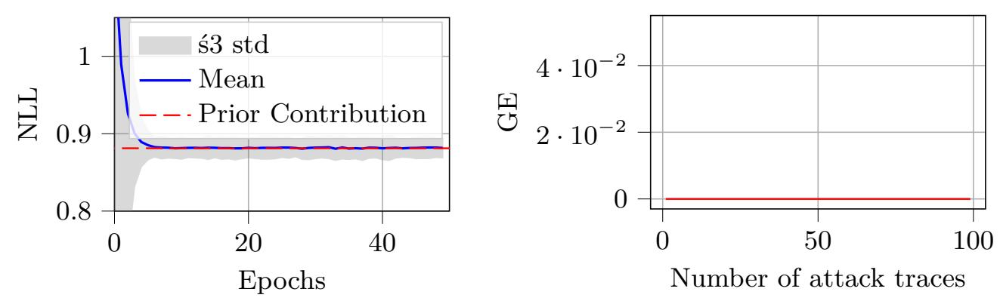

Fig. 2: Training curve of a DL-SCA model on the toy example [\(left\)](#page-6-1) and its guessing entropy [\(right\)](#page-6-1)

will yield a positive conclusion (Fig. [2\)](#page-6-1), even though the model has not learned any actual leakage information. This highlights the weakness of the posterior distinguisher to estimate the guessing entropy metric in the presence of biases in the distribution of intermediate values that have been learned.

### **5 Methodology to Detect False Positives**

In this section, we present a set of methods to warn of possible false positives in DL-SCA evaluations as well as techniques to determine when to be extra cautious 

{7}------------------------------------------------

about the results. The methods are divided into two categories: pre-emptive methods, which can be applied before the profiling phase, and post-mortem methods, which are applied after obtaining the results of the attack.

### 5.1 Pre-emptive methods

Chi-squared ( $\chi^2$ ) Uniformity Test on Intermediate Values. The  $\chi^2$  uniformity test [10] is a computationally inexpensive,  $\mathcal{O}(N_p)$ , and simple method to analyze a dataset for statistically significant biases in the distribution of the intermediate values before training a DL-SCA model. This test uses the *null hypothesis* that the intermediate values are uniformly distributed. We compute the  $\chi^2$  statistic:

$$\chi^2 = \sum_{k=0}^{|\mathcal{Z}|-1} \frac{(O_k - E_k)^2}{E_k},$$

where  $O_k$  is the observed frequency of the intermediate value  $z_k$  in the dataset, and  $E_k$  is the expected frequency under the null hypothesis (which is  $\frac{N}{|\mathcal{Z}|}$  for a uniform distribution, where N is the total number of samples and  $|\mathcal{Z}|$  is the size of the set of possible intermediate values). The computed  $\chi^2$  statistic is then compared to the critical value from the  $\chi^2$  distribution with  $|\mathcal{Z}| - 1$  degrees of freedom at a chosen significance level (e.g.,  $\alpha = 0.05$ ). If the computed statistic crosses the critical value, we reject the null hypothesis and conclude that there is a statistically significant bias in the intermediate values' distribution. This test is a sanity check that should be performed on any dataset before training a DL-SCA model, as visualizing by-hand the histograms of the intermediate values is not sufficient to detect biases. The  $\chi^2$  test provides a more rigorous and informative statistical approach. Fig. 4 (left) shows the results of the  $\chi^2$ 

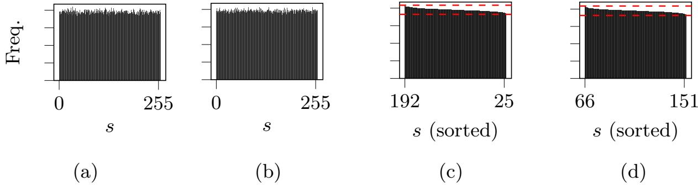

Fig. 3: Histograms of the 4-th byte (a) and 6-th byte (b) of the intermediate values in the ASCADv2 dataset. The corresponding sorted histograms are given in (c) and (d), the red dotted lines correspond to  $\pm 3\sigma$ .

test applied to the ASCADv2 dataset. For example, the 4-th byte, used as the target intermediate value in the attack from [12], shows a significant bias (p-value < 0.05), indicating its distribution is not uniform. Fig. 3 illustrates that while the 4-th byte is significantly biased and the 6-th byte is uniform, the difference is difficult to see by eye, even with sorted histograms. This highlights the necessity

{8}------------------------------------------------

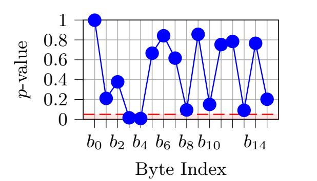

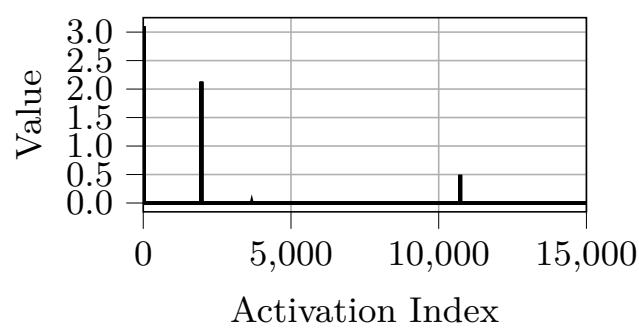

Fig. 4: Chi-squared statistic computed on the intermediate values of the AS-CADv2 dataset, the red line indicates p-value threshold (left). Average activations values over the entire ASCADv2 dataset on the biased model (right).

of using statistical tests over visual inspection. However, the  $\chi^2$  uniformity test only provides information about the *risk of bias* in the dataset and does not give any insight into whether a deep learning model would actually exploit it. If the test raises a flag for both the profiling and attack sets, it gives no information on whether those biases are similar and can potentially yield a false positive. Therefore, this method should be used as a *first step* in the analysis, but cannot be used alone to conclude on the presence of prior-based false positives.

The Null Benchmark. The null benchmark is a method that requires training a model, thus having a complexity of  $\mathcal{O}(E \cdot N_p \cdot |\Theta|)$ , where E is the number of epochs and  $|\Theta|$  is the number of parameters of the model. It essentially mimics the toy example from Section 4.2. To establish the benchmark, one sets all traces (both profiling and attack) to zero (or any constant value) and then proceeds to train and evaluate a standard DL-SCA model. This intentionally creates a baseline model that cannot learn any leakage information from the side-channel measurements. If the guessing entropy of this null benchmark model converges (i.e., a successful key rank is achieved), it is an evidence that the dataset is biased and that any DL-SCA model trained on this dataset is at risk of exploiting these biases. This gives more information than the  $\chi^2$  test as it directly indicates whether a model can exploit biases in the dataset, and more importantly, whether the attack set shares similar biases as the profiling set. Once this baseline is established, the actual training and evaluation of the DL-SCA model are performed using the original traces. If the guessing entropy of the actual model is comparable to or weaker than the null benchmark, it is likely that the model has learned to exploit the biases rather than actual leakage information. Conversely, if the actual model outperforms the null benchmark significantly, it is a good sign that the model has learned relevant leakage information. Note that learning prior information is not necessarily a failure, as long as the model also learns actual leakage information. However, like the  $\chi^2$  test, the null benchmark is agnostic to leakage information; it only assesses the susceptibility to exploiting priors.

{9}------------------------------------------------

#### **5.2 Post-mortem methods**

Once it has been trained, there exist several techniques to analyze the model and determine whether it has learned leakage information or exploited biases. Postmortem methods include all techniques that happen after a *successful* profiling, meaning when PI > 0. They are usually more informative, as they account for potential leakage information learned by the model. However, they require training a model first. Hence, in addition to their complexity, one must account for the training time of the model O (E · Np · |Θ|).

This remains however a lower estimation of the actual complexity to be accounted for, since efficient models often require hyperparameter tuning which multiplies the training complexity by a factor of T where T is the number of hyperparameter configurations tested. Hence, for the following of this section, we consider that, in addition to their own complexity, post-mortem methods have a complexity of O (T · E · Np · |Θ|).

**Activation Function Probing.** Activation Function Probing is an interpretability technique in deep learning providing insights into a model's reliance on input traces by analyzing the distribution of its internal activations. This method is computationally efficient, requiring only a forward pass, giving it a complexity of O (Na · |Θ|), where Na is the number of traces in the attack set and |Θ| is the number of model parameters. If a model has hard-coded the prior distribution of the target intermediate values into its parameters (indicating reliance on bias), it is unlikely that its activations will react significantly or change patterns when presented with different input traces. In other words, the model is invariant to the input traces.

Fig. [4](#page-8-0) [\(right\)](#page-8-0) shows the average values of the activations for the model from the Scoop attack on ASCADv2. In this case, we observe that only a few activations ever obtain positive values and these remain consistently the same, regardless of the input data. Considering there are 16 shuffled accesses to the AES' S-box in the target implementation, one would expect to see a more diverse set of activation points reacting to the input. This knowledge, particularly when combined with insights regarding the targeted countermeasures, can help assess whether the model likely learned actual leakage information or not. While not sufficient alone to conclude a false positive, it is a valuable complementary analysis that can raise suspicion regarding a model's reliance on prior biases.

**Gradient Visualization.** Gradient Visualization [\[7\]](#page-21-4) is a technique providing insights into a trained DL-SCA model's sensitivity to its input traces. It is straightforward to implement, requiring only one backward pass per trace, giving it a complexity of roughly O (Na · |Θ|), where Na is the number of traces in the attack set and |Θ| is the number of model parameters. The method consists in computing the gradient of the loss function (L) with respect to the input traces (x). This gradient indicates which parts of the input traces the output prediction is the most sensitive to. To determine the areas of sensitivity, one visualizes 

{10}------------------------------------------------

the local maxima in |GradVis(x)| over a set of input traces x. If the model has learned actual leakage, we expect to see local maxima corresponding to points in time when the side-channel leakage is significant. Conversely, if the model has exploited biases, the gradient visualization may show a flat or noisy profile, or highlight irrelevant parts of the trace.

Gradient visualization can assess whether the model learned actual leakage information or not when supplemented with an expert analysis, such as an *ANOVA* analysis. However, this supplementary requirement is a limitation, especially in protected implementations where it requires the evaluator to be in a *worst-case* setting (practitioner has access to shares during the profiling), which may not be possible or practical in reality. Moreover, when used, one must pay attention to confirmation bias, as gradient visualization can be subjective. Also, it can happen that the gradient visualization is very noisy for an actually valid model. This tool is a sufficient but not a necessary condition to verify the soundness of a model.

To understand the use of gradient visualization, we compare its application to ASCADv1 and ASCADv2. The ASCADv1 dataset [\[1\]](#page-21-7) is a set of measurements from a first-order masked AES implementation. This dataset does not present any particular learning challenges, and previous results show that state-of-the-art attacks do not fall under the influence of a bias and learn actual leakages [\[7\]](#page-21-4). Fig. [5](#page-10-0) shows the gradient visualization on the models described in [\[12\]](#page-22-0) on both ASCADv1 [\(left\)](#page-10-0) and ASCADv2 [\(right\)](#page-10-0). We see that for the ASCADv1 model, the absolute gradients' amplitude match correctly with the ANOVA analysis of the masking shares as shown in [\[1\]](#page-21-7), confirming that the model indeed detected the higher-order leakage. Conversely, for the ASCADv2 model, the gradient visualization only shows noise, and does not match the analysis in [\[9\]](#page-22-1).

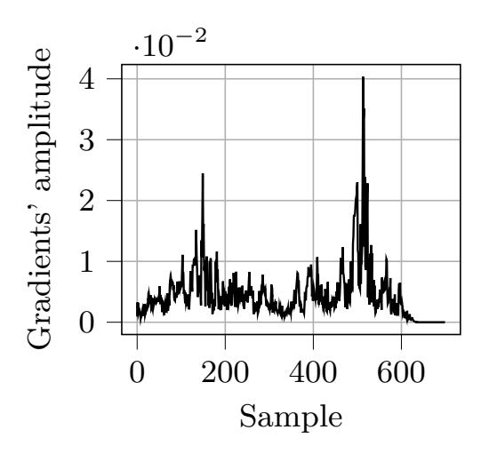

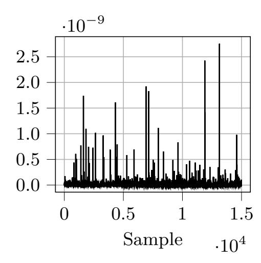

Fig. 5: Gradient visualization of a valid model on ASCADv1 [\(left\)](#page-10-0) and on ASCADv2 [\(right\)](#page-10-0).

**Model Ablation.** Model ablation is not new in DL-SCA [\[13\]](#page-22-3). Here, we specifically target the input layer for biases detection. It is one of the most decisive

{11}------------------------------------------------

post-mortem analyzes for validating DL-SCA models and was the deciding factor in identifying the ASCADv2 false positive (Section [3.2,](#page-4-2) Fig. [1](#page-4-1) [\(right\)](#page-4-1) ). This technique verifies the fundamental dependency of the model's predictions on the input side-channel traces. The overall complexity of model ablation is O (Na (|Θ| + |K|)), which involves three steps: forcing weights of a layer to zero (O(|Θ|)), one inference on the attack set (O(Na · |Θ|)), and finally computing the guessing entropy (O(Na · |K|)). Although it is costlier than previous methods, it can definitively quantify the extent to which the model relies on the input traces for its predictions.

In a DL-SCA context, a model F maps a trace xi to a probability vector **y**. If the model has learned actual leakage, the prediction must depend heavily on xi . However, if the model is exploiting a prior distribution bias, the specific values of xi become irrelevant, as the "shortcut" prior information is encoded in the biases and weights of the subsequent layers. To test this, we propose to do a model ablation. Let W(1) be the weight matrix connecting the input layer to the first hidden layer. We construct a modified (ablated) model F 0 where W(1) ← 0. By setting these weights to zero, we effectively sever the link between the side-channel measurements and the network's decision capability. We then compute the guessing entropy (GE) using this ablated model on the attack set.

- **–** *Convergence (False Positive):* If the guessing entropy still converges towards the correct key (as previously shown in Section [3.1\)](#page-4-1), the model has undoubtedly failed to learn side-channel leakage. This proves that the predictions are generated solely from the internal parameters of the network, mimicking the dataset's statistical prior.
- **–** *Random Guessing (Valid Learning):* If the guessing entropy does not converge, it confirms that the original model required the input traces to make its predictions. While this does not guarantee the model is efficient, it confirms that it is not purely making hallucinations based on priors.

**Prediction Entropy.** Analyzing the entropy of the prediction vectors provided by the Softmax layer offers insight into the model's confidence and, crucially, if it is invariant to input data. For a given trace **x**i , the prediction entropy is defined as the Shannon entropy of the output probability vector **y**i :

$$\mathbb{H}\left[\mathbf{y}_i\right] = -\sum_{s \in \mathcal{Z}} \mathbf{y}_i[s] \log_2(\mathbf{y}_i[s]).$$

Prediction entropy requires one forward pass on the attack set (O(Na · |Θ|)) and then computing the entropy for each trace (O(Na · |Z|)). Hence, its overall complexity is O (Na (|Θ| + |Z|)). When a model F learns to exploit a static prior distribution (bias) rather than dynamic leakage, it tends to output a constant probability vector **y**bias regardless of the input **x**i . This vector approximates the distribution of the training labels Pr(Z). Consequently, a model trained on a biased dataset often exhibits two distinct characteristics in its prediction entropy:

{12}------------------------------------------------

- 1. Static Entropy Value: The entropy  $\mathbb{H}[\mathbf{y}_i]$  for every trace  $\mathbf{x}_i$  will be approximately equal to the entropy of the target label's prior distribution.
- 2. Zero Variance: The variance of the entropy across the attack set will be negligible. Since the model ignores the input variations (noise and signal), it outputs the same "safe" guess for every query.

In contrast, a model learning actual leakage usually exhibits higher variance in prediction entropy. The model may be highly confident (low entropy) on traces with high Signal-to-Noise Ratio (SNR) and uncertain (high entropy) on noisy traces. Therefore, observing a flat, invariant entropy profile across the attack set  $S_a$  is a strong indicator of a bias-based false positive. Additionally, if the entropy falls to zero, it can indicate overfitting.

Table 1 shows the prediction entropy of both models (on ASCADv1 and ASCADv2) at the end of their training. More precisely, it compares 1. the expected entropy of the predictions for a given trace  $\mathbf{x}_i$ , 2. the variance of the predictions (*i.e.* how much does the predictions change w.r.t. to a change of  $\mathbf{x}_i$ ) and 3. the entropy of the distribution of the predicted label.

Looking at these results, we see that the model trained on ASCADv2 has a much lower prediction variability, and that taking the arg max of these predictions, we see that few labels are actually predicted by the model. Noting that both ASCADv1 and ASCADv2 have 8-bit labels, and both have uniformity assumptions on them, they should behave similarly. The narrow behavior of the ASCADv2 model is an anomaly, and helps us flag it as a false positive.

Table 1: Prediction entropy after training using the models in [12] on ASCADv1 (VGG-like CNN model) and ASCADv2

|         | $\Big  \mathbb{E} \left[ \mathbb{H} \left[ Y \right] \right]$ | $\big  \mathbb{V}\left[ Y \right] \big $ | H | $\left[\arg \max \tilde{Y}\right]$ |
|---------|---------------------------------------------------------------|------------------------------------------|---|------------------------------------|
| ASCADv1 |                                                               |                                          |   | 4.2202                             |
| ASCADv2 | 3.5686                                                        | 0.0003                                   |   | 0.0265                             |

### 6 Limitations of Guessing Entropy and Robust Solutions

The guessing entropy (Eq. (4)) cannot be exactly computed, and instead we rely on an empirical estimation as we have a limited observation set  $S_a$ . Furthermore, relying solely on  $\mathbf{y}[z_{i,\text{key}}]$ , as explained in Section 4, exposes the rank function, and consequently the guessing entropy, to false positives.

#### 6.1 Asymptotic Regimes to the Guessing Entropy

As for all estimators, we can verify some properties on the empirical estimator of the guessing entropy. In this section, we investigate its convergence. Let  $\mathcal{C} =$ 

{13}------------------------------------------------

 $\{S'_1, S'_2, \ldots, S'_n\}$  be a specific collection of n subsets of  $S_a$ . Then the estimation of Eq. (4) is computed

$$\widehat{GE}(N_a) = \frac{1}{n} \sum_{S_i' \in \mathcal{C}} g_{S_i'}(k^*). \tag{8}$$

It is important to know some commonly made assumptions on  $\mathcal{C}$ : (i) For any subsets  $S'_i$  and  $S'_j$  of the same collection  $\mathcal{C}$ ,  $|S'_i| = |S'_j|$ , (ii)  $\mathcal{C}$  is not necessary a partition of  $S_a$ , (iii) it is actually neither exclusive nor exhaustive.

**Theorem 1.** From these assumptions, it is observed that if  $|S'_i| = N_a$ , then  $\forall i \in \{0, ..., n\}, S'_i = S_a$ . Consequently, Eq. (8) is not a converging estimator:

$$\lim_{n \to +\infty} \hat{\mathrm{GE}}(N_a) \neq \mathrm{GE}(N_a)$$

*Proof.* Let  $C = \{S'_1, S'_2, \dots, S'_n\}$  such that  $|S'_i| = N_a$ . We then have that  $\forall i \in \{0, \dots, n\}, S'_i = S_a$ . Hence, and remembering that n = |C|, we have

$$\forall n \in \mathbb{N}^+, \hat{GE}(N_a) = g_{S_i'}(k^*) \Rightarrow \lim_{n \to +\infty} \hat{GE}(N_a) = g_{S_a}(k^*) \neq GE(N_a).$$

Thm. 1 indicates that the guessing entropy behaves like the rank metric. This is problematic as there is a non-zero probability that the rank is equal to one whereas the *exact* guessing entropy would not converge in  $N_a$ .

Example 1. Let us consider an arbitrary statistical model F outputting predictions  $\mathbf{y}_i$  such that  $\forall i \in 1, \ldots, N_a, i \neq k^*, \mathbf{y}_i[z_{i,\text{key}}] \sim \mathcal{N}(0,1)$  and  $\Pr[\mathbf{y}_i[z_{i,k^*}] \sim \mathcal{N}(0.02,1)] = 0.51$  otherwise  $\mathbf{y}_i[z_{i,k^*}] \sim \mathcal{N}(-0.02,1)$ . This corresponds to a model that has a slight tendency to output higher values for the correct key hypothesis (51% of the time), but on the remaining 49% of the time, it outputs lower values. We consider two attack sets  $S_a^{(1)}$  and  $S_a^{(2)}$  such that  $|S_a^{(1)}| \gg |S_a^{(2)}|$ . Let  $\mathcal{C} = \{S_1', S_2', \ldots, S_n'\}$  such that for any subset  $S_i'$ , we have that  $|S_i'| = |S_a^{(2)}|$ .

An illustration of the guessing entropy computed on both attack sets is given in Fig. 6 (left). We can see that even though the model has a slight advantage for the correct key hypothesis, the guessing entropy computed on the bigger attack set does not converge, whereas the one computed on the smaller attack set converges. This is despite both experiments being repeated and averaged 500 times. This shows the non-converging behavior of the GE under Thm. 1.

This is actually problematic as in most DL-SCA evaluations, the attack set is constrained by the available data. Hence, if the leakage is weak, and an attacker would require the entire available data to recover the key, which was the case for Rousselot *et al.* [12], then the guessing entropy becomes unreliable and can yield false positives.

A valid question is then: how big can be the attack subsets  $S_i'$  for  $\hat{GE}$  to be a good estimator of GE? Theoretically answering this question goes beyond the

{14}------------------------------------------------

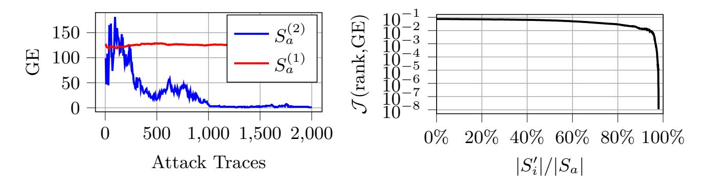

Fig. 6: Guessing entropy for a bigger attack set  $(S'_1)$  and a smaller on  $(S'_2)$  (left). Convergence of the guessing entropy to the rank as the attack set becomes more and more constrained (right).

scope of this paper, but we can provide empirical evidence. Fig. 6 (right) shows the convergence of the guessing entropy towards the rank as the size of the attack set becomes closer and closer to  $|S_i'|$ . We can see that, asymptotically, the guessing entropy converges to the rank as per Thm. 1. The main inflection point seems to be around when  $|S_i'|$  is 30% of  $|S_a|$ . A conservative rule of thumb could hence be to ensure that  $|S_i'| \leq 0.1 \cdot |S_a|$  to ensure that the guessing entropy remains a reliable metric.

### 6.2 From Posterior to Optimal Distinguisher

To mitigate the risk of false positives in DL-SCA evaluations it is essential to design metrics that are agnostic to the prior distribution of the sensitive variable. In this section, we propose adjusting the *distinguisher* itself. This adjustment accounts for potential biases in the model's predictions caused by non-uniform prior distributions. As seen in Section 4, the classical way of using the GE in DL-SCA is relying on the posterior distinguisher, which opens the way to false positives. Ideally, the scoring function should rely purely on the data likelihood  $Pr(\mathbf{X} = \mathbf{x}_i \mid Z = s)$ , *i.e.* on the maximum likelihood distinguisher. It exclusively reflects the actual leakage information independent of the label distribution.

**Theorem 2.** (Asymptotically Optimal Distinguisher (AOD)) Let  $\mathbf{y}_i$  be the prediction vector of a DL-SCA model for attack trace  $\mathbf{x}_i$ . The Asymptotically Optimal Distinguisher (AOD) for a key hypothesis key is computed by aggregating the log-likelihoods normalized by the prior probability of the attack dataset:

$$\mathbf{d}_{S_a}^{(\text{AOD})}[\text{key}] \triangleq \sum_{i=1}^{N_a} \log \left( \frac{\mathbf{y}_i[z_{i,\text{key}}]}{\Pr(Z = z_{i,\text{key}})} \right)$$

where  $z_{i,\text{key}} = f(p_i,\text{key})$  is the hypothetical intermediate value, and  $\Pr(Z = z_{i,\text{key}})$  represents the empirical prior probability of the intermediate value in the attack dataset. This aggregation effectively removes the influence of the learned prior distribution, focusing solely on the data likelihood.

{15}------------------------------------------------

*Proof.* By Bayes' theorem, the data likelihood given the sensitive variable is:

$$\Pr(\mathbf{X} = \mathbf{x}_i \mid Z = s) = \frac{\Pr(Z = s \mid \mathbf{X} = \mathbf{x}_i) \cdot \Pr(\mathbf{X} = \mathbf{x}_i)}{\Pr(Z = s)}.$$

When comparing scores for different key hypotheses, the term Pr(**X** = **x**i) acts as a constant offset in the logarithmic domain and does not affect the ranking. Therefore, to maximize the data likelihood, we can maximize the ratio of the posterior to the prior. Substituting the model's output **y**i [s] for the posterior, the distinguisher becomes:

$$\mathbf{d}_{S_a}^{(\text{AOD})}[\text{key}] = \sum_{i=1}^{N_a} \log \left( \frac{\mathbf{y}_i[z_{i,\text{key}}]}{\Pr(Z = z_{i,\text{key}})} \right).$$

This adjustment neutralizes the weight of the prior Pr(Z = zi,key), ensuring the distinguisher reflects only the likelihood Pr(**X** | Z), which is the true indicator of side-channel leakage. ut

**Theorem 3.** *Consider a model* F *on which we evaluate the guessing entropy on a set of* Na *traces. We suppose that* limNa→+∞ F = F ∗ *. Under this assumption, the asymptotically optimal distinguisher is an unbiased estimator of the optimal distinguisher:*

$$\mathbb{E}\left[\boldsymbol{d}_{S_a}^{(AOD)}[key]\right] \propto \boldsymbol{d}_{S_a}^{(opt)}[key]$$

*Proof.*

$$\lim_{N_a \to +\infty} \mathbb{E}\left[\mathbf{d}_{S_a}^{(\text{AOD})}[\text{key}]\right] = \prod_{i=1}^{N_a} \frac{F^*(\mathbf{x}_i)}{\Pr(Z=s)} = \prod_{i=1}^{N_a} \frac{\Pr(\mathbf{X} = \mathbf{x}_i | Z=s)}{\Pr(\mathbf{X} = \mathbf{x}_i)}$$

Recalling that the key recovery process is essentially a MAP estimation on **d** (AOD) Sa [key], we indeed observe that:

$$\lim_{N_a \to +\infty} \mathbb{E}\left[\mathbf{d}_{S_a}^{(\text{AOD})}[\text{key}]\right] \propto \prod_{i=1}^{N_a} \Pr(\mathbf{X} = \mathbf{x}_i | Z = s) = \mathbf{d}_{S_a}^{(\text{opt})}[\text{key}]$$

ut

The standard Guessing Entropy GE(Na) is then computed using this improved distinguisher to determine the rank. Since the empirical prior Pr(Z = zi,key) only depends on the attack set, it is lightweight to estimate (O(Na)) or to compute. Hence, its overall complexity is O (Np + Na · |K|). Given an initial implementation of the guessing entropy, its implementation is straightforward. It provably removes any learned prior distribution from the scoring function, hence preventing prior-based false positives. However, it does not yield any information on a false positive or not. To observe its effect, one must compare it to the posterior based guessing entropy, or couple it with pre-emptive or post-mortem methods (Sections [5.1](#page-7-1) and [5.2\)](#page-9-0).

{16}------------------------------------------------

**AOD** on **ASCADv1**. On ASCADv1 dataset [1], it has been demonstrated that state-of-the-art DL-SCA models exploit actual leakage information within the traces [7]. In this particular case, we expect the guessing entropy with improved distinguisher to behave similarly to the standard guessing entropy. Fig. 7 (left) illustrates this, as both metrics yield comparable results, confirming that the model does rely on genuine leakage information.

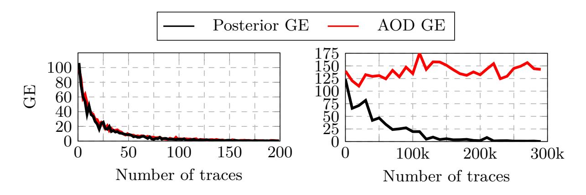

Fig. 7: Distinguisher comparison on ASCADv1 (left) and on ASCADv2 (right)

AOD on ASCADv2. We have demonstrated that the model trained on ASCADv2 exploited biases in the intermediate values' distribution rather than learning actual leakage information. Therefore, we expect the AOD-based guessing entropy to reflect this by not converging, as it removes the influence of learned priors. Fig. 7 (right) shows the AOD-based guessing entropy computed on the model trained on ASCADv2. As expected, it does not converge, confirming that the model did not learn any actual leakage information, but rather exploited biases in the intermediate values' distribution. This empirically validates the effectiveness of the AOD in detecting biased-prior based false positives in DL-SCA evaluations.

### 7 Crafting a biased dataset: ASCADv1

ASCADv2 is currently the only known dataset exhibiting these bias artifacts. To extend our experiments to other datasets we propose to synthetically inject bias in an already well-known dataset: ASCADv1. We create three different biased datasets (both for  $S_a$  and  $S_p$ ) which are biased subset of ASCADv1 such as their labels  $z \in \mathcal{Z}$  follow a univariate discrete gaussian distribution  $\mathcal{N}(\mu, \sigma^2)$  truncated to [0, 255]. When  $\mu = 127$  and  $\sigma \to +\infty$ , we recover the original distribution of ASCADv1. The three bias configurations are:

- Low bias:  $\mu = 127$ ,  $\sigma = 128$ . This corresponds to  $PI_{prior} < PI_{opt}$ .
- Medium bias:  $\mu = 127$ ,  $\sigma = 64$ . This corresponds to  $PI_{prior} \approx PI_{opt}$ .
- High bias:  $\mu = 127$ ,  $\sigma = 16$ . This corresponds to  $PI_{prior} > PI_{opt}$ .

{17}------------------------------------------------

To create these subdatasets, we sample traces from the original ASCADv1 dataset according to the desired distribution until we reach the desired number of traces. An illustration of the different distributions as well as the original histogram of ASCADv1 is shown in Fig. 8.

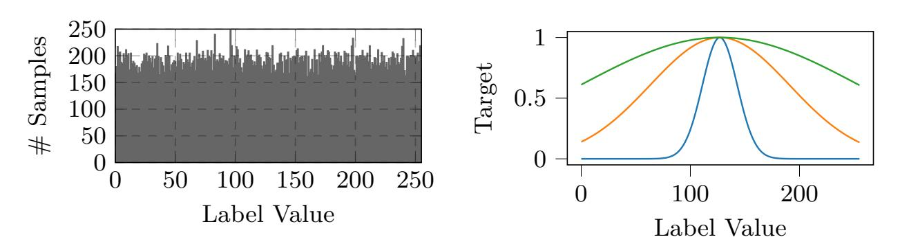

Fig. 8: Histogram of the labels of ASCADv1 (left) and the three targeted biased histograms (right). For right, the green curve corresponds to  $\sigma = 128$ , the orange to  $\sigma = 64$ , and the blue to  $\sigma = 16$ .

#### 7.1 Pre-emptive analysis

We have seen two pre-emptive methods to detect biases in a dataset: the  $\chi^2$  test and the null benchmark. We apply both methods to our biased versions of ASCADv1. A summary of these methods are given in Table 2. We can see that the  $\chi^2$  test successfully detects the biases in all three biased datasets. However, we see it raises a flag for the profiling set of the original ASCADv1 dataset. It seems that the  $\chi^2$  test is quite sensitive and can detect even slight empirical biases. The null benchmark, on the other hand, only raises a flag when the bias is present and identical in both the profiling and attack sets. It, however, does not raise a flag when the bias is only present in the profiling set, for any level of bias.

Table 2: Pre-emptive methods for risk detection on biased versions of ASCADv1.  $\boldsymbol{\mathsf{X}}$  means the test fails and non-uniformity is suspected, and conversely for  $\boldsymbol{\mathsf{V}}$ .

| Subdataset  | $\chi^2 \mathbf{T}$ | 'est   | Null Benchmark |                    |  |
|-------------|---------------------|--------|----------------|--------------------|--|
|             | Profiling           | Attack | Profiling      | Profiling + Attack |  |
| Original    | Х                   | ✓      |                | ✓                  |  |
| Low bias    | Х                   | Х      | ✓              | X                  |  |
| Medium bias | X                   | X      | ✓              | X                  |  |
| High bias   | X                   | X      | ✓              | X                  |  |

{18}------------------------------------------------

#### **7.2 Post-Mortem Methods**

Post-mortem methods require training the model first. Fig. [9](#page-18-0) illustrates the training curves of a multi-layer perceptron (MLP) trained on the different biased versions of ASCADv1. On the [left,](#page-18-0) we see the results when the bias is only on the profiling set, while on the [right,](#page-18-0) we see the results when the same bias is both on the profiling and attack sets. For the low bias, we see that on both [left](#page-18-0) and [right](#page-18-0) the training curves match correctly with the original baseline, indicating that the model seems to have learned the true leakage. For the medium bias, it is harder to conclude as both figures return conflicting messages. On the [left,](#page-18-0) the training curves show overfitting, and on the [right](#page-18-0) it shows similar pattern to the original baseline. For the high bias however, we don't see the training curves on the [left](#page-18-0) as they are out of the observation window. The training curve is much lower, and the validation curve is much higher, indicating high overfitting. This is confirmed on the [right](#page-18-0) where we see that PI PIopt, which is not possible. Hence, the model seems to fail learning leakage in this high bias setting.

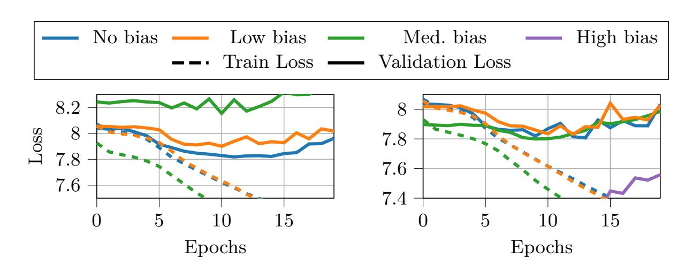

Fig. 9: Training curves of a model with different bias level on ASCADv1. [left](#page-18-0) shows the result where the bias is only on the profiling dataset, and [right](#page-18-0) shows the results where the bias is both on the profiling and attack dataset.

Table [3](#page-19-0) summarizes the results of the post-mortem methods on the biased versions of ASCADv1. We can see that all methods successfully detect the high bias scenario, where the model clearly overfits to the bias rather than learning actual leakage information. However, they fail to raise a flag on the medium and low bias scenarios. Only the model ablation allows to detect the medium bias scenario. In Section [7.3](#page-19-1) we see that, under the presence of a medium bias, the model actually learns both the prior distribution and the leakage. Model ablation effectively separates the leakage information from the bias allowing detection even in this mixed case. We see that these methods not only yield different results, but also different levels of information, and they are ideally used together to provide a complete overview of the bias analysis.

{19}------------------------------------------------

X

| Subdataset  | Grad. | Vis. | Ablation | Activations | Predictions Entropy |
|-------------|-------|------|----------|-------------|---------------------|
| Original    | ✓     |      | <b>√</b> | ✓           | <b>✓</b>            |
| Low bias    | ✓     |      | ✓        | ✓           | ✓                   |
| Medium bias | ✓     |      | X        | <b>√</b>    | ✓                   |

X

X

X

Table 3: Post-mortem methods comparison on biased versions of ASCADv1.

#### 7.3 AOD-GE

High bias

When using the AOD to compute the guessing entropy on the biased datasets, we obtain the results shown in Fig. 10. The figure on the left shows the results when the bias is only on the profiling set, while the figure on the right shows the results when the bias is both on the profiling and attack sets. When the bias is low, we see no difference between posterior and AOD guessing entropy, and both bias configurations yield similar results. When the bias is medium, we see a slight degradation of both methods, but they remain comparable. Finally, when the bias is high, we see a significant divergence between them: while the posterior guessing entropy converges quickly (as the same bias is extended to the attack dataset), the AOD one fails to converge, indicating that the model has learned to exploit the bias rather than actual leakage information.

When the bias is only on the profiling set (left), we see that both methods behave similarly across all bias levels. This indicates that when the attack set does not share the same bias as the profiling set, the model cannot exploit it effectively, and using both distinguishers yield comparable results.

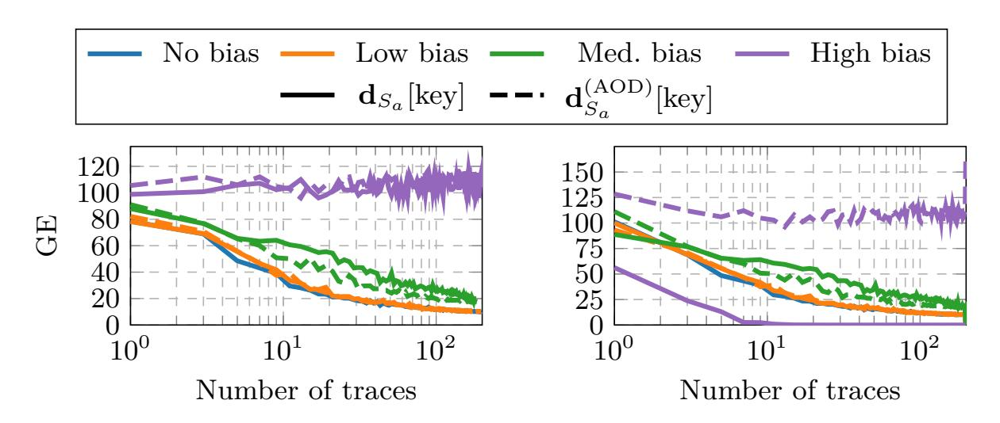

Fig. 10: Guessing entropy the aformentioned model on ASCADv1. left shows the results where the bias is only on the profiling dataset, and right shows the results where the bias is both on the profiling and attack dataset.

{20}------------------------------------------------

Table 4: Comparison of methods for detecting and mitigating prior-based false positives. Note that for Post-mortem methods, the complexity listed is for the analysis step only; they implicitly require a trained model  $(\mathcal{O}(T \cdot E \cdot N_p \cdot |\Theta|))$ .

| Methods                           | Complexity                                   | Assess False Positive | Assess True Positive | Practicality          | Efficiency            |
|-----------------------------------|----------------------------------------------|--------------------------|-------------------------|-----------------------|-----------------------|
| $\overline{\textit{Pre-emptive}}$ |                                              |                          |                         |                       |                       |
| $\chi^2$ Test                     | $\mathcal{O}(N_p)$                           | Risk Only                | X                       | High                  | Very High             |
| Null Benchmark                    | $\mathcal{O}(E \cdot N_p \cdot  \Theta )$    | ✓                        | ×                       | Medium                | Low                   |
| Post-mortem                       |                                              |                          |                         |                       |                       |
| Gradient Vis.                     | $\mathcal{O}(N_a\cdot \Theta )$              | X                        | <b>✓</b> *              | Medium                | Moderate              |
| Activation Probing                | $\mathcal{O}(N_a \cdot  \Theta )$            | ✓                        | <b>✓</b> *              | Low                   | $\operatorname{High}$ |
| Model Ablation                    | $\mathcal{O}(N_a( \Theta  +  \mathcal{K} ))$ | ✓                        | ✓                       | $\operatorname{High}$ | Moderate              |
| Prediction Entropy                | $\mathcal{O}(N_a( \Theta + \mathcal{Z} ))$   | ✓                        | ×                       | Very High             | High                  |
| $\overline{Remedial}$             |                                              |                          |                         |                       |                       |
| AOD-GE                            | $\mathcal{O}(N_p + N_a \cdot  \mathcal{K} )$ | <b>X</b> †    | ✓                       | Very High             | Very High             |

\* Requires expert analysis / domain knowledge.

#### 8 Discussion

Table 4 summarizes the different methods presented in this work, along with their complexity, their ability to assess false positives and true positives, as well as their practicality and efficiency. The last two criteria are subjective and depend on the evaluator's expertise, and in the data available as it highly depends on  $N_a, N_p$ , etc. We evaluated them based on our own experience and experiments done in this work. Interestingly, no method stands out as the clear winner. Pre-emptive methods are practical and efficient, but lack informativeness. Post-mortem methods are more informative, but require training a model first, and sometimes expert analysis. Finally, the AOD method is efficient and practical, it does not detect false positives, but mitigates them. Hence, a combination of methods is advised to both detect and mitigate prior-based false positives in DL-SCA evaluations. While the choice of method ultimately depends on the specific context and requirements of the evaluation, the asymptotically optimal distinguisher for guessing entropy seems to be unavoidable to ensure reliable and trustworthy results in the presence of potential biases in the dataset.

#### 9 Conclusion

In this work, we investigated an underlying critical flaw in the current evaluation methodology of Deep Learning-based Side-Channel Attacks. Through the analysis of a false positive on the ASCADv2 dataset, we demonstrated that state-of-the-art models can achieve successful key recovery according to classic metrics without learning any actual side-channel leakage. Instead, these models exploit subtle statistical biases in the intermediate value distribution: a *shortcut* that classic

 $^\dagger$  Does not detect FPs, but mitigates/prevents them.

{21}------------------------------------------------

scoring fails to penalize. We showed that this phenomenon is likely to happen when the genuine leakage signal is weak and the path of the least resistance for the optimizer can be the dataset bias, as it is the case in higher-order masked implementations

To address this, we proposed a more rigorous evaluation approach. We introduced pre-emptive sanity checks, including the χ 2 test and the Null Benchmark, to flag risky datasets before profiling begins. We detailed post-mortem analysis techniques, such as input layer ablation and prediction entropy monitoring, to verify the soundness of a model's predictions. Finally, we derived the *Asymptotically Optimal Distinguisher*, a modified scoring function that mathematically neutralizes the influence of learned priors, making the guessing entropy robust to learned biases. We validated this metric on both ASCADv1 and ASCADv2, showing that it correctly distinguishes between true leakage exploitation and bias overfitting. Finally, all the results were replicated on synthetically biased versions of ASCADv1 to further validate the different methods.

We argue that the community must move beyond the posterior distinguisher for the guessing entropy as the sole indicator of success. Future evaluations of DL-SCA, especially on protected implementations, should systematically report bias metrics and utilize AOD or any prior agnostic distinguisher to ensure the validity of the attacks.

# **References**

- 1. Benadjila, R., Prouff, E., Strullu, R., Cagli, E., Dumas, C.: Deep learning for side-channel analysis and introduction to ascad database. Journal of Cryptographic Engineering **10**(2), 163–188 (2020)
- 2. Fumaroli, G., Martinelli, A., Prouff, E., Rivain, M.: Affine masking against higherorder side channel analysis. In: International Workshop on Selected Areas in Cryptography. pp. 262–280. Springer (2010)
- 3. Hornik, K., Stinchcombe, M., White, H.: Multilayer feedforward networks are universal approximators. Neural networks **2**(5), 359–366 (1989)
- 4. Kocher, P., Jaffe, J., Jun, B., et al.: Introduction to differential power analysis and related attacks (1998)
- 5. Maghrebi, H., Portigliatti, T., Prouff, E.: Breaking cryptographic implementations using deep learning techniques. In: International Conference on Security, Privacy, and Applied Cryptography Engineering. pp. 3–26. Springer (2016)
- 6. Masure, L., Cristiani, V., Lecomte, M., Standaert, F.X.: Dont learn what you already know: Scheme-aware modeling for profiling side-channel analysis against masking. IACR Transactions on Cryptographic Hardware and Embedded Systems pp. 32–59 (2023)
- 7. Masure, L., Dumas, C., Prouff, E.: Gradient visualization for general characterization in profiling attacks. In: International Workshop on constructive side-channel analysis and secure design. pp. 145–167. Springer (2019)
- 8. Masure, L., Dumas, C., Prouff, E.: A comprehensive study of deep learning for sidechannel analysis. IACR Transactions on Cryptographic Hardware and Embedded Systems pp. 348–375 (2020)

{22}------------------------------------------------

- 9. Masure, L., Strullu, R.: Side-channel analysis against anssis protected aes implementation on arm: end-to-end attacks with multi-task learning. Journal of Cryptographic Engineering **13**(2), 129–147 (2023)
- 10. Pearson, K.: X. on the criterion that a given system of deviations from the probable in the case of a correlated system of variables is such that it can be reasonably supposed to have arisen from random sampling. The London, Edinburgh, and Dublin Philosophical Magazine and Journal of Science **50**(302), 157–175 (1900)
- 11. Picek, S., Heuser, A., Jovic, A., Bhasin, S., Regazzoni, F.: The curse of class imbalance and conflicting metrics with machine learning for side-channel evaluations. IACR Transactions on Cryptographic Hardware and Embedded Systems pp. 209–237 (2019)
- 12. Rousselot, N., Heydemann, K., Masure, L., Migairou, V.: Scoop: An optimizer for profiling attacks against higher-order masking. Cryptology ePrint Archive (2025)
- 13. Wu, L., Won, Y.S., Jap, D., Perin, G., Bhasin, S., Picek, S.: Ablation analysis for multi-device deep learning-based physical side-channel analysis. IEEE Transactions on Dependable and Secure Computing **21**(3), 1331–1341 (2023)