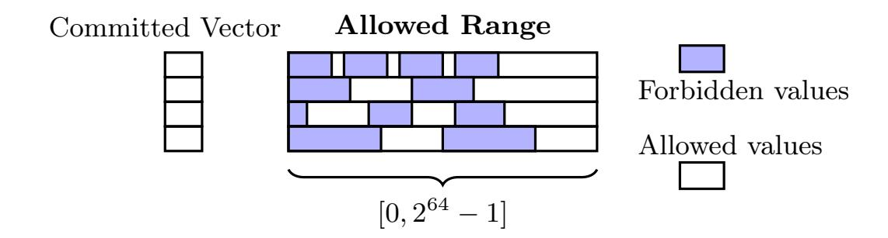
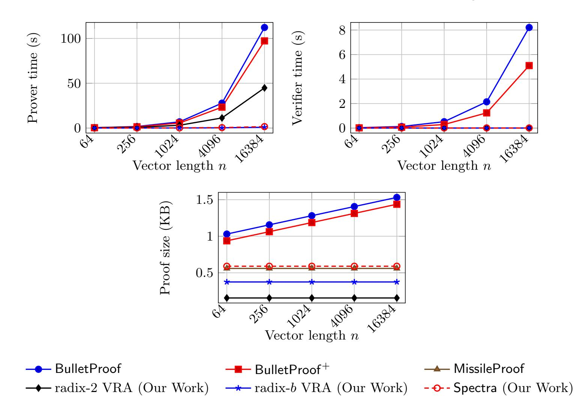
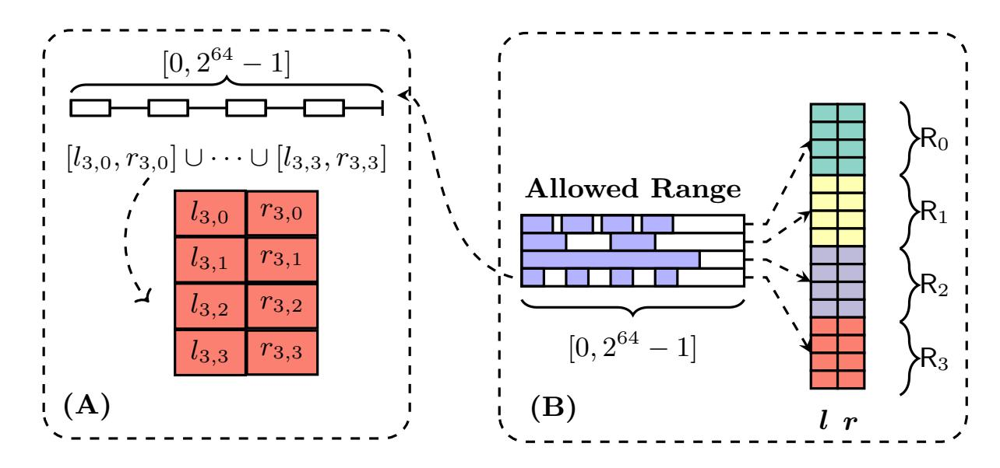
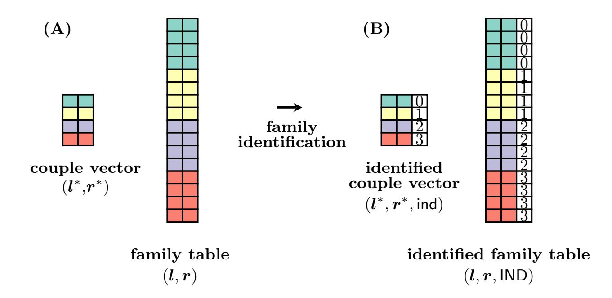
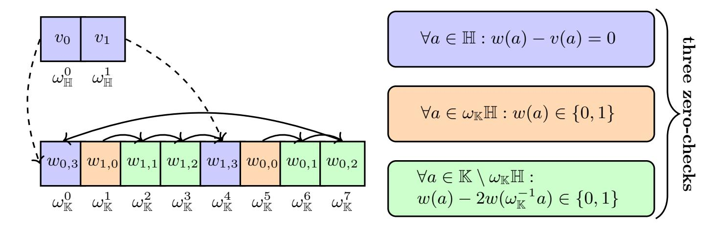

{0}------------------------------------------------

## Spectra: Interval-Agnostic Vector Range Argument for Unstructured Range Assertions

 $\begin{array}{c} \text{Hao Gao}^{1,2[0009-0002-9747-8213]}, \text{ Qianhong Wu}^{1,2[0000-0003-4604-1142]}, \\ \text{Bo Qin}^{3\star[0000-0002-9548-8306]}, \text{ Fudong Wu}^{1,2[0009-0007-7929-7212]}, \\ \text{Zhenyang Ding}^{1[0009-0005-3190-2204]}, \text{ and Zhiguo Wan}^{4[0000-0003-1319-1224]} \end{array}$ 

- <sup>1</sup> School of Cyber Science and Technology of Beihang University, Beijing, China {haogao, qianhong.wu, wufudong, 18231193}@buaa.edu.cn
  - <sup>2</sup> Hangzhou Innovation Institute of Beihang University, Hangzhou, China <sup>3</sup> Renmin University of China, Beijing, China

bo.qin@ruc.edu.cn

4 Hangzhou Normal University, Hangzhou, China
wanzhiguo@gmail.com

Abstract. A structured vector range argument proves that a committed vector  $\boldsymbol{v}$  lies in a well-structured range of the form  $[0, 2^d - 1]$ . This structure makes the protocol extremely efficient, although it cannot handle more sophisticated range assertions, such as those arising from nonmembership attestations. To address this gap, we study a more general setting not captured by prior constructions. In this setting, for each i, the admissible integer set for  $v_i$  is a union of k intervals  $R_i \stackrel{\text{def}}{=} \bigcup_{j=0}^{k-1} [l_{i,j}, r_{i,j}].$ In this work, we present novel techniques to prove that  $v \in \mathbb{Z}_p^n$  lies within  $R_0 \times R_1 \times \cdots \times R_{n-1}$ . We first introduce RangeLift, a generic compiler that lifts a structured vector range argument to support such unstructured range assertions. Then we present Spectra, a realization of RangeLift over the KZG-based vector commitment scheme. Spectra achieves succinct communication and verifier time; its prover complexity is  $O\left(n \frac{\log N}{\log \log N} \cdot \log(n \frac{\log N}{\log \log N})\right)$ , where N upper bounds the maximum interval size across all  $R_i$ . Notably, Spectra is *interval-agnostic*, meaning its prover complexity is independent of the number of intervals k; therefore, its prover cost matches the single-interval case even when each  $R_i$  is composed of hundreds of thousands of intervals. We also obtain two new structured vector range arguments and a batching-friendly variant of the Cq<sup>+</sup> lookup argument (PKC'24), which are also of independent interest. Experiments show that Spectra outperforms well-known curve-based vector range arguments on standard metrics while supporting strictly more expressive range assertions.

#### 1 Introduction

Consider a regulated, privacy-preserving financial system, where for the purpose of countering the financing of terrorism (CFT), Alice must prove that her committed address is not contained in a public blacklist B. Suppose addresses are at

<sup>\*</sup> Corresponding author: bo.qin@ruc.edu.cn

{1}------------------------------------------------



<span id="page-1-0"></span>Fig. 1. Unstructured range assertion: each per-coordinate allowed range is a union of many interval segments.

most 64-bit integers and the blacklist contains hundreds of thousands of suspicious addresses. How much time does Alice need to generate such a proof ? How much time does the regulator need to verify it? And how much communication does the proof consume? In this work, our answer is:

Even for a blacklist with hundreds of thousands of suspicious addresses, the time to generate and to verify the proof is a few milliseconds, and the communication is a few hundred bytes.

Intuitively, this non-membership relation over a subset of addresses can be viewed as a highly unstructured range assertion problem. Since each address is a 64-bit sequence, proving v /∈ B is equivalent to proving v ∈ {0, 1} <sup>64</sup> \ B; for example, if B = {82, 106}, then the claim is equivalent to v ∈ [0, 81]∪[107, 2 <sup>64</sup> − 1], and when B is large, the claim becomes that v lies in a union of many non-consecutive intervals, which suggests importing techniques from the range argument literature.

The most relevant protocols in the literature are vector range arguments (VRAs). In these protocols, a prover convinces a verifier that a committed vector v ∈ Z n p lies within a public range. VRAs arise frequently in many applications, such as anonymous credentials [\[2](#page-28-0)[,8\]](#page-28-1), electronic cash [\[9,](#page-28-2)[29\]](#page-29-0), sealed-bid auctions [\[1\]](#page-28-3), and confidential cryptocurrencies [\[30\]](#page-30-0). The challenge is that most existing VRAs natively handle structured ranges; in particular, they assume the admissible integer set for each v<sup>i</sup> is of the form [0, 2 <sup>d</sup> − 1]. This structure makes the protocol very efficient, since proving v<sup>i</sup> ∈ [0, 2 <sup>d</sup> − 1] reduces to exhibiting a d-bit decomposition. We refer to these as structured VRAs.

Structured VRAs do not address the requirement of proving that v avoids an application-specific forbidden subset of [0, 2 <sup>d</sup> − 1], as demanded by CFT. Informally, to address such a requirement, we are seeking an argument of knowledge (AoK) that handles the relation

$$\mathcal{R}_{\mathsf{unstructured}} \stackrel{\mathrm{def}}{=} \big\{ (C; \, \boldsymbol{v} \in \mathbb{Z}_p^{\, n}) \, \, \big| \, \, C = \mathsf{Commit}(\boldsymbol{v}) \, \, \wedge \, \, \boldsymbol{v} \in \mathsf{R}_0 \times \dots \times \mathsf{R}_{n-1} \big\}, \quad (1)$$

where each per-coordinate admissible set R<sup>i</sup> is a union of k arbitrary closed intervals,

$$R_i \stackrel{\text{def}}{=} \bigcup_{j=0}^{k-1} [l_{i,j}, r_{i,j}].$$
 (2)

{2}------------------------------------------------

We refer to such integer sets as unstructured ranges; the structured setting is the special case  $R_i = [0, 2^d - 1]$  for all i. We refer to an argument of knowledge that handles  $\mathcal{R}_{unstructured}$  as an unstructured VRA, and Figure 1 illustrates the induced constraint. To the best of our knowledge, no existing VRA natively supports unstructured ranges.

In this work, we present Spectra, the first unstructured VRA that effectively addresses this gap. Our construction shows that unstructured VRAs can be as efficient as structured VRAs, even though they prove a strictly more complex predicate. We first explain what efficiency entails in this context. The definition of an unstructured VRA includes a size parameter k, defined as the number of intervals in the union that specifies each admissible set  $R_i$ . In practice k can be large (e.g., in blacklist non-membership attestations), which motivates an efficiency requirement: an interval-scalable design where the prover time grows sublinearly in k. Even more desirable is an interval-agnostic design in which the prover time does not depend on k; consequently, if an unstructured VRA is interval-agnostic, its prover cost will match the single-interval case even when each  $R_i$  is the union of thousands of intervals. Hence, interval-agnostic unstructured VRAs are especially attractive, as they essentially add no asymptotic runtime overhead relative to structured VRAs.

Since an unstructured VRA amounts to a form of non-membership argument, it is inherently harder to construct than a structured VRA. The "bit-decomposition technique" employed by most structured VRAs no longer applies. Before presenting our solution, we discuss two naïve approaches. These naïve routes illustrate the core challenges and more importantly, as we will see in Section 2, their limitations inspire our design.

An AoK for circuit satisfiability. We can use a general-purpose AoK to prove the circuit satisfiability for a naïve circuit encoding that captures  $\mathcal{R}_{\text{unstructured}}$ . A naïve encoding proceeds as follows. For each coordinate i, we construct a two-sided range-check gadget for each interval in  $R_i$ , and wire these gadgets through OR gates. This circuit involves O(nk) range-check gadgets, which is prohibitively expensive. In Section 2, we present a better circuit  $\mathcal{C}_{\text{unstructured}}$ . Nevertheless, the circuit is still inefficient. The circuit  $\mathcal{C}_{\text{unstructured}}$  inspires our construction and provides a clear intuition for RangeLift.

A lookup argument. An alternative route is naïvely applying a lookup argument to capture the unstructured range assertions. This requires us to encode  $\{R_i\}_{i=0}^{n-1}$  as a lookup table. Unfortunately, once some  $|R_i|$  is large, it becomes infeasible to materialize it. In the literature, there exist lookup arguments that allow the table to be large, namely, the Lasso-like lookup arguments [27]. However, Lasso requires the table to have a suitable structure. This structural requirement is unlikely to be satisfied by  $\{R_i\}_{i=0}^{n-1}$ , in particular when k is large. Thus, it is difficult to simply use lookup arguments to realize a practical unstructured VRA.

The idea of Spectra is to employ a lightweight structured VRA to "emulate" the range-checking portion of the circuit, and to employ a table independent lookup argument to "retrieve" the correct interval bounds for free. We will describe this idea in Section 2.

{3}------------------------------------------------

#### 1.1 Our Contributions

In this work, we present, to the best of our knowledge, the first unstructured VRA that addresses the gap for unstructured range assertions. We introduce Spectra, an interval-agnostic unstructured VRA over the KZG-based vector commitment [22]. Spectra is a concrete instantiation of RangeLift, obtained by instantiating each abstract module of RangeLift with our new building blocks. The interval-agnostic property makes Spectra even directly comparable to structured VRAs. For the same vector length n and the same per-interval bit length d (i.e., the base-2 logarithm of the maximum interval length across all  $R_i$ ), our experiments show that Spectra outperforms several well-known, state-of-the-art structured VRAs, even though it proves a strictly more complex predicate. This performance stems from the RangeLift compiler, the novel building blocks employed by Spectra, and several crucial optimizations inside Spectra. These building blocks can also serve as reusable tools for other systems, and may be of independent interest. We briefly summarize these ingredients below.

RangeLift: a structured-to-unstructured compiler. RangeLift is a generic compiler that lifts a structured VRA to an unstructured VRA. It can be applied to any additively homomorphic vector commitment scheme. Spectra is a concrete instantiation of RangeLift, along with several highly technical optimizations. Thus, this compiler serves as a foundation of our construction. We will detail the underlying idea of RangeLift in Section 2 to make the overall construction much more comprehensible.

Efficient structured VRAs. We present two novel structured VRAs: radix-2 VRA and radix-b VRA over KZG-based vector commitment. The radix-2 VRA proves a vector  $\mathbf{v} \in [0, 2^d - 1]^n$  and the radix-b VRA proves  $\mathbf{v} \in [0, b^{\hat{d}} - 1]^n$ . (For notational convenience, we write d for the exponent in  $2^d$  when discussing radix-2 VRAs, and  $\hat{d}$  for the exponent in  $b^{\hat{d}}$  when discussing radix-b VRAs).

- 1. Binary radix (b = 2). Our radix-2 VRA represents the most compact structured VRA for the KZG-based vector commitment. The proof only consists of three  $\mathbb{G}_1$  elements and two field elements. It also has a fast prover and verifier in practice. The prover performs 5nd multi-scalar multiplications over  $\mathbb{G}_1$ , and the verifier's cost is dominated by three pairings. Our construction generalizes BFGW [4] to the vector setting. This means every nice property of BFGW is preserved for our construction. As a result, this scheme outperforms the state-of-the-art construction MissileProof [20] on every metric.
- 2. **Higher radix** (b > 2). We further generalize the radix-2 VRA to support a large configurable radix-b. The resulting proof size is ten  $\mathbb{G}_1$  elements and two field elements; the prover performs  $10n\hat{d}$  multi-scalar multiplications over  $\mathbb{G}_1$ , and the verifier's cost is dominated by eight pairings. The prover complexity of this scheme is independent of b; this means in practice, the resulting  $\hat{d}$  is much smaller than in the radix-2 setting. For instance, to prove  $v \in [0, 2^{64} 1]$ , a radix-2 VRA requires committing to a length-64 witness, whereas choosing  $b = 2^{16}$  requires only a length-4 witness. Benchmark results indicate that, for 64-bit ranges with  $b = 2^{16}$ , our radix-b VRA's prover runs

{4}------------------------------------------------

| Protocols                | Proof size                                                     | Prover                                                          | Verifier                | UR | $\mathbf{H}\mathbf{R}$ |
|--------------------------|----------------------------------------------------------------|-----------------------------------------------------------------|-------------------------|----|------------------------|
| BulletProof [5]          | $(2\log nd + 4) \bar{\mathbb{G}}  + 5 \mathbb{F} $             | $(13nd)\mathbf{E} + O(nd)\mathbf{M}$                            | $(7nd)\mathbf{E}$       | X  | X                      |
| $BulletProof^+\ [10]$    | $(2\log nd + 3) \bar{\mathbb{G}}  + 3 \mathbb{F} $             | $12nd)\mathbf{E} + O(nd)\mathbf{M}$                             | $(6nd)\mathbf{E}$       | X  | X                      |
| BulletProof $^{++}$ [13] | $(2n\hat{d}+7) \bar{\mathbb{G}} +3 \mathbb{F} $                | $O(n\hat{d})\mathbf{E} + O(n\hat{d})\mathbf{M}$                 | $O(n\hat{d})\mathbf{E}$ | X  | X                      |
| Daza et al. [11]         | $ (7\log nd + 12) \mathbb{G}_1  + (2\log nd + 5) \mathbb{F}  $ | $(14nd)\mathbf{E}_1 + \\ O(nd)\mathbf{M}$                       | $(6 \log nd)\mathbf{P}$ | X  | X                      |
| MissileProof [20]        | $10 \mathbb{G}_1  + 8 \mathbb{F} $                             | $\frac{(8nd)\mathbf{E}_1 +}{O(nd\log d\log n)\mathbf{M}}$       | $5\mathbf{P}$           | X  | X                      |
| Lasso [27]               | $\tilde{O}(\log n)$                                            | $O(cn + c2^{d/c})$                                              | $\tilde{O}(\log n)$     | X  | X                      |
| Radix-2 VRA              | $3 \mathbb{G}_1 +2 \mathbb{F} $                                | $(5nd)\mathbf{E}_1 + O(nd\log nd)\mathbf{M}$                    | 3 <b>P</b>              | Х  | X                      |
| Radix-b VRA              | $10 \mathbb{G}_1  + 2 \mathbb{F} $                             | $(10n\hat{d})\mathbf{E}_1 + O(n\hat{d}\log n\hat{d})\mathbf{M}$ | 8 <b>P</b>              | Х  | 1                      |
| Spectra                  | $15 \mathbb{G}_1  + 4 \mathbb{F} $                             | $(20n\hat{d})\mathbf{E}_1 + O(n\hat{d}\log n\hat{d})\mathbf{M}$ | 10 <b>P</b>             | 1  | 1                      |

<span id="page-4-0"></span>Table 1. Complexity comparison among different vector range argument schemes.

 $\overline{\mathbf{UR}}$  indicates whether the VRA supports unstructured range assertions.  $\overline{\mathbf{HR}}$  indicates whether the VRA supports a higher radix with prover complexity independent of b

 $100\times$  faster than BulletProof [5] and delivers an estimated  $70\times$  speedup over MissileProof, while still having shorter proof size.

**Batch-friendly**  $\mathsf{Cq}^+$ . We make a refinement to the  $\mathsf{Cq}^+$  lookup argument [6] to support batching for lookup arguments with different vector lengths. Each additional lookup argument adds only  $3\mathbb{G}_1 + 1\mathbb{F}$  of communication.

#### 1.2 Comparison with Related Work

We list the theoretical comparison with related constructions in Table 1. In this table, n denotes vector length, d denotes bit length of a structured range,  $\hat{d}$  denotes digit length under radix-b.  $|\bar{\mathbb{G}}|$  and  $\mathbf{E}$  denote the element size and group operation cost in a pairing-free group;  $|\mathbb{G}_i|$ ,  $\mathbf{E}_i$ , and  $\mathbf{P}$  denote the element size, group operation cost, and pairing cost in pairing-friendly groups  $\mathbb{G}_i$ . We note that  $\hat{d}$  is not the same as d, and in practice  $\hat{d}$  is much smaller than d.

We implement Spectra, the radix-2 and radix-b VRAs and evaluate their performance. For Spectra, we generate uniformly at random  $\{R_i\}_{i=0}^{n-1}$  where the maximum interval span is bounded by a 64-bit size. For structured VRAs, we generate the range assertion instances uniformly at random over 64-bit ranges. The parameter k does not affect the prover time, so we set it such that nk is fixed for convenience: Taking  $N=nk=2^{20}$  as an example, when n=1024, we set k=1024, when n=16384, we set k=64. This setting is far from the memory limit of our machine. We always set  $b=2^{16}$  for Spectra and radix-b VRA. All experiments are conducted over the BN254 curve, with a MacBook Pro, 3.2 GHz processor, 16 GB memory.

{5}------------------------------------------------

<span id="page-5-2"></span>Table 2. Benchmark results for varying vector lengths (64 to 16,384).

| Scheme                         | Proof size [KB] |             | Prover time [s] |    | Verifier time [s] |                           |        |                      |        |
|--------------------------------|-----------------|-------------|-----------------|----|-------------------|---------------------------|--------|----------------------|--------|
|                                | 64              |             | 1 024 16 384    | 64 |                   | 1 024 16 384              | 64     | 1 024                | 16 384 |
| BulletProof                    | 1.03            | 1.281       | 1.531           |    |                   | 0.438 6.920 112.24 0.0300 |        | 0.520                | 8.21   |
| BulletProof+                   |                 | 0.938 1.188 | 1.438           |    | 0.350 5.580       | 97.27                     | 0.0180 | 0.290                | 5.10   |
| MissileProof                   |                 | 0.560 0.560 | 0.560           | —  | —                 | —                         | —      | —                    | —      |
| Radix-2 VRA (ours) 0.156 0.156 |                 |             | 0.156           |    | 0.210 3.100       | 44.82                     |        | 0.0026 0.0026 0.0026 |        |
| Radix-b VRA (ours) 0.375 0.375 |                 |             | 0.375           |    | 0.014 0.085       | 0.893                     |        | 0.0046 0.0046 0.0047 |        |
| Spectra (ours)                 |                 | 0.590 0.590 | 0.590           |    | 0.024 0.151       | 1.629                     |        | 0.0080 0.0081 0.0081 |        |

For comparison, we evaluate two open-source implementations: BulletProof[5](#page-5-0) and BulletProof<sup>+</sup> [6](#page-5-1) , both instantiated over Ristretto255. We are not aware of an open-source implementation of MissileProof and we include its proof size in the benchmark table. Unlike these highly optimized implementations, our implementation is not heavily optimized. Performance comparisons are shown in [Table 2](#page-5-2) and [Figure 2.](#page-6-0) We additionally benchmark Spectra and our VRAs at n = 2<sup>20</sup>. For the other schemes, we benchmark up to n = 16384.

Proof size. For a radix-2 VRA, the proof is 0.156 KB—about one-third of MissileProof. For radix-b VRA, the size grows to 0.375 KB, still smaller than MissileProof, and for Spectra it reaches 0.59 KB, slightly larger than MissileProof (its non-zero-knowledge version).

Prover time. For vector length n = 2<sup>20</sup>, the prover of Spectra runs in 115 seconds. Radix-b VRA completes in 45 seconds, whereas radix-2 VRA requires 45 minutes. Radix-2 VRA halves the prover time compared to BulletProof and BulletProof<sup>+</sup> and the radix-b variant further achieves an approximately 100× speedup. Moreover, for n > 1024 Spectra outperforms BulletProof by up to 69×. These results demonstrate that high-radix decomposition, combined with our interval-agnostic construction, substantially improves prover efficiency, even over pairing-friendly curves. A rough estimate further suggests that radix-b VRA yields about a 70× prover speedup compared to MissileProof.

Verifier time. The radix-2 VRA can be verified in 2.6 ms. For the radix-b VRA and Spectra, verification takes 4.7 ms and 8 ms, respectively.

Preprocessing time. Spectra and radix-b VRA require preprocessing comparable to that of Cq<sup>+</sup>. For example, when N = nk = 2<sup>20</sup>, our naïve Spectra implementation takes approximately 4.5 hours of table-independent work and 2.5 hours of table-dependent work. For radix-b VRA with n = 2<sup>20</sup> and b = 2<sup>16</sup> , preprocessing requires about 3.5 hours of table-independent work. This preprocessing employs the Feist–Khovratovich technique [\[14\]](#page-29-4), and could likely be improved through additional parallelization.

<span id="page-5-0"></span><sup>5</sup> <https://github.com/zkcrypto/BulletProof>

<span id="page-5-1"></span><sup>6</sup> [https://docs.rs/crate/tari\\_bulletproofs\\_plus/0.4.0/source/benches/range\\_proof.rs](https://docs.rs/crate/tari_bulletproofs_plus/0.4.0/source/benches/range_proof.rs)

{6}------------------------------------------------



<span id="page-6-0"></span>Fig. 2. Prover time, verifier time, and proof size vs. vector length n

Let's go back to the scenario at the beginning, where Alice wants to prove her address v is not among a large blacklist B = {b0, . . . , bk−2}. We can define the unstructured range to be R = [0, b<sup>0</sup> −1]∪[b<sup>0</sup> + 1, b<sup>1</sup> −1]∪ · · · ∪[bk−<sup>2</sup> + 1, 2 <sup>64</sup> −1], and Alice needs to prove v ∈ R. Using Spectra, this corresponds to n = 1 and k on the order of hundreds of thousands. Spectra's prover is independent of k, therefore the prover time is roughly 0.024s/64 ≈ 0.375ms, the verifier time is roughly 8ms, and the proof size is 0.59KB.

#### 1.3 Paper Organization

We present the content with rising technical depth. Section 2 presents a technical overview; Section 3 offers minimal preliminaries; Section 4 presents the RangeLift compiler; Section 5.1 presents a radix-2 VRA; Section 5.2 presents the radix-b VRA; Section 6 is the most non-trivial part. Section 6.1 presents a naïve version of Spectra to facilitate the understanding of the optimizations inside Spectra. Section 6.2 and Section 6.3 present two crucial optimizations inside Spectra, which include the batching of Cq<sup>+</sup>. Due to page limits and the technical nature of certain content, some material is presented informally in the main text.

{7}------------------------------------------------



<span id="page-7-0"></span>Fig. 3. A: The one specific encoding of  $R_3$ . B: Interval encoding l, r.

### 2 Technical Overview

In this section we develop the idea at a high level. We first present a circuit  $\mathcal{C}_{\text{unstructured}}$  that captures the relation  $\mathcal{R}_{\text{unstructured}}$ . From this circuit, we will concretely identify several sources of inefficiency, primarily due to the encoding of membership checking and range checking. We then present RangeLift, which essentially can be viewed as a procedure that replaces the "inefficient components" of  $\mathcal{C}_{\text{unstructured}}$  with more efficient VRA and lookup arguments. Spectra then concretely instantiates these building blocks with our novel building blocks. Along this route, we will briefly introduce the idea of radix-2 VRA and radix-b VRA, where radix-2 VRA is essentially constructed from zero-checks of several algebraic friendly domains of the finite field, and radix-b VRA appropriately generalizes the radix-2 VRA and embeds the techniques of  $\mathsf{Cq}^+$ .

**Intuition from a circuit.** We first present a circuit  $\mathcal{C}_{unstructured}$ . This circuit captures the relation  $\mathcal{R}_{unstructured}$  more efficiently than a naïve circuit, yet it cannot achieve our efficiency objectives.

 $C_{\text{unstructured}}$  follows a very intuitive logic. To check whether  $\mathbf{v} \in \mathsf{R}_0 \times \cdots \times \mathsf{R}_{n-1}$ , we only need to check two conditions, (1) if for each  $i = 0, \ldots, n-1$ , there exists some secret lower bound  $l_i^*$  and upper bound  $r_i^*$ , such that  $v_i$  is in the interval  $[l_i^*, r_i^*]$ ; (2) if these  $l_i^*, r_i^*$ 's are valid, meaning that they indeed come from  $\mathsf{R}_i$ . We note that the condition (1) is equivalent to checking if both  $v_i - l_i^*$  and  $r_i^* - v_i$  are non-negative, which can be easily captured by a structured VRA, and the condition (2) is checking the satisfiability of a set of membership constraints.

 $\mathcal{C}_{\text{unstructured}}$  executes the above procedure as follows. It is parameterized by three parameters: the size of the input vector n, the maximum number of percoordinate intervals k and the maximum bit-width of the largest interval span d. Concretely, given  $\mathsf{R}_i = \bigcup_{j=0}^{k-1} [l_{i,j}, r_{i,j}]$  for  $i=0,\ldots,n-1$ , we define d as an appropriately large integer such that  $d \geq \lceil \log(\max_{i,j} r_{i,j} - l_{i,j} + 1) \rceil$ .  $\mathcal{C}_{\text{unstructured}}$  takes the following field elements as inputs.

#### 1. An input vector $\boldsymbol{v} \in \mathbb{Z}_p^n$ .

{8}------------------------------------------------

2. A pair of secret interval vectors  $\boldsymbol{l}^* \in \mathbb{Z}_p^n$ ,  $\boldsymbol{r}^* \in \mathbb{Z}_p^n$ . The valid  $(\boldsymbol{l}^*, \boldsymbol{r}^*)$  pair is defined as: let  $\boldsymbol{j}^* \in \{0, \dots, k-1\}^n$  be the secret vector that indicates the index of the interval each  $v_i$  belongs to, i.e.,  $v_i \in [l_{i,j_i^*}, r_{i,j_i^*}]$ . Then

<span id="page-8-1"></span>
$$\boldsymbol{l}^* \stackrel{\text{def}}{=} (l_{0,j_0^*}, l_{1,j_1^*}, \dots, l_{n-1,j_{n-1}^*}) \quad \boldsymbol{r}^* \stackrel{\text{def}}{=} (r_{0,j_0^*}, r_{1,j_1^*}, \dots, r_{n-1,j_{n-1}^*}).$$
 (3)

3. A pair of binary vectors  $\boldsymbol{b}^{\mathsf{lower}} \in \mathbb{Z}_p^{nd}$ ,  $\boldsymbol{b}^{\mathsf{upper}} \in \mathbb{Z}_p^{nd}$ . The valid  $\boldsymbol{b}^{\mathsf{lower}}$ ,  $\boldsymbol{b}^{\mathsf{upper}}$  pair is defined as the concatenation of the binary representation of each element of  $\boldsymbol{v} - \boldsymbol{l}^*$  and  $\boldsymbol{r}^* - \boldsymbol{v}$  respectively.

The circuit consists of two gadgets: an interval-checking gadget and a bit-decomposition gadget.

1. **interval-checking gadget** verifies whether  $l^*, r^*$  are valid secret interval bounds. Formally, we define the following vectors:

$$\mathbf{l}_{i} \stackrel{\text{def}}{=} (l_{i,0}, l_{i,1}, \dots, l_{i,k-1}), \quad \mathbf{r}_{i} \stackrel{\text{def}}{=} (r_{i,0}, r_{i,1}, \dots, r_{i,k-1}).$$
(4)

<span id="page-8-0"></span>
$$\boldsymbol{l} \stackrel{\text{def}}{=} (\boldsymbol{l}_0, \boldsymbol{l}_1, \dots, \boldsymbol{l}_{n-1}) \in \mathbb{Z}_p^{nk}, \ \boldsymbol{r} \stackrel{\text{def}}{=} (\boldsymbol{r}_0, \boldsymbol{r}_1, \dots, \boldsymbol{r}_{n-1}) \in \mathbb{Z}_p^{nk}.$$
 (5)

The Figure 3-**A** and Figure 3-**B** graphically illustrate such encoding. The gadget outputs 1 if and only if for each  $i \in \{0, \dots, n-1\}$ ,

$$(l_i^*, r_i^*) \in \{(l_{i,j}, r_{i,j})\}_{j=0}^{k-1}$$
 (6)

This gadget essentially performs membership checking. We also have Figure 4-A to illustrate the membership checking pattern more intuitively. Each tuple  $(l_i^*, r_i^*)$  and their corresponding "family"  $\{l_{i,j}, r_{i,j}\}_{j=0}^{k-1}$  have the same color to better reflect the valid membership correspondence.

2. **bit-decomposition gadget** verifies whether  $\boldsymbol{b}^{\text{lower}}, \boldsymbol{b}^{\text{upper}}$  are indeed valid bit representations of  $\boldsymbol{v} - \boldsymbol{l}^*$  and  $\boldsymbol{r}^* - \boldsymbol{v}$ . This gadget essentially performs a structured range-check for the range  $[0, 2^d - 1]$ .

This circuit has O(n(d+k)) gates, which still scales linearly with respect to k, thus not satisfying our efficiency objectives. A natural attempt is using a lookup argument that moves the interval-checking gadget "out of the circuit", but standard lookup arguments enforce sub-vector membership from a single common vector. Our setting requires a per-index constraint. For each coordinate i, the secret bounds  $(l_i^*, r_i^*)$  must come from  $(\boldsymbol{l}_i, \boldsymbol{r}_i)$ , not  $(\boldsymbol{l}_j, \boldsymbol{r}_j)$  with  $j \neq i$ . Thus, it appears one must build a bespoke AoK for this type of membership constraint.

We refer to the AoK that captures such membership constraint as a family lookup argument: we interpret each  $R_i$  as a unique family, composed of k "couples"  $\{(l_{i,j},r_{i,j})\}_{j=0}^{k-1}$ . The interval-checking gadget is verifying if the couple  $(l_i^*,r_i^*)$  belongs to its own family  $\{(l_{i,j},r_{i,j})\}_{j=0}^{k-1}$ , rather than some other families. From this perspective, we find that all we need to do is giving each couple in our universe a unique "family-id" to indicate it belongs to its own family. We refer to this technique as "family identification", inspired by PlonkUp [24] and Cq<sup>+</sup> [6]. We will describe this technique when we discuss RangeLift.

{9}------------------------------------------------



<span id="page-9-0"></span>**Fig. 4.** Family lookup argument: each "couple"  $(l_i^*, r_i^*)$  must belong to its corresponding "family"  $\{l_{i,j}, r_{i,j}\}_{j=0}^{k-1}$ . This couple-family correspondence is reflected by the same color. We issue each couple  $(l_i^*, r_i^*)$  a unique "family-id"  $\operatorname{ind}_i = i$ , to indicate it belongs to the "family-i". Similarly, each family  $\{l_{i,j}, r_{i,j}\}_{j=0}^{k-1}$  is issued a "family-id", which is just the same identifier i repeated k times.

At first glance, it appears we have solved the problem! The remaining task is merely proving circuit satisfaction for two bit decomposition checks, which only involves O(nd) gates. Unfortunately, we still have a subtle issue. The prover must also supply an auxiliary AoK to ensure consistency between the lookup vector and the circuit witness. One option is the PlonkUp technique [24]: pad the lookup vector with trivial table entries so its resulting size matches the circuit witness, then use selector gates to mask non-lookup positions. In our setting this is wasteful. The lookup portion is small relative to the whole circuit (we look up only 2n field elements  $l^*$  and  $r^*$ , while the circuit witness is O(nd), and any separate AoK adds overhead and complicates the construction.

Our solution is invoking a structured VRA to "emulate" the bit-decomposition gadget. Intuitively this is natural, since they both essentially perform the same task. It also brings us efficiency advantages: (1) a structured VRA is more lightweight than a circuit AoK; (2) for the lookup argument, we "commit only what we need", and we do not need any auxiliary AoK.

What we have proposed is two "modular replacements" for  $\mathcal{C}_{\mathsf{unstructured}}$ . We replace the interval-checking gadget with a family lookup argument, and we replace the bit-decomposition gadget with a structured VRA. The technical challenge is to incorporate these arguments appropriately so it achieves the same functionality as the original circuit. This is precisely the role of RangeLift.

The RangeLift compiler. Intuitively, RangeLift is an interactive protocol that mimics  $\mathcal{C}_{unstructured}$ . It can be informally described as follows.

- The prover and verifier encode {R<sub>i</sub>}<sub>i=0</sub><sup>n-1</sup> as *l*, *r* as defined in Equation 5.
   The prover constructs *l*\*, *r*\* as defined in Equation 3, and send the commit-
- ments of  $l^*$  and  $r^*$  as L and R.

{10}------------------------------------------------

- 3. The prover convince the verifier that L and R are well-formed using a family lookup argument.
- 4. The prover convince the verifier that she knows the opening  $v_{\text{lower}}$  of V L and  $v_{\text{upper}}$  of R V, such that both openings are within a structured range  $[0, b^{\hat{d}} 1]$  for appropriately chosen  $b, \hat{d}$ . These are two structured VRAs.

If the number of interval segments is less than k, we can simply repeat the same interval unions to pad it as a union of k segments. For instance, if we have k = 4, but for some interval  $R_i = [1,3] \cup [6,15]$ , we can always redefine it as  $R_i \stackrel{\text{def}}{=} [1,3] \cup [6,15] \cup [6,15] \cup [6,15]$ . Thus we can always assume each  $R_i$  consists of the same number of unions.

The family lookup argument. We view  $(\boldsymbol{l}^*, \boldsymbol{r}^*)$  as a lookup vector over  $(\mathbb{Z}_p^2)^n$  and  $(\boldsymbol{l}, \boldsymbol{r})$  as a lookup table  $(\mathbb{Z}_p^2)^{nk}$ . We issue a family identifier to couples  $(\boldsymbol{l}^*, \boldsymbol{r}^*)$ , which is a vector

<span id="page-10-0"></span>
$$\operatorname{ind} \stackrel{\text{def}}{=} (0, 1, \dots, n - 1) \in \mathbb{Z}_p^n \tag{7}$$

to view the lookup vector as  $(\boldsymbol{l}^*, \boldsymbol{r}^*, \text{ind})$  over  $(\mathbb{Z}_p^3)^n$ . We also issue the corresponding family identifier to couples  $(\boldsymbol{l}, \boldsymbol{r})$  with

<span id="page-10-1"></span>
$$\mathsf{IND} \stackrel{\mathrm{def}}{=} \left( \underbrace{0, \dots, 0}_{\text{repeat } k \text{ times repeat } k \text{ times}}, \underbrace{1, \dots, 1}_{\text{repeat } k \text{ times}}, \dots, \underbrace{n-1, \dots, n-1}_{\text{repeat } k \text{ times}} \right) \in \mathbb{Z}_p^{nk}$$
 (8)

to view the lookup table as  $(\boldsymbol{l}, \boldsymbol{r}, \mathsf{IND})$  over  $(\mathbb{Z}_p^3)^{nk}$ . The Figure 4-B illustrates this family identification process.

Since ind and IND are public, the prover and verifier can commit them offline. This procedure reduces a family lookup argument to an ordinary lookup argument for a vector over  $(\mathbb{Z}_p^3)^n$  and a table over  $(\mathbb{Z}_p^3)^{nk}$ , which is further reduced to an ordinary lookup argument for vectors over  $\mathbb{Z}_p^n$  and tables over  $\mathbb{Z}_p^{nk}$  through a random linear combination.

Radix-2 vector range argument. Our radix-2 vector range argument is a structured VRA for intervals of the form  $[0, 2^d - 1]$ . We generalize the idea of BFGW [4] to the vector setting. We briefly recall the construction of BFGW, a range argument for a polynomial committed scalar  $v \in [0, 2^d - 1]$ . In BFGW, the prover and the verifier have already shared a commitment to a polynomial v(X), and the prover wants to convince the verifier that  $v(1) \in [0, 15]$ . Assume  $v \stackrel{\text{def}}{=} v(1) = 6$  and let  $b = (0110)_2$  denotes the binary representation of v, with the leftmost bit serving as the most significant bit. The BFGW prover convinces the verifier of the existence of the bit-prefix decomposition, which is the following 4 field elements  $w_0, w_1, w_2, w_3$  such that  $w_0 = (0)_2 = 0$ ,  $w_1 = (01)_2 = 1$ ,  $w_2 = (011)_2 = 3$ ,  $w_3 = (0110)_2 = 6$ , As the name suggests, each  $w_i$  is from an appropriate prefix of b. We write PrefixDecompose<sub>2</sub>(v) to denote the radix-2 (bitwise) prefix decomposition of  $v \in [0, 2^d - 1]$  (and avoid a lengthy definition).

{11}------------------------------------------------



<span id="page-11-0"></span>**Fig. 5.** The correspondence between v(X) and w(X), and the three types of constraints that the prover needs to convince the verifier.

BFGW prover interpolates  $\boldsymbol{w}=(w_0,w_1,w_2,w_3)$  over the order-4 multiplicative subgroup (from now on we omit the term "multiplicative") as w(X), sends a polynomial commitment of w(X) and then uses three univariate zero-checks to convince the verifier that  $w_0 \in \{0,1\}, \ w_i - 2w_{i-1} \in \{0,1\}$  for  $i \in \{1,2,3\}$  and  $w_3 = v(1)$ . Our goal is adapting BFGW to the vector setting for which we have a polynomial-committed vector  $\boldsymbol{v} \in \mathbb{Z}_p^n$ , such that  $v_i \stackrel{\text{def}}{=} v(\omega_{\mathbb{H}}^i) \in [0,2^d-1]$  for  $i \in \{0,1,\ldots,n-1\}$ . Here  $\omega_{\mathbb{H}}$  is a generator of the order-n subgroup  $\mathbb{H} \subset \mathbb{Z}_p^{\times}$ .

For simplicity we consider a toy example. The vector is  $(v_0, v_1) = (6, 15)$ . The prover has committed v(X) and try to convince the verifier that  $(v_0, v_1) \stackrel{\text{def}}{=} (v(1), v(\omega_{\mathbb{H}})) \in [0, 2^4 - 1]^2$ . We have  $\mathbf{w}_0 \stackrel{\text{def}}{=} (0, 1, 3, 6), \mathbf{w}_1 \stackrel{\text{def}}{=} (1, 3, 7, 15)$  to be the bit prefix decomposition of  $v_0, v_1$  respectively. The prover encodes  $\mathbf{w}_0, \mathbf{w}_1$  over the order-8 subgroup  $\mathbb{K} \stackrel{\text{def}}{=} \{\omega_{\mathbb{K}}^i\}_{i=0}^7$  through a polynomial w(X), in the following manner

$$\boldsymbol{W} \stackrel{\text{def}}{=} (6, 1, 3, 7, 15, 0, 1, 3) = (\underbrace{w_{0,3}}_{\text{the last value of } \boldsymbol{w}_0}, \boldsymbol{w}_1, \underbrace{w_{0,1}, w_{0,2}, w_{0,3}}_{\text{the first three values of } \boldsymbol{w}_0})$$
(9)

and w(X) is a polynomial such that  $w(\omega_{\mathbb{K}}^i) = w_i$  for  $i \in \{0, 1, \dots, 7\}$ .

There is a crucial correspondence between v(X) and w(X). The evaluation of v(X) and w(X) is the *same* over the subgroup  $\mathbb{H}$ . And for  $(w_1, w_5)$ , the prover needs to convince the verifier that they are binary values. The set they are interpolated over is the coset  $\omega_{\mathbb{K}}\mathbb{H} = \{\omega_{\mathbb{K}}^1, \omega_{\mathbb{K}}^5\}$ . The prover also needs to convince the verifier that  $w_{0,i} - 2w_{0,i-1} \in \{0,1\}$  and  $w_{1,i} - 2w_{1,i-1} \in \{0,1\}$  for  $i \in \{1,2,3\}$ . We note that these constraints are enforced over the set  $\mathbb{K} \setminus \omega_{\mathbb{K}}\mathbb{H}$ .

Figure 5 illustrates the correspondence between v(X), w(X), and the three types of constraints that the prover needs to convince the verifier. These are three zero-checks over  $\mathbb{H}$ ,  $\omega_{\mathbb{K}}\mathbb{H}$  and  $\mathbb{K}\setminus\omega_{\mathbb{K}}\mathbb{H}$  respectively. They can be batched analogously to BFGW. Conducting zero-checks over these sets will not cause any efficiency issues since their vanishing polynomials have sparse representations.

Radix-b vector range argument. Similarly to radix-2 VRA, our radix-b VRA proves the existence of radix-b prefix decomposition. For simplicity, let's

{12}------------------------------------------------

consider again v = (6, 15), and we assume b = 4, hence  $\hat{d} = 2$ . The radix-4 prefix decomposition of 6 is  $\boldsymbol{w}_0 \stackrel{\text{def}}{=} (1, 6)$  and the radix-4 prefix decomposition of 15 is  $\boldsymbol{w}_1 \stackrel{\text{def}}{=} (3, 15)$ . We use  $\mathsf{PrefixDecompose}_b(v)$  to denote the radix-b prefix decomposition of  $v \in [0, b^{\hat{d}} - 1]$ . Following the path similar to radix-2 VRA, eventually the prover needs to convince the verifier that  $w_{0,0}, w_{1,0} \in \{0, 1, 2, 3\}$ ,  $w_{0,1} - 4w_{0,0} \in \{0, 1, 2, 3\}$  and  $w_{1,1} - 4w_{1,0} \in \{0, 1, 2, 3\}$ . We cannot apply zero-checks naïvely; instead we integrate our refined- $\mathsf{Cq}^+$  lookup argument to prove such membership claims.

## 3 Preliminaries

#### 3.1 Notation

We use  $\mathbb{G}_1, \mathbb{G}_2, \mathbb{G}_T$  to denote the prime-order groups arising from a type-3 pairing-friendly elliptic curve.  $\mathbb{Z}_p$  denotes the corresponding scalar field. As a standard assumption, we require  $p-1=2^{\mathcal{N}}C$  for some large  $2^{\mathcal{N}}$ . This ensures that  $\mathbb{Z}_p^{\times}$  supports efficient Fast Fourier Transform (FFT) over any subgroup of power-of-two order. We let n denote the vector length, k the maximum number of interval unions per vector coordinate, and use d so that the range bound is  $2^d$  in radix-2 VRAs, and  $\hat{d}$  so that the range bound is  $b^{\hat{d}}$  in radix-b VRAs. Without loss of generality, we assume n, k, d, and  $\hat{d}$  are all powers of two. This will not cause any functional issues, as we can always pad the vector length and union of intervals trivially to satisfy this assumption, and the d,  $\hat{d}$  are used merely to capture the largest interval span.

A vector is written boldly, in lower case or upper case, e.g., v, W, etc. We use  $w \preccurlyeq t$  to denote every element of w equals some element of t. The i-th element of v (or W) is denoted by  $v_i$  (or  $W_i$ ). We use  $\mathbb{Z}_p[X]$  to denote the ring of univariate polynomials over the field  $\mathbb{Z}_p$ , and use  $\mathbb{Z}_p^{\leq a}[X]$  to denote the vector space of polynomials over  $\mathbb{Z}_p[X]$  with degree less than or equal to a. We implicitly assume both prover and verifier share generators  $g_i \in \mathbb{G}_i$  for  $i \in \{1, 2, T\}$ , and we use the shorthand  $[x]_i$  to denote the group element  $g_i^x$ . We write group operations additively:  $[a]_i + [b]_i \stackrel{\text{def}}{=} g_i^{a+b} = [a+b]_i$ . We use  $\mathbb{L}_i^{\mathbb{H}}(X)$  to denote the i-th Lagrange-basis polynomial over the subgroup  $\mathbb{H}$  (indices start at 0). We use  $\text{PrefixDecompose}_2(v) \in \mathbb{Z}_p^d$  to denote the radix-2 prefix decomposition of v, and  $\text{PrefixDecompose}_b(v) \in \mathbb{Z}_p^d$  to denote the radix-b prefix decomposition of v. When we say "subgroup", we always mean multiplicative subgroup of  $\mathbb{Z}_p^{\times}$ .

#### 3.2 Argument of Knowledge

We assume readers are familiar with the standard notion of argument of knowledge, in particular the completeness, knowledge-soundness and zero-knowledge. Our schemes are proved secure in the algebraic group model (AGM) [16] and random oracle model (ROM) [15]. We also assume the readers are familiar with

{13}------------------------------------------------

these notions. We provide the definition of these notions in Appendix C. We provide a formal syntax of AoK here.

Consider a relation  $\mathcal{R}$  over tuples (pp, i, x, w) of public parameters, index, instance, and witness. An argument of knowledge for  $\mathcal{R}$  consists of three probabilistic polynomial-time (PPT) algorithms  $(\mathcal{G}, \mathcal{P}, \mathcal{V})$  (the generator, prover, and verifier) and a deterministic algorithm  $\mathcal{I}$  (the indexer), with the following syntax.

 $\mathcal{G}(1^{\lambda}) \to pp$ : on input  $\lambda$ , output a public parameter pp.

 $\mathcal{I}(pp,i) \to (pk,vk)$ : on input public parameters pp and an index i, output a prover key pk and a verifier key vk.

 $\mathcal{P}(\mathsf{pk}, x, w) \to \perp$ : on input a prover key  $\mathsf{pk}$ , an instance x, and a witness w, engages in an interactive protocol proving that  $(\mathsf{pp}, i, x, w) \in \mathcal{R}$ .

 $\mathcal{V}(\mathsf{vk}, \mathbf{x}) \to \{0, 1\}$ : on input a verifier key  $\mathsf{vk}$  and an instance  $\mathbf{x}$ , engages in the interactive verification and outputs a bit  $b \in \{0, 1\}$ .

Let  $\langle \mathcal{P}, \mathcal{V} \rangle$  ((pk, vk), x, w) denote the interaction between the prover and the verifier, on prover input (pk, x, w) and verifier input (vk, x). At the end of the interaction,  $\langle \mathcal{P}, \mathcal{V} \rangle$  ((pk, vk), x, w) outputs verifier's output. We note that our schemes are presented as public-coin interactive protocols, and they are compiled to non-interactive AoKs through the Fiat-Shamir heuristic [15].

#### 3.3 Commitment Scheme

We use  $V \leftarrow \mathsf{Commit}(\boldsymbol{v}, \boldsymbol{r})$  to denote a vector  $\boldsymbol{v} \in \mathbb{Z}_p^n$  are committed to V with randomness  $\boldsymbol{r} \in \mathbb{Z}_p^c$ . We assume the readers are familiar with the standard notion of commitment scheme, in particular the binding, hiding and additive homomorphism property. The formal definition is in Appendix C.

#### 3.4 KZG Commitment Scheme

We informally recall the KZG [22] polynomial commitment scheme (PCS) for univariate polynomial and its adaptation as a vector commitment scheme. The KZG polynomial commitment scheme uses a structured reference string  $\mathsf{ck} = (\mathsf{srs}_1, \mathsf{srs}_2)$ , where  $\mathsf{srs}_1 = ([1]_1, [s]_1, [s^2]_1, \dots, [s^{D_1}]_1) \in \mathbb{G}_1^{D_1+1}$  and we also have  $\mathsf{srs}_2 = ([1]_2, [s]_2, [s^2]_2, \dots, [s^{D_2}]_2) \in \mathbb{G}_2^{D_2+1}$ , to commit polynomials over  $\mathbb{Z}_p^{\leq D_1}[X]$  The element s is a secret trapdoor, and the degree bounds  $D_1, D_2$  are chosen appropriately according to the application. To commit a polynomial  $f(X) = \sum_{i=0}^{D_1} f_i X^i$ , the committer commits f as  $F \stackrel{\text{def}}{=} [f(s)]_1 = \sum_{i=0}^{D_1} f_i \cdot [s^i]_1$  KZG can be viewed as a vector commitment scheme. To commit a vector  $\mathbf{v} \in \mathbb{Z}_p^n$ , both prover and verifier agree upon the order-n subgroup  $\mathbb{H} \stackrel{\text{def}}{=} \{\omega_{\mathbb{H}}^i\}_{i=0}^{n-1} \subset \mathbb{Z}_p^{\times}$ . The prover interpolates a polynomial v(X) for v over  $\mathbb{H}$  and commits v as  $V = [v(s)]_1$ .

## 4 RangeLift Compiler

In this section we formally describe RangeLift. In RangeLift, the prover works by first using a lookup argument to prove its committed  $l^*$ ,  $r^*$  are valid secret

{14}------------------------------------------------

bounds, and then using structured VRA to prove v lies between  $l^*$  and  $r^*$ . We first formally define the vector range argument and lookup argument as appropriate AoK for the relation  $\mathcal{R}_{\mathsf{structure}}$  and  $\mathcal{R}_{\mathsf{lookup}}$ .

Given a commitment scheme Commit for message space over  $\mathbb{Z}_p^n$ , we need an argument of knowledge for  $\Pi_{\mathsf{structure}} \stackrel{\mathrm{def}}{=} (\mathcal{G}, \mathcal{P}_{\mathsf{structure}}, \mathcal{V}_{\mathsf{structure}}, \mathcal{I}_{\mathsf{structure}})$  for the structured vector range argument:

$$\mathcal{R}_{\mathsf{structure}} = \left\{ \begin{array}{l} \mathsf{pp} = (\mathsf{ck}, \mathsf{pp}_{\mathsf{com}}, \mathsf{pp'}), \mathbf{i} = (b, \hat{d}, n), \mathbf{x} = V, \\ \mathbf{w} = (\boldsymbol{v}, \boldsymbol{r}) \in \mathbb{Z}_p^n \times \mathbb{Z}_p^c; \\ V = \mathsf{Commit}(\mathsf{ck}, \boldsymbol{v}; \boldsymbol{r}) \ \land \ \boldsymbol{v} \in [0, b^{\hat{d}} - 1]^n \end{array} \right\}. \tag{10}$$

and an argument of knowledge  $\Pi_{lookup} \stackrel{\mathrm{def}}{=} (\mathcal{G}, \mathcal{P}_{lookup}, \mathcal{V}_{lookup}, \mathcal{I}_{lookup})$  for the lookup relation:

$$\mathcal{R}_{\mathsf{lookup}} = \left\{ \begin{array}{l} \mathsf{pp} = (\mathsf{ck}, \mathsf{pp}_{\mathsf{com}}, \mathsf{pp'}), i = (n, N, \boldsymbol{t} \in \mathbb{Z}_p^N), \\ \mathbb{X} = W; \mathbb{W} = (\boldsymbol{w} \in \mathbb{Z}_p^n, \boldsymbol{r} \in \mathbb{Z}_p^c); \\ W = \mathsf{Commit}(\mathsf{ck}, \boldsymbol{w}; \boldsymbol{r}) \wedge \boldsymbol{w} \preccurlyeq \boldsymbol{t} \end{array} \right\}. \tag{11}$$

In particular, we assume that both  $\Pi_{structure}$  and  $\Pi_{lookup}$  have the same generator algorithm  $\mathcal{G}$ , and the commitment key ck and commitment public parameter  $pp_{com}$  are part of the public parameters output by  $\mathcal{G}$ .

We present an argument of knowledge for unstructured range assertions for a committed vector, which is the following relation:

$$\mathcal{R}_{\text{unstructured}} = \left\{ \begin{array}{l} \mathsf{pp} = (\mathsf{ck}, \mathsf{pp}_{\mathsf{com}}, \mathsf{pp}'), \mathbf{i} = (n, k, \left\{\mathsf{R}_{i}\right\}_{i=0}^{n-1}, \\ \mathsf{R}_{i} = \bigcup_{j=0}^{k-1} [l_{i,j}, r_{i,j}]), \\ \mathbb{X} = V; \mathbb{W} = \boldsymbol{v} \in \mathbb{Z}_{p}^{n}, \boldsymbol{r} \in \mathbb{Z}_{p}^{c}, \boldsymbol{j}^{*} \in \left\{0, 1, \dots, k-1\right\}^{n}; \\ V = \mathsf{Commit}(\mathsf{ck}, \boldsymbol{v}; \boldsymbol{r}) \\ \land \forall i \in \left\{0, 1, \dots, n-1\right\}, v_{i} \in [l_{i,j_{i}^{*}}, r_{i,j_{i}^{*}}] \end{array} \right\}. \quad (12)$$

For ease of presentation, we introduce some syntactic sugar. Let  $\mathcal{F}_{\mathcal{P}}$ ,  $\mathcal{F}_{\mathcal{V}}$  be two deterministic algorithms such that, for any public parameter  $\mathsf{pp}$  output by  $\mathcal{G}$ , any (n,N), any m tables  $t_0,\ldots,t_{m-1}$  with the same size N, for the key pairs  $(\mathsf{pk}_i,\mathsf{vk}_i) \leftarrow \mathcal{I}_{\mathsf{lookup}}(\mathsf{pp},(n,N,t_i))$ , for any  $c \in \mathbb{Z}_p^m$ ,  $\mathcal{F}_{\mathcal{P}}(\mathsf{pp},c,\{\mathsf{pk}\}_{i=0}^{m-1})$  and  $\mathcal{F}_{\mathcal{V}}(\mathsf{pp},c,\{\mathsf{vk}\}_{i=0}^{m-1})$  are exactly equal to the prover/verifier key pair output by the indexer  $\mathcal{I}_{\mathsf{lookup}}(\mathsf{pp},(n,N,\sum_{i=0}^{m-1}c_it_i))$ . We note that there is a trivial algorithm for  $\mathcal{F}_{\mathcal{P}}$ ,  $\mathcal{F}_{\mathcal{V}}$ , where the prover and the verifier just naïvely re-run the indexer. In practice we often have these algorithms be lightweight. For instance, for  $\mathsf{PlookUp}$  [18], the only portion of the prover and verifier key that depends on the table is a KZG commitment to the table.

The generator algorithm  $\mathcal{G}_{\mathsf{RangeLift}}(1^{\lambda})$  simply outputs  $\mathsf{pp} \leftarrow \mathcal{G}(\lambda)$ . The indexer  $\mathcal{I}_{\mathsf{RangeLift}}(\mathsf{pp}, i)$  prepares the prover and verifier keys as follows.

- 1. Parse i as  $n, k, \{R_i\}_{i=0}^{n-1}$ , Parse pp as  $(ck, pp_{com}, pp')$ .
- 2. Construct l, r, ind, IND as Equation 5, Equation 7, Equation 8.
- $3. \ \operatorname{Compute} \left( \mathsf{pk}_{\boldsymbol{l}}, \mathsf{vk}_{\boldsymbol{l}} \right) \leftarrow \mathcal{I}_{\mathsf{lookup}}(\mathsf{pp}, (n, nk, \boldsymbol{l})), \left( \mathsf{pk}_{\boldsymbol{r}}, \mathsf{vk}_{\boldsymbol{r}} \right) \leftarrow \mathcal{I}_{\mathsf{lookup}}(\mathsf{pp}, (n, nk, \boldsymbol{r})).$

{15}------------------------------------------------

- 4. Compute  $(\mathsf{pk}_{\mathsf{IND}}, \mathsf{vk}_{\mathsf{IND}}) \leftarrow \mathcal{I}_{\mathsf{lookup}}(\mathsf{pp}, (n, nk, \mathsf{IND}))$ .
- 5. Choose  $b, \hat{d}$  such that  $b^{\hat{d}} \geq \max_{i \in \{0, \dots, n-1\}, j \in \{0, \dots, k-1\}} (r_{i,j} l_{i,j} + 1)$ .
- 6. Compute  $(\mathsf{pk}_{\mathsf{structure}}, \mathsf{vk}_{\mathsf{structure}}) \leftarrow \mathcal{I}_{\mathsf{structure}}(\mathsf{pp}, (b, \hat{d}, n)).$
- 7. Compute  $C_{\mathsf{ind}} \leftarrow \mathsf{Commit}(\mathsf{ck}, \mathsf{ind}; \mathbf{0})$ .
- 8. Define  $\mathsf{pk} \stackrel{\text{def}}{=} (\mathsf{pp}, \mathsf{pk}_{\boldsymbol{l}}, \mathsf{pk}_{\boldsymbol{r}}, \mathsf{pk}_{\mathsf{IND}}, \mathsf{pk}_{\mathsf{structure}}, C_{\mathsf{ind}}, \{\mathsf{R}_i\}_{i=0}^{n-1}).$
- 9. Define  $\mathsf{vk} \stackrel{\text{def}}{=} (\mathsf{pp}, \mathsf{vk}_{l}, \mathsf{vk}_{r}, \mathsf{vk}_{\mathsf{IND}}, \mathsf{vk}_{\mathsf{structure}}, C_{\mathsf{ind}}).$
- 10. Output (pk, vk).

That is, the indexer produces the necessary keys for invoking the  $\Pi_{\mathsf{structure}}$  and  $\Pi_{\mathsf{lookup}}$ 's prover and verifier algorithm. In particular, it treats  $l, r, \mathsf{IND}$  as three separate lookup tables and construct necessary prover and verifier keys with respect to these tables. It also commits ind for the purpose of enforcing the family identification procedure for our family lookup argument.

The interactive protocol  $\langle \mathcal{P}_{\mathsf{RangeLift}}, \mathcal{V}_{\mathsf{RangeLift}} \rangle$  proceeds as follows.

 $\mathcal{P}_{\mathsf{RangeLift}} \to \mathcal{V}_{\mathsf{RangeLift}}$ :

- 1. Parse  $\boldsymbol{v}, \boldsymbol{r}, \boldsymbol{j}^*$  from w.
- 2. Construct  $l^*, r^*$  as Equation 3.
- 3. Randomly sample  $r_{l} \stackrel{\$}{\leftarrow} \mathbb{Z}_{p}^{c}$ ,  $r_{r} \stackrel{\$}{\leftarrow} \mathbb{Z}_{p}^{c}$ . 4. Compute  $L \leftarrow \mathsf{Commit}(\mathsf{ck}, l^{*}; r_{l})$ ,  $R \leftarrow \mathsf{Commit}(\mathsf{ck}, r^{*}; r_{r})$ .
- 5. Output L, R.

At this stage, the secret  $l^*$  and  $r^*$  is bound to the verifier through the commitment scheme.

 $\mathcal{V}_{\mathsf{RangeLift}} \to \mathcal{P}_{\mathsf{RangeLift}}$ :

- 1. Randomly sample  $\alpha \stackrel{\$}{\leftarrow} \mathbb{Z}_p$ , compute  $C_{\mathsf{compress}} \leftarrow L + \alpha R + \alpha^2 C_{\mathsf{ind}}$ .
- 2. Compute  $\mathsf{vk}_{\mathsf{compress}} \leftarrow \mathcal{F}_{\mathcal{V}}(\mathsf{pp}, (1, \alpha, \alpha^2), (\mathsf{vk}_{\boldsymbol{l}}, \mathsf{vk}_{\boldsymbol{r}}, \mathsf{vk}_{\mathsf{IND}}))$ .
- 3. Define  $\mathbb{x}_{\mathsf{lookup}} \stackrel{\text{def}}{=} C_{\mathsf{compress}}$ . 4. Define  $\mathbb{x}_{\mathsf{left}} \stackrel{\text{def}}{=} V L$ ,  $\mathbb{x}_{\mathsf{right}} \stackrel{\text{def}}{=} R V$ .
- 5. Output  $\alpha$ .

The verifier samples a random challenge to compress the three lookup tables into one lookup table by random linear combination.

 $\mathcal{P}_{\mathsf{RangeLift}}$ :

- 1. Compute  $\mathsf{pk}_{\mathsf{compress}} \leftarrow \mathcal{F}_{\mathcal{P}}(\mathsf{pp}, (1, \alpha, \alpha^2), (\mathsf{pk}_{\boldsymbol{l}}, \mathsf{pk}_{\boldsymbol{r}}, \mathsf{pk}_{\mathsf{IND}}))$ .
- 2. Compute  $\boldsymbol{x}_{\text{compress}} \leftarrow \boldsymbol{l}^* + \alpha \boldsymbol{r}^* + \alpha^2 \text{ind}, \, \boldsymbol{r}_{\text{compress}} \leftarrow \boldsymbol{r}_{\boldsymbol{l}} + \alpha \boldsymbol{r}_{\boldsymbol{r}}.$
- 3. Define  $w_{\mathsf{lookup}} \stackrel{\text{def}}{=} (\boldsymbol{x}_{\mathsf{compress}}, \boldsymbol{r}_{\mathsf{compress}})$ .
- 4. Define  $\mathbb{x}_{\mathsf{left}} \stackrel{\text{def}}{=} V L$ ,  $\mathbb{x}_{\mathsf{right}} \stackrel{\text{def}}{=} R V$ .
- 5. Define  $\mathbf{w}_{\mathsf{left}} \stackrel{\text{def}}{=} (\boldsymbol{v} \boldsymbol{l}^*, \boldsymbol{r} \boldsymbol{r_l}), \ \mathbf{w}_{\mathsf{right}} \stackrel{\text{def}}{=} (\boldsymbol{r}^* \boldsymbol{v}, \boldsymbol{r_r} \boldsymbol{r}).$

With respect to the compressed table, the prover also computes the corresponding compressed lookup vector.

 $\mathcal{P}_{\mathsf{RangeLift}} \leftrightarrow \mathcal{V}_{\mathsf{RangeLift}}$ :

{16}------------------------------------------------

```
1. Run \langle \mathcal{P}_{lookup}, \mathcal{V}_{lookup} \rangle ((pk_{compress}, vk_{compress}), (x_{lookup}, y_{lookup})).
```

- 2. Run  $\langle \mathcal{P}_{\text{structure}}, \mathcal{V}_{\text{structure}} \rangle ((\mathsf{pk}_{\text{structure}}, \mathsf{vk}_{\text{structure}}), (\mathbb{x}_{\text{left}}, \mathbb{w}_{\text{left}})).$
- 3. Run  $\langle \mathcal{P}_{\text{structure}}, \mathcal{V}_{\text{structure}} \rangle ((\mathsf{pk}_{\text{structure}}, \mathsf{vk}_{\text{structure}}), (\mathbb{X}_{\text{right}}, \mathbb{W}_{\text{right}})).$
- 4. The verifier accepts only if all the above verifier accepts.

The first invocation execute the  $\Pi_{lookup}$ 's prover and verifier's interactive algorithm on compressed lookup table and lookup vector to ensure the committed  $l^*, r^*$  are valid. The second and third invocations execute the  $\Pi_{\sf structure}$ 's prover and verifier's interactive algorithm to ensures  $\boldsymbol{v}$  lies within the bounds between  $l^*$  and  $r^*$ . Intuitively, one can show this protocol is secure by treating  $l^*, r^*$ , ind as a vector of degree-2 polynomials, and l, r, IND as a table of degree-2 polynomials. The  $\alpha$  is just a random evaluation point, and using the Schwartz-Zippel lemma, we can show that with overwhelming probability, the triple  $(l^*, r^*, ind)$ is a subvector of  $(\boldsymbol{l}, \boldsymbol{r}, \mathsf{ind})$ . We leave the formal proof to Appendix D.

**Theorem 1.** If  $\Pi_{\text{structure}}$  and  $\Pi_{\text{lookup}}$  are complete and knowledge-sound, then  $\Pi_{\mathsf{RangeLift}}$  is complete and knowledge-sound. If  $\Pi_{\mathsf{structure}}$  and  $\Pi_{\mathsf{lookup}}$  are honestverifier zero-knowledge and Commit is hiding, then ∏<sub>RangeLift</sub> is honest-verifier zero-knowledge.

#### Our Structured Vector Range Argument 5

Our radix-2 VRA is a batched zero-check as described in Section 2. Our radixb VRA also employs zero-checks similar to the radix-2 VRA, and additionally embeds the batched zero-checks and sum-checks of Cq<sup>+</sup> into the protocol to check whether the radix-b decomposition is valid. We formally describe the radix-2 VRA and radix-b VRA in the following two subsections.

#### 5.1The radix-2 Vector Range Argument

We first recall the problem setting: the prover and verifier share a KZG commitment V. The prover knows the secret polynomial v(X) such that  $V = [v(s)]_1$ , and the secret vector  $\mathbf{v} \in \mathbb{Z}_p^n$  such that  $v(\omega_{\mathbb{H}}^i) = v_i$ . Recall that we define  $\mathbb{H}$  to be the order-n subgroup and  $\mathbb{K}$  to be the order-nd subgroup. The goal of this protocol is to have the prover convince the verifier that  $v \in [0, 2^d - 1]^n$ . We use  $\mathsf{PrefixDecompose}_2(v)$  to denote the radix-2 prefix decomposition of v.

We present the formal interactive protocol  $\langle \mathcal{P}_{structure}, \mathcal{V}_{structure} \rangle$  as follows:  $\mathcal{P}_{\mathsf{structure}} \to \mathcal{V}_{\mathsf{structure}}$ :

- 1. For each  $i \in \{0, \ldots, n-1\}$ ,  $\boldsymbol{w}_i \stackrel{\text{def}}{=} \mathsf{PrefixDecompose}_2(v_i) \in \mathbb{Z}_n^d$
- 2. Define  $\mathbf{W} \stackrel{\text{def}}{=} (w_{0,d-1}, \mathbf{w}_1, \mathbf{w}_2, \dots, \mathbf{w}_{n-1}, w_{0,0}, w_{0,1}, \dots, w_{0,d-2})$ .
- 3. Randomly sample  $(r_0, r_1, r_2) \stackrel{\$}{\leftarrow} \mathbb{Z}_p^3$ .
- 4. Define  $w(X) \stackrel{\text{def}}{=} \sum_{i=0}^{dn-1} W_i \cdot \mathsf{L}_i^{\mathbb{K}}(X) + (r_0 + r_1 X + r_2 X^2) \cdot (X^{nd} 1).$ 5. Compute  $W \leftarrow [w(s)]_1$  and output W.

{17}------------------------------------------------

This commitment binds the radix-2 prefix decomposition vector  $\boldsymbol{W}$ , and the subsequent interactions employ zero-checks to ensure its well-formedness.

 $\mathcal{V}_{\mathsf{structure}} \to \mathcal{P}_{\mathsf{structure}} \colon \tau \stackrel{\$}{\leftarrow} \mathbb{Z}_p \text{ and output } \tau.$  $\mathcal{P}_{\mathsf{structure}} \to \mathcal{V}_{\mathsf{structure}}$ 

1. Define

<span id="page-17-0"></span>
$$q(X) \stackrel{\text{def}}{=} \frac{(w(X) - v(X))}{X^n - 1} + \tau \cdot \left(\frac{w(X)(1 - w(X))}{X^n - \omega_{\mathbb{K}}^n}\right) + \tau^2 \cdot \left(\frac{(w(X) - 2w(\omega_{\mathbb{K}}^{-1}X))(1 - w(X) + 2w(\omega_{\mathbb{K}}^{-1}X))(X^n - \omega_{\mathbb{K}}^n)}{X^{nd} - 1}\right).$$
(13)

2. Compute  $Q \leftarrow [q(s)]_1$  and output Q.

Equation 13 is the batched zero-check in Section 2.

 $\mathcal{V}_{\mathsf{structure}} \to \mathcal{P}_{\mathsf{structure}}$ :

1. Randomly sample  $\rho \stackrel{\$}{\leftarrow} \mathbb{Z}_p \setminus \mathbb{K}$  and output  $\rho$ .

 $\mathcal{P}_{\mathsf{structure}} \to \mathcal{V}_{\mathsf{structure}}$ :

- 1. Define  $a(X) \stackrel{\text{def}}{=} q(X) \cdot (\rho^{nd} 1) + v(X) \cdot \frac{\rho^{nd} 1}{\rho^n 1}$ .
- 2. Compute  $e_0 \leftarrow w(\rho)$ ,  $e_1 \leftarrow w(\omega_{\mathbb{K}}^{-1}\rho)$  and output  $e_0, e_1$ .

To prove that Q is indeed committed correctly, it suffices to show Equation 13 holds under a random challenge  $\rho$ , which we prove via a batched KZG opening protocol [3]. The prover only needs to send the evaluations  $w(\rho)$  and  $w(\omega_{\mathbb{K}}^{-1}\rho)$ .

 $\mathcal{P}_{structure}, \mathcal{V}_{structure}$ :

1. 
$$A \leftarrow Q \cdot (\rho^{nd} - 1) + V \cdot \frac{\rho^{nd} - 1}{\rho^n - 1}$$
.

2. 
$$e_{2} \leftarrow e_{0} \cdot \frac{\rho^{nd} - 1}{\rho^{n} - 1} + \tau \cdot e_{0}(1 - e_{0}) \cdot \frac{\rho^{nd} - 1}{\rho^{n} - \omega_{\mathbb{K}}^{n}} + \tau^{2} \cdot (e_{0} - 2e_{1})(1 - e_{0} + 2e_{1}) \cdot (\rho^{n} - \omega_{\mathbb{K}}^{n}).$$

3. Compute  $r(X) \in \mathbb{Z}_p^{\leq 1}[X]$  such that  $r(\rho) = e_0$  and  $r(\omega_{\mathbb{K}}^{-1}\rho) = e_1$ .

The commitment A is the linearized polynomial commitment after  $w(\rho)$  and  $w(\omega_{\mathbb{K}}^{-1}\rho)$  is sent. And  $e_2$  is the linearized evaluations.

 $\mathcal{V}_{\mathsf{structure}} \to \mathcal{P}_{\mathsf{structure}}$ :

1. 
$$R_0 \leftarrow [r(s)]_1, R_1 \leftarrow [e_2]_1$$

1. 
$$R_0 \leftarrow [r(s)]_1, R_1 \leftarrow [e_2]_1,$$
  
2.  $V_2 \leftarrow [s - \omega_{\mathbb{K}}^{-1} \cdot \rho]_2, V_T \leftarrow [(s - \rho)(s - \omega_{\mathbb{K}}^{-1} \cdot \rho)]_2.$ 

3.  $\gamma \stackrel{\$}{\leftarrow} \mathbb{Z}_p$  and output  $\gamma$ .

 $\mathcal{P}_{\mathsf{structure}} \to \mathcal{V}_{\mathsf{structure}}$ :

1. 
$$h(X) \stackrel{\text{def}}{=} \frac{w(X) - r(X)}{(X - \rho)(X - \omega_{\mathbb{K}}^{-1} \cdot \rho)} + \gamma \left(\frac{a(X) - e_2}{X - \rho}\right)$$
.

2.  $H \leftarrow [h(s)]_1$  and output H.

{18}------------------------------------------------

 $\mathcal{V}_{\text{structure}} \to \{0,1\}$ : Check  $e(W - R_0, [1]_2) \cdot e(\gamma \cdot (A - R_1), V_2) \stackrel{?}{=} e(H, V_T)$ . The verifier's pairing equation batchly checks the KZG openings. We defer

The verifier's pairing equation batchly checks the KZG openings. We defer the formal proof to Appendix E.

**Theorem 2.** Assuming the  $(D_1, D_2)$ -PDL assumption [23] is hard, the radix-2 vector range argument is complete, honest-verifier zero-knowledge, and knowledge-sound in the algebraic group model.

**Efficiency.** The prover performs 5nd multi-scalar multiplications in  $\mathbb{G}_1$  and  $O(nd \log nd)$  field operations. The verifier performs  $O(\log nd)$  field operations and a constant number of group operations and pairings. The proof size consists of three  $\mathbb{G}_1$  elements and two field elements.

#### 5.2 Radix-b Vector Range Argument

As with the radix-2 VRA, the prover and the verifier share a KZG-based commitment V to  $\boldsymbol{v}$ . However, the goal of radix-b VRA is to have the prover convince the verifier that  $\boldsymbol{v} = \left(v(\omega_{\mathbb{H}}^i)\right)_{i=0}^{n-1}$  lies in  $[0,b^{\hat{d}}-1]^n$ . Thus, from now on we define  $\mathbb{K}$  as the order- $n\hat{d}$  subgroup.

For radix-b VRA, we integrate the refined  $\mathsf{Cq}^+$  lookup arguments to perform the set membership checks over  $\{0,\ldots,b-1\}$ . The concrete integration of  $\mathsf{Cq}^+$ , however, is non-trivial. We need to define a lookup table appropriately and perform the cached quotients preprocessing, and integrate the refined  $\mathsf{Cq}^+$  into our construction efficiently. We present the construction without treating refined  $\mathsf{Cq}^+$  as a black-box.

Concretely, let  $N \stackrel{\text{def}}{=} \max(n\hat{d}, 2^{\lceil \log_2 b \rceil})$ , we define the digit-checking table as  $\boldsymbol{t}^{\text{digit}} \stackrel{\text{def}}{=} (0, 1, \dots, b-1, b-1, \dots, b-1) \in \mathbb{Z}_p^N$ . The reason we set N in this way is to ensure the table size is at least as large as the size of the lookup vector, and we have the N-th subgroup  $\mathbb{T}$  to encode the table. During the preprocessing phase, the indexer will commit  $\boldsymbol{t}^{\text{digit}}$  as  $T = [t(s)]_1$  where  $t(X) \stackrel{\text{def}}{=} \sum_{i=0}^{N-1} t_i^{\text{digit}} \cdot \mathsf{L}_i^{\mathbb{T}}(X)$ . The indexer also needs to compute the following  $\mathbb{G}_1, \mathbb{G}_2$  elements in  $O(N \log N)$  group operations using Feist-Khovratovich's amortization techniques [14]. We note that the following descriptions of the indexer are exactly the same as those in the preprocessing of  $\mathsf{Cq}^+$ .

We first define  $D_1, D_2$  to be the degree bounds of KZG's structured reference string; we then define  $\mu \stackrel{\text{def}}{=} D_1 - N + 2$ . We assume that  $D_2 \geq N + \mu$  (this assumption is also implicitly needed in  $\operatorname{Cq}^+$ ). We also define  $\vartheta \stackrel{\text{def}}{=} N/(n\hat{d})$ , and  $\mathbf{z}(X) \stackrel{\text{def}}{=} \frac{X^N - 1}{X^n\hat{d} - 1}$ ,  $u(X) \stackrel{\text{def}}{=} X^\mu - 1$  (For degree-checks). Beyond the commitment of the table, the indexer also needs to commit to the cached quotients polynomials [12,6], which are commitments to  $r_j^{\mathbb{T}}(X)$ ,  $r_i^{\mathbb{K}}(X)$  and  $q_j(X)$ ,  $r_j^{\mathbb{T}}(X) = \frac{\mathsf{L}_j^{\mathbb{T}}(X) - \mathsf{L}_j^{\mathbb{T}}(0)}{X} u(X)$ , for  $j = 0, \dots, N-1$ .  $r_i^{\mathbb{K}}(X) = \frac{\mathsf{L}_i^{\mathbb{K}}(X)\mathbf{z}(X) - \mathsf{L}_i^{\mathbb{K}}(0)}{X} u(X)$ , for  $i = 0 \dots n\hat{d} - 1$ .  $q_j(X) = \frac{(t(X) - t_j^{\text{digit}}) \cdot \mathsf{L}_j^{\mathbb{T}}(X)}{X^{N-1}}$ , for  $j = 0, \dots, N-1$ . Additionally, the indexer also needs to compute  $\left\{ \left[ \mathsf{L}_i^{\mathbb{T}}(s) \right]_1 \right\}_{i=0}^{N-1}$ .

{19}------------------------------------------------

The prover needs to commit to the radix-b prefix decomposition. Let  $w_i =$  $\mathsf{PrefixDecompose}_b(v_i) \in \mathbb{Z}_p^{\hat{d}} \text{ for } i \in \{0,1,\ldots,n-1\}. \text{ We define } \boldsymbol{W} \in \mathbb{Z}_p^{n\hat{d}} \text{ simi-}$ larly as in the radix-2 VRA:

<span id="page-19-0"></span>
$$\mathbf{W} \stackrel{\text{def}}{=} \left( w_{0,\hat{d}-1}, \mathbf{w}_1, \mathbf{w}_2, \dots, \mathbf{w}_{n-1}, w_{0,0}, w_{0,1}, \dots, w_{0,\hat{d}-2} \right). \tag{14}$$

To perform the lookup argument, we also need to commit to an auxiliary vector  $\widehat{\boldsymbol{W}} \in \mathbb{Z}_p^{nd}$ , which is exactly the radix-b decomposition of  $\boldsymbol{v}$ :

$$\left(\widehat{W}_{i\hat{d}+1}\right)_{i=0}^{n-1} \stackrel{\text{def}}{=} \left(W_{i\hat{d}+1}\right)_{i=0}^{n-1},\tag{15}$$

$$\widehat{W}_i \stackrel{\text{def}}{=} W_i - b \cdot W_{(i-1) \bmod n\hat{d}} \text{ for } i \in \left\{0, \dots, n\hat{d} - 1\right\} \setminus \left\{i\hat{d} + 1\right\}_{i=0}^{n-1}.$$
 (16)

This is the lookup vector. Its consistency with W is enforced by zero-checks. We define  $\mathbf{M} \in \mathbb{Z}_p^N$  as the *multiplicity* vector, that is:

<span id="page-19-1"></span>
$$\forall i \in \{0, \dots, b-1\}: M_i \stackrel{\text{def}}{=} \left| \left\{ j \in \left\{ 0, 1, \dots, n\hat{d} - 1 \right\} \middle| \widehat{W}_j = i \right\} \right|, \ \forall i \ge b: M_i \stackrel{\text{def}}{=} 0.$$

$$\tag{17}$$

We note that by using the Lagrange-basis commitment, we can commit to Mby performing MSMs of size only  $\min(b, nd)$ .

Finally, we define the two vectors that have been extensively used in the log-derivative based lookup arguments:

<span id="page-19-2"></span>
$$\mathbf{A} \stackrel{\text{def}}{=} \left( \frac{M_j}{t_j^{\text{digit}} + \beta} \right)_{j=0}^{N-1}, \ \mathbf{B} \stackrel{\text{def}}{=} \left( \frac{1}{\widehat{W}_j + \beta} \right)_{j=0}^{n\hat{d}-1}.$$
 (18)

Here,  $\beta$  is a random challenge from the verifier. With the above definitions, we present the interactive protocol  $\langle \mathcal{P}_{\text{structure}}, \mathcal{V}_{\text{structure}} \rangle$  as follows:  $\mathcal{P}_{\mathsf{structure}} \to \mathcal{V}_{\mathsf{structure}}$ :

- 1. Construct  $W, \widehat{W}, M$  as Equation 14 ~ Equation 17.
- 2.  $(r_0, r_1, r_2, r_3) \stackrel{\$}{\leftarrow} \mathbb{Z}_p^4$
- 3. Define  $w(X) \stackrel{\text{def}}{=} \sum_{i=0}^{n\hat{d}-1} W_i \cdot \mathsf{L}_i^{\mathbb{K}}(X) + (r_0 + r_1 X)(X^{n\hat{d}} 1).$ 4. Define  $\widehat{w}(X) \stackrel{\text{def}}{=} \sum_{i=0}^{n\hat{d}-1} \widehat{W}_i \cdot \mathsf{L}_i^{\mathbb{K}}(X) + (r_2)(X^{n\hat{d}} 1).$ 5. Define  $m(X) \stackrel{\text{def}}{=} \sum_{i=0}^{N-1} M_i \cdot \mathsf{L}_i^{\mathbb{T}}(X) + (r_3)(X^N 1).$

- 6. Compute  $(W, \widehat{W}, M) \leftarrow ([w(s)]_1, [\widehat{w}(s)]_1, [m(s)]_1)$  and output  $(W, \widehat{W}, M)$ .

We commit M via the Lagrange-basis commitment. This commitment binds the  $W, \widehat{W}, M$  for the zero-checks.

 $\mathcal{V}_{\mathsf{structure}} \to \mathcal{P}_{\mathsf{structure}} \colon \beta \stackrel{\$}{\leftarrow} \mathbb{Z}_p \text{ and output } \beta.$  $\mathcal{P}_{\mathsf{structure}} \to \mathcal{V}_{\mathsf{structure}}$ :

1. Randomly sample  $(r_s, \rho_s) \stackrel{\$}{\leftarrow} \mathbb{Z}_p^2$ .

{20}------------------------------------------------

- 2. Define and compute  $s(X) \stackrel{\text{def}}{=} r_s \cdot X + \rho_s \cdot (X^n 1), S \leftarrow [s(s)]_1$ .
- 3. Construct A, B as Equation 18.
- 4. Randomly sample  $(r_4, r_5, r_6) \stackrel{\$}{\leftarrow} \mathbb{Z}_n^3$
- 5. Compute  $A \leftarrow \sum_{i=0}^{N-1} A_i \cdot \left[\mathsf{L}_i^{\mathbb{T}}(s)\right]_1^r + r_4 \cdot \left[s^N 1\right]_1$ .
- 6. Define  $b(X) \stackrel{\text{def}}{=} \sum_{i=0}^{n\hat{d}-1} B_i \cdot \mathsf{L}_i^{\mathbb{K}}(X) + (r_5 + r_6 X)(X^{n\hat{d}} 1), B \leftarrow [b(s)]_1.$
- 7. Output (S, A, B).

Similarly, we commit A using the Lagrange-basis commitment, and S is the masking polynomial commitment for the purpose of zero-knowledge sum-check. These commitment bind A, B, the log derivative fractions.

 $\mathcal{V}_{\mathsf{structure}} \to \mathcal{P}_{\mathsf{structure}}$ : Randomly sample  $\alpha \stackrel{\$}{\leftarrow} \mathbb{Z}_p$  and output  $\alpha$ .  $\mathcal{P}_{\mathsf{structure}} \to \mathcal{V}_{\mathsf{structure}}$ :

1. Define

<span id="page-20-0"></span>
$$q_{B}(X) \stackrel{\text{def}}{=} \frac{v(X) - w(X)}{X^{n} - 1} + \alpha \cdot \left(\frac{\widehat{w}(X) - w(X)}{X^{n} - \omega_{\mathbb{K}}^{n}}\right) + \alpha^{2} \cdot \left(\frac{(\widehat{w}(X) - w(X) + b \cdot w(\omega_{\mathbb{K}}^{-1} X)(X^{n} - \omega_{\mathbb{K}}^{n}))}{X^{n\widehat{d}} - 1}\right) + \alpha^{3} \cdot \left(\frac{b(X)(\widehat{w}(X) + \beta) - 1}{X^{n\widehat{d}} - 1}\right).$$

$$(19)$$

- 2. Compute  $Q_B \leftarrow [q_B(s)]_1$ .
- 3. Compute  $R_C \leftarrow \sum_{i=0}^{N-1} A_i \cdot \left[ r_i^{\mathbb{T}}(s) \right]_1 \vartheta^{-1} \sum_{i=0}^{n\hat{d}-1} B_i \cdot \left[ r_i^{\mathbb{K}}(s) \right]_1 + \alpha \cdot r_s \cdot [u(s)]_1$ . 4. Output  $(Q_B, R_C)$ .

Similar to the radix-2 VRA, the equation Equation 19 is the batched zerocheck that captures the evaluation consistency between the polynomials v(X), w(X),  $\widehat{w}(X)$ . Additionally, the last term of this equation also captures the consistency between b(X) and  $\widehat{w}(X)$ , such that it ensures  $b(\omega_{\mathbb{K}}^i) = \frac{1}{\widehat{w}(\omega_{\mathbb{K}}^i) + \beta}$ .  $r_C(X)$ of the zero-knowledge sum-check and the batched quotient term Q arising from the log-derivative sum-checks and the well-formedness check of a(X).

 $\mathcal{V}_{\mathsf{structure}} \to \mathcal{P}_{\mathsf{structure}} \colon (\gamma, \eta) \xleftarrow{\$} (\mathbb{Z}_p \setminus \mathbb{K}) \times \mathbb{Z}_p \text{ and output } (\gamma, \eta).$  $\mathcal{P}_{\mathsf{structure}} \to \mathcal{V}_{\mathsf{structure}}$ 

- 1. Compute  $B_{\gamma} \leftarrow b(\gamma), W_{\gamma'} \leftarrow w(\omega_{\mathbb{K}}^{-1}\gamma)$ . 2. Compute  $Q_A \leftarrow \sum_{i=0}^{N-1} A_i \cdot [q_i(s)]_1 + r_4 \cdot [t(s)]_1 + [r_4 \cdot \beta r_3]_1$ . 3. Compute  $Q_C \leftarrow [r_4 \vartheta^{-1}(r_5 + r_6s)]_1$ .
- 4. Compute  $Q \leftarrow Q_C + \alpha \cdot [r_s]_1 + \eta \cdot Q_A$ .
- 5. Output  $(B_{\gamma}, W_{\gamma'}, Q)$ .

We use cached quotients zero-check basis  $|q_i(s)|_1$  to compute the univariate zero-check's quotient polynomial commitment. To check whether Q is computed based on Equation 19, it suffices to sends  $b(\gamma)$  and  $w(\omega_{\mathbb{K}}^{-1}\gamma)$ .

 $\mathcal{V}_{\mathsf{structure}} \to \mathcal{P}_{\mathsf{structure}}$ :

$$E \leftarrow (V - W) \cdot \frac{\gamma^{n\hat{d}} - 1}{\gamma^n - 1} + \alpha \cdot (\widehat{W} - W) \cdot \frac{\gamma^{n\hat{d}} - 1}{\gamma^n - \omega_{\mathbb{K}}^n}$$

$$1. \quad +\alpha^2 \cdot \left( (\widehat{W} - W + b \cdot [W_{\gamma'}]_1)(\gamma^n - \omega_{\mathbb{K}}^n) \right) + \alpha^3 \cdot \left( B_{\gamma} \cdot (\widehat{W} + [\beta]_1) - [1]_1 \right)$$

$$-Q_B \cdot (\gamma^{n\hat{d}} - 1).$$

{21}------------------------------------------------

2. Randomly sample  $\xi \stackrel{\$}{\leftarrow} \mathbb{Z}_p$  and output  $\xi$ .

The verifier can linearize Equation 19 after receiving by  $w(\omega_{\mathbb{K}}^{-1}\gamma)$ .

 $\mathcal{P}_{\mathsf{structure}} \to \mathcal{V}_{\mathsf{structure}}$ :

$$e(X) \stackrel{\text{def}}{=} (v(X) - w(X)) \cdot \frac{\gamma^{n\hat{d}} - 1}{\gamma^n - 1} + \alpha \cdot (\widehat{w}(X) - w(X)) \cdot \frac{\gamma^{n\hat{d}} - 1}{\gamma^n - \omega_{\mathbb{K}}^n} + \alpha^2 \cdot ((\widehat{w}(X) - w(X) + b \cdot W_{\gamma'})(\gamma^n - \omega_{\mathbb{K}}^n)) + \alpha^3 \cdot (B_{\gamma} \cdot (\widehat{w}(X) + \beta) - 1) - q_B(X) \cdot (\gamma^{n\hat{d}} - 1).$$

- 2. Define  $h(X) \stackrel{\text{def}}{=} \frac{b(X) + \xi \cdot e(X) B_{\gamma}}{X \gamma} + \xi^2 \cdot \frac{w(X) W_{\gamma'}}{X \omega_{\mathbb{K}}^{-1} \gamma}$ .
- 3. Compute  $H \leftarrow [h(s)]_1$  and output H.

All that remains is two pairing checks.

 $\mathcal{V}_{\mathsf{structure}} \to \{0,1\}$ :

- 1. Compute  $V_1 \leftarrow [s-\gamma]_2, V_2 \leftarrow [s-\omega_{\mathbb{K}}^{-1}\gamma]_2, V_T \leftarrow [(s-\gamma)(s-\omega_{\mathbb{K}}^{-1}\gamma)]_2$ .
- 2. Check  $e(B + \xi \cdot E [B_{\gamma}]_{1}, V_{2}) \cdot e(\xi^{2} \cdot (W [W_{\gamma'}]_{1}), V_{1}) \stackrel{?}{=} e(H, V_{T}).$ 3. Check  $e(B + \xi \cdot E [B_{\gamma}]_{1}, V_{2}) \cdot e((\eta \cdot \beta + 1) \cdot A \eta \cdot M + \alpha \cdot S, [u(s)]_{2})$   $e(\eta \cdot A, [t(s)u(s)]_{2}) \cdot e((\eta \cdot \beta + 1) \cdot A \eta \cdot M + \alpha \cdot S, [u(s)]_{2})$   $e(\frac{1}{\vartheta} \cdot B, [z(s)u(s)]_{2})^{-1} \cdot e(R_{C}, [s]_{2})^{-1} \stackrel{?}{=} e(Q, [(s^{N} 1)u(s)]_{2}).$

The first verifier pairing equation captures this batched zero-check. And we embed the cached quotients techniques to efficiently compute the remainder term The second pairing equation ensures a(X) is well-formed and the sum-check relation  $\sum_{i=0}^{N-1} A_i = \sum_{i=0}^{n-1} B_i$  holds. Together this implies every interpolated value of v(X) obtains a valid radix-b prefix-decomposition. We defer the formal proof to Appendix F. We also present the refined  $Cq^+$  independently in Appendix I. As in most log-derivative based lookup arguments, this protocol can only achieve statistical completeness, because there is a negligible probability that  $\beta$  makes a denominator be zero. In practice, this negligible probability is acceptable.

**Theorem 3.** Assuming the  $(D_1, D_2)$ -PDL assumption [23] is hard, the radix-b vector range argument is statistically complete, honest-verifier zero-knowledge, and knowledge-sound in the algebraic group model.

**Efficiency.** The prover performs  $10n\hat{d}$  group operations and  $O(n\hat{d}\log(n\hat{d}))$  field operations. The verifier's runtime is dominated by 8 pairings. The proof size is ten  $\mathbb{G}_1$  elements plus two field elements.

#### Spectra: An Interval-Agnostic Unstructured Vector 6 Range Argument

In this section we present Spectra and its optimizations. In Section 6.1 we first present Unoptimized-Spectra as a naïve instantiation of RangeLift without optimizations. In Section 6.2, we describe the first optimization, which is using a unified PIOP to capture the two instances of radix-b VRA that is arising in Unoptimized-Spectra more efficiently. In Section 6.3, we describe the second optimization, which is batch-executing two instances of Cq<sup>+</sup> lookup arguments.

{22}------------------------------------------------

#### 6.1 Unoptimized-Spectra: a naïve instantiation of RangeLift

Spectra is an instantiation of RangeLift built from our novel building blocks. This section presents a naïve instantiation, called Unoptimized-Spectra. This protocol naïvely uses  $\mathsf{Cq}^+$  in the place of  $\Pi_{\mathsf{lookup}}$  and radix-b VRA in the place of  $\Pi_{\mathsf{structured}}$ . Since  $\mathsf{Cq}^+$  has a table-independent cost profile and our radix-b VRA has a prover cost independent of b, this scheme attains an interval-agnostic prover cost and remains independent of b. This version also serves as a warm up to the Section 6.2 and Section 6.3, where we introduce two crucial optimizations to make Spectra more efficient.

The Unoptimized-Spectra protocol will run the indexer for refined  $\mathsf{Cq}^+$  and radix-b VRA to store the necessary cached quotients elements for lookup arguments and structured vector range arguments. Concretely, as the RangeLift's indexer does, it needs to compute the cached quotients for table  $l, r, \mathsf{IND}$  respectively, to treat them as three different lookup tables. The indexer will also commit these tables and the vector ind as a public lookup vector. We use  $[l(s)]_1$ ,  $[r(s)]_1$ ,  $[t^{\mathsf{IND}}(s)]_1$  to denote the KZG commitment of these three tables and  $[f^{\mathsf{ind}}(s)]_1$  to denote the commitment to ind. These tables are committed without any randomness as they are public data. The prover and verifier have already shared a KZG commitment V. The prover and verifier know the public unstructured ranges  $\{\mathsf{R}_i\}_{i=0}^{n-1}$ . The prover obtains the secret polynomial v(X) such that  $V = [v(s)]_1$ . The goal of this protocol is to let the prover convince the verifier that,  $v(\omega_{\mathbb{H}}^i) \in \mathsf{R}_i$  for all  $i \in \{0, \ldots, n-1\}$ .

The interactive protocol  $\langle \mathcal{P}_{\mathsf{Unoptimized-Spectra}}, \mathcal{V}_{\mathsf{Unoptimized-Spectra}} \rangle$  is presented as follows:

 $\mathcal{P}_{\mathsf{Unoptimized-Spectra}} \to \mathcal{V}_{\mathsf{Unoptimized-Spectra}}$ :

- 1. Construct  $l^*, r^*$  as Equation 3.
- 2. Randomly sample  $r_0, r_1 \stackrel{\$}{\leftarrow} \mathbb{Z}_p$ .
- 3. Define the following polynomials:

$$l^*(X) \stackrel{\text{def}}{=} \sum_{i=0}^{n-1} l_i^* \cdot \mathsf{L}_i^{\mathbb{H}}(X) + r_0 \cdot (X^n - 1), \ r^*(X) \stackrel{\text{def}}{=} \sum_{i=0}^{n-1} r_i^* \cdot \mathsf{L}_i^{\mathbb{H}}(X) + r_1 \cdot (X^n - 1).$$
(20)

4.  $(L,R) \leftarrow ([l^*(s)]_1, [r^*(s)]_1)$  and output L, R.

 $\mathcal{V}_{\mathsf{Unoptimized-Spectra}} \to \mathcal{P}_{\mathsf{Unoptimized-Spectra}}$ :

- 1. Randomly sample  $\alpha \stackrel{\$}{\leftarrow} \mathbb{Z}_p$ .
- 2. Define  $[x^{\mathsf{compress}}(s)]_1 \stackrel{\text{def}}{=} L + \alpha \cdot R + \alpha^2 \cdot [f^{\mathsf{ind}}(s)]_1$ .
- 3. Define  $[t^{\mathsf{compress}}]_1 \stackrel{\text{def}}{=} [l(s)]_1 + \alpha \cdot [r(s)]_1 + \alpha^2 \cdot [t^{\mathsf{ind}}(s)]_1$ .
- 4. Output  $\alpha$ .

 $\mathcal{P}_{\mathsf{Unoptimized-Spectra}} \leftrightarrow \mathcal{V}_{\mathsf{Unoptimized-Spectra}}$ :

1. The prover compute  $\boldsymbol{x}^{\mathsf{compress}} \leftarrow \boldsymbol{l}^* + \alpha \cdot \boldsymbol{r}^* + \alpha^2 \cdot \boldsymbol{f}^{\mathsf{ind}}$ .

{23}------------------------------------------------

- 2. The prover and the verifier run  $\mathsf{Cq}^+$  protocol with the shared commitment  $[x^{\mathsf{compress}}(s)]_1$ , with respect to the compressed table  $[t^{\mathsf{compress}}]_1$ , thus the prover convinces the verifier that  $l^* + \alpha \cdot r^* + \alpha^2 \cdot \mathsf{ind} \preceq l + \alpha \cdot r + \alpha^2 \cdot \mathsf{IND}$ . The verifier outputs 0 if  $\mathsf{Cq}^+$ 's verifier outputs 0.
- 3. The prover compute  $v l^*$  and  $r^* v$ .
- 4. The prover and the verifier run radix-b VRA protocol with shared commitment V-L, thus the prover convinces the verifier  $\boldsymbol{v}-\boldsymbol{l}^*\in[0,b^{\hat{d}}]^n$  The verifier output 0 if radix-b VRA's verifier output 0 on this interaction.
- 5. The prover and the verifier run radix-b VRA protocol with shared commitment R-V, thus the prover convinces the verifier  $\mathbf{r}^*-\mathbf{v}\in[0,b^{\hat{d}}]^n$  The verifier output 0 if radix-b VRA's verifier output 0 on this interaction.
- 6. The verifier output 1.

This protocol achieves an interval-agnostic prover complexity. Since the verifier of the  $\mathsf{Cq}^+$  and radix-b VRA are both succinct, therefore the verifier of this protocol is also succinct. Let's discuss its prover complexity in more detail. Since the prover complexity does not depend on b, the best strategy is setting b to be large, as long as it does not exceed the memory limitation of the machine. In practice, a rule of thumb is to set  $b = 2^{16}$ , so to prove  $v \in [0, 2^{64} - 1]$ , each value  $v_i$  requires only a length 4 radix- $2^{16}$  prefix decomposition to commit to.

From the theoretical perspective, let N be the upper bound of the largest size of the interval span across  $R_i$ , one can set  $\hat{d} = 2^{\lfloor \log(\log N/\log\log N) \rfloor}$ ,  $b = \lfloor N^{1/\hat{d}} \rfloor$ . With this choice,  $\hat{d} = O(\log N/\log\log N)$  and  $b = O(\log^2 N)$ . Setting b and  $\hat{d}$  in this manner leads to the prover committing the witness with length  $O(n \cdot \log N/\log\log N)$  for a vector of length n. Thus the prover complexity is  $O\left(n\frac{\log N}{\log\log N} \cdot \log(n\frac{\log N}{\log\log N})\right)$ . It appears that we obtain an efficient construction by simply replacing each component of RangeLift naïve. Unfortunately, this construction involves three independent invocations of lookup arguments. This is a huge concrete overhead on communications and prover time. We resolve this inefficiency by (1) constructing a unified PIOP to the two instances of radix-b VRA arising from RangeLift, which reduces two lookup argument instances to one; (2) developing a batching technique for  $\mathsf{Cq}^+$  lookup arguments for different sizes of lookup vectors, so we can batch-execute  $\mathsf{Cq}^+$  for compressed interval bounds and radix-b decomposition vector. Spectra incorporates these two optimizations, and its description is deferred to Appendix G and its security proof is deferred to Appendix H.

#### 6.2 Optimization 1: A Unified PIOP for Two Structured VRAs

Recall that in our radix-b VRA, the prover commits a radix-b prefix decomposition vector  $\widehat{\boldsymbol{W}}$ . In the context of RangeLift, if we instantiate two instances of radix-b VRA independently, we will have four vectors to commit: we have  $\boldsymbol{W}^{\text{lower}}$  and  $\boldsymbol{W}^{\text{upper}}$  that are the radix-b prefix decomposition vectors for  $\boldsymbol{v}-\boldsymbol{l}^*$  and  $\boldsymbol{r}^*-\boldsymbol{v}$ , and we have  $\widehat{\boldsymbol{W}}^{\text{lower}}$  and  $\widehat{\boldsymbol{W}}^{\text{upper}}$  that are the radix-b decomposition vectors for  $\boldsymbol{v}-\boldsymbol{l}^*$  and  $\boldsymbol{r}^*-\boldsymbol{v}$ .

{24}------------------------------------------------

Instead of committing these four vectors independently, we commit the "interleaved concatenation" of  $\mathbf{W}^{\text{lower}}$  and  $\mathbf{W}^{\text{upper}}$  and the "interleaved concatenation"  $\widehat{\mathbf{W}}^{\text{lower}}$  and  $\widehat{\mathbf{W}}^{\text{upper}}$  as commitment to  $w^{\text{merge}}(X)$  and  $\widehat{w}^{\text{merge}}(X)$ . Formally, in Spectra, we redefine  $\mathbb{K}$  as the order- $2n\widehat{d}$  subgroup (instead of  $n\widehat{d}$  when we are working on radix-b VRA alone). We define the polynomial in the following way:

$$w^{\text{merge}}(X) \stackrel{\text{def}}{=} \sum_{i=0}^{n\hat{d}-1} w_i^{\text{lower}} \cdot \mathsf{L}_{2i}^{\mathbb{K}}(X) + \sum_{i=0}^{n\hat{d}-1} w_i^{\text{upper}} \cdot \mathsf{L}_{2i+1}^{\mathbb{K}}(X) + (r_0 + r_1 X + r_2 X^2 + r_3 X^3)(X^{2n\hat{d}} - 1),$$
(21)

$$\widehat{w}^{\text{merge}}(X) \stackrel{\text{def}}{=} \sum_{i=0}^{n\widehat{d}-1} \widehat{w}_{i}^{\text{lower}} \cdot \mathsf{L}_{2i}^{\mathbb{K}}(X) + \sum_{i=0}^{n\widehat{d}-1} \widehat{w}_{i}^{\text{upper}} \cdot \mathsf{L}_{2i+1}^{\mathbb{K}}(X) + r_{4}(X^{2n\widehat{d}} - 1).$$

$$(22)$$

We are interpolating  $\mathbf{W}^{\text{lower}}$ ,  $\mathbf{W}^{\text{upper}}$  in one polynomial over  $\mathbb{K}$ , where  $\mathbf{W}^{\text{lower}}$  is interpolated over the order- $n\hat{d}$  subgroup of  $\mathbb{K}$ , which we denote by  $\mathbb{K}'$  for convenience, and  $\mathbf{W}^{\text{upper}}$  is interpolated over the coset  $\omega_{\mathbb{K}}\mathbb{K}'$ . We interpolate  $\widehat{\mathbf{W}}^{\text{lower}}$ ,  $\widehat{\mathbf{W}}^{\text{upper}}$  in one polynomial in the same way.

What are the benefits of such a design? The first benefit is that we only need to perform a lookup argument on one commitment:  $\widehat{W}^{\text{merge}} = [\widehat{w}^{\text{merge}}(X)]_1$  and the underlying vector  $\widehat{\boldsymbol{W}}^{\text{merge}} \stackrel{\text{def}}{=} (\widehat{W}^{\text{lower}}_0, \widehat{W}^{\text{upper}}_0, \dots, \widehat{W}^{\text{lower}}_{n\widehat{d}-1}, \widehat{W}^{\text{upper}}_{n\widehat{d}-1})$  with respect to the redefined table  $\boldsymbol{t}^{\text{digit}} \stackrel{\text{def}}{=} (0, 1, \dots, b-1, \dots, b-1) \in \mathbb{Z}_p^N$ , where  $N = \max(2n\widehat{d}, nk, 2^{\lceil \log_2 b \rceil})$ . Same as for radix-b VRA, we define N in this way to make sure there is the order N subgroup, and it is at least as large as the "another lookup table" of size nk, which is the compressed lookup table from  $l, r, \mathsf{IND} \in \mathbb{Z}_p^{nk}$ . The second, technical benefit, is that we can still perform efficient zero-checks among  $\mathbb{K}$ ,  $\mathbb{K}'$  and the cosets  $\omega_{\mathbb{K}}\mathbb{K}'$ , etc. This means, the "consistency checks" between  $v, l^*, r^*, W^{\text{merge}}$ ,  $\widehat{W}^{\text{merge}}$  can still be captured efficiently through univariate zero-checks:

- 1. The verifier must check  $v l^*$  is consistent with  $W^{\text{merge}}$ , this is equivalent to the condition  $X^n 1|v(X) l^*(X) w^{\text{merge}}(X)$ .
- 2. The verifier must check  $r^* v$  is consistent with  $\mathbf{W}^{\mathsf{merge}}$ , this is equivalent to the condition  $X^n 1 | r^*(X) v(X) w^{\mathsf{merge}}(\omega_{\mathbb{K}} X)$ .
- 3. The verifier must check  $\boldsymbol{W}^{\text{merge}}$  is consistent with  $\widehat{\boldsymbol{W}}^{\text{merge}}$ , this is equivalent to checking  $\left(X^n \omega_{\mathbb{K}}^{2n}\right) \left(X^n \omega_{\mathbb{K}}^{3n}\right) |\widehat{w}^{\text{merge}}(X) w^{\text{merge}}(X)$ , and  $X^{2n\hat{d}} 1$  divides  $\left(\widehat{w}^{\text{merge}}(X) w^{\text{merge}}(X) + b \cdot w^{\text{merge}}(\omega_{\mathbb{K}}^{-2}X)\right) \cdot \left(X^n \omega_{\mathbb{K}}^{2n}\right) \left(X^n \omega_{\mathbb{K}}^{3n}\right)$ .

These are the only modifications we need. The remaining checks are exactly the same: the checks arising from the lookup arguments on  $\widehat{\boldsymbol{W}}^{\mathsf{merge}}$  to show each of its elements lies in  $\{0,1,\ldots,b-1\}$ .

#### 6.3 Optimization 2: The Batching of Lookup Arguments

We still need to perform two lookup arguments, one for proving  $\widehat{\boldsymbol{W}}^{\text{merge}} \leq \boldsymbol{t}^{\text{digit}}$  and one for proving a compressed vector  $\boldsymbol{x}_{\text{compressed}} \leq \boldsymbol{t}_{\text{compress}} \in \mathbb{Z}_p^{nk}$ , where  $\boldsymbol{t}^{\text{compress}} = \boldsymbol{l} + \alpha \boldsymbol{r} + \alpha^2 \text{IND}$ . We can pad  $\boldsymbol{t}^{\text{digit}}$  and  $\boldsymbol{t}^{\text{compress}}$  to the same length.

{25}------------------------------------------------

Depending on which is larger, we can either pad  $t^{\text{digit}}$  with b-1s or pad  $t^{\text{compress}}$  by repeating the interval bounds. Now, we are facing two instances of lookup arguments, with same lookup table size, but different size of lookup vector. We certainly don't want to do any padding for the lookup vectors, because this will significantly hurt the prover time. To resolve this overhead, let's dissect the  $\mathsf{Cq}^+$  lookup argument's PIOP.

We denote  $t^{\text{digit}}(X)$  and  $t^{\text{compress}}(X)$  as the polynomial encodings of the two tables respectively. In  $\mathsf{Cq}^+$ , a sparse polynomial  $s(X) \stackrel{\text{def}}{=} r_s \cdot X + \rho_s(X^N - 1)$  is committed first for zero-knowledge. As in other log-derivative based lookup arguments, we collect two multiplicity vectors  $M^{\text{digit}}$ ,  $M^{\text{compress}} \in \mathbb{Z}_p^N$ . We recall that  $M^{\text{digit}}$  has at most  $2n\hat{d}$  non-zero values, and  $M^{\text{compress}}$  has at most n non-zero values. Both can be sparsely committed over Lagrange-basis to make the prover cost independent of k and b. Following exactly the  $\mathsf{Cq}^+$  lookup argument, we commit them as  $M^{\text{digit}}$ ,  $M^{\text{compress}}$  via the Lagrange-basis commitment. We commit this without ever materializing their polynomial description over monomial basis. However, for the purpose of clarification, let's write  $m^{\text{digit}}(X)$  and  $m^{\text{compress}}(X)$  as their underlying polynomial, so we have  $M^{\text{digit}} = [m^{\text{digit}}(s)]_1$  and  $M^{\text{compress}} = [m^{\text{compress}}(s)]_1$ .

Now, for a verifier's random challenge  $\beta$ , the prover needs to show the following equation holds: the sum-check  $\sum_{j=1}^{N} \frac{m_j^{\text{digit}}}{t_j^{\text{digit}}+\beta} = \sum_{i=1}^{2n\hat{d}} \frac{1}{\widehat{W_i^{(\text{merge})}}+\beta}$ , and the sum-check  $\sum_{j=1}^{N} \frac{m_j^{\text{compress}}}{t_j^{\text{compress}}+\beta} = \sum_{i=1}^{n} \frac{1}{x_i^{(\text{compress})}+\beta}$ . To this end, the prover sends the KZG commitment to these polynomials:  $a^{\text{digit}}(X), b^{\text{digit}}(X), a^{\text{compress}}(X), b^{\text{compress}}(X)$  such that  $\forall j \in \{0,\dots,N-1\}$ ,  $a^{\text{digit}}(\omega_{\mathbb{T}}^j) = \frac{m_j^{\text{digit}}}{t_j^{\text{digit}}+\beta}, a^{\text{compress}}(\omega_{\mathbb{T}}^j) = \frac{m_j^{\text{compress}}+\beta}{t_j^{\text{compress}}+\beta}$ , and  $\forall j \in \{0,\dots,2n\hat{d}-1\}$ ,  $b^{\text{digit}}(\omega_{\mathbb{K}}^j) = \frac{1}{\widehat{W_j^{\text{merge}}}+\beta}, \forall j \in \{0,\dots,n-1\}$ ,  $b^{\text{compress}}(\omega_{\mathbb{H}}^j) = \frac{1}{x_j^{\text{compress}}+\beta}$ . From here, we batch the checks from Cq<sup>+</sup> all together. For clarity, let's first consider what the prover should do if there is no batching. The prover needs to show the existence of the following zero-check quotients  $q_a^{\text{digit}}(X), q_a^{\text{compress}}(X), q_b^{\text{digit}}(X), q_b^{\text{compress}}(X)$  such that:

$$a^{\mathsf{digit}}(X)(t^{\mathsf{digit}}(X) + \beta) - m^{\mathsf{digit}}(X) = q_a^{\mathsf{digit}}(X) \left(X^N - 1\right), \tag{23}$$

$$a^{\text{compress}}(X)(t^{\text{compress}}(X) + \beta) - m^{\text{compress}}(X) = q_a^{\text{compress}}(X) \left(X^N - 1\right), \quad (24)$$

$$b^{\mathsf{digit}}(X)(\widehat{w}^{\mathsf{merge}}(X) + \beta) - 1 = q_b^{\mathsf{digit}}(X)\left(X^{2n\widehat{d}} - 1\right),\tag{25}$$

$$b^{\text{compress}}(X)(x^{\text{compress}}(X) + \beta) - 1 = q_b^{\text{compress}}(X)(X^n - 1). \tag{26}$$

These four zero-checks ensure that  $a^{\mathsf{digit}}(X), b^{\mathsf{digit}}(X), a^{\mathsf{compress}}(X), b^{\mathsf{compress}}(X)$  are committed appropriately. Moreover, two sum-checks are needed: the prover needs to convince the verifier that, there exists  $q_{C_1}^{\mathsf{digit}}(X), q_{C_2}^{\mathsf{compress}}(X) \in \mathbb{F}[X]$  and

{26}------------------------------------------------

 $r_{C_1}^{\mathsf{digit}}(X), r_{C_2}^{\mathsf{compress}}(X) \in \mathbb{Z}_p^{\leq N-2}[X], \text{ such that:}$ 

$$\begin{split} a^{\text{digit}}(X) - \vartheta_1^{-1}b^{\text{digit}}(X)\mathbf{z}_1(X) &= q_{C_1}^{\text{digit}}(X)\left(X^N - 1\right) + r_{C_1}^{\text{digit}}(X)X, \quad (27) \\ a^{\text{compress}}(X) - \vartheta_2^{-1}b^{\text{compress}}(X)\mathbf{z}_2(X) &= q_{C_2}^{\text{compress}}(X)\left(X^N - 1\right) + r_{C_2}^{\text{compress}}(X)X. \quad (28) \end{split}$$

Here,  $\vartheta_1 \stackrel{\text{def}}{=} N/(2n\hat{d})$ ,  $\vartheta_2 \stackrel{\text{def}}{=} N/n$ ,  $\mathsf{z}_1(X) \stackrel{\text{def}}{=} \frac{(X^N-1)}{(X^{2n\hat{d}}-1)}$  and  $\mathsf{z}_2(X) \stackrel{\text{def}}{=} \frac{(X^N-1)}{(X^n-1)}$ . We need to be careful here: the verifier sends a random challenge  $\zeta \in \mathbb{F}$  to batch sum-checks only. That means, the prover computes  $q_C(X) \in \mathbb{Z}_p[X]$  and  $r_C(X) \in \mathbb{Z}_p^{\leq N-2}[X]$  such that:

$$\underbrace{a^{\text{digit}}(X) - \vartheta_1^{-1}b^{\text{digit}}(X)\mathsf{z}_1(X)}_{\text{the first sum-check}} + \zeta \underbrace{(a^{\text{compress}}(X) - \vartheta_2^{-1}b^{\text{compress}}(X)\mathsf{z}_2(X))}_{\text{the second sum-check}} + \zeta^2 \underbrace{s(X)}_{\text{blinding}} = q_C(X)\left(X^N - 1\right) + r_C(X)X. \tag{29}$$

The prover does not send the commitment to  $q_C(X)$  at this step. For the purpose of degree-check, the prover sends the commitment to the  $r_C^*(X) = r_C(X)u(X)$ . Note that after sending the remainder polynomial  $r_C^*(X)$ , we essentially reduce a univariate sum-check to a zero-check and a degree-check. We batch the remaining zero-checks coming from the univariate sum-check after sending the remainder polynomial, and the well-formedness check for  $a^{\text{digit}}(X)$  and  $a^{\text{compress}}(X)$ , along with the degree enforcement term u(X). That is, the verifier wants the prover to show that, for a fresh random challenge  $\eta$ , there exists a q(X) such that:

$$\left(\underbrace{\frac{a^{\mathsf{digit}}(X) - \vartheta_{1}^{-1}b^{\mathsf{digit}}(X)\mathsf{z}_{1}(X)}_{1\text{st sum-check}} + \zeta \underbrace{(a^{\mathsf{compress}}(X) - \vartheta_{2}^{-1}b^{\mathsf{compress}}(X)\mathsf{z}_{2}(X))}_{2\text{nd sum-check}}\right) u(X) \\
- r_{C}^{*}(X)X + \left(\eta \underbrace{(a^{\mathsf{digit}}(X)(t^{\mathsf{digit}}(X) + \beta) - m^{\mathsf{digit}}(X))}_{\text{well-formedness of } a^{\mathsf{digit}}(X)}\right) \\
+ \eta^{2} \underbrace{(a^{\mathsf{compress}}(X)(t^{\mathsf{compress}}(X) + \beta) - m^{\mathsf{compress}}(X))}_{\text{well-formedness of } a^{\mathsf{compress}}(X)}\right) u(X) = q(X) (X^{N} - 1) u(X)$$
(30)

This q(X) can be computed efficiently through the linear combination of the cached quotients in  $O(n\hat{d})$  group operations, and  $q_C(X)$  is just one term batched into q(X). The above polynomial equation can be verified purely from pairing,

{27}------------------------------------------------

without the need to open any polynomial commitment. Re-arrange, we have:

$$\underbrace{\eta a^{\operatorname{digit}}(X) \cdot t^{\operatorname{digit}}(X) u(X)}_{\text{1st hom.}} + \eta^{2} \underbrace{a^{\operatorname{compress}}(X)}_{\text{2nd hom.}} \cdot t^{\operatorname{compress}}(X) u(X) \\
+ \underbrace{\begin{pmatrix} (\eta \beta + 1) a^{\operatorname{digit}}(X) - \eta \cdot m^{\operatorname{digit}}(X) \\
+ (\eta^{2} \beta + \zeta) a^{\operatorname{compress}}(X) \\
- \eta^{2} (m^{\operatorname{compress}}(X)) - \beta a^{\operatorname{compress}}(X) + \zeta^{2} s(X) \end{pmatrix}}_{\text{3rd hom.}} \cdot \underbrace{u(X)}_{\text{pre-comp.}}$$

$$- \underbrace{\frac{1}{\vartheta_{1}} b^{\operatorname{digit}}(X) \cdot \mathbf{z}_{1}(X) u(X)}_{\text{4th hom.}} - \underbrace{\frac{\zeta}{\vartheta_{2}} b^{\operatorname{compress}}(X) \cdot \mathbf{z}_{2}(X) u(X)}_{\text{pre-comp.}} - r_{C}^{*}(X) X$$

$$= \underbrace{q(X)}_{\text{batched quotients}} \cdot \underbrace{(X^{N} - 1) u(X)}_{\text{pre-comp.}}.$$
(31)

By observing the "pre-comp" terms in this equation, we note that they can all be committed in  $\mathbb{G}_2$  during the preprocessing phase. And the term  $r_C^*(X)X$  corresponds to  $\mathsf{e}([r_C^*(s)]_1,[s]_2)$  in pairing. Therefore this polynomial equation can be checked purely from pairing. Similar techniques are heavily used in  $\mathsf{Cq}^+$  [6] and Lunar [7]. For the well-formedness of  $b^{\mathsf{digit}}(X)$  and  $b^{\mathsf{compress}}(X)$ , they are proved similarly to  $\mathsf{Cq}^+$ , which is based on standard linearization and batch opening techniques [19,3] for the KZG commitment scheme.

### 7 Conclusion

This work addresses a key gap in VRAs: support for unstructured ranges. We present RangeLift as a generic construction, two new structured VRAs, and Spectra as an interval-agnostic and heavily optimized concrete construction. Spectra enables efficient tooling for privacy-preserving and regulated applications such as non-membership attestation. The building blocks, including the new VRAs and the batching techniques for Cq<sup>+</sup> lookup argument have independent research interest and practical value.

Acknowledgments. This work is supported in part by the National Natural Science Foundation of China under grant 62572038, 62303037, 62272464 and U24B20144, the Key R&D Program of Zhejiang Province (No. 2025C01084), the Zhejiang Provincial Natural Science Foundation of China under Grant No. LZ26F030002, Jingjingji natural science foundation corporation project 25JJJJC0033, the Fundamental Research Funds for the Central Universities, and the Research Funds of Renmin University of China(No. 202530187). We thank the anonymous reviewers for their valuable feedback and suggestions.

**Disclosure of Interests.** The authors have no competing interests to declare that are relevant to the content of this article.

{28}------------------------------------------------

## References

- <span id="page-28-3"></span>1. Angel, S., Walfish, M.: Verifiable auctions for online ad exchanges. SIGCOMM Comput. Commun. Rev. 43(4), 195–206 (Aug 2013). [https://doi.org/10.1145/](https://doi.org/10.1145/2534169.2486038) [2534169.2486038](https://doi.org/10.1145/2534169.2486038)
- <span id="page-28-0"></span>2. Belenkiy, M., Camenisch, J., Chase, M., Kohlweiss, M., Lysyanskaya, A., Shacham, H.: Randomizable proofs and delegatable anonymous credentials. In: Halevi, S. (ed.) Advances in Cryptology - CRYPTO 2009. pp. 108–125. Springer Berlin Heidelberg, Berlin, Heidelberg (2009), [https://doi.org/10.1007/978-3-642-03356-8\\_7](https://doi.org/10.1007/978-3-642-03356-8_7)
- <span id="page-28-10"></span>3. Boneh, D., Drake, J., Fisch, B., Gabizon, A.: Efficient polynomial commitment schemes for multiple points and polynomials. Cryptology ePrint Archive, Paper 2020/081 (2020), <https://eprint.iacr.org/2020/081>
- <span id="page-28-4"></span>4. Boneh, D., Fisch, B., Gabizon, A., Williamson, Z.: A simple range proof from polynomial commitments (2020), <https://hackmd.io/@dabo/B1U4kx8XI>
- <span id="page-28-5"></span>5. Bünz, B., Bootle, J., Boneh, D., Poelstra, A., Wuille, P., Maxwell, G.: Bulletproofs: Short proofs for confidential transactions and more. In: 2018 IEEE Symposium on Security and Privacy (SP). pp. 315–334 (2018). [https://doi.org/10.1109/SP.2018.](https://doi.org/10.1109/SP.2018.00020) [00020](https://doi.org/10.1109/SP.2018.00020)
- <span id="page-28-9"></span>6. Campanelli, M., Faonio, A., Fiore, D., Li, T., Lipmaa, H.: Lookup arguments: Improvements, extensions and applications to zero-knowledge decision trees. In: Public-Key Cryptography – PKC 2024: 27th IACR International Conference on Practice and Theory of Public-Key Cryptography, Sydney, NSW, Australia, April 15–17, 2024, Proceedings, Part II. p. 337–369. Springer-Verlag, Berlin, Heidelberg (2024). [https://doi.org/10.1007/978-3-031-57722-2\\_11](https://doi.org/10.1007/978-3-031-57722-2_11)
- <span id="page-28-12"></span>7. Campanelli, M., Faonio, A., Fiore, D., Querol, A., Rodríguez, H.: Lunar: A toolbox for more efficient universal and updatable zksnarks and commit-and-prove extensions. In: Tibouchi, M., Wang, H. (eds.) Advances in Cryptology – ASI-ACRYPT 2021. pp. 3–33. Springer International Publishing, Cham (2021), [https:](https://doi.org/10.1007/978-3-030-92078-4_1) [//doi.org/10.1007/978-3-030-92078-4\\_1](https://doi.org/10.1007/978-3-030-92078-4_1)
- <span id="page-28-1"></span>8. Chalkias, K.K., Cohen, S., Lewi, K., Moezinia, F., Romailler, Y.: Hashwires: Hyperefficient credential-based range proofs. Proceedings on Privacy Enhancing Technologies 2021, 76 – 95 (2021), <https://doi.org/10.2478/popets-2021-0061>
- <span id="page-28-2"></span>9. Chan, A., Frankel, Y., Tsiounis, Y.: Easy come — easy go divisible cash. In: Nyberg, K. (ed.) Advances in Cryptology — EUROCRYPT'98. pp. 561–575. Springer Berlin Heidelberg, Berlin, Heidelberg (1998), <https://doi.org/10.1007/BFb0054154>
- <span id="page-28-6"></span>10. Chung, H., Han, K., Ju, C., Kim, M., Seo, J.H.: Bulletproofs+: Shorter proofs for privacy-enhanced distributed ledger. Cryptology ePrint Archive, Paper 2020/735 (2020), <https://eprint.iacr.org/2020/735>
- <span id="page-28-8"></span>11. Daza, V., Ràfols, C., Zacharakis, A.: Updateable inner product argument with logarithmic verifier and applications. In: Kiayias, A., Kohlweiss, M., Wallden, P., Zikas, V. (eds.) Public-Key Cryptography – PKC 2020. pp. 527–557. Springer International Publishing, Cham (2020), [https://doi.org/10.1007/978-3-030-45374-9\\_18](https://doi.org/10.1007/978-3-030-45374-9_18)
- <span id="page-28-11"></span>12. Eagen, L., Fiore, D., Gabizon, A.: cq: Cached quotients for fast lookups. Cryptology ePrint Archive, Paper 2022/1763 (2022), <https://eprint.iacr.org/2022/1763>
- <span id="page-28-7"></span>13. Eagen, L., Kanjalkar, S., Ruffing, T., Nick, J.: Bulletproofs++: Next generation confidential transactions via reciprocal set membership arguments. In: Joye, M., Leander, G. (eds.) Advances in Cryptology – EUROCRYPT 2024. pp. 249–279. Springer Nature Switzerland, Cham (2024), [https://doi.org/10.1007/](https://doi.org/10.1007/978-3-031-58740-5_9) [978-3-031-58740-5\\_9](https://doi.org/10.1007/978-3-031-58740-5_9)

{29}------------------------------------------------

- <span id="page-29-4"></span>14. Feist, D., Khovratovich, D.: Fast amortized KZG proofs. Cryptology ePrint Archive, Paper 2023/033 (2023), <https://eprint.iacr.org/2023/033>
- <span id="page-29-7"></span>15. Fiat, A., Shamir, A.: How to prove yourself: Practical solutions to identification and signature problems. In: Odlyzko, A.M. (ed.) Advances in Cryptology — CRYPTO' 86. pp. 186–194. Springer Berlin Heidelberg, Berlin, Heidelberg (1987)
- <span id="page-29-6"></span>16. Fuchsbauer, G., Kiltz, E., Loss, J.: The algebraic group model and its applications. In: Shacham, H., Boldyreva, A. (eds.) Advances in Cryptology – CRYPTO 2018. pp. 33–62. Springer International Publishing, Cham (2018), [https://doi.org/10.](https://doi.org/10.1007/978-3-319-96881-0_2) [1007/978-3-319-96881-0\\_2](https://doi.org/10.1007/978-3-319-96881-0_2)
- <span id="page-29-13"></span>17. Gabizon, A., Khovratovich, D.: flookup: Fractional decomposition-based lookups in quasi-linear time independent of table size. Cryptology ePrint Archive, Paper 2022/1447 (2022), <https://eprint.iacr.org/2022/1447>
- <span id="page-29-8"></span>18. Gabizon, A., Williamson, Z.J.: plookup: A simplified polynomial protocol for lookup tables. Cryptology ePrint Archive, Paper 2020/315 (2020)
- <span id="page-29-10"></span>19. Gabizon, A., Williamson, Z.J., Ciobotaru, O.: PLONK: Permutations over lagrange-bases for oecumenical noninteractive arguments of knowledge. Cryptology ePrint Archive, Paper 2019/953 (2019), <https://eprint.iacr.org/2019/953>
- <span id="page-29-3"></span>20. Gao, R., Wan, Z., Hu, Y., Wang, H.: A succinct range proof for polynomial-based vector commitment. In: Proceedings of the 2024 on ACM SIGSAC Conference on Computer and Communications Security. p. 3152–3166. CCS '24, Association for Computing Machinery, New York, NY, USA (2024). [https://doi.org/10.1145/](https://doi.org/10.1145/3658644.3670324) [3658644.3670324](https://doi.org/10.1145/3658644.3670324)
- <span id="page-29-15"></span>21. Haböck, U.: Multivariate lookups based on logarithmic derivatives. Cryptology ePrint Archive, Paper 2022/1530 (2022), <https://eprint.iacr.org/2022/1530>
- <span id="page-29-2"></span>22. Kate, A., Zaverucha, G.M., Goldberg, I.: Constant-size commitments to polynomials and their applications. In: Abe, M. (ed.) Advances in Cryptology - ASI-ACRYPT 2010. pp. 177–194. Springer Berlin Heidelberg, Berlin, Heidelberg (2010), [https://doi.org/10.1007/978-3-642-17373-8\\_11](https://doi.org/10.1007/978-3-642-17373-8_11)
- <span id="page-29-9"></span>23. Lipmaa, H.: Progression-free sets and sublinear pairing-based non-interactive zeroknowledge arguments. In: Cramer, R. (ed.) Theory of Cryptography. pp. 169–189. Springer Berlin Heidelberg, Berlin, Heidelberg (2012), [https://doi.org/10.1007/](https://doi.org/10.1007/978-3-642-28914-9_10) [978-3-642-28914-9\\_10](https://doi.org/10.1007/978-3-642-28914-9_10)
- <span id="page-29-5"></span>24. Pearson, L., Fitzgerald, J., Masip, H., Bellés-Muñoz, M., Muñoz-Tapia, J.L.: PlonKup: Reconciling PlonK with plookup. Cryptology ePrint Archive, Paper 2022/086 (2022), <https://eprint.iacr.org/2022/086>
- <span id="page-29-11"></span>25. Pedersen, T.P.: Non-interactive and information-theoretic secure verifiable secret sharing. In: Feigenbaum, J. (ed.) Advances in Cryptology — CRYPTO '91. pp. 129–140. Springer Berlin Heidelberg, Berlin, Heidelberg (1992)
- <span id="page-29-12"></span>26. Posen, J., Kattis, A.A.: Caulk+: Table-independent lookup arguments. Cryptology ePrint Archive, Paper 2022/957 (2022), <https://eprint.iacr.org/2022/957>
- <span id="page-29-1"></span>27. Setty, S., Thaler, J., Wahby, R.: Unlocking the lookup singularity with lasso. In: Joye, M., Leander, G. (eds.) Advances in Cryptology – EUROCRYPT 2024. pp. 180–209. Springer Nature Switzerland, Cham (2024), [https://doi.org/10.1007/](https://doi.org/10.1007/978-3-031-58751-1_7) [978-3-031-58751-1\\_7](https://doi.org/10.1007/978-3-031-58751-1_7)
- <span id="page-29-14"></span>28. Tomescu, A., Abraham, I., Buterin, V., Drake, J., Feist, D., Khovratovich, D.: Aggregatable subvector commitments for stateless cryptocurrencies. Cryptology ePrint Archive, Paper 2020/527 (2020), <https://eprint.iacr.org/2020/527>
- <span id="page-29-0"></span>29. Tomescu, A., Bhat, A., Applebaum, B., Abraham, I., Gueta, G., Pinkas, B., Yanai, A.: UTT: Decentralized ecash with accountable privacy. Cryptology ePrint Archive, Paper 2022/452 (2022), <https://eprint.iacr.org/2022/452>

{30}------------------------------------------------

- <span id="page-30-0"></span>30. Yuen, T.H., Sun, S.F., Liu, J.K., Au, M.H., Esgin, M.F., Zhang, Q., Gu, D.: Ringct 3.0 for blockchain confidential transaction: Shorter size and stronger security. In: Bonneau, J., Heninger, N. (eds.) Financial Cryptography and Data Security. pp. 464–483. Springer International Publishing, Cham (2020), https://doi.org/10.1007/978-3-030-51280-4 25
- <span id="page-30-1"></span>31. Zapico, A., Buterin, V., Khovratovich, D., Maller, M., Nitulescu, A., Simkin, M.: Caulk: Lookup arguments in sublinear time. In: Proceedings of the 2022 ACM SIGSAC Conference on Computer and Communications Security. p. 3121–3134. CCS '22, Association for Computing Machinery, New York, NY, USA (2022). https://doi.org/10.1145/3548606.3560646

# Appendix A: More on Theoretical and Experimental Comparison

We compare our work with well-known structured VRAs in Table 1. The table is not big enough to include all subtle technical factors: some of these factors favor our construction; others expose limitations. For a fair comparison, we discuss these factors in detail.

Constant factors from curves. Our constructions operate on a pairing-friendly elliptic curve. Compared to BulletProof [5], which runs on a pairing-free curve, each  $\mathbf{E}_1$  is concretely more expensive than  $\mathbf{E}$ . This does not negate our prover efficiency gains for two reasons. (i) For the same problem size, our constructions spend substantially fewer group operations. (ii) Our prover is more amenable to multi-scalar multiplication (MSM): its work consists of MSMs of size at least n. In contrast, BulletProof relies on folding-based techniques that halve the MSM size at each round.

Multi-pairings in verification. Our verifier involves multi-pairings. For radix-b VRAs and Spectra, more than half of the verifier's pairings can be issued as multi-pairings. While MissileProof does not detail a concrete instantiation, we expect its verifier also benefits from multi-pairings.

**Setup and preprocessing.** Both our constructions and MissileProof require a universal trusted setup because they are built over KZG commitments. We note that, much of our techniques and MissileProof's techniques can be migrated to a transparent polynomial commitment scheme, thereby obtaining a transparent setup. We compare our construction to the standard KZG-based instantiation of MissileProof.

For radix-b VRAs and Spectra, the integration of refined  $\mathsf{Cq}^+$  entails heavier preprocessing. For Spectra, preprocessing costs  $O(N\log N)$  operations in  $\mathbb{G}_1$ , where  $N = \max\{nk,\ 2n\hat{d},b\}$  (here b is a configurable radix in Spectra). Thus, Spectra is attractive when n is large and k is small, or vice versa. When both parameters are large, the preprocessing time and memory usage can be high. We leave techniques to further reduce preprocessing time and memory usage to future work. For radix-b VRAs, preprocessing is  $O(N\log N)$  in  $\mathbb{G}_1$  with  $N = \max\{n\hat{d},\ b\}$ , which is acceptable for most practical sizes.

{31}------------------------------------------------

**Exploiting smallness.** By "smallness", we mean that the committed witnesses have small bit width. In Table 1, Lasso is the only construction that exploits smallness, making its prover faster than ours on structured VRAs. The trade-off is a larger proof and higher verifier time. Lasso is a multi-linear-PIOP and has a very different cost profile than our construction.

**Higher radix.** This is a subtler comparison for BulletProof<sup>++</sup> versus our constructions. Both use log-derivative-based lookup arguments but via different techniques. As a result, BulletProof<sup>++</sup> is optimal for b near the balance point where  $b^b \approx 2^d$ . Our prover complexity is independent of b, so we can set a higher radix. For a 64-bit range, a typical choice for BulletProof<sup>++</sup> is b = 16, making  $\hat{d} = 16$ ; for our radix-b VRA and Spectra, we can set  $b = 2^{16}$ , making  $\hat{d} = 4$ . We also note that BulletProof<sup>++</sup> supports an interesting variable-radix decompositions, which our construction does not. From this perspective, the framework of BulletProof<sup>++</sup> is more flexible than ours.

**Zero-knowledge.** MissileProof and Lasso do not natively have zero-knowledge. In principle, both can be made zero-knowledge with relatively standard techniques. We compare our construction to their non-ZK version.

**Support for VRA.** BulletProof-like constructions in the Table 1 were originally presented for range arguments over batches of Pedersen scalar commitments [25], not a succinct vector commitment. We believe it won't cause significant overhead to extend their framework to support Pedersen vector commitment. Thus we don't account VRAs for "succinct commitment" as an advantage.

## Appendix B: Related Work

Radix decomposition based range argument. Most range arguments build on radix decomposition. To prove  $v \in [0, 2^n)$ , the prover shows the existence of  $\boldsymbol{b} \in \mathbb{Z}_p^n$  satisfying two types of constraints: a linear constraint  $v = \sum_{i=0}^{n-1} b_i 2^i$ and a membership constraint  $b_i \in \{0,1\}$  for all i. The latter can be captured by a set of degree-2 multiplicative constraints. BulletProof [5] reduces the existence of a bit decomposition to an inner-product argument (IPA), and subsequent work largely follows the same framework. BulletProof<sup>+</sup> [10] reduces them to a weighted inner-product argument (WIPA), yielding concrete efficiency gains. BulletProof<sup>++</sup> [13] employs a "log-derivative technique" into their custom circuit to linearize the membership checks. As a result, BulletProof<sup>++</sup> is flexible enough to handle a "variable-size radix" b. BulletProof<sup>++</sup> requires  $b^b$  to be closed to the interval spanning size to achieve the optimal balance between the witness size arising from radix decomposition and witness size arising from the log-derivative technique. This line of work enjoys a transparent setup, succinct proofs, and a prover whose cost is linear in group operations (and does not require FFTs). Although the original BulletProof(+&++) papers build range arguments for batches of Pedersen scalar commitments, we believe their techniques can be easily extended to Pedersen vector commitments.

{32}------------------------------------------------

Another line of research employs techniques arising from modern SNARKs. BFGW [\[4\]](#page-28-4) constructs a range argument for a single scalar committed via a polynomial commitment. Our radix-2 VRA shows that BFGW's technique extends naturally to vectors. MissileProof [\[20\]](#page-29-3) is the state of the art along this route. It builds a vector range argument by arranging the binary-decomposition digits of each element into a two-dimensional matrix, encoding this matrix as a bivariate polynomial, and then employing its bivariate-to-univariate zero-check and sum-check PIOPs to capture the bit-decomposition constraints. Both BFGW and MissileProof are best suited for instantiation with the KZG-based commitments: the resulting constructions achieve constant-size proofs and very succinct verification—roughly a few pairings plus a logarithmic number of field operations—and the prover benefits from multi-scalar multiplication on curve elements.

Lookup argument. A lookup argument proves that the entries of a committed vector appear as a sub-vector in a public table. This primitive is extremely powerful and, most notably, reduces arithmetic overheads in modern SNARK systems. PlookUp [\[18\]](#page-29-8) encodes set-membership constraints as a grandproduct argument and reduces the argument to univariate zero-checks. A long line of works follows this route. Caulk [\[31\]](#page-30-1) achieves a prover time sub-linear in the table size; Caulk<sup>+</sup> [\[26\]](#page-29-12) and Flookup [\[17\]](#page-29-13) using partial-fraction decompositions [\[28\]](#page-29-14) to make the prover time fully table-independent. LogUp [\[21\]](#page-29-15) formalizes log-derivative techniques in the multilinear polynomial-commitment setting, replacing the grand-product argument with a "grand sum-check" and significantly improving prover efficiency. In the univariate setting, Cq [\[12\]](#page-28-11) introduces an elegant preprocessing technique, cached quotients, that achieves essentially optimal prover time, and the follow-up Cq<sup>+</sup> [\[6\]](#page-28-9) further optimizes this idea and adds zero-knowledge to this technique. Spectra and radix-b VRA will employ cached quotients technique to achieve a prover complexity independent of the radixb and the number of intervals k. Most lookup arguments do not scale well to large ranges. A notable exception is Lasso [\[27\]](#page-29-1), a lookup argument widely used in zkVM systems. Lasso readily handles range arguments of the form [0, 2 <sup>d</sup> − 1] and is extremely prover-efficient: it exploits the small size and sparsity of the underlying table, which suits the witness that arise in machine emulation.

## <span id="page-32-0"></span>Appendix C: Missing Definitions

Definition 1 (Argument of Knowledge). Consider a relation R over tuples (pp,i, x, w) of public parameters, index, instance, and witness. An argument of knowledge for R consists of three probabilistic polynomial-time (PPT) algorithms (G,P, V) (the generator, prover, and verifier) and a deterministic algorithm I (the indexer), with the following syntax:

G(1<sup>λ</sup> ) → pp: on input λ, outputs a public parameter pp.

I(pp,i) → (pk, vk): on input public parameters pp and an index i, outputs a prover key pk and a verifier key vk.

{33}------------------------------------------------

 $\mathcal{P}(\mathsf{pk}, \mathbb{x}, \mathbb{w}) \to \perp$ : on input a prover key  $\mathsf{pk}$ , an instance  $\mathbb{x}$ , and a witness  $\mathbb{w}$ , engages in an interactive protocol proving that  $(\mathsf{pp}, \mathbb{i}, \mathbb{x}, \mathbb{w}) \in \mathcal{R}$ .

 $\mathcal{V}(\mathsf{vk}, \mathsf{x}) \to \{0, 1\}$ : on input a verifier key  $\mathsf{vk}$  and an instance  $\mathsf{x}$ , engages in the interactive verification and outputs a bit  $b \in \{0, 1\}$ .

An AoK should be complete and knowledge sound.

1. Completeness: For any probabilistic polynomial time adversary  $\mathcal{A}$ , given  $\mathsf{pp} \leftarrow \mathcal{G}(1^\lambda, N)$ ,  $(i, x, w) \leftarrow \mathcal{A}(\mathsf{pp})$  such that  $(\mathsf{pp}, i, x, w) \in \mathcal{R}$ , and  $(\mathsf{pk}, \mathsf{vk}) \leftarrow \mathcal{I}(\mathsf{pp}, i)$ , we have that

$$\Pr\left[\left\langle \mathcal{P}, \mathcal{V} \right\rangle \left( \left( \mathsf{pk}, \mathsf{vk} \right), \mathbb{x}, \mathbb{w} \right) = 1 \right] \geq 1 - \mathsf{negl}(\lambda).$$

2. knowledge-soundness: For any probabilistic polynomial time adversary  $\mathcal{A}$  and  $\mathcal{P}^*$ , there exists an expected polynomial time algorithm  $\mathcal{E}$  such that given  $\mathsf{pp} \leftarrow \mathcal{G}(1^\lambda, N)$ ,  $(\dot{\mathtt{i}}, \mathtt{x}, \mathsf{st}) \leftarrow \mathcal{A}$ , and  $(\mathsf{pk}, \mathsf{vk}) \leftarrow \mathcal{I}(\mathsf{pp}, \dot{\mathtt{i}})$ , we have that

$$\left|\Pr\left[(\mathsf{pp}, \mathtt{i}, \mathtt{x}, \mathcal{E}(\mathsf{pp}, \mathtt{x}, \mathsf{st})) \in \mathcal{R}\right] - \Pr\left[\langle \mathcal{P}^*, \mathcal{V} \rangle ((\mathsf{pk}, \mathsf{vk}) \,, \mathtt{x}, \mathsf{st}) = 1\right]\right| \leq \mathsf{negl}(\lambda).$$

We say that the argument of knowledge is knowledge-soundness in the Algebraic Group Model (AGM) with respect to  $\mathbb{G}_1$  if, whenever the adversary outputs a group element  $g \in \mathbb{G}_1$ , it also outputs a representation  $\mathbf{r} \in \mathbb{Z}_p^m$  such that  $g = \langle \mathbf{r}, \mathbf{g} \rangle$ , where  $\mathbf{g} \in \mathbb{G}_1^m$  is the vector collecting all  $\mathbb{G}_1$  elements made available—those from pp together with any additional group elements that  $\mathcal{P}^*$  receives later during the interaction in the knowledge-soundness experiment.

**Definition 2 (Succinctness).** An argument of knowledge for  $\mathcal{R}$  is succinct if the communication complexity and the verifier complexity are at most polylogarithmic in the size of the index and witness.

**Definition 3 (Zero-knowledge).** An argument of knowledge for  $\mathcal{R}$  is zero-knowledge if, for any probabilistic polynomial-time adversary  $(\mathcal{A}, \mathcal{V}^*, \mathcal{D})$ , there exists an expected-polynomial-time simulator  $(\mathcal{S}_0, \mathcal{S}_1)$  such that, if  $(\mathsf{pp}, \mathsf{td}) \leftarrow \mathcal{S}_0(1^{\lambda}, N)$ ,  $(\dot{i}, x, w, \mathsf{st}) \leftarrow \mathcal{A}(\mathsf{pp})$  with  $(\mathsf{pp}, \dot{i}, x, w) \in \mathcal{R}$ , and  $(\mathsf{pk}, \mathsf{vk}) \leftarrow \mathcal{I}(\mathsf{pp}, \dot{i})$ , then

$$\left\{\mathsf{st}_1 \; \big| \; \mathsf{st}_1 \leftarrow \langle \mathcal{P}, \mathcal{V}^*(\mathsf{st}) \rangle \! \big( (\mathsf{pk}, \mathsf{vk}), \mathbb{x}, \mathbb{w} \big) \right\} \approx \left\{\mathsf{st}_2 \; \big| \; \mathsf{st}_2 \leftarrow \mathcal{S}_1(\mathsf{pp}, \mathsf{td}, \mathbb{i}, \mathbb{x}, \mathsf{st}) \right\},$$

and for  $pp' \leftarrow \mathcal{G}(1^{\lambda}, N)$ ,  $(pp, \cdot) \leftarrow \mathcal{S}_0(1^{\lambda}, N)$ , we have that

$$D(\mathsf{pp'}) \approx D(\mathsf{pp}).$$

An argument of knowledge satisfy honest-verifier zero-knowledge (HVZK) if it satisfy zero-knowledge under an honest but curious verifier that behaves according to the interactive protocol but produces arbitrary output.

**Definition 4 (Non-Interactivity).** An argument of knowledge is non-interactive if the interaction consists of a single message from the prover

{34}------------------------------------------------

**Definition 5** (Commitment scheme over  $\mathbb{Z}_p^n$ ). A commitment scheme over message space  $\mathbb{Z}_p^n$  is a tuple of algorithms (Gen, Clip, Commit), where Gen takes the security parameter  $1^{\lambda}$  and outputs a public parameter  $\operatorname{pp_{com}}$ . Clip takes the public parameter  $\operatorname{pp_{com}}$  and the size parameter n and outputs a commitment key  $\operatorname{ck}$ . Commit takes a commitment key  $\operatorname{ck}$ , a randomness  $\mathbf{r} \in \mathbb{Z}_p^c$  and a message  $\mathbf{m} \in \mathbb{Z}_p^n$  and outputs a commitment C.

A commitment scheme must be binding; this means for any probabilistic polynomial-time adversary  $\mathcal{A}$ , given  $\mathsf{pp}_{\mathsf{com}} \leftarrow \mathsf{Gen}(1^{\lambda})$ ,  $\mathcal{A}$  outputs  $n, \boldsymbol{m}, \boldsymbol{r}, \boldsymbol{m}', \boldsymbol{r}'$  such that  $(\boldsymbol{m}, \boldsymbol{r}) \neq (\boldsymbol{m}', \boldsymbol{r}')$ , for  $\mathsf{ck} \leftarrow \mathsf{Clip}(\mathsf{pp}_{\mathsf{com}}, n)$ , we have that

$$\Pr\left[\mathsf{Commit}(\mathsf{ck}, \bm{m}; \bm{r}) = \mathsf{Commit}(\mathsf{ck}, \bm{m}'; \bm{r}')\right] \leq \mathsf{negl}(\lambda).$$

**Definition 6 (Hiding).** A commitment scheme is said to be hiding if for any probabilistic polynomial-time adversary  $\mathcal{A}$ , given  $\mathsf{pp}_{\mathsf{com}} \leftarrow \mathsf{Gen}(1^{\lambda})$ ,  $\mathcal{A}$  outputs  $(n, \boldsymbol{m}_0, \boldsymbol{r}_0, \boldsymbol{m}_1, \boldsymbol{r}_1, \mathsf{st})$ , and for  $\mathsf{ck} \leftarrow \mathsf{Clip}(\mathsf{pp}_{\mathsf{com}}, n)$ ,  $C_b \leftarrow \mathsf{Commit}(\mathsf{ck}, \boldsymbol{m}_b; \boldsymbol{r}_b)$  for  $b \in \{0, 1\}$ , we have that

$$|\Pr[\mathcal{A}(\mathsf{st},\mathsf{ck},C_0)=1] - \Pr[\mathcal{A}(\mathsf{st},\mathsf{ck},C_1)=1]| \leq \mathsf{negl}(\lambda).$$

**Definition 7 (Additively homomorphic).** A commitment scheme is said to be additively homomorphic if the commitment space is a group with group operation +, for any  $n \in \mathbb{N}$ , for any  $m_0, m_1 \in \mathbb{Z}_p^n$ ,  $r_0, r_1 \in \mathbb{Z}_p^c$ , we have that

$$\mathsf{Commit}(\mathsf{ck}, \boldsymbol{m}_0; \boldsymbol{r}_0) + \mathsf{Commit}(\mathsf{ck}, \boldsymbol{m}_1; \boldsymbol{r}_1) = \mathsf{Commit}(\mathsf{ck}, \boldsymbol{m}_0 + \boldsymbol{m}_1; \boldsymbol{r}_0 + \boldsymbol{r}_1).$$

We use Power Discrete Logarithm Assumption (PDL) to prove the knowledge-soundness of our concrete constructions.

**Definition 8.** (Power Discrete Logarithm [23]). A bilinear group generator GroupGen is  $(D_1, D_2)$ -PDL (Power Discrete Logarithm) secure if for any non-uniform PPT  $\mathcal{A}$ ,

$$\mathit{Adv}^{\mathit{pdl}}_{D_1,D_2,\mathcal{A}} := \Pr \begin{bmatrix} \mathsf{pp} \leftarrow \mathsf{GroupGen}(1^{\lambda}); s \leftarrow \mathbb{F}^* : \\ \mathcal{A} \left( pp, \left[ (s^i)_{i=0}^{D_1} \right]_1, \left[ (s^i)_{i=0}^{D_2} \right]_2 \right) = s \end{bmatrix} = \mathsf{negl}(\lambda).$$

## <span id="page-34-0"></span>Appendix D: Security Proof of RangeLift

**Theorem 4.** If  $\Pi_{\text{structure}}$  and  $\Pi_{\text{lookup}}$  are complete and knowledge-soundness, then  $\Pi_{\text{RangeLift}}$  is complete and knowledge-soundness. If  $\Pi_{\text{structure}}$  and  $\Pi_{\text{lookup}}$  are honest-verifier zero-knowledge and Commit is hiding, then  $\Pi_{\text{RangeLift}}$  is honest-verifier zero-knowledge.

**knowledge-soundness.** We show the existence of an extractor  $\mathcal{E}$  that, given an adversary prover  $\mathcal{P}^*$  that makes the verifier accepts, extract the valid witness. The extractor  $\mathcal{E}$  act as the verifier and starts to interact with the prover  $\mathcal{P}^*$ . After  $\mathcal{P}^*$  sends the commitment L, R. The extractor rewinds  $\mathcal{P}^*$  to 2nk+1

{35}------------------------------------------------

different random challenges  $\alpha_{(0)}, \ldots, \alpha_{(2nk)}$  and execute the interaction with  $\mathcal{P}^*$  for each of these different challenges. The extractor can invoke the extractor of  $\Pi_{\mathsf{lookup}}$  to extract the opening of  $L + \alpha R + \alpha^2 C_{\mathsf{ind}}$  for each  $\alpha$ . We denote this opening as  $\boldsymbol{x}_{\alpha}^{\mathsf{compress}}$  for the challenge  $\alpha$ .

With arbitrary three different challenge  $\alpha$ , the extractor can construct an invertible Vandermonde Matrix to compute the opening of  $L, R, C_{\text{ind}}$ . It must be the case that these openings are the same regardless what three different  $\alpha$ 's are chosen, otherwise the binding property of the Commit will be violated. It must also be the case that the opening of  $C_{\text{ind}}$  is exactly (ind,  $\mathbf{0}$ ), otherwise the binding property of Commit is violated. Let's denote the extracted opening of L, R, as  $(\mathbf{l}^*, \mathbf{r_l})$  and  $(\mathbf{r}^*, \mathbf{r_r})$  respectively.

For each  $i \in \{0, \ldots, n-1\}$ , by the Pigeonhole principle, there must exists a  $j \in \{0, \ldots, nk-1\}$ , such that for at least three different challenges  $\alpha_0, \alpha_1, \alpha_2$ , we have  $l_i^* + \alpha r_i^* + \alpha^2 \operatorname{ind}_i = l_j + \alpha r_j + \alpha^2 \operatorname{IND}_j$  for  $\alpha \in \{\alpha_0, \alpha_1, \alpha_2\}$ . This means these two degree-2 polynomials have the same evaluation on three different points, thus we must have the triple  $(l_i^*, r_i^*, \operatorname{ind}_i)$  is the same as  $(l_j, r_j, \operatorname{IND}_j)$ . By the definition of ind, IND, it must be the case that the tuple  $(l_i^*, r_i^*)$  is one of  $\{(l_{i,j}, r_{i,j})\}_{j=0}^{k-1}$ . Thus, the extracted opening of L, R is indeed well-formed.

The extractor  $\mathcal{E}$  then invokes the extractor of  $\Pi_{\mathsf{structure}}$  to extract the opening of V-L and R-V. Say that the opening of V-L is  $\boldsymbol{v}_L^*$  and the opening of R-V is  $\boldsymbol{v}_R^*$ . It must be the case that  $\boldsymbol{v}_L^*+\boldsymbol{l}^*=\boldsymbol{r}^*-\boldsymbol{v}_R^*$ , otherwise the binding property of the Commit is violated. Denote this value as  $\boldsymbol{v}$ . We know that  $\boldsymbol{v}-\boldsymbol{l}^*\in[0,b^{\hat{d}}-1]$  and  $\boldsymbol{r}^*-\boldsymbol{v}\in[0,b^{\hat{d}}-1]$ , thus  $v_i\in[l_i^*,r_i^*]$ , which implies  $v_i\in\mathsf{R}_i$ . The extractor simply outputs this  $\boldsymbol{v}^*$ .

**Zero-knowledge.** The zero-knowledge follows the fact that the Commit is a hiding commitment scheme and  $\Pi_{\text{structure}}$ ,  $\Pi_{\text{lookup}}$  are zero-knowledge. Thus to simulate an honest transcript, the simulator can simply sample random L, R, and invokes the zero-knowledge simulator for  $\Pi_{\text{structure}}$ ,  $\Pi_{\text{lookup}}$  to simulate the transcripts.

## <span id="page-35-0"></span>Appendix E: Security Proof of Radix-2 VRA

**Theorem 5.** Assuming the PDL assumption is true, the radix-2 vector range argument is complete, honest-verifier zero-knowledge, and knowledge-soundness under the algebraic group model.

**Knowledge-soundness.** Let  $\mathcal{A}$  be an algebraic knowledge-soundness adversary, after  $\mathcal{A}$  receives  $\mathsf{pp}$ , it outputs  $V \in \mathbb{G}_1$  along with the representation of V, which can be parsed as  $v(X) \in \mathbb{Z}_p^{\leq D_1}[X]$ . The extractor outputs  $(v(\omega_{\mathbb{H}}^i))_{i=0}^{n-1}$ 

We need to argue if the verifier accept, then with overwhelming probability the extracted  $\boldsymbol{v}$  is valid.

We first argue that the information-theoretical version of the protocol is secure, that is, we argue if the verifier accept, then v(X) interpolates the valid witness. During the interaction, algebraic adversary will output:

$$[W, Q, H]_1, e_0, e_1. (32)$$

{36}------------------------------------------------

For each group element, the adversary also outputs its corresponding representation, where we can parse them as the following polynomial with degree no more than  $D_1$ :

$$w(X), q(X), h(X). (33)$$

The pairing equation corresponding to the following polynomial equation:

$$(w(X) - r(X)) + \gamma \cdot \left(v(X) \cdot \frac{\rho^{nd} - 1}{\rho^{n} - 1} + q(X) \cdot (\rho^{nd} - 1) - e_2\right) \cdot (X - \omega_{\mathbb{K}}^{-1})$$
  
=  $h(X)(X - \rho)(X - \omega_{\mathbb{K}}^{-1}).$  (34)

Recall that by the definition of the verifier, r(X) is a polynomial such that  $r(\rho) = e_0$  and  $r(\omega_{\mathbb{K}}^{-1}\rho) = e_1$ . Since w(X), q(X), v(X) are finalized before the challenge  $\gamma$  was sent, by the Schwartz-Zippel lemma, we have that with overwhelming probability:

$$w(\rho) = e_0, w(\omega_{\mathbb{K}}^{-1}\rho) = e_1,$$
 (35)

$$a(\rho) = e_2, \tag{36}$$

where a(X) is:

$$a(X) \stackrel{\text{def}}{=} q(X) \cdot (\rho^{nd} - 1) + v(X) \cdot \frac{\rho^{nd} - 1}{\rho^n - 1}, \tag{37}$$

which is derived from the algebraic of A computed by the verifier. Recall that  $e_2$  is defined to be:

$$e_{2} = e_{0} \cdot \frac{\rho^{nd} - 1}{\rho^{n} - 1} + \tau \cdot e_{0}(1 - e_{0}) \cdot \frac{\rho^{nd} - 1}{\rho^{n} - \omega_{\mathbb{K}}^{n}} + \tau^{2} \cdot (e_{0} - 2e_{1})(1 - e_{0} + 2e_{1}) \cdot (\rho^{n} - \omega_{\mathbb{K}}^{n}).$$

$$(38)$$

We substitute  $w(\rho) = e_0$ ,  $w(\omega_{\mathbb{K}}^{-1}\rho) = e_1$  back to the definition of  $e_2$ , and since the evaluation challenge was sent after w(X), q(X) were finalized, by the Schwartz-Zippel lemma, with overwhelming probability, the following polynomial equation holds:

$$q(X)(X^{nd} - 1) = \frac{w(X) - v(X)(X^{nd} - 1)}{X^{n} - 1} + \tau \frac{w(X)(1 - w(X)(X^{nd} - 1))}{X^{n} - \omega_{\mathbb{K}}^{n}} + \tau^{2}(w(X) - 2w(\omega_{\mathbb{K}}^{-1}X))((1 - w(X) + 2w(\omega_{\mathbb{K}}^{-1}))(X^{n} - \omega_{\mathbb{K}}^{n})).$$
(39)

Which implies the polynomial:

$$\frac{w(X) - v(X)(X^{nd} - 1)}{X^{n} - 1} + \tau \frac{w(X)(1 - w(X)(X^{nd} - 1))}{X^{n} - \omega_{\mathbb{K}}^{n}} + \tau^{2}(w(X) - 2w(\omega_{\mathbb{K}}^{-1}X))((1 - w(X) + 2w(\omega_{\mathbb{K}}^{-1}))(X^{n} - \omega_{\mathbb{K}}^{n}))$$
(40)

evaluates to zero over  $\mathbb{K}$ .

Since w(X), v(X) were finalized before the challenge  $\tau$  were sent, thus by the Schwartz-Zippel lemma, we have that with overwhelming probability,

$$w(a) = v(a) \ \forall a \in \mathbb{H},\tag{41}$$

$$w(a) \in \{0, 1\} \ \forall a \in \omega_{\mathbb{K}} \mathbb{H}, \tag{42}$$

{37}------------------------------------------------

$$w(a) - 2w(\omega_{\mathbb{K}}^{-1}a) \in \{0, 1\} \ \forall a \in \mathbb{K} \setminus (\omega_{\mathbb{K}}\mathbb{H}). \tag{43}$$

This implies every  $v(\omega_{\mathbb{H}}^i)$  has a valid radix-2 prefix decomposition, thus must be in  $[0, 2^d]$ . Thus, we have finished the proof of security in the information-theoretical version of the protocol.

Now let's turn to the computational case. If the pairing equations hold but the corresponding polynomial equation in the information-theoretical case does not hold, that means we will know the polynomial  $v_1(X)$  such that it is non-zero polynomial, but the secret trap door s is a root of  $v_1(X)$ . That means we can using a standard root finding algorithm to solve for s in PPT time, which contradict the  $(D_1, D_2)$ -PDL assumption.

**Zero-knowledge.** To prove zero-knowledge, first observe that the group elements W and the field elements  $e_0, e_1$  are uniformly distributed in the space  $\mathbb{G}_1$ , this is because when the prover commit the polynomial w(X), it is randomly sampled  $r_0, r_1, r_2$  to randomize the polynomial. Thus from the verifier's view, the evaluation of w(X) at s,  $\rho$ ,  $\omega_{\mathbb{K}}^{-1}\rho$  are just three random field elements, thus  $W = [w(s)]_1$  is a random group elements for the verifier's view, and  $e_0, e_1$  are two random field elements from the verifier's view.

With this fact in hand, the simulator can easily simulate the transcript as follows. After it generates the KZG's structured reference strings, it keeps the secret trapdoor s, and randomly sample a polynomial w(X),  $e_0$ ,  $e_1$ . For the group element Q, H, the simulator does the following:

$$Q \leftarrow (V + [w(s)]_1) \cdot (s^n - 1)^{-1} + \tau \cdot [(w(s)(1 - w(s)))]_1 \cdot (s^n - \omega_{\mathbb{H}}^n)^{-1} + \tau^2 \cdot [(w(s) - 2w(\omega_{\mathbb{K}}^{-1}s))(1 - w(s) + 2w(\omega_{\mathbb{K}}^{-1}s))]_1 \cdot (s^n - \omega_{\mathbb{H}}^n)(s^{nd} - 1)^{-1},$$

$$(44)$$

$$H \leftarrow (W - [r_1(s)]_1)(s - \rho)^{-1}(s - \omega_{\mathbb{K}}^{-1}\rho)^{-1} + \gamma \cdot (A - [e_2]_1)(s - \rho)^{-1}.$$

$$(45)$$

Note that A,  $e_2$  are honestly computed according to the protocol verifier. It can be seen the simulated Q, H are aligned with the distribution of an honestly generated transcripts since they are uniquely determined by this two equation, thus we have finished the proof.

## <span id="page-37-0"></span>Appendix F: Security Proof of Radix-b VRA

**Theorem 6.** Assuming the PDL assumption [23] is hard, the radix-b vector range argument is statistically complete, honest-verifier zero-knowledge, and knowledge-soundness under the algebraic group model.

**Knowledge-soundness.** Let  $\mathcal{A}$  be an algebraic knowledge-soundness adversary, after  $\mathcal{A}$  receives  $\mathsf{pp}$ , it outputs  $V \in \mathbb{G}_1$  along with the representation of V, which can be parsed as  $v(X) \in \mathbb{Z}_p^{\leq D_1}[X]$ . The extractor outputs  $(v(\omega_{\mathbb{H}}^i))_{i=0}^{n-1}$ 

We need to argue if the verifier accepts, then with overwhelming probability the extracted  $\boldsymbol{v}$  is valid.

We first argue that the information-theoretical version of the protocol is secure, that is, we argue if the verifier accepts, then v(X) interpolates the valid witness.

{38}------------------------------------------------

During the interaction, the algebraic adversary will output:

$$\left[W,\widehat{W},M,S,A,B,Q_B,R_C,Q,H\right]_1,B_\gamma,W_{\gamma'}.$$
(46)

For each group element, the adversary also outputs its corresponding representation, where we can parse them as the following polynomial with degree no more than  $D_1$ :

$$w(X), \widehat{w}(X), m(X), s(X), a(X), b(X), q_B(X), r_C(X), q(X), h(X).$$
 (47)

The second pairing equation of the verifier corresponding to the following polynomial equation:

$$a(X)u(X) - \frac{1}{\vartheta}\mathsf{z}(X)b(X)u(X) + \alpha \cdot s(X)u(X) - r_C(X) \cdot X + \eta \cdot (a(X)(t(X) + \beta) - m(X))u(X) = q(X) \cdot (X^N - 1)u(X). \tag{48}$$

We can re-arrange this equation as:

$$u(X)\left(a(X) - \frac{1}{\vartheta}\mathsf{z}(X)b(X) + \alpha \cdot s(X)\right) - r_C(X) \cdot X + u(X)\left(\eta \cdot (a(X)(t(X) + \beta) - m(X))\right) = q(X) \cdot (X^N - 1)u(X).$$

$$(49)$$

Thus, we must have  $u(X)|r_C(X) \cdot X$ , however,  $u(X) = X^{\mu} - 1$  does not divide X, so we must have  $u(X)|r_C(X)$ . This implies  $r_C(X) = r'_C(X) \cdot u(X)$ . Since according to the indexer, we have  $\mu = D_1 - N + 2$ , this implies the degree of  $r'_C(X)$  is at most N-2. We substitute  $r_C(X) = r'_C(X) \cdot u(X)$  into the equation and divide u(X), we have  $X^N - 1$  divides the following polynomial:

$$a(X) - \frac{1}{\vartheta} \mathsf{z}(X) b(X) + \alpha \cdot s(X) - r_C'(X) \cdot X + \eta \cdot (a(X)(t(X) + \beta) - m(X)) = q(X) \cdot (X^N - 1).$$
 (50)

Which means the polynomial:

$$a(X) - \frac{1}{\vartheta} \mathsf{z}(X)b(X) + \alpha \cdot s(X) - r_C'(X) \cdot X + \eta \cdot (a(X)(t(X) + \beta) - m(X))$$

$$(51)$$

evaluates to zero over  $\mathbb{T}$ . Since the random challenge  $\eta$  was sent after a(X), b(X),  $r_C(X)$ , m(X), t(X) were finalized, by the Schwartz-Zippel lemma, we have that with overwhelming probability:

$$f_1(X) = a(X) - \frac{1}{\vartheta} \mathsf{z}(X)b(X) - r'_C(X) \cdot X + \alpha \cdot s(X), \tag{52}$$

evaluates to zero over  $\mathbb{T}$ ,

$$f_2(X) = a(X)(t(X) + \beta) - m(X),$$
 (53)

evaluates to zero over  $\mathbb{T}$ . The fact that  $f_1(X)$  evaluates to zero over  $\mathbb{T}$  and  $r'_C(X)$  has degree at most N-2 implies

$$\sum_{i=0}^{N-1} a(\omega_{\mathbb{T}}^{i}) - \frac{1}{\vartheta} \mathsf{z}(\omega_{\mathbb{T}}^{i}) b(\omega_{\mathbb{T}}^{i}) + \alpha \cdot s(\omega_{\mathbb{T}}^{i}) = 0. \tag{54}$$

{39}------------------------------------------------

Since a(X), b(X), s(X) were finalized before the challenge  $\alpha$  was sent, and z(X)is finalized by the indexer, by the Schwartz-Zippel lemma, we have that with overwhelming probability,

$$\sum_{i=0}^{N-1} a(\omega_{\mathbb{T}}^i) - \frac{1}{\vartheta} \mathsf{z}(\omega_{\mathbb{T}}^i) b(\omega_{\mathbb{T}}^i) = 0.$$
 (55)

By the definition of  $\vartheta, \mathsf{z}(X)$  according to the indexer, and by Lemma 2 of [6], we have

$$\sum_{i=0}^{N-1} a(\omega_{\mathbb{T}}^i) = \sum_{i=0}^{n-1} b(\omega_{\mathbb{K}}^i), \tag{56}$$

and since  $f_2(x)$  evaluates to zero over  $\mathbb{T}$ , we have that  $a(\omega_{\mathbb{T}}^i) = \frac{m(\omega_{\mathbb{T}}^i)}{t_i + \beta}$ . Now let's turn to the first pairing equation, the polynomial equation corre-

sponding to this equation is:

$$(b(X) + \xi e(X) - B_{\gamma}) \cdot (X - \omega_{\mathbb{K}}^{-1} \gamma) + \xi^{2} \cdot (w(X) - W_{\gamma'}) \cdot (X - \gamma) = h(X)(X - \omega_{\mathbb{K}}^{-1} \gamma)(X - \gamma).$$
(57)

Where we define the polynomial e(X) to be the representation of E, according to the verifier's computation from the homomorphism, which is:

$$e(X) \stackrel{\text{def}}{=} (v(X) - w(X)) \cdot \frac{\gamma^{n\hat{d}} - 1}{\gamma^{n} - 1} + \alpha \cdot (\widehat{w}(X) - w(X)) \cdot \frac{\gamma^{n\hat{d}} - 1}{\gamma^{n} - \omega_{\mathbb{K}}^{n}}$$

$$+ \alpha^{2} \cdot ((\widehat{w}(X) - w(X) + b \cdot W_{\gamma'})(\gamma^{n} - \omega_{\mathbb{K}}^{n}))$$

$$+ \alpha^{3} \cdot (B_{\gamma} \cdot (\widehat{w}(X) + \beta) - 1) - q_{B}(X) \cdot (\gamma^{n\hat{d}} - 1).$$

$$(58)$$

Since the random challenge  $\xi$  was sent after b(X), e(X), w(X) is finalized, by Schwartz-Zippel lemma, we have with overwhelming probability  $b(\gamma) = B_{\gamma}$ ,  $e(\gamma) = 0$ , and  $w(\omega_{\mathbb{K}}^{-1}\gamma) = W_{\gamma'}$ . We can subtitute  $b(\gamma) = B_{\gamma}$  and  $w(\omega_{\mathbb{K}}^{-1}\gamma) = W_{\gamma'}$ back to  $e(\gamma) = 0$ , and by the Schwartz-Zippel lemma, we have that with overwhelming probability that the following polynomial equations holds:

$$q_{B}(X)(X^{n\hat{d}} - 1) = \frac{v(X) - w(X)}{X^{n} - 1}(X^{n\hat{d}} - 1) + \alpha \cdot \left(\frac{\widehat{w}(X) - w(X)}{X^{n} - \omega_{\mathbb{K}}^{n}}\right)(X^{n\hat{d}} - 1) + \alpha^{2} \cdot \left((\widehat{w}(X) - w(X) + b \cdot w(\omega_{\mathbb{K}}^{-1}X)(X^{n} - \omega_{\mathbb{K}}^{n}))\right) + \alpha^{3} \cdot (b(X)(\widehat{w}(X) + \beta) - 1).$$
(59)

Since  $\alpha$  was sent after v(X), w(X),  $\widehat{w}(X)$ , b(X) were finalized, by the Schwartz-Zippel lemma, we have that with overwhelming probability,

$$v(a) = w(a) \ \forall a \in \mathbb{H},\tag{60}$$

$$\widehat{w}(a) = w(a) \ \forall a \in \omega_{\mathbb{K}} \mathbb{H},\tag{61}$$

$$\widehat{w}(a) = w(a) - b \cdot w(\omega_{\mathbb{K}}^{-1} a) \ \forall a \in \mathbb{K} \setminus (\omega_{\mathbb{K}} \mathbb{H}), \tag{62}$$

$$b(a) = \frac{1}{\widehat{w}(a) + \beta} \ \forall a \in \mathbb{K}. \tag{63}$$

{40}------------------------------------------------

Recall that we have already shown that:

$$\sum_{i=0}^{N-1} a(\omega_{\mathbb{T}}^{i}) = \sum_{i=0}^{n-1} b(\omega_{\mathbb{K}}^{i}), \tag{64}$$

and  $a(\omega_{\mathbb{T}}^i) = \frac{m(\omega_{\mathbb{T}}^i)}{t_i + \beta}$ , hence we have:

$$\sum_{i=0}^{N-1} \frac{m(\omega_{\mathbb{T}}^{i})}{t_{i} + \beta} = \sum_{i=0}^{n\hat{d}-1} \frac{1}{\widehat{w}(\omega_{\mathbb{K}}^{i}) + \beta}.$$
 (65)

Which by Lemma 5 of [21], we have  $(\widehat{w}(\omega_{\mathbb{K}}^{i}))_{i=0}^{n\widehat{d}-1} \leq t$ , by the definition of the table, we have every element of  $(\widehat{w}(\omega_{\mathbb{K}}^{i}))_{i=0}^{n\widehat{d}-1}$  is in  $\{0,1,\ldots,b-1\}$ . This, accompanied with the fact that:

$$v(a) = w(a) \ \forall a \in \mathbb{H},\tag{66}$$

$$\widehat{w}(a) = w(a) \ \forall a \in \omega_{\mathbb{K}} \mathbb{H}, \tag{67}$$

$$\widehat{w}(a) = w(a) - b \cdot w(\omega_{\mathbb{K}}^{-1} a) \ \forall a \in \mathbb{K} \setminus (\omega_{\mathbb{K}} \mathbb{H}).$$
(68)

implies every  $v(\omega_{\mathbb{H}}^i)$  has a valid radix-b prefix decomposition, thus must be in  $[0, b^{\hat{d}} - 1]$ . Thus, we have finished the proof of security in the information-theoretical version of the protocol.

Now let's turn to the computational case. If the pairing equations hold but the corresponding polynomial equation in the information-theoretical case does not hold, that means we will know the polynomial  $v_1(X)$  or  $v_2(X)$  such that one of it is non-zero polynomial, but the secret trap door s is a root of  $v_1(X)$  or  $v_2(X)$ . That means we can use a standard root finding algorithm to solve for s in PPT time, which contradict the  $(D_1, D_2)$ -PDL assumption.

**Zero-knowledge.** The HVZK follows from the fact that:

$$\left[W, \widehat{W}, M, S, A, B, R_C\right]_1, B_\gamma, W_{\gamma'}, \tag{69}$$

are all uniformly distributed group and field elements, since the honest prover appropriately randomized the polynomials.

The simulator generates the KZG's structured reference strings and keeps the trapdoor s in its state. It can simulate these uniformly random group elements by sampling random polynomials and commit them using KZG's srs. For the group element  $Q_B, Q, H$ , the simulator can solve the polynomial equation from the two pairing equations to get Q, H that satisfies the pairing equations, and solving for  $Q_B$  by calculating:

$$Q_{B} = \frac{[v(s)]_{1} - [w(s)]_{1}}{s^{n} - 1} + \alpha \cdot \left(\frac{[\widehat{w}(s)]_{1} - [w(s)]_{1}}{s^{n} - \omega_{\mathbb{K}}^{n}}\right) + \alpha^{2} \cdot \left(\frac{[(\widehat{w}(s)]_{1} - [w(s)]_{1} + b \cdot [w(\omega_{\mathbb{K}}^{-1}s)]_{1}(s^{n} - \omega_{\mathbb{K}}^{n})}{s^{n}\widehat{d} - 1}\right) + \alpha^{3} \cdot \left(\frac{[b(s)(\widehat{w}(s) + \beta) - 1]_{1}}{s^{n}\widehat{d} - 1}\right).$$
(70)

All the polynomial term on the left hand side are randomly sampled, and since the simulator obtain the trapdoor  $s, Q, H, Q_B$  are easily computable in PPT time.

{41}------------------------------------------------

### <span id="page-41-0"></span>Appendix G: Detailed Description of Spectra

In this appendix we formally describe the interactive protocol  $\langle \mathcal{P}_{\mathsf{Spectra}}, \mathcal{V}_{\mathsf{Spectra}} \rangle$ . Before that, we need to specify what does the indexer (aka., a deterministic preprocessing algorithm) needs to computes to enable the protocol go through.

Given  $\{R_i\}_{i=0}^{n-1}$ , where each  $R_i$  is of the form:

$$\bigcup_{j=0}^{k-1} [l_{i,j}, r_{i,j}], \tag{71}$$

the indexer needs to choose  $b, \hat{d}$  such that:

$$b^{\hat{d}} \ge \max_{i,j} r_{i,j} - l_{i,j} + 1,\tag{72}$$

and  $\hat{d}$  is a power of two, then it pads each  $R_i$  to make the number of unions be :

$$k^{\mathsf{pad}} = N/n, \tag{73}$$

where we have:

$$N \stackrel{\text{def}}{=} \max(b, nk, 2n\hat{d}). \tag{74}$$

The indexer define  $\mu \stackrel{\text{def}}{=} D_1 - N + 2$ , where recall that we have  $D_1, D_2$  are the degree bounds of KZG's srs. The indexer will commit to a degree enforcement polynomial  $[u(s)]_1$ , where:

$$u(X) \stackrel{\text{def}}{=} X^{\mu} - 1. \tag{75}$$

For the purpose of log-derivative univariate sum-check, the indexer also needs to define two scaling factors:

$$\theta_1 \stackrel{\text{def}}{=} N/2n\hat{d} \quad \theta_2 \stackrel{\text{def}}{=} N/n.$$
(76)

and two "scaling polynomials":

$$z_1(X) \stackrel{\text{def}}{=} \frac{X^N - 1}{X^{2n\hat{d}} - 1} \quad z_2(X) \stackrel{\text{def}}{=} \frac{X^N - 1}{X^n - 1}.$$
 (77)

Let  $\mathbb{T}$  denote the order-N subgroup of  $\mathbb{Z}_p^{\times}$ , let  $\mathbb{K}$  denote the order  $2n\hat{d}$  subgroup and  $\mathbb{H}$  denote the order n subgroup. Recall that since we assume that the  $n, k, \hat{d}$  are all power of two by appropriately padding, these subgroups are well-defined. Let  $\mathsf{L}_j^{\mathbb{T}}(X)$  be the j'th Lagrangian basis polynomial of  $\mathbb{T}$ , the indexer will compute  $[\mathsf{L}_j^{\mathbb{T}}(s)]_1$  for all  $j=0,\ldots,N-1$ . This is for the purpose of committing several sparse vectors from Lagrangian basis commitment during the protocol.

The indexer will define ind, IND such that ind = (0, ..., n-1) and:

$$\mathsf{IND} \stackrel{\mathrm{def}}{=} \left( \underbrace{0, \dots, 0}_{\text{repeat } k^{\mathsf{pad}} \text{ times repeat } k^{\mathsf{pad}} \text{ times}}^{}, \underbrace{1, \dots, 1}_{\text{repeat } k^{\mathsf{pad}} \text{ times}}^{}, \dots, \underbrace{n-1, \dots, n-1}_{\text{repeat } k^{\mathsf{pad}} \text{ times}}^{} \right) \in \mathbb{Z}_p^N, \quad (78)$$

{42}------------------------------------------------

and interpolate IND over  $\mathbb T$  as  $t^{\mathsf{IND}}(X)$ , interpolate ind over  $\mathbb H$  as  $f^{\mathsf{ind}}(X)$ . The indexer will commitment these two polynomial as  $[t^{\mathsf{IND}}(s)]_1$  and  $[f^{\mathsf{ind}}]_1$ . The indexer will also define a "digit checking table"  $\boldsymbol{t}^{\mathsf{digit}} \in \mathbb{Z}_p^N$  such that

$$\boldsymbol{t}^{\mathsf{digit}} \stackrel{\mathrm{def}}{=} (0, 1, \dots, b - 1, \dots, b - 1), \tag{79}$$

and, interpolate this polynomial over  $\mathbb{T}$  as  $t^{\mathsf{digit}}(X)$ , then commit this polynomial as  $[t^{\mathsf{digit}}(s)]_1$ .

Let  $l \in \mathbb{Z}_p^N$ ,  $r \in \mathbb{Z}_p^N$  be the two interval bounds the (padded)  $\{\mathsf{R}_i\}_{i=0}^{n-1}$ . The indexer will interpolate them over T to get l(X) and r(X) respectively, and commit them as  $|l(s)|_1, |r(s)|_1$ .

Then, the indexer will compute the cache-quotients commitment for  $l, r, \mathsf{IND}$ as follows:

$$\left\{ [q_j^{l}(s)]_1 \right\}_{j=0}^{N-1} = \left\{ \left[ \frac{(l(s) - l_j) \cdot \mathsf{L}_j^{\mathbb{T}}(s)}{s^N - 1} \right]_1 \right\}_{j=0}^{N-1}, \tag{80}$$

$$\left\{ [q_j^{r}(s)]_1 \right\}_{j=0}^{N-1} = \left\{ \left[ \frac{(r(s) - r_j) \cdot \mathsf{L}_j^{\mathbb{T}}(s)}{s^N - 1} \right]_1 \right\}_{j=0}^{N-1}, \tag{81}$$

$$\left\{ [q_j^{\mathsf{IND}}(s)]_1 \right\}_{j=0}^{N-1} = \left\{ \left[ \frac{(t^{\mathsf{IND}}(s) - \mathsf{IND}_j) \cdot \mathsf{L}_j^{\mathbb{T}}(s)}{s^N - 1} \right]_1 \right\}_{j=0}^{N-1}, \tag{82}$$

$$\left\{ [q_j^{\text{digit}}(s)]_1 \right\}_{j=0}^{N-1} = \left\{ \left[ \frac{(t^{\text{digit}}(s) - t_j^{\text{digit}}) \cdot \mathsf{L}_j^{\mathbb{T}}(s)}{s^N - 1} \right]_1 \right\}_{j=0}^{N-1}. \tag{83}$$

Additionally, the indexer will also needs to compute the cache-quotients sumcheck remainders, same as  $Cq^+$  [6]:

$$\left\{ \left[ r_j^{\mathbb{T}}(s) \right]_1 \right\}_{j=0}^{N-1} \stackrel{\text{def}}{=} \left\{ \left[ \frac{\left( \mathsf{L}_j^{\mathbb{T}}(s) \right) - \mathsf{L}_j^{\mathbb{T}}(0)}{s} u(s) \right]_1 \right\}_{j=0}^{N-1}, \tag{84}$$

$$\left\{ \left[ r_j^{\mathbb{K}}(s) \right]_1 \right\}_{j=0}^{N-1} \stackrel{\text{def}}{=} \left\{ \left[ \frac{\left( \mathsf{L}_j^{\mathbb{K}}(s) \mathsf{z}_1(s) \right) - \mathsf{L}_j^{\mathbb{K}}(0)}{s} u(s) \right]_1 \right\}_{j=0}^{N-1}, \tag{85}$$

$$\left\{ \left[ r_j^{\mathbb{H}}(s) \right]_1 \right\}_{j=0}^{N-1} \stackrel{\text{def}}{=} \left\{ \left[ \frac{\left( \mathsf{L}_j^{\mathbb{H}}(s) \mathsf{z}_2(s) \right) - \mathsf{L}_j^{\mathbb{H}}(0)}{s} u(s) \right]_1 \right\}_{j=0}^{N-1}. \tag{86}$$

The prover key will consist of:

$$\begin{bmatrix} (r_{j}^{\mathbb{T}}(s))_{j=0}^{N-1}, \ (r_{j}^{\mathbb{K}}(s))_{j=0}^{2nd}, \ (r_{i}^{\mathbb{H}}(s))_{i=0}^{n-1}, \ u(s), \\ s^{n}-1, \ s(s^{n}-1), \ s^{2n\hat{d}}-1, \ s(s^{2n\hat{d}}-1), \ s^{2}(s^{2n\hat{d}}-1), \ s^{N}-1, \\ (q_{j}^{\mathsf{digit}}(s))_{j=0}^{N-1}, \ (q_{j}^{l}(s))_{j=0}^{N-1}, \ (q_{j}^{r}(s))_{j=0}^{N-1}, \ (q_{j}^{\mathsf{IND}}(s))_{j=0}^{N-1}, \ (\mathsf{L}_{j}^{\mathbb{T}}(s))_{0}^{N-1} \\ t^{\mathsf{digit}}(s), \ l(s), \ r(s), \ t^{\mathsf{IND}}(s), \ f^{\mathsf{ind}}(s), \mathsf{srs}_{1}, \\ \end{bmatrix}_{1}, \tag{87}$$

{43}------------------------------------------------

and the polynomial f ind(X).

The verifier key will consist of [(f ind(s))]<sup>1</sup> and:

$$\begin{bmatrix} u(s), \mathsf{z}_1(s)u(s), \mathsf{z}_2(s)u(s), (x^N - 1)u(s), \\ t^{\mathsf{digit}}(s)u(s), l(s)u(s), r(s)u(s), t^{\mathsf{IND}}(s)u(s) \end{bmatrix}_2. \tag{88}$$

Finally, we can formally describe the interactive protocol ⟨PSpectra, VSpectra⟩ as follows:

PSpectra → VSpectra:

1. Construct l ∗ , r <sup>∗</sup> as [Equation 3.](#page-8-1)

$$2. r_0, r_1 \stackrel{\$}{\leftarrow} \mathbb{Z}_p^2.$$

3.

$$l^*(X) \stackrel{\text{def}}{=} \sum_{i=0}^{n-1} l_i^* \cdot \mathsf{L}_i^{\mathbb{H}}(X) + r_0 \cdot (X^n - 1), \tag{89}$$

$$r^*(X) \stackrel{\text{def}}{=} \sum_{i=0}^{n-1} r_i^* \cdot \mathsf{L}_i^{\mathbb{H}}(X) + r_1 \cdot (X^n - 1). \tag{90}$$

4. Compute (L, R) ← ([l ∗ (s)]1, [r ∗ (s)]1) and output (L, R).

VSpectra → PSpectra:

1. 
$$\alpha \stackrel{\$}{\leftarrow} \mathbb{Z}_p$$
.

2.

$$[x^{\mathsf{compress}}(s)]_1 \stackrel{\mathrm{def}}{=} L + \alpha \cdot R + \alpha^2 \cdot f^{\mathsf{ind}}(s), \tag{91}$$

$$[t^{\mathsf{compress}}]_1 \stackrel{\text{def}}{=} [l(s)]_1 + \alpha \cdot [r(s)]_1 + \alpha^2 \cdot [t^{\mathsf{ind}}(s)]_1. \tag{92}$$

3. Output α.

PSpectra → VSpectra:

1.

$$\boldsymbol{x}^{\text{compress}} \stackrel{\text{def}}{=} \boldsymbol{l}^* + \alpha \cdot \boldsymbol{r}^* + \alpha^2 \cdot \text{ind}, \tag{93}$$

$$x^{\mathsf{compress}}(X) \stackrel{\mathrm{def}}{=} l^*(X) + \alpha \cdot r^*(X) + \alpha^2 \cdot f^{\mathsf{ind}}(X). \tag{94}$$

- 2. Define wlower i def <sup>=</sup> PrefixDecompose<sup>b</sup> (v<sup>i</sup> − l ∗ i ) ∈ Z dˆ p for i ∈ {0, 1, . . . , n − 1}.
- 3. Define Wlower ∈ Z ndˆ <sup>p</sup> as:

$$\boldsymbol{W}^{\text{lower}} \stackrel{\text{def}}{=} \left( w_{0,\hat{d}-1}^{\text{lower}}, \boldsymbol{w}_{1}^{\text{lower}}, \boldsymbol{w}_{2}^{\text{lower}}, \dots, \boldsymbol{w}_{n-1}^{\text{lower}}, w_{0,0}^{\text{lower}}, w_{0,1}^{\text{lower}}, \dots, w_{0,\hat{d}-2}^{\text{lower}} \right). \tag{95}$$

4. Define w upper i def <sup>=</sup> PrefixDecompose<sup>b</sup> (r ∗ <sup>i</sup> − vi) ∈ Z dˆ p for i ∈ {0, 1, . . . , n − 1}. 5.

{44}------------------------------------------------

6. Define  $\mathbf{W}^{\mathsf{upper}} \in \mathbb{Z}_p^{n\hat{d}}$  as:

$$\boldsymbol{W}^{\text{upper}} \stackrel{\text{def}}{=} \left( w_{0,\hat{d}-1}^{\text{upper}}, \boldsymbol{w}_{1}^{\text{upper}}, \boldsymbol{w}_{2}^{\text{upper}}, \dots, \boldsymbol{w}_{n-1}^{\text{upper}}, w_{0,0}^{\text{upper}}, w_{0,1}^{\text{upper}}, \dots, w_{0,\hat{d}-2}^{\text{upper}} \right). \tag{96}$$

7.

$$w^{\text{merge}}(X) \stackrel{\text{def}}{=} \sum_{i=0}^{n\hat{d}-1} W_i^{\text{lower}} \cdot \mathsf{L}_{2i}^{\mathbb{K}}(X) + \sum_{i=0}^{n\hat{d}-1} W_i^{\text{upper}} \cdot \mathsf{L}_{2i+1}^{\mathbb{K}}(X) + (r_2 + r_3X + r_4X^2)(X^{2n\hat{d}} - 1).$$

$$(97)$$

- 8.  $W^{\text{merge}} \leftarrow [w^{\text{merge}}(s)]_1$ .
- 9. Define  $\widehat{\boldsymbol{W}}^{\text{lower}}$  as:

$$\left(\widehat{W}_{i\hat{d}+1}^{\mathsf{lower}}\right)_{i=0}^{n-1} \stackrel{\mathrm{def}}{=} \left(W_{i\hat{d}+1}\right)_{i=0}^{n-1},\tag{98}$$

Define  $\widehat{\boldsymbol{W}}^{\mathsf{upper}}$  as:

$$\left(\widehat{W}_{i\hat{d}+1}^{\mathsf{upper}}\right)_{i=0}^{n-1} \stackrel{\mathrm{def}}{=} \left(W_{i\hat{d}+1}\right)_{i=0}^{n-1},\tag{99}$$

$$\widehat{W}_{i}^{\mathsf{upper}} \stackrel{\mathrm{def}}{=} W_{i} - b \cdot W_{(i-1) \bmod n\hat{d}} \quad \text{for } i \in \left\{0, \dots, n\hat{d} - 1\right\} \setminus \left\{i\hat{d} + 1\right\}_{i=0}^{n-1}.$$
(100)

 $10. \ r_5 \stackrel{\$}{\leftarrow} \mathbb{Z}_p.$  11.

$$\widehat{w}^{\text{merge}}(X) \stackrel{\text{def}}{=} \sum_{i=0}^{n\widehat{d}-1} \widehat{w}_{i}^{\text{lower}} \cdot \mathsf{L}_{2i}^{\mathbb{K}}(X) + \sum_{i=0}^{n\widehat{d}-1} \widehat{w}_{i}^{\text{upper}} \cdot \mathsf{L}_{2i+1}^{\mathbb{K}}(X) + r_{5}(X^{2n\widehat{d}} - 1).$$

$$(101)$$

- 12.  $\widehat{W}^{\text{merge}} \leftarrow [\widehat{w}^{\text{merge}}(s)]_1$ . 13. Define  $\boldsymbol{M}^{\text{digit}} \in \mathbb{Z}_p^N$  as:

$$\forall i \in \{0, \dots, b-1\}: \ M_i^{\mathsf{digit}} \stackrel{\mathrm{def}}{=} \left| \left\{ j \in \left\{0, 1, \dots, 2n\widehat{d} - 1\right\} \mid |\widehat{W}_j^{\mathsf{merge}} = i \right\} \right|,$$
 
$$\forall i \geq b: M_i^{\mathsf{digit}} \stackrel{\mathrm{def}}{=} 0.$$
 
$$(102)$$

14. Define  $M^{\text{compress}} \in \mathbb{Z}_p^N$  as:

$$\forall i \in \{0, \dots, n-1\}: \ M_{i*k^{\mathsf{pad}}+j_i^*}^{\mathsf{compress}} \stackrel{\text{def}}{=} 1,$$

$$M_j^{\mathsf{compress}} \stackrel{\text{def}}{=} 0 \text{ for } j \in \{0, \dots, N-1\} \setminus \left\{i * k^{\mathsf{pad}} + j_i^*\right\}_{i=0}^{n-1}.$$

$$(103)$$

- 15.  $r_6, r_7 \stackrel{\$}{\leftarrow} \mathbb{Z}_p^2$ :
- 16. Compute these two commitment using Lagrangian-basis commitments over  $\mathbb{T}$ :

$$M^{\text{digit}} \stackrel{\text{def}}{=} [m^{\text{digit}}(s)]_1 \leftarrow \sum_{i=0}^{N-1} [\mathsf{L}_i^{\mathbb{T}}(s)]_1 \cdot M_i^{\text{digit}} + r_6 \cdot [s^N - 1]_1, \tag{104}$$

$$M^{\text{compress}} \stackrel{\text{def}}{=} [m^{\text{compress}}(s)]_1 \leftarrow \sum_{i=0}^{N-1} [\mathsf{L}_i^{\mathbb{T}}(s)]_1 \cdot M_i^{\text{compress}} + r_7 \cdot [s^N - 1]_1. \ (105)$$

{45}------------------------------------------------

17. Output  $W^{\mathsf{merge}}, \widehat{W}^{\mathsf{merge}}, M^{\mathsf{digit}}, M^{\mathsf{compress}}$ 

 $\mathcal{V}_{\mathsf{Spectra}} \to \mathcal{P}_{\mathsf{Spectra}} \colon \beta \overset{\$}{\leftarrow} \mathbb{Z}_p \text{ and outputs } \beta.$  $\mathcal{P}_{\mathsf{Spectra}} \to \mathcal{V}_{\mathsf{Spectra}} \colon$ 

1. 
$$r_s, \rho_s \stackrel{\$}{\leftarrow} \mathbb{Z}_p^2$$
.

2. 
$$s(X) \stackrel{\text{def}}{=} r_s \cdot X + \rho_s \cdot (X^N - 1), S \leftarrow [s(s)]_1.$$

3. Define  $A^{\text{digit}} \in \mathbb{Z}_p^N$ ,  $B^{\text{digit}} \in \mathbb{Z}_p^{2n\hat{d}}$ ,  $A^{\text{compress}} \in \mathbb{Z}_p^N$ ,  $B^{\text{compress}} \in \mathbb{Z}_p^n$  as:

$$\boldsymbol{A}^{\text{digit}} \stackrel{\text{def}}{=} \left( \frac{M_i^{\text{digit}}}{t_i^{\text{digit}}} + \beta \right)_{i=0}^{N-1}, \quad \boldsymbol{B}^{\text{digit}} \stackrel{\text{def}}{=} \left( \frac{1}{\widehat{W}_i^{\text{merge}}} + \beta \right)_{i=0}^{2n\widehat{d}-1}, \quad (106)$$

$$\boldsymbol{A}^{\text{compress}} \stackrel{\text{def}}{=} \left(\frac{M_i^{\text{compress}}}{t_i^{\text{compress}}} + \beta\right)_{i=0}^{N-1}, \quad \boldsymbol{B}^{\text{compress}} \stackrel{\text{def}}{=} \left(\frac{1}{x_i^{\text{compress}}} + \beta\right)_{i=0}^{n-1}. \tag{107}$$

4. 
$$r_8, r_9 \stackrel{\$}{\leftarrow} \mathbb{Z}_p^2$$
.

5. 
$$A^{\text{digit}} \stackrel{\text{def}}{=} [a^{\text{digit}}(s)]_1 \leftarrow \sum_{i=0}^{N-1} A_i^{\text{digit}} \cdot \left[\mathsf{L}_i^{\mathbb{T}}(s)\right]_1 + r_8 \cdot \left[s^N - 1\right]_1.$$

6. 
$$A^{\text{compress}} \stackrel{\text{def}}{=} [a^{\text{compress}}(s)]_1 \leftarrow \sum_{i=0}^{N-1} A_i^{\text{compress}} \cdot [\mathsf{L}_i^{\mathbb{T}}(s)]_1 + r_9 \cdot [s^N - 1]_1.$$

7. 
$$r_{10}, r_{11}, r_{12}, r_{13} \stackrel{\$}{\leftarrow} \mathbb{Z}_p^4$$
.

8.

$$b^{\text{digit}}(X) \stackrel{\text{def}}{=} \sum_{i=0}^{2n\hat{d}-1} B_i^{\text{digit}} \cdot \mathsf{L}_i^{\mathbb{K}}(X) + (r_{10} + r_{11}X) \cdot (X^{2n\hat{d}} - 1). \tag{108}$$

9.

$$b^{\text{compress}}(X) \stackrel{\text{def}}{=} \sum_{i=0}^{n-1} B_i^{\text{compress}} \cdot \mathsf{L}_i^{\mathbb{H}}(X) + (r_{12} + r_{13}X) \cdot (X^n - 1). \tag{109}$$

10.  $B^{\text{digit}} \leftarrow [b^{\text{digit}}(s)]_1, B^{\text{compress}} \leftarrow [b^{\text{compress}}(s)]_1.$ 

11. Outputs  $A^{\text{digit}}$ ,  $A^{\text{compress}}$ ,  $B^{\text{digit}}$ ,  $B^{\text{compress}}$ .

 $\mathcal{V}_{\mathsf{Spectra}} \to \mathcal{P}_{\mathsf{Spectra}} \colon \zeta \overset{\$}{\leftarrow} \mathbb{Z}_p \text{ and outputs } \zeta.$  $\mathcal{P}_{\mathsf{Spectra}} \to \mathcal{V}_{\mathsf{Spectra}} \colon$ 

1.

$$q_{B}(X) \stackrel{\text{def}}{=} \frac{v(X) - l^{*}(X) - w^{\text{merge}}(X)}{X^{n} - 1} + \zeta \cdot \frac{r^{*}(X) - v(X) - w^{\text{merge}}(\omega_{\mathbb{K}}X)}{X^{n} - 1}$$

$$+ \zeta^{2} \cdot \frac{\widehat{w}^{\text{merge}}(X) - w^{\text{merge}}(X)}{(X^{n} - \omega_{\mathbb{K}}^{3n})}$$

$$+ \zeta^{3} \cdot \frac{(\widehat{w}^{\text{merge}}(X) - w^{\text{merge}}(X) + bw^{\text{merge}}(\omega_{\mathbb{K}}^{-2}X))(X^{n} - \omega_{\mathbb{K}}^{2n})(X^{n} - \omega_{\mathbb{K}}^{3n})}{X^{2n\hat{d}} - 1}$$

$$+ \zeta^{4} \frac{b^{\text{digit}}(X)(\widehat{w}^{\text{merge}}(X) + \beta)}{X^{2n\hat{d}} - 1} + \zeta^{5} \frac{b^{\text{compress}}(X)(x^{\text{compress}}(X) + \beta)}{X^{2n\hat{d}} - 1}.$$

$$(110)$$

2.  $Q_B \leftarrow [q_B(s)]_1$ .

{46}------------------------------------------------

3.

$$R_{C} \leftarrow \sum_{i=0}^{N-1} A_{i}^{\text{digit}} \cdot \left[ r_{i}^{\mathbb{T}}(s) \right]_{1} - \vartheta_{1}^{-1} \sum_{i=0}^{2n\hat{d}-1} B_{i}^{\text{digit}} \cdot \left[ r_{i}^{\mathbb{K}}(s) \right]_{1}$$

$$+ \zeta \cdot \left( \sum_{i=0}^{N-1} A_{i}^{\text{compress}} \cdot \left[ r_{i}^{\mathbb{T}}(s) \right]_{1} - \vartheta_{2}^{-1} \sum_{i=0}^{n-1} B_{i}^{\text{compress}} \cdot \left[ r_{i}^{\mathbb{H}}(s) \right]_{1} \right)$$

$$+ \zeta^{2} \cdot r_{s} \cdot [u(s)]_{1}.$$

$$(111)$$

4. Outputs  $Q_B, R_C$ .

 $\mathcal{V}_{\mathsf{Spectra}} \to \mathcal{P}_{\mathsf{Spectra}} \colon \gamma, \eta \overset{\$}{\leftarrow} \mathbb{Z}_p \text{ and outputs } (\gamma, \eta).$  $\mathcal{P}_{\mathsf{Spectra}} \to \mathcal{V}_{\mathsf{Spectra}}$ 

1.

$$Q_C \leftarrow [r_8 - \vartheta_1^{-1}(r_{10} + r_{11}s)]_1 + \zeta \cdot [r_9 - \vartheta_2^{-1}(r_{12} + r_{13}s)]_1 + \zeta^2 \cdot [\rho_s]_1.$$
(112)

2.

$$Q^{\text{digit}} \leftarrow \sum_{j=0}^{N-1} A_j^{\text{digit}} \cdot [q_j^{\text{digit}}(s)]_1 + [r_8(t^{\text{digit}}(s) + \beta) - r_6]_1. \tag{113}$$

3. Define  $[q_j^{\mathsf{compress}}(s)]_1 \stackrel{\text{def}}{=} [q_j^{\boldsymbol{l}}(s)]_1 + \alpha [q_j^{\boldsymbol{r}}(s)]_1 + \alpha^2 [q_j^{\mathsf{IND}}(s)]_1$ .

4.

$$Q^{\text{compress}} \leftarrow \sum_{j=0}^{N-1} A_j^{\text{compress}} \cdot [q_j^{\text{compress}}(s)]_1 + [r_9(t^{\text{compress}}(s) + \beta) - r_7]_1. \quad (114)$$

5.  $Q \leftarrow Q_C + \eta Q^{\mathsf{digit}} + \eta^2 Q^{\mathsf{compress}}$ .

6.

$$B_{\gamma}^{\text{digit}} \leftarrow b^{\text{digit}}(\gamma), B_{\gamma}^{\text{compress}} \leftarrow b^{\text{compress}}(\gamma), \tag{115}$$

$$W_1 \leftarrow w^{\mathsf{merge}}(\omega_{\mathbb{K}}\gamma), W_2 \leftarrow w^{\mathsf{merge}}(\omega_{\mathbb{K}}^{-2}\gamma).$$
 (116)

7.

$$\widehat{p}(X) \stackrel{\text{def}}{=} (v(X) - l^*(X) - w^{\text{merge}}(X) + \zeta \left(r^*(X) - v(X) - W_1\right)) \cdot \frac{\gamma^{2n\hat{d}-1}}{\gamma^{n}-1}$$

$$+ \zeta^{2} \left(\widehat{w}^{\text{merge}}(X) - w^{\text{merge}}(X)\right) \cdot \frac{\gamma^{2n\hat{d}}-1}{(\gamma-\omega_{\mathbb{K}}^{2n})(\gamma-\omega_{\mathbb{K}}^{3n})}$$

$$+ \zeta^{3} \left(\widehat{w}^{\text{merge}}(X) - w^{\text{merge}}(X) + b \cdot W_2\right) \cdot (\gamma - \omega_{\mathbb{K}}^{2n})(\gamma - \omega_{\mathbb{K}}^{3n})$$

$$+ \zeta^{4} \cdot \left(B_{\gamma}^{\text{digit}} \cdot (\widehat{w}^{\text{merge}}(X) + \beta) - 1\right)$$

$$+ \zeta^{5} \cdot \left(B_{\gamma}^{\text{compress}} \cdot (x^{\text{compress}}(X) + \beta) - 1\right) \cdot \frac{\gamma^{2n\hat{d}}-1}{\gamma^{n}-1}$$

$$-q_{B}(X)(\gamma^{2n\hat{d}} - 1).$$

$$(117)$$

8. Outputs  $Q, B_{\gamma}^{\mathsf{digit}}, B_{\gamma}^{\mathsf{compress}}, W_1, W_2$ .

 $\mathcal{V}_{\mathsf{Spectra}} \to \mathcal{P}_{\mathsf{Spectra}}$ :

{47}------------------------------------------------

1.

$$\begin{split} \widehat{P} &\stackrel{\text{def}}{=} (V - L - W^{\text{merge}} + \zeta \left( R - V - [W_1]_1 \right)) \cdot \frac{\gamma^{2n\hat{d}-1}}{\gamma^n - 1} \\ &+ \zeta^2 \left( \widehat{W}^{\text{merge}} - W^{\text{merge}} \right) \cdot \frac{\gamma^{2n\hat{d}} - 1}{(\gamma - \omega_{\mathbb{K}}^{2n})(\gamma - \omega_{\mathbb{K}}^{3n})} \\ &+ \zeta^3 \left( \widehat{W}^{\text{merge}} - W^{\text{merge}} + b \cdot [W_2]_1 \right) \cdot (\gamma - \omega_{\mathbb{K}}^{2n})(\gamma - \omega_{\mathbb{K}}^{3n}) \\ &+ \zeta^4 \cdot (B_{\gamma}^{\text{digit}} \cdot (\widehat{W}^{\text{merge}} + [\beta]_1) - [1]_1) \\ &+ \zeta^5 \cdot (B_{\gamma}^{\text{compress}} \cdot ([x^{\text{compress}}(s)]_1 + [\beta]_1) - [1]_1) \cdot \frac{\gamma^{2n\hat{d}} - 1}{\gamma^n - 1} \\ &- Q_B(\gamma^{2n\hat{d}} - 1). \end{split}$$

$$(118)$$

- 2.  $\xi \stackrel{\$}{\leftarrow} \mathbb{Z}_p$ .
- 3. Compute  $r(X) \in \mathbb{Z}_p^{\leq 1}[X]$  such that  $r(\omega_{\mathbb{K}}\gamma) = W_1$  and  $r(\omega_{\mathbb{K}}^{-2}\gamma) = W_2$ ,  $R \leftarrow [r(s)]_1$ .
- 4. Outputs  $\xi$ .

 $\mathcal{P}_{\mathsf{Spectra}} \to \mathcal{V}_{\mathsf{Spectra}}$ :

- 1. Compute  $r(X) \in \mathbb{Z}_p^{\leq 1}[X]$  such that  $r(\omega_{\mathbb{K}}\gamma) = W_1$  and  $r(\omega_{\mathbb{K}}^{-2}\gamma) = W_2$ ,  $R \leftarrow [r(s)]_1$ .
- 2. Define

$$h(X) \stackrel{\text{def}}{=} \frac{b^{\text{digit}}(X) - B_{\gamma}^{\text{digit}} + \xi \cdot (b^{\text{compress}}(X) - B_{\gamma}^{\text{compress}}) + \xi^{2} \cdot \widehat{p}(X)}{X - \gamma} + \xi^{3} \cdot \frac{w^{\text{merge}}(X) - r(X)}{(X - \omega_{\mathbb{K}} \gamma)(X - \omega_{\mathbb{K}}^{-2} \gamma)}.$$

$$(119)$$

3.  $H \leftarrow [h(s)]_1$  and outputs H.

 $\mathcal{V}_{\mathsf{Spectra}} \to \{0,1\}$ :

1.

$$V_T \leftarrow [(s - \gamma)(s - \omega_{\mathbb{K}}\gamma)(s - \omega_{\mathbb{K}}^{-2}\gamma)]_2, \tag{120}$$

$$V_1 \leftarrow [(s - \omega_{\mathbb{K}} \gamma)(s - \omega_{\mathbb{K}}^{-2} \gamma)]_2, \tag{121}$$

$$V_2 \leftarrow [(s - \gamma)]_2. \tag{122}$$

2.

$$[t^{\text{compress}}(s)u(s)]_2 \leftarrow [l(s)u(s)]_2 + \alpha \cdot [r(s)u(s)]_2 + \alpha^2 \cdot [t^{\mathsf{IND}}(s)u(s)]_2. \quad (123)_2 \leftarrow [t^{\mathsf{Compress}}(s)u(s)]_2 + \alpha^2 \cdot [t^{\mathsf{Compress}}(s)u(s)]_2 + \alpha^2 \cdot [t^{\mathsf{Compress}}(s)u(s)]_2 + \alpha^2 \cdot [t^{\mathsf{Compress}}(s)u(s)]_2 + \alpha^2 \cdot [t^{\mathsf{Compress}}(s)u(s)]_2 + \alpha^2 \cdot [t^{\mathsf{Compress}}(s)u(s)]_2 + \alpha^2 \cdot [t^{\mathsf{Compress}}(s)u(s)]_2 + \alpha^2 \cdot [t^{\mathsf{Compress}}(s)u(s)]_2 + \alpha^2 \cdot [t^{\mathsf{Compress}}(s)u(s)]_2 + \alpha^2 \cdot [t^{\mathsf{Compress}}(s)u(s)]_2 + \alpha^2 \cdot [t^{\mathsf{Compress}}(s)u(s)]_2 + \alpha^2 \cdot [t^{\mathsf{Compress}}(s)u(s)]_2 + \alpha^2 \cdot [t^{\mathsf{Compress}}(s)u(s)]_2 + \alpha^2 \cdot [t^{\mathsf{Compress}}(s)u(s)]_2 + \alpha^2 \cdot [t^{\mathsf{Compress}}(s)u(s)]_2 + \alpha^2 \cdot [t^{\mathsf{Compress}}(s)u(s)]_2 + \alpha^2 \cdot [t^{\mathsf{Compress}}(s)u(s)]_2 + \alpha^2 \cdot [t^{\mathsf{Compress}}(s)u(s)]_2 + \alpha^2 \cdot [t^{\mathsf{Compress}}(s)u(s)]_2 + \alpha^2 \cdot [t^{\mathsf{Compress}}(s)u(s)]_2 + \alpha^2 \cdot [t^{\mathsf{Compress}}(s)u(s)]_2 + \alpha^2 \cdot [t^{\mathsf{Compress}}(s)u(s)]_2 + \alpha^2 \cdot [t^{\mathsf{Compress}}(s)u(s)]_2 + \alpha^2 \cdot [t^{\mathsf{Compress}}(s)u(s)]_2 + \alpha^2 \cdot [t^{\mathsf{Compress}}(s)u(s)]_2 + \alpha^2 \cdot [t^{\mathsf{Compress}}(s)u(s)]_2 + \alpha^2 \cdot [t^{\mathsf{Compress}}(s)u(s)]_2 + \alpha^2 \cdot [t^{\mathsf{Compress}}(s)u(s)]_2 + \alpha^2 \cdot [t^{\mathsf{Compress}}(s)u(s)]_2 + \alpha^2 \cdot [t^{\mathsf{Compress}}(s)u(s)]_2 + \alpha^2 \cdot [t^{\mathsf{Compress}}(s)u(s)]_2 + \alpha^2 \cdot [t^{\mathsf{Compress}}(s)u(s)]_2 + \alpha^2 \cdot [t^{\mathsf{Compress}}(s)u(s)]_2 + \alpha^2 \cdot [t^{\mathsf{Compress}}(s)u(s)]_2 + \alpha^2 \cdot [t^{\mathsf{Compress}}(s)u(s)]_2 + \alpha^2 \cdot [t^{\mathsf{Compress}}(s)u(s)]_2 + \alpha^2 \cdot [t^{\mathsf{Compress}}(s)u(s)]_2 + \alpha^2 \cdot [t^{\mathsf{Compress}}(s)u(s)]_2 + \alpha^2 \cdot [t^{\mathsf{Compress}}(s)u(s)]_2 + \alpha^2 \cdot [t^{\mathsf{Compress}}(s)u(s)]_2 + \alpha^2 \cdot [t^{\mathsf{Compress}}(s)u(s)]_2 + \alpha^2 \cdot [t^{\mathsf{Compress}}(s)u(s)]_2 + \alpha^2 \cdot [t^{\mathsf{Compress}}(s)u(s)]_2 + \alpha^2 \cdot [t^{\mathsf{Compress}}(s)u(s)]_2 + \alpha^2 \cdot [t^{\mathsf{Compress}}(s)u(s)]_2 + \alpha^2 \cdot [t^{\mathsf{Compress}}(s)u(s)]_2 + \alpha^2 \cdot [t^{\mathsf{Compress}}(s)u(s)]_2 + \alpha^2 \cdot [t^{\mathsf{Compress}}(s)u(s)]_2 + \alpha^2 \cdot [t^{\mathsf{Compress}}(s)u(s)]_2 + \alpha^2 \cdot [t^{\mathsf{Compress}}(s)u(s)]_2 + \alpha^2 \cdot [t^{\mathsf{Compress}}(s)u(s)]_2 + \alpha^2 \cdot [t^{\mathsf{Compress}}(s)u(s)]_2 + \alpha^2 \cdot [t^{\mathsf{Compress}}(s)u(s)]_2 + \alpha^2 \cdot [t^{\mathsf{Compress}}(s)u(s)]_2 + \alpha^2 \cdot [t^{\mathsf{Compress}}(s)u(s)]_2 + \alpha^2 \cdot [t^{\mathsf{Compress}$$

3. Check the following two pairing equations:

$$e\left(\eta \cdot A^{\text{digit}}, [t^{\text{digit}}(s)u(s)]_{2}\right) \cdot e\left(\eta^{2} \cdot A^{\text{compress}}, [t^{\text{compress}}(s)u(s)]_{2}\right)$$

$$\cdot e\left((\eta\beta + 1) \cdot A^{\text{digit}} - \eta \cdot M^{\text{digit}} + (\eta^{2}\beta + \zeta) \cdot A^{\text{compress}} - \eta^{2}M^{\text{compress}} + \zeta^{2}S, [u(s)]_{2}\right)$$

$$\cdot e\left(-\frac{1}{\vartheta_{1}} \cdot B^{\text{digit}}, [\mathsf{z}_{1}(s)u(s)]_{2}\right) \cdot e\left(-\frac{\zeta}{\vartheta_{2}} \cdot B^{\text{compress}}, [\mathsf{z}_{2}(s)u(s)]_{2}\right)$$

$$\cdot e\left(-R_{C}, [s]_{2}\right) \stackrel{?}{=} e\left(Q, [(s^{N} - 1)u(s)]_{2}\right),$$

$$\cdot e\left(-R_{C}, [s]_{2}\right) \stackrel{?}{=} e\left(Q, [(s^{N} - 1)u(s)]_{2}\right),$$

$$\cdot e\left(-R_{C}, [s]_{2}\right) \stackrel{?}{=} e\left(Q, [(s^{N} - 1)u(s)]_{2}\right),$$

$$\cdot e\left(-R_{C}, [s]_{2}\right) \stackrel{?}{=} e\left(Q, [(s^{N} - 1)u(s)]_{2}\right),$$

$$\cdot e\left(-R_{C}, [s]_{2}\right) \stackrel{?}{=} e\left(Q, [(s^{N} - 1)u(s)]_{2}\right),$$

$$\cdot e\left(-R_{C}, [s]_{2}\right) \stackrel{?}{=} e\left(Q, [(s^{N} - 1)u(s)]_{2}\right),$$

$$\cdot e\left(-R_{C}, [s]_{2}\right) \stackrel{?}{=} e\left(Q, [(s^{N} - 1)u(s)]_{2}\right),$$

$$\cdot e\left(-R_{C}, [s]_{2}\right) \stackrel{?}{=} e\left(Q, [(s^{N} - 1)u(s)]_{2}\right),$$

$$\cdot e\left(-R_{C}, [s]_{2}\right) \stackrel{?}{=} e\left(Q, [(s^{N} - 1)u(s)]_{2}\right),$$

$$\cdot e\left(-R_{C}, [s]_{2}\right) \stackrel{?}{=} e\left(Q, [(s^{N} - 1)u(s)]_{2}\right),$$

$$e\left(B^{\text{digit}} + \xi \cdot B^{\text{compress}} + \xi^2 \widehat{P} - [B_{\gamma}^{\text{digit}}]_1 - \xi \cdot [B_{\gamma}^{\text{compress}}]_1, V_1\right)$$

$$\cdot e\left(\xi^3 \cdot (W^{\text{merge}} - R), V_2\right) \stackrel{?}{=} e\left(H, V_T\right).$$

$$(125)$$

{48}------------------------------------------------

#### <span id="page-48-0"></span>Appendix H: Security Proof of Spectra

**Theorem 7.** Assuming the PDL assumption [23] is hard, the Spectra is statistically complete, honest-verifier zero-knowledge, and knowledge-soundness under the algebraic group model.

**knowledge-soundness.** Let  $\mathcal{A}$  be an algebraic knowledge-soundness adversary, after  $\mathcal{A}$  receives pp, it outputs  $V \in \mathbb{G}_1$  and  $R_i$  for each  $i \in \{0, 1, ..., n-1\}$ , along with the representation of V, which can be parsed as  $v(X) \in \mathbb{Z}_p^{\leq D_1}[X]$ . The extractor outputs  $(v(\omega_{\mathbb{H}}^i))_{i=0}^{n-1}$ 

We need to argue if the verifier accepts, then with overwhelming probability the extracted  $\boldsymbol{v}$  is valid. We first argue that the information-theoretical version of the protocol is secure. That is, we argue that if the verifier accepts, then v(X) interpolates the valid witness. Recall that the indexer parses  $\{\mathsf{R}_i\}_{i=0}^{n-1}$  as  $\boldsymbol{l}, \boldsymbol{r}, \in \mathbb{Z}_p^{nk}$ , and constructs  $l(X), r(X), t^{\mathsf{IND}}(X)$  that interpolate  $\boldsymbol{l}, \boldsymbol{r}, \mathsf{IND}$  over  $\mathbb{T}$ . The indexer also constructs  $f^{\mathsf{ind}}(X)$  that interpolates  $\mathsf{ind} \in \mathbb{Z}_p^n$  over  $\mathbb{H}$ ,

After interacting with the honest verifier, the algebraic adversary outputs the following group elements:

$$\left[l^*(s), r^*(s), w^{\mathsf{merge}}(s), \widehat{w}^{\mathsf{merge}}(s), m^{\mathsf{digit}}(s), m^{\mathsf{compress}}(s), s(s), a^{\mathsf{digit}}(s), \right]_1, \quad (126)$$

$$\left[a^{\mathsf{compress}}(s), b^{\mathsf{digit}}(s), b^{\mathsf{compress}}(s), q_B(s), r_C(s), q(s), h(s)\right]_1. \tag{127}$$

along with their representations. From the representations we can parse a set of polynomials, all with degree at most  $D_1$ :

$$l^*(X), r^*(X), w^{\mathsf{merge}}(X), \widehat{w}^{\mathsf{merge}}(X), m^{\mathsf{digit}}(X), m^{\mathsf{compress}}(X), s(X), a^{\mathsf{digit}}(X), \tag{128}$$
 
$$a^{\mathsf{compress}}(X), b^{\mathsf{digit}}(X), b^{\mathsf{compress}}(X), q_B(X), r_C(X), q(X), h(X). \tag{129}$$

We define  $t^{\mathsf{compress}}(X) \stackrel{\text{def}}{=} l(X) + \alpha \cdot r(X) + \alpha^2 \cdot t^{\mathsf{IND}}(X)$ , and define  $x^{\mathsf{compress}}(X) \stackrel{\text{def}}{=} l^*(X) + \alpha \cdot r^*(X) + \alpha^2 \cdot f^{\mathsf{ind}}(X)$ , as the protocol verifier does.

The first pairing equation corresponding to the polynomial equation:

$$\begin{split} & \eta \cdot \left(a^{\text{digit}}(X) \cdot t^{\text{digit}}(X) \cdot u(X)\right) + \eta^2 \cdot a^{\text{compress}}(X) \cdot t^{\text{compress}}(X) \cdot u(X) \\ & + \left((\eta\beta + 1) \cdot a^{\text{digit}}(X) - \eta \cdot m^{\text{digit}}(X) + (\eta^2\beta + \zeta) \cdot a^{\text{digit}}(X) \\ & - \eta^2 m^{\text{disj}}(X) + \zeta^2 s(X)\right) u(X) \\ & - \left(\frac{1}{\vartheta_1} b^{\text{digit}}(X) \cdot \mathsf{z}_1(X) \cdot u(X) + \frac{\zeta}{\vartheta_2} b^{\text{compress}}(X) \cdot \mathsf{z}_2(X) \cdot u(X)\right) \\ & - r_C(X) X = q(X) \cdot \left(X^N - 1\right) u(X). \end{split} \tag{130}$$

This implies  $u(X) = X^{\mu} - 1$  must divide  $r_C(X) \cdot X$ . But u(X) does not divide X, so we have u(X) dividing  $r_C(X)$ . This implies  $r_C(X) = r'_C(X) \cdot u(X)$ . Since according to the indexer, we have  $\mu = D_1 - N + 2$ , this implies the degree of  $r'_C(X)$  is at most N-2. We substitute  $r_C(X) = r'_C(X) \cdot u(X)$  into the equation

{49}------------------------------------------------

and divide u(X), we have  $X^N-1$  divides the following polynomial:

which implies this polynomial must evaluate to 0 over  $\mathbb{T}$ .

Since the random challenge  $\eta$  was sent after  $a^{\mathsf{digit}}(X)$ ,  $b^{\mathsf{digit}}(X)$ ,  $a^{\mathsf{compress}}(X)$ ,  $b^{\mathsf{compress}}(X)$ , s(X) were finalized, by Schwartz-Zippel lemma, we have that with overwhelming probability, the following three polynomials all evaluate to zero over  $\mathbb{T}$ :

$$f_1(X) \stackrel{\text{def}}{=} a^{\text{digit}}(X) - \frac{1}{\vartheta_1} \mathsf{z}_1(X) \cdot b^{\text{digit}}(X), + \zeta \cdot (a^{\text{compress}}(X) - \frac{1}{\vartheta_2} \mathsf{z}_2(X) \cdot b^{\text{compress}}(X)) + \zeta^2 \cdot s(X) - r'_c(X) \cdot X,$$

$$(132)$$

$$f_2(X) \stackrel{\text{def}}{=} a^{\text{digit}}(X) \cdot (t^{\text{digit}}(X) + \beta) - m^{\text{digit}}(X),$$
 (133)

$$f_3(X) \stackrel{\text{def}}{=} a^{\text{compress}}(X) \cdot (t^{\text{compress}}(X) + \beta) - m^{\text{compress}}(X).$$
 (134)

The fact that  $f_2$  and  $f_3$  evaluate to zero means, the polynomials  $a^{\text{digit}}(X)$  and  $a^{\text{compress}}(X)$  is well formed, that is, indeed we have

$$\forall j \in \left\{0,\dots,N-1\right\}, a^{\mathsf{digit}}(\omega^{j}_{\mathbb{T}}) = \frac{m^{\mathsf{digit}}_{j}}{t^{\mathsf{digit}}_{j} + \beta}, a^{\mathsf{compress}}(\omega^{j}_{\mathbb{T}}) = \frac{m^{\mathsf{compress}}_{j}}{t^{\mathsf{compress}}_{j} + \beta}. \quad (135)$$

The fact that  $f_1$  evaluates to zero over  $\mathbb T$  and  $r'_C(X)$  has degree at most N-2 implies, for the polynomial

$$f_1'(X) \stackrel{\text{def}}{=} a^{\text{digit}}(X) - \frac{1}{\vartheta_1} \mathsf{z}_1(X) \cdot b^{\text{digit}}(X) + \zeta \cdot (a^{\text{compress}}(X) - \frac{1}{\vartheta_2} \mathsf{z}_2(X) \cdot b^{\text{compress}}(X)) + \zeta^2 \cdot s(X).$$
 (136)

we have that  $\sum_{a \in \mathbb{T}} f_1'(a) = 0$ . Additionally, since  $a^{\mathsf{digit}}(X)$ ,  $b^{\mathsf{digit}}(X)$ ,  $a^{\mathsf{compress}}(X)$ ,  $b^{\mathsf{compress}}(X)$  are finalized before the challenge  $\zeta$  was sent, by the Schwartz-Zippel lemma, we have that with overwhelming probability,

$$\sum_{a \in \mathbb{T}} a^{\mathsf{digit}}(a) = \sum_{a \in \mathbb{T}} \frac{1}{\vartheta_1} \mathsf{z}_1(a) \cdot b^{\mathsf{digit}}(a), \tag{137}$$

and

$$\sum_{a \in \mathbb{T}} a^{\mathsf{compress}}(a) = \sum_{a \in \mathbb{T}} \frac{1}{\vartheta_2} \mathsf{z}_2(a) \cdot b^{\mathsf{compress}}(a). \tag{138}$$

According to the definition of  $\vartheta_1, \vartheta_2, \mathsf{z}_1, \mathsf{z}_2$  and Lemma 2 of [6], we have

$$\sum_{a \in \mathbb{T}} a^{\mathsf{digit}}(a) = \sum_{a \in \mathbb{K}} b^{\mathsf{digit}}(a), \tag{139}$$

{50}------------------------------------------------

$$\sum_{a \in \mathbb{T}} a^{\text{compress}}(a) = \sum_{a \in \mathbb{K}} b^{\text{compress}}(a). \tag{140}$$

Now let's turn to the second pairing equation, the polynomial equation corresponding to this equation is

$$\begin{pmatrix}
b^{\text{digit}}(X) + \xi \cdot b^{\text{compress}}(X) \\
+\xi^{2} \cdot \widehat{p}(X) - B_{\gamma}^{\text{digit}} - \xi \cdot B_{\gamma}^{\text{compress}}
\end{pmatrix} \cdot \left( (X - \omega_{\mathbb{K}} \gamma) \cdot (X - \omega_{\mathbb{K}}^{-2} \gamma) \right) \\
+\xi^{3} \cdot \left( w^{\text{merge}}(X) - r(X) \right) \cdot \left( (X - \gamma) \right) \\
= h(X) \cdot (X - \gamma)(X - \omega_{\mathbb{K}} \gamma)(X - \omega_{\mathbb{K}}^{-2} \gamma).$$
(141)

Here, we define the linearized polynomial  $\widehat{p}(X)$  as

$$\begin{split} \widehat{p}(X) &\stackrel{\text{def}}{=} (v(X) - l^*(X) - w^{\text{merge}}(X) + \zeta \left(r^*(X) - v(X) - W_1\right)\right) \cdot \frac{\gamma^{2n\hat{d}-1}}{\gamma^{n}-1} \\ &+ \zeta^2 \left(\widehat{w}^{\text{merge}}(X) - w^{\text{merge}}(X)\right) \cdot \frac{\gamma^{2n\hat{d}}-1}{(\gamma - \omega_{\mathbb{K}}^{2n})(\gamma - \omega_{\mathbb{K}}^{3n})} \\ &+ \zeta^3 \left(\widehat{w}^{\text{merge}}(X) - w^{\text{merge}}(X) + b \cdot W_2\right) \cdot (\gamma - \omega_{\mathbb{K}}^{2n})(\gamma - \omega_{\mathbb{K}}^{3n}) \\ &+ \zeta^4 \cdot \left(B_{\gamma}^{\text{digit}} \cdot (\widehat{w}^{\text{merge}}(X) + \beta) - 1\right) \\ &+ \zeta^5 \cdot \left(B_{\gamma}^{\text{compress}} \cdot (x^{\text{compress}}(X) + \beta) - 1\right) \cdot \frac{\gamma^{2n\hat{d}}-1}{\gamma^{n}-1} \\ &- q_B(X)(\gamma^{2n\hat{d}} - 1). \end{split} \tag{142}$$

Additionally, according to the protocol definition, we have  $r(\omega_{\mathbb{K}}\gamma) = W_1, r(\omega_{\mathbb{K}}^{-2}\gamma) = W_2$ .

Since  $b^{\mathsf{digit}}(X)$  and  $b^{\mathsf{compress}}(X)$ ,  $\widehat{w}^{\mathsf{merge}}(X)$ ,  $w^{\mathsf{merge}}(X)$ ,  $l^*(X)$ ,  $r^*(X)$ , v(X),  $W_1$ ,  $W_2$ ,  $B_{\gamma}^{\mathsf{digit}}$ ,  $B_{\gamma}^{\mathsf{compress}}$  are finalized before the challenge  $\xi$  was sent, by the Schwartz-Zippel lemma, we have that with overwhelming probability  $w^{\mathsf{merge}}(\omega_{\mathbb{K}}\gamma) = W_1$ ,  $w^{\mathsf{merge}}(\omega_{\mathbb{K}}^{-2}\gamma) = W_2$ ,  $b^{\mathsf{digit}}(\gamma) = B_{\gamma}^{\mathsf{digit}}$ ,  $b^{\mathsf{compress}}(\gamma) = B_{\gamma}^{\mathsf{compress}}$ , and  $\widehat{p}(\gamma) = 0$ .

We substitute  $w^{\mathsf{merge}}(\omega_{\mathbb{K}}\gamma) = W_1$ ,  $w^{\mathsf{merge}}(\omega_{\mathbb{K}}^{-2}\gamma) = W_2$ ,  $b^{\mathsf{digit}}(\gamma) = B_{\gamma}^{\mathsf{digit}}$ ,  $b^{\mathsf{compress}}(\gamma) = B_{\gamma}^{\mathsf{compress}}$  into  $\hat{p}(X)$ , and because of the fact that the random challenge  $\gamma$  was sent after v(X),  $l^*(X)$ ,  $r^*(X)$ ,  $w^{\mathsf{merge}}(X)$ ,  $\hat{w}^{\mathsf{merge}}(X)$ ,  $b^{\mathsf{digit}}(X)$ ,  $b^{\mathsf{compress}}(X)$  were finalized, by the Schwartz-Zippel lemma, we have that with overwhelming probability,

$$\begin{aligned} &(v(X) - l^*(X) - w^{\mathsf{merge}}(X) + \zeta \left(r^*(X) - v(X) - w^{\mathsf{merge}}(\omega_{\mathbb{K}}X)\right)\right) \cdot \frac{X^{2n\hat{d}-1}}{X^{n}-1} \\ &+ \zeta^2 \left(\widehat{w}^{\mathsf{merge}}(X) - w^{\mathsf{merge}}(X)\right) \cdot \frac{X^{2n\hat{d}}-1}{(X-\omega_{\mathbb{K}}^{2n})(X-\omega_{\mathbb{K}}^{3n})} \\ &+ \zeta^3 \left(\widehat{w}^{\mathsf{merge}}(X) - w^{\mathsf{merge}}(X) + b \cdot w^{\mathsf{merge}}(\omega_{\mathbb{K}}^{-2}X)\right) \cdot (X - \omega_{\mathbb{K}}^{2n})(X - \omega_{\mathbb{K}}^{3n}) \\ &+ \zeta^4 \cdot \left(b^{\mathsf{digit}}(X) \cdot (\widehat{w}^{\mathsf{merge}}(X) + \beta) - 1\right) \\ &+ \zeta^5 \cdot \left(b^{\mathsf{compress}}(X) \cdot (x^{\mathsf{compress}}(X) + \beta) - 1\right) \cdot \frac{X^{2n\hat{d}}-1}{X^{n}-1} \\ &- q_B(X)(X^{2n\hat{d}} - 1) = 0. \end{aligned} \tag{143}$$

{51}------------------------------------------------

This implies that the polynomial

$$f_{4}(X) \stackrel{\text{def}}{=} \begin{pmatrix} v(X) - l^{*}(X) - w^{\text{merge}}(X) \\ + \zeta \left(r^{*}(X) - v(X) - w^{\text{merge}}(\omega_{\mathbb{K}}X)\right) \end{pmatrix} \cdot \frac{X^{2n\hat{d}-1}}{X^{n}-1}$$

$$+ \zeta^{2} \left(\widehat{w}^{\text{merge}}(X) - w^{\text{merge}}(X)\right) \cdot \frac{X^{2n\hat{d}-1}}{(X-\omega_{\mathbb{K}}^{2n})(X-\omega_{\mathbb{K}}^{3n})}$$

$$+ \zeta^{3} \left(\widehat{w}^{\text{merge}}(X) - w^{\text{merge}}(X) + b \cdot w^{\text{merge}}(\omega_{\mathbb{K}}^{-2}X)\right) \cdot (X - \omega_{\mathbb{K}}^{2n})(X - \omega_{\mathbb{K}}^{3n})$$

$$+ \zeta^{4} \cdot \left(b^{\text{digit}}(X) \cdot (\widehat{w}^{\text{merge}}(X) + \beta) - 1\right)$$

$$+ \zeta^{5} \cdot \left(b^{\text{compress}}(X) \cdot (x^{\text{compress}}(X) + \beta) - 1\right) \cdot \frac{X^{2n\hat{d}}-1}{X^{n}-1}.$$

$$(144)$$

evaluates to zero over K.

Since  $\zeta$  was sent after v(X),  $l^*(X)$ ,  $r^*(X)$ ,  $w^{\mathsf{merge}}(X)$ ,  $\widehat{w}^{\mathsf{merge}}(X)$ ,  $b^{\mathsf{digit}}(X)$ ,  $b^{\mathsf{compress}}(X)$  were finalized, by the Schwartz-Zippel lemma, we have that with overwhelming probability,

$$v(a) - l^*(a) = w^{\mathsf{merge}}(a) \ \forall a \in \mathbb{H},\tag{145}$$

$$r^*(a) - v(a) = w^{\mathsf{merge}}(\omega_{\mathbb{K}} a) \ \forall a \in \mathbb{H}, \tag{146}$$

$$\widehat{w}^{\mathsf{merge}}(a) = w^{\mathsf{merge}}(a) \ \forall a \in \omega_{\mathbb{K}}^2 \mathbb{H} \cup \omega^3(\mathbb{K}) \mathbb{H}, \tag{147}$$

$$\widehat{w}^{\mathsf{merge}}(a) = w^{\mathsf{merge}}(a) - b \cdot w^{\mathsf{merge}}(\omega_{\mathbb{K}}^{-2}a) \ \forall a \in \mathbb{K} \setminus (\omega^{2}(\mathbb{K})\mathbb{H} \cup \omega^{3}(\mathbb{K})\mathbb{H}), \quad (148)$$

$$b^{\mathsf{digit}}(a) = \frac{1}{\widehat{w}^{\mathsf{merge}}(a) + \beta} \ \forall a \in \mathbb{K}, \tag{149}$$

$$b^{\mathsf{compress}}(a) = \frac{1}{x^{\mathsf{compress}}(a) + \beta} \ \forall a \in \mathbb{H}. \tag{150}$$

Recall that we have already shown that

$$\forall j \in \{0, \dots, N-1\}, a^{\mathsf{digit}}(\omega^{j}_{\mathbb{T}}) = \frac{m^{\mathsf{digit}}_{j}}{t^{\mathsf{digit}}_{j} + \beta}, a^{\mathsf{compress}}(\omega^{j}_{\mathbb{T}}) = \frac{m^{\mathsf{compress}}_{j}}{t^{\mathsf{compress}}_{j} + \beta}. \quad (151)$$

and

$$\sum_{a \in \mathbb{T}} a^{\mathsf{digit}}(a) = \sum_{a \in \mathbb{K}} b^{\mathsf{digit}}(a), \tag{152}$$

$$\sum_{a \in \mathbb{T}} a^{\text{compress}}(a) = \sum_{a \in \mathbb{K}} b^{\text{compress}}(a). \tag{153}$$

Put this together, we have that

$$\sum_{j=0}^{N-1} \frac{m_j^{\text{digit}}}{t_j^{\text{digit}} + \beta} = \sum_{j=0}^{2n\hat{d}-1} \frac{1}{\widehat{w}^{\text{merge}}(\omega_{\mathbb{K}}^j) + \beta},\tag{154}$$

$$\sum_{j=0}^{N-1} \frac{m_j^{\text{compress}}}{t_j^{\text{compress}} + \beta} = \sum_{j=0}^{n-1} \frac{1}{x^{\text{compress}}(\omega_{\mathbb{H}}^j) + \beta}.$$
 (155)

{52}------------------------------------------------

And since the random challenge  $\beta$  was sent after  $m^{\text{digit}}(X)$ ,  $m^{\text{compress}}(X)$ ,  $\widehat{w}^{\text{merge}}(X)$ ,  $x^{\text{compress}}(X)$  were finalized, by Lemma 5 of [21], with overwhelming probability, we have  $\widehat{\boldsymbol{W}}^{\text{merge}} \stackrel{\text{def}}{=} \left(\widehat{w}^{\text{merge}}(\omega_{\mathbb{K}}^{j})\right)_{j=0}^{2n\widehat{d}-1} \preceq \boldsymbol{t}^{\text{digit}}$ . By the definition of  $\boldsymbol{t}^{\text{digit}}$ , this implies every element of  $\widehat{\boldsymbol{W}}^{\text{merge}}$  is in  $\{0,1,\ldots,b-1\}$ . And again by Lemma 5 of [21], with overwhelming probability, we have  $\boldsymbol{x}_{\text{compress}} \stackrel{\text{def}}{=} \left(x^{\text{compress}}(\omega_{\mathbb{H}}^{j})\right)_{j=0}^{n-1} \preceq \boldsymbol{t}^{\text{compress}}$ .

Recall that  $\boldsymbol{t}^{\text{compress}} = \boldsymbol{l} + \alpha \boldsymbol{r} + \alpha^2 \text{IND}$ , and  $\boldsymbol{x}^{\text{compress}} = \boldsymbol{l}^* + \alpha \boldsymbol{r}^* + \alpha^2 \text{ind}$ , where we define  $\boldsymbol{l}^* = \left(l^*(\omega_{\mathbb{H}}^j)\right)_{j=0}^{n-1}$ ,  $\boldsymbol{r}^* = \left(r^*(\omega_{\mathbb{H}}^j)\right)_{j=0}^{n-1}$ , according to the protocol. And the random challenge  $\alpha$  was sent after  $l^*(X), r^*(X)$  were finalized, by the Schwartz-Zippel lemma, we have that with overwhelming probability, The vector of triple  $(\boldsymbol{l}^*, \boldsymbol{r}^*, \text{ind}) \in (\mathbb{Z}_p^3)^n$  is a subvector of triple vector  $(\boldsymbol{l}, \boldsymbol{r}, \text{ind}) \in (\mathbb{Z}_p^3)^N$ . And by the definition of ind, IND, it must be the case that each  $(l_i^*, r_i^*)$  comes from the  $\boldsymbol{l}_i, \boldsymbol{r}_i$  of  $\mathsf{R}_i$ .

Recall that we have already shown that

$$v(a) - l^*(a) = w^{\mathsf{merge}}(a) \ \forall a \in \mathbb{H}, \tag{156}$$

$$r^*(a) - v(a) = w^{\mathsf{merge}}(\omega_{\mathbb{K}} a) \ \forall a \in \mathbb{H}, \tag{157}$$

$$\widehat{w}^{\mathsf{merge}}(a) = w^{\mathsf{merge}}(a) \ \forall a \in \omega_{\mathbb{K}}^2 \mathbb{H} \cup \omega^3(\mathbb{K}) \mathbb{H}, \tag{158}$$

$$\widehat{w}^{\mathsf{merge}}(a) = w^{\mathsf{merge}}(a) - b \cdot w^{\mathsf{merge}}(\omega_{\mathbb{K}}^{-2}a) \ \forall a \in \mathbb{K} \setminus (\omega^{2}(\mathbb{K})\mathbb{H} \cup \omega^{3}(\mathbb{K})\mathbb{H}). \tag{159}$$

Since every element of  $\widehat{\boldsymbol{W}}^{\text{merge}}$  is among  $0, \ldots, b-1$ , we have that every  $v(a)-l^*(a)$  has a valid radix-b prefix decomposition for  $a \in \mathbb{H}$ , and every  $r^*(a)-v(a)$  has a valid prefix decomposition for  $a \in \mathbb{H}$ . This in-turn implies that  $v_i \stackrel{\text{def}}{=} v(\omega_{\mathbb{H}}^i)$  is within  $[l_i^*, r_i^*]$ , thus, it must be in  $R_i$ .

Now let's turn to the computational case. If the pairing equations hold but the corresponding polynomial equation in the information-theoretical case does not hold, that means we will know the polynomial  $v_1(X)$  or  $v_2(X)$  such that one of it is non-zero polynomial, but the secret trap door s is a root of  $v_1(X)$  or  $v_2(X)$ . That means we can use a standard root finding algorithm to solve for s in PPT time, which contradict the  $(D_1, D_2) - PDL$  assumption.

Thus, we have finished the proof of knowledge-soundness.

**zero-knowledge.** In the HVZK game, the simulator will simulate the public SRS of KZG commitment scheme and keep the secret trap door s. And the simulator should produce an identical distribution of the protocol assuming the verifier is honest. For Spectra, it is easy to observe that these elements send from the prover are uniformly distributed:  $W_1$ ,  $W_2$ ,  $B_{\gamma}^{\text{digit}}$ ,  $B_{\gamma}^{\text{compress}}$ ,  $[l^*(s)]_1, [r^*(s)]_1, [w^{\text{merge}}(s)]_1, [\widehat{w}^{\text{merge}}(s)]_1, [m^{\text{digit}}(s)]_1, [m^{\text{compress}}(s)]_1, [s(s)]_1, [a^{\text{digit}}]_1, [a^{\text{digit}}]_1, [b^{\text{compress}}(s)]_1, [r_C(s)]_1$ . This is because for an honest prover, every polynomial that was committed are appropriately masked from the randomness polynomial. Thus, for a simulator, it can simply sample random polynomial and field elements to simulate these proof messages.

{53}------------------------------------------------

For the remaining three elements  $[q(s)]_1$ ,  $[q_B(s)]_1$  and  $[H(s)]_1$ , given the trapdoor s, the simulator can easily calculate them by solving the polynomial equation corresponding to the pairing and quotient equation. Thus, there is a simulator that can simulate the transcripts in PPT time without knowing the witness, we have finished the proof.

# <span id="page-53-0"></span>Appendix I: Refined Cq<sup>+</sup>

In this appendix, we present the refined version of  $\mathsf{Cq}^+$ . We present this section with exactly the same notation from the works of original version of the  $\mathsf{Cq}^+$  [6], to help the reader better compare the point of refinement. That is, we directly present the non-interactive version of the protocol. The prover time, verifier time and proof size is exactly the same as the original version of the  $\mathsf{Cq}^+$ . This refinement allows the natural aggregation of lookup argument for different sizes.

 $\mathcal{I}(\mathsf{pp},\mathbf{t},n,N)$ :

1.  $\mu = D_1 - N + 2$ ; define  $U(X) := (X^{\mu} - 1)$ ,  $\vartheta = N/n$ , and  $\mathbf{z}(X) = \nu_{\mathbb{T} \setminus \mathbb{K}}(X)$  and compute

$$\left\{ r_j^{\mathbb{T}}(X) = \frac{\mathsf{L}_j^{\mathbb{T}}(X) - \mathsf{L}_j^{\mathbb{T}}(0)}{X} U(X) \right\}_{j \in [N]},$$

$$\left\{ r_i^{\mathbb{K}}(X) = \frac{\mathsf{L}_i^{\mathbb{K}}(X) \mathsf{z}(X) - \mathsf{L}_i^{\mathbb{K}}(0)}{X} U(X) \right\}_{i \in [n]},$$

$$\left\{ Q_j(X) = \frac{(\mathsf{T}(X) - \mathbf{t}_j) \cdot \mathsf{L}_j^{\mathbb{T}}(X)}{\nu_{\mathbb{T}}(X)} \right\}_{j \in [N]}.$$

- $$\begin{split} 2. \ \ \mathsf{pk} := \left[ \left( r_j^{\mathbb{K}}(s) \right)_{j=1}^N, \ \left( r_i^{\mathbb{H}}(s) \right)_{i=1}^n, \ U(s), \ \nu_{\mathbb{K}}(s), \ s\nu_{\mathbb{K}}(s), \ (Q_j(s))_{j=1}^N, \ \mathsf{T}(s) \right]_1 \\ 3. \ \ \mathsf{vk} := \left[ 1, \ U(s), \ z(s)U(s), \ \nu_{\mathbb{K}}(s)U(s), \ \mathsf{T}(s)U(s) \right]_2 \\ \mathcal{P}(\mathsf{pk}, C_\mathbf{f}, \mathbf{f}, \rho_\mathbf{f}) : \end{split}$$
- 1. Commit to the multiplicity vector  $\mathbf{m}$  as  $[M(s)]_1 \leftarrow \sum_{j=1}^N \mathbf{m}_j \cdot [\mathsf{L}_j^{\mathbb{T}}(s)]_1 + \rho_m \cdot [\nu_{\mathbb{T}}(s)]_1$ , where  $\rho_m \leftarrow_R \mathbb{F}$ .
- 2. Commit to a Aurora sum-check blinding as  $[S(s)]_1 \leftarrow R_S \cdot s + \rho_S \cdot \nu_{\mathbb{T}}(s)$ , where  $R_S, \rho_S \leftarrow_R \mathbb{F}$ .
- 3. Get the 1st round Fiat-Shamir challenge  $\beta \leftarrow \mathcal{H}(\mathsf{vk} \parallel (C_{\mathbf{t}} \parallel [M(s)]_1)$
- 4. Commit  $[A(s)]_1 \leftarrow \sum_{j=1}^N A_j \cdot [\mathsf{L}_j^{\mathbb{T}}(s)]_1 + \rho_A \cdot [\nu_{\mathbb{T}}(s)]_1$ ,  $[B(s)]_1 \leftarrow \sum_{i=1}^n B_i \cdot [\mathsf{L}_i^{\mathbb{K}}(s)]_1 + \rho_B \cdot [\nu_{\mathbb{H}}(s)]_1$ , where  $\rho_A \leftarrow_R \mathbb{F}$ ,  $\rho_B \leftarrow_R \mathbb{F}_{\leq 1}[X]$
- 5. Commit to the vanishing quotient  $[Q_B(s)]_1 \leftarrow \left[\frac{B(s)(F(s)+\beta)-1}{\nu_{\mathbb{K}}(s)}\right]_1$
- 6. Get the 2ed round Fiat-Shamir challenge  $(\gamma, \alpha) \leftarrow \mathcal{H}(\beta \parallel [A(s)], B(s), Q_B(s), S(s)]_1)$
- 7. Compute  $B_{\gamma} \leftarrow B(\gamma)$ ,  $D(X) \leftarrow B_{\gamma} \cdot (F(X) + \beta) 1 Q_B(X)\nu_{\mathbb{K}}(\gamma)$ ;
- 8. Commit  $[R_C(s)]_1 \leftarrow \sum_{m_j \neq 0} A_j \cdot [r_j^{\mathbb{T}}(s)]_1 \vartheta^{-1} \sum_{i=1}^n B_i \cdot [r_i^{\mathbb{K}}(s)]_1 + \alpha R_S \cdot [U(s)]_1$
- 9. Get the 3rd round Fiat-Shamir challenge  $\eta \leftarrow \mathcal{H}(\beta \parallel [A(s)], B(s), Q_B(s), S(s), R_C(s)]_1, B_{\gamma})$

{54}------------------------------------------------

- 10. Commit [QA(s)]<sup>1</sup> ← P <sup>m</sup><sup>j</sup> ̸=0 A<sup>j</sup> · [Q<sup>j</sup> (s)]<sup>1</sup> + [ρA(T(s) + β) − ρm]1;
- 11. Commit [Q<sup>C</sup> (s)]<sup>1</sup> ← [ρ<sup>A</sup> + ϑ <sup>−</sup>1ρB]<sup>1</sup>
- 12. Commit [Q(s)]<sup>1</sup> ← [Q<sup>C</sup> (s)]<sup>1</sup> + α[ρS]<sup>1</sup> + η[QA(s)]<sup>1</sup>
- 13. Commit [P(s)]<sup>1</sup> ← h B(s)−B(γ)+ηD(s) s−γ i 1 .
- 14. Return π = ([M(s), S(s), A(s), B(s), QB(s), P(s), R<sup>C</sup> (s), Q(s)]1, Bγ) V(vk, C<sup>f</sup> , π):
- 1. Compute [D(s)]<sup>1</sup> ← Bγ(c<sup>f</sup> + [β]1) − [1]<sup>1</sup> − νH(γ)[QB(s)]1.
- 2. Accepts if and only if the following holds:

(i) 
$$e(\eta[A(s)]_1, \mathbf{c}_t) \cdot e((\eta \beta + 1) A_1(X) - \eta M(X) + \alpha[S(s)]_1, [U(s)]_2)$$
  
 $\cdot e\left(\frac{1}{\vartheta}[B(s)]_1, [z(s)U(s)]_2\right)^{-1} \cdot e([R_C^*(s)]_1, [s]_2)^{-1}$   
 $= e([Q(s)]_1, [\nu_{\mathbb{K}}(s)U(s)]_2),$ 

(ii) 
$$e([B(s)]_1 + \eta[D(s)]_1 - [B_{\gamma}]_1, [1]_2) = e([P(s)]_1, [s - \gamma]_2)$$

This refined version of cq+ has the same efficiency profile as the original cq+. What's more, by sending the sum-check remainder polynomial only in the third round, we can easily batch the remaining quotients for sum-checks and zero-checks.