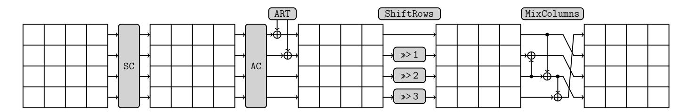
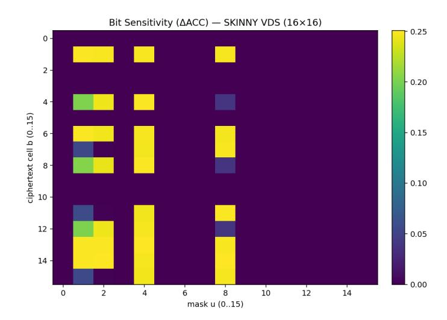
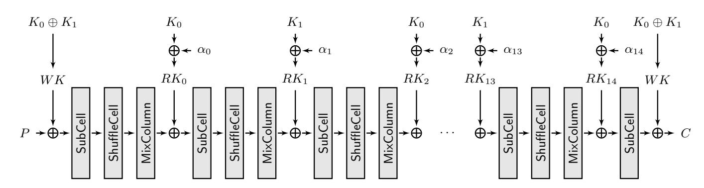
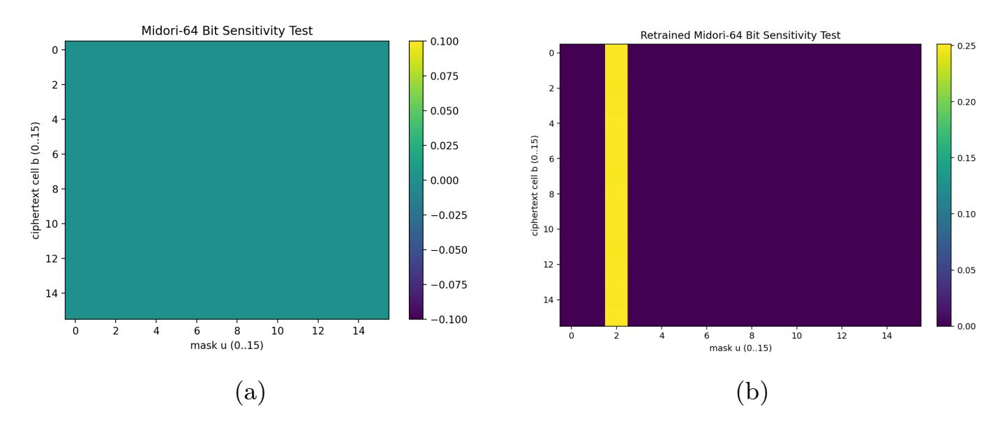
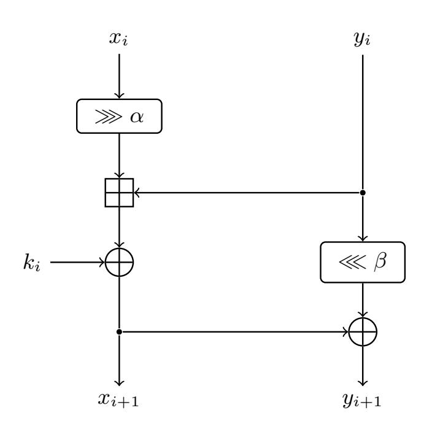
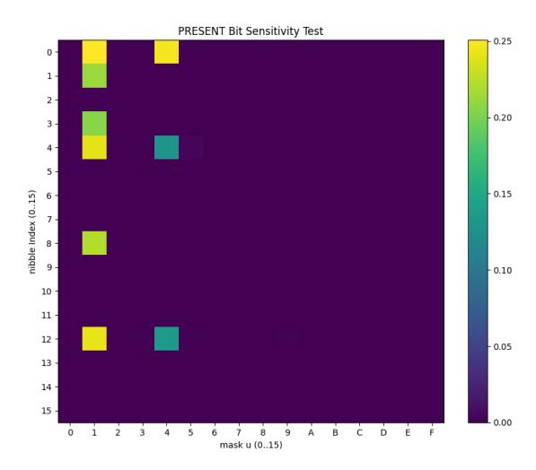
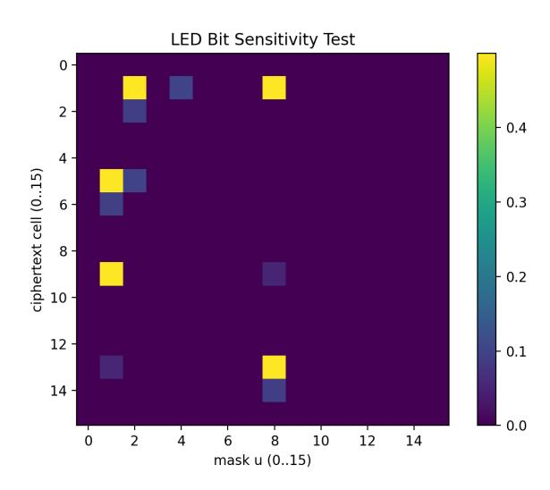
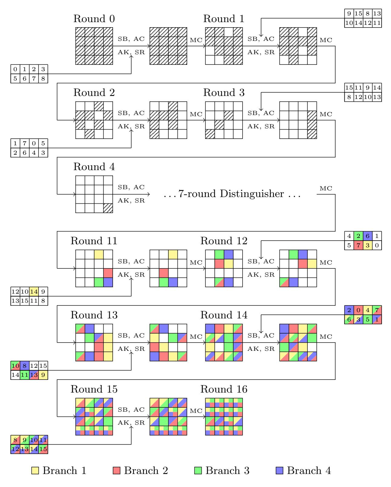

{0}------------------------------------------------

# Improving Neural-Inspired Integral Distinguishers via a Linear-Algebraic Approach

Yunjae Hwang<sup>1</sup> , Insung Kim<sup>1</sup> , Sunyeop Kim<sup>1</sup>,<sup>7</sup> , Myungkyu Lee<sup>1</sup> , Hanbeom Shin<sup>1</sup> , Deukjo Hong<sup>2</sup> , Seokhie Hong<sup>3</sup> , Dongjae Lee<sup>4</sup> , Jaechul Sung<sup>5</sup> , and Byoungjin Seok<sup>6</sup>

<sup>1</sup> Korea University, Seoul, South Korea, hyj019,cmcom35,kaki1013,newonetiger@korea.ac.kr 2 Jeonbuk National University, Jeonju, South Korea, deukjo.hong@jbnu.ac.kr <sup>3</sup> Smartm2m, Busan, South Korea, shhong@smartm2m.co.kr <sup>4</sup> Kangwon National University, Chuncheon, South Korea, dongjae.lee@kangwon.ac.kr <sup>5</sup> University of Seoul, Seoul, South Korea, jcsung@uos.ac.kr <sup>6</sup> Hansung University, Seoul, South Korea, bjseok@hansung.ac.kr <sup>7</sup> Nanyang Technological University, Jurong, Singapore, kin3548@gmail.com

Keywords: Integral distinguisher · Kernel · Neural networks · Balance property

Abstract. The recent study has demonstrated that neural networks can serve as a navigator for an automatic search model for integral cryptanalysis with a reduction in computational complexity. However, the inherent drawbacks of using a deep learning model such as large datasets and limited interpretability are the major obstacles in cryptanalysis. In this paper, we introduce another simple data-driven approach using the linear algebraic concept to characterize key-independent balance properties as the kernel of a matrix with empirical parity data. We stack the ciphertext parities obtained under many independent keys into the parity matrix and prove that every mask satisfying the matrix multiplication as zero corresponds exactly to a balance property. Candidates of the balance mask from the test are additionally evaluated by the spurious mask test. We demonstrate the practicality and generality of the kernel methodology on seven lightweight block ciphers spanning SPN with SKINNY, Midori, PRESENT, LED and ARX with SPECK, SIMON, SIMECK. Across these cases, our method recovers known distinguishers and reveals additional non-trivial linear combinations missed by conventional analyses. We additionally position the kernel method relative to other similar methodologies. Our results show that the kernel method provides a rigorous and cipher-agnostic alternative to neural feature exploration and complements division property-based search techniques.

## 1 Introduction

Integral cryptanalysis is one of the most widely used techniques to analyze a block cipher by computing the XOR-sum of ciphertexts from a specific structure 

{1}------------------------------------------------

of plaintexts. This line of work originates from the Square attack on Rijndael and related SPN ciphers formalized by Knudsen and Wagner [20]. Since the introduction, integral distinguishers have become a standard complement to differential and linear cryptanalysis for both SPN and ARX constructions, and have been applied to a wide spectrum of designs including Square, AES, Camellia, MISTY1, and many other block ciphers [9, 10, 36, 25].

The division property recast integral cryptanalysis in terms of algebraic degree of monomials [27]. A multiset is said to have the division property  $\mathcal{D}^n_{\mathbf{k}}$  if, for every boolean function of degree below a threshold determined by  $\mathbf{k}$ , the sum of the function over the multiset is zero. This view generalizes the classical integral property and naturally handles bit-oriented designs. Bit-based refinements pushed the analysis from word level down to individual state bits, closing empirically observed gaps on ciphers such as SIMON and enabling generic proofs of resistance against integral attacks [29].

Once the integral and division properties were unified in this way, the attention quickly shifted to automatic search. Xiang et al. modeled the propagation of division property with mixed-integer linear programming (MILP) and searched for integral distinguishers over six lightweight block ciphers [34]. Their framework was later strengthened through refined three-subset formulations without unknown subsets and with applications to cube attacks [16], and through an algebraic formulation of the division property that connects division property, degree evaluation, cube attacks and key-independent sums in a single polynomial framework [18]. On the other hand, Derbez and Fouque introduced a notion of the Super-Sbox to increase the precision of distinguishers based on the propagation of division property and to better separate provable guarantees from experimental artifacts [11]. Subsequent work further refined the division property under linear equivalences of S-boxes and under more complex linear layers [21].

In parallel, machine learning-based cryptanalysis has opened up a complementary perspective. Gohr's differential-neural distinguishers for SPECK32/64 showed that deep neural networks can learn non-trivial cryptanalytic features directly from data [14]. Benamira et al. took a systematic look at the strengths and the interpretability of neural distinguishers [6], and Bao et al. provided further insight into how deep learning-aided cryptanalysis relates to classical differential characteristics and search heuristics [3]. Motivated by these developments, Zahednejad et al. proposed the first explicit neural-based integral distinguisher scheme [37], and subsequent works refined neural models for integral distinguishers on lightweight ciphers such as PRESENT [33]. These studies clearly demonstrate that neural networks can uncover, and sometimes surpass, the distinguishers found by traditional combinatorial methods.

Most recently, Zhang et al. brought these threads together in their work [38]. They trained neural networks on carefully designed feature representations to learn features that correlate with integral properties on SKINNY. The model successfully found some balance properties in short-round settings. Crucially, they improved the distinguishers by reverse-engineering the results to identify a small number of linear combinations of state bits, integrated these neural-inspired

{2}------------------------------------------------

hints into their modified automatic search frameworks, and eventually found the key-independent and key-dependent integral distinguishers on the longer round of SKINNY. Their work strongly supports the idea that neural networks can serve as a feature-discovery engine that feeds back into classical cryptanalytic tools.

However, this neural-assisted paradigm comes with two fundamental drawbacks. The ultimate distinguishers extracted from neural networks not only need supplementary evaluation for interpretability but also do not guarantee that the extracted set is complete. Once the neural network judges some bits as positive, it is essentially needed to analyze what features the model recognized and how they relate to integral properties. In addition, a given model can surface one or a few particularly strong combinations, yet many other balance properties may exist in the same round and provide better key recovery scenarios.

In this paper, we address this limitation by showing that the family of keyindependent balance properties can be characterized algebraically as the kernel of a parity matrix over F2. Concretely, we consider a data-driven kernel method: we collect parity observations under independently sampled keys and stack them into an empirical parity matrix. We then study how the kernel of the matrix captures balance properties, how this viewpoint extends to key-dependent behaviors and how it connects to existing methodologies. Our contributions are threefold.

- A kernel framework for finding balance properties. We formalize the parity matrix viewpoint and prove that for a fixed cipher and a fixed structure, the empirical balance space in the chosen observation space is exactly the kernel. This yields an explicit basis of candidate masks from empirical parity data together with the upper bound.
- Applications to various block ciphers. We apply the kernel method to several round-reduced ciphers including SKINNY-64/64, Midori-64 and SPECK32/64 as main case studies and additionally to 4 other ciphers in Appendix A. Across these experiments, the kernel method (i) rigorously verifies known balance properties, (ii) reveals additional relations that are missed by alternative approaches, and (iii) can be used to guide longer-round distinguishers when combined with existing search procedures.
- Connections and comparisons with existing methodologies. We clarify conceptual connections between the kernel viewpoint and cube attacks, and compare our approach with representative methodologies such as neural distinguishers and division property-based searches. In particular, we highlight that neural distinguishers typically require large-scale training data and time to obtain a valid model, whereas the kernel stage extracts candidate masks from only a thousand of independent parity observations, and independent validation then provides an explicit false-accept guarantee using fresh data within a few seconds.

Organization. Section 2 introduces notations and recalls linear integral distinguishers in the mask view, and then formalizes the kernel method that will be used throughout the paper. Section 3 reviews the two main lines of prior methodology relevant to our study: division property-based integral cryptanalysis and

{3}------------------------------------------------

Table 1. Comparison of our results with previous works.

| Table 1. Comparison of our results with previous works. |       |          |                              |           |
|---------------------------------------------------------|-------|----------|------------------------------|-----------|
| Cipher                                                  | Round | Data     | Number of balance properties | Reference |
| SKINNY-64-64                                            | 7     | $2^4$    | 8                            | [38]      |
|                                                         |       |          | 18                           | Sec 5.1   |
| DKINN1-04-04                                            | 11    | $2^{60}$ | 17                           | [38]      |
|                                                         |       |          | $30^{\dagger}$               | Sec 5.3   |
|                                                         | 6     | $2^{15}$ | 1                            | [11]      |
| Midori-64                                               |       |          | 5                            | Sec 6.1   |
| midori-04                                               | 7     | $2^{45}$ | 1                            | [11]      |
|                                                         |       | $2^{15}$ | $5^{\ddagger}$               | Sec 6.1   |
|                                                         | 6     | $2^{30}$ | 1                            | [32]      |
| SPECK32/64                                              |       |          | 9                            | Sec 6.2   |
|                                                         | 7     | $2^{30}$ | 1                            | Sec 6.2   |
| PRESENT                                                 | 9     | $2^{60}$ | 4                            | [31]      |
| FRESENI                                                 |       |          | 4                            | Sec A.1   |
| I ED                                                    | 5     | $2^{31}$ | 32                           | [24]      |
| LED                                                     |       | $2^{16}$ | $32^{\dagger\dagger}$        | Sec A.2   |

<sup>†</sup> The 30 balance properties found in 11-round SKINNY-64/64 with our method were obtained by restricting the Hamming weight under 4 due to computational complexity. It is possible that additional balance properties exist beyond this constraint.

neural-inspired integral cryptanalysis, including the feature representation used in our experiments. Section 4 presents the kernel framework, covering both key-independent and key-dependent settings along with sampling strategies and the associated statistical guarantee. Section 5 applies the method to SKINNY-64/64, compares the obtained kernels with neural-based findings and further explores additional balance properties in longer-round settings. Section 6 revisits balance properties of other block ciphers focusing on the case studies of Midori-64 and SPECK32/64. Supplementary results are provided in the appendix. Section 7 discusses the connection between our kernel viewpoint and other methodologies including cube attacks and neural distinguishers. Finally, Section 8 concludes the paper.

#### 2 Preliminaries

#### 2.1 Notations

Throughout this paper, we follow the indexing order of the previous work that we refer to. We denote the finite field with two elements as  $\mathbb{F}_2$ , and the *n*-dimensional vector space over  $\mathbb{F}_2$  as  $\mathbb{F}_2^n$ . An *n*-bit vector is represented as  $v \in \mathbb{F}_2^n$ , with its *i*-th

<sup>‡</sup> The 5 balance properties found in 7-round Midori-64 with our method are the nonlinear combinations of ciphertext bits.

<sup>††</sup> The 32 balance properties found in 5-round LED with our method are the linear combinations of ciphertext bits whereas the previous result gave individual bits.

{4}------------------------------------------------

element denoted by v[i]. The bitwise XOR operation is represented by  $\oplus$ , and the Hamming weight of a vector v is wt(v). The inner product of two vectors  $v, u \in \mathbb{F}_2^n$  is defined as  $\langle v, u \rangle = \bigoplus_{i=0}^{n-1} v[i] \cdot u[i]$ . For a block cipher E, we use n, k, and c to denote the block size, key size, and cell size, respectively. We use x, C, and K as general vectors for plaintexts, ciphertexts, and keys. The encryption of a plaintext x under a key K is  $E_K(x)$ .

#### 2.2 Balance Property in the View of Bit Mask

Fix a plaintext multiset  $S \subseteq \mathbb{F}_2^n$  generated by activating a subset of state coordinates while fixing the others.

**Masks.** A monomial mask is a vector  $a \in \mathbb{F}_2^m$  used to index a bit-product function [27]. For  $z \in \mathbb{F}_2^m$ , define

$$\pi_a(z) := \prod_{i=0}^{m-1} z[i]^{a[i]} \in \mathbb{F}_2.$$

The value  $\pi_a(x)$  equals the AND of the bits of z selected by a.

A linear mask is a vector  $u \in \mathbb{F}_2^n$  applied to the *n*-bit state and specifies a linear parity functional through the inner product  $\langle E_K(x), u \rangle$ . Hence, u selects the global bit-level linear combination that is tested for balance.

Throughout this paper, we use the term mask to refer to a linear mask in the ambient binary vector space, such as ciphertext-bit masks used in linear parity tests, with notation u. When a mask is used to index a Boolean monomial feature, we explicitly call it a monomial mask and use the notation a.

**Masked XOR-sum.** For a mask  $u \in \mathbb{F}_2^n$ , we use the masked XOR-sum over  $\mathcal{S}$ 

$$\bigoplus_{x \in \mathcal{S}} \langle E_K(x), u \rangle \in \mathbb{F}_2.$$

By linearity of the inner product over  $\mathbb{F}_2$ , this quantity can also be viewed as testing whether the aggregated XOR of ciphertexts over  $\mathcal{S}$  is orthogonal to u.

**Balance masks.** We say that a nonzero mask u is balanced for  $(E_K, \mathcal{S})$  if

$$\bigoplus_{x \in \mathcal{S}} \langle E_K(x), u \rangle = 0.$$

In other words, the parity of the ciphertext bits selected by u is balanced when the plaintext ranges over S under the fixed key K.

To work on intrinsic nonlinear terms in an AES-like cipher, Zhang et al. suggested new data format called the *vectorial division sequence* which exploits the combination of bits in a single cell.

{5}------------------------------------------------

**Definition 1 (Vectorial Division Sequence[38]).** Let  $\mathbb{X}_1, \mathbb{X}_2, ..., \mathbb{X}_i (1 \leq i \leq \frac{n}{c})$  be the set of elements in  $\mathbb{F}_2^c$ , the vectorial division sequence of  $\mathbb{X}_1, \mathbb{X}_2, ..., \mathbb{X}_i$ , denoted by VDS, is a sequence defined by

$$\mathbb{VDS} = \left[\bigoplus_{z \in \mathbb{X}_1} z^a\right] \| \left[\bigoplus_{z \in \mathbb{X}_2} z^a\right] \| \cdots \| \left[\bigoplus_{z \in \mathbb{X}_i} z^a\right], a \in \mathbb{F}_2^c.$$

Note that a used in this definition is a monomial mask.  $\mathbb{VDS}$  can be interpreted as a concatenation of parity information from each cell. We can adopt this format in our experiment for the same purpose.

**Key-(in)dependence.** A balance mask u is key-independent if  $\bigoplus_{x \in \mathcal{S}} \langle E_K(x), u \rangle = 0$  holds for all keys K. Otherwise, the mask may exhibit key-dependent (probabilistic) behavior, meaning that  $\bigoplus_{x \in \mathcal{S}} \langle E_K(x), u \rangle$  is biased toward 0 only for a subset of keys in the entire key space.

## 2.3 Linear-Algebraic Background

Let  $A \in \mathbb{F}_2^{m \times d}$  be a binary matrix. Define a linear map  $T_A : \mathbb{F}_2^d \to \mathbb{F}_2^m$  by  $T_A(u) = Au$ .

**Definition 2 (Kernel).** The (right) kernel of A, also called the null space, is the set of all vectors mapped to the zero vector:

$$\ker(A) := \{ u \in \mathbb{F}_2^d : Au = 0 \}.$$

**Basic properties.** Since the map  $T_A$  is linear over  $\mathbb{F}_2$ , the kernel is a linear subspace of  $\mathbb{F}_2^d$ . In particular, if  $u_1, u_2 \in \ker(A)$ , then  $u_1 \oplus u_2 \in \ker(A)$ , and for any  $\lambda \in \mathbb{F}_2$ ,  $\lambda u_1 \in \ker(A)$ . We define the *nullity* of A as

$$\operatorname{nullity}(A) := \dim(\ker(A)).$$

Intuitively, nullity (A) measures how many degrees of freedom remain in the solutions of the homogeneous linear system Au = 0.

**Definition 3 (Image and Rank).** The image (or column space) of A is

$$\operatorname{im}(A) := \{ Au : u \in \mathbb{F}_2^d \} \subseteq \mathbb{F}_2^m.$$

Its dimension is the rank of A, denoted by rank(A) := dim(im(A)).

Theorem 1 (Rank–Nullity). For any  $A \in \mathbb{F}_2^{m \times d}$ ,

$$rank(A) + nullity(A) = d.$$

The rank–nullity theorem states that  $\dim(\ker(A)) + \dim(\operatorname{im}(A)) = d$ . Equivalently, by the first isomorphism theorem,  $\mathbb{F}_2^d/\ker(A) \cong \operatorname{im}(A)$ . In our setting, this

{6}------------------------------------------------

viewpoint will be used to characterize families of masks (or feature combinations) that induce identically vanishing parity constraints.

Computing a basis of the kernel. A basis of ker(A) can be computed efficiently by solving the homogeneous system Au = 0 using Gaussian elimination over F2. Concretely, one reduces A to row-echelon form; the pivot variables are expressed in terms of the free variables and each free variable assignment yields a solution vector in the kernel. Taking the unit assignments for free variables produces a basis for ker(A).

## 3 Related Works

## 3.1 Integral Cryptanalysis using Division Property

Division property-based integral attacks characterize balanced bits by tracking the parity L z∈Z πa(z); these correspond to monomials in the algebraic normal form (ANF), and by propagating sufficient conditions through round functions [27]. In particular, the bit-based division property refines this analysis at the bit level, and the three-subset variant further distinguishes whether this parity is 0, 1, or unknown, in order to capture cancellations that the two-subset view may overlook [29].

Our approach is complementary. Rather than propagating monomial-level information, we directly test the balance of linear combinations of output bits by aggregating empirical parity observations over plaintext structures. This yields a linear algebraic characterization in which balance masks correspond to solutions of a kernel problem induced by the observed parity matrix. Consequently, our method can identify balance masks without explicit degree reasoning and can serve as a complementary evidence-driven tool alongside division property-based approaches.

## 3.2 Neural-Inspired Integral Cryptanalysis

Zhang et al. introduced a general framework in which neural networks were used as feature explorers for integral cryptanalysis [38]. Starting from chosen plaintext structures, they first compress each ciphertext multiset into a paritybased feature vector that retains only information relevant to integral properties. On top of these features, a neural classifier was trained to distinguish reducedround cipher outputs from random outputs. By analyzing the trained network, they extracted human-interpretable integral distinguishers, including linear and nonlinear combinations of bits. The paper then fed these neural-inspired features back into classical search frameworks. They improved the monomial predictionbased search model designed by Hu et al. [17] to Algorithm 1 so that it better matches what the neural network actually detects and used it to derive improved integral distinguishers and key-recovery attacks on SKINNY.

{7}------------------------------------------------

Algorithm 1: Search for Key-Independent Integral Distinguisher Based on Combination of Ciphertext Bits [38]

```
Input : A combination C(b), round parameters p and q, input division
           property d 0
   Output : True if C(b) is balanced; False otherwise
1 U ← BackwardExpand(C(b), q)
2 U
    ′ ← ApplyReducingRule(U)
3 for each monomial ui ∈ U
                         ′ do
 4 M ← Model(p, d 0, ui)
 5 M.optimize()
 6 if M.status = Optimal then
 7 return False
 8 end
9 end
10 return True
```

## 4 Finding Balance Properties by Kernel

In this section, we present our formal method for discovering balance properties of block ciphers by utilizing the algebraic concept of a kernel. Similar to recent neural network-based techniques, our approach is fundamentally data-driven, operating on parity information extracted from ciphertexts produced in multiple encryptions. However, whereas deep learning models act as black boxes that require complex, post-hoc interpretation to extract meaningful features, our method is founded directly on the principles of linear algebra. We demonstrate that candidate linear balance properties in the chosen observation space can be extracted by computing the kernel of an empirically constructed parity matrix, and can then be certified by independent validation. This approach provides a mathematically rigorous framework that is interpretable by construction, clearing up the ambiguities inherent in neural feature extraction.

## 4.1 Key-Independent Balance Property

We begin by formalizing our data-driven approach for identifying key-independent balance properties. The core idea is to formulate a parity matrix from multiple encryption experiments, each conducted with an independent key. The empirical balance space shared across the sampled experiments is then shown to be exactly the kernel of this matrix while the true balance space is contained in it.

Parity Vector and Parity Matrix. Let E : F n <sup>2</sup> × K → F n <sup>2</sup> be an n-bit block cipher with key space K. Fix an active pattern with l active cells of size c. Let S denote the family of plaintext multisets induced by this active pattern, namely all multisets S ⊆ F n <sup>2</sup> of size |S| = 2lc that share the same active positions and differ only in the fixed-bit assignment.

{8}------------------------------------------------

To unify different parity data formats, we introduce a feature map

$$\Phi: \mathbb{F}_2^n \to \mathbb{F}_2^d,$$

which embeds each ciphertext  $C \in \mathbb{F}_2^n$  into a d-dimensional binary feature vector. The standard bit-parity format corresponds to d = n and other elaborate formats may correspond to larger d with a different choice of  $\Phi$ . In what follows, the parity vectors and matrices are defined with respect to the choice of  $(\Phi, \mathfrak{S})$ .

We perform the experiment over m independent instantiations of the plaintext multiset. For each instantiation index  $t \in \{1, ..., m\}$ , we sample  $\mathcal{S}_t \leftarrow \mathfrak{S}$  and  $K_t \leftarrow \mathcal{K}$  independently.

**Definition 4 (Parity vector).** Let  $\Phi : \mathbb{F}_2^n \to \mathbb{F}_2^d$  be a feature map and  $\mathcal{S}_t$  be a plaintext multiset. For a key  $K \in \mathcal{K}$ , define the parity vector of  $\mathcal{S}_t$  as

$$P(K, \mathcal{S}_t) := \bigoplus_{x \in \mathcal{S}_t} \Phi(E_K(x)) \in \mathbb{F}_2^d.$$

For each t, we simply write

$$P_t := P(K_t, \mathcal{S}_t).$$

If we use N independent keys for each multiset instantiation  $\mathcal{S}_t$ , we index them as

$$K_{t,1},\ldots,K_{t,N} \leftarrow \mathcal{K},$$

where the keys are sampled independently across all pairs (t, i).

**Definition 5 (Parity matrix).** The parity matrix is obtained by stacking all parity vectors as rows

$$M := \begin{bmatrix} P_1 \\ P_2 \\ \vdots \\ P_m \end{bmatrix} \in \mathbb{F}_2^{m \times d}.$$

Balance Properties by the Kernel. Fix a feature map  $\Phi: \mathbb{F}_2^n \to V$  with  $V = \mathbb{F}_2^d$ . We sample m independent plaintext multisets  $\mathcal{S}_1, \ldots, \mathcal{S}_m$  that share the same active pattern and differ only in the fixed-bit assignment. A linear balance property under this data format is specified by a mask  $u \in V$ . For each trial  $t \in \{1, \ldots, m\}$ , define the corresponding ciphertext multiset

$$\mathcal{X}_t := \{ E_{K_t}(x) : x \in \mathcal{S}_t \} \subseteq \mathbb{F}_2^n$$

Then we extend the concept of balance masks u together with the feature map  $\Phi$ :

$$\bigoplus_{C \in \mathcal{X}_t} \langle \Phi(C), u \rangle = 0.$$

{9}------------------------------------------------

Using linearity of the inner product with respect to XOR, we obtain

$$\bigoplus_{C \in \mathcal{X}_t} \langle \Phi(C), u \rangle = \left\langle \bigoplus_{C \in \mathcal{X}_t} \Phi(C), u \right\rangle = \langle P_t, u \rangle.$$

We are primarily interested in key-independent balance properties. We distinguish the information-theoretic notion from what can be certified using only the sampled keys and multisets. Define the *true balance space* 

$$\mathcal{B}_{\text{true}} := \{ u \in V : \langle P(K, \mathcal{S}), u \rangle = 0 \text{ for all } K \in \mathcal{K} \text{ and all } \mathcal{S} \in \mathfrak{S} \},$$

and the  $empirical\ balance\ space$  induced by the m sampled keys and multisets

$$\mathcal{B}_{\text{emp}} := \{ u \in V : \langle P_t, u \rangle = 0 \text{ for all } t = 1, \dots, m \}.$$

Stacking the parity vectors into the parity matrix  $M \in \mathbb{F}_2^{m \times d}$  yields

$$Mu = 0$$
,

and hence  $\mathcal{B}_{emp} = \ker(M)$ .

In particular, the kernel method provides an upper bound on the number of linearly independent balance masks under the specific choice of  $(\Phi, \mathcal{S})$ .

Proposition 1 (Kernel characterization and upper bound). Let  $M \in \mathbb{F}_2^{m \times d}$  be the parity matrix built from m independent key trials under the fixed choice of  $(\Phi, \mathcal{S})$ . Then

$$\mathcal{B}_{\text{true}} \subseteq \mathcal{B}_{\text{emp}} = \ker(M), \quad and \ therefore \quad \dim(\mathcal{B}_{\text{true}}) \leq \text{nullity}(M).$$

*Proof.* For any  $u \in V$ ,

$$Mu = 0 \iff \langle P_t, u \rangle = 0 \text{ for all } t = 1, \dots, m \iff u \in \mathcal{B}_{emp},$$

so  $\mathcal{B}_{\text{emp}} = \text{ker}(M)$ . If  $u \in \mathcal{B}_{\text{true}}$ , then  $\langle P(K, \mathcal{S}_t), u \rangle = 0$  holds for all  $K \in \mathcal{K}$ , hence  $u \in \mathcal{B}_{\text{emp}}$  and  $\mathcal{B}_{\text{true}} \subseteq \mathcal{B}_{\text{emp}}$ . The dimension bound follows from subspace inclusion.

#### 4.2 Validation of the Kernel Approach

Let  $\mathcal{U} \subseteq \mathbb{F}_2^d$  be a candidate family of masks constructed from the kernel of M. To validate these candidates, we sample  $\widetilde{m}$  independent multiset instantiations  $\widetilde{\mathcal{S}}_{\widetilde{t}} \leftarrow \mathfrak{S}$  for  $\widetilde{t} = 1, \ldots, \widetilde{m}$ . For each fixed instantiation  $\widetilde{\mathcal{S}}_{\widetilde{t}}$ , we then perform N independent random-key trials: we first sample  $\widetilde{K}_{\widetilde{t},i} \leftarrow \mathcal{K}$  for  $i = 1, \ldots, N$  and extend the definition of the parity vector to the validation

$$\widetilde{P}_{\tilde{t},i} := P(\widetilde{K}_{\tilde{t},i}, \widetilde{\mathcal{S}}_{\tilde{t}}).$$

Then we compute

$$I_{\tilde{t},i}(u) := \langle \widetilde{P}_{\tilde{t},i}, u \rangle \in \mathbb{F}_2.$$

{10}------------------------------------------------

A candidate  $u \in \mathcal{U}$  is discarded if  $I_{\tilde{t},i}(u) = 1$  for some  $(\tilde{t},i)$ . Otherwise, if  $I_{\tilde{t},i}(u) = 0$  holds for all  $(\tilde{t},i)$ , we accept u as validated. Equivalently, we form a validation matrix

Il 
$$(\widetilde{t},i)$$
, we accept  $u$  as validated. If 
$$\widetilde{M}:=\begin{bmatrix}\widetilde{P}_{1,1}\\\vdots\\\widetilde{P}_{1,N}\\\vdots\\\widetilde{P}_{\widetilde{m},1}\\\vdots\\\widetilde{P}_{\widetilde{m},N}\end{bmatrix}\in\mathbb{F}_2^{(\widetilde{m}N)\times d},$$
 where  $u\in\mathcal{U}$  satisfying  $\widetilde{M}u=0$ . The second  $u\in\mathcal{U}$  satisfying  $\widetilde{M}u=0$ .

and we retain only those  $u \in \mathcal{U}$  satisfying  $\widetilde{M}u = 0$ . This is analogous to the property tester and the decision rule viewpoint of the cube tester [1]. The general steps of the kernel method with validation are presented in Algorithm 2.

**Empirical Estimate.** Fix a mask u and a validation multiset  $\widetilde{\mathcal{S}} \in \mathfrak{S}$ . Define the failure probability per multiset as

$$\delta\big(u,\widetilde{\mathcal{S}}\big) := \Pr_{K \leftarrow \mathcal{K}} \big[ \langle P(K,\widetilde{\mathcal{S}}), u \rangle = 1 \big].$$

For a fixed validation multiset  $\widetilde{\mathcal{S}}_{\tilde{t}}$ , we write  $\delta(u, \widetilde{\mathcal{S}}_{\tilde{t}})$  accordingly. We then validate a candidate mask u by repeating the test over N independently sampled keys  $\widetilde{K}_{\tilde{t},1},\ldots,\widetilde{K}_{\tilde{t},N}\leftarrow\mathcal{K}$ . If no violation is observed in these N trials, we regard this as strong empirical evidence that the candidate holds with high probability on that instantiation. This heuristic interpretation mirrors the repeated random-key validation used in [30], where a candidate that survives  $2^{13}$  independent key trials without failure is viewed empirically as highly likely to hold for randomly sampled keys. Likewise, observing no violation over N independent random-key trials in our setting may be viewed as empirical evidence that the candidate holds with success probability roughly on the order of  $1-\frac{1}{N}$  on the fixed validation multiset  $\widetilde{\mathcal{S}}_{\tilde{t}}$ .

**False-Accept Bound.** Recall the failure probability defined above. We assume there exists a constant  $\delta_0 \in (0,1]$  such that every spurious mask  $u \in \mathcal{U} \setminus \mathcal{B}_{\text{true}}$  satisfies

$$\delta(u, \widetilde{\mathcal{S}}_{\tilde{t}}) \geq \delta_0$$
 for all sampled validation multisets  $\widetilde{\mathcal{S}}_{\tilde{t}}$ ,  $1 \leq \tilde{t} \leq \tilde{m}$ .

Equivalently, for each sampled validation multiset  $\widetilde{\mathcal{S}}_{\tilde{t}}$ , each spurious u violates the balance property with probability at least  $\delta_0$  over an independent random key.

Lemma 1 (False acceptance for a fixed spurious mask). Fix any  $u \in \mathcal{U} \setminus \mathcal{B}_{true}$ . Assume that the keys  $\widetilde{K}_{\tilde{t},i}$  are sampled independently from  $\mathcal{K}$  for all  $(\tilde{t},i)$ . If

$$\delta(u, \widetilde{\mathcal{S}}_{\tilde{t}}) \geq \delta_0 \quad \text{for all } \tilde{t} \in \{1, \dots, \widetilde{m}\},$$

{11}------------------------------------------------

#### Algorithm 2: Kernel Method for Key-Independent Balance Properties

**Input**: Block size n. Rounds r. Cipher E. Feature map  $\Phi: \{0,1\}^n \to \{0,1\}^d$ .

```
Family of multisets \mathfrak{S}. Kernel trials m. Validation multiset
                        instantiations \widetilde{m}. Repeated-key trials per validation multiset N.
      Output: A basis B \subseteq \mathbb{F}_2^d of validated empirical balance masks.
  1 Kernel trial
  2 Initialize M \in \mathbb{F}_2^{m \times d}
  3 for t \leftarrow 1 to m do
             sample S_t \leftarrow \mathfrak{S}
  4
             sample K_t \leftarrow \mathcal{K}
  \mathbf{5}
             P_t \leftarrow 0^d
  6
             for each x \in \mathcal{S}_t do
  7
                   C \leftarrow E_{K_t}^{(r)}(x)
  8
                   P_t \leftarrow P_t \oplus \Phi(C)
  9
             end
10
             M[t,:] \leftarrow P_t
11
12 end
      Compute a basis matrix B_{\text{emp}} of ker(M) and store the basis vectors as columns
13
       Validation with repeated trials
14
15 Initialize \widetilde{M} \in \mathbb{F}_2^{\widetilde{m}N \times d}
16 \ell \leftarrow 0
17 for \tilde{t} \leftarrow 1 to \widetilde{m} do
             sample \widetilde{\mathcal{S}}_{\tilde{t}} \leftarrow \mathfrak{S}
18
             for i \leftarrow 1 to N do
19
                   sample \widetilde{K}_{\tilde{t},i} \leftarrow \mathcal{K}
20
                   \widetilde{P}_{\tilde{t},i} \leftarrow 0^d
21
                   for each x \in \widetilde{\mathcal{S}}_{\tilde{t}} do
 | \widetilde{C} \leftarrow E_{\widetilde{K}_{\tilde{t},i}}^{(r)}(x) | \widetilde{P}_{\tilde{t},i} \leftarrow \widetilde{P}_{\tilde{t},i} \oplus \Phi(\widetilde{C}) 
22
 \mathbf{23}
 24
                    \mathbf{end}
25
                   \ell \leftarrow \ell + 1
26
                   \widetilde{M}[\ell,:] \leftarrow \widetilde{P}_{\tilde{t},i}
27
28
             end
29 end
30 Compute T \leftarrow \widetilde{M}B_{\text{emp}} over \mathbb{F}_2
31 Compute a basis matrix Z of ker(T) and store the basis vectors as columns
32 Set B \leftarrow B_{\text{emp}}Z
33 return B
```

then

$$\Pr[\widetilde{M}u = 0] \le (1 - \delta_0)^{\widetilde{m}N}.$$

*Proof.* Condition on the sampled validation multisets  $\widetilde{\mathcal{S}}_1, \dots, \widetilde{\mathcal{S}}_{\widetilde{m}}$ . The event  $\widetilde{M}u = 0$  is equivalent to  $I_{\widetilde{t},i}(u) = 0$  for all  $(\widetilde{t},i)$ . For each fixed  $\widetilde{\mathcal{S}}_{\widetilde{t}}$ , independence

{12}------------------------------------------------

of the N random-key trials yields

$$\Pr\left[I_{\tilde{t},i}(u) = 0 \text{ for all } i \in \{1,\ldots,N\} \mid \widetilde{\mathcal{S}}_{\tilde{t}}\right] = \left(1 - \delta(u,\widetilde{\mathcal{S}}_{\tilde{t}})\right)^{N}.$$

Taking the product over  $\tilde{t} = 1, \dots, \tilde{m}$  gives

$$\Pr[\widetilde{M}u = 0 \mid \widetilde{\mathcal{S}}_1, \dots, \widetilde{\mathcal{S}}_{\widetilde{m}}] = \prod_{\widetilde{t}=1}^{\widetilde{m}} (1 - \delta(u, \widetilde{\mathcal{S}}_{\widetilde{t}}))^N.$$

Using  $\delta(u, \widetilde{\mathcal{S}}_{\tilde{t}}) \geq \delta_0$  for all  $\tilde{t}$ , we obtain

$$\Pr[\widetilde{M}u = 0 \mid \widetilde{\mathcal{S}}_1, \dots, \widetilde{\mathcal{S}}_{\widetilde{m}}] \leq \prod_{\widetilde{t}=1}^{\widetilde{m}} (1 - \delta_0)^N = (1 - \delta_0)^{\widetilde{m}N}.$$

Taking expectation over the sampled validation multisets  $\widetilde{\mathcal{S}}_1, \ldots, \widetilde{\mathcal{S}}_{\widetilde{m}}$  preserves the same upper bound, which proves the claim.

**Theorem 2 (Post-selection validation).** Assume the same condition  $\delta(u, \widetilde{\mathcal{S}}_{\tilde{t}}) \geq \delta_0$  holds for all  $u \in \mathcal{U} \setminus \mathcal{B}_{\text{true}}$  and all sampled validation multisets  $\widetilde{\mathcal{S}}_{\tilde{t}}$ ,  $1 \leq \tilde{t} \leq \tilde{m}$ . Conditioning on  $\mathcal{U}$  and assuming the validation data used to build  $\widetilde{M}$  are independent of the training data used to construct  $\mathcal{U}$ ,

$$\Pr\left[\exists u \in \mathcal{U} \setminus \mathcal{B}_{\text{true}} \text{ such that } \widetilde{M}u = 0 \, \middle| \, \mathcal{U}\right] \leq |\mathcal{U}| \, (1 - \delta_0)^{\widetilde{m}N}.$$

In particular, if  $\mathcal{U} = \mathcal{B}_{emp} = \ker(M)$ , then  $|\mathcal{U}| = 2^{\operatorname{nullity}(M)}$  and hence

$$\Pr\left[\exists u \in \mathcal{B}_{\text{emp}} \setminus \mathcal{B}_{\text{true}} \text{ such that } \widetilde{M}u = 0 \, \middle| \, \mathcal{U}\right] \leq 2^{\text{nullity}(M)} (1 - \delta_0)^{\widetilde{m}N}.$$

*Proof.* Condition on  $\mathcal{U}$ . Since the validation data are independent of the training data used to construct  $\mathcal{U}$ , Lemma 1 applies to each fixed  $u \in \mathcal{U} \setminus \mathcal{B}_{\text{true}}$ . Taking a union bound over all such u proves the first claim. The second claim follows by substituting  $|\mathcal{U}| = |\ker(M)| = 2^{\text{nullity}(M)}$  when  $\mathcal{U} = \mathcal{B}_{\text{emp}} = \ker(M)$ .

If one further assumes that under the random permutation model, the validation bit is uniform and independent across trials for each spurious mask u on each sampled validation multiset  $\widetilde{\mathcal{S}}_{\tilde{t}}$ , then  $\delta_0 = 1/2$  and

$$\Pr[\widetilde{M}u = 0] \le 2^{-\widetilde{m}N}, \quad \Pr\left[\exists u \in \mathcal{U} \setminus \mathcal{B}_{\text{true}} \text{ such that } \widetilde{M}u = 0 \mid \mathcal{U}\right] \le |\mathcal{U}| 2^{-\widetilde{m}N}.$$

This recovers the familiar exponential decay obtained when a spurious mask passes each validation trial independently with probability 1/2.

**Probabilistic behavior.** The validation step can also be viewed as filtering out candidates that exhibit probabilistic behavior across keys or multiset instantiations. A mask u that appears in  $\ker(M)$  when m is small may still have a nonzero failure probability  $\delta(u, \widetilde{S}) > 0$  for some  $\widetilde{S} \in \mathfrak{S}$ . Such a candidate can

{13}------------------------------------------------

pass the first kernel stage simply because no failure is observed on the limited set of sampled keys and multiset instantiations, but it becomes increasingly unlikely to survive as the validation budget  $\widetilde{m}N$  grows. Consequently, the masks that survive validation are treated as empirically supported key-independent balance properties in the sense that they exhibit no observed failures under independently sampled validation multisets and keys, whereas candidates tied to key-dependent or multiset-dependent behavior tend to be eliminated by the same procedure.

Throughout our experiments, we set the number of sampled keys in the kernel stage as m, the number of validation multiset instantiations  $\widetilde{m}$ , and the number of repeated key trials per multiset N to  $10^3$ . For comparison, the neural network is trained on  $10^6$  samples and evaluated on  $10^5$  test samples.

## 5 Kernel-Based Analysis on SKINNY-64/64

SKINNY is a tweakable block cipher and SKINNY-64/64 uses a 64-bit block with a 64-bit key and the state can be represented as  $4 \times 4$  cells with 4-bit per cell [5]. In this section, we apply the kernel methodology proposed in Section 4 to SKINNY-64/64. This cipher serves as a direct point of comparison with the work of [38], who used it as a primary target for their neural network-based framework.



Fig. 1. The round function of SKINNY.

#### 5.1 Kernel Application on Short Rounds of SKINNY-64/64

The neural network approach began by training a simple MLP model to identify a 7-round key-independent distinguisher using VDS data generated from activating a specific plaintext cell. We first applied our kernel method to the 7-round scenario by exploiting the single-cell active plaintext configuration. Our method not only confirmed the properties found by the neural network but also uncovered the complete basis of  $\ker(M)$  for empirically consistent balance masks, which is significantly larger than the subset identified by the neural network feature extraction.

By computing a basis of  $\ker(M)$  for the 7-round SKINNY-64/64, (rank, nullity) of M is (46, 18), implying the 18 linearly independent basis vectors that give non-trivial solutions of Mu=0. The balance properties of the 7-round represented by the basis 0, 1, 2, 3, and 10, 11, 12, 13 in Table 2a match exactly the description of Distinguisher 1 in [38]. What is important is that there are 10 more bases for

{14}------------------------------------------------

key-independent balance properties that the neural network could not detect. This suggests that the neural model does not reliably recover the full range of linear combinations of bits present in ker(M). For the 8-round case, no other properties were found by the kernel except the single property detected in the neural network approach(Table 2b). Note that the 64-bit parity features include

Table 2. Bases of ker(M) and the corresponding linear combinations of bits in (a) 7-round and (b) 8-round SKINNY-64/64. The indices of the bits followed the MSB-first ordering.

|   | Basis index Bits combination Basis index Bits combination |    |                       |
|---|-----------------------------------------------------------|----|-----------------------|
| 0 | b4<br>⊕ b52                                               | 9  | b19<br>⊕ b35<br>⊕ b51 |
| 1 | b5<br>⊕ b53                                               | 10 | b24<br>⊕ b56          |
| 2 | b6<br>⊕ b54                                               | 11 | b25<br>⊕ b57          |
| 3 | b7<br>⊕ b55                                               | 12 | b26<br>⊕ b58          |
| 4 | ⊕ b44<br>⊕ b56<br>⊕ b60<br>b8                             | 13 | ⊕ b59<br>b27          |
| 5 | ⊕ b45<br>⊕ b57<br>⊕ b61<br>b9                             | 14 | ⊕ b44<br>⊕ b60<br>b28 |
| 6 | ⊕ b32<br>⊕ b48<br>b16                                     | 15 | ⊕ b45<br>⊕ b61<br>b29 |
| 7 | b17<br>⊕ b33<br>⊕ b49                                     | 16 | b30<br>⊕ b46<br>⊕ b62 |
| 8 | b18<br>⊕ b34<br>⊕ b50                                     | 17 | b31<br>⊕ b47<br>⊕ b63 |

(a)

|   | Basis index Bits combination |
|---|------------------------------|
| 0 | ⊕ b44<br>⊕ b60<br>b28        |

(b)

only a single-bit linear terms. We expanded the data format to 256-bit VDS (16 masks per 4-bit cell across 16 cells) to incorporate the nonlinear terms of a cell. It turned out that no properties other than the linear combinations discovered earlier are observed for both rounds of SKINNY-64/64. The kernel was computed in the SageMath environment [26].

### 5.2 Revisiting the Neural Network Approach

Inspired by the results of the kernel, we revisited the training process of the neural network with the enhanced dataset to analyze whether its performance is improved. To check the capability of pattern recognition in the network, the 8 properties found by the neural network and the 18 properties of the kernel approach are compared. We could reproduce the result of the training in [38] when only the 8 properties were used to construct a training set. Meanwhile, the performance of the retrained model showed a significant improvement in

{15}------------------------------------------------

accuracy and true negative rate(TNR) if we chose the 18 basis masks of ker(M). The results of the training are summarized in Table 3.

Table 3. Training results of 7-round SKINNY-64/64 using the bits found by the neural network and the kernel.

|                                    | Acc | TPR TNR            |
|------------------------------------|-----|--------------------|
| Neural networks 99.80% 100% 99.60% |     |                    |
| Kernel                             |     | 99.98% 100% 99.96% |

99.96% of TNR suggests around a 2 <sup>−</sup><sup>11</sup> probability of misclassification occurring that is associated with the 11-bit pattern, whereas we expect an 18-bit pattern in order to satisfy the overall linear combinations for the 18 bases of the kernel. We performed the bit sensitivity test [8] on the retrained model to check the bits that are responsible for the improvement in the performance on the neural network. Fig. 2 represents the heatmap of the bit sensitivity test to examine the sensitive bits. It is found that the model only tracks down 37 bits coordinates corresponding to degree-1 linear terms in the VDS feature map. In addition to four ciphertext cells b ∈ {1, 6, 13, 14} that were discovered in the neural network approach, we can relate the other 21 bits to our findings by kernel. Arranging similar behaviors for the decrease in accuracy, 12 bits of b ∈ {4, 8, 12} signifies the basis 6, 7, 8, 9, and 9 bits of b ∈ {7, 11, 15} match with the basis 14, 16 and 17. However, there are two pronounced limitations in the result:

- It fails to spot the basis 4, 5 and 15 in kernel. The regions (b, u) ∈ {(2, 1), (2, 2),(7, 2),(11, 2),(15, 2)} should have been further detected during the test.
- There are several bits that the neural network does not treat significantly.

Therefore, it can be said that the neural network is in fact able to learn more than 8-bit patterns, yet cannot effectively figure out all possible balance properties from the parity information.

## 5.3 More Balance Properties in the 11-round

In their search for longer-round distinguishers, Zhang et al. utilized their 7-round neural network findings as a neural navigator. This navigator guided their refined automated search model that combines forward division property propagation using MILP and backward monomial expansion. However, because their neural network only identified a limited subset of 7-round properties—primarily those corresponding to linear combinations of bits in the same column—their guided search was consequently constrained. This led them to discover the distinguisher that consists of balance properties with 16-bit spacing such as b<sup>i</sup> ⊕ bi+16 ⊕ bi+32 for i ∈ {16, . . . , 31} and b<sup>12</sup> ⊕ b60.

{16}------------------------------------------------



Fig. 2. Bit sensitivity test on the model retrained with the balance properties found by the kernel approach.

Our kernel-based analysis provides far more complete balance properties. The 18-dimensional basis we found is not limited to simple same-column properties. For example, basis 4 and 5 reveal complex relationships that involve 4-bitspaced combinations. Inspired by this more diverse set of short-round structural properties, we reapplied the same automated search model of Algorithm 1. Instead of only searching for the 16-bit-spaced patterns suggested by the neural network, we expanded the search to also include the 4-bit-spaced patterns suggested by our complete 7-round kernel. As a result, we could find several new balance properties through this process. Due to the complexity of searching all 16-bit combinations of the 4-bit-spaced pattern, we only considered combinations with Hamming weight at most 4 in this experiment. We could discover 30 balance properties including 17 properties reported in [38]. For example, the gaps between the bits in group 2 are 20 and 28 respectively, representing multiple of 4 which cannot be detected in the neural-navigated search model. The results can be classified by 5 groups:

```
– Group 1 bi ⊕ bi+16 ⊕ bi+32 where i ∈ {12, 16, 17, . . . , 31}
```

- Group 2 b<sup>i</sup> ⊕ bi+20 ⊕ bi+48 where i ∈ {0, 1, 4, 5}
- Group 3 b<sup>i</sup> ⊕ bi+16 ⊕ bi+20 ⊕ bi+32 where i ∈ {0, 1, 4, 5}
- Group 4 b<sup>i</sup> ⊕ bi+36 ⊕ bi+48 ⊕ bi+52 where i ∈ {0, 1, 4, 5}
- Group 5 b<sup>12</sup> ⊕ b<sup>60</sup>

## 6 Revisiting Balance Properties of Other Block Ciphers

### 6.1 Midori-64

Midori is a lightweight block cipher and Midori-64 uses a 64-bit block with a 128-bit key [2]. Derbez et al. found that the XOR sum of bits 1, 5, 9 and 13 of 

{17}------------------------------------------------

the state right after the 6th application of the SubCell is balanced if 49 bits ShuffleCell−<sup>1</sup> ({9, 16, ..., 63}) are constant [11]. In this section, we search for the balance property of Midori-64 in the same experimental setting as the kernel method and compare the result with the neural approach. We further investigate the 7-round balance properties with nonlinear combinations.



Fig. 3. The round function of Midori.

Kernel and Neural Approach on the 6-round. We applied our kernel method to the 6-round Midori-64, adhering to the exact experimental parameters described in [11]. The computation of ker(M) revealed a (rank, nullity) pair of (59, 5) and successfully recovered the balance property in the previous work as basis 1. Moreover, there are four additional unreported key-independent linear balance properties from the kernel method. Three bases are the same 4-bit-spaced pattern but located at different columns, whereas basis 0 shows the new 2-bit-spaced combination that could not be guessed through the existing pattern. All five basis vectors are shown in Table 4.

Table 4. Bases of ker(M) and the corresponding linear combinations of bits in 6-round Midori-64. The indices of the bits followed the LSB-first ordering.

| Basis index | Bits combination                                              |
|-------------|---------------------------------------------------------------|
| 0           | ⊕ b2<br>⊕ b4<br>⊕ b6<br>⊕ b8<br>⊕ b10<br>⊕ b12<br>⊕ b14<br>b0 |
| 1           | ⊕ b5<br>⊕ b9<br>⊕ b13<br>b1                                   |
| 2           | b17<br>⊕ b21<br>⊕ b25<br>⊕ b29                                |
| 3           | b33<br>⊕ b37<br>⊕ b41<br>⊕ b45                                |
| 4           | b49<br>⊕ b53<br>⊕ b57<br>⊕ b61                                |

For the neural approach, 10<sup>6</sup> multisets were generated for training data and test data respectively. VDS was used for the data format as in SKINNY. The same MLP model used in SKINNY was chosen. However, it only gave the chancelevel of accuracy with low levels of TPR and TNR. There was no improvement in performance even if we increased the number of training data to 10<sup>7</sup> . We

{18}------------------------------------------------

therefore retrained the model by explicitly leveraging the balance properties found by the kernel. Table 5 compares the results of normal training with the kernel-navigated retraining. It is seen that the retrained model acquires a specific ability to distinguish the integral property from the random. 93.69% of TNR corresponds to 6.31% of FPR, and − log<sup>2</sup> 0.0631 ≈ 3.986 which can be approximately interpreted as a 4-bit pattern.

Table 5. Training results of 6-round Midori-64 using the bits found by the neural network and the kernel.

|                                      | Acc    | TPR  | TNR    |
|--------------------------------------|--------|------|--------|
| Neural networks 49.89% 29.74% 70.04% |        |      |        |
| Kernel                               | 96.84% | 100% | 93.69% |

Bit sensitivity test can be performed on this model to verify the test results of the normal neural network and the retrained one. Fig. 4a is the result of the bit sensitivity test on the normal model. It is hard to distinguish the specific bits that are responsible for the accuracy of the model via bit sensitivity test. For the retrained model navigated by the kernel method, the neural network clearly detects 16 bits for the balance property that corresponds to basis 1 to 4 (Fig. 4b). The insight of the 4-bit pattern recognition from TNR exactly matches the four 4-bit-spaced balance properties found in the kernel. However, it fails to identify the remaining balance property of basis 0 even though we fed all five bases for retraining.



Fig. 4. Bit sensitivity test results for the 6-round Midori-64 with the use of (a) normal VDS and (b) kernel-navigated VDS data format.

{19}------------------------------------------------

Balance Properties with Nonlinear Terms. Exploiting the VDS data that is used to train neural networks can be applied to the kernel method. This format naturally allows nonlinear terms of bits in one cell of the cipher. We made 256-bit VDS data for Midori-64 following the 6-round setting of active bits. In the 6-round, ker(M) gives a (rank, nullity) pair of (173, 83) which includes 16 bases for constant monomials. 67 non-trivial bases are listed in Appendix B.

The result contains not only simple linear combinations but also the relation that cannot be expressed with linear terms. For example, the linear combination of four bases {2, 7, 12, 23} directly recovers the relation b<sup>1</sup> ⊕ b<sup>5</sup> ⊕ b<sup>9</sup> ⊕ b13. The other four balance properties in Table 4 can be similarly obtained by combining the appropriate bases found by the VDS format. On the other hand, the other bases necessarily have nonlinear terms which cannot be described by a simple linear combination of bits.

We were further encouraged to extend the experiment to 7-round Midori-64. We did not change any other experiment parameters used in the 6-round, but only observed the balance property right after the 7th application of the SubCell operation. It turns out that 5 bases can be found from ker(M) all of which can be detected only if we consider the nonlinear combinations of bits. Note that the integral distinguishers of the 7-round in the previous report used 2 <sup>45</sup> data. Compared to that, our findings are complex nonlinear combinations, yet require the same 2 <sup>15</sup> data used in the 6-round. Detailed results are shown in Table 6.

Table 6. Bases of ker(M) and the corresponding nonlinear combinations of bits in 7-round Midori-64 with 15 active bits.

| Basis index                                                                                | Bits combination                                                                                 |  |  |
|--------------------------------------------------------------------------------------------|--------------------------------------------------------------------------------------------------|--|--|
|                                                                                            | ⊕ b62<br>⊕ b62b60<br>⊕ b63b60<br>⊕ b63b62<br>⊕ b32<br>⊕ b34<br>⊕ b34b32<br>⊕ b35b32<br>b60       |  |  |
| 0                                                                                          | ⊕ b35b34<br>⊕ b24<br>⊕ b26<br>⊕ b26b24<br>⊕ b27b24<br>⊕ b27b26<br>⊕ b4<br>⊕ b6<br>⊕ b6b4         |  |  |
|                                                                                            | ⊕ b7b4<br>⊕ b7b6                                                                                 |  |  |
|                                                                                            | ⊕ b62<br>⊕ b63<br>⊕ b63b60<br>⊕ b63b62<br>⊕ b57<br>⊕ b58<br>⊕ b59<br>⊕ b59b56<br>⊕ b59b58<br>b61 |  |  |
|                                                                                            | ⊕ b53<br>⊕ b54<br>⊕ b55<br>⊕ b55b52<br>⊕ b55b54<br>⊕ b41<br>⊕ b42<br>⊕ b43<br>⊕ b43b40           |  |  |
|                                                                                            | ⊕ b43b42<br>⊕ b37<br>⊕ b38<br>⊕ b39<br>⊕ b39b36<br>⊕ b39b38<br>⊕ b33<br>⊕ b34<br>⊕ b35           |  |  |
| 1                                                                                          | ⊕ b35b32<br>⊕ b35b34<br>⊕ b29<br>⊕ b30<br>⊕ b31<br>⊕ b31b28<br>⊕ b31b30<br>⊕ b25<br>⊕ b26        |  |  |
|                                                                                            | ⊕ b27<br>⊕ b27b24<br>⊕ b27b26<br>⊕ b17<br>⊕ b18<br>⊕ b19<br>⊕ b19b16<br>⊕ b19b18<br>⊕ b13        |  |  |
|                                                                                            | ⊕ b14<br>⊕ b15<br>⊕ b15b12<br>⊕ b15b14<br>⊕ b5<br>⊕ b6<br>⊕ b7<br>⊕ b7b4<br>⊕ b7b6<br>⊕ b1       |  |  |
|                                                                                            | ⊕ b2<br>⊕ b3<br>⊕ b3b0<br>⊕ b3b2                                                                 |  |  |
|                                                                                            | ⊕ b58<br>⊕ b58b56<br>⊕ b59b56<br>⊕ b59b58<br>⊕ b36<br>⊕ b38<br>⊕ b38b36<br>⊕ b39b36<br>b56       |  |  |
| ⊕ b39b38<br>⊕ b28<br>⊕ b30<br>⊕ b30b28<br>⊕ b31b28<br>⊕ b31b30<br>⊕ b0<br>⊕ b2<br>2        |                                                                                                  |  |  |
|                                                                                            | ⊕ b3b0<br>⊕ b3b2                                                                                 |  |  |
|                                                                                            | ⊕ b54<br>⊕ b54b52<br>⊕ b55b52<br>⊕ b55b54<br>⊕ b40<br>⊕ b42<br>⊕ b42b40<br>⊕ b43b40<br>b52       |  |  |
| 3                                                                                          | ⊕ b43b42<br>⊕ b16<br>⊕ b18<br>⊕ b18b16<br>⊕ b19b16<br>⊕ b19b18<br>⊕ b12<br>⊕ b14<br>⊕ b14b12     |  |  |
|                                                                                            | ⊕ b15b12<br>⊕ b15b14                                                                             |  |  |
| b48<br>⊕ b50<br>⊕ b50b48<br>⊕ b51b48<br>⊕ b51b50<br>⊕ b44<br>⊕ b46<br>⊕ b46b44<br>⊕ b47b44 |                                                                                                  |  |  |
| 4                                                                                          | ⊕ b47b46<br>⊕ b20<br>⊕ b22<br>⊕ b22b20<br>⊕ b23b20<br>⊕ b23b22<br>⊕ b8<br>⊕ b10<br>⊕ b10b8       |  |  |
|                                                                                            | ⊕ b11b8<br>⊕ b11b10                                                                              |  |  |

{20}------------------------------------------------

### 6.2 SPECK32/64

SPECK is a lightweight ARX block cipher whose round function consists only of modular addition, bitwise XOR, and cyclic rotations, enabling highly efficient software implementations [4]. In this section, we consider SPECK32/64, which encrypts a 32-bit block represented as two 16-bit words under a 64-bit master key with the constants  $\alpha = 7$ ,  $\beta = 2$ , respectively.



 $\mathbf{Fig.}\ \mathbf{5.}$  The round function of SPECK.

Improved Integral Distinguishers We adopted the same plaintext structure as the best known 6-round integral distinguisher of SPECK32/64, which uses  $2^{30}$  chosen plaintexts and yields one balanced output bit [32]. We do not use VDS format here since its cell-wise nonlinear monomials are tailored to AES-like S-box/cell structures; for ARX designs we therefore restrict to the standard bit-parity features  $\Phi(C) = C \in \mathbb{F}_2^{32}$ . Sampling m independent keys, we constructed the parity matrix  $M \in \mathbb{F}_2^{m \times 32}$  and computed  $\ker(M)$ . By applying the kernel method, we could find additional balance properties which consist of linear combination of bits and further discovered a new integral distinguisher in the 7-round under the same data complexity. Table 7 shows the corresponding results. As expected, kernel finds the linear combinations of bits as balance properties that the usual approaches with the division property have missed. In the 6-round, it not only recovers the well-known balance property with a single bit but also detects 8 more properties as bases of the kernel. We could obtain a new 7-round integral distinguisher that  $b_2 \oplus b_9 \oplus b_{16} \oplus b_{18} \oplus b_{25}$  is balanced with the use of exactly the same active bits in the 6-round distinguisher.

{21}------------------------------------------------

Table 7. Bases of ker(M) and the corresponding linear combinations of bits in (a) 6-round and (b) 7-round SPECK32/64. The indices of the bits followed the LSB-first ordering.

|   | Basis index Bits combination |
|---|------------------------------|
| 0 | b2<br>⊕ b18                  |
| 1 | ⊕ b19<br>b3                  |
| 2 | ⊕ b20<br>b4                  |
| 3 | ⊕ b21<br>b5                  |
| 4 | b6<br>⊕ b22                  |
| 5 | b7<br>⊕ b23                  |
| 6 | b8<br>⊕ b24                  |
| 7 | b9<br>⊕ b25                  |
| 8 | b16                          |

(a)

| Basis index | Bits combination                      |
|-------------|---------------------------------------|
| 0           | ⊕ b9<br>⊕ b16<br>⊕ b18<br>⊕ b25<br>b2 |

(b)

## 7 Connection with Other Methodologies

### 7.1 Relation with Cube Attacks

Cube attacks view a target bit as a Boolean polynomial in public and secret variables and use cube summation over a selected set of public variables with the remaining public variables fixed to isolate the corresponding superpoly [1, 12]. When the superpoly has a simple form, typically linear in key bits, one obtains exploitable key relations by collecting multiple cubes. Todo et al. extended this approach to the non-blackbox setting by using the division property to rule out many impossible ANF contributions and to identify cubes with low recovery complexity [28]. Our kernel method is related in that it also uses structured summations to expose invariant relations, but it operates on output-feature parities across sampled keys and extracts relations via linear algebra rather than recovering superpolys.

Conceptual Similarities. At a conceptual level, cube attacks and our kernel method are closely related:

– Summation over a structured input set. Both frameworks regard the output bits of the primitive as Boolean polynomials and apply a summation operator over a structured set of public inputs. In cube attacks, this is the XOR-sum over all assignments in a cube I with the remaining public variables 

{22}------------------------------------------------

fixed, while in our approach it is the XOR-sum of output features  $\Phi(E_K(x))$  over all plaintexts in a structured multiset.

- Superpolys and zero-sum distinguishers. In cube attacks, each fixed cube I defines a cube sum over the subcube of public variables and this sum yields a function of the secret variables only. One studies whether this superpoly is key-independent constant, linear, or of higher degree in the key bits where the identically zero case is a special constant. When the superpoly is a key-independent constant, the cube yields a constant-sum distinguisher and the identically zero case corresponds to a zero-sum distinguisher; when it is linear, one obtains key-recovery equations.

In our kernel method, each mask  $u \in \mathbb{F}_2^d$  defines the linear form

$$f_u(x,K) = \langle \Phi(E_K(x)), u \rangle.$$

The corresponding XOR-sum equals

$$\bigoplus_{x \in \mathcal{S}} f_u(x, K) = \left\langle \bigoplus_{x \in \mathcal{S}} \Phi(E_K(x)), u \right\rangle = \langle P(K, \mathcal{S}), u \rangle.$$

Since the parity matrix M stacks the vectors  $P(K_t, \mathcal{S}_t)$  over sampled keys and multiset instantiations, the condition Mu=0 is equivalent to  $\langle P(K_t, \mathcal{S}_t), u \rangle = 0$  for all trials t. In Algorithm 2 we further validate candidates on an independent validation matrix  $\widetilde{M}$  built from fresh multiset instantiations and repeated random-key trials, retaining only those masks that also satisfy  $\widetilde{M}u=0$ . Hence, a validated mask u corresponds to the case where the induced Boolean function  $\bigoplus_{x\in\mathcal{S}} f_u(x,K)$  empirically behaves as the constant zero function across both kernel and validation samples, which matches the zero-sum viewpoint of cube attacks at the level of observed trials. When  $\bigoplus_{x\in\mathcal{S}} f_u(x,K)$  is non-constant, the induced relation is key-dependent or instantiation-dependent, and such masks are not expected to survive validation.

In this sense, the kernel method can be viewed as a specialized constant-zero detector for linear masks over a structured plaintext multiset family. After validation, masks u satisfying Mu=0 and Mu=0 provide an empirical analogue of cubes whose superpolys evaluate to the constant zero polynomial. The division property analysis plays the role similar to cube selection in classical cube attacks by guiding the choice of cube variables and fixed non-cube values and by estimating recovery complexity via involved secret variables. Finally, the linear-algebraic computation of  $\ker(M)$  provides an alternative to testing or recovering the superpoly associated with each individual cube.

**Differences in Perspective and Objectives.** Despite these parallels, there are several fundamental differences:

- Attack vs Structural characterization. Classical cube attacks are primarily designed for key recovery or for constructing distinguishers. One searches

{23}------------------------------------------------

for cubes I whose superpolys yield linear equations in the key and aggregates these equations to solve the secret key. In contrast, the kernel method is used to characterize the linear balance properties of a given cipher and structure. Computing  $\ker(M)$  provides a global description of key-independent linear balance properties in a fixed round, which we then use as a navigator to design deeper round distinguishers or to analyze the algebraic structure of the cipher.

- **Higher-order differences vs Annihilators.** Cube attacks compute the XOR-sum of an output bit over all assignments of the cube variables. This XOR-sum is equivalent to the higher-order XOR difference with respect to those public bits and yields the superpoly in the key variables once the remaining public variables are fixed. One can then test whether the superpoly is constant, linear, or of higher degree.
  - In our method, we do not form or test a superpoly. For each mask u, we evaluate the parity  $\langle P(K_t, \mathcal{S}_t), u \rangle$  across sampled key–multiset trials and stack the parity vectors into a matrix M. The kernel  $\ker(M)$  is precisely the set of masks whose inner products vanish for all trials, i.e. the masks orthogonal to all observed parity vectors.
- Degree-based reasoning vs Post-selection validation. Cube attacks
  justify a cube mainly through algebraic arguments on the induced superpoly,
  and in practice rely on degree-based reasoning and tests such as constantness
  or linearity.

In contrast, our method makes post-selection explicit. From the kernel stage, we obtain a candidate family  $\mathcal{U} \subseteq \mathbb{F}_2^d$  and validate on an independent validation parity matrix  $\widetilde{M} \in \mathbb{F}_2^{\widetilde{m}N \times d}$  built from fresh multiset instantiations and repeated random-key trials. Under this heuristic and the condition  $\delta(u, \widetilde{\mathcal{S}}_{\widetilde{t}}) \geq \delta_0$  for all  $u \in \mathcal{U} \setminus \mathcal{B}_{\text{true}}$  and all sampled validation multisets  $\widetilde{\mathcal{S}}_{\widetilde{t}}$ , Theorem 2 gives

$$\Pr\left[\exists u \in \mathcal{U} \setminus \mathcal{B}_{\text{true}} \text{ such that } \widetilde{M}u = 0 \,\middle|\, \mathcal{U}\right] \leq |\mathcal{U}| \, (1 - \delta_0)^{\widetilde{m}N}.$$

In particular, if  $\mathcal{U} = \ker(M)$  then  $|\mathcal{U}| = 2^{\text{nullity}(M)}$  and the bound becomes  $2^{\text{nullity}(M)}(1 - \delta_0)^{\widetilde{m}N}$ . This directly upper-bounds false acceptance under post-selection over a large candidate family.

#### 7.2 Comparison with Other Approaches

p+q rounds Analysis. The monomial prediction method is a complete and robust technique to detect balance properties [17]. However, due to the huge complexity in proportion to the block size and the number of rounds of the cipher, the two-subset division property served as a p-round forward propagation for several rounds and the remaining q rounds were expanded via backward monomial expansion in Algorithm 1. Although this approach is computationally efficient, it may misclassify the balance property as unknown with low value of the backward round.

{24}------------------------------------------------

We tested the Algorithm 1 to confirm the results of the kernel in Section 5 and Section 6. For example, in the case of 7-round SKINNY-64/64, the kernel method found  $b_8 \oplus b_{44} \oplus b_{56} \oplus b_{60}$  as balanced with  $10^6$  parity data. However, this property is estimated as unknown in the Algorithm 1 if we propagate the division property using MILP with the backward expansion rounds less than 2 (i.e., q < 2). Similarly, we could obtain five linear combinations of bits in the 6-round Midori-64, whereas only two properties  $b_0 \oplus b_2 \oplus b_4 \oplus b_6 \oplus b_8 \oplus b_{10} \oplus b_{12} \oplus b_{14}$  and  $b_1 \oplus b_5 \oplus b_9 \oplus b_{13}$  are determined as balanced if we set q < 3. Increasing q for backward expansion to achieve the balance properties which were judged as unknown, the computational complexity exponentially grows. Some of our findings could not be proven to be balanced through the Algorithm 1 due to the explosion of complexity. By using sufficiently many independent validation trials, the probability that a spurious survivor remains after post-selection over  $\mathcal{U} = \ker(M)$  is at most  $2^{\text{nullity}(M)}(1-\delta_0)^{\widetilde{m}N}$ , which can be specialized to  $2^{\text{nullity}(M)-\widetilde{m}N}$  under the random permutation hypothesis.

Neural Distinguishers. Neural approaches attempt to learn integral properties through binary classification. However, this methodology faces the challenge of model dependency; the capability to distinguish a cipher is inevitably linked to the specific design of the neural network. Moreover, due to the inherent blackbox characteristic of deep learning, extracting the exact cryptographic features responsible for the distinction requires separate, non-trivial interpretability studies. Conversely, the proposed kernel method relies on the exact principles of linear algebra, making it inherently robust and transparent. Unlike neural models that approximate functions, the kernel approach deterministically extracts candidate masks from the null space of the parity matrix. Together with the independent validation step, this yields an explicit false-accept guarantee without the need for post-hoc feature analysis.

From the viewpoint of candidate discovery, the kernel method is substantially lighter than the neural distinguisher in both data and computation. In our comparison, the neural networks are trained on 10<sup>6</sup> labeled samples, whereas the kernel stage produces candidate balance masks from only  $m = 10^3$  independent parity observations by solving Mu=0. Thus, the kernel method reaches candidate balance properties with much smaller data and time overhead in the discovery stage since it is training-free and reduces the search to a single null-space computation over  $\mathbb{F}_2$  rather than iterative parameter optimization. The resulting candidates are then subjected to an independent validation step through a fresh matrix M built from  $\widetilde{m}$  validation multiset instantiations and N repeated random-key trials per instantiation. By Theorem 2, conditioning on the candidate family  $\mathcal{U}$  and assuming independence between the discovery and validation data, the probability that any spurious candidate survives validation is at most  $|\mathcal{U}|(1-\delta_0)^{\widetilde{m}N}$ , which becomes  $2^{\text{nullity}(M)}(1-\delta_0)^{\widetilde{m}N}$  for  $\mathcal{U}=\ker(M)$ , and further specializes to  $2^{\text{nullity}(M)-\tilde{m}N}$  under the random permutation hypothesis. Hence, unlike neural distinguishers, the kernel method combines fast and lightweight candidate extraction with a mathematically explicit certification procedure. Implementation-level timing measurements on a machine equipped 

{25}------------------------------------------------

with a 12th Gen Intel(R) Core(TM) i7-12700K CPU, an NVIDIA GeForce RTX 3090 Ti GPU, and Ubuntu 24.04.1 LTS further support this observation. For the representative 7-round SKINNY-64/64 experiment, neural training on 10<sup>6</sup> labeled samples required 603.95 seconds, whereas the kernel method, including both null-space computation and validation required only 3.61 seconds. Data-loading overheads for both approaches were excluded. These figures are implementationdependent and are reported only as empirical evidence of the low computational overhead of the kernel method.

## 8 Conclusion

We introduced a linear-algebraic framework for discovering key-independent balance properties from empirical parity data. The kernel of the parity matrix M gives the empirical balance space and yields an explicit basis of candidate masks together with the upper bound dim(Btrue) ≤ nullity(M). To separate genuinely key-independent properties from spurious survivors, we further introduced an independent validation procedure based on a fresh matrix <sup>M</sup>f, providing an explicit false-accept bound under repeated random-key trials. We validated the framework on seven lightweight block ciphers spanning both SPN and ARX designs. The kernel method not only recovered known balance properties but also revealed additional non-trivial linear and nonlinear relations missed by prior approaches for Midori-64. We found a new 7-round distinguisher for SPECK32/64 under the same data complexity as the best known 6-round result. It also exposed richer short-round relations that helped guide the search for additional 11-round distinguishers on SKINNY-64/64. Overall, the kernel viewpoint offers a rigorous, interpretable, and training-free alternative to neural feature exploration, while remaining complementary to division property-based methods and closely related to structured-sum testing such as cube attacks. Future work may include tighter integration with automated multiset and round extension search, scalable methods for the key-dependent optimization variant, and richer feature maps for more complex output representations.

## References

- 1. Aumasson, J.P., Dinur, I., Meier, W., Shamir, A.: Cube testers and key recovery attacks on reduced-round md6 and trivium. In: International Workshop on Fast Software Encryption. pp. 1–22. Springer (2009)
- 2. Banik, S., Bogdanov, A., Isobe, T., Shibutani, K., Hiwatari, H., Akishita, T., Regazzoni, F.: Midori: A block cipher for low energy. pp. 411–436 (2015). https://doi.org/10.1007/978-3-662-48800-3\_17
- 3. Bao, Z., Lu, J., Yao, Y., Zhang, L.: More insight on deep learning-aided cryptanalysis. In: International conference on the theory and application of cryptology and information security. pp. 436–467. Springer (2023)
- 4. Beaulieu, R., Treatman-Clark, S., Shors, D., Weeks, B., Smith, J., Wingers, L.: The simon and speck lightweight block ciphers. In: 2015 52nd ACM/EDAC/IEEE Design Automation Conference (DAC). pp. 1–6 (2015). https://doi.org/10.1145/2744769.2747946

{26}------------------------------------------------

- 5. Beierle, C., Jean, J., Kölbl, S., Leander, G., Moradi, A., Peyrin, T., Sasaki, Y., Sasdrich, P., Sim, S.M.: The skinny family of block ciphers and its low-latency variant mantis. In: Annual international cryptology conference. pp. 123–153. Springer (2016)
- 6. Benamira, A., Gerault, D., Peyrin, T., Tan, Q.Q.: A deeper look at machine learning-based cryptanalysis. In: Annual international conference on the theory and applications of cryptographic techniques. pp. 805–835. Springer (2021)
- 7. Bogdanov, A., Knudsen, L.R., Leander, G., Paar, C., Poschmann, A., Robshaw, M.J.B., Seurin, Y., Vikkelsoe, C.: PRESENT: An ultra-lightweight block cipher. pp. 450–466 (2007). https://doi.org/10.1007/978-3-540-74735-2\_31
- 8. Chen, Y., Shen, Y., Yu, H.: Neural-aided statistical attack for cryptanalysis. The Computer Journal 66(10), 2480–2498 (2023)
- 9. Daemen, J., Knudsen, L., Rijmen, V.: The block cipher square. In: International Workshop on Fast Software Encryption. pp. 149–165. Springer (1997)
- 10. Daemen, J., Rijmen, V.: Aes proposal: Rijndael (1999)
- 11. Derbez, P., Fouque, P.A.: Increasing precision of division property. IACR Transactions on Symmetric Cryptology pp. 173–194 (2020)
- 12. Dinur, I., Shamir, A.: Cube attacks on tweakable black box polynomials. In: Annual international conference on the theory and applications of cryptographic techniques. pp. 278–299. Springer (2009)
- 13. Ferguson, N., Kelsey, J., Lucks, S., Schneier, B., Stay, M., Wagner, D., Whiting, D.: Improved cryptanalysis of rijndael. In: Goos, G., Hartmanis, J., van Leeuwen, J., Schneier, B. (eds.) Fast Software Encryption. pp. 213–230. Springer Berlin Heidelberg, Berlin, Heidelberg (2001)
- 14. Gohr, A.: Improving attacks on round-reduced speck32/64 using deep learning. In: Annual International Cryptology Conference. pp. 150–179. Springer (2019)
- 15. Guo, J., Peyrin, T., Poschmann, A., Robshaw, M.J.B.: The LED block cipher. pp. 326–341 (2011). https://doi.org/10.1007/978-3-642-23951-9\_22
- 16. Hao, Y., Leander, G., Meier, W., Todo, Y., Wang, Q.: Modeling for three-subset division property without unknown subset. Journal of Cryptology 34(3), 22 (2021)
- 17. Hu, K., Sun, S., Todo, Y., Wang, M., Wang, Q.: Massive superpoly recovery with nested monomial predictions. In: International Conference on the Theory and Application of Cryptology and Information Security. pp. 392–421. Springer (2021)
- 18. Hu, K., Sun, S., Wang, M., Wang, Q.: An algebraic formulation of the division property: Revisiting degree evaluations, cube attacks, and key-independent sums. In: International Conference on the Theory and Application of Cryptology and Information Security. pp. 446–476. Springer (2020)
- 19. Hu, K., Wang, M.: Automatic search for a variant of division property using three subsets. In: Cryptographers' Track at the RSA Conference. pp. 412–432. Springer (2019)
- 20. Knudsen, L., Wagner, D.: Integral cryptanalysis. In: International Workshop on Fast Software Encryption. pp. 112–127. Springer (2002)
- 21. Lambin, B., Derbez, P., Fouque, P.A.: Linearly equivalent s-boxes and the division property. Designs, Codes and Cryptography 88(10), 2207–2231 (2020)
- 22. Liu, H., Wang, Z., Zhang, L.: A model set method to search integral distinguishers based on division property for block ciphers. Tech. rep., Cryptology ePrint Archive, Paper 2022/720 (2022)
- 23. Sasaki, Y., Wang, L.: Meet-in-the-middle technique for integral attacks against feistel ciphers. In: International Conference on Selected Areas in Cryptography. pp. 234–251. Springer (2012)
- 24. Sun, L., Wang, W., Liu, R., Wang, M.: Milp-aided bit-based division property for arx-based block cipher. Cryptology ePrint Archive (2016)

{27}------------------------------------------------

- 25. Sun, X., Lai, X.: Improved integral attacks on misty1. In: International Workshop on Selected Areas in Cryptography. pp. 266–280. Springer (2009)
- 26. The Sage Development Team: SageMath, the Sage Mathematics Software System (Version 10.4) (2025), https://www.sagemath.org
- 27. Todo, Y.: Structural evaluation by generalized integral property. In: Annual International Conference on the Theory and Applications of Cryptographic Techniques. pp. 287–314. Springer (2015)
- 28. Todo, Y., Isobe, T., Hao, Y., Meier, W.: Cube attacks on non-blackbox polynomials based on division property. IEEE Transactions on Computers 67(12), 1720–1736 (2018)
- 29. Todo, Y., Morii, M.: Bit-based division property and application to simon family. In: International Conference on Fast Software Encryption. pp. 357–377. Springer (2016)
- 30. Wang, Q., Liu, Z., Varıcı, K., Sasaki, Y., Rijmen, V., Todo, Y.: Cryptanalysis of reduced-round simon32 and simon48. In: International Conference on Cryptology in India. pp. 143–160. Springer (2014)
- 31. Wang, S., Hu, B., Guan, J., Zhang, K., Shi, T.: Milp-aided method of searching division property using three subsets and applications. In: International Conference on the Theory and Application of Cryptology and Information Security. pp. 398–427. Springer (2019)
- 32. Wang, S., Hu, B., Guan, J., Zhang, K., Shi, T.: Exploring secret keys in searching integral distinguishers based on division property. IACR Transactions on Symmetric Cryptology pp. 288–304 (2020)
- 33. Wu, W., Guo, M.: Improved integral neural distinguisher model for lightweight cipher present. Cybersecurity 7(1), 65 (2024)
- 34. Xiang, Z., Zhang, W., Bao, Z., Lin, D.: Applying milp method to searching integral distinguishers based on division property for 6 lightweight block ciphers. In: International conference on the theory and application of cryptology and information security. pp. 648–678. Springer (2016)
- 35. Yang, G., Zhu, B., Suder, V., Aagaard, M.D., Gong, G.: The simeck family of lightweight block ciphers. pp. 307–329 (2015). https://doi.org/10.1007/978-3-662- 48324-4\_16
- 36. Yeom, Y., Park, S., Kim, I.: On the security of camellia against the square attack. In: International Workshop on Fast Software Encryption. pp. 89–99. Springer (2002)
- 37. Zahednejad, B., Lyu, L.: An improved integral distinguisher scheme based on neural networks. International Journal of Intelligent Systems 37(10), 7584–7613 (2022)
- 38. Zhang, L., Yao, Y., Shi, D., Chai, D., Guo, J., Wang, Z.: Neural-inspired advances in integral cryptanalysis. Cryptology ePrint Archive, Paper 2025/852 (2025), https://eprint.iacr.org/2025/852

{28}------------------------------------------------

## A Kernel Results of Miscellaneous Block Ciphers

We applied our kernel method to other block ciphers including two SPN type and two ARX type.

## A.1 PRESENT

PRESENT is a lightweight block cipher whose linear layers are bit permutations [7] and many MILP-based methods using the division property were established for 9-round distinguishers [34, 31]. Neural-network-based attempts to discover integral distinguishers for PRESENT have also been reported. However, they have not matched the round coverage achieved by classical methods, nor have they provided sufficient interpretability to justify the resulting distinguishers as valid cryptographic distinguishers [37, 33].

We applied both the neural network approach with the bit sensitivity test and the kernel approach on 7-round to characterize the balance property for which the last 16 bits are set to be active. Those are demonstrated in Figure 6 and Table 8, respectively.



Fig. 6. The result of the bit sensitivity test of 7-round PRESENT.

Notice that the first three bases of the kernel are distinctly presented while b<sup>20</sup> ⊕ b<sup>28</sup> ⊕ b<sup>52</sup> ⊕ b<sup>60</sup> does not match the pattern in the bit sensitivity test. There were no non-trivial solutions with the nonlinear terms from the kernel method via VDS.

8-bit spacing is easily recognized as a specific pattern of the balance properties in 7-round. We followed the Algorithm 1 with 60 active bits to search the 9 round distinguisher using the kernel-navigated pattern. The same four balance properties in 7-round are again the results of the 9-round kernel. We could not find any integral distinguishers in 10-round under our search strategy.

{29}------------------------------------------------

Table 8. Kernel result of 7-round PRESENT. 9-round has the same balance properties.

|   | Basis index Bits combination   |
|---|--------------------------------|
| 0 | b0                             |
| 1 | b4<br>⊕ b12                    |
| 2 | ⊕ b48<br>b16                   |
| 3 | ⊕ b28<br>⊕ b52<br>⊕ b60<br>b20 |

#### A.2 LED

LED is another 64-bit lightweight SPN block cipher that uses a non-binary MixColumns [15]. It is known that 5-round LED needs to have 31 active bits to have all 64 bits as balanced [24]. However, we found that only 16 active bits from the four cells on the diagonal were sufficient to yield 32 linear combinations of bits as new balance properties.



Fig. 7. The result of the bit sensitivity test of 5-round LED.

- Group 1 b<sup>i</sup> ⊕ bi+32 ⊕ bi+35 ⊕ bi+48 ⊕ bi+49 where i ∈ {0, 4, 8, 12}
- Group 2 b<sup>i</sup> ⊕ bi+17 ⊕ bi+33 ⊕ bi+34 ⊕ bi+48 where i ∈ {1, 5, 9, 13}
- Group 3 b<sup>i</sup> ⊕ bi+16 ⊕ bi+30 ⊕ bi+33 ⊕ bi+48 where i ∈ {2, 6, 10, 14}
- Group 4 b<sup>i</sup> ⊕ bi+29 ⊕ bi+46 where i ∈ {3, 7, 11, 15}
- Group 5 b<sup>i</sup> ⊕ bi+16 ⊕ bi+35 where i ∈ {16, 20, 24, 28}
- Group 6 b<sup>i</sup> ⊕ bi+17 ⊕ bi+18 ⊕ bi+33 where i ∈ {17, 21, 25, 29}
- Group 7 b<sup>i</sup> ⊕ bi+16 ⊕ bi+29 ⊕ bi+32 where i ∈ {19, 23, 27, 31}

{30}------------------------------------------------

– Group 8 b<sup>i</sup> ⊕ bi+16 ⊕ bi+17 ⊕ bi+18 where i ∈ {33, 37, 41, 45}

32 balance properties found by the kernel can be classified into 8 groups. Notice that the patterns captured by the neural network in Figure 7 do not recover the full balance properties.

### A.3 SIMON32 & SIMECK32

We chose SIMON32 [4] and SIMECK32 [35] as additional ARX case studies. For SIMON32, we could retrieve the well-known three balance bits in 15-round which were precisely revealed by bit-based division property [29]. SIMON(102)32 was also evaluated and could recover the common balance properties [19] Likewise, we obtained the same balance bits reported in [22] for 15-round SIMECK32 under the same active bits. Note that we only exploited the standard 32-bit parity vectors rather than any other data format.

Table 9. Kernel results of 15-round SIMON32, 19-round SIMON(102)32 and 15 round SIMECK32.

| Cipher       |    |   | Round Basis index Bits combination |
|--------------|----|---|------------------------------------|
|              | 15 | 0 | b0                                 |
| SIMON32      |    | 1 | b7                                 |
|              |    | 2 | b14                                |
|              | 19 | 0 | b15                                |
| SIMON(102)32 |    | 1 | b0<br>⊕ b14                        |
|              | 15 | 0 | b0                                 |
|              |    | 1 | b4                                 |
|              |    | 2 | b5                                 |
| SIMECK32     |    | 3 | b9                                 |
|              |    | 4 | b10                                |
|              |    | 5 | b14                                |
|              |    | 6 | b15                                |

## B Nonlinear Combinations of 6-round Midori-64

We found 67 independent bases from our kernel in 6-round Midori-64 by using VDS data format.

- 1. b<sup>2</sup> ⊕ b2b<sup>0</sup> ⊕ b2b1b<sup>0</sup> ⊕ b<sup>3</sup> ⊕ b3b1b<sup>0</sup> ⊕ b3b<sup>2</sup> ⊕ b3b2b<sup>1</sup>
  - 2. b1b<sup>0</sup> ⊕ b3b<sup>1</sup> ⊕ b3b1b<sup>0</sup> ⊕ b3b<sup>2</sup> ⊕ b3b2b<sup>1</sup>
  - 3. b<sup>1</sup> ⊕ b2b<sup>0</sup> ⊕ b2b1b<sup>0</sup> ⊕ b3b<sup>0</sup> ⊕ b3b1b<sup>0</sup> ⊕ b3b2b<sup>1</sup>
  - 4. b<sup>0</sup> ⊕ b2b1b<sup>0</sup> ⊕ b<sup>3</sup> ⊕ b3b<sup>0</sup> ⊕ b3b1b<sup>0</sup> ⊕ b3b2b<sup>1</sup>

{31}------------------------------------------------

- 5. b<sup>6</sup> ⊕ b6b<sup>4</sup> ⊕ b6b5b<sup>4</sup> ⊕ b<sup>7</sup> ⊕ b7b5b<sup>4</sup> ⊕ b7b<sup>6</sup> ⊕ b7b6b<sup>5</sup>
  - 6. b5b<sup>4</sup> ⊕ b7b<sup>5</sup> ⊕ b7b5b<sup>4</sup> ⊕ b7b<sup>6</sup> ⊕ b7b6b<sup>5</sup>
  - 7. b<sup>5</sup> ⊕ b6b<sup>4</sup> ⊕ b6b5b<sup>4</sup> ⊕ b7b<sup>4</sup> ⊕ b7b5b<sup>4</sup> ⊕ b7b6b<sup>5</sup>
  - 8. b<sup>4</sup> ⊕ b6b5b<sup>4</sup> ⊕ b<sup>7</sup> ⊕ b7b<sup>4</sup> ⊕ b7b5b<sup>4</sup> ⊕ b7b6b<sup>5</sup>
- 9. b<sup>10</sup> ⊕ b10b<sup>8</sup> ⊕ b10b9b<sup>8</sup> ⊕ b<sup>11</sup> ⊕ b11b9b<sup>8</sup> ⊕ b11b<sup>10</sup> ⊕ b11b10b<sup>9</sup>
  - 10. b9b<sup>8</sup> ⊕ b11b<sup>9</sup> ⊕ b11b9b<sup>8</sup> ⊕ b11b<sup>10</sup> ⊕ b11b10b<sup>9</sup>
  - 11. b<sup>9</sup> ⊕ b10b<sup>8</sup> ⊕ b10b9b<sup>8</sup> ⊕ b11b<sup>8</sup> ⊕ b11b9b<sup>8</sup> ⊕ b11b10b<sup>9</sup>
  - 12. b<sup>8</sup> ⊕ b10b9b<sup>8</sup> ⊕ b<sup>11</sup> ⊕ b11b<sup>8</sup> ⊕ b11b9b<sup>8</sup> ⊕ b11b10b<sup>9</sup>
    - 13. b15b<sup>14</sup> ⊕ b11b<sup>10</sup> ⊕ b7b<sup>6</sup> ⊕ b3b<sup>2</sup>
- 14. b15b<sup>13</sup> ⊕ b15b14b<sup>12</sup> ⊕ b15b14b<sup>13</sup> ⊕ b11b<sup>9</sup> ⊕ b11b10b<sup>8</sup> ⊕ b11b10b<sup>9</sup> ⊕ b7b<sup>5</sup> ⊕ b7b6b<sup>4</sup> ⊕ b7b6b<sup>5</sup> ⊕ b3b<sup>1</sup> ⊕ b3b2b<sup>0</sup> ⊕ b3b2b<sup>1</sup>
- 15. b<sup>15</sup> ⊕ b15b13b<sup>12</sup> ⊕ b15b14b<sup>12</sup> ⊕ b15b14b<sup>13</sup> ⊕ b<sup>11</sup> ⊕ b11b9b<sup>8</sup> ⊕ b11b10b<sup>8</sup> ⊕ b11b10b<sup>9</sup> ⊕ b<sup>7</sup> ⊕ b7b5b<sup>4</sup> ⊕ b7b6b<sup>4</sup> ⊕ b7b6b<sup>5</sup> ⊕ b<sup>3</sup> ⊕ b3b1b<sup>0</sup> ⊕ b3b2b<sup>0</sup> ⊕ b3b2b<sup>1</sup>
- 16. b14b13b<sup>12</sup> ⊕ b15b13b<sup>12</sup> ⊕ b15b14b<sup>13</sup> ⊕ b10b9b<sup>8</sup> ⊕ b11b9b<sup>8</sup> ⊕ b11b10b<sup>9</sup> ⊕ b6b5b<sup>4</sup> ⊕ b7b5b<sup>4</sup> ⊕ b7b6b<sup>5</sup> ⊕ b2b1b<sup>0</sup> ⊕ b3b1b<sup>0</sup> ⊕ b3b2b<sup>1</sup>
- 17. b14b<sup>13</sup> ⊕ b15b<sup>12</sup> ⊕ b15b14b<sup>13</sup> ⊕ b10b<sup>9</sup> ⊕ b11b<sup>8</sup> ⊕ b11b10b<sup>9</sup> ⊕ b6b<sup>5</sup> ⊕ b7b<sup>4</sup> ⊕ b7b6b<sup>5</sup> ⊕ b2b<sup>1</sup> ⊕ b3b<sup>0</sup> ⊕ b3b2b<sup>1</sup>
  - 18. b14b<sup>12</sup> ⊕ b15b<sup>12</sup> ⊕ b10b<sup>8</sup> ⊕ b11b<sup>8</sup> ⊕ b6b<sup>4</sup> ⊕ b7b<sup>4</sup> ⊕ b2b<sup>0</sup> ⊕ b3b<sup>0</sup>
  - 19. b<sup>14</sup> ⊕ b15b<sup>12</sup> ⊕ b15b13b<sup>12</sup> ⊕ b15b14b<sup>12</sup> ⊕ b15b14b<sup>13</sup> ⊕ b10b<sup>8</sup> ⊕ b10b9b<sup>8</sup> ⊕ b<sup>11</sup> ⊕ b11b<sup>8</sup> ⊕ b11b<sup>10</sup> ⊕ b11b10b<sup>8</sup> ⊕ b6b<sup>4</sup> ⊕ b6b5b<sup>4</sup> ⊕ b<sup>7</sup> ⊕ b7b<sup>4</sup> ⊕ b7b<sup>6</sup> ⊕ b7b6b<sup>4</sup> ⊕ b2b<sup>0</sup> ⊕ b2b1b<sup>0</sup> ⊕ b<sup>3</sup> ⊕ b3b<sup>0</sup> ⊕ b3b<sup>2</sup> ⊕ b3b2b<sup>0</sup>
- 20. b13b<sup>12</sup> ⊕ b15b13b<sup>12</sup> ⊕ b15b14b<sup>12</sup> ⊕ b11b<sup>9</sup> ⊕ b11b<sup>10</sup> ⊕ b11b10b<sup>8</sup> ⊕ b11b10b<sup>9</sup> ⊕ b7b<sup>5</sup> ⊕ b7b<sup>6</sup> ⊕ b7b6b<sup>4</sup> ⊕ b7b6b<sup>5</sup> ⊕ b3b<sup>1</sup> ⊕ b3b<sup>2</sup> ⊕ b3b2b<sup>0</sup> ⊕ b3b2b<sup>1</sup>
- 21. b<sup>13</sup> ⊕ b10b<sup>8</sup> ⊕ b10b9b<sup>8</sup> ⊕ b11b<sup>8</sup> ⊕ b11b9b<sup>8</sup> ⊕ b11b10b<sup>9</sup> ⊕ b6b<sup>4</sup> ⊕ b6b5b<sup>4</sup> ⊕ b7b<sup>4</sup> ⊕ b7b5b<sup>4</sup> ⊕ b7b6b<sup>5</sup> ⊕ b2b<sup>0</sup> ⊕ b2b1b<sup>0</sup> ⊕ b3b<sup>0</sup> ⊕ b3b1b<sup>0</sup> ⊕ b3b2b<sup>1</sup>
- 22. b<sup>12</sup> ⊕ b15b<sup>12</sup> ⊕ b15b13b<sup>12</sup> ⊕ b15b14b<sup>12</sup> ⊕ b15b14b<sup>13</sup> ⊕ b10b9b<sup>8</sup> ⊕ b<sup>11</sup> ⊕ b11b10b<sup>8</sup> ⊕ b6b5b<sup>4</sup> ⊕ b<sup>7</sup> ⊕ b7b6b<sup>4</sup> ⊕ b2b1b<sup>0</sup> ⊕ b<sup>3</sup> ⊕ b3b2b<sup>0</sup>
  - 23. b17b<sup>16</sup> ⊕ b<sup>18</sup> ⊕ b18b<sup>16</sup> ⊕ b18b17b<sup>16</sup> ⊕ b<sup>19</sup> ⊕ b19b<sup>17</sup>
    - 24. b<sup>17</sup> ⊕ b<sup>18</sup> ⊕ b<sup>19</sup> ⊕ b19b<sup>16</sup> ⊕ b19b<sup>18</sup>
    - 25. b<sup>16</sup> ⊕ b<sup>18</sup> ⊕ b18b<sup>16</sup> ⊕ b19b<sup>16</sup> ⊕ b19b<sup>18</sup>
  - 26. b21b<sup>20</sup> ⊕ b<sup>22</sup> ⊕ b22b<sup>20</sup> ⊕ b22b21b<sup>20</sup> ⊕ b<sup>23</sup> ⊕ b23b<sup>21</sup>
    - 27. b<sup>21</sup> ⊕ b<sup>22</sup> ⊕ b<sup>23</sup> ⊕ b23b<sup>20</sup> ⊕ b23b<sup>22</sup>
    - 28. b<sup>20</sup> ⊕ b<sup>22</sup> ⊕ b22b<sup>20</sup> ⊕ b23b<sup>20</sup> ⊕ b23b<sup>22</sup>
  - 29. b25b<sup>24</sup> ⊕ b<sup>26</sup> ⊕ b26b<sup>24</sup> ⊕ b26b25b<sup>24</sup> ⊕ b<sup>27</sup> ⊕ b27b<sup>25</sup>
    - 30. b<sup>25</sup> ⊕ b<sup>26</sup> ⊕ b<sup>27</sup> ⊕ b27b<sup>24</sup> ⊕ b27b<sup>26</sup>
    - 31. b<sup>24</sup> ⊕ b<sup>26</sup> ⊕ b26b<sup>24</sup> ⊕ b27b<sup>24</sup> ⊕ b27b<sup>26</sup>
- 32. b30b<sup>29</sup> ⊕ b30b29b<sup>28</sup> ⊕ b<sup>31</sup> ⊕ b31b<sup>28</sup> ⊕ b31b<sup>29</sup> ⊕ b31b<sup>30</sup> ⊕ b26b<sup>25</sup> ⊕ b26b25b<sup>24</sup> ⊕ b<sup>27</sup> ⊕ b27b<sup>24</sup> ⊕ b27b<sup>25</sup> ⊕ b27b<sup>26</sup> ⊕ b22b<sup>21</sup> ⊕ b22b21b<sup>20</sup> ⊕ b<sup>23</sup> ⊕ b23b<sup>20</sup> ⊕ b23b<sup>21</sup> ⊕ b23b<sup>22</sup> ⊕ b18b<sup>17</sup> ⊕ b18b17b<sup>16</sup> ⊕ b<sup>19</sup> ⊕ b19b<sup>16</sup> ⊕ b19b<sup>17</sup> ⊕ b19b<sup>18</sup>

{32}------------------------------------------------

```
33. b30b28 ⊕ b30b29b28 ⊕ b31b28 ⊕ b31b29b28 ⊕ b31b30b29 ⊕ b26b24 ⊕ b26b25b24 ⊕
     b27b24 ⊕ b27b25 ⊕ b27b26b25 ⊕ b22b20 ⊕ b22b21b20 ⊕ b23b20 ⊕ b23b21b20 ⊕
                      b23b22b21 ⊕ b18 ⊕ b19 ⊕ b19b16 ⊕ b19b18
```

- 34. b<sup>30</sup> ⊕ b<sup>31</sup> ⊕ b31b<sup>28</sup> ⊕ b31b<sup>30</sup> ⊕ b<sup>26</sup> ⊕ b<sup>27</sup> ⊕ b27b<sup>24</sup> ⊕ b27b<sup>26</sup> ⊕ b<sup>22</sup> ⊕ b<sup>23</sup> ⊕ b23b<sup>20</sup> ⊕ b23b<sup>22</sup> ⊕ b<sup>18</sup> ⊕ b<sup>19</sup> ⊕ b19b<sup>16</sup> ⊕ b19b<sup>18</sup>
- 35. b29b<sup>28</sup> ⊕ b31b<sup>29</sup> ⊕ b31b29b<sup>28</sup> ⊕ b31b<sup>30</sup> ⊕ b31b30b<sup>29</sup> ⊕ b<sup>26</sup> ⊕ b26b<sup>24</sup> ⊕ b26b25b<sup>24</sup> ⊕ b<sup>27</sup> ⊕ b27b25b<sup>24</sup> ⊕ b27b<sup>26</sup> ⊕ b27b26b<sup>25</sup> ⊕ b<sup>22</sup> ⊕ b22b<sup>20</sup> ⊕ b22b21b<sup>20</sup> ⊕ b<sup>23</sup> ⊕ b23b21b<sup>20</sup> ⊕ b23b<sup>22</sup> ⊕ b23b22b<sup>21</sup> ⊕ b<sup>18</sup> ⊕ b<sup>19</sup> ⊕ b19b<sup>16</sup> ⊕ b19b<sup>18</sup>
- 36. b<sup>29</sup> ⊕ b<sup>26</sup> ⊕ b<sup>27</sup> ⊕ b27b<sup>24</sup> ⊕ b27b<sup>26</sup> ⊕ b<sup>22</sup> ⊕ b<sup>23</sup> ⊕ b23b<sup>20</sup> ⊕ b23b<sup>22</sup> ⊕ b<sup>18</sup> ⊕ b<sup>19</sup> ⊕ b19b<sup>16</sup> ⊕ b19b<sup>18</sup>
  - 37. b<sup>28</sup> ⊕ b30b29b<sup>28</sup> ⊕ b<sup>31</sup> ⊕ b31b<sup>28</sup> ⊕ b31b29b<sup>28</sup> ⊕ b31b30b<sup>29</sup> ⊕ b<sup>26</sup> ⊕ b26b<sup>24</sup> ⊕ b26b25b<sup>24</sup> ⊕ b<sup>27</sup> ⊕ b27b25b<sup>24</sup> ⊕ b27b<sup>26</sup> ⊕ b27b26b<sup>25</sup> ⊕ b<sup>22</sup> ⊕ b22b<sup>20</sup> ⊕ b22b21b<sup>20</sup> ⊕ b<sup>23</sup> ⊕ b23b21b<sup>20</sup> ⊕ b23b<sup>22</sup> ⊕ b23b22b<sup>21</sup>
    - 38. b33b<sup>32</sup> ⊕ b<sup>34</sup> ⊕ b34b<sup>32</sup> ⊕ b34b33b<sup>32</sup> ⊕ b<sup>35</sup> ⊕ b35b<sup>33</sup>
      - 39. b<sup>33</sup> ⊕ b<sup>34</sup> ⊕ b<sup>35</sup> ⊕ b35b<sup>32</sup> ⊕ b35b<sup>34</sup>
      - 40. b<sup>32</sup> ⊕ b<sup>34</sup> ⊕ b34b<sup>32</sup> ⊕ b35b<sup>32</sup> ⊕ b35b<sup>34</sup>
    - 41. b37b<sup>36</sup> ⊕ b<sup>38</sup> ⊕ b38b<sup>36</sup> ⊕ b38b37b<sup>36</sup> ⊕ b<sup>39</sup> ⊕ b39b<sup>37</sup>
      - 42. b<sup>37</sup> ⊕ b<sup>38</sup> ⊕ b<sup>39</sup> ⊕ b39b<sup>36</sup> ⊕ b39b<sup>38</sup>
      - 43. b<sup>36</sup> ⊕ b<sup>38</sup> ⊕ b38b<sup>36</sup> ⊕ b39b<sup>36</sup> ⊕ b39b<sup>38</sup>
    - 44. b41b<sup>40</sup> ⊕ b<sup>42</sup> ⊕ b42b<sup>40</sup> ⊕ b42b41b<sup>40</sup> ⊕ b<sup>43</sup> ⊕ b43b<sup>41</sup>
      - 45. b<sup>41</sup> ⊕ b<sup>42</sup> ⊕ b<sup>43</sup> ⊕ b43b<sup>40</sup> ⊕ b43b<sup>42</sup>
      - 46. b<sup>40</sup> ⊕ b<sup>42</sup> ⊕ b42b<sup>40</sup> ⊕ b43b<sup>40</sup> ⊕ b43b<sup>42</sup>
- 47. b46b<sup>45</sup> ⊕ b46b45b<sup>44</sup> ⊕ b<sup>47</sup> ⊕ b47b<sup>44</sup> ⊕ b47b<sup>45</sup> ⊕ b47b<sup>46</sup> ⊕ b42b<sup>41</sup> ⊕ b42b41b<sup>40</sup> ⊕ b<sup>43</sup> ⊕ b43b<sup>40</sup> ⊕ b43b<sup>41</sup> ⊕ b43b<sup>42</sup> ⊕ b38b<sup>37</sup> ⊕ b38b37b<sup>36</sup> ⊕ b<sup>39</sup> ⊕ b39b<sup>36</sup> ⊕ b39b<sup>37</sup> ⊕ b39b<sup>38</sup> ⊕ b34b<sup>33</sup> ⊕ b34b33b<sup>32</sup> ⊕ b<sup>35</sup> ⊕ b35b<sup>32</sup> ⊕ b35b<sup>33</sup> ⊕ b35b<sup>34</sup>
- 48. b46b<sup>44</sup> ⊕ b46b45b<sup>44</sup> ⊕ b47b<sup>44</sup> ⊕ b47b45b<sup>44</sup> ⊕ b47b46b<sup>45</sup> ⊕ b42b<sup>40</sup> ⊕ b42b41b<sup>40</sup> ⊕ b43b<sup>40</sup> ⊕ b43b41b<sup>40</sup> ⊕ b43b42b<sup>41</sup> ⊕ b<sup>38</sup> ⊕ b<sup>39</sup> ⊕ b39b<sup>36</sup> ⊕ b39b<sup>38</sup> ⊕ b34b<sup>32</sup> ⊕ b34b33b<sup>32</sup> ⊕ b35b<sup>32</sup> ⊕ b35b33b<sup>32</sup> ⊕ b35b34b<sup>33</sup>
- 49. b<sup>46</sup> ⊕ b<sup>47</sup> ⊕ b47b<sup>44</sup> ⊕ b47b<sup>46</sup> ⊕ b<sup>42</sup> ⊕ b<sup>43</sup> ⊕ b43b<sup>40</sup> ⊕ b43b<sup>42</sup> ⊕ b<sup>38</sup> ⊕ b<sup>39</sup> ⊕ b39b<sup>36</sup> ⊕ b39b<sup>38</sup> ⊕ b<sup>34</sup> ⊕ b<sup>35</sup> ⊕ b35b<sup>32</sup> ⊕ b35b<sup>34</sup>
- 50. b45b<sup>44</sup> ⊕ b47b<sup>45</sup> ⊕ b47b45b<sup>44</sup> ⊕ b47b<sup>46</sup> ⊕ b47b46b<sup>45</sup> ⊕ b<sup>42</sup> ⊕ b42b<sup>40</sup> ⊕ b42b41b<sup>40</sup> ⊕ b<sup>43</sup> ⊕ b43b41b<sup>40</sup> ⊕ b43b<sup>42</sup> ⊕ b43b42b<sup>41</sup> ⊕ b<sup>34</sup> ⊕ b34b<sup>32</sup> ⊕ b34b33b<sup>32</sup> ⊕ b<sup>35</sup> ⊕ b35b33b<sup>32</sup> ⊕ b35b<sup>34</sup> ⊕ b35b34b<sup>33</sup>
- 51. b<sup>45</sup> ⊕ b<sup>42</sup> ⊕ b<sup>43</sup> ⊕ b43b<sup>40</sup> ⊕ b43b<sup>42</sup> ⊕ b<sup>38</sup> ⊕ b<sup>39</sup> ⊕ b39b<sup>36</sup> ⊕ b39b<sup>38</sup> ⊕ b<sup>34</sup> ⊕ b<sup>35</sup> ⊕ b35b<sup>32</sup> ⊕ b35b<sup>34</sup>
  - 52. b<sup>44</sup> ⊕ b46b45b<sup>44</sup> ⊕ b<sup>47</sup> ⊕ b47b<sup>44</sup> ⊕ b47b45b<sup>44</sup> ⊕ b47b46b<sup>45</sup> ⊕ b<sup>42</sup> ⊕ b42b<sup>40</sup> ⊕ b42b41b<sup>40</sup> ⊕ b<sup>43</sup> ⊕ b43b41b<sup>40</sup> ⊕ b43b<sup>42</sup> ⊕ b43b42b<sup>41</sup> ⊕ b<sup>34</sup> ⊕ b34b<sup>32</sup> ⊕ b34b33b<sup>32</sup> ⊕ b<sup>35</sup> ⊕ b35b33b<sup>32</sup> ⊕ b35b<sup>34</sup> ⊕ b35b34b<sup>33</sup>
    - 53. b49b<sup>48</sup> ⊕ b<sup>50</sup> ⊕ b50b<sup>48</sup> ⊕ b50b49b<sup>48</sup> ⊕ b<sup>51</sup> ⊕ b51b<sup>49</sup>
      - 54. b<sup>49</sup> ⊕ b<sup>50</sup> ⊕ b<sup>51</sup> ⊕ b51b<sup>48</sup> ⊕ b51b<sup>50</sup>
      - 55. b<sup>48</sup> ⊕ b<sup>50</sup> ⊕ b50b<sup>48</sup> ⊕ b51b<sup>48</sup> ⊕ b51b<sup>50</sup>
    - 56. b53b<sup>52</sup> ⊕ b<sup>54</sup> ⊕ b54b<sup>52</sup> ⊕ b54b53b<sup>52</sup> ⊕ b<sup>55</sup> ⊕ b55b<sup>53</sup>

{33}------------------------------------------------

- 57. b<sup>53</sup> ⊕ b<sup>54</sup> ⊕ b<sup>55</sup> ⊕ b55b<sup>52</sup> ⊕ b55b<sup>54</sup> 58. b<sup>52</sup> ⊕ b<sup>54</sup> ⊕ b54b<sup>52</sup> ⊕ b55b<sup>52</sup> ⊕ b55b<sup>54</sup>
- 59. b<sup>58</sup> ⊕ b58b<sup>56</sup> ⊕ b58b57b<sup>56</sup> ⊕ b<sup>59</sup> ⊕ b59b57b<sup>56</sup> ⊕ b59b<sup>58</sup> ⊕ b59b58b<sup>57</sup> ⊕ b<sup>54</sup> ⊕ b54b<sup>52</sup> ⊕ b54b53b<sup>52</sup> ⊕ b<sup>55</sup> ⊕ b55b53b<sup>52</sup> ⊕ b55b<sup>54</sup> ⊕ b55b54b<sup>53</sup> ⊕ b<sup>50</sup> ⊕ b50b<sup>48</sup> ⊕ b50b49b<sup>48</sup> ⊕ b<sup>51</sup> ⊕ b51b49b<sup>48</sup> ⊕ b51b<sup>50</sup> ⊕ b51b50b<sup>49</sup>
- 60. b57b<sup>56</sup> ⊕ b59b<sup>57</sup> ⊕ b59b57b<sup>56</sup> ⊕ b59b<sup>58</sup> ⊕ b59b58b<sup>57</sup> ⊕ b<sup>54</sup> ⊕ b54b<sup>52</sup> ⊕ b54b53b<sup>52</sup> ⊕ b<sup>55</sup> ⊕ b55b53b<sup>52</sup> ⊕ b55b<sup>54</sup> ⊕ b55b54b<sup>53</sup> ⊕ b<sup>50</sup> ⊕ b50b<sup>48</sup> ⊕ b50b49b<sup>48</sup> ⊕ b<sup>51</sup> ⊕ b51b49b<sup>48</sup> ⊕ b51b<sup>50</sup> ⊕ b51b50b<sup>49</sup>
- 61. b<sup>57</sup> ⊕ b58b<sup>56</sup> ⊕ b58b57b<sup>56</sup> ⊕ b59b<sup>56</sup> ⊕ b59b57b<sup>56</sup> ⊕ b59b58b<sup>57</sup> ⊕ b<sup>54</sup> ⊕ b54b<sup>52</sup> ⊕ b54b53b<sup>52</sup> ⊕ b<sup>55</sup> ⊕ b55b53b<sup>52</sup> ⊕ b55b<sup>54</sup> ⊕ b55b54b<sup>53</sup> ⊕ b<sup>50</sup> ⊕ b50b<sup>48</sup> ⊕ b50b49b<sup>48</sup> ⊕ b<sup>51</sup> ⊕ b51b49b<sup>48</sup> ⊕ b51b<sup>50</sup> ⊕ b51b50b<sup>49</sup>
  - 62. b<sup>56</sup> ⊕ b58b57b<sup>56</sup> ⊕ b<sup>59</sup> ⊕ b59b<sup>56</sup> ⊕ b59b57b<sup>56</sup> ⊕ b59b58b<sup>57</sup> ⊕ b<sup>54</sup> ⊕ b54b<sup>52</sup> ⊕ b54b53b<sup>52</sup> ⊕ b<sup>55</sup> ⊕ b55b53b<sup>52</sup> ⊕ b55b<sup>54</sup> ⊕ b55b54b<sup>53</sup> ⊕ b<sup>50</sup> ⊕ b50b<sup>48</sup> ⊕ b50b49b<sup>48</sup> ⊕ b<sup>51</sup> ⊕ b51b49b<sup>48</sup> ⊕ b51b<sup>50</sup> ⊕ b51b50b<sup>49</sup>
- 63. b62b<sup>61</sup> ⊕ b62b61b<sup>60</sup> ⊕ b<sup>63</sup> ⊕ b63b<sup>60</sup> ⊕ b63b<sup>61</sup> ⊕ b63b<sup>62</sup> ⊕ b58b<sup>57</sup> ⊕ b58b57b<sup>56</sup> ⊕ b<sup>59</sup> ⊕ b59b<sup>56</sup> ⊕ b59b<sup>57</sup> ⊕ b59b<sup>58</sup> ⊕ b54b<sup>53</sup> ⊕ b54b53b<sup>52</sup> ⊕ b<sup>55</sup> ⊕ b55b<sup>52</sup> ⊕ b55b<sup>53</sup> ⊕ b55b<sup>54</sup> ⊕ b50b<sup>49</sup> ⊕ b50b49b<sup>48</sup> ⊕ b<sup>51</sup> ⊕ b51b<sup>48</sup> ⊕ b51b<sup>49</sup> ⊕ b51b<sup>50</sup>
  - 64. b<sup>62</sup> ⊕ b<sup>63</sup> ⊕ b63b<sup>60</sup> ⊕ b63b<sup>62</sup> ⊕ b58b<sup>56</sup> ⊕ b58b57b<sup>56</sup> ⊕ b59b<sup>56</sup> ⊕ b59b57b<sup>56</sup> ⊕ b59b58b<sup>57</sup> ⊕ b54b<sup>52</sup> ⊕ b54b53b<sup>52</sup> ⊕ b55b<sup>52</sup> ⊕ b55b53b<sup>52</sup> ⊕ b55b54b<sup>53</sup> ⊕ b50b<sup>48</sup> ⊕ b50b49b<sup>48</sup> ⊕ b51b<sup>48</sup> ⊕ b51b49b<sup>48</sup> ⊕ b51b50b<sup>49</sup>
- 65. b61b<sup>60</sup> ⊕ b62b<sup>60</sup> ⊕ b62b61b<sup>60</sup> ⊕ b63b<sup>60</sup> ⊕ b63b<sup>61</sup> ⊕ b63b<sup>62</sup> ⊕ b58b<sup>56</sup> ⊕ b58b57b<sup>56</sup> ⊕ b59b<sup>56</sup> ⊕ b59b57b<sup>56</sup> ⊕ b59b58b<sup>57</sup> ⊕ b54b<sup>52</sup> ⊕ b54b53b<sup>52</sup> ⊕ b55b<sup>52</sup> ⊕ b55b53b<sup>52</sup> ⊕ b55b54b<sup>53</sup> ⊕ b50b<sup>48</sup> ⊕ b50b49b<sup>48</sup> ⊕ b51b<sup>48</sup> ⊕ b51b49b<sup>48</sup> ⊕ b51b50b<sup>49</sup>
- 66. b<sup>61</sup> ⊕ b58b<sup>56</sup> ⊕ b58b57b<sup>56</sup> ⊕ b59b<sup>56</sup> ⊕ b59b57b<sup>56</sup> ⊕ b59b58b<sup>57</sup> ⊕ b54b<sup>52</sup> ⊕ b54b53b<sup>52</sup> ⊕ b55b52⊕b55b53b52⊕b55b54b53⊕b50b48⊕b50b49b48⊕b51b48⊕b51b49b48⊕b51b50b<sup>49</sup>
  - 67. b<sup>60</sup> ⊕ b62b<sup>60</sup> ⊕ b<sup>63</sup> ⊕ b58b<sup>56</sup> ⊕ b58b57b<sup>56</sup> ⊕ b59b<sup>56</sup> ⊕ b59b57b<sup>56</sup> ⊕ b59b58b<sup>57</sup> ⊕ b54b<sup>52</sup> ⊕ b54b53b<sup>52</sup> ⊕ b55b<sup>52</sup> ⊕ b55b53b<sup>52</sup> ⊕ b55b54b<sup>53</sup> ⊕ b50b<sup>48</sup> ⊕ b50b49b<sup>48</sup> ⊕ b51b<sup>48</sup> ⊕ b51b49b<sup>48</sup> ⊕ b51b50b<sup>49</sup>

{34}------------------------------------------------

## C Key-Recovery on 16-round SKINNY-64/64

While our primary objective is to characterize and discover balance properties, the resulting relations can naturally be used as building blocks for key recovery. To make this connection explicit, we suggest a simple key-recovery scenario on 16-round SKINNY-64/64 with the kernel-derived properties b<sup>8</sup> ⊕ b<sup>44</sup> ⊕ b<sup>56</sup> ⊕ b<sup>60</sup> and b<sup>9</sup> ⊕ b<sup>45</sup> ⊕ b<sup>57</sup> ⊕ b<sup>61</sup> by the partial sum technique [13] with the meet-in-themiddle strategy [23]. This scenario is provided for illustration; optimizing it and comparing against the best known attacks are beyond the scope of this work.



Fig. 8. 16-round key recovery attack on SKINNY-64/64.

{35}------------------------------------------------

**Table 10.** Partial-sum complexity of  $x_{11}[2]$  (Branch 1).

| Step | Guessed | $K \times D = Mem$                  | n Time                  | Stored Texts                                                                        |
|------|---------|-------------------------------------|-------------------------|-------------------------------------------------------------------------------------|
| 0    | _       | $2^0 \times 2^{11 \times c}$        | $2^{12 \times c - 5.2}$ | $z_{15}[0,1,3,6,7]; x_{15}[10,12,13,14,15]; x_{15}[9] \oplus x_{15}[13]$            |
| 1    | TK[8]   | $2^c \times 2^{10 \times c}$        | $2^{12\times c-7}$      | $x_{14}[13]; z_{15}[1,3,6,7]; x_{15}[10,13,14,15]; x_{15}[9] \oplus x_{15}[13]$     |
| 2    | TK[9]   | $2^{2\times c}\times 2^{9\times c}$ | $2^{12\times c-7}$      | $x_{14}[13,14]; z_{15}[3,6,7]; x_{15}[10,14,15]; x_{15}[9] \oplus x_{15}[13]$       |
| 3    | TK[11]  | $2^{3\times c}\times 2^{8\times c}$ | $2^{12\times c-7}$      | $x_{14}[12, 13, 14]; z_{15}[6, 7]; x_{15}[10, 14]; x_{15}[9] \oplus x_{15}[13]$     |
| 4    | TK[13]  | $2^{4\times c}\times 2^{7\times c}$ | $2^{12\times c-8}$      | $x_{14}[12, 13, 14]; z_{14}[5]; z_{15}[7]; x_{15}[10, 14];$                         |
| 5    | TK[14]  | $2^{5\times c}\times 2^{6\times c}$ | $2^{12\times c-7}$      | $x_{14}[13,14]; x_{14}[8] \oplus x_{14}[12]; z_{14}[2,5,6];$                        |
| 6    | TK[3]   | $2^{6\times c}\times 2^{5\times c}$ | $2^{12\times c-7}$      | $x_{13}[15]; x_{14}[13]; x_{14}[8] \oplus x_{14}[12]; z_{14}[5,6];$                 |
| 7    | TK[4]   | $2^{7\times c}\times 2^{3\times c}$ | $2^{12\times c-7}$      | $x_{13}[11] \oplus x_{13}[15]; x_{13}[11]; x_{14}[8] \oplus x_{14}[12]; z_{14}[5];$ |
| 8    | TK[6]   | $2^{8 \times c} \times 2^c$         | $2^{11\times c-6}$      | $x_{11}[2]$                                                                         |

**Table 11.** Partial-sum complexity of  $x_{11}[11]$  (Branch 2).

| Step | Guessed | $K \times D = Mem$                   | n Time                  | Stored Texts                                                                                              |
|------|---------|--------------------------------------|-------------------------|-----------------------------------------------------------------------------------------------------------|
| 0    | _       | $2^0 \times 2^{12 \times c}$         | $2^{12 \times c - 5.2}$ | $z_{15}[0,2,3,4,5,6]; x_{15}[9,12,13,14,15]; x_{15}[8] \oplus x_{15}[12]$                                 |
| 1    | TK[8]   | $2^c \times 2^{11 \times c}$         | $2^{13\times c-7}$      | $x_{14}[13]; z_{15}[2, 3, 4, 5, 6]; x_{15}[9, 13, 14, 15]; x_{15}[8] \oplus x_{15}[12]$                   |
| 2    | TK[10]  | $2^{2\times c}\times 2^{10\times c}$ | $2^{13\times c-7}$      | $x_{14}[13,15]; z_{15}[3,4,5,6]; x_{15}[9,13,15]; x_{15}[8] \oplus x_{15}[12]$                            |
| 3    | TK[11]  | $2^{3\times c}\times 2^{9\times c}$  | $2^{13\times c-7}$      | $x_{14}[12, 13, 15]; z_{15}[4, 5, 6]; x_{15}[9, 13]; x_{15}[8] \oplus x_{15}[12]$                         |
| 4    | TK[12]  | $2^{4\times c}\times 2^{8\times c}$  | $2^{13\times c-8}$      | $x_{14}[12, 13, 15]; z_{14}[4]; z_{15}[4, 6]; x_{15}[9, 13]$                                              |
| 5    | TK[13]  | $2^{5\times c}\times 2^{8\times c}$  | $2^{13\times c-7}$      | $x_{14}[12,13,15]; x_{14}[11] \oplus x_{14}[15]; z_{14}[1,4,5]; z_{15}[4]$                                |
| 6    | TK[0]   | $2^{6\times c}\times 2^{7\times c}$  | $2^{14 \times c - 7}$   | $x_{13}[14]; x_{14}[12,15]; x_{14}[11] \oplus x_{14}[15]; z_{14}[4,5]; z_{15}[4]$                         |
| 7    | TK[6]   | $2^{7\times c}\times 2^{6\times c}$  | $2^{14 \times c - 7}$   | $z_{13}[0]; x_{13}[10] \oplus x_{13}[14]; x_{14}[15]; x_{14}[11] \oplus x_{14}[15]; z_{14}[4]; z_{15}[4]$ |
| 8    | TK[1]   | $2^{8\times c}\times 2^{4\times c}$  | $2^{14 \times c - 7}$   | $z_{12}[6]; z_{13}[0]; x_{14}[15]; z_{15}[4]$                                                             |
| 9    | TK[15]  | $2^{9\times c}\times 2^{4\times c}$  | $2^{13\times c-8}$      | $z_{12}[6]; z_{13}[0]; z_{14}[3]; x_{14}[15]$                                                             |
| 10   | TK[7]   | $2^{10\times c}\times 2^c$           | $2^{14 \times c - 6}$   | $x_{11}[11]$                                                                                              |

{36}------------------------------------------------

**Table 12.** Partial-sum complexity of  $x_{11}[14]$  (Branch 3).

| Step | Guessed | $K \times D = Mem$                  | n Time                  | Stored Texts                                                                                                         |
|------|---------|-------------------------------------|-------------------------|----------------------------------------------------------------------------------------------------------------------|
| 0    | =       | $2^0 \times 2^{10 \times c}$        | $2^{12 \times c - 5.4}$ | $z_{15}[1,2,4,5,6]; x_{15}[12,13,14]; x_{15}[9] \oplus x_{15}[13]; x_{15}[11] \oplus x_{15}[15]$                     |
| 1    | TK[9]   | $2^c \times 2^{9 \times c}$         | $2^{11 \times c - 7}$   | $x_{14}[14]; z_{15}[2,4,5,6]; x_{15}[12,14]; x_{15}[9] \oplus x_{15}[13]; x_{15}[11] \oplus x_{15}[15]$              |
| 2    | TK[12]  | $2^{2\times c}\times 2^{7\times c}$ | $2^{11\times c-7}$      | $x_{14}[10] \oplus x_{14}[14]; z_{15}[2,4,6]; x_{15}[14]; x_{15}[9] \oplus x_{15}[13]; x_{15}[11] \oplus x_{15}[15]$ |
| 3    | TK[10]  | $2^{3\times c}\times 2^{6\times c}$ | $2^{10\times c-7}$      | $x_{14}[15]; x_{14}[10] \oplus x_{14}[14]; z_{15}[4,6]; x_{15}[9] \oplus x_{15}[13]; x_{15}[11] \oplus x_{15}[15]$   |
| 4    | TK[13]  | $2^{4\times c}\times 2^{5\times c}$ | $2^{10\times c-8}$      | $z_{14}[5]; x_{14}[15]; x_{14}[10] \oplus x_{14}[14]; z_{15}[4]; x_{15}[11] \oplus x_{15}[15]$                       |
| 5    | TK[15]  | $2^{5\times c}\times 2^{5\times c}$ | $2^{10\times c-8}$      | $z_{14}[3,5,7]; x_{14}[15]; x_{14}[10] \oplus x_{14}[14];$                                                           |
| 6    | TK[7]   | $2^{6\times c}\times 2^{4\times c}$ | $2^{11\times c-7}$      | $x_{13}[12]; z_{14}[5,7]; x_{14}[10] \oplus x_{14}[14];$                                                             |
| 7    | TK[6]   | $2^{7\times c}\times 2^{3\times c}$ | $2^{11 \times c - 6.4}$ | $x_{12}[13]; z_{14}[7]; x_{14}[10] \oplus x_{14}[14];$                                                               |
| 8    | TK[3]   | $2^{8\times c}\times 2^c$           | $2^{11\times c-6}$      | $x_{11}[14]$                                                                                                         |

**Table 13.** Partial-sum complexity of  $x_{11}[15]$  (Branch 4).

| Step | Guessed | $K \times D = \text{Mem}$              | Time                    | Stored Texts                                                                                                         |
|------|---------|----------------------------------------|-------------------------|----------------------------------------------------------------------------------------------------------------------|
| 0    | _       | $2^0 \times 2^{10 \times c}$           | $2^{12 \times c - 5.4}$ | $z_{15}[2,3,5,6,7]; x_{15}[13,14,15]; x_{15}[8] \oplus x_{15}[12]; x_{15}[10] \oplus x_{15}[14]$                     |
| 1    | TK[10]  | $2^c \times 2^{9 \times c}$            | $2^{11\times c-7}$      | $x_{13}[15]; z_{15}[3,5,6,7]; x_{15}[13,15]; x_{15}[8] \oplus x_{15}[12]; x_{15}[10] \oplus x_{15}[14]$              |
| 2    | TK[13]  | $2^{2\times c}\times 2^{7\times c}$    | $2^{11\times c-7}$      | $x_{14}[11] \oplus x_{14}[15]; z_{15}[3,5,7]; x_{15}[15]; x_{15}[8] \oplus x_{15}[12]; x_{15}[10] \oplus x_{15}[14]$ |
| 3    | TK[11]  | $2^{3\times c}\times 2^{6\times c}$    | $2^{10\times c-7}$      | $x_{14}[12]; x_{14}[11] \oplus x_{14}[15]; z_{15}[5,7]; x_{15}[8] \oplus x_{15}[12]; x_{15}[10] \oplus x_{15}[14]$   |
| 4    | TK[14]  | $2^{4\times c}\times 2^{5\times c}$    | $2^{10\times c-8}$      | $z_{14}[6]; x_{14}[12]; x_{14}[11] \oplus x_{14}[15]; z_{15}[5]; x_{15}[8] \oplus x_{15}[12];$                       |
| 5    | TK[12]  | $2^{5\times c}\times 2^{5\times c}$    | $2^{10\times c-8}$      | $z_{14}[0,4,6];x_{14}[12];x_{14}[11] \oplus x_{14}[15]$                                                              |
| 6    | TK[1]   | $2^{6\times c}\times 2^{4\times c}$    | $2^{11\times c-7}$      | $z_{12}[2]; z_{14}[0,6]; x_{14}[12]$                                                                                 |
| 7    | TK[2]   | $2^{7\times c}\times 2^{3\times c}$    | $2^{11\times c-7}$      | $z_{12}[2]; x_{13}[13]; z_{14}[6]$                                                                                   |
| 8    | TK[3]   | $2^{8\times c}\times 2^{3\times c}$    | $2^{11\times c-8}$      | $z_{12}[2]; z_{13}[1]; x_{13}[13]$                                                                                   |
| 9    | TK[8]   | $2^{9 \times c} \times 2^{2 \times c}$ | $2^{12\times c-7}$      | $z_{12}[2]; x_{12}[14]$                                                                                              |
| 10   | TK[6]   | $2^{10\times c}\times 2^c$             | $2^{12\times c-7}$      | $x_{11}[15]$                                                                                                         |