{0}------------------------------------------------

# **Syndrome Decoding with Hints**

Letizia D'Achille<sup>1</sup> [,](https://orcid.org/0009-0006-6001-7164) Andre Esser<sup>2</sup> [,](https://orcid.org/0000-0001-5806-3600) and Nicolai Kraus<sup>1</sup>

> Ruhr University Bochum, Germany {letizia.dachille, nicolai.kraus}@rub.de Technology Innovation Institute, UAE andre.esser@tii.ae

**Abstract.** We study the syndrome decoding problem (SDP) in the presence of side information. The SDP asks, given a binary parity-check matrix **H** and a syndrome **s**, to find a low Hamming weight binary error **e** such that **He** = **s** over F2. Recent work (Cayrel et al., Eurocrypt '21) exploits a fault injection attack to reveal syndrome entries over the integers, referred to as *perfect hints*. Subsequent works considered sidechannel scenarios to reveal similar, but noisy, information (*approximate hints*).

Both types of hints have been shown empirically to allow for solving the SDP once enough of them are available. However, fundamental questions about the impact of these hints on the hardness of the SDP, such as thresholds for a collapse into the polynomial-time regime or how to exploit arbitrary amounts of hints, remain open.

In this work, we show that both types of hints effectively allow one to transform the SDP instance into a soft-decision decoding instance. We then adapt Information Set Decoding (ISD) algorithms, the best known technique to solve generic SDP instances, to this setting. In contrast to previous work, we obtain non-trivial speedups for any amount of available hints, interpolating smoothly between the complexity of standard ISD (no hints) and polynomial time (sufficient hints). Furthermore, our practical simulations show that *Hint-ISD* achieves the polynomial-time regime generally under fewer hints than previous approaches.

We then provide an explicit bound on the number of hints required to reach the polynomial-time regime. This bound confirms earlier practical observations that higher error weights, such as those found in the McEliece cryptosystem, exhibit higher resistance against hint exposure than schemes using smaller error weights, such as HQC.

**Keywords:** Syndrome Decoding, Information Set Decoding, Soft-Decision Decoding, Cryptanalysis, Side-Channel, Fault Injection, McEliece, HQC

### **1 Introduction**

The potential threat posed by large scale quantum computers to modern cryptography has started a race for the most compact and fastest cryptographic primitives that still provide security in the quantum era. Multiple standardization bodies are

{1}------------------------------------------------

facilitating the transition by standardizing post-quantum cryptographic schemes, including NIST, ISO/IEC or ETSI. Code-based cryptographic proposals play a major role in this transition, evidenced by HQC [23], which was selected for standardization by NIST, and  $Classic\ McEliece$  [1], which is under standardization within ISO/IEC. Most code-based schemes, including McEliece and HQC, are based on the hardness of the syndrome decoding problem (SDP).

Informally, the SDP is: given a binary matrix  $\mathbf{H}$  and a vector  $\mathbf{s}$ , find a low Hamming weight solution to the identity  $\mathbf{He} = \mathbf{s} \in \mathbb{F}_2^{n-k}$ . The best attacks on SDP all belong to a class of algorithms known as information set decoding (ISD), pioneered by Prange [27]. The general idea is simple: permute the columns of the parity-check matrix and solve the linear system given by the problem-defining identity. Once this solution has low weight it solves the SDP. This approach still stands today, with numerous works building on this initial idea [2, 4, 12, 15, 15]20, 22, 30. Parameters for code-based schemes are chosen to withstand these attacks. However, the exploitation of physical leakage can significantly lower the targeted security levels and lead to devastating practical attacks. NIST, hence, considers resistance to side-channel attacks as one of the additional desirable security features in its call for proposals [24]. Following this, in recent years multiple works have studied the resistance of modern post-quantum assumptions against attacks exploiting side-channel information [8, 9, 13, 19, 21]. Usually, these works model the exposed information in a common framework referred to as hints (on the secret).

*Hints*. Hints can lead to powerful attacks. This has been demonstrated in the case of the lattices [8,21], where the authors provide a clear framework to utilize hints within the best known attacks to estimate the resulting security loss for affected schemes.

In the case of codes, however, it is not yet clear how hints can be exploited generically, and eventually be incorporated into ISD algorithms. While there have been first attempts for syndrome decoding with hints, those either rely entirely on a linear programming approach (disregarding ISD) [5], or, more recently, on an ad-hoc solver [7] based on a scoring technique by Feige and Lellouche [14]. Both approaches, however, remain applicable only once enough hints are available.

Another work by Horlemann, Puchinger, Renner, Schamberger and Wachter-Zeh [18] studies multiple types of hints and their incorporation into ISD algorithms. However, they do not consider perfect or approximate hints, which is the focus of this work.

Hints in SDP. An approximate hint is a faulty linear relation on the error over the integers, i.e.,  $(\mathbf{h}, s)$  with  $\langle \mathbf{h}, \mathbf{e} \rangle = s + \epsilon \in \mathbb{N}$ . A perfect hint is a special case of this, where the error term is zero, i.e.,  $\epsilon = 0$ . In case  $\mathbf{h} \notin \mathcal{C}^{\perp}$ , i.e. is not part of the dual of the code, perfect hints obviously yield an additional parity-check equation considering  $s \mod 2$ , which allows one to decrease the dimension of the code. However, motivated by existing fault injection attacks [5] that allow one to extract those hints, we always assume  $\mathbf{h}$  is a row of the parity-check matrix, i.e.,  $\mathbf{h} \in \mathcal{C}^{\perp}$ .

{2}------------------------------------------------

To date, not much is known about the impact of hint exposure on the hardness of SDP below the thresholds required for the application of previous ad-hoc approaches. Also fundamental questions, such as bounds on the number of hints required by these attacks or bounds on when the problem hardness collapses, remain unanswered. In this work we close this gap by showing how to incorporate any amount of hints into ISD algorithms to obtain non-trivial speedups. Furthermore, we derive bounds on the number of hints required to solve SDP in polynomial time.

*Soft-decision decoding.* We observe that a scoring technique due to Feige and Lellouche [\[14\]](#page-28-10), which has also been the basis for solving SDP with side-channel information in [\[7\]](#page-27-6), actually allows to re-define the SDP in the presence of hints as a soft-decision decoding instance.

In traditional soft-decision decoding, the goal is to recover the transmitted codeword from a received word corrupted by real-valued noise. Each index is assigned a measure of *reliability*, based on its distance from 0 or 1, indicating how likely it is to be correct. A standard approach to determine the transmitted codeword is to first determine the most reliable basis (MRB), which refers to the *k* most-likely error free codeword coordinates which, if indeed error free, suffice for codeword recovery. If unsuccessful, enumeration strategies to determine the error pattern on those coordinates [\[6,](#page-27-7)[16,](#page-28-12)[29,](#page-29-1)[32\]](#page-29-2) or to update the MRB [\[3,](#page-27-8)[17,](#page-28-13)[25,](#page-28-14)[26\]](#page-28-15) have been proposed. However, all these soft-decision decoding algorithms are generally optimized for settings with small decoding errors where few decoding attempts lead to successful codeword recovery. This implies that in those scenarios one expects the search space for the enumeration to be restricted to a few candidates or equivalently a few updates of the MRB to be sufficient for successful decoding. This is an essential difference to our setting, in which error probabilities are high for most coordinates and correspondingly we require exponentially many decoding attempts.

*Related work.* In [\[5\]](#page-27-5) the authors describe a fault injection attack on McEliece that allows to extract perfect hints. The authors then use integer linear programming (ILP) to recover the SDP solution, once enough perfect hints are collected. Subsequently [\[7\]](#page-27-6) introduces a side-channel attack on McEliece that allows to extract approximate hints, which remains applicable to a wider range of codebased systems. A follow up work [\[11\]](#page-27-9) later provided refined theoretical foundations for this side-channel attack by refining error distributions and prerequisites of the attack. In [\[10\]](#page-27-10) a side-channel on the HQC cryptosystem is introduced. While this side-channel does not provide hints, it allows for the direct extraction of a reliability vector. Note that all side-channel related works rely implicitly [\[7,](#page-27-6)[11\]](#page-27-9) or explicitly [\[10\]](#page-27-10) on the MRB technique in combination with enumeration. Hence, those works require hint exposure beyond a certain threshold to ensure the reliabilities are high enough for those techniques to become applicable.

**Our Contributions** We redefine an SDP instance in the presence of hints as a soft-decision decoding instance. We then propose ISD adaptations tailored to 

{3}------------------------------------------------

the obtained instance and provide bounds on the number of hints required to reach polynomial time. We then provide a practical case study of the algorithmic performance in dependence on the number of perfect as well as approximate hints on parameters suggested in the HQC and McEliece cryptosystems.

*Exploiting Hints in ISD.* We rely on a scoring technique introduced by Feige and Lellouche [\[14\]](#page-28-10) for solving Quantitative Group Testing (QGT) which was also applied in the ad-hoc solver for approximate hints of Colombier, Drăgoi, Cayrel and Grosso [\[7\]](#page-27-6). While in both previous works those scores were only used to compute an initial MRB, we show that they actually allow us to derive probabilities indicating the likelihood of coordinates belonging to the error support — resembling the reliabilities in soft-decision decoding. We then show how to exploit these reliabilities to optimize the permutation selection within Prange's and advanced ISD algorithms, by favoring positions with higher reliabilities. We show that the obtained ISD adaptation smoothly interpolates to Prange's algorithm when no hints are available and its complexity gradually decreases with every hint available. This is in strong contrast to previously known algorithms, which all require hint exposure above a certain threshold for successful application. Furthermore, our ISD adaptations apply generically to the soft-decision decoding setting, also when not originating from initial hint exposure, such as to the side-channel attack given in [\[10\]](#page-27-10).

*A bound on the number of hints.* We then show a bound on the number of hints required to solve the problem in polynomial time by the proposed ISD adaptations. Precisely, we show a lower bound on the number of hints such that, for the specific probability vector we obtain, the MRB, i.e., the first chosen permutation, yields the solution. We find that for this, the number of hints *m* has to satisfy

$$m \ge 2(t+2d)\left(\sqrt{\log\frac{n}{t}} + \sqrt{\log t}\right)^2$$

where *n* is the code length, *t* is the error weight of the SDP instance, and *d* denotes the noise parameter of the hint's error distribution. In the constant rate case the bound further simplifies to *m* ≥ 2(*t* + 2*d*)log *t*. To the best of our knowledge, this is the first bound for the number of required hints to reach polynomial time that takes into account the error distribution, i.e., for approximate hints. For perfect hints, i.e. *d* = 0, the bound resembles a result known in the QGT context for the specific case of *t* = *n δ* . In that case, we extend the result to any *t* = *o*(*n*), showing that the bound essentially remains the same. In particular, it shows that the bound stays sublinear for *t* = *Θ*( √ *n*), as for example found in HQC, but becomes linear for an error weight of *t* = *Θ*( *n* log *n* ) as used for example in the McEliece cryptosystem. More precisely, the result shows that the weight used in McEliece marks the exact transition from sublinear to linear, namely, any error weight *t* = *o*( *n* log *n* ) leads to a sublinear amount of perfect hints required for a full collapse of the problem hardness.

{4}------------------------------------------------

Practical case study. We provide proof-of-concept implementations of the proposed algorithms and validate our theoretical predictions through simulations for parameters from the Classic McEliece and HQC cryptosystems. In line with our analysis, the proposed ISD adaptations perform exceptionally well for small error weights, as in HQC, while remaining competitive for McEliece. For HQC, perfect hint exposure of roughly 2.5% of syndrome entries enables polynomial-time decoding, whereas ILP-based approaches require about 2× more. Square-root speedups already appear at exposure rates as low as 0.5%. For McEliece, ISD-based methods enter the polynomial-time regime at thresholds comparable to ILP-based approaches. In the approximate setting, Hint-ISD and the MRB-based method of [7] perform similarly at low noise rates. For higher noise, however, the MRB approach becomes inapplicable, while Hint-ISD remains applicable and even enters the polynomial regime given sufficient hints.

We further study hint exposure for structured parity-check matrices. While prior work focused on uniformly random matrices over  $\mathbb{F}_2$ , practical schemes often use systematic form  $\mathbf{H} = (\mathbf{I}_{n-k} \mid \mathbf{H}')$ . We show that this substantially reduces the information gained from hints, requiring more exposure for comparable security loss. A re-implementation of the ILP approach confirms similar increases in required perfect hints. For HQC parameters in this setting, both ILP- and MRB-based methods fail regardless of the number of hints, whereas the proposed ISD adaptations already reach the polynomial-time regime once only 2.8–3.4% of syndrome entries are exposed (depending on the setting).

Artifacts. We provide all code to re-run our experiments and simulations as well as to compute the provided runtime statements in the following anonymized GitHub repository https://anonymous.4open.science/r/HintSDP-31C2.

Outline. In Section 2 we cover basic notations and definitions. In Section 3 we show how hints allow one to transform an SDP instance into a soft-decision decoding instance. Section 4 covers the different ISD-based adaptations to solve the resulting soft-decision SDP instance. Subsequently, in Section 5 we provide a theoretical bound on the required number of hints for polynomial-time decoding. Eventually, in Section 6 we cover practical results on the impact of perfect as well as approximate hints on the security of HQC and McEliece parameters.

### <span id="page-4-0"></span>2 Preliminaries

We use bold lowercase letters to denote vectors and bold uppercase letters to denote matrices. All vectors are column vectors unless stated otherwise. Computations are performed over the binary field  $\mathbb{F}_2$ , unless explicitly specified. For a vector  $\mathbf{e}$  we refer to its non-zero coordinates as the support of  $\mathbf{e}$ , denoted Supp( $\mathbf{e}$ ). The Hamming weight, or simply weight, of a vector  $\mathbf{e}$  is denoted by  $|\mathbf{e}|$  and equals the size of its support. For our complexity statements we use standard Landau notation with  $\tilde{\mathcal{O}}$  suppressing poly-logarithmic factors.

We let  $[n] := \{1, ..., n\}$  for a positive integer n. For a subset of indices  $I \subseteq [n]$  and a vector  $\mathbf{v} \in S^n$ , where S is some set, we denote by  $\mathbf{v}_{|I}$  the restriction of  $\mathbf{v}$ 

{5}------------------------------------------------

to the indices in I. Analogously, for a matrix  $\mathbf{A} \in S^{n \times k}$ , we denote by  $\mathbf{A}_{|I|}$  the submatrix of  $\mathbf{A}$  consisting of only the rows indexed by I.

**Syndrome Decoding** A binary linear code  $\mathcal{C}$  of length n and dimension k is a k-dimensional subspace of  $\mathbb{F}_2^n$ . We represent such a code by a parity-check matrix  $\mathbf{H} \in \mathbb{F}_2^{(n-k)\times n}$ , whose rows form a basis of its dual, i.e.,  $\mathbf{c} \in \mathcal{C}$  iff  $\mathbf{H}\mathbf{c} = \mathbf{0}$ . Let us define the syndrome decoding problem in its standard form.

<span id="page-5-1"></span>**Definition 2.1 (Syndrome Decoding Problem (SDP)).** Let  $n, k, t \in \mathbb{N}$  such that k, t < n. Given a parity-check matrix  $\mathbf{H} \in \mathbb{F}_2^{(n-k) \times n}$  and  $\mathbf{s} \in \mathbb{F}_2^{n-k}$ , find a vector  $\mathbf{e} \in \mathbb{F}_2^n$  of Hamming weight  $|\mathbf{e}| = t$  such that  $\mathbf{H}\mathbf{e} = \mathbf{s}$ . We refer to the SDP with parameters (n, k, t) as  $\mathcal{SD}(n, k, t)$ .

In the following we refer to the support of  ${\bf e}$  as the  $error\ support$  and to its elements as  $error\ coordinates$ . Generally, we restrict to instances with unique solutions.

**Information Set Decoding (ISD)** The most efficient known algorithms to solve the SDP belong to the class of ISD algorithms. All algorithms of this class follow the initial design of Prange's algorithm, which reconstructs the solution by applying permutations to the parity-check matrix and solving a linear system.

More precisely, the algorithm samples random permutations  $\mathbf{P}$ , computes the matrices  $(\mathbf{H}_1 \mid \mathbf{H}_2) = \mathbf{H}\mathbf{P}$ , and reconstructs  $\mathbf{e}_1 = \mathbf{H}_1^{-1}\mathbf{s}$  when  $\mathbf{H}_1$  is invertible. If the permutation is such that  $\mathbf{e}_1 = \mathbf{H}_1^{-1}\mathbf{s}$  has weight t then the error vector solving the SDP can be recovered as  $\mathbf{e} = \mathbf{P}(\mathbf{e}_1 \mid 0^k)$ . Note that this implies that the permutation distributes all weight on the first n - k coordinates of  $\mathbf{P}^{-1}\mathbf{e}$ . The probability that this happens for a random permutation is  $\binom{n-k}{t}/\binom{n}{t}$ , and therefore the expected amount of permutations for the algorithm to succeed is  $\binom{n}{t}/\binom{n-k}{t}$ .

**Hints** We model obtained side information in form of approximate hints and perfect hints, or simply hints.

**Definition 2.2 (Approximate hint).** Let  $\mathbf{e} \in \mathbb{F}_2^n$  be the unknown solution to an  $\mathcal{SD}(n,k,t)$  instance defined over a parity-check matrix  $\mathbf{H}$  and  $\mathcal{E}$  be a known error distribution. Further let  $\mathbf{h} \in \mathbb{F}_2^n$  be a row of  $\mathbf{H}$  and  $z := \langle \mathbf{e}, \mathbf{h} \rangle + \epsilon \in \mathbb{N}$  with  $\epsilon \sim \mathcal{E}$ . Then we call the tuple  $(\mathbf{h}, z)$  an approximate hint.

Generally, the error distribution  $\mathcal{E}$  always depends on the respective extraction attack. The laser fault injection attack from [5] for example leads to perfect hints, which resemble the case of an error distribution that is all-zero, i.e.,  $\epsilon = 0$ . The side-channel used in [7] was shown to result in an error distribution closely following a centered binomial noise model [11], that is  $\mathcal{E} = \text{Bin}(2d, \frac{1}{2}) - d$ . Furthermore, d here is directly related to the error weight t via  $d = \kappa \cdot t$ , for some constant noise parameter  $\kappa \geq 1/8$  that depends on the precise physical setting, such as the register width of the architecture.

<span id="page-5-0"></span>We refer to the SDP in the presence of hints as the SDP with hints (HSDP).

{6}------------------------------------------------

**Definition 2.3 (Syndrome Decoding Problem with Hints (HSDP)).** Let  $n, k, t, m \in \mathbb{N}$  such that  $k, t < n, m \le n - k$  and  $\mathcal{E}$  be a known error distribution. Given  $I \subseteq [n-k]$  of size m,  $\mathbf{H} \in \mathbb{F}_2^{(n-k)\times n}$ ,  $\mathbf{z} \in \mathbb{N}^m$  and  $\mathbf{s} \in \mathbb{F}_2^{n-k}$ , find a vector  $\mathbf{e} \in \mathbb{F}_2^n$  with Hamming weight  $|\mathbf{e}| = t$  such that  $\mathbf{H}\mathbf{e} = \mathbf{s}$  and  $\mathbf{H}_{|I}\mathbf{e} = \mathbf{z} - \boldsymbol{\varepsilon}$  for some  $\boldsymbol{\varepsilon} \sim \mathcal{E}^m$ . We refer to the HSDP with parameters  $(n, k, t, m, \mathcal{E})$  as  $\mathcal{HSD}(n, k, t, m, \mathcal{E})$ .

Intuitively, the problem from Definition 2.3 becomes harder with a decreasing number of hints and reduces to the SDP from Definition 2.1 when no hints are available.

## <span id="page-6-0"></span>3 Extracting Information from Hints

We now show how any number of hints can be used to derive a probability distribution over the indices of the error vector, indicating for each index the likelihood of belonging to the error support. For this we rely on a scoring technique from Feige and Lellouche [14] introduced in the context of QGT which essentially resembles Definition 2.3 without errors and without the binary syndrome entries. Let us recall their technique first.

The scoring technique The scoring technique defines a function that assigns a score to every coordinate of the error vector, with higher scores indicating a higher chance of this coordinate belonging to the error support.

<span id="page-6-1"></span>**Definition 3.1 (Scoring).** Let  $I \subseteq [n-k]$  be a subset of indices of size m, and let  $\mathbf{H} \in \mathbb{F}_2^{(n-k)\times n}$ ,  $\mathbf{z} \in \mathbb{N}^m$ ,  $t \in \mathbb{N}$  and  $\mathcal{E}$  a distribution be the parameters of  $\mathcal{HSD}(n,k,t,m,\mathcal{E})$ . For each column  $\mathbf{h}_i$  of  $\mathbf{H}$ ,  $i \in [n]$ , we define its score with respect to  $\mathbf{z}$  as

$$\psi_i(\mathbf{z}) = \langle \mathbf{h}_{i|I}, \mathbf{z} \rangle + \langle 1^m - \mathbf{h}_{i|I}, t^m - \mathbf{z} \rangle = \sum_{\ell \in I} \left( (\mathbf{h}_i)_{\ell} z_{\ell} + (1 - (\mathbf{h}_i)_{\ell})(t - z_{\ell}) \right).$$

The intuition behind the scoring becomes most apparent for  $\mathcal{E}$  being the zero distribution. In that case if an index  $i^* \in [n]$  is in the support of  $\mathbf{e}$ , i.e.,  $\mathbf{e}_{i^*} = 1$ , then the corresponding column  $\mathbf{h}_{i^*}$  contributes to the syndrome, leading to a higher score  $\psi_{i^*}(\mathbf{z})$ , as it holds

$$\langle \mathbf{h}_{i^*|I}, \mathbf{z} \rangle = \left\langle \mathbf{h}_{i^*|I}, \sum_{j \in [n]} e_j \mathbf{h}_{j|I} \right\rangle = \left\langle \mathbf{h}_{i^*|I}, \sum_{j \in [n] \setminus \{i^*\}} e_j \mathbf{h}_{j|I} \right\rangle + \underbrace{\langle \mathbf{h}_{i^*|I}, \mathbf{h}_{i^*|I} \rangle}_{|\mathbf{h}_{i^*|I}|}.$$

Note that in case  $i^*$  is not in the support of  $\mathbf{e}$  the last term does not exist and the score is correspondingly smaller. The complement term  $\langle 1^m - \mathbf{h}_{i|I}, t^m - \mathbf{z} \rangle$  in the score computation similarly leads to a term  $\langle 1^m - \mathbf{h}_{i^*|I}, 1^m - \mathbf{h}_{i^*|I} \rangle = m - |\mathbf{h}_{i^*|I}|$ . In summary, both terms together imply the addition of m to the score  $\psi_{i^*}(\mathbf{z})$  if  $e_{i^*} = 1$ .

{7}------------------------------------------------

Feige and Lellouche formalize the resulting distributions of the scores, for the zero distribution, depending on whether an index i is in the support of  ${\bf e}$  or not. Drăgoi, Colombier, Cayrel and Grosso [11] then extended this result to binomial noise distributions. One obtains the result of Feige and Lellouche from the following proposition by letting d=0.

<span id="page-7-2"></span>Proposition 3.1 (Score distribution, adapted from [11]). Let  $I \subseteq [n-k]$  be a subset of indices of size m, and let  $\mathbf{H} \in \mathbb{F}_2^{(n-k)\times n}$  be a random matrix with distribution  $(\mathbf{h}_i)_j \sim Ber(\frac{1}{2})$ . Let  $\mathbf{s} \in \mathbb{F}_2^{n-k}$  and  $\mathbf{z} \in \mathbb{N}^m$ , such that  $\exists \mathbf{e} \in \mathbb{F}_2^n$  with  $|\mathbf{e}| = t$  that solves  $\mathcal{HSD}(n, k, t, m, \mathcal{E})$ , with  $\mathcal{E} = Bin(2d, \frac{1}{2}) - d$  for  $d \in \mathbb{N}$ . Then  $\psi_i(\mathbf{z})$  follows the distribution

$$\psi_i(\mathbf{z}) \sim \begin{cases} -dm + Bin(m(t+2d), \frac{1}{2}) & i \notin \text{Supp}(\mathbf{e}) \\ -(d-1)m + Bin(m(t-1+2d), \frac{1}{2}) & i \in \text{Supp}(\mathbf{e}) \end{cases}.$$

<span id="page-7-0"></span>**Definition 3.2 (Support Distributions).** We define  $\mathcal{D}_0$  and  $\mathcal{D}_1$  as the distributions of  $\psi_i(\mathbf{z})$  for  $i \notin \text{Supp}(\mathbf{e})$  and  $i \in \text{Supp}(\mathbf{e})$ , respectively. Let  $f_0$  and  $f_1$  denote the corresponding probability mass functions.

An example score distribution for  $\mathcal{HSD}(n, k, t, m, \mathcal{E})$  with n = 3488, k = 2720, t = 64, m = 250 and d = 0 is shown in Figure 1.

**Deriving Probabilities from the Scores** The task of identifying error coordinates now reduces to distinguishing between two distributions,  $\mathcal{D}_0$  and  $\mathcal{D}_1$ , where  $\psi_i(\mathbf{z}) \sim \mathcal{D}_j$ , j = 0, 1 for  $e_i = j$ .

As the distributions significantly overlap, fixing a threshold to separate the two distributions is not meaningful. Instead we use a reliability-based approach. Given an observed score, we derive the probability that it was sampled from either one of the distributions. Therefore we apply Bayes' rule, where the priors  $\Pr[i \in \text{Supp}(\mathbf{e})]$  and  $\Pr[i \notin \text{Supp}(\mathbf{e})]$  are determined by the fact that exactly t indices belong to the support of  $\mathbf{e}$ .

<span id="page-7-1"></span>**Lemma 3.1 (Reliabilities).** Let  $\psi_i(\mathbf{z})$  be the score of the column  $\mathbf{h}_i$ . Define its reliability as  $r_i := \Pr[i \in \text{Supp}(\mathbf{e}) \mid \psi_i(\mathbf{z})]$ . Then

$$r_i = \frac{f_1(\psi_i(\mathbf{z}))t}{f_1(\psi_i(\mathbf{z}))t + f_0(\psi_i(\mathbf{z}))(n-t)}.$$

*Proof.* Let E be the event  $i \in \text{Supp}(\mathbf{e})$ . Applying Bayes' rule and the law of total probability we have

$$\Pr\left[E \mid \psi_{i}(\mathbf{z})\right] = \frac{\Pr\left[\psi_{i}(\mathbf{z}) \mid E\right] \Pr\left[E\right]}{\Pr\left[\psi_{i}(\mathbf{z})\right]}$$
$$= \frac{\Pr\left[\psi_{i}(\mathbf{z}) \mid E\right] \Pr\left[E\right]}{\Pr\left[\psi_{i}(\mathbf{z}) \mid E\right] \Pr\left[E\right] + \Pr\left[\psi_{i}(\mathbf{z}) \mid E^{c}\right] \Pr\left[E^{c}\right]}.$$

By Definition 3.2 Pr  $[\psi_i(\mathbf{z}) \mid E] = f_1(\psi_i(\mathbf{z}))$  and Pr  $[\psi_i(\mathbf{z}) \mid E^c] = f_0(\psi_i(\mathbf{z}))$ , while by the support size Pr  $[E] = \frac{t}{n}$  and Pr  $[E^c] = \frac{n-t}{n}$ . Substituting these into the previous expression gives the claim.

{8}------------------------------------------------

<span id="page-8-1"></span>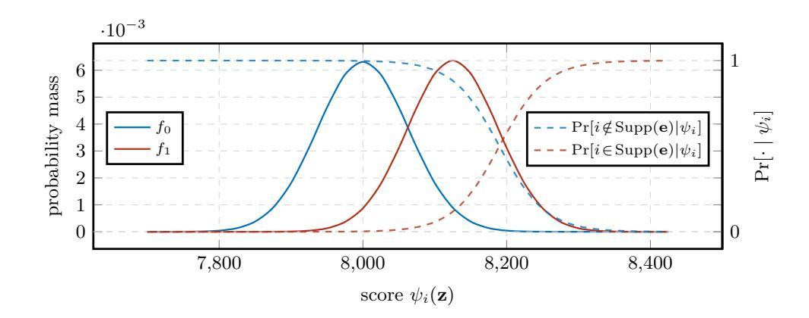

Fig. 1: Example score distribution and reliabilities for  $\mathcal{HSD}(n, k, t, m, \mathcal{E})$  with n = 3488, k = 2720, t = 64, m = 250 and d = 0.

Note that, in contrast to the mere score values, this reliability vector accounts for the fact that most of the time, namely for n-t out of n samples, the score is drawn from  $\mathcal{D}_0$ . This asymmetry carries substantial information, as illustrated in Figure 1. If both distributions were sampled equally often, then for any score below  $\sim 8060$  the probability of having been drawn from  $\mathcal{D}_0$  would exceed 1/2, since such scores occur more frequently under  $\mathcal{D}_0$ . Taking the asymmetric sampling into account shifts this threshold to  $\sim 8190$ .

## <span id="page-8-0"></span>4 Information Set Decoding with Hints

We now show how to leverage the reliabilities derived in Lemma 3.1 within the ISD framework to obtain speedups when solving HSDP.

**Optimal Permutation Selection** Recall that Prange's ISD algorithm succeeds whenever a permutation **P** is chosen such that the support of the error is included entirely in the first n - k coordinates of  $\mathbf{P}^{-1}\mathbf{e}$ , i.e.,  $\mathbf{P}^{-1}\mathbf{e} = (\mathbf{e}_1 \mid 0^k)$ .

Clearly, choosing permutations  ${\bf P}$  that maximize the probability of success in every iteration is optimal. This corresponds to choosing the permutation maximizing success conditioned on the obtained reliability vector  ${\bf r}$  from Lemma 3.1. Therefore, in the first iteration, any permutation that permutes the indices of the largest entries in  ${\bf r}$  to the front of  ${\bf P}^{-1}{\bf e}$  maximizes success.

However, an unsuccessful permutation then implies that all size t subsets of the selected indices are not equal to the error support. Thus, to maximize the probability of success in the second iteration, we must condition on this additional information. Ideally, we would rank the remaining  $\binom{n}{n-k}-1$  subsets according to their conditional probabilities of covering the error support and choose a permutation  $\mathbf{P}_2$  that permutes the highest ranked set to the front of  $\mathbf{P}_2^{-1}\mathbf{e}$ . Another unsuccessful run would then require computing  $\binom{n}{n-k}-2$  additional conditional probabilities. Generally, following this strategy, the amount of conditional probabilities to consider introduces an exponential overhead for permutation selection in each iteration.

{9}------------------------------------------------

This problem is similar to the optimal MRB computation in soft-decision decoding. Bitzer and Bossert [3] approximate the best  $\mathbf{P}_i$  in every iteration assuming coordinate-wise independence with respect to the information gained per iteration. However, the quality of their approximation quickly deteriorates after few iterations. Since in our setting we usually require an exponential amount of updates before a successful permutation is found, this approach is not suitable.

**A Sampling Approach** In order to overcome the exponential overhead of the ideal strategy, we approximate it via a sampling strategy. For this we ignore the information obtained from unsuccessful runs and instead sample the first n-k entries of  $\mathbf{P}_i^{-1}\mathbf{e}$  with probabilities proportional to  $\mathbf{r}$ . Precisely, we sample each coordinate with respect to the normalized probabilities  $p_i = r_i / \sum_{i \in [n]} r_i$ .

If no hints are available then the reliability vector satisfies  $r_i = t/n \, \forall i$  and correspondingly leads to probabilities  $p_i = 1/n$ , i.e., we select permutations uniformly at random. In other words, the sampling algorithm reduces to Prange's algorithm in this case. We detail the full algorithm to solve HSDP in Algorithm 1.

#### Algorithm 1: Permutation-based Hint-ISD

```
Input: Parity-check matrix \mathbf{H} \in \mathbb{F}_2^{(n-k)\times n}, syndrome \mathbf{s}, weight t, indices I,
                      with m size of I, integer syndrome \mathbf{z} \in \mathbb{N}^m.
     Output: Error vector \mathbf{e} \in \mathbb{F}_2^n of weight t such that \mathbf{He} = \mathbf{s}.
 1 for i \leftarrow 1 to n do
      \begin{array}{c} \psi_i(\mathbf{z}) \leftarrow \langle \mathbf{h}_{i|I}, \mathbf{z} \rangle + \langle 1^m - \mathbf{h}_{i|I}, t^m - \mathbf{z} \rangle & \text{// Calculate scores.} \\ r_i \leftarrow \Pr\left[i \in \operatorname{Supp}(\mathbf{e}) \mid \psi_i(\mathbf{z})\right] & \text{// Derive reliabilities.} \end{array} 
 \mathbf{2}
 3
 4 for i \leftarrow 1 to n do
     p_i \leftarrow r_i / \sum_{j=1}^n r_j
                                                           // Normalize to get sample distribution.
 5
 6 Let \mathcal{D} be the distribution that samples i with probability p_i, i \in [n].
 7 repeat
            Sample set F by drawing n-k times from \mathcal{D} without replacement.
 8
            Choose random permutation P that permutes F to the first n-k positions.
 9
            (\mathbf{H}_1,\mathbf{H}_2)\leftarrow\mathbf{HP}
10
            if \mathbf{H}_1 is non-singular then
11
                  \mathbf{e}_1 \leftarrow \mathbf{H}_1^{-1} \mathbf{s}
12
                  if |\mathbf{e}_1| = t then
13
                        return \mathbf{P}(\mathbf{e}_1, 0^k)
14
```

<span id="page-9-1"></span>**Theorem 4.1 (Permutation-based Hint-ISD).** Consider an instance of  $\mathcal{HSD}(n,k,t,m,\mathcal{E})$  with solution  $\mathbf{e} \in \mathbb{F}_2^n$  and  $S := \mathrm{Supp}(\mathbf{e})$ . Then Algorithm 1

{10}------------------------------------------------

*solves the given instance with polynomial memory in expected time*

$$T = \tilde{\mathcal{O}} \left( \prod_{i \in S} \left( \frac{1}{p_i} \sum_{\substack{J \subseteq [n] \\ |J| = n - k}} \prod_{j \in J} p_j \middle/ \sum_{\substack{J \subseteq [n] \setminus \{i\} \\ |J| = n - k - 1}} \prod_{j \in J} p_j \right) \right) \to \tilde{\mathcal{O}} \left( \prod_{i \in S} \frac{1}{1 - e^{-\lambda p_i}} \right),$$

where 
$$p_i = \frac{r_i}{\sum_i r_i}$$
 for  $r_i$  as defined in Lemma 3.1 and  $\sum_i (1 - e^{-\lambda p_i}) = n - k$ .

*Proof.* The correctness follows from the correctness of Prange's algorithm and the existence of a permutation matrix **P**<sup>∗</sup> such that **P**<sup>∗</sup>**e** = (**e**1*,* 0 *k* ). Note that all reliabilities are non-zero, and hence all probabilities *p<sup>i</sup>* are strictly positive, ensuring that **P**<sup>∗</sup> is chosen with non-zero probability.

The expected time complexity is the time per iteration divided by the success probability per iteration. First note that the time spent in each iteration is polynomial, and hence, subsumed in our use of the Landau notation.

An iteration is successful if the chosen permutation distributes the whole support of **e** onto the first *n*−*k* coordinates of **P**−1**e** and if **H**<sup>1</sup> is invertible. Note that **H**<sup>1</sup> is invertible with constant success probability.

To compute the success probability per iteration, let the error support be denoted by *S* ⊆ [*n*]. Let *F* ⊆ [*n*] denote the set representing the column-indices of the first *n* − *k* columns of **HP** for the permutation **P** selected in each iteration. Then the probability of the permutation distributing the weight as desired is

$$q := \Pr[S \subseteq F] = \prod_{i \in S} \Pr[i \in F] = \prod_{i \in S} \frac{p_i \sum_{\substack{J \subseteq [n] \setminus \{i\} \\ |J| = n - k - 1}} \prod_{j \in J} p_j}{\sum_{\substack{J \subseteq [n] \\ |J| = n - k}} \prod_{j \in J} p_j}.$$

Here the numerator sums over the probabilities of all subsets including the *i*-th index, while the denominator normalizes with respect to the sum of probabilities over drawing any size *n* − *k* subset. Note that by using a standard Poisson approximation treating the draws as independent, i.e., including each element in *F* independently with probability *q<sup>i</sup>* , such that we obtain expected size *n* − *k*, we obtain for large *n*

$$q_i := \Pr[i \in F] = 1 - e^{-\lambda p_i}, \text{ where } \sum_i q_i = n - k,$$

leading to the claimed running time. Furthermore, all stored objects are matrices of size polynomial in *n*, therefore the memory complexity is polynomial. ⊓⊔

Note that the computation of the running time of Algorithm [1](#page-9-0) via Theorem [4.1](#page-9-1) already requires knowledge of the solution vector **e**. To avoid this we could bound the probability Pr[*i* ∈ *F* | *i* ∈ *S*] given knowledge of the corresponding

{11}------------------------------------------------

score distribution D1. However, this process requires asymptotic approximations and introduces further deviations in the actual runtime computation. We therefore in the following introduce a simpler algorithm that allows for a direct runtime computation. Afterwards we demonstrate that the obtained running time approximates Theorem [4.1](#page-9-1) well via simulations in which **e** is known a priori.

**An Approximation of Permutation-based Hint-ISD.** We approximate the sampling strategy by leveraging only information on the highest scored error coordinates, rather than all, as in Algorithm [1.](#page-9-0) Intuitively, those coordinates hold the highest information on the error support and should therefore still lead to a significant speedup.

More precisely, given the reliability vector **r**, we only consider permutations **P** such that the indices of the highest scored *α* coordinates are among the column indices of **H**1, i.e., the first *n* − *k* columns of **HP**. Therefore, once these *α* coordinates are fixed we sample permutations by randomly selecting the remaining *n* − *k* − *α* columns for **H**<sup>1</sup> out of the *n* − *α* least scored indices.

The algorithm is given in Algorithm [2](#page-11-0) and its complexity is detailed in Theorem [4.2.](#page-11-1)

```
Algorithm 2: Approx. Permutation-based Hint-ISD (Hint-Prange)
```

```
Input : Parity-check matrix H ∈ F
                                   (n−k)×n
                                   2
                                          , syndrome s, weight t, indices I,
           with m size of I, integer syndrome z ∈ N
                                                m.
  Output : Error vector e ∈ F
                            n
                            2 of weight t such that He = s.
1 for i ← 1 to n do
2 ψi(z) ← ⟨hi|I , z⟩ + ⟨1
                         m − hi|I , tm − z⟩ // Calculate scores.
3 ri ← Pr [i ∈ Supp(e) | ψi(z)] // Derive reliabilities.
4 Sort the columns i of H in descending order, according to the corresponding ri.
5 Choose α ∈ {0, . . . , n − k} optimally. // Set number of indices to fix.
6 repeat
7 Sample random permutation P such that the first α columns of H appear
       in the first n − k columns of HP.
8 (H1, H2) ← HP
9 if H1 is non-singular then
10 e1 ← H−1
                1
                  s
11 if |e1| = t then
12 return P(e1, 0
                          k
                           )
```

<span id="page-11-1"></span>**Theorem 4.2 (Approximated Permutation-based Hint-ISD).** *Algorithm [2](#page-11-0) solves* HSD(*n, k, t, m,* E) *with polynomial memory in expected time*

$$T = \tilde{\mathcal{O}}\left(\min_{\alpha \in \{0, \dots, n-k\}} \left(\frac{\binom{n-\alpha}{t-\gamma_\alpha}}{\binom{n-k-\alpha}{t-\gamma_\alpha}}\right)\right),$$

{12}------------------------------------------------

where  $\gamma_{\alpha}$  denotes the expected size of the error support included in the  $\alpha$  highest scored indices of the reliability vector  $\mathbf{r}$  from Lemma 3.1 for  $0 \le \alpha \le n - k$ .

*Proof.* The correctness follows from Prange's algorithm by observing that for  $\alpha = 0$  we have  $\gamma_{\alpha} = 0$  and Algorithm 2 collapses to Prange's algorithm.

The expected complexity is again the time per iteration divided by the success probability per iteration, with each iteration taking polynomial time only. An iteration is successful if the chosen permutation distributes the whole support of  $\mathbf{e}$  onto the first n-k coordinates of  $\mathbf{P}^{-1}\mathbf{e}$  and if  $\mathbf{H}_1$  is invertible, where the latter happens with constant probability.

To compute the success probability per iteration, note that once  $\alpha$  coordinates that include  $\gamma_{\alpha}$  positions of the error support are fixed, the probability of covering the remaining error support in a random selection of  $n-k-\alpha$  out of  $n-\alpha$  positions is

$$\frac{\binom{n-k-\alpha}{t-\gamma_{\alpha}}}{\binom{n-\alpha}{t-\gamma_{\alpha}}}.$$

By then choosing the  $\alpha$  that minimizes the runtime, we obtain the statement. Again the algorithm only stores matrices of polynomial size.

Now, in order to compute the running time of Algorithm 2 via Theorem 4.2 for any fixed  $\alpha$  we need to compute  $\gamma_{\alpha}$ , i.e., the expected size of the error support with respect to the indices of the  $\alpha$  highest scored elements of the reliability vector  $\mathbf{r}$ . While giving a closed form formula is not possible as it requires inverting binomial cumulative distribution functions, which have no closed form expression, we provide in the following lemma a formula that allows its efficient numerical computation. Essentially, in that statement  $B_{\alpha}$  is the expected size of the  $\alpha$ -highest score, and  $\gamma_{\alpha}$  is then defined as the expected number of support indices with score higher than  $B_{\alpha}$ .

Lemma 4.1 (Expected Size of Error Support  $\gamma_{\alpha}$ ). The expected number of support indices among the  $\alpha$  highest scored indices is

$$\gamma_{\alpha} := t \cdot \Pr \left[ \psi_i(\mathbf{z}) > B_{\alpha} \mid i \in \text{Supp}(\mathbf{e}) \right],$$

where  $\psi_i$  is the score function (Definition 3.1) and  $B_{\alpha} \in \mathbb{N}$  is the smallest threshold that satisfies

$$(n-t)\cdot\Pr\left[\psi_i(\mathbf{z})>B_\alpha\mid i\notin\operatorname{Supp}(\mathbf{e})\right]+t\cdot\Pr\left[\psi_i(\mathbf{z})>B_\alpha\mid i\in\operatorname{Supp}(\mathbf{e})\right]\leq\alpha.$$

*Proof.* Given a threshold  $B \in \mathbb{N}$ , for each  $i \in \operatorname{Supp}(\mathbf{e})$ ,  $i = 1, \ldots, t$ , define the indicator  $Y_i^{(B)}$  with  $Y_i^{(B)} = 1 \Leftrightarrow \psi_i(\mathbf{z}) > B$ . Then, the number of support indices with score greater than B is  $Z^{(B)} := \sum_{i=1}^t Y_i^{(B)}$ . By linearity of expectation,

$$\mathbb{E}\left[Z^{(B)}\right] = \sum_{i=1}^{t} \mathbb{E}\left[Y_i^{(B)}\right] = t \cdot \Pr\left[\psi_i(\mathbf{z}) > B \mid i \in \operatorname{Supp}(\mathbf{e})\right].$$

{13}------------------------------------------------

Similarly, for  $i=1,\ldots,n$  define the indicators  $X_i^{(B)}$  with  $X_i^{(B)}=1 \Leftrightarrow \psi_i(\mathbf{z})>B$ . Then, the total number of indices with score greater than B is  $\sum_{i=1}^n X_i^{(B)}$ . Introducing the notation  $f(B)\coloneqq\mathbb{E}\left[\sum_{i=1}^n X_i^{(B)}\right]$ , we have

$$f(B) = \sum_{i=1}^{n} \mathbb{E}\left[X_{i}^{(B)}\right] = \sum_{i=1}^{n} \Pr\left[\psi_{i}(\mathbf{z}) > B\right]$$
$$= (n-t) \cdot \Pr\left[\psi_{i}(\mathbf{z}) > B \mid i \notin \operatorname{Supp}(\mathbf{e})\right] + t \cdot \Pr\left[\psi_{i}(\mathbf{z}) > B \mid i \in \operatorname{Supp}(\mathbf{e})\right].$$

Note that f is non-increasing in B and satisfies  $\lim_{B\to 0} f(B) = n$  and  $\lim_{B\to \infty} f(B) = 0$ . Therefore, for any  $\alpha \in [0, n]$  there exists

$$B_{\alpha} := \min\{B \mid f(B) \le \alpha\}.$$

By definition of  $B_{\alpha}$  we have  $f(B_{\alpha}) \leq \alpha$  and  $f(B) > \alpha$  for all  $B < B_{\alpha}$ , i.e.,  $B_{\alpha}$  is the smallest threshold leaving at most  $\alpha$  expected scores above it. Selecting the  $\alpha$  highest scored indices is therefore equivalent to fixing the threshold at  $B_{\alpha}$ . Substituting  $B = B_{\alpha}$  in the identity for  $\mathbb{E}\left[Z^{(B)}\right]$  gives the claimed formula:

$$\gamma_{\alpha} = \mathbb{E}\left[Z^{(B_{\alpha})}\right] = t \cdot \Pr\left[\psi_{i}(\mathbf{z}) > B_{\alpha} \mid i \in \operatorname{Supp}(\mathbf{e})\right].$$

Considering Modern ISD Improvements After the pioneering work of Prange, many improvements of his original algorithm have been proposed. While both — Algorithms 1 and 2 — are compatible with those improvements, all of them have been shown to ultimately converge back to Prange's algorithm in the setting where t = o(n) used by most cryptographic constructions [31]. Nevertheless, in practice often an early enumeration variant by Stern [30] leads to (slight) polynomial speedups and is therefore considered for the security estimates of schemes, like HQC and McEliece.

Stern's ISD. While Prange assumes that the entire error support is covered within the indices corresponding to the columns of  $\mathbf{H}_1$ , i.e., the first n-k columns of  $\mathbf{HP}$ , Stern allows for a few error coordinates outside the indices of those columns. More precisely Stern assumes that  $\mathbf{P}^{-1}\mathbf{e} = (\mathbf{e}_1, 0^{\ell}, \mathbf{e}_2)$  with  $\mathbf{e}_1 \in \mathbb{F}_2^{n-k-\ell}$ ,  $|\mathbf{e}_1| = t-p$  and correspondingly  $\mathbf{e}_2 \in \mathbb{F}_2^k$ ,  $|\mathbf{e}_2| = p$ , for optimization parameters  $\ell, p$ . This then yields

$$(\mathbf{HP})(\mathbf{P}^{-1}\mathbf{e}) = \mathbf{s} \quad \Leftrightarrow \quad (\mathbf{I}_{n-k}, \mathbf{H}_2)(\mathbf{P}^{-1}\mathbf{e}) = \mathbf{H}_1^{-1}\mathbf{s} \eqqcolon \mathbf{s}'.$$

Using the assumed distribution on  $\mathbf{P}^{-1}\mathbf{e}$  we obtain

$$(\mathbf{e}_1, 0^\ell) + \mathbf{H}_2 \mathbf{e}_2 = \mathbf{s}'.$$

Therefore the syndrome  $\mathbf{s}'$  coincides on its last  $\ell$  coordinates with the last  $\ell$  coordinates of  $\mathbf{H}_2\mathbf{e}_2$ . Stern's approach now enumerates all vectors  $\mathbf{e}_2$  of weight

{14}------------------------------------------------

 $|\mathbf{e}_2| = p$  that match  $\mathbf{s}'$  on its last  $\ell$  entries in a meet-in-the-middle fashion. Once an  $\mathbf{e}_2$  is found for which  $\mathbf{e}_1 = (\mathbf{s}' + \mathbf{H}_2 \mathbf{e}_2)_{|[n-k-\ell]}$  has weight t-p the solution is recovered as  $\mathbf{P}(\mathbf{e}_1, 0^{\ell}, \mathbf{e}_2)$ . The cost per iteration is then increased from inverting  $\mathbf{H}_1$  to performing the enumeration procedure considering a total of

$$\mathcal{O}\left(\max\left(\binom{k/2}{p/2},\binom{k/2}{p/2}^2/2^\ell\right)\right),$$

vectors on expectation. Note that the probability of a random permutation distributing the weight as desired changes to  $\frac{\binom{n-k-\ell}{t-p}\binom{k}{p}}{\binom{n}{t}}$ .

Enumeration-based Hint-ISD. Clearly, the above strategy is compatible with Algorithms 1 and 2 as there are permutations that distribute only t-p indices corresponding to entries of the error support to the front of **HP**. In those cases we can then similarly enumerate candidates for  $\mathbf{e}_2$ . A straightforward adaptation of the time and memory complexity of Algorithm 2 from Theorem 4.2 to this setting then yields

<span id="page-14-2"></span>
$$T = \tilde{\mathcal{O}}\left(\frac{\binom{n-\alpha}{t-\gamma_{\alpha}} \cdot \max\left(\binom{k/2}{p/2}, \binom{k/2}{p/2}^2/2^{\ell}\right)}{\binom{n-k-\alpha-\ell}{t-\gamma_{\alpha}-p}\binom{k}{p}}\right),\tag{1}$$

and  $M = \tilde{\mathcal{O}}\left(\max\left(\binom{k/2}{p/2}, \binom{k/2}{p/2}^2/2^\ell\right)\right)$  for optimal choices of  $\alpha, p$  and  $\ell$ .

## <span id="page-14-0"></span>5 A Bound on the Number of Hints for Polynomial-Time Decoding

In the following, we estimate the probability that a given number of hints is sufficient to solve the underlying instance in polynomial time using ISD. Observe that Algorithm 2 solves the instance in polynomial time for  $\alpha = n - k$  if the highest scored n - k indices already include all the indices representing the support of e.<sup>1</sup> This is equivalent to the MRB with respect to the reliability vector  $\mathbf{r}$  from Lemma 3.1 already leading to successful decoding. We now provide an analysis for the required number of hints m to allow for direct successful decoding via the MRB.

Setup and success event. On the basis of Proposition 3.1 and Definition 3.2, each score is drawn from  $\mathcal{D}_1$  when the corresponding index is in the support of  $\mathbf{e}$  and from  $\mathcal{D}_0$  otherwise. The basic idea is to fix a threshold and show that with high probability all elements of the error support (distributed according to  $\mathcal{D}_1$ ) lie above the threshold, while not too many elements from outside the error support (distributed according to  $\mathcal{D}_0$ ) attain a value higher than the threshold.

<span id="page-14-1"></span><sup>&</sup>lt;sup>1</sup> If considering Stern's adaptation, then all but a constant number of those indices.

{15}------------------------------------------------

More precisely, fix a threshold  $B \in \mathbb{N}$  and consider two events. The first,  $E_0$ , constitutes the case that out of the n-t elements distributed according to  $\mathcal{D}_0$ , at most n-k-t are larger than B. The second event  $E_1$  models the case where all t random variables distributed according to  $\mathcal{D}_1$  are greater than B. We write  $\Pr[E_0] = p_0(B)$  and  $\Pr[E_1] = p_1(B)$ . By construction,  $E_1 \cap E_0$  implies that the highest scored n-k entries include all support coordinates of  $\mathbf{e}$ , representing success. Hence, using the union bound, we can lower bound the probability of success as follows:

$$\Pr[\text{success}] \ge \Pr[E_1 \cap E_0] = 1 - \Pr[E_1^c \cup E_0^c]$$
  
 
$$\ge 1 - \Pr[E_1^c] - \Pr[E_0^c] = p_0(B) + p_1(B) - 1.$$

Let us start by computing  $p_0(B)$ . Let  $q_B$  be the probability that a random variable distributed according to  $\mathcal{D}_0$  is larger than the bound B. For each random variable  $X_i \sim \mathcal{D}_0$ ,  $i = 1, \ldots, n-t$ , define the indicator  $Y_i$  with  $Y_i = 1 \Leftrightarrow X_i > B$ . Then the random variable that counts the number of  $X_i$  greater than B is  $Z := \sum_{i=1}^{n-t} Y_i$ , resulting in

$$p_0(B) = \Pr\left[Z \le n - k - t\right].$$

We now consider  $p_1(B)$ . Recall  $\mathcal{D}_1 = \text{Bin}(m(t-1+2d), \frac{1}{2}) - (d-1)m$ . Therefore, for any random variable  $X_i \sim \mathcal{D}_1$ , we define

$$p_B := \Pr[X_i > B] = \Pr[Y_i > B + (d-1)m],$$

where  $Y_i \sim \text{Bin}(m(t-1+2d), \frac{1}{2})$ . Using again a union bound, the probability that all  $X_i \sim \mathcal{D}_1$ ,  $i = 1, \ldots, t$  are greater than B can be bounded by

$$p_1(B) = \Pr\left[\bigcap_{i=1}^t (Y_i > B + (d-1)m)\right] = 1 - \Pr\left[\bigcup_{i=1}^t (Y_i \le B + (d-1)m)\right]$$
  
 
$$\ge 1 - \sum_{i=1}^t \Pr\left[Y_i \le B + (d-1)m\right] = 1 - \sum_{i=1}^t (1 - \Pr\left[Y_i > B + (d-1)m\right])$$
  
 
$$= 1 - t(1 - p_B).$$

Optimizing over the threshold B, we can bound the overall probability of success:

<span id="page-15-0"></span>
$$\Pr\left[\text{success}\right] \ge \max_{B \in \mathbb{N}} \{p_0(B) + p_1(B)\} - 1.$$

We can now quantify the number of hints m required for successful decoding. To analyze the behavior of the probabilities asymptotically, we make use of Mills' ratio approximation.

<span id="page-15-1"></span>**Lemma 5.1 (Mills' ratio approximation, [28]).** Let  $\phi(x) := (2\pi)^{-1/2} e^{-x^2/2}$  be the standard normal density and  $\Phi(x) := \int_{-\infty}^{x} \phi(u) \, \mathrm{d}u$  be the standard normal cumulative distribution function. Then, as  $x \to +\infty$ ,

$$\frac{1 - \Phi(x)}{\phi(x)} \sim \frac{1}{x}.$$

{16}------------------------------------------------

Theorem 5.1 (Lower bound on hints for polynomial-time decoding). Assume a sublinear error weight t = o(n). If

$$m \ge 2(t+2d)\left(\sqrt{\log\frac{n}{t}} + \sqrt{\log t}\right)^2$$

then  $\Pr[success] \to 1 \text{ as } n \to \infty.$ 

*Proof.* Fix a threshold B and recall that  $p_1(B)$  is the probability that all t scores drawn from  $\mathcal{D}_1$  are greater than B, while  $p_0(B)$  is the probability that among the n-t scores drawn from  $\mathcal{D}_0$ , at most n-k-t are greater than B. Then  $\Pr[\text{success}] \geq p_0(B) + p_1(B) - 1$ . We choose B and m so that both  $p_0(B)$  and  $p_1(B)$  tend to 1 as t (equivalently, n) tends to infinity.

Let  $\mu_0 = \frac{m(t+2d)}{2} - dm$ ,  $\mu_1 = \frac{m(t-1+2d)}{2} - (d-1)m$  be the means of  $\mathcal{D}_0$  and  $\mathcal{D}_1$  respectively. Let us assume that the threshold B lies between these values writing  $B = a\mu_1 + (1-a)\mu_0$  for some  $a \in [0,1]$ . Recall

$$\mathcal{D}_0 = \text{Bin}\left(m(t+2d), \frac{1}{2}\right) - dm, \quad \mathcal{D}_1 = \text{Bin}\left(m(t-1+2d), \frac{1}{2}\right) - (d-1)m,$$

where the means and variances of the considered binomials are respectively

$$\mu_0' = \frac{m(t+2d)}{2}, \ \sigma_0^2 = \frac{m(t+2d)}{4}, \quad \mu_1' = \frac{m(t-1+2d)}{2}, \ \sigma_1^2 = \frac{m(t-1+2d)}{4}.$$

We can approximate the binomial distributions by normals via the central limit theorem. For large m,t:

$$\mathcal{D}_0 + dm \sim \mathcal{N}\left(\mu_0', \sigma_0^2\right), \quad \mathcal{D}_1 + (d-1)m \sim \mathcal{N}\left(\mu_1', \sigma_1^2\right).$$

We start by bounding  $p_0(B)$ . First consider  $q_B = \Pr[X > B]$  for  $X \sim \mathcal{D}_0$ . Writing Y = X + dm, we have equivalently  $q_B = \Pr[Y > B + dm]$ , where  $Y \sim \mathcal{D}_0 + dm$ . As  $\mathcal{N}(\mu'_0, \sigma_0^2) = \mu'_0 + \sigma_0 \cdot \mathcal{N}(0, 1)$ , introducing a random variable  $N \sim \mathcal{N}(0, 1)$ , we can write

<span id="page-16-1"></span>
$$q_{B} = \Pr\left[Y > B + dm\right] \sim \Pr\left[\mu'_{0} + \sigma_{0}N > B + dm\right]$$

$$= \Pr\left[N > \frac{B + dm - \mu'_{0}}{\sigma_{0}}\right] = 1 - \Phi\left(\frac{B + dm - \mu'_{0}}{\sigma_{0}}\right),$$
(2)

where  $\Phi$  is the cumulative distribution function of the standard normal. Observing that  $\frac{B+dm-\mu_0'}{\sigma_0}=\frac{a\sqrt{m}}{\sqrt{t+2d}}$  and using Lemma 5.1, we obtain

<span id="page-16-0"></span>
$$q_B \sim 1 - \Phi\left(\frac{a\sqrt{m}}{\sqrt{t+2d}}\right) \sim \frac{\sqrt{t+2d}}{a\sqrt{2\pi m}} \exp\left(-\frac{a^2m}{2(t+2d)}\right).$$
 (3)

Recalling  $p_0(B) = \Pr[Z \le n - k - t]$  where  $Z := \sum_{i=1}^{n-t} Y_i$  with  $Y_i \sim \text{Ber}(q_B)$ , we can use Markov's inequality to obtain

<span id="page-16-2"></span>
$$p_0(B) \ge 1 - \frac{\mathbb{E}[Z]}{n-k-t} = 1 - \frac{(n-t)q_B}{n-k-t} \ge 1 - \frac{nq_B}{t},$$
 (4)

{17}------------------------------------------------

where we used  $t \leq n - k - t$  for sufficiently large n (since t = o(n)). Thus, to have  $p_0(B) \to 1$ , it is sufficient to impose that  $\frac{nq_B}{t} \to 0$ , and using Equation (3) this is implied by

<span id="page-17-0"></span>
$$\frac{a^2m}{2(t+2d)} \ge \log \frac{n}{t}.\tag{5}$$

Let us now consider  $p_1(B)$ . Recall that it holds  $p_1(B) \ge 1 - t(1 - p_B)$ , where  $p_B = \Pr[Y > B + (d-1)m]$  with  $Y \sim \mathcal{D}_1 + (d-1)m$ . Replicating the same steps as in Equation (2), we obtain

$$p_B \sim 1 - \Phi\left(\frac{B + (d-1)m - \mu_1'}{\sigma_1}\right) = \Phi\left(\frac{\mu_1' - (d-1)m - B}{\sigma_1}\right).$$

Observing that  $\frac{\mu_1' - (d-1)m - B}{\sigma_1} = \frac{(1-a)\sqrt{m}}{\sqrt{t-1+2d}}$  and using again Lemma 5.1, we have

$$p_B \sim \Phi\left(\frac{(1-a)\sqrt{m}}{\sqrt{t-1+2d}}\right) \sim 1 - \frac{\sqrt{t+2d}}{(1-a)\sqrt{2\pi m}} \exp\left(-\frac{(1-a)^2 m}{2(t+2d)}\right).$$

The condition  $p_1(B) \to 1$  is implied by  $t(1-p_B) \to 0$ . Using the derivation above, we can observe that this quantity annihilates provided that

<span id="page-17-1"></span>
$$\frac{(1-a)^2m}{2(t+2d)} \ge \log t. \tag{6}$$

From Equations (5) and (6), we get

$$m \ge 2(t+2d) \max \left\{ \frac{1}{a^2} \log \frac{n}{t}, \frac{1}{(1-a)^2} \log t \right\}.$$

Minimizing the right-hand side means choosing a such that the two terms are equal. Name  $T_{(a)} := \log \frac{n}{t}$  and  $T_{(1-a)} := \log t$ . Solving the equation  $\frac{a^2}{(1-a)^2} = \frac{T_{(a)}}{T_{(1-a)}}$  in a, we obtain the sufficient condition

$$a = \frac{\sqrt{T_{(a)}}}{\sqrt{T_{(a)}} + \sqrt{T_{(1-a)}}}, \quad m \ge 2(t+2d)\left(\sqrt{T_{(a)}} + \sqrt{T_{(1-a)}}\right)^2.$$

When considering codes of fixed rate  $R = k/n \in (0,1)$ , the sufficient condition on m can be refined. Starting from the proof in Theorem 5.1, keep the exact fraction in Equation (4):

$$p_0(B) \ge 1 - \frac{(n-t)q_B}{n-k-t}$$

This modifies Equation (5) to

$$\frac{a^2m}{2(t+2d)} \ge \log \frac{n-t}{n-k-t}.$$

{18}------------------------------------------------

With t = o(n) and k = Rn, the term  $T_{(a)}$  in the final derivation becomes

$$T_{(a)} = \log \frac{n-t}{n-k-t} = \log \frac{1-\frac{t}{n}}{1-R-\frac{t}{n}} = \log \frac{1}{1-R} + o(1),$$

which is asymptotically negligible compared to the term  $T_{(1-a)} = \log t$ . Thus, we obtain the following corollary.

<span id="page-18-0"></span>**Corollary 5.1.** Assume a fixed rate  $R \in (0,1)$  with k = Rn, and a sublinear error weight t = o(n). If

$$m \ge 2(t+2d)\log t$$
,

then  $\Pr[success] \to 1 \text{ as } n \to \infty.$ 

Perfect hints. Note that for d=0, Theorem 5.1 (up to constants) matches the result obtained by Feige and Lellouche [14] in the setting of  $t=n^{\delta}$  being a fixed root of n in the QGT case. However, it shows that the same result (up to constants) can be obtained for any t=o(n). In particular, while for cryptosystems relying on error weights of order  $\Theta(n^{\delta})$ , such as HQC, a sublinear amount of perfect hints suffices for polynomial time decoding, for systems relying on higher errors  $\Theta(\frac{n}{\log n})$ , such as McEliece, a linear number of hints is required. In particular, it shows that the error weight  $\Theta(\frac{n}{\log n})$  marks the exact transition from sublinear to linear, i.e., any  $t=o(\frac{n}{\log n})$  leads to a bound (slightly) sublinear in n. Therefore, especially for higher error rates, the precise constants and second order terms play an essential role, as a maximum of  $m \leq n - k = (1-R)n$  syndrome entries can be exposed.

Corollary 5.1 vs. simulations. In Figure 2 we compare the result from Corollary 5.1 with the experimentally required m to reach the polynomial time regime for increasing code parameters following the HQC and McEliece selection rationales. Precisely, we follow the parameters of the NIST category I parameter sets, which use rates  $R_{\rm HQC} = \frac{1}{2}$  and  $R_{\rm McEliece} = \frac{85}{109} \approx 0.8$  respectively and error weights  $t = c_{\rm (HQC)} \cdot n^{\frac{1}{2}}$  and  $t = c_{\rm (McEliece)} \cdot \frac{n}{\log n}$ , where  $c_{\rm (HQC)} \approx 0.702$  and  $c_{\rm (McEliece)} \approx 0.216$  (compare to Tables 1 and 3 in Section 6).

In Figure 2 we report the threshold for m given by Corollary 5.1 against practical simulations in the HQC (left) and McEliece (right) case. We observe that the empirical thresholds closely follow the predicted scaling and that the bound from Corollary 5.1 holds true.

For the McEliece regime, the asymptotic bound from Corollary 5.1 is approached slowly from above, which explains the empirical data lying closer to the theoretical bound. Therefore note that under McEliece scaling  $t = c \cdot \frac{n}{\log n}$  and error parameter  $d = \kappa t$ , the corollary gives

<span id="page-18-1"></span>
$$\frac{m}{n} = \frac{2(t+2d)\log t}{n} = 2(1+2\kappa)c\left(1 + \frac{\log c - \log\log n}{\log n}\right),\tag{7}$$

implying that the theoretical ratio approaches the constant  $2(1+2\kappa)c$  at a slow rate  $1-\Theta(\frac{\log\log n}{\log n})$ . However, for growing n the bound also in the McEliece regime holds.

{19}------------------------------------------------

<span id="page-19-1"></span>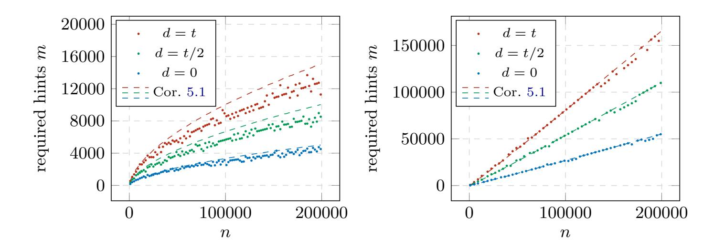

Fig. 2: Bound from Corollary 5.1 vs. empirical threshold m obtained in experiments for HQC regime (left) and McEliece regime (right).

A rate-bound in the McEliece case. From Equation (7), we know that in the McEliece setting the bound converges to  $m \sim 2(1+2\kappa)cn$ . Since the syndrome has length n-k=(1-R)n, the required fraction of entries to be exposed satisfies  $\frac{m}{n-k} \to \frac{2(1+2\kappa)c}{1-R}$ . Therefore, polynomial-time decoding under the condition from Corollary 5.1 remains possible only if  $\frac{2(1+2\kappa)c}{1-R} < 1$ , or equivalently,  $c < \frac{1-R}{2(1+2\kappa)}$  or  $R < 1-2(1+2\kappa)c$ . Note that for the considered NIST category I parameter set of McEliece this bound is violated. However, it corresponds to the strict requirement that all error positions lie among the first n-k indices. Nevertheless, as we show in the next section we are still able to reach the polynomial-time regime, as the MRB typically misses only a few error positions, which can be recovered by enumeration or sampling.

### <span id="page-19-0"></span>6 Practical Results

We now demonstrate the effectiveness of the proposed algorithms on practical parameters. We provide real simulations of the attacks and compare those against the complexity estimates from Section 4 as well as against the ILP-based results from [5] and the decoder from [7]. We consider parameters suggested in the McEliece and HQC cryptosystems. Both schemes fall into the regime of Theorem 5.1 by using an error weight of t = o(n), with McEliece using a slightly higher error weight of  $t = \Theta\left(\frac{n}{\log n}\right)$ , while HQC relies on  $t = \Theta\left(\sqrt{n}\right)$ . In line with Theorem 5.1 and Corollary 5.1, we find that the algorithms from Section 4 perform best for smaller error weights, while obtaining competitive results in both case studies. We start by providing our results on McEliece parameters in the perfect hints setting.

#### <span id="page-19-2"></span>6.1 McEliece

Note that the amount of permutations required by Algorithms 1 and 2 are affected by the number of available perfect hints m, while the polynomial overhead per

{20}------------------------------------------------

<span id="page-20-0"></span>

|               |      |      | mceliece348864 mceliece460896 mceliece6688128 mceliece6960119 mceliece8192128 |      |      |
|---------------|------|------|-------------------------------------------------------------------------------|------|------|
| n             | 3488 | 4608 | 6688                                                                          | 6960 | 8192 |
| k             | 2720 | 3360 | 5024                                                                          | 5413 | 6528 |
| t             | 64   | 96   | 128                                                                           | 119  | 128  |
| NIST category | I    | III  | V                                                                             | V    | V    |

Table 1: Classic McEliece parameter sets.

<span id="page-20-1"></span>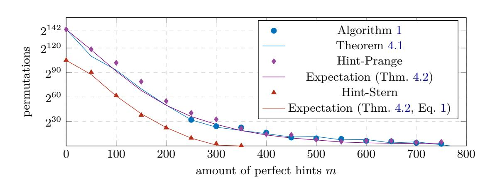

Fig. 3: Expected number of permutations vs. simulations for Algorithm [1](#page-9-0) and Algorithm [2](#page-11-0) in the random binary code setting on mceliece348864 parameters.

iteration in form of a Gaussian elimination at a cost of roughly O((*n* − *k*) <sup>2</sup>*n*) bit operations is independent of *m*. We therefore consider the amount of permutations required by Algorithms [1](#page-9-0) and [2](#page-11-0) to recover the solution as the cost metric in the following. For convenience we restate the McEliece parameters in Table [1.](#page-20-0)

*Validating theoretical predictions.* In Figure [3,](#page-20-1) we report simulations for both algorithms on mceliece348864 parameters (marks), together with the estimated number of permutations from Theorems [4.1](#page-9-1) and [4.2](#page-11-1) (solid lines). For Theorem [4.1,](#page-9-1) the running time can be computed directly since the solution vector **e** is known in advance. For Algorithm [1,](#page-9-0) simulations correspond to full executions, while for Algorithm [2](#page-11-0) (Hint-Prange, Hint-Stern) we simulate the number of error support indices among the top *α* scored coordinates and apply the runtime formula from Theorem [4.2](#page-11-1) and Equation [\(1\)](#page-14-2). In all cases, the simulations closely match the theoretical predictions. Both algorithms therefore interpolate smoothly between polynomial time and Prange's complexity in the absence of hints, and the complexity of Algorithm [2](#page-11-0) provides a good approximation of that of Algorithm [1.](#page-9-0) For a large number of perfect hints, Algorithm [2](#page-11-0) even has a slight advantage, as the sampling variance in Algorithm [1](#page-9-0) increases the runtime, making MRB-based decoding more favorable. For comparison, we also show the complexity of Algorithm [2](#page-11-0) enhanced by Stern's enumeration (red triangles), with the enumeration cost bounded by one Gaussian elimination. Consequently, once the highest scored *n* − *k* − *ℓ* coordinates miss at most *p* error positions, recovery remains polynomial-time.

*Performance on different parameters.* In Figure [4](#page-21-0) we provide the expected complexity of Algorithm [2](#page-11-0) improved by Stern's enumeration procedure for all

{21}------------------------------------------------

<span id="page-21-0"></span>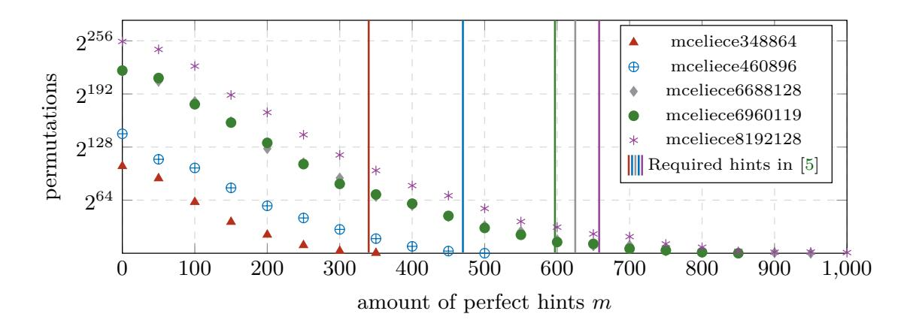

Fig. 4: Expected number of permutations for Stern-improved Algorithm 2 in 30 executions.

proposed Classic McEliece parameter sets. We illustrate the amount of perfect hints required to solve the instance via ILP-based approach, as reported in [5], as vertical lines. We observe that those align approximately with Algorithm 2 entering the polynomial-time regime. Recall that ILP-based approaches remain applicable only once this threshold of perfect hints is crossed.

The Systematic Form Setting So far, we assumed uniformly random parity-check matrices over  $\mathbb{F}_2$ , as in [5] (the random code setting). However, in practice, schemes such as McEliece and HQC often use systematic form  $\mathbf{H} = (\mathbf{I}_{n-k} \mid \mathbf{H}')$ , which we call the systematic form setting.

Note that in this setting a set of m perfect hints  $(\mathbf{h}_i, z_i) \in \mathbb{F}_2^n \times \mathbb{N}$  with  $i \in H \subset [n-k]$  only provides information on k+m coordinates of  $\mathbf{e}$ , namely those lying in the joint support of the  $\mathbf{h}_i$ . In other words,  $\mathbf{H}$  projected to the rows  $i \in H$  contains n-k-m zero columns. Moreover, the scores of the identity columns  $\mathbf{u}_i$ ,  $i \in U$ , of  $\mathbf{H}_{|H}$  follow a different distribution than in Proposition 3.1, which assumes uniformly random columns in  $\mathbb{F}_2^m$ . Nevertheless, the scoring principle remains valid: columns with  $e_i = 1$  satisfy  $|\mathbf{u}_i| + |1^m - \mathbf{u}_i| = m$ , while those with  $e_i = 0$  do not. Experimentally, although these cases become harder to distinguish, the highest-ranked indices still contain the error support with increased probability.

We therefore adapt Algorithm 2 to this setting by introducing a parameter  $\alpha' \leq m$  fixing the  $\alpha'$  highest-scored indices  $U_{\alpha'}$  in U, together with the  $\alpha$  highest-scored indices  $H_{\alpha}$  in  $H \setminus U$ . The remaining  $n - k - \alpha - \alpha'$  indices used to form  $\mathbf{H}_1$  are then sampled from  $U \setminus U_{\alpha'}$ ,  $H \setminus (U \cup H_{\alpha})$ , and  $[n] \setminus H$  proportionally to their expected error weights. In general, most remaining indices come from  $[n] \setminus H$  as the scoring technique leads already to small remaining weights on  $U \setminus U_{\alpha'}$  and  $H \setminus (U \cup H_{\alpha})$ .

In Figure 5, we report the resulting complexity of Algorithm 2, combined with Stern's enumeration, as a function of the number of perfect hints. The error weights are estimated by simulation, and the enumeration cost is bounded by a single loop iteration of Algorithm 2. Although polynomial time is no longer reached, the running time remains practically feasible, with expected permutation counts converging to  $2^{14}$ ,  $2^{32}$ ,  $2^{43}$ ,  $2^{40}$ , and  $2^{41}$  for the respective parameter sets.

{22}------------------------------------------------

<span id="page-22-0"></span>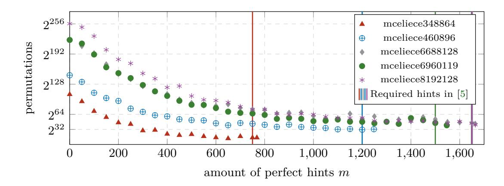

Fig. 5: Expected number of permutations for Algorithm [2](#page-11-0) in the systematic form setting in 30 executions.

We additionally re-implemented the ILP-based approach of [\[5\]](#page-27-5) and indicate its applicability thresholds as vertical lines. Interestingly, ILP remains effective only when *m* is close to *n*−*k*, that is, when almost the entire syndrome is exposed over the integers.

<span id="page-22-1"></span>

|                            | mceliece348864 mceliece460896 mceliece6688128 mceliece6960119 mceliece8192128 |          |     |          |     |          |     |          |     |
|----------------------------|-------------------------------------------------------------------------------|----------|-----|----------|-----|----------|-----|----------|-----|
|                            | syst. random syst. random syst. random syst. random syst. random              |          |     |          |     |          |     |          |     |
|                            | Hint-ISD (Equation (1))                                                       |          |     |          |     |          |     |          |     |
| T                          | 104<br>2                                                                      | 144<br>2 |     | 220<br>2 |     | 220<br>2 |     | 255<br>2 |     |
| m<br>sqrt gain 26%<br>n−k  | 20%                                                                           | 32%      | 16% | 27%      | 15% | 32%      | 16% | 33%      | 18% |
| m<br>poly time<br>n−k      | –<br>39%                                                                      | –        | 36% | –        | 45% | –        | 48% | –        | 51% |
| Integer Linear Programming |                                                                               |          |     |          |     |          |     |          |     |
| m<br>poly time 97%<br>n−k  | 44%                                                                           | 97%      | 38% | 99%      | 38% | 97%      | 40% | 98%      | 40% |

Table 2: Ratio of perfect hints to total syndrome *m/*(*n* − *k*) for polynomial time decoding and square-root improvements in systematic form and random code settings for McEliece.

**Perfect Hint Thresholds** In Table [2,](#page-22-1) we report the number of perfect hints required to reach the polynomial-time regime for Algorithm [2](#page-11-0) with Stern's enumeration[2](#page-22-2) and for the ILP-based approach of [\[5\]](#page-27-5). For ILP, we use the authors' results in the random code setting and our re-implementation for the systematic form setting. All thresholds are obtained for an 80% success probability.

As observed earlier, Algorithm [2-](#page-11-0)based methods no longer reach polynomial time in the systematic form setting. However, unlike ILP, they can exploit any number of perfect hints *m < n* − *k*, whereas ILP succeeds only for *m* ≈ *n* − *k*. In particular, square-root gains are obtained once 26–33% of syndrome entries are exposed in the systematic setting, compared to 15–20% in the random setting.

<span id="page-22-2"></span><sup>2</sup> With enumeration cost bounded by a single loop iteration of Algorithm [2.](#page-11-0)

{23}------------------------------------------------

<span id="page-23-0"></span>

|             | n                      | k         | t | NIST category |
|-------------|------------------------|-----------|---|---------------|
| HQC-1 35398 |                        | 17699 132 |   | I             |
| HQC-3 71702 |                        | 35851 200 |   | III           |
|             | HQC-5 115274 57637 262 |           |   | V             |

Table 3: HQC parameter sets.

In the random code setting, Algorithm [2](#page-11-0) with Stern enumeration reaches polynomial time for category I and III parameters using slightly less (2-5%) hints while for category five slightly more (7-11%) hints are required.

#### **6.2 HQC**

The HQC cryptosystem uses a smaller error weight of order only *t* = *Θ*( √ *n*). We restate the HQC parameters as suggested for standardization in Table [3.](#page-23-0) In line with the observations made in Section [5](#page-14-0) and formalized in Theorem [5.1](#page-15-1) and Corollary [5.1](#page-18-0) we find that the algorithms from Section [4](#page-8-0) perform exceptionally well on those code parameters.

**Perfect Hint Thresholds** In Table [4](#page-24-0) we specify similar to the McEliece case the required amount of hints to reach the polynomial-time regime as well as a squareroot speedup, in both settings — the random code and the systematic form setting. The authors of [\[5\]](#page-27-5) considered only McEliece parameters, so we re-implemented their approach. In the systematic form setting, for HQC-1 we are able to retrieve the secret via ILP on a compute server[3](#page-23-1) within 24h of computation time only when nearly the full syndrome is exposed over the integers, i.e., *m* ≈ *n* − *k* perfect hints are provided. For HQC-3 and HQC-5 parameters we were not able to successfully decode due to computational issues, even when *m* = *n* − *k* perfect hints are provided. Hint-ISD on the other hand reaches the polynomial-time regime also in the systematic form setting. Moreover, an exposure as low as 2.8-3.4% of the syndrome entries as perfect hints already leads to polynomial-time decoding.

In the random code setting, we observe that Hint-Stern requires only 55-60% of the hints required by the ILP-based approach, corresponding to less than 3% of the total syndrome. Significant gains, such as a square-root improvement, are already obtained much earlier for 0.69 to 1.1% (systematic form) and 0.52 to 0.57% (random code) of syndrome entries being exposed over the integers.

**Performance for an Arbitrary Number of Perfect Hints** In Figure [6](#page-24-1) we illustrate the expected amount of permutations for Algorithm [2](#page-11-0) using Stern-like enumeration as a function of the available perfect hints for the different HQC parameter sets. We observe a quick decline in the number of permutations as the number of perfect hints increases. Overall, as already indicated by Table [4,](#page-24-0)

<span id="page-23-1"></span><sup>3</sup> Equipped with an AMD EPYC 7742 CPU and 1 TB of RAM

{24}------------------------------------------------

<span id="page-24-0"></span>

|                            |          | HQC-1        |       | HQC-3        | HQC-5    |              |  |  |  |
|----------------------------|----------|--------------|-------|--------------|----------|--------------|--|--|--|
|                            |          | syst. random |       | syst. random |          | syst. random |  |  |  |
| Hint-ISD (Equation (1))    |          |              |       |              |          |              |  |  |  |
| T                          | 100<br>2 |              | 2     | 164          | 223<br>2 |              |  |  |  |
| m<br>sqrt gain 1.1%<br>n−k |          | 0.57%        | 0.84% | 0.56%        | 0.69%    | 0.52%        |  |  |  |
| m<br>poly time 3.4%<br>n−k |          | 2.8%         | 3.1%  | 2.5%         | 2.8%     | 2.1%         |  |  |  |
| Integer Linear Programming |          |              |       |              |          |              |  |  |  |
| m<br>poly time 98%<br>n−k  |          | 5.1%         | —     | 4.2%         | —        | 3.5%         |  |  |  |

Table 4: Ratio of perfect hints to total syndrome *m/*(*n*−*k*) for polynomial time decoding and square-root improvements in systematic form and random code settings for HQC.

Hint-ISD reaches the polynomial-time regime much earlier than ILP (indicated by the vertical lines).

<span id="page-24-1"></span>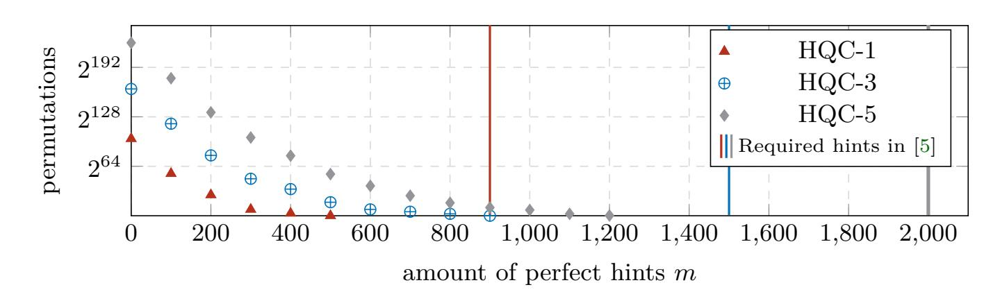

Fig. 6: Expected number of permutations for Stern-improved Algorithm [2](#page-11-0) in 10 executions for HQC in the random code setting.

In Figure [7](#page-25-0) we show the same plot in the systematic form setting, using the same adaptation of Algorithm [2](#page-11-0) as detailed in Section [6.1](#page-19-2) for the McEliece case. While permutation decrease at a smaller pace, due to the reduced information every perfect hint provides on the error support, the running time still quickly reaches the polynomial-time regime.

#### **6.3 Approximate Hints**

We similarly applied our attack (Algorithm [2\)](#page-11-0) to the approximate hint scenario for both, McEliece and HQC again in the two settings of random codes and systematic form. We consider various different noise parameters *d* applied to the NIST level I parameter sets of those schemes and provide comparison to the previous work of [\[7,](#page-27-6) [11\]](#page-27-9).

**McEliece** Our results for mceliece348864 in the random setting are shown in Figure [8.](#page-25-1) For comparison, the application thresholds required by [\[7\]](#page-27-6) are shown as

{25}------------------------------------------------

<span id="page-25-0"></span>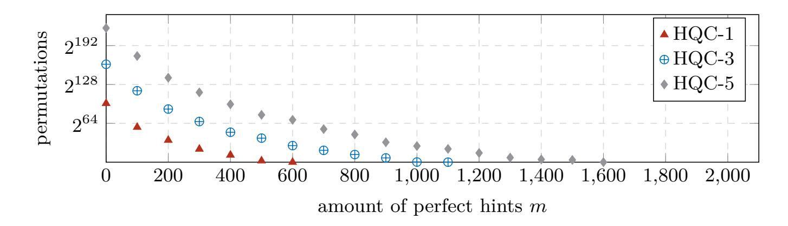

Fig. 7: Expected number of permutations for Stern-improved Algorithm 2 in the systematic form setting in 30 executions for HQC.

vertical lines. In [11], the authors identify the noise distributions Bin  $\left(\frac{t}{8}, \frac{1}{2}\right)$  and Bin  $\left(\frac{t}{4}, \frac{1}{2}\right)$  to most closely approximate the real-world side-channel noise observed in the attack of [7]. For both noise levels, our attack reaches the polynomial regime with fewer hints. Furthermore when considering higher noise levels Algorithm 2 remains highly effective, while the approach of [7] cannot recover the error vector even if the amount of approximate hints m = n - k is maximal.

<span id="page-25-1"></span>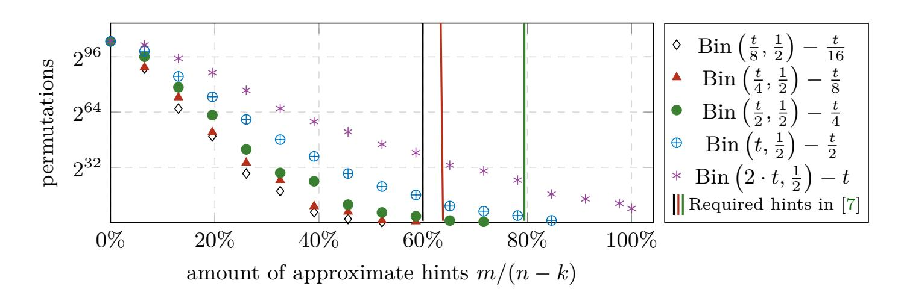

Fig. 8: Expected number of permutations for Algorithm 2 for mceliece348864 in the random setting with different noise levels in 30 executions.

Our results for the same noise levels but in the systematic setting are shown in Figure 9. As in the noise-free case, more hints are required in comparison to the random setting. However, even large noise distributed according to Bin  $(2 \cdot t, \frac{1}{2})$  leads only to about  $2^{37}$  permutations at m = n - k. Note that the attack of [7] without further adaptations is not applicable to this setting.

**HQC** Our results for HQC-1 are shown in Figure 10 and Figure 11. We observe that even very high noise levels up to Bin  $(50 \cdot t, \frac{1}{2})$  allow for successful decoding in polynomial time in the random setting. As [7] did not consider HQC, we re-implemented their attack and give the required number of hints as vertical lines in Figure 10. Again, across all noise settings, our approach reaches the polynomial-time regime with fewer hints.

{26}------------------------------------------------

<span id="page-26-0"></span>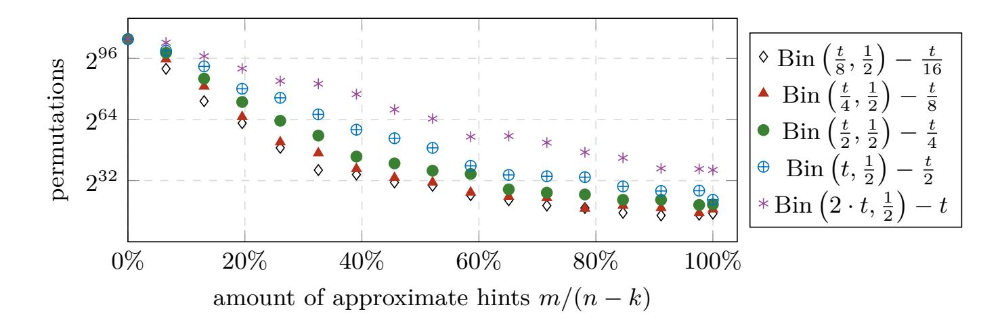

Fig. 9: Expected number of permutations for Algorithm [2](#page-11-0) for mceliece348864 in the systematic form setting with different noise levels in 30 executions.

In line with the previous McEliece results, also in the HQC setting switching to the systematic setting increases the required amount of hints as can be observed in Figure [11.](#page-27-11) However, still the polynomial regime is reached for all noise levels but Bin 50 · *t,* <sup>1</sup> 2 .

<span id="page-26-1"></span>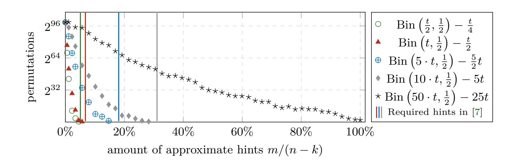

Fig. 10: Expected number of permutations for Algorithm [2](#page-11-0) for HQC-1 in the random code setting with different noise levels in 30 executions.

{27}------------------------------------------------

<span id="page-27-11"></span>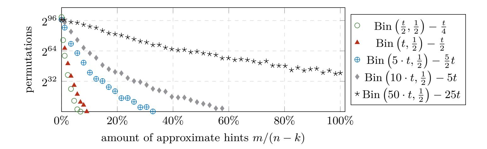

Fig. 11: Expected number of permutations for Algorithm [2](#page-11-0) for HQC-1 in the systematic form setting with different noise levels in 30 executions.

## **References**

- <span id="page-27-0"></span>1. Albrecht, M.R., Bernstein, D.J., Chou, T., Cid, C., Gilcher, J., Lange, T., Maram, V., Von Maurich, I., Misoczki, R., Niederhagen, R., et al.: Classic mceliece: conservative code-based cryptography (2022)
- <span id="page-27-1"></span>2. Becker, A., Joux, A., May, A., Meurer, A.: Decoding random binary linear codes in 2 n/20: How 1+ 1= 0 improves information set decoding. In: Annual international conference on the theory and applications of cryptographic techniques. pp. 520–536. Springer (2012)
- <span id="page-27-8"></span>3. Bitzer, S., Bossert, M.: On multibasis information set decoding. In: 2022 IEEE International Symposium on Information Theory (ISIT). pp. 2780–2784. IEEE (2022)
- <span id="page-27-2"></span>4. Both, L., May, A.: Decoding linear codes with high error rate and its impact for lpn security. In: International Conference on Post-Quantum Cryptography. pp. 25–46. Springer (2018)
- <span id="page-27-5"></span>5. Cayrel, P.L., Colombier, B., Drăgoi, V.F., Menu, A., Bossuet, L.: Message-recovery laser fault injection attack on the classic mceliece cryptosystem. In: Annual International Conference on the Theory and Applications of Cryptographic Techniques. pp. 438–467. Springer (2021)
- <span id="page-27-7"></span>6. Chase, D.: Class of algorithms for decoding block codes with channel measurement information. IEEE Transactions on Information theory **18**(1), 170–182 (2003)
- <span id="page-27-6"></span>7. Colombier, B., Drăgoi, V.F., Cayrel, P.L., Grosso, V.: Profiled side-channel attack on cryptosystems based on the binary syndrome decoding problem. IEEE Transactions on Information Forensics and Security **17**, 3407–3420 (2022)
- <span id="page-27-3"></span>8. Dachman-Soled, D., Ducas, L., Gong, H., Rossi, M.: Lwe with side information: Attacks and concrete security estimation. In: Annual international cryptology conference. pp. 329–358. Springer (2020)
- <span id="page-27-4"></span>9. D'Alconzo, G., Esser, A., Gangemi, A., Sanna, C.: Sneaking up the ranks: Partial key exposure attacks on rank-based schemes. Cryptology ePrint Archive, Report 2024/2070 (2024), <https://eprint.iacr.org/2024/2070>
- <span id="page-27-10"></span>10. Dong, H., Guo, Q.: Ot-pca: New key-recovery plaintext-checking oracle based sidechannel attacks on hqc with offline templates. IACR Transactions on Cryptographic Hardware and Embedded Systems **2025**(1), 251–274 (2025)
- <span id="page-27-9"></span>11. Drăgoi, V.F., Colombier, B., Cayrel, P.L., Grosso, V.: Integer syndrome decoding in the presence of noise. Cryptography and Communications **16**(5), 1103–1134 (2024)

{28}------------------------------------------------

- <span id="page-28-2"></span>12. Dumer, I.: On minimum distance decoding of linear codes. In: Proc. 5th Joint Soviet-Swedish Int. Workshop Inform. Theory. pp. 50–52. Moscow (1991)
- <span id="page-28-7"></span>13. Esser, A., May, A., Verbel, J.A., Wen, W.: Partial key exposure attacks on BIKE, rainbow and NTRU. In: Dodis, Y., Shrimpton, T. (eds.) CRYPTO 2022, Part III. LNCS, vol. 13509, pp. 346–375 (Aug 2022). [https://doi.org/10.1007/](https://doi.org/10.1007/978-3-031-15982-4_12) [978-3-031-15982-4\\_12](https://doi.org/10.1007/978-3-031-15982-4_12)
- <span id="page-28-10"></span>14. Feige, U., Lellouche, A.: Quantitative group testing and the rank of random matrices. arXiv preprint arXiv:2006.09074 (2020)
- <span id="page-28-3"></span>15. Finiasz, M., Sendrier, N.: Security bounds for the design of code-based cryptosystems. In: International conference on the theory and application of cryptology and information security. pp. 88–105. Springer (2009)
- <span id="page-28-12"></span>16. Gazelle, D., Snyders, J.: Reliability-based code-search algorithms for maximumlikelihood decoding of block codes. IEEE Transactions on Information Theory **43**(1), 239–249 (1997)
- <span id="page-28-13"></span>17. Guo, Q., Johansson, T., Mårtensson, E., Stankovski, P.: Information set decoding with soft information and some cryptographic applications. In: 2017 IEEE International Symposium on Information Theory (ISIT). pp. 1793–1797. IEEE (2017)
- <span id="page-28-11"></span>18. Horlemann, A.L., Puchinger, S., Renner, J., Schamberger, T., Wachter-Zeh, A.: Information-set decoding with hints. In: Code-Based Cryptography Workshop. pp. 60–83. Springer (2021)
- <span id="page-28-8"></span>19. Kirshanova, E., May, A.: Decoding mceliece with a hint–secret goppa key parts reveal everything. In: International Conference on Security and Cryptography for Networks. pp. 3–20. Springer (2022)
- <span id="page-28-4"></span>20. May, A., Meurer, A., Thomae, E.: Decoding random linear codes in. In: International Conference on the Theory and Application of Cryptology and Information Security. pp. 107–124. Springer (2011)
- <span id="page-28-9"></span>21. May, A., Nowakowski, J.: Too many hints–when lll breaks lwe. In: International Conference on the Theory and Application of Cryptology and Information Security. pp. 106–137. Springer (2023)
- <span id="page-28-5"></span>22. May, A., Ozerov, I.: On computing nearest neighbors with applications to decoding of binary linear codes. In: Annual International Conference on the Theory and Applications of Cryptographic Techniques. pp. 203–228. Springer (2015)
- <span id="page-28-0"></span>23. Melchor, C.A., Aragon, N., Bettaieb, S., Bidoux, L., Blazy, O., Deneuville, J.C., Gaborit, P., Persichetti, E., Zémor, G., Bourges, I.: Hamming quasi-cyclic (hqc). NIST PQC Round **2**(4), 13 (2018)
- <span id="page-28-6"></span>24. NIST: Call for additional digital signature schemes for the post-quantum cryptography standardization process (2022)
- <span id="page-28-14"></span>25. Pessl, P., Bruinderink, L.G., Yarom, Y.: To bliss-b or not to be: Attacking strongswan's implementation of post-quantum signatures. In: Proceedings of the 2017 ACM SIGSAC Conference on Computer and Communications Security. pp. 1843–1855 (2017)
- <span id="page-28-15"></span>26. Pessl, P., Mangard, S.: Enhancing side-channel analysis of binary-field multiplication with bit reliability. In: Cryptographers' Track at the RSA Conference. pp. 255–270. Springer (2016)
- <span id="page-28-1"></span>27. Prange, E.: The use of information sets in decoding cyclic codes. IRE Transactions on Information Theory **8**(5), 5–9 (1962)
- <span id="page-28-16"></span>28. Small, C.: Expansions and Asymptotics for Statistics. Chapman & Hall/CRC Monographs on Statistics and Applied Probability, CRC Press (2010), [https:](https://books.google.de/books?id=uXexXLoZnZAC) [//books.google.de/books?id=uXexXLoZnZAC](https://books.google.de/books?id=uXexXLoZnZAC)

{29}------------------------------------------------

- <span id="page-29-1"></span>29. Snyders, J.: Partial ordering of error patterns for maximum likelihood soft decoding. In: Workshop on Algebraic Coding. pp. 120–125. Springer (1991)
- <span id="page-29-0"></span>30. Stern, J.: A method for finding codewords of small weight. In: International colloquium on coding theory and applications. pp. 106–113. Springer (1988)
- <span id="page-29-3"></span>31. Torres, R.C., Sendrier, N.: Analysis of information set decoding for a sub-linear error weight. In: Post-Quantum Cryptography. pp. 144–161. Springer (2016)
- <span id="page-29-2"></span>32. Wu, Y., Hadjicostis, C.N.: Soft-decision decoding using ordered recodings on the most reliable basis. IEEE transactions on information theory **53**(2), 829–836 (2007)