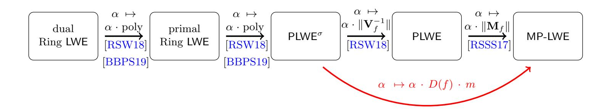
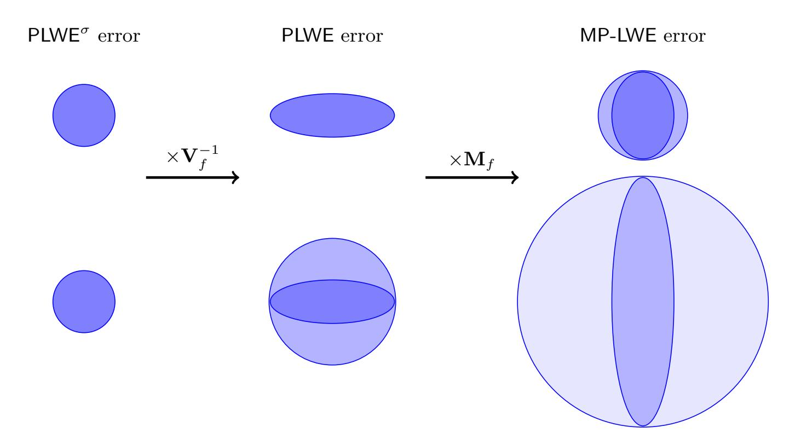
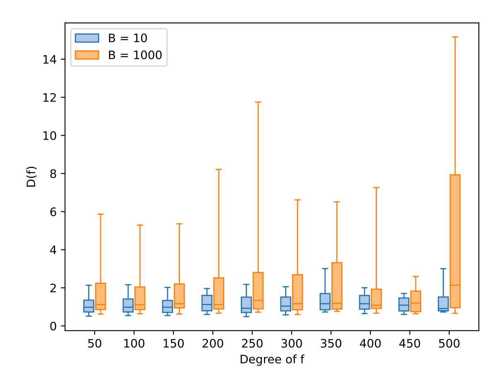
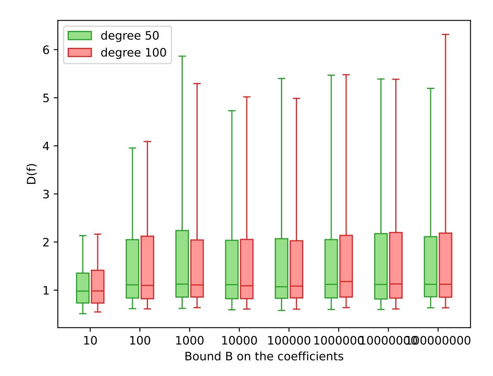
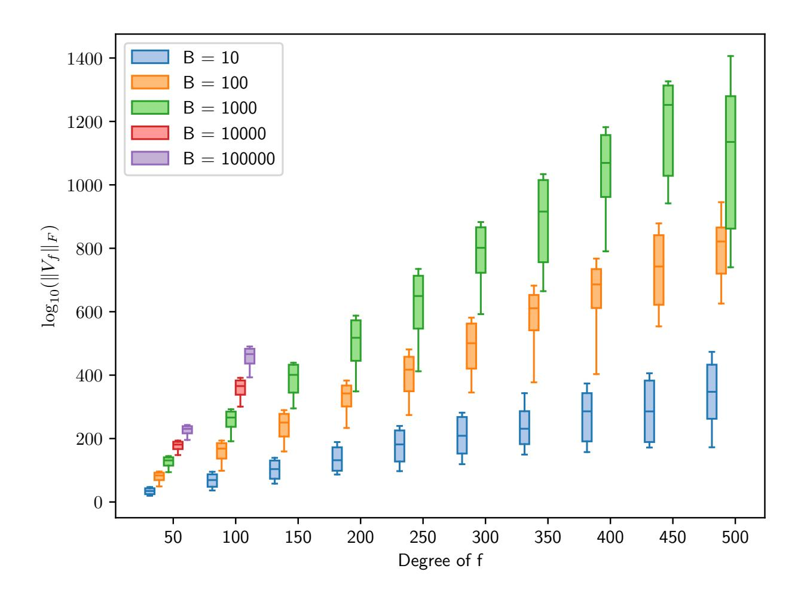
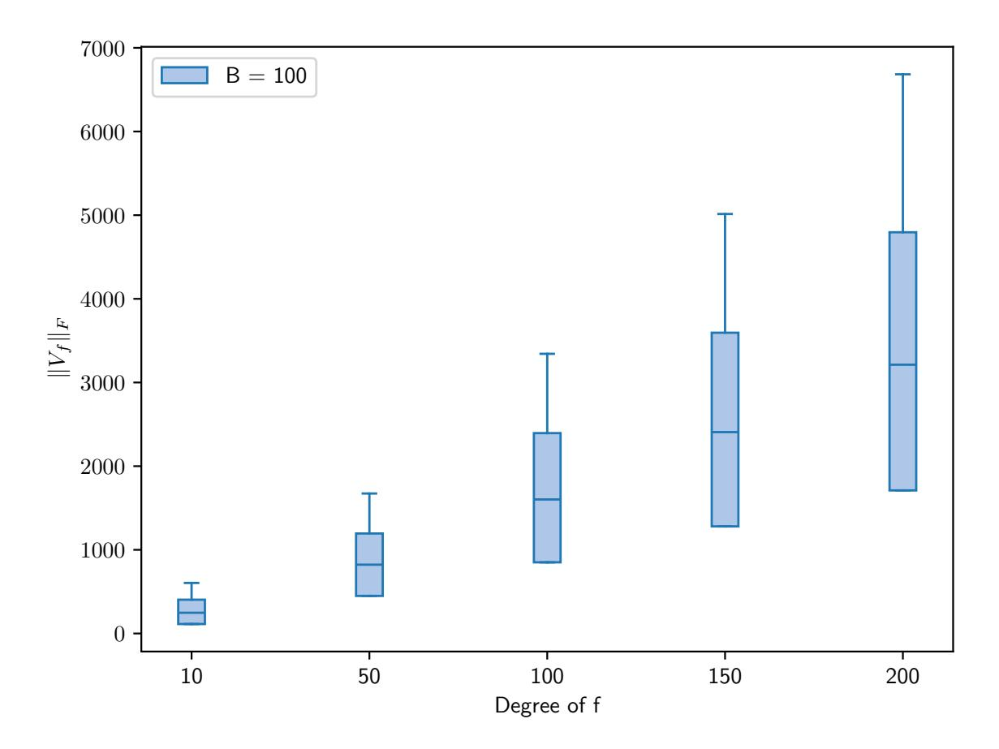

{0}------------------------------------------------

# Improved Reduction from RLWE to MP-LWE

Rahinatou Yuh Njah Nchiwo1 and Alice Pellet-Mary2

1 Aalto University, Finland [rahinatou.njahepousenchiwo@aalto.fi](mailto:rahinatou.njahepousenchiwo@aalto.fi) 2 Univ Bordeaux, CNRS, Inria, Bordeaux INP, IMB, UMR 5251, Talence, France [alice.pellet-mary@math.u-bordeaux.fr](mailto:alice.pellet-mary@math.u-bordeaux.fr)

Abstract. The Middle Product Learning With Errors (MP-LWE) problem was introduced in 2017 by Rosca, Sakzad, Steinfeld, and Stehl´e (Crypto 2017). In their work and in a follow up work by Rosca, Stehl´e, and Wallet (Eurocrypt 2018), the authors proved that MP-LWE is at least as hard as the Ring LWE problem over the field Q[x]/f(x), for an exponentially large class of polynomials f (with fixed degree and bounded coefficients). A few years later, Peikert and Pepin gave a new reduction from Ring LWE to MP-LWE (Journal of Cryptology 2024). This new reduction improved the results of Rosca et al. by increasing the set of polynomials f for which the reduction holds. However, even though the sets of polynomials covered by both reductions have exponential size, they remain negligible among the set of all polynomials of fixed degree and bounded coefficients. In this work, we provide a refined analysis of the reduction of Rosca et al. Our new analysis shows that the reduction of Rosca et al. actually covers a much larger class of polynomials than what was known before, containing (experimentally) at least 90% of all polynomials of fixed degree and bounded coefficients.

# 1 Introduction

Structured lattices have been widely used over the past decade to construct efficient post-quantum cryptographic primitives. Among the structured lattice assumptions frequently used, one can cite for instance the Ring/Module Learning With Errors (LWE) problem [\[SSTX09,](#page-30-0)[LPR10,](#page-29-0)[BGV14,](#page-28-0)[LS15\]](#page-29-1), the Ring/Module Short Integer Solution (SIS) problem [\[LM06,](#page-29-2)[PR06,](#page-29-3)[LS15\]](#page-29-1), or the NTRU problem [\[HPS06\]](#page-29-4). These examples, which cover most of the structured lattice-based constructions, all rely on the choice of some irreducible polynomial f, defining a number field K = Q[x]/f(x) (the structured lattices considered are then modules of this number field). This means that there exists as many Ring LWE (/Module LWE / Ring SIS / Module SIS / NTRU) problems as there are irreducible polynomials / number fields.[3](#page-0-0) A natural question is then to relate the hardness of the Ring

3 Multiple irreducible polynomials may define the same number fields (up to isomorphism). Depending on the structured problem considered, the problem may depend on the choice of the polynomial or only on the choice of the number field. For simplicity in this introduction, we ignore the discrepancy between number fields and defining polynomials.

{1}------------------------------------------------

LWE problem for a polynomial f1 with the hardness of the Ring LWE problem for another polynomial f2: are there weak polynomials (leading to easy Ring LWE problems)? Or stronger polynomials? This question is still open, and we know very little about it.

A first step towards understanding the hardness of a structured lattice problem for multiple choices of polynomials was achieved by Lyubashevsky in 2016 [\[Lyu16\]](#page-29-5). In his work, the author introduced the R<n-SIS problem, which is a structured lattice problem (hence enabling the construction of asymptotically fast and compact primitives) and is at least as hard as the Polynomial-SISf problem[4](#page-1-0) for an exponentially large family of polynomials f. It is important to note that the R<n-SIS problem does not depend on the choice of a polynomial: it is a single problem, and not a family of problems like the Polynomial-SISf problems. The reduction hence shows that if an attacker can solve the R<n-SIS problem, then they can solve many Polynomial-SISf problems, for exponentially many polynomials f. While this does not answer the mathematical question of comparing the hardness of Polynomial-SIS for different polynomials, this gives a pretty nice answer to the cryptographic preoccupation of finding a structured lattice problem with strong security guarantees.

The result of Lyubashevsky was later adapted to LWE by Rosca at al. in 2017 [\[RSSS17\]](#page-29-6). In their article, the authors introduced the so-called Middle-Product Learning With Errors problem (MP-LWE). This is a structured variant of LWE, which the authors used to construct an asymptotically efficient and compact public key encryption scheme. In terms of security, the authors proved that an efficient attacker against the MP-LWE problem could be used to construct efficient attackers against the Polynomial LWEf problem for an exponentially large family of polynomials f. Let us emphasize that the MP-LWE problem (like the R<n-SIS problem) does not rely on the choice of a polynomial f. Hence, we obtain a single problem, which is hard as long as at least one of the Polynomial-LWEf problem is hard for a polynomial f covered by the reduction. A year later, Rosca, Stehl´e and Wallet proved that the Ring LWEf and the Polynomial LWEf problems are equivalent for an exponentially large class of polynomials f [\[RSW18\]](#page-29-7). Combining these two results provides a proof that the MP-LWE problem is at least as hard as the Ring LWEf problem for an exponentially large set of polynomials. The point of combining the two reductions was to base the hardness of the MP-LWE problem on the hardness of the Ring LWE problem, which is better understood than that of the Polynomial LWE problem.

Since its introduction in 2017, the MP-LWE problem has been used to construct multiple cryptographic constructions [\[Hir18,](#page-28-1) [BDH](#page-28-2)+20,[LVV19,](#page-29-8)[LDSP20,](#page-29-9)[FLA23,](#page-28-3) [DAZ19,](#page-28-4) [LSW](#page-29-10)+23, [YYZW22\]](#page-30-1), it has led to a submission to the NIST [\[SSZ19,](#page-30-2) [SSZ17\]](#page-30-3), and a deterministic variant of the problem (similar to the learning with rounding problem) has been proposed [\[BBD](#page-28-5)+19]. On the security side, a new reduction from Ring LWE to MP-LWE was described by Peikert and Pepin in [\[PP24\]](#page-29-11). This new reduction allows to prove the hardness of the MP-LWE

4 This problem can be considered as a variant of the Ring-SISf problem.

{2}------------------------------------------------

problem from the hardness of Ring LWEf for an even larger class of polynomials as what was proven in [RSSS17, RSW18]. Even though the class of polynomials covered by the reductions from [RSSS17,RSW18] and [PP24] are both exponentially large, they cover only a negligible proportion of the set of all polynomials with fixed degree and bounded coefficients. More precisely, both classes require the polynomials f to have a fixed degree m, their coefficients bounded by some quantity B (polynomial in m) and they require that a constant fraction cmof the coefficients of the polynomials are equal to 0 (for some contant c > 0). These sets of polynomials hence only cover a negligible fraction of the set of all polynomials of degree m and coefficients bounded by B (they cover at most  $B^{-cm}$  of it, which tends to 0 exponentially quickly when m tends to infinity). The main question that motivated our work is then the following: can we prove the hardness of MP-LWE from the hardness of Ring LWEf over a significantly larger set of polynomials? Ideally, we would like to obtain a reduction covering the set of all irreducible polynomials of degree m and coefficients polynomially bounded.

Our contributions. In this work, we prove hardness of the MP-LWE problem from the hardness of the Ring LWEf problem for a family of polynomials f which experimentally covers at least 90% of all irreducible polynomials of degree m with coefficients bounded by some B = poly(m). More precisely, we introduce some quantity D(f), which depends on the polynomial f (the exact definition of D(f) is given in Definition 4.2 but is not needed for this introduction). We computed this quantity D(f) experimentally on many random polynomials, for varying degrees m and coefficients bound B, and we observed that at least 90% of the random polynomials we generated satisfy  $D(f) \leq m$ . On the other hand, we also proved the following theorem

**Theorem 1.1 (Informal, see Corollary 5.5).** If B = poly(m), then MP-LWE is at least as hard as Ring LWEf for any irreducible monic polynomial f of degree m, coefficients bounded by B, and satisfying  $D(f) \leq m$ .

This theorem, combined with our experimental results on D(f), provides a very large family of Ring LWEf problems that can serve as foundation for the security of MP-LWE.

A natural question arising then is the following: maybe  $D(f) \leq m$  for all polynomials f, and not just for  $\geq 90\%$  of them? We answer this question by the negative: we exhibit two families of polynomials (the Bugeaud-Mignotte polynomials [BM04, BM10] and the shifted cyclotomic polynomials) for which D(f) grows exponentially with the degree m of f. Hence, Theorem 1.1 does not cover all irreducible polynomials of degree m with polynomially bounded coefficients. These counter-examples also explain why we did not manage to prove a polynomial upper bound on D(f) for all polynomials f.

**Technical details.** To obtain our result, we follow the reduction from Ring LWEf to MP-LWE from [RSSS17, RSW18], but we provide a tighter analysis

{3}------------------------------------------------

for the last steps of the reduction. More precisely, the reduction from [RSSS17, RSW18] is obtained with multiple steps, going via some intermediate algorithmic problems. The intermediate steps of the reduction are depicted in Figure 1. The precise definition of the different algorithmic problems appearing on the figure is not needed for this introduction. The important observation is that all these algorithmic problems are parameterized by some parameter  $\alpha \geq 0$ , which measure the noise rate. For  $\alpha = 0$ , there is no noise and the problems are easy to solve. On the other hand, for  $\alpha \geq 1$ , the problems are provably intractable. Each reduction in the chain from (dual) Ring LWE to MP-LWE increases the noise rate  $\alpha$ . In order to have a meaningful reduction, we must ensure that this increase is not too large, otherwise we would end up reducing to an untractable problem.

**Fig. 1.** Known reductions from (dual) Ring LWE to MP-LWE are shown in black. Our improved analysis is shown in red. The two reductions on the left assume that  $B = \text{poly}(\deg(f))$  (where B is a bound on the coefficients of f).

Let us analyze the successive steps of this reduction in more details. If B = poly(m), the first two steps only increase the noise rate by a polynomial factor, which is considered to be fine (in full generality, the increase is of the order of poly(m, B)). We note that the original results from [RSW18] did not allow to prove a polynomial noise rate increase for these two reductions, but combining their reduction with a more recent result from [BBPS19] now allows us to prove it.

The costly steps are the last two steps, which increase the noise rate respectively by the norm of the inverse Vandermonde matrix associated to f (denoted by  $\mathbf{V}_f^{-1}$ ) and the norm of a matrix  $\mathbf{M}_f$  associated to f (the authors proved in [RSSS17] that  $\|\mathbf{M}_f\| \leq m \cdot \mathrm{EF}(f)$ , where  $\mathrm{EF}(f)$  is the so-called expansion factor of f). These two quantities are usually very large when f is chosen randomly. Our central observation, which led to our improved analysis, is as follows. The large increase of the noise rate in each of the last two steps of the reduction is due to a distortion of the error of the LWE samples, which can be very large in some directions of the space. However, this distortion is usually very skewed: some directions are expanded while others are contracted. The works of [RSSS17] and [RSW18] analyzed the two distortions independently, hence they had to provide for each of them an upper bound that was larger than the "maximum" of each distortion. However, when analyzing the two distortion together, we

{4}------------------------------------------------

noticed that they actually compensate one another. This is depicted in Figure 2 below. Said differently, if we analyze the two steps of the reduction at the same time (going directly from  $\mathsf{PLWE}^{\sigma}$  to  $\mathsf{MP-LWE}$ ), then the distortion applied to the errors can be bounded by a significantly smaller upper bound. This is what we do in our refined analysis: we prove that the total distortion between  $\mathsf{PLWE}^{\sigma}$  and  $\mathsf{MP-LWE}$  is upper bounded by some quantity which we call D(f). At a high level, this quantity D(f) is approximately equal to  $\|\mathbf{V}_f^{-1}\mathbf{M}_f\|$ . By comparison, combining the two analyses from [RSSS17] and [RSW18] would give an upper bound  $\|\mathbf{V}_f^{-1}\| \cdot \|\mathbf{M}_f\|$  on the noise growth. Since the spectral norm of matrices is sub-multiplicative, the bound on the noise growth obtained by our analysis is always at least as good as the one obtained by combining [RSSS17, RSW18]. Combining this new analysis with the known reduction from (dual) Ring LWE to  $\mathsf{PLWE}^{\sigma}$  from [RSW18] (and using the more recent improvements from [BBPS19]), we obtain Theorem 1.1.

**Fig. 2.** The figure illustrates how the two distortions compensate one another. On the first line, we over-estimate the skewed error by a spherical error only after performing the two distortions (the over-estimated spherical error is shown in lighter blue on the right part of the picture). On the second line, we over-estimate the skewed errors by a spherical error after each distortion, which leads to a larger over-estimation after the two distortions (each over-estimated error is shown in lighter blue compared to the previous one).

It then only remains to analyze the quantity D(f). Unfortunately, we were not able to prove that this quantity remains small for all polynomials f. As a matter of fact, we were even able to exhibit two families of polynomials for which we proved that D(f) grows exponentially with the degree of the polynomial (the first family is the so-called Bugeaud-Mignotte polynomials [BM04, BM10], and

{5}------------------------------------------------

the second family consists of shifted cyclotomic polynomials).[5](#page-5-0) On the positive side, we experimentally observed that the quantity D(f) seems small for almost all random polynomials: the Bugeaud-Mignotte polynomials and the shifted cyclotomic polynomials are rare exceptions. The experiments seem to indicate that D(f) remains (on average) constant when the size of the polynomial's coefficient increase, and grows at most linearly with the degree when it tends to infinity.[6](#page-5-1)

Comparison with previous works. As explained above, our new analysis refines the one of [\[RSSS17,](#page-29-6)[RSW18\]](#page-29-7), by reducing the bound on the noise growth of the critical steps. As a result, our analysis is always at least as good as theirs, meaning that the set of polynomials covered by our analysis contains the set of polynomials covered by their analysis.

The comparison with the reduction from [\[PP24\]](#page-29-11) is a bit more subtle. The techniques used in the [\[PP24\]](#page-29-11) reduction are significantly different from the ones used in the reduction from [\[RSSS17,](#page-29-6)[RSW18\]](#page-29-7), and we do not know whether they can be unified. Our improved analysis relies on techniques used in the reduction from [\[RSSS17,](#page-29-6) [RSW18\]](#page-29-7) and it does not seem that similar ideas would improve the analysis of the reduction from [\[PP24\]](#page-29-11).

Regarding the sets of polynomials covered by both reductions, it was previously thought that the reduction from [\[PP24\]](#page-29-11) covered more polynomials than the one from [\[RSSS17,](#page-29-6) [RSW18\]](#page-29-7). Our new analysis shows that this is actually not the case: the set of polynomials covered by the reduction from [\[RSSS17,](#page-29-6) [RSW18\]](#page-29-7) (with our analysis) is much larger in size than the set of polynomials covered by the reduction from [\[PP24\]](#page-29-11). However, it is important to note that our set of polynomials does not contain all the polynomials covered by the [\[PP24\]](#page-29-11) reduction. Indeed, the Bugeaud-Mignotte polynomials that are not covered by our analysis were covered by the reduction from [\[PP24\]](#page-29-11). A more detailed comparison between the two works is provided in Section [6.](#page-24-0)

Open problems. As explained above, our new analysis of the reduction covers most polynomials, but not all polynomials. An interesting question would be to see if we can have a reduction from Ring LWEf to MP-LWE for all polynomials.[7](#page-5-2)

5 The Bugeaud-Mignotte polynomials were already used in [\[RSW18\]](#page-29-7) as examples of polynomials for which the norm of the inverse Vandermonde ∥V−1 f ∥ grows exponentially fast. Therefore, these polynomials are not covered by our improved analysis, nor by the previous analysis of [\[RSSS17,](#page-29-6)[RSW18\]](#page-29-7).

6 The code we used to obtain all the experimental results displayed in this article is available at [https://plmlab.math.cnrs.fr/apelletm/code-mplwe.](https://plmlab.math.cnrs.fr/apelletm/code-mplwe)

7 Here, it might be interesting to remember that the Ring LWE problem depends on the choice of a number field, rather than the choice of a polynomial. If, for each number field, we can find a defining polynomial that is covered by our reduction, then this would be sufficient to obtain a reduction from all possible Ring LWE problems to MP-LWE.

{6}------------------------------------------------

Another open question we identified would be to obtain a reduction from Ring LWE to MP-LWE subsuming both reductions from [RSSS17, RSW18] and from [PP24]. Indeed, as explained above, both reductions use significantly different approaches, and achieve non-comparable results. Being able to unify the two reductions could be a first step towards obtaining a reduction that works for all polynomials.

Acknowledgments. The authors would like to warmly thank Alexandre Wallet, who suggested that we look at the Bugeaud-Mignotte polynomials for our counter-examples. We are also grateful to Wenwen Xia, for noticing a sign mistake in Lemma 4.1, as well as Damien Stehlé, Aurel Page, and Camilla Hollanti for helpful discussions. Finally, we would like to thank the reviewers of TCC'25 and PKC'26 for their constructive comments. Alice Pellet-Mary is supported by the TOTORO ANR grant (ANR-23-CE48-0002) and by the France 2030 program, managed by the French National Research Agency (ANR-22-PETQ-0008 PQ-TLS). Rahinatou Yuh Njah Nchiwo is supported in part by a PhD scholarship from the Magnus Ehrnrooth Foundation, Finland, and by the Vilho, Yrjö and Kalle Väisälä Fund, and in part by Business Finland Co-innovation Consortium Grant (#BFRK/473/31/2024, PI C. Hollanti) and by Research Council of Finland Grant (#351271, PI C. Hollanti). The support from the Foundation for Aalto University Science and Technology toward a research visit to the University of Bordeaux is also gratefully acknowledged.

# 2 Preliminaries

For completeness and notation purposes, we begin by recalling the definition of some mathematical structures needed in the definition of RLWE, PLWE and MP-LWE and, moreover, relevant in the proof of our main theorem. Some additional preliminaries on lattices, which are not needed in the core of the article, are postponed to Appendix A.

Probability and Gaussian distributions. If D is a probability distribution, we will use the notation  $x \leftarrow D$  to indicate that x is sampled from the distribution D, and  $x \sim D$  to indicate that x is a random variable whose probability distribution is equal to D.

For  $H \subseteq \mathbb{R}^m$  or  $H \subseteq \mathbb{C}^m$  a real vector space, we denote by  $\mathcal{N}_{H,\Sigma}$ , a continuous Gaussian distribution of covariance matrix  $\Sigma$  (which should be symmetric definite positive), for the norm induced by the  $\ell_2$  norm over  $\mathbb{R}^m$  or  $\mathbb{C}^m$ . If  $\Sigma = \sigma^2 \cdot I_n$  for some n > 0 and  $\sigma > 0$ , then we will abuse notations and simply write  $\mathcal{N}_{H,\sigma}$  instead of  $\mathcal{N}_{H,\sigma^2I_n}$ . We will use the following property about distortion of multivariate Gaussian distributions. A proof of this result can be found in [Tab21].

**Lemma 2.1.** Let  $m \geq d$  be integers and  $\Sigma \in \mathbb{R}^{m \times m}$  be symmetric definite positive. Let  $\mathbf{M} \in \mathbb{R}^{d \times m}$  be of rank d. Then  $\Sigma' := \mathbf{M} \Sigma \mathbf{M}^T \in \mathbb{R}^{d \times d}$  is symmetric definite positive, and if  $X \sim \mathcal{N}_{\mathbb{R}^m, \Sigma}$ , then  $\mathbf{M} X \sim \mathcal{N}_{\mathbb{R}^d, \Sigma'}$ .

{7}------------------------------------------------

Structured matrices. We recall the definitions of some structured matrices that are useful in the upcoming sections.

**Definition 2.2 (Rot matrix).** For a polynomial of degree m and  $a \in \mathbb{Z}[x]$ , we define the  $Rot_f^d(a) \in \mathbb{R}^{d \times m}$  for any d > 0 to be the matrix whose ith row is the coefficient of the polynomial  $(x^{i-1}a) \mod f$ ,  $i \in [1, ..., d]$ . When m = d, we simply write  $Rot_f(a)$ .

**Definition 2.3 (Hankel matrix).** The Hankel matrix  $\mathbf{M}_f \in \mathbb{R}^{m \times m}$  is defined as the matrix whose entries  $(\mathbf{M}_f)_{i,j}$ , are given by the constant coefficient of the polynomial  $x^{i+j-2} \mod f$ , for any  $i, j \in [1, \dots, m]$ .

Given a ring R and k > 0, we denote by  $R^{< k}[x]$  the set of polynomials in R[x] with degree < k. The lemma below allows us to express the Hankel matrix using the Rotational matrix.

**Lemma 2.4** ([RSSS17, Lemma 2.4]). For any  $a \in R^{< m}[x]$  and  $\mathbf{a} = (a_0, \dots, a_{m-1})^T$  its coefficient vector, we have  $\mathbf{M}_f \mathbf{a} = Rot_f(a) \cdot (1, 0, \dots, 0)^T$ .

The spectral norm of a matrix  $\mathbf{A} \in \mathbb{C}^{m \times n}$ , denoted  $\|\mathbf{A}\|$ , is the largest singular value of  $\mathbf{A}$ . Explicitly,

$$\|\mathbf{A}\| = \sqrt{\lambda_{\max}(\mathbf{A}^*\mathbf{A})} = \sigma_{\max(\mathbf{A})}$$

where  $\mathbf{A}^*$  is the conjugate transpose of  $\mathbf{A}$ . The Frobenius norm of the same matrix  $\mathbf{A}$  is defined as  $\|\mathbf{A}\|_F = \sqrt{\sum_{i=1}^{m} \sum_{i=1}^{n} |\mathbf{A}_{i,j}|^2}$ . The Frobenius and spectral norms are related via the following inequalities

$$\|\mathbf{A}\| \le \|\mathbf{A}\|_F \le \sqrt{\operatorname{rk}(\mathbf{A})} \cdot \|\mathbf{A}\|. \tag{1}$$

Interpolation polynomials. We will use Lagrange interpolation polynomials, and some property about their constant coefficient.

**Definition 2.5 (Lagrange polynomials).** Let  $\alpha_1, \ldots, \alpha_m$  be distinct complex numbers. For any  $1 \leq i \leq m$ , we denote by  $L_i$  the following Lagrange basis polynomial (associated to the  $\alpha_i$ 's)

$$L_i = \prod_{j \neq i} \frac{x - \alpha_j}{\alpha_i - \alpha_j}$$

that satisfies  $L_i(\alpha_i) = 1$  and  $L_i(\alpha_j) = 0$  if  $j \neq i$ .

**Lemma 2.6.** Let  $f \in \mathbb{Z}[x]$  be a monic irreducible polynomial of degree m and  $\alpha_1, \ldots, \alpha_m$  be its complex roots. Let  $L_i$  be a Lagrange basis polynomial associated to the  $\alpha_j$ 's, (see Definition 2.5). Then the constant coefficient of  $L_i$  is

$$L_i(0) = \frac{-f_0}{\alpha_i \cdot f'(\alpha_i)},$$

where  $f_0$  is the constant coefficient of f.

{8}------------------------------------------------

*Proof.* Note first that since f is irreducible, then its roots  $\alpha_j$ 's are all distinct, and so the Lagrange polynomial  $L_i$  is well-defined. Note also that the irreducibility of f implies that  $f_0 \neq 0$  and that all the roots  $\alpha_j$ 's are non zero. By definition of  $L_i$ , we have that

$$L_i(0) = (-1)^{m-1} \cdot \prod_{j \neq i} \frac{\alpha_j}{\alpha_i - \alpha_j}.$$

Now, since f is monic and has complex roots  $\alpha_1, \ldots, \alpha_m$ , then  $f = \prod_{j=1}^m (x - \alpha_j)$ . In particular, it holds that  $\prod_{j=1}^m \alpha_j = (-1)^m \cdot f_0$ , which implies that  $\prod_{j\neq i} \alpha_j = (-1)^m \cdot f_0 \alpha_i^{-1}$  (recall that  $\alpha_i \neq 0$ ). We also have, for all k,  $f'(\alpha_k) = \prod_{j\neq k} (\alpha_k - \alpha_j)$ . Plugging this in the equation above leads the desired formula  $L_i(0) = -\frac{f_0}{\alpha_i \cdot f'(\alpha_i)}$ .

Number fields. For a field K, with  $\mathbb{Q} \subset K$ , we say that K is a field extension of  $\mathbb{Q}$  denoted  $K/\mathbb{Q}$ . The field K can be seen as a vector space over  $\mathbb{Q}$ . The degree of this field extension is the dimension of K as a vector space of  $\mathbb{Q}$ . If this extension is finite, it is called a number field. In this article, K will always refer to a number field of finite degree m. A number field K of degree m can always be expressed as the quotient ring  $\mathbb{Q}[x]/(f(x))$  for some monic irreducible polynomial  $f(x) \in \mathbb{Z}[x]$  of degree m (which is called a defining polynomial of K). We denote by  $\Delta_K$  the (absolute value of the) discriminant of the field K. We will denote  $K_{\mathbb{R}} = K \otimes_{\mathbb{Q}} \mathbb{R} \simeq \mathbb{R}[x]/f(x)$  (where f is a defining polynomial of K), which is a ring and an  $\mathbb{R}$ -vector space, but not a field (unless f has degree 1 or 2 and is irreducible in  $\mathbb{R}[x]$ ).

An element  $\alpha \in K$  is called an algebraic integer if it is the root of a nonzero monic polynomial with integer coefficients. The set of all algebraic integers in a number field K forms a ring structure called the *ring of integers* which is denoted  $\mathcal{O}_K$ . If  $\mathcal{O}_K = \mathbb{Z}[\alpha]$ , we say that the field K is *monogenic*. A subring  $\mathcal{O} \subset \mathcal{O}_K$  is an *order* of K if it is a  $\mathbb{Z}$ -module with finite rank m.

Embeddings. An embedding of a number field K to the complex field  $\mathbb{C}$ , is an homomorphism of fields  $\sigma: K \to \mathbb{C}$ . If  $\sigma(K) \subseteq \mathbb{R}$ , we say  $\sigma$  is a real embedding. It is a complex embedding if  $\sigma(K) \nsubseteq \mathbb{R}$ , which comes in conjugate pairs. A field K of degree m admits m distinct embeddings from K to  $\mathbb{C}$ , which we will denote  $\sigma_1, \ldots, \sigma_m$ . We denote by  $\tau(\cdot)$  the canonical embedding which maps the number field into  $\mathbb{C}^m$  as:

$$\tau: K \to \mathbb{C}^m$$
  
 $\alpha \mapsto \sigma_1(\alpha), \dots, \sigma_m(\alpha)$ 

Also, we denote  $T_f(\cdot)$  as the *coefficient embedding* which maps an element of a number field  $K = \mathbb{Q}[x]/(f(x))$  to its coefficient vector with respect to the  $\mathbb{Q}$ -basis  $(1, x, \dots, x^{m-1})$ :

$$T_f: K \longrightarrow \mathbb{Q}^m,$$

$$\sum_{i=0}^{m-1} a_i x^i \mapsto (a_0, \dots, a_{m-1}).$$

{9}------------------------------------------------

The coefficient embedding can be defined for any number field K, using the isomorphism  $K \simeq \mathbb{Q}[x]/f(x)$  for some defining polynomial f. Note however that it will depend on the choice of a defining polynomial f, as well as the choice of an isomorphism between K and  $\mathbb{Q}[x]/f(x)$ .

**Definition 2.7 (Vandermonde matrix).** The Vandermonde matrix of the complex roots  $\alpha_1, \alpha_2, \ldots, \alpha_n \in \mathbb{C}$  of the polynomial f, is defined as

$$\mathbf{V}_f = \begin{bmatrix} 1 & \alpha_1 & \cdots & \alpha_1^{n-1} \\ 1 & \alpha_2 & \cdots & \alpha_2^{n-1} \\ \vdots & \vdots & \ddots & \vdots \\ 1 & \alpha_n & \cdots & \alpha_n^{n-1} \end{bmatrix}$$

Remark 2.8. We can move from one embedding to another through the Vandermonde matrix by the relation

$$\tau(x) = \mathbf{V}_f T_f(x).$$

Ideals. An integral ideal of K is a subset  $I \subseteq \mathcal{O}_K$  which is stable by addition and multiplication by elements of  $\mathcal{O}_K$ . A fractional ideal of K is a subset  $J \subset K$  of the form J = xI for some integral ideal I and  $x \in \mathbb{Q}$ . The algebraic norm of a non-zero integral ideal is  $\mathcal{N}(I) := [\mathcal{O}_K : I]$ , which is the cardinality of the (finite) set  $\mathcal{O}_K/I$ . And the algebraic norm of a fractional ideal J = xI is defined as  $\mathcal{N}(xI) = x^m \mathcal{N}(I)$ . In this article, we will be interested by two particular ideals: the conductor ideal and the different ideal.

Let  $\mathcal{O}$  be an order of K (in this work, we will always consider  $\mathcal{O} = \mathbb{Z}[x]/f(x)$ ). The conductor of the order  $\mathcal{O}$  is defined by  $\mathcal{C}_{\mathcal{O}} := \{x \in K : x\mathcal{O}_K \subseteq \mathcal{O}\}$ . This is an integral ideal of K. For a monic irreducible polynomial  $f \in \mathbb{Z}[x]$  of degree m, we denote by  $\Delta_f$  the absolute value of the discriminant of f, i.e.,  $\Delta_f = |\text{Res}(f, f')| = \prod_{i \neq j} (\alpha_i - \alpha_j) \in \mathbb{Z}$  where  $\alpha_1, \ldots, \alpha_m$  are the complex roots of f. If  $K = \mathbb{Q}[x]/f(x)$  is the number field defined by f, the discriminant of f is simply  $\Delta_f = \mathcal{N}(f'(x))$ , where  $\mathcal{N}$  is the algebraic norm over K. This quantity is related to the norm of the conductor ideal of the order  $\mathbb{Z}[x]/f(x)$  via the following equation (see, e.g., [Sut16, Th. 12.22])

$$\Delta_f = \mathcal{N}(\mathcal{C}_{\mathbb{Z}[x]/f(x)})\Delta_K.$$

From the definition of  $\Delta_f$  as the resultant of f and f', we can see that  $\Delta_f \leq \|f\|^{m-1} \cdot \|f'\|^m \leq m^m \cdot \|f\|^{2m-1}$ , where  $\|f\|$  refers to the Euclidean norm of the vector of coefficients of f.

The different ideal of the number field K is another ideal that we will consider in this work. We denote it by  $(\mathcal{O}_K^{\vee})^{-1}$ . We will not need to know the precise definition of this ideal, but simply that it is an integral ideal of K whose algebraic norm is equal to the discriminant of the field K, i.e.,  $\mathcal{N}((\mathcal{O}_K^{\vee})^{-1}) = \Delta_K$  (see, e.g., [Con09, Theorem 4.8]).

Finally, we will use in Section 5.1 the following result which states that, in any fractional ideal I and for any prime integer  $q \in \mathbb{Z}$  sufficiently large, there exists a small element t in I with  $tI^{-1}$  coprime to  $q\mathcal{O}_K$  and where t is almost

{10}------------------------------------------------

as short as the shortest non-zero element of I. In Sections 5.1 and 5.2 we will use this lemma with the conductor ideal and the different ideal respectively. Historically, a similar result was first proven in [RSW18, Th. 3.1], but with a larger upper bound on t, which depended on q. An improved version was then proven [BBPS19, Lemma 2.36], which removed the dependency in q. The version we recall below is a slight adaptation from the one of [BBPS19] (where we made the constant explicit and changed the infinity norm for the Euclidean norm). A proof is available in Appendix A for completeness.

**Lemma 2.9.** Let K be a number field of degree m, and let  $\mathcal{O}_K$  be its ring of integers. Let  $q \geq 8m$  be a prime integer and let I be any fractional ideal of K. Then there exists a non-zero element  $t \in I$  with  $tI^{-1}$  coprime to  $q\mathcal{O}_K$  satisfying

$$\|\tau(t)\| \le 8m^2 \cdot \Delta_K^{2/m} \cdot \mathcal{N}(I)^{1/m}.$$

Variants of LWE. In this work, we will consider multiple structured variants of LWE, which we define now. We start by defining the primal and dual RLWE problems.

**Definition 2.10 (primal-RLWE/dual-RLWE).** Let  $f \in \mathbb{Z}[x]$  be a degree m irreducible monic polynomial and  $K = \mathbb{Q}[x]/f(x)$ . Let  $q \geq 2$  be an integer and  $\chi$  be a probability distribution on  $\tau(K_{\mathbb{R}}) \subset \mathbb{C}^m$ .

Let  $s \in \mathcal{O}_K/q\mathcal{O}_K$  (resp.  $s \in \mathcal{O}_K^{\vee}/q\mathcal{O}_K^{\vee}$ ). The primal-RLWE $f,q,\chi$  distribution (resp. dual-RLWE $f,q,\chi$  distribution) with parameters f, q and  $\chi$ , denoted by  $A_{f,q,\chi,s}$  (resp.  $A_{f,q,\chi,s}^{\vee}$ ) is the distribution obtained by sampling  $a \leftarrow \mathcal{U}(\mathcal{O}_K/q\mathcal{O}_K)$  and  $e \in K_{\mathbb{R}}$  such that  $\tau(e) \sim \chi$  and outputting  $(a,b) \in \mathcal{O}_K/q\mathcal{O}_K \times K_{\mathbb{R}}/q\mathcal{O}_K$  (resp.  $(a,b) \in \mathcal{O}_K/q\mathcal{O}_K \times K_{\mathbb{R}}/q\mathcal{O}_K^{\vee}$ ) where  $b = as + e \mod q$ .

The decision primal-RLWEf,q,\chi} (resp. decision dual-RLWEf,q,\chi) problem with parameters f, q and  $\chi$  consists in distinguishing between a sampler from  $A_{f,q,\chi,s}$  (resp.  $A_{f,q,\chi,s}^{\lor}$ ) and a uniform sampler over  $\mathcal{O}_K/q\mathcal{O}_K \times K_{\mathbb{R}}/q\mathcal{O}_K$  (resp.  $\mathcal{O}_K/q\mathcal{O}_K \times K_{\mathbb{R}}/q\mathcal{O}_K$ ), with non-negligible probability over the random choice of  $s \leftarrow \mathcal{U}(\mathcal{O}_K/q\mathcal{O}_K)$  (resp.  $s \leftarrow \mathcal{U}(\mathcal{O}_K^{\lor}/q\mathcal{O}_K^{\lor})$ ).

When  $\chi = \mathcal{N}_{\tau(K_{\mathbb{R}}),\alpha q}$  is a Gaussian distribution over  $\tau(K_{\mathbb{R}})$  with parameter  $\alpha q$  for some  $\alpha \in (0,1)$ , we will simplify the notations and replace the subscript  $\chi$  by the subscript  $\alpha$  in the notations above (i.e., we will write  $\mathsf{RLWE}_{f,q,\alpha}$  instead of  $\mathsf{RLWE}_{f,q,\chi}$ ).

We now define the PLWE problem and its variant PLWE $\sigma$  which was defined in [RSW18, Definition 4.1]. The two definitions differ only in the choice of the embedding ( $\tau$  vs  $T_f$ ) used to define the error distribution.

**Definition 2.11** (PLWE/PLWE $\sigma$ ). Let  $f \in \mathbb{Z}[x]$  be a degree m irreducible monic polynomial. Define  $\mathcal{O} = \mathbb{Z}[x]/f(x)$  and  $K = \mathbb{Q}[x]/f(x)$ . Let  $q \geq 2$  be an integer, and  $\chi$  be a probability distribution over  $T_f(K_{\mathbb{R}}) = \mathbb{R}^n$  (resp. over  $\tau(K_{\mathbb{R}})$ ).

Let  $s \in \mathcal{O}$ . The PLWE (resp. PLWE $\sigma$ ) distribution with parameters f, q,  $\chi$  and s, denoted by  $\mathcal{B}_{f,q,\chi,s}$  (resp.  $\mathcal{B}_{f,q,\chi,s}^{\sigma}$ ) is the distribution obtained by sampling

{11}------------------------------------------------

 $a \leftarrow \mathcal{U}(\mathcal{O}/q\mathcal{O})$  and  $e \in K_{\mathbb{R}}$  such that  $T_f(e) \sim \chi$  (resp.  $\tau(e) \sim \chi$ ) and outputting  $(a,b) \in \mathcal{O}/q\mathcal{O} \times K_{\mathbb{R}}/q\mathcal{O}$  where  $b = as + e \mod q$ .

The decision  $\mathsf{PLWE}_{f,q,\chi}$  (resp.  $\mathsf{PLWE}_{f,q,\chi}^{\sigma}$ ) problem with parameters f, q and  $\chi$  consists in distinguishing between a sampler from  $\mathcal{B}_{f,q,\chi,s}$  (resp.  $\mathcal{B}_{f,q,\chi,s}^{\sigma}$ ) and a uniform sampler over  $\mathcal{O}/q\mathcal{O} \times K_{\mathbb{R}}/q\mathcal{O}$ , with non-negligible probability over the random choice of  $s \leftarrow \mathcal{U}(\mathcal{O}/q\mathcal{O})$ .

Remark 2.12. We observe that PLWE and PLWE $\sigma$  only differ in the geometry of the error e. Also, by the relation  $\tau(e) = \mathbf{V}_f T_f(e)$ , we have  $\mathsf{PLWE}_{f,q,\mathbf{V}_f \cdot \chi}^{\sigma} = \mathsf{PLWE}_{f,q,\chi}$ 

We now define the middle product learning with errors problem (MP-LWE). Before that, let us define the middle product of two polynomials.

**Definition 2.13 (Middle product).** Let R be a ring and  $a \in R^{< d_a}[x], b \in R^{< d_b}[x]$  where  $d_a > 0$  and  $d_b > 0$ , satisfying  $d_a + d_b - 1 = d + 2k$  for some d and k. The middle product of a and b of size d and denoted by  $a \odot_d b$ , is given by the map

$$\odot_d: R^{< d_a}[x] \times R^{< d_b}[x] \longrightarrow R^{< d}[x]$$

$$(a, b) \mapsto a \odot_d b = \left[ \frac{(a \cdot b) \mod x^{k+d}}{x^k} \right]$$

The middle product of two polynomials a and b, returns the middle coefficients of the polynomial product ab.

Remark 2.14. Unless stated otherwise, if  $\chi$  is a distribution over  $\mathbb{R}^d$ , we will also interpret it as a distribution over  $\mathbb{R}^{< d}[x]$ 

**Definition 2.15** (MP-LWE). Let n, d > 0,  $q \ge 2$  be integers, and  $\chi$  be a probability distribution over  $\mathbb{R}^{< d}[x]$ .

Let  $s \in \mathbb{Z}_q^{< n+d-1}[x]$ . The MP-LWE distribution with parameters  $n, d, q, \chi$  and s, denoted by  $C_{q,n,d,\chi}$  is the distribution obtained by sampling  $a \leftarrow \mathcal{U}(\mathbb{Z}_q^{< n}[x])$  and  $e \leftarrow \chi$  and outputting  $(a,b) \in \mathbb{Z}_q^{< n}[x] \times \mathbb{R}_q^{< d}[x]$  where  $b = a \odot_d s + e \mod q$ .

The decision MP-LWEq,n,d,\chi problem with parameters n, d, q and \chi consists in distinguishing between a sampler from  $C_{q,n,d,\chi}$  and a uniform sampler over  $\mathbb{Z}_q^{< n}[x] \times \mathbb{R}_q^{< d}[x]$ , with non-negligible probability over the random choice of  $s \leftarrow \mathcal{U}(\mathbb{Z}_q^{< n+d-1}[x])$ .

Similarly to the RLWE case, we use the simpler notation MP-LWE $q,n,d,\alpha$  (resp. PLWE $_{f,q,\alpha}^{\sigma}$ ) when the distribution  $\chi$  is of the form  $\mathcal{N}_{\mathbb{R}^d,\alpha q}$  (resp.  $\mathcal{N}_{\tau(K_{\mathbb{R}}),\alpha q}$ ).

A lot of reductions between the problems defined above have already been proven in the literature. In this article, we will use the two following results from [RSSS17].

**Lemma 2.16** ( [RSSS17, Lemma 3.7]). Let  $n \ge m \ge d > 0$ ,  $q \ge 2$ , and  $\chi$  a distribution over  $\mathbb{R}^m$ . Then there exists a ppt reduction from  $\mathsf{PLWE}_{f,q,\chi}$  for any monic  $f \in \mathbb{Z}[x]$  with constant coefficient coprime with q and degree  $m \in [d,n]$ ,

{12}------------------------------------------------

to  $\mathsf{MP\text{-}LWE}_{q,n,d,\mathbf{J}\cdot\mathbf{M}_f^d\cdot\chi}$ . Here, the matrix  $\mathbf{M}_f^d$  is the one obtained by keeping only the first d rows of  $M_f$ , and  $\mathbf{J}\in\mathbb{Z}^{d\times d}$  is the one with 1's on the anti-diagonal and 0's everywhere else.

**Lemma 2.17** ( [RSSS17, Lemma 3.8]). Let n, d > 0,  $q \ge 2$ . Let  $\sigma' > 0$ . Let  $\Sigma_0 \in \mathbb{R}^{d \times d}$  be symmetric definite positive matrix with  $|||\Sigma_0||| < (\sigma')^2$ . Then there exists a ppt reduction from MP-LWE  $q, n, d, \mathcal{N}_{\mathbb{R}^d, \Sigma_0}$  to MP-LWE  $q, n, d, \mathcal{N}_{\mathbb{R}^d, \sigma'}$ 

# 3 Reduction from $PLWE^{\sigma}$ to MP-LWE

In this section, we present our improved analysis of the reduction from  $PLWE^{\sigma}$  to MP-LWE. Most of the technical results needed for this analysis were already proven in [RSSS17], and in particular in the proof of their Lemma 3.7 (recalled as Lemma 2.16 in preliminaries). Our improved analysis is obtained by instantiating this lemma with a different distribution than the one used in [RSSS17]. Overall, we obtain the following result.

**Theorem 3.1.** Let  $n \geq d > 0$  be integers. Let  $f \in \mathbb{Z}[x]$  be a monic irreducible polynomial of degree  $m \in [d,n]$ . Let  $q \geq 2$  coprime with the constant coefficient of f, and let  $\chi = \mathcal{N}_{K_{\mathbb{R}},\Sigma}$ , where  $\Sigma$  is a symmetric positive definite matrix. There is a ppt reduction from decision  $\mathsf{PLWE}_{f,q,\chi}^{\sigma}$  to decision  $\mathsf{MP-LWE}_{q,n,d,\alpha}$  where  $\alpha = 1/q \cdot \sqrt{\|\Sigma\|} \cdot \|\mathbf{M}_f^d \cdot \mathbf{V}_f^{-1}\|$ .

In the next section, we will analyze in more details the quantity  $\|\mathbf{M}_f^d \cdot \mathbf{V}_f^{-1}\|$  appearing in the loss of the approximation factor. We observe that, in the proof of this theorem, we naturally obtain a reduction from PLWE $\sigma$  to an MP-LWE problem with non-spherical gaussian error distribution. In order to obtain a simple final statement, we overestimate this error distribution by a spherical gaussian distribution (with parameter  $\alpha q$ ). We decided to state our result with a spherical gaussian distribution because this is the one that is most likely to be used in constructions. However, if one wants to combine our reduction with another reduction from MP-LWE to another problem, then they may get better bounds by using the intermediate MP-LWE problem with non-spherical gaussian error distribution (its covariance matrix  $\Sigma_0$  can be recovered from the proof below).

*Proof.* Let us define the distribution  $\chi' = \mathbf{V}_f^{-1}\chi$ . Recall from Remark 2.12 that  $\mathsf{PLWE}_{f,q,\chi}^{\sigma}$  is just  $\mathsf{PLWE}_{f,q,\chi'}^{\sigma}$ . Instantiating Lemma 2.16 with the distribution  $\chi'$ , we obtain a polynomial time reduction from decision  $\mathsf{PLWE}_{f,q,\chi}^{\sigma} = \mathsf{PLWE}_{f,q,\chi'}$  to decision  $\mathsf{MP-LWE}_{q,n,d,\mathbf{J}\cdot\mathbf{M}_f^d\cdot\chi'}$ , where  $\mathbf{M}_f^d$  and  $\mathbf{J}$  are as defined in Lemma 2.16.

Since  $\chi$  is a Gaussian distribution of parameter  $\Sigma$ , and since  $\mathbf{J} \cdot \mathbf{M}_f^d \cdot \mathbf{V}_f^{-1} \in \mathbb{R}^{d \times m}$ , we know from Lemma 2.1 that  $\mathbf{J} \cdot \mathbf{M}_f^d \cdot \chi' = \mathcal{N}_{\mathbb{R}^d, \Sigma_0}$ , where

$$\mathbf{\Sigma}_0 = \mathbf{J} \cdot \mathbf{M}_f^d \cdot \mathbf{V}_f^{-1} \cdot \mathbf{\Sigma} \cdot (V_f^{-1})^T \cdot (\mathbf{M}_f^d)^T \cdot \mathbf{J}^T.$$

{13}------------------------------------------------

Taking the spectral norm of  $\Sigma_0$  gives us,

$$\|\mathbf{\Sigma}_{0}\| = \|(\mathbf{J} \cdot \mathbf{M}_{f}^{d} \cdot \mathbf{V}_{f}^{-1}) \cdot \mathbf{\Sigma} \cdot (\mathbf{J} \cdot \mathbf{M}_{f}^{d} \cdot \mathbf{V}_{f}^{-1})^{T} \|$$

$$\leq \|\mathbf{J}\|^{2} \cdot \|\mathbf{M}_{f}^{d} \cdot \mathbf{V}_{f}^{-1}\|^{2} \cdot \|\mathbf{\Sigma}\|$$

$$\leq \|\mathbf{M}_{f}^{d} \cdot \mathbf{V}_{f}^{-1}\|^{2} \cdot \|\mathbf{\Sigma}\|,$$

where in the first inequality we used the sub-multiplicaticity of the spectral norm and its invariance by transposition; and in the second inequality we used the fact that  $\|\mathbf{J}\| = 1$ .

Finally, using Lemma 2.17 and the upper bound on  $\|\mathbf{\Sigma}_0\|$  obtained above, we conclude that there exists a p.p.t. reduction from  $\mathsf{MP-LWE}_{q,n,d,\mathcal{N}_{\mathbb{R}^d,\Sigma_0}}$  to  $\mathsf{MP-LWE}_{q,n,d,\alpha}$ , where  $\alpha = \frac{1}{q} \cdot \left\| \left\| \mathbf{M}_f^d \cdot \mathbf{V}_f^{-1} \right\| \cdot \sqrt{\left\| \mathbf{\Sigma} \right\|}$ . Combining both reductions finishes the proof.

# 4 Bound on the quantity $\|\mathbf{M}_f^d \cdot \mathbf{V}_f^{-1}\|$

In the previous section, we saw that the reduction from PLWE $\sigma$  to MP-LWE has a loss which depends on the quantity  $\|\mathbf{M}_f^d\cdot\mathbf{V}_f^{-1}\|$ . In this section, we study this quantity more thoroughly. In the first subsection, we give a simple formula for the coefficients of the matrix  $\mathbf{M}_f\cdot\mathbf{V}_f^{-1}$ , and we derive from this an upper bound on its matrix norm, depending only on simple quantities. We then report on numerical experiments which seem to indicate that the upper bound (and so the quantity  $\|\mathbf{M}_f^d\cdot\mathbf{V}_f^{-1}\|$ ) are small for almost all random polynomials (of a fixed degree and coefficients bounded by some B). Finally, we also provide specially chosen counter-examples, for which we can prove that the quantity  $\|\mathbf{M}_f^d\cdot\mathbf{V}_f^{-1}\|$  is (exponentially) large. These counter-examples only represent a negligible proportion of all irreducible polynomials of a given degree with coefficients bounded by B, which explains why we do not detect them in our experiments using uniformly random polynomials. The existence of such polynomials with exponentially large  $\|\mathbf{M}_f^d\cdot\mathbf{V}_f^{-1}\|$  explains why we cannot hope to prove theoretically that this quantity remains small for all polynomials.

Summing up, experimental results seem to indicate that the quantity  $\|\mathbf{M}_f^d \cdot \mathbf{V}_f^{-1}\|$  remains a small polynomial for most random polynomials with bounded coefficients (e.g., at least 90% of random polynomials with coefficients in [-B, B] satisfy  $\|\mathbf{M}_f^d \cdot \mathbf{V}_f^{-1}\| \le \sqrt{dm} \cdot m$ ), but for some specific choices of polynomials, this quantity can grow exponentially with the degree.

#### 4.1 Theoretical upper bound

In this section, we first prove a lemma that provides a description of the coefficients of the matrix  $\mathbf{M}_f \mathbf{V}_f^{-1}$  as a function of the roots of f.

{14}------------------------------------------------

**Lemma 4.1.** Let f be a monic irreducible polynomial of degree m, and let  $\mathbf{M}_f$  and  $\mathbf{V}_f$  be as defined in definitions 2.3 and 2.7, respectively. Let  $1 \leq i, j \leq m$ , then, the (i,j)-th coefficient of the matrix  $\mathbf{M}_f \mathbf{V}_f^{-1}$  is given by the formula

$$(\mathbf{M}_{f}\mathbf{V}_{f}^{-1})_{i,j} = \frac{-f_{0} \cdot \alpha_{j}^{i-2}}{f'(\alpha_{j})}.$$

*Proof.* Let us fix some  $i, j \in \{1, ..., m\}$  and compute  $(\mathbf{M}_f \mathbf{V}_f^{-1})_{i,j}$ .

Let  $\alpha_1, \ldots, \alpha_m$  be the complex roots of f, and let  $L_j$  be the j'th Lagrange polynomial associated to the  $\alpha_k$ 's (as defined in Definition 2.5). By definition of  $\mathbf{V}_f$ , the vector  $\mathbf{a}$  consisting of the coefficients of  $L_j$  is the j-th column of  $\mathbf{V}_f^{-1}$  (because  $\mathbf{V}_f \mathbf{a} = \mathbf{e}_j$ , the j-th vector of the canonical basis of  $\mathbb{R}^m$ ). So, computing  $\mathbf{M}_f \mathbf{a}$  allows us to compute the j-th column of the matrix  $\mathbf{M}_f \mathbf{V}_f^{-1}$ . In other words, the coefficient  $(\mathbf{M}_f \mathbf{V}_f^{-1})_{i,j}$  is simply the i'th coefficient of  $\mathbf{M}_f \mathbf{a}$ . Lemma 2.4 tells us that if  $\mathbf{a}$  is a vector formed by the coefficients of a polynomial a(x) of degree < m, then  $\mathbf{M}_f \mathbf{a} = Rot_f(a)(1, 0, \ldots, 0)^T$ . Applying this result to the polynomial  $a = L_j$ , we get

$$\mathbf{M}_f \mathbf{a} = Rot_f(a) \begin{pmatrix} 1 \\ 0 \\ \vdots \\ 0 \end{pmatrix} = Rot_f(L_j) \begin{pmatrix} 1 \\ 0 \\ \vdots \\ 0 \end{pmatrix}.$$

Using the fact that  $(\mathbf{M}_f \mathbf{V}_f^{-1})_{i,j} = (\mathbf{M}_f \mathbf{a})_i$  and the equation above, it only remains to compute the first coefficient of the *i*'th row of  $Rot_f(L_j)$ .

By definition 2.2, the *i*-th row of the matrix  $Rot_f(L_j)$  consists of the coefficients of the polynomial  $x^{i-1}L_j \mod f$ . Let us call  $Q_{i,j}$  this polynomial, that is,  $Q_{i,j} = x^{i-1}L_j \mod f$  and  $\deg(Q_{i,j}) < m$ . In order to prove our lemma, it only remains to prove that  $Q_{i,j} = \alpha_j^{i-1}L_j$ . Indeed, we have seen that  $(\mathbf{M}_f \mathbf{V}_f^{-1})_{i,j}$  is equal to the constant coefficient of  $Q_{i,j}$ . Moreover, we know from Lemma 2.6 that  $L_j(0) = \frac{-f_0}{\alpha_j \cdot f'(\alpha_j)}$ . Hence, if we have the equality of polynomials, we will obtain that

$$(\mathbf{M}_f \mathbf{V}_f^{-1})_{i,j} = Q_{i,j}(0) = \alpha_j^{i-1} \cdot \frac{-f_0}{\alpha_j \cdot f'(\alpha_j)} = \frac{-f_0 \cdot \alpha_j^{i-2}}{f'(\alpha_j)},$$

as desired. Let us then prove the equality  $Q_{i,j} = \alpha_j^{i-1} L_j$ . Both polynomials have degree < m, so to prove their equality, it suffices to prove that they coincide at m distinct inputs. Let us evaluate them at the roots  $\alpha_1, \ldots, \alpha_m$  of f. If  $k \neq j$ , we get  $Q_{i,j}(\alpha_k) = (x^{i-1}L_j)(\alpha_k) = \alpha_k^{i-1}L_j(\alpha_k) = 0 = (\alpha_j^{i-1}L_j)(\alpha_k)$ , where in the first equality we used the fact that  $Q_{i,j} = x^{i-1}L_j \mod f$  and  $f(\alpha_k) = 0$ , and for the last two equalities we used the fact that  $L_j(\alpha_k) = 0$  for all  $k \neq j$ . For k = j, we obtain  $Q_{i,j}(\alpha_j) = (x^{i-1}L_j)(\alpha_j) = \alpha_j^{i-1}L_j(\alpha_j)$ . Hence, we see that for all  $k \in \{1, \ldots, m\}$ , it holds that  $Q_{i,j}(\alpha_k) = (\alpha_j^{i-1}L_j)(\alpha_k)$ , as desired. This concludes the proof.

{15}------------------------------------------------

This lemma motivates the definition of the following quantity D(f), which will give us a simpler upper bound on the quantity  $\|\mathbf{M}_f^d \cdot \mathbf{V}_f^{-1}\|$ .

**Definition 4.2** (D(f)). Let  $f \in \mathbb{Z}[x]$  be a monic irreducible polynomial of degree m > 0, and  $f_0$  be the constant coefficient of f. We define the quantity D(f) as follows:

$$D(f) = \max_{\alpha \text{ complex root of } f} \left| \frac{f_0 \max(|\alpha|^{-1}, |\alpha|^{m-2})}{f'(\alpha)} \right|.$$

**Corollary 4.3.** For any monic irreducible polynomial f of degree m and any  $d \leq m$ , it holds that

$$\left\| \mathbf{M}_{f}^{d} \cdot \mathbf{V}_{f}^{-1} \right\| \leq \sqrt{dm} \cdot D(f)$$
and, if  $d = m$ , 
$$\left\| \mathbf{M}_{f}^{d} \cdot \mathbf{V}_{f}^{-1} \right\| \geq D(f).$$

*Proof.* For the upper bound, let us observe that for any root  $\alpha_j$  of f, and any  $1 \leq i \leq m$ , it holds that  $|\alpha_j|^{i-2} \leq \max(|\alpha_j|^{-1}, |\alpha_j|^{m-2})$  (the function  $x \mapsto |\alpha_j|^x$  is either increasing or decreasing, depending on whether  $|\alpha_j| \geq 1$  or not). Using this observation, the definition of D(f), and Lemma 4.1, we see that  $|(\mathbf{M}_f^d \cdot \mathbf{V}_f^{-1})_{i,j}| \leq D(f)$  for any  $1 \leq i \leq d$  and  $1 \leq j \leq m$ . Using the relation between the operator norm and the Frobenius norm (see preliminaries), we conclude that  $||\mathbf{M}_f^d \cdot \mathbf{V}_f^{-1}|| \leq ||\mathbf{M}_f^d \cdot \mathbf{V}_f^{-1}||_F \leq \sqrt{dm} \cdot D(f)$  as desired.

For the lower bound, we show that at least one coefficient of  $\mathbf{M}_f^d \cdot \mathbf{V}_f^{-1}$  has its absolute value equal to D(f) (when d=m). Let j be such that  $\alpha_j$  maximizes the quantity  $\left|\frac{f_0 \max(|\alpha_j|^{-1},|\alpha_j|^{m-2})}{f'(\alpha)}\right|$ . In other words,  $D(f) = \left|\frac{f_0 \max(|\alpha_j|^{-1},|\alpha_j|^{m-2})}{f'(\alpha_j)}\right|$ . Then using Lemma 4.1, we have that either  $|(\mathbf{M}_f^d \cdot \mathbf{V}_f^{-1})_{1,j}| = D(f)$  if  $|\alpha_j| \leq 1$ , or  $|(\mathbf{M}_f^d \cdot \mathbf{V}_f^{-1})_{m,j}| = D(f)$  if  $|\alpha_j| \geq 1$  (here we use that d=m, so that we can take i=m). We conclude that

$$\left\| \left| \mathbf{M}_f^d \cdot \mathbf{V}_f^{-1} \right| \right\| \ge \max_{i,j} \left| \left( \mathbf{M}_f^d \cdot \mathbf{V}_f^{-1} \right)_{i,j} \right| \ge D(f),$$

as desired.

This lemma says that, when d=m, the quantity D(f) is a good approximation of the quantity  $\left\|\mathbf{M}_f^d\cdot\mathbf{V}_f^{-1}\right\|$  (up to a small polynomial factor). In the rest of the article, we will hence phrase our results in terms of the quantity D(f), rather than the quantity  $\left\|\mathbf{M}_f^d\cdot\mathbf{V}_f^{-1}\right\|$ . The reason we introduce the quantity D(f) in this section is because we hope that this quantity might be easier to analyze theoretically than the quantity  $\left\|\mathbf{M}_f^d\cdot\mathbf{V}_f^{-1}\right\|$ . Indeed, the definition of D(f) only involves the roots and derivative of the polynomial f, which seems easier to analyze. Moreover, D(f) seems related to some mathematical object called the

{16}------------------------------------------------

Mahler measure. For a monic polynomial f of degree m, the Mahler measure is given by

$$M(f) = \prod_{i=1}^{m} \max(1, |\alpha_i|).$$

In [Mah64], it was proven that for any complex root  $\alpha$  of f

$$\frac{\max(1, |\alpha|)^{m-2}}{|f'(\alpha)|} \le \frac{(\sqrt{m-1})^{m-1} \cdot M(f)^{m-2}}{\sqrt{|\Delta(f)|}},$$

where  $\Delta(f)$  is the discriminant of f. If all the roots of f have absolute values at least 1, then the left hand side of the above equation is very similar to our definition of D(f), and so one may hope that this equation could be helpful to theoretically prove an upper bound on the quantity D(f) for a large class of polynomials f. Unfortunately, we did not manage to exploit this formula to obtain theoretical proofs of smallness of D(f). This is why we instead provide numerical experiments that seem to indicate that D(f) is small for a large class of polynomials. We let open the question of using the Mahler measure (or any other tool) to formally prove that D(f) is small for almost all polynomials of fixed degree and bounded coefficients. Note that the counter-examples that we provide in Section 4.3 prevent us from proving that D(f) is small for all polynomials.

## 4.2 Experimental average-case upper bound

In this section, we build an empirical argument for bounding the quantity D(f). The code we used for the experiments is available here. We show that for random polynomials f with coefficients bounded by some B > 0, then the quantity D(f) remains very small, even when the degree of f increases, or when the bound B increases. Since  $\|\mathbf{M}_f^d \cdot \mathbf{V}_f^{-1}\| \leq \sqrt{dm} \cdot D(f)$  (see Corollary 4.3), this also provides an upper bound on the quantity  $\|\mathbf{M}_f^d \cdot \mathbf{V}_f^{-1}\|$ .

In our experiment, we picked some integer B > 0 and degree m, and sampled multiple uniformly random monic irreducible polynomials f of degree m and with coefficients uniformly distributed in [-B, B]. For each of these polynomials, we computed the quantity D(f). For each pair (m, B), we sampled between 20 and 1000 random polynomials. We show the observed values for D(f) in Figures 3 and 4. In the first figure, we display the quantity D(f) as a function of the degree m of the polynomial, whereas in the second one we display D(f) as a function of the bound B. The boxes contain 50% of the random inputs (between the first and the third quartile), while the whiskers contain 80% of the inputs (between the first and the ninth decile). One can observe from these experimental results that the quantity D(f) seems rather constant, and independent of the bound B or the degree m. An assumption such as " $D(f) \leq m$ " seems pretty safe, at least for 90% of the random polynomials sampled during the experiments (which corresponds to the maximum of the top whisker).

{17}------------------------------------------------

**Fig. 3.** The quantity D(f) as a function of the degree of f for random polynomials with coefficients in [-B, B]. The boxes correspond to the interval (0.25, 0.75) and the whiskers correspond to (0.1, 0.9).

# 4.3 Counter-examples: polynomials with large $\|\mathbf{M}_f\mathbf{V}_f^{-1}\|$

In this section, we describe two families of polynomials for which the quantity  $\|\mathbf{M}_f^d \mathbf{V}_f^{-1}\|$  grows exponentially quickly (either with the degree m of f, or with d). Since  $D(f) \geq \|\mathbf{M}_f^d \mathbf{V}_f^{-1}\|$ , this shows that there is no hope to be able to prove a polynomial upper bound on D(f) for all polynomials of fixed degree and bounded coefficients.

Recall that D(f) is defined by

$$D(f) = \max_{\alpha \text{ complex root of } f} \left| \frac{f_0 \max(|\alpha|^{-1}, |\alpha|^{m-2})}{f'(\alpha)} \right|.$$

If we want to make this quantity exponentially large, we can either make  $|f'(\alpha)|$  exponentially small; or make  $|\alpha| \geq 2$  (for example) while ensuring that  $|f'(\alpha)|$  is not exponentially small. In our first counter-example, we consider the Bugeaud-Mignotte polynomials. These polynomials have two roots that are exponentially close to one another, and so for one of these roots, the quantity  $|f'(\alpha)|$  becomes exponentially small (recall that for a monic polynomial f, it holds that  $|f'(\alpha)| = \prod_{\alpha' \text{ root of } f} |\alpha' - \alpha|$ ). This leads to an exponentially large D(f). For our second  $\alpha' \neq \alpha$ 

{18}------------------------------------------------

**Fig. 4.** The quantity D(f) as a function of the bound B for random polynomials with coefficients in [-B, B]. The boxes correspond to the interval (0.25, 0.75) and the whiskers correspond to (0.1, 0.9).

family of counter-examples, we consider a shifted cyclotomic polynomial  $f(x) = \Phi_p(x-3)$  (where  $\Phi_p$  is the *p*-th cyclotomic polynomial). This polynomial has large roots ( $\geq 2$  in absolute value), while keeping the nice properties of the cyclotomic polynomial which make the quantity  $|f'(\alpha)|$  not too small. This also leads to an exponentially large D(f).

Bugeaud-Mignotte polynomials. Let us first consider the family of Bugeaud-Mignotte polynomials [BM04,BM10]. These polynomials were already used in [RSW18, Appendix E] as counter-examples for their reduction from RLWE to PLWE. The Bugeaud-Mignotte polynomials we consider in this section are of the form

$$g_{m,a} = x^m - 2(ax - 1)^2,$$

for some  $a \in \mathbb{Z}_{\geq 2}$ . They have the property to have two roots exponentially close to one another (close to 1/a), which makes them good candidate to have a D(f) growing to infinity exponentially quickly. This is what we prove in the following lemma.

**Proposition 4.4.** Let  $m \geq d \geq 1$  be integers, with  $m \geq 6$ . Let  $a \in \mathbb{Z}_{\geq 2}$  and  $f = g_{m,a} = x^m - 2(ax - 1)^2$  be a Bugeaud-Mignotte polynomial. Then

$$\left\| \mathbf{M}_f^d \mathbf{V}_f^{-1} \right\| \ge a^{\Omega(m)},$$

{19}------------------------------------------------

where the constant in the  $\Omega(\cdot)$  is absolute (in particular, it does not depend on a nor m).

This lemma says that for a Bugeaud-Mignotte polynomial, the quantity  $\|\mathbf{M}_f^d \mathbf{V}_f^{-1}\|$  tends to infinity exponentially quickly in both m and  $\log(a)$  (which corresponds to our  $\log(B)$  in the case of random polynomials).

*Proof.* For any matrix  $\mathbf{M}$ , the operator norm  $\|\mathbf{M}\|$  of  $\mathbf{M}$  is at least as large as the absolute value of the largest coefficient of  $\mathbf{M}$ . Hence, to prove the Lemma, it suffices to find a coefficient of the matrix  $\mathbf{M}_f^d \mathbf{V}_f^{-1}$  whose absolute value is at least  $a^{\Omega(m)}$ .

Using Lemma 4.1, we know that the (i,j)-th coefficient of  $\mathbf{M}_f^d \mathbf{V}_f^{-1}$  satisfies

$$|(\mathbf{M}_f^d \mathbf{V}_f^{-1})_{i,j}| = \left| \frac{f_0 \cdot \alpha_j^{i-2}}{f'(\alpha_j)} \right|,$$

where  $\alpha_j$  range over the complex roots of f. Choosing i = 1 and observing that  $|f_0| = 2$  for our polynomial, we obtain

$$|(\mathbf{M}_f^d \mathbf{V}_f^{-1})_{1,j}| = \left| \frac{2 \cdot \alpha_j^{-1}}{f'(\alpha_j)} \right|.$$

Let us now choose a good root  $\alpha_j$  of f. Using [RSW18, Lemma E.1], we know that f has two roots in the disc centered at 1/a and radius  $1/a^{m/2}$ . Note that [RSW18, Lemma E.1] requires  $a > (1+2^{1-m/2})^{m/2}$ , which is satisfied in our case since we imposed  $m \geq 6$  and  $a \geq 2$ . Let us choose s such that the root  $\alpha_s$  is one of the two roots inside the above mentioned disc, i.e.,  $\alpha_s = \frac{1}{a} + \varepsilon$  for some  $|\varepsilon| \leq a^{-m/2}$ . Using the fact that  $m \geq 6$  and that  $a \geq 2$ , we see that  $|\alpha_s| \leq \frac{1}{a} \cdot (1+a^{1-m/2}) \leq \frac{1}{a} \cdot (5/4) \leq 5/8$ . Hence, we have

$$\left| (\mathbf{M}_f^d \mathbf{V}_f^{-1})_{1,s} \right| = \left| \frac{2 \cdot \alpha_s^{-1}}{f'(\alpha_s)} \right| \ge \left| \frac{1}{f'(\alpha_s)} \right|.$$

It only remains to compute an upper bound on  $|f'(\alpha_s)|$ . The derivative of f is  $f'(x) = mx^{m-1} - 4a(ax - 1)$ . Evaluating as  $\alpha_s$ , we obtain

$$|f'(\alpha_s)| = |m \cdot \alpha_s^{m-1} - 4a(a \cdot \alpha_s - 1)|$$

$$\leq |m \cdot \alpha_s^{m-1}| + |4a(a \cdot \alpha_s - 1)|$$

$$\leq m \cdot \left(\frac{5}{4a}\right)^{m-1} + |4a(a \cdot (1/a + \varepsilon) - 1)|$$

$$\leq m \cdot \left(\frac{5}{4a}\right)^{m-1} + 4a^2 \cdot \varepsilon$$

$$\leq m \cdot \left(\frac{5}{4a}\right)^{m-1} + 4a^{2-m/2}$$

$$\leq \frac{1}{a^{\Omega(m)}}.$$

Combining everything, we obtain the desired lower bound on  $\left\| \mathbf{M}_f^d \mathbf{V}_f^{-1} \right\|$ .

{20}------------------------------------------------

Shifted cyclotomic polynomials. In this subsection, we describe another family of polynomials for which the quantity  $\|\mathbf{M}_f^d \cdot \mathbf{V}_f^{-1}\|$  increases exponentially quickly with the degree: shifted cyclotomic polynomials of prime conductor. The reason for which the quantity  $\|\mathbf{M}_f^d \cdot \mathbf{V}_f^{-1}\|$  explodes for these polynomials is not due to a very small denominator as for the Bugeaud-Mignotte polynomials, but to an exponentially large numerator, together with a not-so-large denominator, which does not compensate the numerator. More formally, we prove the following result.

**Proposition 4.5.** Let  $f(x) = \Phi_p(x-3)$  be a shifted cyclotomic polynomial where p is prime and  $\Phi_p$  is the p-th cyclotomic polynomial (so that  $m := \deg(f) = p-1$ ). Let  $1 \le d \le m$  be an integer. Then

$$\left\| \left| \mathbf{M}_f^d \cdot \mathbf{V}_f^{-1} \right| \right\| \ge \frac{2^{d-2}}{p^2}.$$

Note that the polynomial  $\Phi_p(x-3)$  is irreducible because  $\Phi_p(x)$  is (if we had  $\Phi_p(x-3) = f_1(x)f_2(x)$ , then we would have  $\Phi_p(x) = f_1(x+3)f_2(x+3)$ , contradicting the irreducibility of  $\Phi_p$ ). Also note that here, contrary to the previous case, the quantity  $\|\mathbf{M}_f^d \cdot \mathbf{V}_f^{-1}\|$  only grows exponentially with d and not with m. So to get an exponentially large lower bound, we need to assume that d tends to infinity with m, for instance taking  $d = c \cdot m$  for some constant  $c \in (0,1)$ .

*Proof.* As for the proof of Proposition 4.4, we prove this result by giving a lower bound on the absolute value of one coefficient of the matrix. This time, we take i = d (the last row of the matrix), and any column j (for instance j = 1). Using Lemma 4.1, we have

$$\left\| \left| \mathbf{M}_{f}^{d} \cdot \mathbf{V}_{f}^{-1} \right| \right\| \ge \left| \left( \mathbf{M}_{f}^{d} \cdot \mathbf{V}_{f}^{-1} \right)_{d,1} \right|$$

$$\ge \left| \frac{f_{0} \cdot \alpha_{1}^{d-2}}{f'(\alpha_{1})} \right|,$$

where  $\alpha_1$  is any root of f. By definition of  $f(x) = \Phi_p(x-3)$ , we know that  $\alpha_1 = \zeta + 3$  for  $\zeta$  a root of  $\Phi_p$ . Hence,  $|\alpha_1| \geq 3 - |\zeta| \geq 2$ . Moreover, since f has integer coefficients (because  $\Phi_p$  has) and its constant coefficient is not 0 (because 0 is not a root of f), we know that  $|f_0| \geq 1$ . Overall, we obtain

$$\left\| \mathbf{M}_f^d \cdot \mathbf{V}_f^{-1} \right\| \ge \frac{2^{d-2}}{|f'(\alpha_1)|}.$$

To prove the proposition, it only remains to show that  $|f'(\alpha_1)|$  is bounded from above by  $p^2$ . By definition of f, we know that  $f'(x) = \Phi'_p(x-3) = \sum_{k=1}^{p-1} k(x-3)^{k-1}$  (here, we use the fact that  $\Phi_p(x) = \sum_{k=0}^{p-1} x^k$  since p is prime).

{21}------------------------------------------------

Evaluating this as  $x = \alpha_1 = \zeta + 3$ , we obtain

$$|f'(\alpha_1)| = \left| \sum_{k=1}^{p-1} k \cdot (\alpha_1 - 3)^{k-1} \right| = \left| \sum_{k=1}^{p-1} k \cdot \zeta^{k-1} \right|$$

$$\leq \sum_{k=1}^{p-1} k \cdot |\zeta|^{k-1} = \sum_{k=1}^{p-1} k \leq p^2.$$

Combining everything, we obtain  $\|\mathbf{M}_f^d \cdot \mathbf{V}_f^{-1}\| \ge \frac{2^{d-2}}{p^2}$  as desired.

# 5 Reduction from RLWE to MP-LWE

In the previous section, we described an improved analysis for the reduction from  $\mathsf{PLWE}^{\sigma}$  to  $\mathsf{MP-LWE}$ . However, the hardness of the  $\mathsf{PLWE}^{\sigma}$  problem is less understood than the hardness of the  $\mathsf{RLWE}$  problem. So in this section, our objective is to state a reduction from the hardness of primal/dual  $\mathsf{RLWE}$  to  $\mathsf{MP-LWE}$ . To do so, we simply combine the reduction from the previous section with known reductions from primal/dual  $\mathsf{RLWE}$  to  $\mathsf{PLWE}^{\sigma}$  (using results from  $[\mathsf{Pei16}, \mathsf{RSW18}, \mathsf{BBPS19}]$ ).

In the first subsections, we recall the known reductions from primal/dual RLWE to  $PLWE^{\sigma}$ , obtained by combining results from prior works [Pei16,RSW18, BBPS19]. We then conclude this section by combining the reductions from primal/dual RLWE to  $PLWE^{\sigma}$  and the reduction from  $PLWE^{\sigma}$  to MP-LWE from Section 3, in order to obtain the full reduction.

## 5.1 Reduction from primal RLWE to PLWE $^{\sigma}$

Let us first recall the reduction from primal RLWE to PLWE $\sigma$ . This reduction was proven in [RSW18, Section 4.1]. The reduction relies on the existence of a small element t in the conductor ideal  $\mathcal{C}_{\mathcal{O}}$  of the order  $\mathcal{O} = \mathbb{Z}[x]/f(x)$ , coprime to the modulus q. The authors of [RSW18] gave an upper bound on the size of such t in their Theorem 3.1, however, as we said in preliminaries, better bounds have been proven in the follow-up work [BBPS19] (see Lemma 2.9). Hence, we combine below the reduction from [RSW18, Section 4.1] with the better bound from [BBPS19] in order to obtain a tighter reduction from primal RLWE to PLWE $^{\sigma}$ . The proof is available in Appendix B.

Theorem 5.1 (Combining results from [RSW18,BBPS19]). Let  $f \in \mathbb{Z}[x]$  be a monic irreducible polynomial of degree m. Let  $K = \mathbb{Q}[x]/f(x)$  be the number field with defining polynomial f and let  $\mathcal{O} = \mathbb{Z}[x]/f(x)$  be an order of K, and  $\mathcal{C}_{\mathcal{O}}$  be its conductor ideal. Let  $\alpha \in (0,1)$  be a real number and  $q \geq 8m$  be a prime integer such that  $q\mathcal{O}_K$  is coprime with  $\mathcal{C}_{\mathcal{O}}$ . Then there exists a (non-uniform) polynomial time reduction from decision primal  $\mathsf{RLWE}_{f,q,\alpha}$  to decision  $\mathsf{PLWE}_{f,q,\mathcal{N}_{\tau(K_{\mathbb{R}}),\Sigma}}$ , where  $\Sigma$  is a symmetric positive definite matrix satisfying

$$\sqrt{\|\mathbf{\Sigma}\|} \leq \alpha q \cdot (64m^4 \cdot \Delta_K^{4/m} \cdot \mathcal{N}(\mathcal{C}_{\mathcal{O}})^{2/m}).$$

{22}------------------------------------------------

#### 5.2 Reduction from dual RLWE to PLWE $^{\sigma}$

Let us now recall the known reduction from dual RLWE to PLWE $^{\sigma}$ . The idea of the reduction is to combine a reduction from dual RLWE to primal RLWE (due to [Pei16, Se. 2.3.2] and reformulated in [RSW18, Th. 2.13]), with the reduction from primal RLWE to PLWE $^{\sigma}$  from the previous subsection. The proof is available in Appendix B.

Theorem 5.2 (Combining results from [RSW18, BBPS19, Pei16]). Let  $f \in \mathbb{Z}[x]$  be a monic irreducible polynomial of degree m. Let  $K = \mathbb{Q}[x]/f(x)$  be the number field with defining polynomial f and let  $\mathcal{O} = \mathbb{Z}[x]/f(x)$  be an order of K, and  $\mathcal{C}_{\mathcal{O}}$  be its conductor ideal. Let  $\alpha \in (0,1)$  be a real number and  $q \geq 8m$  be a prime integer such that  $q\mathcal{O}_K$  is coprime to  $\mathcal{C}_{\mathcal{O}}$ . Then there exists a (non-uniform) polynomial time reduction from decision dual  $\mathsf{RLWE}_{f,q,\alpha}$  to decision  $\mathsf{PLWE}_{f,q,\mathcal{N}_{\tau(K_{\mathbb{R}}),\Sigma}}$ , where  $\Sigma$  is a symmetric positive definite matrix satisfying

$$\sqrt{\|\mathbf{\Sigma}\|} \leq \alpha q \cdot (512m^6 \cdot \Delta_K^{7/m} \cdot \mathcal{N}(\mathcal{C}_{\mathcal{O}})^{2/m}).$$

## 5.3 Combining the reductions

We can now combine the reductions from Sections 5.1 and 5.2 with the reduction from Section 3 in order to obtain our main result: a reduction from primal/dual RLWE to MP-LWE. We state this result in two different ways: first, we state in Theorem 5.3 a reduction from RLWE $_f$  for any polynomial f to the MP-LWE problem, where the parameters of the MP-LWE problem depend on some quantities related to f. This formulation has the advantage of being very precise, and shows what quantities impact the tightness of the reduction. In a second statement (Corollary 5.5), we phrase the result the other way around: we fix some parameters for the MP-LWE problem, and we explicit a class of polynomials f for which there is a reduction from primal/dual RLWE $_f$  to MP-LWE with these parameters. This formulation has the advantage of providing instances of MP-LWE that are as hard as RLWE $_f$  for large classes of polynomials f, which was the main goal of the introduction of the MP-LWE problem.

**Theorem 5.3.** Let  $f \in \mathbb{Z}[x]$  be a monic irreducible polynomial of degree m and  $K = \mathbb{Q}[x]/f(x)$  be the number field defined by f. Let  $\mathcal{O} = \mathbb{Z}[x]/f(x)$  be an order of K, and  $\mathcal{C}_{\mathcal{O}}$  be the conductor ideal of this order. Let n, d be positive integers such that  $d \leq m \leq n$ . Let  $q \geq 8m$  be a prime integer which does not divide the constant coefficient of f nor  $\mathcal{N}(\mathcal{C}_{\mathcal{O}})$ . Let  $\alpha \in (0,1)$  be a real number. There is a ppt (non-uniform) reduction from decision primal/dual  $\mathsf{RLWE}_{f,q,\alpha}$  to decision  $\mathsf{MP-LWE}_{q,n,d,\alpha'}$  where

$$\alpha' = \begin{cases} \alpha \cdot 64\sqrt{md} \cdot m^4 \cdot \Delta_K^{4/m} \cdot \mathcal{N}(\mathcal{C}_{\mathcal{O}})^{2/m} \cdot D(f) & \textit{for primal-RLWE}, \\ \alpha \cdot 512\sqrt{md} \cdot m^6 \cdot \Delta_K^{7/m} \cdot \mathcal{N}(\mathcal{C}_{\mathcal{O}})^{2/m} \cdot D(f) & \textit{for dual-RLWE}. \end{cases}$$

{23}------------------------------------------------

*Proof.* First, we prove the reduction from dual RLWE. Theorem 5.2 gives us a reduction from decision dual  $\mathsf{RLWE}_{f,q,\alpha}$  to decision  $\mathsf{PLWE}_{f,q,\mathcal{N}_{\tau(K_{\mathbb{R}}),\Sigma}}^{\sigma}$ , where

$$\sqrt{\|\mathbf{\Sigma}\|} \leq \alpha q \cdot (512m^6 \cdot \Delta_K^{7/m} \cdot \mathcal{N}(\mathcal{C}_{\mathcal{O}})^{2/m})$$

And Theorem 3.1 combined with Corollary 4.3, establish a probabilistic polynomial time reduction from decision  $\mathsf{PLWE}_{f,q,\mathcal{N}_{\tau(K_{\mathbb{R}}),\Sigma}}^{\sigma}$  to the decision  $\mathsf{MP-LWE}_{q,n,d,\alpha'}$  where  $\alpha' = 1/q \cdot \sqrt{\|\Sigma\|} \cdot \sqrt{md} \cdot D(f)$ . We get,

$$\alpha' \le \alpha \cdot (512 \cdot m^6 \cdot \Delta_K^{7/m} \cdot \mathcal{N}(\mathcal{C}_{\mathcal{O}})^{2/m}) \cdot \sqrt{md} \cdot D(f).$$

Now we prove the reduction from primal RLWE. By Theorem 5.1, we get a reduction from decision primal  $\mathsf{RLWE}_{f,q,\alpha}$  to  $\mathsf{PLWE}_{f,q,\mathcal{N}_{\tau(K_{\mathbb{R}}),\Sigma}}^{\sigma}$ , where

$$\sqrt{\|\mathbf{\Sigma}\|} \leq \alpha q \cdot (64m^4 \cdot \Delta_K^{4/m} \cdot \mathcal{N}(\mathcal{C}_{\mathcal{O}})^{2/m}).$$

By Theorem 3.1 and Corollary 4.3, we get ppt reduction from decision  $\mathsf{PLWE}_{f,q,\mathcal{N}_{\tau(K_{\mathbb{R}}),\Sigma}}^{\sigma}$  to the decision  $\mathsf{MP-LWE}_{q,n,d,\alpha'}$  where  $\alpha' = 1/q \cdot \sqrt{\|\mathbf{\Sigma}\| md} D(f)$ . We get,

$$\alpha' \leq \alpha \cdot (64m^4 \cdot \Delta_K^{4/m} \cdot \mathcal{N}(\mathcal{C}_{\mathcal{O}})^{2/m}) \cdot \sqrt{md} \cdot D(f).$$

Hence, we deduce our result.

We can rephrase this theorem by fixing a noise parameter  $\alpha'$  for the MP-LWE instance, and obtaining a set of all polynomials f that are covered by the reduction. In order to simplify the statement, we observe that for a prime integer q, the condition "q does not divide  $\mathcal{N}(\mathcal{C}_{\mathcal{O}})$ " is implied by the condition "q does not divide  $\Delta_f$ ". Let us then define the following set of polynomials.

**Definition 5.4.** Let  $0 < d \le n$  be integers, and  $q \ge 2$  be a prime integer. Let  $\gamma > 0$  be some real number. We define the set of admissible polynomials  $\mathrm{Adm}_{d,n,q,B,\gamma}$  as the set of all monic irreducible polynomials with degree  $m \in [d,n]$ , with coefficients in [-B,B], whose constant coefficient and discriminant are both coprime with q, and satisfying

$$D(f) \leq \gamma$$
.

Numerical experiments from Section 4.2 seem to indicate that when  $\gamma \geq n$ , then the set of admissible polynomials  $\mathrm{Adm}_{d,n,q,B,\gamma}$  contains at least 90% of all monic irreducible polynomials of degree  $\leq m$  with coefficients bounded by B. We can now state the following corollary to Theorem 5.3.

**Corollary 5.5.** Let  $0 < d \le n$  be integers and  $q \ge 8n$  be a prime number. Let B > 0 be an integer. Let  $\alpha, \alpha' > 0$  be real numbers such that  $\alpha' \ge \alpha \cdot 64 \cdot n^{14} \cdot B^8$  (resp.  $\alpha' \ge \alpha \cdot 512 \cdot n^{22} \cdot B^{14}$ ).

Then,  $\mathsf{MP\text{-}LWE}_{d,n,q,\alpha'}$  is at least as hard as primal  $\mathsf{RLWE}_{f,q,\alpha}$  (resp. dual  $\mathsf{RLWE}_{f,q,\alpha}$ ) for all admissible polynomials  $f \in \mathsf{Adm}_{d,n,q,B,n}$ .

{24}------------------------------------------------

Note that if we take  $B = \operatorname{poly}(n)$  in the Corollary, then  $\alpha'$  can be taken as small as  $\alpha \cdot \operatorname{poly}(n)$ . Hence, for such B's, we obtain a reduction from primal/dual RLWE to MP-LWE with a polynomial loss for  $\geq 90\%$  of the polynomials of degree in [d,n] with coefficients bounded by B (where the 90% is based on numerical experiments).

*Proof.* Let f be an admissible polynomial in  $\mathrm{Adm}_{d,n,q,B,n}$  and let us call m its degree. Then, by definition of  $\mathrm{Adm}_{d,n,q,B,n}$ , we know that  $D(f) \leq n$ . We also know that the coefficients of f are bounded in absolute value by B, hence  $||f|| \leq \sqrt{m}B$  and so  $\Delta_f^{1/m} \leq m^2B^2$  (see preliminaries). From preliminaries, we also know that  $\Delta_K^{1/m} \cdot \mathcal{N}(\mathcal{C}_{\mathcal{O}})^{1/m} = \Delta_f^{1/m}$ , where  $\mathcal{O} = \mathbb{Z}[x]/f(x)$ . Finally, using the inequalities  $d \leq m \leq n$ , we obtain that for f in  $\mathrm{Adm}_{d,n,q,B,n}$ , it holds that

$$64\sqrt{md} \cdot m^4 \cdot \Delta_K^{4/m} \cdot \mathcal{N}(\mathcal{C}_{\mathcal{O}})^{2/m} \cdot D(f) \le 64 \cdot n^{14} \cdot B^8$$
$$512\sqrt{md} \cdot m^6 \cdot \Delta_K^{7/m} \cdot \mathcal{N}(\mathcal{C}_{\mathcal{O}})^{2/m} \cdot D(f) \le 512 \cdot n^{22} \cdot B^{14}.$$

Let us now verify that the conditions required to apply Theorem 5.3 to f are satisfied. First, q is coprime with the constant coefficient of f by definition of  $\mathrm{Adm}_{d,n,q,B,n}$ . Moreover, q is coprime with  $\Delta_f$  by definition of  $\mathrm{Adm}_{d,n,q,B,n}$ , which implies that q is coprime with  $\mathcal{N}(\mathcal{C}_{\mathcal{O}})$  (since  $\mathcal{N}(\mathcal{C}_{\mathcal{O}})$  divides  $\Delta_f$ , see preliminaries). Moreover,  $q \geq 8n \geq 8m$  by assumption. Hence, we can apply Theorem 5.3 to f, to obtain a probabilistic polynomial time reduction from primal/dual RLWE  $f,q,\alpha$  to MP-LWE  $f,q,\alpha$  with

$$\alpha' = \begin{cases} \alpha \cdot 64\sqrt{md} \cdot m^4 \cdot \Delta_K^{4/m} \cdot \mathcal{N}(\mathcal{C}_{\mathcal{O}})^{2/m} \cdot D(f) & \text{for primal-RLWE}, \\ \alpha \cdot 512\sqrt{md} \cdot m^6 \cdot \Delta_K^{7/m} \cdot \mathcal{N}(\mathcal{C}_{\mathcal{O}})^{2/m} \cdot D(f) & \text{for dual-RLWE}. \end{cases}$$

Using the inequalities proven just above concludes the proof.

# 6 Comparison with Peikert-Pepin [PP24]

The analysis of the reduction from RLWE to MP-LWE that we described in the previous sections improves the results from [RSSS17] and [RSW18], by following the same strategy, and optimizing some steps. In [PP24], Peikert and Pepin also proposed a reduction from RLWE to MP-LWE, but following a different strategy. In this section, we compare our analysis of the reduction from [RSSS17,RSW18] with the reduction from Peikert and Pepin. We show that our reduction achieves a smaller noise growth than theirs for most polynomials. But we also show that there exist some polynomials for which Peikert-Pepin's reduction gives better results than ours.

{25}------------------------------------------------

## 6.1 Recalling the reduction from Peikert-Pepin

We first recall the reduction from RLWE to MP-LWE obtained by the authors of [PP24]. Their reduction requires that the number field K is monogenic, i.e., that  $\mathcal{O}_K = \mathbb{Z}[x]/f(x)$ .

Theorem 6.1 (Adapted from [PP24, Cor. 5.5]). Let  $d \leq n$  be positive integers. Let f be a monic irreducible polynomial of degree d and let  $K = \mathbb{Q}[x]/f(x)$  be the field generated by f. Assume that  $\mathcal{O}_K = \mathbb{Z}[x]/f(x)$ . Let q > 0 be an integer and  $\alpha \in (0,1)$ . Then, there is a ppt reduction from  $\mathsf{RLWE}_{f,q,\alpha}$  to  $\mathsf{MP-LWE}_{q,n,d,\alpha'}$ , where  $\alpha' = \alpha \cdot \|\mathbf{V}_f\|$ .

*Proof.* We simply instantiated [PP24, Cor. 5.5] with the order  $\mathcal{O} = \mathcal{O}_K$ , in the case where  $\mathcal{O}_K = \mathbb{Z}[x]/f(x)$ , and adapted the phrasing to our notation. With our notations,  $\mathcal{O}$  admits as power basis  $(1, x, \dots, x^{d-1})$  and the matrix  $\mathbf{P}$  (from [PP24, Cor. 5.5]) associated to this power basis is simply  $\mathbf{V}_f \mathbf{V}_f^T$ .

Peikert and Pepin also gave in [PP24, Lemma 5.6] an example of a set of polynomials achieving a polynomial noise growth. We recall this set here. For d, B > 0 integers and  $c \in (0,1)$ , we define  $\mathrm{Adm}_{d,B,c}^{PP}$  the set of all monic irreducible polynomials f of degree d of the form

$$f(x) = x^d + g(x),$$

where g(x) is a polynomial of degree at most (1-c)d and has coefficients in [-B, B]. The authors then proved that for a constant c and a polynomially bounded B, the noise growth of Theorem 6.1 remains polynomially bounded. More precisely, then proved the following result.

**Lemma 6.2** ( [PP24, Lemma 5.6]). Let d, B > 0 be integers, and  $c \in (0,1)$ . For any  $f \in \mathrm{Adm}_{d,B,c}^{PP}$  such that  $\mathbb{Z}[x]/f(x)$  is maximal in  $\mathbb{Q}[x]/f(x)$ , there is a ppt reduction from  $\mathrm{RLWE}_{f,q,\alpha}$  to  $\mathrm{MP-LWE}_{q,n,d,\alpha'}$  where  $\alpha' = \alpha \cdot d \cdot (dB)^{1/c}$ .

In order to have a similar noise growth as in our Corollary 5.5, let us fix for instance c = 1/14.

#### 6.2 Comparison

Let us now compare Theorems 5.3 and 6.1. A first observation is that there are some small constraints that differ a bit in the two statements: we require that the modulus q is coprime with the constant coefficient of f and the discriminant of f, whereas [PP24] has no restriction on q; on the other hand [PP24] requires that the degree of f is exactly d whereas we allow the degree to be any  $m \in [d, n]$ . These differences are quite minor however, and the main difference between the

&lt;sup>8 Their statement actually covers a more general regime: they show a reduction from Order-LWE to MP-LWE for any monogenic order. Since we are interested in this work with RLWE, we instantiate their reduction to this specific case.

{26}------------------------------------------------

two statements lies is in the noise growth (i.e., how larger  $\alpha'$  is compared to  $\alpha$ ). This is what we will compare in this section.

First of all, let's consider the set of admissible polynomials  $Adm_{d,B,1/14}^{PP}$  from [PP24] and  $Adm_{d,d,B,d}$  from our Definition 5.4 (we take n=d to ease the comparison). We have already argued that our set  $Adm_{d,d,B,d}$  contains experimentally at least 90% of all monic irreducible polynomials of degree d and coefficients bounded by B. On the other hand, the set  $Adm_{d,B,1/14}^{PP}$  contains at most a proportion  $B^{-d/14}$  of all monic irreducible polynomials of degree d and coefficients bounded by B (since it requires d/14 coefficients of the polynomial to be equal to 0), a proportion that goes to 0 exponentially fast as d goes to infinity. Our set of admissible polynomials is hence arguably larger than the one from [PP24].

Still, we would like to emphasize that even if our set  $Adm_{d,d,B,d}$  is larger than the set  $Adm_{d,B,1/14}^{PP}$ , it does not contain it fully. Indeed, the set  $Adm_{d,B,1/14}^{PP}$  contains the Bugeaud-Mignotte polynomials  $g_{d,a} = x^d - 2(ax - 1)^2$ , whereas we have seen in Section 4.2 that these polynomials do not belong to our set of admissible polynomials.

**Fig. 5.** The quantity  $\log_{10}(\|\mathbf{V}_f\|_F)$  as a function of the degree of f for random polynomials with coefficients in [-B, B]. The boxes correspond to the interval (0.25, 0.75) and the whiskers correspond to (0.1, 0.9).

{27}------------------------------------------------

Once we have compared the set of admissible polynomials from [\[PP24\]](#page-29-11) with our set of admissible polynomials, we can also wonder whether the restrictions on the set from [\[PP24\]](#page-29-11) are an artifact of their proof or not. In other words: if we take a random polynomial f, does it have a small |||Vf ||| (and hence induces a small noise growth in Theorem [6.1\)](#page-25-1) with good probability? We performed experiments to test this, and observed that random polynomials f are very likely to have a very large |||Vf |||, growing exponentially quickly with the degree of f. The results of our experiments are shown in Figure [5.](#page-26-0) Note that the vertical axis of this figure is in log scale. We computed the Frobenius norm of the matrix Vf instead of the spectral norm, because it was easier to compute, but recall that the two quantities are within a factor √ d, so the change only has a very limited impact on the actual values. One can see on Figure [5](#page-26-0) that at least 90% of the randomly tested polynomials have a norm of the Vandermonde matrix which grows exponentially with the degree of the polynomial. Hence, the set of admissible polynomials for [\[PP24\]](#page-29-11) does not seem to contain a non-negligible proportion of all polynomials with bounded coefficients.

Fig. 6. The quantity ∥Vf ∥F as a function of the degree of f for random Bugeaud-Mignotte polynomials with coefficients in [−100, 100]. The boxes correspond to the interval (0.25, 0.75) and the whiskers correspond to (0.1, 0.9).

We also computed the Frobenius norm of the Vandermonde matrix ∥Vf ∥F for random Bugeaud-Mignotte polynomials, and we observed that, in this case, the 

{28}------------------------------------------------

norm of the Vandermonde matrix increases only polynomially (and even linearly) with the degree of f, as was expected (see Figure [6\)](#page-27-0). The code used for both experiments is available at [https://plmlab.math.cnrs.fr/apelletm/code-mplwe.](https://plmlab.math.cnrs.fr/apelletm/code-mplwe)

# References

- BBD+19. Shi Bai, Katharina Boudgoust, Dipayan Das, Adeline Roux-Langlois, Weiqiang Wen, and Zhenfei Zhang. Middle-product learning with rounding problem and its applications. In International Conference on the Theory and Application of Cryptology and Information Security, pages 55–81. Springer, 2019.
- BBPS19. Madalina Bolboceanu, Zvika Brakerski, Renen Perlman, and Devika Sharma. Order-lwe and the hardness of ring-lwe with entropic secrets. In Advances in Cryptology–ASIACRYPT 2019: 25th International Conference on the Theory and Application of Cryptology and Information Security, Kobe, Japan, December 8–12, 2019, Proceedings, Part II 25, pages 91–120. Springer, 2019.
- BDH+20. Shi Bai, Dipayan Das, Ryo Hiromasa, Miruna Rosca, Amin Sakzad, Damien Stehl´e, Ron Steinfeld, and Zhenfei Zhang. Mpsign: a signature from small-secret middle-product learning with errors. In IACR International Conference on Public-Key Cryptography, pages 66–93. Springer, 2020.
- BGV14. Zvika Brakerski, Craig Gentry, and Vinod Vaikuntanathan. (Leveled) fully homomorphic encryption without bootstrapping. ACM Transactions on Computation Theory (TOCT), 6(3):1–36, 2014.
- BM04. Yann Bugeaud and Maurice Mignotte. On the distance between roots of integer polynomials. Proceedings of the Edinburgh Mathematical Society, 47(3):553–556, 2004.
- BM10. Yann Bugeaud and Maurice Mignotte. Polynomial root separation. International Journal of Number Theory, 6(03):587–602, 2010.
- Boe22. K. de Boer. Random Walks on Arakelov Class Groups. PhD thesis, Leiden University, 2022.
- BST+20. Manjul Bhargava, Arul Shankar, Takashi Taniguchi, Frank Thorne, Jacob Tsimerman, and Yongqiang Zhao. Bounds on 2-torsion in class groups of number fields and integral points on elliptic curves. Journal of the American Mathematical Society, 33(4):1087–1099, 2020.
- Con09. Kieth Conrad. The different ideal. Expository papers/Lecture notes. Available at: http://www. math. uconn. edu/ kconrad/blurbs/gradnumthy/different. pdf, 2009.
- DAZ19. Dipayan Das, Man Ho Au, and Zhenfei Zhang. Ring signatures based on middle-product learning with errors problems. In Progress in Cryptology–AFRICACRYPT 2019: 11th International Conference on Cryptology in Africa, Rabat, Morocco, July 9–11, 2019, Proceedings 11, pages 139–156. Springer, 2019.
- FLA23. Jingjing Fan, Xingye Lu, and Man Ho Au. Adaptively secure identity-based encryption from middle-product learning with errors. In Australasian Conference on Information Security and Privacy, pages 320–340. Springer, 2023.
- Hir18. Ryo Hiromasa. Digital signatures from the middle-product lwe. In Provable Security: 12th International Conference, ProvSec 2018, Jeju, South Korea, October 25-28, 2018, Proceedings 12, pages 239–257. Springer, 2018.

{29}------------------------------------------------

- HPS06. Jeffrey Hoffstein, Jill Pipher, and Joseph H Silverman. NTRU: A ring-based public key cryptosystem. In Algorithmic Number Theory: Third International Symposiun, ANTS-III Portland, Oregon, USA, June 21–25, 1998 Proceedings, pages 267–288. Springer, 2006.
- LDSP20. Huy Quoc Le, Dung Hoang Duong, Willy Susilo, and Josef Pieprzyk. Trapdoor delegation and hibe from middle-product lwe in standard model. In Applied Cryptography and Network Security: 18th International Conference, ACNS 2020, Rome, Italy, October 19–22, 2020, Proceedings, Part I 18, pages 130–149. Springer, 2020.
- LM06. Vadim Lyubashevsky and Daniele Micciancio. Generalized compact knapsacks are collision resistant. In Automata, Languages and Programming: 33rd International Colloquium, ICALP 2006, Venice, Italy, July 10-14, 2006, Proceedings, Part II 33, pages 144–155. Springer, 2006.
- LPR10. Vadim Lyubashevsky, Chris Peikert, and Oded Regev. On ideal lattices and learning with errors over rings. In Advances in Cryptology–EUROCRYPT 2010: 29th Annual International Conference on the Theory and Applications of Cryptographic Techniques, French Riviera, May 30–June 3, 2010. Proceedings 29, pages 1–23. Springer, 2010.
- LS15. Adeline Langlois and Damien Stehl´e. Worst-case to average-case reductions for module lattices. Designs, Codes and Cryptography, 75(3):565–599, 2015.
- LSW+23. Hao Lin, Shi-Feng Sun, Mingqiang Wang, Joseph K Liu, and Weijia Wang. Shorter linkable ring signature based on middle-product learning with errors problem. The Computer Journal, 66(12):2974–2989, 2023.
- LVV19. Alex Lombardi, Vinod Vaikuntanathan, and Thuy Duong Vuong. Lattice trapdoors and ibe from middle-product lwe. In Theory of Cryptography Conference, pages 24–54. Springer, 2019.
- Lyu16. Vadim Lyubashevsky. Digital signatures based on the hardness of ideal lattice problems in all rings. In International Conference on the Theory and Application of Cryptology and Information Security, pages 196–214. Springer, 2016.
- Mah64. Kurt Mahler. An inequality for the discriminant of a polynomial. Michigan Math. J, 11(3):257–262, 1964.
- MG02. Daniele Micciancio and Shafi Goldwasser. Complexity of lattice problems: a cryptographic perspective, volume 671. Springer Science & Business Media, 2002.
- Pei16. Chris Peikert. How (not) to instantiate ring-lwe. In International Conference on Security and Cryptography for Networks, pages 411–430. Springer, 2016.
- PP24. Chris Peikert and Zachary Pepin. Algebraically structured lwe, revisited. Journal of Cryptology, 37(3):28, 2024.
- PR06. Chris Peikert and Alon Rosen. Efficient collision-resistant hashing from worst-case assumptions on cyclic lattices. In Theory of Cryptography: Third Theory of Cryptography Conference, TCC 2006, New York, NY, USA, March 4-7, 2006. Proceedings 3, pages 145–166. Springer, 2006.
- RSSS17. Miruna Rosca, Amin Sakzad, Ron Steinfeld, and Damien Stehle. Middle-product learning with errors. In Proc. of CRYPTO, pages 283-297, 2017.
- RSW18. Miruna Rosca, Damien Stehl´e, and Alexandre Wallet. On the ring-lwe and polynomial-lwe problems. In Annual International Conference on the Theory and Applications of Cryptographic Techniques, pages 146–173. Springer, 2018.

{30}------------------------------------------------

- SSTX09. Damien Stehlé, Ron Steinfeld, Keisuke Tanaka, and Keita Xagawa. Efficient public key encryption based on ideal lattices. In *International Conference on the Theory and Application of Cryptology and Information Security*, pages 617–635. Springer, 2009.
- SSZ17. Ron Steinfeld, Amin Sakzad, and Raymond Kuo Zhao. Titanium: proposal for a nist post-quantum public-key encryption and kem standard. *NIST PQC Round*, 1(4):12, 2017.
- SSZ19. Ron Steinfeld, Amin Sakzad, and Raymond K Zhao. Practical mp-lwe-based encryption balancing security-risk versus efficiency. *Designs, Codes and Cryptography*, 87(12):2847–2884, 2019.
- Sut16. Andrew Sutherland. The different and the discriminant. Lecture notes: Number theory I, Fall 2016. Lecture 12. Available at https://math.mit.edu/classes/18.785/2016fa/LectureNotes12.pdf, 2016.
- Tab21. Marco Taboga. Linear combinations of normal random variables, lectures probability theory on and mathematical statistics. Online appendix. Available at https://www.statlect.com/probability-distributions/normal-distribution-linear-combinations. 2021.
- YYZW22. Niao Yang, Shaojun Yang, Yong Zhao, and Wei Wu. Inner product encryption from middle-product learning with errors. In *International Symposium on Security and Privacy in Social Networks and Big Data*, pages 94–113. Springer, 2022.

# A Additional preliminaries and missing proofs from preliminaries

#### A.1 Additional preliminaries

Number of lattice points in a ball. We will use the following folklore result for the proof of Proposition A.3. We provide a proof of this result for completeness.

**Lemma A.1.** Let L be a lattice of rank n, r > 0 be a real number and  $B_1$  denote the unit ball in  $\operatorname{Span}_{\mathbb{R}}(L)$ . Then the number of vectors in L of Euclidean norm at most r is bounded by the following quantities

$$\frac{(r-1/2\cdot\sqrt{n}\lambda_n(L))^n\cdot\operatorname{Vol}(B_1)}{\det(L)}\leq |L\cap rB_1|\leq \frac{(r+1/2\cdot\sqrt{n}\lambda_n(L))^n\cdot\operatorname{Vol}(B_1)}{\det(L)}$$

Note that in the statement above, if  $r \leq 1/2 \cdot \sqrt{n} \cdot \lambda_n(L)$ , then the lower bound becomes negative and does not tell us anything about the number of points in  $L \cap rB_1$ . The proof of the lemma uses a standard argument of tiling the space with Voronoi cells, and comparing the volume of the ball of radius r with the volume of the surface covered by the Voronoi cells. We include the proof below for completeness.

*Proof.* Let  $\mathcal{V} := \{x \in \operatorname{Span}_{\mathbb{R}}(L) \mid ||x|| \leq ||x - v||, \forall v \in L\}$  be the Voronoi cell of the lattice L (i.e., the set of points of  $\operatorname{Span}_{\mathbb{R}}(L)$  that are closer to 0 than to any

{31}------------------------------------------------

other lattice point). Any vector in the Voronoi cell has Euclidean norm at most the covering radius of the lattice L, which implies that  $||x|| \leq 1/2 \cdot \sqrt{n} \cdot \lambda_n(L)$  for all  $x \in \mathcal{V}$  (see e.g., [MG02, Theorem 7.9]).

Let us define  $S := L \cap rB_1$ , and  $r_1 := r + 1/2 \cdot \sqrt{n}\lambda_n(L)$ . Since we have seen that any element of  $\mathcal{V}$  has Euclidean norm at most  $1/2 \cdot \sqrt{n} \cdot \lambda_n(L)$ , hence  $S + \mathcal{V} := \{v + x \mid v \in S, x \in \mathcal{V}\}$  is included in the ball  $r_1B_1$ . Moreover, we know that  $L + \mathcal{V}$  tiles the space  $\operatorname{Span}_{\mathbb{R}}(L)$ , so in particular, the copies of  $\mathcal{V}$  in  $S + \mathcal{V}$  are not overlapping, which implies that  $\operatorname{Vol}(S + \mathcal{V}) = |S| \cdot \operatorname{Vol}(V) = |S| \cdot \det(L)$ . The inclusion  $S + \mathcal{V} \subseteq r_1B_1$  finally leads to  $\operatorname{Vol}(S + \mathcal{V}) \leq \operatorname{Vol}(r_1B_1)$ , i.e.,  $|S| \cdot \det(L) \leq r_1^n \cdot \operatorname{Vol}(B_1)$ . This gives the desired upper bound on the quantity  $|S| = |L \cap rB_1|$ .

The lower bound on |S| is proven in a similar way. Let  $r_2 := r + 1/2 \cdot \sqrt{n} \lambda_n(L)$ . Since  $L + \mathcal{V}$  tiles the space, then any point y in  $\operatorname{Span}_{\mathbb{R}}(L)$  can be written as v + x with  $v \in L$  and  $x \in \mathcal{V}$ . Assume now that  $y \in r_2B_1$ , then v = y - x satisfies  $||v|| \le ||y|| + ||x|| \le r$ , by definition of  $r_2$ . In other words,  $v \in S$ . This proves that we have an inclusion  $r_2B_1 \subseteq S + \mathcal{V}$ . This, as before, implies an inequality of the volumes:  $r_2^n \cdot \operatorname{Vol}(B_1) \le \operatorname{Vol}(S + \mathcal{V}) = |S| \cdot \det(L)$ . Which gives us exactly the lower bound on |S| stated in the lemma.

Ideal lattices. Given an fractional ideal  $\mathcal{I}$  of K, its image under the canonical embedding  $\tau(I)$ , is a lattice of rank m (the degree of K) called ideal lattice. Moreover, we have  $\det(\tau(I)) = \sqrt{\Delta_K} \cdot \mathcal{N}(I)$ . The following lemma states folklore inequalities, relating the minima of a product of ideal lattices with the minima of each ideal lattice. These inequalities will be useful in the proof of Lemma 2.9. We provide a proof of the lemma for completeness.

**Lemma A.2.** Let K be a number field of degree m. Let I and J be two fractional ideals of K. Then

$$\lambda_m(\tau(IJ)) \le \lambda_m^{(\infty)}(\tau(I)) \cdot \lambda_1(\tau(J)) \tag{2}$$

$$\lambda_m(\tau(IJ)) \le \lambda_m(\tau(I)) \cdot \lambda_1^{(\infty)}(\tau(J)). \tag{3}$$

In particular, for any fractional ideal J,

$$\lambda_m(\tau(J)) \le \Delta_K^{3/(2m)} \cdot \sqrt{m} \cdot \mathcal{N}(J)^{1/m}.$$

*Proof.* Let  $x_1, \ldots, x_m$  be m  $\mathbb{Q}$ -linearly independent elements in I satisfying  $\|\tau(x_i)\|_{\infty} \leq \lambda_m^{(\infty)}(\tau(I))$  and let  $y \in J$  non-zero satisfying  $\|\tau(y)\| \leq \lambda_1(\tau(J))$ . Then the elements  $v_i := x_i y$  are in IJ and are  $\mathbb{Q}$ -linearly independent (because the  $x_i$  are so and y is invertible in K). Hence we have that

$$\lambda_m(\tau(IJ)) \le \max_i \|\tau(x_iy)\| \le \max_i \|\tau(x_i)\|_{\infty} \cdot \|\tau(y)\| \le \lambda_m^{(\infty)}(\tau(I)) \cdot \lambda_1(\tau(J)).$$

This proves Inequality (2). To prove Inequality (3), we simply swap infinity norm and euclidean norm in the reasoning above.

The last inequality is obtain by applying Inequality 2 to the ideal  $I = \mathcal{O}_K$  and using the fact that  $\lambda_m^{(\infty)}(\tau(\mathcal{O}_K)) \leq \Delta_K^{1/m}$  (see [BST+20, Th. 3.1] and [Boe22, Th. A.4]) and  $\lambda_1(\tau(J)) \leq \sqrt{m} \Delta_K^{1/(2m)} \cdot \mathcal{N}(J)^{1/m}$  by Minkowski's inequality.

{32}------------------------------------------------

#### A.2 Proof of Lemma 2.9

Lemma 2.9 is actually a corollary of the following more general proposition.

**Proposition A.3 (Adapted from [BBPS19, Lemma 2.36]).** Let K be a number field of degree m, and let  $\mathcal{O}_K$  be its ring of integers. Let  $J \subseteq \mathcal{O}_K$  be an integral ideal and write  $J = \prod_{i=1}^{\ell} \mathfrak{p}_i^{\alpha_i}$  its factorization into prime ideals, where  $\ell$  is the number of distinct prime ideals in the decomposition. Assume that  $\min_i \mathcal{N}(\mathfrak{p}_i) \geq 8\ell$ . Let I be any fractional ideal of  $\mathcal{O}_K$ . There exists some non-zero element  $t \in I$  with  $tI^{-1}$  coprime to J satisfying

$$\|\tau(t)\| \le (8\ell)^{1/m} \cdot m^2 \cdot \Delta_K^{2/m} \cdot \mathcal{N}(I)^{1/m}.$$

The proof of the proposition follows the same strategy as the one from [BBPS19], except that we make the constant explicit along the way. The idea is to count the number of elements of I intersected with the ball of radius r, and also count the number of elements of  $I\mathfrak{p}_i$  inside the same ball for all prime factors  $\mathfrak{p}_i$  of J. If the former is larger than the sum of the latter, then there will be an element t in I of norm  $\leq r$  which is in neither of the  $I\mathfrak{p}_i$ , i.e., such that  $tI^{-1}$  is coprime to J.

Proof (Proof of Proposition A.3). Define  $r = (8\ell)^{1/m} \cdot m^{3/2} \cdot \Delta_K^{1/(2m)} \cdot \lambda_m(\tau(I))$ . Notice that  $r \leq (8\ell)^{1/m} \cdot m^2 \Delta_K^{2/m} \cdot \mathcal{N}(I)^{1/m}$ , since we know from Lemma A.2 that  $\lambda_m(\tau(I)) \leq \sqrt{m} \cdot \Delta_K^{3/(2m)} \cdot \mathcal{N}(I)^{1/m}$ .

Our objective is to show that the cardinality of the set

$$\mathcal{S} := rB_1 \cap \tau(I \setminus \cup_i \mathfrak{p}_i I)$$

is at least 2, where  $B_1$  is the unit ball of  $\tau(K_{\mathbb{R}}) \subset \mathbb{C}^m$ . Indeed, if we prove this, then we will have proven the existence of a non-zero element t in I, with  $tI^{-1}$  coprime with J (since by choice of t, the ideal  $tI^{-1}$  is not contained in any ideal  $\mathfrak{p}_i$ , i.e., it is not divisible by any ideal  $\mathfrak{p}_i$ ) and satisfying  $\|\tau(t)\| \leq r \leq (8\ell)^{1/m} \cdot m^2 \Delta_K^{2/m} \cdot \mathcal{N}(I)^{1/m}$ , as desired.

Let us then focus on computing a lower bound on the cardinality of the set  $\mathcal{S}$ . We have that

$$|\mathcal{S}| \ge |rB_1 \cap \tau(I)| - \sum_{i=1}^{\ell} |rB_1 \cap \tau(\mathfrak{p}_i I)|$$

Using Lemma A.1, we know that for any ideal I', it holds that

$$\frac{\left(r - 1/2 \cdot \sqrt{m}\lambda_m(\tau(I')\right)^m \cdot \operatorname{Vol}(B_1)}{\det(\tau(I'))} \le |rB_1 \cap \tau(I')| \le \frac{\left(r + 1/2 \cdot \sqrt{m}\lambda_m(\tau(I')\right)^m \cdot \operatorname{Vol}(B_1)}{\det(\tau(I'))}$$

Recall also that from Lemma A.2, Inequality (3) (applied with  $J = \mathfrak{p}_i$ ), we have that

$$\lambda_m(\tau(\mathfrak{p}_i I)) \leq \lambda_1^{(\infty)}(\tau(\mathfrak{p}_i)) \cdot \lambda_m(\tau(I)) \leq \Delta_K^{1/(2m)} \cdot \mathcal{N}(\mathfrak{p}_i)^{1/m} \cdot \lambda_m(\tau(I)),$$

{33}------------------------------------------------

where the second inequality follows from Minkowski's bound. Using the fact that  $\det(\tau(\mathfrak{p}_i I)) = \mathcal{N}(\mathfrak{p}_i) \cdot \det(\tau(I))$ , we obtain

$$\begin{split} &|rB_1\cap\tau(I)|-\sum_i|rB_1\cap\tau(\mathfrak{p}_iI)|\\ &\geq \frac{\operatorname{Vol}(B_1)}{\det(\tau(I))}\cdot\left(\left(r-\frac{\sqrt{m}}{2}\cdot\lambda_m(\tau(I)\right)^m-\sum_{i=1}^\ell\left(\frac{r}{\mathcal{N}(\mathfrak{p}_i)^{1/m}}+\frac{\sqrt{m}}{2}\cdot\frac{\lambda_m(\tau(\mathfrak{p}_iI))}{\mathcal{N}(\mathfrak{p}_i)^{1/m}}\right)^m\right)\\ &\geq \frac{\operatorname{Vol}(B_1)}{\det(\tau(I))}\cdot\left(\left(r-\frac{\sqrt{m}}{2}\cdot\lambda_m(\tau(I)\right)^m-\sum_{i=1}^\ell\left(\frac{r}{\mathcal{N}(\mathfrak{p}_i)^{1/m}}+\frac{\sqrt{m}}{2}\cdot\Delta_K^{1/(2m)}\cdot\lambda_m(\tau(I))\right)^m\right)\\ &\geq \frac{\operatorname{Vol}(B_1)}{\det(\tau(I))}\cdot\left(\left(r-\frac{\sqrt{m}}{2}\cdot\lambda_m(\tau(I)\right)^m-\ell\cdot\left(\frac{r}{\min_i(\mathcal{N}(\mathfrak{p}_i)^{1/m})}+\frac{\sqrt{m}}{2}\cdot\Delta_K^{1/(2m)}\cdot\lambda_m(\tau(I))\right)^m\right)\\ &\geq \frac{\operatorname{Vol}(B_1)}{\det(\tau(I))}\cdot\left(\left(r-\frac{\sqrt{m}}{2}\cdot\lambda_m(\tau(I)\right)^m-\ell\cdot\left(\frac{r}{(8\ell)^{1/m}}+\frac{\sqrt{m}}{2}\cdot\Delta_K^{1/(2m)}\cdot\lambda_m(\tau(I))\right)^m\right)\\ &\geq \frac{\operatorname{Vol}(B_1)\cdot\lambda_m(\tau(I))^m}{\det(\tau(I))}\cdot\left(\left((8\ell)^{1/m}m^{3/2}\Delta_K^{1/(2m)}-\frac{\sqrt{m}}{2}\right)^m-\ell\cdot\left(m^{3/2}\cdot\Delta_K^{1/(2m)}+\frac{\sqrt{m}}{2}\cdot\Delta_K^{1/(2m)}\right)^m\right), \end{split}$$

where we used the fact that  $r = (8\ell)^{1/m} \cdot m^{3/2} \cdot \Delta_K^{1/(2m)} \cdot \lambda_m(\tau(I))$  and the condition  $\min_i \mathcal{N}(\mathfrak{p}_i) \geq 8\ell$ .

To conclude the proof, let us first observe that for any rank-m lattice L we have  $\det(L) \leq \prod_{k=1}^{m} \lambda_k(L) \leq \lambda_m(L)^m$ . Hence  $\lambda_m(\tau(I))^m/\det(\tau(I)) \geq 1$  in the equation above. We also know that  $\operatorname{Vol}(B_1) \geq (\sqrt{m})^{-m}$ , since the Euclidean ball  $B_1$  contains the infinity ball of radius  $1/\sqrt{m}$ , whose volume is  $(2/\sqrt{m})^m$ .

It then remains to bound the two quantities within the main parentheses. For the first one, we have

$$((8\ell)^{1/m} \cdot m^{3/2} \Delta_K^{1/(2m)} - \frac{\sqrt{m}}{2})^m \ge 8\ell \cdot m^{3m/2} \cdot \Delta_K^{1/2} \left(1 - \frac{1}{2m}\right)^m$$

$$\ge 8\ell \cdot m^{3m/2} \cdot \Delta_K^{1/2} \cdot 1/2$$

$$= 4\ell \cdot m^{3m/2} \cdot \Delta_K^{1/2}.$$

For the second one, we have

$$\left( m^{3/2} \cdot \Delta_K^{1/(2m)} + \frac{\sqrt{m}}{2} \cdot \Delta_K^{1/(2m)} \right)^m \le m^{3m/2} \cdot \Delta_K^{1/2} \cdot \left( 1 + \frac{1}{2m} \right)^m$$

$$\le 2 \cdot m^{3m/2} \cdot \Delta_K^{1/2}.$$

Combining everything, we finally obtain

$$|\mathcal{S}| \ge |rB_1 \cap \tau(I)| - \sum_i |rB_1 \cap \tau(\mathfrak{p}_i I)|$$

$$\ge (\sqrt{m})^{-m} \cdot (4\ell \cdot m^{3m/2} \cdot \Delta_K^{1/2} - \ell \cdot 2m^{3m/2} \cdot \Delta_K^{1/2})$$

$$= 2\ell \cdot m^m \cdot \Delta_K^{1/2}$$

$$\ge 2.$$

{34}------------------------------------------------

We conclude that the set S contains at least two elements, which implies that at least one element in S is non-zero. This element is the element t we were looking for. This concludes the proof.

The proof of Lemma 2.9 then follows by instantiating the proposition with  $J = q\mathcal{O}_K$  for a prime  $q \in \mathbb{Z}$ .

Proof (Proof of Lemma 2.9). We apply Proposition A.3 to the special case where  $J = q\mathcal{O}_K$ , with q a prime integer (in  $\mathbb{Z}$ ). In this case, we know that the ideal  $q\mathcal{O}_K$  factors in at most m prime factors, and that all of them have algebraic norm at least q. Hence we have  $\ell \leq m$  and  $\min_i \mathcal{N}(\mathfrak{p}_i) \geq q$  (using the notations of Proposition A.3). The statement follows by instantiating Proposition A.3 with these quantities, and observing that  $(8m)^{1/m} \leq 8$  for all  $m \geq 1$ .

# B Missing proofs from Section 5

#### B.1 Proof of Theorem 5.1

We first recall the reduction from primal RLWE to  $PLWE^{\sigma}$  as stated in [RSW18].

**Lemma B.1** ( [RSW18, Theorem 4.2]). Let  $K = \mathbb{Q}[x]/f(x)$  be a number field (with f monic irreducible). Let  $\mathcal{O}_K$  be the maximal order of K,  $\mathcal{O} = \mathbb{Z}[x]/f(x)$  be a suborder, and  $\mathcal{C}_{\mathcal{O}}$  be the conductor of the order  $\mathcal{O}$ . Let q > 0 be an integer such that  $q\mathcal{O}_K$  is coprime with  $\mathcal{C}_{\mathcal{O}}$ . Let  $\Sigma$  be a positive definite matrix and  $s \in \mathcal{O}_K/q\mathcal{O}_K$ . Let  $t \in \mathcal{C}_{\mathcal{O}}$  such that  $t\mathcal{C}_{\mathcal{O}}^{-1}$  is coprime to  $q\mathcal{O}_K$ .

Then the map  $(a,b) \mapsto (t \cdot a, t^2 \cdot b)$  transforms  $\mathcal{U}(\mathcal{O}_K/q\mathcal{O}_K \times K_{\mathbb{R}}/q\mathcal{O}_K)$  to  $\mathcal{U}(\mathcal{O}/q\mathcal{O} \times K_{\mathbb{R}}/q\mathcal{O})$  and  $A_{f,q,\Sigma,s}$  to  $\mathcal{B}_{f,q,\Sigma',s'}^{\sigma}$  where  $s' = t \cdot s$  and the new covariance matrix is  $\Sigma' = \operatorname{diag}(|\tau_i(t)|^2) \cdot \Sigma \cdot \operatorname{diag}(|\tau_i(t)|^2)$ .

Combining this result with the bound on t obtained in Lemma 2.9, we can prove Theorem 5.1.

Proof (Proof of Theorem 5.1). Let  $\mathcal{C}_{\mathcal{O}}$  be the conductor ideal of the order  $\mathcal{O}$ . This is a fractional ideal of K. By Lemma 2.9, there exists an element  $t \in \mathcal{C}_{\mathcal{O}}$  satisfying  $\|\tau(t)\| \leq 8m^2 \cdot \Delta_K^{2/m} \cdot \mathcal{N}(\mathcal{C}_{\mathcal{O}})^{1/m}$  and such that  $t\mathcal{C}_{\mathcal{O}}^{-1}$  is coprime to  $q\mathcal{O}_K$  (note that q satisfies the condition of Lemma 2.9 by assumption).

Since  $q\mathcal{O}_K$  is coprime with  $\mathcal{C}_{\mathcal{O}}$ , Lemma B.1 gives us a polynomial time (Karp) reduction from decision primal  $\mathsf{RLWE}_{f,q,\alpha}$  to decision  $\mathsf{PLWE}_{f,q,\mathcal{N}_{\tau(K_{\mathbb{R}}),\Sigma}}^{\sigma}$  where  $\Sigma = \mathrm{diag}(|\tau_i(t)|^2) \cdot (\alpha q)^2 I_m \cdot \mathrm{diag}(|\tau_i(t)|^2)$ . We can then upper bound the spectral norm of  $\Sigma$  as follows

$$\|\mathbf{\Sigma}\| = \|\operatorname{diag}(|\tau_{i}(t)|^{2}) \cdot (\alpha q)^{2} I_{m} \cdot \operatorname{diag}(|\tau_{i}(t)|^{2}) \|$$

$$\leq \|\operatorname{diag}(|\tau_{i}(t)|^{2})\| \cdot \|(\alpha q)^{2} I_{m}\| \cdot \|\operatorname{diag}(|\tau_{i}(t)|^{2})\|$$

$$= (\alpha q)^{2} \cdot \|\operatorname{diag}(|\tau_{i}(t)|^{2})\|^{2}.$$

{35}------------------------------------------------

Using the fact that

$$\|\operatorname{diag}(|\tau_i(t)|^2)\| = \max_i |\tau_i(t)|^2 \le \|\tau(t)\|^2,$$

and the upper bound on  $\|\tau(t)\|$ , we finally obtain

$$\sqrt{\|\mathbf{\Sigma}\|} \leq \alpha q \cdot \|\tau(t)\|^2 \leq \alpha q \cdot (64m^4 \cdot \Delta_K^{4/m} \cdot \mathcal{N}(\mathcal{C}_{\mathcal{O}})^{2/m}).$$

#### B.2 Proof of Theorem 5.2

We first recall the reduction from dual RLWE to primal RLWE from [Pei16, RSW18].

Lemma B.2 ( [Pei16, Se. 2.3.2], phrasing from [RSW18, Th. 2.13]). Let  $K = \mathbb{Q}[x]/f(x)$  be a number field, with ring of integers  $\mathcal{O}_K$ , and  $(\mathcal{O}_K^{\vee})^{-1}$  be the different ideal of K. Let q > 0 be an integer and  $\Sigma$  be a positive definite matrix. Let  $s \in \mathcal{O}_K^{\vee}/q\mathcal{O}_K^{\vee}$ . Let  $t \in (\mathcal{O}_K^{\vee})^{-1}$  such that  $t\mathcal{O}_K^{\vee}$  is coprime to  $q\mathcal{O}_K$ .

Then the map  $(a,b) \mapsto (a,t \cdot b)$  transforms  $\mathcal{U}(\mathcal{O}_K/q\mathcal{O}_K \times K_{\mathbb{R}}/q\mathcal{O}_K^{\vee})$  to  $\mathcal{U}(\mathcal{O}_K/q\mathcal{O} \times K_{\mathbb{R}}/q\mathcal{O}_K)$  and  $A_{f,q,\mathbf{\Sigma},s}^{\vee}$  to  $A_{f,q,\mathbf{\Sigma}',s'}$  where  $s'=t \cdot s$  and the new covariance is  $\mathbf{\Sigma}' = \operatorname{diag}(|\sigma_i(t)|) \cdot \mathbf{\Sigma} \cdot \operatorname{diag}(|\sigma_i(t)|)$ .

Combining this lemma with the reduction from primal RLWE to  $\mathsf{PLWE}^{\sigma}$  from Section 5.1, we can prove Theorem 5.2.

Proof (Proof of Theorem 5.2). By Lemma 2.9, we know that there exists some element  $t_1 \in (\mathcal{O}_K^{\vee})^{-1}$  with  $t_1 \mathcal{O}_K^{\vee}$  coprime to  $q \mathcal{O}_K$  and  $\|\tau(t_1)\| \leq 8m^2 \cdot \Delta_K^{2/m} \cdot \mathcal{N}((\mathcal{O}_K^{\vee})^{-1})^{1/m}$ . Recall from preliminaries that  $(\mathcal{O}_K^{\vee})^{-1}$  is an integral ideal with norm  $\mathcal{N}((\mathcal{O}_K^{\vee})^{-1}) = \Delta_K$ , so we have that  $\|\tau(t_1)\| \leq 8m^2 \cdot \Delta_K^{3/m}$ .

norm  $\mathcal{N}((\mathcal{O}_K^{\vee})^{-1}) = \Delta_K$ , so we have that  $\|\tau(t_1)\| \leq 8m^2 \cdot \Delta_K^{3/m}$ . Similarly, let  $t_2 \in \mathcal{C}_{\mathcal{O}}$  be such that  $t_2\mathcal{C}_{\mathcal{O}}^{-1}$  is coprime with  $q\mathcal{O}_K$  and  $\|\tau(t_2)\| \leq 8m^2 \cdot \Delta_K^{2/m} \cdot \mathcal{N}(\mathcal{C}_{\mathcal{O}})^{1/m}$ .

Combining Lemma B.2 and Lemma B.1, we obtain a polynomial time (Karp) reduction from decision dual  $\mathsf{RLWE}_{f,q,\alpha}$  to decision  $\mathsf{PLWE}_{f,q,\mathcal{N}_{\tau(K_{\mathbb{R}}),\Sigma}}^{\sigma}$  (via primal RLWE), where

$$\Sigma = \operatorname{diag}(|\tau_i(t_2)|^2) \cdot \operatorname{diag}(|\tau_i(t_1)|) \cdot (\alpha q)^2 I_m \cdot \operatorname{diag}(|\tau_i(t_1)|) \cdot \operatorname{diag}(|\tau_i(t_2)|^2).$$

Note that this reduction is non-uniform because it requires the knowledge of the two elements  $t_1$  and  $t_2$ . Finally, we get the upper bound on  $\|\Sigma\|$  as follows

$$\|\mathbf{\Sigma}\| \leq \||\operatorname{diag}(|\tau_i(t_2)|^2)\||^2 \cdot \|\operatorname{diag}(|\tau_i(t_1)|)\||^2 \cdot \||(\alpha q)^2 I_m\||$$
  
$$\leq \|\tau(t_2)\|^4 \cdot \|\tau(t_1)\|^2 \cdot (\alpha q)^2.$$

Taking the square root and using the above bound on  $\|\tau(t_1)\|$  and  $\|\tau(t_2)\|$ , we obtain as desired

$$\sqrt{\|\mathbf{\Sigma}\|} \leq \alpha q \cdot (8m^2 \cdot \Delta_K^{3/m}) \cdot (64m^4 \cdot \Delta_K^{4/m} \cdot \mathcal{N}(\mathcal{C}_{\mathcal{O}})^{2/m}).$$