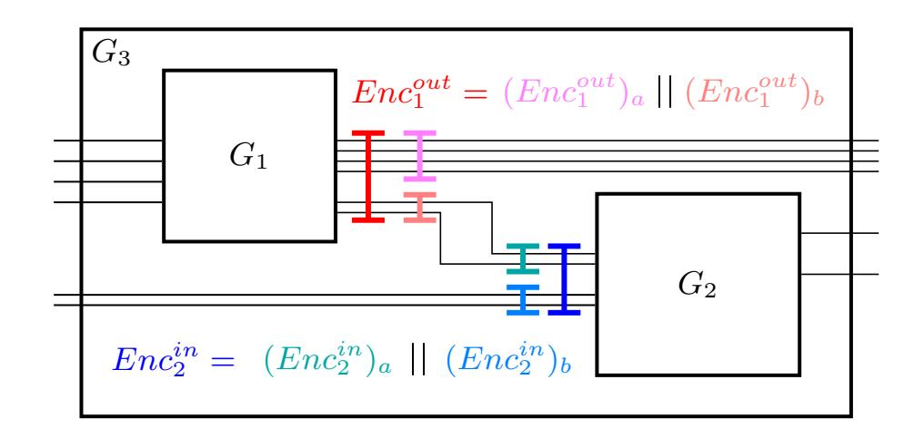
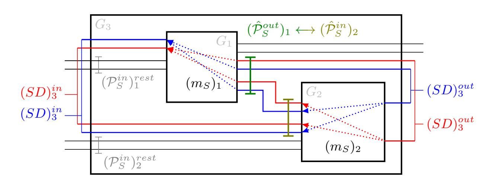
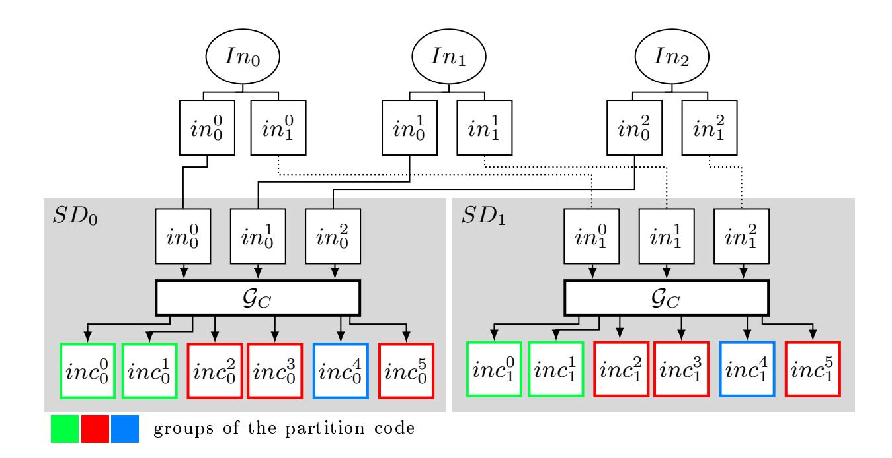
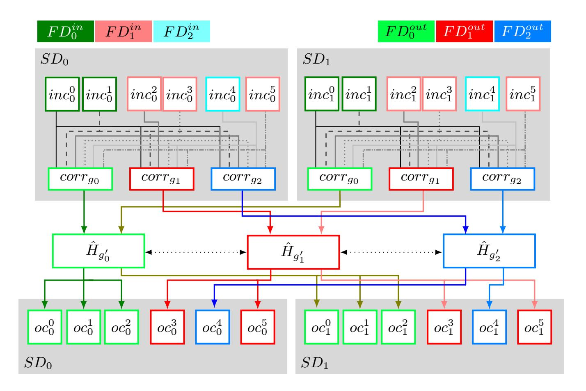
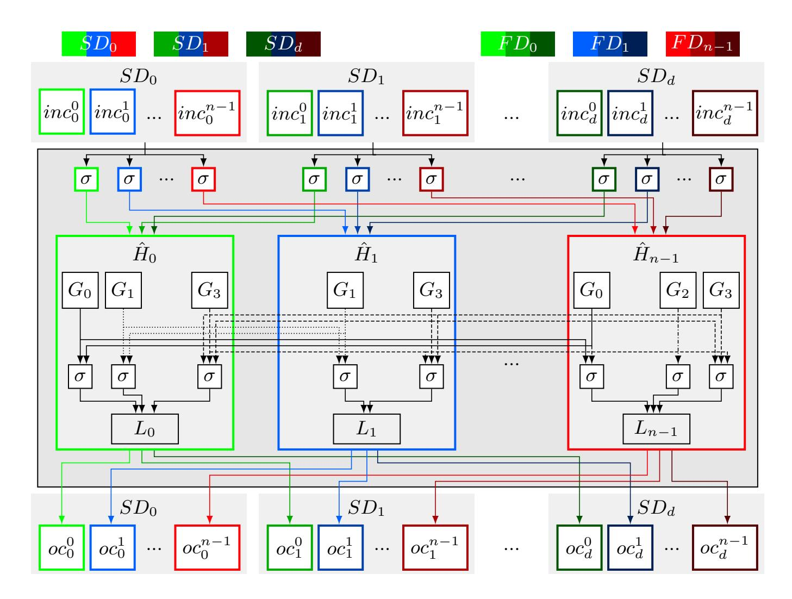
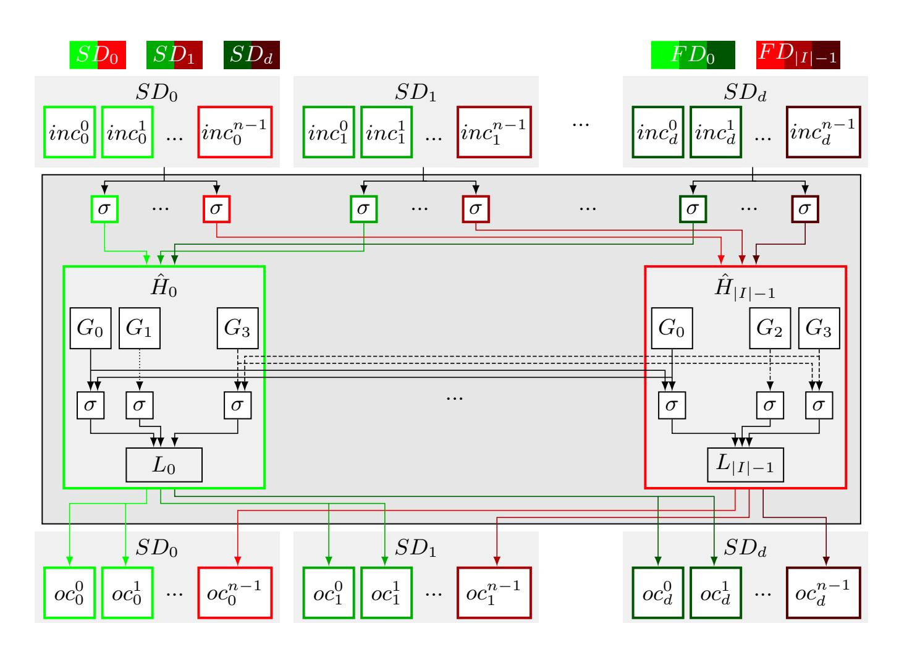

{0}------------------------------------------------

# PaCMan

## Partition-Code Masking for Combined Security

Fabian Buschkowski¹, Jakob Feldtkeller², Tim Güneysu¹,³, Elisabeth Krahmer¹, ⋈, Jan Richter-Brockmann¹, and Pascal Sasdrich¹,

<sup>1</sup> Ruhr University, Bochum, Germany, firstname.lastname@rub.de

<sup>2</sup> PQShield, Oxford, United Kingdom

<sup>3</sup> DFKI GmbH, Bremen, Germany

**Abstract.** Physical attacks are a well-known threat for otherwise secure implementations of cryptographic algorithms. Although attacks and countermeasures for Side-Channel Analysis (SCA) and Fault-Injection Analysis (FIA) are well studied and individually understood, their combined exploitation and the corresponding countermeasures remain a relatively new area of research. Just recently, Feldtkeller et al. presented Combined Private Circuit (CPC) gadgets at CCS 2022 and CCS 2023 which were the first provably secure combined hardware gadgets that adhere to the notion of Combined-Isolating Non-Interference (CINI). The definition of the CINI notion has been a milestone for the development and formal verification of combined secure gadgets. However, it is also specifically tailored to the realization of side-channel resistance via plain masking and redundancy via replication, without further considerations of other constructions, e.g., those based on coding theory. In this work, we extend the existing definition of CINI to the notion of generalized Combined Isolated Non-Interfering (qCINI). Our generalizations allow to capture a much wider range of possible encodings. including – but not limited to – Boolean masking and replication, and provide a formal basis for the analysis of more general gadget construc-

alizations allow to capture a much wider range of possible encodings, including – but not limited to – Boolean masking and replication, and provide a formal basis for the analysis of more general gadget constructions. We formally prove the combined security and composability of our new gCINI definition and give an explicit way to build such gadgets. The significance of our proposed construction is demonstrated through the implementation of several use cases, including an AES S-box design that outperforms comparable CPC-based approaches while maintaining the same level of combined security. Finally, we formally verify the security of our gadget constructions using an adapted version of VERICA.

**Keywords:** Combined Security · CINI · AES · Formal Verification · Generalization · Coding Theory

<sup>©</sup> IACR 2026. This article is the final version submitted by the author(s) to the IACR and to Springer-Verlag on 20.02.2026. The version published by Springer-Verlag is available at tbd.

<sup>\*</sup> The author contributed to this work solely during his time at Ruhr University Bochum.

{1}------------------------------------------------

# <span id="page-1-0"></span>1 Introduction

Cryptographic algorithms are usually proven secure in a black-box model, where an attacker can only access inputs and outputs of the system, but cannot see or interfere with intermediate values. While such security proofs are essential, they ignore additional attack vectors present when a secure cryptographic algorithm is deployed in the real world, e.g., implemented and executed on a chip.

During passive Side-Channel Analysis (SCA), an attacker observes the physical characteristics of the attacked device, such as timing behavior [\[20\]](#page-29-0), power consumption [\[19\]](#page-29-1), or electromagnetic emanation [\[17\]](#page-29-2), to gain knowledge about secret information. This attack concept uses the correlation between the physical characteristics of a device and the processed data, which includes the secret data. In contrast, active Fault-Injection Analysis (FIA) aims to gain knowledge of sensitive data by manipulating the execution of cryptographic operations. Many dierent approaches to achieve meaningful fault injections exist, ranging from clock-glitching [\[28\]](#page-30-0) over manipulations of the electromagnetic eld [\[9,](#page-29-3)[13\]](#page-29-4) to Laser Fault Injection (LFI) [\[30\]](#page-30-1).

Over the years, many countermeasures have been proposed against SCA and FIA attacks. While masking [\[8\]](#page-29-5) is the most prominent countermeasure against SCA due to its theoretical soundness, protection against FIA is achieved by adding some form of redundancy.

The core idea of masking is to split the secret data into multiple randomized values, so-called shares, and only compute on those shares to eliminate the correlation between secret data and physical characteristics of a device. Due to the complexity of transforming large, unprotected circuits into securely and correctly masked designs, the concept of gadget-based masking has been proposed [\[2\]](#page-28-0). Based on a few small and securely masked circuits, also called gadgets, larger circuits can be constructed by combining multiple of these gadgets. However, it became apparent that the composition of gadgets, even if these are secure on their own, is not necessarily secure as well. This sparked the development of the security notions Non-Interference (NI) [\[3\]](#page-28-1), Strong Non-Interference (SNI) [\[2\]](#page-28-0), and Probe-Isolating Non-Interference (PINI) [\[7\]](#page-28-2), which specify the rules that allow compliant gadgets to be securely combined.

Countermeasures against FIA are typically realized using redundancy in area or time. This is often achieved by implementing the security-critical parts of a cryptographic algorithm multiple times to enable fault detection by comparison or fault correction through majority voting. Besides replication, other approaches realize redundancy using linear codes and their detection/correction capabilities [\[1](#page-28-3)[,24](#page-29-6)[,29\]](#page-30-2). Similarly to the composability notions for SCA, corresponding notions for the composition of gadgets protected against FIA have been introduced, namely Non-Accumulation (NA) and Strong Non-Accumulation (SNA) [\[10\]](#page-29-7), which were later adapted to the hardware context as Fault Non-Interference (F-NI) and Fault Strong Non-Interference (F-SNI) [\[27\]](#page-30-3), and nally Fault-Isolating Non-Interference (FINI) [\[15\]](#page-29-8) as the fault-equivalent of PINI.

While the protection of algorithms from either SCA or FIA has been thoroughly studied, protecting against both types of attacks at the same time is a 

{2}------------------------------------------------

rather new field of research. Initial works include gadgets based on the Non-Interference Non-Accumulative (NINA) composability notion [10], Let's Tesselate [11], CAPA [26], or M&M [21]. These works were followed by the introduction of the gadgets HPC<sub>1</sub><sup>C</sup> and HPC<sub>2</sub><sup>C</sup> [15], which were later proven vulnerable and fixed by the Combined Private Circuit (CPC) gadgets [14]. In the same works, the notion of Combined-Isolating Non-Interference (CINI), the combined equivalent of PINI and FINI, was established. Later, the concepts of Threshold Implementation (TI) [23] and Consolidating Masking Schemes (CMS) [25] were extended to the domain of combined attacks as Combined Threshold Implementation (CTI) and Combined Consolidating Masking Schemes (CCMS) [16].

Most of the previously mentioned works achieve combined security based on Boolean masking together with replication, to the extend that the definition of the CINI notion is tailored in multiple aspects towards this approach. While it indeed allows for rather easy, highly flexible construction, the resulting circuits have a large cost and area overhead over unprotected designs. This raises the question whether a generalized version of CINI that allows to construct provably secure gadgets based on other forms of redundancy could pave the way to more efficient combined secure circuits.

Contributions. In this work, we provide a positive answer to this question by introducing generalized Combined Isolated Non-Interfering (gCINI), a generalized version of the CINI definition. This framework not only captures standard combined protection mechanisms such as Boolean masking and replication but also encompasses a broader class of encodings, including those based on linear codes as well as arithmetic, multiplicative, and polynomial masking. We formally prove that gCINI indeed provides combined secure and composable constructions in Section 3. Our approach is directly transferable to the notions of PINI and FINI.

Building on the gCINI notion, we introduce a new class of gadgets, called *Partition-Code Masked* gadgets, that conform to the gCINI definition and provide provable combined security. Based on the combination of Boolean masking with linear codes, its core idea is to exploit correction capabilities of a code beyond its minimal distance, making use of correctable subsets of codeword components (Section 4).

For demonstration, we implement the S-boxes of PRESENT [4], Ascon [12], and the Advanced Encryption Standard (AES) [22] at different security orders as partition-code masked gadgets and compare their performance with existing constructions from literature, especially CPC gadgets. Our gadgets achieve a similar performance for PRESENT and Ascon, but a significantly smaller area footprint for AES, highlighting the capabilities and advantages of our approach. Finally, we formally verify the security of our designs for a (1,1)-gCINI PRESENT S-box and higher-order designs of the  $\mathcal{Q}_{12}^4$  quadratic function using an adapted version of VERICA [27] (Section 5).

{3}------------------------------------------------

### <span id="page-3-1"></span>2 Preliminaries

We start by introducing necessary notation and definitions.  $\mathbb{F}_q$  specifies the finite field with q elements. Two random variables X, Y are said to be independent iff  $\mathbb{P}[X = x|Y = y] = \mathbb{P}[X = x]$  for all x, y. For readability we abbreviate to the standard notation  $\mathbb{P}[X|Y] = \mathbb{P}[X]$ .

## <span id="page-3-0"></span>2.1 Security Definitions

Formally, we model circuits as directed acyclic graphs, where the vertices represent inputs, outputs, and logical gates, while the wires are modeled by the graph's edges. All wires as well as input and output vertices carry a value from a field  $\mathbb{F}_q$  and hence, each circuit implements a function  $F: \mathbb{F}_q^{in} \to \mathbb{F}_q^{out}$ . A gadget G is a, usually small, (sub)circuit with certain composition properties that is used as a building block to construct larger circuits with specific features.

In this work we assume the presence of an adversary that is able to simultaneously obtain side-channel leakage of a certain number of intermediate values and manipulate a certain amount of gates in the device under attack to retrieve secret information. Therefore we introduce the concepts of *probing*, *faulting* and *combined* security.

**Definition 1 (Glitch-Extended** d-Probing Security). A d-probing adversary  $\mathcal{A}_p$  can choose up to d intermediate wires (probes) in the circuit under attack Circ. Those probes extend backwards through Circ until they reach a primary input, a register (glitch-extension), or other wires that are necessary to simulate the probes (probe propagation). The set of all values from the probes up to those propagation endpoints forms the view of  $\mathcal{A}_p$ .

A circuit Circ is then called dth-order probing secure under glitch-extension iff the view of any such  $\mathcal{A}_p$  is independent of the secret inputs to Circ. Formulated as a simulatability statement, there must exist a (probabilistic) algorithm  $Sim(Circ(\cdot))$  that can reproduce the view of any such attacker without access to the secrets.

**Definition 2** (k-Faulting Security). A k-faulting adversary  $A_f$  can choose up to k intermediate gates in the circuit under attack Circ that they are allowed to manipulate. The circuit without any manipulation is called the golden circuit.

A circuit Circ is then called k-faulting secure iff there exists a correction circuit  $G^{corr}$  such that the outputs of the concatenation  $G^{corr}(Circ(\cdot))$  are equal to the outputs of the golden circuit for any such  $\mathcal{A}_f$ .

Remark 1. In contrast to probes, faults propagate towards to the outputs of a circuit as the outputs of subsequent operations are influenced by (potentially) faulty inputs.

**Definition 3** ((d,k)-Combined Security [14]). A(d,k)-combined adversary  $A_c$  combines the capabilities of a d-probing and a k-faulting adversary simultaneously. They are strictly stronger than the sequential concatenation of the two.

{4}------------------------------------------------

In this context, a circuit Circ is (d,k)-combined secure iff the view of  $A_c$  can be simulated without access to any secret (privacy) and there exists a correction circuit  $G^{corr}$ , such that the concatenation  $G^{corr}(Circ(\cdot))$  always yields an output equal to the golden circuit (correctness).

To defend against combined attacks, we encode inputs and decode outputs of a circuit to de-correlate intermediate values from secret information. At first glance, one might intuitively assume the encoding of input and output to be the same. However, there are constructions where an independent treatment is convenient, e.g., when including masking conversions into gadgets.

**Definition 4 (Encoding, Masked/Redundant Circuit).** An encoder  $Enc: \mathbb{F}_q^{\alpha} \to \mathbb{F}_q^{\beta}$  is a probabilistic algorithm. If y = Enc(x) then y is a sharing (resp. codeword) of x, and its elements are called shares (resp. codeword components). A decoder  $Dec: \mathbb{F}_q^{\beta} \to \mathbb{F}_q^{\alpha}$  for a given encoder Enc is a deterministic function with the property that Dec(Enc(x)) = x holds with probability 1 for all  $x \in \mathbb{F}_q^{\alpha}$ . Although the existence of a decoder is not required by default, we only consider encoders that fulfill this property in this work.

For a function  $H: \mathbb{F}_q^{in} \to \mathbb{F}_q^{out}$  we call a circuit  $Circ_H: \mathbb{F}_q^{\alpha} \to \mathbb{F}_q^{\beta}$  masked (resp. redundant) with regards to two (not necessarily identical) encoders  $Enc_{in}$ ,  $Enc_{out}$  if it takes sharings (resp. codewords) regarding  $Enc_{in}: \mathbb{F}_q^{in} \to \mathbb{F}_q^{\alpha}$  of its inputs and returns sharings (resp. codewords) regarding  $Enc_{out}: \mathbb{F}_q^{out} \to \mathbb{F}_q^{\beta}$  of its outputs while keeping functional correctness regarding the decoded values:  $Dec_{out}(Circ_H(Enc_{in}(x))) = H(x)$  with probability 1 for all  $x \in \mathbb{F}_q^{in}$ .

To adhere to commonly used nomenclature, we use the terms masked, sharing, and shares whenever we refer to an encoder that is used to protect a circuit against side-channel attacks, and we talk about redundant/codewords when referring to countermeasures against faults. Note that the initial encoding and the final decoding can never probed or faulted by any attacker [10,27].

Boolean Masking One of the most prominent examples for an encoder in the context of SCA protection is Boolean masking, which operates over  $\mathbb{F}_2$ . Depending on a security parameter d, the encoder randomly and independently samples d binary values  $x_0, ..., x_{d-1}$  for each secret input  $x \in \mathbb{F}_2$ . The sharing of x is then given by  $x_0, ..., x_d$  with  $x_d \in \mathbb{F}_2$  s.t.  $\bigoplus_{i=0}^d x_i = x$ .

Composability Notions The complexity of proving security in terms of the previous definitions increases exponentially with the circuit size. To simplify, gadget-based protection and composable security concepts have been introduced. For this work we only present the notions of d-PINI, k-FINI, and (d,k)-CINI in detail. Note that for these definitions, input and output encodings are equal and assumed to be conventional masking schemes for side-channel resistance and replication against fault attacks. Further, the share domain i of a shared circuit is defined by all values with share index i, the fault domain  $\ell$  of a replicated circuit is defined by all values with replication index  $\ell$ , and the shared redundancy domain  $(i,\ell)$  of a shared and replicated circuit is defined by all values with share

{5}------------------------------------------------

index i and replication index  $\ell$ . We generalize and formalize the concept of those domains in Section 3.

**Definition 5** (d-PINI, k-FINI, and (d,k)-CINI). [7,15] A gadget G is d-PINI iff for any set of  $d_{II}$  internal probes and any set  $S_{III}$  of  $d_{III}$  share domains, s.t.  $d_{II} + d_{III} \leq d$ , there exists a set  $S_{I}$  of at most  $d_{II}$  share domains such that the outputs of the share domains in  $S_{III}$  and the probes can be simulated with the inputs of the share domains in  $S_{II} \cup S_{III}$ .

A gadget G is k-FINI iff for any set of  $k_{I\!I}$  internal faults and any set  $F_I$  of  $k_I$  redundancy domains, s.t.  $k_I + k_{I\!I} \le k$ , there exists a set  $F_{I\!I\!I}$  of at most  $k_{I\!I}$  redundancy domains such that the outputs of the gadget, except those in the redundancy domains  $F_I \cup F_{I\!I\!I}$  are correct. Additionally, there exists a correction gadget  $G^{corr}$  that can correct any output with at most k faulty redundancy domains.

A gadget G is (d,k)-CINI iff for any set of  $d_{II}$  internal probes and any set  $S_{III}$  of  $d_{III}$  share domains, and any set of  $k_{II}$  internal faults and any set  $F_{II}$  of  $k_{II}$  redundancy domains, s.t.  $k_{I} + k_{II} \leq k$ ,  $d_{II} + d_{III} + k_{II} + k_{II} \leq d$ , there exists a set  $S_{II}$  of at most  $d_{II} + k_{II}$  share domains and a set  $F_{III}$  of at most  $k_{II}$  shared redundancy domains, such that a) the outputs of the gadget, except those in the shared redundancy domains  $F_{I} \cup F_{III}$  are correct. Additionally, there exists a correction gadget  $G^{corr}$  that can correct any output with at most k faulty shared redundancy domains, and k0 the outputs of the share domains in k1 and the probes can be simulated with the inputs of the share domains in k1 and k1 knowledge of the faults both injected and on inputs in k1.

### 2.2 Coding Theory

After familiarizing with the necessary security-related nomenclature we introduce the formal definition of linear codes.

**Definition 6** (Linear (n, m, k)-Code). A linear subspace of  $\mathbb{F}_q^n$  of dimension m is called a linear code of length n and dimension m. The elements in C are the codewords of C and the distance k of C is defined as the minimal weight of a non-zero codeword in C. Any such code C can be defined by its generator matrix  $\mathcal{G}_C \in \mathbb{F}_q^{m \times n}$  constructed from a basis as  $C = \{x\mathcal{G}_C | x \in \mathbb{F}_q^m\}$ . The generator matrix can be interpreted as the encoder of C. An equivalent way to fully characterize a code is by its parity check matrix  $\mathcal{H} \in \mathbb{F}_q^{n-m \times n}$  as  $C = \{c \in \mathbb{F}_q^n | \mathcal{H}c = 0\}$ .

Remark 2. An [n, m, k]-code can detect all faulty codewords with up to k-1 errors and can correct all faulty codewords with up to  $\lfloor \frac{k-1}{2} \rfloor$  errors.

Syndrome Decoding Syndrome Decoding is an efficient way of correcting faulty codewords with the help of the parity check matrix  $\mathcal{H}$ . In a precomputation step, a mapping between all possible error vectors e with Hamming weight at most  $\lfloor \frac{k-1}{2} \rfloor$  and the value  $\mathcal{H}e$  is generated. Given a faulty codeword c, its syndrome is calculated as  $s = \mathcal{H}c$  and looked up in the precomputed table. The returned error vector e is added to the input codeword.

{6}------------------------------------------------

## <span id="page-6-0"></span>3 Generalized CINI

In order to generalize the definition of CINI, we need to formalize the concept of Share Domains (SDs) and Fault Domains (FDs) in a slightly different way than before [7,15]. There, those domains are simply defined as the respective index of a share or replication (cf. Section 2.1). In our refined Definition 7, the relation to the parameters d and k are made explicit. Hence, our phrasing allows for a clear separation between the number of shares/replications and the security order (d, k), simplifying the analysis of conversions and including general gadget constructions such as TI, which trades online for offline randomness, or codebased masking [31], in which multiple secrets can be entangled by the encoding.

<span id="page-6-1"></span>**Definition 7** (d-Share/k-Fault Domains). Let  $Enc_{in}: \mathbb{F}_q^{in} \to \mathbb{F}_q^{\alpha}$ ,  $Enc_{out}: \mathbb{F}_q^{out} \to \mathbb{F}_q^{\beta}$  be two masking encoders and  $Circ^{mask}: \mathbb{F}_q^{\alpha} \to \mathbb{F}_q^{\beta}$  a masked circuit regarding  $Enc_{in}$ ,  $Enc_{out}$ . Let  $\mathcal{P}^{in}(resp. \mathcal{P}^{out}) = \{SD_1, ..., SD_{\xi}\}$  be a partition of the inputs to (resp. outputs of)  $Circ^{mask}$  into  $\xi$  non-overlapping subsets. We call  $\mathcal{P}^{in}$  (resp.  $\mathcal{P}^{out}$ ) a d-input (resp. output) Share Domain Partition (SDP) and the sets  $SD_i$  d-input (resp. output) SD iff the distribution of the values in all sets of up to d of the  $SD_i$ s is independent of the inputs to  $Enc_{in}$  (resp. outputs of  $Dec_{out}$ ).

Now let  $Circ^{red}: \mathbb{F}_q^{\alpha} \to \mathbb{F}_q^{\beta}$  be a redundant circuit regarding  $Enc_{in}, Enc_{out}$ .  $Let \, \mathcal{P}^{in}(resp. \, \mathcal{P}^{out}) = \{FD_1, ..., FD_\xi\}$  be a partition of the inputs to (resp. outputs of)  $Circ^{red}$  into  $\xi$  non-overlapping subsets. We call  $\mathcal{P}^{in}$  (resp.  $\mathcal{P}^{out}$ ) a k-input (resp. output) Fault Domain Partition (FDP) and the sets  $FD_i$  f-input (resp. output) FD iff there exists a correction function  $G^{corr}: \mathbb{F}_q^{\alpha} \to \mathbb{F}_q^{\alpha}$  (resp.  $G^{corr}: \mathbb{F}_q^{\beta} \to \mathbb{F}_q^{\beta}$ ) that can correct any faulty codeword where the faulty components are in up to k of the  $FD_i$ s. This correction is defined by comparison to the golden circuit.

- <span id="page-6-2"></span>Remark 3. 1. Replication as well as Boolean, affine, arithmetic, multiplicative, and polynomial masking are compatible to these definitions. The same holds for the encodings of TI and code-based masking.
- 2. SDPs/FDPs are not necessarily unique. In particular, an input/output partition into  $\xi$  subsets can be a d-SDP for different d, and there might be multiple, structurally differing d-SDPs for the same d (analogously for FDPs).
- 3. For  $a' \le a$ , any a-SDP/FDP is an a'-SDP/FDP.

With those definitions of SDs and FDs, we can generalize the CINI property. The main intuition behind this definition is the following: We allow probes to propagate backwards within a share domain. Faults on the other hand propagate in forward direction. They cannot infect more than one fault domain, but, in contrast to CINI, the faults are allowed to spread over share domain borders. This limitation in the CINI notion originated from constructions that allow error detection but not necessarily correction [15]. However, our proofs show that it can

{7}------------------------------------------------

be relaxed when focusing on constructions with correction capabilities only.<sup>4</sup> For the ease of understanding, particularly to prevent flummoxing w.r.t. Definition 8 and Theorem 1, a collation of key notation can be found in Table 1.

<span id="page-7-2"></span><span id="page-7-1"></span>Table 1. Notation overview

| Notation                | Description                                                            |
|-------------------------|------------------------------------------------------------------------|
| $\overline{d}$          | Probing security parameter                                             |
| k                       | Fault protection parameter                                             |
| $\mathrm{Index}\ S$     | Objects regarding masking/sharing                                      |
| $\mathrm{Index}\ F$     | Objects regarding fault protection/redundancy                          |
| ${\cal P}$              | Partition of in- or outputs                                            |
| ${\rm Index}{}_{\rm I}$ | Probes/faults/partitions at the input                                  |
| Index $\pi$             | Internal probes/faults/partitions                                      |
| Index ш                 | Probes/faults/partitions at the output                                 |
| $\hat{\mathcal{P}}$     | Subset of a partition that is involved in a connection between gadgets |
| Index $1, 2, 3$         | Parameter of the Gadget with index 1, 2, 3                             |

**Definition 8 (Generalized CINI).** Let  $im(f) = \{f(a) | a \in A\}$  denote the image of a function  $f: A \to B$ . A shared and encoded gadget G is (d,k)-gCINI iff there exists a  $d^{in}$ -share domain partition  $\mathcal{P}_S^{in}$  and a  $k^{in}$ -fault domain partition  $\mathcal{P}_F^{in}$  of its inputs, and a  $d^{out}$ -share domain partition  $\mathcal{P}_S^{out}$  and a  $k^{out}$ -fault domain partition  $\mathcal{P}_F^{out}$  of its outputs, and two mappings  $m_S: \mathcal{P}_S^{out} \to \mathcal{P}_S^{in}, m_F: \mathcal{P}_F^{in} \to \mathcal{P}_F^{out}$  with  $d \leq min(d^{out}, |im(m_S)|)$  and  $k \leq min(k^{in}, |im(m_F)|)$  s.t. for

- any set  $F_I \subset \mathcal{P}_F^{in}$  of  $k_I$  faulty input FDs ("input faults"),
- any set of  $k_{II}$  faults injected in gates of G ("internal faults"),
- any set of  $d_{\pi}$  probes placed on intermediate values in G ("internal probes"),
- and any set  $S_{\text{III}} \subset \mathcal{P}_{S}^{out}$  of  $d_{\text{III}}$  output SDs ("output probes"),

with  $k_{\scriptscriptstyle I}+k_{\scriptscriptstyle II}\leq k$  and  $k_{\scriptscriptstyle I}+k_{\scriptscriptstyle II}+d_{\scriptscriptstyle II}+d_{\scriptscriptstyle II}\leq d$ , there exists a set  $F_{\scriptscriptstyle III}\subset \mathcal{P}_F^{out}$  of at most  $k_{\scriptscriptstyle II}$  output FDs and a set  $S_{\scriptscriptstyle I}\subset \mathcal{P}_S^{in}$  of at most  $d_{\scriptscriptstyle II}+k_{\scriptscriptstyle II}$  input SDs s.t. the following holds:

- The gadget provides an output where all values, except those belonging to the output FDs in  $m_F(F_I) \cup F_{I\!I\!I}$ , are equal to the golden circuit.
- The values of the output SDs in  $S_{\tt III}$  and the internal probes can be simulated with the values of the input SDs in  $m_S(S_{\tt III}) \cup S_{\tt I}$  and knowledge of the faults both injected and on inputs in  $F_{\tt I}$ .

The definitions of d-PINI and k-FINI can trivially be generalized in a similar way, see Appendix A.

<span id="page-7-3"></span><span id="page-7-0"></span><sup>&</sup>lt;sup>4</sup> Note that this is no limitation in our context. We are not aware of any combined secure hardware(!) gadget using only error detection, and excluding error detection has been done by, e.g., [14] as well.

{8}------------------------------------------------

**Lemma 1.** W.l.o.g., regarding the security order, the maps  $m_S$  and  $m_F$  as defined in Definition 8 can be assumed to be injective.

*Proof.* Let G be a (d,k)-gCINI gadget according to the notation from Definition 8 and assume that  $m_S$  is not injective. We argue that, in this case, it is equivalent to consider a modified gadget in which the SDs are defined by the equivalence classes modulo  $m_S$ .

Since  $m_S$  is not injective, there are output SDs  $SD_a, SD_b$  with  $m_S(SD_a) = m_S(SD_b) = SD_c$  with  $SD_c$  being an input SD of the gadget. Define a modified SDP  $\mathcal{P}_S^{\prime out}$  which differs from  $\mathcal{P}_S^{out}$  in only that  $SD_a \cup SD_b$  forms one share domain. Trivially,  $\mathcal{P}_S^{\prime out}$  is a  $(d^{out} - 1)$ -SDP. From the gCINI property of G follows  $d \leq |im(m_S)| < d^{out}$  and hence G is also d-gCINI w.r.t. the modified output SDP. The analogous argument proves the claim for  $m_F$ .

<span id="page-8-0"></span>Remark 3-3 and Lemma 1 allow us to assume the same number of input and output SDs/FDs for a gadget in the following analysis.

## **Theorem 1.** Properties of gCINI.

- 1.  $gCINI \Rightarrow combined security$
- 2. gCINI is (loop-free) composable: Let  $G_1, G_2$  be two (d, k)-gCINI gadgets and let  $G_3$  be an arbitrary (loop-free) composition of  $G_1, G_2$  s.t. for  $i \neq j \in \{1, 2\}$ 
  - a) there is no splitting of encodings by the composition. This means that either all outputs of  $G_i$  are inputs to  $G_j$ , or there exist independent subfunctions of  $Enc_i^{out}$ ,  $Enc_j^{in}$ ,  $(G^{corr})_j^{in}$ ,  $(G^{corr})_i^{out}$  s.t. output encodings of  $G_i$  are either completely inputs to  $G_j$  or not at all, and
  - b) there is a one-to-one relation of connected domains. This means for  $X \in \{S, F\}$  there is a bijection  $(\hat{\mathcal{P}}_X^{out})_i \to (\hat{\mathcal{P}}_X^{in})_j$ , where  $(\hat{\mathcal{P}}_X^{out})_i \subset (\mathcal{P}_X^{out})_i$  (resp.  $(\hat{\mathcal{P}}_X^{in})_j \subset (\mathcal{P}_X^{in})_j$ ) includes all output SD/FDs of  $G_i$  (resp.  $G_j$ ) that are connected to inputs of  $G_j$  (resp. outputs of  $G_i$ ). Here,  $(\mathcal{P}_X^{in/out})_t$  are the domain partitions from the (d,k)-gCINI property of  $G_t$ .

Then  $G_3$  is (d,k)-gCINI.

Both requirements in Theorem 1-2 are intuitively straightforward and implicitly assumed in the composition argument of CINI (cf. [15]). Regarding a): In case that, when composing  $G_1$  and  $G_2$ , not all outputs of the first gadget are connected to inputs of the second, some natural restrictions are needed regarding the encoders and correction circuits. If encodings were allowed to be split, it would imply that the gadget  $G_2$  only operates on parts of the sharing of its input. This is either incompatible with the functional correctness of  $G_2$  or shows the irrelevance of shares. Splitting of a correction function on the other hand would prohibit corrections of the inputs to  $G_2$ . Figure 1 illustrates an example. Regarding b): Be aware that this bijection is between domain partitions, not inputs and outputs. There might be inputs to  $G_3$  that are not inputs to  $G_1$  but are part of a share or fault domain which is covered by the bijection (cf. Figure 2).

{9}------------------------------------------------



Fig. 1. Example of the condition on the gCINI composition theorem (Theorem 1-2). The same must hold for the correction circuits from the fault domain partition property.

<span id="page-9-0"></span>*Proof.* The proof for part one of Theorem 1 is straightforward: Let G be a (d, k)-gCINI gadget.

Correctness: Follows by definition. Note that  $|m_F(F_{\text{I}}) \cup F_{\text{III}}| \leq k_{\text{I}} + k_{\text{II}} \leq k$ .

Privacy: By definition of gCINI, the outputs of G in the SDs in  $S_{\mathfrak{m}}$  and the internal probes can be simulated with the inputs in the SDs  $m_S(S_{\mathfrak{m}}) \cup S_{\mathfrak{l}}$  and knowledge of the faults, with  $|m_S(S_{\mathfrak{m}}) \cup S_{\mathfrak{l}}| \leq d_{\mathfrak{m}} + d_{\mathfrak{l}} + k_{\mathfrak{l}} \leq d$ , hence the view of a combined attacker is independent of any secret.

For Theorem 1-2 let  $G_1$ ,  $G_2$  be (d, k)-gCINI gadgets and let  $G_3$  be an arbitrary loop-free composition of  $G_1$ ,  $G_2$ . W.l.o.g., no output of  $G_2$  is connected to an input of  $G_1$ . Further, the  $G_i$  fulfill all prerequisites of the theorem. The proof is split into four parts: The construction of the encodings and domain partitions for  $G_3$  with proof of their properties regarding d and k, the definition of the share and fault domain mappings  $m_S^3$ ,  $m_F^3$ , and the gCINI bounds on probe and fault propagation.

- 1. First, we build the encodings for  $G_3$ . Encodings cannot be split when connecting  $G_1$  and  $G_2$ . Hence, one can trivially build encoders  $Enc_3^{in}$  from  $Enc_1^{in}$ ,  $Enc_2^{in}$  and  $Enc_3^{out}$  from  $Enc_1^{out}$ ,  $Enc_2^{out}$  s.t.  $G_3$  is masked and redundant regarding  $Enc_3^{in/out}$ .
- 2. Second, we construct the domain partitions for  $G_3$ . Intuitively, the following construction is clear. In-/outputs of  $G_3$  that are part of an SD/FD dependent on either  $G_1$  or  $G_2$  simply pass through their domain. For the remaining domains we aim to combine in-/outputs to form larger SDs/FDs wherever possible. For example, when using simple replication as fault protection, all inputs from the first replication should be in the same fault domain no matter whether they are inputs to  $G_1$  or  $G_2$ . We formalize this as follows:

For  $X \in \{S, F\}$ ,  $i \in \{1, 2\}$ , let  $(\mathcal{P}_X^{in/out})_i$  be the input/output SDP/FDP and  $(m_X)_i$  be the mappings of  $G_i$  from the gCINI property. Further,  $bij_X$ :  $(\hat{\mathcal{P}}_X^{out})_1 \to (\hat{\mathcal{P}}_X^{in})_2$  denotes the bijection between the share/fault domains involved in the connections from  $G_1$  to  $G_2$ . Define

$$(\mathcal{P}_X^{in})_2 = (\hat{\mathcal{P}}_X^{in})_2 \sqcup (\mathcal{P}_X^{in})_2^{rest}, \quad (\mathcal{P}_X^{out})_1 = (\hat{\mathcal{P}}_X^{out})_1 \sqcup (\mathcal{P}_X^{out})_1^{rest},$$

{10}------------------------------------------------

$$(\mathcal{P}_S^{in})_1 = (m_S)_1 \left( (\hat{\mathcal{P}}_S^{out})_1 \right) \sqcup (\mathcal{P}_S^{in})_1^{rest},$$

$$(\mathcal{P}_S^{out})_2 = (m_S)_2^{-1} \left( (\hat{\mathcal{P}}_S^{in})_2 \right) \sqcup (\mathcal{P}_S^{out})_2^{rest},$$

$$(\mathcal{P}_F^{in})_1 = (m_F)_1^{-1} \left( (\hat{\mathcal{P}}_F^{out})_1 \right) \sqcup (\mathcal{P}_F^{in})_1^{rest},$$

$$(\mathcal{P}_F^{out})_2 = (m_F)_2 \left( (\hat{\mathcal{P}}_F^{in})_2 \right) \sqcup (\mathcal{P}_F^{out})_2^{rest},$$

where  $\sqcup$  is the union of disjoint sets and  $(m_X)^{-1}$  denotes the preimage under  $m_X$ . We construct share/fault domain partitions for  $G_3$  as follows:

$$(\mathcal{P}_{S}^{in})_{3} = \underbrace{\{SD \cup (m_{S})_{1} (SD) \mid SD \in (\hat{\mathcal{P}}_{S}^{in})_{2}\}}_{=:(\mathcal{P}_{S}^{in})_{3}^{comb}} \cup (\mathcal{P}_{S}^{in})_{1}^{rest} \cup (\mathcal{P}_{S}^{in})_{2}^{rest},$$

$$=:(\mathcal{P}_{S}^{in})_{3}^{comb}$$

$$(\mathcal{P}_{S}^{out})_{3} = \underbrace{\{SD \cup (m_{S})_{2}^{-1} (SD) \mid SD \in (\hat{\mathcal{P}}_{S}^{out})_{1}\}}_{=:(\mathcal{P}_{S}^{out})_{3}^{comb}} \cup (\mathcal{P}_{S}^{in})_{1}^{rest} \cup (\mathcal{P}_{S}^{in})_{2}^{rest},$$

$$=:(\mathcal{P}_{F}^{out})_{3}^{comb}$$

$$(\mathcal{P}_{F}^{out})_{3} = \underbrace{\{FD \cup (m_{S})_{2} (FD) \mid FD \in (\hat{\mathcal{P}}_{F}^{out})_{1}\}}_{=:(\mathcal{P}_{F}^{out})_{3}^{comb}} \cup (\mathcal{P}_{F}^{out})_{1}^{rest} \cup (\mathcal{P}_{F}^{out})_{2}^{rest}.$$

$$=:(\mathcal{P}_{F}^{out})_{3}^{comb}$$

By construction,  $(\mathcal{P}_X^{in/out})_3$  are partitions of the in-/outputs of  $G_3$ . Also, due to  $m_X$  being injective, all preimages have cardinality one. An example of the construction of those partitions is illustrated in Figure 2. Note that in the common Boolean shared and replicated set-up, all sets with the index rest are empty as they are only relevant with more general encodings.



Fig. 2. Example of the SDP construction for  $G_3$ 

Let  $\mathbb{S}$  be the set of encoder outputs of  $Enc_3^{in}$  (= set of inputs to  $G_3$ ) in up to d SDs of  $(\mathcal{P}_S^{in})_3$  with

<span id="page-10-0"></span>
$$\mathbb{S} = \bigcup_{\substack{j \in J, \\ |J| \le d}} SD_j = \underbrace{\mathbb{S}_1}_{\subseteq (\mathcal{P}_S^{in})_1^{rest}} \cup \underbrace{\mathbb{S}_2}_{\subseteq (\mathcal{P}_S^{in})_2^{rest}} \cup \underbrace{\mathbb{S}_3}_{\subseteq (\mathcal{P}_S^{in})_3^{comb}}$$

{11}------------------------------------------------

and let inp be the set of inputs to  $Enc_3^{in}$ . As  $Enc_3^{in}$  has been constructed from the encoders of  $G_1$  and  $G_2$ , it is possible to also split the inputs into  $inp_i, i \in \{1,2\}$  with  $inp_i \subset inp$  being the inputs to the parts of  $Enc_3^{in}$  originating from  $Enc_i^{in}$ . We now prove the distribution independence of  $\mathbb{S}$  and inp.

$$\begin{split} &\mathbb{P}\left[Enc_3^{in}(inp)|_{\mathbb{S}} \ \middle| \ inp\right] \\ &= \mathbb{P}\left[Enc_3^{in}(inp)|_{\mathbb{S}_1}, Enc_3^{in}(inp)|_{\mathbb{S}_2}, Enc_3^{in}(inp)|_{\mathbb{S}_3} \ \middle| \ inp_1, inp_2\right] \\ &\stackrel{*}{=} \sum_{x=1,2} \mathbb{P}\left[Enc_3^{in}(inp)|_{\mathbb{S}_x} \ \middle| \ inp_x\right] + \mathbb{P}\left[Enc_3^{in}(inp)|_{\mathbb{S}_3} \ \middle| \ inp_1, inp_2\right] \\ &\stackrel{**}{=} \mathbb{P}\left[Enc_3^{in}(inp)|_{\mathbb{S}_1}\right] + \mathbb{P}\left[Enc_3^{in}(inp)|_{\mathbb{S}_2}\right] + \mathbb{P}\left[Enc_3^{in}(inp)|_{\mathbb{S}_3} \ \middle| \ inp_1, inp_2\right] \\ &\stackrel{\dagger}{=} \mathbb{P}\left[Enc_3^{in}(inp)|_{\mathbb{S}_1}\right] + \mathbb{P}\left[Enc_3^{in}(inp)|_{\mathbb{S}_2}\right] + \mathbb{P}\left[Enc_3^{in}(inp)|_{\mathbb{S}_3}\right] \\ &\stackrel{*}{=} \mathbb{P}\left[Enc_3^{in}(inp)|_{\mathbb{S}_1}, Enc_3^{in}(inp)|_{\mathbb{S}_2}, Enc_3^{in}(inp)|_{\mathbb{S}_3}\right] = \mathbb{P}\left[Enc_3^{in}(inp)|_{\mathbb{S}}\right] \end{split}$$

which proves that  $(\mathcal{P}_S^{in})_3$  is indeed a d input SDP for  $G_3$ . Equality \* uses the empty intersections of the sets  $\mathbb{S}_i$  as well as the independence of the subencoders of  $G_1$  and  $G_2$ , which justifies that the intersections of those three events are empty. The \*\* follows by  $(\mathcal{P}_S^{in})_1, (\mathcal{P}_S^{in})_2$  being d-input SDPs. For step  $\dagger$ , the independence again follows from  $(\mathcal{P}_S^{in})_1$  and  $(\mathcal{P}_S^{in})_2$  being d-input SDPs, and from  $(m_S)_1$  restricting the number of input share domains of  $G_1$  in  $(\mathcal{P}_S^{in})_3^{rest}$ . Analogously,  $(\mathcal{P}_S^{out})_3$  is a d-output SDP. For this argument recall that  $(m_S)$  is injective and thus, the number of share domains will not spread by this transformation.

The property of  $(\mathcal{P}_F^{in/out})_3$  being k-FDPs follows directly from the independence of the sub-corrections and from  $(m_F)$  being injective.

3. Next, we define the maps

$$m_{S}^{3}: (\mathcal{P}_{S}^{out})_{3} \to (\mathcal{P}_{S}^{in})_{3}, S \mapsto \begin{cases} m_{S}^{i}(S), & S \in (\mathcal{P}_{S}^{out})_{i}^{rest} \\ m_{S}^{1}(S) = m_{S}^{2}(S), & else \end{cases}$$

$$m_{F}^{3}: (\mathcal{P}_{F}^{in})_{3} \to (\mathcal{P}_{F}^{out})_{3}, F \mapsto \begin{cases} m_{F}^{i}(F), & F \in (\mathcal{P}_{F}^{in})_{i}^{rest} \\ m_{F}^{1}(F) = m_{F}^{2}(F), & else \end{cases}$$

Those maps are well-defined due to the construction of  $(\mathcal{P}_X^{in})_3$  and  $(\mathcal{P}_X^{out})_3$  via the maps  $m_X^1, m_X^2$ .

- 4. Finally, we need to prove the gCINI property of  $G_3$  for probe and fault propagation. Let
  - $-F_{\underline{i}}^{3} \subset (\mathcal{P}_{F}^{in})_{3}$  be a set of  $k_{\underline{i}}^{3}$  FDs with faulty inputs to  $G_{3}$  (input faults),
  - $-S_{\mathfrak{m}}^{3}\subset (\mathcal{P}_{S}^{out})_{3}$  be a set of  $d_{\mathfrak{m}}^{3}$  output SDs of  $G_{3}$  (output probes),
  - there be  $k_{\pi}^3$  faults injected in gates of  $G_3$  (internal faults), of which  $k_{\pi}^i$  target gates in  $G_i$ , and
  - there be  $d_{\pi}^3$  probes placed on intermediate values in  $G_3$  (internal probes), of which  $d_{\pi}^i$  target gates in  $G_i$ ,

{12}------------------------------------------------

As  $G_1$  and  $G_2$  are disjoint,  $k_{\pi}^1 + k_{\pi}^2 = k_{\pi}^3$  and  $d_{\pi}^1 + d_{\pi}^2 = d_{\pi}^3$ . Further, let  $k_{\tau}^3 + k_{\pi}^3 \leq k$  and  $k_{\tau}^3 + k_{\pi}^3 + d_{\pi}^3 + d_{\pi}^3 \leq d$ .

Correctness: Let  $F_{\text{I}}^1$  be the set of all FDs with faulty inputs to  $G_1$  and  $|F_{\text{I}}^1| = k_{\text{I}}^1$ . With slight abuse of notation (\*), we write  $F_{\text{I}}^3 \supset F_{\text{I}}^1$ , identifying FDs according to the construction of  $(\mathcal{P}_F^{in})_3$ . Hence, since the composition is loop-free,  $F_{\text{I}}^3$  contains all FDs with faulty inputs to  $G_1$ . As  $G_1$  is (d, k)-gCINI and  $k_{\text{I}}^1 + k_{\text{II}}^1 \leq k_{\text{I}}^3 + k_{\text{II}}^3 \leq k$ , there exists a set  $F_{\text{II}}^1 \subset (\mathcal{P}_F^{out})_1$  of  $k_{\text{II}}^1$  FDs s.t. at most the outputs of  $G_1$  in the FDs  $m_F^1(F_{\text{I}}^1) \cup F_{\text{II}}^1$  are faulty.

The set of (possibly) faulty input FDs to  $G_2$  is  $F_{\scriptscriptstyle \rm I}^{\overline 3} \cup m_F^1(F_{\scriptscriptstyle \rm I}^1) \cup F_{\scriptscriptstyle \rm I\hspace{-.1em}I}^1 =: F_{\scriptscriptstyle \rm I}^2$ . Due to the construction of  $(\mathcal{P}_F^{in})_3$  using  $m_F^1$ , and (\*), we can write  $F_{\scriptscriptstyle \rm I}^3 \cup m_F^1(F_{\scriptscriptstyle \rm I}^1) = F_{\scriptscriptstyle \rm I}^3$  which bounds the number of faulty input FDs to  $G_2$  by  $k_{\scriptscriptstyle \rm I}^3 + k_{\scriptscriptstyle \rm I\hspace{-.1em}I}^1$ . Since  $k_{\scriptscriptstyle \rm I}^3 + k_{\scriptscriptstyle \rm I\hspace{-.1em}I}^1 + k_{\scriptscriptstyle \rm I\hspace{-.1em}I}^2 = k_{\scriptscriptstyle \rm I}^3 + k_{\scriptscriptstyle \rm I\hspace{-.1em}I}^3 \le k$  and  $G_2$  is (d,k)-gCINI, there exists a set  $F_{\scriptscriptstyle \rm I\hspace{-.1em}I}^2 \subset \mathcal{P}_2^{out}$  of  $k_{\scriptscriptstyle \rm I\hspace{-.1em}I}^2$  FDs s.t. at most the outputs of  $G_2$  in the FDs  $m_F^2(F_{\scriptscriptstyle \rm I}^2) \cup F_{\scriptscriptstyle \rm I\hspace{-.1em}I\hspace{-.1em}I}^2$  are faulty. Outputs of  $G_3$  are either outputs of  $G_1$  or  $G_2$ . Hence, at most the outputs of  $G_3$  in the FDs in  $m_F^1(F_{\scriptscriptstyle \rm I}^1) \cup F_{\scriptscriptstyle \rm I\hspace{-.1em}I\hspace{-.1em}I}^1 \cup m_F^2(F_{\scriptscriptstyle \rm I}^2) \cup F_{\scriptscriptstyle \rm I\hspace{-.1em}I\hspace{-.1em}I}^2$  are faulty. As of the construction of  $m_F^3$ , it holds that  $m_F^1(F_{\scriptscriptstyle \rm I\hspace{-.1em}I}^1) \cup m_F^2(F_{\scriptscriptstyle \rm I\hspace{-.1em}I}^2) = m_F^3(F_{\scriptscriptstyle \rm I\hspace{-.1em}I}^1 \cup F_{\scriptscriptstyle \rm I\hspace{-.1em}I}^2)$ . Define  $F_{\scriptscriptstyle \rm I\hspace{-.1em}I\hspace{-.1em}I}^3 = F_{\scriptscriptstyle \rm I\hspace{-.1em}I\hspace{-.1em}I}^1 \cup F_{\scriptscriptstyle \rm I\hspace{-.1em}I}^2$  and note that  $|F_{\scriptscriptstyle \rm I\hspace{-.1em}I\hspace{-.1em}I}^1 \cup F_{\scriptscriptstyle \rm I\hspace{-.1em}I\hspace{-.1em}I}^2 \le k_{\scriptscriptstyle \rm I\hspace{-.1em}I}^1 + k_{\scriptscriptstyle \rm I\hspace{-.1em}I}^2 \le k_{\scriptscriptstyle \rm I\hspace{-.1em}I}^3$ .

Privacy: We use the equivalent minor abuse of notation as above (\*). All outputs of  $G_2$  are outputs of  $G_3$ , hence the set of all probed output SDs of  $G_2$ ,  $S^2_{\mathfrak{m}}$ , is a subset of  $S^3_{\mathfrak{m}}$ . There are  $d^2_{\mathfrak{m}}$  internal probes and  $k^2_{\mathfrak{m}}$  internal faults in, and  $k^3_{\mathfrak{m}} + k^1_{\mathfrak{m}}$  faulty input FDs to  $G_2$ . Since  $k^3_{\mathfrak{m}} + k^1_{\mathfrak{m}} + k^2_{\mathfrak{m}} + d^3_{\mathfrak{m}} \leq k^3_{\mathfrak{m}} + k^3_{\mathfrak{m}} + d^3_{\mathfrak{m}} \leq d$  and  $G_2$  is (d,k)-gCINI, there exists a set  $S^2_{\mathfrak{m}}$  of  $d^2_{\mathfrak{m}} + k^2_{\mathfrak{m}} \leq k^3_{\mathfrak{m}} + k^3_{\mathfrak{m}} + d^3_{\mathfrak{m}} \leq d$  and  $G_2$  in the SDs  $m^2_{\mathfrak{m}}$  and the internal probes in  $G_2$  can be simulated with the inputs to  $G_2$  in the SDs  $m^2_S(S^2_{\mathfrak{m}}) \cup S^2_{\mathfrak{m}}$  and knowledge of the faults (internal and input faults to  $G_2$ ). This simulator is denoted by  $Sim_2$ . Knowledge of the input faults to  $G_2$  can be derived by fault propagation. The set of (possibly) probed output SDs of  $G_1$  includes the input probes of  $G_2$  that are needed for  $Sim_2$ , therefore it is given by  $S^3_{\mathfrak{m}} \cup m^2_S(S^2_{\mathfrak{m}}) \cup S^2_{\mathfrak{m}} = S^3_{\mathfrak{m}}$ . Hence, at most  $d^3_{\mathfrak{m}} + d^2_{\mathfrak{m}} + k^2_{\mathfrak{m}}$  output SDs of  $G_1$  are probed. Also, there are  $d^1_{\mathfrak{m}}$  internal probes and  $k^1_{\mathfrak{m}}$  internal faults in, and  $k^3_{\mathfrak{m}}$  faulty input FDs to  $G_1$ . Since  $k^3_{\mathfrak{m}} + k^1_{\mathfrak{m}} + d^3_{\mathfrak{m}} + d^3_{\mathfrak{m}} + k^2_{\mathfrak{m}} + k^3_{\mathfrak{m}} + d^3_{\mathfrak{m}} + k^3_{\mathfrak{m}} + d^3_{\mathfrak{m}} + k^3_{\mathfrak{m}} + k^3_{\mathfrak{m}} + d^3_{\mathfrak{m}} + k^3_{\mathfrak{m}} + k^3_{\mathfrak{m}} + k^3_{\mathfrak{m}} + k^3_{\mathfrak{m}} + k^3_{\mathfrak{m}} + k^3_{\mathfrak{m}} + k^3_{\mathfrak{m}} + k^3_{\mathfrak{m}} + k^3_{\mathfrak{m}} + k^3_{\mathfrak{m}} + k^3_{\mathfrak{m}} + k^3_{\mathfrak{m}} + k^3_{\mathfrak{m}} + k^3_{\mathfrak{m}} + k^3_{\mathfrak{m}} + k^3_{\mathfrak{m}} + k^3_{\mathfrak{m}} + k^3_{\mathfrak{m}} + k^3_{\mathfrak{m}} + k^3_{\mathfrak{m}} + k^3_{\mathfrak{m}} + k^3_{\mathfrak{m}} + k^3_{\mathfrak{m}} + k^3_{\mathfrak{m}} + k^3_{\mathfrak{m}} + k^3_{\mathfrak{m}} + k^3_{\mathfrak{m}} + k^3_{\mathfrak{m}} + k^3_{\mathfrak{m}} + k^3_{\mathfrak{m}} + k^3_{\mathfrak{m}} + k^3_{\mathfrak{m}} + k^3_{\mathfrak{m}} + k^3_{\mathfrak{m}} + k^3_{\mathfrak{m}} + k^3_{\mathfrak{m}} + k^3_{\mathfrak{m}} + k^3_{\mathfrak{m}} + k^3_{\mathfrak{m}} + k^3_{\mathfrak{m}} + k^3_{\mathfrak{m}} + k^3_{\mathfrak{m}} + k^3_{\mathfrak{m}} + k^3_{\mathfrak{m}}$ 

The combination of  $Sim_1$  and  $Sim_2$  builds a simulator for  $G_3$  that can simulate the outputs of  $G_3$  in  $S^3_{\mathrm{III}}$  and the internal probes in  $G_3$  with the inputs in the SDs  $m_S^1(S^1_{\mathrm{III}}) \cup S^1_{\mathrm{I}} \cup m_S^2(S^2_{\mathrm{III}}) \cup S^2_{\mathrm{I}}$  and knowledge of the faults. As of the construction of  $m_S^3$ , it holds that  $m_S^1(S^1_{\mathrm{III}}) \cup m_S^2(S^2_{\mathrm{III}}) = m_S^3(S^1_{\mathrm{III}} \cup S^2_{\mathrm{III}})$ . Define  $S^3_{\mathrm{I}} = S^1_{\mathrm{I}} \cup S^2_{\mathrm{I}}$  and note that  $|S^1_{\mathrm{I}} \cup S^2_{\mathrm{I}}| \leq d^1_{\mathrm{II}} + k^1_{\mathrm{II}} + d^2_{\mathrm{II}} + k^2_{\mathrm{II}} \leq d^3_{\mathrm{II}} + k^3_{\mathrm{II}}$ .

{13}------------------------------------------------

## <span id="page-13-0"></span>4 Partition-Code Masking

While Section 3 introduced the notion of gCINI from a theoretical point of view, we now provide a concrete construction of gCINI gadgets (that do not fit the CINI definition) using linear codes, before implementing and evaluating it for different use-cases in Section 5.

The idea of using codes to protect implementations against SCA and FIA is not new. Intuitively, codes can provide a higher information rate than replication and independent masking of all inputs. This could lead to decreased implementation costs compared to conventional protection constructs, e.g., cost amortization by [31]. However, achieving simultaneous side-channel and fault security against a combined attacker is a highly non-trivial task. The benefit of more condensed information comes at the cost of more expensive correction circuits. As combined secure circuits need a significant number of those, the entanglement of SCA and FIA protection using general codes turned out notably larger in all our test implementations than existing methods like the use of CPC gadgets. Therefore, our approach follows a hybrid construction, combining Boolean masking with linear codes. Furthermore, it uses capabilities of the codes beyond the correction of arbitrary  $\lfloor \frac{k-1}{2} \rfloor$  errors to save on corrections in the gadget.

Our construction is general and allows the replacement of Boolean masking with other masking schemes like arithmetic masking as long as they allow for share domain separations and d-PINI<sup>+</sup> (cf. Definition 11) constructions. However, as our use-case implementations rely on Boolean masking and we have no evaluation of alternative schemes, we restrict the following descriptions to that.

**Definition 9 (Partition Code).** Let C be a linear binary code with length n and dimension m. C is an (n, m, I, k)-partition code iff there exists a partitioning I of the codeword coefficients into |I| groups s.t. for all combinations of k groups, all faults within such a combination can be corrected.

For concrete examples of partition codes we refer to Section 5.

**Definition 10 (Partition-Code Encoding).** We define an encoder  $Enc_{d,k,C}$ :  $\mathbb{F}_2^{in}(\to \mathbb{F}_2^{in\cdot(d+1)}) \to \mathbb{F}_2^{\alpha\cdot(d+1)}$  as the chaining of d-th order Boolean masking and independent encoding of each resulting share domain with  $\mathcal{G}_C$ , where C is an  $(\alpha, in, I, k)$ -partition code. Hence, an encoding regarding  $Enc_{d,k,C}$  consists of one codeword in C for each share domain. The process is illustrated in Figure 3. The decoder  $Dec_{d,k,C}: \mathbb{F}_2^{\alpha\cdot(d+1)} \to \mathbb{F}_2^{\alpha}$  first decodes each share domain codeword independently before reversing the Boolean masking for each output.

<span id="page-13-1"></span>The construction of a gadget for a given functionality that takes partition-code encoded inputs and returns partition-code encoded outputs requires a slightly stronger variation of d-PINI.

**Definition 11** (d-PINI<sup>+</sup>). A gadget G is d-PINI<sup>+</sup> iff it is d-PINI and every set of k internal faults in G leaks at most k (additional) share domains.

{14}------------------------------------------------



<span id="page-14-0"></span>**Fig. 3.** Partition-code encoding, exemplary for  $d = 1, I = \{\{0, 1\}, \{2, 3, 5\}, \{4\}\}$ .

This additional requirement seems to be quite strong, however, it is strictly weaker than the CINI notion as it does not provide any correctability guarantees. We give an explicit way to construct a PINI<sup>+</sup> gadget in Section 5, using HPC1 gadgets [7] with additional correction points.

The partition-code encoded gadget now combines an initial correction stage with a d-PINI<sup>+</sup> instantiation of the function to be realized.

**Definition 12** (Partition-Code Encoded Gadget). Let  $H: \mathbb{F}_2^{in} \to \mathbb{F}_2^{out}$  be the function to be realized. Further, let

<span id="page-14-1"></span>
$$Enc_{d,k,C}^{in}: \mathbb{F}_2^{in} \to \mathbb{F}_2^{\alpha \cdot (d+1)}, \quad Enc_{d,k,C'}^{out}: \mathbb{F}_2^{out} \to \mathbb{F}_2^{\beta \cdot (d+1)}$$

be two partition-code encoders with C being an  $(\alpha, in, I, k)$ -partition code resp. C' being a  $(\beta, out, I', k)$ -partition code, and |I| = |I'|. Define functions  $H'_{gr'}$ :  $\mathbb{F}_2^{\alpha} \to \mathbb{F}_2^{|gr'|}$  according to each group  $gr' \in I'$  of C' s.t.

$$H'_{gr'}(Enc_C(x)) = Enc_{C'}(H(x))|_{gr'}, \ \forall x \in \mathbb{F}_2^{in}.$$

and let  $\hat{H}_{gr'}$  be a d-PINI<sup>+</sup> instantiation of  $H'_{gr'}$ .

We define the (d,k)-partition-code encoded gadget  $G_H: \mathbb{F}_2^{\alpha} \to \mathbb{F}_2^{\beta}$  regarding  $Enc_{d,k,C}^{in}$ ,  $Enc_{d,k,C'}^{out}$  as follows (cf. Figure 4 for illustration): First, the input codeword of each share domain is corrected independently once per output code group. The outputs of all corrections  $corr_{gr'}$  are then independently fed into their respective  $\hat{H}_{gr'}$ . There might be data flows between the circuits of two different  $\hat{H}$  that are required to achieve the d-PINI<sup>+</sup> property. However, those are restricted to SD-wise connections for internal corrections. Finally, the outputs of all  $\hat{H}$  form the output of  $G_H$ .

It is easy to see that this construction does not fit into the CINI framework as it cannot stop all faults from spreading over share domain borders. However, it fulfills the definition of gCINI and thereby ensures combined security.

{15}------------------------------------------------



<span id="page-15-0"></span>**Fig. 4.** Exemplary partition-code encoded gadget. The coefficients of the codewords  $(inc_i, oc_i)$  can be partitioned into three groups of sizes 2, 3, and 1 (resp. 3, 2 and 1) which align with the in-/output fault domains.

### **Theorem 2.** A partition-code encoded gadget as in Definition 12 is (d, k)-gCINI.

*Proof.* Let  $G_H$  be a (d, k)-partition-code encoded gadget as in Definition 12. We define and show the properties of the input and output domain partitions first before arguing about the bounds on probe and fault propagation through  $G_H$ . We recommend using Figures 3 and 4 for reference to follow the proof.

- 1. Let  $in_i^j \in \mathbb{F}_2, i = 0, ..., d, j = 0, ..., \alpha 1$  be the inputs to  $G_H$  according to  $Enc_{d,k,C}^{in}$  and  $out_i^j \in \mathbb{F}_2, i = 0, ..., d, j = 0, ..., \beta 1$  the outputs of  $G_H$  according to  $Enc_{d,k,C'}^{out}$ .
  - (a) We define an input partition  $\mathcal{P}_S^{in} = \left\{ \{in_i^j | j=0,...,\alpha-1\} | i=0,...,d \right\}$ . Then  $\mathcal{P}_S^{in}$  is a d-input SDP of  $G_H$  which follows trivially from the properties of Boolean masking and the requirement that  $Enc_{d,k,C}^{in}$  encodes each share domain of the Boolean sharing independently into a codeword in C. With the same argumentation,  $\mathcal{P}_S^{out} = \left\{ \{out_i^j | j=0,...,\beta-1\} | i=0,...,d \right\}$  is a d-output SDP of  $G_H$ .
  - (b) We define an input partition  $\mathcal{P}_F^{in} = \left\{ \{in_i^j | j \in gr, i = 0, ..., d\} | gr \in I \right\}$ . Then  $\mathcal{P}_F^{in}$  is a k-input FDP of  $G_H$  which follows trivially from C being an  $(\alpha, in, I, k)$ -partition code. The correction function for the entire input encoding is simply the concatenation of d+1 correction gadgets of

{16}------------------------------------------------

the code C, one for each share domain. With the same argumentation,  $\mathcal{P}_F^{out} = \left\{ \{out_i^j | j \in gr', i = 0, ..., d\} | gr' \in I' \right\}$  is a k-output FDP of  $G_H$ .

(c) We define the maps

$$m_S: \mathcal{P}_S^{out} \to \mathcal{P}_S^{in}, \{out_i^j | j = 0, ..., \beta - 1\} \mapsto \{in_i^j | j = 0, ..., \alpha - 1\}$$
  
 $m_F: \mathcal{P}_F^{in} \to \mathcal{P}_F^{out}, \{in_i^j | j \in gr, i = 0, ..., d\} \mapsto \{out_i^j | j \in \phi(gr), i = 0, ..., d\}$ 

where  $\phi: I \to I'$  is an arbitrary but fixed bijection that is ensured to exist due to |I| = |I'|.

- 2. Let  $F_{\mathtt{I}} \subset \mathcal{P}_F^{in}$  be a set of  $k_{\mathtt{I}}$  faulty input FDs,  $S_{\mathtt{III}} \subset \mathcal{P}_S^{out}$  be a set of  $d_{\mathtt{III}}$  probed output SDs and let there be  $k_{\mathtt{II}}$  faults injected in gates of  $G_H$  and  $d_{\mathtt{II}}$  probes placed on intermediate values in  $G_H$  s.t.  $k_{\mathtt{I}} + k_{\mathtt{II}} \leq k$  and  $k_{\mathtt{I}} + k_{\mathtt{II}} + d_{\mathtt{II}} + d_{\mathtt{III}} \leq d$ .
  - (a) All faulty inputs to  $G_H$  are corrected in the first stage of the gadget construction. Hence, they have no influence on the correctness of the outputs. (Note that faults in the corrections or beyond are counted as internal faults. Also, the case that a faulty input propagates due to a subsequent faulted correction is fully covered by just considering the internal fault in the correction.) Any internal fault in  $G_H$  can appear in either one of the initial corrections corr or one of the  $\hat{H}$ . Due to the independent corrections for each output fault domain, any error in one  $corr_t$  only propagates to one sub-function  $\hat{H}_t$ . Additionally, all connections between two  $\hat{H}$  are solely inputs to corrections within one  $\hat{H}$ . Hence, a fault in an initial correction  $corr_t$  as well as a fault in one  $\hat{H}_t$  impacts only the single output FD built by the group t in the code C'. Define

$$F_{\text{III}} = \{FD_t \subset \mathcal{P}_F^{out} | \text{an internal fault happened at } corr_t \text{ or within } \hat{H}_t\}$$

then  $|F_{\mathfrak{m}}| \leq k_{\mathfrak{m}}$  and all outputs except those belonging to the output FDs in  $F_{\mathfrak{m}}$ , are equal to the golden circuit.

(b) The initial correction stage of  $G_H$  is done independently per SD, therefore any probe in these corrections is leaking one SD at maximum. Since all connections between two  $\hat{H}$  are SD-wise separated, and all  $\hat{H}$  are d-PINI<sup>+</sup>, a probe beyond the initial correction does not propagate over share domain borders. Hence, for the set

$$S_{\mathbf{I}} = \{SD \text{ leaked by an internal probe} \mid \text{internal probe}\}\$$

$$\cup \{SD \text{ leaked by an internal fault} \mid \text{internal fault}\}$$

which trivially fulfills  $|S_{\text{I}}| \leq d_{\text{II}} + k_{\text{II}}$ , the values of the output SDs in  $S_{\text{III}}$  and the internal probes can be simulated with the values of the input SDs in  $m_S(S_{\text{III}}) \cup S_{\text{I}}$  and knowledge of the faults both injected and on inputs in  $F_{\text{I}}$ .

{17}------------------------------------------------

### <span id="page-17-0"></span>5 Implementation

In this section, we present implementations of partition-code masked gadgets for the S-boxes of PRESENT, Ascon, and AES. We first describe the general implementation procedure and introduce two optimization techniques to reduce the area of the designs. Then we compare the performance of our designs with other relevant implementations, mainly the CPC gadgets as these are the only combined secure and trivially composable designs in the literature. All of our circuits as well as all designs used for the comparisons were synthesized using Synopsys Design Compiler with the 45nm OpenCell library. Finally, we analyze the security of implemented designs using an adapted version of VERICA [27].

### <span id="page-17-2"></span>5.1 General Implementation Procedure

We start by explaining the design process for the base case in which each bit of the output codeword forms its own FD, i.e., the output encoding uses an (n, m, I, k)-partition code with |I| = n.

In a first step, we choose an appropriate linear code for the underlying encoding, depending on the implemented S-box and desired security order. As all our use-cases have bijective S-boxes, our in- and output encodings coincide. Hence, since we want to encode the entire input and output of an S-box into a single codeword, the dimension of the used code needs to be m for an m-bit S-box. Furthermore, in order to be able to correct all k-bit faults, the minimum distance is required to be at least 2k+1. As a consequence, we choose the code with the smallest length n such that it has dimension m and minimum distance 2k+1.  $^5$ 

The general structure of our gadgets is shown in Figure 5. First, the inputs of the S-box are corrected using a separate syndrome decoding module for every input SD and every output FD to avoid the recombination of shares or the propagation of faults. Consequently, this initial correction stage uses a total of  $(d+1)\cdot(2k+1)$  syndrome decoding modules. The component functions  $H_i$  are implemented using d-PINI secure HPC1 gadgets. Note that for |I| = n, there is one H per output bit. We distinguish between the first m component functions  $\hat{H}_0,...,\hat{H}_{m-1}$  that are identical to the respective component functions of the masked S-box, and the redundant functions  $\hat{H}_m, ..., \hat{H}_{n-1}$  which are calculated as linear combinations of the first m bits according to the generator matrix. Depending on the used code, the redundant functions may save costs by canceling out terms. As an example, assume that in Figure 5, the output of  $H_m$  is calculated as the sum of  $H_0$  and  $H_1$ . Then,  $H_m$  only needs to calculate the outputs of gadget  $G_0$ , while  $G_1$  and  $G_3$  cancel out. It is crucial that all component functions are implemented following the independence property, i.e., gadgets are not shared between component functions, to prevent one fault from influencing multiple output FDs.

The construction up to this point is d-PINI but does not yet fulfill d-PINI<sup>+</sup> as required in Definition 12. Therefore it is necessary to correct the outputs of

<span id="page-17-1"></span><sup>&</sup>lt;sup>5</sup> All linear codes were generated using the Magma algebra system [5].

{18}------------------------------------------------



<span id="page-18-0"></span>Fig. 5. General structure of a partition-code masked gadget with an arbitrary number of SDs and FDs. Different colors (green, blue, red) represent the different FDs, while different shades of the same color indicate the SDs. Syndrome Decoding modules are marked with a  $\sigma$ . The gadgets  $G_i$  are HPC1 gadgets, while the functions  $L_i$  are linear combinations of the outputs of the  $G_i$ . Gadgets appearing in multiple  $\hat{H}_i$  are replications, i.e., they have identical inputs and outputs.

all AND-gadgets to prevent the conditional propagation of faults, similarly to CPC gadgets. To perform these corrections, all outputs of a gadget  $G_i$  across the different FDs are interpreted as a codeword and corrected using syndrome decoding. Again, this syndrome decoding must be instantiated once for every FD to prevent the spread of a single fault into multiple FDs. Also, it is integral to have the corrections done independently for each SD. We note that different  $G_i$  may have varying amounts of replications depending on the implemented S-box and the underlying code, thus requiring different syndrome decoding modules. For instance, gadget  $G_0$  appears twice in Figure 5 while  $G_3$  is used three times.

## **Lemma 2.** The described sub-functions $\hat{H}$ fulfill the notion of d-PINI<sup>+</sup>.

*Proof.* All  $\hat{H}$  are instantiated using d-PINI gadgets and the added corrections are done independently for each SD. Hence, the constructions are still d-PINI.

Now assume an internal fault in  $\hat{H}_i$ . Due to the nature of masking, non-linear gadgets are the only points where SDs are combined. Hence, those are the only points in  $\hat{H}_i$  where faults can propagate to multiple SDs. Our construction uses

{19}------------------------------------------------

exclusively one type of non-linear gadgets, namely HPC1 multiplication. Hence, since we put a correction for each SD directly after each of these, any fault can only propagate to at most one SD.

A comment on the correctability: The fact that the output codewords of the partition code masked gadget can be corrected implies that there is sufficient redundant information within the circuit to correct k faults. This, in turn, ensures the ability to correct the output of each multiplication gadget within one  $\hat{H}_i$  using intermediate results from the other  $\hat{H}$ s. More concretely, each multiplication gadget that is required in one  $\hat{H}_i$  appears in a sufficient number of other  $\hat{H}$  to allow the correction of its output.

Optimization 1: Larger FDs for Improved Performance. As discussed in Section 4, FDs can cover multiple output bits as long as all possible fault combinations within these bits can be corrected. Increasing the size of FDs can decrease the number of FDs and therefore also the number of component functions at the cost of a more complex initial correction.

To explore designs with larger FDs, we consider codes with a minimum distance larger than 2k+1, starting with 2k+2 and gradually incrementing by one. For every new code, we try to find a partitioning of the output bits that has as few FDs as possible while still being able to correct all fault combinations that can occur. As we are not aware of any algorithm that can find an ideal partitioning given a linear code and a number of partitions, we use a simple greedy algorithm that iteratively merges fault domains as long as all possible fault combinations can be corrected. The procedure is displayed in Algorithm 1. Starting with every bit as a unique FD, the algorithm merges two FDs and checks whether the new partitioning still allows to correct all possible faults. If yes, the algorithm continues with the next pair of FDs until no more pairs of FDs can be merged. Otherwise, the algorithm reverts the merging and continues with the next pair of FDs. As it only checks a fraction of all possible partitions, Algorithm 1 can be executed in a few seconds, even for a higher number of faults.

Given a partition, the implementation of the S-boxes follows the previously described procedure with a few modifications. An example for the modified procedure is shown in Figure 6, where the first two bits of the codeword are now part of the same FD. The initial correction still consists of a syndrome decoding for every input SD and every output FD, which now must be able to correct some multi-bit faults (in our example, a fault in the first two bits at the same time has to be correctable as well). The component functions are implemented as before, adhering to the independence property between FDs. However, all output bits of a FD can share gates. In our example, the functions  $\hat{H}_0$  and  $\hat{H}_1$  from Figure 5 were combined into one function, allowing to instantiate the gadgets  $G_1$  and  $G_3$  only once instead of twice.

<span id="page-19-0"></span>Optimization 2: Short-Cuts in Syndrome Decoding. The syndrome decoding modules significantly contribute to the total area of the S-boxes as they need to be instantiated for every SD and replicated for every output FD. We

{20}------------------------------------------------

#### <span id="page-20-0"></span>**Algorithm 1:** Finding a partitioning I for a given code CInput: Generator matrix C, fault security order kOutput: Partitioning I 1 $I \leftarrow \{\{j\}\}_{j \in [n]}$ $\triangleright$ every output bit is a unique FD $\mathbf{2} \ change \leftarrow True$ 3 while change do $change \leftarrow False$ 4 for $A \in I$ do 5 for $B \in I \setminus A$ do 6 $G \leftarrow \{k | k \in A \lor k \in B\}$ $\triangle$ merge groups A and B7 $I \leftarrow I \setminus A, B$ 8 $I \leftarrow I \cup G$ 9 $\triangleright$ check whether all fault combinations can be corrected if checkCorrection(I, k) then **10** $change \leftarrow True$ 11 break $\triangleright$ return to first For-loop 12else 13 $I \leftarrow I \setminus G$ > revert merging of groups 14 $I \leftarrow I \cup A, B$ 15



<span id="page-20-1"></span>Fig. 6. Structure of a partition-code masked gadget with FD<sub>0</sub> being the first two bits.

{21}------------------------------------------------

**Algorithm 2:** Correction for k = 1 using two correction modules

```
Input: a_0, ..., a_{n-1}, generator matrix C
Output: c_0^0, ..., c_{m-1}^0, c_0^1, ..., c_{m-1}^1, ..., c_0^{|I|-1}, ..., c_{m-1}^{|I|-1}

1 for i = 0; i < 2; i = i + 1 do

2 \lfloor e_0^i, ..., e_{m-1}^i \leftarrow \text{SyndromeDecoding}(a_0, ..., a_{n-1})

3 for i = 0; i < |I|; i = i + 1 do

4 \mid \text{for } j = 0; j < m; j = j + 1 do

5 \mid \text{if } e_j^0 = e_j^1 \text{ then}

6 \mid c_j^i \leftarrow a_j \oplus e_j^0

7 \mid \text{else}

8 \mid c_j^i \leftarrow a_j
```

observed that we can optimize the correction modules for  $k \leq 2$  while still adhering to the gCINI notion. While a generalization of this idea for k > 2 may be possible, we leave this as an open problem for future research.

The improved syndrome decoding for k=1, shown in Algorithm 2, calculates the error vector twice using two syndrome decoding modules and only corrects the input if both error vectors are identical. Otherwise, the input is simply passed through. Only the check for equality of error vectors and the following addition of the error vector to the input has to be done separately for every FD.

Algorithm 3 shows the improved syndrome decoding for k=2. The core idea is the same as for k=1, however more fault combinations have to be covered.

<span id="page-21-1"></span>**Theorem 3.** The correction procedure described in Algorithm 2 corrects any incoming fault, and an internal fault influences at most one output FD. The same holds for Algorithm 3.

*Proof.* The full proof can be found in Appendix B.

### 5.2 PRESENT

In a first case study, we implement the S-box of PRESENT, following the procedure described in Section 5.1. The implementation results are shown in Table 2.

As PRESENT uses a four bit S-box, we only consider codes with m=4. The first (1,1)-gCINI secure design is based on the [7,4,3]-code where every output bit is a unique FD. This design has a significant area overhead of 20% over CPC gadgets, which is due to the seven FDs that each require independent corrections and component functions. We next consider the [8,4,4]-code which has multiple valid partitions with four groups of two bits. Due to the low number of valid partitions, we performed an exhaustive search over all partitions with the goal to find the one with the lowest amount of HPC1 gadgets needed. The best partition uses a total of 13 gadgets and results in a design with an area overhead of only 2% over the CPC gadgets. When we additionally apply the

{22}------------------------------------------------

### **Algorithm 3:** Correction for k=2 using three correction modules

```
Input: a_0, ..., a_{n-1}, generator matrix C

Output: c_0^0, ..., c_{m-1}^0, c_0^1, ..., c_{m-1}^1, ..., c_0^{|I|-1}, ..., c_{m-1}^{|I|-1}

1 for i = 0; i < 3; i = i+1 do
           s_0^i,...,s_{n-m-1}^i \leftarrow \mathsf{CalculateSyndrome}(a_0,...,a_{n-1})\\ e_0^i,...,e_{m-1}^i \leftarrow \mathsf{DecodeSyndrome}(s_0^i,...,s_{n-m-1}^i)
  \mathbf{2}
  \mathbf{3}
 4 for i = 0; i < |I|; i = i + 1 do
                for j = 0; j < m; j = j + 1 do
  5
                      e \leftarrow False

if s^2 \neq 0 \land e_j^0 = 1 \land e_j^0 = e_j^1 then

e \leftarrow True
  6
  7
  8
                    \mathbf{if} s^0 \neq 0 \land e_j^1 = 1 \land e_j^1 = e_j^2 \mathbf{then}
e \leftarrow True
  9
10
                     if s^1 \neq 0 \land e_j^2 = 1 \land e_j^2 = e_j^0 then e \leftarrow True
11
12
                        c^i_j \leftarrow a_j \oplus e
13
```

<span id="page-22-1"></span>**Table 2.** Implementation results for the PRESENT S-box using codes with increasing minimum distance for (1,1)- and (2,2)-gCINI security. The suffix opt. means that the design was implemented using the optimized syndrome decoding described in Section 5.1.

| Design                | d k | Area[GE]            | Randomness | Latency | Crit. Path[ns]      | Security |
|-----------------------|-----|---------------------|------------|---------|---------------------|----------|
| [7, 4, 3]             | 1 1 | 1409                | 8          | 3       | 0.51                | gCINI    |
| [8, 4, 4]             | 1 1 | 1189                | 8          | 3       | 0.52                | gCINI    |
| [8, 4, 4] opt.        | 1 1 | <b>1135</b>         | 8          | 3       | $\boldsymbol{0.47}$ | gCINI    |
| [11, 4, 5]            | 1 1 | 1249                | 8          | 3       | 0.56                | gCINI    |
| $CPC_1^C$ [14]        | 1 1 | 1166                | 8          | 3       | 0.59                | CINI     |
| $\overline{[11,4,5]}$ | 2 2 | 6856                | 24         | 3       | 0.78                | gCINI    |
| [12, 4, 6]            | 2 2 | 6524                | 24         | 3       | 0.80                | gCINI    |
| [14, 4, 7]            | 2 2 | 6282                | 24         | 3       | 0.81                | gCINI    |
| [14, 4, 7]  opt.      | 2 2 | $\boldsymbol{6087}$ | 24         | 3       | 0.74                | gCINI    |
| [15, 4, 8]            | 2 2 | 6485                | 24         | 3       | 0.84                | gCINI    |
| $CPC_1^C$ [14]        | 2 2 | 6187                | 24         | 3       | 0.89                | CINI     |

optimized syndrome decoding, this design is around 3% smaller than the CPC gadgets. Finally, we also evaluated a design based on the [11,4,5]-code. While we found a partition with three groups (two groups of four bits, one of three bits), the number of used gadgets is only reduced to 12. At the same time, the syndrome decoding becomes more complex due to the increased input and syndrome size, which increases the area compared to the design based on the [8,4,4]-code. As we expect this trend to continue, we did not inspect any codes beyond the [11,4,5]-code.

{23}------------------------------------------------

The [11, 4, 5]-code is also the rst code that allows the construction of a (2,2)-gCINI design, where every output bit is a unique FD. This results in an implementation that is almost 11% larger than the CPC gadgets. The [12, 4, 6] and [14, 4, 7]-codes gradually decrease the area overhead to just 3%. Using the optimized syndrome decoding technique, the design based on the [14, 4, 7]-code outperforms the CPC gadgets by around 2% in terms of area. Finally, we also evaluated a design based on the [15, 4, 8]-code, which increases the area again due to the more complex correction modules.

The achievable critical path increases with the length of the code, which we attribute to the more complex syndrome decodings. Strikingly, the optimized syndrome decoding technique also has a positive eect on the critical path, giving our best-performing designs a shorter critical path than CPC gadgets by 20% or 17%, respectively.

### 5.3 Ascon

For the ve bit S-box of Ascon, we only consider codes with m = 5, starting with the [9, 5, 3]-code and nine single-bit FDs. The implementation results are shown in Table [3.](#page-24-0) Similarly to the PRESENT S-box, this rst design has a signicant area overhead over the CPC gadgets, in this case almost 25%. Consequently, we evaluated codes with larger minimum distance, specically the [10, 5, 4]- and [13, 5, 5]-codes. Surprisingly, none of these designs achieve a better performance than the CPC gadgets, even when using the optimized syndrome decoding. The best performance is achieved with the [10, 5, 4]-code and a partition into ve groups of two bits, but this design still has an area overhead of 13%.

We get similar results for the (2,2)-gCINI designs, where the [14, 5, 6]-code improves the performance of the [13, 5, 5]-code, before the performance deteriorates again for the [15, 5, 7]-code. The best achievable design using the optimized syndrome decoding still has an overhead of almost 5% over the CPC gadgets.

The main reason why our Ascon S-box performs worse than the CPC gadgets is the available codes for m = 5. While the input size increases by one bit compared to the case of PRESENT, the length of the code increases by two bits. This results in an overall more complex syndrome decoding as well as a higher number of FDs. At the same time, the potential area saving compared to the CPC gadgets is rather small as the Ascon S-box only needs ve CPC gadgets.

## 5.4 AES

Our implementations of the AES S-box are based on the design by Boyar and Peralta [\[6\]](#page-28-6), which uses a total of 34 AND operations. The implementation results as well as comparable implementations from literature are presented in Table [4.](#page-24-1) Our base design using the [12, 8, 3]-code and 12 separate FDs is more than twice as large as the CPC gadgets. The designs using the [13, 8, 4]- and [14, 8, 4]-code gradually decrease the area overhead, before the design based on the [16, 8, 5] code outperforms the CPC gadgets by almost 2% in terms of area, even without using the optimized syndrome decoding. This design utilizes only four FDs, each

{24}------------------------------------------------

<span id="page-24-0"></span>Table 3. Implementation results for the Ascon S-box using codes with increasing minimum distance for (1,1)- and (2,2)-gCINI security. The opt. sux means that the design was implemented using the optimized syndrome decoding described in Section [5.1.](#page-19-0)

| Design              |     |      |    |   |      | d k Area[GE] Randomness Latency Crit. Path[ns] Security Notion |
|---------------------|-----|------|----|---|------|----------------------------------------------------------------|
| [9, 5, 3]           | 1 1 | 1522 | 10 | 4 | 0.63 | gCINI                                                          |
| [10, 5, 4]          | 1 1 | 1445 | 10 | 4 | 0.63 | gCINI                                                          |
| [10, 5, 4] opt. 1 1 |     | 1374 | 10 | 4 | 0.61 | gCINI                                                          |
| [13, 5, 5]          | 1 1 | 1687 | 10 | 4 | 0.67 | gCINI                                                          |
| CPCC<br>1 [14]      | 1 1 | 1216 | 10 | 4 | 0.57 | CINI                                                           |
| [13, 5, 5]          | 2 2 | 8642 | 30 | 4 | 0.87 | gCINI                                                          |
| [14, 5, 6]          | 2 2 | 8296 | 30 | 4 | 0.88 | gCINI                                                          |
| [14, 5, 6] opt. 2 2 |     | 7912 | 30 | 4 | 0.83 | gCINI                                                          |
| [15, 5, 7]          | 2 2 | 8305 | 30 | 4 | 0.92 | gCINI                                                          |
| CPCC<br>1 [14]      | 2 2 | 7560 | 30 | 4 | 0.79 | CINI                                                           |

<span id="page-24-1"></span>Table 4. Implementation results for the AES S-box using codes with increasing minimum distance for (1,1)- and (2,2)-gCINI security. The opt. sux means that the design was implemented using the optimized syndrome decoding described in Section [5.1.](#page-19-0)

| Design              |     |        |     |    |      | d k Area[GE] Randomness Latency Crit. Path[ns] Composability |
|---------------------|-----|--------|-----|----|------|--------------------------------------------------------------|
| [12, 8, 3]          | 1 1 | 16 129 | 68  | 6  | 1.07 | gCINI                                                        |
| [13, 8, 4]          | 1 1 | 10 486 | 68  | 6  | 1.04 | gCINI                                                        |
| [14, 8, 4]          | 1 1 | 8525   | 68  | 6  | 1.05 | gCINI                                                        |
| [16, 8, 5]          | 1 1 | 8033   | 68  | 6  | 1.07 | gCINI                                                        |
| [16, 8, 5] opt. 1 1 |     | 7912   | 68  | 6  | 0.97 | gCINI                                                        |
| C<br>CPC \1<br>[14] | 1 1 | 10 882 | 144 | 6  |      | CINIind                                                      |
| CPCC<br>1 [14]      | 1 1 | 8140   | 68  | 6  | 1.04 | CINI                                                         |
| CTI [16]            | 1 1 | 11 690 | 0   | 3  |      | -                                                            |
| CCMS [16]           | 1 1 | 6576   | 5   | 62 |      | -                                                            |
| CNFR [16]           | 1 1 | 7053   | 5   | 2  |      | -                                                            |
| [16, 8, 5]          | 2 2 | 63 712 | 204 | 6  | 1.49 | gCINI                                                        |
| [17, 8, 6]          | 2 2 | 51 439 | 204 | 6  | 1.46 | gCINI                                                        |
| [19, 8, 7]          | 2 2 | 41 100 | 204 | 6  | 1.53 | gCINI                                                        |
| [19, 8, 7] opt. 2 2 |     | 40421  | 204 | 6  | 1.44 | gCINI                                                        |
| [20, 8, 8]          | 2 2 | 43 253 | 204 | 6  | 1.56 | gCINI                                                        |
| CPCC<br>1 [14]      | 2 2 | 49 243 | 204 | 6  | 1.48 | CINI                                                         |

calculating four output bits. When additionally using the improved syndrome decoding technique, the area of the design can be further reduced and improves on the CPC gadgets by around 3%. As we could not nd a partitioning with only three groups even when further increasing the minimum distance, we did not consider any codes beyond the [16, 8, 5]-code.

To achieve (2,2)-gCINI security, we rst consider the [16, 8, 5]-code again, this time with 16 single-bit FDs. As expected, this design has a large overhead of 

{25}------------------------------------------------

almost 30% over the CPC gadgets. Consequently, we incrementally increase the minimum distance up to the [19, 8, 7]-code, for which our design is almost 16% smaller than the CPC gadgets. When additionally using the improved syndrome decoding technique, we achieve an area improvement of almost 18% over CPC gadgets. We also implemented a design based on the [20, 8, 8]-code, for which the area increases again, albeit it is still 12% smaller than the CPC gadgets.

While our best designs again outperform the critical path of CPC gadgets, we additionally observe that the increased dimension and length of the used codes have a significantly negative impact on the critical path, almost doubling the critical path of AES designs compared to that of PRESENT designs.

### 5.5 Formal Verification

To verify the security of our implemented designs, we modified the formal verification tool VERICA [27] to allow the verification of the gCINI notion.

VERICA makes use of Binary Decision Diagrams (BDDs) as an underlying data structure to represent a circuit. Most importantly, VERICA assigns a new BDD for each (shared) input bit to the circuit, while all replications of a bit are assigned with the same BDD. Based on these input BDDs, the secret values are calculated according to the unsharing of Boolean variables. In order to include the encoding from the generator matrix, we have reversed the process of assigning BDD variables: We now assign a new BDD to every bit of the secret input, and calculate the BDDs of the circuit inputs according to the generator matrix of the used linear code, which can be specified by the user in a JSON file. Furthermore, we modified the statistical independence check that is executed in the verification step. Originally, VERICA and its predecessor, SILVER [18], made use of an equation equivalence that requires the independence of all inputs which does not hold in our case due to the encoding with a linear code. As a consequence, we had to replace the statistical independence check with the one before the equation equivalence is applied.

To verify that our modified version of VERICA still gives the same results as the original version, we conducted verification experiments for the  $HPC_1^C$ ,  $HPC_2^C$  [15], and CPC gadgets. For this, we represented Boolean masking with replication as a linear code that we used as the encoding function. As expected, the verification for the  $HPC_1^C$  and  $HPC_2^C$  gadgets at orders (1,1) and (1,2) was successful, while the verification failed for  $d \geq 2$  due to the flaw in these gadgets. On the other hand, verification for CPC-gadgets at any order reported no flaws, which is in line with the original verification results.

After verifying that our modifications work as intended, we conducted experiments for the PRESENT S-box based on the [8,4,4]-code, which was reported as secure by VERICA. Unfortunately, we could not verify designs with security order  $d \geq 2$  as they are too large for an exhaustive verification. The same also applies to higher-order designs of Ascon and AES. To verify higher-order designs, we implemented the quadratic function  $\mathcal{Q}_{12}^4$  as a partition-code masked gadget based on the [7,4,3]-, [8,4,4]-, [11,4,5]-, and [12,4,6]-codes and verified their security. VERICA was able to complete the verification process at orders (1,1)

{26}------------------------------------------------

and (2,2) for all designs. All designs were reported as secure at order (1,1), while the rst two designs were correctly marked as insecure at order (2,2). The latter two designs were reported as secure at order (2,2). This allows us to argue that our higher-order designs of S-boxes following the same design principle are also secure regarding the gCINI property.

# 6 Conclusion

In this work, we generalized the CINI notion into the broader gCINI notion, which allows to capture a signicantly wider range of encodings, including, but not limited to, redundancy based on linear codes. We proved that gCINI gadgets are indeed combined secure and composable. We then proposed partition-code masked gadgets that use Boolean masking with linear codes to achieve combined security and showed that these gadgets are compliant to the gCINI notion.

Our concrete implementations of partition-code masked gadgets for the Sboxes of PRESENT, Ascon, and AES for (1,1)- and (2,2)-security are on par with CPC-based designs for PRESENT and Ascon, while our designs for AES signicantly improve the performance of the CPC gadgets, especially at second order, where the area is reduced by 18%. Finally, we adapted the formal verication tool VERICA to allow the verication of gCINI security and veried the security of a (1,1)-PRESENT design and higher-order designs of the Q<sup>4</sup> 12 quadratic function, all of which are partition-code masked gadgets.

Future Work The gCINI notion opens up a wide range of possible future research directions. From a theoretic point of view, natural next steps include extending related denitions like CINIind, further investigating the PINI<sup>+</sup> property, and studying partition codes in more detail. While we have shown that the gCINI property applies to any eld, we have only conducted case studies in F2, which leaves room for further research using codes and masking schemes based on dierent elds. On the other hand, we also see several potential open implementation questions. Implementing entire ciphers requires not just S-boxes, but also linear functions, especially permutations on bit- or word-level. While the latter are straightforward to implement with our approach, the former might pose a larger challenge, and it would be interesting to analyze how ecient they can be implemented in a combined secure manner. Overall, we expect our work to fuel the development of new and more ecient combined secure cryptographic designs.

# Acknowledgments

The work described in this paper has been supported by the Deutsche Forschungsgemeinschaft (DFG, German Research Foundation) under Germany's Excellence Strategy - EXC 2092 CASA - 390781972, and 510964147 (CAVE). Moreover, the

{27}------------------------------------------------

authors have been funded by the German Federal Ministry of Research, Technology and Space (BMFTR) through the projects DI-SIGN-HEP (16KIS2073), DI-OCDCpro (16ME0942), SASPIT (16KIS1859), POST (16ME2157), and DI-OWAS (16ME0967).

# A Generalization of d-PINI/k-FINI

**Definition 13 (Generalized PINI).** A shared gadget G is d-generalized Probe Isolated Non-Interfering (gPINI) iff there exists a  $d^{in}$ -share domain partition  $\mathcal{P}_S^{in}$  of its inputs, and a  $d^{out}$ -share domain partition  $\mathcal{P}_S^{out}$  of its outputs, and a mapping  $m_S: \mathcal{P}_S^{out} \to \mathcal{P}_S^{in}$  with  $d \leq \min(d^{out}, |im(m_S)|)$  s.t. for

```
- any set of d_{\scriptscriptstyle \rm I\hspace{-1pt}I} probes placed on intermediate values in G ("internal probes")
```

- and any set  $S_{\text{III}} \subset \mathcal{P}_{S}^{out}$  of  $d_{\text{III}}$  output SDs ("output probes"),

such that  $d_{II} + d_{III} \leq d$ , there exists a set  $S_{I} \subset \mathcal{P}_{S}^{in}$  of at most  $d_{II}$  input SDs s.t. the values of the output SDs in  $S_{III}$  and the internal probes can be simulated with the values of the input SDs in  $m_{S}(S_{III}) \cup S_{I}$ .

**Definition 14 (Generalized FINI).** An encoded gadget G is (d, k)-generalized Fault Isolated Non-Interfering (gFINI) iff there exists a  $k^{in}$ -fault domain partition  $\mathcal{P}_F^{in}$  of its inputs, and a  $k^{out}$ -fault domain partition  $\mathcal{P}_F^{out}$  of its outputs, and a mapping  $m_F: \mathcal{P}_F^{in} \to \mathcal{P}_F^{out}$  with  $k \leq \min(k^{in}, |im(m_F)|)$  s.t. for

```
- any set F_I \subset \mathcal{P}_F^{in} of k_I faulty input FDs ("input faults")
```

- and any set of  $k_{II}$  faults injected in gates of G ("internal faults"),

such that  $k_I + k_{I\!I} \leq k$ , there exists a set  $F_{I\!I\!I} \subset \mathcal{P}_F^{out}$  of at most  $k_{I\!I}$  output FDs s.t. the gadget gives an output where all values, except those belonging to the output FDs in  $m_F(F_I) \cup F_{I\!I\!I}$ , are equal to the golden circuit.

## B Proof of Theorem 3

Regarding Algorithm 2. We distinguish between three different fault locations:

- 1. One input fault. In this case, the two calculated error vectors are correct and identical, and all faulty input bits are corrected.
- 2. A fault in one of the two SyndromeDecoding routines. This results in different error vectors, and the correct input is passed through.
- 3. A fault in the loop starting in Line 3. As this loop is executed separately for every FD, a fault in this stage can only influence one output FD.

This concludes the proof.

{28}------------------------------------------------

Regarding Algorithm [3.](#page-22-0) Again, we distinguish between dierent combinations of fault locations.

- 1. Two input faults. In this case, the syndromes s 0 , s<sup>1</sup> , s<sup>2</sup> and error vectors e 0 , e<sup>1</sup> , e<sup>2</sup> are correctly calculated. As s<sup>i</sup> ̸= 0∀i and e<sup>0</sup> = e<sup>1</sup> = e2, all faulty input bits are ipped, correcting the two input faults.
- 2. One input fault and one internal fault. In this case, we further distinguish between two cases, depending on the position of the faulty input bit. W.l.o.g. we assume that the internal fault is injected in the calculation of e 2 .
  - (a) One of the bits a0, ..., am−<sup>1</sup> is faulty. Due to the properties of parity check matrices, a fault in one of the rst m input bits results in a syndrome with a Hamming weight of at least three (as all syndromes with Hamming weight one and two are reached by faults in inputs am, ..., an−1). As a consequence, the single fault in the calculation of e 2 can at most reduce the hamming weight if s 2 to two, but not to zero. Therefore, it holds that s <sup>2</sup> ̸= 0 and e 0 <sup>j</sup> = e 1 <sup>j</sup>∀j, which means that e is set to one for the faulty input bit and zero for the others, correcting the input fault.
  - (b) One of the bits am, ..., an−<sup>1</sup> is faulty. In this case, all e 0 j are zero and none of the rst m input bits are ipped.
- 3. Two internal faults. W.l.o.g. we assume that the two internal faults are injected in the calculations of e <sup>0</sup> and e 1 . As the input is correct, the syndrome s <sup>2</sup> will be zero and the comparison in Line 7 is false. Furthermore, as e 2 <sup>j</sup> = 0∀j, none of the comparisons in Line 9 and 11 will be true, resulting in e = F alse. Therefore, the correct input is not modied.

This concludes the proof. ⊓⊔

## References

- <span id="page-28-3"></span>1. Aghaie, A., Moradi, A., Rasoolzadeh, S., Shahmirzadi, A.R., Schellenberg, F., Schneider, T.: Impeccable circuits. IEEE Transactions on Computers 69(3), 361 376 (2020). <https://doi.org/10.1109/TC.2019.2948617>
- <span id="page-28-0"></span>2. Barthe, G., Belaïd, S., Dupressoir, F., Fouque, P.A., Grégoire, B., Strub, P.Y., Zucchini, R.: Strong non-interference and type-directed higher-order masking. CCS '16 (2016). <https://doi.org/10.1145/2976749.2978427>
- <span id="page-28-1"></span>3. Barthe, G., Belaïd, S., Dupressoir, F., Fouque, P.A., Grégoire, B., Strub, P.Y.: Veried proofs of higher-order masking. In: Oswald, E., Fischlin, M. (eds.) EURO-CRYPT 2015. [https://doi.org/10.1007/978-3-662-46800-5\\_18](https://doi.org/10.1007/978-3-662-46800-5_18)
- <span id="page-28-4"></span>4. Bogdanov, A., Knudsen, L.R., Leander, G., Paar, C., Poschmann, A., Robshaw, M.J.B., Seurin, Y., Vikkelsoe, C.: Present: An ultra-lightweight block cipher. In: CHES 2007. [https://doi.org/10.1007/978-3-540-74735-2\\_31](https://doi.org/10.1007/978-3-540-74735-2_31)
- <span id="page-28-5"></span>5. Bosma, W., Cannon, J., Playoust, C.: The Magma algebra system. I. The user language. J. Symbolic Comput. (1997). <https://doi.org/10.1006/jsco.1996.0125>
- <span id="page-28-6"></span>6. Boyar, J., Peralta, R.: A small depth-16 circuit for the aes s-box. In: SEC 2012. [https://doi.org/10.1007/978-3-642-30436-1\\_24](https://doi.org/10.1007/978-3-642-30436-1_24)
- <span id="page-28-2"></span>7. Cassiers, G., Standaert, F.: Trivially and eciently composing masked gadgets with probe isolating non-interference. IEEE Trans. Inf. Forensics Secur. 15, 25422555 (2020). <https://doi.org/10.1109/TIFS.2020.2971153>

{29}------------------------------------------------

- <span id="page-29-5"></span>8. Chari, S., Jutla, C.S., Rao, J.R., Rohatgi, P.: Towards sound approaches to counteract power-analysis attacks. In: CRYPTO 1999. [https://doi.org/10.1007/](https://doi.org/10.1007/3-540-48405-1_26) [3-540-48405-1\\_26](https://doi.org/10.1007/3-540-48405-1_26)
- <span id="page-29-3"></span>9. Dehbaoui, A., Dutertre, J.M., Robisson, B., Tria, A.: Electromagnetic transient faults injection on a hardware and a software implementations of AES. In: FDTC 2012 (2012). <https://doi.org/10.1109/FDTC.2012.15>
- <span id="page-29-7"></span>10. Dhooghe, S., Nikova, S.: My gadget just cares for me - how nina can prove security against combined attacks. In: Jarecki, S. (ed.) CT-RSA 2020. [https://doi.org/](https://doi.org/10.1007/978-3-030-40186-3_3) [10.1007/978-3-030-40186-3\\_3](https://doi.org/10.1007/978-3-030-40186-3_3)
- <span id="page-29-9"></span>11. Dhooghe, S., Nikova, S.: Let's tessellate: Tiling for security against advanced probe and fault adversaries. In: Smart Card Research and Advanced Applications (2021). [https://doi.org/10.1007/978-3-030-68487-7\\_12](https://doi.org/10.1007/978-3-030-68487-7_12)
- <span id="page-29-15"></span>12. Dobraunig, C., Eichlseder, M., Mendel, F., Schläer, M.: Ascon v1.2: Lightweight authenticated encryption and hashing. J. Cryptol. 34(3), 33 (2021). [https://doi.](https://doi.org/10.1007/S00145-021-09398-9) [org/10.1007/S00145-021-09398-9](https://doi.org/10.1007/S00145-021-09398-9)
- <span id="page-29-4"></span>13. Dumont, M., Lisart, M., Maurine, P.: Electromagnetic fault injection : How faults occur. In: 2019 Workshop on Fault Diagnosis and Tolerance in Cryptography (FDTC). pp. 916 (2019). <https://doi.org/10.1109/FDTC.2019.00010>
- <span id="page-29-11"></span>14. Feldtkeller, J., Güneysu, T., Moos, T., Richter-Brockmann, J., Saha, S., Sasdrich, P., Standaert, F.: Combined private circuits - combined security refurbished. In: CCS 2023. <https://doi.org/10.1145/3576915.3623129>
- <span id="page-29-8"></span>15. Feldtkeller, J., Richter-Brockmann, J., Sasdrich, P., Güneysu, T.: Cini minis: Domain isolation for fault and combined security. In: CCS 2022. [https://doi.org/](https://doi.org/10.1145/3548606.3560614) [10.1145/3548606.3560614](https://doi.org/10.1145/3548606.3560614)
- <span id="page-29-14"></span>16. Feldtkeller, J., Richter-Brockmann, J., Sasdrich, P., Güneysu, T.: Combined threshold implementation. CHES 2024 . [https://doi.org/10.46586/TCHES.](https://doi.org/10.46586/TCHES.V2024.I4.307-334) [V2024.I4.307-334](https://doi.org/10.46586/TCHES.V2024.I4.307-334)
- <span id="page-29-2"></span>17. Gandol, K., Mourtel, C., Olivier, F.: Electromagnetic analysis: Concrete results. In: CHES 2001. [https://doi.org/3-540-44709-1\\_21](https://doi.org/3-540-44709-1_21)
- <span id="page-29-17"></span>18. Knichel, D., Sasdrich, P., Moradi, A.: Silver statistical independence and leakage verication. In: ASIACRYPT 2020. [https://doi.org/10.1007/](https://doi.org/10.1007/978-3-030-64837-4_26) [978-3-030-64837-4\\_26](https://doi.org/10.1007/978-3-030-64837-4_26)
- <span id="page-29-1"></span>19. Kocher, P., Jae, J., Jun, B.: Dierential power analysis. In: CRYPTO 1999. [https://doi.org/10.1007/3-540-48405-1\\_25](https://doi.org/10.1007/3-540-48405-1_25)
- <span id="page-29-0"></span>20. Kocher, P.C.: Timing attacks on implementations of die-hellman, RSA, DSS, and other systems. In: CRYPTO 1996. [https://doi.org/10.1007/3-540-68697-5\\_9](https://doi.org/10.1007/3-540-68697-5_9)
- <span id="page-29-10"></span>21. Meyer, L.D., Arribas, V., Nikova, S., Nikov, V., Rijmen, V.: M&m: Masks and macs against physical attacks. CHES 2019 . [https://doi.org/10.13154/TCHES.](https://doi.org/10.13154/TCHES.V2019.I1.25-50) [V2019.I1.25-50](https://doi.org/10.13154/TCHES.V2019.I1.25-50)
- <span id="page-29-16"></span>22. National Institute of Standards and Technology: Advanced encryption standard (aes) (2001). <https://doi.org/10.6028/NIST.FIPS.197-upd1>
- <span id="page-29-12"></span>23. Nikova, S., Rechberger, C., Rijmen, V.: Threshold implementations against side-channel attacks and glitches. In: ICICS 2006. [https://doi.org/10.1007/](https://doi.org/10.1007/11935308\_38) [11935308\\_38](https://doi.org/10.1007/11935308\_38)
- <span id="page-29-6"></span>24. Rasoolzadeh, S., Shahmirzadi, A.R., Moradi, A.: Impeccable circuits iii. In: 2021 IEEE International Test Conference (ITC). pp. 163169 (2021). [https://doi.org/](https://doi.org/10.1109/ITC50571.2021.00024) [10.1109/ITC50571.2021.00024](https://doi.org/10.1109/ITC50571.2021.00024)
- <span id="page-29-13"></span>25. Reparaz, O., Bilgin, B., Nikova, S., Gierlichs, B., Verbauwhede, I.: Consolidating masking schemes. In: CRYPTO 2015. [https://doi.org/10.1007/](https://doi.org/10.1007/978-3-662-47989-6\_37) [978-3-662-47989-6\\_37](https://doi.org/10.1007/978-3-662-47989-6\_37)

{30}------------------------------------------------

- <span id="page-30-4"></span>26. Reparaz, O., De Meyer, L., Bilgin, B., Arribas, V., Nikova, S., Nikov, V., Smart, N.: Capa: The spirit of beaver against physical attacks. In: CRYPTO 2018. [https:](https://doi.org/10.1007/978-3-319-96884-1_5) [//doi.org/10.1007/978-3-319-96884-1\\_5](https://doi.org/10.1007/978-3-319-96884-1_5)
- <span id="page-30-3"></span>27. Richter-Brockmann, J., Feldtkeller, J., Sasdrich, P., Güneysu, T.: VERICA - verication of combined attacks automated formal verication of security against simultaneous information leakage and tampering. CHES 2022 . [https://doi.org/](https://doi.org/10.46586/TCHES.V2022.I4.255-284) [10.46586/TCHES.V2022.I4.255-284](https://doi.org/10.46586/TCHES.V2022.I4.255-284)
- <span id="page-30-0"></span>28. Selmane, N., Guilley, S., Danger, J.L.: Practical setup time violation attacks on aes. In: 2008 Seventh European Dependable Computing Conference. pp. 9196 (2008). <https://doi.org/10.1109/EDCC-7.2008.11>
- <span id="page-30-2"></span>29. Shahmirzadi, A.R., Rasoolzadeh, S., Moradi, A.: Impeccable circuits ii. In: 2020 57th ACM/IEEE Design Automation Conference (DAC). pp. 16 (2020). [https:](https://doi.org/10.1109/DAC18072.2020.9218615) [//doi.org/10.1109/DAC18072.2020.9218615](https://doi.org/10.1109/DAC18072.2020.9218615)
- <span id="page-30-1"></span>30. Skorobogatov, S.P., Anderson, R.J.: Optical fault induction attacks. In: CHES 2002. [https://doi.org/10.1007/3-540-36400-5\\_2](https://doi.org/10.1007/3-540-36400-5_2)
- <span id="page-30-5"></span>31. Wang, W., Méaux, P., Cassiers, G., Standaert, F.X.: Ecient and Private Computations with Code-Based Masking. CHES 2020 . [https://doi.org/10.13154/](https://doi.org/10.13154/tches.v2020.i2.128-171) [tches.v2020.i2.128-171](https://doi.org/10.13154/tches.v2020.i2.128-171)