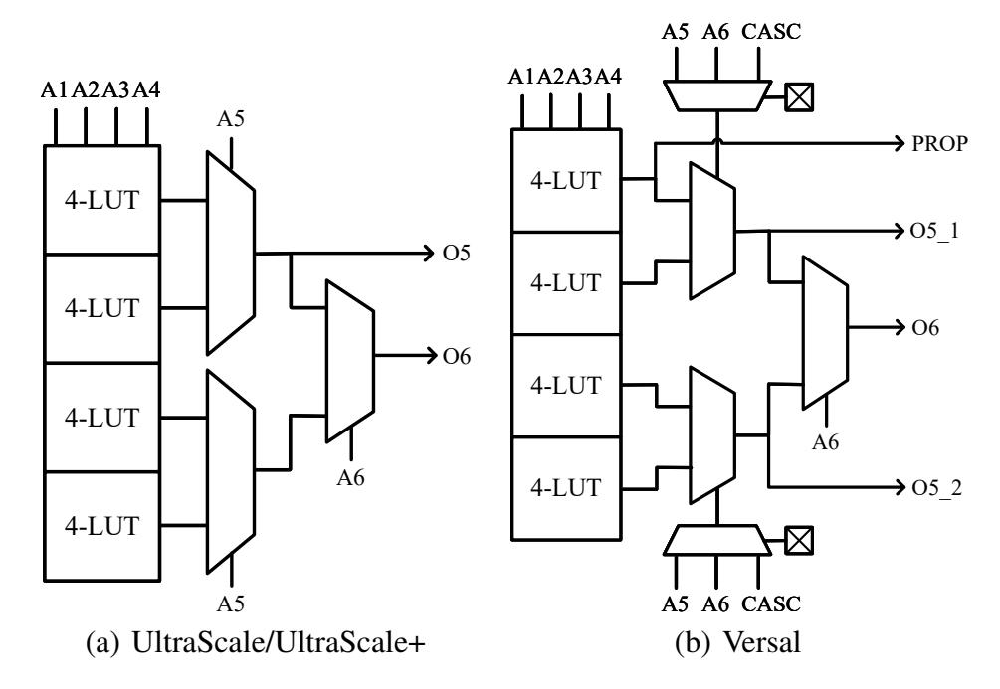
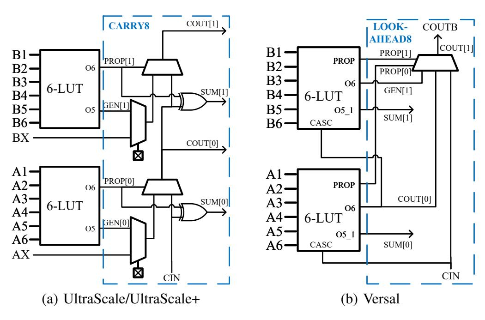
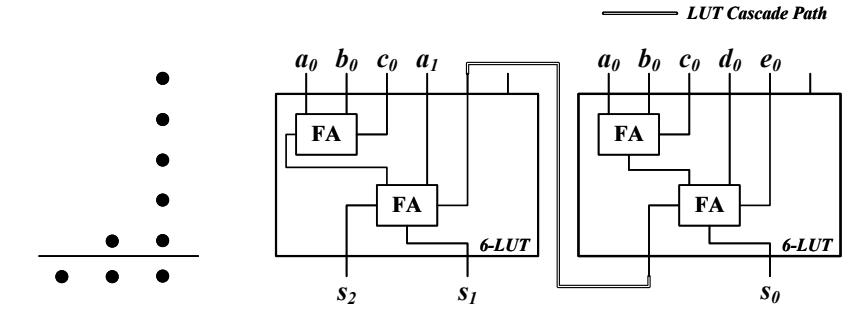
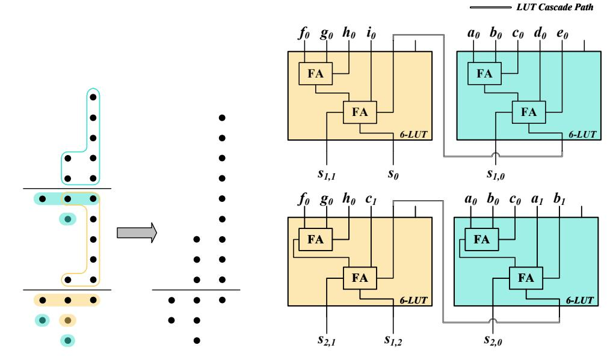
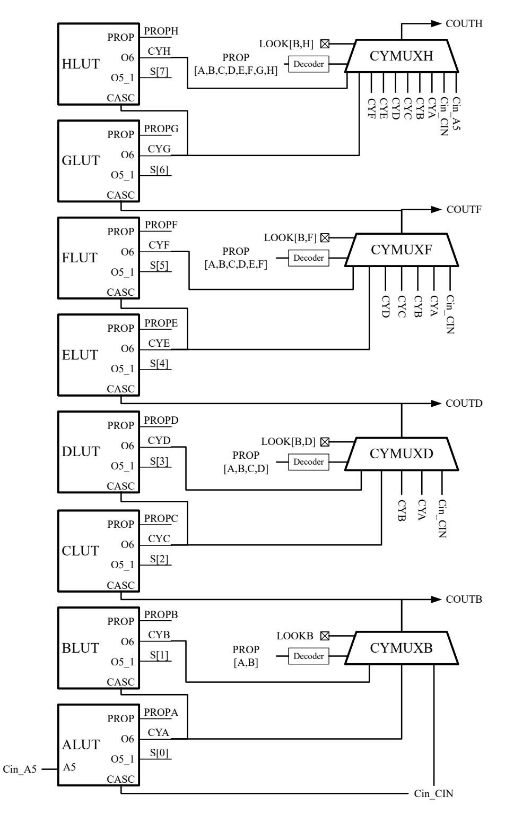
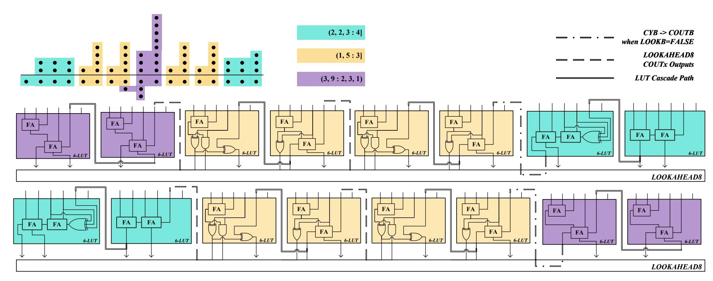
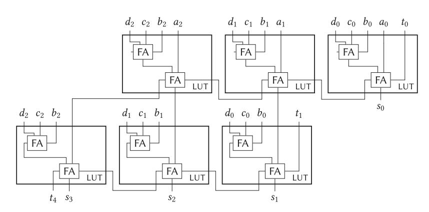
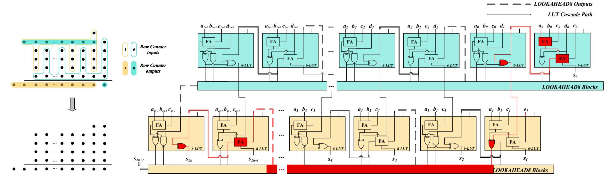
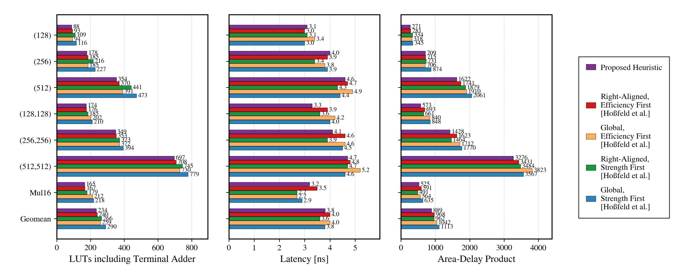
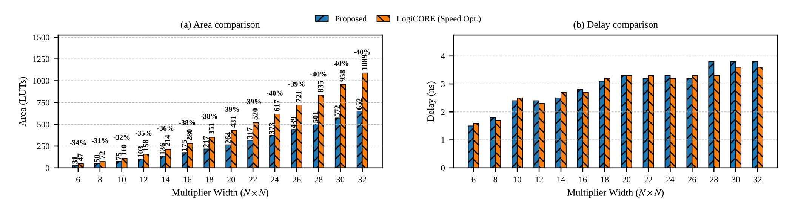

{0}------------------------------------------------

# Area-Efficient LUT-Based Multipliers for AMD Versal FPGAs

Zetao Miao, Xander Pottier, Jonas Bertels, Wouter Legiest, Ingrid Verbauwhede *COSIC, KU Leuven* Leuven, Belgium

{zetao.miao, xander.pottier, jonas.bertels, wouter.legiest, ingrid.verbauwhede}@kuleuven.be

*Abstract*—AMD Versal FPGAs introduce a new CLB microarchitecture in which legacy CARRY4/8 chains are replaced by LOOKAHEAD8 structures. Existing area-efficient LUT-based multiplier designs typically rely on CARRY4/8 primitives from prior FPGA generations. On Versal devices, these designs exhibit poor mapping efficiency. This paper proposes a new LUT-based integer multiplier architecture tailored to Versal fabric, together with an automated RTL generator supporting arbitrary operand bit-widths and configurable pipeline depths. Through the joint exploitation of radix-4 modified Booth recoding and the new micro-architectural features of Versal LUTs, only ∼n 2 /4 LUTs are required to generate the partial-product bit heap for an nbit multiplication. Moreover, a new heuristic is developed for compressor tree synthesis to sum the bit heap, yielding an 8–20% improvement in area–delay product compared with state-of-theart heuristics for Versal devices. Overall, the proposed multipliers achieve up to 40% LUT footprint reduction relative to AMD LogiCORE IP multipliers while maintaining comparable criticalpath delay. The proposed generator enables scalable and customizable deployment of resource-efficient bit heap compressors and integer multipliers for Versal-based accelerator designs.

*Index Terms*—LUT-based multiplier, radix-4 Booth recoding, compressor tree synthesis, FPGA, Versal

# I. INTRODUCTION

Multiplication is one of the most fundamental and performance-critical operations in a wide range of applications implemented on field-programmable gate arrays (FPGAs), including digital signal processing (DSP) [\[1\]](#page-7-0), neural network (NN) inference [\[2\]](#page-7-1), and cryptographic computing such as fully homomorphic encryption (FHE) [\[3\]](#page-7-2). Different application domains require multipliers with different operand precisions and performance characteristics. For instance, modern NN inference accelerators increasingly adopt low-precision integer arithmetic, typically INT8 or even INT4. DSP algorithms, such as filtering and spectral analysis, commonly require medium-precision fixed-point or floating-point multiplications. In contrast, cryptographic algorithms rely on large integer multiplications, often going up to several hundreds of bits.

To accelerate multiplication, modern FPGAs integrate fixedsize DSP blocks that provide highly efficient embedded multipliers. However, their predefined operand formats, fixed placement, and limited quantity make them a scarce resource. In contrast, look-up-table (LUT)-based multipliers support arbitrary operand sizes and flexible placement, leveraging LUTs that are the primary and most abundant computational resource in FPGA fabrics. Moreover, LUT-based designs can exploit architectural optimizations or combine with DSP blocks to construct wide-precision multipliers. Consequently, efficient LUT-based multiplier design remains critical for precisiondiverse workloads on FPGAs.

Most of the prior work [\[4\]](#page-7-3)–[\[11\]](#page-8-0) has focused on optimizing LUT-based multipliers for AMD Xilinx 7-series and Ultra-Scale/UltraScale+ architectures. These designs largely exploit the configurable logic block (CLB) micro-architecture composed of 6-input LUTs coupled with CARRY4/8 primitives, to efficiently generate and accumulate partial products [\[4\]](#page-7-3)–[\[9\]](#page-8-1) or to compress partial-product bit heaps [\[9\]](#page-8-1)–[\[11\]](#page-8-0). However, the CLB architecture in the new AMD Versal devices differs substantially from those prior generations, most notably by replacing CARRY4/8 with the LOOKAHEAD8 carry structure [\[12\]](#page-8-2). Consequently, many prior designs cannot achieve efficient mappings on Versal devices, motivating new efficient multiplier architectures tailored to the Versal CLB.

This paper presents a LUT-based multiplier architecture specifically designed for Versal CLBs. The proposed approach enables efficient partial-product generation by exploiting the cascade multiplexer introduced in the Versal LUT micro-architecture, and efficient partial-product accumulation through compressor trees synthesized using a new dedicated heuristic under the constraints of the LOOKAHEAD8 carry structure. In addition, we develop an open-source automated RTL generator[1](#page-0-0) in Python that can produce either standalone compressor trees or complete multipliers, with userconfigurable operand widths and pipeline depths. Evaluation results show that the proposed design achieves substantially improved area efficiency over existing LUT-based multipliers and AMD LogiCORE IP multipliers on Versal devices.

# II. BACKGROUND

## *A. Versal CLB Adaptations*

While Versal CLBs retain the overall structure consisting of LUTs, carry hardware, and flip-flops, both the LUT and carry micro-architectures differ significantly from those of previous FPGA generations.

Fig. [1](#page-1-0) compares the micro-architectures of Versal LUTs with those of UltraScale and UltraScale+ devices. One major change is the introduction of two statically and independently configurable cascade multiplexers, which control two A5

1[https://anonymous.4open.science/r/Arith26](https://anonymous.4open.science/r/Arith26_submission) submission

{1}------------------------------------------------

Fig. 1: LUT micro-architectures based on [\[12\]](#page-8-2).

Fig. 2: First two-bit section of carry hardware with LUTs.

multiplexers. This modification increases LUT flexibility by allowing one of the signals from A5 pin, A6 pin, or CASC pin to serve as the fifth input of a Versal LUT. For example, when configured in dual 5-LUT mode, the two 5-input LUTs within a single UltraScale/UltraScale+ LUT must share all 5 inputs from A1–A5 pins, whereas Versal LUTs allow the two 5-input LUTs to use different fifth inputs, from A5 pin and A6 pin respectively. The output of the second 5-input LUT is now on pin O5 2 instead of pin O6. In addition, Versal LUTs introduce an extra PROP output, which is an internal signal port exclusively used to support the LOOKAHEAD8 carry structure.

The routability of Versal LUTs is further enhanced by the introduction of a dedicated LUT cascade path between each pair of adjacent LUTs, as illustrated in Fig. [2b.](#page-1-1) A direct wire connects the O6 output of the lower LUT to the cascade input (CASC) of the upper LUT, enabling fast signal propagation without consuming general-purpose routing resources.

Fig. [2](#page-1-2) illustrates the first two-bit section of the Ultra-Scale/UltraScale+ CARRY8 block and the corresponding Versal LOOKAHEAD8 block. Compared to CARRY8, LOOKA-HEAD8 removes the XOR gates and multiplexers that previously allowed signals outside the CLB to directly access the carry chain. Meanwhile, propagation signals are generated by a dedicated 4-input sub-LUT within each Versal LUT and exposed through the PROP port instead of the O6 port. The carry multiplexers are organized on a per two-bit basis, such that carry propagation within each two-LUT pair relies on the LUT cascade paths. Each LOOKAHEAD8 block consists of four such two-bit sections organized in a carry look-ahead manner, which will be further examined in Section [IV.](#page-3-0)

# *B. Partial Product Generation*

The first step of a binary multiplication is to generate partial products. Given two signed integers A and B, represented in two's complement form with n and m bits respectively. Partial-product bits can be generated in several ways. The most straightforward approach is radix-2 generation, in which each partial-product bit is obtained through two-input AND (or NAND) operations between bits of A and B, producing approximately n×m partial-product bits with Baugh–Wooley technique [\[13\]](#page-8-3) applied to simplify the sign extension.

To reduce the number of generated partial products, radix-4 modified Booth recoding [\[14\]](#page-8-4) is widely used. This algorithm recodes one of the operands (typically B) into radix-2 2 digits b ′ i = −2b2i+1 + b2i + b2i−1, where b−1 = 0, 2k + 2 = m, and B is sign-extended to an even number of bits if necessary. As a result, the number of partial products is reduced by approximately half compared to the radix-2 scheme. Moreover, each recoded digit satisfies b ′ i ∈ {−2, −1, 0, 1, 2}, allowing the corresponding partial products to be generated using shift-andadd/subtract operations on the multiplicand A.

# *C. Generalized Parallel Counters*

Once partial products are generated, they must be efficiently reduced to a smaller number of operands before the final addition stage. This reduction is typically performed using parallel counter structures that compress multiple input bits of the same or different weights into fewer output bits while preserving the overall numerical value. Generalized parallel counters (GPCs) provide an abstract representation of parallel counter circuits, enabling systematic analysis and construction of compressor trees [\[15\]](#page-8-5). A GPC is denoted as (pm−1, pm−2, . . . , p0 : qn−1, qn−2, . . . , q0), where pi , for i ∈ {0, 1, . . . , m − 1}, denotes the number of input bits with weight 2 i , and qi , for i ∈ {0, 1, . . . , n − 1}, denotes the number of output bits with weight 2 i . A GPC preserves numerical correctness by ensuring that the weighted sum of the outputs equals that of the inputs. In this paper, for notational convenience, when the counter produces exactly one output bit in each output column, it is denoted in the abbreviated form (pm−1, pm−2, . . . , p0 : n], where n is the total number of output bits. For example, the counter (1, 5 : 1, 1, 1) is written as (1, 5 : 3].

To evaluate and compare different GPC configurations, two commonly used metrics are *efficiency* E and *strength* S. The *efficiency* E is implementation-dependent and measures the effectiveness of LUT resources in reducing bits. It is defined as the ratio between the number of bits reduced from

{2}------------------------------------------------

TABLE I: Basic Versal GPCs used for Compressor Tree Synthesis in [20]

| Counter     | #LUTs | ${\bf E}$ | S    | LO.AH. 1 | ${\bf Row/Column}^2$ |
|-------------|-------|-----------|------|---------------------|----------------------|
| (3:2]       | 1     | 1.0       | 1.5  | <b>√</b>            | Both                 |
| (6:3]       | 3     | 1.0       | 2.0  | ×                   | Neither              |
| (10:4,2)    | 3     | 1.33      | 1.67 | ×                   | Neither              |
| (2,5:1,2,1) | 2     | 1.5       | 1.75 | ×                   | Column               |
| (1,5:3]     | 2     | 1.5       | 2.0  | $\checkmark$        | Row                  |
| (2, 2, 3:4] | 2     | 1.5       | 1.75 | ×                   | Row                  |

if the GPC is compatible with carry-lookahead structure

2if the GPC is used to construct row counters or column counters

Fig. 3: (1, 5 : 3] GPC in [20].

input to output and the number of LUTs used to implement the counter [15]. In contrast, the *strength* S of a GPC is implementation-independent and characterizes its inherent bit-reduction capability. It is defined as the ratio between the number of input bits and the number of output bits [16].

$$E = \frac{\sum_{i=0}^{m-1} p_i - \sum_{i=0}^{n-1} q_i}{\text{#LUTs}}, \quad S = \frac{\sum_{i=0}^{m-1} p_i}{\sum_{i=0}^{n-1} q_i}.$$
 (1)

GPC-based compressor-tree synthesis is widely used to compress bit heaps on FPGAs. GPCs are iteratively applied across bit positions to reduce the bit-heap height until a final adder can resolve the remaining bits. Existing methods can be broadly categorized into heuristic-based and optimization-based approaches. Heuristic methods select GPCs according to metrics such as *efficiency* and *strength*, achieving good area—delay trade-offs with low computational cost [17], [18], [20]. Optimization-based approaches formulate the problem as integer linear programming (ILP), enabling optimal or near-optimal solutions at the expense of significantly higher complexity [18], [19]. Consequently, practical FPGA designs typically rely on heuristic synthesis.

## III. RELATED WORK

## A. Versal GPCs and Compressor Tree Synthesis

To address the challenges brought by micro-architectural changes, Hoßfeld *et al.* [20] were the first to revisit existing UltraScale GPC designs and propose new counter structures tailored to the Versal architecture. Table I summarizes the fundamental GPCs used in their Versal compressor synthesis framework. A key characteristic of Versal-oriented GPC design is the exploitation of the new LUT cascade path. Depending on the construction strategy, this cascade propagates either carry signals, as in the (1,5:3] counter shown in Fig. 3, or sum signals, as in the (3,9:2,3,1) counter in Fig. 4.

Fig. 4: (3, 9: 2, 3, 1) GPC in [20], composed of two (1,5:1,2,1) GPCs.

Beyond basic GPCs, Hoßfeld et al. [20] form two types of larger structures, namely row counters and column counters, through structured compositions. Row counters extend horizontally across bit positions with eligible GPCs forwarding their carry outputs. In contrast, column counters grow vertically by cascading sum signals, targeting tall bit heaps where vertical compression is advantageous. Column counters, including (2n+1:n,1) and (n+1,4n+1:n,n+1,1), are formed by cascading (3:2] and (2,5:1,2,1) GPCs respectively with rippled sum. For instance, the (3, 9: 2, 3, 1)counter shown in Fig. 4, referred to as the dual-rail ripple-sum counter in [20], is a column counter formed by cascading two (2,5:1,2,1) counters (i.e. n=2). In contrast, row counters are constructed by cascading (1, 5:3], (3:2], and (2, 2, 3:4]GPCs with carry propagation. Since only the (1, 5:3] and (3 : 2] counters are compatible with the LOOKAHEAD8 structure and benefit from accelerated carry propagation, the column counter depth is typically restricted (e.g.,  $n \leq 4$ ), and the use of (2,2,3:4] GPCs is limited, since they rely on general-purpose routing for cascading.

To construct compressor trees, Hoßfeld *et al.* [20] proposed a stage-wise heuristic that iteratively reduces the height of the bit heap through dynamically selected GPCs. At each stage, candidate counters, including row counters and column counters, are evaluated and selected by prioritizing their efficiency metric (named efficiency-first in [20]) or strength metric (named strength-first in [20]). Experimental results demonstrate significant LUT savings (around 45%) compared to Vivado adder-tree implementations.

# B. Versal LUT-Based Multipliers Using Gate Absorption

For LUT-based tree multipliers on FPGAs, gate absorption is a compressor-tree optimization that merges logic associated with radix-2 partial products into the compressors rather than realizing it as separate pre-processing stages. By exploiting unused LUT inputs in feasible GPCs, this technique reduces additional logic layers in the first compression stage. Hoßfeld *et al.* [20] demonstrate that absorbing two-input gates into the compressor tree can reduce LUT utilization by at least 21%.

{3}------------------------------------------------

TABLE II: Partial-Product Generation of Proposed Multipliers

| $b_{2i+1}$ | $b_{2i}$ | $b_{2i-1}$ | $P_i'$ | $P'_{i,n}$           | $P'_{i,n-1}$         | $P'_{i,n-2}$         |  $P'_{i,2}$       | $P'_{i,1}$       | $P'_{i,0}$       | $ c_i $ |
|------------|----------|------------|--------|----------------------|----------------------|----------------------|----------------------|------------------|------------------|---------|
| 0          | 0        | 0          | 0      | 0                    | 0                    | 0                    |  0                | 0                | 0                | 0       |
| 0          | 0        | 1          | +A     | $a_{n-1}$            | $a_{n-1}$            | $0 \\ a_{n-2}$       |  $a_2$            | $a_1$            | $a_0$            | 0       |
| 0          | 1        | 0          | +A     | $a_{n-1}$            | $a_{n-1}$            | $a_{n-2}$            |  $a_2$            | $a_1$            | $a_0$            | 0       |
| 0          | 1        | 1          |        |                      |                      | $a_{n-3}$            |                      |                  |                  |         |
|            | 0        | -          | -2A    | $\overline{a_{n-1}}$ | $\overline{a_{n-2}}$ | $\overline{a_{n-3}}$ |  $\overline{a_1}$ | $\overline{a_0}$ | 1                | 1       |
|            |          |            |        |                      | $\overline{a_{n-1}}$ |                      |                      |                  | $\overline{a_0}$ |         |
| 1          | 1        | 0          | -A     | $\overline{a_{n-1}}$ | $\overline{a_{n-1}}$ | $\overline{a_{n-2}}$ |  $\overline{a_2}$ | $\overline{a_1}$ | $\overline{a_0}$ | 1       |
| 1          | 1        | 1          | 0      | 1                    | 1                    | $\overline{a_{n-2}}$ |  1                | 1                | 1                | 1       |

$$\begin{array}{c|ccccccccccccccccccccccccccccccccccc$$

Fig. 5: Partial Products of an 8-bit Multiplication, where Sign Extension is Simplified with Baugh-Wooley Technique [13].

#### IV. PROPOSED MULTIPLIERS

We propose a tree multiplier consisting of partial-product bit heap generation followed by GPC-based compression. The overall area efficiency results from optimization of both stages for Versal fabric.

## A. Partial-Product Generation

Partial-product generation can be implemented on FPGAs differently for different generation schemes. For radix-2 partial products, two AND (or NAND) gates can be implemented with one LUT5:2 on both UltraScale and Versal devices, requiring approximately  $n^2/2$  LUTs for an n-bit multiplication. Alternatively, radix-4 modified Booth recoding reduces the number of partial products by half, but each partial-product bit becomes a five-input Boolean function. On UltraScale FPGAs, this typically results in a similar LUT cost to radix-2 implementations, as one LUT generates only one such bit.

On Versal devices, however, partial-product generation using radix-4 modified Booth recoding technique can be implemented much more efficiently thanks to the new LUT microarchitecture. The proposed multiplier employs this scheme as summarized in Table II, where  $P'_{i,j}$  denotes a partial-product bit with weight  $2^{2i+j}$  and  $c_i$  is a carry bit with weight  $2^{2i}$ . Each signed partial product  $P'_i$  consists of bits  $P'_{i,j}$  for  $j \in \{0,1,\ldots,n\}$  together with  $c_i$ . Fig. 5 illustrates the partial products for an 8-bit multiplication.

From Table II, it is clear that  $c_i$  can be derived directly from  $b_{2i+1}$  without LUT cost. Each partial-product bit  $P'_{i,j}$  is a Boolean function of five inputs:  $(b_{2i+1}, b_{2i}, b_{2i-1})$  from operand B and  $(a_j, a_{j-1})$  (with  $a_{-1} = 0$ ) from operand A. Furthermore, adjacent bits  $(P'_{i,j+1}, P'_{i,j})$  share four inputs, namely  $(b_{2i+1}, b_{2i}, b_{2i-1}, a_j)$ . This property enables efficient mapping onto Versal LUTs as shown in Table III, whose dual 5-LUT mode allows independent fifth inputs as described in Section II. A single Versal LUT can therefore generate two radix-4 partial-product bits, allowing the entire partial-product

TABLE III: Proposed LUT Mapping for Radix-4 Booth Partial-Product Generation.

| LUT Pin | A1         | <b>A2</b> | A3         | <b>A4</b>                         | A5                                           | <b>A6</b>                                                                                       | 05_1           | O5_2         |
|---------|------------|-----------|------------|-----------------------------------|----------------------------------------------|-------------------------------------------------------------------------------------------------|----------------|--------------|
| Signal  | $b_{2i-1}$ | $b_{2i}$  | $b_{2i+1}$ | $a_{j}$                           | $a_{j-1}$                                    | $a_{j+1}$                                                                                       | $P'_{i,j}$     | $P'_{i,j+1}$ |
|         |            | ]         | FA F.      | S 0,0 a 0 l | b 0 c 0 f 0 | a 0 b 0 c 0 FA  S 1,0 g 0 h 0 | UT Cascade Pat |              |

Fig. 6: New Proposed (9:4,1) GPC on Versal fabric.

bit heap to be generated using approximately  $n^2/4$  LUTs for an n-bit multiplication.

## B. Versal GPCs for Bit Heap Compression

While Hoßfeld *et al.* [20] introduced a set of GPCs together with row and column counters, this subsection refines and revisits the counter set to better exploit the Versal architecture. All fundamental GPCs used in this work are listed in Table IV.

First, we propose a new GPC (9:4,1) shown in Fig. 6, with E=1.33 and S=1.8, to replace the (10:4,2) counter due to its higher strength, and to substitute the column counter (2n+1:n,1) with n=4 owing to improved efficiency. Second, the concept of column counters is not adopted in the proposed compressor construction, as such structures must be depth-limited to satisfy timing constraints. In particular, column counters (2n+1:n,1) are excluded because of their low efficiency and strength, while counters of the form (n+1,4n+1:n,n+1,1) are treated as independent GPCs for n=4,3,2. The (2,5:1,2,1) counter (n=1) is also removed, since its functionality can be fully realized by the stronger (1,5:3] counter.

Row counters are constructed from an expanded set of eligible GPCs under restrictions imposed by the LOOKAHEAD8 structure, as detailed in the next subsection.

## C. Versal Row Counter Design with LOOKAHEAD8

The new LOOKAHEAD8 primitive fundamentally changes the design space of row counters on Versal devices, as it provides fast carry propagation paths that avoid slower general-purpose routing. Its internal structure is illustrated in Fig. 7, where four carry-lookahead multiplexers are controlled by attributes LOOKB/D/F/H. When enabled, these attributes activate lookahead carry selection of those multiplexers; otherwise, CYMUXB/D/F/H propagate signals CYB/D/F/H logically. However, it is important to note that the LOOKB attribute also affects downstream multiplexers. This means

{4}------------------------------------------------

TABLE IV: Basic Versal GPCs used for Compressor Tree Synthesis in This Work.

| Counter          | #LUTs | E    | S     | LO.AH. 1 | Row Counter 2 |
|------------------|-------|------|-------|---------------------|--------------------------|
| (5,17:4,5,1)     | 8     | 1.5  | 2.2   | X                   | ×                        |
| (4, 13: 3, 4, 1) | 6     | 1.5  | 2.125 | ×                   | ×                        |
| (3,9:2,3,1)      | 4     | 1.5  | 2.0   | ×                   | $\checkmark$             |
| $(9:4,1)^3$      | 3     | 1.33 | 1.8   | ×                   | $\checkmark$             |
| (6:3]            | 3     | 1.0  | 2.0   | ×                   | $\checkmark$             |
| (2,2,3:4]        | 2     | 1.5  | 1.75  | ×                   | $\checkmark$             |
| (3:2]            | 1     | 1.0  | 1.5   | $\checkmark$        | $\checkmark$             |
| (1, 5:3]         | 2     | 1.5  | 2.0   | $\checkmark$        | $\checkmark$             |

&lt;sup>1if the GPC is compatible with carry-lookahead structure

&lt;sup>3new GPC proposed by this work

Fig. 7: Diagram of LOOKAHEAD8 logic model.

that when only LOOKB is set to FALSE, CYA and CIN are no longer selectable by CYMUXD/F, and A5 input of LUTA replaces CIN as one of the carry candidates for CYMUXH.

We found that these architectural constraints introduce several limitations for the row-counter construction. First, the carry chain must start from the A5 input of LUTA, since CIN can only be driven by the COUT of a neighboring LOOKAHEAD8 block. Second, disabling LOOK attributes

modifies downstream carry selection, limiting which signals can propagate through the chain. To better understand the behavior of the LOOKAHEAD8 primitive, we performed a timing-arc analysis which showed that when all LOOKx attributes are set to FALSE, only the CYB-to-COUTB timing arc exits while other CYx-to-COUTx timing arcs are not defined in the timing model. As a result, GPCs that are incompatible with the carry-lookahead structure cannot rely on logical propagation through the LOOKAHAED8 block by setting LOOKD/F/H to FALSE. Instead, they must use general-purpose routing, which degrades performance.

Based on these observations, we construct row counters from the eligible GPCs, listed in Table IV, according to the following design rules:

- 1) GPCs compatible with the carry-lookahead structure can be cascaded in the row counter without restriction.
- 2) Incompatible GPCs may only appear at specific positions, namely at the beginning of the chain where propagation can be forced via LOOKB configuration, or at the end where no further carry propagation is required.
- 3) When a row counter starts with an incompatible GPC, its length is limited to 8 LUTs due to CYMUXH behavior, which may otherwise produce incorrect carry outputs.

A notable exception is the (3,9:2,3,1) GPC shown in Fig. 4. Although structurally incompatible with the carry-lookahead scheme, its dual-rail property enables effective cascading by initiating a parallel physical carry path, thereby mitigating the length limitation. An example is shown in Fig. 8. In addition, this GPC may offer reduced compressor-tree depth compared to equivalent constructions based on two (1,5:3] GPCs connected through general-purpose routing.

## D. New Implementation of Quaternary Terminal Adder

As a terminal adder for Versal devices, Hoßfeld *et al.* [20] proposed a quaternary adder capable of summing four operands with a cost of two LUTs per bit, saving one LUT per bit compared to adder trees composed of two-operand adders. The design absorbs the carry and sum functions of a carry-save adder into LUTs implementing ripple-carry addition, as illustrated in Fig. 9. While effective in many cases, this implementation is not optimal for bit heaps where higher-weight columns contain only a single bit. Direct application of the quaternary adder prevents LUT merging in such columns due to parallel carry-propagation paths. Alternatively, combining it with a two-operand adder to propagate carries across single-bit columns introduces an additional logic stage and general-purpose routing, increasing critical-path delay.

To address these limitations, this paper proposes an alternative quaternary adder implementation constructed as two layers of row counters, as shown in Fig. 10. The design primarily uses (1,5:3] GPCs and could also additionally incorporate (3:2] GPCs. The (3:2] GPCs can efficiently propagate carries through single-bit columns toward the MSB, requiring only one LUT per bit without introducing additional routing overhead. This structure improves adaptability to diverse bit-

&lt;sup>2if the GPC is used to construct row counters

{5}------------------------------------------------

Fig. 8: Row counter benefits from dual-rail property of (3, 9: 2, 3, 1) GPC.

Fig. 9: Quaternary adder implementation in [20].

heap shapes while preserving the area and delay advantages of multi-operand addition.

## E. Proposed Heuristic for Versal Compressor Tree Synthesis

Efficient individual counters do not necessarily translate into efficient compressor trees unless they are properly selected and scheduled. We propose a new stage-wise heuristic for compressor-tree synthesis on Versal devices. Unlike heuristics proposed by Hoßfeld *et al.* [20] that prioritize efficiency or strength metric of GPCs, the proposed heuristic takes both area and delay into account, with an objective to minimize LUT cost while maintaining the critical path short. To achieve this, counters within each GPC-compression stage are arranged in parallel, and cascading of GPCs in row counters is restricted to dedicated fast paths, avoiding general-purpose routing.

In the proposed heuristic, a GPC is scheduled only when it is both *applicable* and *necessary*. A GPC is *applicable* if sufficient free bits exist in the required input columns to fully populate the counter. A GPC is *necessary* if it is expected to achieve the lowest LUT cost for reducing the current column (and a limited span of subsequent columns) to a height of at most four. Table V lists the necessity conditions when a counter is aligned to column c, where  $H_c$  denotes the column height including both unassigned bits and outputs generated by counters already scheduled in the current stage.

For each compression stage, scheduling starts from the right-most column whose height exceeds four. Candidate counters in Table V are examined in priority order. The first

TABLE V: Counter Necessity Conditions

| Counter                                                                                                                                                                          | Necessity Conditions |
|----------------------------------------------------------------------------------------------------------------------------------------------------------------------------------|----------------------|
| $\begin{array}{c c} \hline \\ & (5,17:4,5,1) \\ & (4,13:3,4,1) \\ & (3,9:2,3,1) \\ & (9:4,1) \\ & (6:3] \\ & (2,2,3:4] \\ & (3:2] \\ & \downarrow (1,5:3] \\ \hline \end{array}$ | <del></del>          |

counter that is both applicable and necessary is placed with its LSB aligned to the current column. Whenever possible, the heuristic prioritizes starting or extending a row counter (i.e., cascading eligible GPCs) under the LOOKAHEAD8 constraints described in the previous subsection. After placing a counter, if it is a row-counter candidate, the scan position advances to the column corresponding to the MSB of its outputs to continue the cascade. Otherwise, the scan moves to the next column. The process repeats until no further counters can be scheduled in the current stage.

Stages are generated iteratively until the reduced bit heap can be finalized by the terminal quaternary adder. Before terminal addition, a consolidation is performed. If allowing limited under-utilization of counters in the last GPC-compression stage, where counter inputs are supplied by leftover bits that were not assigned to any GPC in the preceding stage, does not prevent terminal addition, the two stages are merged. This reduces the number of sequential compression stages, improving delay without increasing LUT cost.

### F. RTL Generator for Proposed Multipliers

An automated Python-based RTL generator is developed for the proposed multipliers. The generator performs compressortree synthesis using the proposed heuristic and produces synthesizable SystemVerilog designs via primitive instantiation and explicit wiring. Both partial-product generation and compressor-tree structures are generated automatically from user-defined parameters, together with XDC constraints,

{6}------------------------------------------------

Fig. 10: Proposed implementation of quaternary adder as two layers of row counters.

testbenches, and random test vectors. Standalone compressor generation is also supported. Pipeline insertion is handled automatically by partitioning the design into partial-product generation, GPC-based compression stages, and terminal addition, with registers placed to approximately balance stage delays. All experimental results reported in Section V are obtained with designs generated by this RTL generator.

#### V. EXPERIMENTAL RESULTS

### A. Evaluation Method

Designs are synthesized with default settings in Vivado targeting the Versal xcvc1902-vsva2197-2MP-e-S device. They are embedded within a register sandwich to ensure consistent timing evaluation. The reported delay corresponds to the critical-path delay under the tightest successful timing closure obtained via iterative refinement of the timing constraint with a step size of 0.1 ns. LUT utilization reported by Vivado is used as the area metric. To ensure a fair and direct comparison, Vivado version 2023.1 is used for compressors compared to the designs from Hoßfeld *et al.* [20]. For other designs, Vivado version 2025.2 is used.

#### B. Evaluation Results of Compressor Trees

Compressor trees are generated using the proposed generator with the same input shapes as those used by Hoßfeld *et al.* [20]. The comparison results are shown in Fig. 11.

Compressors synthesized using the proposed heuristic achieve the best area-efficiency across all evaluation cases. For single-column bit heaps, the proposed heuristic results in critical-path delay comparable to the efficiency-first heuristic. For two-column and multi-column bit heaps, the proposed heuristic achieves delay close to strength-first heuristics while maintaining the best area efficiency among all evaluated approaches. Overall, the proposed heuristic reduces the area–delay product by 8–20% compared to state-of-the-art heuristics.

Table VI reports the critical-path delay of the evaluated compressors under different pipeline depths, demonstrating the effectiveness of automatic pipeline insertion implemented in the generator.

TABLE VI: Delay [ns] of the Compressors with Different Pipeline Stages. Results Obtained Using Vivado 2025.2.

| #Stages    | 1   | 2   | 3   | 4   | 5    | 6    | 7    | 8    |
|------------|-----|-----|-----|-----|------|------|------|------|
| (128)      | 3.0 | 2.0 | 1.6 | 1.5 | 1.2  | 1.2  | N.A. | N.A. |
| (256)      | 3.9 | 2.3 | 1.8 | 1.5 | 1.5  | 1.3  | 1.3  | N.A. |
| (512)      | 4.7 | 2.7 | 2.0 | 1.6 | 1.6  | 1.5  | 1.3  | 1.2  |
| (128, 128) | 3.5 | 2.1 | 1.6 | 1.5 | 1.5  | 1.2  | N.A. | N.A. |
| (256, 256) | 4.0 | 2.2 | 1.7 | 1.5 | 1.4  | 1.3  | 1.4  | N.A. |
| (512, 512) | 4.6 | 2.7 | 2.0 | 1.7 | 1.5  | 1.4  | 1.4  | 1.4  |
| Mul16      | 2.8 | 1.8 | 1.6 | 1.6 | N.A. | N.A. | N.A. | N.A. |

Note: N.A. indicates configurations exceeding the maximum pipeline depth supported by the generator.

TABLE VII: Comparison between the Proposed Multiplier and the Multiplier with Gate Absorption

| Multiplier |         | 16-bit [20] | Proposed 16-bit | Proposed 18-bit |
|------------|---------|-------------|-----------------|-----------------|
| Area       | (#LUTs) | 245         | 175             | 217             |

#### C. Evaluation Results of Proposed Multipliers

The proposed multipliers are compared against AMD Logi-CORE IP multipliers [21]. The LogiCORE designs are configured for speed optimization, as our evaluation shows that the area-optimized configuration ends up with significantly more LUT usage. The comparison results are shown in Fig. 12. The proposed multipliers reduce LUT utilization by up to 40% compared to speed-optimized LogiCore IP multipliers while maintaining comparable critical-path delay. For operand widths between 28 and 32 bits, the proposed multipliers exhibit slightly longer critical-path delay due to the earlier introduction of an additional compression stage in the compressor tree.

Table VII compares the proposed multipliers with the 16-bit multiplier optimized using gate absorption in [20]. The proposed 16-bit multiplier reduces LUT usage by more than 25%, and even the proposed 18-bit multiplier requires over 10% fewer LUTs than the design with gate-absorption.

#### VI. CONCLUSION

This paper presents an area-efficient LUT-based integer multiplier architecture tailored to AMD Versal FPGAs. By jointly

{7}------------------------------------------------

Fig. 11: Comparison of proposed compression heuristic and heuristics used by Hoßfeld *et al.* [\[20\]](#page-8-6). (128) denotes a bit heap consisting of a single column with 128 bits, (128,128) denotes a bit heap with two columns containing 128 bits each, and so on. Mul16 denotes the bit heap of 16-bit radix-2 multiplication. Geomean represents the geometric mean of all seven cases.

Fig. 12: Comparison of proposed multipliers and AMD LogiCORE IP multipliers (speed optimized).

exploiting radix-4 modified Booth recoding and the microarchitectural features of Versal LUTs and the LOOKAHEAD8 carry structure, the proposed design enables efficient partialproduct generation and compressor-tree construction on the new CLB architecture. An architecture-aware heuristic for GPC-based compressor-tree synthesis is introduced to improve delay while preserving high area-efficiency. An automated Python-based RTL generator is developed to support scalable design generation, including compressor-tree synthesis and pipeline insertion. Experimental results demonstrate that the proposed multipliers achieve up to 40% LUT reduction compared to AMD LogiCORE IP multipliers while maintaining comparable delay, and the proposed compressor-tree heuristic improves the area-delay product by 8-20% compared to existing Versal-oriented approaches.

Future work will explore extending the proposed architecture-aware methodology to other arithmetic operators on Versal devices, further leveraging the new LUT structures and LOOKAHEAD8 carry architecture to improve efficiency and performance.

#### REFERENCES

- [1] M. Maamoun, A. Hassani, S. Dahmani, H. A. Saadi, G. Zerari, N. Chabini, and R. Beguenane, "Efficient FPGA-based architecture for high-order FIR filtering using simultaneous DSP and LUT reduced utilization," *IET Circuits, Devices & Systems*, vol. 15, no. 5, pp. 475– 484, 2021.
- [2] C. Zhang, P. Li, G. Sun, Y. Guan, B. Xiao, and J. Cong, "Optimizing FPGA-based accelerator design for deep convolutional neural networks," in *Proc. 2015 ACM/SIGDA Int. Symp. on Field-Programmable Gate Arrays (FPGA)*, pp. 161–170, 2015.
- [3] M. Van Beirendonck, J.-P. D'Anvers, F. Turan, and I. Verbauwhede, "FPT: A fixed-point accelerator for torus fully homomorphic encryption," in *Proc. 2023 ACM SIGSAC Conf. on Computer and Communications Security (CCS)*, pp. 741–755, 2023.
- [4] E. G. Walters, "Partial-product generation and addition for multiplication in FPGAs with 6-input LUTs," in *Proc. 48th Asilomar Conf. on Signals, Systems and Computers*, pp. 1247–1251, 2014.
- [5] M. Kumm, S. Abbas, and P. Zipf, "An efficient softcore multiplier architecture for Xilinx FPGAs," in *Proc. IEEE 22nd Symp. on Computer Arithmetic*, pp. 18–25, 2015.
- [6] M. Shu and Q. Liu, "LHAM: Low-cost and high-accuracy approximate multiplier for FPGA-based computing," *ACM Trans. Reconfigurable Technol. Syst.*, vol. 18, no. 4, Art. no. 48, pp. 1–25, Dec. 2025.
- [7] S. Ullah, S. Rehman, B. S. Prabakaran, F. Kriebel, M. A. Hanif, M. Shafique, and A. Kumar, "Area-optimized low-latency approximate

{8}------------------------------------------------

- multipliers for FPGA-based hardware accelerators," in *Proc. 55th Annu. Design Automation Conf. (DAC)*, pp. 1–6, 2018.
- [8] R. Chen, Y. Lyu, H. Bao, and B. da Silva, "A power-efficient hardware implementation of L-Mul," arXiv preprint arXiv:2412.18948, 2024.
- [9] A. Bottcher and M. Kumm, "Multiplier design addressing area-delay ¨ trade-offs by using DSP and logic resources on FPGAs," in *Proc. IEEE 35th Int. Conf. on Application-Specific Systems, Architectures and Processors (ASAP)*, pp. 217–225, 2024.
- [10] A. Bottcher and M. Kumm, "Small logic-based multipliers with in- ¨ complete sub-multipliers for FPGAs," in *Proc. IEEE 31st Symp. on Computer Arithmetic (ARITH)*, pp. 124–131, 2024.
- [11] A. Bottcher and M. Kumm, "Towards globally optimal design of ¨ multipliers for FPGAs," *IEEE Trans. Comput.*, vol. 72, no. 5, pp. 1261– 1273, 2023.
- [12] AMD, "Versal Adaptive SoC Configurable Logic Block Architecture Manual, AM005," AMD, Release 1.4, May 14, 2025. [Online]. Available: https://docs.amd.com/r/en-US/am005-versal-clb/Overview
- [13] C. R. Baugh and B. A. Wooley, "A two's complement parallel array multiplication algorithm," *IEEE Trans. Comput.*, vol. C-22, no. 12, pp. 1045–1047, Dec. 1973.
- [14] O. L. MacSorley, "High-speed arithmetic in binary computers," *Proc. IRE*, vol. 49, no. 1, pp. 67–91, 1961.
- [15] H. Parandeh-Afshar, A. Neogy, P. Brisk, and P. Ienne, "Compressor tree synthesis on commercial high-performance FPGAs," *ACM Trans. Reconfigurable Technol. Syst.*, vol. 4, no. 4, pp. 1–19, 2011.
- [16] T. B. Preußer, "Generic and universal parallel matrix summation with a flexible compression goal for Xilinx FPGAs," in *Proc. 27th Int. Conf. on Field Programmable Logic and Applications (FPL)*, pp. 1–7, 2017.
- [17] H. Parandeh-Afshar, P. Brisk, and P. Ienne, "Efficient synthesis of compressor trees on FPGAs," in *Proc. Asia and South Pacific Design Automation Conf. (ASP-DAC)*, pp. 138–143, 2008.
- [18] M. Kumm and J. Kappauf, "Advanced compressor tree synthesis for FPGAs," *IEEE Trans. Comput.*, vol. 67, no. 8, pp. 1078–1091, 2018.
- [19] H. Parandeh-Afshar, P. Brisk, and P. Ienne, "Improving synthesis of compressor trees on FPGAs via integer linear programming," in *Proc. Design, Automation and Test in Europe Conf. (DATE)*, pp. 1256–1261, 2008.
- [20] K. Hoßfeld, H. J. Damsgaard, J. Nurmi, M. Blott, and T. B. Preußer, "High-efficiency compressor trees for latest AMD FPGAs," *ACM Trans. Reconfigurable Technol. Syst.*, vol. 17, no. 2, pp. 1–32, 2024.
- [21] AMD, "Multiplier v12.0 Product Guide (PG108)," AMD, Nov. 18, 2015. [Online]. Available: https://docs.amd.com/v/u/en-US/pg108-mult-gen