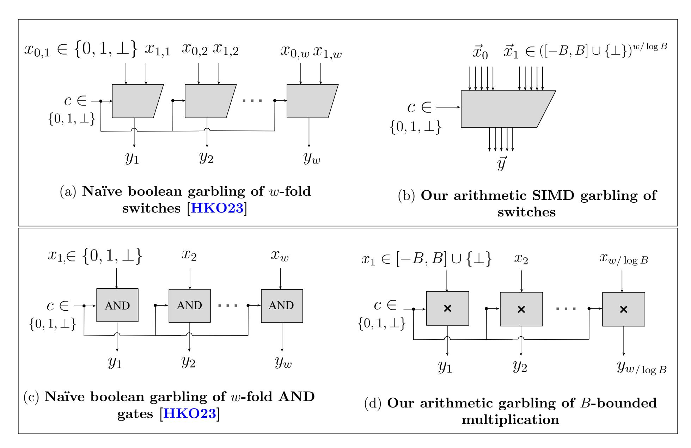
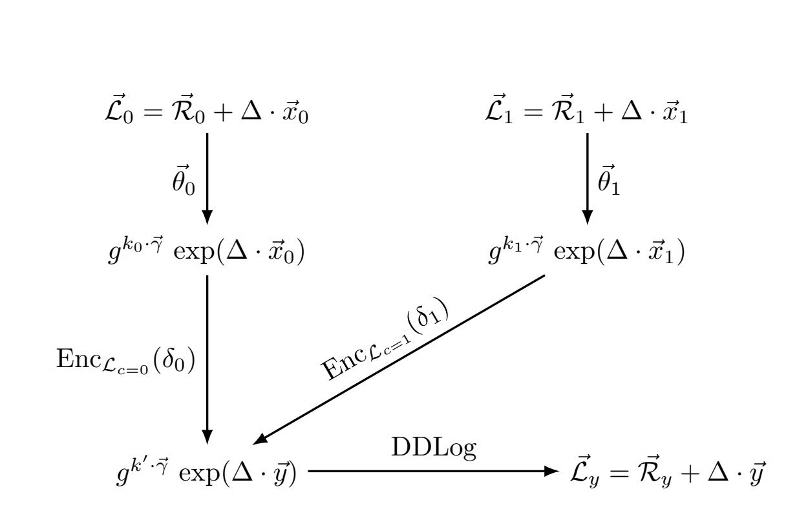
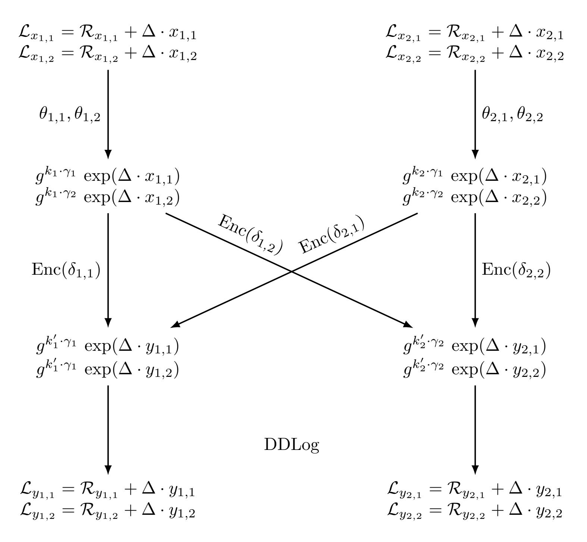
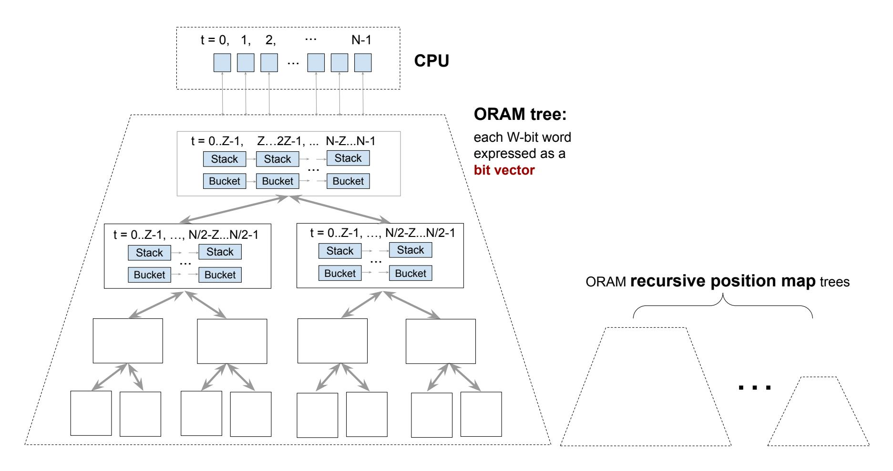
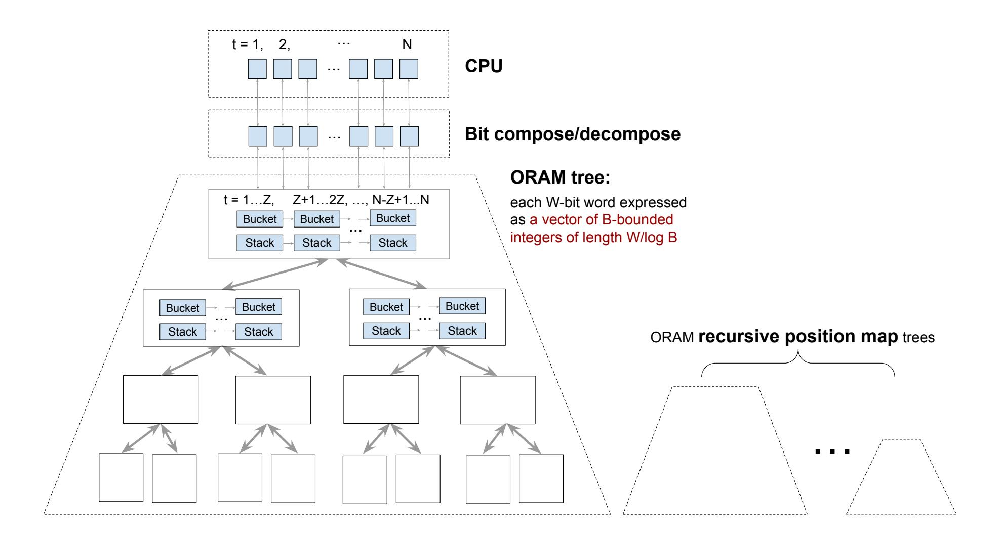
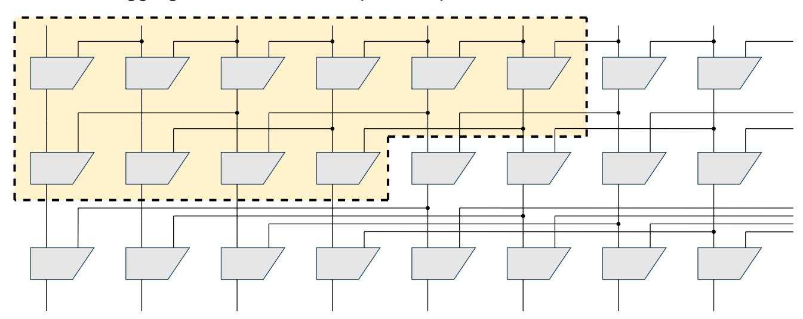

{0}------------------------------------------------

# Zebra: Arithmetic Garbled RAM for Large Words from DCR

Tianyao Gu<sup>1</sup> , Ashrujit Ghoshal<sup>2</sup> , and Elaine Shi<sup>1</sup>

<sup>1</sup>Carnegie Mellon University 2 Indian Institute of Technology Madras

February 20, 2026

#### Abstract

Garbled RAM is a promising technique for scaling secure two-party computation to large datasets. It features an efficient two-round protocol and supports each memory access with polylogarithmic overhead, thereby avoiding the prohibitive cost of RAM-to-circuit conversion. While earlier works on Garbled RAM primarily focused on establishing theoretical feasibility, recent research has increasingly emphasized concrete efficiency, culminating in constructions that achieve approximately O(λTW log N) bandwidth cost (up to super-constant factors) for garbling a RAM with running time T, memory size N, and word size W.

We ask whether it is possible to further improve the bandwidth cost of Garbled RAM. In contrast, the Garbled Circuit literature has developed a rich set of techniques that remove the bandwidth's dependence on the security parameter λ, leading to constant-rate or even subconstant-rate garbling schemes. However, no comparable methods are currently known for Garbled RAM.

We propose a new garbling scheme for arithmetic RAM, called Zebra (short for "Zero Exposure B-bounded Random Accesses"). Specifically, we show that when the word size W is suitably large, we can eliminate the λ-factor dependence and achieve a bandwidth cost of O(TW log N). In this sense, our scheme can also be viewed as the RAM analogue of "constant-rate garbling for arithmetic circuits". Further, we show how to extend our techniques to support the garbling of boolean RAMs, achieving a bandwidth cost of O(TW(log N +λ)) when the word size is suitably large. We implemented Zebra and released our code through open source. Our evaluation shows a 10.1× concrete improvement in bandwidth and a 3.5× improvement in end-to-end time relative to the state-of-the-art Garbled RAM schemes on a 256MB database with 4kB entries.

{1}------------------------------------------------

# Contents

| 1 | Introduction<br>1.1<br>Our Results and Contributions<br><br>1.2<br>Additional Related Work<br>                                                                                                                                                                                                            | 3<br>4<br>6                                  |
|---|-----------------------------------------------------------------------------------------------------------------------------------------------------------------------------------------------------------------------------------------------------------------------------------------------------------|----------------------------------------------|
| 2 | Roadmap<br>2.1<br>Background: Garbled RAM via Boolean Dynamic Circuits<br>2.2<br>Our Blueprint<br>2.3<br>Realizing the Blueprint with HSS-Like Techniques and Beyond<br><br>2.4<br>Putting Everything Together<br>                                                                                        | 7<br>7<br>8<br>10<br>14                      |
| 3 | B-bounded Dynamic Circuit                                                                                                                                                                                                                                                                                 | 15                                           |
| 4 | Garbling Scheme for B-bounded Dynamic Circuits<br>4.1<br>Definitions: Garbling Scheme<br><br>4.2<br>Setup of Our Garbling Scheme<br><br>4.3<br>High-level Garbling Scheme for Dynamic Circuits<br>4.4<br>Routing Gate<br>4.5<br>Multiplication Gate<br><br>4.6<br>Linear Gate<br>4.7<br>Modulo-2 Gate<br> | 16<br>16<br>17<br>18<br>18<br>22<br>23<br>23 |
| 5 | Evaluation                                                                                                                                                                                                                                                                                                | 23                                           |
| 6 | Oblivious RAM Simulation with B-bounded Dynamic Circuit<br>6.1<br>Background: RAMs as Boolean Dynamic Circuits<br>6.2<br>Our Approach: RAMs as B-Bounded Dynamic Circuits<br>                                                                                                                             | 25<br>26<br>28                               |
| 7 | Application to 2-Server Updatable PIR<br>7.1<br>Definition of 2-Server Updatable PIR<br>7.2<br>Construction of 2-Server PIR from Garbled RAM<br>7.3<br>Security Proof                                                                                                                                     | 32<br>32<br>33<br>34                         |
| 8 | Resolving the Super-Constant Factor<br>8.1<br>Efficient Stash via Hierarchical ORAM<br>8.2<br>Cost Analysis                                                                                                                                                                                               | 35<br>35<br>36                               |
| 9 | Cryptography Preliminaries<br>9.1<br>Damg˚ard-Jurik-ElGamal Cryptosystem<br><br>9.2<br>Distributed Discrete Logarithm<br>9.3<br>Homomorphic Secret Sharing from DCR                                                                                                                                       | 38<br>38<br>39<br>40                         |
|   | 10 Proofs of Security, Correctness, and Efficiency<br>10.1 Security Proofs<br><br>10.2 Correctness Proofs<br><br>10.3 Efficiency Proofs<br>                                                                                                                                                               | 41<br>41<br>47<br>50                         |

{2}------------------------------------------------

### <span id="page-2-0"></span>1 Introduction

The garbled circuit, originally proposed by Yao [Yao86], provides a method for realizing secure two-party computation (2PC), enabling two mutually distrusting parties to jointly perform privacy-preserving data analytics without revealing their private inputs. One compelling feature of the garbled circuit is its round complexity — the protocol requires only two rounds of interaction. However, as a growing body of research [BMR90, NPS99, KS08, ZRE15, RR21, BHKR13, BLLL23, MORS25a, MORS25b, ILL25] aimed to make garbled circuits practical for real-world applications, a significant bottleneck manifested in the form of a representation mismatch. Garbled circuit requires that the computation be expressed as a circuit, whereas real-world programs are typically expressed in the Random Access Machine (RAM) model. Unfortunately, generically converting a RAM program into a circuit incurs a  $\Theta(N)$ -factor overhead for each memory access, where N denotes the RAM's memory size. This linear per-access penalty becomes prohibitively expensive for computations involving dynamic access patterns over large datasets.

To scale garbled circuits to big data settings, a new line of research — beginning with the seminal work of Lu and Ostrovsky [LO13b]—introduced the notion of Garbled RAM. Specifically, Garbled RAM enables direct garbling of a RAM program without first converting it into a circuit representation, thereby avoiding the linear overhead per memory access inherent in circuit-based approaches. Early works in this area [LO13b,GHL+14,GLO15,GLOS15,LO17] primarily focused on establishing the theoretical feasibility of Garbled RAM under standard cryptographic assumptions. In particular, it was shown that, assuming only one-way functions, a RAM program with time T, space N, and word size W can be compiled into a garbled program of size  $T \cdot W \cdot \operatorname{poly}(\lambda, \log N)$  [GLOS15]. Throughout this paper, we also refer to the size of the garbled program as the bandwidth cost, since the garbler must transmit it to the evaluator during the 2PC protocol. These early constructions, however, remained largely theoretical, with little attention paid to the concrete magnitude of the  $\operatorname{poly}(\lambda, \log N)$  factors in their asymptotic cost.

It was not until recently that the community began to witness a paradigm shift in this space. Beginning with the elegant work of Heath et al. [HKO22], a new line of research [PLS23, HKO23, GTRS25, YPHK23] has advanced Garbled RAM from a purely theoretical construct toward practical realizations. Notably, Park et al. [PLS23] and Heath et al. [HKO23] demonstrated how to achieve a bandwidth cost of  $\lambda \cdot TW \cdot \widetilde{O}(\log N)$ , where  $\lambda$  denotes the security parameter. Throughout this paper, the notation  $\widetilde{O}(f(\text{vars}))$  hides poly  $\log f(\text{vars})$  factors, where vars represents a list of variables. More recently, PicoGRAM further improved the bandwidth cost to  $\lambda \cdot T \cdot W \log N \cdot \omega(1)$ , where  $\omega(1)$  denotes an arbitrarily small super-constant function in  $\lambda$ . For all these concretely efficient instantiations, the computation cost (i.e., the total work of the garbler and evaluator) approximately matches the bandwidth cost up to an  $\widetilde{O}(\lambda)$  factor.

We ask whether it is possible to further reduce the bandwidth cost of Garbled RAM while retaining concrete efficiency. If one disregards concrete efficiency, the literature on "succinct Garbled RAM" [LP14, BGL+15, CHJV15, KLW15, CCHR16, CH16, CCC+16, ACC+16, AL18] demonstrates how to eliminate the dependence on T in bandwidth by employing heavy-weight machinery such as indistinguishability obfuscation (iO) [JLS20, GGH+13]. However, since the computation cost of Garbled RAM must inherently scale linearly with T, improving the bandwidth dependence on T alone would not lead to a reduction in the overall cost. In fact, these iO-based constructions [LP14, BGL+15, CHJV15, KLW15, CCHR16, CH16, CCC+16, ACC+16, AL18] pay a significant price in overall cost to eliminate the bandwidth's dependence on T— specifically, their computational cost (or overall cost) is a poly( $\lambda$ , W,  $\log(T, N)$ ) factor worse than known practical constructions [HKO22, PLS23, YPHK23, HKO23, GTRS25]. Further, the reliance on iO also renders these approaches completely impractical. So far, without relying on iO, we are not aware of any

{3}------------------------------------------------

techniques for making the bandwidth's dependence on T even slightly sublinear.

In this paper, we instead focus on understanding whether the dependence on the security parameter  $\lambda$  is necessary. Specifically, we observe that in the garbled circuit literature, a flurry of works [BLLL23, MORS25a, LWYY25, ILL24, MORS25b, ILL25] have focused on removing the  $\lambda$  factor dependence in bandwidth costs, resulting in the so-called constant-rate or even sub-constant-rate garbling, for either arithmetic or boolean circuits. However, it is not known whether these techniques can be adapted to the RAM model to achieve similar savings. In fact, even when allowing the use of indistinguishability obfuscation (iO), it remains unknown how to remove the  $\lambda$ -factor dependence in bandwidth. While existing succinct Garbled RAM schemes [LP14,BGL+15, CHJV15,KLW15,CCHR16,CH16,CCC+16,ACC+16,AL18] achieve bandwidth that is independent of T, they nevertheless incur a poly( $\lambda$ ) multiplicative overhead in the bandwidth cost. We therefore ask a natural question:

Can we also eliminate or reduce the  $\lambda$  multiplicative factor dependence in the bandwidth cost of Garbled RAM?

#### <span id="page-3-0"></span>1.1 Our Results and Contributions

We answer the above question in the affirmative. Although our approach draws inspiration from the literature on Homomorphic Secret Sharing (HSS) [BGI16, OSY21, RS21, MORS25a, MORS25b, BMO<sup>+</sup>25], we emphasize that existing HSS techniques cannot be directly applied to the RAM setting to achieve our asymptotic improvements. Our results require novel adaptations of known HSS techniques. To the best of our knowledge, this work is the first to establish a concrete connection between the Garbled RAM literature and HSS techniques, yielding non-trivial asymptotic improvements in the RAM setting. Below, we state our main results.

Garbling scheme for arithmetic RAM. We first consider the garbling of a B-bounded arithmetic RAM, where B is a  $\lambda$ -bit integer. In a B-bounded arithmetic RAM, every W-bit memory word is expressed as an arithmetic vector in  $[-B,B]^{W/\log B}$ . In other words, one can imagine that each wire carries a B-bounded value from [-B,B] rather than a boolean value as in a standard boolean RAM. We assume that the CPU supports addition on W-bit words, and coordinate-wise multiplication (of B-bounded integers).

We construct a new arithmetic Garbled RAM scheme called Zebra (short for "Zero Exposure B-bounded Random Accesses"). To the best of our knowledge, Zebra is the first to remove the dependence on the security parameter  $\lambda$  in bandwidth for reasonably large word sizes. More concretely, our result is stated in the following theorem:

<span id="page-3-3"></span>**Theorem 1.1** (Garbling arithmetic RAMs). Assume the Decisional Composite Residuosity (DCR) assumption and the existence of a Random Oracle. Then, there exists a garbling scheme that achieves  $O(TW \log N)$  bandwidth and  $\widetilde{O}(\lambda) \cdot TW \log N$  computation cost per CPU step for a B-bounded arithmetic RAM with time T, space N, and word size  $W \geq \lambda \cdot \log^2 N$  (in bits)<sup>2</sup>.

Relative to prior work [HKO23,GTRS25], Theorem 1.1 improves the bandwidth cost of Garbled RAM by eliminating its dependence on the  $\lambda$  factor. On the other hand, in terms of computation cost, an  $\widetilde{O}(\lambda)$ -factor dependence still remains. An interesting open question is whether this factor

<span id="page-3-2"></span><span id="page-3-1"></span><sup>&</sup>lt;sup>1</sup>Throughout this paper, we use log to denote the base-2 logarithm.

 $<sup>^{2}</sup>$ All schemes in this paper still work when the word size W is smaller than the stated threshold, except that the threshold should be used in lieu of the actual W in the asymptotic cost.

{4}------------------------------------------------

Table 1: Comparison of Garbled RAM schemes for suitably large memory words, where N is the memory size, W is the bit length of the word, T is the number of CPU steps,  $\lambda$  is the security parameter, and  $\omega(1)$  denotes an arbitrarily small super-constant factor in  $\lambda$ . The notation  $\widetilde{O}(f(\mathsf{vars}))$  hides  $\mathsf{poly} \log f(\mathsf{vars})$  factors. Our arithmetic scheme assumes the word width  $W \geq \lambda \cdot \log^2 N$ , and our boolean scheme assumes  $W \geq \lambda \cdot \log^\epsilon N$  for an arbitrarily small constant  $\epsilon > 0$ .

| Scheme                                            | Bandwidth                                                                                                                | Compute                                                                                                                                                  | Assumption           |  |  |  |  |
|---------------------------------------------------|--------------------------------------------------------------------------------------------------------------------------|----------------------------------------------------------------------------------------------------------------------------------------------------------|----------------------|--|--|--|--|
| Tri-state [HKO23] PicoGRAM [GTRS25] Succinct GRAM | $\lambda \cdot TW \cdot \widetilde{O}(\log N)$ $\lambda \cdot \omega(1) \cdot TW \log N$ poly $(\lambda, W, \log(T, N))$ | $\begin{aligned} \widetilde{O}(\lambda \log N) \cdot TW \ \widetilde{O}(\lambda^2) \cdot TW \log N \ T \cdot poly(\lambda, W, \log(T, N)) \end{aligned}$ | OWF<br>DDH<br>iO     |  |  |  |  |
| Our results                                       |                                                                                                                          |                                                                                                                                                          |                      |  |  |  |  |
| Zebra (arithmetic) Zebra (boolean)                | $O(TW \log N)$ $O(TW(\lambda + \log N))$                                                                                 | $\widetilde{O}(\lambda) \cdot TW \log N$ $\widetilde{O}(\lambda) \cdot TW(\frac{\lambda^2}{\log T} + \log N)$                                            | DCR + RO<br>DCR + RO |  |  |  |  |

can be further removed. Since the same question remains unresolved even in the context of garbled circuits, achieving such an improvement would likely require fundamentally new techniques.

We also point out that our scheme's dependence on N is optimal — specifically, the well-known ORAM lower bound [GO96, BN16, LN18] implies an  $\Omega(W \cdot \log N)$  lower bound on the per-access computation cost of any Garbled RAM. Another interpretation of this lower bound is that further improving the  $\log N$  factor in bandwidth, even if feasible, would yield only marginal savings in the overall cost of Garbled RAM.

**Garbling scheme for boolean RAM.** We next extend our results to a standard boolean RAM whose instruction set supports word-level additions and bitwise boolean operations. We prove the following theorem for garbling boolean RAMs:

<span id="page-4-0"></span>**Theorem 1.2** (Garbling boolean RAMs). Under the same assumptions as Theorem 1.1, there exists a garbling scheme that achieves  $O(TW(\log N + \lambda))$  bandwidth and  $\widetilde{O}(\lambda) \cdot TW(\frac{\lambda^2}{\log T} + \log N)$  computation cost per CPU step for a boolean RAM with time T, space N, and word size  $W \geq \lambda \cdot \log^{\epsilon} N$  (in bits) for an arbitrarily small constant  $\epsilon > 0$ .

For boolean RAM, we improve the bandwidth cost of prior work [HKO23,GTRS25] by reducing the  $\lambda \log N$  multiplicative factor to an additive  $\lambda + \log N$  factor. In comparison with arithmetic RAM (Theorem 1.1), the  $\log N$  factor is now replaced with  $\lambda + \log N$  (or  $\frac{\lambda^2}{\log T} + \log N$  for computation) in Theorem 1.2. The additional overhead stems from the need to emulate the CPU's boolean instructions and the associated bit decomposition operations. In practice, due to the heavier dependence on  $\lambda$  in the computation cost, our boolean GRAM may incur a higher end-to-end time than prior works [HKO23, GTRS25] in computationally constrained settings, as detailed in Section 5. Whether the computation cost of boolean GRAM can be further reduced remains an interesting open question, likely requiring either a more efficient bit-decomposition algorithm or an alternative construction that bypasses arithmetic garbling techniques.

Application: 2-server updatable PIR. One important application scenario of Garbled RAM is to realize a two-server Private Information Retrieval (PIR) scheme for a globally shared database. Consider a setting where many clients need to access a shared global database, yet their access patterns may inadvertently reveal highly sensitive information. For instance, in modern cryptocurrencies, queries to blockchain state can leak private details such as a user's identity, trading

{5}------------------------------------------------

counterparties, or even intent (e.g., which crypto-asset the user plans to trade). Similarly, accessing a Certificate Transparency (CT) log may expose a user's intent to visit a specific website. Recognizing these privacy risks, several industry leaders — including Signal, Meta, and Ethereum — have acknowledged the importance of enabling oblivious access to globally shared data and have either deployed or announced plans to deploy such oblivious access services [sig, met]. Today, most deployed services rely on a combination of Oblivious RAM (ORAM) and trusted hardware. However, industry leaders such as Ethereum have clearly articulated a long-term vision of replacing trusted hardware with cryptography-based solutions [But], motivated both by the desire to eliminate reliance on a small set of hardware vendors, and by the growing body of evidence that off-the-shelf trusted hardware suffers from numerous security vulnerabilities.

Garbled RAM offers an attractive cryptographic alternative for enabling oblivious access to globally shared databases. Informally speaking, trusted hardware is replaced by a cryptographically secure computer jointly realized by the garbler and the evaluator. Further, our large word size assumption is also suitable for many real-life applications such as CT logs, querying the blockchain state at some address along with the corresponding Merkle proofs [JJ18], and fetching one's own cryptographic credentials from a zero-knowledge identity provider [wor]. In comparison with the recent line of work on client-preprocessing PIR schemes [CK20, ZPSZ24, LP23, RMS24, HPPY25], Garbled-RAM-based schemes not only achieve asymptotically better performance, but also readily support frequent updates to the database — a crucial feature in dynamic databases such as blockchains and CT logs. By contrast, in client-preprocessing PIRs [CK20, ZPSZ24, LP23, RMS24, HPPY25], each database update incurs additional client-side work, rendering such schemes impractical for applications such as light-weight clients for blockchains which often run on weak client devices such as mobile phones.

Specifically, Theorem 1.1 gives rise to the following corollary.

<span id="page-5-1"></span>Corollary 1.3 (2-server updatable PIR). Assume the same assumptions as Theorem 1.1. Given a database with N entries each W-bits long where  $W \geq \lambda \log^2 N$ , there is a 2-server updatable PIR scheme with the following costs per access or update operation:  $O(W \log N)$  bandwidth,  $\widetilde{O}(\lambda) \cdot W \log N$  computation, and O(1) rounds of interaction.

Concrete performance. We implemented our Zebra scheme and explored its performance for a 2-server PIR scenario as mentioned above. Our code has been published as open source, available at https://github.com/zebragram/zebragram. For a 256 MB database with 4 kB blocks, we improve the bandwidth cost by 10.1× relative to PicoGRAM [GTRS25], from 396 MB to 39.2 MB. Under our test setup, this translates into a 3.53× reduction in end-to-end time, from 11.9 seconds to 3.36 seconds per retrieval.

#### <span id="page-5-0"></span>1.2 Additional Related Work

We now discuss some additional related work.

Interactive 2PC schemes for RAM. By combining ORAM techniques with standard 2PC primitives, a sequence of works [OS97, GKK<sup>+</sup>12, LO13a, WCS15, LWN<sup>+</sup>15] has shown how to construct interactive protocols for RAM-model 2PC. These protocols achieve poly  $\log N$  bandwidth (same as ours), but they require  $\Omega(\log N)$  rounds of interaction per timestep.

More recently, Roy and Singh [RS21] leveraged the HSS technique to achieve constant bandwidth per timestep for sufficiently large word sizes. Specifically, they build their protocol upon Onion ORAM [DvDF<sup>+</sup>16], compiling the server-side computation into an HSS-friendly Restricted

{6}------------------------------------------------

Multiplication Straight-line (RMS) program, and instantiating the client-side computation with a generic secure computation framework. Although their scheme achieves lower asymptotic bandwidth than ours, its total round complexity scales linearly with the RAM runtime T. Furthermore, their approach incurs at least O(log N) times higher computational overhead compared to ours[3](#page-6-2) .

RAM-model FHE. Another approach to communication-efficient secure computation of RAM programs is to use Fully Homomorphic Encryption (FHE) schemes with RAM support. While Lin et al. [\[LMW23\]](#page-55-8) demonstrated the feasibility of RAM-FHE under the Ring-LWE assumption (with circular security), their construction incurs significant concrete computational overhead. Whether RAM-model FHE can be achieved with practical efficiency remains an open question.

Arithmetic circuit garbling based on LHE and HSS. Recent works [\[BLLL23,](#page-52-2) [MORS25a,](#page-56-1) [ILL24,](#page-54-6)[MORS25b,](#page-56-2)[ILL25\]](#page-54-0) show that linearly homomorphic encryption (LHE) and homomorphic secret sharing (HSS) techniques can be used to construct garbling schemes for arithmetic circuits with low bandwidth. Ball et al. [\[BLLL23\]](#page-52-2) give a constant-rate construction using LHE under the DCR assumption, where the rate is the ratio between the garbled size and the original circuit description size. Meyer et al. [\[MORS25a\]](#page-56-1) use HSS to bring the rate down to 1 + o(1) (under an additional circular-security assumption). More recent works [\[MORS25b,](#page-56-2) [ILL25\]](#page-54-0) reduce the rate further to O(1/ log log |C|) for layered arithmetic circuits C. Collectively, these works push bandwidth toward optimality, but at the expense of substantial (often polynomial) computational overhead.

# <span id="page-6-0"></span>2 Roadmap

# <span id="page-6-1"></span>2.1 Background: Garbled RAM via Boolean Dynamic Circuits

Our starting point is the garbled RAM scheme of Heath et al. [\[HKO23\]](#page-54-4). We begin by giving some background on their blueprint.

RAM expressed as boolean dynamic circuits. A major contribution of Heath et al. [\[HKO23\]](#page-54-4) is the proposal of a new circuit-based computation model that can efficiently express RAMs, henceforth called boolean dynamic circuits[4](#page-6-3) . In a standard circuit, gate evaluation is all-or-nothing: only once all input wires are set can the output wires be determined. In contrast, a boolean dynamic circuit supports partial eager evaluation of gates, meaning that as soon as a subset of the input wires is set, certain output wires may already be computed.

This partial eager evaluation capability is crucial for efficiently expressing RAM. Specifically, representing a RAM with time T, space N, and word width W as a standard circuit would result in size O(T · N · W), since each memory access requires a linear-sized selector gadget. By contrast, Heath et al. [\[HKO23\]](#page-54-4) showed that the same RAM can be represented as a randomized boolean dynamic circuit of size T ·W·log N log log N, with only negligible (in λ) correctness error. Intuitively, the partial eager evaluation enables the emulation of conditional branching, a key feature that fundamentally distinguishes RAMs from standard circuits.

<span id="page-6-2"></span><sup>3</sup>This follows from their server-side cost analysis; the client-side cost after compilation into a secure-computation framework is not explicitly analyzed.

<span id="page-6-3"></span><sup>4</sup>The original work of Heath et al. [\[HKO23\]](#page-54-4) refers to a boolean dynamic circuit as a tri-state circuit since every wire can take three values, {0, 1, ⊥}. For convenience of terminology, we adopt the name boolean dynamic circuit instead.

{7}------------------------------------------------

More specifically, a boolean dynamic circuit comprises not only the standard AND and XOR gates, but also a new switch gate defined as follows<sup>5</sup>. The gate has two data input wires,  $x_0$  and  $x_1$ , a control wire c, and a single output wire y. Each wire can take values in  $\{0, 1, \bot\}$ , where  $\bot$  represents the unset state of the wire. The operational semantics of the switch gate are as follows. Initially, all wires are unset. Whenever the control wire c and c are both set, the output wire c receives the value c (regardless of whether c is set).

Heath et al. [HKO23] showed how to convert a RAM with word width  $W \ge \log^2 N$ , time T, and space N into a randomized boolean dynamic circuit using:

- $O(T \cdot W \cdot \log N \cdot \log \log N)$  switch gates, and
- $T \cdot W \cdot \log N \cdot \omega(1)$  number of AND and XOR gates, where  $\omega(1)$  denotes an arbitrarily small super-constant function in  $\lambda$ .

In the resulting dynamic circuit, the (random) values on all control wires are simulatable without knowing the input to the computation. In other words, the evaluator is allowed to know the values on the control wires.

Garbling boolean dynamic circuits. Assuming the existence of one-way functions, Heath et al. [HKO23] devise a garbling scheme for boolean dynamic circuits where each AND gate and switch gate requires sending  $O(\lambda)$  bits of garbling material where  $\lambda$  is the security parameter, whereas XOR gates are free and do not contribute to the bandwidth cost. Therefore, Heath et al.'s garbled RAM incurs a bandwidth cost of  $O(\lambda \cdot T \cdot W \cdot \log N \cdot (\log \log N + \omega(1)))$  bits.

# <span id="page-7-0"></span>2.2 Our Blueprint

Our objective is to eliminate the extraneous multiplicative factors of  $\lambda$ ,  $\log \log N$ , and  $\omega(1)$  present in Heath et al.'s scheme, thereby obtaining a Garbled RAM construction with bandwidth cost  $O(T \cdot W \cdot \log N)$ . In this section, we first address the removal of the  $\lambda$  and  $\log \log N$  factors, and defer how to eliminate the super-constant factor to Section 8.1.

Alternative view of the RAM's dynamic circuit. Our first key observation is that the boolean dynamic circuit expressing RAM has many synchronized operations on w-bit payloads<sup>6</sup> where  $w = O(W + \log N)$ . These w-fold synchronized operations are core to the oblivious memory abstraction which can be viewed as a boolean dynamic circuit realization of the Circuit ORAM algorithm [WCS15]. Roughly speaking, they serve the following two purposes: 1) routing memory words (along with some metadata) along paths in the ORAM tree; and 2) reading and writing data to data arrays associated with the nodes in the ORAM tree.

Specifically, consider the following two types of w-synchronized operations:

- 1. A w-fold switch gate has a single-bit control wire  $c \in \{0, 1, \bot\}$ , two bit-vector inputs denoted  $\vec{x}_0 \in \{0, 1, \bot\}^w$  and  $\vec{x}_1 \in \{0, 1, \bot\}^w$ , and a bit-vector output  $\vec{y} \in \{0, 1, \bot\}^w$ . If the c and  $\vec{x}_c$  are set, then  $\vec{y}$  is set to  $\vec{x}_c$ .
- 2. A w-fold AND gate has a single-bit control wire  $c \in \{0, 1, \bot\}$ , a bit-vector input denoted  $\vec{x} \in \{0, 1, \bot\}^w$ , and a bit-vector output  $\vec{y} \in \{0, 1, \bot\}^w$ . Whenever c and  $\vec{x}$  are both set,  $\vec{y}$  is set to  $\vec{y} \leftarrow c \cdot \vec{x}$ .

<span id="page-7-1"></span><sup>&</sup>lt;sup>5</sup>We replace the Buffer and Join gates in the original work [HKO23] with the switch abstraction for ease of understanding.

<span id="page-7-2"></span><sup>&</sup>lt;sup>6</sup>Throughout the paper, we use capital letters T, N, and N to denote the parameters of the RAM. We use small letters such as w and n to denote the parameters or the problem sizes seen by an individual circuit gadget or building block.

{8}------------------------------------------------

<span id="page-8-0"></span>

Figure 1: **Our blueprint.** Each gate in the above picture has  $O(\lambda)$  bits of garbling material. B has  $O(\lambda)$  bits. Relative to Heath et al. [HKO23], we save a  $\lambda \log \log N$  factor for w-fold switches and a  $\lambda$  factor for w-fold AND gates.

The dynamic circuit expressing RAM [HKO23] can be equivalently viewed as comprising the following operations:

- w-fold switches:  $O(T \cdot \log N \cdot \log \log N)$  number of O(W)-fold switch gates;
- w-fold ANDs:  $O(T \cdot \log N) \cdot \omega(1)$  number of O(W)-fold AND gates;
- other: all other gates, including 1) other gates needed for realizing the memory abstraction whose costs are not dominating as long as  $W \ge \lambda \log^2 N$ ; and 2) gates representing the CPU circuit. See Section 2.4 for details.

Our blueprint: taking advantage of w-synchronized operations. As shown in Figure 1 (left), the garbling scheme of Heath et al. [HKO23] did not take advantage of the w-synchronized behavior; moreover, it incurs an additional  $\lambda$ -factor blowup because a  $\lambda$ -bit label is used to express each boolean wire. At a very high level, we will shave the  $\lambda$  and  $\log \log N$  factors as follows:

- 1. B-bounded wires instead of boolean wires: saving the  $\lambda$  factor. To get rid of the  $\lambda$  factor, we let each wire carry an integer value from the domain [-B,B] (also called a B-bounded integer). Each w-bit word can therefore be expressed as  $\lceil w/\log B \rceil = O(w/\lambda)$  number of B-bounded integers. In this way, our garbling scheme aims to spend  $\lambda$  bits of garbling material for each B-bounded arithmetic gate (rather than each boolean gate). By setting  $\log B \in \Theta(\lambda)$ , this saves us a  $\lambda$  factor. For example, as shown in Figure 1d, a w-fold AND gate can now be represented as  $w/\log B = O(w/\lambda)$  number of multiplication gates, each incurring  $O(\lambda)$  bandwidth.
- 2. SIMD garbling of switches: saving an extra  $\log \log N$  factor. For the switch gates, using B-bounded wires to shave a  $\lambda$  factor alone is not enough for getting our asymptotic results.

{9}------------------------------------------------

We need to get rid of an extra  $\log \log N$  factor here. To this end, we make the entire w-bit word, expressed as  $w/\log B$  number of B-bounded wires, all reuse the same  $O(\lambda)$ -sized garbling material, as shown in Figure 1b. For word width  $W \geq \lambda \cdot \log \log N$ , this lets us save a  $w = \Theta(W) = \Theta(1) \cdot \lambda \cdot \frac{W}{\lambda} \geq \Theta(1) \cdot \lambda \cdot \log \log N$  factor for switch gates relative to the naïve approach of Heath et al. [HKO23].

In summary, the first idea enables intra-wire savings (where the wires are now B-bounded), and the second idea enables inter-wire savings, which we also call SIMD (short for "Single Instruction Multiple Data").

To achieve the  $T \cdot W \cdot \log N \cdot \omega(1)$  bandwidth cost, the challenge now boils down to devising a suitable garbling scheme compatible with our blueprint above.

# <span id="page-9-0"></span>2.3 Realizing the Blueprint with HSS-Like Techniques and Beyond

<span id="page-9-1"></span>**Primary encoding format: subtractive sharing.** Without risk of ambiguity, we often use the notation x to denote the name of a wire, and use  $\mathsf{val}_x \in [-B, B]$  to denote the B-bounded value the wire carries. We introduce the following notations to represent the encoding behind our garbling scheme:

- Secret key K and  $\Delta$ : let  $K \stackrel{\$}{\leftarrow} [0, \mathcal{N})$  for an RSA modulus  $\mathcal{N} = p \cdot q$ , and  $\Delta = K \cdot B \cdot 2^{\lambda} + 1$ , both sampled by and known only to the garbler.
- Garbler's share  $\mathcal{R}_x \in \{0,1\}^{\log B + \lambda}$ : garbler's share of the wire x a predetermined mask that does not depend on the wire value  $\mathsf{val}_x$  at runtime. We often write  $\mathcal{R}_x$  in base- $(B \cdot 2^\lambda)$  representation, that is,  $\mathcal{R}_x = \mathcal{R}_x^{\uparrow} \cdot B \cdot 2^\lambda + \mathcal{R}_x^{\downarrow}$ , where  $\mathcal{R}_x^{\uparrow}$  and  $\mathcal{R}_x^{\downarrow}$  denote the higher- and lower-order bits, respectively.
- Evaluator's share  $\mathcal{L}_x \in \{0,1\}^{\log B + \lambda}$ : evaluator's share of wire x which encodes the actual value  $\mathsf{val}_x$  that wire x takes. Specifically, let  $\mathsf{val}_x$  be the B-bounded value carried by the wire, then  $\mathcal{L}_x = \mathcal{R}_x + \Delta \cdot \mathsf{val}_x$ . Similar to the garbler's share, we often write  $\mathcal{L}_x$  in base- $(B \cdot 2^\lambda)$  representation, that is,  $\mathcal{L}_x = \mathcal{L}_x^{\uparrow} \cdot B \cdot 2^\lambda + \mathcal{L}_x^{\downarrow}$ , where  $\mathcal{L}_x^{\uparrow} = \mathcal{R}_x^{\uparrow} + K \cdot \mathsf{val}_x$  and  $\mathcal{L}_x^{\downarrow} = \mathcal{R}_x^{\uparrow} + \mathsf{val}_x$  denote the higherand lower-order bits, respectively. For correctness of the base- $(B \cdot 2^\lambda)$  representation, we require that  $\mathcal{R}_x^{\downarrow} \in [B, B \cdot (2^\lambda 1))$ .

Observe that the garbler's and the evaluator's shares jointly form a subtractive secret share of  $\Delta \cdot \mathsf{val}_x$ , that is,  $\mathcal{L}_x - \mathcal{R}_x = \Delta \cdot \mathsf{val}_x$ . We can alternatively view their shares as forming subtractive sharings of both x and  $K \cdot x$ , with the garbler's shares predetermined and independent of the wire's actual value  $\mathsf{val}_x$ . This is important since the garbler effectively has to (sample or) evaluate its shares on all wires offline before the actual input to the computation is determined.

Throughout, we assume that a well-formed B-bounded dynamic circuit guarantees the following property: as long as all inputs are B-bounded, every intermediate and output wire also carries a B-bounded value (assuming all additions and multiplications are performed over  $\mathbb{Z}$ ). Consequently, we never need to worry about any wire value underflowing or overflowing the B-bounded range.

The subtractive sharing format is the primary encoding format behind our garbling scheme. With this encoding format, garbling a B-bounded addition gate is easy and free in the sense that it does not contribute to the bandwidth overhead. Suppose we want to garble a gate that computes z = x + y: let  $(\mathcal{R}_x, \mathcal{L}_x)$  and  $(\mathcal{R}_y, \mathcal{L}_y)$  be the garbler and evaluator's shares for the input wires x and y, then  $(\mathcal{R}_x + \mathcal{R}_y, \mathcal{L}_x + \mathcal{L}_y)$  would be the shares for the output wire.

Below, we focus on how to garble SIMD switches and multiplication gates — the part that embodies our novel techniques. To this end, we introduce an auxiliary encoding format called divisive sharing.

{10}------------------------------------------------



Figure 2: Garbling a SIMD switch gate: the evaluator's view.

Auxiliary encoding format: divisive sharing. Our divisive sharing format follows earlier works on Homomorphic Secret Sharing [OSY21, RS21]. Let  $\zeta$  be a positive integer, and g be a generator of unknown order in  $\mathbb{Z}_{\mathcal{N}^{\zeta+1}}^{\times}$ , where  $\mathcal{N}$  is an RSA modulus. Henceforth, we may assume that  $\mathcal{N}$  and g are public parameters.

A divisive sharing of a value  $\mathsf{val} \in \mathbb{Z}_{\mathcal{N}^\zeta}^+$  is of the following format:

- Garbler's share:  $g^k \mod \mathcal{N}^{\zeta+1}$  for some  $k \in [0, \mathcal{N})$  again, the garbler's share should not depend on the actual value val which is determined only at runtime;
- Evaluator's share:  $g^k \cdot \exp(\text{val}) \mod \mathcal{N}^{\zeta+1}$ , where  $\exp(\cdot) : \mathbb{Z}_{N^{\zeta}} \to 1 + \mathcal{N} \cdot \mathbb{Z}_{\mathcal{N}^{\zeta+1}}^{\times}$  is an efficiently computable function satisfying  $\exp(a+b) = \exp(a) \cdot \exp(b)$ , with an efficient inverse  $\log(\cdot) : 1 + \mathcal{N} \cdot \mathbb{Z}_{\mathcal{N}^{\zeta+1}}^{\times} \to \mathbb{Z}_{N^{\zeta}}$ . We defer the precise definitions to Section 9.1.

Distributed discrete log: divisive sharing to subtractive sharing. Given a divisive sharing of  $\Delta \cdot \text{val}$ , the garbler and evaluator can convert it back to a subtractive sharing of  $\Delta \cdot \text{val}$  by running a distributed discrete log procedure denoted DDLog first proposed by Boyle et al. [BGI16], and later improved by [OSY21,RS21]. This procedure works by having each party perform a local transformation of their shares, and does not incur any communication. We defer the details of the DDLog procedure to Section 9.2.

<span id="page-10-1"></span>**SIMD Garbling of Switch Gates.** Recall that every w-bit word is expressed as a B-bounded bit vector  $[-B, B]^{\lceil w/\log B \rceil}$ , since our wires carry B-bounded values. Below, for convenience, we shall call a group of  $\lceil w/\log B \rceil$  number of B-bounded wires a cable.

<span id="page-10-0"></span>1. Conversion to correlated divisive sharing. Let  $\vec{x}_0 \in ([-B, B] \cup \{\bot\})^{w/\log B}$  and  $\vec{x}_1 \in ([-B, B] \cup \{\bot\})^{w/\log B}$  denote the two input cables, and let  $c \in \{0, 1, \bot\}$  be a boolean control wire. Without risk of ambiguity, we overload the wires' name  $\vec{x}$  or c to also mean the values on the wires. We start with subtractive shares of the input wires,  $\langle \vec{\mathcal{R}}_0, \vec{\mathcal{R}}_0 + \Delta \cdot \vec{x}_0 \rangle$  and  $\langle \vec{\mathcal{R}}_1, \vec{\mathcal{R}}_1 + \Delta \cdot \vec{x}_1 \rangle$ . At this moment, all wires in the two input cables have uncorrelated random masks, i.e., all coordinates of  $\vec{\mathcal{R}}_0$  and  $\vec{\mathcal{R}}_1$  have uncorrelated randomness (we may view the garbler's share as a random mask). The first step is to convert the uncorrelated subtractive shares into correlated divisive shares of the form

$$\langle g^{k_0 \cdot \vec{\gamma}}, \ g^{k_0 \cdot \vec{\gamma}} \cdot \exp(\Delta \cdot \vec{x}_0) \rangle$$
 and  $\langle g^{k_1 \cdot \vec{\gamma}}, \ g^{k_1 \cdot \vec{\gamma}} \cdot \exp(\Delta \cdot \vec{x}_1) \rangle$ 

where  $k_0, k_1 \in [\mathcal{N}]$  are chosen at random by the garbler. After this conversion, the random masks of the two input cables,  $g^{k_0 \cdot \vec{\gamma}}$  and  $g^{k_1 \cdot \vec{\gamma}}$  are clearly correlated. Nonetheless, they are

{11}------------------------------------------------

in distinguishable from independent random masks under the DCR assumption, as we show in Section 10.1.

To make this conversion possible, the garbler sends the evaluator two group elements  $\vec{\theta}_0$  and  $\vec{\theta}_1$  as part of the garbled circuitry<sup>7</sup>, where

$$\vec{\theta}_{\beta} := g^{k_{\beta} \cdot \vec{\gamma}} \cdot \exp(-\vec{\mathcal{R}}_{\beta}) \mod N^{\zeta+1} \quad \text{ for } \beta \in \{0, 1\}.$$

In the subsequent paragraph "saving the conversion costs", we discuss how to asymptotically reduce the overhead for transmitting these conversion terms.

2. Encrypt the difference between the source and destination's labels. As an intermediate goal, we want the garbler and evaluator to have a divisible sharing of  $\vec{x}_c$ , in the form  $\langle g^{k'\cdot\vec{\gamma}}, g^{k'\cdot\vec{\gamma}}\cdot \exp(\Delta \cdot \vec{x}_c) \rangle$ , where  $k' \in \mathbb{Z}_{\mathcal{N}^{\zeta+1}}^{\times}$  is chosen at random by the garbler. This means that during evaluation, when the evaluator gets the input divisive share  $g^{k_c\cdot\vec{\gamma}}\cdot \exp(\Delta \cdot \vec{x}_c)$ , it needs to compute the output divisive share  $g^{k'\cdot\vec{\gamma}}\cdot \exp(\Delta \cdot \vec{x}_c)$ . This is possible if the evaluator simply knows a difference term  $\delta_c$  such that:

$$\delta_c \cdot k_c \equiv k' \mod \operatorname{order}(g) \quad \text{and} \quad \delta_c \equiv 1 \mod \mathcal{N}^{\zeta}.$$

Then, the evaluator can compute

$$\left(g^{k_c\cdot\vec{\gamma}}\cdot\exp(\Delta\cdot\vec{x}_c)\right)^{\delta_c}=g^{\delta_c\cdot k_c\cdot\vec{\gamma}}\cdot\exp(\delta_c\cdot\Delta\cdot\vec{x}_c)=g^{k'\cdot\vec{\gamma}}\cdot\exp(\Delta\cdot\vec{x}_c).$$

Therefore, the garbler sends the evaluator the difference term encrypted under the evaluator's share of the control wire value, that is,  $\{\operatorname{Enc}_{L_{c=\beta}}(\delta_{\beta})\}_{\beta\in\{0,1\}}$  where  $L_{c=\beta}:=\mathcal{R}_c+\Delta\cdot\beta$  denotes the evaluator's share of the control wire c if it takes on value  $\beta\in\{0,1\}$ . During evaluation, the evaluator (who is allowed to know the control wire's value c) decrypts one of the two ciphertexts to perform the routing. In Section 4.4, we show that order(g) can be made co-prime to  $\mathcal{N}^{\zeta}$ , and the garbler can solve for  $\delta_c$  with overwhelming probability. Moreover, we show that if Enc is instantiated from a random oracle, then one can efficiently simulate all the  $\delta_c$  in the evaluator's view without knowing  $k_c$ , k', or order(g).

Note that exactly because our divisive sharings have correlated masks, we can have all  $w/\log B$  B-bounded wires share the same difference term, resulting in a w-factor saving in comparison with the prior work of Heath et al. [HKO23].

3. Conversion back into subtractive shares. Finally, the garbler and evaluator convert their divisive sharing of  $\vec{x}_c$  back to subtractive sharing using DDLog. This step does not incur any communication.

Saving the conversion costs. If we were to perform the conversion between uncorrelated subtractive and correlated divisive shares at every switch gate, the conversion terms (see Step 1 above), whose length matches that of the B-bounded vector itself, would introduce an undesirable  $\log \log N$  factor in the bandwidth cost. Fortunately, this conversion is not required at every switch gate. Specifically, switch gates appear only within the routing gadgets of the dynamic circuit representing the RAM. Once the wires are converted into correlated divisive shares, they traverse a sequence of switch gates before needing to be converted back into subtractive shares. On average, we perform only O(Z) conversions for every  $O(Z \log Z)$  switch gates, where  $Z = \log N \cdot \omega(1)$ . This observation allows us to eliminate the extra  $\log \log N$  factor, capping the total conversion (bandwidth) cost at  $T \cdot W \cdot \log N \cdot \omega(1)$ .

<span id="page-11-0"></span><sup>&</sup>lt;sup>7</sup>All terms the garbler sends to the evaluator can be computed offline when the input values are not yet determined.

{12}------------------------------------------------

Comparison with PicoGRAM's SIMD switches. Our ideas here are inspired by the recent work PicoGRAM [GTRS25]. However, their construction is based on DDH groups and targets boolean wires, leading to two limitations: 1) they suffer from an additional  $\lambda$ -factor overhead, since each boolean wire is assigned an  $O(\lambda)$ -bit label; and 2) their algebraic techniques are incompatible with supporting arithmetic multiplication over B-bounded values. We devise a novel approach to accomplish SIMD garbling of switch gates — by relying on Decisional Composite Residuosity (DCR) groups, our techniques are compatible with arithmetic garbling over B-bounded values.

Garbling Multiplication Gates. We borrow from Homomorphic Secret Sharing (HSS) [BGI16, OSY21,RS21,MORS25a,MORS25b,BMO<sup>+</sup>25] techniques to garble B-bounded multiplication gates. In particular, prior work [MORS25b,BMO<sup>+</sup>25] shows that the parties can homomorphically obtain a subtractive share of  $a \cdot b \in [-B, B]$  by starting with 1) subtractive shares of both a and  $K \cdot a$  and 2) a Damgård-Jurik-ElGamal (DJE) encryption of b under key K (see Section 9.1). As an intermediate step, they compute divisive shares of  $x \cdot y$ , then they run the DDLog procedure to convert it back to subtractive shares.

We can rely on this idea to garble a multiplication gate as follows. We want the two parties to end with a subtractive sharing of  $x \cdot y \cdot \Delta$ . Observe that

<span id="page-12-0"></span>
$$x \cdot y \cdot \Delta = \underbrace{(x + \mathcal{R}_{x}^{\Downarrow}) \cdot (y \cdot \Delta + \mathcal{R}_{y})}_{=\mathcal{L}_{x}^{\Downarrow} \cdot \mathcal{L}_{y} \text{ known by evaluator}} - \underbrace{(\mathcal{R}_{x}^{\Downarrow} \cdot \Delta) \cdot y - \mathcal{R}_{y} \cdot x}_{\text{encrypted } \times \text{ shared values}} - \underbrace{\mathcal{R}_{x}^{\Downarrow} \cdot \mathcal{R}_{y}}_{\text{known by garbler}}$$
(1)

Since the first and third terms are known either to the evaluator or garbler, it is trivial to compute a subtractive sharing of these terms (by setting the other party's share to 0). It suffices to compute a subtractive sharing of the middle term. Given our primary encoding format (see Section 2.3), both parties start with subtractive sharings of x, y, as well as Kx and Ky. Therefore, it suffices for the garbler to send the evaluator a DJE encryption of  $\mathcal{R}_x^{\downarrow} \cdot \Delta$  and of  $\mathcal{R}_y$  under key K. This way, the two parties can rely on the HSS techniques to compute a subtractive share of  $x \cdot y \cdot \Delta$ . While the messages we encrypt here depend on the secret key K, prior work [MORS25b,BMO+25] proves that the DJE encryption satisfies KDM-security when the plaintext is an affine function of the secret key K, which holds in our case. Observe also that the DJE encryptions the garbler sends to the evaluator can be precomputed without knowing the actual input to the computation.

Asymptotically Improving the Computation Efficiency. Our techniques so far allow us to shave off a  $\lambda \cdot \log \log N$  factor in bandwidth compared to Heath et al. [HKO23]. However, the  $\log \log N$  factor improvement does not directly apply to the computational efficiency. In our stack construction, although all  $w/\log B$  many B-bounded wires share the same  $O(\lambda)$ -bit garbling material (namely, the encryption of the difference between the source and destination labels), the evaluator must still apply this difference to each of the  $w/\log B$  wires by performing a modular exponentiation during evaluation.

We devise a new technique to let computation benefit from the  $\log \log N$  factor saving too. Specifically, we observe that in earlier works [HKO23, GTRS25], the switch gates are used to implement a stack gadget — to realize a stack of size  $Z = \log N \cdot \omega(1)$ , we would need  $O(Z \log Z)$  switch gates. Instead of realizing a stack from switch gates, we introduce into our underlying gate set an n-way routing gate that can perform an arbitrary permutation on the inputs. Specifically, an n-way routing gate has inputs  $(\vec{x}_1, c_1), \ldots, (\vec{x}_n, c_n)$  and outputs  $\vec{y}_1, \ldots, \vec{y}_n$ . Each  $\vec{x}_i \in ([-B, B] \cup \{\bot\})^{w/\log B}$  is a cable carrying the input value to be routed, and each  $c_i \in [n] \cup \{\bot\}$  is a control wire indicating which destination the i-th input cable wants to go to. If  $\vec{x}_i$  and  $c_i$  are both set, it means that we want to route  $\vec{x}_i$  to the  $c_i$ -th output cable, and thus we can set  $\vec{y}_{c_i} \leftarrow \vec{x}_i$ .

{13}------------------------------------------------

Building upon our SIMD garbling techniques in Section 2.3, we describe an efficient approach to garble the n-way routing gate, resulting in  $O(n \cdot w + n^2 \cdot \lambda)$  bits of bandwidth and  $(n \cdot w + n^2) \cdot \widetilde{O}(\lambda)$  computation cost per gate (see Sections 4.4 and 10.3). As long as  $w = \Theta(W) \geq \lambda \cdot n$ , the bandwidth and computation costs simplify to  $O(n \cdot w)$  and  $nw \cdot \widetilde{O}(\lambda)$ . For the word size  $W \geq \lambda \cdot Z$ , we can directly implement a Z-sized stack with a single Z-way routing gate, thus avoiding the extra log log N cost.

Remark 2.1 (Comparison with PicoGRAM). PicoGRAM [GTRS25] instantiates their stack with a routing network of depth  $O(\log Z)$ . To save the computation cost, they observe that the evaluator can aggregate all the difference terms  $\delta_c$  along the routing path with modular multiplication and perform a single exponentiation at the end. However, this trick requires that the evaluator to know the order of the underlying group, which does not apply to our setting.

# <span id="page-13-0"></span>2.4 Putting Everything Together

In this section, we briefly describe the two remaining components needed to obtain our final result stated in Theorem 1.1.

Removing the super-constant factor. So far, our costs suffer from an extra super-constant factor denoted  $\omega(1)$ . If we open up the underlying Circuit ORAM, this  $\omega(1)$  factor comes from the super-logarithmically sized buckets in the root and leaf levels of the ORAM tree (whereas all other levels have constant size). The same  $\omega(1)$  factor also impacted the performance of earlier works on Garbled RAM [GTRS25] or ORAM [SDS<sup>+</sup>18, WCS15]. We make a separate novel contribution by showing how to remove this  $\omega(1)$  factor using a Hierarchical ORAM [GO96] dynamic circuit tailored for polylogarithmic-sized memory. See Section 8.1 for details.

Cost of recursion. Recall that our primary encoding employs a B-bounded arithmetic representation, which is the key reason why we can asymptotically improve the cost for the w-synchronized gates. However, so far, we have neglected the fact that in the dynamic circuit encoding the RAM, there are also many lone boolean gates that are not part of w-synchronized operations. Notably, some of these boolean gates arise due to the recursion structure in the underlying ORAM scheme [WCS15]. At a high level, there are  $\log N$  recursion levels providing a memory abstraction for reading and writing  $N/2, N/4, \ldots, O(1)$  words of size  $O(\log N)$ , respectively. The recursion levels store metadata (often called a recursive position map) needed for indexing the ORAM's data structure. Specifically, the i-th recursion level stores which locations to read in the (i+1)-th level based on the first i-th bits of the requested address. The key observation here is that these lone boolean operations are performed on metadata (such as memory addresses) rather than the memory words themselves.

Earlier, we assumed that we store all data with B-bounded arithmetic representation. However, this would necessitate boolean decomposition and re-composition when we encounter these lone boolean operations. To avoid the extra boolean decomposition costs, we simply store the metadata bit by bit. More concretely, we use  $\log N$  number of B-bounded wires to express each memory address that is  $\log N$ -bits long. For the main data ORAM, as long as  $W \geq \lambda \log N$ , splitting the metadata into bits does not asymptotically increase the effective word size. Below, we account for the cost of all recursion levels.

We will garble all recursion levels in the same way as we garbled the main ORAM. Because we split  $\log N$ -sized metadata into bit representations, for the metadata recursion levels, the effective word size is  $W' = \lambda \cdot \log N$ . We will actually make it slightly worse by blowing up  $W' = \lambda \log N \cdot \omega(1)$  to match the word-size assumption for implementing the stack gadget with the Z-way routing gate.

{14}------------------------------------------------

Therefore, the total bandwidth cost across all recursion levels for T steps of RAM computation is

$$\underbrace{\log N}_{\text{\# rec. levels}} \cdot \underbrace{TW' \log N}_{\text{cost per rec. level}} = T \cdot \lambda \cdot \log^3 N \cdot \omega(1)$$

When  $W \geq \lambda \log^2 N \cdot \omega(1)$ , this metadata cost is absorbed by the main ORAM's cost  $O(T \cdot W \cdot \log N)$ . In Section 10.3, we introduce some further optimizations that can relax the word size assumption to  $W \geq \lambda \log^2 N$ .

Cost of arithmetic CPU circuit. Recall that our arithmetic RAM supports word-level additions and coordinate-wise multiplications. Therefore, the CPU circuit can be implemented with  $\frac{W}{\lambda} \cdot \operatorname{poly} \log \lambda$  number of B-bounded linear or multiplication gates. Therefore, the total bandwidth cost for garbling all T CPU circuits is at most  $T \cdot (W/\lambda) \cdot \operatorname{poly} \log \lambda \cdot \lambda = T \cdot W \cdot \operatorname{poly} \log \lambda$  which is asymptotically absorbed by the costs for implementing the memory abstraction.

**Summary and extension to boolean RAM.** Now, putting everything together, we arrive at our main theorem for garbling an *arithmetic* RAM — see Theorem 1.1.

If we want to extend our results to a boolean RAM whose instruction set supports word-level addition and bitwise operations, we would need to employ extra circuitry for conversion between arithmetic and boolean representations. Specifically, each word of width W will be represented with  $O(W/\lambda)$  number of B-bounded arithmetic wires during the memory reads and writes, but will be converted into a boolean representation when performing CPU computation. In Section 4.7, we describe techniques for performing such boolean decomposition and composition, inspired by techniques by Ball et al. [BLLL23]. We also account for the additional costs associated with boolean decomposition and composition, resulting in Theorem 1.2.

# <span id="page-14-0"></span>3 B-bounded Dynamic Circuit

In this section, we define our computational model, the B-bounded dynamic circuit, which generalizes the tri-state circuits model in prior works [HKO23, Hea24, GTRS25].

**Definition 3.1** (Wires and cables). A wire, denoted as a lowercase letter, such as x, is a variable that can be set to an integer value  $\mathsf{val}_x$ . A **cable** is a collection of  $\ell$  wires, denoted as  $\vec{x}$ , where  $\ell$  is called the length of the cable. We use  $x_i$  to denote the i-th subwire in a cable  $\vec{x}$ . Let B be a positive integer, a B-bounded dynamic circuit requires that every wire x's value be B-bounded, that is,  $\mathsf{val}_x \in [-B, B]$ .

In the following, we abuse the notation and use x to denote both the wire and its value  $\mathsf{val}_x$  when the context is clear.

We next define a *B*-bounded dynamic circuit. In comparison with a standard arithmetic circuit, a *dynamic* circuit allows *eager partial evaluation*. In particular, we introduce the routing and reverse-routing gates, which can be partially evaluated when only a subset of the input wires have been *set*. Previous works [HKO23, Hea24, GTRS25] showed that this capability makes it possible to express RAM computations efficiently in dynamic circuits.

<span id="page-14-1"></span>Additionally, to support mixed garbling of arithmetic and boolean circuits, we introduce a modulo-2 gate into the gate set for bit-decomposition. Given a B-bounded arithmetic wire  $x =: x^{(1)}$ , we iteratively compute  $y^{(i)} \leftarrow x^{(i)} \mod 2$  and  $x^{(i+1)} \leftarrow \frac{1}{2} \left( x^{(i)} - y^{(i)} \right)$  for  $i \in [\log B]$ . Meanwhile, bit composition can be achieved easily since it is simply computing a linear combination of the individual bits.

{15}------------------------------------------------

**Definition 3.2** (B-bounded dynamic circuit). A **dynamic circuit** C consists of wires connected with the following types of gates:

- **Linear gate**: The gate is parameterized by a public parameter  $\alpha$ . When the two input wires x and y are set, set the output to be  $\alpha \cdot x + y$ . We do not require  $\alpha$  to be an integer, but we require  $\alpha \cdot x + y$  to be a B-bounded integer when the arithmetic is performed over the real domain.
- Multiplication gate: When the two input wires x and y are both set, set the output wire to  $x \cdot y$  where the multiplication is over the integer ring  $\mathbb{Z}$ .
- Routing gate: Let  $n \leq B$  be a positive integer. A routing gate of size  $n \times \ell$  takes n input wires  $c_1, \ldots, c_n$  called control wires, n input cables  $\vec{x}_1, \ldots, \vec{x}_n$  each of length  $\ell$ , and n output cables  $\vec{y}_1, \ldots, \vec{y}_n$  each of length  $\ell$ . For any  $s \in [n]$ , if  $c_s$  and  $\vec{x}_s$  are set, and  $c_s \in [n]$ , then the  $c_s$ -th output cable  $\vec{y}_{c_s}$  is set to  $\vec{x}_s$ .
- Reverse-routing gate: Let  $n \leq B$  be a positive integer. A reverse-routing gate of size  $n \times \ell$  takes n input wires  $c_1, \ldots, c_n$  called control wires, n input cables  $\vec{x}_1, \ldots, \vec{x}_n$  each of length  $\ell$ , and n output cables  $\vec{y}_1, \ldots, \vec{y}_n$  each of length  $\ell$ . For any  $s \in [n]$ , if  $c_s$  and the  $c_s$ -th input wire  $\vec{x}_{c_s}$  are set, and  $c_s \in [n]$ , then  $\vec{y}_s$  is set to  $\vec{x}_{c_s}$ .
- Modulo-2 gate: When the input wire x is set, set the output wire to  $y = x \mod 2$ .

The gates may share the same input wires, but the gates' output wires must be distinct and cannot be the input wires of  $\mathcal{C}$ . Initially, only the input wires of  $\mathcal{C}$  is set, and the remaining wires are set based on the gates' definitions above.

**Well-formedness.** A B-bounded dynamic circuit C is **well-formed** if the following always hold as long as all input wires are set to B-bounded integers:

- 1. every wire can be set;
- 2. every wire's value is an integer within the range [-B, B];
- 3. for any routing and reverse-routing gate, the control wire values  $c_1, \ldots, c_n$  must form a permutation of [n].

Since each wire can only be an input wire of the  $\mathcal{C}$  or the output of a unique gate, and moreover, well-formedness requires that the control wires of routing and reverse-routing gates form a permutation, it is easy to see that each wire can only be set to a unique value.

# <span id="page-15-0"></span>4 Garbling Scheme for B-bounded Dynamic Circuits

# <span id="page-15-1"></span>4.1 Definitions: Garbling Scheme

In section, we formally define a garbling scheme and show our construction for garbling B-bounded dynamic circuits in a gate-by-gate manner.

**Definition 4.1** (Garbling scheme). A garbling scheme, defined for some computation models, consists of a tuple of possibly randomized algorithms:

•  $\widetilde{\mathcal{C}}$ ,  $e \leftarrow \mathsf{Garble}(1^{\lambda}, \mathcal{C})$ : upon receiving the security parameter  $\lambda$  and a deterministic program  $\mathcal{C}$  under the computation model of concern, output the garbled material denoted  $\widetilde{\mathcal{C}}$  and the encoding material e.

{16}------------------------------------------------

- $\widetilde{\mathsf{inp}} \leftarrow \mathsf{Encode}(\mathsf{e}, \mathsf{inp})$ : upon receiving the encoding material  $\mathsf{e}$  and the program's input  $\mathsf{inp}$ , output the encoded input string denoted  $\widetilde{\mathsf{inp}}$ .
- out  $\leftarrow \mathsf{Eval}(\widetilde{\mathcal{C}}, \widetilde{\mathsf{inp}})$ : upon receiving the garbled material  $\widetilde{\mathcal{C}}$  and encoded input  $\widetilde{\mathsf{inp}}$ , outputs the clear-text output out.

<span id="page-16-2"></span>**Definition 4.2** (Correctness of garbling scheme). A garbling scheme (Garble, Encode, Eval) is **correct** if for polynomial-time program  $\mathcal{C}$ , there exists a negligible function  $\operatorname{negl}(\cdot)$ , such that for all  $\lambda$ , for any input inp, except with  $\operatorname{negl}(\cdot)$  probability, the following holds: let  $\widetilde{\mathcal{C}}$ ,  $e \leftarrow \operatorname{Garble}(1^{\lambda}, \mathcal{C})$ ; inp  $\leftarrow \operatorname{Encode}(e, \operatorname{inp})$ ; out  $\leftarrow \operatorname{Eval}(\widetilde{\mathcal{C}}, \operatorname{inp})$ , then, it must be that  $\operatorname{out} = \mathcal{C}(\operatorname{inp})$  where  $\mathcal{C}(\operatorname{inp})$  denotes the outcome of executing the program  $\mathcal{C}$  on the input inp in clear-text.

**Definition 4.3** (Security of garbling scheme). A correct garbling scheme (Encode, Garble, Eval) is **secure** with respect to some (deterministic) leakage function leak, if and only if there exist probabilistic polynomial-time algorithms  $\mathsf{Sim}$  such that for any program  $\mathcal C$  and input  $\mathsf{inp}$ :

$$\{\widetilde{\mathcal{C}},\, \widetilde{\mathsf{inp}}\}_{\lambda} \overset{c}{\approx} \{\mathsf{Sim}(1^{\lambda},\, \mathcal{C},\, \mathsf{leak}(\mathcal{C},\, \mathsf{inp}),\, \mathcal{C}(\mathsf{inp}))\}_{\lambda}$$

where  $\widetilde{\mathcal{C}}$ ,  $e \leftarrow \mathsf{Garble}(1^{\lambda}, \mathcal{C})$  and  $\widetilde{\mathsf{inp}} \leftarrow \mathsf{Encode}(e, \mathsf{inp})$ .

# <span id="page-16-0"></span>4.2 Setup of Our Garbling Scheme

Next, we present our garbling scheme for B-bounded dynamic circuits. The garbling algorithm Garble can be separated into a circuit-independent part and a circuit-dependent part. We first describe the circuit-independent part also called the setup algorithm, denoted Gen.

**Notations.** We use  $\mathbb{Z}_q$  as a shorthand for  $\mathbb{Z}/q\mathbb{Z}$ , and  $\mathbb{Z}_q^+$  to indicate it is an additive group, and  $\mathbb{Z}_q^{\times}$  to indicate it is a multiplicative group. We use [n] to denote the set of positive integers no greater than n.

Upon receiving the security parameter  $\lambda$  and a dynamic circuit  $\mathcal{C}$ , the garbler first runs the following Gen algorithm (Figure 3) to generate the necessary global keys and parameters. In step 1, we set the parameters for the Damgård-Jurik-ElGamal (DJE) cryptosystem [BMO<sup>+</sup>25] (see Figure 14). In step 2, we set up the global key for arithmetic garbling. In step 3, we set up the global keys used in the routing gates, where  $\gamma_i$  is used to encode the *i*-th wire in the cable. In step 4, we set up the parameters used in the modulo-2 gate. Finally, in step 5, we define hash functions that will be used to derive randomness in the garbling of various gates.

Next, we define the garbling of wires used throughout the paper.

<span id="page-16-1"></span>**Definition 4.4** (Garbling of wires). The garbling of a B-bounded wire x consists of a secret share of  $\mathsf{val}_x$  and a secret share of  $K \cdot \mathsf{val}_x$  between the garbler and the evaluator.

In the first share, the garbler holds a random mask  $\mathcal{R}_x^{\downarrow}$  and the evaluator holds a label  $\mathcal{L}_x^{\downarrow}$ , such that  $\mathcal{L}_x^{\downarrow} = \mathcal{R}_x^{\downarrow} + \mathsf{val}_x$ .

In the second share, the garbler holds a random mask  $\mathcal{R}_x^{\uparrow}$  and the evaluator holds a label  $\mathcal{L}_x^{\uparrow}$ , such that  $\mathcal{L}_x^{\uparrow} = \mathcal{R}_x^{\uparrow} + K \cdot \mathsf{val}_x$ .

With  $\Delta = K \cdot B \cdot 2^{\lambda} + 1$ , the two shares can be combined into a single share of  $\Delta \cdot \mathsf{val}_x$ , where the garbler holds a combined random mask  $\mathcal{R}_x = \mathcal{R}_x^{\uparrow} \cdot B \cdot 2^{\lambda} + \mathcal{R}_x^{\Downarrow}$  and the evaluator holds a combined label  $\mathcal{L}_x = \mathcal{L}_x^{\uparrow} \cdot B \cdot 2^{\lambda} + \mathcal{L}_x^{\Downarrow}$ . To correctly decompose the combined share, we require that  $B \leq \mathcal{R}_x^{\Downarrow} < B \cdot (2^{\lambda} - 1)$ .

{17}------------------------------------------------

<span id="page-17-2"></span> $\mathsf{Gen}(1^{\lambda})$ 

- 1. Samples  $\mathcal{N}, \phi(\mathcal{N})$  from RSA.Gen(1 $^{\lambda}$ ), where  $\mathcal{N}$  is the product of two  $\lambda$ -bit safe primes p, q, and  $\phi(\mathcal{N}) = (p-1)(q-1)$ . Let  $\zeta = 1 + \lceil 2\log_{\mathcal{N}} \left(B \cdot 2^{\lambda}\right) \rceil$  and  $g \leftarrow r^{2\mathcal{N}^{\zeta}}$  for  $r \xleftarrow{\$} \mathbb{Z}_{\mathcal{N}^{\zeta+1}}^{\times}$ , where B is the bound of the wire values.
- 2. Samples a global secret key  $K \stackrel{\$}{\leftarrow} [\mathcal{N}/4]$ , and set  $\Delta = K \cdot B \cdot 2^{\lambda} + 1$ .
- 3. Samples  $\gamma_1, \ldots, \gamma_w \stackrel{\$}{\leftarrow} [\mathcal{N}/4]$ , where  $w = \lceil \frac{W}{B} \rceil$ .
- 4. Let  $\left(C_{i,1}^{\mathsf{Mod}_2}, C_{i,2}^{\mathsf{Mod}_2}\right) \leftarrow \left(g^{r_i}, g^{-r_i \cdot K} \cdot \exp\left(\Gamma[i]\right)\right)$  where  $\Gamma \xleftarrow{\$} \{0, 1\}^{\lambda}$  and  $r_i \xleftarrow{\$} [\mathcal{N}/4]$  for each  $i \in [\lambda]$ , and the exponentiation is done modulo  $\mathcal{N}^{\zeta+1}$ . Add  $C^{\mathsf{Mod}_2}$  to the public parameter  $\mathsf{pp}$
- 5. Select a hash function H that outputs a  $\lceil \log(\mathcal{N}/4) \rceil$ -bit string, and a hash function  $H_{\mathbb{Z}}$  that outputs an integer in  $\mathbb{Z}_{\mathcal{N}^{\zeta+1}}^{\times}$ . Both hash functions are modeled as random oracles.
- 6. Let the public parameters  $pp = (g, g^K, \mathcal{N}, \zeta, H, H_{\mathbb{Z}}, C^{\mathsf{Mod}_2})$  and the secret keys  $\mathsf{sk} = (\phi(\mathcal{N}), K, \Delta, \gamma, \Gamma)$ .
- 7. Return (pp, sk).

Figure 3: Setup of the garbling scheme. The Gen algorithm is called by the garbler at the beginning of the Garble algorithm, independent of the circuit to be garbled.

Treating the two shares as one share helps us later simplify the garbling scheme construction and improve the concrete efficiency. Given that  $B \leq \mathcal{R}_x^{\downarrow} < B \cdot (2^{\lambda} - 1)$ , the garbler can decompose the combined random mask  $\mathcal{R}_x$  as:

$$\mathcal{R}_x^{\uparrow} \leftarrow \lfloor \frac{\mathcal{R}_x}{B \cdot 2^{\lambda}} \rfloor, \quad \mathcal{R}_x^{\downarrow} \leftarrow \mathcal{R}_x \bmod B \cdot 2^{\lambda}$$

and the evaluator can decompose the combined label  $\mathcal{L}_x$  as:

$$\mathcal{L}_x^{\uparrow} \leftarrow \lfloor \frac{\mathcal{L}_x}{B \cdot 2^{\lambda}} \rfloor, \quad \mathcal{L}_x^{\downarrow} \leftarrow \mathcal{L}_x \bmod B \cdot 2^{\lambda}$$

In the following, we abuse the notation and simply write x to denote  $\mathsf{val}_x$ , the value of wire x.

# <span id="page-17-0"></span>4.3 High-level Garbling Scheme for Dynamic Circuits

In Figure 4, we present our garbling scheme construction for a dynamic circuit  $\mathcal{C}$ , with the implementation of each gate type deferred to the later sections. The Garble algorithm first calls Gen to generate the global parameters and keys. Then, it samples random masks for each input wire, adding them to the encoding material, and garbles each gate in a fixed topological order. Finally, it adds the random masks of the output wires to the decoding material. The Encode algorithm takes in the random masks of the input wires and outputs their corresponding labels. The Eval algorithm takes in the input labels, evaluates the garbled gate in an input-dependent topological order, and decodes the output by subtracting the random mask of each output wire from its label. By the well-formedness property, every output wire can be set.

### <span id="page-17-1"></span>4.4 Routing Gate

In this section, we present the construction of a routing gate that takes n input cables, n control wires, and n output cables, each cable containing  $\ell = \frac{W}{B}$  data wires. We omit the construction of the reverse-routing gate, as it is symmetric to the routing gate.

{18}------------------------------------------------

# <span id="page-18-0"></span>Garble $(1^{\lambda}, \mathcal{C})$

- 1. Run Gen to sample the public parameters pp and the secret keys sk. Parse  $\mathcal{N}, \zeta$  from pp. Parse  $\Delta$  from sk and add it to the encoding material e.
- 2. For each *i*-th input wire  $x_i$  of  $\mathcal{C}$ , sample  $\mathcal{R}_{x_i} \stackrel{\$}{\leftarrow} [\mathcal{N}^{\zeta}]$ , and add it to the encoding material e.
- 3. For each gate  $\mathcal{G}$  in  $\mathcal{C}$ , if the random masks of all input wires of  $\mathcal{G}$  are already set, run  $\mathcal{G}$ . Garble and obtain the random masks of all the output wires of  $\mathcal{G}$ , as well as the garbled gate  $\widetilde{\mathcal{G}}$ . Store  $\widetilde{\mathcal{G}}$  in  $\widetilde{\mathcal{C}}$ . Repeat until all gates in  $\mathcal{C}$  are garbled.
- 4. For each *i*-th output wire  $y_i$  of  $\mathcal{C}$ , add  $\mathcal{R}_{y_i}^{\Downarrow}$  to the garbled circuit  $\widetilde{\mathcal{C}}$ .
- 5. Return  $(\widetilde{\mathcal{C}}, e)$ .

# Encode (e, inp)

- 1. Parse  $\Delta$  and the random masks  $\mathcal{R}_{x_i}$  of the input wires from e.
- 2. For each *i*-th input wire  $x_i$  of  $\mathcal{C}$ , compute  $\mathcal{L}_{x_i} = \mathcal{R}_{x_i} + \Delta \cdot \mathsf{inp}[i]$ .
- 3. Return  $\widetilde{\mathsf{inp}} = \left[ \mathcal{L}_{x_1} \cdots \mathcal{L}_{x_{|\mathsf{inp}|}} \right]$ .

# $\mathsf{Eval}\left(\widetilde{\mathcal{C}},\,\widetilde{\mathsf{inp}}\right)$

- 1. Parse the labels of the input wires  $\mathcal{L}_{x_1} \cdots \mathcal{L}_{x_{|\mathsf{inp}|}}$  from the encoded input  $\mathsf{inp}$ .
- 2. For each gate  $\mathcal{G}$  in  $\widetilde{\mathcal{C}}$ , if the labels of all input wires of  $\mathcal{G}$  are already set, run  $\mathcal{G}$ . Eval and obtain the labels of all the output wires of  $\mathcal{G}$ . Repeat until all output wires of  $\widetilde{\mathcal{C}}$  are evaluated.
- 3. For each *i*-th output wire  $y_i$  of  $\mathcal{C}$ , parse the random mask  $\mathcal{R}_{y_i}^{\downarrow}$  from  $\widetilde{\mathcal{C}}$ , and compute  $\mathsf{out}[i] = \mathcal{L}_{y_i}^{\downarrow} \mathcal{R}_{y_i}^{\downarrow}$ . Return  $\mathsf{out}$ .

# $\mathsf{Sim}(1^{\lambda},\,\mathcal{C},\,\mathsf{leak}(\mathcal{C},\,\mathsf{inp}),\,\mathcal{C}(\mathsf{inp}))$

- 1. Sample sk and params the same as the Gen function in Figure 3, except that setting  $\left(C_{i,1}^{\mathsf{Mod}_2}, C_{i,2}^{\mathsf{Mod}_2}\right) \leftarrow \left(g^r, (g^K)^{-r}\right)$  for each  $i \in [\lambda]$ .
- 2. Sample the labels of the input wires  $\mathcal{L}_{x_1} \cdots \mathcal{L}_{x_{|\text{inp}|}}$  from  $[0, \mathcal{N}^{\zeta})$ .
- 3. For each gate  $\mathcal{G}$  in  $\widetilde{\mathcal{C}}$ , if the labels of all input wires of  $\mathcal{G}$  are set, run  $\mathcal{G}$ . Sim and obtain the labels of the output wires. Repeat until all gates of  $\widetilde{\mathcal{C}}$  are simulated.
- 4. Additionally, simulate the random masks of each output wire  $y_i$  as  $\mathcal{R}_{y_i}^{\downarrow} \leftarrow \mathcal{L}_{y_i}^{\downarrow} \mathcal{C}(\mathsf{inp})[i]$ , and add  $\mathcal{R}_{y_i}^{\downarrow}$  to the garbled circuit  $\widetilde{\mathcal{C}}$ .
- 5. Return pp,  $\widetilde{\mathcal{C}}$ ,  $\mathcal{L}_{x_1} \cdots \mathcal{L}_{x_{|\mathsf{inp}|}}$ .

Figure 4: Our garbling scheme at a high level, with the implementation of each gate type deferred to the following sections.

{19}------------------------------------------------

<span id="page-19-0"></span>Route.Garble (pp, sk,  $[\mathcal{R}_{c_s}]_{s \in [n]} \| [\mathcal{R}_{x_{s,i}}]_{s \in [n], i \in [\ell]}$ )

- 1. Parse  $g, \zeta, \mathcal{N}, H, H_{\mathbb{Z}}$  from pp and  $\phi(\mathcal{N}), K, \gamma$  from sk.
- 2. For each  $s \in [n]$ :
- (a) Sample  $k_s, k'_s \stackrel{\$}{\leftarrow} [\mathcal{N}/4]$ . (b) For  $i \in [\ell]$ , compute  $\theta_{s,i} \leftarrow g^{k_s \cdot \gamma_i} \cdot \exp(-\mathcal{R}_{x_{s,i}})$  and

$$\mathcal{R}_{y_{s,i}} \leftarrow \mathsf{DDLog}\left(g^{k_s'\cdot\gamma_i}\right) + H_{\mathbb{Z}}(\mathsf{gid}||s||i) \bmod \mathcal{N}^{\zeta}.$$

(c) For each  $t \in [n]$ , let  $\delta_{s,t} \leftarrow (k'_t/k_s - 1) \cdot \mathcal{N}^{-\zeta} \mod \frac{\phi(\mathcal{N})}{4}$  and

$$\widetilde{\delta}_{s,t} \leftarrow H\left(\mathcal{R}_{c_s}^{\uparrow} + t \cdot K, \, \mathsf{gid} \|s\|t\right) \oplus \delta_{s,t}.$$

3. Return the random masks of the output wires  $\mathcal{R}_{y_{s,i}}$  for all  $s \in [n]$  and  $i \in [\ell]$  and the garbled gate Route =  $(\theta, \widetilde{\delta}, |\mathcal{R}_{c_1}^{\Downarrow} \cdots \mathcal{R}_{c_n}^{\Downarrow}|)$ .

 $\mathsf{Route}.\mathsf{Eval}_s\left(\mathsf{pp}, \widetilde{\mathsf{Route}}, \mathcal{L}_{c_s} \| \left[\mathcal{L}_{x_{s,i}}\right]_{i \in [\ell]}\right)$ 

- 1. Parse  $\mathcal{N}, \zeta, H, H_{\mathbb{Z}}$  from pp and  $\left(\theta, \widetilde{\delta}, \left\lceil \mathcal{R}_{c_1}^{\downarrow} \cdots \mathcal{R}_{c_n}^{\downarrow} \right\rceil \right)$  from Route.
- 2. Compute  $\pi(s) \leftarrow \mathcal{L}_{c_s}^{\Downarrow} \mathcal{R}_{c_s}^{\Downarrow}$  and decrypt  $\delta_{s,\pi(s)} \leftarrow H\left(\mathcal{L}_{c_s}^{\uparrow}, \operatorname{gid} ||s|| \pi_s\right) \oplus \widetilde{\delta}_{s,\pi(s)}$ .
- 3. For each  $i \in [\ell]$ , compute  $\chi_{s,i} = \theta_{s,i} \cdot \exp(\mathcal{L}_{x_{s,i}})$  and return the output wire label

$$\mathcal{L}_{y_{\pi(s),i}} \leftarrow \mathsf{DDLog}\left((\chi_{s,i})^{\delta_{s,\pi(s)}\cdot\mathcal{N}^{\zeta}+1}\right) + H_{\mathbb{Z}}(\mathsf{gid}\|s\|i) \bmod \mathcal{N}^{\zeta}.$$

Route.Sim $\left(\mathsf{pp},\,\pi,\,\left[\mathcal{L}_{c_s}\right]_{s\in[n]}\parallel\left[\mathcal{L}_{x_{s,i}}\right]_{s\in[n],i\in[\ell]}\right)$ 

- 1. Parse  $\mathcal{N}, \zeta, H, H_{\mathbb{Z}}$  from pp
- 2. For each  $i \in [\ell]$ , sample  $\gamma_i \stackrel{\$}{\leftarrow} [\mathcal{N}/4]$  and reuse it for all the Route gates.
- 3. For each  $s \in [n]$ :
- (a) Sample  $k_s$ ,  $\delta_{s,\pi(s)} \stackrel{\$}{\leftarrow} [\mathcal{N}/4]$ .
- (b) For  $i \in [\ell]$ , compute  $\theta_{s,i} \leftarrow g^{k_s \cdot \gamma_i}$  and

$$\mathcal{L}_{y_{\pi(s),i}} \leftarrow \mathsf{DDLog}\left(\left(\theta_{s,i} \cdot \mathsf{exp}(\mathcal{L}_{x_{s,i}})\right)^{\delta_{s,\pi(s)} \cdot \mathcal{N}^{\zeta} + 1}\right) + H_{\mathbb{Z}}(\mathsf{gid} \| \pi(s) \| i) \bmod \mathcal{N}^{\zeta}.$$

- (c) Let  $\widetilde{\delta}_{s,\pi(s)} \leftarrow H\left(\mathcal{L}_{c_s}^{\uparrow}, \operatorname{gid} \|s\|\pi(s)\right) \oplus \delta_{s,\pi(s)}$ , and for  $t \neq s$ , sample  $\widetilde{\delta}_{s,\pi(t)} \stackrel{\$}{\leftarrow} \{0,1\}^{\lceil \log(\mathcal{N}/4) \rceil}$ .
- 4. Return the labels of the output wires  $\mathcal{R}_{y_{s,i}}$  for all  $s \in [n]$  and  $i \in [\ell]$  and the garbled gate  $\widetilde{\mathsf{Route}} = \left(\theta, \widetilde{\delta}, \left\lceil \left(\mathcal{L}_{c_1}^{\Downarrow} - \pi(1)\right) \cdots \left(\mathcal{L}_{c_n}^{\Downarrow} - \pi(n)\right) \right\rceil \right).$

Figure 5: The routing gate construction. Eval<sub>s</sub> denotes the algorithm the evaluator runs to route the s-th input word. The gate incurs  $O(\lambda \cdot n \cdot (n+\ell))$  bits of bandwidth and  $O(n \cdot w)$  exponentiations, where  $\ell = \lceil W/B \rceil$  is the number of cables used to hold each data word.

{20}------------------------------------------------

<span id="page-20-0"></span>

Figure 6: Evaluator's view of a garbled routing gate of size  $2 \times 2$ , as described in Section 4.4.

For each  $s \in [n]$ , the garbler samples a key  $k_s$  for the s-th input cable, and  $k_s'$  for the s-th output cable. Then, for each input data wire  $x_{s,i}$ , the garbler sends a group element  $\theta_{s,i}$ , so that the evaluator can compute  $\chi_{s,i} = g^{k_s \cdot \gamma_i} \cdot \exp(\Delta \cdot x_{s,i})$ , where  $\gamma_i$  is the key sampled in Gen and tied to the index of the wire in the cable. As we show in Lemma 10.1, the hard sub-group element  $g^{k_s \cdot \gamma_i}$  serves as a pseudorandom one-time pad for the easy sub-group element  $\exp(\Delta \cdot x_{s,i})$ .

Now suppose that the s-th input data word is routed to the t-th output cable at runtime. We want the evaluator to learn  $\chi'_{s,i} = g^{k'_t \cdot \gamma_i} \cdot \exp(\Delta \cdot x_{s,i})$ , so that the parties have a divisive share of  $\exp(\Delta \cdot x_{s,i})$ . To achieve this, the garbler encrypts an exponent  $\delta_{s,t}$  such that  $(\chi_{s,i})^{\delta_{s,t}} = \chi'_{s,i}$ . This exponent  $\delta_{s,t}$  can be efficiently computed by the garbler using the following constraints:

$$k_s \cdot \delta_{s,t} \equiv k'_t \mod \phi(\mathcal{N})/4 , \ \delta_{s,t} \equiv 1 \mod \mathcal{N}^{\zeta}$$

where  $\phi(\mathcal{N})/4$  is order of the hard sub-group and  $\mathcal{N}^{\zeta}$  is the order of the easy sub-group. Note that the two moduli are co-prime and both are known to the garbler. Since the garbler does not know the routing schedule, she simply encrypts  $\delta_{s,t}$  for all pairs  $s,t \in [n]$  with the matching labels of the control wires and sends the ciphertexts to the evaluator. While this incurs quadratic cost in n, where  $n \in \omega(\log N)$  in our RAM reduction, the cost does not depend on the word width W and gets amortized when W is large.

To aid understanding, we illustrate our garbling scheme for the routing gate in Figure 6 for the special case when w = 2 and n = 2. Finally, the parties perform a distributed discrete log

{21}------------------------------------------------

(DDLog) on their divisive share of  $\exp(\Delta \cdot x_{s,i})$ , and obtains a subtractive share of  $\Delta \cdot x_{s,i}$  on the output wire  $y_{t,i}$ .

We present the full scheme in Figure 5 and illustrate an example in Figure 6.

# <span id="page-21-0"></span>4.5 Multiplication Gate

As shown in our roadmap (Section 2.3), we instantiate the multiplication gate using Homomorphic Secret Sharing (HSS) [RS21]. Specifically, the garbler encrypts  $\mathcal{R}_x^{\Downarrow} \cdot \Delta$  and  $\mathcal{R}_y$  under the DJE encryption scheme (Figure 14) and includes the ciphertexts in the garbled circuit. Then, based on Equation (1), the parties can locally compute a subtractive share of  $\Delta \cdot x \cdot y$  using HSS. By Lemma 9.2, the ciphertexts can be simulated without knowledge of the wire value assuming the hardness of DCR., since both

$$\mathcal{R}_x^{\downarrow} \cdot \Delta = (\mathcal{L}_x^{\downarrow} - x) \cdot (B \cdot 2^{\lambda} \cdot K + 1)$$
 and  $\mathcal{R}_y = \mathcal{L}_y - y \cdot (B \cdot 2^{\lambda} \cdot K + 1)$ 

are affine functions of K. We defer the full security proof to Section 10.1.

 $\mathsf{Mult}.\mathsf{Garble}(\mathsf{pp},\,\mathsf{sk},\,\mathcal{R}_x,\,\mathcal{R}_y)$ 

- 1. Parse  $g, \mathcal{N}, \zeta, H_{\mathbb{Z}}$  from pp and  $K, \Delta$  from sk.
- 2. Let  $(C_{x,1}, C_{x,2}) \leftarrow (g^{r_1}, g^{-r_1 \cdot K} \cdot \exp(\mathcal{R}_x^{\Downarrow} \cdot \Delta))$  where  $r_1 \stackrel{\$}{\leftarrow} [\mathcal{N}/4]$ .
- 3. Let  $(C_{y,1}, C_{y,2}) \leftarrow (g^{r_2}, g^{-r_2 \cdot K} \cdot \exp(\mathcal{R}_y))$  where  $r_2 \stackrel{\$}{\leftarrow} [\mathcal{N}/4]$ .
- 4. Let  $R \leftarrow \mathsf{DDLog}\left((C_{x,1})^{\mathcal{R}_y^{\uparrow}} \cdot (C_{x,2})^{\mathcal{R}_y^{\downarrow}} \cdot (C_{y,1})^{\mathcal{R}_x^{\uparrow}} \cdot (C_{y,2})^{\mathcal{R}_x^{\downarrow}}\right) + H_{\mathbb{Z}}(\mathsf{gid}) \bmod \mathcal{N}^{\zeta}.$
- 5. Return the random mask of the output wire  $\mathcal{R}_z = \left(\mathcal{R}_x^{\Downarrow} \cdot \mathcal{R}_y R\right) \mod \mathcal{N}^{\zeta}$ , and the garbled gate  $\widetilde{\mathsf{Mult}} = (C_x, C_y)$ .

 $\mathsf{Mult}.\mathsf{Eval}\Big(\mathsf{pp},\, \widetilde{\mathsf{Mult}},\, \mathcal{L}_x,\, \mathcal{L}_y\Big)$ 

- 1. Parse  $\mathcal{N}, \zeta, H_{\mathbb{Z}}$  from pp and  $(C_x, C_y)$  from Mult.
- 2. Let  $L \leftarrow \mathsf{DDLog}\left((C_{x,1})^{\mathcal{L}_y^{\uparrow}} \cdot (C_{x,2})^{\mathcal{L}_y^{\downarrow}} \cdot (C_{y,1})^{\mathcal{L}_x^{\uparrow}} \cdot (C_{y,2})^{\mathcal{L}_x^{\downarrow}}\right) + H_{\mathbb{Z}}(\mathsf{gid}) \bmod \mathcal{N}^{\zeta}.$
- 3. Return the label of the output wire  $\mathcal{L}_z = \left(\mathcal{L}_x^{\Downarrow} \cdot \mathcal{L}_y L\right) \mod \mathcal{N}^{\zeta}$ .

 $\mathsf{Mult}.\mathsf{Sim}(\mathsf{pp},\,\mathcal{L}_x,\,\mathcal{L}_y)$ 

- 1. Parse  $g^{K}, \mathcal{N}, \zeta, H_{\mathbb{Z}}$  from pp.
- 2. Let  $(C_{x,1}, C_{x,2}) \leftarrow (g^{r_1}, (g^K)^{r_1})$  where  $r_1 \stackrel{\$}{\leftarrow} [\mathcal{N}/4]$ .
- 3. Let  $(C_{y,1}, C_{y,2}) \leftarrow (g^{r_2}, (g^K)^{r_2})$  where  $r_2 \stackrel{\$}{\leftarrow} [\mathcal{N}/4]$ .
- 4. Let  $L \leftarrow \mathsf{DDLog}\left((C_{x,1})^{\mathcal{L}_y^{\uparrow}} \cdot (C_{x,2})^{\mathcal{L}_y^{\downarrow}} \cdot (C_{y,1})^{\mathcal{L}_x^{\uparrow}} \cdot (C_{y,2})^{\mathcal{L}_x^{\downarrow}}\right) + H_{\mathbb{Z}}(\mathsf{gid}) \bmod \mathcal{N}^{\zeta}.$
- 5. Return the label of the output wire  $\mathcal{L}_z = \left(\mathcal{L}_x^{\Downarrow} \cdot \mathcal{L}_y L\right) \mod \mathcal{N}^{\zeta}$ , and the garbled gate  $\widetilde{\mathsf{Mult}} = (C_x, C_y)$ .

Figure 7: The multiplication gate construction. Leveraging the HSS technique [RS21], the gate only requires sending 2 DJE ciphertexts. For computation, Garble incurs 5 exponentiations (with global base g), and Eval incurs 4 exponentiations.

{22}------------------------------------------------

### <span id="page-22-0"></span>4.6 Linear Gate

We present the construction of the linear gate in Figure 8. Each party can locally compute the output share by applying the linear combination to its input wire shares. To ensure that all shares remain within  $[0, \mathcal{N}^{\zeta})$ , both parties add the same random mask to their shares and reduce the result modulo  $\mathcal{N}^{\zeta}$ . This random mask ensures that the probability of shares wrapping around is negligible.

```
\mathsf{Linear}_{\alpha}.\mathsf{Garble}\left(\mathsf{pp},\,\mathcal{R}_{x},\,\mathcal{R}_{y}\right)
```

- 1. Parse  $\mathcal{N}, \zeta, H_{\mathbb{Z}}$  from pp.
- 2. Return the output wire's random mask  $\mathcal{R}_z \leftarrow \lfloor \alpha \cdot \mathcal{R}_x \rfloor + \mathcal{R}_y + H_{\mathbb{Z}}(\mathsf{gid}) \bmod \mathcal{N}^{\zeta}$ .

 $\mathsf{Linear}_{\alpha}.\mathsf{Eval}\left(\mathsf{pp},\,\mathcal{L}_x,\,\mathcal{L}_y\right)$ 

- 1. Parse  $\mathcal{N}, \zeta, H_{\mathbb{Z}}$  from pp.
- 2. Return the output wire's label  $\mathcal{L}_z \leftarrow \lfloor \alpha \cdot \mathcal{L}_x \rfloor + \mathcal{L}_y + H_{\mathbb{Z}}(\mathsf{gid}) \bmod \mathcal{N}^{\zeta}$ .

 $\mathsf{Linear}_{\alpha}.\mathsf{Sim}\left(\mathsf{pp},\,\mathcal{L}_{x},\,\mathcal{L}_{y}\right)$ 

- 1. Parse  $\mathcal{N}, \zeta, H_{\mathbb{Z}}$  from pp.
- 2. Return the output wire's label  $\mathcal{L}_z \leftarrow \lfloor \alpha \cdot \mathcal{L}_x \rfloor + \mathcal{L}_y + H_{\mathbb{Z}}(\mathsf{gid}) \bmod \mathcal{N}^{\zeta}$ .

Figure 8: The linear gate construction. The gate does not require any communication or exponentiation.

#### <span id="page-22-1"></span>4.7 Modulo-2 Gate

Finally, we show how to implement a modulo-2 gate that takes an arithmetic garbling of input wire x and outputs an arithmetic garbling of  $y = x \mod 2$ .

Leveraging HSS, we simplify the construction of Li and Liu [LL24], preserving their bandwidth and computation complexity while replacing their programmable random-oracle model with the non-programmable random-oracle model.

On a high level, we want to first convert our arithmetic garbling of the input wire x into a Boolean garbling of  $y = x \mod 2$ . More specifically, we want the parties to obtain an XOR share of  $y \cdot \Gamma$ , where  $\Gamma$  is a  $\lambda$ -bit global key sampled in Gen. Such type of share has been widely used in practical Boolean garbled circuits due to its Free-XOR property [KS08].

We observe that for every bit  $i \in [\lambda]$ , the parties can use HSS to compute a subtractive share of  $x \cdot \Gamma[i]$  given the garbling of x and an encryption of  $\Gamma[i]$ . Since  $\Gamma[i] \in \{0, 1\}$ , the parties can further get an XOR share of  $(x \mod 2) \cdot \Gamma[i]$  by reducing the subtractive share modulo 2. Repeating this for all bits  $i \in [\lambda]$ , the parties obtain an XOR share of  $\Gamma \cdot (x \mod 2) = y \cdot \Gamma$ .

Finally, the parties convert the Boolean garbling back to the arithmetic garbling of y using a garbled truth table [Yao86, KS08].

### <span id="page-22-2"></span>5 Evaluation

In this section, we demonstrate that our scheme is not only theoretically new but also practical, especially for settings that do not require performing bit decomposition on the memory words, notably, the 2-server updatable PIR application mentioned in Section 7.

{23}------------------------------------------------

 $\mathsf{Mod}_2.\mathsf{Garble}\left(\mathsf{pp},\,\mathsf{sk},\,\mathcal{R}_x\right)$ 

- 1. Parse  $g, \mathcal{N}, \zeta, C^{\mathsf{Mod}_2}, H_{\mathbb{Z}}$  from pp and  $\Delta, \Gamma$  from sk.
- 2. Compute the  $\lambda$ -bit string  $R_{\text{bin}}$  where  $R_{\text{bin}}[i] \leftarrow R_i \mod 2$  and

$$R_i \leftarrow \mathsf{DDLog}\left(\left(C_{i,1}^{\mathsf{Mod}_2}\right)^{\mathcal{R}_x^{\uparrow}} \cdot \left(C_{i,2}^{\mathsf{Mod}_2}\right)^{\mathcal{R}_x^{\downarrow}}\right) + H_{\mathbb{Z}}(\mathsf{gid}\|i) \bmod \mathcal{N}^{\zeta}.$$

- 3. For  $b \in \{0, 1\}$ , compute  $h_b \leftarrow H_{\mathbb{Z}}(R_{\text{bin}} \oplus b \cdot \Gamma, \text{ gid}) \mod \mathcal{N}^{\zeta}$ .
  - If  $\mathcal{R}_x^{\downarrow}$  is even, set  $\mathcal{R}_y \leftarrow h_0$  and  $\widetilde{\mathsf{Mod}_2} \leftarrow h_0 h_1 + \Delta \bmod \mathcal{N}^{\zeta}$ .
  - If  $\mathcal{R}_x^{\downarrow}$  is odd, set  $\mathcal{R}_y \leftarrow h_1 \Delta$  and  $\widetilde{\mathsf{Mod}_2} \leftarrow -h_0 + h_1 \Delta \bmod \mathcal{N}^{\zeta}$ .
- 4. Return the random mask of the output wire  $\mathcal{R}_y$  and the garbled gate  $\widetilde{\mathsf{Mod}}_2$ .  $\mathsf{Mod}_2.\mathsf{Eval}(\mathsf{pp},\,\mathcal{L}_x)$
- 1. Parse  $g, \mathcal{N}, \zeta, C^{\mathsf{Mod}_2}, H_{\mathbb{Z}}$  from pp.
- 2. Compute the  $\lambda$ -bit string  $L_{\text{bin}}$  where  $L_{\text{bin}}[i] \leftarrow L_i \mod 2$  and

$$L_i \leftarrow \mathsf{DDLog}\left(\left(C_{i,1}^{\mathsf{Mod}_2}\right)^{\mathcal{L}_x^{\uparrow}} \cdot \left(C_{i,2}^{\mathsf{Mod}_2}\right)^{\mathcal{L}_x^{\downarrow}}\right) + H_{\mathbb{Z}}(\mathsf{gid}\|i) \bmod \mathcal{N}^{\zeta}.$$

- 3. Compute  $h \leftarrow H_{\mathbb{Z}}(L_{\text{bin}}, \text{gid}) \mod \mathcal{N}^{\zeta}$ . If  $\mathcal{L}_{x}^{\downarrow}$  is even, set  $\mathcal{L}_{y} \leftarrow h$ , else set  $\mathcal{L}_{y} \leftarrow h + \widetilde{\text{Mod}_{2}} \mod \mathcal{N}^{\zeta}$ .
- 4. Return the labels of the output wire  $\mathcal{L}_y$ .

 $\mathsf{Mod}_2.\mathsf{Sim}(\mathsf{pp},\,\mathcal{L}_x)$ 

- 1. Parse  $g, \mathcal{N}, \zeta, C^{\mathsf{Mod}_2}, H_{\mathbb{Z}}$  from pp.
- 2. Compute the  $\lambda$ -bit string  $L_{\text{bin}}$  where  $L_{\text{bin}}[i] \leftarrow L_i \mod 2$  and

$$L_i \leftarrow \mathsf{DDLog}\left(\left(C_{i,1}^{\mathsf{Mod}_2}\right)^{\mathcal{L}_x^{\uparrow}} \cdot \left(C_{i,2}^{\mathsf{Mod}_2}\right)^{\mathcal{L}_x^{\Downarrow}}\right) + H_{\mathbb{Z}}(\mathsf{gid}\|i) \bmod \mathcal{N}^{\zeta}.$$

- 3. For  $b \in \{0, 1\}$ , compute  $h \leftarrow H_{\mathbb{Z}}(L_{\text{bin}}, \text{gid}) \mod \mathcal{N}^{\zeta}$ , if  $\mathcal{L}_{x}^{\Downarrow}$  is even, set  $\mathcal{L}_{y} \leftarrow h$  and  $\widetilde{\text{Mod}_{2}} \xleftarrow{\$} [0, \mathcal{N}^{\zeta})$ , else set  $\mathcal{L}_{y} \xleftarrow{\$} [0, \mathcal{N}^{\zeta})$  and  $\widetilde{\text{Mod}_{2}} \leftarrow -h + \mathcal{L}_{y} \mod \mathcal{N}^{\zeta}$ .
- 4. Return the label of the output wire  $\mathcal{L}_y$  and the garbled gate  $\widetilde{\mathsf{Mod}_2}$ .

Figure 9: The modulo-2 gate construction. The gate incurs  $\zeta \cdot \log \mathcal{N}$  bits of bandwidth, as well as  $4\lambda$  exponentiations per party.

{24}------------------------------------------------

Implementation and open source. We have implemented Zebra in C++ and made our code open-source at https://github.com/zebragram/zebragram. Our implementation builds on top of the open-source PicoGRAM implementation [GTRS25]. We use the FLINT (Fast Library for Number Theory) library [tea25] for large-integer arithmetic and the Intel Paillier Cryptosystem Library [Int22] to further accelerate modular exponentiation with AVX512 instruction sets. Benchmarks run on an Intel Xeon Platinum 8352S CPU (32 cores at 2.2 GHz), the same model as in [GTRS25]. To further improve concrete efficiency:

- We adopt the small-exponent DCR assumption, following [ADOS22, BLLL23], and reduce the key length to 256 bits for a 128-bit security level against the baby-step giant-step attack [Sha71].
- We additionally assume DDH on the NIST P-256 curve [CMR<sup>+</sup>23] and instantiate position maps as in PicoGRAM.
- We use naive constructions for the root stash and routing gates, which are faster than the theoretical variants at our benchmark scale.

**Evaluation results.** We evaluated our implementation and compared the performance with PicoGRAM [GTRS25], which is the state-of-the-art Garbled RAM implementation. Our evaluation considers a 2-server PIR-style workload, with a 256 MB database, and 1kB to 4kB word sizes. The word size is chosen to reflect real-world applications such as Certificate Transparency (CT) logs, or the size of a key-value query to the Ethereum blockchain along with its Merkle proofs as specified in EIP-1186 [JJ18].

Table 2 compares our implementation with PicoGRAM [GTRS25]. We interpolate PicoGRAM's runtime to our block sizes and core count, since the original implementation would require more than 1 TB of RAM at our test scale.

For 1 kB blocks ( $N=2^{18}$  and W=8192), we obtain a  $7.49\times$  reduction in bandwidth and a  $1.43\times$  end-to-end speedup over a 300 Mbps link. For 4 kB blocks ( $N=2^{16}$  and W=32768), we obtain a  $10.1\times$  reduction in bandwidth and, moreover, a 22% reduction in overall computation despite the use of the Paillier cryptosystem [Pai99, Int22]. Overall, we achieve a  $3.53\times$  end-to-end speedup for 4kB blocks. Larger blocks yield greater speedups because (i) position-map overhead is amortized and (ii) our Eval algorithm exposes more parallelism.

Table 3 reports the bit-decomposition cost of our scheme, which is independent of the database size. The evaluation assumes a worst-case workload in which all B-bounded wires in a block are fully decomposed, despite that many applications will not require full decomposition.

# <span id="page-24-0"></span>6 Oblivious RAM Simulation with B-bounded Dynamic Circuit

We want to realize a standard word RAM on W-bit words where  $W \ge \log B$ . We assume the CPU's instruction set includes addition, subtraction, and bit operations on words. To express such a word RAM as a B-bounded dynamic circuit, we introduce several intermediate circuit gadgets below:

• Stack[w,t]: A stack is parameterized by w, the bit-width of each payload string, and t, the maximum number of operations supported. Stack[w,t] receives t inputs, each with a w bit payload, and eagerly forwards the payloads between the parent node and the child nodes, as introduced in Section 2.1.

{25}------------------------------------------------

<span id="page-25-1"></span>Table 2: Runtime and bandwidth per memory access for our scheme and PicoGRAM [GTRS25] on a 256 MB database with 1 kB and 4 kB blocks. The costs do not include bit decomposition. We use 2048-bit RSA keys and 256-bit ElGamal keys under the small-exponent DCR assumption. For both works, the end-to-end time assumes a 300 Mbps network connection, with the garbler's computation pipelined with garbled circuit transmission.

| Scheme      | Block size   | Garble (s)                                                      | Eval (s)                     | Comm. (MB)                   | End-to-end (s)                                            |
|-------------|--------------|-----------------------------------------------------------------|------------------------------|------------------------------|-----------------------------------------------------------|
| PicoGRAM    | 1 kB<br>4 kB | $0.695 \\ 2.667$                                                | $0.259 \\ 0.799$             | 113.1<br>395.7               | 3.422<br>11.86                                            |
| Zebra       | 1 kB<br>4 kB | $\begin{array}{c} \textbf{0.182} \\ \textbf{0.455} \end{array}$ | 1.973 $2.263$                | 15.11 $39.15$                | 2.396 $3.358$                                             |
| Our Speedup | 1 kB<br>4 kB | $3.82 \times 5.86 \times$                                       | $0.11 \times \\ 0.35 \times$ | $7.49 \times \\ 10.1 \times$ | $\begin{array}{c} 1.43 \times \\ 3.53 \times \end{array}$ |

<span id="page-25-2"></span>Table 3: Bit decomposition cost of our scheme at different block sizes. We assume the garbler has precomputed a 10 GB table and the evaluator has precomputed a 100GB table, which take 14 seconds and 507 seconds, respectively.

| Block size | Garble (s) | Eval (s) | Comm. (MB) |
|------------|------------|----------|------------|
| 1 kB       | 9.020      | 19.58    | 2.041      |
| 4  kB      | 33.28      | 73.93    | 8.164      |

- Bucket [w, n, t]: A bucket is parameterized by w, the bit length of the data entry; n, the address space size; and t, the maximum number of operations. At each invocation, Bucket [w, n, t] performs either a read, an eviction, or a dummy operation based on the ORAM's path selection. For the read operation, Bucket [w, n, t] lookups a data entry in its local memory, aggregates it with the data entry sent by the child, and passes the result to the parent. For eviction, Bucket [w, n, t] receives a data entry from its parent, obliviously swaps it with a local entry, and forwards the output to a child. For the dummy operation, Bucket [w, n, t] simply does nothing and preserves the local entries for the next operation.
- BC[w] and BD[w]: A bit composition circuit for w-bit words, denoted BC[w], takes in w input wires, each carrying a value either 0 or 1, and outputs  $\ell = \lceil \frac{w}{B} \rceil$  wires that encode the input as B-bounded integers. A bit decomposition circuit for w-bit words, denoted BD[w], inverses the operation of BC[w] by decomposing the  $\ell = \lceil \frac{w}{B} \rceil$  B-bounded integers back into the w boolean values.

# <span id="page-25-0"></span>6.1 Background: RAMs as Boolean Dynamic Circuits

Prior work [HKO23,GTRS25] showed how to efficiently express RAM computations on W-bit words as boolean dynamic circuits. A boolean dynamic circuit is defined similarly as our B-bounded dynamic circuit, except that each wire carries a single bit, and linear and multiplication gates are replaced with XOR and AND gates. Their approach [HKO23, GTRS25] is depicted in Figure 10. Specifically, they divide the T time steps into groups of N where N denotes the RAM's space, and Figure 10 depicts the circuitry for each group of N steps. The entire circuit is composed of T = N steps of CPU computation, as well as a memory abstraction that will handle T = N steps of memory

{26}------------------------------------------------

<span id="page-26-0"></span>

Figure 10: Background: RAM expressed as a boolean dynamic circuit [HKO23], for each group of T=N steps.

reads and writes. The memory abstraction can be viewed as a dynamic circuit implementation of the Circuit ORAM algorithm [WCS15]. Each node in the ORAM tree is associated with a set of stack and bucket gadgets. Roughly speaking, the stacks are in charge of routing data and control signals along a path in the ORAM tree, and the buckets are in charge of reading and writing the data stored at each node. Each stack and bucket gadget can handle  $Z = \log N \cdot \omega(1)$  requests. Thus, every Z times a node is invoked, we need to destruct the old stack or bucket and rebuild a new instance. Recall that in Circuit ORAM [WCS15], each logical address resides on a random path of the tree. This means that given N total requests, the root will be accessed N times, then each node in the next level will be accessed  $\frac{N}{2} \cdot (1 + o(1))$  times, each node in the next next level will be invoked  $\frac{N}{4} \cdot (1 + o(1))$  times, and so on. Therefore, the root is provisioned with N/Z copies of the stack/bucket gadgets, the next level provisioned with  $\frac{N}{2Z} \cdot (1 + o(1))$  copies, and so on.

The ORAM tree is parameterized with N/Z leaves. Although the maximum number of operations supported by every bucket instance is always fixed to Z, the address space size of the buckets depend on the level: at the root and leaf levels, each bucket supports an address space of Z, whereas for all internal levels, each bucket supports an O(1)-sized address space. The memory abstraction consists of one main ORAM tree, and  $O(\log N)$  number of metadata trees. The main ORAM tree is in charge of reading and writing raw data, that is, N words each W bits long (matching the RAM's word size). The metadata levels are for recursively storing the position map used for indexing [SCSL11, WCS15]. The i-th ORAM tree supports reading and writing  $N/2^i$  words each log N bits long.

To summarize, prior works [HKO23, GTRS25] proved the following lemma:

<span id="page-26-1"></span>**Lemma 6.1** (RAMs as boolean dynamic circuit gadets [HKO23]). A RAM with memory space N, runtime T, and W-bit words can be expressed as a boolean dynamic circuit with the following circuit gadgets and gates where  $Z = \omega(\log N)$  and  $w_{\text{meta}} = O(\log N)$ :

#### • Stacks.

{27}------------------------------------------------



Figure 11: Boolean RAM expressed as a B-bounded dynamic circuit, for each group of T = N steps of computation. The CPU's next-instruction circuit operates on bits, and the memory abstraction (labeled "ORAM tree") operates on vectors of B-bounded integers. The bit composition/decomposition circuits sit in between to convert the representations back and forth. Each node in the ORAM tree consists of circuit gadgets for implementing stacks and buckets. The stacks handle the routing of information along the paths of the tree, whereas the buckets handle the reads and writes to the data entries held by the node. Each stack and bucket handles at most Z = log N · ω(1) operations, and a new instance is spawn whenever the node has been invoked Z times. The root of the tree provisions for T = N operations; each node in the next level provisions for N/2 operations, and so on.

- From the main ORAM tree: O( T Z log N) number of Stack[W + wmeta, Z].
- From the position maps: O( T Z log<sup>2</sup> N) number of Stack[wmeta, Z]

#### Buckets.

- From the main ORAM tree: O( T Z log N) number of Bucket[W + wmeta, 3, Z] and O( T Z ) number of Bucket[W + wmeta, Z, Z].
- From the position maps: O( T Z log<sup>2</sup> N) number of Bucket[wmeta, 3, Z] and O( T Z ) number of Bucket[wmeta, Z, Z].
- Other gates. O(T · W) number of AND and XOR gates for the CPU's next instruction circuit.

# <span id="page-27-0"></span>6.2 Our Approach: RAMs as B-Bounded Dynamic Circuits

We will instead express RAM as a B-bounded dynamic circuit which allows us to get a faster the garbling scheme. The memory abstraction now treats a w-bit word as a vector of B-bounded 

{28}------------------------------------------------

integers of length  $w/\log B$ , rather than a bit vector. As a result, the underlying stacks and buckets also operate on vectors of B-bounded integers rather than bit vectors. Specifically, every stack that operates on w-bit vectors supporting t operations is now replaced with one that operates on a B-bounded vector of length  $w/\log B$ , also supporting t operations. Similarly, every bucket that operates on w-bit vectors, supporting a size-n address space and up to t operations is now replaced with a bucket that a B-bounded vector of length  $w/\log B$ , supporting a size-n address space and a maximum of t operations.

For our Arithmetic GRAM, we assume the RAM word width W is sufficiently large, and aim to minimize computation by avoiding the expensive Modulo-2 gates. Therefore, we still store all the ORAM metadata (e.g., addresses and positions) in the form of bit vectors in our B-bounded dynamic circuit. Namely, we let each B-bounded wire represent a single bit of the metadata.

This, combined with Lemma 6.1, gives rise to the following lemma:

<span id="page-28-0"></span>**Lemma 6.2** (Arithmetic RAM as *B*-bounded dynamic circuit gadgets). Assume that  $W \ge \log B$ . A *B*-bounded RAM of space N on W-bit words can be expressed as a *B*-bounded dynamic circuit with the following circuit gadgets where  $Z = \omega(\log N)$  and  $w_{\text{meta}} \in O(\log B \cdot \log N)$ :

#### • Stacks.

- From the main ORAM tree:  $O(\frac{T}{Z} \log N)$  number of  $Stack[W + w_{meta}, Z]$ .
- From the position maps:  $O(\frac{T}{Z}\log^2 N)$  number of  $Stack[w_{meta}, Z]$

#### • Buckets.

- From the main ORAM tree:  $O(\frac{T}{Z}\log N)$  number of  $Bucket[W+w_{meta},3,Z]$  and  $O(\frac{T}{Z})$  number of  $Bucket[W+w_{meta},Z,Z]$ .
- From the position maps:  $O(\frac{T}{Z}\log^2 N)$  number of  $\operatorname{Bucket}[w_{\mathrm{meta}},3,Z]$  and  $O(\frac{T}{Z})$  number of  $\operatorname{Bucket}[\lambda\log N,\,Z,\,Z]$ .
- Other gates.  $O(T \cdot \frac{W}{B})$  number of linear and multiplication gates for the CPU's next instruction circuit.

We now explain the extensions needed for supporting a full RAM with a boolean CPU circuit. The main challenge is that the boolean CPU circuit is a mismatch with our B-bounded arithmetic representation which was introduced to optimize the efficiency of the memory abstraction (see Section 2.3).

To resolve this mismatch, we use the bit composition and decomposition gadgets to convert the w-bit word between the bit-vector and B-bounded vector representations. Once we decompose the arithmetic representation back into bits (also represented as a B-bounded integer), it is not hard to use a B-bounded arithmetic circuit to emulate the boolean CPU circuit.

To efficiently support word width  $W \geq \log B \cdot \log^{\epsilon} N$  for arbitrarily small constant  $\epsilon$ , we aim to reduce the cost of the position maps by compressing the levels of recursions to constant. Specifically, we set the word width of the position maps to be W, i.e., we pack  $O(W/\log N) > O(\log B/\log N)$  positions in each position map entry. As we assume  $N < \operatorname{poly}(\lambda)$  and set  $\log B \in \Theta(\lambda)$ , the number of recursion levels is  $O(\frac{\log N}{\log(\lambda/\log N)}) = O(1)$ . Since the position map has the same word width W and runtime T as the main ORAM, the cost from the position maps is absorbed. Moreover, we pack the metadata in the main ORAM tree in B-bounded integers, and decompose them to bits only when a Boolean operation is needed. At each level in ORAM tree, this requires additional O(T) number of BC[log N] and BD[log N] gadgets.

{29}------------------------------------------------

**Lemma 6.3** (Boolean RAM as *B*-bounded dynamic circuit gadgets). Assume that  $W \ge \log B$ . A boolean RAM of space N on W-bit words can be expressed as a B-bounded dynamic circuit with the following circuit gadgets where  $Z = \omega(\log N)$ :

- Stacks.  $O(\frac{T}{Z} \log N)$  number of  $\operatorname{Stack}[W + O(\log B), Z]$ .
- Buckets.  $O(\frac{T}{Z} \log N)$  number of  $\operatorname{Bucket}[W + O(\log B), 3, Z]$  and  $O(\frac{T}{Z})$  number of  $\operatorname{Bucket}[W + O(\log B), Z, Z]$ .
- Bit composition and decomposition. O(T) number of BC[W] and BD[W], and  $O(T \log N)$  number of  $BC[\log N]$  and  $BD[\log N]$ .
- Other gates.  $O(T \cdot W)$  number of linear and multiplication for the CPU's next instruction circuit.

We next show how to realize the intermediate circuit gadgets using underlying primitive gates defined in Definition 3.2.

<span id="page-29-0"></span>**Lemma 6.4** (Implementing circuit gadgets in *B*-bounded dynamic circuit). Let  $\ell = \lceil \frac{w}{\log B} \rceil$ . Then,

- Let z be an arbitrary integer in [2, Z]. Each stack  $\operatorname{Stack}[w, Z]$  can be implemented with  $O(\frac{Z}{z} \cdot \log_z Z)$  number of routing and reverse-routing gates of size  $O(z) \times \ell$ , and  $O(Z \log Z)$  linear and multiplication gates.
- $\bullet$  Each bucket  $\operatorname{Bucket}[w,n,Z]$  can be implemented with either
  - $O(n \cdot \ell \cdot Z)$  number of linear and multiplication gates, or
  - $O(Z \cdot (n + \ell \cdot \log^2 n))$  linear and multiplication gates, and  $O(Z/2^i)$  routing gates of size  $O(2^i) \times O(\ell)$ , for every  $i = 1, \ldots, \log n$ .
- Each bit composition BC[w] can be implemented with w linear gates, and each bit decomposition BD[w] can be implemented with w linear gates and w mod-2 gates.

Proof. For the stack, we can directly implement it with a routing and a reverse-routing gate (i.e. setting z=Z), which support any permutation. Alternatively, we can use the idea of the oblivious compaction network [Goo11]. While the original compaction network has a depth  $O(\log Z)$ , we can utilize its locality and use gates with larger fan-ins to compress the depth. Specifically, for each level i, we can partition the wires at level  $i + \log z$  into sets of size z, and each sets of wires are connected to only 2z-1 wires at level i (more concretely, the wires in the same group are horizontally offset by  $2^i$ ). Therefore, we can use  $\lceil \frac{Z}{z} \rceil$  routing / reverse-routing gate of size  $(2z-1) \times \ell$  to implement the connections between level i and level  $i + \log z$ . This achieves a depth of  $O(\log_z Z)$ , and uses  $O(\frac{Z}{z} \cdot \log_z Z)$  number of routing and reverse-routing gates of size  $O(z) \times \ell$ . We show an example of z=4 and i=0 in Figure 12. Additionally, we need  $O(Z\log Z)$  linear and multiplication gates to implement the control circuits of the compaction network, as shown in prior word [GTRS25].

For the Bucket, we can directly implement it with linear scans, which consumes  $O(n \cdot \ell)$  number of linear and multiplication gates. Alternatively, we show that a bucket can be implemented with a hierarchical ORAM [GO96], and we analyze this approach in Section 8.1.

For the bit composition, one can use one linear gate to append each bit to a B-bounded integer. For the bit decomposition, as shown in Section 2.3, we can decompose a B-bounded arithmetic wire  $x^{(1)}$  by iteratively compute  $y^{(i)} \leftarrow x^{(i)} \mod 2$  and  $x^{(i+1)} \leftarrow \frac{1}{2} \left( x^{(i)} - y^{(i)} \right)$  for  $i \in [\log B]$ . Each iteration extracts 1 bit, and consumes one mod-2 gate and one linear gate.

{30}------------------------------------------------

#### Aggregate switches to compress depth

<span id="page-30-0"></span>

Figure 12: Compressing the depth of the oblivious compaction network [Goo11]. In this example, we set the stride z = 4 and achieves a  $2 \times$  savings in depth by replacing each group of switches with a (2z - 1)-way routing gate (we simply discard the last z - 1 output wires). While we only show the grouping of the first two levels in this example, the same technique can be applied to all levels as the network construction is recursive.

Summarizing Lemmas 6.2 to 6.4, we get the following theorems:

<span id="page-30-1"></span>**Theorem 6.5** (Arithmetic RAM as a *B*-bounded dynamic circuit). A *B*-bounded arithmetic RAM with memory space N, runtime T, and W-bit words where  $W \ge \log B$  can be expressed as a *B*-bounded dynamic circuit with the following gates where  $\ell \in O(\frac{W}{\log B} + \log N)$  and  $Z \in \omega(\log N)$ :

- $O(\frac{T}{Z}\log N)$  number of routing and reverse-routing gates of size  $Z \times \ell$ ,  $O(\frac{T}{\sqrt{Z}} \cdot \log^2 N)$  number of routing and reverse-routing gates of size  $\sqrt{Z} \times O(\log N)$ , and  $O(T/2^i)$  reverse-routing gates of size  $O(2^i) \times O(\ell)$ , for every  $i = 1, \ldots, \log Z$ .
- $O(T \cdot (\ell \cdot \log N + Z))$  number of multiplication and linear gates.

*Proof.* For the main ORAM tree, we implement the stack with z=Z, and for the position maps, we set  $z=\sqrt{Z}$ . We use the second implementation of bucket for the bucket with address space Z (i.e., the root and leaf buckets) in the main ORAM tree, and the first implementation for all the other buckets. The total gate counts are

$$\begin{split} \#(\text{rev})\text{route}_{Z\times\ell} &= O(\frac{T}{Z}\log N) \cdot O\left(\frac{Z}{Z} \cdot \log_Z Z\right) = O\left(\frac{T}{Z}\log N\right), \\ \#(\text{rev})\text{route}_{\sqrt{Z}\times O(\log N)} &= O(\frac{T}{Z}\log^2 N) \cdot O\left(\frac{Z}{\sqrt{Z}} \cdot \log_{\sqrt{Z}} Z\right) = O\left(\frac{T}{\sqrt{Z}}\log^2 N\right), \\ \#\text{rev-route}_{O(2^i)\times O(\ell)}^{(i)} &= O(\frac{T}{Z}) \cdot O\left(\frac{Z}{2^i}\right) = O\left(\frac{T}{2^i}\right) \quad \text{ for each } i \in [1, \log Z], \\ \#\text{lin/mul} &= \underbrace{O\left(\frac{T}{Z}\log N\right) \cdot O(\ell Z)}_{\text{buckets of size } 3} + \underbrace{O\left(\frac{T}{Z}\right) \cdot O\left(Z\left(Z + \ell \log^2 Z\right)\right)}_{\text{buckets of size } 2} + \underbrace{O\left(T \cdot \frac{W}{\log B}\right)}_{\text{CPU}} \\ &= O(T\ell \log N) + O(T(Z + \ell \log^2 Z)) + O(T\ell). \end{split}$$

<span id="page-30-2"></span>Using  $Z = \omega(\log N)$  and  $\log Z = O(\log \log N)$  and absorbing lower-order terms yields the bounds stated in the theorem.

{31}------------------------------------------------

**Theorem 6.6** (Boolean RAM as a *B*-bounded dynamic circuit). A boolean RAM with memory space N, runtime T, and W-bit words where  $W \ge \log B$  can be expressed as a B-bounded dynamic circuit with the following gates where  $\ell \in O(\frac{W + \log N}{\log B})$  and  $Z \in \omega(\log N)$ :

- $O(T \log^{1-\epsilon} N)$  number of routing and reverse-routing gates of size  $\log^{\epsilon} N \times \ell$ , and  $O(T/2^i)$  reverse-routing gates of size  $O(2^i) \times O(\ell)$ , for every  $i = 1, ..., \log Z$ .
- $O(T \cdot (\ell \cdot \log N + Z))$  number of multiplication and linear gates.
- $O(T \cdot (W + \log^2 N))$  number of mod-2 gates.

*Proof.* Set  $z = \log^{\epsilon} N$  for stacks. Use the hierarchical-bucket implementation for buckets with address space Z (root/leaf), and the linear-scan implementation for buckets with address space 3; use the bit composition/decomposition counts from Lemma 6.4.

Routing and reverse-routing from stacks:

$$\#(\text{rev})\text{route}_{\log^{\epsilon} N \times \ell} = O\left(\frac{T}{Z}\log N\right) \cdot O\left(\frac{Z}{\log^{\epsilon} N} \cdot \log_{\log^{\epsilon} N} Z\right) = O(T\log^{1-\epsilon} N),$$

where  $\log_{\log^{\epsilon} N} Z = O(1)$  for the parameter regime considered.

Reverse-routing from root/leaf buckets at level  $i \in [1, \log Z]$ :

$$\#\text{rev-route}_{O(2^i)\times O(\ell)}^{(i)} = O\left(\frac{T}{Z}\right) \cdot O\left(\frac{Z}{2^i}\right) = O\left(\frac{T}{2^i}\right).$$

Linear and multiplication gates:

$$\begin{aligned} \# \text{lin/mul} &= \underbrace{O\left(\frac{T}{Z}\log N \cdot \ell Z\right)}_{\text{buckets of size } 3} + \underbrace{O\left(\frac{T}{Z} \cdot Z\left(Z + \ell \log^2 Z\right)\right)}_{\text{buckets of size } Z} + \underbrace{O\left(\frac{T}{Z}\log N \cdot Z\log Z\right)}_{\text{stacks}} \\ &= O(T \ell \log N) \, + \, O\!\!\left(T(Z + \ell \log^2 Z)\right) \, + \, O(T \log N \log Z) \\ &= O\!\!\left(T(\ell \log N + Z)\right), \end{aligned}$$

using  $Z = \omega(\log N)$  and  $\log Z = O(\log \log N)$  to absorb lower-order terms. Modulo-2 gates (from CPU and bit decompositions):

$$\# \text{mod-2} = \underbrace{O(T \cdot W)}_{\text{CPU on } W \text{ bits}} + \underbrace{O(T \cdot W)}_{\text{BD}[W]} + \underbrace{O(T \log N \cdot \log N)}_{\text{BD}[\log N]} = O(T (W + \log^2 N)).$$

These bounds match the statement.

# <span id="page-31-0"></span>7 Application to 2-Server Updatable PIR

# <span id="page-31-1"></span>7.1 Definition of 2-Server Updatable PIR

Syntax. A 2-server PIR scheme comprises the following sub-protocols.

- **Prepare**( $1^{\lambda}$ , DB): Both servers receive DB  $\in \Sigma^{N}$  as input where the alphabet  $\Sigma \in \{0,1\}^{W}$  contains all W-bit strings. The two servers interact in a protocol to build the internal data structure needed for future queries.
- **Update**(idx, val): Both servers receive idx  $\in [N]$  and val  $\in \Sigma$  as input, and they interact in a protocol which effectively updates  $\mathsf{DB}[\mathsf{idx}] := \mathsf{val}$ .
- Access(idx): The client receives an input  $idx \in [N]$ . The client and the two servers then run an interactive protocol at the end of which the client outputs  $\mathsf{DB}[\mathsf{idx}]$ , and the two servers update their internal state.

{32}------------------------------------------------

**Correctness.** Correctness requires that for any  $W, N, T, \lambda \in \mathcal{N}$ , any  $\mathsf{DB} \in (\{0,1\}^W)^N$ , any sequence of T operations where the i-th operation is either of the form (" $\mathsf{upd}$ ",  $\mathsf{idx}_i, \mathsf{val}_i$ ) where  $\mathsf{idx}_i \in [N]$  and  $\mathsf{val}_i \in \{0,1\}^W$ , or of the form (" $\mathsf{acc}$ ",  $\mathsf{idx}_i$ ) where  $\mathsf{idx}_i \in [N]$ , with probability 1, the following experiment (in which all parties act honestly) outputs 1.

- Call **Prepare** $(1^{\lambda}, DB)$ ;
- For  $i \in [T]$ , if the *i*-th operation is of upd type, then call **Update**( $\mathsf{idx}_i$ ,  $\mathsf{val}_i$ ); else call **Access**( $\mathsf{idx}_i$ ) and output 0 if the client's output is not equal to  $\mathsf{DB}[\mathsf{idx}_i]$ .
- Output 1.

**Security.** For convenience, we number the two servers as 0 and 1. Consider the following experiment  $\mathsf{Expt}^{j,\mathcal{A}}(1^\lambda,T,N,W,\mathsf{idx}^*)$  parametrized by the server index  $j \in \{0,1\}$ , an adversary  $\mathcal{A}$  that controls the j-th server in all stages and additionally controls the client in all non-challenge stages.

# $\mathsf{Expt}^{j,\mathcal{A}}(1^\lambda,T,N,W,\mathsf{idx}^*)$ :

// Assume: when A acts on behalf of server j or the client, it follows the honest behavior.

- **Prepare**.  $\mathcal{A}(1^{\lambda})$  outputs  $\mathsf{DB} \in (\{0,1\}^W)^N$ .  $\mathcal{A}$  next executes the **Prepare** algorithm with the honest server 1-j who is also given the input  $\mathsf{DB}$ .
- Queries. Repeat the following polynomially many steps. In each step i,  $\mathcal{A}$  submits one of the following two types of queries:
  - **Update.**  $\mathcal{A}$  submits ("upd", idx<sub>i</sub>, val<sub>i</sub>), and executes **Update** with the honest server whose input is also (idx<sub>i</sub>, val<sub>i</sub>).
  - **Access.**  $\mathcal{A}$  submits ("acc", idx<sub>i</sub>), and acting on behalf of server j as well as an honset client with input idx<sub>j</sub>,  $\mathcal{A}$  executes the **Access** protocol with the honest server 1-j.
- Challenge.  $\mathcal{A}$  acts on behalf of server j, and executes the Access protocol with the honest server 1-j and an honest client whose input is  $\mathsf{idx}^*$ .
- More queries. The Queries stage is repeated.

**Definition 7.1** (Semi-honest 2-server PIR security). We say that a 2-server PIR scheme satisfies semi-honest security, iff for any  $T, N, W \in \mathbb{N}$ , for any  $\mathsf{idx}, \mathsf{idx}' \in [N]$ , the semi-honest adversary  $\mathcal{A}$ 's view in  $\mathsf{Expt}^{j,\mathcal{A}}(1^\lambda, T, N, W, \mathsf{idx})$  is computationally indistinguishable from its view in  $\mathsf{Expt}^{j,\mathcal{A}}(1^\lambda, T, N, W, \mathsf{idx}')$ .

Note that our security definition explicitly captures multiple clients, some of whom may be colluding with the corrupt server. Even so, the corrupt server cannot infer any information about an honest client's query.

#### <span id="page-32-0"></span>7.2 Construction of 2-Server PIR from Garbled RAM

Suppose we are given a garbled RAM scheme denoted (Garble, Encode, Eval). We shall assume that the Encode algorithm is of a *streaming* nature: it takes the secret encoding key e and encodes the input inp word by word. Most known garbled RAM constructions indeed satisfy this requirement.

Consider the following RAM machine denoted RAM: in the first N steps of computation, write the input DB to the memory one word at a time. In each subsequent time step, read a command from the next unvisited position on the input tape, of the form ("upd", idx, val) or ("acc", idx,  $\rho$ ).

{33}------------------------------------------------

where  $\rho \in \{0,1\}^W$  is a random mask. For an upd-type command, set  $\mathsf{DB}[\mathsf{idx}] := \mathsf{val}$ , and for a acc-type command, write  $\mathsf{DB}[\mathsf{idx}] \oplus \rho$  to the output tape.

We can construct a 2-server PIR supporting upto T operations as follows, where one server acts as the garbler and the other server acts as the evaluator:

- **Prepare** $(1^{\lambda}, \mathsf{DB})$ : the garbler calls  $\overline{\mathsf{RAM}}$ ,  $\mathsf{e} \leftarrow \mathsf{Garble}(1^{\lambda}, \mathsf{RAM})$ , and  $\overline{\mathsf{DB}} \leftarrow \mathsf{Encode}(\mathsf{e}, \mathsf{DB})$ . It then sends  $\overline{\mathsf{RAM}}$  and  $\overline{\mathsf{DB}}$  to the evaluator. The evaluator evaluates the first N steps of the RAM which effectively writes the database DB to memory.
- **Update**(idx, val): let op = "upd", the garbler computes  $\overline{op}$ ,  $\overline{idx}$ ,  $\overline{val}$   $\leftarrow$  Encode(e, (op, idx, val)), and sends  $\overline{op}$ ,  $\overline{idx}$ ,  $\overline{val}$  to the evaluator. The evaluator appends  $\overline{op}$ ,  $\overline{idx}$ ,  $\overline{val}$  to the garbled input and perform one more step of evaluation.

### • Access(idx):

- The client samples a random mask  $\rho \in \{0,1\}^W$ . The garbler and the client run a semi-honest 2PC protocol where the garbler's input is e, and the cilent's input is  $(op, idx, \rho)$  where op = "acc". At the end of the 2PC, the client learns  $\overline{op}$ ,  $\overline{idx}$ ,  $\overline{\rho} \leftarrow \text{Encode}(e, (op, idx, \rho))$ . The client sends  $\overline{op}$ ,  $\overline{idx}$ ,  $\overline{\rho}$  to the evaluator.
- The evaluator appends  $\overline{op}$ ,  $\overline{idx}$ ,  $\overline{\rho}$  to the garbled input, performs one more step of evaluation, and sends the output ans to the client. The client outputs ans  $\oplus \rho$ .

**Practical instantiation.** In our practical instantiation, we represent the client's query idx bit by bit using  $\log N$  number of B-bounded wires — see also Section 2.4. In this case, the 2PC protocol between between the client and the garbler collapses to simply oblivious transfer (OT). When  $W \geq \lambda \log^2 N$ , the bandwidth and computational cost of the OT is asymptotically absorbed by the garbled RAM. We thus have the following corollary.

Corollary 7.2 (2-server updatable PIR: restatement of Corollary 1.3). Suppose that the DCR assumption holds and assume the existence of an RO. Given a database with N entries each W-bits long where  $W \geq \lambda \log^2 N$ , there is a 2-server updatable PIR scheme with the following costs per update or access operation:  $O(W \log N)$  bandwidth,  $\widetilde{O}(\lambda) \cdot W \log N$  computation, and O(1) rounds of interaction.

*Proof.* Correctness follows in a straightforward fashion by construction. The efficiency claims follow from the paragraph above as well as the costs of the underlying garbled RAM (see Theorem 1.1), whereas the security proofs are given in Section 7.3.  $\Box$ 

So far, we have focused on the case when the maximum database size N and the maximum number of queries T is known in advance. We can easily extend the scheme to support unbounded N and T by using standard dynamic resizing tricks from the algorithms literature. For example, consider a blockchain scenario where the database is growing over time. In this case, we can predetermine some N, and when the database reaches the current bound N, we double its size by having the garbler and evaluator rerun the preparation step. The cost of the preparation can be amortized over at least N upd queries and an unbounded number of acc queries.

#### <span id="page-33-0"></span>7.3 Security Proof

When  $\mathcal{A}$  controls the garbler. Let  $\mathsf{Real}_0$  and  $\mathsf{Real}_1$  denote  $\mathcal{A}$ 's view in  $\mathsf{Expt}^{j,\mathcal{A}}(1^\lambda, T, N, W, \mathsf{idx})$  and  $\mathsf{Expt}^{j,\mathcal{A}}(1^\lambda, T, N, W, \mathsf{idx}')$ , respectively. Let  $\mathsf{Hyb}$  be a hybrid that is almost the same as the  $\mathsf{Real}_0$  except that we replace the garbler's view in the challenge stage using the simulator of the

{34}------------------------------------------------

2PC protocol which need not know the client's input. Due to the security of the 2PC, it holds that  $Real_0 \approx Hyb \approx Real_1$  where  $\approx$  denotes computational indistinguishability.

When A controls the evaluator. The proof can be accomplished through the following sequence of hybrids.

- Experiment Real<sub>0</sub>. Let Real<sub>0</sub> denote the  $\mathcal{A}$  view in  $\mathsf{Expt}^{j,\mathcal{A}}(1^{\lambda}, T, N, W, \mathsf{idx})$ .
- Experiment Hyb. Let Hyb be almost the same as Real<sub>0</sub>, except that  $\mathcal{A}$ 's interaction with the garbler during non-challenge steps are replaced by the 2PC's simulator who is given the resulting garbled encoding  $\overline{\mathsf{op}}$ ,  $\overline{\mathsf{idx}}$ ,  $\overline{\rho} \leftarrow \mathsf{GRAM}.\mathsf{Encode}(\mathsf{e},(\mathsf{op},\mathsf{idx},\rho))$ . Hyb is computationally indistinguishable from Real<sub>0</sub> by the semi-honest security of the 2PC.
- Experiment Ideal. Almost the same as Hyb except that the outputs of all GRAM. Encode and GRAM. Garble calls are replaced with the output of the garbled RAM's simulator GRAM. Sim, which is given the following information representing the outputs of all acc-type queries. For all non-challenge steps i associated with an acc-type query let  $idx_i$  be the index queried, and let  $\rho_i$  be the mask chosen by the semi-honest  $\mathcal{A}$  on behalf of the client, let  $ans_i = DB[idx_i] \oplus \rho_i$  and give  $ans_i$  to GRAM. Sim. For the challenge time step denoted  $i^*$ , choose a random  $ans_{i^*}$  and and give  $ans_{i^*}$  to GRAM. Sim.

Due to the security of the garbled RAM scheme, and also because the honest client picks a random mask  $\rho_{i^*}$  during the challenge step, it follows in a straightforward fashion that Hyb  $\approx$  Ideal.

Summarizing the above, it follows that  $\mathsf{Real}_0 \approx \mathsf{Ideal}$ . By a symmetric argument, we have  $\mathsf{Real}_1 \approx \mathsf{Ideal}$ . Thus,  $\mathsf{Real}_0 \approx \mathsf{Real}_1$ .

# <span id="page-34-0"></span>8 Resolving the Super-Constant Factor

In this section, we explain how to eliminate the super-constant factor  $\omega(1)$  from our bandwidth and computation costs. This factor arises from the super-logarithmic-sized root and leaf buckets in the main ORAM tree. Naively scanning these buckets incurs an  $O(W \cdot \log N) \cdot \omega(1)$  overhead, which dominates the overall cost. In fact, similar inefficiency appears in prior Garble RAM constructions [HKO22, PLS23, HKO23, GTRS25] and has long been a challenge for statistically secure ORAMs [SCSL11, SDS+18, WCS15]. Below, we present a solution based on Hierarchical ORAM [GO96].

#### <span id="page-34-1"></span>8.1 Efficient Stash via Hierarchical ORAM

We observe that for large data words, a polylogarithmic-sized stash can be implemented more efficiently using a Hierarchical ORAM [GO96] under our dynamic circuit model. Specifically, for a bucket of size n where  $n \leq B \leq 2^W$ , we reduce the per-access bandwidth cost from  $O(W \cdot n)$  to  $O(\lambda \cdot n + W \cdot \log^2 n)$ , using the garbling scheme in Section 4.1. Setting  $n = \log^{1+\epsilon} N$  for some small constant  $\epsilon > 0$ , the stash is no longer a bottleneck in the total asymptotic cost.

Access-revealing one-time memory. A reverse-routing gate directly yields an access-revealing one-time memory (OTM). By inputting the data array into the reverse-routing gate, each entry can be read at most once by specifying its index via the control wires. More formally, the OTM supports two operations:

{35}------------------------------------------------

- OTM.Build(n, data): Given a data array of size n, returns an OTM that allows each entry to be read at most once.
- OTM.Read(otm, i): Given an OTM otm and index  $i \in [n]$ , returns the i-th entry of the data array stored in otm.

Note that the OTM is not oblivious, as the reverse-routing gate reveals the control wire values. However, if the data array is randomly permuted before building the OTM, the access pattern becomes independent of the original data array, since each entry is read at most once.

**Hierarchical ORAM.** We use the OTM as a building block to construct a Hierarchical ORAM (HORAM) [GO96] with  $O(\log^2 n)$  overhead per access, assuming sufficiently large data entries. The HORAM consists of  $O(\log n)$  levels, where level i stores up to  $2^i$  entries using an OTM. For each access, we first scan the metadata array of each level to locate the data, then read and delete the data from the matching level, performing dummy operations at all other levels. The (possibly updated) data entry is inserted back to the first level. To prevent overflow, we merge level i with all smaller levels every  $2^i$  timesteps. A detailed description of HORAM is provided in Figure 13.

### <span id="page-35-0"></span>8.2 Cost Analysis

Finally, we analyze the cost of the HORAM in terms of the number of reverse-routing gates and linear/multiplication gates.

**Lemma 8.1.** Assuming  $W \ge B \ge \log n$ , then the dynamic circuit of HORAM with  $T \ge n$  accesses to W-bit data entries incurs

- $O(T/2^i)$  reverse-routing gates of size  $O(2^i) \times O(W/B)$ , for every  $i = 1, ..., \log n$ .
- $O(T \cdot (n + W/B \cdot \log^2 n))$  linear and multiplication gates.

*Proof.* For each level i, we build an OTM with  $O(2^i)$  entries every  $2^i$  accesses. Thus, over T accesses, level i incurs  $O(T/2^i)$  reverse-routing gates each supporting  $O(2^i)$  input cables of width  $O(\frac{W}{B})$ .

During each access, we also perform a linear scan on the metadata array of each level to locate the data, and the total size of the metadata arrays is O(n). Scanning each location requires O(1) linear and multiplication gates, resulting in O(n) gates per access. Merging the levels up to level i involves shuffling  $O(2^i)$  entries with the Waksman permutation network [Wak68], which incurs  $O(\frac{W}{B} \cdot i \cdot 2^i)$  linear and multiplication gates. Adding up all the levels, the amortized cost of merging is  $O(\frac{W}{B} \cdot \log^2 n)$  gates per access, leading to a total of  $O(T \cdot (n + \frac{W}{B} \cdot \log^2 n))$  linear and multiplication gates over T accesses.

**Corollary 8.2.** There is a dynamic circuit for HORAM with  $T \ge n$  accesses to W-bit data entries that incurs an amortized bandwidth of  $O(\lambda \cdot n + W \cdot \log^2 n)$  bits.

*Proof.* As we show in Section 4.1, each reverse-routing gate that supports O(t) accesses to W-bit data entries incurs an amortized bandwidth of  $O(\lambda \cdot t + W)$  bits. The linear gates are free, and each multiplication gate incurs  $O(\lambda)$  bits of bandwidth. Setting  $B = O(\lambda)$ , the amortized bandwidth per access to the HORAM is hence

$$O\left(\left(\sum_{i=1}^{\log n} \left(\lambda \cdot 2^i + W\right)\right) + \lambda \cdot \left(n + \frac{W}{B} \cdot \log^2 n\right)\right) = O(\lambda \cdot n + W \cdot \log^2 n).$$

36

{36}------------------------------------------------

### <span id="page-36-0"></span>HLevel.Build(n, addrs, data):

- 1. If n < |addrs|, find the first |addrs| − n number of j ∈ [n] such that addrs[j] = ⊥, and remove addrs[j] and data[j] with a compaction algorithm.
- 2. Permute the padded data array data ∥ ⊥ · · · ⊥ <sup>|</sup> {z } n dummies with a random permutation π and get datashuffled.
- 3. Build an access-revealing one-time memory otm ← OTM.Build(2n, datashuffled).
- 4. Let ctr ← 1 be a counter and return oram ← (n, π, addrs, data, otm, ctr).

# HLevel :: ReadAndDelete(i): // Requires ctr ≤ n

- 1. If i ̸= ⊥ and ∃ j ∈ [n] such that addrs[j] = i, then set val ← otm.Read(π(j)) and addrs[j] ← ⊥. Otherwise, perform a dummy read otm.Read(π(ctr + n)) and set val = ⊥.
- 2. Increment ctr by 1 and return val.

# HORAM.Build(n, isLast = True):

- 1. level ← ⊥, suboram ← HORAM.Build(n/2, False) if n > 1 else ⊥.
- 2. Return horam ← (n, isLast, level, suboram).

# HORAM :: ReadAndDelete(i):

- 1. Let vallevel ← level.ReadAndDelete(i) if level ̸= ⊥ else ⊥.
- 2. valsub ← suboram.ReadAndDelete(i) if n > 1 else ⊥.
- 3. Return val ← vallevel if vallevel ̸= ⊥ else valsub.

### HORAM :: Insert(i, val):

- 1. Let (addrsub, datasub) ← ( (i, val) if n = 1 suboram.Insert(i, val) otherwise .
- 2. If addrsub = ⊥, return (⊥, ⊥).
- 3. (addrmerge, datamerge) ← ( (addrsub, datasub) if level = ⊥ (addrsub ∥ level.addr, datasub ∥ level.data) otherwise .
- 4. If level = ⊥ or isLast, set level ← HLevel.Build(n, addrmerge, datamerge) and return (⊥, ⊥). Else, set level ← ⊥ and return (addrmerge, datamerge).

Figure 13: Hierarchical ORAM with O(log<sup>2</sup> n) overhead per access, assuming sufficiently large data entries. We implement the step 2 of HLevel.Build with a Waksman permutation network [\[Wak68\]](#page-57-11) and perform naive linear scan on the addrs array in step 1 of HLevel :: ReadAndDelete. An access to the HORAM consists of a ReadAndDelete followed by an Insert.

{37}------------------------------------------------

# <span id="page-37-0"></span>9 Cryptography Preliminaries

### <span id="page-37-1"></span>9.1 Damgård-Jurik-ElGamal Cryptosystem

Next, we present the Damgård-Jurik-ElGamal (DJE) cryptosystem [BMO<sup>+</sup>25], a variant of the Damgård-Jurik [DJN10] cryptosystem. It is additively homomorphic over  $\mathbb{Z}_{\mathcal{N}^{\zeta}}^+$  for any integer  $\zeta \geq 1$  (with  $\mathcal{N}$  an RSA modulus) and achieves KDM security (Lemma 9.2) under the Decisional Composite Residuosity (DCR) assumption [Pai99].

### DJE Damgård-Jurik-ElGamal Cryptosystem [BMO<sup>+</sup>25]

<span id="page-37-2"></span>Requires:

- $\zeta \geq 1$  is a parameter defining the plaintext size.
- Group isomorphism  $\exp: \mathbb{Z}_{\mathcal{N}^{\zeta}}^{+} \to (1 + \mathcal{N} \cdot \mathbb{Z}_{\mathcal{N}^{\zeta+1}})^{\times}$  and its inverse  $\log: (1 + \mathcal{N} \cdot \mathbb{Z}_{\mathcal{N}^{\zeta+1}})^{\times} \to \mathbb{Z}_{\mathcal{N}^{\zeta}}^{+}$ , as defined in [RS21]:

$$\exp(x) = \sum_{k=0}^{\zeta} \frac{(\mathcal{N}x)^k}{k!} \quad \text{and} \quad \log(1+\mathcal{N}x) = \sum_{k=1}^{\zeta} \frac{(-\mathcal{N})^{k-1}x^k}{k}$$

DJE.Setup $(1^{\lambda})$ :

- 1. Let  $p, q, \mathcal{N} \leftarrow \mathsf{RSA}.\mathsf{Gen}$  where p, q are  $\lambda$ -bit safe primes, and  $\mathcal{N} = p \cdot q$ .
- 2. Sample  $g \stackrel{\$}{\leftarrow} \left\{ r^{2\mathcal{N}^{\zeta}} \mid r \stackrel{\$}{\leftarrow} \mathbb{Z}_{\mathcal{N}^{\zeta+1}}^{\times} \right\}$
- 3. Output  $pp = (g, \mathcal{N})$

 $\mathsf{DJE}.\mathsf{KeyGen}(1^\lambda,\,\mathsf{pp})$ :

- 1. Parse pp as  $pp = (g, \mathcal{N})$
- 2. Sample  $K \stackrel{\$}{\leftarrow} [0, \mathcal{N})$
- 3. Compute  $h \leftarrow g^{-K}$
- 4. Output  $(\mathsf{sk} = (K, \mathcal{N}), \mathsf{pk} = (g, h, \mathcal{N}))$

 $\mathsf{DJE}.\mathsf{Enc}_{\mathsf{pk}}(x)$ :

- 1. Parse  $pk = (g, h, \mathcal{N})$
- 2. Sample  $r \stackrel{\$}{\leftarrow} [0, \mathcal{N})$
- 3. Compute  $c_0 \leftarrow g^r$
- 4. Compute  $c_1 \leftarrow h^r \cdot \exp(x)$
- 5. Output  $(c_0, c_1)$

 $\mathsf{DJE}.\mathsf{Dec}_{\mathsf{sk}}(c = (c_0, c_1)) :$ 

- 1. Parse  $\mathsf{sk} = (K, \mathcal{N})$
- 2. Assert  $c_0^K \cdot c_1 \equiv 1 \mod \mathcal{N}$
- 3. Output  $x \leftarrow \log(c_0^K \cdot c_1)$

Figure 14: Damgård-Jurik-ElGamal (DJE) cryptosystem [BMO<sup>+</sup>25]. We modify the Setup algorithm, restricting p, q to safe primes and g to a generator of a subgroup of order  $\phi(N)/4$ .

<span id="page-37-3"></span>**Definition 9.1** (Decisional Composite Residuosity Assumption (DCR) [Pai99].). Let RSA.Gen be a polynomial-time algorithm which, on input a security parameter  $\lambda$ , outputs  $(\mathcal{N}, p, q)$  where p and q are  $\lambda$ -bit primes and  $\mathcal{N} = pq$ . Let  $\lambda$  be a security parameter. We say that the Decisional

{38}------------------------------------------------

Composite Residuosity (DCR) problem is hard relative to modulus-sampling algorithm RSA.Gen if

$$\left\{ (\mathcal{N},x) \mid \begin{array}{l} (\mathcal{N},p,q) \xleftarrow{\$} \mathsf{RSA}.\mathsf{Gen}(1^{\lambda}) \\ x \xleftarrow{\$} \mathbb{Z}_{\mathcal{N}^2}^{\times} \end{array} \right\} \approx \left\{ (\mathcal{N},x^{\mathcal{N}}) \mid \begin{array}{l} (\mathcal{N},p,q) \xleftarrow{\$} \mathsf{RSA}.\mathsf{Gen}(1^{\lambda}) \\ x \xleftarrow{\$} \mathbb{Z}_{\mathcal{N}^2}^{\times} \end{array} \right\}.$$

<span id="page-38-1"></span>**Lemma 9.2** (Correctness and KDM security of DJE [BMO<sup>+</sup>25]). Assuming DCR, Damgård–Jurik–ElGamal encryption (Figure 14) is a public key encryption scheme satisfying correctness and KDM security for affine functions of the key. Specifically, the following properties hold:

*Correctness:* DJE.Dec<sub>sk</sub>(DJE.Enc<sub>pk</sub>(x) = x, for any (sk, pk) in the support of DJE.KeyGen, and any  $x \in \mathbb{Z}_{\mathcal{N}^{\zeta}}^+$ .

**KDM Security:** For all p.p.t. adversaries Adv, the oracles  $\mathcal{O}_0^{\mathsf{KDM}}$  and  $\mathcal{O}_1^{\mathsf{KDM}}$  are indistinguishable in the following experiment:

$$(\mathsf{sk},\mathsf{pk}) \xleftarrow{\$} \mathsf{DJE}.\mathsf{KeyGen}(\mathsf{DJE}.\mathsf{Setup}(1^{\lambda})) \\ output \ \mathsf{Adv}^{\mathcal{O}^{\mathsf{KDM}}_{0/1}}(\mathsf{pk})$$

where these oracles are defined as

$$\mathcal{O}_0^{\mathsf{KDM}}(x,y) : \\ (K,\,\mathcal{N}) \leftarrow \mathsf{sk} \\ z \leftarrow x \cdot K + y \\ \textit{return} \; \mathsf{DJE}.\mathsf{Enc}_{\mathsf{pk}}(z)$$

$$\mathcal{O}_1^{\mathsf{KDM}}(x,y) : \\ (\_, \mathcal{N}) \leftarrow \mathsf{sk} \\ z \xleftarrow{\$} \mathbb{Z}_{\mathcal{N}^{\zeta}}^+ \\ \textit{return} \; \mathsf{DJE}.\mathsf{Enc}_{\mathsf{pk}}(z)$$

# <span id="page-38-0"></span>9.2 Distributed Discrete Logarithm

As outlined in Section 2, two parties can homomorphically recover a secret exponent from shares of a group element. Specifically, prior works [OSY21, RS21] demonstrate that if parties hold multiplicative (divisive) shares of a group element  $\exp(x)$ , they can locally convert these into additive (subtractive) shares of the exponent x modulo  $\mathcal{N}^{\zeta}$ . This conversion utilizes a procedure known as the Distributed Discrete Logarithm (denoted DDLog), which serves as a fundamental building block in our garbling scheme.

```
DDLog Distributed Discrete Logarithm DDLog(x \in \mathbb{Z}_{\mathcal{N}^{\zeta+1}}^{\times}):

1. Output \log(\frac{x}{x \mod \mathcal{N}}), where \log is defined in Figure 14.
```

Figure 15: The distributed discrete logarithm function [RS21].

<span id="page-38-2"></span>**Lemma 9.3** (Correctness of Distributed Discrete Logarithm). Let parameters  $\mathcal{N}$  and  $\zeta$  be defined as in Figure 14. For any  $e \in \mathbb{Z}_{\mathcal{N}^{\zeta+1}}^{\times}$ , and  $x \in \mathbb{Z}_{\mathcal{N}^{\zeta}}^{+}$ ,

$$\mathsf{DDLog}(e \cdot \mathsf{exp}(x)) - \mathsf{DDLog}(e) \equiv x \mod \mathcal{N}^{\zeta}$$

Proof. See [RS21]. 
$$\Box$$

{39}------------------------------------------------

#### <span id="page-39-0"></span>9.3 Homomorphic Secret Sharing from DCR

In this section, we show the construction of a Homomorphic Secret Sharing scheme from the Damgård-Jurik-ElGamal (DJE) encryption scheme that lets two parties homomorphically multiply a secret-shared value and an encrypted value. This construction is implicit in [BMO<sup>+</sup>25], but we include it here for the sake of completeness. Since the scheme is based on DJE encryption, its security follows from the DCR assumption.

The two parties are Alice and Bob. We describe the setting below.

- Let the pp  $\stackrel{\$}{\leftarrow}$  DJE.Setup $(1^{\lambda})$ ,  $(\mathsf{sk},\mathsf{pk}) \stackrel{\$}{\leftarrow}$  DJE.KeyGen $(1^{\lambda},\mathsf{pp})$ . Parse  $\mathsf{sk}$  as  $(K,\mathcal{N})$ .
- The secret shared value is x, i.e., Alice has  $\langle x \rangle_A$ ,  $\langle K \cdot x \rangle_A$  and Bob has  $\langle x \rangle_B$ ,  $\langle K \cdot x \rangle_B$  such that  $\langle x \rangle_B \langle x \rangle_A = x$  and  $\langle K \cdot x \rangle_B \langle K \cdot x \rangle_A = K \cdot x$
- The encrypted value is y, i.e., let  $(c_0, c_1) \stackrel{\$}{\leftarrow} \mathsf{DJE}.\mathsf{Enc}_{\mathsf{pk}}(y), (c_{0,K}, c_{1,K}) \stackrel{\$}{\leftarrow} \mathsf{DJE}.\mathsf{Enc}_{\mathsf{pk}}(K \cdot y).$  Alice and Bob both have  $(c_0, c_1), (c_0^K, c_1^K).$
- Alice and Bob have some shared value r which is sampled uniformly at random from  $[0, N^{\zeta})$ .

The goal is as long as  $x, y \leq B$ , Alice and Bob compute  $\langle x \cdot y \rangle_A$ ,  $\langle K \cdot x \cdot y \rangle_A$  and  $\langle x \cdot y \rangle_B$ ,  $\langle K \cdot x \cdot y \rangle_B$  respectively that satisfy  $\langle x \cdot y \rangle_B - \langle x \cdot y \rangle_A = x \cdot y$  and  $\langle K \cdot x \cdot y \rangle_B - \langle K \cdot x \cdot y \rangle_A = K \cdot x \cdot y$  with overwhelming probability.

To do so, Alice computes

$$\mathsf{DDLog}(c_0^{\langle K \cdot x \rangle_A} \cdot c_1^{\langle x \rangle_A}) + r \bmod N^\zeta \ , \ \mathsf{DDLog}(c_{0,K}^{\langle K \cdot x \rangle_A} \cdot c_{1,K}^{\langle x \rangle_A}) + r \bmod N^\zeta$$

as her share of  $x \cdot y$  and  $K \cdot x \cdot y$  respectively. Bob computes

$$\mathsf{DDLog}(c_0^{\langle K \cdot x \rangle_B} \cdot c_1^{\langle x \rangle_B}) + r \bmod N^\zeta \ , \ \mathsf{DDLog}(c_{0,K}^{\langle K \cdot x \rangle_B} \cdot c_{1,K}^{\langle x \rangle_B}) + r \bmod N^\zeta$$

as his share of  $x \cdot y$  and  $K \cdot x \cdot y$  respectively.

To see why the construction is correct, notice that

$$\begin{split} c_0^{\langle K \cdot x \rangle_A} \cdot c_1^{\langle x \rangle_A} &= g^{r \cdot \langle K \cdot x \rangle_A} \cdot g^{-K \cdot r \cdot \langle x \rangle_A} \cdot \exp(y)^{\langle x \rangle_A} \;, \\ c_0^{\langle K \cdot x \rangle_B} \cdot c_1^{\langle x \rangle_B} &= g^{r \cdot \langle K \cdot x \rangle_B} \cdot g^{-K \cdot r \cdot \langle x \rangle_B} \cdot \exp(y)^{\langle x \rangle_B} \;. \end{split}$$

Using  $\exp(u) \cdot \exp(v) = \exp(u+v)$  as shown in [RS21], we have that

$$\begin{split} c_0^{\langle K \cdot x \rangle_A} \cdot c_1^{\langle x \rangle_A} \cdot \exp(x \cdot y) &= g^{r \cdot \langle K \cdot x \rangle_A} \cdot g^{-kr \cdot \langle x \rangle_A} \cdot \exp(y)^{\langle x \rangle_A} \cdot \exp(y)^x \\ &= g^{r \cdot (\langle K \cdot x \rangle_B - K \cdot x)} \cdot g^{-K \cdot r \cdot (\langle x \rangle_B - x)} \cdot \exp(y)^{x + \langle x \rangle_A} \\ &= g^{-r \cdot K \cdot x} \cdot g^{r \cdot K \cdot x} \cdot g^{r \cdot \langle K \cdot x \rangle_B} \cdot g^{-K \cdot r \cdot \langle x \rangle_B} \cdot \exp(y)^{\langle x \rangle_B} \\ &= g^{r \cdot \langle K \cdot x \rangle_B} \cdot g^{-K \cdot r \cdot \langle x \rangle_B} \cdot \exp(y)^{\langle x \rangle_B} \\ &= c_0^{\langle K \cdot x \rangle_B} \cdot c_1^{\langle x \rangle_B} \; . \end{split}$$

Therefore, we have from Lemma 9.3,

$$\begin{split} & \mathsf{DDLog}(c_0^{\langle K \cdot x \rangle_B} \cdot c_1^{\langle x \rangle_B}) - \mathsf{DDLog}(c_0^{\langle K \cdot x \rangle_A} \cdot c_1^{\langle x \rangle_A}) \\ &= \mathsf{DDLog}(c_0^{\langle K \cdot x \rangle_A} \cdot c_1^{\langle x \rangle_A} \cdot \exp(x \cdot y)) - \mathsf{DDLog}(c_0^{\langle K \cdot x \rangle_A} \cdot c_1^{\langle x \rangle_A}) \\ &\equiv x \cdot y \bmod \mathcal{N}^\zeta \; . \end{split}$$

{40}------------------------------------------------

Finally, we have from [MORS25b, Lemma 9] that for a uniformly random  $r \in [0, N^{\zeta})$ 

$$\begin{split} \Pr_r[((\mathsf{DDLog}(c_0^{\langle K \cdot x \rangle_B} \cdot c_1^{\langle x \rangle_B}) + r) \bmod N^\zeta) \\ &- ((\mathsf{DDLog}(c_0^{\langle K \cdot x \rangle_B} \cdot c_1^{\langle x \rangle_B}) + r) \bmod N^\zeta) = x \cdot y] \\ &\geq 1 - \frac{x \cdot y}{N^\zeta} \;. \end{split}$$

Therefore, Alice and Bob get a correct share of  $x \cdot y$  except with probability  $\frac{x \cdot y}{N^{\zeta}}$ . Assuming x, y are B-bounded, setting  $\zeta$  appropriately, we can make the probability of Alice and Bob getting a correct share of  $x \cdot y$  overwhelmingly large.

Similarly, we have that

$$\begin{split} c_{0,K}^{\langle K \cdot x \rangle_A} \cdot c_{1,K}^{\langle x \rangle_A} &= g^{r_k \cdot \langle K \cdot x \rangle_A} \cdot g^{-K \cdot r_k \cdot \langle x \rangle_A} \cdot \exp(K \cdot y)^{\langle x \rangle_A} \;, \\ c_0^{\langle K \cdot x \rangle_B} \cdot c_1^{\langle x \rangle_B} &= g^{r_k \cdot \langle K \cdot x \rangle_B} \cdot g^{-K \cdot r_k \cdot \langle x \rangle_B} \cdot \exp(K \cdot y)^{\langle x \rangle_B} \;, \end{split}$$

and

$$c_{0,K}^{\langle K \cdot x \rangle_A} \cdot c_{1,K}^{\langle x \rangle_A} \cdot \exp(K \cdot x \cdot y) = c_{0,K}^{\langle K \cdot x \rangle_B} \cdot c_{1,K}^{\langle x \rangle_B}$$

It then follows by Lemma 9.3 that

$$\langle K \cdot x \cdot y \rangle_B - \langle K \cdot x \cdot y \rangle_A \equiv K \cdot x \cdot y \bmod \mathcal{N}^{\zeta}$$
.

Finally, we have from [MORS25b, Lemma 9] that for a uniformly random  $r \in [0, N^{\zeta})$ 

$$\begin{split} \Pr_r[((\mathsf{DDLog}(c_{0,K}^{\langle K \cdot x \rangle_B} \cdot c_{1,K}^{\langle x \rangle_B}) + r) \bmod N^\zeta) \\ &- ((\mathsf{DDLog}(c_{0,K}^{\langle K \cdot x \rangle_B} \cdot c_{1,K}^{\langle x \rangle_B}) + r) \bmod N^\zeta) = K \cdot x \cdot y] \\ &\geq 1 - \frac{K \cdot x \cdot y}{N^\zeta} \end{split}$$

Therefore, Alice and Bob get a correct share of  $K \cdot x \cdot y$  except with probability  $\frac{K \cdot x \cdot y}{N^{\zeta}}$ . Assuming x, y are B-bounded, setting  $\zeta$  appropriately, we can make the probability of Alice and Bob getting a correct share of  $K \cdot x \cdot y$  overwhelmingly large.

The security of the HSS follows from the KDM security of the DJE encryption scheme which in turn follows from the DCR assumption as shown in [BMO<sup>+</sup>25].

# <span id="page-40-0"></span>10 Proofs of Security, Correctness, and Efficiency

### <span id="page-40-1"></span>10.1 Security Proofs

We first prove some technical lemmas that are used in the security proof of our garbling scheme.

<span id="page-40-2"></span>**Lemma 10.1** (Matrix Multi-instance DDH). Let  $\mathcal{N} \leftarrow \mathsf{RSA}.\mathsf{Gen}(1^{\lambda})$  where  $\lambda$  is the security parameter, and  $\zeta$  is a positive constant. Define  $G = \{r^{2\mathcal{N}^{\zeta}} \mid r \in \mathbb{Z}_{\mathcal{N}^{\zeta+1}}^{\times}\}$ , and let g be a generator of G. For fixed  $m \in (\mathbb{Z}_{\mathcal{N}^{\zeta}}^+)^{n \times \ell}$ , we have  $\mathcal{D} \stackrel{c}{\approx} \mathcal{D}'$  assuming DCR where

$$\mathcal{D} = \left\{ \begin{pmatrix} g^{k_1 \cdot \gamma_1} \cdot \exp\left(m_{1,1}\right) & \cdots & g^{k_1 \cdot \gamma_\ell} \cdot \exp\left(m_{1,\ell}\right) \\ \vdots & \ddots & \vdots \\ g^{k_n \cdot \gamma_1} \cdot \exp\left(m_{n,1}\right) & \cdots & g^{k_n \cdot \gamma_\ell} \cdot \exp\left(m_{n,\ell}\right) \end{pmatrix} \middle| \begin{array}{c} k \xleftarrow{\$} [\mathcal{N}/4]^n, \\ \gamma \xleftarrow{\$} [\mathcal{N}/4]^\ell \\ \end{array} \right\}_{\lambda}$$

{41}------------------------------------------------

$$\mathcal{D}' = \left\{ \begin{pmatrix} g^{k_1 \cdot \gamma_1} & \cdots & g^{k_1 \cdot \gamma_\ell} \\ \vdots & \ddots & \vdots \\ g^{k_n \cdot \gamma_1} & \cdots & g^{k_n \cdot \gamma_\ell} \end{pmatrix} \middle| \begin{array}{c} k \stackrel{\$}{\leftarrow} [\mathcal{N}/4]^n, \\ \gamma \stackrel{\$}{\leftarrow} [\mathcal{N}/4]^\ell \end{array} \right\}_{\lambda}$$

*Proof.* Since the IND-KDM security of Damgård-Jurik ElGamal encryption implies the IND-CPA security, for a fixed  $x \in \mathbb{Z}_{\mathcal{N}^{\zeta}}^+$ , we have

$$\begin{split} \mathcal{E}(x) &\coloneqq \left\{ \left( g, g^a, g^b, g^{a \cdot b} \cdot \exp\left(x\right) \right) \, \middle| \, a, b \xleftarrow{\$} \left[ \mathcal{N}/4 \right] \right\}_{\lambda} \\ &\stackrel{c}{\approx} \left\{ \left( g, g^a, g^b, g^{a \cdot b} \right) \, \middle| \, a, b \xleftarrow{\$} \left[ \mathcal{N}/4 \right] \right\}_{\lambda} =: \mathcal{E}'(\cdot) \end{split}$$

Define a reduction function  $F_{s,i}$  that takes in a quadruple of  $\mathbb{Z}_{\mathcal{N}^{\zeta+1}}^{\times}$  and outputs an  $n \times w$  matrix:

 $F_{s,i}(e_1,e_2,e_3,e_4)$ :

- Sample  $k_t \stackrel{\$}{\leftarrow} [\mathcal{N}/4]$  for  $t \in [n] \setminus \{s\}$  and  $\gamma_k \stackrel{\$}{\leftarrow} [\mathcal{N}/4]$  for  $k \in [\ell] \setminus \{i\}$ .
- Output an  $n \times \ell$  matrix M where

$$M_{j,k} = \begin{cases} e_1^{k_t \cdot \gamma_k} & \text{if } t < s, k \neq i \\ e_1^{k_t \cdot \gamma_k} \cdot \exp(m_{j,k}) & \text{if } t > s, k \neq i \\ e_2^{\gamma_k} & \text{if } t = s, k < i \\ e_2^{\gamma_k} \cdot \exp(m_{j,k}) & \text{if } t = s, k > i \\ e_3^{k_t} & \text{if } t < s, k = i \\ e_3^{k_t} \cdot \exp(m_{j,k}) & \text{if } t > s, k = i \\ e_4 & \text{if } t = s, k = i \end{cases}$$

Let  $\mathcal{D}_{s,i} = \left\{ F_{s,i}(\vec{e}) \mid \vec{e} \stackrel{\$}{\leftarrow} \mathcal{E}(m_{s,i}) \right\}_{\lambda}$  and  $\mathcal{D}'_{s,i} = \left\{ F_{s,i}(\vec{e}) \mid \vec{e} \stackrel{\$}{\leftarrow} \mathcal{E}'(\cdot) \right\}_{\lambda}$ .

Since  $\mathcal{E}(m_{s,i}) \stackrel{c}{\approx} \mathcal{E}'(\cdot)$ , we have  $\mathcal{D}_{s,i} \stackrel{c}{\approx} \mathcal{D}'_{s,i}$  for all  $s \in [n]$  and  $i \in [\ell]$ . Moreover, note that

$$\mathcal{D}_{1,1} = \mathcal{D}$$
 $\mathcal{D}'_{n,\ell} = \mathcal{D}'$ 
 $\mathcal{D}_{s,i+1} = \mathcal{D}'_{s,i}$ 
 $\mathcal{D}_{s+1,1} = \mathcal{D}'_{s,\ell}$ 

Therefore, we conclude that  $\mathcal{D} = \mathcal{D}_{1,1} \stackrel{c}{\approx} \mathcal{D}'_{1,1} = \mathcal{D}_{1,2} \stackrel{c}{\approx} \cdots \stackrel{c}{\approx} \mathcal{D}'_{n,\ell} = \mathcal{D}'.$ 

<span id="page-41-0"></span>**Lemma 10.2.** Let N = pq where p = 2p' + 1 and q = 2q' + 1 are (large) safe primes, and fix an integer  $\zeta \geq 0$ . Let

$$g = r^{2N^{\zeta}} \pmod{N^{\zeta+1}},$$

where r is sampled uniformly at random from  $(\mathbb{Z}/N^{\zeta+1}\mathbb{Z})^{\times}$ . Then

$$\Pr\left[\operatorname{ord}(g) = p'q'\right] = (1 - \frac{1}{p'})(1 - \frac{1}{q'}),$$

and the failure probability is at most 1/p' + 1/q'. In particular, for large safe primes the order of g equals  $\varphi(N)/4$  with overwhelming probability.

{42}------------------------------------------------

*Proof.* Working modulo  $N^{\zeta+1}$ , one can apply the structure theorem for unit groups modulo prime powers together with the Chinese Remainder Theorem. This shows that the subgroup of squares in  $(\mathbb{Z}/N^{\zeta+1}\mathbb{Z})^{\times}$  is cyclic of order  $N^{\zeta}p'q'$  (see Damgård–Jurik for this decomposition in their analysis of the Paillier generalisation [DJN10]). By construction,  $g = r^{2N^{\zeta}}$  belongs to this subgroup. Moreover,

$$g^{p'q'} = r^{N^{\zeta}\varphi(N)} \equiv 1 \pmod{N^{\zeta+1}},$$

so the order of g must divide p'q'. In a cyclic group of order p'q', the fraction of elements that achieve the full order p'q' (i.e., the generators) is

$$\frac{\varphi(p'q')}{p'q'} = \left(1 - \frac{1}{p'}\right) \left(1 - \frac{1}{q'}\right).$$

This yields the claimed probability.

<span id="page-42-0"></span>**Lemma 10.3.** Let  $\mathcal{N}, \phi(\mathcal{N}) \leftarrow \mathsf{RSA.Gen}(1^{\lambda})$ , where  $\lambda$  is the security parameter, and H be a random oracle that outputs a  $\lceil \log(\mathcal{N}/4) \rceil$ -bit string. Let  $g \xleftarrow{\$} \{r^{2\mathcal{N}^{\zeta}} \mid r \in \mathbb{Z}_{\mathcal{N}^{\zeta+1}}^{\times}\}$  for a constant  $\zeta > 0$ . Sample  $K \xleftarrow{\$} [\mathcal{N}/4]$ ,  $\Gamma \xleftarrow{\$} \{0,1\}^{\lambda}$ ,  $\gamma_i \xleftarrow{\$} [\mathcal{N}/4]$  for  $i \in [\ell_{\max}]$ , and  $k_s \xleftarrow{\$} [\mathcal{N}/4]$  for  $s \in [|C|]$ .

Assuming the hardness of DCR assumption, no p.p.t. adversary  $\mathcal{A}$ , with access to g,  $g^K$ , and issuing queries to H,  $H_{\mathbb{Z}}$ ,  $\mathcal{O}_{K,\$}^{\mathrm{mult}}$ ,  $\mathcal{O}_{k,\gamma,K}^{\mathrm{grp}}$ ,  $\mathcal{O}_{K,k,\phi(\mathcal{N})}^{\mathrm{switch}}$ ,  $\mathcal{O}_{K,\Gamma,\$}^{\mathrm{Mod}_2}$  can distinguish the following two worlds with non-negligible advantage:

- Real: In the real world, the oracles are implemented as follows:
  - $\mathcal{O}_{K,\$}^{\mathrm{mult}}(\alpha,\beta)$ : Sample  $r \stackrel{\$}{\leftarrow} [\mathcal{N}/4]$  and return  $(g^r, g^{-r \cdot K} \cdot \exp(\alpha \cdot K + \beta))$ .
  - $\mathcal{O}_{k,\gamma,K}^{\mathrm{grp}}(s,i,\alpha,\beta)$ : Abort if the same pair s,i was queried with a different pair of  $\alpha,\beta$ . Otherwise, return  $g^{k_s\cdot\gamma_i}\cdot\exp{(\alpha\cdot K+\beta)}$ .
  - $\mathcal{O}_{K,k,\phi(\mathcal{N})}^{\mathrm{switch}}(X,\alpha,s,t,\nu,\delta)$ : Abort if  $\alpha=0$ . Otherwise, return

$$H(X + \alpha \cdot K, \nu) \oplus \left( \left( \left( \delta \cdot k_t / k_s - \mathcal{N}^{-\zeta} \right) \bmod \frac{\phi(\mathcal{N})}{4} \right) \right).$$

- $\mathcal{O}_{K,\Gamma,\$}^{\mathrm{Gen}}(i)$ : Sample  $r \stackrel{\$}{\leftarrow} [\mathcal{N}/4]$  and return  $(g^r, g^{-r \cdot K} \cdot \exp(\Gamma[i]))$ .
- $\mathcal{O}_{K,\Gamma,\$}^{\mathrm{Mod_2}}(X, \alpha, \nu)$ : Abort if the same pair  $X, \nu$  is queried with a different value of  $\alpha$ . Otherwise, return  $H_{\mathbb{Z}}(X \oplus \Gamma, \nu) + \alpha \cdot \Delta \mod \mathcal{N}^{\zeta}$  where  $\Delta = K \cdot B \cdot 2^{\lambda} + 1$ .
- Ideal: In the ideal world, the oracles are implemented as follows:
  - $\mathcal{O}_{K,\$}^{\mathrm{mult}}(\alpha,\beta)$ : Sample  $r \stackrel{\$}{\leftarrow} [\mathcal{N}/4]$  and return  $(g^r, g^{-r \cdot K})$ .
  - $\mathcal{O}_{k,\gamma,K}^{\mathrm{grp}}(s,i,\alpha,\beta)$ : Abort if the same pair s,i was queried with a different pair of  $\alpha,\beta$ . Otherwise, return  $g^{k_s\cdot\gamma_i}$ .
  - $\mathcal{O}_{K,k,\phi(\mathcal{N})}^{\mathrm{switch}}(X,\alpha,s,t,\nu,\delta)$ : Abort if  $\alpha=0$ . Otherwise, behave as a truly random function that outputs a  $\lceil \log(\mathcal{N}/4) \rceil$ -bit string.
  - $\mathcal{O}_{K,\Gamma,\$}^{\mathrm{Gen}}(\alpha,\beta)$ : Sample  $r \stackrel{\$}{\leftarrow} [\mathcal{N}/4]$  and return  $(g^r, g^{-r \cdot K})$ .
  - $\mathcal{O}_{K,\Gamma,\$}^{\mathrm{Mod}_2}(X, \alpha, \nu)$ : Abort if the same pair  $X, \nu$  is queried with a different value of  $\alpha$ . Otherwise, behave as a truly random function that outputs a random integer in  $[0, \mathcal{N}^{\zeta})$ .

{43}------------------------------------------------

*Proof.* We construct the following sequence of hybrid games:

- **Hyb**<sub>1</sub>: Same as Real, except that
  - 1.  $H(X, \nu)$  aborts if  $X = X' + \alpha \cdot K$  where the tuple  $(X, \alpha, \nu)$  occurs in a previous query to  $\mathcal{O}_{K,k,\phi(\mathcal{N})}^{\mathrm{switch}}$ .
  - 2.  $\mathcal{O}_{K,k,\phi(\mathcal{N})}^{\mathrm{switch}}(X,\alpha,s,t,\nu,\delta)$  aborts if  $X=X'-\alpha\cdot K$ , where  $(X',\nu)$  occurs in a previous query to H.
  - 3.  $H_{\mathbb{Z}}(X,\nu)$  aborts if  $X=X'\oplus\Gamma$  where the tuple  $(X,\nu)$  occurs in a previous query to  $\mathcal{O}_{K,\Gamma,\$}^{\mathrm{Mod}_2}$ .
  - 4.  $\mathcal{O}_{K,\Gamma,\$}^{\text{Mod}_2}(X,\alpha,\nu)$  aborts if  $X=X'\oplus\Gamma$ , where  $(X',\nu)$  occurs in a previous query to  $H_{\mathbb{Z}}$ .
- **Hyb**<sub>2</sub>: Replace  $\mathcal{O}_{K,k,\phi(\mathcal{N})}^{\mathrm{switch}}$  and  $\mathcal{O}_{K,\Gamma,\$}^{\mathrm{Mod}_2}$  with the ideal world implementations but keep the conditional aborts.
- **Hyb**<sub>3</sub>: Replace  $\mathcal{O}_{k,\gamma,K}^{\text{grp}}$  with the ideal world implementation.
- **Hyb**<sub>4</sub>: Replace  $\mathcal{O}_{K,\$}^{\text{mult}}$  and  $\mathcal{O}_{K,\Gamma,\$}^{\text{Gen}}$  with the ideal world implementations.

Now we argue the indistinguishability of these hybrids in a reverse order:

• Ideal  $\approx$  Hyb<sub>4</sub>: The only difference between Hyb<sub>4</sub> and Ideal is that in Hyb<sub>4</sub> the oracles conditionally aborts when the oracles receive correlated inputs (as defined in Hyb<sub>1</sub>). Since  $\Gamma$  appears nowhere else after we replace  $\mathcal{O}_{K,\Gamma,\$}^{\text{Gen}}$  with the ideal-world implementation, the probability that the adversary triggers the abort condition 3 and 4 (i.e. inputs  $X = X' \oplus \Gamma$ ) is negligible.

Now, suppose that there is an efficient adversary  $\mathcal{A}$  that can trigger the abort condition 1 and 2 with non-negligible probability. We can use  $\mathcal{A}$  to construct an efficient distinguisher  $\mathcal{D}$  that breaks the KDM security of DJE encryption (Lemma 9.2).

Since we have replaced all the oracles,  $\mathcal{A}$  has no information about K other than  $g^K$ , and  $\mathcal{D}$  can simulate the view of  $\mathcal{A}$  perfectly until the abort condition is triggered. By the KDM security, when receiving a ciphertext  $(C_1, C_2)$ ,  $\mathcal{D}$  cannot distinguish if it is an encryption of 0 or an encryption of a random plaintext except with negligible advantage. To break the security, we let  $\mathcal{D}$  compute  $m \leftarrow (C_1)^{(X-X')/\alpha} \cdot C_2$  for each pair of input  $H(X, \nu)$  and  $\mathcal{O}_{K,k,\phi(\mathcal{N})}^{\text{switch}}(X',\alpha,s,t,\nu,\delta)$  queried by  $\mathcal{A}$  such that  $\alpha$  divides (X-X'). Since  $\mathcal{A}$  can trigger the abort with non-negligible probability, we have  $X=X'+\alpha\cdot K$  with non-negligible probability. In such case, if  $(C_1,C_2)$  is an encryption of 0, then  $m=(g^r)^K\cdot g^{-r\cdot K}=1$ ; if  $(C_1,C_2)$  is an encryption of a random plaintext z, then  $m=(g^r)^K\cdot g^{-r\cdot K}\cdot \exp(z)=\exp(z)$ . Thus, by checking if m=1,  $\mathcal{D}$  can break the KDM security of DJE encryption with non-negligible advantage, contradicting Lemma 9.2.

- $\mathbf{Hyb}_4 \stackrel{c}{\approx} \mathbf{Hyb}_3$ : This is implied by the IND-KDM security of DJE encryption (Lemma 9.2), since the secret key K and  $\Gamma$  have been removed from all other oracles except for  $\mathcal{O}_{K,\$}^{\mathrm{mult}}$  and  $\mathcal{O}_{K,\Gamma,\$}^{\mathrm{Gen}}$ .
- $\mathbf{Hyb}_3 \stackrel{c}{\approx} \mathbf{Hyb}_2$ : This is implied by Lemma 10.1, since  $k_s$ ,  $\gamma_i$ , and  $\phi(\mathcal{N})$  occurs nowhere else after we replace  $\mathcal{O}_{K,k,\phi(\mathcal{N})}^{\mathrm{switch}}$  with the ideal-world implementation.

{44}------------------------------------------------

- $\mathbf{Hyb}_2 = \mathbf{Hyb}_1$ : Since we model H as a random oracle and the abort condition in  $\mathbf{Hyb}_1$  ensures that H is always queried with different inputs,  $H(X + \alpha \cdot K, \nu)$  serves as a one-time pad and ensures  $\mathcal{O}_{K,k,\phi(\mathcal{N})}^{\mathrm{switch}}$  behaves as a truly random function. Similarly, since  $H_{\mathbb{Z}}$  is modeled as a random oracle and never receives repeated input,  $H_{\mathbb{Z}}(X \oplus \Gamma, \nu)$  serves as a one-time pad and ensures  $\mathcal{O}_{K,\Gamma,\$}^{\mathrm{Mod}_2}$  behaves as a truly random function.
- **Hyb**<sub>1</sub>  $\stackrel{c}{\approx}$  **Real:** Since Hyb<sub>1</sub>  $\stackrel{c}{\approx}$  Ideal, the probability of Hyb<sub>1</sub> aborting due to  $X = X' + b \cdot K$  must be negligible, so Hyb<sub>1</sub>  $\stackrel{c}{\approx}$  Real.

<span id="page-44-0"></span>**Theorem 10.4** (Security of the garbling scheme from DCR). The garbling scheme in Figure 4 is secure in the random-oracle model assuming the hardness of the DCR problem (Definition 9.1).

*Proof.* We construct the simulators Sim in Figure 4, which in turn invokes the simulators of each gate. We prove the security by a sequence of hybrids, similar to prior works [HKO23, GTRS25]. We provide a sketch of the proof here, and defer the details to Section 10.1.

- Real: This is the real experiment.
- **Hybrid:** We replace the Garble algorithm of each gate with a hybrid simulator algorithm. The hybrid simulator takes in the labels of the gate's input wires rather than the random masks, and similarly returns the labels of the output wires, along with the garbled gate. Additionally, the hybrid simulator can access the values of the gate's input wires in the plaintext execution of  $\mathcal{C}$  on inp. By the correctness of each gate and the encode algorithm, the distribution of the wire labels and the garbled gates is statistically indistinguishable from that in Real. Since the dynamic circuit  $\mathcal{C}$  is deterministic, the distribution of the decoding material (i.e. the random masks of the output wires) is also identical in both experiments.
- Ideal: We replace all the hybrid simulators in Hybrid with the actual simulators of each gate, which no longer takes in the secret keys, nor the values of the gate's input wires except for the permitted leakage (i.e., the values of the routing gates' control wires in our garbling scheme). We argue that the distribution of the wire labels and the garbled gates is computationally indistinguishable from that in Hybrid under the DCR assumption and random oracle model.

Below, we define the hybrid simulators in the proof above. Our goal is to simulate the garbled gate and the output labels with the labels of the input wires in the real world. The hybrid simulators sample all the secret keys in the same way as the garbler in the real world, but only access them through oracle calls as defined in Lemma 10.3. Moreover, unlike the ideal-world simulator, the hybrid simulator may also access the values of all the wires.

$$\mathsf{Gen}.\mathsf{Sim}^{\mathsf{Hyb}}(1^\lambda)$$

1. Sample sk and params the same as the Gen function in Figure 3, except that setting  $\left(C_{i,1}^{\mathsf{Mod}_2}, C_{i,2}^{\mathsf{Mod}_2}\right) \leftarrow \mathcal{O}_{K,\Gamma,\$}^{\mathrm{Gen}}(i)$  for each  $i \in [\lambda]$ .

$$\mathsf{Route}.\mathsf{Sim}_{\mathsf{Hyb}}\Big(\mathsf{pp},\,\mathsf{sk},\,\pi,\big[x_{s,i}\big]_{s\in[n],i\in[w]}\,,\,[\mathcal{L}_{c_s}]_{s\in[n]}\,\|\,\big[\mathcal{L}_{s,i}\big]_{s\in[n],i\in[w]}\Big)$$

- 1. Parse  $\mathcal{N}, \zeta, H, H_{\mathbb{Z}}$  from pp, and  $\phi(\mathcal{N}), K, \gamma$  from sk.
- 2. Let  $n_{\text{route}}$  be a global counter initialized to 0.

{45}------------------------------------------------

- 3. For each  $s \in [n]$ :
- (a) Sample  $k_{n_{\text{route}}+s}$ ,  $\delta_{s,\pi(s)} \stackrel{\$}{\leftarrow} [\mathcal{N}/4]$ .
- (b) For  $i \in [\ell]$ , compute  $h \leftarrow H_{\mathbb{Z}}(\text{gid}||\pi(s)||i)$  and

$$\theta_{s,i} \leftarrow \mathcal{O}_{k,\gamma,K}^{\text{grp}} \left( n_{\text{route}} + s, i, x_{s,i} \cdot B \cdot 2^{\lambda}, -\mathcal{L}_{x_{s,i}} + x_{s,i} \right)$$

$$\mathcal{L}_{y_{\pi(s),i}} \leftarrow \mathsf{DDLog}\left(\left(\theta_{s,i} \cdot \mathsf{exp}(\mathcal{L}_{x_{s,i}})\right)^{\delta_{s,\pi(s)} \cdot \mathcal{N}^{\zeta} + 1}\right) + h \bmod \mathcal{N}^{\zeta}.$$

(c) Let  $\widetilde{\delta}_{s,\pi(s)} \leftarrow H\left(\mathcal{L}_{c_s}^{\uparrow}, \nu\right) \oplus \delta_{s,\pi(s)}$  where  $\nu = \text{gid}\|s\|\pi(s)$ , and for  $t \neq s$ , let

$$\widetilde{\delta}_{s,\pi(t)} \leftarrow \mathcal{O}_{K,k,\phi(\mathcal{N})}^{\text{switch}} \left( \mathcal{L}_{c_s}^{\uparrow}, \, \pi(t) - \pi(s), \, s', \, t', \, \nu', \, \delta' \right)$$

where  $s' = n_{\text{route}} + s$ ,  $t' = n_{\text{route}} + t$ ,  $\nu' = \text{gid} \|s\| \pi(t)$ , and  $\delta' = \left(\delta_{t,\pi(t)} + \mathcal{N}^{-\zeta}\right) \mod \frac{\phi(N)}{4}$ .

4. Increment the counter  $n_{\text{route}} \leftarrow n_{\text{route}} + n$ , and return the labels of the output wires  $\mathcal{R}_{y_{s,i}}$  for all  $s \in [n]$  and  $i \in [\ell]$  and the garbled gate  $\widetilde{\mathsf{Route}} = \left(\theta, \widetilde{\delta}, \left\lceil \left(\mathcal{L}_{c_1}^{\Downarrow} - \pi(1)\right) \cdots \left(\mathcal{L}_{c_n}^{\Downarrow} - \pi(n)\right) \right\rceil \right)$ .

 $\mathsf{Mult.Sim}_{\mathsf{Hyb}}(\mathsf{pp},\,x,\,y,\,\mathcal{L}_x,\,\mathcal{L}_y)$ 

- 1. Parse  $\mathcal{N}, \zeta, H_{\mathbb{Z}}$  from pp, and K from sk.
- 2. Let  $(C_{x,1}, C_{x,2}) \leftarrow \mathcal{O}_{K,\$}^{\text{mult}} \left( \mathcal{R}_x^{\Downarrow} \cdot B \cdot 2^{\lambda}, \, \mathcal{R}_x^{\Downarrow} \right)$  where  $\mathcal{R}_x^{\Downarrow} \leftarrow \mathcal{L}_x^{\Downarrow} x$ .
- 3. Let  $(C_{y,1}, C_{y,2}) \leftarrow \mathcal{O}_{K,\$}^{\text{mult}} \left( -y \cdot B \cdot 2^{\lambda}, \mathcal{R}_y y \right)$ .
- 4. Let  $L \leftarrow \mathsf{DDLog}\left((C_{x,1})^{\mathcal{L}_y^{\uparrow}} \cdot (C_{x,2})^{\mathcal{L}_y^{\downarrow}} \cdot (C_{y,1})^{\mathcal{L}_x^{\uparrow}} \cdot (C_{y,2})^{\mathcal{L}_x^{\downarrow}}\right) + H_{\mathbb{Z}}(\mathsf{gid}) \bmod \mathcal{N}^{\zeta}$ .
- 5. Return the label of the output wire  $\mathcal{L}_z = \left(\mathcal{L}_x^{\downarrow} \cdot \mathcal{L}_y L\right) \mod \mathcal{N}^{\zeta}$ , and the garbled gate  $\widetilde{\mathsf{Mult}} = (C_x, C_y)$ .

 $\mathsf{Mod}_2.\mathsf{Sim}^{\mathsf{Hyb}}(\mathsf{pp},\,\mathsf{sk},\,x,\,\mathcal{L}_x)$ 

- 1. Parse  $g, \mathcal{N}, \zeta, C^{\mathsf{Mod}_2}, H_{\mathbb{Z}}$  from pp and  $\Delta, \Gamma$  from sk.
- 2. Compute the  $\lambda$ -bit string  $L_{\text{bin}}$  where  $L_{\text{bin}}[i] \leftarrow L_i \mod 2$  and

$$L_i \leftarrow \mathsf{DDLog}\left(\left(C_{i,1}^{\mathsf{Mod}_2}\right)^{\mathcal{L}_x^{\uparrow}} \cdot \left(C_{i,2}^{\mathsf{Mod}_2}\right)^{\mathcal{L}_x^{\downarrow}}\right) + H_{\mathbb{Z}}(\mathsf{gid}\|i) \bmod \mathcal{N}^{\zeta}.$$

3. For  $b \in \{0,1\}$ , compute  $h \leftarrow H_{\mathbb{Z}}(L_{\text{bin}}, \text{gid}) \mod \mathcal{N}^{\zeta}$ , and define

$$h_{\alpha}\coloneqq\mathcal{O}_{K,\Gamma,\$}^{\mathrm{Mod_{2}}}\left(L_{\mathrm{bin}},\,\alpha,\,\mathsf{gid}\right)$$
. for  $\alpha=\pm1$ 

{46}------------------------------------------------

- If x = 0 and  $\mathcal{L}_x^{\Downarrow}$  is even, set  $\mathcal{L}_y \leftarrow h$  and  $\widetilde{\mathsf{Mod}_2} \leftarrow h h_{-1} \bmod \mathcal{N}^{\zeta}$ .
- If x = 1 and  $\mathcal{L}_x^{\downarrow}$  is even, set  $\mathcal{L}_y \leftarrow h$  and  $\widetilde{\mathsf{Mod}_2} \leftarrow h h_1 \bmod \mathcal{N}^{\zeta}$ .
- If x = 0 and  $\mathcal{L}_x^{\downarrow}$  is odd, set  $\mathcal{L}_y \leftarrow h_{-1}$  and  $\widetilde{\mathsf{Mod}_2} \leftarrow -h + h_{-1} \bmod \mathcal{N}^{\zeta}$ .
- If x = 1 and  $\mathcal{L}_x^{\Downarrow}$  is odd, set  $\mathcal{L}_y \leftarrow h_1$  and  $\widetilde{\mathsf{Mod}_2} \leftarrow -h + h_1 \bmod \mathcal{N}^{\zeta}$ .
- 4. Return the label of the output wire  $\mathcal{L}_y$  and the garbled gate  $\widetilde{\mathsf{Mod}_2}$ .

It is straightforward to check that the hybrid simulators are just a refractoring of the real-world garbler and encoder, assuming that the random mask and the label of each wire forms a valid garbling of the wire value in the plaintext execution. Hence, by the correctness of the gates, the view of the adversary in the hybrid world is statistically close to that in the real world.

Finally, by plugging in the ideal-world implementation of oracles, we get the ideal-world simulator in Sections 4.4 to 4.7. Notably, after the replacement, the simulator no longer needs the secret keys sk or the values of the data input wires. By Lemma 10.3, the view of the adversary in the hybrid world is computationally indistinguishable from that in the ideal world. This concludes the proof of Theorem 10.4.

#### <span id="page-46-0"></span>10.2 Correctness Proofs

<span id="page-46-1"></span>**Lemma 10.5** (Correctness of Routing Gate). Let  $\lambda$  be the security parameter, and pp, sk be set up as in Figure 3, with B > n. Let  $\pi$  be a permutation of [n],  $x_{s,i} \in [0,B)$  be the input wire values, and  $(\mathcal{R}_{c_s}, \mathcal{L}_{c_s})$ ,  $(\mathcal{R}_{x_{s,i}}, \mathcal{L}_{x_{s,i}})$  be garblings of wires  $c_s = \pi(s)$  and  $x_{s,i}$  respectively for  $s \in [n]$  and  $i \in [\ell]$ , as defined in Definition 4.4. Then, for each  $s \in [n]$  and  $i \in [\ell]$ , with all but negligible probability in  $\lambda$ ,  $(\mathcal{R}_{y_{\pi(s),i}}, \mathcal{L}_{y_{\pi(s),i}})$  is a correct garbling of the output wire  $y_{\pi(s),i} = x_{s,i}$  where

$$\begin{split} \left[\mathcal{R}_{y_{s,i}}\right]_{s \in [n], i \in [w]}, \ \widetilde{\mathsf{Route}} \leftarrow \mathsf{Route}. \mathsf{Garble}\left(\mathsf{pp}, \ \mathsf{sk}, \ [\mathcal{R}_{c_s}]_{s \in [n]} \ \| \ \left[\mathcal{R}_{x_{s,i}}\right]_{s \in [n], i \in [w]}\right) \\ \left[\mathcal{L}_{y_{\pi(s),i}}\right]_{i \in [n]} \leftarrow \mathsf{Route}. \mathsf{Eval}_s\left(\mathsf{pp}, \widetilde{\mathsf{Route}}, \mathcal{L}_{c_s}, \left[\mathcal{L}_{x_{s,i}}\right]_{i \in [\ell]}\right) \end{split}$$

*Proof.* We show that the following bad events do not happen except with negligible probability in  $\lambda$ :

- (1)  $k_s$  is not co-prime to  $\phi(\mathcal{N})/4$  for some  $s \in [n]$ .
- (2)  $\mathcal{R}_{y_{s,i}} < B^2 \cdot 2^{\lambda} \cdot \mathcal{N} \text{ or } \mathcal{R}_{y_{s,i}} \ge \mathcal{N}^{\zeta} B^2 \cdot 2^{\lambda} \cdot \mathcal{N} \text{ for some } s \in [n] \text{ and } i \in [\ell].$
- (3)  $\mathcal{R}_{y_{s,i}}^{\downarrow} < B \text{ or } \mathcal{R}_{y_{s,i}}^{\downarrow} \ge B \cdot (2^{\lambda} 1) \text{ for some } s \in [n] \text{ and } i \in [\ell].$

For (1), since  $\mathcal{N} = p \cdot q$  where p, q are safe primes.  $\phi(\mathcal{N})/4 = \frac{p-1}{2} \cdot \frac{q-1}{2}$  is the product of two large primes, and the probability that a random integer  $x \xleftarrow{\$} [\mathcal{N}/4]$  is not co-prime to  $\phi(\mathcal{N})/4$  is at most  $\lceil \frac{2}{p-1} \rceil + \lceil \frac{2}{q-1} \rceil$ , which is negligible in  $\lambda$ .

For (2), we have

$$\mathcal{R}_{y_{s,i}} = \mathsf{DDLog}\left(g^{k_s'\cdot\gamma_i}\right) + H_{\mathbb{Z}}(\mathsf{gid}\|s\|i) \bmod \mathcal{N}^{\zeta}.$$

Since we model  $H_{\mathbb{Z}}$  as a random oracle, and the input nonce  $\operatorname{gid} \|\tau\|i$  is never repeated,  $\mathcal{R}_{y_{s,i}}$  is uniformly distributed in  $[0, \mathbb{Z}^{\zeta})$  and the probability of event (2) is upper-bounded by  $\frac{2 \cdot B^2 \cdot 2^{\lambda} \cdot \mathcal{N}}{\mathcal{N}^{\zeta}} \leq \frac{1}{2^{\lambda-1}}$  as we set  $\zeta = 1 + \lceil 2 \log_{\mathcal{N}} \left( B \cdot 2^{\lambda} \right) \rceil$ .

{47}------------------------------------------------

Similarly, since  $\mathcal{R}_{y_{s,i}}$  is uniformly distributed, the probability of event (3) is upper-bounded by  $\frac{2B}{B\cdot 2^{\lambda}} = \frac{1}{2^{\lambda-1}}$ .

Since event (1) happens with negligible probability, the garbler can compute  $k_s^{-1} \mod \phi(\mathcal{N})/4$  for each  $s \in [n]$  with high probability.

Since events (2) and (3) happens with negligible probability, we can show that  $\mathcal{R}_{y_{\pi(s),i}}$  and  $\mathcal{L}_{y_{\pi(s),i}}$  form a valid garbling of the output wires.

First, as  $\mathcal{L}_{c_s}^{\downarrow} - \mathcal{R}_{c_s}^{\downarrow} = \pi(s)$  and  $\mathcal{L}_{c_s}^{\uparrow} - \mathcal{R}_{c_s}^{\uparrow} = \pi(s) \cdot K$ , the evaluator can correctly compute  $\pi(s)$  and  $\delta_{s,\pi(s)}$  from  $\mathcal{R}_{c_s}$  and  $\widetilde{\delta}_{s,\pi(s)}$ . Thus,

$$\delta_{s,\pi(s)} \cdot \mathcal{N}^{\zeta} + 1 = k'_{\pi(s)}/k_s \mod \frac{\phi(\mathcal{N})}{4}$$

Note that

$$\theta_{s,i} \cdot \exp(\mathcal{L}_{x_{s,i}}) = g^{k_s \cdot \gamma_i} \cdot \exp(-\mathcal{R}_{x_{s,i}}) \cdot \exp(\mathcal{L}_{x_{s,i}}) = g^{k_s \cdot \gamma_i} \cdot \exp(\Delta \cdot x_{s,i}),$$

and g is a generator of a subgroup of order  $\phi(\mathcal{N})/4$  with high probability. By Lemma 10.2, we have

$$(\theta_{s,i} \cdot \exp(\mathcal{L}_{x_{s,i}}))^{\delta_{s,\pi(s)} \cdot \mathcal{N}^{\zeta} + 1} = g^{k'_{\pi(s)} \cdot \gamma_i} \cdot \exp\left(\Delta \cdot x_{s,i} \cdot (\delta_{s,\pi(s)} \cdot \mathcal{N}^{\zeta} + 1) \bmod \mathcal{N}^{\zeta}\right)$$

$$= g^{k'_{\pi(s)} \cdot \gamma_i} \cdot \exp(\Delta \cdot x_{s,i})$$

As  $\mathcal{R}_{y_{\pi(s),i}} = \mathsf{DDLog}\left(g^{k'_{\pi(s)}\cdot\gamma_i}\right)$ , by Lemma 9.3, we have  $\mathcal{L}_{y_{\pi(s),i}} - \mathcal{R}_{y_{\pi(s),i}} \equiv \Delta \cdot x_{s,i} \mod \mathcal{N}^{\zeta}$ . Finally, as bad event (2) only happens with negligible probability, we have  $\mathcal{L}_{y_{\pi(s),i}} - \mathcal{R}_{y_{\pi(s),i}} = \Delta \cdot x_{s,i}$  with high probability.

Similarly, since bad event (3) happens with negligible probability, and

$$\mathcal{L}_{y_{\pi(s),i}}^{\Downarrow} \equiv \mathcal{L}_{y_{\pi(s),i}} \equiv \mathcal{R}_{y_{\pi(s),i}} + (B \cdot 2^{\lambda} + 1) \cdot y_{\pi(s),i} \equiv \mathcal{R}_{y_{\pi(s),i}}^{\Downarrow} + y_{\pi(s),i} \mod B \cdot 2^{\lambda},$$

we have  $\mathcal{L}_{y_{\pi(s),i}}^{\downarrow} - \mathcal{R}_{y_{\pi(s),i}}^{\downarrow} = y_{\pi(s),i}$  with high probability. This concludes the correctness of the routing gate.

<span id="page-47-0"></span>**Lemma 10.6** (Correctness of Multiplication Gate). Let  $\lambda$  be the security parameter, and pp, sk be set up as in Figure 3. Let  $(\mathcal{R}_x, \mathcal{L}_x)$  and  $(\mathcal{R}_y, \mathcal{L}_y)$  be the garblings of input wires x and y respectively, as defined in Definition 4.4. If  $z = x \cdot y \in [0, B)$ , then, with all but negligible probability in  $\lambda$ ,  $(\mathcal{R}_z, \mathcal{L}_z)$  is a correct garbling of the output wire z where

$$\mathcal{R}_z$$
,  $\widetilde{\mathsf{Mult}} \leftarrow \mathsf{Mult}.\mathsf{Garble}\left(\mathsf{pp},\,\mathsf{sk},\,\mathcal{R}_x,\,\mathcal{R}_y\right)$ 
 $\mathcal{L}_z \leftarrow \mathsf{Mult}.\mathsf{Eval}\left(\mathsf{pp},\,\widetilde{\mathsf{Mult}},\,\mathcal{L}_x,\,\mathcal{L}_y\right)$ 

*Proof.* By the construction of multiplication gate Section 4.5, we have

$$\begin{split} (C_{x,1})^{\mathcal{L}_y^{\uparrow} - \mathcal{R}_y^{\uparrow}} \cdot (C_{x,2})^{\mathcal{L}_y^{\downarrow} - \mathcal{R}_y^{\downarrow}} &= (C_{x,1})^{y \cdot K} \cdot (C_{x,2})^y \\ &= g^{r_1 \cdot y \cdot K} \cdot g^{-r_1 \cdot K \cdot y} \cdot \exp(\mathcal{R}_x^{\downarrow} \cdot y \cdot \Delta) \\ &= \exp(\mathcal{R}_x^{\downarrow} \cdot y \cdot \Delta) \end{split}$$

and

$$\begin{split} (C_{y,1})^{\mathcal{L}_{x}^{\uparrow} - \mathcal{R}_{x}^{\uparrow}} \cdot (C_{y,2})^{\mathcal{L}_{x}^{\downarrow} - \mathcal{R}_{x}^{\downarrow}} &= (C_{y,1})^{x \cdot K} \cdot (C_{y,2})^{x} \\ &= g^{r_{2} \cdot x \cdot K} \cdot g^{-r_{2} \cdot K \cdot x} \cdot \exp(\mathcal{R}_{y} \cdot x) \\ &= \exp\left(\mathcal{R}_{y} \cdot x\right). \end{split}$$

{48}------------------------------------------------

Therefore, by Lemma 9.3, we have

$$L \equiv R + \mathcal{R}_x^{\downarrow} \cdot y \cdot \Delta + \mathcal{R}_y \cdot x \mod \mathcal{N}^{\zeta}$$

Hence,

$$\mathcal{L}_{z} \equiv \mathcal{L}_{x}^{\Downarrow} \cdot \mathcal{L}_{y} - L$$

$$\equiv \mathcal{L}_{x}^{\Downarrow} \cdot \mathcal{L}_{y} - R - \mathcal{R}_{x}^{\Downarrow} \cdot y \cdot \Delta - \mathcal{R}_{y} \cdot x$$

$$\equiv \mathcal{R}_{z} + \mathcal{L}_{x}^{\Downarrow} \cdot \mathcal{L}_{y} - \mathcal{R}_{x}^{\Downarrow} \cdot \mathcal{R}_{y} - \mathcal{R}_{x}^{\Downarrow} \cdot y \cdot \Delta - \mathcal{R}_{y} \cdot x$$

$$\equiv \mathcal{R}_{z} + \left(x + \mathcal{R}_{x}^{\Downarrow}\right) \cdot \left(y \cdot \Delta + \mathcal{R}_{y}\right) - \mathcal{R}_{x}^{\Downarrow} \cdot \mathcal{R}_{y} - \mathcal{R}_{x}^{\Downarrow} \cdot y \cdot \Delta - \mathcal{R}_{y} \cdot x$$

$$\equiv \mathcal{R}_{z} + x \cdot y \cdot \Delta \mod \mathcal{N}^{\zeta}$$

Next, we show that  $\mathcal{L}_z = \mathcal{R}_z + x \cdot y \cdot \Delta$  with overwhelming probability. It suffices to show that  $B^2 \cdot 2^{\lambda} \cdot \mathcal{N} \leq \mathcal{R}_z < \mathcal{N}^{\zeta} - B^2 \cdot 2^{\lambda} \cdot \mathcal{N}$  except with negligible probability. Since we model  $H_{\mathbb{Z}}$  as a random oracle, and the input nonce gid is never repeated,  $\mathcal{R}_z$  is uniformly distributed in  $[0, \mathbb{Z}^{\zeta})$ . Thus, the probability is upper-bounded by  $\frac{2 \cdot B^2 \cdot 2^{\lambda} \cdot \mathcal{N}}{\mathcal{N}^{\zeta}} \leq \frac{1}{2^{\lambda-1}}$  as we set  $\zeta = 1 + \lceil 2 \log_{\mathcal{N}} \left( B \cdot 2^{\lambda} \right) \rceil$ .

Similarly, we have  $\mathcal{L}_z^{\downarrow} = \mathcal{R}_z^{\downarrow} + z$  with high probability, as  $\mathcal{R}_z^{\downarrow}$  is uniformly random and

$$\mathcal{L}_z^{\Downarrow} \equiv \mathcal{L}_z \equiv \mathcal{R}_z + x \cdot y \cdot \Delta \equiv \mathcal{R}_z^{\Downarrow} + x \cdot y \mod B \cdot 2^{\lambda}.$$

This concludes the correctness of the multiplication gate.

**Lemma 10.7** (Correctness of Linear Gate). Let  $\lambda$  be the security parameter, and pp, sk be set up as in Figure 3. Let  $(\mathcal{R}_x, \mathcal{L}_x)$  and  $(\mathcal{R}_y, \mathcal{L}_y)$  be the garblings of input wires x and y respectively, as defined in Definition 4.4. If  $z = \alpha \cdot x + y \in [0, B)$ , then, with all but negligible probability in  $\lambda$ ,  $(\mathcal{R}_z, \mathcal{L}_z)$  is a correct garbling of the output wire z where

$$\mathcal{R}_z \leftarrow \mathsf{Linear}_{\alpha}.\mathsf{Garble}\left(\mathsf{pp},\,\mathcal{R}_x,\,\mathcal{R}_y\right)$$
  
 $\mathcal{L}_z \leftarrow \mathsf{Linear}_{\alpha}.\mathsf{Eval}\left(\mathsf{pp},\,\mathcal{L}_x,\,\mathcal{L}_y\right)$ 

*Proof.* Since we require  $\alpha \cdot x$  is an integer, by the construction of linear gate Section 4.6, we have

$$\mathcal{L}_z \equiv \lfloor \alpha \cdot \mathcal{L}_x \rfloor + \mathcal{L}_y + H_{\mathbb{Z}}(\mathsf{gid})$$

$$\equiv \lfloor \alpha \cdot (\mathcal{R}_x + \Delta \cdot x) \rfloor + (\mathcal{R}_y + \Delta \cdot y) + H_{\mathbb{Z}}(\mathsf{gid})$$

$$\equiv \mathcal{R}_z + \Delta \cdot (\alpha \cdot x + y) \mod \mathcal{N}^{\zeta}$$

Since we model  $H_{\mathbb{Z}}$  as a random oracle, and the input nonce gid is never repeated,  $\mathcal{R}_z$  is uniformly distributed in  $[0, \mathbb{Z}^{\zeta})$  and the probability that  $\mathcal{R}_z < B^2 \cdot 2^{\lambda} \cdot \mathcal{N}$  or  $\mathcal{R}_z \geq \mathcal{N}^{\zeta} - B^2 \cdot 2^{\lambda} \cdot \mathcal{N}$  is upperbounded by  $\frac{1}{2^{\lambda-1}}$ . Thus, with all but negligible probability in  $\lambda$ , we have  $\mathcal{L}_z = \mathcal{R}_z + \Delta \cdot (\alpha \cdot x + y)$ . This implies that

$$\mathcal{L}_z^{\downarrow} \equiv \mathcal{L}_z \equiv \mathcal{R}_z + \Delta \cdot (\alpha \cdot x + y) \equiv \mathcal{R}_z + (\alpha \cdot x + y) \mod B \cdot 2^{\lambda}$$

<span id="page-48-0"></span>Since  $\mathcal{R}_z^{\downarrow}$  is uniformly random, the probability that  $\mathcal{R}_z^{\downarrow} < B$  or  $\mathcal{R}_z^{\downarrow} \geq B \cdot (2^{\lambda} - 1)$  is also upper-bounded by  $\frac{1}{2^{\lambda-1}}$ . Thus, with all but negligible probability in  $\lambda$ , we have  $\mathcal{L}_z^{\downarrow} = \mathcal{R}_z^{\downarrow} + (\alpha \cdot x + y)$ . This concludes the correctness of the linear gate.

{49}------------------------------------------------

**Lemma 10.8** (Correctness of Modulo-2 Gate). Let  $\lambda$  be the security parameter, and pp, sk be set up as in Figure 3. Let  $(\mathcal{R}_x, \mathcal{L}_x)$  be the garblings of input wire x, as defined in Definition 4.4. If  $y = x \mod 2$ , then, with all but negligible probability in  $\lambda$ ,  $(\mathcal{R}_y, \mathcal{L}_y)$  is a correct garbling of the output wire y.

*Proof.* First, similar to Lemma 10.6, we can show that with high probability

$$L_i - R_i = \Gamma[i] \cdot x$$

where

$$L_i = \mathsf{DDLog}\left(\left(C_{i,1}^{\mathsf{Mod}_2}\right)^{\mathcal{L}_x^{\uparrow}} \cdot \left(C_{i,2}^{\mathsf{Mod}_2}\right)^{\mathcal{L}_x^{\Downarrow}}\right) + H_{\mathbb{Z}}(\mathsf{gid}\|i) \bmod \mathcal{N}^{\zeta}$$

and

$$R_i = \mathsf{DDLog}\left(\left(C_{i,1}^{\mathsf{Mod}_2}\right)^{\mathcal{R}_x^{\bigstyle{\uparrow}}} \cdot \left(C_{i,2}^{\mathsf{Mod}_2}\right)^{\mathcal{R}_x^{\bigstyle{\downarrow}}}\right) + H_{\mathbb{Z}}(\mathsf{gid}\|i) \bmod \mathcal{N}^{\zeta}$$

Therefore, for  $y = x \mod 2$  and all  $i \in [\lambda]$ , we have

$$L_{\text{bin}}[i] - R_{\text{bin}}[i] \equiv L_i - R_i \equiv \Gamma[i] \cdot x \equiv \Gamma[i] \cdot y \mod 2.$$

In other words,  $L_{\text{bin}}$  and  $R_{\text{bin}}$  forms a Free-XOR [KS08] garbling of the binary value y under the global secret key  $\Gamma$ , namely,  $L_{\text{bin}} = R_{\text{bin}} \oplus \Gamma \cdot y \mod 2$ . Finally, we convert the Free-XOR garbling to an arithmetic garbling using a garbled truth table, the correctness of which can be verified mechanically.

### Correctness of the Overall Garbling Scheme.

**Theorem 10.9** (Correctness of the garbling scheme.). The garbling scheme in Figure 4 is correct in the sense of Definition 4.2.

*Proof.* By Lemmas 10.5 to 10.8, we have that for each gate, the output labels form a valid garbling of the output wires (except with negligible probability in  $\lambda$ ) as long as the input labels form a valid garbling of the input wires. By induction on the run-time topological order of the circuit, we have that the output labels of the circuit form a valid garbling of the output wires (except with negligible probability in  $\lambda$ ) as long as the input labels form a valid garbling of the input wires. Finally, it is easy to check that the Encode function correctly encodes the input values to input labels, and the Eval function correctly decodes the output labels to output values. Hence, we conclude that the garbling scheme is correct in the sense of Definition 4.2.

### <span id="page-49-0"></span>10.3 Efficiency Proofs

In this section, we analyze the efficiency of our construction in detail. We first analyze the band-width and computation cost of each gate in our garbling scheme.

<span id="page-49-1"></span>**Lemma 10.10** (Bandwidth and Computation Cost of Gates). In the garbling scheme described in Section 4.1, each gate incurs the following amortized bandwidth and computation cost:

- Linear gate: No bandwidth and  $O(\lambda)$  computation.
- Multiplication gate:  $O(\lambda)$  bandwidth and  $\tilde{O}(\lambda^2)$  computation.

{50}------------------------------------------------

- Routing and reverse-routing gate of size  $n \times \ell$ :  $O(\lambda \cdot (n \cdot \ell + n^2))$  bandwidth, and  $\widetilde{O}(\lambda) \cdot (n \cdot \ell \cdot \lambda + n^2)$  computation.
- Modulo-2 gate:  $O(\lambda \cdot \ell)$  bandwidth and  $\frac{\widetilde{O}(\lambda^3)}{\log(t/\lambda)}$  computation amortized across t instances.

where  $\widetilde{O}(\cdot)$  hides poly  $\log \lambda$  factors.

*Proof.* The linear gate is homomorphic. Each party performs an linear operation on two  $\lambda$ -bit strings and a contant scalar  $\alpha$ , evaluates a hash function that outputs a  $\lambda$ -bit string, and reduce the output share to  $[0, \mathcal{N}^{\zeta})$  via subtraction, leading to  $O(\lambda)$  computation.

The multiplication gate requires the garbler sending two Damgård-Jurik ciphertexts, incurring  $O(\lambda)$  bit of bandwidth. Each party computes O(1) number of exponentiations in the Damgård-Jurik group, which incurs  $\widetilde{O}(\lambda^2)$  computation with the Montogomery reduction [Mon85] and the Schönhage-Strassen algorithm [SS71]. The DDLog step requires O(1) exact divisions of  $O(\lambda)$  bits integers, which can be done in  $\widetilde{O}(\lambda^2)$  time using the Newton-Raphson division [Knu97].

The routing and reverse-routing gate incurs  $O(\lambda \cdot n \cdot \ell)$  bandwidth from converting additive shares to correlated divisive shares, and  $O(\lambda \cdot n^2)$  bandwidth from sending the encrypted differences between the source and destination labels. Each party performs  $O(n \cdot \ell)$  exponentiations and DDLogs. Additionally, the garbler needs to perform  $O(n^2)$  modular divisions and symmetric key encryptions to prepare the encrypted differences. Note that the garbler can use Montogomery batch inversion [Mon87] to reduce the cost of  $O(n^2)$  modular divisions to  $O(n^2)$  multiplications and one modular inversion. Overall, the computation cost of routing and reverse-routing gate is  $O(\lambda \cdot (n \cdot \ell \cdot \lambda + n^2))$ .

The modulo-2 gate incurs  $O(\lambda)$  bandwidth from sending the garbled truth table, and  $O(\lambda)$  exponentiations and DDLogs. Note that in all the exponentiations, the bases are always the global ciphertexts  $C^{\mathsf{Mod}_2}$ . Therefore, the parties can precompute the powers of  $C^{\mathsf{Mod}_2}$  to speedup the exponentiations. Let  $b = t/\lambda$ . For each base  $G \in \mathbb{Z}_{\mathcal{N}^{\zeta+1}}^{\times}$ , the parties can precompute  $G^{\beta \cdot b^i}$  for every  $\beta \in [1,b-1]$  and  $i \in \log_b \lambda$ . Then, to compute  $G^x$  for any  $x \in [0,\lambda)$ , the parties can express x in base b as  $x = \sum_{i=0}^{\log_b \lambda} \beta_i \cdot b^i$ , and compute  $G^x = \prod_{i=0}^{\log_b \lambda} G^{\beta_i \cdot b^i}$  using  $\log_b \lambda$  multiplications. Since we need to precompute  $2\lambda$  bases, the precomputation takes  $2\lambda \cdot b \cdot \log_b \lambda \in O(t \log_b \lambda)$  multiplication. Since each multiplication takes  $\widetilde{O}(\lambda)$  time, the amortized computation cost of each modulo-2 gate across t instances is  $\frac{\widetilde{O}(\lambda^3)}{\log(t/\lambda)}$ , assuming  $t \in \mathsf{poly}\lambda$ .

Next, we prove Theorem 1.1 and Theorem 1.2, which we restate here for convenience.

**Theorem 10.11** (Garbling arithmetic RAMs (restated)). Assume the Decisional Composite Residuosity (DCR) assumption and the existence of a Random Oracle. Then, there exists a garbling scheme that achieves  $O(TW \log N)$  bandwidth and  $\widetilde{O}(\lambda) \cdot TW \log N$  computation cost per CPU step for a B-bounded arithmetic RAM with time T, space N, and word size  $W \geq \lambda \cdot \log^2 N$  (in bits).

*Proof.* Set  $Z = \log^{1.5} N$  and  $\log B \in \theta(\lambda)$ . Let  $\ell \in O(\frac{W}{\log B} + \log N) = O(\frac{W}{\lambda})$ . With these parameters, we have  $O(Z \cdot \ell + Z^2) = O(Z \cdot \ell)$  and  $O(\sqrt{Z} \cdot \log N + Z) = O(\sqrt{Z} \cdot \log N)$ . Combining Lemma 10.10 with Theorem 6.5, the communication cost from the routing and reverse-routing gates is

$$\begin{split} O\left(\frac{T}{Z}\log N \cdot \lambda \cdot Z \cdot \ell + \frac{T}{\sqrt{Z}}\log^2 N \cdot \lambda \cdot \sqrt{Z} \cdot \log N + \sum_{i=1}^{\log Z} \frac{T}{2^i} \cdot \lambda \cdot 2^i \cdot \ell\right) \\ = &O(T \cdot \lambda \cdot (\ell \cdot \log N + \log^3 N)) \\ = &O(T \cdot W \cdot \log N). \end{split}$$

{51}------------------------------------------------

The communication cost from the multiplication gates is

$$O(\lambda \cdot T \cdot (\ell \cdot \log N + Z)) = O(\lambda \cdot T \cdot \ell \cdot \log N) = O(T \cdot W \cdot \log N)$$

Therefore, the total communication cost is  $O(T \cdot W \cdot \log N)$ .

Notice that the computation cost from multiplication, routing, and reverse-routing gates are all bounded by their communication cost times  $\widetilde{O}(\lambda)$ . The number of linear gates is asymptotically the same as the number of multiplication gates, and the computation cost of each linear gate is less than that of each multiplication gate. Therefore, the total computation cost is  $\widetilde{O}(\lambda) \cdot T \cdot W \cdot \log N$ .  $\square$ 

**Theorem 10.12** (Garbling boolean RAMs (restated)). Under the same assumptions of Theorem 1.1, there exists a garbling scheme that achieves  $O(TW(\log N + \lambda))$  bandwidth and  $\widetilde{O}(\lambda) \cdot TW(\frac{\lambda^2}{T} + \log N)$  computation cost per CPU step for a boolean RAM with time T, space N, and word size  $W \geq \lambda \cdot \log^{\epsilon} N$  (in bits), where  $\epsilon > 0$  is an arbitrarily small constant.

*Proof.* Set  $Z = \log^{1+\epsilon} N$  and  $\log B \in \theta(\lambda)$ . Assume  $N < \text{poly}\lambda$ , and let  $\ell \in O(\frac{W + \log N}{\log B}) = O(\frac{W}{\lambda})$ . Combining Lemma 10.10 with Theorem 6.6, the communication cost from the routing and reverse-routing gates is

$$O\left(\frac{T}{\log^{\epsilon} N} \log N \cdot \lambda \cdot (\log^{\epsilon} N \cdot \ell + \log^{2\epsilon} N) + \sum_{i=1}^{\log Z} \frac{T}{2^{i}} \cdot \lambda \cdot (2^{i} \cdot \ell + (2^{i})^{2})\right)$$

$$= O\left(\frac{T}{\log^{\epsilon} N} \log N \cdot \lambda \cdot \log^{\epsilon} N \cdot \ell + \sum_{i=1}^{\log Z} T \cdot \lambda \cdot (\ell + 2^{i})\right) // \text{ as } \ell \geq \log^{\epsilon} N$$

$$= O(T \cdot \lambda \cdot (\ell \cdot \log N + \log^{3} N))$$

$$= O(T \cdot W \cdot \log N).$$

The communication cost from the multiplication gates is

$$O(\lambda \cdot (T \cdot (\ell \cdot \log N + Z) + T \cdot W)) = O(\lambda \cdot (T \cdot \ell \cdot \log N + T \cdot W)) = O(T \cdot W \cdot (\lambda + \log N))$$

The communication cost from the modulo-2 gates is

$$O(\lambda \cdot T \cdot (W + \log^2 N)) = O(\lambda \cdot T \cdot W)$$

Therefore, the total communication cost is  $O(T \cdot W \cdot (\lambda + \log N))$ .

Notice that the computation cost from multiplication, routing, and reverse-routing gates are all bounded by their communication cost times  $\widetilde{O}(\lambda)$ . The number of linear gates is asymptotically the same as the number of multiplication gates, and the computation cost of each linear gate is less than that of each multiplication gate. The computation cost from the modulo-2 gates is, however,  $\widetilde{O}(\frac{\lambda^2}{\log T \cdot W/\lambda}) \subset \widetilde{O}(\frac{\lambda^2}{\log T})$  factor higher than its communication cost.

Therefore, the total computation cost is 
$$\widetilde{O}(\lambda) \cdot T \cdot W \cdot (\frac{\lambda^2}{\log T} + \log N)$$
.

# Acknowledgements

This work is in part support by NSF under award numbers 2128519, 2212746, and 2044679, a Packard Fellowship, an ONR grant, and a DARPA SIEVE grant under a subcontract from SRI, a JP Morgan Faculty Research Award, and a research grant from 0xPARC. Ashrujit Ghoshal's work is supported by a New Faculty Initiation Grant at IIT Madras, the CyStar Centre of Excellence, and the A. Raghunathan Center for Theoretical CS.

{52}------------------------------------------------

# References

- <span id="page-52-4"></span>[ACC+16] Prabhanjan Ananth, Yu-Chi Chen, Kai-Min Chung, Huijia Lin, and Wei-Kai Lin. Delegating ram computations with adaptive soundness and privacy. In Martin Hirt and Adam Smith, editors, Theory of Cryptography, pages 3–30, Berlin, Heidelberg, 2016. Springer Berlin Heidelberg.
- <span id="page-52-10"></span>[ADOS22] Damiano Abram, Ivan Damg˚ard, Claudio Orlandi, and Peter Scholl. An algebraic framework for silent preprocessing with trustless setup and active security. In Yevgeniy Dodis and Thomas Shrimpton, editors, Advances in Cryptology – CRYPTO 2022, pages 421–452, Cham, 2022. Springer Nature Switzerland.
- <span id="page-52-5"></span>[AL18] Prabhanjan Ananth and Alex Lombardi. Succinct garbling schemes from functional encryption through a local simulation paradigm. In Amos Beimel and Stefan Dziembowski, editors, Theory of Cryptography, pages 455–472, Cham, 2018. Springer International Publishing.
- <span id="page-52-6"></span>[BGI16] Elette Boyle, Niv Gilboa, and Yuval Ishai. Breaking the circuit size barrier for secure computation under ddh. In Matthew Robshaw and Jonathan Katz, editors, Advances in Cryptology – CRYPTO 2016, pages 509–539, Berlin, Heidelberg, 2016. Springer Berlin Heidelberg.
- <span id="page-52-3"></span>[BGL+15] Nir Bitansky, Sanjam Garg, Huijia Lin, Rafael Pass, and Sidharth Telang. Succinct randomized encodings and their applications. In Proceedings of the Forty-Seventh Annual ACM Symposium on Theory of Computing, STOC '15, page 439–448, New York, NY, USA, 2015. Association for Computing Machinery.
- <span id="page-52-1"></span>[BHKR13] Mihir Bellare, Tung Hoang, Sriram Keelveedhi, and Phillip Rogaway. Efficient garbling from a fixed-key blockcipher. pages 478–492, 05 2013.
- <span id="page-52-2"></span>[BLLL23] Marshall Ball, Hanjun Li, Huijia Lin, and Tianren Liu. New ways to garble arithmetic circuits. In Carmit Hazay and Martijn Stam, editors, Advances in Cryptology – EUROCRYPT 2023, pages 3–34, Cham, 2023. Springer Nature Switzerland.
- <span id="page-52-7"></span>[BMO+25] Amik Raj Behera, Pierre Meyer, Claudio Orlandi, Lawrence Roy, and Peter Scholl. Privately constrained PRFs from DCR: Puncturing and bounded waring rank. Cryptology ePrint Archive, Paper 2025/230, 2025.
- <span id="page-52-0"></span>[BMR90] D. Beaver, S. Micali, and P. Rogaway. The round complexity of secure protocols. In Proceedings of the Twenty-Second Annual ACM Symposium on Theory of Computing, STOC '90, page 503–513, New York, NY, USA, 1990. Association for Computing Machinery.
- <span id="page-52-8"></span>[BN16] Elette Boyle and Moni Naor. Is there an oblivious ram lower bound? In Proceedings of the 2016 ACM Conference on Innovations in Theoretical Computer Science, ITCS '16, page 357–368, New York, NY, USA, 2016. Association for Computing Machinery.
- <span id="page-52-9"></span>[But] Vitalik Buterin. A maximally simple l1 privacy roadmap. [https://](https://ethereum-magicians.org/t/a-maximally-simple-l1-privacy-roadmap/23459) [ethereum-magicians.org/t/a-maximally-simple-l1-privacy-roadmap/23459](https://ethereum-magicians.org/t/a-maximally-simple-l1-privacy-roadmap/23459).

{53}------------------------------------------------

- <span id="page-53-4"></span>[CCC+16] Yu-Chi Chen, Sherman S.M. Chow, Kai-Min Chung, Russell W.F. Lai, Wei-Kai Lin, and Hong-Sheng Zhou. Cryptography for parallel ram from indistinguishability obfuscation. In Proceedings of the 2016 ACM Conference on Innovations in Theoretical Computer Science, ITCS '16, page 179–190, New York, NY, USA, 2016. Association for Computing Machinery.
- <span id="page-53-2"></span>[CCHR16] Ran Canetti, Yilei Chen, Justin Holmgren, and Mariana Raykova. Adaptive succinct garbled ram or: How to delegate your database. In Proceedings, Part II, of the 14th International Conference on Theory of Cryptography - Volume 9986, page 61–90, Berlin, Heidelberg, 2016. Springer-Verlag.
- <span id="page-53-3"></span>[CH16] Ran Canetti and Justin Holmgren. Fully succinct garbled ram. In Proceedings of the 2016 ACM Conference on Innovations in Theoretical Computer Science, ITCS '16, page 169–178, New York, NY, USA, 2016. Association for Computing Machinery.
- <span id="page-53-1"></span>[CHJV15] Ran Canetti, Justin Holmgren, Abhishek Jain, and Vinod Vaikuntanathan. Succinct garbling and indistinguishability obfuscation for ram programs. In Proceedings of the Forty-Seventh Annual ACM Symposium on Theory of Computing, STOC '15, page 429–437, New York, NY, USA, 2015. Association for Computing Machinery.
- <span id="page-53-6"></span>[CK20] Henry Corrigan-Gibbs and Dmitry Kogan. Private information retrieval with sublinear online time. In EUROCRYPT, 2020.
- <span id="page-53-9"></span>[CMR+23] Lily Chen, Dustin Moody, Andrew Regenscheid, Angela Robinson, and Karen Randall. Recommendations for discrete logarithm-based cryptography: Elliptic curve domain parameters. Technical Report NIST Special Publication (SP) 800-186, National Institute of Standards and Technology, Gaithersburg, MD, 2023.
- <span id="page-53-10"></span>[DJN10] Ivan Damg˚ard, Mads Jurik, and Jesper Buus Nielsen. A generalization of paillier's public-key system with applications to electronic voting. Int. J. Inf. Secur., 9(6):371–385, December 2010.
- <span id="page-53-8"></span>[DvDF+16] Srinivas Devadas, Marten van Dijk, Christopher Fletcher, Ling Ren, Elaine Shi, and Daniel Wichs. Onion oram: A constant bandwidth blowup oblivious ram. pages 145–174, 12 2016.
- <span id="page-53-5"></span>[GGH+13] Sanjam Garg, Craig Gentry, Shai Halevi, Mariana Raykova, Amit Sahai, and Brent Waters. Candidate indistinguishability obfuscation and functional encryption for all circuits. In 2013 IEEE 54th Annual Symposium on Foundations of Computer Science, pages 40–49, 2013.
- <span id="page-53-0"></span>[GHL+14] Craig Gentry, Shai Halevi, Steve Lu, Rafail Ostrovsky, Mariana Raykova, and Daniel Wichs. Garbled ram revisited. In Phong Q. Nguyen and Elisabeth Oswald, editors, Advances in Cryptology – EUROCRYPT 2014, pages 405–422, Berlin, Heidelberg, 2014. Springer Berlin Heidelberg.
- <span id="page-53-7"></span>[GKK+12] S. Dov Gordon, Jonathan Katz, Vladimir Kolesnikov, Fernando Krell, Tal Malkin, Mariana Raykova, and Yevgeniy Vahlis. Secure two-party computation in sublinear (amortized) time. In the ACM Conference on Computer and Communications Security, CCS'12, Raleigh, NC, USA, October 16-18, 2012, pages 513–524. ACM, 2012.

{54}------------------------------------------------

- <span id="page-54-1"></span>[GLO15] Sanjam Garg, Steve Lu, and Rafail Ostrovsky. Black-box garbled ram. In Proceedings of the 2015 IEEE 56th Annual Symposium on Foundations of Computer Science (FOCS), FOCS '15, pages 210–229, USA, 2015. IEEE Computer Society.
- <span id="page-54-2"></span>[GLOS15] Sanjam Garg, Steve Lu, Rafail Ostrovsky, and Alessandra Scafuro. Garbled ram from one-way functions. In Proceedings of the Forty-Seventh Annual ACM Symposium on Theory of Computing, STOC '15, page 449–458, New York, NY, USA, 2015. Association for Computing Machinery.
- <span id="page-54-7"></span>[GO96] Oded Goldreich and Rafail Ostrovsky. Software protection and simulation on oblivious rams. J. ACM, 43(3):431–473, May 1996.
- <span id="page-54-10"></span>[Goo11] Michael T. Goodrich. Data-oblivious external-memory algorithms for the compaction, selection, and sorting of outsourced data. In Proceedings of the Twenty-Third Annual ACM Symposium on Parallelism in Algorithms and Architectures, SPAA '11, pages 379–388, New York, NY, USA, 2011. Association for Computing Machinery.
- <span id="page-54-5"></span>[GTRS25] Tianyao Gu, Afonso Tinoco, Sri Harish G. Rajan, and Elaine Shi. Picogram: Practical garbled ram from decisional diffie-hellman. In Yael Tauman Kalai and Seny F. Kamara, editors, Advances in Cryptology – CRYPTO 2025, pages 247–281, Cham, 2025. Springer Nature Switzerland.
- <span id="page-54-9"></span>[Hea24] David Heath. Efficient arithmetic in garbled circuits. In Advances in Cryptology - EU-ROCRYPT 2024: 43rd Annual International Conference on the Theory and Applications of Cryptographic Techniques, Zurich, Switzerland, May 26-30, 2024, Proceedings, Part V, pages 3–31, Berlin, Heidelberg, 2024. Springer-Verlag.
- <span id="page-54-3"></span>[HKO22] David Heath, Vladimir Kolesnikov, and Rafail Ostrovsky. Epigram: Practical garbled ram. In Advances in Cryptology - EUROCRYPT 2022: 41st Annual International Conference on the Theory and Applications of Cryptographic Techniques, Trondheim, Norway, May 30 - June 3, 2022, Proceedings, Part I, pages 3–33, Berlin, Heidelberg, 2022. Springer-Verlag.
- <span id="page-54-4"></span>[HKO23] David Heath, Vladimir Kolesnikov, and Rafail Ostrovsky. Tri-state circuits: A circuit model that captures ram. In Advances in Cryptology - CRYPTO 2023: 43rd Annual International Cryptology Conference, CRYPTO 2023, Santa Barbara, CA, USA, August 20-24, 2023, Proceedings, Part IV, pages 128–160, Berlin, Heidelberg, 2023. Springer-Verlag.
- <span id="page-54-8"></span>[HPPY25] Alexander Hoover, Sarvar Patel, Giuseppe Persiano, and Kevin Yeo. Plinko: Singleserver PIR with efficient updates via invertible prfs. In Advances in Cryptology - EUROCRYPT 2025 - 44th Annual International Conference on the Theory and Applications of Cryptographic Techniques, Madrid, Spain, May 4-8, 2025, Proceedings, Part VI, volume 15606 of Lecture Notes in Computer Science, pages 3–33. Springer, 2025.
- <span id="page-54-6"></span>[ILL24] Yuval Ishai, Hanjun Li, and Huijia Lin. Succinct homomorphic MACs from groups and applications. Cryptology ePrint Archive, Paper 2024/2073, 2024.
- <span id="page-54-0"></span>[ILL25] Yuval Ishai, Hanjun Li, and Huijia Lin. A unified framework for succinct garbling from homomorphic secret sharing. In Yael Tauman Kalai and Seny F. Kamara, edi-

{55}------------------------------------------------

- tors, Advances in Cryptology CRYPTO 2025, pages 390–425, Cham, 2025. Springer Nature Switzerland.
- <span id="page-55-10"></span>[Int22] Intel. Intel paillier cryptosystem library (pailliercryptolib). [https://github.com/](https://github.com/intel/pailliercryptolib) [intel/pailliercryptolib](https://github.com/intel/pailliercryptolib), 2022. Version 1.1.4, released December 22, 2022; archived by owner June 30, 2025.
- <span id="page-55-6"></span>[JJ18] Simon Jentzsch and Christoph Jentzsch. Eip-1186: Rpc-method to get merkle proofs — eth getproof. https://eips.ethereum.org/EIPS/eip-1186, 2018.
- <span id="page-55-4"></span>[JLS20] Aayush Jain, Huijia Lin, and Amit Sahai. Indistinguishability obfuscation from wellfounded assumptions. 2020.
- <span id="page-55-3"></span>[KLW15] Venkata Koppula, Allison Bishop Lewko, and Brent Waters. Indistinguishability obfuscation for turing machines with unbounded memory. In Proceedings of the Forty-Seventh Annual ACM Symposium on Theory of Computing, STOC '15, page 419–428, New York, NY, USA, 2015. Association for Computing Machinery.
- <span id="page-55-11"></span>[Knu97] Donald E. Knuth. The art of computer programming, volume 1 (3rd ed.): fundamental algorithms. Addison Wesley Longman Publishing Co., Inc., USA, 1997.
- <span id="page-55-0"></span>[KS08] Vladimir Kolesnikov and T. Schneider. Improved garbled circuit: Free xor gates and applications. In International Colloquium on Automata, Languages and Programming, 2008.
- <span id="page-55-9"></span>[LL24] Hanjun Li and Tianren Liu. How to garble mixed circuits that combine boolean and arithmetic computations. In Advances in Cryptology – EUROCRYPT 2024: 43rd Annual International Conference on the Theory and Applications of Cryptographic Techniques, Zurich, Switzerland, May 26–30, 2024, Proceedings, Part VI, page 331–360, Berlin, Heidelberg, 2024. Springer-Verlag.
- <span id="page-55-8"></span>[LMW23] Wei-Kai Lin, Ethan Mook, and Daniel Wichs. Doubly efficient private information retrieval and fully homomorphic ram computation from ring lwe. In Proceedings of the 55th Annual ACM Symposium on Theory of Computing, STOC 2023, page 595–608, New York, NY, USA, 2023. Association for Computing Machinery.
- <span id="page-55-5"></span>[LN18] Kasper Green Larsen and Jesper Buus Nielsen. Yes, there is an oblivious ram lower bound! In Hovav Shacham and Alexandra Boldyreva, editors, Advances in Cryptology – CRYPTO 2018, pages 523–542, Cham, 2018. Springer International Publishing.
- <span id="page-55-7"></span>[LO13a] Steve Lu and Rafail Ostrovsky. Distributed oblivious ram for secure two-party computation. In Proceedings of the 10th Theory of Cryptography Conference on Theory of Cryptography, TCC'13, page 377–396, Berlin, Heidelberg, 2013. Springer-Verlag.
- <span id="page-55-1"></span>[LO13b] Steve Lu and Rafail Ostrovsky. How to garble ram programs. In Advances in Cryptology - EUROCRYPT 2013, volume 7881 of Lecture Notes in Computer Science, pages 719–734. Springer, 2013.
- <span id="page-55-2"></span>[LO17] Steve Lu and Rafail Ostrovsky. Black-box parallel garbled ram. In Jonathan Katz and Hovav Shacham, editors, Advances in Cryptology – CRYPTO 2017, pages 66–92, Cham, 2017. Springer International Publishing.

{56}------------------------------------------------

- <span id="page-56-3"></span>[LP14] Huijia Lin and Rafael Pass. Succinct garbling schemes and applications. IACR Cryptol. ePrint Arch., 2014:766, 2014.
- <span id="page-56-7"></span>[LP23] Arthur Lazzaretti and Charalampos Papamanthou. Treepir: Sublinear-time and polylog-bandwidth private information retrieval from ddh. In CRYPTO, 2023.
- <span id="page-56-9"></span>[LWN+15] Chang Liu, Xiao Shaun Wang, Kartik Nayak, Yan Huang, and Elaine Shi. Oblivm: A programming framework for secure computation. In 2015 IEEE Symposium on Security and Privacy, pages 359–376, 2015.
- <span id="page-56-4"></span>[LWYY25] Hanlin Liu, Xiao Wang, Kang Yang, and Yu Yu. Bitgc: Garbled circuits with 1 bit per gate. In Advances in Cryptology – EUROCRYPT 2025: 44th Annual International Conference on the Theory and Applications of Cryptographic Techniques, Madrid, Spain, May 4–8, 2025, Proceedings, Part VII, page 437–466, Berlin, Heidelberg, 2025. Springer-Verlag.
- <span id="page-56-6"></span>[met] Meta's oram implementation. <https://github.com/facebook/oram>.
- <span id="page-56-11"></span>[Mon85] Peter Montgomery. Modular multiplication without trial division. Mathematics of Computation, 44(170):519–521, April 1985.
- <span id="page-56-12"></span>[Mon87] Peter L. Montgomery. Speeding the pollard and elliptic curve methods of factorization. Mathematics of Computation, 48(177):243–264, 1987.
- <span id="page-56-1"></span>[MORS25a] Pierre Meyer, Claudio Orlandi, Lawrence Roy, and Peter Scholl. Rate-1 arithmetic garbling from homomorphic secret sharing. In Elette Boyle and Mohammad Mahmoody, editors, Theory of Cryptography, pages 71–97, Cham, 2025. Springer Nature Switzerland.
- <span id="page-56-2"></span>[MORS25b] Pierre Meyer, Claudio Orlandi, Lawrence Roy, and Peter Scholl. Silent circuit relinearisation: Sublinear-size (boolean and arithmetic) garbled circuits from dcr. In Yael Tauman Kalai and Seny F. Kamara, editors, Advances in Cryptology – CRYPTO 2025, pages 426–458, Cham, 2025. Springer Nature Switzerland.
- <span id="page-56-0"></span>[NPS99] Moni Naor, Benny Pinkas, and Reuban Sumner. Privacy preserving auctions and mechanism design. In Proceedings of the 1st ACM Conference on Electronic Commerce, EC '99, page 129–139, New York, NY, USA, 1999. Association for Computing Machinery.
- <span id="page-56-8"></span>[OS97] Rafail Ostrovsky and Victor Shoup. Private information storage (extended abstract). In Proceedings of the Twenty-Ninth Annual ACM Symposium on Theory of Computing, STOC '97, page 294–303, New York, NY, USA, 1997. Association for Computing Machinery.
- <span id="page-56-5"></span>[OSY21] Claudio Orlandi, Peter Scholl, and Sophia Yakoubov. The rise of paillier: Homomorphic secret sharing and public-key silent ot. In Anne Canteaut and Fran¸cois-Xavier Standaert, editors, Advances in Cryptology – EUROCRYPT 2021, pages 678–708, Cham, 2021. Springer International Publishing.
- <span id="page-56-10"></span>[Pai99] Pascal Paillier. Public-key cryptosystems based on composite degree residuosity classes. In Jacques Stern, editor, Advances in Cryptology — EUROCRYPT '99, pages 223–238, Berlin, Heidelberg, 1999. Springer Berlin Heidelberg.

{57}------------------------------------------------

- <span id="page-57-1"></span>[PLS23] Andrew Park, Wei-Kai Lin, and Elaine Shi. Nanogram: Garbled ram with o(logn) overhead. In Advances in Cryptology - EUROCRYPT 2023: 42nd Annual International Conference on the Theory and Applications of Cryptographic Techniques, Lyon, France, April 23-27, 2023, Proceedings, Part I, pages 456–486, Berlin, Heidelberg, 2023. Springer-Verlag.
- <span id="page-57-5"></span>[RMS24] Ling Ren, Muhammad Haris Mughees, and I Sun. Simple and practical amortized sublinear private information retrieval using dummy subsets. In Proceedings of the 2024 on ACM SIGSAC Conference on Computer and Communications Security, CCS '24, page 1420–1433, New York, NY, USA, 2024. Association for Computing Machinery.
- <span id="page-57-0"></span>[RR21] Mike Rosulek and Lawrence Roy. Three halves make a whole? beating the half-gates lower bound for garbled circuits. In Advances in Cryptology – CRYPTO 2021: 41st Annual International Cryptology Conference, CRYPTO 2021, Virtual Event, August 16–20, 2021, Proceedings, Part I, page 94–124, Berlin, Heidelberg, 2021. Springer-Verlag.
- <span id="page-57-2"></span>[RS21] Lawrence Roy and Jaspal Singh. Large message homomorphic secret sharing from dcr and applications. In Advances in Cryptology – CRYPTO 2021: 41st Annual International Cryptology Conference, CRYPTO 2021, Virtual Event, August 16–20, 2021, Proceedings, Part III, page 687–717, Berlin, Heidelberg, 2021. Springer-Verlag.
- <span id="page-57-10"></span>[SCSL11] Elaine Shi, T.-H. Hubert Chan, Emil Stefanov, and Mingfei Li. Oblivious ram with o((logn)3) worst-case cost. In Proceedings of the 17th International Conference on The Theory and Application of Cryptology and Information Security, ASIACRYPT'11, page 197–214, Berlin, Heidelberg, 2011. Springer-Verlag.
- <span id="page-57-7"></span>[SDS+18] Emil Stefanov, Marten Van Dijk, Elaine Shi, T.-H. Hubert Chan, Christopher Fletcher, Ling Ren, Xiangyao Yu, and Srinivas Devadas. Path oram: An extremely simple oblivious ram protocol. J. ACM, 65(4), April 2018.
- <span id="page-57-9"></span>[Sha71] Daniel Shanks. Class number, a theory of factorization and genera. In Proc. Symp. Pure Math., volume 20, pages 415–440, Providence, R.I., 1971. American Mathematical Society.
- <span id="page-57-3"></span>[sig] Signal's oblivious ram implementation. [https://github.com/signalapp/](https://github.com/signalapp/ContactDiscoveryService-Icelake) [ContactDiscoveryService-Icelake](https://github.com/signalapp/ContactDiscoveryService-Icelake).
- <span id="page-57-12"></span>[SS71] A. Sch¨onhage and V. Strassen. Schnelle multiplikation großer zahlen. Computing, 7(3):281–292, Sep 1971.
- <span id="page-57-8"></span>[tea25] The FLINT team. FLINT: Fast Library for Number Theory, 2025. Version 3.3.1, <https://flintlib.org>.
- <span id="page-57-11"></span>[Wak68] Abraham Waksman. A permutation network. J. ACM, 15(1):159–163, January 1968.
- <span id="page-57-6"></span>[WCS15] Xiao Wang, Hubert Chan, and Elaine Shi. Circuit oram: On tightness of the goldreichostrovsky lower bound. In Proceedings of the 22nd ACM SIGSAC Conference on Computer and Communications Security, CCS '15, page 850–861, New York, NY, USA, 2015. Association for Computing Machinery.
- <span id="page-57-4"></span>[wor] Private communication with worldcoin.

{58}------------------------------------------------

- <span id="page-58-0"></span>[Yao86] Andrew Chi-Chih Yao. How to generate and exchange secrets. In 27th Annual Symposium on Foundations of Computer Science (sfcs 1986), pages 162–167, 1986.
- <span id="page-58-2"></span>[YPHK23] Yibin Yang, Stanislav Peceny, David Heath, and Vladimir Kolesnikov. Towards generic mpc compilers via variable instruction set architectures (visas). In Proceedings of the 2023 ACM SIGSAC Conference on Computer and Communications Security, CCS '23, page 2516–2530, New York, NY, USA, 2023. Association for Computing Machinery.
- <span id="page-58-3"></span>[ZPSZ24] Mingxun Zhou, Andrew Park, Elaine Shi, and Wenting Zheng. Piano: Extremely simple, single-server pir with sublinear server computation. In IEEE S& P, 2024.
- <span id="page-58-1"></span>[ZRE15] Samee Zahur, Mike Rosulek, and David Evans. Two halves make a whole - reducing data transfer in garbled circuits using half gates. In Elisabeth Oswald and Marc Fischlin, editors, Advances in Cryptology - EUROCRYPT 2015 - 34th Annual International Conference on the Theory and Applications of Cryptographic Techniques, Sofia, Bulgaria, April 26-30, 2015, Proceedings, Part II, volume 9057 of Lecture Notes in Computer Science, pages 220–250. Springer, 2015.