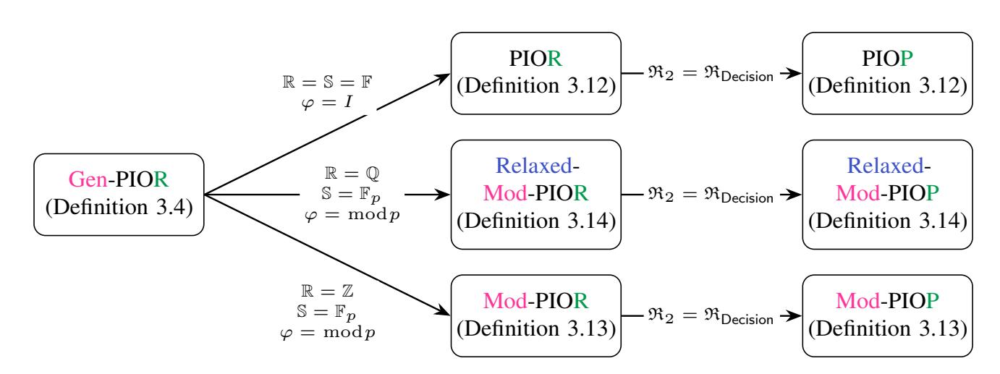
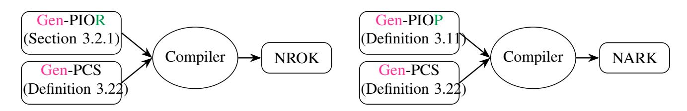

{0}------------------------------------------------

# Relaxed Modular PCS from Arbitrary PCS and Applications to SNARKs for Integers

Alireza Shirzad1 , Sriram Sridhar2 , Dimitrios Papadopoulos3 , Charalampos Papamanthou4,5

University of Pennsylvania University of California, Berkeley Hong Kong University of Science and Technology Lagrange Labs∗ Yale University

∗Work partially done while the first two authors were at Lagrange Labs

#### Abstract

*Modular Polynomial Commitment Schemes (Mod-PCS)* extend standard PCSs by enabling provable evaluation of integer polynomials modulo a random modulus, providing a natural foundation for SNARKs that operate directly over large integers without emulating arithmetic in finite fields. Only two Mod-PCS constructions are known. The first (Campanelli and Hall-Andersen, IACR ePrint 2024) serves primarily as a feasibility result and is impractical and not post-quantum secure due to its reliance on groups of unknown order. The second (Garetta et al., CRYPTO 2025) introduces the weaker notion of *relaxed* Mod-PCS, but is not fully succinct: committing to a multilinear polynomial with N terms and B-bit coefficients requires O( √ NB) proof size and verification time.

We present a black-box transformation that builds relaxed Mod-PCS from any standard PCS, enabling new constructions. Instantiating our transformation with a tensor-code PCS yields the first relaxed Mod-PCS with O(log(N + B)) proof size and verifier time, which is transparent and plausibly post-quantum secure. Using this scheme within the framework of Garetta et al., we obtain the first fully succinct SNARK for the Customizable Constraint System over ZB, achieving O(B log N + N log N log B) prover time and O(log(N + B)) verifier time and proof size.

Our approach relies on a commitment-switching technique for integer polynomials and a new batched integer commitment scheme from any PCS. We further introduce improved arguments for integer addition and multiplication, correctness of the number-theoretic transform, and general Diophantine relations over committed integers.

{1}------------------------------------------------

## Contents

| 1 | Introduction                                                    | 1      |  |  |  |  |  |  |  |  |  |  |  |  |
|---|-----------------------------------------------------------------|--------|--|--|--|--|--|--|--|--|--|--|--|--|
|   | 1.1 Our Contributions 1.2 Related Works                | 3 4 |  |  |  |  |  |  |  |  |  |  |  |  |
|   |                                                                 |        |  |  |  |  |  |  |  |  |  |  |  |  |
| 2 | Techniques                                                      |        |  |  |  |  |  |  |  |  |  |  |  |  |
|   | 2.1 Prelude                                               | 6      |  |  |  |  |  |  |  |  |  |  |  |  |
|   | 2.2 Warmup: A PCS with Known Modulus                      | 7      |  |  |  |  |  |  |  |  |  |  |  |  |
|   | 2.3 Division and Multiplication Check                        | 9      |  |  |  |  |  |  |  |  |  |  |  |  |
|   | From PC over Fp 2.4 to a relaxed mod-PC                   | 11     |  |  |  |  |  |  |  |  |  |  |  |  |
| 3 | Preliminaries                                                   | 12     |  |  |  |  |  |  |  |  |  |  |  |  |
|   | 3.1 Polynomials                                              | 12     |  |  |  |  |  |  |  |  |  |  |  |  |
|   | 3.2 Idealized Oracle Relations and Proof Systems             | 13     |  |  |  |  |  |  |  |  |  |  |  |  |
|   | 3.3 NP Relations and Arguments Systems                    | 17     |  |  |  |  |  |  |  |  |  |  |  |  |
|   | 3.4 Commitment Schemes                                    | 18     |  |  |  |  |  |  |  |  |  |  |  |  |
|   | 3.5 Generalized Polynomial Commitment Scheme                 | 18     |  |  |  |  |  |  |  |  |  |  |  |  |
| 4 | Toolbox: Integer commitment and arguments                       | 20     |  |  |  |  |  |  |  |  |  |  |  |  |
|   | 4.1 Integer Commitment Schemes (ICS)                         | 20     |  |  |  |  |  |  |  |  |  |  |  |  |
|   | 4.2 A Suite of Primitive Integer Arguments                | 21     |  |  |  |  |  |  |  |  |  |  |  |  |
|   | 4.3 Summary of the costs                                     | 30     |  |  |  |  |  |  |  |  |  |  |  |  |
|   |                                                                 |        |  |  |  |  |  |  |  |  |  |  |  |  |
| 5 | Qa¯ren: A framework for building relaxed mod-pc                 | 30     |  |  |  |  |  |  |  |  |  |  |  |  |
|   | 5.1 Commiting to an integer multilinear polynomial           | 31     |  |  |  |  |  |  |  |  |  |  |  |  |
|   | 5.2 A None-Adaptive Relaxed Mod-PC                        | 32     |  |  |  |  |  |  |  |  |  |  |  |  |
|   | 5.3 Lifting to Adaptive Extractability                       | 34     |  |  |  |  |  |  |  |  |  |  |  |  |
| 6 | Acknowledgements                                                | 35     |  |  |  |  |  |  |  |  |  |  |  |  |
|   | References                                                      | 35     |  |  |  |  |  |  |  |  |  |  |  |  |
|   |                                                                 |        |  |  |  |  |  |  |  |  |  |  |  |  |
| A | PIOP Preliminaries                                              | 40     |  |  |  |  |  |  |  |  |  |  |  |  |
|   | A.1 PIOR Product Composition                                 | 40     |  |  |  |  |  |  |  |  |  |  |  |  |
|   | A.2 PIOR trivial extractor                                   | 41     |  |  |  |  |  |  |  |  |  |  |  |  |
|   | A.3 From PIOP to Arguments of Knowledge                      | 42     |  |  |  |  |  |  |  |  |  |  |  |  |
|   | A.4 Deferred Proofs                                          | 43     |  |  |  |  |  |  |  |  |  |  |  |  |
|   | A.5 PIOP Toolbox                                             | 45     |  |  |  |  |  |  |  |  |  |  |  |  |
| B | Deferred proof of Theorem 5.4                                   | 49     |  |  |  |  |  |  |  |  |  |  |  |  |
| C | Reductions (and Arguments) of Knowledge from Gen-PIOR + Gen-PCS | 54     |  |  |  |  |  |  |  |  |  |  |  |  |
|   |                                                                 |        |  |  |  |  |  |  |  |  |  |  |  |  |

{2}------------------------------------------------

### 1 Introduction

Succinct non-interactive arguments of knowledge (SNARKs) are cryptographic proofs that enable an untrusted prover  $\mathcal{P}$  to efficiently convince a computationally weak verifier  $\mathcal{V}$  of claims of the form "Given a program P and public input x, I know a private input w such that P(x, w) = 1".

**Arithmetization.** Most efficient SNARKs today are designed for NP-complete languages that operate over *finite-field* arithmetic. These include R1CS [Set20; CHMMVW20], CCS [STW23], GR1CS [DMS24], Plonkish systems [GWC19; CBBZ23], AIR [BCKL22], QAP, QSP [GGPR13], SSP [DFGK14], SAP [GM17], etc. Such languages are amenable to succinct and probabilistic checking and admit synthesis from higher-level computation models, such as circuit satisfiability and RAM programs.

**Performance Blowups.** While these languages are NP-complete and theoretically as expressive as general computation models, the compilation process often incurs substantial overhead when the underlying computation is not naturally expressed over finite fields. This overhead can range from moderate slowdowns—on the order of  $2^5 \times$  for basic 32-bit CPU arithmetic—to extreme blowups exceeding  $2^{12} \times$  for cryptographic computations such as RSA [CH24; Gar+25]. These costs are particularly pronounced for computations that inherently rely on non-finite-field arithmetic, including (i) integer computations, such as fixed-point arithmetic in real-time systems, digital signal processing, and machine learning; (ii) computations over integer rings, such as k-bit CPU arithmetic over  $\mathbb{Z}/2^k\mathbb{Z}$ , RSA operations over  $\mathbb{Z}/N\mathbb{Z}$ , and fully homomorphic computations; and (iii) computations over rational numbers or over fields that are non-native to the proving system.

**Soundness Pitfalls.** Beyond performance overhead, the arithmetization process is complex and errorprone, particularly for non-native computations such as fixed-width integer arithmetic, comparisons, and bit-level operations. These operations must be simulated using auxiliary constraints (e.g., range checks, bit decompositions, and carry relations), and subtle omissions can lead to under-constrained circuits which are the dominant vulnerability class in deployed ZK systems [CETWJL24; Pai+23]. In particular, missing range constraints or improperly enforced fixed-width arithmetic can introduce modular wraparound or aliasing behaviors that compromise soundness [Bes25; Net25b].

Ideally, we would like SNARKs that can operate directly over integers or rationals, without requiring expensive arithmetic *emulation* within finite fields.

Challenges of building SNARKs over Integers. Building SNARKs over the integers has been significantly less explored than their finite-field counterparts, largely due to the difficulty of constructing suitable underlying building blocks. These challenges include (a) the absence of multiplicative inverses in the integers, which complicates witness extraction; (b) the unbounded magnitude of integers, which hinders efficiency and succinctness; and (c) the scarcity of commitment schemes for integers. Most existing approaches rely on groups of unknown order (GUO), which are neither post-quantum secure nor practical at the moment.

**Blueprint:** Mod-PIOP + Mod-PC  $\rightarrow$  SNARK. Following the widely used "PIOP+PC  $\rightarrow$  SNARK" framework for constructing SNARKs over finite fields [GWC19; CHMMVW20], Campanelli et al. [CH24] recently proposed a blueprint for constructing SNARKs over integer arithmetic by combining two novel primitives: *modular polynomial interactive oracle proofs* (Mod-PIOPs) and *modular polynomial commitments* (mod-PCs). Mod-PIOPs extend the standard interactive oracle proof model by allowing polynomial oracles to answer queries modulo a randomly chosen modulus. Mod-PCs extend standard polynomial commitment schemes by enabling commitments to integer polynomials that can later be opened modulo a random modulus.

On the Difficulty of Constructing Mod-PCs. Constructing Mod-PIOPs is relatively straightforward, as existing finite-field PIOPs can often be adapted to the modular setting with only modest modifications [CH24;

{3}------------------------------------------------

Gar+25]. In contrast, building efficient mod-PCs, the core cryptographic component, remains a major technical challenge. Evidence for this gap is striking: while the literature contains numerous standard polynomial commitment schemes [KZG10; BFRW25; BMMS25; BCFRRZ25; EG25], there is, to the best of our knowledge, only a single mod-PC construction, due to Campanelli et al. [CH24]. Their scheme builds on the approach of Block et al. [BHRRS21], extending DARK [BFS20] and operating over groups of unknown order (GUO). As a result, it is neither post-quantum secure nor practical in concrete settings. In particular, generating a single proof for moderately sized instances can take on the order of tens of hours [Net25a], and proof sizes are typically several megabytes. This undermines the primary motivation for using SNARKs over integers, namely, enabling *concretely* fast provers by reducing arithmetization overhead.

**Relaxed Mod-PC.** Subsequently, Garreta et al. [Gar+25] introduced a relaxed notion of mod-PC. This relaxation occurs along two dimensions. First, they fix the maximum bit length supported by the mod-PC (and, consequently, by the resulting SNARK); we denote this bound by  $B \in \mathbb{N}$  throughout the paper, and write  $\mathbb{Z}_B$  for the ring of integers of bit length at most B. Second, they relax the extractability guarantee to allow rational extractability. Concretely, in honest executions the primitive provides the same API as a mod-PC; however, against a malicious prover, the knowledge extractor is only guaranteed to recover a polynomial with rational—rather than integer—coefficients. We refer to this weaker notion as a relaxed mod-PC.

Garreta et al. further show that this relaxation remains useful in practice: the gap between rational and integer extractability can be compensated at the PIOP level using a lookup argument that enforces the integrality of the coefficients. While this approach enjoys several attractive properties—being transparent, hash-based, post-quantum secure, and supporting a fast prover—it suffers from two main drawbacks in terms of succinctness: 1. The reliance on a Brakedown-style argument [GLSTW23] leads to large proof sizes and high verification costs. In particular, for multilinear polynomials over a boolean hypercube of size  $N=2^{\mu}$ , both the proof size and the verifier timescale as  $O(\sqrt{N})$  asymptotically, and in practice exceed one megabyte in proof size and nearly one second in verification time. 2. Both the proof size and the verification time grow linearly with B, the maximum bit length of the integers. This contrasts with the mod-PC of Campanelli et al. [CH24], which is *fully succinct*, i.e., succinct both in the size of the polynomial and in the magnitude of its coefficients. This naturally leads to the following open question:

RQ1: Can we build a transparent, post-quantum secure, and fully succinct relaxed mod-PC?

Lack of general frameworks for relaxed mod-PCs. The landscape of standard polynomial commitment schemes is remarkably rich, spanning a wide range of cryptographic regimes, including elliptic-curve—based, lattice-based, and hash-based constructions. Each regime offers distinct trade-offs: elliptic-curve—based PCs typically achieve very small proof sizes [KZG10; BBBPWM18], lattice-based constructions provide the only post-quantum options with useful homomorphic properties [NS24; ZGX25; CMNW24], and hash-based schemes offer transparency and strong post-quantum security. Even within the hash-based setting, different code choices lead to different performance profiles—for example, Reed–Solomon–based constructions often yield smaller proofs and extremely fast verification [ACFY25], while RAA-code–based approaches typically enable faster provers [BCFRRZ25].

In contrast, the mod-PC landscape lacks this diversity. At present, there is a single integer-extractable construction in the groups-of-unknown-order setting [CH24] and a single rationally extractable construction in the hash-based (JEA code) regime [Net25a]. Achieving a comparable level of diversity would require designing a new mod-PC separately for each cryptographic regime, a task that demands substantial research effort. This raises a natural research question:

RQ2: Can we design a generic framework to bootstrap any polynomial commitment scheme into a mod-PC?

{4}------------------------------------------------

#### 1.1 Our Contributions

We organize our contributions into main and additional contributions. The main contributions, presented in Section 1.1.1, focus on designing a family of SNARKs over integer arithmetic by addressing Research question RQ2 (and automatically resolving RQ1 by instantiating the framework with an appropriate PCS). These results are enabled by a collection of technical innovations, each of which is an additional contribution and of independent interest and is detailed in Section 1.1.2.

#### 1.1.1 Main Contribution

In this work, we introduce a new family of SNARKs for integer arithmetic by proposing a general framework for constructing relaxed mod-PCs. Specifically, we present a bootstrapping compiler,  $\mathbb{Q}\bar{a}ren^1$ , which is the first generic transformation that turns any standard polynomial commitment scheme over  $\mathbb{F}_p$  into a relaxed mod-PC. See Section 2.2 and Section 5 for informal and formal descriptions of the compiler, respectively.

**Theorem 1.1** (informal). Let p be a sufficiently large prime, and PCS a multilinear polynomial commitment scheme over  $\mathbb{F}_p$ . Then there exists a relaxed mod-PC that uses PCS as a black box and inherits its transparency and security assumptions.

**Corollary 1.2.** Let p be a sufficiently large prime, and let PCS be a multilinear PCS over  $\mathbb{F}_p$ . Then there exists a SNARK for the Customizable Constraint System (CCS) language over  $\mathbb{Z}_B$  (as defined in [Gar+25]), where  $B \in \mathbb{N}$  denotes the maximum bit length of the witness vector. Moreover, the resulting SNARK inherits the transparency and security assumptions of the underlying PCS.

#### 1.1.2 Additional Contributions

To achieve our main contribution—constructing a relaxed mod-PC—we reduce the task of evaluating an integer polynomial with N coefficients of bit length at most B to committing to a constant number of large integers of size  $\tilde{O}(NB)$  and proving simpler relations over them, such as integer addition, multiplication, and Diophantine satisfiability. We now outline these contributions:

Batched Integer Commitment Scheme (ICS). We construct a commitment scheme for bounded-size integers by interpreting each integer as a multilinear polynomial and committing to it using a multilinear PCS over  $\mathbb{F}_p$ . We extend the construction to support batch commitment to t bounded integers. The resulting ICS inherits the commitment time (for an MLE of size tB), transparency and security assumptions of the underlying PCS. See Section 2.2 and Section 4.1 for informal and formal descriptions of the construction, respectively.

Then, we develop a suite of special-purpose sumcheck-based SNARKs for this family of integer commitment schemes. Leveraging the structure of our ICS, we design dedicated PIOPs over  $\mathbb{F}_p$  and compile them into full-fledged arguments:

Integer Addition and Multiplication. We develop efficient succinct arguments (Sections 4.2.1 and 4.2.5) for proving addition and multiplication relations over committed *large* integers (of bit-length at least  $2^{10}$ ). Concretely, given commitments  $cm_a$ ,  $cm_b$ , and  $cm_c$  to integers a, b, and c, the protocol proves that either a + b = c or  $a \cdot b = c$ . Further, we extend these protocols to batched settings where we commit to 3t integers a, b,  $c \in \mathbb{Z}_B^t$  and prove either a[i] + b[i] = c[i] or  $a[i] \times b[i] = c[i]$  for  $i = 0, \ldots, t - 1$ . Both of our protocols have O(tB) prover time,  $O(\log(tB))$  verifier time and proof size. See Section 2.3 and Section 4.2.5

&lt;sup>1A mythical and righteous Persian gladiator, son of Kāveh the Blacksmith.

{5}------------------------------------------------

for informal and formal descriptions of the multiplication protocol, respectively. Since the addition protocol is not directly used as a building block in the main construction, we only provide a formal description in Section 4.2.1.

**NTT Check.** Our integer multiplication argument requires proving consistency between a committed vector and its number theoretic transform (NTT). To this end, we develop a protocol (Section 4.2.4) based on the univariate Schwartz–Zippel lemma, even though our vectors are committed in multilinear form. To bridge this mismatch, we introduce an information-theoretic technique that transforms *any* multilinear PCS into a univariate PCS. This approach can be viewed as the conceptual inverse of the well-studied paradigm that compiles multilinear PCS from univariate PCS [ZSCZ25; GPS25; EG25; BCHO22], and may be of independent interest. See Section 2.3.1 and Section 4.2.4 for informal and formal descriptions of the protocol, respectively.

Arguments for Diophantine Equations. A more versatile building block developed in this work is a succinct argument for proving Diophantine relations [Lip03] over committed large (but bounded) integers. More specifically, given a batch commitment cma to integers  $a = [a_1, \ldots, a_t]$ , the protocol proves that these integers satisfy a relation of the form  $G(a_1, \ldots, a_t) = 0$ , where  $G \in \mathbb{Z}[X_1, \ldots, X_t]$  represents an arithmetic circuit over integers of size  $s \in \mathbb{N}$ . Our protocol has  $O(t B \log B)$  prover time and  $O(t\lambda + \log Bt)$  proof size and verifier time. See Section 2.2.2 and Section 4.2.7 for informal and formal descriptions of the protocol, respectively.

**Definitional contributions.** We introduce a few new definitions that help us with the presentation and security analysis of our protocols.

- Generalized Polynomial Interactive Oracle Reduction (Gen-PIOR): a unifying definition that captures all of our idealized protocols. It extends the standard notion of PIOPs to PIORs—analogous to how IORs generalize IOPs in [BMNW25]—and further generalizes both standard and modular oracle protocols, where oracle queries are answered modulo a random modulus. See Section 3.2.1 for a formal definition. We further extend the definition of round-by-round soundness (originally introduced in [Can+19]) and knowledge soundness to the Gen-PIOR setting in Definitions 3.7 and 3.8.
- Generalized Polynomial Commitment Scheme (Gen-PCS): a generalization of the standard notion of polynomial commitment schemes that captures both standard and modular commitment schemes as special cases. See Section 3.5 for a formal definition.

### 1.2 Related Works

#### 1.2.1 SNARKs over the integers

A growing line of work studies proof systems for computations over the integers and more general rings. Ganesh et al. [GNS23] introduced Rinocchio, the first SNARK for arithmetic circuits over rings; however, the scheme relies on new "linear-only" assumptions, requires a circuit-specific trusted setup, and is not succinct in the bit-length of ring elements. More recently, [WZD25; HMZ25] proposed SNARKs for statements over Galois rings via polynomial commitment schemes defined over such rings. While these constructions are hash-based, post-quantum secure, and offer fast provers, they incur  $\sqrt{N}$ -size proofs and verification time, making them impractical for many applications. The closest works to ours, as discussed earlier, are those of Campanelli et al. [CH24] and Garreta et al. [Gar+25]; we provide a detailed comparison in Table 1.

{6}------------------------------------------------

| Scheme Properties                                   |                |          | erties   | Prover   | Verifier                                                                                    | Proof                                               |                                                  |
|-----------------------------------------------------|----------------|----------|----------|----------|---------------------------------------------------------------------------------------------|-----------------------------------------------------|--------------------------------------------------|
|                                                     | PQ             | IE       | Tr       | Assumpt. |                                                                                             |                                                     |                                                  |
| Campanelli et al. [CH24]                            | Х              | ✓        | ✓        | GUO      | $O(NB\operatorname{poly}(\lambda,\log B))$                                                  | $O(\operatorname{poly}(\lambda, \log B, \mu))$      | $O(\operatorname{poly}(\lambda, \log B, \mu))$   |
| Zip [Gar+25]                                     | ✓              | X        | ✓        | RO       | $\frac{N(B+\lambda) + \lambda\sqrt{N}B + \lambda^2\sqrt{N}\log N}{\lambda^2\sqrt{N}\log N}$ | $\sqrt{N}B + \lambda^2 \sqrt{N} + \lambda^2 \log N$ | $\frac{\sqrt{N}(B+\lambda) +}{\lambda^2 \log N}$ |
| $\mathbb{Q}\bar{a}ren_{TS}$ Instantiated with [B    | BFŔW           | 125      | <b>/</b> | RO       | $B\log N + N\log B\log N$                                                                   | $\log(B+N)$                                         | $\log(B+N)$                                      |
| $\mathbb{Q}\bar{a}ren_{MC}$ Instantiated with [E | EG <b>ž</b> 5] | <b>√</b> | X        | Q-DLOG   | $B\log N + N\log B\log N$                                                                   | $\log(B+N)$                                         | $\log(B+N)$                                      |

PQ: Post-Quantum Security, IE: Integer Extractability, Tr: Transparent

N: The size of the multilinear polynomial

B: The maximum bit-length of the coefficients of the polynomial

Table 1: Comparison of all mod-pc schemes

### 1.2.2 Arguments for large Integer Addition and Multiplication

Proving arithmetic relations over large committed integers has received substantial attention in the literature, with constructions based on groups of unknown order (GUO) [CPP17; DF02; Lip03] as well as lattice-based techniques [LLNW18; LNS20; KSSL21]. Such arguments serve as fundamental building blocks for a wide range of cryptographic applications, including range proofs, order relations, set non-membership proofs, and zero-knowledge lists, which in turn underpin systems such as anonymous credentials [CL01], privacy-preserving certificate transparency [EMBB17], and secure electronic voting [Gro05]. We compare our protocols with the state of the art in Table 2.

#### 1.2.3 Arguments for Diophantine equations over the integers

Proving Diophantine equations over committed integers was first studied in early works such as [FO97; DF02; Lip03], which relied on groups of unknown order (GUOs). More recently, Towa and Vergnaud [TV20] gave the first succinct argument for satisfiability of Diophantine equations with proof size logarithmic in the size of the polynomial. The work most closely related to ours is the PoKEMath protocol of [BMSS25], where the proof size, verifier time, and communication grow logarithmically in the magnitude of the solution, while the verifier time scales linearly in the size of the equation and the proof size scales linearly in the number of variables. However, PoKEMath also relies on GUOs, limiting practicality and post-quantum security. Our protocol, Masdak, supports only bounded-size integers, which restricts generality, but can be viewed as a practical version of PoKEMath with similar asymptotic efficiency, while being instantiable from standard polynomial commitment schemes and therefore amenable to post-quantum.

{7}------------------------------------------------

| Scheme                     | Properties |          |    | erties         | Int Addition     |                  |           | Int Multiplication |                  |                 |
|----------------------------|------------|----------|----|----------------|------------------|------------------|-----------|--------------------|------------------|-----------------|
|                            | PQ         | Tr       | ZK | Assumpt.       | $T(\mathcal{P})$ | $T(\mathcal{V})$ | $ \pi $   | $T(\mathcal{P})$   | $T(\mathcal{V})$ | $ \pi $         |
| Libert et al. [LLNW18]     | 1          | ✓        | ✓  | SIVP           | tB               | tB               | tB        | $tB^{\log_2 3}$    | $tB^{\log_2 3}$  | $tB^{\log_2 3}$ |
| Lyubashevsky et al [LNS20] | . 🗸        | ✓        | ✓  | R-SIS R-LWE | tB               | tB               | tB        | $tB \log B$        | tB               | tB              |
| Kuchta et al. [KSSL21]     | ✓          | ✓        | ✓  | M-SIS M-LWE | tB               | tB               | tB        | $tB \log B$        | $tB\log B$       | $tB \log B$     |
| This work (TS)             | <b>✓</b>   | <b>√</b> | X  | RO             | tB               | $\log tB$        | $\log tB$ | $tB\log B$         | $\log tB$        | $\log tB$       |
| This work (MC)             | X          | X        | X  | Q-DLOG         | tB               | $\log tB$        | $\log tB$ | $tB\log B$         | $\log tB$        | $\log tB$       |

PQ: Is Post-Quantum Secure, ZK: Is Zero-Knowledge, Tr: Is Transparent

t: The number of addition/multiplication instances being proved

B: The maximum bit-length of the coefficients of the polynomial

Table 2: Comparison of Integer Addition and Multiplication Arguments

## 2 Techniques

We now outline the techniques underlying our contributions, making several simplifying assumptions for clarity of exposition. We explicitly indicate whenever such a simplification is made.

#### 2.1 Prelude

Before presenting our contributions, we briefly review SNARKs over the integers and summarize the key techniques and concepts drawn from prior work. As in Zinc [Gar+25], our goal is to construct a SNARK for the Customizable Constraint System (CCS) [STW23] over bounded integers  $\mathbb{Z}_B$ , where  $B \in \mathbb{N}$  denotes the bit-length bound.

**Mod-PIOP + Mod-PC**  $\rightarrow$  **SNARK over Integers.** We obtain our SNARK by instantiating the framework of  $\mathbb{Z}$ inc [Gar+25], which builds upon the framework introduced by Campaneli et al. [CH24]. At a high level, this framework compiles an information-theoretic component—called a Modular Interactive Oracle Proof (Mod-PIOP)—with a cryptographic component that we refer to as a relaxed Modular Polynomial Commitment (mod-PC). In a (multivariate) Mod-PIOP, in the commitment phase, the prover  $\mathcal{P}$  first sends oracles to multilinear polynomials defined over  $\mathbb{Z}_B$  to the verifier. Then, in the querying phase, the verifier  $\mathcal{V}$  samples a random prime  $q \in \mathbb{N}$  and querys these oracles only modulo q. Finally, in the decisoin phase, the verifier checks the validity of the proof using the answers to its queries. We adopt the same PIOP as  $\mathbb{Z}$ inc, consisting of a PIOP for CCS augmented with a lookup PIOP.

**Mod-PC.** To realize an idealized Mod-PIOP as a concrete argument, oracle access to polynomials over  $\mathbb{Z}_B$  is instantiated using a mod-PC. Concretely, in the commitment phase, the prover sends *commitments* to  $\mu$ -variate multilinear polynomials defined over  $\mathbb{Z}_B$ . Later in evaluation phase, The prover can open these commitments at verifier-chosen random points *modulo a randomly sampled prime q*, providing a proof  $\pi$  that the revealed value z satisfies  $z \equiv p(y) \pmod{q}$ .

{8}------------------------------------------------

| Scheme                                              |               |                    | Pro      | oper     | ties     | Prover      | Verifier                                    | Proof                  |  |
|-----------------------------------------------------|---------------|--------------------|----------|----------|----------|-------------|---------------------------------------------|------------------------|--|
|                                                     | PÇ            | ) ZI               | K Tr     | $\infty$ | Assumpt. |             |                                             |                        |  |
| Towa et al. [TV20]                                  | X             | <b>√</b>           | ✓        | <b>√</b> | $GUO^*$  | $sB \log B$ | $B + \log s + \lambda$                      | $B + \log s + \lambda$ |  |
| PoKEMath Bünz et al.[BMSS2                       | 25]           | X                  | <b>✓</b> | <b>✓</b> | $GUO^*$  | $tB\log B$  | $\lambda(t + s\log\lambda)$                 | $t\lambda$             |  |
| $\mathbb{Q}\bar{a}ren_{TS}$ Instantiated with [] | BFKV          | ~~ W <b>2</b> 5 |          | X        | RO       | $tB\log B$  | $t\lambda + \log tB + \lambda \log \lambda$ | $t\lambda + \log tB$   |  |
| $\mathbb{Q}\bar{a}ren_{MC}$ Instantiated with [I | EG <b>Ž</b> 5 |                    | X        | X        | Q-DLOG   | $tB\log B$  | $t\lambda + \log tB + \lambda \log \lambda$ | $t\lambda + \log tB$   |  |

PQ: Is Post-Quantum Secure, ZK: Is Zero-Knowledge

 $\infty$ : Supports unbounded integers, Tr: Is Transparent

t: The number of addition/multiplication instances being proved

B: The maximum bit-length of the coefficients of the polynomial

**Table 3:** Comparison of arguments for Diophantine equations

Observe that this querying/opening step mirrors that of a standard PCS over  $\mathbb{F}_q$ , where evaluations are verified modulo a fixed prime q. The key difference is that, in our setting, the prime is sampled during the query phase, *after* the polynomial has already been committed. This "commit-then-choose-q" requirement is therefore incompatible with many mainstream PCS constructions, such as those based on elliptic curves [KZG10; BBBPWM18].

Why Field-Agnostic PCSs Are Not Enough. There exists a class of PCSs known as *field-agnostic*, which can operate over arbitrary fields [BFKTWZ24; GLSTW23; SB25; AGLMS23; BFS20]. While these schemes offer considerable flexibility, they still require the underlying field to be fixed before the commitment is created. In contrast, in a mod-PC the verifier samples the prime field  $\mathbb{F}_q$  only after the commitments are produced, making the construction of a mod-PC strictly more challenging.

**Relaxed mod-PC vs. Mod-PC.** As in Zinc, which introduces Zip, we focus on constructing a *relaxed* variant of a mod-PC. In an honest-prover execution, a relaxed mod-PC behaves identically to a standard mod-PC; the distinction arises only in the extractability guarantees against malicious provers. In a mod-PC, the extractor is guaranteed to recover polynomials with *integer* coefficients (or evaluations), whereas in a relaxed mod-PC the extractor is only guaranteed to recover polynomials with *rational* coefficients (or evaluations).

### 2.2 Warmup: A PCS with Known Modulus

Before presenting our framework for constructing a relaxed mod-PC, we begin with a simplified version that yields a standard PCS in the setting where the prime q is known in advance. In Section 2.4, we then lift this construction to obtain a relaxed mod-PC. For clarity of exposition, we focus in this technical overview on commitments to univariate polynomials  $f \in \mathbb{Z}_B^{\leq N}[X]$ ; the framework extends to multilinear polynomials in a straightforward manner, as described in Section 5.

Before committing to integer-valued polynomials, we first construct a much simpler primitive: a commitment scheme for a single bounded integer.

{9}------------------------------------------------

An Integer Commitment Scheme. To commit to an integer  $a \in \mathbb{Z}_B$ , assuming  $B = 2^\beta$ , we first decompose it into its bit representation  $a = [a_0, a_1, \ldots, a_{B-1}]$ , where  $a = \sum_{i=0}^{B-1} a_i 2^i$ . We then interpret the vector a as the evaluation vector of a  $\beta$ -variate multilinear polynomial  $\widetilde{a}$  and commit to a by committing to  $\widetilde{a}$  using a multilinear PCS over  $\mathbb{F}_p$ . We denote the resulting integer commitment by  $\mathrm{cm}_a$ . Notably, this ICS is generic with respect to the choice of the underlying multilinear PCS over  $\mathbb{F}_p$ , and more importantly, p is completely independent of q and can be different. Also, we extend this ICS to a batched setting which allows us to commit to multiple integers simultaneously (see Section 4.1 for more details). Later, we will see that this choice of integer commitment allows us to treat the verifier as having oracle access to the binary representation of the integer, enabling the reuse and construction of sumcheck-based PIOPs.

We now describe how to commit to an integer-valued polynomial using the integer commitment primitive introduced above. These techniques are also used in prior work [AGLMS23; BMSS25].

**PCS Commitment Phase.** We commit to a univariate polynomial  $f \in \mathbb{Z}_{R}^{\leq N}[X]$  as follows:

- 1. We evaluate the polynomial at a publicly known, sufficiently large integer point  $\alpha \in \mathbb{Z}$  such that  $\alpha \gg B$ . This can be viewed as an *encoding* or *Injective map* of the polynomial f into the single very large integer value  $f(\alpha) \in \mathbb{Z}$ .
- 2. We then commit to the integer value  $f(\alpha)$  using the integer commitment scheme described above.

The binding of the PCS follows from the binding of the integer commitment: if a commitment could be opened to two polynomials  $f,g\in\mathbb{Z}_B^{\leq N}[X]$ , then we would have  $f(\alpha)=g(\alpha)$  over the integers, which is impossible due to the injectivity of the encoding map  $f\mapsto f(\alpha)$  for sufficiently large  $\alpha$ .

**Evaluation Phase.** For simplicity, we focus on a non-adaptive evaluation point, i.e.,  $z \in \mathbb{Z}_B$  sampled uniformly at random, which suffices for our SNARK applications. In Section 5, we extend the construction to adaptive evaluation via a simple repetition of the protocol. To prove that  $f(z) = y \mod q$ , we begin with the following observation: Defining  $g \in \mathbb{Z}_B^{\leq N}[X]$  as  $g(X) := 1 + zX + z^2X^2 + \cdots + z^{N-1}X^{N-1}$ , and its reverse polynomial  $g^{\text{rev}}(X) \in \mathbb{Z}_B^{\leq N}[X]$  as  $g^{\text{rev}}(X) := z^{N-1} + z^{N-2}X + \cdots + X^{N-1}$ . Observe that multiplying the integer encodings of f and  $g^{\text{rev}}$  yields a highly structured result:

$$\begin{split} f(\alpha) \cdot g^{\mathsf{rev}}(\alpha) &= \left(\sum_{i=0}^{N-1} f_i \alpha^i\right) \left(\sum_{i=0}^{N-1} g_{N-1-i} \alpha^i\right) \\ &= \left(\sum_{i=0}^{N-2} c_i \alpha^i\right) + \langle \boldsymbol{f}, \boldsymbol{g} \rangle \cdot \alpha^{N-1} + \left(\sum_{i=N}^{2N-2} c_i \alpha^i\right) \end{split}$$

which shows that the coefficient of  $\alpha^{N-1}$  is the inner product of the coefficient vectors of f and g which is  $\langle \boldsymbol{f}, \boldsymbol{g} \rangle = f(z) = y$ , hence

$$f(\alpha) \cdot g^{\mathsf{rev}}(\alpha) = l + m \cdot \alpha^{N-1} + r \tag{1}$$

We denote by l, m, and r the left, middle, and right parts of the above equation, respectively. The protocol then proceeds by having the prover convince the verifier that (a) Eq. (1) holds over the integers, i.e., the prover knows integers l, m, r satisfying the equation, (b) y is the remainder of m modulo q, i.e., the prover knows an integer h such that  $m = y + h \cdot q$ , (c) l, m, and r are bounded integers. Since integers l, m, and r satisfying Eq. (1) are large, the prover cannot directly send them to the verifier. Instead, the prover commits to these constant number of integers using the ICS described before (see Section 4.1 for more details) and then proves the required relations as follows: First of all, statement (c) corresponds to a range proof over committed integers, which we will explain next:

{10}------------------------------------------------

### 2.2.1 Range Proof

The goal of the range proof is to show that a committed integer  $a \in \mathbb{Z}_B$ , with  $B = 2^{\beta}$ , satisfies a < M. As we will see in Section 5, we deliberaltely choose the bound to be a power of two, i.e.,  $M = 2^m$ , which makes the range proof particularly simple. For non-power-of-two bounds, see Section 4.2.2 for a more general construction.

For a power-of-two bound  $M=2^m$ , it suffices to verify that the binary decomposition of a, which we denote by  $a \in \{0,1\}^B$ , has its B-M most significant bits equal to zero. By the choice of the ICS, the verifier has oracle access to  $\widetilde{a}$ , the multilinear extension of a. The verifier samples  $r \in \mathbb{F}_q^m$  and queries  $\widetilde{a}(0^{\beta-m} \parallel r)$ . If the result is zero, the verifier accepts; otherwise, it rejects.

Moreover, the verifier must ensure that the provided oracle correspond to a valid binary decomposition, i.e., that its values are boolean. To this end, the prover and verifier run an instance of the standard multilinear ZeroCheck (see Appendix A.5.3) on the polynomial  $\tilde{a}(1-\tilde{a})$ .

Continuing with the argument for Eq. (1), Statements (a) and (b) are purely algebraic and require the prover to demonstrate knowledge of integers satisfying certain Diophantine equations, which is more complex than a range proof. To handle this, we introduce a new tool called  $MaSDAK^2$ , described next.

#### 2.2.2 MaSDAK

Magnitude Succinct Diophantine Argument of Knowledge (MaSDAK, see the detailed description of the protocol in Section 4.2.7) proves knowledge of large integers  $u_1,\ldots,u_t\in\mathbb{Z}_B$  (where this B is specific to MaSDAK) satisfying a Diophantine equation  $f(u_1,\ldots,u_t)=0$  for an integer polynomial f. The core idea of MaSDAK is to verify the relation modulo a random prime rather than directly over the integers. Concretely, the verifier samples a random  $\lambda$ -bit prime  $\ell$  and asks the prover for the remainders  $r_1,\ldots,r_t\in\mathbb{Z}_\ell$  of  $u_1,\ldots,u_t$ . The verifier then checks that  $f(r_1,\ldots,r_t)\equiv 0\pmod{\ell}$ .

It remains to prove consistency between  $r_1, \ldots, r_t$  and  $u_1, \ldots, u_t$ , i.e., that there exist integers  $h_1, \ldots, h_t \in \mathbb{Z}_B$  such that  $u_i = r_i + h_i \cdot \ell$  for all  $i \in [t]$ . We introduce a tool called *Division Check* to prove this efficiently.

#### 2.3 Division and Multiplication Check

Before describing the Division Check, we first present a key building block: an argument for integer multiplication. We will later show that a simple modification of this multiplication argument yields the Division Check.

### 2.3.1 Integer Multiplication Argument

Here, the prover aims to convince the verifier that the committed integers  $a,b,c\in\mathbb{Z}_B$  satisfy the multiplication relation  $c=a\cdot b$ . Recall that, by our ICS design, the verifier receives commitments to the multilinear polynomials  $\widetilde{a},\widetilde{b},\widetilde{c}$  corresponding to the bit decompositions  $a,b,c\in\{0,1\}^B$  of a,b,c, respectively. For simplicity, we treat these commitments as oracles and refer to openings as oracle queries.

We follow a similar approach to [LNS20; KSSL21] and use the Number Theoretic Transformation (NTT) of a, b, c to handle multiplication. Intuitively, the NTT maps integer multiplication to a Hadamard (component-wise) product over an NTT-friendly subgroup of the field. Thus enforcing

$$\operatorname{NTT}(\boldsymbol{a}) \circ \operatorname{NTT}(\boldsymbol{b}) = \operatorname{NTT}(\boldsymbol{c})$$

&lt;sup>2named after Mazdak (d. c. 524 CE), a Persian reformer associated with ideals of justice and equity

{11}------------------------------------------------

captures the relation  $c = a \cdot b$ , provided there is no overflow. Hence, the multiplication argument starts by  $\mathcal{P}$  sending oracles for a', b', c' to  $\mathcal{V}$ , which are the NTTs of a, b, c, respectively. It then suffices for  $\mathcal{V}$  to verify:

- **Booleanity**: a, b, c are bit vectors, using the same Booleanity check described in the aformentioned range proof (Section 2.2.1);
- Overflow: the multiplication incurs no overflow, which reduces to checking that a and b have fewer than B/2 bits, following the approach outlined in the aformentioned range proof (Section 2.2.1);
- Hadamard:  $a' \circ b' = c'$ , which the verifier checks by sampling a random  $r \in \mathbb{F}_p^{\beta}$  and verifying that  $\widetilde{a}(r) \cdot \widetilde{b}(r) = \widetilde{c}(r)$ ;
- NTT Check: a', b', and c' are the NTTs of a, b, and c, respectively. This step requires more subtle techniques, described next (See the details of the protocol in Section 4.2.4).

By the definition of the NTT, for an integer  $m \in \{a, b, c\}$  with binary decomposition vector  $\boldsymbol{m}$ , The NTT vector  $\boldsymbol{m}' = \text{NTT}(\boldsymbol{m})$  corresponds to evaluations of the *univariate* polynomial  $\widehat{m}(X) = m_0 + m_1 X + \cdots + m_{B-1} X^{B-1}$  over the NTT domain; i.e. the set  $\mathbb{H} := \{\omega^0, \omega^1, \dots, \omega^{B-1}\}$ , where  $\omega$  is a primitive B-th root of unity in  $\mathbb{F}_p$ . Then we have  $\boldsymbol{m}' = [\widehat{m}(\omega^0), \widehat{m}(\omega^1), \dots, \widehat{m}(\omega^{B-1})]$ .

Thus, m and m' represent the same polynomial  $\widehat{m}$  in two different bases: the monomial basis and the Lagrange basis over the NTT domain. In particular,  $\sum_{i=0}^{B-1} m_i X^i = \sum_{i=0}^{B-1} m_i' L_i(X) = \widehat{m}(X)$ , where  $L_i(X)$  is the i-th Lagrange basis polynomial corresponding to the NTT evaluation points. To verify this equality, the verifier applies the univariate Schwartz–Zippel lemma (see Lemma 3.1): it samples a random point  $r \in \mathbb{F}_p$  and checks  $\sum_{i=0}^{B-1} m_i r^i = \sum_{i=0}^{B-1} m_i' L_i(r)$ . Equivalently, the prover must establish the following over multilinear polynomials:

$$\sum_{\boldsymbol{x} \in \{0,1\}^{\log B}} \widetilde{m}(\boldsymbol{x}) \cdot \widetilde{\mathsf{mon}}_{\boldsymbol{r}}(\boldsymbol{x}) = \sum_{\boldsymbol{x} \in \{0,1\}^{\log B}} \widetilde{m}'(\boldsymbol{x}) \cdot \widetilde{\mathsf{Lag}}_{\boldsymbol{r}}(\boldsymbol{x})$$
(2)

where  $\widetilde{\text{mon}}$  and  $\widetilde{\text{Lag}}$  are the multilinear extensions of  $\mathbf{mon} := [1, r, r^2, \dots, r^{B-1}]$  and  $\mathbf{Lag} := [L_0(r), L_1(r), \dots, L_{B-1}(r)]$ . Equation Eq. (2) is an instance of the standard multivariate sumcheck problem (see Appendix A.5.4). In the final round of sumcheck, the verifier must evaluate both sides of Eq. (2) at a random point; to keep the verifier succinct (i.e., sublinear in B), the relevant polynomials must either be given as oracles (via commitments) or be succinctly evaluatable.

In our setting, both  $\widetilde{m}$  and  $\widetilde{m}'$  are committed, but  $\widetilde{m}$  and  $\widetilde{L}$  are not. We show in Section 4.2.4 that  $\widetilde{m}$  or can be evaluated succinctly by the verifier. Since  $\widetilde{L}$  ag cannot be computed succinctly, the prover provides a fresh commitment to  $\widetilde{L}$  and proves its well-formedness via the Lagrange check described next (see the detailed protocol in Section 4.2.3).

**Remark 2.1.** One can see the above protocols as the reverse of the techniques used in [BCHO22; ZSCZ25] where the goal is to prove the evaluation of a multilinear polynomial (either in coefficient form or evaluation form) by invoking evaluation protocols on univariate polynomials. Here, the goal is to prove the evaluation of univariate polynomials (either in coefficient form or evaluation form) by invoking evaluation protocols on multilinear polynomials and can be of independent interest.

**Lagrange-Check.** Given oracle access to Lag, the verifier must ensure that it is the MLE of Lag =  $[L_0(r), L_1(r), \ldots, L_{B-1}(r)]$  for the public point r. By the barycentric form of Lagrange polynomials, for  $i \in \{0, 1, \ldots, B-1\}$  we have  $L_i(X) = (\omega^i Z_{\mathbb{H}}(X))/(B(X-\omega^i))$ , which implies for a fixed r that  $B \cdot L_i(r)(r-\omega^i) = \omega^i Z_{\mathbb{H}}(r)$ . Equivalently, we have

$$B \cdot \mathsf{Lag}[i] \left( r - \mathsf{mon}_{\omega}[i] \right) = \mathsf{mon}_{\omega}[i] Z_{\mathbb{H}}(r)$$

{12}------------------------------------------------

for all  $i \in \{0, 1, \dots, B-1\}$ . This naturally yields the following one-shot verification: The verifier samples a random  $s \in \mathbb{F}_p^{\beta}$  and checks

$$f(s) = N \ \widetilde{v}(s) \ (r - \widetilde{\mathsf{mon}}_{\omega}(s)) - Z_{\mathbb{H}}(\omega) \ \widetilde{\mathsf{mon}}_{\omega}(s).$$

Note that  $\widetilde{\mathsf{mon}}_{\omega}$  is succinctly evaluatable by the verifier, and  $Z_{\mathbb{H}}(\omega) = \omega^B - 1$  can also be computed in  $O(\log B)$  time [GWC19].

**Division Check.** The Division Check verifies the relation  $u=\ell h+r$ , where  $\ell$  is a  $\lambda$ -bit prime. As before, we transform the binary decomposition vectors into their NTT representations and perform the required addition and multiplication checks. This is due to the fact that similar to the multiplication check, the addition of two integers can also be verified by checking the element-wise addition of their NTT representations. More generally, We have  $u=\ell h+r$  if and only if

$$\mathtt{NTT}(\boldsymbol{u}) = \mathtt{NTT}(\boldsymbol{\ell}) \circ \mathtt{NTT}(\boldsymbol{h}) + \mathtt{NTT}(\boldsymbol{r})$$

The key difference is that  $\ell$  and r are given to the verifier in the clear rather than as commitments. However, since both are succinct ( $\lambda$ -bit integers), the verifier can compute their NTTs in  $O(\lambda \log \lambda)$  time and remain succinct.

**Conclusion of the Warmup.** By combining the above techniques, we can construct a standard field-agnostic PCS over  $\mathbb{F}_q$  where the prime  $q \in \mathbb{N}$  is known beforehand. But, it's still not clear how to extend this construction to a relaxed mod-PC where q is only known during evaluation. We address this in the next section using the commitment switching technique.

## **2.4** From PC over $\mathbb{F}_p$ to a relaxed mod-PC

At a first glance, it may seem that the prime q have not been used in anywhere at the time of commitment, so the above construction should already yield a relaxed mod-PC. However, this is not the case.

Recall (as described in Section 2.2) that to commit to a polynomial  $f \in \mathbb{Z}_B^{\leq N}[X]$ , the prover computes the integer  $\hat{f}(\alpha)$  for a sufficiently large public integer  $\alpha$ . However,  $\alpha$  cannot be chosen arbitrarily – it must also satisfy  $q \mid \alpha$ . This is crucial during evaluation, where the prover shows that  $\hat{f}(z) = y \pmod{q}$  by proving the existence of an integer h such that  $\hat{f}(z) = y + h \cdot q \mod{\alpha}$ . As shown in DewTwo [BMSS25], to conclude  $\hat{f}(z) = y \pmod{q}$ , it is necessary that  $\alpha \equiv 0 \pmod{q}$ . To ensure both this and the largeness property of  $\alpha$ , DewTwo [BMSS25] sets  $\alpha = q^{7\mu}$ .

In our setting, however, the modulus q is not known at commitment time, so  $\alpha$  cannot be fixed in advance and the commitment cannot be computed directly. This constitutes our main technical challenge, which we address using the *Commitment Switching* technique.

**Commitment Switching.** To address the above roadblock, we propose a technique called commitment switching. This concept is closely related to mechanisms used in several modern PC schemes: it appears implicitly in KZH [KZHB25], and explicitly via code switching in Blaze [BCFRRZ25] and FICS [BMMS25].

The rough idea of commitment switching is to first commit to a polynomial f under a certain commitment scheme (called the source commitment scheme) and get  $cm_{source}$ , and later commit to the same polynomial under under a different commitment scheme (called the target commitment scheme) to get  $cm_{target}$ , then argue that both  $cm_{source}$  and  $cm_{target}$  correspond to the same polynomial f. There are different reasons to perform commitment switching in different schemes, but in our case, the reason is to first commit to the polynomial f using  $\alpha_{source}$  that only satisfies the "largenes" requirement and not the divisibility requirement, because g is not known yet; Then, after recieving the challenge g, switch to a commitment  $\alpha_{target}$  that

{13}------------------------------------------------

satisfies both "largenes" and "divisibility" requirements. Hence, in the commitment phase, the prover sends  $\mathsf{cm}_{\mathsf{source}} = \mathsf{ICS}.\mathsf{Commit}(f(\alpha_{\mathsf{source}}))$ . Then, after knowing q at the time of evaluation, the prover sends a  $\mathit{new}$  commitment with  $\alpha_{\mathsf{target}} = q\alpha_{\mathsf{source}}$  that satisfies both the largeness and divisibility requirements. Then we continue with proving the evaluation of the polynomial  $f \mod q$  using  $\mathsf{cm}_{\mathsf{target}}$ .

Now it remains to prove that both commitments  $cm_{source}$  and  $cm_{target}$  correspond to the same polynomial f. To do this, we also run the evaluation protocol for  $cm_{source}$ ; although we know that it doesn't guarantee anything about the evaluation  $mod\ q$ , it still guarantees the evaluation  $mod\ \alpha_{source}$ . In fact, during the extraction, we extract different polynomials  $f_{source}$  and  $f_{target}$  from each commitment seperately, such that

$$f_{\mathsf{source}}(z) = y \mod \alpha_{\mathsf{source}}$$
 and  $f_{\mathsf{target}}(z) = y \mod \alpha_{\mathsf{target}}$ 

since  $\alpha_{\text{target}} = q\alpha_{\text{source}}$ , we have that  $f_{\text{target}}(z) = y \mod \alpha_{\text{source}}$ . Hence,  $f_{\text{source}}(z) = f_{\text{target}}(z) \mod \alpha_{\text{source}}$ . Since  $f_{\text{source}}$  and  $f_{\text{target}}$  were chosen before z is known, by the Schwartz-Zippel lemma (either assuming that  $\alpha_{\text{source}}$  only has large prime factors or by using the multilinear Schwarz-Zippel lemma for composite moduli [BF23]), we have that with high probability over the choice of z,

$$f_{\text{source}}(X) = f_{\text{target}}(X) \mod \alpha_{\text{source}}$$
 (3)

Note that although the above argument shows that the two polynomials are equal mod  $\alpha_{\text{source}}$ , the prover could still cheat by adding multiples of  $\alpha_{\text{source}}$  to the coefficients of  $f_{\text{target}}$ . We show that this is impossible because during the extraction process, we get the guarantee that the coefficients of  $f_{\text{target}}$  are bounded rationals, hence Eq. (3) can be lifted to an equality over the rationals:  $f_{\text{source}}(X) = f_{\text{target}}(X)$  over the rationals. This concludes the argument for commitment switching and the construction of a relaxed mod-PC.

## 3 Preliminaries

In this section, we review the basic definitions, notations, and tools that will be used throughout the paper.

**Notation.** Throughout the paper, we adopt the following notational conventions: ring (and field) elements and indices are denoted by lowercase letters (e.g., a, b, c). Vectors are denoted with lowercase bold letters (e.g.,  $\mathbf{A} \in \mathbb{Z}^n$ ), while matrices are denoted by uppercase bold letters (e.g.,  $\mathbf{A}, \mathbf{B} \in \mathbb{Z}^{m \times n}$ ).

**Indexing and Ranges.** For indexing, we write x[i] to denote the i-th entry of a vector x, and A[i,j] to denote the entry in the i-th row and j-th column of a matrix A. Unless stated otherwise, indices are assumed to start from 0. For any integer  $a \ge 1$ , we define  $(a] := \{1, 2, \dots, a\}$  and  $[a) := \{0, 1, \dots, a-1\}$ .

**Algebra.** We denote by  $\mathbb{R}$  an arbitrary ring; by  $\mathbb{Z}$  the set of integers; by  $\mathbb{Z}_B$  the set of B-bit positive integers. We further denote by  $\mathbb{Q}$  the set of rational numbers, and by  $\mathbb{Q}_B := \{a/b \mid a,b \in \mathbb{Z}_B,\ b \neq 0\}$  the set of bounded rational numbers. Finally, we denote by  $\mathbb{F}_p$  the finite field of prime order p, and by  $\mathbb{F}_p^{\times}$  the multiplicative subgroup of non-zero elements of  $\mathbb{F}_p$ . Throughout this paper, all finite fields are prime fields. For an integer  $z \in \mathbb{Z}_B$ , we denote by  $\mathrm{Bits}(z) \in \{0,1\}^B$  the big-endian bit-decomposition of z; i.e. MSB bits appear first. Likewise, for a vector  $z \in \{0,1\}^B$ , we denote by  $\mathrm{Int}(z) \in \mathbb{Z}_B$  the integer whose big-endian bit-decomposition is z.

### 3.1 Polynomials

We write  $\mathbb{R}_{\mu}^{\mathsf{tot} \leq d}$  (resp.,  $\mathbb{R}_{\mu}^{\mathsf{ind} \leq d}$ ) for the set of  $\mu$ -variate polynomials over  $\mathbb{R}$  of total (resp., individual) degree  $\leq d$ , and  $\mathbb{R}^{\leq d}$  for the set of univariate polynomials over  $\mathbb{F}_p$  of degree  $\leq d$ .

{14}------------------------------------------------

**Multilinear Extension (MLE).** Let  $N=2^{\mu}$  and  $\boldsymbol{u}\in\mathbb{F}_p^N$ . We denote by  $\widetilde{u}\in\mathbb{F}_{p,\mu}^{\mathsf{ind}\leq 1}$  the multilinear extension (MLE) of  $\boldsymbol{u}$  defined as follows:

$$\widetilde{u}(X_1,\ldots,X_\mu):=\sum_{\boldsymbol{b}\in\{0,1\}^\mu}\boldsymbol{u}\left[\operatorname{Int}\left(\boldsymbol{b}\right)\right]\cdot\operatorname{eq}_{\boldsymbol{b}}\left(X_1,\ldots,X_\mu\right)$$

**Lemma 3.1** (Schwartz–Zippel[Sch80; Zip79]). Let  $\mathbb{F}$  be a field, let  $S \subseteq \mathbb{F}$  be a finite set, and let  $f \in \mathbb{F}_{p,\mu}^{\mathsf{tot} \leq d}$  be a nonzero polynomial (for any  $\mu \geq 1$ ). If  $\mathbf{r} = (r_1, \dots, r_{\mu})$  is sampled uniformly at random from  $S^{\mu}$ , then

$$\Pr_{\mathbf{r} \leftarrow S^{\mu}} \left[ f(\mathbf{r}) = 0 \right] \le \frac{d}{|S|}.$$

In particular, for  $\mu = 1$  (the univariate case), this specializes to  $\Pr_{r \leftarrow S}[f(r) = 0] \le d/|S|$ .

Number Theoretic Transform (NTT). The Number Theoretic Transform (NTT) of a vector  $\boldsymbol{u} \in \mathbb{F}_p^n$  with respect to a smooth multiplicative subgroup  $\mathbb{H} \subseteq \mathbb{F}_p^{\times}$  (defined above) evaluates the polynomial defined by the coefficient vector  $\boldsymbol{u}$  over the points of  $\mathbb{H} = \{\omega^i\}_{i=0}^{n-1}$ . Concretely, letting  $u(X) = \sum_{i=0}^{n-1} \boldsymbol{u}[i]X^i$ , the NTT output is NTT $(\boldsymbol{u}) := [u(\omega^0), \ldots, u(\omega^{n-1})]$ . The NTT over  $\mathbb{H}$  can be computed in  $O(n \log n)$ .

### 3.2 Idealized Oracle Relations and Proof Systems

In this section, we introduce the idealized algebraic objects and proof systems used throughout the paper. The relationships among these objects are summarized in Fig. 1. Since our focus is exclusively on polynomials, all oracles and relations considered are polynomial oracles and polynomial oracle relations.

**Polynomial Oracle.** Let  $\mathbb{R}$  be the ambient ring,  $\mathbb{S}$  be evaluation ring, and  $\varphi: \mathbb{R} \to \mathbb{S}$  be an evaluation map. We denote by  $[\![f]\!]_{\varphi}$  an oracle to  $f \in \mathbb{R}^{\mathsf{ind} \leq d}_{\mu}$  that on input  $x \in \mathbb{R}^{\mu}$  outputs  $\varphi(f(x))$ . Whenever  $\mathbb{R} = \mathbb{S}$  and  $\varphi$  is the identity map, we omit the subscript and simply write  $[\![f]\!]$ .

**Notation.** For ease of presentation, we use colored text to denote index-related components that are present in the general definition but typically omitted in the relations considered in this paper.

**Definition 3.2** (Indexed Polynomial Oracle Relations). An indexed polynomial oracle relation  $\Re$  is a set of triples (i,x,y,w), where i is the index, x is the explicit instance, y is the implicit instance which includes a set of polynomial oracles, and w is the witness.

**Definition 3.3** (Cartesian Product of Relations). Consider ternary relations  $\mathfrak{R}_1$  and  $\mathfrak{R}_2$  over instance, oracle-instance, witness tuples. We define

$$\mathfrak{R}_1 \times \mathfrak{R}_2 = \left\{ ((\mathsf{i}_1,\mathsf{i}_2),(\mathsf{x}_1,\mathsf{x}_2),(\mathsf{y}_1,\mathsf{y}_2),(\mathsf{w}_1,\mathsf{w}_2)) \ \middle| \ \frac{(\mathsf{i}_1,\mathsf{x}_1,\mathsf{y}_1,\mathsf{w}_1) \in \mathfrak{R}_1}{(\mathsf{i}_2,\mathsf{x}_2,\mathsf{y}_2,\mathsf{w}_2) \in \mathfrak{R}_2} \right\}.$$

We let  $\mathfrak{R}^{\ell}$  denote  $\mathfrak{R} \times \cdots \times \mathfrak{R}$  for  $\ell$  times.

#### 3.2.1 Generalized Polynomial Interactive Oracle Reduction

Here, we define Generalized Polynomial Interactive Oracle Reductions (Gen-PIORs). Our definition is inspired by the interactive oracle reductions (IORs) of Bünz et al. [BMNW25], and extends that framework in one key dimension while restricting it in another. Specifically: (a) We generalize IORs by allowing the ambient ring of a polynomial oracle to differ from its evaluation ring, capturing settings in which polynomials

{15}------------------------------------------------

are defined over one ring but evaluated over another via an evaluation map. (b) We restrict attention to polynomial oracles and polynomial oracle relations, rather than arbitrary oracles and relations. This is a deliberate scoping choice—tailored to the needs of our work—rather than a technical limitation of the framework.

**Definition 3.4** (Generalized Polynomial Interactive Oracle Reduction (Gen-PIOR)). Let  $\mathfrak{R}$  and  $\mathfrak{R}'$  be indexed oracle relations. A (public-coin, holographic) interactive oracle reduction from  $\mathfrak{R}$  to  $\mathfrak{R}'$  is a tuple of the form Gen-PIOR = (Algs, Eval-Conf, Metrics) defined as follows:

- Algs consists of a tuple of polynomial time algorithms  $(\mathcal{I}, \mathcal{P}, \mathcal{V})$  participating in the protocol, namely an indexer  $\mathcal{I}$ , a prover  $\mathcal{P}$ , and a verifier  $\mathcal{V}$ . At the beginning of the protocol, the indexer  $\mathcal{I}$  receives as input an index i (for a relation  $\mathfrak{R}$ ) and outputs a short index  $\iota$ , an implicit index I, and a new index i' (for a relation  $\mathfrak{R}'$ ). The prover  $\mathcal{P}$  and verifier  $\mathcal{V}$  are interactive algorithms. The prover receives as input the index i, an explicit instance x, an implicit instance y, and a witness w, while the verifier receives as input the short index  $\iota$ , the explicit instance x, oracle access to the implicit index I, and oracle access to the implicit instance y. The prover and verifier engage in (potentially multiple) rounds of interaction. At the end of the protocol, the prover outputs a new witness w', and the verifier outputs a new explicit instance x' and a new implicit instance y'.
- Eval-Conf is a tuple  $(\mathbb{R}, \mathbb{S}, \Phi)$  defining the evaluation configuration of the oracles in the protocol, where  $\mathbb{R}$  denotes the ambient ring,  $\mathbb{S}$  denotes the evaluation ring, and  $\Phi$  is a set of evaluation mappings of the form  $\varphi : \mathbb{R} \to \mathbb{S}$ .
- Metrics is a tuple  $(k, n_{\Pi}, n_{\varrho}, s, v)$  defining the efficiency metrics of the protocol, where k denotes the number of rounds,  $n_{\Pi}:(k]\to\mathbb{N}$  specifies the number of polynomials sent by the prover in each round,  $n_{\varrho}:(k]\to\mathbb{N}$  specifies the number of challenges sent by the verifier in each round,  $s:\mathbb{N}\to\mathbb{N}$  specifies the number of oracle queries made by the verifier, and  $v:(k]\times\mathbb{N}\to\mathbb{N}$  specifies the number of variables of the polynomials sent by the prover in each round.

We describe the indexing phase in more detail below.

**Indexer in the 0-th round.** The indexer  $\mathcal{I}$  runs on input i and outputs a short index  $\iota$ , an implicit index I, and a new index i'. Concretely, it computes the round-0 oracles to multilinear polynomials

$$\Pi_0 = \{ p_{0,j} \}_{j=1}^{n_{\Pi}(0)} \subseteq \mathbb{R}_{v(0,j)}^{\mathsf{ind} \le 1},$$

and encodes them as an oracle description in the implicit index I. The short index  $\iota$  contains any public auxiliary data needed by the verifier. The indexer outputs  $(\iota, I, i')$ .

We describe the prover-verifier interaction in more detail below.

 $\mathcal{P}$  in *i*-th round. The prover  $\mathcal{P}$  sends a collection of polynomial oracles  $\Pi_i \in \{p_{i,j}\}_{j=1}^{n_{\Pi}(i)}$ . Each polynomial  $p_{i,j} \in \mathbb{R}_{v(i,j)}^{\mathsf{ind} \leq 1}$  is a multilinear polynomial over  $\mathbb{R}$  in v(i,j) variables.

 $\mathcal{V}$  in *i*-th round.  $\mathcal{V}$  receives evaluation oracle access to polynomials in  $\Pi_i$ , then replies with a collection of uniformly random challenges  $\varrho_i \in \{\rho_{i,j}\}_{j=1}^{n_\varrho(i)}$ . Each challenge  $\rho_{i,j} \in$  is a ring element in  $\mathbb{R}$ .

**Verifier phases.** Without loss of generality, the verifier is split into two phases. In the interaction phase, it samples challenges and sends them to the prover. In the query phase, first it samples an evaluation map  $\varphi \in \Phi$ , then it makes s queries to the polynomial oracles in the implicit index, implicit instance, and prover's messages. All oracle queries are evaluated via evaluation map  $\varphi : \mathbb{R} \to \mathbb{S}$  where  $\mathbb{S}$  is the evaluation ring. The verifier's output is a deterministic function of its input and the transcript, which we denote

$$(\mathsf{x}',\mathsf{y}') := \mathcal{V}^{\Pi,\mathsf{I},\mathsf{y}}(\iota,\mathsf{x},\boldsymbol{\varrho})$$

Now, we define the security properties of Gen-PIORs:

{16}------------------------------------------------

**Definition 3.5** (Completeness). Gen-PIOR is complete if the following holds. For any  $(i,x,y,w) \in \mathfrak{R}$ ,

$$\Pr\left[\begin{array}{c|c} (i',\!x',y',w') \in \mathfrak{R}' & \left(\begin{array}{c} (\iota,I,i') \leftarrow \mathcal{I}(i) \\ (w',(x',y')) \leftarrow \langle \mathcal{P}(i,\!x,y,w), \mathcal{V}^{I,y}(\iota,\!x) \rangle \end{array}\right] = 1 \ .$$

We define the notion of round-by-round soundness and knowledge-soundness for our PIORs, which are stronger than the standard notions of soundness and knowledge-soundness, and imply soundness and knowledge-soundness in the non-interactive setting after the Fiat–Shamir transformation [Can+19; CY24]. We first define the state function for PIORs as follows:

**Definition 3.6** (State function for PIORs). A *state function* for Gen-PIOR is a function State for which the following holds:

- *Empty transcript:* State(i,x,y, $\emptyset$ ) = 0 unconditionally, where  $\emptyset$  is the empty transcript.
- Prover moves: If State(i,x,y,tr) = 0 for a partial transcript tr =  $(\Pi_1, \varrho_1, \dots, \Pi_{i-1}, \varrho_i)$ , then for every possible next prover message  $\Pi_{i+1}$ , where the prover is about to move, then for any prover message  $\Pi_i$ , State(i,x,y,tr| $|\Pi_i|$ ) = 0
- Full transcript: If State(i,x,y,tr) = 0 for a full transcript tr =  $(\Pi_1, \varrho_1, \dots, \Pi_k, \varrho_k)$ , then the verifier outputs  $(x', y') := \mathcal{V}^{\Pi,l,y}(\iota,x,\varrho)$  such that  $(i',x',y') \notin \mathfrak{L}(\mathfrak{R}')$  (where  $(\iota,l,i') := \mathcal{I}(i)$ ).

**Definition 3.7** (Round-by-round Soundness). Gen-PIOR has round-by-round (rbr) soundness error  $\epsilon_{RBR}$  if there exists a state function State such that the following holds. If  $\mathsf{State}(\mathsf{i},\mathsf{x},\mathsf{y},\mathsf{tr})=0$  for  $(\mathsf{i},\mathsf{x},\mathsf{y})\notin\mathfrak{L}(\mathfrak{R})$  and a partial transcript  $\mathsf{tr}=(\Pi_1,\varrho,\ldots,\Pi_i), i\in(k]$ , where the verifier is about to move, then

$$\Pr_{\varrho_i \leftarrow \mathbb{F}^*}[\mathsf{State}(\mathsf{i},\mathsf{x},\mathsf{y},\mathsf{tr}||\varrho_i) = 1] \le \epsilon_{\mathsf{RBR}}(\mathsf{i},\mathsf{x}) \tag{4}$$

**Definition 3.8** (Round-by-round Knowledge Soundness). Gen-PIOR has round-by-round knowledge error  $\kappa_{\text{RBR}}$  if there exists a state function State and polynomial-time extractor  $\mathcal{E}$  such that the following holds. If  $\mathsf{State}(\mathsf{i},\mathsf{x},\mathsf{y},\mathsf{tr})=0$  for a partial transcript  $\mathsf{tr}=(\Pi_1,\varrho_1,\ldots,\Pi_i), i\in(k]$  where the verifier is about to move, then

$$\Pr_{\varrho_i \leftarrow \mathbb{F}^*}[\mathsf{State}(\mathsf{i},\!\mathsf{x},\mathsf{y},\mathsf{tr}||\varrho_i) = 1] > \kappa_{\mathsf{RBR}}(\mathsf{i},\!\mathsf{x})$$

implies the following. For any transcript continuation  $(\Pi_{i+1}, \dots, \Pi_k)$ , the extractor outputs  $w \leftarrow \mathcal{E}(i,x,y,\mathbf{\Pi},w')$  such that  $(i,x,y,w) \in \mathfrak{R}$ .

### 3.2.2 Gen-PIOR Composition

**Theorem 3.9** (Product Composition of Gen-PIORs). Let  $\Re$  and  $\{\Re_i\}_{i=1}^m$  be indexed oracle relations such that

$$\mathfrak{R} = \bigcap_{i=1}^m \mathfrak{R}_i$$
 i.e.,  $(i, x, y, w) \in \mathfrak{R} \iff (i, x, y, w) \in \mathfrak{R}_i$  for all  $i \in [m]$ .

For each  $i \in [m]$ , let Gen-PIOR $_i: \mathfrak{R}_i \to \mathfrak{R}_i'$  be a Gen-PIOR with round-by-round soundness error  $\epsilon_{\mathsf{RBR}}^{(i)}$ . Define  $\mathfrak{R}' \coloneqq \mathfrak{R}_1' \times \cdots \times \mathfrak{R}_m'$  to be the *Cartesian product of relations* as in Definition 3.3. Let PIOR:  $\mathfrak{R} \to \mathfrak{R}'$  be the protocol that executes the PIOR $_i$  on the same input index-instance—witness tuple and outputs the resulting tuple of index-instance—oracle—witness triples. Then PIOR is a PIOR with round-by-round soundness error

$$\epsilon_{\mathsf{RBR}} \leq \max_{i \in [m]} \epsilon_{\mathsf{RBR}}^{(i)}.$$

*Proof.* See Appendix A.1.

{17}------------------------------------------------

#### 3.2.3 Generalized Polynomial interactive Oracle Proofs

Generalized Polynomial Interactive Oracle Proofs (Gen-PIOPs) are special cases of Gen-PIORs that reduce arbitrary relations to decision relations defined as follows.

**Definition 3.10** (Decision Relation). An indexed oracle relation  $\mathfrak{R}$  is a decision relation  $\mathfrak{R}_{Decision}$  is the set of triples of the form  $(i, x, y, w) = (\emptyset, accept, \emptyset, \emptyset)$ .

Compared to standard PIOPs as defined in [GWC19; CHMMVW20], Gen-PIOPs generalize the model by allowing polynomial oracles to be defined over one ring and evaluated over another, and thereby subsume Mod-PIOPs as introduced in [CH24].

**Definition 3.11** (Generalized Polynomial Interactive Oracle Proof (Gen-PIOP)). We denote by Gen-PIOP = (Algs, Eval-Conf, Metrics) a polynomial interactive oracle proof for a relation  $\mathfrak R$  if Gen-PIOR = (Algs, Eval-Conf, Metrics) is a Gen-PIOR of the form Gen-PIOR :  $\mathfrak R \to \mathfrak R_{\mathsf{Decision}}$ .

### 3.2.4 Special Cases of Gen-PIORs and Gen-PIOPs

Here, we define several special cases of Gen-PIORs and Gen-PIOPs that are commonly used in practice.

**Definition 3.12** (Standard PIOR/PIOP). A standard PIOR (resp., PIOP) is a Gen-PIOR (resp., Gen-PIOP) where the ambient ring and evaluation ring are the same and equal to a field  $\mathbb{F}$ , that is  $\mathbb{R} = \mathbb{S} = \mathbb{F}$ . In this case, the evaluation map is the identity map, i.e.  $\varphi : \mathbb{F} \to \mathbb{F}$ ,  $\varphi(x) = x$ .

Next, we define modular PIORs and PIOPs over the integers. The notion of a modular PIOP (Mod-PIOP) was first introduced by Campanelli et al. [CH24, Definition 10].

**Definition 3.13** (Modular PIOR/PIOP [CH24]). A modular PIOR (resp., PIOP) is a Gen-PIOR (resp., Gen-PIOP) where the ambient ring is the integers and the evaluation ring is a finite field  $\mathbb{F}_p$ , that is  $\mathbb{R} = \mathbb{Z}$  and  $\mathbb{S} = \mathbb{F}_p$ . In this case, the evaluation map is the natural modulo map  $\varphi : \mathbb{Z} \to \mathbb{F}_p$ ,  $\varphi(x) = x \mod p$ .

**Definition 3.14** (Relaxed Modular PIOR/PIOP). A relaxed modular PIOR (resp., PIOP) is a mod-PIOR (resp., Mod-PIOP) in which the extractor is allowed to output a rational witness  $w \in \mathbb{Q}_B$ .

**Figure 1:** Relationship between the idealized proof systems defined in Section 3.2.

{18}------------------------------------------------

#### 3.3 NP Relations and Arguments Systems

**Definition 3.15** (Indexed Relation). An indexed relation  $\Re$  is a set of triples (i,x,y,w), where i is the index, x is the explicit instance, y, and w is the witness.

The explicit and implicit instance seperation is useful for in decoupling the committed and non-committed information in the argument system, as was proposed in Campanelli et al.[CFQ19] with a different terminology.

### 3.3.1 Reduction of Knowledge

Since we invoke arguments in a nested manner, we prefer to work with the notion of reduction of knowledge (RoK) as defined by Kothapalli et al. [KP23], which generalizes the notion of argument of knowledge (AoK).

**Definition 3.16** (Reduction of Knowledge(RoK, [KP23])). Consider indexed relations  $\mathfrak{R}$  and  $\mathfrak{R}'$ . A reduction of knowledge (RoK) from  $\mathfrak{R}$  to  $\mathfrak{R}'$  is defined by PPT algorithms ROK =  $(\mathcal{S}, \mathcal{I}, \mathcal{P}, \mathcal{V})$  defined as follows:

- $S(1^{\lambda}, N) \to pp$ : The setup algorithm takes as input a security parameter  $1^{\lambda}$  and a maximum size parameter N, and outputs public parameters pp.
- $\mathcal{I}(pp,i) \to (pk,vk,i')$ : The indexer algorithm takes as input the public parameters pp and an index i for relation  $\mathfrak{R}$ , and outputs a proving key pk, a verification key vk, and a new index i' for relation  $\mathfrak{R}'$ .
- $\langle \mathcal{P}(pk,i,x,y,w), \mathcal{V}(vk,x,y,w') \rangle \rightarrow (w',x',y)$ : The prover and verifier are interactive algorithms. The prover takes as input the proving key pk, an index i, an explicit instance x, an implicit instance y, and a witness w, while the verifier takes as input the verification key vk, the explicit instance x, and a new explicit instance x'. At the end of the protocol, the prover outputs a new witness w', and the verifier outputs a new instance x'.

**Definition 3.17** (Completeness). For all size bounds  $N \in \mathbb{N}$  and efficient adversary  $\mathcal{A}$ ,

$$\Pr\left[\begin{array}{c|c} (\mathsf{i},\mathsf{x},\mathsf{y},\mathsf{w}) \in \mathfrak{R} & \mathsf{pp} \leftarrow \mathcal{S}(1^{\lambda},N) \\ \vee & (\mathsf{i}',\mathsf{x}',\mathsf{y}',\mathsf{w}') \notin \mathfrak{R}' & (\mathsf{i},\mathsf{x},\mathsf{y},\mathsf{w}) \leftarrow \mathcal{A}(\mathsf{pp}) \\ (\mathsf{pk},\mathsf{vk},\mathsf{i}') \leftarrow \mathcal{I}(\mathsf{pp},\mathsf{i}) \end{array}\right] = 1$$

**Definition 3.18** (Adaptive Knowledge Soundness). We say ROK is an adaptive knowledge-sound reduction of knowledge, if for all size bounds  $N \in \mathbb{N}$  and for all expected poly-time stateful adversaries  $\mathcal{A} = (\mathcal{A}_1, \mathcal{A}_2, \mathcal{A}_3)$  there exists an expected poly-time extractor  $\mathcal{E}$  such that

$$\Pr\left[\begin{array}{c} (\mathsf{i},\mathsf{x},\mathsf{y},\mathsf{w}^*) \notin \mathfrak{R} \\ (\mathsf{i}',\mathsf{x}',\mathsf{y}',\mathsf{w}') \in \mathfrak{R}' \\ \end{array} \middle| \begin{array}{c} \mathsf{pp} \leftarrow \mathcal{S}(1^\lambda,N) \\ \mathsf{i} \leftarrow \mathcal{A}_1(\mathsf{pp}) \\ (\mathsf{pk},\mathsf{vk},\mathsf{i}') \leftarrow \mathcal{I}(\mathsf{pp},\mathsf{i}) \\ (\mathsf{x},\mathsf{y}) \leftarrow \mathcal{A}_2(\mathsf{pk},\mathsf{vk},\mathsf{i}) \\ \underline{\mathsf{w}}^* \leftarrow \mathcal{E}(\mathsf{pk},\mathsf{vk},\mathsf{i},\mathsf{x},\mathsf{y}) \\ \hline (\mathsf{w}',\mathsf{x}',\mathsf{y}) \leftarrow \langle \mathcal{A}_3(\mathsf{pk},\mathsf{x},\mathsf{y}), \mathcal{V}(\mathsf{vk},\mathsf{x},\mathsf{y}) \rangle \end{array} \right] \leq negl(\lambda)$$

**Definition 3.19** (Semi-Adaptive knowledge soundness). Given a partitioning of the explicit instance  $x = (x_1, x_2, x_3)$ , we say ROK satisfies semi-adaptive knowledge soundness if for every polynomial-time public-coin sampler Sampler, and all expected poly-time adversaries  $\mathcal{A} := (\mathcal{A}_1, \mathcal{A}_2, \mathcal{A}_3, \mathcal{A}_4)$ , there exists an

{19}------------------------------------------------

expected poly-time extractor  $\mathcal{E}$  such that:

$$\Pr\left[\begin{array}{c} (\mathsf{i},\mathsf{x},\mathsf{y},\mathsf{w}^*) \notin \mathfrak{R} \\ (\mathsf{i}',\mathsf{x}',\mathsf{y}',\mathsf{w}') \in \mathfrak{R}' \\ (\mathsf{i}',\mathsf{x}',\mathsf{y}',\mathsf{w}') \in \mathfrak{R}' \end{array} \right. \left[ \begin{array}{c} \mathsf{pp} \leftarrow \mathcal{S}(1^\lambda,N) \\ \mathsf{i} \leftarrow \mathcal{A}_1(\mathsf{pp}) \\ (\mathsf{pk},\mathsf{vk},\mathsf{i}') \leftarrow \mathcal{I}(\mathsf{pp},\mathsf{i}) \\ \mathsf{x}_1 \leftarrow \mathcal{A}_2(\mathsf{pp}) \\ \mathsf{x}_2 \leftarrow \mathsf{Sampler} \\ \mathsf{x}_3 \leftarrow \mathcal{A}_3(\mathsf{pk},\mathsf{vk},\mathsf{i},\mathsf{x}_1,\mathsf{x}_2) \\ \hline \mathsf{x} := (\mathsf{x}_1,\mathsf{x}_2,\mathsf{x}_3) \\ \mathsf{w}^* \leftarrow \mathcal{E}(\mathsf{pk},\mathsf{vk},\mathsf{i},\mathsf{x},\mathsf{y}) \\ \hline (\mathsf{w}',\mathsf{x}',\mathsf{y}) \leftarrow \langle \mathcal{A}_4(\mathsf{pk},\mathsf{x},\mathsf{y}), \mathcal{V}(\mathsf{vk},\mathsf{x},\mathsf{y}) \rangle \end{array} \right] \leq negl(\lambda)$$

**Definition 3.20.** We say ROK is succinct if the size of the communication transcript between the prover and the verifier is  $poly(log(|w|), \lambda)$  and the running time of the verifier is  $poly(log(|w|), |x|, \lambda)$ .

#### 3.3.2 Arguments of Knowledge

**Definition 3.21** (Argument of Knowledge (ARK)). We denote by ARK =  $(S, \mathcal{I}, \mathcal{P}, \mathcal{V})$  an argument of knowledge for a relation  $\mathfrak{R}$  if ROK =  $(S, \mathcal{I}, \mathcal{P}, \mathcal{V})$  is a reduction of knowledge from  $\mathfrak{R}$  to the decision relation (Definition 3.10).

#### 3.4 Commitment Schemes

A commitment scheme CS over a message space  $\mathfrak{D}$  is a tuple of PPT algorithms CS = (Setup, Commit, Open) defined as follows:

- Setup $(1^{\lambda}, \mathfrak{D}) \to pp$ : On input a security parameter  $1^{\lambda}$  and a description  $\mathfrak{D}$  of the message space generates the public parameters pp.
- Commit(pp; m)  $\rightarrow$  (cm; opn) : On input the public parameters pp and a message  $m \in \mathfrak{D}$ , outputs a commitment cm and an opening opn.
- ${\tt Open(pp,cm,\it m,opn)} \to \{0,1\}$  : On input the public parameter pp , a commitment cm, a message m and an opening opn , verifies the opening of cm to m using the opening opn.

**Binding.** A commitment scheme is binding if for all PPT adversaries A,

$$\Pr\left[\begin{array}{c|c} \texttt{Open}(\mathsf{pp},\mathsf{cm},m,\mathsf{opn}) = 1 \ \land \\ \texttt{Open}(\mathsf{pp},\mathsf{cm},m',\mathsf{opn'}) = 1 \ \land \\ m \neq m' \end{array} \right| \begin{array}{c} \mathsf{pp} \leftarrow \texttt{Setup}(1^\lambda) \\ (\mathsf{cm},m,m',\mathsf{opn},\mathsf{opn'}) \leftarrow \mathcal{A}(\mathsf{pp}) \end{array} \right] \leq negl(\lambda)$$

### 3.5 Generalized Polynomial Commitment Scheme

We now define a Generalized Polynomial Commitment Scheme (Gen-PCS) for multilinear polynomials, extending standard polynomial commitment schemes [KZG10] and modular polynomial commitment schemes (Mod-PC) [CH24]. The key distinction is that a Gen-PCS permits the evaluation ring to differ from the polynomial's ambient ring, thereby subsuming both standard PCS (Definition 3.26) and Mod-PC as special cases.

**Definition 3.22.** A Generalized Polynomial Commitment Scheme (Gen-PCS) for multilinear polynomials is a tuple of the form  $Gen-PCS = (Eval-Conf, Setup, Commit, Open, ROK_{Eval})$  where

{20}------------------------------------------------

- Eval-Conf is a tuple  $(\mathbb{R}, \mathbb{S}, \varphi)$  defining the evaluation configuration of the oracles in the protocol, where  $\mathbb{R}$  denotes the ambient ring,  $\mathbb{S}$  denotes the evaluation ring, and  $\varphi$  is an evaluation map of the form  $\varphi : \mathbb{R} \to \mathbb{S}$ .
- the tuple CS = (Setup, Commit, Open) separately constitutes a binding commitment scheme (see Section 3.4) for multilinear polynomials over  $\mathbb{R}$ , i.e. the message space  $\mathfrak{D}_{\mathsf{CS}} = \mathbb{R}^{\mathsf{ind} \leq 1}_{\mu}$ .
- ROKEval is an interactive argument system for the relations  $\mathfrak{R}_{Eval}$  (Def. 3.23).

Following the approach in [BFS20; BMSS25] we express the evaluation correctness of the Gen-PCS via an NP relation defined as follows. For maximum generality, we define the evaluation relation

**Definition 3.23** (Evaluation relation). Given a commitment scheme CS = (Setup, Commit, Open), we define the NP relation  $\mathfrak{R}_{\texttt{Eval}}$  to be the set of triples

$$\begin{pmatrix} \mathsf{i}, \\ \mathsf{x}, \\ \mathsf{w} \end{pmatrix} = \begin{pmatrix} (\mathsf{ck}, \mathsf{vk}) \\ (\ell, \varphi, [\mathsf{cm}_i, \boldsymbol{y}_i, z_i]_{i \in (\ell]}), \\ ([p_i, \mathsf{opn}_i]_{i \in (\ell]}) \end{pmatrix}$$

where (ck, vk) is a valid committing and verification key for CS and contains a description of the message domain  $\mathfrak{D}_{CS} = \mathbb{R}_{\mu}^{\mathsf{ind} \leq 1}$ , and  $\varphi : \mathbb{R} \to \mathbb{S}$  is a mapping from the coefficient ring to the evaluation ring, such that for all  $i \in [N]$ ,

$$z_i = \varphi(p_i(\boldsymbol{y}_i))$$
 and  $\mathsf{PCS.Open}(\mathsf{ck},\mathsf{cm}_i,p_i,\mathsf{opn}_i) = 1$ 

**Special Cases of Gen-PCS.** Depending on whether adversaries are permitted to adaptively select the evaluation point y, we distinguish between two notions of extractability: non-adaptive and adaptive extractability.

**Definition 3.24** (Adaptive Extractability). A generalized polynomial commitment scheme Gen-PCS = (Eval-Conf, Setup, Commit, Open, ROKEval) has adaptive extractability if ROKEval is a succinct *semi-adaptive* argument of knowledge (see Section 3.3.2) for the relation  $\mathfrak{R}_{Eval}$  (see Definition 3.23) with respect to the following instance partitioning:

$$x_1 = (\ell, [cm]_{i \in (\ell]}), \quad x_2 = \varphi, \quad x_3 = ([y_i, z_i]_{i \in (\ell]})$$

**Definition 3.25** (Non-Adaptive Extractability). A polynomial commitment scheme Gen-PCS = (Eval-Conf, Setup, Commit, Open, ROKEval) has adaptive extractability if Eval is a succinct *semi-adaptive* argument of knowledge (see Section 3.3.2) for the relation  $\mathfrak{R}_{Eval}$  (see Definition 3.23).

$${\bf x}_1 = (\ell, [{\sf cm}]_{i \in (\ell]}), \quad {\bf x}_2 = ([\varphi, {\boldsymbol y}]_{i \in (\ell]}), \quad {\bf x}_3 = ([z]_{i \in (\ell]})$$

**Definition 3.26** (Standard Polynomial Commitment Scheme [KZG10]). A standard polynomial commitment scheme for multilinear polynomials is a Gen-PCS in which the ambient ring and the evaluation ring coincide and are equal to a field  $\mathbb{F}$ , that is,  $\mathbb{R} = \mathbb{S} = \mathbb{F}$ . In this case, the evaluation map  $\varphi$  is the identity.

**Definition 3.27** (Relaxed Modular Polynomial Commitment Scheme). A relaxed modular polynomial commitment scheme (Mod-PC) for multilinear polynomials is a mod-PC in which the extractor is allowed to output a rational witness polynomials  $p_i \in \mathbb{Q}_{\mu}^{\mathsf{ind} \leq 1}$ .

{21}------------------------------------------------

## 4 Toolbox: Integer commitment and arguments

In this section, we define integer commitment schemes (ICS) in Section [4.1](#page-21-1) and present a generic construction based on polynomial commitment schemes (PCS). Building on this ICS, we then develop a collection of useful arguments over integers in Section [4.2.](#page-22-0) These arguments serve as key building blocks for our relaxed mod-PC (see Section [5\)](#page-31-1) construction and may be of independent interest.

## 4.1 Integer Commitment Schemes (ICS)

We begin by defining ICS, which are commitment schemes whose message space consists of t positive B-bit integers, i.e., M = Z + B t . We then present a construction of a family of ICS based on polynomial commitment schemes (PCS). For concreteness and comparison, we instantiate our construction using the state-of-the-art PCS TensorSwitch (Blaze) [\[BFRW25\]](#page-37-2); however, the construction is compatible with any standard PCS.

Definition 4.1. An integer commitment scheme ICS is a tuple of PPT algorithms ICS = (Setup, Commit, Open)

- 1. Setup(1λ , B, t) → pp : On input a security parameter 1 λ , arity t := 2τ and a the maximum bit length supported B := 2β generates public parameters pp.
- 2. Commit(pp; z) → (cm; opn) : On input the public parameters pp and a message z ∈ Z + B t , outputs a commitment cm and an opening opn.
- 3. Open(pp, cm, z, opn) → {0, 1} : On input the public parameter pp , a commitment cm, a message z and an opening opn , verifies the opening of cm to z using the opening opn.

Next, we present our construction of ICS based on PCS. The main idea is to represent the integer bits as evaluations of a multilinear polynomial on the boolean hypercube and then commit to the polynomial using a multilinear PCS.

#### Construction 1: Integer Commitment

ICS.Setup(1λ , t, B) → (ck, vk)

- 1. Update B and t to their next powers of two, i.e., B := 2β and t := 2τ .
- 2. Invoke (ckPCS, vkPCS) := PCS.Setup(1λ , Bt).
- 3. Output ckICS := (B, t, ckPCS) and vkICS := (B, t, vkPCS).

ICS.Commit(z, ck) → (cm; opn)

- 1. Parse ck as ckPCS and extract Fp from ckPCS.
- 2. For i ∈ (t], Expand the integer z[i] into its binary representation zˆi = [zˆi,0, zˆi,1, . . . , zˆi,B−1] ∈ {0, 1} B.
- 3. Concatenate the binary representations zˆ := [zˆ1||zˆ2|| . . . , ||zˆt] ∈ {0, 1} tB.
- 4. Compute the multilinear extension zeˆ ∈ F ind≤1 p,β+τ of the vector zˆ.
- 5. Compute the polynomial commitment (cmPCS; opnPCS) := PCS.Commit(ckPCS, zeˆ).
- 6. Set cm := cmPCS and opn := opnPCS, then output (cm; opn).

ICS.Open(ck, cm, z, opn) → b

- 1. Parse ck as ckPCS, opn as opnPCS, and cm as cmPCS.
- 2. For i ∈ (t], Expand the integer z[i] into its binary representation zˆi = [zˆi,0, zˆi,1, . . . , zˆi,B−1] ∈ {0, 1} B.
- 3. Concatenate the binary representations zˆ := [zˆ1||zˆ2|| . . . , ||zˆt] ∈ {0, 1} tB.

{22}------------------------------------------------

- 4. Compute the multilinear extension  $\widetilde{\hat{z}} \in \mathbb{F}_{p,\beta+\tau}^{\mathsf{ind} \leq 1}$  of the vector  $\widehat{\boldsymbol{z}}$ .
- 5. Invoke  $b_{PCS} := PCS.Open(ck_{PCS}, cm_{PCS}, \widetilde{\hat{z}}, opn_{PCS})$  and output  $b_{PCS}$ .

**Theorem 4.2.** Let PCS be a standard polynomial commitment scheme (see Definition 3.26), then Construction 2 is an integer commitment scheme according to Definition 4.1 with the following properties:

Setup Time Ck Size Vk Size Com. Time Com. Size Opn. Time 
$$T(PCS.Setup)$$
  $|ck_{PCS}|$   $|vk_{PCS}|$   $T(PCS.Commit)$   $|cm_{PCS}|$   $T(PCS.Open)$ 

Moreover, instantiating Construction 2 with the state-of-the-art PCS TensorSwitch (Blaze) [BFRW25] yields a transparent integer commitment scheme under collision-resistant hashing with the following optimal properties:

Setup Time Ck Size Vk Size Com. Time Com. Size Opn. Time 
$$O(1)$$
  $O(1)$   $O(1)$   $O(Bt)$   $O(1)$   $O(Bt)$ 

## 4.2 A Suite of Primitive Integer Arguments

In this section, we develop a suite of arguments over integers that serve as building blocks for our relaxed mod-PC (Section 5) construction.

**Idealized presentation of the protocols.** Our protocols are tailored to the family of integer commitment schemes defined in Construction 2, which represent committed integers using multilinear polynomials. For clarity and ease of exposition, rather than presenting the protocols as full arguments of knowledge over committed integers for a relation  $\mathfrak{R}_X$ , we describe them for a dual relation  $\mathfrak{R}_{X-Oracle}$  defined as follows:

**Definition 4.3** (Dual Integer Indexed Relations). Let ICS be the integer commitment scheme for  $\mathbb{Z}_B$  as defined in Construction 2. Let  $\mathfrak{R}_X^{\mathsf{ICS}}$  be an indexed relation (defined in Definition 3.15) consisting of tuples  $(\mathsf{i},\mathsf{x},\mathsf{y},\mathsf{w})$  and  $\mathfrak{R}_{X\text{-}Oracle}^{\mathsf{ICS}}$  be an indexed oracle relation (defined in Definition 3.2) consisting of tuples  $(\mathsf{i}_o,\mathsf{x}_o,\mathsf{y}_o,\mathsf{w}_o)$ . We say that  $\mathfrak{R}_{X\text{-}Oracle}^{\mathsf{ICS}}$  and  $\mathfrak{R}_X^{\mathsf{ICS}}$  are *dual* relations if

- $i = \emptyset$  and  $i_o = (ck, vk)$ .
- For all  $x \in \mathbb{Z}_B$ , if  $x \in x$  (respectively, w), then  $\tilde{x} \in x_o$  (respectively, wo) where  $\tilde{x}$  is the multilinear extension of x, the binary decomposition of x.
- For all  $x \in \mathbb{Z}_B$ , let  $(cm_x; opn_x) = ICS.Commit(x, ck)$ , then if  $cm_x \in y$ , then  $[\![\widetilde{x}]\!] \in y_o$  where  $\widetilde{x}$  is the multilinear extension of x, the binary decomposition of x.
- For all  $x \notin \mathbb{Z}_B$ , if  $x \in x$  (respectively, y and w), then  $x \in x_o$  (respectively,  $y_o$  and  $w_o$ ).

in an idealized model where the prover has oracle access to the multilinear polynomials representing the committed integers. These idealized protocols can be compiled into arguments of knowledge for the committed integers using the general recipe described in Construction 8.

**Protocols as reductions.** Since our protocols invoke several subprotocols, we present them as reductions to other relations. Concretely, instead of using Polynomial Interactive Oracle Proofs (PIOPs, see Definition 3.11), we work with Polynomial Interactive Oracle Reductions (PIORs, see Definition 3.4).

**Purpose of the protocols.** Ultimately, we require two main protocols from this section: (a) the range-check protocol (Section 4.2.2), which verifies that a committed integer lies within a specified range, and (b) the integer division-check protocol (Section 4.2.6), which verifies the correctness of the quotient and remainder for a committed dividend and divisor. To construct these protocols, we introduce several intermediate building blocks.

{23}------------------------------------------------

**Batched Representation.** We present all our protocols in a batched form, where the prover proves the correctness of t instances of the relation in parallel. For example, in the integer addition protocol, the prover proves the correctness of t addition instances in parallel.

### 4.2.1 Integer Addition

Although integer addition is not a building block of our relaxed Mod-PC construction, we include it as part of our additional contributions to provide a complete suite of integer arguments.

**Definition 4.4** (Integer Addition Oracle Relation). The oracle relation  $\mathfrak{R}_{\mathsf{Add-Oracle}}$  is the set of all triples of the form  $(\mathsf{x},\mathsf{y},\mathsf{w}) = (\varnothing,(\llbracket \widetilde{a} \rrbracket,\llbracket \widetilde{b} \rrbracket,\llbracket \widetilde{c} \rrbracket),(\widetilde{a},\widetilde{b},\widetilde{c}))$ , where  $\widetilde{a},\widetilde{b},\widetilde{c} \in \mathbb{F}_{p,\beta+\tau}^{\mathsf{ind} \leq 1}$  have evaluation vectors  $\boldsymbol{a},\boldsymbol{b},\boldsymbol{c} \in \{0,1\}^{Bt}$  such that  $B=2^\beta$  and  $t=2^\tau$ , and they are of the form

$$\bm{a} = [\bm{a}_0 || \dots || \bm{a}_{t-1}], \quad \bm{b} = [\bm{b}_0 || \dots || \bm{b}_{t-1}], \quad \bm{c} = [\bm{c}_0 || \dots || \bm{c}_{t-1}]$$

Moreover, for  $i \in [t-1)$ , each of the vectors  $\mathbf{a}_i, \mathbf{b}_i, \mathbf{c}_i \in \{0, 1\}^{2B}$  represent the bit decomposition of integers  $a_i, b_i, c_i$  respectively as

$$a_i = \sum_{j \in [B)} \mathbf{a}_i[j]2^j, \quad b_i = \sum_{j \in [B)} \mathbf{b}_i[j]2^j, \quad c_i = \sum_{j \in [2B)} \mathbf{c}_i[j]2^j$$

and they satisfy the addition relation; i.e.  $c_i = a_i + b_i$ 

Moreover, we denote by  $\mathfrak{R}_{Add}$  as the dual relation of  $\mathfrak{R}_{Add-Oracle}$  according to Definition 4.3.

Next, we define the corresponding PIOR for the integer addition relation. The key idea is that if  $c_i = a_i + b_i$ , then there exists a binary vector  $\mathbf{k}_i$  (the carry vector) such that the bit decompositions of  $\mathbf{a}_i$ ,  $\mathbf{b}_i$ , and  $\mathbf{c}_i$  satisfy the relation  $a_i[j] + b_i[j] + k_i[j] = c_i[j] + 2k_i[j+1]$  over  $\mathbb{F}_p$ .

Hence, the prover can send an oracle for the carry MLE  $\widetilde{k}$  to the verifier, and the verifier can check the above relation at a random point. The main technical challenge is enabling the verifier to evaluate  $\widetilde{k}$  at a rotated point while having only oracle access to  $\widetilde{k}$ . A naïve approach would be to recommit to the rotated carry MLE and verify consistency via a prescribed permutation check [CBBZ23]; however, this would incur an additional commitment, as well as extra rounds and queries. Instead, we exploit the fact that rotation is a highly structured prescribed permutation. In particular, rotation by one position corresponds to adding 1 to the input index in the integer domain, and can therefore be expressed as a low-degree polynomial map over  $\mathbb{F}_p$ . Consequently, the verifier can obtain the value of  $\widetilde{k}$  at the rotated point by computing the rotated query point via this map and then querying  $\widetilde{k}$  at the resulting point.

**Definition 4.5** (Rotation-by- $\sigma$  Index Map). Let  $\sigma \in \{0,1\}^{\mu}$  be the binary expansion of the rotation amount  $\sigma \in [2^{\mu})$ . Given a point  $\boldsymbol{x} \in \mathbb{F}_p^{\mu}$ , define the carry-chain vector  $\boldsymbol{c} \in \mathbb{F}_p^{\mu}$  by setting  $\boldsymbol{c}[0] = 0$  and, for  $j \in (\mu - 1]$ , defining  $\boldsymbol{c}[j]$  recursively as

$$c[j] = x[j-1]\sigma[j-1] + x[j-1]c[j-1] + \sigma[j-1]c[j-1] - 2x[j-1]\sigma[j-1]c[j-1].$$

This recurrence is the multilinear extension of the ripple-carry rule for binary addition. The *rotation-by-* $\sigma$  index map  $\text{Rot}_{\sigma}: \mathbb{F}^{\mu} \to \mathbb{F}^{\mu}$  is the multilinear extension of the function  $x \mapsto x + \sigma \pmod{2^{\mu}}$  where x and  $\sigma$  have binary expansions x and  $\sigma$ , respectively. For each  $j \in [\mu - 1)$ , the j-th coordinate of  $\text{Rot}_{\sigma}(x)$  is defined by

$$Rot_{\sigma}(\boldsymbol{x})_{j} = \boldsymbol{x}[j] + \boldsymbol{\sigma}[j] + \boldsymbol{c}[j] - 2\boldsymbol{x}[j]\boldsymbol{\sigma}[j] - 2\boldsymbol{x}[j]\boldsymbol{c}[j] - 2\boldsymbol{\sigma}[j]\boldsymbol{c}[j] + 4\boldsymbol{x}[j]\boldsymbol{\sigma}[j]\boldsymbol{c}[j].$$

{24}------------------------------------------------

**Lemma 4.6** (MLEs are closed under fixed rotations). Let  $\mu \in \mathbb{N}$  and  $N = 2^{\mu}$ . Let  $\widetilde{m} : \mathbb{F}^{\mu} \to \mathbb{F}$  be the multilinear extension (MLE) of a vector  $\mathbf{m} \in \mathbb{F}_p^N$ . For any  $\sigma \in [N)$ ,  $\widetilde{m}(\mathsf{Rot}_{\sigma}(\mathbf{x}))$  is the multilinear extension of the rotated vector  $\mathbf{m}' \in \mathbb{F}_p^N$  defined by  $\mathbf{m}'[i] = \mathbf{m}[i + \sigma \pmod{N}]$ 

**PIOR 1:** 
$$\mathfrak{R}_{\mathsf{Add-Oracle}} \to \mathfrak{R}_{\mathsf{Decision}} \times \mathfrak{R}^3_{\mathsf{Bin}}$$

**Parse:**  $x = \emptyset$ ,  $y = ([\widetilde{a}], [\widetilde{b}], [\widetilde{c}])$ ,  $w = (\widetilde{a}, \widetilde{b}, \widetilde{c})$ 

1.  $\mathcal{P}$  computes the carry vector  $\mathbf{k}$  which is the concatenatation of  $\mathbf{k}_1, \dots, \mathbf{k}_t$  where each  $\mathbf{k}_i$  is the carry vector for the i-th addition instance. Concretely, for  $i \in (t]$  and  $j \in [n-1)$ , the carry bit  $\mathbf{k}_i[j]$  is defined by the following recursive relation:

$$k_i[j+1] = (a_i[j] + b_i[j] + k_i[j] - c_i[j])/2$$

where we set  $k_i[0] = 0$  for all  $i \in (t]$ .  $\mathcal{P}$  then sends the oracle  $\widetilde{[k]}$  to  $\mathcal{V}$ .

- 2.  $\mathcal{V}$  samples a random vector  $\mathbf{r} \in \mathbb{F}_p^{\mu}$  and queries the oracles  $[\![\widetilde{a}]\!], [\![\widetilde{b}]\!], [\![\widetilde{c}]\!],$  and  $[\![\widetilde{k}]\!]$  at the point  $\mathbf{r}$  to obtain the values  $\widetilde{a}(\mathbf{r}), \widetilde{b}(\mathbf{r}), \widetilde{c}(\mathbf{r}), \widetilde{k}(\mathbf{r})$ .
- 3. V computes the rotated point  $Rot_1(r)$  using the rotation-by-one index map defined in Definition 4.5 and queries  $\|\widetilde{k}\|$  at the rotated point to obtain  $\widetilde{k}(Rot_1(r))$ .
- 4. To check if the addition relation holds for the queried point, V checks:

$$\widetilde{a}(\boldsymbol{r}) + \widetilde{b}(\boldsymbol{r}) + \widetilde{k}(\boldsymbol{r}) \stackrel{?}{=} \widetilde{c}(\boldsymbol{r}) + 2 \cdot \widetilde{k}(\widetilde{\mathsf{Rot}}_1(\boldsymbol{r}))$$

 $\mathcal{P}$  outputs  $w'_{Decision} := \varnothing$  and  $\mathcal{V}$  outputs  $(x'_{Decision}, y'_{Decision}) := (accept, \varnothing)$  for the decision relation  $\mathfrak{R}_{Decision}$  which checks the above polynomial identity.

5. To verify that the committed vectors are binary,  $\mathcal{P}$  outputs the following witnesses for the binary relation (Definition A.2):

$$\mathsf{w}'_{\mathsf{Bin},a} := \widetilde{a}, \quad \mathsf{w}'_{\mathsf{Bin},b} := \widetilde{b}, \quad \mathsf{w}'_{\mathsf{Bin},c} := \widetilde{c}$$

Correspondingly, V outputs the associated instances and oracle instances for the binary relation as

$$(\mathsf{x}_{\mathsf{Bin},a}',\mathsf{y}_{\mathsf{Bin},a}') := (\varnothing, [\![\widetilde{a}]\!]), \quad (\mathsf{x}_{\mathsf{Bin},b}',\mathsf{y}_{\mathsf{Bin},b}') := (\varnothing, [\![\widetilde{b}]\!]), \quad (\mathsf{x}_{\mathsf{Bin},c}',\mathsf{y}_{\mathsf{Bin},c}') := (\varnothing, [\![\widetilde{c}]\!])$$

**Theorem 4.7.** PIOR 2 has perfect completeness and round-by-round soundness error at most  $\mu/p$  with the following efficiency measures:

rounds queries oracle size prover time verifier time 
$$1 5 2^{\mu} O(2^{\mu}) O(\mu)$$

*Proof.* Deferred to Appendix A.4.1.

#### 4.2.2 Integer Range

**Definition 4.8** (Integer Range Oracle Relation). The oracle relation  $\mathfrak{R}_{\mathsf{Range-Oracle}}$  is the set of all triples of the form  $(\mathsf{x},\mathsf{y},\mathsf{w}) = ((m),(\llbracket \widetilde{a} \rrbracket),(\widetilde{a}))$ , where  $m \in \mathbb{Z}_B^+$  is the range upper bound and  $\widetilde{a} \in \mathbb{F}_{p,\beta+\tau}^{\mathsf{ind} \leq 1}$  has an evaluation vector  $\mathbf{a} \in \{0,1\}^{Bt}$  such that  $B = 2^\beta$  and  $t = 2^\tau$ , and it's of the form  $\mathbf{a} = [\mathbf{a}_0||\dots||\mathbf{a}_{t-1}]$ . Moreover, for  $i \in [t-1)$ , the vector  $\mathbf{a}_i \in \{0,1\}^{2B}$  represents the bit decomposition of an integer  $a_i$  as  $a_i = \sum_{j \in [B)} \mathbf{a}_i[j] 2^j$  and it satisfied the range bound; i.e.  $0 \leq a_i \leq m$ .

Moreover, we denote by  $\mathfrak{R}_{Range}$  as the dual relation of  $\mathfrak{R}_{Range-Oracle}$  according to Definition 4.3.

{25}------------------------------------------------

**PIOR 2:** 
$$\mathfrak{R}_{\mathsf{Range-Oracle}} \to \mathfrak{R}_{\mathsf{Add-Oracle}}$$

**Parse:**  $x = m, y = [\tilde{a}], w = \tilde{a}$ 

- 1.  $\mathcal{P}$  computes b such that the underlying integers satisfy  $a_i + b_i = m$  for all i, and sends the oracle b to  $\mathcal{V}$ .
- 2.  $\mathcal{P}$  outputs a witness for  $\mathfrak{R}_{\mathsf{Add-Oracle}}$  corresponding to the tuple (a,b,c) with  $c_i=m$  for all i, namely  $\mathsf{w}'_{\mathsf{Add}}:=$  $(\widetilde{a}, \widetilde{b}, \widetilde{c})$ , where  $\widetilde{c}$  is the multilinear extension of the constant vector  $(m, \ldots, m)$ .
- 3.  $\mathcal{V}$  outputs the corresponding instance and oracle instance for  $\mathfrak{R}_{\mathsf{Add-Oracle}}$ , namely  $(\mathsf{x}'_{\mathsf{Add}},\mathsf{y}'_{\mathsf{Add}}) := (\varnothing,(\llbracket \widetilde{a} \rrbracket,\llbracket \widetilde{b} \rrbracket,$  $[\![\widetilde{c}]\!]$ ), using the received oracle  $[\![b]\!]$ .

**Theorem 4.9.** PIOR 3 has perfect completeness and round-by-round soundness error 0 with the following efficiency measures:

rounds queries oracle size prover time verifier time 
$$1 5 2 O(2^{\mu}) O(1)$$

*Proof.* Deferred to Appendix A.4.2.

Next, we present three seemingly unrelated PIORs which will be used as building blocks for the integer multiplication argument: the Lagrange-Check PIOR, and the NTT-Check PIOR.

### 4.2.3 Lagrange

In this section, we formalize the Lagrange check relation which checks if a given multilinear polynomial is the evaluation of the univariate Lagrange polynomial at a publicly known point, then present a PIOR to check this relation by reducing it to the zero-check relation (see Def. A.6). We will use this Lagrange-Check PIOR as a building block for the NTT-Check PIOR (see PIOR 5).

**Definition 4.10** (Lagrange Oracle Relation). The oracle relation  $\mathfrak{R}_{\mathsf{Lag-Oracle}}$  is the set of all triples of the form  $(x, y, w) = ((r, \omega), ([\tilde{v}]), (\tilde{v})), \text{ where } r \in \mathbb{F}_p, \omega \in \mathbb{F}_p \text{ is a primitive } B\text{-th root of unity, and } \tilde{v} \in \mathbb{F}_{p,\beta+\tau}^{\mathsf{ind} \leq 1} \text{ has } \tilde{v} \in \mathbb{F}_{p,\beta+\tau}^{\mathsf{ind} \leq 1} \text{ has } \tilde{v} \in \mathbb{F}_{p,\beta+\tau}^{\mathsf{ind} \leq 1} \text{ has } \tilde{v} \in \mathbb{F}_{p,\beta+\tau}^{\mathsf{ind} \leq 1} \text{ has } \tilde{v} \in \mathbb{F}_{p,\beta+\tau}^{\mathsf{ind} \leq 1} \text{ has } \tilde{v} \in \mathbb{F}_{p,\beta+\tau}^{\mathsf{ind} \leq 1} \text{ has } \tilde{v} \in \mathbb{F}_{p,\beta+\tau}^{\mathsf{ind} \leq 1} \text{ has } \tilde{v} \in \mathbb{F}_{p,\beta+\tau}^{\mathsf{ind} \leq 1} \text{ has } \tilde{v} \in \mathbb{F}_{p,\beta+\tau}^{\mathsf{ind} \leq 1} \text{ has } \tilde{v} \in \mathbb{F}_{p,\beta+\tau}^{\mathsf{ind} \leq 1} \text{ has } \tilde{v} \in \mathbb{F}_{p,\beta+\tau}^{\mathsf{ind} \leq 1} \text{ has } \tilde{v} \in \mathbb{F}_{p,\beta+\tau}^{\mathsf{ind} \leq 1} \text{ has } \tilde{v} \in \mathbb{F}_{p,\beta+\tau}^{\mathsf{ind} \leq 1} \text{ has } \tilde{v} \in \mathbb{F}_{p,\beta+\tau}^{\mathsf{ind} \leq 1} \text{ has } \tilde{v} \in \mathbb{F}_{p,\beta+\tau}^{\mathsf{ind} \leq 1} \text{ has } \tilde{v} \in \mathbb{F}_{p,\beta+\tau}^{\mathsf{ind} \leq 1} \text{ has } \tilde{v} \in \mathbb{F}_{p,\beta+\tau}^{\mathsf{ind} \leq 1} \text{ has } \tilde{v} \in \mathbb{F}_{p,\beta+\tau}^{\mathsf{ind} \leq 1} \text{ has } \tilde{v} \in \mathbb{F}_{p,\beta+\tau}^{\mathsf{ind} \leq 1} \text{ has } \tilde{v} \in \mathbb{F}_{p,\beta+\tau}^{\mathsf{ind} \leq 1} \text{ has } \tilde{v} \in \mathbb{F}_{p,\beta+\tau}^{\mathsf{ind} \leq 1} \text{ has } \tilde{v} \in \mathbb{F}_{p,\beta+\tau}^{\mathsf{ind} \leq 1} \text{ has } \tilde{v} \in \mathbb{F}_{p,\beta+\tau}^{\mathsf{ind} \leq 1} \text{ has } \tilde{v} \in \mathbb{F}_{p,\beta+\tau}^{\mathsf{ind} \leq 1} \text{ has } \tilde{v} \in \mathbb{F}_{p,\beta+\tau}^{\mathsf{ind} \leq 1} \text{ has } \tilde{v} \in \mathbb{F}_{p,\beta+\tau}^{\mathsf{ind} \leq 1} \text{ has } \tilde{v} \in \mathbb{F}_{p,\beta+\tau}^{\mathsf{ind} \leq 1} \text{ has } \tilde{v} \in \mathbb{F}_{p,\beta+\tau}^{\mathsf{ind} \leq 1} \text{ has } \tilde{v} \in \mathbb{F}_{p,\beta+\tau}^{\mathsf{ind} \leq 1} \text{ has } \tilde{v} \in \mathbb{F}_{p,\beta+\tau}^{\mathsf{ind} \leq 1} \text{ has } \tilde{v} \in \mathbb{F}_{p,\beta+\tau}^{\mathsf{ind} \leq 1} \text{ has } \tilde{v} \in \mathbb{F}_{p,\beta}^{\mathsf{ind} \leq 1} \text{ has } \tilde{v} \in \mathbb{F}_{p,\beta}^{\mathsf{ind} \leq 1} \text{ has } \tilde{v} \in \mathbb{F}_{p,\beta}^{\mathsf{ind} \leq 1} \text{ has } \tilde{v} \in \mathbb{F}_{p,\beta}^{\mathsf{ind} \leq 1} \text{ has } \tilde{v} \in \mathbb{F}_{p,\beta}^{\mathsf{ind} \leq 1} \text{ has } \tilde{v} \in \mathbb{F}_{p,\beta}^{\mathsf{ind} \leq 1} \text{ has } \tilde{v} \in \mathbb{F}_{p,\beta}^{\mathsf{ind} \leq 1} \text{ has } \tilde{v} \in \mathbb{F}_{p,\beta}^{\mathsf{ind} \leq 1} \text{ has } \tilde{v} \in \mathbb{F}_{p,\beta}^{\mathsf{ind} \leq 1} \text{ has } \tilde{v} \in \mathbb{F}_{p,\beta}^{\mathsf{ind} \leq 1} \text{ has } \tilde{v} \in \mathbb{F}_{p,\beta}^{\mathsf{ind} \leq 1} \text{ has } \tilde{v} \in \mathbb{F}_{p,\beta}^{\mathsf{ind} \leq 1} \text{ has } \tilde{v} \in \mathbb{F}_{p,\beta}^{\mathsf{ind} \leq 1} \text{ has } \tilde{v} \in \mathbb{F}_{p,\beta}^{\mathsf{ind} \leq 1} \text{ has } \tilde{v} \in \mathbb{F}_{p,\beta}^{\mathsf{ind} \leq 1} \text{ has } \tilde{v} \in \mathbb{F}_{p,\beta}^{\mathsf$ an evaluation vector  $\mathbf{v} \in \{0,1\}^{Bt}$  such that  $B=2^{\beta}$  and  $t=2^{\tau}$ , and it's of the form  $\mathbf{v}=[\mathbf{Lag}||\dots||\mathbf{Lag}]$ Moreover the vector  $\mathbf{Lag} \in \{0,1\}^{2B}$  is of the form  $\mathbf{Lag}[i] = L_i(r)$  for  $i \in [B-1)$  where  $L_i$  is the *i*-th Lagrange basis polynomial over the FFT-friendly domain  $\mathbb{H} = [\omega^k]_{k \in [B)}$ .

Moreover, we denote by  $\mathfrak{R}_{\mathsf{Lag}}$  as the dual relation of  $\mathfrak{R}_{\mathsf{Lag-Oracle}}$  according to Definition 4.3.

**PIOR 3:** 
$$\mathfrak{R}_{\mathsf{Lag-Oracle}} \to \mathfrak{R}_{\mathsf{Zero}}$$

Parse:  $\mathbf{x} = (r, \omega), \mathbf{y} = [\![\widetilde{v}]\!], \mathbf{w} = \widetilde{v}$ 

- 1.  $\mathcal{P}$  and  $\mathcal{V}$  define the succinctly representable MLE of the vector  $\mathbf{mon}_{\omega} = [\omega^0, \omega^1, \dots, \omega^{B-1}]$  as  $\widetilde{\mathsf{mon}}_{\omega}(x_0, \dots, \omega^{B-1})$  $x_{\beta-1}) = \prod_{j=0}^{\mu-1} ((1-x_j) + x_j \omega^{2^j}).$ 2.  $\mathcal{V}$  samples  $\boldsymbol{r} = [r_1, \dots, r_{\tau}] \in \mathbb{F}_p^{\tau}$  and sends it to the prover.
- 3.  $\mathcal{P}$  and  $\mathcal{V}$  define the virtual polynomial  $f \in \mathbb{F}_{p_{\beta}}^{\inf \leq 2}$  as

$$\begin{split} f(x_0,\ldots,x_{\beta-1}) &= N \ \widetilde{v}(x_0,\ldots,x_{\beta-1},r_1,\ldots,r_{\tau}) \ (r-\widetilde{\mathsf{mon}}_{\omega}(x_0,\ldots,x_{\beta-1})) \\ &- Z_{\mathbb{H}(\omega)} \ \widetilde{\mathsf{mon}}_{\omega}(x_0,\ldots,x_{\beta-1}) \end{split}$$

4. To verify that the virtual polynomial f is zero on the boolean hypercube,  $\mathcal{P}$  outputs the witnesses for the Zero-Check relation (Definition A.6) as  $w'_{Zero} := f$  while V outputs the corresponding explicit and implicit 

{26}------------------------------------------------

instance for the Zero-Check relation as  $(x'_{Zero}, y'_{Zero}) := (\emptyset, (\llbracket f \rrbracket))$ .

**Theorem 4.11.** PIOR 4 has perfect completeness and round-by-round soundness error at most  $\max \left\{ \frac{\tau}{p}, \frac{\beta}{p} \right\}$  with the following efficiency measures:

$$\begin{array}{c|ccccccccccccccccccccccccccccccccccc$$

*Proof.* Deferred to Appendix A.4.3.

#### 4.2.4 NTT Oracle Check

In this section, we formalize the NTT relation between two vectors and their corresponding MLEs, which checks if one vector is indeed the NTT of the other vector, and then present a PIOR to reduce this relation to the Lagrange-Check relation (Definition 4.10) and the Sumcheck relation (Definition A.9). We will use this NTT-Check PIOR as a key building block for the integer multiplication (see PIOR 6) and division check (see PIOR 7) arguments.

**Definition 4.12** (NTT Relation). The oracle relation  $\mathfrak{R}_{\mathsf{NTT-Oracle}}$  is the set of all triples of the form  $(\mathsf{x},\mathsf{w}) = ((\omega, [\![\widetilde{m}]\!], [\![\widetilde{m}']\!]), (\mathbb{H}, \widetilde{m}, \widetilde{m}'))$  where  $\omega \in \mathbb{F}_p$  is the B'th root of unity,  $\mathbb{H} := [\omega^i]_{i=0}^{B-1}$  is the NTT-friendly domain associated with  $\omega$ , and  $\widetilde{m}, \widetilde{m}' \in \mathbb{F}_{p,B}^{\mathsf{ind} \leq 1}$  have evaluation vectors m, m' that satisfy the NTT relation; i.e.  $m' = \mathsf{NTT}_{\mathbb{H}}(m)$ .

Moreover, we denote by  $\mathfrak{R}_{NTT}$  as the dual relation of  $\mathfrak{R}_{NTT-Oracle}$  according to Definition 4.3.

Next, we present a PIOP to check if a vector is indeed the NTT of another vector. The core idea is to interpret the original vector m as the coefficients of a *univariate* polynomial and the NTT vector m' as *evaluations* of the same polynomial on the NTT-friendly domain  $\mathbb{H}$ , then use the fact the two vectors represent the same univariate polynomial, hence they should be equal on a random point s sampled by the verifier.

**PIOR 4:** 
$$\mathfrak{R}_{\mathsf{NTT\text{-}Oracle}} \to \mathfrak{R}_{\mathsf{Lag\text{-}Oracle}} \times \mathfrak{R}_{\mathsf{sum}}$$

Parse:  $\mathbf{x} = (\omega, [\![\widetilde{m}]\!], [\![\widetilde{m}']\!]), \mathbf{y} = \phi, \mathbf{w} = (\mathbb{H}, \widetilde{m}, \widetilde{m}')$ 

- 1.  $\mathcal{V}$  samples a random element  $r \stackrel{\$}{\leftarrow} \mathbb{F}_p$  and sends it to  $\mathcal{P}$ .
- 2.  $\mathcal{P}$  and  $\mathcal{V}$  define the succinctly representable MLE of  $\boldsymbol{u} := [\mathbf{mon}_r || \dots || \mathbf{mon}_r] \in \mathbb{F}_p^{Bt}$  where  $\mathbf{mon}_r = [r^0, r^1, \dots, r^{B-1}]$  as

$$\widetilde{u}(x_0, \dots, x_{\beta-1}, y_0, \dots, y_{\tau-1}) = \prod_{j=0}^{\beta-1} ((1-x_j) + x_j r^{2^j}) \in p_{\beta+\tau}^{\mathsf{ind} \le 1}$$

- 3.  $\mathcal{P}$  computes  $\widetilde{v} \in \mathbb{F}_{p,\beta+\tau}^{\mathsf{ind} \leq 1}$  as the multilinear extension of the vector  $\boldsymbol{v} := [\mathsf{Lag}\| \dots \| \mathsf{Lag}]$ , where  $\mathsf{Lag} := [L_0(r), \dots, L_{B-1}(r)] \in \mathbb{F}_p^B$  and  $L_i(X) \in \mathbb{F}_p^{\leq B}$  denotes the i-th univariate Lagrange polynomial over the NTT-friendly domain  $\mathbb{H}$ . The  $\mathcal{P}$  then sends the oracle  $[\![\widetilde{v}]\!]$  to the verifier.
- 4. To verify that the multilinear polynomial  $\widetilde{v}$  has a correct form,  $\mathcal{P}$  outputs the witnesses for the Lagrange Check relation (Definition 4.10) as  $\mathsf{w}'_{\mathsf{Zero}} := f$  while  $\mathcal{V}$  outputs the corresponding explicit and implicit instance for the Lagrange Check relation as  $(\mathsf{x}'_{\mathsf{Zero}}, \mathsf{y}'_{\mathsf{Zero}}) := (r, \omega, [\![\widetilde{v}]\!], \widetilde{v})$ .
- 5. To verify that m and m' have the same evaluation on the randomely chosen point r,  $\mathcal{P}$  outputs the witnesses for the sumcheck relation (Definition A.9) as  $w'_{Sum} := f$  while  $\mathcal{V}$  outputs the corresponding explicit and implicit

{27}------------------------------------------------

instance for the Lagrange Check relation as  $(\mathsf{x}'_{\mathsf{Sum}},\mathsf{y}'_{\mathsf{Sum}}) := (0,[\![f]\!])$  where f is the virtual polynomial defined as  $f(\boldsymbol{x}) := \widetilde{m}(\boldsymbol{x}) \cdot \widetilde{u}(\boldsymbol{x}) - \widetilde{m}'(\boldsymbol{x}) \cdot \widetilde{v}(\boldsymbol{x})$ .

**Theorem 4.13.** PIOR 5 has perfect completeness and round-by-round soundness error at most tB/p with the following efficiency measures:

roundsqueriesoracle sizeprover timeverifier time101
$$O(B)$$
 $O(\beta)$ 

Proof. Deferred to Appendix A.4.4.

### 4.2.5 Integer Multiplication

In this section, we formalize the integer multiplication relation, which checks if three committed integers satisfy the multiplication relation, and then present a PIOR for this relation by reducing it to the Hadamard relation (Definition A.4), the NTT relation (Definition 4.12), and the binary relation (Definition A.2). We will use this Integer Multiplication PIOR as a building block for the Division-Check PIOP (see PIOR 7) and Masdak (see PIOR 8).

**Definition 4.14** (Integer Multiplication Oracle Relation). The oracle relation  $\mathfrak{R}_{\mathsf{Mul-Oracle}}$  is the set of all triples of the form  $(\mathsf{x},\mathsf{y},\mathsf{w}) = (\varnothing,(\llbracket \widetilde{a} \rrbracket,\llbracket \widetilde{b} \rrbracket,\llbracket \widetilde{c} \rrbracket),(\widetilde{a},\widetilde{b},\widetilde{c}))$  where  $\widetilde{a},\widetilde{b},\widetilde{c} \in \mathbb{F}_{p,\beta+\tau}^{\mathsf{ind} \leq 1}$  have evaluation vectors  $\boldsymbol{a},\boldsymbol{b},\boldsymbol{c} \in \{0,1\}^{Bt}$  such that  $B=2^\beta$  and  $t=2^\tau$ , and they are of the form

$$\bm{a} = [\bm{a}_0 || \dots || \bm{a}_{t-1}], \quad \bm{b} = [\bm{b}_0 || \dots || \bm{b}_{t-1}], \quad \bm{c} = [\bm{c}_0 || \dots || \bm{c}_{t-1}]$$

Moreover, for  $i \in [t-1)$ , each of the vectors  $a_i, b_i, c_i \in \{0, 1\}^{2B}$  represent the bit decomposition of integers  $a_i, b_i, c_i$  respectively as

$$a_i = \sum_{j \in [B)} a_i[j]2^j, \quad b_i = \sum_{j \in [B)} b_i[j]2^j, \quad c_i = \sum_{j \in [2B)} c_i[j]2^j$$

and they satisfy the multiplication relation; i.e.  $c_i = a_i b_i$ 

Moreover, we denote by  $\mathfrak{R}_{Mul}$  as the dual relation of  $\mathfrak{R}_{Mul-Oracle}$  according to Definition 4.3.

A PIOR for the batched integer multiplication oracle relation is presented below. Refer to Section 2.3.1 for an informal overview of the main ideas.

**PIOR 5:** 
$$\mathfrak{R}_{\mathsf{Mul\text{-}Oracle}} \to \mathfrak{R}_{\mathsf{Had}} \times \mathfrak{R}^3_{\mathsf{Bin}} \times \mathfrak{R}^3_{\mathsf{NTT\text{-}Oracle}}$$

 $\textbf{Parse:} \ \mathsf{x} = \varnothing, \mathsf{y} = ([\![\widetilde{a}]\!], [\![\widetilde{b}]\!], [\![\widetilde{c}]\!]), \mathsf{w} = (\widetilde{a}, \widetilde{b}, \widetilde{c})$ 

1.  $\mathcal{P}$  and  $\mathcal{V}$  define a mask polynomial  $\widetilde{m} \in p_{\beta+\tau}^{\mathsf{ind} \leq 1}$  with succinct representation that has an evaluation vector of the form  $\mathbf{m} = [\mathbf{m}'||\dots||\mathbf{m}']$  where  $\mathbf{m}' = [1^{B/2}||0^{B/2}]$  as follows:

$$\widetilde{m}(x_0, \dots, x_{\beta-1}, y_0, \dots, y_{\tau-1}) = 1 - x_{\beta-1}$$

2. To verify that there is no overflow in the multiplication; i.e. the integers encoded in a and b have bitlength at most B/2,  $\mathcal{P}$  outputs two witnesses for the Zero Check relation (Definition A.6) as  $\mathsf{w}'_{\mathsf{Zero},a} := f_a$ ,  $\mathsf{w}'_{\mathsf{Zero},b} := f_b$  while  $\mathcal{V}$  outputs the corresponding explicit and implicit instances for the Zero Check relation as  $(\mathsf{x}'_{\mathsf{Zero},a},\mathsf{y}'_{\mathsf{Zero},a}) := (\emptyset, \llbracket f_a \rrbracket)$  and  $(\mathsf{x}'_{\mathsf{Zero},b},\mathsf{y}'_{\mathsf{Zero},b}) := (\emptyset, \llbracket f_b \rrbracket)$  where  $f_a \in \mathbb{F}_{p\beta+\tau}^{\mathsf{ind} \leq 2}$  and  $f_b \in \mathbb{F}_{p\beta+\tau}^{\mathsf{ind} \leq 2}$  are virtual polynomials defined as

$$f_a(\boldsymbol{x}, \boldsymbol{y}) := \widetilde{m}(\boldsymbol{x}, \boldsymbol{y}) \cdot \widetilde{a}(\boldsymbol{x}, \boldsymbol{y}), \quad f_b(\boldsymbol{x}, \boldsymbol{y}) := \widetilde{m}(\boldsymbol{x}, \boldsymbol{y}) \cdot \widetilde{b}(\boldsymbol{x}, \boldsymbol{y})$$

{28}------------------------------------------------

3.  $\mathcal{P}$  computes the NTT of the bit decomposition of a, b, and c:

$$\boldsymbol{a'} := \mathtt{NTT}(\boldsymbol{a}), \quad \boldsymbol{b'} := \mathtt{NTT}(\boldsymbol{b}), \quad \boldsymbol{c'} := \mathtt{NTT}(\boldsymbol{c})$$

and sends the oracles  $[\![\widetilde{a}']\!]$ ,  $[\![\widetilde{b}']\!]$ , and  $[\![\widetilde{c}']\!]$  to  $\mathcal{V}$ . To verify the correctness of the NTT computations,  $\mathcal{P}$  outputs the witnesses for the NTT relation (Definition 4.12):  $\mathsf{w}'_{\mathsf{NTT},a} := (\widetilde{a},\widetilde{a}'), \mathsf{w}'_{\mathsf{NTT},b} := (\widetilde{b},\widetilde{b}'), \mathsf{w}'_{\mathsf{NTT},c} := (\widetilde{c},\widetilde{c}').$  Correspondingly,  $\mathcal{V}$  outputs the associated instances and oracle instances for the NTT relation as

$$(\mathsf{x}_{\mathtt{NTT},a}',\mathsf{y}_{\mathtt{NTT},a}) := (\varnothing,(\llbracket \widetilde{a} \rrbracket,\llbracket \widetilde{a}' \rrbracket)), \quad (\mathsf{x}_{\mathtt{NTT},b}',\mathsf{y}_{\mathtt{NTT},b}) := (\varnothing,(\llbracket \widetilde{b} \rrbracket,\llbracket \widetilde{b}' \rrbracket)), \\ (\mathsf{x}_{\mathtt{NTT},c}',\mathsf{y}_{\mathtt{NTT},c}) := (\varnothing,(\llbracket \widetilde{c} \rrbracket,\llbracket \widetilde{c}' \rrbracket))$$

- 4. To verify that the Hadamard relation holds among the NTT vectors,  $\mathcal{P}$  outputs a witness for the Hadamard relation (Definition A.4), as  $\mathsf{w}'_{\mathsf{Had}} := (\widetilde{a}, \widetilde{b}, \widetilde{c}, 0)$ , where the linear term is the zero polynomial.  $\mathcal{V}$  outputs the corresponding instance and oracle instance for the Hadamard relation as  $(\mathsf{x}'_{\mathsf{Had}}, \mathsf{y}'_{\mathsf{Had}}) := (\varnothing, (\llbracket \widetilde{a} \rrbracket, \llbracket \widetilde{b} \rrbracket, \llbracket \widetilde{c} \rrbracket, \llbracket 0 \rrbracket))$ .
- 5. To verify that the committed vectors are binary and therefore valid bit decompositions of integers,  $\mathcal{P}$  outputs the following witnesses for the binary relation (Definition A.2):  $\mathsf{w}'_{\mathsf{Bin},a} := \widetilde{a}, \mathsf{w}'_{\mathsf{Bin},b} := \widetilde{b}, \mathsf{w}'_{\mathsf{Bin},c} := \widetilde{c}$ . Correspondingly,  $\mathcal{V}$  outputs the associated instances and oracle instances for the binary relation as

$$\begin{split} (\mathbf{x}_{\mathsf{Bin},a}',\mathbf{y}_{\mathsf{Bin},a}') := (\varnothing, [\![\widetilde{a}]\!]), \quad & (\mathbf{x}_{\mathsf{Bin},b}',\mathbf{y}_{\mathsf{Bin},b}') := (\varnothing, [\![\widetilde{b}]\!]), \\ & (\mathbf{x}_{\mathsf{Bin},c}',\mathbf{y}_{\mathsf{Bin},c}') := (\varnothing, [\![\widetilde{c}]\!]) \end{split}$$

**Theorem 4.15.** PIOR 6 has perfect completeness and round-by-round soundness error 0 with the following efficiency measures:

roundsqueriesoracle sizeprover timeverifier time003
$$O(Bt)$$
 $O(1)$ 

*Proof.* Deferred to Appendix A.4.5.

#### 4.2.6 Division Check

In this section, we define the integer division relation, which checks if four integers satisfy the division relation, and then present a PIOR for this which is very similar to the Integer Multiplication PIOR (see PIOR 6).

**Definition 4.16** (Division Oracle Relation). The oracle relation  $\mathfrak{R}_{\mathsf{Div-Oracle}}$  is the set of all tuples of the form  $(\mathsf{x},\mathsf{y},\mathsf{w}) = (\gamma,(\llbracket \widetilde{v} \rrbracket,\llbracket \widetilde{q} \rrbracket,\widetilde{\ell},\widetilde{r}),(\widetilde{v},\widetilde{q}))$  where  $\widetilde{v},\widetilde{q},\widetilde{\ell},\widetilde{r} \in \mathbb{F}_{p,\beta+\tau}^{\mathsf{ind} \leq 1}$   $(B=2^\beta,t=2^\tau)$  have evaluation vectors  $v,q,\ell,r$  respectively of the form

$$\bm{v} = [\bm{v}_0 || \dots || \bm{v}_{t-1}], \; \bm{q} = [\bm{q}_0 || \dots || \bm{q}_{t-1}], \; \bm{\ell} = [\bm{\ell}_0 || \dots || \bm{\ell}_{t-1}], \; \bm{r} = [\bm{r}_0 || \dots || \bm{r}_{t-1}]$$

where  $\gamma \in \mathbb{N}$  is the number of trailing nonzero entries of each divisor and remainder,  $\ell_i = [0^{\beta-\gamma}||\ell_i']$  and  $\ell_i = [0^{\beta-\gamma}||\ell_i']$  for all  $i \in [t-1)$ . Moreover, for  $i \in [t-1)$ , each of the vectors  $\boldsymbol{a}_i, \boldsymbol{b}_i, \boldsymbol{c}_i \in \{0,1\}^B$  represent the bit decomposition of integers  $\boldsymbol{v}_i, \boldsymbol{q}_i, \ell_i, \boldsymbol{r}_i$  respectively as

$$v_i = \sum_{j \in [B)} v_i[j] 2^j, \quad q_i = \sum_{j \in [B)} q_i[j] 2^j, \quad \ell_i = \sum_{j \in [2B)} \ell_i[j] 2^j, \quad r_i = \sum_{j \in [2B)} r_i[j] 2^j$$

and they satisfy the division relation; i.e.  $v_i = q_i \cdot \ell_i + r_i$ 

Moreover, we denote by  $\mathfrak{R}_{Div}$  as the dual relation of  $\mathfrak{R}_{Div-Oracle}$  according to Definition 4.3.

{29}------------------------------------------------

**PIOR 6:** 
$$\mathfrak{R}_{\mathsf{Div}} \to \mathfrak{R}_{\mathsf{Had}} \times \mathfrak{R}^3_{\mathsf{Bin}} \times \mathfrak{R}^3_{\mathsf{NTT-Oracle}}$$

**Parse:** x = a, y = b, w = b

1.  $\mathcal{P}$  and  $\mathcal{V}$  define a mask polynomial  $\widetilde{m} \in p_{\beta+\tau}^{\mathsf{ind} \leq 1}$  with succinct representation that has an evaluation vector of the form  $\mathbf{m} = [\mathbf{m}'||\dots||\mathbf{m}']$  where  $\mathbf{m}' = [1^{B/2}||0^{B/2}]$  as follows:

$$\widetilde{m}(x_0, \dots, x_{\beta-1}, y_0, \dots, y_{\tau-1}) = 1 - x_{\beta-1}$$

2. To verify that the integers encoded in v and q have bit-length at most B/2,  $\mathcal{P}$  outputs two witnesses for the Zero Check relation (Definition A.6) as  $\mathsf{w}'_{\mathsf{Zero},v} := f_v$ ,  $\mathsf{w}'_{\mathsf{Zero},q} := f_q$  while  $\mathcal{V}$  outputs the corresponding explicit and implicit instances for the Zero Check relation as  $(\mathsf{x}'_{\mathsf{Zero},v},\mathsf{y}'_{\mathsf{Zero},v}) := (\emptyset, \llbracket f_v \rrbracket)$  and  $(\mathsf{x}'_{\mathsf{Zero},q},\mathsf{y}'_{\mathsf{Zero},q}) := (\emptyset, \llbracket f_q \rrbracket)$  where  $f_v \in \mathbb{F}_{p\beta+\tau}^{\mathsf{ind} \leq 2}$  and  $f_q \in \mathbb{F}_{p\beta+\tau}^{\mathsf{ind} \leq 2}$  are virtual polynomials defined as

$$f_v(\boldsymbol{x},\boldsymbol{y}) := \widetilde{m}(\boldsymbol{x},\boldsymbol{y}) \cdot \widetilde{v}(\boldsymbol{x},\boldsymbol{y}), \quad f_q(\boldsymbol{x},\boldsymbol{y}) := \widetilde{m}(\boldsymbol{x},\boldsymbol{y}) \cdot \widetilde{q}(\boldsymbol{x},\boldsymbol{y})$$

3.  $\mathcal{P}$  computes the NTT of  $\mathbf{v}$ , and  $\mathbf{q}$ :

$$\boldsymbol{v'} := \mathtt{NTT}(\boldsymbol{v}), \quad \boldsymbol{q'} := \mathtt{NTT}(\boldsymbol{q})$$

and sends the oracles  $[\tilde{v}']$ , and  $[\tilde{q}']$  to V. To verify the correctness of the NTT computations, P outputs the witnesses for the NTT relation (Definition 4.12):

$$\mathsf{w}'_{\mathtt{NTT},v} := (\widetilde{v},\widetilde{v}'), \quad \mathsf{w}'_{\mathtt{NTT},q} := (\widetilde{q},\widetilde{q}')$$

Correspondingly, V outputs the associated instances and oracle instances for the NTT relation as

$$(\mathsf{x}_{\mathtt{NTT},v}',\mathsf{y}_{\mathtt{NTT},v}):=(\varnothing,(\widetilde{v},[\![\widetilde{v}']\!])),\quad (\mathsf{x}_{\mathtt{NTT},q}',\mathsf{y}_{\mathtt{NTT},q}):=(\varnothing,(\widetilde{q},[\![\widetilde{q}']\!]))$$

4. To verify that the committed vectors are binary and therefore valid bit decompositions of integers,  $\mathcal{P}$  outputs the following witnesses for the binary relation (Definition A.2):

$$\mathsf{w}_{\mathsf{Bin},v}' := \widetilde{v}, \quad \mathsf{w}_{\mathsf{Bin},q}' := \widetilde{q},$$

Correspondingly, V outputs the associated instances and oracle instances for the binary relation as

$$(\mathsf{x}_{\mathsf{Bin},v}',\mathsf{y}_{\mathsf{Bin},v}') := (\varnothing, [\![\widetilde{v}]\!]), \quad (\mathsf{x}_{\mathsf{Bin},q}',\mathsf{y}_{\mathsf{Bin},q}') := (\varnothing, [\![\widetilde{q}]\!])$$

5. To verify the division relation in the NTT domain,  $\mathcal{P}$  outputs a witness for the Hadamard relation (Definition A.4) as

$$\mathsf{w}_{\mathsf{Had}}' := (\widetilde{q}', \widetilde{\ell}', \widetilde{v}', \widetilde{r}')$$

while  $\mathcal{V}$  outputs the corresponding instance and oracle instance as

$$(\mathsf{x}'_{\mathsf{Had}},\mathsf{y}'_{\mathsf{Had}}) := (\varnothing,(\llbracket \widetilde{q}' \rrbracket,\llbracket \widetilde{\ell}' \rrbracket,\llbracket \widetilde{v}' \rrbracket,\llbracket \widetilde{v}' \rrbracket)).$$

**Theorem 4.17.** PIOR 7 has perfect completeness and round-by-round soundness error 0 with the following efficiency measures:

$$\begin{array}{c|ccccccccccccccccccccccccccccccccccc$$

{30}------------------------------------------------

### 4.2.7 MaSDAK: Magnitude-Succinct Diophantine Argument of Knowledge

We present Masdak, a public-coin argument of knowledge for proving knowledge of bounded, positive integer solutions to Diophantine equations. This protocol serves as a core component of our relaxed mod-PC and mod-PC constructions. Masdak is magnitude-succinct, meaning that the proof size and verification time scale sublinearly in the bit-length of the integer solutions being proven. While Masdak is not succinct in the length of the full witness, we only invoke it for Diophantine equations of constant arity, ensuring that the overall proof size and verification time remain sublinear in the bit-length of the integer solutions.

**Definition 4.18.** We define  $\mathfrak{R}_{\mathsf{Masdak-Oracle}}$  as the set of all triples of the form  $(\mathsf{x},\mathsf{y},\mathsf{w}) = ((t,f),\llbracket \widetilde{u} \rrbracket,\widetilde{u})$  where  $f: \mathbb{Z}_B^t \to \mathbb{Z}_B$  is a Diophantine function of arity  $t \in \mathbb{N}$ . The witness contains a multilinear polynomial  $\widetilde{u}$  with a binary evaluation vector  $\mathbf{u} \in \{0,1\}^{tB}$  such that  $f(\mathbf{v}) = 0$ , where each integer input is reconstructed from its bit decomposition as  $\mathbf{v}[i] = \sum_{j=0}^n 2^j \mathbf{u}[in+j]$ . I.e., the relation asserts that the reconstructed integer vector  $\mathbf{v}$  satisfies the Diophantine equation  $f(\mathbf{v}) = 0$ .

Moreover, we denote by  $\mathfrak{R}_{\mathsf{Masdak}}$  as the dual relation of  $\mathfrak{R}_{\mathsf{Masdak-Oracle}}$  according to Definition 4.3.

**PIOR 7:** 
$$\mathfrak{R}_{\mathsf{Masdak}\text{-}\mathsf{Oracle}} \to \mathfrak{R}_{\mathsf{Div}} \times \mathfrak{R}_{\mathsf{Decision}}$$

**Parse:**  $\mathbf{x} = (t, f), \mathbf{y} = [\widetilde{u}], \mathbf{w} = \widetilde{u} \langle \mathcal{P}(\mathbf{i}, \mathbf{x}, \mathbf{w}), \mathcal{V}(\mathbf{x}) \rangle$ 

- 1.  $\mathcal{V}$  samples a random prime modulus  $\ell \in \mathsf{Primes}[\gamma]$  and sends it to the prover.
- 2.  $\mathcal{P}$  computes the quotients  $q \in \mathbb{Z}_{B-\lambda}^t$  and remainders  $r \in \mathbb{Z}_{\lambda}^t$  s.t. the division equations hold; i.e.  $u = \ell \cdot q + r$ .
- 3.  $\mathcal{P}$  sends the plaintext  $\mathbf{r}$  and the oracle  $[\![\mathbf{q}]\!]$  to  $\mathcal{V}$ .
- 4. V checks if the Diophantine equation holds mod  $\ell$ ; i.e.  $f(r) \stackrel{?}{=} 0 \mod \ell$ .
- 5.  $\mathcal{P}$  outputs a witness for the decision relation (Definition 3.10) as  $w'_{Decision} := \emptyset$  while  $\mathcal{V}$  outputs the corresponding instance for the decision relation as  $(x'_{Decision}, y'_{Decision}) := (b, \emptyset)$  where b is accept if the check in Step 4 passes and b is reject otherwise.
- 6. Finally,  $\mathcal{P}$  outputs the witness for the division relation as  $\mathsf{w}'_{\mathsf{Div}} = (\widetilde{v}, \widetilde{q})$  while  $\mathcal{V}$  outputs the corresponding instance and oracle instance for the division relation as  $(\mathsf{x}'_{\mathsf{Div}}, \mathsf{y}'_{\mathsf{Div}}) := (\gamma, ([\![\widetilde{v}]\!], [\![\widetilde{q}]\!], \widetilde{\ell}, \widetilde{r}))$ .

**Theorem 4.19.** Let  $\gamma$  be the bit-length of the prime modulus sampled by the verifier. PIOR 8 has perfect completeness and round-by-round soundness error at most  $2^{-\gamma}$ . Moreover, let M(B) be the complexity of performing B-bit integer multiplication, then PIOR 8 has the following efficiency measures:

| rounds | Message size | queries | oracle size | prover time   | verifier time           |
|--------|--------------|---------|-------------|---------------|-------------------------|
| 1      | $t\gamma$    | 0       | 2Bt         | $O(t \ M(B))$ | $\overline{O(t\gamma)}$ |

*Proof.* Deferred to Appendix A.4.7.

**Remark 4.20.** Masdak is closely related in spirit to the PoKEMath protocol introduced in DewTwo [BMSS25] and can be viewed as a generalization of DewTwo: the latter operates in groups of unknown order and supports arbitrary-length integer solutions, whereas Masdak works over a generic ICS and leverages the division checks supported by that ICS.

{31}------------------------------------------------

| PIOP                         | rounds             | queries             | oracle size | prover time    | verifier time                                |
|------------------------------|--------------------|---------------------|-------------|----------------|----------------------------------------------|
| Addition (Section 4.2.1)  | β + τ + 2 | 3β + 3τ + 8   | Bt          | Bt             | β + τ                                  |
| Range (Section 4.2.2)     | β + τ + 3 | 3β + 3τ + 8   | 2Bt         | Bt             | β + τ                                  |
| Int. Mul. (Section 4.2.5) | β + τ + 1 | 11β + 8τ + 15 | 3Bt         | tB log B | β + τ                                  |
| MaSDAK (Section 4.2.7)    | β + τ + 2 | 8β + 6τ + 12  | 3Bt         | tB log B | tγ + β + τ + γ log γ |

B = 2β : The maximum bit-length of the integers

t = 2τ : The number of integers in the witness (assumption τ ≥ 2)

γ: The bit-length of the prime modulus sampled by the verifier in Masdak

Table 4: Summary of the efficiency measures for the assembled PIOPs by the PIORs presented in Section [4.](#page-21-0) Big-O notation is omitted for clarity.

| SNARK     | proof size             | prover time    | verifier time                                |
|-----------|------------------------|----------------|----------------------------------------------|
| Addition  | β + τ            | Bt             | β + τ                                  |
| Range     | β + τ            | Bt             | β + τ                                  |
| Int. Mul. | β + τ            | tB log B | β + τ                                  |
| MaSDAK    | tλ + β + τ | tB log B | tλ + β + τ + λ log λ |

λ: The security parameter, B = 2β : The maximum bit-length of the integers t = 2τ : The number of integers in the witness (assumption τ ≥ 2)

Table 5: Summary of the efficiency of the assembled SNARKs obtained by instantiating the PIORs from Section [4](#page-21-0) using the compiler of Construction [8.](#page-55-1) Big-O notation is omitted for clarity.

### 4.3 Summary of the costs

In this section, we assemble the efficiency measures of the end-to-end PIOPs and compiled arguments for all the PIORs presented in this section. To demonstrate the efficiency of the final SNARK constructions, we instantiate the costs with two PCS: 1. TensorSwitch [\[BFRW25\]](#page-37-2) a state-of-the-art hash-based PCS with O(λN) prover time, O(λ log N) proof size, and O(λ log N) verifier time, and, 2. Mercury [\[EG25\]](#page-39-5), the state of the art elliptic-curve based PCS with O(N) prover time, O(1) proof size, and O(log N) verifier time (Table [5\)](#page-31-2).

# 5 Qa¯ren: A framework for building relaxed mod-pc

In this section, we present Qaren ¯ , our generic framework for building relaxed mod-pcs (defined in Definition [3.27\)](#page-20-2). For an intuitive overview of the construction, see Section [2.2.](#page-8-0)

{32}------------------------------------------------

**Some notations.** We denote by rev(v) the vector obtained by reversing the elements of v. We also define  $\lceil x \rceil_2$  for an integer x which represents the closest power of 2 larger than or equal to x (we use this as our range proofs support bounds that are powers of 2).

### 5.1 Commiting to an integer multilinear polynomial

According to Definition 3.22, we first need to construct a commitment scheme for integer multilinear polynomials. Our commitment scheme relies on encoding a  $\mu$ -variate polynomial  $p \in \mathbb{Z}_B[X_1, \dots, X_{\mu}]$  as an integer  $e_{\mathbf{p},\alpha} \in \mathbb{Z}$  which is described next:

### **Algorithm 1: Integer Encoding and Decoding**

IntegerEncode $(p, \alpha) \to e_{p,\alpha}$  where  $p \in \mathbb{Z}_B[X_1, \dots, X_{\mu}], e_{p,\alpha} \in \mathbb{Z}$  and  $\alpha \in \mathbb{Z}^+$ 

- 1. Convert the polynomial p into a vector of coefficients  $\mathbf{p} = [p_0, \dots, p_{N-1}] \in \mathbb{Z}_B^N$ .
- 2. Assert  $\|\boldsymbol{p}\|_{\infty} < \alpha$  to ensure injectivity of the encoding.
- 3. Output  $e_{\boldsymbol{p},\alpha} := \sum_{i=0}^{N-1} p_i \alpha^i$ .

IntegerDecode $(e_{p,\alpha}, \alpha) \to p$  where  $p \in \mathbb{Z}_B[X_1, \dots, X_{\mu}], e_{p,\alpha} \in \mathbb{Z}$  and  $\alpha \in \mathbb{Z}^+$ 

- 1. Initialise an empty vector p to hold the digits.
- 2. Loop while  $e_{\mathbf{p},\alpha} \neq 0$ :
  - (a) Compute a pair (q, r) such that  $e_{p,\alpha} = q\alpha + r$  and  $0 \le r < |\alpha|$ .
  - (b) Append r to p and update  $e_{p,\alpha} := q$ .
- 3. Output *p*.

Next, We describe our commitment scheme for integer multilinear polynomials which first encodes the polynomial as an integer using the above encoding and then commits to the resulting integer using an integer commitment scheme ICS (see Definition 4.1).

#### Construction 2: $\mathbb{Q}\bar{a}ren$ commitment scheme

 $\mathtt{Setup}(1^{\lambda},N,B) \to (\mathsf{ck},\mathsf{vk})$ 

- 1. Invoke  $(\mathsf{ck}_{\mathsf{ICS}}, \mathsf{vk}_{\mathsf{ICS}}) := \mathsf{ICS}.\mathsf{Setup}(1^{\lambda}, B, t)$
- 2. Set the integer encoding base  $\alpha > 2^{7B\mu}$  such that it has no prime factors smaller than  $2^B$ .
- 3. Output  $ck := (ck_{ICS}, \alpha)$  and  $vk := (vk_{ICS}, \alpha)$

 $Commit(p, ck) \rightarrow (cm; opn)$ 

- 1. Compute the integer encoding of the polynomial as  $e := \text{IntegerEncode}(p, \alpha)$ .
- 2. Compute the integer commitment  $(cm_{ICS}; opn_{ICS}) := ICS.Commit(ck_{ICS}, e)$ .
- 3. Output  $cm_{PCS} = cm_{ICS}$  and  $opn_{PCS} = opn_{ICS}$ .

 $Open(ck, cm, p, opn) \rightarrow b$ 

- 1. Parse ck as  $ck_{ICS}$ , cm as  $cm_{ICS}$ , and opn as  $opn_{ICS}$
- 2. Regenerate the integer encoding of the polynomial e := IntegerEncode(p).
- 3. Perform the opening for ICS and output  $b := ICS.Open(ck_{ICS}, cm_{ICS}, e, opn_{ICS})$ .

**Remark 5.1** (Comparison with KZG). Construction 3 is reminiscent of the classic approach of KZG [KZG10], where a polynomial is first evaluated at a point and the resulting value is then committed using a standard commitment scheme. Nevertheless, there are several key differences: (a) In KZG, all computations take

{33}------------------------------------------------

place over a finite field, whereas our construction operates over bounded integers  $\mathbb{Z}_B$ , which form a finite ring. (b) In KZG, the scalar encoding of a polynomial is not injective. In contrast, we ensure injectivity by choosing the encoding base  $\alpha$  to exceed the bound on the coefficients. (c) In KZG, the encoding base is secret and must be discarded as *toxic waste*. In our setting, the encoding base is public and forms part of the commitment key.

Next, we lift the commitment scheme to relaxed modular polynomial commitment scheme by augmenting it with an evaluation argument which we describe next.

## 5.2 A None-Adaptive Relaxed Mod-PC

Before presenting the constructions for evaluation argument, which is an argument for the evaluation relation defined in Definition 3.23, we introduce two helper algorithms that we use in the argument: First, Alg 3 which expands a  $\mu$ -variate evaluation point  $\mathbf{y} \in \mathbb{F}_q^{\mu}$  into a N-dimensional vector  $\mathbf{y} \in \mathbb{Z}_B^N$  representing all possible monomials of a multilinear polynomial evaluated at this point.

### **Algorithm 2: Point to Coefficient Vector**

PointToCoefficients $(y) \rightarrow y$ 

- 1. For all  $i \in \{0, ..., N-1\}$ : compute  $\mathbf{y}_i = \prod_{j=0}^{\mu-1} \mathbf{y}_j^{i_j}$  where  $i_j$  is the j-th bit of the binary representation of i and the product is over integers.
- 2. Output the monomial expansion  $\mathbf{y} = [\mathbf{y}_i]_{i=0}^{N-1}$ .

Second, Alg 4, which splits an integer w at index N into three integers l, m, r in base  $\alpha$ .

#### **Algorithm 3: Three-way Decomposition**

ThreeWayDecomp $(w, \alpha, N) \rightarrow (l, m, r)$ 

- 1. Let  $\mathbf{c} = (c_0, \dots, c_m)$  represent w in base  $\alpha$  where  $m := \lceil \log_{\alpha} |w| \rceil$ .
- 2. Output (l, m, r) where

$$w = \sum_{j=0}^{m} c_j \alpha^j = \sum_{j=0}^{N-2} c_j \alpha^j + c_{N-1} \alpha^{N-1} + \sum_{j=N}^{m} c_j \alpha^j = l + m\alpha^{N-1} + r\alpha^N$$

Our evaluation argument, both for adaptive and non-adaptive extractability, relies on repeating a core subprotocol. Intuitively, this core protocol only gurantees that the extracted polynomial satisfies the evaluation relation modulo  $\alpha$  which is the encoding base. Obviously, this guarantee is not sufficient for a relaxed mod-PC. Later, we show that by running the core protocol twice with different encoding bases, we can ensure that the extracted polynomial satisfies the evaluation relation over the random modulus q, which is sufficient for a relaxed mod-PC.

Moreover, we present the construction only for a single evaluation claim (i.e.,  $\ell=1$ ), and the evaluation map  $\varphi$  set to mod q for a randomly sampled modulo q and therefore simplify the notation accordingly compared to Definition 3.23.

**Definition 5.2.** We define  $\mathfrak{R}_{CoreEval}$  as the set of all tuples of the form  $(i, x, w) = (ck, vk, (q, cm, \boldsymbol{y}, z), (p, opn))$ , where ck, vk contains commitment and verification keys for the PCS, and x, w satisfy  $z = p(\boldsymbol{y}) \mod \alpha$  and PCS.Open(ck, cm, p, opn) = 1.

{34}------------------------------------------------

### Construction 3: $\mathsf{ROK}_{CoreEval}:\mathfrak{R}_{CoreEval}\to\mathfrak{R}_{\mathsf{Masdak}}\times\mathfrak{R}_{\mathsf{Range}}$

**Parse:** i = (ck, vk), x = (q, cm, y, z), w = (p, opn)

- 1. The prover parses  $pk := ck_{PCS}$  where  $ck_{PCS} := (ck_{ICS}, \alpha)$ , w := (p, opn), verifier parses  $vk := vk_{PCS}$  where  $vk_{PCS} := (vk_{ICS}, \alpha)$ , and both parse x := (q, cm, y, z).
- 2.  $\mathcal{P}$  and  $\mathcal{V}$  compute  $\mathbf{y} := \text{PointToCoefficients}(\mathbf{y})$  where  $\mathbf{y} \in \mathbb{Z}_B^N$ .
- 3.  $\mathcal{P}$  computes the integer encoding of the polynomial and the coeffitiont vector as follows

$$e_{\boldsymbol{p},\alpha} := \operatorname{IntegerEncode}(\boldsymbol{p},\alpha), \quad e_{\boldsymbol{y}} := \operatorname{IntegerEncode}(\operatorname{rev}(\mathbf{y}),\alpha)$$

and computes the integer  $w:=e_{{\boldsymbol p},\alpha}\cdot e_{{\boldsymbol y}}.$ 

4.  $\mathcal{P}$  decomposes the base- $e_y$  representation of integer w into left, middle and right integers at the index N; i.e.

$$(l, m, r) := \text{ThreeWayDecomp}(w, \alpha, N)$$

and computes m = z + hq, where z < q. Then it forms the vector of integers  $\mathbf{u} = [l, m, r, h]$  which we prove some properties about in the next steps.

- 5.  $\mathcal{P}$  commits to the integers u by computing  $cm_u = ICS.Commit(u, ck_{ICS})$ .
- 6. To check that the committed integers satisfy the diophantine equations  $f_1$  and  $f_2$  which are defined as follows

$$f_1(l, m, r, h) = l + m\alpha^N + r\alpha^{N+1} - e_{\mathbf{p}, \alpha} \cdot e_{\mathbf{y}}$$
$$f_2(l, m, r, h) = m - z + hq$$

 $\mathcal P$  outputs the witness  $\mathsf w'_{\mathsf{Masdak}} := \boldsymbol u$  and  $\mathcal V$  outputs the instance  $(\mathsf x,\mathsf y) = ((4,[f_1,f_2]),\mathsf{cm}_{\boldsymbol u}).$ 

7. To check that the committed integers are in the approperiate ranges,  $\mathcal{P}$  outputs the witness  $w'_{Range} := u$  and  $\mathcal{V}$  outputs the instance

$$(\mathsf{x}_{\mathsf{Range}}',\mathsf{y}_{\mathsf{Range}}') = ((\lceil N2^{B(\mu+1)}\alpha^{N-2} \rceil_2, \lceil N2^{B(\mu+1)} \rceil_2, \lceil 2^{B(\mu+1)}\alpha^{N-2} \rceil_2, \bot), \mathsf{cm}_{\boldsymbol{u}})$$

Next, we construct the full non-adaptive evaluation argument which relies on "Commitment Switching" technique as intuitively described in Section 2.4. The construction simply invokes the core evaluation argument twice, first with the original commitment and encoding base  $\alpha$ , and then with a switched commitment and encoding base  $\beta$  which is a random multiple of  $\alpha$ .

We define the non-adaptive evaluation relation first, and reduce it to two instances of the core evaluation relation. Note that q and y are randomly sampled inside the construction (steps 2 and 4), causing the non-adaptive nature of the argument.

**Definition 5.3.** We define  $\mathfrak{R}_{EvalNonAdaptive}$  as the set of all tuples of the form (i, x, w) = (ck, vk, (cm), (p, opn)), where ck, vk contains commitment and verification keys for the PCS, and x, w satisfy PCS.Open(ck, cm, p, opn) = 1.

Construction 4: 
$$\mathsf{ROK}_{EvalNonAdaptive}: \mathfrak{R}_{EvalNonAdaptive} \to \mathfrak{R}_{CoreEval}^2$$

**Parse:** i = (ck, vk), x = (cm), w = (p, opn)

- 1. The prover parses  $pk := ck_{PCS}$  where  $ck_{PCS} := (ck_{ICS}, \alpha)$  and the verifier parses  $vk := vk_{PCS}$  where  $vk_{PCS} := (vk_{ICS}, \alpha)$ .
- 2.  $\mathcal{P}$  and  $\mathcal{V}$  sample a random prime  $q > 2^B$  and compute  $\beta := q\alpha$  and  $\mathsf{pk}' := (\mathsf{ck}_{\mathsf{ICS}}, \beta)$  and  $\mathsf{vk}' := (\mathsf{vk}_{\mathsf{ICS}}, \beta)$ .
- 3.  $\mathcal{P}$  computes cm' := PCS.Commit(p, pk').

{35}------------------------------------------------

- 4.  $\mathcal{P}$  and  $\mathcal{V}$  sample a random  $\mathbf{y} \in \mathbb{Z}_B$ .
- 5.  $\mathcal{P}$  computes  $z := p(\mathbf{y}) \mod q$ .
- 6.  $\mathcal{P}$  outputs the witness  $w'_{\alpha} := (p, \mathsf{opn})$  and  $\mathcal{V}$  outputs the instance  $(\mathsf{x}'_{\alpha}, \mathsf{y}'_{\alpha}) = ((q, \mathsf{cm}, \boldsymbol{y}, z), \bot)$  for  $\mathfrak{R}_{CoreEval}$  with keys  $(\mathsf{pk}, \mathsf{vk})$ .
- 7.  $\mathcal{P}$  outputs the witness  $\mathsf{w}'_\beta := (p, \mathsf{opn})$  and  $\mathcal{V}$  outputs the instance  $(\mathsf{x}'_\beta, \mathsf{y}'_\beta) = ((q, \mathsf{cm}', \boldsymbol{y}, z), \bot)$  for  $\mathfrak{R}_{CoreEval}$  with keys  $(\mathsf{pk}', \mathsf{vk}')$ .

**Theorem 5.4.** Construction 5 is a reduction of knowledge from  $\Re_{EvalNonAdaptive}$  to  $\Re_{CoreEval}^2$ . Consequently, composing it with  $\mathsf{ROK}_{CoreEval}$  (Construction 4) yields a relaxed mod-PC (see Def 3.27) with non-adaptive extractability (see Def. 3.25). See Section 5.3 for strengthening this to adaptive extractability. Additionally, we have the following asymptotic efficiency measures (as a function of the sub-protocols used);

- $\text{ Prover time is bounded as } O(N) + T_P(\mathsf{CS.Commit}(N2^{B(\mu+1)}\alpha^{N-2})) + T_P(\mathsf{Masdak}(4,[f_1,f_2],\mathsf{cm}_{\boldsymbol{u}})) + T_P(\mathsf{Range}(N2^{B(\mu+1)}\alpha^{N-2}))$
- Verifier time is  $O(\mu) + T_V(\mathsf{Masdak}(4, [f_1, f_2], \mathsf{cm}_{\boldsymbol{u}})) + T_V(\mathsf{Range}(N2^{B(\mu+1)}\alpha^{N-2})),$
- Proof size is  $O(1) + \pi(\mathsf{Masdak}(4,[f_1,f_2],\mathsf{cm}_{\boldsymbol{u}})) + \pi(\mathsf{Range}(N2^{B(\mu+1)}\alpha^{N-2}))$

where  $T_P(\mathsf{CS}.\mathsf{Commit}(n))$  denotes the time taken to commit to an integer of size  $n, T_P(\mathsf{Masdak}(t, \boldsymbol{f}, \mathsf{cm}))$  denotes the prover time for the Masdak protocol (see Theorem 4.19) on t integers with Diophantine equations  $\boldsymbol{f}$  and commitment cm, and  $T_P(\mathsf{Range}(t,n))$  denotes the time taken to produce a range proof of t integers of size at most n. The other quantities are similarly defined with the subscript V denoting verifier time and  $\pi(\cdot)$  denoting proof sizes.

We defer the proof to Appendix B. By instantiating the polynomial commitment schemes with (Tensorswitch) TS and (Mercury) MC, we get the following concrete efficiency metrics for our construction.

| Variant                   | Prover time               | Verifier time | Proof size  |
|---------------------------|---------------------------|---------------|-------------|
| $\overline{ROK_{EvalTS}}$ | $B\log N + N\log B\log N$ | $\log(B+N)$   | $\log(B+N)$ |
| $ROK_{EvalMC}$            | $B\log N + N\log B\log N$ | $\log(B+N)$   | $\log(B+N)$ |

**Figure 2:** Efficiency metrics for  $ROK_{Eval}$  when instantiated with different polynomial commitment schemes.

### 5.3 Lifting to Adaptive Extractability

Obtaining an adaptive PCS from a non-adaptive PCS just requires running the protocol again with an arbitrary evaluation point, as described in [AGLMS23; BMSS25]. This is because the non-adaptive PCS constructed in Theorem 5.4 proves that the underlying committed polynomial satisfies some structure, i.e., all the coefficients are bounded rationals. Now, the third call to the core protocol with the externally provided evaluation point will prove that the underlying polynomial evaluates to the claimed value at that point (without any soundness issues, since the first two calls already established the structural properties of the polynomial).

We define the adaptive evaluation relation, which additionally takes an externally chosen evaluation point  $\hat{y}$  and claimed evaluation  $\hat{z}$  as part of the instance.

**Definition 5.5.** We define  $\mathfrak{R}_{EvalAdaptive}$  as the set of all tuples of the form  $(i, x, w) = (ck, vk, (cm, \hat{y}, \hat{z}), (p, opn))$ , where ck, vk contains commitment and verification keys for the PCS, and x, w satisfy  $\hat{z} = p(\hat{y}) \mod q$  and PCS.Open(ck, cm, p, opn) = 1.

{36}------------------------------------------------

### Construction 5: $\mathsf{ROK}_{EvalAdaptive}:\mathfrak{R}_{EvalAdaptive} \to \mathfrak{R}_{CoreEval}^3$

**Parse:**  $i = (ck, vk), x = (cm, \hat{y}, \hat{z}), w = (p, opn)$ 

- 1. The prover parses  $pk := ck_{PCS}$  where  $ck_{PCS} := (ck_{ICS}, \alpha)$  and the verifier parses  $vk := vk_{PCS}$  where  $vk_{PCS} := (vk_{ICS}, \alpha)$ .
- 2.  $\mathcal{P}$  and  $\mathcal{V}$  sample a random prime  $q > 2^B$  and compute  $\beta := q\alpha$  and  $\mathsf{pk}' := (\mathsf{ck}_{\mathsf{ICS}}, \beta)$  and  $\mathsf{vk}' := (\mathsf{vk}_{\mathsf{ICS}}, \beta)$ .
- 3.  $\mathcal{P}$  computes cm' := PCS.Commit(p, pk').
- 4.  $\mathcal{P}$  and  $\mathcal{V}$  sample a random  $\mathbf{y} \in \mathbb{Z}_B$ .
- 5.  $\mathcal{P}$  computes  $z := p(\mathbf{y}) \mod q$ .
- 6.  $\mathcal{P}$  outputs the witness  $w'_{\alpha} := (p, opn)$  and  $\mathcal{V}$  outputs the instance  $(x'_{\alpha}, y'_{\alpha}) = ((q, cm, \boldsymbol{y}, z), \bot)$  for  $\mathfrak{R}_{CoreEval}$  with keys (pk, vk).
- 7.  $\mathcal{P}$  outputs the witness  $\mathsf{w}'_{\beta} := (p, \mathsf{opn})$  and  $\mathcal{V}$  outputs the instance  $(\mathsf{x}'_{\beta}, \mathsf{y}'_{\beta}) = ((q, \mathsf{cm}', \boldsymbol{y}, z), \bot)$  for  $\mathfrak{R}_{CoreEval}$  with keys  $(\mathsf{pk}', \mathsf{vk}')$ .
- 8.  $\mathcal{P}$  outputs the witness  $\mathsf{w}'_{\hat{y}} := (p, \mathsf{opn})$  and  $\mathcal{V}$  outputs the instance  $(\mathsf{x}'_{\hat{y}}, \mathsf{y}'_{\hat{y}}) = ((q, \mathsf{cm}, \hat{y}, \hat{z}), \bot)$  for  $\mathfrak{R}_{CoreEval}$  with keys  $(\mathsf{pk}, \mathsf{vk})$ .

**Corollary 5.6.** Construction 6 is a reduction of knowledge from  $\Re_{EvalAdaptive}$  to  $\Re_{CoreEval}^{3}$ . Consequently, composing it with  $\mathsf{ROK}_{CoreEval}$  (Construction 4) yields a relaxed mod-PC (see Def 3.27) with adaptive extractability. The asymptotic efficiency measures are the same as in Theorem 5.4.

The proof of this corollary follows from the same arguments as those in Theorem 5.7 in [BMSS25].

## 6 Acknowledgements

We thank Pratyush Mishra, Benedikt Bünz, Shravan Srinivasan, Christodoulos Pappas, Tushar Mopuri, and Anubhav Baweja for helpful discussions.

### References

- [ACFY25] G. Arnon, A. Chiesa, G. Fenzi, and E. Yogev. "WHIR: Reed-Solomon Proximity Testing with Super-Fast Verification". In: *Advances in Cryptology - EUROCRYPT 2025 - 44th Annual International Conference on the Theory and Applications of Cryptographic Techniques, Madrid, Spain, May 4-8, 2025, Proceedings, Part IV.* Ed. by S. Fehr and P. Fouque. Vol. 15604. Lecture Notes in Computer Science. Springer, 2025, pp. 214–243. DOI: 10.1007/978-3-031-91134-7\\_8.
- A. Arun, C. Ganesh, S. V. Lokam, T. Mopuri, and S. Sridhar. "Dew: A Transparent Constant-Sized Polynomial Commitment Scheme". In: *Public-Key Cryptography - PKC 2023 - 26th IACR International Conference on Practice and Theory of Public-Key Cryptography, Atlanta, GA, USA, May 7-10, 2023, Proceedings, Part II.* Ed. by A. Boldyreva and V. Kolesnikov. Vol. 13941. Lecture Notes in Computer Science. Springer, 2023, pp. 542–571. DOI: 10.1007/978-3-031-31371-4\_19.
- [BBBPWM18] B. Bünz, J. Bootle, D. Boneh, A. Poelstra, P. Wuille, and G. Maxwell. "Bulletproofs: Short Proofs for Confidential Transactions and More". In: 2018 IEEE Symposium on Security and Privacy, SP 2018, Proceedings, 21-23 May 2018, San Francisco, California, USA. IEEE Computer Society, 2018, pp. 315–334. DOI: 10.1109/SP.2018.00020.

{37}------------------------------------------------

- [BCFRRZ25] M. Brehm, B. Chen, B. Fisch, N. Resch, R. D. Rothblum, and H. Zeilberger. ["Blaze: Fast SNARKs](https://doi.org/10.1007/978-3-031-91134-7\_5) [from Interleaved RAA Codes".](https://doi.org/10.1007/978-3-031-91134-7\_5) In: *Advances in Cryptology - EUROCRYPT 2025 - 44th Annual International Conference on the Theory and Applications of Cryptographic Techniques, Madrid, Spain, May 4-8, 2025, Proceedings, Part IV*. Ed. by S. Fehr and P. Fouque. Vol. 15604. Lecture Notes in Computer Science. Springer, 2025, pp. 123–152. DOI: [10.1007/978-3-031-91134-7\\\_5](https://doi.org/10.1007/978-3-031-91134-7\_5).
- [BCHO22] J. Bootle, A. Chiesa, Y. Hu, and M. Orru. ["Gemini: Elastic SNARKs for Diverse Environments".](https://doi.org/10.1007/978-3-031-07085-3\_15) ` In: *Advances in Cryptology - EUROCRYPT 2022 - 41st Annual International Conference on the Theory and Applications of Cryptographic Techniques, Trondheim, Norway, May 30 - June 3, 2022, Proceedings, Part II*. Ed. by O. Dunkelman and S. Dziembowski. Vol. 13276. Lecture Notes in Computer Science. Springer, 2022, pp. 427–457. DOI: [10.1007/978-3-031-07085-3\\\_15](https://doi.org/10.1007/978-3-031-07085-3\_15).
- [BCKL22] E. Ben-Sasson, D. Carmon, S. Kopparty, and D. Levit. ["Scalable and Transparent Proofs over All](https://doi.org/10.1007/978-3-031-22318-1\_17) [Large Fields, via Elliptic Curves - \(ECFFT Part II\)".](https://doi.org/10.1007/978-3-031-22318-1\_17) In: *Theory of Cryptography - 20th International Conference, TCC 2022, Chicago, IL, USA, November 7-10, 2022, Proceedings, Part I*. Ed. by E. Kiltz and V. Vaikuntanathan. Vol. 13747. Lecture Notes in Computer Science. Springer, 2022, pp. 467–496. DOI: [10.1007/978-3-031-22318-1\\\_17](https://doi.org/10.1007/978-3-031-22318-1\_17).
- [Bes25] M. Besier. ["Common Circom Pitfalls and How to Dodge Them — Part 1".](https://blog.zksecurity.xyz/posts/circom-pitfalls-1/) Blog post, zkSecurity. Discusses common pitfalls such as aliasing bugs and under-constrained signals in Circom circuits. 2025.
- [BF23] B. Bunz and B. Fisch. ["Multilinear Schwartz-Zippel Mod N and Lattice-Based Succinct Arguments".](https://doi.org/10.1007/978-3-031-48621-0\_14) ¨ In: *Theory of Cryptography - 21st International Conference, TCC 2023, Taipei, Taiwan, November 29 - December 2, 2023, Proceedings, Part III*. Ed. by G. N. Rothblum and H. Wee. Vol. 14371. Lecture Notes in Computer Science. Springer, 2023, pp. 394–423. DOI: [10.1007/978-3-031-](https://doi.org/10.1007/978-3-031-48621-0\_14) [48621-0\\\_14](https://doi.org/10.1007/978-3-031-48621-0\_14).
- [BFKTWZ24] A. R. Block, Z. Fang, J. Katz, J. Thaler, H. Waldner, and Y. Zhang. ["Field-Agnostic SNARKs](https://doi.org/10.1007/978-3-031-68403-6\_9) [from Expand-Accumulate Codes".](https://doi.org/10.1007/978-3-031-68403-6\_9) In: *Advances in Cryptology - CRYPTO 2024 - 44th Annual International Cryptology Conference, Santa Barbara, CA, USA, August 18-22, 2024, Proceedings, Part X*. Ed. by L. Reyzin and D. Stebila. Vol. 14929. Lecture Notes in Computer Science. Springer, 2024, pp. 276–307. DOI: [10.1007/978-3-031-68403-6\\\_9](https://doi.org/10.1007/978-3-031-68403-6\_9).
- [BFRW25] B. Bunz, G. Fenzi, R. D. Rothblum, and W. Wang. ["TensorSwitch: Nearly Optimal Polynomial](https://eprint.iacr.org/2025/2065) ¨ [Commitments from Tensor Codes".](https://eprint.iacr.org/2025/2065) In: *IACR Cryptol. ePrint Arch.* (2025), p. 2065.
- [BFS20] B. Bunz, B. Fisch, and A. Szepieniec. ["Transparent SNARKs from DARK Compilers".](https://doi.org/10.1007/978-3-030-45721-1\_24) In: ¨ *Advances in Cryptology - EUROCRYPT 2020 - 39th Annual International Conference on the Theory and Applications of Cryptographic Techniques, Zagreb, Croatia, May 10-14, 2020, Proceedings, Part I*. Ed. by A. Canteaut and Y. Ishai. Vol. 12105. Lecture Notes in Computer Science. Springer, 2020, pp. 677–706. DOI: [10.1007/978-3-030-45721-1\\\_24](https://doi.org/10.1007/978-3-030-45721-1\_24).
- [BHRRS21] A. R. Block, J. Holmgren, A. Rosen, R. D. Rothblum, and P. Soni. ["Time- and Space-Efficient](https://doi.org/10.1007/978-3-030-84259-8\_5) [Arguments from Groups of Unknown Order".](https://doi.org/10.1007/978-3-030-84259-8\_5) In: *Advances in Cryptology - CRYPTO 2021 - 41st Annual International Cryptology Conference, CRYPTO 2021, Virtual Event, August 16-20, 2021, Proceedings, Part IV*. Ed. by T. Malkin and C. Peikert. Vol. 12828. Lecture Notes in Computer Science. Springer, 2021, pp. 123–152. DOI: [10.1007/978-3-030-84259-8\\\_5](https://doi.org/10.1007/978-3-030-84259-8\_5).
- [BMMS25] A. Baweja, P. Mishra, T. Mopuri, and M. Shtepel. ["FICS and FACS: Fast IOPPs and Accumulation](https://eprint.iacr.org/2025/737) [via Code-Switching".](https://eprint.iacr.org/2025/737) In: *IACR Cryptol. ePrint Arch.* (2025), p. 737.
- [BMNW25] B. Bunz, P. Mishra, W. Nguyen, and W. Wang. ["Arc: Accumulation for Reed-Solomon Codes".](https://doi.org/10.1007/978-3-032-01907-3\_5) ¨ In: *Advances in Cryptology - CRYPTO 2025 - 45th Annual International Cryptology Conference, Santa Barbara, CA, USA, August 17-21, 2025, Proceedings, Part VII*. Ed. by Y. T. Kalai and S. F. Kamara. Vol. 16006. Lecture Notes in Computer Science. Springer, 2025, pp. 128–160. DOI: [10.1007/978-3-032-01907-3\\\_5](https://doi.org/10.1007/978-3-032-01907-3\_5).

{38}------------------------------------------------

- [BMSS25] B. Bunz, T. Mopuri, A. Shirzad, and S. Sridhar. "DewTwo: A Transparent PCS with Quasi-Linear ¨ Prover, Logarithmic Verifier and 4.5KB Proofs from Falsifiable Assumptions". In: *Advances in Cryptology – CRYPTO 2025*. Ed. by Y. Tauman Kalai and S. F. Kamara. Cham: Springer Nature Switzerland, 2025, pp. 549–583. ISBN: 978-3-032-01887-8.
- [Can+19] R. Canetti, Y. Chen, J. Holmgren, A. Lombardi, G. N. Rothblum, R. D. Rothblum, and D. Wichs. ["Fiat-Shamir: from practice to theory".](https://doi.org/10.1145/3313276.3316380) In: *Proceedings of the 51st Annual ACM SIGACT Symposium on Theory of Computing, STOC 2019, Phoenix, AZ, USA, June 23-26, 2019*. Ed. by M. Charikar and E. Cohen. ACM, 2019, pp. 1082–1090. DOI: [10.1145/3313276.3316380](https://doi.org/10.1145/3313276.3316380).
- [CBBZ23] B. Chen, B. Bunz, D. Boneh, and Z. Zhang. ["HyperPlonk: Plonk with Linear-Time Prover and High-](https://doi.org/10.1007/978-3-031-30617-4\_17) ¨ [Degree Custom Gates".](https://doi.org/10.1007/978-3-031-30617-4\_17) In: *Advances in Cryptology - EUROCRYPT 2023 - 42nd Annual International Conference on the Theory and Applications of Cryptographic Techniques, Lyon, France, April 23-27, 2023, Proceedings, Part II*. Ed. by C. Hazay and M. Stam. Vol. 14005. Lecture Notes in Computer Science. Springer, 2023, pp. 499–530. DOI: [10.1007/978-3-031-30617-4\\\_17](https://doi.org/10.1007/978-3-031-30617-4\_17).
- [CETWJL24] S. Chaliasos, J. Ernstberger, D. Theodore, D. Wong, M. Jahanara, and B. Livshits. "SoK: what don't we know? understanding security vulnerabilities in SNARKs". In: *Proceedings of the 33rd USENIX Conference on Security Symposium*. SEC '24. Philadelphia, PA, USA: USENIX Association, 2024. ISBN: 978-1-939133-44-1.
- [CFQ19] M. Campanelli, D. Fiore, and A. Querol. ["LegoSNARK: Modular Design and Composition of](https://doi.org/10.1145/3319535.3339820) [Succinct Zero-Knowledge Proofs".](https://doi.org/10.1145/3319535.3339820) In: *Proceedings of the 2019 ACM SIGSAC Conference on Computer and Communications Security, CCS 2019, London, UK, November 11-15, 2019*. Ed. by L. Cavallaro, J. Kinder, X. Wang, and J. Katz. ACM, 2019, pp. 2075–2092. DOI: [10.1145/](https://doi.org/10.1145/3319535.3339820) [3319535.3339820](https://doi.org/10.1145/3319535.3339820).
- [CH24] M. Campanelli and M. Hall-Andersen. ["Fully-Succinct Arguments over the Integers from First](https://eprint.iacr.org/2024/1548) [Principles".](https://eprint.iacr.org/2024/1548) In: *IACR Cryptol. ePrint Arch.* (2024), p. 1548.
- [CHMMVW20] A. Chiesa, Y. Hu, M. Maller, P. Mishra, P. Vesely, and N. P. Ward. ["Marlin: Preprocessing zkSNARKs](https://doi.org/10.1007/978-3-030-45721-1\_26) [with Universal and Updatable SRS".](https://doi.org/10.1007/978-3-030-45721-1\_26) In: *Advances in Cryptology - EUROCRYPT 2020 - 39th Annual International Conference on the Theory and Applications of Cryptographic Techniques, Zagreb, Croatia, May 10-14, 2020, Proceedings, Part I*. Ed. by A. Canteaut and Y. Ishai. Vol. 12105. Lecture Notes in Computer Science. Springer, 2020, pp. 738–768. DOI: [10.1007/978-3-030-45721-](https://doi.org/10.1007/978-3-030-45721-1\_26) [1\\\_26](https://doi.org/10.1007/978-3-030-45721-1\_26).
- [CL01] J. Camenisch and A. Lysyanskaya. ["An Efficient System for Non-transferable Anonymous Cre](https://doi.org/10.1007/3-540-44987-6\_7)[dentials with Optional Anonymity Revocation".](https://doi.org/10.1007/3-540-44987-6\_7) In: *Advances in Cryptology - EUROCRYPT 2001, International Conference on the Theory and Application of Cryptographic Techniques, Innsbruck, Austria, May 6-10, 2001, Proceeding*. Ed. by B. Pfitzmann. Vol. 2045. Lecture Notes in Computer Science. Springer, 2001, pp. 93–118. DOI: [10.1007/3-540-44987-6\\\_7](https://doi.org/10.1007/3-540-44987-6\_7).
- [CMNW24] V. Cini, G. Malavolta, N. K. Nguyen, and H. Wee. ["Polynomial Commitments from Lattices: Post](https://doi.org/10.1007/978-3-031-68403-6\_7)[quantum Security, Fast Verification and Transparent Setup".](https://doi.org/10.1007/978-3-031-68403-6\_7) In: *Advances in Cryptology - CRYPTO 2024 - 44th Annual International Cryptology Conference, Santa Barbara, CA, USA, August 18-22, 2024, Proceedings, Part X*. Ed. by L. Reyzin and D. Stebila. Vol. 14929. Lecture Notes in Computer Science. Springer, 2024, pp. 207–242. DOI: [10.1007/978-3-031-68403-6\\\_7](https://doi.org/10.1007/978-3-031-68403-6\_7).
- [CPP17] G. Couteau, T. Peters, and D. Pointcheval. ["Removing the Strong RSA Assumption from Arguments](https://doi.org/10.1007/978-3-319-56614-6\_11) [over the Integers".](https://doi.org/10.1007/978-3-319-56614-6\_11) In: *Advances in Cryptology - EUROCRYPT 2017 - 36th Annual International Conference on the Theory and Applications of Cryptographic Techniques, Paris, France, April 30 - May 4, 2017, Proceedings, Part II*. Ed. by J. Coron and J. B. Nielsen. Vol. 10211. Lecture Notes in Computer Science. 2017, pp. 321–350. DOI: [10.1007/978-3-319-56614-6\\\_11](https://doi.org/10.1007/978-3-319-56614-6\_11).
- [CY24] A. Chiesa and E. Yogev. ["Building Cryptographic Proofs from Hash Functions".](https://github.com/hash-based-snargs-book) Online book. Available at <https://snargsbook.org/>. 2024.

{39}------------------------------------------------

- [DF02] I. Damgard and E. Fujisaki. "A Statistically-Hiding Integer Commitment Scheme Based on Groups ˚ with Hidden Order". In: *Advances in Cryptology — ASIACRYPT 2002*. Ed. by Y. Zheng. Berlin, Heidelberg: Springer Berlin Heidelberg, 2002, pp. 125–142. ISBN: 978-3-540-36178-7.
- [DFGK14] G. Danezis, C. Fournet, J. Groth, and M. Kohlweiss. ["Square Span Programs with Applications to](https://doi.org/10.1007/978-3-662-45611-8\_28) [Succinct NIZK Arguments".](https://doi.org/10.1007/978-3-662-45611-8\_28) In: *Advances in Cryptology - ASIACRYPT 2014 - 20th International Conference on the Theory and Application of Cryptology and Information Security, Kaoshiung, Taiwan, R.O.C., December 7-11, 2014. Proceedings, Part I*. Ed. by P. Sarkar and T. Iwata. Vol. 8873. Lecture Notes in Computer Science. Springer, 2014, pp. 532–550. DOI: [10.1007/978-3-662-](https://doi.org/10.1007/978-3-662-45611-8\_28) [45611-8\\\_28](https://doi.org/10.1007/978-3-662-45611-8\_28).
- [DMS24] M. Dellepere, P. Mishra, and A. Shirzad. ["Garuda and Pari: Faster and Smaller SNARKs via](https://eprint.iacr.org/2024/1245) [Equifficient Polynomial Commitments".](https://eprint.iacr.org/2024/1245) In: *IACR Cryptol. ePrint Arch.* (2024), p. 1245.
- [EG25] L. Eagen and A. Gabizon. ["MERCURY: A multilinear Polynomial Commitment Scheme with](https://eprint.iacr.org/2025/385) [constant proof size and no prover FFTs".](https://eprint.iacr.org/2025/385) Cryptology ePrint Archive, Paper 2025/385. 2025.
- [EMBB17] S. Eskandarian, E. Messeri, J. Bonneau, and D. Boneh. ["Certificate Transparency with Privacy".](https://doi.org/10.1515/popets-2017-0052) In: *Proc. Priv. Enhancing Technol.* 2017.4 (2017), pp. 329–344. DOI: [10.1515/POPETS-2017-](https://doi.org/10.1515/POPETS-2017-0052) [0052](https://doi.org/10.1515/POPETS-2017-0052).
- [FO97] E. Fujisaki and T. Okamoto. ["Statistical Zero Knowledge Protocols to Prove Modular Polynomial](https://doi.org/10.1007/BFb0052225) [Relations".](https://doi.org/10.1007/BFb0052225) In: *Advances in Cryptology - CRYPTO '97, 17th Annual International Cryptology Conference, Santa Barbara, California, USA, August 17-21, 1997, Proceedings*. Ed. by B. S. K. Jr. Vol. 1294. Lecture Notes in Computer Science. Springer, 1997, pp. 16–30. DOI: [10.1007/](https://doi.org/10.1007/BFB0052225) [BFB0052225](https://doi.org/10.1007/BFB0052225).
- [Gar+25] A. Garreta, H. Waldner, I. Vlasov, K. Hristova, L. Dall'Ava, M. Cupi ˇ c, and M. Klein. "Zinc: ´ Succinct Arguments with Small Arithmetization Overheads from IOPs of Proximity to the Integers". In: *Advances in Cryptology – CRYPTO 2025*. Ed. by Y. Tauman Kalai and S. F. Kamara. Cham: Springer Nature Switzerland, 2025, pp. 259–291. ISBN: 978-3-032-01907-3.
- [GGPR13] R. Gennaro, C. Gentry, B. Parno, and M. Raykova. ["Quadratic Span Programs and Succinct NIZKs](https://doi.org/10.1007/978-3-642-38348-9\_37) [without PCPs".](https://doi.org/10.1007/978-3-642-38348-9\_37) In: *Advances in Cryptology - EUROCRYPT 2013, 32nd Annual International Conference on the Theory and Applications of Cryptographic Techniques, Athens, Greece, May 26-30, 2013. Proceedings*. Ed. by T. Johansson and P. Q. Nguyen. Vol. 7881. Lecture Notes in Computer Science. Springer, 2013, pp. 626–645. DOI: [10.1007/978-3-642-38348-9\\\_37](https://doi.org/10.1007/978-3-642-38348-9\_37).
- [GKR08] S. Goldwasser, Y. T. Kalai, and G. N. Rothblum. ["Delegating Computation: Interactive Proofs for](https://doi.org/10.1145/1374376.1374396) [Muggles".](https://doi.org/10.1145/1374376.1374396) In: *Proceedings of the 40th Annual ACM Symposium on Theory of Computing, STOC 2008, Victoria, British Columbia, Canada, May 17-20, 2008*. STOC '08. ACM, 2008, pp. 113–122. DOI: [10.1145/1374376.1374396](https://doi.org/10.1145/1374376.1374396).
- [GLSTW23] A. Golovnev, J. Lee, S. T. V. Setty, J. Thaler, and R. S. Wahby. ["Brakedown: Linear-Time and](https://doi.org/10.1007/978-3-031-38545-2\_7) [Field-Agnostic SNARKs for R1CS".](https://doi.org/10.1007/978-3-031-38545-2\_7) In: *Advances in Cryptology - CRYPTO 2023 - 43rd Annual International Cryptology Conference, CRYPTO 2023, Santa Barbara, CA, USA, August 20-24, 2023, Proceedings, Part II*. Ed. by H. Handschuh and A. Lysyanskaya. Vol. 14082. Lecture Notes in Computer Science. Springer, 2023, pp. 193–226. DOI: [10.1007/978-3-031-38545-2\\\_7](https://doi.org/10.1007/978-3-031-38545-2\_7).
- [GM17] J. Groth and M. Maller. ["Snarky Signatures: Minimal Signatures of Knowledge from Simulation-](https://doi.org/10.1007/978-3-319-63715-0\_20)[Extractable SNARKs".](https://doi.org/10.1007/978-3-319-63715-0\_20) In: *Advances in Cryptology - CRYPTO 2017 - 37th Annual International Cryptology Conference, Santa Barbara, CA, USA, August 20-24, 2017, Proceedings, Part II*. Ed. by J. Katz and H. Shacham. Vol. 10402. Lecture Notes in Computer Science. Springer, 2017, pp. 581–612. DOI: [10.1007/978-3-319-63715-0\\\_20](https://doi.org/10.1007/978-3-319-63715-0\_20).
- [GNS23] C. Ganesh, A. Nitulescu, and E. Soria-Vazquez. ["Rinocchio: SNARKs for Ring Arithmetic".](https://doi.org/10.1007/s00145-023-09481-3) In: *J. Cryptol.* 36.4 (2023), p. 41. DOI: [10.1007/S00145-023-09481-3](https://doi.org/10.1007/S00145-023-09481-3).
- [GPS25] C. Ganesh, S. Patranabis, and N. Singh. ["Samaritan: Linear-time Prover SNARK from New Multi](https://eprint.iacr.org/2025/419)[linear Polynomial Commitments".](https://eprint.iacr.org/2025/419) In: *IACR Cryptol. ePrint Arch.* (2025), p. 419.

{40}------------------------------------------------

- [Gro05] J. Groth. ["Non-interactive Zero-Knowledge Arguments for Voting".](https://doi.org/10.1007/11496137\_32) In: *Applied Cryptography and Network Security, Third International Conference, ACNS 2005, New York, NY, USA, June 7-10, 2005, Proceedings*. Ed. by J. Ioannidis, A. D. Keromytis, and M. Yung. Vol. 3531. Lecture Notes in Computer Science. 2005, pp. 467–482. DOI: [10.1007/11496137\\\_32](https://doi.org/10.1007/11496137\_32).
- [GWC19] A. Gabizon, Z. J. Williamson, and O. Ciobotaru. ["PLONK: Permutations over Lagrange-bases for](https://eprint.iacr.org/2019/953) [Oecumenical Noninteractive arguments of Knowledge".](https://eprint.iacr.org/2019/953) In: *IACR Cryptol. ePrint Arch.* (2019), p. 953.
- [HMZ25] M. M. Huang, X. Mao, and J. Zhang. ["Sublinear Proofs over Polynomial Rings".](https://eprint.iacr.org/2025/199) In: *IACR Cryptol. ePrint Arch.* (2025), p. 199.
- [KP23] A. Kothapalli and B. Parno. ["Algebraic Reductions of Knowledge".](https://doi.org/10.1007/978-3-031-38551-3\_21) In: *Advances in Cryptology - CRYPTO 2023 - 43rd Annual International Cryptology Conference, CRYPTO 2023, Santa Barbara, CA, USA, August 20-24, 2023, Proceedings, Part IV*. Ed. by H. Handschuh and A. Lysyanskaya. Vol. 14084. Lecture Notes in Computer Science. Springer, 2023, pp. 669–701. DOI: [10.1007/978-](https://doi.org/10.1007/978-3-031-38551-3\_21) [3-031-38551-3\\\_21](https://doi.org/10.1007/978-3-031-38551-3\_21).
- [KSSL21] V. Kuchta, A. Sakzad, R. Steinfeld, and J. K. Liu. ["Lattice-based zero-knowledge arguments for](https://doi.org/10.1007/s10623-021-00851-1) [additive and multiplicative relations".](https://doi.org/10.1007/s10623-021-00851-1) In: *Des. Codes Cryptogr.* 89.5 (2021), pp. 925–963. DOI: [10.1007/S10623-021-00851-1](https://doi.org/10.1007/S10623-021-00851-1).
- [KZG10] A. Kate, G. M. Zaverucha, and I. Goldberg. ["Constant-Size Commitments to Polynomials and Their](https://doi.org/10.1007/978-3-642-17373-8\_11) [Applications".](https://doi.org/10.1007/978-3-642-17373-8\_11) In: *Advances in Cryptology - ASIACRYPT 2010 - 16th International Conference on the Theory and Application of Cryptology and Information Security, Singapore, December 5-9, 2010. Proceedings*. Ed. by M. Abe. Vol. 6477. Lecture Notes in Computer Science. Springer, 2010, pp. 177–194. DOI: [10.1007/978-3-642-17373-8\\\_11](https://doi.org/10.1007/978-3-642-17373-8\_11).
- [KZHB25] G. Kadianakis, A. Zapico, H. Hafezi, and B. Bunz. ["KZH-Fold: Accountable Voting from Sublinear](https://doi.org/10.1145/3719027.3744796) ¨ [Accumulation".](https://doi.org/10.1145/3719027.3744796) In: *Proceedings of the 2025 ACM SIGSAC Conference on Computer and Communications Security, CCS 2025, Taipei, Taiwan, October 13-17, 2025*. Ed. by C. Huang, J. Chen, S. Shieh, D. Lie, and V. Cortier. ACM, 2025, pp. 409–422. DOI: [10.1145/3719027.3744796](https://doi.org/10.1145/3719027.3744796).
- [LFKN92] C. Lund, L. Fortnow, H. J. Karloff, and N. Nisan. ["Algebraic Methods for Interactive Proof Systems".](https://doi.org/10.1145/146585.146605) In: *J. ACM* 39.4 (1992), pp. 859–868. DOI: [10.1145/146585.146605](https://doi.org/10.1145/146585.146605).
- [Lip03] H. Lipmaa. ["On Diophantine Complexity and Statistical Zero-Knowledge Arguments".](https://doi.org/10.1007/978-3-540-40061-5\_26) In: *Advances in Cryptology - ASIACRYPT 2003, 9th International Conference on the Theory and Application of Cryptology and Information Security, Taipei, Taiwan, November 30 - December 4, 2003, Proceedings*. Ed. by C. Laih. Vol. 2894. Lecture Notes in Computer Science. Springer, 2003, pp. 398–415. DOI: [10.1007/978-3-540-40061-5\\\_26](https://doi.org/10.1007/978-3-540-40061-5\_26).
- [LLNW18] B. Libert, S. Ling, K. Nguyen, and H. Wang. ["Lattice-Based Zero-Knowledge Arguments for Integer](https://doi.org/10.1007/978-3-319-96881-0\_24) [Relations".](https://doi.org/10.1007/978-3-319-96881-0\_24) In: *Advances in Cryptology - CRYPTO 2018 - 38th Annual International Cryptology Conference, Santa Barbara, CA, USA, August 19-23, 2018, Proceedings, Part II*. Ed. by H. Shacham and A. Boldyreva. Vol. 10992. Lecture Notes in Computer Science. Springer, 2018, pp. 700–732. DOI: [10.1007/978-3-319-96881-0\\\_24](https://doi.org/10.1007/978-3-319-96881-0\_24).
- [LNS20] V. Lyubashevsky, N. K. Nguyen, and G. Seiler. ["Practical Lattice-Based Zero-Knowledge Proofs for](https://doi.org/10.1145/3372297.3417894) [Integer Relations".](https://doi.org/10.1145/3372297.3417894) In: *CCS '20: 2020 ACM SIGSAC Conference on Computer and Communications Security, Virtual Event, USA, November 9-13, 2020*. Ed. by J. Ligatti, X. Ou, J. Katz, and G. Vigna. ACM, 2020, pp. 1051–1070. DOI: [10.1145/3372297.3417894](https://doi.org/10.1145/3372297.3417894).
- [Net25a] Nethermind. ["Zinc Concrete: Costs and Experimental Results".](https://www.notion.so/nethermind/Zinc-Concrete-costs-and-experimental-results-1d3360fc38d08069b583d00c8f2cd5e6) Online Notion page. Accessed: 2025-01-03. 2025.
- [Net25b] Nethermind Security Audits Team. ["ZK Circuit Security: A Guide for Engineers and Architects".](https://www.nethermind.io/blog/zk-circuit-security-a-guide-for-engineers-and-architects) Nethermind Blog. Accessed 2026-03-12. 2025.

{41}------------------------------------------------

- [NS24] N. K. Nguyen and G. Seiler. ["Greyhound: Fast Polynomial Commitments from Lattices".](https://doi.org/10.1007/978-3-031-68403-6\_8) In: *Advances in Cryptology - CRYPTO 2024 - 44th Annual International Cryptology Conference, Santa Barbara, CA, USA, August 18-22, 2024, Proceedings, Part X*. Ed. by L. Reyzin and D. Stebila. Vol. 14929. Lecture Notes in Computer Science. Springer, 2024, pp. 243–275. DOI: [10.1007/978-](https://doi.org/10.1007/978-3-031-68403-6\_8) [3-031-68403-6\\\_8](https://doi.org/10.1007/978-3-031-68403-6\_8).
- [Pai+23] S. Pailoor, Y. Chen, F. Wang, C. Rodr´ıguez, J. Van Geffen, J. Morton, M. Chu, B. Gu, Y. Feng, and I. Dillig. ["Automated Detection of Under-Constrained Circuits in Zero-Knowledge Proofs".](https://doi.org/10.1145/3591282) In: *Proc. ACM Program. Lang.* 7.PLDI (June 2023). DOI: [10.1145/3591282](https://doi.org/10.1145/3591282).
- [SB25] I. A. Seres and P. Burcsi. ["Behemoth: Transparent Polynomial Commitment Scheme with Constant](https://doi.org/10.1007/978-3-031-97260-7\_16) [Opening Proof Size and Verifier Time".](https://doi.org/10.1007/978-3-031-97260-7\_16) In: *Progress in Cryptology - AFRICACRYPT 2025 - 16th International Conference on Cryptology in Africa, Rabat, Morocco, July 21-23, 2025, Proceedings*. Ed. by A. Nitaj, S. Petkova-Nikova, and V. Rijmen. Vol. 15651. Lecture Notes in Computer Science. Springer, 2025, pp. 343–369. DOI: [10.1007/978-3-031-97260-7\\\_16](https://doi.org/10.1007/978-3-031-97260-7\_16).
- [Sch80] J. T. Schwartz. "Fast Probabilistic Algorithms for Verification of Polynomial Identities". In: *Journal of the ACM* 27.4 (1980), pp. 701–717.
- [Set20] S. T. V. Setty. ["Spartan: Efficient and General-Purpose zkSNARKs Without Trusted Setup".](https://doi.org/10.1007/978-3-030-56877-1\_25) In: *Advances in Cryptology - CRYPTO 2020 - 40th Annual International Cryptology Conference, CRYPTO 2020, Santa Barbara, CA, USA, August 17-21, 2020, Proceedings, Part III*. Ed. by D. Micciancio and T. Ristenpart. Vol. 12172. Lecture Notes in Computer Science. Springer, 2020, pp. 704–737. DOI: [10.1007/978-3-030-56877-1\\\_25](https://doi.org/10.1007/978-3-030-56877-1\_25).
- [STW23] S. T. V. Setty, J. Thaler, and R. S. Wahby. ["Customizable constraint systems for succinct arguments".](https://eprint.iacr.org/2023/552) In: *IACR Cryptol. ePrint Arch.* (2023), p. 552.
- [TV20] P. Towa and D. Vergnaud. ["Succinct Diophantine-Satisfiability Arguments".](https://doi.org/10.1007/978-3-030-64840-4\_26) In: *Advances in Cryptology - ASIACRYPT 2020 - 26th International Conference on the Theory and Application of Cryptology and Information Security, Daejeon, South Korea, December 7-11, 2020, Proceedings, Part III*. Ed. by S. Moriai and H. Wang. Vol. 12493. Lecture Notes in Computer Science. Springer, 2020, pp. 774– 804. DOI: [10.1007/978-3-030-64840-4\\\_26](https://doi.org/10.1007/978-3-030-64840-4\_26).
- [WZD25] Y. Wei, X. Zhang, and Y. Deng. "Transparent SNARKs over Galois Rings". In: *Public-Key Cryptography – PKC 2025*. Ed. by T. Jager and J. Pan. Cham: Springer Nature Switzerland, 2025, pp. 418–451. ISBN: 978-3-031-91820-9.
- [ZGX25] L. Zhang, S. Gao, and B. Xiao. ["HyperWolf: Efficient Polynomial Commitment Schemes from](https://eprint.iacr.org/2025/922) [Lattices".](https://eprint.iacr.org/2025/922) In: *IACR Cryptol. ePrint Arch.* (2025), p. 922.
- [Zip79] R. Zippel. "Probabilistic algorithms for sparse polynomials". In: *Proceedings of the 1979 International Symposium on Symbolic and Algebraic Computation*. EUROSAM '79. 1979, pp. 216– 226.
- [ZSCZ25] J. Zhao, S. T. V. Setty, W. Cui, and G. Zaverucha. ["MicroNova: Folding-Based Arguments with](https://doi.org/10.1109/SP61157.2025.00168) [Efficient \(On-Chain\) Verification".](https://doi.org/10.1109/SP61157.2025.00168) In: *IEEE Symposium on Security and Privacy, SP 2025, San Francisco, CA, USA, May 12-15, 2025*. Ed. by M. Blanton, W. Enck, and C. Nita-Rotaru. IEEE, 2025, pp. 1964–1982. DOI: [10.1109/SP61157.2025.00168](https://doi.org/10.1109/SP61157.2025.00168).

## A PIOP Preliminaries

### A.1 PIOR Product Composition

Here we provide the deferred proof for Theorem [3.9.](#page-16-2)

{42}------------------------------------------------

Proof.

$$\mathsf{State}(\mathsf{x},\mathsf{y},\mathsf{tr}) = \begin{cases} 0 & \text{if } \mathsf{tr} = \varnothing \\ \mathsf{State}_1(\mathsf{x},\mathsf{y},\mathsf{tr}) & \text{if } |\mathsf{tr}| \leq k_1 \\ \mathsf{State}_j(\mathsf{x},\mathsf{y},\mathsf{tr}) & \text{if } \sum_{k=1}^{j-1} k_k < |\mathsf{tr}| \leq \sum_{k=1}^{j} k_k \end{cases}$$

First of all note that the above state function is a valid state function according to Definition 3.6; Because (a) It is zero on empty transcript unconditionally. (b) The prover moves condition holds because each sub-PIOR's state function satisfies the prover moves condition. (c) The full transcript condition holds. We prove this by contradiction. Assume that the full transcript condition does not hold. Then, there exists a full transcript tr such that State(x,y,tr)=0 but the verifier outputs (x',y') such that  $(x',y')\in \mathfrak{L}(\mathfrak{R}')$ . This means that for all  $i\in (m]$ ,  $(x',y')\in \mathfrak{L}(\mathfrak{R}'_i)$ . This means that for all  $i\in (m]$ ,  $\text{State}_i(x,y,\text{tr}_i)=1$  where  $\text{tr}_i$  is the sub-transcript corresponding to the i-th sub-PIOR. This contradicts the assumption that State(x,y,tr)=0.

Now, we analyze the round-by-round soundness error: If State(x, y, tr) = 0 for  $(x, y) \notin \mathfrak{L}(\mathfrak{R})$  and a partial transcript  $tr = (\Pi_1, \varrho, \dots, \Pi_i)$ ,  $i \in (k]$ , where  $k = \sum_{i \in (m_i]} k_i$  the verifier is about to move, then

$$\begin{split} \Pr_{\varrho_i \leftarrow \mathbb{F}^*}[\mathsf{State}(\mathsf{x},\mathsf{y},\mathsf{tr}||\varrho_i) = 1] &= \begin{cases} \epsilon_{\mathsf{RBR}}^{(1)}(\mathsf{x}) & \text{if } i \leq k_1 \\ \epsilon_{\mathsf{RBR}}^{(j)}(\mathsf{x}) & \text{if } \sum_{k=1}^{j-1} k_k < i \leq \sum_{k=1}^{j} k_k \end{cases} \\ &\leq \max_{i \in (m]} \epsilon_{\mathsf{RBR}}^{(i)}(\mathsf{x}) \end{split}$$

A.2 PIOR trivial extractor

We now state a useful lemma, adapted from [CBBZ23, Lemma 2.3], establishing that for all protocols considered in this paper, round-by-round knowledge soundness follows directly from round-by-round soundness.

**Lemma A.1.** Let PIOR be a generalized polynomial interactive oracle reduction (PIOR) for an indexed oracle relation  $\mathfrak{R}$  with round-by-round soundness error  $\epsilon_{\mathsf{RBR}}$  and an identity evaluation map  $\varphi$ . Assume that for every  $(\mathsf{x},\mathsf{y},\mathsf{w}) \in \mathfrak{R}$ , the witness  $\mathsf{w}$  consists solely of polynomials and that the oracle instance  $\mathsf{y}$  provides oracle access to these polynomials. Then PIOR satisfies round-by-round knowledge soundness with  $\kappa_{\mathsf{RBR}} = \epsilon_{\mathsf{RBR}}$  and there exists an extractor that runs in time  $O(|\mathsf{w}|)$ . We refer to relations satisfying the above property as *trivially extractable relations*.

*Proof.* We follow the same extraction idea as in the proof of [CBBZ23, Lemma 2.3], adapted to the round-by-round notion. [CBBZ23] (see also the proof sketch in [CBBZ23, pp. L10–L31]). :contentReference[oaicite:0]index=0

**Extractor.** Define an extractor  $\mathcal{E}$  that, on input  $(x, y, \Pi, w')$ , ignores the transcript and reconstructs the witness polynomials directly from the oracle instance y. Concretely, for each witness polynomial f (which is promised to have an associated evaluation oracle  $[\![f]\!]$  inside y),  $\mathcal{E}$  queries  $[\![f]\!]$  on sufficiently many points to recover a full description of f (e.g., its coefficient table in the standard monomial basis). Since  $\varphi$  is the identity, oracle answers are exact field evaluations of f.

{43}------------------------------------------------

If f is µ-variate with individual degree at most d, then f is uniquely determined by its evaluations on any set of (d + 1)µ points in F µ that forms a full interpolation grid (e.g., a Cartesian product of (d + 1) distinct values per coordinate). Thus the extractor can recover each f by multivariate interpolation from (d + 1)µ oracle queries. In particular, for multilinear f (the case used throughout this paper), it suffices to query all Boolean points, i.e., 2 µ points. Overall, the extractor runs in time linear in the size of the explicit representation of the witness polynomials, i.e., O(|w|).

Why knowledge error equals soundness error. Fix any round i and any partial transcript tr ending right before the verifier samples ϱi , such that State(x, y,tr) = 0. Suppose

$$\Pr_{\varrho_i} \left[ \mathsf{State}(\mathsf{x},\mathsf{y},\mathsf{tr} \| \varrho_i) = 1 \right] > \epsilon_{\mathsf{RBR}}(\mathsf{x}).$$

By definition of round-by-round soundness, the above strict inequality can only occur when (x, y) ∈ L(R): otherwise it would contradict the soundness bound at this point.

Now assume (x, y) ∈ L(R). By the lemma's hypothesis, *every* valid witness for R consists only of polynomials that already appear as oracles in y. Hence the extractor described above can reconstruct a candidate witness w ⋆ *solely from* y, independently of how the transcript is continued. By construction, w ⋆ is the unique tuple of polynomials consistent with the oracles in y (two distinct µ-variate individual-degree-d polynomials cannot agree on a full (d + 1)µ interpolation grid). Therefore, whenever the instance is in the language, w ⋆ is a valid witness and satisfies (x, y,w ⋆ ) ∈ R.

This exactly matches the round-by-round knowledge-soundness requirement: whenever a prover can drive the state to 1 with probability exceeding ϵRBR(x) at some verifier move, the extractor outputs a valid witness for the original relation, and it does so for *any* transcript continuation. Thus κRBR = ϵRBR.

Finally, we call relations satisfying the lemma's hypothesis *trivially extractable relations*.

### A.3 From PIOP to Arguments of Knowledge

#### Construction 6: Argument of Knowledge from PIOP + PC

(pk, vk) ← Setup(1λ , i)

- 1. Infer the maximum degree N of the polynomial oracles sent by the prover in the PIOP from i.
- 2. Sample the public parameters for the (ckPCS, vkPCS) ← PCS.Setup(1λ , N).
- 3. Output pk := ckPCS and vk := vkPCS.

b ← ⟨ P(pk, x,w) , V(vk, x) ⟩

- 1. P parses the proving key pk = ckPCS and V parses the verification key vk = vkPCS.
- 2. For each round i ∈ k(i) of the interactive phase of PIOP :
  - (a) V invokes V and receives public random challenges ϱi , then forwards them to P.
  - (b) P forwards ϱi to P and receives oracle messages Πi .
  - (c) P commits to polynomials in Πi using the PCS:

$$\mathsf{cm}_{\Pi_i} \leftarrow \mathsf{PCS}.\mathsf{Commit}(\mathsf{ck}_{\mathsf{PCS}},\Pi_i)$$

and sends it to V.

- 3. For the querying phase of PIOP:
  - (a) V invokes V and receives query randomness ϱk+1, then forwards it to P.
  - (b) P uses the query algorithm of V to compute the query set Q := VQ(x; ϱ1, . . . , ϱk+1)

{44}------------------------------------------------

- (c) P replies to the queries by the evaluation ν := Π(Q).
- (d) P and V invoke the PCS evaluation argument for the relation

## A.4 Deferred Proofs

### A.4.1 Addition PIOR

*Proof.* PIOR [2](#page-24-1) outputs four instance–witness pairs: one decision check and three binary checks. We analyze each induced PIOR and then apply product composition.

Decision check. Let

$$g(\boldsymbol{x}) := \widetilde{a}(\boldsymbol{x}) + \widetilde{b}(\boldsymbol{x}) + \widetilde{k}(\boldsymbol{x}) - \widetilde{c}(\boldsymbol{x}) - 2\widetilde{k}(\mathsf{Rot}_1(\boldsymbol{x}))$$

be the tested polynomial. Define the one-round state function

$$\mathsf{State}_{\mathsf{Decision}}(\mathsf{tr}) = \begin{cases} 0 & \text{if } \mathsf{tr} = \varnothing \\ 1 & \text{if } \mathsf{tr} = (\boldsymbol{r}) \text{ and } g(\boldsymbol{r}) = 0 \\ 0 & \text{otherwise.} \end{cases}$$

Validity is immediate, and the escape probability equals Pr[g(r) = 0]. If the relation is false, then g ̸= 0 and, by Lemma [4.6,](#page-23-2) g is multilinear, hence Pr[g(r) = 0] ≤ µ/p by Lemma [3.1.](#page-14-2)

Binary checks. Each binary check is the (non-interactive) PIOR of Theorem [A.3;](#page-46-3) the state functions are trivial and the escape probability is 0.

Product composition. By Theorem [3.9,](#page-16-2) the overall round-by-round soundness error is the maximum of the four errors, i.e. µ/p.

### A.4.2 Range PIOR

*Proof.* PIOR [3](#page-25-1) is deterministic and outputs a fixed RAdd-Oracle instance. There is no verifier randomness in the reduction, so a false range instance always maps to a false addition instance. Hence the state function is trivial and the probability of escaping the doomed state is 0.

### A.4.3 Lagrange PIOR

*Proof.* Round-by-round soundness. Let f(x, r) be the virtual polynomial defined in PIOR [4.](#page-25-2) If the claimed relation is false, then f(x, r) is not identically zero as a polynomial in (x, r). There exists a monomial in x whose coefficient is a nonzero polynomial in r of degree at most τ , since ve is multilinear in the r-variables. By Lemma [3.1,](#page-14-2) the probability over r that this coefficient vanishes (and hence f(·, r) is identically zero) is at most τ /p. Conditioned on f(·, r) ̸= 0, the ZeroCheck instance is false and is accepted with probability at most β/p by Theorem [A.7](#page-47-2) (the individual degree in the x variables is at most 2). Thus the overall round-by-round soundness error is at most max ¶ τ p , β p © .

### A.4.4 NTT PIOR

*Proof.* PIOR [5](#page-26-1) outputs two instance–witness pairs: one for the Lagrange relation and one for the SumCheck relation. We analyze each induced PIOR and then apply product composition.

{45}------------------------------------------------

**Lagrange check.** This component is deterministic: the reduction outputs a fixed Lagrange instance built from the prover's  $\tilde{v}$ . Thus, if the Lagrange relation is false, the output instance is false with certainty, and the escape probability is 0 (state function is trivial).

**SumCheck reduction.** Let t := t. The reduction checks t univariate identities (one per batch). For each  $i \in [t]$ , the two sides are

$$\widehat{p}_{\mathrm{mono}}(r) \ = \ \sum_{\boldsymbol{x} \in \{0,1\}^{\beta}} \widetilde{m}(\boldsymbol{x}) \widetilde{u}(\boldsymbol{x}) \quad \text{and} \quad \widehat{p}_{\mathrm{lag}}(r) \ = \ \sum_{\boldsymbol{x} \in \{0,1\}^{\beta}} \widetilde{m}'(\boldsymbol{x}) \widetilde{v}(\boldsymbol{x}),$$

i.e., both sides evaluate the same underlying univariate polynomial at a random point r. Let  $q_i(r) := \widehat{p}_{\text{mono},i}(r) - \widehat{p}_{\text{lag},i}(r)$ . If the NTT relation is false, then at least one  $q_i$  is a nonzero univariate polynomial of degree < B. By Lemma 3.1 and a union bound,

$$\Pr_{r} \left[ \forall i \in [t] : q_i(r) = 0 \right] \le t \cdot B/p,$$

which is the escape probability (and round-by-round soundness error) for the SumCheck component.

**Product composition.** By Theorem 3.9, the overall round-by-round soundness error is the maximum of the two errors, i.e. tB/p.

### **A.4.5** Integer Multiplication PIOR

*Proof.* The reduction in PIOR 6 is deterministic: given the input instance and witness, it produces a fixed tuple of output instances (ZeroCheck, NTT-check, Hadamard-check, and BinaryCheck) without any verifier randomness. Hence, a false multiplication instance always maps to a false tuple, the state function is trivial, and the probability of escaping the doomed state is 0.

#### **A.4.6** Integer Division PIOR

*Proof.* PIOR 7 outputs a tuple of instances for ZeroCheck (overflow), NTT-check, Hadamard-check, and BinaryCheck. Each component is produced deterministically from the input instance and the prover's messages (there is no verifier randomness in the reduction), so for any false component instance the escape probability is 0 and the corresponding state function is trivial. By Theorem 3.9, the overall round-by-round soundness error is the maximum of these (zero), hence 0.

#### A.4.7 MaSDAK

*Proof.* **Round-by-round soundness.** PIOR 8 outputs two instance—witness pairs: one for the decision relation (the modular equation check) and one for the division relation. We analyze each induced PIOR and then apply product composition.

**Decision check.** Let  $v := f(v) \in \mathbb{Z}$  be the value of the Diophantine function on the true integer witness. If the statement is false then  $v \neq 0$ . The verifier samples a random prime  $\ell \in \mathsf{Primes}[\lambda]$  and accepts the decision instance iff  $v \equiv 0 \pmod{\ell}$ . Thus the escape probability is

$$\Pr_{\ell \leftarrow \mathsf{Primes}[\lambda]}[v \equiv 0 \bmod \ell] \leq \frac{1}{|\mathsf{Primes}[\lambda]|} = 2^{-\lambda},$$

by definition  $|\mathsf{Primes}[\lambda]| = 2^{\lambda}$ .

{46}------------------------------------------------

**Division check.** This component is deterministic and reduces to PIOR 7 with round-by-round soundness error 0, so the escape probability is 0.

**Product composition.** By Theorem 3.9, the overall round-by-round soundness error is the maximum of the two errors, i.e.  $2^{-\lambda}$ . 

#### **PIOP Toolbox A.5**

### A.5.1 BinaryCheck

**Definition A.2.** The oracle relation  $\mathfrak{R}_{Bin}$  is the set of all triples of the form  $(x, y, w) = (\emptyset, [\![ f ]\!], f)$  where  $f \in \mathbb{F}_{p,\mu}^{\mathsf{ind} \leq d}[\boldsymbol{X}]$  such that for every  $\boldsymbol{x} \in \{0,1\}^{\mu}$ ,  $f(\boldsymbol{x}) \in \{0,1\}$ .

**PIOR 8:** 
$$\mathfrak{R}_{\mathsf{Bin}} \to \mathfrak{R}_{\mathsf{Zero}}$$

**Parse:**  $\times = \emptyset$ , y = [f], w = f

- 1.  $\mathcal{P}$  computes  $f' := f^2 f$  where  $f' \in \mathbb{F}_{p,\mu}^{\mathsf{ind} \leq 2}$  and  $\mathcal{V}$  virtually computes the oracle  $\llbracket f' \rrbracket$ . 2.  $\mathcal{P}$  outputs  $\mathsf{w}'_{\mathsf{Zero}} := f'$  and  $\mathcal{V}$  outputs  $(\mathsf{x}'_{\mathsf{Zero}}, \mathsf{y}'_{\mathsf{Zero}}) := (\emptyset, \llbracket f' \rrbracket)$ .

**Theorem A.3.** PIOR 9 from  $\mathfrak{R}_{Bin}$  (defined in Definition A.2) to  $\mathfrak{R}_{Zero}$  (defined in Definition A.6) has perfect completeness and round-by-round soundness error 0 with the following efficiency measures:

roundsmessage sizequeriesoracle sizeprover timeverifier time001
$$O(N)$$
 $O(1)$ 

*Proof.* The perfect completeness and efficiency measures follow directly from the construction. We now prove the round-by-round soundness for the PIOR.

**Round-by-round soundness.** The reduction in PIOR 9 is non-interactive: it deterministically maps fto  $f' := f^2 - f$  and outputs the ZeroCheck instance  $(\emptyset, [\![f']\!])$ . Therefore, for any false binary claim, the produced ZeroCheck instance is false and there is no verifier randomness that could turn it into a true instance. Hence the round-by-round soundness error is 0. 

#### A.5.2 HadamardCheck

**Definition A.4.** The oracle relation  $\mathfrak{R}_{\mathsf{Had}}$  is the set of all triples of the form  $(\mathsf{x},\mathsf{y},\mathsf{w}) = (\varnothing,(\llbracket \widetilde{a} \rrbracket,\llbracket \widetilde{b} \rrbracket,\llbracket \widetilde{c} \rrbracket,\llbracket d \rrbracket)$  $(\widetilde{a},\widetilde{b},\widetilde{c},\widetilde{d}))$  where  $\widetilde{a},\widetilde{b},\widetilde{d},\widetilde{c}\in\mathbb{F}_{p,\mu}^{\mathsf{ind}\leq 1}$ , such that

$$d = a \circ b + c$$

where a, b, d, and c are the evaluation of  $\widetilde{a}$ ,  $\widetilde{b}$ ,  $\widetilde{d}$ , and  $\widetilde{c}$  on the boolean hypercube  $\{0,1\}^{\mu}$  respectively.

**PIOR 9:** 
$$\mathfrak{R}_{\mathsf{Had}} \to \mathfrak{R}_{\mathsf{Decision}}[\mathbf{Set20}]$$

 $\textbf{Parse:} \ \mathsf{x} = \varnothing, \mathsf{y} = [\![\widetilde{a}]\!], [\![\widetilde{b}]\!], [\![\widetilde{c}]\!], [\![\widetilde{d}]\!], \mathsf{w} = \widetilde{a}, \widetilde{b}, \widetilde{c}, \widetilde{d}$ 

- 1.  $\mathcal V$  samples a random  $r \in \mathbb F_p^\mu$  and queries the oracles  $[\![\widetilde{a}]\!], [\![\widetilde{b}]\!], [\![\widetilde{c}]\!],$  and  $[\![\widetilde{d}]\!]$  at r to obtain  $a := \widetilde{a}(r), b := \widetilde{b}(r),$  $c := \widetilde{c}(\boldsymbol{r})$ , and  $d := d(\boldsymbol{r})$ .
- 2.  $\mathcal{P}$  outputs  $\mathsf{w}'_{\mathsf{Decision}} := \varnothing$ . If  $a \cdot b + c = d$ , then  $\mathcal{V}$  outputs  $(\mathsf{x}'_{\mathsf{Decision}}, \mathsf{y}'_{\mathsf{Decision}}) := (\mathsf{accept}, \varnothing)$ ; otherwise it

{47}------------------------------------------------

outputs (reject,  $\varnothing$ ).

**Theorem A.5.** PIOR 10 has perfect completeness and round-by-round soundness error at most  $\mu/p$  with the following efficiency measures:

rounds #queries oracle size prover time verifier time 
$$0$$
  $O(1)$   $O(\mu)$ 

*Proof.* The perfect completeness and efficiency measures follow directly from the construction. We now prove the round-by-round soundness.

**Round-by-round soundness.** Let  $h(\boldsymbol{x}) := \widetilde{a}(\boldsymbol{x})\widetilde{b}(\boldsymbol{x}) + \widetilde{c}(\boldsymbol{x}) - \widetilde{d}(\boldsymbol{x})$ . If the relation is false, then h is a nonzero multilinear polynomial, so  $\Pr_{\boldsymbol{r} \overset{\$}{\leftarrow} \mathbb{F}_p^{\mu}}[h(\boldsymbol{r}) = 0] \le \mu/p$  by Lemma 3.1.

#### A.5.3 ZeroCheck

For completeness, we restate the zerocheck relation, protocol, and its properties here. The zerocheck protocol is a fundamental building block for all of our protocols.

**Definition A.6.** The oracle relation  $\mathfrak{R}_{\mathsf{zero}}$  is the set of all tuples of the form  $(\mathsf{x},\mathsf{w}) = (\llbracket p \rrbracket,p)$  where  $p \in \mathbb{F}_{p,\mu}^{\mathsf{ind} \leq d}[\boldsymbol{X}]$  such that  $\forall \boldsymbol{x} \in \{0,1\}^{\mu}, p(\boldsymbol{x}) = 0$ .

**PIOR 10:** 
$$\mathfrak{R}_{\mathsf{Zero}} \to \mathfrak{R}_{\mathsf{sum}}[\mathbf{Set20}]$$

**Parse:**  $x = \emptyset, y = [\![f]\!], w = f$ 

- 1. V samples a random point  $r \in \mathbb{F}_p^{\mu}$  and sends it to  $\mathcal{P}$ .
- 2. To verify that p is zero on the boolean hypercube,  $\mathcal{P}$  outputs the witness for the sumcheck relation (Definition A.9) as  $\mathsf{w}'_{\mathsf{Sum}} := f$  while  $\mathcal{V}$  outputs the corresponding explicit and implicit instance as  $(\mathsf{x}'_{\mathsf{Sum}}, \mathsf{y}'_{\mathsf{Sum}}) := (0, \llbracket f \rrbracket)$ , where f is the virtual polynomial defined as  $f(\boldsymbol{x}) := p(\boldsymbol{x}) \cdot \mathsf{eq}(\boldsymbol{x}, \boldsymbol{r})$ .

**Theorem A.7.** PIOR 11 has perfect completeness and round-by-round soundness error at most  $\mu/|\mathbb{F}|$  with the following efficiency measures:

$$\begin{array}{c|ccccccccccccccccccccccccccccccccccc$$

*Proof.* See [CBBZ23]. Since PIOR 11 is a PIOR to SumCheck, we only analyze the verifier round that samples r and produces a SumCheck instance. To fit the round-by-round definition, we consider a functionally equivalent variant with an initial empty prover message  $\Pi_1 = \emptyset$ . We define the state function as

$$\mathsf{State}(\mathsf{x} = \llbracket p \rrbracket, \mathsf{y} = \emptyset, \mathsf{tr}) = \begin{cases} 0 & \mathsf{tr} = \varnothing \\ 0 & \mathsf{tr} = (\Pi_1) \\ 0 & \mathsf{tr} = (\Pi_1, \varrho_1 = \{ \boldsymbol{r} \}) \land \sum_{\boldsymbol{x} \in \{0,1\}^{\mu}} p(\boldsymbol{x}) \mathsf{eq}(\boldsymbol{x}, \boldsymbol{r}) \neq 0 \\ 1 & \mathsf{tr} = (\Pi_1, \varrho_1 = \{ \boldsymbol{r} \}) \land \sum_{\boldsymbol{x} \in \{0,1\}^{\mu}} p(\boldsymbol{x}) \mathsf{eq}(\boldsymbol{x}, \boldsymbol{r}) = 0. \end{cases}$$

{48}------------------------------------------------

This state function satisfies Definition 3.6. The round-by-round soundness error is the probability that a false zero-check claim is reduced to a true SumCheck instance:

$$\begin{split} \epsilon_{\mathsf{PIOP}}^{\mathsf{rbr}} &= \Pr_{\boldsymbol{r} \overset{\$}{\leftarrow} \mathbb{F}_p^{\mu}} \left[ \sum_{\boldsymbol{x} \in \{0,1\}^{\mu}} p(\boldsymbol{x}) \mathsf{eq}(\boldsymbol{x}, \boldsymbol{r}) = 0 \; \middle| \; \exists \boldsymbol{x} \in \{0,1\}^{\mu} : \; p(\boldsymbol{x}) \neq 0 \right] \\ &\leq \frac{\mu}{|\mathbb{F}|} \end{split}$$
 Schwartz-Zippel (Lemma 3.1)

**Remark A.8** (Batching ZeroCheck claims). To prove multiple ZeroCheck claims  $\{([p_i], p_i)\}_{i=1}^t$  where each  $p_i$  is a  $\mu$ -variate polynomial with individual degree d,  $\mathcal{V}$  can sample t random field elements  $\{c_i\}_{i=1}^t$  and run a single ZeroCheck on the polynomial  $p^* = \sum_{i=1}^t c_i p_i$ .

#### A.5.4 SumCheck

For completeness, we restate the sumcheck relation, protocol, and it's properties here. The sumcheck protocol is a fundamental building block for all of our protocols.

**Definition A.9.** The oracle relation  $\mathfrak{R}_{\text{sum}}$  is the set of all tuples of the form  $(x, y, w) = (v, \llbracket f \rrbracket, f)$  where  $v \in \mathbb{F}_p$  is the sum and  $f \in \mathbb{F}_{p,\mu}^{\text{ind} \leq d}[\boldsymbol{X}]$  is such that  $\sum_{\boldsymbol{x} \in \{0,1\}^{\mu}} f(\boldsymbol{x}) = v$ .

### **PIOR 11:** $\mathfrak{R}_{Sum} \rightarrow \varnothing$ ([LFKN92])

**Parse:**  $x = v, y = [\![f]\!], w = f$ 

1.  $\mathcal{P}$  sends to  $\mathcal{V}$  a univariate polynomial  $f_1$  such that

$$f_1(X_1) = \sum_{\{x_2, \dots, x_{\mu}\} \in \{0, 1\}^{\mu - 1}} f(X_1, x_2, \dots, x_{\mu})$$

- 2.  $\mathcal{V}$  checks that the degree of  $f_1(x_1)$  is at most the degree of f in  $x_1$ . It computes  $v_1 = f_1(0) + f_1(1)$  and checks that  $v_1 = v$ . If not,  $\mathcal{V}$  rejects. It then picks a random  $r_1 \in \mathbb{F}$  and sends it to the Prover  $(\mathcal{P})$ .
- 3. For each i from 2 to  $\mu$  (subsequent rounds):
  - (a)  $\mathcal{P}$  sends to  $\mathcal{V}$  the univariate polynomial

$$f_i(x_i) = \sum_{\{x_{i+1},\dots,x_{\mu}\}\in\{0,1\}^{\mu-i}} f(r_1,\dots,r_{i-1},x_i,\dots,x_{\mu})$$

- (b)  $\mathcal{V}$  checks that the degree of  $f_i(x_i)$  is at most the degree of f in  $x_i$ . It computes  $v_i = f_i(0) + f_i(1)$  and checks that  $v_i = f_{i-1}(r_{i-1})$ . If not,  $\mathcal{V}$  rejects. It picks a random  $r_i \in \mathbb{F}_p$  and sends it to  $\mathcal{P}$ .
- 4.  $\mathcal{P}$  sends the value  $f(r_1, r_2, \dots, r_{\mu-1}, r_{\mu})$  for the random values  $r_1, r_2, \dots, r_{\mu}$  chosen by  $\mathcal{V}$ .
- 5. V checks that this value is correct by querying  $[\![f]\!]$  at  $(r_1, r_2, \ldots, r_{\mu-1}, r_{\mu})$ .

**Theorem A.10.** Let  $d := \max_{i \in [\mu]} \deg_i(f)$  be the maximum individual degree of f. PIOR 12 has perfect completeness and  $d/|\mathbb{F}|$  round-by-round soundness error with the following efficiency measures:

$$\begin{array}{c|ccccccccccccccccccccccccccccccccccc$$

{49}------------------------------------------------

*Proof.* See [CBBZ23]. We follow the proof strategy of Canetti et al. [Can+19] in their proof of round-by-round soundness for the GKR protocol [GKR08].

We define a partial transcript as doomed if the initial claim for the corresponding step in the recursion is false. More formally, the state function  $\mathsf{State}^\mathsf{rbr}_\mathsf{PIOP}$  is as follows:

$$\begin{aligned} & \mathsf{State}^{\mathsf{rbr}}_{\mathsf{PIOP}}(\mathbb{x} = ([\![p]\!], v), \mathsf{tr}) := \\ & \begin{cases} 0 & (\mathsf{tr} = \varnothing \vee \mathsf{tr} = p_1) \wedge \sum_{x_1, \dots, x_\mu \in \{0,1\}^\mu} p(x_1, \dots, x_\mu) \neq v \\ 1 & (\mathsf{tr} = \varnothing \vee \mathsf{tr} = p_1) \wedge \sum_{x_1, \dots, x_\mu \in \{0,1\}^\mu} p(x_1, \dots, x_\mu) = v \\ 0 & \mathsf{tr} = (p_1, \rho_1, \dots, p_i, \rho_i) \wedge \sum_{\substack{x_{i+1}, \dots, x_\mu \\ \in \{0,1\}^{\mu-i}}} p(\rho_1, \dots, \rho_i, x_{i+1}, \dots, x_\mu) \neq p_i(\rho_i) \\ 1 & \mathsf{tr} = (p_1, \rho_1, \dots, p_i, \rho_i) \wedge \sum_{\substack{x_{i+1}, \dots, x_\mu \\ \in \{0,1\}^{\mu-i}}} p(\rho_1, \dots, \rho_i, x_{i+1}, \dots, x_\mu) = p_i(\rho_i) \end{aligned}$$

It is straightforward to see that the state function  $\mathsf{State}_{\mathsf{PlOP}}^{\mathsf{rbr}}$  satisfies the first two conditions Definition 3.6 by construction. For the third condition, i.e. the full transcript, if the full transcript is doomed, we have that  $p(\rho_1, \ldots, \rho_\mu) \neq p_\mu(\rho_\mu)$ , which, by definition, is the same as the condition for the sumcheck verifier to reject. Hence,  $\mathsf{State}_{\mathsf{PlOP}}^{\mathsf{rbr}}$  is a valid round by round state function. We are left to compute the round-by-round soundness error. We do this for round i = 1 and i > 1 separately:

**Round 1.** Let  $\tilde{p}_i(X) := \sum_{x_{i+1},\dots,x_{\mu} \in \{0,1\}^{\mu-i}} p(\rho_1,\dots,\rho_{i-1},X,x_{i+1},\dots,x_{\mu})$ . Using this notation, and upon inlining the first two cases of StatePIOP definition into Eq. (4), allows us to rewrite Eq. (4) as follows:

$$\begin{split} \epsilon^{\mathsf{rbr}}_{\mathsf{PIOP},1}(\mathbf{x}) &= \Pr \left[ \begin{array}{c|c} \mathsf{State}^{\mathsf{rbr}}_{\mathsf{PIOP}}(\llbracket p \rrbracket, \varnothing) = 0 & p_1 \leftarrow \tilde{\mathbf{P}}^{\mathsf{rbr}} \\ \mathsf{State}^{\mathsf{rbr}}_{\mathsf{PIOP}}(\llbracket p \rrbracket, (p_1, \rho_1)) = 1 & \rho_1 \leftarrow \mathbb{F} \end{array} \right] \\ &= \Pr \left[ \begin{array}{c|c} \sum_{x_1, \dots, x_\mu \in \{0,1\}^\mu} p(x_1, \dots, x_\mu) \neq v \\ \sum_{x_2, \dots, x_\mu \in \{0,1\}^{\mu-1}} p(\rho_1, x_2, \dots, x_\mu) = p_1(\rho_1) & \rho_1 \leftarrow \tilde{\mathbf{P}}^{\mathsf{rbr}} \end{array} \right] \\ &= \Pr \left[ \begin{array}{c|c} \tilde{p}_1(0) + \tilde{p}_1(1) \neq v \\ \tilde{p}_1(\rho_1) = p_1(\rho_1) & \rho_1 \leftarrow \tilde{\mathbf{P}}^{\mathsf{rbr}} \end{array} \right] \end{split}$$

Now since the prover was able to convince the verifier in the first round, this implies that  $p_1(0)+p_1(1)=v$ , and so we have:

$$\epsilon_{\mathsf{PIOP},1}^{\mathsf{rbr}}(\mathbf{x}) = \Pr \left[ \begin{array}{cc} \tilde{p}_1(0) + \tilde{p}_1(1) \neq p_1(0) + p_1(1) \\ \tilde{p}_1(\rho_1) = p_1(\rho_1) \end{array} \right] \quad p_1 \leftarrow \tilde{\mathbf{P}}^{\mathsf{rbr}} \quad \left[ \begin{array}{cc} p_1 \leftarrow \tilde{\mathbf{P}}^{\mathsf{rbr}} \\ \rho_1 \leftarrow \{0,1\}^{\mathbb{F}^*} \end{array} \right]$$

By conditioning on event  $p_1 \neq \tilde{p}_1$  we have:

$$\begin{split} \epsilon^{\mathsf{rbr}}_{\mathsf{PIOP},1}(\mathbf{x}) &= \Pr \left[ \begin{array}{c} \tilde{p}_{1}(0) + \tilde{p}_{1}(1) \neq p_{1}(0) + p_{1}(1) \\ \tilde{p}_{1}(\rho_{1}) = p_{1}(\rho_{1}) \end{array} \right] \begin{array}{c} p_{1} \leftarrow \tilde{\mathbf{P}}^{\mathsf{rbr}} \\ \rho_{1} \leftarrow \{0,1\}^{\mathbb{F}^{*}} \end{array} \right] \Pr \left[ p \neq \tilde{p}_{1} \right] \\ &+ \Pr \left[ \begin{array}{c} \tilde{p}_{1}(0) + \tilde{p}_{1}(1) \neq p_{1}(0) + p_{1}(1) \\ \tilde{p}_{1}(\rho_{1}) = p_{1}(\rho_{1}) \end{array} \right] \begin{array}{c} p_{1} \leftarrow \tilde{\mathbf{P}}^{\mathsf{rbr}} \\ \rho_{1} \leftarrow \{0,1\}^{\mathbb{F}^{*}} \end{array} \right] \Pr \left[ p_{1} \neq \tilde{p}_{1} \right] \\ &= \Pr \left[ \begin{array}{c} \tilde{p}_{1}(0) + \tilde{p}_{1}(1) \neq p_{1}(0) + p_{1}(1) \\ \tilde{p}_{1}(\rho_{1}) = p_{1}(\rho_{1}) \end{array} \right] \begin{array}{c} p_{1} \leftarrow \tilde{\mathbf{P}}^{\mathsf{rbr}} \\ \rho_{1} \leftarrow \{0,1\}^{\mathbb{F}^{*}} \end{array} \right] \Pr \left[ p_{1} \neq \tilde{p}_{1} \right] \end{split}$$

Finally, applying the Lemma 3.1 gives that  $\epsilon^{\mathsf{rbr}}_{\mathsf{PIOP},1}(\mathbf{x}) = \deg(p_1)/|\mathbb{F}|$ .

{50}------------------------------------------------

**Round** i > 1. Repeating the steps for the case i = 1 and inlining the last two cases of StatePlOP definition into Eq. (4), we can rewrite Eq. (4) as:

$$\begin{split} \epsilon_{\mathsf{PIOP},i}^{\mathsf{rbr}}(\mathbf{x}) &= \Pr \left[ \begin{array}{c} \mathsf{State}_{\mathsf{PIOP}}^{\mathsf{rbr}}(\llbracket p \rrbracket, (p_1, \rho_1, \dots, p_i)) = 0 \\ \mathsf{State}_{\mathsf{PIOP}}^{\mathsf{rbr}}(\llbracket p \rrbracket, (p_1, \rho_1, \dots, p_i, \rho_i)) = 1 \end{array} \right. \begin{vmatrix} ([p_j]_{j=1}^i, [\rho_j]_{j=1}^{i-1}) \\ \leftarrow \tilde{\mathbf{P}}^{\mathsf{rbr}} \\ \rho_i \leftarrow \mathbb{F} \\ \end{vmatrix} \\ &= \Pr \left[ \begin{array}{c} \sum\limits_{\substack{x_i, \dots, x_\mu \\ \in \{0,1\}^\mu}} p(\rho_1, \dots, \rho_{i-1}, x_i, \dots, x_\mu) \neq p_{i-1}(\rho_{i-1}) \\ \sum\limits_{\substack{x_{i+1}, \dots, x_\mu \\ \in \{0,1\}^\mu}} p(\rho_1, \dots, \rho_i, x_{i+1}, \dots, x_\mu) = p_i(\rho_i) \\ \in \{0,1\}^\mu \\ \end{pmatrix} \begin{vmatrix} ([p_j]_{j=1}^i, [\rho_j]_{j=1}^{i-1}) \\ \leftarrow \tilde{\mathbf{P}}^{\mathsf{rbr}} \\ \rho_i \leftarrow \mathbb{F} \\ \end{vmatrix} \\ &= \Pr \left[ \begin{array}{c} \tilde{p}_i(0) + \tilde{p}_i(1) \neq p_{i-1}(\rho_{i-1}) \\ \tilde{p}_i(\rho_i) = p_i(\rho_i) \\ \end{pmatrix} \begin{vmatrix} ([p_j]_{j=1}^i, [\rho_j]_{j=1}^{i-1}) \\ \leftarrow \tilde{\mathbf{P}}^{\mathsf{rbr}} \\ \rho_i \leftarrow \{0,1\}^{\mathbb{F}^*} \\ \end{pmatrix} \right] \end{aligned}$$

Now since the prover was able to convince the verifier in the i-1-th round, this implies that  $p_{i-1}(\rho_{i-1})=p_i(0)+p_i(1)$ , and so we have:

$$\epsilon_{\mathsf{PIOP},i}^{\mathsf{rbr}}(\mathbf{x}) = \Pr \left[ \begin{array}{c} \tilde{p}_i(0) + \tilde{p}_i(1) \neq p_{i-1}(\rho_{i-1}) \\ \tilde{p}_i(\rho_i) = p_i(\rho_i) \end{array} \right] \begin{array}{c} p_{i-1}(\rho_{i-1}) = p_i(0) + p_i(1) \\ \rho_i \leftarrow \{0,1\}^{\mathbb{F}^*} \end{array} \right]$$
$$= \Pr \left[ \begin{array}{c} \tilde{p}_i(0) + \tilde{p}_i(1) \neq p_i(0) + p_i(1) \\ \tilde{p}_i(\rho_i) = p_i(\rho_i) \end{array} \right] \left[ \begin{array}{c} \rho_i \leftarrow \{0,1\}^{\mathbb{F}^*} \end{array} \right]$$

By again conditioning on the event  $p_i \neq \tilde{p}_i$ , we have:

$$\epsilon_{\mathsf{PIOP},i}^{\mathsf{rbr}}(\mathbf{x}) = \Pr \left[ \begin{array}{cc} \tilde{p}_{i}(0) + \tilde{p}_{i}(1) \neq p_{i}(0) + p_{i}(1) \\ \tilde{p}_{i}(\rho_{i}) = p_{i}(\rho_{i}) \end{array} \right] \left[ \begin{array}{c} p_{i} = \tilde{p}_{i} \\ \rho_{i} \leftarrow \{0,1\}^{\mathbb{F}^{*}} \end{array} \right] \cdot \Pr \left[ p_{i} = \tilde{p}_{i} \right] \\ + \Pr \left[ \begin{array}{c} \tilde{p}_{i}(0) + \tilde{p}_{i}(1) \neq p_{i}(0) + p_{i}(1) \\ \tilde{p}_{i}(\rho_{i}) = p_{i}(\rho_{i}) \end{array} \right] \left[ \begin{array}{c} p_{i} \neq \tilde{p}_{i} \\ \rho_{i} \leftarrow \{0,1\}^{\mathbb{F}^{*}} \end{array} \right] \cdot \Pr \left[ p_{i} \neq \tilde{p}_{i} \right]$$

The first term is zero, and for the second term we can use the identity  $\Pr[A \cap B] \leq \Pr[A|B]$  to obtain:

$$\begin{split} \epsilon_{\mathsf{PIOP},i}^{\mathsf{rbr}}(\mathbf{x}) &= \Pr \left[ \begin{array}{c} \tilde{p}_{i}(0) + \tilde{p}_{i}(1) \neq p_{i}(0) + p_{i}(1) \\ \tilde{p}_{i}(\rho_{i}) &= p_{i}(\rho_{i}) \end{array} \right. \left. \begin{array}{c} p_{i} \neq \tilde{p}_{i} \\ \rho_{i} \leftarrow \{0,1\}^{\mathbb{F}^{*}} \end{array} \right] \cdot \Pr \left[ p_{i} \neq \tilde{p}_{i} \right] \\ &\leq \Pr \left[ \begin{array}{c} \tilde{p}_{i}(\rho_{i}) = p_{i}(\rho_{i}) \end{array} \right. \left. \begin{array}{c} p_{i} \neq \tilde{p}_{i} \\ \rho_{i} \leftarrow \{0,1\}^{\mathbb{F}^{*}} \end{array} \right] \cdot \Pr \left[ p_{i} \neq \tilde{p}_{i} \right] \end{split}$$

According to the Schwartz-Zippel lemma [Zip79; Sch80], we have  $\epsilon_{\mathsf{PIOP},i}^{\mathsf{rbr}}(\mathbf{x}) = \deg(p_i)/|\mathbb{F}|$ . Hence, we have  $\epsilon_{\mathsf{PIOP}}^{\mathsf{rbr}} = \max_{i \in [\mu]} \deg_i(p)/|\mathbb{F}|$ .

**Remark A.11** (Batching SumCheck claims). To prove multiple SumCheck claims  $\{((s_i, \llbracket p_i \rrbracket), p_i)\}_{i=1}^t$  where each  $p_i$  is a  $\mu$ -variate polynomial with individual degree d,  $\mathcal{V}$  can sample t random field elements  $\{c_i\}_{i=1}^t$  and run a single SumCheck on the polynomial  $p^* = \sum_{i=1}^t c_i p_i$  and the sum  $s^* = \sum_{i=1}^t c_i s_i$ .

# **B** Deferred proof of Theorem 5.4

*Proof.* We prove that Construction 5 satisfies the properties of a relaxed mod-PC scheme (see Definition 3.27), namely: 1. (Setup, Commit, Open) is a binding commitment scheme for the message space  $\mathbb{Z}_B[X_1,\ldots,X_\mu]$ . 2.  $\mathsf{ROK}_{Eval}$  is a succinct interactive public-coin argument system for the relation  $\mathfrak{R}_{\mathsf{Eval}}$ .

{51}------------------------------------------------

**Binding.** If an adversary outputs (cm, p, p', opn, opn') such that

$$\mathtt{Open}(\mathsf{pp},\mathsf{cm},p,\mathsf{opn}) = \mathtt{Open}(\mathsf{pp},\mathsf{cm},p',\mathsf{opn}') = 1$$

then by definition of the Open algorithm, we have

$$\mathsf{CS.Open}(\mathsf{pp},\mathsf{cm},\mathsf{IntegerEncode}(p),\mathsf{opn}) = \\ \mathsf{CS.Open}(\mathsf{pp},\mathsf{cm},\mathsf{IntegerEncode}(p'),\mathsf{opn'}) = 1$$

By the binding property of the commitment scheme CS, we have that with overwhelming probability, IntegerEncode(p) = IntegerEncode(p'). And by the injectivity of the integer encoding function IntegerEncode, we have that p = p'. Thus, the commitment scheme is binding.

**Completeness.** This follows from inspection; notice that the Masdak check  $l+m\alpha^N+r\alpha^{N+1}=e_{\boldsymbol{p},\alpha}^*\cdot e_{\boldsymbol{y}}$  will succeed by construction, and that when all coefficients of the initial polynomial are bounded by B, all the terms in the product are also bounded by the respective bounds above and by choice of  $\alpha$ , there is no overflow of any of the coefficients of the product polynomial. The rest of the completeness proof follows from completeness of Masdak and Range.

**Extractability.** We show that for an expected poly-time adversary  $\mathcal{A} = (\mathcal{A}_1, \mathcal{A}_2, \mathcal{A}_3, \mathcal{A}_4)$  if the verifier accepts in  $\mathsf{ROK}_{Eval}$ , then there exists an extractor algorithm Extract that outputs a witness for  $\mathfrak{R}_{Eval}$ , i.e.  $\mathsf{w}^* = (p^*, \mathsf{opn}^*)$  such that

$$z = p^*(\boldsymbol{y}) \text{ over } \mathbb{Q}$$
 and  $\mathsf{PCS.Open}(\mathsf{ck}, \mathsf{cm}, p^*, \mathsf{opn}^*) = 1$ 

Note that we run the  $\mathsf{ROK}_{Core\text{-}Eval}$  protocol twice in  $\mathsf{ROK}_{Eval}$ . At a high level, the first part of the proof follows the proof of Theorem 5.5 in [BMSS25], and we extract valid openings for both commitments (under  $\alpha$  and  $\beta$ ) that satisfy the equations

$$p_{\alpha}^{*}(\mathbf{y}) = z \mod \alpha$$
$$p_{\beta}^{*}(\mathbf{y}) = z \mod \beta$$

However, due to the choice of  $\beta = \alpha \cdot q$ , we have that

$$p_{\beta}^*(\boldsymbol{y}) = p_{\alpha}^*(\boldsymbol{y}) \bmod \alpha$$

As we are in the non-adaptive setting, the evaluation point y is randomly sampled after commitments to  $p_{\alpha}^*$  and  $p_{\beta}^*$  are produced. Hence, applying the Schwartz-Zippel lemma and noticing that  $\alpha$  has only large prime factors, we have that p=p' as rational polynomials with overwhelming probability. (Although typically we only have guarantees  $\mod \alpha$ , since all coefficients of  $p_{\alpha}$  and  $p_{\beta}$  are guaranteed to be bounded rationals, we can extend the guarantees to the rationals.)

As both the polynomials are the same, we can use the second equation to obtain the necessary guarantee module q. Now, noticing that this is also a random modulus that we check our equation on, applying a standard fingerprinting argument shows that the evaluation z is correct over the integers with overwhelming probability.

Formally, consider the first call to the  $\mathsf{ROK}_{Core\text{-}Eval}$  protocol. Since Construction 4 is a reduction of knowledge from  $\mathfrak{R}_{CoreEval}$  to  $\mathfrak{R}_{\mathsf{Masdak}} \times \mathfrak{R}_{\mathsf{Range}}$ , we may assume that we have accepting witnesses for both the Masdak and Range relations.

{52}------------------------------------------------

These witnesses give us openings  $e_{p,\alpha}$ , l, m, r to the intermediate commitments  $cm_{CS}$ ,  $cm_l$ ,  $cm_m$ ,  $cm_r$  such that

$$\begin{split} l + m\alpha^N + r\alpha^{N+1} &= e_{\boldsymbol{p},\alpha}^* \cdot e_{\boldsymbol{y}} \\ 0 < l < 2 \cdot N2^{B(\mu+1)}\alpha^{N-2}, \\ 0 < m < 2 \cdot N2^{B(\mu+1)}, \\ 0 < r < 2 \cdot 2^{B(\mu+1)}\alpha^{N-2}. \end{split}$$

These factors of 2 show up due to the range proof only admitting bounds that are powers of 2.

### **Algorithm 4: Extract**

#### Extract

- 1. Obtain  $e_{{\bm p},\alpha}^*$  from the accepting witness for the Masdak relation.
- 2. Compute  $e_{\boldsymbol{p},\alpha}^*$  base  $\alpha$ ; i.e. compute  $p^* := \text{IntegerDecode}(e_{\boldsymbol{p},\alpha}^*, \alpha)$ .
- 3. To obtain the rational representation from this integer polynomial, do the following for each coefficient  $i \in \{0, ..., N-1\}$ :
  - (a) Invoke the rational approximation algorithm to obtain  $m_i/k_i \in \mathbb{Q}$  which is the closest fraction to  $p_i^*/\alpha$ . If  $k_i > N^{8\mu} \cdot (2\mu)^{\lambda}$ , abort.
  - (b) Compute  $n_i = p_i^* k_i m_i \alpha$ .
  - (c) Set  $\tilde{p}_i = \frac{n_i}{k_i} + \frac{m_{i-1}}{k_{i-1}}$  where  $m_{-1} = 0$  and  $k_{-1} = 1$ .
- 4. Compute  $p = \tilde{p} \mod q$  and output  $(p, \tilde{p})$ .

We require the following results from [BF23], adapted to our notation.

**Lemma B.1** (Corollary 1 from [BF23]). For all n such that  $\log n \ge 8\mu^2 + \log_2(2\mu) \cdot \lambda$ , and any  $\mu$ -linear polynomial f coprime with n,

$$\Pr_{\boldsymbol{x} \leftarrow [0,m)^{\mu}} \left[ f(\boldsymbol{x}) \equiv 0 \bmod n \right] \le 2^{-\lambda} + \frac{\mu}{m}.$$

Corollary B.2 (Local zero to global zero). Under the conditions of Lemma B.1, if  $f(y) \equiv 0 \mod n$  for a random  $y \leftarrow [0, m)^{\mu}$ , then f is the zero polynomial  $\mod n$  with probability  $\geq 1 - 2^{-\lambda} - \mu/m$ .

Corollary B.3 (Modulus upper bound). If f is a  $\mu$ -linear polynomial coprime with n, not identically zero, and  $f(y) \equiv 0 \mod n$  for random  $y \leftarrow [0, m)^{\mu}$ , then  $n < N^{8\mu} \cdot (2\mu)^{\lambda}$ .

**Lemma B.4** (Lemma 1 from [BF23]: Evaluation bound). For any  $\mu$ -linear polynomial f and  $m \geq 2$ :

$$\Pr_{\boldsymbol{x} \leftarrow [0,m)^{\mu}} \left[ |f(\boldsymbol{x})| \leq \frac{1}{m^{\mu}} \cdot \|f\|_{\infty} \right] \leq \frac{3\mu}{m}.$$

Correctness of extracted opening. We show that the extracted coefficients  $p_i^*$  admit a bounded rational representation and that the evaluation identity holds. From the check in Masdak, we have that

$$e_{\mathbf{p},\alpha}^* \cdot e_{\mathbf{y}} = l_0^* + l_1^* \alpha^{N-2} + m^* \alpha^{N-1} + r^* \alpha^N$$

where  $l_1^* < 2N2^{B(\mu+1)}$ ,  $m^* < 2N2^{B(\mu+1)}$ , and  $r^* < 22^{B(\mu+1)}\alpha^{N-2}$ .

{53}------------------------------------------------

We claim each  $p_i^*$  admits a representation

$$p_i^* = \frac{m_i \alpha + n_i}{k_i}, \quad m_i \ge 0, \ |n_i| < \alpha, \ k_i > 0, \ \gcd(k_i, \alpha) = 1.$$
 (5)

(Such a representation exists trivially with  $m_i = 0$ ,  $n_i = p_i^*$ ,  $k_i = 1$ ; we derive bounds on  $k_i$ ,  $n_i$ .)

Step 1: Coefficient of  $\alpha^{N-2}$ . Write  $l^* = l_0^* + l_1^* \alpha^{N-2}$  where  $l_1^* < 2N2^{B(\mu+1)}$ . On the LHS, the coefficient of  $\alpha^{N-2}$  is  $\left|\frac{e_{\boldsymbol{p},\alpha}^* \cdot e_{\boldsymbol{y}}}{\alpha^{N-2}}\right| \mod \alpha$ . Expanding:

$$\left\lfloor \frac{e_{\boldsymbol{p},\alpha}^* \cdot e_{\boldsymbol{y}}}{\alpha^{N-2}} \right\rfloor \mod \alpha = \left\lfloor \frac{\sum_{i=0}^{N-1} \sum_{j=0}^{N-1} p_i^* \cdot y_{N-j-1} \cdot \alpha^{i+j}}{\alpha^{N-2}} \right\rfloor \mod \alpha$$

$$= \left\lfloor \frac{\sum_{0 \leq i+j \leq N-3} p_i^* \cdot y_{N-j-1} \cdot \alpha^{i+j}}{\alpha^{N-2}} \right\rfloor + \sum_{i=0}^{N-2} p_i^* \cdot y_{i+1} \mod \alpha \qquad (6)$$

$$:= \lfloor e \rfloor$$

where terms with i+j>N-2 are absorbed into higher powers and vanish modulo  $\alpha$ . The carry term e is bounded as

$$0 \le \lfloor e \rfloor \le \left| \frac{N^2 \cdot B^{\mu} \cdot \alpha^{N-2}}{\alpha^{N-2}} \right| = N^2 B^{\mu}.$$

Equating the coefficient of  $\alpha^{N-2}$  on both sides gives  $\sum_{i=0}^{N-2} p_i^* y_{i+1} = l_1^* - \lfloor e \rfloor \mod \alpha$ , so there exists  $m \in \mathbb{Z}$  such that

$$\sum_{i=0}^{N-2} \frac{m_i \alpha + n_i}{k_i} y_{i+1} = (l_1^* - \lfloor e \rfloor) + m\alpha$$
 (7)

for some  $m \in \mathbb{Z}$ . Setting  $L := lcm(k_0, \ldots, k_{N-2})$  and rearranging:

$$p_1(\mathbf{y}) := (l_1^* - \lfloor e \rfloor)L - \sum_{i=0}^{N-2} \frac{L \, n_i}{k_i} y_{i+1} \equiv 0 \bmod \alpha.$$
 (8)

**Step 2: Bounding**  $k_i$ . Since  $gcd(k_i, \alpha) = 1$  for all i,  $p_1$  is coprime with  $\alpha$ . Verifying  $\alpha = B^{7\mu} > N^{8\mu} \cdot (2\mu)^{\lambda}$ , we apply Corollary B.2:  $p_1 \equiv 0 \mod \alpha$  as a polynomial with overwhelming probability. Since all coefficients of  $p_1$  are bounded by  $\alpha$ , in fact  $p_1 \equiv 0$  over  $\mathbb{Z}$ .

This implies  $p_2(\boldsymbol{y}) := \sum_{i=0}^{N-2} \frac{L n_i}{k_i} y_{i+1} \equiv 0 \mod L$ . By Corollary B.3,  $L < N^{8\mu} \cdot (2\mu)^{\lambda}$ , and hence each  $k_i < N^{8\mu} \cdot (2\mu)^{\lambda}$ .

**Step 3: Bounding**  $n_i$ . By Lemma B.4 applied to  $p_2(y) = (l_1^* - \lfloor e \rfloor)L$ , we get  $|n_i| \leq B^{2\mu+1} \cdot N \cdot k_i$  for  $i \leq N-2$ .

For i=N-1, we analyze the coefficient of  $\alpha^{2N-2}$  (the highest non-trivial power). Let u' denote the coefficient of  $\alpha^{2N-2}$  on the RHS; by the bound on  $r^*$ , we have  $u' < B^{\mu+1}$ . On the LHS:

$$\left\lfloor \frac{e_{\boldsymbol{p},\alpha}^* \cdot e_{\boldsymbol{y}}}{\alpha^{2N-2}} \right\rfloor \bmod \alpha = \underbrace{\left\lfloor \frac{\sum_{i+j<2N-2} p_i^* \cdot y_{N-j-1} \cdot \alpha^{i+j}}{\alpha^{2N-2}} \right\rfloor}_{:=|e'|} + p_{N-1}^* \cdot y_0 \bmod \alpha$$

{54}------------------------------------------------

where  $\lfloor e' \rfloor \leq N^2 B^{\mu}$  (bounded analogously to  $\lfloor e \rfloor$ ). Equating both sides and applying (5) with the constraint  $m_{N-1}=0$ :

$$\frac{n_{N-1}}{k_{N-1}} \cdot y_0 = (u' - \lfloor e' \rfloor) \bmod \alpha$$

By Corollary B.2 and the fact that  $u' - \lfloor e' \rfloor < \alpha$ , the polynomial  $n_{N-1}y_0 - (u' - \lfloor e' \rfloor)k_{N-1}$  is identically zero over  $\mathbb{Z}$ . By Corollary B.3,  $k_{N-1} < N^{8\mu} \cdot (2\mu)^{\lambda}$ . By Lemma B.4,  $|n_{N-1}| \leq NB^{2\mu+1}$ .

Step 4: Valid opening. Since  $\tilde{p}_i = n_i/k_i + m_{i-1}/k_{i-1}$  with  $m_{-1} = 0, k_{-1} = 1$ , the bounds imply  $|\tilde{p}_i| \leq NB^{2\mu+1} + 1$  with denominator  $\leq L < N^{8\mu} \cdot (2\mu)^{\lambda}$ . By telescoping (splitting  $p_i^* = n_i/k_i + m_i\alpha/k_i$ , noting  $m_{-1} = m_{N-1} = 0$ ),  $\sum_i \tilde{p}_i \alpha^i = \sum_i p_i^* \alpha^i$ , so the commitment is correctly opened.

Step 5: Coefficient of  $\alpha^{N-1}$  (correct evaluation). We now show the extracted polynomial evaluates correctly. On the LHS, the coefficient of  $\alpha^{N-1}$  is:

$$\left[ \frac{e_{\boldsymbol{p},\alpha}^* \cdot e_{\boldsymbol{y}}}{\alpha^{N-1}} \right] \mod \alpha$$

$$= \left[ \frac{\sum_{i+j < N-1} p_i^* \cdot y_{N-j-1} \cdot \alpha^{i+j}}{\alpha^{N-1}} + \sum_{i+j=N-1} p_i^* \cdot y_{N-j-1} \right] \mod \alpha$$

$$= \left[ \frac{\sum_{i+j < N-2} p_i^* \cdot y_{N-j-1} \cdot \alpha^{i+j}}{\alpha^{N-1}} + \frac{\sum_{i=0}^{N-2} p_i^* \cdot y_{i+1}}{\alpha} \right] + \sum_{i=0}^{N-1} p_i^* \cdot y_i \mod \alpha$$

$$= \left[ \frac{e + l_1^* - \lfloor e \rfloor}{\alpha} \right] + m + \sum_{i=0}^{N-1} p_i^* \cdot y_i \mod \alpha$$

where the second-to-last equality separates the sum at i+j=N-2 (using (6)), and the last uses (7). Since  $0 \le e+l_1^*-\lfloor e \rfloor < \alpha$  (by the bound on  $l_1^*$ ), the floor term vanishes. We then expand using the rational representation:

LHS coeff of 
$$\alpha^{N-1} = \sum_{i=0}^{N-1} p_i^* \cdot y_i + m \mod \alpha$$

$$= \sum_{i=0}^{N-1} \left(\frac{m_i \alpha + n_i}{k_i}\right) y_i + \sum_{i=0}^{N-2} \frac{m_i}{k_i} y_{i+1} \mod \alpha$$

$$= \sum_{i=0}^{N-1} \left(\frac{n_i}{k_i} + \frac{m_{i-1}}{k_{i-1}}\right) y_i \mod \alpha$$

$$= \sum_{i=0}^{N-1} \tilde{p}_i \cdot y_i \mod \alpha$$

where we define  $m_{-1} = 0, k_{-1} = 1$ , and the penultimate equality follows from (7) (giving  $m = \sum_{i=0}^{N-2} \frac{m_i}{k_i} y_{i+1} \mod \alpha$ ). On the RHS, this coefficient equals m, so  $\sum_{i=0}^{N-1} \tilde{p}_i \cdot y_i = m \mod \alpha$ .

By an identical argument, we also get the same extracted polynomial with  $\beta$ , implying that  $p^*(y) \equiv z \pmod{\beta}$ . Since  $q|\beta$ , we have  $p^*(y) \equiv z \pmod{q}$ . However, q was chosen after the polynomial was committed to, implying that  $p^*(y) = z$  over the rationals.

{55}------------------------------------------------

Efficiency considerations. We justify the running times for the prover, verifier and proof size as given in the theorem.

The prover time is dominated by the running time of the sub-protocols Masdak and Range which are called twice each. The other operations done by the prover include the three way decomposition as well as the integer encoding and multiplication of e ∗ p,α · ey – as these integers are of size α N , these operations can cost up to O(log α N ) bit operations, leading to a cost of O(N log N) bit operations. Group operation costs include committing to various integers (in step 5), which varies depending on the commitment scheme used.

Although in Construction [4,](#page-34-1) for simplicity, we specify that the verifier explicitly computes ey from the y, this would lead to a linear verifier. In the actual protocol, we only need to compute this value modulo a random prime used in Masdak – this can be done easily since the expansion has a specific form that allows the verifier to compute it in logarithmic time.

Specifically, we notice that ey mod ℓ has a succinct representation

$$\prod_{i=1}^{\mu} \left( 1 + \boldsymbol{y}_{\mu-i} \cdot \alpha^{2^{i-1}} \right) \mod \ell$$

allowing the verifier to compute this product of µ terms in O(µ) time, rather than O(2µ ). The rest of the verifier time is dominated by the Masdak and Range verifiers.

The proof size is a constant number of group elements followed by the sizes of the Masdak and Range proof.

# C Reductions (and Arguments) of Knowledge from Gen-PIOR + Gen-PCS

In this section, we present a blueprint for constructing reductions of knowledge (RoK, Definition [3.16\)](#page-18-2) for NP relations using a generalization of the popular PIOP + PC paradigm, which is Gen-PIOR (see Definition [3.4\)](#page-15-0) + Gen-PCS (see Definition [3.22\)](#page-19-3). Since arguments of knowledge (ARK, Definition [3.21\)](#page-19-4) are a special case of RoKs, this compiler can also be used to build ARKs

Figure 3: Description of the reduction of knowledge from Gen-PIOR + Gen-PCS.

The high-level idea is that the RoK prover and verifier internally simulate the Gen-PIOR prover and verifier. They use a Gen-PCS to materialize the prover's oracle messages and then rely on the Gen-PCS evaluation argument to answer the verifier's queries. The key difference from the standard PIOP + PC paradigm is that, while the prover's messages are committed in the ambient ring R, all subsequent messages and checks are then interpreted over the evaluation ring S via a randomly sampled evaluation map.

### Construction 7: Reduction of Knowledge from Gen-PIOR + Gen-PCS

$$\mathsf{pp} \leftarrow \mathcal{S}(1^{\lambda}, N)$$

1. Parse the security parameter λ and the size bound N.

{56}------------------------------------------------

- 2. Use the size bound N to derive the size bound N' for the polynomial commitment scheme.
- 3. Invoke  $(\mathsf{ck}_{\mathsf{PCS}}, \mathsf{vk}_{\mathsf{PCS}}) \leftarrow \mathsf{Gen}\text{-}\mathsf{PCS}.\mathsf{Setup}(1^{\lambda}, N)$  to obtain the commitment and verification key for the Gen-PCS.
- 4. Output  $pp := (ck_{PCS}, vk_{PCS})$ .

 $(pk, vk, i') \leftarrow \mathcal{I}(pp, i)$ 

- 1. Invoke the Gen-PIOR indexer  $\mathcal{I}$  on i to obtain  $(\iota, \mathsf{I}, \mathsf{i}')$  where i' is the derived index for the target relation, and  $\iota$  and I are the short and implicit indices for the Gen-PIOR, respectively. More Specifically, I includes the round-0 oracles:  $\Pi_0 = \{ p_{0,j} \}_{j=1}^{n_{\Pi}(0)} \subseteq \mathbb{R}_{v(0,j)}^{\mathsf{ind} \leq 1}$ 2. Next, commit to the index polynomials using the Gen-PCS:

$$\mathsf{cm}_0 \leftarrow \mathsf{Gen}\text{-}\mathsf{PCS}.\mathsf{Commit}(\mathsf{ck}_\mathsf{PCS},\Pi_0).$$

3. Set  $pk := (ck_{PCS}, i)$  and  $vk := (vk_{PCS}, \iota, cm_0)$ , and output the derived index i' for the target relation.

$$\langle \mathcal{P}(\mathsf{pk},\mathsf{i},\mathsf{x},\mathsf{w}) , \mathcal{V}(\mathsf{vk},\mathsf{x}) \rangle$$

1. Commitment phase. The RoK prover and verifier internally invoke the Gen-PIOR prover  $\mathcal{P}$  on instancewitness pair (x, w) and Gen-PIOR verifier  $\mathcal{V}$  on instance x. In the *i*-th round of the Gen-PIOR: The RoK verifier simulates  $\mathcal{V}$  to obtain public random challenges  $\varrho_i$ , then forwards them to the RoK prover. The RoK prover forwards  $\varrho_i$  to the simulated  $\mathcal{P}$  and obtains the polynomials  $\Pi_i = \{p_{i,j}\}_{j \in [n_{\Pi}(i)]} \subseteq \mathbb{R}_{\mu}^{\mathsf{ind} \leq 1}$ . The RoK prover commits to all polynomials using the Gen-PCS:

$$\mathsf{cm}_i \leftarrow \mathsf{Gen}\text{-}\mathsf{PCS}.\mathsf{Commit}(\mathsf{ck}_\mathsf{PCS},\Pi_i),$$

and sends this commitment to the verifier.

- 2. **Evaluation-map sampling.** After the interaction The RoK verifier samples a random evaluation map  $\varphi:\mathbb{R}\to\mathbb{S}$  from the prescribed family  $\Phi$  and sends its description to the prover. From this point onward, all PIOR messages and checks are interpreted over  $\mathbb{S}$  via  $\varphi$ .
- 3. Query phase.
  - (a) The RoK verifier samples and sends query randomness  $\varrho_{k+1}$ .
  - (b) The RoK prover computes the query set Q using the Gen-PIOR verifier's query algorithm on  $(x; \varrho_1, \dots, \varrho_{k+1})$
  - (c) The RoK prover answers the queries by evaluating the committed polynomials and applying the evaluation map, obtaining  $\nu := \varphi(\Pi(Q))$ , and produces the corresponding Gen-PCS opening proof.
- 4. **PIOR Verification.** The verifier checks the opening proof using the Gen-PCS verification algorithm. If it accepts, the RoK verifier feeds  $\nu$  into the simulated  $\mathcal{V}$  as oracle answers and accepts if and only if  $\mathcal{V}$  accepts.

$$(\mathsf{x}', \perp) := \mathcal{V}^{\Pi,\mathsf{I},\mathsf{y}}(\iota,\mathsf{x}, \boldsymbol{\varrho})$$

- 5. **PCS Verification.** The verifier checks the opening proof using the Gen-PCS verification algorithm. If it accepts, the RoK verifier feeds  $\nu$  into the simulated  $\mathcal{V}$  as oracle answers and accepts if and only if  $\mathcal{V}$  accepts.
- 6. Outputs. The prover outputs a new witness w' and the verifier outputs a new instance x' for the target relation.

Next, we provide a formal statement of the security and the asymptotics of Construction 8.

**Theorem C.1.** Let  $\mathfrak{R}$  and  $\mathfrak{R}'$  be indexed relations. Consider the following components:

- A generalized polynomial interactive oracle reduction (see Definition 3.4) of the form Gen-PIOR = (Algs , Eval-Conf, Metrics) for  $\mathfrak{R}$  with round-by-round soundness error  $\epsilon^{\mathsf{RBR}}$ , where
  - Algs =  $(\mathcal{I}, \mathcal{P}, \mathcal{V})$  are the indexer, prover, and verifier algorithms.
  - Eval-Conf =  $(\mathbb{R}, \mathbb{S}, \Phi)$  specifies the ambient ring, evaluation ring, and evaluation map domain.
  - Metrics =  $(k, n_{\Pi}, n_{\varrho}, s)$  are the round and query complexity parameters where  $n := \sum_{i=1}^{k} n_{\Pi}(i)$ .

{57}------------------------------------------------

• A generalized non-adaptive polynomial commitment scheme (see Definition [3.22\)](#page-19-3) Gen-PCS = (Eval-Conf, Setup, Commit, Open, ROKEval) with an evaluation argument ROKEval = (PEval, VEval). Then, Construction [8](#page-55-1) is a reduction of knowledge (see Definition [3.16\)](#page-18-2) ROK from R to R′ with the following time complexities:

$$\frac{\text{Setup}}{T(\texttt{Setup})} \quad \frac{\text{Indexer}}{T(\mathcal{I}) + n_\Pi(0)T(\texttt{Commit})} \quad \frac{\text{prover time}}{T(\mathcal{P}) + nT(\texttt{Commit}) + T(\mathcal{P}_{\texttt{Eval}})} \quad \frac{\text{verifier time}}{T(\mathcal{V}) + T(\mathcal{V}_{\texttt{Eval}})}$$

and the following size complexities:

| Public parameter | Proving Key              | Verifying Key            | proof size                         |
|------------------|--------------------------|--------------------------|------------------------------------|
| pp               | ckPCS  + nΠ(0)d(0) | vkPCS  nΠ(0) cm  + | s S  n cm   πEval  + + |