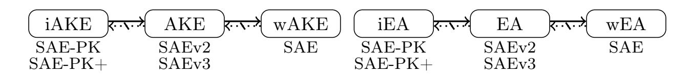
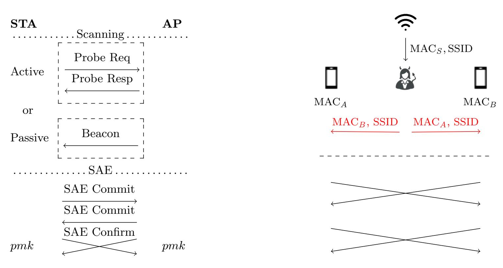

{0}------------------------------------------------

# Provable Security and Privacy Analysis of WPA3's SAE and SAE-PK Protocols<sup>⋆</sup>

Shan Chen<sup>1</sup> [,](https://orcid.org/0009-0001-3837-2593) Kaige Pan<sup>1</sup> [,](https://orcid.org/0000-0001-9406-933X) and Olga Sanina[2](https://orcid.org/0009-0004-7187-3383)

<sup>1</sup> Southern University of Science and Technology, Shenzhen, China⋆⋆ dragoncs16@gmail.com, 12331240@mail.sustech.edu.cn <sup>2</sup> Technische Universität Darmstadt, Darmstadt, Germany olga.sanina@tu-darmstadt.de

Abstract. SAE and SAE-PK are the core security protocols introduced in the latest Wi-Fi security standard, WPA3, to protect personal networks. SAE-PK extends SAE to prevent the so-called evil twin attacks, where an attacker with the knowledge of the password attempts to impersonate a legitimate access point. In this work, we present the first provable security and privacy analysis of SAE and SAE-PK. We introduce formal models that capture their intended properties and use these models to analyze the guarantees these protocols provide.

First, we identify an attack that prevents SAE from fulfilling its intended authentication guarantees. As a result, SAE can only be proven secure within a weaker security model, which we also formalize and show the proof in. To achieve the desired level of security, we propose two simple fixes, resulting in two efficient SAE protocols that we call SAEv2 and SAEv3. We prove that both protocols meet the intended security guarantees, with SAEv3 providing greater robustness.

Next, we prove that SAE-PK is indeed secure against evil twin attacks, but its current design introduces a theoretical vulnerability to offline dictionary attacks, which contradicts the expected security guarantees of SAE-PK as an enhanced password-authenticated key exchange protocol. To remedy this, we show that SAE-PK can be modified with minimal changes to fully realize its desired security goals.

Finally, we analyze the privacy guarantees of SAE, SAE-PK, and our proposed enhanced variants. We prove that their cryptographic core preserves the unlinkability of client devices across distinct Wi-Fi networks, if MAC address randomization is properly applied.

Keywords: Wi-Fi · WPA3 · SAE · SAE-PK · Security · Privacy

<sup>⋆</sup> © IACR 2026. This is the full version of the EUROCRYPT 2026 article published by Springer-Verlag.

<sup>⋆⋆</sup> Shan Chen is affiliated with both the Research Institute of Trustworthy Autonomous Systems and the Department of Computer Science and Engineering of SUSTech.

{1}------------------------------------------------

# Table of Contents

| 1 | Introduction<br><br>3                                                                  |
|---|----------------------------------------------------------------------------------------|
| 2 | Preliminaries<br><br>4                                                                 |
|   | 2.1<br>Hardness Assumptions<br><br>5                                                   |
| 3 | sPAKE Protocol Syntax and Security Model<br><br>5                                      |
|   | 3.1<br>Protocol Syntax<br><br>6                                                        |
|   | 3.2<br>Security Model<br><br>6                                                         |
| 4 | Simultaneous Authentication of Equals (SAE)<br><br>10                                  |
| 5 | Security Analysis of SAE<br><br>13                                                     |
|   | 5.1<br>Role Confusion Attack on SAE<br><br>13                                          |
|   | 5.2<br>SAE Security<br><br>14                                                          |
|   | 5.3<br>SAEv2 and SAEv3 for Stronger Security<br><br>16                                 |
| 6 | The SAE-PK Protocol and its Security<br><br>16                                         |
|   | 6.1<br>Description of SAE-PK<br><br>17                                                 |
|   | 6.2<br>The Randomized Fingerprinting Primitive<br><br>18                               |
|   | 6.3<br>Security of SAE-PK<br><br>19                                                    |
|   | 6.4<br>SAE-PK+ for Stronger Security<br><br>21                                         |
| 7 | Privacy of SAE-Family Protocols<br><br>21                                              |
|   | 7.1<br>sPAKE Privacy Model<br><br>22                                                   |
|   | 7.2<br>Privacy Mechanisms and Analysis<br><br>23                                       |
| 8 | Conclusion and Recommendations<br><br>24                                               |
| A | Cryptographic Building Blocks<br><br>27                                                |
|   | A.1<br>Hash Functions<br><br>27                                                        |
|   | A.2<br>Pseudorandom Functions (PRFs)<br>27                                             |
|   | A.3<br>Signature Schemes<br><br>27                                                     |
| B | SAE-PK Password Encoding and Decoding<br><br>28                                        |
| C | Theorems and Security Proofs for SAE-Family Protocols<br><br>29                        |
|   | C.1<br>Theorem Statements<br><br>29                                                    |
|   | C.2<br>Proof of<br>Theorem 6<br>(Security of SAE)<br><br>31                            |
|   | C.3<br>Proof of<br>Theorem 7<br>(Security of SAEv2)<br><br>48                          |
|   | C.4<br>Proof of<br>Theorem 8<br>(Security of SAEv3)<br><br>48                          |
|   | C.5<br>Proof of<br>Theorem 9<br>(Security of SAE-PK)<br>49                             |
|   | C.6<br>Proof of<br>Theorem 10<br>(Security of SAE-PK+)<br><br>55                       |
| D | Other Security and Privacy Proofs<br>55                                                |
|   | D.1<br>Proof of<br>Theorem 2<br>(Second-Preimage Resistance of<br>PPG)<br><br>55       |
|   | D.2<br>Proof of<br>Theorem 3<br>(Fingerprint Indistinguishability of<br>PPG)<br><br>56 |
|   | D.3<br>Proof of<br>Theorem 5<br>(Privacy of SAE-Family Protocols)<br><br>57            |

{2}------------------------------------------------

## <span id="page-2-1"></span><span id="page-2-0"></span>1 Introduction

As the most widely used wireless local area networking technology, Wi-Fi plays a crucial role in enabling billions of devices to access the Internet and exchange data within local networks. The security of Wi-Fi networks is certified by the Wi-Fi Alliance through its Wi-Fi Protected Access (WPA) family of standards. The latest standard, WPA3 [\[All25\]](#page-23-1), was introduced in 2018 as the successor to WPA2 to address several known design flaws, most notably its vulnerability to offline dictionary attacks, where an attacker attempts to guess the password locally using captured WPA2 authentication handshake traffic, as well as flaws that enabled serious practical attacks such as KRACK [\[VP17\]](#page-26-4).

One of the main updates introduced in WPA3 is the Simultaneous Authentication of Equals (SAE) protocol, which is mandated for personal wireless networks. SAE was first specified in the IEEE 802.11s amendment [\[IEE11\]](#page-25-0), incorporated into the main IEEE 802.11 standard in 2012 [\[IEE12\]](#page-25-1), and has remained part of it through the latest version [\[IEE25\]](#page-25-2). SAE is a passwordauthenticated key exchange (PAKE) protocol that enables two Wi-Fi entities, typically a client station (STA) and a wireless access point (AP), to mutually authenticate and establish a shared secret via a pre-shared password. In personal Wi-Fi networks, this password is often distributed among a group of users, such as customers in a coffee shop. While SAE is designed to thwart offline dictionary attacks by unauthorized outsiders who do not know the password, it remains vulnerable to insider threats: an attacker with the password can impersonate a legitimate AP, a scenario commonly referred to as an evil twin attack [\[GBL](#page-24-0)+10]. To address this threat, WPA3 introduced an enhanced protocol called SAE Public Key (SAE-PK) in its 3.0 version (released in 2020 and subsequently updated to version 3.5 [\[All25\]](#page-23-1)), enabling strong server authentication by provisioning a signature key pair to the AP.

Despite the critical role that SAE and SAE-PK play in securing personal Wi-Fi networks under WPA3, their security has not been formally analyzed. The initial SAE [\[Har08a\]](#page-24-1) (that differs from WPA3's SAE protocol) is a variant of the Dragonfly key exchange protocol proposed by Harkins [\[Har15\]](#page-25-3). However, SAE used in WPA3 is more complex and diverges in subtle yet important ways from the simplified different SAE variant for which a formal security proof exists [\[LS15\]](#page-25-4). For example, WPA3's SAE does not assume that the STA and AP know each other's identifier, namely their media access control (MAC) addresses, prior to initiating the key exchange: The STA typically learns the AP's MAC address during scanning, while the AP obtains the STA's address from handshake message headers. They also differ in other important aspects, such as how their password-based group elements (PWE) and session keys are derived. Then, for SAE-PK, while it was studied in a recent work [\[VR24\]](#page-26-5), the focus was on implementation and pre-computation attacks rather than formal security guarantees. Besides [\[VR24\]](#page-26-5), there are some other practical attacks against WPA3 that could affect SAE and SAE-PK, e.g., [\[VR20,](#page-26-6)[GV24\]](#page-24-2); however, the security of their cryptographic core remains intact once an appropriate configuration is enforced, such as disabling transition mode [\[VR20\]](#page-26-6), selecting the hash-to-element method for PWE derivation [\[VR20,](#page-26-6)[GV24\]](#page-24-2), using strong security parameters and a single public-key size [\[VR24\]](#page-26-5), etc.

So far, it remains open what security guarantees SAE and SAE-PK can formally achieve when they are properly configured. Our work fills this gap.

## Our Contributions. Our main contributions are as follows:

- We define a security model that we call server-password-authenticated key exchange (sPAKE), to formalize the security targeted by SAE and SAE-PK. To this end, our model handles password sharing among multiple clients and insider security when passwords are corrupted, which are not typically considered in PAKE models.
- We identify a role confusion attack that allows two client STAs to mistakenly complete an SAE run, undermining the expected security guarantees of SAE. Then, we prove its security in a weaker model that does not regard this attack as a break.

{3}------------------------------------------------

<span id="page-3-1"></span>Table 1. Security summary of SAE-family protocols. Green ✓ denotes security, red ✗ denotes insecurity, and orange (✗) denotes theoretical insecurity.

| Attack             | Protocol |   |   |     |                                |
|--------------------|----------|---|---|-----|--------------------------------|
|                    |          |   |   |     | SAE SAEv2 SAEv3 SAE-PK SAE-PK+ |
| Offline Dictionary | ✓        | ✓ | ✓ | (✗) | ✓                              |
| Role Confusion     | ✗        | ✓ | ✓ | ✓   | ✓                              |
| Evil Twin          | ✗        | ✗ | ✗ | ✓   | ✓                              |

- We propose two simple fixes to SAE, resulting in two efficient variants that we call SAEv2 and SAEv3. We prove that both amended protocols resist the role confusion attack and achieve the desired security guarantees.
- We prove that SAE-PK is secure against evil twin attacks, but offline dictionary attacks become theoretically possible. As part of this effort, to analyze the security guarantees of the password generation and public-key verification algorithms introduced in SAE-PK, we formalize a cryptographic primitive called randomized fingerprinting, which might be of independent interest.
- We demonstrate that SAE-PK can be strengthened with minimal modifications to eliminate the above vulnerability, yielding a provably secure and even more efficient protocol that we call SAE-PK+.
- We define a privacy model to analyze the guarantees provided by the above SAE-family protocols under two real-world types of MAC-address randomization mechanisms on client devices: a persistent scheme with address randomization per Wi-Fi network, and a random scheme that randomizes the address for each connection. We prove that the cryptographic core of all SAE-family protocols considered in this work ensures that client devices are unlinkable across different Wi-Fi networks under the persistent scheme, while the random scheme further ensures unlinkability within each network.

[Table 1](#page-3-1) summarizes the security results of the above SAE-family protocols.

Responsible Disclosure. We reported our attacks and mitigation proposals to the Wi-Fi Alliance on August 23, 2025 and later we reworked SAEv3 and reported it on January 30, 2026. The Alliance agreed with our results but did not promise to make changes soon.

Paper Organization. The rest of the paper is organized as follows. [Section 2](#page-3-0) introduces the necessary preliminaries, with additional details provided in [Appendix A.](#page-26-0) [Section 3](#page-4-1) defines our sPAKE security model. [Section 4](#page-9-0) describes the SAE protocol, and [Section 5](#page-12-0) provides its security analysis along with our proposed fixes. [Section 6](#page-15-1) discusses the additional functionalities introduced by SAE-PK and analyzes its security, with additional details of SAE-PK specified in [Appendix B.](#page-27-0) [Section 7](#page-20-1) defines the privacy model and presents our privacy results for the SAEfamily protocols. Finally, [Section 8](#page-23-0) concludes the paper with our summarized recommendations for improving the protocols. The proofs are detailed in [Appendix C](#page-28-0) and [Appendix D.](#page-54-1)

## <span id="page-3-0"></span>2 Preliminaries

Notation. Let ε denote the empty string, {0, 1} <sup>n</sup> denote the set of all bit strings of length n > 0, and {0, 1} <sup>∗</sup> denote the set of all finite bit strings. Let 0 <sup>L</sup> and 1 <sup>L</sup> respectively denote the all-0 and all-1 strings of length L. Let the special symbol ⊥ (which is outside {0, 1} ∗ ) denote uninitialized state or failure. Let | denote string concatenation and \ denote set subtraction. Let min(a, b) and max(a, b) respectively denote the smaller and larger string of a and b when interpreted as non-negative integers. Let x ← y denote assigning y to x. For a randomized function or algorithm A, let x \$← A denote running A and assigning the output to x; if A is deterministic, we write x ← A instead. For a finite set S, let |S| denote its size and S \$← S denote sampling S from S uniformly at random. Let G denote an additive cyclic group of prime order q with generator G, 

{4}------------------------------------------------

<span id="page-4-2"></span>identity element O, and inverse -A for any  $A \in \mathcal{G}$ . Let  $\mathbb{Z}_q$  denote the group of integers modulo a prime q, and  $a^{-1}$  denote the multiplicative inverse of  $a \in \mathbb{Z}_q$ . For a point P on an elliptic curve, let  $[P]_x$  denote its x-coordinate.

Advantage Measures for Cryptographic Building Blocks. In Appendix A, we recall the syntax and security definitions of a hash function H, pseudorandom function F, and signature scheme Sig, as well as their corresponding advantage measures for an adversary  $\mathcal{A}$ :  $\mathsf{Adv}^{\mathrm{coll}}_\mathsf{H}(\mathcal{A})$ ,  $\mathsf{Adv}^{\mathrm{prf}}_\mathsf{F}(\mathcal{A})$ ,  $\mathsf{Adv}^{\mathrm{uf-cma}}_\mathsf{F}(\mathcal{A})$ .

## <span id="page-4-0"></span>2.1 Hardness Assumptions

Our security analysis relies on four Diffie–Hellman-related hardness assumptions. In addition to the classical Computational Diffie–Hellman (CDH) assumption and its gap variant GDH [OP01], we employ the Gap Simultaneous Diffie–Hellman (GSDH) assumption introduced by Pointcheval and Wang [PW17], who proved its intractability in the generic group model [Sho97]. To handle certain less complex cases in our security proofs, we also define an intermediate assumption that is harder than GSDH but easier than GDH, which we refer to as the weak GSDH (wGSDH) assumption. The formal definitions of the above assumptions are recalled as follows:

**CDH.** This assumption states that, given (G, aG, bG) for random  $a, b \stackrel{\$}{\leftarrow} \mathbb{Z}_q$ , it is computationally infeasible to find abG. The advantage of an adversary  $\mathcal{A}$  in breaking this assumption is denoted by  $\mathsf{Adv}_{G,G}^{\mathrm{cdh}}(\mathcal{A})$ .

**GDH.** This assumption states that CDH remains computationally infeasible even when the adversary has access to a Decisional Diffie–Hellman (DDH) oracle, which inputs (G, aG, bG, cG) and outputs whether abG = cG. The advantage of an adversary  $\mathcal{A}$  in breaking this assumption is denoted by  $\mathsf{Adv}_{\mathcal{G},G}^{\mathrm{gdh}}(\mathcal{A})$ .

**GSDH.** This assumption states that, given (G, aG, bG) for random  $a, b \stackrel{\$}{\leftarrow} \mathbb{Z}_q$ , it is computationally infeasible to find  $(H, a^{-1}H, b^{-1}H)$  such that  $H \in \mathcal{G} \setminus \{O\}$  (i.e., H is a non-zero group element), even with help of a DDH oracle. The advantage of an adversary  $\mathcal{A}$  in breaking this assumption is denoted by  $\mathsf{Adv}_{\mathcal{G},G}^{\mathsf{gsdh}}(\mathcal{A})$ .

**wGSDH.** This assumption is similar to GSDH but further requires the adversary to find another triple. It states that, given (G, aG, bG) for random  $a, b \stackrel{\$}{\leftarrow} \mathbb{Z}_q$ , it is computationally infeasible to find two triples,  $(H, a^{-1}H, b^{-1}H)$  and  $(K, a^{-1}kK, b^{-1}kK)$ , such that  $H \in \mathcal{G} \setminus \{O\}$  and  $K = kG \in \mathcal{G} \setminus \{O\}$ , even with help of a DDH oracle. The advantage of an adversary  $\mathcal{A}$  in breaking this assumption is denoted by  $\mathsf{Adv}_{\mathcal{G},G}^{\mathsf{wgsdh}}(\mathcal{A})$ .

### <span id="page-4-1"></span>3 sPAKE Protocol Syntax and Security Model

In this section, we define the protocol syntax and security model for server-password-authenticated key exchange (sPAKE) protocols.

Existing PAKE models are typically defined for a client-server setting where each client holds a private password, so they do not apply to the Wi-Fi setting in which multiple clients may share the same password. Recent works [CNPR22,KR24] address this limitation by binding the shared password to each party's identity. However, their models do not align with the achievable security of SAE and SAE-PK, yet aiming for significantly stronger security guarantees. Our model is designed to capture the intended security properties of SAE and SAE-PK. It is also universal, in that it can be used to analyze both protocols and to directly compare their security properties within a unified framework.

UC vs. Game-Based. PAKE protocols are typically analyzed via either the universal composability (UC) framework (e.g., [CHK<sup>+</sup>05,AHH21,BGHJ24]) or game-based notions (e.g., [BPR00,AP05,LS15]). While the UC framework ensures *security under composition*, a valuable property for protocols serving as primitives in greater systems, we adopt the game-based

{5}------------------------------------------------

<span id="page-5-3"></span>methodology for sPAKE to analyze SAE and SAE-PK. This is motivated by both protocols being primarily used in the Wi-Fi ecosystem, where composability is less critical and game-based notions can more naturally capture the multiple security levels expected from them. Furthermore, this choice facilitates a direct comparison with the game-based Dragonfly analysis [\[LS15\]](#page-25-4).

## <span id="page-5-0"></span>3.1 Protocol Syntax

Our sPAKE protocol syntax is similar to that of the classical PAKE protocol defined in the model formalized by Bellare, Pointcheval, and Rogaway [\[BPR00\]](#page-24-6) (simply referred to as the BPR model in this paper), but with several important differences that we described below.

Recall that a PAKE protocol allows a client and a server to establish a high-entropy session key based on a low-entropy password chosen by the client. This client memorizes the password while the other clients do not know it. The server typically stores only some information about the password (e.g., its hash) such that using it to recover the password is hard but to verify the correct one is easy.

Unlike PAKE, a sPAKE protocol associates a password with each server rather than each client; we refer to this server as the associated server of the password. Accordingly, passwords are stored and managed by servers and are hence not required to be human-memorizable, but they are still human-readable and human-writable to enable manual verification and entry of the passwords.[3](#page-5-2) Furthermore, sPAKE allows multiple clients to share the same server password, which models scenarios typical of personal Wi-Fi networks. Finally, each shared password may be accompanied by some auxiliary information to authenticate and verify the identity of the associated server.

Formally, a sPAKE protocol is an interactive protocol between a client and a server, each associated with an identifier. In the beginning of the protocol, they each input their own identifier and a shared password; each party may also input auxiliary information associated with the shared password, which could differ between the client and server sides (e.g., the server holding a secret signing key while the client holding the corresponding public verification key). When the protocol terminates, the client and the server each establish a session key. Correctness imposes that their established session keys are the same.

#### <span id="page-5-1"></span>3.2 Security Model

One important security goal of classical PAKE protocols is to prevent offline dictionary attacks, i.e., finding the correct password in use by brute-forcing all possible ones while passively eavesdropping protocol executions. However, due to the low entropy of passwords used in PAKE protocols, active man-in-the-middle (MITM) attacks can still guess and verify the shared password with non-negligible probability. Such attacks are referred to as online dictionary attacks, as they have to interact with an "online" honest party to verify its password guess. A secure PAKE protocol guarantees that only a very limited number (e.g., one or two) of passwords can be guessed per manipulated protocol execution.

For our sPAKE protocols, the server passwords are human-writable and hence typically not as high-entropy as cryptographic keys. Therefore, as with PAKE, a sPAKE protocol should also be designed to resist offline dictionary attacks.

In the following, we formally define the security model for sPAKE protocols. In addition to the classical PAKE security goals in the BPR model, as we will show, our security model introduces new security notions to capture the weaker and stronger guarantees expected from different sPAKE protocols.

<span id="page-5-2"></span><sup>3</sup> Here we describe "human-readable", "human-writable" and "human-memorizable" informally; one can refer to [\[BCDP17\]](#page-23-4) for their formal definitions.

{6}------------------------------------------------

<span id="page-6-0"></span>**Session Oracles and States.** Recall that a sPAKE protocol is executed between clients  $\mathcal{C}$  and servers  $\mathcal{S}$ . As with the Bellare–Rogaway model [BR94], to capture multiple sequential and parallel sPAKE executions (or instances), we associate each party  $P \in \mathcal{C} \cup \mathcal{S}$  with a sequence of session oracles  $\pi_P^1, \pi_P^2, \ldots$ , where  $\pi_P^i$  denotes the *i*-th instance of P and is also called the *i*-th session of P.

Each session  $\pi_P^i$  keeps the following states (and perhaps other internal states):

- $id \in \mathcal{ID} \subseteq \{0,1\}^l$ : the identifier associated with party P;
- $pw \in \mathcal{PW} \subseteq \{0,1\}^*$ : the password used by the session;
- $-S \in S$ : the server with which the input password pw is associated, which is set along with pw and simply referred to as the session's associated server;
- $-\mathsf{SN} \in \mathcal{SN} \subseteq \{0,1\}^*$ : the name of the associated server, e.g., the network name set by an AP, which may not be unique;
- $-\operatorname{\mathsf{aux}} \in \mathcal{X} \subseteq \{0,1\}^*$ : the auxiliary information associated with  $\operatorname{\mathsf{pw}}$ , which could be the empty string to indicate the absence of input auxiliary information;
- $\text{ key } \in \{0,1\}^{\lambda} \cup \{\bot\}$ : the established session key, initialized to  $\bot$  (unset);
- sid ∈  $\{0,1\}^* \cup \{\bot\}$ : the session identifier used as unique session reference, typically defined as a function of the transcript (i.e., exchanged messages) of the session, initialized to  $\bot$  (unset);
- $pid \in \mathcal{ID} \cup \{\bot\}$ : the identifier of the party with which the session believes it has just established the session key, initialized to  $\bot$  (unset);
- st<sub>exe</sub> ∈ {initiated, accepted}: the execution state of the session, initialized to initiated, and changed to accepted when the session accepts (at which point the session has set its key, sid and pid);

Security Experiment. The experiment is executed between an adversary  $\mathcal{A}$  and a challenger. At the beginning of the experiment, the challenger fixes an arbitrary distribution  $\mathscr{D}$  over a (probably high-entropy) password dictionary  $\mathcal{PW}$ , then it samples an independent random password for each server according to  $\mathscr{D}$ , together with the associated auxiliary information (if any) respectively for the server itself and clients that use the server password; this sampling process is denoted by  $\langle (\mathsf{pw}_S, \mathsf{aux}_S, \overline{\mathsf{aux}}_S) \not\leftarrow \mathcal{PW} \times \mathcal{X} \times \mathcal{X} \rangle_{S \in \mathcal{S}}$ . Note that here without loss of generality each server  $S \in \mathcal{S}$  is assumed to hold only one password. As a result, all sessions of S share the same password  $\mathsf{pw}_S$  and server-side auxiliary information  $\mathsf{aux}_S$ , and all client sessions that use  $\mathsf{pw}_S$  as the input password share the same client-side auxiliary information  $\overline{\mathsf{aux}}_S$ ; all sessions using  $\mathsf{pw}_S$  share the same associated server S. Next, the adversary  $\mathcal{A}$  assigns a server name to each server  $S \in \mathcal{S}$  and then interacts with the challenger by querying the following oracles and learning the execution state of its queried sessions.

 $\mathsf{Send}(P,i,m)$  sends a message m to session  $\pi_P^i$ , which consists of two cases:

- The session  $\pi_P^i$  is specified to initiate the protocol run and was not used before (i.e., not queried to any allowed oracles). If P is a client,  $\mathcal{A}$  is required to specify a server  $S \in \mathcal{S}$  by setting m = S, indicating that  $\pi_P^i$  uses the password  $\mathsf{pw}_S$  of the server S and the auxiliary information  $\overline{\mathsf{aux}}_S$  and sets  $\pi_P^i.\mathsf{S} \leftarrow S$ ; otherwise, P is a server and the session  $\pi_P^i$  just uses  $\mathsf{pw}_P$ ,  $\mathsf{aux}_P$  and sets  $\pi_P^i.\mathsf{S} \leftarrow P$ , so the input message m is useless and required to be set to a special symbol  $\top$  that means unspecified. Then, the challenger returns to  $\mathcal{A}$  the first message that  $\pi_P^i$  sends to start a protocol execution.
- Otherwise, the challenger asks the session  $\pi_P^i$  (which has not terminated) to process m according to the protocol, updates its session states, and returns the response to  $\mathcal{A}$ . If the session accepts (i.e.,  $\pi_P^i$ .st<sub>exe</sub> = accepted), its sid and pid are set according to the protocol and also returned to  $\mathcal{A}$ .

After this query, we say  $\pi_P^i$  was manipulated, indicating that  $\mathcal{A}$  has interacted with the session and may manipulate its sent messages.

Execute(C, i, S, j) triggers an honest protocol execution between a client session  $\pi_C^i$  and a server session  $\pi_S^j$ , where both sessions were not used before. The challenger returns the entire communication transcript (i.e., all exchanged messages of the protocol execution) and sid, pid to  $\mathcal{A}$ .

{7}------------------------------------------------

<span id="page-7-0"></span>As with the BPR model, this oracle is useful in modeling offline dictionary attacks where the adversary has only passive access to honest protocol executions. Note that the sessions used in this query are not manipulated, indicating that A did not manipulate their sent messages.

Reveal(P,i) returns the session key  $\pi_P^i$  key to  $\mathcal A$  if the session has accepted (and hence  $\pi_P^i$  key  $\neq$  $\perp$ ); otherwise, it returns  $\perp$ . In the first case, after this query, we say the session key of  $\pi_P^i$  was revealed.

sCorrupt(S, (pw, aux)) returns to A the password  $pw_S$  of server S and its server-side auxiliary information  $\mathsf{aux}_S$ . This oracle models the corruption of servers. If  $(\mathsf{pw}, \mathsf{aux}) \neq \top$  (i.e., the second input is specified), the challenger further replaces  $pw_S$  and  $aux_S$  with the input pw and aux respectively, which, for instance, captures attacks that alter the password of S to disable its service to honest clients. After this query, we say the server S was strongly corrupted.

 $\mathsf{iCorrupt}(S)$  returns to  $\mathcal{A}$  the password  $\mathsf{pw}_S$  of server S and its client-side auxiliary information  $\overline{\mathsf{aux}}_S$ . This oracle models a server's password corruption on the client side: The client-stored password, along with the associated client-side auxiliary information, is corrupted, but the server-side auxiliary information remains safe. After this query, we say S was insider-corrupted.

 $\mathsf{Test}(P,i)$  is used to measure adversarial success in breaking session key secrecy and does not reflect real-world adversarial abilities. This query is allowed only if the specified session  $\pi_P^i$ has accepted; if so, the following happens. First, a uniform random bit  $b \in \{0,1\}$  is flipped. Then, if b = 0, a random key is sampled uniformly at random from the key space  $\{0,1\}^{\lambda}$  and returned to  $\mathcal{A}$ ; if b=1, the actual session key  $\pi_P^i$  key is returned. This oracle, if granted to the adversary, is queried exactly once.

Partners and Weak Partners. We follow the BPR model [BPR00] to define partnered sessions using session identifiers. Two distinct sessions  $\pi_P^i$  and  $\pi_{P'}^{i'}$  are partnered if and only if the following conditions hold:

- (1)  $P \in \mathcal{C} \land P' \in \mathcal{S} \text{ or } P \in \mathcal{S} \land P' \in \mathcal{C};$
- (2)  $\pi_P^i.\mathsf{S} = \pi_{P'}^{i'}.\mathsf{S}, \ \pi_P^i.\mathsf{key} = \pi_{P'}^{i'}.\mathsf{key}, \ \pi_P^i.\mathsf{sid} = \pi_{P'}^{i'}.\mathsf{sid}, \ \pi_P^i.\mathsf{pid} = \mathsf{id}_{P'} \ \mathbf{and} \ \pi_{P'}^{i'}.\mathsf{pid} = \mathsf{id}_P;$ (3) no other session holds the same  $\mathsf{sid}$  as  $\pi_P^i$  and  $\pi_{P'}^{i'}.$

That is, two sessions are each other's partner if and only if: (1) they belong to different types of parties, (2) they are associated with the same server S, establish the same key, agree on the same sid, and have each other's party identity as pid, and (3) they do not share the agreed sid with any other session.

In order to capture the weak security guarantees of SAE, specifically to rule out the role confusion attack (see Section 5.1 for details) from the model, we define a notion of weak partnership by dropping the first condition from the above partnership definition. Two sessions are called weak partners (or are weakly partnered) if and only if the last two conditions (2) (3) hold. As a result, sessions of the same type, e.g., two client sessions, can be weakly partnered. Clearly, any pair of partnered sessions are also weakly partnered.

Advantage Measures. As with the BPR model |BPR00|, we define two types of security notions and their corresponding advantage measures for a sPAKE protocol sPAKE to capture its authenticated-key-exchange (AKE) security and explicit mutual authentication (EA). For each type, we define three notions: a regular one, similar to that in the BPR model; a weaker one, reflecting the limited security guarantees of SAE; and a stronger one, which further captures the insider security guarantees expected from a sPAKE protocol. Among them, as shown below, all AKE security notions capture forward secrecy, i.e., session keys remain secure even if the password (and auxiliary information) are later corrupted.

**AKE security.** At the end of the security experiment, an adversary  $\mathcal{A}$  against the AKE security of sPAKE outputs a bit  $b' \in \{0,1\}$  as its guess for the secret random bit b sampled in the Test query. We say that  $\mathcal{A}$  wins if and only if b' = b and the tested session  $\pi_P^i$  is fresh:

(1) The tested session key was not revealed;

{8}------------------------------------------------

- (2) For any session  $\pi_{P'}^{i'}$  that is partnered with the tested session  $\pi_{P}^{i}$ , if any, its session key was not revealed;
- (3) The tested session  $\pi_P^i$  was not manipulated **or** the associated server  $\pi_P^i$ . S was not corrupted (i.e., neither strongly corrupted nor insider-corrupted) before  $\pi_P^i$  accepted.

The AKE advantage  $\mathsf{Adv}^{ake}_{\mathsf{sPAKE}}(\mathcal{A})$  is defined as  $2\Pr[\mathcal{A} \text{ wins}] - 1$ .

Weak AKE (wAKE) security. This notion is defined the same as AKE security, except that session freshness is strengthened (making the adversary less powerful) such that even weakly partnered session keys are not allowed to be revealed. Formally, weak AKE security is defined by replacing the above AKE freshness condition (2) with the following (with conditions (1) (3) unchanged):

(2)' For any session  $\pi_{P'}^{i'}$  that is weakly partnered with the tested session  $\pi_{P}^{i}$ , if any, its session key was not revealed.

The wAKE advantage  $\mathsf{Adv}^{\text{w-ake}}_{\mathsf{sPAKE}}(\mathcal{A})$  is defined as  $2\Pr[\mathcal{A} \text{ wins}] - 1$ .

Insider AKE (iAKE) security. This notion is defined similarly to AKE security, except that it further accounts for malicious insiders (e.g., a malicious client in practice) who may have access to the shared password. For such an active insider adversary, there is nothing preventing it from establishing a key with a server once the adversary knows the password, as the auxiliary information is used to verify the server's identity rather than the client's. Therefore, the adversary is allowed to obtain the password (via a iCorrupt query) only before testing a *client* session that uses it. Formally, insider AKE security is defined by replacing the freshness condition (3) in the AKE security notion with the following (with conditions (1) (2) unchanged):

(3)' The tested session  $\pi_P^i$  was not manipulated or the associated server  $\pi_P^i$ .S was not corrupted before  $\pi_P^i$  accepted or  $P \in \mathcal{C}$  and  $\pi_P^i$ .S was not strongly corrupted before  $\pi_P^i$  accepted.

Note that the above newly added condition (in blue) allows the adversary to insider-corrupt (via a iCorrupt query) the password used by the tested client session  $\pi_P^i$ . The iAKE advantage  $Adv_{sPAKE}^{i-ake}(A)$  is defined as  $2\Pr[A \text{ wins}] - 1$ .

**Explicit authentication (EA).** An adversary  $\mathcal{A}$  attempting to break EA of sPAKE interacts with all experiment oracles except Test. We say that  $\mathcal{A}$  wins if and only if it causes a session  $\pi_P^i$  to successfully terminate (i.e., without aborting) with the following hold:

- (a) The session  $\pi_P^i$  has no partner;
- (b) The associated server  $\pi_P^i$ . S was not corrupted before  $\pi_P^i$  terminated.

The EA advantage  $\mathsf{Adv}^{\mathrm{ea}}_{\mathsf{sPAKE}}(\mathcal{A})$  is defined as  $\Pr[\mathcal{A} \text{ wins}]$ .

Weak explicit authentication (wEA). This notion is defined the same as EA, except that the terminated session must also have no *weak* partner. That is, the above condition (a) is replaced by the following (with condition (b) unchanged):

(a)' The session  $\pi_P^i$  has no weak partner.

The wEA advantage  $\mathsf{Adv}^{\text{w-ea}}_{\mathsf{sPAKE}}(\mathcal{A})$  is defined as  $\Pr[\mathcal{A} \text{ wins}]$ .

**Insider explicit authentication (iEA).** Similar to how iAKE captures insider attacks, insider explicit authentication is defined by replacing condition (b) in the EA security notion with the following (with condition (a) unchanged):

(b)' The associated server  $\pi_P^i$ . S was not corrupted before  $\pi_P^i$  terminated or  $P \in \mathcal{C}$  and  $\pi_P^i$ . S was not strongly corrupted before  $\pi_P^i$  terminated.

{9}------------------------------------------------

<span id="page-9-2"></span>Similarly, the above newly added condition (in blue) allows the adversary to insider-corrupt (via a iCorrupt query) the password used by the target client session  $\pi_P^i$ . The iEA advantage  $Adv_{sPAKE}^{i-ea}(A)$  is defined as Pr[A wins].

Notion Relations. Now, we discuss the relations between the six notions defined above. First, recall that by definition a partner is also a weak partner. So, the adversarial abilities modeled in wAKE and wEA are more restricted (or weaker) than those in AKE and EA, respectively, so AKE implies wAKE, and EA implies wEA. Then, since conditions (3)' and (b)' are clearly relaxed compared to (3) and (b), respectively, it follows that iAKE implies AKE, and iEA implies EA. However, the other directions do not hold. As we will show in later sections, SAE is secure in the wAKE and wEA sense, but achieves neither AKE nor EA; our fixed protocols SAEv2 and SAEv3 satisfy AKE and EA, but fail to achieve iAKE and iEA; finally, SAE-PK and our enhanced protocol SAE-PK+ satisfy iAKE and iEA. The above notion relations are summarized in Fig. 1.



<span id="page-9-1"></span>**Fig. 1.** Notion relations (with example sPAKE protocols below). Solid arrows represent implications, while dotted (crossed-out) arrows indicate separations.

Remark on Passive Insider Security of AKE Notions. We remark that if the insider adversary is passive during a sPAKE protocol execution between a client and a server, i.e., not manipulating the exchanged messages, the adversary is not supposed to learn their established session key even if it already knows the shared password beforehand. This is captured by the first condition in (3)' and the original (3): The tested session was not manipulated. Therefore, besides iAKE security, both the original AKE security and weak AKE security also protect against passive insiders who know the shared password (e.g., an honest-but-curious client in a public Wi-Fi setting).

### <span id="page-9-0"></span>4 Simultaneous Authentication of Equals (SAE)

In this section, we describe the *Simultaneous Authentication of Equals (SAE)* protocol specified in IEEE 802.11-2024 [IEE25]. This protocol, as depicted in Fig. 2, runs between a client station (STA) and a wireless access point (AP) to achieve mutual authentication and shared session key establishment from a pre-shared password. The blue parts in the figure depict the *SAE Public Key (SAE-PK)* extensions, which will be described in Section 6.1.

Public Parameters and Setup. Before describing the protocol, we specify the cryptographic setting first. SAE (and SAE-PK) can be instantiated with either elliptic curve cryptography (ECC) groups or finite field cryptography (FFC) groups; in both cases, the underlying group is a cyclic group of prime order, ruling out small subgroup attacks [CJ19]. In this work, we focus on ECC groups, as they are more common in practice, and hence consider additive group operations. Then, we assume a fixed protocol configuration and do not consider downgrade attacks. As a result, related negotiation procedures are omitted; instead, both entities are assumed to agree on public group parameters  $(\mathcal{G}, G, q)$ , where  $\mathcal{G}$  is a cyclic group of prime order q (where  $q = |\mathcal{G}|$  is of at least 256-bit length [All25]) with generator G. These group parameters further determines another public parameter  $L \in \{256, 384, 512\}$ , which indicates the output length of the underlying hash algorithm SHA-L used in the protocol.

Both a STA and an AP possess physical media access control (MAC) addresses as their identifiers, denoted by  $\mathrm{MAC}_C$  and  $\mathrm{MAC}_S$  respectively, which are 48-bit values hard-coded into the entity devices. To enhance privacy, the standard allows the use of locally generated random

{10}------------------------------------------------

<span id="page-10-0"></span>addresses instead of the real MAC addresses. Such privacy mechanisms are described and analyzed later in Section 7.2. Prior to protocol execution, an AP is configured with a password pw and a service set identifier (SSID), which serves as the network name (e.g., "Home") and may not be unique. This password (and optionally SSID) are provided to the STA out of band (e.g., through user input), either before or during the initial protocol phase, known as *scanning*, as described below.

**Scanning Phase.** In this phase (see lines 1 to 5 of Fig. 2), the entities discover each other. This scanning process may be initiated by either party, depending on which of the following modes is employed.

In the *active* scanning mode, a STA initiates the scanning process to actively attempting a connection to the intended network. The STA sends a probe request containing its  $MAC_C$  (and optionally a target SSID), and the AP that received this request replies with a probe response that includes its  $MAC_S$  and SSID.

In the *passive* scanning mode, line 2 of Fig. 2 is *not* executed. Instead, an AP periodically broadcasts beacons that advertise its presence and configuration, including its  $MAC_S$  and SSID. Such beacons are monitored by STAs to discover nearby APs.

**PWE Generation.** After scanning, the STA proceed to generate the password-based group element PWE (see lines 6 to 8 of Fig. 2), while on the AP side PWE is generated after receiving the first SAE authentication message from the STA (see lines 6, 14 and 15 of Fig. 2). We now describe how PWE is generated.

First, the password pw is mapped to an elliptic curve point using one of two methods defined in the IEEE standard [IEE25]: hunt-and-peck or hash-to-element. Both methods rely on the same hash function SHA-L, but differ in their instantiations. We focus on the hash-to-element method, abstract its involved procedures as a single function  $PT \leftarrow \text{H2C}(\text{SSID}, pw)$ , and refer to [IEE25] for details. Although the AP may pre-compute this PT during setup, it is only used after scanning; we therefore simply present its computation on both sides symmetrically.

Next, the STA and AP each compute a digest value val. It is computed using HMAC [KBC97] instantiated with SHA-L, under key  $0^L$ , on the concatenation of MAC $_C$  and MAC $_S$ , ordered lexicographically with the larger address first. Formally, this is  $val \leftarrow \text{HMAC}(0^L, \max(\text{MAC}_C, \text{MAC}_S) | \min(\text{MAC}_C, \text{MAC}_S))$ . All subsequent uses of HMAC follow the same hash instantiation. The resulting val is mapped to a nonzero scalar in  $\mathbb{Z}_q$ , by computing  $val \mod (q-1)+1$ , and then used for scalar multiplication with PT, yielding the group element PWE.

Authentication Flow. After generating PWE, the STA constructs a so-called Commit message and sends it to the AP, as shown in lines 9 to 12 of Fig. 2. This message contains the STA's MAC address MAC<sub>C</sub>, a scalar  $s_C$ , and a group element  $CE_C$ . The scalar  $s_C$  is computed as  $s_C \leftarrow (r_C + m_C) \mod q$ , where  $r_C$ ,  $m_C$  are secret random values sampled from  $\mathbb{Z}_q \setminus \{0,1\}$  such that  $(r_C + m_C) \mod q$  is not equal to 0 or 1. The element  $CE_C$  is derived as  $CE_C \leftarrow -m_C \cdot PWE$ .

Upon receiving the Commit message, the AP first performs validity checks (see line 13 of Fig. 2), which prevent invalid curve attacks (e.g., [CH14,Sun22]). If they pass, the AP learns the STA's  $MAC_C$ , generates PWE, performs operations that mirror the above STA procedures, and sends back a Commit message containing  $MAC_S$ ,  $s_S$ ,  $CE_S$ , as shown in lines 16 to 19 of Fig. 2. Here  $MAC_S$  is omitted from the sent message as it is already known by the STA. Then, the STA also checks the validity of the received Commit message (see lines 20 to 21 of Fig. 2).

After exchanging valid Commit messages, both entities proceed to derive the key confirmation key kck and pairwise master key pmk, as shown in lines 22 to 24 of Fig. 2). First, a non-zero shared key K is computed from the exchanged values, the generated PWE, and the secret random values. Then, its x-coordinate  $[K]_x$  is processed using HMAC with key  $0^L$  to obtain the key seed seed. Finally, kck and pmk are derived from seed via a key derivation function KDF specified in the IEEE standard [IEE25, Section 12.7.1.6.2], using the fixed label "SAE KCK and PMK" concatenated with the context  $ctx \leftarrow (s_C + s_S) \mod q$ . Formally, this final step is written

{11}------------------------------------------------

```
Public Parameters: (\mathcal{G}, G, q), L
        if STA MAC address randomization is enabled:
                                                                                         AP key pair and password generation for SAE-PK:
                                                                                         (pk, sk) \leftarrow \mathsf{KGen}(1^{\lambda}), (\mathsf{pw}, \mathsf{M}) \leftarrow \mathsf{pwGen}(pp, \mathrm{SSID}, pk)
           MAC_C is randomized
        otherwise, MAC_C is fixed
                                                                                         MAC_S is always fixed
        STA Client C (MAC<sub>C</sub>, pw, \overline{pk})
                                                                                         AP Server S (MAC<sub>S</sub>, SSID, pw, M, sk, pk)
                                                           ..... Scanning starts......
        if active scanning is enabled, STA sends a probe request (optionally to a known SSID):
 1:
                                                                       MAC_C, (SSID)
 2:
 3:
         STA always receives a message in scanning phase
                                                                                         AP replies a probe response or broadcasts a beacon
                                                                        MAC_S, SSID
 4:
         SSID is ensured to match pw (e.g., by a human user)
 5:
                              ......................................
        PT \leftarrow \mathsf{H2C}(\mathrm{SSID}|\mathsf{pw})
                                                                                         PT \leftarrow \mathsf{H2C}(\mathrm{SSID}|\mathsf{pw})
 6:
        val \leftarrow \mathsf{HMAC}(0^L, \max(\mathrm{MAC}_C, \mathrm{MAC}_S) | \min(\mathrm{MAC}_C, \mathrm{MAC}_S))
 7:
 8: val \leftarrow val \mod (q-1) + 1, PWE \leftarrow val \cdot PT
 9: r_C, m_C \stackrel{\$}{\leftarrow} \mathbb{Z}_q \setminus \{0,1\} such that (r_C + m_C) \mod q \in \mathbb{Z}_q \setminus \{0,1\}
10: s_C \leftarrow (r_C + m_C) \mod q
11: CE_C \leftarrow -m_C \cdot PWE
                                                                      MAC_C, s_C, CE_C
12:
13:
                                                                                         abort if s_C \notin \mathbb{Z}_q \setminus \{0,1\} \vee CE_C \notin \mathcal{G} \setminus \{O\}
                                                                                         val \leftarrow \mathsf{HMAC}(0^L, \max(\mathrm{MAC}_C, \mathrm{MAC}_S) | \min(\mathrm{MAC}_C, \mathrm{MAC}_S))
14:
                                                                                         val \leftarrow val \mod (q-1) + 1, PWE \leftarrow val \cdot PT
15:
                                                                                         r_S, m_S \stackrel{\$}{\leftarrow} \mathbb{Z}_q \setminus \{0,1\} such that (r_S + m_S) \bmod q \in \mathbb{Z}_q \setminus \{0,1\}
16:
17:
                                                                                         s_S \leftarrow (r_S + m_S) \bmod q
                                                                                         CE_S \leftarrow -m_S \cdot PWE
18:
                                                                            s_S, CE_S
19:
         drop and wait if s_S = s_C \vee CE_S = CE_C
20:
         abort if s_S \notin \mathbb{Z}_q \setminus \{0,1\} \vee CE_S \notin \mathcal{G} \setminus \{O\}
21:
         K \leftarrow r_C \cdot (s_S \cdot PWE + CE_S) and abort if K = O
                                                                                         K \leftarrow r_S \cdot (s_C \cdot PWE + CE_C) and abort if K = C
22:
         seed \leftarrow \mathsf{HMAC}(0^L, [K]_x), ctx \leftarrow (s_C + s_S) \bmod q
                                                                                         seed \leftarrow \mathsf{HMAC}(0^L, [K]_x), ctx \leftarrow (s_S + s_C) \bmod q
23:
         kck|pmk|kek \leftarrow \mathsf{KDF}(seed, \mathtt{lbl}|ctx, L + 256 + L)
24:
                                                                                         kck|pmk|kek \leftarrow \mathsf{KDF}(seed, \mathtt{lbl}|ctx, L + 256 + L)
25:
                                                                                         c \leftarrow \mathsf{AES}\text{-SIV}.\mathsf{Enc}(kek,\mathsf{M})
                                                                                         h \leftarrow \mathsf{SHA}\text{-}L(\mathit{CE}_S|\mathit{CE}_C|s_S|s_C|\mathsf{M}|\mathit{pk}|\mathsf{MAC}_S|\mathsf{MAC}_C)
26:
27:
                                                                                         \sigma \leftarrow \mathsf{ECDSAcore}.\mathsf{Sign}(sk,h)
                                                                                         con_S \leftarrow \mathsf{HMAC}(kck, s_S | CE_S | s_C | CE_C)
         con_C \leftarrow \mathsf{HMAC}(kck, s_C | CE_C | s_S | CE_S)
28:
                                                                                                con_S, pk, c, \sigma
                                                             con_C
29:
         drop and wait if con_S \neq \mathsf{HMAC}(kck, s_S | CE_S | s_C | CE_C) drop and wait if con_C \neq \mathsf{HMAC}(kck, s_C | CE_C | s_S | CE_S)
30:
         M \leftarrow AES-SIV.Dec(kek, c)
31:
         drop and wait if (\bot \neq \overline{pk} \neq pk) \lor \mathsf{pkVf}(\mathrm{SSID}, pk, \mathsf{M}, \mathsf{pw}) \neq 1
32:
         h \leftarrow \mathsf{SHA}\text{-}L(\mathit{CE}_S|\mathit{CE}_C|s_S|s_C|\mathsf{M}|\mathit{pk}|\mathsf{MAC}_S|\mathsf{MAC}_C)
33:
         drop and wait if ECDSAcore.Vf(pk, h, \sigma) \neq 1
34:
         accept and store key \leftarrow pmk
35:
                                                                                         accept and store key \leftarrow pmk
         pid \leftarrow MAC_S, sid \leftarrow \{(s_C, CE_C), (s_S, CE_S)\}
                                                                                         pid \leftarrow MAC_C, sid \leftarrow \{(s_C, CE_C), (s_S, CE_S)\}
36:
37:
         terminate
                                                                                         terminate
```

<span id="page-11-27"></span><span id="page-11-26"></span><span id="page-11-25"></span><span id="page-11-24"></span><span id="page-11-23"></span><span id="page-11-22"></span><span id="page-11-21"></span><span id="page-11-19"></span><span id="page-11-18"></span><span id="page-11-17"></span><span id="page-11-16"></span><span id="page-11-15"></span><span id="page-11-14"></span><span id="page-11-13"></span><span id="page-11-12"></span><span id="page-11-11"></span><span id="page-11-0"></span>Fig. 2. The SAE and SAE-PK protocols with the scanning phase used in WPA3. Procedures exclusive to SAE-PK are colored in blue. The password generation algorithm pwGen and public-key verification algorithm pkVf of SAE-PK are described later in Fig. 5 and Section 6.1. The key label 1b1 used in KDF is the ASCII string "SAE KCK and PMK" for SAE and "SAE-PK keys" for SAE-PK.

{12}------------------------------------------------

<span id="page-12-4"></span>

<span id="page-12-2"></span>Fig. 3. Scanning and SAE phases.

<span id="page-12-3"></span>Fig. 4. Role confusion attack on SAE.

as kck|pmk ← KDF(seed, lbl|ctx , L + 256). Here kck has length L bits, while pmk has length either 256 or L bits depending on the configuration; as L ≥ 256, we for simplicity fix the length of pmk to 256 bits in this paper.

After deriving kck and pmk, the STA and AP proceed to construct and exchange the so-called Confirm messages (see [lines 28](#page-11-17) to [30](#page-11-18) of [Fig. 2\)](#page-11-0), which each contain a confirmation value denoted by con<sup>C</sup> and con<sup>S</sup> respectively. These values are computed using HMAC with key kck over the exchanged values as con<sup>C</sup> ← HMAC(kck, s<sup>C</sup> |CE<sup>C</sup> |s<sup>S</sup> |CE<sup>S</sup> ) and con<sup>S</sup> ← HMAC(kck, s<sup>S</sup> |CE<sup>S</sup> |s<sup>C</sup> |CE<sup>C</sup> ). These values are exchanged, potentially concurrently, and verified by the entities. If verification succeeds, they accept pmk as the session key and terminate.

Recall that the blue parts specific to SAE-PK is described later in [Section 6.1.](#page-16-0)

## <span id="page-12-0"></span>5 Security Analysis of SAE

Before diving into the security analysis, we first clarify the necessary assumptions and specify our analysis targets.

By design, SAE treats both entities as equal participants. In practice, however, the protocol runs between a STA, representing a personal device, and an AP, typically a wireless router. This asymmetry is also reflected in the ordering of Commit messages. To align with practical deployments, we assume that the STA initiates SAE authentication after scanning (see [Fig. 3\)](#page-12-2).

For protocol configuration, we assume the more common elliptic curve groups are used, as mentioned in [Section 4,](#page-9-0) but our results also apply to finite field groups. For the scanning phase, we assume the STA obtains the password (and optionally the SSID) during a setup phase prior to protocol execution, and can later verify (e.g., by a human user) that the SSID matches the password in use. Finally, for PWE generation, we mentioned that two methods are specified in the IEEE standard [\[IEE25\]](#page-25-2): hunt-and-peck and hash-to-element. However, huntand-peck has been shown to be vulnerable to timing side-channel attacks [\[VR20\]](#page-26-6) and hard to fix [\[DABFS20\]](#page-24-10); moreover, SAE with hunt-and-peck is susceptible to recently discovered SSID confusion attacks [\[GV24\]](#page-24-2). Therefore, we consider hunt-and-peck insecure and analyze the hashto-element method in this work.

### <span id="page-12-1"></span>5.1 Role Confusion Attack on SAE

First, we identify a role confusion attack that prevents SAE from achieving its intended authentication security.

{13}------------------------------------------------

<span id="page-13-2"></span>Our attack resembles the role confusion attack on Bluetooth [TH21], where two devices both think they are the initiator but end up with different keys, causing communication to fail. In contrast, our attack is more subtle and powerful: Two STAs can successfully complete SAE authentication while each mistakenly believes it is the initiator that connects to an AP, and crucially, they derive the *same* session key. Although the full Wi-Fi connection may fail due to asymmetries in the subsequent procedures, our attack still produces a legitimate-looking authentication run that violates the intended guarantees of SAE.

As shown in Fig. 4, the attacker performs two steps: first tampering with the beacon messages such that each STA thinks the other STA's MAC address is the AP's and views itself as the initiator, then relaying their Commit and Confirm messages to each other. We note that our attack strategy differs from that of the Selfie attack on TLS-PSK [DG21], which reflects a single entity's messages to cause role confusion. Unlike Selfie, our attack involves two distinct entities and is mounted by modifying and relaying messages between them.

## <span id="page-13-0"></span>5.2 SAE Security

Due to role confusion attacks, SAE as a sPAKE protocol cannot achieve the desired AKE and EA security. Formally, this is because an adversary  $\mathcal{A}$  can simulate the role confusion attack in the security model to ask two honest client sessions to complete an SAE run with each other and establish the same session key pmk. By definition, these two client sessions are only weakly partnered but not partnered, i.e., having no partnered server session; this already breaks the EA security. Then,  $\mathcal{A}$  can reveal either client session's pmk and query the Test oracle on the other session, which trivially breaks the AKE security.

The following theorem (with full security bounds in Theorem 6) states the wAKE and wEA security of SAE, which essentially confirms that SAE is secure when role confusion attacks are not a concern. We remark that this security actually ensures that the adversary cannot learn the session key of two connected client sessions resulting from a role confusion attack, unless one of them is compromised.

<span id="page-13-1"></span>**Theorem 1.** Let  $H_{\infty}(\mathcal{D}_{\mathcal{D}})$  denote the min-entropy of a password distribution  $\mathcal{D}_{\mathcal{D}}$  over the dictionary  $\mathcal{D}$ . Let H2C (see line 6 of Fig. 2), HMAC (with fixed key  $0^L$  for deriving seed, see line 23 of Fig. 2), KDF (see line 24 of Fig. 2), and HMAC (for deriving  $con_C$ ,  $con_S$ , see lines 28 and 30 of Fig. 2) be modeled as random oracles  $H_1$ ,  $H_2$ ,  $H_3$ , and  $H_4$ , respectively. Let  $\mathcal{A}$  be any efficient adversary that makes at most  $q_{se}$  Send-queries,  $q_{exe}$  Executequeries, and  $q_{H_1}, q_{H_2}, q_{H_3}, q_{H_4}$  random oracle queries to  $H_1$ ,  $H_2$ ,  $H_3$ ,  $H_4$ , respectively. Let  $q_{all} = q_{se} + q_{exe} + q_{H_1} + q_{H_2} + q_{H_3} + q_{H_4}$ . Then, there exist efficient adversaries  $\mathcal{C}$ ,  $\mathcal{D}$ ,  $\mathcal{E}$ ,  $\mathcal{F}$ ,  $\mathcal{M}$ , such that  $\mathsf{Adv}_{\mathsf{SAE}}^{\mathsf{w}-\mathsf{ake}}(\mathcal{A}) \leq 2T_{\mathsf{SAE}}$  and  $\mathsf{Adv}_{\mathsf{SAE}}^{\mathsf{w}-\mathsf{ea}}(\mathcal{A}) \leq T_{\mathsf{SAE}} + q_{\mathsf{se}}/2^L$ , where

$$\begin{split} T_{\mathsf{SAE}} &= \frac{q_{\mathsf{se}}}{2^{\mathsf{H}_{\infty}(\mathscr{D}_{\mathcal{D}})}} + 2q_{\mathsf{exe}} \cdot (q_{\mathsf{se}} + q_{\mathsf{H}_2}) \cdot \mathsf{Adv}^{\mathsf{cdh}}_{\mathcal{G},G}(\mathcal{C}) + 2q_{\mathsf{se}}^2 \cdot \mathsf{Adv}^{\mathsf{gdh}}_{\mathcal{G},G}(\mathcal{D}) \\ &+ 4q_{\mathsf{se}} \cdot (q_{\mathsf{se}} + q_{\mathsf{exe}} + q_{\mathsf{H}_1})^2 \cdot (\sqrt{\mathsf{Adv}^{\mathsf{wgsdh}}_{\mathcal{G},G}(\mathcal{E})} + \mathsf{Adv}^{\mathsf{gsdh}}_{\mathcal{G},G}(\mathcal{F})) \\ &+ \mathsf{Adv}^{\mathsf{coll}}_{\mathsf{HMAC}(0^L,\cdot)}(\mathcal{M}) + \frac{O(q_{\mathsf{all}}^2)}{2^{256}}. \end{split}$$

*Proof Sketch.* Our proof follows a similar idea sketched in the BPR paper [BPR00], but with additional subtleties, which we summarize later as proof challenges.

The adversary  $\mathcal{A}$  against our sPAKE security can be viewed as trying to guess a target server password. We define a "bad event" such that if it does not occur then one can ensure that (1) each  $\mathcal{A}$ 's guess (that must involve an active interaction with the target client or server via Sendqueries) can eliminate at most one password candidate from  $\mathcal{D}$  and (2) the only information that  $\mathcal{A}$  gets so far about the password is that its previous guesses are wrong. This "ideal environment" for adversarial password guessing is often referred to as the *information-theoretic game*. In this

{14}------------------------------------------------

<span id="page-14-0"></span>game, one can bound A's winning probability by qse/2 H∞(DD) , where qse bounds the number of sessions the adversary actively interacted with to guess the password.

Then, we need to bound the probability of the "bad event" by mainly relying on the hardness of several Diffie–Hellman problems. We establish this by dividing sessions into five disjoint cases: Execute Case (created by Execute-queries), bounded under CDH; Paired Case (created by two sessions using a password of the same server), bounded under GDH; Cross-Server Paired Case (created by two sessions using passwords of different servers), bounded under GDH; Malicious-Client Case (created by the adversary interacting with a single server session), bounded under wGSDH; and Malicious-Server Case (created by the adversary interacting with a single client session), bounded under GSDH.

The full proof is provided in [Appendix C.2.](#page-30-0)

Proof Challenges. We now outline the proof challenges arising from SAE's special design and our approaches to addressing them.

CDH failing to handle the Paired Case. While the Paired Case was usually handled in a similar way to the Execute Case under CDH (e.g., [\[BCP04,](#page-24-12)[LS15\]](#page-25-4)), the concurrent (unordered) SAE Confirm messages in SAE render the simulation infeasible when embedding a CDH challenge (X, Y ) in the Paired Case. For instance, a server session embedded with Y may output its Confirm message immediately upon receiving the SAE Commit message from the client session embedded with X, thereby deemed as in the Paired Case. However, the client session is not yet paired and may later accept an adversarial Commit message and fall into the Malicious-Server Case, where a corruption query could force the computation of K in simulation, which is infeasible under the CDH embedding. An analogous situation may also arise between two client sessions due to the role confusion attack. To overcome this, the simulator relies on the GDH assumption rather than CDH, introducing a DDH oracle to ensure a faithful simulation.

Tight bound for handling online dictionary attacks. Unlike the analysis of the simplified Dragonfly variant [\[LS15\]](#page-25-4), we aim for a tight non-negligible term that bounds the online dictionary attacks, i.e., qse/2 <sup>H</sup>∞(DD) without any constant factor before qse. To this end, our proof is very careful in arranging the game hops to avoid unnecessary constant factors. As part of this effort, we classify the Cross-Server Paired Case, which is intuitively easier to handle than the last two malicious cases as the involved SAE Commit messages still both come from honest sessions. With this case treated separately in our proof, we can show that the non-negligible term is even tighter than qse/2 <sup>H</sup>∞(DD) by dividing the at most qse manipulated sessions into four categories according to our last four session cases. This is because each pair of sessions considered in the Cross-Server Paired Case can be shown to contribute only one password guess. To the best of our knowledge, this type of tight bound was never shown in the literature.

Session key collisions across independent sessions. The SAE session key is derived as pmk = KDF(HMAC(0L, [K]x), ctx ), where K is the Diffie–Hellman (DH) shared secret and ctx is the sum of exchanged scalars as described in [Section 4.](#page-9-0) Unlike typical PAKE protocols (e.g., EKE2 [\[BPR00\]](#page-24-6), Dragonfly [\[LS15\]](#page-25-4), CPace [\[HL19\]](#page-25-12), etc.), SAE does not incorporate the session transcript into the session key derivation. As a result, whenever two independent sessions obtain the same pair ([K]x, ctx ), they inevitably derive identical session keys. Actually, our role confusion attack on SAE is largely due to this special key derivation design. Our proof resolves this by explicitly accounting for potential collisions on ([K]x, ctx ).

Additional steps after keyseed derivation complicating forward secrecy proof. In SAE, the password is used to derive a group generator, which typically leads to security proofs under assumptions like DIDH [\[Mac01\]](#page-25-13) and GSDH [\[PW17\]](#page-25-6) (e.g., DIDH for Dragonfly [\[LS15\]](#page-25-4) and GSDH for VTBPEKE [\[PW17\]](#page-25-6)). These assumptions prevent the adversary from actively testing many passwords in one attempt, rather than hiding the DH shared secret K after corruption. Therefore, when forward secrecy is considered, a corruption query may allow the adversary to recover a

{15}------------------------------------------------

<span id="page-15-3"></span>previously established K, which requires the challenger to maintain simulation consistency before and after corruption. For instance, if the adversary first obtains a confirmation value con<sup>C</sup> from an uncorrupted client and later corrupts it, then under GSDH it may recover the correct K, compute con<sup>C</sup> by itself, and verify it against the simulated one. In the simplified Dragonfly variant analysis [\[LS15\]](#page-25-4), such simulation consistency can be handled straightforwardly, since the confirmation values are direct outputs of a hash function, modeled as a random oracle, on the DH shared secret and other inputs. In contrast, SAE employs additional functions, such as KDF and HMAC, after deriving the keyseed from K via a random oracle. To ensure consistent simulation, we model them as random oracles; similarly, in our SAE-PK security proof, AES-SIV is modeled as an ideal cipher.

## <span id="page-15-0"></span>5.3 SAEv2 and SAEv3 for Stronger Security

In order to prevent role confusion attacks and achieve the desired security guarantees, we introduce two enhanced SAE variants, named SAEv2 and SAEv3, which are both simpler than the original SAE.[4](#page-15-2)

SAEv2. Our first proposal is quite straightforward: just fix the order of input MAC addresses used to derive val (see [lines 7](#page-11-20) and [14](#page-11-6) of [Fig. 2\)](#page-11-0) by computing

either 
$$val \leftarrow \mathsf{HMAC}(0^L, \mathsf{MAC}_C | \mathsf{MAC}_S)$$
 or  $val \leftarrow \mathsf{HMAC}(0^L, \mathsf{MAC}_S | \mathsf{MAC}_S)$ 

instead of val ← HMAC(0L, max(MAC<sup>C</sup> , MAC<sup>S</sup> )| min(MAC<sup>C</sup> , MAC<sup>S</sup> )). However, this fix does not prevent two client STAs with the same MAC address from establishing a connection, so SAEv2 further requires a client STA to drop beacon messages that carry its own MAC address. This behavior is already implemented in practice, e.g., in the Linux kernel (which we tested on version 6.16.8).

SAEv3. Our second proposal is also very simple: just skip the ctx computation (see [line 23](#page-11-19) of [Fig. 2\)](#page-11-0) and use s<sup>C</sup> instead, i.e., directly compute

$$kck|pmk \leftarrow \mathsf{KDF}(\mathit{seed}, \mathtt{lbl}|s_C, L+256)$$

instead of kck|pmk ← KDF(seed, lbl|ctx , L + 256). Unlike SAEv2, our SAEv3 does not have to handle duplicate MAC addresses and is hence more robust. We note that replacing the above s<sup>C</sup> with s<sup>S</sup> is not recommended, which leads to a much looser security bound; see [Appendix C.4](#page-47-1) for details.

Security of SAEv2 and SAEv3. We prove that SAEv2 and SAEv3 both achieve the desired AKE and EA security. Their theorem statements are very similar to that of [Theorem 1](#page-13-1) and establish the same security bounds, but for the stronger notions of AKE and EA security. We omit them here and refer to [Theorems 7](#page-28-3) and [8](#page-28-4) for the full statements and [Appendices C.3](#page-47-0) and [C.4](#page-47-1) for the full proofs.

## <span id="page-15-1"></span>6 The SAE-PK Protocol and its Security

In some practical scenarios, an attacker can easily obtain an AP's password and SSID. For example, public networks (e.g., in coffee shops) often make these AP credentials available to many customers, sometimes by posting them on a wall. With them, an attacker can set up a rogue AP and trick clients into connecting to it (i.e., mounting an evil twin attack [\[GBL](#page-24-0)+10[,KH18,](#page-25-14)[GV24\]](#page-24-2)). Indeed, apart from the shared password, an AP typically has no other means to authenticate itself to clients.

<span id="page-15-2"></span><sup>4</sup> We remark that our SAEv2 and SAEv3 are designed to address role confusion attacks on WPA3, but the asymmetric features they introduce are not fully consistent with the original SAE design for other use cases, e.g., mesh networks [\[IEE25,](#page-25-2)[Har08a\]](#page-24-1).

{16}------------------------------------------------

```
1 : (sec, pwl) ← pp ; M
                        $← {0, 1}
                                128
2 : while LEFT(SHA-L(SSID|M|pk), 0, 8·sec) ̸= 0 :
3 : M ← (M + 1) mod 2128
4 : fp ← LEFT(SHA-L(SSID|M|pk), 8·sec, 19·pwl/4−5)
5 : pw ← Encode(fp,sec, pwl)
6 : return (pw, M)
                                                        1 : (fp,sec, pwl) ← Decode(pw) ; fpexp ← 0
                                                                                                  8·sec|fp
                                                        2 : fp′ ← LEFT(SHA-L(SSID|M|pk), 0, 8·sec+19·pwl/4−5)
                                                        3 : if fp′ = fpexp then return 1
                                                        4 : else return 0
```

<span id="page-16-1"></span>Fig. 5. The SAE-PK password generation algorithm (left) and public-key verification algorithm (right). The public parameters pp consist of a security parameter sec ∈ {3, 5} and a password length pwl that is a multiple of 4, such that 8·sec+ 19·pwl/4−5 ≤ L holds, where L is the same public parameter as in SAE [\(Fig. 2\)](#page-11-0). The function SHA-L denotes the same underlying hash function used in SAE with the output size L. The function LEFT(s, j, k) returns the k consecutive bits of a string s starting from the position j from left to right. The function Encode (resp. Decode) maps a bitstring (resp. a character string) to a character string (resp. a bitstring). The computed fingerprint fp is of the length 8·sec + 19·pwl/4 − 5 bits, and the encoded password pw (when excluding hyphen separators) is of the length 5·pwl bits, i.e., pwl characters (5-bit each) from the alphabet {a, b, . . . , z, 2, 3, 4, 5, 6, 7}.

To mitigate the above attack, WPA3 introduced the SAE-PK protocol, which enables explicit AP authentication by provisioning the AP with a signature key pair and using the public verification key to derive a fingerprint as the shared password. This authentication mechanism provides password-compromise resistance: An attacker cannot impersonate the AP even if it learns the password. This is captured by our sPAKE model as insider security, where the adversary is allowed to corrupt the password via the iCorrupt oracle.

## <span id="page-16-0"></span>6.1 Description of SAE-PK

Now, we describe the SAE-PK protocol as specified in the WPA3 standard [\[All25\]](#page-23-1). SAE-PK extends SAE with several additional components highlighted in blue in [Fig. 2.](#page-11-0) Among these, SAE-PK introduces two new algorithms: the password (or fingerprint) generator pwGen (see the first blue line of [Fig. 2\)](#page-11-0) and the public-key verifier pkVf (see [line 32](#page-11-21) of [Fig. 2\)](#page-11-0); the detailed procedures are shown in [Fig. 5.](#page-16-1)

Algorithms for Password Generation and Public-Key Verification. We now describe these algorithms, which employ an encoding algorithm Encode and a decoding algorithm Decode. The Encode algorithm takes as input a fingerprint fp and two public parameters (sec, pwl), where the security parameter sec ∈ {3, 5} and the password length pwl is a multiple of 4, and outputs a human-readable and human-writable password pw of pwl characters (when excluding hyphen separators), with characters in the alphabet {a, b, . . . , z, 2, 3, 4, 5, 6, 7}. Conversely, Decode takes as input a password pw and outputs a tuple (fp,sec, pwl). The details of Encode and Decode are provided in [Appendix B.](#page-27-0)

The password generation algorithm pwGen is executed by the AP prior to connection establishment, as illustrated on the left side of [Fig. 5.](#page-16-1) It takes as input the public parameters pp, a network name SSID, and a public key pk, and proceeds as follows. First, a 128-bit modifier M is randomly sampled and repeatedly incremented modulo 2 <sup>128</sup> until the first 8 · sec bits of the hash output SHA-L(SSID|M|pk) are all zeros. Next, the leftmost 19 · pwl/4 − 5 bits immediately to the right of the 8 · sec-bit 0s are truncated from the hash output to form the fingerprint fp, which is then passed to the Encode algorithm to derive an encoded password pw. Finally, the password-modifier pair (pw, M) is returned by the algorithm.

The public-key verification algorithm pkVf is executed by the STA to verify a public key pk received from the AP, as illustrated on the right side of [Fig. 5.](#page-16-1) It takes as input the network name SSID, the modifier M, the password pw, and the public key pk, and proceeds as follows. First, the algorithm calls Decode on the input password to derive a decoded fingerprint fp with the public parameters (sec, pwl); with these values, it prepends 8 ·sec zeros to fp to construct the expected fingerprint fpexp. Then, the algorithm obtains another fingerprint fp′ by directly computing 

{17}------------------------------------------------

<span id="page-17-1"></span>SHA-L(SSID, M, pk) and truncating the derived hash value to the leftmost 8·sec + 19·pwl/4 − 5 bits. Finally, it compares fp′ with fpexp and outputs 1 if they match and 0 otherwise.

Authentication Process Extensions. With the pwGen and pkVf algorithms, SAE-PK extends the SAE authentication process as follows.

During setup, the AP uses the key generation algorithm KGen to generate a signature key pair (pk, sk) of key length at least 256 bits, and then generates the password pw and the modifier M using the pwGen algorithm. The STA may be additionally provided with an AP's public key, denoted by pk, together with the password pw. The protocol then follows SAE up to the key derivation step (see [line 24](#page-11-16) of [Fig. 2\)](#page-11-0). At this step, both entities now use KDF to derive three keys instead of two, and the key label lbl in the KDF input is changed from "SAE KCK and PMK" to "SAE-PK keys" for SAE-PK. The additional key kek, referred to as the key encryption key, is L-bit long and used for later encryption.

After key derivation, as shown in [lines 25](#page-11-22) to [27](#page-11-23) of [Fig. 2,](#page-11-0) the AP computes two additional values that are not present in SAE: a ciphertext c and a signature σ. The former is obtained by encrypting the modifier M with the AES-SIV scheme [\[Har08b\]](#page-24-13), using the derived key encryption key kek. The signature σ is derived by signing the message CE<sup>S</sup> |CE<sup>C</sup> |s<sup>S</sup> |s<sup>C</sup> |M|pk|MAC<sup>S</sup> |MAC<sup>C</sup> with the ECDSA scheme [\[ISO18\]](#page-25-15). Concretely, this message is first hashed with SHA-L to obtain a digest h, which is then signed with sk to derive a signature σ; the latter step is denoted by σ ← ECDSAcore.Sign(sk, h). Here, we split the ECDSA signing procedure into two parts rather than treating it as a single algorithm, as our security analysis requires explicitly modeling the hash function SHA-L as a random oracle. After deriving the signature, the AP sends the STA a Confirm message carrying pk, c, σ, together with the SAE confirmation value con<sup>S</sup> .

Upon receiving the above message, the STA first verifies the confirmation value con<sup>S</sup> as in SAE, and then verifies the public key pk and the signature σ, as shown in [lines 31](#page-11-24) to [34](#page-11-25) of [Fig. 2.](#page-11-0) For public key verification, the STA first checks whether a given public key pk matches the received pk, and discards the received Confirm message if it does not. Otherwise, it decrypts the ciphertext c with the AES-SIV scheme using kek to recover the modifier M, and then calls pkVf on input (SSID, pk, M, pw) to verify pk. Then, for signature verification, the STA first computes the hash digest h in the same way as the AP, and then verifies the signature σ with pk; the latter is denoted by ECDSAcore.Vf(pk, h, σ). If either of the above two verifications fails, the Confirm message is also discarded.

The remaining procedures for both entities are the same as in SAE.

### <span id="page-17-0"></span>6.2 The Randomized Fingerprinting Primitive

In this section, we formalize a cryptographic primitive that we call randomized fingerprinting (RF), and define its syntax and desired security properties. This abstraction enables a formal analysis of the security guarantees provided by the password generation and public-key verification algorithms of SAE-PK, and might also be of independent interest.

Syntax. A randomized fingerprinting scheme RF is defined as a pair of algorithms (Gen, Vf) and is associated with an identifier space I ⊆ {0, 1} ∗ , message space M ⊆ {0, 1} ∗ , fingerprint space T ⊆ {0, 1} ∗ , salt space {0, 1} r , and several sets of public parameters. Its randomized fingerprint generation algorithm Gen takes as input a set of public parameters pp, an identifier id ∈ I, a message m ∈ M, and outputs a fingerprint t ∈ T with a salt s ∈ {0, 1} r . Its deterministic verification algorithm Vf takes as input an identifier id ∈ I, a message m ∈ M, a salt s ∈ {0, 1} r , a fingerprint t ∈ T , and outputs a bit b ∈ {0, 1} indicating whether the verification is successful or not. Here, Vf is not taking the public parameters pp as input, since they can typically be "decoded" from the fingerprint. Correctness imposes that, for any given set of public parameters pp, any id ∈ I and m ∈ M, it holds that: Pr[Vf(id, m, s, t) = 1|(t, s) \$← Gen(pp, id, m)] = 1.

Security. We define two security notions for an RF scheme RF as follows.

{18}------------------------------------------------

```
Game 2-PRE_{\mathsf{RF}}^{\mathcal{A}} Oracle \mathcal{O}_{pp}(id,m) win \leftarrow 0, \ \mathcal{Q} \leftarrow \varnothing, \ (m',s') \stackrel{\$}{\leftarrow} \mathcal{A}^{\mathcal{O}_{pp}} (t,s) \stackrel{\$}{\leftarrow} \mathsf{Gen}(pp,id,m) for (id,m,t,s) \in \mathcal{Q} do \mathcal{Q} \leftarrow \mathcal{Q} \cup \{(id,m,t,s)\} return t return t
```

<span id="page-18-2"></span>Fig. 6. Second preimage resistance game for a randomized fingerprinting scheme RF.

| Game $REAL^\mathcal{A}_RF$                                                | Oracle $\widetilde{\mathcal{O}}_{pp}(id,m)$                   |
|---------------------------------------------------------------------------|---------------------------------------------------------------|
| $Q \leftarrow \varnothing$                                                | $\mathbf{if} \ (id,m) \in \mathcal{Q}  \mathbf{return} \perp$ |
| $b' \stackrel{\$}{\leftarrow} \mathcal{A}^{\widetilde{\mathcal{O}}_{pp}}$ | $(t,s) \xleftarrow{\$} Gen(pp,id,m)$                          |
|                                                                           | $\mathcal{Q} \leftarrow \mathcal{Q} \cup \{(id,m)\}$          |
|                                                                           | $\mathbf{return}\ t$                                          |

| Game IDEAL $_{RF}^{\mathcal{A}}$                                         | Oracle $\widetilde{\mathcal{O}}_{pp}(id,m)$               |
|--------------------------------------------------------------------------|-----------------------------------------------------------|
| $Q \leftarrow \varnothing$                                               | $\mathbf{if}\ (id,m)\in\mathcal{Q} \mathbf{return}\ \bot$ |
| $b' \overset{\$}{\leftarrow} \mathcal{A}^{\widetilde{\mathcal{O}}_{pp}}$ | $t \overset{\$}{\leftarrow} \mathcal{T}_{pp}$             |
| $\mathbf{return}\ b'$                                                    | $\mathcal{Q} \leftarrow \mathcal{Q} \cup \{(id,m)\}$      |
|                                                                          | $\mathbf{return}\ t$                                      |

<span id="page-18-3"></span>Fig. 7. Fingerprint indistinguishability games for a randomized fingerprinting scheme RF: the "real" game (left) and the "ideal" game (right).

First, we define its second preimage resistance security, which is similar to that of hash functions; the corresponding security game 2-PRE $_{\mathsf{RF}}^{\mathcal{A}}$  is shown in Fig. 6. Given a set of public parameters pp, the adversary  $\mathcal{A}$  is given access to an oracle  $\mathcal{O}_{pp}$  that takes id, m as input, runs  $(t,s) \stackrel{\$}{\leftarrow} \mathsf{Gen}(pp,id,m)$  and outputs t. In the end,  $\mathcal{A}$  outputs a message-salt pair (m',s').  $\mathcal{A}$  wins if and only if there exists some previous  $\mathcal{O}_{pp}(id,m)$  query that output t such that  $\mathsf{Vf}(id,m',s',t)=1$  and  $m \neq m'$ . The advantage measure  $\mathsf{Adv}_{\mathsf{RF},pp}^{2-\mathsf{pre}}(\mathcal{A})$  is defined as  $\mathcal{A}$ 's winning probability in the game:  $\mathsf{Adv}_{\mathsf{RF},pp}^{2-\mathsf{pre}}(\mathcal{A}) = \mathsf{Pr}[2-\mathsf{PRE}_{\mathsf{RF}}^{\mathcal{A}} \Rightarrow 1]$ . We say that  $\mathsf{RF}$  (with public parameters pp) is secure against second preimage attacks if  $\mathsf{Adv}_{\mathsf{RF},pp}^{2-\mathsf{pre}}(\mathcal{A})$  is sufficiently small for any efficient  $\mathcal{A}$ .

Then, an RF scheme is also expected to generate fingerprints with sufficient entropy, e.g., to thwart online dictionary attacks, for which we define a so-called fingerprint indistinguishability notion by considering two games shown in Fig. 7. Given a set of public parameters pp, in both games the adversary  $\mathcal{A}$  is given access to a fingerprint generation oracle  $\mathcal{O}_{pp}$  that takes id, m as input and outputs a fingerprint t, but  $\mathcal{A}$  cannot repeat its oracle query inputs. In the "real" game REAL $_{RF}^{\mathcal{A}}$ , the oracle runs  $(t,s) \stackrel{\$}{\leftarrow} \mathsf{Gen}(pp,id,m)$  and outputs t; in the "ideal" game IDEAL $_{RF}^{\mathcal{A}}$ , the oracle outputs a fingerprint sampled independently and uniformly at random from a fingerprint space  $\mathcal{T}_{pp} \subseteq \mathcal{T}$ , which may vary according to the public parameters pp. In the end,  $\mathcal{A}$  outputs a bit b' guessing which game it was in. The advantage measure  $\mathsf{Adv}_{\mathsf{RF},\mathcal{T}_{pp}}^{\mathsf{ind}}(\mathcal{A})$  is defined as  $\mathcal{A}$ 's ability to distinguish the two games:  $\mathsf{Adv}_{\mathsf{RF},\mathcal{T}_{pp}}^{\mathsf{ind}}(\mathcal{A}) = \Pr[\mathsf{REAL}_{\mathsf{RF}}^{\mathcal{A}} \Rightarrow 1] - \Pr[\mathsf{IDEAL}_{\mathsf{RF}}^{\mathcal{A}} \Rightarrow 1]$ . We say that RF (with public parameters pp) generates indistinguishable fingerprints if the advantage  $\mathsf{Adv}_{\mathsf{RF}}^{\mathsf{ind}}(\mathcal{A})$  is sufficiently small for any efficient  $\mathcal{A}$ . In this case, the generated fingerprints have a min-entropy of approximately  $\log_2 |\mathcal{T}_{pp}|$ , i.e., the min-entropy of a uniform random distribution over the fingerprint space  $\mathcal{T}_{pp}$ .

#### <span id="page-18-0"></span>6.3 Security of SAE-PK

Security of SAE-PK's Public-Key-Based Password Generation. First, by viewing SSID as the identifier, pk as the message, and M as the salt, we have the password generation and public-key verification algorithms pwGen and pkVf of SAE-PK together constitute an RF scheme that we call public-key-based password generation (PPG) and denote it by PPG = (pwGen, pkVf).

<span id="page-18-1"></span>Given a set of public parameters pp = (sec, pwl), the following two theorems (with proofs in Appendix D) show the security guarantees of PPG (with any given set of public parameters pp) with respect to second-preimage resistance and fingerprint indistinguishability.

{19}------------------------------------------------

<span id="page-19-2"></span>**Theorem 2.** Let the underlying SHA-L in PPG (see Fig. 5) be modeled as a random oracle H. For any efficient adversary  $\mathcal{A}$  making  $q_{id}$  (resp.  $q_{Hid}$ ) queries to its  $\mathcal{O}_{pp}$  oracle (resp. random oracle) with id as the queried identifier, we have

$$\mathsf{Adv}^{2\text{-}\mathrm{pre}}_{\mathsf{PPG},pp}(\mathcal{A}) \leq \frac{\sum_{id} q_{id}(q_{\mathsf{H}id}+1)}{2^{8\cdot \mathsf{sec}+19\cdot \mathsf{pwl}/4-5}},$$

where  $8 \cdot \sec + 19 \cdot \text{pwl}/4 - 5 \ge 76$ .

<span id="page-19-0"></span>**Theorem 3.** Let the underlying SHA-L in PPG (see Fig. 5) be modeled as a random oracle H. For any efficient adversary  $\mathcal{A}$  making  $q_{\mathsf{H}}$  random oracle queries, we have

$$\mathsf{Adv}^{\mathrm{ind}}_{\mathsf{PPG},\mathcal{T}_{pp}}(\mathcal{A}) \leq \frac{q_{\mathsf{H}}}{2^{120-8 \cdot \mathsf{sec}}} + \frac{q_{\mathsf{H}}}{2^{63+8 \cdot \mathsf{sec}}},$$

where  $\log_2 |\mathcal{T}_{pp}| = 19 \cdot \text{pwl}/4 - 5 \ge 52$ .

Remark on parameter choices. We note that, as shown in Theorem 2, the PPG scheme of SAE-PK is actually not secure against second preimage attacks when the pp parameters are small (e.g.,  $\sec = 3$  and pwl = 12) and only a few identifiers (i.e., SSIDs) are targeted (which in practice means many servers set up the same SSID), as the security bound then degrades to a birthday bound. This result matches the second-preimage attacks shown in [VR24], which shows that a precomputation attack can reduce the time to find a second preimage of an SAE-PK password from 48 CPU years (as claimed in the WPA3 specification [All25]) to an amortized time of fewer than 12 days. They recommend using large parameters, such as  $\sec = 5$  and  $pwl \ge 16$ , to mitigate this issue. In order to achieve provable 80-bit security against second preimage attacks in the worst case, we recommend choosing  $pp = (\sec, pwl)$  parameters such that  $8 \cdot \sec + 19 \cdot pwl/4 - 5 > 160$ , e.g., ( $\sec = 3$ ,  $pwl \ge 32$ ) or ( $\sec = 5$ ,  $pwl \ge 28$ ). Then, Theorem 3 shows that passwords generated from PPG has min-entropy approximately equal to 52 for the smallest pp parameters ( $\sec = 3$ , pwl = 12). For a larger  $\sec$  value, the first term in the security bounds becomes worse, so we recommend increasing pwl while keeping  $\sec = 3$  when higher password entropy is desired. To sum up, we recommend choosing  $pp = (\sec = 3, pwl \ge 32)$ .

Security of Overall SAE-PK. Based on the above results, we state the following theorem (with full security bounds in Theorem 9), which establishes the iAKE and iEA security guarantees of SAE-PK. Since in general such security requires only reasonable password min-entropy rather than fingerprint indistinguishability (i.e., password distribution indistinguishable from uniform), the following theorem does not rely on Theorem 3. Instead, it directly specifies the min-entropy  $H_{\infty}(\mathcal{D}_{pp})$  of the password distribution derived in SAE-PK, with respect to the password dictionary  $\mathcal{T}_{pp}$  for a given set of pp parameters.

<span id="page-19-1"></span>**Theorem 4.** Let  $H_{\infty}(\mathcal{D}_{pp})$  denote the min-entropy of the password distribution  $\mathcal{D}_{pp}$  over  $\mathcal{T}_{pp}$ . Let  $H_1$ ,  $H_2$ ,  $H_3$ ,  $H_4$  be the same random oracles as defined in Theorem 1. Let SHA-L (see lines 26 and 33 of Fig. 2) be modeled as a random oracle  $H_5$  and AES-SIV (see lines 25 and 31 of Fig. 2) as an ideal cipher. Let  $\mathcal{A}$  be any efficient adversary that makes at most  $q_{se}$  Send-queries,  $q_{exe}$  Execute-queries,  $q_{ic}$  ideal cipher queries, and  $q_{H_1}, q_{H_2}, q_{H_3}, q_{H_4}, q_{H_5}$  random oracle queries to  $H_1$ ,  $H_2$ ,  $H_3$ ,  $H_4$ ,  $H_5$ , respectively. Let  $q_{all} = q_{se} + q_{exe} + q_{ic} + q_{H_1} + q_{H_2} + q_{H_3} + q_{H_4} + q_{H_5}$ . Then, there exist efficient adversaries  $\mathcal{C}$ ,  $\mathcal{D}$ ,  $\mathcal{E}$ ,  $\mathcal{F}$ ,  $\mathcal{I}$ ,  $\mathcal{J}$ ,  $\mathcal{M}$ , such that  $\mathsf{Adv}^{i\text{-ake}}_{\mathsf{SAE-PK}}(\mathcal{A}) \leq 2T_{\mathsf{SAE-PK}}$  and  $\mathsf{Adv}^{i\text{-ea}}_{\mathsf{SAE-PK}}(\mathcal{A}) \leq T_{\mathsf{SAE-PK}} + q_{\mathsf{se}}/2^L$ , where

$$\begin{split} T_{\mathsf{SAE-PK}} &= \frac{q_{\mathsf{se}}}{2^{\mathsf{H}_{\infty}(\mathcal{D}_{pp})}} + \frac{3q_{\mathsf{H}_{5}}}{2^{120-8\cdot\mathsf{sec}}} + \frac{3q_{\mathsf{H}_{5}}}{2^{63+8\cdot\mathsf{sec}}} + 2q_{\mathsf{exe}} \cdot (q_{\mathsf{se}} + q_{\mathsf{H}_{2}}) \cdot \mathsf{Adv}_{\mathcal{G},G}^{\mathsf{cdh}}(\mathcal{C}) \\ &+ 4q_{\mathsf{se}}^{2} \cdot \mathsf{Adv}_{\mathcal{G},G}^{\mathsf{gdh}}(\mathcal{D}) + 4q_{\mathsf{se}} \cdot (q_{\mathsf{se}} + q_{\mathsf{exe}} + q_{\mathsf{H}_{1}})^{2} \cdot \sqrt{\mathsf{Adv}_{\mathcal{G},G}^{\mathsf{wgsdh}}(\mathcal{E})} \\ &+ 2q_{\mathsf{se}} \cdot (q_{\mathsf{se}} + q_{\mathsf{exe}} + q_{\mathsf{H}_{1}})^{2} \cdot \mathsf{Adv}_{\mathcal{G},G}^{\mathsf{gsdh}}(\mathcal{F}) + 4 \cdot \mathsf{Adv}_{\mathsf{PPG},pp}^{2-\mathsf{pre}}(\mathcal{I}) \\ &+ q_{\mathsf{se}}^{2} \cdot \mathsf{Adv}_{\mathsf{ECDSA}}^{\mathsf{uf-cma}}(\mathcal{J}) + \mathsf{Adv}_{\mathsf{HMAC}(0^{L},\cdot)}^{\mathsf{coll}}(\mathcal{M}) + \frac{O(q_{\mathsf{H}_{5}})}{2^{128}} + \frac{O(q_{\mathsf{all}}^{2})}{2^{256}}. \end{split}$$

{20}------------------------------------------------

<span id="page-20-2"></span>*Proof Sketch.* The proof proceeds similarly to that of SAE, except that we need to further rely on the second preimage resistance of the RF scheme PPG (introduced by SAE-PK to generate public-key-based passwords) and unforgeability of the ECDSA signature scheme. However, signatures are unforgeable but may not be private, so they may carry information about the password. This yields the two red-colored terms that allow for theoretical offline dictionary attacks.

The full proof is provided in Appendix C.5.  $\hfill\Box$ 

Remark on offline dictionary attacks. The red-colored terms in the above security bound closely resemble those in Theorem 3 and arise from an offline-dictionary attack that attempts to recover the password by brute-forcing the possible modifiers used in honest pwGen executions. Although these terms are not very large, they are much worse than the other negligible terms in the security bounds and should be avoided for a well-designed SAE-PK protocol as an enhanced PAKE. We therefore propose a minimal change in SAE-PK to fix this issue in the next section. We also remark that such attacks can be mitigated by increasing the modifier size (e.g., from 128 to 256), which can effectively reduce the red-colored terms when appropriate adjusting parameters are chosen, as detailed in Appendix D.2.

## <span id="page-20-0"></span>6.4 SAE-PK+ for Stronger Security

Now, we introduce a simple enhanced SAE-PK variant that we call SAE-PK+, which is simpler than SAE-PK and fully eliminates offline dictionary attacks.

 $\mathbf{SAE}$ - $\mathbf{PK}$ +. Our proposed scheme SAE- $\mathbf{PK}$ + differs from SAE- $\mathbf{PK}$  in only one aspect: It omits the modifier M when computing the  $\mathbf{SHA}$ -L hash digest for signing (see lines 26 and 33 of Fig. 2), instead just computing

$$h \leftarrow \mathsf{SHA}\text{-}L(\mathit{CE}_S|\mathit{CE}_C|s_S|s_C|\mathit{pk}|\mathsf{MAC}_S|\mathsf{MAC}_C).$$

**Security of SAE-PK+.** We prove that SAE-PK+ achieves iAKE and iEA security. Due to high similarity between this theorem statement and that of Theorem 4, we omit it here and refer to Theorem 10 and Appendix C.6 for the complete statement and proof. In particular, SAE-PK+ has the same security bounds as SAE-PK, except that the red-colored terms in Theorem 4 disappear and the coefficient of  $\mathsf{Adv}^{2\text{-pre}}_{\mathsf{PPG},pp}(\mathcal{I})$  is reduced from 4 to 3.

### <span id="page-20-1"></span>7 Privacy of SAE-Family Protocols

In contrast to wired communication, Wi-Fi transmits all messages over the air, making them accessible to any nearby device, even if the messages are intended for a specific recipient. Consequently, all devices within range can passively observe the communication and potentially extract information. This behavior can be exploited for device tracking, such as building user profiles, monitoring physical locations, and inferring behavioral patterns [HM10,ZL22].

Although messages transmitted over Wi-Fi are encrypted, they often still contain unencrypted metadata that might reveal the identity of the sender or receiver. This metadata includes physical-layer characteristics such as signal strength [CCLK05,NMSH18] and transmission frequency [Fre15], as well as parts of the cryptographic transcript, such as the SSID and MAC addresses [VMC<sup>+</sup>16].

In our analysis, we exclude device tracking based on physical-layer characteristics, assuming appropriate countermeasures are already in place. Instead, we focus on the linkability of the cryptographic transcripts and evaluate the effectiveness of the privacy mechanisms like MAC-address randomization.

In the following, we first define the privacy model for sPAKE protocols and then employ it to analyze the privacy guarantees of all SAE-family protocols considered in this work: SAE, SAEv2, SAEv3, SAE-PK, SAE-PK+.

{21}------------------------------------------------

#### <span id="page-21-2"></span><span id="page-21-0"></span>7.1 sPAKE Privacy Model

Our privacy model is similar to the Bluetooth privacy model proposed in [FS21], but unlike theirs, which considers only passive adversaries, our privacy model allows powerful active adversaries to capture MITM attacks in the Wi-Fi setting. Such powerful adversaries can essentially be viewed as *malicious servers* that know all passwords and auxiliary information and try to track clients.

While the sPAKE security guarantees defined in Section 3 cannot hold against the above strong adversaries, privacy remains achievable. Intuitively, this is because the client identifiers may be randomized and such identifiers could be the only way for the malicious servers to link different sessions of the same client. In our privacy model, three types of client identifiers are considered: (1) fixed identifiers that never change, (2) random identifiers that refresh per session, and (3) persistent identifiers that remain the same per server name but refresh across different server names.

Formally, we employ the same notion of session oracles and states from our sPAKE security model, with the following additional session states:

- idtype  $\in$  {fix, rand, pers}: the type of a client's identifier, initialized to fix;
- ikey  $\in \{0,1\}^{\kappa} \cup \{\bot\}$ : the *identifier key* (if any) used to randomize client identifiers, initialized to  $\bot$  (unset).

Our privacy experiment is defined as follows.

**Privacy Experiment.** The experiment runs between an adversary  $\mathcal{A}$  and a challenger. In the beginning of the experiment, the challenger first samples a random bit  $b \stackrel{\$}{\leftarrow} \{0,1\}$  and then takes the same experiment setup procedures as in our sPAKE security model. In addition, the adversary  $\mathcal{A}$  assigns all server passwords and auxiliary information  $\langle (\mathsf{pw}_S, \mathsf{aux}_S, \overline{\mathsf{aux}}_S) \rangle_{S \in \mathcal{S}}$ . Next,  $\mathcal{A}$  specifies the identifier types of all clients, and the challenger then samples an independent random identifier key ikey  $\stackrel{\$}{\leftarrow} \{0,1\}^{\kappa}$  for each client with a persistent identifier (i.e., idtype = pers). After that, the adversary  $\mathcal{A}$  can interact with the challenger by querying the following oracles:

 $\mathsf{SendFix}(C,i,m)$  sends message m to a client session  $\pi^i_C$ , where the input client must have  $\mathsf{idtype} = \mathsf{fix}$ . The challenger runs  $\mathsf{Send}(C,i,m)$  as defined in the sPAKE security model and returns the derived output to  $\mathcal{A}$ .

TestSend $(C_0, i_0, C_1, i_1, m)$  sends message m to a client session  $\pi_{C_b}^{i_b}$ , where b is the secret bit sampled in the beginning of the privacy experiment and both input clients must not have idtype = fix; here both tested sessions were not used before and must always be queried together to TestSend thereafter to complete the protocol run. The challenger runs Send $(C_b, i_b, m)$  and returns the derived output to  $\mathcal{A}$ . Note that this oracle can be queried to test multiple different pairs of sessions from the same client or from distinct clients.

 $\mathsf{Corrupt}(C)$  returns to  $\mathcal{A}$  the current states of all sessions of client C, including its identifier key ikey. After this query, we say the client C was  $\mathit{corrupted}$ .

Advantage Measure. An adversary  $\mathcal{A}$  against the privacy of a sPAKE protocol sPAKE queries the above oracles, and at the end of the privacy experiment it outputs a bit  $b' \in \{0,1\}$  as its guess for the secret random bit b. We say that  $\mathcal{A}$  wins if and only if b' = b and the following conditions hold:

- (1) No client with idtype = pers queried to TestSend was corrupted;
- (2) No client with idtype = pers was queried to TestSend to complete two protocol runs under the same server name (chosen by A via TestSend input messages).

<span id="page-21-1"></span><sup>&</sup>lt;sup>5</sup> Theoretically, these identifier-related procedures can also be incorporated in the sPAKE security model. We chose not to complicate our security model with such privacy-related aspects, since the way identifiers are generated does not affect the model in any essential way even if the adversary knows all identifier keys. sPAKE parties are authenticated using passwords (and perhaps auxiliary information) rather than identifiers, and these identifiers need not be unique or fixed across sessions.

{22}------------------------------------------------

<span id="page-22-2"></span>The privacy advantage  $\mathsf{Adv}^{\mathrm{priv}}_{\mathsf{sPAKE}}(\mathcal{A})$  is defined as  $2\Pr[\mathcal{A} \text{ wins}] - 1$ .

We remark that the above conditions are used to rule out trivial wins, where the adversary could easily break privacy by identifying (1) a persistent client identifier derived using a corrupted identifier key, or (2) a persistent client identifier reused across sessions under the same server name.

## <span id="page-22-0"></span>7.2 Privacy Mechanisms and Analysis

Privacy Mechanisms in WPA3. MAC addresses are 48-bit identifiers assigned to a device's network interface during manufacturing. To mitigate device tracking based on these static identifiers, IEEE introduced a privacy-enhancing mechanism [IEE25] in which devices can use randomized MAC addresses instead of their physical ones. These randomized addresses are marked by setting the two least-significant bits of the first byte to 10, indicating a locally administered unicast address. As part of this mechanism, a device replaces its MAC address with a random 46-bit string (excluding two fixed bits). IEEE does not mandate how frequently such addresses must be updated, leaving this choice to the implementation. In practice, this mechanism has been widely adopted: For example, devices running Android version 10 and later enable MAC address randomization by default [And], and a similar feature was introduced in iOS version 16.1 [App]. In this work, we assume all 46 unfixed bits of the address are re-randomized per session.

Modern implementations also support *persistent* MAC randomization, which allows a device to consistently use the same randomized MAC address for each network (e.g., per SSID). Such persistent MAC addresses are required by networks to support features such as automatic login and parental controls.

In this work, we take Android's implementation [And] as an example to perform the privacy analysis of persistent MAC addresses. An Android device samples a secret key  $ik \leftarrow \{0,1\}^{256}$  (which corresponds to the identifier key ikey defined in the privacy model) and uses it to compute an HMAC (instantiated with the SHA-256 hash function) value over SSID and potentially other parameters like the security type or fast transition identifier. Since these other parameters are either constant or irrelevant for personal networks (the focus of this work), we assume that SSID is the only input to the MAC-address derivation function. The resulting HMAC(ik, SSID) output is then truncated to 46 bits to produce the persistent randomized MAC address.

**Privacy Results.** Equipped with our privacy model, we prove that all SAE-family protocols considered in this work ensure privacy under the above Android implementation for generating persistent MAC addresses, as stated in the following theorem (with the proof provided in Appendix D.3).

<span id="page-22-1"></span>**Theorem 5.** For any efficient adversary  $\mathcal{A}$  making at most  $q_{\mathsf{ts}}$  TestSend-queries (among which  $n_{\mathsf{pers}}$  distinct clients with idtype = pers were queried to TestSend), there exists an efficient adversary  $\mathcal{B}$  such that

$$\mathsf{Adv}^{\mathrm{priv}}_{\mathsf{sPAKE}}(\mathcal{A}) \leq 2n_{\mathsf{pers}} \cdot \mathsf{Adv}^{\mathrm{prf}}_{\mathsf{HMAC}}(\mathcal{B}) \leq 4q_{\mathsf{ts}} \cdot \mathsf{Adv}^{\mathrm{prf}}_{\mathsf{HMAC}}(\mathcal{B}),$$

where  $sPAKE \in \{SAE, SAEv2, SAEv3, SAE-PK, SAE-PK+\}$ .

Remark on the privacy guarantees. The WPA3 specification [All25] mentions only passive tracking as the design goal of MAC address randomization:

MAC privacy enhancements are specified in IEEE Std. 802.11 to mitigate passive tracking based on MAC address.

Our results, however, show that this guarantee can be extended in the case of SAE-family protocols: even if all APs are malicious (knowing all passwords with auxiliary information and

{23}------------------------------------------------

assigning all server names) and collaborate, an STA using the random privacy mechanism can still preserve privacy, in the sense that APs cannot link sessions originating from the same STA. Under a well-designed persistent privacy mechanism such as that used in Android, STAs may be linkable within the same Wi-Fi network, but remain unlinkable across distinct networks with different SSIDs.

Finally, we remark that the privacy guarantees of the persistent MAC randomization mechanism can be further enhanced by including the AP's unique MAC address in the HMAC computation. This way, STAs cannot be linked across distinct networks, even when they share the same SSID. However, this may slightly affect usability, e.g., it may hinder seamless reconnection across different APs sharing the same network name (SSID).

## <span id="page-23-0"></span>8 Conclusion and Recommendations

We present the first formal analysis of the SAE and SAE-PK protocols used in WPA3. To this end, we define universal models to capture the SAE-family protocols, prove their security and privacy guarantees, identify attacks, and propose efficient and provably secure fixes. Our recommendations in improving the security and privacy of SAE and SAE-PK are summarized as follows:

- Use SAEv2 or SAEv3 to avoid role confusion attacks;
- Use good public parameters (sec = 3, pwl ≥ 32) for SAE-PK password generation to resist second-preimage attacks and ensure high password entropy;
- Use SAE-PK+ to eliminate the threat of offline dictionary attacks, or mitigate it by increasing the modifier size;
- Use persistent MAC addresses for good privacy (client unlinkability across networks) and usability (e.g., automatic login), or use random ones for stronger privacy (client unlinkability across sessions) but worse usability.

Acknowledgments. We thank the anonymous reviewers for the improvement suggestion on SAEv3 and valuable comments. Shan Chen and Kaige Pan were supported by the research start-up grant by the Southern University of Science and Technology awarded to Shan Chen. Olga Sanina was supported by the Deutsche Forschungsgemeinschaft (DFG, German Research Foundation) – SFB 1119 – 236615297.

Disclosure of Interests. The authors declare that they have no competing interests relevant to the content of this article.

## References

- <span id="page-23-2"></span>[AHH21] Michel Abdalla, Björn Haase, and Julia Hesse. Security analysis of CPace. In Mehdi Tibouchi and Huaxiong Wang, editors, Advances in Cryptology – ASIACRYPT 2021, Part IV, volume 13093 of Lecture Notes in Computer Science, pages 711–741, Singapore, December 6–10, 2021. Springer, Cham, Switzerland. (Cited on page [5.](#page-4-2))
- <span id="page-23-1"></span>[All25] Wi-Fi Alliance. WPA3™ specification, 2025. Version 3.5. (Cited on pages [3,](#page-2-1) [10,](#page-9-2) [17,](#page-16-2) [20,](#page-19-2) and [23.](#page-22-2))
- <span id="page-23-5"></span>[And] MAC randomization behavior | Android Open Source Project — source.android.com. <https://source.android.com/docs/core/connect/wifi-mac-randomization-behavior>. (Cited on page [23.](#page-22-2))
- <span id="page-23-3"></span>[AP05] Michel Abdalla and David Pointcheval. Simple password-based encrypted key exchange protocols. In Alfred Menezes, editor, Topics in Cryptology – CT-RSA 2005, volume 3376 of Lecture Notes in Computer Science, pages 191–208, San Francisco, CA, USA, February 14–18, 2005. Springer Berlin Heidelberg, Germany. (Cited on page [5.](#page-4-2))
- <span id="page-23-6"></span>[App] Privacy features when connecting to wireless networks - Apple Support. [https://support.apple.](https://support.apple.com/guide/security/privacy-features-connecting-wireless-networks-secb9cb3140c/web) [com/guide/security/privacy-features-connecting-wireless-networks-secb9cb3140c/web](https://support.apple.com/guide/security/privacy-features-connecting-wireless-networks-secb9cb3140c/web). (Cited on page [23.](#page-22-2))
- <span id="page-23-4"></span>[BCDP17] Alexandra Boldyreva, Shan Chen, Pierre-Alain Dupont, and David Pointcheval. Human computing for handling strong corruptions in authenticated key exchange. In Boris Köpf and Steve Chong, editors, CSF 2017: IEEE 30th Computer Security Foundations Symposium, pages 159–175, Santa Barbara, CA, USA, August 21–25, 2017. IEEE Computer Society Press. (Cited on page [6.](#page-5-3))

{24}------------------------------------------------

- <span id="page-24-12"></span>[BCP04] Emmanuel Bresson, Olivier Chevassut, and David Pointcheval. New security results on encrypted key exchange. In Feng Bao, Robert Deng, and Jianying Zhou, editors, PKC 2004: 7th International Workshop on Theory and Practice in Public Key Cryptography, volume 2947 of Lecture Notes in Computer Science, pages 145–158, Singapore, March 1–4, 2004. Springer Berlin Heidelberg, Germany. (Cited on page [15.](#page-14-0))
- <span id="page-24-5"></span>[BGHJ24] Manuel Barbosa, Kai Gellert, Julia Hesse, and Stanislaw Jarecki. Bare PAKE: Universally composable key exchange from just passwords. In Leonid Reyzin and Douglas Stebila, editors, Advances in Cryptology – CRYPTO 2024, Part II, volume 14921 of Lecture Notes in Computer Science, pages 183–217, Santa Barbara, CA, USA, August 18–22, 2024. Springer, Cham, Switzerland. (Cited on page [5.](#page-4-2))
- <span id="page-24-6"></span>[BPR00] Mihir Bellare, David Pointcheval, and Phillip Rogaway. Authenticated key exchange secure against dictionary attacks. In Bart Preneel, editor, Advances in Cryptology – EUROCRYPT 2000, volume 1807 of Lecture Notes in Computer Science, pages 139–155, Bruges, Belgium, May 14–18, 2000. Springer Berlin Heidelberg, Germany. (Cited on pages [5,](#page-4-2) [6,](#page-5-3) [8,](#page-7-0) [14,](#page-13-2) and [15.](#page-14-0))
- <span id="page-24-7"></span>[BR94] Mihir Bellare and Phillip Rogaway. Entity authentication and key distribution. In Douglas R. Stinson, editor, Advances in Cryptology – CRYPTO'93, volume 773 of Lecture Notes in Computer Science, pages 232–249, Santa Barbara, CA, USA, August 22–26, 1994. Springer Berlin Heidelberg, Germany. (Cited on page [7.](#page-6-0))
- <span id="page-24-14"></span>[CCLK05] Yu-Chung Cheng, Yatin Chawathe, Anthony LaMarca, and John Krumm. Accuracy characterization for metropolitan-scale Wi-Fi localization. In Proceedings of the 3rd International Conference on Mobile Systems, Applications, and Services, MobiSys '05, page 233–245, New York, NY, USA, 2005. Association for Computing Machinery. (Cited on page [21.](#page-20-2))
- <span id="page-24-9"></span>[CH14] Dylan Clarke and Feng Hao. Cryptanalysis of the Dragonfly key exchange protocol. IET Information Security, 8(6):283–289, November 2014. (Cited on page [11.](#page-10-0))
- <span id="page-24-4"></span>[CHK<sup>+</sup>05] Ran Canetti, Shai Halevi, Jonathan Katz, Yehuda Lindell, and Philip D. MacKenzie. Universally composable password-based key exchange. In Ronald Cramer, editor, Advances in Cryptology – EUROCRYPT 2005, volume 3494 of Lecture Notes in Computer Science, pages 404–421, Aarhus, Denmark, May 22–26, 2005. Springer Berlin Heidelberg, Germany. (Cited on page [5.](#page-4-2))
- <span id="page-24-8"></span>[CJ19] Cas Cremers and Dennis Jackson. Prime, order please! Revisiting small subgroup and invalid curve attacks on protocols using Diffie-Hellman. In Stephanie Delaune and Limin Jia, editors, CSF 2019: IEEE 32nd Computer Security Foundations Symposium, pages 78–93, Hoboken, NJ, USA, June 25– 28, 2019. IEEE Computer Society Press. (Cited on page [10.](#page-9-2))
- <span id="page-24-3"></span>[CNPR22] Cas Cremers, Moni Naor, Shahar Paz, and Eyal Ronen. CHIP and CRISP: Protecting all parties against compromise through identity-binding PAKEs. In Yevgeniy Dodis and Thomas Shrimpton, editors, Advances in Cryptology – CRYPTO 2022, Part II, volume 13508 of Lecture Notes in Computer Science, pages 668–698, Santa Barbara, CA, USA, August 15–18, 2022. Springer, Cham, Switzerland. (Cited on page [5.](#page-4-2))
- <span id="page-24-10"></span>[DABFS20] Daniel De Almeida Braga, Pierre-Alain Fouque, and Mohamed Sabt. Dragonblood is still leaking: Practical cache-based side-channel in the wild. In Proceedings of the 36th Annual Computer Security Applications Conference, ACSAC '20, page 291–303, New York, NY, USA, 2020. Association for Computing Machinery. (Cited on page [13.](#page-12-4))
- <span id="page-24-11"></span>[DG21] Nir Drucker and Shay Gueron. Selfie: reflections on TLS 1.3 with PSK. Journal of Cryptology, 34(3):27, July 2021. (Cited on page [14.](#page-13-2))
- <span id="page-24-17"></span>[FM21] Marc Fischlin and Arno Mittelbach. An overview of the hybrid argument. Cryptology ePrint Archive, Report 2021/088, 2021. (Cited on page [57.](#page-56-1))
- <span id="page-24-15"></span>[Fre15] Julien Freudiger. How talkative is your mobile device? An experimental study of Wi-Fi probe requests. In Proceedings of the 8th ACM Conference on Security & Privacy in Wireless and Mobile Networks, WiSec '15, pages 1–6, New York, NY, USA, 2015. Association for Computing Machinery. (Cited on page [21.](#page-20-2))
- <span id="page-24-16"></span>[FS21] Marc Fischlin and Olga Sanina. Cryptographic analysis of the bluetooth secure connection protocol suite. In Mehdi Tibouchi and Huaxiong Wang, editors, Advances in Cryptology – ASIACRYPT 2021, Part II, volume 13091 of Lecture Notes in Computer Science, pages 696–725, Singapore, December 6– 10, 2021. Springer, Cham, Switzerland. (Cited on page [22.](#page-21-2))
- <span id="page-24-0"></span>[GBL<sup>+</sup>10] Harold Gonzales, Kevin Bauer, Janne Lindqvist, Damon McCoy, and Douglas Sicker. Practical defenses for evil twin attacks in 802.11. In 2010 IEEE Global Telecommunications Conference GLOBE-COM 2010, pages 1–6, 2010. (Cited on pages [3](#page-2-1) and [16.](#page-15-3))
- <span id="page-24-2"></span>[GV24] Héloïse Gollier and Mathy Vanhoef. SSID confusion: Making Wi-Fi clients connect to the wrong network. In Proceedings of the 17th ACM Conference on Security and Privacy in Wireless and Mobile Networks, WiSec '24, page 156–161, New York, NY, USA, 2024. Association for Computing Machinery. (Cited on pages [3,](#page-2-1) [13,](#page-12-4) and [16.](#page-15-3))
- <span id="page-24-1"></span>[Har08a] Dan Harkins. Simultaneous authentication of equals: A secure, password-based key exchange for mesh networks. pages 839–844, 2008. (Cited on pages [3](#page-2-1) and [16.](#page-15-3))
- <span id="page-24-13"></span>[Har08b] Dan Harkins. Synthetic Initialization Vector (SIV) Authenticated Encryption Using the Advanced Encryption Standard (AES). RFC 5297, October 2008. (Cited on page [18.](#page-17-1))

{25}------------------------------------------------

- <span id="page-25-3"></span>[Har15] Dan Harkins. Dragonfly Key Exchange. RFC 7664, November 2015. (Cited on page [3.](#page-2-1))
- <span id="page-25-12"></span>[HL19] Björn Haase and Benoît Labrique. AuCPace: Efficient verifier-based PAKE protocol tailored for the IIoT. IACR Transactions on Cryptographic Hardware and Embedded Systems, 2019(2):1–48, 2019. (Cited on page [15.](#page-14-0))
- <span id="page-25-16"></span>[HM10] Nathaniel Husted and Steven Myers. Mobile location tracking in metro areas: malnets and others. In Ehab Al-Shaer, Angelos D. Keromytis, and Vitaly Shmatikov, editors, ACM CCS 2010: 17th Conference on Computer and Communications Security, pages 85–96, Chicago, Illinois, USA, October 4–8, 2010. ACM Press. (Cited on page [21.](#page-20-2))
- <span id="page-25-0"></span>[IEE11] IEEE standard for information technology–telecommunications and information exchange between systems–local and metropolitan area networks–specific requirements part 11: Wireless LAN medium access control (MAC) and physical layer (PHY) specifications amendment 10: Mesh networking, 2011. (Cited on page [3.](#page-2-1))
- <span id="page-25-1"></span>[IEE12] IEEE standard for information technology–telecommunications and information exchange between systems local and metropolitan area networks–specific requirements part 11: Wireless LAN medium access control (MAC) and physical layer (PHY) specifications, 2012. (Cited on page [3.](#page-2-1))
- <span id="page-25-2"></span>[IEE25] IEEE standard for information technology–telecommunications and information exchange between systems local and metropolitan area networks–specific requirements part 11: Wireless LAN medium access control (MAC) and physical layer (PHY) specifications, 2025. (Cited on pages [3,](#page-2-1) [10,](#page-9-2) [11,](#page-10-0) [13,](#page-12-4) [16,](#page-15-3) and [23.](#page-22-2))
- <span id="page-25-15"></span>[ISO18] ISO/IEC 14888-3:2018 IT Security techniques – Digital signatures with appendix – Part 3, 2018. Edition 4. (Cited on page [18.](#page-17-1))
- <span id="page-25-18"></span>[Jos06] Simon Josefsson. The Base16, Base32, and Base64 Data Encodings. RFC 4648, October 2006. (Cited on page [28.](#page-27-1))
- <span id="page-25-9"></span>[KBC97] Hugo Krawczyk, Mihir Bellare, and Ran Canetti. HMAC: Keyed-Hashing for Message Authentication. RFC 2104, February 1997. (Cited on page [11.](#page-10-0))
- <span id="page-25-14"></span>[KH18] Christopher P. Kohlios and Thaier Hayajneh. A comprehensive attack flow model and security analysis for Wi-Fi and WPA3. Electronics, 7(11), 2018. (Cited on page [16.](#page-15-3))
- <span id="page-25-8"></span>[KR24] Jonathan Katz and Michael Rosenberg. LATKE: A framework for constructing identity-binding PAKEs. In Leonid Reyzin and Douglas Stebila, editors, Advances in Cryptology – CRYPTO 2024, Part II, volume 14921 of Lecture Notes in Computer Science, pages 218–250, Santa Barbara, CA, USA, August 18–22, 2024. Springer, Cham, Switzerland. (Cited on page [5.](#page-4-2))
- <span id="page-25-4"></span>[LS15] Jean Lancrenon and Marjan Skrobot. On the provable security of the Dragonfly protocol. In Javier Lopez and Chris J. Mitchell, editors, ISC 2015: 18th International Conference on Information Security, volume 9290 of Lecture Notes in Computer Science, pages 244–261, Trondheim, Norway, September 9–11, 2015. Springer, Cham, Switzerland. (Cited on pages [3,](#page-2-1) [5,](#page-4-2) [6,](#page-5-3) [15,](#page-14-0) and [16.](#page-15-3))
- <span id="page-25-13"></span>[Mac01] Philip MacKenzie. On the security of the SPEKE password-authenticated key exchange protocol. Cryptology ePrint Archive, Report 2001/057, 2001. (Cited on page [15.](#page-14-0))
- <span id="page-25-17"></span>[NMSH18] Tomoya Nakatani, Takuya Maekawa, Masumi Shirakawa, and Takahiro Hara. Estimating the physical distance between two locations with Wi-Fi received signal strength information using obstacle-aware approach. Proc. ACM Interact. Mob. Wearable Ubiquitous Technol., 2(3), September 2018. (Cited on page [21.](#page-20-2))
- <span id="page-25-5"></span>[OP01] Tatsuaki Okamoto and David Pointcheval. The gap-problems: A new class of problems for the security of cryptographic schemes. In Kwangjo Kim, editor, PKC 2001: 4th International Workshop on Theory and Practice in Public Key Cryptography, volume 1992 of Lecture Notes in Computer Science, pages 104–118, Cheju Island, South Korea, February 13–15, 2001. Springer Berlin Heidelberg, Germany. (Cited on page [5.](#page-4-2))
- <span id="page-25-6"></span>[PW17] David Pointcheval and Guilin Wang. VTBPEKE: Verifier-based two-basis password exponential key exchange. In Ramesh Karri, Ozgur Sinanoglu, Ahmad-Reza Sadeghi, and Xun Yi, editors, ASIACCS 17: 12th ACM Symposium on Information, Computer and Communications Security, pages 301–312, Abu Dhabi, United Arab Emirates, April 2–6, 2017. ACM Press. (Cited on pages [5](#page-4-2) and [15.](#page-14-0))
- <span id="page-25-7"></span>[Sho97] Victor Shoup. Lower bounds for discrete logarithms and related problems. In Walter Fumy, editor, Advances in Cryptology – EUROCRYPT'97, volume 1233 of Lecture Notes in Computer Science, pages 256–266, Konstanz, Germany, May 11–15, 1997. Springer Berlin Heidelberg, Germany. (Cited on page [5.](#page-4-2))
- <span id="page-25-20"></span>[Sho04] Victor Shoup. Sequences of games: a tool for taming complexity in security proofs. Cryptology ePrint Archive, Report 2004/332, 2004. (Cited on pages [29,](#page-28-6) [56,](#page-55-1) and [57.](#page-56-1))
- <span id="page-25-10"></span>[Sun22] Sheng Sun. A chosen random value attack on WPA3 SAE authentication protocol. Digital Threats: Research and Practice (DTRAP), 3(2), February 2022. (Cited on page [11.](#page-10-0))
- <span id="page-25-11"></span>[TH21] Michael Troncoso and Britta Hale. The bluetooth CYBORG: Analysis of the full human-machine passkey entry AKE protocol. In ISOC Network and Distributed System Security Symposium – NDSS 2021, Virtual, February 21–25, 2021. The Internet Society. (Cited on page [14.](#page-13-2))
- <span id="page-25-19"></span>[Ver69] Jacobus Verhoeff. Error detecting decimal codes. Mathematical Centre Tracts, 29, 1969. (Cited on page [28.](#page-27-1))

{26}------------------------------------------------

- <span id="page-26-8"></span>[VMC<sup>+</sup>16] Mathy Vanhoef, Célestin Matte, Mathieu Cunche, Leonardo S. Cardoso, and Frank Piessens. Why MAC address randomization is not enough: An analysis of wi-fi network discovery mechanisms. In Xiaofeng Chen, XiaoFeng Wang, and Xinyi Huang, editors, ASIACCS 16: 11th ACM Symposium on Information, Computer and Communications Security, pages 413–424, Xi'an, China, May 30 – June 3, 2016. ACM Press. (Cited on page 21.)
- <span id="page-26-4"></span>[VP17] Mathy Vanhoef and Frank Piessens. Key reinstallation attacks: Forcing nonce reuse in WPA2. In Bhavani M. Thuraisingham, David Evans, Tal Malkin, and Dongyan Xu, editors, *ACM CCS 2017:* 24th Conference on Computer and Communications Security, pages 1313–1328, Dallas, TX, USA, October 31 – November 2, 2017. ACM Press. (Cited on page 3.)
- <span id="page-26-6"></span>[VR20] Mathy Vanhoef and Eyal Ronen. Dragonblood: Analyzing the dragonfly handshake of WPA3 and EAP-pwd. In 2020 IEEE Symposium on Security and Privacy, pages 517–533, San Francisco, CA, USA, May 18–21, 2020. IEEE Computer Society Press. (Cited on pages 3 and 13.)
- <span id="page-26-5"></span>[VR24] Mathy Vanhoef and Jeroen Robben. A security analysis of WPA3-PK: Implementation and precomputation attacks. In Christina Pöpper and Lejla Batina, editors, ACNS 2024: 22nd International Conference on Applied Cryptography and Network Security, Part II, volume 14584 of Lecture Notes in Computer Science, pages 217–240, Abu Dhabi, UAE, March 5–8, 2024. Springer, Cham, Switzerland. (Cited on pages 3 and 20.)
- <span id="page-26-7"></span>Yue Zhang and Zhiqiang Lin. When good becomes evil: Tracking Bluetooth low energy devices via allowlist-based side channel and its countermeasure. In Heng Yin, Angelos Stavrou, Cas Cremers, and Elaine Shi, editors, ACM CCS 2022: 29th Conference on Computer and Communications Security, pages 3181–3194, Los Angeles, CA, USA, November 7–11, 2022. ACM Press. (Cited on page 21.)

## <span id="page-26-0"></span>A Cryptographic Building Blocks

In this section, we recall the syntax and security definitions of the necessary cryptographic building blocks used in this work.

#### <span id="page-26-1"></span>A.1 Hash Functions

An (unkeyed) hash function  $\mathsf{H}:\{0,1\}^*\to\mathcal{D}$  maps a binary string x of arbitrary length to an element d in the message digest space  $\mathcal{D}\subseteq\{0,1\}^*$ . We say  $\mathsf{H}$  is collision-resistant if it is computational infeasible for any efficient adversary  $\mathcal{A}$  to find two distinct messages x,x' hashing to the same digest d, i.e.,  $\mathsf{H}(x)=\mathsf{H}(x')$ . The collision-resistance advantage of  $\mathcal{A}$  is denoted by  $\mathsf{Adv}^{\mathrm{coll}}_\mathsf{H}(\mathcal{A})$ .

#### <span id="page-26-2"></span>A.2 Pseudorandom Functions (PRFs)

For a function  $F: \{0,1\}^{\lambda} \times \{0,1\}^* \to \{0,1\}^n$ , consider an adversary  $\mathcal{A}$  interacting in one of the following two worlds. In the "real" world,  $\mathcal{A}$  has oracle access to the function  $F_k(\cdot) = F(k, \cdot)$ , where k is randomly sampled from the key space  $\{0,1\}^{\lambda}$ ; in the "ideal" world, it has oracle access to a random function  $f(\cdot)$ , where f is uniformly sampled from the set  $\mathcal{F}$  of all functions with domain  $\{0,1\}^*$  and range  $\{0,1\}^n$ . In the end,  $\mathcal{A}$  outputs a bit b' guessing which world it was in. Its PRF advantage measure  $\mathsf{Adv}_{\mathsf{F}}^{\mathsf{prf}}(\mathcal{A})$  is defined as its ability to distinguish the two worlds:  $\mathsf{Adv}_{\mathsf{F}}^{\mathsf{prf}}(\mathcal{A}) = \Pr[k \overset{\$}{\leftarrow} \{0,1\}^{\lambda} : \mathcal{A}^{\mathsf{F}_k} \Rightarrow 1] - \Pr[f \overset{\$}{\leftarrow} \mathcal{F} : \mathcal{A}^{\mathsf{f}} \Rightarrow 1]$ .  $\mathsf{F}$  is called a pseudorandom function if the above advantage is sufficiently small for any efficient adversary  $\mathcal{A}$ .

#### <span id="page-26-3"></span>A.3 Signature Schemes

A signature scheme Sig consists of three efficient algorithms (KGen, Sign, Vf):

- $\mathsf{KGen}(1^{\lambda})$ : takes as input the security parameter  $1^{\lambda}$  and outputs a pair of keys: a public verification key pk and a private signing key sk.
- Sign: takes as input a signing key sk and a message m, then outputs a signature  $\sigma$ .
- Vf: takes as input a verification key pk, a message m, and a signature  $\sigma$ , then outputs a bit b indicating if the signature is valid.

{27}------------------------------------------------

<span id="page-27-1"></span>Encoding Algorithm Encode(fp,sec, pwl):

Decoding Algorithm Decode(pw):

```
1 : pw ← ε
2 : if pp.sec = 3 then bsec = 1 else bsec = 0
3 : for (i = 0, i < pp.pwl/4−1, i++) :
4 : pw ← pw|Base32(bsec|LEFT(fp, 8·sec+19·i, 19))
5 : pw ← pw|Base32(bsec|LEFT(fp, 8·sec+19·i, 14))
6 : pw ← AddChecksum(pw)
7 : return pw
                                                    1 : pwl ← |pw| − ⌊|pw|/5⌋, pw ← RemoveChecksum(pw)
                                                    2 : pw ← Base32d(pw), fp ← ε
                                                    3 : if LEFT(pw, 0, 1) = 1 then sec ← 3 else sec ← 5
                                                    4 : for (i = 0, i < pwl/4−1, i++) :
                                                    5 : fp ← fp|LEFT(pw, 20·i+1, 19)
                                                    6 : fp ← fp|LEFT(pw, 20·i+1, 14)
                                                    7 : return (fp,sec, pwl)
```

<span id="page-27-2"></span>Fig. 8. SAE-PK password encoding (left) and password decoding (right) algorithms. Function LEFT(s, j, k) returns the k consecutive bits of string s starting from position j from left to right. Function Base32 is the Base32 encoding algorithm defined in RFC 4648 [\[Jos06\]](#page-25-18), which maps a bitstring to a lowercase US-ASCII string (5 bits per character). Function AddChecksum (resp. RemoveChecksum) adds (resp. removes) a checksum character (5 bits) and inserts (resp. deletes) a hyphen separator between every four Base32 characters (20 bits). The returned fp is of length 19·pwl/4 − 5 bits.

The correctness requires that for any (pk, sk) \$← KGen(1<sup>λ</sup> ) and any m it holds that Vf(pk, m, Sign(sk, m)) = 1.

For security, consider the following UF-CMA (unforgeability under chosen message attack) security experiment associated with an adversary A. In the beginning, run (pk, sk) \$← KGen(1<sup>λ</sup> ). Then, A is given pk and access to the oracle Signsk(·) = Sign(sk, ·). In the end, A outputs a message-signature pair (m, σ). A wins if and only if Vf(pk, m, σ) = 1 and m was not queried to the Signsk(·) oracle. The UF-CMA advantage measure Advuf-cma Sig (A) is defined as A's winning probability.

## <span id="page-27-0"></span>B SAE-PK Password Encoding and Decoding

This section explains how a fingerprint is encoded as a human-readable password (e.g., "a2bcde3f-ghi4") and how a password is decoded to recover its fingerprint, as defined by the Encode and Decode algorithms (see [Fig. 8\)](#page-27-2).

Encoding Algorithm. The encoding algorithm takes as input the fingerprint fp and the public parameters pp = (sec, pwl), and outputs a human-readable password pw. It initializes pw as an empty string and derives its final value based on fp and pp. First, it sets bsec = 1 if pp.sec = 3, and bsec = 0 otherwise. Then, it iterates from i = 0 to pp.pwl/4 − 1, and in each iteration appends to pw the Base32-encoded bits consisting of bsec concatenated with 19 bits of fp starting from position 8 · sec + 19i. After the loop, it additionally appends to pw the Base32-encoded bits consisting of bsec concatenated with the last 14 bits of fp starting from 8 ·sec + 19 ·(pwl/4). Finally, a hyphen separator between every four Base32 characters and a checksum character are added using the Verhoeff algorithm [\[Ver69\]](#page-25-19), implemented in the function AddChecksum shown in [Fig. 8.](#page-27-2)

Decoding Algorithm. The decoding algorithm performs the inverse operation of the encoding algorithm. It takes as input a password pw and outputs a fingerprint fp and the public parameters pp = (sec, pwl). First, it computes pwl = |pw| − ⌊|pw|/5⌋. Second, it removes the checksum character and hyphen separators from pw, and then applies the Base32d function to recover its bitstring representation. From this bitstring, the value of sec is derived. Next, it iterates for i = 0 to pwl/4 − 1 to reconstruct the fingerprint fp. In each iteration, it appends to fp the 19 bits corresponding to positions 20i+ 1 to 20i+ 19 of the bitstring. After the loop, it additionally appends the last 14 bits from positions 20 ·(pwl/4)+ 1 to 20 ·(pwl/4)+ 14. Finally, the algorithm outputs the recovered fingerprint fp and the public parameters pp = (sec, pwl).

{28}------------------------------------------------

#### <span id="page-28-6"></span><span id="page-28-0"></span>C Theorems and Security Proofs for SAE-Family Protocols

In this section, we present the formal statements and proofs of the security theorems for SAE-family protocols. The theorems are presented in the order of SAE, SAEv2, SAEv3, SAE-PK, and SAE-PK+ in Appendix C.1, with their proofs given in Appendices C.2 to C.6, respectively. Our proofs follow the *game-based proof technique* (see [Sho04] for a tutorial).

#### <span id="page-28-1"></span>C.1 Theorem Statements

<span id="page-28-2"></span>**Theorem 6 (Security of SAE).** Let  $H_{\infty}(\mathcal{D}_{\mathcal{D}})$  denote the min-entropy of a password distribution  $\mathcal{D}_{\mathcal{D}}$  over the dictionary  $\mathcal{D}$ . Let H2C (see line 6 of Fig. 2), HMAC (with fixed key  $0^L$  for deriving seed, see line 23 of Fig. 2), KDF (see line 24 of Fig. 2), and HMAC (for deriving  $con_C$ ,  $con_S$ , see lines 28 and 30 of Fig. 2) be modeled as random oracles  $H_1$ ,  $H_2$ ,  $H_3$ , and  $H_4$ , respectively. Let  $\mathcal{A}$  be an efficient adversary that issues at most  $q_{se}$  Send-queries,  $q_{exe}$  Execute-queries, and  $q_{H_1}$ ,  $q_{H_2}$ ,  $q_{H_3}$ ,  $q_{H_4}$  random oracle queries to  $H_1$ ,  $H_2$ ,  $H_3$ , and  $H_4$ , respectively. Let  $q_{se}^{cs-pair}$ ,  $q_{se}^S$ , and  $q_{se}^C$  denote the numbers of Send-queries corresponding to the Cross-Server Paired, Malicious-Client, and Malicious-Server cases, respectively.

Then, there exist efficient adversaries C, D, E, F, and M such that

$$\mathsf{Adv}_{\mathsf{SAE}}^{\mathsf{w}\text{-}\mathsf{ake}}(\mathcal{A}) \leq 2T_1 \quad and \quad \mathsf{Adv}_{\mathsf{SAE}}^{\mathsf{w}\text{-}\mathsf{ea}}(\mathcal{A}) \leq T_1 + \frac{q_{\mathsf{se}}}{2^L}, \ where$$

<span id="page-28-7"></span>
$$\begin{split} T_{1} &= \frac{\frac{1}{2}q_{\text{se}}^{cs-pair}}{2^{\text{H}_{\infty}(\mathcal{D}_{\mathcal{D}})}} + \frac{q_{\text{se}}^{S}}{2^{\text{H}_{\infty}(\mathcal{D}_{\mathcal{D}})}} + \frac{q_{\text{se}}^{C}}{2^{\text{H}_{\infty}(\mathcal{D}_{\mathcal{D}})}} + 2q_{\text{exe}} \cdot (q_{\text{H}_{2}} + q_{\text{se}}) \cdot \text{Adv}_{\mathcal{G},G}^{\text{cdh}}(\mathcal{C}) + 2q_{\text{se}}^{2} \cdot \text{Adv}_{\mathcal{G},G}^{\text{gdh}}(\mathcal{D}) \\ &+ 4q_{\text{se}} \cdot (q_{\text{H}_{1}} + q_{\text{se}} + q_{\text{exe}})^{2} \cdot \sqrt{\text{Adv}_{\mathcal{G},G}^{\text{wgsdh}}(\mathcal{E})} + 4q_{\text{se}} \cdot (q_{\text{H}_{1}} + q_{\text{se}} + q_{\text{exe}})^{2} \cdot \text{Adv}_{\mathcal{G},G}^{\text{gdh}}(\mathcal{F}) \\ &+ \text{Adv}_{\text{HMAC}(0^{L},\cdot)}^{\text{coll}}(\mathcal{M}) + \frac{5q_{\text{se}}^{2} + 2q_{\text{exe}}^{2}}{|\mathcal{G}|} + \frac{6q_{\text{se}} + 12q_{\text{exe}}}{|\mathcal{G}|} + \frac{2q_{\text{se}}^{2} + 6q_{\text{se}} \cdot q_{\text{exe}} + 4q_{\text{exe}}^{2}}{|\mathcal{G}|} \\ &+ \frac{(q_{\text{se}} + q_{\text{exe}} + q_{\text{H}_{1}})^{2}}{2|\mathcal{G}|} + \frac{(q_{\text{se}} + q_{\text{exe}} + q_{\text{H}_{3}})^{2}}{2^{257}} + \frac{5q_{\text{se}} + 2q_{\text{H}_{3}} + 2q_{\text{H}_{4}}}{2^{L}} \\ &+ \frac{2q_{\text{se}}^{2} + 3q_{\text{se}} \cdot q_{\text{exe}} + 2q_{\text{se}} \cdot q_{\text{H}_{3}} + q_{\text{exe}} \cdot q_{\text{H}_{3}}}{2^{L}} + \frac{(q_{\text{se}} + q_{\text{exe}} + q_{\text{H}_{2}})^{2}}{2^{L+1}} \\ &+ \frac{(q_{\text{se}} + q_{\text{exe}} + q_{\text{H}_{3}})^{2}}{2^{L+1}} + \frac{(q_{\text{se}} + 2q_{\text{exe}} + q_{\text{H}_{4}})^{2}}{2^{L+1}}. \end{split}$$

<span id="page-28-3"></span>**Theorem 7 (Security of SAEv2).** We consider the SAEv2 protocol. All notation and assumptions are inherited from Theorem 6 without repetition. Then, for any efficient adversary A, we have

$$\mathsf{Adv}_{\mathsf{SAEv2}}^{\mathrm{ake}}(\mathcal{A}) \ \leq \ 2T_2 \quad \ and \quad \, \mathsf{Adv}_{\mathsf{SAEv2}}^{\mathrm{ea}}(\mathcal{A}) \ \leq \ T_2 + \frac{q_{\mathsf{se}}}{2^L},$$

where  $T_2$  is identical to  $T_1$  in equation (1).

<span id="page-28-4"></span>**Theorem 8 (Security of SAEv3).** We consider the SAEv3 protocol. All notation and assumptions are inherited from Theorem 6 without repetition. Then, for any efficient adversary A, we have

$$\mathsf{Adv}_{\mathsf{SAEv3}}^{\mathrm{ake}}(\mathcal{A}) \leq 2T_3 \quad and \quad \mathsf{Adv}_{\mathsf{SAEv3}}^{\mathrm{ea}}(\mathcal{A}) \leq T_3 + \frac{q_{\mathsf{se}}}{2^L},$$

where  $T_3$  is identical to  $T_1$  in equation (1).

<span id="page-28-5"></span>Theorem 9 (Security of SAE-PK). We consider the SAE-PK protocol. Let  $H_{\infty}(\mathcal{D}_{pp})$  denote the min-entropy of the password distribution  $\mathcal{D}_{pp}$  over  $\mathcal{T}_{pp}$ . Let H2C (see line 6 of Fig. 2), HMAC (with a fixed key  $0^L$  for deriving seed, see line 23 of Fig. 2), KDF (see line 24 of Fig. 2), and HMAC (for deriving  $con_C$ ,  $con_S$ , see lines 28 and 30 of Fig. 2), and SHA-L (see lines 26 and 33 of

{29}------------------------------------------------

Fig. 2) of SAE-PK be modeled as random oracles  $H_1$ ,  $H_2$ ,  $H_3$ ,  $H_4$ ,  $H_5$ , respectively. Let AES-SIV (see lines 25 and 31 of Fig. 2) be modeled as an ideal cipher. Let  $\mathcal{A}$  be any efficient adversary that makes at most  $q_{se}$  Send-queries,  $q_{exe}$  Execute-queries,  $q_{ic}$  ideal cipher queries, and  $q_{H_1}$ ,  $q_{H_2}$ ,  $q_{H_3}$ ,  $q_{H_4}$ ,  $q_{H_5}$  random oracle queries to  $H_1$ ,  $H_2$ ,  $H_3$ ,  $H_4$ ,  $H_5$ , respectively. Let  $q_{se}^{cs-pair}$ ,  $q_{se}^S$ , and  $q_{se}^C$  denote the numbers of Send-queries corresponding to the Cross-Server Paired, Malicious-Client, and Malicious-Server cases, respectively.

Then, there exist efficient adversaries  $\mathcal{C}$ ,  $\mathcal{D}$ ,  $\mathcal{E}$ ,  $\mathcal{F}$ ,  $\mathcal{I}$ , and  $\mathcal{M}$  such that

$$\mathsf{Adv}^{\text{i-ake}}_{\mathsf{SAE-PK}}(\mathcal{A}) \ \leq \ 2T_4 \quad \ and \quad \, \mathsf{Adv}^{\text{i-ea}}_{SAE-PK}(\mathcal{A}) \ \leq \ T_4 + \frac{q_{\mathsf{se}}}{2^L},$$

where  $T_4$  is defined in equation (2).

<span id="page-29-1"></span>
$$T_{4} = \frac{\frac{1}{2}q_{\text{se}}^{\text{cs-pair}}}{2^{\text{H}_{\infty}(\mathscr{D}_{pp})}} + \frac{q_{\text{se}}^{\text{Se}}}{2^{\text{H}_{\infty}(\mathscr{D}_{pp})}} + \frac{3q_{\text{H}_{5}}}{2^{120-8\cdot\text{sec}}} + \frac{3q_{\text{H}_{5}}}{2^{63+8\cdot\text{sec}}} + 2q_{\text{exe}} \cdot (q_{\text{H}_{2}} + q_{\text{se}}) \cdot \text{Adv}_{\mathcal{G},G}^{\text{cdh}}(\mathcal{C}) + 2q_{\text{se}}^{2} \cdot \text{Adv}_{\mathcal{G},G}^{\text{dh}}(\mathcal{D}) + 4q_{\text{se}} \cdot (q_{\text{H}_{1}} + q_{\text{se}} + q_{\text{exe}})^{2} \cdot \sqrt{\text{Adv}_{\mathcal{G},G}^{\text{wgsdh}}(\mathcal{E})} + 4q_{\text{se}} \cdot (q_{\text{H}_{1}} + q_{\text{se}} + q_{\text{exe}})^{2} \cdot \text{Adv}_{\mathcal{G},G}^{\text{gsdh}}(\mathcal{F}) + 4q_{\text{dv}} \cdot (q_{\text{H}_{1}} + q_{\text{se}} + q_{\text{exe}})^{2} \cdot \text{Adv}_{\text{ECDSA}}^{\text{gsdh}}(\mathcal{F}) + 4dv_{\text{HMAC}(0^{L},\cdot)}^{\text{coll}}(\mathcal{M}) + 4q_{\text{ppg},pp}^{2}(\mathcal{I}) + q_{\text{se}}^{2} \cdot \text{Adv}_{\text{ECDSA}}^{\text{gsdh}}(\mathcal{J}) + \text{Adv}_{\text{HMAC}(0^{L},\cdot)}^{\text{coll}}(\mathcal{M}) + \frac{4q_{\text{H}_{5}}}{2^{128}} + \frac{5q_{\text{se}}^{2} + 2q_{\text{exe}}^{2}}{|\mathcal{G}| - 1} + \frac{6q_{\text{se}} + 12q_{\text{exe}}}{|\mathcal{G}|} + \frac{2q_{\text{se}}^{2} + 6q_{\text{se}} \cdot q_{\text{exe}} + 4q_{\text{exe}}^{2}}{|\mathcal{G}|} + \frac{q_{\text{se}}^{2} + (q_{\text{se}} + q_{\text{exe}})^{2} + (q_{\text{se}} + q_{\text{exe}} + q_{\text{H}_{1}})^{2}}{2|\mathcal{G}|} + \frac{2q_{\text{se}}^{2} + 3q_{\text{se}} \cdot q_{\text{exe}} + 2q_{\text{se}} \cdot q_{\text{H}_{3}} + q_{\text{exe}} \cdot q_{\text{H}_{3}} + 2q_{\text{se}} \cdot q_{\text{exe}} + q_{\text{H}_{3}})^{2}}{2^{L}} + \frac{5q_{\text{se}} + 2q_{\text{H}_{3}} + 2q_{\text{H}_{4}}}{2^{L}} + \frac{(q_{\text{se}} + q_{\text{exe}} + q_{\text{H}_{2}})^{2}}{2^{L+1}} + \frac{(q_{\text{se}} + q_{\text{exe}} + q_{\text{H}_{3}})^{2}}{2^{L+1}} \cdot \frac{(q_{\text{se}} + q_{\text{exe}} + q_{\text{H}_{4}})^{2}}{2^{L+1}}.$$

<span id="page-29-0"></span>Theorem 10 (Security of SAE-PK+). We consider the SAE-PK protocol. Let  $H_{\infty}(\mathcal{D}_{pp})$  denote the min-entropy of the password distribution  $\mathcal{D}_{pp}$  over  $\mathcal{T}_{pp}$ . Let  $H_1$ ,  $H_2$ ,  $H_3$ , and  $H_4$  be the same random oracles as defined in Theorem 9. Let AES-SIV (see lines 25 and 31 of Fig. 2) be modeled as an ideal cipher. Let  $\mathcal{A}$  be any efficient adversary that makes at most  $q_{se}$  Send-queries,  $q_{exe}$  Execute-queries,  $q_{ic}$  ideal cipher queries, and  $q_{H_1}$ ,  $q_{H_2}$ ,  $q_{H_3}$ ,  $q_{H_4}$  random-oracle queries to  $H_1$ ,  $H_2$ ,  $H_3$ ,  $H_4$ , respectively. Let  $q_{se}^{cs-pair}$ ,  $q_{se}^S$ , and  $q_{se}^C$  denote the numbers of Send-queries corresponding to the Cross-Server Paired, Malicious-Client, and Malicious-Server cases, respectively.

Then, there exist efficient adversaries C, D, E, F, I, I, I, I, I, I, I, I

$$\mathsf{Adv}^{\text{i-ake}}_{\mathsf{SAE-PK+}}(\mathcal{A}) \ \leq \ 2T_5 \quad \ and \quad \, \mathsf{Adv}^{\text{i-ea}}_{\mathsf{SAE-PK+}}(\mathcal{A}) \ \leq \ T_5 + \frac{q_{\mathsf{se}}}{2^L},$$

where  $T_5$  is defined in equation (3), with terms in red indicating the differences between SAE-PK and SAE-PK+.

{30}------------------------------------------------

<span id="page-30-1"></span>
$$T_{5} = \frac{\frac{1}{2}q_{se}^{cs-pair}}{2^{H_{\infty}(\mathcal{D}_{pp})}} + \frac{q_{se}^{S}}{2^{H_{\infty}(\mathcal{D}_{pp})}} + \frac{q_{se}^{C}}{2^{H_{\infty}(\mathcal{D}_{pp})}} + \frac{3q_{H_{5}}}{2^{120-8 \text{-sec}}} + \frac{3q_{H_{5}}}{2^{63+8 \cdot \text{sec}}} + 2q_{\text{exe}} \cdot (q_{H_{2}} + q_{\text{se}}) \cdot \text{Adv}_{\mathcal{G},G}^{\text{cdh}}(\mathcal{C}) + 2q_{se}^{2} \cdot \text{Adv}_{\mathcal{G},G}^{\text{gdh}}(\mathcal{D}) + 4q_{\text{se}} \cdot (q_{H_{1}} + q_{\text{se}} + q_{\text{exe}})^{2} \cdot \sqrt{\text{Adv}_{\mathcal{G},G}^{\text{wgsdh}}(\mathcal{E})} + 4q_{\text{se}} \cdot (q_{H_{1}} + q_{\text{se}} + q_{\text{exe}})^{2} \cdot \text{Adv}_{\mathcal{G},G}^{\text{gsdh}}(\mathcal{F}) + 3\text{Adv}_{\text{PPG},pp}^{\text{color}}(\mathcal{I}) + q_{se}^{2} \cdot \text{Adv}_{\text{ECDSA}}^{\text{uf-cma}}(\mathcal{J}) + \text{Adv}_{\text{HMAC}(0^{L},\cdot)}^{\text{color}}(\mathcal{M}) + \frac{4q_{H_{5}}}{2^{128}} + \frac{5q_{se}^{2} + 2q_{\text{exe}}^{2}}{|\mathcal{G}| - 1} + \frac{6q_{\text{se}} + 12q_{\text{exe}}}{|\mathcal{G}|} + \frac{2q_{se}^{2} + 6q_{\text{se}} \cdot q_{\text{exe}} + 4q_{\text{exe}}^{2}}{|\mathcal{G}|} + \frac{q_{\text{se}}^{2} + (q_{\text{se}} + q_{\text{exe}})^{2} + (q_{\text{se}} + q_{\text{exe}} + q_{H_{1}})^{2}}{2|\mathcal{G}|} + \frac{2q_{se}^{2} + 6q_{\text{se}} \cdot q_{\text{exe}} + q_{\text{H_{3}}}}{2^{257}} + \frac{2q_{se}^{2} + 3q_{\text{se}} \cdot q_{\text{exe}} + 2q_{\text{se}} \cdot q_{\text{H_{3}}} + q_{\text{exe}} \cdot q_{\text{H_{3}}} + 2q_{\text{se}} \cdot q_{\text{ic}} + q_{\text{exe}} \cdot q_{\text{ic}}}{2^{L+1}} + \frac{(q_{\text{se}} + q_{\text{exe}} + q_{\text{H_{2}}})^{2}}{2^{L+1}} + \frac{(q_{\text{se}} + q_{\text{exe}} + q_{\text{H_{3}}})^{2}}{2^{L+1}} \cdot \frac{(q_{\text{se}} + q_{\text{exe}} + q_{\text{H_{4}}})^{2}}{2^{L+1}}.$$

## <span id="page-30-0"></span>C.2 Proof of Theorem 6 (Security of SAE)

The proof of Theorem 6 proceeds via a sequence of games, ending in a final game in which all fresh sessions can be perfectly simulated without knowledge of the password. Game  $\mathbf{G}_0$  corresponds to the real execution. From  $\mathbf{G}_1$  to  $\mathbf{G}_3$ , we simulate the random oracles, rule out certain rare choices of group elements, and prevent undesirable collisions. We then analyze the five cases described in the proof sketch, covering the games from  $\mathbf{G}_4$  to  $\mathbf{G}_{11}$ . Specifically, we first treat Execute Case ( $\mathbf{G}_4$ – $\mathbf{G}_6$ ), followed by Paired Case ( $\mathbf{G}_7$ – $\mathbf{G}_{10}$ ). Subsequently, in order to obtain a cleaner overall bound, we handle the remaining three cases, namely, Cross-Server Paired, Malicious-Client, and Malicious-Server Cases, simultaneously in  $\mathbf{G}_{11}$ . Their definitions were introduced in Section 5.2 and will be recalled below as needed. Although these cases could in principle be addressed individually, such a separation would lead to a looser final bound. Finally, the proof concludes with the information-theoretic game  $\mathbf{G}_{12}$ .

In each game, we define the following notation and events. For each session with  $(MAC_C, s_C, CE_C)$  and  $(MAC_S, s_S, CE_S)$ , letting  $(MAC_I, s_I, CE_I)$  denote the lexicographically smaller tuple, we define the session identifier as

<span id="page-30-3"></span>
$$sid = (s_1, CE_1, s_2, CE_2).$$

We then define the following key events for game  $G_m$ :

 $\mathsf{wS}_m$ : The adversary  $\mathcal{A}$  correctly guesses the hidden bit b in the Test query under the weak security model.

wAuth<sub>m</sub>: Some fresh session  $\pi_P^i$  accepts and stores pmk, but has no weak partner according to the weak security model.

<span id="page-30-2"></span>**Game G\_0:** This game corresponds to the actual attack scenario. By definition,

$$\mathsf{Adv}_{\mathsf{SAE}}^{\mathsf{w}\text{-}\mathsf{ake}}(\mathcal{A}) = 2\Pr[\mathsf{wS}_0] - 1 \quad \text{and} \quad \mathsf{Adv}_{\mathsf{SAE}}^{\mathsf{w}\text{-}\mathsf{ea}}(\mathcal{A}) = \Pr[\mathsf{wAuth}_0]. \tag{4}$$

In the following (starting from Game  $\mathbf{G}_1$ ), for notational convenience, we use  $\mathbf{G}_m$  to denote the set of all events defined in Game  $\mathbf{G}_m$ . If the game aborts or the adversary  $\mathcal{A}$  exceeds the

{31}------------------------------------------------

#### H<sub>1</sub> Oracle Simulation:

For each  $H_1(w)$  query, the simulator first checks if the same query was previously asked. If so, it retrieves the record  $(w, \cdot, r)$  from the list  $\mathcal{L}_{H_1}$  and responds with r. Otherwise, the response r is determined as follows:

▶ Rule  $\mathsf{H}_1^{(1)}$  - Choose  $\alpha \in \mathbb{Z}_q$  and compute  $r = \alpha G$ .

Record the tuple  $(w, r, \alpha)$  in  $\mathcal{L}_{\mathsf{H}_1}$ .

#### $H_2$ and $H_2'$ Oracle Simulation:

For each query  $H_2(w)$  (resp.  $H_2'(w)$ ), if the same query was previously asked, the simulator retrieves the record (w, r) from the list  $\mathcal{L}_{H_2}$  (resp.  $\mathcal{L}'_{H_2}$ ) and responds with r. Otherwise, the response r is generated as follows:

▶ Rule  $\mathsf{H}_2^{(1)}$  – Choose  $r \in \{0,1\}^L$ .

Record the tuple (w, r) in  $\mathcal{L}_{\mathsf{H}_2}$  (resp.  $\mathcal{L}'_{\mathsf{H}_2}$ ).

#### $H_3$ and $H_3'$ Oracle Simulation:

For each query  $H_3(w)$  (resp.  $H'_3(w)$ ), if the same query was previously asked, the simulator retrieves the record (w, r) from the list  $\mathcal{L}_{H_3}$  (resp.  $\mathcal{L}'_{H_3}$ ) and responds with r. Otherwise, the response r is generated as follows:

▶ Rule  $\mathsf{H}_{3}^{(1)}$  - Choose  $r \in \{0,1\}^{L+256}$ .

Record the tuple (w, r) in  $\mathcal{L}_{\mathsf{H}_3}$  (resp.  $\mathcal{L}'_{\mathsf{H}_3}$ ).

#### $H_4$ and $H_4'$ Oracle Simulation:

For each query  $H_4(w)$  (resp.  $H'_4(w)$ ), if the same query was previously asked, the simulator retrieves the record (w, r) from the list  $\mathcal{L}_{H_4}$  (resp.  $\mathcal{L}'_{H_4}$ ) and responds with r. Otherwise, the response r is obtained as follows:

▶ Rule  $\mathsf{H}_4^{(1)}$  - Choose  $r \in \{0,1\}^L$ .

Record the tuple (w, r) in  $\mathcal{L}_{\mathsf{H}_4}$  (resp.  $\mathcal{L}'_{\mathsf{H}_4}$ ).

<span id="page-31-1"></span>Fig. 9. Simulations of random oracles used in the proof of Theorem 6 (SAE).

permitted number of queries or the prescribed time bound, a random bit b' is chosen. This ensures that every game terminates with a well-defined outcome.

<span id="page-31-0"></span>**Game G**<sub>1</sub>: In this game, we replace the concrete instantiations of the hash-based functions with idealized random oracles. Specifically, we simulate the following functions:

- The H2C used to derive PT (see line 6 of Fig. 2) as a random oracle  $H_1$ .
- The HMAC with fixed key  $0^L$  to derive the key seed seed (see line 23 of Fig. 2) as  $H_2$ .
- The KDF used to derive kck|pmk (see line 24 of Fig. 2) as  $H_3$ .
- The HMAC used to compute  $con_C$  and  $con_S$  (see lines 28 and 30 of Fig. 2) as  $H_4$ .

We maintain dedicated hash lists  $\mathcal{L}_{\mathsf{H}_i}$  for each  $\mathsf{H}_i$  (with i=1,2,3,4) to record all queries and responses during the simulation. Additionally, we keep separate lists  $\mathcal{L}_{\mathsf{H}_i}^{\mathcal{A}}$  to track queries that originate directly from the adversary.

To support subsequent game hops, we introduce three additional secret random oracles:  $\mathsf{H}_2': \{0,1\}^* \to \{0,1\}^L$ ,  $\mathsf{H}_3': \{0,1\}^* \to \{0,1\}^{L+256}$ , and  $\mathsf{H}_4': \{0,1\}^* \to \{0,1\}^L$ . Corresponding hash lists  $\mathcal{L}_{\mathsf{H}_2'}, \mathcal{L}_{\mathsf{H}_3'}, \mathcal{L}_{\mathsf{H}_4'}$  are maintained to log all queries to these oracles. The complete simulation details of the random oracles are provided in Fig. 9.

All interactions with the adversary are handled as in the real protocol, including the simulation of all protocol participants and the handling of Send-, Execute-, Reveal-, sCorrupt-, iCorrupt-, and Test-queries, as illustrated in Figs. 10 to 12. For Send-queries, the special message  $\top$  denotes session initiation. Although a Send( $C, i, \top$ )-query may receive no response, since this message is optional, we may assume without loss of generality that a response is always returned, be-

{32}------------------------------------------------

A  $\mathsf{Send}(S, j, \mathsf{MAC}_C)$ -query,  $\mathsf{Send}(S, j, (\mathsf{MAC}_C, \mathsf{SSID}))$ -query or  $\mathsf{Send}(S, j, \top)$ -query is answered with  $(\mathsf{MAC}_S, \mathsf{SSID})$ .

A  $Send(S, j, (MAC_C, s_C, CE_C))$ -query is processed as:

- ▶ Rule S1<sup>(1)</sup> Abort if  $s_C \notin \mathbb{Z}_q \setminus \{0,1\}$  or  $CE_C \notin \mathbb{Z}_q \setminus \{0\}$ .
- ▶ Rule S2<sup>(1)</sup>  $PT = H_1(SSID \mid pw)$  and  $val = HMAC(0^L, max(MAC_C, MAC_S) \mid min(MAC_C, MAC_S))$  mod (q-1)+1. Set  $PWE = val \cdot PT$ .
- <span id="page-32-5"></span>▶ Rule S3<sup>(1)</sup> Uniformly select  $r_S, m_S \in \mathbb{Z}_q \setminus \{0, 1\}$  such that  $(r_S + m_S) \mod q \in \mathbb{Z}_q \setminus \{0, 1\}$ . Compute  $s_S = (r_S + m_S) \mod q$  and  $CE_S = -m_S \cdot PWE$ .
- ▶ Rule S4<sup>(1)</sup> Compute  $K = r_S \cdot (s_C \cdot PWE + CE_C)$  and abort if K = 0.
- <span id="page-32-7"></span>▶ Rule  $S5^{(1)}$  Compute  $seed = H_2([K]_x)$ .
- ▶ Rule S6<sup>(1)</sup> Compute  $ctx = (s_S + s_C) \mod q$ .
- <span id="page-32-9"></span>▶ Rule S7<sup>(1)</sup> Compute  $kck \mid pmk = H_3(seed, ctx)$ .
- <span id="page-32-10"></span>▶ Rule S8<sup>(1)</sup> Compute  $con_S = H_4(kck, s_S \mid CE_S \mid s_C \mid CE_C)$ .

Return  $((MAC_S, s_S, CE_S), con_S)$  and transition to the expected state. The simulation also records  $((MAC_S, s_S, CE_S), (MAC_C, s_C, CE_C), con_S)$  in  $\mathcal{L}_{\mathcal{T}}$ .

A  $Send(S, j, con_C)$ -query is processed as:

<span id="page-32-11"></span>▶ Rule S9<sup>(1)</sup> Drop and wait if  $con_C \neq H_4(kck, s_S \mid CE_S \mid s_C \mid CE_C)$ ; otherwise, the server instance accepts, stores pmk and terminates.

<span id="page-32-0"></span>Fig. 10. Simulation of Send-queries to the server in the proof of Theorem 6 (SAE).

A  $\mathsf{Send}(C, i, \top)$ -query is answered with  $(\mathsf{MAC}_C, \mathsf{SSID})$ .

A  $\mathsf{Send}(C, i, (\mathsf{MAC}_S, \mathsf{SSID}))$ -query is processed as:

- ▶ Rule  $C1^{(1)}$  Abort if SSID does not match.
- ▶ Rule  $C2^{(1)}$   $PT = H_1(SSID \mid pw)$  and  $val = HMAC(0^L, max(MAC_C, MAC_S))$   $min(MAC_C, MAC_S))$   $min(MAC_C, MAC_S))$   $min(MAC_C, MAC_S)$
- <span id="page-32-4"></span>▶ Rule C3<sup>(1)</sup> Choose  $r_C, m_C \in \mathbb{Z}_q \setminus \{0, 1\}$  uniformly at random, ensuring  $(r_C + m_C) \mod q \in \mathbb{Z}_q \setminus \{0, 1\}$ . Set  $s_C = (r_C + m_C) \mod q$  and  $CE_C = -m_C \cdot PWE$ .

Return  $(MAC_C, s_C, CE_C)$  and transition to the expected state.

A  $Send(C, i, (MAC_S, s_S, CE_S))$ -query is processed as:

- <span id="page-32-1"></span>▶ Rule C4<sup>(1)</sup> Drop and wait if  $s_C = s_S \lor CE_S = CE_C$ .
- ▶ Rule C5<sup>(1)</sup> Abort if  $s_S \notin \mathbb{Z}_q \setminus \{0,1\}$  or  $CE_S \notin \mathbb{Z}_q \setminus \{0\}$ .
- ▶ Rule C6<sup>(1)</sup> Compute  $K = r_C \cdot (s_S \cdot PWE + CE_S)$  and abort if K = 0.
- <span id="page-32-6"></span>▶ Rule C7<sup>(1)</sup> Compute  $seed = H_2([K]_x)$ .
- ▶ Rule C8<sup>(1)</sup> Set  $ctx = (s_C + s_S) \mod q$ .
- <span id="page-32-8"></span>▶ Rule C9<sup>(1)</sup> Compute  $kck \mid pmk = H_3(seed, ctx)$ .
- <span id="page-32-2"></span>▶ Rule C10<sup>(1)</sup> Compute  $con_C = H_4(kck, s_C \mid CE_C \mid s_S \mid CE_S)$ .

Return  $con_C$ , and transition to the expected state.

A  $Send(C, i, con_S)$ -query is processed as:

<span id="page-32-3"></span>▶ Rule C11<sup>(1)</sup> Drop and wait if  $con_S \neq H_4(kck, s_S \mid CE_S \mid s_C \mid CE_C)$ ; otherwise, the client instance accepts, stores pmk and terminates.

A  $\mathsf{Send}(C, i, (\mathsf{MAC}_S, s_S, CE_S, con_S))$ -query is processed by executing Rule C4–Rule C10, returning  $con_C$ , and then performing Rule C11.

Fig. 11. Simulation of Send-queries to the client in the proof of Theorem 6 (SAE).

{33}------------------------------------------------

An  $\mathsf{Execute}(C,i,S,j)$ -query is simulated by sequentially executing the corresponding  $\mathsf{Send}$ -queries. Once completed, the resulting transcript is given to the adversary.

A Reveal(P, i)-query returns the session key pmk of instance (P, i), provided that the instance has already accepted and terminated.

A sCorrupt(S, (pw, aux))-query returns to the adversary the password  $pw_S$  of server S and its server-side auxiliary information  $aux_S$ . If  $(pw, aux) \neq \bot$ , the challenger replaces  $pw_S$  and  $aux_S$  with the provided values.

A iCorrupt(S)-query returns to the adversary the password  $pw_S$  of server S and its client-side auxiliary information  $\overline{aux}_S$ .

A  $\mathsf{Test}(P,i)$ -query operates as follows: flip a fair coin  $b \in \{0,1\}$ . If b=1 and the instance has already accepted with a session key, return pmk; otherwise, return a random value from  $\{0,1\}^{256}$ .

<span id="page-33-1"></span>Fig. 12. Simulation of Execute-, sCorrupt-, iCorrupt-, Reveal-, and Test-queries in the proof of Theorem 6 (SAE).

cause it is not cryptographically protected. This assumption only strengthens the adversary. All Send-queries are handled in the same manner. We have

$$\left|\Pr[\mathbf{G}_1] - \Pr[\mathbf{G}_0]\right| = 0. \tag{5}$$

<span id="page-33-2"></span>**Game G<sub>2</sub>:** In this game, we sample  $r_C$ ,  $m_C$ ,  $r_S$ ,  $m_S \leftarrow \mathbb{Z}_q$  uniformly at random and do not abort the game even if any of  $r_C$ ,  $m_C$ ,  $r_S$ ,  $m_S$ ,  $(r_C + m_C) \mod q$ ,  $(r_S + m_S) \mod q$  lies in  $\{0,1\}$ . The details are as follows:

- ▶ Rule C3<sup>(2)</sup> Choose  $r_C, m_C \in \mathbb{Z}_q$  uniformly at random. Compute  $s_C = (r_C + m_C) \mod q$  and  $CE_C = -m_C \cdot PWE$ .
- ▶ Rule S3<sup>(2)</sup> Choose  $r_S$ ,  $m_S \in \mathbb{Z}_q$  uniformly at random. Compute  $s_S = (r_S + m_S) \mod q$  and  $CE_S = -m_S \cdot PWE$ .

The distinguishing advantage arises from detecting whether any of these variables, or their modular sums, equal 0 or 1, which are special values that are excluded in the real protocol to ensure correctness and uniformity in subsequent operations. We have

$$\left| \Pr[\mathbf{G}_2] - \Pr[\mathbf{G}_1] \right| \le \frac{6q_{\mathsf{se}} + 12q_{\mathsf{exe}}}{q}.$$
 (6)

In the following games,  $r_C$ ,  $m_C$ ,  $r_S$ ,  $m_S$  are sampled independently and uniformly at random from  $\mathbb{Z}_q$ .

<span id="page-33-0"></span>**Game G**<sub>3</sub>: In this game, we enforce collision resistance among several outputs. The modifications are as follows:

1. **Avoiding collisions in** *val*. This makes a distinction unless a *val*-collision occurs, which happens with probability at most

$$\mathsf{Adv}^{\mathrm{coll}}_{\mathsf{HMAC}(0^L,\cdot)}(\mathcal{M}).$$

2. Avoiding collisions in random-oracle outputs. We rule out output collisions in the random oracles  $H_1$ ,  $H_2$ ,  $H_2'$ ,  $H_3$ ,  $H_3'$ ,  $H_4$ , and  $H_4'$ . In particular, we avoid collisions among the derived values PT, seed, kck, pmk,  $con_C$  and  $con_S$ . Since there are at most  $q_{se} + q_{exe} + q_{H_1}$ ,  $q_{se} + q_{exe} + q_{H_2}$ ,  $q_{se} + q_{exe} + q_{H_3}$  and  $q_{se} + 2q_{exe} + q_{H_4}$  queries to  $H_1$ ,  $H_2$  and  $H_2'$ ,  $H_3$  and  $H_3'$ ,  $H_4$  and  $H_4'$ , respectively, the birthday bound implies that the distinguishing advantage due

{34}------------------------------------------------

to such collisions is bounded by:

$$\begin{split} \frac{(q_{\mathsf{se}} + q_{\mathsf{exe}} + q_{\mathsf{H}_1})^2}{2q} \; + \; \frac{(q_{\mathsf{se}} + q_{\mathsf{exe}} + q_{\mathsf{H}_2})^2}{2^{L+1}} \; + \; \frac{(q_{\mathsf{se}} + q_{\mathsf{exe}} + q_{\mathsf{H}_3})^2}{2^{L+1}} \\ + \; \frac{(q_{\mathsf{se}} + q_{\mathsf{exe}} + q_{\mathsf{H}_3})^2}{2^{257}} \; + \; \frac{(q_{\mathsf{se}} + q_{\mathsf{exe}} + q_{\mathsf{H}_4})^2}{2^{L+1}} \end{split}$$

3. Avoiding collisions in transcripts. We ensure that any pair  $(s_C, CE_C)$  or  $(s_S, CE_S)$  newly generated by an honest party does not collide with any previously generated value, whether produced by the simulator or by the adversary. There are at most  $2q_{se} + 2q_{exe}$  possible pairs  $(s_C, CE_C)$  or  $(s_S, CE_S)$ , and at most  $q_{se} + 2q_{exe}$  new generations. By the uniform randomness of each new generation, the probability that a newly generated pair collides with a previous one is upper bounded by

$$\frac{(q_{\mathsf{se}} + 2q_{\mathsf{exe}})(2q_{\mathsf{se}} + 2q_{\mathsf{exe}})}{q} = \frac{2q_{\mathsf{se}}^2 + 6q_{\mathsf{se}} \cdot q_{\mathsf{exe}} + 4q_{\mathsf{exe}}^2}{q}.$$

Combining all terms, we obtain the following bound on the total distinguishing advantage due to collision-avoidance changes:

$$|\Pr[\mathbf{G}_{3}] - \Pr[\mathbf{G}_{2}]| \leq \mathsf{Adv}^{\mathrm{coll}}_{\mathsf{HMAC}(0^{L},\cdot)}(\mathcal{M}) + \frac{(q_{\mathsf{se}} + q_{\mathsf{exe}} + q_{\mathsf{H}_{1}})^{2}}{2q} + \frac{(q_{\mathsf{se}} + q_{\mathsf{exe}} + q_{\mathsf{H}_{2}})^{2}}{2^{L+1}} + \frac{(q_{\mathsf{se}} + q_{\mathsf{exe}} + q_{\mathsf{H}_{3}})^{2}}{2^{L+1}} + \frac{(q_{\mathsf{se}} + q_{\mathsf{exe}} + q_{\mathsf{H}_{3}})^{2}}{2^{257}} + \frac{(q_{\mathsf{se}} + q_{\mathsf{exe}} + q_{\mathsf{H}_{3}})^{2}}{2^{L+1}} + \frac{2q_{\mathsf{se}}^{2} + 6q_{\mathsf{se}} \cdot q_{\mathsf{exe}} + 4q_{\mathsf{exe}}^{2}}{q}.$$
(7)

<span id="page-34-0"></span>**Game G<sub>4</sub>:** We now proceed to handle each case stated in the proof sketch of Theorem 1 in turn, transitioning to an information-theoretic game in which the password of a *fresh* session is no longer required. From game  $\mathbf{G}_4$  to  $\mathbf{G}_6$ , we consider *Execute Case*, in which sessions are generated via Execute queries.

In this game  $G_4$ , we replace the hash function  $H_2$  with a secret random oracle  $H_2'$  for all sessions generated via Execute queries. For readability, we refer to such sessions as Execute sessions and use a superscript Execute to denote rules specific to Execute Case. The modification is carried out as follows:

- ▶ Rule C7<sup>(4)-Execute</sup> Compute  $seed = H'_2([K]_x)$ .
- ▶ Rule S5<sup>(4)-Execute</sup> Compute  $seed = H'_2([K]_x)$ .

This modification introduces no distinguishing advantage unless the event  $\mathsf{AskH}_2\text{-}\mathsf{Execute}^{(4)}$  occurs, namely, either the adversary or the simulator queries  $\mathsf{H}_2$  on a value  $[K]_x$  corresponding to an Execute session.

Note that the case where the simulator itself queries  $H_2$  also constitutes a bad event. Specifically, when an Execute session computes  $seed' = \mathsf{H}_2'([K]_x)$  and a non-Execute session later recomputes  $seed = \mathsf{H}_2([K]_x)$  on the same input  $[K]_x$ , the fact that  $seed' \neq seed$  enables the adversary to distinguish the two games.

Consequently, the games  $G_4$  and  $G_3$  are perfectly indistinguishable unless the event  $AskH_2$ -Execute<sup>(4)</sup> occurs:

$$|\Pr[\mathbf{G}_4] - \Pr[\mathbf{G}_3]| \le \Pr[\mathsf{AskH}_2\text{-Execute}^{(4)}].$$
 (8)

The probability of  $AskH_2$ -Execute is given in the following game  $G_5$ .

<span id="page-34-1"></span>**Game G<sub>5</sub>:** In this game, we replace the internal value  $[K]_x$  with the session identifier  $sid = (s_1, CE_1, s_2, CE_2)$  for all Execute sessions. Specifically, we update the computation of seed as follows:

{35}------------------------------------------------

- ▶ Rule C7<sup>(5)</sup>-Execute Compute  $seed = H'_2(sid)$ .
- ▶ Rule S5<sup>(5)</sup>-Execute Compute  $seed = H'_2(sid)$ .

This game is perfectly indistinguishable from  $G_4$  except in the event that two distinct sids of Execute sessions lead to the same  $[K]_x$  value.

From the protocol specification, the shared key is computed as  $K = r_C \cdot (s_S \cdot PWE + CE_S)$ . By the randomness of  $r_C \in \mathbb{Z}_q$  and its independence from all other values, each nonzero K is uniformly distributed over a set of size q-1. Since each value  $[K]_x$  corresponds to at most two distinct K values, the probability of an  $[K]_x$  collision is bounded by 2/(q-1).

Consequently, among the at most  $q_{\text{exe}}$  Execute sessions under consideration, the probability that two of them yield the same  $[K]_x$  can be bounded via the birthday paradox:

$$\left| \Pr[\mathbf{G}_5] - \Pr[\mathbf{G}_4] \right| \le \frac{q_{\mathsf{exe}}^2}{q-1}.$$
 (9)

<span id="page-35-0"></span>Moreover, in this game, we can bound  $\Pr[\mathsf{AskH}_2\mathsf{-Execute}^{(5)}]$  as stated in the following Lemma 1:

**Lemma 1.** Let  $\mathcal{A}$  be any efficient adversary that triggers the event  $\mathsf{AskH}_2\text{-}\mathsf{Execute}^{(5)}$ , i.e., there exists an entry  $([K]_x,\cdot) \in \mathcal{L}_{\mathsf{H}_2}$  corresponding to an Execute session. Then there exists an algorithm  $\mathcal{C}$  that solves the CDH problem in the group  $\mathcal{G}$  such that

$$\Pr[\mathsf{AskH}_2\text{-Execute}^{(5)}] \leq 2q_{\mathsf{exe}} \cdot (q_{\mathsf{se}} + q_{\mathsf{H}_2}) \cdot \mathsf{Adv}^{\mathrm{cdh}}_{\mathcal{G},G}(\mathcal{C}). \tag{10}$$

*Proof.* We prove this lemma by constructing a reduction algorithm  $\mathcal{C}$  that solves the CDH problem in the group  $\mathcal{G}$  by interacting with an adversary  $\mathcal{A}$  that triggers the event  $\mathsf{AskH}_2\mathsf{-Execute}^{(5)}$ .

The challenger provides  $\mathcal{C}$  with a CDH instance (G, X = xG, Y = yG), and the goal of  $\mathcal{C}$  is to compute  $Z = DH_G(X, Y) = xyG$ .

To achieve this, C simulates the protocol environment for A as in  $G_5$ , with the following modification: upon receiving an Execute query, it embeds the challenge values X and Y into the protocol messages  $CE_C$  and  $CE_S$ , respectively. The details are as follows:

- ▶ Rule C3<sup>-Execute</sup> Choose  $r_C, m_C \in \mathbb{Z}_q$  uniformly at random, and compute  $s_C = (r_C + m_C) \mod q$  and  $CE_C = -m_C \cdot PWE + X$ .
- ▶ Rule S3<sup>-Execute</sup> Choose  $r_S, m_S \in \mathbb{Z}_q$  uniformly at random, and compute  $s_S = (r_S + m_S) \mod q$  and  $CE_S = -m_S \cdot PWE + Y$ .

In this simulation, once an Execute session and its associated value K are identified, the CDH value xyG can be recovered from the following computation:

$$K = DH_{PWE}(s_C \cdot PWE + CE_C, \ s_S \cdot PWE + CE_S)$$

$$(\text{definition of } K)$$

$$= DH_{PWE}((s_C - m_C) \cdot PWE + X, \ (s_S - m_S) \cdot PWE + Y)$$

$$(\text{using } CE_C = -m_C PWE + X, \ CE_S = -m_S PWE + Y)$$

$$= DH_{PWE}(r_C \cdot PWE + X, \ r_S \cdot PWE + Y)$$

$$(\text{where } r_C = s_C - m_C, \ r_S = s_S - m_S)$$

$$= r_C r_S \cdot PWE + r_C Y + r_S X + \frac{XY}{PWE}$$

$$(\text{expansion of } DH_{PWE})$$

$$= r_C r_S \cdot PWE + r_C Y + r_S X + \frac{xyG}{val \cdot \alpha}$$

$$(\text{since } X = xG, \ Y = yG, \ PWE = val \cdot \alpha G).$$

{36}------------------------------------------------

The reduction  $\mathcal{C}$  identifies the Execute session described above and the corresponding value K by proceeding as follows. It uniformly guesses an Execute-originated transcript among at most  $q_{\mathsf{exe}}$  candidates and an element  $[K]_x \in \mathcal{L}_{\mathsf{H}_2}$  among at most  $q_{\mathsf{H}_2} + q_{\mathsf{se}}$  possibilities. When the event  $\mathsf{AskH}_2\text{-Execute}$  occurs—namely, when either the adversary  $\mathcal{A}$  or the simulator queries  $\mathsf{H}_2$  on a value  $[K]_x$  corresponding to an Execute session—the probability that  $\mathcal{C}$  correctly guesses the corresponding Execute session and its associated  $[K]_x$  is  $1/q_{\mathsf{exe}} \cdot (q_{\mathsf{H}_2} + q_{\mathsf{se}})$ . Conditioned on a correct guess, the reduction identifies the Execute session and the corresponding value K with probability  $\frac{1}{2}$ , since  $[K]_x$  corresponds to two possible K. Finally, since this yields a perfect simulation of  $\mathsf{G}_5$ , the reduction  $\mathcal{C}$  computes xyG with probability  $\mathsf{Pr}[\mathsf{AskH}_2\text{-Execute}^{(5)}]/2q_{\mathsf{exe}} \cdot (q_{\mathsf{se}} + q_{\mathsf{H}_2})$ .  $\square$ 

<span id="page-36-0"></span>**Game G**<sub>6</sub>: In this game, we replace  $H_3$  with a secret random function  $H_3'$  for all Execute sessions. The computation is modified as follows:

- ▶ Rule C9<sup>(6)</sup>-Execute  $kck|pmk = H_3'(sid)$ .
- ▶ Rule S7<sup>(6)</sup>-Execute  $kck|pmk = H_3'(sid)$ .

Since we avoid collisions on seed, this modification only makes a distinction if the adversary or the simulator query  $\mathsf{H}_3$  at seed. However, as seed is derived from the secret random oracle  $\mathsf{H}_2'$ , this occurs randomly. Therefore, at most  $q_{\mathsf{H}_3} + q_{\mathsf{se}}$  queries imply

$$|\Pr[\mathbf{G}_6] - \Pr[\mathbf{G}_5]| \le \frac{q_{\mathsf{exe}}(q_{\mathsf{se}} + q_{\mathsf{H}_3})}{2^L} = \frac{q_{\mathsf{se}} \cdot q_{\mathsf{exe}}}{2^L} + \frac{q_{\mathsf{exe}} \cdot q_{\mathsf{H}_3}}{2^L}. \tag{11}$$

<span id="page-36-1"></span>Game  $G_7$ : We now complete the *Execute Case* and turn to the *Paired Case*, which ends in the game  $G_{10}$ . In this case, we consider  $Send(S, j, (MAC_C, s_C, CE_C))$  queries with  $(s_C, CE_C)$  originating from a non-Execute session associated with the same server as  $\pi_S^j$ . We also consider  $Send(C, i, (s_S, CE_S))$  queries with  $(s_S, CE_S)$  originating from a non-Execute session associated with the same server as  $\pi_C^i$ . For simplicity, we refer to such queries as  $Send_{pair}$  queries and the corresponding sessions as  $Send_{pair}$  sessions.

In this game  $G_7$ , we simulate  $\mathsf{Send}_{\mathsf{pair}}$  queries using a secret random oracle  $\mathsf{H}_2'$  instead of the original  $\mathsf{H}_2$ . We denote the corresponding query rules by the superscript  $\mathsf{Send}_{\mathsf{pair}}$ . The simulation proceeds as follows:

- ▶ Rule C7<sup>(7)-Send<sub>pair</sub></sup> Compute  $seed = H'_2([K]_x)$ .
- ▶ Rule S5<sup>(7)-Send<sub>pair</sub></sup> Compute  $seed = H'_2([K]_x)$ .

As in the Execute-case analysis of  $G_4$ , the games differ only if the event  $\mathsf{AskH}_2\mathsf{-Send}_{\mathsf{pair}}^{(7)}$  occurs, namely when the adversary or simulator queries  $\mathsf{H}_2([K]_x)$  of a  $\mathsf{Send}_{\mathsf{pair}}$  session. Hence,

$$|\Pr[\mathbf{G}_7] - \Pr[\mathbf{G}_6]| \le \Pr\left[\mathsf{AskH}_2\text{-Send}_{\mathsf{pair}}^{(7)}\right].$$
 (12)

The bound on  $\Pr[\mathsf{AskH}_2\mathsf{-Send}_{\mathsf{pair}}^{(7)}]$  is given in  $\mathbf{G}_9$  (see Lemma 2).

<span id="page-36-3"></span>**Game G**<sub>8</sub>: In this game, we replace the random oracle  $H_3$  with a secret random oracle  $H_3'$  for all  $\mathsf{Send}_{\mathsf{pair}}$  instances. The computation rules are updated as follows:

- ▶ Rule C9<sup>(8)-Send<sub>pair</sub></sup> Compute  $kck|pmk = H'_3(seed, ctx)$ .
- ▶ Rule S7<sup>(8)-Send<sub>pair</sub></sup> Compute  $kck|pmk = H'_3(seed, ctx)$ .

This change is indistinguishable unless the adversary or the simulator queries the  $H_3$  oracle on the correct *seed*. Since *seed* is sampled uniformly at random from the secret random oracle  $H'_2$ , we have

$$|\Pr[\mathbf{G}_8] - \Pr[\mathbf{G}_7]| \le \frac{q_{\mathsf{se}} + q_{\mathsf{H}_3}}{2^L}. \tag{13}$$

<span id="page-36-2"></span>**Game G**<sub>9</sub>: In this game,  $[K]_x$  is replaced by the session identifier  $sid = (s_1, CE_1, s_2, CE_2)$  and the MAC addresses for all  $Send_{pair}$  sessions. We update the computation of seed as follows:

{37}------------------------------------------------

- ▶ Rule C9<sup>(9)-Send<sub>pair</sub></sup> Compute  $kck|pmk = H'_3(MAC_1, MAC_2, sid)$ .
- ▶ Rule  $S7^{(9)\text{-Send}_{pair}}$  Compute  $kck|pmk = H_3'(MAC_1, MAC_2, sid)$ .

Moreover, there is no need to compute seed any further, and thus the rules are modified as follows:

- ► Rule C7<sup>(9)-Send<sub>pair</sub></sup> Do nothing.
- ► Rule S5<sup>(9)-Send<sub>pair</sub></sup> Do nothing.

This change is indistinguishable unless two  $\mathsf{Send}_{\mathsf{pair}}$  sessions have distinct  $(\mathsf{MAC}_1, \mathsf{MAC}_2, \mathsf{sid})$  but share the same  $(\mathit{seed}, \mathit{ctx})$ . Since collisions in  $\mathsf{H}'_2$  are ruled out, sharing the same  $(\mathit{seed}, \mathit{ctx})$  implies sharing the same  $([K]_x, \mathit{ctx})$ . So it suffices to consider the event that, among  $\mathsf{Send}_{\mathsf{pair}}$  sessions, there exist two sessions with distinct  $(\mathsf{MAC}_1, \mathsf{MAC}_2, \mathsf{sid})$  but sharing the same  $([K]_x, \mathit{ctx})$ . By considering the following two cases, we obtain

$$|\Pr[\mathbf{G}_9] - \Pr[\mathbf{G}_8]| \le \frac{2q_{\mathsf{se}}^2}{q-1}.\tag{14}$$

Case 1: The sids are identical, but the MAC addresses differ. Fix two sessions with  $(s_1, CE_1), PWE_1, K_1$  and  $(s_2, CE_2), PWE_2, K_2$ , respectively. We then have

$$K_1 = s_1 s_2 PWE_1 + s_1 CE_2 + s_2 CE_1 + \frac{CE_1 CE_2}{PWE_1},$$
  
 $K_2 = s_1 s_2 PWE_2 + s_1 CE_2 + s_2 CE_1 + \frac{CE_1 CE_2}{PWE_2}.$ 

Since both sessions are associated with the same server, they necessarily share the value  $PT = \mathsf{H}_1(\mathrm{SSID}|\mathsf{pw})$ . Nevertheless, the ordered pairs  $(\mathrm{MAC}_1,\mathrm{MAC}_2)$  are distinct, which implies different values of  $val = \mathsf{HMAC}(0^L, \max(\mathrm{MAC}_C, \mathrm{MAC}_S)|\min(\mathrm{MAC}_C, \mathrm{MAC}_S)) \bmod (q-1)+1$ , as we exclude val-collisions. Consequently,  $PWE_1 \neq PWE_2$ .

By the order of message flow, the pair  $(s_2, CE_2)$  is generated after  $PWE_2$  and thus independent of  $PWE_2$ . It then follows from the above computation that  $K_2$  is random and independent of  $(s_1, CE_1)$ . Without loss of generality, assume  $(s_1, CE_1)$  is chosen after  $PWE_1, PWE_2$ . We then have

$$K_1 = K_2 - s_1 s_2 PWE_2 - \frac{CE_1 CE_2}{PWE_2} + s_1 s_2 PWE_1 + \frac{CE_1 CE_2}{PWE_1}.$$

By the randomness of  $(s_1, CE_1)$  with respect to all other values,  $K_1$  is random and independent of  $K_2$ . Since each x-coordination corresponds to at most two possible values of K, we conclude  $\Pr\left[[K_1]_x = [K_2]_x\right] \leq 2/(q-1)$ .

There are at most  $q_{se}^2$  pairs of sessions with the same sid considered, by the union bound, the probability of existing  $([K]_x, ctx)$  collision for this kind is bounded by  $q_{se}^2/(q-1)$ .

Case 2: sids are distinct. This case can be proved similarly as above case. Let's consider two sessions with derived shared keys be

<span id="page-37-0"></span>
$$K_1 = s_1 s_2 PWE_1 + s_1 CE_2 + s_2 CE_1 + \frac{CE_1 CE_2}{PWE_1},$$
  
 $K_2 = s_3 s_4 PWE_2 + s_3 CE_4 + s_4 CE_3 + \frac{CE_3 CE_4}{PWE_2}.$ 

Since the sids are distinct, we can assume that  $(s_4, CE_4)$  differs from both  $(s_1, CE_1)$  and  $(s_2, CE_2)$ .

By the randomness and independence of  $CE_4$  from all other values, the probability that  $[K_1]_x = [K_2]_x$  is at most 2/(q-1). Similarly, by the randomness of  $s_4$ , the probability that the same  $ctx = s_C + s_S$  occurs is at most 1/q. Hence, the probability of a collision in  $([K]_x, ctx)$  is at most 2/(q-1)q. Since there are at most  $q_{se}$  Send-queries, there are at most  $q_{se}^2$  session pairs under consideration. By the birthday bound, the overall probability of a  $([K]_x, ctx)$  collision is bounded by  $q_{se}^4/(q-1)q \le (q_{se}^2/q-1)^2 \le q_{se}^2/q-1$ , where the last inequality follows from the fact that  $q_{se}^2/(q-1) \le 1$ .

In addition, we bound  $\Pr[\mathsf{AskH}_2\mathsf{-Send}_{\mathsf{pair}}^{(9)}]$  by the following Lemma 2:

{38}------------------------------------------------

**Lemma 2.** Let  $\mathcal{A}$  be any adversary that triggers the event  $\mathsf{AskH}_2\text{-Send}_{\mathsf{pair}}^{(9)}$ , that is, there exists an entry  $([K]_x, \cdot) \in \mathcal{L}_{\mathsf{H}_2}$  corresponding to a  $\mathsf{Send}_{\mathsf{pair}}$  session. Then there exists an algorithm  $\mathcal{D}$  that solves the GDH problem in the group  $\mathcal{G}$  such that

$$\Pr[\mathsf{AskH}_2\text{-}\mathsf{Send}_{\mathsf{pair}}^{(9)}] \leq q_{\mathsf{se}}^2 \cdot \mathsf{Adv}_{\mathcal{G},G}^{\mathsf{gdh}}(\mathcal{D}). \tag{15}$$

*Proof.* We prove this by constructing a reduction algorithm  $\mathcal{D}$ . It solves the GDH problem in the group  $\mathcal{G}$  by interacting with an adversary  $\mathcal{A}$  that triggers the event  $\mathsf{AskH}_2\mathsf{-Send}_{\mathsf{pair}}^{(9)}$ .

The GDH challenger provides  $\mathcal{D}$  with an instance (G, X = xG, Y = yG). The goal of  $\mathcal{D}$  is to compute  $Z = DH_G(X, Y) = xyG$  with the DDH oracle.

To this end,  $\mathcal{D}$  simulates the protocol environment for  $\mathcal{A}$  as in  $\mathbf{G}_9$ , with the following modification. Upon receiving a  $\mathsf{Send}_{\mathsf{pair}}$  query, it embeds the challenge values X and Y into the protocol messages  $CE_C$  and  $CE_S$ , respectively. The details are as follows. The reduction algorithm  $\mathcal{D}$  randomly chooses  $d_1, d_2 \in \{1, 2, \ldots, q_{\mathsf{se}}\}$  and proceeds as follows.

▶ Rule C3<sup>-Send</sup>pair Choose  $r_C, m_C \in \mathbb{Z}_q$  uniformly at random, and compute  $s_C = (r_C + m_C) \mod q$  and

$$CE_C = \begin{cases} -m_C \cdot PWE + X, & \text{for the } d_1\text{-th query,} \\ -m_C \cdot PWE + Y, & \text{for the } d_2\text{-th query,} \\ -m_C \cdot PWE, & \text{otherwise.} \end{cases}$$

▶ Rule S3<sup>-Send<sub>pair</sub></sup> Choose  $r_S, m_S \in \mathbb{Z}_q$  uniformly at random, and compute  $s_S = (r_S + m_S) \mod q$  and

$$CE_S = \begin{cases} -m_S \cdot PWE + X, & \text{for the } d_1\text{-th query,} \\ -m_S \cdot PWE + Y, & \text{for the } d_2\text{-th query,} \\ -m_S \cdot PWE, & \text{otherwise.} \end{cases}$$

Note that the two challenge values X and Y are embedded into two different sessions. It may happen that only one of these sessions becomes a  $\mathsf{Send}_{\mathsf{pair}}$  session, while the other does not, which prevents a perfect simulation.

Consider the case where a server session embedded with Y receives a commit message from a client session embedded with X. In this case, the server session forms a  $\mathsf{Send}_{\mathsf{pair}}$  session, whereas the client session does not necessarily do so. In particular, the client session does not receive the corresponding server commit, becomes corrupted, and receives an adversarially forged commit message. As a result, the client session needs to compute K, but it fails to do so since it is embedded with X, and hence the simulation cannot be answered perfectly.

To resolve this issue, we rely on a DDH oracle to achieve a perfect simulation. Specifically, consider the session for which K cannot be directly derived. If the queried value  $[K]_x$  already appears in the list  $\mathcal{L}_{\mathsf{H}_2}$ , then we recover the corresponding K using the DDH oracle. Otherwise, we sample a random value  $a \leftarrow \{0,1\}^L$ , assign it to  $\mathsf{H}_2([K]_x)$ , and record this assignment. For any subsequent  $\mathsf{H}_2([K]_x)$  query, we use the DDH oracle to test whether the queried key corresponds to the session associated with a, thereby ensuring perfect consistency throughout the simulation.

By the randomness of  $d_1$  and  $d_2$ , the event  $\mathsf{AskH_2}\text{-}\mathsf{Send}_{\mathsf{pair}}^{(9)}$  corresponds to a  $\mathsf{Send}_{\mathsf{pair}}$  session embedded with (X,Y) with probability at least  $1/q_{\mathsf{se}}^2$ . If the adversary  $\mathcal A$  triggers  $\mathsf{AskH_2}\text{-}\mathsf{Send}_{\mathsf{pair}}^{(9)}$ , then, with access to the DDH oracle, the value  $[K]_x$  of this session can be found in the list  $\mathcal L_{\mathsf{H}_2}$  efficiently.

As in the discussion of Lemma 1, once we obtain the corresponding session and  $[K]_x$ , xyG can be extracted. This completes the proof.

<span id="page-38-0"></span>**Game G**<sub>10</sub>: In this game, we replace the random oracle  $H_4$  with a secret random oracle  $H_4'$  for all  $\mathsf{Send}_{\mathsf{pair}}$  instances. The computation rules are updated as follows:

{39}------------------------------------------------

- ▶ Rule C10<sup>(10)-Send<sub>pair</sub></sup> Let  $con_C = \mathsf{H}'_4(\mathrm{MAC}_1, \mathrm{MAC}_2, \mathsf{sid}, s_C | \mathit{CE}_C | s_S | \mathit{CE}_S)$ .
- ▶ Rule C11<sup>(10)-Send<sub>pair</sub></sup> Drop and wait if  $con_S \neq H'_4(MAC_1, MAC_2, sid, s_S | CE_S | s_C | CE_C)$ . Otherwise, the client instance accepts, stores pmk and terminates.
- ▶ Rule S8<sup>(10)-Send<sub>pair</sub></sup> Let  $con_S = H'_4(MAC_1, MAC_2, sid, s_S | CE_S | s_C | CE_C)$ .
- ▶ Rule S9<sup>(10)-Send<sub>pair</sub></sup> Drop and wait if  $con_C \neq H'_4(MAC_1, MAC_2, sid, s_S | CE_S | s_C | CE_C)$ . Otherwise, the server instance accepts, stores pmk and terminates.

Since we avoid collisions of kck, this transition only differs if the adversary makes a  $\mathsf{H}_4$  query on kck. However, as kck is derived from the secret random function  $\mathsf{H}_3'$ , such an event can only occur by chance. Hence, we obtain

$$|\Pr[\mathbf{G}_{10}] - \Pr[\mathbf{G}_9]| \le \frac{q_{\mathsf{H}_4}}{2^L}.\tag{16}$$

<span id="page-39-0"></span>Game  $G_{11}$ : We have now completed the analysis of *Execute Case* (from game  $G_4$  to  $G_6$ ) and *Paired Case* (from game  $G_7$  to  $G_{10}$ ). Three cases remain to be handled: Cross-Server Paired Case, Malicious-Client case, and Malicious-Server case. Their definitions are recalled in cases 1–3 below. These cases could be analyzed separately in a sequence of games; however, doing so would lead to a looser final bound. Instead, we handle all three cases simultaneously in  $G_{11}$ , which may introduce several bad events. We therefore analyze these events carefully in order to obtain a tight bound.

First, we define a predicate uncorrupted, indicating that a session's parties have not been corrupted; namely, neither a iCorrupt nor a sCorrupt query has been issued against it. We refer to such a session as an uncorrupted session. In contrast, we define a predicate corrupted, indicating that a session has been corrupted, and refer to it as an corrupted session.

All uncorrupted sessions not covered by the above analysis reject any authenticator; this includes sessions of *Cross-Server Paired Case*, *Malicious-Client Case*, and *Malicious-Server Case*. The behavior of corrupted sessions remains unchanged. We present the details in the following order.

- 1. Cross-Server Paired Case. Transcripts created via Send queries in which the two commit elements originate from instances associated with different servers. Concretely, consider a  $Send(C, i, (s_S, CE_S))$  query where  $(s_S, CE_S)$  originates from a non-Execute session associated with a server different from that of  $\pi_C^i$ ; the case of  $Send(S, j, (MAC_C, s_C, CE_C))$  is symmetric. For simplicity, we refer to such sessions as  $Send_{cs-pair}$  sessions and denote the corresponding queries by the superscript  $Send_{cs-pair}$ . The rules are modified as follows. We use the secret random oracle  $H'_4$  for uncorrupted sessions, and all such sessions reject any authenticator. The behavior of corrupted sessions remains unchanged.
  - ► Rule C10<sup>(11)</sup>-Send<sub>cs-pair</sub>
    - If uncorrupted:  $con_C = H'_4(s_C|CE_C|s_S|CE_S)$ .
    - If corrupted:  $con_C = \mathsf{H}_4(kck, s_C | CE_C | s_S | CE_S)$ .
  - $\rightharpoonup$  Rule C11<sup>(11)</sup>-Send<sub>cs-pair</sub>
    - If uncorrupted: Drop and wait.
    - If corrupted: Drop and wait if  $con_S \neq H_4(kck, s_S|CE_S|s_C|CE_C)$ ; otherwise, accept, store pmk and terminate.
  - $\rightharpoonup$  Rule  $S8^{(11)\text{-Send}_{\text{cs-pair}}}$ 
    - If uncorrupted:  $con_S = \mathsf{H}_4'(s_S|\mathit{CE}_S|s_C|\mathit{CE}_C)$ .
    - If corrupted:  $con_S = \mathsf{H}_4(kck, s_S|CE_S|s_C|CE_C)$ .
  - ► Rule S9<sup>(11)</sup>-Send<sub>cs-pair</sub>
    - If uncorrupted: Drop and wait.
    - If corrupted: Drop and wait if  $con_C \neq H_4(kck, s_C|CE_C|s_S|CE_S)$ ; otherwise, accept, store pmk and terminate.

{40}------------------------------------------------

- 2. Malicious-Client Case. Generated by  $Send(S, j, (MAC_C, s_C, CE_C))$  queries in which the commit element  $(s_C, CE_C)$  is adversarially forged. We refer to sessions containing such adversarially forged commit messages as  $Send_A$  sessions; this also covers the following  $Malicious-Server\ Case$ . We use the secret random oracle  $H'_4$  for uncorrupted sessions, and all such sessions reject any authenticator. The behavior of corrupted sessions remains unchanged. The details are as follows:
  - ► Rule  $S8^{(11)\text{-Send}_A}$ 
    - If uncorrupted:  $con_S = \mathsf{H}_4'(s_S|\mathit{CE}_S|s_C|\mathit{CE}_C)$ .
    - If corrupted:  $con_S = \mathsf{H}_4(kck, s_S|CE_S|s_C|CE_C)$ .
  - ▶ Rule  $S9^{(11)-Send_A}$ 
    - If uncorrupted: Drop and wait.
    - If corrupted: Drop and wait if  $con_C \neq H_4(kck, s_C|CE_C|s_S|CE_S)$ ; otherwise, accept, store pmk and terminate.
- 3. **Malicious-Server Case.** Generated by  $Send(C, i, (s_S, CE_S))$  where  $(s_S, CE_S)$  is adversarially forged. The rules are modified as follows. We use  $H'_4$  for uncorrupted sessions, and all such sessions reject any authenticator. The behavior of corrupted sessions remains unchanged.
  - ▶ Rule  $C10^{(11)\text{-Send}_{\mathcal{A}}}$ 
    - If uncorrupted:  $con_C = H'_4(s_C|CE_C|s_S|CE_S)$ .
    - If corrupted:  $con_C = \mathsf{H}_4(kck, s_C | CE_C | s_S | CE_S)$ .
  - ▶ Rule  $C11^{(11)\text{-Send}_{\mathcal{A}}}$ 
    - If uncorrupted: Drop and wait.
    - If corrupted: Drop and wait if  $con_S \neq H_4(kck, s_S|CE_S|s_C|CE_C)$ ; otherwise, accept, store pmk and terminate.

We modify the random-oracle responses to  $\mathsf{H}_4(kck,\cdot)$  queries such that, in the post-corruption setting, the view of any  $\mathsf{Send}_\mathcal{A}$  session (i.e.,  $\mathit{Malicious-Client Case}$  and  $\mathit{Malicious-Server Case}$ ) is identical to that in the previous game, except with negligible probability. The modification proceeds as follows. For  $\mathsf{H}_4$  queries corresponding to a **corrupted** session, the simulator returns the value generated by the secret random oracle  $\mathsf{H}'_4$  used in the simulation. Since the simulator learns the password after corruption, it can compute the correct shared key K and all related values, which enables the reprogramming of  $\mathsf{H}_4$ . Specifically, once the password  $\mathsf{pw}$  is known, the password element  $\mathit{PWE}$  can be computed as  $\mathit{PWE} = \mathit{val} \cdot \mathsf{H2C}(\mathsf{SSID} \mid \mathsf{pw})$ . Consequently, each client (resp., server) session computes the shared key  $K = \left(s_C + \frac{-m_C}{\mathit{val} \cdot \alpha} G\right) \left(s_S \cdot \mathit{PWE} + \mathit{CE}_S\right)$  (resp.,  $K = \left(s_S + \frac{-m_S}{\mathit{val} \cdot \alpha} G\right) \left(s_C \cdot \mathit{PWE} + \mathit{CE}_C\right)$ ).

- ▶ Rule  $\mathsf{H}_4^{(11)\text{-Send}_\mathcal{A}}$  (using secret oracle  $\mathsf{H}_4'$ ) Upon a query  $\mathsf{H}_4(kck,w)$ :
  - If (kck, w) corresponds to a corrupted  $Send_A$  session, return  $r = H'_4(w)$ .
  - Otherwise, sample  $r \leftarrow \$ \{0,1\}^L$  uniformly.

We begin by analyzing the distinguishing advantage between the last game  $\mathbf{G}_{10}$  and the current game  $\mathbf{G}_{11}$ . We first handle *Cross-Server Paired Case* and define the following events.

- $\mathsf{AskH_4}\text{-Send}_\mathsf{cs\text{-pair}}^{(11)}$ : the adversary makes a  $\mathsf{H_4}(kck,w)$  query matching a  $\mathsf{Send}_\mathsf{cs\text{-pair}}$  session.
- wAuth-Send<sub>cs-pair</sub>  $^{(11)}$ : the adversary sends a valid authenticator to a Send<sub>cs-pair</sub> session, while the event AskH<sub>4</sub>-Send<sub>cs-pair</sub>  $^{(11)}$  does not occur.
- KColl-Send<sub>cs-pair</sub> (11): there exist two uncorrupted Send<sub>cs-pair</sub> sessions with the same ( $\operatorname{sid}, kck$ ) pair.

Next, we handle *Malicious-Client Case* and *Malicious-Server Case* by defining the following events. Here, we emphasize that the first event below is considered in the *before corruption* setting; that is, the adversary does not issue any iCorrupt or sCorrupt query to against the server of related sessions.

{41}------------------------------------------------

- AskH4bC-Send<sup>A</sup> [\(11\)](#page-39-0) : the adversary makes an H4(kck, w) query matching a Send<sup>A</sup> session before corruption.
- wAuth-Send<sup>A</sup> [\(11\)](#page-39-0) : the adversary sends a valid authenticator to an uncorrupted Send<sup>A</sup> session, while the event AskH4bC-Send<sup>A</sup> [\(11\)](#page-39-0) does not occur.

If neither AskH4-Sendcs-pair [\(11\)](#page-39-0) nor AskH4bC-Send<sup>A</sup> [\(11\)](#page-39-0) occurs, then replacing H<sup>4</sup> with H ′ 4 yields a distribution identical to that of the previous game.

If neither wAuth-Sendcs-pair [\(11\)](#page-39-0) nor wAuth-Send<sup>A</sup> [\(11\)](#page-39-0) occurs, then discarding only adversarial authenticators suffices to obtain an identical distribution. Moreover, if the event KColl-Sendcs-pair [\(11\)](#page-39-0) does not occur, then any authenticator generated by the simulator will not be authenticated by Cross-Server Paired Case; hence, discarding all authenticators does not affect the distribution.

We first give bounds for two events: wAuth-Sendcs-pair [\(11\)](#page-39-0) and wAuth-Send<sup>A</sup> [\(11\)](#page-39-0) .

For the event wAuth-Sendcs-pair [\(11\)](#page-39-0) , since H<sup>4</sup> is modeled as a random oracle, if the event AskH4-Sendcs-pair [\(11\)](#page-39-0) does not occur, then the adversary can only guess the corresponding authenticator. Therefore, we have

$$\Pr\left[\mathsf{wAuth}\text{-}\mathsf{Send}_{\mathsf{cs-pair}}{}^{(11)}\right] \ \leq \ \frac{2q_{\mathsf{se}}}{2^L},$$

where the factor 2 accounts for the fact that, for a fixed session identifier sid, two distinct Sendcs-pair sessions may derive two different key confirmation keys kck.

Similarly, since each Send<sup>A</sup> session always has a distinct sid, we have

$$\Pr[\mathsf{wAuth}\text{-}\mathsf{Send}_{\mathcal{A}}{}^{(11)}] \ \leq \ \frac{q_{\mathsf{se}}}{2^L}.$$

Therefore, it remains to bound three additional events, and we obtain

<span id="page-41-0"></span>
$$\begin{aligned} \left| \Pr[\mathbf{G}_{11}] - \Pr[\mathbf{G}_{10}] \right| &\leq \frac{3q_{\mathsf{se}}}{2^L} + \Pr[\mathsf{KColl}\text{-}\mathsf{Send}_{\mathsf{cs-pair}}^{(11)}] \\ &+ \Pr[\mathsf{AskH_4}\text{-}\mathsf{Send}_{\mathsf{cs-pair}}^{(11)}] + \Pr[\mathsf{AskH_4}\mathsf{bC}\text{-}\mathsf{Send}_{\mathcal{A}}^{(11)}]. \end{aligned}$$
(17)

Since we drop all authenticators except after corruption, the simulator never needs to compute K, seed, kck, or pmk beforehand. Hence, without loss of generality, we may postpone these computations until the moment after corruption, which results in an identical distribution from the adversary's perspective. Under this modification, we proceed to bound three additional events of [Eq. \(17\).](#page-41-0)

We bound the probabilities Pr[KColl-Sendcs-pair [\(11\)](#page-39-0) ], Pr[AskH4-Sendcs-pair [\(11\)](#page-39-0) ], and Pr[AskH4bC-Send<sup>A</sup> [\(11\)](#page-39-0) ] in the following [Lemma 3,](#page-41-1) [Lemma 4](#page-42-0) and [Lemma 5,](#page-42-1) respectively.

<span id="page-41-1"></span>Lemma 3. Let CollPWE [\(11\)](#page-39-0) denote the event that there exist two uncorrupted Sendcs-pair sessions with the same sid and the same PWE. Then

$$\Pr[\mathsf{KColl}\text{-Send}_{\mathsf{cs-pair}}^{(11)}] \leq \frac{q_{\mathsf{se}}^2}{q-1} + \Pr[\mathsf{Coll}_{PWE}^{(11)}], \tag{18}$$

where Pr[CollPWE [\(11\)](#page-39-0) ] is shown in [Lemma 7.](#page-45-1)

Proof. Since

$$\begin{split} \Pr\big[\mathsf{KColl}\text{-}\mathsf{Send}_{\mathsf{cs\text{-}pair}}^{\phantom{\mathsf{(11)}}}\big] &= \Pr\big[\mathsf{KColl}\text{-}\mathsf{Send}_{\mathsf{cs\text{-}pair}}^{\phantom{\mathsf{(11)}}} \wedge \neg \mathsf{Coll}_{PWE}^{\phantom{\mathsf{(11)}}}\big] \\ &+ \Pr\big[\mathsf{KColl}\text{-}\mathsf{Send}_{\mathsf{cs\text{-}pair}}^{\phantom{\mathsf{(11)}}} \wedge \wedge \mathsf{Coll}_{PWE}^{\phantom{\mathsf{(11)}}}\big] \\ &\leq \Pr\big[\mathsf{KColl}\text{-}\mathsf{Send}_{\mathsf{cs\text{-}pair}}^{\phantom{\mathsf{(11)}}} \wedge \neg \mathsf{Coll}_{PWE}^{\phantom{\mathsf{(11)}}}\big] \\ &+ \Pr\big[\mathsf{Coll}_{PWE}^{\phantom{\mathsf{(11)}}}\big], \end{split}$$

{42}------------------------------------------------

it suffices to show that  $\Pr[\mathsf{KColl}\text{-}\mathsf{Send}_{\mathsf{cs-pair}}^{(11)} \land \neg \mathsf{Coll}_{PWE}^{(11)}] \leq q_{\mathsf{se}}^2/(q-1)$ . The lemma then follows.

The event  $\mathsf{KColl}\text{-}\mathsf{Send}_\mathsf{cs\text{-}pair}^{(11)} \wedge \neg \mathsf{Coll}_{PWE}^{(11)}$  means that there exist two uncorrupted  $\mathsf{Send}_\mathsf{cs\text{-}pair}$  sessions sharing the same  $(\mathsf{sid}, kck)$  pair but having distinct password elements PWE.

As stated in  $G_9$ , Case 1, we have  $\Pr\left[[K_1]_x = [K_2]_x \mid PWE_1 \neq PWE_2\right] \leq 2/(q-1)$ . Moreover, since collisions of the key encryption key kck derived from distinct  $[K]_x$  values are avoided in  $G_3$ , this bound applies to each fixed pair of  $\mathsf{Send}_{\mathsf{cs-pair}}$  sessions with the same session identifier sid. There are at most  $\binom{q_{\mathsf{se}}}{2} \leq q_{\mathsf{se}}^2/2$  such  $\mathsf{Send}_{\mathsf{cs-pair}}$  session pairs. Applying a union bound over all these pairs yields the claimed bound.

Next, we bound the second term  $Pr[AskH_4-Send_{cs-pair}^{(11)}]$  in Eq. (17).

## <span id="page-42-0"></span>Lemma 4.

$$\Pr[\mathsf{AskH_4\text{-}Send}_{\mathsf{cs\text{-}pair}}^{(11)}] \leq \frac{q_{\mathsf{H_4}}}{2^L} + \frac{q_{\mathsf{se}}(q_{\mathsf{se}} + q_{\mathsf{exe}} + q_{\mathsf{H_3}})}{2^L} + q_{\mathsf{se}}^2 \cdot \mathsf{Adv}_{\mathcal{G},G}^{\mathsf{gdh}}(\mathcal{D}). \tag{19}$$

*Proof.* Recall that  $\mathsf{AskH_4}\text{-}\mathsf{Send}_{\mathsf{cs-pair}}^{(11)}$  is the event that the adversary makes a  $\mathsf{H_4}(kck,w)$  query matching an uncorrupted  $\mathsf{Send}_{\mathsf{cs-pair}}$  session. For any uncorrupted  $\mathsf{Send}_{\mathsf{cs-pair}}$  session, the key kck is derived as  $kck = \mathsf{H_3}(seed,\cdot)$ . Thus, the adversary can trigger this bad event only if it obtains the correct kck. This can happen in the following ways.

- 1. Guessing kck directly in a  $H_4$  query. Since  $H_3$  is modeled as a random oracle, the value kck is uniformly distributed over  $\{0,1\}^L$  conditioned on the adversary's view. Therefore, over at most  $|\mathcal{L}_{H_4}| \leq q_{H_4}$  queries, the probability that the adversary queries the correct pair (kck, w) is at most  $q_{H_4}/2^L$ .
- 2. Computing kck by querying  $H_3$  on the correct input (seed, ctx). The adversary must obtain the correct seed for some uncorrupted  $Send_{cs-pair}$  session. This can occur in two subcases:
  - Guessing seed and querying  $H_3(seed, \cdot)$ . For each target session there is one correct value of seed, and there are at most  $q_{se}$  such target sessions. Since seed is from random oracle, over at most  $|\mathcal{L}_{H_3}| \leq q_{se} + q_{exe} + q_{H_3}$  queries to  $H_3$ , the probability of ever hitting a correct seed is at most  $q_{se}(q_{se} + q_{exe} + q_{H_3})/2^L$ .
  - Deriving seed by querying  $\mathsf{H}_2$  on the correct  $[K]_x$  of an uncorrupted  $\mathsf{Send}_{\mathsf{cs-pair}}$  session. This case is identical to that analyzed in Lemma 2, and its probability is bounded by  $q_{\mathsf{se}}^2 \cdot \mathsf{Adv}_{\mathcal{G},G}^{\mathsf{gdh}}(\mathcal{D})$ .

Applying a union bound over the above cases yields the claimed inequality.

In the following Lemma 5, we bound the third term  $\Pr[\mathsf{AskH_4bC\text{-}Send}_{\mathcal{A}}^{(11)}]$  in Eq. (17), and defer the analysis of all remaining events to the final game  $\mathbf{G}_{12}$ .

<span id="page-42-1"></span>**Lemma 5.** Let  $\mathsf{AskH_2bC}\text{-}\mathsf{Send}_\mathcal{A}\mathsf{S}^{(11)}$  denote the event that, before corruption, there exists a correct  $\mathsf{H_2}([K]_x)$  query corresponding to some  $\mathsf{Send}_\mathcal{A}$  server session. Let  $\mathsf{Coll}_\mathsf{S}^{(11)}$  denote the event that, before corruption, there exist one or more  $\mathsf{H_2}([K]_x)$  queries on  $[K]_x$  values induced by one or more passwords for a fixed  $\mathsf{Send}_\mathcal{A}$  server session. Similarly, let  $\mathsf{AskH_2bC}\text{-}\mathsf{Send}_\mathcal{A}\mathsf{C}^{(11)}$  and  $\mathsf{Coll}_\mathsf{C}^{(11)}$  denote the analogous events for an uncorrupted  $\mathsf{Send}_\mathcal{A}$  client session. Then

$$\begin{split} \Pr[\mathsf{AskH_4bC-Send}_{\mathcal{A}}^{(11)}] & \leq \frac{q_{\mathsf{H_4}}}{2^L} + \frac{q_{\mathsf{se}}(q_{\mathsf{se}} + q_{\mathsf{exe}} + q_{\mathsf{H_3}})}{2^L} \\ & + 4q_{\mathsf{se}} \cdot (q_{\mathsf{se}} + q_{\mathsf{exe}} + q_{\mathsf{H_1}})^2 \cdot \sqrt{\mathsf{Adv}_{\mathcal{G},G}^{\mathsf{wgsdh}}(\mathcal{E})} \\ & + 4q_{\mathsf{se}} \cdot (q_{\mathsf{se}} + q_{\mathsf{exe}} + q_{\mathsf{H_1}})^2 \cdot \mathsf{Adv}_{\mathcal{G},G}^{\mathsf{gsdh}}(\mathcal{F}) \\ & + \Pr[\mathsf{AskH_2bC-Send}_{\mathcal{A}}\mathsf{S}^{(11)}|\neg\mathsf{Coll}_{\mathsf{S}}^{(11)}] \\ & + \Pr[\mathsf{AskH_2bC-Send}_{\mathcal{A}}\mathsf{C}^{(11)}|\neg\mathsf{Coll}_{\mathsf{C}}^{(11)}], \end{split} \tag{20}$$

where the remaining two terms are shown in Lemma 7.

{43}------------------------------------------------

*Proof.* Recall that  $\mathsf{AskH_4bC}\mathsf{-Send}_\mathcal{A}^{(11)}$  is the event that the adversary makes a  $\mathsf{H_4}(kck,w)$  query matching an  $\mathsf{Send}_\mathcal{A}$  session. For any uncorrupted  $\mathsf{Send}_\mathsf{cs\text{-pair}}$  session, the key kck is derived as  $kck = \mathsf{H_3}(seed,\cdot)$ . Thus, the adversary can trigger this bad event only if it obtains the correct kck. This can happen in the following ways.

- 1. Direct guessing of kck at  $H_4$ . With at most  $|\mathcal{L}_{H_4}| \leq q_{H_4}$  queries, the success probability is bounded by  $q_{H_4}/2^L$ .
- 2. Querying  $H_3$  with the correct input (seed, ·). The only unknown is seed. The adversary can either
  - obtain seed by querying  $H_3$ , since at most  $q_{se}$  correct kck values exist and  $|\mathcal{L}_{H_3}| \leq q_{H_3} + q_{se} + q_{exe}$ . The success probability in this case is bounded by  $q_{se}(q_{se} + q_{exe} + q_{H_3})/2^L$ , or
  - obtain seed by querying  $H_2$  on the correct  $[K]_x$  of some uncorrupted  $Send_A$  session. This event is captured by  $AskH_2bC-Send_AS^{(11)}$  or  $AskH_2bC-Send_AC^{(11)}$ , depending on whether the target session is server-side or client-side.

Moreover, we can decompose:

$$\begin{split} \Pr[\mathsf{AskH_2bC\text{-}Send}_{\mathcal{A}}\mathsf{S}^{(11)}] &\leq \Pr[\mathsf{Coll_S}^{(11)}] + \Pr[\mathsf{AskH_2bC\text{-}Send}_{\mathcal{A}}\mathsf{S}^{(11)}|\neg \mathsf{Coll_S}^{(11)}], \\ \Pr[\mathsf{AskH_2bC\text{-}Send}_{\mathcal{A}}\mathsf{C}^{(11)}] &\leq \Pr[\mathsf{Coll_C}^{(11)}] + \Pr[\mathsf{AskH_2bC\text{-}Send}_{\mathcal{A}}\mathsf{C}^{(11)}|\neg \mathsf{Coll_C}^{(11)}]. \end{split}$$

By the following Lemma 6, we have a bound on  $\Pr[\mathsf{Coll_S}^{(11)}]$ . By the same reasoning as in Lemma 6, but noting that it suffices to find the first triple to reduce to the GSDH assumption, we obtain

$$\Pr[\mathsf{Coll}_{\mathsf{C}}^{(11)}] \leq 4q_{\mathsf{se}} \cdot (q_{\mathsf{se}} + q_{\mathsf{exe}} + q_{\mathsf{H}_1})^2 \cdot \mathsf{Adv}_{\mathcal{G},G}^{\mathsf{gsdh}}(\mathcal{F}).$$

<span id="page-43-0"></span>

The claim follows by a union bound over the above events.

The following lemma bounds the term  $\Pr[\mathsf{Coll_S}^{(11)}]$  left from Lemma 5.

**Lemma 6.** Let  $\mathcal{A}$  be any adversary that triggers the event  $\mathsf{Coll}_{\mathsf{S}}^{(11)}$ , i.e., there exists an uncorrupted  $\mathsf{Send}_{\mathcal{A}}$  server instance's transcript  $\mathcal{T}$  such that two distinct values  $\mathsf{pw}_1$  and  $\mathsf{pw}_2$  yield shared keys  $[K_1]_x, [K_2]_x \in \mathcal{L}_{\mathsf{H}_2}$ . Then, there exists an algorithm  $\mathcal{E}$  solving the wSDH problem in group  $\mathcal{G}$  such that:

$$\Pr[\mathsf{Coll_S}^{(11)}] \leq 4q_{\mathsf{se}} \cdot (q_{\mathsf{se}} + q_{\mathsf{exe}} + q_{\mathsf{H}_1})^2 \cdot \sqrt{\mathsf{Adv}_{\mathcal{G},G}^{\mathsf{wgsdh}}(\mathcal{E})}.$$

*Proof.* We construct an algorithm  $\mathcal{B}$  that, given random Diffie–Hellman values  $\langle A,B\rangle$  (where A=aG and B=bG), attempts to find two non - zero triple  $(H,a^{-1}H,b^{-1}H),(K=kG,a^{-1}kK,b^{-1}kK)\in\mathcal{G}^3$ .

1. Find the first non-zero triple  $(H, a^{-1}H, b^{-1}H)$ .

It selects two indices  $d_1, d_2 \leftarrow \{1, 2, ..., |\mathcal{L}_{\mathsf{H}_1}|\}$  uniformly at random, intending to guess the queries corresponding to  $\mathsf{pw}_1$  and  $\mathsf{pw}_2$  in the  $\mathsf{H}_1$  random oracle. Then it programs the oracle according to the following rule.

#### ► Rule H<sub>1</sub>

Upon receiving a query w to  $H_1$ , proceed as follows:

- 1. If w is the  $d_1$ -th query, set r := A and  $\alpha := \bot$ .
- 2. If w is the  $d_2$ -th query, set r := B and  $\alpha := \bot$ .
- 3. Otherwise, sample  $\alpha \leftarrow \mathbb{Z}_q$  uniformly at random and compute  $r := \alpha G$ .

And the randomly choose  $d_3 \in \{1, 2, ..., q_{se}\}$  — to guess the transcript  $\mathcal{T}$ . We further modify the simulation as follows:

- ▶ Rule S3<sup>-Send</sup><sub>A</sub> For generating  $(s_S, CE_S)$ , proceed as follows:
  - 1. For the  $d_3$ -th query (where y is the difference): sample  $s_S, y \leftarrow \mathbb{Z}_q$  and set  $CE_S = yG$ .

{44}------------------------------------------------

2. For all other queries (without modification): sample  $s_S$ ,  $m_S \leftarrow \mathbb{Z}_q \setminus \{0,1\}$  and set  $CE_S = -m_S \cdot PWE$ .

Due to the randomness of the guess, the probability that the  $d_1$ -th and  $d_2$ -th queries to  $\mathsf{H}_1$  match  $\mathsf{pw}_1$  and  $\mathsf{pw}_2$ , respectively, is at least  $1/|\mathcal{L}_{\mathsf{H}_1}|^2 \geq 1/(q_{\mathsf{H}_1} + q_{\mathsf{se}} + q_{\mathsf{exe}})^2$ . If either password has not been queried to  $\mathsf{H}_1$ , we program the oracle by assigning  $A = \mathsf{H}_1(\mathsf{SSID}|\mathsf{pw}_1)$ ,  $B = \mathsf{H}_1(\mathsf{SSID}|\mathsf{pw}_2)$ , since  $\mathsf{H}_1$  is modeled as a random oracle. Thus, with probability at least  $1/(q_{\mathsf{H}_1} + q_{\mathsf{se}} + q_{\mathsf{exe}})^2$ , we successfully embed the challenge values A and B into the corresponding  $\mathsf{H}_1$  queries, i.e.,  $A = \mathsf{H}_1(\mathsf{SSID}|\mathsf{pw}_1)$ ,  $B = \mathsf{H}_1(\mathsf{SSID}|\mathsf{pw}_2)$ .

Next, we guess the target transcript  $\mathcal{T}$ . Since there are at most  $q_{se}$  sessions, the probability that  $\mathcal{T}$  coincides with the  $d_3$ -th session is at least  $1/q_{se}$  due to the randomness of  $d_3$ .

Finally, we invoke the DDH oracle to obtain  $[K_1]_x$  and  $[K_2]_x$  in  $\mathcal{L}_{H_2}$ . Since in an elliptic curve group each x-coordinate corresponds to at most two group elements, we can recover  $K_1$  and  $K_2$  with probability at least 1/4.

When all guesses are correct, we have

$$K_{1} = DH_{PWE}(s_{C} \cdot PWE + CE_{C}, \ s_{S} \cdot PWE + CE_{S})$$

$$(definition of K)$$

$$= DH_{PWE}(s_{C} \cdot PWE + xG, \ s_{S} \cdot PWE + yG)$$

$$(assuming \ CE_{C} = xG \ and \ known \ CE_{S} = yG, )$$

$$= DH_{val \cdot aG}(s_{C} \cdot val \cdot aG + xG, \ s_{S} \cdot val \cdot aG + yG)$$

$$(since \ PWE = val \cdot A = val \cdot aG)$$

$$= (s_{C} + \frac{x}{val \cdot a})(s_{S} \cdot val \cdot aG + yG)$$

$$(expansion of \ DH_{PWE})$$

$$= s_{C}s_{S} \cdot val \cdot aG + s_{C} \cdot yG + s_{S} \cdot xG + \frac{y \cdot xG}{val \cdot a}$$

$$(straightforward \ computation)$$

$$= s_{C}s_{S} \cdot val \cdot A + s_{C}CE_{S} + s_{S}CE_{C} + \frac{y \cdot CE_{C}}{val \cdot a}$$

$$(since \ A = aG, \ CE_{C} = xG, \ CE_{S} = yG).$$

Then, we can extract

$$a^{-1}CE_C = (K_1 - s_C s_S \cdot val \cdot A - s_C CE_S - s_S CE_C) \cdot val \cdot y^{-1}.$$

Similarly, we get

$$b^{-1}CE_C = (K_2 - s_C s_S \cdot val \cdot B - s_C CE_S - s_S CE_C) \cdot val \cdot y^{-1}.$$

Therefore, upon the event  $\mathsf{Coll_S}^{(11)}$ , with probability at least  $1/4q_{\mathsf{se}}(q_{\mathsf{H}_1} + q_{\mathsf{se}} + q_{\mathsf{exe}})^2$ , the reduction algorithm  $\mathcal{E}$  succeeds in finding the first non-zero triple  $(H, a^{-1}H, b^{-1}H)$ :

$$(CE_C, a^{-1}CE_C, b^{-1}CE_C).$$

# 2. Find the second non-zero triple $(K = kG, a^{-1}kK, b^{-1}kK)$ .

It is the same discussion as above, except that we modify the simulation of generating  $(s_S, CE_S)$  as follows: Upon the  $d_3$ -th query, the reply is determined based on the received  $CE_C$ .

- ▶ Rule S3<sup>-Send</sup><sub>A</sub> For generating  $(s_S, CE_S)$ , proceed as follows:
  - 1. For the  $d_3$ -th query (based on the received  $CE_C$ ): sample  $s_S, y \leftarrow \mathbb{Z}_q \setminus \{0, 1\}$  and set  $CE_S = y \cdot CE_C$ .
  - 2. For all other queries (without modification): sample  $s_S$ ,  $m_S \leftarrow \mathbb{Z}_q \setminus \{0,1\}$  and set  $CE_S = -m_S \cdot PWE$ .

{45}------------------------------------------------

By the same reasoning as above, the probability of correctly guessing T , pw<sup>1</sup> , pw<sup>2</sup> , K1, K<sup>2</sup> is at least 1/4qse(qse + qexe + qH<sup>1</sup> ) 2 .

When all guesses are correct, we have

$$K_{1} = DH_{PWE}(s_{C} \cdot PWE + CE_{C}, \ s_{S} \cdot PWE + CE_{S})$$

$$(definition of K)$$

$$= DH_{PWE}(s_{C} \cdot PWE + xG, \ s_{S} \cdot PWE + xyG)$$

$$(assuming \ CE_{C} = xG, \text{ knowing } CE_{S} = yCE_{C})$$

$$= DH_{val \cdot aG}(s_{C} \cdot val \cdot aG + xG, \ s_{S} \cdot val \cdot aG + xyG)$$

$$(since \ PWE = val \cdot A = val \cdot aG)$$

$$= (s_{C} + \frac{x}{val \cdot a})(s_{S} \cdot val \cdot aG + xyG)$$

$$(expansion of \ DH_{PWE})$$

$$= s_{C}s_{S} \cdot val \cdot aG + s_{C} \cdot xyG + s_{S} \cdot xG + \frac{y \cdot x^{2}G}{val \cdot a}$$

$$(straightforward \ computation)$$

$$= s_{C}s_{S} \cdot val \cdot A + s_{C}CE_{S} + s_{S}CE_{C} + \frac{y \cdot xCE_{S}}{val \cdot a}$$

$$(since \ A = aG, \ CE_{C} = xG, \ CE_{S} = yCE_{C} = xyG).$$

Then, we can extract:

$$a^{-1}xCE_C = (K_1 - s_C s_S \cdot val \cdot A - s_C CE_S - s_S CE_C) \cdot val \cdot y^{-1}.$$

Similarly, we get

$$b^{-1}x CE_C = (K_2 - s_C s_S \cdot val \cdot B - s_C CE_S - s_S CE_C) \cdot val \cdot y^{-1}.$$

Namely, when the event Coll<sup>S</sup> [\(11\)](#page-39-0) occurs, we have a probability of at least 1/qse(qse + qexe + qH<sup>1</sup> ) <sup>2</sup>4(qse + qexe + qH<sup>2</sup> ) <sup>2</sup> finding the second non-zero triple (K = kG, a−1kG, b−1G):

$$(CE_C = xG, a^{-1}xCE_C, b^{-1}xCE_C).$$

Above all, the probability of solving wSDH is bounded as

$$\frac{\Pr[\mathsf{Coll_S}^{(11)}]^2}{16q_{\mathsf{se}}^2(q_{\mathsf{se}}+q_{\mathsf{exe}}+q_{\mathsf{H}_1})^4} \leq \mathsf{Adv}_{\mathcal{G},G}^{\mathsf{wgsdh}}(\mathcal{E}).$$

<span id="page-45-0"></span>Game G12: In this game, we provide the probability that was not derived above. For all uncorrupted sessions, the game can be perfectly simulated without passwords according to the games proved above. In particular, we may set CE<sup>C</sup> , CE<sup>S</sup> as

$$CE_C = -m_C G, \qquad CE_S = -m_S G,$$

which avoids the use of pw. Hence, the value of pw is not fixed until corruption occurs or until the very end of the game. This game is indistinguishable from the previous one:

$$|\Pr[\mathbf{G}_{12}] - \Pr[\mathbf{G}_{11}]| = 0. \tag{21}$$

Finally, we give the following Lemmas [7](#page-45-1) and [8](#page-46-0) to conclude the proof.

<span id="page-45-1"></span>Lemma 7. We have the following bounds on the events CollPWE [\(12\)](#page-45-0) , AskH2bC-SendAS [\(12\)](#page-45-0) , and AskH2bC-SendAC [\(12\)](#page-45-0) :

{46}------------------------------------------------

1. Let  $q_{\sf se}^{cs\text{-pair}}$  be the number of  $\mathsf{Send}_{\mathsf{cs\text{-pair}}}$  sessions. Then the probability that two uncorrupted  $\mathsf{Send}_{\mathsf{cs\text{-pair}}}$  instances share the same  $\mathsf{sid}$  and PWE satisfies

$$\Pr[\mathsf{Coll}_{PWE}^{(12)}] \leq \frac{\frac{1}{2}q_{\mathsf{se}}^{cs\text{-}pair}}{2^{\mathsf{H}_{\infty}(\mathscr{D}_{\mathcal{D}})}}.$$
 (22)

2. Let  $q_{se}^S$  denote the number of  $Send_A$  server sessions. Conditioned on  $\neg Coll_S^{(12)}$ , the probability that some uncorrupted  $Send_A$  server session makes a correct  $H_2$  query is bounded by

$$\Pr[\mathsf{AskH_2bC\text{-}Send}_{\mathcal{A}}\mathsf{S}^{(12)}|\neg\mathsf{Coll}_{\mathsf{S}}^{(12)}] \ \leq \ \frac{q_{\mathsf{se}}^S}{2^{\mathrm{H}_{\infty}(\mathscr{D}_{\mathcal{D}})}}. \tag{23}$$

3. Let  $q_{se}^C$  denote the number of  $Send_{\mathcal{A}}$  client sessions. Conditioned on  $\neg Coll_{\mathsf{C}}^{(12)}$ , the probability that some uncorrupted  $Send_{\mathcal{A}}$  client session makes a correct  $\mathsf{H}_2$  query is bounded by

$$\Pr[\mathsf{AskH_2bC\text{-}Send}_{\mathcal{A}}\mathsf{C}^{(12)}|\neg\mathsf{Coll}_{\mathsf{C}}^{(12)}] \ \leq \ \frac{q_{\mathsf{se}}^C}{2^{\mathsf{H}_{\infty}(\mathscr{D}_{\mathcal{D}})}}. \tag{24}$$

*Proof.* We consider the three bounds separately.

1. Bounding  $Pr[Coll_{PWE}^{(12)}]$ .

This is the probability that two uncorrupted  $Send_{cs-pair}$  instances share the same sid and PWE. Clearly, this probability is upper bounded by  $Pr[PWE_1 = PWE_2]$  for two instances holding the same sid.

Recall that

$$PWE_1 = val_1 \cdot \mathsf{H}_1(\mathrm{SSID}_1|\mathsf{pw}_1), \qquad PWE_2 = val_2 \cdot \mathsf{H}_1(\mathrm{SSID}_2|\mathsf{pw}_2),$$

so equality implies

$$\mathsf{H}_1(\mathrm{SSID}_1|\mathsf{pw}_1) = \frac{val_2}{val_1} \cdot \mathsf{H}_1(\mathrm{SSID}_2|\mathsf{pw}_2).$$

Since neither password is corrupted when  $val_1$  and  $val_2$  are fixed, we may assume without loss of generality that  $pw_1$  is chosen last. By the independence of  $pw_1$  from all other values, and since  $H_1$  is modeled as a random oracle, we obtain that  $\Pr[PWE_1 = PWE_2]$  is bounded by the maximum point probability of the password distribution, i.e.,  $1/2^{H_{\infty}(\mathcal{D}_{\mathcal{D}})}$ . Since there are at most  $q_{\text{se}}^{cs-pair}/2$  pairs of instances sharing the same sid, the overall collision probability follows.

2. Bounding  $Pr[AskH_2bC-Send_{\mathcal{A}}S^{(12)}|\neg Coll_S^{(12)}]$ .

Since passwords are only fixed at the corruption query or at the end of the game, before corruption, the probability that the correct password results in a  $[K]_x$  appearing in  $\mathcal{L}_{H_2}$  is bounded by the maximum point probability of the dictionary distribution, i.e.,  $1/2^{H_{\infty}(\mathscr{D}_{\mathcal{D}})}$ . Conditioned on  $\neg \mathsf{Coll}_{\mathsf{S}}^{(12)}$ , for each uncorrupted  $\mathsf{Send}_{\mathcal{A}}$  server session, at most one password maps to a  $[K]_x$  value contained in  $\mathcal{L}_{\mathsf{H}_2}$ . Hence, the total number of such  $[K]_x$  values is at most  $q_{\mathsf{Se}}^S$ , implying the final bound  $q_{\mathsf{Se}}^S/2^{H_{\infty}(\mathscr{D}_{\mathcal{D}})}$ .

3. Bounding  $\Pr[\mathsf{AskH_2bC\text{-}Send}_{\mathcal{A}}\mathsf{C}^{(12)}|\neg\mathsf{Coll}_{\mathsf{C}}^{(12)}]$ .

The analysis for client sessions is entirely analogous.

Finally, we consider the two events  $wS_{12}$  and  $wAuth_{12}$  to complete the proof.

**Lemma 8.** The probabilities of the events  $wS_{12}$  and  $wAuth_{12}$  are bounded as follows:

$$\Pr[\mathsf{wS}_{12}] = \frac{1}{2},\tag{25}$$

<span id="page-46-1"></span><span id="page-46-0"></span>

$$\Pr[\mathsf{wAuth}_{12}] \le \frac{q_{\mathsf{se}}}{2^L}. \tag{26}$$

{47}------------------------------------------------

*Proof.* The event  $wS_{12}$  corresponds to the adversary correctly guessing the hidden bit used in the Test query. Since the derived uncorrupted session key pmk is uniformly random and independent of the adversary's view, the best possible strategy for the adversary is to guess the bit at random. Hence,  $Pr[wS_{12}] = 1/2$ .

For the event  $\mathsf{wAuth}_{12}$ , recall that, except for the dropped cases, any  $\mathsf{uncorrupted}$  authenticator is derived from the secret random oracle  $\mathsf{H}_4'$ , with a unique input for each instance. Thus, the adversary can only guess its value. With at most  $q_{\mathsf{se}}$  relevant  $\mathsf{Send}$  queries, we obtain  $\Pr[\mathsf{wAuth}_{12}] \leq q_{\mathsf{se}}/2^L$ .

From equations (4) to (26), the Theorem 6 follows. This completes the proof.

## <span id="page-47-0"></span>C.3 Proof of Theorem 7 (Security of SAEv2)

Note that this fix works provided that each client instance rejects queries that share the same MAC addresses.

The protocol SAEv2 is a slight modification of SAE, where the value val (see lines 7 and 14 of Fig. 2) is computed as

$$val = \mathsf{HMAC}(0^L, \, \mathsf{MAC}_C | \mathsf{MAC}_S).$$

The proof structure follows that of SAE. In particular, it suffices to show that no instance can end up with a weak partner in the normal model.

For each game  $G_m$ , we introduce the following events, which serve as the counterparts of wS and wAuth in order to capture AKE and EA security:

 $S_m$ : The adversary A correctly guesses the hidden bit b in a Test-query. Auth<sub>m</sub>: A *fresh* session accepts, stores pmk and terminates without a partner.

Observe that the only relevant situations are the *Paired Cases*, since all other cases remain unchanged from the proof of SAE. In particular, for Paired Case:

– When answering random-oracle queries, we replace the input  $(MAC_1, MAC_2, sid)$  with  $(MAC_C, MAC_S, sid)$ , where the pair  $(MAC_C, MAC_S)$  is taken in a fixed order.

The treatment of these cases is identical to that in the proof of SAE. Therefore, no instance can accept with a weak partner in SAEv2, and the final distinguishing advantage coincides with that of SAE.

Remark 1. We observe that it suffices to fix a consistent ordering of the MAC addresses; there is no need to enforce that  $MAC_C$  or  $MAC_S$  comes first. Both orderings satisfy the same security bound.

#### <span id="page-47-1"></span>C.4 Proof of Theorem 8 (Security of SAEv3)

Note that in the SAEv2 case, it relies on each client instance rejecting queries that share the same MAC addresses. For SAEv3, however, such rejection is unnecessary, as security is preserved even when these queries are allowed.

The protocol SAEv3 is a minor modification of SAE, where the key seed kck|pmk (see line 24 of Fig. 2) is redefined as

$$kck|pmk \leftarrow \mathsf{KDF}(seed, \mathtt{1bl}|s_C, L+256).$$

With  $S_m$  and  $Auth_m$  defined analogously to those in SAEv2, the overall proof strategy is identical to that of SAE. The only required modification is that ctx is replaced by  $s_C$  throughout all games. More precisely, ctx appears only in Game  $G_9$ , Case 2 sids are distinct, when analyzing collisions in  $([K]_x, ctx)$ . In SAEv3, we need compute analyzing collisions in  $([K]_x, s_C)$ . The proof is modificated is as follows.

{48}------------------------------------------------

By the randomness and independence of  $CE_4$  from all other values, the probability that  $[K_1]_x = [K_2]_x$  is at most 2/(q-1). For two client sessions, the probability that they share the same  $s_C$  is 1/q, and hence the probability of a collision in  $([K]_x, s_C)$  is at most 2/((q-1)q). For two server sessions, or for one client session and one server session, the probability that they share the same  $s_C$  is at most 1, and thus the corresponding collision probability is at most 2/(q-1).

Suppose there are a Send-queries to client instances, generating at most  $a^2$  pairs  $([K]_x, s_C)$ , and at most  $q_{se} - a$  Send-queries to server instances, generating at most  $q_{se} - a$  such pairs. By a union bound, the probability of a collision in  $([K]_x, s_C)$  among client sessions is bounded by birthday attack  $a^4/((q-1)q) \le a^2/(q-1)$ , where the inequality follows from the fact that  $a^2/(q-1) \le 1$ . Similarly, the collision probability among server sessions is bounded by  $(q_{se} - a)^2/(q-1)$ , and by union bound the collision probability between a client session and a server session is bounded by  $2a(q_{se} - a)/(q-1)$ .

Overall, the probability of a collision in  $([K]_x, s_C)$  is at most  $a^2/(q-1) + (q_{se}-a)^2/(q-1) + 2a(q_{se}-a)/(q-1) \le q_{se}^2/(q-1)$ .

Remark 2. We note that the alternative fix

$$kck|pmk \leftarrow \mathsf{KDF}(seed, \mathsf{1b1}|s_S, L+256),$$

i.e., using  $s_S$  instead of  $s_C$  to replace the context ctx, does not yield the same bound under the same proof strategy. In this case, the probability of a collision in  $([K]_x, s_S)$  among client sessions is bounded by 2/(q-1) rather than 2/(q-1)q. As a consequence, the above overall bound is weakened to at most  $q_{se}^4/(q-1)$ .

## <span id="page-48-0"></span>C.5 Proof of Theorem 9 (Security of SAE-PK)

The security proof of SAE-PK is structurally very similar to that of SAE. Nevertheless, certain protocol specific subtleties require additional treatment, and we therefore present the proof for SAE-PK in full detail below.

We define the following key events for each game  $\mathbf{G}_m$ :

iS<sub>m</sub>: The adversary  $\mathcal{A}$  correctly guesses the hidden bit b in a Test-query under the insider security model.

iAuth<sub>m</sub>: A fresh instance  $\pi_P^i$  accepts, stores pmk and terminates while no partner exists under the insider security model.

<span id="page-48-2"></span>**Game G<sub>0</sub>:** This represents the actual attack scenario, by definition,

$$\mathsf{Adv}_{\mathsf{SAE-PK}}^{i\text{-}ake}(\mathcal{A}) = 2\Pr[\mathsf{iS}_0] - 1 \quad \text{and} \quad \mathsf{Adv}_{\mathsf{SAE-PK}}^{i\text{-}ea}(\mathcal{A}) = \Pr[\mathsf{iAuth}_0]. \tag{27}$$

<span id="page-48-1"></span>**Game G<sub>1</sub>:** In this game, compared with the proof of SAE, we additionally model:

- SHA-L (see lines 26 and 33 in Fig. 2, lines 2 and 4 in Fig. 5 left, and line 2 in Fig. 5 right) as an independent random oracle H<sub>5</sub>;
- AES-SIV (see lines 25 and 31 in Fig. 2) as an ideal cipher oracle.

The complete simulation procedures for the random oracles  $H_5$ ,  $H_5'$  and the ideal-cipher oracle are given in Fig. 13. For simplicity, we assume that both the input and the output of the ideal cipher are 128-bit strings. Furthermore, we simulate all protocol instances exactly as real players would: the handling of Send-queries is shown in Figs. 14 and 15, whereas the simulation of Execute, Reveal, sCorrupt, iCorrupt, and Test-queries follows the same rules as in SAE (see Fig. 12). The components specific to SAE-PK, as opposed to SAE, are highlighted in blue. Clearly,

<span id="page-48-3"></span>
$$|\Pr[\mathbf{G}_1] - \Pr[\mathbf{G}_0]| = 0 \tag{28}$$

{49}------------------------------------------------

 $H_5$  and  $H_5'$  Oracle Simulation:

For each query  $H_5(w)$  (resp.,  $H'_5(w)$ ), if the same query was previously asked, the simulator retrieves the record (w, r) from the list  $\mathcal{L}_{H_5}$  (resp.,  $\mathcal{L}'_{H_5}$ ) and responds with r. Otherwise, it generates the response r as follows:

▶ Rule  $\mathsf{H}_5^{(1)}$  - Choose  $r \in \{0,1\}^L$ .

Record the tuple (w, r) in the list  $\mathcal{L}_{\mathsf{H}_5}$  (resp.,  $\mathcal{L}'_{\mathsf{H}_5}$ ).

Ideal Cipher Encryption-Query  $\mathcal E$  Oracle Simulation:

For an encryption-query  $\mathcal{E}(k, Z)$ , such that a record  $(k, Z, Z^*)$  appears in  $\mathcal{L}_{ic}$ , the answer is  $Z^*$ . Otherwise the answer  $Z^*$  is defined according to the following rule:

▶ Rule  $\mathcal{E}^{(1)}$  Choose a random element  $Z^* \in \{0,1\}^{128}$ .

Record the tuple  $(k, Z, Z^*)$  in  $\mathcal{L}_{ic}$ .

Ideal Cipher Decryption-Query  $\mathcal{D}$  Oracle Simulation:

For a decryption-query  $\mathcal{D}(k, Z^*)$ , such that a record  $(k, Z, Z^*)$  appears in  $\mathcal{L}_{ic}$ , the answer is Z. Otherwise, one applies the following rule to obtain the answer Z:

▶ Rule  $\mathcal{D}^{(1)}$  – Choose  $r \in \{0, 1\}^{128}$ .

Record the tuple  $(k, Z, Z^*)$  in  $\mathcal{L}_{ic}$ .

<span id="page-49-0"></span>**Fig. 13.** Simulation of random oracles  $H_5$ ,  $H_5'$  and ideal ciphers in the proof of Theorem 9 (SAE-PK).

A  $\mathsf{Send}(S, j, \mathsf{MAC}_C)$ -query,  $\mathsf{Send}(S, j, (\mathsf{MAC}_C, \mathsf{SSID}))$ -query or  $\mathsf{Send}(S, j, \top)$ -query returns  $(\mathsf{MAC}_S, \mathsf{SSID})$ .

A  $\mathsf{Send}(S, j, (\mathsf{MAC}_C, s_C, CE_C))$ -query is processed as follows:

- ▶ Rule S1<sup>(1)</sup> Abort if  $s_C \notin \mathbb{Z}_q \setminus \{0,1\} \vee CE_C \notin \mathbb{Z}_q \setminus \{0\}$ .
- ▶ Rule S2<sup>(1)</sup>  $PT = H_1(SSID \mid pw)$  and  $val = HMAC(0^L, max(MAC_C, MAC_S) \mid min(MAC_C, MAC_S))$  mod (q-1)+1. Set  $PWE = val \cdot PT$ .
- ▶ Rule S3<sup>(1)</sup> Uniformly random select  $r_S, m_S \in \mathbb{Z}_q \setminus \{0, 1\}$  such that  $(r_S + m_S) \mod q \in \mathbb{Z}_q \setminus \{0, 1\}$ . Set  $s_S = (r_S + m_S) \mod q$  and  $CE_S = -m_S \cdot PWE$ .
- ▶ Rule S4<sup>(1)</sup> Compute  $K = r_S \cdot (s_C \cdot PWE + CE_C)$  and abort if K = 0.
- ▶ Rule  $\mathbf{S5}^{(1)}$  Compute  $seed = \mathsf{H}_2([K]_x)$ .
- ▶ Rule S6<sup>(1)</sup> Let  $ctx = (s_S + s_C) \mod q$ .
- ▶ Rule S7<sup>(1)</sup> Compute  $kck \mid pmk \mid kek = H_3(seed, 1b1 \mid ctx, L + 256)$ .
- <span id="page-49-3"></span>▶ Rule S8<sup>(1)</sup> Compute  $c = \mathcal{E}(kek, M)$ .
- <span id="page-49-4"></span>▶ Rule S9<sup>(1)</sup> Compute  $h = H_5(CE_S \mid CE_C \mid s_S \mid s_C \mid M \mid pk \mid MAC_S \mid MAC_C)$ .
- <span id="page-49-5"></span>▶ Rule S10<sup>(1)</sup> Compute  $\sigma = ECDSAcore.Sign(sk, h)$ .
- ▶ Rule S11<sup>(1)</sup> Compute  $con_S = H_4(kck, s_S \mid CE_S \mid s_C \mid CE_C)$ .

Return  $((MAC_S, s_S, CE_S), (con_S, pk, c, \sigma))$  and transition to the expected state.

A  $\mathsf{Send}(S, j, \mathit{con}_C)$ -query is processed as follows:

▶ Rule S12<sup>(1)</sup> Abort if  $con_C \neq H_4(kck, s_S \mid CE_S \mid s_C \mid CE_C)$ .

The server instance stores pmk and terminates, unless the session is aborted.

<span id="page-49-1"></span>**Fig. 14.** Simulation of Send-queries to the server in the proof of Theorem 9 (SAE-PK). Differences between SAE-PK and SAE are highlighted in blue.

<span id="page-49-2"></span>**Game G<sub>2</sub>:** This game is identical to  $G_2$  of SAE (see C.2,  $G_2$ ):

$$|\Pr[\mathbf{G}_2] - \Pr[\mathbf{G}_1]| \le \frac{6q_{\mathsf{se}} + 12q_{\mathsf{exe}}}{q}.$$
 (29)

{50}------------------------------------------------

A Send $(C, i, \top)$ -query is answered with (MAC<sub>C</sub>, SSID).

A  $Send(C, i, (MAC_S, SSID))$ -query is processed as:

- ▶ Rule  $C1^{(1)}$  Abort if SSID does not match.
- ▶ Rule  $\mathbf{C2}^{(1)}$   $PT = \mathsf{H}_1(\mathrm{SSID} \mid \mathsf{pw})$  and  $val = \mathsf{HMAC}(0^L, \max(\mathrm{MAC}_C, \mathrm{MAC}_S))$   $\min(\mathrm{MAC}_C, \mathrm{MAC}_S))$   $\max(q-1)+1$ . Set  $PWE = val \cdot PT$ .
- ▶ Rule C3<sup>(1)</sup> Choose  $r_C, m_C \in \mathbb{Z}_q \setminus \{0, 1\}$  uniformly at random, ensuring  $(r_C + m_C) \mod q \in \mathbb{Z}_q \setminus \{0, 1\}$ . Set  $s_C = (r_C + m_C) \mod q$  and  $CE_C = -m_C \cdot PWE$ .

Return  $(MAC_C, s_C, CE_C)$  and transition to the expected state.

A  $Send(C, i, (MAC_S, s_S, CE_S))$ -query is processed as:

- <span id="page-50-1"></span>▶ Rule C4<sup>(1)</sup> Drop and wait if:  $s_C = s_S \lor CE_S = CE_C$ .
- ▶ Rule C5<sup>(1)</sup> Abort if:  $s_S \notin \mathbb{Z}_q \setminus \{0,1\}$ ,  $CE_S \notin \mathbb{Z}_q \setminus \{0\}$ .
- ▶ Rule C6<sup>(1)</sup> Compute  $K = r_C \cdot (s_S \cdot PWE + CE_S)$  and abort if K = 0.
- ▶ Rule C7<sup>(1)</sup> Compute  $seed = H_2([K]_x)$ .
- ▶ Rule C8<sup>(1)</sup> Set  $ctx = (s_C + s_S) \mod q$ .
- ▶ Rule C9<sup>(1)</sup> Compute  $kck \mid pmk \mid kek = H_3(seed, 1b1 \mid ctx, L + 256)$ .
- <span id="page-50-2"></span>▶ Rule C10<sup>(1)</sup> Compute  $con_C = H_4(kck, s_C \mid CE_C \mid s_S \mid CE_S)$ .

Return  $con_C$ , and transition to the expected state.

A  $\mathsf{Send}(C, i, (con_S, pk, c, \sigma))$ -query is processed as:

- <span id="page-50-3"></span>▶ Rule C11<sup>(1)</sup> Drop and wait if:  $con_S \neq H_4(kck, s_S \mid CE_S \mid s_C \mid CE_C)$ .
- <span id="page-50-6"></span>▶ Rule C12<sup>(1)</sup> Compute  $M = \mathcal{D}(kek, c)$ .
- <span id="page-50-8"></span>▶ Rule C13<sup>(1)</sup> Drop and wait if  $(\overline{pk} \neq \bot \land \overline{pk} \neq pk) \lor \mathsf{pkVf}(\mathsf{SSID}, pk, \mathsf{pw}, \mathsf{M}) \neq 1$ .
- <span id="page-50-7"></span>▶ Rule C14<sup>(1)</sup> Set  $h = H_5(CE_S \mid CE_C \mid s_S \mid s_C \mid M \mid pk \mid MAC_S \mid MAC_C)$ .
- <span id="page-50-4"></span>▶ Rule C15<sup>(1)</sup> Drop and wait if: ECDSAcore.Vf $(pk, h, \sigma) \neq 1$ .

The client instance accepts, stores pmk and terminates.

A  $\mathsf{Send}(C, i, (\mathsf{MAC}_S, s_S, \mathit{CE}_S, \mathit{con}_S, \mathit{pk}, c, \sigma))$ -query is processed by executing Rule C4–Rule C10, returning  $\mathit{con}_C$ , and then performing Rule C11–Rule C15.

<span id="page-50-0"></span>Fig. 15. Simulation of Send-queries to the client in the proof of Theorem 9 (SAE-PK). Differences between SAE-PK and SAE are highlighted in blue.

<span id="page-50-5"></span>**Game G**<sub>3</sub>: In this game, we add some collision-avoidance rules, some of which are the same as in SAE (see Appendix C.2,  $\mathbf{G}_3$ ):

- 1. Avoiding val collisions. Identical to the analysis in SAE.
- 2. Avoiding transcript collisions. Identical to the analysis in SAE.
- 3. Avoiding pk collisions. Since there are at most  $q_{se} + q_{exe}$  pk involved and pk is randomly chosen in group  $\mathcal{G}$  with order q, this yields a birthday bound:

$$\frac{(q_{\mathsf{se}} + q_{\mathsf{exe}})^2}{2q}.$$

4. Avoiding output collisions in random oracles. As in the case of SAE, but with the additional possibility of *kek* colliding. This yields the bound:

$$\frac{(q_{\text{se}} + q_{\text{exe}} + q_{\text{H}_3})^2}{2^{L+1}}.$$

{51}------------------------------------------------

Combining all terms, we bound the total distinguishing advantage due to collision-avoidance changes by:

$$|\Pr[\mathbf{G}_{3}] - \Pr[\mathbf{G}_{2}]| \leq \mathsf{Adv}_{\mathsf{HMAC}(0^{L},\cdot)}^{\mathsf{coll}}(\mathcal{M}) + \frac{(q_{\mathsf{se}} + q_{\mathsf{exe}})^{2}}{2q} + \frac{(q_{\mathsf{se}} + q_{\mathsf{exe}} + q_{\mathsf{H}_{1}})^{2}}{2q} + \frac{(q_{\mathsf{se}} + q_{\mathsf{exe}} + q_{\mathsf{H}_{2}})^{2}}{2^{L+1}} + \frac{(q_{\mathsf{se}} + q_{\mathsf{exe}} + q_{\mathsf{H}_{3}})^{2}}{2^{L}} + \frac{(q_{\mathsf{se}} + q_{\mathsf{exe}} + q_{\mathsf{H}_{3}})^{2}}{2^{257}} + \frac{(q_{\mathsf{se}} + q_{\mathsf{exe}} + q_{\mathsf{H}_{3}})^{2}}{2^{L+1}} + \frac{2(q_{\mathsf{se}} + 2q_{\mathsf{exe}})(q_{\mathsf{se}} + q_{\mathsf{exe}})}{q^{2}}.$$

$$(30)$$

Games  $\mathbf{G}_4$ – $\mathbf{G}_{10}$  are identical to those in SAE (see Appendix C.2,  $\mathbf{G}_4$ – $\mathbf{G}_{10}$ ), except for the additional computation of kek, and are therefore omitted here.

<span id="page-51-0"></span>**Game G**<sub>11</sub>: In this game, we choose c uniformly at random for the Execute and Paired Cases.

- Execute Case
  - ▶ Rule S8<sup>(11)</sup>-Execute Choose  $c \in \{0,1\}^{128}$  uniformly at random.
  - ► Rule C12<sup>(11)</sup>-Execute Do nothing.
- Paired Case
  - ▶ Rule S8<sup>(11)-Send<sub>pair</sub></sup> Choose  $c \in \{0,1\}^{128}$  uniformly at random.
  - ▶ Rule C12<sup>(11)-Send<sub>pair</sub></sup> If c is from partner, then let M be the one used. Otherwise, choose random  $M \in \{0,1\}^{128}$ .

This game makes a distinction only if the adversary queries the ideal cipher on kek derived from an Execute or Send<sub>pair</sub> session. Since kek is derived by a secret random oracle  $H_3'$  and hidden from the adversary's view, at most  $q_{ic}$  ideal cipher queries and at most  $q_{se} + q_{exe}$  right kek imply

$$|\Pr[\mathbf{G}_{11}] - \Pr[\mathbf{G}_{10}]| \le \frac{(q_{\mathsf{se}} + q_{\mathsf{exe}})q_{\mathsf{ic}}}{2^L}.$$
 (31)

<span id="page-51-1"></span>Game  $G_{12}$ : This game is identical to  $G_{11}$  of SAE (see Appendix C.2), except that in the uncorrupted cases—that is, when neither iCorrupt nor sCorrupt occurs—the ciphertext  $c = \mathcal{E}(kek, \mathsf{M})$  is sampled uniformly at random. The modification is as follows:

- $\rightharpoonup$  Rule S8<sup>(12)-Send<sub>cs-pair</sub>,Send<sub>A</sub></sup>
  - If uncorrupted, choose  $c \in \{0,1\}^{128}$  uniformly at random.
  - Otherwise, compute  $c = \mathcal{E}(kek, \mathsf{M})$ .
- $\rightharpoonup$  Rule C12<sup>(12)</sup>-Send<sub>cs-pair</sub>,Send<sub>A</sub>
  - If uncorrupted, drop and wait.
  - Otherwise, compute  $M = \mathcal{D}(kek, c)$ .

Once corruption occurs, the correct ciphertext c is returned for cipher queries of a  $\mathsf{Send}_{\mathcal{A}}$  session to ensure consistency before and after corruption. We further modify the game as follows:

- ▶ Rule  $\mathcal{E}^{(12)\text{-Send}_{\mathcal{A}}}$  For a query  $\mathcal{E}(kek, \mathsf{M})$ , define the response r as follows:
  - If (kek, M) corresponds to a corrupted  $Send_{\mathcal{A}}$  session, set r = c where c is the one used in this session.
  - Otherwise, choose  $r \in \{0,1\}^{128}$  randomly.
- ▶ Rule  $\mathcal{D}^{(12)\text{-Send}_{\mathcal{A}}}$  For a query  $\mathcal{D}(kek,c)$ , define the response r as follows:
  - If (kek, c) corresponds to a corrupted  $Send_A$  session, set r = M.
  - Otherwise, choose  $r \in \{0, 1\}^{128}$  randomly.

The distinction introduced by this modification is identical to that analyzed in  $G_{11}$  of SAE, except for the following two cases:

{52}------------------------------------------------

- When  $\neg \mathsf{AskH}_3\text{-}\mathsf{Send}_{\mathsf{cs\text{-}pair}}$  and  $\neg \mathsf{AskH}_3\mathsf{bC\text{-}Send}_{\mathcal{A}}$ , the adversary may query the correct kek to the ideal cipher.
  - Since kek is derived from the random oracle  $H_3$  and does not appear elsewhere, and since there are at most  $q_{se}$  valid values of kek, this event occurs with probability at most  $q_{se} \cdot q_{ic}/2^L$ .
- Two uncorrupted server sessions with distinct sid derive the same kek. By the randomness in independence the  $(s_S, CE_S)$ , this probability is clearly bounded by  $q_{se}^2/2q$  (only consider ctx collision).

Thus, as the same discussion of  $G_{11}$  in SAE, we have

$$\begin{split} |\Pr[\mathbf{G}_{12}] - \Pr[\mathbf{G}_{11}]| &\leq \frac{q_{\mathsf{se}}^{2}}{q-1} + \frac{q_{\mathsf{se}}^{2}}{2q} + \frac{2q_{\mathsf{H}_{4}} + 3q_{\mathsf{se}}^{2} + 2q_{\mathsf{se}} \cdot q_{\mathsf{exe}} + 2q_{\mathsf{exe}}^{2} + q_{\mathsf{se}} \cdot q_{\mathsf{ic}}}{2^{L}} \\ &+ q_{\mathsf{se}}^{2} \cdot \mathsf{Adv}_{\mathcal{G},G}^{\mathsf{gdh}}(\mathcal{D}) + 4q_{\mathsf{se}} \cdot (q_{\mathsf{H}_{1}} + q_{\mathsf{se}} + q_{\mathsf{exe}})^{2} \cdot \sqrt{\mathsf{Adv}_{\mathcal{G},G}^{\mathsf{wgsdh}}(\mathcal{E})} \\ &+ 4q_{\mathsf{se}} \cdot (q_{\mathsf{H}_{1}} + q_{\mathsf{se}} + q_{\mathsf{exe}})^{2} \cdot \mathsf{Adv}_{\mathcal{G},G}^{\mathsf{gsdh}}(\mathcal{F}) \\ &+ \Pr[\mathsf{Coll}_{PWE}^{(12)}] + \Pr[\mathsf{AskH}_{2}\mathsf{bC-Send}_{\mathcal{A}}\mathsf{S}^{(12)}|\neg\mathsf{Coll}_{\mathsf{S}}^{(12)}] \\ &+ \Pr[\mathsf{AskH}_{2}\mathsf{bC-Send}_{\mathcal{A}}\mathsf{C}^{(12)}|\neg\mathsf{Coll}_{\mathsf{C}}^{(12)}], \end{split}$$

where the remaining three probabilities are bounded in Game  $\mathbf{G}_{15}$ .

<span id="page-52-0"></span>**Game G**<sub>13</sub>: In this game, the random oracle  $H_5$  of uncorrupted sessions is replaced with an independently sampled secret random oracle  $H_5'$ . The modification is defined as follows:

- ► Rule C14<sup>(13)</sup>
  - If uncorrupted:  $h = \mathsf{H}_5'(\mathit{CE}_S|\mathit{CE}_C|s_S|s_C|\mathit{pk}|\mathrm{MAC}_S|\mathrm{MAC}_C)$ .
  - Otherwise:  $h = \mathsf{H}_5(CE_S|CE_C|s_S|s_C|\mathsf{M}|pk|\mathsf{MAC}_S|\mathsf{MAC}_C)$ .
- ► Rule S9<sup>(13)</sup>
  - If uncorrupted:  $h = \mathsf{H}_5'(\mathit{CE}_S|\mathit{CE}_C|s_S|s_C|\mathit{pk}|\mathrm{MAC}_S|\mathrm{MAC}_C)$ .
  - Otherwise:  $h = \mathsf{H}_5(CE_S|CE_C|s_S|s_C|\mathsf{M}|pk|\mathsf{MAC}_S|\mathsf{MAC}_C)$ .

Similarly to  $H_4$ , in order to maintain consistency, after corruption, we return the h value used before. We model the random oracle  $H_5$  as follows:

- ▶ Rule  $H_5$  Upon a query  $H_5(w)$ :
  - If the input w corresponds to a corrupted  $\mathsf{Send}_{\mathcal{A}}$  instance, return  $r = \mathsf{H}'_5(w')$ , where w' denotes the input used prior to corruption.
  - Otherwise, sample  $r \in \{0,1\}^L$  uniformly.

The only way the adversary can distinguish this game from the previous one is by directly querying the input  $CE_S|CE_C|s_S|s_C|\mathsf{M}|pk|\mathsf{MAC}_S|\mathsf{MAC}_C$  to  $\mathsf{H}_5$  for some uncorrupted session. Let this event be  $\mathsf{AskH}_5^{(13)}$ . We then obtain

$$|\Pr[\mathbf{G}_{13}] - \Pr[\mathbf{G}_{12}]| \le \Pr[\mathsf{AskH}_5^{(13)}].$$
 (33)

<span id="page-52-1"></span>**Game G**<sub>14</sub>: In this game, we enforce that the challenger only accepts honest public keys. Concretely, we modify the challenger as follows:

▶ Rule C13<sup>(14)</sup> Drop and wait if pk is not honest.

Since pk-collisions are ruled out in game  $\mathbf{G}_3$ , the above modification introduces a distinguishing event only if the event  $\mathsf{badpk}^{(14)}$  occurs; namely, the adversary submits a public key pk such that  $\mathsf{pkVf}(\mathsf{SSID}, pk, \mathsf{pw}, \mathsf{M}) = 1$ , while pk is distinct from the honest public key. Thus,

$$|\Pr[\mathbf{G}_{14}] - \Pr[\mathbf{G}_{13}]| \le \Pr[\mathsf{badpk}^{(14)}]. \tag{34}$$

{53}------------------------------------------------

Observe that the pair (pw, M) is no longer used for uncorrupted parties. Hence, we do not generate (pw, M) for these sessions in the simulation. This is analogous to  $G_{12}$  of SAE (see Appendix C.2).

Since no information about the (pw, M) values of uncorrupted instances is leaked, the adversary can only guess them. Therefore, the probability that a correct M is queried to the random oracle  $H_5$  is bounded by the maximum point probability of the modifier M distribution, as shown in the proof of Theorem 3, bounded by  $1/2^{120-8\cdot\text{sec}} + 1/2^{63+8\cdot\text{sec}}$ . Thus, at most  $q_{H_5}$  H<sub>5</sub> queries imply

 $\Pr[\mathsf{AskH}_5^{(14)}] \le \frac{q_{\mathsf{H}_5}}{2^{120-8 \cdot \mathsf{sec}}} + \frac{q_{\mathsf{H}_5}}{2^{63+8 \cdot \mathsf{sec}}}.$ 

<span id="page-53-0"></span>**Game**  $G_{15}$ : In this game, we sample M uniformly at random from  $\{0,1\}^{128}$  instead of generating it via pwGen. When a sCorrupt query occurs, i.e., when M is required, we set

$$\mathsf{fp'} = \mathsf{LEFT}(\mathsf{SHA}\text{-}L(\mathsf{SSID}|\mathsf{M}|pk), 0,\ 8 \cdot \mathsf{sec} + 19 \cdot \mathsf{pwl}/4 - 5),$$

where (fp, sec, pwl) = Decode(pw) and  $fp_{exp} = 0^{8 \cdot sec} | fp$ . This is accessible since SHA-L is modeled as a random oracle  $H_5$ .

This modification introduces a distinguishing event only if the adversary queries the correct value SSID|M|pk to  $H_5$ . Since pk-collisions are ruled out in game  $G_3$ , the adversary can make at most  $q_{H_5}$  oracle queries, and hence by the randomness of M:

$$|\Pr[\mathbf{G}_{15}] - \Pr[\mathbf{G}_{14}]| \le \frac{q_{\mathsf{H}_5}}{2^{128}}.$$
 (35)

Besides, we bound  $\Pr[\mathsf{badpk}^{(14)}]$  as follows. In this game, we no longer use  $\mathsf{pwGen}$  to generate M. Instead, we generate  $\mathsf{pw}$  via the oracle  $\mathcal{O}_{pp}(id,m)$  as defined in Fig. 6. By Theorem 2, it holds that

$$\Pr[\mathsf{badpk}^{(14)}] \le \mathsf{Adv}^{2\text{-pre}}_{\mathsf{PPG},pp}(\mathcal{A}). \tag{36}$$

Moreover, the password pw has min-entropy  $H_{\infty}(\mathcal{D}_{pp})$ , so all remaining event probabilities are the same discussion as those in game  $\mathbf{G}_{12}$  of SAE. Finally, we deal with the signature.

<span id="page-53-1"></span>**Game G**<sub>16</sub>: In this game, the challenger rejects any signature that is sent to a  $\mathsf{Send}_{\mathcal{A}}$  or  $\mathsf{Send}_{\mathsf{cs-pair}}$  session whose party is not strongly corrupted.

- $\rightharpoonup$  Rule C15<sup>(16)</sup>-Send<sub>cs-pair</sub>, Send<sub>A</sub>
  - If not strongly corrupted, drop all non-honest signatures  $\sigma$ .
  - Otherwise, drop and wait if ECDSAcore.Vf $(pk, h, \sigma) \neq 1$ .

This makes a distinction unless  $\mathsf{Sign}^{(16)}$  occurs, i.e., when the adversary outputs a valid signature  $\sigma$  to some  $\mathsf{Send}_{\mathcal{A}}$  or  $\mathsf{Send}_{\mathsf{cs-pair}}$  session before corrupting sk. Thus, by the following Lemma 9, we have

$$|\Pr[\mathbf{G}_{16}] - \Pr[\mathbf{G}_{15}]| \le q_{\mathsf{se}}^2 \cdot \mathsf{Adv}_{\mathsf{ECDSA}}^{\mathsf{uf\text{-}cma}}(\mathcal{J}).$$
 (37)

<span id="page-53-2"></span>**Lemma 9.** Let  $\mathcal{A}$  be an adversary that triggers the event  $\mathsf{Sign}^{(16)}$ . Then there exists a signature forger  $\mathcal{J}$  that breaks the signature security of ECDSA such that

$$\Pr[\mathsf{Sign}^{(16)}] \leq q_{\mathsf{se}}^2 \cdot \mathsf{Adv}_{\mathsf{ECDSA}}^{\mathsf{uf\text{-}cma}}(\mathcal{J}).$$

*Proof.* We construct a forger  $\mathcal{J}$  against ECDSA from the adversary  $\mathcal{A}$ . The forger  $\mathcal{J}$  is given a public key pk by the ECDSA challenger, which it embeds as the public key of a uniformly random server instance among the  $q_{se}$  possible server sessions. Whenever this server instance requires a signature  $\sigma$ ,  $\mathcal{J}$  forwards the corresponding message  $(CE_S|CE_C|s_S|s_C|pk|\text{MAC}_S|\text{MAC}_C)$ , which is clearly unique since the tuple  $(CE_S|CE_C|s_S|s_C)$  is unique, to its ECDSA signing oracle and

{54}------------------------------------------------

obtains the signature directly, without explicitly recomputing the hash value h or invoking the ECDSAcore.Sign algorithm.

Observe that the combination of the random-oracle programming step (i.e., Rule S9) and the core signing step (i.e., Rule S10) exactly implements the standard ECDSA. Sign algorithm. Therefore, the above procedure constitutes a perfect simulation of game  $G_{16}$ . If the event  $Sign^{(16)}$  occurs, then with probability  $1/q_{se}$  the embedded server is the one on which the forgery arises. Conditioned on this,  $\mathcal{J}$  outputs the forgery  $\sigma$  obtained from  $\mathcal{A}$ . Since there are at most  $q_{se}$  Send queries, the probability that the forged signature corresponds to the event  $Sign^{(16)}$  is at least  $1/q_{se}$ .

Putting things together, we obtain that  $\mathcal{J}$  succeeds in breaking the signature security of ECDSA with probability at least  $1/q_{\sf se}^2 \cdot \Pr[\mathsf{Sign}^{(16)}]$ .

As in the discussion of Lemma 8, we obtain

<span id="page-54-3"></span>
$$\Pr[\mathsf{iS}_{16}] = \frac{1}{2} \quad \text{and} \quad \Pr[\mathsf{iAuth}_{16}] \le \frac{q_{\mathsf{se}}}{2^L}.$$
 (38)

This concludes the proof from equations (27) to (38).

## <span id="page-54-0"></span>C.6 Proof of Theorem 10 (Security of SAE-PK+)

We define a variant of SAE-PK, denoted SAE-PK+, by redefining the hash value h (see lines 26 and 33 of Fig. 2) as

$$h = \mathsf{SHA}\text{-}L(CE_S|CE_C|s_S|s_C|pk|\mathrm{MAC}_S|\mathrm{MAC}_C),$$

where the modifier M is omitted from the input.

The proof proceeds exactly as for SAE-PK (see Appendix C.5), with the sole difference that the event  $\mathsf{AskH}_5$  is eliminated. The adjustments are described below:

 $G_1$ : It is no longer necessary to model SHA-L as a random oracle.

 $G_{13}$ : This transition becomes unnecessary, and thus

$$|\Pr[\mathbf{G}_{13}] - \Pr[\mathbf{G}_{12}]| = 0.$$

### <span id="page-54-1"></span>D Other Security and Privacy Proofs

## <span id="page-54-2"></span>D.1 Proof of Theorem 2 (Second-Preimage Resistance of PPG)

*Proof.* To break the second-preimage resistance of PPG with public parameters pp, the adversary  $\mathcal{A}$  needs to output  $(pk', \mathsf{M}')$  such that  $\mathcal{A}$  has made a  $\mathsf{pw} \overset{\$}{\leftarrow} \mathcal{O}_{pp}(\mathrm{SSID}, pk)$  query and it holds that  $pk \neq pk'$  and  $\mathsf{pkVf}(\mathrm{SSID}, pk', \mathsf{M}', \mathsf{pw}) = 1$ . By construction of  $\mathsf{pkVf}$  (see Fig. 5), this implies that the left  $8 \cdot \mathsf{sec} + 19 \cdot \mathsf{pwl}/4 - 5$  bits of  $\mathsf{SHA}\text{-}L(\mathrm{SSID}|\mathsf{M}|pk)$  and  $\mathsf{SHA}\text{-}L(\mathrm{SSID}|\mathsf{M}'|pk')$  are identical. Since  $\mathsf{SHA}\text{-}L$  is modeled as a random oracle H, for any 5-tuple (SSID, pk,  $\mathsf{M}$ , pk',  $\mathsf{M}'$ ), the probability that the above equality holds is  $2^{-(8\cdot\mathsf{sec}+19\cdot\mathsf{pwl}/4-5)}$ .

For any SSID value id, the adversary can test at most  $q_{id}(q_{\text{H}id}+1)$  of the above 5-tuples to find one that passes the pkVf check, where the extra 1 in  $q_{\text{H}id}+1$  accounts for the output (pk', M') of the adversary that may not have been queried to the random oracle. Then, by applying a union bound on the queried SSID values, we have:

$$\mathsf{Adv}^{2\text{-}\mathrm{pre}}_{\mathsf{PPG},pp}(\mathcal{A}) \leq \frac{\sum_{id} q_{id} (q_{\mathsf{H}id} + 1)}{2^{8 \cdot \mathsf{sec} + 19 \cdot \mathsf{pwl}/4 - 5}}.$$

55

{55}------------------------------------------------

#### <span id="page-55-1"></span><span id="page-55-0"></span>D.2 Proof of Theorem 3 (Fingerprint Indistinguishability of PPG)

*Proof.* By construction of the password generation algorithm pwGen, the fingerprint space  $\mathcal{T}_{pp}$  consists of all possible passwords derived by encoding the output of the truncated hash LEFT(SHA- $L(\cdot)$ ,  $0, 8 \cdot \sec + 19 \cdot \text{pwl}/4 - 5$ ). Recall that the first  $8 \cdot \sec$  bits are all 0s, so the size of  $\mathcal{T}_{pp}$  is  $2^{19 \cdot \text{pwl}/4 - 5}$ . For a pwGen( $pp, \cdot, \cdot$ ) execution that outputs a password pw, as shown in Fig. 5, after a random 128-bit modifier M is sampled, it is incremented one by one until the first  $8 \cdot \sec$  bits of the hash output becomes all 0s; we call such a modifier good and denote it by  $\overline{\mathsf{M}}_{\mathsf{pw}}$ .

Since SHA-L is modeled as a random oracle H, the adversary  $\mathcal{A}$ 's views in the two worlds are the same unless it queries H on the good modifier  $\overline{\mathsf{M}}_{\mathsf{pw}}$  used in some  $\mathsf{pwGen}(pp,\cdot,\cdot)$  execution for generating a password  $\mathsf{pw}$  in the real world, which we call the bad event. By the Difference Lemma of the game-based proof technique [Sho04], we have

<span id="page-55-2"></span>
$$\mathsf{Adv}^{\mathrm{ind}}_{\mathsf{PPG},\mathcal{T}_{pp}}(\mathcal{A}) \le \Pr[\mathsf{bad}]. \tag{39}$$

Among the  $q_{\mathsf{H}}$  random oracle queries made by the adversary, let q denote the number of good modifiers. Since by definition all  $\mathsf{pwGen}(pp,\cdot,\cdot)$  executions in the real world are on different inputs, each of the above q good modifiers can only be used to match at most one password generated from the same (SSID, pk) associated with the good modifier queried to the random oracle. Let  $F_i$  denote the event that the i-th query matches a password. Therefore, by applying a union bound, we have

$$\Pr[\mathsf{bad}] \le q \cdot \max_{1 \le i \le q} \{\Pr[F_i]\} \le q_\mathsf{H} \cdot \max_{1 \le i \le q} \{\Pr[F_i]\}. \tag{40}$$

Then, it suffices to compute  $\max_{1 \le i \le q} \{\Pr[F_i]\}$ , which can be bounded by the probability of the most likely good modifier used in a pwGen execution, i.e., the one with the most non-good modifiers before it. Note that this probability is independent of the SSID, pk values, since H is modeled as a random oracle.

We split the modifier space  $\{0,1\}^{128}$  into  $2^{128-m}$  consecutively disjoint windows of size  $2^m$ , with each window consisting of  $2^m$  modifiers, where  $m \geq 8 \cdot \sec \geq 24$ . Let E denote the event that there exists a window that has no good modifier for any given pwGen execution. If E does not occur (i.e., every window has a good identifier), then there are at most  $2 \cdot 2^m$  consecutive modifiers that are not good, so for any good modifier the probability of it being used in a pwGen execution is bounded by the size of two windows divided by the modifier space size, i.e.,  $2^{m+1}/2^{128}$ . Therefore,

$$\max_{1 \le i \le q} \{ \Pr[F_i \mid \neg E] \} \le \frac{1}{2^{127 - m}}. \tag{41}$$

Now, we bound the probability that event E occurs, i.e., there exists a window without any good modifier. Recall that a modifier is good if its hash has  $8 \cdot \text{sec}$  leading 0s, so any modifier is good with probability  $2^{-8 \cdot \text{sec}}$  in the random oracle model. The probability that a window has no good modifier is

$$(1 - \frac{1}{2^{8 \cdot \sec}})^{2^m} = (1 - \frac{1}{2^{8 \cdot \sec}})^{2^{8 \cdot \sec} \cdot 2^{m - 8 \cdot \sec}} \le e^{-2^{m - 8 \cdot \sec}}.$$

Applying a union bound on the  $2^{128-m}$  windows yields

<span id="page-55-3"></span>
$$\Pr[E] \le \frac{2^{128-m}}{e^{2^{m-8\cdot\sec}}} = \frac{(2/e)^{128} \cdot 2^{-m}}{e^{2^{m-8\cdot\sec}-128}} \le \frac{2^{-56-m}}{e^{2^{m-8\cdot\sec}-2^7}}.$$
 (42)

Note that when  $m = 8 \cdot \sec + 7$ , the bound becomes  $2^{-8 \cdot \sec - 63} \le 2^{-87}$ , which is sufficiently small for practical use; note that the bound decreases further as m increases.

Recall that for any events  $F_i$  and E,  $\Pr[F_i] = \Pr[F_i \land \neg E] + \Pr[F_i \land E] \leq \Pr[F_i \mid \neg E] + \Pr[E]$ . The proof is concluded by combining equations (39)  $\sim$  (42) and choosing  $m = 8 \cdot \sec + 7$ .

{56}------------------------------------------------

#### <span id="page-56-1"></span><span id="page-56-0"></span>D.3 Proof of Theorem 5 (Privacy of SAE-Family Protocols)

*Proof.* The proof consists of two games. For simplicity, let  $\Pr[\mathbf{G}_i]$  denote  $\Pr[\mathcal{A} \text{ wins in } \mathbf{G}_i]$ . **Game G**<sub>0</sub>: This is the original privacy experiment. By definition, we have  $\mathsf{Adv}^{\mathsf{priv}}_{\mathsf{sPAKE}}(\mathcal{A}) = 2\Pr[\mathbf{G}_0] - 1$ .

Game  $G_1$ : This game is the same as  $G_0$ , except that, for all clients with idtype = pers queried to TestSend, each of their MAC address randomization functions  $\mathsf{HMAC}(ik,\cdot)$  is replaced with an independent random function  $f(\cdot)$ .

To bound the gap between  $\mathbf{G}_0$  and  $\mathbf{G}_1$ , we apply the hybrid argument (see [FM21] for a tutorial) to construct a series of hybrid games  $\mathbf{H}_0, \mathbf{H}_1, \ldots, \mathbf{H}_{n_{\mathsf{pers}}}$  to replace the at most  $n_{\mathsf{pers}}$  keyed HMAC functions used by the queried clients with random functions one by one. Each pair of consecutive hybrid games  $\mathbf{H}_i$ ,  $\mathbf{H}_{i+1}$  is bounded by the PRF advantage of some adversary  $\mathcal{B}_i$ , which uses its PRF oracle to simulate  $\mathcal{A}$ 's view in  $\mathbf{H}_i$  in the real world and its view in  $\mathbf{H}_{i+1}$  in the ideal world. Note that this simulation can be done perfectly because by definition of privacy, for the adversary  $\mathcal{A}$  to win, no client with a persistent MAC address queried to TestSend was corrupted, then  $\mathcal{B}_i$  can abort the simulation when such a corruption is detected. Then, by the Difference Lemma of the game-based proof technique [Sho04] and the hybrid argument, we can construct an efficient adversary  $\mathcal{B}$  against the PRF security of HMAC, such that  $\Pr[\mathbf{G}_0] - \Pr[\mathbf{G}_1] \leq n_{\mathsf{pers}} \cdot \mathsf{Adv}_{\mathsf{HMAC}}^{\mathsf{prf}}(\mathcal{B})$ .

Since  $\mathsf{Adv}^{\mathsf{priv}}_{\mathsf{sPAKE}}(\mathcal{A}) = 2\Pr[\mathbf{G}_0] - 1 = 2(\Pr[\mathbf{G}_0] - \Pr[\mathbf{G}_1]) + 2(\Pr[\mathbf{G}_1] - 1/2)$  and  $n_{\mathsf{pers}} \leq 2q_{\mathsf{ts}}$  holds (as each TestSend query can input at most 2 distinct clients), it is left to show that  $\Pr[\mathbf{G}_1] = 1/2$ .

In  $G_1$ , all persistent MAC addresses of the clients queried to TestSend are generated from random functions and re-randomized per different SSID, and all random MAC addresses are re-randomized per session. By construction of the SAE-family protocols, MAC addresses are the only information in the cryptographic core (that we consider in this work) of these protocols that can link sessions from the same client. More precisely, the adversary  $\mathcal{A}$  learns nothing about the identity of the queried client sessions in  $G_1$  if no client with persistent MAC addresses was queried to TestSend to complete two protocol runs under the same SSID, which is required for  $\mathcal{A}$  to win the game. Also, for clients with random MAC addresses,  $\mathcal{A}$  obviously learns nothing about their identity.

Therefore, to win in  $\mathbf{G}_1$ , the adversary  $\mathcal{A}$  can only make a blind guess, and then we have  $\Pr[\mathbf{G}_1] = 1/2$  and conclude the proof.