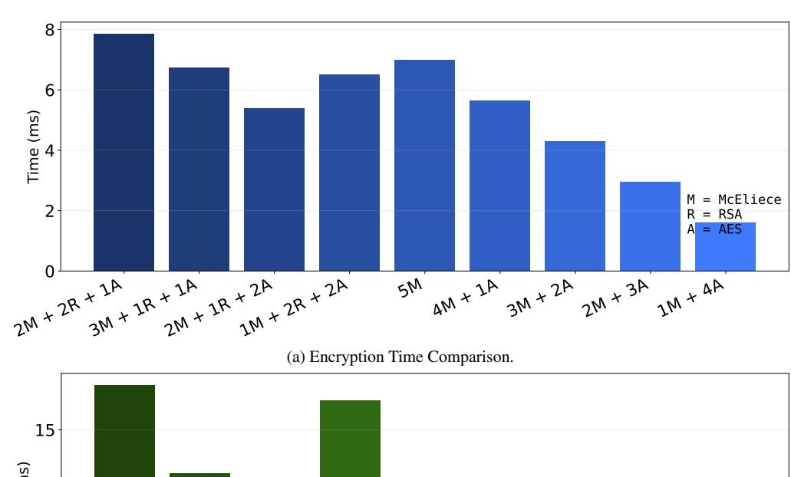
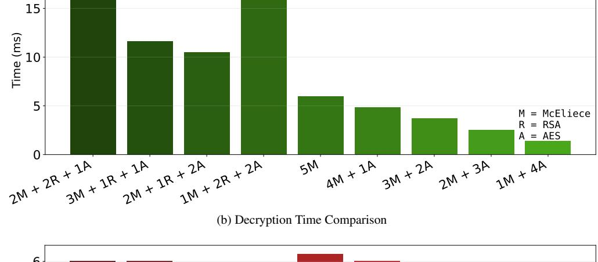
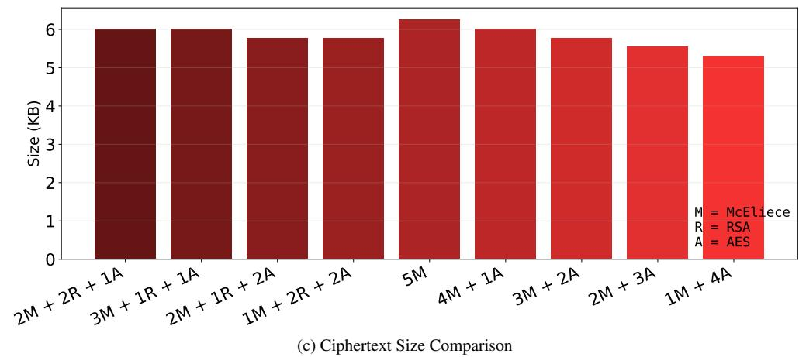

{0}------------------------------------------------

# Hybridization of Cryptographic Primitives: A Generalized Framework for Adaptive Security

*Abstract*—Hybrid cryptographic schemes combine multiple primitives to provide resilience against diverse threats, particularly in the post-quantum era where classical algorithms face potential quantum attacks. However, existing hybrid approaches rely on predefined, fixed pairings of specific cryptographic algorithms, limiting their adaptability to evolving security requirements and heterogeneous deployment environments. This paper presents a generalized framework for the hybridization of cryptographic primitives that enables dynamic, user-driven composition of encryption schemes and digital signatures. Our approach leverages all-or-nothing transformations (AONTs) to construct hybrid schemes where an adversary must break all constituent primitives simultaneously to compromise the system. We formally prove that if at least one component scheme remains secure (IND-CPA for encryption, EUF-CMA for signatures), the entire hybrid construction achieves security equivalent to its strongest component. Unlike conventional approaches that prescribe specific algorithm combinations, our framework allows flexible selection and integration of classical, post-quantum, or mixed cryptographic primitives based on specific security requirements, computational constraints, and threat models. Our generalized hybridization methodology naturally extends to key encapsulation mechanisms and other cryptographic primitives, providing a foundation for building future adaptive cryptographic systems that remain secure even as individual components are compromised over time. This addresses a critical gap in current cryptographic practices and will provide users a methodology to construct flexible, robust security architectures for the post-quantum era.

*Index Terms*—post-quantum cryptography, hybrid encryption, all-or-nothing transformation, formal security proofs.

## I. INTRODUCTION

Modern cryptographic systems safeguard almost every aspect of digital communication, from secure messaging to financial transactions and cloud computing. However, the rapid evolution of computing technology, particularly the emergence of quantum computation, threatens the hardness assumptions underlying many classical public-key primitives. Algorithms such as Shor's polynomial-time solutions for integer factorization and discrete logarithm problems [\[1\]](#page-7-0) endanger widely deployed constructions like RSA [\[2\]](#page-7-1) and classical Diffie-Hellman, while symmetric and other primitives remain subject to ongoing cryptanalytic advances. This creates a fundamental challenge: how can we design cryptographic systems that remain secure even as individual components are compromised over time?

To address this uncertainty, cryptographic hybridization has emerged as a pragmatic approach. In hybrid cryptography, multiple schemes, typically both classical and post-quantum, are applied simultaneously to achieve security. This strategy aims to combine the maturity and efficiency of classical cryptography with the quantum resistance of post-quantum constructions. Ideally, if at least one scheme in the hybrid remains secure, the overall system continues to provide confidentiality or authenticity guarantees. This "defense-in-depth" philosophy has gained increasing traction in practice, particularly during the ongoing transition to post-quantum cryptography following NIST's standardization efforts [\[3\]](#page-7-2).

Despite its broad practical deployment, hybrid cryptography remains constrained by fixed pairings of specific algorithms, such as RSA with AES [\[4\]](#page-7-3) or ML-KEM [\[5\]](#page-7-4) with ChaCha20 [\[6\]](#page-7-5), which prevents systems from adapting as threats evolve, primitives weaken, or security requirements differ across applications. This rigidity complicates transitions from legacy algorithms to post-quantum standards and limits the ability of administrators or data owners to configure cryptographic stacks that match their performance, compliance, or threat-model requirements. Compounding this issue, hybrid approaches have received relatively limited formal analysis: most existing work studies component primitives in isolation rather than modeling how they interact when combined. As a result, we still lack a clear understanding of the conditions under which a hybrid system is provably secure and how to ensure resilience against adaptive adversaries, especially when some components may be partially compromised.

This paper addresses these challenges by developing a generalized framework for cryptographic hybridization that is both formally rigorous and practically flexible, offering insights into how systems can remain secure even as individual components are compromised over time. Our main contributions are:

- We present a formal methodology for combining arbitrary cryptographic primitives (encryption schemes, digital signatures and KEMs) in a provably secure manner, implementing a generalised hybridisation framework.
- All-or-nothing transformations (AONTs) are used to create hybrid schemes where an adversary must simultaneously break all constituent primitives to compromise the system. This ensures that our hybrid construction inherits the security of its strongest component.
- We prove that our hybrid encryption scheme is semantically secure (IND-CPA) if at least one of its component encryption schemes remains IND-CPA. Similarly, we prove that our hybrid signature scheme is unforgeable (EUF-CMA) if at least one of the component signature schemes remains EUF-CMA secure. These results establish that the hybrid achieves security equivalent to its most secure component.

{1}------------------------------------------------

- Our framework enables users to construct customized security profiles by selecting primitives based on their specific requirements, enabling adaptive responses to emerging post-quantum threats without requiring system redesign.
- Furthermore, while we focus on encryption and signatures, our methodology extends to key encapsulation mechanisms, steganography, and other cryptographic primitives, providing a natural framework for hybrid cryptographic design.

# II. RELATED WORK

The concept of hybrid encryption was formally introduced by Cramer and Shoup [\[7\]](#page-8-0), who proposed the first practical public-key encryption scheme provably secure against adaptive chosen ciphertext attacks under standard intractability assumptions. Their work established the theoretical foundation for combining symmetric and asymmetric primitives in a provably secure manner. Bellare and Rogaway [\[8\]](#page-8-1) further formalized this approach through their seminal work on the "Encryptthen-MAC" paradigm, demonstrating how to construct secure hybrid encryption schemes from generic building blocks. The idea behind hybrid encryption is to merge several independent schemes, typically relying on different computational hardness assumptions, in order to produce a more resilient cryptographic construction [\[9\]](#page-8-2).

With the advent of quantum computing threats, researchers have developed post-quantum hybrid encryption schemes that combine classical and post-quantum primitives. The NIST post-quantum cryptography (PQC) standardization process [\[10\]](#page-8-3) has further accelerated progress in this field, leading to the integration of lattice-based, code-based, and hashbased schemes into hybrid designs. Studies by Bindel et al. [\[11\]](#page-8-4) and Campagna et al. [\[12\]](#page-8-5) investigate transitional security approaches that deploy classical and post-quantum keyencapsulation mechanisms simultaneously, ensuring protection against both present-day and future quantum-capable adversaries. Recent methods also integrate schemes grounded in different computational assumptions, a trend that has become especially prominent during the transition to PQC. This makes hybrid constructions an important research focus in the postquantum landscape, as demonstrated by comprehensive studies such as [\[13,](#page-8-6) [14,](#page-8-7) [15,](#page-8-8) [16\]](#page-8-9), which reflect the growing interest in hybrid PQC protocols, particularly for key-encapsulation mechanisms (KEMs) and digital signatures. Giacon et al. [\[14\]](#page-8-7) examined hybrid KEMs with classical security guarantees, while Bindel et al. [\[15\]](#page-8-8) extended these security models to address quantum-capable adversaries. Huguenin-Dumittan and Vaudenay [\[16\]](#page-8-9) broadened the Fujisaki–Okamoto transform to construct efficient post-quantum KEM combiners. A recent systematic review by Giron et al. [\[13\]](#page-8-6) further underscores the increasing emphasis on hybrid post-quantum key-exchange approaches.

Within the hybrid approach for public-key cryptography, one of the earliest developments is the work of Asmuth and Blakley, who proposed masking plaintexts by XOR-combining them with several independent ciphertexts [\[17\]](#page-8-10). Herzberg [\[18\]](#page-8-11) subsequently analyzed the security properties of several classical combiners, including XOR-input and sequential publickey constructions. These intuitive designs, however, fail under adaptively chosen-ciphertext (IND-CCA) attacks because they offer no mechanism for rejecting adversarially manipulated ciphertexts. To resolve this shortcoming, Zhang et al. [\[19\]](#page-8-12) and Dodis and Katz [\[20\]](#page-8-13) independently constructed asymmetric multiple-encryption schemes achieving full IND-CCA security. Hohenberger et al. [\[21\]](#page-8-14) later introduced the detectable-CCA (IND-dCCA) framework, providing a pathway to IND-CCA security from weaker components, under the assumption that each component remains individually sound. Most recently, Goncalves and Mashatan [\[22\]](#page-8-15) developed the first public-key multiple-encryption scheme proven secure in the quantum random oracle model (QROM), representing the only hybrid mechanism formally analyzed in both ROM and QROM models.

Various domain-specific hybrid encryption approaches have been proposed to address particular performance or security requirements. In the IoT domain, lightweight hybrid encryption protocols have been specifically designed to accommodate resource-constrained devices while maintaining security guarantees. Chang et al. [\[23\]](#page-8-16) presented a low-power hybrid AES-RSA encryption scheme addressing computational and energy efficiency challenges. Yang et al. [\[24\]](#page-8-17) developed a hybrid-encryption-based data sharing scheme with keywordbased auditing functionality using Ciphertext-Policy Attribute-Based Encryption (CP-ABE) for access control authorization. Additionally, specialized lightweight encryption algorithms combining quantum encryption, chaotic systems, and discrete wavelet transform have been developed for IoT devices [\[25\]](#page-8-18). Attribute-based hybrid encryption schemes also developed to combine the flexibility of attribute-based encryption with the efficiency of symmetric primitives for fine-grained access control in cloud and IoT environments [\[26,](#page-8-19) [27\]](#page-8-20). Some recent advances have explored hybrid homomorphic encryption schemes [\[28,](#page-8-21) [29\]](#page-8-22). Research on hybrid homomorphic encryption combining public-key encryption with somewhat homomorphic encryption has focused on reducing storage requirements for FHE applications [\[30\]](#page-8-23). Additionally, fault analysis studies [\[31\]](#page-8-24) have examined the security resilience of hybrid homomorphic encryption protocols under differential fault attacks, contributing to more robust implementations.

While existing hybrid cryptographic schemes have advanced the field through various algorithmic combinations and domain-specific optimizations, they share a fundamental limitation: reliance on predefined, fixed pairings of specific cryptographic algorithms. Current approaches prescribe particular algorithm combinations tailored to specific security requirements or post-quantum readiness, without providing a generalized framework for dynamic algorithm selection. This rigidity limits adaptability in heterogeneous environments where different security levels are required, and in transitional scenarios balancing legacy compatibility with emerging threats. Addressing this gap, our work proposes a generalized hybrid cryptographic framework that supports user

{2}------------------------------------------------

driven, dynamic composition of multiple encryption schemes, enabling security profiles optimized for diverse use cases while maintaining efficiency and resilience against evolving cryptographic threats.

#### III. PRELIMINARIES AND NOTATION

We abstractly denote cryptographic schemes like encryptions, digital signatures, and key encapsulation mechanisms as follows:

- Encryption schemes are triples (G, E, D), in which  $G(1^t)$ is a probabilistic algorithm taking a security parameter  $t \in \mathbb{N}$ , to output descriptions of algebraic structures on which encryptions and decryptions are done, and above all, public-, private or secret keys (whatever applies). The unary notation  $1^t$  is here adopted for consistency with the literature (technically to enforce polynomially bounded output values from a polynomial time-complexity) [32], but will not be relevant hereafter. The symbols E(m,k)and D(c, k') denote the encryption of a message m and decryption of a ciphertext c under the keys k, k' (with k = k' in the symmetric case), and we abbreviate this as E(m), D(c) if the keys are unambiguous from the context. Hereafter, we let E stand synonymously for the full triple (G, E, D) to signify that we speak about an encryption, and without ambiguity, since the triple is obviously implied in the context.
- Digital signature schemes are triples (G,S,V), in which G is (as before) a probabilistic algorithm to initialize the system, S(m,sk) is a function to create a signature s for the message m under the private key sk, and  $V:(m,s,pk)\mapsto \{\text{true, false}\}$  is the verification function, applied to a message (document) m, (authenticated) public key pk, and given signature s.
- A key encapsulation mechanism (KEM) is a triple (G, E, D), where G (as before) initializes the system and outputs a public key pk and private key sk, E(pk) is the encapsulation function that outputs an encapsulation c and a key k embodied therein, and D(c, k') is the decapsulation function, extracting the secret k using the private key sk.

Since KEMs are straightforwardly constructible from a public key encryption (by choosing a random session key k and public-key encrypting it for the receiver), we shall hereafter confine ourselves to hybridization of public-key encryptions, leaving results thereabout as implied also for KEMs, respectively.

#### IV. PROBLEM FORMULATION

The central idea is to combine various cryptographic techniques to ensure security, even if advancements in science weaken or compromise some of those techniques over time. By creating systems that do not rely on the difficulty of a single computational problem, we aim to enhance overall confidence in the long-term resilience of cryptography. The objective is to establish a clear and comprehensive framework for categorizing different types of cryptographic schemes, as well as for understanding how their potential vulnerabilities

change as new cryptographic research develops. We introduce the notation used throughout the paper in Table I.

Table I: List of Symbols and Notations

| Symbol                                  | Description                                                  |
|-----------------------------------------|--------------------------------------------------------------|
| $\overline{m=(m_1,\ldots,m_n)}$         | Original message divided into $n$ blocks over $\mathbb{F}_q$ |
| $M \in \mathbb{F}_q^{n \times n}$       | Invertible matrix for all-or-nothing transformation          |
| $d = (d_1, \ldots, d_n)$                | Transformed message vector                                   |
| $\mathcal{C} = \{C_1, \dots, C_{n_1}\}$ | Set of cryptographic schemes for some $n_1 \in \mathbb{N}$   |
| $P_i$                                   | A known cryptanalytic attack strategy                        |
| $S_i$                                   | An Encryption scheme                                         |
| $ST_i$                                  | A Digital signatures scheme                                  |
| $C_i$                                   | A general cryptographic scheme                               |
| t                                       | Security parameter                                           |

The essence of hybridization is to increase trust in a cryptographic system, in light of scientific progress that may sooner or later invalidate the security guarantees of certain algorithms or protocols. To assess the security of a hybrid cryptographic system, as we mentioned earlier, we can consider a set of scientific papers  $P_1, P_2, \ldots$ , each describing a cryptanalytic attack (e.g., Shor's algorithm [1]), and a set of cryptographic algorithms  $\mathcal{C} = \{C_1, C_2, \ldots, C_n\}$ , encompassing encryption, signatures, KEMs, or steganography. Standardization efforts like the NIST competitions and others provide such lists directly. The challenge is to select a combination of algorithms that ensures security against all known attacks.

For example, if  $C_1$  is RSA encryption (based on factorization),  $C_2$  is ElGamal encryption (based on discrete logarithms), and  $C_3$  is AES (symmetric cipher), we may consider Shor's famous paper [1] as  $P_1$  and, say, Bogdanov's biclique attack on AES [33] (effectively reducing the search space from  $2^{128}$  to  $2^{126.1}$ , thus not fully breaking AES, but weakening it).

#### V. DETERMINISTIC HYBRIDIZATION APPROACH

suppose that Alice has no "overall best" cryptographic scheme at hand that resists all known (or anticipated) attacks in the literature. Then, without betting all on one card (i.e., algorithm), Alice must use all schemes available to her, to defend against all known attacks.

So, we can define hybridized encryptions and digital signatures as follows:

**Definition 1** (Hybridized encryption). Let  $\mathbb{F}$  be a finite field, and let the message be an element  $\mathbf{m} \in \mathbb{F}^n$  for some integer  $n \geq 1$ . Furthermore, let  $S_1, \ldots, S_n$  with  $S_i = (G_i, E_i, D_i)$  be encryption schemes that can process plaintexts from the field  $\mathbb{F}$  (possibly under a suitable encoding from or into  $\mathbb{F}$ ). Furthermore, let  $\mathbf{M} \in \mathbb{F}^{n \times n}$  be a fixed and publicly known invertible matrix with all nonzero entries ( $\mathbf{M}$  is part of the system parameters). Define the hybridized encryption scheme as follows:

- Key generation  $G(1^t)$ : for all i = 1, 2, ..., n, run the initialization algorithm  $G_i(1^t)$ , and collect all public keys in a vector  $\mathbf{pk} = (pk_1, ..., pk_n)$ , private keys in a vector  $\mathbf{sk} = (sk_1, ..., sk_n)$  or secret keys in a vector  $\mathbf{k} = (k_1, ..., k_n)$ .
- Encryption  $E(\mathbf{m})$ : given a vector of public keys  $\mathbf{pk}$  or secret keys  $\mathbf{k}$ , and a message  $\mathbf{m} \in \mathbb{F}^n$ , compute  $\mathbf{d} =$

{3}------------------------------------------------

 $\mathbf{M} \cdot \mathbf{m} = (d_1, \dots, d_n)$ , and output the ciphertext vector  $\mathbf{c} = (E(d_i))_{i=1}^n$ , with each component encrypted under a distinct scheme.

• **Decryption**  $D(\mathbf{c})$ : Given the private key vector  $\mathbf{sk} = (sk_1, \ldots, sk_n)$  and a ciphertext vector  $\mathbf{c} = (c_1, \ldots, c_n)$ , compute  $d_i \leftarrow D_i(sk_i, c_i)$  for each  $i = 1, \ldots, n$ , and set  $\mathbf{d} = (d_1, \ldots, d_n)^{\top}$ . Recover the message by computing  $\mathbf{m} = \mathbf{M}^{-1}\mathbf{d}$ , and output  $\mathbf{m}$ .

**Definition 2** (Hybridized Signature). Let  $ST_i = (G_i, \operatorname{Sign}_i, \operatorname{Verify}_i)$  for  $i = 1, \ldots, n$  be n signature schemes, and let H be a hash function mapping messages to the common signing input domain. The hybridized signature scheme is defined as follows:

- **Key generation**  $G(1^t)$ : Run  $G_i(1^t)$  for each i to obtain  $(pk_i, sk_i)$ . Publish the public-key vector  $\mathbf{pk} = (pk_1, \ldots, pk_n)$  and keep the private-key vector  $\mathbf{sk} = (sk_1, \ldots, sk_n)$ .
- Signing Sign(sk, m): Compute  $h \leftarrow H(\mathbf{m})$ . For each i compute the component signature  $\sigma_i \leftarrow \text{Sign}_i(sk_i, h)$ . Output the signature vector  $\sigma = (\sigma_1, \dots, \sigma_n)$ .
- *Verification* Verify( $\mathbf{pk}, \mathbf{m}, \sigma$ ): Compute  $h \leftarrow H(\mathbf{m})$ . Accept if and only if

$$\bigwedge_{i=1}^{n} \mathsf{Verify}_{i}(pk_{i}, h, \sigma_{i}) = true, \tag{1}$$

i.e. every component signature verifies successfully. Otherwise reject.

### VI. SECURITY ANALYSIS

This section provides the formal analysis of the deterministic hybridization framework introduced earlier. Our goal is to establish that the proposed hybrid encryption and signature constructions preserve standard cryptographic security properties even if some of their constituent schemes become insecure.

## A. Cryptographic Security of Hybridized Encryption

We separately discuss the security of encryption and digital signatures, stressing however, that the underlying argument is strikingly similar:

- Let a set of cryptographic mechanisms be given.
- Apply them all in a way that requires the adversary to break them all simultaneously for a successful attack.
- If this is accomplished, the strongest scheme among the ones used will determine the overall security of the hybridized scheme.

D. Stinson [34] gave a useful characterization of AONTs as follows: let  $\mathbb{F}_q$  be a finite field of order q (prime power).

**Definition 3.** Let  $n \geq 2$  be an integer. A function  $T : \mathbb{F}_q^n \to \mathbb{F}_q^n$  is an all-or-nothing transform (AONT), if and only if the following two properties are satisfied:

- a) T is a bijection
- b) if any n-1 of the s output values  $y_1, \ldots, y_n$  are fixed, then the value of any one input value  $x_i$  (with  $1 \le i \le n$ ) is completely undetermined.

Assuming at least one of the encryption systems  $E_i \in \{E_1, \ldots, E_n\}$  to remain unbroken, i.e., IND-CPA secure, we can easily show semantic security of the hybridized scheme. In what follows, we let  $t \in \mathbb{N}$  be a security parameter that governs the size of the finite field  $\mathbb{F}_t$  from which we draw the blocks of the message  $\mathbf{m} \in \mathbb{F}_t^n$ . The number n is herein fixed and depends on how many cryptographic systems we have available. Semantic security of our hybridized encryption is defined in the usual sense as for any (single) encryption:

**Definition 4** (Semantic Security). An encryption scheme (G, E, D) is semantically secure, if for every probabilistic polynomial time algorithm A, there exists a probabilistic polynomial time algorithm A' such that for every  $(X_t)_{t \in \mathbb{N}}$ , any polynomially bounded functions  $f, h : \{0, 1\}^* \to \{0, 1\}^*$  and every positive polynomial p,

$$\Pr\left[A(1^{t}, G(1^{t}), E(X_{t}, G(1^{t})), 1^{|X_{t}|}, h(1^{t}, X_{t})) = f(1^{t}, X_{t})\right] < \Pr\left[A'(1^{t}, 1^{|X_{t}|}, h(1^{t}, X_{t})) = f(1^{t}, X_{t})\right] + \frac{1}{p(t)}$$
(2)

The probabilities are taken over the internal coin tosses of G and E.

Throughout the following, let us omit the keys length parameters  $1^t$ , publicly known (or self-producible by oracle access) keys  $G_i(1^t)$  and  $1^t, 1^{|X_t|}$  from all formulas to ease the notation. Instantiating condition (2) for our hybridized scheme then comes to

$$\Pr\left[A(E(\mathbf{m}), h(\mathbf{m})) = f(\mathbf{m})\right] < \Pr\left[A'(h(\mathbf{m})) = f(\mathbf{m})\right] + \frac{1}{p(t)}$$
(3)

It is well known [32] that Definition 4 is equivalent to IND-CPA security, which we will use in the following.

**Theorem 1.** If at least one encryption scheme  $S_i \in \{S_1, \ldots, S_n\}$  is IND-CPA secure, then the hybridized scheme from Definition 1 is semantically secure in the sense of Definition 4, resp. condition (3).

*Proof.* Let f,h be as in Definition 4 and arbitrary. Let  $S_i = (G_i, E_i, D_i)$  be the unbroken scheme that is still IND-CPA secure. We single out the i-th part of the hybridized ciphertext by writing  $\mathbf{d}_{-i} = (d_1, \dots, d_{i-1}, d_{i+1}, \dots, d_n)$  and  $E_{-i}(\mathbf{d}_{-i}) = (E_j(d_j))_{j \neq i}$ .

Define  $A'(h(\mathbf{m})) := A((E_j(0))_{j=1}^n, h(\mathbf{m}))$ , i.e., A' applies A to an encryption of the constant value zero in place of all encryptions  $E_j(d_j)$  (including the unbroken  $E_i$ ).

By the indistinguishability of encryptions by  $E_i$ , for every two messages, in particular for  $d_i$  and "0", we have

$$\Pr[A(E_{-i}(\mathbf{d}_{-i}), E_i(d_i), h(\mathbf{m})) = f(\mathbf{m})]$$

$$\leq \Pr[A(E_{-i}(\mathbf{d}_{-i}), E_i(0), h(\mathbf{m})) = f(\mathbf{m})] + \varepsilon, \quad (4)$$

where  $\varepsilon$  is negligible, for otherwise, we could define a distinguisher for  $E_i$  as

$$D(C) = 1 \iff A(E_{-i}(\mathbf{d}_{-i}), C, h(\mathbf{m})) = f(\mathbf{m})$$

{4}------------------------------------------------

to contradict  $E_i$ ' indistinguishability of ciphertexts.

Now, consider the effect of the all-or-nothing transformation: the inputs to A in (4) create exactly the situation as in Definition 3, leaving the inputs  $E_{-i}(\mathbf{d}_{-i})$  as insufficient to determine anything about any other  $d_j$  (for all  $1 \leq j \leq n$ ), no matter what values they have. Thus, we can set them to all zero without changing what A can compute, leading to continuation of (4) as

$$\Pr[A(E_{-i}(\mathbf{d}_{-i}), E_{i}(0), h(\mathbf{m})) = f(\mathbf{m})] + \varepsilon$$

$$= \Pr[A(E_{1}(0), \dots, E_{i-1}(0), E_{i}(0), E_{i+1}(0), \dots, E_{n}(0), h(\mathbf{m}))] + \varepsilon$$

$$= \Pr[A'(h(\mathbf{m}))] + \varepsilon,$$
(5)

by letting  $d_i$  be random according to the plaintext distribution. Until here, all probabilities have been taken over the distributions of the  $(d_i)_{i=1}^n$ , so letting a concrete plaintext (sample)  $d_i$  be given, and averaging over all possible  $\mathbf{d} = (d_1, \ldots, d_n)$  yields the above probabilities. Combining (4) with (5) shows the semantic security of the hybridized scheme against passive attackers.

It is worth noting that the construction does not provide security against active attacks, especially it is not IND-CPA secure: without loss of generality, let  $E_1$  be the "weak" scheme whose ciphertexts are distinguishable for a (specially skilled) attacker if we encrypt messages  $x_0^*, x_1^*$  under  $E_1$ . To chosen-plaintext-attack the hybridized scheme, the attacker can submit the messages  $\mathbf{y}_0^* := (m_{11}^{-1} x_0^*, 0, \ldots, 0)$  and  $\mathbf{y}_1^* := (m_{11}^{-1} x_1^*, 0, \ldots, 0)$ , with  $m_{11}$  taken from the matrix  $\mathbf{M} = (m_{ij})$ , and the inverse guaranteed to exist since  $\mathbf{M}$  has all nonzero entries. The encryption under the hybridized scheme will then deliver  $E(\mathbf{M}\mathbf{y}_0^*) = (E_1(x_0^*), \ldots)$  and  $E(\mathbf{M}\mathbf{y}_1^*) = (E_1(x_1^*), \ldots)$ , which are by assumption distinguishable by the first component. Hence, the construction is insecure against active attacks.

However, given that the "store-now-decrypt-later" risk is by definition a passive attack, i.e., a cryptanalysis of previously stored ciphertexts, it is fair to assume that there will be no direct interaction with the (past) creator of the ciphertext under attack, and hence semantic security (as Theorem 1) claims will be enough to retain security in this scenario, as long as at least one of the encryptions remain unbroken by the time of the cryptanalysis.

#### B. Cryptographic Security of Hybridized Signature

Assuming at least one of the signature schemes  $ST_i \in \{ST_1, \ldots, ST_n\}$  to remain unforgeable (e.g., existentially unforgeable under chosen-message attacks (EUF-CMA)), we can show the unforgeability of the hybridized signature scheme. As before, let  $t \in \mathbb{N}$  denote the security parameter. The number n is fixed and depends on how many signature scheme we have available. Security of our hybridized signature is defined in the usual sense (Definition 5).

Let  $HST = (G, \operatorname{Sign}, \operatorname{Verify})$  be a hybrid signature scheme as in Definition 2 and let A be a probabilistic polynomial-time adversary. The existential forgery under chosen-message

 $\mathit{attack}$  (EUF-CMA) experiment  $\mathsf{Exp}^{\mathsf{EUF-CMA}}_{HST}(A)$  is defined as follows:

- 1) The challenger runs  $(pk, sk) \leftarrow G(1^t)$  and gives pk to A.
- 2) A is given oracle access to  $Sign(sk, \cdot)$ .
- 3) Eventually A outputs a pair  $(m^*, \sigma^*)$ .
- 4) The experiment outputs 1 (meaning A wins) if and only if  $\operatorname{Verify}(pk, m^*, \sigma^*) = 1$  and  $m^*$  was not queried to the signing oracle.

The forgery advantage of A against HST is defined as

$$Adv_A^{HST}(t) = \Pr\left[\mathsf{Exp}_{HST}^{\mathsf{EUF-CMA}}(A) = 1\right].$$
 (6)

**Definition 5** (EUF-CMA). A hybrid signature scheme HST is called EUF-CMA if for every probabilistic polynomial-time (PPT) adversary A, the function  $Adv_A^{HST}(t)$  is negligible in the security parameter t.

**Theorem 2.** If at least one  $ST_i \in \{ST_1, ..., ST_n\}$  is EUF-CMA secure, then the hybridized signature scheme HST from Definition 2 is likewise EUF-CMA secure in the sense of Definition 5.

*Proof.* Let A be a PPT adversary trying to forge a hybridized signature on message  $\mathbf{m}$ . To succeed, A must produce a tuple  $(\mathbf{m}, \sigma)$  such that

$$Verify_i(pk_i, H(\mathbf{m}), \sigma_i) = 1 \quad \text{for all } i = 1, \dots, n.$$
 (7)

In particular, A must produce a valid forgery for each component scheme. Fix an index i such that  $ST_i$  is unforgeable. We build an adversary B against  $ST_i$  by interacting with A as follows:

- B receives the public key  $pk_i$  from the challenger and generates the remaining key pairs  $\{(pk_j, sk_j)\}_{j\neq i}$  honestly.
- When A makes a signing query on a message  $\mathbf{m}$ , B forwards  $H(\mathbf{m})$  to its signing oracle to obtain  $\sigma_i$  for scheme  $ST_i$ . For all  $j \neq i$ , B signs locally with  $sk_j$  to obtain  $\sigma_j$ . It returns  $\sigma = (\sigma_1, \ldots, \sigma_n)$  to A.
- Eventually A outputs a forgery  $(\mathbf{m}, \sigma^*)$ . If this is a valid hybridized signature, then in particular  $(H(\mathbf{m}), \sigma_i^*)$  is a valid forgery against  $ST_i$ , on a message not previously signed by the oracle. B outputs this as its forgery.

Thus, whenever A forges a hybrid signature of HST, B forges  $ST_i$ . Therefore

$$Adv_A^{HST}(t) \leq Adv_B^{ST_i}(t), \tag{8}$$

which is negligible by the assumed unforgeability of  $ST_i$ . Hence the hybridized signature scheme is unforgeably secure.  $\Box$ 

It is important to note that the security of the hybridized schemes, whether encryption or signature, depends only on *all* algorithms to be used at least once, but there is no condition on their mix to be "balanced" or uniform. We can use this observation to improve performance, whenever the "strongest" (according to beliefs) scheme in the hybridization is also the most expensive (in terms of key size, computational overhead,

{5}------------------------------------------------

output size, or similar). In the experimental evaluation of Section [VII-A,](#page-5-0) we thus considered different mixes of algortihms, based on their individual costs.

## VII. PERFORMANCE ANALYSIS

While our proposed framework is general and algorithmagnostic, supporting arbitrary combinations of cryptographic schemes without prescribing specific primitives, a concrete instantiation is necessary to empirically validate the theoretical complexity analysis and demonstrate practical feasibility. Therefore, we present experimental results for one representative instantiation of the framework. It is important to emphasize that these results illustrate the framework's behavior for a particular choice of algorithms and do not limit the generality of our approach. We begin by describing the experimental setup and implementation details, followed by quantitative analysis of encryption/decryption time, communication overhead, and comparative evaluation against existing approaches.

## *A. Experimental Setup*

To evaluate the practical performance of our generalized hybridization framework, we instantiated it with three representative cryptographic schemes spanning different security paradigms:

- McEliece [\[35\]](#page-9-1): A code-based post-quantum cryptosystem that leverages error-correcting codes to provide quantumresistant security. McEliece is one of the oldest and most scrutinized post-quantum schemes, offering strong security guarantees based on the hardness of decoding random linear codes.
- RSA-2048 [\[2\]](#page-7-1): A classical public-key cryptosystem based on integer factorization, representing mature, wellunderstood cryptography with decades of cryptanalytic scrutiny.
- AES-256-GCM [\[4\]](#page-7-3): A symmetric authenticated encryption scheme offering lightweight, high-speed encryption with built-in message authentication.

This selection is deliberate: McEliece represents postquantum cryptography (code-based), RSA represents classical public-key cryptography (number-theoretic), and AES represents efficient symmetric cryptography. By combining these three diverse primitives, we demonstrate hybridization across fundamentally different security foundations, one quantumresistant based on coding theory, one vulnerable to quantum attacks but classically secure based on factorization, and one lightweight symmetric scheme. This diversity illustrates the framework's flexibility in accommodating heterogeneous security requirements and different computational hardness assumptions.

We evaluated nine different hybrid configurations, denoted as xM + yR + zA, where x, y, and z represent the number of McEliece, RSA, and AES instances, respectively. For each configuration, we measured encryption time, decryption time, and ciphertext size on fixed 1 KB plaintext messages. Each configuration was tested over 100 random message instances to ensure statistical reliability, and all reported metrics represent the average across these 100 instances. Measurements include the complete hybrid encryption/decryption process, including AONT transformation, component encryptions/decryptions, and matrix operations.

All experiments were conducted on a Mac M1 platform equipped with an Apple M1 chip and 16 GB RAM, running macOS 15.5. The framework was implemented in Python using the cryptography library[1](#page-5-1) for AES-GCM and RSA primitives, and the pqcrypto library[2](#page-5-2) for McEliece implementation. The AONT transformation was implemented using invertible matrices over F2 256 with optimized matrix multiplication via NumPy.

# *B. Experimental Results*

Our experimental evaluation focuses on a fixed configuration with n = 5 component schemes per message. This design choice allows us to assess how different combinations of the three available cryptographic primitives (McEliece, RSA, AES) impact performance while maintaining a constant number of components. By varying the mixture of algorithms within this fixed framework, we can observe the performance implications of different security-performance trade-offs without conflating the effects of changing both the number and type of schemes simultaneously.

Figure [1a](#page-6-0) presents the encryption time comparison across the nine configurations, all using n = 5 component schemes. The results reveal significant performance variation based on algorithm composition. The most striking observation is the dramatic performance improvement achieved by maximizing AES component usage in pure McEliece+AES configurations. The progression from 5M (7.0 ms) through 4M + 1A (5.7 ms), 3M + 2A (4.3 ms), 2M + 3A (3.0 ms), to the optimal 1M + 4A (1.5 ms) demonstrates a clear linear relationship: each McEliece-to-AES substitution reduces encryption time by approximately 1.4 ms. The optimal configuration 1M + 4A achieves encryption in just 1.5 ms, representing a 80.8% reduction compared to the slowest RSA-heavy configuration and a 78.6% reduction compared to the pure McEliece scheme. This demonstrates that even with a single quantum-resistant component (McEliece), the framework can deliver near-optimal encryption performance by leveraging lightweight encryption scheme for the remaining components. The clear visual progression underscores the framework's ability to balance security requirements with computational efficiency.

Figure [1b](#page-6-0) shows decryption time measurements for all nine configurations with n = 5 schemes. The decryption results amplify the patterns observed in encryption, with even more pronounced differences between configurations due to the asymmetric computational cost of public-key decryption operations. The 2M + 2R + 1A configuration exhibits the longest decryption time at approximately 18.5 ms. Similarly, 1M +2R+2A requires 17.5 ms, confirming that RSA decryption dominates the performance profile even when paired with

1<https://cryptography.io/>

2<https://github.com/PQClean/PQClean>

{6}------------------------------------------------

faster schemes. The configuration 3M + 1R + 1A achieves 11.5 ms, demonstrating that a single RSA component can still impose substantial overhead, though less severe than multiple RSA instances. The McEliece+AES configurations exhibit an even more dramatic performance progression than observed in encryption. From 5M (6.0 ms) through 4M + 1A(4.9 ms), 3M + 2A (3.7 ms), 2M + 3A (2.5 ms), to theoptimal 1M+4A (1.2 ms), each McEliece-to-AES substitution reduces decryption time by approximately 1.2 ms. The optimal configuration 1M + 4A achieves decryption in merely 1.2 ms, representing a 93.5% reduction compared to the slowest RSAheavy configuration and an 80.0% reduction compared to pure McEliece. This dramatic improvement underscores a critical finding: by maintaining just one quantum-resistant component (McEliece) and using AES for the remaining four components, the framework achieves near-optimal decryption performance while preserving full post-quantum security guarantees.

Figure 1c presents ciphertext size measurements for the nine configurations. Since all use n=5 schemes, the total ciphertext size is determined by the sum of individual component ciphertext sizes. The ciphertext size results reveal modest variation across configurations, ranging from approximately 5.3 KB to 6.25 KB for the original 1 KB plaintext message. The pure McEliece configuration (5M) produces the largest ciphertexts at approximately 6.25 KB, reflecting McEliece's inherent ciphertext expansion due to the error vector added during encryption. This represents a 6.25× expansion factor, which is reasonable for post-quantum cryptography given the security guarantees provided. The RSA-heavy configurations produce comparable ciphertext sizes, with 2M + 2R + 1Aand 3M + 1R + 1A both generating approximately 6.0–6.05 KB ciphertexts. This similarity arises because RSA-2048 and McEliece have comparable per-component ciphertext overheads, RSA produces 256-byte ciphertexts for block encryption, while McEliece produces ciphertexts of similar magnitude depending on the parameter set. The McEliece+AES configurations demonstrate a clear trend of decreasing ciphertext size as AES content increases: 4M + 1A (6.05 KB), 3M + 2A(5.8 KB), 2M + 3A (5.55 KB), and the optimal 1M + 4A(5.3 KB). The optimal configuration produces the smallest ciphertexts, achieving a 15.2% size reduction compared to the pure McEliece scheme and a 12.4% reduction compared to the largest RSA-heavy configuration. This reduction is directly attributable to AES-256-GCM's minimal ciphertext overhead, only 16 bytes for the authentication tag plus the encrypted data itself, far smaller than the expansion introduced by public-key schemes. This demonstrates that the framework's flexibility extends beyond computation to communication efficiency, allowing users to balance security requirements with bandwidth constraints based on their specific deployment scenarios.

A fundamental insight from these experimental results concerns the relationship between security level and performance in hybrid schemes. According to Theorem 1, the overall security of a hybridized scheme is determined by the strongest component, not the number of strong components. Specifically, if at least one component employs a quantum-resistant scheme

Figure 1: Performance metrics of hybridized encryption with a message of n=5 components across different scheme combinations.

(e.g., McEliece), the entire hybrid scheme inherits quantum-resistant security properties, as an adversary must successfully break the quantum-resistant component to compromise the system. This demonstrates that security maximization does not require performance sacrifice.

#### C. Comparison with Existing Approaches

Our experimental results demonstrate that the proposed framework achieves practical performance while providing unprecedented flexibility compared to existing hybrid cryptographic schemes. Table II summarizes the comparison across key dimensions.

Existing approaches to hybrid cryptography fall into two categories: *protocol-specific solutions* and *theoretical constructions*. Protocol-specific solutions like TLS 1.3 Hybrid Key Exchange and Google's CECPQ2 offer fixed algorithm pairings (e.g., X25519+Kyber768) with informal security guarantees and no user control over algorithm selection. While practical and deployable, these approaches lack generality and cannot adapt to evolving threat models, new cryptographic primitives, or varying user requirements. Organizations must accept the predetermined algorithm combination regardless of

{7}------------------------------------------------

Table II: Comparative analysis of hybrid cryptographic frameworks. Our framework uniquely provides arbitrary algorithm flexibility with provable security guarantees while enabling user-controlled performance optimization.

| Approach                | Algorithm Flexibility | Security Guarantee  | User Control | Extensibility     |
|-------------------------|-----------------------|---------------------|--------------|-------------------|
| TLS 1.3 Hybrid KE [36]  | Fixed pairs           | Informal            | None         | Protocol-specific |
| Google CECPQ2 [37]      | X25519+Kyber768       | Informal            | None         | Limited           |
| Dodis-Katz [20]         | Fixed construction    | Proven              | None         | Encryption only   |
| Giacon et al. [14]      | KEM combiners         | Proven              | Limited      | KEMs only         |
| Goncalves-Mashatan [22] | Fixed PKE             | QROM security       | None         | PKE only          |
| Our Framework           | Arbitrary             | Proven (Thms 1 & 2) | Full         | General           |

whether it matches their specific security needs, computational constraints, or risk tolerance.

Theoretical constructions provide stronger foundations but with significant limitations. Dodis-Katz [\[20\]](#page-8-13) presents a provably secure hybrid encryption construction achieving proven security, but restricts users to a fixed combiner structure for public-key encryption only. Giacon et al. [\[14\]](#page-8-7) develop KEM combiners with formal proven security, offering some flexibility in KEM selection but limiting scope to key encapsulation mechanisms rather than general encryption. Goncalves-Mashatan [\[22\]](#page-8-15) provide tight security reductions in the quantum random oracle model (QROM) for specific PKE hybridization, but again constrain users to predetermined constructions without extensibility to other primitive types.

Our framework uniquely combines arbitrary algorithm flexibility, provable security guarantees (Theorems [1](#page-3-5) and [2\)](#page-4-2), full user control over the number and type of component algorithms, and general extensibility across all cryptographic primitive types (symmetric, asymmetric, post-quantum). The experimental results validate that this generality does not compromise performance. This demonstrates that theoretical generality and practical efficiency can coexist in hybrid cryptography, refuting the common assumption that flexibility requires performance sacrifice.

Moreover, our framework's algorithm-agnostic design ensures future-proofing against cryptographic evolution. As new post-quantum schemes emerge (e.g., upcoming NIST standards beyond the initial selections), existing algorithms suffer cryptanalytic breaks, or computational capabilities evolve, users can seamlessly integrate replacements without protocol redesign. The performance results show that this flexibility enables fine-grained optimization impossible with fixed schemes: users can select configurations that precisely match their security requirements (quantum resistance, classical security, defense-in-depth), computational budgets (millisecond-level latency requirements, throughput constraints), communication bandwidth (mobile networks, satellite links, IoT), and threat models (nation-state adversaries, commercial attackers, longterm confidentiality). This only comes to a (linear) optimization of the mix, only constrained to not exclude any of the algorithms on the list (of currently believed reliable) methods.

# VIII. CONCLUSION

In summary, this paper presents a generalized novel framework for the hybridization of cryptographic primitives that enables dynamic, user-driven composition of encryption schemes and digital signatures. Our approach uses all-or-nothing transformations (AONTs) to construct hybrid schemes where an adversary must break all constituent primitives simultaneously to compromise the scheme. We formally prove that if at least one individual scheme remains secure (IND-CPA for encryption, EUF-CMA for signatures), then the entire hybrid construction achieves security equivalent to its most secure component. Unlike conventional approaches that prescribe specific algorithm combinations, our framework allows flexible selection and integration of both classical and postquantum cryptographic primitives based on specific security requirements, computational constraints and specific threat models. The experimental evaluation demonstrates practical viability, confirming that the AONT transformation overhead remains negligible while providing good flexibility. This work addresses a critical gap in cryptographic practice by enabling users to build flexible security architectures tailored to their requirements in a fast-changing environment.

#### *Acknowledgment*

We thank the anonymous reviewer for having provided valuable insights to earlier version of the manuscripts, especially around the IND-CPA (in-)security of the construction.

## REFERENCES

- [1] P. W. Shor, "Polynomial-Time Algorithms for Prime Factorization and Discrete Logarithms on a Quantum Computer," *SIAM Journal on Computing*, vol. 26, no. 5, pp. 1484–1509, 1996.
- [2] R. L. Rivest, A. Shamir, and L. Adleman, "A method for obtaining digital signatures and public-key cryptosystems," *Communications of the ACM*, vol. 21, no. 2, pp. 120–126, 1978.
- [3] G. Alagic, M. Bros, P. Ciadoux, D. Cooper, Q. Dang, T. Dang, J. Kelsey, J. Lichtinger, Y.-K. Liu, and C. Miller, "Status report on the fourth round of the nist postquantum cryptography standardization process," 2025.
- [4] J. Daemen and V. Rijmen, "Reijndael: The advanced encryption standard." *Dr. Dobb's Journal: Software Tools for the Professional Programmer*, vol. 26, no. 3, pp. 137– 139, 2001.
- [5] A. Jokiniemi, "Nist's module-lattice-based keyencapsulation mechanism and its security," 2025.
- [6] A. Sobon and S. Stachowiak, "Chacha20 cipher crypt- ´ analysis through sat problem solving," in *2024 IEEE 17th International Scientific Conference on Informatics (Informatics)*. IEEE, 2024, pp. 355–361.

{8}------------------------------------------------

- [7] R. Cramer and V. Shoup, "A practical public key cryptosystem provably secure against adaptive chosen ciphertext attack," in *Annual international cryptology conference*. Springer, 1998, pp. 13–25.
- [8] M. Bellare and P. Rogaway, "Encode-then-encipher encryption: How to exploit nonces or redundancy in plaintexts for efficient cryptography," in *International Conference on the Theory and Application of Cryptology and Information Security*. Springer, 2000, pp. 317–330.
- [9] T. Soroceanu, N. Buchmann, and M. Margraf, "On multiple encryption for public-key cryptography," *Cryptography*, vol. 7, no. 4, p. 49, 2023.
- [10] National Institute of Standards and Technology, "Postquantum cryptography: NIST's plan for the future," National Institute of Standards and Technology, Project, 2016. [Online]. Available: [https://csrc.nist.gov/projects/](https://csrc.nist.gov/projects/post-quantum-cryptography) [post-quantum-cryptography](https://csrc.nist.gov/projects/post-quantum-cryptography)
- [11] N. Bindel, U. Herath, M. McKague, and D. Stebila, "Transitioning to a quantum-resistant public key infrastructure," in *International Workshop on Post-Quantum Cryptography*. Springer, 2017, pp. 384–405.
- [12] M. Campagna, L. Chen, O. Dagdelen, J. Ding, J. Fernick, N. Gisin, D. Hayford, T. Jennewein, N. Lutken- ¨ haus, M. Mosca *et al.*, "Quantum safe cryptography and security: An introduction, benefits, enablers and challenges," *European Telecommunications Standards Institute*, vol. 8, pp. 1–64, 2015.
- [13] A. A. Giron, R. Custodio, and F. Rodr ´ ´ıguez-Henr´ıquez, "Post-quantum hybrid key exchange: a systematic mapping study," *Journal of Cryptographic Engineering*, vol. 13, no. 1, pp. 71–88, 2023.
- [14] F. Giacon, F. Heuer, and B. Poettering, "Kem combiners," in *IACR International Workshop on Public Key Cryptography*. Springer, 2018, pp. 190–218.
- [15] N. Bindel, J. Brendel, M. Fischlin, B. Goncalves, and D. Stebila, "Hybrid key encapsulation mechanisms and authenticated key exchange," in *International Conference on Post-Quantum Cryptography*. Springer, 2019, pp. 206–226.
- [16] L. Huguenin-Dumittan and S. Vaudenay, "Fo-like combiners and hybrid post-quantum cryptography," in *International Conference on Cryptology and Network Security*. Springer, 2021, pp. 225–244.
- [17] C. A. Asmuth and G. R. Blakley, "An efficient algorithm for constructing a cryptosystem which is harder to break than two other cryptosystems," *Computers & Mathematics with Applications*, vol. 7, no. 6, pp. 447–450, 1981.
- [18] A. Herzberg, "Folklore, practice and theory of robust combiners," *Journal of Computer Security*, vol. 17, no. 2, pp. 159–189, 2009.
- [19] R. Zhang, G. Hanaoka, J. Shikata, and H. Imai, "On the security of multiple encryption or cca-security+ ccasecurity= cca-security?" in *International Workshop on Public Key Cryptography*. Springer, 2004, pp. 360–374.
- [20] Y. Dodis and J. Katz, "Chosen-ciphertext security of multiple encryption," in *Theory of Cryptography Conference*.

- Springer, 2005, pp. 188–209.
- [21] S. Hohenberger, A. Lewko, and B. Waters, "Detecting dangerous queries: A new approach for chosen ciphertext security," in *Annual International Conference on the Theory and Applications of Cryptographic Techniques*. Springer, 2012, pp. 663–681.
- [22] B. Goncalves and A. Mashatan, "Tightly secure pke combiner in the quantum random oracle model," *Cryptography*, vol. 6, no. 2, p. 15, 2022.
- [23] Q. Chang, T. Ma, and W. Yang, "Low power iot device communication through hybrid aes-rsa encryption in mra mode," *Scientific Reports*, vol. 15, no. 1, p. 14485, 2025.
- [24] L. Yang, J. Chang, Y. Zhang, and Y. Liu, "The hybridencryption-based data sharing scheme with keywordbased auditing function in cloud storage setting," *Cluster Computing*, vol. 28, no. 13, p. 835, 2025.
- [25] A. Aljaedi, A. R. Alharbi, A. Aljuhni, M. K. Alghuson, S. Alassmi, and A. Shafique, "A lightweight encryption algorithm for resource-constrained iot devices using quantum and chaotic techniques with metaheuristic optimization," *Scientific Reports*, vol. 15, no. 1, p. 14050, 2025.
- [26] C. Ge, Z. Liu, W. Susilo, L. Fang, and H. Wang, "Attribute-based encryption with reliable outsourced decryption in cloud computing using smart contract," *IEEE Transactions on Dependable and Secure Computing*, vol. 21, no. 2, pp. 937–948, 2023.
- [27] Y. Zeng, X. Guan, J. Sun, Y. Chen, Z. Wang, and P. Nie, "Enhancing smart healthcare networks: Integrating attribute-based encryption for optimization and anticorruption mechanisms," *Heliyon*, vol. 11, no. 1, 2025.
- [28] M. Manulis and J. Nguyen, "Fully homomorphic encryption beyond ind-cca1 security: integrity through verifiability," in *Annual International Conference on the Theory and Applications of Cryptographic Techniques*. Springer, 2024, pp. 63–93.
- [29] D. Catalano, E. Giunta, and F. Migliaro, "Anamorphic encryption: New constructions and homomorphic realizations," in *Annual International Conference on the Theory and Applications of Cryptographic Techniques*. Springer, 2024, pp. 33–62.
- [30] Y. Ge and B. Chen, "Research on hybrid homomorphic encryption schemes based on paillier and elgamal encryption algorithms," in *Proceedings of the 2024 4th International Conference on Artificial Intelligence, Big Data and Algorithms*, 2024, pp. 930–935.
- [31] A. Aikata, A. Dabholkar, D. Saha, and S. S. Roy, "Sasta: Ambushing hybrid homomorphic encryption schemes with a single fault," *Cryptology ePrint Archive*, 2024.
- [32] O. Goldreich, *Foundations of cryptography 1, 2*. Cambridge University Press, 2003.
- [33] A. Bogdanov, D. Khovratovich, and C. Rechberger, "Biclique Cryptanalysis of the Full AES," in *Advances in Cryptology – ASIACRYPT 2011*, D. H. Lee and X. Wang, Eds. Berlin, Heidelberg: Springer Berlin Heidelberg, 2011, pp. 344–371.

{9}------------------------------------------------

- [34] D. R. Stinson, "Something About All or Nothing (Transforms)," *Designs, Codes and Cryptography*, vol. 22, no. 2, pp. 133–138, 2001. [Online]. Available: <http://link.springer.com/10.1023/A:1008304703074>
- [35] R. J. McEliece, "A public-key cryptosystem based on algebraic," *Coding Thv*, vol. 4244, no. 1978, pp. 114– 116, 1978.
- [36] D. Stebila, S. Fluhrer, and S. Gueron, "Hybrid key exchange in tls 1.3," *IETF draft*, 2020.
- [37] P. Schwabe, D. Stebila, and T. Wiggers, "Post-quantum tls without handshake signatures," in *Proceedings of the 2020 ACM SIGSAC Conference on Computer and Communications Security*, 2020, pp. 1461–1480.