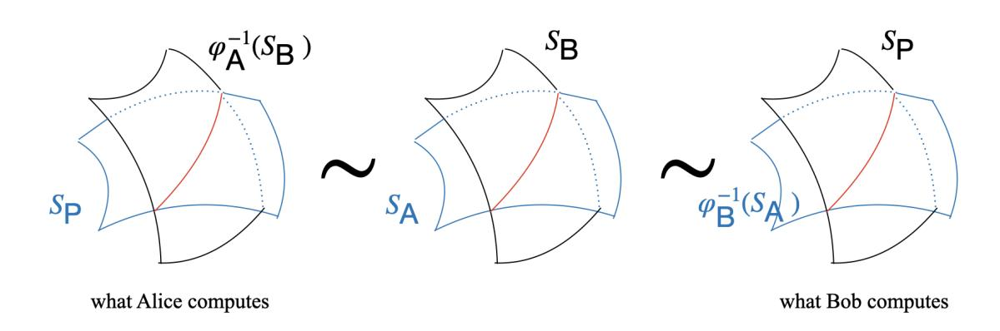
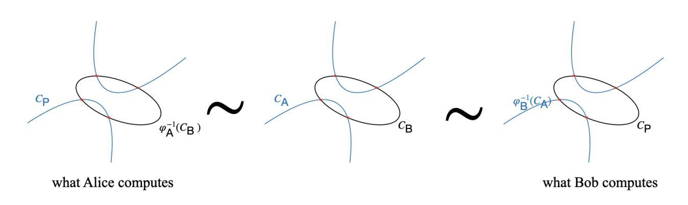
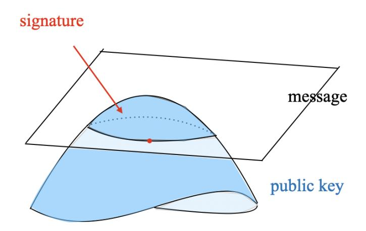

{0}------------------------------------------------

# Lie algebras and the security of cryptosystems based on classical varieties in disguise

Wouter Castryck<sup>1</sup>, Mingjie Chen<sup>1</sup>, Péter Kutas<sup>2,3</sup>, Jun Bo Lau<sup>1</sup>, Alexander Lemmens<sup>1</sup>, and Mickael Montessinos<sup>2</sup>

KU Leuven, Belgium
 Eötvös Loránd University, Hungary
 University of Birmingham, United Kingdom

Abstract. In 2006 de Graaf et al. devised a Lie-algebra-based strategy for finding a linear transformation  $T \in \operatorname{PGL}_{N+1}(\mathbb{Q})$  connecting two linearly equivalent projective varieties  $X, X' \subseteq \mathbb{P}^N$  over  $\mathbb{Q}$ . The method succeeds for several families of "classical" varieties such as Veronese varieties, which have large automorphism groups. In this paper, we study the Lie algebra method over finite fields, which comes with new technicalities when compared to  $\mathbb{Q}$  due to, e.g., the characteristic being positive. Concretely, we make the method work for Veronese varieties of dimension  $r \geq 2$  and (heuristically) for secant varieties of Grassmannians of planes. This leads to classical polynomial-time attacks against two candidate-post-quantum key exchange protocols based on disguised Veronese surfaces and threefolds, which were recently proposed by Alzati et al., as well as a digital signature scheme based on secant varieties of Grassmannians of planes due to Di Tullio and Gyawali. We provide an implementation in Magma.

# 1 Introduction

Many post-quantum cryptographic proposals rely on the hardness of finding a linear change of variables T that transforms a given tuple of non-linear polynomials  $P_1, \ldots, P_m \in \mathbb{F}_q[x_0, \ldots, x_N]$  into a tuple of polynomials having some prescribed shape, possibly up to an easy change of basis of the ideal they span. In practice, it usually suffices to assume that  $P_1, \ldots, P_m$  are homogeneous, in which case the ideal  $I = \langle P_1, \ldots, P_m \rangle$  defines a closed subscheme<sup>4</sup>  $X \subseteq \mathbb{P}^N$ . In geometric terms, the hard problem then amounts to finding a projective equivalence  $T \in \mathrm{PGL}_{N+1}(\mathbb{F}_q)$  that brings X into a "standard form".

Projective equivalence problems are particularly prominent in the area of multivariate cryptography. For example, in constructions belonging to the Oil & Vinegar family, of which four have advanced to Round 2 of the ongoing NIST standardization effort for additional post-quantum digital signatures [26,3,18,42], the subscheme  $X \subseteq \mathbb{P}^N$  is promised to contain a projective subspace O, called an

<span id="page-0-0"></span>Throughout most of the paper X will denote a genuine subvariety, but in general X may be reducible, or even non-reduced (i.e., involving multiplicities).

{1}------------------------------------------------

oil space, having a large prescribed dimension. The problem is to find a projective equivalence that transforms O into a coordinate subspace. Less widely known, perhaps, is that also the hardness assumption in most code-based cryptosystems can be rephrased in such geometric terms [16]. Consider an (N+1)-dimensional linear code over  $\mathbb{F}_q$  with a generator matrix G that reveals an efficient decoding algorithm (e.g., the standard generator matrix of a Goppa code). The columns of G can be viewed as projective points, together defining a zero-dimensional subscheme of  $\mathbb{P}^N$  said to be in "standard form". Starting from an arbitrary generator matrix of an equivalent code, one ends up with a projectively equivalent point configuration  $X \subseteq \mathbb{P}^N$ , and the hard problem is about finding a projective equivalence bringing X back into standard form. Noteworthy cryptographic constructions that build on this problem are the McEliece cryptosystem [29] and LESS [4], another Round 2 contender in the NIST competition.

The focus of this paper lies on three recent candidate-post-quantum protocols proposed by Alzati, Di Tullio, Gyawali and Tortora (in varying constellations):

- Vero2: a key exchange protocol from intersections of conics in  $\mathbb{A}^2$  [1],
- Vero3: a key exchange protocol from intersections of quadrics in  $\mathbb{P}^3$  [14],
- Grass: a digital signature from intersections of secant varieties of Grassmannians (of planes, i.e., of projective lines) in  $\mathbb{P}^N$  with projective subspaces of  $\mathbb{P}^N$  [15].

Detailed descriptions can be found in Section 3. Each of these protocols relies on a projective equivalence problem for certain classical families of algebraic varieties. Especially Vero2 and Vero3 are interesting objects of study: they are geometrically ingenious and the existing literature does not contain many proposals for key exchange based on projective equivalence problems; indeed, such problems lend themselves more naturally to the design of digital signatures. We note that the names Vero2, Vero3, Grass are not original to [1,14,15]: we have introduced them here for the sake of reference.

In recent years, there has been a growing interest in geometric perspectives on the projective equivalence problem. For example, for Oil & Vinegar, this has led Luyten [28] and Pébereau [33] to reinterpret the Kipnis–Shamir attack in terms of singular points, while Ran's recent wegde-based attack [35] has a natural interpretation in terms of Grassmannians. A remarkable breakthrough is the sub-exponential "syzygy distinguisher" for McEliece due to Randriambololona [36], although it only addresses the decisional version of the problem, i.e., does a transformation T exist at all? This was established by analyzing the graded Betti numbers of the corresponding point configuration  $X \subseteq \mathbb{P}^N$  (or, rather, of a point configuration associated with the dual code). Lemoine, in recent work, studies distinguishers for codes based on tangent spaces [27]. In the current work, we publicize another geometric tool for the projective equivalence problem: the Lie algebra method, and we demonstrate its applicability by providing a polynomial time attack on the three protocols Vero2, Vero3, Grass above.

{2}------------------------------------------------

#### <span id="page-2-2"></span>1.1 The Lie algebra method by de Graaf et al.

The (general) Lie algebra  $\mathfrak{g}(X,k)$  of a subscheme  $X\subseteq\mathbb{P}^N$  over a field k can be computed as the k-vector space of matrices

$$M = (a_{i,j})_{0 \le i,j \le N}$$
 such that  $\sum_{i,j=0}^{N} a_{i,j} \frac{\partial P}{\partial x_i} x_j \in I(X)$ 

for all  $P \in I(X)$ . This space is closed under taking commutators, i.e., if  $M_1, M_2 \in \mathfrak{g}(X,k)$  then  $[M_1,M_2]=M_1M_2-M_2M_1\in \mathfrak{g}(X,k)$ , indeed turning  $\mathfrak{g}(X,k)$  into a Lie algebra (see Definition 2.5). It is easy to verify that if X'=T(X) is a projectively equivalent subscheme, then  $\mathfrak{g}(X,k)\to \mathfrak{g}(X',k):M\mapsto TMT^{-1}$  is an isomorphism of Lie algebras, i.e., a vector space isomorphism compatible with the Lie bracket  $[\cdot,\cdot]$ .

The Lie algebra method refers to the general strategy, first applied in 2006 by de Graaf, Harrison, Pílniková and Schicho [11,34], of taking a bet on the converse implication: from an isomorphism between the Lie algebras of two projectively equivalent closed subschemes  $X, X' \subseteq \mathbb{P}^N$ , try to extract an explicit projective equivalence T. On a high level, the method is as follows:

- (i) compute the Lie algebras  $\mathfrak{g}(X,k)$  and  $\mathfrak{g}(X',k)$ ,
- (ii) find a Lie algebra isomorphism  $\varphi : \mathfrak{g}(X,k) \to \mathfrak{g}(X',k)$ ,
- (iii) using linear algebra, find the matrices  $T \in GL_{N+1}(\mathbb{F}_q)$  such that  $TMT^{-1} = \varphi(M)$  or, equivalently,  $TM = \varphi(M)T$  for all  $M \in \mathfrak{g}(X,k)$  and identify a T that defines a projective transformation mapping X to X'.<sup>5</sup>

The Lie algebra method should be viewed as an attempt to linearize the projective equivalence problem. Unfortunately, most subschemes  $X \subseteq \mathbb{P}^N$  have a trivial Lie algebra, in which case the method is doomed to fail: step (iii) has too many degrees of freedom and the method boils down to guessing T. However, for many classical algebraic varieties with sufficiently many automorphisms, the Lie algebra has enough structure for the method to succeed.

The work by de Graaf et al. focused on  $k = \mathbb{Q}$ , as they were primarily interested in the rational parametrization problem for Severi–Brauer varieties (i.e., twists of projective space) over  $\mathbb{Q}$ . In dimension r, this problem reduces to finding a transformation between a standard Veronese variety, i.e., the image of

<span id="page-2-1"></span>
$$\nu_d: \mathbb{P}^r \hookrightarrow \mathbb{P}^N : (x_0: \dots : x_r) \mapsto (x_0^d: x_0^{d-1} x_1: \dots : x_r^d), \quad N = \binom{d+r}{r} - 1 \quad (1)$$

for some  $d \geq 2$ , where the coordinates on the right run over all degree-d monomial expressions in  $x_0, \ldots, x_r$ , and a projectively equivalent copy X that is obtained from  $\nu_d(\mathbb{P}^r)$  via an unknown  $T \in \operatorname{PGL}_{N+1}(\overline{\mathbb{Q}})$ . The Lie algebra method manages to find such a matrix T in polynomial time; here  $\mathfrak{g}(X,\mathbb{Q})$  turns out to be a twist of the general linear Lie algebra  $\mathfrak{gl}_{r+1}(\mathbb{Q})$ . The method was elaborated in full detail for  $\nu_2(\mathbb{P}^2)$  [39] and  $\nu_3(\mathbb{P}^2)$  [11], which came with implementations that are

<span id="page-2-0"></span>This is an oversimplification: one may need to correct  $\varphi$  with an outer automorphism of  $\mathfrak{g}(X,k)$  to make this work. See Sections 2.2 and 6 for details.

{3}------------------------------------------------

now part of the Magma distribution [5].<sup>6</sup> Later, the method was applied to some other classes of varieties [13,24,21,39]. Recently, Lie algebras were used in the design of an algorithm for deciding whether a given variety is toric [25].

#### <span id="page-3-3"></span>1.2 Contributions

Before studying the Lie algebra method, we need a prerequisite result:

(I) In Section 4, we present reductions of the security of Vero2, Vero3 and Grass to the hardness of the projective equivalence problem for Veronese surfaces, for Veronese threefolds, resp., for secant varieties of Grassmannians of planes, all defined over a finite field  $\mathbb{F}_q$ . While not surprising, these reductions are not entirely straightforward, especially in the case of Vero2. Our reductions rely on a very natural heuristic independence assumption (see proof of Proposition 4.1).

Thus, given the large automorphism groups of these varieties, Vero2, Vero3 and Grass become natural targets for the Lie algebra method. Indeed, recall that the method was initially developed with Veronese varieties in mind. But while the high-level blueprint (i)–(iii) should work over any field, de Graaf et al. were working over  $\mathbb{Q}$  and switching to finite fields comes with non-trivial challenges. Moreover, prior to the current work, the Lie algebra method was never applied to secants of Grassmannians. This being said, step (i) boils down to linear algebra and carries no surprises: a straightforward method can be found in Appendix B.1. The main contributions of this paper target the subsequent steps (ii)–(iii):

(II) For (ii), we first prove that in all three cases of interest  $\mathfrak{g}(X, \mathbb{F}_q) \cong \mathfrak{gl}_n(\mathbb{F}_q)$  for some suitable  $n \geq 2$ ;<sup>7</sup> this observation seems new in the case of secants of Grassmannian of planes, see Lemma 2.11. Next, by overcoming several technicalities that are specific to working in positive characteristic, we establish the following result which is of independent interest:

<span id="page-3-2"></span>**Theorem 1.1.** There exists a polynomial-time algorithm (Algorithm 5.2) for finding an isomorphism between a given Lie algebra  $\mathfrak{g}$  over  $\mathbb{F}_q$  and  $\mathfrak{gl}_n(\mathbb{F}_q)$  for some  $n \geq 2$ , assuming that such an isomorphism exists.

The proof of this theorem is provided in Section 5.1. Our algorithm is inspired by a method due to de Graaf for fields of characteristic 0 [10, §5].

(III) In Section 6, we study step (iii) on converting such an isomorphism of Lie algebras into a projective equivalence. Our main focus lies on the Veronese

<span id="page-3-0"></span><sup>&</sup>lt;sup>6</sup> E.g., for  $\nu_2(\mathbb{P}^2)$  this is handled by the undocumented built-in Magma function ParametrizeScroll.

<span id="page-3-1"></span>There is one exception to this: if X is projectively equivalent to  $\nu_d(\mathbb{P}^r)$  with char  $\mathbb{F}_q \mid d$  then in fact  $\mathfrak{g}(X,\mathbb{F}_q) \cong \mathfrak{gl}_{r+1}(\mathbb{F}_q)/\mathbb{F}_q\mathbb{I}_{r+1} \oplus \mathbb{F}_q\mathbb{I}_{r+1} \not\cong \mathfrak{gl}_{r+1}(\mathbb{F}_q)$ . This case is more technical and omitted in the current version of the article, although this merely refers to the exposition: our implementation does cover this case. We intend to add an appendix explaining how to handle this special case in a future update.

{4}------------------------------------------------

case, where subject to mild conditions on the characteristic we prove that this step produces a unique  $T \in \mathrm{PGL}_{N+1}(\mathbb{F}_q)$ , effectively corresponding to a projective transformation of the desired type:

<span id="page-4-0"></span>**Theorem 1.2.** Let  $r, d \in \mathbb{Z}_{>0}$  be such that either r > 1 or p > 2 and  $p \nmid d+1$ , where  $p = \operatorname{char} \mathbb{F}_q$ . We also assume that  $p \nmid d$ . Write  $N = \binom{d+r}{r} - 1$ . There exists a polynomial-time algorithm (Algorithm 6.7) for finding a transformation  $T \in \operatorname{PGL}_{N+1}(\mathbb{F}_q)$  connecting two given varieties  $X, X' \subseteq \mathbb{P}^N$  over  $\mathbb{F}_q$ , promised to be both projectively equivalent with the standard Veronese variety  $\nu_d(\mathbb{P}^r) \subseteq \mathbb{P}^N$ .

The proof of Theorem 1.2 is provided in Section 6.2. In Remark 6.3 we also report on an experiment suggesting that if r=1 then the conditions p>2 and  $p\nmid d+1$  are partial proof artifacts that should be relaxable to p=d+1 or  $p\nmid d+1$ . The condition that  $p\nmid d$  is added to keep the proofs simple; see also Footnote 7. We will provide a proof which covers the case  $p\mid d$  in an updated ePrint version of this work. We stress that the implementation we provide covers the case  $p\mid d$ . Likewise, we gather evidence that the same conclusions as in Theorem 1.2 apply to secants of Grassmannians of planes, even without any condition on p, although we could not prove this. Viewing this as a heuristic assumption, this brings us to:

<span id="page-4-2"></span>**Corollary 1.3 (heuristic).** The Lie algebra method turns into a polynomial-time key recovery attack on Vero2, Vero3, and a polynomial-time signature forgery attack on Grass.

We note that for Vero2 and Vero3 the heuristic nature of our break stems purely from the independence assumption in Contribution (I). This is because these protocols are instantiated over large prime fields  $[1, \S 7]$ , so they fall comfortably within the range of Theorem 1.2. For Grass the situation is different; as mentioned, here we rely on the assumption (see Remark 6.3) that step (iii) produces a unique T up to scaling, which we saw confirmed in practice but which we could not prove. We note that Grass is instantiated over finite fields of characteristic 2.

(IV) The reduction from Contribution (I), the algorithms from Theorems 1.1–1.2 and Remark 6.3 are all accompanied with Magma code [5] which is made available on

https://gitlab.com/Mickanos/equivalence-to-veronese-varieties

This code contains various functions that may be found interesting in their own right (e.g., for tackling the rational parametrization problem beyond what is currently available in Magma). We provide with our implementation a file which reproduces specific examples in Section 7 (Table 1).

<span id="page-4-1"></span><sup>&</sup>lt;sup>8</sup> If r=1 and d=mp-1 with  $m\geq 2$  then one might find exponentially many candidates for T. Recall that Vero2 and Vero3 work in the regime  $r\geq 2$ , so this is no concern. Furthermore, the projective equivalence problem for r=1 is classical; see [17, Ch. 6, Exercise 5] and also this stackexchange post.

{5}------------------------------------------------

#### computing the Lie algebra computing the Lie algebra isomorphism solving the projective equivalence problem the Lie algebra method breaking Vero2, Vero3, and Grass step (i) step (ii) step (iii) Appendix [B.1](#page-37-0) Theorem 1[.1](#page-3-2) Theorem 1[.2](#page-4-0) Propositions [4.2,](#page-18-0) [4.3, 4](#page-18-1).4 [Co](#page-19-0)rollary 1[.3](#page-4-2)

Fig. 1: Relations between our contributions (informal).

(Algorithm 6.[7\)](#page-27-0)

<span id="page-5-0"></span>(Algorithm 5.[2\)](#page-20-0)

A summary of the flow of contributions in this paper can be found in Figure [1.](#page-5-0) We conclude by remarking that while the protocols Vero2, Vero3 and Grass are cleverly constructed, there are many angles to them, suggesting several potential alternative avenues for an ad-hoc attack. We have highlighted a few such avenues in Remarks [3.2](#page-12-0)[–3.4,](#page-16-2) but we did not succeed in turning these into concrete breaks. Regardless, we emphasize that the Lie algebra method directly targets the underlying hard problem and is therefore much more fundamental, with cryptographic relevance hopefully reaching beyond these three protocols.

#### 1.3 Reader's guide

- In Section [2](#page-6-0) we recall some facts about Veronese varieties, secants of Grassmannians, and Lie algebras.
- In Section [3,](#page-11-0) we give an overview of Vero2, Vero3 and Grass.
- In Section [4](#page-16-0) we reduce the security of these schemes to the projective equivalence problem for Veronese surfaces, Veronese threefolds and secants of Grassmannians of planes, respectively.
- Section [5](#page-19-1) discusses step (ii) of the Lie algebra method: computing an isomorphism ϕ : g(X, Fq) → gln(Fq).
- Section [6](#page-24-0) discusses step (iii) on extracting the desired projective equivalence.
- In Section [7](#page-28-0) we report on our implementation in Magma, and we give some concluding remarks in Section [8.](#page-29-1)

Proofs of known-yet-hard-to-pinpoint facts are deferred to the appendices, but the main body is self-contained. We invite the reader who is unfamiliar with the works [\[1,](#page-30-2)[14,](#page-31-4)[15\]](#page-31-5) to focus on Vero3 on a first reading. Once the reduction from Section [4](#page-16-0) is established, the Lie algebra method can be studied in its own right.

#### 1.4 Acknowledgements

We thank Benjamin Lovitz for his assistance with the proof of Lemma [2.4,](#page-7-2) Alberto Alzati and Alfonso Tortora for helpful questions and for sharing an early version of their work [\[2\]](#page-30-6), Lorenz Panny for useful discussions and pointing us 

{6}------------------------------------------------

to [25], and Willem de Graaf and the anonymous reviewers for several help-ful comments. Castryck, Chen, Lau and Lemmens are supported in part by the European Research Council (ERC) under the European Union's Horizon 2020 research and innovation programme (grant agreement ISOCRYPT – No. 101020788), by the Research Council KU Leuven grant C14/24/099, as well as by CyberSecurity Research Flanders with reference number VOEWICS02, and Chen is supported in part by Fonds voor Wetenschappelijk Onderzoek (FWO) with reference number 12A4L26N. Together with Kutas, they are also supported by the CELSA alliance through the MaCro project. Kutas is partly supported by EPSRC through grant number EP/V011324/1. He is also supported by the Hungarian Ministry of Innovation and Technology NRDI Office within the framework of the Quantum Information National Laboratory Program. Montessinos and Kutas are supported by the grant "EXCELLENCE-151343".

### <span id="page-6-0"></span>2 Preliminaries

We recall several facts on the main geometric ingredients of Vero2, Vero3 and Grass: Veronese varieties and secants of Grassmannians of planes (i.e., projective lines), seen as embedded varieties  $X \subseteq \mathbb{P}^N$ . For the Lie algebra method we need some understanding of the homogeneous ideal I(X) and the group  $\mathbb{P}G(X,\mathbb{F}_q)$  of projective auto-equivalences, i.e. automorphisms of  $\mathbb{P}^N$  that map X into itself<sup>9</sup>, see Section 2.1. In Section 2.2 we recall how to define the Lie algebra of a closed subscheme of  $\mathbb{P}^N$ , while in Section 2.3 we gather properties of the general linear Lie algebra  $\mathfrak{gl}_n(\mathbb{F}_q)$ ,  $n \geq 2$ . Throughout  $\mathbb{F}_q$  denotes a finite field of characteristic p. All statements below should be known to specialists, with the possible exception of Lemma 2.4, but since we could not always pinpoint a precise reference, proofs can be found in Appendix A if not already provided in this section.

#### <span id="page-6-2"></span>2.1 Veronese varieties and secants of Grassmannians

**Veronese varieties.** Fix r > 1,  $d \ge 1$  and let  $N = \binom{d+r}{r} - 1$ . The morphism  $\nu_d : \mathbb{P}^r \hookrightarrow \mathbb{P}^N$  from Equation 1 is called the d-uple embedding. We refer to its image  $\nu_d(\mathbb{P}^r) \subseteq \mathbb{P}^N$  as the *standard* d-th Veronese variety of dimension r. Any variety  $X \subseteq \mathbb{P}^N$  obtained from  $\nu_d(\mathbb{P}^r)$  through an  $\mathbb{F}_q$ -rational automorphism of  $\mathbb{P}^N$  is then also called a (not necessarily standard) Veronese variety over  $\mathbb{F}_q$ .

**Lemma 2.1.** If d > 1 then the ideal  $I(\nu_d(\mathbb{P}^r))$  is generated by

<span id="page-6-5"></span><span id="page-6-4"></span>
$$\frac{(N+1)(N+2)}{2} - \binom{2d+r}{r} \tag{2}$$

linearly independent quadratic binomials.

<span id="page-6-3"></span>Lemma 2.2.  $\mathbb{P}G(\nu_d(\mathbb{P}^r), \mathbb{F}_q) \cong \mathrm{PGL}_{r+1}(\mathbb{F}_q)$ .

<span id="page-6-1"></span>Some authors refer to this group as the linear preserver of X, see e.g. [20].

{7}------------------------------------------------

**Secants of Grassmannians of planes.** For  $r \geq 1, d \geq r$ , the Grassmannian  $\mathbf{Gr}(r,d)$  is the image of the so-called Plücker embedding  $\iota$ , mapping (r-1)-dimensional projective subspaces  $L \subseteq \mathbb{P}^{d-1}$  to points in  $\mathbb{P}^N$ , where  $N = \binom{d}{r} - 1$ . In detail,  $\iota$  sends the subspace L to the tuple of coordinates of

<span id="page-7-6"></span>
$$p_1 \wedge \cdots \wedge p_r$$
 with respect to  $\{e_{i_1} \wedge \cdots \wedge e_{i_r} \mid 1 \leq i_1 < \ldots < i_r \leq d\},$  (3)

where  $p_1, \ldots, p_r \in \mathbb{A}^d$  are arbitrary affine representants of an arbitrary spanning set of L and  $e_1, \ldots, e_d$  are the coordinate points of  $\mathbb{A}^d$ . The coordinates of  $\iota(L)$  satisfy natural relations called the Plücker relations: these serve as defining equations for  $\mathbf{Gr}(r,d)$ . The secant of a subvariety  $X \subseteq \mathbb{P}^N$  is obtained from X by taking the Zariski closure of the union of all lines connecting two points of X. For r=2, both  $\mathbf{Gr}(r,d)$  and its secant admit a very elegant description by identifying points  $x \in \mathbb{P}^N$  with skew-symmetric matrices

<span id="page-7-3"></span>
$$M_{x} = \begin{pmatrix} 0 & x_{12} & \dots & x_{1d} \\ -x_{12} & 0 & \dots & x_{2d} \\ \vdots & \vdots & \ddots & \vdots \\ -x_{1d} & -x_{2d} & \dots & 0 \end{pmatrix}$$
(4)

up to scaling, where  $x_{i,j}$  denotes the coordinate with respect to  $e_i \wedge e_j$ . It can be shown [15, §2.5] that  $x \in \mathbf{Gr}(2,d)$  if and only if rank  $M_x = 2$  and that  $x \in \mathbf{Sec}(\mathbf{Gr}(2,d))$  if and only if rank  $M_x \in \{2,4\}$ . The Plücker relations are exactly the Pfaffians (whose squares are the determinants) of the skew-symmetric  $4 \times 4$  submatrices of Equation (4) centered at the diagonal.

<span id="page-7-5"></span>**Lemma 2.3.** If d > 5 then the ideal I(Sec(Gr(2, d))) is generated by  $\binom{d}{6}$  linearly independent cubic polynomials (with 15 terms each).

<span id="page-7-2"></span>**Lemma 2.4.** If d > 5 then  $\mathbb{P}G(\operatorname{Sec}(\mathbf{Gr}(2,d),\mathbb{F}_q) \cong \operatorname{PGL}_d(\mathbb{F}_q)$ .

# <span id="page-7-1"></span>2.2 The Lie algebra of a closed subscheme $X \subseteq \mathbb{P}^N$

Our main references on Lie algebras are [12,23,40]. Most statements here apply to arbitrary fields but we specialize to  $\mathbb{F}_q$ .

<span id="page-7-0"></span>**Definition 2.5.** A Lie algebra over  $\mathbb{F}_q$  is an  $\mathbb{F}_q$ -vector space  $\mathfrak{g}$  equipped with a bilinear map, called the Lie bracket,  $[\cdot,\cdot]:\mathfrak{g}\times\mathfrak{g}\to\mathfrak{g}$  such that:

- 1. [x, x] = 0 for all  $x \in \mathfrak{g}$ , 2. [x, [y, z]] + [y, [z, x]] + [z, [x, y]] = 0 for all  $x, y, z \in \mathfrak{g}$  (Jacobi identity).
- The center of a Lie algebra  $\mathfrak{g}$  is the subalgebra  $\mathfrak{z}(\mathfrak{g}) := \{x \in \mathfrak{g} : [x,y] = 0 \ \forall y \in \mathfrak{g}\}.$ For  $x \in \mathfrak{g}$ , the centralizer of x in  $\mathfrak{g}$  is the subalgebra  $C_{\mathfrak{g}}(x) := \{y \in \mathfrak{g} : [x,y] = 0\}.$

<span id="page-7-4"></span>All Lie algebras encountered in this article are subalgebras of  $\mathfrak{gl}_n(\mathbb{F}_q) := \{M \in \mathbb{F}_q^{n \times n}\}$  for some  $n \geq 1$ , where the Lie bracket is [A,B] := AB - BA. E.g., a well-known example of such a subalgebra is  $\mathfrak{sl}_n(\mathbb{F}_q) := \{M \in \mathbb{F}_q^{n \times n} : \operatorname{Tr}(M) = 0\}$ . Our central object of study is:

{8}------------------------------------------------

**Definition 2.6.** Consider projective space  $\mathbb{P}^N$  over  $\mathbb{F}_q$  and let  $X \subseteq \mathbb{P}^N$  be a closed subscheme. Let  $I(X) \subseteq \mathbb{F}_q[x_0, \dots, x_N]$  be its homogeneous ideal. The general Lie algebra of X, denoted by  $\mathfrak{g}(X, \mathbb{F}_q)$ , is the subalgebra of  $\mathfrak{gl}_{N+1}(\mathbb{F}_q)$  spanned by the matrices  $A = (a_{i,j})$  for which

<span id="page-8-0"></span>
$$A \star P := \sum_{i,j=0}^{N} a_{i,j} \frac{\partial P}{\partial x_i} x_j \in I(X)$$
 (5)

for all  $P \in I(X)$ .

It is easy to check that this is indeed a subalgebra.

<span id="page-8-2"></span>Remark 2.7 (Lie algebras as tangent vector fields). Condition (5) seems very adhoc but it admits the following reformulation. Upon extending scalars with an infinitesimal  $\varepsilon$ , i.e., to  $\mathbb{F}_q[\varepsilon]/(\varepsilon^2)$ , Taylor expansion yields

$$P((\mathbb{I}_{N+1} + \varepsilon A)\mathbf{x}^t) = P(\mathbf{x}) + \varepsilon \sum_{i,j=0}^{N} a_{i,j} \frac{\partial P}{\partial x_i} x_j.$$

So  $\mathfrak{g}(X,\mathbb{F}_q)$  can be seen as the space of matrices A for which I(X) is closed under changing coordinates by  $\mathbb{I}_{N+1} + \varepsilon A$ . This reveals the intuition behind Definition 2.6: we can identify a matrix A with a vector field  $\mathbf{x}^t \mapsto A\mathbf{x}^t$  on  $\mathbb{A}^{N+1}$  and then  $\mathfrak{g}(X,\mathbb{F}_q)$  consists of those vector fields that are tangent to (the affine cone of) X; under this identification, the usual Lie bracket of vector fields corresponds to the commutator of matrices. Yet another way to think of  $\mathfrak{g}(X,\mathbb{F}_q)$  is as the Lie algebra  $\mathrm{Lie}(G(X,\mathbb{F}_q))$  associated with the algebraic group

$$G(X, \mathbb{F}_q) = \{ A \in \operatorname{GL}_{N+1}(\mathbb{F}_q) : P(A\mathbf{x}^t) \in I(X) \ \forall P \in I(X) \}$$

in the sense of [30, Ch. 10]; see [34, §3.2] for the connection with Definition 2.6. The authors of [13,34] define the special Lie algebra  $\mathfrak{g}_0(X,\mathbb{F}_q)$  of a projectively embedded variety  $X \subseteq \mathbb{P}^N$  as the Lie algebra associated with its group  $\mathbb{P}G(X,\mathbb{F}_q)$  of projective auto-equivalences. One can show that  $\mathfrak{g}_0(X,\mathbb{F}_q) = \mathfrak{g}(X,\mathbb{F}_q)/\mathbb{F}_q\mathbb{I}_{N+1}$ .

Let us now discuss the Lie algebra method by de Graaf et al. [11,34] in somewhat more detail than we did in Section 1.1, although the full details are postponed to Section 6. The following easy fact, which was mentioned before, is absolute key to the method:

<span id="page-8-1"></span>**Lemma 2.8.** Let  $X \subseteq \mathbb{P}^N$  be a closed subscheme, let  $T \in \operatorname{PGL}_{N+1}(\mathbb{F}_q)$  and let X' = T(X). The map  $\mathfrak{g}(X, \mathbb{F}_q) \to \mathfrak{g}(X', \mathbb{F}_q) : A \mapsto TAT^{-1}$  is an isomorphism of Lie algebras.

Now imagine that the Lie algebra isomorphism  $\varphi: \mathfrak{g}(X, \mathbb{F}_q) \to \mathfrak{g}(X', \mathbb{F}_q)$  computed in step (ii) happens to be as above, i.e., it amounts to conjugation by some unknown  $T \in \mathrm{PGL}_{N+1}(\mathbb{F}_q)$  satisfying X' = T(X). By expressing that  $TA = \varphi(A)T$  for all  $A \in \mathfrak{g}(X, \mathbb{F}_q)$  one obtains a linear system of equations in the entries of T. If  $\mathfrak{g}(X, \mathbb{F}_q) \cong \mathfrak{g}(X', \mathbb{F}_q)$  is non-trivial then there is good hope that this system is sufficiently determined for extracting T up to scaling: this is analyzed in Section 6.1. Now if  $\varphi: \mathfrak{g}(X, \mathbb{F}_q) \to \mathfrak{g}(X', \mathbb{F}_q)$  is an arbitrary isomorphism, then it must be obtained from an isomorphism as in Lemma 2.8 by

{9}------------------------------------------------

pre-composing it with an automorphism  $\tau \in \operatorname{Aut}(\mathfrak{g}(X,\mathbb{F}_q))$ . But, of course, if this automorphism is itself induced via Lemma 2.8 by some  $T \in \mathbb{P}G(X,\mathbb{F}_q)$  then we are reduced to the case  $\tau = \operatorname{Id}$  and we remain in business for trying to extract T by system solving. If not, then the isomorphism  $\varphi$  should be tweaked, which can be done by trial-and-error if the subgroup of  $\operatorname{Aut}(\mathfrak{g}(X,\mathbb{F}_q))$  induced by  $\mathbb{P}G(X,\mathbb{F}_q)$  has a sufficiently small index. For Veronese varieties, this is analyzed in detail in Section 6.2.

Remark 2.9 (de Graaf et al.'s take on step (iii)). In appearance, de Graaf et al. consider a different linear system of equations in the entries of T, based on the following two properties of the  $\star$ -operator (5), which are again easy to verify through explicit calculation. In the statement below we use  $T^*$  to denote variable substitution induced by  $T \in GL_{N+1}(\mathbb{F}_q)$ , i.e.,  $\mathbf{x}^t \leftarrow T\mathbf{x}^t$  where  $\mathbf{x} = (x_0, \dots, x_N)$  denotes the vector of coordinate variables. Notice that this substitution transforms the defining ideal of X' = T(X) into that of X.

<span id="page-9-1"></span>**Lemma 2.10.** For all  $P \in \mathbb{F}_q[x_0, \dots, x_N]$ ,  $A, B \in \mathbb{F}_q^{(N+1)\times(N+1)}$ ,  $T \in GL_{N+1}(\mathbb{F}_q)$  we have:

(a) 
$$[A, B] \star P = B \star (A \star P) - A \star (B \star P),$$
  
(b)  $T^*(A \star P) = T^{-1}AT \star T^*(P).$ 

Lemma 2.10(a) implies that we have a well-defined homomorphism

$$\mathfrak{g}(X, \mathbb{F}_q) \to \mathfrak{gl}(S)^{\mathrm{opp}} : A \mapsto (P \mapsto A \star P)$$

where  $S = \mathbb{F}_q[x_0, \dots, x_N]/I(X)$  denotes the homogeneous coordinate ring of X and  $\mathfrak{gl}(S)^{\mathrm{opp}}$  denotes the Lie algebra consisting of  $\mathbb{F}_q$ -vector space endomorphisms of S equipped with the negated commutator  $[\varphi, \psi] = \psi \circ \varphi - \varphi \circ \psi$ . In other words S acquires the structure of a right  $\mathfrak{g}(X, \mathbb{F}_q)$ -module. From Lemma 2.10(b) we know that

<span id="page-9-2"></span>
$$T^*(A \star P) = \varphi^{-1}(A) \star T^*(P) \tag{6}$$

for all  $A \in \mathfrak{g}(X, \mathbb{F}_q)$  and all  $P \in \mathbb{F}_q[x_0, \ldots, x_N]$ . Writing S' for the homogeneous coordinate ring of X', this shows that the isomorphism  $S \to S'$  induced by T is compatible via  $\varphi$  with the respective Lie algebra module structures. By restricting Equation (6) to linear polynomials, we again obtain a linear system in the entries of T, which is equivalent to the aforementioned linear system.

Luckily, for Veronese varieties and secants of Grassmannians of planes (i.e., projective lines), we know the structure of their Lie algebras:

<span id="page-9-0"></span>**Lemma 2.11.** For any 
$$r \geq 1, d \geq 1$$
 such that  $p \nmid d$  we have  $\mathfrak{g}(\nu_d(\mathbb{P}^r), \mathbb{F}_q) \cong \mathfrak{gl}_{r+1}(\mathbb{F}_q)$  and for any  $d \geq 6$  we have  $\mathfrak{g}(\operatorname{Sec}(\mathbf{Gr}(2,d)), \mathbb{F}_q) \cong \mathfrak{gl}_d(\mathbb{F}_q)$ .

See the proof in Appendix A for more details on the exceptional role of  $p \mid d$  in the Veronese case; recall that we omit this special case in our treatment below, to simplify the exposition (we have the intention to add an appendix dedicated to this case in an updated version of this ePrint paper), but that our

{10}------------------------------------------------

implementation covers this case. Basic properties of  $\mathfrak{gl}_n(\mathbb{F}_q)$ ,  $n \geq 1$ , and their automorphism groups are recalled in the next section.

We conclude this section by recalling the notion of Cartan subalgebras, which will play an important role in our isomorphism finding step (ii) of the Lie algebra method. While the definition is technical, in practice we will work with the much more down-to-earth characterization from Theorem 2.15.

**Definition 2.12.** A Cartan subalgebra  $\mathfrak h$  of a Lie algebra  $\mathfrak g$  is a subalgebra that

- is nilpotent: the sequence  $[\mathfrak{h},\mathfrak{h}] \supseteq [\mathfrak{h},[\mathfrak{h},\mathfrak{h}]] \supseteq \ldots$  eventually yields 0,
- is self-normalized: if  $x \in \mathfrak{g}$  and if for all  $y \in \mathfrak{h}$  we have  $[x, y] \in \mathfrak{h}$  then  $x \in \mathfrak{h}$ .

**Definition 2.13.** A Cartan subalgebra  $\mathfrak{h} \subseteq \mathfrak{g}$  is called split if for all  $h \in \mathfrak{h}$  the adjoint map  $ad(h) : \mathfrak{g} \to \mathfrak{g}, x \mapsto [h, x]$  is diagonalizable over  $\mathbb{F}_q$ . A field extension  $K \supseteq \mathbb{F}_q$  where all maps ad(h) are diagonalizable is called a splitting field of  $\mathfrak{h}$ .

# <span id="page-10-0"></span>2.3 Some facts about the general linear Lie algebra $\mathfrak{gl}_n(\mathbb{F}_q)$

As just mentioned, all Lie algebras discussed in this article are isomorphic to the general linear Lie algebra  $\mathfrak{gl}_n(\mathbb{F}_q)$  for some  $n \geq 2$ . We briefly gather some facts on this Lie algebra that will be helpful in later sections. First, a large class of automorphisms of  $\mathfrak{gl}_n(\mathbb{F}_q)$  is given by inner automorphisms, i.e., conjugations by some fixed  $B \in \mathrm{GL}_n(\mathbb{F}_q)$ ,  $\iota_B : M \mapsto B^{-1}MB$ . The inner automorphisms form a normal subgroup of the full automorphism group that we denote by  $\mathrm{Aut}^{\mathrm{inn}}(\cdot)$ , and the group of outer automorphisms is defined as the corresponding group quotient.

#### <span id="page-10-2"></span>Lemma 2.14. The maps

- (i)  $\tau: M \mapsto -M^t$ ,
- (ii)  $h_{\lambda}: M \mapsto M + \lambda \operatorname{Tr}(M)\mathbb{I}_n \text{ with } \lambda \in \mathbb{F}_q \text{ satisfying } n\lambda \neq -1$

are automorphisms of  $\mathfrak{gl}_n(\mathbb{F}_q)$ . If p=2 and n=2 then also the maps

- (iii)  $\sigma_{\lambda}: M \mapsto M + \lambda \Sigma(M) \mathbb{J}_2$  with  $\lambda \in \mathbb{F}_q$ , where  $\mathbb{J}_2$  denotes the all-1 matrix and  $\Sigma(M)$  denotes the sum of all entries of M,
- (iv)  $\mu_{\lambda}: \begin{pmatrix} \hat{1} & 0 \\ 0 & 0 \end{pmatrix} \mapsto \begin{pmatrix} 1 & 0 \\ 0 & 0 \end{pmatrix}, \begin{pmatrix} 0 & 1 \\ 0 & 0 \end{pmatrix} \mapsto \begin{pmatrix} 0 & 1 \\ 0 & 0 \end{pmatrix}, \begin{pmatrix} 0 & 0 \\ 1 & 0 \end{pmatrix} \mapsto \begin{pmatrix} 0 & 0 \\ \lambda & 0 \end{pmatrix}, \begin{pmatrix} 0 & 0 \\ 0 & 1 \end{pmatrix} \mapsto \begin{pmatrix} \lambda+1 & 0 \\ 0 & \lambda \end{pmatrix}$  with  $\lambda \in \mathbb{F}_q^*$ , extended by  $\mathbb{F}_q$ -linearity,

are automorphisms of  $\mathfrak{gl}_2(\mathbb{F}_q)$ . Together (the classes of) these automorphisms generate the group of outer automorphisms of  $\mathfrak{gl}_n(\mathbb{F}_q)$ .

Next, we describe the Cartan subalgebras of  $\mathfrak{gl}_n(\mathbb{F}_q)$ .

<span id="page-10-1"></span>**Theorem 2.15 ([41, Thm. 3.2]).** The Cartan subalgebras  $\mathfrak{h} \subseteq \mathfrak{gl}_n(\mathbb{F}_q)$  are precisely the n-dimensional subalgebras of matrices that become diagonal when base-changed with respect to a fixed basis of  $\overline{\mathbb{F}}_q^n$ , i.e., we can write

$$\mathfrak{h} = \left\{ BDB^{-1} \,|\, D \in \operatorname{diag}_n(\overline{\mathbb{F}}_q) \right\} \cap \mathbb{F}_q^{n \times n} \tag{7}$$

for a fixed matrix  $B \in \mathrm{GL}_n(\overline{\mathbb{F}}_q)$ .

{11}------------------------------------------------

The prototypical example of a Cartan subalgebra of  $\mathfrak{gl}_n(\mathbb{F}_q)$  is the space  $\operatorname{diag}_n(\mathbb{F}_q)$  of diagonal matrices, obtained by letting  $B = \mathbb{I}_n$ . Conveniently, a large class of Cartan subalgebras can be constructed as follows. We point out that statements (a-b) combine to a conceptual test for checking Cartan-ness.

<span id="page-11-1"></span>**Lemma 2.16.** Let  $M \in \mathbb{F}_q^{n \times n}$  and write  $\chi_M(t)$  for its characteristic polynomial.

- (a)  $\chi_M(t)$  is squarefree if and only if 0 is an eigenvalue of the adjoint map  $\operatorname{ad}(M): \mathfrak{gl}_n(\mathbb{F}_q) \to \mathfrak{gl}_n(\mathbb{F}_q): A \mapsto [M, A] \text{ with multiplicity } n,$
- (b) If  $\chi_M(t)$  is squarefree then  $C_{\mathfrak{gl}_n(\mathbb{F}_q)}(M)$  is a Cartan subalgebra of  $\mathfrak{gl}_n(\mathbb{F}_q)$ , (c) If  $q > n^2$  then all Cartan subalgebras of  $\mathfrak{gl}_n(\mathbb{F}_q)$  are of this form.

*Proof.* Statement (a) follows from the general fact

$$\chi_M(t) = \prod_{i=1}^n (t - \lambda_i) \quad \Rightarrow \quad \chi_{\mathrm{ad}(M)}(t) = \prod_{1 \le i,j \le n} (t - (\lambda_i - \lambda_j)),$$

which is stated in Proposition A.2. Statement (b) is an easy consequence of Theorem 2.15. For (c), see [41, Thm. 3.1]. 

We conclude by showing how to verify that a Cartan subalgebra  $\mathfrak{h} \subseteq \mathfrak{gl}_n(\mathbb{F}_q)$ is split. By Theorem 2.15 all matrices in  $\mathfrak{h}$  are diagonalizable over  $\mathbb{F}_q$ . In spirit, the notion of splitness corresponds to diagonalizability over  $\mathbb{F}_q$ , i.e., the possibility to take  $B \in \mathrm{GL}_n(\mathbb{F}_q)$ . The actual statement reads:

<span id="page-11-3"></span>**Lemma 2.17.** If all matrices in a Cartan subalgebra  $\mathfrak{h} \subseteq \mathfrak{gl}_n(\mathbb{F}_q)$  are diagonalizable over  $\mathbb{F}_q$  then it is split. Conversely, if  $\mathfrak{h}$  is split then there is an automorphism  $\varphi$  of  $\mathfrak{gl}_n(\mathbb{F}_q)$  such that all matrices in  $\varphi(\mathfrak{h})$  are diagonalizable over  $\mathbb{F}_q$ ; if n>2 or  $p\neq 2$  then one can take  $\varphi=\mathrm{Id}$ , else  $\varphi$  can be taken of the form  $\sigma_{\lambda}$ .

<span id="page-11-2"></span>Corollary 2.18. Let  $\mathfrak{h}$  be a Cartan subalgebra of  $\mathfrak{gl}_n(\mathbb{F}_q)$  and let  $h_1,\ldots,h_n$  be an  $\mathbb{F}_q$ -vector space basis. If  $\chi_{\mathrm{ad}(h_\ell)}(t)$  factors completely for all  $\ell$  then  $\mathfrak{h}$  is split.

#### <span id="page-11-0"></span>The protocols 3

We now review the three central protocols of this paper: Vero2, Vero3 and Grass. This will allow us to establish security reductions to a projective equivalence problem in Section 4. Although not crucial at this stage, we point out that in concrete instantiations p is taken large in Vero2 and Vero3, while p=2 for Grass.

#### **Vero3:** Key exchange from quadrics in Veronese threefolds [14] 3.1

Overview | The following morphisms are essential in the key exchange protocol:

$$\mathbb{P}^1 \times \mathbb{P}^1 \stackrel{s_{1,1}}{\longleftarrow} \mathbb{P}^3 \stackrel{\nu_d}{\longleftarrow} \mathbb{P}^N \stackrel{\Phi_T}{\longrightarrow} \mathbb{P}^N.$$

The morphism  $s_{1,1}$  is the standard Segre embedding

$$\mathbb{P}^1 \times \mathbb{P}^1 \hookrightarrow \mathbb{P}^3 : ((x_0 : x_1), (y_0, y_1)) \mapsto (x_0 y_0 : x_1 y_1 : x_0 y_1 : x_1 y_0),$$

{12}------------------------------------------------

 $\nu_d$  is the *d*-uple embedding and  $N = \binom{d+3}{3} - 1$ . The last morphism  $\Phi_T$  is an automorphism of  $\mathbb{P}^N$ , given by a matrix  $T \in \mathrm{PGL}_{N+1}(\mathbb{F}_q)$ .

Let  $\nu_T := \Phi_T \circ \nu_d$ , and denote by  $S_P$  the surface  $s_{1,1}(\mathbb{P}^1 \times \mathbb{P}^1) \subseteq \mathbb{P}^3$ . Let  $\varphi_A$  and  $\varphi_B$  be two secret automorphisms of  $\mathbb{P}^3$  chosen by Alice and Bob respectively. Each of Alice and Bob generates a quadratic surface,  $S_A = \varphi_A(S_P)$  and  $S_B = \varphi_B(S_P)$ , both projectively equivalent to  $S_P$ . In 3-dimensional projective space  $\mathbb{P}^3$ , generically, this intersection  $S_A \cap S_B$  is a non-singular, geometrically irreducible curve, in which case it concerns an elliptic curve. Then, the common secret key is the j-invariant of this curve, which is an element of  $\mathbb{F}_q$ . However, to keep their secret safe from eavesdroppers, Alice and Bob do not share their surfaces in  $\mathbb{P}^3$  directly, but instead they share hyperplanes containing the embedding of  $\mathbb{P}^1 \times \mathbb{P}^1$  in  $V := \nu_T(\mathbb{P}^3) \subseteq \mathbb{P}^N$  via  $\nu_T \circ \varphi_* \circ s_{1,1}$  where \* is A or B.



Fig. 2: Shared secret from intersections of quadrics a in Veronese threefold.

<span id="page-12-3"></span>Remark 3.1.  $S_P$  is embedded in V by a representation of the map  $\nu_T \circ s_{1,1}$ . This works as follows: each of the N+1 components of

<span id="page-12-1"></span>
$$(\nu_d \circ s_{1,1})((x_0 : x_1), (y_0 : y_1)) \tag{8}$$

is a degree-2d monomial expression in  $x_0, x_1, y_0, y_1$  that is of degree d in  $x_0, x_1$  and of degree d in  $y_0, y_1$ . So Equation (8) can be rewritten as

$$\Sigma_{d,1,1} \cdot \begin{pmatrix} x_0^d y_0^d & x_0^d y_0^{d-1} y_1 & \dots & x_1^d y_1^d \end{pmatrix}^t$$

for some matrix  $\Sigma_{d,1,1} \in \{0,1\}^{(N+1)\times(d+1)^2}$  whose columns are indexed by these monomials; each row contains exactly one 1. We call this the monomial representation of  $\nu_d \circ s_{1,1}$ . The map  $\nu_T \circ s_{1,1}$  is then similarly encoded by  $\Sigma_P = T \cdot \Sigma_{d,1,1}$ .

Setup Phase A trusted third party (or Alice if no such party is available) chooses the matrix  $T \in \operatorname{PGL}_{N+1}(\mathbb{F}_q)$ . This trusted third party also generates  $m \geq 2$  matrices  $M_1, M_2, \ldots, M_m \in \mathbb{P}G(V, \mathbb{F}_q)$ ; this can be done as in the proof of Lemma 2.2. In this key exchange protocol, the public parameters consist of the following  $\operatorname{\mathsf{pp}} = \{\Sigma_P, M_1, M_2, \ldots, M_m\}$ .

<span id="page-12-2"></span><span id="page-12-0"></span>In [14] the base surface in  $\mathbb{P}^3$  is a projectively equivalent copy of  $S_P = s_{1,1}(\mathbb{P}^1 \times \mathbb{P}^1)$ , rather than  $S_P$  itself. This amounts to replacing  $\Sigma_P$  with  $M \cdot \Sigma_P$  for some  $M \in$ 

{13}------------------------------------------------

Remark 3.2. Observe that  $\Sigma_P = T \cdot \Sigma_{d,1,1}$  translates into  $(N+1)(d+1)^2$  public linear equations in the  $(N+1)^2$  entries of T. This system is increasingly underdetermined as d grows. Since in concrete instantiations the field  $\mathbb{F}_q$  is very large, it is not clear whether and how this can be exploited by an attacker.

Key Generation Alice's keys are  $(\mathsf{sk}_A, \mathsf{pk}_A) = ((a_1, a_2, \ldots, a_m), H_A)$ . The tuple  $(a_1, a_2, \ldots, a_m)$  is sampled randomly from  $\{0, 1, \ldots, q^4 - 1\}^m$ , and from this tuple, Alice builds a matrix  $A = \prod_{i=1}^m M_i^{a_i}$ , defining an automorphism  $\Phi_A \in \mathbb{P}G(V, \mathbb{F}_q)$ . Under  $\nu_T$  this corresponds to an automorphism  $\varphi_A$  of  $\mathbb{P}^3$ , meaning

$$\Phi_A \circ \nu_T = \nu_T \circ \varphi_A.$$

Alice's secret quadratic surface  $S_A$  is then  $\varphi_A(S_P)$ . However, it is never written down explicitly: she just computes  $\Sigma_A = A \cdot \Sigma_P$ , which encodes the embedding of  $\mathbb{P}^1 \times \mathbb{P}^1$  in V via  $\Phi_A \circ \nu_T \circ s_{1,1} = \nu_T \circ \varphi_A \circ s_{1,1}$ . Her public key is a random hyperplane  $H_A \subseteq \mathbb{P}^N$  containing this embedded surface  $\nu_T(\varphi_A(S_P)) = \nu_T(S_A)$ , for which she just samples a random non-zero element in the left kernel of  $\Sigma_A$ . Bob proceeds similarly and  $(\mathsf{sk}_B, \mathsf{pk}_B) = ((b_1, b_2, \ldots, b_m), H_B)$ .

Key Exchange The goal for Alice and Bob is to compute the j-invariant of the elliptic curve  $S_A \cap S_B$ . Alice will compute it as the j-invariant of the projectively equivalent curve  $S_P \cap \varphi_A^{-1}(S_B)$ , which is isomorphic to the curve

<span id="page-13-0"></span>
$$s_{1,1}^{-1}\varphi_A^{-1}(S_{\mathcal{B}}) = (\nu_T \circ \varphi_A \circ s_{1,1})^{-1}(\nu_T(S_{\mathcal{B}})) \tag{9}$$

in  $\mathbb{P}^1 \times \mathbb{P}^1$ . In turn, this is contained in  $(\nu_T \circ \varphi_A \circ s_{1,1})^{-1}(H_B)$ , which is a curve of bidegree (d,d) for which Alice can easily compute an equation

<span id="page-13-1"></span>
$$c_{d,d}x_0^d y_0^d + c_{d,d-1}x_0^d y_0^{d-1} y_1 + \ldots + c_{0,0}x_1^d y_1^d = 0.$$
 (10)

Indeed, she finds the vector of coefficients  $c_{i,j}$  by left-multiplying  $\Sigma_{\rm A}$  with the vector of coefficients of  $H_{\rm B}$ . This curve is reducible, because Equation (9) is a component of bidegree (2,2). When  $d \geq 5$ , it is most likely the unique such component, so it can be found by factorization of Equation (10), after which Alice can compute the j-invariant. Likewise, Bob proceeds by left-multiplying  $\Sigma_{\rm B}$  with the vector of coefficients of  $H_{\rm A}$ , finding the curve  $s_{1,1}^{-1}\varphi_{\rm B}^{-1}(S_{\rm A})$  by factoring, and computing the j-invariant.

#### 3.2 Vero2: Key exchange from conics in Veronese surfaces [1]

This is very similar to the previous protocol, except that now the shared secret is an invariant attached to an intersection of two conics in  $\mathbb{P}^2$  (i.e., 4 points) instead of two quadratic surfaces in  $\mathbb{P}^3$ . In view of this, we omit many details in the following description; some notations are not explained if they are essentially

 $<sup>\</sup>mathbb{P}G(V,\mathbb{F}_q)$ . One sees that this matrix can be thought of as being part of T, so it does not give a bonus in terms of entropy or security.

{14}------------------------------------------------

the same as in the previous construction. The main difference lies in Alice and Bob's secret automorphisms  $\varphi_A, \varphi_B$ , which should be chosen from a restricted set of transformations, in order to attach a meaningful invariant to their 4 points.<sup>11</sup>

Overview The following morphisms are essential in the key exhange protocol:

$$\mathbb{P}^1 \stackrel{f}{\longleftarrow} \mathbb{P}^2 \stackrel{\nu_d}{\longleftarrow} \mathbb{P}^N \stackrel{\Phi_T}{\longrightarrow} \mathbb{P}^N.$$

Here  $f: \mathbb{P}^1 \hookrightarrow \mathbb{P}^2$  is the 2-uple embedding and  $N = \binom{d+2}{2} - 1$ . Similarly we let  $\nu_T := \Phi_T \circ \nu_d$ , and denote by  $C_P$  the conic  $f(\mathbb{P}^1) \subseteq \mathbb{P}^2$ . Let  $\varphi_A$  and  $\varphi_B$  be two secret automorphisms of  $\mathbb{P}^2$ , chosen by Alice and Bob respectively. They choose them to be affine, that is, mapping the line  $L_\infty$  at infinity into itself, and area-preserving, i.e., the linear part of the affine transformation should have determinant  $\pm 1$ . Each of Alice and Bob generates a conic,  $C_A = \varphi_A(C_P)$  and  $C_B = \varphi_B(C_P)$ , both projectively equivalent to  $C_P$ . Geometrically, the intersection  $C_A \cap C_B$  consists of 4 points and the shared secret is an area-related invariant for which we refer to  $[1, \S 2]$ ; for this, it is important that  $\varphi_A, \varphi_B$  were chosen affine and area-preserving. Similar to Vero3, Alice and Bob do not share their conics in  $\mathbb{P}^2$  directly, but they share hyperplanes containing the embedding of  $\mathbb{P}^1$  in  $S := \nu_T(\mathbb{P}^2) \subseteq \mathbb{P}^N$  via  $\nu_T \circ \varphi_* \circ f$  where \* is A or B.



Fig. 3: Shared secret from intersections of conics in a Veronese surface.

Setup Phase  $\mathbb{P} = \{\Sigma_{\mathbb{P}}, M_1, \dots, M_m\}^{12}$  where  $\Sigma_{\mathbb{P}} = T \cdot \Sigma_{d,2}$  is a monomial representation of the embedding  $\nu_T \circ f$ , given as an  $(N+1) \times (2d+1)$  matrix similar to Remark 3.1, and  $M_1, \dots, M_m \in \mathbb{P}G(S, \mathbb{F}_q)$  are matrices that are generated from area-preserving affine transformations of  $\mathbb{P}^2$ .

Key Generation  $(\mathsf{sk}_A, \mathsf{pk}_A) = ((a_1, a_2, \ldots, a_m), (H_{A,1}, H_{A,2}))$  where  $H_{A,1}$  and  $H_{A,2}$  are two hyperplanes containing  $\nu_T(C_A)$ . Recall that  $C_A = \varphi_A(C_P)$ ; in

<span id="page-14-0"></span> $<sup>\</sup>overline{}^{11}$  Any two point quadruples in  $\mathbb{P}^2$  in general position are projectively equivalent.

<span id="page-14-1"></span>In [1], only 3 matrices are used, rather than m. For simplicity and consistency with the previous key exchange protocol, we continue to use the same number of matrices as before in our description. This does not affect our attack in any essential way.

{15}------------------------------------------------

this case,  $\varphi_A$  is the automorphism of  $\mathbb{P}^2$  such that  $\Phi_A \circ \nu_T = \nu_T \circ \varphi_A$  where  $\Phi_A$  is the automorphism given by the matrix  $\prod_{i=1}^m M_i^{a_i}$ . Similarly,  $(\mathsf{sk}_B, \mathsf{pk}_B) = ((b_1, b_2, \ldots, b_m), (H_{B,1}, H_{B,2}))$ .

Key Exchange Let  $f_A = \nu_T \circ \varphi_A \circ f$ . To obtain the shared secret, Alice computes  $f_A^{-1}(H_{B,1} \cap H_{B,2})$ . This is done by computing defining polynomials for  $f_A^{-1}(H_{B,1})$ ,  $f_A^{-1}(H_{B,2})$  as in Vero3. Dehomogenizing them results in two univariate polynomials of degree 2d with respect to  $x_0$ , the first coordinate variable of  $\mathbb{P}^1$ . Finally, taking the gcd of these two polynomials gives rise to a polynomial of degree 4, with roots corresponding to the  $x_0$ -coordinates of the 4 points of  $C_P \cap \varphi_A^{-1}(C_B)$ , where now  $x_0$  denotes the first coordinate variable of  $\mathbb{P}^2$ . Alice then proceeds with computing the invariant described in [1]. Similarly, Bob computes  $f_B^{-1}(H_{A,1} \cap H_{A,2})$  and ends up with the same invariant.

# 3.3 Grass: Signatures from secants of Grassmannians [15]

<u>Overview</u> We now give a simplified sketch of the signature scheme from [15] using  $\operatorname{Sec}(\mathbf{Gr}(2,d)) \subseteq \mathbb{P}^N$ . Here the secret key sk is an automorphism  $T \in \operatorname{PGL}_{N+1}(\mathbb{F}_q)$  and the public key pk is a set of m cubics in  $I(\Phi_T^{-1}(\operatorname{Sec}(\mathbf{Gr}(2,d))))$  for some suitable  $m \in \mathbb{Z}_{>0}$ . A message m is viewed as a linear subspace  $D \subseteq \mathbb{P}^N$  and a signature sig is a point in  $\Phi_T^{-1}(\operatorname{Sec}(\mathbf{Gr}(2,d))) \cap D$ .



Fig. 4: Digital signature scheme constructed from disguised secants of Grassmannians.

Key Generation  $(sk, pk) = (T, \{G_1(\mathbf{x}), \dots, G_m(\mathbf{x})\})$  where  $T \in PGL_{N+1}(\mathbb{F}_q)$ , one chooses a random subset  $\{F_1(\mathbf{x}), \dots, F_m(\mathbf{x})\}$  of the set of  $\binom{d}{6}$  cubics defining  $Sec(\mathbf{Gr}(2,d))$ , see Lemma 2.3, and one lets  $G_i(\mathbf{x}) = F_i(T\mathbf{x})$  for i in  $\{1, \dots, m\}$ . Here we use  $\mathbf{x}$  to denote the (vector of) coordinate variables.

Signing The message is  $\mathbf{m} = \{L_1(\mathbf{x}), \dots, L_{d-2}(\mathbf{x})\}$  where the  $L_i$  are linear forms, together cutting out a linear subspace  $D \subseteq \mathbb{P}^N$ . The signer computes two

{16}------------------------------------------------

points  $P, Q \in \mathbf{Gr}(2, d) \cap \Phi_T D$  using the properties of the Grassmannian and the knowledge of T. The signature sig is then produced by coordinate-wise addition of the points  $\Phi_T^{-1}(P), \Phi_T^{-1}(Q)$ , which indeed lands in  $\Phi_T^{-1}(\operatorname{Sec} \mathbf{Gr}(2, d)) \cap D$ .

```
Verification Given \mathsf{m} = \{L_1(\mathbf{x}), \dots, L_{d-2}(\mathbf{x})\} and \mathsf{sig}, the verifier checks whether G_i(\mathsf{sig}) = 0 for i \in \{1, \dots, m\} and L_i(\mathsf{sig}) = 0 for i \in \{1, \dots, d-2\}.
```

<span id="page-16-1"></span>Remark 3.3. The authors of [15] take as  $F_i(\mathbf{x})$  the standard cubic generators of  $\operatorname{Sec}(\mathbf{Gr}(2,d))$  from the proof of Lemma 2.3, which involve 15 variables only. So the hypersurface  $F_i(\mathbf{x}) = 0$  is singular at the coordinate subspace spanned by the other N-14 variables. Then also  $G_i(\mathbf{x}) = 0$  must have a large-dimensional singular subspace, which via T is mapped to this coordinate subspace. This leaks information about T, although we did not succeed in turning this into an attack. A hypothetical such attack would be easy to counter by letting the  $F_i$ 's be random linear combinations of the standard cubic generators of  $I(\operatorname{Sec}(\mathbf{Gr}(2,d)))$ .

<span id="page-16-2"></span>Remark 3.4. In the actual proposal q is a power of 2 and both T and D are chosen to be defined over  $\mathbb{F}_2$ . This does not affect any conclusion below, although it opens up potential avenues for an ad-hoc attack.

# <span id="page-16-0"></span>4 Paving the way for a Lie algebra attack

The protocols Vero3, Vero2, Grass involve classical varieties (Veronese threefolds, Veronese surfaces, resp., secants of Grassmannians of planes) in disguise, i.e., transformed by a secret linear transformation T. In this section, we first explain how to recover the defining equations of these disguised varieties, which will serve as input to the Lie algebra method; the designers of Vero3 seem aware that this is indeed feasible [14, p. 16551] but they provide no details. Then we discuss why knowing such a secret linear transformation T breaks the scheme. In the case of Vero3 and Grass, this is relatively straightforward, but for Vero2 this is subtle because T may not be affine, let alone area-preserving.

#### 4.1 Finding the defining equations of the disguised varieties

Veronese varieties. As a consequence to Lemma 2.1, the ideal of a variety V that is projectively equivalent to  $\nu_d(\mathbb{P}^r)$  is generated by linearly independent homogeneous quadratic polynomials (in general, of course, it will no longer be possible to find a basis consisting of binomials). The first term in Equation (2) equals the dimension of the space of all quadratic polynomials. So as soon as we have a procedure for sampling  $\binom{2d+r}{r}$  sufficiently general points on V, then we can find a minimal set of generators of the ideal of V by solving a linear system of equations for undetermined coefficients. Since  $\#V(\mathbb{F}_q) = \#\mathbb{P}^r(\mathbb{F}_q) = (q^r - 1)/(q - 1)$ , when working over a very small field  $\mathbb{F}_q$  one may need to pass to an extension to find enough such points.

In Vero2 and Vero3, the public data indeed provides us with such a point sampling procedure. Let us work out the details for Vero3: if we assume that  $\mathbb{F}_q$ 

{17}------------------------------------------------

is big enough and that the automorphisms  $M_1, M_2, \ldots, M_m$  of V are sufficiently generic, then our adversary Eve can repeatedly

- 1. select random  $x_0, x_1, y_0, y_1 \in \mathbb{F}_q$ ,
- 2. compute the point

$$P = \Sigma_{P} \cdot (x_0^d y_0^d \quad x_0^d y_0^{d-1} y_1 \quad \dots \quad x_1^d y_1^d)^t \in V$$

using the public monomial representation  $\Sigma_{\rm P}$  of the map  $\nu_T \circ s_{1,1}$ ,

- <span id="page-17-2"></span>3. compute  $P \leftarrow M_1^{e_1} \cdot M_2^{e_2} \cdots M_m^{e_m} \cdot P \in V$  for random exponents  $e_i$ ,
- 4. obtain a linear condition on the coefficients by imposing vanishing in P,

until we are left with a solution space of dimension $^{13}$ 

$$\frac{1}{2}\left(\binom{d+3}{3}+1\right)\binom{d+3}{3}-\binom{2d+3}{3}=\frac{1}{72}d^6+O(d^5).$$

This requires sampling  $\frac{4}{3}d^3 + O(d^2)$  sufficiently general points. We note that Step 3 is necessary, for otherwise one always lands on the surface  $\nu_T(S_P) \subseteq V$ , whose defining ideal is strictly larger than that of V.

**Secants of Grassmannians.** Likewise, it follows from Lemma 2.2 that the transformed Grassmannian secant  $\Phi_T^{-1}\operatorname{Sec}(\mathbf{Gr}(2,d))\subseteq\mathbb{P}^N$  is defined by  $\binom{d}{6}$  homogeneous cubic polynomials. We can sample points  $P=\operatorname{sig}$  by querying the signing oracle. In the public key of the protocol, there are already m equations available, so we expect it to be enough to find a solution space of dimension  $\binom{d}{6}-m$ . Thus, we expect to need

$$\binom{\binom{d}{2}+2}{3} - \binom{d}{6} - m = \frac{7}{360}d^6 + m + O(d^5)$$

<span id="page-17-0"></span>equations, which is also the expected number of signatures.

**Proposition 4.1.** Under very plausible heuristics, for Vero2, Vero3 and Grass it is possible to compute a minimal set of generators of the ideal of the transformed variety in polynomial time.

*Proof.* According to the calculations above, in the case of Vero3, to find all the defining equations one needs to find the right kernel of a matrix that has  $\frac{4}{3}d^3 + O(d^2)$  rows and  $\frac{1}{72}d^6 + O(d^5)$  columns. This computation, plus generating the equations through point sampling, can be done in polynomial time in d and  $\log q$ . The other cases are analogous. The heuristic assumption amounts to the fact that the point sampling procedure generates enough independent rows; the practical evidence for this is overwhelming.

<span id="page-17-1"></span>The factor  $\frac{1}{72}$  is missing in [14, Prop. 8].

{18}------------------------------------------------

#### 4.2 Knowing the linear transformation breaks the schemes

<span id="page-18-0"></span>**Proposition 4.2.** In the key exchange protocol Vero3, suppose we have access to an automorphism  $\tilde{T} \in \operatorname{PGL}_{N+1}(\mathbb{F}_q)$  that sends  $\nu_d(\mathbb{P}^3)$  to  $V = \nu_T(\mathbb{P}^3)$ . Then an eavesdropper can recover the shared secret in polynomial time.

*Proof.* Both matrices T and  $\tilde{T}$  send  $\nu_d(\mathbb{P}^3)$  to  $V = \nu_T(\mathbb{P}^3)$ , hence  $T^{-1}\tilde{T}$  is an automorphism of  $\nu_d(\mathbb{P}^3)$ ; we denote it by  $\Phi$ . By the proof of Lemma 2.2 this automorphism is induced by an automorphism  $\varphi$  of  $\mathbb{P}^3$ , i.e., satisfying  $\Phi \circ \nu_d = \nu_d \circ \varphi$ . Let  $\nu_{\tilde{T}}$  be the composition  $\Phi_{\tilde{T}} \circ \nu_d$ , then

$$\nu_{\tilde{T}} = \Phi_T \circ \Phi \circ \nu_d = \Phi_T \circ \nu_d \circ \varphi = \nu_T \circ \varphi.$$

The matrix  $\tilde{T}$  can be thought of as a matrix representation of the map  $\nu_{\tilde{T}}$ , so one can obtain defining equations for the two surfaces  $\nu_{\tilde{T}}^{-1}(H_A)$  and  $\nu_{\tilde{T}}^{-1}(H_B)$  in  $\mathbb{P}^3$  by simple matrix multiplication, as was done in the key exchange phase. Since  $\nu_{\tilde{T}}^{-1}(H_A) \supset \nu_{\tilde{T}}^{-1}(\nu_T(S_A))$  we can extract  $\nu_{\tilde{T}}^{-1}(\nu_T(S_A)) = \varphi^{-1}\nu_T^{-1}(\nu_T(S_A)) = \varphi^{-1}(S_A)$  by factorization, and similarly for  $\varphi^{-1}(S_B)$ . The intersection  $\varphi^{-1}(S_A) \cap \varphi^{-1}(S_B) = \varphi^{-1}(S_A \cap S_B)$  is a curve projectively equivalent to the elliptic curve whose j-invariant is the shared secret. The computations involved are matrix multiplications with matrices of dimension  $\frac{1}{6}d^3 + O(d^2)$ , and factorizations of homogeneous polynomials of 4 variables of degree d. Both computations can be done in polynomial time in terms of d and log of the field size.

<span id="page-18-1"></span>**Proposition 4.3.** In the key exchange protocol Vero2, suppose we have access to an automorphism  $\tilde{T} \in \operatorname{PGL}_{N+1}(\mathbb{F}_q)$  that sends  $\nu_d(\mathbb{P}^2)$  to  $S = \nu_T(\mathbb{P}^2)$ . Then an eavesdropper can recover the shared secret in polynomial time.

*Proof.* The reasoning from Proposition 4.2 can be mimicked, but the conclusion reads that an eavesdropper can find the intersection  $\varphi^{-1}(C_A \cap C_B)$  in polynomial time. Since  $\varphi$  is not necessarily affine, let alone area-preserving, these 4 points may not have the same invariant as  $C_A \cap C_B$ . So the argument needs refinement.

Note that the matrix

<span id="page-18-2"></span>
$$\tilde{T}^{-1}\Sigma_{P} = \tilde{T}^{-1}T\Sigma_{d,2} \tag{11}$$

is a monomial representation of the embedding  $\Phi^{-1} \circ \nu_d \circ f = \nu_d \circ \varphi^{-1} \circ f$  so this allows us to determine  $\varphi^{-1}(C_P)$ . Next, by construction, the matrices  $T^{-1}M_iT$  satisfy  $\Phi_T^{-1} \circ \Phi_{M_i} \circ \Phi_T \circ \nu_d = \nu_d \circ \varphi_i$  and therefore

$$\Phi_{\tilde{T}}^{-1} \circ \Phi_{M_i} \circ \Phi_{\tilde{T}} \circ \nu_d = \nu_d \circ \varphi^{-1} \circ \varphi_i \circ \varphi \tag{12}$$

for some unknown affine, area-preserving transformations  $\varphi_i$ . With large probability the only common invariant subspace of the  $\varphi_i$ 's is the line at infinity  $L_{\infty}$ . Thus by pulling back the matrices  $\tilde{T}^{-1}M_i\tilde{T}$  under  $\nu_d$  to automorphisms of  $\mathbb{P}^2$  and analyzing the invariant subspaces, we learn  $\varphi^{-1}(L_{\infty})$ . By pre-composing  $\tilde{T}$  with a suitable automorphism we can therefore reduce to the case where  $\varphi^{-1}(C_{\mathrm{P}}) = C_{\mathrm{P}}$  and  $\varphi^{-1}(L_{\infty}) = L_{\infty}$ .

{19}------------------------------------------------

Therefore  $\varphi^{-1}$  must arise, via f, from an automorphism of  $\mathbb{P}^1$  of the form

$$\begin{pmatrix} a & b \\ 0 & 1 \end{pmatrix}, \quad \text{and then} \quad \varphi^{-1} = \begin{pmatrix} a^2 & ab & b^2 \\ 0 & a & b \\ 0 & 0 & 1 \end{pmatrix},$$

for certain  $a \neq 0, b \in \mathbb{F}_q$ . Then also the last two rows of  $\Phi^{-1} = \tilde{T}^{-1}T$ , indexed by  $x_0x_1^{d-1}$  and  $x_1^d$ , are zero except for  $\begin{pmatrix} a & b \\ 0 & 1 \end{pmatrix}$  as the right-most  $2 \times 2$  block. So a, b can be computed from Equation (11). This allows us to reduce to the case where  $\varphi$  is the identity, i.e., where  $\tilde{T} = T$ .

<span id="page-19-0"></span>**Proposition 4.4.** In the signature scheme Grass, suppose we are given an automorphism  $\tilde{T} \in \operatorname{PGL}_{N+1}(\mathbb{F}_q)$  that sends  $T^{-1}\operatorname{Sec}(\operatorname{Gr}(2,d))$  to  $\operatorname{Sec}(\operatorname{Gr}(2,d))$ . Then an attacker can forge a new signature in polynomial time.

*Proof.* In this case, the attacker can run the signature protocol in the same way as the legitimate signer: any linear transformation reduces the problem of generating a signature — i.e., finding a point in the intersection of a transformed secant variety of the Grassmannian and a linear subspace of  $\mathbb{P}^N$  — to the easier problem of finding a point in the intersection of the standard variety with a linear subspace.

We have established Contribution (I) from Section 1.2: if we can find a projective transformation T connecting the variety  $X \subseteq \mathbb{P}^N$  output by Proposition 4.1 and the classical variety  $\nu_d(\mathbb{P}^2)$ ,  $\nu_d(\mathbb{P}^3)$ , resp.,  $\operatorname{Sec}(\mathbf{Gr}(2,d))$ , then we can effectively break Vero2, Vero3, resp., Grass in polynomial time. Henceforth, we concentrate on the Lie algebra method (i)–(iii) for finding T.

### <span id="page-19-1"></span>5 Computing Lie algebra isomorphisms

Step (i) of the Lie algebra method described in Section 1.1 asks to compute the Lie algebra  $\mathfrak{g}(X,\mathbb{F}_q)$  of a given closed subscheme  $X\subseteq\mathbb{P}^N$ . This is easy: it is clear that Definition 2.6 is linear-algebraic in nature, so once we have a set of generators for the homogeneous ideal I(X) at our disposal, it leads to a straightforward algorithm for computing  $\mathfrak{g}(X,\mathbb{F}_q)$  as a subalgebra of  $\mathfrak{gl}_{N+1}(\mathbb{F}_q)$ . We have included the details of such a method in Appendix B.1.

This section is devoted to step (ii). We present a polynomial-time algorithm, which we think is of independent interest, for finding an explicit isomorphism between a given Lie algebra  $\mathfrak{g}$  and  $\mathfrak{gl}_n(\mathbb{F}_q)$  for some  $n \geq 2$ , assuming that such an isomorphism indeed exists. Clearly, by running this algorithm twice, one can then also find an isomorphism between any two Lie algebras isomorphic to  $\mathfrak{gl}_n(\mathbb{F}_q)$ . Recall from Lemma 2.11 that the varieties X considered in this paper satisfy  $\mathfrak{g}(X,\mathbb{F}_q) \cong \mathfrak{gl}_n(\mathbb{F}_q)$  where n = r+1 (Veronese case) or n = d (Grassmannian case). While in practice  $\mathfrak{g}$  comes forward as a subalgebra of  $\mathfrak{gl}_{N+1}(\mathbb{F}_q)$ , here we assume that  $\mathfrak{g}$  is given by structure constants, for the sake of generality:

{20}------------------------------------------------

**Definition 5.1.** Let  $\mathfrak{g}$  be a Lie algebra over  $\mathbb{F}_q$  with basis  $\{b_1, \ldots, b_r\}$ . Then the Lie bracket of basis elements can be expressed as a linear combination

$$[b_i, b_j] = \sum_{\ell=1}^r a_{i,j}^{(\ell)} b_\ell.$$

The  $a_{i,j}^{(\ell)} \in \mathbb{F}_q$  are called the structure constants of  $\mathfrak{g}$  associated to this basis.

For  $\mathfrak{gl}_n(\mathbb{F}_q)$ , we always work with the basis  $\{e_{1,1},\ldots,e_{n,n}\}$ , where  $e_{i,j}$  denotes the matrix with 1 at the (i,j)-entry and 0 elsewhere. It can be checked that

<span id="page-20-9"></span>
$$e_{i,j}e_{k,\ell} = \begin{cases} e_{i,\ell} & \text{if } j = k, \\ 0 & \text{if not,} \end{cases} \qquad [e_{i,j}, e_{k,\ell}] = \begin{cases} e_{i,\ell} & \text{if } j = k, i \neq \ell, \\ -e_{k,j} & \text{if } j \neq k, i = \ell, \\ e_{i,i} - e_{j,j} & \text{if } j = k, i = \ell, \\ 0 & \text{else.} \end{cases}$$
(13)

# <span id="page-20-1"></span>5.1 The Lie algebra isomorphism algorithm

We first give an overview of the algorithm which is inspired by the Enveloping-Algebra and TrivializeLieAlgebra algorithms from [34], although these methods focus on semisimple Lie algebras over fields k with char k = 0. We can assume that  $q > n^2$  so that Cartan subalgebras arise as centralizers by Lemma 2.16(c).

<span id="page-20-0"></span>**Algorithm 5.2.** Isomorphism to  $\mathfrak{gl}_n(\mathbb{F}_q)$ .

Input: A Lie algebra  $\mathfrak{g}$  admitting an isomorphism  $\varphi : \mathfrak{g} \to \mathfrak{gl}_n(\mathbb{F}_q)$  for  $n \geq 2$ .

Output: An isomorphism  $\mathfrak{g} \to \mathfrak{gl}_n(\mathbb{F}_q)$ .

- <span id="page-20-3"></span>1. Compute a Cartan subalgebra  $\mathfrak{h} \subseteq \mathfrak{g}$  by sampling  $x \leftarrow \mathfrak{g}$ , computing  $\mathfrak{h} = C_{\mathfrak{g}}(x)$  and using Lemma 2.16(a-b) to test if this is a Cartan subalgebra<sup>14</sup>.
- <span id="page-20-5"></span>2. Compute a splitting field K of  $\mathfrak{h}$  using Lemma 2.18. If  $m = [K : \mathbb{F}_q] > n$  then go back to Step 1.
- <span id="page-20-6"></span>3. If  $K = \mathbb{F}_q$ , compute an isomorphism  $\rho : \mathfrak{g} \to \mathfrak{gl}_n(\mathbb{F}_q)$  via Algorithm 5.10 from Proposition 5.4 below using the split Cartan subalgebra  $\mathfrak{h}$ . Return  $\rho$ .
- <span id="page-20-7"></span>4. If  $K \supseteq \mathbb{F}_q$ , use Algorithm 5.10 to compute an isomorphism  $\rho' : \mathfrak{g} \otimes K \to \mathfrak{gl}_n(K)$  using the split Cartan subalgebra  $\mathfrak{h} \otimes K$ .
- <span id="page-20-8"></span>5. By considering K as an m-dimensional vector space over  $\mathbb{F}_q$ , turn this into an embedding  $\rho: \mathfrak{g} \to \mathfrak{gl}_{mn}(\mathbb{F}_q)$ . By post-composing  $\rho'$  with an outer automorphism of  $\mathfrak{gl}_n(K)$ , ensure that  $\rho(\mathfrak{g})$  is closed under matrix multiplication.
- <span id="page-20-4"></span>6. Let  $A := \rho(\mathfrak{g})^*$  be the associative subalgebra of  $M_{mn}(\mathbb{F}_q)$  generated by  $\rho(\mathfrak{g})$ . Compute an isomorphism  $\phi : A \to M_n(\mathbb{F}_q)$  using the algorithm from [37]. This also defines an isomorphism between the underlying Lie algebras  $\rho(\mathfrak{g}) = A_{\text{Lie}}$  and  $\mathfrak{gl}_n(\mathbb{F}_q) = M_n(\mathbb{F}_q)_{\text{Lie}}$ . Return  $\phi \circ \rho$ .

Appendix B.2 discusses an alternative method for checking Cartan-ness in Step 1 that is somewhat more efficient than via Lemma 2.16(a–b). Algorithmic details for Step 6 are recalled in B.3, where we note that our setting allows for simplifications compared to its counterpart over  $\mathbb{Q}$ , due to the cyclicity of  $Gal(K/\mathbb{F}_a)$ .

<span id="page-20-2"></span><sup>&</sup>lt;sup>14</sup> Alternatively, one could resort to a deterministic algorithm by de Graaf et al. [12], but this is less suited for retrial-if-needed.

{21}------------------------------------------------

Proof (of Theorem 1.1). The retrial part in Step 2 is needed because a priori m may be super-polynomial in n and the algorithm would not finish in polynomial time. The concrete bound  $m \leq n$  in Step 2 is stronger than needed but makes for a simple analysis: for this it suffices that  $\varphi(x)$  has an irreducible characteristic polynomial, for which the expected number of retries is roughly n [6, Thm. 1.1]. Steps 3 and 4 are handled by Proposition 5.4, which is discussed in Section 5.2.

For Step 5, we can indeed efficiently compose  $\rho'$  with an outer automorphism of  $\mathfrak{gl}_n(K)$  in such a way that  $\rho(\mathfrak{g})$  is closed under matrix multiplication. This is achieved by mimicking [34, Lem. 2.10], as follows. Let  $\varphi': \mathfrak{g} \otimes K \to \mathfrak{gl}_n(K)$ be the isomorphism induced by the unknown isomorphism  $\varphi$ , so that  $\kappa := \rho' \circ$  $\varphi^{-1} \in \operatorname{Aut}(\mathfrak{gl}_n(K))$ . Note that  $\rho'(\mathfrak{g})$  is spanned by the matrices  $\kappa(e_{i,j})$ . If  $\kappa \in$  $\operatorname{Aut}^{\operatorname{inn}}(\mathfrak{gl}_n(K))$  then we are in a good place, since for any  $B \in \operatorname{GL}_n(K)$  the basis  $\{B^{-1}e_{i,j}B\}_{i,j}$  has the same multiplication table as the standard basis  $\{e_{i,j}\}_{i,j}$ , in particular it involves  $\mathbb{F}_q$ -coefficients only, implying that  $\rho(\mathfrak{g})$  is closed under multiplication. The outer automorphism  $\tau$  enjoys the same property. So if n>2or  $p \neq 2$  then we conclude the following: let  $b_1, \ldots, b_{n^2}$  denote any  $\mathbb{F}_q$ -basis of  $\mathfrak{g}$ , then by post-composing  $\rho'$  with an automorphism of the form  $h_{\lambda}$  if needed, we can assume that the multiplication table of  $\rho'(b_1), \ldots, \rho'(b_{n^2})$  involves  $\mathbb{F}_q$ coefficients only and hence  $\rho(\mathfrak{g})$  is closed under multiplication. An appropriate value of  $\lambda$  is easy to find by using that the characteristic polynomial  $\chi_M(t) \in K[t]$ of any  $M \in \rho'(\mathfrak{g})$  satisfies  $\chi_M(t+\lambda \operatorname{Tr}(M)) \in \mathbb{F}_q[t]$ . If n=2 and p=2 then this step is more cumbersome due to the extra automorphisms listed in Lemma 2.14. However, since n is so small, the simplest workaround is to resample  $x \leftarrow \mathfrak{g}$  until m=1, thereby avoiding Steps 5–6 altogether. See also Remark 5.3 below.

Finally, for Step 6, by our choice of  $\rho'$  the associative algebras A and  $M_n(\mathbb{F}_q)$  are twists, i.e., they become isomorphic when base-changed to K. Since  $\mathbb{F}_q$  is finite, Wedderburn's little theorem implies that  $A \cong M_n(\mathbb{F}_q)$ .

Remark 5.3. Steps 4–6 can often be avoided by directly finding a split Cartan subalgebra  $\mathfrak{h}$ . E.g., if n is very small (recall  $n \leq 4$  for Vero2, Vero3), then one can resample x until  $K = \mathbb{F}_q$ , with success probability  $\approx 1/n!$ . In [38] a polynomial-time algorithm is presented for computing split Cartan subalgebras over fields of odd characteristic not dividing n.

#### <span id="page-21-0"></span>5.2 Computing an isomorphism using split Cartan subalgebras

To complete the proof of Theorem 1.1, it now suffices to show:

**Proposition 5.4.** There exists a polynomial-time algorithm (Algorithm 5.10) for finding an isomorphism between a given Lie algebra  $\mathfrak{g}$  over  $\mathbb{F}_q$  and  $\mathfrak{gl}_n(\mathbb{F}_q)$  for some  $n \geq 2$ , assuming that such an isomorphism indeed exists and that a split Cartan subalgebra  $\mathfrak{h} \subseteq \mathfrak{g}$  is known.

Our method is inspired by [12, §5], but non-trivial modifications are required in order to deal with the non-semi-simplicity of  $\mathfrak{gl}_n(\mathbb{F}_q)$  and to include cases where p=2 or  $p\mid n$ . Recall from Lemma 2.17 that, by composing the unknown

{22}------------------------------------------------

isomorphism  $\varphi : \mathfrak{g} \to \mathfrak{gl}_n(\mathbb{F}_q)$  with a conjugation if needed (and maybe also with an outer automorphism  $\sigma_{\lambda}$  if n = p = 2), we can assume that  $\varphi(\mathfrak{h}) = \operatorname{diag}_n(\mathbb{F}_q)$ .

The key tool is the following notion, which builds on the observation that  $\forall h_1, h_2 \in \mathfrak{h}$  the maps  $\mathrm{ad}(h_1), \mathrm{ad}(h_2)$  commute with each other and are diagonalizable, so they share a common set of eigenspaces:

**Definition 5.5.** Let  $\mathfrak{h}$  be a split Cartan subalgebra of a Lie algebra  $\mathfrak{g}$  and let  $\mathfrak{h}^{\vee}$  be the dual vector space of  $\mathfrak{h}$ . We define the root system<sup>15</sup> of  $\mathfrak{h}$ 

$$\Phi_{\mathfrak{h}} := \{ \phi \in \mathfrak{h}^{\vee} \setminus \{0\} \mid \exists v \in \mathfrak{g} \setminus \{0\} \text{ such that } \forall h \in \mathfrak{h}, \operatorname{ad}(h)(v) := [h, v] = \phi(h)v \}.$$

Each root (i.e., element)  $\phi \in \Phi_{\mathfrak{h}}$  has a corresponding root space (i.e., eigenspace)

$$E_{\phi} := \{ v \in \mathfrak{g} \mid [h, v] = \phi(h)v, \text{ for all } h \in \mathfrak{h} \}.$$

<span id="page-22-1"></span>**Lemma 5.6.** For the split Cartan subalgebra  $\mathfrak{h} = \operatorname{diag}_n(\mathbb{F}_q)$  of  $\mathfrak{g} = \mathfrak{gl}_n(\mathbb{F}_q)$  we have  $\Phi_{\mathfrak{h}} = \{ \phi_{i,j} : \lambda_1 e_{1,1} + \ldots + \lambda_n e_{n,n} \mapsto \lambda_i - \lambda_j \mid 1 \leq i \neq j \leq n \}$ , which contains  $n^2 - n$  roots if p > 2 and  $(n^2 - n)/2$  roots if p = 2. Abbreviating

$$E_{i,j} = E_{\phi_{i,j}}, 1 \le i \ne j \le n$$

we have  $E_{i,j} = \langle e_{i,j} \rangle$  if p > 2 and  $E_{i,j} = \langle e_{i,j}, e_{j,i} \rangle$  if p = 2.

*Proof.* This is an easy calculation; note that if p=2 then  $\phi_{i,j}=\phi_{j,i}$ .

<span id="page-22-2"></span>**Proposition 5.7.** There is a polynomial-time algorithm for finding 1-dimensional subspaces  $\mathfrak{e}_{i,j} \subseteq \mathfrak{g}$  such that

$$\mathfrak{g}=\mathfrak{h}\oplus \bigoplus_{1\leq i\neq j\leq n}\mathfrak{e}_{i,j}$$

and such that the isomorphism  $\varphi: \mathfrak{g} \to \mathfrak{gl}_n(\mathbb{F}_q)$  can be assumed to satisfy  $\varphi(\mathfrak{e}_{i,j}) = \langle e_{i,j} \rangle$ , while still satisfying  $\varphi(\mathfrak{h}) = \operatorname{diag}_n(\mathbb{F}_q)$ .

Proof. From Lemma 5.6 one sees that a computation of the root spaces, which is essentially an eigenspace decomposition, brings us close to our goal. Indeed, if p>2 then we find a set of  $n^2-n$  1-dimensional subspaces of  $\mathfrak g$  which under  $\varphi$  map to the set of standard basis subspaces  $\langle e_{i,j} \rangle$ ,  $1 \leq i < j \leq n$ , although at this point we do not know which subspace corresponds to which  $\langle e_{i,j} \rangle$ . If p=2 and n>2 then the root spaces are 2-dimensional, but they can be broken into the desired 1-dimensional pieces using linear algebra and (binary) quadratic form factorization thanks to Lemma 5.9 below, leading to the same conclusion. We note that if p=n=2 then  $E_{1,2}$  is the unique root space and it is impossible to find the desired auxiliary space E needed for a successful application of Lemma 5.9. This case is very peculiar and not important for our cryptographic application, so we have deferred this to Appendix B.4.

To match the correct spaces with the correct  $e_{i,j}$ , we play a combinatorial game exploiting the root-system-like structure of  $\Phi_{\mathfrak{h}}$ , starting from:

<span id="page-22-0"></span>This name comes from [12, §5] and is due to the fact that for semi-simple Lie algebras over fields of characteristic 0, this is indeed a root system in the Euclidean sense.

{23}------------------------------------------------

**Lemma 5.8.** Assume  $n \geq 3$  and let  $\phi, \phi', \phi'' \in \Phi_{\mathfrak{h}}$  be pairwise distinct roots satisfying  $\phi + \phi' = \phi''$ . Then it can be assumed that  $\phi = \phi_{1,2} \circ \varphi$ ,  $\phi' = \phi_{2,3} \circ \varphi$  and  $\phi'' = \phi_{1,3} \circ \varphi$ .

*Proof.* The sum corresponds to either  $\phi_{i,j} + \phi_{j,k} = \phi_{i,k}$  or  $\phi_{i,j} + \phi_{k,i} = \phi_{k,j}$  for distinct indices i, j, k. By composing  $\varphi$  with  $\tau : M \mapsto -M^t$  if needed, thereby swapping the indices, we can assume to be in the first case. (For use below, let us mention that if p = 2 then this automorphism has no effect in view of the identity  $\phi_{i,j} = \phi_{j,i}$ .) By composing  $\varphi$  with conjugation by a suitable permutation matrix, we can assume i = 1, j = 2, k = 3 as wanted.

If p>2 then the matching is now straightforward. Indeed, if n=2 then there are two roots  $\phi$ ,  $-\phi$  which can be assumed to map to  $\phi_{1,2}$ ,  $-\phi_{1,2} = \phi_{2,1}$ , so the corresponding root spaces are valid instances of  $\mathfrak{e}_{1,2}, \mathfrak{e}_{2,1}$ . If n=3 then the root spaces corresponding to any three roots as in Lemma 5.8 are valid instances of  $\mathfrak{e}_{1,2},\mathfrak{e}_{2,3},\mathfrak{e}_{1,3}$  and the root spaces corresponding to their negations can be viewed as  $\mathfrak{e}_{2,1}, \mathfrak{e}_{3,2}, \mathfrak{e}_{3,1}$ . If n > 3 then we proceed recursively: any root  $\phi''' \notin \{\phi, \phi', \phi''\}$ such that  $\phi'' + \phi''' \in \Phi_{\mathfrak{h}}$  and  $\phi + \phi''' \notin \Phi_{\mathfrak{h}}$  can be viewed as  $\phi_{3,4} \circ \varphi$ , from which all  $\phi_{i,j}, \mathfrak{e}_{i,j}$  with  $1 \leq i \neq j \leq 4$  follow, and so on. If p = 2, n > 2 the procedure is the same, but finding the  $\mathfrak{e}_{i,j}$ 's comes with the extra work of selecting the correct 1-dimensional subspace inside the 2-dimensional root spaces (out of the two 1-dimensional subspaces distinguished through our use of Lemma 5.9). Here we use the freedom that was left in the proof of Lemma 5.8: we can make an arbitrary choice of 1-dimensional subspace inside  $E_{\phi}$  and treat it as  $\mathfrak{e}_{1,2}$ , which is justified because we can still compose  $\varphi$  with  $\tau: M \to -M^t$  if needed. This choice fixes  $\mathfrak{e}_{2,3}$  etc., based on identities (13). This proves Proposition 5.7. 

<span id="page-23-0"></span>**Lemma 5.9.** Assume p = 2 and n > 2. Consider a root space  $E_{i,j}$ . Let  $E \neq E_{i,j}$  be a root space such that  $[E_{i,j}, E] \neq 0$ . Then up to scaling  $e_{i,j}, e_{j,i}$  are the only  $v \in E_{i,j} \setminus \{0\}$  such that  $\exists e \in E \setminus \{0\} : [v, e] = 0$ .

*Proof.* From identities (13) one sees that w.l.o.g. we can assume  $E = E_{j,k}$  where  $k \notin \{i, j\}$  and then  $E' = E_{i,k}$ . Writing  $v = xe_{i,j} + ye_{j,i}$  and  $e = \alpha e_{j,k} + \beta e_{k,j}$  we find  $[v, e] = x\alpha e_{i,k} + y\beta e_{k,i}$ , from which the conclusion follows.

Proof (of Proposition 5.4 assuming p > 2 or n > 2). Starting from Proposition 5.7, it remains to make the isomorphism explicit on  $\mathfrak{h}$  and the spaces  $\mathfrak{e}_{i,j}$ . The next reasoning is quite different from its counterpart in [12, §5], where one strongly relies on the characteristic being different from 2. Our first goal is to find a matrix  $b_{1,1} \in \mathfrak{h}$  corresponding to  $e_{1,1}$ . Observe that  $e_{1,1}$  satisfies

$$\phi_{1,2}(e_{1,1}) = 1$$
,  $\phi_{i,i+1}(e_{1,1}) = 0$ ,  $\forall i = 2, \dots, n-1$ ,  $\operatorname{Tr}(e_{1,1}) \neq 0$ .

These conditions can be expressed on  $\mathfrak{h}$  as well; indeed, in view of identities (13) the condition  $\text{Tr}(e_{1,1}) \neq 0$  can be rephrased as

$$e_{1,1} \notin \langle [e_{1,2}, e_{2,1}], [e_{2,3}, e_{3,2}], \dots, [e_{n-1,n}, e_{n,n-1}] \rangle.$$

{24}------------------------------------------------

So using linear algebra we can compute  $b_{1,1} \in \mathfrak{h}$  meeting these properties. We then know that  $\varphi(b_{1,1}) = e_{1,1} + \alpha \mathbb{I}_n$  for an  $\alpha \in \mathbb{F}_q$  such that  $n\alpha + 1 \neq 0$ . So upon composition of  $\varphi$  with  $h_{-\alpha/(n\alpha+1)} : M \mapsto M + \frac{-\alpha}{n\alpha+1} \operatorname{Tr}(M)\mathbb{I}_n$ , we can in fact assume that  $\alpha = 0$ , i.e.,  $\varphi(b_{1,1}) = e_{1,1}$ . Once this is established, for each  $k = 2, \ldots, n$  we can characterize  $e_{k,k}$  as the unique diagonal matrix such that

```
- \phi_{k,1}(e_{k,k}) = 1, 
- \phi_{i,j}(e_{k,k}) = 0 \text{ for all distinct } i, j \in \{1, \dots, n\} \setminus \{k\}, 
- e_{1,1} - e_{k,k} \in \langle [e_{1,k}, e_{k,1}] \rangle.
```

Here we have used that  $(p, n) \neq (2, 2)$ ; in the excluded case these conditions are not enough to determine  $e_{k,k}$  uniquely.

At this point, we have made  $\varphi$  explicit on  $\mathfrak{h}$ . Now for each  $1 \leq i \neq j \leq n$  pick a generator  $b_{i,j} \in \mathfrak{e}_{i,j}$  and write  $\varphi(b_{i,j}) = \lambda_{i,j}e_{i,j}$  for some unknown  $\lambda_{i,j} \in \mathbb{F}_q \setminus \{0\}$ . Upon composition with conjugation by a suitable diagonal matrix, we can assume w.l.o.g. that  $\lambda_{1,2} = \ldots = \lambda_{1,n} = 1$ . But then, using identities (13), it is easy to determine the scalars  $\lambda_{i,j}$  for  $1 \leq i < j \leq n$ : the identity  $[e_{1,2}, e_{2,3}] = e_{1,3}$  translates into  $[b_{1,2}, b_{2,3}] = \lambda_{2,3}b_{1,3}$  determining  $\lambda_{2,3}$ , and so on. After rescaling the corresponding  $b_{i,j}$ 's, we can thus assume that all scalars  $\lambda_{i,j}$  with  $1 \leq i < j \leq n$  are equal to 1. For the lower-diagonal part we again use identities (13): e.g.,  $[e_{1,2}, e_{2,1}] = e_{1,1} - e_{2,2}$  translates into  $[b_{1,2}, b_{2,1}] = \lambda_{2,1}(b_{1,1} - b_{2,2})$ , determining  $\lambda_{2,1}$ , etc. So by rescaling the corresponding  $b_{i,j}$ 's we can also assume that  $\lambda_{i,j} = 1$  in the range  $n \geq i > j \geq 1$ . We have found a basis  $b_{i,j}$ ,  $1 \leq i, j \leq n$  with the same structure constants as the standard basis of  $\mathfrak{gl}_n(\mathbb{F}_q)$ .

We recall that the case p=n=2 is deferred to Appendix B.4. We summarize the process for the case p>2 or n>2 in the following algorithm:

<span id="page-24-1"></span>**Algorithm 5.10.** Isomorphism to  $\mathfrak{gl}_n(\mathbb{F}_q)$  using a split Cartan subalgebra. **Input:** Lie algebra  $\mathfrak{g}$  given by structure constants; a split Cartan subalgebra  $\mathfrak{h}$ . **Output:** Explicit isomorphism to  $\mathfrak{gl}_n(\mathbb{F}_q)$ .

- 1. Compute the root system  $\Phi_{\mathfrak{h}}$  and bases for the root spaces  $E_{\phi}$ ,  $\forall \phi \in \Phi_{\mathfrak{h}}$ ; if p = 2 then split the root spaces into 1-dimensional subspaces using Lemma 5.9;
- 2. Using the combinatorics of  $\Phi_{\mathfrak{h}}$ , identify the 1-dimensional subspace  $\mathfrak{e}_{i,j}$  corresponding to  $\langle e_{i,j} \rangle$  for each  $1 \leq i \neq j \leq n$ ;
- 3. Find a basis  $b_{1,1}, b_{2,2}, \ldots, b_{n,n} \in \mathfrak{h}$  corresponding to  $e_{1,1}, e_{2,2}, \ldots, e_{n,n}$ ;
- 4. Find generators  $b_{i,j} \in \mathfrak{e}_{i,j}$  corresponding to  $e_{i,j}$  for all  $1 \leq i \neq j \leq n$ ;
- 5. Return the isomorphism matching these two bases.

#### <span id="page-24-0"></span>6 Finding the projective equivalence

We now focus on step (iii) of the Lie algebra method: computing a projective equivalence between  $\nu_d(\mathbb{P}^r)$  and a given variety  $X \subset \mathbb{P}^N$  (Algorithm 6.7).

Let  $r, d \in \mathbb{N}$ ,  $p = \operatorname{char} \mathbb{F}_q$  be such that  $p \nmid d$ ,  $X_0 = \nu_d(\mathbb{P}^r)$ ,  $X \subset \mathbb{P}^N$  are assumed to be projectively equivalent. As we focus on Veronese varieties, we identify the vector space  $\mathbb{F}_q^{N+1}$  with the space of homogeneous polynomials of

{25}------------------------------------------------

degree d in r+1 indeterminates: let  $x_0, \ldots, x_r$  be the canonical basis of  $\mathbb{F}_q^{r+1}$  and identify the canonical basis of  $\mathbb{F}_q^{N+1}$  with the family of degree d monomials  $(x_0^{n_0} \cdots x_r^{n_r})_{n_1+\ldots+n_r=d}$ . We let  $\mathbb{N}_d^r = \{(n_0,\ldots,n_r) \in \mathbb{N}^{r+1} \mid n_0+\ldots+n_r=d\}$  and write  $x^n$  for  $x_0^{n_0} \cdots x_r^{n_r}$ . If  $T \in M_{N+1}(\mathbb{F}_q)$ , we write  $T_{n,n'}$  with  $n,n' \in \mathbb{N}_d^r$  for the coefficient of  $T(x^n)$  in  $x^{n'}$ . Moreover, we define  $\tilde{\tau} \in \operatorname{Aut}(\mathfrak{g}(X_0,\mathbb{F}_q))$  by  $\tilde{\tau} := \rho_d \circ \tau \circ \rho_d^{-1}$ , where  $\rho_d$  is the isomorphism introduced below.

#### <span id="page-25-0"></span>6.1 Endomorphisms of the Veronese representation

We shall need some results on the relationship between the endomorphisms of  $\mathfrak{gl}_n(\mathbb{F}_q)$  and those of  $\mathbb{F}_q^{N+1}$ . As stated in Lemma 2.11,  $\mathfrak{g}(X_0,\mathbb{F}_q)\simeq\mathfrak{gl}_{r+1}(\mathbb{F}_q)$ . One such isomorphism is the following:

$$\rho_d \colon \mathfrak{gl}_{r+1}(\mathbb{F}_q) \to \mathfrak{gl}_{N+1}(\mathbb{F}_q)$$

$$M \mapsto \left( x^n \mapsto \sum_{i=0}^r n_i(Mx_i) x_i^{n_i-1} \prod_{\substack{j=1 \ j \neq i}}^r x_j^{n_j} \right).$$

Explicit computations show that  $\rho_d(e_{i,j})(P) = x_i \frac{\partial P}{\partial x_i}$  and  $\rho_d(\mathbb{I}_{r+1}) = d\mathbb{I}_{N+1}$ .

We will prove that unless r=1 and  $p\mid d+1$ , only scalar matrices commute with  $\mathfrak{g}(X_0,\mathbb{F}_q)$ . Let us first provide some notation for operations on  $\mathbb{N}_d^r$ .

- For  $0 \le i, j \le r$  and  $n \in \mathbb{N}_d^r$  such that  $n_i \ne 0$ , we set  $n^{i \to j} \in \mathbb{N}_d^r$  such that  $n_\ell^{i \to j} = n_\ell$  if  $\ell \ne i, j$ ,  $n_i^{i \to j} = n_i 1$  and  $n_j^{i \to j} = n_j + 1$ .
- For  $n, n' \in \mathbb{N}_d^r$ , we write  $n = n' \pmod{p}$  if  $n_i = n_i' \pmod{p}$  for  $0 \le i \le r$ .
- For  $n \in \mathbb{N}$ ,  $\overline{n}$  is the image of n in  $\mathbb{F}_q$ .

The proof of the following lemma can be found in Appendix C.

**Lemma 6.1.** Assume that r > 1 or  $p \nmid d+1$ . Let  $T \in GL_{N+1}(\mathbb{F}_q)$  commute with every element of  $\mathfrak{g}(X_0, \mathbb{F}_q)$ . Let  $m, n, m', n' \in \mathbb{N}_d^r$  be such that  $m = n \pmod{p}$  and  $n' + m = n + m' \in \mathbb{N}_d^r$ . Then,  $T_{m,n} = T_{m',n'}$ .

**Proposition 6.2.** Assume that r > 1 or  $p \nmid d + 1$ . Let  $T \in GL_{N+1}(\mathbb{F}_q)$  be such that Tx = xT for all  $x \in \mathfrak{g}(X_0, \mathbb{F}_q)$ . Then  $T \in \mathbb{F}_q \mathbb{I}_{N+1}$ .

Proof. For  $n \in \mathbb{N}_d^r$  and  $0 \le i \le r$ , we have  $\rho_d(e_{ii})(x^n) = \overline{n_i}x^n$ , so  $\rho_d(e_{ii})$  is a diagonal matrix, and its eigenspaces are  $V_{i,\nu} = \langle x^n : n \in \mathbb{N}_d^r, \overline{n_i} = \nu \rangle$ , with  $\nu \in \mathbb{F}_p$ . It follows that all the  $V_{i,\nu}$  are stable by T. Therefore,  $T_{n,n'} = 0$  unless  $n = n' \pmod{p}$ . If  $n, n' \in \mathbb{N}_d^r$ , it follows from Lemma 6.1 that  $T_{n,n} = T_{n',n'}$ .

It remains to prove that if  $m \neq n \in \mathbb{N}_d^r$  and  $m = n \pmod{p}$ , then  $T_{m,n} = 0$ . First, set  $0 \leq i, j \leq r$  such that  $i \neq j$ ,  $n_i = 0$ ,  $m_i \neq 0$  and  $m_j \neq -1 \pmod{p}$ . Then, for all  $n' \in \mathbb{N}_d^r$ ,  $n \neq (n')^{j \to i}$ , and therefore the coordinate of index n of  $\rho_d(e_{i,j})x^{n'}$  is 0. However,  $x^m = \frac{1}{m_j+1}\rho_d(e_{i,j})x^{m^{i \to j}} \in \operatorname{Im}(\rho_d(e_{i,j}))$ . Since T commutes with  $\rho_d(e_{i,j})$ , it follows that  $\operatorname{Im}(\rho_d(e_{i,j}))$  is stable by T. Therefore,  $Tx^m$  has coordinate 0 at index n. That is,  $T_{m,n} = 0$ 

Now, for general  $m \neq n \in \mathbb{N}_d^r$  such that  $m = n \pmod{p}$ , we shall produce m' and n' such that  $T_{m',n'} = 0$  by the argument above, and  $T_{m,n} = T_{m',n'}$  by

{26}------------------------------------------------

Lemma 6.1. That is, we must have n' + m = n + m' and there must exist i such that  $n'_i = 0, m'_i \neq 0$  and  $j \neq i$  such that  $m'_j \neq -1 \pmod{p}$ .

Let i be such that  $n_i < m_i$ . We define  $n' \in \mathbb{N}_d^r$  by  $n_i' = 0$ ,  $n_j' = n_j + n_i$  and  $n_\ell' = n_\ell$  for  $\ell \neq i, j$ . We likewise define  $m' \in \mathbb{N}_d^r$  by  $m_i' = m_i - n_i$ ,  $m_j' = m_j + n_i$  and  $m_\ell' = m_\ell$  for  $\ell \neq i, j$ . It is clear that n' + m = n + m'. If r = 1, since  $m_j' = n_j' \pmod{p}$  and  $n_i' = 0$ , it is impossible by assumption that  $m_j' = -1 \pmod{p}$ . If r > 1 and  $m_j' = -1 \pmod{p}$ , then also  $n_j' = -1 \pmod{p}$ , and both are nonzero. We may then fix  $\ell \neq i, j$  and replace m' and n' respectively with  $m'^{j \to \ell}$  and  $n'^{j \to \ell}$ . We then have  $n_i' = 0$ ,  $m_i' \neq 0$  and  $m_j' \neq -1 \pmod{p}$ ,  $m = n \pmod{p}$  and m' + m = n + m'. It follows that  $T_{m,n} = 0$ .

Remark 6.3. Proposition 6.2 is crucial for a successful run of the Lie algebra method: it says that if step (iii) indeed finds some  $T \in \mathrm{PGL}_{N+1}(\mathbb{F}_q)$  that is compatible with the Lie algebra isomorphism, then T is necessarily unique. It is easy to carry out the following experiment gathering experimental evidence for uniqueness, starting from a variety  $X_0 \subset \mathbb{P}^N$ :

- Sample a random  $A \in GL_{N+1}(\mathbb{F}_q)$  and compute  $X = A(X_0)$ .
- Compute the Lie algebras  $\mathfrak{g}(X_0, \mathbb{F}_q)$  and  $\mathfrak{g}(X, \mathbb{F}_q)$ . We know that they are isomorphic via  $\varphi_A : M \mapsto AMA^{-1}$ .
- Write down a linear system expressing that  $TM = \varphi_A(M)T$  for all M in a basis of  $\mathfrak{g}(X_0, \mathbb{F}_q)$ , where the indeterminates are the entries of T.
- We know that T = A is a solution, so the corank of this homogeneous linear system is at least 1, and uniqueness amounts to the corank being exactly 1.

Of course, in view of Proposition 6.2, we have observed that the corank is always 1 for  $X_0 = \nu_d(\mathbb{P}^r)$  as soon as r > 1 or  $p \nmid d+1$ , but it appears that this can be relaxed to r > 1 or p = d+1 or  $p \nmid d+1$ . More interestingly, we have also carried out this experiment for  $X_0 = \text{Sec}(\mathbf{Gr}(2,d))$ , where the data strongly suggests that the corank is always 1, without any exceptional values of p and d.

#### <span id="page-26-0"></span>6.2 From Lie algebra isomorphism to projective equivalence

We show how an isomorphism between  $\mathfrak{g}(X_0, \mathbb{F}_q)$  and  $\mathfrak{g}(X, \mathbb{F}_q)$  can be adjusted to an isomorphism induced by an inner automorphism of  $\mathfrak{gl}_{N+1}(\mathbb{F}_q)$ .

**Lemma 6.4.** Let  $P \in GL_{r+1}(\mathbb{F}_q)$ . Then there exists  $Q \in GL_{N+1}(\mathbb{F}_q)$  such that for all  $M \in \mathfrak{gl}_{r+1}(\mathbb{F}_q)$ , we have  $\rho_d(PMP^{-1}) = Q\rho_d(M)Q^{-1}$ .

*Proof.* Let  $Q \in GL_{N+1}(\mathbb{F}_q)$  be defined by the identities  $Qx^n = (Px_0)^{n_0} \dots (Px_r)^{n_r}$ . For  $0 \le i, j \le r$  and  $n \in \mathbb{N}_d^r$ , we compute

<span id="page-26-1"></span>
$$\begin{split} \rho_d(Pe_{i,j}P^{-1})x^n &= \sum_{k=0}^r n_k (Pe_{i,j}P^{-1}x_k) x_k^{n_k-1} \prod_{\substack{\ell=0\\\ell\neq k}}^r x_\ell^{n_\ell} \\ &= \sum_{k=0}^r n_k (Pe_{i,j}P^{-1}x_k) (PP^{-1}x_k)^{n_k-1} \prod_{\substack{\ell=0\\\ell\neq k}}^r PP^{-1}x_\ell^{n_\ell} \\ &= Q\left(\sum_{k=0}^r n_k (e_{i,j}P^{-1}x_k) (P^{-1}x_k)^{n_k-1} \prod_{\substack{\ell=0\\\ell\neq k}}^r P^{-1}x_\ell^{n_\ell}\right) \\ &= Q\rho_d(e_{i,j}) \left(\sum_{k=0}^r (P^{-1}x_k)^{n_k}\right) = Q\rho_d(e_{i,j}) Q^{-1}x^n. \end{split}$$

{27}------------------------------------------------

**Proposition 6.5.** Assume that,  $p \nmid d$ , p is odd or r > 1. Let  $\varphi \colon \mathfrak{g}(X_0, \mathbb{F}_q) \to \mathfrak{g}(X, \mathbb{F}_q)$  be an isomorphism of Lie algebras such that  $\varphi$  acts trivially on  $\mathbb{F}_q\mathbb{I}_{N+1} \subset \mathfrak{g}(X, \mathbb{F}_q) \cap \mathfrak{g}(X_0, \mathbb{F}_q)$ . Then either  $\varphi$  or  $\varphi \circ \tilde{\tau}$  is induced by an inner automorphism of  $\mathfrak{gl}_{N+1}(\mathbb{F}_q)$ .

Proof. Let  $U \in \operatorname{GL}_{N+1}(\mathbb{F}_q)$  be a projective equivalence from  $X_0$  to X. Then, conjugation by U induces an isomorphism from  $\mathfrak{g}(X_0,\mathbb{F}_q)$  to  $\mathfrak{g}(X,\mathbb{F}_q)$ . We write  $\psi$  for this isomorphism, and  $\psi^{-1} \circ \varphi$  is an automorphism of the Lie algebra  $\mathfrak{g}(X_0,\mathbb{F}_q)$ . Since this Lie algebra is isomorphic to  $\mathfrak{gl}_{r+1}(\mathbb{F}_q)$  via the map  $\rho_d$ , we may apply Lemma 2.14. Therefore, such an automorphism is of the form  $\rho_d \circ \iota_P \circ \tau^{\varepsilon} \circ h_{\lambda} \circ \rho_d^{-1}$  for some  $P \in \operatorname{GL}_{r+1}(\mathbb{F}_q)$ ,  $\lambda \in \mathbb{F}_q$  such that  $n\lambda \neq -1$ , and  $\varepsilon \in \{0,1\}$ . Now, it follows from the fact that  $\rho_d(\mathbb{I}_{r+1}) = d\mathbb{I}_N$  that, since  $\varphi$  acts trivially on  $\mathbb{F}_q\mathbb{I}_{N+1}$ ,  $\lambda = 0$ . If  $\varepsilon = 1$ , we replace  $\varphi$  with  $\varphi \circ \tilde{\tau}$ , so that  $\varphi = \rho_d \circ \iota_P \circ \rho_d^{-1}$ . We then let  $Q \in \operatorname{GL}_{N+1}(\mathbb{F}_q)$  be as in Lemma 6.4, and the matrix T = UQ has the required property.

<span id="page-27-3"></span>**Proposition 6.6.** Assume that  $p \nmid d$ , and either r > 1 or  $p \nmid d + 1$ . Let  $T \in GL_{N+1}(\mathbb{F}_q)$  be such that conjugation by T induces an isomorphism of Lie algebras from  $\mathfrak{g}(X_0, \mathbb{F}_q) \to \mathfrak{g}(X, \mathbb{F}_q)$ . Then  $TX_0 = X$ .

*Proof.* We apply [34, Prop. 3.24]<sup>16</sup> <sup>17</sup>. We must check that the group  $G(X_0, \mathbb{F}_q)$  act transitively on  $X_0$  (then this is also the case for X since the two varieties are assumed equivalent), and that a  $\mathbb{F}_q$ -split Borel subgroup of  $G(X_0, \mathbb{F}_q)$  fixes a unique point  $x \in \mathbb{P}^N$ . Now, recall that  $X_0$  is the projection of the set of polynomials of the form  $P^d$ , where P is a homogeneous polynomial of degree 1 in r indeterminates. Then, we have the isomorphism

$$\pi_d \colon \mathrm{GL}_{r+1}(\mathbb{F}_q) \to G(X_0, \mathbb{F}_q) \subseteq \mathrm{GL}_{N+1}(\mathbb{F}_q)$$
$$T \mapsto (x^n \mapsto \prod_{i=0}^r (Tx_i)^{n_i}).$$

A matrix  $T \in \operatorname{GL}_{r+1}(\mathbb{F}_q)$  acts on  $X_0$  via  $\pi_d(T)P^d = (TP)^d$ , and it is clear that the action is transitive. Furthermore, the action  $\pi_d$  restricted to the Borel subgroup of invertible upper triangular matrices has a unique fixed point in  $\mathbb{P}^N$ , which is the line  $\mathbb{F}_q x_r^d$ .

The above results can be summarized into the following:

<span id="page-27-0"></span>**Algorithm 6.7.** Projective equivalence to Veronese variety  $\nu_d(\mathbb{P}^r)$ .

<span id="page-27-1"></span>The author uses the quotient algebra  $\mathfrak{g}_0(X_i, \mathbb{F}_q)$  instead of the full algebra  $\mathfrak{g}(X_i, \mathbb{F}_q)$ . There is little difference in terms of Lie-algebra modules, as  $\mathfrak{g}_0(X_i, \mathbb{F}_q) = \mathfrak{g}(X_i, \mathbb{F}_q)/\langle \mathbb{I}_{N+1} \rangle$ , and of course  $\mathbb{I}_N$  always acts trivially since it is central. Furthermore, the arguments used to relate isomorphisms of  $G(X_i, \mathbb{F}_q)$  and isomorphisms of  $\mathfrak{g}_0(X_i, \mathbb{F}_q)$ -modules carry to this setting since in fact,  $\mathfrak{g}(X_i, \mathbb{F}_q)$  is the Lie algebra of the group  $G(X_i, \mathbb{F}_q)$ .

<span id="page-27-2"></span>It is generally not true that the natural  $\mathfrak{g}(X_0, \mathbb{F}_q)$ -module is irreducible. However, this hypothesis is only used in the proof of the proposition order to apply Schur's lemma, whose statement we recovered in Proposition 6.2.

{28}------------------------------------------------

**Input:** Quadratic equations defining varieties  $X, X' \subset \mathbb{P}^N(\mathbb{F}_q)$  that are projectively equivalent to the Veronese variety  $X_0$ .

**Output:** A matrix  $T \in GL_{N+1}(\mathbb{F}_q)$  such that TX = X'

- <span id="page-28-3"></span>1. Compute the Lie algebra  $\mathfrak{g} = \mathfrak{g}(X, \mathbb{F}_q)$  of the variety X (see Section B.1).
- 2. Compute an isomorphism f from  $\mathfrak{gl}_{r+1}(\mathbb{F}_q)$  to  $\mathfrak{g}$  using Algorithm 5.2.
- 3. Compute  $\lambda$  such that  $f(\mathbb{I}_{r+1}) = \lambda \mathbb{I}_{N+1}$ .
- <span id="page-28-1"></span>4. Precompose f with the automorphism  $M \mapsto M + (d - \lambda)Tr(M)\mathbb{I}_{r+1}$  if  $\lambda \neq d$ . Set  $\varphi = f \circ \rho_d^{-1}$ .
- 5. Try to compute a matrix  $T \in GL_{N+1}(\mathbb{F}_q)$  such that  $TMT^{-1} = \varphi(M)$  for all M in the basis of  $\mathfrak{g}(X_0, \mathbb{F}_q)$ . If no such matrix exists, replace  $\varphi$  with  $\varphi \circ \tilde{\tau}$  and compute T as above.
- 6. Repeat the steps above for X' and compute T'.
- 7. Return  $T'T^{-1}$ .

Proof (of Theorem 1.2). Note that we now are under the conditions that  $p \nmid d$ , and r > 1 or p > 2 and  $p \nmid d + 1$  as stated in Theorem 1.2. By the results of Section 5, Steps 1 and 2 correctly provide a basis of  $\mathfrak{g}$ , the Lie algebra of X, as well as an isomorphism  $f : \mathfrak{gl}_{r+1}(\mathbb{F}_q) \to \mathfrak{g}$ . Therefore,  $\varphi = f \circ \rho_d^{-1}$  is an isomorphism from  $\mathfrak{g}(X_0, \mathbb{F}_q)$  to  $\mathfrak{g}$ . Any such isomorphism fixes the subspace generated by  $\mathbb{I}_{r+1}$  so there exists  $\lambda$  such that  $f(\mathbb{I}_{r+1}) = \lambda \mathbb{I}_{N+1}$ . The output of Step 4 satisfies the condition of Proposition 6.5, hence there either exists  $T \in \mathrm{GL}_{N+1}(\mathbb{F}_q)$  such that  $TMT^{-1} = \varphi(M)$  for all  $M \in \mathfrak{g}(X_0, \mathbb{F}_q)$ , or such that  $TMT^{-1} = \varphi(\tilde{\tau}(M))$  for all  $M \in \mathfrak{g}(X_0, \mathbb{F}_q)$ . Therefore, Step 5 computes a matrix T satisfying one of these two properties. By applying Proposition 6.6 twice, we realize two projective equivalences  $TX_0 = X$  and  $T'X_0 = X'$ , yielding  $T'T^{-1}X = X'$ . In terms of efficiency, the only unclear step is Step 4. Since we have an explicit linear equation for the map  $\rho_d$ , it can also be computed efficiently.

### <span id="page-28-0"></span>7 Implementation results and runtime discussion

The attacks on Vero2, Vero3 and Grass run in time polynomial in the input size. Focusing on the Veronese cases, note that the parameter sizes of these schemes are quadratic in  $N = \binom{d+r}{r} - 1$ , and the attack runs in time polynomial in N and  $\log q$ . Note that N itself is exponential in r, but since in Vero2, Vero3 we have  $r \in \{2,3\}$  we can think of r as being a constant. This being said, the Lie algebra isomorphism algorithm from Section 5 runs in time polynomial in r. Its runtime is heavily dominated by the other steps.

The dominating steps are the conceptually easiest ones: finding defining equations for X as explained in Section 4, using these equations to find a basis for

<span id="page-28-2"></span>We put effort in achieving polynomial dependence on r mainly because we view the algorithm from Section 5 as a contribution of independent interest, but this is also needed for a polynomial runtime of our heuristic attack on Grass, where the Lie algebra dimensions grow with the input size.

{29}------------------------------------------------

 $\mathfrak{g}(X,\mathbb{F}_q)$  as outlined in Appendix B.1, and extracting T using linear algebra as in Step (iii), i.e., Step 5 in Algorithm 6.7. In each case this amounts to solving linear systems over  $\mathbb{F}_q$  in at most  $(N+1)^2$  unknowns. Thus asymptotically the attack runs in time  $O(N^6 \log^2 q)$  using standard methods for linear algebra and field arithmetic. The practical bottleneck in our implementation is computing a basis for  $\mathfrak{g}(X,\mathbb{F}_q)$ . This is because writing down the linear system in question is a technical task, which our implementation handles in a conceptually simple but computationally suboptimal way.

To demonstrate the effectiveness, we present some timings for our implementation of Algorithm 6.7 in Table 1. We use a 128-bit prime for the base field  $\mathbb{F}_p$ . For all these tests, we start from a variety generated by choosing a random invertible matrix and computing the conjugation of the relevant Veronese variety. We note that the designers of Vero2, Vero3 recommend using d=14 at AES-128 security level. Our implementation results suggest that such an instantiation of Vero2 can be broken within a few hours.

<span id="page-29-0"></span>

| (r,d,N) | (2, 5, 21) | (2, 8, 45) | (3, 3, 20) | (3, 4, 35) | (2,11,78) | (2, 13, 105) | (2, 14, 120) |
|---------|------------|------------|------------|------------|-----------|--------------|--------------|
| full    | yes        | yes        | yes        | yes        | no        | no           | no           |
| time(s) | 5.840      | 225.920    | 9.720      | 98.810     | 697.450   | 2993.150     | 6383.560     |

Table 1: Timings for our implementation of Algorithm 6.7. Here (r,d,n) is the dimension of the variety, the degree of the Veronese embedding, and the dimension of the ambient space respectively. A "yes" in column "full" indicates that the full algorithm is ran. Otherwise, the computation of the Lie algebra (Step 1) is skipped. Times are reported in seconds. All tests were ran using Magma 2.28-16 on a single Intel Xeon Gold 6248R CPU @ 3.00GHz with access to 512GB RAM. These experiments can be reproduced with the files in our repository. We warn the reader that the cases (2, 13, 105) and (2, 14, 120) are memory-intensive, consuming around 75GB and 135GB memory, respectively.

### <span id="page-29-1"></span>8 Beyond classical varieties?

Given the ubiquity of the projective equivalence problem, it is a compelling question whether the Lie algebra method can be used to cryptanalyze other systems. While the method deserves a place in the cryptanalyst's toolbox, we did not find convincing examples besides Vero2, Vero3, Grass and a few special cases of the already broken Matsumoto–Imai scheme [32].

In this section, we have compiled a list of guiding questions, helping the reader to decide whether or not the Lie algebra method has a chance of being applicable. In general, it would be very interesting to have a less rigid version of the Lie algebra method that is capable of handling small perturbations of varieties 

{30}------------------------------------------------

with large automorphism groups, or certain set-theoretic rather than scheme-theoretic intersections. Some interesting targets are projected Veronese varieties, which were proposed by Alzati and Tortora as a candidate-countermeasure to our attack [2], and schemes belonging to the Oil & Vinegar family, where there is a large-dimensional subvariety (namely, the oil space) having a large automorphism group.

We list the questions below. When relevant, we provide a reference to the result which proves this fact for the Veronese embedding. We consider the problem of computing a projective equivalence between varieties  $X_0, X \subset \mathbb{P}^N(\mathbb{F}_q)$ .

- 1. Can Lie algebra isomorphisms to  $\mathfrak{g}(X_0,\mathbb{F}_q)$  be computed? (See Section 5.)
- 2. Does the map  $\mathfrak{g}(X_0, \mathbb{F}_q) \to \mathfrak{gl}_{N+1}(\mathbb{F}_q)$  yield a representation whose endomorphism algebra is reduced to  $\mathbb{F}_q$ ? (See Proposition 6.2.)
- 3. Does the image of the group  $\{P \in \operatorname{GL}_{N+1}(\mathbb{F}_q) \mid P\mathfrak{g}(X_0, \mathbb{F}_q)P^{-1} = \mathfrak{g}(X_0, \mathbb{F}_q)\}$  in  $\operatorname{Aut}(\mathfrak{g}(X_0, \mathbb{F}_q))$  have an index of polynomial size? If not, can the non-trivial classes be detected algorithmically? (See Proposition 6.5.)
- 4. Does the group  $G(X_0, \mathbb{F}_q)$  act transitively on  $X_0$  and have an  $\mathbb{F}_q$ -split Borel subgroup which fixes a unique point in  $\mathbb{P}^N(\mathbb{F}_q)$ ? (See Proposition 6.6.)

# References

- <span id="page-30-2"></span>1. Alberto Alzati, Daniele Di Tullio, Manoj Gyawali, and Alfonso Tortora. A post-quantum key exchange protocol from the intersection of conics. *Journal of Symbolic Computation*, 126, 2025. Article no. 102343.
- <span id="page-30-6"></span>2. Alberto Alzati and Alfonso Tortora. Key exchange based on three-dimensional Segre products and their projections. *Journal of Supercomputing*, 81:1183, 2025.
- <span id="page-30-0"></span>3. Ward Beullens. MAYO: practical post-quantum signatures from Oil-and-Vinegar maps. In *Selected Areas in Cryptography*, pages 355–376. Springer, 2021.
- <span id="page-30-1"></span>4. Jean-François Biasse, Giacomo Micheli, Edoardo Persichetti, and Paolo Santini. LESS is more: Code-based signatures without syndromess. In *Progress in Cryptology* — *AFRICACRYPT 2020*, pages 45–65. Springer, 2020.
- <span id="page-30-4"></span>5. Wieb Bosma, John Cannon, and Catherine Playoust. The Magma algebra system. I. The user language. *J. Symbolic Comput.*, 24(3-4):235–265, 1997. Computational algebra and number theory (London, 1993).
- <span id="page-30-7"></span>6. Gilyoung Cheong, Jungin Lee, Hayan Nam, and Myungjun Yu. Jordan–Landau theorem for matrices over finite fields. *Linear Algebra and its Applications*, 655:100–128, 2022.
- <span id="page-30-10"></span>7. Michael J. Cowen. Automorphisms of Grassmannians. *Proceedings of the American Mathematical Society*, 106(1):99–106, 1989.
- <span id="page-30-8"></span>8. David Cox, John Little, and Henry Schenck. *Toric varieties*, volume 124 of *Graduate Studies in Mathematics*. American Mathematical Society, 2011.
- <span id="page-30-9"></span>9. Corrado de Concini and Claudio Procesi. A characteristic free approach to invariant theory. *Advances in Mathematics*, 21(3):330–354, 1976.
- <span id="page-30-5"></span>10. Willem A. de Graaf. *Lie algebras: theory and algorithms*, volume 56. Elsevier, 2000.
- <span id="page-30-3"></span>11. Willem A. de Graaf, Michael Harrison, Jana Pílniková, and Josef Schicho. A Lie algebra method for rational parametrization of Severi–Brauer surfaces. *Journal of Algebra*, 303(2):514–529, 2006. Computational Algebra.

{31}------------------------------------------------

- <span id="page-31-14"></span>12. Willem A. de Graaf, G´abor Ivanyos, and Lajos R´onyai. Computing Cartan subalgebras of Lie algebras. Applicable Algebra in Engineering, Communication and Computing, 7(5):339–349, 1996.
- <span id="page-31-8"></span>13. Willem A. de Graaf, Jana P´ılnikov´a, and Josef Schicho. Parametrizing Del Pezzo surfaces of degree 8 using Lie algebras. Journal of Symbolic Computation, 44(1):1– 14, 2009.
- <span id="page-31-4"></span>14. Daniele Di Tullio and Manoj Gyawali. A post-quantum key exchange protocol from the intersection of quadric surfaces. Journal of Supercomputing, 79:16529–16558, 2023.
- <span id="page-31-5"></span>15. Daniele Di Tullio and Manoj Gyawali. A post-quantum signature scheme from the secant variety of the Grassmannian. Iran Journal of Computer Science, 6(4):431– 443, 2023.
- <span id="page-31-2"></span>16. Stefan Dodunekov and Juriaan Simonis. Codes and projective multisets. The Electronic Journal of Combinatorics, 5, 1998. Article nr. R37.
- <span id="page-31-12"></span>17. David Eisenbud. The Geometry of Syzygies: A Second Course in Algebraic Geometry and Commutative Algebra. Springer, New York, NY, 2005.
- <span id="page-31-1"></span>18. Hiroki Furue, Yasuhiko Ikematsu, Yutaro Kiyomura, and Tsuyoshi Takagi. A new variant of Unbalanced Oil and Vinegar using quotient ring: QR-UOV. In Mehdi Tibouchi and Huaxiong Wang, editors, Advances in Cryptology – ASIACRYPT 2021, pages 187–217, Cham, 2021. Springer International Publishing.
- <span id="page-31-17"></span>19. Vincenzo Galgano and Reynaldo Staffolani. Identifiability and singular locus of secant varieties to Grassmannians. Collectanea Mathematica, 76:227–249, 2025.
- <span id="page-31-13"></span>20. Fulvio Gesmundo, Young In Han, and Benjamin Lovitz. Linear preservers of secant varieties and other varieties of tensors. Journal of Symbolic Computation, 131, 2025. Article no. 102449.
- <span id="page-31-10"></span>21. Jon Gonz´alez-S´anchez, Michael Harrison, Irene Polo-Blanco, and Josef Schicho. Algorithms for Del Pezzo surfaces of degree 5 (construction, parametrization). Journal of Symbolic Computation, 47(3):342–353, 2012.
- <span id="page-31-16"></span>22. Mark Green. Koszul cohomology and the geometry of projective varieties, II. Journal of Differential Geometry, 20:279–289, 1984.
- <span id="page-31-15"></span>23. Ronald C. Hamelink. Lie algebras of characteristic 2. Trans. Amer. Math. Soc., 144:217–233, 1969.
- <span id="page-31-9"></span>24. Michael Harrison and Josef Schicho. Rational parametrisation for degree 6 Del Pezzo surfaces using Lie algebras. In Proceedings of the 2006 International Symposium on Symbolic and Algebraic Computation, ISSAC '06, page 132–137, New York, NY, USA, 2006. Association for Computing Machinery.
- <span id="page-31-11"></span>25. Thomas Kahle and Julian Vill. Efficiently deciding if an ideal is toric after a linear coordinate change. SIAM Journal on Applied Algebra and Geometry, 9(4):727–740, 2025.
- <span id="page-31-0"></span>26. Aviad Kipnis, Jacques Patarin, and Louis Goubin. Unbalanced Oil and Vinegar signature schemes. In Advances in Cryptology — EUROCRYPT '99, pages 206– 222. Springer, 1999.
- <span id="page-31-7"></span>27. Axel Lemoine. The tangent space attack. Cryptology ePrint Archive, Paper 2025/763, 2025.
- <span id="page-31-6"></span>28. Pieter Luyten. Understanding Kipnis–Shamir with two quadrics. Master's thesis, KU Leuven, 2023.
- <span id="page-31-3"></span>29. Robert J. McEliece. A public-key cryptosystem based on algebraic coding theory, 1978. Technical report, NASA, available at [https://ipnpr.jpl.nasa.gov/](https://ipnpr.jpl.nasa.gov/progress_report2/42-44/44N.PDF) [progress\\_report2/42-44/44N.PDF](https://ipnpr.jpl.nasa.gov/progress_report2/42-44/44N.PDF).

{32}------------------------------------------------

- <span id="page-32-7"></span>30. James S. Milne. Algebraic Groups: The Theory of Group Schemes of Finite Type over a Field. Cambridge Studies in Advanced Mathematics. Cambridge University Press, 2017.
- <span id="page-32-12"></span>31. Peter Neumann and Cheryl Praeger. Cyclic matrices over finite fields. Journal of the London Mathematical Society. Second Series, 52, 10 1995.
- <span id="page-32-11"></span>32. Jacques Patarin. Cryptanalysis of the Matsumoto and Imai public key scheme of Eurocrypt'88. In Don Coppersmith, editor, Advances in Cryptology — CRYPTO' 95, pages 248–261. Springer, 1995.
- <span id="page-32-1"></span>33. Pierre P´ebereau. Singular points of UOV and VOX. In Advances in Cryptology – EUROCRYPT 2025 Part VI, pages 294–323. Springer, 2025.
- <span id="page-32-4"></span>34. Jana P´ılnikov´a. Parametrizing algebraic varieties using Lie algebras. PhD thesis, Johannes Kepler University, Linz (Austria), 2006.
- <span id="page-32-2"></span>35. Lars Ran. Wedges, oil, and vinegar – An analysis of UOV in characteristic 2. In Emmanuel Thom´e and Joan Daemen, editors, Advances in Cryptology – EURO-CRYPT 2026, Cham, 2026. Springer Nature Switzerland. To appear.
- <span id="page-32-3"></span>36. Hugues Randriambololona. The syzygy distinguisher. In Serge Fehr and Pierre-Alain Fouque, editors, Advances in Cryptology – EUROCRYPT 2025, pages 324– 354, Cham, 2025. Springer Nature Switzerland.
- <span id="page-32-9"></span>37. Lajos R´onyai. Computing the structure of finite algebras. Journal of Symbolic Computation, 9(3):355–373, 1990.
- <span id="page-32-10"></span>38. Alexander J. E. Ryba. Computer construction of split Cartan subalgebras. J. Algebra, 309(2):455–483, 2007.
- <span id="page-32-5"></span>39. Josef Schicho and David Sevilla. Effective radical parametrization of trigonal curves. In AMS Special Session on Computational Algebraic and Analytic Geometry for Low-Dimensional Varieties, volume 572 of Contemporary Mathematics, pages 221–231, 2012.
- <span id="page-32-6"></span>40. George B. Seligman. Modular Lie algebras, volume 40. Springer Science & Business Media, 2012.
- <span id="page-32-8"></span>41. Salvatore Siciliano. On the Cartan subalgebras of Lie algebras over small fields. Journal of Lie Theory, 13(2):511–518, 2003.
- <span id="page-32-0"></span>42. Lih-Chung Wang, Po-En Tseng, Yen-Liang Kuan, and Chun-Yen Chou. A simple noncommutative UOV scheme. Cryptology ePrint Archive, Paper 2022/1742, 2022.

{33}------------------------------------------------

# Appendix

# <span id="page-33-0"></span>A Proofs for Section 2

Proof (of Lemma 2.1). The ideal is generated by quadratic polynomials in view of [22, Thm. 2.2]. The fact that one can choose a generating set consisting of binomials follows from [8, Prop. 1.1.9]. Determining the dimension of the space of quadratic polynomials that vanish on  $\nu_d(\mathbb{P}^r)$  is a standard count, see e.g. [14, Prop. 8].

Proof (of Lemma 2.2). This holds because each  $A \in \operatorname{PGL}_{r+1}(\mathbb{F}_q) = \operatorname{Aut}(\nu_d(\mathbb{P}^r))$  lifts to a unique  $M_A \in \operatorname{PGL}_{N+1}(\mathbb{F}_q) = \operatorname{Aut}(\mathbb{P}^N)$  mapping  $\nu_d(\mathbb{P}^r)$  into itself: this can be seen by applying the linear change of variables  $x_i \leftarrow a_{i0}x_0 + \ldots + a_{ir}x_r$  corresponding to  $A = (a_{i,j})$  to the space of homogeneous degree-d polynomials in  $x_0, \ldots, x_r$ .

Proof (of Lemma 2.3). The ideal  $I(Sec(\mathbf{Gr}(2,d)))$  is generated by the Pfaffians of the  $6 \times 6$  submatrices of Equation (4) centered at the diagonal. These are indeed 15-termed cubic polynomials, and they are linearly independent in view of [9, §6].

Proof (of Lemma 2.4). The automorphism group of  $\mathbf{Gr}(2,d)$  is isomorphic to  $\mathrm{PGL}_d(\mathbb{F}_q)^{19}$ , where an element  $A \in \mathrm{PGL}_d(\mathbb{F}_q)$  acts as expected: it takes the subspace L to the subspace A(L) [7]. By rewriting the expressions  $A(e_{i_1}) \wedge A(e_{i_2})$  in terms of the basis in Equation (3), one sees that A lifts to a unique  $M_A \in \mathrm{PGL}_{N+1}(\mathbb{F}_q)$ , showing that the lemma holds for  $\mathbf{Gr}(2,d)$ . To draw the same conclusion for  $\mathrm{Sec}(\mathbf{Gr}(2,d))$ , we first observe that a linear transformation mapping  $\mathbf{Gr}(2,d)$  into itself also maps  $\mathrm{Sec}(\mathbf{Gr}(2,d))$  into itself. On the other hand, if d > 5 then along [19, Thm. 2.0.1] it can be shown that  $\mathbf{Gr}(2,d)$  is the singular locus of  $\mathrm{Sec}(\mathbf{Gr}(2,d))$ . Any linear transformation mapping a variety  $X \subset \mathbb{P}^N$  to itself necessarily also maps the singular locus  $\mathrm{Sing}(X)$  to itself [20, Lem. 3.6]. So equality holds.

*Proof* (of Lemma 2.11). Using the notation  $\mathfrak{g}_0(X,\mathbb{F}_q)$  from Remark 2.7, we have

$$\mathfrak{g}(X,\mathbb{F}_q)/\mathbb{F}_q\mathbb{I}_{N+1}=\mathfrak{g}_0(X,\mathbb{F}_q)\cong \mathrm{Lie}(\mathrm{PGL}_n(\mathbb{F}_q))\cong \mathfrak{gl}_n(\mathbb{F}_q)/\mathbb{F}_q\mathbb{I}_n$$

for  $X = \nu_d(\mathbb{P}^r)$ , n = r + 1 and  $X = \operatorname{Sec}(\mathbf{Gr}(2, d))$ , n = d. The middle isomorphism follows from Lemmas 2.2 and 2.4. The reason for assuming  $p \nmid d$  in the Veronese case comes from a subtlety when trying to lift this isomorphism to an isomorphism  $\mathfrak{g}(X, \mathbb{F}_q) \cong \mathfrak{gl}_n(\mathbb{F}_q)$ . This subtlety stems from the fact that if  $p \mid d$  then the morphism  $\operatorname{GL}_{r+1} \to \operatorname{GL}_{N+1}$  of group varieties induced by the Veronese embedding is not smooth (it is inseparable), despite its projective counterpart  $\operatorname{PGL}_{r+1} \to \operatorname{PGL}_{N+1}$  being smooth.

<span id="page-33-1"></span>This uses d > 4; is also true if d = 2, 3, but if d = 4 then there is an extra automorphism coming from duality.

{34}------------------------------------------------

Remark A.1. In the excluded case  $p \mid d$  we have

$$\mathfrak{g}(\nu_d(\mathbb{P}^r), \mathbb{F}_q) \cong \mathfrak{gl}_{r+1}(\mathbb{F}_q)/\mathbb{F}_q\mathbb{I}_{r+1} \oplus \mathbb{F}_q\mathbb{I}_{r+1} \not\cong \mathfrak{gl}_{r+1}(\mathbb{F}_q).$$

In an updated version of this ePrint submission we will show how to cope with this case in the context of the Lie algebra method (this becomes more technical).

Proof (of Lemma 2.14). For (i) this is straightforward to check. As for (ii) and (iii), it is clear that these maps are vector space homomorphisms and an explicit calculation shows that they are compatible with the Lie bracket. To prove bijectivity, we write down a matrix with respect to the standard basis  $\{e_{i,j}\}_{1\leq i,j\leq n}$  of  $\mathfrak{gl}_n(\mathbb{F}_q)$ . For (ii), the matrix (of the map) is a diagonal block matrix

$$\begin{pmatrix} \lambda + 1 & \lambda & \dots & \lambda & 0 \\ \lambda & \lambda + 1 & \dots & \lambda & 0 \\ \vdots & \vdots & \ddots & \vdots & \vdots \\ \lambda & \lambda & \dots & \lambda + 1 & 0 \\ 0 & 0 & \dots & 0 & \mathbb{I}_{n^2 - n} \end{pmatrix}$$

where the lower-right block corresponds to the non-diagonal  $e_{i,j}$ 's. The determinant of this matrix is  $n\lambda + 1 \neq 0$ , as wanted. For *(iii)* the matrix is

$$\begin{pmatrix} \lambda + 1 & \lambda & \lambda & \lambda \\ \lambda & \lambda + 1 & \lambda & \lambda \\ \lambda & \lambda & \lambda + 1 & \lambda \\ \lambda & \lambda & \lambda & \lambda + 1 \end{pmatrix}$$

which has determinant 1.

Proving that these automorphisms generate the outer automorphism group may be tedious, but when  $p \nmid n$ , there is a decomposition  $\mathfrak{gl}_n(\mathbb{F}_q) \cong \mathfrak{sl}_n(\mathbb{F}_q) \oplus \mathbb{F}_q\mathbb{I}_n$ . Note that  $[\mathfrak{gl}_n(\mathbb{F}_q),\mathfrak{gl}_n(\mathbb{F}_q)] = \mathfrak{sl}_n(\mathbb{F}_q)$  is the kernel of the trace map  $\mathrm{Tr}: \mathfrak{gl}_n(\mathbb{F}_q) \to \mathbb{F}_q\mathbb{I}_n$ . A Lie bracket computation shows that any  $\sigma \in \mathrm{Aut}(\mathfrak{gl}_n(\mathbb{F}_q))$  must preserve  $\mathfrak{sl}_n(\mathbb{F}_q)$  and send  $\mathbb{F}_q\mathbb{I}_n$  to itself. Therefore,  $\sigma(g) = \sigma'(g) + \lambda \operatorname{Tr}(g)\mathbb{I}_n$ , where  $\sigma' \in \mathrm{Aut}(\mathfrak{sl}_n(\mathbb{F}_q))$  and  $\lambda \in \mathbb{F}_q$  such that  $n\lambda \neq -1$ . The automorphisms of  $\mathfrak{sl}_n(\mathbb{F}_q)$  can be lifted to  $\mathfrak{gl}_n(\mathbb{F}_q)$  and they are indeed given by inner and outer automorphisms from the lemma [40, Ch. III, §6]. We do not have a direct reference or a simple proof in the case  $p \mid n$ , but this can be seen to follow from the correctness of Algorithm 5.10, including the case p = n = 2 which is discussed in Appendix B.4: starting from any automorphism, the steps of the algorithm can be followed to eventually rewrite it as a composition of automorphisms listed in Lemma 2.14.

**Proposition A.2.** If  $M \in \mathbb{F}_q^{n \times n}$  has eigenvalues  $\lambda_i \in \overline{\mathbb{F}}_q$ , i = 1, ..., n then  $ad(M) : A \mapsto [M, A] = MA - AM$  has eigenvalues  $\lambda_i - \lambda_j$ , i, j = 1, ..., n, and this respects multiplicities. Moreover M is diagonalizable over  $\overline{\mathbb{F}}_q$  if and only if ad(M) is diagonalizable over  $\overline{\mathbb{F}}_q$ .

{35}------------------------------------------------

*Proof.* As a preliminary remark, note that, when given bases  $v_1, v_2, \ldots, v_n$  and  $w_1, \ldots, w_n$  of  $\overline{\mathbb{F}}_q^n$ , we can build for every  $i, j \in \{1, \ldots, n\}$  a rank-1 matrix  $M_{i,j}$ , unique up to scaling, all of whose columns are proportional to  $v_i$  and all of whose rows are proportional to  $w_j^t$ . One explicit construction is

<span id="page-35-2"></span>
$$M_{i,j} = \begin{pmatrix} v_1 \, v_2 \, \dots \, v_n \end{pmatrix} \, e_{i,j} \begin{pmatrix} w_1^t \\ w_2^t \\ \vdots \\ w_n^t \end{pmatrix} \tag{14}$$

where as before  $e_{i,j}$  denotes the matrix with a '1' at position (i,j) and a '0' everywhere else; this construction shows that the  $n^2$  matrices  $M_{i,j}$  are  $\overline{\mathbb{F}}_q$ -linearly independent.

Now assume that M is diagonalizable over  $\overline{\mathbb{F}}_q$ , in which case also  $M^t$  is diagonalizable over  $\overline{\mathbb{F}}_q$  and the eigenvalues match (including multiplicities). Pick bases  $v_1, v_2, \ldots, v_n$ , resp.,  $w_1, \ldots, w_n$  of eigenvectors of M, resp.,  $M^t$ , ordered such that  $v_i, w_i$  correspond to the same eigenvalue  $\lambda_i$ . For all  $i = 1, \ldots, n$ , we can construct matrices  $M_{i,j}$  as above and check that

$$[M, M_{i,j}] = MM_{i,j} - M_{i,j}M = MM_{i,j} - (M^t M_{i,j}^t)^t = \lambda_i M_{i,j} - \lambda_j M_{i,j}.$$

We conclude that ad(M) admits the matrices  $M_{i,j}$  as a basis of eigenvectors, with  $\lambda_i - \lambda_j$  as corresponding eigenvalues. This proves the 'only if' part of the second statement.

Still assuming M diagonalizable over  $\overline{\mathbb{F}}_q$ , it follows that the characteristic polynomial of  $\operatorname{ad}(M)$  is given by

<span id="page-35-1"></span>
$$\chi_{\text{ad}(M)}(t) = \text{res}_{t'}(\chi_M(t'), \chi_M(t+t')) = \prod_{1 \le i,j \le n} t - (\lambda_i - \lambda_j),$$
(15)

where  $\chi_M(t) = \prod_{i=1}^n t - \lambda_i$  denotes the characteristic polynomial of M. The first equality in Equation (15) is a Zariski-closed condition on the entries of M, and since being diagonalizable is a Zariski-dense condition, it follows that Equation (15) must hold for arbitrary M. This proves the first statement of the proposition.

It remains to show that if M is not diagonalizable over  $\overline{\mathbb{F}}_q$ , then neither is  $\mathrm{ad}(M)$ . If M is not diagonalizable then there exists an eigenvector  $v_1$ , say with eigenvalue  $\lambda_1$ , as well as a vector  $v_2$  such that  $Mv_2 = \lambda_1v_2 + v_1$ . Let  $w_1$  be an eigenvector of  $M^t$  corresponding to eigenvalue  $\lambda_1$ , extend to bases  $v_1, v_2, \ldots, v_n$  and  $w_1, \ldots, w_n$  and consider the matrices  $M_{1,1}$  and  $M_{2,1}$ , say constructed as in Equation (14). We have:

$$- [M, M_{1,1}] = M M_{1,1} - M_{1,1} M = \lambda_1 M_{1,1} - \lambda_1 M_{1,1} = 0 \cdot M_{1,1}, - [M, M_{2,1}] = M M_{2,1} - M_{2,1} M = \lambda_1 M_{2,1} + M_{1,1} - \lambda_1 M_{2,1} = 0 \cdot M_{2,1} + M_{1,1},$$

<span id="page-35-0"></span><sup>&</sup>lt;sup>20</sup> Explicitly, the  $w_i$ 's can be chosen as the rows of  $(v_1 v_2 \ldots v_n)^{-1}$ .

{36}------------------------------------------------

showing that the eigenvalue  $\lambda_1 - \lambda_1 = 0$  comes with a geometric multiplicity defect, hence ad(M) is not diagonalizable.

**Corollary A.3.** If a matrix  $M \in \mathbb{F}_q^{n \times n}$  is diagonalizable over  $\mathbb{F}_q$  then also ad(M) is diagonalizable over  $\mathbb{F}_q$ . If  $p \nmid n$  then also the converse is true.

*Proof.* By Proposition A.2 it is enough to observe that if all eigenvalues  $\lambda_i$  of M are elements of  $\mathbb{F}_q$ , then so are all eigenvalues  $\lambda_i - \lambda_j$  of  $\mathrm{ad}(M)$ . As for the converse implication: if  $\lambda_i - \lambda_j \in \mathbb{F}_q$  for all i, j then also

$$n\lambda_i = \sum_{j=1}^n (\lambda_i - \lambda_j) + \sum_{j=1}^n \lambda_j \in \mathbb{F}_q$$

for all i, because the second term is a coefficient of  $\chi_M(t)$  (up to sign). So if  $p \nmid n$  then  $\lambda_i \in \mathbb{F}_q$  as desired.

*Proof* (of Lemma 2.17). By Proposition A.2 and Corollary A.3 it suffices to assume that  $\mathfrak{h}$  is a split Cartan subalgebra and that  $p\mid n$ , and prove for all  $M\in\mathfrak{h}$  that

- (a) its eigenvalues are elements of  $\mathbb{F}_q$ , or
- (b) n=2, p=2 and there exists an automorphism  $\tau$  such that the eigenvalues of  $\tau(M)$  are elements of  $\mathbb{F}_q$ .

This is indeed enough, because if n=2, p=2 and the eigenvalues of M are not in  $\mathbb{F}_q$ , then they are necessarily distinct and therefore  $\mathfrak{h}$  is the centralizer of M, from which it follows that if  $\tau(M)$  is diagonalizable over  $\mathbb{F}_q$  then any matrix in  $\tau(\mathfrak{h})$  is diagonalizable over  $\mathbb{F}_q$ .

So let us assume that some  $M \in \mathfrak{h}$  admits an eigenvalue  $\lambda_1 \in \overline{\mathbb{F}}_q \setminus \mathbb{F}_q$ . Let  $\xi(t)$  be the minimal polynomial of  $\lambda_1$ , say with roots  $\lambda_1, \ldots, \lambda_d$ , where  $d = \deg \xi(t) \geq 2$ . Then in fact d = n. Indeed, assume d < n and write  $M = BDB^{-1}$  as in Theorem 2.15. Then B admits a set of columns (i.e., eigenvectors) corresponding to the eigenvalues  $\lambda_1, \ldots, \lambda_d$  in a Galois-compatible way. Now let  $M' = BD'B^{-1}$  where D' is obtained from D by leaving the corresponding occurrences of  $\lambda_1, \ldots, \lambda_d$  untouched and replacing all other diagonal elements with 0. Then M' is again an element of  $\mathfrak{h}$ . Since it admits  $\lambda_1, 0$  as eigenvalues and since  $\mathfrak{h}$  is split, we conclude that  $\lambda_1 = \lambda_1 - 0 \in \mathbb{F}_q$ , a contradiction.

In particular, it follows that 0 is not an eigenvalue of M, hence M is invertible, and then also  $M^{-1} \in \mathfrak{h}$  with eigenvalues  $\lambda_1^{-1}, \ldots, \lambda_d^{-1}$ . From  $\lambda_1 - \lambda_2 \in \mathbb{F}_q$  and  $\lambda_1^{-1} - \lambda_2^{-1} \in \mathbb{F}_q$  it follows that  $\lambda_1 \lambda_2 \in \mathbb{F}_q$ , so that

$$(t-\lambda_1)(t+\lambda_2) \in \mathbb{F}_q[t].$$

We therefore see that d = n = 2 and consequently p = 2. So it is enough to concentrate on (b). If

$$M = \begin{pmatrix} a & b \\ c & a+b+c \end{pmatrix}$$

{37}------------------------------------------------

then  $\chi_M(t) = (t+a+b)(t+a+c)$ , so we can assume  $\Sigma(M) \neq 0$ . We claim that an automorphism

$$\sigma_{\lambda}:\mathfrak{gl}_{2}(\mathbb{F}_{q})\to\mathfrak{gl}_{2}(\mathbb{F}_{q}):M\mapsto M+\lambda \Sigma(M)\mathbb{J}_{2}$$

will do the job. Indeed, an easy calculation shows

$$\chi_{\tau(M)}(t) = \chi_M(t) + \lambda \Sigma(M)^2,$$

so we can take  $\lambda = -\Sigma(M)^{-2} \det(M)$  to ensure that 0 becomes a root of the characteristic polynomial, forcing  $\sigma_{\lambda}(M)$  to have  $\mathbb{F}_q$ -rational eigenvalues. This proves the proposition.

Proof (of Corollary 2.18). We know from Theorem 2.15 that all elements of  $\mathfrak{h}$  are simultaneously diagonalizable over  $\overline{\mathbb{F}}_q$ . From the proof of Proposition A.2 it follows that also the corresponding adjoint maps are simultaneously diagonalizable over  $\overline{\mathbb{F}}_q$ , say with eigenvectors  $M_{i,j}$ ,  $i,j=1,\ldots,n$ . The eigenvalue with respect to  $M_{i,j}$  of a  $\mathbb{F}_q$ -linear combination of the  $\mathrm{ad}(h_\ell)$ 's is just the corresponding  $\mathbb{F}_q$ -linear combination of the eigenvalues with respect to  $M_{i,j}$  of the  $\mathrm{ad}(h_\ell)$ 's, which by assumption are elements of  $\mathbb{F}_q$ .

# B Subroutines on Lie algebra isomorphism

# <span id="page-37-0"></span>**B.1** Computing Lie algebras

Definition 2.6 is linear-algebraic in nature and immediately leads to the following algorithm for computing the general Lie algebra  $\mathfrak{g}(X, \mathbb{F}_q)$ .

**Algorithm B.1.** Computing the Lie algebra of a closed subscheme  $X \subseteq \mathbb{P}^N$ . Input: Set of homogeneous generators (e.g., a minimal set of generators)

$$\{F_1,\ldots,F_n\}\subseteq \mathbb{F}_q[x_0,\ldots,x_N]$$

for the homogeneous ideal I(X). **Output:** Basis of  $\mathfrak{g}(X, \mathbb{F}_q)$ .

- 1. Initialize a linear system of equations S in indeterminates  $a_{i,j}$ ,  $0 \le i, j \le N$ .
- 2. For  $r = \min_i \deg F_i, \ldots, \max_i \deg F_i$  do:
  - (a) Let  $F_{i_1}, \ldots, F_{i_\ell}$  be the generators having degree r.
  - (b) Extend to a basis  $\{G_1, \ldots, G_m\}$  for the space  $I(X)_r$  of homogeneous polynomials of degree r in I(X).
  - (c) Let  $d = \binom{N+r}{r} = \dim \mathbb{F}_q[x_0, \dots, x_N]_r$ .
  - (d) Compute a free family of linear forms  $(f_1, \ldots, f_{d-m})$  over the space of homogeneous polynomials of degree r, such that

$$\operatorname{span}(G_1,\ldots,G_m) = \bigcap_{i=1}^{d-m} \operatorname{Ker} f_i.$$

{38}------------------------------------------------

(e) Extend S with the equations

$$f_{\alpha}\left(\sum_{i,j=0}^{N} a_{i,j} \frac{\partial F_{i_{\beta}}}{\partial x_{i}} x_{j}\right) = 0, \quad 1 \leq \alpha \leq d-m, 1 \leq \beta \leq \ell.$$

3. Let B be a basis for the solution space of S (viewed as a subspace of  $\mathfrak{gl}_{N+1}(\mathbb{F}_q)$ ).

In case the generators  $F_i$  all have the same degree r, the for-loop does one iteration only. In this case  $\ell=m=n$  and we can take  $G_i=F_i$  for all i. This is true in all our applications: indeed, from Lemmas 2.1 and 2.3 we recall that for Vero2, Vero3, the subvariety X is defined by quadratic equations, and for Grass, the subvariety X is defined by cubic equations.

In the quadratic case and over  $\mathbb{F}_q$  of characteristic not 2, we have the following elegant way of describing the linear system S:

**Proposition B.2** ([13, Theorem 5]). Suppose  $p \neq 2$  and that the ideal I(X) is generated by quadratic polynomials. These quadratic polynomials can be expressed as  $\mathbf{x}^T A \mathbf{x}$ , where  $A \in \mathbb{F}_q^{(N+1) \times (N+1)}$  is a symmetric matrix. Then

$$\mathfrak{g}(X, \mathbb{F}_q) = \{ x \in \mathfrak{gl}_{N+1}(\mathbb{F}_q) : x^T A + Ax \in I(X) \ \forall A \in I(X) \}.$$

#### <span id="page-38-0"></span>B.2 Alternative method for testing Cartan-ness

In Algorithm 5.2 we find a Cartan subalgebra by sampling  $x \leftarrow \mathfrak{g}$ , computing its centralizer  $C_{\mathfrak{g}}(x)$ , and checking if the multiplicity of 0 as a root of the characteristic polynomial of  $\operatorname{ad}(x)$  equals n. This characteristic polynomial is of degree  $n^2$ , so in practice it may be more efficient to proceed with the following alternative linear algebra check:

**Lemma B.3.** Assume  $q > n^2$  and let  $x \in \mathfrak{gl}_n(\mathbb{F}_q)$ . Then  $C_{\mathfrak{gl}_n(\mathbb{F}_q)}(x)$  is a Cartan subalgebra if and only if the dimension of  $C_{\mathfrak{gl}_n(\mathbb{F}_q)}(x)$  is minimal among the centralizers of all elements of  $\mathfrak{g}$  and  $C_{\mathfrak{gl}_n(\mathbb{F}_q)}(x) = \{y \in \mathfrak{g} : [x,y] \in C_{\mathfrak{gl}_n(\mathbb{F}_q)}(x)\}.$ 

*Proof.* Suppose that  $C_{\mathfrak{gl}_n(\mathbb{F}_q)}(x)$  is a Cartan subalgebra. Then, x is a diagonal matrix by working over a field extension after a change of basis. The centralizer of x consists of n-by-n diagonal matrices which has minimal dimension n. A matrix calculation shows that any  $y \in \mathfrak{g}$  such that  $[x,y] \in C_{\mathfrak{gl}_n(\mathbb{F}_q)}(x)$  is diagonal.

To prove the other implication, suppose that the characteristic polynomial of x does not have distinct roots. Without loss of generality, x is represented in Jordan canonical form. To find the centralizer  $C_{\mathfrak{gl}_n(\mathbb{F}_q)}(x)$ , a calculation of block matrix multiplication reduces the proof to a single Jordan block. Let S be the matrix with 1's in the superdiagonal entries and 0 elsewhere. Any element  $A \in C_{\mathfrak{gl}_n(\mathbb{F}_q)}(x)$  can be written as  $A = \sum_{i=1}^n a_i S^i$  for some  $a_i \in \mathbb{F}_q$ . Consider the diagonal matrix  $Y = \text{diag}(-n+2,-n+3,\ldots,0,1)$ . Then  $Y \in \{y \in \mathfrak{g} : [x,y] \in C_{\mathfrak{gl}_n(\mathbb{F}_q)}(x)\} \setminus C_{\mathfrak{gl}_n(\mathbb{F}_q)}(x)$  since  $[x,Y] = S \in C_{\mathfrak{gl}_n(\mathbb{F}_q)}(x)$ .

<span id="page-38-1"></span>This leads to the following algorithm for computing Cartan subalgebras specific to  $\mathfrak{gl}_n(\mathbb{F}_q)$ , which is reminiscent of the main algorithms in [12].

{39}------------------------------------------------

**Algorithm B.4.** Computing a Cartan subalgebra of a Lie algebra isomorphic to  $\mathfrak{gl}_n(\mathbb{F}_q)$ .

Input: Lie algebra  $\mathfrak{g}$  isomorphic to  $\mathfrak{gl}_n(\mathbb{F}_q)$ .

Output: A basis of a Cartan subalgebra of  $\mathfrak{g}$ .

- <span id="page-39-1"></span>1. Repeat
  - (a) Let  $X \in \mathfrak{g}$  be sampled uniformly randomly.
  - (b) Let  $\mathfrak{h} = C_{\mathfrak{g}}(X)$ .
  - (c) Let  $(f_1, \ldots, f_\ell)$  be a linearly independent family of linear forms such that  $\mathfrak{h} = \bigcap_{i=1}^{\ell} \operatorname{Ker}(f_i)$ .
  - (d) Let B be a basis of solutions of the system of linear equations

$$f_i([X, y]) = 0, \quad 1 \le i \le \ell.$$

- 2. Until dim  $\mathfrak{h} = n$  and  $B \subset \mathfrak{h}$
- 3. Return a basis of  $\mathfrak{h}$ .

**Theorem B.5.** Algorithm B.4 is correct and is expected to terminate in polynomial time.

*Proof.* Correctness follows directly from Lemma 2.16. The bound on the expected running time follows from the probability of a uniformly random matrix in  $M_n(\mathbb{F}_q)$  having a separable polynomial, which is bounded below by

$$1 - \left(\frac{q^2}{(q^2 - 1)(q - 1)} + \frac{1}{2q^2} + \frac{2}{3q^3}\right)$$

by [31, Thm. 7.1]. If  $q \ge 3$ , we get a probability greater than 0.3 that a uniformly random matrix has a separable characteristic polynomial. It follows that the expected number of matrices we must sample in Step 1a is less than  $\frac{10}{3} < 4$ .

#### <span id="page-39-0"></span>B.3 Splitting full matrix algebras

In this section, we recall an algorithm for the following problem. Assume that we are given an associative algebra A over a finite field  $\mathbb{F}_q$  with a basis and multiplication table <sup>21</sup>. Given that A is isomorphic to  $M_n(\mathbb{F}_q)$ , the problem is to find an explicit isomorphism.

This problem admits a polynomial-time algorithm [37] and we will briefly recall that algorithm. First we discuss how finding zero divisors is related to finding an explicit isomorphism. Let s be a zero divisor in A which is a matrix of rank r (which is the  $\mathbb{F}_q$ -dimension of the left ideal generate by s). If r = 1, then the left action of A on the left ideal  $\mathbb{I}_s$  generated by s reveals an isomorphism between A and  $M_n(\mathbb{F}_q)$  Indeed, multiplication by an element  $a \in A$  is a linear transformation of  $\mathbb{I}_s$  and thus can be written as an  $n \times n$  matrix which provides an injection of A into  $M_n(\mathbb{F}_q)$  which is a surjection by dimension count.

<span id="page-39-2"></span><sup>&</sup>lt;sup>21</sup> similarly to the Lie algebra case this is often also called a structure constant representation but we will refrain from using it here to avoid confusion

{40}------------------------------------------------

If r > 1, then one can essentially reduce the isomorphism problem to a smaller. Every left ideal can be generated by an idempotent which is the right identity element of the ideal. Such a generator can be computed in polynomial time. Thus from s one can compute an idempotent  $e_r$  of rank r. One has that  $e_rAe_r$  is isomorphic to  $M_r(\mathbb{F}_q)$  (follows from the fact that  $e_r$  is similar to a diagonal matrix with r 1-s and n-r 0-s in the diagonal). Now The problem of finding a rank 1 element is reduced to a smaller instance of the problem.

From now on, our goal is to find zero divisors. First we find a cyclic splitting field L of A of degree n (i.e. an explicit isomorphism  $L \otimes A \cong M_n(L)$ ) by choosing a random element and checking if it generates a field of degree n. Note that over finite fields every extension is cyclic, so if the minimal polynomial of the random element is irreducible, then we have found a cyclic splitting field (if the minimal polynomial is reducible, then we have found a zero divisor). A cyclic splitting field can be converted into a cyclic algebra representation of A:

$$A = \bigoplus_{i=0}^{n-1} Lc^i$$

where  $c^n = \alpha \in \mathbb{F}_q$  and  $lc = cl^q$ . Solving a norm equation  $N_{L|\mathbb{F}_q}(a) = \alpha$  can be used to finding a zero divisor in A, namely  $1 - \frac{1}{a}c$  will be a zero divisor. Thus we have reduced the problem of finding explicit isomorphisms to solving norm equations in finite fields.

Note that  $x^n - \alpha$  is an irreducible polynomial over  $\mathbb{F}_q$ . Otherwise, an irreducible factor evaluated at c gives a zero divisor. If it is irreducible, then it has to be a defining polynomial of L and any root a of  $x^n - \alpha$  will be a solution to the norm equation  $N_{L|\mathbb{F}_q}(x) = \pm \alpha$ . Indeed, the norm of an element  $y \in L$  is  $\pm$  the constant term of the minimal polynomial of y. So we only need to solve norm equations of the form  $N_{L|\mathbb{F}_q}(x) = -1$  (as the norm map is multiplicative). Note that this norm equation is trivial in even characteristic and for odd degree extension, thus what is left is odd characteristic and even degree extensions.

The norm equation  $N_{L|\mathbb{F}_q}(x) = -1$  can be seen as  $x^{1+q+\cdots+q^{n-1}} = -1$ . This can be easily solved by taking an appropriate power of the generator of the 2-Sylow subgroup of  $\mathbb{F}_q^*$ . Since n is even, then one can observe that the 2-adic valuation of  $1+q+\cdots+q^{n-1}$  is always smaller than  $q^n-1$  hence there will always be an appropriate power of the generator of 2-Sylow subgroup that will be a good choice for x.

# <span id="page-40-0"></span>B.4 Computing an isomorphism to $\mathfrak{gl}_2(\mathbb{F}_q)$ in characteristic 2

Proof (completion of the proof of Proposition 5.4). We finish the proof of Proposition 5.4 by providing an algorithm for finding an isomorphism between a Lie algebra  $\mathfrak{g}$  over a finite  $\mathbb{F}_q$  of characteristic 2 and  $\mathfrak{gl}_2(\mathbb{F}_q)$ , assuming that such an isomorphism exists and assuming that a split Cartan subalgebra  $\mathfrak{h} \subset \mathfrak{g}$  is given. This time there is a unique root space  $E_{\phi}$ . As before it can be assumed that our unknown isomorphism  $\varphi$  satisfies

$$\varphi(\mathfrak{h}) = \operatorname{diag}_2(\mathbb{F}_q), \qquad \varphi(E_{\phi}) = E_{1,2} = \langle e_{1,2}, e_{2,1} \rangle.$$

{41}------------------------------------------------

However recall that, due to the unicity of the root space, we cannot apply Lemma 5.9 to split it further: this is where our earlier approach crashes.

Luckily, as we will now argue, we have the freedom to split it in an arbitrary fashion: we just let  $b_{1,2}, b_{2,1} \in E_{\phi}$  be any basis. An easy calculation shows that  $[\varphi(b_{1,2}), \varphi(b_{2,1})]$  is a non-zero scalar matrix. Then if we pick two distinct elements  $b_{1,1}, b_{2,2} \in \mathfrak{h}$  such that  $\varphi(b_{i,i}) = 1$ , i = 1, 2, we necessarily have

$$\varphi(b_{1,1}) = \begin{pmatrix} a+1 & 0 \\ 0 & a \end{pmatrix}, \qquad \varphi(b_{2,2}) = \begin{pmatrix} b+1 & 0 \\ 0 & b \end{pmatrix}$$

for distinct  $a, b \in \mathbb{F}_q$ , so that also  $\varphi(b_{1,1} + b_{2,2}) = (a+b)\mathbb{I}_2$  is a non-zero scalar matrix. Thus both matrices are proportional to each other, implying that we can compute a scalar  $\lambda \in \mathbb{F}_q^*$  such that

$$[b_{1,2}, b_{2,1}] = \lambda[b_{1,1}, b_{2,2}].$$

By scaling  $b_{2,1}$  with  $\lambda$  we can reduce to the case  $\lambda = 1$ . It is now easy to check that the basis  $b_{1,1}, b_{1,2}, b_{2,1}, b_{2,2}$  has the same structure constants as  $e_{1,1}, e_{1,2}, e_{2,1}, e_{2,2}$ . So upon matching these two bases we obtain our desired isomorphism.

Recall that in the cases p>2 or n>2 our proof strategy was to post-compose the unknown isomorphism  $\varphi:\mathfrak{g}\to\mathfrak{gl}_n(\mathbb{F}_q)$  with automorphisms of  $\mathfrak{gl}_n(\mathbb{F}_q)$  — both inner automorphisms and outer automorphisms from the list in Lemma 2.14 — until the isomorphism became apparent. The above proof is less satisfactory in that respect. But we can be more explicit: write

$$\varphi(b_{1,2}) = \begin{pmatrix} 0 & x_1 \\ y_1 & 0 \end{pmatrix}, \quad \varphi(b_{2,1}) = \begin{pmatrix} 0 & x_2 \\ y_2 & 0 \end{pmatrix}$$

for  $x_i, y_i \in \mathbb{F}_q$ , i = 1, 2, and assume for simplicity that  $y_1 y_2 \neq 0$ ; the case  $x_1 x_2 \neq 0$  is analogous and the remaining cases are easy to handle. Let  $r \in \mathbb{F}_q$  and  $\alpha \in \mathbb{F}_q^*$ . If we let  $\kappa$  be the automorphism  $M \mapsto \operatorname{diag}(\alpha, 1)^{-1} M \operatorname{diag}(\alpha, 1)$  followed by  $\sigma_{r^2+r}: M \mapsto M + (r^2+r)\Sigma(M)\mathbb{J}_2$  followed by  $M \mapsto B^{-1}MB$  where

$$B = \begin{pmatrix} r+1 & r \\ r & r+1 \end{pmatrix},$$

then a calculation shows that  $\kappa$  maps  $\operatorname{diag}_n(\mathbb{F}_q)$  into itself and the matrices  $\varphi(b_{1,2}), \varphi(b_{2,1})$  to

$$\begin{pmatrix} 0 & \frac{x_i r + x_i + y_i r \alpha^2}{\alpha} \\ \frac{x_i r + y_i r \alpha^2 + y_i \alpha^2}{\alpha} & 0 \end{pmatrix}.$$

Now if  $\alpha^4 = x_1 x_2/(y_1 y_2)$  and  $r = x_2/(x_2 + y_2 \alpha^2) = y_1 \alpha^2/(x_1 + y_1 \alpha^2)$  then  $\kappa \circ \varphi$  effectively maps  $\langle b_{1,2} \rangle$ ,  $\langle b_{2,1} \rangle$  to  $\langle e_{1,2} \rangle$ ,  $\langle e_{2,1} \rangle$ , respectively. We can now reduce to the case  $\varphi(b_{1,2}) = e_{1,2}$  using conjugation with an appropriate diagonal matrix, and  $\varphi(b_{1,1}) = e_{1,1}$  using an appropriate shearing map  $h_{\lambda}$ , as in the proof of Proposition 5.4. Scaling  $b_{2,1}$  as in the above proof, we end up in a case where

$$\varphi(b_{1,1}) = \begin{pmatrix} 1 & 0 \\ 0 & 0 \end{pmatrix}, \ \varphi(b_{1,2}) = \begin{pmatrix} 0 & 1 \\ 0 & 0 \end{pmatrix}, \ \varphi(b_{2,1}) = \begin{pmatrix} 0 & 0 \\ \lambda & 0 \end{pmatrix}, \ \varphi(b_{2,2}) = \begin{pmatrix} \lambda + 1 & 0 \\ 0 & \lambda \end{pmatrix}$$

for  $\lambda \in \mathbb{F}_q^*$ . So post-composition with  $\iota_{\lambda^{-1}}$  makes the isomorphism explicit.

{42}------------------------------------------------

## <span id="page-42-0"></span>C Proofs for Section 6

**Lemma C.1.** We consider the undirected graph G = (V, E) defined by  $V = \mathbb{N}_d^r$  and  $E = \{\{n, n^{i \to j}\}: 0 \le i, j \le r, n \in \mathbb{N}_d^r, i \ne j, p \nmid n_i\}$ . If r > 1 or  $p \nmid d + 1$ , then the graph G is connected.

*Proof.* It is clear that the graph is connected if there is a path from n to  $n^{i\to j}$  for all  $n\in\mathbb{N}_d^r$  such that  $n_i\neq 0$ . Indeed, we can then connect every vertex to  $(d,0,\ldots,0)$  by a sequence of paths sending some n to  $n^{i\to 0}$ . For  $n,n'\in\mathbb{N}_d^r$ , we write  $n\sim n'$  if there exists a path connecting n to n' in G.

We first observe the following facts: let  $0 \le i, j, \ell \le r$  be pairwise distinct and let  $n \in \mathbb{N}_d^r$ . If  $n_i \ne 0$ , then  $(n^{i \to \ell})^{\ell \to j} = n^{i \to j}$  and if furthermore  $n_\ell \ne 0$ , then  $(n^{\ell \to j})^{i \to \ell} = n^{i \to j}$ . Now, we fix  $n \in \mathbb{N}_d^r$  and  $0 \le i, j \le n$  such that  $i \ne j$  and  $n_i \ne 0$ . We consider several cases:

- 1. If  $p \nmid n_i$ , we have  $n \sim n^{i \to j}$  by definition.
- 2. If  $n_j \neq -1 \mod p$ , then  $p \nmid n_j^{i \to j}$  and therefore  $n^{i \to j} \sim (n^{i \to j})^{j \to i} = n$ .
- 3. If there exists  $0 \le \ell \le r$  such that  $\ell \ne i, j$  and  $n_{\ell} \ne -1 \mod p$ , then we get  $n \sim n^{i \to \ell}$  as above. Furthermore,  $p \nmid n_{\ell}^{i \to \ell}$ , and therefore  $n^{i \to \ell} \sim (n^{i \to \ell})^{\ell \to j} = n^{i \to j}$ . Therefore,  $n \sim n^{i \to j}$ .
- 4. Assume that there exists  $0 \leq \ell \leq r$  such that  $\ell \neq i, j$  and  $p \nmid n_{\ell}$  (in particular  $n_{\ell} \neq 0$ ), then we get  $n \sim n^{\ell \to j}$ , and  $n^{\ell \to j} \sim (n^{\ell \to j})^{i \to \ell} = n^{i \to j}$ , since  $n_{\ell}^{\ell \to j} = n_{\ell} 1 \neq -1 \mod p$ . Again, we get  $n \sim n^{i \to j}$ .

Now, if r = 1 and  $d \neq -1 \mod p$ , one of the first two cases must be satisfied. If r > 1, one of the four cases must be satisfied, and the result follows.

Proof (of Lemma 6.1). First, observe that if  $0 \le i, j \le r$  are such that  $i \ne j$  and  $m_i \ne 0 \mod p$ , then  $T_{m,n} = T_{m^{i \to j}, n^{i \to j}}$ . Indeed, we have

$$Tx^{m^{i\to j}} = T(\frac{1}{\overline{m_i}}\rho_d(e_{ji})x^m) = \frac{1}{\overline{m_i}}\rho_d(e_{ji})Tx^m.$$

Observe that if  $P = \sum_{\mu \in \mathbb{N}_d^r} p_{\mu} x^{\mu}$ , then the coefficient in  $x^{n^{i \to j}}$  of  $\rho_d(e_{ji})P$  is  $\overline{n_i}p_n$ . Then, equating the coefficient in  $x^{n^{i \to j}}$  of both sides of the equation above, we get

$$T_{m^{i\to j},n^{i\to j}} = \frac{\overline{n_i}}{\overline{m_i}} T_{m,n}.$$

As we assumed that  $m = n \mod p$ , it follows that  $T_{m,n} = T_{m^{i \to j}, n^{i \to j}}$ .

Let m'' be a neighbour of m in G. Then either  $m'' = m^{i \to j}$  with  $p \nmid m_i$  or  $m = m''^{i \to j}$  with  $p \nmid m''_i$ . In both cases, we may respectively set  $n'' = n^{i \to j}$  or  $n'' = n^{j \to i}$ . Then  $m'' = n'' \mod p$  and we have  $T_{m,n} = T_{m'',n''}$  by what precedes. Furthermore, n'' + m = n + m''.

Since the graph G is connected by Lemma C.1, It follows by induction on the graph distance between m and m' that there exists some n'' such that  $T_{m,n} = T_{m',n''}$  and n'' + m = n + m'. This last equations yields n'' = n'.