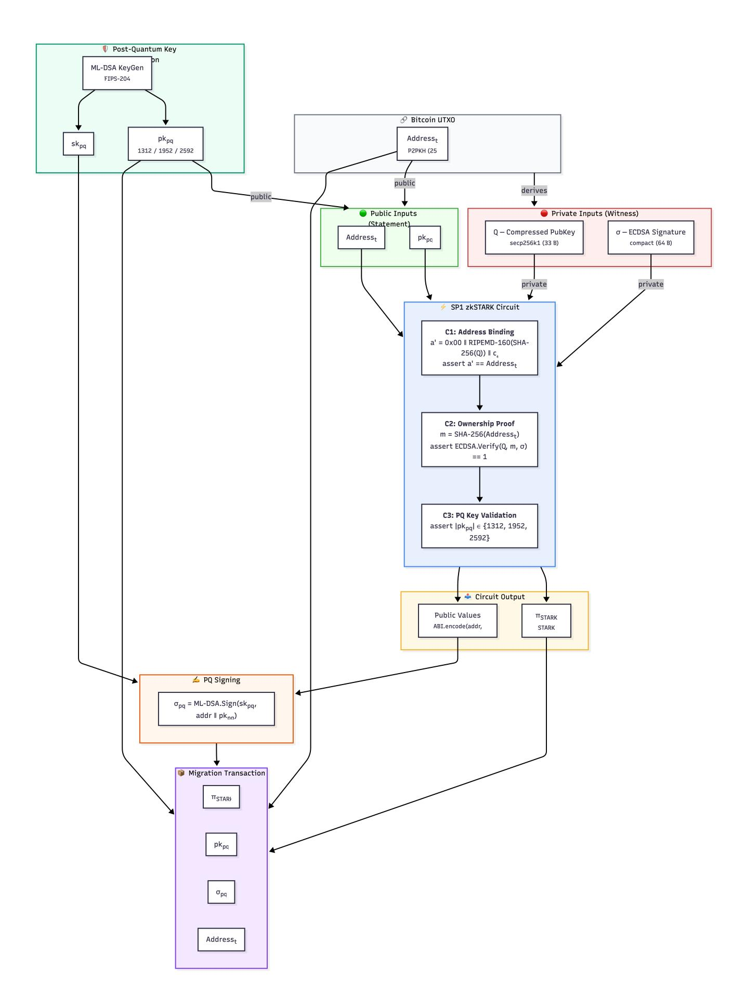

{0}------------------------------------------------

# Migrating Bitcoin and Ethereum Addresses to the Quantum Blockchain Era

Mehmet Sabir Kiraz<sup>1</sup> and Suleyman Kardas<sup>2</sup> mehmet.kiraz@dmu.ac.uk suleyman.kardas@batman.edu.tr

<sup>1</sup> De Montfort University, Leicester, UK

Abstract. Recent advances in quantum computing threaten the cryptographic foundations of blockchain systems, including Bitcoin and Ethereum, which rely on elliptic-curve cryptography (ECC) for security. Algorithms such as Shor's algorithm can efficiently solve the discrete logarithm problem (DLP), enabling recovery of private keys from public keys. Existing funds, especially those tied to long-lived addresses or unspent coinbase outputs (such as Satoshi Nakamoto's bitcoins), and Ethereum externally owned accounts become vulnerable once large-scale quantum computers become available. While previous work has suggested post-quantum signature schemes and migration strategies, no widely deployed, end-to-end, backward-compatible, and privacy-preserving migration mechanism has been presented for migrating legacy funds without revealing the corresponding classical public keys on-chain.

In this paper, we present a complete framework for secure migration of both spent and unspent Bitcoin and Ethereum assets to a post-quantum (PQ) security model, using a hybrid approach based on post-quantum signatures and quantum-resistant zero-knowledge proofs (ZKPs). We design zkSTARK circuits that prove knowledge of a witness linking a legacy Bitcoin or Ethereum address to a fresh PQ public key without disclosing the legacy elliptic-curve public key on-chain. We also formalize a one-way post-quantum transition model for migrated assets: legacy authorization is used only at enrollment, while future authorization semantics are governed by post-quantum credentials and migrated-state registry semantics. We further show why hash-security margins must be re-evaluated in the quantum setting by distinguishing collision resistance (BHT-style attacks, approximately 2 n/3 ) from preimage resistance (Grover-style attacks, approximately 2 n/2 ), and we motivate hash agility for migration-era commitments and registries. To enable verifiable on-chain transitions, we propose new primitives (OP\_CHECKQUANTUMSIG, OP\_CHECKSTARKPROOF), enabling verification of quantum-safe proofs and signatures. Our work and implementation[3](#page-0-0) provide a practical framework for securing legacy blockchain assets against quantum-era threats while preserving backward compatibility and operational continuity.

Keywords: Quantum Computing, Post-Quantum Cryptography (PQC), Blockchain, Bitcoin, Ethereum, zkSTARKs

<sup>2</sup> Batman University, Batman, Turkiye

<span id="page-0-0"></span><sup>3</sup> [github.com/skardas/pq\\_bitcoin](https://github.com/skardas/pq_bitcoin)

{1}------------------------------------------------

### 1 Introduction

Recent progress in quantum computing raises a significant threat to current cryptographic methods, especially elliptic-curve cryptography (ECC), which secures networks such as Bitcoin and Ethereum [\[33,](#page-35-0)[7](#page-33-0)[,25](#page-34-0)[,8\]](#page-33-1). Algorithms such as Shor's algorithm could efficiently break these widely used cryptographic primitives by solving discrete logarithm and factoring problems, weakening the fundamental security of cryptocurrencies [\[34,](#page-35-1)[11,](#page-34-1)[26\]](#page-34-2). Since blockchain networks like Bitcoin and Ethereum protect billions in funds and support widely used decentralized applications, the emergence of functional quantum computers could expose these funds to theft, leading to severe risks to the financial system [\[5,](#page-33-2)[15](#page-34-3)[,12\]](#page-34-4). Hence, ensuring longterm security in the blockchain domain requires a proactive transition to quantum-resistant cryptographic standards.

Consider the following scenario: When Satoshi introduced Bitcoin, they mined the first blocks and received about one million bitcoins as a reward. In Bitcoin, coins are typically sent to a public key hash, meaning the recipient's full public key remains hidden until the coins are spent. Therefore, although Satoshi received these bitcoins, their actual public key was not initially revealed and only its hash was visible on the Bitcoin network. Now, suppose a quantum computer becomes available. In that case, Satoshi's bitcoins (still about one million) would remain more difficult to attack in practice as long as they are unspent, since the public key is only present via a hash image and Grover-style speedups do not directly enable Shor-style key recovery. That said, quantum search can reduce hash security margins (quadratic speedup), so the claim is about relative resilience rather than absolute safety. However, if Satoshi attempts to spend these coins, they would need to sign the transaction, which reveals their full public key. Then, miners observing the transaction in the mempool could attempt to replace the transaction. More concretely, once a spend reveals the public key, an adversary with sufficiently fast quantum capability could recover the private key and broadcast a conflicting spend with higher fees. In this way, for example, Satoshi's bitcoins could be stolen, making it risky to move the funds in a quantum world without risking immediate theft. Whether this is feasible depends on quantum runtime vs. confirmation latency, but the exposure window is the core risk.

In this paper, we introduce a novel quantum-resistant cryptographic framework that combines post-quantum signature schemes with zkSTARKs (zero-knowledge Scalable Transparent Arguments of Knowledge). This framework enables transactions like Satoshi's to be securely transferred,

{2}------------------------------------------------

even in the presence of quantum adversaries, without revealing their identity or risking key exposure (e.g., knowledge of an ECC public key and a valid ECDSA signature that opens a P2PKH/P2WPKH hash commitment, or knowledge of a signature under an already revealed public key). Our solution not only addresses scenarios like this, but also provides a practical path for all blockchain users to migrate to quantumresistant methods. By combining classical and post-quantum signatures with quantum-secure ZKPs, our approach supports broad adoption across blockchain ecosystems without compromising the confidentiality of users' existing keys.

### 2 Quantum-Safe Transfers and Reward Allocations in Bitcoin and Ethereum

### 2.1 Hash-Based Address Transfers in Both Bitcoin and Ethereum

Both Bitcoin and Ethereum support the transfer of funds to addresses derived from hashed public keys without immediately revealing the underlying public key. In Bitcoin, this is standard practice with Pay-to-Public-Key-Hash (P2PKH) and Pay-to-Witness-Public-Key-Hash (P2WPKH), where the public key remains hidden until the output is spent; by contrast, Pay-to-Taproot (P2TR) outputs commit directly to a 32-byte x-only Taproot output key (a tweaked public key) in the UTXO itself, so they do not provide hash-hiding in the way P2PKH/P2WPKH do, even though optional script paths (if used) are hidden behind a commitment. Similarly, in Ethereum, externally owned accounts (EOAs) are identified by the last 20 bytes of the Keccak-256 hash of the uncompressed ECDSA public key. As long as the account has not initiated a transaction, the public key remains undisclosed. This allows users to preemptively transfer funds to any hash-derived address (e.g., one associated with a post-quantum key or ZK-proof-based identity) while maintaining quantum resistance, provided the address remains inactive. This mechanism forms the basis for forward-compatible, quantum-safe migrations, as it ensures the public key is never revealed on-chain.

Next, we focus specifically on Bitcoin and Ethereum reward mechanisms (commonly referred to as coinbase transactions), since these also do not reveal the public key at the time of allocation.

{3}------------------------------------------------

### 2.2 Bitcoin Block Rewards: Hash-Based Addressing and Key Exposure

The coinbase transaction is a core part of Bitcoin's reward mechanism. It rewards miners by issuing newly minted bitcoins and collecting transaction fees. Unlike regular transactions, the coinbase transaction has no inputs from previous transactions-it creates new bitcoins out of nothing. The security of this transaction type is important, as any vulnerability could compromise the stability and trust of the entire blockchain.

This section explains the structure, behavior, and public-key visibility of coinbase transactions, laying the foundation for understanding their security implications in a quantum computing context.

#### Transaction Structure.

Input (vin). The input field ("vin") of a coinbase transaction has a unique structure:

- prevout.hash: Set to 32 bytes of zeros, indicating no previous transaction.
- prevout.n: Set to 0xffffffff, marking it as a coinbase input.
- scriptSig: Contains arbitrary data, typically including:
  - Block height (per BIP34)
  - Extra nonce (for variability)
  - Optional metadata (e.g., mining pool identifiers)
- sequence: Usually set to 0xffffffff

Example of a simplified 'scriptSig':

```
OP_PUSHBYTES 3 0x01e240 ; block height (e.g., 123456)
OP_PUSHBYTES 4 0xabcdef01 ; extra nonce
OP_PUSHBYTES 9 "slushpool" ; optional pool identifier
```

Output (vout). The output ('vout') field specifies the recipient(s) of the mining reward. Outputs typically use standard script types such as:

– Pay-to-Public-Key-Hash (P2PKH): OP\_DUP OP\_HASH160 <pubKeyHash> OP\_EQUALVERIFY OP\_CHECKSIG

– Pay-to-Witness-Public-Key-Hash (P2WPKH):

```
0 <20-byte-hash>
```

{4}------------------------------------------------

#### – Pay-to-Taproot (P2TR):

OP\_1 <32-byte-xonly-pubkey>

Note that <pubKeyHash> is computed as RIPEMD160(SHA256(pubKey)) a double hash applied off-chain during address generation. The script uses OP\_HASH160, which performs this hashing at the time of transaction verification. Because the original public key is not revealed until the coins are spent, only a hash of the public key is revealed; recovering the public key from this value is a preimage problem. Quantumly, Grover's algorithm yields at most a quadratic speedup for generic preimage search, so the security margin is reduced but not collapsed in the way ECC is under Shor's algorithm.

Script Evaluation. The script evaluation of a coinbase transaction differs from regular transactions:

- The scriptSig is not executed during validation, as there is no previous output to verify.
- The scriptPubKey (locking script) is only evaluated when the miner later spends the reward.

Visibility of Public Keys. Coinbase transactions typically use P2PKH scripts, which only reveal the hash of the recipient's public key at the time of creation. The actual public key is revealed only when the coins are later spent.

| Stage                | Is the Public Key Visible?                       |
|----------------------|--------------------------------------------------|
| At coinbase creation | No: only the hash is visible                     |
|                      | When coins are spent Yes: public key is revealed |

Therefore, as long as the coins remain unspent, the public key remains hidden, providing a layer of protection even against quantum threats. However, once spent, the public key becomes visible and vulnerable to quantum attacks if not protected by quantum-resistant methods.

### 2.3 Ethereum Block Rewards: Hash-Based Addressing and Key Exposure

Unlike Bitcoin, Ethereum does not use dedicated coinbase transactions to mint new coins. Instead, block rewards are assigned directly to a beneficiary account address via a protocol-defined balance update. Despite 

{5}------------------------------------------------

the lack of scripting and unspent transaction output (UTXO) structures, Ethereum's architecture still allows analysis of public-key exposure with respect to reward accounts. In particular, while Ethereum does not use opcodes to explicitly reference public keys (as Bitcoin does with OP\_CHECKSIG), the public key is nonetheless revealed during transaction signature verification, which serves an analogous role.

#### Reward Assignment Structure.

Beneficiary Address. Each Ethereum block includes a beneficiary field in its header which is a 20-byte address that receives block rewards and transaction tips. This address is typically an externally owned account (EOA), derived from an ECDSA public key. However, the address alone does not contain or reveal the public key: it is computed as the lower 20 bytes of the Keccak-256 hash of the uncompressed public key (excluding the 0x04 prefix).

```
Algorithm 1 Deriving an Ethereum Address from an ECDSA Public Key
Require: Uncompressed ECDSA public key P (65 bytes, starts with 0x04)
1: Pbytes ← P[1 :] ▷ Remove prefix byte; take bytes 1 to 64 (x∥y)
2: H ← Keccak256(Pbytes)
3: eth_address ← H[12 :] ▷ Take last 20 bytes return eth_address
```

Public Key Revelation via Signature Verification. In Ethereum, every EOA-initiated transaction includes a signature (v, r, s), which is validated using ECDSA over the secp256k1 curve. The sender's secp256k1 public key is derivable from the on-chain transaction signature (v, r, s) and the signed message hash, and clients can recover it using the ecrecover precompile (or equivalent recovery logic). This mirrors Bitcoin's use of OP\_CHECKSIG in script evaluation. The public key is not stored in Ethereum state. However, once an EOA sends a transaction, the sender's public key can be recovered from the (v, r, s) signature and the signed message hash; thus it becomes observable to anyone monitoring the transaction data. Namely, Ethereum does not store public keys in state; the public key is recoverable from each signed transaction (and therefore observable to anyone who sees the transaction).

EVM-Level Behavior. Signature validation in Ethereum operates as follows:

{6}------------------------------------------------

- Inputs: Message hash m = keccak256(tx), and signature (v, r, s)
- Recovery: Public key P is reconstructed using the elliptic-curve recovery algorithm
- Address Check: address = last\_20\_bytes(keccak256(P))
- If match succeeds, transaction is valid

In particular, P is derivable from the transaction signature once the account originates a transaction; equivalently, the public key remains undisclosed until first use, after which it is linkable/recoverable from on-chain transaction data.

Visibility of Public Keys. Ethereum reward addresses, like Bitcoin's coinbase outputs, initially hide their public keys. The difference lies in how those keys are later revealed: in Bitcoin, via script execution and opcodes like OP\_CHECKSIG; in Ethereum, via ECDSA recovery at the EVM level.

| Stage                | Is the Public Key Visible?                            |
|----------------------|-------------------------------------------------------|
|                      | At reward allocation No: only hashed address is known |
| On first transaction | Yes: ECDSA recovery reveals public key                |

Thus, Ethereum's reward system preserves forward secrecy for unused accounts, analogous to unspent P2PKH or P2WPKH outputs in Bitcoin. For quantum-resistant migration, it is essential to initiate secure transfers from these accounts before revealing public keys, using post-quantum signatures or hash-based transparent ZK proofs (zkSTARKs).

### 3 Related Work

In [\[4\]](#page-33-3), Noah introduced Bitcoin Post-Quantum (BPQ) as a proactive measure against cryptographic vulnerabilities caused by quantum computing. The BPQ project involves a hard fork of the Bitcoin blockchain at block height 555,000, preserving existing transactions and maintaining ECDSAbased consensus rules until the fork. After the fork, BPQ implements quantum-resistant cryptographic measures. Central to BPQ is the integration of the eXtended Merkle Signature Scheme (XMSS), which is a hash-based digital signature method endorsed by the PQCRYPTO consortium, and the Winternitz One-Time Signature Plus (W-OTS+), designed to generate unique one-time keys per message to eliminate vulnerabilities associated with key reuse. These individual one-time public keys are aggregated using XMSS into a single reusable public key, structured as a 

{7}------------------------------------------------

Merkle tree from a randomly generated seed. Furthermore, BPQ replaces Bitcoin's conventional Proof of Work (PoW) with the quantum-resistant algorithm Equihash, derived from the generalized birthday problem and similarly implemented by Zcash. To migrate to BPQ, Bitcoin users must explicitly generate new XMSS-based keys and transfer their balances from legacy ECDSA addresses. A notable risk arises from BPQ's mandatory transition: support for ECDSA signatures ceases completely one year after the mainnet launch, resulting in the permanent loss (burning) of any coins left unmoved. Although this measure protects against future exploitation of lost or compromised ECDSA keys, it significantly burdens users with potential financial loss if they fail to migrate timely. Also, BPQ intends to integrate advanced quantum-safe privacy mechanisms, including post-quantum ZKPs such as ZKB++/Picnic and zk-STARKs. However, a critical limitation remains: as a separate blockchain fork, BPQ does not offer any direct cryptographic enhancements or protection to the existing Bitcoin network, leaving original Bitcoin users without improved security against quantum threats.

In [\[1\]](#page-33-4), Alghamdi and Almuhammadi present an evaluation of the security of cryptocurrency blockchains in the context of emerging quantum computing capabilities. Their work highlights the fundamental vulnerability of widely adopted public-key cryptographic algorithms (particularly ECDSA and EdDSA) to Shor's algorithm, causing the majority of existing cryptocurrencies, including Bitcoin, Ethereum, and Monero, susceptible to quantum attacks. With over 99.8% of the total cryptocurrency market value at risk, the authors argue that a transition to PQC is urgently needed. They survey a wide range of proposed quantum-safe digital signature schemes, such as lattice-based, hash-based, and multivariate systems, and classify blockchains into three categories: vulnerable, quantumresistant, and unimplemented but theoretically secure. Their analysis also includes projections, based on Moore's Law and prior research, that quantum computers may become practically capable of breaking current cryptographic schemes as early as 2033. This work serves as a critical foundation for understanding the upcoming need for cryptographic agility and secure migration strategies in blockchain systems.

In [\[3\]](#page-33-5), Alnahawi et al. provide a structured literature survey on the current status of PQC migration. The authors go beyond the development of cryptographic algorithms by categorizing and analysing the complex challenges and solutions associated with migrating existing IT systems and infrastructures to PQC. They explore key issues such as algorithm and system integration, performance across software and hardware platforms, 

{8}------------------------------------------------

network impacts, and security vulnerabilities including side-channel and downgrade attacks. The paper highlights the need for hybrid approaches and crypto-agility in migration strategies and emphasizes the necessity of automated tools for cryptographic inventory, readiness assessment, and deployment. Furthermore, the authors identify gaps in current research (in particular, the lack of standardized migration frameworks and automated processes) and propose a continuously updated online repository to track advancements in the field.

Wiesmaier et al. [\[32\]](#page-35-2) provide a comprehensive survey of the current state of research on post-quantum cryptography (PQC) migration and crypto-agility, highlighting the multiple challenges that must be addressed to prepare IT systems for a post-quantum future. Their work categorizes existing literature across domains such as algorithm performance, network and hardware constraints, security considerations (including sidechannel vulnerabilities), and migration strategies like hybrid, composite, and combiner approaches. The paper also highlights the importance of crypto-agility-the ability to adapt cryptographic components without major disruption-and explores its implications for software development, API design, and automation.

In [\[17\]](#page-34-5), Gomes et al. present a comprehensive review of post-quantum blockchain consensus mechanisms. Recognising the emerging threat caused by quantum computing to conventional cryptographic algorithms and consensus protocols such as Proof-of-Work (PoW) and Proof-of-Stake (PoS), the authors analyse several key studies to classify and evaluate current post-quantum blockchain consensus solutions. They identify six major categories of PQBC approaches, including quantum random number generation (QRNG), quantum key distribution (QKD), quantum entanglement and measurement, quantum distributed processing, lattice-based consensus, and multivariate polynomial equation-based techniques. The paper offers insights into how these methods enhance blockchain systems' security, scalability, trust, and privacy, with emphasis on metrics such as verifiability, fairness, resource efficiency, and resistance to quantum attacks. Furthermore, the study highlights the current challenges in post-quantum blockchain, including compatibility with conventional blockchains, scalability limitations, and transaction verification complexity.

The authors in [\[30\]](#page-35-3) analyse the challenges of transitioning blockchain systems like Bitcoin and Ethereum from ECDSA to post-quantum signature schemes. They provide a detailed taxonomy of migration strategies, such as soft forks, hard forks, and hybrid models-and assess the systemic impact of such changes on users, wallets, consensus protocols, and smart 

{9}------------------------------------------------

contracts. Their work highlights important practical and deployment considerations, including transaction overhead, backwards compatibility, and usability constraints. However, while their analysis is comprehensive, the paper lacks a concrete technical proposal or cryptographic mechanism for executing the migration.

In [\[27\]](#page-35-4), Saha et al. presented a post-quantum blockchain based on designing a signature algorithm, who present a novel blockchain framework using a lattice-based aggregate signature integrated with Identity-Based Encryption (IBE). Their approach leverages aggregate signatures for consensus and employs polynomial-based lattice constructions to ensure efficiency, scalability, and adaptability in a post-quantum setting. To address the key-escrow problem inherent in traditional IBE schemes, the framework incorporates a certificateless IBE mechanism using lattices. This design enhances security while eliminating the need for centralized key management. The authors demonstrate that their framework significantly improves performance in terms of transaction latency, throughput, storage efficiency, and energy consumption, positioning it as a robust and scalable solution for secure blockchain operations in the post-quantum era.

The authors in [\[31\]](#page-35-5) present a practical approach to assisting organizations in transitioning their IT infrastructures to a PQC state. Acknowledging the complexity and scale of enterprise systems, the authors propose two in-house tools developed at TCS Research: the Inventory Generator and the TCS Quantum Risk analyser Engine. The Inventory Generator analyses Java-based applications in binary form using the Soot framework, producing detailed reports on cryptographic API usage, which form the basis for further migration planning. The TCS Quantum Risk analyser employs a novel risk assessment methodology that integrates the Cox Proportional Hazard model with Mosca's rule to estimate an application's vulnerability to quantum threats. This risk-based prioritization aids organizations in identifying critical applications for early migration. This work contributes to the field by offering automated and scalable solutions designed to the enterprise context, aligning technical feasibility with strategic risk management.

The authors in [\[14\]](#page-34-6) introduce two practical migration pathways for Ethereum to adopt post-quantum security with minimal disruption. The first proposal defines a new transaction type that embeds a quantum-safe ZKP, enabling validators to verify post-quantum signatures alongside traditional ECDSA ones. The second leverages proof aggregation and ZK rollups to enhance scalability and reduce on-chain overhead. Both approaches were prototyped and evaluated on Microsoft Azure, demonstrat

{10}------------------------------------------------

ing encouraging performance in proof generation times. While this work is focused exclusively on Ethereum and relies on including transactions with externally stored proofs, our paper extends the scope significantly by proposing a unified, complete migration framework for both Bitcoin and Ethereum. We support both UTXO and account-based models, and introduce hash-based transparent ZKPs (zkSTARKs) circuits for address derivation and classical signature validation (which are conjectured to remain secure against quantum adversaries up to Grover-type quadratic speedups on the underlying hashes), enabling on-chain proof verification without disclosing legacy elliptic-curve keys. More importantly, our framework distinguishes between accounts with revealed and hidden public keys (i.e., their proposal proves the knowledge of the corresponding private key given a public key), offering hybrid ECDSA-post-quantum signatures for the former and ZK migration paths for the latter. We also propose new Bitcoin opcodes and implement a recursive proof composition pipeline using SP1, and Plonky3 to generate succinct proofs compatible with both Bitcoin Script and Ethereum smart contracts. In contrast to [\[14\]](#page-34-6), we directly address long-lived assets such as unspent coinbase rewards and enable privacy-preserving post-quantum transitions without revealing mnemonics or classical public keys.

In [\[16\]](#page-34-7), Gharavi et al. offer a comprehensive survey that integrates the domains of blockchain, PQC, and IoT, marking a unique contribution to the field. The authors highlight the increasing adoption of blockchain to secure IoT ecosystems, which face growing threats due to centralized architectures and resource-constrained devices. However, current blockchain platforms largely rely on cryptographic primitives such as ECDSA, Ed-DSA, which are vulnerable to quantum attacks. The paper examines various PQC schemes, including lattice-based, code-based, hash-based, multivariate, and isogeny-based cryptosystems, and assesses their feasibility on IoT devices. It also explores post-quantum key encapsulation and digital signature schemes standardized by NIST, such as Kyber, Dilithium, FALCON, and SPHINCS+. The survey evaluates the computational and memory overheads of these schemes in IoT environments and identifies lattice-based schemes as the most promising. Furthermore, it discusses blockchain-IoT architecture, applications, and platforms and categorizes post-quantum blockchain approaches into practical implementations and research prototypes.

In [\[5\]](#page-33-2), the authors conduct a comprehensive analysis of how quantum computing threatens the cryptographic foundations of blockchain. They utilize the STRIDE (Spoofing, Tampering, Repudiation, Information Dis

{11}------------------------------------------------

closure, Denial of Service, and Elevation of Privilege) threat modeling framework to assess quantum-specific vulnerabilities across core BC components such as consensus mechanisms, smart contracts, digital wallets, and network protocols. The study is important since it offers a detailed platform-specific vulnerability assessment of major blockchains like Bitcoin, Ethereum, Ripple, Litecoin, and Zcash. In response to the identified threats such as private key compromise and integrity breaches-the authors propose two hybrid blockchain architectures to facilitate a secure migration toward PQC. These architectures integrate classical and quantumresistant cryptographic primitives to ensure adaptability, scalability, and long-term resilience.

In [\[13\]](#page-34-8) Fan et al. propose two innovative approaches for transitioning Ethereum to post-quantum security while preserving backward compatibility. Recognizing the vulnerability of Ethereum's ECDSA to quantum attacks, the authors build on prior work to integrate quantum-safe ZKPs into Ethereum transactions. The first proposal introduces a new transaction type with an additional proofUri field that links to an off-chain quantum-resistant ZKP, thereby enhancing security with minimal disruption to Ethereum's existing validator and client infrastructure. The second approach enhances scalability through Layer-2 zk-Rollups combined with recursive proof aggregation, enabling the compression of multiple proofs into a single succinct proof verified on-chain. Their performance evaluation, conducted using SP1 and RISC0 zkVMs on Azure, highlights tradeoffs between security level, proof size, and generation time. The paper concludes by emphasizing the importance of trusted execution environments (TEEs) and hardware acceleration to make the proposed methods practical for real-world deployment, showing a significant contribution towards Ethereum's resilience in a post-quantum future.

In [\[2\]](#page-33-6), the authors propose a novel transition protocol to facilitate the migration of existing cryptocurrencies to post-quantum blockchains in light of the existential threat caused by quantum computing to current cryptographic systems. The authors begin by outlining the vulnerabilities of widely used digital signatures such as ECDSA and EdDSA, which ensure the security of major cryptocurrencies including Bitcoin and Ethereum, and are susceptible to quantum algorithms like Shor's and Grover's. They analyse both the current exposure of the cryptocurrency market-where less than 0.05% of the total capitalization is protected by quantum-safe schemes-and prior transition strategies, such as the commitdelay-reveal method and hard fork solutions, identifying limitations such as latency and network fragmentation. Their core contribution is a delay

{12}------------------------------------------------

free soft fork transition protocol that enables a seamless and secure shift from classical to quantum-resistant coins over a configurable grace period, during which both coin types are accepted. After the grace period, only quantum-resistant coins remain valid, and any unconverted legacy coins are considered burned.

In [\[10\]](#page-33-7), Sezer et al. present a systematization of knowledge on privacypreserving post-quantum blockchain (PP-PQB) architectures. It addresses the critical intersection of blockchain security and quantum computing threats by systematically analysing the integration of post-quantum cryptographic techniques (in particularly, lattice-based and hash-based) with privacy-preserving mechanisms such as ZKPs. The paper classifies several key studies published between 2018 and 2024, highlighting performance, interoperability, scalability, and security (OISS) challenges. The authors evaluate current implementations of PP-PQB, identify research gaps-particularly in balancing privacy and computational efficiency-and propose a taxonomy to guide future work. Novel contributions include the assessment of ZKP-enabled systems in PQB contexts and the exploration of practical use cases (e.g., IoT, healthcare, finance). This work provides a roadmap for developing quantum-resistant, privacy-aware blockchain systems and introduces new research directions, including Layer-2 solutions and multi-chain models.

While previous research offers valuable insights into quantum-resilient blockchains, ZKPs, and post-quantum asset migration, these efforts remain largely are not connected and do not provide a unified, end-to-end solution for securely migrating legacy blockchain assets. In particular, existing approaches do not propose concrete algorithms or protocols for migrating assets whose public keys have never been revealed and they typically lack i) hybrid support that distinguishes between ECC-revealed and still-hidden keys, ii) minimal-consensus on-chain integration via new primitives, and iii) a complete toolchain spanning ZK circuit design through on-chain verification and deployment. On the other hand, our contribution presents a cryptographically rigorous and forward-compatible migration framework that uses transaction-level zkSTARKs to preserve ECC key secrecy throughout the post-quantum transition, combining theoretical soundness with practical deployability for protecting long-lived blockchain assets against quantum threats.

{13}------------------------------------------------

### 4 Our Contributions

In this work, we introduce a novel quantum-resilient framework that enables secure migration of Bitcoin and Ethereum assets to post-quantum security without disclosing legacy elliptic-curve public keys. To the best of our knowledge, this work presents the first concrete and practical solution for migrating both active and inactive Bitcoin and Ethereum addresses to a post-quantum security model without disclosing legacy EC public keys. Our contributions are summarized as follows:

- 1. End-to-End Migration Framework for Legacy Blockchain Assets: We design a complete cryptographic migration system that leverages zkSTARKs and post-quantum signature schemes (e.g., CRYSTALS-Dilithium/ML-DSA) to securely transition both active and inactive blockchain accounts. Our approach applies uniformly to legacy coinbase rewards in Bitcoin and externally owned accounts (EOAs) in Ethereum.
- 2. Dual Migration Paths Based on Key Exposure: We identify and address two distinct classes of assets: those whose elliptic-curve public keys have already been revealed and those whose public keys remain hidden behind hash-derived addresses. For the former, we propose hybrid dual-signature migration that combines classical ECDSA and post-quantum signatures with on-chain verification logic. For the latter, we introduce zkSTARK-based migration proofs that bind legacy addresses to PQ keys without ever revealing the legacy public key onchain.
- 3. Design of zkSTARK Circuits for Bitcoin and Ethereum: We construct zkSTARK circuits for Bitcoin and Ethereum that validate address derivation and classical signature correctness while simultaneously binding new post-quantum keys. Our designs are modular, support customizable public/private input interfaces, and can be deployed across both UTXO- and account-based systems. We also define and specify new on-chain primitives—OP\_CHECKQUANTUMSIG and OP\_CHECKSTARKPROOF—to extend Bitcoin Script and Ethereum-like execution environments with succinct verification of PQ signatures and zkSTARK proofs.
- 4. One-Way Post-Quantum Transition Semantics for Migrated Assets: We formalize a one-way post-quantum transition model in which legacy ownership proofs are accepted only during enrollment, after which authorization semantics are switched to post-quantum credentials and registry/state semantics. This provides a genesis-like

{14}------------------------------------------------

- cryptographic transition for migrated assets while preserving backward compatibility for the historical chain.
- 5. Quantum Hash-Security Margin Analysis, One-Way Transition Semantics, and Hash Agility Guidance: We provide a security analysis of the legacy hash layer in the quantum setting by explicitly distinguishing quantum collision complexity (BHT-style, ≈ 2 n/3 in the generic model) from quantum preimage complexity (Groverstyle, ≈ 2 n/2 in the generic model), and show why this distinction is crucial for correctly assessing hidden-key Bitcoin/Ethereum assets (e.g., P2PKH/P2WPKH outputs and EOAs before first use). Building on this analysis, we formalize a one-way post-quantum transition semantics for migrated assets: legacy hash/address bindings are preserved only as enrollment-time compatibility constraints, while postmigration authorization is governed by post-quantum credentials and migrated-state registry semantics. Hence, we treat legacy hashes (e.g., Bitcoin HASH160) as immutable compatibility constraints rather than long-term post-quantum security anchors, and we introduce hash-agility guidance for migration-era commitments (e.g., registry leaves, transcript hashes, proof commitments, and migration messages) using domainseparated hash suites with at least 256-bit outputs.
- 6. Practical Implementation using SP1 and Proof Composition: We implement our framework using SP1, a high-performance zkVM, to compile and prove address verification circuits, and we develop a recursive proof composition pipeline that transforms STARK execution traces into succinct SNARK-like formats (e.g., Groth16/PLONK wrappers) suitable for practical on-chain verification. We benchmark proof sizes, generation times, and verification costs for representative migration workflows, and we present a multi-path deployment strategy spanning EVM verification (PQBitcoin.sol), OP\_RETURN commitments, Taproot script-path commitments, Bitcoin L2 deployments, and a long-term soft-fork path with native PQ/STARK opcodes. We release our full implementation, including prover circuits, verification scripts, contract components, and conceptual opcode templates, at [github.com/skardas/pq\\_bitcoin](https://github.com/skardas/pq_bitcoin), offering the blockchain community a transparent, extensible, and auditable foundation for post-quantum migration efforts.

### 5 Quantum Threats to Bitcoin and Ethereum Addresses

The security of Bitcoin fundamentally relies on the ECC and the practice of keeping public keys hidden until coins are spent. Bitcoin addresses

{15}------------------------------------------------

hashes of public keys-provide an initial layer of protection for UTXOs. However, emerging quantum computing technologies, particularly Shor's algorithm, create a significant threat to ECC by efficiently solving the elliptic-curve discrete logarithm problem (ECDLP) [\[29\]](#page-35-6). Current estimates for running Shor's algorithm against 256-bit ECC put the requirement at a few thousand logical qubits, but the real blocker is fault tolerance: once you account for quantum error correction (e.g., surface codes) and a practical attack deadline, the gap to physical qubits becomes enormous. In particular, estimates commonly cited in the literature indicate that breaking ECC within short, operationally relevant windows can require on the order of 107–10<sup>8</sup> physical qubits, depending on assumptions about error rates and runtime [\[28,](#page-35-7)[21\]](#page-34-9). While today's hardware is nowhere near that scale (e.g., current processors are still in the ∼ 10<sup>2</sup> physical-qubit regime), [\[20,](#page-34-10)[24\]](#page-34-11) blockchain systems face a deployment-latency problem: upgrading consensus rules, wallets, and signing workflows takes years. This is especially serious for assets tied to revealed ECC public keys (spent UTXOs, reused keys, and active Ethereum EOAs), where a future adversary could attempt transaction replacement via mempool monitoring (i.e., front-running/race-to-confirm attacks) once a spend reveals the corresponding public key. Hence, even if cryptographically relevant quantum computers are not happening soon, it is wise to design backwardcompatible and crypto-agile migration paths now, including mechanisms that avoid revealing legacy ECC keys when migrating long-lived funds.

An important consideration is the treatment of coinbase transactionsthe special transactions that generate new bitcoins. These are comparatively more resistant as long as outputs remain unspent, since they are typically sent to a hashed public key (e.g. P2PKH or P2WPKH), not the key itself. The public key only becomes visible when the coins are spent, at which point quantum vulnerabilities emerge. For example, approximately one million bitcoins attributed to Satoshi Nakamoto are considered secure today because they have never been moved. However, if they are spent in a future quantum-enabled era, the revealed public keys could be exploited by adversaries capable of executing Shor's algorithm. This would make them immediately vulnerable to theft.

#### 5.1 Which Addresses are Vulnerable to Quantum Computers?

In UTXO-based cryptocurrencies like Bitcoin, an address's vulnerability to quantum attacks depends primarily on whether its associated public key has been revealed on-chain. Addresses whose UTXOs remain unspent are generally considered quantum resistant since their public keys remain

{16}------------------------------------------------



Fig. 1. Overview of the proposed framework for securing coinbase transactions using post-quantum signatures and zkSTARKs.

{17}------------------------------------------------

undisclosed. In standard output scripts such as P2PKH, only the hash of the public key (i.e., RIPEMD160(SHA256(pubKey))) is visible. Without access to the full public key, a quantum adversary cannot apply Shor's algorithm to derive the private key.

On the other hand, once a UTXO is spent, the full public key must be revealed in the unlocking script (scriptSig or witness, depending on the script type) to validate the signature. This exposure enables a quantumcapable adversary to compute the corresponding private key efficiently and compromise any remaining or reused outputs tied to the same key. Hence, only unspent outputs with hidden public keys, such as those originating from untouched coinbase transactions, maintain resilience against future quantum threats.

In the following section, we address both scenarios where public keys are revealed or remain hidden and propose cryptographic solutions designed for each case.

## 6 Securing the Transfer of Coinbase Funds in the Quantum Era

We introduce a framework that combines STARK proofs [\[6\]](#page-33-8) with a latticebased signature scheme (ML-DSA which is standardised CRYSTALS-Dilithium [\[23\]](#page-34-12)) to enable blockchain address owners to transition to quantumresistant key material without exposing their classical elliptic-curve public keys on-chain. The framework accommodates two distinct threat models and addresses whose public keys have already been revealed, those whose keys remain hidden behind hash pre-images, and provides a graduated migration path for each.

#### <span id="page-17-0"></span>6.1 STARK Circuit for Bitcoin Address Migration

Consider a Bitcoin user who controls a P2PKH unspent transaction output (UTXO) associated with a secp256k1 key pair (sk, Q), where Q = sk · G is the 33-byte compressed public key and the locking script commits to the 20-byte key-hash h<sup>160</sup> = RIPEMD-160(SHA-256(Q)) (P2PKH/P2WPKH). The user generates a post-quantum key pair (skpq, pkpq) under FIPS-204 (ML-DSA) and wishes to publicly bind pkpq to P2PKH key-hash h<sup>160</sup> while proving knowledge of sk in zero knowledge.

Address Derivation within the Circuit. The circuit internally rederives the P2PKH address from the (private) compressed public key Q through the following deterministic pipeline:

{18}------------------------------------------------

- (i) Compute  $h_1 = SHA-256(Q)$ .
- (ii) Compute  $h_2 = \text{RIPEMD-160}(h_1)$ .
- (iii) Compute the checksum  $c_4 = \text{SHA-}256^2(0x00||h_2)[0:4].$
- (iv) Form the address  $a' = 0 \times 00 \|h_2\| c_4$ .

The Circuit Specification. The STARK circuit partitions its inputs into public and private sets:

- Public inputs (statement): The 20-byte P2PKH key-hash  $h_{160}$  and the post-quantum public key  $pk_{pq}$ . (Optionally, the circuit may also commit to the Base58Check payload encoding via version and check-sum.)
- Private inputs (witness): The compressed elliptic-curve public key  $Q \in \{0,1\}^{264}$  and the ECDSA signature  $\sigma \in \{0,1\}^{512}$ .

The circuit enforces two constraints:

1. **Address binding.** The internally derived address must match the declared UTXO address:

$$h'_{160} = \text{RIPEMD-160}(\text{SHA-256}(Q)) \stackrel{!}{=} h_{160}$$

where  $f_{\text{P2PKH}}$  denotes the four-step derivation pipeline defined above. This ensures the prover cannot claim ownership of an address controlled by a different key.

2. Ownership proof. Let  $m = SHA-256("PQ-MIG"||h_{160}||SHA-256(pk_{pq})).$ 

ECDSA. Verify
$$(Q, m, \sigma) \stackrel{!}{=} 1$$

This establishes that the prover possesses the private key sk such that  $Q = sk \cdot G$  on secp256k1, without revealing Q or sk to the verifier.

Upon satisfaction of both constraints, the circuit commits the tuple  $(h_{160}, pk_{pq})$  as public values, producing a STARK proof  $\pi$  that states: "the holder of key-hash  $h_{160}$  authorizes binding  $pk_{pq}$  as its quantum-resistant successor key."

#### <span id="page-18-0"></span>6.2 STARK Circuit for Ethereum Address Migration

Consider an Ethereum externally owned account (EOA) controlled by a secp256k1 key pair  $(sk, Q_u)$ , where  $Q_u$  is the 65-byte uncompressed public key (with 0x04 prefix). The Ethereum address is derived as the trailing 20 bytes of the Keccak-256 digest of the raw 64-byte key:

$$a_{\text{eth}} = \text{Keccak-256}(Q_u[1:65])[12:32]$$

{19}------------------------------------------------

The Circuit Specification. The Ethereum circuit mirrors the Bitcoin circuit structurally, with two substitutions in the cryptographic primitives:

- Public inputs: The Ethereum address aeth ∈ {0, 1} <sup>160</sup> and the postquantum public key pkpq.
- Private inputs: The uncompressed public key Q<sup>u</sup> ∈ {0, 1} <sup>520</sup> and the ECDSA signature σ.
- 1. Address binding. Keccak-256(Qu[1:65])[12:32] !<sup>=</sup> <sup>a</sup>eth.
- 2. Ownership proof. ECDSA.Verify <sup>Q</sup>u, Keccak-256(aeth), σ != 1.

The use of Keccak-256 (rather than SHA256) for both address derivation and message hashing aligns with Ethereum's native conventions. The PQ key format validation additionally asserts |pkpq| ∈ {1312, 1952, 2592} bytes.

#### 6.3 Proof Generation and On-Chain Verification

Users generate quantum-resistant key pairs offline and produce STARK proofs via the zkVM circuit, binding their classical addresses to the new post-quantum public keys. Crucially, the classical elliptic-curve public key is supplied to the circuit as a private input and is never revealed on-chain, namely it is consumed only within the ZK execution trace. The resulting proof π, together with the public values (h160, pkpq) and the verification key vk, suffices for any verifier to confirm the binding without learning Q or sk.

This design preserves the hash-based protection of hidden addresses: even if an adversary observes π and pkpq on the blockchain, they gain no information about the original public key beyond what is already implied by the key-hash h<sup>160</sup> (which is itself a hash image).

#### 6.4 Potential Migration Scenarios

We distinguish two scenarios based on the exposure status of the classical public key, as each entails a different threat model and accordingly requires a different migration protocol.

Scenario A: revealed Public Keys - Hybrid Dual-Signature Migration. In both Bitcoin and Ethereum, a user's elliptic-curve public key is revealed the first time they sign a transaction. Once Q appears on-chain, 

{20}------------------------------------------------

an adversary equipped with a quantum computer can apply Shor's algorithm [\[29\]](#page-35-6) to recover sk in time polynomial in log |G|, rendering all funds controlled by Q vulnerable. We therefore propose a hybrid dual-signature migration for revealed addresses:

- 1. Post-quantum key generation. The user generates an ML-DSA key pair (skpq, pkpq) under FIPS-204 at the desired security level (ML-DSA-44/65/87).
- 2. Classical attestation. The user signs the post-quantum public key pkpq with their ECDSA private key sk, producing

$$\sigma_{\text{ecdsa}} = \text{ECDSA.Sign}(sk, pk_{pq}).$$

This binds pkpq to the classical identity under the still-secure prequantum assumption.

3. Quantum-resistant attestation. The user signs the migration message m = SHA-256("PQ-MIG"∥h160∥SHA-256(pkpq)) using the ML-DSA private key skpq, producing

$$\sigma_{pq} = \text{ML-DSA.Sign}(sk_{pq}, m).$$

This proves liveness of the post-quantum key.

- 4. On-chain registration. Both signatures (or their hashes, for gas efficiency) are submitted to the migration contract or embedded in a Bitcoin transaction. Validators check:
  - (a) the ECDSA signature σecdsa under Q (verifying classical ownership),
  - (b) the ML-DSA signature hash h<sup>σ</sup> = keccak256(σpq) (enabling offchain quantum-resistant verification), and
  - (c) the format validity of pkpq (|pkpq| ∈ {1312, 1952, 2592}).
- 5. Post-quantum continuation. Future transactions from a are authorized under pkpq using ML-DSA signatures, eliminating dependence on the classical key pair entirely.

This hybrid approach ensures backward compatibility with existing validation infrastructure while layering quantum-resistant guarantees. The dual-signature requirement during the transition window provides defense in depth: an adversary must compromise both the classical and postquantum keys to forge a migration. For Bitcoin specifically, we introduce a dedicated opcode OP\_CHECKQUANTUMSIG (0xbb) that validates an ML-DSA signature under a declared post-quantum public key (auto-detecting the parameter set from key size). In Scenario A (revealed keys), classical 

{21}------------------------------------------------

ownership is proven by a standard ECDSA signature under the alreadyrevealed public key, while zkSTARK verification (OP\_CHECKSTARKPROOF, 0xbc) is used only in Scenario B to avoid revealing the legacy public key on-chain.

Once quantum-resistant schemes achieve broad community acceptance and rigorous standardization review, the network can transition to exclusively post-quantum signatures, completing the migration. This graduated approach protects assets against emerging quantum threats while minimizing disruption to network stability and operational continuity.

Scenario B: hidden Public Keys - Zero-Knowledge Migration via zkSTARKs. When the classical public key has never been revealed (as is the case for unspent P2PKH UTXOs in Bitcoin and EOAs that have never initiated a transaction in Ethereum) the address a is protected by the SHA256/RIPEMD160 (Bitcoin) or Keccak-256 (Ethereum) hash barrier. This pre-image resistance provides an additional layer of quantum resistance, since Grover's algorithm offers only a quadratic speedup for generic preimage search. More concretely, Bitcoin P2PKH/P2WPKH hide the public key behind HASH160 (160-bit output), which reduces from ≈ 2 160 to ≈ 2 <sup>80</sup> quantum queries under Grover-type assumptions; Ethereum addresses similarly expose only a 160-bit truncation of Keccak-256, yielding comparable ≈ 2 <sup>80</sup> preimage security. This provides relative resilience compared to ECC under Shor's algorithm, but it is not absolute quantum safety. However, this protection is ephemeral: the classical public key Q is necessarily revealed the moment the user constructs a spending transaction. At that instant, Q becomes vulnerable to Shor's algorithm. We therefore propose using the zkSTARK circuits described in Sections [6.1](#page-17-0) and [6.2](#page-18-0) to prove knowledge of sk and bind pkpq without ever revealing Q on-chain. More concretely, consider a user (e.g., Satoshi) controlling a coinbase UTXO associated with a key pair (sk, Q) in a world where a quantum computer exists:

- 1. Post-quantum key generation. Generate (skpq, pkpq) under ML-DSA at the desired security level.
- 2. Proof generation. Execute the Bitcoin STARK circuit with private inputs (Q, σ) and public inputs (h160, pkpq). The resulting proof π attests that:
  - the prover knows a pre-image Q such that RIPEMD-160(SHA-256(Q)) = h160, and
  - the prover can produce a valid ECDSA signature under Q over m = SHA-256("PQ-MIG"∥h160∥SHA-256(pkpq)).

{22}------------------------------------------------

At no point is Q transmitted off-device or committed to any public channel.

3. Transaction construction. Construct a spending transaction that includes the STARK proof π, the post-quantum public key pkpq, and (optionally) an ML-DSA (standardized from CRYSTALS-Dilithium) signature. The conceptual script takes the form:

> OP\_DUP OP\_HASH160 <pubKeyHash> OP\_EQUALVERIFY <zkSTARKProof> <pk\_{pq}> OP\_CHECKSTARKPROOF OP\_CHECKQUANTUMSIG

For Bitcoin specifically, we propose a dedicated opcode OP\_CHECKQUANTUMSIG (0xbb) that verifies an ML-DSA signature under a declared post-quantum public key (auto-detecting the parameter set from key size). The complementary opcode OP\_CHECKSTARKPROOF (0xbc) is used in Scenario B to validate zkSTARK-based hidden-key migrations that bind a legacy address to a new post-quantum key without revealing the legacy public key.

- 4. Miner validation. Miners (or full nodes) verify π against the circuit's verification key, confirm the consistency of (h160, pkpq), and include the transaction in the blockchain, marking the original UTXO as spent.
- 5. Post-quantum continuation. A new UTXO is created, locked to pkpq. The user employs (skpq, pkpq) for all subsequent transactions, achieving full quantum resistance. The original key pair (sk, Q) is effectively retired without having been revealed.

Remark 1. This ZK migration protocol requires that the Bitcoin protocol be upgraded to support STARK proof verification and the proposed custom opcodes on-chain. While such capabilities are not present in Bitcoin today, the framework is immediately deployable on EVM-compatible chains (via the PQBitcoin.sol smart contract) and on Bitcoin Layer 2 networks, providing practical migration pathways in advance of any consensuslayer changes. The accompanying BIP-style draft specification (opcode semantics, resource limits, and activation) is left for future work/an extended version.

## 7 Improving the Security of the Hash Functions through a One-Way Post-Quantum Transition

A common misconception in discussions of quantum risk for Bitcoin and Ethereum is to treat all hash-related attacks as equivalent. In practice, 

{23}------------------------------------------------

the relevant quantum attack complexity depends on the security property being targeted (e.g., collision vs. preimage), and this distinction is essential for correctly modelling the security of hidden-key addresses (such as Bitcoin P2PKH/P2WPKH and Ethereum EOAs before first use). The authors in [\[19\]](#page-34-13) emphasize that quantum attacks affect hash security margins differently depending on the attack objective and construction details, without implying that SHA-2 is "completely broken" in practice today .

#### 7.1 Collision vs. Preimage Security in the Quantum Setting

Let H : {0, 1} <sup>⋆</sup> → {0, 1} <sup>n</sup> be an n-bit hash function. In the generic (blackbox) setting:

- Collision resistance asks for two distinct inputs x ̸= x ′ such that H(x) = H(x ′ ).
- Preimage resistance asks, given a target digest y, to find x such that H(x) = y.

These are different problems and lead to different generic quantum attack complexities:

- Quantum collision attacks (BHT-style): approximately 2 n/<sup>3</sup> queries in the generic model [\[9\]](#page-33-9).
- Quantum preimage attacks (Grover-style): approximately 2 n/2 queries in the generic model [\[18\]](#page-34-14).

Therefore, statements such as "a 160-bit hash gives only ∼ 53 bits of security" are correct for collision resistance (since 2 <sup>160</sup>/<sup>3</sup> ≈ 2 53.3 ), but do not directly imply a ∼ 53-bit preimage attack against a hidden Bitcoin address. For targeted preimage search, the generic quantum baseline remains approximately 2 n/2 (e.g., ∼ 2 <sup>80</sup> for a 160-bit hash image) [\[18\]](#page-34-14). This distinction is particularly important for Bitcoin P2PKH/P2WPKH outputs, where the public key is hidden behind

$$h_{160} = \text{RIPEMD-160}(\text{SHA-256}(Q)).$$

The security question for theft of an unspent output is not a generic collision attack but rather a targeted attack path (e.g., constrained preimage search over valid public-key or private-key domains).

{24}------------------------------------------------

#### 7.2 Implications for Hidden-Key Legacy Outputs

Our threat model distinguishes between two different quantum attack surfaces:

- 1. Revealed-key attack surface (Shor-dominant). Once a secp256k1 public key Q is revealed on-chain, a sufficiently capable quantum adversary may apply Shor's algorithm to recover the corresponding private key sk, enabling signature forgery and theft.
- 2. Hidden-key attack surface (hash-barrier, Grover/BHT-limited). Before key revelation, the adversary sees only a hash-derived commitment (e.g., Bitcoin HASH160 or Ethereum address truncation of Keccak-256). In this case, Shor's algorithm cannot be directly applied to the hidden elliptic-curve key. However, the hash barrier is not quantum-safe: generic quantum search reduces preimage security margins (Grover-type attacks) [\[18\]](#page-34-14), and generic collision margins are also reduced (BHT-type attacks) [\[9\]](#page-33-9).

Thus, hidden-key outputs are more resistant than revealed-key outputs in the quantum setting, but they should not be described as absolutely secure. This observation strengthens, rather than weakens, the motivation for our migration framework: a robust migration mechanism must protect both i) addresses whose public keys have already been revealed and ii) addresses whose public keys remain hidden but are protected only by a limited hash-security margin.

#### 7.3 Our Proposal: One-Way Post-Quantum Transition

We formalize a one-way post-quantum transition for migrated assets. The key idea is to preserve backward compatibility for legacy ownership proofs at the enrollment step, while ensuring that, once migration is finalized, future authorization semantics are governed exclusively by post-quantum credentials. For each migrated asset, the system performs:

- 1. Legacy ownership proof (one-time): prove control of the legacy asset (via dual-signature migration for revealed keys, or zkSTARKbased hidden-key migration for unrevealed keys).
- 2. PQ binding registration: bind the asset to a post-quantum public key pkpq.
- 3. Authorization switch: mark the asset as migrated so that subsequent authorization proceeds only via the post-quantum key (or a post-quantum key rotation policy).

{25}------------------------------------------------

This creates a genesis-like cryptographic transition for migrated assets: the historical chain remains valid, but future spending authority is governed by a new post-quantum state root (e.g., a contract registry, Merkle root, or consensus-native migrated-state mapping). In this sense, the transition is one-way by protocol semantics, not just by cryptographic convention. A central consequence of this analysis is that the legacy hash layer (e.g., RIPEMD160 in Bitcoin P2PKH/P2WPKH) cannot be retroactively upgraded for already-existing UTXOs. Therefore, our framework treats considers legacy hashes as immutable compatibility constraints and strengthens security in the new post-quantum layer via hash agility. Even if hidden-key legacy outputs provide relative resistance, their security margins degrade under generic quantum attacks (i.e., for preimages, roughly 2 n/<sup>2</sup> under Grover-type attacks [\[18\]](#page-34-14), and for collisions, roughly 2 n/<sup>3</sup> under BHT-type attacks [\[9\]](#page-33-9).). Hence, 160-bit outputs are no longer desirable as the long-term basis for a post-quantum migration registry or commitment scheme. This is consistent with broader guidance that hash functions are not made obsolete in the same way as RSA/ECC by quantum computers, but their effective security margins should be re-estimated and compensated for in new designs [\[19\]](#page-34-13).

We therefore propose that all new migration-era commitments (e.g., registry leaves, nullifiers, transcript hashes, proof anchors, and message digests) use at least 256-bit outputs, with explicit suite/domain identifiers. More concretely, the migration framework can adopt a domain-separated hash suite such as:

- SHA512/256 (recommended for compact 256-bit outputs with larger internal state) [\[22\]](#page-34-15),
- SHA3-256/Keccak-256 (particularly natural for EVM-compatible systems), or
- longer-output variants (SHA384, SHA512, SHA3-512) where storage and on-chain cost permit.

For instance, instead of reusing ad hoc migration messages, the system may define

$$m_{\text{mig}} = H_{\text{suite}}\big(\text{"PQ-MIG-BTC-v1"} \parallel h_{160} \parallel H_{\text{suite}}(pk_{pq}) \parallel \text{mode} \parallel \text{epochID}\big)$$

,

where Hsuite is a selected post-quantum-era hash (e.g., SHA512), and mode distinguishes revealed-key vs. hidden-key migration. This improves robustness against cross-context replay and provides clean crypto-agility for future upgrades.

{26}------------------------------------------------

#### 7.4 Migration Registry Semantics and Irreversibility

To make the post-quantum transition operationally and cryptographically meaningful, the system must specify state semantics, not only proof validity. In particular, for each legacy asset identifier assetID (e.g., txid:vout for Bitcoin or an address/account identifier for Ethereum), the migration registry stores a record of the form:

(assetID, 
$$pk_{pq}$$
, suiteID, epochID, status = migrated).

A canonical commitment leaf can then be defined as

$$\ell = H_{\text{suite}}\big(\text{assetID} \, \| \, H_{\text{suite}}(pk_{pq}) \, \| \, \text{suiteID} \, \| \, \text{epochID}\big),$$

with ℓ inserted into an append-only Merkle tree (or equivalent authenticated registry). Once finalized, an asset marked migrated is treated as follows:

- legacy authorization is accepted only for enrollment (the migration step itself),
- post-finalization spending is authorized exclusively by the post-quantum key path,
- replay attempts using legacy credentials are rejected by status checks/nullifiers/firstvalid-finalized rules.

The transition can be considered irreversible: not because a hash function alone makes reversion impossible, but because the protocol's authorization semantics switch to a new post-quantum trust root after a validated migration.

### 8 Implementation and Benchmarking

### 8.1 Implementation in SP1

SP1 is a high-performance zero-knowledge virtual machine (zkVM) developed by the Succinct team. It compiles Rust programs into RISC-V instructions and executes them inside a provable environment. During execution, SP1 records a full instruction trace that is arithmetized and fed into the FRI (Fast Reed-Solomon Interactive Oracle Proof) protocol to produce a STARK proof attesting to the correctness of the computation. All private inputs remain hidden; only the committed public values are revealed.

{27}------------------------------------------------

Our implementation uses two distinct SP1 guest programs, one for Bitcoin and one for Ethereum-each enforcing the cryptographic linkage between a classical address and a post-quantum public key inside the zkVM. The Rust SDK library (pq-bitcoin, ∼1,760 lines) provides shared primitives: P2PKH address derivation (SHA256 ◦ RIPEMD160), Keccak-256 address derivation, ML-DSA public key validation for all three FIPS-204 security levels (ML-DSA-44/65/87), and ABI-compatible data structures for Solidity integration.

#### 8.2 STARK Circuit Design

Bitcoin Circuit. The Bitcoin guest program receives private inputs (Q, σ) via the SP1 host channel and takes public inputs (h160, pkpq) and enforces three constraints inside the zkVM:

1. ECDSA signature verification. The prover supplies a 33-byte compressed secp256k1 public key Q, a 64-byte compact ECDSA signature σ as private inputs, while the public inputs include the 20-byte P2PKH key-hash h<sup>160</sup> and the post-quantum public key pkpq. The circuit computes

$$m = {\rm SHA-256}("{\rm PQ-MIG"}\|h_{160}\|{\rm SHA-256}(pk_{pq}))$$

and verifies ECDSA.Verify(Q, m, σ) = 1, proving knowledge of the private key d such that Q = d · G.

2. Address derivation consistency. The circuit independently derives the P2PKH key-hash from Q:

$$h'_{160} = \text{RIPEMD-160}(\text{SHA-256}(Q))$$

and asserts h ′ <sup>160</sup> = h160, preventing the prover from claiming ownership of a key-hash they do not control.

3. Post-quantum key validation. The ML-DSA public key pkpq is validated to have a size in {1312, 1952, 2592} bytes, corresponding to ML-DSA-44 (NIST Level 2), ML-DSA-65 (Level 3), or ML-DSA-87 (Level 5).

The circuit commits (h160, pkpq) as ABI-encoded public values via sp1\_zkvm::io::commit\_slice. These public values are later decoded onchain by the Solidity verifier.

{28}------------------------------------------------

Ethereum Circuit. The Ethereum circuit is analogous but uses different cryptographic primitives:

- 1. ECDSA verification. Uses a 65-byte uncompressed public key (with 0x04 prefix) and Keccak-256 message hashing instead of SHA256.
- 2. Address derivation. Derives the Ethereum address as Keccak-256(Qraw)[12:], where Qraw is the 64-byte uncompressed key without prefix.
- 3. PQ key validation. Identical constraint as the Bitcoin circuit.

### 8.3 Full zkSTARK/SNARK Integration Flow

The proof pipeline proceeds through five stages:

- 1. Key generation. The host script (script/src/bin/main.rs) generates a fresh secp256k1 keypair (d, Q) and an ML-DSA-65 keypair (skpq, pkpq) using OsRng. The ECDSA private key signs the migration message m = SHA-256("PQ-MIG"∥h160∥SHA-256(pkpq)), and the ML-DSA signing key optionally signs the same migration message m to demonstrate PQ key liveness.
- 2. zkVM execution. The compressed public key Q, the ECDSA signature σ, and the statement values (h160, pkpq) are written to SP1Stdin and executed inside the SP1 zkVM. In execute-only mode, this completes in ∼541,000 RISC-V cycles (∼90 ms on an M-series Mac).
- 3. STARK proof generation. SP1 generates a full STARK proof using the FRI protocol. The execution trace is encoded as polynomials over Fp, AIR constraints are checked, and the proof is produced via repeated FRI folding.
- 4. SNARK wrapping. For EVM verification, the STARK proof is recursively wrapped into either a Groth16 or PLONK proof. This reduces the on-chain verification cost to O(1) gas (∼250K gas for Groth16, ∼300K for PLONK).
- 5. Fixture generation. The evm.rs binary serializes the wrapped proof, public values, and verification key into a JSON fixture file that is consumed by the Foundry test suite for end-to-end Solidity verification.

#### 8.4 On-Chain Verification: PQBitcoin.sol

The Solidity smart contract (304 lines, Solidity ≥ 0.8.20) verifies wrapped proofs on-chain by delegating to the SP1VerifierGateway. The contract implements four enhancement layers:

{29}------------------------------------------------

Access Control (Ownable2Step). Administrative functions (updateVerifier, updateVKey) are restricted to the contract owner via a two-step ownership transfer pattern:

- 1. The current owner calls transferOwnership(newOwner), setting pendingOwner.
- 2. The pending owner calls acceptOwnership(), completing the transfer.

This prevents accidental transfers to incorrect addresses (e.g., due to typos) and uses custom Solidity errors (Unauthorized, NotPendingOwner) for gas efficiency.

ML-DSA Key Size Validation. An internal function \_validatePQKeySize(uint256) enforces that the post-quantum public key length matches one of the three valid ML-DSA sizes:

$$|pk_{pq}| \in \{1312, 1952, 2592\}$$
 bytes

This validation is applied in both state-changing (verifyMigrationProof) and view-only (verifyMigrationProofView) functions, rejecting malformed keys with a custom InvalidPQKeySize(uint256) error before any state modification.

Hybrid Dual-Signature Migration. The verifyDualSigMigration function extends the basic migration with an ML-DSA signature commitment:

- 1. The STARK proof is verified on-chain (proving ECDSA ownership and PQ key binding).
- 2. The ML-DSA signature σpq over the migration message is hashed: h<sup>σ</sup> = keccak256(σpq).
- 3. The hash h<sup>σ</sup> is stored in the pqSignatures mapping, enabling offchain verifiers to confirm that the PQ key holder explicitly authorized the migration.

Full on-chain ML-DSA verification is deferred due to gas costs (∼5M gas for ML-DSA-65 in Solidity); the hash commitment provides a verifiable anchor at ∼25K gas.

Incremental Merkle Tree Registry. An append-only incremental Merkle tree (MerkleTree.sol, depth 20, capacity 2 <sup>20</sup> ≈ 1M leaves) records every migration. Each leaf is computed as:

{30}------------------------------------------------

ℓ = keccak256(h<sup>160</sup> ∥ keccak256(pkpq))

The tree uses pre-computed zero hashes for empty subtrees, achieving O(log N) insert complexity at ∼60K gas per migration. The getMerkleRoot() view function reveals the current root, enabling light clients to verify migration inclusion via standard Merkle proofs without downloading the full contract state.

Events AddressMigrated and DualSigMigrated include the leafIndex and newMerkleRoot, allowing off-chain indexers to reconstruct proofs from event logs.

#### 8.5 Bitcoin Integration: Multi-Path Strategy

Since Bitcoin lacks smart contract capability, we implement four complementary on-chain strategies:

Phase 1: OP\_RETURN Commitments. The SDK generates 71 byte payloads containing SHA256 hashes of both the PQ public key and the STARK proof, embedded in OP\_RETURN outputs (within Bitcoin's 80-byte limit):

The flags byte encodes proof type (Groth16 0x01, PLONK 0x02) and migration mode (dual-sig 0x04). A companion REST API indexer (808 lines, Axum/Tokio) scans the Bitcoin blockchain for PQMG-prefixed OP\_RETURN outputs and maintains a queryable migration registry.

Phase 2: Taproot Script Path (BIP-341). The SDK constructs Taproot outputs that commit the PQ key hash into the UTXO itself as a spending condition:

- Leaf 0 (PQ Commitment): OP\_SHA256 <pk\_hash> OP\_EQUALVERIFY OP\_TRUE - spending requires revealing the PQ key pre-image.
- Leaf 1 (Timelock Fallback): <N> OP\_CSV OP\_DROP OP\_TRUE allows recovery after N blocks if migration does not occur.

The implementation includes full Bech32m (BIP-350) encoding for P2TR address generation, tagged hashes (BIP-340/341), and control block construction for both spending paths.

{31}------------------------------------------------

<span id="page-31-0"></span>Table 1. SP1 Benchmarks for the Bitcoin Circuit (Execution vs. Proof Generation)

| Category                       | Metric                                                                                         | Result            |
|--------------------------------|------------------------------------------------------------------------------------------------|-------------------|
| zkVM execution                 | RISC-V cycles (execute-only)<br>Wall-clock time (execute-only)                                 | 541,000<br>∼90 ms |
| Proof wrapping (STARK → SNARK) | Groth16 wrapping time (includes re<br>cursion)<br>PLONK wrapping time (includes re<br>cursion) | ∼5 min<br>∼5 min  |
| Wrapped proof size             | Groth16 proof size (constant)<br>PLONK proof size (constant)                                   | ∼260 B<br>∼800 B  |

Phase 3: Bitcoin L2 Deployment EVM-compatible Bitcoin L2s (BOB, Citrea, Botanix) allow deploying PQBitcoin.sol with zero code changes, providing a full smart contract registry (replay protection, Merkle proofs, event emission) while inheriting Bitcoin's security through the L2 settlement mechanism.

Phase 4: Soft Fork - OP\_CHECKQUANTUMSIG. We propose two new Bitcoin script opcodes as a long-term solution:

- OP\_CHECKQUANTUMSIG (0xbb): Verifies an ML-DSA signature natively in Bitcoin Script, auto-detecting the security level from the public key size and applying FIPS-204 verification.
- OP\_CHECKSTARKPROOF (0xbc): Verifies a STARK proof binding a Bitcoin address to a post-quantum public key.

### Example Locking Script (scriptPubKey):

<btc\_address> <pq\_pubkey> <vkey> OP\_CHECKSTARKPROOF OP\_VERIFY Example Unlocking Script (witness):

#### <stark\_proof>

Resource limits are specified in the BIP draft: maximum 100 PQ operations per block, with ML-DSA verification weighted at 50,000 sigopsequivalent and STARK verification at 200,000 sigops-equivalent. Activation follows the BIP-9 version bits mechanism using Tapscript leaf version 0xc2 for backward compatibility.

### 8.6 Benchmarking

zkVM Execution. Table [1](#page-31-0) summarizes the SP1 execution benchmarks for the Bitcoin circuit with ML-DSA-65 keys.

{32}------------------------------------------------

Operation Gas verifyMigrationProof ∼390K verifyDualSigMigration ∼670K Merkle tree insert (per leaf) ∼60K

updateVerifier ∼21K transferOwnership ∼41K acceptOwnership ∼37K

<span id="page-32-0"></span>Table 2. Solidity Contract Gas Costs

On-Chain Gas Costs. Table [2](#page-32-0) presents the Ethereum gas costs for the various contract operations. The complete implementation is available at [https://github.com/skardas/pq\\_bitcoin](https://github.com/skardas/pq_bitcoin).

### 9 Conclusion

This paper presents a practical, forward-compatible framework for mitigating the threat of quantum attacks against blockchain systems, focusing on both standard address-based transfers and coinbase reward allocations in Bitcoin and Ethereum. We observe that relative quantum resilience exists by default for Bitcoin outputs that commit to a hash of a public key (e.g., P2PKH and P2WPKH) and for Ethereum EOAs before first use, so long as the underlying secp256k1 public key remains undisclosed. In contrast, Bitcoin Taproot (P2TR) outputs commit directly to an xonly public key in the UTXO itself (the key is visible on-chain), while only the optional script path is hidden behind a commitment. This property applies to both user-initiated transactions and protocol-level reward distributions, such as Bitcoin's coinbase outputs and Ethereum's block beneficiary assignments.

To extend this protection into the quantum era, we propose a hybrid cryptographic model that securely migrates existing assets to postquantum schemes without revealing legacy elliptic-curve public keys. Our approach combines post-quantum digital signatures (e.g., CRYSTALS-Dilithium) with ZK STARK proofs, allowing blockchain users to prove ownership of hashed public key addresses without exposing them on-chain. The framework supports both scenarios, where the public key has already been revealed, and where it remains hidden, via zkSTARK circuits and post-quantum signature binding. To enable practical deployment, we introduce new on-chain primitives such as the opcodes OP\_CHECKQUANTUMSIG and OP\_CHECKSTARKPROOF, facilitating verification of ZKPs and post-quantum signatures directly within Bitcoin and Ethereum. Implementations using

{33}------------------------------------------------

zkVMs such as SP1 demonstrate the feasibility of compiling address validation logic into portable, quantum-safe proof systems. By proactively addressing vulnerabilities in both historical and future contexts, our proposal ensures a smooth and secure cryptographic migration path. This architecture provides long-term resilience against quantum adversaries while preserving backward compatibility with current blockchain infrastructure.

### Acknowledgments

The authors thank Prof. Dr. Osmanbey Uzunkol for his valuable feedback on the quantum hash-security and post-quantum transition discussion in this part of the work, which helped improve the security analysis and strengthen the proposed framework.

### References

- <span id="page-33-4"></span>1. Alghamdi, S., Almuhammadi, S.: The future of cryptocurrency blockchains in the quantum era. In: 2021 IEEE International Conference on Blockchain (Blockchain). pp. 544–551 (2021). https://doi.org/10.1109/Blockchain53845.2021.00082
- <span id="page-33-6"></span>2. Almuhammadi, S., Alghamdi, S.: A novel transition protocol to post-quantum cryptocurrency blockchains. <https://doi.org/10.3389/fcomp.2025.1457000> (2025), accessed: 15-02-2026
- <span id="page-33-5"></span>3. Alnahawi, N., Wiesmaier, A., Grasmeyer, T., Geißler, J., Zeier, A., Bauspieß, P., Heinemann, A.: On the state of post-quantum cryptography migration. INFOR-MATIK 2021 (2021). https://doi.org/10.18420/informatik2021-078
- <span id="page-33-3"></span>4. Anhao, N.: "bitcoin post-quantum. [https://bitcoinpq.org/download/bitcoin](https://bitcoinpq.org/download/bitcoinpq-whitepaper-english.pdf) [pq-whitepaper-english.pdf](https://bitcoinpq.org/download/bitcoinpq-whitepaper-english.pdf) (2018), accessed: 15-02-2026
- <span id="page-33-2"></span>5. Baseri, Y., Hafid, A., Shahsavari, Y., Makrakis, D., Khodaiemehr, H.: Blockchain security risk assessment in quantum era, migration strategies, and proactive defense. IEEE Communications Surveys Tutorials 28, 2925–2964 (2026). https://doi.org/10.1109/COMST.2025.3621113
- <span id="page-33-8"></span>6. Ben-Sasson, E., Bentov, I., Horesh, Y., Riabzev, M.: Scalable, transparent, and post-quantum secure computational integrity. Cryptology ePrint Archive Report 2018/046 (2018)
- <span id="page-33-0"></span>7. Bernstein, D.J.: Post-quantum Cryptography, pp. 1846–1847. Springer Nature Switzerland, Cham (2025). https://doi.org/10.1007/978-3-030-71522-9\_386
- <span id="page-33-1"></span>8. Bizri, M.E., El-Hajj, A.M., Sliman, L., Haidar, A.M.: Institutional approaches to post-quantum cryptography: A comparative analysis of migration frameworks. IEEE Access 14, 3259–3283 (2026). https://doi.org/10.1109/ACCESS.2025.3650465
- <span id="page-33-9"></span>9. Brassard, G., HØyer, P., Tapp, A.: Quantum cryptanalysis of hash and claw-free functions. In: LATIN'98: Theoretical Informatics. pp. 163–169. Springer Berlin Heidelberg, Berlin, Heidelberg (1998)
- <span id="page-33-7"></span>10. Bugra Sezer, B., Akleylek, S., Nuriyev, U.: PP-PQB: privacy-preserving in postquantum blockchain-based systems: A systematization of knowledge. IEEE Access 13, 41382–41405 (2025). https://doi.org/10.1109/ACCESS.2025.3545943

{34}------------------------------------------------

- <span id="page-34-1"></span>11. Campbell, R.: Hybrid post-quantum signatures for bitcoin and ethereum: A protocol-level integration strategy. Preprints (September 2025). https://doi.org/10.20944/preprints202509.2079.v1, [h t t p s : / / d o i . o r g / 1 0 . 2](https://doi.org/10.20944/preprints202509.2079.v1) [0944/preprints202509.2079.v1](https://doi.org/10.20944/preprints202509.2079.v1)
- <span id="page-34-4"></span>12. Dalal, A.: Quantum computing and blockchain: Advanced security in the Metaverse. In: Kumar, A., Rathore, P.S., Moreira, F. (eds.) Blockchain Enabled Metaverse for Smart Wireless Sensor Networks, pp. 81–105. Springer Nature Switzerland, Cham (2026). https://doi.org/10.1007/978-3-032-07305-1<sup>5</sup>
- <span id="page-34-8"></span>13. Fan, X., Tan, T.G., Ho, N., Choy, S.H.: Enabling a smooth migration towards Post-Quantum security for Ethereum. In: Zhang, L.J., Varghese, B. (eds.) Blockchain – ICBC 2024. Lecture Notes in Computer Science, vol. 15425, pp. 3–15. Springer Nature Switzerland, Cham (2025). https://doi.org/10.1007/978-3-031-77095-1<sup>1</sup>
- <span id="page-34-6"></span>14. Fan, X., Tan, T.G., Ho, N., Choy, S.H.: Enabling a smooth migration towards postquantum security for ethereum. In: Blockchain – ICBC 2024. pp. 3–15. Springer Nature Switzerland, Cham (2025)
- <span id="page-34-3"></span>15. Fukuda, K., Matsuo, S., Suga, Y., Ito, T.: The grand challenge of PQC migration: Analysis of modern blockchain and intertwined human egoisms. Cryptology ePrint Archive, Paper 2025/1626 (2025), <https://eprint.iacr.org/2025/1626>
- <span id="page-34-7"></span>16. Gharavi, H., Granjal, J., Monteiro, E.: Post-quantum blockchain security for the internet of things: Survey and research directions. IEEE Communications Surveys Tutorials 26(3), 1748–1774 (2024). https://doi.org/10.1109/COMST.2024.3355222
- <span id="page-34-5"></span>17. Gomes, J., Khan, S., Svetinovic, D.: Fortifying the blockchain: A systematic review and classification of post-quantum consensus solutions for enhanced security and resilience. IEEE Access 11, 74088–74100 (2023). https://doi.org/10.1109/ACCESS.2023.3296559
- <span id="page-34-14"></span>18. Grover, L.K.: A fast quantum mechanical algorithm for database search. In: Proceedings of the Twenty-Eighth Annual ACM Symposium on Theory of Computing (STOC '96). pp. 212–219. ACM (1996). https://doi.org/10.1145/237814.237866
- <span id="page-34-13"></span>19. Hosoyamada, A.: Security of hash functions against attacks using quantum computers. NTT Technical Review 21(7), 43–47 (07 2023). https://doi.org/10.53829/ntr202307fa4, <https://cir.nii.ac.jp/crid/1390578360713619840>
- <span id="page-34-10"></span>20. IBM Quantum: Processor types (heron). [https://quantum.cloud.ibm.com/docs/en/](https://quantum.cloud.ibm.com/docs/en/guides/processor-types) [guides/processor-types](https://quantum.cloud.ibm.com/docs/en/guides/processor-types) (2026), accessed: 15-02-2026
- <span id="page-34-9"></span>21. Litinski, D.: How to compute a 256-bit elliptic curve private key with only 50 million toffoli gates. arXiv:2306.08585 (2023), <https://arxiv.org/abs/2306.08585>
- <span id="page-34-15"></span>22. National Institute of Standards and Technology: FIPS PUB 180-4: Secure hash standard (SHS). Federal Information Processing Standards Publication (2015), [https:](https://csrc.nist.gov/publications/detail/fips/180/4/final) [//csrc.nist.gov/publications/detail/fips/180/4/final](https://csrc.nist.gov/publications/detail/fips/180/4/final), defines SHA-1 and SHA-2 family hash functions
- <span id="page-34-12"></span>23. National Institute of Standards and Technology: Module-lattice-based digital signature standard. Tech. Rep. FIPS 204, U.S. Department of Commerce (Aug 2024). https://doi.org/10.6028/NIST.FIPS.204
- <span id="page-34-11"></span>24. Nayak, C.: Microsoft unveils majorana 1, the world's first quantum processor powered by topological qubits. [https://azure.microsoft.com/en-us/blog/quantum/2025/02](https://azure.microsoft.com/en-us/blog/quantum/2025/02/19/microsoft-unveils-majorana-1-the-worlds-first-quantum-processor-powered-by-topological-qubits/) [/19/microsoft-unveils-majorana-1-the-worlds-first-quantum-processor-pow](https://azure.microsoft.com/en-us/blog/quantum/2025/02/19/microsoft-unveils-majorana-1-the-worlds-first-quantum-processor-powered-by-topological-qubits/) [ered-by-topological-qubits/](https://azure.microsoft.com/en-us/blog/quantum/2025/02/19/microsoft-unveils-majorana-1-the-worlds-first-quantum-processor-powered-by-topological-qubits/) (2025), accessed: 15-02-2026
- <span id="page-34-0"></span>25. Nguyen, H., Huda, S., Nogami, Y., Nguyen, T.T.: Security in post-quantum era: A comprehensive survey on lattice-based algorithms. IEEE Access 13, 89003–89024 (2025). https://doi.org/10.1109/ACCESS.2025.3571307
- <span id="page-34-2"></span>26. Ravi, C.: Quantum computing and cybersecurity: Systematic review of algorithms, challenges, and emerging solutions. In: Goyal, S.B., Kumar, V., Islam, S.M.N., Ghai, D.

{35}------------------------------------------------

- (eds.) Quantum Computing, Cyber Security and Cryptography: Issues, Technologies, Algorithms, Programming and Strategies, pp. 407–440. Springer Nature Singapore, Singapore (2025). https://doi.org/10.1007/978-981-96-4948-816
- <span id="page-35-4"></span>27. Saha, R., Kumar, G., Devgun, T., Buchanan, W.J., Thomas, R., Alazab, M., Hoon-Kim, T., Rodrigues, J.J.P.C.: A blockchain framework in post-quantum decentralization. IEEE Transactions on Services Computing 16(1), 1–12 (2023). https://doi.org/10.1109/TSC.2021.3116896
- <span id="page-35-7"></span>28. Schneier, B.: Breaking 245-bit elliptic curve encryption with a quantum computer. [https://www.schneier.com/blog/archives/2022/02/breaking-245-bit-ellipti](https://www.schneier.com/blog/archives/2022/02/breaking-245-bit-elliptic-curve-encryption-with-a-quantum-computer.html) [c-curve-encryption-with-a-quantum-computer.html](https://www.schneier.com/blog/archives/2022/02/breaking-245-bit-elliptic-curve-encryption-with-a-quantum-computer.html) (2022), accessed: 15-02-2026
- <span id="page-35-6"></span>29. Shor, P.W.: Algorithms for quantum computation: discrete logarithms and factoring. In: Proceedings of the 35th Annual Symposium on Foundations of Computer Science. pp. 124–134. IEEE (1994)
- <span id="page-35-3"></span>30. Tan, T.G., Zhou, J.: Migrating blockchains away from ecdsa for post-quantum security: A study of impact on users and applications. In: Data Privacy Management, Cryptocurrencies and Blockchain Technology. pp. 308–316. Springer International Publishing, Cham (2023)
- <span id="page-35-5"></span>31. Thakur, M.S.D., Vidhani, K., Syed, H.B., M.A., R.: Enterprise post quantum cryptography migration tools. In: 2024 16th International Conference on COMmunication Systems NETworkS (COMSNETS). pp. 327–329 (2024). https://doi.org/10.1109/COMSNETS59351.2024.10427442
- <span id="page-35-2"></span>32. Wiesmaier, A., Alnahawi, N., Grasmeyer, T., Geißler, J., Zeier, A., Bauspieß, P., Heinemann, A.: On PQC migration and crypto-agility (2021), [https://arxiv.org/abs/21](https://arxiv.org/abs/2106.09599) [06.09599](https://arxiv.org/abs/2106.09599)
- <span id="page-35-0"></span>33. Yalamuri, G., Honnavalli, P., Eswaran, S.: A review of the present cryptographic arsenal to deal with post-quantum threats. Procedia Computer Science 215, 834–845 (2022). https://doi.org/https://doi.org/10.1016/j.procs.2022.12.086, [https://www.scienced](https://www.sciencedirect.com/science/article/pii/S1877050922021573) [irect.com/science/article/pii/S1877050922021573](https://www.sciencedirect.com/science/article/pii/S1877050922021573), 4th International Conference on Innovative Data Communication Technology and Application
- <span id="page-35-1"></span>34. Yang, Z., Alfauri, H., Farkiani, B., Jain, R., Pietro, R.D., Erbad, A.: A survey and comparison of post-quantum and quantum blockchains. IEEE Communications Surveys Tutorials 26(2), 967–1002 (2024). https://doi.org/10.1109/COMST.2023.3325761