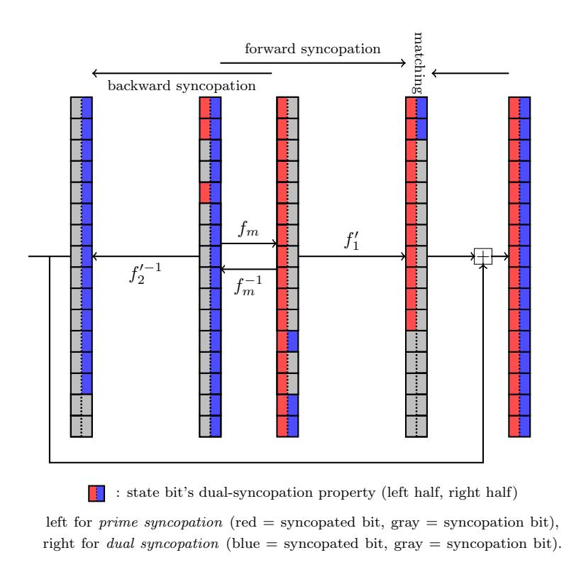
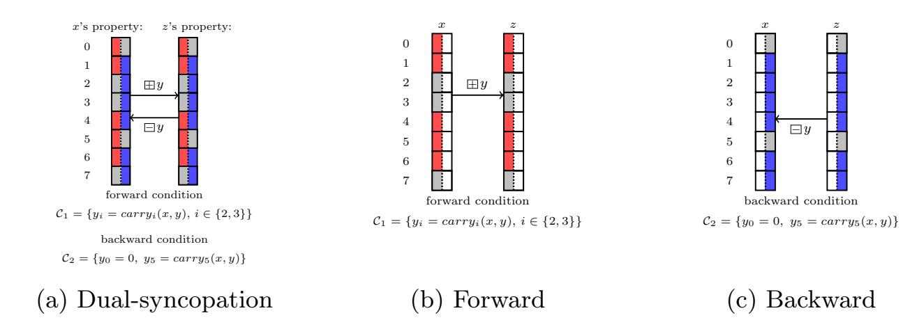
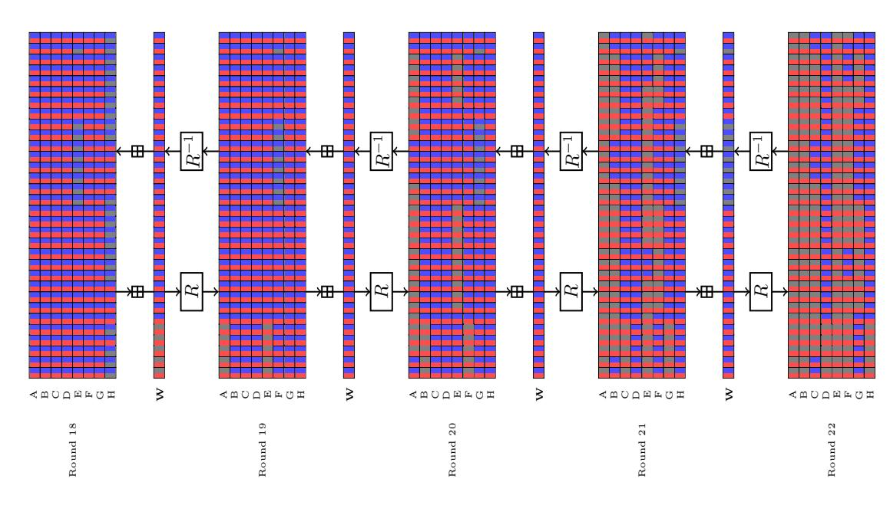

{0}------------------------------------------------

# Dual-Syncopation Meet-in-the-Middle Attacks: New Results on SHA-2 and MD5

Jian Guo<sup>1</sup> , Haoran Li2,<sup>3</sup> , Meicheng Liu2,<sup>3</sup> , Shichang Wang1(B)<sup>⋆</sup> , and Tianyu Zhang<sup>1</sup>

<sup>1</sup> Nanyang Technological University, Singapore {guojian,shichang.wang}@ntu.edu.sg, tianyu005@e.ntu.edu.sg <sup>2</sup> State Key Laboratory of Cyberspace Security Defense, Institute of Information Engineering, Chinese Academy of Sciences, Beijing, China {lihaoran,liumeicheng}@iie.ac.cn

Abstract. In this paper, we introduce a novel framework for meet-inthe-middle (MITM) attacks on ARX designs, termed dual-syncopation MITM attack, which formalizes a compact, rule-based language for tracking deterministic and non-deterministic information for two independent propagations through ARX operations. The language provides an uniform abstraction for previous techniques, e.g., initial structure, partial matching, partial-fixing, and naturally supports automation. With the language, we additionally encode new technical insights that is not covered in literature and build an efficient automatic search tool for MITM attacks on ARX designs that can be fully optimized within hours. As a result, we obtain the first preimage attacks on 46- and 47-step SHA-256, extending the previous record of 45 steps by two steps. For SHA-512, we present the first preimage attack on 51 steps, extending the prior record of 50 steps by one step. In addition, we provide a collection of improved preimage attacks on 43-, 44-, and 45-step SHA-256; 46-, 47-, 48-, 49-, and 50-step SHA-512; as well as full-step MD5. The proposed attacks can be converted to free-start collision attacks with the technique proposed by Li, Isobe, and Shibutani at FSE 2012. Our results mark the first improvements on theoretical attacks on SHA-2 in a decade and push the boundary of cryptanalysis of ARX designs.

Keywords: SHA-2 · MD5 · Preimage Attack · MITM · Dual-Syncopation.

## 1 Introduction

ARX hash function employs only addition, rotation, and XOR operations. Prominent examples include: MD4 [\[30\]](#page-30-0), MD5 [\[31\]](#page-30-1), SHA-1 [\[36\]](#page-30-2), SHA-2 [\[16\]](#page-28-0), SM3 [\[37\]](#page-30-3), RIPEMD [\[8](#page-28-1)[,11\]](#page-28-2). The security of ARX hash functions has been a heated topic, since the seminal works by Wang et al. [\[39,](#page-30-4)[41,](#page-30-5)[42,](#page-30-6)[40\]](#page-30-7), significant advancements

<sup>3</sup> School of Cyber Security, University of Chinese Academy of Sciences, Beijing, China

<sup>⋆</sup> Corresponding author: shichang.wang@ntu.edu.sg. Shichang Wang is the main contributor to this work.

{1}------------------------------------------------

have been made in the cryptanalysis on ARX hash functions, driving a deeper exploration of their structural weaknesses and security properties.

Since the foundational work by Aoki and Sasaki at Asiacrypt 2008 [\[33\]](#page-30-8), meet-in-the-middle attacks has been a fundamental framework in hash function cryptanalysis, with deep influence on the analysis of preimage and collision resistance on ARX hash functions, and later extended to AES-like and Spongebased designs. The power of MITM attacks comes from partitioning the cipher into two independent propagation trails (or chunks), namely forward and backward chunks, that structurally meet at some matching point. On ARX hash functions, the MITM attack framework has been enriched by a range of generic techniques, such as splice-and-cut [\[3\]](#page-27-0), initial structures [\[4,](#page-27-1)[34\]](#page-30-9), indirect and partial matching [\[2\]](#page-27-2), probabilistic techniques [\[17\]](#page-28-3), and bicliques [\[21\]](#page-29-0).

As the techniques expand the possibilities of attack strategies and increase the search space, manual analysis is often suboptimal. Hence, optimization languages have been introduced to MITM framework to automate the searching process. At Eurocrypt 2021, Bao et al. introduced the first automatic MILP-based search model for preimage attacks on AES-like hash functions [\[6\]](#page-28-4) which improved upon the previous best manual attacks [\[32,](#page-30-10)[5\]](#page-27-3). Subsequent works have further refined the model [\[13](#page-28-5)[,7,](#page-28-6)[9,](#page-28-7)[10\]](#page-28-8) and extended to sponges and Feistel networks [\[29](#page-29-1)[,19\]](#page-28-9).

### 1.1 Gaps

The progress in the cryptanalysis of ARX hash functions is slow. Take SHA-2 as an example, the best preimage attack to date was proposed by Khovratovich, Rechberger, and Savelieva at FSE 2012 [\[21\]](#page-29-0). The best theoretical collision attack was constructed based on this attack with the preimage-collision conversion proposed by Li et al.[\[23\]](#page-29-2) at FSE 2012. Despite the importance of SHA-2, the past decade has not seen any improvement.

In view of the power of automatic tools to uncover better attack strategies, automating MITM attacks is absolutely pivotal to advancing the cryptanalysis on ARX hash functions. Though we have seen the successful automation of MITM attacks on AES-like structures, Sponges and Feistel networks, to this date, no automatic search framework for ARX designs has been proposed, largely due to the below fundamental challenges:

- No unified, automation-ready abstraction. The field lacks a systematized language that uniformly describes advanced ARX techniques (e.g., initial structures, partial matching, partial-fixing) and supports efficient automation; as a result, scalable search for optimized MITM preimage attacks remains out of reach given the enormous ARX search space and the bit-level complexities of modular addition.
- Stagnation in results. These technical gaps have severely hindered progress, leaving preimage attacks on SHA-2 and MD5 largely unchanged for more than a decade.

{2}------------------------------------------------

### 1.2 Our Contributions

In this work, we introduce a new framework for meet-in-the-middle (MITM) attacks, termed dual-syncopation MITM. The central idea of dual syncopation is to characterize and track the propagation of dependency relations between two sets of variables, under specified conditions, for both the forward and backward directions of an MITM attack. Within this framework, we achieve several improvements on SHA-2 and MD5 in estimating their security against preimage and collision attacks, as summarized in Tables [1](#page-3-0) and [2.](#page-4-0) Our contributions are elaborated in two parts:

<span id="page-2-0"></span>Dual-Syncopation Framework. For ARX-based hash functions, we introduce a dual-syncopation MITM framework that provides a unified and efficient characterization of advanced MITM techniques, such as initial structures, partial matching, and partial-fixing. More precisely, dual syncopation offers a systematic rule-based language for the dual syncopation properties —which record the configuration of deterministic and non-deterministic information in both directions of MITM—under ARX operations, thereby providing a structured foundation for analysis and optimization. In addition, we develop tools to construct initial structures and perform matching with partial-fixing, as well as to automatically identify MITM preimage attacks within this framework. We summarize the main advantages of dual-syncopation MITM as follows:

- By tracing the propagation of the property, the framework yields new technical insights, including features overlooked in manual analyses, such as the iterative property of SHA-2's σ<sup>0</sup> (see Lemma [2](#page-17-0) in Section [3.2\)](#page-13-0), more efficient initial structures with reduced cost in degrees of freedom, and exploitable (probabilistic) matching at more steps (Section [3.2\)](#page-13-0).
- Leveraging the propagation rules of property for basic ARX operations (Section [4.1\)](#page-18-0), the framework efficiently tracks the bitwise pattern of deterministic and non-deterministic information propagation across ARX ciphers. As detailed in Section [4.2,](#page-20-0) it also furnishes a unified language for describing advanced MITM techniques (initial structures and partial matching with partial-fixing) and enables practical MILP-based automation.
- Most importantly, the automated search tool built atop this framework not only provides new technical insights, but also produces improved attack results, as described below.

New Results. Our efforts enable the first automatic model of MITM preimage attacks on ARX hash functions with accurate encoding of two independent propagations and their matching strategies. We then applied our tool to SHA-256, SHA-512, and MD5 and obtained the following major results, as summarized in Tables [1](#page-3-0) and [2:](#page-4-0)

1. On SHA-256, we present the first preimage attacks on 46 and 47 steps of SHA-256, which extends 2 steps from the previous record [\[21\]](#page-29-0) from a decade ago.

{3}------------------------------------------------

<span id="page-3-0"></span>

| Table 1: Summary of (pseudo-)preimage attacks on SHA-2 and MD5. |  |  |
|-----------------------------------------------------------------|--|--|
|                                                                 |  |  |

| Cipher     |     |    | Step DOF Pseudo-Preimage T Preimage T Memory |            |                 | Reference    |
|------------|-----|----|----------------------------------------------|------------|-----------------|--------------|
|            | 24  | 16 | 240<br>2                                     | 240<br>2   | 16<br>2<br>· 64 | [20]         |
|            | 42  | 10 | 245.3<br>2                                   | 251.7<br>2 | 12<br>2         | [2]          |
|            | 42  | 10 | –                                            | 248.4<br>2 | 12<br>2         | [17]         |
|            | 43  | 4  | 251.9<br>2                                   | 254.9<br>2 | 6<br>2          | [2]          |
|            | 43  | 10 | 245.6<br>2                                   | 251.8<br>2 | 11<br>2         | Appendix B.3 |
| SHA-256    | 44  | 10 | 245.9<br>2                                   | 251.9<br>2 | 10<br>2         | Section 5.1  |
|            | 45† | 3  | 253<br>2                                     | 255.5<br>2 | 6<br>2          | [21]         |
|            | 45  | 8  | 248<br>2                                     | 253<br>2   | 10<br>2         | Appendix B.5 |
|            | 46  | 5  | 251.1<br>2                                   | 254.5<br>2 | 10<br>2         | Section 5.2  |
|            | 47  | 3  | 253.2<br>2                                   | 255.6<br>2 | 5<br>2          | Section 5.3  |
|            | 24  | 32 | 480<br>2                                     | 480<br>2   | n/a             | [20]         |
|            | 42  | 24 | 488<br>2                                     | 501<br>2   | 27<br>2         | [2]          |
|            | 42  | 24 | –                                            | 494.6<br>2 | 22<br>2         | [17]         |
|            | 46  | 3  | 509<br>2                                     | 511.5<br>2 | 6<br>2          | [2]          |
|            | 46  | 20 | 491.8<br>2                                   | 502.9<br>2 | 21<br>2         | Appendix C   |
| SHA-512    | 47  | 12 | 500.2<br>2                                   | 507.1<br>2 | 20<br>2         | Appendix C   |
|            | 48  | 7  | 505.5<br>2                                   | 509.7<br>2 | 20<br>2         | Appendix C   |
|            | 49  | 7  | 506.5<br>2                                   | 510.2<br>2 | 7<br>2          | Appendix C   |
|            | 50† | 3  | 509<br>2                                     | 511.5<br>2 | 4<br>2          | [21]         |
|            | 50  | 4  | 507.9<br>2                                   | 510.9<br>2 | 11<br>2         | Appendix C   |
|            | 51  | 3  | 509.4<br>2                                   | 511.7<br>2 | 12<br>2         | Appendix C   |
| MD5 (full) | 64  | 12 | 116.9<br>2                                   | 123.4<br>2 | 45<br>11 × 2    | [34]         |
|            | 64  | 12 | 116.9<br>2                                   | 123.4<br>2 | 12<br>2         | [35]         |
|            | 64  | 14 | 114.9<br>2                                   | 122.4<br>2 | 14<br>2         | Appendix E   |

<sup>†</sup> These attacks are based on the biclique technique.

- 2. On SHA-512, we present the first preimage attacks on 51 steps of SHA-512, which extends 1 steps from the previous record [\[21\]](#page-29-0) from a decade ago.
- 3. We also present assorted improved attacks compared with literature, including 43, 44, and 45 steps of SHA-256, and 46, 47, 48, 49, and 50 steps of SHA-512.
- 4. The preimage attacks we proposed can be converted to free-start (FS) collision attacks on the same number of steps, by the technique proposed in [\[23\]](#page-29-2). Thus, on SHA-256 and SHA-512, we also improves the previous best (theoretical) FS collision attacks by 2 rounds and 1 round, respectively.
- 5. To demonstrate the generality of our framework, we furthermore give an improved preimage attack on full MD5; the result is slightly better than those of [\[34,](#page-30-9)[35\]](#page-30-11).

<sup>\$</sup> Except for [\[20\]](#page-29-3), all preimage attacks are derived from pseudo-preimage attacks via a generic conversion method. Here, DOF denotes the minimum number of degree of free bits among the forward, backward, and matching in the pseudo-preimages.

{4}------------------------------------------------

In summary, our new attacks on SHA-256, SHA-512, and MD5 represent the best cryptanalytic results to date, which push the boundary of cryptanalysis on ARX designs. Some readers may have doubts on the validity of certain attacks as their advantage over brute force is somewhat marginal. To address these concerns, we provide a discussion in Appendix [A](#page-31-0) of full version and implement the attack procedure of 44-step attacks on SHA-256 with reduced matching bits, empirically verifying the theoretical complexity. The full version, codes and results are available at <https://github.com/desert-oasis/dual-sync-MITM>.

<span id="page-4-0"></span>

| Table 2: Summary of (semi-free-start/pseudo-)collision attacks on SHA-2. |  |  |  |
|--------------------------------------------------------------------------|--|--|--|
|                                                                          |  |  |  |

| Cipher  | Step                                                            | Attack Type                                                                                                                                                                                                                          | Time                                                                                                                                    | Remark                                                                                                                                                                                                                                                                                       | Reference                    |
|---------|-----------------------------------------------------------------|--------------------------------------------------------------------------------------------------------------------------------------------------------------------------------------------------------------------------------------|-----------------------------------------------------------------------------------------------------------------------------------------|----------------------------------------------------------------------------------------------------------------------------------------------------------------------------------------------------------------------------------------------------------------------------------------------|------------------------------|
| SHA-256 | 31<br>39<br>43<br>43<br>44<br>45†<br>45<br>46                   | collision<br>semi-free-start collision practical<br>pseudo-collision<br>pseudo-collision<br>pseudo-collision<br>pseudo-collision<br>pseudo-collision<br>pseudo-collision                                                             | practical<br>126<br>2<br>122.8<br>2<br>122.9<br>2<br>126.5<br>2<br>124<br>2<br>125.5<br>2                                               | SAT/SMT<br>SAT/SMT<br>preimage convert<br>preimage convert Section 6.1<br>preimage convert Section 6.1<br>preimage convert<br>preimage convert Section 6.1<br>preimage convert Section 6.1                                                                                                   | [25]<br>[24]<br>[23]<br>[23] |
| SHA-512 | 47<br>31<br>39<br>46<br>46<br>47<br>48<br>49<br>50†<br>50<br>51 | pseudo-collision<br>collision<br>semi-free-start collision practical<br>pseudo-collision<br>pseudo-collision<br>pseudo-collision<br>pseudo-collision<br>pseudo-collision<br>pseudo-collision<br>pseudo-collision<br>pseudo-collision | 126.6<br>2<br>85.5<br>2<br>254.5<br>2<br>246.9<br>2<br>250.1<br>2<br>252.7<br>2<br>253.2<br>2<br>254.5<br>2<br>253.9<br>2<br>254.7<br>2 | preimage convert Section 6.1<br>SAT/SMT<br>dedicated<br>preimage convert<br>preimage convert Section 6.1<br>preimage convert Section 6.1<br>preimage convert Section 6.1<br>preimage convert Section 6.1<br>preimage convert<br>preimage convert Section 6.1<br>preimage convert Section 6.1 | [26]<br>[12]<br>[23]<br>[23] |

<sup>†</sup> Converted from biclique-based pseudo-preimage attacks in [\[21\]](#page-29-0).

### 1.3 Outline

The remainder of this paper is organized as follows. Section [2](#page-5-0) provides a brief specification of SHA-2, introduces the notation used in the paper, and recalls the notion of syncopation. Section [3](#page-7-0) then presents the dual-syncopation MITM framework, including advances for several techniques. In Section [4,](#page-18-1) we abstract our observations into the propagation rules for basic ARX operations, and describe an automatic model of dual-syncopation MITM. In Section [5,](#page-22-1) we present

<sup>\$</sup> In this table, "pseudo-collision" denotes a free-start collision attack. Only the best (semi-free-start/pseudo-)collision attacks are listed here. For the full list, see Table [25](#page-52-0) in Appendix [D.](#page-51-0)

{5}------------------------------------------------

our new results on SHA-2 regarding preimage attacks. The collision results for SHA-2 are given in Section [6.](#page-26-1)

## <span id="page-5-0"></span>2 Preliminaries

### 2.1 SHA-2 Specification

Description of SHA-256. The SHA-256 hash function employs the Merkle-Damgård construction. The input message is padded with a single "1" bit, followed by a variable number of "0" bits, and then a 64-bit representation of the original message length. This ensures the total length of the padded message is a multiple of 512 bits. The padded message is then divided into 512-bit blocks, denoted as (M0, M1, . . . , M<sup>N</sup>−<sup>1</sup>), where each M<sup>i</sup> is a 512-bit binary string.

The hash computation proceeds by iteratively applying the compression function CF, which takes a 512-bit message block and a 256-bit chaining variable as input to produce a new 256-bit chaining variable as output. The process is initialized with a constant value IV and proceeds as follows:

$$\begin{cases} h_0 \leftarrow IV, \\ h_{i+1} \leftarrow CF(h_i, M_i) \quad (i = 0, 1, \dots, N - 1), \end{cases}$$
 (1)

The compression function is implemented using the Davies-Meyer construction, which involves two phases: message expansion and data processing. First, the message block is expanded by the message expansion function:

<span id="page-5-3"></span>
$$W^{i} \leftarrow \begin{cases} m_{i} & \text{for } 0 \leq i < 16, \\ \sigma_{1}\left(W^{i-2}\right) \boxplus W^{i-7} \boxplus \sigma_{0}\left(W^{i-15}\right) \boxplus W^{i-16} & \text{for } 16 \leq i < 64, \end{cases}$$
 (2)

where (m0, m1, . . . , m15) are the 32-bit words of M<sup>i</sup> , and addition ⊞ is performed modulo 2 to the power of the word size. In SHA-256 the word size is 32 bits. Let ≫ x and ≫ x denote the x-bit right shift and rotation, respectively. The functions σ0(X) and σ1(X) are defined as:

<span id="page-5-1"></span>
$$\sigma_0(X) \leftarrow (X \gg 7) \oplus (X \gg 18) \oplus (X \gg 3),$$
  

$$\sigma_1(X) \leftarrow (X \gg 17) \oplus (X \gg 19) \oplus (X \gg 10),$$
(3)

where ⊕ stands for bitwise XOR operation.

Let p <sup>j</sup> denote a 256-bit value consisting of the concatenation of eight words Aj , B<sup>j</sup> , C<sup>j</sup> , D<sup>j</sup> , E<sup>j</sup> , F<sup>j</sup> , G<sup>j</sup> and H<sup>j</sup> . The data processing computes hi+1 as follows:

<span id="page-5-2"></span>
$$\begin{cases}
 p^{0} \leftarrow h_{i}, \\
 p^{j+1} \leftarrow R^{j} (p^{j}, W^{j}) & (j = 0, 1, \dots, 63), \\
 h_{i+1} \leftarrow h_{i} \boxplus p^{64}.
\end{cases}$$
(4)

{6}------------------------------------------------

Step function  $R^j$  is defined as follows:

<span id="page-6-2"></span>
$$\begin{cases}
T_1^j \leftarrow H^j \boxplus \Sigma_1 \left( E^j \right) \boxplus \operatorname{Ch} \left( E^j, F^j, G^j \right) \boxplus K^j \boxplus W^j, \\
T_2^j \leftarrow \Sigma_0 \left( A^j \right) \boxplus \operatorname{Maj} \left( A^j, B^j, C^j \right), \\
A^{j+1} \leftarrow T_1^j \boxplus T_2^j, \\
B^{j+1} \leftarrow A^j, \quad C^{j+1} \leftarrow B^j, \quad D^{j+1} \leftarrow C^j, \\
E^{j+1} \leftarrow D^j \boxplus T_1^j, \quad F^{j+1} \leftarrow E^j, \quad G^{j+1} \leftarrow F^j, \quad H^{j+1} \leftarrow G^j,
\end{cases} (5)$$

where  $K^{j}$  is a constant and different for each step. The functions used in the algorithm are defined as:

$$\operatorname{Ch}(X, Y, Z) \leftarrow (X \vee Y) \oplus ((\neg X) \vee Z),$$
  

$$\operatorname{Maj}(X, Y, Z) \leftarrow (X \vee Y) \oplus (X \vee Z) \oplus (Y \vee Z),$$
(6)

<span id="page-6-1"></span>
$$\Sigma_0(X) \leftarrow (X \gg 2) \oplus (X \gg 13) \oplus (X \gg 22),$$
  

$$\Sigma_1(X) \leftarrow (X \gg 6) \oplus (X \gg 11) \oplus (X \gg 25),$$
(7)

where  $\neg$  means bitwise negation of the word.

**Description of SHA-512.** The structure of SHA-512 is similar to SHA-256, but with the following differences: the word size is 64 bits, the message block size is 1024 bits, and the chaining variable is 512 bits; for details, refer to Appendix C.

### 2.2 Syncopation Technique

<span id="page-6-0"></span>**Notations.** Hereinafter, unless specified otherwise, the symbol X represents an ordered set of variables within a word or a state composed of multiple words. For example, in the case of a n-bit word, X is made up of n bit variables  $x_i$  and is denoted  $X = (x_0, x_1, \ldots, x_{n-1})$ . The notation [i:j] refers to the set of integers from i to j ( $j \ge i$ ), for example  $[0:2] = \{0,1,2\}$ . Furthermore, we denote the variable set  $X[i:j] = \{x_i, x_{i+1}, \cdots, x_j\}$ , and the index set for the variable set X[i:j] using the symbol S(X[i:j]), for example,  $S(X[0:2]) = \{0,1,2\}$ .

At CRYPTO 2023, Wang et al. [38] introduced the *syncopation* technique, which strengthens the correlation of backward approximations in differential cryptanalysis. In general, this technique characterizes the dependency relations between two sets of variables in ARX ciphers under specific conditions. From the Crypto 2023 presentation [1] (Slide 17), the precise definition of can be summarized as follows:

Syncopation property and its propagation. For a word X in an ARX cipher, one partitions its bits into two disjoint sets: the syncopated bits  $X^o$ , and the syncopation bits  $X^\#$ . The pair  $\mathcal{P}(X) = (X^o, X^\#)$  is called the syncopation property of X, where  $X^o \cap X^\# = \emptyset$  and  $X^o \cup X^\# = X$ . Given an ARX function H with Y = H(X), the syncopation property naturally propagates from X to Y. Under the constraint system  $\mathcal{C}(X^o)$ , the syncopated bits of Y are those independent of  $X^\#$ , while the remaining ones form  $Y^\#$ . Propagation rules for basic ARX operations (modular addition, rotation, XOR) are provided in [38].

{7}------------------------------------------------

## <span id="page-7-0"></span>3 Dual-Syncopation MITM for Preimage Attack

In ARX ciphers, the basic operations—modular addition, rotation, and XOR—are applied at the word level; accordingly, prior works typically regard the word as the smallest unit of analysis [2,17,22]. As recalled in Section 2.2, the syncopation technique [38] refines this granularity from the word level down to the bit level, and successfully characterizes the dependency relations of ARX ciphers at the bit level. To capture bit-level properties precisely in meet-in-the-middle (MITM) attacks for ARX ciphers, we adapt and extend this idea to describe both forward and backward computations during MITM. In particular, syncopated bits record the deterministic bits, while syncopation bits record the nondeterministic bits in either the forward or backward computation of MITM attacks.

<span id="page-7-1"></span>

Fig. 1: Overall framework of dual-syncopation MITM

We introduce a framework, called dual-syncopation MITM, for searching preimage attacks using the meet-in-the-middle method (see Figure 1). Unlike the classical approach, each cipher state in our framework carries two attributes: a forward syncopation property and a backward syncopation property, which are dual to one another. The dual properties follow propagation rules in both forward and backward directions, and the syncopated bits in the forward property act as syncopation bits for the backward property, and vice versa. By tracing the propagation of dual syncopation properties, the framework enables more effective constructions of advanced MITM techniques, such as initial structure and partial matching with partial-fixing. We also develop a systematic set of propagation rules for syncopation across basic ARX operations, which facilitates automatic modeling and enables automatic search over a much larger space to find improved attacks, see Section 4.

{8}------------------------------------------------

The remainder of this section is organized as follows. In Section 3.1, we present the framework of dual-syncopation MITM. Section 3.2 uses SHA-2 as a running example and provides case studies illustrating how the dual-syncopation property facilitates efficient initial-structure construction and enables locating more complex matching points at more steps in partial-fixing.

### <span id="page-8-0"></span>3.1 Dual-Syncopation MITM Attack Framework

First, we extend the notion of a syncopation property by introducing a new type, called the *dual-syncopation* property. A dual-syncopation property consists of a pair of syncopation properties that are dual to each other.

<span id="page-8-1"></span>**Definition 1 (Dual-Syncopation Property).** Let  $X \in \mathbb{F}_2^n$  be a cipher state. The dual-syncopation property of X is the tuple  $(\mathcal{P}(X), \mathcal{DP}(X))$ , where

$$\mathcal{P}(X) = (X^{o1}, X^{\#1}), \quad \mathcal{DP}(X) = (X^{o2}, X^{\#2}),$$

are syncopation properties satisfying  $X^{\#1} \subseteq X^{o2}$  and  $X^{\#2} \subseteq X^{o1}$ . Without loss of generality, we refer to  $\mathcal{P}(X)$  as the prime syncopation property and to  $\mathcal{DP}(X)$  as its dual syncopation property.

From this definition, if certain bits of X are designated as syncopation bits  $X^{\#1}$  in the prime property  $\mathcal{P}(X)$ , then these bits must appear as syncopated bits  $X^{o2}$  in the dual property  $\mathcal{DP}(X)$ , and vice versa.

**Definition 2 (Equivalence of Dual-Syncopation Property).** Let  $X, Y \in \mathbb{F}_2^n$  be two states with the dual-syncopation properties  $(\mathcal{P}(X), \mathcal{DP}(X))$  and  $(\mathcal{P}(Y), \mathcal{DP}(Y))$ , respectively. We say that X and Y have equivalent dual-syncopation properties, written

<span id="page-8-2"></span>
$$(\mathcal{P}(X), \mathcal{DP}(X)) \cong (\mathcal{P}(Y), \mathcal{DP}(Y)),$$

if and only if both their prime and dual syncopation properties are equivalent, i.e.,  $\mathcal{P}(X) \cong \mathcal{P}(Y)$  and  $\mathcal{DP}(X) \cong \mathcal{DP}(Y)$ . Here, for  $\mathcal{P}(X) = (X^o, X^\#)$  and  $\mathcal{P}(Y) = (Y^o, Y^\#)$ , we write  $\mathcal{P}(X) \cong \mathcal{P}(Y)$  when the index sets of syncopated and syncopation bits coincide:

$$S(X^o) = S(Y^o), \quad S(X^\#) = S(Y^\#).$$

The definition of  $\mathcal{DP}(X) \cong \mathcal{DP}(Y)$  is analogous.

In other words, two states are equivalent with respect to their dual-syncopation properties if they induce the same partition of bit indices into syncopation and syncopated subsets in both the prime and dual properties.

Let f be an ARX hash function in Davies-Meyer mode  $f: \{0,1\}^l \times \{0,1\}^n \to \{0,1\}^n$  with state length n and message length l. For an n-bit target value h, the preimage problem is to find a message m such that h = f(m, iv) + iv, where iv denotes the initial vector. Writing, v = iv and h' = h - iv, the challenge

{9}------------------------------------------------

of determining a preimage is equivalent to finding a message m that satisfies h' = f(m, v). A generic exhaustive search tests  $2^n$  random messages (for l > n) and thus expects one preimage.

We now consider MITM-based preimage search. Assume f factors as  $f = f_2 \circ f_1$ , so that an attacker can evaluate  $f_1$  forward and  $f_2^{-1}$  backward. The attacker chooses two disjoint subsets  $m^f, m^b \subseteq m$ , where  $m^f$  are the forward free variables, and  $m^b$  are the backward free variables. The remaining of m is denoted by  $m^p$ , which are the public bits used by both directions. The goal is ensure that the (partial) forward computation of  $f_1$  is independent on  $m^b$ , the (partial) backward computation of  $f_2^{-1}$  is independent on  $m^f$ , and that a common (partial) matching between the forward and backward computations exists. Under these conditions one can perform a meet-in-the-middle on the matching state to recover a preimage more efficiently than exhaustive search.

In the following, we describe a framework for the meet-in-the-middle method from a perspective of dual syncopation property propagation. As summarized in Section 1.2, this framework is conceptually simple yet brings practical benefits: it yields new technical insights, facilitates automatic modeling, and unifies several advanced MITM techniques.

**Dual-Syncopation MITM Framework.** From the dual-syncopation perspective, we assign to m a dual-syncopation property  $(\mathcal{P}(m), \mathcal{DP}(m))$ , defined as

<span id="page-9-0"></span>
$$\mathcal{P}(m) = (m^f \cup m^p, m^b), \quad \mathcal{DP}(m) = (m^b \cup m^p, m^f), \tag{8}$$

where  $m^f$  and  $m^b$  swap their roles as syncopated and syncopation bits in the prime and dual properties, respectively. Since v and h' are public, their dual-syncopation properties are given by

$$\mathcal{P}(v) = (v, \emptyset), \quad \mathcal{D}\mathcal{P}(v) = (v, \emptyset), \quad \mathcal{P}(h') = (h', \emptyset), \quad \mathcal{D}\mathcal{P}(h') = (h', \emptyset).$$
 (9)

In this setting, the forward direction traces the prime syncopation  $\mathcal{P}(m)$  through  $f_1$ , while the backward direction traces the dual syncopation  $\mathcal{DP}(m)$  through  $f_2^{-1}$ . We formally summarize the process as follows:

- Forward-syncopation propagation. Propagating  $\mathcal{P}(m)$  through  $f_1$  yields the prime syncopation of  $f_1$ 's output with syncopated bits  $f_1^{o1}$  and syncopation bits  $f_1^{\#1}$  under a condition system  $\mathcal{C}_1$ . By definition, if  $\mathcal{C}_1$  is satisfied, the syncopated bits of  $f_1$ 's output are independent on  $m^b$ :

$$f_1^{o1}(m, v)_{|\mathcal{C}_1} = f_1^{o1}(m^f, m^b = \text{const}, m^p, v)_{|\mathcal{C}_1},$$

where  $C_1$  is the forward condition system and *const* denotes a fixed constant. - **Backward-syncopation propagation.** Propagating  $\mathcal{DP}(m)$  through  $f_2^{-1}$  yields the dual syncopation of  $f_2^{-1}$ 's output with syncopated bits  $(f_2^{-1})^{o2}$  and syncopation bits  $(f_2^{-1})^{\#2}$  under a condition system  $C_2$ . If  $C_2$  is satisfied, these syncopated bits are independent on  $m^f$ :

$$(f_2^{-1})^{o2}(m,h')_{|\mathcal{C}_2} = (f_2^{-1})^{o2}(m^b,m^f = \text{const},m^p,h')_{|\mathcal{C}_2}.$$

where  $C_2$  is the backward condition system.

{10}------------------------------------------------

- Matching point. The intersection

$$\mathbb{S}^{match} = \mathbb{S}\left(f_1^{o1}(m, v)_{|\mathcal{C}_1}\right) \cap \mathbb{S}\left((f_2^{-1})^{o2}(m, h')_{|\mathcal{C}_2}\right)$$

is defined as the matching point between forward and backward directions.

Remark 1 (On the term dual-syncopation). Although the forward and backward propagations are described separately, they typically overlap on a common subfunction  $f_m$  (see Figure 1), i.e.,

$$f = f_1' \circ f_m \circ f_2', \quad f_1 = f_1' \circ f_m, \quad f_2 = f_m \circ f_2'.$$

This overlap frequently appears in MITM attacks, such as in the initial structure technique [34]. In such cases, the intersection state must simultaneously satisfy the propagation of  $\mathcal{P}$  through  $f_m$  (forward) and  $\mathcal{DP}$  through  $f_m^{-1}$  (backward). Hence, the state's dual-syncopation property governs propagation in both directions, which is the origin of the term "dual-syncopation". From this, the dual-syncopation property (Definition 1) is a non-trivial extension of the classical syncopation property. While a single syncopation property  $\mathcal{P}(X) = (X^o, X^\#)$  only partitions the state into two sets of variables, the dual-syncopation property equips the state with two complementary partitions  $(\mathcal{P}(X), \mathcal{DP}(X))$  subject to cross-constraints  $X^{\#1} \subseteq X^{o2}$  and  $X^{\#2} \subseteq X^{o1}$ . This richer representation captures both forward and backward propagation behaviors simultaneously. Consequently, the framework naturally accommodates advanced meet-in-the-middle techniques (e.g., initial structure construction and partial matching, see Section 4.2), albeit at the cost of increased time of automatic model.

<span id="page-10-1"></span>

<span id="page-10-0"></span>Fig. 2: Propagation of dual-syncopation through modular addition

In Example 1, we demonstrate how the dual-syncopation property propagates through modular addition. As illustrated in Figure 2, the input x and the output  $z = x \boxplus y$  share equivalent dual-syncopation properties (Definition 2), provided that the forward and backward conditions hold, with y assumed public. In the figure, the left half of each square denotes the prime syncopation property (red for syncopated bits, gray for syncopation bits), while the right half denotes the dual property (blue for syncopated bits, gray for syncopation bits).

{11}------------------------------------------------

Example 1. Let  $x, y, z \in \mathbb{F}_2^8$  with  $z = x \boxplus y$ . Suppose  $x^f = \{x_0, x_5\}$  are forward free bits,  $x^b = \{x_2, x_3, x_7\}$  are backward free bits, and  $x^p = \{x_1, x_4, x_6\}$  are public, while all bits of y are public. Assign to x the dual-syncopation property  $(\mathcal{P}(x), \mathcal{DP}(x))$  with  $\mathcal{P}(x) = (x^f \cup x^p, x^b)$ ,  $\mathcal{DP}(x) = (x^b \cup x^p, x^f)$ , consistent with Equation 8.

**Forward.** x has  $\mathcal{P}(x) = (x^{o1}, x^{\#1})$  with  $x^{o1} = \{x_0, x_1, x_4, x_5, x_6\}$  and  $x^{\#1} = \{x_2, x_3, x_7\}$ ; for y,  $\mathcal{P}(y) = (y^{o1}, \emptyset)$  with  $y^{o1} = \{y_i : i \in \{0, ..., 7\}\}$ . If  $y_i = carry_i(x, y)$  for  $i \in \{2, 3\}$ , then  $z_4, z_5, z_6$  are independent of  $\{x_2, x_3\}$ , where  $carry(x, y) = (x \boxplus y) \oplus x \oplus y$  is the carry vector. Thus  $z^{o1} = \{z_0, z_1, z_4, z_5, z_6\}$  and  $z^{\#1} = \{z_2, z_3, z_7\}$ , implying  $\mathbb{S}(z^{o1}) = \mathbb{S}(x^{o1})$  and  $\mathbb{S}(z^{\#1}) = \mathbb{S}(x^{\#1})$ , i.e.  $\mathcal{P}(z) \cong \mathcal{P}(x)$ .

**Backward.** z has  $\mathcal{DP}(z) = (z^{o2}, z^{\#2})$  with  $z^{o2} = \{z_1, z_2, z_3, z_4, z_6, z_7\}$  and  $z^{\#2} = \{z_0, z_5\}$ ; for y,  $\mathcal{DP}(y) = (y^{o2}, \emptyset)$  with  $y^{o2} = \{y_i : i \in \{0, ..., 7\}\}$ . If  $y_0 = 0$  and  $y_5 = carry_5(x, y)$ , then  $x_1, x_2, x_3, x_4$  are independent of  $z_0$  and  $x_6, x_7$  of  $z_5$ . Thus  $x^{o2} = \{x_1, x_2, x_3, x_4, x_6, x_7\}$  and  $x^{\#2} = \{x_0, x_5\}$ , yielding  $\mathbb{S}(x^{o2}) = \mathbb{S}(z^{o2})$  and  $\mathbb{S}(x^{\#2}) = \mathbb{S}(z^{\#2})$ , i.e.  $\mathcal{DP}(x) \cong \mathcal{DP}(z)$ .

**Dual-syncopation MITM preimage attack.** For clarity, consider the idealized case where the outputs of  $f_1$  and  $f_2^{-1}$  consist exclusively of syncopated bits, i.e.  $f_1^{\#1} = \emptyset$  and  $(f_2^{-1})^{\#2} = \emptyset$ , so that  $f_1^{o1} = f_1$  and  $(f_2^{-1})^{o2} = f_2^{-1}$ , each of length n bits, with  $\mathbb{S}^{match} = \{0, \dots, n-1\}$ . Assume the forward and backward free variables  $m^f$  and  $m^b$  each have dimension d. Varying  $m^f$  and  $m^b$  thus generates  $2^{2d}$  candidate messages; the meet-in-the-middle proceeds by computing  $2^d$  times  $f_1$  and  $2^d$  times  $f_2^{-1}$  per fixed choice of the public part  $m^p$ , and then matching the two lists (see Algorithm 1).

### <span id="page-11-0"></span>Algorithm 1 Dual-syncopation MITM for preimage search

**Input:** Forward/backward free variables  $m^f, m^b$ , public part  $m^p$ , forward/backward condition systems  $C_1, C_2$ , public v, h'.

**Output:** A preimage  $m = (m^p, m^f, m^b)$  if one exists in the searched space.

```
1: Setting parameters needed so that C_1 and C_2 can be satisfied. \triangleright Precomputation
                                                               \triangleright Online phase: iterate over m^p
 2: for all choices of public variables m^p do
        Initialize empty hash table L(\cdot).
 3:
        for all 2^d assignments of m^f do
 4:
                                                                                    ▶ Forward list
            s_1 \leftarrow f_1^{o1}(\bar{m}^f, m^b = \text{const}, m^p, v).
 5:
            Insert m^f into bucket L(s_1).
 6:
 7:
        end for
        for all 2^d assignments of m^b do
 8:
                                                                 ▶ Backward list and matching
            s_2 \leftarrow (f_2^{-1})^{o_2}(m^b, m^f = \text{const}, m^p, h').
9:
            if L(s_2) nonempty then
10:
                For each m^f \in L(s_2) output m = (m^p, m^f, m^b) as a candidate preimage.
11:
12:
             end if
        end for
13:
14: end for
```

{12}------------------------------------------------

Complexity analysis. To test  $2^n$  candidate messages, steps 3–13 of Algorithm 1 have to be repeated  $2^{n-2d}$  times by varying public variables  $m^p$ . Let  $t_1$  and  $t_2$  denote the cost of one evaluation of  $f_1$  and  $f_2^{-1}$  respectively. Then the total time complexity is  $2^{n-2d}(2^dt_1+2^dt_2)=2^{n-d}t$ , where  $t=t_1+t_2$  is the cost of f. The memory is required to store the hash table  $L(\cdot)$  of length  $2^d$  and entries of about (n+d) bits.

In addition, the dual-syncopation framework integrates naturally with several advanced MITM techniques.

**Splice and cut.** The splice and cut technique was first used in [3]. The idea is to start the computations at an intermediate state, connecting the last and the first steps via the feed-forward of the Davies-Meyer mode. Formally, the computation of f is cut into  $f = f_2 \circ f_1$  and, for a given target value h, a new function f' is defined by  $f'(m,v) = f_1(m,h-f_2(m,v))$ . Then, the meetin-the-middle technique is used to find m such that f'(m,v) = v for some v. This is equivalent to  $f(m,h-f_2(m,v))+h-f_2(m,v)=h$ , that is, m is a pseudo-preimage. The splice-and-cut construction is fully compatible with the dual-syncopation view and can be used to enlarge the search space of states.

Converting pseudo-preimage to preimage. For an n-bit iterated hash, a pseudo-preimage attack with complexity  $2^t$  (with t < n-2) can be converted into a preimage attack with complexity  $2^{\frac{t+n}{2}+1}$  by an unbalanced meet-in-the-middle step; see Fact 9.99 of [28]. Intuitively, one generates  $2^{\frac{n-t}{2}}$  pseudo-preimages and uses  $2^{\frac{t+n}{2}}$  1-block chaining variables (from the initial vector) to combine them into full preimages.

Initial structure and biclique. The initial structure technique of Sasaki and Aoki [34] and the more general biclique construction of Khovratovich et al. [21] provide systematic ways to build large families of related plaintexts (or chaining variables) that simplify the MITM matching. Both techniques are compatible with the dual-syncopation framework. The initial-structure method can be expressed as dual-syncopation constraints on the intersection state by restricting the syncopation and syncopated sets and imposing the corresponding condition systems  $C_1, C_2$ . Biclique constructions give structured degrees of freedom that the propagation rules can exploit.

Partial matching and partial-fixing. As in [3,2], one may match only a subset of the state bits (partial matching) rather than the full state. The partial-fixing extension fixes portions of forward or backward free words to increase the number of rounds that can be bridged: by partially fixing some free variables one can still obtain useful partial information even when the full computation depends on both forward and backward free variables. Within the dual-syncopation framework, both techniques are expressed naturally by marking the fixed bits as public, optimizing the intersection of forward and backward syncopated sets.

Comparison of terminologies. In classical MITM attacks, one distinguishes between known and unknown bits at the matching boundary, which are determined by the forward and backward free variables together with the fixed bits. In the dual-syncopation framework, these fixed bits correspond to the public

{13}------------------------------------------------

bits shared by both directions. As shown in Eq. [\(8\)](#page-9-0), the union of the forward free variables m<sup>f</sup> and the public variables m<sup>p</sup> forms the forward syncopated bits Xo<sup>1</sup> , i.e., the forward known bits at the matching point, while the backward free variables m<sup>b</sup> (namely the X#1 syncopation bits) correspond to the forward unknown bits. This information is recorded in the syncopation property P(X). For the backward direction, the roles of m<sup>f</sup> and m<sup>b</sup> are reversed accordingly, and the corresponding dependency information is captured by the dual-syncopation property DP(X). Thus, dual-syncopation provides a directional refinement of the classical MITM partition by explicitly tracking dependencies in both forward and backward computations.

### <span id="page-13-0"></span>3.2 New Technical Insights with Dual-Syncopation Property

To illustrate our framework, we instantiate the dual-syncopation MITM on SHA-256 and describe concrete improvements to two core MITM techniques: the construction of initial structures and partial matching. By tracing several manually selected cases of dual-syncopation propagation for SHA-256's functions σ and Σ as Equation [\(3\)](#page-5-1) and Equation [\(7\)](#page-6-1), we obtain two practical gains:

- 1. Richer initial structures. The propagation cases allow us to construct initial structures that admit substantially more degrees of freedom than conventional constructions, increasing the space of candidate messages available to the MITM search.
- 2. Extended partial matching. The iterative propagation property of σ<sup>0</sup> yields one additional step of backward extension; combining propagation properties of Σ<sup>0</sup> and σ<sup>0</sup> likewise permits one additional step of forward extension. These extra steps produce stronger—and easier to find—partial matches for SHA-256.

Together, these enhancements increase the flexibility of automated MITM search and translate into improved (pseudo-)preimage results reported below. We give detailed propagation cases and construction recipes in the following paragraphs.

Revisiting the 43-step attack on SHA-256 in [\[2\]](#page-27-2). Aoki et al. [\[2\]](#page-27-2) presented a preimage attack on 43-step SHA-256 with complexity 2 <sup>254</sup>.<sup>9</sup> based on a 4-step initial structure, expanded by one step forward and two steps backward via partial-fixing (see Section 5 of [\[2\]](#page-27-2) for details). Let d<sup>f</sup> , d<sup>b</sup> and d<sup>m</sup> denote degrees of freedom in the forward, backward and matching, respectively. In their construction the forward and backward free bits originate from neutral words W<sup>18</sup> and W<sup>21</sup>, where a neutral word refers to a message word that influences only the forward (resp. backward) computation but not the backward (resp. forward) computation. The parameters satisfy

$$\int d_f \le (32 - l_f) - d_b, \tag{10}$$

<span id="page-13-1"></span>
$$\begin{cases} d_b \le 32 - l_b, \tag{11} \end{cases}$$

$$d_m \le \min\{32, l_f - 18\},\tag{12}$$

{14}------------------------------------------------

where  $0 \leq l_f, l_b \leq 32$  are the lengths of the lower consecutive fixed bits of  $W^{18}$  (forward) and  $W^{21}$  (backward). Equation (11) stems from partial-fixing on  $W^{21}$ ; Equation (10) combines partial-fixing on  $W^{18}$  with the initial-structure limitation in [2]; Equation (12) captures the effect of partial-fixing on matching. With the choices  $l_f = 23$ ,  $d_b = 4$ , one obtains  $d_f = 5$ ,  $d_m = 4$  and the complexity  $2^{254.9}$  reported in [2].

<span id="page-14-2"></span>Application 1: initial structure. By the dual-syncopation definition, initial structures for an intermediate subfunction  $f_{\mathcal{IS}}$  can be constructed by tracing the dual-syncopation property  $(\mathcal{P}(S_{in}), \mathcal{DP}(S_{in}))$  of its input  $S_{in}$  through  $f_{\mathcal{IS}}$  and  $f_{\mathcal{IS}}^{-1}$  in the forward and backward directions, respectively. Below we give a concrete 4-step construction of an initial structure  $\mathcal{IS}$ ; a general procedure by automatic modeling appears in Section 4.2.

Aoki et al.'s 4-step initial structure (Section 4.6 of [2]) enforces that the  $d_b$  most-significant bits (MSBs) of  $E^{i+2} = 1$  and  $E^{i+1} = 0$  (for i = 18) so that the  $d_b$  backward free bits of  $W^{21}$  do not affect the forward computation. Their construction consumes  $d_b$  forward free bits of  $W^{18}$  to satisfy  $d_b$  MSBs of  $E^{20} = 1$  (cf. (10)). By tracing dual-syncopation propagation we show this consumption can be reduced by setting an appropriate values of the initial structure's starting state. Before presenting the construction we analyse propagation through  $\Sigma_1$ .

**Lemma 1 (SHA-256's**  $\Sigma_1$ ). Let X = (X[31], ..., X[0]) be a 32-bit input to  $\Sigma_1$ . If the lower l bits of X are fixed, then  $\Sigma_1(X)$  contains  $\mu(l)$  fixed bits, where

<span id="page-14-0"></span>
$$\mu(l) = \begin{cases} 0, & l \le 18, \\ 2l - 37, & 19 \le l \le 27, \\ 3l - 64, & 28 \le l \le 32, \end{cases}$$

and the index set of these  $\mu(l)$  bits is denoted by  $\mathbb{S}_{\mu}$ . Moreover, X and  $\Sigma_1(X)$  share  $\eta(l)$  common indices of fixed bits, where

$$\eta(l) = \begin{cases}
0, & l \le 18, \\
l - 18, & 19 \le l \le 25, \\
9, & l = 26, \\
4l - 96, & 27 \le l \le 32,
\end{cases}$$

and the corresponding index set is denoted by  $\mathbb{S}_{\eta}$ .

<span id="page-14-1"></span>Example 2. For l=25 we have  $\eta(l)=7$  and  $\mathbb{S}_{\eta}=[7:13]$ . Concretely,

$$X = (X[31], X[30], X[29], X[28], X[27], X[26], X[25], c[24], \dots, c[0]),$$

with c[i] fixed. One may visualise its syncopation property by

$$tag(X) = xxxxxxxxxxxxxxxxxxxxxxxxxxxxxxxxxxx$$

{15}------------------------------------------------

where 'x' denotes a syncopation bit (i.e. a variable bit), while '-' denotes a syncopated bit (i.e. a fixed bit). For l=27 similar patterns apply as follows, with  $\eta(l)=12$  and  $\mathbb{S}_{\eta}=[0:1,7:15,26]$ .

$$tag(X) =$$
  $xxxxx---- tag(\Sigma_1(X)) = -----xxxxxxxxxxxxx-----xxxxxxxxx$ 

New construction of a 4-step initial structure. Let  $f_{\mathcal{IS}}$  be the 4-step subcipher of SHA-256 parameterized by  $(W^i, W^{i+1}, W^{i+2}, W^{i+3})$ ; the full compression function and the step function are given in Equations 4 and 5, respectively. An initial structure  $\mathcal{IS}$  is a set of input-output pairs  $\{(p^i, f_{\mathcal{IS}}(p^i))\}$  with  $p^i = (A^i, B^i, C^i, D^i, E^i, F^i, G^i, H^i)$ .

### <span id="page-15-0"></span>Proposition 1. Define

$$\hat{E}^{i+1} \triangleq D^i \boxplus H^i \boxplus \Sigma_1(E^i) \boxplus Ch(E^i, F^i, G^i) \boxplus K^i,$$

and

$$\bar{E}^{i+2} \triangleq C^i \boxplus G^i \boxplus F^i \boxplus W^{i+1}.$$

By the step function (Equation 5), we have

$$E^{i+1} = \hat{E}^{i+1} \boxplus W^i, \quad E^{i+2} = (\bar{E}^{i+2} \boxminus F^i \boxplus Ch(E^{i+1}, E^i, F^i)) \boxplus \Sigma_1(E^{i+1}) \boxplus K^{i+1}.$$

With the lower l bits of  $W^i$  fixed to zero, we have

$$\forall j \in \mathbb{S}_{\theta} : E^{i+1}[j] = 0, E^{i+2}[j] = 1,$$

if the following conditions hold:

$$- \forall j \in \mathbb{S}_{\eta} : \hat{E}^{i+1}[j] = 0;$$

$$- \text{ for each segment } [\tau : (\tau + w_{seg} - 1)] \subseteq \mathbb{S}_{\eta}, \ \bar{E}^{i+2}[\tau] = K^{i+1}[\tau] \text{ and }$$

$$\bar{E}^{i+2}[(\tau+1) : (\tau+w_{seg}-1)] = \left(2^{w_{seg}-1}-1-K^{i+1}[\tau]\right) \boxminus K^{i+1}[(\tau+1) : (\tau+w_{seg}-1)],$$

where  $w_{seg}$  denotes the segment width.

Here  $\mathbb{S}_{\eta}$  is from Lemma 1 and  $\mathbb{S}_{\theta}$  is obtained by removing the least-significant bit of each segment in  $\mathbb{S}_{\eta}$ .

The proof appears in Appendix G.2.

By choosing a suitable starting state  $p^i$  (e.g. values for  $D^i$  and  $C^i$  to satisfy  $\hat{E}^{i+1}$  and  $\bar{E}^{i+2}$  constraints), the two conditions of Proposition 1 are attainable, yielding the required restrictions on  $E^{i+1}$  and  $E^{i+2}$  for the 4-step initial structure. In particular, if the  $d_b$  backward free bits are chosen from  $\mathbb{S}_{\theta}$ , then the construction no longer consumes forward free bits; consequently the constraint (10) can be relaxed to  $d_f \leq 32 - l_f$ . For instance (cf. Example 2 with  $l_f = 25$ ), take the forward free set  $\mathbb{S}^{o1\text{-}free} = \{25:31\}$  of  $W^{18}$  and the backward free set  $\mathbb{S}^{o2\text{-}free} = \{8:13\}$  of  $W^{21}$ . Using Proposition 1 one can construct a 4-step initial

{16}------------------------------------------------

<span id="page-16-0"></span>

Fig. 3: Dual-syncopation propagation of new 4-step initial structure

structure IS by choosing p <sup>18</sup> and fIS (p <sup>18</sup>) accordingly (see Figure [3](#page-16-0) for an illustration). With this choice we obtain an improved 43-step attack with parameters d<sup>b</sup> = 6, d<sup>f</sup> = 7 and d<sup>m</sup> = 6, compared with d<sup>b</sup> = 4, d<sup>f</sup> = 5 and d<sup>m</sup> = 4 in [\[2\]](#page-27-2), yielding larger degrees of freedom in the forward, backward and matching and directly reduces the MITM search cost. Concretely, the pseudo-preimage complexity decreases from 2 251.9 to 2 249.4 , and the preimage complexity decreases from 2 254.9 to 2 253.7 .

<span id="page-16-1"></span>Application 2: partial matching with partial-fixing. By the dual-syncopation tool, we identify two improvements for higher-step attacks on SHA-256:

- Backward three-step extension. The iterative propagation property of σ<sup>0</sup> (Lemma [2\)](#page-17-0) enables an additional step under partial-fixing relative to the two-step backward extension in [\[2\]](#page-27-2), yielding a three-step backward extension.
- Forward probabilistic two-step extension. Combining the propagation of Σ<sup>0</sup> and σ<sup>0</sup> realizes a probabilistic two-step forward extension under partialfixing, which gives one extra forward step compared with [\[2\]](#page-27-2).

In [\[2\]](#page-27-2), the partial-fixing technique was introduced for SHA-2 as an extension of partial matching: one fixes portions of neutral words in two independent chunks so that partial information remains available even when the full computation depends on neutral words from both chunks. For instance, if the lower l bits of x are fixed, then in z = x⊞y the lower l bits of z can be computed independently of the upper 32−l bits of x (a basic modular-addition case). For the linear Boolean functions σ0, σ1, Σ0, Σ1, Aoki et al. quantified how many consecutive LSB-fixed input bits propagate to consecutive LSB-fixed output bits (Table 2 of [\[2\]](#page-27-2)). For example, for σ<sup>0</sup> of SHA-256 (Equation [3\)](#page-5-1), l fixed LSBs at the input give l − 18 fixed LSBs at the output (the largest rotation is 18). Hence, applying this rule twice does not help for SHA-256 because 0 ≤ l ≤ 32 and (l − 18) − 18 < 0, i.e., σ 2 0 (x) would have no fixed LSBs under that coarse analysis.

{17}------------------------------------------------

Within our framework, tracing syncopation propagation yields a sharper characterization for  $\sigma$  and  $\Sigma$  (see Lemma 2 and Appendix G.1 for more). In particular, even twice-iterated  $\sigma_0$  can be exploited, enabling partial-fixing over three backward steps for SHA-256—one more than [2]; see Section 5.1 and Section 5.2 for the application of the 44-step and 46-step attack on SHA-256, respectively.

<span id="page-17-0"></span>**Lemma 2 (SHA-256's**  $\sigma_0$ ). Let  $X = (X[31], \dots, X[0])$  be a 32-bit input to  $\sigma_0$ . If the lower l bits of X are fixed, then  $\sigma_0(X)$  contains  $\mu_{(1)}(l)$  fixed bits, where

$$\mu_{(1)}(l) = \begin{cases} 0, & l \le 15, \\ l - 15, & 16 \le l \le 21, \\ 2l - 36, & 22 \le l \le 28, \\ 3l - 64, & 29 \le l \le 32, \end{cases}$$

and the index set of these bits is  $\mathbb{S}_{\mu_{(1)}}$ . Moreover, the iterated value  $\sigma_0^2(X)$  contains  $\mu_{(2)}(l)$  fixed bits, where

$$\mu_{(2)}(l) = \begin{cases} 0, & l \le 21, \\ l - 21, & 22 \le l \le 25, \\ 2l - 46, & 26 \le l \le 28, \\ 5l - 130, & 29 \le l \le 30, \\ 6l - 160, & 31 \le l \le 32, \end{cases}$$

with index set  $\mathbb{S}_{\mu_{(2)}}$ .

Example 3. Let l=28, i.e.,  $X=(X[31],X[30],X[29],X[28],c[27],\ldots,c[0])$ . Then  $\mu_{(1)}(l)=20$  and  $\mu_{(2)}(l)=10$ . In tag notation ('x' syncopation bit, '-' syncopated bit),

$$\begin{array}{lll} \operatorname{tag}(X) & = \mathtt{xxxx------}, \\ \operatorname{tag}(\sigma_0(X)) & = ---\mathtt{xxxxxxxxx----xxxxxxxxx----}, \\ \operatorname{tag}(\sigma_0^2(X)) & = ----\mathtt{xxxxxxxxxxxxxxxxxxxxxxxxxxxxxxxxx$$

Improvement 1: three-step backward extension of SHA-256. From Equations 5 and 2, we have

$$\begin{cases}
H^{j-1} = A^{j} \boxminus \left(\Sigma_{0}(B^{j}) \boxminus \operatorname{Maj}(B^{j}, C^{j}, D^{j})\right) \boxminus \Sigma_{1}(F^{j}) \\
& \boxminus \operatorname{Ch}(F^{j}, G^{j}, H^{j}) \boxminus K^{j-1} \boxminus W^{j-1}, \\
W^{j-1} = W^{j+15} \boxminus \sigma_{1}(W^{j+13}) \boxminus W^{j+8} \boxminus \sigma_{0}(W^{j}),
\end{cases} (13)$$

where  $W^{j+15}$  is the forward neutral word (marked in red). Fixing the lower  $l_f$  bits of  $W^{j+15}$  makes the lower  $l_f$  bits of  $H^{j-1}$  computable.

Repeating the reasoning two more times (for j-2 and j-3) yields:

$$\begin{cases}
H^{j-2} = A^{j-1} \boxminus \left( \Sigma_0(B^{j-1}) \boxminus \operatorname{Maj}(B^{j-1}, C^{j-1}, D^{j-1}) \right) \boxminus \Sigma_1(F^{j-1}) \\
& \boxminus \operatorname{Ch}(F^{j-1}, G^{j-1}, H^{j-1}) \boxminus K^{j-2} \boxminus W^{j-2}, \\
W^{j-2} = W^{j+14} \boxminus \sigma_1(W^{j+12}) \boxminus W^{j+7} \boxminus \sigma_0(W^{j-1}),
\end{cases} (15)$$

{18}------------------------------------------------

where  $H^{j-1}$  and  $W^{j-1}$  depend on the forward neutral word  $W^{j+15}$  (marked in red). By Lemma 2, fixing the lower  $l_f$  bits of  $W^{j+15}$  determines the bits  $\mathbb{S}_{\mu_{(1)}}$  of  $\sigma_0(W^{j-1})$ . Under suitable no-carry conditions,  $\mathbb{S}_{\mu_{(1)}}$  of  $W^{j-2}$  (and hence  $\mathbb{S}_{\mu_{(1)}} \cap [0:l_f]$  of  $H^{j-2}$ ) also become computable.

$$\begin{cases}
H^{j-3} = A^{j-2} \boxminus \left( \Sigma_0(B^{j-2}) \boxminus \operatorname{Maj}(B^{j-2}, C^{j-2}, D^{j-2}) \right) \boxminus \Sigma_1(F^{j-2}) \\
& \boxminus \operatorname{Ch}(F^{j-2}, G^{j-2}, H^{j-2}) \boxminus K^{j-3} \boxminus W^{j-3}, \\
W^{j-3} = W^{j+13} \boxminus \sigma_1(W^{j+11}) \boxminus W^{j+6} \boxminus \sigma_0(W^{j-2}).
\end{cases} (17)$$

Again, under suitable no-carry conditions, Lemma 2 gives that fixing the lower  $l_f$  bits of  $W^{j+15}$  determines  $\mathbb{S}_{\mu_{(2)}}$  of  $\sigma_0(W^{j-2})$ , hence  $\mathbb{S}_{\mu_{(2)}}$  of  $W^{j-3}$  and  $\mathbb{S}_{\mu_{(2)}} \cap [0:l_f]$  of  $H^{j-3}$ .

Improvement 2: probabilistic two-step forward extension of SHA-256. The second improvement uses the combined syncopation of  $\Sigma_0$  and  $\sigma_0$  to locate high-probability matching points, enabling a two-step forward extension under partial-fixing—one step more than [2]; see Section 5.3 for the application of the 47-step attack on SHA-256.

Advantages of the dual-syncopation tool. We summarise the advantages of tracing syncopation propagation for initial structures and partial-fixing within the dual-syncopation MITM framework:

- Better initial structure. By appropriately choosing or constraining internal states at the initial structure, one obtains richer initial structures with more degrees of freedom in the forward, backward, and matching parts. Non-consecutive patterns of degrees of freedom can also be accommodated.
- Stronger matching. The tool yields more accurate analyses for consecutive fixed-bit propagation under iterative Boolean functions of SHA-2 (e.g., Lemma 2); see Appendix G.1 for additional cases. Moreover, the framework naturally handles more complex settings (e.g., non-consecutive fixed bits) and facilitates probabilistic partial matching on highly significant word segments, rather than relying on less significant segments as in traditional methods (under appropriate conditions).

### <span id="page-18-1"></span>4 Automation of Dual-Syncopation MITM Attacks

To enable automated search for effective attacks, Section 4.1 abstracts our observations into a compact set of propagation rules for the syncopation property under ARX operations. Section 4.2 formalizes these rules into a MILP-ready model, enabling full automation and integration with standard solvers.

### <span id="page-18-0"></span>4.1 Rules of Syncopation Propagation for ARX Operations

We summarize propagation rules for the syncopation property under basic ARX operations: rotation/shift, XOR, and modular addition.

{19}------------------------------------------------

Rules for rotation and shift. Let  $X, Z \in \{0, 1\}^n$  and consider a left rotation  $Z = X \ll t$  with  $0 \le t \le n - 1$ . If  $X^o$  (resp.  $X^{\#}$ ) denotes the syncopated (resp. syncopation) bits of X, then

<span id="page-19-3"></span>
$$Z[i] = \begin{cases} \in Z^o, & \text{if } X[i-t] \in X^o, \\ \in Z^\#, & \text{if } X[i-t] \in X^\#, \end{cases}$$
 (19)

and we write  $\mathcal{P}(Z) \cong \mathcal{P}(X) \tilde{\ll} t$ .

For a left shift  $Z = X \ll t$ , the syncopation of Z is

<span id="page-19-5"></span>
$$Z[i] = \begin{cases} \in Z^o, & \text{if } X[i-t] \in X^o \text{ or } i < t, \\ \in Z^\#, & \text{if } i \ge t \text{ and } X[i-t] \in X^\#, \end{cases}$$
 (20)

denoted as  $\mathcal{P}(Z) \cong \mathcal{P}(X) \tilde{\ll} t$ .

Rule for XOR. Let  $X, Y, Z \in \{0, 1\}^n$  and  $Z = X \oplus Y$ . With  $\mathcal{P}(X) = (X^o, X^\#)$  and  $\mathcal{P}(Y) = (Y^o, Y^\#)$ ,

<span id="page-19-4"></span>
$$Z[i] = \begin{cases} \in Z^o, & \text{if } X[i] \in X^o \text{ and } Y[i] \in Y^o, \\ \in Z^\#, & \text{if } X[i] \in X^\# \text{ or } Y[i] \in Y^\#, \end{cases}$$
 (21)

which we denote by  $\mathcal{P}(Z) \cong \mathcal{P}(X) \tilde{\oplus} \mathcal{P}(Y)$ .

Rules for modular addition. Before going into the details of syncopation rules for modular addition, we first recall three elementary principles of modular addition, along with their implications (proofs in Appendix F.1).

<span id="page-19-0"></span>**Lemma 3 (carry preventing).** Let  $x, y, z \in \{0, 1\}^n$  with  $z = x \boxplus y$  and carry vector  $c = x \oplus y \oplus (x \boxplus y)$ . If  $x_i = y_i$  then  $c_{i+1} = x_i$ ; otherwise  $c_{i+1} = c_i$ .

Carry-preventing principle. Since carries propagate from LSB to MSB, if  $x_i = y_i$  then all bits  $x_{j_1}, y_{j_1}$  with  $j_1 < i$  do not influence any  $c_{j_2}$  for  $j_2 > i$ , and hence do not affect  $z_{j_2}$ .

<span id="page-19-1"></span>**Lemma 4 (carry preserving).** Let  $x, y, z \in \{0, 1\}^n$  with  $z = x \boxplus y$  with carry vector  $c = x \oplus y \oplus (x \boxplus y)$ . If  $y_i = c_i$  then  $z_i = x_i$  and  $c_{i+1} = c_i$ ; otherwise  $z_i = x_i \oplus 1$  and  $c_{i+1} = x_i$ .

Carry-preserving principle. When  $y_i = c_i$ , the carry is preserved  $(c_{i+1} = c_i)$  and is unaffected by  $x_i$ .

<span id="page-19-2"></span>**Lemma 5 (constant sum).** Let  $x, y \in \{0, 1\}^n$ . If  $x \boxplus y = 2^n - 1$ , then  $x_i = y_i \oplus 1$  for all  $0 \le i \le n - 1$ .

{20}------------------------------------------------

Constant-sum principle. If  $x \boxplus y = 2^n - 1$ , then x and y determine each other bitwise via  $x_i = y_i \oplus 1$ .

In practice, the adversary's knowledge varies across scenarios; accordingly, different rules are useful. According to the above three principles, we devised three propagation rules of syncopation property for modular addition. Besides, there is a frequent case where one of the addend inputs to modular addition is fully deterministic, where we call a word Y fully deterministic if  $\mathcal{P}(Y) = (Y^o, Y^{\#})$  with  $Y^o = Y$  and  $Y^{\#} = \emptyset$ .

Rule-1 for modular addition. From Lemma 3, we derive the loose rule of syncopation property propagation for modular addition in Proposition 2, where *loose* means imposing fewer conditions compared to a strict one.

<span id="page-20-1"></span>**Proposition 2.** Let  $X, Y, Z \in \{0, 1\}^n$ ,  $Z = X \boxplus Y$  with  $\mathcal{P}(X) = (X^o, X^\#)$  and Y fully deterministic. If the constraints X[t] = Y[t] hold for all  $t \in \mathbb{S}(X^o) \cap \mathbb{S}((X \ll 1)^\#)$ , then

<span id="page-20-2"></span>
$$\mathcal{P}(Z) \cong \mathcal{P}(X) \tilde{\oplus} \mathcal{P}(X \ll 1).$$

(Proof in Appendix F.2.) Generalizations to arbitrary addends and to subtraction appear as Propositions 9 and 10 in Appendix F.2.

Rule-2 for modular addition. For the case where the syncopation property propagates from addend to sum in modular addition, we give a strict rule as in Proposition 3 according to Lemma 4.

**Proposition 3.** Let  $X, Y, Z \in \{0,1\}^n$ ,  $Z = X \boxplus Y$  with  $\mathcal{P}(X) = (X^o, X^\#)$  and Y fully deterministic. If  $Y[t] = \operatorname{Carry}(X,Y)[t]$  for all  $t \in \mathbb{S}(X^\#)$ , then Z[t] = X[t] for all  $t \in \mathbb{S}(X^\#)$  and hence  $\mathcal{P}(Z) \cong \mathcal{P}(X)$ .

(Proof in Appendix F.2.)

<span id="page-20-3"></span>Rule-3 for modular addition. For the case where the syncopation property propagates from one addend to another addend in modular addition, we give a strict rule as in Proposition 4 according to Lemma 5.

**Proposition 4.** Let  $X,Y,Z \in \{0,1\}^n$ ,  $Z = X \boxplus Y$  (equivalently  $Y = Z \boxminus X$ ) with  $\mathcal{P}(X) = (X^o, X^\#)$  and Z fully deterministic. If  $Y[t] = X[t] \oplus 1$  for all  $t \in \mathbb{S}(X^\#)$ , then Z[t] = 1 for all  $t \in \mathbb{S}(X^\#)$  and  $\mathcal{P}(Y) \cong \mathcal{P}(X)$ .

(Proof in Appendix F.2.)

### <span id="page-20-0"></span>4.2 Automatic Model of Dual-Syncopation MITM

We encode the propagation rules from Section 4.1 as linear (0–1) constraints, yielding a mixed-integer linear program (MILP) that automates dual-syncopation propagation and higher-level MITM design. Binary variables indicate, per bit, whether it is syncopated or a syncopation bit, and linear constraints capture

{21}------------------------------------------------

the ARX propagation behavior for both the prime and dual properties. Initial-structure construction and partial matching with partial-fixing are added as linear side constraints that enforce forward/backward degrees of freedom and matching relations. Consequently, the dual-syncopation MITM workflow can be fully automated by off-the-shelf MILP solvers, enabling systematic search and optimization of initial structures and matching strategies in MITM attacks.

To provide a clear and accurate modeling description, we first introduce the syncopated indicator variable for each syncopation property (see Definition 3). Specifically, we further subdivide the set of syncopated bits into public bits and nonpublic bits, where public bits refer to those known in both the forward and backward directions. Formally, for  $X^o$  the syncopated bits of X, let  $X^{o\text{-public}}$  represent the public bits and  $X^{o\text{-nonpublic}}$  the remaining bits.

**Definition 3 (Syncopated and Public Indicators).** For a symbol  $X \in \mathbb{F}_2^n$ , the syncopated indicator  $a \in \{0,1\}^n$  and the public indicator  $u \in \{0,1\}^n$  are defined by

<span id="page-21-0"></span>
$$a[i] = \begin{cases} 1, & \text{if } X[i] \in X^o, \\ 0, & \text{if } X[i] \in X^\#, \end{cases} \qquad u[i] = \begin{cases} 1, & \text{if } X[i] \in X^{o\text{-public}}, \\ 0, & \text{otherwise}. \end{cases}$$

For each state X, its syncopated indicator a of prime syncopation property and syncopated indicator  $\bar{a}$  of dual syncopation property are consistently dual to each other, that is,  $\bar{a} = (a \oplus \mathbf{1}) \oplus u$ , and similarly, the relationship  $a = (\bar{a} \oplus \mathbf{1}) \oplus u$  holds, where u is public indicator of X and  $\mathbf{1} = (1, 1, \dots, 1)$ . Hence we may use the propagation rules for properties and for indicators interchangeably.

For a single bit in an intermediate state, 3 binary indicators are used to represent the dual-syncopation property according to Definition 3. Next, we show a high-level description of modeling dual-syncopation MITM attacks, outlining the construction of the MILP model.

Modeling of Dual-Syncopation Propagation. According to Equation (19), it is easy to characterize the propagation rule of syncopated indicator variable for left rotation by re-permuting the positions of indicator variables; similar to left shift. As for XOR, from Equation (21), its syncopation propagation rule can be described by involving Boolean bit-wise & operation for the corresponding syncopated indicator variables in the model. After this, modular addition's Rule-1 of syncopated indicator variable can also be characterized in the model. Regarding modular addition's Rule-2 or -3, the syncopation propagation rule can be described by equaling the corresponding of syncopated indicator variables.

**Dual-Syncopation for Advanced Techniques in MITM.** By definition of the dual-syncopation property, one can naturally and efficiently construct initial structure for an intermediate subfunction  $f_{\mathcal{IS}}$  by tracing the dual-syncopation propagation of its input state. More formally, let  $f_{\mathcal{IS}}$  be the intermediate mapping with input state  $S_{\text{start}}$ , and denote the prime and dual-syncopation profiles

{22}------------------------------------------------

of Sstart by P(Sstart) and DP(Sstart), respectively. An initial structure IS = {(Sstart, fIS (Sstart))} for fIS is then obtained by selecting bit positions according to the propagation of the dual-syncopation property (P(Sstart), DP(Sstart)) through fIS , i.e., fixing certain positions while leaving others free, so as to maximize the available forward and backward degrees of freedom subject to the propagation constraints from ARX operations constituting fIS .

Regarding the partial-fixing technique for partial matching, it can be naturally incorporated into the model by designating the fixed bits as public bits. Then, one seeks to maximize the intersection of forward and backward degrees of freedom while satisfying the propagation constraints imposed by the ARX operations in forward and backward directions.

Details for the automatic modeling of initial structures and partial matching appear in Appendix [G.3;](#page-62-1) SHA-256 case studies are given in Sections [B.1](#page-31-1) and [B.2.](#page-34-0)

Objective function of the automatic model. Generally, we will get the optimal attack when a balance is achieved between the costs of three parts: forward and backward computations and matching phase's checking. That is, the objective of the model is to maximize d = min(d<sup>f</sup> , db, dm) where d<sup>f</sup> , db, and d<sup>m</sup> denote the degrees of freedom for the forward computation, backward computation, and matching, respectively.

Remark 2. We implemented the dual-syncopation MITM model with MILP; the resulting instances are solvable by GUROBI [\[18\]](#page-28-11) in hours by a single PC. For the details of dual-syncopation MITM model, see the codes for MILP model generation at <https://github.com/desert-oasis/dual-sync-MITM>.

# <span id="page-22-1"></span>5 Application: (Pseudo-)Preimage Attacks on SHA-2

Leveraging the dual-syncopation framework, we improve the (pseudo-)preimage attacks on several step-reduced variants of SHA-256 and SHA-512. In particular, we present the first (pseudo-)preimage attacks on 44-, 46-, and 47-step SHA-256, and we strengthen prior results on 43-step SHA-256 [\[2\]](#page-27-2) and 45-step SHA-512 [\[21\]](#page-29-0). SHA-512 shares the same structure as SHA-256, and the search model is analogous. Using the dual-syncopation tool, we obtain the first (pseudo-)preimage attacks on 47, 48, 49, and 51 steps of SHA-512, and we improve prior attacks on 46-step SHA-512 [\[2\]](#page-27-2) and 50-step SHA-512 [\[21\]](#page-29-0). The layouts and parameters are summarized in Appendix [C,](#page-42-0) which provides full details. The modeling details for dual-syncopation MITM on SHA-256 are given in Section [B.1](#page-31-1) (initial-structure construction) and Section [B.2](#page-34-0) (partial matching with partial-fixing). Below we focus on the improved 44-, 46-, and 47-step attacks on SHA-256; further results appear in Appendix [B](#page-31-2) (SHA-256) and Appendix [C](#page-42-0) (SHA-512).

### <span id="page-22-0"></span>5.1 Attacks on 44-step SHA-256

Aoki et al. [\[2\]](#page-27-2) gave a 43-step preimage attack with complexity 2 254.9 , based on a 4-step initial structure, a 1-step forward extension, and a 2-step backward 

{23}------------------------------------------------

extension via partial-fixing. As discussed in **Application 1: initial structure** of Section 3.2, by tracing dual-syncopation propagation we obtain a more efficient 4-step initial structure and strengthen the 43-step attack. Moreover (**Application 2: partial matching with partial-fixing** of Section 3.2), tracing syncopation propagation reveals that a 3-step backward extension is feasible under partial-fixing. Building on this 3-step extension, we obtain the first 44-step attack. At a high level, the 44-step attack follows the same two-chunk layout and message compensation as in Section 4.8 of [2], but adopts the overall layer: a 4-step initial structure, a 1-step forward extension, and a 3-step backward extension via partial-fixing.

44-step attack using a 4-step initial structure. By Example 2 (with  $l_f = 27$ ) of Lemma 1, we choose  $\mathbb{S}^{o1\text{-}free} = \{27, 28, 29, 30, 31\}$  of the neutral word  $W^{18}$  as forward free variables,  $\mathbb{S}^{o2\text{-}free} = \{1, 8, 9, 10, 11, 12, 13, 14, 15\}$  of  $W^{21}$  as backward free variables, and  $\mathbb{S}^{match} = \{0, 1, 2, 3, 4\}$  of  $A^{37}$  as the matching point. Setting  $p^{18}$  and  $p^{22}$  according to Proposition 1 yields a valid 4-step initial structure. For the forward 1-step extension,  $\hat{A}^{37} \triangleq A^{37} \boxminus \sigma_0(W^{21})$  on  $\mathbb{S}^{match}$  is determined by indirect partial matching (Algorithm 2, lines 6 and 11). For the 3-step backward extension, we compute  $H^0[\mathbb{S}^{match}]$  with probability  $\Pr_b = 0.5$  (empirically verified over 10,000 random internal states). Hence  $H^{44}[\mathbb{S}^{match}] = Hash_{H[\mathbb{S}^{match}]} \boxminus H^0[\mathbb{S}^{match}]$  equals  $A^{37}[\mathbb{S}^{match}]$ .

In the SHA-256 compression, there are 768 degrees of freedom (DoF): 512 from the message and 256 from the state. The 4-step initial structure depends on  $p^{18}$  and four message words  $W^{18}-W^{21}$ , i.e.,  $256+4\cdot 32=384$  DoF. Thus 768-384=384 external DoF remain for the online phase. Padding consumes 65 DoF from  $W^{14}$ ,  $W^{15}$  and the MSB of  $W^{13}$ , leaving 384-65=319 message DoF, sufficient for the attack.

Algorithm 2 details the attack procedure of 44-step SHA-256.

Complexity analysis. Assume one step of the round function (including message expansion for that step) costs 1/44 of a full 44-step compression, and memory access is negligible relative to step computation.

```
- Steps 4-8: 2^{d_f} \cdot \frac{15}{44}.

- Steps 9-11: 2^{d_b} \cdot \frac{18}{44}.

- Steps 12-14: 2^{d_f+d_b-d_m} \cdot \frac{3}{44}.

- Steps 15-18: \Pr_b \cdot 2^{d_f+d_b-d_m} \cdot \frac{8}{44}.

- Steps 19-24: Negligible. (The number of pseudo-preiange is \Pr_b \cdot 2^{d_f+d_b-n}.)
```

Hence the online cost (Steps 2–25, with Steps 4-24 repeated  $2^{n-d_f-d_b}$  times) is

$$T' = 2^{n-d_b} \cdot \frac{15}{44} + 2^{n-d_f} \cdot \frac{18}{44} + 2^{n-d_m} \cdot \frac{3}{44} + \Pr_b \cdot 2^{n-d_m} \cdot \frac{8}{44}.$$

With  $d_f = 5$ ,  $d_b = 9$ ,  $d_m = 5$ , and  $\Pr_b = 0.5$ , we obtain a pseudo-preimage complexity  $\frac{1}{\Pr_b} \cdot T' = 2^{251.2}$ . Converting pseudo-preimage to preimage by the method in [28] yields total preimage complexity  $2^{254.6}$  with memory  $2^{10}$ . We have implemented the full attack on 44-step SHA-256 with partial matching which verified the complexity.

{24}------------------------------------------------

### <span id="page-24-1"></span>Algorithm 2 Preimage attack on 44-step SHA-256

```
▶ Precomputation
 1: Find a valid 4-step initial structure \mathcal{IS}.
 2: for each assignment of external variables of \mathcal{IS} do
                                                                                                    ▷ Online phase
          Initialize an empty hash table L(\cdot).
 3:
         for all 2^{d_f} choices of W^{18}[\mathbb{S}^{o1\text{-}fr\overset{\circ}{ee}}] in \mathcal{IS} do
 4:
                                                                                                     ▶ Forward list
              Compute p^{j+1} \leftarrow R^j(p^j, W^j) for j = 22, \dots, 35.
 5:
              Compute p^{j+1} \leftarrow R^j(p^j, W^j) for j = 36 and \hat{A}^{37} \triangleq A^{37} \boxminus \sigma_0(W^{21}).
 6:
              Insert (W^{18}[\mathbb{S}^{o1\text{-}free}], p^{36}) into bucket L(\hat{A}^{37}[\mathbb{S}^{match}]).
 7:
          end for
 8:
         for all 2^{d_b} choices of W^{21}[\mathbb{S}^{o2\text{-}free}] in \mathcal{IS} do
9:
                                                                                                   ▶ Backward list
              Compute p^{j} \leftarrow (R^{j})^{-1}(p^{j+1}, W^{j}) for j = 17, \dots, 0.
10:
              Let \bar{A}^{37} = Hash_{H[\mathbb{S}^{match}]} \boxminus H^0[\mathbb{S}^{match}] \boxminus \sigma_0(W^{21}) and probe L(\bar{A}^{37}).
11:
               if L(\bar{A}^{37}) is nonempty then
12:
                    Recover the corresponding W^{18}, W^{21}.
13:
                   Recompute p^{j} \leftarrow (R^{j})^{-1}(p^{j+1}, W^{j}) for j = 2, 1, 0.
14:
                   if Hash_{H[\mathbb{S}^{match}]} \stackrel{.}{\boxminus} H^0[\mathbb{S}^{match}] \stackrel{.}{\boxminus} \sigma_0(W^{21}) = \bar{A}^{37} then
15:
                         Recompute p^{j+1} \leftarrow R^j(p^j, W^j) for j = 36.
16:
                         Recompute p^{j} \leftarrow (R^{j})^{-1}(p^{j+1}, W^{j}) for j = 43, \dots, 37.
17:
                         Check p^{37} from both directions match each other.
18:
                         if The meet at p^{37} then
19:
                             Output p^0 and W^0, \ldots, W^{15} as a pseudo-preimage.
20:
21:
                         end if
22:
                    end if
               end if
23:
          end for
24:
25: end for
26: Optionally repeat to gather pseudo-preimages, then link one to a valid preimage
```

by the standard conversion.

Improved 44-step attack using a 6-step initial structure. Following the biclique approach of [21], a 6-step initial structure can be built; our dual-syncopation tool likewise constructs 5- and 6-step initial structures for SHA-256. Using the layer "6-step initial structure + 1-step forward extension + 1-step backward extension" via indirect partial matching, we obtain the improved 44-step attack (Appendix B.4). With  $d_f = d_b = d_m = 10$ , the pseudo-preimage cost is  $T' = 2^{245.9}$ ; the preimage cost (via [28]) is  $2^{251.9}$  with memory  $2^{10}$ .

### <span id="page-24-0"></span>5.2 Preimage attack on 46-step SHA-256

Using a 6-step biclique initial structure, Khovratovich et al. [21] extended the 43-step attack [2] to 45 steps with complexity  $2^{255.5}$ , again with a 1-step forward and 2-step backward extension via partial-fixing (see Section 5 and Appendix C of [21]). Analogous to the 44-step case, our 3-step backward extension enables a 46-step attack—one more step than [21]. Our layout uses a 6-step initial structure, a 3-step backward extension, and a 1-step forward extension.

{25}------------------------------------------------

<span id="page-25-1"></span>Table 3: Forward syncopation conditions in the 6-step initial structure of 46-step SHA-256 (NoB: number of bits).

| Step | Condition                                                                                                                                                                                             | NoB     |
|------|-------------------------------------------------------------------------------------------------------------------------------------------------------------------------------------------------------|---------|
| 18   | $[E^{19} - W^{18}][t] = Carry(W^{18}, E^{19} - W^{18})[t], t \in \{27, 28, 29, 30, 31\}$                                                                                                              | 5       |
| 19   | $F^{19}[t] = G^{19}[t], \ t \in \{27, 28, 29, 30, 31\}$ $(E^{20} - S_1^{19})[t] = Carry(S_1^{19}, E^{20} - S_1^{19})[t], \ t \in \{2, 3, 4, 5, 6, 16, 17, 18, 19, 19, 19, 19, 19, 19, 19, 19, 19, 19$ | 5<br>15 |
|      | 20, 21, 22, 23, 24, 25                                                                                                                                                                                |         |

With the dual-syncopation tool we identify a new 6-step initial structure and suitable extensions. Concretely, we choose  $\mathbb{S}^{o1\text{-}free} = \{27, 28, 29, 30, 31\}$  of  $W^{18}$  as forward free variables,  $\mathbb{S}^{o2\text{-}free} = \{1, 8, 9, 10, 11, 12, 13, 14, 15\}$  of  $W^{23}$  as backward free variables, and  $\mathbb{S}^{match} = \{0, 1, 2, 3, 4\}$  of  $A^{39}$  as the matching point. The syncopation conditions for the 6-step initial structure are listed in Tables 3 and 4. The 1-step forward extension makes  $A^{39}[\mathbb{S}^{match}]$  deterministic via indirect matching, and the 3-step backward extension yields  $H^0[\mathbb{S}^{match}]$  with probability  $\Pr_b = 0.5$ . Therefore  $H^{46}[\mathbb{S}^{match}] = Hash_{H[\mathbb{S}^{match}]} \boxminus H^0[\mathbb{S}^{match}] = A^{39}[\mathbb{S}^{match}]$ .

Attack and complexity. Algorithm 4 (Appendix B.6) details the procedure. The pseudo-preimage cost is  $\frac{1}{\Pr_b} \cdot T'$  with  $\Pr_b = 0.5$  and  $T' = 2^{n-d_b} \cdot \frac{15}{46} + 2^{n-d_f} \cdot \frac{18}{46} + 2^{n-d_m} \cdot \frac{3}{46} + \Pr_b \cdot 2^{n-d_m} \cdot \frac{8}{46}$ . With  $d_f = 5$ ,  $d_b = 9$ ,  $d_m = 5$ , we get  $2^{251.1}$  for a pseudo-preimage, and  $2^{254.5}$  for a preimage after conversion [28], using  $2^{10}$  memory.

<span id="page-25-2"></span>Table 4: Backward syncopation conditions in the 6-step initial structure of 46-step SHA-256. Compensation conditions are marked in red.

| ~ · · · I | Similar and the constraint of the constraint of the constraint of the constraint of the constraint of the constraint of the constraint of the constraint of the constraint of the constraint of the constraint of the constraint of the constraint of the constraint of the constraint of the constraint of the constraint of the constraint of the constraint of the constraint of the constraint of the constraint of the constraint of the constraint of the constraint of the constraint of the constraint of the constraint of the constraint of the constraint of the constraint of the constraint of the constraint of the constraint of the constraint of the constraint of the constraint of the constraint of the constraint of the constraint of the constraint of the constraint of the constraint of the constraint of the constraint of the constraint of the constraint of the constraint of the constraint of the constraint of the constraint of the constraint of the constraint of the constraint of the constraint of the constraint of the constraint of the constraint of the constraint of the constraint of the constraint of the constraint of the constraint of the constraint of the constraint of the constraint of the constraint of the constraint of the constraint of the constraint of the constraint of the constraint of the constraint of the constraint of the constraint of the constraint of the constraint of the constraint of the constraint of the constraint of the constraint of the constraint of the constraint of the constraint of the constraint of the constraint of the constraint of the constraint of the constraint of the constraint of the constraint of the constraint of the constraint of the constraint of the constraint of the constraint of the constraint of the constraint of the constraint of the constraint of the constraint of the constraint of the constraint of the constraint of the constraint of the constraint of the constraint of the constraint of the constraint of the constraint of the constraint of the constraint of the constraint of |     |
|-----------|-------------------------------------------------------------------------------------------------------------------------------------------------------------------------------------------------------------------------------------------------------------------------------------------------------------------------------------------------------------------------------------------------------------------------------------------------------------------------------------------------------------------------------------------------------------------------------------------------------------------------------------------------------------------------------------------------------------------------------------------------------------------------------------------------------------------------------------------------------------------------------------------------------------------------------------------------------------------------------------------------------------------------------------------------------------------------------------------------------------------------------------------------------------------------------------------------------------------------------------------------------------------------------------------------------------------------------------------------------------------------------------------------------------------------------------------------------------------------------------------------------------------------------------------------------------------------------------------------------------------------------------------------------------------------------------------------------------------------------------------------------------------------------------------------------------------------------------------------------------------------------------------------------------------------------------------------------------------------------------------------------------------------------------------------------------------------------------------------------------------------------|-----|
| Step      | Condition                                                                                                                                                                                                                                                                                                                                                                                                                                                                                                                                                                                                                                                                                                                                                                                                                                                                                                                                                                                                                                                                                                                                                                                                                                                                                                                                                                                                                                                                                                                                                                                                                                                                                                                                                                                                                                                                                                                                                                                                                                                                                                                     | NoB |
| 23        | $H^{23}[t] = W^{23}[t] \oplus 1, \ t \in \{1, 8, 9, 10, 11, 12, 13, 14, 15\}$                                                                                                                                                                                                                                                                                                                                                                                                                                                                                                                                                                                                                                                                                                                                                                                                                                                                                                                                                                                                                                                                                                                                                                                                                                                                                                                                                                                                                                                                                                                                                                                                                                                                                                                                                                                                                                                                                                                                                                                                                                                 | 9   |
| 22        | $F^{23}[t] = 1, \ t \in \{1, 8, 9, 10, 11, 12, 13, 14, 15\}$                                                                                                                                                                                                                                                                                                                                                                                                                                                                                                                                                                                                                                                                                                                                                                                                                                                                                                                                                                                                                                                                                                                                                                                                                                                                                                                                                                                                                                                                                                                                                                                                                                                                                                                                                                                                                                                                                                                                                                                                                                                                  | 9   |
| 21        | $F^{22}[t] = 0, \ t \in \{1, 8, 9, 10, 11, 12, 13, 14, 15\}$                                                                                                                                                                                                                                                                                                                                                                                                                                                                                                                                                                                                                                                                                                                                                                                                                                                                                                                                                                                                                                                                                                                                                                                                                                                                                                                                                                                                                                                                                                                                                                                                                                                                                                                                                                                                                                                                                                                                                                                                                                                                  | 9   |
| 20        | $G^{21}[t] = H^{21}[t], \ t \in \{1, 8, 9, 10, 11, 12, 13, 14, 15\}$                                                                                                                                                                                                                                                                                                                                                                                                                                                                                                                                                                                                                                                                                                                                                                                                                                                                                                                                                                                                                                                                                                                                                                                                                                                                                                                                                                                                                                                                                                                                                                                                                                                                                                                                                                                                                                                                                                                                                                                                                                                          | 9   |
| 20        | $H^{20}[t] = S_1^{20}[t] \oplus 1, \ t \in \{0, 1, 2, 3, 4, 5, 6, 7, 8, 9, 15, 16, 17, 18, 19, 20, 21, 19, 19, 19, 19, 19, 19, 19, 19, 19, 1$                                                                                                                                                                                                                                                                                                                                                                                                                                                                                                                                                                                                                                                                                                                                                                                                                                                                                                                                                                                                                                                                                                                                                                                                                                                                                                                                                                                                                                                                                                                                                                                                                                                                                                                                                                                                                                                                                                                                                                                 |     |
|           | $22, 27, 29, 30, 31$ }                                                                                                                                                                                                                                                                                                                                                                                                                                                                                                                                                                                                                                                                                                                                                                                                                                                                                                                                                                                                                                                                                                                                                                                                                                                                                                                                                                                                                                                                                                                                                                                                                                                                                                                                                                                                                                                                                                                                                                                                                                                                                                        | 22  |
| 19        | $F^{20}[t] = 1, \ t \in \{0, 1, 2, 3, 4, 5, 6, 7, 8, 9, 15, 16, 17, 18, 19, 20, 21, 22, 27, 29, 30, 31\}$                                                                                                                                                                                                                                                                                                                                                                                                                                                                                                                                                                                                                                                                                                                                                                                                                                                                                                                                                                                                                                                                                                                                                                                                                                                                                                                                                                                                                                                                                                                                                                                                                                                                                                                                                                                                                                                                                                                                                                                                                     | 22  |
| 19        | $T_1^{19}[t] = Carry(D^{19}, T_1^{19})[t], \ t \in \{1, 8, 9, 10, 11, 12, 13, 14, 15\}$                                                                                                                                                                                                                                                                                                                                                                                                                                                                                                                                                                                                                                                                                                                                                                                                                                                                                                                                                                                                                                                                                                                                                                                                                                                                                                                                                                                                                                                                                                                                                                                                                                                                                                                                                                                                                                                                                                                                                                                                                                       | 9   |
| 18        | $B^{19}[t] = C^{19}[t], \ t \in \{1, 8, 9, 10, 11, 12, 13, 14, 15\}$                                                                                                                                                                                                                                                                                                                                                                                                                                                                                                                                                                                                                                                                                                                                                                                                                                                                                                                                                                                                                                                                                                                                                                                                                                                                                                                                                                                                                                                                                                                                                                                                                                                                                                                                                                                                                                                                                                                                                                                                                                                          | 9   |
| 10        | $F^{19}[t] = 0, \ t \in \{0, 1, 2, 3, 4, 5, 6, 7, 8, 9, 15, 16, 17, 18, 19, 20, 21, 22, 27, 29, 30, 31\}$                                                                                                                                                                                                                                                                                                                                                                                                                                                                                                                                                                                                                                                                                                                                                                                                                                                                                                                                                                                                                                                                                                                                                                                                                                                                                                                                                                                                                                                                                                                                                                                                                                                                                                                                                                                                                                                                                                                                                                                                                     | 22  |
|           | ·                                                                                                                                                                                                                                                                                                                                                                                                                                                                                                                                                                                                                                                                                                                                                                                                                                                                                                                                                                                                                                                                                                                                                                                                                                                                                                                                                                                                                                                                                                                                                                                                                                                                                                                                                                                                                                                                                                                                                                                                                                                                                                                             |     |

### <span id="page-25-0"></span>5.3 Preimage attack on 47-step SHA-256

**Observation.** Combining the two higher-step improvements of Section 3.2 yields a 47-step attack with the overall layout: 6-step initial structure, 3-step backward

{26}------------------------------------------------

extension, and probabilistic 2-step forward extension—i.e., one more step in each direction compared to [21,2].

Concretely, we choose  $\mathbb{S}^{o1\text{-}free} = \{27, 28, 29, 30, 31\}$  of  $W^{18}$  (forward free),  $\mathbb{S}^{o2\text{-}free} = \{21, 22, 23\}$  of  $W^{23}$  (backward free, identified experimentally), and  $\mathbb{S}^{match} = \{0, 1, 2\}$  of  $A^{40}$  as the matching point. The syncopation conditions for the 6-step initial structure are listed in Tables 11 and 12 (Appendix B.7). For the 2-step forward extension, indirect matching in the second forward step succeeds with probability  $\Pr_f = 0.5$  (validated on 10,000 random internal states). For the 3-step backward extension, we compute  $H^0[\mathbb{S}^{match}]$  with probability  $\Pr_b = 0.98$ . Therefore  $H^{47}[\mathbb{S}^{match}] = Hash_{H[\mathbb{S}^{match}]} \boxminus H^0[\mathbb{S}^{match}] = A^{40}[\mathbb{S}^{match}]$ .

With  $d_f = 5$ ,  $d_b = 3$ ,  $d_m = 3$ , and  $\Pr_f = 0.5, \Pr_b = 0.98$ , the pseudo-preimage complexity is  $\frac{1}{\Pr_f \Pr_b} \cdot T' = 2^{253.2}$ . After conversion [28], the preimage complexity is  $2^{255.6}$  with memory  $2^5$ .

# <span id="page-26-1"></span>6 Application: Pseudo-collision Attacks on SHA-2

Generic conversion of partial-target preimage to collision. Assume that a partial-target preimage oracle on t fixed target bits has cost  $2^s$ . By fixing these t bits and performing a standard birthday search on the remaining (n-t) bits, one makes  $2^{\frac{n-t}{2}}$  oracle calls. Hence, the resulting collision attack runs with total time  $2^s \cdot 2^{\frac{n-t}{2}}$ . This conversion is only meaningful when the partial-target preimage procedure is sufficiently efficient, i.e., when  $s < \frac{t}{2}$ ; otherwise, the total cost exceeds the generic birthday bound  $2^{\frac{n}{2}}$ .

Converting MITM (pseudo-)preimage to (pseudo-)collision. Li, Isobe, and Shibutani [23] observed that placing the MITM matching point at the end of the compression function turns a pseudo-preimage procedure into an efficient pseudo partial-target preimage oracle. If there exists an MITM pseudo-preimage attack whose matching point is at the end and whose amortized matching cost is O(1)—equivalently, it produces  $2^{n-t}$  matches at total cost  $2^{n-t}$ —then the generic conversion above yields a pseudo-collision in time  $2^{\frac{n-t}{2}}$  [23]. (Here pseudocollision means a free-start collision: find (IV, IV', M, M') such that H(IV, M) = H(IV', M') while  $(IV, M) \neq (IV', M')$ ; cf. Definition 2 in [23].)

### 6.1 From SHA-2 Pseudo-preimages to Pseudo-collisions

Li et al. [23] instantiated the conversion for SHA-2 using pseudo-preimage attacks from [2,21]. Building on our new pseudo-preimage attacks in Section 5, we obtain improved pseudo-collision attacks for SHA-256 and SHA-512 via the same conversion.

<span id="page-26-0"></span>Pseudo-collision attacks on SHA-256. We present the first pseudo-collision attacks on 44-, 46-, and 47-step SHA-256, and we improve the best-known results on 43 and 45 steps. A summary, including complexities and comparisons to prior work, appears in Table 2.

{27}------------------------------------------------

<span id="page-27-4"></span>Pseudo-collision attacks on SHA-512. We present the first pseudo-collision attacks on 47-, 48-, 49-, and 51-step SHA-512, and we improve the results on 46 and 50 steps. Full parameters and complexities are summarized in Table [2.](#page-4-0)

# 7 Conclusion and Future Work

In this paper, we introduced the dual-syncopation framework for MITM, along with a systematic propagation rules of the syncopation property for ARX operations. Through our framework and tool, we have significantly improved the cryptanalysis of SHA-2 and MD5 against (pseudo-)preimage and collision attacks. To the best of our knowledge, these improved methods achieve the best performance to date, extending the attack rounds and improving attack complexities across multiple ciphers. This paper also leaves some unresolved issues for future exploration: can the framework proposed in this paper be extended and applied to the Sbox-based ciphers? What is the effect of applying the combination of our dual-syncopation method with the (higher-order) differential meet-in-the-middle method in [\[22](#page-29-7)[,15\]](#page-28-12) which gave the most effective attacks on SHA-1?

Acknowledgments. We would like to thank all anonymous reviewers for their detailed and valuable comments. This work is supported by the National Key R&D Program of China (No. 2024YFA1013000), the Strategic Priority Research Program of the Chinese Academy of Sciences under Grant XDB0690200, and the National Natural Science Foundation of China (Grant No. 12231015). This research is also supported by the Ministry of Education in Singapore under Grant RG102/24.

# References

- <span id="page-27-5"></span>1. Crypto 2023's Presentation (2023), [https://iacr.org/submit/files/slides/](https://iacr.org/submit/files/slides/2023/crypto/crypto2023/410/slides.pdf) [2023/crypto/crypto2023/410/slides.pdf](https://iacr.org/submit/files/slides/2023/crypto/crypto2023/410/slides.pdf)
- <span id="page-27-2"></span>2. Aoki, K., Guo, J., Matusiewicz, K., Sasaki, Y., Wang, L.: Preimages for stepreduced SHA-2. In: Matsui, M. (ed.) Advances in Cryptology - ASIACRYPT 2009, 15th International Conference on the Theory and Application of Cryptology and Information Security, Tokyo, Japan, December 6-10, 2009. Proceedings. Lecture Notes in Computer Science, vol. 5912, pp. 578–597. Springer (2009), [https://](https://doi.org/10.1007/978-3-642-10366-7_34) [doi.org/10.1007/978-3-642-10366-7\\_34](https://doi.org/10.1007/978-3-642-10366-7_34)
- <span id="page-27-0"></span>3. Aoki, K., Sasaki, Y.: Preimage attacks on one-block md4, 63-step MD5 and more. In: Avanzi, R.M., Keliher, L., Sica, F. (eds.) Selected Areas in Cryptography, 15th International Workshop, SAC 2008, Sackville, New Brunswick, Canada, August 14-15, Revised Selected Papers. Lecture Notes in Computer Science, vol. 5381, pp. 103–119. Springer (2008), [https://doi.org/10.1007/978-3-642-04159-4\\_7](https://doi.org/10.1007/978-3-642-04159-4_7)
- <span id="page-27-1"></span>4. Aoki, K., Sasaki, Y.: Meet-in-the-Middle Preimage Attacks Against Reduced SHA-0 and SHA-1. In: CRYPTO. vol. 5677, pp. 70–89 (2009)
- <span id="page-27-3"></span>5. Bao, Z., Ding, L., Guo, J., Wang, H., Zhang, W.: Improved Meet-in-the-Middle Preimage Attacks against AES Hashing Modes. IACR Trans. Symmetric Cryptol. 2019(4), 318–347 (2019)

{28}------------------------------------------------

- <span id="page-28-4"></span>6. Bao, Z., Dong, X., Guo, J., Li, Z., Shi, D., Sun, S., Wang, X.: Automatic Search of Meet-in-the-Middle Preimage Attacks on AES-like Hashing. In: EUROCRYPT I. pp. 771–804 (2021)
- <span id="page-28-6"></span>7. Bao, Z., Guo, J., Shi, D., Tu, Y.: Superposition Meet-in-the-Middle Attacks: Updates on Fundamental Security of AES-like Hashing. In: CRYPTO I. vol. 13507, pp. 64–93 (2022)
- <span id="page-28-1"></span>8. Bosselaers, A., Preneel, B.: Integrity Primitives for Secure Information Systems, Final Report of RACE Integrity Primitives Evaluation RIPE-RACE 1040, vol. 1007 (1995)
- <span id="page-28-7"></span>9. Chen, S., Guo, J., List, E., Shi, D., Zhang, T.: Diving Deep into the Preimage Security of AES-Like Hashing. In: EUROCRYPT I. vol. 14651, pp. 398–426 (2024)
- <span id="page-28-8"></span>10. Chen, S., Guo, J., List, E., Shi, D., Zhang, T.: Scrutinizing the Security of AESbased Hashing and One-way Functions. In: ASIACRYPT (2025)
- <span id="page-28-2"></span>11. Dobbertin, H., Bosselaers, A., Preneel, B.: RIPEMD-160: A Strengthened Version of RIPEMD. In: Fast Software Encryption, Third International Workshop, Cambridge, UK, February 21-23, 1996, Proceedings. vol. 1039, pp. 71–82 (1996)
- <span id="page-28-10"></span>12. Dobraunig, C., Eichlseder, M., Mendel, F.: Analysis of SHA-512/224 and SHA-512/256. In: Iwata, T., Cheon, J.H. (eds.) Advances in Cryptology - ASIACRYPT 2015 - 21st International Conference on the Theory and Application of Cryptology and Information Security, Auckland, New Zealand, November 29 - December 3, 2015, Proceedings, Part II. Lecture Notes in Computer Science, vol. 9453, pp. 612–630. Springer (2015), [https://doi.org/10.1007/978-3-662-48800-3\\_25](https://doi.org/10.1007/978-3-662-48800-3_25)
- <span id="page-28-5"></span>13. Dong, X., Hua, J., Sun, S., Li, Z., Wang, X., Hu, L.: Meet-in-the-Middle Attacks Revisited: Key-Recovery, Collision, and Preimage Attacks. In: CRYPTO III. vol. 12827, pp. 278–308 (2021)
- <span id="page-28-13"></span>14. Eichlseder, M., Mendel, F., Schläffer, M.: Branching heuristics in differential collision search with applications to SHA-512. In: Cid, C., Rechberger, C. (eds.) Fast Software Encryption - 21st International Workshop, FSE 2014, London, UK, March 3-5, 2014. Revised Selected Papers. Lecture Notes in Computer Science, vol. 8540, pp. 473–488. Springer (2014), [https://doi.org/10.1007/978-3-662-46706-0\\_24](https://doi.org/10.1007/978-3-662-46706-0_24)
- <span id="page-28-12"></span>15. Espitau, T., Fouque, P., Karpman, P.: Higher-order differential meet-in-the-middle preimage attacks on SHA-1 and BLAKE. In: Gennaro, R., Robshaw, M. (eds.) Advances in Cryptology - CRYPTO 2015 - 35th Annual Cryptology Conference, Santa Barbara, CA, USA, August 16-20, 2015, Proceedings, Part I. Lecture Notes in Computer Science, vol. 9215, pp. 683–701. Springer (2015), [https://doi.org/](https://doi.org/10.1007/978-3-662-47989-6_33) [10.1007/978-3-662-47989-6\\_33](https://doi.org/10.1007/978-3-662-47989-6_33)
- <span id="page-28-0"></span>16. FIPS, P.: 180-3,"Secure Hash Standard (SHS)", Federal Information Processing Standards Publication, US Department of Commerce. Information Technology Laboratory (2008)
- <span id="page-28-3"></span>17. Guo, J., Ling, S., Rechberger, C., Wang, H.: Advanced meet-in-the-middle preimage attacks: First results on full tiger, and improved results on MD4 and SHA-2. In: Abe, M. (ed.) Advances in Cryptology - ASIACRYPT 2010 - 16th International Conference on the Theory and Application of Cryptology and Information Security, Singapore, December 5-9, 2010. Proceedings. Lecture Notes in Computer Science, vol. 6477, pp. 56–75. Springer (2010), [https://doi.org/10.1007/](https://doi.org/10.1007/978-3-642-17373-8_4) [978-3-642-17373-8\\_4](https://doi.org/10.1007/978-3-642-17373-8_4)
- <span id="page-28-11"></span>18. Gurobi Optimization, L.: Gurobi optimizer reference manual (2023), [https://www.](https://www.gurobi.com) [gurobi.com](https://www.gurobi.com), date: February 22, 2026
- <span id="page-28-9"></span>19. Hou, Q., Dong, X., Qin, L., Zhang, G., Wang, X.: Automated Meet-in-the-Middle Attack Goes to Feistel. In: ASIACRYPT III. vol. 14440, pp. 370–404 (2023)

{29}------------------------------------------------

- <span id="page-29-3"></span>20. Isobe, T., Shibutani, K.: Preimage attacks on reduced tiger and SHA-2. In: Dunkelman, O. (ed.) Fast Software Encryption, 16th International Workshop, FSE 2009, Leuven, Belgium, February 22-25, 2009, Revised Selected Papers. Lecture Notes in Computer Science, vol. 5665, pp. 139–155. Springer (2009), [https://doi.org/10.1007/978-3-642-03317-9\\_9](https://doi.org/10.1007/978-3-642-03317-9_9)
- <span id="page-29-0"></span>21. Khovratovich, D., Rechberger, C., Savelieva, A.: Bicliques for preimages: Attacks on skein-512 and the SHA-2 family. In: Canteaut, A. (ed.) Fast Software Encryption - 19th International Workshop, FSE 2012, Washington, DC, USA, March 19-21, 2012. Revised Selected Papers. Lecture Notes in Computer Science, vol. 7549, pp. 244–263. Springer (2012), [https://doi.org/10.1007/978-3-642-34047-5\\_15](https://doi.org/10.1007/978-3-642-34047-5_15)
- <span id="page-29-7"></span>22. Knellwolf, S., Khovratovich, D.: New preimage attacks against reduced SHA-1. In: Safavi-Naini, R., Canetti, R. (eds.) Advances in Cryptology - CRYPTO 2012 - 32nd Annual Cryptology Conference, Santa Barbara, CA, USA, August 19-23, 2012. Proceedings. Lecture Notes in Computer Science, vol. 7417, pp. 367–383. Springer (2012), [https://doi.org/10.1007/978-3-642-32009-5\\_22](https://doi.org/10.1007/978-3-642-32009-5_22)
- <span id="page-29-2"></span>23. Li, J., Isobe, T., Shibutani, K.: Converting meet-in-the-middle preimage attack into pseudo collision attack: Application to SHA-2. In: Canteaut, A. (ed.) Fast Software Encryption - 19th International Workshop, FSE 2012, Washington, DC, USA, March 19-21, 2012. Revised Selected Papers. Lecture Notes in Computer Science, vol. 7549, pp. 264–286. Springer (2012), [https://doi.org/10.1007/](https://doi.org/10.1007/978-3-642-34047-5_16) [978-3-642-34047-5\\_16](https://doi.org/10.1007/978-3-642-34047-5_16)
- <span id="page-29-5"></span>24. Li, Y., Liu, F., Wang, G.: New records in collision attacks on SHA-2. In: Joye, M., Leander, G. (eds.) Advances in Cryptology - EUROCRYPT 2024 - 43rd Annual International Conference on the Theory and Applications of Cryptographic Techniques, Zurich, Switzerland, May 26-30, 2024, Proceedings, Part I. Lecture Notes in Computer Science, vol. 14651, pp. 158–186. Springer (2024), [https://doi.org/10.1007/978-3-031-58716-0\\_6](https://doi.org/10.1007/978-3-031-58716-0_6)
- <span id="page-29-4"></span>25. Li, Y., Liu, F., Wang, G., Dong, X., Sun, S.: The first practical collision for 31-step SHA-256. In: Chung, K., Sasaki, Y. (eds.) Advances in Cryptology - ASIACRYPT 2024 - 30th International Conference on the Theory and Application of Cryptology and Information Security, Kolkata, India, December 9-13, 2024, Proceedings, Part VII. Lecture Notes in Computer Science, vol. 15490, pp. 237–266. Springer (2024), [https://doi.org/10.1007/978-981-96-0941-3\\_8](https://doi.org/10.1007/978-981-96-0941-3_8)
- <span id="page-29-6"></span>26. Li, Y., Liu, F., Wang, G., Qian, H., Jia, K., Kong, X.: New collision attacks on round-reduced SHA-512. In: Kalai, Y.T., Kamara, S.F. (eds.) Advances in Cryptology - CRYPTO 2025 - 45th Annual International Cryptology Conference, Santa Barbara, CA, USA, August 17-21, 2025, Proceedings, Part V. Lecture Notes in Computer Science, vol. 16004, pp. 200–229. Springer (2025), [https:](https://doi.org/10.1007/978-3-032-01901-1_7) [//doi.org/10.1007/978-3-032-01901-1\\_7](https://doi.org/10.1007/978-3-032-01901-1_7)
- <span id="page-29-9"></span>27. Mendel, F., Nad, T., Schläffer, M.: Improving local collisions: New attacks on reduced SHA-256. In: Johansson, T., Nguyen, P.Q. (eds.) Advances in Cryptology - EUROCRYPT 2013, 32nd Annual International Conference on the Theory and Applications of Cryptographic Techniques, Athens, Greece, May 26-30, 2013. Proceedings. Lecture Notes in Computer Science, vol. 7881, pp. 262–278. Springer (2013), [https://doi.org/10.1007/978-3-642-38348-9\\_16](https://doi.org/10.1007/978-3-642-38348-9_16)
- <span id="page-29-8"></span>28. Menezes, A., van Oorschot, P.C., Vanstone, S.A.: Handbook of Applied Cryptography. CRC Press (1996). <https://doi.org/10.1201/9781439821916>, [http:](http://cacr.uwaterloo.ca/hac/) [//cacr.uwaterloo.ca/hac/](http://cacr.uwaterloo.ca/hac/)
- <span id="page-29-1"></span>29. Qin, L., Hua, J., Dong, X., Yan, H., Wang, X.: Meet-in-the-Middle Preimage Attacks on Sponge-Based Hashing. In: EUROCRYPT IV. pp. 158–188 (2023)

{30}------------------------------------------------

- <span id="page-30-0"></span>30. Rivest, R.L.: The MD4 Message Digest Algorithm. In: CRYPTO. vol. 537, pp. 303–311 (1990)
- <span id="page-30-1"></span>31. Rivest, R.L.: The MD5 Message-Digest Algorithm. RFC 1321, 1–21 (1992)
- <span id="page-30-10"></span>32. Sasaki, Y.: Meet-in-the-Middle Preimage Attacks on AES Hashing Modes and an Application to Whirlpool. In: FSE. vol. 6733, pp. 378–396 (2011)
- <span id="page-30-8"></span>33. Sasaki, Y., Aoki, K.: Preimage Attacks on 3, 4, and 5-Pass HAVAL. In: ASI-ACRYPT. vol. 5350, pp. 253–271 (2008)
- <span id="page-30-9"></span>34. Sasaki, Y., Aoki, K.: Finding preimages in full MD5 faster than exhaustive search. In: Joux, A. (ed.) Advances in Cryptology - EUROCRYPT 2009, 28th Annual International Conference on the Theory and Applications of Cryptographic Techniques, Cologne, Germany, April 26-30, 2009. Proceedings. Lecture Notes in Computer Science, vol. 5479, pp. 134–152. Springer (2009), [https://doi.org/10.1007/](https://doi.org/10.1007/978-3-642-01001-9_8) [978-3-642-01001-9\\_8](https://doi.org/10.1007/978-3-642-01001-9_8)
- <span id="page-30-11"></span>35. Sasaki, Y., Komatsubara, W., Sakai, Y., Wang, L., Iwamoto, M., Sakiyama, K., Ohta, K.: Meet-in-the-middle preimage attacks revisited - new results on MD5 and HAVAL. In: Samarati, P. (ed.) SECRYPT 2013 - Proceedings of the 10th International Conference on Security and Cryptography, Reykjavík, Iceland, 29- 31 July, 2013. pp. 111–122. SciTePress (2013), [https://ieeexplore.ieee.org/](https://ieeexplore.ieee.org/document/7223160/) [document/7223160/](https://ieeexplore.ieee.org/document/7223160/)
- <span id="page-30-2"></span>36. of Standards, N.I., Technology: FIPS 180-1: Secure Hash Standard (1995)
- <span id="page-30-3"></span>37. State Cryptography Administration: SM3 cryptographic hash algorithm (in Chinese) (2010)
- <span id="page-30-12"></span>38. Wang, S., Liu, M., Hou, S., Lin, D.: Moving a step of chacha in syncopated rhythm. In: Handschuh, H., Lysyanskaya, A. (eds.) Advances in Cryptology - CRYPTO 2023 - 43rd Annual International Cryptology Conference, CRYPTO 2023, Santa Barbara, CA, USA, August 20-24, 2023, Proceedings, Part III. Lecture Notes in Computer Science, vol. 14083, pp. 273–304. Springer (2023), [https://doi.org/](https://doi.org/10.1007/978-3-031-38548-3_10) [10.1007/978-3-031-38548-3\\_10](https://doi.org/10.1007/978-3-031-38548-3_10)
- <span id="page-30-4"></span>39. Wang, X., Lai, X., Feng, D., Chen, H., Yu, X.: Cryptanalysis of the hash functions MD4 and RIPEMD. In: Cramer, R. (ed.) Advances in Cryptology - EURO-CRYPT 2005, 24th Annual International Conference on the Theory and Applications of Cryptographic Techniques, Aarhus, Denmark, May 22-26, 2005, Proceedings. Lecture Notes in Computer Science, vol. 3494, pp. 1–18. Springer (2005), [https://doi.org/10.1007/11426639\\_1](https://doi.org/10.1007/11426639_1)
- <span id="page-30-7"></span>40. Wang, X., Yin, Y.L., Yu, H.: Finding collisions in the full SHA-1. In: Shoup, V. (ed.) Advances in Cryptology - CRYPTO 2005: 25th Annual International Cryptology Conference, Santa Barbara, California, USA, August 14-18, 2005, Proceedings. Lecture Notes in Computer Science, vol. 3621, pp. 17–36. Springer (2005), [https:](https://doi.org/10.1007/11535218_2) [//doi.org/10.1007/11535218\\_2](https://doi.org/10.1007/11535218_2)
- <span id="page-30-5"></span>41. Wang, X., Yu, H.: How to break MD5 and other hash functions. In: Cramer, R. (ed.) Advances in Cryptology - EUROCRYPT 2005, 24th Annual International Conference on the Theory and Applications of Cryptographic Techniques, Aarhus, Denmark, May 22-26, 2005, Proceedings. Lecture Notes in Computer Science, vol. 3494, pp. 19–35. Springer (2005), [https://doi.org/10.1007/11426639\\_2](https://doi.org/10.1007/11426639_2)
- <span id="page-30-6"></span>42. Wang, X., Yu, H., Yin, Y.L.: Efficient collision search attacks on SHA-0. In: Shoup, V. (ed.) Advances in Cryptology - CRYPTO 2005: 25th Annual International Cryptology Conference, Santa Barbara, California, USA, August 14-18, 2005, Proceedings. Lecture Notes in Computer Science, vol. 3621, pp. 1–16. Springer (2005), [https://doi.org/10.1007/11535218\\_1](https://doi.org/10.1007/11535218_1)

{31}------------------------------------------------

# Appendix

# <span id="page-31-0"></span>A Validity of Our Attacks

Some readers (and past reviewers) may argue the validity of our attacks, as the complexity is close to the generic bound. In this section, we discuss the validity of our attacks with example on SHA-2.

In the history of cryptanalysis on SHA-2, the historical record of best-known attacks [\[2,](#page-27-2)[17](#page-28-3)[,21\]](#page-29-0) are constructed with pseudo-preimage attacks. We follow the same tradition in our attacks. The pseudo-preimage attack we found has clear and non-negligible advantage, which is at least 3 bits over brute force and is reflected as the "DOF" column. The preimage attacks are converted from pseudopreimage attacks by the standard conversion technique in [\[28\]](#page-29-8), which is valid if the undelying pseudo-preimage attack has more than 2 bits of advantage over bruteforce.

In terms of FS collision attacks, we follow the standard conversion technique in [\[23\]](#page-29-2), and the advantage of a converted FS collision attack compared to birthday bound is exactly half of the advantage of pseudo-preimage attack over bruteforce.

Hence, the proposed attacks follow exactly the commonalities that are widely accepted and used in many attacks in the literature. Together with the experimental verification of the core of our attacks with example on 44-step SHA-256, the validity of our attacks can be guaranteed.

# <span id="page-31-2"></span>B Application to SHA-256

### <span id="page-31-1"></span>B.1 Initial Structure with Dual-Syncopation

In this section, we show the details of the method of constructing initial structure in Section [4.2](#page-20-0) for SHA-256.

When considering forward syncopation, forward free variables and public variables are treated as syncopated bits, while backward free variables and the variables dependent on these bits (known as backward nonpublic variables) are syncopation bits. Indeed, as shown in Propositions [3](#page-20-2) and [4,](#page-20-3) the conditions are imposed on syncopation bits, i.e. backward nonpublic variables, to preserve the refined syncopation property P(X) = (X<sup>o</sup>-public, X<sup>o</sup>-nonpublic, X#). Given that these conditions exist dually, when considering backward syncopation, conditions are similarly imposed on forward nonpublic variables. For clarity in the subsequent analysis, we identify the conditions on forward nonpublic variables when examining forward syncopation that are actually for backward direction when considering Propositions [3](#page-20-2) and [4.](#page-20-3)

Forward syncopation of SHA-2. First, we recall SHA-2's step function focusing on the updated words and ignoring these words connected by simple wiring 

{32}------------------------------------------------

<span id="page-32-0"></span>operations. There are two updated words by the following formula:

$$\begin{cases}
A^{i+1} = H^i + S_1^i + S_0^i + Ch^i + Maj^i + K^i + W^i \\
E^{i+1} = D^i + H^i + S_1^i + Ch^i + K^i + W^i,
\end{cases}$$
(22)

where the internal variables are defined by

$$\begin{cases} S_0^i &= \Sigma_0(A^i) \\ S_1^i &= \Sigma_1(E^i) \\ Maj^i &= Maj(A^i, B^i, C^i) \\ Ch^i &= Ch(E^i, F^i, G^i). \end{cases}$$

In the forward-syncopation analysis, there is the fact that the syncopation property always flows from the message word W to the state words A and E, then to B and F by wiring operation after two steps, C and G by wiring operation after three steps, and D and H by wiring operation after four steps, and so on. Next, we will analyze the propagation of syncopation property for each basic function of SHA-2 step function.

 $\Sigma_0$  and  $\Sigma_1$  functions. Since  $\Sigma_0$  and  $\Sigma_1$  functions consists of Rotation and XOR operations, we can derive the syncopation property propagation across  $\Sigma_0$  and  $\Sigma_1$  functions by the rules in Equations (21) and (19).

Maj and Ch functions. For Ch function, we derive the propagation rule of syncopation property as follows.

**Proposition 5.** Let  $X, Y, Z, Q \in \{0,1\}^n$  and Q = Ch(X,Y,Z), where X, Y, Z have the syncopate property  $\mathcal{P}(X) = (X^o, X^\#), \mathcal{P}(Y) = (Y^o, Y^\#), \mathcal{P}(Z) = (Z^o, Z^\#)$  correspondingly. For  $0 \le i \le n-1$ , the syncopated property  $\mathcal{P}(Q)$  of Q is determined in the following ways:

<span id="page-32-1"></span>
$$Q[i] = \begin{cases} \in Q^{o}, & if \ X[i] \in X^{o}, \ Y[i] \in Y^{o}, \ Z[i] \in Z^{o}, \\ \in Q^{o}, & if \ X[i] \in X^{o}, \ Y[i] \in Y^{o}, \ Z[i] \in Z^{\#}, \ and \ X[i] = 1, \\ \in Q^{o}, & if \ X[i] \in X^{o}, \ Y[i] \in Y^{\#}, \ Z[i] \in Z^{o}, \ and \ X[i] = 0, \\ \in Q^{o}, & if \ X[i] \in X^{\#}, \ Y[i] \in Y^{o}, \ Z[i] \in Z^{o}, \ and \ Y[i] = Z[i], \\ \in Q^{\#} & otherwise. \end{cases}$$

$$(24)$$

The proof can be easily derived by the definition of function Ch and syncopation property. Similar analysis is for Maj; see Proposition 11 in the appendix.

Due to the fact that there are many degrees of freedom in constructing initial structure, we choose to consistently impose conditions, whenever feasible, to prevent the propagation of syncopation property for the functions Maj and Ch.

Consecutive modular addition in updated words. In Equations (22) and (23), the propagation of syncopation property is always from addend to sum of modular addition. Specifically, in Equation (23), within the words  $D^i$ ,  $H^i$ ,  $S_1^i$ ,  $Ch^i$ ,  $W^i$ , all elements except for one designated as X are fully deterministic in practical syncopation propagation scenarios. We can use Proposition 3 to deal with the case. Without introducing ambiguity, we substitute  $X^{\#}$  by  $X^{o\text{-nonpublic}}$  in their premise conditions of Proposition 3 which are the conditions of ensuring backward propagation. Then, by Proposition 3, under the condition that

{33}------------------------------------------------

the equations  $(E^{i+1} - X)[t] = Carry(X, E^{i+1} - X)[t], t \in \mathbb{S}^{o\text{-}nonpublic}(X)$  are satisfied, then  $\mathcal{P}(E^{i+1}) \cong \mathcal{P}(X)$ . This is denoted by  $\mathcal{P}: X \xrightarrow{\boxplus} E^{i+1}$ .

Similarly, in Equation (22), let X be one of the words  $H^i$ ,  $S_1^i$ ,  $S_0^i$ ,  $Ch^i$ ,  $Maj^i$ ,  $W^i$ , the propagation of syncopation property is  $\mathcal{P}: X \xrightarrow{\boxplus} A^{i+1}$ .

Remark 3. The condition imposed in the above is called auxiliary condition, which is used to prevent propagation in the carry vector of modular addition, or to absorb propagation in the Ch and Maj functions.

Backward syncopation of SHA-2. First, we recall SHA-2's inverse step function focusing on the updated words. There are two updated words as follows:

$$\begin{cases}
D^{i} = E^{i+1} - T_{1}^{i} \\
H^{i} = T_{1}^{i} - S_{1}^{i} - Ch^{i} - K^{i} - W^{i},
\end{cases}$$
(25)

<span id="page-33-0"></span>where the internal variables are defined by

$$\begin{cases} S_0^i &= \Sigma_0(B^{i+1}) \\ S_1^i &= \Sigma_1(F^{i+1}) \\ Maj^i &= Maj(B^{i+1}, C^{i+1}, D^{i+1}) \\ Ch^i &= Ch(F^{i+1}, G^{i+1}, H^{i+1}) \\ T_2^i &= S_0^i + Maj^i \\ T_1^i &= A^{i+1} - T_2^i. \end{cases}$$

In the backward-syncopation analysis, considering the fact that the syncopation property always flows from the message word W to the state word H, then to G, F, and E, and finally appears in the state words D and C (reverse up to six steps), then B and A (more than six steps), we use the above representation to simply the description of strict rule for the consecutive modular addition/subtraction in the inverse step function of SHA-2.

In inverse step function of SHA-2, the basic functions consist of modular subtraction,  $\Sigma_0$  and  $\Sigma_1$ , Maj and Ch functions. For the functions  $\Sigma_0$  and  $\Sigma_1$ , functions Maj and Ch, the analysis is the same as that in forward direction.

Consecutive modular subtraction in updated words. There are two kinds of syncopation property propagation for modular operations corresponding to two updated words in the inverse function respectively.

One is from sum to addend of modular subtraction in Equation (25). Since Equation (25) is equal to the modular addition  $T_1^i + D^i = E^{i+1}$  and  $T_1^i$  is fully deterministic, we can use Proposition 3 to deal with the case. That is, under the condition that the equations  $T_1^i[t] = Carry(D^i, T_1^i)[t], t \in \mathbb{S}^{o\text{-}nonpublic}(E^{i+1})$  are satisfied, then  $\mathcal{P}(D^i) \cong \mathcal{P}(E^{i+1})$ . The propagation of syncopation property is denoted by  $\mathcal{P}: E^{i+1} \stackrel{\boxminus}{\longrightarrow} D^i$ . The conditions here is called auxiliary condition, which is used to prevent the propagation of syncopation in the carry vector of modular operation.

{34}------------------------------------------------

One is from addend to addend of modular subtraction in Equation (26). Generally, in Equation (26), within the words  $S_1^i$ ,  $Ch^i$ ,  $W^i$ , all elements except one designated as X are fully deterministic in a practical scenario. Moreover, Equation (26) is equal to the modular addition  $H^i + S_1^i + Ch^i + K^i + W^i = T_1^i$ . So, we can use Proposition 4 to deal with the case. By Proposition 4, under the condition that equations  $H^i[t] = X[t] \oplus 1$ ,  $t \in \mathbb{S}^{o\text{-}nonpublic}(X)$  are satisfied, then  $\mathcal{P}(H^i) \cong \mathcal{P}(X)$ . The propagation of syncopation property is denoted by  $\mathcal{P}: X \xrightarrow{1\text{-}1} H^i$ , where X and  $H^i$  have a bijective relationship. The condition imposed in this case is called *compensation condition*, and  $H^i[t]$  is called *internal-state compensation variable* of X[t].

Remark 4. The concept of *internal-state compensation* is used for internal state to compensate backward free variables or variables depending free variables in step function, which can be viewed as an extension of the message compensation technique for message expansion in [2].

# <span id="page-34-0"></span>B.2 Matching of Forward and Backward Computations with Dual-Syncopation

Using the method of constructing the matching in Section G.3, we show how to find the matching of forward and backward computations for SHA-256.

Forward syncopation of SHA-2. The analysis of the SHA-2 step function is the same as that of the initial structure, as shown in Equations (22) and (23).

For the  $\Sigma_0$  and  $\Sigma_1$  functions, they have the same analysis as that of initial structure. Regarding the functions Maj and Ch, we no longer impose conditions to absorb the syncopation propagation, since the internal state may not be controllable after several steps. That is, slightly different from Equations (24) and (43), the output bits are syncopated bits if and only if all three input bits are syncopated bits.

Consecutive modular addition in updated words. Since the internal state is no longer easy to be controllable after several steps, we choose the loose rule in Proposition 2 for tracing the syncopation property propagation in forward computation. Moreover, because there are few conditions imposed in Proposition 2, the condition constraints are easily satisfied or converted to a probabilistic one with high probability.

In short, we no longer impose conditions to prevent propagation in the carry vector of modular addition, or to absorb propagation in functions Ch and Maj. However, it is enough for us to find better results without using constraints.

**Message expansion.** For SHA-2 message expansion function, as shown in Equation (27), the analysis involves the  $\sigma_0$  and  $\sigma_1$  functions and modular addition in forward-syncopation propagation.

<span id="page-34-1"></span>
$$W^{i} = \sigma_{1}(W^{i-2}) + W^{i-7} + \sigma_{0}(W^{i-15}) + W^{i-16}$$
(27)

- Rules of  $\sigma_0$  and  $\sigma_1$  functions. Since the  $\sigma_0$  and  $\sigma_1$  functions consist of Shift and XOR operations, we can derive its propagation rules of the syncopation property by Equations (21) and (20).

{35}------------------------------------------------

- Rules of modular addition. Similar to the case of the step function, we use the loose rule for modular addition as shown in Proposition [2,](#page-20-1) where the propagation is from addend to sum.

Backward syncopation of SHA-2. The analysis of the inverse step function of SHA-2 is shown in Equations [\(25\)](#page-33-0) and [\(26\)](#page-33-0).

For the functions Σ0, Σ1, M aj, and Ch, they have the same analysis as that of forward syncopation.

In Equations [\(25\)](#page-33-0) and [\(26\)](#page-33-0), there is modular subtraction instead of modular addition. Similarly to the analysis of modular addition, we have the rule of propagation of the syncopation property as in Proposition [10](#page-59-2) in Appendix [F.2.](#page-58-0)

Message expansion's inversion. For SHA-2 inverse message expansion function, as shown in Equation [\(28\)](#page-35-1), the analysis involves the σ<sup>0</sup> and σ<sup>1</sup> functions and modular subtraction in backward-syncopation propagation.

<span id="page-35-1"></span>
$$W^{i} = W^{i+16} - \sigma_1(W^{i+14}) - W^{i+9} - \sigma_0(W^{i+1})$$
(28)

- Rules of σ<sup>0</sup> and σ<sup>1</sup> functions. Since the σ<sup>0</sup> and σ<sup>1</sup> functions consist of Shift and XOR operations, we can derive its propagation rules of syncopation property by Equations [\(21\)](#page-19-4) and [\(20\)](#page-19-5).
- Rules of modular subtraction. We use the loose rule for modular addition as shown in Proposition [10](#page-59-2) in Appendix [F.2.](#page-58-0)

### <span id="page-35-0"></span>B.3 Improved Attack on 43-step SHA-256

At ASIACRYPT 2009, Aoki et al. [\[2\]](#page-27-2) gave a preimage attack on 43-step SHA-256 with complexity 2 254.9 . The attack was based on a 4-step initial structure, expanded 1 step in forward and 2 steps in backward by the partial-fixing technique, see also Section 5 [\[2\]](#page-27-2) for details. Let d<sup>f</sup> , d<sup>b</sup> and d<sup>m</sup> be degrees of freedom in forward, backward and matching respectively. In their attacks, the d<sup>f</sup> forward free bits and d<sup>b</sup> backward free bits come from neutral words W<sup>18</sup> and W<sup>21</sup> respectively. According to their construction of initial structure in Section 4.6 and forward/backward computations with partial-fixing in Sections 5.1 [\[2\]](#page-27-2), the relationship among their attack parameters is formalized as follows:

$$\int d_f \le (32 - l_f) - d_b, \tag{29}$$

$$\begin{cases} d_b \le 32 - l_b, \tag{30} \end{cases}$$

$$d_m \le \min\{32, l_f - 18\},\tag{31}$$

where 0 ≤ l<sup>f</sup> , l<sup>b</sup> ≤ 32 are the lengths of lower consecutive fixed bits of W<sup>18</sup> in forward and W<sup>21</sup> in backward respectively. Among three restriction equations, Equation [11](#page-13-1) is due to the partial-fixing technique on W<sup>21</sup> in backward, Equation [\(10\)](#page-13-1) is due to partial-fixing on W<sup>18</sup> in forward and the limitation of initial structure construction [\[2\]](#page-27-2), and Equation [\(12\)](#page-13-1) is due to partial-fixing on W<sup>18</sup> for partial matching. By choosing l<sup>f</sup> = 23 and d<sup>b</sup> = 4, and then d<sup>f</sup> = 5, d<sup>m</sup> = 4, they presented an preimage attack on 43-step SHA-256 with complexity 2 254.9 .

{36}------------------------------------------------

Observation. We find that the limitation in [2], i.e. Equation (10), can be loosened to  $d_f \leq 32 - l_f$ , by properly choosing the value of starting state of initial structure, see Proposition 1. That is, the backward free  $d_b$  bits of backward word  $W^{21}$  would not consume the degrees of freedom of forward word  $W^{18}$  in the new construction of initial structure. This enables us to obtain better constructions of 4-step initial structure with more degrees of freedom in forward and backward, and matching point. To illustrate the power of this finding, with the same overall layer configuration of attack in [2], we first present an improved 43-round attack. In general, the improved 43-step attack is based on the same 33-step two chunks in [2] and a dedicated message compensation see also in Section 4.8 [2]. Specifically, the 43-step attack also has an overall layer: a 4-step initial structure, 1-step extension in forward direction and 2-step extension in backward direction by the partial-fixing technique.

Improved 43-round attack using 4-step initial structure. With the help of the dual-syncopation tool, we found that a new solution in the above overall layer—4-step initial structure, 1-step extension by indirect partial matching in forward direction and 2-step extension in backward direction by partial-fixing. Precisely, we set  $\mathbb{S}^{o1\text{-}free} = \{0,7,8,22,23,24,25,26\}$  of neutral word  $W^{18}$  as the forward free variables and  $\mathbb{S}^{o2\text{-}free} = \{0,1,7,8,11,22,23,24,25,26\}$  of neutral word  $W^{21}$  as the backward free variables, and  $\mathbb{S}^{match} = \{10,11,12,13,28,29,30,31\}$  of  $A^{37}$  as the matching point. Setting  $p^{18}$  and  $p^{22}$  according to Proposition 1 yields a valid 4-step initial structure. As for the 1-step extension in forward, one can successfully compute  $A^{37}[\mathbb{S}^{match}]$  with the indirect partial matching technique. Regarding the 2-step extension in backward, one can successfully compute  $H^1[\mathbb{S}^{match}]$  with probability  $\Pr_b = 0.4$ , which is verified by experiments with 10000 randomly chosen internal state. Then, one can compute  $G^{43}[\mathbb{S}^{match}] = Hash_{G[\mathbb{S}^{match}]} \boxminus H^1[\mathbb{S}^{match}]$ , that is  $A^{37}[\mathbb{S}^{match}]$  (skipping additional 7 steps).

For the SHA-256's compression function, there are totally 768 degrees of freedom consisting of 512 degrees of freedom from message and 256 degrees of freedom in state. The 4-step initial structure is determined by the state  $p_{18}$  in the 18th and six message words  $W^{18}$ ,  $W^{19}$ ,  $W^{20}$ ,  $W^{21}$ , where there are totally  $256 + 4 \cdot 32 = 384$  degrees of freedom involved in initial structure. Given an initial structure, there are 768 - 384 = 384 degrees of freedom left which are called external variables of initial structure. In addition, 65 degrees of freedom from  $W^{14}$ ,  $W^{15}$  and the highest significant bit of  $W^{13}$  are costed for the padding rule. Therefore, there are 384 - 65 = 319 degrees of freedom in the message left, which is enough for launching an attack. The specific steps of attack on 43-step SHA-256 are shown in Algorithm 3.

**Complexity Analysis.** We assume the complexity for 1 step function and message expansion is  $\frac{1}{43}$  compression function operation of 43-step SHA-256. We also assume that the speed of memory access is negligible compared to computation time for step function and message expansion.

<sup>-</sup> **Steps 4-8**: The complexity is  $2^{d_f} \cdot \frac{15}{43}$ .

{37}------------------------------------------------

### <span id="page-37-0"></span>Algorithm 3 Preimage attack on 43-step SHA-256

```
▶ Precomputed Phase
 1: Find a valid 4-step initial structure \mathcal{IS}.
 2: for external variables of \mathcal{IS} do
                                                                                                              ▷ Online Phase
          Declare an empty hash table L(\cdot).

for All possible p^{22}(W^{18}[\mathbb{S}_{forw}^{o-free}]) in \mathcal{IS} do
 3:
 4:
                                                                                                ▶ Forward Computation
                Compute forward p^{j+1} \leftarrow R^j(p^j, W^j) for j = 22, \dots, 35.
 5:
                Get \hat{A}^{37} = A^{37} \boxminus \sigma_0(W^{21}) by p^{j+1} \leftarrow R^j(p^j, W^j) for j = 36.
 6:
                Store in L i.e. L(\hat{A}^{37}[\mathbb{S}^{match}]) \leftarrow L(\hat{A}^{37}[\mathbb{S}^{match}]) \cup \{(\hat{W}^{18}[\mathbb{S}^{o\text{-}free}_{forw}], p^{36})\}.
 7:
           end for
 8:
          for All possible p^{18}(W^{21}[\mathbb{S}_{back}^{o-free}]) in \mathcal{IS} do \triangleright Backward Compute backward p^j \leftarrow (R^j)^{-1}(p^{j+1}, W^j) for j = 17, \dots, 1.
 9:
                                                                                             ▶ Backward Computation
10:
                Get \bar{A}^{37} = Hash_{G[\mathbb{S}^{match}]} \stackrel{\cdot}{\boxminus} H^{1}[\mathbb{S}^{match}] \stackrel{\cdot}{\boxminus} \sigma_{0}(W^{21}), and compare it in H(\cdot).
11:
                if A match is found in H(\cdot) i.e. L(\bar{A}^{37}) then
12:
                     Get the corresponding W^{18} and W^{21}
13:
                     Recompute p^{j} \leftarrow (R^{j})^{-1}(p^{j+1}, W^{j}) for j = 2, 1.
14:
                     if Hash_{G[\mathbb{S}^{match}]} \boxminus H^1[\mathbb{S}^{match}] \boxminus \sigma_0(W^{21}) = \bar{A}^{37} then
15:
                           Compute p^{j+1} \leftarrow R^j(p^j, W^j) for j = 36.
16:
                           Compute p^{j} \leftarrow (R^{j})^{-1}(p^{j+1}, W^{j}) for j = 0, 42, \dots, 37.
17:
                           Check p^{37} from both directions match each other.
18:
                           if A match is found then
19:
                                 Output p^0 and W^0, \dots, W^{15} as a pseudo-preimage.
20:
21:
                           end if
22:
                      end if
23:
                end if
           end for
24:
25: end for
```

26: Repeat the above steps for several times to find some pseudo-preimages, and then find a message which links to one of these pseudo-preimages.

```
- Steps 9-11: The complexity is 2^{d_b} \cdot \frac{17}{43}.

- Steps 12-14: The complexity is 2^{d_f + d_b - d_m} \cdot \frac{2}{43}.

- Steps 15-18: The complexity is \Pr_b \times 2^{d_f + d_b - d_m} \cdot \frac{8}{43}.

- Steps 19-24: Negligible. The number of pseudo-preimage is \Pr_b \times 2^{d_f + d_b - n}.

In total, the complexity of steps 4-24 is T' = 2^{n - d_f - d_b} \times (2^{d_f} \cdot \frac{15}{43} + 2^{d_b} \cdot \frac{17}{43} + 2^{d_f + d_b - d_m} \cdot \frac{2}{43} + \Pr_b \times 2^{d_f + d_b - d_m} \cdot \frac{8}{43}) = 2^{n - d_b} \cdot \frac{15}{43} + 2^{n - d_f} \cdot \frac{17}{43} + 2^{n - d_m} \cdot \frac{2}{43} + \Pr_b \times 2^{n - d_m} \cdot \frac{8}{43}.
```

According to the above setting and parameters, we have that the degree of freedom in forward  $d_f = 8$ , backward  $d_b = 10$  and matching point  $d_m = 8$  and backward probability  $\Pr_b = 0.4$ . Therefore, it takes the time complexity of  $\frac{1}{\Pr_b} \times T' = 2^{248.59}$  to get a pseudo-preimage. Then, by the generic conversion method [28], the total complexity for finding one preimage is  $2^{253.3}$ , with a memory requirement of  $2^{10}$ .

Improved 43-round attack using 5-step initial structure. Based on the Biclique technique, Khovratovich et al. [21] gave a 6-step initial structure and then improved attacks on SHA-2, see Section 5 of [21] for the details. By our

{38}------------------------------------------------

dual-syncopation tool, we can also construct initial structures of more steps for SHA-256, e.g. 5-step initial structure and 6-step initial structure. For the attack on 43 rounds of SHA-256, we choose an overall layer: a 5-step initial structure, 1-step extension in forward direction and 1-step in backward direction by the indirect partial matching technique. Precisely, we set  $\mathbb{S}^{o1\text{-}free}=\{20,21,22,23,24,25,26,27,28,29,30\}$  of neutral word  $W^{17}$  as the forward free variables and  $\mathbb{S}^{o2\text{-}free}=\{0,1,16,17,18,27,28,29,30,31\}$  of neutral word  $W^{21}$  as the backward free variables, and  $\mathbb{S}^{match}=\{2,3,4,5,6,7,8,17,18,19\}$  of  $A^{37}$  as the matching point. In this setting, its syncopation conditions for the 5-step initial structure are listed in Tables 5 and 6. As for the 1-step extension in forward and 1-step in backward, one can successfully compute the matching point with the indirect partial matching technique.

According to the above setting and parameters, we have that the degree of freedom in forward  $d_f = 11$ , backward  $d_b = 10$  and matching point  $d_m = 10$ . Therefore, it takes the time complexity of  $T' = 2^{245.6}$  to get a pseudo-preimage. Then, by the generic conversion method [28], the total complexity for finding one preimage is  $2^{251.8}$ , with a memory requirement of  $2^{11}$ .

<span id="page-38-0"></span>Table 5: Forward syncopation conditions in the 5-step initial structure of 43-step SHA-256 (NoB: number of bits).

| Step | Condition                                                                                                                                                                                                                        | NoB |
|------|----------------------------------------------------------------------------------------------------------------------------------------------------------------------------------------------------------------------------------|-----|
| 17   | $[(E^{18} - W^{17})[t] = Carry(W^{17}, E^{18} - W^{17})[t], t \in \{20, 21, 22, 23, 24, 25, 26, 18, 19, 19, 19, 19, 19, 19, 19, 19, 19, 19$                                                                                      | 11  |
|      | $27, 28, 29, 30$ }                                                                                                                                                                                                               |     |
| 10   | $F^{18}[t] = G^{18}[t], t \in \{20, 21, 22, 23, 24, 25, 26, 27, 28, 29, 30\} $ $(E^{19} - S_1^{18})[t] = Carry(S_1^{18}, E^{19} - S_1^{18})[t], t \in \{0, 1, 2, 3, 4, 5, 9, 10, 11, 12, 13, 13, 13, 13, 13, 13, 13, 13, 13, 13$ | 11  |
| 10   | $\left  (E^{19} - S_1^{18})[t] \right  = Carry(S_1^{18}, E^{19} - S_1^{18})[t], \ t \in \{0, 1, 2, 3, 4, 5, 9, 10, 11, 12, 13, 13, 13, 13, 13, 13, 13, 13, 13, 13$                                                               | 27  |
|      | $14, 15, 16, 17, 18, 19, 20, 21, 22, 23, 24, 27, 28, 29, 30, 31\}$                                                                                                                                                               |     |

<span id="page-38-1"></span>Table 6: Backward syncopation conditions in the 5-step initial structure of 43-step SHA-256. Compensation conditions are marked in red.

| 1                                                                                                                                                         |                                                                                                                                                                                                                                                                                                                                                                                                                        |
|-----------------------------------------------------------------------------------------------------------------------------------------------------------|------------------------------------------------------------------------------------------------------------------------------------------------------------------------------------------------------------------------------------------------------------------------------------------------------------------------------------------------------------------------------------------------------------------------|
| Condition                                                                                                                                                 | NoB                                                                                                                                                                                                                                                                                                                                                                                                                    |
| $H^{21}[t] = W^{21}[t] \oplus 1, t \in \{0, 1, 16, 17, 18, 27, 28, 29, 30, 31\}$                                                                          | 10                                                                                                                                                                                                                                                                                                                                                                                                                     |
| $F^{21}[t] = 1, t \in \{0, 1, 16, 17, 18, 27, 28, 29, 30, 31\}$                                                                                           | 10                                                                                                                                                                                                                                                                                                                                                                                                                     |
| $F^{20}[t] = 0, t \in \{0, 1, 16, 17, 18, 27, 28, 29, 30, 31\}$                                                                                           | 10                                                                                                                                                                                                                                                                                                                                                                                                                     |
| $G^{19}[t] = H^{19}[t], t \in \{0, 1, 16, 17, 18, 27, 28, 29, 30, 31\}$                                                                                   | 10                                                                                                                                                                                                                                                                                                                                                                                                                     |
| $H^{18}[t] = S_1^{18}[t] \oplus 1, \ t \in \{2, 3, 4, 5, 6, 7, 8, 10, 11, 12, 16, 17, 18, 19, 20, 21, 22, 23, 18, 19, 19, 19, 19, 19, 19, 19, 19, 19, 19$ | 22                                                                                                                                                                                                                                                                                                                                                                                                                     |
| $24, 25, 26, 27$ }                                                                                                                                        |                                                                                                                                                                                                                                                                                                                                                                                                                        |
| $F^{18}[t] = 1, t \in \{2, 3, 4, 5, 6, 7, 8, 10, 11, 12, 16, 17, 18, 19, 20, 21, 22, 23, 24, 25, 26, 27\}$                                                | 22                                                                                                                                                                                                                                                                                                                                                                                                                     |
| $T_1^{17}[t] = Carry(D^{17}, T_1^{17})[t], t \in \{0, 1, 16, 17, 18, 27, 28, 29, 30, 31\}$                                                                | 10                                                                                                                                                                                                                                                                                                                                                                                                                     |
|                                                                                                                                                           | $H^{21}[t] = W^{21}[t] \oplus 1, t \in \{0, 1, 16, 17, 18, 27, 28, 29, 30, 31\}$ $F^{21}[t] = 1, t \in \{0, 1, 16, 17, 18, 27, 28, 29, 30, 31\}$ $F^{20}[t] = 0, t \in \{0, 1, 16, 17, 18, 27, 28, 29, 30, 31\}$ $G^{19}[t] = H^{19}[t], t \in \{0, 1, 16, 17, 18, 27, 28, 29, 30, 31\}$ $H^{18}[t] = S_1^{18}[t] \oplus 1, t \in \{2, 3, 4, 5, 6, 7, 8, 10, 11, 12, 16, 17, 18, 19, 20, 21, 22, 23, 24, 25, 26, 27\}$ |

{39}------------------------------------------------

### <span id="page-39-1"></span>B.4 Attacks on 44-step SHA-256

Improved 44-round attack using 6-step initial structure. Based on the Biclique technique, Khovratovich et al. [21] gave a 6-step initial structure and improved attacks on SHA-2, see Section 5 in [21]. By our dual-syncopation tool, we can also construct initial structures of more steps for SHA-256, e.g. 5-step initial structure and 6-step initial structure. For the 44-round attack, we choose an overall layer: a 6-step initial structure, 1-step extension in forward direction and 1step in backward direction by the indirect partial matching technique. Precisely, we set  $\mathbb{S}^{o1\text{-}free} = \{0, 1, 2, 3, 14, 15, 16, 17, 18, 19\}$  of neutral word  $W^{16}$  as the forward free variables and  $\mathbb{S}^{o2\text{-}free} = \{5, 6, 7, 8, 9, 21, 22, 23, 24, 25\}$  of neutral word  $W^{21}$  as the backward free variables, and  $\mathbb{S}^{match} = \{9, 10, 11, 12, 13, 25, 26, 27, 28, 29\}$ of  $A^{37}$  as the matching point. In this setting, its syncopation conditions for the 6-step initial structure are listed in Tables 7 and 8. As for the 1-step extension in forward, one can successfully compute the matching point with the indirect partial matching technique. Regarding the 1-step extension in backward, one can successfully compute the matching point with probability almost one  $Pr_b = 0.98$ by indirect partial matching.

According to the above setting and parameters, we have that the degree of freedom in forward  $d_f = 10$ , backward  $d_b = 10$  and matching point  $d_m = 10$ . Therefore, it takes the time complexity of  $T' = 2^{245.9}$  to get a pseudo-preimage. Then, by the generic conversion method [28], the total complexity for finding one preimage is  $2^{251.9}$ , with a memory requirement of  $2^{10}$ .

<span id="page-39-2"></span>Table 7: Forward syncopation conditions in the 6-step initial structure of 44-step SHA-256 (NoB: number of bits).

| Step | Condition                                                                                                                                              | NoB |
|------|--------------------------------------------------------------------------------------------------------------------------------------------------------|-----|
| 16   | $[(E^{17} - W^{16})[t] = Carry(W^{16}, E^{17} - W^{16})[t], t \in \{0, 1, 2, 3, 14, \dots]$                                                            | 10  |
|      | 15, 16, 17, 18, 19                                                                                                                                     |     |
| 17   | $F^{17}[t] = G^{17}[t], t \in \{0, 1, 2, 3, 14, 15, 16, 17, 18, 19\}$                                                                                  | 10  |
| 11   | $\left  (E^{18} - S_1^{17})[t] \right  = Carry(S_1^{17}, E^{18} - S_1^{17})[t], \ t \in \{3, 4, 5, 6, 7, 8, 9, 10, 10, 10, 10, 10, 10, 10, 10, 10, 10$ | 20  |
|      | 11, 12, 13, 21, 22, 23, 24, 25, 26, 27, 28, 29                                                                                                         |     |

### <span id="page-39-0"></span>B.5 Preimage attack on 45-step SHA-256

Based on the Biclique technique, Khovratovich et al. [21] gave a preimage attack on 45-step SHA-256 with complexity  $2^{255.5}$ . The attack was launched with a 6-step Biclique-based initial structure, and a 2-step extension in backward and a 1-step extension in forward by the partial-fixing technique, see also Section 5 and Appendix C in [21].

In our attack, we choose the same overall layout with [21], i.e. 6-step initial structure, 2-step backward extension and 1-step forward extension. In virtue of the dual-syncopation tool, we found a new 6-step initial structure, and 2-step

{40}------------------------------------------------

| I    | ··                                                                                                                                           |     |
|------|----------------------------------------------------------------------------------------------------------------------------------------------|-----|
| Step | Condition                                                                                                                                    | NoB |
| 21   | $H^{21}[t] = W^{21}[t] \oplus 1, t \in \{5, 6, 7, 8, 9, 21, 22, 23, 24, 25\}$                                                                | 10  |
| 20   | $F^{21}[t] = 1, t \in \{5, 6, 7, 8, 9, 21, 22, 23, 24, 25\}$                                                                                 | 10  |
| 19   | $F^{20}[t] = 0, t \in \{5, 6, 7, 8, 9, 21, 22, 23, 24, 25\}$                                                                                 | 10  |
| 18   | $G^{19}[t] = H^{19}[t], t \in \{5, 6, 7, 8, 9, 21, 22, 23, 24, 25\}$                                                                         | 10  |
| 10   | $H^{18}[t] = S_1^{18}[t] \oplus 1, \ t \in \{0, 1, 2, 3, 10, 11, 12, 13, 14, 15, 16, 17, 18, 19, 26, 19, 19, 19, 19, 19, 19, 19, 19, 19, 19$ | 20  |
|      | $27, 28, 29, 30, 31$ }                                                                                                                       |     |
| 17   | $F^{18}[t] = 1, t \in \{0, 1, 2, 3, 10, 11, 12, 13, 14, 15, 16, 17, 18, 19, 26, 27, 28, 29, 30, 31\}$                                        | 20  |
| 11   | $T_1^{17}[t] = Carry(D^{17}, T_1^{17})[t], t \in \{5, 6, 7, 8, 9, 21, 22, 23, 24, 25\}$                                                      | 10  |
| 16   | $B^{17}[t] = C^{17}[t], t \in \{5, 6, 7, 8, 9, 21, 22, 23, 24, 25\}$                                                                         | 10  |
| 10   | $F^{17}[t] = 0, t \in \{0, 1, 2, 3, 10, 11, 12, 13, 14, 15, 16, 17, 18, 19, 26, 27, 28, 29, 30, 31\}$                                        | 20  |

<span id="page-40-0"></span>Table 8: Backward syncopation conditions in the 6-step initial structure of 44-step SHA-256. Compensation conditions are marked in red.

backward extension and 1-step forward extension, which has more degree of freedom bits in the attack. More precise, we set  $\mathbb{S}^{o1\text{-}free}=\{2,7,8,9,23,24,25,26,27\}$  of neutral word  $W^{17}$  as the the forward free variables and  $\mathbb{S}^{o2\text{-}free}=\{7,8,9,10,11,23,24,25,26,27\}$  of neutral word  $W^{22}$  as the backward free variables, and  $\mathbb{S}^{match}=\{11,12,13,14,15,29,30,31\}$  of  $A^{38}$  as the matching point. In this setting, its syncopation conditions for 6-step initial structure are listed in Tables 9 and 10. As for the 1-step extension in forward, the computation on matching point  $A^{38}[\mathbb{S}^{match}]$  is deterministic with the indirect matching technique. Regarding the 2-step extension in backward, one can successfully compute  $H^0[\mathbb{S}^{match}]$  with the probability  $\Pr_b = 0.4$ , which is verified by experiments with 10000 randomly chosen internal state. Then, one can compute  $H^{45}[\mathbb{S}^{match}] = Hash_{H[\mathbb{S}^{match}]} \boxminus H^0[\mathbb{S}^{match}]$ , that is  $A^{38}[\mathbb{S}^{match}]$  (skipping additional 7 steps).

The 45-step attack and its complexity. The attack takes the time complexity of  $\frac{1}{\Pr_b} \times T'$  to get a pseudo-preimage, where  $\Pr_f = 0.4$  and  $T' = 2^{n-d_b} \cdot \frac{15}{45} + 2^{n-d_f} \cdot \frac{17}{45} + 2^{n-d_m} \cdot \frac{2}{45} + \Pr_f \times 2^{n-d_m} \cdot \frac{8}{45}$ . According to the above setting, the degree of freedom in forward  $d_f = 9$ , backward  $d_b = 10$  and matching point  $d_m = 8$  and backward probability  $\Pr_b = 0.4$ . Therefore, it takes the time complexity of  $2^{248}$  to get a pseudo-preimage. Then, by the generic conversion method [28], the complexity for finding one preimage is  $2^{253}$ , with a memory requirement of  $2^{10}$ .

<span id="page-40-1"></span>Table 9: Forward syncopation conditions in the 6-step initial structure of 45-step SHA-256 (NoB: number of bits).

| Step | Condition                                                                                                                                                            | NoB |
|------|----------------------------------------------------------------------------------------------------------------------------------------------------------------------|-----|
| 17   | $(E^{18} - W^{17})[t] = Carry(W^{17}, E^{18} - W^{17})[t], t \in \{2, 7, 8, 9, 23, 24, 25, 26, 27\}$                                                                 | 9   |
| 18   | $F^{18}[t] = G^{18}[t], t \in \{2, 7, 8, 9, 23, 24, 25, 26, 27\}$                                                                                                    | 9   |
| 10   | $\left  (E^{19} - S_1^{18})[t] = Carry(S_1^{18}, E^{19} - S_1^{18})[t], \ t \in \{0, 1, 2, 3, 9, 12, 13, 14, 15, 16, 18, 18, 19, 19, 19, 19, 19, 19, 19, 19, 19, 19$ | 20  |
|      | $17, 18, 19, 20, 21, 23, 28, 29, 30, 31\}$                                                                                                                           |     |

{41}------------------------------------------------

|      | <u>*</u>                                                                                                                                    |     |
|------|---------------------------------------------------------------------------------------------------------------------------------------------|-----|
| Step | Condition                                                                                                                                   | NoB |
| 22   | $H^{22}[t] = W^{22}[t] \oplus 1, \ t \in \{7, 8, 9, 10, 11, 23, 24, 25, 26, 27\}$                                                           | 10  |
| 21   | $F^{22}[t] = 1, t \in \{7, 8, 9, 10, 11, 23, 24, 25, 26, 27\}$                                                                              | 10  |
| 20   | $F^{21}[t] = 0, t \in \{7, 8, 9, 10, 11, 23, 24, 25, 26, 27\}$                                                                              | 10  |
| 19   | $G^{20}[t] = H^{20}[t], t \in \{7, 8, 9, 10, 11, 23, 24, 25, 26, 27\}$                                                                      | 10  |
|      | $H^{19}[t] = S_1^{19}[t] \oplus 1, t \in \{0, 1, 2, 3, 4, 5, 12, 13, 14, 15, 16, 17, 18, 19, 20, 21, 19, 19, 19, 19, 19, 19, 19, 19, 19, 1$ | 20  |
|      | $28, 29, 30, 31$ }                                                                                                                          |     |
| 18   | $F^{19}[t] = 1, t \in \{0, 1, 2, 3, 4, 5, 12, 13, 14, 15, 16, 17, 18, 19, 20, 21, 28, 29, 30, 31\}$                                         | 20  |
|      | $T_1^{18}[t] = Carry(D^{18}, T_1^{18})[t], t \in \{7, 8, 9, 10, 11, 23, 24, 25, 26, 27\}$                                                   | 10  |
| 17   | $B^{18}[t] = C^{18}[t], t \in \{7, 8, 9, 10, 11, 23, 24, 25, 26, 27\}$                                                                      | 10  |
|      | $F^{18}[t] = 0, t \in \{0, 1, 2, 3, 4, 5, 12, 13, 14, 15, 16, 17, 18, 19, 20, 21, 28, 29, 30, 31\}$                                         | 20  |

<span id="page-41-2"></span>Table 10: Backward syncopation conditions in the 6-step initial structure of 45step SHA-256. Compensation conditions are marked in red.

### <span id="page-41-0"></span>**B.6** Preimage Attack on 46-step SHA-256

The specific steps of attack on 46-step SHA-256 are as follows, as shown in Algorithm 4.

Complexity Analysis. We assume the complexity for 1 step function and message expansion is  $\frac{1}{46}$  compression function operation of 46-step SHA-256. We also assume that the speed of memory access is negligible compared to computation time for step function and message expansion.

- Steps 4-8: The complexity is  $2^{d_f} \cdot \frac{15}{46}$ . Steps 9-11: The complexity is  $2^{d_b} \cdot \frac{18}{46}$ . Steps 12-14: The complexity is  $2^{d_f+d_b-d_m} \cdot \frac{3}{44}$ . Steps 15-18: The complexity is  $\Pr_b \times 2^{d_f+d_b-d_m} \cdot \frac{8}{43}$ .
- **Steps 19-24**: Negligible. The number of pseudo-preimage is  $\Pr_b \times 2^{d_f + d_b n}$ .

In total, the complexity of steps 4-24 is  $T' = 2^{n-d_f-d_b} \times (2^{d_f} \cdot \frac{15}{46} + 2^{d_b} \cdot \frac{18}{46} + 2^{d_f+d_b-d_m} \cdot \frac{3}{46} + \Pr_b \times 2^{d_f+d_b-d_m} \cdot \frac{8}{46}) = 2^{n-d_b} \cdot \frac{15}{46} + 2^{n-d_f} \cdot \frac{18}{46} + 2^{n-d_m} \cdot \frac{3}{46} + \Pr_b \times 2^{n-d_m} \cdot \frac{8}{46}.$ 

According to the above setting and parameters, we have the degree of freedom in forward  $d_f = 5$ , backward  $d_b = 9$  and matching point  $d_m = 5$  and backward probability  $Pr_b = 0.5$ . Therefore, it takes the time complexity  $\frac{1}{Pr_b} \times T' = 2^{251.1}$ to get a pseudo-preimage. Then, by the generic conversion method [28], the total complexity for finding one preimage is  $2^{254.5}$ , with memory  $2^{10}$ .

### <span id="page-41-1"></span>Preimage attack on 47-step SHA-256 B.7

The syncopation conditions for 6-step initial structure are listed in Tables 11 and 12.

{42}------------------------------------------------

### <span id="page-42-1"></span>Algorithm 4 Preimage attack on 46-step SHA-256

```
▶ Precomputed Phase
 1: Find a valid 6-step initial structure \mathcal{IS}.
 2: for external variables of \mathcal{IS} do
                                                                                                                  ▷ Online Phase
           Declare an empty hash table L(\cdot).
 3:
           for All possible p^{24}(W^{18}[\mathbb{S}_{forw}^{o-free}]) in \mathcal{IS} do
                                                                                                    ▶ Forward Computation
 4:
                 Compute forward p^{j+1} \leftarrow R^j(p^j, W^j) for j = 22, \dots, 37.
 5:
                Get \hat{A}^{39} = A^{39} \boxminus \sigma_0(W^{23}) by p^{j+1} \leftarrow R^j(p^j, W^j) for j = 38.
 6:
                Store in L i.e. L(\hat{A}^{39}[\mathbb{S}^{match}]) \leftarrow L(\hat{A}^{39}[\mathbb{S}^{match}]) \cup \{(\hat{W}^{18}[\mathbb{S}^{o\text{-}free}_{forw}], p^{38})\}.
 7:
           end for
 8:
           for All possible p^{18}(W^{23}[\mathbb{S}^{o\text{-}free}_{back}]) in \mathcal{IS} do \triangleright Backward Computation Compute backward p^j \leftarrow (R^j)^{-1}(p^{j+1}, W^j) for j = 17, \dots, 0. Get \bar{A}^{39} = Hash_{H[\mathbb{S}^{match}]} \boxminus H^0[\mathbb{S}^{match}] \boxminus \sigma_0(W^{23}), and compare it in H(\cdot).
 9:
10:
11:
                 if A match is found in H(\cdot) i.e. L(\bar{A}^{39}) then
12:
                       Get the corresponding W^{18} and W^{23}.
13:
                      Recompute p^j \leftarrow (R^j)^{-1}(p^{j+1}, W^j) for j = 2, 1, 0.

if Hash_{H[\mathbb{S}^{match}]} \boxminus H^0[\mathbb{S}^{match}] \boxminus \sigma_0(W^{23}) = \bar{A}^{39} then
14:
15:
                            Compute p^{j+1} \leftarrow R^j(p^j, W^j) for j = 38.
16:
                            Compute p^{j} \leftarrow (R^{j})^{-1}(p^{j+1}, W^{j}) for j = 45, \dots, 39.
17:
                            Check p^{39} from both directions match each other.
18:
                            if A match is found then
19:
                                  Output p^0 and W^0, \dots, W^{15} as a pseudo-preimage.
20:
21:
                            end if
22:
                       end if
                 end if
23:
            end for
24:
25: end for
26: Repeat the above steps for several times to find some pseudo-preimages, and then
```

20: Repeat the above steps for several times to find some pseudo-preimages, and then find a message which links to one of these pseudo-preimages.

# <span id="page-42-0"></span>C Application to SHA-512

In this section, we apply the dual-syncopation MITM framework to SHA-512. For SHA-512, the analysis of constructing the initial structure is similar to the ones of SHA-256.

**Description of SHA-512.** The structure of SHA-512 is similar to SHA-256, but with the following differences: the word size is 64 bits, the message block size is 1024 bits, and the chaining variable is 512 bits.

The compression function consists of 80 steps, with different rotation constants used in the  $\sigma_0$ ,  $\sigma_1$ ,  $\Sigma_0$ , and  $\Sigma_1$  functions compared to SHA-256. The specific rotation values for SHA-512 are as follows:

$$\sigma_{0}(X) \leftarrow (X \gg 1) \oplus (X \gg 8) \oplus (X \gg 7),$$

$$\sigma_{1}(X) \leftarrow (X \gg 19) \oplus (X \gg 61) \oplus (X \gg 6),$$

$$\Sigma_{0}(X) \leftarrow (X \gg 28) \oplus (X \gg 34) \oplus (X \gg 39),$$

$$\Sigma_{1}(X) \leftarrow (X \gg 14) \oplus (X \gg 18) \oplus (X \gg 41).$$

$$(32)$$

{43}------------------------------------------------

<span id="page-43-0"></span>Table 11: Forward syncopation conditions in the 6-step initial structure of 47-step SHA-256 (NoB: number of bits).

| Step | Condition                                                                                 | NoB |
|------|-------------------------------------------------------------------------------------------|-----|
| 18   | $(E^{19} - W^{18})[t] = Carry(W^{18}, E^{19} - W^{18})[t], t \in \{27, 28, 29, 30, 31\}$  | 5   |
| 19   | $F^{19}[t] = G^{19}[t], t \in \{27, 28, 29, 30, 31\}$                                     | 5   |
| 19   | $(E^{20} - S_1^{19})[t] = Carry(S_1^{19}, E^{20} - S_1^{19})[t], t \in \{2, 3, 4, 5, 6, $ | 15  |
|      | 16, 17, 18, 19, 20, 21, 22, 23, 24, 25                                                    |     |

<span id="page-43-1"></span>Table 12: Backward syncopation conditions in the 6-step initial structure of 47-step SHA-256. Compensation conditions are marked in red.

| $ \begin{array}{c ccccccccccccccccccccccccccccccccccc$                                                                                                                                                                                                                                                                                                                                                                                                                                                                                                     |      | compensation conditions are marked in rea.                                       |     |
|------------------------------------------------------------------------------------------------------------------------------------------------------------------------------------------------------------------------------------------------------------------------------------------------------------------------------------------------------------------------------------------------------------------------------------------------------------------------------------------------------------------------------------------------------------|------|----------------------------------------------------------------------------------|-----|
| $ \begin{array}{ c c c c }\hline 22 & F^{23}[t] = 1, \ t \in \{21, 22, 23\} & 3\\ \hline 21 & F^{22}[t] = 0, \ t \in \{21, 22, 23\} & 3\\ \hline 20 & G^{21}[t] = H^{21}[t], \ t \in \{21, 22, 23\} & 3\\ \hline H^{20}[t] = S_1^{20}[t] \oplus 1, \ t \in \{10, 11, 12, 15, 16, 17, 28, 29, 30\} & 9\\ \hline 19 & F^{20}[t] = 1, \ t \in \{10, 11, 12, 15, 16, 17, 28, 29, 30\} & 9\\ \hline T_1^{19}[t] = Carry(D^{19}, T_1^{19})[t], \ t \in \{21, 22, 23\} & 3\\ \hline 18 & B^{19}[t] = C^{19}[t], \ t \in \{21, 22, 23\} & 3\\ \hline \end{array} $ | Step | Condition                                                                        | NoB |
| $ \begin{array}{c ccccccccccccccccccccccccccccccccccc$                                                                                                                                                                                                                                                                                                                                                                                                                                                                                                     | 23   | $H^{23}[t] = W^{23}[t] \oplus 1, t \in \{21, 22, 23\}$                           | 3   |
| $ \begin{array}{c ccccccccccccccccccccccccccccccccccc$                                                                                                                                                                                                                                                                                                                                                                                                                                                                                                     | 22   | $F^{23}[t] = 1, t \in \{21, 22, 23\}$                                            | 3   |
| $ \begin{array}{c ccccccccccccccccccccccccccccccccccc$                                                                                                                                                                                                                                                                                                                                                                                                                                                                                                     | 21   |                                                                                  | 3   |
| $ \begin{array}{c ccccccccccccccccccccccccccccccccccc$                                                                                                                                                                                                                                                                                                                                                                                                                                                                                                     | 20   | $G^{21}[t] = H^{21}[t], t \in \{21, 22, 23\}$                                    | 3   |
| $ \begin{array}{c c} & T_1^{19}[t] = Carry(D^{19}, T_1^{19})[t], \ t \in \{21, 22, 23\} \\ \hline \\ B^{19}[t] = C^{19}[t], \ t \in \{21, 22, 23\} \\ \hline \\ 3 \end{array} $                                                                                                                                                                                                                                                                                                                                                                            | 20   | $H^{20}[t] = S_1^{20}[t] \oplus 1, t \in \{10, 11, 12, 15, 16, 17, 28, 29, 30\}$ | 9   |
| $ \begin{array}{c c} T_1^{19}[t] = Carry(D^{19}, T_1^{19})[t], \ t \in \{21, 22, 23\} \\ \hline \\ B^{19}[t] = C^{19}[t], \ t \in \{21, 22, 23\} \\ \hline \\ 3 \end{array} $                                                                                                                                                                                                                                                                                                                                                                              | 10   |                                                                                  | 9   |
|                                                                                                                                                                                                                                                                                                                                                                                                                                                                                                                                                            | 19   |                                                                                  | 3   |
| $F^{19}[t] = 0, t \in \{10, 11, 12, 15, 16, 17, 28, 29, 30\}$                                                                                                                                                                                                                                                                                                                                                                                                                                                                                              | 1 2  | $B^{19}[t] = C^{19}[t], t \in \{21, 22, 23\}$                                    | 3   |
|                                                                                                                                                                                                                                                                                                                                                                                                                                                                                                                                                            |      | $F^{19}[t] = 0, t \in \{10, 11, 12, 15, 16, 17, 28, 29, 30\}$                    | 9   |

Since the structure of SHA-512 is basically the same as SHA-256, the searching model of SHA-512 is similar to that of SHA-2, see also Sections B.1 and B.2. In virtue of the dual-syncopation tool, we improved the (pseudo-)preimage attacks on 46 steps of SHA-512 in [2], and 50 steps of SHA-512 in [21], and also presented the first (pseudo-)preimage attacks on 47, 48, 49, 51 steps of SHA-512. Next, we only provide the attack's layout and main parameters, see Appendix C for details of the attacks.

### C.1 New Attacks on 46-, 47-, 48-, and 49-step SHA-512

Attack on 46-step SHA-512. In [2], Aoki et al. gave a preimage attack on 46-step SHA-512 with complexity  $2^{511.5}$ , which was based on a 2-step initial structure and expanded 6 steps in backward and 2 steps in forward by the partial-fixing technique, see also Section 6 of [2] for details. Building on a new 6-step initial structure, we improved the attacks on 46 steps of SHA-512 with time complexity  $2^{502.9}$ . With the 6-step initial structure, the 46-step attack is constructed using a 1-step forward extension with indirect matching and a 3-step backward extension with the partial-fixing technique. More precise, we set  $\mathbb{S}^{o1\text{-}free} = \{0,1,2,43,44,45,46,47,48,49,50,51,52,53,54,55,56,57,58,59,60\}$  of neutral word  $W^{18}$  as the the forward free variables and  $\mathbb{S}^{o2\text{-}free} = \{2,4,7,9,14,19,24,26,29,31,34,36,39,41,46,51,56,58,61,63\}$  of neutral word  $W^{23}$  as the backward free variables, and  $\mathbb{S}^{match} = \{7,8,9,10,11,12,13,14,15,16,17,18,19,20,21,22,23,24,25,26\}$  of  $A^{39}$  as the matching point. In this setting, its syncopa-

{44}------------------------------------------------

tion conditions for 6-step initial structure are listed in Tables 13 and 14. Regarding the 3-step extension in backward, one can successfully compute  $H^0[\mathbb{S}^{match}]$  with probability  $\Pr_b = 0.8$ . As for the 1-step extension in forward, one can successfully compute  $A^{39}[\mathbb{S}^{match}]$ . Then, one can compute  $H^{46}[\mathbb{S}^{match}] = Hash_{H[\mathbb{S}^{match}]} \boxminus H^0[\mathbb{S}^{match}]$  with the indirect matching technique, that is  $A^{39}[\mathbb{S}^{match}]$  (skipping additional 7 steps).

According to the above setting, the degree of freedom in forward  $d_f = 21$ , backward  $d_b = 20$  and matching point  $d_m = 20$  and backward probability  $Pr_b = 0.8$ . As a result, under the parameters, we found a pseudo-preimage attack with complexity  $2^{491.8}$ , and a preimage attack with complexity  $2^{502.9}$ .

<span id="page-44-0"></span>Table 13: Forward syncopation conditions in the 6-step initial structure of 46-step SHA-512 (NoB: number of bits).

| Step | Condition                                                                                                                                                 | NoB |
|------|-----------------------------------------------------------------------------------------------------------------------------------------------------------|-----|
| 18   | $[(E^{19} - W^{18})[t] = Carry(W^{18}, E^{19} - W^{18})[t], t \in \{0, 1, 2, 43, 44, 45, 46, 46, 46, 46, 46, 46, 46, 46, 46, 46$                          | 21  |
|      | $47, 48, 49, 50, 51, 52, 53, 54, 55, 56, 57, 58, 59, 60\}$                                                                                                |     |
| 10   | $F^{19}[t] = G^{19}[t], t \in \{0, 1, 2, 43, 44, 45, 46, 47, 48, 49, 50, 51, 52, 53, 54, 55, 49, 49, 49, 49, 49, 49, 49, 49, 49, 49$                      | 21  |
| 10   | $56, 57, 58, 59, 60$ }                                                                                                                                    |     |
|      | $\left  (E^{20} - S_1^{19})[t] \right  = Carry(S_1^{19}, E^{20} - S_1^{19})[t], \ t \in \{2, 3, 4, 5, 6, 7, 8, 9, 10, 11, 10, 10, 10, 10, 10, 10, 10, 10$ | 47  |
|      | 12, 13, 14, 15, 16, 17, 18, 19, 23, 24, 25, 26, 27, 28, 29, 30, 31, 32, 33, 34, 35,                                                                       |     |
|      | 36, 37, 38, 39, 40, 41, 42, 43, 44, 45, 46, 47, 48, 50, 51, 52                                                                                            |     |

Attack on 47-step SHA-512. Similar to the attack on 46-step attack, with a 6-step initial structure, we obtained a 47-step attack using a 1-step forward extension with indirect matching and a 4-step backward extension with partial matching. More precise, we set  $\mathbb{S}^{o1\text{-}free} = \{7, 8, 9, 24, 25, 26, 27, 28, 29, 30, 31, 32\}$  of neutral word  $W^{19}$  as the the forward free variables and  $\mathbb{S}^{o2\text{-}free} = \{3, 8, 9, 10, 13, 15, 18, 20, 25, 30, 35, 37, 40, 42, 45, 46, 47, 52, 57, 62\}$  of neutral word  $W^{24}$  as the backward free variables, and  $\mathbb{S}^{match} = \{35, 36, 37, 38, 39, 40, 41, 42, 43, 44, 45, 46\}$  of  $A^{40}$  as the matching point. In this setting, its syncopation conditions for 6-step initial structure are listed in Tables 15 and 16. Regarding the 4-step extension in backward, one can successfully compute  $H^0[\mathbb{S}^{match}]$  with probability  $\Pr_b = 0.5$ . As for the 1-step extension in forward, one can successfully compute  $A^{40}[\mathbb{S}^{match}]$ . Then, one can compute  $H^{47}[\mathbb{S}^{match}] = Hash_{H[\mathbb{S}^{match}]} \boxminus H^0[\mathbb{S}^{match}]$  with the indirect matching technique, i.e.  $A^{40}[\mathbb{S}^{match}]$  (skipping additional 7 steps).

According to the above setting, the degree of freedom in forward  $d_f = 12$ , backward  $d_b = 20$  and matching point  $d_m = 12$  and backward probability  $\Pr_b = 0.5$ . As a result, under the parameters, we found a pseudo-preimage attack with complexity  $2^{500.2}$ , and a preimage attack with complexity  $2^{507.1}$ .

Attack on 48-step SHA-512. Similar to the attack on 47-step attack, with a 6-step initial structure, we obtained a 48-step attack using a 1-step forward extension with indirect matching and a 5-step backward extension with partial

{45}------------------------------------------------

| Step   | Condition                                                                                                                                                      | NoB |
|--------|----------------------------------------------------------------------------------------------------------------------------------------------------------------|-----|
| 23     | $H^{23}[t] = W^{23}[t] \oplus 1, \ t \in \{2, 4, 7, 9, 14, 19, 24, 26, 29, 31, 34, 36, 39, 41, 46, 51, 19, 19, 19, 19, 19, 19, 19, 19, 19, 1$                  | 20  |
|        | $56, 58, 61, 63$ }                                                                                                                                             |     |
| 22     | $F^{23}[t] = 1, t \in \{2, 4, 7, 9, 14, 19, 24, 26, 29, 31, 34, 36, 39, 41, 46, 51, 56, 58, 19, 19, 19, 19, 19, 19, 19, 19, 19, 19$                            | 20  |
| 61, 63 |                                                                                                                                                                |     |
| 21     | $F^{22}[t] = 0, t \in \{2, 4, 7, 9, 14, 19, 24, 26, 29, 31, 34, 36, 39, 41, 46, 51, 56, 58, 19, 19, 19, 19, 19, 19, 19, 19, 19, 19$                            | 20  |
|        | $61, 63$ }                                                                                                                                                     |     |
| 20     | $G^{21}[t] = H^{21}[t], t \in \{2, 4, 7, 9, 14, 19, 24, 26, 29, 31, 34, 36, 39, 41, 46, 51, 56, 19, 19, 19, 19, 19, 19, 19, 19, 19, 19$                        | 20  |
| 20     | $58, 61, 63$ }                                                                                                                                                 |     |
|        | $H^{20}[t] = S_1^{20}[t] \oplus 1, t \in \{0, 1, 5, 6, 8, 10, 11, 12, 13, 15, 16, 17, 18, 20, 21, 22, 10, 10, 10, 10, 10, 10, 10, 10, 10, 10$                  | 42  |
|        | 23, 25, 27, 28, 30, 32, 33, 37, 38, 40, 42, 43, 44, 45, 47, 48, 49, 50, 52, 53, 54, 55,                                                                        |     |
|        | $57, 59, 60, 62$ }                                                                                                                                             |     |
| 19     | $F^{20}[t] = 1, t \in \{0, 1, 5, 6, 8, 10, 11, 12, 13, 15, 16, 17, 18, 20, 21, 22, 23, 25, 15, 15, 15, 16, 17, 18, 18, 19, 19, 19, 19, 19, 19, 19, 19, 19, 19$ | 42  |
| 19     | 27, 28, 30, 32, 33, 37, 38, 40, 42, 43, 44, 45, 47, 48, 49, 50, 52, 53, 54, 55, 57,                                                                            |     |
|        | $59, 60, 62$ }                                                                                                                                                 |     |
|        | $T_1^{19}[t] = Carry(D^{19}, T_1^{19})[t], t \in \{2, 4, 7, 9, 14, 19, 24, 26, 29, 31, 34, 36, 4, 19, 19, 19, 19, 19, 19, 19, 19, 19, 19$                      | 20  |
|        | 39, 41, 46, 51, 56, 58, 61, 63                                                                                                                                 |     |
| 18     | $B^{19}[t] = C^{19}[t], t \in \{2, 4, 7, 9, 14, 19, 24, 26, 29, 31, 34, 36, 39, 41, 46, 51, 56, 19, 19, 19, 19, 19, 19, 19, 19, 19, 19$                        | 20  |
| 10     | 58, 61, 63}                                                                                                                                                    |     |
|        | $F^{19}[t] = 0, t \in \{0, 1, 5, 6, 8, 10, 11, 12, 13, 15, 16, 17, 18, 20, 21, 22, 23, 25, 19, 19, 19, 19, 19, 19, 19, 19, 19, 19$                             | 42  |
|        | 27, 28, 30, 32, 33, 37, 38, 40, 42, 43, 44, 45, 47, 48, 49, 50, 52, 53, 54, 55, 57,                                                                            |     |
|        | $59, 60, 62$ }                                                                                                                                                 |     |

<span id="page-45-0"></span>Table 14: Backward syncopation conditions in the 6-step initial structure of 46-step SHA-512. Compensation conditions are marked in red.

matching. More precise, we set  $\mathbb{S}^{o1\text{-}free} = \{0,1,2,3,61,62,63\}$  of neutral word  $W^{20}$  as the the forward free variables and  $\mathbb{S}^{o2\text{-}free} = \{4,9,14,19,21,24,26,29,31,36,41,46,48,51,53,56,57,58,61,63\}$  of neutral word  $W^{25}$  as the backward free variables, and  $\mathbb{S}^{match} = \{5,6,7,8,9,10,11\}$  of  $A^{41}$  as the matching point. In this setting, its syncopation conditions for 6-step initial structure are listed in Tables 17 and 18. Regarding the 5-step extension in backward, one can successfully compute  $H^0[\mathbb{S}^{match}]$  with probability  $\Pr_b = 0.4$ . As for the 1-step extension in forward, one can successfully compute  $A^{41}[\mathbb{S}^{match}]$  by indirect partial matching. Then, one can compute  $H^{48}[\mathbb{S}^{match}] = Hash_{H[\mathbb{S}^{match}]} \boxminus H^0[\mathbb{S}^{match}]$  with the indirect matching technique, i.e.  $A^{41}[\mathbb{S}^{match}]$  (skipping additional 7 steps).

According to the above setting, the degree of freedom in forward  $d_f = 7$ , backward  $d_b = 20$  and matching point  $d_m = 7$  and backward probability  $\Pr_b = 0.4$ . As a result, under the parameters, we found a pseudo-preimage attack with complexity  $2^{505.5}$ , and a preimage attack with complexity  $2^{509.7}$ .

Remark 5. According to the message expansion of SHA-512, we have that

$$\begin{cases}
W^{15} = W^{31} - \sigma_1(W^{29}) - W^{24} - \sigma_0(W^{16}), \\
W^{14} = W^{30} - \sigma_1(W^{28}) - W^{23} - \sigma_0(W^{15}), \\
W^{13} = W^{29} - \sigma_1(W^{27}) - W^{22} - \sigma_0(W^{14}).
\end{cases} (33)$$

{46}------------------------------------------------

<span id="page-46-0"></span>Table 15: Forward syncopation conditions in the 6-step initial structure of 47-step SHA-512 (NoB: number of bits).

| Step | Condition                                                                                                                                                                                                                                                                                                                     | NoB |
|------|-------------------------------------------------------------------------------------------------------------------------------------------------------------------------------------------------------------------------------------------------------------------------------------------------------------------------------|-----|
| 19   | $[(E^{20} - W^{19})[t] = Carry(W^{19}, E^{20} - W^{19})[t], t \in \{7, 8, 9, 24, 25, 26, 27, 19, 19, 19, 19, 19, 19, 19, 19, 19, 19$                                                                                                                                                                                          | 12  |
|      | 28, 29, 30, 31, 32                                                                                                                                                                                                                                                                                                            |     |
| 20   | $F^{20}[t] = G^{20}[t], t \in \{7, 8, 9, 24, 25, 26, 27, 28, 29, 30, 31, 32\}$                                                                                                                                                                                                                                                | 12  |
| 20   | $\left  (E^{21} - S_1^{20})[t] \right  = Carry(S_1^{20}, E^{21} - S_1^{20})[t], \ t \in \{6, 7, 8, 9, 10, 11, 12, 13, 14, 12, 13, 14, 12, 13, 14, 12, 13, 14, 12, 13, 14, 12, 13, 14, 12, 13, 14, 12, 13, 14, 12, 13, 14, 12, 13, 14, 12, 13, 14, 12, 13, 14, 12, 13, 14, 14, 12, 13, 14, 14, 14, 14, 14, 14, 14, 14, 14, 14$ | 28  |
|      | 15, 16, 17, 18, 30, 31, 32, 47, 48, 49, 50, 51, 52, 53, 54, 55, 57, 58, 59                                                                                                                                                                                                                                                    |     |

<span id="page-46-1"></span>Table 16: Backward syncopation conditions in the 6-step initial structure of 47-step SHA-512. Compensation conditions are marked in red.

| Step | Condition                                                                                                                                                                         | NoB |
|------|-----------------------------------------------------------------------------------------------------------------------------------------------------------------------------------|-----|
| 24   | $H^{24}[t] = W^{24}[t] \oplus 1, t \in \{3, 8, 9, 10, 13, 15, 18, 20, 25, 30, 35, 37, 40, 42,$                                                                                    | 20  |
|      | $45, 46, 47, 52, 57, 62$ }                                                                                                                                                        |     |
| 23   | $F^{24}[t] = 1, t \in \{3, 8, 9, 10, 13, 15, 18, 20, 25, 30, 35, 37, 40, 42, 45, 46, 47, 52, 40, 40, 40, 40, 40, 40, 40, 40, 40, 40$                                              | 20  |
|      | $57, 62$ }                                                                                                                                                                        |     |
| 22   | $F^{23}[t] = 0, t \in \{3, 8, 9, 10, 13, 15, 18, 20, 25, 30, 35, 37, 40, 42, 45, 46, 47, 52, 40, 40, 40, 40, 40, 40, 40, 40, 40, 40$                                              | 20  |
|      | $57, 62$ }                                                                                                                                                                        |     |
| 21   | $G^{22}[t] = H^{22}[t], t \in \{3, 8, 9, 10, 13, 15, 18, 20, 25, 30, 35, 37, 40, 42, 45, 46, 47, 40, 40, 40, 40, 40, 40, 40, 40, 40, 40$                                          | 20  |
| 21   | $52, 57, 62$ }                                                                                                                                                                    |     |
|      | $H^{21}[t] = S_1^{21}[t] \oplus 1, \ t \in \{0, 1, 2, 4, 5, 6, 7, 11, 12, 16, 17, 19, 21, 22, 23, 24, 26, 27, 19, 21, 22, 23, 24, 26, 27, 28, 28, 28, 28, 28, 28, 28, 28, 28, 28$ | 41  |
|      | 28, 29, 31, 32, 33, 34, 36, 38, 39, 41, 43, 44, 48, 49, 53, 54, 55, 56, 58, 59, 60, 61, 63                                                                                        |     |
| 20   | $F^{21}[t] = 1, t \in \{0, 1, 2, 4, 5, 6, 7, 11, 12, 16, 17, 19, 21, 22, 23, 24, 26, 27, 19, 19, 19, 19, 19, 19, 19, 19, 19, 19$                                                  | 41  |
| 20   | $ 28, 29, 31, 32, 33, 34, 36, 38, 39, 41, 43, 44, 48, 49, 53, 54, 55, 56, 58, 59, 60, 61, 63\}$                                                                                   |     |
|      | $T_1^{20}[t] = Carry(D^{20}, T_1^{20})[t], t \in \{3, 8, 9, 10, 13, 15, 18, 20, 25, 30, 35, 37, 40, 10, 10, 10, 10, 10, 10, 10, 10, 10, 1$                                        | 20  |
|      | $\{42, 45, 46, 47, 52, 57, 62\}$                                                                                                                                                  |     |
| 19   | $B^{20}[t] = C^{20}[t], t \in \{3, 8, 9, 10, 13, 15, 18, 20, 25, 30, 35, 37, 40, 42, 45, 46, 47, 40, 40, 40, 40, 40, 40, 40, 40, 40, 40$                                          | 20  |
| 19   | $52, 57, 62$ }                                                                                                                                                                    |     |
|      | $F^{20}[t] = 0, t \in \{0, 1, 2, 4, 5, 6, 7, 11, 12, 16, 17, 19, 21, 22, 23, 24, 26, 27, 19, 21, 22, 23, 24, 26, 27, 29, 29, 29, 29, 29, 29, 29, 29, 29, 29$                      | 41  |
|      | 28, 29, 31, 32, 33, 34, 36, 38, 39, 41, 43, 44, 48, 49, 53, 54, 55, 56, 58, 59, 60, 61, 63                                                                                        |     |

where  $W^{24}$  is backward neutral word and varying in the attack, leading to the words  $W^{15}$ ,  $W^{14}$  the least significant bit of  $W^{13}$  also vary and may not satisfying the padding rule. That is, this attack does not fix all the 129 padding bits of the last block. This approach still allows to generate the second preimages by using the first preimage to invest the last block that includes the padding, and perform the preimage attack in the last chaining input as the target.

Attack on 49-step SHA-512. Similar to the attack on 48-step attack, with a 6-step initial structure, we obtained a 48-step attack using a 2-step forward extension with indirect matching and a 5-step backward extension with partial matching. More precise, we set  $\mathbb{S}^{o1\text{-}free} = \{18, 19, 20, 21, 22, 23, 24\}$  of neutral word  $W^{20}$  as the the forward free variables and  $\mathbb{S}^{o2\text{-}free} = \{18, 19, 20, 21, 22, 23, 24\}$  of neutral word  $W^{25}$  as the backward free variables, and  $\mathbb{S}^{match} = \{26, 27, 28, 29, 30, 31, 32\}$  of  $A^{42}$  as the matching point. In this setting, its syncopation conditions

{47}------------------------------------------------

<span id="page-47-0"></span>Table 17: Forward syncopation conditions in the 6-step initial structure of 48-step SHA-512 (NoB: number of bits).

| Step |                                                                                                                                               | NoB |
|------|-----------------------------------------------------------------------------------------------------------------------------------------------|-----|
| 20   | $(E^{21} - W^{20})[t] = Carry(W^{20}, E^{21} - W^{20})[t], t \in \{0, 1, 2, 3, 61, 62, 63\}$                                                  | 7   |
| 91   | $F^{21}[t] = G^{21}[t], t \in \{0, 1, 2, 3, 61, 62, 63\}$                                                                                     | 7   |
| 21   | $[(E^{22} - S_1^{21})[t] = Carry(S_1^{21}, E^{22} - S_1^{21})[t], t \in \{20, 21, 22, 23, 24, 25, 26, 15, 15, 15, 15, 15, 15, 15, 15, 15, 15$ | 18  |
|      | 43, 44, 45, 46, 47, 48, 49, 50, 51, 52, 53                                                                                                    |     |

<span id="page-47-1"></span>Table 18: Backward syncopation conditions in the 6-step initial structure of 48-step SHA-512. Compensation conditions are marked in red.

| Step | Condition                                                                                                                                                                                                                                                                                                                                                                                                                                                                                                                                                                                                                                                                                                                                                                                                                                                                                                                                                                                                                                                                                                                                                                                                                                                                                                                                                                                                                                                                                                                                                                                                                                                                                                                                                                                                                                                                                                                                                                                                                                                                                                                         | NoB |
|------|-----------------------------------------------------------------------------------------------------------------------------------------------------------------------------------------------------------------------------------------------------------------------------------------------------------------------------------------------------------------------------------------------------------------------------------------------------------------------------------------------------------------------------------------------------------------------------------------------------------------------------------------------------------------------------------------------------------------------------------------------------------------------------------------------------------------------------------------------------------------------------------------------------------------------------------------------------------------------------------------------------------------------------------------------------------------------------------------------------------------------------------------------------------------------------------------------------------------------------------------------------------------------------------------------------------------------------------------------------------------------------------------------------------------------------------------------------------------------------------------------------------------------------------------------------------------------------------------------------------------------------------------------------------------------------------------------------------------------------------------------------------------------------------------------------------------------------------------------------------------------------------------------------------------------------------------------------------------------------------------------------------------------------------------------------------------------------------------------------------------------------------|-----|
|      |                                                                                                                                                                                                                                                                                                                                                                                                                                                                                                                                                                                                                                                                                                                                                                                                                                                                                                                                                                                                                                                                                                                                                                                                                                                                                                                                                                                                                                                                                                                                                                                                                                                                                                                                                                                                                                                                                                                                                                                                                                                                                                                                   |     |
| 25   | $H^{25}[t] = W^{25}[t] \oplus 1, t \in \{4, 9, 14, 19, 21, 24, 26, 29, 31, 36, 41, 46, \dots]$                                                                                                                                                                                                                                                                                                                                                                                                                                                                                                                                                                                                                                                                                                                                                                                                                                                                                                                                                                                                                                                                                                                                                                                                                                                                                                                                                                                                                                                                                                                                                                                                                                                                                                                                                                                                                                                                                                                                                                                                                                    | 20  |
|      | 48, 51, 53, 56, 57, 58, 61, 63                                                                                                                                                                                                                                                                                                                                                                                                                                                                                                                                                                                                                                                                                                                                                                                                                                                                                                                                                                                                                                                                                                                                                                                                                                                                                                                                                                                                                                                                                                                                                                                                                                                                                                                                                                                                                                                                                                                                                                                                                                                                                                    |     |
| 24   | $F^{25}[t] = 1, t \in \{4, 9, 14, 19, 21, 24, 26, 29, 31, 36, 41, 46, 48, 51, 53, 56, 57, 49, 49, 49, 49, 49, 49, 49, 49, 49, 49$                                                                                                                                                                                                                                                                                                                                                                                                                                                                                                                                                                                                                                                                                                                                                                                                                                                                                                                                                                                                                                                                                                                                                                                                                                                                                                                                                                                                                                                                                                                                                                                                                                                                                                                                                                                                                                                                                                                                                                                                 | 20  |
|      | $58, 61, 63$ }                                                                                                                                                                                                                                                                                                                                                                                                                                                                                                                                                                                                                                                                                                                                                                                                                                                                                                                                                                                                                                                                                                                                                                                                                                                                                                                                                                                                                                                                                                                                                                                                                                                                                                                                                                                                                                                                                                                                                                                                                                                                                                                    |     |
| 23   | $F^{24}[t] = 0, t \in \{4, 9, 14, 19, 21, 24, 26, 29, 31, 36, 41, 46, 48, 51, 53, 56, 57,$                                                                                                                                                                                                                                                                                                                                                                                                                                                                                                                                                                                                                                                                                                                                                                                                                                                                                                                                                                                                                                                                                                                                                                                                                                                                                                                                                                                                                                                                                                                                                                                                                                                                                                                                                                                                                                                                                                                                                                                                                                        | 20  |
|      | $58, 61, 63$ }                                                                                                                                                                                                                                                                                                                                                                                                                                                                                                                                                                                                                                                                                                                                                                                                                                                                                                                                                                                                                                                                                                                                                                                                                                                                                                                                                                                                                                                                                                                                                                                                                                                                                                                                                                                                                                                                                                                                                                                                                                                                                                                    |     |
| 22   | $G^{23}[t] = H^{23}[t], t \in \{4, 9, 14, 19, 21, 24, 26, 29, 31, 36, 41, 46, 48, 51, 53, 56,$                                                                                                                                                                                                                                                                                                                                                                                                                                                                                                                                                                                                                                                                                                                                                                                                                                                                                                                                                                                                                                                                                                                                                                                                                                                                                                                                                                                                                                                                                                                                                                                                                                                                                                                                                                                                                                                                                                                                                                                                                                    | 20  |
| 22   | $57, 58, 61, 63$ }                                                                                                                                                                                                                                                                                                                                                                                                                                                                                                                                                                                                                                                                                                                                                                                                                                                                                                                                                                                                                                                                                                                                                                                                                                                                                                                                                                                                                                                                                                                                                                                                                                                                                                                                                                                                                                                                                                                                                                                                                                                                                                                |     |
|      | $H^{22}[t] = S_1^{22}[t] \oplus 1, \ t \in \{0, 1, 3, 5, 6, 7, 8, 10, 11, 12, 13, 15, 16, 17, 18, 20, 22, 23, 10, 10, 10, 10, 10, 10, 10, 10, 10, 10$                                                                                                                                                                                                                                                                                                                                                                                                                                                                                                                                                                                                                                                                                                                                                                                                                                                                                                                                                                                                                                                                                                                                                                                                                                                                                                                                                                                                                                                                                                                                                                                                                                                                                                                                                                                                                                                                                                                                                                             | 41  |
|      | 27, 28, 30, 32, 33, 34, 35, 37, 38, 39, 40, 42, 43, 44, 45, 47, 49, 50, 52, 54, 55, 59, 60                                                                                                                                                                                                                                                                                                                                                                                                                                                                                                                                                                                                                                                                                                                                                                                                                                                                                                                                                                                                                                                                                                                                                                                                                                                                                                                                                                                                                                                                                                                                                                                                                                                                                                                                                                                                                                                                                                                                                                                                                                        |     |
| 21   | $F^{22}[t] = 1, t \in \{0, 1, 3, 5, 6, 7, 8, 10, 11, 12, 13, 15, 16, 17, 18, 20, 22, 23, 27, 19, 19, 19, 19, 19, 19, 19, 19, 19, 19$                                                                                                                                                                                                                                                                                                                                                                                                                                                                                                                                                                                                                                                                                                                                                                                                                                                                                                                                                                                                                                                                                                                                                                                                                                                                                                                                                                                                                                                                                                                                                                                                                                                                                                                                                                                                                                                                                                                                                                                              | 41  |
| 21   | $\{28, 30, 32, 33, 34, 35, 37, 38, 39, 40, 42, 43, 44, 45, 47, 49, 50, 52, 54, 55, 59, 60\}$                                                                                                                                                                                                                                                                                                                                                                                                                                                                                                                                                                                                                                                                                                                                                                                                                                                                                                                                                                                                                                                                                                                                                                                                                                                                                                                                                                                                                                                                                                                                                                                                                                                                                                                                                                                                                                                                                                                                                                                                                                      |     |
|      | $T_1^{21}[t] = Carry(D^{21}, T_1^{21})[t], t \in \{4, 9, 14, 19, 21, 24, 26, 29, 31, 36, 41, 46, 41, 46, 41, 46, 41, 46, 41, 46, 41, 46, 41, 46, 41, 46, 41, 46, 41, 46, 41, 46, 41, 46, 41, 46, 41, 46, 41, 46, 41, 46, 41, 46, 41, 46, 41, 46, 41, 46, 41, 46, 41, 46, 41, 46, 41, 46, 41, 46, 41, 46, 41, 46, 41, 46, 41, 46, 41, 46, 41, 46, 41, 46, 41, 46, 41, 46, 41, 46, 41, 46, 41, 46, 41, 46, 41, 46, 41, 46, 41, 46, 41, 46, 41, 46, 41, 46, 41, 46, 41, 46, 41, 46, 41, 46, 41, 46, 41, 46, 41, 46, 41, 46, 41, 46, 41, 46, 41, 46, 41, 46, 41, 46, 41, 46, 41, 46, 41, 46, 41, 46, 41, 46, 41, 46, 41, 46, 41, 46, 41, 46, 41, 46, 41, 46, 41, 46, 41, 46, 41, 46, 41, 46, 41, 46, 41, 46, 41, 46, 41, 46, 41, 46, 41, 46, 41, 46, 41, 46, 41, 46, 41, 46, 41, 46, 41, 46, 41, 46, 41, 46, 41, 46, 41, 46, 41, 46, 41, 46, 41, 46, 41, 46, 41, 46, 41, 46, 41, 46, 41, 46, 41, 46, 41, 46, 41, 46, 41, 46, 41, 46, 41, 46, 41, 46, 41, 46, 41, 46, 41, 46, 41, 46, 41, 46, 41, 46, 41, 46, 41, 46, 41, 46, 41, 46, 41, 46, 41, 46, 41, 46, 41, 46, 41, 46, 41, 46, 41, 46, 41, 46, 41, 46, 41, 46, 41, 46, 41, 46, 41, 46, 41, 46, 41, 46, 41, 46, 41, 46, 41, 46, 41, 46, 41, 46, 41, 46, 41, 46, 41, 46, 41, 46, 41, 46, 41, 46, 41, 46, 41, 46, 41, 46, 41, 46, 41, 46, 41, 46, 41, 46, 41, 46, 41, 46, 41, 46, 41, 46, 41, 46, 41, 46, 41, 46, 41, 46, 41, 46, 41, 46, 41, 46, 41, 46, 41, 46, 41, 46, 41, 46, 41, 46, 41, 46, 41, 46, 41, 46, 41, 46, 41, 46, 41, 46, 41, 46, 41, 46, 41, 46, 41, 46, 41, 46, 41, 46, 41, 46, 41, 46, 41, 46, 41, 46, 41, 46, 41, 46, 41, 46, 41, 46, 41, 46, 41, 46, 41, 46, 41, 46, 41, 46, 41, 46, 41, 46, 41, 46, 41, 46, 41, 46, 41, 46, 41, 46, 41, 46, 41, 46, 41, 46, 41, 46, 41, 46, 41, 46, 41, 46, 41, 46, 41, 46, 41, 46, 41, 46, 41, 46, 41, 46, 41, 46, 41, 46, 41, 46, 41, 46, 41, 46, 41, 46, 41, 46, 41, 46, 41, 46, 41, 46, 41, 46, 41, 46, 41, 46, 41, 46, 41, 46, 41, 46, 41, 46, 41, 46, 41, 46, 41, 46, 41, 46, 41, 46, 41, 46, 41, 46, 41, 46, 41, 46, 41, 46, 41, 46, 41, 46, 41, 46, 41, 46, 41, 46, 41, 46, 41, 46, 41, 46, 41, 46, 41, 46, 41, 46,$ | 20  |
|      | 48, 51, 53, 56, 57, 58, 61, 63                                                                                                                                                                                                                                                                                                                                                                                                                                                                                                                                                                                                                                                                                                                                                                                                                                                                                                                                                                                                                                                                                                                                                                                                                                                                                                                                                                                                                                                                                                                                                                                                                                                                                                                                                                                                                                                                                                                                                                                                                                                                                                    |     |
| 20   | $B^{21}[t] = C^{21}[t], t \in \{4, 9, 14, 19, 21, 24, 26, 29, 31, 36, 41, 46, 48, 51, 53, 56, 57,$                                                                                                                                                                                                                                                                                                                                                                                                                                                                                                                                                                                                                                                                                                                                                                                                                                                                                                                                                                                                                                                                                                                                                                                                                                                                                                                                                                                                                                                                                                                                                                                                                                                                                                                                                                                                                                                                                                                                                                                                                                | 20  |
| 20   | $58, 61, 63$ }                                                                                                                                                                                                                                                                                                                                                                                                                                                                                                                                                                                                                                                                                                                                                                                                                                                                                                                                                                                                                                                                                                                                                                                                                                                                                                                                                                                                                                                                                                                                                                                                                                                                                                                                                                                                                                                                                                                                                                                                                                                                                                                    |     |
|      | $F^{21}[t] = 0, t \in \{0, 1, 3, 5, 6, 7, 8, 10, 11, 12, 13, 15, 16, 17, 18, 20, 22, 23, 27, 19, 19, 19, 19, 19, 19, 19, 19, 19, 19$                                                                                                                                                                                                                                                                                                                                                                                                                                                                                                                                                                                                                                                                                                                                                                                                                                                                                                                                                                                                                                                                                                                                                                                                                                                                                                                                                                                                                                                                                                                                                                                                                                                                                                                                                                                                                                                                                                                                                                                              | 41  |
|      | $28, 30, 32, 33, 34, 35, 37, 38, 39, 40, 42, 43, 44, 45, 47, 49, 50, 52, 54, 55, 59, 60\}$                                                                                                                                                                                                                                                                                                                                                                                                                                                                                                                                                                                                                                                                                                                                                                                                                                                                                                                                                                                                                                                                                                                                                                                                                                                                                                                                                                                                                                                                                                                                                                                                                                                                                                                                                                                                                                                                                                                                                                                                                                        |     |

for 6-step initial structure are listed in Tables 19 and 20. Regarding the 5-step extension in backward, one can successfully compute  $H^0[\mathbb{S}^{match}]$  with backward probability  $\Pr_b = 0.4$ . As for the 2-step extension in forward, one can successfully compute  $A^{42}[\mathbb{S}^{match}]$  with forward probability  $\Pr_f = 0.8$  by the indirect partial matching at the second step. Then, one can compute  $H^{49}[\mathbb{S}^{match}] = Hash_{H[\mathbb{S}^{match}]} \boxminus H^0[\mathbb{S}^{match}]$  with the indirect matching technique only in the second forward extension, i.e.  $A^{42}[\mathbb{S}^{match}]$  (skipping additional 7 steps).

According to the above setting, the degree of freedom in forward  $d_f = 7$ , backward  $d_b = 7$  and matching point  $d_m = 7$  and forward probability  $\Pr_f = 0.8$ , backward probability  $\Pr_b = 0.4$ . As a result, under the parameters, we found a pseudo-preimage attack with complexity  $2^{506.5}$ , and a preimage attack with complexity  $2^{510.2}$ .

{48}------------------------------------------------

<span id="page-48-0"></span>Table 19: Forward syncopation conditions in the 6-step initial structure of 49-step SHA-512 (NoB: number of bits).

| Step |                                                                                                                              | NoB |
|------|------------------------------------------------------------------------------------------------------------------------------|-----|
| 20   | $[(E^{21} - W^{20})[t] = Carry(W^{20}, E^{21} - W^{20})[t], t \in \{18, 19, 20, 21, 22, 23, 24\}$                            | 7   |
| 21   | $F^{21}[t] = G^{21}[t], t \in \{18, 19, 20, 21, 22, 23, 24\}$                                                                | 7   |
| 21   | $\left[ (E^{22} - S_1^{21})[t] = Carry(S_1^{21}, E^{22} - S_1^{21})[t], t \in \{0, 1, 2, 3, 4, 5, 6, 7, 8, \dots \} \right]$ | 18  |
|      | 9, 10, 41, 42, 43, 44, 45, 46, 47                                                                                            |     |

<span id="page-48-1"></span>Table 20: Backward syncopation conditions in the 6-step initial structure of 49-step SHA-512. Compensation conditions are marked in red.

|      | 1                                                                                                            |     |
|------|--------------------------------------------------------------------------------------------------------------|-----|
| Step | Condition                                                                                                    | NoB |
| 25   | $H^{25}[t] = W^{25}[t] \oplus 1, t \in \{18, 19, 20, 21, 22, 23, 24\}$                                       | 7   |
| 24   | $F^{25}[t] = 1, t \in \{18, 19, 20, 21, 22, 23, 24\}$                                                        | 7   |
| 23   | $F^{24}[t] = 0, t \in \{18, 19, 20, 21, 22, 23, 24\}$                                                        | 7   |
| 22   | $G^{23}[t] = H^{23}[t], t \in \{18, 19, 20, 21, 22, 23, 24\}$                                                | 7   |
|      | $H^{22}[t] = S_1^{22}[t] \oplus 1, \ t \in \{0, 1, 2, 3, 4, 5, 6, 7, 8, 9, 10, 41, 42, 43, 44, 45, 46, 47\}$ | 18  |
| 21   | $F^{22}[t] = 1, t \in \{0, 1, 2, 3, 4, 5, 6, 7, 8, 9, 10, 41, 42, 43, 44, 45, 46, 47\}$                      | 18  |
|      | $T_1^{21}[t] = Carry(D^{21}, T_1^{21})[t], t \in \{18, 19, 20, 21, 22, 23, 24\}$                             | 7   |
| 20   | $B^{21}[t] = C^{21}[t], t \in \{18, 19, 20, 21, 22, 23, 24\}$                                                | 7   |
|      | $F^{21}[t] = 0, t \in \{0, 1, 2, 3, 4, 5, 6, 7, 8, 9, 10, 41, 42, 43, 44, 45, 46, 47\}$                      | 18  |

### C.2 New Attack on 50-step SHA-512

In the attack on 50-step SHA-512 [21], they used a 6-step initial structure and extended 2 steps in forward and 6 steps in backward with the partial-fixing technique. In our attack, we also choose the same overall layout with [21], i.e, a 6-step initial structure with more-bit degree of freedom, and 2-step and 6-round extensions in forward and in backward, respectively.

More precisely, we set  $\mathbb{S}^{o1\text{-}free} = \{53,61:63\}$  of neutral word  $W^{21}$  as the the forward free variables and  $\mathbb{S}^{o2\text{-}free} = \{53:63\}$  of neutral word  $W^{26}$  as the backward free variables, and  $\mathbb{S}^{match} = \{0:3\}$  of  $A^{43}$  as the matching point. In this setting, its syncopation conditions for 6-step initial structure are listed in Tables 21 and 22. As for the 6-step extension in backward, one can successfully compute  $A^{43}[\mathbb{S}^{match}]$  with the probability  $\Pr_b = 0.7$ , which is verified by experiments with 10000 randomly chosen internal state. Regarding 2-step extension in forward, the computation on matching point is deterministic.

In the following, we formally describe an improved 50-step attack process as Algorithm 5, and subsequently provide a detailed analysis of its computational complexity.

Complexity Analysis. We assume the complexity for 1 step function and message expansion is  $\frac{1}{50}$  compression function operation of 50-step SHA-512. We also assume that the speed of memory access is negligible compared to computation time for step function and message expansion.

{49}------------------------------------------------

<span id="page-49-0"></span>Table 21: Forward syncopation conditions in the 6-step initial structure of 50step SHA-512 (NoB: number of bits).

| Step |                                                                                                                                                                                            | NoB                                                         |
|------|--------------------------------------------------------------------------------------------------------------------------------------------------------------------------------------------|-------------------------------------------------------------|
| 21   | $(E^{22} - W^{21})[t] = Carry(W^{21}, E^{22} - W^{21})[t], t \in \{53, 61, 62, 63\}$                                                                                                       | 4                                                           |
| 22   | $F^{22}[t] = G^{22}[t], t \in \{53, 61, 62, 63\}$ $(E^{23} - S_1^{22})[t] = Carry(S_1^{22}, E^{23} - S_1^{22})[t], t \in \{12, 20, 21, 22, 35, 39, 40, 40, 40, 40, 40, 40, 40, 40, 40, 40$ | $\begin{array}{ c c } \hline 4 \\ 12 \\ \hline \end{array}$ |
|      | 43, 44, 45, 47, 48, 49                                                                                                                                                                     |                                                             |

<span id="page-49-1"></span>Table 22: Backward syncopation conditions in the 6-step initial structure of 50step SHA-512. Compensation conditions are marked in red.

|      | 1                                                                                                                                              |     |
|------|------------------------------------------------------------------------------------------------------------------------------------------------|-----|
| Step | Condition                                                                                                                                      | NoB |
| 26   | $H^{26}[t] = W^{26}[t] \oplus 1, \ t \in \{53, 54, 55, 56, 57, 58, 59, 60, 61, 62, 63\}$                                                       | 11  |
| 25   | $F^{26}[t] = 1, t \in \{53, 54, 55, 56, 57, 58, 59, 60, 61, 62, 63\}$                                                                          | 11  |
| 24   | $F^{25}[t] = 0, t \in \{53, 54, 55, 56, 57, 58, 59, 60, 61, 62, 63\}$                                                                          | 11  |
| 23   | $G^{24}[t] = H^{24}[t], t \in \{53, 54, 55, 56, 57, 58, 59, 60, 61, 62, 63\}$                                                                  | 11  |
| 20   | $H^{23}[t] = S_1^{23}[t] \oplus 1, t \in \{12, 13, 14, 15, 16, 17, 18, 19, 20, 21, 22, 35, 36, 37, 18, 19, 19, 19, 19, 19, 19, 19, 19, 19, 19$ | 26  |
|      | 38, 39, 40, 41, 42, 43, 44, 45, 46, 47, 48, 49                                                                                                 |     |
| 22   | $F^{23}[t] = 1, t \in \{12, 13, 14, 15, 16, 17, 18, 19, 20, 21, 22, 35, 36, 37, 19, 19, 19, 19, 19, 19, 19, 19, 19, 19$                        | 26  |
| 22   | 38, 39, 40, 41, 42, 43, 44, 45, 46, 47, 48, 49                                                                                                 |     |
|      | $T_1^{22}[t] = Carry(D^{22}, T_1^{22})[t], t \in \{53, 54, 55, 56, 57, 58, 59, 60, 61, 62, 63\}$                                               | 11  |
| 21   | $B^{22}[t] = C^{22}[t], t \in \{53, 54, 55, 56, 57, 58, 59, 60, 61, 62, 63\}$                                                                  | 11  |
| 21   | $F^{22}[t] = 0, t \in \{12, 13, 14, 15, 16, 17, 18, 19, 20, 21, 22, 35, 36, 37, 38, 39, 40, 19, 19, 19, 19, 19, 19, 19, 19, 19, 19$            | 26  |
|      | 41, 42, 43, 44, 45, 46, 47, 48, 49                                                                                                             |     |
|      |                                                                                                                                                |     |

- Steps 4-7: The complexity is  $2^{d_f} \cdot \frac{16}{50}$ .
   Steps 8-10: The complexity is  $2^{d_b} \cdot \frac{21}{50}$ .
   Steps 11-13: The complexity is  $2^{d_f+d_b-d_m} \cdot \frac{6}{50}$ .
   Steps 14-17: The complexity is  $\Pr_b \times 2^{d_f+d_b-d_m} \cdot \frac{9}{50}$ .
- **Steps 18-23**: Negligible. The number of pseudo-preimage is  $\Pr \times 2^{d_f + d_b n}$ .

In total, the complexity of steps 3-23 is  $T' = 2^{n-d_f-d_b} \times (2^{d_f} \cdot \frac{16}{50} + 2^{d_b} \cdot \frac{21}{50} + 2^{d_f+d_b-d_m} \cdot \frac{6}{50} + \Pr_b \times 2^{d_f+d_b-d_m} \cdot \frac{9}{50}) = 2^{n-d_b} \cdot \frac{16}{50} + 2^{n-d_f} \cdot \frac{21}{50} + 2^{n-d_m} \cdot \frac{6}{50} + \Pr_b \times 2^{n-d_m} \cdot \frac{9}{50}.$ 

According to the above setting, the degree of freedom in forward  $d_f = 4$ , backward  $d_b = 11$  and matching point  $d_m = 4$ , and backward probability  $Pr_b = 0.7$ . Therefore, it takes the time complexity of  $\frac{1}{Pr_b} \times T' = 2^{507.9}$  to get a pseudopreimage. Then, by the generic conversion method [28], the complexity for finding one preimage is  $2^{510.9}$ , with memory requirement of  $2^{11}$ .

#### $\mathbf{C.3}$ New Attack on 51-step SHA-512

In the attack on 50-step SHA-512 [21], they used a 6-step initial structure and extended 2 steps in forward and 6 steps in backward with the partial-fixing technique. Similar to their attack [21], we leverage a new 6-step initial structure,

{50}------------------------------------------------

### <span id="page-50-0"></span>Algorithm 5 Improved Preimage Attack on 50-step SHA-512

```
1: Find a valid 6-step initial structure \mathcal{IS}.
                                                                                   ▷ Precomputed Phase
                                                                                            ▷ Online Phase
 2: for External free variables of \mathcal{IS} do
         Declare an empty hash table L(\cdot).
 3:
         for All possible p^{27}(W^{21}[\mathbb{S}^{o1-free}]) in \mathcal{IS} do
                                                                                ▶ Forward Computation
 4:
             Compute forward p^{j+1} \leftarrow R^{j}(p^{j}, W^{j}) for j = 27, \cdots, 42.
 5:
             Store in L i.e. L(A^{43}[\mathbb{S}^{match}]) \leftarrow L(A^{43}[\mathbb{S}^{match}]) \cup \{(W^{21}[\mathbb{S}^{o1\text{-}free}], p^{41})\}.
 6:
         end for
 7:
         for All possible p^{21}(W^{26}[\mathbb{S}^{o2\text{-}free}]) in \mathcal{IS} do
                                                                              ▶ Backward Computation
 8:
             Compute backward p^j \leftarrow (R^j)^{-1}(p^{j+1}, W^j) for j = 20, \dots, 0.
9:
             Get A^{43}[\mathbb{S}^{match}] = Hash_{H[\mathbb{S}^{match}]} \boxminus H^0[\mathbb{S}^{match}], and compare with H(\cdot).
10:
             if A match is found in H(\cdot) i.e. L(A^{43}) then
11:
                  Get the corresponding W^{21} and W^{26}
12:
                  Recompute p^j \leftarrow (R^j)^{-1}(p^{j+1}, W^j) for j = 5, \dots, 0.
13:
                  if Hash_{H[\mathbb{S}^{match}]} \boxminus H^0[\mathbb{S}^{match}] = A^{43}[\mathbb{S}^{match}] then
14:
                      Compute p^{j+1} \leftarrow R^j(p^j, W^j) for j = 41, 42.
15:
                       Compute p^{j} \leftarrow (R^{j})^{-1}(p^{j+1}, W^{j}) for j = 49, \dots, 43.
16:
                       Check p^{43} from both directions match each other.
17:
                       if A match is found then
18:
                           Output p^0 and W^0, \dots, W^{15} as a pseudo-preimage.
19:
20:
                       end if
                  end if
21:
22:
              end if
         end for
23:
24: end for
25: Repeat the above steps for several times to find some pseudo-preimages, and then
```

find a message which links to one of these pesedo-preimages.

and but 7-step extension in backward, and 2-step extension in forward, with the partial-fixing technique, which leads to a 51-step attack on SHA-512.

More precisely, we set  $\mathbb{S}^{o1\text{-}free} = \{57:63\}$  of neutral word  $W^{22}$  as the the forward free variables and  $\mathbb{S}^{o2\text{-}free} = \{52:63\}$  of neutral word  $W^{27}$  as the backward free variables, and  $\mathbb{S}^{match} = \{0:2\}$  of  $A^{44}$  as the matching point. In this setting, its syncopation conditions for 6-step initial structure are listed in Tables 23 and 24. As for the 7-step extension in backward, one successfully computes  $A^{44}[\mathbb{S}^{match}]$  with the probability  $\Pr_b = 0.14$ , which is verified by experiments with 10000 randomly chosen internal state. Regarding 2-step extension in forward, the computation on matching point is deterministic.

In the following, we formally describe the improved 51-step attack process as Algorithm 6, and subsequently provide a detailed analysis of its computational complexity.

Complexity Analysis. We assume the complexity for 1 step function and message expansion is  $\frac{1}{51}$  compression function operation of 51-step SHA-512. We also assume that the speed of memory access is negligible compared to computation time for step function and message expansion.

{51}------------------------------------------------

<span id="page-51-1"></span>Table 23: Forward syncopation conditions in the 6-step initial structure of 51step SHA-512 (NoB: number of bits).

| Step |                                                                                                                               | NoB |
|------|-------------------------------------------------------------------------------------------------------------------------------|-----|
| 22   | $(E^{23} - W^{22})[t] = Carry(W^{22}, E^{23} - W^{22})[t], t \in \{57, 58, 59, 60, 61, 62, 63\}$                              | 7   |
| 23   | $F^{23}[t] = G^{23}[t], t \in \{57, 58, 59, 60, 61, 62, 63\}$                                                                 | 7   |
| 23   | $\left[ (E^{24} - S_1^{23})[t] = Carry(S_1^{23}, E^{24} - S_1^{23})[t], t \in \{16, 17, 18, 19, 20, 21, 22, \dots \} \right]$ | 18  |
|      | 39, 40, 41, 42, 43, 44, 45, 46, 47, 48, 49                                                                                    |     |

<span id="page-51-2"></span>Table 24: Backward syncopation conditions in the 6-step initial structure of 51step SHA-512. Compensation conditions are marked in red.

|                 | <u> </u>                                                                                                                                   |     |
|-----------------|--------------------------------------------------------------------------------------------------------------------------------------------|-----|
| Step            | Condition                                                                                                                                  | NoB |
| 27              | $H^{27}[t] = W^{27}[t] \oplus 1, t \in \{52, 53, 54, 55, 56, 57, 58, 59, 60, 61, 62, 63\}$                                                 | 12  |
| 26              | $F^{27}[t] = 1, t \in \{52, 53, 54, 55, 56, 57, 58, 59, 60, 61, 62, 63\}$                                                                  | 12  |
| $\overline{25}$ | $F^{26}[t] = 0, t \in \{52, 53, 54, 55, 56, 57, 58, 59, 60, 61, 62, 63\}$                                                                  | 12  |
| 24              | $G^{25}[t] = H^{25}[t], t \in \{52, 53, 54, 55, 56, 57, 58, 59, 60, 61, 62, 63\}$                                                          | 12  |
|                 | $H^{24}[t] = S_1^{24}[t] \oplus 1, t \in \{11, 12, 13, 14, 15, 16, 17, 18, 19, 20, 21, 22, 34, 35, 19, 19, 19, 19, 19, 19, 19, 19, 19, 19$ | 28  |
|                 | 36, 37, 38, 39, 40, 41, 42, 43, 44, 45, 46, 47, 48, 49                                                                                     |     |
| 23              | $F^{24}[t] = 1, t \in \{11, 12, 13, 14, 15, 16, 17, 18, 19, 20, 21, 22, 34, 35, 36, 37, 38, 19, 19, 19, 19, 19, 19, 19, 19, 19, 19$        | 28  |
|                 | 39, 40, 41, 42, 43, 44, 45, 46, 47, 48, 49                                                                                                 |     |
|                 | $\left T_1^{23}[t] = Carry(D^{23}, T_1^{23})[t], \ t \in \{52, 53, 54, 55, 56, 57, 58, 59, 60, 61, 62, 63\}\right $                        | 12  |
| 22              | $B^{23}[t] = C^{23}[t], t \in \{52, 53, 54, 55, 56, 57, 58, 59, 60, 61, 62, 63\}$                                                          | 12  |
|                 | $F^{23}[t] = 0, t \in \{11, 12, 13, 14, 15, 16, 17, 18, 19, 20, 21, 22, 34, 35, 36, 37, 38, 19, 19, 19, 19, 19, 19, 19, 19, 19, 19$        | 28  |
|                 | 39, 40, 41, 42, 43, 44, 45, 46, 47, 48, 49                                                                                                 |     |

- Steps 4-7: The complexity is  $2^{d_f} \cdot \frac{16}{51}$ .
   Steps 8-10: The complexity is  $2^{d_b} \cdot \frac{22}{51}$ .
   Steps 11-13: The complexity is  $2^{d_f+d_b-d_m} \cdot \frac{7}{51}$ .
   Steps 14-17: The complexity is  $\Pr_b \times 2^{d_f+d_b-d_m} \cdot \frac{9}{51}$ .
- **Steps 18-23**: Negligible. The number of pseudo-preimage is  $Pr \times 2^{d_f + d_b n}$ .

In total, the complexity of steps 3-23 is  $T' = 2^{n-d_f-d_b} \times (2^{d_f} \cdot \frac{16}{51} + 2^{d_b} \cdot \frac{21}{51} + 2^{d_f+d_b-d_m} \cdot \frac{6}{51} + \Pr_b \times 2^{d_f+d_b-d_m} \cdot \frac{9}{51}) = 2^{n-d_b} \cdot \frac{16}{51} + 2^{n-d_f} \cdot \frac{21}{51} + 2^{n-d_m} \cdot \frac{6}{51} + \Pr_b \times 2^{n-d_m} \cdot \frac{9}{51}.$ 

According to the above setting, the degree of freedom in forward  $d_f = 7$ , backward  $d_b = 12$  and matching point  $d_m = 3$ , and backward probability  $\Pr_b = 0.14$ . Therefore, it takes the time complexity of  $\frac{1}{\Pr_b} \times T' = 2^{509.4}$  to get a pseudo-preimage. Then, by the generic conversion method [28], the complexity for finding one preimage is  $2^{511.7}$ , with memory requirement of  $2^{12}$ .

### <span id="page-51-0"></span>Application: Pseudo-collision Attacks on SHA-2 D

Our pseudo-collision attacks are summarized in Table 25, alongside previous results for comparison. In addition to the attacks listed in Table 2, Li et al. [23]

{52}------------------------------------------------

<span id="page-52-0"></span>Table 25: Summary of (semi-free-start / pseudo-) collision attacks on SHA-2.

| Cipher  | Step | Attack Type                         | Time       | Remark                       | Reference |
|---------|------|-------------------------------------|------------|------------------------------|-----------|
|         | 28   | collision                           | practical  | dedicated                    | [27]      |
|         | 29   | collision                           | practical  | SAT/SMT                      | [26]      |
|         | 31   | collision                           | 65.5<br>2  | dedicated                    | [27]      |
|         | 31   | collision                           | 49.8<br>2  | SAT/SMT                      | [24]      |
|         | 31   | collision                           | practical  | SAT/SMT                      | [25]      |
|         | 38   | semi-free-start collision practical |            | dedicated                    | [27]      |
|         | 39   | semi-free-start collision practical |            | SAT/SMT                      | [24]      |
| SHA-256 | 43   | pseudo-collision                    | 126<br>2   | preimage convert             | [23]      |
|         | 43   | pseudo-collision                    | 122.8<br>2 | preimage convert Section 6.1 |           |
|         | 44   | pseudo-collision                    | 122.9<br>2 | preimage convert Section 6.1 |           |
|         | 45†  | pseudo-collision                    | 126.5<br>2 | preimage convert             | [23]      |
|         | 45   | pseudo-collision                    | 124<br>2   | preimage convert Section 6.1 |           |
|         | 46   | pseudo-collision                    | 125.5<br>2 | preimage convert Section 6.1 |           |
|         | 47   | pseudo-collision                    | 126.6<br>2 | preimage convert Section 6.1 |           |
|         | 27   | collision                           | practical  | dedicated                    | [12]      |
|         | 28   | collision                           | practical  | SAT/SMT                      | [24]      |
|         | 29   | collision                           | practical  | SAT/SMT                      | [26]      |
|         | 31   | collision                           | 115.6<br>2 | SAT/SMT                      | [24]      |
|         | 31   | collision                           | 97.3<br>2  | SAT/SMT                      | [25]      |
|         | 31   | collision                           | 85.5<br>2  | SAT/SMT                      | [26]      |
|         | 38   | semi-free-start collision practical |            | dedicated                    | [14]      |
|         | 39   | semi-free-start collision practical |            | dedicated                    | [12]      |
| SHA-512 | 46   | pseudo-collision                    | 254.5<br>2 | preimage convert             | [23]      |
|         | 46   | pseudo-collision                    | 246.9<br>2 | preimage convert Section 6.1 |           |
|         | 47   | pseudo-collision                    | 250.1<br>2 | preimage convert Section 6.1 |           |
|         | 48   | pseudo-collision                    | 252.7<br>2 | preimage convert Section 6.1 |           |
|         | 49   | pseudo-collision                    | 253.2<br>2 | preimage convert Section 6.1 |           |
|         | 50†  | pseudo-collision                    | 254.5<br>2 | preimage convert             | [23]      |
|         | 50   | pseudo-collision                    | 253.9<br>2 | preimage convert Section 6.1 |           |
|         | 51   | pseudo-collision                    | 254.7<br>2 | preimage convert Section 6.1 |           |

<sup>†</sup> The attacks are converted from Biclique-based pseudo-preimage attacks in [\[21\]](#page-29-0).

{53}------------------------------------------------

### <span id="page-53-1"></span>Algorithm 6 Preimage Attack on 51-step SHA-512

```
1: Find a valid 6-step initial structure IS. ▷ Precomputed Phase
2: for External free variables of IS do ▷ Online Phase
3: Declare an empty hash table L(·).
4: for All possible p
                     28(W22[S
                             o1-free]) in IS do ▷ Forward Computation
5: Compute forward p
                         j+1 ← R
                                 j
                                  (p
                                   j
                                    , Wj
                                        ) for j = 28, · · · , 43.
6: Store in L i.e. L(A
                         44[S
                            match]) ← L(A
                                         44[S
                                            match]) ∪ {(W22[S
                                                           o1-free], p42)}.
7: end for
8: for All possible p
                     22(W27[S
                             o2-free]) in IS do ▷ Backward Computation
9: Compute backward p
                           j ← (R
                                 j
                                  )
                                   −1
                                     (p
                                       j+1, Wj
                                             ) for j = 21, · · · , 0.
10: Get A
              44[S
                 match] = HashH[Smatch] ⊟ H0
                                           [S
                                            match], and compare with H(·).
11: if A match is found in H(·) i.e. L(A
                                        44) then
12: Get the corresponding W22 and W27
                                            .
13: Recompute p
                       j ← (R
                             j
                              )
                               −1
                                 (p
                                   j+1, Wj
                                         ) for j = 6, · · · , 0.
14: if HashH[Smatch] ⊟ H0
                               [S
                                 match] = A
                                          44[S
                                             match] then
15: Compute p
                        j+1 ← R
                                j
                                (p
                                  j
                                   , Wj
                                       ) for j = 42, 43.
16: Compute p
                        j ← (R
                              j
                               )
                                −1
                                  (p
                                    j+1, Wj
                                          ) for j = 50, · · · , 44.
17: Check p
                      44 from both directions match each other.
18: if A match is found then
19: Output p
                          0
                           and W0
                                  , · · · , W15 as a pseudo-preimage.
20: end if
21: end if
22: end if
23: end for
24: end for
25: Repeat the above steps for several times to find some pseudo-preimages, and then
```

find a message which links to one of these pesedo-preimages.

also presented pseudo-collision attacks on 52-step SHA-256 and 57-step SHA-512, which were converted from the corresponding pseudo-preimage attacks of Khovratovich et al. [\[21\]](#page-29-0). These constructions rely on one-dimensional bicliques, whose degree of freedom is only 1 bit.

# <span id="page-53-0"></span>E Application to MD5

In this section, we apply the dual-syncopation MITM framework to MD5. For MD5, the analysis of constructing matching of forward and backward computations is similar to that one of SHA-2. In Appendix [E.1,](#page-54-0) we review previous preimage attacks and present observations regarding the construction of matching of forward and backward computations with the partial matching technique. Subsequently, in Appendix [E.2,](#page-55-0) we introduce an improved attack on full MD5.

The analysis of syncopation propagation proceeds analogously to that for SHA-2. The general layout of our attack is outlined below; see below for technical details. Table [26](#page-54-1) summarizes the (pseudo-)preimage attacks on full-round MD5, highlighting the forward, backward, and matching degrees of freedom (d<sup>f</sup> , db, dm), as well as the corresponding complexities. As shown, our attack 

{54}------------------------------------------------

achieves two more degrees of freedom and thereby improves upon prior results for full MD5.

<span id="page-54-1"></span>Table 26: Summary of (pseudo-)preimage attacks on full MD5, where T and M denote time and memory complexities, respectively.

|    | Step Pseudo-preimage T Preimage T |            | M       | (df<br>, db, dm)         | Reference  |
|----|-----------------------------------|------------|---------|--------------------------|------------|
| 64 | 116.9<br>2                        | 123.4<br>2 | 11 × 2  | 45 (44−32,<br>44−32, 12) | [34]       |
| 64 | 116.9<br>2                        | 123.4<br>2 | 12<br>2 | (12, 12, 12)             | [35]       |
| 64 | 115.1<br>2                        | 122.5<br>2 | 14<br>2 | (14, 14, 15)             | This paper |

Before introducing attacks, we first have a brief description of MD5.

Description of MD5. To describe the general structure of MD5, we first recall the iteration process for hash functions. Generally, a hash function is iterated using a compression function X = f(Z) that compresses an l-bit message block Z to an s-bit hash value X where l > s. For MD5, l = 512 and s = 128. This iterating method is known as the Merkle-Damgård construction. For a padded message M with a length that is a multiple of l bits, the iteration process is as follows:

$$H_{i+1} = f(H_i, M_i), \quad 0 \le i \le t - 1$$

where M = (M0, M1, . . . , M<sup>t</sup>−<sup>1</sup>) and H<sup>0</sup> = IV<sup>0</sup> is the initial value for the hash function. The padding method is omitted here as it does not affect our analysis.

For each 512-bit block M<sup>i</sup> of the padded message M, we divide M<sup>i</sup> into 32-bit words: M<sup>i</sup> = (m0, m1, . . . , m15). Let R<sup>j</sup> be the step function, p<sup>j</sup> = (Q<sup>j</sup>−<sup>3</sup>, Q<sup>j</sup> , Q<sup>j</sup>−<sup>1</sup>, Q<sup>j</sup>−<sup>2</sup>) be internal state mπ(j) be message, for step j. At the jth step, R<sup>j</sup> computes pj+1 as follows:

$$\begin{cases}
Q_{j+1} \leftarrow Q_j + (Q_{j-3} + \Phi_j(Q_j, Q_{j-1}, Q_{j-2}) + m_{\pi(j)} + k_j) & \ll s_j, \\
p_{j+1} \leftarrow (Q_{j-2}, Q_{j+1}, Q_j, Q_{j-1}).
\end{cases}$$
(34)

where Φ<sup>j</sup> , k<sup>j</sup> and s<sup>j</sup> are the bitwise Boolean function, constant value, and left rotation defined in the specification, respectively. π(j) is a function for MD5 message expansion.

Each step employs a nonlinear step function defined as:

$$\Phi_{i}(X,Y,Z) = \begin{cases}
(X \wedge Y) \vee (\neg X \wedge Z), & 0 \leq i \leq 15 \\
(X \wedge Z) \vee (Y \wedge \neg Z), & 16 \leq i \leq 31 \\
X \oplus Y \oplus Z, & 32 \leq i \leq 47 \\
Y \oplus (X \vee \neg Z), & 48 \leq i \leq 63
\end{cases}$$
(35)

where X, Y, Z are 32-bit words.

### <span id="page-54-0"></span>E.1 Revisiting Preimage Attacks on Full MD5

In [\[34\]](#page-30-9), Sasaki and Aoki first proposed the preimage attack on full MD5 faster than exhaustive search, with time complexity 2 <sup>123</sup>.<sup>4</sup> and memory complexity 11× 

{55}------------------------------------------------

2 <sup>45</sup>. To eliminate the consistency checking in initial structure (with a probability of 2 <sup>−</sup>32), Sasaki et al. [\[35\]](#page-30-11) further improved the memory complexity from 11×2 45 to 2 <sup>12</sup> by introducing additional partial-fixing bits in the neutral word (i.e., 0 12 in m6), while still using the same partial-matching approach as in [\[34\]](#page-30-9).

<span id="page-55-1"></span>Table 27: Summary of Neutral Word (NW) Pattern of Attacks on MD5

| 1st Chunk's NW                                           | 2nd Chunk's NW                                                                                     | Reference  |
|----------------------------------------------------------|----------------------------------------------------------------------------------------------------|------------|
| 12   <br>20<br>m14<br>= x<br>1<br>and<br>Q18<br>= x      | 32 m6<br>3<br>8<br>21<br>15   <br>12   <br>5<br>= y<br>   0<br>   y<br>and<br>Q14<br>= y<br>1<br>y | [34]       |
| 12   <br>20<br>m14<br>= x<br>1                           | 3<br>8<br>4<br>12   <br>5<br>   0<br>   y<br>   0<br>m6<br>= y<br>y                                | [35]       |
| 12   <br>10   <br>2<br>8<br>m14<br>= x<br>1<br>x<br>   1 | 5<br>6<br>4<br>12   <br>5<br>m6<br>= y<br>   0<br>   y<br>   0<br>y                                | this paper |

Observation: The pattern of neutral words of attack on full MD5 is summarized in Table [27.](#page-55-1) As we can see, there are more fixed bits in the neutral words [\[35\]](#page-30-11) compared to [\[34\]](#page-30-9), while the same partial-matching is used in two works. The presence of more fixed bits in the neutral words would yield an increasing number of partial-matching bits. A natural question arises whether further increasing the degrees of freedom in the neutral word can still provide a sufficient number of partial-matching bits? In general, our attack on full MD5 uses a similar upperlayer configuration [\[34\]](#page-30-9). The attack is launched with a 4-step initial structure from the 14th step to 17th step, m<sup>14</sup> and m<sup>6</sup> as two chunk's neutral words, and expansion of 2 steps in forward and 4 steps in backward by partial-fixing, then matching at words Q<sup>44</sup> and Q45.

By tracking the propagation of syncopation property in forward and backward computations, we achieved a more refined analysis of the behavior of the neutral word in both computational directions. This fully exploited the advantage of more partially fixed bits for partial-matching bits. As a result, an extra 2-bit degree of freedom is achieved in the neutral word. In Table [26,](#page-54-1) we summarize the preimage attacks of full-round MD5, with a focus on comparing the degrees of freedom in forward d<sup>f</sup> and backward d<sup>b</sup> as well as in the matching dm. As illustrated in Table [26,](#page-54-1) we can obtain more degrees of freedom, which enhances and improves upon the previous attacks on full-round MD5.

### <span id="page-55-0"></span>E.2 Preimage Attack on Full MD5

Part I: Construction of the Initial Structure. Let m<sup>6</sup> = y 5 || 0 6 || y 4 || 0 <sup>12</sup> || y 5 , setting

<span id="page-55-2"></span>
$$Q_{14} = (0xffffffffffffffffffffffffffffffffffff$$

{56}------------------------------------------------

Let 
$$m_{14} = x^{12} \parallel *^{10} \parallel x^2 \parallel *^8 = x^{12} \parallel 1^{10} \parallel x^2 \parallel 1^8$$
, setting
$$Q_{15} = Q_{14} \boxplus \left( \left( Q_{11} \boxplus \Phi_{14}(Q_{14}, Q_{13}, Q_{12}) \boxplus k_{14} \boxplus m_{14} \right) \ll 17 \right),$$
If  $Q_{15} = \left( (m_{14} \land 0xfff00300) \ll 17 \right)$  and with Equation (36), then  $Q_{16} = Q_{15},$ 

$$Q_{17} = Q_{16} \boxplus \left( \left( 0xffffffff \boxplus Q_{15} \boxplus k_{16} \boxplus m_1 \right) \ll 5 \right),$$

$$Q_{18} = Q_{17} \boxplus \left( \left( 0xffffffff \boxplus \Phi_{17}(Q_{17}, Q_{16}, Q_{15}) \boxplus k_{17} \right) \ll 9 \right).$$

Note:  $\Phi_{15}(Q_{15}, Q_{14}, Q_{13}) = \Phi_{15}(0^5 || x^2 || 0^8 || x^{12} || 0^5, y^5 || 1^6 || y^4 || 1^{12} || y^5, 1^{32}) = 1^{32}$ .

**Experiment.** By experiments, we have evaluated the probability  $p_{init} \approx 1$  of successfully constructing the initial structure, i.e.,

$$p_{init} = \Pr[Q_{15} = ((m_{14} \land 0xfff00300) \ll 17)] = 1 - 2^{-17}.$$

Part II: Partial-Matching of Forward and Backward Computation. For backward computation.

<span id="page-56-0"></span>
$$Q_{47} = \left(Q_{51}^{31:0} - Q_{50}^{31:0} \gg s_{50}\right) - \Phi_{50}(Q_{50}^{31:0}, Q_{49}^{31:0}, Q_{48}^{31:0}) - m_{14}^{19:10,7:0} - k_{50}.$$
(37)

By Equation 37, considering two possible carry patterns from bit position 9 to 10, we can obtain two candidates for  $Q_{47}^{19:10,7:0}$ .

<span id="page-56-1"></span>
$$Q_{46} = \left(Q_{50}^{31:0} - Q_{49}^{31:0} \gg s_{49}\right) - \Phi_{49}(Q_{49}^{31:0}, Q_{48}^{31:0}, Q_{47}^{19:10,7:0}) - m_7^{31:0} - k_{49}. \tag{38}$$

By Equation 38, from the 2 candidates for  $Q_{47}^{19:10,7:0}$ , we can obtain  $2^2$  candidates for  $Q_{46}^{19:10,7:0}$ .

<span id="page-56-2"></span>
$$Q_{45} = \left(Q_{49}^{31:0} - Q_{48}^{31:0} \gg s_{48}\right) - \Phi_{48}(Q_{48}^{31:0}, Q_{47}^{19:10,7:0}, Q_{46}^{19:10,7:0}) - m_0^{31:0} - k_{48}.$$
(39)

By Equation 39, from  $2^2$  candidates of  $(Q_{47}^{19:10,7:0}, Q_{46}^{19:10,7:0})$ , we can obtain  $2^3$  candidates for  $Q_{45}^{19:10,7:0}$ .

<span id="page-56-3"></span>
$$Q_{44} = \left(Q_{48}^{31:0} - Q_{47}^{19:10,7:0} \gg s_{47}\right) - \Phi_{47}(Q_{47}^{19:10,7:0}, Q_{46}^{19:10,7:0}, Q_{45}^{19:10,7:0}) - m_2^{31:0} - k_{47}.$$

$$(40)$$

By Equation 40, from 2 candidates for  $Q_{47}^{19:10,7:0}$ , we can obtain  $2^2$  candidates for  $Q_{48}^{31:0}-Q_{44}^{19:10,7:0}$ , and let  $u=(Q_{48}-Q_{44}) \ggg 23$ , i.e.,  $u^{28:19,16:9}$ . By Equation 40, from one (i.e.,  $2^2$ ) candidate of  $u^{16:9}$  and  $2^3$  candidates of  $(Q_{47}^{19:10,7:0},Q_{46}^{19:10,7:0},Q_{45}^{19:10,7:0})$  we can obtain  $2^4$  (or  $2^6$ ) candidates for  $Q_{44}^{16:10}$ .

For forward computation.

<span id="page-56-4"></span>
$$Q_{44} = Q_{43}^{31:0} \boxplus \left( \left( Q_{40}^{31:0} \boxplus \Phi_{43}(Q_{43}^{31:0}, Q_{42}^{31:0}, Q_{41}^{31:0}) \boxplus k_{43}^{31:0} \boxplus m_6^{26:21,16:5} \right) \ll 23 \right). \tag{41}$$

{57}------------------------------------------------

By Equation 41, considering two possible carry patterns from bit position 20 to 21, we can obtain two candidates for bit positions [26 : 21] of  $Q_{40}^{31:0} \boxplus \Phi_{43}(Q_{43}^{31:0}, Q_{42}^{31:0}, Q_{41}^{31:0}) \boxplus k_{43}^{31:0} \boxplus m_6^{26:21}$ , and let  $v = (Q_{40} \boxplus \Phi_{43}(Q_{43}, Q_{42}, Q_{41}) \boxplus k_{43} \boxplus m_6) \ll 23$ . Thus, we obtain two candidates for  $v^{17:12}$ . Finally, by considering two possible carry patterns from bit position 11 to 12 in the addition of  $Q_{43}$ , we obtain two candidates for  $Q_{44}^{17:12}$  for each  $p_{43}$ . Similarly, we obtain  $p_{43}^{22}$  candidates for  $p_{44}^{23}$  and 2 candidates for  $p_{44}^{23}$  for each  $p_{43}$ .

<span id="page-57-1"></span>
$$Q_{45} = Q_{44}^{31:28,17:12,7:0} \boxplus \left( \left( Q_{41}^{31:0} \boxplus \Phi_{44} \left( Q_{44}^{31:28,17:12,7:0}, Q_{43}^{31:0}, Q_{42}^{31:0} \right) \boxplus k_{44}^{31:0} \boxplus m_9^{31:0} \right) \ll 4 \right). \tag{42}$$

By Equation 42, considering two possible carry patterns from bit position 11 to 12, we can obtain two candidates for bit positions [17:12] of  $Q_{41}^{31:0} \boxplus \Phi_{44}(Q_{44}^{31:28,17:12,7:0},Q_{43}^{31:0},Q_{42}^{31:0}) \boxplus k_{42}^{31:0} \boxplus m_9^{31:0}$ , and let  $w=(Q_{41} \boxplus \Phi_{44}(Q_{44},Q_{43},Q_{42}) \boxplus k_{44} \boxplus m_6) \ll 4$ . Thus, we obtain two candidates for  $w^{21:16}$ . Finally, by considering two possible carry patterns from bit position 16 to 17 in the addition of  $Q_{44}$ , we obtain two candidates for  $Q_{44}^{17:16}$  for each  $w^{21:16}$ . In total, we obtain  $Q_{44}^{17:16}$  for each  $Q_{45}^{17:16}$  for each  $Q_{44}^{17:12}$ . Similarly, we obtain 2 candidates for  $Q_{45}^{31:28}, Q_{45}^{7:0}$  for each  $Q_{44}^{31:28}, Q_{44}^{7:0}$ .

Matching Point. Choose 15 bits from  $Q_{45}[0:7,16:17]$  and  $Q_{44}[12:16]$  for matching with the corresponding bits in  $Q_{45}[0:7,16:17]$ ,  $Q_{44}[12:16]$  and  $Q_{46}[16:17]$ , totaling 17 bits.

Based the above analysis, we found an attack on full MD5, and the attack procedure is similar to one in [34], see Section 5.4 for details. With  $d_f = d_b = 14$  and  $d_m = 15$ , the complexity of finding a pseudo-preimage is  $2^{115.1}$ . Therefore, the complexity of finding a preimage is  $2^{122.5}$ .

### F Lemmas, Propositions and Proofs

### <span id="page-57-0"></span>F.1 Proofs of Principles of Modular Addition

In this section, we give the proofs of principles for modular addition.

**Lemma 6.** Let  $x, y, z \in \{0,1\}^n$  and modular addition  $z = x \boxplus y$ . The carry vector of modular addition is denoted by  $c = (c_0, c_1, \dots, c_{n-1})$ . If  $x_i = y_i$  for  $0 \le i \le n-1$ , then we have that  $c_{i+1} = x_i$ ; else we have  $c_{i+1} = c_i$ .

*Proof.* The carry vector in modular addition is obtained recursively via the carry function  $c_{i+1} = x_i y_i \oplus x_i c_i \oplus y_i c_i$ ,  $0 \le i \le n-2$ , with  $c_0 = 0$ . This result can be easily derived by the fact that the carry function is a majority function.

**Lemma 7.** Let  $x, y, z \in \{0,1\}^n$  and modular addition  $z = x \boxplus y$ . The carry vector of modular addition is denoted by  $c = (c_0, c_1, \dots, c_{n-1})$ . If  $y_i = c_i$  for  $0 \le i \le n-1$ , then we have that  $z_i = x_i$  and  $c_{i+1} = c_i$ ; else we have  $z_i = x_i \oplus 1$  and  $c_{i+1} = x_i$ .

{58}------------------------------------------------

*Proof.* For carry vector, we have that  $z_i = x_i \oplus y_i \oplus c_i$ ,  $0 \le i \le n-1$ . That is,  $z_i \oplus x_i = y_i \oplus c_i$ . And the carry vector can be obtained recursively via the carry function  $c_{i+1} = x_i y_i \oplus x_i c_i \oplus y_i c_i$ ,  $0 \le i \le n-2$ , with  $c_0 = 0$ . Combining the above two facts, the result can be easily derived.

**Lemma 8.** Let  $x, y, \in \{0,1\}^n$ . If the sum of modular addition is a constant  $2^{n-1}$ , i.e.  $x \boxplus y = 2^n - 1$ , then we have that  $x_i = y_i \oplus 1$ .

Proof. The result can be derived by recursively calculating the carry bits. Let  $c = (c_0, c_1, \dots, c_{n-1})$  be the carry vector of modular addition  $x \boxplus y = 2^n - 1$ . The constant sum  $2^n - 1 = (1, 1, \dots, 1)$  is a vector where all components are one. For the 0th component of modular addition, we have that  $x_0 \oplus y_0 = 1$  due to  $c_0 = 0$ . Then, according to the carry function, we have that  $c_1 = x_0 y_0 \oplus c_0 x_0 \oplus c_0 y_0 = x_0(x_0 \oplus 1) = 0$ . Similar, for the 1st component of modular addition, we have that  $x_1 \oplus y_1 = 1$  due to  $c_1 = 0$ . Then, according to the carry function, we have that  $c_2 = x_1 y_1 \oplus c_1 x_1 \oplus c_1 y_1 = x_1(x_1 \oplus 1) = 0$ . By analogy, we have  $x_i \oplus y_i = 1, 0 \le i \le n - 1$  and the carry vector can be represented as the zero vector  $(0, 0, \dots, 0)$ .

### <span id="page-58-0"></span>F.2 Proofs of Propositions of Syncopation Propagation

In this section, we give the rules of syncopation propagation for the modular addition and subtraction operations, along with their proofs.

Rules for Modular Addition. We give the rules of syncopation propagation for modular addition, and their proofs.

**Proposition 6.** Let  $X, Y, Z \in \{0,1\}^n$  and modular addition  $Z = X \boxplus Y$ , where X has the syncopation property  $\mathcal{P}(X) = (X^o, X^\#)$  and Y is fully deterministic. If the condition that the restrictions X[t] = Y[t],  $t \in (\mathbb{S}(X^o) \cap \mathbb{S}((X \ll 1)^\#))$  are satisfied, then we have that the syncopation property  $\mathcal{P}(Z) \cong \mathcal{P}(X) \oplus \mathcal{P}(X \ll 1)$ .

*Proof.* When the set  $\mathbb{S}(X^o) \cap \mathbb{S}((X \ll 1)^{\#})$  contains a single number, the proof follows from Lemma 3. When there are multiple numbers, the conclusion can be obtained by iteratively applying Lemma 3, starting from any point in the set  $\mathbb{S}(X^o) \cap \mathbb{S}((X \ll 1)^{\#})$ .

**Proposition 7.** Let  $X,Y,Z \in \{0,1\}^n$  and modular addition  $Z = X \boxplus Y$ , where X has the syncopation property  $\mathcal{P}(X) = (X^o, X^\#)$  and Y is fully deterministic. If the condition that the restrictions Y[t] = Carry(X,Y)[t],  $t \in \mathbb{S}(X^\#)$  are satisfied, then we have that Z[t] = X[t],  $t \in \mathbb{S}(X^\#)$  and  $\mathcal{P}(Z) \cong \mathcal{P}(X)$ .

*Proof.* When the set  $\mathbb{S}(X^{\#})$  contains a single number, the proof follows from Lemma 4. When there are multiple numbers, the conclusion can be obtained by iteratively applying Lemma 4, starting from any point in the set  $\mathbb{S}(X^{\#})$ .

**Proposition 8.** Let  $X, Y, Z \in \{0,1\}^n$  and modular addition  $Z = X \boxplus Y$ , i.e.  $Y = Z \boxminus X$ , where X has the syncopation property  $\mathcal{P}(X) = (X^o, X^\#)$  and Z is fully deterministic. If the condition that the restrictions  $Y[t] = X[t] \oplus 1$ ,  $t \in \mathbb{S}(X^\#)$  are satisfied, then we have that Z[t] = 1,  $t \in \mathbb{S}(X^\#)$  and  $\mathcal{P}(Y) \cong \mathcal{P}(X)$ .

{59}------------------------------------------------

*Proof.* Let a segment be the consecutive bits in a word, and the conclusion can be obtained by iteratively applying Lemma 5 on every segment with n equal to the segment width.

<span id="page-59-1"></span>**Proposition 9.** Let  $X,Y,Z \in \{0,1\}^n$  and modular addition  $Z = X \boxplus Y$ , where X (corresponding Y) has the syncopation property  $\mathcal{P}(X) = (X^o, X^\#)$  (corresponding  $\mathcal{P}(Y) = (Y^o, Y^\#)$ ). If the condition that the restrictions X[t] = Y[t],  $t \in ((\mathbb{S}(X^o) \cap \mathbb{S}(Y^o)) \cap (\mathbb{S}((X \ll 1)^\#) \cup \mathbb{S}((Y \ll 1)^\#)))$  are satisfied, then we have that  $\mathcal{P}(Z) \cong (\mathcal{P}(X) \oplus \mathcal{P}(X \ll 1)) \oplus (\mathcal{P}(Y) \oplus \mathcal{P}(Y \ll 1))$ .

*Proof.* By applying twice Proposition 2, we can derive this proposition.

<span id="page-59-2"></span>Rules for Modular Subtraction. In the following, we give the rules of syncopation propagation for modular subtraction.

**Proposition 10.** Let  $X, Y, Z \in \{0,1\}^n$  and modular addition  $Z = X \boxminus Y$ , where X has the syncopation property  $\mathcal{P}(X) = (X^o, X^\#)$  and Y is fully deterministic. If the condition that restrictions  $X[t] \oplus 1 = Y[t]$ ,  $t \in (\mathbb{S}(X^o) \cap \mathbb{S}((X \ll 1)^\#))$  are satisfied, then we have that the syncopation property  $\mathcal{P}(Z) \cong \mathcal{P}(X) \oplus \mathcal{P}(X \ll 1)$ .

*Proof.* Similarly to the one for modular addition, because the carry function of modular addition is a majority function, it is easy to derive the result.

<span id="page-59-3"></span>Rules for Maj function. In the following, we give the rules of syncopation propagation for Maj function. The proof can be derived from the definition of function Maj and the syncopation property.

**Proposition 11.** Let  $X, Y, Z, Q \in \{0,1\}^n$  and Q = Maj(X,Y,Z), where X, Y, Z have the syncopate property  $\mathcal{P}(X) = (X^o, X^\#), \mathcal{P}(Y) = (Y^o, Y^\#), \mathcal{P}(Z) = (Z^o, Z^\#)$  correspondingly. For  $0 \le i \le n-1$ , the syncopated property  $\mathcal{P}(Q)$  of Q is determined in the following ways:

<span id="page-59-4"></span>
$$Q[i] = \begin{cases} \in Q^{o}, & if \ X[i] \in X^{o}, \ Y[i] \in Y^{o}, \ Z[i] \in Z^{o}, \\ \in Q^{o}, \ if \ X[i] \in X^{o}, \ Y[i] \in Y^{o}, \ Z[i] \in Z^{\#}, \ and \ X[i] = Y[i], \\ \in Q^{o}, \ if \ X[i] \in X^{o}, \ Y[i] \in Y^{\#}, \ Z[i] \in Z^{o}, \ and \ X[i] = Z[i], \\ \in Q^{o}, \ if \ X[i] \in X^{\#}, \ Y[i] \in Y^{o}, \ Z[i] \in Z^{o}, \ and \ Y[i] = Z[i], \\ \in Q^{\#} & otherwise. \end{cases}$$

$$(43)$$

## G Enhanced MITM for SHA-2

### <span id="page-59-0"></span>G.1 Properties of SHA-2's Function

**Property of functions**  $\Sigma_1$  and  $\sigma_0$  of SHA-256. In the following, the property of functions  $\Sigma_1$  and  $\sigma_0$  for SHA-256 is summarized in Lemmas 1 and 10 respectively. The proofs of them can be easily derived by exhaustively verifying all possibilities of the length of fixed bits of input.

{60}------------------------------------------------

Lemma 9 (SHA-256's Σ1). Let a 32-bit word X = (X[31], · · · , X[0]) be input of function Σ1. If the lower l bits of X are fixed into constants, then Σ1(X) will have µ(l) fixed bits, where

$$\mu(l) = \begin{cases} 0 & l \le 18\\ 2l - 37 & 19 \le l \le 27\\ 3l - 64 & 28 \le l \le 32 \end{cases}$$

$$(44)$$

and the index set of µ(l) bits is denoted by Sµ. Further, there are η(l) common fixed bits between X and Σ1(X), where

$$\eta(l) = \begin{cases}
0 & l \le 18 \\
l - 18 & 19 \le l \le 25 \\
9 & l = 26 \\
4l - 96 & 27 \le l \le 32
\end{cases} \tag{45}$$

and the index set of η(l) bits is denoted by Sη.

Example 4. Let l = 25, then η(l) = 7 and S<sup>η</sup> = [7 : 13]. That is X = (X[31], X[30], X[29], X[28], X[27], X[26], X[25], c[24] · · · , c[0]).

$$tag(X) =$$
  $xxxxxxxxxxxxxxxxxxxxxxxxxxxxxxxxxx$ 

where x represents variable and - represents fixed bit.

<span id="page-60-0"></span>Lemma 10 (SHA-256's σ0). Let a 32-bit word X = (X[31], · · · , X[0]) be input of function σ0. If the lower l bits of X are fixed into constants, then σ0(X) will have µ2(l) fixed bits, where

$$\mu_2(l) = \begin{cases} 0 & l \le 15\\ l - 15 & 16 \le l \le 21\\ 2l - 36 & 22 \le l \le 28\\ 3l - 64 & 29 \le l \le 32 \end{cases}$$

$$(46)$$

and the index set of µ2(l) bits is denoted by S<sup>µ</sup><sup>2</sup> . Further, there are η2(l) common fixed bits between X and σ0(X), where

$$\eta_2(l) = \begin{cases}
0 & l \le 18 \\
l - 18 & 19 \le l \le 21 \\
2l - 39 & 22 \le l \le 28 \\
4l - 96 & 29 \le l \le 32
\end{cases}$$
(47)

and the index set of η2(l) bits is denoted by S<sup>η</sup><sup>2</sup> .

Example 5. Let l = 25, then η2(l) = 11 and S<sup>η</sup><sup>2</sup> = [0 : 6, 14 : 17]. That is X = (X[31], X[30], X[29], X[28], X[27], X[26], X[25], c[24] · · · , c[0]).

$$tag(X) =$$
  $xxxxxxxxxxxxxxxxxxxxxxxxxxxxxxxxxx$ 

where x represents variable and - represents fixed bit.

{61}------------------------------------------------

Similarly, the property of functions Σ<sup>0</sup> and σ<sup>1</sup> can be also derived for SHA-256. Regarding SHA-512, the analysis also works, and there are the similar results.

Property of functions Σ<sup>1</sup> and σ<sup>0</sup> of SHA-512. In the following, the property of functions Σ<sup>1</sup> and σ<sup>0</sup> for SHA-512 is summarized in Lemmas [11](#page-61-0) and [12](#page-61-1) respectively. The proofs of them can be easily derived by exhaustively verifying all possibilities of the length of fixed bits of input.

<span id="page-61-0"></span>Lemma 11 (SHA-512's Σ1). Let a 64-bit word X = (X[63], · · · , X[0]) be input of function Σ1. If the lower l bits of X are fixed into constants, then Σ1(X) will have µ(l) fixed bits, where

$$\mu(l) = \begin{cases} 0 & l \le 27\\ l - 27 & 28 \le l \le 41\\ 2l - 68 & 42 \le l \le 60\\ 3l - 128 & 61 \le l \le 64 \end{cases}$$

$$(48)$$

and the index set of µ(l) bits is denoted by Sµ. Further, there are η(l) common fixed bits between X and Σ1(X), where

$$\eta(l) = \begin{cases}
0 & l \le 41 \\
2l - 82 & 42 \le l \le 49 \\
3l - 132 & 50 \le l \le 59 \\
4l - 192 & 60 \le l \le 64
\end{cases}$$
(49)

and the index set of η(l) bits is denoted by Sη.

<span id="page-61-1"></span>Lemma 12 (SHA-512's σ0). Let a 64-bit word X = (X[63], · · · , X[0]) be input of function σ0. If the lower l bits of X are fixed into constants, then σ0(X) will have µ2(l) fixed bits, where

$$\mu_2(l) = \begin{cases} 0 & l \le 7\\ l - 7 & 8 \le l \le 57\\ 2l - 65 & 58 \le l \le 62\\ 3l - 128 & 63 \le l \le 64 \end{cases}$$

$$(50)$$

and the index set of µ2(l) bits is denoted by S<sup>µ</sup><sup>2</sup> . Further, there are η2(l) common fixed bits between X and σ0(X), where

$$\eta_2(l) = \begin{cases}
0 & l \le 8 \\
l - 8 & 9 \le l \le 56 \\
2l - 66 & 57 \le l \le 62 \\
4l - 192 & 63 \le l \le 64
\end{cases}$$
(51)

and the index set of η2(l) bits is denoted by S<sup>η</sup><sup>2</sup> .

{62}------------------------------------------------

### <span id="page-62-0"></span>G.2 Applications of Dual-Syncopation Property

In [2], Aoki et al. gave a construction of 4-step initial structure, see Section 4.6 [2] for details. However, as shown in Equation (10), the construction costs a lot of degrees of freedom. In this section, we propose a new construction of 4-step initial structure with less cost of degrees of freedom compared to that in [2].

New construction of 4-step initial structure. Proposition 1 is used to construct 4-step initial structure. The proposition is proven by verifying the conclusion through substituting all the setting formulas into of step function Equation 5.

**Proposition 12.** Let the l lower bits of  $W^i$  be fixed to constants and 32-l higher bits are free variables. Let  $\hat{E}^{i+1} = D^i \boxplus H^i \boxplus \Sigma_1(E^i) \boxplus Ch(E^i, F^i, G^i) \boxplus K^i$ , and  $\bar{E}^{i+2} = C^i \boxplus G^i \boxplus F^i \boxplus W^{i+1}$ . By step function of SHA-2 (Equation 5),  $E^{i+1} = \hat{E}^{i+1} \boxplus W^i$  and  $E^{i+2} = (\bar{E}^{i+2} \boxminus F^i \boxplus Ch(E^{i+1}, E^i, F^i)) \boxplus \Sigma_1(E^{i+1}) \boxplus K^{i+1}$ . We have the following two facts:

- 1. When the l lower bits of  $W^i$  be fixed to zeros, if  $\forall j \in \mathbb{S}_{\eta}$ ,  $\hat{E}^{i+1}[j] = 0$ , then  $\forall j \in \mathbb{S}_{\eta}$ ,  $E^{i+1}[j] = 0$ ,
- 2. When the l lower bits of  $W^i$  be fixed to zeros, and  $\forall j \in \mathbb{S}_{\eta}$ ,  $\hat{E}^{i+1}[j] = 0$ , if for each segment  $[\tau : (\tau + w_{seg} 1)]$  in  $\mathbb{S}_{\eta}$ , setting  $\bar{E}^{i+2}[\tau] = K^{i+1}[\tau]$  and the value of  $\bar{E}^{i+2}[(\tau + 1) : (\tau + w_{seg} 1)]$  to the value of  $(2^{w_{seg}-1} (1 K^{i+1}[\tau])) \boxminus K^{i+1}[(\tau + 1) : (\tau + w_{seg} 1)]$ , then  $\forall j \in \mathbb{S}_{\theta}$ ,  $E^{i+2}[j] = 1$ , where  $w_{seg}$  is the width of the segment.

In conclusion, when the l lower bits of  $W^i$  be fixed to zeros, if the following condition holds

- $\ \forall j \in \mathbb{S}_{\eta}, \, \hat{E}^{i+1}[j] = 0,$
- for each segment  $[\tau : (\tau + w_{seg} 1)]$  in  $\mathbb{S}_{\eta}$ , setting  $\bar{E}^{i+2}[\tau] = K^{i+1}[\tau]$  and the value of  $\bar{E}^{i+2}[(\tau + 1) : (\tau + w_{seg} 1)]$  to  $(2^{w_{seg}-1} 1 K^{i+1}[\tau]) \boxminus K^{i+1}[(\tau + 1) : (\tau + w_{seg} 1)]$ , where  $w_{seg}$  is the width of the segment, then  $\forall j \in \mathbb{S}_{\theta}$ ,  $E^{i+2}[j] = 1$ ,

then no matter values of the n-l higher bits of  $W^i$ , we have

$$\forall j \in \mathbb{S}_{\theta}, \quad E^{i+1}[j] = 0, E^{i+2}[j] = 1.$$

where  $\mathbb{S}_{\eta}$  is the index set defined in Lemma 1 and  $\mathbb{S}_{\theta}$  denotes the index set where we remove the least significant bits of each segment in  $\mathbb{S}_{\eta}$ .

Let  $\theta(l) = \eta(l) - n_{seg}$ , and  $\mathbb{S}_{\theta}$  denote the index set by removing the least significant bits of each segment in  $\mathbb{S}_{\eta}$ , where  $n_{seg}$  is the number of segments in  $\mathbb{S}_{\theta}$  (excluding the segment starting from index zero).

### <span id="page-62-1"></span>G.3 Dual-Syncopation for Advanced Techniques in MITM

<span id="page-62-2"></span>Construction of initial structure with dual-syncopation. First, we revisit the initial structure technique with a formal description. Then, we introduce an automatic model of initial structure in the dual-syncopation MITM framework.

{63}------------------------------------------------

Formulation of initial structure. Assume that an r-step sub-cipher  $f_{\mathcal{IS}}$  which is a reversible function parameterized by r words  $(W_{r_b}, W_{r_b+1}, \cdots, W_{r_f-1})$ , let us construct an initial structure for  $f_{\mathcal{IS}}$ . Formally, an initial structure  $\mathcal{IS}$  of the r-step sub-cipher is made up of two states  $(S_{r_b}, S_{r_f})$ ,  $r_f = r_b + r$  which can be mutually derived through  $f_{\mathcal{IS}}$ . Without loss of generality, all the variables of  $\mathcal{IS}$  come from  $S_{r_b}$  and r words  $(W_{r_b}, W_{r_b+1}, \cdots, W_{r_f-1})$ . These variables are categorized into three types according to their roles and behavior in attacks:

- Free variable including forward free variable and backward free variable: free variables varying at forward or backward computation during attacks.
- Public/Parameter variable: fixed variables in initial structure during attacks, which are public for both forward and backward computations.
- Dependent variable: varying variables are dependent on free variables.

We call a valid initial structure  $\mathcal{IS} = (S_{r_b}, S_{r_f})$  if and only if the state  $S_{r_f}$  of the initial structure is not dependent on backward free variables and  $S_{r_b}$  is not dependent on forward free variables.

Automatic model of initial structure. By the propagation rules of syncopation property, it can easily convert the problem of constructing the initial structure into an automatic model in the dual-syncopation framework. Before going into details of the automatic model, we will introduce several concepts for describing rules of syncopation propagation in the MITM attacks.

To capture the information of parameter variable in initial structure, we further refine the syncopation property by subdividing the syncopated bit into public variable and nonpublic variable, where public variable is known in both forward and backward directions. Formally, let  $X^o$  be the syncopated bits of X, among them, the public variables are denoted by  $X^{o\text{-}public}$ , and the remaining variables are denoted by  $X^{o\text{-}nonpublic}$ . That is, the refined syncopation property  $\mathcal{P}(X)$  is the pattern/configuration of public variables and nonpublic variables of syncopated bits, and syncopation bits,  $\mathcal{P}(X) = (X^{o\text{-}public}, X^{o\text{-}nonpublic}, X^{\#})$ .

**Definition 4 (Syncopated and Public Indicators).** For a symbol  $X \in \mathbb{F}_2^n$ , its syncopated indicator  $a \in \{0,1\}^n$  and public indicator  $u \in \{0,1\}^n$  are defined as follows,

$$a[i] = \begin{cases} \in 1, & \text{if } X[i] \in X^o, \\ \in 0, & \text{if } X[i] \in X^\#. \end{cases}$$
 (52)

and,

$$u[i] = \begin{cases} \in 1, & \text{if } X[i] \in X^{o\text{-public}}, \\ \in 0, & \text{otherwise.} \end{cases}$$
 (53)

Due to the one-to-one correspondence between the syncopation property and its syncopated indicator, we shall henceforth use the propagation rules of syncopation property and syncopated indicator interchangeably. For public indicator, its propagation rule under XOR and rotation/shift operations are similar to those for syncopated indicators, so we will not elaborate further; regarding the rule under modular addition, we will provide specific explanations when used.

{64}------------------------------------------------

In certain symbols, we further classify the nonpublic variables into (forward or backward) free variable, denoted by  $X^{o\text{-}free}$ , and dependent variables which are dependent on the free variables, denoted by  $X^{o\text{-}dependent}$ , in forward and backward directions, respectively. In addition, we also define the auxiliary indicator for each modular addition to describe whether there are conditions imposed in the modular addition operation.

High-level view of automatic model of initial structure. For a reversible function  $f_{\mathcal{IS}}$ , then return an initial structure  $\mathcal{IS} = \{(S_{r_b}, S_{r_f})\}$ , and forward/backward condition systems  $\mathcal{C}_f^{\mathcal{IS}}/\mathcal{C}_b^{\mathcal{IS}}$  regarding to the dual-syncopation propagation. Since we can access many degrees of freedom in constructing an initial structure, we choose to use two strict rules for modular addition, as shown in Propositions 3 and 4, with the refined syncopation property  $\mathcal{P}(X) = (X^{o\text{-}public}, X^{o\text{-}nonpublic}, X^{\#})$  unchanged. The syncopated and public indicators will remain the same under modular addition in the two propositions.

Generally, we first declare indicators for all states in the initial state. Then, based on the rules of syncopation property for ARX operations in Section 4.1, we connect the indicators of states by step function in initial structure for both forward and backward directions as follows.

- Forward syncopation. For each state, declare its syncopated indicator and public indicator, then characterize the propagation of the indicators across function  $f_{\mathcal{IS}}$  step-by-step by the rules of syncopation property propagation.
- Backward syncopation. For each state in the forward, get the dual syncopated indicator by flipping the value of nonpublic variables and syncopation variables in the primal syncopated indicators, and then characterize the propagation of dual syncopated indicator across function  $f_{\mathcal{IS}}^{-1}$  step-by-step by the rules of syncopation property propagation.

In short, for each state in initial state, both its syncopated indicator a and dual syncopated indicator  $\bar{a} \triangleq (a \oplus \mathbf{1}) \oplus u$  need to obey the rules of syncopation property propagation in forward and backward directions, respectively, where  $\mathbf{1} = (1, 1, \dots, 1)$ . The primary syncopated indicator a of state and its dual syncopated indicator  $\bar{a}$  are consistently dual to each other. Specifically,  $\bar{a} = (a \oplus \mathbf{1}) \oplus u$ , and similarly, the relationship  $a = (\bar{a} \oplus \mathbf{1}) \oplus u$  remains valid.

Finding matching of forward and backward computations. Based on the rules in Section 4.1, we can find the matching point by tracing the propagation of syncopation property in forward and backward computations. Since the internal state is no longer easily controllable after several steps, we choose to use the loose rule of modular addition, as in Proposition 2.

Automatic model of finding matching. Since, in the forward and backward computations, we only focus on which state bits can be deterministically computed, without making finer distinctions of  $X^{o\text{-}public}$  and  $X^{o\text{-}nonpublic}$ . So, we do not introduce public indicators for the state in this part of the automatic model. In addition, we can convert forward or backward computation into a probabilistic one by ignoring the conditions imposed by the propagation rule.

{65}------------------------------------------------

**High-level view of automatic model of matching**. For the forward function  $f_1 = f'_1 \circ f_{\mathcal{I}S}$  and backward function  $f_2 = f_{\mathcal{I}S} \circ f'_2$ , and initial structure  $\mathcal{IS} = (S_{r_b}, S_{r_f})$ . Since internal states will not be easy to control at the end of forward or backward computation, we choose to use a loose rule for modular addition as in Proposition 2.

Generally, based on the propagation rules in Section 4.1, we first analyze the propagation of syncopation property in both forward and backward directions with the initial structure as the beginning. Then, we identify the intersection of their output syncopated bits, and set the intersection as the matching point.

- Forward syncopation. For each state in forward, declare its syncopated indicator, and connect them by characterizing the propagation of the syncopated indicator across the function  $f'_1$  with the input  $S_{r_f}$  step by step by the rules of propagation of the syncopated property, and the output is denoted by  $S_f$ .
- Backward syncopation. For each state in forward computation, get the dual syncopated indicator by flipping the value of nonpublic variables and syncopation variables, then characterize the propagation of dual syncopated indicator across the function  $f_2^{\prime -1}$  with the input  $S_{r_b}$  step by step by the rules of syncopation property propagation, and the output is denoted by  $S_b$ .
- Matching point. Set the intersection of  $S_f^o$  and  $S_b^o$  as a matching point.

Objective function of automatic model. Generally, we will get the optimal attack when a balance is achieved between the costs of three parts: forward and backward computations and matching phase's checking. That is, the objective of the model is to maximize the degree of freedom  $d = min(d_f, d_b, d_m)$  where  $d_f$  and  $d_b$  are the degrees of freedom for the forward and backward computations, respectively, and  $d_m$  is the degree of freedom for the matching point.