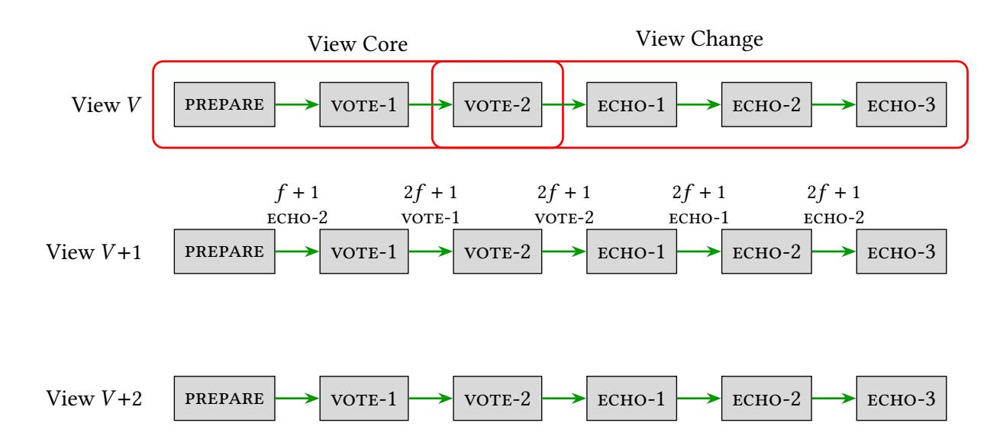

{0}------------------------------------------------

# Forget-IT: Optimal Good-Case Latency For Information-Theoretic BFT

ITTAI ABRAHAM, a16z Crypto Research, USA SOURAV DAS, Category Labs, USA YUVAL EFRON, Ritual, USA JOVAN KOMATOVIC, Category Labs, USA

The good-case latency of a consensus protocol measures the latency from block proposal by a consensus leader to decision, in the case in which the leader is correct. It is arguably the efficiency metric most pertinent for discussing the practical latency performance of consensus protocols. Well understood in the context of the *authenticated* setting, with PBFT [Castro 99], Tendermint [Buchman 16] & Simplex [Chan, Pass 23] achieving the optimal good-case latency of 3 rounds, significant gaps remain in the *unauthenticated* setting. We present Forget-IT, an unauthenticated consensus protocol with optimal good-case latency of 3 rounds. Furthermore, our protocol only requires constant persistent storage, and has  $O(n^2)$  message complexity per view.

#### 1 INTRODUCTION

Byzantine Fault Tolerant (BFT) consensus, the task of reaching agreement on a value among n processes, of which at most f are corrupt, is one of the most fundamental and well studied problems in the theory of distributed computing and cryptography [33]. The advent of blockchain technologies in the recent decade has highlighted not only its theoretical importance but also its practical impact. Consensus protocols deployed by modern blockchains almost always operate in the  $partial\ synchrony$  model, in which there is a liminal point in time, GST, such that the network is asynchronous prior to it and synchronous after it. Furthermore, they quite ubiquitously follow the  $leader\ based$  paradigm: Time is divided into bounded intervals, referred to as views, with each having a designated leader, responsible with assembling and proposing the next block of transactions. In this work, we focus on the one-shot version of consensus, in which agreement on a single value must be reached by the processes. When discussing the efficiency of the leader-based approach in partial synchrony, two metrics dominate the conversation.

- **Good-case latency.** Roughly, good-case latency measures the worst-case time from the leader *entering* a view to *decision* by all correct processes, post GST, when the view leader is correct.
- **View length.** Roughly, view length measures the worst-case time from the last process entering a given view, to the last process leaving that view, post GST.

The motivation behind both properties is clear. Both aim to get a handle on the speed of convergence of the network post GST to a decision, and the power of the adversary in delaying that convergence. The study of these metrics dates back to early 1990s, with the seminal PBFT paper [22], presenting a protocol employing signatures (henceforth *authenticated*) which achieves good-case latency of  $3\delta$  (which is optimal [5]), where  $\delta$  is the actual speed of the network after GST. In the context of the authenticated setting, the ideas of PBFT have been honed and refined over the years. Notable works include Tendermint and Simplex [14, 16]. Tendermint improves upon PBFT by reducing the communication complexity of each view to  $O(n^2)$ , down from  $O(n^3)$ . Furthermore, Tendermint boasts constant storage complexity of correct processes. Simplex also achieves  $O(n^2)$  communication per view, and reduces the view length all the way down to  $4\Delta$ , where  $\Delta \geq \delta$  is the known upper bound on message delays after GST.

Authors' Contact Information: Ittai Abraham, a16z Crypto Research, USA, ittaia@gmail.com; Sourav Das, Category Labs, USA, souravdas1547@gmail.com; Yuval Efron, Ritual, USA, efronyuv@gmail.com; Jovan Komatovic, Category Labs, USA, jovan.komatovic@gmail.com.

{1}------------------------------------------------

On the other hand, our understanding of the *unauthenticated* setting, in which the adversary is full-information and computationally unbounded (henceforth *information-theoretical*), is lacking. In particular, the following question remained open:

Does there exist an information-theoretic BFT protocol with optimal resilience, optimal good-case latency,  $O(n^2)$  communication per view, and O(1) persistent storage?

This question has been explicitly raised in several prior works, e.g., TetraBFT [43], IT-Hotstuff [8]. In fact, a discussion in TetraBFT entertains the idea of a barrier in the information-theoretic setting, citing the recent work of Attiya & Welch [11] as potential evidence that the good-case latency of 3, attainable with cryptographic tools, may be beyond reach in the information-theoretic setting (at least with constant storage).

**Main result.** We present Forget-IT, an information-theoretic Byzantine agreement protocol with optimal good-case latency of  $3\delta$ , secure against at most f>0 Byzantine faults, where 3f+1=n. Furthermore, our protocol, like TetraBFT, requires O(1) words of persistent storage,  $O(n^2)$  message complexity per view, and is optimistically responsive. This result settles the good-case latency of information-theoretic consensus with optimal resilience, and in addition shows that such good-case latency can be achieved with constant storage, low communication, and with no compromise on responsiveness.

**Theorem 1** (See theorems 2 and 3). There exists an information-theoretic, deterministic Byzantine agreement protocol that tolerates f > 0 faults with n = 3f + 1. The protocol achieves good-case latency of  $3\delta$ , view length of  $7\Delta$ , O(1) persistent storage, and  $O(n^2)$  message complexity per view, and is optimistically responsive.

In fact, our main result obtains an even stronger notion of good-case latency, specifically that of *robust* good-case latency.

*Robust good-case latency.* Pondering about the notion of good-case latency in the information-theoretic setting for a moment, an astute reader might be inclined to reexamine the definition of good-case latency, and differentiate between two important variants.

- (1) **Good-case latency**: The worst-case latency to decision, measured from t = 0, when the leader of the first view is correct and GST = 0.
- (2) **Robust Good-case latency**: The worst-case latency to decision, measured from the first time a correct leader enters a view, post GST.

Clearly the latter metric can only be larger than the former, as robust good-case latency considers a strictly richer set of executions than good-case latency. Despite its stringency, the motivation for robust good-case latency is quite clear: Brief periods of asynchrony are common in practice, and robust good-case latency better captures the behavior of consensus protocols under such precarious conditions. Interestingly enough, the distinction between these two variants is rather obscured in the authenticated setting, as it if often the case that the two variants *coincide*: When the leader enters a view, it often has *cryptographic proof* that convinces the rest of the correct processes to catch up, and indeed these variants are equal for each of PBFT, Tendermint, and Simplex, with robust good-case latency of 3. Such proof, however, cannot exist in the information-theoretical (IT) setting, and indeed all existing protocols in the IT setting exhibit a significant gap between the two variants. In particular, to the best of our knowledge, in the IT setting, no peer-reviewed protocol achieves the optimal good-case latency of  $3\delta$ , and no protocol achieves the optimal robust good-case latency of  $7\delta$ , and view length of  $10\Delta$ . Our protocol, Forget-IT, obtains the optimal robust good-case latency of  $3\delta$  and view length of  $7\delta$ .

{2}------------------------------------------------

|                               | Good-case<br>latency | Robust case latency | View<br>length | Persistent storage /<br>Message complexity | Responsiveness |
|-------------------------------|----------------------|---------------------|----------------|--------------------------------------------|----------------|
| PBFT [22] <sup>†</sup>        | $3\delta$            | $7\delta$           | 9Δ             | $O(1)/O(n^4)$                              | <b>√</b>       |
| IT-HS (blog) [9] <sup>‡</sup> | $4\delta$            | $6\delta$           | $7\Delta$      | $O(1)/O(n^2)$                              | ×              |
| IT-HS [8]                     | $6\delta$            | $8\delta$           | 10Δ            | $O(1)/O(n^2)$                              | $\checkmark$   |
| TetraBFT [43]                 | $5\delta$            | $7\delta$           | $10\Delta$     | $O(1)/O(n^2)$                              | $\checkmark$   |
| Forget-IT                     | $3\delta$            | $3\delta$           | 7Δ             | $O(1)/O(n^2)$                              | <b>√</b>       |

**Table 1.** A table of previous information-theoretic protocols and their corresponding metrics, juxtapositioned against our protocol Forget-IT.

#### **Related Work**

**Byzantine agreement.** Byzantine agreement [1, 3, 15, 18, 19, 21, 29, 30, 32, 33, 36, 38, 40–42] is the problem of reaching agreement on a common value in a distributed system of n processes despite the presence of f < n arbitrary failures. The seminal FLP [28] impossibility result showed that deterministic consensus cannot be solved in the asynchronous setting (where messages can be arbitrarily delayed), but can be solved in synchronous [24] and partially synchronous settings [22].

**Latency of Byzantine agreement.** Byzantine agreement protocols are primarily evaluated by *latency*, i.e., the number of rounds (or message delays) required for all correct processes to decide, which is the primary focus of this work. For Byzantine broadcast protocols, the deterministic Dolev-Strong protocol [24] solves broadcast in worst-case f + 1 rounds under synchrony, matching a lower bound [28]. For protocols with early stopping [23], a lower bound of f' + 2 rounds exists for f' < f actual faults. The classic asynchronous Byzantine reliable broadcast by Bracha [13] has worst-case latency of 3 rounds, with subsequent work reducing the expected round complexity of Byzantine agreement to constant through randomization [2, 12, 17, 25, 27, 31, 34, 37, 39].

**Good-case latency of Byzantine agreement.** Since PBFT [22], which achieves good-case latency of  $3\delta$ , the study of good-case latency in Byzantine agreement has received significant attention. The work of Martin and Alvisi [35] was the first to achieve good-case latency of  $2\delta$  in partial synchrony, at the cost of requiring n = 5f + 1 processes. Tendermint [14] improved upon authenticated PBFT by reducing storage to O(1) and communication to  $O(n^2)$  per view. Following Abraham *et al.* [5], which established tight bounds on good-case latency for authenticated consensus in partial synchrony, research in this area has surged, with works exploring the problem across multiple dimensions [4, 6, 7, 10, 26].

In the unauthenticated setting, which is our primary focus, the two most closely related works are IT-HotStuff [8] and TetraBFT [43]. Both achieve constant persistent memory,  $O(n^2)$  message complexity per view, and optimistic responsiveness.<sup>1</sup> However, neither achieves optimal good-case latency nor its robust variant, which is where our work advances the state of the art.

## <span id="page-2-1"></span>2 TECHNICAL OVERVIEW

We now provide a technical overview of the Forget-IT algorithm. Forget-IT has the standard leader-based structure and proceeds in views. Each view V has a designated leader and has three implicit

<sup>†</sup> Suggested protocol, not peer-reviewed or proven.

<sup>&</sup>lt;sup>‡</sup> Although the leader must wait  $2\Delta$  before proposing (sacrificing responsiveness), the (robust) good-case latency measures time from the issued proposal, hence the  $2\Delta$  wait does not appear in the good-case latency metrics.

<span id="page-2-0"></span><sup>&</sup>lt;sup>1</sup>Throughout this work, we use the terms "storage" and "memory" interchangeably.

{3}------------------------------------------------

<span id="page-3-0"></span>

**Fig. 1.** Flowchart of Forget-IT's progress in any given view. A view commenced with a leader proposing a value v via a PREPARE message. If deemed safe, e.g., by seeing f+1 echo-2 messages for v from the previous view, correct processes multicast a vote-1 message for v. A quorum of those for v triggers a vote-2 message for v. A quorum of those for v triggers a decision. If a decision was not triggered, then a quorum of vote-2 messages triggers the view-change protocol, where processes exchange echo-1, echo-2, and echo-3 messages. A process proceeds to the next view upon collecting (1) a quorum of echo-3 messages, or (2) f+1 echo-2 messages coupled with a prepare message from the next leader.

algorithmic components: *view core*, *view change*, and *view transition*. The protocol's logic, explained in this section, is illustrated in Figure 1.

**View core.** The view core component is the decision-making logic within a single view. This has a structure similar to the normal case operation in the classic PBFT protocol [22]. As in PBFT, the view core's part of each view V has three rounds. The leader of the view starts by proposing a value v, i.e., it broadcasts v to all. Upon receiving the proposal v from the leader, the processes engage in two rounds of voting to potentially decide on the value.

In signature-based protocols, processes vote on a proposal only if the proposal is *justified*, i.e., processes can locally determine that voting on the proposed value would not cause a safety violation [22]. Typically, this justification consists of a quorum certificate: information about the internal states of 2f + 1 processes, authenticated with their digital signatures. Since we are in the information-theoretic (IT) setting, we cannot rely on signature-based justification. Thus, we introduce the notion of guards, a local state each process maintains to succinctly represent information regarding potential decisions in previous views. The guard ensures that if any correct process decides a value v in some view V, then all correct processes will update their guards to the value v. In more detail, our protocol relies on the guarding mechanism as follows.

Let  $guard_i[V]$  be the guard at the i-th process  $p_i$  in a given view V. Upon receiving the proposal from the leader consisting of the value v, process  $p_i$  casts its vote for v, i.e., sends vote-1 message to all, only if either  $guard_i[V] = SAFE$  or  $guard_i[V] = v$ . Here, SAFE is a default wildcard constant of the protocol, and  $guard_i[V] = SAFE$  indicates that no processes could have decided any value in prior views, and thus voting for the current proposal would not violate safety. Similarly,  $guard_i[V] = v$  indicates that some other process might have decided v during a previous view. Thus, voting on value v (and only on value v) in this current view is safe.

Upon receiving vote-1 messages from 2f+1 processes for a proposal with value v, as in PBFT, each process locks on v, and casts their second vote by broadcasting their vote-2 message for the value v. (Looking ahead, to improve the latency of the view-change procedure, each process  $p_i$  in view V also includes  $guard_i[V]$  in its vote-2 message, but we can omit these details for now.) Finally, upon receiving 2f+1 vote-2 message for the same value v, each process  $decides\ v$ .

{4}------------------------------------------------

View change. As in PBFT, when a view does not succeed (due to a faulty leader or network delays), our protocol enters a logical view-change phase. This is the most technically involved and novel component of Forget-IT, as it must ensure that correct processes make progress while preserving previous decisions without relying on cryptography. Let us elaborate.

Correct processes initiate the view-change phase when their local view does not make progress for 3Δ time. A correct process initiates the view change phase by broadcasting a vote-2 message, unless it has already sent a vote-2 message for that view as part of the normal case operation (in the view core). We note that the vote-2 message in Forget-IT serves two purposes: first, to drive decisions in a view, and second, if the situation arises, to assist the view-change phase, as follows.

Acceptable vote-2 messages for tentative assessment of agreement. Each process waits to receive 2 +1 acceptable vote-2 message, where the acceptable notion seeks to prevent malicious processes from sending vote-2 messages for arbitrary values. However, unlike a signature-based protocol, we cannot rely on signatures to let processes make their vote-2 messages acceptable. Therefore, we introduce a message-based acceptance condition. In Forget-IT, a process deems a vote-2 message for a value acceptable only upon receiving + 1 vote-1 messages for the same value . This rule ensures that correct processes accept a vote-2 message for only if at least one correct process previously sent a vote-1 message for .

We then combine this acceptance condition with the following properties: (i) once any correct process decides a value , all correct processes update their guards to at the beginning of the next view; and (ii) a correct process sends a vote-1 message only when the proposed value matches its current guard. Together, these properties imply that if any correct process decides, then no correct process will ever accept a vote-2 message for any value ′ ≠ in any future view. In the remainder of this section, we assume that correct processes handle only acceptable vote-2 messages.

Thus, once a process receives a quorum of 2 + 1 vote-2 messages and aims to start the viewchange procedure, it first analyzes them to determine locally whether some value may have been decided in the current view. It then disseminates this assessment to all other processes using a threeround echo protocol. If the process concludes that no decision could have occurred in the current view, it propagates this negative assessment using the same protocol. Crucially, the processes make only tentative assessments of the decision in the current view and can revise these assessments upon receiving additional vote-2 messages. For example, a process may initially receive 2 + 1 vote-2 messages and infer that a value might have been decided, and accordingly broadcast . If it later receives additional vote-2 messages that invalidate this inference, it updates its assessment to "no decision occurred" and broadcasts the revised assessment.

Looking ahead, this revision mechanism is essential for liveness. Without it, a Byzantine adversary could selectively release vote-2 messages to cause different correct processes to form conflicting assessments and indefinitely stall the protocol's progress.

Three-phase echo protocol. Upon determining whether a decision has occurred in the current view, each process invokes a three-phase echo protocol to verifiably propagate this assessment across views, while maintaining constant persistent memory and enabling low-latency view transitions.

In the first echo phase, a process broadcasts an echo-1 message containing the value that it tentatively considers decided in the current view. A process may later revise this assessment and, upon doing so, broadcasts a new echo-1 message reflecting the updated opinion. A naive implementation of this approach would allow up to () such revisions per process, leading to a total message complexity of ( 3 ). To avoid this blowup, our protocol restricts each process to sending at most two echo-1 messages per view. Furthermore, a process may use its second echo-1 message only to broadcast the wildcard value SAFE, which indicates that all values are safe.

{5}------------------------------------------------

In the second echo phase, each process waits to receive a quorum of echo-1 messages for some value . Upon collecting such a quorum, it confirms by broadcasting an echo-2 message for . Importantly, in Forget-IT, we count echo-1 messages carrying the wildcard value SAFE towards a quorum of any value ≠ ⊥ (as they indicate that all values, including , are safe). Moreover, as in the first echo phase, each process sends at most two echo-2 messages per view, where it may use the second only for the wildcard value SAFE.

In the third echo phase, each process waits to receive a quorum of echo-2 messages for some value . Upon collecting such a quorum, it confirms by broadcasting an echo-3 message for . As before, we count echo-2 messages carrying the wildcard value SAFE toward the quorum for any value. Moreover, each process sends at most two echo-3 messages per view, and may use the second only for the wildcard value SAFE.

View transitioning. The view-transition component specifies three mechanisms by which processes in Forget-IT enter a new view.

First, processes enter view + 1 using a quorum of echo-3 messages from view . A non-leader process enters the next view after receiving 2 + 1 echo-3 messages. In contrast, the leader of the next view enters upon receiving only +1 echo-3 messages. We introduce this asymmetric quorum requirement to allow the next leader to enter its view "quickly" after the view starts. Specifically, once a non-leader enters a view after collecting 2 + 1 echo-3 messages, the next leader receives at least + 1 of those messages within time and thus also enters the view within that time. In comparison, the standard ready amplification technique of Bracha [\[13\]](#page-43-15) guarantees that the next leader enters the view only within 2 time from the first correct process entering the new view.

Second, a process enters a new view upon receiving a proposal from the leader of the and if the process receives + 1 echo-2 messages from view − 1. This mechanism ensures that every correct process enters the leader's view within time of the leader entering view . To see this, note that the leader enters the view upon receiving + 1 echo-3 message. This implies that at least one correct process has sent echo-3. Since a correct process sends an echo-3 message only upon receiving 2 + 1 echo-2 messages, this implies that all correct processes will receive at least + 1 echo-2 messages within time from the leader entering the view. Crucially, the received echo-2 messages also serve as justification for the leader's proposal, enabling liveness (and optimistic responsiveness).

Third, a process in view ′ may passively enter a future view > ′ upon receiving +1 echo-1 messages for view . This is termed passive entry because the process skips the view core and proceeds directly to view-change procedure of view (to transition to view + 1). We introduce this passive entry mechanism specifically to achieve (1) persistent storage, as detailed in [§4.](#page-8-0)

Updating guards at processes. The last critical step of Forget-IT is the procedure for processes to update their guards. Guard updates are critical as guards prevent correct processes from voting on conflicting proposals (safety), while enabling processes to accept new proposals consistent with prior decisions (liveness). In a nutshell, processes update their guards during view transitions based on the quorum of echo messages that triggered the transition.

Challenges due to (1) persistent storage requirements. Requiring each process to maintain only (1) persistent storage introduces fundamental challenges. In particular, we cannot assume reliable delivery of an unbounded number of messages between a pair of correct processes. Reliable delivery requires the sender to retain all in-transit messages in persistent memory until it receives confirmation of delivery. Under an (1) storage bound, such buffering is impossible. This limitation motivates the need and justifies our new definition of a formal model (see [§3\)](#page-6-0) that explicitly captures protocols operating under constant persistent storage constraints.

{6}------------------------------------------------

A second challenge is to ensure that the (1) state maintained by each process effectively compresses all relevant information from prior views. In Forget-IT, each process keeps track of only a small, constant number of recent views. Designing a protocol with this property is non-trivial. For example, once a correct process enters a view , the protocol must ensure that no correct but slow process is left behind in a much earlier view. Otherwise, the system would either sacrifice liveness or require processes to retain state for arbitrarily old views, violating the storage bound. Our multi-level echo structure directly addresses this issue. By carefully propagating and amplifying view-transition information associated with only a few recent views (rather than all views), the protocol guarantees that slow processes can catch up while allowing correct processes to safely discard information regarding old views.

Summary of our results. Combining all the above, we get a partially synchronous consensus protocol in the IT setting with ( 2 ) message complexity per view, and (1) persistent storage. Moreover, the protocol is responsive and has a good-case latency of 3, i.e., when the leader is correct, processes decide on a value using three rounds of communication. The protocol also has a robust good-case latency of 3, which matches the robust case latency of state-of-the-art consensus protocols that rely on digital signatures, and, finally, a view duration of 7Δ.

## <span id="page-6-0"></span>3 PRELIMINARIES

Processes & the adversary. We consider a static message-passing system {1, 2, . . . , } consisting of = 3 + 1 processes, for some integer > 0. Each process is modeled as a deterministic state machine equipped with a local clock. An adversary may corrupt up to processes at arbitrary times during the execution; we refer to such an adversary as -bounded.[2](#page-6-1) Corrupted processes are Byzantine and may behave arbitrarily, whereas non-corrupted processes follow their state machines, as prescribed by the protocol; we refer to them as faulty and correct, respectively. Moreover, we assume that the adversary is (1) full-information, meaning that it observes the internal state of every process, and (2) computationally unbounded. Finally, we model local computation as taking zero time, since it is negligible compared to message delays.

Communication network. We assume a point-to-point message-passing network with authenticated channels, meaning that the recipient of each message can verify the sender's identity. However, we do not assume that channels are reliable, i.e., we do not assume that every sent message is eventually received. This modeling choice is deliberate, and plays a crucial part in how we formally handle memory complexity. Indeed, reliable channels require the sender to buffer every message until delivery is confirmed, which necessitates unbounded memory and is therefore incompatible with the constant-memory goal of our protocol.

Instead, we adopt an unreliable network model in which communication proceeds exclusively via broadcasts: each broadcast operation unicasts the message separately to every process, retransmitting it indefinitely until the broadcasting operation is explicitly abandoned. Under this model, we say that a message is alive at time if the broadcast of has been initiated by time and has not been abandoned by time . We say that is forever-alive if its broadcast is initiated at some point and never abandoned. A forever-alive message is guaranteed to be delivered by every correct process, as its indefinite retransmission ensures delivery despite the lack of reliable channels.

Persistent memory. To reason formally about the memory usage of our protocol, we incorporate persistent memory directly into the model. Each process's state machine includes a persistent memory component, together with rules governing how this memory is updated over time. Intuitively, persistent memory is the only state that survives crashes.

<span id="page-6-1"></span><sup>2</sup>Note that for deterministic protocols, static and adaptive adversaries are equivalent.

{7}------------------------------------------------

Formally, in addition to Byzantine corruptions, the adversary may temporarily *crash* a correct process, with the guarantee that every crashed correct process eventually *recovers*. While crashed, a process performs no local computation and sends no messages; in particular, all broadcasting operations initiated before the crash are implicitly abandoned. Crucially, however, the process's persistent memory remains unchanged during the crash. Upon recovery, the process executes a designated *recovery procedure*—a purely local computation that takes as input only the contents of persistent memory and has access to no other information, neither volatile state nor previously received messages. The recovery procedure produces a new local state, after which the process resumes normal execution according to its state machine. To meaningfully reason about sub-linear (in *n*) storage, we assume that the identities of participating processes are stored in a read-only part of the state machine which remains resilient to crashes, and is not counted towards the size of a process's persistent memory.

**Partial synchrony.** We consider the standard partially synchronous model. Specifically, there exists an unknown Global Stabilization Time (GST), chosen by the adversary, that separates an initial asynchronous period from a subsequent synchronous one. The synchronous period is governed by a known upper bound  $\Delta$  on message delays: any message broadcast at time  $\tau$  and alive throughout  $[\tau, \max(\tau, \text{GST}) + \Delta]$  is received by time  $\max(\tau, \text{GST}) + \Delta$ . We denote by  $\delta \leq \Delta$  the unknown actual message delay after GST and assume that any message broadcast at time  $\tau$  and alive throughout  $[\tau, \max(\tau, \text{GST}) + \delta]$  is received by time  $\max(\tau, \text{GST}) + \delta$ .

We further assume that all correct processes begin executing the protocol before GST, and that hardware clocks, while subject to arbitrary drift before GST, do not drift after GST. Finally, we assume that the adversary may crash correct processes only before GST, and that every crashed correct process also recovers before GST. Consequently, from GST onward, all correct processes remain continuously online.

**Byzantine agreement & its metrics.** In this work, we design a Byzantine agreement protocol that operates in the model described above. Formally, we solve the problem in which every correct process proposes an initial value and aims to decide a value while satisfying the following properties:

- *Agreement:* No two correct processes decide different values.
- *Termination:* Every correct process eventually decides.
- *Non-triviality:* If all processes are correct, all propose the same value v, and GST = 0, then no correct process decides any value different from v.

We note that while various other validity constraints exist [20], we deliberately choose the simplest formulation to focus attention on the core algorithmic challenges, which are independent of the specific validity variant. However, we emphasize that our protocol can be straightforwardly adapted to satisfy external validity [14, 42], arguably the most important validity property, which requires that any decided value must be valid according to some predetermined logical predicate. The only modification needed is for processes to support only valid values.

Efficiency metrics. We evaluate the efficiency of protocols using three key metrics. For an f-bounded adversary  $\mathcal{A}$  (capable of corrupting up to f processes) and an f-secure (resilient to f corrupted processes) leader-based Byzantine agreement protocol  $\Pi$ , we denote by  $\mathsf{DL}_{\mathcal{A}}(\Pi)$  the smallest time T by which every correct process decides (but not necessarily terminates) in the presence of  $\mathcal{A}$ , normalized to GST, i.e.,  $\mathsf{DL}_{\mathcal{A}}(\Pi) = T - \mathsf{GST}(\mathcal{A})$ . (Here, given an adversary  $\mathcal{A}$ ,  $\mathsf{GST}(\mathcal{A})$  denotes its GST.) For a family  $\mathcal{F}$  of f-bounded adversaries, we define the decision latency of  $\Pi$  with respect to  $\mathcal{F}$  to be  $\mathsf{DL}_{\mathcal{F}}(\Pi) = \sup_{\mathcal{A} \in \mathcal{F}} \mathsf{DL}_{\mathcal{A}}(\Pi)$ .

• Good-case latency  $T_{gc}$ : Consider the family  $\mathcal{F}_{gc}$  of f-bounded adversaries  $\mathcal{A}$  for which the first leader  $\ell$  is correct and GST = 0. We define  $T_{gc} \triangleq DL_{\mathcal{F}_{gc}}(\Pi)$ .

{8}------------------------------------------------

- Robust good-case latency  $T_{rgc}$ : Consider the family  $\mathcal{F}_{rgc}$  of f-bounded adversaries  $\mathcal{A}$  for which GST coincides with a correct leader entering its view. We define  $T_{rgc} \triangleq DL_{\mathcal{F}_{rgc}}(\Pi)$ .
- *Memory complexity*  $PM(\Pi)$ : We denote by  $PM_{\mathcal{A}}(p_i, \tau)$  the size (in words) of the persistent memory register of a correct process  $p_i$  at time  $\tau$  under adversary  $\mathcal{A}$ , where each word can store a constant number of messages, values, and counters. The memory complexity of  $\Pi$  with respect to  $\mathcal{A}$  is  $PM_{\mathcal{A}}(\Pi) = \max_{\text{correct } p_i, \tau \in \mathbb{N}} PM_{\mathcal{A}}(p_i, \tau)$ , and the overall memory complexity of  $\Pi$  is  $PM(\Pi) = \max_{f\text{-bounded } \mathcal{A}} PM_{\mathcal{A}}(\Pi)$ .

A formal definition of the view length metric is provided in §A.4, as it is less central to our results than the above metrics.

#### <span id="page-8-0"></span>4 FORGET-IT: PSEUDOCODE & PROOF SKETCH

We begin the presentation of Forget-IT with a description of the pseudocode (§4.1), followed by an informal analysis of correctness and complexity (§4.2). The formal proof is deferred to §A.

#### <span id="page-8-1"></span>4.1 Pseudocode

The pseudocode is given in Algorithm 1. In essence, execution unfolds in a sequence of *views*  $V = 1, 2, 3, \ldots$ , each with a designated *leader* that rotates in round-robin fashion. Within each view, the leader proposes a value and the remaining processes attempt to reach agreement on it. If this attempt fails (due to a faulty leader or network instability), the protocol transitions to the next view, carrying forward enough information to preserve both safety and liveness.

As discussed in §2, Forget-IT comprises three interacting algorithmic components:

- *View core:* The decision-making logic within a single view.
- *View change:* The mechanism for determining, once a view completes, a safe and live value to carry into the next view.
- *View transitioning*: The rules governing when processes leave their current view and enter a new one.

To build intuition, we describe each component in detail through the lens of a fixed view V: how processes attempt to decide in V (view core), how they distill the outcome of V into information for V+1 (view change), and how they move from V to V+1 (view transitioning).

4.1.1 View Core. The view core of view V follows a standard three-round "propose-vote-decide" structure. Upon entering view V, the leader broadcasts a  $\langle \mathtt{PREPARE}, V, v \rangle$  message carrying its proposed value v (line 34); how the leader determines value v is discussed in §4.1.3. Each process  $p_i$  that receives the proposal checks it against  $guard_i[V]$ , its local guard for view V (line 36), a compact summary of what  $p_i$  knows about potential decisions in prior views. A guard can take two forms: SAFE, a special constant indicating that no value could have been decided previously (thus any proposal is safe to support), or some specific value v, indicating that v is the only value that could have been decided (thus restricting  $p_i$  to supporting only v). Guards are updated during the view transition phase; we describe this mechanism in §4.1.3. Importantly, within a view, a process may update its guard from a specific value to SAFE upon learning that all values are safe. Hence, a correct process guarding a specific value might initially ignore the leader's proposal for some other value as it does not deem it safe; however, later in the same view, through the rule at line 50, it can learn that the leader's proposal (and, in general, all values) are safe, update its guard to SAFE (line 51), and then support the proposal.

Once the guard check passes, each process broadcasts a  $\langle \text{VOTE-1}, V, v \rangle$  message (line 38). Upon collecting 2f + 1 matching VOTE-1 messages for v, each process *locks* on v (line 41) and broadcasts the lock via a VOTE-2 message. Finally, upon collecting 2f + 1 VOTE-2 messages for the same value v, each process decides v (line 44).

{9}------------------------------------------------

#### <span id="page-9-0"></span>**Algorithm 1** Forget-IT: Pseudocode (for process $p_i$ ) [part 1 of 3]

```
1: Constants:
               String SAFE = 'Every value is safe'
                                                                                                                                          ▶ a special string indicating that all values are safe
 2:
 3: Global variables (persistent memory):
 4:
                Value proposal<sub>i</sub>
                                                                                                                                                                                                   \triangleright p_i's proposal
 5:
                View view<sub>i</sub>
                                                                                                                                                                                            \triangleright p_i's current view
 6: View-specific variables (persistent memory), indexed by view V:
 7:
               Value \cup \{SAFE\} \ guard_i[V] \leftarrow \bot
                                                                                                                                                                       \triangleright p_i's guarded value for view V
                Value value\_to\_propose_i[V] \leftarrow \bot
 8:
                                                                                                                                                \triangleright value to propose if p_i is the leader of view V
                Value lock_i[V] \leftarrow \bot
 9:
                                                                                                                                                   \triangleright p_i's locked value for view V (or \bot if none)
10:
                Message vote1_i[V], vote2_i[V] \leftarrow \bot
                                                                                                                               ▶ vote-1 and vote-2 messages broadcast by p_i in view V
11:
                Value \cup {SAFE} potential_decision<sub>i</sub>[V] ← \bot
                                                                                                                                                                                     ▶ used for view change
12:
                                                                                                                             \rightharpoonup tracks whether a decision might have occurred in view V
                Boolean decision\_alert_i[V] \leftarrow \bot
               Boolean vc_i[V] \leftarrow false
13:
                                                                                                                         \triangleright whether the view-change procedure for view V has started
14: Echo variables (persistent memory), indexed by view V and k \in \{1, 2\}:
                Message echo1_i[V][k], echo2_i[V][k], echo3_i[V][k] \leftarrow \bot \triangleright ECHO-1, ECHO-2, ECHO-3 messages broadcast by p_i in view V
15:
                Value \cup \{SAFE\} \ val\_echo1_i[V][k], val\_echo2_i[V][k], val\_echo3_i[V][k] \leftarrow \bot
                                                                                                                                                                     ▶ values from the ECHO messages
16:
17: Rules:
               - Process p_i maintains (in persistent memory) view-specific and echo variables for views view_i, view_i - 1, and view_i - 2 only.
18:
               - Upon entering view V, a
bandon all ongoing broadcasts except for messages from views
 V-2 and V-1.
19:
20: Notation:
21:
               - "Receipt of k messages" means receipt from k different processes.
22: Rules:
23:
                - A received message \langle \text{VOTE-2}, V, v, \cdot \rangle with v \neq \bot is accepted only after p_i has received f + 1 messages \langle \text{VOTE-1}, V, v \rangle.
24:
                - A received message \langle \text{VOTE-2}, V, \bot, \cdot \rangle is accepted immediately upon reception.
                - For each view V, at most one \langle \text{VOTE-2}, V, \cdot, \cdot \rangle message is accepted from each process.
25:
26: upon starting:
               proposal_i \leftarrow p_i's proposal; value\_to\_propose_i[1] \leftarrow proposal_i
27:
28:
               guard_i[1] \leftarrow SAFE
                                                                                                                                                                          \triangleright initialize p_i's guard to SAFE
29:
               enter view 1
                                                                                                                                                                                                     ▶ active entry
30: upon entering view V:
31:
                view_i \leftarrow V
                                                                                                                                                                                 ▶ update the current view
32:
               invoke ensure_view_change(V - 2, guard_i[V])
                                                                                                                                                 ▶ ensure view-change for view V-2 is active
               invoke ensure_view_change(V - 1, guard_i[V])
                                                                                                                                                 ▶ ensure view-change for view V-1 is active
33:
34:
               if p_i = leader(V): broadcast \langle PREPARE, V, value\_to\_propose_i[V] \rangle
                                                                                                                                                                                  ▶ leader proposes a value
35: upon receipt of \langle \text{prepare}, view_i, v \rangle from leader \langle view_i \rangle:
36:
               wait until guard_i[view_i] = SAFE or guard_i[view_i] = v
                                                                                                                                         ▶ check if it is safe to support the leader's proposal
37:
               if vote1_i[view_i] = \bot and vc_i[view_i] = false:
38:
                       vote1_i[view_i] \leftarrow \langle vote-1, view_i, v \rangle; broadcast vote1_i[view_i]
39: upon receipt of 2f + 1 \ \langle \text{VOTE-1}, view_i, v \rangle messages for the same value v and vc_i[view_i] = false:
40:
               if vote2_i[view_i] = \bot:
41:
                       lock_i[view_i] \leftarrow v
                                                                                                                                                                                               \triangleright lock on value v
42:
                       vote2_i[view_i] \leftarrow \langle vote-2, view_i, lock_i[view_i], guard_i[view_i] \rangle; broadcast vote2_i[view_i]
43: upon receipt of 2f + 1 \langle \text{VOTE-2}, view_i, v, \cdot \rangle messages for the same value v \neq \bot:
44:
               if p_i has not decided yet: trigger decide(v)
                                                                                                                                                                                                     \triangleright decide on v
45: upon view_i is (non-passively) entered and 1\Delta + 2\Delta time has elapsed since (non-passively) entering view view_i:
46:
               if vote2_i[view_i] = \bot:
47:
                       ▶ timeout: broadcast vote-2 even without quorum to enable view change
48:
                       vote2_i[view_i] \leftarrow \langle vote-2, view_i, lock_i[view_i], guard_i[view_i] \rangle; broadcast vote2_i[view_i]
49: \triangleright once this condition holds, p_i learns that any value is safe and clears its guard
50: upon cert(ECHO-2, f + 1, view_i - 1, view_i - 1, view_i - 1, view_i - 1, view_i - 1, view_i - 1, view_i - 1, view_i - 1, view_i - 1, view_i - 1, view_i - 1, view_i - 1, view_i - 1, view_i - 1, view_i - 1, view_i - 1, view_i - 1, view_i - 1, view_i - 1, view_i - 1, view_i - 1, view_i - 1, view_i - 1, view_i - 1, view_i - 1, view_i - 1, view_i - 1, view_i - 1, view_i - 1, view_i - 1, view_i - 1, view_i - 1, view_i - 1, view_i - 1, view_i - 1, view_i - 1, view_i - 1, view_i - 1, view_i - 1, view_i - 1, view_i - 1, view_i - 1, view_i - 1, view_i - 1, view_i - 1, view_i - 1, view_i - 1, view_i - 1, view_i - 1, view_i - 1, view_i - 1, view_i - 1, view_i - 1, view_i - 1, view_i - 1, view_i - 1, view_i - 1, view_i - 1, view_i - 1, view_i - 1, view_i - 1, view_i - 1, view_i - 1, view_i - 1, view_i - 1, view_i - 1, view_i - 1, view_i - 1, view_i - 1, view_i - 1, view_i - 1, view_i - 1, view_i - 1, view_i - 1, view_i - 1, view_i - 1, view_i - 1, view_i - 1, view_i - 1, view_i - 1, view_i - 1, view_i - 1, view_i - 1, view_i - 1, view_i - 1, view_i - 1, view_i - 1, view_i - 1, view_i - 1, view_i - 1, view_i - 1, view_i - 1, view_i - 1, view_i - 1, view_i - 1, view_i - 1, view_i - 1, view_i - 1, view_i - 1, view_i - 1, view_i - 1, view_i - 1, view_i - 1, view_i - 1, view_i - 1, view_i - 1, view_i - 1, view_i - 1, view_i - 1, view_i - 1, view_i - 1, view_i - 1, view_i - 1, view_i - 1, view_i - 1, view_i - 1, view_i - 1, view_i - 1, view_i - 1, view_i - 1, view_i - 1, view_i - 1, view_i - 1, view_i - 1, view_i - 1, view_i - 1, view_i - 1, view_i - 1, view_i - 1, view_i - 1, view_i - 1, view_i - 1, view_i - 1, view_i - 1, view_i - 1, view_i - 1, view_i - 1, view_i - 1, view_i - 1, view_i - 1, view_i - 1, view_i - 1, view_i - 1, view_i - 
               guard_i[view_i] \leftarrow SAFE
51:
```

4.1.2 *View Change.* The view-change component is the most intricate part of the algorithm. Its goal is to determine, once view V completes, a value that is both safe (consistent with any decision that may have occurred in view V or earlier) and live (one that all correct processes will support) to carry into view V+1.

The challenge is delicate. If a value v was decided in view V, every correct process must learn v and adopt it as its guard for view V+1; supporting anything else would break agreement. If no

{10}------------------------------------------------

## **Algorithm 1** Forget-IT: Pseudocode (for process $p_i$ ) [part 2 of 3]

```
52: upon recovery:
                                                                                                                                ▶ recovery procedure
           vc_i[view_i] \leftarrow true; vc_i[view_i - 1] \leftarrow true; vc_i[view_i - 2] \leftarrow true
53:
54:
           if vote2_i[view_i] = \bot: vote2_i[view_i] \leftarrow \langle vote-2, view_i, lock_i[view_i], guard_i[view_i] \rangle
           for each view V \in \{view_i - 2, view_i - 1, view_i\} and message m \in \{vote1_i[V], vote2_i[V]\} with m \neq \bot: broadcast m
55:
           for each V \in \{view_i - 2, view_i - 1, view_i\} and k \in \{1, 2\}:
56:
                for each message m \in \{echo1_i[V][k], echo2_i[V][k], echo3_i[V][k]\} with m \neq \bot: broadcast m
57:
58: upon existence of a set S of 2f + 1 accepted \langle \text{VOTE-2}, V, \cdot, \cdot \rangle messages such that all non-\perp lock values (if any) in S are identical and
      V \in \{view_i - 2, view_i - 1, view_i\} and decision\_alert_i[V] = \bot:
59:
                if there exists a non-\bot lock value \ell in S: decision\_alert_i[V] \leftarrow true; potential\_decision_i[V] \leftarrow \ell
60:
                else decision alert<sub>i</sub>[V] \leftarrow false
                                                                                                               ▶ no locks exist, so all values are safe
61: upon acceptance of 2f + 1 \ \langle \text{VOTE-2}, V, \bot, \cdot \rangle messages and V \in \{view_i - 2, view_i - 1, view_i\} and decision alert<sub>i</sub>[V] = true:
62:
           decision alert_i[V] \leftarrow false
                                                                                      \triangleright if a quorum has no locks, no decision occurred in view V
63: upon existence of a set S of 2f + 1 accepted \langle \text{VOTE-2}, V, \cdot, \cdot \rangle messages such that all non-\perp lock values in S differ from
      potential\_decision_i[V] and V \in \{view_i - 2, view_i - 1, view_i\} and decision\_alert_i[V] = true:
           decision\_alert_i[V] \leftarrow false
                                                                                                                   \triangleright no decision occurred in view V
64:
65: upon 1\Delta + 3\Delta time has elapsed since entering view view<sub>i</sub>:
           vc_i[view_i] \leftarrow true
                                                                                                      \triangleright the view-change procedure for view<sub>i</sub> starts
66:
67: upon acceptance of \langle \text{VOTE-2}, V, v \neq \bot, \cdot \rangle and V \in \{ view_i - 2, view_i - 1, view_i \} and \{ v = potential\_decision_i[V] \text{ or } \}
      decision\_alert_i[V] = false) and vc_i[V] = true:
           invoke send_echo_one(V, v)
                                                                                            ▶ v is safe based on a received lock, issue ECHO-1 for it
68:
69: upon acceptance of f + 1 \langle \text{VOTE-2}, V, \cdot, G \rangle messages for the same G \in \text{Value} \cup \{\text{SAFE}\} and V \in \{\text{view}_i - 2, \text{view}_i - 1, \text{view}_i\}
      and decision\_alert_i[V] = false and vc_i[V] = true:
70:
           invoke send_echo_one(V, G)
                                                                                           ▶ v is safe based on received guards, issue ECHO-1 for it
71: upon decision alert_i[V] = false and V \in \{view_i - 2, view_i - 1, view_i\} and divergent guards(V) = true and vc_i[V] = true:
           invoke send_echo_one(V, SAFE) > correct processes hold different guards (implying all values are safe), issue echo-1 for SAFE
72:
73: upon cert(ECHO-1, 2f + 1, V, v) = true for some v \in Value \cup \{SAFE\} and some V \in \{view_i - 2, view_i - 1, view_i\}:
           invoke send echo two(V, v)
                                                                              \triangleright a quorum of ECHO-1 message for v is received, issue ECHO-2 for v
74:
75: upon cert(ECHO-2, 2f + 1, V, v) = true for some v \in Value \cup \{SAFE\} and some V \in \{view_i - 2, view_i - 1, view_i\}:
                                                                              \triangleright a quorum of ECHO-2 message for v is received, issue ECHO-3 for v
           invoke send_echo_three(V, v)
76:
77: upon cert(ECHO-3, 2f + 1, V, v) = true for some v \in Value \cup \{SAFE\} and some view V \geq view_i and p_i \neq leader(V + 1):
78:
           guard_i[V+1] \leftarrow v
79:
           enter view V + 1
                                                                                                                                         ▶ active entry
80: upon cert(ECHO-3, f + 1, V, v) = true for some v \in Value \cup \{SAFE\} and some view V \ge view_i and p_i = leader(V + 1):
           guard_i[V+1] \leftarrow v
81:
82:
           if v = SAFE then value\_to\_propose_i[V + 1] \leftarrow proposal_i
                                                                                                              ▶ if all values safe, propose own value
83:
           else value\_to\_propose_i[V+1] \leftarrow v
                                                                                                      ▶ otherwise, must propose the guarded value
           enter view V + 1
84:
                                                                                                                                         ▶ active entry
85: upon (PREPARE, V, \cdot) is received from leader(V) and V > view_i and cert(ECHO-2, f + 1, V - 1, v) = true for some v \in Value \cup V
      {SAFE}:
86:
           guard_i[V] \leftarrow v
87:
           enter view V
                                                                                                                                         ▶ active entry
88: upon cert(ECHO-1, f + 1, V, v) = true for some v \in Value \cup \{SAFE\} and some view V \ge view_i:
89:
           if V > view_i:
                guard_i[V] \leftarrow v
90:
                passively enter view V
91:
92:
           else:
93:
                invoke ensure_view_change(view_i, v)
                                                                                                ▶ skip to the view-change part of the current view
94: upon passively entering view V:
           view_i \leftarrow V
95:
96:
           invoke ensure_view_change(V - 2, guard_i[V])
97:
           invoke ensure_view_change(V - 1, guard_i[V])
98:
           invoke ensure_view_change(V, guard_i[V])
```

decision occurred, processes must still converge on *some* value (or on the "all-safe" token SAFE), so that the next correct leader can make a proposal that will be universally supported.

**vote-2 messages as the entry point to view change.** The vote-2 message plays a dual role in Forget-IT: it serves both for deciding within the view core and as the entry point to the view-change procedure. To this end, each vote-2 message carries both the lock for the current view (which

{11}------------------------------------------------

#### **Algorithm 1** Forget-IT: Functions (for process $p_i$ )

```
99: - ensure_view_change(View V, Value \cup \{SAFE\} v):
                                                                                                              ▶ ensures view-change for view V begins
100:
             vc_i[V] \leftarrow true
101:
            if vote2_i[V] = \bot : vote2_i[V] \leftarrow \langle vote-2, V, \bot, v \rangle; broadcast vote2_i[V]
102: - send_echo_one(View V, Value \cup \{SAFE\} v):
                                                                                                           ▶ broadcasts ECHO-1 messages (at most two)
103:
            if val\_echo1_i[V][1] = \bot:
104:
                  val\_echo1_i[V][1] \leftarrow v; echo1_i[V][1] \leftarrow \langle \text{ECHO-1}, V, v \rangle; broadcast echo1_i[V][1]
105:
            else if val\_echo1_i[V][2] = \bot and val\_echo1_i[V][1] \ne \mathsf{SAFE} and (v = \mathsf{SAFE} or v \ne val\_echo1_i[V][1]):
106:
                  val\_echo1_i[V][2] \leftarrow SAFE; echo1_i[V][2] \leftarrow \langle ECHO-1, V, SAFE \rangle; broadcast echo1_i[V][2]
107: - send_echo_two(View V, Value \cup \{SAFE\} v):
                                                                                                           ▶ broadcasts ECHO-2 messages (at most two)
            if val\_echo2_i[V][1] = \bot:
108:
109:
                  val\_echo2_i[V][1] \leftarrow v; echo2_i[V][1] \leftarrow \langle ECHO-2, V, v \rangle; broadcast echo2_i[V][1]
110:
            else if val\_echo2_i[V][2] = \bot and val\_echo2_i[V][1] \ne \mathsf{SAFE} and (v = \mathsf{SAFE} or v \ne val\_echo2_i[V][1]):
                  val\_echo2_i[V][2] \leftarrow SAFE; echo2_i[V][2] \leftarrow (ECHO-2, V, SAFE); broadcast echo2_i[V][2]
111:
112: - send echo three(View V, Value \cup \{SAFE\} v):
                                                                                                           ▶ broadcasts ECHO-3 messages (at most two)
            if val\_echo3_i[V][1] = \bot:
113:
                  val\_echo3_i[V][1] \leftarrow v; echo3_i[V][1] \leftarrow \langle ECHO-3, V, v \rangle; broadcast echo3_i[V][1]
114:
            else if val\_echo3_i[V][2] = \bot and val\_echo3_i[V][1] \ne SAFE and (v = SAFE or v \ne val\_echo3_i[V][1]):
115:
                  \mathit{val\_echo3}_i[V][2] \leftarrow \mathsf{SAFE}; \mathit{echo3}_i[V][2] \leftarrow \langle \mathtt{ECHo-3}, V, \mathsf{SAFE} \rangle; \mathbf{broadcast} \; \mathit{echo3}_i[V][2]
116:
117: - cert({ECHO-1, ECHO-3} type, Integer threshold, View V, Value \cup {SAFE} v): \triangleright checks whether a quorum for v is collected
118:
            if v = SAFE:
119:
                  return there exists a set of threshold received \langle type, V, SAFE \rangle messages
120:
            else:
                  ▶ for specific values, allow SAFE to count toward the threshold
121:
                  return there exists a set of threshold received \langle type, V, \cdot \rangle messages, each carrying either v or SAFE
122:
123: - divergent guards(View V):
                                                                                            ▶ checks whether correct processes have different guards
            Let num\ guards be the number of accepted vote-2 messages for view V
124:
125:
            Let G \in Value \cup \{SAFE\} be the most frequent guard among the accepted VOTE-2 messages for view V
126:
            \triangleright detect if at least f + 1 honest processes have different guards
127:
            return num_guards - \#\{\langle vote-2, V, \cdot, G \rangle \text{ is accepted}\} \ge f + 1
```

plays a role in both the view core and view change) and the guard for the current view (which plays a role only in view change). We deliberately reuse vote-2 rather than introducing a separate message type, as a dedicated view-change message would need to follow vote-2 (to capture any decision that may have occurred), adding an extra round of communication. To ensure that the view-change procedure always has enough vote-2 messages to work with, a timer fires  $3\Delta$  after entering the view (line 45): if a process has not yet broadcast a vote-2 through the standard "voting path" (because the leader is faulty or the network has not stabilized), it does so at this point, carrying its current lock (possibly  $\bot$ ) and guard (line 48).

Before the view-change procedure can analyze vote-2 messages, they must be *accepted*. A vote-2 message with a  $\bot$  lock is accepted immediately (line 24), since it makes no claim about a potential decision. A vote-2 message with a non- $\bot$  lock value v requires more care: it is accepted only after the process independently receives f+1 (vote-1, V,v) messages (line 23). This acceptance condition is an information-theoretic substitute for digital signatures: if the sender is correct, the message will eventually be accepted by every correct process, since locking requires 2f+1 vote-1 messages, at least f+1 from correct processes; if the sender is faulty, acceptance guarantees that at least one correct process voted for v, which (by the guarding mechanism) means that v is consistent with any decision in prior views.

To construct the view-change procedure, we face a key question: should processes trust the locks conveying information about view V, or the guards conveying information from prior views (and not view V)? The answer depends on whether view V reached a decision: if so, locks must take priority; if not, guards become relevant as they carry information about decisions from prior views (if any).

{12}------------------------------------------------

**Determining whether a decision (might have) occurred in view** V. Once a process accepts 2f + 1 vote-2 messages for view V, it examines their lock values. A key invariant of our protocol is that two correct processes never lock on different values in the same view, which follows from standard quorum intersection. Therefore, if the accepted set contains two different non- $\bot$  lock values, at least one must originate from a faulty process, and the process can simply wait for more vote-2 messages before drawing conclusions.

Once the process has accepted 2f + 1 vote-2 messages whose non- $\bot$  lock values all agree on some value  $\ell$  (line 58), it records  $decision\_alert_i[V] \leftarrow true$  and  $potential\_decision_i[V] \leftarrow \ell$ , signaling that  $\ell$  may have been decided in view V (line 59). If every lock in the set is  $\bot$ , it records  $decision\_alert_i[V] \leftarrow false$ , concluding that no decision occurred (line 60).

If the assessment concludes that a decision occurred, this conclusion is only tentative and can be revised as more vote-2 messages arrive. For instance, if the process later accepts a set of 2f+1 vote-2 messages all carrying  $\bot$  locks (line 61), it updates  $decision\_alert_i[V] \leftarrow false$ : no decision could have occurred if an entire quorum never locked. Similarly, if it accepts 2f+1 messages whose non- $\bot$  locks all differ from  $potential\_decision_i[V]$  (line 63), the process again concludes that no decision occurred: any decided value must appear in every set of 2f+1 vote-2 messages by quorum intersection, yet here two such sets report different unique non- $\bot$  locks, which implies no decision was reached.

**Sending ECHO-1 messages.** With the assessment of whether a decision occurred in hand, each process determines what value to echo for view V. There are three triggers for broadcasting an ECHO-1 message, the first level of echoing in our view-change procedure, which announces values deemed safe. Each trigger corresponds to a different source of safety information:

- From locks (line 68): Upon accepting a VOTE-2 message for view V with a non- $\bot$  lock value v, the process broadcasts an ECHO-1 message for v, provided that either  $decision\_alert_i[V] = false$  (no decision occurred, so v is safe regardless) or  $potential\_decision_i[V] = v$  (the tentative "decision estimate" matches v).
- From guards (line 70): If  $decision\_alert_i[V] = false$  and f + 1 accepted vote-2 messages for view V share the same guard value G, the process echoes G. Since at least one of the f + 1 senders is correct and no decision was reached in view V, G is a safe value inherited from a prior view.
- From divergent guards (line 72): If  $decision\_alert_i[V] = false$  and the divergent\_guards function (line 123) detects that not all correct processes hold the same guard, the process concludes that all values are safe and broadcasts an ECHO-1 message for SAFE. The reasoning is that if only one value were truly safe, all correct processes would have adopted it as their guard prior to entering V; diversity among honest guards therefore implies that every value is safe.

All ECHO-1 messages are routed through the send\_echo\_one function (line 102), which ensures that each process broadcasts at most two ECHO-1 messages per view: one for a specific value, and, if a second invocation arrives with a different value, a second one carrying SAFE (line 106). This design bounds the number of ECHO-1 messages to at most two per process per view.

**The echo cascade.** The ECHO-1 messages are amplified through two further rounds. Upon collecting 2f + 1 ECHO-1 messages for view V, each carrying either v or SAFE, a process broadcasts an ECHO-2 message for v (line 74). Recall that the SAFE token acts as a wildcard: it counts toward the quorum for any given value, since it asserts that *every* value is safe. Upon collecting 2f + 1 ECHO-2 messages under the same rule, the process broadcasts an ECHO-3 message (line 76). The send\_echo\_two and send\_echo\_three functions mirror the two-message-per-view design of send\_echo\_one.

{13}------------------------------------------------

One may wonder why three rounds of echoing are necessary, given that the safe value is already determined after echo-1. We use three rounds (instead of one) for two reasons: (1) maintaining constant persistent memory, and (2) minimizing latency. We elaborate on both in the informal analysis of Forget-IT ([§4.2\)](#page-13-1).

- <span id="page-13-2"></span>4.1.3 View Transitioning. The view-transitioning component governs when and how processes leave view and enter view + 1. We differentiate two types of entry into view + 1 for a correct process: active (participating in the view core logic for deciding) and passive (skipping the view core and jumping immediately to the view-change procedure). We now describe each:
  - Active entry via echo-3 messages. A non-leader process enters view + 1 upon collecting 2 + 1 echo-3 messages for view , each carrying some value or SAFE (line [77\)](#page-9-0), while the leader of view + 1 enters upon collecting only + 1 such messages (line [80\)](#page-9-0). This asymmetry is deliberate and key to achieving good latency: once any non-leader correct process enters view + 1, a correct leader will follow within time, enabling a decision within 4 of the first correct process's entry.
  - Active entry via prepare and echo-2 messages. A process can also enter view + 1 upon receiving a ⟨prepare, + 1, ·⟩ message from the leader, provided it has independently collected + 1 echo-2 messages for view (line [85\)](#page-9-0). The echo-2 certificate provides the process with a safe guard value for view + 1, allowing it to enter the new view without waiting for the full echo-3 cascade. This entrance is crucial for achieving robust good-case latency of 3: once the leader enters, all correct processes follow immediately.
  - Passive entry via echo-1 messages. Finally, a process may passively enter view + 1 upon receiving +1 echo-1 messages for view +1 (line [88\)](#page-9-0). This path is designed for processes that have fallen behind and need to catch up; we explain the importance of this "quick catch-up" mechanism in [§4.2.](#page-13-1) When a correct process receives + 1 echo-1 message for view + 1, it knows that the view-change procedure of view + 1 has already started; consequently, it skips the view core and jumps directly to view change.

Setting the guard and the leader's proposal. Regardless of which path a process takes into view + 1, it determines its guard for view + 1 (guard [ + 1]) based on the echo messages that triggered the transition: from echo-3 for echo-3-based active entry (lines [78](#page-9-0) and [81\)](#page-9-0), from echo-2 for prepare-based entry (line [86\)](#page-9-0), or from echo-1 for passive entry (line [90\)](#page-9-0). Similarly, if the leader of view + 1 finds its guard to be SAFE (meaning no prior decision constrains its choice), it is free to propose its own input value (line [82\)](#page-9-0). Otherwise, it must propose the specific value carried by the echo-3 messages (line [83\)](#page-9-0), which equals its guard, ensuring consistency with any prior decision.

Epilogue. This closes the loop between all three components: the view-change procedure distills the outcome of view into a safe and live value, the transitioning component propagates that value into the guards and the leader's proposal for view + 1, and the view core ensures it is decided (assuming the leader is correct and GST has passed).

## <span id="page-13-1"></span>4.2 Proof Sketch

This section presents a proof sketch of Forget-IT's correctness and complexity. Recall that a formal proof can be found in [§A.](#page-16-0)

4.2.1 Correctness. We first give a proof sketch of the following theorem.

<span id="page-13-0"></span>Theorem 2 (Forget-IT's correctness). Given = 3 + 1, Forget-IT (Algorithm [1\)](#page-9-0) is a correct implementation of the Byzantine agreement problem in the presence of a full-information, computationally unbounded adversary that can corrupt up to > 0 processes.

We now analyze each property separately.

{14}------------------------------------------------

**Agreement.** Suppose some correct process decides value  $v_{dec}$  in view  $V_{dec}$ , and this is the first decision in the execution (i.e., no correct process decides in any view smaller than  $V_{dec}$ ). First, note that no other value can be decided in view  $V_{dec}$  due to standard quorum intersection.

We now establish that every correct process  $p_i$  enters view  $V_{dec}+1$  with its guard being  $v_{dec}$  ( $guard_i[V_{dec}+1]=v_{dec}$ ). When a decision occurs in view  $V_{dec}$ , at least 2f+1 correct processes broadcast  $\langle \text{VOTE-2}, V_{dec}, v_{dec} \rangle$  messages (line 43). By quorum intersection, any set of 2f+1 vote-2 messages for view  $V_{dec}$  must contain at least one message with lock value  $v_{dec}$ . The key implication is that once a correct process  $p_i$  collects 2f+1 vote-2 messages and attempts to determine whether a decision occurred (line 58), it must conclude that one might have happened and that the value might be  $v_{dec}$  (by setting  $decision\_alert_i[V_{dec}] \leftarrow true$  and  $potential\_decision_i[V_{dec}] \leftarrow v_{dec}$  at line 59). Moreover, it becomes impossible for  $p_i$  to receive 2f+1 vote-2 messages with all  $\bot$  locks (blocking the rule at line 61) or 2f+1 messages with a unique non- $\bot$  lock  $\ell \neq v_{dec}$  (blocking the rule at line 63), since  $v_{dec}$  must appear in any quorum of 2f+1 vote-2 messages for view  $V_{dec}$ .

Therefore, every correct process executing the view-change procedure for view  $V_{dec}$  concludes that a decision might have occurred and identifies  $v_{dec}$  as the decided value. This ensures that process  $p_i$  can only send an ECHO-1 message carrying  $v_{dec}$ : with  $potential\_decision_i[V_{dec}] = v_{dec}$  and  $decision\_alert_i[V_{dec}] = true$ , the rule at line 67 triggers exclusively for  $v_{dec}$ , while the other two ECHO-1 triggers (lines 69 and 71) cannot activate. This cascades through the echo layers: all ECHO-2 and ECHO-3 messages broadcast during view  $V_{dec}$ 's view-change procedure carry  $v_{dec}$  (lines 74 and 76). Consequently, every correct process  $p_i$ , regardless of which transition path it takes into view  $V_{dec} + 1$ , sets its guard for view  $V_{dec} + 1$  to  $v_{dec}$  ( $guard_i[V_{dec} + 1] \leftarrow v_{dec}$ ), which ensures that no value other than  $v_{dec}$  can be decided in view  $V_{dec} + 1$ .

Finally, once all correct processes have  $guard_i[V_{dec}+1]=v_{dec}$ , no correct process can broadcast an echo-1 message for any value other than  $v_{dec}$  during view  $V_{dec}+1$ 's view-change procedure. To see why, recall that there are three triggers for broadcasting echo-1: first, upon accepting a vote-2 message with a non- $\bot$  lock (line 67), the lock value must be  $v_{dec}$  since any lock is backed by at least f+1 vote-1 messages for view  $V_{dec}+1$ , and all correct processes only support  $v_{dec}$  in that view; second, upon accepting f+1 vote-2 messages carrying the same guard (line 69), this guard must be  $v_{dec}$  since all correct processes  $p_i$  have  $guard_i[V_{dec}+1]=v_{dec}$ ; third, upon detecting that not all correct processes hold the same guard (line 71), which cannot occur because all correct processes do have the same guard (namely,  $v_{dec}$ ). As a result, all echo-1 messages in view  $v_{dec}+1$  carry  $v_{dec}$ , which propagates through echo-2 and echo-3, ensuring every correct process enters view  $v_{dec}+1$  with  $v_{dec}+1$  as its guard. By induction, we have  $v_{dec}+1$ 0 for all views  $v_{dec}+1$ 1 and all correct processes  $v_{i}+1$ 2, which prevents any decision on a value other than  $v_{dec}+1$ 2.

**Termination.** For termination, consider the first view V after GST with a correct leader  $p_\ell$ . To enter view V, leader  $p_\ell$  must receive f+1 echo-3 messages from view V-1, each carrying either some value v or the special "all-safe" value SAFE (line 80). At least one correct process must have sent such an echo-3 message, which requires that process to have collected 2f+1 echo-2 messages for either v or SAFE (line 75). Within  $\delta$  time, all correct processes receive f+1 echo-2 messages for either v or SAFE. Upon receiving the leader's prepare message with this certificate in hand (line 85), each correct process enters view V and supports the proposal: the certificate demonstrates that the leader's value is safe, allowing the process to proceed with voting. All correct processes then broadcast vote-1 messages (line 38), followed by vote-2 messages (line 42), leading to a decision in view V within 3 $\delta$  of the leader's entry (line 44).

**Non-triviality.** If GST = 0, all processes are correct, and they all propose the same value, then the first view must succeed and this value must be decided.

<span id="page-14-0"></span>*4.2.2 Complexity.* Next, we provide a proof sketch of the following theorem.

{15}------------------------------------------------

**Theorem 3** (Forget-IT's complexity). Given n = 3f + 1, the following holds for Forget-IT (Algorithm 1) in the presence of a full-information, computationally unbounded adversary that can corrupt up to f > 0 processes:

- Robust good-case latency:  $3\delta$
- View length: 7∆
- Message complexity per view:  $O(n^2)$
- *Memory complexity:* O(1) *words (per correct process)*

The robust good-case latency of  $3\delta$  follows immediately from the analysis of termination (and implies non-robust good-case latency of  $3\delta$ ), so here we focus on the other performance metrics.

**Message complexity per view.** In each view, every correct process broadcasts at most a constant number of messages. The vote-1 and vote-2 messages are each broadcast at most once per view, as each correct process  $p_i$  stores them in  $vote1_i[\cdot]$  and  $vote2_i[\cdot]$  and conditions broadcasts on these being  $\bot$ . The functions send\_echo\_one, send\_echo\_two, and send\_echo\_three each broadcast at most twice per view—once for a specific value and once upon upgrading to SAFE—yielding at most two echo-1, two echo-2, and two echo-3 messages. With the single prepare message from the leader, each correct process broadcasts at most 9 messages per view. Since broadcasts reach all n processes and there are at most n correct processes, the total message complexity is  $O(n^2)$  per view.

View length & memory complexity. Once all correct processes are in the same post-GST view V, they complete that view and transition to view V+1 within  $7\Delta$  time. This bound follows from the timeout mechanism: all correct processes broadcast their vote-2 messages by time  $3\Delta$  (line 48), which are received by time  $4\Delta$ , triggering echo-1 messages. The subsequent echo-2 and echo-3 cascades complete within an additional  $3\Delta$ , yielding the  $7\Delta$  bound. However, what guarantees that all correct processes will actually participate in view V? This concern is critical because our protocol maintains constant memory by tracking only the last three views (current, previous, and the one before that), meaning a process stops participating in views outside this window. We must verify that all correct processes overlap for sufficiently long in view V to complete it, despite this memory restriction.

Suppose the first correct process enters view V at time  $\tau$ . A key property of Forget-IT —enabled by the multiple levels of echoing—ensures that all correct processes enter view V (or a later view) by time  $\tau + 5\Delta$ . Concretely, the multiple echo levels guarantee that within  $\Delta$  time, every correct process is brought to at least view V-1 (via the passive entry mechanism at line 88), from which point it takes at most  $4\Delta$  to complete the view-change procedure of view V-1 and transition to view V. This rapid convergence property is essential for constant memory: without multiple echo levels, processes could diverge by O(f) views due to a sequence of faulty leaders. In such a scenario, each correct process would need to track the last O(f) views to ensure progress for stragglers, requiring O(f) memory instead of O(1).

On the other end, the  $4\Delta$  timeout (line 65) bounds how quickly processes can advance: by ensuring that no correct process broadcasts any ECHO-1 message for view V before time  $\tau + 4\Delta$ , it guarantees that no process enters view V+1 before time  $\tau + 4\Delta$ . More generally, since each view requires at least  $4\Delta$  to complete (due to the timeout), no correct process can enter any view beyond V+2 before time  $t+12\Delta$ . This bounded advancement rate, combined with the three-view tracking window, ensures that no correct process "forgets" view V before all others have had sufficient time to participate in it. Indeed, the last correct process enters view V by time  $\tau + 5\Delta$ , while no correct process abandons view V before time  $\tau + 12\Delta$ . Therefore, all correct processes overlap in their participation in view V (specifically, in its view-change phase) during the interval  $[\tau + 5\Delta, \tau + 12\Delta]$ , providing a  $7\Delta$  window sufficient for completion.

{16}------------------------------------------------

### <span id="page-16-0"></span>A PROOF OF CORRECTNESS & COMPLEXITY

This section establishes the correctness and complexity of the Forget-IT algorithm.

## A.1 Agreement

We first show that Forget-IT satisfies the agreement property, meaning that no two correct processes decide different values. To establish this, we begin by proving that the current view number of every correct process is monotonically increasing throughout the execution.

<span id="page-16-1"></span>Claim 1. If any correct process enters (actively or passively) a view <sup>1</sup> ≥ 1 at time <sup>1</sup> and later enters (actively or passively) a view <sup>2</sup> ≥ 1 at time <sup>2</sup> > 1, then <sup>2</sup> > 1.

Proof. Once process enters view <sup>1</sup> (actively or passively), it sets its local variable view to <sup>1</sup> (line [31](#page-9-0) or line [95\)](#page-9-0). Note that the variable view is stored in persistent memory. Let ∗ denote the next view that process enters (actively or passively). In the active case, process enters ∗ only if ∗ is greater than its current view 1. This follows because a view can be entered actively only at lines [79, 84,](#page-9-0) or [87;](#page-9-0) in all three cases, the respective conditions at lines [77, 80,](#page-9-0) and [85](#page-9-0) ensure that the target view is strictly greater than the process's current view. In the passive case (line [91\)](#page-9-0), process enters view ∗ only if <sup>∗</sup> > <sup>1</sup> (by the check at line [89\)](#page-9-0). Thus, <sup>∗</sup> > 1, which completes the proof. □

Next, we show that a correct process cannot broadcast two different vote-2 messages for the same view.

<span id="page-16-2"></span>Claim 2. If a correct process broadcasts two vote-2 messages <sup>1</sup> and <sup>2</sup> for the same view ≥ 1, then <sup>1</sup> = 2.

Proof. Assume toward contradiction that <sup>1</sup> ≠ 2. Without loss of generality, suppose that process broadcasts <sup>1</sup> before 2. We first observe that a correct process broadcasts a vote-2 message only for its current view view , or for view view − 1, or for view view − 2. For <sup>1</sup> to be broadcast, vote2[ ] must first be set to 1.

For <sup>2</sup> to be broadcast, vote2[ ] must be set to 2, which requires vote2[ ] = ⊥ at the time of the update. Given that never explicitly modifies vote2[ ] after setting it to 1, the only way for vote2[ ] to be reset to ⊥ is if crashes and vote2[ ] = <sup>1</sup> is not preserved in persistent memory. This can only happen once entered a view greater than + 2 (line [18\)](#page-9-0). Therefore, at this point view ≥ + 3. However, given that a correct process broadcasts vote-2 messages only for views {view , view − 1, view − 2} and Claim [1](#page-16-1) proves that from this point on view ≥ + 3 forever, we reach a contradiction with the fact that <sup>2</sup> is sent. This completes the proof. □

We now introduce a distinguished view that captures when the first decision by a correct process occurs.

Definition 1 (View dec). Let dec denote the smallest view in which a correct process decides.

Observe that if no correct process ever decides, then dec is undefined and agreement holds vacuously; thus, we assume henceforth that dec is defined. The following claim establishes that the value decided in view dec is unique, meaning that no two correct processes can decide different values in that view.

<span id="page-16-3"></span>Claim 3. If a correct process decides a value <sup>1</sup> in view dec ≥ 1 and another correct process decides a value <sup>2</sup> in the same view, then <sup>1</sup> = 2.

Proof. Assume toward contradiction that <sup>1</sup> ≠ 2. For a value <sup>1</sup> to be decided by a correct process in view dec, at least 2 + 1 processes must have broadcast a vote-2 message for <sup>1</sup> in that 

{17}------------------------------------------------

view (by the condition at line 43). Similarly, for a value  $v_2$  to be decided, at least 2f + 1 processes must have broadcast a VOTE-2 message for  $v_2$  in the same view. Since n = 3f + 1, the sets of processes issuing VOTE-2 messages for  $v_1$  and  $v_2$  must overlap on at least (2f + 1) + (2f + 1) - n = f + 1 processes. This implies that at least one correct process would have had to broadcast two conflicting VOTE-2 messages, which contradicts Claim 2. Therefore,  $v_1 = v_2$ , and the claim holds.

We next introduce the value associated with the first decision by a correct process.

**Definition 2** (Value  $v_{dec}$ ). Let  $v_{dec}$  denote the value decided by a correct process in view  $V_{dec}$ .

By Claim 3, at most one value can be decided in any given view, so  $v_{dec}$  is uniquely determined. Since we assume throughout this section that  $V_{dec}$  is well-defined, it follows that  $v_{dec}$  is well-defined as well. The following claim establishes that, for any correct process  $p_i$ , if  $decision\_alert_i[V_{dec}]$  or  $potential\_decision_i[V_{dec}]$  is ever set to a non- $\bot$  value, then  $decision\_alert_i[V_{dec}] = true$  and  $potential\_decision_i[V_{dec}] = v_{dec}$ .

<span id="page-17-1"></span>**Claim 4.** Let  $p_i$  be any correct process. If  $V_{dec} \in \{view_i - 2, view_i - 1, view_i\}$ , and it holds that either  $decision\_alert_i[V_{dec}] \neq \bot$  or  $potential\_decision_i[V_{dec}] \neq \bot$ , then  $decision\_alert_i[V_{dec}] = true$  and  $potential\_decision_i[V_{dec}] = v_{dec}$ .

PROOF. Since  $v_{dec}$  is decided in view  $V_{dec}$ , at least 2f+1 processes broadcast a vote-2 message for value  $v_{dec}$  in that view. Among them, at least f+1 are correct. Let M denote this set of vote-2 messages sent by correct processes for value  $v_{dec}$  in view  $V_{dec}$ . Recall that no correct process broadcasts two (or more) different vote-2 messages per view (by Claim 2), which implies that every set of 2f+1 vote-2 messages for view  $V_{dec}$  contains at least one message from M. Moreover, as long as  $V_{dec} \in \{view_i-2, view_i-1, view_i\}$ , both  $decision\_alert_i[V_{dec}]$  and  $potential\_decision_i[V_{dec}]$  remain in persistent memory, since the cleanup rule at line 18 does not apply to view  $V_{dec}$ .

Note that process  $p_i$  updates  $decision\_alert_i[V_{dec}]$  or  $potential\_decision_i[V_{dec}]$  from  $\bot$  to a non- $\bot$  value only after collecting 2f+1 vote-2 messages for view  $V_{dec}$  (line 58), and only while  $V_{dec} \in \{view_i-2, view_i-1, view_i\}$ . Because every such set intersects M, it is impossible that all collected messages report a  $\bot$  lock, and it is also impossible that they report a unique non- $\bot$  lock value  $\ell \neq v_{dec}$ . Therefore, once  $decision\_alert_i[V_{dec}]$  or  $potential\_decision_i[V_{dec}]$  is updated from  $\bot$  to a non- $\bot$  value in view  $V_{dec}$ , it must hold that  $decision\_alert_i[V_{dec}] = true$  and  $potential\_decision_i[V_{dec}] = v_{dec}$  (line 59). Furthermore, for the same intersection reason, the conditions required to update  $decision\_alert_i[V_{dec}]$  at line 62 or at line 64 can never hold. Hence, whenever  $decision\_alert_i[V_{dec}] \neq \bot$  or  $potential\_decision_i[V_{dec}] \neq \bot$  holds (while  $V_{dec} \in \{view_i-2, view_i-1, view_i\}$ ), we have  $decision\_alert_i[V_{dec}] = true$  and  $potential\_decision_i[V_{dec}] = v_{dec}$ .

The following claim is the heart of the agreement proof. It establishes that once a decision on  $v_{dec}$  occurs in view  $V_{dec}$ , every message broadcast by a correct process in any subsequent view remains consistent with  $v_{dec}$ .

<span id="page-17-2"></span>**Claim 5.** Let m be any message broadcast by a correct process for some view V. Then:

- (1) If  $m = \langle type, V, v \rangle$  with  $type \in \{\text{ECHO-1}, \text{ECHO-2}, \text{ECHO-3}\}$  and  $V \geq V_{dec}$ , then  $v = v_{dec}$ .
- (2) If  $m = \langle \text{VOTE-1}, V, v \rangle$  with  $V > V_{dec}$ , then  $v = v_{dec}$ .
- (3) If  $m = \langle \text{VOTE-2}, V, \cdot, G \rangle$  with  $V > V_{dec}$ , then  $G = v_{dec}$ .

<span id="page-17-0"></span>PROOF. We proceed by induction on the order in which correct processes broadcast messages. Fix a message m broadcast by a correct process that satisfies one of the conditions of the claim, and suppose that every message previously broadcast by a correct process and satisfying any of the conditions carries  $v_{dec}$  as its value or guard. We establish the claim for m through six subclaims: a helper subclaim followed by one subclaim for each message type.

{18}------------------------------------------------

**Subclaim 1.** If a correct process invokes ensure\_view\_change(V, v) for some view  $V \ge V_{dec}$  and some  $v \in Value \cup \{SAFE\}$ , then  $v = v_{dec}$ .

Proof of Subclaim 1. A correct process  $p_i$  can invoke ensure\_view\_change(V, v) with  $V \ge V_{dec}$  at the following lines:

- *Line 32*, upon actively entering view V + 2, with  $v = guard_i[V + 2]$ . There are three possible active entry points for view V + 2:
  - At line 79, where  $guard_i[V+2]$  is set (line 78) to some  $v' \in Value \cup \{SAFE\}$  with cert(ECHO-3, 2f+1, V+1, v') = true. This means  $p_i$  received 2f+1 ECHO-3 messages for view  $V+1 > V_{dec}$ , each carrying v' or SAFE. At least f+1 are from correct processes, which by the inductive hypothesis carry  $v_{dec}$ , so  $v' = v_{dec}$ .
  - At line 84, where  $guard_i[V+2]$  is set (line 81) to some  $v' \in Value \cup \{SAFE\}$  with cert(ECHO-3, f+1, V+1, v') = true. At least one of the f+1 ECHO-3 messages for view  $V+1>V_{dec}$  is from a correct process, which by the inductive hypothesis carries  $v_{dec}$ , so  $v'=v_{dec}$ .
  - At line 87, where  $guard_i[V+2]$  is set (line 86) to some  $v' \in Value \cup \{SAFE\}$  with cert(ECHO-2, f+1, V+1, v') = true. At least one of the f+1 ECHO-2 messages for view  $V+1>V_{dec}$  is from a correct process, which by the inductive hypothesis carries  $v_{dec}$ , so  $v'=v_{dec}$ .

In all three sub-cases,  $v = guard_i[V + 2] = v_{dec}$ .

- *Line 33*, upon actively entering view V + 1, with  $v = guard_i[V + 1]$ . There are three possible entry points for view V + 1:
  - At line 79, where  $guard_i[V+1]$  is set (line 78) to some  $v' \in Value \cup \{SAFE\}$  with cert(ECHO-3, 2f+1, V, v') = true. This means  $p_i$  received 2f+1 ECHO-3 messages for view  $V \geq V_{dec}$ , each carrying v' or SAFE. At least f+1 are from correct processes, which by the inductive hypothesis carry  $v_{dec}$ , so  $v' = v_{dec}$ .
  - At line 84, where  $guard_i[V+1]$  is set (line 81) to some  $v' \in Value \cup \{SAFE\}$  with cert(ECHO-3, f+1, V, v') = true. At least one of the f+1 ECHO-3 messages for view  $V \geq V_{dec}$  is from a correct process, which by the inductive hypothesis carries  $v_{dec}$ , so  $v' = v_{dec}$ .
  - At line 87, where  $guard_i[V+1]$  is set (line 86) to some  $v' \in Value \cup \{SAFE\}$  with cert(ECHO-2, f+1, V, v') = true. At least one of the f+1 ECHO-2 messages for view  $V \geq V_{dec}$  is from a correct process, which by the inductive hypothesis carries  $v_{dec}$ , so  $v' = v_{dec}$ .

In all three sub-cases,  $v = guard_i[V + 1] = v_{dec}$ .

- Line 93, upon receiving f+1 echo-1 messages for view  $V \ge V_{dec}$  with cert(echo-1, f+1,V,v)=true. At least one of these messages is from a correct process, which by the inductive hypothesis carries  $v_{dec}$ , so  $v=v_{dec}$ .
- *Line 96*, upon passively entering view V+2, with  $v=guard_i[V+2]$ . The condition at line 88 requires cert(ECHO-1, f+1, V+2, v)=true, so at least one of the f+1 ECHO-1 messages is from a correct process. By the inductive hypothesis,  $v=v_{dec}$ .
- Line 97, upon passively entering view V+1, with  $v=guard_i[V+1]$ . The condition at line 88 requires cert(ECHO-1, f+1, V+1, v) = true, so at least one of the f+1 ECHO-1 messages is from a correct process. By the inductive hypothesis,  $v=v_{dec}$ .
- *Line 98*, upon passively entering view V, with  $v = guard_i[V]$ . The condition at line 88 requires cert(echo-1, f+1, V, v) = true, so at least one of the f+1 echo-1 messages is from a correct process. By the inductive hypothesis,  $v = v_{dec}$ .

In all cases,  $v = v_{dec}$ , which concludes the proof.

{19}------------------------------------------------

We now analyze each possible type of m. Let  $p_i$  denote the sender of m.

<span id="page-19-0"></span>**Subclaim 2.** If  $m = \langle vote-1, V, v \rangle$  for some view  $V > V_{dec}$  and some value  $v \in V$  value, then  $v = v_{dec}$ .

PROOF OF SUBCLAIM 2. For m to be broadcast, we have to have that  $vote1_i[V]$  be set to m (line 38 or line 55). Now, for  $vote1_i[V]$  to be updated to m (line 38), we have  $guard_i[V] = v$  or  $guard_i[V] = V$  or  $guard_i[V] = V$  or  $guard_i[V] = V$  or  $guard_i[V] = V$  or  $guard_i[V] = V$  or  $guard_i[V] = V$  or  $guard_i[V] = V$  or  $guard_i[V] = V$  or  $guard_i[V] = V$  or  $guard_i[V] = V$  or  $guard_i[V] = V$  or  $guard_i[V] = V$  or  $guard_i[V] = V$  or  $guard_i[V] = V$  or  $guard_i[V] = V$  or  $guard_i[V] = V$  or  $guard_i[V] = V$  or  $guard_i[V] = V$  or  $guard_i[V] = V$  or  $guard_i[V] = V$  or  $guard_i[V] = V$  or  $guard_i[V] = V$  or  $guard_i[V] = V$  or  $guard_i[V] = V$  or  $guard_i[V] = V$  or  $guard_i[V] = V$  or  $guard_i[V] = V$  or  $guard_i[V] = V$  or  $guard_i[V] = V$  or  $guard_i[V] = V$  or  $guard_i[V] = V$  or  $guard_i[V] = V$  or  $guard_i[V] = V$  or  $guard_i[V] = V$  or  $guard_i[V] = V$  or  $guard_i[V] = V$  or  $guard_i[V] = V$  or  $guard_i[V] = V$  or  $guard_i[V] = V$  or  $guard_i[V] = V$  or  $guard_i[V] = V$  or  $guard_i[V] = V$  or  $guard_i[V] = V$  or  $guard_i[V] = V$  or  $guard_i[V] = V$  or  $guard_i[V] = V$  or  $guard_i[V] = V$  or  $guard_i[V] = V$  or  $guard_i[V] = V$  or  $guard_i[V] = V$  or  $guard_i[V] = V$  or  $guard_i[V] = V$  or  $guard_i[V] = V$  or  $guard_i[V] = V$  or  $guard_i[V] = V$  or  $guard_i[V] = V$  or  $guard_i[V] = V$  or  $guard_i[V] = V$  or  $guard_i[V] = V$  or  $guard_i[V] = V$  or  $guard_i[V] = V$  or  $guard_i[V] = V$  or  $guard_i[V] = V$  or  $guard_i[V] = V$  or  $guard_i[V] = V$  or  $guard_i[V] = V$  or  $guard_i[V] = V$  or  $guard_i[V] = V$  or  $guard_i[V] = V$  or  $guard_i[V] = V$  or  $guard_i[V] = V$  or  $guard_i[V] = V$  or  $guard_i[V] = V$  or  $guard_i[V] = V$  or  $guard_i[V] = V$  or  $guard_i[V] = V$  or  $guard_i[V] = V$  or  $guard_i[V] = V$  or  $guard_i[V] = V$  or  $guard_i[V] = V$  or  $guard_i[V] = V$  or  $guard_i[V] = V$  or  $guard_i[V] = V$  or  $guard_i[V] = V$  or  $guard_i[V] = V$  or  $guard_i[V] = V$  or  $guard_i[V] = V$  or  $guard_i[V] = V$  or  $guard_i[V] = V$  or  $guard_i[V] = V$  or  $guard_i[V] = V$  or  $guard_i[V] = V$  or  $guard_$ 

To prove the subclaim, we show that  $guard_i[V] = v_{dec}$  from the moment  $p_i$  actively enters view V until updating  $vote1_i[V]$  to m. We first analyze the value of  $guard_i[V]$  at the time when  $p_i$  actively enters view V. There are three possible entry points:

- Case 1: Process  $p_i$  actively enters view V at line 79. In this case,  $p_i$  updates  $guard_i[V]$  to some  $v' \in Value \cup \{SAFE\}$  (line 78) with cert(ECHO-3, 2f + 1, V 1, v') evaluating to true at  $p_i$ . This implies that  $p_i$  has received a set S of 2f + 1 ECHO-3 messages for view  $V 1 \geq V_{dec}$ , where each message in S carries either SAFE or v'. Since at least f + 1 messages in S were sent by correct processes, and all such messages carry  $v_{dec} \neq SAFE$  (by the inductive hypothesis), we conclude that  $v' = v_{dec}$ .
- Case 2: Process  $p_i$  actively enters view V at line 84. In this case,  $p_i$  updates  $guard_i[V]$  to some  $v' \in Value \cup \{SAFE\}$  (line 81) with cert(ECHO-3, f+1, V-1, v') evaluating to true at  $p_i$ . This implies that  $p_i$  has received a set S of f+1 ECHO-3 messages for view  $V-1 \geq V_{dec}$ , where each message in S carries either SAFE or v'. Since at least one message in S was sent by a correct process, and all such messages carry  $v_{dec} \neq SAFE$  (by the inductive hypothesis), we conclude that  $v' = v_{dec}$ .
- Case 3: Process  $p_i$  actively enters view V at line 87. In this case,  $p_i$  updates  $guard_i[V]$  to some  $v' \in Value \cup \{SAFE\}$  (line 86) with cert(ECHO-2, f+1, V-1, v') evaluating to true at  $p_i$ . This implies that  $p_i$  has received a set S of f+1 ECHO-2 messages for view  $V-1 \geq V_{dec}$ , where each message in S carries either SAFE or v'. Since at least one message in S was sent by a correct process, and all such messages carry  $v_{dec} \neq SAFE$  (by the inductive hypothesis), we conclude that  $v' = v_{dec}$ .

Therefore, upon entering view V, we have  $guard_i[V] = v_{dec}$ .

<span id="page-19-1"></span>We now consider whether  $guard_i[V]$  could be modified from  $v_{dec}$  to a value different from  $v_{dec}$  between entering view V and updating  $vote1_i[V]$  to m. After entering view V and before updating  $vote1_i[V]$  to m, process  $p_i$  could update  $guard_i[V]$  at line 51. (Since  $guard_i[V]$  resides in persistent memory and  $p_i$  never modifies it elsewhere, the only additional way for  $guard_i[V]$ to change is if  $p_i$  crashes and the variable is discarded because  $p_i$  entered a view greater than V + 2. At that point  $view_i \ge V + 3$ , which by Claim 1 holds permanently. Since  $p_i$  only broadcasts VOTE-1 messages for its current view  $view_i$ , view  $view_i - 1$ , or view  $view_i - 2$ , all of which exceed V, this contradicts the fact that m is broadcast.) Suppose toward contradiction that  $p_i$  updates  $guard_i[V]$  at line 51 to SAFE  $\neq v^*$  before updating  $vote1_i[V]$  to m. By the condition at line 50, the function cert(ECHO-2, f + 1, V - 1, v') must evaluate to *true* at  $p_i$ , for some  $v' \in Value \cup \{SAFE\}$ with  $v' \neq v_{dec}$  (because  $guard_i[V] = v_{dec}$  and v' must be different from  $guard_i[V]$ ). This implies that  $p_i$  has received a set S of f + 1 ECHO-2 messages for view  $V - 1 \ge V_{dec}$ , where each message in S carries either SAFE or v'. However, since at least one message in S was sent by a correct process, and all such messages carry  $v_{dec} \neq SAFE$  (by the inductive hypothesis), it is impossible that  $v' \neq v_{dec}$ . Hence, at the moment of updating  $vote1_i[V]$  to m, we have  $guard_i[V] = v_{dec} \neq \mathsf{SAFE}$ , which implies that m carries value  $v_{dec}$ .

{20}------------------------------------------------

**Subclaim 3.** If  $m = \langle vote-2, V, \cdot, G \rangle$  for some view  $V > V_{dec}$  and some  $G \in Value \cup \{SAFE\}$ , then  $G = v_{dec}$ .

PROOF OF SUBCLAIM 3. For m to be broadcast, we have to have that  $vote2_i[V]$  be set to m (line 42, line 48, or line 54, or line 101). This can occur at the following places:

- Suppose that  $vote2_i[V]$  is set to m at line 42 or at line 48 or at line 54. In all of these cases, process  $p_i$  must have previously entered view V (either actively or passively). As in the previous proof, we prove the claim by showing that  $guard_i[V] = v_{dec}$  from the moment  $p_i$  enters view V until updating  $vote2_i[V]$  to m. We start by analyzing the value of  $guard_i[V]$  at the time when  $p_i$  enters view V. There are four possible entry points:
  - Case 1: Process  $p_i$  actively enters view V at line 79. In this case,  $p_i$  updates  $guard_i[V]$  to some  $v' \in Value \cup \{SAFE\}$  (line 78) such that cert(ECHO-3, 2f+1, V-1, v') evaluates to true at  $p_i$ . This implies that  $p_i$  has received a set S of 2f+1 ECHO-3 messages for view  $V-1 \geq V_{dec}$ , where each message in S carries either SAFE or v'. Since at least f+1 messages in S were sent by correct processes, and all such messages carry  $v_{dec} \neq SAFE$  (by the inductive hypothesis), we conclude that  $v' = v_{dec}$ .
  - Case 2: Process  $p_i$  actively enters view V at line 84. In this case,  $p_i$  updates  $guard_i[V]$  to some  $v' \in Value \cup \{SAFE\}$  (line 81) such that cert(ECHO-3, f+1, V-1, v') evaluates to true at  $p_i$ . This implies that  $p_i$  has received a set S of f+1 ECHO-3 messages for view  $V-1 \geq V_{dec}$ , where each message in S carries either SAFE or v'. Since at least one message in S was sent by a correct process, and all such messages carry  $v_{dec} \neq SAFE$  (by the inductive hypothesis), we conclude that  $v' = v_{dec}$ .
  - Case 3: Process  $p_i$  actively enters view V at line 87. In this case,  $p_i$  updates  $guard_i[V]$  to some  $v' \in Value \cup \{SAFE\}$  (line 86) such that cert(ECHO-2, f+1, V-1, v') evaluates to true at  $p_i$ . This implies that  $p_i$  has received a set S of f+1 ECHO-2 messages for view  $V-1 \geq V_{dec}$ , where each message in S carries either SAFE or v'. Since at least one message in S was sent by a correct process, and all such messages carry  $v_{dec} \neq SAFE$  (by the inductive hypothesis), we conclude that  $v' = v_{dec}$ .
  - Case 4: Process  $p_i$  passively enters view V at line 91. In this case,  $p_i$  updates  $guard_i[V]$  to some  $v' \in Value \cup \{SAFE\}$  (line 90) such that cert(ECHO-1, f+1, V, v') evaluates to true at  $p_i$ . This implies that  $p_i$  has received a set S of f+1 ECHO-1 messages for view  $V>V_{dec}$ , where each message in S carries either SAFE or v'. Since at least one message in S was sent by a correct process, and all such messages  $carry v_{dec} \neq SAFE$  (by the inductive hypothesis), we conclude that  $v'=v_{dec}$ . Therefore, upon entering view V, we have  $guard_i[V]=v_{dec}$ .

We now consider whether  $guard_i[V]$  could be modified from  $v_{dec}$  to a value different from  $v_{dec}$  between entering view V and updating  $vote2_i[V]$  to m. After entering view V and before updating  $vote2_i[V]$  to m, process  $p_i$  could update  $guard_i[V]$  at line 51. (Since  $guard_i[V]$  resides in persistent memory and  $p_i$  never modifies it elsewhere, the only additional way for  $guard_i[V]$  to change is if  $p_i$  crashes and the variable is discarded because  $p_i$  entered a view greater than V+2. At that point  $view_i \geq V+3$ , which by Claim 1 holds permanently. Since  $p_i$  only broadcasts vote-2 messages for its current view  $view_i$ , view  $view_i-1$ , or view  $view_i-2$ , all of which exceed V, this contradicts the fact that m is broadcast.) In this case,  $guard_i[V]$  would be updated to SAFE. By the condition at line 50, the function cert(Echo-2, f+1, V-1, v') must evaluate to true at  $p_i$ , for some  $v' \in Value \cup \{SAFE\}$  with

{21}------------------------------------------------

 $\Diamond$ 

 $v' \neq v_{dec}$  (since  $guard_i[V] = v_{dec}$  and v' must be different from  $guard_i[V]$ ). This implies that  $p_i$  has received a set S of f+1 echo-2 messages for view  $V-1 \geq V_{dec}$ , where each message in S carries either SAFE or v'. However, since at least one message in S was sent by a correct process, and all such messages carry  $v_{dec} \neq SAFE$  (due to the inductive hypothesis), it is impossible that  $v' \neq v_{dec}$ . Hence, this update cannot occur. Therefore,  $guard_i[V]$  cannot be updated to any value different from  $v_{dec}$ , which completes the proof in this case.

• Suppose that  $vote2_i[V]$  is set to m at line 101 via an invocation of ensure\_view\_change(V, v). Then,  $v = v_{dec}$  by Subclaim 1.

In both possible scenarios,  $v = v_{dec}$ , which completes the proof.

<span id="page-21-0"></span>**Subclaim 4.** If  $m = \langle ECHO-1, V, v \rangle$  for some view  $V \geq V_{dec}$  and some  $v \in Value \cup \{SAFE\}$ , then  $v = v_{dec}$ .

PROOF OF SUBCLAIM 4. We distinguish two cases based on the value of v:

• Case 1:  $v \neq SAFE$ .

For  $p_i$  to broadcast m, it must invoke send\_echo\_one( $V, v \neq SAFE$ ), which takes place at line 68 or line 70. (At line 72, send\_echo\_one is invoked with SAFE  $\neq v$ .) Note that at the time send\_echo\_one(V, v) is invoked,  $V \in \{view_i - 2, view_i - 1, view_i\}$ . We analyze each possibility separately:

- *Subcase 1.1:* The function send\_echo\_one(V, v) is invoked at line 68. Here, we further differentiate two cases:
  - \* Let  $V = V_{dec}$ . Because of the condition at line 67,  $v = potential\_decision_i[V_{dec}]$  or  $decision\_alert_i[V_{dec}] = false$ . Hence, we have that  $potential\_decision_i[V_{dec}] \neq \bot$  or  $decision\_alert_i[V_{dec}] \neq \bot$ . By Claim 4, it follows that  $decision\_alert_i[V_{dec}] = true$  and  $potential\_decision_i[V_{dec}] = v_{dec}$ . Consequently,  $v = v_{dec}$ .
  - \* Let  $V > V_{dec}$ . In this case,  $p_i$  accepted a vote-2 message for view V with non- $\bot$  lock value v, which requires receiving f+1 (vote-1, V,v) messages (line 23), at least one from a correct process. Since  $V > V_{dec}$ , the inductive hypothesis gives  $v = v_{dec}$ .
- Subcase 1.2: The function send\_echo\_one(V,v) is invoked at line 70. Again, we differentiate two cases:
  - \* Let  $V = V_{dec}$ . By the condition at line 69, we have  $decision\_alert_i[V_{dec}] = false$ . This further implies that  $decision\_alert_i[V_{dec}] \neq \bot$ . However, by Claim 4, we must have  $decision\_alert_i[V_{dec}] = true$ , which yields a contradiction. Therefore, this scenario cannot occur.
  - \* Let  $V > V_{dec}$ . In this case,  $p_i$  received f + 1 (vote-2,  $V, \cdot, v$ ) messages (line 69), at least one from a correct process. Since  $V > V_{dec}$ , the inductive hypothesis gives  $v = v_{dec}$ .
- $Case\ 2: v = SAFE$ .

For message m to be broadcast, one of the following must occur: either (i) process  $p_i$  directly invokes send\_echo\_one(V, SAFE), or (ii) process  $p_i$  first invokes send\_echo\_one(V,  $v_1$ ) for some value  $v_1 \neq SAFE$ , and subsequently invokes send\_echo\_one(V,  $v_2$ ) for some value  $v_2 \neq SAFE$  with  $v_2 \neq v_1$ . Note that at the time of each invocation, send\_echo\_one(V,  $v_1$ ) and send\_echo\_one(V,  $v_2$ ), we have  $V \in \{view_i - 2, view_i - 1, view_i\}$ . We analyze both possibilities:

- Subcase 2.1: Process  $p_i$  invokes send\_echo\_one(V, SAFE). This invocation can occur at line 70 or at line 72. (Note that this invocation cannot occur at line 68, since lock values sent in VOTE-2 messages cannot be equal to SAFE.) We consider each case:

{22}------------------------------------------------

 $\Diamond$ 

- \* Line 70: Here, we further study two possibilities:
  - · Let  $V = V_{dec}$ . This case requires  $decision\_alert_i[V_{dec}] = false$  (by the condition at line 69), which implies  $decision\_alert_i[V_{dec}] \neq \bot$ . However, by Claim 4, we must have  $decision\_alert_i[V_{dec}] = true$ , yielding a contradiction. Hence, this case cannot occur.
  - · Let  $V > V_{dec}$ . In this case,  $p_i$  received f+1 (vote-2,  $V, \cdot, v$ ) messages (line 69), at least one from a correct process. Since  $V > V_{dec}$ , the inductive hypothesis gives  $v = v_{dec} \neq \mathsf{SAFE}$ . Therefore, this case also cannot occur.
- \* Line 72: Again, we study two possibilies:
  - · Let  $V = V_{dec}$ . This case requires  $decision\_alert_i[V_{dec}] = false$  (by the condition at line 71), which implies  $decision\_alert_i[V_{dec}] \neq \bot$ . However, by Claim 4, we must have  $decision\_alert_i[V_{dec}] = true$ , yielding a contradiction. Therefore, this scenario cannot occur.
  - · Let  $V > V_{dec}$ . By the condition at line 71, the function divergent\_guards(V) evaluates to true at process  $p_i$ . Moreover, by the inductive hypothesis, every correct process that broadcasts a VOTE-2 message for view V includes  $v_{dec}$  as its guard value.

Since divergent\_guards(V) evaluates to true, there exist at least f+1 accepted vote-2 messages with guard values different from G, where G is the most frequent guard value among all accepted vote-2 messages. We claim that  $G \neq v_{dec}$ . Otherwise, if  $G = v_{dec}$ , it would be impossible to have f+1 accepted vote-2 messages carrying guard values different from  $G = v_{dec}$ , since all vote-2 messages from correct processes carry  $v_{dec}$ .

Let x denote the number of accepted vote-2 messages with guard value  $G \neq v_{dec}$ . Then, the total number of accepted vote-2 messages is at least x+f+1. This implies that at least x+1 of these messages were sent by correct processes, and all such messages carry  $v_{dec}$  as their guard value. However, this contradicts the assumption that  $G \neq v_{dec}$  is the most frequent guard value. Therefore, this case is impossible.

- Subcase 2.2: Process  $p_i$  first invokes send\_echo\_one $(V, v_1)$  for some value  $v_1 \neq \mathsf{SAFE}$ , and subsequently invokes send\_echo\_one $(V, v_2)$  for some value  $v_2 \neq \mathsf{SAFE}$  with  $v_2 \neq v_1$ .

This scenario is impossible because, as established in Case 1, the only non-SAFE value for which process  $p_i$  can invoke send\_echo\_one is  $v_{dec}$ . Thus, we cannot have two distinct non-SAFE values for which send\_echo\_one is invoked, rendering this subcase impossible.

As  $v = v_{dec}$  in all possible cases, the proof is concluded.

<span id="page-22-0"></span>**Subclaim 5.** If  $m = \langle ECHO-2, V, v \rangle$  for some view  $V \geq V_{dec}$  and  $v \in Value \cup \{SAFE\}$ , then  $v = v_{dec}$ .

Proof of Subclaim 5. To prove the subclaim, we show that if any correct process  $p_i$  invokes send\_echo\_two(V,v) for some  $v \in \text{Value} \cup \{\text{SAFE}\}$ , then  $v = v_{dec}$ . Note that send\_echo\_two(V,v) can only be invoked at line 74. By the condition at line 73, we have that cert(echo-1, 2f + 1, V, v) evaluates to true at process  $p_i$ . This implies that  $p_i$  has received a set S of 2f + 1 echo-1 messages for view  $V \geq V_{dec}$ , where each message in S carries either SAFE or v. Since at least f + 1 messages in S were sent by correct processes, and all such messages carry  $v_{dec} \neq SAFE$  (by the inductive hypothesis), we conclude that  $v = v_{dec}$ .

<span id="page-22-1"></span>**Subclaim 6.** If  $m = \langle ECHO-3, V, v \rangle$  for some view  $V \geq V_{dec}$  and  $v \in Value \cup \{SAFE\}$ , then  $v = v_{dec}$ .

{23}------------------------------------------------

PROOF OF SUBCLAIM 6. To prove the subclaim, we show that if any correct process  $p_i$  invokes send\_echo\_three(V,v) for some  $v \in Value \cup \{SAFE\}$ , then  $v = v_{dec}$ . Note that send\_echo\_three(V,v) can only be invoked at line 76. By the condition at line 75, we have that cert(echo-2, 2f + 1, V, v) evaluates to true at process  $p_i$ . This implies that  $p_i$  has received a set S of 2f + 1 echo-2 messages for view  $V \geq V_{dec}$ , where each message in S carries either SAFE or v. Since at least f + 1 messages in S were sent by correct processes, and all such messages carry  $v_{dec} \neq SAFE$  (by the inductive hypothesis), we conclude that  $v = v_{dec}$ .

Since the subclaims cover all message types, the proof is complete.

We are finally ready to prove that Forget-IT satisfies agreement.

Lemma 1 (Agreement). Forget-IT (Algorithm 1) satisfies the agreement property.

PROOF. To prove that the agreement property is satisfied, we show that no correct process decides a value different from  $v_{dec}$  in any view  $V \geq V_{dec}$ . In view  $V_{dec}$  itself, this follows from Claim 3. For any view  $V > V_{dec}$ , Claim 5 implies that every vote-1 message broadcast by a correct process in view V carries  $v_{dec}$ . Consequently, every vote-2 message broadcast by a correct process in view V with a non- $\bot$  lock value must carry  $v_{dec}$ , ensuring that no other value can be decided.

#### A.2 Termination

In this subsection, we prove that Forget-IT satisfies the termination property, meaning that all correct processes eventually decide. We first prove that if a correct process sends an ECHO message for a view V, then it has entered either view V or view V+1 or view V+2.

<span id="page-23-1"></span>**Claim 6.** If a correct process  $p_i$  broadcasts an ECHO-1, ECHO-2, or ECHO-3 message for a view  $V \ge 1$ , then  $p_i$  has previously entered either view V or view V + 1 or view V + 2.

PROOF. All ECHO messages are only broadcast through send\_echo\_one (line 102), send\_echo\_two (line 107), and send\_echo\_three (line 112), each of which is invoked with either  $view_i$  or  $view_i - 1$  or  $view_i - 2$  as the view parameter. Since  $view_i$  is set to a view only upon entering it, either actively (line 31) or passively (line 95),  $p_i$  must have previously entered either view V or view V + 1 or view V + 2.

Next, we prove that ECHO messages for any view V can only exist if some correct process has previously entered view V.

<span id="page-23-2"></span>**Claim 7.** If a correct process broadcasts an ECHO-1, ECHO-2, or ECHO-3 message for a view  $V \ge 1$ , then some correct process has previously entered view V.

PROOF. Before proving the claim, we establish one subclaim.

<span id="page-23-0"></span>**Subclaim 7.** Let  $W \ge 1$  be a view for which some correct process broadcasts an ECHO-1 message, and let m(W) denote the first such message from a correct process. If no correct process has entered view W before m(W) is broadcast, then:

- (1) Some correct process enters view W+1 or W+2 before m(W) is broadcast. Let  $\mathcal{E}(W)$  denote the first such entry event; in particular, no correct process enters any view in  $\{W, W+1, W+2\}$  before  $\mathcal{E}(W)$ .
- (2) There exist a view  $W' \in \{W+1, W+2\}$  and an ECHO-1 message m(W') for view W', broadcast by a correct process before both m(W) and  $\mathcal{E}(W)$ , such that no correct process has entered view W' before m(W') is broadcast.

{24}------------------------------------------------

Proof of Subclaim [7.](#page-23-0) Suppose no correct process has entered view before( ) is broadcast. By Claim [6,](#page-23-1) the sender of ( ) has previously entered view + 1 or + 2. Let E ( ) be the first entry event of a correct process into view + 1 or + 2. We consider two cases depending on the view associated with E ( ).

- Suppose E ( ) is an entry into view + 1 by some process <sup>+</sup>1. Recall that no correct process has entered any view in { , + 1, + 2} before E ( ).
  - If <sup>+</sup><sup>1</sup> enters view + 1 actively (at line [79, 84,](#page-9-0) or [87\)](#page-9-0), the trigger requires receiving echo-3 or echo-2 messages for view , at least one from a correct process. Since any echo-2 or echo-3 message for view is preceded by an echo-1 message for view from a correct process, some correct process previously broadcast an echo-1 message for view , contradicting ( ) being the first such message. This case is therefore impossible.
  - If <sup>+</sup><sup>1</sup> enters view +1 passively (at line [91\)](#page-9-0), it received an echo-1 message for view + 1 from a correct process before E ( ). Since no correct process has entered view + 1 before this message is broadcast, the subclaim holds with ′ = + 1, taking ( ′ ) to be the first echo-1 message for view + 1 from a correct process.
- Suppose E ( ) is an entry into view + 2 by some process <sup>+</sup>2. Again, note that no correct process has entered any view in { , + 1, + 2} before E ( ).
  - If <sup>+</sup><sup>2</sup> enters view + 2 actively (at line [79, 84,](#page-9-0) or [87\)](#page-9-0), the trigger requires receiving echo-3 or echo-2 messages for view + 1, at least one from a correct process. Since any echo-2 or echo-3 message for view + 1 is preceded by an echo-1 message for view + 1 from a correct process, some correct process previously broadcast an echo-1 message for view + 1 before E ( ). As no correct process has entered view + 1 before this message is broadcast, the subclaim holds with ′ = + 1, taking ( ′ ) to be the first echo-1 message for view + 1 from a correct process.
  - If <sup>+</sup><sup>2</sup> enters view +2 passively (at line [91\)](#page-9-0), it received an echo-1 message for view + 2 from a correct process before E ( ). Since no correct process has entered view + 2 before this message is broadcast, the subclaim holds with ′ = + 2, taking ( ′ ) to be the first echo-1 message for view + 2 from a correct process.

The subclaim holds in all cases. ⋄

We now complete the proof of Claim [7.](#page-23-2) Note that any echo-2 or echo-3 message for view from a correct process is preceded by an echo-1 message for view from a correct process. It therefore suffices to prove the claim for echo-1 messages. Let be the first echo-1 message for view broadcast by a correct process, and suppose for contradiction that no correct process has entered view before is broadcast. To complete the proof, we apply Subclaim [7](#page-23-0) repeatedly to construct an infinite sequence of views and entry events that leads to a contradiction.

Set<sup>0</sup> = and (0) = . Since no correct process entered view<sup>0</sup> before (0) is broadcast, Subclaim [7](#page-23-0) applies and yields an entry event E (0)—the first entry of a correct process into view <sup>0</sup> + 1 or <sup>0</sup> + 2—and a view <sup>1</sup> ∈ {<sup>0</sup> + 1,<sup>0</sup> + 2} with an echo-1 message (1) for view <sup>1</sup> broadcast before both (0) and E (0), such that no correct process entered view <sup>1</sup> before (1) is broadcast. Since the precondition holds again for <sup>1</sup> and (1), we may apply the subclaim indefinitely, obtaining views 0,1,2, . . . with +<sup>1</sup> ∈ { + 1, + 2}, entry events E (0), E (1), E (2), . . ., and messages (0),(1),(2), . . .

We now show that the entry events are associated with strictly increasing views. For each , let (E ( )) denote the view entered by the correct process at event E ( ); note that (E ( )) ∈ { + 1, + 2}. Consider any consecutive pair , + 1 with ≥ 0. By Subclaim [7:](#page-23-0)

• +<sup>1</sup> ∈ { + 1, + 2}.

{25}------------------------------------------------

- $V(\mathcal{E}(W_k)) \in \{W_k + 1, W_k + 2\}$  and  $V(\mathcal{E}(W_{k+1})) \in \{W_{k+1} + 1, W_{k+1} + 2\}$ .
- $\mathcal{E}(W_{k+1})$  precedes  $\mathcal{E}(W_k)$ , since  $m(W_{k+1})$  is broadcast before  $\mathcal{E}(W_k)$  and  $\mathcal{E}(W_{k+1})$  is triggered by events preceding  $m(W_{k+1})$ .
- No correct process enters any view in  $\{W_k, W_k + 1, W_k + 2\}$  before  $\mathcal{E}(W_k)$ .

Since  $W_{k+1} \ge W_k + 1$ , we have  $V(\mathcal{E}(W_{k+1})) \ge W_{k+1} + 1 \ge W_k + 2 \ge V(\mathcal{E}(W_k))$ . The only possibility for equality is  $V(\mathcal{E}(W_k)) = W_k + 2$ ,  $V(\mathcal{E}(W_{k+1})) = W_{k+1} + 1$ , and  $W_{k+1} = W_k + 1$ . In this case,  $V(\mathcal{E}(W_{k+1})) = W_k + 2 = V(\mathcal{E}(W_k))$ , meaning a correct process enters view  $W_k + 2$  at  $\mathcal{E}(W_{k+1})$ , which precedes  $\mathcal{E}(W_k)$ . This contradicts the fourth property, since no correct process enters any view in  $\{W_k, W_k + 1, W_k + 2\}$  before  $\mathcal{E}(W_k)$ . Therefore,  $V(\mathcal{E}(W_{k+1})) > V(\mathcal{E}(W_k))$ .

We have thus established that the views  $V(\mathcal{E}(W_0)), V(\mathcal{E}(W_1)), V(\mathcal{E}(W_2)), \ldots$  are strictly increasing, while the corresponding entry events occur in strictly decreasing temporal order:  $\mathcal{E}(W_{k+1})$  precedes  $\mathcal{E}(W_k)$  for every k. Let  $\tau(\mathcal{E}(W_k))$  denote the time of event  $\mathcal{E}(W_k)$ . Since there are finitely many correct processes, some correct process  $p_j$  must be the first to enter two distinct views  $V(\mathcal{E}(W_a))$  and  $V(\mathcal{E}(W_b))$  with a < b. As  $V(\mathcal{E}(W_b)) > V(\mathcal{E}(W_a))$  but  $\tau(\mathcal{E}(W_b)) < \tau(\mathcal{E}(W_a))$ , process  $p_j$  enters a higher view before a lower one, contradicting Claim 1. Therefore, some correct process must have entered view V before m is broadcast.

The following claim establishes that, before any correct process broadcasts an ECHO-1 message for view V, every correct process that has entered view V must have done so actively.

<span id="page-25-2"></span>**Claim 8.** Let  $V \ge 1$  be any view and let  $p_i$  be a correct process that enters view V before any correct process broadcasts an ECHO-1 message for view V. Then,  $p_i$  enters view V actively.

PROOF. Suppose for contradiction that  $p_i$  enters view V passively (line 91). Then  $p_i$  received f+1 echo-1 messages for view V (by the condition at line 88), at least one from a correct process. This contradicts the assumption that  $p_i$  enters view V before any correct process broadcasts an echo-1 message for view V.

The following claim proves that the first correct process to enter any view *V* must do so actively.

<span id="page-25-0"></span>**Claim 9.** For any view  $V \ge 1$ , the first correct process to enter view V does so actively.

PROOF. If V = 1, the claim holds trivially since every correct process actively enters view 1 upon starting (line 29). For the remainder of the proof, assume V > 1.

Let  $p_i$  denote the first correct process to enter view V. Suppose for contradiction that process  $p_i$  enters view V passively. Passive entry occurs only at line 91, which, by the condition at line 88, requires  $p_i$  to have received f+1 echo-1 messages for view V. By Claim 7, some correct process has previously entered view V, contradicting that  $p_i$  is the first correct process to enter V, which completes the proof.

Next, we show that if any correct process enters view V > 1, then some correct process previously entered view V - 1.

<span id="page-25-1"></span>**Claim 10.** If any correct process enters any view V > 1, then some correct process previously entered view V - 1.

PROOF. Let  $p_i$  be the first correct process that enters view V. By Claim 9,  $p_i$  must do so actively, which occurs at one of three locations: line 79, line 84, or line 87. At lines 79 and 84,  $p_i$  has received ECHO-3 messages for view V-1, while at line 87,  $p_i$  has received ECHO-2 messages for view V-1. In each case, at least one such message for view V-1 is from a correct process, which, by Claim 7, implies that some correct process has previously entered view V-1.

{26}------------------------------------------------

We say that an invocation I of send\_echo\_one, send\_echo\_two, or send\_echo\_three by a correct process is *complete* if the process does not crash before the function returns. The following claim shows that if no correct process ever advances beyond some view V, then any echo message produced by a correct process for view V-1 is forever-alive, carrying either the intended value or SAFE. (Recall that a message is forever-alive if its broadcast is initiated at some point and never subsequently abandoned.)

<span id="page-26-0"></span>**Claim 11.** Suppose that a correct process enters a view V > 1 and no correct process enters any view greater than V. If a correct process  $p_i$  makes a complete invocation I of send\_echo\_one(V-1,v) (resp., send\_echo\_two(V-1,v) or send\_echo\_three(V-1,v)) for some  $v \in V$  value  $\cup \{SAFE\}$ , then there exists a forever-alive  $\langle ECHO-1, V-1, w \rangle$  (resp.,  $\langle ECHO-2, V-1, w \rangle$  or  $\langle ECHO-3, V-1, w \rangle$ ) message broadcast by  $p_i$  with  $w \in \{v, SAFE\}$ .

PROOF. We prove the claim only for send\_echo\_one; the proofs for the other two functions are analogous.

First, since send\_echo\_one is always invoked with  $view_i$  or  $view_i - 1$  or  $view_i - 2$  as the view parameter (line 68, line 70, or line 72), the invocation I, along with the fact that no correct process enters any view greater than V, implies  $view_i \in \{V, V - 1\}$  at that time. Moreover, since  $p_i$  never enters any view greater than V,  $view_i \in \{V, V - 1\}$  forever, and thus no broadcast of a message associated with view V - 1 is explicitly abandoned via the rule at line 19. Furthermore, since  $p_i$  never enters any view greater than V, the cleanup rule at line 18 never applies to view V - 1, so echo variables for view V - 1 remain in persistent memory permanently. Consider now the state at the time process  $p_i$  completes invocation I. By the definition of the function (line 102), one of the following occurs:

- If  $val\_echo1_i[V-1][1] = \bot$ , then  $val\_echo1_i[V-1][1]$  is set to v,  $echo1_i[V-1][1]$  is set to  $\langle ECHO-1, V-1, v \rangle$ , and the message is broadcast (line 104).
- If  $val\_echo1_i[V-1][1] \neq \bot$  and the condition at line 105 is satisfied, then  $val\_echo1_i[V-1][2]$  is set to SAFE,  $echo1_i[V-1][2]$  is set to  $\langle ECHO-1, V-1, SAFE \rangle$ , and the message is broadcast (line 106).
- Otherwise, neither branch applies, meaning  $echo1_i[V-1][2]$  already carries SAFE from a previous invocation.

In all cases, after the invocation there exists an integer  $k \in \{1,2\}$  and a message  $m = \langle \text{ECHO-1}, V - 1, w \rangle$  with  $w \in \{v, \text{SAFE}\}$  such that  $echo1_i[V-1][k] = m$  and  $p_i$  has broadcast m. It remains to show that m is a forever-alive message. Indeed, note that  $echo1_i[V-1][k]$  is never modified (due to the rules of the send\_echo\_one function) and remains in persistent memory forever. Since  $view_i \in \{V, V-1\}$  forever and  $echo1_i[V-1][k] = m$  forever, there exists a broadcasting operation of m—either the original broadcasting operation of m or from the final recovery procedure (line 57)—that is never abandoned, and thus m is forever-alive.

Lastly, we prove the analogous result for view V.

**Claim 12.** Suppose that a correct process enters a view  $V \ge 1$  and no correct process enters any view greater than V. If a correct process  $p_i$  makes a complete invocation  $\mathcal{I}$  of send\_echo\_one(V, v) (resp., send\_echo\_two(V, v) or send\_echo\_three(V, v)) for some  $v \in V$  value  $V \in V$  then there exists a forever-alive (echo-1, V, v) (resp., (echo-2, V, v) or (echo-3, V, v)) message broadcast by v with  $v \in \{v, SAFE\}$ .

PROOF. The proof follows the same argument as that of Claim 11, applied to view V.

<span id="page-26-1"></span>The following claim shows that if no correct process ever advances beyond view V, then any ECHO message broadcast by a correct process for view V-1 is forever-alive.

{27}------------------------------------------------

**Claim 13.** Suppose that a correct process enters a view V > 1 and no correct process enters any view greater than V. If a correct process  $p_i$  broadcasts an ECHO-1 (resp., ECHO-2, ECHO-3) message m for view V - 1, then m is forever-alive.

PROOF. We prove the claim for ECHO-1 messages; the arguments for ECHO-2 and ECHO-3 are identical.

Message m is broadcast via send\_echo\_one (line 102), which stores m in  $echo1_i[V-1][k]$ , for some  $k \in \{1,2\}$  (line 104 or line 106). Since no correct process ever enters a view greater than V, we have  $view_i \leq V$  forever. Thus, no broadcast of an echo-1 message associated with view V-1 is explicitly abandoned via the rule at line 19. Moreover, since  $p_i$  never enters any view greater than V, the cleanup rule at line 18 never applies to view V-1, so echo variables for view V-1 remain in persistent memory permanently. Additionally,  $echo1_i[V-1][k]$  is never modified (due to the rules of the send\_echo\_one function). Since  $view_i \leq V$  forever and  $echo1_i[V-1][k] = m$  forever, there exists a broadcasting operation of m—either the original broadcasting operation of m or from the final recovery procedure (line 57)—that is never abandoned, and thus m is forever-alive.  $\square$ 

We next establish two auxiliary claims relating ECHO-2 and ECHO-3 messages.

<span id="page-27-0"></span>**Claim 14.** If a correct process  $p_i$  broadcasts an ECHO-2 message carrying some  $v \in \text{Value} \cup \{\text{SAFE}\}$  for a view  $V \geq 1$ , then at least f + 1 correct processes have previously broadcast an ECHO-1 message for view V, each carrying either v or SAFE.

PROOF. Process  $p_i$  broadcasts the ECHO-2 message for v via the send\_echo\_two function, which is invoked at line 74 when cert(ECHO-1, 2f+1, V, v) holds (line 73). This means process  $p_i$  received 2f+1 ECHO-1 messages for view V, each carrying either v or SAFE. Since at most f of these can originate from faulty processes, at least f+1 are from correct processes, and the claim holds.  $\Box$ 

<span id="page-27-1"></span>**Claim 15.** If a correct process  $p_i$  broadcasts an ECHO-3 message carrying some  $v \in \text{Value} \cup \{\text{SAFE}\}$  for a view  $V \geq 1$ , then at least f + 1 correct processes have previously broadcast an ECHO-2 message for view V, each carrying either v or SAFE.

PROOF. Process  $p_i$  broadcasts the ECHO-3 message for v via send\_echo\_three, invoked at line 76 when cert(ECHO-2, 2f+1, V, v) holds (line 75). This means process  $p_i$  received 2f+1 ECHO-2 messages for view V, each carrying either v or SAFE. Since at most f of these can originate from faulty processes, at least f+1 are from correct processes, which concludes the proof.

We now prove that if some correct process enters a view from which no correct process ever advances, then all correct processes eventually enter either that view or the preceding view.

**Claim 16.** If some correct process enters a view V > 1 and no correct process enters any view greater than V, then every correct process  $p_i$  eventually enters view V or view V - 1.

PROOF. Let  $p_i$  be the first correct process to enter view V. By Claim 9,  $p_i$  enters view V actively. We show that, in every case, there exists some  $v \in \text{Value} \cup \{\text{SAFE}\}$  such that at least f+1 correct processes broadcast an ECHO-1 message for view V-1 carrying either v or SAFE:

- Suppose  $p_i$  actively enters view V at line 79. Then, by the rule at line 77, there exists some  $v \in \text{Value} \cup \{\text{SAFE}\}$  such that  $p_i$  received at least f+1 ECHO-3 messages for view V-1 from correct processes, each carrying v or SAFE. By claims 14 and 15, at least f+1 correct processes broadcast an ECHO-1 message for view V-1 carrying v or SAFE.
- Suppose  $p_i$  actively enters view V at line 84. Then, by the rule at line 80, there exists some  $v \in \text{Value} \cup \{\text{SAFE}\}$  such that  $p_i$  received at least one ECHO-3 message for view V-1 from a correct process carrying v or SAFE. By claims 14 and 15, at least f+1 correct processes broadcast an ECHO-1 message for view V-1 carrying v or SAFE.

{28}------------------------------------------------

• Suppose  $p_i$  actively enters view V at line 87. Then, by the rule at line 87, there exists some  $v \in \text{Value} \cup \{\text{SAFE}\}$  such that  $p_i$  received at least one ECHO-2 message for view V-1 from a correct process carrying v or SAFE. By Claim 14, at least f+1 correct processes broadcast an ECHO-1 message for view V-1 carrying v or SAFE.

In all cases, let S denote a set of f+1 echo-1 messages for view V-1 broadcast by correct processes, each carrying either v or SAFE. By Claim 13, each message  $m \in S$  is forever-alive. Therefore, every correct process  $p_j$  eventually receives all the messages from S. This satisfies the condition cert(echo-1, f+1, V-1, v') for some  $v' \in \{v, SAFE\}$ , which implies that the rule at line 88 activates (once  $p_j$  has reached a point after which it never crashes). Note that, at this point, since no correct process ever enters a view greater than V, we have  $view_j \leq V$ . If  $view_j \in \{V, V-1\}$ , then  $p_j$  has already entered view V or view V-1; otherwise,  $p_j$  passively enters view V-1 at line 91 as the check at line 89 passes. Therefore, the claim holds.

We now prove that every view is entered by at least one correct process. To do so, we first show that if no correct process ever enters a view greater than some view V and all correct processes enter either view V or view V-1, then there exists a value v such that every correct process has a forever-alive ECHO-1 message for view V-1 carrying either v or SAFE.

<span id="page-28-2"></span>**Claim 17.** Suppose no correct process ever enters any view greater than V, for some view V > 1, and every correct process eventually enters view V - 1 or view V. Then, there exists a value  $v \in \text{Value}$  such that every correct process broadcasts a forever-alive  $\langle \text{ECHO-1}, V - 1, w \rangle$  message with  $w \in \{v, \text{SAFE}\}$ .

PROOF. We establish the claim through a series of intermediate results.

<span id="page-28-0"></span>**Subclaim 8.** Every correct process  $p_i$  broadcasts exactly one VOTE-2 message for view V-1, and this message is forever-alive.

PROOF OF SUBCLAIM 8. By Claim 2,  $p_i$  broadcasts at most one vote-2 message for view V-1. Now, by contradiction, suppose that  $p_i$  never broadcasts any vote-2 message for view V-1. Recall that process  $p_i$  eventually enters view V-1 or view V. We now show that  $vote2_i[V-1]$  is eventually set to some non- $\bot$  message m. Let us consider all possible cases:

- Suppose  $p_i$  enters view V. Then,  $p_i$  invokes ensure\_view\_change  $(V-1, \cdot)$  (line 33 or line 97), which guarantees  $vote2_i[V-1] \neq \bot$  (line 101).
- Suppose  $p_i$  enters view V-1 passively and never enters view V. Then, process  $p_i$  invokes ensure\_view\_change(V-1, ·) (line 98), which implies  $vote2_i[V-1] \neq \bot$  (line 101).
- Suppose  $p_i$  enters view V-1 actively and never enters view V. Since  $p_i$  never broadcasts a VOTE-2 for view V-1 by assumption,  $vote2_i[V-1]$  remains  $\bot$  forever. If  $p_i$  never crashes, its timer eventually expires (line 45), causing it to update its  $vote2_i[V-1]$  variable (line 48). Otherwise, if  $p_i$  crashes, it updates its  $vote2_i[V-1]$  variable upon recovery (line 54).

Since  $vote2_i[V-1] = m$  is never overwritten and remains in persistent memory forever (as no correct process enters any view greater than V),  $p_i$  eventually broadcasts m—if not earlier, then upon recovery (line 55). Hence,  $p_i$  broadcasts exactly one VOTE-2 message for view V-1, namely m. Finally, there exists a broadcasting operation of m—either the original or from the final recovery procedure (line 55)—that is never abandoned, and hence m is forever-alive.

Let S denote the set of forever-alive vote-2 messages for view V-1, one per correct process (well-defined by Subclaim 8). Since there are at least 2f+1 correct processes,  $|S| \ge 2f+1$ .

<span id="page-28-1"></span>**Subclaim 9.** Every correct process  $p_i$  eventually sets  $vc_i[V-1]$  to true, after which  $vc_i[V-1]$  remains true permanently.

{29}------------------------------------------------

PROOF OF SUBCLAIM 9. We distinguish the following cases. If process  $p_i$  enters view V (actively or passively) and never crashes afterwards, it invokes ensure\_view\_change(V-1, ·) (line 33 or line 97), which sets  $vc_i[V-1]$  to true (line 100). If process  $p_i$  enters view V and then crashes, it sets  $vc_i[v-1]$  to true upon recovery (line 53). Now, suppose  $p_i$  never enters view V. If  $p_i$  enters view V-1 passively and never crashes afterwards, it similarly invokes ensure\_view\_change(V-1, ·) (line 98), which again sets  $vc_i[V-1]$  to true. If  $p_i$  enters view V-1 actively and never crashes afterwards, then its timer eventually expires (line 65), setting  $vc_i[V-1]$  to true (line 66). Finally, if  $p_i$  crashes after entering view V-1,  $p_i$  sets  $vc_i[V-1]$  to true upon recovery (line 53). In all cases,  $vc_i[V-1]$  is eventually set to true, and it remains so permanently since the pseudocode never resets it and  $vc_i[V-1]$  remains in persistent memory forever since  $p_i$  never enters any view greater than V (which implies that the cleanup rule at line 18 never applies).

<span id="page-29-0"></span>**Subclaim 10.** No correct process broadcasts two distinct VOTE-1 messages for view V-1. Moreover, if a correct process broadcasts a VOTE-1 message m for view V-1, then m is forever-alive.

PROOF OF SUBCLAIM 10. Suppose for contradiction that a correct process  $p_i$  broadcasts two distinct vote-1 messages  $m_1$  and  $m_2$  for view V-1. Without loss of generality, assume  $p_i$  broadcasts  $m_1$  before  $m_2$ . When  $m_1$  is broadcast,  $vote1_i[V-1]$  is set to  $m_1$  (line 38). Moreover, given that  $vote1_i[V-1]$  can never be reset (since the pseudocode never resets it and  $vote1_i[V-1]$  remains in persistent memory permanently, as  $p_i$  never enters any view greater than V),  $vote1_i[V-1]$  remains  $m_1$  forever, which implies  $m_2$  can never be sent since the check at line 37 requires  $vote1_i[V-1] = \bot$ .

For the second statement, let m be any VOTE-1 message broadcast by a correct process  $p_i$  for view V-1. As shown above,  $vote1_i[V-1]=m$  forever. Thus, there exists a broadcasting operation of m—either the original broadcasting operation or from the final recovery procedure (line 55)—that is never abandoned, and hence m is forever-alive.

<span id="page-29-1"></span>**Subclaim 11.** All non- $\perp$  lock values among messages in S are identical; that is, at most one value  $v^* \in \text{Value appears as a non-} \perp lock in <math>S$ .

PROOF OF SUBCLAIM 11. A correct process locks on a value  $v \in V$  value only after receiving  $2f + 1 \lor V = 1, v \lor V = 1, v \lor V$  messages (line 39). Since each process broadcasts at most one vote-1 message for view V (by Subclaim 10) and there are at most v = 3f + 1 processes, two distinct values  $v \neq v'$  cannot both receive  $v = 2f + 1 \lor V = 1$  messages: this would require at least  $v = 2f + 1 \lor V = 1$  processes to broadcast vote-1 for both values, which is impossible.

<span id="page-29-2"></span>**Subclaim 12.** Every correct process eventually accepts all messages from S.

Proof of Subclaim 12. Since all messages in S are forever-alive, every correct process eventually receives all of them. A message  $\langle \text{VOTE-2}, V-1, \bot, \cdot \rangle$  in S is accepted immediately upon reception (line 24). For a message  $\langle \text{VOTE-2}, V-1, v, \cdot \rangle$  in S with  $v \ne \bot$ , acceptance requires having received f+1  $\langle \text{VOTE-1}, V-1, v \rangle$  messages (line 23). Since the sender locked on v, it received 2f+1  $\langle \text{VOTE-1}, V-1, v \rangle$  messages (line 39), of which at least f+1 were sent by correct processes. Each of these vote-1 messages is forever-alive (by Subclaim 10). Therefore, every correct process eventually receives the required f+1  $\langle \text{VOTE-1}, V-1, v \rangle$  messages and accepts the vote-2 message.

We now complete the proof of Claim 17. By Subclaim 11, all non- $\bot$  lock values in S are identical. Let us distinguish two possible cases:

• Suppose some message in S carries a non- $\bot$  lock value  $v^*$ , i.e., there exists a message  $\langle \text{vote-2}, V-1, v^*, \cdot \rangle \in S$  with  $v^* \ne \bot$ . By Subclaim 11, every non- $\bot$  lock value in S equals  $v^*$ . By Subclaim 12, every correct process eventually accepts all messages from S. We show that, once a correct process  $p_i$  has (1) entered view V or view V-1, (2) accepted all messages

{30}------------------------------------------------

in S, and (3) reached a point after which it never crashes, either  $decision\_alert_i[V-1] = false$  or  $potential\_decision_i[V-1] = v^*$ :

- If  $decision\_alert_i[V-1] = \bot$  at this time, then the rule at line 58 activates for a subset  $S' \subseteq S$  with |S'| = 2f + 1. (Recall that  $view_i = V$  or  $view_i = V 1$  at this point since  $p_i$  never enters any greater view.) Since all non- $\bot$  lock values in S are  $v^*$ , S' either (1) contains at least one message with  $v^* \ne \bot$  as a lock value, or (2) holds all messages carrying  $\bot$  locks. In the first case, the condition at line 59 is satisfied, setting  $potential\_decision_i[V-1]$  to  $v^*$ . In the second case, the condition at line 60 is satisfied, setting  $decision\_alert_i[V-1]$  to false. In the first case,  $potential\_decision_i[V-1]$  is never subsequently modified, whereas this holds for  $vc_i[V-1]$  in the second case. (Recall that these two variables remain in  $p_i$ 's persistent memory forever as  $p_i$  never enters any view greater than V.)
- If  $decision\_alert_i[V-1] = false$  at this time, the claim holds immediately. Moreover,  $decision\_alert_i[V-1]$  remains false forever as it is never subsequently modified and it remains in persistent memory forever.
- If  $decision\_alert_i[V-1] = true$  and  $potential\_decision_i[V-1] = v^*$  at this time, the claim holds. As in the previous cases,  $potential\_decision_i[V-1]$  remains  $v^*$  forever.
- If decision\_alert<sub>i</sub>[V 1] = true and potential\_decision<sub>i</sub>[V 1] ≠ v\*, then any subset S' of S with 2f + 1 messages—whose non-⊥ lock values (if any) all equal v\* ≠ potential\_decision<sub>i</sub>—satisfy either the condition at line 61 or the condition at line 63, setting decision\_alert<sub>i</sub>[V-1] to false. Again, decision\_alert<sub>i</sub>[V-1] remains false forever. In all sub-cases, every correct process p<sub>i</sub> eventually satisfies the condition of the rule at line 67 after reaching a point after which it never crashes: it has accepted a ⟨vote-2, V 1 ∈ {view<sub>i</sub>, view<sub>i</sub> 1}, v\*, ·⟩ message with v\* = potential\_decision<sub>i</sub>[V 1] or decision\_alert<sub>i</sub>[V 1] = false, and vc<sub>i</sub>[V 1] = true (by Subclaim 9). This implies that process p<sub>i</sub> invokes send\_echo\_one(V 1, v\*) (line 68). Therefore, by Claim 11, every correct process has a forever-alive echo-1 message for view V 1 carrying either v\* or SAFE, so the claim holds with v = v\*.
- Suppose every message in S has the form  $\langle \text{VOTE-2}, V-1, \bot, \cdot \rangle$ . By Subclaim 12, every correct process eventually accepts all messages from S. Once a correct process  $p_i$  has entered view V or view V-1 and accepted all messages from S (and reached a point after which it never crashes),  $p_i$  has  $decision\_alert_i[V-1]$  equal to false: if  $decision\_alert_i[V-1] = \bot$  at this time, the rule at line 58 activates and, since no non- $\bot$  lock exists in the 2f+1 accepted messages,  $decision\_alert_i[V-1]$  is set to false (line 60); if  $decision\_alert_i[V-1] = true$  at this time, the 2f+1 accepted  $\langle \text{VOTE-2}, V-1, \bot, \cdot \rangle$  messages from S trigger the rule at line 61, setting  $decision\_alert_i[V-1]$  to false (line 62); if  $decision\_alert_i[V-1] = false$  at this time, it already holds.

We further distinguish two sub-cases:

- If there exists  $G \in \text{Value} \cup \{\text{SAFE}\}$  such that at least f+1 messages in S carry G as their guard value, then every correct process  $p_i$  eventually satisfies the condition of the rule at line 69 (having accepted f+1 such messages, with  $decision\_alert_i[V-1] = false$  and  $vc_i[V-1] = true$  by Subclaim 9) at some point after which it never crashes, invoking send\_echo\_one(V-1,G). By Claim 11, each correct process has a forever-alive ECHO-1 message for view V-1 carrying either G or SAFE. If  $G \in \text{Value}$ , the claim holds with v=G; if G=SAFE, the claim holds for any  $v\in \text{Value}$ .
- Otherwise, no guard value appears in more than f messages from correct processes in S. Once all messages from S are accepted, each correct process  $p_i$  has accepted at least 2f + 1 + b vote-2 messages for view V 1, where  $b \ge 0$  denotes the number

{31}------------------------------------------------

of accepted vote-2 messages from faulty processes. Let G now be the most frequent guard among all accepted vote-2 messages for view V-1 at process  $p_i$ . Since no guard appears in more than f of the at least 2f+1 messages from correct processes, G occurs in at most f+b accepted messages. Therefore, divergent\_guards(V-1) returns true (line 127), since (2f+1+b)-(f+b)=f+1. Hence, once  $decision\_alert_i[V-1]=false$ ,  $vc_i[V-1]=true$  (by Subclaim 9), all messages from S are accepted, and a point after which crashes never occur is reached, the rule at line 71 activates, invoking send\_echo\_one(V-1, SAFE). By Claim 11, every correct process has a forever-alive echo-1 message for view V-1 carrying SAFE, and the claim holds for any  $v \in V$  value. In all cases, the claim holds, which concludes the proof.

Next, we prove that under the same assumptions, the analogous property holds for ECHO-2 messages.

<span id="page-31-0"></span>**Claim 18.** Suppose no correct process ever enters any view greater than V, for some view V > 1, and every correct process eventually enters view V - 1 or view V. Then, there exists a value  $v \in V$  Value such that, for every correct process  $p_i$ , there is a forever-alive  $\langle ECHO-2, V-1, w \rangle$  message broadcast by  $p_i$  with  $w \in \{v, SAFE\}$ .

PROOF. By Claim 17, there exists a value  $v^* \in \text{Value}$  such that every correct process  $p_i$  broadcasts a forever-alive  $\langle \text{ECHO-1}, V-1, w_i \rangle$  message with  $w_i \in \{v^*, \text{SAFE}\}$ . Since these messages are forever-alive, every correct process eventually receives at least 2f+1 of them, each carrying either  $v^*$  or SAFE. Therefore, for each correct process  $p_i$ , there exists  $w_i^* \in \{v^*, \text{SAFE}\}$  such that  $\text{cert}(\text{ECHO-1}, 2f+1, V-1, w_i^*)$  returns true when  $p_i$  receives all forever-alive ECHO-1 messages associated with view V-1 and broadcast by correct processes. Once  $p_i$  has entered view V-1 or view V and received all forever-alive ECHO-1 messages from correct processes (and reached a point after which it never crashes), the rule at line 73 activates, invoking  $\text{send}\_\text{echo}\_\text{two}(V-1, w_i^*)$ . (Recall that  $view_i \in \{V, V-1\}$  forever since no correct process ever enters a greater view.) By Claim 11,  $p_i$  has a forever-alive ECHO-2 message for view V-1 carrying either  $w_i^*$  or SAFE. Since  $w_i^* \in \{v^*, \text{SAFE}\}$ , this message carries either  $v^*$  or SAFE, and the claim holds for value  $v^*$ .

We now extend the result to ECHO-3 messages.

<span id="page-31-1"></span>**Claim 19.** Suppose no correct process ever enters any view greater than V, for some view V > 1, and every correct process eventually enters view V - 1 or view V. Then, there exists a value  $v \in V$  Value such that, for every correct process  $p_i$ , there is a forever-alive  $\langle ECHO-3, V-1, w \rangle$  message broadcast by  $p_i$  with  $w \in \{v, SAFE\}$ .

Proof. By Claim 18, there exists a value  $v^* \in \text{Value}$  such that every correct process  $p_i$  broadcasts a forever-alive  $\langle \text{ECHO-2}, V-1, w_i \rangle$  message with  $w_i \in \{v^*, \text{SAFE}\}$ . Since these messages are forever-alive, every correct process eventually receives at least 2f+1 of them, each carrying either  $v^*$  or SAFE. Therefore, for each correct process  $p_i$ , there exists  $w_i^* \in \{v^*, \text{SAFE}\}$  such that  $\text{cert}(\text{ECHO-2}, 2f+1, V-1, w_i^*)$  returns true when  $p_i$  receives all forever-alive ECHO-2 messages associated with view V-1 and broadcast by correct processes. Once  $p_i$  has entered view V or view V-1 and received all forever-alive ECHO-2 messages from correct processes (and reached a point after which it never crashes), the rule at line 75 activates, invoking send\_echo\_three( $V-1, w_i^*$ ). (Recall that  $view_i \in \{V, V-1\}$  forever since no correct process ever enters a greater view.) By Claim 11,  $p_i$  has a forever-alive ECHO-3 message for view V-1 carrying either  $w_i^*$  or SAFE. Since  $w_i^* \in \{v^*, \text{SAFE}\}$ , this message carries either  $v^*$  or SAFE, and the claim holds for value  $v^*$ .

<span id="page-31-2"></span>The following claim shows that if some correct process enters a view beyond which no correct process ever advances, then every correct process eventually enters that view.

{32}------------------------------------------------

**Claim 20.** If some correct process enters a view  $V \ge 1$  and no correct process enters any view greater than V, then every correct process eventually enters view V.

PROOF. If V = 1, every correct process enters view 1 upon starting (line 29), and the claim holds trivially. Assume V > 1 for the remainder of the proof.

Let  $p_i$  be the first correct process to enter view V. By Claim 9,  $p_i$  enters view V actively. We first show that at least f+1 correct processes broadcast an ECHO-1 message for view V-1 carrying either v or SAFE, for some  $v \in V$  alue  $\cup \{SAFE\}$ . We consider all possible entry points:

- If  $p_i$  enters view V at line 79, the rule at line 77 implies that  $p_i$  received at least f+1 ECHO-3 messages for view V-1 from correct processes, each carrying v or SAFE for some  $v \in \text{Value} \cup \{\text{SAFE}\}$ . By claims 14 and 15, at least f+1 correct processes broadcast an ECHO-1 message for view V-1 carrying v or SAFE.
- If  $p_i$  enters view V at line 84, the rule at line 80 implies that  $p_i$  received at least one ECHO-3 message for view V-1 from a correct process carrying v or SAFE for some  $v \in Value \cup \{SAFE\}$ . By claims 14 and 15, at least f+1 correct processes broadcast an ECHO-1 message for view V-1 carrying v or SAFE.
- If  $p_i$  enters view V at line 87, the rule at line 85 implies that  $p_i$  received at least one ECHO-2 message for view V-1 from a correct process carrying v or SAFE for some  $v \in Value \cup \{SAFE\}$ . By Claim 14, at least f+1 correct processes broadcast an ECHO-1 message for view V-1 carrying v or SAFE.

Let S denote a set of f+1 such echo-1 messages for view V-1 broadcast by correct processes, each carrying either v or SAFE. By Claim 13, every message in S is forever-alive, so every correct process  $p_j$  eventually receives all messages from S. This means cert(ECHO-1, f+1, V-1, v') holds for some  $v' \in \{v, \text{SAFE}\}$ , activating the rule at line 88. Since no correct process ever enters a view greater than V, we have  $view_j \leq V$  at this point. If  $view_j \in \{V-1, V\}$ , then  $p_j$  has already entered view V-1 or V. Otherwise, the check at line 89 passes, and  $p_j$  passively enters view V-1 at line 91. In all cases, every correct process eventually enters view V-1 or view V.

It remains to show that every correct process enters view V. By Claim 19, there exists a value  $v^* \in \text{Value}$  such that every correct process broadcasts a forever-alive echo-3 message for view V-1 carrying either  $v^*$  or SAFE. Suppose for contradiction that some correct process  $p_j$  never enters view V. Since there are at least 2f+1 correct processes, each with a forever-alive echo-3 message for view V-1, process  $p_j$  eventually receives at least 2f+1 such messages, each carrying either  $v^*$  or SAFE. Therefore, cert(echo-3, 2f+1, V-1,  $w_j^*$ ) or cert(echo-3, 2f+1, 2f+1, 2f+1, 2f+1, 2f+1, 2f+1, 2f+1, 2f+1, 2f+1, 2f+1, 2f+1, 2f+1, 2f+1, 2f+1, 2f+1, 2f+1, 2f+1, 2f+1, 2f+1, 2f+1, 2f+1, 2f+1, 2f+1, 2f+1, 2f+1, 2f+1, 2f+1, 2f+1, 2f+1, 2f+1, 2f+1, 2f+1, 2f+1, 2f+1, 2f+1, 2f+1, 2f+1, 2f+1, 2f+1, 2f+1, 2f+1, 2f+1, 2f+1, 2f+1, 2f+1, 2f+1, 2f+1, 2f+1, 2f+1, 2f+1, 2f+1, 2f+1, 2f+1, 2f+1, 2f+1, 2f+1, 2f+1, 2f+1, 2f+1, 2f+1, 2f+1, 2f+1, 2f+1, 2f+1, 2f+1, 2f+1, 2f+1, 2f+1, 2f+1, 2f+1, 2f+1, 2f+1, 2f+1, 2f+1, 2f+1, 2f+1, 2f+1, 2f+1, 2f+1, 2f+1, 2f+1, 2f+1, 2f+1, 2f+1, 2f+1, 2f+1, 2f+1, 2f+1, 2f+1, 2f+1, 2f+1, 2f+1, 2f+1, 2f+1, 2f+1, 2f+1, 2f+1, 2f+1, 2f+1, 2f+1, 2f+1, 2f+1, 2f+1, 2f+1, 2f+1, 2f+1, 2f+1, 2f+1, 2f+1, 2f+1, 2f+1, 2f+1, 2f+1, 2f+1, 2f+1, 2f+1, 2f+1, 2f+1, 2f+1, 2f+1, 2f+1, 2f+1, 2f+1, 2f+1, 2f+1, 2f+1, 2f+1, 2f+1, 2f+1, 2f+1, 2f+1, 2f+1, 2f+1, 2f+1, 2f+1, 2f+1, 2f+1, 2f+1, 2f+1, 2f+1, 2f+1, 2f+1, 2f+1, 2f+1, 2f+1, 2f+1, 2f+1, 2f+1, 2f+1, 2f+1, 2f+1, 2f+1, 2f+1, 2f+1, 2f+1, 2f+1, 2f+1, 2f+1, 2f+1, 2f+1, 2f+1, 2f+1, 2f+1, 2f+1, 2f+1, 2f+1, 2f+1, 2f+1, 2f+1, 2f+1, 2f+1, 2f+1, 2f+1, 2f+1, 2f+1, 2f+1, 2f+1, 2f+1, 2f+1, 2f+1, 2f+1, 2f+1,

The following claim shows that if every correct process enters a view beyond which no correct process ever advances, then all correct processes produce consistent forever-alive ECHO-1 messages for that view.

**Claim 21.** If all correct processes enter a view  $V \ge 1$  and no correct process enters any view greater than V, then there exists a value  $v \in \text{Value}$  such that, for every correct process  $p_i$ , there is a forever-alive  $\langle \text{ECHO-1}, V, w \rangle$  message broadcast by  $p_i$  with  $w \in \{v, \text{SAFE}\}$ .

PROOF. The proof follows the same argument as that of Claim 17, applied to view V.

{33}------------------------------------------------

Next, we prove that under the same assumptions, the analogous property holds for ECHO-2 messages.

**Claim 22.** If all correct processes enter a view  $V \ge 1$  and no correct process enters any view greater than V, then there exists a value  $v \in V$  alue such that, for every correct process  $p_i$ , there is a forever-alive  $\langle ECHO-2, V, w \rangle$  message broadcast by  $p_i$  with  $w \in \{v, SAFE\}$ .

Proof. The proof follows the same argument as that of Claim 18, applied to view V.

We now extend the result to ECHO-3 messages.

<span id="page-33-0"></span>**Claim 23.** If all correct processes enter a view  $V \ge 1$  and no correct process enters any view greater than V, then there exists a value  $v \in \text{Value}$  such that, for every correct process  $p_i$ , there is a forever-alive  $\langle \text{ECHO-3}, V, w \rangle$  message broadcast by  $p_i$  with  $w \in \{v, \text{SAFE}\}$ .

Proof. The proof follows the same argument as that of Claim 19, applied to view V.

We are now ready to prove that every view is entered by a correct process.

<span id="page-33-1"></span>**Claim 24.** For every view  $V \ge 1$ , at least one correct process enters view V.

Proof. Suppose for contradiction that some view is never entered by any correct process. Let  $V_{\text{max}}$  denote the greatest view such that every view  $V \leq V_{\text{max}}$  is entered by at least one correct process. By Claim 10, no correct process enters any view greater than  $V_{\rm max}$ . Therefore, Claim 20 guarantees that every correct process eventually enters view  $V_{\text{max}}$ . By Claim 23, there exists a value  $v \in \text{Value}$  such that every correct process  $p_i$  broadcasts a forever-alive (ЕСНО-3,  $V_{\text{max}}$ ,  $w_i$ ) message with  $w_i \in \{v, SAFE\}$ . Since these messages are forever-alive, every correct process eventually receives at least 2f + 1 of them, each carrying either v or SAFE. Therefore, for each correct process  $p_i$ , there exists  $w_i^* \in \{v, SAFE\}$  such that  $cert(ECHO-3, 2f+1, V_{max}, w_i^*)$  returns true when  $p_i$  receives all forever-alive ECHO-3 messages associated with view  $V_{\text{max}}$  and broadcast by correct processes. Let  $p_j$  be any correct process that is not the leader of view  $V_{\rm max}+1$  (such a process exists since at most one process is the leader and there are at least 2f + 1 > 1 correct processes). Once  $p_i$  has received all forever-alive ECHO-3 messages from correct processes (and reached a point after which it never crashes), the rule at line 77 activates, causing  $p_i$  to enter view  $V_{\text{max}} + 1$  (line 79). (Recall that  $view_i \leq V_{max}$  at this point since no correct process ever enters a greater view.) This contradicts the assumption that  $V_{\text{max}}$  is the greatest view such that every view  $V \leq V_{\text{max}}$  is entered by a correct process, and the claim holds. 

For the remainder of this section, let  $\tau(V)$  denote the earliest time at which any correct process enters view V, for any view  $V \ge 1$ . By Claim 24,  $\tau(V)$  is well-defined for every view V. We also define *post-GST* views as follows.

**Definition 3** (Post-GST view). We say that a view  $V \ge 1$  is a *post-GST* view if and only if  $\tau(V) \ge \text{GST}$ .

Since all correct processes begin executing the protocol before GST and immediately enter view 1, we have  $\tau(1) < \text{GST}$ , and thus any post-GST view is greater than 1. Next, we show that no correct process broadcasts any ECHO message for a post-GST view "too early".

<span id="page-33-2"></span>**Claim 25.** For any post-GST view V>1, no correct process broadcasts an ECHO-1, ECHO-2, or ECHO-3 message for view V before time  $\tau(V)+4\Delta$ .

PROOF. We first prove the claim for ECHO-1 messages. Let m be the first ECHO-1 message for view V sent by a correct process, and let  $p_i$  denote its sender. First, note that no correct process could

{34}------------------------------------------------

have entered any view greater than V previously: by claims 9 and 10, this would imply that some correct process actively entered view V+1 before m was broadcast, contradicting the assumption that m is the first ECHO-1 message for view V from a correct process. Therefore, process  $p_i$  has previously entered view V (actively, by Claim 8), which implies  $view_i = V$  at the time  $p_i$  broadcasts m.

The invocations of send\_echo\_one that can produce m (lines 68, 70, and 72) all require  $vc_i[V] = true$ . We consider all pseudocode paths that set  $vc_i[V]$  to true:

- Line 53 (upon recovery): This is impossible since *V* is a post-GST view and no correct process crashes after GST.
- Line 66 (timer expiry at line 65): The timer expires  $1\Delta + 3\Delta = 4\Delta$  time after  $p_i$  enters view V. (Recall that local clocks do not drift after GST.) Since  $p_i$  enters view V no earlier than  $\tau(V)$ , this occurs no earlier than  $\tau(V) + 4\Delta$ .
- Line 93 (upon receiving f + 1 ECHO-1 messages for view V at line 88): Since at most f processes are faulty, at least one of the f + 1 messages must be from a correct process, contradicting the assumption that m is the first ECHO-1 message for view V.

The only feasible case is the timer expiry, so no correct process broadcasts an ECHO-1 message for view V before time  $\tau(V)$  +  $4\Delta$ .

The claim extends to ECHO-2 messages: the rule at line 73 requires  $\operatorname{cert}(\operatorname{ECHO-1}, 2f+1, V, \cdot) = true$ , which necessitates receiving at least f+1 ECHO-1 messages for view V from correct processes. Since none of these are broadcast before  $\operatorname{time} \tau(V) + 4\Delta$ , no correct process can receive f+1 such messages before  $\tau(V) + 4\Delta$ . Hence no correct process broadcasts an ECHO-2 message for view V before  $\tau(V) + 4\Delta$ . The same argument applies to ECHO-3 messages via line 75.

Next, we prove that consecutive post-GST views are "separated" by at least  $4\Delta$  time.

<span id="page-34-0"></span>**Claim 26.** For any post-GST view V > 1,  $\tau(V + 1) \ge \tau(V) + 4\Delta$ .

PROOF. Let  $p_i$  be the first correct process to enter view V+1. By Claim 9,  $p_i$  enters view V+1 actively through one of the following rules:

- Line 79 or line 84: This requires  $cert(ECHO-3, k, V, \cdot) = true$  for  $k \in \{f+1, 2f+1\}$ , which necessitates receiving at least one ECHO-3 message for view V from a correct process.
- Line 87: This requires cert(ECHO-2,  $f+1,V,\cdot$ ) = *true*, which necessitates receiving at least one ECHO-2 message for view V from a correct process.

In every case,  $p_i$  must have received an ECHO-2 or ECHO-3 message for view V from a correct process. By Claim 25, no correct process broadcasts any such message before time  $\tau(V) + 4\Delta$ . This implies that  $p_i$  cannot receive such a message before  $\tau(V) + 4\Delta$ . Therefore,  $\tau(V+1) \ge \tau(V) + 4\Delta$ .

Next, we show that ECHO messages from the previous view remain alive throughout the current view assuming the view is a post-GST view.

<span id="page-34-1"></span>**Claim 27.** Consider any post-GST view V > 1 and suppose that a correct process  $p_i$  broadcasts an echo-1 (resp., echo-2, echo-3) message m for view V - 1 by some time  $\tau \in [\tau(V), \tau(V+1)]$ . Then, m is alive throughout  $[\tau, \tau(V+1)]$ .

PROOF. We prove the claim for ECHO-1 messages; the arguments for ECHO-2 and ECHO-3 are identical.

Message m is broadcast through the send\_echo\_one function (line 102), which stores m in  $echo1_i[V-1][k]$ , for some  $k \in \{1,2\}$ . Moreover,  $view_i \in \{V-1,V,V+1\}$  at the time of the invocation, since send\_echo\_one is only ever invoked for the current view or the two preceding ones. Claim 10 further proves that  $p_i$  does not enter any view greater than V before time  $\tau(V+1)$ . Therefore,  $view_i \in \{V-1,V\}$  throughout  $[\tau,\tau(V+1)]$ , which implies that m is not explicitly

{35}------------------------------------------------

abandoned by time  $\tau(V+1)$  (line 19). Moreover, the cleanup rule at line 18 cannot apply to view V-1 before time  $\tau(V+1)$ , so  $echo1_i[V-1][k]=m$  remains in persistent memory at least until time  $\tau(V+1)$ . Since  $view_i \leq V$  until at least time  $\tau(V+1)$ ,  $view_i \in \{V-1,V\}$  at the time m is broadcast (which is done by time  $\tau$ ), and  $echo1_i[V-1]=m$  remains in persistent memory at least until time  $\tau(V+1)$ , there exists a broadcasting operation of m that was initiated by time  $\tau$  and is not abandoned by time  $\tau(V+1)$ . This operation is either the original broadcast of m (which occurs by time  $\tau$ ) or from the final recovery procedure at line 57 (which must occur before  $\tau$  since  $\tau \geq \tau(V) \geq GST$  and no process crashes after GST). Thus, m remains alive throughout  $[\tau, \tau(V+1)]$ .

We now show that a correct leader enters its post-GST view "quickly".

<span id="page-35-0"></span>**Claim 28.** For any post-GST view V > 1 with a correct leader  $p_{\ell}$ , process  $p_{\ell}$  enters view V by time  $\tau(V) + \delta$ .

PROOF. Let  $p_i$  denote the first correct process to enter view V, doing so at time  $\tau(V)$ . If  $p_i = p_\ell$ , the claim holds trivially. Assume henceforth that  $p_i \neq p_\ell$ .

By Claim 9,  $p_i$  enters view V actively. Since  $p_i$  is not the leader of view V, it cannot enter V at line 84. It also cannot enter V at line 87, as this would require receiving a  $\langle PREPARE, V, \cdot \rangle$  message from  $p_\ell$ , that broadcasts this message only after entering view V (line 34), contradicting  $p_i$  being the first correct process to enter view V. Therefore,  $p_i$  enters view V at line 79.

By the condition at line 77, there exists  $v \in \text{Value} \cup \{\text{SAFE}\}$  such that cert(есно-3, 2f+1, V-1, v) holds at  $p_i$ . This means  $p_i$  received 2f+1 echo-3 messages for view V-1, each carrying either v or SAFE, of which at least f+1 were broadcast by correct processes by time  $\tau(V)$ . By claims 26 and 27, each of these f+1 messages is alive throughout  $[\tau(V), \tau(V)+4\Delta]$ . Let S denote this set of f+1 alive echo-3 messages for view V-1, each carrying either v or SAFE.

Since  $\tau(V) \geq \text{GST}$ ,  $p_\ell$  receives all messages from S by time  $\tau(V) + \delta$ . (Note that, at that point, due to claims 10 and 26,  $view_\ell \leq V$ .) Moreover, at that point, cert(ECHO-3, f+1, V-1, w) holds at  $p_\ell$  for some  $w \in \{v, \text{SAFE}\}$ , so the rule at line 80 activates if  $view_\ell \leq V-1$ , and  $p_\ell$  enters view V by time  $\tau(V) + \delta$ . Otherwise,  $view_\ell = V$ , and  $p_\ell$  has already entered view V. In both cases, the claim holds.

Next, we show that once a correct leader enters a post-GST view, all correct processes follow within  $\delta$  time.

<span id="page-35-1"></span>**Claim 29.** For any post-GST view V > 1 with a correct leader  $p_{\ell}$  that enters view V at time  $\tau_{\ell}$ :

- (1) Every correct process enters view V by time  $\tau_{\ell} + \delta$ .
- (2) By time  $\tau_{\ell} + \delta$ , cert(ECHO-2, f + 1, V 1, v) evaluates to *true* at every correct process, for some  $v \in \text{Value} \cup \{\text{SAFE}\}$  such that v = SAFE or v is the value carried by the leader's  $\langle \text{PREPARE}, V, \cdot \rangle$  message.

PROOF. First, note that  $\tau_{\ell} \in [\tau(V), \tau(V+1)]$  as, by Claim 28,  $\tau_{\ell} \leq \tau(V) + \delta \leq \tau(V) + \Delta$  and  $\tau(V+1) \geq \tau(V) + 4\Delta$  (by Claim 26). Since  $p_{\ell}$  is the leader of view V, it enters view V actively at line 84. (Note that  $p_{\ell}$  cannot enter view V at line 91, since  $\tau_{\ell} \leq \tau(V) + \delta$  would imply that a correct process sent an ECHO-1 message for view V by time  $\tau(V) + \delta \leq \tau(V) + \Delta$ , contradicting Claim 25.) By the condition at line 80, there exists  $v \in \text{Value} \cup \{\text{SAFE}\}$  such that cert(ECHO-3, f+1, V-1, v) holds at  $p_{\ell}$ . By lines 82–83, the leader sets  $\text{value\_to\_propose}_{\ell}$  to v if  $v \neq \text{SAFE}$ , and to  $\text{proposal}_{\ell}$  if v = SAFE. Let  $v^*$  denote the resulting value in the leader's  $\langle \text{PREPARE}, V, v^* \rangle$  message. In particular, either v = SAFE or  $v = v^*$ .

Since cert(ECHO-3, f+1, V-1, v) holds at  $p_\ell$ , at least one ECHO-3 message for view V-1 was received from a correct process, carrying some  $w \in \{v, \mathsf{SAFE}\}$ , which implies that this message has been sent by time  $\tau_\ell \in [\tau(V), \tau(V+1)]$ . By Claim 15, at least f+1 correct processes broadcast an

{36}------------------------------------------------

ECHO-2 message for view V-1 by time  $\tau_\ell$ , each carrying either w or SAFE, and hence either v or SAFE. By claims 26 and 27, each of these f+1 messages is alive throughout  $[\tau_\ell, \tau(V)+4\Delta]$ . Let S denote this set of f+1 alive ECHO-2 messages for view V-1, each carrying either v or SAFE.

Upon entering view V,  $p_{\ell}$  broadcasts  $\langle \text{PREPARE}, V, v^{\star} \rangle$  (line 34). Since  $\tau_{\ell} \geq \text{GST}$ , the prepare message is alive during  $[\tau_{\ell}, \tau_{\ell} + \delta]$  (as  $\tau_{\ell} \leq \tau(V) + \delta$  and Claim 26 proves that no correct process enters any view greater than V by time  $\tau(V) + 4\Delta$ ). Therefore, every correct process  $p_{i}$  receives both the prepare message from  $p_{\ell}$  and all messages from S by time  $\tau_{\ell} + \delta$ . At that point, the condition of the rule at line 85 is satisfied, so  $p_{i}$  enters view V by time  $\tau_{\ell} + \delta$  (unless it has already done so). This proves item (1).

For item (2), by time  $\tau_{\ell} + \delta$ , every correct process has received all f + 1 messages from S, each carrying either v or SAFE. Therefore, cert(ECHO-2, f + 1, V - 1, v') evaluates to true at every correct process for some  $v' \in \{v, \mathsf{SAFE}\}$ . Since either  $v = \mathsf{SAFE}$  or  $v = v^*$ , we have  $v' \in \{v^*, \mathsf{SAFE}\}$ , so the claim holds.

We are now ready to prove that Forget-IT satisfies termination and achieves a robust good-case latency of  $3\delta$ .

<span id="page-36-0"></span>**Lemma 2** (Termination). Forget-IT (Algorithm 1) satisfies the termination property and achieves a robust good-case latency of  $3\delta$ .

PROOF. Let  $V^*$  denote the first post-GST view whose leader  $p_\ell$  is correct; such a view exists since leaders rotate in the round-robin fashion and at least 2f+1>0 processes are correct. Let  $\tau_\ell$  denote the time at which  $p_\ell$  enters view  $V^*$ . By Claim 28,  $\tau_\ell \leq \tau(V^*) + \delta$ . By Claim 29, every correct process enters view  $V^*$  by time  $\tau_\ell + \delta \leq \tau(V^*) + 2\delta$ .

Let  $v^{\star}$  denote the value carried by the leader's  $\langle \text{PREPARE}, V^{\star}, v^{\star} \rangle$  message, broadcast upon entering view  $V^{\star}$  (line 34). Note that  $v^{\star} \in \text{Value}$  (it is either the leader's own proposal or a value from a previous view, both of which are in Value). Since  $\tau_{\ell} \leq \tau(V^{\star}) + \delta$  and no correct process enters any view greater than  $V^{\star}$  by time  $\tau(V^{\star}) + 4\Delta$  (by Claim 26), every correct process receives this PREPARE message by time  $\tau_{\ell} + \delta \leq \tau(V^{\star}) + 2\Delta$ .

Step 1: Every correct process  $p_i$  broadcasts  $\langle VOTE-1, V^*, v^* \rangle$  at some time  $\tau_i^1 \leq \tau_\ell + \delta$  and this message is alive throughout  $[\tau_i^1, \tau(V^*) + 4\Delta]$ .

Upon receiving the PREPARE message, each correct process  $p_i$  waits until  $guard_i[V^*] = SAFE$  or  $guard_i[V^*] = v^*$  (line 36). We argue that this condition is satisfied by time  $\tau_\ell + \delta$ .

- If  $V^* = 1$ , then  $guard_i[V^*] = SAFE$  by initialization (line 28).
- If  $V^* > 1$ , then by Claim 29, by time  $\tau_{\ell} + \delta$ , cert(ECHO-2, f + 1,  $V^* 1$ , v) evaluates to *true* at  $p_i$  for some  $v \in \text{Value} \cup \{\text{SAFE}\}$  with  $v \in \{v^*, \text{SAFE}\}$ . At this point, if  $guard_i[V^*] \neq \text{SAFE}$  and  $guard_i[V^*] \neq v^*$ , the rule at line 50 activates and  $p_i$  updates  $guard_i[V^*]$  to SAFE (line 51).

We next verify that  $vc_i[V^*] = false$  and  $vote1_i[V^*] = \bot$  when  $p_i$  processes the PREPARE message, ensuring the condition at line 37 is satisfied. Process  $p_i$  enters view  $V^*$  no earlier than  $\tau(V^*)$  and reaches the condition at line 37 by time  $\tau_\ell + \delta \le \tau(V^*) + 2\delta$ . The timer that sets  $vc_i[V^*]$  to true (line 66) expires  $4\Delta$  after entering the view, and  $2\delta \le 2\Delta < 4\Delta$ , so  $vc_i[V^*] = false$ . The alternative paths that set  $vc_i[V^*]$  to true are: recovery (line 53), which is impossible since no correct process crashes after GST; and receiving f + 1 echo-1 messages for view  $V^*$  (line 93), which is impossible by Claim 25 since  $\tau(V^*) + 2\delta < \tau(V^*) + 4\Delta$ . For  $vote1_i[V^*]$ : it is initialized to  $\bot$ , and can only be set upon processing a PREPARE message from the leader (line 38). Since  $p_\ell$  broadcasts exactly one PREPARE message, and  $p_i$  has not yet processed it,  $vote1_i = \bot$ .

Therefore, every correct process  $p_i$  broadcasts  $\langle \text{VOTE-1}, V^*, v^* \rangle$  (line 38) at some time  $\tau_i^i \leq \tau_\ell + \delta \leq \tau(V^*) + 2\delta$ . Since no correct process enters any view greater than  $V^*$  by time  $\tau(V^*) + 4\Delta$  (by Claim 26), this message is alive throughout  $[\tau_i^1, \tau(V^*) + 4\Delta]$ .

{37}------------------------------------------------

Step 2: Every correct process  $p_i$  broadcasts  $\langle vote-2, V^*, v^*, \cdot \rangle$  at some time  $\tau_i^2 \leq \tau_\ell + 2\delta$  and this message is alive throughout  $[\tau_i^2, \tau(V^*) + 4\Delta]$ .

Since there are at least 2f+1 correct processes and every correct process broadcasts its VOTE-1 message for  $v^*$  by time  $\tau_\ell + \delta$  and all these messages are alive at least until time  $\tau(V^*) + 4\Delta$ , each correct process  $p_i$  receives them at some time  $\tau_i^2 \le \tau_\ell + 2\delta \le \tau(V^*) + 3\Delta$ .

Once this happens, the rule at line 39 activates since, as in the previous case,  $vc_i[V^*] = false$ . If  $vote2_i[V^*] \neq \bot$  at this point, a VOTE-2 message has already been broadcast; otherwise, it is broadcast now. Since no correct process enters any view greater than  $V^*$  by time  $\tau(V^*) + 4\Delta$  (by Claim 26), this message remains alive throughout  $[\tau_i^2, \tau(V^*) + 4\Delta]$ .

Step 3: Every correct process  $p_i$  decides  $v^*$  at some time  $\tau_i \leq \tau_\ell + 3\delta$ .

Every correct process  $p_i$  receives 2f+1 (vote-2,  $V^*$ ,  $v^*$ , ·) messages broadcast by correct processes at some time  $\tau_i \leq \tau_\ell + 3\delta \leq \tau(V^*) + 4\Delta$  as all of these messages were issued by time  $\tau_\ell + 2\delta \leq \tau(V^*) + 3\Delta$  and remain alive until  $\tau(V^*) + 4\Delta$ . Once this happens, the rule at line 43 activates and  $p_i$  decides (unless it has already done so), which concludes the proof.

## A.3 Non-Triviality

This subsection proves the non-triviality property of Forget-IT.

Lemma 3 (Non-triviality). Forget-IT (Algorithm 1) satisfies the non-triviality property.

PROOF. Suppose GST = 0 and all correct processes propose the same value  $v^*$ . By the same argument as in the termination proof (Lemma 2), every correct process decides in the first view. Since all correct processes issue VOTE-1 and VOTE-2 messages only for  $v^*$  in view 1 (as this must be the value proposed by the leader), no correct process can decide any other value.

#### <span id="page-37-0"></span>A.4 Complexity

This subsection finally proves the complexity of Forget-IT.

**Message complexity.** We begin by showing that Forget-IT exchanges  $O(n^2)$  messages per view.

**Lemma 4** (Message complexity). Forget-IT (Algorithm 1) exchanges  $O(n^2)$  messages per view.

PROOF. In each view, every correct process broadcasts at most a constant number of messages. Each of the VOTE-1 and VOTE-2 messages is broadcast at most once per view, as the protocol stores them in the  $vote1_i[\cdot]$  and  $vote2_i[\cdot]$  variables and conditions every broadcast on the corresponding variable being  $\bot$ . Similarly, each of the functions send\_echo\_one, send\_echo\_two, and send\_echo\_three broadcasts at most twice—once for a specific value and at most once more upon upgrading to SAFE—yielding at most two echo-1, two echo-2, and two echo-3 messages per view. Together with the single prepare message broadcast by the leader, each correct process broadcasts at most 9 messages per view. Since each broadcast sends the message to all n processes and there are at most n correct processes, the total number of messages per view is  $O(n^2)$ .

**Memory complexity.** Next, we show that each correct process in Forget-IT stores only O(1) words in persistent memory, where a single word is large enough to hold any value, process identifier, counter, or message.

**Lemma 5** (Memory complexity). In Forget-IT (Algorithm 1), each correct process stores O(1) words in persistent memory.

PROOF. The global variables (line 3) occupy a constant number of words. The view-specific and echo variables each occupy one word, and there are constantly many per view. Since the protocol

{38}------------------------------------------------

retains these in persistent memory for only three views (the current view and the two preceding ones, by the rule at line 18), the total persistent memory per correct process is O(1) words.

**View length.** Finally, we show that every post-GST view in Forget-IT has duration at most  $7\Delta$ . Formally, for any post-GST view V > 1, let  $\tau_1$  be the earliest time at which every correct process has entered view V or higher, and let  $\tau_2$  be the earliest time at which every correct process has entered some view greater than V. We prove that  $\tau_2 - \tau_1 \le 7\Delta$  in all executions.

**Lemma 6** (View length). Forget-IT (Algorithm 1) achieves a view length of  $7\Delta$ .

PROOF. Let V > 1 be any post-GST view. Let  $p_{first}$  denote the first correct process to enter view V (such a process exists by Claim 24); by Claim 9,  $p_{first}$  enters view V actively at time  $\tau(V) \geq \text{GST}$ . We prove the lemma through a sequence of intermediate claims. The proof proceeds in two phases: first, we show that all correct processes enter view V (or a greater view) by time  $\tau(V) + 5\delta$  (Claims 30–34); then, we show that all correct processes enter view V + 1 (or a greater view) within additional  $7\Delta$  time (Claims 35–39). We note for later use that  $\tau(V + 2) \geq \tau(V) + 8\Delta$  and  $\tau(V + 3) \geq \tau(V) + 12\Delta$ , both of which follow from Claim 26.

*Phase 1: All correct processes enter view V by time*  $\tau(V) + 5\delta$ .

<span id="page-38-0"></span>**Claim 30.** Every correct process  $p_i$  enters view V-1 or V and broadcasts a VOTE-2 message for view V-1 by some time  $\tau_i \leq \tau(V) + \delta$ , and this message remains alive throughout  $[\tau_i, \tau(V+2) \geq \tau(V) + 8\Delta]$ .

Proof of Claim 30. Observe that process  $p_i$  cannot enter any view greater than V by time  $\tau(V) + \delta$  (due to claims 10 and 26). We first show that there exists some  $v \in \text{Value} \cup \{\text{SAFE}\}$  and a set S of f+1 echo-1 messages for view V-1 broadcast by correct processes by time  $\tau(V)$ , each carrying either v or SAFE. We consider all locations where  $p_{first}$  could have actively entered view V:

- If  $p_{first}$  enters view V at line 79, the rule at line 77 implies that  $p_{first}$  received at least f+1 ECHO-3 messages for view V-1 from correct processes, each carrying v or SAFE for some  $v \in \text{Value} \cup \{\text{SAFE}\}$ . By claims 14 and 15, at least f+1 correct processes broadcast an ECHO-1 message for view V-1 carrying v or SAFE.
- If  $p_{first}$  enters view V at line 84, the rule at line 80 implies that  $p_{first}$  received at least one ECHO-3 message for view V-1 from a correct process carrying v or SAFE for some  $v \in \text{Value} \cup \{\text{SAFE}\}$ . By claims 14 and 15, at least f+1 correct processes broadcast an ECHO-1 message for view V-1 carrying v or SAFE.
- If  $p_{first}$  enters view V at line 87, the rule at line 87 implies that  $p_{first}$  received at least one ECHO-2 message for view V-1 from a correct process carrying v or SAFE for some  $v \in \text{Value} \cup \{\text{SAFE}\}$ . By Claim 14, at least f+1 correct processes broadcast an ECHO-1 message for view V-1 carrying v or SAFE.

Fix this value *v* and set *S* for the remainder of the proof.

We now show that each message  $m \in S$  is alive throughout  $[\tau(V), \tau(V+2)]$ . Once m is broadcast, it is stored in the sender's persistent memory. Since the cleanup rule at line 18 only applies once the sender enters a view greater than V+1, and no correct process does so before time  $\tau(V+2)$  (by Claim 10), m remains in persistent memory throughout  $[\tau(V), \tau(V+2)]$ . Hence, message m is alive throughout  $[\tau(V), \tau(V+2)]$ .

Process  $p_i$  receives all messages from S by some time  $\tau_i \leq \tau(V) + \delta$ . We show that  $vote2_i[V-1] \neq \bot$  at time  $\tau_i$  by considering three cases:

• If  $view_i > V - 1$ , then  $view_i = V$ , since no correct process enters any view greater than V before time  $\tau(V) + 4\Delta > \tau(V) + \delta$  (by claims 10 and 26). Upon entering view V, process  $p_i$ 

{39}------------------------------------------------

invoked ensure\_view\_change( $V-1,\cdot$ ) (line 33 or line 97), which guarantees  $vote2_i[V-1] \neq \bot$ .

- If  $view_i = V 1$ , the rule at line 88 activates, and  $p_i$  invokes ensure\_view\_change $(V 1, \cdot)$  (line 93), again ensuring  $vote2_i[V 1] \neq \bot$ .
- If  $view_i < V 1$ , process  $p_i$  passively enters view V 1 (line 91), which similarly ensures  $vote2_i[V-1] \neq \bot$ .

In all cases,  $vote2_i[V-1]$  equals some non- $\bot$  message m' at time  $\tau_i$ . This message is broadcast by time  $\tau_i \le \tau(V) + \delta$  and remains alive throughout  $[\tau_i, \tau(V+2)]$ , since the cleanup rule at line 18 cannot apply to view V-1 before time  $\tau(V+2)$ .

<span id="page-39-0"></span>**Claim 31.** There exists a value  $v \in \text{Value}$  such that every correct process  $p_i$  broadcasts an  $\langle \text{ECHO-1}, V - 1, w \rangle$  message with  $w \in \{v, \text{SAFE}\}$  by some time  $\tau_i \leq \tau(V) + 2\delta$ , and this message remains alive throughout  $[\tau_i, \tau(V+2) \geq \tau(V) + 8\Delta]$ .

PROOF OF CLAIM 31. First, note that  $p_i$  cannot enter any view greater than V by time  $\tau(V) + 4\Delta > \tau(V) + 2\delta$  (by claims 10 and 26). By Claim 30, every correct process broadcasts a vote-2 message for view V-1 by some time  $\leq \tau(V) + \delta$ , and this message remains alive until  $\tau(V+2)$ . Let S denote the set of these messages, one per correct process. Process  $p_i$  receives all messages from S by time  $\tau(V) + 2\delta$ . We distinguish two cases:

- Suppose some message in S carries a non- $\bot$  lock value  $v^*$ . Note that every non- $\bot$  lock value in S equals  $v^*$ . Moreover, process  $p_i$  accepts all messages from S by time  $\tau(V)+2\delta$ . Once  $p_i$  has (1) entered view V-1 or V, (2) accepted all messages in S, and (3) reached a point after which it never crashes—all of which occur by time  $\tau(V)+2\delta$ —either  $decision\_alert_i[V-1]=false$  or  $potential\_decision_i[V-1]=v^*$ :
  - If  $decision\_alert_i[V-1] = \bot$ , the rule at line 58 activates for a subset  $S' \subseteq S$  with |S'| = 2f + 1. Since all non-⊥ lock values in S' are  $v^*$ , either some message carries  $v^*$ , setting  $potential\_decision_i[V-1] \leftarrow v^*$  (line 59), or all carry ⊥, setting  $decision\_alert_i[V-1] \leftarrow false$  (line 60). Both variables remain in persistent memory until at least  $\tau(V+2)$ .
  - If  $decision\_alert_i[V-1] = false$ , the claim holds immediately.
  - If  $decision\_alert_i[V-1] = true$  and  $potential\_decision_i[V-1] = v^*$ , the claim holds immediately.
  - If  $decision\_alert_i[V-1] = true$  and  $potential\_decision_i[V-1] \neq v^*$ , any subset  $S' \subseteq S$  with 2f+1 messages—whose non- $\bot$  lock values all equal  $v^* \neq potential\_decision_i[V-1]$ —triggers the rule at line 63 or line 61, setting  $decision\_alert_i[V-1] \leftarrow false$ .

In all sub-cases,  $p_i$  satisfies the condition at line 67 at some time  $\tau_i \leq \tau(V) + 2\delta$  and then invokes send\_echo\_one $(V-1,v^*)$  (line 68). The resulting ECHO-1 message carrying  $v^*$  or SAFE is alive throughout  $[\tau_i,\tau(V+2)]$ . The claim holds with  $v=v^*$ .

- Suppose every message in S has the form  $\langle \text{VOTE-2}, V-1, \bot, \cdot \rangle$ . Process  $p_i$  accepts all messages from S by time  $\tau(V) + 2\delta$ . By the same case analysis as in the previous case (with no non- $\bot$  locks),  $decision\_alert_i[V-1] = false$  by time  $\tau(V) + 2\delta$ . We further distinguish two sub-cases:
  - If there exists  $G \in \text{Value} \cup \{\text{SAFE}\}$  such that at least f+1 messages in S carry G as their guard, then  $p_i$  accepts f+1 such messages by time  $\tau(V)+2\delta$ . With  $decision\_alert_i[V-1]=false$  and  $vc_i[V-1]=true$ , the condition at line 69 is satisfied, and  $p_i$  invokes send\_echo\_one(V-1,G). The resulting ECHO-1 message carrying G or SAFE is alive throughout  $[\tau_i, \tau(V+2)]$ , for some  $\tau_i \leq \tau(V)+2\delta$ . If  $G \in \text{Value}$ , the claim holds with v=G; if G = SAFE, the claim holds for any  $v \in \text{Value}$ .
  - Otherwise, no guard value appears in more than f messages from correct processes in S. Once all messages from S are accepted,  $p_i$  has accepted at least 2f+1+b vote-2 messages for view V-1, where  $b \ge 0$  is the number from faulty processes. Let G be the most

{40}------------------------------------------------

 $\Diamond$ 

frequent guard among all accepted vote-2 messages. Since no guard appears in more than f of the at least 2f+1 messages from correct processes, G occurs in at most f+b accepted messages. Therefore, divergent\_guards(V-1) returns true (line 127), since (2f+1+b)-(f+b)=f+1. With  $decision\_alert_i[V-1]=false$  and  $vc_i[V-1]=true$ , the rule at line 71 activates, and  $p_i$  invokes send\_echo\_one(V-1, SAFE). The resulting ECHO-1 message carrying SAFE is alive throughout  $[\tau_i, \tau(V+2)]$ , for some  $\tau_i \leq \tau(V)+2\delta$ , and the claim holds for any  $v \in V$ alue.

In all cases, the claim holds.

<span id="page-40-1"></span>**Claim 32.** There exists a value  $v \in \text{Value}$  such that every correct process  $p_i$  broadcasts an  $\langle \text{ECHO-2}, V - 1, w \rangle$  message with  $w \in \{v, \text{SAFE}\}$  by some time  $\tau_i \leq \tau(V) + 3\delta$ , and this message remains alive throughout  $[\tau_i, \tau(V+2) \geq \tau(V) + 8\Delta]$ .

PROOF OF CLAIM 32. First, note that  $p_i$  cannot enter any view greater than V by time  $\tau(V) + 4\Delta > \tau(V) + 3\delta$  (by claims 10 and 26). By Claim 31, there exists  $v^* \in \text{Value}$  such that every correct process broadcasts a  $\langle \text{ECHO-1}, V-1, w_i \rangle$  message with  $w_i \in \{v^*, \text{SAFE}\}$  by time  $\tau(V) + 2\delta$ , and this message remains alive until  $\tau(V+2)$ . Process  $p_i$  therefore receives at least 2f+1 such messages by time  $\tau(V) + 3\delta$ , each carrying either  $v^*$  or SAFE. Hence,  $\text{cert}(\text{ECHO-1}, 2f+1, V-1, w_i^*) = \text{true}$  for some  $w_i^* \in \{v^*, \text{SAFE}\}$ . Once  $p_i$  has entered view V-1 or V and received these messages—all of which occurs by time  $\tau(V) + 3\delta$ —the rule at line 73 activates, and  $p_i$  invokes send\_echo\_two $(V-1, w_i^*)$ . The resulting ECHO-2 message carries either  $w_i^*$  or SAFE, and since  $w_i^* \in \{v^*, \text{SAFE}\}$ , it carries either  $v^*$  or SAFE. This message is alive throughout  $[\tau_i, \tau(V+2)]$ , for some  $\tau_i \leq \tau(V) + 3\delta$ , and the claim holds with  $v = v^*$ .

<span id="page-40-2"></span>Claim 33. There exists a value  $v \in \text{Value}$  such that every correct process  $p_i$  broadcasts an  $\langle \text{ECHO-3}, V - 1, w \rangle$  message with  $w \in \{v, \text{SAFE}\}$  by some time  $\tau_i \leq \tau(V) + 4\delta$ , and this message remains alive throughout  $[\tau_i, \tau(V+2) \geq \tau(V) + 8\Delta]$ .

PROOF OF CLAIM 33. First, note that  $p_i$  cannot enter any view greater than V by time  $\tau(V) + 4\Delta \geq \tau(V) + 4\delta$  (by claims 10 and 26). By Claim 32, there exists  $v^* \in \text{Value}$  such that every correct process broadcasts a  $\langle \text{ECHO-2}, V-1, w_i \rangle$  message with  $w_i \in \{v^*, \text{SAFE}\}$  by time  $\tau(V) + 3\delta$ , and this message remains alive until  $\tau(V+2)$ . Every correct process  $p_i$  therefore receives at least 2f+1 such messages by time  $\tau(V) + 4\delta$ , each carrying either  $v^*$  or SAFE. Hence, cert(ECHO-2, 2f+1, V-1,  $w_i^*$ ) = true for some  $w_i^* \in \{v^*, \text{SAFE}\}$ . Once  $p_i$  has entered view V-1 or V and received these messages—all of which occurs by time  $\tau(V) + 4\delta$ —the rule at line 75 activates, and  $p_i$  invokes send\_echo\_three(V-1,  $w_i^*$ ). The resulting ECHO-3 message carries either  $w_i^*$  or SAFE, and since  $w_i^* \in \{v^*, \text{SAFE}\}$ , it carries either  $v^*$  or SAFE. This message is alive throughout  $[\tau_i, \tau(V+2)]$ , for some  $\tau_i \leq \tau(V) + 4\delta$ , and the claim holds with  $v=v^*$ .

<span id="page-40-0"></span>**Claim 34.** Every correct process enters view *V* or higher by time  $\tau(V) + 5\delta$ .

PROOF OF CLAIM 34. First, note that  $p_i$  cannot enter any view greater than V+1 by time  $\tau(V)+5\Delta \geq \tau(V)+5\delta$  (by claims 10 and 26). By Claim 33, there exists  $v^* \in \text{Value}$  such that every correct process broadcasts a  $\langle \text{ECHO-3}, V-1, w_i \rangle$  message with  $w_i \in \{v^*, \text{SAFE}\}$  by time  $\tau(V)+4\delta$ , and this message remains alive until  $\tau(V+2) \geq \tau(V)+8\Delta$ . Every correct process  $p_i$  therefore receives at least 2f+1 such messages by time  $\tau(V)+5\delta$ . Hence,  $\text{cert}(\text{ECHO-3}, 2f+1, V-1, w_i^*) = true$  or  $\text{cert}(\text{ECHO-3}, f+1, V-1, w_i^*) = true$  for some  $w_i^* \in \{v^*, \text{SAFE}\}$ , activating the rule at line 77 or line 80 and causing  $p_i$  to enter view V, unless  $p_i$  has already entered view V or higher.

Let  $\tau_{all}(V)$  denote the earliest time at which every correct process has entered view V or higher. By Claim 34,  $\tau_{all}(V) \leq \tau(V) + 5\delta \leq \tau(V) + 5\Delta$ . Recall that no correct process enters any view

{41}------------------------------------------------

greater than V+2 before time  $\tau(V)+12\Delta$  (by claims 10 and 26, since at least  $3\cdot 4\Delta$  must elapse for three view changes).

*Phase 2: All correct processes enter view* V + 1 *by time*  $\tau_{all}(V) + 7\Delta$ .

<span id="page-41-0"></span>**Claim 35.** Every correct process  $p_i$  broadcasts a VOTE-2 message for view V by some time  $\tau_i \le \tau_{all}(V) + 3\Delta \le \tau(V) + 8\Delta$ , and this message remains alive throughout  $[\tau_i, \tau(V+3) \ge \tau(V) + 12\Delta]$ .

Proof of Claim 35. Since  $\tau_{all}(V) + 3\Delta \leq \tau(V) + 5\delta + 3\Delta \leq \tau(V) + 8\Delta$ , no correct process has entered any view greater than V+2 by this time. If  $p_i$  enters view V+1 or V+2 by time  $\tau_{all}(V)+3\Delta$ , it invokes ensure\_view\_change $(V,\cdot)$ , which guarantees  $vote2_i[V] \neq \bot$ . Otherwise,  $p_i$  remains in view V, and its timer expires by time  $\tau_{all}(V)+3\Delta$  (since  $p_i$  entered view V by time  $\tau_{all}(V)$  and the timer duration is  $1\Delta+2\Delta=3\Delta$ ), causing  $p_i$  to broadcast its vote-2 message at line 48. In all cases,  $vote2_i[V]$  equals some non- $\bot$  message by time  $\tau_{all}(V)+3\Delta$ . This message remains alive throughout  $[\tau_i,\tau(V+3)]$ , for some  $\tau_i\leq \tau_{all}(V)+3\Delta\leq \tau(V)+8\Delta$ , since the cleanup rule at line 18 cannot apply to view V before  $p_i$  enters a view greater than V+2, which does not occur before time  $\tau(V+3)\geq \tau(V)+12\Delta$ .

<span id="page-41-1"></span>**Claim 36.** There exists a value  $v \in \text{Value}$  such that every correct process  $p_i$  broadcasts an  $\langle \text{ECHO-1}, V, w \rangle$  message with  $w \in \{v, \text{SAFE}\}$  by some time  $\tau_i \leq \tau_{all}(V) + 4\Delta \leq \tau(V) + 9\Delta$ , and this message remains alive throughout  $[\tau_i, \tau(V+3) \geq \tau(V) + 12\Delta]$ .

PROOF OF CLAIM 36. First, note that  $p_i$  cannot enter any view greater than V+2 by time  $\tau_{all}(V)+4\Delta \leq \tau(V)+9\Delta$  (by claims 10 and 26). By Claim 35, every correct process broadcasts a vote-2 message for view V by time  $\tau_{all}(V)+3\Delta$ , and this message remains alive until  $\tau(V+3)$ . Let S denote the set of these messages, one per correct process. Every correct process  $p_i$  receives all messages from S by time  $\tau_{all}(V)+4\Delta$ . Moreover, by this time,  $vc_i[V]=true$  at  $p_i$ : either the timer at line 65 has expired (since  $p_i$  entered view V by time  $\tau_{all}(V)$  and the timer duration is  $1\Delta+3\Delta=4\Delta$ ), or  $p_i$  has entered a higher view and invoked ensure\_view\_change(V, ·). The remainder of the proof follows the same case analysis as Claim 31, with V replacing V-1:

- If some message in S carries a non- $\bot$  lock value  $v^*$ , the same argument shows that  $p_i$  invokes send\_echo\_one $(V, v^*)$  by time  $\tau_{all}(V) + 4\Delta$ , producing an ECHO-1 message carrying  $v^*$  or SAFE that is alive throughout  $[\tau_i, \tau(V+3)]$ , for some  $\tau_i \le \tau_{all}(V) + 4\Delta \le \tau(V) + 9\Delta$ .
- If every message in S carries a  $\bot$  lock, then  $decision\_alert_i[V] = false$  by time  $\tau_{all}(V) + 4\Delta$ , and the same sub-case analysis (plurality of guards or divergent\_guards) shows that  $p_i$  invokes send\_echo\_one( $V, \cdot$ ) by this time, producing an ECHO-1 message carrying G or SAFE (for some G) that is alive throughout  $[\tau_i, \tau(V+3)]$ , for some  $\tau_i \le \tau_{all}(V) + 4\Delta \le \tau(V) + 9\Delta$ . In all cases, the claim holds.

<span id="page-41-2"></span>**Claim 37.** There exists a value  $v \in \text{Value}$  such that every correct process  $p_i$  broadcasts an  $\langle \text{ECHO-2}, V, w \rangle$  message with  $w \in \{v, \text{SAFE}\}$  by some time  $\tau_i \leq \tau_{all}(V) + 5\Delta \leq \tau(V) + 10\Delta$ , and this message remains alive throughout  $[\tau_i, \tau(V+3) \geq \tau(V) + 12\Delta]$ .

PROOF OF CLAIM 37. First, note that  $p_i$  cannot enter any view greater than V+2 by time  $\tau_{all}(V)+5\Delta \leq \tau(V)+10\Delta$  (by claims 10 and 26). By Claim 36, there exists  $v^{\star} \in \text{Value}$  such that every correct process broadcasts an  $\langle \text{ECHO-1}, V, w_i \rangle$  message with  $w_i \in \{v^{\star}, \text{SAFE}\}$  by time  $\tau_{all}(V)+4\Delta$ , and this messages remains alive until  $\tau(V+3)$ . Every correct process  $p_i$  therefore receives at least 2f+1 such messages by time  $\tau_{all}(V)+5\Delta$ , each carrying either  $v^{\star}$  or SAFE. Hence,  $\text{cert}(\text{ECHO-1}, 2f+1, V, w_i^{\star})=true$  for some  $w_i^{\star} \in \{v^{\star}, \text{SAFE}\}$ . Once  $p_i$  has entered view V or V+1 or V+2 and received these messages—all of which occurs by time  $\tau_{all}(V)+5\Delta$ —the rule at line 73 activates, and  $p_i$  invokes  $\text{send\_echo\_two}(V, w_i^{\star})$ . The resulting ECHO-2 message carries either  $v^{\star}$  or SAFE, and is alive

{42}------------------------------------------------

throughout  $[\tau_i, \tau(V+3)]$ , for some  $\tau_i \leq \tau_{all}(V) + 5\Delta \leq \tau(V) + 10\Delta$ . Therefore, the claim holds with  $v = v^*$ .

<span id="page-42-8"></span>**Claim 38.** There exists a value  $v \in \text{Value}$  such that every correct process  $p_i$  broadcasts an  $\langle \text{ECHO-3}, V, w \rangle$  message with  $w \in \{v, \text{SAFE}\}$  by some time  $\tau_i \leq \tau_{all}(V) + 6\Delta \leq \tau(V) + 11\Delta$ , and this message remains alive throughout  $[\tau_i, \tau(V+3) \geq \tau(V) + 12\Delta]$ .

PROOF OF CLAIM 38. First, note that  $p_i$  cannot enter any view greater than V+2 by time  $\tau_{all}(V)+6\Delta \leq \tau(V)+11\Delta$  (by claims 10 and 26). By Claim 37, there exists  $v^* \in \text{Value}$  such that every correct process broadcasts a  $\langle \text{ECHO-2}, V, w_i \rangle$  message with  $w_i \in \{v^*, \text{SAFE}\}$  by time  $\tau_{all}(V)+5\Delta$ , and this message remains alive until  $\tau(V+3)$ . Every correct process  $p_i$  therefore receives at least 2f+1 such messages by time  $\tau_{all}(V)+6\Delta$ , each carrying either  $v^*$  or SAFE. Hence, cert(ECHO-2, 2f+1,  $V, w_i^*)=true$  for some  $w_i^* \in \{v^*, \text{SAFE}\}$ . Once  $p_i$  has entered view V or V+1 or V+2 and received these messages—all of which occurs by time  $\tau_{all}(V)+6\Delta$ —the rule at line 75 activates, and  $p_i$  invokes send\_echo\_three( $V, w_i^*$ ). The resulting ECHO-3 message carries either  $v^*$  or SAFE, and is alive throughout  $[\tau_i, \tau(V+3)]$ , for some  $\tau_i \leq \tau_{all}(V)+6\Delta \leq \tau(V)+11\Delta$ . Hence, the claim holds with  $v=v^*$ .

<span id="page-42-7"></span>**Claim 39.** Every correct process enters view V + 1 or higher by time  $\tau_{all}(V) + 7\Delta$ .

PROOF OF CLAIM 39. By Claim 38, there exists  $v^* \in \text{Value}$  such that every correct process broadcasts a  $\langle \text{ECHO-3}, V, w_i \rangle$  message with  $w_i \in \{v^*, \text{SAFE}\}$  by time  $\tau_{all}(V) + 6\Delta \leq \tau(V) + 11\Delta$ , and this message remains alive until  $\tau(V+3) \geq \tau(V) + 12\Delta$ . Every correct process  $p_i$  therefore receives at least 2f+1 such messages by time  $\tau_{all}(V) + 7\Delta$ . Hence,  $\text{cert}(\text{ECHO-3}, 2f+1, V, w_i^*) = true$  or  $\text{cert}(\text{ECHO-3}, f+1, V, w_i^*) = true$  for some  $w_i^* \in \{v^*, \text{SAFE}\}$ , activating the rule at line 77 or line 80 and causing  $p_i$  to enter view V+1, unless  $p_i$  has already entered view V+1 or higher.

Concluding the proof. By Claim 39, all correct processes have entered view V+1 or higher by time  $\tau_{all}(V)+7\Delta$ .

#### **REFERENCES**

- <span id="page-42-1"></span>[1] Ittai Abraham, Yonatan Amit, and Danny Dolev. 2004. Optimal Resilience Asynchronous Approximate Agreement. In *Principles of Distributed Systems, 8th International Conference, OPODIS 2004, Grenoble, France, December 15-17, 2004, Revised Selected Papers (Lecture Notes in Computer Science, Vol. 3544)*, Teruo Higashino (Ed.). Springer, 229–239. doi:10.1007/11516798\_17
- <span id="page-42-3"></span>[2] Ittai Abraham, Naama Ben-David, and Sravya Yandamuri. 2022. Efficient and Adaptively Secure Asynchronous Binary Agreement via Binding Crusader Agreement. In *PODC '22: ACM Symposium on Principles of Distributed Computing, Salerno, Italy, July 25 - 29, 2022*, Alessia Milani and Philipp Woelfel (Eds.). ACM, 381–391. doi:10.1145/3519270.3538426
- <span id="page-42-2"></span>[3] Ittai Abraham, Srinivas Devadas, Kartik Nayak, and Ling Ren. 2017. Brief Announcement: Practical Synchronous Byzantine Consensus. In 31st International Symposium on Distributed Computing (DISC 2017). Schloss Dagstuhl-Leibniz-Zentrum fuer Informatik.
- <span id="page-42-4"></span>[4] Ittai Abraham, Yuval Efron, and Ling Ren. 2025. The Latency Cost Of Censorship Resistance. *IACR Cryptol. ePrint Arch.* (2025), 2136.
- <span id="page-42-0"></span>[5] Ittai Abraham, Kartik Nayak, Ling Ren, and Zhuolun Xiang. 2021. Good-case Latency of Byzantine Broadcast: a Complete Categorization. In *PODC '21: ACM Symposium on Principles of Distributed Computing, Virtual Event, Italy, July 26-30, 2021*, Avery Miller, Keren Censor-Hillel, and Janne H. Korhonen (Eds.). ACM, 331–341. doi:10.1145/3465084. 3467899
- <span id="page-42-5"></span>[6] Ittai Abraham, Kartik Nayak, and Nibesh Shrestha. 2021. Optimal Good-Case Latency for Rotating Leader Synchronous BFT. In *25th International Conference on Principles of Distributed Systems, OPODIS 2021, Strasbourg, France, December 13-15, 2021 (LIPIcs, Vol. 217)*, Quentin Bramas, Vincent Gramoli, and Alessia Milani (Eds.). Schloss Dagstuhl - Leibniz-Zentrum für Informatik, 27:1–27:19. doi:10.4230/LIPICS.OPODIS.2021.27
- <span id="page-42-6"></span>[7] Ittai Abraham, Ling Ren, and Zhuolun Xiang. 2021. Good-Case and Bad-Case Latency of Unauthenticated Byzantine Broadcast: A Complete Categorization. In 25th International Conference on Principles of Distributed Systems, OPODIS

{43}------------------------------------------------

- 2021, Strasbourg, France, December 13-15, 2021 (LIPIcs, Vol. 217), Quentin Bramas, Vincent Gramoli, and Alessia Milani (Eds.). Schloss Dagstuhl - Leibniz-Zentrum für Informatik, 5:1–5:20. [doi:10.4230/LIPICS.OPODIS.2021.5](https://doi.org/10.4230/LIPICS.OPODIS.2021.5)
- <span id="page-43-3"></span>[8] Ittai Abraham and Gilad Stern. 2021. Information Theoretic HotStuff. In 24th International Conference on Principles of Distributed Systems (OPODIS 2020). Schloss Dagstuhl–Leibniz-Zentrum für Informatik, 11–1.
- <span id="page-43-5"></span>[9] Ittai Abraham and Gilad Stern. 2021. Information Theoretic HotStuff (IT-HS) Part One. [https://decentralizedthoughts.](https://decentralizedthoughts.github.io/2021-09-20-information-theoretic-hotstuff-it-hs-part-one/) [github.io/2021-09-20-information-theoretic-hotstuff-it-hs-part-one/.](https://decentralizedthoughts.github.io/2021-09-20-information-theoretic-hotstuff-it-hs-part-one/)
- <span id="page-43-20"></span>[10] Timothé Albouy, Davide Frey, Michel Raynal, and François Taïani. 2024. Good-case early-stopping latency of synchronous byzantine reliable broadcast: the deterministic case. Distributed Computing 37, 2 (2024), 121–143.
- <span id="page-43-4"></span>[11] Hagit Attiya and Jennifer L. Welch. 2023. Brief Announcement: Multi-Valued Connected Consensus: A New Perspective on Crusader Agreement and Adopt-Commit. In 37th International Symposium on Distributed Computing, DISC 2023, October 10-12, 2023, L'Aquila, Italy (LIPIcs, Vol. 281), Rotem Oshman (Ed.). Schloss Dagstuhl - Leibniz-Zentrum für Informatik, 36:1–36:7. [doi:10.4230/LIPICS.DISC.2023.36](https://doi.org/10.4230/LIPICS.DISC.2023.36)
- <span id="page-43-16"></span>[12] Michael Ben-Or. 1983. Another Advantage of Free Choice: Completely Asynchronous Agreement Protocols (Extended Abstract). In PODC. ACM, 27–30.
- <span id="page-43-15"></span>[13] Gabriel Bracha. 1987. Asynchronous Byzantine agreement protocols. Information and computation 75, 2 (1987), 130–143.
- <span id="page-43-1"></span>[14] Ethan Buchman. 2016. Tendermint: Byzantine Fault Tolerance in the Age of Blockchains. Ph. D. Dissertation. University of Guelph.
- <span id="page-43-6"></span>[15] Christian Cachin, Klaus Kursawe, Frank Petzold, and Victor Shoup. 2001. Secure and Efficient Asynchronous Broadcast Protocols. In Advances in Cryptology - CRYPTO 2001, 21st Annual International Cryptology Conference, Santa Barbara, California, USA, August 19-23, 2001, Proceedings (Lecture Notes in Computer Science, Vol. 2139), Joe Kilian (Ed.). Springer, 524–541. [doi:10.1007/3-540-44647-8\\_31](https://doi.org/10.1007/3-540-44647-8_31)
- <span id="page-43-2"></span>[16] Benjamin Y. Chan and Rafael Pass. 2023. Simplex Consensus: A Simple and Fast Consensus Protocol. In TCC (4) (Lecture Notes in Computer Science, Vol. 14372). Springer, 452–479.
- <span id="page-43-17"></span>[17] Jinyuan Chen. 2024. OciorMVBA: Near-Optimal Error-Free Asynchronous MVBA. arXiv:2501.00214v1 [cs.CR]. arXiv[:2501.00214v1](https://arxiv.org/abs/2501.00214v1) [cs.CR]<http://arxiv.org/abs/2501.00214v1>
- <span id="page-43-7"></span>[18] Pierre Civit, Muhammad Ayaz Dzulfikar, Seth Gilbert, Vincent Gramoli, Rachid Guerraoui, Jovan Komatovic, and Manuel Vidigueira. 2022. Byzantine Consensus is Θ( 2 ): The Dolev-Reischuk Bound is Tight even in Partial Synchrony!. In 36th International Symposium on Distributed Computing (DISC 2022) (Leibniz International Proceedings in Informatics (LIPIcs), Vol. 246), Christian Scheideler (Ed.). Schloss Dagstuhl – Leibniz-Zentrum für Informatik, Dagstuhl, Germany, 14:1–14:21. [doi:10.4230/LIPIcs.DISC.2022.14](https://doi.org/10.4230/LIPIcs.DISC.2022.14)
- <span id="page-43-8"></span>[19] Pierre Civit, Seth Gilbert, and Vincent Gramoli. 2021. Polygraph: Accountable Byzantine Agreement. In Proceedings of the 41st IEEE International Conference on Distributed Computing Systems (ICDCS'21).
- <span id="page-43-22"></span>[20] Pierre Civit, Seth Gilbert, Rachid Guerraoui, Jovan Komatovic, and Manuel Vidigueira. 2023. On the Validity of Consensus. In Proceedings of the 2023 ACM Symposium on Principles of Distributed Computing. 332–343.
- <span id="page-43-9"></span>[21] Tyler Crain, Vincent Gramoli, Mikel Larrea, and Michel Raynal. 2018. DBFT: Efficient Leaderless Byzantine Consensus and its Applications to Blockchains. In Proceedings of the 17th IEEE International Symposium on Network Computing and Applications (NCA'18). IEEE.
- <span id="page-43-0"></span>[22] Miguel Oom Temudo de Castro. 2000. Practical Byzantine fault tolerance. Ph. D. Dissertation. Massachusetts Institute of Technology, Cambridge, MA, USA.<https://hdl.handle.net/1721.1/86581>
- <span id="page-43-14"></span>[23] Danny Dolev, Rüdiger Reischuk, and H. Raymond Strong. 1990. Early Stopping in Byzantine Agreement. J. ACM 37, 4 (1990), 720–741. [doi:10.1145/96559.96565](https://doi.org/10.1145/96559.96565)
- <span id="page-43-13"></span>[24] Danny Dolev and H. Raymond Strong. 1983. Authenticated Algorithms for Byzantine Agreement. SIAM J. Comput. 12, 4 (1983), 656–666.
- <span id="page-43-18"></span>[25] Sisi Duan, Xin Wang, and Haibin Zhang. 2023. FIN: Practical Signature-Free Asynchronous Common Subset in Constant Time. In CCS. ACM, 815–829.
- <span id="page-43-21"></span>[26] Yuval Efron, Joachim Neu, Ling Ren, and Ertem Nusret Tas. 2025. Optimal Good-Case Latency for Sleepy Consensus. CoRR abs/2510.06023 (2025). arXiv[:2510.06023](https://arxiv.org/abs/2510.06023) [doi:10.48550/ARXIV.2510.06023](https://doi.org/10.48550/ARXIV.2510.06023)
- <span id="page-43-19"></span>[27] Pesech Feldman and Silvio Micali. 1997. An Optimal Probabilistic Protocol for Synchronous Byzantine Agreement. SIAM J. Comput. 26, 4 (1997), 873–933. [doi:10.1137/S0097539790187084](https://doi.org/10.1137/S0097539790187084)
- <span id="page-43-12"></span>[28] Michael J Fischer, Nancy A Lynch, and Michael S Paterson. 1985. Impossibility of Distributed Consensus with One Faulty Process. Journal of the ACM (JACM) 32, 2 (1985), 374–382.
- <span id="page-43-10"></span>[29] Matthias Fitzi and Juan A Garay. 2003. Efficient Player-Optimal Protocols for Strong and Differential Consensus. In Proceedings of the twenty-second annual symposium on Principles of distributed computing. 211–220.
- <span id="page-43-11"></span>[30] Kim P. Kihlstrom, Louise E. Moser, and Peter M. Melliar-Smith. 2003. Byzantine Fault Detectors for Solving Consensus. British Computer Society (2003).

{44}------------------------------------------------

- <span id="page-44-7"></span>[31] Jovan Komatovic, Joachim Neu, and Tim Roughgarden. 2024. Toward Optimal-Complexity Hash-Based Asynchronous MVBA with Optimal Resilience. CoRR abs/2410.12755 (2024). arXiv[:2410.12755](https://arxiv.org/abs/2410.12755) [doi:10.48550/ARXIV.2410.12755](https://doi.org/10.48550/ARXIV.2410.12755)
- <span id="page-44-2"></span>[32] Leslie Lamport. 1983. The weak Byzantine generals problem. Journal of the ACM (JACM) 30, 3 (1983), 668–676.
- <span id="page-44-0"></span>[33] Leslie Lamport, Robert Shostak, and Marshall Pease. 1982. The Byzantine Generals Problem. ACM Transactions on Programming Languages and Systems 4, 3 (1982), 382–401.
- <span id="page-44-8"></span>[34] Yuan Lu, Zhenliang Lu, Qiang Tang, and Guiling Wang. 2020. Dumbo-MVBA: Optimal Multi-Valued Validated Asynchronous Byzantine Agreement, Revisited. In PODC. ACM, 129–138.
- <span id="page-44-11"></span>[35] Jean-Philippe Martin and Lorenzo Alvisi. 2006. Fast Byzantine Consensus. IEEE Trans. Dependable Secur. Comput. 3, 3 (July 2006), 202–215. [doi:10.1109/TDSC.2006.35](https://doi.org/10.1109/TDSC.2006.35)
- <span id="page-44-3"></span>[36] Darya Melnyk and Roger Wattenhofer. 2018. Byzantine Agreement with Interval Validity. In 2018 IEEE 37th Symposium on Reliable Distributed Systems (SRDS). IEEE, 251–260.
- <span id="page-44-9"></span>[37] Achour Mostéfaoui and Michel Raynal. 2017. Signature-Free Asynchronous Byzantine Systems: From Multivalued to Binary Consensus with t< n/3, O(n2 ) Messages, and Constant Time. Acta Informatica 54, 5 (2017), 501–520. [doi:10.1007/S00236-016-0269-Y](https://doi.org/10.1007/S00236-016-0269-Y)
- <span id="page-44-4"></span>[38] Marshall C. Pease, Robert E. Shostak, and Leslie Lamport. 1980. Reaching Agreement in the Presence of Faults. J. ACM 27, 2 (1980), 228–234. [doi:10.1145/322186.322188](https://doi.org/10.1145/322186.322188)
- <span id="page-44-10"></span>[39] Michael O. Rabin. 1983. Randomized Byzantine Generals. In FOCS. IEEE Computer Society, 403–409.
- <span id="page-44-5"></span>[40] Hin-Sing Siu, Yeh-Hao Chin, and Wei-Pang Yang. 1998. Reaching strong consensus in the presence of mixed failure types. Information Sciences 108, 1-4 (1998), 157–180.
- [41] David Stolz and Roger Wattenhofer. 2016. Byzantine Agreement with Median Validity. In 19th International Conference on Principles of Distributed Systems (OPODIS 2015), Vol. 46. Schloss Dagstuhl–Leibniz-Zentrum für Informatik GmbH, 22.
- <span id="page-44-6"></span>[42] Maofan Yin, Dahlia Malkhi, Michael K Reiter, Guy Golan Gueta, and Ittai Abraham. 2019. HotStuff: BFT Consensus with Linearity and Responsiveness. In Proceedings of the 2019 ACM Symposium on Principles of Distributed Computing. 347–356.
- <span id="page-44-1"></span>[43] Qianyu Yu, Giuliano Losa, and Xuechao Wang. 2024. TetraBFT: Reducing Latency of Unauthenticated, Responsive BFT Consensus. In Proceedings of the 43rd ACM Symposium on Principles of Distributed Computing, PODC 2024, Nantes, France, June 17-21, 2024, Ran Gelles, Dennis Olivetti, and Petr Kuznetsov (Eds.). ACM, 257–267. [doi:10.1145/3662158.3662783](https://doi.org/10.1145/3662158.3662783)