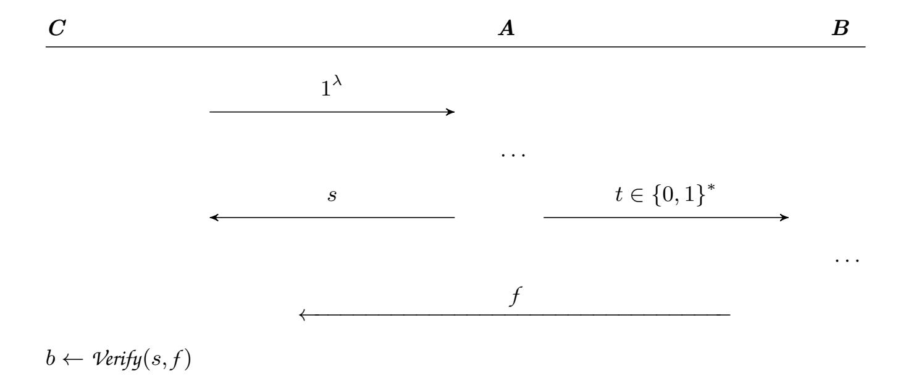

{0}------------------------------------------------

# Publicly Certifiable Min-Entropy Without Quantum Communication

Ofer Casper<sup>1</sup> , Barak Nehoran<sup>2</sup> , and Or Sattath<sup>1</sup>

<sup>1</sup> Department of Computer Science, Ben-Gurion University of the Negev, Beersheba, Israel sattath@bgu.ac.il

Abstract. Is it possible to publicly certify that a string was sampled from a high min-entropy distribution? Certified randomness protocols, such as Brakerski et al. (FOCS 2018) enable private certification—Alice can convince Bob—but it does not yield public certification. We construct a certified min-entropy scheme with the following properties: (1) public certification, so Alice can convince Bob, Charlie, and Dave; (2) all prover–verifier communication is classical; (3) transferability—if Bob has already been convinced, he can subsequently convince Eve and Frank; and (4) classical verification—Grace can be convinced even without a quantum computer, at the cost of losing transferability.

Assuming quantum one-shot signatures (and variants), we construct quantum fire with new properties and use it to obtain our publicly certifiable min-entropy scheme. Both primitives can be instantiated from subexponential iO and LWE, and our quantum fire scheme is the first standardmodel construction of quantum fire.

# 1 Introduction

Public sources of high-quality randomness are crucial for numerous applications. Classic examples include post-election audits, sampling assignments for juries and judges, lotteries[3](#page-0-0) , and randomized controlled trials. Modern computational and cryptographic use of public randomness includes Tor onion services [\[11\]](#page-27-0), as nothing-up-my-sleeve numbers for protocols and standards [\[2\]](#page-26-0), and as part of Proof-of-Stake cryptocurrencies such as Algorand [\[10\]](#page-27-1) and Ethereum's [RAN-](https://eth2book.info/latest/part2/building_blocks/randomness/)[DAO,](https://eth2book.info/latest/part2/building_blocks/randomness/) which is used to select the next committees.

A randomness beacon, such as NIST's [\[13\]](#page-27-2), requires full trust in the operator. Distributed Randomness Beacons [\[6\]](#page-26-1), such as the [League Of Entropy,](https://www.drand.love/loe) use threshold cryptography to reduce the trust level in the operator. In the classical setting, one has to trust the randomness provider.

Can we use quantum cryptography to certify public randomness, without trusting the operator? Essentially, is there a way to convince the public that a string was sampled from a high min-entropy distribution?

<sup>2</sup> Columbia University, New York, NY, USA

<span id="page-0-0"></span><sup>3</sup> Including [donor lotteries,](https://www.givingwhatwecan.org/donor-lottery) the first of which was [arranged](https://forum.effectivealtruism.org/posts/jvsooiwXWh3iWnfgp/donor-lottery-details) with the help of Paul Christiano, who, among other things, made notable contributions to quantum cryptography.

{1}------------------------------------------------

Main contributions. We answer the question above positively, by providing several protocols with different properties, based on slightly different cryptographic assumptions, each of which allows the general public to be convinced that a string was sampled with high min-entropy.

A public certified min-entropy protocol consists of several parts. The prover first applies the *GenEntropy* algorithm. This algorithm outputs a classical string from a high min-entropy distribution and a quantum state, called the witness, which is later used for certification. A *CloneWitness* algorithm can be used to generate additional copies of the witness from the first copy. An interactive protocol, *CertEntropy*, can be used between a quantum verifier and the quantum prover. At the end of this algorithm, the prover still has a quantum state which could be used for future *CertEntropy* runs. We say that the min-entropy verification is transferable if both the prover and the verifier can then subsequently convince others. Moreover, we say that the scheme is classically transferable if this can be done via a classical channel. Our protocol with a quantum verifier is classically transferable.

The min-entropy guarantee is the following: Consider running the computationally bounded adversary A with an honest verifier. Let S be the random variable that represents the string that the verifier accepts, and ⊥ otherwise. The min-entropy of S, while ignoring the probability of ⊥, must be super-logarithmic. In other words, if we run poly(λ) copies of A(1<sup>λ</sup> ) with respect to polynomially many different verifiers, all non-⊥ values S<sup>i</sup> would be unique, except with negligible probability.

<span id="page-1-0"></span>Theorem 1 (Main Result 1). There is a public certified classically transferable min-entropy scheme, assuming one-shot signatures exist.

This result is stated formally in Corollary [3.](#page-24-0)

Recall that one-shot signatures [\[1,](#page-26-2)[16,](#page-27-3)[5,](#page-26-3)[12,](#page-27-4)[17\]](#page-27-5) allow generating a classical verification key pk and a quantum signing key *sk* . The quantum signing key can be used to sign a message, so that the signed message passes verification with the original verification key. We say that the scheme is unforgeable if it is computationally hard to find two signed messages with respect to the same verification key, i.e., finding pk, m0, σ0, m1, σ<sup>1</sup> where m<sup>0</sup> ̸= m<sup>1</sup> and verifypk(m0, σ0) = verifypk(m1, σ1) = ⊤.

The schemes above require a quantum computer and a classical communication channel between the prover and verifier. We also give a classically certifiable variant in which the verifier requires only classical resources to certify the minentropy.

<span id="page-1-1"></span>Theorem 2 (Main result 2). There is a public classically certifiable minentropy protocol assuming one-shot signatures with classically generatable verification keys.

This result is stated formally in Corollary [4.](#page-25-0)

Note that, unlike the previous result, the classically certifiable protocol is untransferrable, meaning that, despite the classical verifier being convinced that 

{2}------------------------------------------------

the string indeed has high min-entropy, the classical verifier cannot convince others of this fact. Compared to the previous result, it is further required that the underlying one-shot signature has a classically generatable verification key. This means there is a classical algorithm that can sample from a distribution indistinguishable from the real distribution of the one-shot signatures' verification keys. Crucially, the OSS constructions in [16] satisfy this property.

Our construction has two variants. The weaker variant, which we call the logarithmic construction (see Construction 1(a)), requires standard unforgeability of the underlying one-shot signature, and allows CloneWitness to be applied sequentially at most  $c \log(\lambda)$ , and guarantees super-logarithmic min-entropy. Zhandry and Shmueli [16] showed that such a one-shot signature exists in the standard model; see Section 1.2 for details on the assumptions needed. Note that cloning sequentially at most logarithmically many times means that the total number of clones could be at most  $\lambda^c$ . The stronger variant, which we call the linear construction (see Construction 1(b)), requires exponential unforgeability of the underlying one-shot signature, and allows CloneWitness to be applied sequentially at most  $\frac{1}{8}\lambda$ , and guarantees  $\frac{1}{8}\lambda$  min-entropy. The total number of clones in this case could be exponential. Ref. [16] constructs such an exponentially unforgeable OSS scheme relative to a classical oracle.

Our techniques are tightly related to quantum fire. Recall that a quantum fire has a Spark algorithm that generates a serial number s and an associated fire state  $f^s$ . The fire's verification algorithm accepts the fire state and serial number generated by Spark. Clone takes a serial number s and the associated fire state  $f^s$  (which, by completeness, passes verification), and outputs two states that pass verification with respect to s. We emphasize that the original state and the two outputs might be far from an information-theoretic perspective, but are functionally equivalent: they both pass verification, and can be used to produce further clones. The security guarantee, and the distinguishing feature of quantum fire, is that the fire states are untelegraphable: There is no way to transfer the quantum state from one party to another via a one-way classical communication channel. These states can spread, analogous to "real" fire, provided they are kept alive quantumly and do not decohere: the fire cannot be "reconstructed" from the decohered state (its classical ashes), since that would allow it to be telegraphed. We define and use a strong notion of untelegraphability in which the first adversary chooses an s such that the second adversary must reconstruct a fire state relative to s; see Definition 10 for details. To the best of our knowledge, no construction of quantum fire is known in the standard model.<sup>4</sup> Our last main contribution is to give such a construction:

**Theorem 3 (Main result 3).** One-shot signatures (for which standard model constructions exist) imply strongly untelegraphable quantum fire.

This result is stated formally in Corollary 1. Our fire construction has another novel feature. The untelegraphability property of quantum fire ensures

<span id="page-2-0"></span><sup>&</sup>lt;sup>4</sup> All existing constructions of quantum fire have had security only relative to a quantum [15] or classical [5,12] oracle.

{3}------------------------------------------------

#### 4 O. Sattath et al.

that the fire state cannot be transferred via one-way classical communication. We define a new property of quantum fire, conversability, which means that a flame can be transferred via interactive classical communication. Quantum fire shows that there are states that are cloneable but not telegraphable. Conversable quantum fire takes it one step further: there are states that are clonable, can spread like fire via classical interactive communication, but not one-way classical communication. Our construction is of conversable quantum fire.

## 1.1 Technical Overview

Our techniques heavily rely on quantum fire and one-shot signatures, see Sections [2.1](#page-9-0) and [2.2](#page-11-0) for formal definitions.

We observe that strong untelegraphability implies that the process that generates the serial number of a quantum fire state that passes verification must have super-logarithmic min-entropy[5](#page-3-0) . In other words, consider a QPT adversary that generates (s, *f* ) ← A(1<sup>λ</sup> ), and assume for simplicity that the adversary always generates states that pass verification. Suppose that the min-entropy over the random variable s is merely logarithmic, and let s <sup>∗</sup> be the most probable outcome. The logarithmic min-entropy means that s <sup>∗</sup> occurs with probability Ω(n −c ) for some constant c. Then, if Alice and Bob both run A, the probability that both generate the same state *f* s ∗ is at least Ω(n −2c ), contradicting strong untelegraphability. (Note that Alice did not send Bob even a single bit.) For the linear construction (see Construction [1\(](#page-15-0)b)), the argument is similar, but based directly on the exponential unforgeability guarantees of the OSS. These two results are shown formally in Theorems [9](#page-19-0) and [10.](#page-20-0) We note that a variation of this idea was used by Zhandry, in the context of quantum lightning, which is further discussed in the related works, Section [1.2.](#page-6-0)

This approach yields a public, certifiable min-entropy scheme: to generate randomness, Alice prepares a quantum fire state, with the min-entropy source being the fire's serial number. When Alice wants to prove to Bob that her serial number s was generated from a high min-entropy distribution, she clones the state, and sends s and one of the clones to Bob. Bob checks that *Verify*(s, *f* s ) = ⊤. Note that now Bob (and not only Alice) can certify to others that s was generated from a high min-entropy distribution. We call this property transferability.

In the scheme above, Alice uses quantum communication to send her clone to Bob. By the untelegraphability property of quantum fire, this cannot be done via one-way classical communication. We define a new property of quantum fire, conversability, which means that a flame can be transferred via interactive classical communication. This allows Alice to send her fire state to Bob via an interactive Quantum Computation with Classical Communication (QCCC) protocol, yielding:

Theorem 4 (informal). Strongly untelegraphable conversable quantum fire implies publicly certifiable and classically transferable min-entropy.

<span id="page-3-0"></span><sup>5</sup> A lower-bound on the min-entropy is also related to Kolmogorov complexity, see Remark [1.](#page-9-1)

{4}------------------------------------------------

The definition of public certifiable min-entropy is introduced in Section 2.3, and the result above is stated formally in Theorem 12 in Section 4.

<span id="page-4-0"></span>We show how the missing ingredient, namely, a strongly untelegraphable and conversable fire scheme, can be constructed based on one-shot signatures (OSS):

## **Theorem 5** (informal). One-shot signatures imply a conversable quantum fire.

The formal statement is given in Theorem 7, in Section 3. Next, we explain the construction. To Spark fire, we generate a one-shot signature verification key pk and quantum signing key sk, where the serial number is set to be pk, and the fire state is sk. Intuitively, this seems problematic. Recall that in a one-shot signature scheme, it should be computationally hard to find two signed messages that verify with the same verification key. Since a single copy of the quantum signing key allows signing any message, two information-theoretic clones would break the security of the one-shot signature scheme. In other words, it must be computationally hard to create information-theoretic clones of sk. But recall that our goal is more modest: a clone is defined by functional equivalence: any state that passes verification with the same serial number. So, given a fire state, which is in fact a quantum OSS key-pair (pk, sk), the cloner creates two fresh quantum one-shot pairs  $(pk_0, sk_0, pk_1, sk_1)$ . Then it runs  $\sigma \leftarrow Sign(sk, (pk_0, pk_1))$ . The clones have a classical register that consists of the signed message for both clones (i.e.,  $(pk_0, pk_1, \sigma)$ , and the first clone has a quantum register  $sk_0$ , and the second clone has the quantum register  $sk_1$ . We have two variants of the construction: In the logarithmic variant, formalized in Construction 1(a), this process can be repeated  $c \cdot \log(\lambda)$  times, for any fixed c chosen in advance, and in the linear variant (see Construction 1(b)), at most  $\frac{\lambda}{8}$  times. Overall, the classical register of a fire state contains a chain of signed messages. Each link in the chain consists of two verification keys and a signature that passes verification with one of the verification keys in the previous link. The quantum register consists of a quantum signing key associated with one of the two verification keys in the last link. Overall, the verification algorithm checks that:

- 1. The signed message in each link passes verification with one of the two verification keys in the preceding link. (For the chain's head, the serial number functions as the (only) valid verification key.)
- 2. The quantum register is a valid one-shot signing key relative to one of the two verification keys in the tail of the chain.

Note that such a scheme is indeed *conversable*: Alice can send a fire state to Bob via interactive classical communication, using the following protocol. Bob generates a quantum one-shot signature key-pair  $(pk_B, sk_B) \leftarrow \mathcal{K}ey\mathcal{G}en(1^{\lambda})$ , and sends  $pk_B$  to Alice; Alice also generates a new key-pair  $(pk_A, sk_A) \leftarrow \mathcal{K}ey\mathcal{G}en(1^{\lambda})$ . She uses the quantum register of the fire state (in the form of one-shot signing key) to generate a signature  $\sigma \leftarrow Sign(sk, (pk_A, pk_B))$ , and concatenates the signed message to the chain, and sends the serial number s and the resulting

{5}------------------------------------------------

chain to Bob. At this point, both Alice and Bob have a quantum signing key and a chain of signatures originating from the fire's serial number to their own quantum signing key. This process can be repeated sequentially logarithmically many times in the logarithmic variant, and up to  $\frac{\lambda}{8}$  in the linear variant.

We argue that the logarithmic scheme is untelegraphable, based on the unforgeability of the OSS. As a warmup, we first consider a weaker question: Can an adversary create two one-shot signing keys associated with the verification key? The answer is no, since the two keys could be used to sign two different messages; these signed messages will be accepted with the same verification key.

We now argue that the logarithmic scheme is strongly untelegraphable. Suppose an adversary A can generate a serial number s and a classical message t so that  $\mathcal{B}$  can recover a valid serial number with respect to s. Suppose, for simplicity, that the success probability of the adversaries is 1, and that all the chains that are generated are exactly of length  $\log^c \lambda$  (the proof can easily be extended to the general case). Consider an adversary  $\mathcal{F}$  that runs  $t \leftarrow \mathcal{A}$  and then runs  $\mathcal{B}(t)$  for  $n^c+1$  times. Each such run creates a signature chain that starts from s. We interpret that chain as part of a tree<sup>6</sup>: if we see a valid signature of  $(pk_0, pk_1)$ signed by pk, we attach  $pk_0$  and  $pk_1$  as pk's children. The out degree cannot exceed 2: signed messages form pairs of verification keys, and having more than 2 children means that we have two valid signed messages with the same OSS verification key (i.e., an OSS forgery). Since the length of the chain is at most  $\log^c \lambda$ , the binary tree has at most  $n^c$  leaves. Since  $\mathcal{B}$  generated  $n^c + 1$  such chains, by the pigeonhole principle, there must be two chains that terminate with the same leaf. As such, we have two one-shot signing keys, each associated with the same verification key as that leaf. As discussed in the previous paragraph, this results in a one-shot signature forgery, and hence should not be possible.

The linear scheme is strongly untelegraphable using a similar argument if the underlying OSS has exponential unforgeability. More precisely, we say that the OSS has exponential unforgeability if there is a constant h such that for any  $\epsilon > 0$ , no forger can succeed with non-negligible probability in a running time of  $O(2^{(h-\epsilon)\lambda})$ . Shmueli and Zhandry [16] showed an oracle relative to which an OSS that is exponentially unforgeable with parameter  $h = \frac{1}{3}$  exists. To prove the strong untelegraphability, the main change is that the running time of the forger is now roughly  $\tilde{O}(2^{\lambda/8})$ , which contradicts the exponential unforgeability of the OSS construction in [16].

So far, both the prover and the verifier have quantum capabilities. This approach provides *transferability*, meaning that both the prover and the verifier can convince others of the min-entropy. However, it requires a quantum verifier.

<span id="page-5-0"></span><sup>&</sup>lt;sup>6</sup> Technically, this may not be a tree (and may have loops). The argument given below holds for the BFS tree generated from the graph described here; see the proof for the full details.

<span id="page-5-1"></span><sup>&</sup>lt;sup>7</sup> The choice of parameter  $\frac{1}{8}$  is due to a tradeoff with the linear min-entropy that our scheme satisfies: for the linear scheme which allows  $c\lambda$  clones and has  $e\lambda$  min-entropy, we need  $c+e<\frac{1}{3}$ . We choose the values  $c=e=\frac{1}{8}$  as concrete choices that satisfy this constraint.

{6}------------------------------------------------

We show how to modify the scheme so that the verifier is classical, while still allowing the prover to certify the min-entropy. For that, we need an additional assumption, namely, that the one-shot signature scheme has classically generatable verification keys. We can then define a classically certifiable min-entropy scheme. Recall that in the previous scheme, the verifier first generates a one-shot signature key-pair (pk<sup>V</sup> , *sk* <sup>V</sup> ), and sends pk<sup>V</sup> to the prover. The prover uses *sk* to sign (pk<sup>P</sup> , pk<sup>V</sup> ), where pk<sup>P</sup> is a new verification key generated by the prover. The prover sends the signature chain to the verifier. The verifier checks that the signature chain is valid. The verifier then has *sk* <sup>V</sup> , which is a valid one-shot signing key relative to pk<sup>V</sup> , which could in turn be used to certify the min-entropy to others. Now, we modify the scheme so that the verifier does not need to generate (pk<sup>V</sup> , *sk* <sup>V</sup> ). Instead, the verifier samples pk<sup>V</sup> from a distribution that is indistinguishable from the one-shot signature verification key distribution. We show that the scheme still has high min-entropy. Suppose, towards a contradiction, that the min-entropy guarantee fails, i.e., there is an adversary that manages to pass verification with the classical verifier, where the serial number distribution that the adversary accepts has low min entropy. We show that the same adversary can certify low min-entropy against quantum verifiers, contradicting our previous results. The argument that the min-entropy is the same in both cases hinges on specific properties that we call decomposable fire scheme (see Definition [18\)](#page-21-0), and we show that our fire construction is decomposable (see Theorem [11\)](#page-22-0). Informally, decomposability of a conversable fire scheme means that the *Converse* and the *Verify* protocol can be decomposed into separate quantum and classical algorithms. Crucially, when the verifier follows the *Converse* protocol, the quantum part of the *Verify* algorithm would never fail. Recall that in our construction, the verifier is the one who generates the one-shot signing key, and therefore, the quantum part of the verification, in which the one-shot signing key is tested, would never fail. We show that every decomposable scheme that has e(λ) min-entropy to begin with can be viewed as a classical protocol between the quantum prover and classical verifier with the same e(λ) min-entropy guarantee (see Theorem [11](#page-22-0) and Lemma [1\)](#page-21-1).

We note that the scheme with the classical verifier serves as a proof-ofquantumness [\[4\]](#page-26-4). We are not aware of any advantage of this scheme over the proof-of-quantumness approach achievable directly from one-shot signatures, as first suggested in [\[1\]](#page-26-2).

# <span id="page-6-0"></span>1.2 Related Works

One-Shot Signatures [\[1\]](#page-26-2) defined the notion of one-shot signatures as a signature scheme where every secret key can sign a single message exactly once. They showed a construction relative to a classical oracle; unfortunately, there was a bug in the security proof. Shmueli and Zhandry [\[16\]](#page-27-3) showed two constructions of one-shot signatures from non-collapsing hash functions, the first relative to a classical oracle, and a second one (the first in the standard model) based on subexponential indistinguishability obfuscation (iO) and LWE. The construction was shown to be exponentially hard. These two main constructions are the main 

{7}------------------------------------------------

starting point of our work. Çakan, Goyal, and Shmueli [\[5\]](#page-26-3) then defined the property of incompressibility of one-shot signatures, a property regarding the inability to generate polynomially many signatures from a polynomially sized string. One of the main drawbacks of incompressibility is that it applies in the oracle model and has no natural counterpart in the standard model. They also showed that the oracle-based construction of [\[16\]](#page-27-3) is incompressible, which turned out to be useful to construct quantum fire (see the paragraph below). [\[12\]](#page-27-4) and [\[17\]](#page-27-5) both improved the parameters of the schemes, allowing shorter keys and signing messages of linear length in the security parameter. These improvements were made using different techniques.

Quantum Fire. Nehoran and Zhandry [\[15\]](#page-27-6) established an oracle separation between two significant quantum no-go theorems: the no-cloning and no-telegraphing theorems. Their result sheds light on the possibility of quantum states that are cloneable yet untelegraphable. Building on this insight, Bostanci, Nehoran, and Zhandry [\[3\]](#page-26-5) formalized the notion of quantum fire and proposed a candidate construction based on a new group-action hardness assumption; however, proving the untelegraphability of this construction remained open.

Çakan, Goyal, and Shmueli [\[5\]](#page-26-3), as stated above, defined a new property of OSS, called incompressibility; They showed that relative to an oracle, the construction of [\[16\]](#page-27-3) is incompressible, and also constructed an untelegraphable quantum fire construction relative to that oracle. One drawback of their approach is that it relies heavily on the incompressibility of one-shot signatures. Since incompressibility is only defined in the oracle model, we are not aware of an approach for a standard model incompressible OSS (in particular, the heuristic approach in which the oracles are obfuscated would not be an incompressible one-shot signature). The same drawback does not allow for a natural standard model construction of fire, based on their approach. By contrast, our quantum fire constructions are in the standard model (see Theorem [5\)](#page-4-0). A comparative drawback of our constructions is that the number of allowed sequential clone operations is bounded. Note, however, that a clone operation creates two clones, and therefore, the overall number of clone operations, and the number of resulting clones, can nevertheless be exponential in our linear-cloneable scheme (and polynomial in our logarithmic-clonable scheme).

Certified Randomness. In our work, we focus on publicly certified min-entropy. Note that a min-entropy source need not be uniformly random. The more ambitious goal is public-certified randomness, in which the source is guaranteed to be ϵ-close to uniform.

There are two main approaches to certified randomness for a classical verifier. The first is device-independent randomness expansion, which is based on Bell's inequality. Here, it is assumed that two non-signaling quantum devices are spatially separated and were manufactured by the adversary. The classical verifier initiates the protocol with a private, short random string, and the goal is to complete the protocol with a longer private string that is ϵ-close to random [\[7,](#page-26-6)[14](#page-27-7)[,8\]](#page-26-7), or terminate in the event of device malfunction or cheating attempt.

{8}------------------------------------------------

One drawback of the previously mentioned results is that they require two distant, non-signaling devices. A complementary approach, introduced in [\[4\]](#page-26-4), is to use a single untrusted quantum device, whose output randomness is conditional on a computational hardness assumption and is guaranteed to be resistant to computationally bounded adversaries.

A key issue that arises in both approaches is accumulation: these protocols consist of many iterations of a sub-protocol that generates a small number of bits of min-entropy (even less than 1). A key argument is to demonstrate that this min-entropy accumulates when the sub-protocol is repeated appropriately. We note that, in this work, we do not show such an accumulation result, as we do not use the sub-protocol approach and instead argue directly about the resulting protocol. We leave the question of whether some form of min-entropy accumulation can be achieved to future work, as it does not seem necessary.

Another key difference between the private and public settings discussed in this work is privacy. In the private setting, the initial seed must be privately random, and emphasis is placed on ensuring that the adversary has no knowledge of the resulting random string. One example where this is crucial is when this randomness is used for cryptographic key generation. For public certified minentropy and public certified randomness, clearly, the randomness is intentionally not private. Moreover, in this setting, there is no secret which, if revealed to the adversary, would allow the prover to cheat.

Quantum Lightning. Zhandry defined quantum lightning, which is a collisionfree version of quantum public money. From the uniqueness property of quantum lightning, one can obtain a private source of certified min-entropy from the distribution of the bolt's serial numbers [\[18,](#page-27-8) Theorem 3.3]. While quantum lightning provides a private certified min-entropy, our approach provides publicly certifiable min-entropy that remains transferable over classical communication channels.

# 1.3 Open problems

We briefly state a few open problems.

Public Certifiable Randomness Can the public certifiability of min-entropy be strengthened to a stronger notion, closer to uniform randomness? As an intermediate question, is there a way to achieve entropy accumulation?

Unbounded clonability As noted, our scheme allows at most a linear number of sequential *Clone* operations. As shown in Proposition [1,](#page-18-1) this restriction is necessary in our construction. Are there constructions of conversable quantum fire, or public certified randomness, where the number of *Clone* operations is unbounded? We note that it seems that the quantum fire construction in Ref. [\[5\]](#page-26-3) allows any number of *Clone* operations.

{9}------------------------------------------------

# 2 Definitions, notations and preliminaries

We use calligraphic fonts with a capital letter to represent quantum algorithms (e.g., *Sign*), capitalized sans-serif for classical algorithms (e.g., *Verify*), lowercase calligraphic font for quantum states (e.g., *sk* for a quantum signing key), and lowercase letters for classical variables (e.g., m). For cryptographic schemes, we use all capitals (e.g., OSS for a one-shot signature scheme). To avoid ambiguity, we use the scheme followed by the algorithm's name (e.g., OSS.*Sign*(·)).

In all our definitions below, we assume that all algorithms receive the security parameter 1 λ , but we sometimes omit it to avoid clutter.

<span id="page-9-2"></span>Definition 1 (Non-bot Min-Entropy). For a probability distribution (p⊥, p1, . . . , pn), we define the non-bot min-entropy as:

$$\mathrm{H}_{\not\perp,\infty}(D) := \min_{i \neq \perp} \log(1/p_i).$$

In most contexts, the probability p<sup>⊥</sup> will be clear from the context.

<span id="page-9-1"></span>Remark 1. High min-entropy implies that with high probability, the sampled Kolmogorov complexity is high as well: H<sup>∞</sup>(X) ≥ e implies that K(X) ≥ e − d − O(1) with probability at least 1 − 2 −d . We will not interpret or further optimize our results through the lens of Kolmogorov Complexity in this work.

## <span id="page-9-0"></span>2.1 One-Shot Signatures

Definition 2 (One-shot signatures adapted from[\[1\]](#page-26-2)). A one-shot signature scheme consists of three QPT algorithms (*KeyGen*, *Sign*, VerSign) with the following syntax:

- *KeyGen*(1<sup>λ</sup> ). It takes as input a common reference string and outputs a pair, (*sk* , pk), referred to as the signing token (quantum state secret key) and the verification key (public key).
- *Sign*(*sk* , m). It takes a quantum signing token, *sk* , and a message to be signed, m, and outputs a classical signature, sig.
- VerSign(pk, m, sig) is a classical deterministic polynomial time algorithm. It takes the common reference string, the verification key, a message to be verified, and a signature, and outputs ⊤ or ⊥.
- *VerToken*(pk, *sk* ) a QPT algorithm that takes a verification key and a quantum signing key and outputs a quantum secret key *sk* ′ , and a bit b indicating acceptance or rejection.

<span id="page-9-3"></span>Some one-shot signature constructions use a common reference string (CRS). When instantiating the construction in this work with such constructions, our schemes will also require a setup algorithm and a CRS, but we omit the syntax for that to avoid clutter.

{10}------------------------------------------------

Definition 3 (One-shot signatures correctness, adapted from [\[1\]](#page-26-2)). For all messages m in the message space M,

$$\Pr\left[ \textit{VerSign}(pk, m, \textit{Sign}(sk, m)) = \top : (pk, sk) \leftarrow \textit{KeyGen}(1^{\lambda}) \right] = 1.$$

and

$$\Pr\left[\operatorname{VerToken}(\operatorname{KeyGen}(1^{\lambda})) = \top\right] = 1.$$

<span id="page-10-0"></span>Definition 4 (One-shot unforgeability (adapted from [\[1\]](#page-26-2))). Given a oneshot signature scheme OSS = (*KeyGen*, *Sign*, VerSign, *VerToken*), we say OSS is unforgeable if for all QP T adversaries:

$$\Pr\left[ m_1 \neq m_2 \land a = b = \top : \begin{array}{c} (pk, m_1, sig_1, m_2, sig_2) \leftarrow \mathcal{A}(1^{\lambda}) \\ a \leftarrow \textit{VerSign}(pk, m_1, sig_1) \\ b \leftarrow \textit{VerSign}(pk, m_2, sig_2) \end{array} \right] \leq \mathsf{negl}(\lambda).$$

We say that the scheme is exponentially h-unforgeable if for every adversary A that runs in time O(2<sup>h</sup> ′λ ) for h ′ < h, the equation above holds.

We also define the security notion of security from sabotage against one-shot signatures as such,

<span id="page-10-1"></span>Definition 5 (One-shot signatures security against sabotage). Given a one-shot signature scheme (*KeyGen*, *Sign*, VerSign, *VerToken*), the token validity game is defined as such:

$$\begin{matrix} C \\ & & \\ & & \\ & & \\ & & \\ & & \\ & & \\ & & \\ & & \\ & & \\ & (a,sk') \leftarrow \textit{VerToken}(pk,sk) \\ b \leftarrow \textit{VerSign}(pk,m,\textit{Sign}(sk',m)) \end{matrix}$$

We say the adversary wins if a = ⊤ and b = ⊥, meaning the adversary was able to generate a token that passes the verification, and a message that, if signed by this token, will create a signature that will not pass verification with the verification key of the token. We define the scheme to be unforgeable if it holds that for every QPT adversary, A:

$$\Pr\left[\mathcal{A} \ wins\right] \leq \mathsf{negl}(\lambda).$$

Theorem 6 ([\[16\]](#page-27-3)). The standard model one-shot signature construction presented in [\[16\]](#page-27-3), satisfies the following properties:

{11}------------------------------------------------

- <span id="page-11-5"></span>1. It is unforgeable assuming each of the following: (1) sub-exponentially secure indistinguishability obfuscation, (2) sub-exponentially-secure one-way functions, and (3) (polynomially-secure) LWE with a sub-exponential noise-modulus ratio.
- <span id="page-11-4"></span>2. There exists a classical algorithm that outputs verification keys with the same distribution as the KeyGen algorithm of their construction

Furthermore, relative to the oracles therein, their OSS construction is exponentially  $\frac{1}{3}$ -unforgeable.

The last part of the theorem follows from two main results in [16,9]. Shmueli and Zhandry showed that the probability of an adversary succeeding in finding a collision in a non-collapsing hash function, while making q oracle queries, is  $O(\frac{q^3 \cdot poly(\lambda)}{2^{\lambda}})$  [16, Theorem 30]. Dall'Agnol and Spooner construct one-shot signatures from non-collapsing hash functions [9, Section 6]. It is shown that one-shot signatures can only have weaker non-collision resistance than the non-collapsing hash functions on which they are based. That is, the probability of a one-shot signature forger to succeed would also be bounded from above by the same bound. Since the number of queries q is at most the run-time, then any adversary that runs in time  $T = O(2^{h'\lambda})$  for  $h' < \frac{1}{3}$  has success probability of  $O(\frac{(2^{h'\lambda}))^3 \cdot poly(\lambda)}{2^{\lambda}}) = \text{negl}(\lambda)$ .

#### <span id="page-11-0"></span>2.2 Quantum Fire

<span id="page-11-2"></span>**Definition 6 (adapted from[3]).** A quantum fire scheme consists of three QPT algorithms (Spark, Clone, Verify) where:

- $Spark(1^{\lambda})$  takes the common reference string and outputs a serial number s and a quantum fire state  $f^s$ , which we will refer to as a flame.
- $Clone(s, f^s)$  takes a serial number s, and a flame  $f^s$ , and outputs two registers A and B in some potentially entangled state  $c_{AB}^s$ .
- $Verify(s, f^s)$  takes a serial number s, and an alleged flame, and accepts or rejects. In c-clonable schemes, that will be introduced later (see Definition 8), we also output an integer CL (Clones Left), which will state the number of Clone algorithms that can still be executed on the flame.

We also define an algorithm  $\widetilde{Verify}$  that runs  $Verify(s, f^s)$  and outputs s if verify accepts, and  $\bot$  otherwise.

Note that there can be multiple variants of quantum fire schemes [3,5], similarly in spirit to private quantum money, public quantum money, and quantum lightning. In the definition above, we use the keyless variant (similarly to quantum lightning, which has no private key).

## <span id="page-11-3"></span><span id="page-11-1"></span>Definition 7 (Correctness [3]).

$$\Pr\left[ \textit{Verify}(s, f^s) = \top : (s, f^s) \leftarrow \textit{Spark}(1^{\lambda}) \right] = 1$$

{12}------------------------------------------------

Definition 8 (Cloning Correctness). We say that a quantum fire scheme is c-clonable if

$$\Pr\left[ \mathit{Verify}(s,f) = \top : f \leftarrow \mathit{Clone}^{c(\lambda)}(\mathit{Spark}(1^{\lambda}))) \right] = 1,$$

where *Clone*<sup>c</sup> is the algorithm that applies *Clone* sequentially c(λ) times to any of the registers. We say that the scheme is one-time cloneable if the above holds for c(λ) = 1, as was defined in [\[3\]](#page-26-5).

Next, we define two security notions for quantum fire, namely, untelegraphability. We note that the original notion of untelegraphability, introduced by [\[3\]](#page-26-5), will not be used throughout our work. Instead, we use a stronger notion, which we call strong untelegraphability, which is defined immediately below it.

Definition 9 (Untelegraphability [\[3\]](#page-26-5)). We say the scheme is an untelegraphable quantum fire if for all (non-entangled) QPT adversaries A and B,

<span id="page-12-1"></span>
$$\Pr[Adversaries\ win] \leq \mathsf{negl}(\lambda),$$

where the untelegraphability game is defined as follows:

$$\begin{array}{c} C \\ (s,f^s) \leftarrow Spark(1^{\lambda}) \\ \\ & \\ \\ & \\ \\ \\ & \\ \\ \\ \\ \\ \\ \\ \\ \\$$

The adversaries win if b = ⊤.

<span id="page-12-0"></span>We define a stronger variant:

Definition 10 (Strong untelegraphability). We use the same definition as untelegraphability (Definition [9\)](#page-12-1), except we change the security game as follows:

{13}------------------------------------------------



Definition [10](#page-12-0) implies Definition [9,](#page-12-1) since A could always choose to generate s honestly by running the *Spark* algorithm.

<span id="page-13-2"></span>Definition 11 (Min-Entropy of Quantum Fire). We say that a fire scheme has e(λ) min-entropy if for every QPT adversary L,

$$H_{\perp,\infty}(\widetilde{\operatorname{Verify}}(\mathcal{L}(1^{\lambda})) \geq e(\lambda).$$

(Recall Definition [1](#page-9-2) for <sup>H</sup≯⊥,<sup>∞</sup>, and Definition [6](#page-11-2) for *Verify* ].) We say that a fire scheme has high min-entropy if it has e · log(λ) min-entropy for every constant e > 0. We say it has linear min-entropy if there exists a constant e > 0 such that the scheme has eλ min-entropy.[8](#page-13-0)

Quantum fire is defined to be untelegraphable, meaning a flame cannot be sent via one-way classical communication. A conversable fire, a notion which is introduced in this work, can be sent via two-way (1-round) classical communication:

<span id="page-13-1"></span>Definition 12 (Conversability). A conversable quantum fire is a quantum fire scheme with 3 additional QP T algorithms *Prepare*, *Reconstruct*, *Deconstruct*.

- *Prepare*(1<sup>λ</sup> ) takes the security parameter and outputs a classical preparation string and a quantum preparation state.
- *Deconstruct*(s, *f* , p) takes a serial number s, a flame *f* , and the preparation string p (a classical string). The algorithm outputs a classical telegraph string and a verification key.
- *Reconstruct*(s, t, vk, *g* ) takes the serial number s, the telegraph string t, a verification key vk, and the quantum preparation state *g* , and outputs a flame.

The *Converse* protocol is a protocol over classical communication between a sender, who wants to send a flame to a receiver, and is defined as follows:

<span id="page-13-0"></span><sup>8</sup> Note that a linear min-entropy implies high min-entropy, and not necessarily viceversa.

{14}------------------------------------------------

- 1. The receiver runs  $(r,g) \leftarrow \text{Prepare}(1^{\lambda})$  algorithm, and sends r to the sender
- 2. The sender starts with a pair of a serial number and a flame, (s, f), runs  $d, vk \leftarrow \mathcal{D}econstruct(s, f, r)$ , and sends d, vk to the receiver.
- 3. The receiver runs  $f' \leftarrow Reconstruct(s, d, vk, g)$ .

We say the Converse protocol succeeds if Reconstruct did not output  $\perp$ .

Let  $(s, f^s)$  be the result of  $Spark(1^{\lambda})$  and at most  $c(\lambda)$  combinations of Clone operations Converse protocol for c-clonable schemes. We say that the scheme is conversable if:

$$\Pr \begin{bmatrix} (r,g) \leftarrow \textit{Prepare}(1^{\lambda}) \\ \textit{Verify}(s,f') = \top : d \leftarrow \textit{Deconstruct}(s,f) \\ f' \leftarrow \textit{Reconstruct}(s,d,g) \end{bmatrix} = 1.$$

The definition can be easily extended to n-round conversability to allow multiple rounds of interactive communication, but this is not needed in our work.

## <span id="page-14-0"></span>2.3 Public Certifiable Min-Entropy over Classical Communication

**Definition 13 (Publicly Certifiable Min-Entropy).** A publicly certifiable min-entropy scheme consists of three QPT algorithms (GenEntropy, CloneWitness, CertEntropy) where:

- GenEntropy( $1^{\lambda}$ ) takes a security parameter and generates a string s, and a quantum witness  $w_s$ .
- CloneWitness $(s, w_s)$  takes a string, s, and a quantum witness,  $w_s$ , and outputs a quantum state with two registers  $w_1, w_2$ , each is an individual quantum witness.
- CertEntropy $\langle P, V \rangle$  is a polynomial-time protocol, over classical communication, between a quantum prover and a quantum verifier, where the prover takes a string and a quantum witness w, and the verifier's input is the security parameter. The verifier ends with a classical bit that represents accept or reject, a classical string s', and a quantum witness w'.

Similarly to quantum fire (see Definition 6), we define an algorithm CertEntropy that runs CertEntropy and outputs s if the protocol has accepted or  $\bot$  otherwise.

**Definition 14** (c-clonability). We say a public certifiable min-entropy scheme is c-clonable for a function c if the following holds,

$$\Pr\left[\mathit{CertEntropy}(s,w) = \top : w \leftarrow \mathit{CloneWitness}^{c(\lambda)}(\mathit{GenEntropy}(1^{\lambda})))\right] = 1,$$

where CloneWitness<sup> $c(\lambda)$ </sup> is the algorithm that runs CloneWitness<sup>1</sup> sequentially at most  $c(\lambda)$  times, where CloneWitness<sup>1</sup> runs CloneWitness, and takes either the first or the second of the registers as its output.

{15}------------------------------------------------

Definition 15 (Public certifiability correctness). A public certifiable minentropy scheme is  $c(\lambda)$ -correct if

$$\Pr\left[\mathit{CertEntropy}(s,w_P) = \top : w_P \otimes w_V \leftarrow \mathit{CertEntropy}^{c(\lambda)}(\mathit{GenEntropy}(1^{\lambda}))\right] = 1,$$

where CertEntropy $^{c(\lambda)}$  is the protocol that runs the CertEntropy protocol sequentially for  $c(\lambda)$  repetitions.

<span id="page-15-2"></span>**Definition 16 (High Min-Entropy Certifiability).** We say that a public certifiable min-entropy has  $e(\lambda)$  min-entropy if for every adversary  $\mathcal{P}$ ,

$$\mathrm{H}_{\not\perp,\infty}\left[\widetilde{\mathit{CertEntropy}}\langle\mathcal{P},V\rangle\right]\geq e(\lambda).$$

We say that a public certifiable min-entropy scheme has high min-entropy if, for every constant c, the scheme has  $c \cdot \log(\lambda)$  min-entropy. We say it has linear min-entropy if there exists a constant c such that the scheme has  $c \cdot \lambda$  min-entropy.

If we modify the publicly certifiable min-entropy scheme's *CertEntropy* protocol to also output a quantum state to the verifier, we can define the notion of Transferability.

**Definition 17 (c-Transferability).** We say that a min-entropy scheme is c-transferable for a function  $c = c(\lambda)$  if:

$$\Pr\left[\widetilde{\mathit{CertEntropy}}(s,w) \neq \bot : s, w \leftarrow \mathit{CertEntropy}^{c(\lambda)}(\mathit{GenEntropy}(1^{\lambda}))\right] = 1,$$

where  $CertEntropy^c$  is a sequence of c runs of the (honest) CertEntropy protocol, each time the output state becomes the witness of the prover for the next round.

# <span id="page-15-1"></span>3 Conversable Quantum Fire from One-Shot Signatures

The main result in this section is showing the construction and security proof of conversable quantum fire from one-shot signatures. We start by defining the two variants of the construction:

<span id="page-15-0"></span>Construction 1 (Conversable Quantum Fire from One-shot Signatures).

Given a one-shot signature scheme OSS = (KeyGen, Sign, VerSign, VerToKen) and a function  $c(\lambda)$ , we define a  $c(\lambda)$ -clonable quantum conversable fire scheme. We use the term logarithmic construction, or Construction 1(a) to the construction below with  $c(\lambda) = c \cdot \log(\lambda)$  for any constant c; and the linear construction, or Construction 1(b), with  $c(\lambda) = \frac{1}{8}\lambda$ . (The main role of c is line 2 in Verify)

- Spark $(1^{\lambda})$ : 1.  $(pk, sk) \leftarrow \text{KeyGen}(1^{\lambda})$ 
  - 2. Output  $(s := pk, f^s := sk)$

{16}------------------------------------------------

```
- Clone(s, sk) (Comment: note that the algorithm does not use s)
    1. Let sk' be the quantum register in sk, and let sk' be the first classical
        register.
    2. (sk_0, pk_0, sk_1, pk_1) \leftarrow \text{KeyGen}(1^{\lambda})^{\otimes 2}.
    3. sig \leftarrow Sign(sk, (pk_0||pk_1)).
    4. Set \mathfrak{sk}_0 := ((sk', pk_0, pk_1, sig), pk_0, \mathfrak{sk}_0), and \mathfrak{sk}_1 := ((sk', pk_0, pk_1, sig), pk_1, \mathfrak{sk}_1).
    5. Output \ sk_0, sk_1.
- Verify(s, sk):
    1. Interpret the first classical register in \mathfrak{sk} as (pk_0^1, pk_1^1, sig_1, pk_0^2, pk_1^2, \dots, pk_0^T, pk_1^T, sig_T),
        the second classical register as pk, and the quantum part sk' and denote
        pk_0^0 := s, and pk_1^0 := s.
    2. Reject if T > c(\lambda).
    3. For every t from 1 to T
        (a) \ \ a_t \leftarrow \textit{VerSign}_{pk_0^{t-1}}(pk_0^t || pk_1^t, sig_t) \lor \textit{VerSign}_{pk_1^{t-1}}(pk_0^t || pk_1^t, sig_t).
    4. Reject if (pk_0^T \neq pk \land pk_1^T \neq pk).
    5. a \leftarrow VerToken(pk, sk')
    6. CL = c(\lambda) - T.
    7. Output a \wedge \left(\bigwedge_{t=1}^{T} a_t\right), CL.
- Prepare (1^{\lambda}):
    1. Output KeyGen(1^{\lambda}).
- \mathcal{D}econstruct(s, sk, r):
    1. Interpret sk as ch, pk, sk'.
    2. (pk, sk'') \leftarrow \text{KeyGen}(1^{\lambda}).
    3. sig \leftarrow Sign(sk', pk||r).
    4. ch' := (ch, pk, r, sig). (Note: This is a chain with one link longer than
        the one we started with)
    5. Output ch', r.
- Reconstruct(s, d, r, sk'):
    1. Interpret d as ch', r'.
    2. If r \neq r', reject. Otherwise, output (ch', r', sk').
```

<span id="page-16-0"></span>Next, we analyze the case in which the clonability is logarithmically bounded Construction 1(a).

**Theorem 7.** For any constant c, Construction 1(a) is a strong untelegraphable (see Definition 10) conversable  $c \cdot \log(\lambda)$ -clonable fire scheme, if OSS is an unforgeable one-shot signature (see Definition 4).

Proof. The correctness (Definition 7), conversability (Definition 12), and the  $c \log(\lambda)$ -clonability (Definition 8) follow from the correctness of the one-shot signature scheme OSS. Suppose towards a contradiction that the scheme is not strongly untelegraphable, i.e., there exist two adversaries  $\mathcal{A}$  and  $\mathcal{B}$  that succeed in the security game defined in Definition 10. For simplicity, we assume their success probability is 1 (the general case, where the success probability is non-negligible, can be shown similarly using a simple repetition argument). We define the following Forger,  $\mathcal{F}$ :

{17}------------------------------------------------

- 2. For each i from 1 to ⌈2 c(λ) ⌉ + 1 run *sk* <sup>i</sup> ← B(c).
- <span id="page-17-3"></span><span id="page-17-0"></span>3. For each pair (i, j):
  - (a) Inconsistency test: Check the classical registers of *sk* <sup>i</sup> and *sk* <sup>j</sup> to see if the two branches of signed messages are inconsistent, that is, whether we can find two different messages signed relative to the same pk; if so, return the pk and the two messages and signatures.
  - (b) Internal node test: Denote by pk<sup>i</sup> and pk<sup>j</sup> the associated verification keys of *sk* <sup>i</sup> and *sk* <sup>j</sup> . If the i'th branch contains a signature that passes verification with pk<sup>j</sup> , then use *sk* <sup>j</sup> to sign a different message, and return pk<sup>j</sup> and the two signed messages.
  - (c) Two terminals test: If pk<sup>i</sup> = pk<sup>j</sup> , sig<sup>0</sup> ← *Sign*(*sk* <sup>i</sup> , 0), σ<sup>1</sup> ← *Sign*(*sk* <sup>j</sup> , 1). Return (pk<sup>i</sup> , 0, sig0, 1, sig1).

# <span id="page-17-2"></span><span id="page-17-1"></span>4. Return ⊥.

Since A and B are QPT, F is also a QPT algorithm. We argue that F always succeeds in outputting a forgery. We use the 2 <sup>c</sup>·log(λ) + 1 chains to construct a directed graph, as follows: The source of the graph is the node labeled s. Each pk is a vertex and we add an edge from every vertex to pk<sup>0</sup> and pk<sup>1</sup> if there is a signed message of (pk0, pk1) that passes verification with respect to pk. Even though it may be useful to view this graph as a tree (and, when generated honestly, it is a tree), it need not be. Clearly, if we output two signed messages in step [3a,](#page-17-0) we have a successful forger, according to the one-shot unforgeability, Definition [4.](#page-10-0) A failure to find such cases means that the out-degree of all vertices is at most 2. The outputs in steps [3a](#page-17-0) and [3c](#page-17-1) are either a forge or could be turned into an adversary that violates the token's validity, as defined in Definition [5.](#page-10-1) Lastly, we have to argue why the forger never reaches step [4,](#page-17-2) and outputs ⊥. Recall that in step [2](#page-16-1), we make sure that the length of the signed messages chain is at most c log(λ). Therefore, the distance between s and every other vertex in the graph is at most c log(λ). In a graph with out-degree at most 2, and such that all vertices have a distance d from a vertex s have at most 2 d terminals. This can be proved by induction, or by noticing that a Breadth-first search (BFS) traversal on G returns a binary spanning tree for G with height at most d, and therefore the BFS tree has at most 2 d leaves. Every terminal in G must be a leaf in the BFS tree, and therefore the number of terminals in G is at most 2 d . By the pigeonhole principle, since we have ⌈2 c·log(λ) ⌉+ 1 such chains, we either have two terminals associated with the same verification key and therefore, would return a non-⊥ output in step [3c;](#page-17-1) or a one-shot signing key associated with an internal node, which yields non-⊥ value in step [3b.](#page-17-3)

<span id="page-17-4"></span>For the Construction [1\(](#page-15-0)a), where c(λ) = c·log(λ), we only needed a standard level of unforgeability, i.e., security against polynomially bounded adversaries, in order to prove our construction is strongly untelegraphable. As we will now see, for Construction [1\(](#page-15-0)b) where c(λ) = <sup>1</sup> 8 λ, we need unforgeability even against exponential adversaries:

{18}------------------------------------------------

**Theorem 8.** If OSS is an exponentially h-unforgeable one-shot signature with  $h > \frac{1}{8}$  (see Definition 4), then the linear construction, Construction 1(b) is a strongly untelegraphable  $\frac{\lambda}{8}$ -cloneable quantum fire.

Proof. The proof is very similar to the proof of Theorem 7. As in the previous proof, completeness, including  $c(\lambda)$ -clonability, follows from the correctness of one-shot signatures. Assume towards contradiction that there exist adversaries  $\mathcal{A}$  and  $\mathcal{B}$  that win quantum fire's untelegraphability game; for simplicity, the adversaries succeed with probability 1. Let  $\mathcal{F}$  be the same forger from the proof of Theorem 7, note that the  $c(\lambda)$  has changed, meaning that  $\mathcal{F}$  runs in  $O(2^{\frac{\lambda}{8}} \cdot \operatorname{poly}(\lambda))$  time. Similar to the proof of Theorem 7,  $\mathcal{F}$  succeeds with probability 1. We have reached a contradiction to OSS's exponential unforgeability by constructing a forger,  $\mathcal{F}$ , whose runtime is  $o(2^{\frac{\lambda}{8}})$  that succeeds in a non-negligible probability (actually with probability 1).

We therefore have shown that Construction 1(b) from the one-shot signature scheme in [16] is linear bounded untelegraphable conversable quantum fire.

The following corollary follows from the last two theorems:

<span id="page-18-0"></span>Corollary 1. An unforgeable one-shot signature scheme implies strongly untelegraphable conversable quantum fire of the logarithmic variant. If the one-shot signature scheme is exponentially unforgeable, then the one-shot signature scheme implies the linear variant of conversable quantum fire.

In both variants of our construction, the chain length is bounded by a function, either logarithmic or  $\frac{\lambda}{8}$  in the security parameter (see line 2 in Verify). A natural question is whether the variant in which this condition is relaxed or removed completely is also secure. We give a negative answer to this question by showing that it cannot hold generically. (Moreover, the result below shows that even a length that is the same length as the verification key cannot work generically.)

<span id="page-18-1"></span>**Proposition 1.** Let OSS be a one-shot signature scheme. There exists a black-box construction (see Construction 2) OSS' from OSS, which is unforgeable if and only if OSS is unforgeable.

Furthermore, Construction 1 instantiated with  $c(\lambda) = \lambda$  is insecure (i.e., is telegraphable) when constructed using OSS'.

*Proof.* We start by defining OSS' as follows:

Construction 2. Let OSS = (KeyGen, Sign, VerSign) be a one-shot signature scheme where we assume without loss of generality that the verification keys are of length  $\lambda$ . We define OSS' to be a one-shot signature scheme, such that the algorithms KeyGen, Sign are the same, the alphabet of the verification keys will include a new symbol, '\$', and the  $\text{VerSign}(vk, m, \sigma)$  algorithm will be as follows:

1. If the verification key has the form |vk|:
(a) If  $|vk| < \lambda - 1$  and m = (|vk||0, |vk||1), then accept.

{19}------------------------------------------------

- (b) If |vk| = λ − 1 and m = (vk||0, vk||1), then accept.
- (c) Else reject.
- <span id="page-19-1"></span>2. Else output OSS.VerSign(vk, m, sig).

We show that if OSS is an unforgeable one-shot signature scheme, then OSS′ is also unforgeable. First, correctness holds since we did not change the *KeyGen* algorithm, so it will still generate a token that holds correctness with a verification key over the original alphabet (see Definition [3\)](#page-9-3), so OSS′ .VerSign will act as OSS.VerSign. Next, Unforgeability (see Definition [4\)](#page-10-0) holds. Consider an adversary that forges two signed messages, m<sup>0</sup> ̸= m1, associated with the same verification key. In the case where the verification key does not begin with '\$', OSS.VerSign acts as OSS.VerSign, and therefore the probability of the adversary producing such forges is negligible. Note that every vk that begins with '\$' will only be accepted with a unique message as defined in Construction [2.](#page-19-1) Therefore, finding two distinct messages that can be signed using such a verification key is impossible.

With that in hand, we now prove that Construction [1,](#page-15-0) constructed from OSS′ , is telegraphable. We define the following adversaries A and B to the strong untelegraphability game (see Definition [10\)](#page-12-0). Perhaps surprisingly, our adversaries do not send any communication to each other. A outputs \$ to the challenger, and sends an empty string to B. B runs (vk, *sk* ) ← *KeyGen*(1<sup>λ</sup> ) and generates a classical register that starts with \$0, \$1. Let vk:<sup>c</sup> be the first c bits of vk. For each bit of vk, with index c, B appends the following string at the end of the register: \$vk:cb0, \$vk:c1. For the last bit of vk, the appended string does not begin with the '\$' symbol. B ends up with the classical register containing the string

$$(\$0,\$1), (\$vk_{:1}0,\$vk_{:1}1), \dots, (\$vk_{:\lambda-2}0,\$vk_{:\lambda-2}1), (vk_{:\lambda-1}0,vk_{:\lambda-1}1).$$

He then sends a quantum state composed of a classical register containing the string he constructed and a quantum register containing *sk* , the token generated by *KeyGen*. This string will pass verification under Construction [1](#page-15-0) since OSS′ .VerSign accepts the entire chain according to the rules added to it. This means that these two adversaries win the strong untelegraphability game with probability 1.

We now want to start examining the min-entropy of Construction [1.](#page-15-0) We start by showing that a quantum fire scheme has high min-entropy

<span id="page-19-0"></span>Theorem 9 (Quantum Fire Min-Entropy). Strong untelegraphability of quantum fire (see Definition [10\)](#page-12-0), implies high min-entropy, as defined in Definition [11.](#page-13-2)

Proof. We assume towards a contradiction that there exists an adversary L that outputs (s ′ , *f* ′ ) and has low min-entropy (i.e., violates the guarantee in Definition [11\)](#page-13-2). We define the following two adversaries to quantum fire's keyless non-telegraphing game: A runs (s ′ , *f* ′ ) ← L and sends s ′ to the challenger. B 

{20}------------------------------------------------

runs  $(s'', f'') \leftarrow \mathcal{L}$ , and sends f'' to the challenger. Let  $s^*$  be the serial number with the maximal probability to be generated by  $\mathcal{L}$ , which occurs with probability  $p^*$ , where  $p^* = 2^{-H_{\mathcal{L},\infty}(\widehat{\mathscr{V}\!\textit{erify}}(\mathcal{L}(1^{\lambda})))}$ . Because we assume  $\mathcal{L}$  generates serial numbers and flames with low min-entropy, we can say that  $p^*$  is non-negligible. The probability that  $\mathcal{A}$  and  $\mathcal{B}$  win the untelegraphability game is at least the probability that both get the same serial number from  $\mathcal{L}$ ,  $(p^*)^2$ , which is non-negligible.

Note there was no need for any communication between the adversaries, even though  $\mathcal{A}$  is allowed to send a classical message to  $\mathcal{B}$ .

Quantum conversable fire is quantum fire with an additional correctness notion of conversability and thus also has the same notion of min-entropy. We now show that from the same requirement of exponential hardness of the unforgeability of one-shot signatures that gave us the security of Construction 1(b), we can also prove it has min-entropy that is linear in the security parameter.

<span id="page-20-0"></span>**Theorem 10.** If OSS is an exponentially unforgeable one-shot signature with the parameter  $\frac{1}{3}$  (see Definition 4), then Construction 1 with  $c(\lambda) = \frac{1}{8}\lambda$  has min-entropy of at least  $\frac{1}{8}\lambda$  (see Definition 11).

*Proof.* Assume towards contradiction that there exists an adversary  $\mathcal{L}$  for which  $H_{\mathcal{I},\infty}(\widetilde{ver}(\mathcal{L}(1^{\lambda}))) < \frac{1}{8} \cdot \lambda$ . We define the forger  $\mathcal{F}$  to be the following algorithm:  $\mathcal{F}$  runs  $\mathcal{L}$  for  $2^{\frac{1}{4}\cdot\lambda+2}$ . For every serial number s that  $\mathcal{L}$  generated, define the graph G(s) to be the directed graph defined in the proof of Theorem 7 from the branches generated by  $\mathcal{L}$  that start with s that hold  $Verify(\mathcal{L}) = \top$ . If any of these graphs has an inconsistency, then  $\mathcal{F}$  found a forgery. Otherwise, let  $s^*$  be the most common serial number  $\mathcal{L}$  generates. The probability for which  $\mathcal{L}$  outputs  $s^*$  is  $p^* > 2^{-\frac{1}{8} \cdot \lambda}$ . The expected number of branches that are part of  $G(s^*)$  is then at least  $2^{\frac{1}{4}\cdot\lambda+2}\cdot 2^{-\frac{1}{8}\cdot\lambda}=2^{\frac{1}{8}\cdot\lambda+2}$ . By the Chernoff-Hoeffding inequality, with probability of at least  $\frac{1}{2}$ , there are at least  $2^{\frac{1}{8}\lambda+1}$  chains starting with  $s^*$ . Recall that the number of leaves of a binary tree with depth  $\ell$  is at most  $2^{\ell}$ . The graph  $G(s^*)$  as shown in *Theorem* 7 is a binary tree, and as mentioned has with probability greater than  $\frac{1}{2}$  at least  $2^{\frac{1}{8}\lambda+1}$  leaves that their chains are a branch in the tree  $G(s^*)$ . From its definition  $G(s^*)$  will be a tree of depth of at most  $c(\lambda) = \frac{1}{8}\lambda$  (Only branches of shorter or equal depth will pass verification), Therefore it will have at most  $2^{\frac{1}{8}\lambda}$  different paths to leaves. From the same reasoning as in Theorem 7, by the pigeonhole principle, the forger will find two signing tokens that are relative to the same verification key with constant probability. This means that we've constructed a forger with constant success probability, with runtime  $O(2^{\frac{1}{4} \cdot \lambda + 2} \cdot \operatorname{poly}(\lambda))$ , which contradicts the exponential hardness of unforgeability. 

Note that a more general result can be achieved by taking  $c(\lambda) = \ell \cdot \lambda$  for some fixed  $\ell \in (0, h)$ , although this choice of clonability has a trade-off with the min-entropy, such that if the min-entropy is  $e \cdot \lambda$  for some fixed constant e, then l + e < h (which in our case of the [16] construction was shown to be  $h < \frac{1}{3}$ ).

{21}------------------------------------------------

We now lay the groundwork for what will later be necessary for a classically certifiable min-entropy (see Construction [3\)](#page-23-1). We start by defining a variant of conversable fire, with a classical receiver in the *Converse* protocol.

<span id="page-21-0"></span>Definition 18 (Decomposable Fire). A conversable quantum fire scheme CQF IRE is decomposable if the flame can be decomposed to three registers, two classical and one quantum, and there exist 3 PPT algorithms CPrepare(1<sup>λ</sup> ), CRecon(r, s, d), CVerify(s, ch, vk) (CPrepare takes the security parameter and outputs a verification key, CRecon takes a serial number s and a deconstructed fire string d and outputs the classical registers ch and vk, or ⊥, and CVerify takes a serial number, a chain string, and a verification key and outputs ⊤ or ⊥) that satisfy for all (computationally unbounded) adversaries A:

$$\Pr \begin{bmatrix} r \leftarrow \textit{CPrepare}(1^{\lambda}) \\ \textit{CVerify}(s, ch, vk) = \top : & s, d \leftarrow \mathcal{A}(r) \\ ch, vk \leftarrow \textit{CRecon}(r, s, d) \end{bmatrix}$$

$$= \Pr \begin{bmatrix} r, g \leftarrow \textit{Prepare}(1^{\lambda}) \\ \textit{Verify}(s, ch, vk, g') = \top : & s, d \leftarrow \mathcal{A}(r) \\ ch, vk, g' \leftarrow \textit{Reconstruct}(r, s, d, g) \end{bmatrix}.$$

We also define a variant of the verification algorithm, CVerify ^(s, ch, vk, r), that, when CVerify accepts, outputs the serial number s and, when it rejects, outputs ⊥.

Similar to the other primitives we've discussed, we want to define a notion of min-entropy to accompany decomposable fire.

The next step in laying the groundwork is to show that the min-entropy remains as we move from a conversable quantum fire to a decomposable fire.

Lemma 1. If CQF IRE is a decomposable fire (see Definition [18\)](#page-21-0) and has e(λ) min-entropy, then for every QPT (low min-entropy) adversary CL:

<span id="page-21-1"></span>
$$\mathbf{H}_{\not\perp,\infty}\left( \overbrace{\mathit{CVerify}}(s,ch,vk) = \top : \qquad s,d \leftarrow \mathcal{CL}(r) \\ ch,vk \leftarrow \mathit{CRecon}(r,s,d) \right) \geq e(\lambda) \qquad (1)$$

Proof. Fix an adversary CL. We define the two following distributions:

$$\forall s \in \{0,1\}^* \cup \{\bot\} : D_1(s) := \Pr \left[ \overbrace{\mathsf{CVerify}}(s, ch, vk) = s : \qquad s, d \leftarrow \mathcal{CL}(r) \\ ch, vk \leftarrow \mathsf{CRecon}(r, s, d) \right]$$

$$\forall s \in \{0,1\}^* \cup \{\bot\} : D_2(s) := \Pr \left[ \overbrace{\mathsf{Verify}}(s, ch, vk, g') = s : \qquad s, d \leftarrow \mathcal{CL}(r) \\ ch, vk, g' \leftarrow \mathcal{R}econstruct}(r, s, d, g) \right]$$

{22}------------------------------------------------

We argue that  $D_1 = D_2$ , i.e.,  $\forall s \in \{0,1\}^* \cup \{\bot\} : D_1(s) = D_2(s)$ . Assume toward contradiction that there exists  $s^* \in \{0,1\}^*$  such that  $D_1(s^*) \neq D_2(s^*)$ . We define the following adversary  $\mathcal{A}'(r)$  relative to Definition 18.  $\mathcal{A}'(r)$  runs  $s, d \leftarrow \mathcal{CL}(r)$ ; if  $s = s^*$  it outputs  $s^*, d$  otherwise it outputs  $\bot$ . If we examine Eq. 1, the left-hand side with our  $\mathcal{A}'$  is equal to  $D_1(s^*)$ , and the right-hand side is equal to  $D_2(s^*)$ . We've reached a contradiction. Since the two distributions are equal, their non-bot min-entropy is equal as well:

$$\begin{split} & \qquad \qquad r \leftarrow \mathsf{CPrepare}(1^{\lambda}) \\ & \qquad \qquad \mathsf{H}_{\not\perp,\infty}\left( \widetilde{\mathsf{CVerify}}(s,ch,vk) = s: \qquad s,d \leftarrow \mathcal{CL}(r) \\ & \qquad \qquad ch,vk \leftarrow \mathsf{CRecon}(r,s,d) \right) \\ & = \mathsf{H}_{\not\perp,\infty}\left( \widetilde{\mathit{Verify}}(s,ch,vk,g') = s: \qquad s,d \leftarrow \mathcal{CL}(r) \\ & \qquad \qquad ch,vk,g' \leftarrow \mathit{Reconstruct}(r,s,d,g) \right) \geq e(\lambda), \end{split}$$

where the final inequality comes from Definition 11 where we take the adversary,  $\mathcal{L}$  to be the sequence of Prepare,  $C\mathcal{L}$  and Reconstruct appearing in the equation above.

<span id="page-22-0"></span>**Theorem 11.** For every OSS that satisfies completeness (Definition 3, if there exists a classical algorithm CKeygen such that CKeygen( $1^{\lambda}$ ) = KeyGen( $1^{\lambda}$ )<sub>vk</sub>, then the fire in Construction 1 is decomposable.

*Proof.* We want to prove that the decomposability conditions hold. We observe that the fire states generated in Construction 1 indeed can be partitioned to 3 registers in the required format. We can now define the 3 algorithms:

- 1.  $\mathsf{CPrepare}(1^{\lambda}) := \mathsf{CKeygen}(1^{\lambda})$
- 2. We define  $\mathsf{CVerify}(s, ch)$  to be the first 4 lines of Construction 1's  $\mathsf{Verify}$  algorithm and output the  $\mathsf{AND}$  of all the  $a_t$ 's. We define  $\mathsf{QVerify}(ch, f)$  to be line 5 of it.
- 3. We define  $\mathsf{CRecon}(s,d,r)$  acts similarly to  $\mathsf{Reconstruct}$ , while disregarding the quantum state. More precisely, it interprets d as ch', r'. It rejects if  $r \neq r'$ . Otherwise, it outputs (ch', r')

We now show that the condition holds:

{23}------------------------------------------------

$$\Pr\left[\begin{array}{c} r, g \leftarrow Spark(1^{\lambda}) \\ \text{$Verify}(s,(ch,vk,g)) = \top: \quad s,d \leftarrow \mathcal{A}(r) \\ ch,vk,g \leftarrow \mathcal{R}econstruct(s,d,r,g) \end{array}\right] \\ \stackrel{(*)}{=} \Pr\left[\begin{array}{c} r,g \leftarrow \mathcal{K}ey\mathcal{G}en(1^{\lambda}) \\ \text{$CVerify}(s,ch,vk) \land \mathcal{V}erToken(vk,g) = \top: \quad s,d \leftarrow \mathcal{A}(r) \\ ch,vk,g \leftarrow \mathcal{R}econstruct(s,d,r,g) \end{array}\right] \\ \stackrel{(**)}{=} \Pr\left[\begin{array}{c} r,g \leftarrow \mathcal{K}ey\mathcal{G}en(1^{\lambda}) \\ \text{$ch,vk,g \leftarrow \mathcal{R}econstruct}(s,d,r,g) \end{array}\right] \\ = \Pr\left[\begin{array}{c} r,g \leftarrow \mathcal{K}ey\mathcal{G}en(1^{\lambda}) \\ \text{$ch,vk,g \leftarrow \mathcal{R}econstruct}(s,d,r,g) \end{array}\right] \\ = \Pr\left[\begin{array}{c} r,g \leftarrow \mathcal{K}ey\mathcal{G}en(1^{\lambda}) \\ \text{$ch,vk,g \leftarrow \mathcal{R}econstruct}(s,d,r,g) \end{array}\right] \\ = \Pr\left[\begin{array}{c} r,g \leftarrow \mathcal{K}ey\mathcal{G}en(1^{\lambda}) \\ \text{$ch,vk,g \leftarrow \mathcal{R}econstruct}(s,d,r,g) \end{array}\right] \\ = \Pr\left[\begin{array}{c} r,g \leftarrow \mathcal{K}ey\mathcal{G}en(1^{\lambda}) \\ \text{$ch,vk,g \leftarrow \mathcal{R}econstruct}(s,d,r,g) \end{array}\right] \\ \stackrel{\text{$Definition 3}}{=} \Pr\left[\begin{array}{c} r \leftarrow \mathsf{CPrepare}(1^{\lambda}) \\ \text{$ch,vk,g \leftarrow \mathcal{R}econstruct}(s,d,r,g) \end{array}\right] \\ \stackrel{\text{$(**)}}{=} \left[\begin{array}{c} r \leftarrow \mathsf{CPrepare}(1^{\lambda}) \\ \text{$ch,vk \leftarrow \mathsf{CRecon}(s,d,r) \end{array}\right] \\ \stackrel{\text{$(**)}}{=} \left[\begin{array}{c} r \leftarrow \mathsf{CPrepare}(1^{\lambda}) \\ \text{$ch,vk \leftarrow \mathsf{CRecon}(s,d,r) \end{array}\right] \\ \stackrel{\text{$(**)}}{=} \left[\begin{array}{c} r \leftarrow \mathsf{CPrepare}(1^{\lambda}) \\ \text{$ch,vk \leftarrow \mathsf{CRecon}(s,d,r) \end{array}\right] \\ \stackrel{\text{$(**)}}{=} \left[\begin{array}{c} r \leftarrow \mathsf{CPrepare}(1^{\lambda}) \\ \text{$ch,vk \leftarrow \mathsf{CRecon}(s,d,r) \end{array}\right] \\ \stackrel{\text{$(**)}}{=} \left[\begin{array}{c} r \leftarrow \mathsf{CPrepare}(1^{\lambda}) \\ \text{$ch,vk \leftarrow \mathsf{CRecon}(s,d,r) \end{array}\right] \\ \stackrel{\text{$(**)}}{=} \left[\begin{array}{c} r \leftarrow \mathsf{CPrepare}(1^{\lambda}) \\ \text{$ch,vk \leftarrow \mathsf{CRecon}(s,d,r) \end{array}\right] \\ \stackrel{\text{$(**)}}{=} \left[\begin{array}{c} r \leftarrow \mathsf{CPrepare}(1^{\lambda}) \\ \text{$ch,vk \leftarrow \mathsf{CRecon}(s,d,r) \end{array}\right] \\ \stackrel{\text{$(**)}}{=} \left[\begin{array}{c} r \leftarrow \mathsf{CPrepare}(1^{\lambda}) \\ \text{$ch,vk \leftarrow \mathsf{CRecon}(s,d,r) \end{array}\right] \\ \stackrel{\text{$(**)}}{=} \left[\begin{array}{c} r \leftarrow \mathsf{CPrepare}(1^{\lambda}) \\ \text{$ch,vk \leftarrow \mathsf{CRecon}(s,d,r) \end{array}\right] \\ \stackrel{\text{$(**)}}{=} \left[\begin{array}{c} r \leftarrow \mathsf{CPrepare}(1^{\lambda}) \\ \text{$ch,vk \leftarrow \mathsf{CRecon}(s,d,r) \end{array}\right] \\ \stackrel{\text{$(**)}}{=} \left[\begin{array}{c} r \leftarrow \mathsf{CPrepare}(1^{\lambda}) \\ \text{$ch,vk \leftarrow \mathsf{CRecon}(s,d,r) \end{array}\right] \\ \stackrel{\text{$(**)}}{=} \left[\begin{array}{c} r \leftarrow \mathsf{CPrepare}(1^{\lambda}) \\ \text{$ch,vk \leftarrow \mathsf{CRecon}(s,d,r) \end{array}\right] \\ \stackrel{\text{$(**)}}{=} \left[\begin{array}{c} r \leftarrow \mathsf{CPrepare}(1^{\lambda}) \\ \text{$ch,vk \leftarrow \mathsf{CRecon}(s,d,r) \end{array}\right] \\ \stackrel{\text{$(**)}}{=} \left[\begin{array}{c} r \leftarrow \mathsf{CPrepare}(1^{\lambda}) \\ \text{$ch,vk \leftarrow \mathsf{CRecon}(s,d,r) \end{array}\right] \\ \stackrel{\text{$(**)}}{=} \left[\begin{array}{c} r \leftarrow \mathsf{CPrepare}(1^{\lambda}) \\ \text{$ch,vk \leftarrow \mathsf{CRecon}(s,d,r) \end{array}\right] \\ \stackrel{\text{$(**)}}{=} \left[\begin{array}{c} r \leftarrow \mathsf{CPrepare}(1^{\lambda}$$

(\*\*) CVerify checks that vk = r.

Since the condition is satisfied by our construction of CPrepare, CRecon and CVerify, then there exist such algorithms as required in the proof, and therefore Construction [1](#page-15-0) is indeed a decomposable fire.

This follows implicitly from [\[16,](#page-27-3) Proposition 29] in their eprint version. By combining Theorems [6,](#page-11-4) [7](#page-16-0) and [11](#page-22-0) we have:

Corollary 2. From the same assumptions in Theorem [6,](#page-11-4) item [1,](#page-11-5) Construction [1\(](#page-15-0)a) instantiated with the one-shot signature scheme of [\[16\]](#page-27-3) is a conversable strong untelegraphable decomposable quantum fire.

# <span id="page-23-0"></span>4 Publicly Certifiable Min-Entropy over Classical Communication from conversable Quantum Fire

<span id="page-23-1"></span>Construction 3. Given a conversable quantum fire scheme, CQF IRE = *Spark* , *Clone*, *Verify*,⟨*Prepare*, *Deconstruct*, *Reconstruct*⟩ we define the following construction:

```
– GenEntropy(1λ
                ):
   1. Output Spark (1λ
                       )
– CloneWitness(s,w):
   1. output Clone(s,w)
```

{24}------------------------------------------------

```
- CertEntropy \langle \operatorname{Prover}(1^{\lambda}, s, w, t), \operatorname{Certifier}(1^{\lambda}) \rangle:
```

- 1. The Certifier runs  $(t, w') \leftarrow Prepare(1^{\lambda})$ , and sends t to Prover.
- 2. The prover runs  $d, vk \leftarrow \mathcal{D}econstruct(1^{\lambda}, s, w, t)$  and send s, d and vk to Certifier.
- 3. Certifier runs  $w'' \leftarrow Reconstruct(s, d, vk, w')$
- 4. Certifier runs  $b \leftarrow Verify(s, w'')$
- 5. Output b, s

Given a decomposable fire scheme (see Definition 18), we define a protocol denoted CCertEntropy in which the quantum algorithms that the verifier uses are replaced with those that are guaranteed to exist by the decomposability of the fire scheme. Formally,

- 1. The certifier runs  $CPrepare(1^{\lambda})$ .
- 2. The prover runs  $d, vk \leftarrow \mathcal{D}econstruct(1^{\lambda}, s, w, t)$  and send s, d and vk to Certifier.
- 3. Certifier runs  $ch, vk' \leftarrow \mathsf{CRecon}(s, d, vk)$
- 4. Certifier runs  $b \leftarrow \mathsf{CVerify}(s, ch, vk')$
- 5. Output b, s

<span id="page-24-1"></span>**Theorem 12.** Construction 3 is a public certified classically transferable minentropy scheme (see Definition 16), if CQFIRE is a conversable quantum fire with high min-entropy (see Definition 11).

Proof. The correctness notion of c-clonability of Witnesses follows directly from the cloning correctness of quantum fire. As for the notions of transferability and public certifiability, they follow from the conversability correctness of conversable quantum fire. Assume towards a contradiction that there exists an adversary  $\mathcal{P}$ , and a function  $e(\lambda)$  such that  $H_{\mathcal{L},\infty}(\operatorname{CertEntropy}\langle\mathcal{P},V\rangle)e(\lambda)$  in infinitely many  $\lambda$ . We define the following quantum fire min-entropy adversary  $\mathcal{L}$  that violates the guarantee for high min-entropy (see Definition 11). The adversary  $\mathcal{L}$  would simulate the  $\operatorname{CertEntropy}$  protocol with the malicious prover,  $P^*$ , and the honest verifier and output the result of the protocol. Since the string s that is returned from the  $\operatorname{CertEntropy}$  algorithm passes Quantum Fire's verify with non-negligible probability (see Construction 3). Therefore,  $\mathcal{L}$  will have a distribution with low min-entropy that violates Definition 11.

We can now prove Main result 1 presented in Theorem 1 using Theorems 7, 9, 10 and 12 and Section 3 to prove:

<span id="page-24-0"></span>Corollary 3. An unforgeable one-shot signature scheme implies a certifiable public min-entropy scheme with at least logarithmic min-entropy in the security parameter. If the one-shot signature is exponentially unforgeable, then the scheme has at least linear min-entropy.

An important question is whether we can eliminate the need for a quantum certifier. We answer this question in the affirmative, but this has some drawbacks. First, we require that Construction 3 is constructed from decomposable

{25}------------------------------------------------

conversable quantum fire (see Definition [18\)](#page-21-0). Secondly, a certifier that lacks quantumness cannot receive a witness at the end of the certification protocol, rendering Construction [3](#page-23-1) non-transferable in this case.

<span id="page-25-2"></span>Theorem 13. Construction [3](#page-23-1) is a public classically certifiable min-entropy scheme if CQF IRE is a decomposable quantum fire, and there exists a classical algorithm CKeygen such that CKeygen(1<sup>λ</sup> ) = *KeyGen*(1<sup>λ</sup> ).

Proof. The protocol *CertEntropy* in Construction [3](#page-23-1) is running the *Converse* protocol of CQF IRE. Specifically, the certifier runs *Prepare*, *Reconstruct* and *Verify*, which all have classical counterparts, CPrepare, CRecon, CVerify, which the certifier can run instead. The correctness of this follows from Theorem [11.](#page-22-0)

<span id="page-25-1"></span>Definition 19 (High Min-Entropy Classical Certifiability). We say that a public classical certifiable min-entropy has e(λ) min-entropy if for every QP T adversary P,

$$\mathrm{H}_{\not\perp,\infty}\left[\widetilde{\mathit{CCertEntropy}}\langle\mathcal{P},V\rangle\right]\geq e(\lambda).$$

We say that a public certifiable min-entropy scheme has high min-entropy if, for every constant c, the scheme has c · log(λ) min-entropy. We say it has linear min-entropy if there exists a constant c such that the scheme has c · λ min-entropy.

<span id="page-25-3"></span>Theorem 14. If CQF IRE is a decomposable quantum fire scheme with e(λ) min-entropy, then the public classically certifiable min-entropy scheme given in Construction [3](#page-23-1) has e(λ) min-entropy (see Definition [19\)](#page-25-1).

Proof. This follows directly from the definitions of classical certifiability (Definition [19\)](#page-25-1) and Construction [3,](#page-23-1) and from Lemma [1.](#page-21-1)

$$\mathrm{H}_{\not\perp,\infty}\left[\widetilde{\mathsf{CCertEntropy}}\langle\mathcal{P},V\rangle\right] = \\ \mathrm{H}_{\not\perp,\infty}(\widetilde{\mathsf{CVerify}}(\mathsf{CRecon}(\mathcal{A}(\mathsf{CPrepare}(1^\lambda))) \geq e(\lambda).$$

This completes everything we need to prove the main result in Theorem [2](#page-1-1) using, by combining Theorems [11,](#page-22-0) [13](#page-25-2) and [14:](#page-25-3)

<span id="page-25-0"></span>Corollary 4. An unforgeable one-shot signature implies a public classically certifiable min-entropy scheme with high min-entropy (see Definition [19\)](#page-25-1). If the oneshot signature scheme is exponentially unforgeable, then the scheme has linear min-entropy.

## Acknowledgments

We wish to thank Zvika Brakerski for fruitful discussions and for suggesting the main ideas used in Proposition [1.](#page-18-1) This research was supported by the Israel Science Foundation (grant No. 2527/24).

{26}------------------------------------------------

This work was funded by the European Union (ERC-2022-COG, ACQUA, 101087742). Views and opinions expressed are, however, those of the author(s) only and do not necessarily reflect those of the Euro-


pean Union or the European Research Council Executive Agency. Neither the European Union nor the granting authority can be held responsible for them.

# References

- <span id="page-26-2"></span>1. Amos, R., Georgiou, M., Kiayias, A., Zhandry, M.: One-shot signatures and applications to hybrid quantum/classical authentication. In: Makarychev, K., Makarychev, Y., Tulsiani, M., Kamath, G., Chuzhoy, J. (eds.) Proceedings of the 52nd Annual ACM SIGACT Symposium on Theory of Computing, STOC 2020, Chicago, IL, USA, June 22-26, 2020. pp. 255–268. ACM (2020). <https://doi.org/10.1145/3357713.3384304>
- <span id="page-26-0"></span>2. Bernstein, D.J., Chou, T., Chuengsatiansup, C., Hülsing, A., Lambooij, E., Lange, T., Niederhagen, R., van Vredendaal, C.: How to manipulate curve standards: A white paper for the black hat http: //bada55.cr.yp.to. In: Chen, L., Matsuo, S. (eds.) Security Standardisation Research - Second International Conference, SSR 2015, Tokyo, Japan, December 15-16, 2015, Proceedings. Lecture Notes in Computer Science, vol. 9497, pp. 109–139. Springer (2015). [https://doi.org/10.1007/978-3-319-27152-1\\_6](https://doi.org/10.1007/978-3-319-27152-1_6)
- <span id="page-26-5"></span>3. Bostanci, J., Nehoran, B., Zhandry, M.: A general quantum duality for representations of groups with applications to quantum money, lightning, and fire (2024). <https://doi.org/10.48550/arXiv.2411.00529>
- <span id="page-26-4"></span>4. Brakerski, Z., Christiano, P., Mahadev, U., Vazirani, U.V., Vidick, T.: A cryptographic test of quantumness and certifiable randomness from a single quantum device. In: Thorup, M. (ed.) 59th IEEE Annual Symposium on Foundations of Computer Science, FOCS 2018, Paris, France, October 7-9, 2018. pp. 320–331. IEEE Computer Society (2018).<https://doi.org/10.1109/FOCS.2018.00038>
- <span id="page-26-3"></span>5. Çakan, A., Goyal, V., Shmueli, O.: Public-key quantum fire and key-fire from classical oracles. arXiv preprint arXiv:2504.16407 (2025)
- <span id="page-26-1"></span>6. Choi, K., Manoj, A., Bonneau, J.: Sok: Distributed randomness beacons. In: 44th IEEE Symposium on Security and Privacy, SP 2023, San Francisco, CA, USA, May 21-25, 2023. pp. 75–92. IEEE (2023). <https://doi.org/10.1109/SP46215.2023.10179419>
- <span id="page-26-6"></span>7. Colbeck, R., Renner, R.: Free randomness can be amplified. Nature Physics 8(6), 450–453 (2012).<https://doi.org/10.1038/nphys2300>
- <span id="page-26-7"></span>8. Coudron, M., Yuen, H.: Infinite randomness expansion with a constant number of devices. In: Shmoys, D. (ed.) Symposium on Theory of Computing, STOC 2014, New York, NY, USA, May 31 - June 03, 2014. pp. 427–436. ACM (2014). <https://doi.org/10.1145/2591796.2591873>
- <span id="page-26-8"></span>9. Dall'Agnol, M., Spooner, N.: On the necessity of collapsing for post-quantum and quantum commitments. In: 18th Conference on the Theory of Quantum Computation, Communication and Cryptography (TQC 2023). Leibniz International Proceedings in Informatics (LIPIcs), vol. 266, pp. 2:1–2:23. Schloss Dagstuhl - Leibniz-Zentrum für Informatik, Dagstuhl, Germany (July 2023), [https://drops.](https://drops.dagstuhl.de/opus/volltexte/2023/18312) [dagstuhl.de/opus/volltexte/2023/18312](https://drops.dagstuhl.de/opus/volltexte/2023/18312)

{27}------------------------------------------------

- <span id="page-27-1"></span>10. Gilad, Y., Hemo, R., Micali, S., Vlachos, G., Zeldovich, N.: Algorand: Scaling byzantine agreements for cryptocurrencies. In: Proceedings of the 26th Symposium on Operating Systems Principles, Shanghai, China, October 28-31, 2017. pp. 51–68. ACM (2017).<https://doi.org/10.1145/3132747.3132757>
- <span id="page-27-0"></span>11. Höller, T., Roland, M., Mayrhofer, R.: On the state of V3 onion services. In: FOCI '21: Proceedings of the ACM SIGCOMM 2021 Workshop on Free and Open Communications on the Internet, Virtual Event, USA, 27 August 2021. pp. 50–56. ACM (2021).<https://doi.org/10.1145/3473604.3474565>
- <span id="page-27-4"></span>12. Huang, A., Vaikuntanathan, V.: A simple and efficient one-shot signature scheme. Cryptology ePrint Archive, Paper 2025/1906 (2025), [https://eprint.iacr.org/](https://eprint.iacr.org/2025/1906) [2025/1906](https://eprint.iacr.org/2025/1906)
- <span id="page-27-2"></span>13. Kelsey, J., Brandão, L.T.A.N., Peralta, R., Booth, H.: A reference for randomness beacons (Apr 2019).<https://doi.org/10.6028/nist.ir.8213-draft>
- <span id="page-27-7"></span>14. Miller, C., Shi, Y.: Robust protocols for securely expanding randomness and distributing keys using untrusted quantum devices. J. ACM 63(4), 33:1–33:63 (2016). <https://doi.org/10.1145/2885493>
- <span id="page-27-6"></span>15. Nehoran, B., Zhandry, M.: A Computational Separation Between Quantum No-Cloning and No-Telegraphing. In: Guruswami, V. (ed.) 15th Innovations in Theoretical Computer Science Conference (ITCS 2024). Leibniz International Proceedings in Informatics (LIPIcs), vol. 287, pp. 82:1–82:23. Schloss Dagstuhl – Leibniz-Zentrum für Informatik, Dagstuhl, Germany (2024). <https://doi.org/10.4230/LIPIcs.ITCS.2024.82>
- <span id="page-27-3"></span>16. Shmueli, O., Zhandry, M.: On one-shot signatures, quantum vs. classical binding, and obfuscating permutations. In: Kalai, Y.T., Kamara, S.F. (eds.) Advances in Cryptology - CRYPTO 2025 - 45th Annual International Cryptology Conference, Santa Barbara, CA, USA, August 17-21, 2025, Proceedings, Part II. Lecture Notes in Computer Science, vol. 16001, pp. 350–383. Springer (2025). [https://doi.org/10.1007/978-3-032-01878-6\\_12](https://doi.org/10.1007/978-3-032-01878-6_12)
- <span id="page-27-5"></span>17. Shmueli, O., Zhandry, M.: Unclonable cryptography in linear quantum memory. Cryptology ePrint Archive, Paper 2025/2056 (2025), [https://eprint.iacr.org/](https://eprint.iacr.org/2025/2056) [2025/2056](https://eprint.iacr.org/2025/2056)
- <span id="page-27-8"></span>18. Zhandry, M.: Quantum lightning never strikes the same state twice. or: Quantum money from cryptographic assumptions. J. Cryptol. 34(1), 6 (2021). <https://doi.org/10.1007/S00145-020-09372-X>