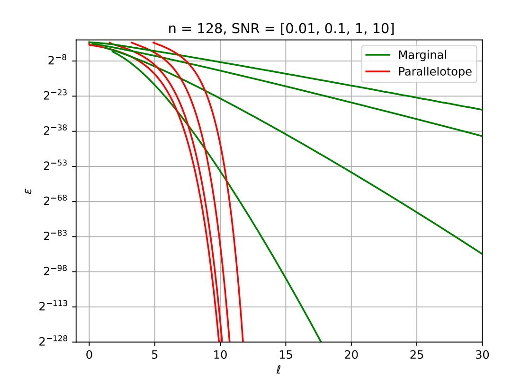
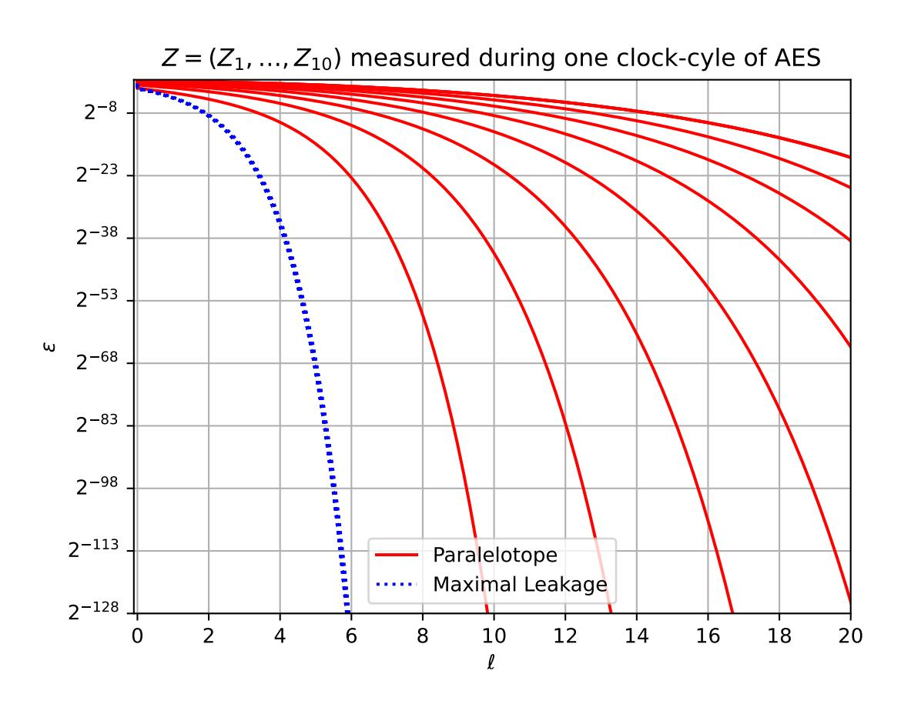

{0}------------------------------------------------

# **Simulating Noisy Leakage with Bounded Leakage: Simpler, Better, Faster**

Julien Béguinot<sup>1</sup> , Ananta Mukherjee<sup>2</sup> , Maciej Obremski<sup>3</sup> , João Ribeiro<sup>4</sup> , Lawrence Roy<sup>5</sup> , François-Xavier Standaert<sup>1</sup> , and Daniele Venturi<sup>6</sup>

<sup>1</sup> Crypto Group, ICTEAM Institute, UCLouvain, Belgium julien.beguinot,fstandae@uclouvain.be <sup>2</sup> Centre for Quantum Technologies, National University of Singapore a.mukherjee@u.nus.edu <sup>3</sup> National University of Singapore obremski.math@gmail.com 4 Instituto de Telecomunicações and IST - Universidade de Lisboa, Portugal jribeiro@tecnico.ulisboa.pt <sup>5</sup> Aarhus University, Denmark ldr709@gmail.com <sup>6</sup> Sapienza University of Rome, Italy venturi@di.uniroma1.it

**Abstract.** Theoretical treatments of leakage-resilient cryptography typically work under the assumption that the leakage learned by the adversary (e.g., about an *n*-bit secret key) is arbitrary but *bounded*, in the sense that the leakage is an *ℓ*-bit string for some threshold *ℓ* significantly smaller than *n*. On the other hand, real-world side-channel attacks on physical implementations of cryptographic protocols produce leakage transcripts that are much longer than *n*. However, unlike the bounded leakage model, these transcripts are inherently *noisy*. We would like to generically claim that cryptographic schemes resilient to bounded leakage are also resilient to realistic noisy leakages. This boils down to showing that noisy leakages can be simulated using only one bounded leakage query. Prior work (EUROCRYPT 2021 and CRYPTO 2024) made important progress on this problem. Yet, barriers to applicability and interpretability remain, such as the need for large noise levels, the difficulty to estimate the necessary parameters of the leakage distributions, undesirable independence assumptions, and inefficient simulation in certain regimes. In this work, we resolve (or make progress towards resolving) these shortcomings:

- 1. We show that simple modifications to the simulation strategies in prior work simultaneously allow a cheaper computation of simulation parameters and better parameters than previous results.
- 2. Leveraging the first item, we obtain a reduction whose amount of extra bounded leakage to simulate correlated signals only increase very mildly. This captures the limited incentive for an adversary to oversample a side-channel signal leading to correlated signal, improving previous results treating these samples as independent.
- 3. We establish a new "bounded leakage vs. simulation efficiency" tradeoff, roughly trading O(*∆*) bits leaked by the bounded leakage query

{1}------------------------------------------------

for a  $\frac{2^{\Delta}}{\operatorname{poly}(\Delta)}$ -factor reduction in simulation complexity. This widens the applicability of our results in the context of computational security, as former simulators were only efficient when simulating from  $\mathcal{O}(\log \lambda)$  bits of bounded leakage, with  $\lambda$  the security parameter.

## 1 Introduction

Physical implementations of cryptographic schemes are often vulnerable to *side-channel* attacks that are not covered by classical theoretical models of security. This includes, for example, attacks based on measuring the power consumption or the electromagnetic radiation of a chip, which are cheap to carry out and have led to serious breaks [38]. The devastating effect of side-channel attacks has led to the rise of *leakage-resilient cryptography*, focusing on the design of cryptographic schemes resilient to a wide class of side-channel attacks.

Leakage-resilient cryptography has seen extraordinary developments over the past 25 years. However, there remains a mismatch between its theory and practice. On the one hand, the theory community has mostly focused on the bounded leakage model, which assumes that the adversary can learn an arbitrary function of the secret component (say, a secret key) with at most  $\ell$  output bits, for some predefined threshold  $\ell$ . In particular,  $\ell$  must be smaller than the secret key length, as otherwise no security guarantees are achievable. Arguably the main reason behind this choice is that the bounded leakage model allows us to obtain clean proofs of security, even for advanced functionalities. See the survey of Kalai and Reyzin [32] for an excellent account of research in this direction. On the other hand, real-world side-channel attacks do not inherently produce bounded leakage. In fact, side-channel attacks produce long transcripts (much longer than the secret key under attack) that, however, are noisy, and so carry only imperfect information about the secret key, i.e., noisy leakage [45].

Ideally, we would like to claim that any scheme that is resilient to an appropriate amount of efficient bounded leakage is also resilient to a large family of realistic noisy leakages. Furthermore, we would like there to be simple, transparent methods for practitioners to test whether their noisy leakages fall into this large family. These noisy leakages are estimated from concrete side-channel measurements on a given device, combined with some standard assumptions. And, to top it off, we would like such an "automatic lifting" claim to hold in the realistic scenario where the adversary can learn multiple *correlated* noisy leakages across multiple rounds of computation on the same secret key.

The exploration of these questions was kickstarted by recent works of Brian, Faonio, Obremski, Ribeiro, Simkin, Skórski, and Venturi [14] and Obremski, Ribeiro, Roy, Standaert, and Venturi [42]. They consider a general simulation-based paradigm from bounded leakage, which captures the claims above. More precisely, for some secret X supported on  $\mathcal{X}$  and some leakage Z = f(X) from X, with f a randomized leakage function, the goal is to design a simulator which can only access X through an arbitrary  $\ell$ -bounded leakage query and, based only on this query and the joint distribution  $P_{XZ}$ , produces a simulated leakage  $\tilde{Z}$ 

{2}------------------------------------------------

such that the secret-true leakage joint distribution *PXZ* and the secret-simulated leakage joint distribution *PXZ*˜ are close in statistical distance.

Their main result (in [\[42\]](#page-34-1), stated for discrete distributions) is that if the conditional distributions *PZ*|*X*=*<sup>x</sup>* have small *t-hockey-stick divergence* with respect to some distribution *Q* on average over *x* ∼ *PX*, i.e.,

<span id="page-2-0"></span>
$$\mathbb{E}_{x \sim P_X}[\mathsf{SD}_t(P_{Z|X=x}; Q)] = \sum_x P_X(x) \sum_z \max(0, P_{Z|X=x}(z) - 2^t Q(z)) \le \delta, (1)$$

then the leakage *Z* can be simulated from approximately *t* bits of bounded leakage to within statistical distance approximately *δ*. Empirically, they give evidence that concrete leakage models widely used by practitioners (such as "Hamming weight plus Gaussian noise" and its variants) achieve a good tradeoff between *t* and *δ* in [Equation \(1\),](#page-2-0) leading to good "simulation theorems" from bounded leakage for such noisy leakages.[7](#page-2-1) Despite conceptually pointing towards an ideal match between theory and practice, these results remain with a number of shortcomings that may imply the need for additional heuristics, limiting their usability and the interpretability of the resulting proof-based security claims:

- **–** *High noise requirements.* Simulating the generalized noisy leakages of [\[42\]](#page-34-1) with bounded leakage and small errors requires quite high noise levels, characterized by Signal-to-Noise Ratios (SNRs) below 10−<sup>2</sup> in the Hamming weight case [\[37\]](#page-33-2). In practice, such SNRs are more likely observed under the heuristic assumption that side-channel adversaries are computationally-bounded and only exploit the leakage signal of small (e.g., 8-bit or 32-bit) intermediate computations, so that the remaining (e.g., 120 or 96) bits produce so-called algorithmic noise [\[50\]](#page-34-2). Ensuring security without such an assumption (i.e., assuming a 128-bit leakage signal) and for larger SNRs would therefore strengthen the link between theory and practice (i.e., enable to rely only on physical noise) and allow covering more use cases of less noisy leakage functions.
- **–** *Computationally-intensive estimation of parameters.* Despite noisy Hamming weight leakages being a natural first step towards assessing the practicality of the reductions between bounded leakage and noisy leakage, concrete leakage functions typically deviate slightly from such an idealized model. A popular generalization to capture these deviations is to consider *noisy linear leakages*, where the Hamming weight function is replaced by a weighted sum of bits [\[46\]](#page-34-3). Unfortunately, computing the parameters of the generalized noisy leakages in [\[42\]](#page-34-1) becomes inefficient as the cardinality of the leakage function increases. More precisely, computing *t* and *δ* for generalized noisy leakages requires summing/integrating over the leakage distribution. This becomes unfeasible for 128-bit values, unless the leakage function has some special structure (e.g., Hamming weight leakages, which enable summing over *n* + 1 events rather than 2 *<sup>n</sup>*). As a result, evaluations for these practically-relevant (linear) leakages were only provided for 8-bit values so far. While such an issue could again be solved under additional heuristics, models enabling a more

<span id="page-2-1"></span><sup>7</sup> These empirical results are obtained by choosing *Q* = *P<sup>Z</sup>* .

{3}------------------------------------------------

- efficient estimation of the security parameters would again strengthen the link between theory and practice and allow covering more use cases.
- Physical independence assumptions. Concrete implementations give multiple leakage samples to the adversaries. To capture this, [42] considers multivariate leakages  $Z_1, \ldots, Z_m$ , but only obtain simulation theorems from bounded leakage under the assumption that the  $Z_i$ 's are conditionally independent given the secret X. This assumption is known to be incorrect: signal and noise correlations have been observed in practice and are recognized as difficult to deal with in related contexts like masking [5]. So capturing them in reductions would once more strengthen the link between theory and practice.
- Inefficient simulator. For a given  $t \geq 0$ , the simulator of [42] runs in time roughly  $2^t$ , assuming oracle access to the joint probability density function  $P_{XZ}$  and to i.i.d. samples distributed according to  $P_Z$ . While this may not be an issue for specific (e.g., Hamming weight or linear) leakage functions, it means that the simulator is in general inefficient. Theoretically, this does raise the challenge of designing more efficient simulators enabling tighter leakage-resilience guarantees for computationally secure cryptographic schemes.

#### <span id="page-3-2"></span>1.1 Our Contributions

To simplify our discussion, here and throughout the paper we make some assumptions. First, we assume that the secret X is a discrete random variable with probability mass function  $P_X$ , supported on a finite set  $\mathcal{X}$  (usually we have  $\mathcal{X} = \{0,1\}^n$  for some n). Second, we assume that a leakage Z from X is supported on  $\mathbb{R}^k$  for some integer  $k \geq 1$  and, for every  $x \in \mathcal{X}$ , that  $Z_x = (Z|X = x)$  is a continuous random variable with probability density function  $f_{Z_x}$ . These assumptions capture most cases of practical interest. Our results generalize beyond this setting, but we focus on it to avoid unnecessary technicalities and clutter.

**Simpler and Better Simulation.** Our first contribution is a new simulation theorem for noisy leakages from bounded leakage which attains better parameters in practice and allows for a much simpler computation of simulation parameters (i.e., the amount of bounded leakage required and the simulation error) than the previous results of [42], for realistic classes of noisy leakages.

<span id="page-3-1"></span>We begin the discussion by defining our (baseline) noisy leakage model.

**Definition 1.** We say that Z supported on  $\mathbb{R}^k$  is  $(\mathcal{R}, M, \delta)$ -noisy leakage from X if for every  $x \in \mathcal{X}$  and  $z \in \mathbb{R}^k$  it holds that  $f_{Z_x}(z) \leq M$  and  $P_{Z_x}(\mathcal{R}) \geq 1 - \delta$ .

We prove the following simulation theorem for  $(\mathcal{R}, M, \delta)$ -noisy leakage from bounded leakage (and we refer to Section 3 for the formal details).

<span id="page-3-0"></span>Theorem 1 (Informal version of Theorem 7). The class of  $(\mathcal{R}, M, \delta)$ -noisy leakages from X can be simulated using  $\ell = \lceil \log_2 T \rceil$  bits of bounded leakage from X, with statistical error  $\varepsilon = \max(\delta, (1 - (1 - \delta)2^{-t})^T)$ , where  $t = \log_2(M\mu(\mathcal{R}))$  and  $\mu(\mathcal{R})$  is the Lebesgue measure of  $\mathcal{R}$ . Furthermore, the simulator runs in

{4}------------------------------------------------

time  $\mathcal{O}(T)$  assuming oracle access to the pdfs of the uniform distribution over  $\mathcal{R}$  and  $P_{Z_x}$  for every  $x \in \mathcal{X}$ , and oracle access to i.i.d. samples according to the uniform distribution over  $\mathcal{R}$ . In other words it is simulatable with statistical error  $\varepsilon$  provided that

$$T = \left[ \frac{\ln \frac{1}{\varepsilon}}{-\ln(1 - \frac{(1-\varepsilon)}{\mu(\mathcal{R})M})} \right].$$

Some remarks are due about Theorem 1. First, as we discuss in Section 1.3, its proof is very simple, on top of the framework from [42]. Second, the simulation parameters in Theorem 1 depend only on the Lebesgue measure of the region  $\mathcal{R}$  and an upper bound on the pdf of the conditional distributions  $Z_x$ . These parameters are easy to compute for realistic noisy leakages. For example, under the widely used "additive noise" assumption that  $X \in \{0,1\}^n$  and the leakage Z satisfies  $Z = d(X) + \mathcal{N}$  with  $d : \{0,1\}^n \to \mathbb{R}$  a deterministic function (a popular choice being  $d(X) = \sum_{i=1}^n c_i X_i$  for some real-valued coefficients  $c_i$ ) and  $\mathcal{N}$  an independent real-valued noise with fast-decaying tails (a popular choice being Gaussian noise), then (1) we can take  $\mathcal{R}$  to be an interval in  $\mathbb{R}$ , and (2)  $\sup_z f_{Z_x}(z) \leq \sup_z f_{\mathcal{N}}(z)$  for all  $x \in \{0,1\}^n$ . This means that  $\mu(\mathcal{R})$  is just the length of an interval in  $\mathcal{R}$ , and upper bounding the pdfs of the conditional distributions  $Z_x$  is equivalent to upper bounding the pdf of  $\mathcal{N}$ . Furthermore, oracle accesses in Theorem 1 are cheap for practically-relevant noisy (e.g., Hamming weight or linear) leakages and simple regions  $\mathcal{R}$  (see Remark 1 below).

In particular, for the practically-relevant case of a multivariate leakage  $Z = d(X) + N \in \mathbb{R}^k$  where  $N \sim \mathcal{N}(0, \Sigma)$  we obtain the following simulation theorem by combining Theorem 1 with standard whitening techniques and Gaussian tail evaluation. For the formal details, we refer to Section 3.1.

<span id="page-4-0"></span>Theorem 2 (Informal version of Theorem 8). A multivariate Gaussian leakage Z = d(X) + N is simulatable from  $\ell = \lceil \log_2 T \rceil$  bits of bounded leakage from X with statistical error  $\varepsilon$  where

$$T = \left\lceil \frac{\ln \frac{1}{\varepsilon}}{-\ln(1 - f_{\mathbf{w}}(\varepsilon))} \right\rceil,$$

and  $f_{\mathbf{w}}(\varepsilon)$  is inversely proportional to the volume of a parallelotope containing  $Z_x$  with probability at least  $1-\delta$  for all x. The simulator runs in time  $\mathcal{O}(T)$  assuming oracle access to d(x), the pdfs of N, the uniform distribution over a parallelotope of given widths and i.i.d samples drawn uniformly in this parallelotope.

Overcoming limitations of prior work. Theorem 1 and Theorem 2 directly contribute to mitigate three limitations of previous works, as we now explain.

First, and as will be detailed in Section 3.4, we can simulate noisy leakage with bounded leakage in significantly less noisy contexts than [42], to the point that applying Theorem 2 is possible without relying on the algorithmic noise heuristic. This gain derives from our simplified simulation approach, where the

{5}------------------------------------------------

amount of bounded leakage needed to simulate mostly depends on the width of the (deterministic part of the) leakage function d(x) (i.e., **w** in Theorem 2).

Second, our simplified simulation approach allows a much more efficient estimation of parameters. Namely, the computationally expensive sums/integrals that were limiting the general application of the theorems in [42] to secrets  $X \in \{0,1\}^n$  with very small n (or leakage functions with small cardinality) is replaced by the need to characterize the width of the leakage function's deterministic part and the noise level (i.e., a covariance matrix in the Gaussian case). This can be done trivially for the aforementioned linear leakage functions. Remarkably, the ease of computing parameters extends to larger dimensions k > 1. In contrast, for the simulation theorems from [42], this computation becomes extremely expensive as k grows, even for very short secrets X.

Sampling from Likeliest Conditional, Maximal Leakage Our second contribution is yet another simulation theorem which achieves even better still easy to compute parameters at the cost of harder to sample distribution Q. Namely, we choose Q proportional to the likelihest conditional distribution of Z|X=x, i.e.,  $Q(z) \propto \max_x P_{Z|X}(z|x)$ . This theorem is very generic and can be expressed nicely in terms of the maximal leakage  $\mathcal{L}(X \to Z)$  which is a standard leakage measure from information theory [31, Definition 1].

**Theorem 3 (Informal version of Theorem 9).** Any leakage Z is  $\varepsilon$ -simulatable from  $\ell = \lceil \log_2 T \rceil$  bits of bounded leakage of X and complexity  $\mathcal{O}(T)$  where

<span id="page-5-1"></span><span id="page-5-0"></span>
$$T = \left\lceil \frac{\ln \varepsilon}{\ln(1 - 2^{-\mathcal{L}(X \to Z)})} \right\rceil.$$

Again, if Z = d(X) + N where  $N \sim \mathcal{N}(0, \Sigma)$ , we can upper bound  $\mathcal{L}(X \to Z)$  in terms of  $\Sigma$  and the widths of a parallelotope containing  $d(\mathcal{X})$ . It gives:

Theorem 4 (Informal version of Theorem 10). Let  $\mathbf{w} = (w_1, \ldots, w_k)$  be the width of a k-dimensional parallelotope containing  $(O \cdot \Sigma^{-\frac{1}{2}} \cdot d)(X)$  where O is an orthonormal transformation of  $\mathbb{R}^k$ . Then Z = d(X) + N can be simulated from  $\ell = \lceil \log_2 T \rceil$  bits of bounded leakage from X with statistical error  $\varepsilon$  and the

simulator runs in time 
$$\mathcal{O}(T)$$
 with  $T = \left[ \left( \ln \frac{1}{\varepsilon} \right) \left( -\ln \left( 1 - \prod_{i=1}^{k} \frac{1}{1 + \frac{w_i}{\sqrt{2\pi}}} \right) \right)^{-1} \right].$ 

Theorem 3 and Theorem 4 solve yet another limitation from the state of the art. Indeed, if Z contains many correlated samples, then for an appropriate choice of O (e.g., using Principal Component Analysis [3]), we can ensure that  $w_i \approx 0$  for most of the  $w_i$ , so that their contributions cancel. This captures (to the best of our knowledge, for the first time) the limited interest for an adversary to oversample her measurements as soon as it mostly adds correlated signal.

Trading Bounded Leakage for Simulation Efficiency. Eventually, the simulator behind Theorem 1 runs in time roughly  $\mu(\mathcal{R}) \cdot M \cdot \ln \frac{1}{\varepsilon}$  if Z is  $(\mathcal{R}, M, \delta)$ -noisy leakage from X. Therefore, this result hits the same efficiency barrier as

{6}------------------------------------------------

the results from [42]: the simulation is efficient with respect to some security parameter  $\lambda$  for up to  $\mathcal{O}(\log \lambda)$  bits of bounded leakage. While this covers many noisy leakage functions of practical interest, we find it natural from a purely theoretical standpoint to explore *efficient* simulation beyond the settings with  $\mathcal{O}(\log \lambda)$  bits of bounded leakage considered so far in the literature.

Motivated by the above, we uncover a new tradeoff between the amount of bounded leakage required for simulation and simulation efficiency. This is discussed in more generality in Section 5. Here, we opt to present a special case that already highlights the main ideas. For simplicity, in this part of the work we focus on the one-dimensional case where Z is supported on  $\mathbb{R}$ .

In order to take advantage of this tradeoff we need some extra (mild) structure on the leakage Z beyond Definition 1. One thing that suffices is bounding the absolute value of the derivative of  $P_{Z_x}$ , rather than its maximum.

<span id="page-6-3"></span>**Definition 2 (Lipschitz-noisy leakage).** Let X and Z be random variables with Z supported on  $\mathbb{R}$ . We say that Z is  $(\mathcal{R}, \gamma, \delta)$ -Lipschitz-noisy leakage from X if for each  $x \in \mathcal{X}$  the pdf  $f_{Z_x}$  is  $\gamma$ -Lipschitz and  $\mathbb{E}_{x \sim P_X}[P_{Z_x}(\mathcal{R})] \geq 1 - \delta$ .

We note that (1)  $(\mathcal{R}, \gamma, \delta)$ -Lipschitz-noisy leakage from X is a subfamily of  $(\mathcal{R}, M = \sqrt{2\gamma}, \delta)$ -noisy leakage from X, and (2) for reasonable noisy leakages Z, uncovering the Lipschitz constant  $\gamma$  is feasible. Armed with this extra structure, we obtain the following bounded leakage vs. simulation efficiency tradeoff.

Theorem 5 (Informal version of Theorem 13, special case of Theorem 12). Let  $\mathcal{R} = [0, D]$  for some  $D \in \mathbb{R}$ , and suppose that Z is  $(\mathcal{R}, \gamma, \delta)$ -Lipschitz-noisy leakage from X. Then, for any  $\alpha, d > 0$  we have that Z can be simulated from

<span id="page-6-2"></span>
$$\ell = \left\lceil \log D + \frac{1}{2} \log(2\gamma) + \frac{1}{2} \log(D/d) + \log \ln(1/\alpha) + 1 \right\rceil$$

bits of bounded leakage with statistical error  $\alpha + \delta$ . The simulator runs in time  $\mathcal{O}(1+\sqrt{Dd\gamma}\cdot\log(1/\alpha)\cdot(\log(Dd\gamma)+\log(1/\alpha)))$  assuming oracle access to the pdfs of the uniform distribution over  $\mathcal{R}$  and  $P_{Z_x}$  and to i.i.d. samples from [0,d] and  $P_{Z_x}$ .

A key component behind Theorem 5 is a generalization of the framework of [42] that allows replacing the distribution Q in Equation (1) by a family of distributions  $(Q_x)_{x\in\mathcal{X}}$  that depend on x. Regarding the oracle accesses, see Remark 1 below. Intuitively, the parameter d controls the tradeoff between extra bounded leakage and efficiency. If we choose  $d=2^{-2g}$  for some  $g\geq 0$ , then we trade approximately  $\Delta=\frac{1}{2}\log D+g$  bits of bounded leakage for (ignoring poly( $\Delta$ ) factors) a  $(2^{\Delta}=\sqrt{D}\cdot 2^g)$ -multiplicative factor reduction in computational complexity of the simulation compared to an application of Theorem 1 to Z.

<span id="page-6-0"></span>Remark 1 (Concrete cost of oracle accesses). The computational complexity of the simulation in our theorems in Sections 3 and 5 is determined assuming oracle

<span id="page-6-1"></span><sup>8</sup> A function f is  $\gamma$ -Lipschitz if  $|f(x_1) - f(x_0)| \le \gamma |x_1 - x_0|$  for all  $x_0, x_1 \in \mathbb{R}$ .

{7}------------------------------------------------

(i.e., O(1)) access to certain samples and densities. We opted to state things this way because we want our statements to be general, and the concrete complexity of these computations depends on the leakage under consideration (e.g., whether the leakage is efficiently computable from the secret or not). This was also done in prior work (see [\[42,](#page-34-1) Remark 2]). Nevertheless, these oracle accesses are cheap to implement in practice under common assumptions, in which case the stated running time with oracle access corresponds to the real running time. For example, if *Z* = (*Z*1*, . . . , Zk*) with *Z<sup>i</sup>* = *di*(*X*) + N*<sup>i</sup>* is (R*, M, δ*)-noisy leakage with R a simple region (such as a *k*-dimensional parallelotope), then computing the pdf of the uniform distribution on R and sampling from this distribution are both easy tasks. Furthermore, it is reasonable to assume that N = (N1*, . . . ,* N*k*) has an easy-to-compute pdf (e.g., this holds under the usual assumption that N is a multivariate Gaussian) and that d(*X*) is efficiently computable given *X*.

**Applications.** Due to space constraints, the applications of our results to cryptographic primitives with computational security are discussed in [Appendix E.](#page-38-0)

#### **1.2 Other Related Work**

There have been efforts to bridge the gap between theoretical and practical leakage models in the separate context of masking. We believe that it is interesting to make a parallel and explain the differences compared to our setting. Ishai, Sahai, and Wagner [\[30\]](#page-33-4) designed a compiler that transforms any stateful arithmetic circuit into an equivalent implementation that is resilient against (random) *probing leakage*, where an adversary learns the value of a given wire with some probability *p*. [9](#page-7-1) This stimulated a line of work aiming to extend this result to resilience in more realistic noisy leakage models where the adversary learns noisy leakage from every wire in the circuit. In particular, we now know that the ISW compiler [\[30\]](#page-33-4) produces masked circuit implementations resilient to various types of noisy leakages, where noise is measured according to different metrics (such as Euclidean norm [\[45\]](#page-34-0), statistical distance [\[20,](#page-32-1) [21,](#page-32-2) [22\]](#page-32-3), and others [\[44,](#page-34-4) [4,](#page-31-2) [42\]](#page-34-1)). Furthermore, recent work has also designed alternative compilers avoiding some drawbacks of the ISW compiler with respect to noisy leakage-resilience [\[13\]](#page-32-4).

Our work departs from this line of research in two ways. First, we study leakage-resilience in a general setting, beyond circuit implementations. Second, we connect noisy leakage and *bounded* leakage. The bounded leakage model is fundamentally different from the probing leakage model. As discussed in [\[14\]](#page-32-0), simulating probing leakage from a secret *X* ∈ {0*,* 1} *<sup>n</sup>* using bounded leakage from *X* requires ≈ *n* bits of bounded leakage. It is also not possible to simulate even simple bounded leakage such as *f*(*X*) = *X*<sup>1</sup> using probing leakage.

#### <span id="page-7-0"></span>**1.3 Technical Overview**

Let *X* be the secret and *Z* some noisy leakage on *X*, supported on R *k* . The starting point for our proofs is the general framework from [\[42\]](#page-34-1), which connects the

<span id="page-7-1"></span><sup>9</sup> There are various flavors of probing leakage essentially equivalent to each other.

{8}------------------------------------------------

parameters for simulating Z from bounded leakage to the hockey-stick divergences between the conditional distributions  $P_{Z_x}$  and some "source" distribution Q. More precisely, if the t-hockey-stick divergence (for continuous distributions)

<span id="page-8-0"></span>
$$SD_t(P_{Z_x}; Q) := \int_{\mathbb{R}^k} \max(0, f_{Z_x}(z) - 2^t f_Q(z)) dz \le \delta_x,$$
 (2)

with  $\mathbb{E}_{x \sim P_X}[\delta_x] \leq \delta$ , then, Z can be simulated from  $\ell = t + \log \ln(1/\alpha)$  with statistical error  $\alpha + \delta$ , for any  $\alpha > 0$ . For a formal definition of the leakage simulation paradigm, see Section 2.3. The authors of [42] focused on the special case where  $Q = P_Z$  (the marginal distribution of the noisy leakage Z).

In a nutshell, we obtain Theorems 1 and 2 by considering a different (simple!) instantiation of Q, and Theorem 5 by extending the framework above to handle certain choices of source distributions  $Q_x$  that are allowed to depend on x.

**Different instantiations of Q.** In order to obtain Theorems 1 and 2, we simply replace the instantiation  $Q = P_Z$  used in [42] with Q the uniform distribution over an appropriate set  $\mathcal{R}$ . From there onwards, the proof is so simple that we can fully explain it in the two short paragraphs given below.

The ideal choice would be taking  $\mathcal{R}$  to be the full support of the noisy leakage Z, in which case  $f_Q(z) = \frac{1}{\mu(\mathcal{R})}$  for all z in the support of Z, with  $\mu(\mathcal{R})$  the Lebesgue measure of  $\mathcal{R}$ . If we know that the pdfs  $f_{Z_x}(z) \leq M$  for all x and z and we set  $t = \log_2(M \cdot \mu(\mathcal{R}))$ , then the maximums in Equation (2) would all be 0, implying that  $\mathrm{SD}_t(P_{Z_x};Q) = 0$  for all x. In turn, this would mean that Z can be simulated using  $\log_2(\ln\frac{1}{\varepsilon}) - \log_2(-\ln(1-2^{-t}) \approx t + \log_2(\ln\frac{1}{\varepsilon}) = \log_2(M \cdot \mu(\mathcal{R}) \cdot \ln\frac{1}{\varepsilon})$  bits of bounded leakage from X with statistical error  $\varepsilon$ , for any  $\varepsilon > 0$ . This almost works, except that usually Z has unbounded support, and so we cannot define Q to be uniformly distributed over it. However, there is an easy fix: we simply take  $\mathcal{R}$  to be a compact set where Z lies with high probability, say  $1 - \delta$ . Since the maximums in Equation (2) equal 0 when  $z \in \mathcal{R}$ , by setting  $t = \log(M \cdot \mu(\mathcal{R}))$  we get that

$$\mathsf{SD}_t(P_{Z_x};Q) = \int_{\mathbb{R}^k} \max(0, f_{Z_x}(z) - 2^t f_Q(z)) dz = \int_{\overline{\mathcal{R}}} f_{Z_x}(z) dz = P_{Z_x}(\overline{\mathcal{R}}),$$

where  $\overline{\mathcal{R}}$  denotes the complement of  $\mathcal{R}$  and  $P_{Z_x}(\overline{\mathcal{R}})$  denotes the probability that  $Z_x$  lands in  $\overline{\mathcal{R}}$ . Theorem 1 now follows since  $P_{Z_x}(\overline{\mathcal{R}}) \leq \delta$ .

Next, and in order to obtain Theorem 3 and Theorem 4, we choose Q proportional to the likeliest conditional probability, i.e.,  $Q(z) = C^{-1} \max_x P_{Z|X}(z|x)$ , where C is a normalization constant. Then, clearly, if  $2^t = C$  we obtain  $SD_t(P_{Z_x};Q) = 0$ . Now, it can be observed that  $t = \log_2 C$  corresponds to the maximal leakage  $\mathcal{L}(X \to Z)$ . Theorem 3 and Theorem 4 directly follow.

Trading Bounded Leakage for Efficiency by Correlating Q and X. We now explain the main new ideas behind our new tradeoff between bounded leakage and efficiency of simulation in Theorem 5. The original simulation framework

{9}------------------------------------------------

in [42] requires that the source distribution Q be independent of X, in the sense that in Equation (2), the distributions  $P_{Z_x}$  are compared to the same Q, for all choices of x. We begin by establishing an extension of the framework of [42] (requiring suitably modifying the underlying simulator) that allows us to choose a potentially different source distributions  $Q_x$  for each x, which turns out to be the key for the new efficiency vs. bounded leakage tradeoffs.

The intuition behind our extension derives from the observation that the simulator in the framework of [42] first generates  $L=2^{\ell}$  i.i.d. samples  $z_1,\ldots,z_L$  according to the source distribution Q (which is independent of the secret X). Then, it uses  $z_1,\ldots,z_L$  to create a bounded leakage query to X that, upon seeing X=x uses  $z_1,\ldots,z_L$  to rejection sample from the true leakage distribution  $P_{Z_x}$  and returns to the simulator the selected index  $i \in [L]$ . As the simulator knows  $z_1,\ldots,z_L$ , it can select the correct accepted sample  $z_i$  and output it as the simulated leakage. This requires  $\log L=\ell$  bits of bounded leakage. The statistical simulation error corresponds to the failure of rejection sampling.

Note that the bounded leakage query above could, in principle, perform rejection sampling from  $P_{Z_x}$  based on a different source distribution  $Q_x$  depending on the observed secret x. There is, however, the apparent barrier that the simulator must generate the i.i.d. samples to be used in the rejection sampling procedure without seeing X. We overcome this by using extra bounded leakage in the bounded leakage query to tell the simulator how to transform a sample from some distribution Q independent of x into a sample from the "correct" distribution  $Q_x$ . More precisely, the barrier above disappears if we do the following:

(1) The simulator generates L i.i.d. samples  $z_1, \ldots, z_L$  according to some source distribution Q independent of X; (2) The bounded leakage query sees  $z_1, \ldots, z_L$ and X = x, and transforms  $z_1, \ldots, z_L$  into i.i.d. samples  $z'_1, \ldots, z'_L$  from an alternative distribution  $Q_x$  that depends on x. This is possible since the bounded leakage query knows x; (3) The bounded leakage query performs rejection sampling from  $P_{Z_x}$  using  $z_1', \ldots, z_L'$ . Let  $i \in [L]$  be the index of the accepted sample; (4) It then returns i to the simulator, along with a *short* explanation of how to turn  $z_i$  (which the simulator knows) into  $z'_i$  (the sample accepted by the rejection sampling procedure); (5) The simulator uses this additional information to compute  $z'_i$  from  $z_i$ , and outputs  $z'_i$  as the simulated leakage. This strategy works so long as we can capture the relationship between  $z_i$  and  $z_i'$ through a small amount of bounded leakage. This means that we must choose Q and the tuple of distributions  $(Q_x)_{x\in\mathcal{X}}$  above carefully. If performing rejection sampling based on  $Q_x$  is much cheaper than doing it based on Q, then we obtain a significant improvement in the efficiency of the simulator, which we recall is our end goal. At the same time, we must be careful about not requiring a lot of bounded leakage to transform a sample from Q into a sample from  $Q_x$ .

We now explain how we construct the  $Q_x$ 's. Intuitively, we take inspiration from Riemann integration, where one approximates the integral of a function by the integral of finer and finer step functions. For simplicity, suppose that Z lands in the interval  $\mathcal{I} = [0, D]$  with probability at least  $1 - \delta$ , possibly with extremely large  $D = \exp(\lambda)$ , and that Z is  $(\mathcal{I}, \gamma, \delta)$ -Lipschitz-noisy leakage from X (recall

{10}------------------------------------------------

Definition 2). Then, for a parameter  $d \ll D$ , we partition  $\mathcal{I}$  into m = D/d disjoint intervals  $\mathcal{I}_1, \ldots, \mathcal{I}_m$  each of length d. A first idea for defining  $Q_x$  would be to have  $Q_x$  first pick the interval  $\mathcal{I}_j$  with probability  $\frac{P_{Z_x}(\mathcal{I}_j)}{1-P_{Z_x}(\mathcal{I})}$ , and then sample uniformly from  $\mathcal{I}_j$ . If we have good control over the maximum of  $f_{Z_x}$  in  $\mathcal{I}_j$ , then we could use the ideas behind Theorem 1 to rejection sample from  $Z_x$  over  $\mathcal{I}_j$ , which would be much cheaper than rejection sampling from  $Z_x$  based on the uniform distribution over [0, D]. Furthermore, if we take Q to be uniform over [0, d], then in Step 2 above we can transform  $z_i \sim Q$  into  $z_i' \sim Q_x$  by sampling  $j \in [m]$  with probability  $P_{Z_x}(\mathcal{I}_j)$  and setting  $z_i' = z_i + (j-1)d$ . Therefore, in Step 4 above, the short explanation the bounded leakage query needs to return to the simulator is simply j, which requires  $\log m$  bits of bounded leakage.

The above almost works, except that over intervals  $\mathcal{I}_j$  with extremely small mass  $P_{Z_x}(\mathcal{I}_j)$  the  $\gamma$ -Lipschitz guarantee on  $f_{Z_x}$  only gives upper bounds on the maximum  $f_{Z_x}$  over  $\mathcal{I}_j$  that are not enough for our end goal of bounding the ratio between  $f_{Z_x}$  and  $Q_x$ . To handle this, we modify the definition of  $Q_x$  so that

$$f_{Q_x}(z) = \frac{1}{2} \left[ \text{pick } \mathcal{I}_j \text{ with prob. } \frac{P_{Z_x}(\mathcal{I}_j)}{P_{Z_x}(\mathcal{I})}, \text{ then sample uniformly from } \mathcal{I}_j \right] + \frac{1}{2} [\text{sample uniformly from } \mathcal{I} = [0, D]]$$

for all  $z \in \mathcal{I}$ , and  $f_{Q_x}(z) = 0$  for  $z \notin \mathcal{I}$ . In other words, with probability 1/2 we follow the procedure above, and with probability 1/2 we sample uniformly from the whole  $\mathcal{I} = [0, D]$ . Intuitively, the second term will handle the intervals  $\mathcal{I}_j$  with extremely small  $P_{Z_x}(\mathcal{I}_j)$ . Moreover, it is still true that, taking Q uniform over [0, d], we only need  $\log m$  additional bits of bounded leakage to turn  $z_i \sim Q$  into  $z_i' \sim Q_x$  in Step 2 above. More precisely, with probability 1/2 we sample  $j \in [m]$  with probability  $P_{Z_x}(\mathcal{I}_j)$ , and with probability 1/2 we sample j uniformly at random from [m]. After some routine computations, this yields Theorem 5.

# 2 Preliminaries

#### 2.1 Basic Notation

Random variables are denoted by uppercase roman letters such as X, Y, and Z. Sets may be denoted by uppercase roman letters or uppercase calligraphic letters such as S and T. We will be working with both discrete and continuous random variables (but not a mix of discrete and continuous random variables). For a discrete random variable X, we also use  $P_X$  to denote its probability mass function; we use  $\mathbb{E}[X]$  to denote the expectation of X and  $\mathrm{Var}(X)$  to denote its variance. We write  $U_n$  for the uniform distribution over  $\{0,1\}^n$ . For two random variables X and Y, we use  $P_X \otimes P_Y$  to denote their product distribution, i.e.,  $(P_X \otimes P_Y)(x,y) = P_X(x) \cdot P_Y(y)$ . We denote the support of a random variable X by  $\mathrm{supp}(X)$ . For an arbitrary set T and a discrete distribution P, we abbreviate  $P(T) = \sum_{x \in T} P(x)$ . If P is a continuous distribution, we denote its probability density function (pdf) by  $f_P$  and write  $P(T) = \int_T f_P(x) dx$ . We write  $x \sim P$ 

{11}------------------------------------------------

to mean that x is sampled according to the distribution P. We use  $\mathcal{N}(0,\sigma^2)$  to denote a Gaussian distribution with mean 0 and variance  $\sigma^2$ . More generally, we use  $\mathcal{N}(0,\Sigma)$  to denote a multivariate Gaussian distribution with mean 0 and covariance matrix  $\Sigma$ . The dimension k of this distribution will always be clear from context, and so we omit it from the notation. We use log to denote the base-2 logarithm and ln to denote the natural logarithm. For a real number x we use  $\lceil x \rceil$  and  $\lfloor x \rfloor$  to denote the ceiling and floor of x. For a real-valued vector  $v \in \mathbb{R}^k$  and a real number  $p \geq 1$ , we denote its p-norm as  $\|v\|_p = (\sum_{i=1}^k |v_i|^p)^{1/p}$ . For a real number x,  $\Phi(x)$  is the cumulative distributive function of the normal centered standard distribution evaluated at x,  $\Phi(x) = \int_{-\infty}^x \frac{e^{-\frac{u^2}{2}}}{\sqrt{2\pi}} du$ .

#### 2.2 Statistical Distance and Hockey-Stick Divergences

We will use the statistical distance and t-hockey-stick divergences (which generalize the statistical distance) throughout much of this work.

**Definition 3 (Statistical distance).** The statistical distance SD(P;Q) between two distributions P and Q supported on the same space is defined as

$$\mathsf{SD}(P;Q) = \sup_{E} |P(E) - Q(E)|,$$

where the supremum is taken over all events.

In the relevant case where P and Q are continuous distributions supported on  $\mathbb{R}^k$  with pdfs  $f_P$  and  $f_Q$ , respectively, we have

$$\mathsf{SD}(P;Q) = \int_{\mathbb{R}^k} \max(0, f_P(x) - f_Q(x)) dx.$$

This is a consequence of the well-known fact that the event maximizing |P(E) - Q(E)| is the set  $E = \{x : f_P(x) \ge f_Q(x)\}$ . We will also need the following generalization of the statistical distance.

**Definition 4 (Hockey-stick divergence).** Given  $t \in \mathbb{R}$ , the t-hockey-stick divergence between distributions P and Q, denoted  $SD_t(P;Q)$ , is defined as

$$\mathsf{SD}_t(P;Q) = \sup_E [P(E) - 2^t Q(E)].$$

When t=0, we recover the statistical distance as the 0-hockey-stick divergence. Analogously to the statistical distance, when P and Q are continuous distributions on  $\mathbb{R}^k$  with pdfs  $f_P$  and  $f_Q$ , respectively,  $\mathsf{SD}_t(P;Q)$  simplifies to

$$\mathsf{SD}_t(P;Q) = \int_{\mathbb{R}^k} \max(0, f_P(x) - 2^t f_Q(x)) dx.$$

Analogously to the setting above, this holds because the worst-case event corresponds to the set  $E = \{x : f_P(x) \ge 2^t f_Q(x)\}.$ 

{12}------------------------------------------------

#### <span id="page-12-0"></span>2.3 The Leakage Simulation Paradigm

We recall the notion of simulation of one family of leakages by another from [14].

**Definition 5 (Leakage simulation).** Given a random variable X supported on  $\mathcal{X}$  and two families  $\mathcal{F}(X)$  and  $\mathcal{G}(X)$  of leakage functions from X, we say that  $\mathcal{F}(X)$  is  $\varepsilon$ -simulatable from  $\mathcal{G}(X)$  if for all  $f \in \mathcal{F}(X)$  there is a (possibly inefficient) randomized algorithm  $\mathsf{Sim}_f$  such that

<span id="page-12-4"></span><span id="page-12-1"></span>
$$\mathsf{SD}\left(P_{(X,Z)}; P_{(X,\mathsf{Sim}_f^{\mathsf{Leak}(X,\cdot)})}\right) \le \varepsilon, \tag{3}$$

where Z = f(X) and the oracle  $\operatorname{Leak}(X,\cdot)$  accepts a single query  $g \in \mathcal{G}(X)$  and outputs g(X), and  $\operatorname{Sim}_f^{\operatorname{Leak}(X,\cdot)}$  denotes the output of the simulator with access to this oracle. Furthermore, when  $\mathcal{G}(X)$  is the family of all  $\ell$ -bounded leakage functions  $g: \mathcal{X} \to \{0,1\}^{\ell}$  and Equation (3) holds, we say that  $\mathcal{F}(X)$  is  $\varepsilon$ -simulatable from  $\ell$  bits of bounded leakage.

<span id="page-12-5"></span>Remark 2. We often think of Sim as made of (possibly randomized) sub-routines  $(\mathsf{Sim}_1, \mathsf{Sim}_2)$ , where  $\mathsf{Sim}_1$  is an algorithm taking as input a description of  $f \in \mathcal{F}(X)$  and outputting  $g \in \mathcal{G}(X)$  with state  $\sigma \in \{0,1\}^*$ , while  $\mathsf{Sim}_2$  is an algorithm taking as input g(X) and  $\sigma$  and outputting the simulated leakage  $\tilde{Z}$ .

#### 2.4 A Useful Lemma on Rejection Sampling and Applications

The following lemma controls the parameters for rejection sampling according to a target distribution P using i.i.d. samples from a "source" distribution Q. A proof of this lemma is implicit [42] for discrete distributions P and Q, although this lemma was not explored to its full potential there. For completeness, we include a proof for continuous distributions P and Q in Appendix A.

<span id="page-12-3"></span>**Lemma 1.** Let P and Q be two continuous distributions over  $\mathbb{R}^k$  with pdfs  $f_P$  and  $f_Q$ , respectively, such that

<span id="page-12-2"></span>
$$\mathsf{SD}_t(P;Q) = \delta.$$

For an arbitrary integer T, the following algorithm which:

- 1. Produces T i.i.d. samples  $z_1, \ldots, z_T$  according to Q;
- 2. For i = 1, ..., T 1, accepts and returns  $z_i$  with probability  $\min\left(1, \frac{f_P(z)}{2^t f_Q(z)}\right)$ ;
- 3. If none of  $z_1, \ldots, z_{T-1}$  were accepted, outputs  $z_T$ ;

has an output distribution that is  $\max(\delta, (1 - (1 - \delta)2^{-t})^T)$ -close to P in SD.

As a consequence, the following simulation theorem for noisy leakages characterized by hockey-stick divergences is proven in [42].

{13}------------------------------------------------

Theorem 6 ([42, Theorem 4], adapted). Let X and Z be arbitrary random variables and  $\delta \in (0,1)$ . Suppose that there exists  $t \in \mathbb{R}$  and a probability distribution Q such that for all  $x \in \mathcal{X}$ ,

$$\mathsf{SD}_t(P_{Z_x};Q) \leq \delta.$$

Then, Z is  $\max(\delta, (1-(1-\delta)2^{-t})^T)$ -simulatable from  $\ell = \lceil \log_2 T \rceil$  bits of bounded leakage. Furthermore, the simulator runs in time  $\Theta(T)$  assuming oracle access to the pdfs of Q and  $P_{Z_x}$  for any  $x \in \text{supp}(X)$ , and oracle access to i.i.d. samples from Q. More generally if  $\mathsf{SD}_t(P_{Z_x};Q) \leq \delta_x$ , then it is  $\epsilon = \mathbb{E}_x[\epsilon_x] = \mathbb{E}_x[\max(\delta_x, (1-(1-\delta_x)2^{-t})^T)]$ -simulatable. Furthermore, if  $t \geq 0$ , let  $\delta = \mathbb{E}_x[\delta_x]$  by convexity we have

$$\mathbb{E}_x[\max(\delta_x, (1 - (1 - \delta_x)2^{-t})^T)] \le (1 - 2^{-t})^T + \delta(1 - (1 - 2^{-t})^T).$$

If  $T = 2^t \ln \frac{1}{\alpha}$ , we obtain  $\varepsilon \leq \alpha + \delta$ .

## 2.5 Dummy Leakage Dimension Can be Removed

The following lemma shows that simulating leakages that do not carry any sensitive information (i.e., are independent of X) is trivial.

<span id="page-13-2"></span>**Lemma 2 (Removing Dummy Dimensions).** Let X be a secret discrete random variable. Let  $Z=(Z_0,Z_1)$  be a random variable modeling a leakage about X. Suppose that  $Z_0$  is efficiently simulatable up to SD error  $\varepsilon$  from  $\ell$  bits of bounded leakage from X. Further assume that  $P_{Z|X}=P_{Z_0|X}Q_{Z_1}$  where  $Q=Q_{Z_1}$  is efficiently samplable by an algorithm  $Sample_Q$ . Then, Z is efficiently simulatable up to SD error  $\varepsilon$  from  $\ell$  bits of bounded leakage from X.

*Proof.* By hypothesis,  $\exists Y \in \{0,1\}^l$  and an efficient algorithm Sim so that

$$X \to \boxed{\text{Bounded Leakage}} \to Y \to \boxed{\text{Sim}} \to Z_0^{\text{Sim}},$$

where

$$\mathsf{SD}(P_{XZ_0} \| P_{XZ_0^{\mathrm{Sim}}}) \le \varepsilon.$$

By defining  $\widetilde{\mathsf{Sim}}(y) = (\mathsf{Sim}(y), \mathsf{Sample}_Q())$ , we directly obtain a simulation of of the leakage variable Z with total SD error at most  $\varepsilon$ .

# <span id="page-13-0"></span>3 Simple and Transparent Simulation

<span id="page-13-1"></span>In this section, we show that by appropriately choosing  $Q \neq P_Z$  in Theorem 6 (namely, Q will be uniformly distributed over an appropriate region), we obtain simple simulation theorems from bounded leakage with various advantages compared to the results from [42], for a class of noisy leakages that easily captures a wide range of models considered by practitioners.

{14}------------------------------------------------

**Lemma 3.** Fix a random variable X supported on  $\mathcal{X}$  and let Z be  $(\mathcal{R}, M, \delta)$ noisy leakage from X, where  $\mathcal{R} \subseteq \mathbb{R}^k$  has Lebesgue measure  $\mu(\mathcal{R}) > 0$ . Then, for
Q uniform over  $\mathcal{R}$ ,  $t = \log(\mu(\mathcal{R}) \cdot M)$ , and every  $x \in \mathcal{X}$  we have

$$\mathsf{SD}_t(P_{Z_x};Q) = P_{Z_x}(\overline{\mathcal{R}}) \le \delta.$$

*Proof.* Fix  $x \in \mathcal{X}$  and let  $f_{Z_x}$  be the pdf of  $P_{Z_x} = P_{Z|X=x}$ . Since Q is uniform over  $\mathcal{R}$ , it has pdf  $f_Q(z) = \frac{1}{\mu(\mathcal{R})}$  for every  $z \in \mathcal{R}$ , and  $f_Q(z) = 0$  for  $z \notin \mathcal{R}$ . Therefore, for every  $z \in \mathcal{R}$  we have

$$f_{Z_x}(z) - 2^t Q(z) = f_{Z_x}(z) - \mu(\mathcal{R}) \cdot M \cdot \frac{1}{\mu(\mathcal{R})} = f_{Z_x}(z) - M \le 0,$$

by definition of M. Consequently, we have

$$\mathsf{SD}_t(P_{Z_x};Q) = \int_{\mathbb{R}^k} \max(0, f_{Z_x}(z) - 2^t f_Q(z)) dz = \int_{\overline{\mathcal{R}}} f_{Z_x}(z) dz = P_{Z_x}(\overline{\mathcal{R}}).$$

<span id="page-14-0"></span>

by definition of  $(\mathcal{R}, M, \delta)$ -noisy leakage.

Combining Lemma 3 with Theorem 6 immediately leads to the following.

**Theorem 7.** Fix a random variable X supported on  $\mathcal{X}$  and let Z be  $(\mathcal{R}, M, \delta)$ -noisy leakage from X. Then, Z is  $\max(\delta, (1 - (1 - \delta)2^{-t})^T)$ -simulatable from  $\ell = \lceil \log_2 T \rceil$  bits of bounded leakage from X where  $t = \log_2(\mu(\mathcal{R})M)$ .

Furthermore, the simulator runs in time  $\mathcal{O}(T)$  assuming oracle access to the pdfs of the uniform distribution over  $\mathcal{R}$  and  $P_{Z_x}$  for every  $x \in \mathcal{X}$ , and oracle access to i.i.d. samples according to the uniform distribution over  $\mathcal{R}$ .

For a discussion on the complexity of oracle accesses, see Remark 1.

### <span id="page-14-1"></span>3.1 Additive Gaussian Noise Leakage

In this section, we discuss an instantiation of Theorem 7 to the special case of leakages with additive Gaussian noise. As in [4, Section 3.3] we use a whitening transform to treat this case.

Lemma 4. Consider leakages of the form

$$Z = d(X) + N$$
,

where  $N \sim \mathcal{N}(0, \Sigma)$ . Let W be a whitening transformation (e.g.,  $W = \Sigma^{-\frac{1}{2}}$ ) and let  $\tilde{Z} = WZ = (W \cdot d)(X) + \tilde{N}$ , where  $\tilde{N} = WN \sim \mathcal{N}(0, I_k)$ . Then, Z can be efficiently simulated from  $\ell$  bits of bounded leakage from X if and only if  $\tilde{Z}$  can be efficiently be simulated from  $\ell$  bits of bounded leakage from X.

*Proof.* Let S be the output of the simulation of Z. Define  $\tilde{S} = WS$  to be the output of the simulation of  $\tilde{Z} = WZ$ . Both simulations have the same simulation error with respect to statistical distance. Therefore, we have

$$\mathsf{SD}(Z;S) = \sup_{E} \mathbb{P}(Z \in E) - \mathbb{P}(S \in E),$$

{15}------------------------------------------------

<span id="page-15-0"></span>
$$\begin{split} &= \sup_{E} \mathbb{P}(WZ \in WE) - \mathbb{P}(WS \in WE), \\ &= \sup_{E} \mathbb{P}(\tilde{Z} \in WE) - \mathbb{P}(\tilde{S} \in WE), \\ &= \sup_{\tilde{E} = WE} \mathbb{P}(\tilde{Z} \in \tilde{E}) - \mathbb{P}(\tilde{S} \in \tilde{E}), \\ &= \mathsf{SD}(\tilde{Z}; \tilde{S}). \end{split}$$

Hence, without loss of generality, we may always assume that *Σ* = *I<sup>k</sup>* in the proofs. Furthermore, if the noise is white (i.e., *Σ* = *Ik*) then any orthogonal transformation of the leakage leaves the noise white.

**Lemma 5.** Let 
$$N \sim \mathcal{N}(0, I_k)$$
 and  $O \in \mathcal{O}_k(\mathbb{R})$ , then  $ON \sim \mathcal{N}(0, I_k)$ .

*Proof.* The covariance matrix associated to *ON* is *O*<sup>⊤</sup>*IkO* = *O*<sup>⊤</sup>*O* = *Ik*. ⊓⊔

## **3.2 Axis-Aligned Parallelotope and Orthonormal Transformation**

Let *Z* = *d*(*X*) + *N,* where *N* ∼ N (0*, Ik*). Since by [Lemma 5](#page-15-0) any orthonormal transformation *O* leaves the noise white, we can transform *Z* to *OZ* = (*O* · *d*)(*X*) + *ON* in order to find the smallest possible axis-aligned parellelotope containing (*O* · *d*)(X ), R<sup>0</sup> = {(*r*1*, . . . , rk*) | *l*<sup>1</sup> ≤ *r*<sup>1</sup> ≤ *u*1*, . . . , l<sup>k</sup>* ≤ *r<sup>k</sup>* ≤ *uk*}*.* Up to a translation by (*u*1*, . . . , uk*), we may assume that the parrallelotope is anchored at the origin

$$\mathcal{R}_0 = \{ (r_1, \dots, r_k) \mid 0 \le r_1 \le w_1, \dots, 0 \le r_k \le w_k \},\$$

where *w<sup>j</sup>* ≜ *u<sup>j</sup>* − *l<sup>j</sup>* is the width of the parallelotope on the *j*-th dimension. Let J ≜ {*j* | *w<sup>j</sup>* = 0} ⊆ {1*, . . . , k*}, then *Z*|J = *N*|J is independent of *X*. As a consequence, Lemma [2](#page-13-2) allows us to simulate *Z* only by simulating *Z<sup>e</sup>* = *Z*<sup>J</sup> *<sup>c</sup>* . Without loss of generality we may assume that *Z<sup>e</sup>* = (*Z*1*, . . . , Zk<sup>d</sup>* ), where *k<sup>d</sup>* ≤ *k*. Hence, we are interested in the parallelotope

$$\mathcal{R}_0^e = \{(r_1, \dots, r_{k_d}) \mid 0 \le r_1 \le w_1, \dots, 0 \le r_{k_d} \le w_{k_d}, \}$$

with strictly positive widths.

*Minimum Volume Enclosing Box* Finding the orthonormal transformation *O* that minimizes the volume of the smallest axes-aligned enclosing box of a set of points in R *k* is known as the *minimum volume enclosing box problem* in computational geometry. When *k* = 2*,* 3 the rotating calliper [\[47,](#page-34-6) [49\]](#page-34-7) algorithm provides an efficient and optimal solution. When *k >* 3 a computationally efficient heuristic is to take *O* as the PCA of the set of points [\[3\]](#page-31-1). In particular, if *d*(*X*) is supported on a subspace of R *<sup>k</sup>* of dimension *kd*, the PCA will effectively identify a rotation such that *w<sup>i</sup> >* 0 for *i* ≤ *k<sup>d</sup>* and *w<sup>i</sup>* = 0 otherwise.

{16}------------------------------------------------

#### 3.3 Augmenting the Parallelotope

In order to contain the leakages with high probability and given some  $\delta \in (0,1)$ , we search  $\mathcal{R}_1^e \supseteq \mathcal{R}_0^e$  such that  $\mathbb{P}(Z_e \in \mathcal{R}_1^e) \ge 1 - \delta$ :

$$\mathcal{R}_1^e \triangleq \{(r_1, \dots, r_{k_d}) \mid -n_1 \leq r_1 \leq w_1 + n_1, \dots, -n_{k_d} \leq r_{k_d} \leq w_{k_d} + n_{k_d}\}.$$

Since  $Z_e = d_e(X) + N_e$  where  $N_e \sim \mathcal{N}(0, I_{k_d})$ ,

$$\mathbb{P}(Z_e \in \mathcal{R}_1^e) \ge \prod_{i=1}^{k_d} (\Phi(n_i) + \Phi(n_i + w_i) - 1).$$

Choosing the  $n_i$  constant equal to n, it simplifies to find the smallest n such that

$$\prod_{i=1}^{k_d} (\Phi(n) + \Phi(n + w_i) - 1) \ge 1 - \delta.$$

We cannot find a simple closed form expression for n since it depends on all the  $w_i$ . However, it is very easy to find a numerical solution to this problem (e.g., via dichotomy) since the expression is monotonically increasing with n. In the sequel, let  $\gamma(\mathbf{w}, \delta)$  be the solution to this optimization problem. Observing that  $\Phi(n + w_i) \geq \Phi(n)$ , we obtain the following upper bound on  $\gamma$ :

<span id="page-16-1"></span>
$$\gamma(\mathbf{w}, \delta) \in \left[0, \Phi^{-1}\left(\frac{1}{2}\left(1 + (1 - \delta)^{\frac{1}{k_d}}\right)\right)\right].$$

As a consequence, we obtain the following proposition,

**Proposition 1.** Let X be an arbitrary random variable supported on a finite set  $\mathcal{X}$ . Let Z = d(X) + N where  $N \sim \mathcal{N}(0, \Sigma)$ . Let W be a given invertible whitening transformation of the noise (e.g.,  $W = \Sigma^{-\frac{1}{2}}$ ). Let  $\mathbf{w} = (w_1, \ldots, w_k)$  be the width of a parallelotope of dimension k that contains  $(W \cdot d)(X)$ . Without loss of generality, we can assume that  $w_1 \geq w_2 \geq \ldots \geq w_k$  and let  $k_d \triangleq \max\{i \mid w_i > 0\}$ . Let  $Z_e$  be defined as above. Then for any  $\delta > 0$ ,  $Z_e$  is  $(\mathcal{R}, M = (2\pi)^{-\frac{k_d}{2}}, \delta)$ -noisy from X where  $\mathcal{R}$  is a  $k_d$ -dimensional parallelotope with widths  $w_i + 2\gamma(\mathbf{w}, \delta)$ .

*Proof.* By construction, we already have constructed  $\mathcal{R}$  such that,  $\mathbb{P}(Z_e \notin \mathcal{R}) \leq \delta$ . Furthermore, since  $Z_e = \tilde{d}(X) + N_e$ , where  $N_e \sim \mathcal{N}(0, I_{k_d})$ , it follows that for all  $x \in \mathcal{X}$ , and for all  $z \in \mathbb{R}^{k_d}$ ,

$$f_{Z_e|X=x}(z) = (2\pi)^{-\frac{k_d}{2}} \exp\left(-\frac{1}{2}||z - d(x)||_2^2\right) \le (2\pi)^{-\frac{k_d}{2}} = M.$$

<span id="page-16-0"></span>**Theorem 8.** Let X be an arbitrary random variable supported on a finite set  $\mathcal{X}$ . Let Z = d(X) + N where  $N \sim \mathcal{N}(0, \Sigma)$ . Let W be a given invertible whitening transformation of the noise (e.g.,  $W = O \cdot \Sigma^{-\frac{1}{2}}$  where O is an orthonormal

{17}------------------------------------------------

transformation). Let  $\mathbf{w} = (w_1, \dots, w_k)$  be the width of a k-dimensional parallelotope containing  $(W \cdot d)(X)$ . Without loss of generality we can assume that  $w_1 \geq w_2 \geq \ldots \geq w_k$  and let  $k_d \triangleq \max\{i \mid w_i > 0\}$ . Let

$$f_{\mathbf{w}}(\delta) \triangleq \frac{(1-\delta)(2\pi)^{\frac{k_d}{2}}}{\prod_{i=1}^{k_d} (w_i + 2\gamma(\mathbf{w}, \delta))}.$$

Then, Z is  $\varepsilon$ -simulatable from  $\ell = \lceil \log_2 T \rceil$  bits of bounded leakage from X where

$$T = \inf_{\delta \in (0,\varepsilon]} \left\lceil \frac{\ln \frac{1}{\varepsilon}}{-\ln (1 - f_{\mathbf{w}}(\delta))} \right\rceil \le \left\lceil \frac{\ln \frac{1}{\varepsilon}}{-\ln (1 - f_{\mathbf{w}}(\varepsilon))} \right\rceil. \tag{4}$$

The simulator runs in time  $\mathcal{O}(T)$  assuming oracle access to  $x \mapsto d(x), \Sigma$  and i.i.d. samples from the normal standard distribution.

Proof. Let  $\delta > 0$  and  $Z_e$  be defined as above. By Proposition 1,  $Z_e$  is  $(\mathcal{R}, M = (2\pi)^{-\frac{k_d}{2}}, \delta)$ -noisy from X, where  $\mathcal{R}$  is a  $k_d$ -dimensional parallelotope with widths  $w_i + 2\gamma(\mathbf{w}, \delta)$ . It follows from Theorem 7 with Q the uniform distribution on  $\mathcal{R}$  of volume  $\mu(\mathcal{R}) = \prod_{i=1}^{k_d} (w_i + 2\gamma(\mathbf{w}, \delta))$  and  $t = \log_2(\mu(\mathcal{R})M)$  that  $Z_e$  is  $\max(\delta, (1 - (1 - \delta)2^{-t})^T)$ -simulatable from  $\ell = \lceil \log_2 T \rceil$  bits of bounded leakage of X and simulator complexity  $\mathcal{O}(T)$ . Now, for a targeted simulation error  $\varepsilon$ , the best simulation parameter  $T^*(\varepsilon)$  that we achieve is

$$T^*(\varepsilon) = \inf\{T \mid \exists \delta > 0, \max(\delta, (1 - (1 - \delta)2^{-t})^T) \le \varepsilon\},$$

$$= \inf\{T \mid \exists \delta \in (0, \varepsilon], (1 - (1 - \delta)2^{-t})^T \le \varepsilon\},$$

$$= \inf_{\delta \in (0, \varepsilon]} \left\lceil \frac{\ln \frac{1}{\varepsilon}}{-\ln(1 - (1 - \delta)2^{-t})} \right\rceil,$$

$$= \inf_{\delta \in (0, \varepsilon]} \left\lceil \frac{\ln \frac{1}{\varepsilon}}{-\ln(1 - f_{\mathbf{w}}(\delta))} \right\rceil.$$

Lemma 2 ensures that if we can simulate  $Z_e$  using  $\ell$  bits of bounded leakage from X then we can simulate Z using  $\ell$  bits of bounded leakage from X.

As a corollary we obtain in the single-variate case the following expression:

**Corollary 1.** Let  $Z = d(X) + \sigma \mathcal{N}(0,1)$  and  $w = \max_x d(x) - \min_x d(x)$ . Then Z is simulatable with statistical error  $\varepsilon$  from  $\ell = \lceil \log_2 T \rceil$  bits of bounded leakage from X where

<span id="page-17-0"></span>
$$T = \left\lceil \frac{\ln \frac{1}{\varepsilon}}{-\ln \left(1 - \frac{\sqrt{2\pi}(1-\varepsilon)}{\frac{w}{\sigma} + 2\Phi^{-1}(1-\frac{\varepsilon}{2})}\right)} \right\rceil.$$

Furthermore, the simulator runs in complexity  $\mathcal{O}(T)$  assuming oracle access to the pdfs of Z and Q and to i.i.d. samples from Q.

{18}------------------------------------------------

#### <span id="page-18-0"></span>3.4 Comparison with [42] on the Hamming Weight Leakage Model

To compare the theorem above with the result from [42], we consider the simple Hamming weight leakage model where  $Z = HW(X) + \sigma N$ ,  $N \sim \mathcal{N}(0,1)$  is an independent additive gaussian noise and X is a uniformly distributed secret in  $\{0,1\}^n$ . The signal to noise ratio (SNR) can be computed as SNR =  $\frac{n}{4\sigma^2}$  in this setting. We obtain the curves in Figure 1. The approach from [42] only yields better results for large values of  $\varepsilon$ , which have limited practical interest. By contrast, for  $\varepsilon$  in the  $2^{-128}$  range, the slow decay of this former work is a limiting factor and implies that simulation requires large  $\ell$  values. Our proposal gets rid of this limitation and succeeds with mild amounts of bounded leakage.

<span id="page-18-1"></span>

Fig. 1: Comparison between our approach and the one from [42]. The number of bit is set to n = 128. The red curves correspond to Theorem 8 while the green curve is the main theorem from [42]. We compare the results for SNRs ranging in  $\{10^{-2}, 10^{-1}, 1, 10\}$ . The lower the SNR, the lower the curve is in the figure.

#### 3.5 Limitations of the Parallelotope

One remaining problem with Theorem 8 is its dependency on the rank of the deterministic part of the leakage model (i.e.,  $k_d$ ). In particular, and while we would expect that if  $w_{k_d} \approx 0$ , the effect of the corresponding dimensions on the final bound should be mild and vanishing as  $w_{k_d}$  approaches zero, this expectation is not consolidated by provable guarantees. This is reflected by the fact that even when  $\frac{w}{\sigma} \to 0$ , we still have to pay for the  $2\Phi^{-1}(1-\frac{\delta}{2})$  term in Corollary 1.

{19}------------------------------------------------

Concretely, this problem is due to "jumps" in the parameters each time *k<sup>d</sup>* increases, which is inconvenient since, for leakage models evaluated on real data, it is very likely to obtain a PCA with close to zero but non zero singular values [\[3\]](#page-31-1). In the next section we propose another solution which bridges this gap.

# **4 Beyond Parallelotopes : Maximal Leakages**

A concrete consequence of the aforementioned limitations is that increasing the number of dimensions of the leakage traces that have to be simulated unavoidably implies the need of more bounded leakage, as for example captured by the composition theorems in [\[42\]](#page-34-1). Unfortunately, in practice, the size of a leakage trace is at least partially under adversarial control. That is, by increasing the sampling rate of an oscilloscope, it is possible to obtain a large number of leakage samples per operation (e.g., a block cipher round in a hardware implementation). Yet, it is also expected that all the leakage samples corresponding to an operation are very correlated. This raises the question whether one can take advantage of such (signal) correlations in order the improve the results of the previous section. In this section, we propose another reduction based on a more complicated sampling distribution *Q* that solves this problem (and is able to take advantage of the close to zero but non-zero singular values mentioned above). Interestingly, this construction provides reduction parameters which can be expressed in terms of the maximal leakage information measure [\[31,](#page-33-3) Definition 1] introduced in information theory. Note that with this construction we obtain a generic theorem and we do not rely on the additive gaussian noise assumption.

## **4.1 Alternative Sampling Distribution : Likeliest Conditional**

We consider the alternative sampling distribution *Q* defined as follows:

$$Q(z) \triangleq C^{-1} \max_{x \in \mathcal{X}} P_{Z|X=x}(z),$$

where *C* ∈ [1*,* |X |] is a normalization constant so that *Q* is a valid distribution. In fact, *C* is the exponential of the maximal leakage whose definition is recalled below:

$$C \triangleq \int_{z} \max_{x \in \mathcal{X}} P_{Z|X=x}(z) = 2^{\mathcal{L}(X \to Z)}.$$

Maximal leakage [\[31,](#page-33-3) Definition 1] is a standard leakage measure in information theory which belongs to the broader family of Sibson's *α*-information [\[48\]](#page-34-8).

**Definition 6 (Maximal Leakage).** *Consider a given channel X* → *Z the maximal leakage provided by Z on X is defined by*

$$\mathcal{L}(X \to Z) \triangleq \log_2 \left( \int_z \max_x p_{Z|X}(z|x) dz \right). \tag{5}$$

{20}------------------------------------------------

Then, by construction, for

$$t = \log_2 C = \mathcal{L}(X \to Z),$$

we have for all x:

<span id="page-20-0"></span>
$$\mathsf{SD}_t(P_{Z|X=x};Q) = 0.$$

We then obtain the following theorem:

**Theorem 9.** Let X be an arbitrary random variable supported on a finite set  $\mathcal{X}$ . Z is  $\varepsilon$ -simulatable from  $\ell = \lceil \log_2 T \rceil$  bits of bounded leakage of X and complexity  $\mathcal{O}(T)$  where

$$T = \left\lceil \frac{\ln \varepsilon}{\ln(1 - 2^{-\mathcal{L}(X \to Z)})} \right\rceil.$$

*Proof.* Z is  $\epsilon = \max(0, (1-(1-0)2^{-t})^T) = (1-2^{-\mathcal{L}(X\to Z)})^T$ -simulatable from  $\ell = \lceil \log_2 T \rceil$  bits of bounded leakage of X. The minimum value of T that achieves simulation error  $\varepsilon$  is hence given by  $T = \lceil \frac{\ln \varepsilon}{\ln(1-2^{-\mathcal{L}(X\to Z)})} \rceil$ .

## 4.2 Application to Additive Gaussian Noise

In this subsection we explain how to apply Theorem 9 when Z = d(X) + N, where  $N \sim \mathcal{N}(0, \Sigma)$ . The first ingredient is to compute maximal leakages for monovariate additive leakages as it was done for Doeblin coefficient in [4, Proposition 2]:

Lemma 6 (Maximal Leakages for Additive Gaussian Noise). Assume

<span id="page-20-1"></span>
$$Z = d(X) + N,$$

where  $N \sim \mathcal{N}(0,1)$  is an additive gaussian noise. Furthermore, let  $\Delta_1, \ldots, \Delta_m$  be the spacing between the points in  $d(\mathcal{X})$  sorted by increasing order. Let  $\Delta = \sum_{i=1}^m \Delta_i$  be the total the width of the deterministic part of the leakages. Then,

$$\begin{split} \mathcal{L}(X \to Z) &= \log_2 \left( 1 + \sum_{i=1}^m \left( \varPhi(\frac{\Delta_i}{2}) - \varPhi(-\frac{\Delta_i}{2}) \right) \right), \\ &\leq \log_2 \left( 1 + m \left( \varPhi(\frac{\Delta}{2m}) - \varPhi(-\frac{\Delta}{2m}) \right) \right), \\ &\leq \log_2 \left( 1 + \frac{\Delta}{\sqrt{2\pi}} \right). \end{split}$$

*Proof.* Let  $d_1, \ldots, d_{m+1}$  be the images of d. Without loss of generality, we can assume that  $d_1 \leq d_2 \leq \ldots \leq d_{m+1}$ . For convenience let  $d_0 = -\infty$  and  $d_{m+2} = +\infty$ . Now, if the additive noise N has a probability density function  $P_N$  which is radially symmetric and decreasing then on the interval  $(\frac{d_i+d_{i-1}}{2}, \frac{d_i+d_{i+1}}{2})$ , we have  $\max_{x} P_{Z|X=x}(z) = \varphi(z-d_i)$ ,  $i=1,\ldots,m+1$ . As a consequence,

$$\int_{z} \max_{x} p_{Z|X}(z|x) dz = \sum_{i=1}^{m+1} \mathbb{P}(d_i + N \in (\frac{d_i + d_{i-1}}{2}, \frac{d_i + d_{i+1}}{2})),$$

{21}------------------------------------------------

$$= \sum_{i=1}^{m+1} (\Phi(\frac{d_{i+1} - d_i}{2}) - \Phi(\frac{d_{i-1} - d_i}{2})),$$

$$= 1 + \sum_{i=1}^{m} (\Phi(\frac{\Delta_i}{2}) - \Phi(-\frac{\Delta_i}{2})),$$

$$= 1 + \sum_{i=1}^{m} \mathbb{P}(N \in (\frac{-\Delta_i}{2}, \frac{\Delta_i}{2})).$$

Now, since  $\varphi$  is radially symetric and decreasing, the mapping  $x \in [0, +\infty) \mapsto \mathbb{P}(N \in [-x, x]) \in [0, 1]$  is concave. As a consequence, for a fixed  $\Delta = \sum_{i=1}^m \Delta_i$ ,  $\sum_{i=1}^m \mathbb{P}(N \in (\frac{-\Delta_i}{2}, \frac{\Delta_i}{2}))$  is maximised when  $\Delta_1 = \ldots = \Delta_m = m^{-1}\Delta$ . Indeed, if it was not the case, then by the absurd we would have a maximiser with at least one pair  $\Delta_i \neq \Delta_j$ . But then by concavity,  $2\mathbb{P}(N \in (\frac{-(\Delta_i + \Delta_j)}{4}, \frac{\Delta_i + \Delta_j}{4})) \geq \mathbb{P}(N \in (\frac{-\Delta_i}{2}, \frac{\Delta_i}{2})) + \mathbb{P}(N \in (\frac{-\Delta_j}{2}, \frac{\Delta_j}{2}))$  which is a contradiction. As a consequence,

$$\sum_{i=1}^{m} \mathbb{P}(N \in (\frac{-\Delta_i}{2}, \frac{\Delta_i}{2})) \le m \mathbb{P}(N \in (\frac{-\Delta}{2m}, \frac{\Delta}{2m})).$$

Finally, by upper bounding the integral by a rectangle,

$$m\mathbb{P}(N \in (\frac{-\Delta}{2m}, \frac{\Delta}{2m})) \le m\frac{\Delta}{m}\varphi(0) = \frac{\Delta}{\sqrt{2\pi}}.$$

We can then compute easily the maximal leakage in the multivariate case, since it is sub-additive in the following sense [31, Lemma 6]:

**Lemma 7 (Sub-additivity).** Let  $Z = (Z_1, Z_2)$  and assume that conditionally to X,  $Z_1$  and  $Z_2$  are independent. Then:

<span id="page-21-0"></span>
$$\mathcal{L}(X \to Z) \le \mathcal{L}(X \to Z_1) + \mathcal{L}(X \to Z_2).$$

As a consequence, for additive leakages, the maximal leakage can be easily evaluated using only the widths sides of a parrallelotope supporting the deterministic part of the leakages. It leads to the following theorem.

**Theorem 10.** Let X be an arbitrary random variable supported on a finite set  $\mathcal{X}$ . Let Z = d(X) + N where  $N \sim \mathcal{N}(0, \Sigma)$ . Let W be a given invertible whitening transformation of the noise (e.g.  $W = O \cdot \Sigma^{-\frac{1}{2}}$  where O is an orthonormal transformation). Let  $\mathbf{w} = (w_1, \ldots, w_k)$  be the width of a k-dimensional parallel tope containing  $(W \cdot d)(X)$ . Then Z can be simulated from  $\ell = \lceil \log_2 T \rceil$  bits of bounded leakage from X with statistical error  $\varepsilon$  where

$$T = \left\lceil \frac{\ln \frac{1}{\varepsilon}}{-\ln \left(1 - \prod_{i=1}^{k} \frac{1}{1 + \frac{w_i}{\sqrt{2\pi}}}\right)} \right\rceil.$$

Furthermore, the simulator runs in time  $\mathcal{O}(T)$ .

{22}------------------------------------------------

Again, the parameters can be easily computed as they depend only on the width of the deterministic part of the leakages. Compared to Theorem 8, the theorem does not depend on the rank  $k_d$  which makes its expression more suitable for practical evaluation. Indeed, as  $w_i$  approaches zero,  $1 + \frac{w_i}{\sqrt{2\pi}}$  approaches 1 so that the contribution of this term smoothly disappears from the theorem. As a particular case, we obtain the following expression in the monovariate case:

Corollary 2. If  $Z = d(X) + \sigma \mathcal{N}(0,1)$  and  $w = \max_x d(x) - \min_x d(x)$ , then Z is simulatable with statistical error  $\varepsilon$  from  $\ell = \lceil \log_2 T \rceil$  bits of bounded leakage from X where

$$T = \left\lceil \frac{\ln \frac{1}{\varepsilon}}{\ln(1 + \frac{\sigma\sqrt{2\pi}}{w})} \right\rceil.$$

Furthermore, the simulator runs in complexity  $\mathcal{O}(T)$  assuming oracle access to the pdfs of Z and Q and to i.i.d. samples from Q.

Limitation of Maximal Leakage The main drawback of this approach is that for large  $|\mathcal{X}|$  it may be hard to sample from the distribution Q. As an example, if  $X \in \{0,1\}^n$  and the leakage model d is linear (i.e., there exists  $a \in \mathbb{R}^n$  such that  $d(x) = \langle a|x \rangle = \sum_{i=1}^n x_i a_i \rangle$ , then computing Q(z) requires to find  $x \in \{0,1\}^n$  which minimizes  $|z - \sum_{i=1}^n x_i a_i|$ . This problem is a variant of the closest subset sum problem [34] which can be prohibitively expensive for large values of n in general. In particular, the cost of sampling from Q is higher than for the parallelotope where the sampling was very cheap. In the next sub-section, we describ an hybrid approach which efficiently bridges the gap between both approaches.

# 4.3 Maximal Leakage for Tight Parameters Parallelotope for Efficient Sampling

To motivate this hybrid construction, we start by two observations:

- 1. The statistical error in the simulator using a parallelotope is due to the tail of  $P_Z$ . The widths of the parallelotope therefore need to increase in order to contain  $P_Z$  with high probability and simulate accurately.
- 2. Using maximal leakages, we can avoid this problem but the corresponding distribution may be complicated to compute for large alphabets. However, it is actually easy to compute this distribution when z is not in  $d(\mathcal{X})$ , it suffices to know the maximal and minimal value of  $d(\mathcal{X})$ .

For simplicity, we begin with the monovariate case where Z = d(X) + N(0, 1). Let  $d_{\min} = \min_x d(x)$ ,  $d_{\max} = \max_x d(x)$  and  $w = d_{\max} - d_{\min}$ . The two observations motivates to define the following sampling distribution:

$$Q(z) = \begin{cases} C_0 p_N(z - d_{\min}) & z < d_{\min}, \\ C_1 & d_{\min} \le z \le d_{\max}, \\ C_0 p_N(z - d_{\max}) & z > d_{\max}, \end{cases}$$

{23}------------------------------------------------

where  $C_0, C_1$  are normalization constants so that Q is a valid probability density function. Now observe that  $\int_{z < d_{\min}} p_N(z - d_{\min}) dz + \int_{z > d_{\max}} p_N(z - d_{\max}) dz = \int_{z < 0} p_N(z) dz + \int_{z > 0} p_N(z) dz = \int p_N(z) dz = 1$ . Then, necessarily,  $C_0 + C_1 w = 1$  so that we always have  $C_1 = \frac{1 - C_0}{w}$ . It follows that  $SD_t(P_{Z_x}; Q) = 0$  for all x provided that  $2^t C_0 \ge 1$  and  $2^t (1 - C_0)/w \ge \frac{1}{\sqrt{2\pi}}$ . That is, we need  $2^t \ge \max(C_0^{-1}, \frac{w}{\sqrt{2\pi}(1 - C_0)})$ . The best choice for  $C_0$  equalizes both terms in the maximum, i.e.,  $C_0 = (1 + \frac{w}{\sqrt{2\pi}})^{-1}$ . The corresponding value for t is  $\log_2(1 + \frac{w}{\sqrt{2\pi}})$ . We therefore obtain a simulation with statistical distance error  $\varepsilon$  from  $\ell = \lceil \log_2 T \rceil$  bits of bounded leakage from X where

$$T = \left\lceil \frac{\ln \frac{1}{\varepsilon}}{-\ln \left(1 - \frac{1}{1 + \frac{w}{\sqrt{2\pi}}}\right)} \right\rceil,$$

which is the same parameter that we obtained by upper bounding the maximal leakage with Lemma 6. We have the following generalization for arbitrary k

**Theorem 11.** Let X be an arbitrary random variable supported on a finite set  $\mathcal{X}$ . Let Z = d(X) + N where  $N \sim \mathcal{N}(0, \Sigma)$ . Let W be a given invertible whitening transformation of the noise (e.g.  $W = \Sigma^{-\frac{1}{2}}$ ). Let  $\mathbf{w} = (w_1, \ldots, w_k)$  be the width of a k-dimensional parallelotope containing  $(W \cdot d)(X)$ . The Z can be simulated from  $\ell = \lceil \log_2 T \rceil$  bits of bounded leakage from X with statistical error  $\varepsilon$  where

$$T = \left\lceil \frac{\ln \frac{1}{\varepsilon}}{-\ln \left(1 - \prod_{i=1}^{k} \frac{1}{1 + \frac{w_i}{\sqrt{2\pi}}}\right)} \right\rceil.$$

Furthermore, the simulator runs in time  $\mathcal{O}(T)$ .

*Proof.* Let  $Z_e = WZ$ . Observe that  $P_{Z_e|X=x} = \bigotimes_{i=1}^k P_{Z_{e,i}|X=x}$ . We apply the same construction to obtain a sampling distribution  $Q_i$  for each  $Z_{e,i}$  with  $t_i = \log_2(1 + \frac{w}{\sqrt{2\pi}})$ . Let  $Q = Q_1 \otimes \ldots \otimes Q_k$  and  $t = \sum_{i=1}^k t_i$  then,  $\mathsf{SD}_t(P_{Z_e|X=x};Q) \leq 0$ . The theorem follows from Theorem 6.

As a consequence, we obtain a theorem with similar parameters while using a distribution Q which is simple to sample from (since the probability density function is simple, it can be obtained via inversion of the repartition function).

#### 4.4 Targeting Real Measurements

In order to confirm the ability of the previous theorems to deal with correlated samples as observed in practice, we finally measured a 10-cycle FPGA implementation of the AES and estimated linear models as prescribed in [46]. We modeled the leakage of the first S-box in the first cipher round (and clock cycle) for this

{24}------------------------------------------------

purpose, for which we measured ten (correlated) samples. For each sample we estimated the eight (real-valued)) weights of a linear model. We additionally estimated the noise covariance matrix for these samples. The maximum noise correlation observed between consecutive samples was estimated at 93%, and dropped at 62% for the most remote samples. The signal correlations turned out to be even higher, with each sample itself strongly correlated with the Hamming weight model. In Figure [2](#page-24-0) we apply our theorem for *Z* with *k* = 1*, . . . ,* 10 samples and compare it with the appraoch of the previous section. Results obtained via maximum leakages almost superimpose, confirming that nearly no additional bounded leakage is needed to simulate (very) correlated samples. By contrast, the approach with the parallelotope require an amount of bounded leakage that grows roughly linearly with the number of dimensions.

<span id="page-24-0"></span>

Fig. 2: Simulation results for a 10-sample leakage trace with correlated samples corresponding to one cycle of a 128-bit FPGA implementation of the AES.

Note that this theorem is particularly useful for dealing with the (possibly many) time samples of a single clock cycle in an implementation, which are expected to be correlated. It is less relevant in the case of samples corresponding to different operations (e.g., two cycles corresponding to two AES rounds) since in this case, the side-channel signal is expected to be uncorrelated.

{25}------------------------------------------------

# <span id="page-25-0"></span>5 Trading Bounded Leakage for Simulation Efficiency

Sometimes, when dealing with a computational objects we need the simulator to be efficient, otherwise the mere act of translating the leakage from one family to another would not preserve the security of underlying object. We introduce a generalization of Definition 1 to exploit different maximums in different sub-intervals of the support of the leakage Z. Later on, we will show that having a Lipschitz property on the pdfs of  $Z_x$  for  $x \in \mathcal{X}$  is sufficient to appropriately bound all such maximums. This can simplify the computation of simulation parameters with respect to the more efficient simulator designed in this section.

For the sake of simplicity, we focus on the one-dimensional case where the leakage Z is supported on  $\mathbb{R}$ . These results are easily generalizable to Z supported on  $\mathbb{R}^k$  for k>1.

**Definition 7.** Let X and Z be arbitrary random variables with X supported on  $\mathcal{X}$  and Z supported on  $\mathbb{R}$ . Let  $\mathcal{I} = (\mathcal{I}_1, \ldots, \mathcal{I}_m)$  be a collection of disjoint intervals in  $\mathbb{R}$  and  $\mathbf{M} = (M_{x,j})_{x \in \mathcal{X}, j \in [m]} \in \mathbb{R}^{|\mathcal{X}| \times m}$ . We say that Z is  $(\mathcal{I}, \mathbf{M}, \delta)$ -noisy leakage from X if  $f_{Z_x}(z) \leq M_{x,j}$  for all  $z \in \mathcal{I}_j$ ,  $j \in [m]$ , and  $x \in \mathcal{X}$ , and  $\mathbb{E}_{x \sim P_X}[P_{Z_x}(\bigcup_{j \in [m]} \mathcal{I}_j)] \geq 1 - \delta$ .

The following lemma is an important component of the correctness argument for our more efficient simulator in Algorithm 1.

**Lemma 8.** Let  $\mathcal{R}$  be a length D interval in  $\mathbb{R}$ , and let  $\mathcal{I} = (\mathcal{I}_1, \dots, \mathcal{I}_m)$  be a partition of  $\mathbb{R}$  into disjoint intervals each of length d < D. Suppose that Z is an  $(\mathcal{I}, M, \delta)$ -noisy leakage from X. For a given  $x \in \mathcal{X}$  with  $\delta_x = 1 - P_{Z_x}(\mathcal{R}) < 1$ , consider a distribution  $Q_x$  with  $pdf f_{Q_x}$  satisfying

<span id="page-25-2"></span>
$$f_{Q_x}(z) = \begin{cases} \frac{1}{2} \left( \frac{P_{Z_x}(\mathcal{I}_j)}{d(1-\delta_x)} + \frac{1}{D} \right), & \text{if } z \in \mathcal{I}_j, \\ 0, & \text{if } z \notin \mathcal{R}. \end{cases}$$

Then, for

$$t_x = \max_{j \in [m]} \log \left( \frac{2M_{x,j}}{\max \left( \frac{P_{Z_x}(\mathcal{I}_j)}{d}, \frac{1}{D} \right)} \right)$$

it holds that

<span id="page-25-1"></span>
$$\mathsf{SD}_{t_x}(P_{Z_x};\ Q_x) \leq \delta_x.$$

*Proof.* See Appendix B.

We are now ready to prove the simulation theorem. For simplicity, we focus on one-dimensional leakage and on the case where  $\mathcal{R}$  is an interval, but our argument generalizes beyond that. For a discussion on the complexity of oracle accesses, see Remark 1.

**Theorem 12.** Let  $\mathcal{R} = [a, a + D] \subseteq \mathbb{R}$  for some  $a, D \in \mathbb{R}$ . Furthermore, let  $\mathcal{I} = (\mathcal{I}_1, \dots, \mathcal{I}_m)$  be a partition of  $\mathcal{R}$  into m = D/d disjoint intervals of length d.

{26}------------------------------------------------

```
1 Function Leak 
                x,(zi)i∈[T ]

2 for i := 1 to T do
 3 sample j0 uniformly at random from [m];
 4 j1 ← 0;
 5 for c := 1 to B = log(T /α) do
 6 sample y according to PZx
                                 ;
 7 if y ∈ [a, a + D] then
 8 Set j1 ∈ [m] to be the unique index such that y ∈ Ij1
                                                          ; /* This
               loop attempts to sample from PZx|Zx∈R */
 9 break;
10 end
11 end
12 if j1 = 0 then
13 return (1, 1) ; /* If sampling from PZx|Zx∈R failed, abort
            and output default pair */
14 end
15 sample b uniformly at random from {0, 1};
16 j ← jb;
17 z
         ′
         i ← zi + (a + (j − 1) · d) ; /* Shift zi to Ij to get z
                                                          ′
                                                          i ∼ Qx */
18 if i < T then
19 with probability fZx
                                (z
                                 ′
                                 i
                                  )
                           Mx,jfQx
                                 (z
                                   ′
                                   i
                                   )
                                     return (i, j);
20 end
21 else
22 return (T, j) ; /* If first T − 1 samples are rejected, the
            T-th sample is accepted */
23 end
24 end
25 end
26 Function SimLeak(x,·)
27 Sample z1, · · · , zT independently and uniformy at random from [0, d];
28 i, j ← Leak 
                x,(zi)i∈[T ]

                         ;
29 z˜ ← zi + (a + (j − 1) · d);
30 return z˜;
31 end
```

**Algorithm 1:** The new rejection sampling simulator. The distribution *Q<sup>x</sup>* is defined in the statement of [Lemma 8.](#page-25-2)

{27}------------------------------------------------

Suppose that Z is  $(\mathcal{I}, M, \delta)$ -noisy leakage from X. Then, for any  $\alpha > 0$  we have that Z is  $(2\alpha + 3\delta)$ -simulatable via Algorithm 1 from

$$\ell = \lceil t + \log \ln(1/\alpha) + \log(D/d) \rceil$$

bits of bounded leakage from X, where

$$t = \max_{x \in \mathcal{X}, j \in [m]} \log \left( \frac{2M_{x,j}}{\max \left( \frac{P_{Z_x}(\mathcal{I}_j)}{d}, \frac{1}{D} \right)} \right).$$

Furthermore, the simulator from Algorithm 1 runs in time  $O(2^t \log(1/\alpha) \cdot (t + \log(1/\alpha)))$  assuming oracle access to the pdfs of the uniform distribution over [a, a + D] and  $P_{Z_x}$  for every  $x \in \mathcal{X}$ , and oracle access to i.i.d. samples from [0, d] and  $P_{Z_x}$ .

Proof. Fix  $\alpha > 0$ . We run the simulator from Algorithm 1 with  $T = 2^t \ln(1/\alpha)$ . First, we claim that Lines 3–17 in Algorithm 1 transform a sample  $z_i$  into a correct sample  $z_i'$  of  $Q_x$ , for all  $i = 1, \ldots, T$ , except with probability  $2\delta + \alpha$  over  $x \sim P_X$  and the randomness of the algorithm. Observe that if after Lines 4–11 we have  $j_1 \neq 0$ , then  $\Pr[j_1 = j^*] = \frac{P_{Z_x}(\mathcal{I}_{j^*})}{1-\delta_x}$  for any  $j^* \in [m]$ . Suppose that  $j_1 \neq 0$ . With probability 1/2 we have  $j = j_1$ . In this case, since  $Z_i$  is uniformly random over [0,d], after fixing j the random variable  $Z_i' = Z_i + (a+(j-1)d)$  is uniformly distributed over  $\mathcal{I}_j$ . Therefore,  $Z_i'$  conditioned only on b=1 on Line 5 assigns density  $\frac{P_{Z_x}(\mathcal{I}_j)}{d(1-\delta_x)}$  to all  $z \in \mathcal{I}_j$ . On the other hand, with probability 1/2 we set  $j=j_0$ , and so in this case j is uniformly random over [0,d], it follows that  $z_i' = z_i + (a+(j-1)d)$  is uniformly random over [0,D].

Putting together the observations above shows that  $z_i'$  is distributed according to  $Q_x$  provided that Lines 4–11 produce  $j_1 \neq 0$ . We proceed to upper bound the probability that  $j_1 = 0$  on Line 12 for at least one  $i \in [T]$ . Call x good if  $\delta_x \leq 1/2$ , and bad otherwise. Since  $\mathbb{E}_{x \sim P_X}[\delta_x] \leq \delta$ , an averaging argument gives that  $\Pr_{x \sim P_X}[x \text{ is bad}] \leq 2\delta$ . In particular, for x good we have

$$\Pr_{y \sim P_{Z_x}}[y \not\in [a, a+D]] = \delta_x \le 1/2.$$

Suppose that x is good and fix an arbitrary  $i \in [T]$ . The probability that  $j_1 = 0$  on Line 12 in the i-th iteration of the For loop on Line 2 is

$$\delta_x^B \le 2^{-B} = \alpha/T$$

by our choice of  $B = \log(T/\alpha)$ . Then, a union bound over the T iterations gives that we have  $j_1 = 0$  on Line 12 for at least one iteration  $i \in [T]$  with probability at most  $T \cdot \alpha/T = \alpha$ .

Suppose that  $j_1 \neq 0$  holds for all  $i \in [T]$ . Then, the bounded leakage query  $\text{Leak}(x,(z_i)_{i\in [T]})$  in Algorithm 1 performs rejection sampling from  $P_{Z_x}$  based on the  $z_i'$ 's, which the paragraphs above showed are i.i.d. samples from  $Q_x$ .

{28}------------------------------------------------

Combining [Lemma 8](#page-25-2) and [Theorem 6](#page-12-2) with our choice of *T* = 2*<sup>t</sup>* ln(1*/α*) gives that this rejection sampling procedure with *L* = 2*<sup>t</sup>* ln(1*/α*) samples produces an output distribution *PZ*˜*<sup>x</sup>* that is *ϵ<sup>x</sup>* = max(*δx,*(1 − (1 − *δx*)2−*<sup>t</sup>* ) *T* ) close to *PZ<sup>x</sup>* in statistical distance. It follows that

$$\begin{split} & \operatorname{SD}(P_{XZ}; P_{X\tilde{Z}}) = \mathbb{E}_{x \sim P_X}[\operatorname{SD}(P_{Z_x}; P_{\tilde{Z}_x})] \\ & \leq \Pr_{x \sim P_X}[x \text{ is bad}] + \sum_{x \text{ is good}} P_X(x) \cdot \operatorname{SD}(P_{Z_x}; P_{\tilde{Z}_x}) \\ & \leq \Pr_{x \sim P_X}[x \text{ is bad}] \\ & + \sum_{x \text{ is good}} P_X(x) \cdot (\Pr[\exists i \in [T] \text{ s.t. } j_1 = 0 | X = x] + \epsilon_x) \\ & \leq 2\delta + \alpha + \sum_{x \text{ is good}} P_X(x) \cdot \epsilon_x \\ & \leq 2\delta + \alpha + \mathbb{E}_{x \sim P_X}[\epsilon_x] \leq 3\delta + 2\alpha. \end{split}$$

The second inequality follows from the fact that for good *x* we have either *j*<sup>1</sup> = 0 for some iteration *i* ∈ [*T*], or, by the paragraph above, *PZ*˜*<sup>x</sup>* and *PZ<sup>x</sup>* are *ϵx*-close in statistical distance. The third inequality uses the fact that Pr*x*∼*P<sup>X</sup>* [*x* is bad] ≤ 2*δ* and that Pr[*j*<sup>1</sup> = 0 for some *i* ∈ [*T*]|*X* = *x*] ≤ *α* for all good *x*. The last inequality uses the fact from [Theorem 6](#page-12-2) that E*x*∼*P<sup>X</sup>* [*ϵx*] ≤ *α* + *δ* given E*x*[*δx*] ≤ *δ*.

It remains to account for the total amount of bounded leakage output by the Leak procedure and the overall running time of the simulator. Revealing the accepted index in the rejection sampling procedure requires log(*T* ln(1*/α*)) = *t* + log ln(1*/α*) bits of bounded leakage. Additionally revealing *j* requires log *m* = log(*D/d*) bits of bounded leakage. Therefore, the bounded leakage query leaks a total of *ℓ* = ⌈*t* + log ln(1*/α*) + log(*D/d*)⌉ bits.

Regarding the running time of the simulator, first recall that we assume oracle (i.e., *O*(1)) access to i.i.d. samples from the uniform distribution over [0*, d*] and from *PZ<sup>x</sup>* , and also oracle access to the pdfs of the uniform distribution over [*a, a* + *D*] and of *PZ<sup>x</sup>* for every *x* ∈ X . Note that the operations in all lines of [Algorithm 1](#page-26-0) take time *O*(1). Therefore, the running time of [Algorithm 1](#page-26-0) is *O*(*T* · *B*) = *O*(2*<sup>t</sup>* log(1*/α*) · (*t* + log(1*/α*))). ⊓⊔

## **5.1 Lipschitz-Noisy Leakage**

[Theorem 12](#page-25-1) tells us that we can get a bounded leakage vs. simulation efficiency tradeoff as long as we control the maximum of *f<sup>Z</sup><sup>x</sup>* in every sub-interval I*<sup>j</sup>* . As discussed in [Sections 1.1](#page-3-2) and [1.3,](#page-7-0) enforcing a *γ*-Lipschitz property on the pdfs *f<sup>Z</sup><sup>x</sup>* allows us to control these maximums. Furthermore, computing the *γ* parameter in the definition of (R*, γ, δ*)-Lipschitz-noisy leakage (recall [Definition 2\)](#page-6-3) is a simple task if it is easy to compute and bound the derivative of *f<sup>Z</sup><sup>x</sup>* . For example, this is the case in the "additive noise" case discussed throughout this work where *Z* = d(*X*) + N with N independent noise with a well-behaved pdf *f*<sup>N</sup> .

<span id="page-28-0"></span>The following lemma formally captures the connection between the *γ*-Lipschitz property and the maximum over an interval.

{29}------------------------------------------------

**Lemma 9.** Let  $f: \mathbb{R} \to \mathbb{R}_{\geq 0}$  be  $\gamma$ -Lipschitz. Fix an interval  $\mathcal{I} \subseteq \mathbb{R}$  of length d and let  $\beta = \int_{\mathcal{I}} f(x) \ dx$ . Then,  $\max_{x \in \mathcal{I}} f(x) \leq \max(\sqrt{2\beta\gamma}, 9\beta/d)$ .

*Proof.* See Appendix C. 
$$\Box$$

We can now combine Lemma 9 with Theorem 12 to get a simulation theorem for Lipschitz-noisy leakage.

**Theorem 13.** Let  $\mathcal{R} = [a, a + D]$  for some  $a, D \in \mathbb{R}$ . Let  $\mathcal{I} = (\mathcal{I}_1, \dots, \mathcal{I}_m)$  be a partition of  $\mathcal{R}$  into m = D/d intervals of length d. Suppose that Z is  $(\mathcal{R}, \gamma, \delta)$ -Lipschitz-noisy leakage from X. Then, Z is also  $(\mathcal{I}, M, \delta)$ -noisy leakage from X with

<span id="page-29-0"></span>
$$M_{x,j} = \max\left(\sqrt{2P_{Z_x}(\mathcal{I}_j)\gamma}, 9P_{Z_x}(\mathcal{I}_j)/d\right).$$

In particular, for any  $\alpha > 0$  we have that Z is  $(2\alpha + 3\delta)$ -simulatable from

$$\ell = \max \left( \lceil \log 18 + \log(D/d) + \log \ln(1/\alpha) \rceil, \left[ \log D + \frac{1}{2} \log(2\gamma) + \frac{1}{2} \log(D/d) + \log \ln(1/\alpha) + 1 \right] \right)$$

bits of bounded leakage from X. Furthermore, the simulation runs in time  $O(1 + \sqrt{Dd\gamma} \cdot \log(1/\alpha) \cdot (\log(Dd\gamma) + \log(1/\alpha)))$  assuming oracle access to the pdfs of the uniform distribution over [a, a + D] and  $P_{Z_x}$  for every  $x \in \mathcal{X}$ , and oracle access to i.i.d. samples from [0, d] and  $P_{Z_x}$ .

*Proof.* See Appendix D. 
$$\Box$$

Simulation efficiency vs. bounded leakage tradeoffs. We now discuss the tradeoff between simulation efficiency and bounded leakage that can be achieved via Theorem 13 compared to our original approach in Theorem 7. For simplicity, we focus on the case of  $(\mathcal{R}, \gamma, \delta)$ -Lipschitz-noisy leakages Z from X, as the main improvements and underlying ideas are already apparent in this setting.

We begin by working out the application of Theorem 7 to simulating Z. If Z is  $(\mathcal{R}, \gamma, \delta)$ -Lipschitz-noisy leakage from X, then  $f_{Z_x}(z) \leq \sqrt{2\gamma}$  for all  $z \in \mathbb{R}$  and  $x \in \mathcal{X}$  (for example, this is implicit in the first case of the proof of Lemma 9). Suppose that for  $\mathcal{R} = [a, a + D] \subseteq \mathbb{R}$  we have  $\mathbb{E}_{x \sim P_X}[P_{Z_x}(\mathcal{R})] \geq 1 - \delta$ . Then, it follows that Z is  $(\mathcal{R}, M = \sqrt{2\gamma}, \delta)$ -noisy leakage from X, and so Theorem 7 guarantees that Z is  $(\alpha + \delta)$ -simulatable from

$$\ell_1 = \left\lceil \log D + \frac{1}{2} \log(2\gamma) + \log \ln(1/\alpha) \right\rceil$$

bits of bounded leakage from X. Furthermore, this simulation runs in time  $\Theta(D\sqrt{\gamma}\log(1/\alpha))$ , assuming oracle accesses.

{30}------------------------------------------------

On the other hand, applying Theorem 13 to Z, and assuming that the product  $Dd\gamma$  is not extremely small, we conclude that Z is  $(\alpha + \delta)$ -simulatable from

$$\ell_2 = \left[ \log D + \frac{1}{2} \log(2\gamma) + \frac{1}{2} \log(D/d) + \log \ln(1/\alpha) + 1 \right]$$

bits of bounded leakage from X. Furthermore, this simulation runs in time  $O(1 + \sqrt{Dd\gamma} \log(1/\alpha) \cdot (\log(Dd\gamma) + \log(1/\alpha)))$ , ignoring oracle accesses.

Now, suppose that we set the sub-interval length  $d=2^{-2g}$  for some  $g\geq 0$ . Then:

- We have  $\Delta = \ell_2 \ell_1 = 1 + \frac{1}{2} \log(D/d) = 1 + \frac{1}{2} \log D + g$  extra bits of bounded leakage in Theorem 13 compared to Theorem 7.
- The running time of the simulator in Theorem 13 becomes

$$O(1 + \sqrt{Dd\gamma} \cdot \log(1/\alpha) \cdot (\log(Dd\gamma) + \log(1/\alpha)))$$

$$= O(\sqrt{D\gamma} \log(1/\alpha) \cdot 2^{-g} (\log(D\gamma) + \log(1/\alpha))).$$

Put differently, this entails a reduction of the complexity of simulation by a

$$\frac{2^{\Delta}}{\log(D\gamma) + \log(1/\alpha)} = \frac{\sqrt{D} \cdot 2^g}{\log(D\gamma) + \log(1/\alpha)}$$

factor compared to the simulation complexity from Theorem 7.

As one more alternative illustration of this tradeoff, suppose that  $D=2^{\Theta(\lambda)}$  and  $D\gamma=2^{\Theta(\lambda)}$  and that we target  $\alpha=2^{-\lambda}$ . In particular, simulation via Theorem 7 is inefficient in this case, requiring simulation time  $2^{\Theta(\lambda)}$ . If we set  $d=\frac{1}{D\gamma}=2^{-\Omega(\lambda)}$ , then we obtain simulation running time

$$O(1 + \sqrt{Dd\gamma} \cdot \log(1/\alpha) \cdot (\log(Dd\gamma) + \log(1/\alpha))) = O(\lambda^2)$$

at the cost of an additional

$$\frac{1}{2}\log(D/d) + 1 = \log D + \frac{1}{2}\log \gamma + 1 = O(\lambda)$$

bits of bounded leakage from X.

Acknowledgments. This work has been funded in part by the ERC project 101096871 (BRIDGE). Views and opinions expressed are those of the authors only and do not necessarily reflect those of the European Union or the European Research Council. Neither the European Union nor the granting authority can be held responsible for them. Ananta Mukherjee is a graduate student at the Centre for Quantum Technologies, National University of Singapore. His research was supported by National Quantum Scholarship Scheme, Singapore. Maciej Obremski was supported by the MOE tier 2 grant T2EP20223-0024, Breaking the Box – On Security of Cryptographic Devices. João Ribeiro was supported by national funds through FCT – Fundação para a Ciência e a Tecnologia, I.P., and, when eligible,

{31}------------------------------------------------

co-funded by EU funds under project/support UID/50008/2025 – Instituto de Telecomunicações, with DOI [10.54499/UID/50008/2025.](https://doi.org/10.54499/UID/50008/2025) Lawrence Roy was supported by the European Research Council (ERC) under the European Union's Horizon 2020 research and innovation programme, grant agreement number 101124977 (DECRYPSIS). François-Xavier Standaert is a research director of the Belgian Fund for Scientific Research (F.R.S.-FNRS). Daniele Venturi is member of the Gruppo Nazionale Calcolo Scientifico Istituto Nazionale di Alta Matematica (GNCS-INdAM). His research was supported by project SERICS (PE00000014) and by project PARTHENON (B53D23013000006), under the MUR National Recovery and Resilience Plan funded by the European Union-NextGenerationEU, and by project BEAT, funded by Sapienza University of Rome.

# **References**

- <span id="page-31-3"></span>1. Akavia, A., Goldwasser, S., Vaikuntanathan, V.: Simultaneous hardcore bits and cryptography against memory attacks. In: Reingold, O. (ed.) TCC 2009. LNCS, vol. 5444, pp. 474–495. Springer, Berlin, Heidelberg (Mar 2009). [https://doi.org/10.](https://doi.org/10.1007/978-3-642-00457-5_28) [1007/978-3-642-00457-5\\_28](https://doi.org/10.1007/978-3-642-00457-5_28)
- <span id="page-31-6"></span>2. Ananth, P., Goyal, V., Pandey, O.: Interactive proofs under continual memory leakage. In: Garay, J.A., Gennaro, R. (eds.) CRYPTO 2014, Part II. LNCS, vol. 8617, pp. 164–182. Springer, Berlin, Heidelberg (Aug 2014). [https://doi.org/10.1007/](https://doi.org/10.1007/978-3-662-44381-1_10) [978-3-662-44381-1\\_10](https://doi.org/10.1007/978-3-662-44381-1_10)
- <span id="page-31-1"></span>3. Archambeau, C., Peeters, E., Standaert, F., Quisquater, J.: Template attacks in principal subspaces. In: CHES. Lecture Notes in Computer Science, vol. 4249, pp. 1–14. Springer (2006)
- <span id="page-31-2"></span>4. Béguinot, J., Cheng, W., Guilley, S., Rioul, O.: Formal security proofs via Doeblin coefficients: Optimal side-channel factorization from noisy leakage to random probing. In: Reyzin, L., Stebila, D. (eds.) Advances in Cryptology – CRYPTO 2024. pp. 389–426. Springer Nature Switzerland, Cham (2024)
- <span id="page-31-0"></span>5. Belaïd, S., Cassiers, G., Mutschler, C., Rivain, M., Roche, T., Standaert, F., Taleb, A.R.: Sok: A methodology to achieve provable side-channel security in real-world implementations. IACR Commun. Cryptol. **2**(1), 4 (2025)
- <span id="page-31-9"></span>6. Benhamouda, F., Degwekar, A., Ishai, Y., Rabin, T.: On the local leakage resilience of linear secret sharing schemes. Journal of Cryptology **34**(2), 10 (Apr 2021). <https://doi.org/10.1007/s00145-021-09375-2>
- <span id="page-31-4"></span>7. Bitansky, N., Canetti, R., Halevi, S.: Leakage-tolerant interactive protocols. In: Cramer, R. (ed.) TCC 2012. LNCS, vol. 7194, pp. 266–284. Springer, Berlin, Heidelberg (Mar 2012). [https://doi.org/10.1007/978-3-642-28914-9\\_15](https://doi.org/10.1007/978-3-642-28914-9_15)
- <span id="page-31-8"></span>8. Boyle, E., Garg, S., Jain, A., Kalai, Y.T., Sahai, A.: Secure computation against adaptive auxiliary information. In: Canetti, R., Garay, J.A. (eds.) CRYPTO 2013, Part I. LNCS, vol. 8042, pp. 316–334. Springer, Berlin, Heidelberg (Aug 2013). [https://doi.org/10.1007/978-3-642-40041-4\\_18](https://doi.org/10.1007/978-3-642-40041-4_18)
- <span id="page-31-7"></span>9. Boyle, E., Goldwasser, S., Jain, A., Kalai, Y.T.: Multiparty computation secure against continual memory leakage. In: Karloff, H.J., Pitassi, T. (eds.) 44th ACM STOC. pp. 1235–1254. ACM Press (May 2012). [https://doi.org/10.1145/2213977.](https://doi.org/10.1145/2213977.2214087) [2214087](https://doi.org/10.1145/2213977.2214087)
- <span id="page-31-5"></span>10. Boyle, E., Goldwasser, S., Kalai, Y.T.: Leakage-resilient coin tossing. Distributed Comput. **27**(3), 147–164 (2014). <https://doi.org/10.1007/S00446-013-0206-Z>

{32}------------------------------------------------

- <span id="page-32-10"></span>11. Boyle, E., Segev, G., Wichs, D.: Fully leakage-resilient signatures. Journal of Cryptology **26**(3), 513–558 (Jul 2013). <https://doi.org/10.1007/s00145-012-9136-3>
- <span id="page-32-13"></span>12. Brakerski, Z., Kalai, Y.T., Katz, J., Vaikuntanathan, V.: Overcoming the hole in the bucket: Public-key cryptography resilient to continual memory leakage. In: 51st FOCS. pp. 501–510. IEEE Computer Society Press (Oct 2010). [https:](https://doi.org/10.1109/FOCS.2010.55) [//doi.org/10.1109/FOCS.2010.55](https://doi.org/10.1109/FOCS.2010.55)
- <span id="page-32-4"></span>13. Brian, G., Dziembowski, S., Faust, S.: From random probing to noisy leakages without field-size dependence. In: Joye, M., Leander, G. (eds.) Advances in Cryptology – EUROCRYPT 2024. pp. 345–374. Springer Nature Switzerland, Cham (2024)
- <span id="page-32-0"></span>14. Brian, G., Faonio, A., Obremski, M., Ribeiro, J., Simkin, M., Skórski, M., Venturi, D.: The mother of all leakages: How to simulate noisy leakages via bounded leakage (almost) for free. IEEE Transactions on Information Theory **68**(12), 8197–8227 (2022). [https://doi.org/10.1109/TIT.2022.3193848,](https://doi.org/10.1109/TIT.2022.3193848) preliminary version in Eurocrypt 2021.
- <span id="page-32-11"></span>15. Dagdelen, Ö., Venturi, D.: A second look at Fischlin's transformation. In: Pointcheval, D., Vergnaud, D. (eds.) AFRICACRYPT 14. LNCS, vol. 8469, pp. 356– 376. Springer, Cham (May 2014). [https://doi.org/10.1007/978-3-319-06734-6\\_22](https://doi.org/10.1007/978-3-319-06734-6_22)
- <span id="page-32-14"></span>16. Dodis, Y., Haralambiev, K., López-Alt, A., Wichs, D.: Cryptography against continuous memory attacks. In: 51st FOCS. pp. 511–520. IEEE Computer Society Press (Oct 2010). <https://doi.org/10.1109/FOCS.2010.56>
- <span id="page-32-8"></span>17. Dodis, Y., Haralambiev, K., López-Alt, A., Wichs, D.: Efficient public-key cryptography in the presence of key leakage. In: Abe, M. (ed.) ASIACRYPT 2010. LNCS, vol. 6477, pp. 613–631. Springer, Berlin, Heidelberg (Dec 2010). [https:](https://doi.org/10.1007/978-3-642-17373-8_35) [//doi.org/10.1007/978-3-642-17373-8\\_35](https://doi.org/10.1007/978-3-642-17373-8_35)
- <span id="page-32-15"></span>18. Dodis, Y., Lewko, A.B., Waters, B., Wichs, D.: Storing secrets on continually leaky devices. In: Ostrovsky, R. (ed.) 52nd FOCS. pp. 688–697. IEEE Computer Society Press (Oct 2011). <https://doi.org/10.1109/FOCS.2011.35>
- <span id="page-32-7"></span>19. Dodis, Y., Yu, Y.: Overcoming weak expectations. In: Sahai, A. (ed.) TCC 2013. LNCS, vol. 7785, pp. 1–22. Springer, Berlin, Heidelberg (Mar 2013). [https://doi.](https://doi.org/10.1007/978-3-642-36594-2_1) [org/10.1007/978-3-642-36594-2\\_1](https://doi.org/10.1007/978-3-642-36594-2_1)
- <span id="page-32-1"></span>20. Duc, A., Dziembowski, S., Faust, S.: Unifying leakage models: From probing attacks to noisy leakage. J. Cryptol. **32**(1), 151–177 (2019)
- <span id="page-32-2"></span>21. Duc, A., Faust, S., Standaert, F.X.: Making masking security proofs concrete. In: Oswald, E., Fischlin, M. (eds.) Advances in Cryptology – EUROCRYPT 2015. pp. 401–429. Springer Berlin Heidelberg, Berlin, Heidelberg (2015)
- <span id="page-32-3"></span>22. Dziembowski, S., Faust, S., Skorski, M.: Noisy leakage revisited. In: Oswald, E., Fischlin, M. (eds.) Advances in Cryptology - EUROCRYPT 2015. pp. 159–188. Springer Berlin Heidelberg, Berlin, Heidelberg (2015)
- <span id="page-32-5"></span>23. Dziembowski, S., Pietrzak, K.: Leakage-resilient cryptography. In: 49th FOCS. pp. 293–302. IEEE Computer Society Press (Oct 2008). [https://doi.org/10.1109/FOCS.](https://doi.org/10.1109/FOCS.2008.56) [2008.56](https://doi.org/10.1109/FOCS.2008.56)
- <span id="page-32-12"></span>24. Faonio, A., Nielsen, J.B., Venturi, D.: Mind your coins: Fully leakage-resilient signatures with graceful degradation. In: Halldórsson, M.M., Iwama, K., Kobayashi, N., Speckmann, B. (eds.) ICALP 2015, Part I. LNCS, vol. 9134, pp. 456–468. Springer, Berlin, Heidelberg (Jul 2015). [https://doi.org/10.1007/978-3-662-47672-7\\_37](https://doi.org/10.1007/978-3-662-47672-7_37)
- <span id="page-32-9"></span>25. Faust, S., Kiltz, E., Pietrzak, K., Rothblum, G.N.: Leakage-resilient signatures. In: Micciancio, D. (ed.) TCC 2010. LNCS, vol. 5978, pp. 343–360. Springer, Berlin, Heidelberg (Feb 2010). [https://doi.org/10.1007/978-3-642-11799-2\\_21](https://doi.org/10.1007/978-3-642-11799-2_21)
- <span id="page-32-6"></span>26. Faust, S., Pietrzak, K., Schipper, J.: Practical leakage-resilient symmetric cryptography. In: Prouff, E., Schaumont, P. (eds.) CHES 2012. LNCS, vol. 7428,

{33}------------------------------------------------

- pp. 213–232. Springer, Berlin, Heidelberg (Sep 2012). [https://doi.org/10.1007/](https://doi.org/10.1007/978-3-642-33027-8_13) [978-3-642-33027-8\\_13](https://doi.org/10.1007/978-3-642-33027-8_13)
- <span id="page-33-10"></span>27. Galindo, D., Vivek, S.: A leakage-resilient pairing-based variant of the Schnorr signature scheme. In: Stam, M. (ed.) 14th IMA International Conference on Cryptography and Coding. LNCS, vol. 8308, pp. 173–192. Springer, Berlin, Heidelberg (Dec 2013). [https://doi.org/10.1007/978-3-642-45239-0\\_11](https://doi.org/10.1007/978-3-642-45239-0_11)
- <span id="page-33-14"></span>28. Garg, S., Jain, A., Sahai, A.: Leakage-resilient zero knowledge. In: Rogaway, P. (ed.) CRYPTO 2011. LNCS, vol. 6841, pp. 297–315. Springer, Berlin, Heidelberg (Aug 2011). [https://doi.org/10.1007/978-3-642-22792-9\\_17](https://doi.org/10.1007/978-3-642-22792-9_17)
- <span id="page-33-8"></span>29. Hazay, C., López-Alt, A., Wee, H., Wichs, D.: Leakage-resilient cryptography from minimal assumptions. Journal of Cryptology **29**(3), 514–551 (Jul 2016). <https://doi.org/10.1007/s00145-015-9200-x>
- <span id="page-33-4"></span>30. Ishai, Y., Sahai, A., Wagner, D.: Private circuits: Securing hardware against probing attacks. In: Boneh, D. (ed.) Advances in Cryptology - CRYPTO 2003. pp. 463–481. Springer Berlin Heidelberg, Berlin, Heidelberg (2003)
- <span id="page-33-3"></span>31. Issa, I., Wagner, A.B., Kamath, S.: An operational approach to information leakage. IEEE Trans. Inf. Theory **66**(3), 1625–1657 (2020). [https://doi.org/10.1109/TIT.](https://doi.org/10.1109/TIT.2019.2962804) [2019.2962804,](https://doi.org/10.1109/TIT.2019.2962804) <https://doi.org/10.1109/TIT.2019.2962804>
- <span id="page-33-1"></span>32. Kalai, Y.T., Reyzin, L.: A survey of leakage-resilient cryptography. In: Providing Sound Foundations for Cryptography: On the Work of Shafi Goldwasser and Silvio Micali, pp. 727–794. ACM (2019)
- <span id="page-33-9"></span>33. Katz, J., Vaikuntanathan, V.: Signature schemes with bounded leakage resilience. In: Matsui, M. (ed.) ASIACRYPT 2009. LNCS, vol. 5912, pp. 703–720. Springer, Berlin, Heidelberg (Dec 2009). [https://doi.org/10.1007/978-3-642-10366-7\\_41](https://doi.org/10.1007/978-3-642-10366-7_41)
- <span id="page-33-5"></span>34. Kellerer, H., Mansini, R., Pferschy, U., Speranza, M.G.: An efficient fully polynomial approximation scheme for the subset-sum problem. J. Comput. Syst. Sci. **66**(2), 349–370 (2003). [https://doi.org/10.1016/S0022-0000\(03\)00006-0,](https://doi.org/10.1016/S0022-0000(03)00006-0) [https://doi.org/](https://doi.org/10.1016/S0022-0000(03)00006-0) [10.1016/S0022-0000\(03\)00006-0](https://doi.org/10.1016/S0022-0000(03)00006-0)
- <span id="page-33-13"></span>35. Lewko, A.B., Lewko, M., Waters, B.: How to leak on key updates. In: Fortnow, L., Vadhan, S.P. (eds.) 43rd ACM STOC. pp. 725–734. ACM Press (Jun 2011). <https://doi.org/10.1145/1993636.1993732>
- <span id="page-33-12"></span>36. Lewko, A.B., Rouselakis, Y., Waters, B.: Achieving leakage resilience through dual system encryption. In: Ishai, Y. (ed.) TCC 2011. LNCS, vol. 6597, pp. 70–88. Springer, Berlin, Heidelberg (Mar 2011). [https://doi.org/10.1007/](https://doi.org/10.1007/978-3-642-19571-6_6) [978-3-642-19571-6\\_6](https://doi.org/10.1007/978-3-642-19571-6_6)
- <span id="page-33-2"></span>37. Mangard, S.: Hardware countermeasures against DPA ? A statistical analysis of their effectiveness. In: CT-RSA. Lecture Notes in Computer Science, vol. 2964, pp. 222–235. Springer (2004)
- <span id="page-33-0"></span>38. Mangard, S., Oswald, E., Popp, T.: Power analysis attacks - revealing the secrets of smart cards. Springer (2007)
- <span id="page-33-6"></span>39. Micali, S., Reyzin, L.: Physically observable cryptography (extended abstract). In: Naor, M. (ed.) TCC 2004. LNCS, vol. 2951, pp. 278–296. Springer, Berlin, Heidelberg (Feb 2004). [https://doi.org/10.1007/978-3-540-24638-1\\_16](https://doi.org/10.1007/978-3-540-24638-1_16)
- <span id="page-33-7"></span>40. Naor, M., Segev, G.: Public-key cryptosystems resilient to key leakage. In: Halevi, S. (ed.) CRYPTO 2009. LNCS, vol. 5677, pp. 18–35. Springer, Berlin, Heidelberg (Aug 2009). [https://doi.org/10.1007/978-3-642-03356-8\\_2](https://doi.org/10.1007/978-3-642-03356-8_2)
- <span id="page-33-11"></span>41. Nielsen, J.B., Venturi, D., Zottarel, A.: Leakage-resilient signatures with graceful degradation. In: Krawczyk, H. (ed.) PKC 2014. LNCS, vol. 8383, pp. 362–379. Springer, Berlin, Heidelberg (Mar 2014). [https://doi.org/10.1007/](https://doi.org/10.1007/978-3-642-54631-0_21) [978-3-642-54631-0\\_21](https://doi.org/10.1007/978-3-642-54631-0_21)

{34}------------------------------------------------

- <span id="page-34-1"></span>42. Obremski, M., Ribeiro, J., Roy, L., Standaert, F.X., Venturi, D.: Improved reductions from noisy to bounded and probing leakages via hockey-stick divergences. In: Reyzin, L., Stebila, D. (eds.) Advances in Cryptology – CRYPTO 2024. pp. 461–491. Springer Nature Switzerland, Cham (2024)
- <span id="page-34-9"></span>43. Pietrzak, K.: A leakage-resilient mode of operation. In: Joux, A. (ed.) EURO-CRYPT 2009. LNCS, vol. 5479, pp. 462–482. Springer, Berlin, Heidelberg (Apr 2009). [https://doi.org/10.1007/978-3-642-01001-9\\_27](https://doi.org/10.1007/978-3-642-01001-9_27)
- <span id="page-34-4"></span>44. Prest, T., Goudarzi, D., Martinelli, A., Passelègue, A.: Unifying leakage models on a Rényi day. In: Boldyreva, A., Micciancio, D. (eds.) Advances in Cryptology – CRYPTO 2019. pp. 683–712. Springer International Publishing, Cham (2019)
- <span id="page-34-0"></span>45. Prouff, E., Rivain, M.: Masking against side-channel attacks: A formal security proof. In: Johansson, T., Nguyen, P.Q. (eds.) Advances in Cryptology – EUROCRYPT 2013. pp. 142–159. Springer Berlin Heidelberg, Berlin, Heidelberg (2013)
- <span id="page-34-3"></span>46. Schindler, W., Lemke, K., Paar, C.: A stochastic model for differential side channel cryptanalysis. In: CHES. Lecture Notes in Computer Science, vol. 3659, pp. 30–46. Springer (2005)
- <span id="page-34-6"></span>47. Shamos, M.I.: Computational geometry. (1978), [https://api.semanticscholar.org/](https://api.semanticscholar.org/CorpusID:265963533) [CorpusID:265963533](https://api.semanticscholar.org/CorpusID:265963533)
- <span id="page-34-8"></span>48. Sibson, R.: Information radius. Zeitschrift für Wahrscheinlichkeitstheorie und Verwandte Gebiete **14**, 149–160 (1969), [https://api.semanticscholar.org/CorpusID:](https://api.semanticscholar.org/CorpusID:198179065) [198179065](https://api.semanticscholar.org/CorpusID:198179065)
- <span id="page-34-7"></span>49. Toussaint, G.T.: Solving geometric problems with the rotating calipers (1983), <https://api.semanticscholar.org/CorpusID:117404139>
- <span id="page-34-2"></span>50. Udvarhelyi, B., van Wassenhove, A., Bronchain, O., Standaert, F.: On the security of off-the-shelf microcontrollers: Hardware is not enough. In: CARDIS. Lecture Notes in Computer Science, vol. 12609, pp. 103–118. Springer (2020)
- <span id="page-34-11"></span>51. Yu, Y., Standaert, F.X.: Practical leakage-resilient pseudorandom objects with minimum public randomness. In: Dawson, E. (ed.) CT-RSA 2013. LNCS, vol. 7779, pp. 223–238. Springer, Berlin, Heidelberg (Feb / Mar 2013). [https://doi.org/10.](https://doi.org/10.1007/978-3-642-36095-4_15) [1007/978-3-642-36095-4\\_15](https://doi.org/10.1007/978-3-642-36095-4_15)
- <span id="page-34-10"></span>52. Yu, Y., Standaert, F.X., Pereira, O., Yung, M.: Practical leakage-resilient pseudorandom generators. In: Al-Shaer, E., Keromytis, A.D., Shmatikov, V. (eds.) ACM CCS 2010. pp. 141–151. ACM Press (Oct 2010). <https://doi.org/10.1145/1866307.1866324>

# **Supplemental Material**

# <span id="page-34-5"></span>**A Proof of [Lemma 1](#page-12-3)**

Our proof follows that of [\[42,](#page-34-1) Theorem 4] closely. Let *R* be random variable produced by the rejection sampling algorithm. The probability distribution of the index of the returned sample follows a truncated geometric distribution. For one pass, the probability that a sample is accepted is

$$p = \int_z f_Q(z) \min(1, \frac{f_P(z)}{2^t f_Q(z)}) dz$$
$$= \int_z \min(f_Q(z), 2^{-t} f_P(z)) dz$$

{35}------------------------------------------------

$$= 2^{-t} \int_{z} \min(2^{t} f_{Q}(z), f_{P}(z)) dz$$
$$= 2^{-t} (1 - \mathsf{SD}_{t}(P||Q))$$
$$= 2^{-t} (1 - \delta).$$

The probability that the sample is rejected is

$$r \triangleq 1 - p = 1 - (1 - \delta)2^{-t}$$
.

We can check that the probability of the output distribution is

$$\begin{split} f_R(z) &= \sum_{i=0}^{T-2} r^i f_Q(z) \min(1, \frac{f_P(z)}{2^t f_Q(z)}) + r^{T-1} f_Q(z) \\ &= \sum_{i=0}^{T-2} r^i \min(f_Q(z), 2^{-t} f_P(z)) + r^{T-1} f_Q(z) \\ &\geq \sum_{i=0}^{T-1} r^i \min(f_Q(z), 2^{-t} f_P(z)) \\ &= \frac{1-r^T}{1-r} \min(f_Q(z), 2^{-t} f_P(z)). \end{split}$$

Now,

$$\begin{split} &\mathrm{SD}(P;R) = \int_z \max(0,f_P(z) - f_R(z))dz \\ &\leq \int_z \max\left(0,f_P(z) - \frac{1-r^T}{1-r}\min(f_Q(z),2^{-t}f_P(z))\right)dz \\ &\leq \int_z \max\left(0,f_P(z) - \min\left(\frac{1-r^T}{1-r},2^t\right)\min(f_Q(z),2^{-t}f_P(z))\right)dz \\ &= \int_z \max\left(0,f_P(z) - \min\left(\frac{1-r^T}{1-r}2^{-t},1\right)\min(2^tf_Q(z),f_P(z))\right)dz \\ &= \int_z \max\left(0,f_P(z) - \min\left(\frac{1-r^T}{1-r}2^{-t},1\right)\left(f_P(z) + \min(2^tf_Q(z) - f_P(z),0)\right)\right)dz \\ &= \int_z \max(0,f_P(z)(1-\min(\frac{1-r^T}{1-r}2^{-t},1)) - \min(\frac{1-r^T}{1-r}2^{-t},1)\min(2^tf_Q(z) - f_P(z),0))dz \\ &= \int_z \max(0,f_P(z)\max(1-\frac{1-r^T}{1-r}2^{-t},0) - \min(\frac{1-r^T}{1-r}2^{-t},1)\min(2^tf_Q(z) - f_P(z),0))dz \\ &\leq \max(1-\frac{1-r^T}{1-r}2^{-t},0) - \int_z \max(0,-\min(\frac{1-r^T}{1-r}2^{-t},1)\min(2^tf_Q(z) - f_P(z),0))dz \\ &= \max(1-\frac{1-r^T}{1-r}2^{-t},0) - \int_z \max(0,-\min(\frac{1-r^T}{1-r}2^{-t},1)\min(2^tf_Q(z) - f_P(z),0))dz \\ &= \max(1-\frac{1-r^T}{1-r}2^{-t},0) + \int_z \min(\frac{1-r^T}{1-r}2^{-t},1)\min(2^tf_Q(z) - f_P(z),0)dz \end{split}$$

{36}------------------------------------------------

$$= \max\left(1 - \frac{1 - r^T}{1 - r}2^{-t}, 0\right) + \min\left(\frac{1 - r^T}{1 - r}2^{-t}, 1\right) \int_z \min(2^t f_Q(z) - f_P(z), 0) dz$$

$$= \max\left(1 - \frac{1 - r^T}{1 - r}2^{-t}, 0\right) - \min\left(\frac{1 - r^T}{1 - r}2^{-t}, 1\right) \int_z \max(f_P(z) - 2^t f_Q(z), 0) dz$$

$$= \max\left(1 - \frac{1 - r^T}{1 - r}2^{-t}, 0\right) - \min\left(\frac{1 - r^T}{1 - r}2^{-t}, 1\right) \delta$$

$$= \max(r^T, \delta)$$

$$= \max((1 - (1 - \delta)2^{-t})^T, \delta)$$

## <span id="page-36-0"></span>B Proof of Lemma 8

For every  $j \in [m]$  and  $z \in \mathcal{I}_j$  we have that

$$\frac{f_{Z_x}(z)}{f_{Q_x}(z)} \le \frac{M_{x,j}}{\frac{1}{2} \left( \frac{P_{Z_x}(\mathcal{I}_j)}{d(1 - \delta_x)} + \frac{1}{D} \right)} \le \frac{2M_{x,j}}{\max \left( \frac{P_{Z_x}(\mathcal{I}_j)}{d}, \frac{1}{D} \right)} \le 2^{t_x}$$

for the choice of  $t_x$  in the lemma statement. Hence,  $f_{Z_x}(z) - 2^{t_x} f_{Q_x}(z) \leq 0$  for every  $z \in \mathcal{I}_i$ . Consequently,

$$\begin{split} \mathsf{SD}_{t_x}(P_{Z_x},Q_x) &= \int \max \left(0, f_{Z_x}(z) - 2^{t_x} f_{Q_x}(z)\right) \ dz \\ &= \int_{\mathcal{R}} \max(0, f_{Z_x}(z) - 2^{t_x} f_{Q_x}(z)) \ dz \\ &+ \int_{\overline{\mathcal{R}}} \max(0, f_{Z_x}(z) - 2^{t_x} f_{Q_x}(z)) \ dz \\ &\leq 0 + \int_{\overline{\mathcal{R}}} \max(0, f_{Z_x}(z)) \ dz \\ &= P_{Z_x}(\overline{\mathcal{R}}) \\ &= \delta_x, \end{split}$$

as desired.

# <span id="page-36-1"></span>C Proof of Lemma 9

We proceed by cases.

1. Assume that  $d \geq 2\sqrt{2\beta/\gamma}$ . Suppose towards a contradiction that  $f(x_0) > \sqrt{2\beta\gamma}$  for some  $x_0 \in \mathcal{I}$ . Note that there exists  $x_1 \in \mathcal{I}$  such that  $|x_0 - x_1| = \sqrt{2\beta/\gamma}$ , since we assume that the interval is at least twice as long as this. Without loss of generality we may assume that  $x_1 > x_0$ . Since for every  $x \in [x_0, x_1]$  we have  $f(x) \geq f(x_0) - \gamma(x - x_0)$  because f is  $\gamma$ -Lipschitz, it holds that

$$\int_{x_0}^{x_1} f(x)dx \ge \int_{x_0}^{x_1} [f(x_0) - \gamma(x - x_0)]dx$$

{37}------------------------------------------------

$$= (x_1 - x_0) \left( f(x_0) - \frac{\gamma(x_1 - x_0)}{2} \right)$$
$$> \sqrt{2\beta/\gamma} \left( \sqrt{2\beta\gamma} - \frac{\gamma\sqrt{2\beta/\gamma}}{2} \right)$$
$$= \beta.$$

This contradicts the assumption that  $\int_{\mathcal{I}} f(x)dx = \beta$ .

2. Assume that  $d < 2\sqrt{2\beta/\gamma}$ . By averaging, there must exist  $x, x' \in \mathcal{I}$  such that  $f(x) \leq \beta/d$  and  $f(x') \geq \beta/d$ . Since f is  $\gamma$ -Lipschitz, it is in particular continuous, and so there exists  $x_0 \in \mathcal{I}$  such that  $f(x_0) = \beta/d$ . We now claim that  $f(x) \leq \beta/d + \gamma d \leq 9\beta/d$  for all  $x \in \mathcal{I}$ . In fact, if there was  $x_1 \in \mathcal{I}$  such that  $f(x_1) > \beta/d + \gamma d$  then this would violate the fact that f is  $\gamma$ -Lipschitz, since

$$\left| \frac{f(x_1) - f(x_0)}{x_1 - x_0} \right| > \frac{\gamma d}{|x_1 - x_0|} \ge \gamma,$$

since  $|x_1 - x_0| \le d$ .

# <span id="page-37-0"></span>D Proof of Theorem 13

To see that Z is  $(\mathcal{I}, M, \delta)$ -noisy leakage from X, we invoke Lemma 9 with  $f = f_{Z_x}$  and  $\mathcal{I} = \mathcal{I}_j$  to conclude that for each interval  $\mathcal{I}_j$  and  $x \in \mathcal{X}$  we have

$$\max_{z \in \mathcal{I}_j} f_{Z_x}(z) \le \max\left(\sqrt{2P_{Z_x}(\mathcal{I}_j)\gamma}, 9P_{Z_x}(\mathcal{I}_j)/d\right).$$

Fix  $\alpha > 0$ . Combining the fact that Z is  $(\mathcal{I}, M, \delta)$ -noisy leakage from X with Theorem 12 we conclude that Z is  $(\alpha + \delta)$ -simulatable from

<span id="page-37-1"></span>
$$\ell = \lceil t + \log \ln(1/\alpha) + \log(D/d) \rceil \tag{6}$$

bits of bounded leakage from X, where

$$t = \max_{x \in \mathcal{X}, j \in [m]} \log \left( \frac{2M_{x,j}}{\max \left( \frac{P_{Z_x}(\mathcal{I}_j)}{d}, \frac{1}{D} \right)} \right).$$

We now proceed to upper bound t appropriately, using the fact that Z is  $(\mathcal{R}, \gamma, \delta)$ -Lipschitz-noisy leakage. Define

$$t_{x,j} = \log \left( \frac{2M_{x,j}}{\max\left(\frac{P_{Z_x}(\mathcal{I}_j)}{d}, \frac{1}{D}\right)} \right).$$

Then, we may write  $t = \max_{x \in \mathcal{X}, j \in [m]} t_{x,j}$ .

{38}------------------------------------------------

For x and j with  $\sqrt{2P_{Z_x}(\mathcal{I}_j)\gamma} \leq 9P_{Z_x}(\mathcal{I}_j)/d$  we have

<span id="page-38-2"></span>
$$t_{x,j} \le \log\left(\frac{9P_{Z_x}(\mathcal{I}_j)/d}{\frac{1}{2}\frac{P_{Z_x}(\mathcal{I}_j)}{d} + \frac{1}{2}\frac{1}{D}}\right) \le \log\left(\frac{9P_{Z_x}(\mathcal{I}_j)/d}{\frac{1}{2}\frac{P_{Z_x}(\mathcal{I}_j)}{d}}\right) \le \log 18.$$
 (7)

On the other hand, for x and j with  $\sqrt{2P_{Z_x}(\mathcal{I}_j)\gamma} > 9P_{Z_x}(\mathcal{I}_j)/d$  we have

<span id="page-38-1"></span>
$$2^{t_{x,j}} \le \frac{\sqrt{2P_{Z_x}(\mathcal{I}_j)\gamma}}{\frac{1}{2}\frac{P_{Z_x}(\mathcal{I}_j)}{d} + \frac{1}{2}\frac{1}{D}} \le \min\left(\frac{2d\sqrt{2P_{Z_x}(\mathcal{I}_j)\gamma}}{P_{Z_x}(\mathcal{I}_j)}, 2D\sqrt{2P_{Z_x}(\mathcal{I}_j)\gamma}\right). \tag{8}$$

If  $P_{Z_x}(\mathcal{I}_j) \leq d/D$ , then Equation (8) implies that

<span id="page-38-3"></span>
$$2^{t_{x,j}} \le 2D\sqrt{2d/D \cdot \gamma} = 2\sqrt{2Dd\gamma}.$$
 (9)

On the other hand, if  $P_{Z_x}(\mathcal{I}_j) \geq d/D$  then

<span id="page-38-4"></span>
$$2^{t_{x,j}} \le \frac{2d\sqrt{2P_{Z_x}(\mathcal{I}_j)\gamma}}{P_{Z_x}(\mathcal{I}_j)} \le 2\sqrt{2Dd\gamma}.$$
 (10)

Combining Equations (7), (9) and (10), we conclude that

<span id="page-38-5"></span>
$$t = \max_{x \in \mathcal{X}, j \in [m]} t_{x,j} \le \max(\log 18, \log(2\sqrt{2Dd\gamma})). \tag{11}$$

Combining Equations (11) and (6) finishes the proof.

# <span id="page-38-0"></span>E Applications

We explore applications of simulation theorems for noisy leakage from bounded leakage to obtaining leakage-resilient cryptographic primitives in the *computational* setting. Following the literature [32], we distinguish between applications in which either the memory or the computation leaks information.

#### E.1 Leakage from Computation

A prominent line of research in the setting of computation leakage aims at constructing specific primitives which exploit the existence of a leak-free memory: the values that are stored in the memory cannot leak, but whenever some of these values are moved from the memory to the CPU in order to perform some computations, they become subject to leakage. This assumption was introduced for the first time by Micali and Reyzin [39] and became known as the axiom that only computation leaks information.

Below, for concreteness, we focus on the case of leakage-resilient stream ciphers. A stream cipher is a function  $sc : \{0,1\}^n \to \{0,1\}^n \times \{0,1\}^m$  that for every secret state  $X_0 \in \{0,1\}^n$  defines a sequence of q+1 outputs  $Y_1, \ldots, Y_{q+1} \in \{0,1\}^m$ , for  $q \in \mathbb{N}$ , that are determined recursively as  $(X_{i+1}, Y_{i+1}) = sc(X_i)$ . The standard

{39}------------------------------------------------

security notion of a stream cipher requires that, for random  $X_0 = U_n$ , the outputs  $Y_1, \ldots, Y_{q+1}$  are pseudorandom. Leakage resilience, on the other hand, requires that  $Y_{q+1}$  is pseudorandom even given  $Y_1, \ldots, Y_q$  along with the leakages  $Z_1, \ldots, Z_q$ , where  $Z_i = f_i(X_i^+)$  and  $X_i^+$  is the part of the state that is needed in the *i*-th round of the computation.

The definition below formalizes the latter guarantee. Let X, Y be discrete random variables with support  $\mathcal{Z}$ . Throughout this section, we write

$$\mathsf{CD}_t(X;Y) = \max_{\mathsf{D}: \mathcal{Z} \to \{0,1\}} \left| \Pr_{z \sim P_X} [\mathsf{D}(z) = 1] - \Pr_{z \sim P_Y} [\mathsf{D}(z) = 1] \right|,$$

where the maximum is over all distinguishing algorithms  $\mathsf{D}$  running in time t.

<span id="page-39-1"></span>Remark 3. In Sections 3 to 5 we consider real-valued leakages. To stay within standard computation models, in this section and in Appendix E.2 we assume that algorithms receive as input a discrete representation of the leakage. Since our simulation guarantees in other sections are always obtained with respect to the statistical distance (e.g., see Definition 5 and Theorem 7) and any discretization process can be seen as post-processing of the leakage, the discrete representations of the true leakage and the simulated leakage are still statistically close (with the same parameters) even when the secret X is revealed to the distinguisher. We will use this fact throughout this section.

<span id="page-39-0"></span>**Definition 8 (Leakage-resilient stream cipher).** Let  $sc : \{0,1\}^n \to \{0,1\}^n \times \{0,1\}^m$  be a stream cipher. We say that sc is  $(\mathcal{F}, \varepsilon, t, q)$ -noisy leakage-resilient if for  $X_0$  uniformly distributed over  $\{0,1\}^n$  and for every sequence of adaptively chosen leakage functions  $f_1, \ldots, f_q \in \mathcal{F}$  it holds that

$$\mathsf{CD}_t((Y_{q+1}, Y_1, \dots, Y_q, Z_1, \dots, Z_q); (U_m, Y_1, \dots, Y_q, Z_1, \dots, Z_q)) \le \varepsilon$$

where for each  $i \in [q]$  we have  $(X_{i+1}, Y_{i+1}) = \operatorname{sc}(X_i)$  and  $Z_i = f_i(X_i^+)$ .

In case  $\mathcal{F} = \mathcal{G}$  coincides with the set of  $\ell$ -bounded leakage functions, we simply say that  $\operatorname{sc}$  is  $(\ell, \varepsilon, t, q)$ -bounded leakage-resilient. Moreover, in case the sequence of leakage functions is chosen non-adaptively, we say that  $\operatorname{sc}$  is non-adaptive leakage-resilient.

The first construction of a bounded leakage-resilient stream cipher was proposed by Dziembowski and Pietrzak [23] and later simplified by Pietrzak [43]. In these constructions, the initial state consists of three n-bit strings  $X_0 = (K_0, K_1, Y_0)$ , where  $Y_0$  can be made public, and at round  $i \in [q]$  the stream cipher sc takes as input state  $X_i = (K_{i-1}, K_i, Y_{i-1})$  and uses  $X_i^+ = (K_{i-1}, Y_{i-1})$  to produce  $(K_{i+1}, Y_i) = \text{prf}(K_{i-1}, Y_{i-1})$ , where prf is any (weak) pseudorandom function. The alternating structure avoids the so-called leakage pre-computation attack, in which the adversary at round  $i, i+1, \ldots$  leaks  $\ell$  bits of a future state at round  $j \gg i$ , thus eventually revealing the entire state  $X_j$  and breaking security. Yu, Standaert, Pereira, and Yung [52] simplified the construction even further, assuming the leakage is both bounded and non-adaptive. In their construction, the initial state consists of three n-bit strings  $X_0 = (K_0, R_0, R_1)$ , where

{40}------------------------------------------------

both  $R_0$  and  $R_1$  can be made public, and at round  $i \in [q]$  the stream cipher takes as input state  $X_i = (K_i, R_0, R_1)$  and uses  $X_i^+ = (K_i, R_{i \mod 2})$  to produce  $(K_{i+1}, Y_{i+1}) = \operatorname{prf}(K_i, R_{i \mod 2})$ , where  $\operatorname{prf}$  is any (weak) pseudorandom function. The pre-computation attack is avoided by the assumption that the leakage is non-adaptive and thus cannot depend on  $R_0, R_1$ . Unfortunately, this construction is not provably secure unless one assumes an arbitrarily long sequence of uniformly random values  $R_1, R_2, \ldots$  [26]. Yu and Standaert [51] get around this limitation by using a single public value R that is expanded using a PRG. However, this construction can only be proven secure in minicrypt (i.e., assuming that there is no black-box construction of public-key encryption from one-way functions).

The theorem below shows that every stream cipher that is secure against bounded non-adaptive  $^{10}$  leakage is also secure against noisy non-adaptive leakage via any family  $\mathcal{F}$ , so long as  $\mathcal{F}$  is simulatable from bounded leakage with efficient simulation and small error. In order to make precise statements about the running time of the leakage simulation, we will simply write that  $\mathcal{F}$  is  $(\varepsilon, t)$ -simulatable from bounded leakage, where t represents the simulator's running time. For simplicity, we count the complexity of the simulator's oracle calls as O(1) overhead; as we discussed, this is a reasonable assumption for many realistic leakage families (see Remark 1).  $^{11}$ 

**Theorem 14.** Let  $\mathcal{F}$  be  $(\varepsilon_{\text{sim}}, t_{\text{sim}})$ -simulatable from  $\ell$  bits of bounded leakage. Then, for any stream cipher  $sc : \{0,1\}^n \to \{0,1\}^n \times \{0,1\}^m$  that is non-adaptive  $(\ell, \varepsilon_{sc}, t_{sc}, q)$ -bounded leakage-resilient is also non-adaptive  $(\mathcal{F}, \varepsilon, t, q)$ -noisy leakage-resilient for  $\varepsilon = 2q \cdot \varepsilon_{\text{sim}} + \varepsilon_{sc}$  and  $t_{sc} = q \cdot t_{\text{sim}} + t$ .

*Proof.* Fix any  $q \in \mathbb{N}$  and any sequence of leakage functions  $f_1, \ldots, f_q \in \mathcal{F}$ . We start with the initial distribution:

<span id="page-40-3"></span>
$$V = (Y_{q+1}, Y_1, \dots, Y_q, Z_1, \dots, Z_q),$$

where  $X_0 = U_n$ , and for each  $i \in [q]$  we have  $(X_{i+1}, Y_{i+1}) = \mathsf{sc}(X_i)$  and  $Z_i = f_i(X_i^+)$ . Next, we modify the distribution V using the simulator  $\mathsf{Sim}$  of Definition 5 (see Remark 2):

$$\tilde{V} = (Y_{q+1}, Y_1, \dots, Y_q, \tilde{Z}_1, \dots, \tilde{Z}_q),$$

where, for each  $i \in [q]$ , we set  $\tilde{Z}_i = \operatorname{Sim}_2(g_i(X_i^+))$  for the  $\ell$ -bounded leakage function  $g_i$  returned by  $\operatorname{Sim}_1(f_i)$ . The lemma below says that the distributions V and W are computationally indistinguishable.

<span id="page-40-2"></span>Lemma 10.  $\mathsf{CD}_{t_{\mathrm{sc}}}(V; \tilde{V}) \leq q \cdot \varepsilon_{\mathrm{sim}}$ .

*Proof.* The proof uses a hybrid argument. Let  $H_i$  be the distribution defined as  $(Y_{q+1}, Y_1, \ldots, Y_q, \tilde{Z}_1, \ldots, \tilde{Z}_i, Z_{i+1}, \ldots, Z_q)$  where the leakages are as defined above. Note that  $H_0 = V$  and  $H_q = \tilde{V}$ . Thus, it suffices to show that for each

<span id="page-40-0"></span><sup>&</sup>lt;sup>10</sup> The results in Appendix E.2 consider the case of adaptive leakage.

<span id="page-40-1"></span>We remark that most prior works on leakage-resilient stream ciphers consider a non-uniform model of computation where distinguishers are circuits of bounded size. These results can be translated to the uniform model of computation considered here.

{41}------------------------------------------------

 $i \in [0, q-1]$  we have that  $H_i$  and  $H_{i+1}$  are indistinguishable. Fix an  $i \in [0, q-1]$  and any sequence of leakage functions  $f_1, \ldots, f_q \in \mathcal{F}$ . By contradiction, assume that there is a distinguisher D with running time  $t_{\text{sc}}$  telling apart  $H_i$  and  $H_{i+1}$  with probability greater than  $\varepsilon_{\text{sim}}$ . We build a distinguisher D' that contradicts Definition 5 w.r.t. target distribution  $\hat{X} = X_0 = U_n$ .

- Let  $\hat{f} \in \mathcal{F}$  be the leakage function that for each  $j \leq i$  determines  $(X_{j+1}, Y_{j+1}) = \operatorname{sc}(X_j)$  and then outputs  $f_{i+1}(X_{i+1}^+)$ . At the onset, D' forwards the leakage function  $\hat{f}$  to its challenger and receives back a pair  $(\hat{X}, \hat{Z})$ .
- Next, for each  $j \in [q]$ , D' computes  $(X_{j+1}, Y_{j+1}) = \operatorname{sc}(X_j)$  and sets  $\tilde{Z}_j = \operatorname{Sim}_2(\operatorname{Sim}_1(f_j))$  for each  $j \leq i$  and  $Z = f_j(X_j^+)$  for each  $j \geq i+1$ .
- Finally, D' passes  $(Y_{q+1}, Y_1, \ldots, Y_q, \tilde{Z}_1, \ldots, \tilde{Z}_i, \hat{Z}, Z_{i+2}, \ldots, Z_q)$  to D and outputs whatever D outputs.

We note that in case  $\hat{Z}$  equals the output of  $\operatorname{Sim}_2(\operatorname{Sim}_1(f_{i+1}))$ , the view of D is identical to that of  $H_{i+1}$ ; on the other hand, in case  $\hat{Z}$  equals the output of  $f_{i+1}(X_{i+1}^+)$ , the view of D is identical to that of  $H_i$ . Hence, the statement of the lemma follows by Definition 5.

Next, we change the distribution  $\tilde{V}$  by replacing  $Y_{q+1}$  with uniform  $U_m$ :

$$\tilde{W} = (U_m, Y_1, \dots, Y_q, \tilde{Z}_1, \dots, \tilde{Z}_q).$$

# Lemma 11. $\mathsf{CD}_t(\tilde{V}; \tilde{W}) \leq \varepsilon_{\mathrm{sc}}$ .

*Proof.* By contradiction, assume that there exists a distinguisher with running time t telling apart the distributions  $\tilde{V}$  and  $\tilde{W}$  with probability larger than  $\varepsilon_{\rm sc}$ . We build a distinguisher D' with running time  $q \cdot t_{\rm sim} + t = t_{\rm sc}$  that contradicts non-adaptive  $(\ell, \varepsilon_{\rm sc}, t_{\rm sc}, q)$ -bounded leakage resilience of the stream cipher. The distinguisher D' proceeds as follows.

- At the onset, D' receives from D the sequence of leakage functions  $f_1, \ldots, f_q \in \mathcal{F}$ . For each  $i \in [q]$ , the distinguisher D' runs  $\mathsf{Sim}_1(f_i)$  and obtains a corresponding  $\ell$ -bounded leakage function  $g_i \in \mathcal{G}$ .
- For each  $i \in [q]$ , let  $\hat{g}_i \in \mathcal{G}$  be the leakage function that for each  $j \leq i$  determines  $(X_{j+1}, Y_{j+1}) = \operatorname{sc}(X_j)$  and then outputs  $g_i(X_i^+)$ . The distinguisher D' forwards  $(\hat{g}_1, \ldots, \hat{g}_q)$  to its challenger for target  $\hat{X} = X_0 = U_n$  and receives back  $(\hat{Y}, Y_1, \ldots, Y_q, \hat{Z}_1, \ldots, \hat{Z}_q)$ .
- Finally, D' passes  $(\hat{Y}, Y_1, \dots, Y_q, \mathsf{Sim}_2(\hat{Z}_1), \dots, \mathsf{Sim}_2(\hat{Z}_q)$  to D and outputs whatever D outputs.

We note that D' perfectly simulates the distribution of the leakage values in both  $\tilde{V}$  and  $\tilde{W}$ . Furthermore, the view of D is either identical to  $\tilde{V}$  or to  $\tilde{W}$  depending on  $\hat{Y} = Y_{q+1}$  or  $\hat{Y} = U_m$ . Hence, the statement of the lemma follows by Definition 8.

<span id="page-41-0"></span>While D' will be efficient, its running time does not matter as Definition 5 guarantees statistical (rather than computational) distance.

{42}------------------------------------------------

Finally, let  $W = (U_m, Y_1, \dots, Y_q, Z_1, \dots, Z_q)$  be the distribution that is identical to  $\tilde{W}$  except that we replace the simulated leakages  $\tilde{Z}_i = \operatorname{Sim}_2(\operatorname{Sim}_1(f_i))$  with the real leakages  $Z_i = f_i(X_i^+)$ . An argument almost identical to that used in the proof of Lemma 10 shows that  $\operatorname{CD}_{t_{\operatorname{sc}}}(\tilde{W}; W) \leq q \cdot \varepsilon_{\operatorname{sim}}$ . Theorem 14 follows.  $\square$ 

By combining Theorem 14 with Corollary 1, for example, we obtain noisy leakage-resilient stream ciphers in the practically-relevant settings in which the leakage outputs are Gaussian-noisy. We omit to count the overhead due to oracle access in the leakage simulation.

Corollary 3. Let  $\mathcal{F} = \{f : \mathcal{X} \to \mathcal{Z}\}$  be the family of leakage functions specified as  $Z = f(X) = d(X) + \sigma \mathcal{N}(0,1)$ , and let  $w = \max_x d(x) - \min_x d(x)$ . Then, for  $\varepsilon_{\text{sim}} > 0$ , any stream cipher  $sc : \{0,1\}^n \to \{0,1\}^n \times \{0,1\}^m$  that is non-adaptive  $(\ell, \varepsilon_{sc}, t_{sc}, q)$ -bounded leakage-resilient is also non-adaptive  $(\mathcal{F}, 2q \cdot \varepsilon_{\text{sim}} + \varepsilon_{sc}, t_{sc} - q \cdot \mathcal{O}(T), q)$ -noisy leakage-resilient, for

$$\ell = \lceil \log_2\left(T\right) \rceil \quad and \quad T = \left\lceil \frac{\ln\frac{1}{\varepsilon}}{-\ln\left(1 - \frac{\sqrt{2\pi}(1-\varepsilon)}{\frac{w}{\sigma} + 2\Phi^{-1}(1-\frac{\varepsilon}{2})}\right)} \right\rceil.$$

## <span id="page-42-0"></span>E.2 Leakage from Memory

In the memory leakage model, the attacker is allowed to obtain some leakage from the memory of a cryptosystem, which usually contains the secret key  $X \in \mathcal{X}$ . Most of the results consider  $\ell$ -bounded leakage, which basically means that the leakage consists of at most  $\ell$  bits for some parameter  $\ell \in \mathbb{N}$  (shorter than the length of X). In the subsections below, we study memory leakage resilience of arbitrary cryptographic primitives and protocols with either game-based or simulation-based security.

Let  $X = \{X_{\lambda}\}_{{\lambda} \in \mathbb{N}}$  and  $Y = \{Y_{\lambda}\}_{{\lambda} \in \mathbb{N}}$  be distribution ensembles. Throughout this section, we write  $X \approx_c Y$  to denote that X and Y are computationally indistinguishable, namely, for all probabilistic polynomial-time (PPT) distinguishers D it holds that  $|\Pr[\mathsf{D}(X_{\lambda}) = 1] - \Pr[\mathsf{D}(Y_{\lambda}) = 1]| \le \operatorname{negl}({\lambda})$ , where  $\operatorname{negl}({\lambda})$  denotes a negligible function in the security parameter  ${\lambda} \in \mathbb{N}$  (i.e.,  $\operatorname{negl}({\lambda}) = {\lambda}^{-\omega(1)}$ ). Sometimes, we also write  $X \approx_s Y$  to denote that the statistical distance between X and Y is negligible. We write  $\operatorname{poly}({\lambda})$  to denote an unspecified polynomial in the security parameter  ${\lambda} \in \mathbb{N}$ .

As noted in Appendix E (see Remark 3), to stay within standard computation models, even though in the rest of the paper we consider leakage functions outputting real values, in this section we assume that algorithms receive as input a discrete representation of the leakage.

**Game-based Style.** Let  $\Pi$  be a cryptosystem; we do not make any assumptions about the algorithms underlying  $\Pi$ , except that we assume that there exists a PPT algorithm  $\mathsf{Gen}(1^\lambda)$  taking as input some security parameter  $\lambda \in \mathbb{N}$  and outputting a secret key  $X \in \mathcal{X}$  along with public information  $Y \in \mathcal{Y}$  (possibly

{43}------------------------------------------------

empty). Furthermore, we assume that there exists an optional PPT algorithm Update(*X*) taking as input a secret key *X* ∈ X and outputting a uniformly random secret key *X*′ ∈ X without changing the public key *Y* . We model leakage resilience of *Π* via an interactive game between a PPT attacker A and a PPT challenger C (whose behavior is dictated by the security property for *Π*). The game proceeds for *q* rounds, where *q* = poly(*λ*), and where each round *i* ∈ [*q*] is structured as follows:

- **– Key update / generation.** In the first round *i* = 1, the challenger C(1*<sup>λ</sup>* ) runs (*X, Y* ) ←\$ Gen(1*<sup>λ</sup>* ) and forwards *Y* to A(1*<sup>λ</sup>* ). In the generic *i*-th round, with *i >* 1, the challenger C(1*<sup>λ</sup>* ) runs *Xi*+1 ←\$ Update(*Xi*).
- **– Leakage.** The attacker A(1*<sup>λ</sup>* ) outputs an efficiently computable leakage function *f<sup>i</sup>* : X → Z and obtains leakage *Z<sup>i</sup>* = *fi*(*Xi*) from C(1*<sup>λ</sup>* ), where *f<sup>i</sup>* ∈ F(*Xi*).
- **– Playing the game.** The rest of the interaction between A(1*<sup>λ</sup>* ) and C(1*<sup>λ</sup>* ) is completely arbitrary. At the end of round *q*, the challenger C(1*<sup>λ</sup>* ) outputs a bit *b* where *b* = 1 indicates that A(1*<sup>λ</sup>* ) has won the game.

Following [\[19\]](#page-32-7), we consider two kind of games:

- **–** For *unpredictability* games, we define the advantage of attacker A(1*<sup>λ</sup>* ) against challenger C(1*<sup>λ</sup>* ) fixed by *Π* as Pr[*b* = 1] in the above game.
- **–** For *indistinguishability* games, we define the advantage of attacker A(1*<sup>λ</sup>* ) against challenger C(1*<sup>λ</sup>* ) fixed by *Π* as |Pr[*b* = 1] − 1*/*2| in the above game.

**Definition 9 (Game-based leakage resilience).** *We say that Π is* (F*, q*) *noisy leakage-resilient if for all PPT adversaries* A*, the advantage of* A(1*<sup>λ</sup>* ) *against challenger* C(1*<sup>λ</sup>* ) *fixed by Π is negligible in λ, where in each round i* ∈ [*q*] *the leakage function f<sup>i</sup> belongs to the set* F(*Xi*) *of leakage from Xi. In case* F = G *coincides with the set of ℓ-bounded leakage functions, we simply say that Π is* (*ℓ, q*)*-bounded leakage-resilient.*

When *q* = 1 and F = G, the above definition captures several cryptosystems with bounded leakage resilience, including public-key encryption [\[1,](#page-31-3) [40,](#page-33-7) [17,](#page-32-8) [29\]](#page-33-8), digital signatures [\[33,](#page-33-9) [25,](#page-32-9) [17,](#page-32-8) [27,](#page-33-10) [11,](#page-32-10) [41,](#page-33-11) [15,](#page-32-11) [24\]](#page-32-12), and identity-based encryption [\[36\]](#page-33-12). When *q* = poly(*λ*) and F = G, we obtain instead cryptosystems with continual leakage resilience [\[12,](#page-32-13) [16,](#page-32-14) [35,](#page-33-13) [18\]](#page-32-15).

The theorem below says that any cryptosystem that is secure in the presence of bounded leakage (as defined above) is also secure in the presence of noisy leakage, so long as we can simulate the noisy leakage with bounded leakage efficiently and with negligible simulation error.

<span id="page-43-0"></span>**Theorem 15.** *Let* F *be* (*ε*sim*, t*sim)*-simulatable from ℓ bits of bounded leakage for t*sim = poly(*λ*) *and ε*sim = negl(*λ*)*. Then, for any cryptosystem Π, if Π is* (*ℓ, q*)*-bounded leakage-resilient then Π is also* (F*, q*)*-noisy leakage-resilient for any q* = poly(*λ*)*.*

*Proof.* We consider a sequence of *q* + 1 hybrid experiments Hyb*<sup>i</sup>* (*λ*), for *i* ∈ [0*, q*], specified as follows:

{44}------------------------------------------------

- Experiment  $\mathsf{Hyb}_i(\lambda)$  proceeds identically to the original game defining  $(\mathcal{F},q)$ noisy leakage resilience of  $\Pi$ , except for the way it handles leakage queries  $f_j \in \mathcal{F}(X_j)$ . In particular:
  - If  $j \leq i$ , the challenger upon input  $f_j$  runs the leakage simulator of Definition 5. By Remark 2, we think of such a simulator as being made of two algorithms  $(\mathsf{Sim}_1, \mathsf{Sim}_2)$ ; algorithm  $\mathsf{Sim}_1$  takes as input  $f_j$  and outputs a single  $\ell$ -bounded leakage query  $g_j$ , whereas algorithm  $\mathsf{Sim}_2$  takes as input  $g_j(X_j)$  and produces the simulated leakage  $\tilde{Z}_j$  which is then returned to the adversary.
  - If j > i, the challenger upon input  $f_j$  returns  $Z_j = f_j(X_j)$ .

Note that  $\mathsf{Hyb}_0(\lambda)$  is the original game defining noisy leakage resilience of  $\Pi$ ; the lemma below implies that this experiment is statistically close to the last experiment  $\mathsf{Hyb}_q(\lambda)$ , in which all leakage queries are answered using the simulator  $(\mathsf{Sim}_1, \mathsf{Sim}_2)$  of Definition 5.

**Lemma 12.** For each  $i \in [q]$ , we have that  $\{\mathsf{Hyb}_i(\lambda)\}_{\lambda \in \mathbb{N}} \approx_s \{\mathsf{Hyb}_{i-1}(\lambda)\}_{\lambda \in \mathbb{N}}$ .

*Proof.* Fix an  $i \in [q]$ . By contradiction, assume that there is an unbounded distinguisher D and a polynomial  $p(\lambda) = \text{poly}(\lambda)$  such that:

$$\left|\Pr\left[\mathsf{D}(\mathsf{Hyb}_i(\lambda)) = 1\right] - \Pr\left[\mathsf{D}(\mathsf{Hyb}_{i-1}(\lambda) = 1)\right]\right| \geq 1/p(\lambda).$$

We build an unbounded distinguisher  $\mathsf{D}'$  that contradicts Definition 5 w.r.t. a target distribution  $\hat{X}$  which is specified in the reduction below.

- At the onset, D' samples  $(X_1, Y) \leftarrow \operatorname{s} \operatorname{\mathsf{Gen}}(1^{\lambda})$  and returns Y to D.
- Next, for each  $j \in [q]$ , D' answers leakage queries  $f_j$  from D as follows:
  - If j < i, the distinguisher D' returns the value  $\tilde{Z}_j = \mathsf{Sim}_2(g_j)$ , where  $g_j$  is the  $\ell$ -bounded leakage function determined by  $\mathsf{Sim}_1(f_j)$ , and later sets  $X_{j+1} \leftarrow \mathsf{sUpdate}(X_j)$ .
  - If j=i, the distinguisher D' forwards  $f_j$  to its challenger for target  $\hat{X} = \mathsf{Update}(X_{i-1})$  and receives back a pair  $(\hat{X}, \hat{Z})$ . The value  $\hat{Z}$  is then returned to D. Furthermore, D' sets  $X_{i+1} \leftarrow \mathsf{s} \mathsf{Update}(\hat{X})$ .
  - If j > i, the distinguisher D' returns  $Z_j = f_j(X_j)$  and later sets  $X_{j+1} \leftarrow \text{$\$$ Update}(X_j)$ .
- The remainder of the interaction between D and its challenger (after the leakage) can be perfectly simulated by D' as it knows  $X_j$  for each  $j \in [q]$ .

We note that in case  $\hat{Z}$  equals the output of  $\operatorname{Sim}_2(\operatorname{Sim}_1(f_j))$ , the view of D is identical to that of  $\operatorname{Hyb}_i(\lambda)$ ; on the other hand, in case  $\hat{Z}$  equals the output of  $f_j(\hat{X})$ , the view of D is identical to that of  $\operatorname{Hyb}_{i-1}(\lambda)$ . Hence, the statement of the lemma follows by Definition 5 and by the fact that  $\varepsilon_{\text{sim}} = \operatorname{negl}(\lambda)$ .

Next, assume by contradiction that there exists a PPT adversary A that wins in  $\mathsf{Hyb}_0(\lambda)$  with non-negligible probability  $\geq 1/p(\lambda)$  for  $p(\lambda) = \mathsf{poly}(\lambda)$ . The above lemma implies that the same PPT adversary A wins in  $\mathsf{Hyb}_a(\lambda)$  with

{45}------------------------------------------------

probability  $\geq 1/p(\lambda) - \text{negl}(\lambda) \geq 1/\text{poly}(\lambda)$ . Moreover, the latter is true both for indistinguishability and unpredictability games.

We now construct a PPT adversary A' that breaks  $(\ell, q)$ -bounded leakage resilience of  $\Pi$  with the same advantage. A description of A' follows:

- At the onset, A' receives the public value Y and forwards it to A.
- Next, for each round  $j \in [q]$ , the reduction simulates the queries made by A as described below:
  - Upon input the leakage query  $f_j \in \mathcal{F}(X_j)$ , the reduction A' runs the simulator  $\mathsf{Sim}_1(f_j)$  of Definition 5 in order to get an  $\ell$ -bounded leakage query  $g_j \in \mathcal{G}(X_j)$  that is forwarded to the challenger. Hence, the reduction A' returns to A the output  $\tilde{Z}_j$  of the simulator  $\mathsf{Sim}_2$  on input  $g_j(X_j)$ .
  - Upon input any further query, this query is passed to the challenger and the corresponding output is returned to A.
- Finally, A' outputs whatever A outputs.

For the analysis, we note that the reduction is perfect in the sense that it perfectly simulates the view of A in experiment  $\mathsf{Hyb}_q(\lambda)$ . Thus, A' has the same advantage of A. To finish the proof it suffices to note that the running time of A' is dominated by the running time of A plus the time required for running the simulator  $\mathsf{Sim}_2(\mathsf{Sim}_1(f_j))$  for each  $j \in [q]$ . Since the simulator runs in time  $t_{\mathrm{sim}} = \mathrm{poly}(\lambda)$ , the reduction runs in polynomial time.

By combining Theorem 15 with Theorem 8 and Theorem 13, setting  $\alpha, \delta = \text{negl}(\lambda)$ , we obtain cryptographic primitives with game-based noisy-leakage resilience in the practically-relevant settings in which the leakage outputs are either Gaussian-noisy of Lipschitz-noisy.

Corollary 4. Let  $\mathcal{F} = \{f : \mathcal{X} \to \mathcal{Z}\}$  be the family of leakage functions specified as  $f(X) = d(X) + \mathcal{N} = Z$ , where d(X) is polynomial-time computable and supported on an interval  $\mathcal{I}$  of length  $w_d = \operatorname{poly}(\lambda)$  and  $\mathcal{N} = \mathcal{N}(0, \sigma^2)$  is independent of X and follows a centered Gaussian distribution with variance  $\sigma^2 = \operatorname{poly}(\lambda)$ . Then, assuming that i.i.d. samples from  $\mathcal{N}$  and the uniform distribution on  $\mathcal{I}$  can be sampled in polynomial time, and that the pdf of  $\mathcal{N}$  can be computed in polynomial time, any cryptosystem  $\mathcal{I}$  that is  $(O(\log \lambda), q)$ -bounded leakage-resilient is also  $(\mathcal{F}, q)$ -noisy leakage-resilient.

Corollary 5. Let  $\mathcal{F} = \{f : \mathcal{X} \to \mathcal{Z}\}$  be the family of leakage functions such that f(X) = Z is any polynomial-time computable  $(\mathcal{R}, \gamma, \delta)$ -Lipschitz-noisy leakage with  $\mathcal{R} = [a, a + D]$ ,  $a, D \in \mathbb{R}$ ,  $D = 2^{\Theta(\lambda)}$ ,  $D\gamma = 2^{\Theta(\lambda)}$  and  $\delta = \operatorname{negl}(\lambda)$ . Then, assuming that i.i.d. samples from [0,d] and the distribution  $P_{Z_x}$  (for every  $x \in \mathcal{X}$ ) can be sampled in polynomial time, and that the uniform distribution over [a, a + D] and the pdfs  $P_{Z_x}$  (for every  $x \in \mathcal{X}$ ) can be computed in polynomial-time, any cryptosystem  $\Pi$  that is  $(O(\lambda), q)$ -bounded leakage-resilient is also  $(\mathcal{F}, q)$ -noisy leakage-resilient.

{46}------------------------------------------------

Simulation-based Style. Next, we consider leakage resilience of interactive protocols (rather than cryptosystems) with simulation-based security. The latter basically means that the adversary, besides corrupting parties, can also leak from the state of the honest players. Since the state includes the inputs, it is often<sup>13</sup> impossible to obtain simulation-based security in the standard sense, but the ideal world functionality needs to be weakened to allow the simulator to get partial leakage from the inputs of honest parties. The latter corresponds to the intuition that a secure protocol does not reveal any information beyond the output and the leakage obtained by the adversary. Sometimes, this guarantees is known as leakage tolerance [7].

Below, we consider a basic definition of leakage tolerance for interactive protocols. For simplicity, we stick to standalone executions, but our results can be extended to capture universal composition. A multi-party protocol problem is cast by specifying a random process that maps vectors of inputs to vectors of outputs (one for each party). We refer to such a process as a functionality and denote it  $\Phi: (\{0,1\}^*)^n \to (\{0,1\}^*)^n$ , where n is the number of parties. For every tuple of inputs  $(X_1, \ldots, X_n)$ , the output vector is  $(\Phi_1(X_1, \ldots, X_n), \ldots, \Phi_n(X_1, \ldots, X_n))$ . Leakage tolerance can be defined by comparing two experiments:

- In the ideal world experiment, the parties submit their inputs  $X_i$  to a trusted party that computes the outputs on their behalf. An honest party receives its input  $X_i$  for the computation and just directs it to the trusted party, whereas a corrupted party can replace its input with any other value of the same length. The corrupted parties are controlled by a single adversary S that is additionally allowed to specify a single  $\ell$ -bounded leakage function  $h_i$  for each honest party, and obtain the output of  $h_i$  applied to the input  $X_i$ . For some functionalities, it is impossible to achieve fairness, and thus the trusted party first sends the outputs of the corrupted parties to the adversary, and the adversary then decides whether the honest parties should also receive their outputs or an abort symbol  $\perp$ ; this is called security with aborts. Let  $\Phi$  be a multi-party functionality, let S be a non-uniform PPT machine, and let  $\mathcal{I} \subset [n]$  be the set of corrupted parties. Then, the ideal execution of  $\Phi$  on inputs  $(\lambda, X_1, \dots, X_n)$ , auxiliary input  $\xi \in \{0, 1\}^*$  to S and security parameter  $\lambda \in \mathbb{N}$ , denoted  $\mathsf{Ideal}_{\Phi,\mathsf{S}(\xi),\mathcal{I}}(\lambda,X_1,\ldots,X_n)$ , is defined as the output pair of the honest parties and the adversary in the above ideal execution.
- In the real world experiment, the parties interact directly following the instructions of an interactive q-round protocol  $\Pi$ . The adversary A sends all messages in place of the corrupted parties, and may follow an arbitrary polynomial-time strategy. The honest parties follow the instructions of the specified protocol  $\Pi$ . Additionally, the adversary, at each round, is allowed to leak from the entire state  $\Sigma_i^{(j)}$  of honest parties via functions  $f_i^{(j)} \in \mathcal{F}(\Sigma_i^{(j)})$ , where the state  $\Sigma_i^{(j)}$  of party i at round j is defined as a tuple

<span id="page-46-0"></span>For some tasks, e.g. coin tossing, it is still possible to obtain the standard flavor of simulation-based security.

{47}------------------------------------------------

 $(X_i, R_i^{(1)}, \ldots, R_i^{(j)})$  where  $R_i^{(j)} \in \{0,1\}^*$  is the random tape of party i at round j. Let  $\Phi$  be as above and let  $\Pi$  be a multi-party protocol for computing  $\Phi$ . Furthermore, let A be a non-uniform PPT machine and let  $\mathcal{I}$  be the set of corrupted parties. Then, the real execution of  $\Pi$  on inputs  $(\lambda, X_1, \ldots, X_n)$ , auxiliary input  $\xi \in \{0,1\}^*$  to A and security parameter  $\lambda \in \mathbb{N}$ , denoted  $\text{Real}_{\Pi,A(\xi),\mathcal{I}}(\lambda,X_1,\ldots,X_n)$ , is defined as the output vector of the honest parties and the adversary in the above real execution.

**Definition 10 (Leakage tolerance).** Protocol  $\Pi$  is said to be  $(\mathcal{F}, \ell)$ -noisy leakage-tolerant in the presence of malicious adversaries if for every non-uniform PPT real-world adversary A there exists a non-uniform PPT ideal-world adversary S, such that for every  $\mathcal{I} \subset [n]$ :

$$\begin{split} \left\{ \mathsf{Real}_{\varPi,\mathsf{A}(\xi),\mathcal{I}}(\lambda,X_1,\ldots,X_n) \right\}_{\lambda \in \mathbb{N},X_i,\xi \in \{0,1\}^*} \approx_c \\ \left\{ \mathsf{Ideal}_{\varPhi,\mathsf{S}(\xi),\mathcal{I}}(\lambda,X_1,\ldots,X_n) \right\}_{\lambda \in \mathbb{N},X_i,\xi \in \{0,1\}^*}. \end{split}$$

In case  $\mathcal{F} = \mathcal{G}$  coincides with the set of  $\ell$ -bounded leakage functions, we simply say that  $\Pi$  is  $\ell$ -bounded leakage-tolerant in the presence of malicious adversaries.

In the case of bounded leakage, leakage-tolerant interactive protocols have been constructed for several functionalities of interest, including coin tossing [10], zero-knowledge [28, 7], secure message transmission, message authentication, commitments, and oblivious transfer [7]. Follow-up work considered more complex scenarios in which multiple protocol executions take place [2], or the adversary can leak jointly from the inputs of honest parties [9], or where there is a leak-free pre-processing stage and no leakage in the ideal world [8, 6]. For simplicity, we do not consider these extensions here.

The theorem below says that these protocols also tolerate noisy leakage, so long as the family  $\mathcal{F}$  is simulatable from  $\ell$  bits of bounded leakage with polynomial-time simulation and negligible error.

<span id="page-47-1"></span>**Theorem 16.** Let  $\mathcal{F}$  be  $(\varepsilon_{\text{sim}}, t_{\text{sim}})$ -simulatable from  $\ell$  bits of bounded leakage for  $t_{\text{sim}} = \text{poly}(\lambda)$  and  $\varepsilon_{\text{sim}} = \text{negl}(\lambda)$ . Then, for any q-round interactive protocol  $\Pi$ , if  $\Pi$  is  $\ell$ -bounded leakage-tolerant then  $\Pi$  is also  $(\mathcal{F}, \ell)$ -noisy leakage-tolerant.

*Proof.* We consider a sequence of q+1 hybrid experiments<sup>14</sup>  $\mathsf{Hyb}^{(j)}(\lambda)$ , for  $j \in [0,q]$ , specified as follows:

– Experiment  $\mathsf{Hyb}^{(j)}(\lambda)$  proceeds identically to the original game defining  $(\mathcal{F},\ell)$ -noisy leakage tolerance of  $\Pi$ , except for the way it handles leakage queries  $f_i^{(j)} \in \mathcal{F}(\Sigma_i^{(j)})$  for  $i \in [n] \setminus \mathcal{I}$ , where  $\Sigma_i^{(j)}$  is the state of the honest parties at the beginning of the j-th round. In particular:

<span id="page-47-0"></span>The hybrids are parameterized by the interactive protocol  $\Pi$ , the attacker A with auxiliary input  $\xi$ , the set  $\mathcal{I}$  of corrupted parties and a sequence of inputs  $X_1, \ldots, X_n$ . We omit to write these parameters explicitly in order to simplify the notation.

{48}------------------------------------------------

- If  $k \leq j$ , the challenger upon input  $f_i^{(k)}$  runs the leakage simulator of Definition 5. By Remark 2, we think of such a simulator as being made of two algorithms ( $\operatorname{Sim}_1, \operatorname{Sim}_2$ ); algorithm  $\operatorname{Sim}_1$  takes as input  $f_i^{(k)}$  and outputs a single  $\ell$ -bounded leakage query  $g_i^{(k)}$ , whereas algorithm  $\operatorname{Sim}_2$  takes as input  $g_i^{(k)}(\Sigma_i^{(k)})$  and produces the simulated leakage  $\tilde{Z}_i^{(k)}$  which is then returned to the adversary.
- If k > j, the challenger upon input  $f_i^{(k)}$  returns  $Z_i^{(k)} = f_i^{(k)}(\Sigma_i^{(k)})$ .

Note that  $\mathsf{Hyb}^{(0)}(\lambda)$  is identical to the experiment  $\mathsf{Real}_{\Pi,\mathsf{A}(\xi),\mathcal{I}}(\lambda,X_1,\ldots,X_n)$  defining noisy leakage tolerance of  $\Pi$ ; the lemma below implies that this experiment is statistically close to the last experiment  $\mathsf{Hyb}^{(q)}(\lambda)$ , in which all leakage queries are answered using the simulator  $(\mathsf{Sim}_1,\mathsf{Sim}_2)$  of Definition 5.

**Lemma 13.** For each  $j \in [q]$ , we have that  $\{\mathsf{Hyb}^{(j)}(\lambda)\} \approx_s \{\mathsf{Hyb}^{(j-1)}(\lambda)\}$ .

*Proof.* Fix a  $j \in [q]$ . The proof uses a hybrid argument. Let  $[n] \setminus \mathcal{I}$  be of size m < n. For  $i \in [0, m]$ , define  $\mathsf{Hyb}_i^{(j)}(\lambda)$  to be the experiment that is defined identically to  $\mathsf{Hyb}^{(j-1)}(\lambda)$ , except that leakage queries  $f_k^{(j-1)}$  for  $k \leq i$  are answered as in  $\mathsf{Hyb}^{(j)}(\lambda)$ , whereas leakage queries  $f_k^{(j-1)}$  for k > i are answered as in  $\mathsf{Hyb}^{(j)}(\lambda)$ . Note that  $\mathsf{Hyb}_0^{(j)}(\lambda) = \mathsf{Hyb}^{(j-1)}(\lambda)$  and  $\mathsf{Hyb}_m^{(j)}(\lambda) = \mathsf{Hyb}^{(j)}(\lambda)$ . We show that for each  $i \in [m]$ , it holds that  $\{\mathsf{Hyb}_i^{(j)}(\lambda)\} \approx_s \{\mathsf{Hyb}_{i-1}^{(j)}(\lambda)\}$ . This implies the lemma.

By contradiction, assume that there is an index  $i \in [m]$ , an unbounded distinguisher D, an attacker A, an auxiliary input  $\xi$ , a set  $\mathcal{I}$ , a sequence of inputs  $(X_1, \ldots, X_n)$  and a polynomial  $p(\lambda) = \text{poly}(\lambda)$  such that:

$$\left|\Pr\left[\mathsf{D}(\mathsf{Hyb}_i^{(j)}(\lambda)) = 1\right] - \Pr\left[\mathsf{D}(\mathsf{Hyb}_{i-1}^{(j)}(\lambda) = 1)\right]\right| \geq 1/p(\lambda).$$

We build an unbounded distinguisher D' that contradicts Definition 5 w.r.t. a target distribution  $\hat{X}$  which is specified in the reduction below.

- At the onset, D' samples  $R_1^{(1)}, \ldots, R_n^{(1)} \leftarrow \$ \{0, 1\}^*$ .
- Next, for each  $k \in [q]$ , D' answers leakage queries  $f_l^{(k)}$  from D as follows:
  - If k < j, for every  $l \in [n] \setminus \mathcal{I}$ , the distinguisher D' returns the value  $\tilde{Z}_l^{(k)}$  determined by  $\mathsf{Sim}_2(g_l^{(k)}(\Sigma_l^{(k)}))$ , where  $g_l^{(k)}$  is the  $\ell$ -bounded leakage function returned by  $\mathsf{Sim}_1(f_l^{(k)})$ , and later sets  $\Sigma_l^{(k+1)} = \Sigma_l^{(k)} ||R_l^{(k+1)}$  for  $R_l^{(k+1)} \leftarrow \{0,1\}^*$ .
  - If k = j, the distinguisher D' proceeds as follows for each  $l \in [n] \setminus \mathcal{I}$ :
    - \* If l < i, it returns the value  $\tilde{Z}_l^{(k)}$  determined by  $\operatorname{Sim}_2(g_l^{(k)}(\Sigma_l^{(k)}))$ , where  $g_l^{(k)}$  is the  $\ell$ -bounded leakage function returned by  $\operatorname{Sim}_1(f_l^{(k)})$ , and later sets  $\Sigma_l^{(k+1)} = \Sigma_l^{(k)} ||R_l^{(k+1)}|$  for  $R_l^{(k+1)} \leftarrow \{0,1\}^*$ .
    - \* If l=i, it forwards  $f_l^{(k)}$  to its challenger for target  $\hat{X} = \Sigma_i^{(j-1)} || R_i^{(j)}$  and receives back a pair  $(\hat{X}, \hat{Z})$ . The value  $\hat{Z}$  is then returned to D. Furthermore, it sets  $\Sigma_i^{(j+1)} = \hat{X} || R_i^{(j+1)}$  for  $R_i^{(j+1)} \leftarrow \{0, 1\}^*$ .

{49}------------------------------------------------

- \* If l > i, it returns the value  $Z_l^{(k)} = f_l^{(k)}(\Sigma_l^{(k)})$ , and later sets  $\Sigma_l^{(k+1)} = \Sigma_l^{(k)} ||R_l^{(k+1)}|$  for  $R_l^{(k+1)} \leftarrow \{0,1\}^*$ .
- If k > j, for every  $l \in [n] \setminus \mathcal{I}$ , the distinguisher D' returns  $Z_l^{(k)} = f_l^{(k)}(\Sigma_l^{(k)})$ , and later sets  $\Sigma_l^{(k+1)} = \Sigma_l^{(k)} ||R_l^{(k+1)}|$  for  $R_l^{(k+1)} \leftarrow \{0,1\}^*$ .
- The remainder of the interaction between D and its challenger (after the leakage) can be perfectly simulated by D' as it knows  $\Sigma_l^{(k)}$  for each  $l \in [n] \setminus \mathcal{I}$  and  $k \in [q]$ .

We note that in case  $\hat{Z}$  equals the output of  $\operatorname{Sim}_2(g_i^{(j)})$ , the view of D is identical to that of  $\operatorname{Hyb}_i^{(j)}(\lambda)$ ; on the other hand, in case  $\hat{Z}$  equals the output of  $f_i^{(j)}(\Sigma_i^{(j)})$ , the view of D is identical to that of  $\operatorname{Hyb}_{i-1}^{(j)}(\lambda)$ . Hence, the statement of the lemma follows by Definition 5 and by the fact that  $\varepsilon_{\text{sim}} = \operatorname{negl}(\lambda)$ .

To conclude the proof, it suffices to observe that experiment  $\mathsf{Hyb}^{(q)}(\lambda)$  can be thought of as a special case of the real experiment defining  $\ell$ -bounded leakage tolerance of  $\Pi$ , where the attacker A post-processes each bounded leakage query output  $g_i^{(j)}(\Sigma_i^{(j)})$  using algorithm  $\mathsf{Sim}_2$ . By the assumption that  $\Pi$  is  $\ell$ -bounded leakage tolerant, it follows that for every non-uniform PPT adversary A there exists a non-uniform PPT ideal-world adversary  $\mathsf{S}$ , such that for every  $\mathcal{I} \subset [n]$ :

$$\{\mathsf{Hyb}^{(q)}(\lambda)\}_{\lambda\in\mathbb{N},X_i,\xi\in\{0,1\}^*}\approx_c\{\mathsf{Ideal}_{\varPhi,\mathsf{S}(\xi),\mathcal{I}}(\lambda,X_1,\ldots,X_n)\}_{\lambda\in\mathbb{N},X_i,\xi\in\{0,1\}^*}.$$

This finishes the proof.

By combining Theorem 16 with Theorem 8 and Theorem 13, setting  $\alpha, \delta = \text{negl}(\lambda)$ , we obtain interactive protocols with simulation-based noisy-leakage tolerance in the practically-relevant settings in which the leakage outputs are either Gaussian-noisy of Lipschitz-noisy.

Corollary 6. Let  $\mathcal{F} = \{f : \mathcal{X} \to \mathcal{Z}\}$  be the family of leakage functions specified as  $f(X) = \mathsf{d}(X) + \mathcal{N} = Z$ , where  $\mathsf{d}(X)$  is polynomial-time computable and supported on an interval  $\mathcal{I}$  of length  $w_{\mathsf{d}} = \mathrm{poly}(\lambda)$  and  $\mathcal{N} = \mathcal{N}(0, \sigma^2)$  is independent of X and follows a centered Gaussian distribution with variance  $\sigma^2 = \mathrm{poly}(\lambda)$ . Then, assuming that i.i.d. samples from  $\mathcal{N}$  and the uniform distribution on  $\mathcal{I}$  can be sampled in polynomial time, and that the pdf of  $\mathcal{N}$  can be computed in polynomial time, any interactive protocol  $\Pi$  that is  $(O(\log \lambda), q)$ -bounded leakage-tolerant is also  $(\mathcal{F}, q)$ -noisy leakage-tolerant.

Corollary 7. Let  $\mathcal{F} = \{f : \mathcal{X} \to \mathcal{Z}\}$  be the family of leakage functions such that f(X) = Z is any polynomial-time computable  $(\mathcal{R}, \gamma, \delta)$ -Lipschitz-noisy leakage with  $\mathcal{R} = [a, a + D]$ ,  $a, D \in \mathbb{R}$ ,  $D = 2^{\Theta(\lambda)}$ ,  $D\gamma = 2^{\Theta(\lambda)}$  and  $\delta = \operatorname{negl}(\lambda)$ . Then, assuming that i.i.d. samples from [0,d] and the distribution  $P_{Z_x}$  (for every  $x \in \mathcal{X}$ ) can be sampled in polynomial time, and that the uniform distribution over [a, a + D] and the pdfs  $P_{Z_x}$  (for every  $x \in \mathcal{X}$ ) can be computed in polynomial-time, any interactive protocol  $\Pi$  that is  $(O(\lambda), q)$ -bounded leakage-tolerant is also  $(\mathcal{F}, q)$ -noisy leakage-tolerant.