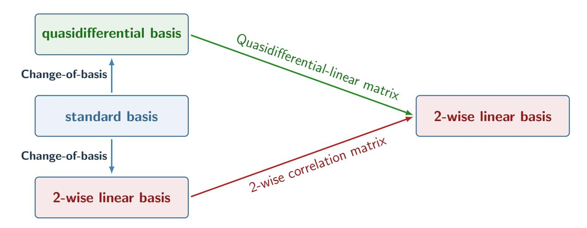
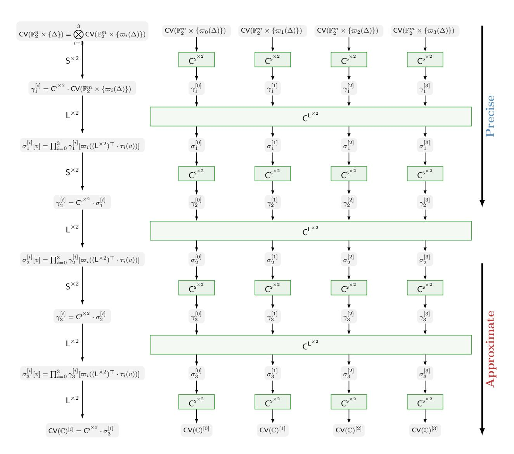
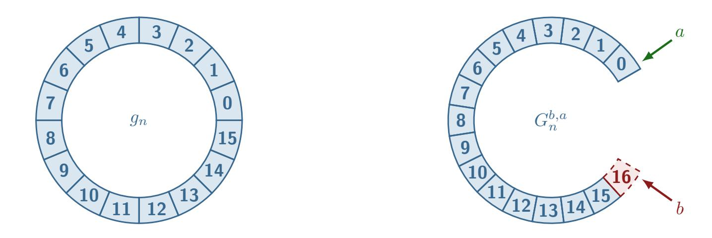
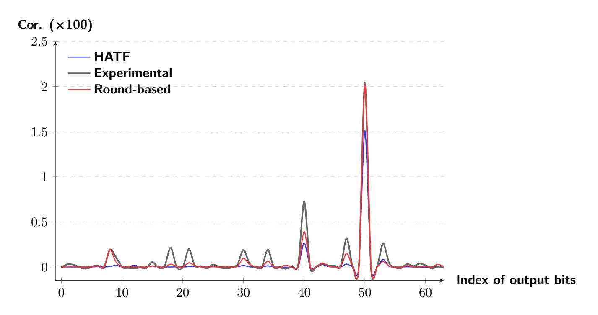
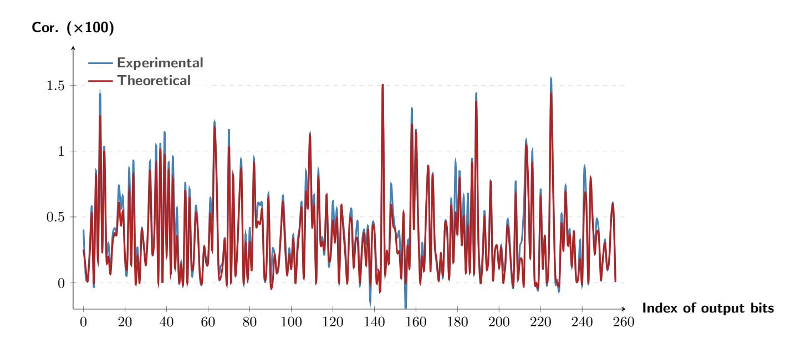
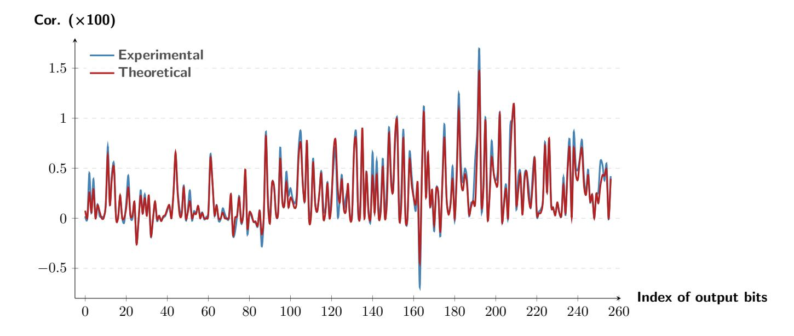

{0}------------------------------------------------

# Round-Based Approximation of (Higher-Order) Differential-Linear Correlation

# A Geometric Approach Perspective

Kai Hu1,3,4[0000−0003−3552−7200], Zhongfeng Niu2[0009−0009−6932−2116](B) , and Meiqin Wang1,3,5[0000−0003−1580−6544](B)

- <sup>1</sup> School of Cyber Science and Technology, Shandong University, Qingdao, China kai.hu@sdu.edu.cn, mqwang@sdu.edu.cn,
- <sup>2</sup> School of Physical and Mathematical Sciences, Nanyang Technological University, Singapore zhongfeng.niu@ntu.edu.sg
- <sup>3</sup> State Key Laboratory of Cryptography and Digital Economy Security, Shandong University, Qingdao, China
  - <sup>4</sup> Suzhou Research Institute, Shandong University, Suzhou, 215123, China <sup>5</sup> Quan Cheng Shandong Laboratory, Jinan, China

Abstract. This paper presents a new method for approximating the correlations of differential-linear distinguishers. From the perspective of Beyne's geometric approach, the differential-linear correlation is a corresponding coordinate of the correlation vector associated with the ciphertext multiset, which can be obtained by using the correlation matrix of the 2-wise form of the cipher. The composite nature of the correlation matrix leads to a round-based approach to approximate the correlation vector. This simple approximation is remarkably precise, yielding the most accurate estimation for differential-linear correlations in Ascon thus far and the first DL distinguishers for 6-round Ascon-128a initialization. For Present, we present 17-round DL distinguishers, 4 rounds longer than the current record. To apply the round-based approach to ciphers with the large Chi (χ) function as nonlinear functions, we derive theorems to handle the correlation propagation for χ and its 2-wise form. Strong DL distinguishers for up to 6 rounds of Subterranean-2.0 and Koala-p are provided, 2 rounds longer than the previous differential and linear distinguishers. Furthermore, the round-based approximation idea is also extended to the higher-order differential-linear distinguishers. We give the first second-order DL distinguisher for 6-round Ascon-128 initialization and the first second-order DL distinguishers for up to 7 rounds of Subterranean-2.0 and Koala-p.

Keywords: Differential-linear · Geometric approach · Round-based · Ascon· Subterranean-2.0· Koala-p

# <span id="page-0-0"></span>1 Introduction

Differential-linear (DL) cryptanalysis was proposed by Langford and Hellman in 1994 [\[25\]](#page-31-0) to combine the two most effective cryptanalysis techniques: differential [\[12\]](#page-29-0) and linear cryptanalysis [\[28\]](#page-31-1). In DL cryptanalysis, the adversary first 

{1}------------------------------------------------

finds a DL distinguisher where the correlation of a linear combination of the ciphertext difference bits under a fixed plaintext difference is significantly away from zero.

The classical method of detecting the DL distinguisher is to split the target cipher into two parts and combine a strong differential characteristic for the first part and a strong linear approximation for the second. This method is far from precise and sometimes even fails; thus, experimental computations are actually largely used to compute the real DL correlations for short rounds before. Since 2014, many theoretical methods have been proposed to enhance the precision of the DL correlation detection.

Related works. In [\[13,](#page-29-1)[14\]](#page-29-2), Blondeau, Leander, and Nyberg introduced a precise formula to compute the DL correlation, where the sole assumption is the independence between the two parts of the cipher. However, it requires enumerating all trails, which is computationally infeasible. Later, Bar-On et al. proposed the Differential-Linear Connectivity Table (DLCT) to handle the independence assumption [\[2\]](#page-28-0). The DLCT is applied to one layer of S-boxes to switch the difference to linear masks. Recently, Hadipour, Derbez and Eichlseder generalized the DLCT framework to multiple inner rounds, with building several kinds of tables [\[22\]](#page-30-0). Meanwhile, Peng et al. also proposed a similar approach, which propagates the input difference forward for several rounds with truncated differences and then connects them to a linear trail through the DLCT [\[31\]](#page-31-2).

In [\[27\]](#page-31-3), Liu, Lu and Lin found another way called Differential Algebraic Transitional Form (DATF) to detect the DL correlations. The correlations of intermediate state difference bits are estimated according to the algebraic normal forms (ANFs) of the round functions. The final DL correlation is estimated based on the intermediate difference bits. This technique was later applied to the higher-order differential-linear (HDL) attacks [\[11\]](#page-29-3) by Hu et al. [\[23\]](#page-30-1). Most recently, Che and Tian improved the DATF precision by proposing new bias estimation algorithms [\[16\]](#page-30-2).

These methods have been mainly applied to S-box based ciphers. For Addition-Rotation-XOR (ARX) ciphers, Niu et al. derived an exact differential-linear propagation for the modular addition operation [\[30\]](#page-31-4). Recently, Gong et al. proposed an hourglass(-like) structure to capture the effective DL distinguishers [\[34\]](#page-32-0). Regarding ciphers that utilize large Chi (χ) functions, there is a limited number of research approaches in DL cryptanalysis, let alone the HDL cryptanalysis.

Motivation. Beyne's geometric approach [\[3,](#page-28-1)[4,](#page-28-2)[5](#page-28-3)[,6\]](#page-29-4) is a meta-methodology for cryptanalysis, transforming cryptanalysis into linear algebra in high-dimensional spaces, thereby simplifying their conceptual complexity. This geometric approach framework has resolved many long-standing challenges. For instance, quasidifferential [\[7\]](#page-29-5) techniques enable the study of differential probabilities under fixed-key settings; ultrametric integral cryptanalysis [\[9,](#page-29-6)[10\]](#page-29-7) allows probing whether the sum of ciphertext bits is a multiple of p t (p is a prime and t is an integer); and a mixed-basis geometric approach [\[24\]](#page-30-3) can automatically search for distinguishers based on multiple-of-8 property [\[21\]](#page-30-4) with tools.

{2}------------------------------------------------

DL cryptanalysis has been incorporated into the geometric approach framework using a mixed-basis approach [\[24\]](#page-30-3). Theoretically, the exact DL correlation can be obtained by enumerating all differential-linear trails. However, due to the exceedingly weak correlation of individual trails, exhaustive enumeration is practically infeasible even for relatively simple ciphers. For example, Hu et al. performed trail enumeration for 7-round Simeck-32 and 8-round Simeck-48, confirming two DL distinguishers with correlation 1 previously reported by Hadipour et al. in [\[22\]](#page-30-0). Yet, for ciphers with more rounds or larger state sizes (e.g., Simeck-64), their method becomes computationally prohibitive. This reveals the inadequacy of trail-based geometric approaches for DL attacks, necessitating the development of new approximation techniques for estimating DL correlations.

Our contributions. We begin by proposing a novel perspective for understanding DL correlations from the viewpoint of the geometric approach: the DL correlation corresponds to a coordinate of the correlation vector (Definition [2\)](#page-7-0) of the ciphertext multiset. This correlation vector can be derived by multiplying the correlation matrix [\[17](#page-30-5)[,5\]](#page-28-3) of the 2-wise form (Definition [1\)](#page-6-0) of the cipher with the correlation vector of the plaintext multiset.

Leveraging the properties of correlation matrices within the geometric approach framework, we adopt a round-based approximation strategy to estimate the ciphertext correlation vector, thereby enabling the estimation of DL correlations. This round-based approach offers several advantages:

- 1. It is highly straightforward, requiring only simple matrix and vector operations. For an Substitution-Permutation Network (SPN) cipher with t parallel m-bit S-boxes, the complexity of the basic method is O(t × 2 <sup>3</sup><sup>m</sup>), allowing efficient correlation estimation within a short time.
- 2. It achieves high accuracy. With only minimal optimizations, we obtain the most precise and longest DL distinguishers known to date for both Ascon and Present. A detailed comparison with previous results is provided in Table [1.](#page-4-0)
- 3. It is theoretically sound, facilitating the estimation of DL correlations under fixed-key settings – an aspect often overlooked in prior work.

To extend this round-based approach to ciphers that utilize large χ, we derive exact propagation rules for the correlation of χ and its 2-wise form with a recursive matrix multiplication method. This enables the estimation of DL correlations for ciphers like Subterranean-2.0 and Koala, which employ large (257-bit) χ as nonlinear layers. We present 5-round and 6-round DL distinguishers for Subterranean-2.0 and Koala, surpassing the best previous differential and linear distinguishers by 2 rounds.

Furthermore, a similar methodology can be applied to HDL cryptanalysis. For an SPN cipher with t parallel m-bit S-boxes, the complexity of a d-th-order DL attack is O(t × 2 (2d+1)<sup>m</sup>). We report the first second-order DL distinguisher targeting the 6-round initialization phase of Ascon-128. The technique is also applied to large χ, yielding the first 7-round second-order DL distinguishers for both Subterranean-2.0 and Koala (in the black-box setting). These results are also summarized in Table [1.](#page-4-0)

{3}------------------------------------------------

Source codes. All sourse codes that can reproduce this paper's results are provided at https://github.com/hukaisdu/Round-based-approximation.git.

Organization of this paper. The remaining part of this paper is organized as follows. Section 2 introduces necessary background knowledge for understanding this paper. In Section 3, we present our round-based approximation approach. Section 4 gives the applications of the new approach to S-box based Ascon and Present. We show how to use the round-based approximation for ciphers with large  $\chi$  in Section 5 and Section 6. In Section 7, we give the results of our second-order DL distinguishers. Section 8 concludes the paper. In Appendix A, we give the theorems for HDL correlation approximation for both S-box and  $\chi$  functions.

# <span id="page-3-0"></span>2 Preliminaries

#### 2.1 Notations

4

In this paper, math italic alphabets represent vectors  $x \in \mathbb{S}^n$  for a positive integer n, where  $\mathbb{S}$  can be  $\mathbb{F}_2$  (the finite field containing 0 and 1) or  $\mathbb{R}$  (the real numbers) in this paper. The i-th coordinate of x is written as x[i], where x[0] is the leftmost element. The inner product of two vectors in  $\mathbb{F}_2^n$  is written as  $x^\top y = x^\top \cdot y = \sum_{i=0}^{n-1} x[i] \cdot y[i] \mod 2$ . The coordinate at the v-th row and u-th column of a matrix  $\mathbb{M} \in \mathbb{S}^{n \times n}$  is written as  $\mathbb{M}[v,u]$ , also called the (v,u)-coordinate. If the index of a vector or a matrix consists of d parts, we write the index in a bracket, like  $(v_0,v_1)$ . Thus, a coordinate of a matrix can be written like  $\mathbb{M}[(v_0,v_1),(u_0,u_1)]$ . In this paper, we do not distinguish between addition in  $\mathbb{R}$  and addition in  $\mathbb{F}_2$  in writing, as they can be naturally derived from the context.

Let n, m and t are three integers, where n = mt. If a vector  $\gamma \in \mathbb{R}^{2^n}$  can be decomposed into a Kronecker product of t small vectors in  $\mathbb{R}^{2^m}$ , we write these small vectors as  $\gamma^{[0]}, \gamma^{[1]}, \ldots, \gamma^{[t-1]} \in \mathbb{R}^{2^m}$ , i.e.,

$$\gamma = \bigotimes_{i=0}^{t-1} \gamma^{[i]} \quad \text{or} \quad \gamma[(v_0, v_1, \dots, v_{t-1})] = \prod_{i=0}^{t-1} \gamma^{[i]}[v_i].$$

For the sake of convenience, we introduce two maps to handle the change of indices.

**Projection maps.** For  $v = (v_0, v_1, \dots, v_{t-1}) \in \mathbb{F}_2^{mt}$ , a projection map is defined as

$$\varpi_i^t : \mathbb{F}_2^{mt} \to \mathbb{F}_2^m; \quad v \mapsto v_i$$

**Inclusion maps.** An inclusion map is defined as

$$\tau_i^t: \mathbb{F}_2^m \to \mathbb{F}_2^{mt}; \quad v \mapsto (0, \dots, v, \dots, 0) \quad (v \text{ is the } i\text{-th element, the length is } t).$$

If the information about t is clear from the context, we can omit t.

{4}------------------------------------------------

<span id="page-4-0"></span>Table 1: DL and HDL correlations detected by previous methods and our round-based method. All results here are without conditions. In [\[31\]](#page-31-2), a 6-round Ascon-128 initialization DL correlation was reported, but it has been found invalid [\[16,](#page-30-2)[33\]](#page-31-5). The entries marked with a ★ indicate that we obtained valid DL correlations for more rounds than prior work. TDT is short for Truncated Difference Distribution Table, the technique proposed in [\[31\]](#page-31-2). GDLCT is short for generalized DLCT, the technique presented in [\[22\]](#page-30-0).

| Target                                         |        | Rounds | Exp. Cor.           | Th. Cor.                                                  | Method                                    | Ref.                                       |
|------------------------------------------------|--------|--------|---------------------|-----------------------------------------------------------|-------------------------------------------|--------------------------------------------|
| Differential-linear distinguisher              |        |        |                     |                                                           |                                           |                                            |
| Ascon-128 init.                                | 4      |        | −1<br>2             | −5<br>2<br>−1.36<br>2<br>−1.09<br>2<br>−1<br>2<br>−1<br>2 | DLCT<br>ATF<br>HATF<br>TDT<br>Round-based | [2]<br>[27]<br>[23]<br>[31]<br>Section 4.1 |
|                                                | 5      |        | −8.94<br>2<br>−7.94 | −9.1<br>2<br>−8.94<br>2<br>−7.94                          | TDT<br>Round-based                        | [27]<br>Section 4.1                        |
|                                                |        | ★      | 2                   | 2<br>−23.89<br>2                                          | Round-based<br>Round-based                | Section 4.1                                |
| Ascon-128a init.<br>Ascon-p                    | 6<br>5 |        | –<br>−4.33<br>2     | −4.0<br>2<br>−4.21<br>2                                   | GDLCT<br>Round-based                      | Section 4.1<br>[22]<br>Section 4.1         |
|                                                |        |        | −7.61<br>2          | −6.83<br>2<br>−7.58<br>2                                  | GDLCT<br>Round-based                      | [22]<br>Section 4.1                        |
|                                                | 6      | ★      |                     | −21.89<br>−2                                              | Round-based                               | Section 4.1                                |
| Present                                        | 13     |        |                     | −27.01<br>2<br>−22.43<br>2                                | GDLCT<br>Round-based                      | [22]<br>Section 4.2                        |
|                                                |        | 17 ★   |                     | −29.76<br>2                                               | Round-based                               | Section 4.2                                |
| Subterranean-2.0 5                             |        | ★      | −7.88<br>−2         | −7.98<br>−2                                               | Round-based                               | Section 6.1                                |
|                                                | 6      | ★      |                     | −20.09<br>2                                               | Round-based                               | Section 6.1                                |
| Koala-p                                        | 5      | ★      | −6.73<br>2          | −6.87<br>2                                                | Round-based                               | Section 6.2                                |
|                                                | 6      | ★      |                     | −21.42<br>2                                               | Round-based                               | Section 6.2                                |
| Second-order differential-linear distinguisher |        |        |                     |                                                           |                                           |                                            |
| Ascon-128 init.                                | 5      |        | −5.60<br>2          | −6.05<br>2<br>−5.63<br>2                                  | HATF<br>Round-based                       | [23]<br>Section 7.1                        |
|                                                | 6      | ★      |                     | −45.35<br>2                                               | Round-based                               | Section 7.1                                |
| Subterranean-2.0 5                             |        | ★      | −6.05<br>2          | −6.05<br>2                                                | Round-based                               | Section 7.2                                |
|                                                | 7      | ★      |                     | −90.99<br>2                                               | Round-based                               | Section 7.2                                |
| Koala-p                                        | 5      | ★      | −5.89<br>2          | −6.09<br>2                                                | Round-based                               | Section 7.3                                |
|                                                | 7      | ★      |                     | −86.24<br>2                                               | Round-based                               | Section 7.3                                |

{5}------------------------------------------------

When the index element is a tuple,  $\varpi$  and  $\tau$  work parallelly for each element in the tuple. For example, for  $v = ((v_{0,0}, v_{0,1}), (v_{1,0}, v_{1,1}), \dots, (v_{t-1,0}, v_{t-1,1})),$ 

$$\varpi_i^t(v) = (v_{i,0}, v_{i,1})$$

and

$$\tau_i^t(\varpi_i^t(v)) = ((0,0), (0,0), \dots, (v_{i,0}, v_{i,1}), \dots, (0,0)).$$

Furthermore, the Kronecker delta function is used in this paper, which is defined as

$$\delta(x) = \begin{cases} 1, & \text{if } x = 0 \\ 0, & \text{otherwise.} \end{cases}$$

# 2.2 Differential-linear and higher-order differential-linear cryptanalysis

Differential-linear cryptanalysis was proposed by Langford and Hellman in 1994 [25]. For a cipher  $F: \mathbb{F}_2^n \to \mathbb{F}_2^n$ , let  $c = \mathsf{F}(p)$  and  $c' = \mathsf{F}(p')$ . Given a difference-mask pair  $(\Delta, \lambda)$  where  $p' = p + \Delta$ , the correlation of a DL approximation, denoted by  $\mathsf{DL}[\Delta \xrightarrow{\mathsf{F}} \lambda]$ , can be derived from the following equation

$$\mathsf{DL}[\Delta \xrightarrow{\mathsf{F}} \lambda] = \mathsf{Cor}[\lambda^{\top} \cdot (c \oplus c')] := 2^{-n} \sum_{x \in \mathbb{F}_2^n} (-1)^{\lambda^{\top}(\mathsf{F}(x) + \mathsf{F}(x + \Delta))}. \tag{1}$$

If  $\mathsf{DL}[\Delta \xrightarrow{\mathsf{F}} \lambda]$  is significantly different from 0, we can distinguish the cipher from a random permutation.

Inspired by DL cryptanalysis, Biham, Dunkelman, and Keller studied other kinds of combined attacks including the higher-order differential-linear cryptanalysis [11] that combines a higher-order differential distinguisher and a linear approximation. Suppose  $\Delta = (\Delta_0, \Delta_1, \dots, \Delta_{d-1})$  where all  $\Delta_i$ 's are linearly independent differences. Span( $\Delta$ ) represents the space that contains all linear combinations of components of  $\Delta$ . The HDL correlation for F with the input difference  $\Delta$  and output mask  $\lambda$ , denoted by HDL[ $\Delta \xrightarrow{\mathsf{F}} \lambda$ ], is defined as

$$\mathsf{HDL}[\boldsymbol{\Delta} \xrightarrow{\mathsf{F}} \lambda] = \mathsf{Cor}\left[\lambda^{\top} \left(\sum_{\theta \in \mathsf{Span}(\boldsymbol{\Delta})} \mathsf{F}(x+\theta)\right)\right] := 2^{-n} \sum_{x \in \mathbb{F}_2^n} (-1)^{\lambda^{\top} \sum_{\theta \in \mathsf{Span}(\boldsymbol{\Delta})} \mathsf{F}(x+\theta)} \tag{2}$$

### 2.3 Geometric approach

The geometric approach in cryptanalysis was proposed by Beyne [5,6] as a meta approach to think about various cryptanalyses. With this approach, the linear cryptanalysis [5], differential cryptanalysis [7], and integral cryptanalysis [8,9,10] have been reconsidered as special forms after the change-of-basis of a linear extension of the target cipher. Given a function  $F: \mathbb{F}_2^n \to \mathbb{F}_2^n$  (this paper does

{6}------------------------------------------------

not consider ciphers in characteristics larger than 2), the geometric approach first regards elements in  $\mathbb{F}_2^n$  as a set of basis vectors, denoted by  $\delta_u$  for  $u \in \mathbb{F}_2^n$ , and constructs a linear space with a field  $\mathbb{K}$ . The linear space is called a free vector space, defined as

$$\mathbb{K}[\mathbb{F}_2^n] := \left\{ \sum_{u \in \mathbb{F}_2^n} k_u \delta_u : k_u \in \mathbb{K} \right\}.$$

The linear extension of F is defined as

$$\mathsf{T}^\mathsf{F}: \mathbb{K}[\mathbb{F}_2^n] \to \mathbb{K}[\mathbb{F}_2^n]; \quad \sum_{u \in \mathbb{F}_2^n} k_u \delta_u \mapsto \sum_{u \in \mathbb{F}_2^n} k_u \delta_{\mathsf{F}(u)}.$$

If we regard  $\{\delta_u, u \in \mathbb{F}_2^n\}$  as the standard basis, the matrix of  $\mathsf{T}^\mathsf{F}$  can be written out. For the sake of simplicity, we also write this matrix as  $\mathsf{T}^\mathsf{F}$  which would not cause any problem in this paper. By choosing another basis, for example,  $\{\beta_u, u \in \mathbb{F}_2^n\}$ , that satisfies

$$(\delta_0, \delta_1, \dots, \delta_{2^n-1}) = (\beta_0, \beta_1, \dots, \beta_{2^n-1}) \mathsf{H}$$

where H is the change-of-basis matrix, we can do the change-of-basis operation on  $\mathsf{T}^\mathsf{F}$ . The new matrix similar to  $\mathsf{T}^\mathsf{F}$  is

$$C^{F} = H \cdot T^{F} \cdot H^{-1}.$$

When  $\mathbb{K} := \mathbb{R}$  and H is the Walsh-Hadamard matrix,  $\{\beta_u, u \in \mathbb{F}_2^n\}$  is called the linear basis [5], and  $\mathsf{C}^\mathsf{F}$  is called the *correlation matrix*. Note that the correlation matrix was for the first time introduced by Daemen, Govaerts, and Vandewalle in [17]. The (v, u)-coordinate of  $\mathsf{C}^\mathsf{F}$  is the famous expression used in linear cryptanalysis,

$$\mathsf{C}^{\mathsf{F}}[v,u] = 2^{-n} \sum_{x \in \mathbb{F}_2^n} (-1)^{u^{\top} x + v^{\top} \mathsf{F}(x)}. \tag{3}$$

The above analysis is applicable to any function. In [24], Hu et al. used the *order* of an attack to describe the number of messages in an attack sample. For example, in differential cryptanalysis, a pair of two messages is used for the attack, so it is a second-order attack. However, the term *order* has been heavily used for describing some attacks like the higher-order differential attack. To avoid such ambiguity, we rename it and reformulate it as follows,

<span id="page-6-0"></span>**Definition 1** (d-wise form of a function [24]). The d-wise form of a function  $F: \mathbb{F}_2^n \to \mathbb{F}_2^n$  is defined as

$$F^{\times d}: \mathbb{F}_2^{n \times d} \to \mathbb{F}_2^{n \times d}$$
$$(x, \theta_1, \theta_2, \dots, \theta_{d-1}) \mapsto (F(x), D_{\theta_1} F(x), \dots, D_{\theta_{d-1}} F(x)).$$

 $D_{\theta}F(x)$  is the derivative of F in the direction of  $\theta$  at the point x, i.e.,  $D_{\theta}F(x) = F(x) + F(x + \theta)$ .

{7}------------------------------------------------

Since  $F^{\times d}$  is also a function, we can apply the geometric approach to it. For example, considering the change-of-basis matrix as  $\bigotimes_{i=1}^d H$ , we obtain

$$\mathsf{C}^{\mathsf{F}^{\times d}} = \left(\bigotimes_{i=0}^{d-1} H\right) \cdot \mathsf{T}^{\mathsf{F}^{\times d}} \cdot \left(\bigotimes_{i=0}^{d-1} H\right)^{-1} = \left(\bigotimes_{i=0}^{d-1} H\right) \cdot \mathsf{T}^{\mathsf{F}^{\times d}} \cdot \left(\bigotimes_{i=0}^{d-1} H^{-1}\right),$$

where  $\bigotimes$  is the Kronecker product.  $C^{\mathsf{F}^{\times d}}$  is called the correlation matrix of  $\mathsf{F}^{\times d}$ or the d-wise correlation matrix of F. The corresponding basis is called the d-wise linear basis.

The coordinates of  $C^{F^{\times d}}$  are indexed by d-tuples, such as

$$\mathsf{C}^{\mathsf{F}^{\times d}}[(v_0,\ldots,v_{d-1}),(u_0,\ldots,u_{d-1})] = 2^{-dn} \sum_{x,\theta_1,\ldots,\theta_{d-1}} (-1)^{u_0^\top x + v_0^\top \mathsf{F}(x) + \sum_{j=1}^{d-1} u_j^\top \theta_j + v_j^\top \mathsf{D}_{\theta_j} \mathsf{F}(x)}$$

For the sake of convenience, we sometimes use the bold alphabet  $\mathbf{u} = (u_0, \dots, u_{d-1})$ and  $\mathbf{v} = (v_0, \dots, v_{d-1})$  to represent the indices.

<span id="page-7-2"></span>**Theorem 1** ([5]). The correlation matrix has the following properties.

- (1) If F is a r-round composite function  $F = F_{r-1} \circ F_{r-2} \circ \cdots \circ F_0$ ,  $C^F = \prod_{i=0}^{r-1} C^{F_i}$ (2) If F is a parallel application of t small functions  $F = f||f|| \cdots ||f|| C^F = f||f|| C^F$
- $\bigotimes_{i=0}^{t-1} C^f$ , where  $\bigotimes$  is the Kronecker product.

#### <span id="page-7-1"></span>Round-Based Approximation 3

This section presents our main idea for efficiently and precisely approximating DL correlations. From the perspective of the geometric approach, the correlation of a DL distinguisher can be understood as a coordinate of a vector associated with the ciphertext under the 2-wise linear basis.

Previous work, notably by Hu et al. [24], utilized a mix-basis framework – employing a quasidifferential basis for the plaintext and a 2-wise linear basis for the ciphertext. A major drawback of this approach is its reliance on clustering a vast number of DL trails, a process that is often inefficient and computationally expensive.

In contrast, we propose a more efficient same-basis approach. As illustrated in Figure 1, we apply the 2-wise linear basis consistently to both the plaintext and ciphertext. This allows us to derive a 2-wise correlation matrix that linearly maps the (correlation) vector associated with the plaintext to the vector associated with the ciphertext. Leveraging the composite property of this correlation matrix (Theorem 1), we can efficiently approximate the correlation for each intermediate round state.

#### Correlation vector and correlation matrix 3.1

<span id="page-7-0"></span>We begin by defining the correlation vector of a multiset, which is the vector that represents the multiset under the linear basis.

{8}------------------------------------------------

<span id="page-8-0"></span>

Fig. 1: Two different methods of handling the DL attacks.

**Definition 2 (Correlation vector of a multiset).** The correlation vector of a multiset  $\mathbb{S}$  whose values are taken from  $\mathbb{F}_2^n$  is a vector  $\mathsf{CV}(\mathbb{S}) \in \mathbb{R}[\mathbb{F}_2^n]$  whose u-th coordinate is

$$\mathsf{CV}(\mathbb{S})[u] = \frac{1}{|\mathbb{S}|} \sum_{x \in \mathbb{S}} (-1)^{u^{\top} x}.$$

Consider a function  $F: \mathbb{F}_2^n \to \mathbb{F}_2^n$ . Let the input multiset be  $\mathbb{P}$  and the output multiset be  $\mathbb{C}$ , denoted by  $\mathbb{C} = \mathsf{F}(\mathbb{P})$ , and  $\mathsf{C}^\mathsf{F}$  be the correlation matrix of  $\mathsf{F}$ .

<span id="page-8-1"></span>**Lemma 1.** The correlation vectors of  $\mathbb{P}$  and  $\mathbb{C}$  satisfy

$$\mathsf{CV}(\mathbb{C}) = \mathsf{C}^F \cdot \mathsf{CV}(\mathbb{P}).$$

*Proof.* According to [5], the (v, u)-coordinate of  $C^{\mathsf{F}}$  is

$$\mathsf{C}^{\mathsf{F}}[v,u] = 2^{-n} \sum_{x \in \mathbb{F}_2^n} (-1)^{u^{\top} x + v^{\top} \mathsf{F}(x)}.$$

For each coordinate of  $CV(\mathbb{C})$ , we have

$$\begin{split} (\mathsf{C}^\mathsf{F} \cdot \mathsf{CV}(\mathbb{P}))[v] &= \sum_{u \in \mathbb{F}_2^n} \mathsf{C}^\mathsf{F}[v, u] \cdot \mathsf{CV}(\mathbb{P})[u] \\ &= \sum_{u \in \mathbb{F}_2^n} \left( 2^{-n} \sum_{x \in \mathbb{F}_2^n} (-1)^{u^\top x + v^\top \mathsf{F}(x)} \right) \cdot \left( \frac{1}{|\mathbb{P}|} \sum_{y \in \mathbb{P}} (-1)^{u^\top y} \right) \\ &= \frac{1}{|\mathbb{P}|} \sum_{x \in \mathbb{F}_2^n} \sum_{y \in \mathbb{P}} (-1)^{v^\top \mathsf{F}(x)} \left( 2^{-n} \sum_{u \in \mathbb{F}_2^n} (-1)^{u^\top (x+y)} \right) \\ &= \frac{1}{|\mathbb{P}|} \sum_{x \in \mathbb{P}} (-1)^{v^\top \mathsf{F}(x)} = \frac{1}{|\mathbb{C}|} \sum_{z \in \mathbb{C}} (-1)^{v^\top z} = \mathsf{CV}(\mathbb{C})[v]. \end{split}$$

{9}------------------------------------------------

**Remark.** Lemma 1 is not completely new. In [17], Daemen et al. introduced the correlation matrix to transform correlations of boolean functions. In [3], the correlation matrix was used by Beyne to transform two probability mass functions. All three forms including Lemma 1 are essentially the same. It is crucial to note that Lemma 1 applies to any multiset and function, including the function's d-wise forms. This generality is vital to our new approach, yet it was not stressed in [17,3].

Let the input difference and output mask of a DL attack be  $\Delta$  and  $\lambda$ , respectively. The input multiset in the DL circumstance is  $\mathbb{P} = \mathbb{F}_2^n \times \{\Delta\}$ , and  $\mathbb{C} = \mathsf{F}^{\times 2}(\mathbb{P})$ . It is easy to check that the DL correlation of  $\mathsf{F}$  is the  $(0,\lambda)$ -coordinate of  $\mathsf{CV}(\mathbb{C})$ , i.e.,

$$\mathsf{DL}[\Delta \xrightarrow{\mathsf{F}} \lambda] = \mathsf{CV}(\mathbb{C})[(0,\lambda)] = 2^{-n} \sum_{x \in \mathbb{F}_2^n, \theta = \Delta} (-1)^{\lambda^\top \mathsf{D}_\theta \mathsf{F}(x)}$$

In terms of modern ciphers, usually F as well as  $F^{\times 2}$  is composite, i.e.,

$$\mathsf{F}^{\times 2} = \mathsf{F}_{r-1}^{\times 2} \circ \cdots \circ \mathsf{F}_{1}^{\times 2} \circ \mathsf{F}_{0}^{\times 2}.$$

Thus, according to Theorem 1(1),

$$C^{\mathsf{F}^{\times 2}} = C^{\mathsf{F}^{\times 2}_{r-1}} \cdots C^{\mathsf{F}^{\times 2}_{1}} \cdot C^{\mathsf{F}^{\times 2}_{0}}.$$

Denoting  $\sigma_0 = \mathsf{CV}(\mathbb{P})$  and  $\sigma_i = \mathsf{C}^{\mathsf{F}_{i-1}^{\times 2}} \cdots \mathsf{C}^{\mathsf{F}_0^{\times 2}} \mathsf{CV}(\mathbb{P})$  for  $1 \leq i \leq r$ , we introduce a method to approximate  $\sigma_i$  from  $\sigma_{i-1}$ , with which we can ultimately approximate  $\mathsf{CV}(\mathbb{C})$ .

### 3.2 DL correlation approximation

We, by default, assume that our target is a typical SPN cipher with block size n. The round approximation is naturally applicable to other cipher structures, but left as future work. While reading this section, we recommend that the reader also refer to Figure 2.

A typical round function of SPN ciphers  $\mathsf{F}_i$  consists of an S-box layer  $\mathsf{S}: \mathbb{F}_2^{m \times t} \to \mathbb{F}_2^{m \times t} = \mathsf{s}|| \cdots ||\mathsf{s} \text{ where } \mathsf{s}: \mathbb{F}_2^m \to \mathbb{F}_2^m \text{ and a linear operation } \mathsf{L}: \mathbb{F}_2^n \to \mathbb{F}_2^n,$  denoted by  $\mathsf{F}_i = \mathsf{L} \circ \mathsf{S}$ . The 2-wise form of  $\mathsf{F}$  is

$$\mathsf{F}_i^{\times 2} = \mathsf{L}^{\times 2} \circ \mathsf{S}^{\times 2} = \mathsf{L}^{\times 2} \circ (\mathsf{s}^{\times 2}||\cdots||\mathsf{s}^{\times 2}).$$

In the following, we let  $\gamma_{i+1} = \mathsf{C}^{\mathsf{S}^{\times 2}} \sigma_i$  for  $i \geq 0$  and  $\sigma_i = \mathsf{C}^{\mathsf{L}^{\times 2}} \gamma_i$  for  $i \geq 1$ , i.e.,

$$\mathsf{CV}(\mathbb{P}) = \sigma_0 \xrightarrow{\mathsf{C}^{\mathsf{S}^{\times 2}}} \gamma_1 \xrightarrow{\mathsf{C}^{\mathsf{L}^{\times 2}}} \sigma_1 \to \cdots \to \sigma_{r-1} \xrightarrow{\mathsf{C}^{\mathsf{S}^{\times 2}}} \gamma_r = \mathsf{CV}(\mathbb{C}).$$

$$\mathsf{CV}(\mathbf{X}) = \sigma_0 \xrightarrow{\mathsf{C}^{\mathsf{F}_1}} \sigma_1 \xrightarrow{\mathsf{C}^{\mathsf{F}_2}} \cdots \xrightarrow{\mathsf{C}^{\mathsf{F}_r}} \sigma_r = \mathsf{CV}(\mathbf{C})$$

We describe how to compute/approximate  $\gamma_i$  and  $\sigma_i$  round by round until  $\mathsf{CV}(\mathbb{C})$ .

{10}------------------------------------------------

**Precise computation for S**<sup> $\times 2$ </sup>. Since  $\mathbb{P} = \mathbb{F}_2^n \times \{\Delta\}$ ,  $\mathsf{CV}(\mathbb{P})$  can be represented by a Kronecker product of t component vectors,

$$\sigma_0 = \mathsf{CV}(\mathbb{P}) = \bigotimes_{i=0}^{t-1} \mathsf{CV}(\mathbb{F}_2^m \times \{\varpi_i(\Delta)\}) = \bigotimes_{i=0}^{t-1} \sigma_0^{[i]}.$$

According to Theorem 1(2),  $C^{S^{\times 2}} = \bigotimes_{i=0}^{t-1} C^{S^{\times 2}}$ , thus

<span id="page-10-1"></span><span id="page-10-0"></span>
$$\gamma_1 = \bigotimes_{i=0}^{t-1} \mathsf{C}^{\mathsf{s}^{\times 2}} \cdot \bigotimes_{i=0}^{t-1} \sigma_0^{[i]} = \bigotimes_{i=0}^{t-1} \mathsf{C}^{\mathsf{s}^{\times 2}} \cdot \sigma_0^{[i]}. \tag{4}$$

Note that all coordinates of  $\gamma_1$  are precisely obtained in this step.

A straightforward implementation for computing  $\gamma_1$  with Equation (4) requires  $\mathcal{O}(t \times 2^{4m})$  computations. However, the coordinates of  $\mathsf{C}^{\mathsf{s}^{\times 2}}$  have the following property,

**Proposition 1.** 
$$C^{s^{\times 2}}[(v_0, v_1), (u_0, u_1)] = C^s[v_0 + v_1, u_0 + u_1]C^s[v_1, u_1]$$

*Proof.* Recall that  $s^{\times 2}:(x,\theta)\mapsto (s(x),\mathsf{D}_{\theta}s(x)).$  Let  $x'=x+\theta$ .

$$\mathsf{C}^{\mathsf{s}^{\times 2}}[(v_0, v_1), (u_0, u_1)] = 2^{-2n} \sum_{x, \theta \in \mathbb{F}_2^n} (-1)^{u_0^\top x + u_1^\top \theta + v_0^\top \mathsf{s}(x) + v_1^\top (\mathsf{s}(x) + \mathsf{s}(x + \theta))}$$

$$= \left(2^{-n} \sum_{x \in \mathbb{F}_2^n} (-1)^{(u_0^\top + u_1^\top)x + (v_0^\top + v_1)\mathsf{s}(x)}\right) \left(2^{-n} \sum_{x' \in \mathbb{F}_2^n} (-1)^{u_1^\top x' + v_1^\top \mathsf{s}(x')}\right)$$

$$\left( \sum_{x \in \mathbb{F}_{2}^{n}} \right) \\
= \mathsf{C}^{\mathsf{s}}[v_{0} + v_{1}, u_{0} + u_{1}] \mathsf{C}^{\mathsf{s}}[v_{1}, u_{1}].$$

 $= C[v_0 + v_1, u_0 + u_1]C[v_1, u_1]$ 

For  $0 \le i < t$ ,

$$\begin{split} \gamma_1^{[i]}[(v_0,v_1)] &= \sum_{u_0,u_1} \mathsf{C}^{\mathsf{s}^{\times 2}}[(v_0,v_1),(u_0,u_1)] \cdot \sigma_0^{[i]}[(u_0,u_1)] \\ &= \sum_{u_1} \mathsf{C}^{\mathsf{s}}[v_1,u_1] \sum_{u_0} \mathsf{C}^{\mathsf{s}}[v_0+v_1,u_0+u_1] \cdot \sigma_0^{[i]}[(u_0,u_1)]. \end{split}$$

We can use a vector with  $(v_0+v_1,u_1)$  as the index, denoted by  $\xi$ , to store the result of  $\sum_{u_0} \mathsf{C}^{\mathsf{s}}[v_0+v_1,u_0+u_1] \cdot \sigma_0^{[i]}[(u_0,u_1)]$  for all possibilities of  $v_0+v_1$  and  $u_1$  at the first step. In the second step, we use a vector  $\xi'$  with  $(v_0+v_1,v_1)$  as the index to store  $\sum_{u_1} \mathsf{C}^{\mathsf{s}}[v_1,u_1]\xi[v_0+v_1,u_1]$ . Finally,  $\gamma_1^{[i]}[(v_0,v_1)]=\xi'[(v_0+v_1,v_1)]$ . The time complexity is reduced to  $\mathcal{O}(t\times 2^{3m})$ .

Heuristic approximation for  $L^{\times 2}$ . Now we compute  $\sigma_1 = C^{L^{\times 2}} \cdot \gamma_1$ , where

$$\sigma_1 = \mathsf{C}^{\mathsf{L}^{\times 2}} \cdot \left(\bigotimes_{i=0}^{t-1} \gamma_1^{[i]}\right)$$

{11}------------------------------------------------

12

Unfortunately,  $C^{L^{\times 2}}$  cannot be written as a Kronecker product of smaller matrices with the same alignment of the S-boxes, so we have to handle  $C^{L^{\times 2}} \in \mathbb{R}^{2^{2n} \times 2^{2n}}$  as a whole. Actually, we have no precise means to compute  $\sigma_1$  due to the huge time complexity, so we have to introduce a heuristic approximation.

From the correlation matrix property [17,5], we know that  $\sigma_1[v] = \gamma_1[(\mathsf{L}^{\times 2})^{\top}v]^6$ . To approximate the value of  $\gamma_1[(\mathsf{L}^{\times 2})^{\top}v]$ , we need the following assumption.

<span id="page-11-1"></span>**Assumption 1** For any  $v \in \mathbb{F}_2^{2m \times t}$  and  $\varphi \in \mathbb{R}[\mathbb{F}_2^{2m \times t}]$ 

$$\varphi[v] \approx \prod_{i=0}^{t-1} \varphi[\tau_i(\varpi_i(v))]$$

is a good approximation. Equivalently, there exist t vectors  $\varphi^{[0]}, \varphi^{[1]}, \dots, \varphi^{[t-1]} \in \mathbb{R}[\mathbb{F}_2^{2m}]$  that satisfy

$$\varphi \approx \bigotimes_{i=0}^{t-1} \varphi^{[i]}.$$

**Remark.** Assumption 1 holds if we assume that the S-boxes in a round are all independent. This independence is itself a consequence of the popular Markov assumption in cryptanalysis. Thus, the introduction of Assumption 1 is natural. In fact, Assumption 1 is weaker than the Markov assumption, as it is also a consequence of the Markov assumption.

With Assumption 1, for each index v of  $\sigma_1$  we have

$$\sigma_1[v] = \gamma_1[(\mathsf{L}^{\times 2})^\top v] \approx \prod_{i=0}^{t-1} \gamma_1 \left[ \tau_i(\varpi_i((\mathsf{L}^{\times 2})^\top v)) \right] = \prod_{i=0}^{t-1} \gamma_1^{[i]} \left[ \varpi_i((\mathsf{L}^{\times 2})^\top v) \right].$$

Since  $\gamma_1^{[i]} \left[ \varpi_i((\mathsf{L}^{\times 2})^\top v) \right]$  has been obtained from the S-box layer,  $\sigma_1[v]$  can be obtained too. However, the problem is that it is impossible to compute all indices  $v \in \mathbb{F}_2^{2n}$ . Our method is to compute coordinates for all  $\sigma_1^{[i]}$  as follows,

$$\mathbb{I} = \left\{ \sigma_1[\tau_i(w)] : w \in \mathbb{F}_2^{2m}, 0 \le i < t \right\}.$$

and use these coordinates to approximate any  $\sigma_1[v]$  based on Assumption 1. The reason for selecting these coordinates is that they allow us to proceed with the calculation of the S-boxes in the next step. Concretely,

$$\sigma_1 = \bigotimes_{i=0}^{t-1} \sigma_1^{[i]}$$
 or  $\sigma_1[v] = \prod_{i=0}^{t-1} \sigma_1^{[i]}[\varpi_i(v)].$ 

Since  $\mathsf{L}^{\times 2}: (x,\theta) \mapsto (\mathsf{L}(x),\mathsf{L}(\theta)), \ \mathsf{L}^{\times 2} = \mathsf{L} \otimes \mathsf{L}.$  Let  $v = (v_0,v_1), \ (\mathsf{L}^{\times 2})^\top v = (\mathsf{L}^\top v_0,\mathsf{L}^\top v_1).$  Thus, computing  $(\mathsf{L}^{\times 2})^\top v$  is easy. Consequently, the complexity

<span id="page-11-0"></span><sup>&</sup>lt;sup>6</sup> This property means that the input mask equals the transpose of the matrix multiplied by the output mask.

{12}------------------------------------------------

<span id="page-12-0"></span>

Fig. 2: Approximating DL correlation for a 4-round cipher without the last linear layer.

of this step is to compute all coordinates in  $\mathbb{I}$ , which requires  $\mathcal{O}(t \times 2^{2m+1})$  computations.

The whole algorithm. The approach introduced above enables us to iteratively compute  $\sigma_i$  and  $\gamma_i$  until  $\mathsf{CV}(\mathbb{C})$ . The whole approximation process is given in Algorithm 1. Figure 2 provides an illustration for a 4-round toy cipher with 4 S-boxes. Assumption 1 holds for  $\gamma_1$ , so the computation of  $\sigma_1^{[i]}$  as well as  $\gamma_2^{[i]}$  is precise. However, since

$$\sigma_2^{[i]}[w] = \sigma_2[\tau_i(w)] = \gamma_1[(\mathsf{L}^{\times 2})^\top \tau_i(w)] \approx \prod_{j=0}^{t-1} \gamma_1^{[j]} \left[ \varpi_j((\mathsf{L}^{\times 2})^\top \tau_i(w)) \right],$$

the computation after  $\sigma_2$  (inclusive) is approximate.

#### 3.3 Influence of the key-XOR

For block ciphers, between two consecutive round functions there is usually a key-XOR operation denoted by  $\mathsf{K}.$  In the fixed-key setting, the XORed key k is

{13}------------------------------------------------

<span id="page-13-0"></span>**Algorithm 1** Approximate the DL bias  $DL[\Delta \xrightarrow{\mathsf{F}} \lambda]$  for  $\mathsf{F} = \mathsf{F}_{r-1} \cdots \mathsf{F}_0$ ,  $\mathsf{F}_i = \mathsf{K} \circ \mathsf{L} \circ \mathsf{S}$ , where  $\mathsf{S} = \mathsf{s}||\cdots||\mathsf{s}$  is an S-box layer with t m-bit S-boxes.

```
1: procedure ApproxDL(\Delta, \lambda)
 2:
                for j from 0 to t-1 do
                       \sigma_0^{[j]} = \mathsf{CV}(\mathbb{F}_2^m \otimes \{\varpi_j(\Delta)\})
 3:
               for i from 1 to r do
 4:
                       for j from 0 to t-1 do
 5:
                              \gamma_i^{[j]} = \mathsf{C}^{\mathsf{s}^{\times 2}} \cdot \sigma_{i-1}^{[j]}
                                                                                                                                      \triangleright \text{ For } \mathsf{S}^{\times 2} = \mathsf{s}^{\times 2} || \cdots || \mathsf{s}^{\times 2} ||
 6:
 7:
                       for j from 0 to t-1 do
                              for w \in \mathbb{F}_2^m \times \mathbb{F}_2^m do \sigma_i^{[j]}[w] = \prod_{k=0}^{t-1} \gamma_i^{[k]}[\varpi_k((\mathsf{L}^{\times 2})^\top(\tau_j(w)))]
 8:
                                                                                                                                     \triangleright For the linear layer \mathsf{L}^{\times 2}
 9:
                       for j from 0 to t-1 do
10:
                               for (v_0, v_1) \in \mathbb{F}_2^m \times \mathbb{F}_2^m do
11:
                                       \sigma_i^{[j]}[(v_0, v_1)] = (-1)^{v_0^\top k} \sigma_i^{[j]}[(v_0, v_1)]

    ▷ Fixed-key/constant XOR/

12:
                       for j from 0 to t-1 do
13:
                              \mathbf{for} \ (v_0, v_1) \in \mathbb{F}_2^m \times \mathbb{F}_2^m \ \mathbf{do}
\sigma_i^{[j]}[(v_0, v_1)] = \begin{cases} 0, \ \text{if} \ v_0 \neq 0 \\ \sigma_i^{[j]}[(v_0, v_1)], \ \text{if} \ v_0 = 0 \end{cases}
14:
                                                                                                                                        ▷ Average-key key-XOR
15:
               \begin{array}{l} \sigma_r[(0,\lambda)] = \prod_{j=0}^{t-1} \sigma_i^{[j]}[(0,\varpi_j(\lambda))] \\ \mathbf{return} \ \sigma_r[(0,\lambda)] \end{array}
16:
17:
```

a constant, thus the 2-wise form of K can be written as

$$\mathsf{K}_k^{\times 2}: \mathbb{F}_2^n \times \mathbb{F}_2^n \to \mathbb{F}_2^n; (x, \theta) \to (x + k, \theta)$$

The correlation matrix of  $K_k^{\times 2}$  has the element

$$\mathsf{C}^{\mathsf{K}_{k}^{\times 2}}[(v_{0}, v_{1})(u_{0}, u_{1})] = 2^{-2n} \sum_{x \in \mathbb{F}_{2}^{n}, \theta \in \mathbb{F}_{2}^{n}} (-1)^{u_{0}^{\top} x + u_{1}^{\top} \theta + v_{0}^{\top} (x + k) + v_{1}^{\top} \theta}$$

$$= (-1)^{v_{0}^{\top} k} \left( 2^{-n} \sum_{x \in \mathbb{F}_{2}^{n}} (-1)^{(u_{0}^{\top} + v_{0}^{\top})x} \right) \left( 2^{-n} \sum_{\theta \in \mathbb{F}_{2}^{n}} (-1)^{(u_{1}^{\top} + v_{1}^{\top})\theta} \right)$$

$$= (-1)^{v_{0}^{\top} k} \delta(u_{0} + v_{0}) \delta(u_{1} + v_{1}).$$

Let 
$$\varphi = \mathsf{C}^{\mathsf{K}_k^{\times 2}} \sigma$$
, then

$$\varphi[(v_0, v_1)] = \sum_{u_0 \in \mathbb{F}_2^n, u_1 \in \mathbb{F}_2^n} (-1)^{v_0^\top k} \delta(v_0 + u_0) \delta(v_1 + u_1) \sigma[(u_0, u_1)] = (-1)^{v_0^\top k} \sigma[(v_0, v_1)].$$

This is to say, the values of key would solely cause a possible sign flip when copying the coordinates. Although this paper does not consider the fixed-key setting for block ciphers, this calculation is useful when handling the constant-XOR operation in cryptographic permutations like  ${\tt Subterranean-2.0}$  and  ${\tt Koala-}p$ , like what we will present in Section 6.

{14}------------------------------------------------

In the average-key setting, the key is regarded as a uniform variable.

$$\mathsf{K}^{\times 2}: \mathbb{F}_2^n \times \mathbb{F}_2^n \times \mathbb{F}_2^n \to \mathbb{F}_2^n \times \mathbb{F}_2^n; (x, \theta, k) \to (x + k, \theta).$$

The correlation matrix has the elements as

$$\begin{split} \mathsf{C}^{\mathsf{K}^{\times 2}}[(v_0,v_1),(u_0,u_1,u_k)] &= 2^{-3n} \sum_{x \in \mathbb{F}_2^n, \theta \in \mathbb{F}_2^n, k \in \mathbb{F}_2^n} (-1)^{u_0^\top x + u_1^\top \theta + u_k^\top k + v_0^\top (x+k) + v_1^\top \theta} \\ &= \delta(v_0 + u_k) \delta(v_0 + u_0) \delta(v_1 + u_1). \end{split}$$

Let φ = C K ×2 σ. Note that the round key is uniform and independent, thus σ = σ ′ ⊗ σ ′′ where σ ′ and σ ′′ are the correlation vectors of the data path and the round key, respectively. Therefore,

$$\varphi[(v_0, v_1)] = \sigma'[(v_0, v_1)] \cdot \sigma''[v_0].$$

Under the assumption that k is uniform,

$$\sigma''[v_0] = 2^{-n} \sum_{k \in \mathbb{F}_2^n} (-1)^{v_0^\top k} = \begin{cases} 1, & v_0 = 0, \\ 0, & v_0 \neq 0. \end{cases}$$

Consequently,

$$\varphi[(v_0, v_1)] = \begin{cases} 0, & v_0 \neq 0, \\ \sigma'[(v_0, v_1)], & v_0 = 0. \end{cases}$$

That is to say, when considering the DL attack, we do not need to consider the influence of values under the average-key setting for block ciphers.

We call v<sup>0</sup> the value mask, it is equivalent to say that we can safely set v<sup>0</sup> = 0 in our approximation.

# 3.4 Optimization for efficiency and precision

We have demonstrated that for block ciphers, the value mask (v0) can be consistently set to zero under the assumption of uniformly random and independent round keys. For permutations, however, no analogous assertion exists. Nevertheless, here we present an observation-based assumption: During the approximation process in our applications, the non-zero value mask exhibits a minimal effect on the approximation results.

In fact, most prior works on DL correlation detection rely on the Markov assumption, which is equivalent to setting the value mask to zero. As far as we know, only DATF and HATF incorporate the impact of values. However, upon inspecting their source code, we observed that the DL correlation remains unchanged even when value-related correlations in their implementations are forcibly set to zero. Furthermore, in our experiments, we observe that the correlations of the values are always zero (i.e., if the value mask is non-zero, the difference correlation is always zero). We therefore conclude this assumption is empirically justified. For clarity, we formally state this assumption:

{15}------------------------------------------------

<span id="page-15-2"></span>Assumption 2 (Zero value-mask assumption) At each step of our approximation, setting the value mask to zero exhibits no discernible impact on the approximation results.

Under Assumption [2,](#page-15-2) for both block ciphers and permutations, we can approximate the DL correlation by setting the value mask to zero. Consequently, for the correlation vector of each intermediate multiset, Assumption [1](#page-11-1) is easier to be true. If the intermediate multiset of the i-th round is X<sup>i</sup> = S × {∆i}, we can always obtain

$$\mathsf{CV}(\mathbb{X}_i)[0,v] = \prod_{i=0}^{t-1} \mathsf{CV}(\mathbb{S} \times \{\Delta_i\})^{[i]} [\varpi_i(0,v)].$$

Hence, we can extend the input difference ∆ over the first several rounds, to delay the failure timing of Assumption [1.](#page-11-1)

In practice, we split the r-round F into two parts: the first r1-round part and the second (r − r1)-round part, denoted by F = F<sup>2</sup> ◦ F1. The DL correlation of F is then calculated by

<span id="page-15-4"></span>
$$\mathsf{DL}[\Delta \xrightarrow{F} \lambda] = \sum_{\Delta'} \mathsf{Prob}[\Delta \xrightarrow{\mathsf{F}_1} \Delta'] \cdot \mathsf{DL}[\Delta' \xrightarrow{\mathsf{F}_2} \lambda] \tag{5}$$

For each ∆′ , Prob[∆ <sup>F</sup><sup>1</sup> −→ <sup>∆</sup>′ ] is the differential probability from ∆ to ∆′ over F1. For F2, we use our basic method to approximate the correlation of DL[∆′ <sup>F</sup><sup>2</sup> −→ <sup>λ</sup>].

# <span id="page-15-0"></span>4 Applications to S-box Based Primitives Ascon and Present

In this section, we apply the round-based approximation approach to Ascon [\[20\]](#page-30-6) and Present [\[15\]](#page-29-9). The DL properties of both primitives have been extensively checked in previous papers [\[22,](#page-30-0)[31\]](#page-31-2). With our method, for Ascon we have verified the previous results, with improvements in several DL correlation estimations. Considering that recently, NIST standardized Ascon based on Ascon-128a, we also provide DL distinguishers for Ascon-128a. Notably, we find a 6-round DL distinguisher for Ascon-128a with a correlation of 2 <sup>−</sup>23.<sup>89</sup>. For Present, we detect 17-round effective DL correlations, which is 4 rounds longer than previous best results in [\[22\]](#page-30-0).

# <span id="page-15-1"></span>4.1 More precise DL correlations of Ascon

Ascon initialization. In [\[19\]](#page-30-7), the designers of Ascon detected by experiments a 4-round DL correlation with 2 −1 correlation and a 5-round one with 2 −9 correlation[7](#page-15-3) . Later, several theoretical approaches [\[27,](#page-31-3)[23,](#page-30-1)[31\]](#page-31-2) have been developed to give approximations to the two experimental values, as shown in Table [1.](#page-4-0)

<span id="page-15-3"></span><sup>7</sup> With 2 <sup>34</sup> samples, our experiment shows that the correlation should be 2 −8.94 .

{16}------------------------------------------------

For all cases, our results are obtained by optimization for the first 2 rounds (Equation (5)). For Ascon-p, the probability for the differential part is computed in a normal way where we assume that all input bits are uniform. However, for Ascon initialization, the differential probability for the first round is computed after considering the initial value (IV) and the actual values. For example, the probability for the Ascon S-box Prob[3  $\rightarrow$  1] =  $\frac{4}{32}$  in the normal case becomes Prob[3  $\rightarrow$  1] =  $\frac{2}{8}$  if we force the first bit to be 1 (from the IV) and the last two bits to be equal (the case of DL Distinguisher II in Table 2 (Appendix C)).

Details of all DL distinguishers we obtained for Ascon are provided in Table 2 (Appendix C). Next, we introduce them one by one.

**DL** distinguisher I. For the simpler case of the 4-round Ascon initialization where the correlation is 1, most previous methods can provide meaningful estimations for this value. Until very recently, at CRYPTO 2024 [31], the TDT technique was the first one that could fully match the experimental values. Our approximation also matches it, giving the correlation 1.

**DL** distinguisher II. The 5-round Ascon initialization is more complicated. Dobraunig et al. reported a  $2^{-9}$  correlation for this distinguisher. However, our experiments show that this correlation is not stable until we use  $2^{34}$  samples. Our experimental correlation is  $2^{-8.94}$ . Before the TDT technique [31], all techniques cannot precisely approximate this DL correlation. The TDT technique estimated it as  $2^{-9.1}$ , while our approach approximates it as  $2^{-8.94}$ , showing advantages in precision.

In [19], Dobraunig et al. further reported that if they force the two nonce bits corresponding to the difference to be equal, the correlation would be improved to  $2^{-8}$ . With  $2^{34}$  samples, we checked that this correlation is  $2^{-7.94}$ . Our round-based approach well matches these experimental values, which is the only public theoretical result for this DL correlation.

**DL** distinguisher V. Previous papers usually focused solely on Ascon-128, where only the first 64 bits can be observed after the initialization phase. Recently, NIST finished the standardization of Ascon, where the Ascon-128a is taken. Different from Ascon-128, the first 128 bits of Ascon-128a can be observed, giving the adversary more flexibility. We apply our techniques to Ascon-128a, and detect a 6-round DL correlation with  $2^{-23.89}$ .

Ascon-p. In [22], Hadipour, Derbez and Eichlseder applied their general DLCT detection technique to Ascon-p. Different from the Ascon initialization case, the input difference can be selected arbitrarily. For 4-round Ascon-p, DL distinguishers with correlation 1 are found. Our approach can replay these results. For 5-round Ascon-p, we obtained more precise approximations compared to [22], as shown in Distinguishers III and IV in Table 2 (Appendix C).

**DL** distinguisher VI. We also checked the DL correlations for 6-round Ascon-p. The input values are assumed to be uniform values. With the same input difference as Distinguisher IV, we checked all output masks for single S-boxes. The best correlation we detected is  $2^{-21.89}$ , slightly better than the Ascon-128a case.

{17}------------------------------------------------

# <span id="page-17-1"></span>4.2 Longer DL distinguishers of Present

In [\[22\]](#page-30-0), Hadipour, Derbez and Eichlseder gave the best DL distinguishers for Present up to 13 rounds. By our round-based approximation, we verified their results up to 13 rounds, which confirms the correctness of our approach and codes. For up to 10 rounds, we did the experiments and found that our results are closer to the experimental values. For 11, 12 and 13 rounds, the correlation is too small to be verified with experiments. Our results are slightly larger than [\[22\]](#page-30-0), which presents better DL distinguishers for Present.

More importantly, our tool allows us to detect DL correlations up to 17 rounds, which are 4 rounds longer than [\[22\]](#page-30-0). These distinguishers are found by examining all single S-box cases for the input differences and output masks. All these distinguishers are provided in Table [4](#page-39-0) (Appendix [C\)](#page-7-1).

#### <span id="page-17-0"></span>5 Approximate Correlation Propagation for χ and χ ×2

The n-bit χ (n is an odd number larger than 1) function is defined as

$$\chi_n : \mathbb{F}_2^n \to \mathbb{F}_2^n; \quad (x_0, x_1, \dots, x_{n-1}) \mapsto (y_0, y_1, \dots, y_{n-1}),$$

where y<sup>i</sup> = x<sup>i</sup> + (xi+1 + 1)xi+2, and the indices are modulo n.

To apply our round-based approximation approach to ciphers with the χ function, we need to figure out the correlation propagation property of the χ function. When n is small, we can compute all coordinates of the input and output correlation vectors. When n is very large, however, it is infeasible. Thus, we have to use Assumption [1,](#page-11-1) i.e., we will only compute out a fraction of coordinates, and use them to approximate any coordinate.

We decompose the input and output of χ into bits, and assume their correlation vectors are the Kronecker product of small correlation vectors corresponding to 1 bit. In other words, each bit is treated like one S-box.

Let γ = C χ ×2 σ. With Assumption [1,](#page-11-1) we will assume that

<span id="page-17-2"></span>
$$\gamma = \bigotimes_{j=0}^{n-1} \gamma^{[j]} \quad \text{and} \quad \sigma = \bigotimes_{j=0}^{n-1} \sigma^{[j]}$$
 (6)

Similar to the discussions on the S-box layer, here we want to compute the following coordinates of γ

$$\mathbb{I} = \{ \gamma[\tau_i(w)] : w \in \mathbb{F}_2^2, i = 0, \dots, n-1 \}$$

from the coordinates of σ in

$$\mathbb{J} = \{ \sigma[\tau_i(w)] : w \in \mathbb{F}_2^2, i = 0, \dots, n-1 \}.$$

Note that the τi(·) (as well as the later ϖi(·)) operation in this section will take each bit as an S-box.

{18}------------------------------------------------

Unfortunately,  $\chi_n$  cannot be decomposed into n small parallel functions, thus we cannot handle the  $\chi_n$  function like the S-box layer directly. Inspired by a recursive matrix multiplication method for the modular addition [30], we introduce a new recursive matrix multiplication method to handle the  $\chi_n$  function, based on which we can handle the problem of approximating  $\gamma$ 's coordinates in  $\mathbb{I}$  from  $\mathbb{J}$ .

# 5.1 Correlation computation for $\chi$ and $\chi^{\times 2}$

Denote the correlation matrix of  $\chi_n$  by  $\mathsf{C}^{\chi_n}$ . We first give an approach for computing  $\mathsf{C}^{\chi_n}[v,u]$  based on a supportive function  $g_n$ . There is a linear term in  $\chi_n$ 's output bit. Omitting this linear term will bring convenience in our computation. Denote by  $1^n$  the vector whose all coordinates are 1. Let  $g_n(x) = (x+1^n) \bigwedge (x \ll 1)$ . We have

$$\chi_n(x) = x + (g_n(x) \lll 1).$$

<span id="page-18-1"></span>There is a direct connection between the coordinates between  $C^{\chi_n}$  and  $C^{g_n}$ .

**Lemma 2.** The coordinates of  $C^{\chi_n}$  and  $C^{g_n}$  have the following relationship,

$$C^{\chi_n}[v, u] = C^{g_n}[v \gg 1, v + u].$$

*Proof.* Let Cor(f) represent the correlation of f.

$$\begin{split} \mathsf{C}^{\chi_n}[v,u] &= \mathsf{Cor}[u^\top x + v^\top \chi_n(x)] = \mathsf{Cor}[u^\top x + v^\top (x + (g(x) \lll 1))] \\ &= \mathsf{Cor}[u^\top x + v^\top x + (v \ggg 1)^\top g_n(x)] = \mathsf{Cor}[(u^\top + v^\top)x + (v \ggg 1)^\top g_n(x)] \\ &= \mathsf{C}^{g_n}[v \ggg 1, u + v]. \end{split}$$

As a result, if we can compute the coordinates of  $C^{g_n}$ , we can compute the coordinate of  $C^{\chi_n}$ . Handling  $g_n$  is easier than handling  $\chi_n$ .

When dealing with the  $g_n$  function, the most troublesome aspect is that each bit is multiplied by the subsequent one, and they are cyclically linked. To address this, we first sever this connection by fixing the first bit and the bit following the last bit of a  $g_n$  function as constants. We define a circle-free version of  $g_n$ .

## **Definition 3.** We define

$$G_n^{b,a}: \mathbb{F}_2^n \to \mathbb{F}_2^n; \quad y = G_n(x)$$

where  $y[i] = (x[i] + 1)x[i + 1], 0 \le i < n \text{ and } x[0] = a, x[n] = b.$ 

Note that the indices are not modulo n for  $G_n^{b,a}$ . An illustration of  $G_n^{b,a}$  is provided in Figure 3. The reason we regard the input length of  $G_n^{b,a}$  as n rather than n+1 or n-1 is that we want it to have the same input as  $g_n$  in form.

<span id="page-18-0"></span>

{19}------------------------------------------------

<span id="page-19-0"></span>

Fig. 3: Breaking the circle of  $g_n$  for n = 16, we can address the troublesome circle structure by defining  $G_n^{b,a}$ .

<span id="page-19-2"></span>**Proposition 2.** Let  $C^{G_n^{b,a}}$  be the correlation matrix of  $G_n^{b,a}$ .

$$C^{g_n}[v,u] = C^{G_n^{0,0}}[v,u] + C^{G_n^{1,1}}[v,u].$$

*Proof.* For a pair of masks (v, u),

$$\begin{split} \mathsf{C}^{g_n}[v,u] &= 2^{-n} \sum_{x \in \mathbb{F}_2^n} (-1)^{u^\top x + v^\top g_n(x)} \\ &= \sum_{c \in \mathbb{F}_2} \frac{1}{2^n} \sum_{\substack{y[0] = y[n] = c \\ (y[1], \dots, y[n-1]) \in \mathbb{F}_2^{n-1}}} (-1)^{\sum_{i=0}^{n-1} u[i]y[i] + \sum_{i=0}^{n-1} v[i](y[i]+1)y[i+1]} \\ &= \mathsf{C}^{G_n^{0,0}}[v,u] + \mathsf{C}^{G_n^{1,1}}[v,u]. \end{split}$$

 $C^{G_n^{b,a}}$  has a chained property.

**Proposition 3.** Let n > 1,  $v'' = v||v', u'' = u||u' \in \mathbb{F}_2^{n+1}$  where  $u', v' \in \mathbb{F}_2$ . From  $C^{G_n^{c,a}}[v,u]$  we can get  $C^{G_{n+1}^{b,a}}[v'',u'']$  from the following formula,

<span id="page-19-1"></span>
$$C^{G_{n+1}^{b,a}}[v'',u''] = \frac{1}{2} \sum_{c \in \mathbb{F}_2} (-1)^{u'c+v'\bar{c}b} C^{G_n^{c,a}}[v,u].$$

*Proof.* According to Definition 3, when n = 1,  $y = G_1^{b,a}(x) = (a+1)b$ . Thus,

$$\mathsf{C}^{G_n^{b,a}}[v,u] = \frac{1}{2}(-1)^{ua+v(a+1)b}.$$

{20}------------------------------------------------

For n > 1,

$$\begin{split} \mathsf{C}^{G_{n+1}^{b,a}}[v'',u''] &= 2^{-(n+1)} \sum_{\substack{x[0]=a,x[n+1]=b\\ (x[1],\dots,x[n]) \in \mathbb{F}_2^n}} (-1)^{\sum_{i=0}^n u''[i]x[i] + \sum_{i=0}^n v''[i](x[i]+1)x[i+1]} \\ &= \frac{1}{2} \sum_{c \in \mathbb{F}_2} 2^{-n} \sum_{\substack{x[0]=a,x[n]=c,x[n+1]=b\\ (x[1],\dots,x[n-1]) \in \mathbb{F}_2^{n-1}}} (-1)^{\sum_{i=0}^{n-1} u[i]x[i] + \sum_{i=0}^{n-1} v[i](x[i]+1)x[i+1]} (-1)^{u'c+v'(c+1)b} \\ &= \frac{1}{2} \sum_{c \in \mathbb{F}_2} (-1)^{u'c+v'(c+1)b} \mathsf{C}^{G_n^{c,a}}[v,u]. \end{split}$$

According to different values of u' and v', we can write  $\frac{1}{2} \sum_{c \in \mathbb{F}_2} (-1)^{u'c+v'(c+1)b}$  into a matrix with c and b being the column and row indices. Therefore, we have the following lemma.

<span id="page-20-0"></span>**Lemma 3.** For the four possible values of  $v', u', a, b \in \mathbb{F}_2$ , we define a matrix  $M_{v',u'}$  whose (b,a)-coordinate is  $M_{v',u'}[b,a] = \frac{1}{2}(-1)^{u'a+v'(a+1)b}$ . According to the four possibilities of (v',u'), we obtain four matrices:

$$M_{0,0} = \frac{1}{2} \begin{bmatrix} 1 & 1 \\ 1 & 1 \end{bmatrix}, M_{0,1} = \frac{1}{2} \begin{bmatrix} 1 & -1 \\ 1 & -1 \end{bmatrix}, M_{1,0} = \frac{1}{2} \begin{bmatrix} 1 & 1 \\ -1 & 1 \end{bmatrix}, M_{1,1} = \frac{1}{2} \begin{bmatrix} 1 & -1 \\ -1 & -1 \end{bmatrix}.$$

 $C^{G_n^{b,a}}[v,u]$  can be computed as

$$C^{G_n^{b,a}}[v,u] = e_b^{\top} \left( \prod_{i=0}^{n-1} M_{v[i],u[i]} \right) e_a$$

where  $e_0 = [1, 0]^{\top}$  and  $e_1 = [0, 1]^{\top}$ .

*Proof.* It is obviously true for n = 1 from the definition of  $M_{v',u'}$ . For larger n, assume that the lemma is true for the n - 1 case. Let  $v, u \in \mathbb{F}_2^{n-1}$ , according to Proposition 3,

$$\begin{split} \mathsf{C}^{G_n^{b,a}}[v||v',u||v'] &= \frac{1}{2} \sum_{c \in \mathbb{F}_2} (-1)^{u'c+v'(c+1)b} \mathsf{C}^{G_{n-1}^{c,a}}[v,u] = \frac{1}{2} \sum_{c \in \mathbb{F}_2} e_b^\top M_{v',u'} e_c \mathsf{C}^{G_{n-1}^{c,a}}[v,u] \\ &= e_b^\top M_{v',u'} \sum_{c} e_c e_c^\top \left( \prod_{i=0}^{n-2} M_{v[i],u[i]} \right) e_a = e_b^\top \left( \prod_{i=0}^{n-1} M_{v[i],u[i]} \right) e_a. \end{split}$$

Note that  $\sum_{c} e_{c} e_{c}^{\top}$  is an identity matrix.

<span id="page-20-1"></span>**Lemma 4.** For the four possible values of  $v', u', a, b \in \mathbb{F}_2$ , we define a matrix  $M_{v',u'}$  whose (b,a)-coordinate is  $M_{v',u'}[b,a] = \frac{1}{2}(-1)^{u'a+v'(a+1)b}$ . According to the four possibilities of (v',u'), we obtain four matrices:

$$M_{0,0} = \frac{1}{2} \begin{bmatrix} 1 & 1 \\ 1 & 1 \end{bmatrix}, M_{0,1} = \frac{1}{2} \begin{bmatrix} 1 & -1 \\ 1 & -1 \end{bmatrix}, M_{1,0} = \frac{1}{2} \begin{bmatrix} 1 & 1 \\ -1 & 1 \end{bmatrix}, M_{1,1} = \frac{1}{2} \begin{bmatrix} 1 & -1 \\ -1 & -1 \end{bmatrix}.$$

{21}------------------------------------------------

 $C^{g_n}[v,u]$  can be computed as follows.

22

$$C^{g_n}[v,u] = \begin{bmatrix} 1 & 0 \end{bmatrix} \prod_{i=0}^{n-1} M_{v[i],u[i]} \begin{bmatrix} 1 \\ 0 \end{bmatrix} + \begin{bmatrix} 0 & 1 \end{bmatrix} \prod_{i=0}^{n-1} M_{v[i],u[i]} \begin{bmatrix} 0 \\ 1 \end{bmatrix}.$$

*Proof.* This lemma is a natural corollary of Proposition 2 and Lemma 3.

<span id="page-21-0"></span>**Proposition 4.** Denote  $e_0 = [1,0]^{\top}$  and  $e_1 = [0,1]^{\top}$ . Given  $\lambda_0, \lambda_1, \xi_0, \xi_1 \in \mathbb{F}_2^n$ , we have

$$C^{g_n}[\lambda_0, \lambda_1] \cdot C^{g_n}[\xi_0, \xi_1]$$

$$= \sum_{i=0}^{1} \sum_{i'=0}^{1} (e_i \otimes e_{i'})^{\top} \prod_{j=0}^{n-1} (M_{\lambda_0[j], \lambda_1[j]} \otimes M_{\xi_0[j], \xi_1[j]}) (e_i \otimes e_{i'})$$

*Proof.* Since  $C^{g_n}[\lambda_0, \lambda_1]$  and  $C^{g_n}[\xi_0, \xi_1]$  are two values, the multiplication of them is equivalent to the Kronecker product of them:

$$\mathsf{C}^{g_n}[\lambda_0,\lambda_1]\cdot\mathsf{C}^{g_n}[\xi_0,\xi_1]=\mathsf{C}^{g_n}[\lambda_0,\lambda_0]\otimes\mathsf{C}^{g_n}[\xi_0,\xi_1].$$

According to Lemma 4,

$$C^{g_{n}}[\lambda_{0}, \lambda_{1}] \otimes C^{g_{n}}[\xi_{0}, \xi_{1}]$$

$$= \sum_{i=0}^{1} e_{i}^{\top} \left( \prod_{j=0}^{n-1} M_{\lambda_{0}[j], \lambda_{1}[j]} \right) e_{i} \bigotimes \sum_{i'=0}^{1} e_{i'}^{\top} \left( \prod_{j=0}^{n-1} M_{\xi_{0}[j], \xi_{1}[j]} \right) e_{i'}$$

$$= \sum_{i=0}^{1} \sum_{i'=0}^{1} (e_{i} \otimes e_{i'})^{\top} \prod_{j=0}^{n-1} \left( M_{\lambda_{0}[j], \lambda_{1}[j]} \otimes M_{\xi_{0}[j], \xi_{1}[j]} \right) (e_{i} \otimes e_{i'}).$$

<span id="page-21-1"></span>**Theorem 2.** Denote  $e_0 = [1, 0]^{\top}$  and  $e_1 = [0, 1]^{\top}$ . The coordinates of  $C^{\chi^{\times 2}}$  can be computed as

$$C^{\chi_n^{\times 2}}[(v_0, v_1), (u_0, u_1)] = \sum_{i=0}^1 \sum_{i'=0}^1 (e_i \otimes e_{i'})^\top \prod_{j=0}^{n-1} (M_{v_0, v_1, u_0, u_1, j}^{\otimes}) (e_i \otimes e_{i'}),$$

where  $M_{v_0,v_1,u_0,u_1,j}^{\otimes} = M_{((v_0+v_1)\gg 1)[j],(u_0+u_1+v_0+v_1)[j]} \otimes M_{(v_1\gg 1)[j],(u_1+v_1)[j]}$ .

*Proof.* According to Proposition 1 and Lemma 2, we have

$$\mathsf{C}^{\chi_n^{\times 2}}[(v_0,v_1),(u_0,u_1)] = \mathsf{C}^{g_n}[(v_0+v_1) \ggg 1, u_0+u_1+v_0+v_1]\mathsf{C}^{g_n}[v_1 \ggg 1, u_1+v_1].$$

Replacing  $\lambda_0, \lambda_1, \xi_0, \xi_1$  with  $(v_0 + v_1) \gg 1, u_0 + u_1 + v_0 + v_1, v_1 \gg 1, u_1 + v_1$  respectively in Proposition 4, we finish the proof.

{22}------------------------------------------------

# 5.2 Compute coordinates in J from I

Based on Assumption [1,](#page-11-1)

$$\sigma[(u_0, u_1)] \approx \prod_{j=0}^{n-1} \sigma[\tau_j(\varpi_j(u_0, u_1))].$$

The coordinate γ[(v0, v1)] can be approximated by

$$\begin{split} &\gamma[(v_0,v_1)] = \sum_{(u_0,u_1) \in \mathbb{F}_2^{2^n}} \mathsf{C}^{\chi_2^{\times 2}}[(v_0,v_1),(u_0,u_1)] \cdot \sigma[(u_0,u_1)] \\ &= \sum_{(u_0,u_1) \in \mathbb{F}_2^{2^n}} \sum_{i=0}^1 \sum_{i'=0}^1 (e_i \otimes e_{i'})^\top \prod_{j=0}^{n-1} M_{v_0,v_1,u_0,u_1,j}^{\otimes} \cdot (e_i \otimes e_{i'}) \cdot \sigma[(u_0,u_1)] \\ &= \sum_{i=0}^1 \sum_{i'=0}^1 (e_i \otimes e_{i'})^\top \sum_{(u_0,u_1) \in \mathbb{F}_2^{2^n}} \prod_{j=0}^{n-1} M_{v_0,v_1,u_0,u_1,j}^{\otimes} \sigma[(u_0,u_1)] \cdot (e_i \otimes e_{i'}) \\ &= \sum_{i=0}^1 \sum_{i'=0}^1 (e_i \otimes e_{i'})^\top \sum_{(u_0,u_1) \in \mathbb{F}_2^{2^n}} \prod_{j=0}^{n-1} M_{v_0,v_1,u_0,u_1,j}^{\otimes} \prod_{j=0}^{n-1} \sigma[\tau_j(\varpi_j((u_0,u_1)))] \cdot (e_i \otimes e_{i'}) \\ &= \sum_{i=0}^1 \sum_{i'=0}^1 (e_i \otimes e_{i'})^\top \sum_{(u_0,u_1) \in \mathbb{F}_2^{2^n}} \prod_{j=0}^{n-1} (\sigma[\tau_j(\varpi_j((u_0,u_1)))] M_{v_0,v_1,u_0,u_1,j}^{\otimes}) \cdot (e_i \otimes e_{i'}). \end{split}$$

Note that for any two different indices j and j ′ , the two related coordinates σ[τ<sup>j</sup> (ϖ<sup>j</sup> ((u0, u1)))] and σ[τ<sup>j</sup> ′ (ϖ<sup>j</sup> ′ ((u0, u1)))] are indexed by two different unit vector tuples, thus independent of each other according to Equation [6.](#page-17-2) Consequently, we can swap the "P" and "Q " in the above formula. Finally, we obtain

$$\gamma[(v_0, v_1)] = \sum_{i=0}^{1} \sum_{i'=0}^{1} (e_i \otimes e_{i'})^{\top} \prod_{j=0}^{n-1} \sum_{u_0[j], u_1[j] \in \mathbb{F}_2} (\sigma[\tau_j(\varpi_j((u_0, u_1)))] M_{v_0, v_1, u_0, u_1, j}^{\otimes}) \cdot (e_i \otimes e_{i'}).$$

The above formula becomes handy to calculate. Therefore, from the knowledge of the coordinates in J, we can approximate any coordinates in I under Assumption [1.](#page-11-1) The complexity of computing each coordinate in J is a small constant; thus, the whole time complexity is O(n).

# <span id="page-22-0"></span>6 Applications to χ Based Ciphers

In this section, we apply the round-based approximation approach to Subterranean-2.0 [\[18\]](#page-30-8) and Koala-p [\[1\]](#page-28-4). Both permutations take χ<sup>257</sup> as their non-linear functions. Subterranean-2.0 is used in Subterranean-SAE, one of the second round

{23}------------------------------------------------

<span id="page-23-1"></span>

| Subterranean-2.0                                                                                | ${\tt Koala-}p$                                                                                                               |
|-------------------------------------------------------------------------------------------------|-------------------------------------------------------------------------------------------------------------------------------|
| $\rho_j = \pi \circ \theta \circ \iota_j \circ \chi$                                            | $\rho_j = \chi \circ \iota_j \circ \theta \circ \pi,$                                                                         |
| $\chi: s_i \leftarrow s_i + (s_{i+1} + 1) \land s_{i+2}$                                        | $\pi: s_i \leftarrow s_{121i},$                                                                                               |
| $\iota_j : s_i \leftarrow \begin{cases} s_i + 1 & i = 0, \\ s_i & \text{otherwise} \end{cases}$ | $\theta: s_i \leftarrow s_i + s_{i+3} + s_{i+10},$                                                                            |
| $c_j: s_i \leftarrow \begin{cases} s_i & \text{otherwise} \end{cases}$                          | $\iota_j : s_i \leftarrow \begin{cases} s_i + 1 & i = 0 \text{ and } j \notin \{2, 5, 6\} \\ s_i & \text{others} \end{cases}$ |
| $\theta: s_i \leftarrow s_i + s_{i+3} + s_{i+8},$                                               | $a_j \cdot s_i \leftarrow \Big) s_i$ others                                                                                   |
| $\pi: s_i \leftarrow s_{12i}.$                                                                  | $\chi: s_i \leftarrow s_i + (s_{i+1} + 1) \wedge s_{i+2}.$                                                                    |

Fig. 4: Round functions of Subterranean-2.0 and Koala-p.

candidates of the NIST LWC competition<sup>8</sup>. The designers gave differential characteristics of Subterranean-2.0 for up to 4 rounds. For up to 8 rounds, differential probability upper bounds were provided as arguments for its security. These bounds had been improved in [29] with a smart tree search strategy. As the algebraic degree of Subterranean-2.0 round functions is only 2, there are trivial cube distinguishers with  $2^{2^r+1}$  data complexity for r rounds. Thus, the trivial cube distinguishers can reach at most 7 rounds (8-round distinguisher will require  $2^{257}$  data complexity). If we set a restrict that only disjoint input bits are selected as cube variables, there are cube distinguishers with  $2^{2^{r-1}+1}$  data complexity for r rounds, but the data complexity in this case is at most  $2^{128}$ . Therefore, the cube distinguisher can only reach 7 rounds, too. Koala-p is adapted from Subterranean-2.0 by changing the order of round function components and parameters. Differential and linear characteristics and bounds were provided in their design document up to 8 rounds. There are also analyses of Subterranean-2.0 used in mode [26,32], but not relevant to this work.

With our round-based approximation approach, for Subterranean-2.0 and Koala-p, we find 6-round DL distinguishers, which are 2 rounds more than the previous best differential and linear distinguishers in [1,18] as shown in Table 3. All results in this section consider the effects of values, i.e., we work without considering Assumption 2.

**Description of Subterranean-2.0** and Koala-p. Subterranean-2.0 and Koala-p are both  $\mathbb{F}_2^{257} \to \mathbb{F}_2^{257}$  permutations with 8 rounds. Their round functions  $\rho$  are defined in Figure 4. For convenience, in this section, we use the support of a vector  $x \in \mathbb{F}_2^n$  to represent x. For example, if the support of x is  $\{i_1, i_2, \dots i_n\}$ , we write it as  $x := [i_1, i_2, \dots i_n]$ .

<span id="page-23-0"></span>https://csrc.nist.gov/Projects/Lightweight-Cryptography

{24}------------------------------------------------

### <span id="page-24-0"></span>6.1 Applications to Subterranean-2.0

5-round DL distinguisher. The best DL distinguisher for 5-round Subterranean-2.0 detected by our method is as follows,

$$[0] \xrightarrow[-2^{-7.98}]{\chi \circ \rho_3 \circ \rho_2 \circ \rho_1 \circ \rho_0} [128].$$

With  $2^{25}$  random samples, the experimental correlation is  $-2^{-7.88}$ .

6-round **DL** distinguisher. We did not find any DL distinguishers for 5 rounds with single difference bit with our basic approximation approach. Thus, we first derive a 2-round differential characteristic with a similar method in [18] as follows,

$$[0] \xrightarrow[2^{-2}]{\rho_0} [0, 64, 85] \xrightarrow[2^{-6}]{\rho_1} [0, 64, 85, 91, 155, 157, 176, 221, 242].$$

The reason for choosing this differential characteristic is to minimize the hamming weight of the difference after two rounds. Next, we apply the round-based approximation for the following 4 rounds, and found the following DL distinguisher

$$[0, 64, 85, 91, 155, 157, 176, 221, 242] \xrightarrow{\chi \circ \rho_4 \circ \rho_3 \circ \rho_2} [228].$$

Finally, We obtain a 6-round DL distinguisher,

$$[0] \xrightarrow[2^{-20.09}]{\chi \circ \rho \circ \rho \circ \rho \circ \rho \circ \rho} [228].$$

#### <span id="page-24-1"></span>6.2 Application to Koala-p

The first several operations of Koala-p round functions are linear ones, but we start with  $\chi$  similarly to what we did for Subterranean-2.0. This is reasonable as we are analyzing a permutation.

5-round **DL** distinguisher. The best DL distinguisher for 5-round **Subterranean**-2.0 detected by our method is as follows,

$$[0] \xrightarrow[2-6.87]{\rho_4 \circ \rho_3 \circ \rho_2 \circ \rho_1 \circ \chi} [105].$$

With  $2^{26}$  random samples, the experimental correlation is  $2^{-6.73}$ .

6-round **DL** distinguisher. Similarly to Subterranean-2.0, to construct a 6-round DL distinguisher, we first find a 2-round differential characteristic as follows:

$$[0] \xrightarrow[2^{-2}]{\iota_1 \circ \theta \circ \pi \circ \chi} [0, 247, 254] \xrightarrow[2^{-6}]{\iota_2 \circ \theta \circ \pi \circ \chi} [0, 77, 84, 87, 196, 203, 206, 247, 254].$$

We then apply the round-based approximation to the following 4 rounds, and obtain a DL distinguisher,

$$[0, 77, 84, 87, 196, 203, 206, 247, 254] \xrightarrow{\rho_5 \circ \rho_4 \circ \rho_3 \circ \chi} [232].$$

Finally, we obtain a 6-round DL distinguisher,

$$[0] \xrightarrow[2^{-21.42}]{\rho_5 \circ \rho_4 \circ \rho_3 \circ \rho_2 \circ \rho_1 \circ \chi} [232]$$

{25}------------------------------------------------

# <span id="page-25-0"></span>7 Applications of Second-Order DL Attacks

The HDL attack was proposed for the first time by Biham, Dunkelman, and Keller at FSE 2005 [\[11\]](#page-29-3), but it had not attracted much attention from the community until recently. One of the reasons is that there are no convenient means for detecting the HDL distinguishers. At Asiacrypt 2023 [\[23\]](#page-30-1), Hu et al. applied the HATF technique to HDL attacks, proposing the first theoretical approach to detecting HDL distinguishers. In this section, we show that the round-based approximation approach can be extended for the HDL attacks. The round-based approach is more precise and easier to use than the HATF technique. The roundbased approximation for the theoretical aspects of HDL attacks is similar to those of DL attacks, including the theories related to the χ function. They are essentially corollaries of Sections [3](#page-7-1) and [5](#page-17-0) in the higher-order case, and therefore, we present them in Appendix [A.](#page-0-0)

Here, we present the applications about the second-order DL distinguishers for Ascon initialization, Ascon-p, Subterranean-2.0 and Koala-p. For Ascon-128 initialization, the HATF can find at most 5-round HDL distinguishers (we do not consider the conditional case in this paper). But for 6 rounds, the precision of HATF decreases sharply, so it cannot find any distinguishers. For χ-based ciphers such as Subterranean-2.0 and Koala, there was no method to detect the HDL correlations until now.

# <span id="page-25-1"></span>7.1 Second-order DL attacks on Ascon-128

For 4-round Ascon-128, the second-order DL correlations reported in [\[23\]](#page-30-1) are usually large. The HATF can precisely detect those large correlations for 4-round Ascon-128. Our round-based approach can give similar results.

However, for 5 rounds and onwards, the precision of the HATF decreases. With the input difference and output mask in Table [5,](#page-40-0) the authors of [\[23\]](#page-30-1) found the best 5-round second-order DL correlation is with a correlation of 2 <sup>−</sup>6.<sup>05</sup> [\[23,](#page-30-1) Section 5.1], and the experimental correlation is 2 <sup>−</sup>5.<sup>60</sup>. With the round-based approach, the correlation of this second-order DL distinguisher is approximated as 2 <sup>−</sup>5.<sup>63</sup>, which is closer to the experimental result. Furthermore, we also tested all single-bit output masks for the same input difference, and compared the theoretical correlations of the round-based approximation and the HATF results as well as the experimental results. The precision comparison is shown in Figure [5.](#page-26-2)

Finally, for the 6-round Ascon-128 initialization as shown in Table [5](#page-40-0) (Appendix [C\)](#page-7-1), the second-order DL correlation is estimated as 2 <sup>−</sup>45.<sup>35</sup>. This is the first time that a valid DL-like distinguisher is found for the 6-round Ascon-128 initialization. The results for the second-order DL distinguishers have been presented in Table [1.](#page-4-0)

Remark. We also tried the second-order DL distinguishing attack on Ascon-128a and Present, but no better results than the DL attacks were found.

{26}------------------------------------------------

<span id="page-26-2"></span>

Fig. 5: The theoretical correlations of HATF and the round-based approach, and the experimental correlations. It can be seen that the round-based approximation is generally better than the HATF.

### <span id="page-26-0"></span>7.2 Applications to Subterranean-2.0

5-round second-order DL distinguisher. The best second-order DL distinguisher for 5-round Subterranean-2.0 detected by our method is as follows,

$$([0], [32]) \xrightarrow{\rho_4 \circ \rho_3 \circ \rho_2 \circ \rho_1 \circ \chi} [144].$$

With  $2^{26}$  random samples, the experimental correlation is  $2^{-6.05}$ .

**6- and 7-round second-order DL distinguisher.** With the same difference as the 5-round second-order DL distinguisher, we also detected valid second-order DL distinguishers for 6 and 7 rounds.

$$([0], [32]) \xrightarrow[2^{-22.07}]{\rho_5 \circ \cdots \circ \rho_1 \circ \chi} [56], ([0], [32]) \xrightarrow[2^{-90.99}]{\rho_6 \circ \cdots \circ \rho_1 \circ \chi} [255]..$$

#### <span id="page-26-1"></span>7.3 Applications to Koala-p

5-round second-order DL distinguisher. A valid second DL distinguisher for 5-round Koala-p detected by our method is as follows,

$$([0], [11]) \xrightarrow{\rho_4 \circ \rho_3 \circ \rho_2 \circ \rho_1 \circ \chi} [192].$$

With  $2^{26}$  random samples, the experimental correlation is  $2^{-5.89}$ .

{27}------------------------------------------------

**6- and 7-round second-order DL distinguisher.** With the same difference as the 5-round second-order DL distinguisher, we also detected valid second-order DL distinguishers.

$$([0], [11]) \xrightarrow{\rho_5 \circ \cdots \circ \rho_1 \circ \chi} [2], ([0], [11]) \xrightarrow{\rho_6 \circ \cdots \circ \rho_1 \circ \chi} [255].$$

In Appendix B, we provide two curves for theoretical and experimental correlations for 5-round Subterranean-2.0 and Koala-p. The theoretical values match well with the experimental ones.

# 7.4 Applications to 8-round Subterranean-2.0 and Koala-p

When we apply our method to 8-round  ${\tt Subterranean-2.0}$  and  ${\tt Koala-}p,$  the algorithm returns the following results

$$\texttt{Subterranean-}2.0: ([0], [32]) \xrightarrow[2^{-63.84}]{\rho_7 \circ \cdots \circ \rho_1 \circ \chi} [193], \texttt{Koala-}p: ([0], [11]) \xrightarrow[2^{-63.75}]{\rho_7 \circ \cdots \circ \rho_1 \circ \chi} [138].$$

The correlations are even larger than the 7-round cases. This suggests that when our approximation method predicts very small correlations, the impact of error may exceed the signal. Therefore, we consider the 8-round prediction results to be unreliable. How to measure the error of our approximation method is an important direction for future work.

### <span id="page-27-0"></span>8 Conclusion

This paper presents a round-based approach to approximate the DL and HDL correlations for primitives based either on S-boxes or on large  $\chi$  such as Ascon, Present, Subterranean-2.0 and Koala-p. We obtained more precise HDL/DL correlations for these applications. For Subterranean-2.0 and Koala-p, the second-order DL distinguishers work for full rounds.

The round-based approximation starts with a new perspective on DL attacks from the viewpoint of Beyne's geometric approach. The previous method of applying the geometric approach to DL attacks is to enumerate all DL trails [24] within a mixed-basis geometric approach framework, which seems computationally infeasible in most cases. Our new approach reveals new possibilities for utilising the geometric approach in classical cryptanalysis. For differential, linear, and integral attacks, the currently dominant method is also trail-based it is interesting to explore whether the round-based idea can be applied to more classical cryptanalysis.

The optimisation of our search algorithm is still straightforward. With more dedicated optimizations, the precision of the approximation has the potential to increase, allowing us to obtain valid DL/HDL distinguishers for more rounds of our target ciphers. In terms of the HDL attacks on  $\chi$  based ciphers, it is easy to use the current framework for up to 4-th order DL attacks, which has the potential to bring better results or provide new attacks on other ciphers with  $\chi$  being the nonlinear layer. We leave these interesting questions for future work.

{28}------------------------------------------------

Acknowledgements. The authors thank Tim Beyne for his kind help and fruitful discussions. This research is supported by the National Key R&D Program of China (Grant No. 2024YFA1013000, 2023YFA1009500), the National Natural Science Foundation of China (Grant No. U2336207, 62032014), Department of Science & Technology of Shandong Province (No.SYS202201), the Fundamental and Interdisciplinary Disciplines Breakthrough Plan of the Ministry of Education of China (JYB2025XDXM114). Kai Hu is supported by National Cryptologic Science Fund of China (2025NCSF02007), the National Natural Science Foundation of China (62402283), Shandong Provincial Natural Science Foundation (No.2025HWYQ-025), the Natural Science Foundation of Jiangsu Province (BK20240420), Program of TaiShan Scholars Special Fund for young scholars (Grant NO.tsqn202507063) and Program of Qilu Young Scholars of Shandong University. Zhongfeng Niu is supported by the Singapore NRF-NRFI08-2022- 0013 grant. Meiqin Wang is also supported by the the National Cryptologic Science Fund of China (2025NCSF01013).

# References

- <span id="page-28-4"></span>1. Amiri-Eliasi, P., Belkheyar, Y., Daemen, J., Ghosh, S., Kuijsters, D., Mehrdad, A., Mella, S., Rasoolzadeh, S., Van Assche, G.: Koala: A low-latency pseudorandom function. In: Eichlseder, M., Gambs, S. (eds.) Selected Areas in Cryptography - SAC 2024 - 31st International Conference, Montreal, QC, Canada, August 28-30, 2024, Revised Selected Papers, Part II. Lecture Notes in Computer Science, vol. 15517, pp. 239–266. Springer (2024). [https://doi.org/10.1007/](https://doi.org/10.1007/978-3-031-82841-6\_10) [978-3-031-82841-6\\_10](https://doi.org/10.1007/978-3-031-82841-6\_10), [https://doi.org/10.1007/978-3-031-82841-6\\_10](https://doi.org/10.1007/978-3-031-82841-6_10)
- <span id="page-28-0"></span>2. Bar-On, A., Dunkelman, O., Keller, N., Weizman, A.: DLCT: A new tool for differential-linear cryptanalysis. In: Ishai, Y., Rijmen, V. (eds.) Advances in Cryptology - EUROCRYPT 2019 - 38th Annual International Conference on the Theory and Applications of Cryptographic Techniques, Darmstadt, Germany, May 19-23, 2019, Proceedings, Part I. Lecture Notes in Computer Science, vol. 11476, pp. 313– 342. Springer (2019). <https://doi.org/10.1007/978-3-030-17653-2\_11>, [https:](https://doi.org/10.1007/978-3-030-17653-2_11) [//doi.org/10.1007/978-3-030-17653-2\\_11](https://doi.org/10.1007/978-3-030-17653-2_11)
- <span id="page-28-1"></span>3. Beyne, T.: Block cipher invariants as eigenvectors of correlation matrices. In: Peyrin, T., Galbraith, S.D. (eds.) Advances in Cryptology - ASIACRYPT 2018 - 24th International Conference on the Theory and Application of Cryptology and Information Security, Brisbane, QLD, Australia, December 2-6, 2018, Proceedings, Part I. Lecture Notes in Computer Science, vol. 11272, pp. 3–31. Springer (2018). <https://doi.org/10.1007/978-3-030-03326-2\_1>, [https://doi.org/10.](https://doi.org/10.1007/978-3-030-03326-2_1) [1007/978-3-030-03326-2\\_1](https://doi.org/10.1007/978-3-030-03326-2_1)
- <span id="page-28-2"></span>4. Beyne, T.: Block cipher invariants as eigenvectors of correlation matrices. J. Cryptol. 33(3), 1156–1183 (2020). <https://doi.org/10.1007/S00145-020-09344-1>, <https://doi.org/10.1007/s00145-020-09344-1>
- <span id="page-28-3"></span>5. Beyne, T.: A geometric approach to linear cryptanalysis. In: Tibouchi, M., Wang, H. (eds.) Advances in Cryptology - ASIACRYPT 2021 - 27th International Conference on the Theory and Application of Cryptology and Information Security, Singapore, December 6-10, 2021, Proceedings, Part I. Lecture Notes in Computer Science, vol. 13090, pp. 36–66. Springer (2021). [https://doi.org/10.1007/](https://doi.org/10.1007/978-3-030-92062-3\_2) [978-3-030-92062-3\\_2](https://doi.org/10.1007/978-3-030-92062-3\_2), [https://doi.org/10.1007/978-3-030-92062-3\\_2](https://doi.org/10.1007/978-3-030-92062-3_2)

{29}------------------------------------------------

- <span id="page-29-4"></span>6. Beyne, T.: A geometric approach to symmetric-key cryptanalysis (PhD Thesis), <https://lirias.kuleuven.be/retrieve/713998>
- <span id="page-29-5"></span>7. Beyne, T., Rijmen, V.: Differential cryptanalysis in the fixed-key model. In: Dodis, Y., Shrimpton, T. (eds.) Advances in Cryptology - CRYPTO 2022 - 42nd Annual International Cryptology Conference, CRYPTO 2022, Santa Barbara, CA, USA, August 15-18, 2022, Proceedings, Part III. Lecture Notes in Computer Science, vol. 13509, pp. 687–716. Springer (2022). [https://doi.org/10.1007/](https://doi.org/10.1007/978-3-031-15982-4\_23) [978-3-031-15982-4\\_23](https://doi.org/10.1007/978-3-031-15982-4\_23), [https://doi.org/10.1007/978-3-031-15982-4\\_23](https://doi.org/10.1007/978-3-031-15982-4_23)
- <span id="page-29-8"></span>8. Beyne, T., Verbauwhede, M.: Integral cryptanalysis using algebraic transition matrices. IACR Trans. Symmetric Cryptol. 2023(4), 244–269 (2023). [https://](https://doi.org/10.46586/TOSC.V2023.I4.244-269) [doi.org/10.46586/TOSC.V2023.I4.244-269](https://doi.org/10.46586/TOSC.V2023.I4.244-269), [https://doi.org/10.46586/tosc.](https://doi.org/10.46586/tosc.v2023.i4.244-269) [v2023.i4.244-269](https://doi.org/10.46586/tosc.v2023.i4.244-269)
- <span id="page-29-6"></span>9. Beyne, T., Verbauwhede, M.: Ultrametric integral cryptanalysis. In: Chung, K., Sasaki, Y. (eds.) Advances in Cryptology - ASIACRYPT 2024 - 30th International Conference on the Theory and Application of Cryptology and Information Security, Kolkata, India, December 9-13, 2024, Proceedings, Part VII. Lecture Notes in Computer Science, vol. 15490, pp. 392–423. Springer (2024). <https://doi.org/10.1007/978-981-96-0941-3\_13>, [https://doi.org/10.1007/](https://doi.org/10.1007/978-981-96-0941-3_13) [978-981-96-0941-3\\_13](https://doi.org/10.1007/978-981-96-0941-3_13)
- <span id="page-29-7"></span>10. Beyne, T., Verbauwhede, M.: Integral cryptanalysis in characteristic p. IACR Cryptol. ePrint Arch. p. 932 (2025), <https://eprint.iacr.org/2025/932>
- <span id="page-29-3"></span>11. Biham, E., Dunkelman, O., Keller, N.: New combined attacks on block ciphers. In: Gilbert, H., Handschuh, H. (eds.) Fast Software Encryption: 12th International Workshop, FSE 2005, Paris, France, February 21-23, 2005, Revised Selected Papers. Lecture Notes in Computer Science, vol. 3557, pp. 126–144. Springer (2005). <https://doi.org/10.1007/11502760\_9>, [https://doi.org/10.1007/11502760\\_9](https://doi.org/10.1007/11502760_9)
- <span id="page-29-0"></span>12. Biham, E., Shamir, A.: Differential cryptanalysis of DES-like cryptosystems. In: Menezes, A., Vanstone, S.A. (eds.) Advances in Cryptology - CRYPTO '90, 10th Annual International Cryptology Conference, Santa Barbara, California, USA, August 11-15, 1990, Proceedings. Lecture Notes in Computer Science, vol. 537, pp. 2–21. Springer (1990). <https://doi.org/10.1007/3-540-38424-3\_1>, [https:](https://doi.org/10.1007/3-540-38424-3_1) [//doi.org/10.1007/3-540-38424-3\\_1](https://doi.org/10.1007/3-540-38424-3_1)
- <span id="page-29-1"></span>13. Blondeau, C., Leander, G., Nyberg, K.: Differential-linear cryptanalysis revisited. In: Cid, C., Rechberger, C. (eds.) Fast Software Encryption - 21st International Workshop, FSE 2014, London, UK, March 3-5, 2014. Revised Selected Papers. Lecture Notes in Computer Science, vol. 8540, pp. 411–430. Springer (2014). <https://doi.org/10.1007/978-3-662-46706-0\_21>, [https://doi.org/10.1007/](https://doi.org/10.1007/978-3-662-46706-0_21) [978-3-662-46706-0\\_21](https://doi.org/10.1007/978-3-662-46706-0_21)
- <span id="page-29-2"></span>14. Blondeau, C., Leander, G., Nyberg, K.: Differential-linear cryptanalysis revisited. J. Cryptol. 30(3), 859–888 (2017). [https://doi.org/10.1007/](https://doi.org/10.1007/S00145-016-9237-5) [S00145-016-9237-5](https://doi.org/10.1007/S00145-016-9237-5), <https://doi.org/10.1007/s00145-016-9237-5>
- <span id="page-29-9"></span>15. Bogdanov, A., Knudsen, L.R., Leander, G., Paar, C., Poschmann, A., Robshaw, M.J.B., Seurin, Y., Vikkelsoe, C.: PRESENT: an ultra-lightweight block cipher. In: Paillier, P., Verbauwhede, I. (eds.) Cryptographic Hardware and Embedded Systems - CHES 2007, 9th International Workshop, Vienna, Austria, September 10-13, 2007, Proceedings. Lecture Notes in Computer Science, vol. 4727, pp. 450– 466. Springer (2007). <https://doi.org/10.1007/978-3-540-74735-2\_31>, [https:](https://doi.org/10.1007/978-3-540-74735-2_31) [//doi.org/10.1007/978-3-540-74735-2\\_31](https://doi.org/10.1007/978-3-540-74735-2_31)

{30}------------------------------------------------

- <span id="page-30-2"></span>16. Che, C., Tian, T.: Enhancing the DATF technique in differential-linear cryptanalysis. IACR Cryptol. ePrint Arch. p. 1518 (2025), [https://eprint.iacr.org/2025/](https://eprint.iacr.org/2025/1632.pdf) [1632.pdf](https://eprint.iacr.org/2025/1632.pdf)
- <span id="page-30-5"></span>17. Daemen, J., Govaerts, R., Vandewalle, J.: Correlation matrices. In: Preneel, B. (ed.) Fast Software Encryption: Second International Workshop. Leuven, Belgium, 14- 16 December 1994, Proceedings. Lecture Notes in Computer Science, vol. 1008, pp. 275–285. Springer (1994). <https://doi.org/10.1007/3-540-60590-8\_21>, [https:](https://doi.org/10.1007/3-540-60590-8_21) [//doi.org/10.1007/3-540-60590-8\\_21](https://doi.org/10.1007/3-540-60590-8_21)
- <span id="page-30-8"></span>18. Daemen, J., Massolino, P.M.C., Mehrdad, A., Rotella, Y.: The Subterranean 2.0 cipher suite. IACR Trans. Symmetric Cryptol. 2020(S1), 262– 294 (2020). <https://doi.org/10.13154/TOSC.V2020.IS1.262-294>, [https://doi.](https://doi.org/10.13154/tosc.v2020.iS1.262-294) [org/10.13154/tosc.v2020.iS1.262-294](https://doi.org/10.13154/tosc.v2020.iS1.262-294)
- <span id="page-30-7"></span>19. Dobraunig, C., Eichlseder, M., Mendel, F., Schläffer, M.: Cryptanalysis of Ascon. In: Nyberg, K. (ed.) Topics in Cryptology - CT-RSA 2015, The Cryptographer's Track at the RSA Conference 2015, San Francisco, CA, USA, April 20- 24, 2015. Proceedings. Lecture Notes in Computer Science, vol. 9048, pp. 371– 387. Springer (2015). <https://doi.org/10.1007/978-3-319-16715-2\_20>, [https:](https://doi.org/10.1007/978-3-319-16715-2_20) [//doi.org/10.1007/978-3-319-16715-2\\_20](https://doi.org/10.1007/978-3-319-16715-2_20)
- <span id="page-30-6"></span>20. Dobraunig, C., Eichlseder, M., Mendel, F., Schläffer, M.: Ascon v1.2: Lightweight authenticated encryption and hashing. J. Cryptol. 34(3), 33 (2021). <https://doi.org/10.1007/S00145-021-09398-9>, [https://doi.org/10.](https://doi.org/10.1007/s00145-021-09398-9) [1007/s00145-021-09398-9](https://doi.org/10.1007/s00145-021-09398-9)
- <span id="page-30-4"></span>21. Grassi, L., Rechberger, C., Rønjom, S.: A new structural-differential property of 5-round AES. In: Coron, J., Nielsen, J.B. (eds.) Advances in Cryptology - EURO-CRYPT 2017 - 36th Annual International Conference on the Theory and Applications of Cryptographic Techniques, Paris, France, April 30 - May 4, 2017, Proceedings, Part II. Lecture Notes in Computer Science, vol. 10211, pp. 289–317 (2017). <https://doi.org/10.1007/978-3-319-56614-6\_10>, [https://doi.org/10.1007/](https://doi.org/10.1007/978-3-319-56614-6_10) [978-3-319-56614-6\\_10](https://doi.org/10.1007/978-3-319-56614-6_10)
- <span id="page-30-0"></span>22. Hadipour, H., Derbez, P., Eichlseder, M.: Revisiting differential-linear attacks via a boomerang perspective with application to AES, Ascon, CLEFIA, SKINNY, PRESENT, KNOT, TWINE, WARP, LBlock, Simeck, and SERPENT. In: Reyzin, L., Stebila, D. (eds.) Advances in Cryptology - CRYPTO 2024 - 44th Annual International Cryptology Conference, Santa Barbara, CA, USA, August 18-22, 2024, Proceedings, Part IV. Lecture Notes in Computer Science, vol. 14923, pp. 38– 72. Springer (2024). <https://doi.org/10.1007/978-3-031-68385-5\_2>, [https://](https://doi.org/10.1007/978-3-031-68385-5_2) [doi.org/10.1007/978-3-031-68385-5\\_2](https://doi.org/10.1007/978-3-031-68385-5_2)
- <span id="page-30-1"></span>23. Hu, K., Peyrin, T., Tan, Q.Q., Yap, T.: Revisiting higher-order differential-linear attacks from an algebraic perspective. In: Guo, J., Steinfeld, R. (eds.) Advances in Cryptology - ASIACRYPT 2023 - 29th International Conference on the Theory and Application of Cryptology and Information Security, Guangzhou, China, December 4-8, 2023, Proceedings, Part III. Lecture Notes in Computer Science, vol. 14440, pp. 405–435. Springer (2023). [https://doi.org/10.1007/978-981-99-8727-6\\_](https://doi.org/10.1007/978-981-99-8727-6\_14) [14](https://doi.org/10.1007/978-981-99-8727-6\_14), [https://doi.org/10.1007/978-981-99-8727-6\\_14](https://doi.org/10.1007/978-981-99-8727-6_14)
- <span id="page-30-3"></span>24. Hu, K., Zhang, C., Chang, C., Zhang, J., Wang, M., Peyrin, T.: Unlocking mixbasis potential: Geometric approach for combined attacks. In: Kalai, Y.T., Kamara, S.F. (eds.) Advances in Cryptology - CRYPTO 2025 - 45th Annual International Cryptology Conference, Santa Barbara, CA, USA, August 17-21, 2025, Proceedings, Part V. Lecture Notes in Computer Science, vol. 16004, pp. 293–

{31}------------------------------------------------

- 334. Springer (2025). <https://doi.org/10.1007/978-3-032-01901-1\_10>, [https:](https://doi.org/10.1007/978-3-032-01901-1_10) [//doi.org/10.1007/978-3-032-01901-1\\_10](https://doi.org/10.1007/978-3-032-01901-1_10)
- <span id="page-31-0"></span>25. Langford, S.K., Hellman, M.E.: Differential-linear cryptanalysis. In: Desmedt, Y. (ed.) Advances in Cryptology - CRYPTO '94, 14th Annual International Cryptology Conference, Santa Barbara, California, USA, August 21- 25, 1994, Proceedings. Lecture Notes in Computer Science, vol. 839, pp. 17– 25. Springer (1994). <https://doi.org/10.1007/3-540-48658-5\_3>, [https://doi.](https://doi.org/10.1007/3-540-48658-5_3) [org/10.1007/3-540-48658-5\\_3](https://doi.org/10.1007/3-540-48658-5_3)
- <span id="page-31-7"></span>26. Liu, F., Isobe, T., Meier, W.: Cube-based cryptanalysis of subterranean-sae. IACR Trans. Symmetric Cryptol. 2019(4), 192–222 (2019). [https://doi.org/10.13154/](https://doi.org/10.13154/TOSC.V2019.I4.192-222) [TOSC.V2019.I4.192-222](https://doi.org/10.13154/TOSC.V2019.I4.192-222), <https://doi.org/10.13154/tosc.v2019.i4.192-222>
- <span id="page-31-3"></span>27. Liu, M., Lu, X., Lin, D.: Differential-linear cryptanalysis from an algebraic perspective. In: Malkin, T., Peikert, C. (eds.) Advances in Cryptology - CRYPTO 2021 - 41st Annual International Cryptology Conference, CRYPTO 2021, Virtual Event, August 16-20, 2021, Proceedings, Part III. Lecture Notes in Computer Science, vol. 12827, pp. 247–277. Springer (2021). [https://doi.org/10.](https://doi.org/10.1007/978-3-030-84252-9\_9) [1007/978-3-030-84252-9\\_9](https://doi.org/10.1007/978-3-030-84252-9\_9), [https://doi.org/10.1007/978-3-030-84252-9\\_9](https://doi.org/10.1007/978-3-030-84252-9_9)
- <span id="page-31-1"></span>28. Matsui, M.: Linear cryptanalysis method for DES cipher. In: Helleseth, T. (ed.) Advances in Cryptology - EUROCRYPT '93, Workshop on the Theory and Application of of Cryptographic Techniques, Lofthus, Norway, May 23- 27, 1993, Proceedings. Lecture Notes in Computer Science, vol. 765, pp. 386– 397. Springer (1993). <https://doi.org/10.1007/3-540-48285-7\_33>, [https://](https://doi.org/10.1007/3-540-48285-7_33) [doi.org/10.1007/3-540-48285-7\\_33](https://doi.org/10.1007/3-540-48285-7_33)
- <span id="page-31-6"></span>29. Mehrdad, A., Mella, S., Grassi, L., Daemen, J.: Differential trail search in cryptographic primitives with big-circle chi: Application to Subterranean. IACR Trans. Symmetric Cryptol. 2022(2), 253–288 (2022). [https://doi.org/10.46586/TOSC.](https://doi.org/10.46586/TOSC.V2022.I2.253-288) [V2022.I2.253-288](https://doi.org/10.46586/TOSC.V2022.I2.253-288), <https://doi.org/10.46586/tosc.v2022.i2.253-288>
- <span id="page-31-4"></span>30. Niu, Z., Sun, S., Liu, Y., Li, C.: Rotational differential-linear distinguishers of ARX ciphers with arbitrary output linear masks. In: Dodis, Y., Shrimpton, T. (eds.) Advances in Cryptology - CRYPTO 2022 - 42nd Annual International Cryptology Conference, CRYPTO 2022, Santa Barbara, CA, USA, August 15- 18, 2022, Proceedings, Part I. Lecture Notes in Computer Science, vol. 13507, pp. 3–32. Springer (2022). <https://doi.org/10.1007/978-3-031-15802-5\_1>, [https:](https://doi.org/10.1007/978-3-031-15802-5_1) [//doi.org/10.1007/978-3-031-15802-5\\_1](https://doi.org/10.1007/978-3-031-15802-5_1)
- <span id="page-31-2"></span>31. Peng, T., Zhang, W., Weng, J., Ding, T.: New approaches for estimating the bias of differential-linear distinguishers. In: Reyzin, L., Stebila, D. (eds.) Advances in Cryptology - CRYPTO 2024 - 44th Annual International Cryptology Conference, Santa Barbara, CA, USA, August 18-22, 2024, Proceedings, Part IV. Lecture Notes in Computer Science, vol. 14923, pp. 174–205. Springer (2024). <https://doi.org/10.1007/978-3-031-68385-5\_6>, [https://doi.org/10.](https://doi.org/10.1007/978-3-031-68385-5_6) [1007/978-3-031-68385-5\\_6](https://doi.org/10.1007/978-3-031-68385-5_6)
- <span id="page-31-8"></span>32. Song, L., Tu, Y., Shi, D., Hu, L.: Security analysis of Subterranean 2.0. Des. Codes Cryptogr. 89(8), 1875–1905 (2021). [https://doi.org/10.1007/](https://doi.org/10.1007/S10623-021-00892-6) [S10623-021-00892-6](https://doi.org/10.1007/S10623-021-00892-6), <https://doi.org/10.1007/s10623-021-00892-6>
- <span id="page-31-5"></span>33. Tezcan, C., Leander, G., Hadipour, H.: Cryptanalysis: Theory versus practice. IACR Trans. Symmetric Cryptol. 2025(3), 729–754 (2025). [https:](https://doi.org/10.46586/tosc.v2025.i3.729-754) [//doi.org/10.46586/tosc.v2025.i3.729-754](https://doi.org/10.46586/tosc.v2025.i3.729-754), [https://tosc.iacr.org/index.](https://tosc.iacr.org/index.php/ToSC/article/view/12484/12196) [php/ToSC/article/view/12484/12196](https://tosc.iacr.org/index.php/ToSC/article/view/12484/12196)

{32}------------------------------------------------

<span id="page-32-0"></span>34. Xinxin Gong, Qingju Wang, Y.H.L.J., Hu, X.: Persistence of hourglass(-like) structure: Improved differential-linear distinguishers for several ARX ciphers. IACR Cryptol. ePrint Arch. p. 1518 (2025), <https://eprint.iacr.org/2025/1667.pdf>

{33}------------------------------------------------

#### 34

# A Higher-Order Differential-Linear Attacks with Round-Based Approximation

A d-th HDL correlation for a cipher F is denoted by  $\mathsf{HDL}[\Delta \xrightarrow{\mathsf{F}} \lambda]$  where  $\Delta = (\Delta_1, \Delta_2, \dots, \Delta_d) \in \mathbb{F}_2^{n \times d}$  is composed of d linearly independent vectors. For  $\mathbf{w} \in \mathbb{F}_2^n$ , we denote by  $\langle \mathbf{w}, \Delta \rangle$  a linear combination of vectors in  $\Delta$  corresponding to  $\mathbf{w}$ . The d-th order HDL correlation is defined as

$$\mathsf{HDL}[\boldsymbol{\Delta} \xrightarrow{\mathsf{F}} \lambda] = 2^{-n} \sum_{x \in \mathbb{F}_2^n} (-1)^{\lambda \cdot \sum_{\boldsymbol{w} \in \mathbb{F}_2^n \backslash \{0\}} \mathsf{D}_{\langle \boldsymbol{w}, \boldsymbol{\Delta} \rangle} \mathsf{F}(x)}.$$

In the *d*-th order HDL case,  $2^d$  messages are handled as a sample, so we should consider the  $2^d$ -wise form of  $\mathsf{F}$ . Let the plaintext multiset be  $\mathbb{P} = \mathbb{F}_2^n \otimes \bigotimes_{\boldsymbol{w} \in \mathbb{F}_2^d \setminus \{0\}} \{\langle \boldsymbol{w}, \boldsymbol{\Delta} \rangle\}$ , and  $\mathbb{C} = \mathsf{F}(\mathbb{P})$ . According to Proposition 1, the correlation vector of  $\mathbb{C}$  is

$$\mathsf{CV}(\mathbb{C}) = \mathsf{C}^{\mathsf{F}^{\times d}} \cdot \mathsf{CV}(\mathbb{P}).$$

Let 
$$\mathbf{v} = (0, \underbrace{\lambda, \dots, \lambda}_{2^d-1 \text{ times}}) \in \mathbb{F}_2^{n \times 2^d}$$
.

$$\mathsf{CV}(\mathbb{C})[\boldsymbol{v}] = \sum_{\boldsymbol{u}} \mathsf{C}^{\mathsf{F}^{2^d}}[\boldsymbol{v},\boldsymbol{u}] \cdot \mathsf{CV}(\mathbb{P})[\boldsymbol{u}] = 2^{-n} \sum_{x \in \mathbb{F}_2^n} (-1)^{\lambda \sum_{\boldsymbol{u} \in \mathbb{F}_2^d \setminus \{0\}} \mathcal{D}_{\langle \boldsymbol{u}, \boldsymbol{\Delta} \rangle} \mathsf{F}(x)}.$$

Thus, the coordinate of  $\mathsf{CV}(\mathbb{C})[0,\ \underbrace{\lambda,\ldots,\lambda}_{2^d-1 \text{ times}}]$  is exactly  $\mathsf{HDL}[\Delta\xrightarrow{\mathsf{F}}\lambda]$ . We can also use the round-based approach to approximate it.

### A.1 Round-based approximation for HDL correlation

**Precise computation for S**<sup>×2<sup>d</sup></sup>. For S =  $s||\cdots||s: \mathbb{F}_2^{t\times m} \to \mathbb{F}_2^{t\times m}$ , i.e., S is t parallel S-boxes, the computation for  $\gamma = \bigotimes_{j=0}^{t-1} \gamma^{[j]}$  is similar to what we have done in Section 3,

$$\gamma = \mathsf{C}^{\mathsf{S}^{\times 2^d}} \sigma = \bigotimes_{j=0}^{t-1} \mathsf{C}^{\mathsf{s}^{\times 2^d}} \cdot \bigotimes_{j=0}^{t-1} \sigma^{[j]} = \bigotimes_{j=0}^{t-1} \mathsf{C}^{\mathsf{s}^{\times 2^d}} \cdot \sigma^{[j]}.$$

So we can handle each S-box separately. The  $2^d$ -wise form of s is denoted by

$$\mathsf{s}^{\times 2^d}: \mathbb{F}_2^{n \times 2^d} \to \mathbb{F}_2^{n \times 2^d}; (x_0, \theta_1, \dots, \theta_{2^d-1}) \mapsto (\mathsf{s}(x_0), \mathsf{D}_{\theta_1} \mathsf{s}(x_0), \dots, \mathsf{D}_{\theta_{2^d-1}} \mathsf{s}(x_0)).$$

{34}------------------------------------------------

Let  $\mathbf{u} = (u_0, \dots, u_{2^d-1})$  and  $\mathbf{v} = (v_0, \dots, v_{2^d-1})$ . Applying the  $2^d$ -wise linear basis to  $\mathbf{s}$ , the element of the correlation matrix of  $\mathsf{C}^{\mathsf{s}^{\times 2^d}}[\mathbf{v}, \mathbf{u}]$  is

<span id="page-34-0"></span>
$$C^{s^{\times 2^{d}}}[\boldsymbol{v}, \boldsymbol{u}] = 2^{-n \cdot 2^{d}} \sum_{x_{0}, \theta_{1}, \dots, \theta_{2^{d}-1}} (-1)^{u_{0}^{\top} x_{0} + v_{0}^{\top} s(x) + \sum_{j=1}^{2^{d}-1} (u_{j}^{\top} \theta_{j} + v_{j}^{\top} D_{\theta_{j}} s(x_{0}))}$$

$$= 2^{-n \cdot 2^{d}} \sum_{x_{0}, x_{1}, \dots, x_{2^{d}-1}} (-1)^{u_{0}^{\top} x_{0} + v_{0}^{\top} s(x_{0}) + \sum_{j=1}^{2^{d}-1} u_{j}^{\top} (x_{0} + x_{j}) + v_{j}^{\top} (s(x_{0}) + s(x_{j}))}$$

$$= 2^{-n \cdot 2^{d}} \sum_{x_{0}, x_{1}, \dots, x_{2^{d}-1}} (-1)^{\sum_{j=1}^{2^{d}-1} u_{j}^{\top} x_{j} + v_{j}^{\top} s(x_{j}) + \left(\sum_{j=0}^{2^{d}-1} u_{j}^{\top}\right) x_{0} + \left(\sum_{j=0}^{2^{d}-1} v_{j}^{\top}\right) s(x_{0})}$$

$$= C^{s} \left[ \sum_{j=0}^{2^{d}-1} v_{j}, \sum_{j=0}^{2^{d}-1} u_{j} \right] C^{s}[v_{1}, u_{1}] \cdots C^{s}[v_{2^{d}-1}, u_{2^{d}-1}].$$

$$(7)$$

Therefore, for each S-box,

$$\begin{split} & \gamma^{[j]}[\boldsymbol{v}] = \sum_{\boldsymbol{u}} \mathsf{C}^{\mathsf{s}^{\times 2^d}}[\boldsymbol{v}, \boldsymbol{u}] \cdot \sigma^{[j]}[\boldsymbol{u}] \\ & = \sum_{u_{2^d-1}} \mathsf{C}^{\mathsf{s}}_{v_{2^d-1}, u_{2^d-1}} \cdots \sum_{u_1} \mathsf{C}^{\mathsf{s}}_{v_1, u_1} \sum_{u_0} \mathsf{C}^{\mathsf{s}}_{\sum_{j=0}^{2^d-1} v_j, \sum_{j=0}^{2^d-1} u_j} \sigma^{[j]}[(u_0, \dots, u_{2^d-1})] \end{split}$$

With a partial sum technique, the time complexity to compute all  $\gamma^{[j]}$  coordinates is  $\mathcal{O}(2^{(2^d+1)\times m})$ , thus the time complexity to compute the whole  $\sigma$  is  $\mathcal{O}(t \times 2^{(2^d+1)\times m})$ .

Approximate computation for the linear layer  $L^{\times 2^d}$ . The case of  $L^{\times 2^d}$  is similar to that of  $L^{\times 2}$ . Suppose  $\sigma = C^{L^{\times 2^d}} \gamma$ . It is impossible to compute all coordinates of  $\sigma$ , so we also compute  $\sigma$ 's coordinates related to each S-box, and use these coordinates to approximate any coordinate. These coordinates are

$$\mathbb{I} = \left\{ \sigma[\tau_i(w)] : w \in \mathbb{F}_2^{2^d \times m}, 1 \le i \le t \right\}.$$

For each coordinate in  $\mathbb{I}$ ,

$$\sigma[v] = \gamma[(\mathsf{L}^{\times 2^d})^\top v] = \prod_{j=0}^{t-1} \gamma^{[j]} \left[ \varpi_j \left( \left( \mathsf{L}^{\times 2^d} \right)^\top v \right) \right].$$

The time complexity of this step is  $\mathcal{O}(t \times 2^{2^d \times m})$ 

**Influence of key-XOR**. It is also very similar to the DL attacks. In the fixed-key case, the round key is a constant that will influence only the sign of the correlation. Let the value mask be  $v_0$  and the round key be k, the sign is  $(-1)^{v_0^{\top}k}$ . In the average-key setting, i.e., all round keys are assumed uniform variables, then only the zero value mask will lead to non-zero correlation.

{35}------------------------------------------------

# A.2 HDL correlation computation for $\chi$ function

In this section, we give the method to approximate the HDL correlation for the  $\chi_n$  function. With this method, we can detect HDL correlations for ciphers with  $\chi_n$  being the nonlinear layer. We first extend Proposition 4 to Proposition 5 to handle the higher-order case. Then we can obtain the higher-order version of Theorem 2. Finally, with Assumption 1, we can get the formula to compute the coordinates of the correlation vector of the output of  $\chi_n$ .

<span id="page-35-0"></span>**Lemma 5.** Given  $\lambda_0^{(i)}, \lambda_1^{(i)} \in \mathbb{F}_2^n \text{ for } i = 0, 1, \dots, h-1,$ 

$$\prod_{j=0}^{h-1} C^{g_n}[\lambda_0^{(i)}, \lambda_1^{(i)}] = \sum_{i^{(1)}=0}^1 \sum_{i^{(2)}=0}^1 \cdots \sum_{i^{(h)}=0}^1 \left(\bigotimes_{j=0}^{h-1} e_{i^{(j)}}^\top\right) \left(\prod_{j=0}^{n-1} \bigotimes_{k=0}^{h-1} M_{\lambda_0^{(k)}[j], \lambda_1^{(k)}[j]}\right) \left(\bigotimes_{j=0}^{h-1} e_{i^{(j)}}\right),$$

where  $M_{v,u}$  is given in Lemma 4.

*Proof.* We prove this by mathematical induction. When h=1, it is exactly Lemma 4. Assume that for  $h' \leq h-1$  when  $h \geq 2$ , the lemma is true. We now prove the h'=h case:

<span id="page-35-1"></span>
$$\begin{split} &\prod_{j=0}^{h-1} \mathsf{C}^{g_n}[\lambda_0^{(i)}, \lambda_1^{(i)}] = \prod_{j=1}^{h-1} \mathsf{C}^{g_n}[\lambda_0^{(i)}, \lambda_1^{(i)}] \cdot \mathsf{C}^{g_n}[\lambda_0^{(h)}, \lambda_1^{(h)}] \\ &= \sum_{i^{(0)}=1}^{1} \cdots \sum_{i^{(h-1)}=1}^{1} \left(\bigotimes_{j=0}^{h-1} e_{i^{(j)}}\right) \left(\prod_{j=0}^{n-1} \bigotimes_{k=0}^{h-1} M_{\lambda_0^{(k)}[j], \lambda_1^{(k)}[j]}\right) \left(\bigotimes_{j=0}^{h-1} e_{i^{(j)}}\right) \otimes \left(\sum_{i=0}^{1} e_{i^{(h)}}^\top \left(\prod_{j=0}^{n-1} M_{\lambda_0^{(h)}[j], \lambda_1^{(h)}[j]}\right) e_{i^{(h)}}\right) \\ &= \sum_{i^{(0)}=0}^{1} \cdots \sum_{i^{(h)}=0}^{1} \left(\bigotimes_{j=0}^{h} e_{i^{(j)}}\right) \left(\prod_{j=0}^{n-1} \bigotimes_{k=0}^{h-1} M_{\lambda_0^{(k)}[j], \lambda_1^{(k)}[j]}\right) \left(\bigotimes_{j=0}^{h-1} e_{i^{(j)}}\right). \end{split}$$

According to Equation (7) and Lemma 2,

$$\begin{split} \mathsf{C}^{\chi_n^{\times 2^d}}\left[\boldsymbol{v},\boldsymbol{u}\right] &= \mathsf{C}^{\chi_n}\left[\sum_{j=0}^{2^d-1} v_j,\sum_{j=0}^{2^d-1} u_j\right] \cdots \mathsf{C}^{\chi_n}[v_1,u_1] \cdots \mathsf{C}^{\chi_n}[v_{2^d-1},u_{2^d-1}] \\ &= \mathsf{C}^{g_n}\left[\sum_{j=0}^{2^d-1} v_j \ggg 1,\sum_{j=0}^{2^d-1} u_j + \sum_{j=0}^{2^d-1} v_j\right] \mathsf{C}^{g_n}\left[v_1 \ggg 1,u_1+v_1\right] \cdots \mathsf{C}^{g_n}\left[v_{2^d-1} \ggg 1,u_{2^d-1}+v_{2^d-1}\right] \end{split}$$

Therefore, changing  $\lambda_0^{(k)}, \lambda_1^{(k)}$  in Equation (8) according to the following rules gives us the recursive matrix multiplication form to compute  $C^{\chi_n^{\times 2^d}}[\boldsymbol{v}, \boldsymbol{u}]$ ,

<span id="page-35-2"></span>
$$(\lambda_0^{(k)}, \lambda_1^{(k)}) \leftarrow \begin{cases} \left(\sum_{j=0}^{2^d - 1} v_j \gg 1, \sum_{j=0}^{2^d - 1} u_j + \sum_{j=0}^{2^d - 1} v_j\right), & k = 0, \\ (v_k \gg 1, v_k + u_k), & 1 \le k \le 2^d - 1. \end{cases}$$
(9)

{36}------------------------------------------------

Let  $\gamma = C^{\chi_n^{\times 2^d}} \sigma$ . Under Assumption 1, we assume that

$$\sigma = \prod_{i=0}^{n-1} \sigma^{[i]}$$

and we have already known the coordinates of each  $\sigma^{[i]},$  i.e., the coordinates of  $\sigma$  in

$$\mathbb{J} = \{ \sigma[\tau_i(w)] : w \in \mathbb{F}_2^{2^d \times m}, i = 0, 1, \dots, n - 1 \}$$

For any  $\mathbf{u} = (u_0, u_1, \dots, u_{2^d-1}), \mathbf{v} = (v_0, v_1, \dots, v_{2^d-1}),$  we apply the changing rule in Equation (9),

$$\begin{split} &\gamma[\boldsymbol{v}] = \sum_{\boldsymbol{u}} \mathsf{C}^{\chi_n^{\times 2^d}}[\boldsymbol{v}, \boldsymbol{u}] \cdot \sigma[\boldsymbol{u}] \\ &= \sum_{i^{(0)}=0}^1 \cdots \sum_{i^{(2^d-1)}=0}^1 \left(\bigotimes_{j=0}^{2^d-1} e_{i^{(j)}}^\top\right) \left(\sum_{u_0, \dots, u_{2^d-1} \in \mathbb{F}_2^n} \prod_{j=0}^{n-1} \sigma[\tau_j(\varpi_j(\boldsymbol{u}))] \bigotimes_{k=0}^{2^d-1} M_{\lambda_0^{(k)}[j], \lambda_1^{(k)}[j]} \right) \left(\bigotimes_{j=0}^{2^d-1} e_{i^{(j)}}\right) \\ &= \sum_{i^{(0)}=0}^1 \cdots \sum_{i^{(2^d-1)}=0} \left(\bigotimes_{j=0}^{2^d-1} e_{i^{(j)}}^\top\right) \left(\prod_{j=0}^{n-1} \sum_{u_0[j], \dots, u_{2^d-1}[j] \in \mathbb{F}_2} \sigma[\tau_j(\varpi_j(\boldsymbol{u}))] \bigotimes_{k=0}^{2^d-1} M_{\lambda_0^{(k)}[j], \lambda_1^{(k)}[j]} \right) \left(\bigotimes_{j=0}^{2^d-1} e_{i^{(j)}}\right) \end{split}$$

Finally, we can compute the following coordinates of  $\gamma$  which are also coordinates of  $\gamma^{[i]}$ ,

$$\mathbb{I} = \left\{ \gamma[\tau_i(w)] : w \in \mathbb{F}_2^{2^d \times m}, i = 1, 2, \dots, t \right\}$$

to continue the round-based approximation.

# B Precision of Second-Order DL Correlations of Subterranean-2.0 and Koala-p

We take 5 rounds of Subterranean-2.0 and Koala-p to execute experiments to check the correlations we obtained with our round-based approach. The curves of the theoretical and experimental correlations are shown in Figures 6 and 7. The experiments are with  $2^{26}$  4-tuple samples. From the curves, we are confident about the precision of our approximation.

# C Details of DL and HDL Distinguishers

{37}------------------------------------------------

<span id="page-37-0"></span>

Fig. 6: The theoretical and experimental correlations for Subterranean-2.0 of each single-bit output mask with the input difference being ([0], [32]).

<span id="page-37-1"></span>

Fig. 7: The theoretical and experimental correlations for Koala-p of each singlebit output mask with the input difference being ([0], [11]).

{38}------------------------------------------------

<span id="page-38-0"></span>Table 2: DL Distinguishers in previous and our papers. For distinguisher II, if the two bits related to the difference are set as equal, the correlation becomes  $2^{-7.94}$ .

| $2^{-7.94}$ .                                                                     |                                                                                 |  |  |
|-----------------------------------------------------------------------------------|---------------------------------------------------------------------------------|--|--|
| DL Distinguisher                                                                  | r I (Ascon-128 initialization)                                                  |  |  |
| 4 Rounds                                                                          | Exp. cor. $2^{-1}$ [#Samples $2^{26}$ ] Theo. cor. $2^{-1}$                     |  |  |
| T . 1100                                                                          |                                                                                 |  |  |
| $\begin{array}{ccc} \text{Input difference} \\ \text{0000 0000 0000} \end{array}$ | $\begin{array}{c} \text{Output mask} \\ \text{0000 0000 0000 0200} \end{array}$ |  |  |
| 0000 0000 0000 0000                                                               | 0000 0000 0000 0200                                                             |  |  |
| 0000 0000 0000 0000                                                               | 0000 0000 0000 0000                                                             |  |  |
| 8000 0000 0000 0000                                                               | 0000 0000 0000 0000                                                             |  |  |
| 8000 0000 0000 0000                                                               | 0000 0000 0000 0000                                                             |  |  |
| DL Distinguisher                                                                  | II (Ascon-128 initialization)                                                   |  |  |
| 5 Rounds                                                                          | Exp. cor. $2^{-8.94}$ ( $2^{-7.94}$ ) [#Samples $2^{34}$ ]                      |  |  |
|                                                                                   | Theo. cor. $2^{-8.94}$ $(2^{-7.94})$                                            |  |  |
| Input difference                                                                  | Output mask                                                                     |  |  |
| 0000 0000 0000 0000                                                               | 0000 0000 0001 0000                                                             |  |  |
| 0000 0000 0000 0000<br>0000 0000 0000 000                                         | 0000 0000 0000 0000<br>0000 0000 0000 000                                       |  |  |
| 8000 0000 0000 0000                                                               | 0000 0000 0000 0000                                                             |  |  |
| 8000 0000 0000 0000                                                               | 0000 0000 0000 0000                                                             |  |  |
| DL Distin                                                                         | nguisher III (Ascon-p)                                                          |  |  |
|                                                                                   | Exp. cor. $2^{-4.33}$ [#Samples $2^{26}$ ]                                      |  |  |
| 5 Rounds                                                                          | Theo. cor. $2^{-4.21}$                                                          |  |  |
| Input difference                                                                  | Output mask                                                                     |  |  |
| 0000 0000 0000 0080                                                               | 0000 0000 000 <b>2</b> 0000                                                     |  |  |
| 0000 0000 0000 0000                                                               | 0000 0000 000 <b>2</b> 0000                                                     |  |  |
| 0000 0000 0000 0000                                                               | 0000 0000 0000 0000                                                             |  |  |
| 0000 0000 0000 0080<br>0000 0000 0000 0080                                        | 0000 0000 0000 0000<br>0000 0000 000 <b>2</b> 0000                              |  |  |
|                                                                                   |                                                                                 |  |  |
|                                                                                   | nguisher IV (Ascon- $p$ )<br>Exp. cor. $2^{-7.61}$ [#Samples $2^{26}$ ]         |  |  |
| 5 Rounds                                                                          | Theo. cor. $2^{-7.58}$                                                          |  |  |
| Input difference                                                                  |                                                                                 |  |  |
| $\begin{array}{ccc} \text{Input difference} \\ \text{0000 0000 0000} \end{array}$ | $\begin{array}{c} \text{Output mask} \\ \text{0000 0000 0008 0000} \end{array}$ |  |  |
| 0100 0000 0000 0000                                                               | 0000 0000 0008 0000                                                             |  |  |
| 0100 0000 0000 0000                                                               | 0000 0000 0000 0000                                                             |  |  |
| 0000 0000 0000 0000<br>0000 0000 0000 000                                         | 0000 0000 0000 0000<br>0000 0000 0000                                           |  |  |
|                                                                                   |                                                                                 |  |  |
|                                                                                   | V (Ascon-128a initialization)                                                   |  |  |
| 6 Rounds                                                                          | Theo. cor. $2^{-23.89}$                                                         |  |  |
| Input difference                                                                  | Output mask                                                                     |  |  |
| 0000 0000 0000 0000<br>0000 0000 0000 000                                         | 0000 0000 000 <b>1</b> 0000<br>0000 0000 000 <b>1</b> 0000                      |  |  |
| 0000 0000 0000 0000                                                               | 0000 0000 0001 0000                                                             |  |  |
| 8000 0000 0000 0000                                                               | 0000 0000 0000 0000                                                             |  |  |
| 8000 0000 0000 0000                                                               | 0000 0000 0000 0000                                                             |  |  |
| DL Distin                                                                         | nguisher VI (Ascon-p)                                                           |  |  |
| 6 Rounds                                                                          | Theo. cor. $-2^{-21.89}$                                                        |  |  |
| Input difference                                                                  | Output mask                                                                     |  |  |
| 0000 0000 0000 0000                                                               | 0000 0000 0000 0000                                                             |  |  |
| 0100 0000 0000 0000                                                               | 0000 0000 0000 0000                                                             |  |  |
| 0100 0000 0000 0000                                                               | 0000 0000 0000 0200                                                             |  |  |
| 0000 0000 0000 0000<br>0000 0000 0000 000                                         | 0000 0000 0000 0 <b>2</b> 00<br>0000 0000 0000 0000                             |  |  |
|                                                                                   | 0000 0000 0000                                                                  |  |  |

{39}------------------------------------------------

<span id="page-39-1"></span>Table 3: Differential, linear and DL distinguishers for Koala and Subterranean-2.0. We do not provide the cube distinguishers as we regard them as trivial distinguishers in this context.

| Target           | Rounds | Cor./Prob.  | Method       | Ref.        |
|------------------|--------|-------------|--------------|-------------|
|                  | 4      | −58<br>2    | Differential | [29]        |
|                  | 5      | −62<br>≤ 2  | Differential | [29]        |
| Subterranean-2.0 | 6      | −78<br>≤ 2  | Differential | [29]        |
|                  | 8      | −116<br>≤ 2 | Differential | [29]        |
|                  | 5      | −7.98<br>−2 | DL           | Section 6.1 |
|                  | 6      | −20.09<br>2 | DL           | Section 6.1 |
|                  | 4      | −60<br>2    | Differential | [1]         |
|                  | 4      | −27<br>2    | Linear       | [1]         |
|                  | 5      | −54<br>≤ 2  | Differential | [1]         |
| Koala-p          | 6      | −60<br>≤ 2  | Differential | [1]         |
|                  | 8      | −104<br>≤ 2 | Differential | [1]         |
|                  | 5      | −6.87<br>2  | DL           | Section 6.2 |
|                  | 6      | −21.42<br>2 | DL           | Section 6.2 |

Table 4: DL Distinguishers for Present in previous and our papers.

<span id="page-39-0"></span>

| Round | Input diff       | Output Mask      | Cor. (Exp.)                         | Ref.                |
|-------|------------------|------------------|-------------------------------------|---------------------|
| 10    | 0000000000007007 | 0000000000e00000 | −13.97(2−12.94)<br>2<br>−13.21<br>2 | [22]<br>Round-based |
| 11    | 0000000090090000 | 0000b00000000000 | −17.36<br>2<br>−16.25<br>2          | [22]<br>Round-based |
| 12    | 00000000700f0000 | 0f00000000f00f00 | −23.77<br>2<br>−19.45<br>2          | [22]<br>Round-based |
| 13    | 9009000000000000 | 0d00000000000000 | −27.01<br>2<br>−22.82<br>2          | [22]<br>Round-based |
| 14    | 00000d0000000000 | 000000000000b000 | −21.93<br>2                         | Round-based         |
| 15    | 000000000d000000 | 000000000000b000 | −24.54<br>2                         | Round-based         |
| 16    | 00000d0000000000 | 000000000000b000 | −27.15<br>2                         | Round-based         |
| 17    | 00000d0000000000 | 000000000000b000 | −29.76<br>2                         | Round-based         |

{40}------------------------------------------------

Table 5: The difference and mask for the second-order DL correlations.

<span id="page-40-0"></span>

| Table 5: The difference and mask for the second-order DL correlations.                                              |                                                                                                                                                      |                                                         |  |  |  |
|---------------------------------------------------------------------------------------------------------------------|------------------------------------------------------------------------------------------------------------------------------------------------------|---------------------------------------------------------|--|--|--|
| Second-order DL Distinguisher for 5 rounds of Ascon-128 initialization Th. Cor. $2^{-5.63}$ , Exp. Cor. $2^{-5.60}$ |                                                                                                                                                      |                                                         |  |  |  |
| $\Delta_1$                                                                                                          | $\varDelta_2$                                                                                                                                        | $\lambda$                                               |  |  |  |
| 0000 0000 0000 0000                                                                                                 | 0000 0000 0000 0000                                                                                                                                  | 0000 0000 0000 2000                                     |  |  |  |
| 0000 0000 0000 0000                                                                                                 | 0000 0000 0000 0000                                                                                                                                  | 0000 0000 0000 0000                                     |  |  |  |
| 0000 0000 0000 0000                                                                                                 | 0000 0000 0000 0000                                                                                                                                  | 0000 0000 0000 0000                                     |  |  |  |
| 8000 0000 0000 0000                                                                                                 | <b>1</b> 000 0000 0000 0000                                                                                                                          | 0000 0000 0000 0000                                     |  |  |  |
| 8000 0000 0000 0000                                                                                                 | <b>1</b> 000 0000 0000 0000                                                                                                                          | 0000 0000 0000 0000                                     |  |  |  |
| Second-order distinguisher for 6 rounds of Ascon-128 initialization                                                 |                                                                                                                                                      |                                                         |  |  |  |
| Second-order distin                                                                                                 |                                                                                                                                                      | on-128 initialization                                   |  |  |  |
| Second-order distin                                                                                                 | nguisher for 6 rounds of Asc<br>Th. Cor. $2^{-45.35}$                                                                                                | on-128 initialization                                   |  |  |  |
| Second-order distinct $\Delta_1$                                                                                    |                                                                                                                                                      | on-128 initialization $\lambda$                         |  |  |  |
|                                                                                                                     | Th. Cor. $2^{-45.35}$                                                                                                                                | on-128 initialization  \$\lambda\$ 0000 0008 0000 0000  |  |  |  |
| $-\!\!\!\!\!\!\!\!\!\!\!\!\!\!\!\!\!\!\!\!\!\!\!\!\!\!\!\!\!\!\!\!\!\!\!\!$                                         | Th. Cor. $2^{-45.35}$ $\Delta_2$                                                                                                                     | $\lambda$                                               |  |  |  |
| $\Delta_1$                                                                                                          | Th. Cor. $2^{-45.35}$ $\frac{\Delta_2}{0000\ 0000\ 0000\ 0000}$                                                                                      | λ<br>0000 0008 0000 0000                                |  |  |  |
| $\begin{array}{c ccccccccccccccccccccccccccccccccccc$                                                               | Th. Cor. $2^{-45.35}$ $\begin{array}{c} \Delta_2 \\ 0000 \ 0000 \ 0000 \ 0000 \\ 0000 \ 0000 \ 0000 \ 0000 \end{array}$                              | λ<br>0000 000 <b>8</b> 0000 0000<br>0000 0000 0000 0000 |  |  |  |
| $\begin{array}{c ccccccccccccccccccccccccccccccccccc$                                                               | Th. Cor. $2^{-45.35}$ $\begin{array}{c} \Delta_2 \\ 0000 \ 0000 \ 0000 \ 0000 \\ 0000 \ 0000 \ 0000 \ 0000 \\ 0000 \ 0000 \ 0000 \ 0000 \end{array}$ | λ<br>0000 0008 0000 0000<br>0000 0000 0000 000          |  |  |  |