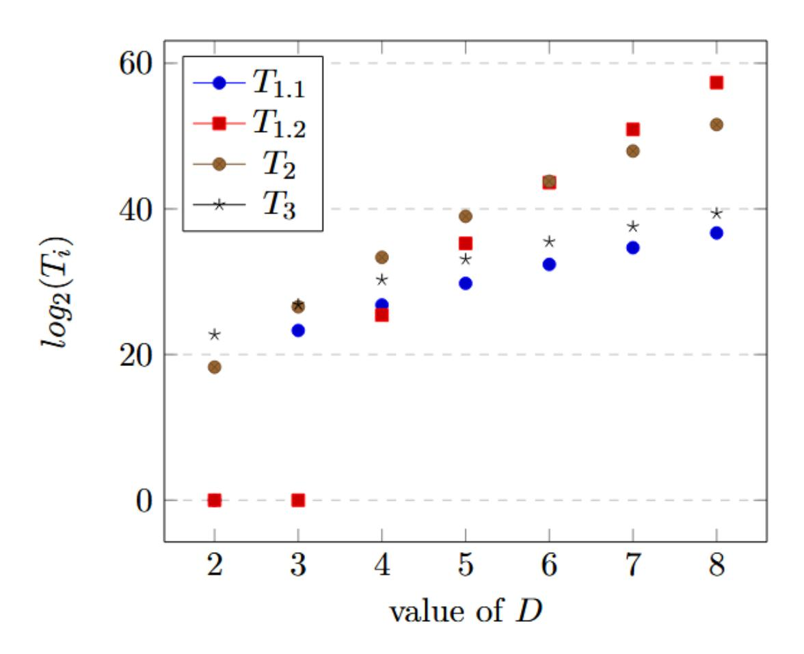
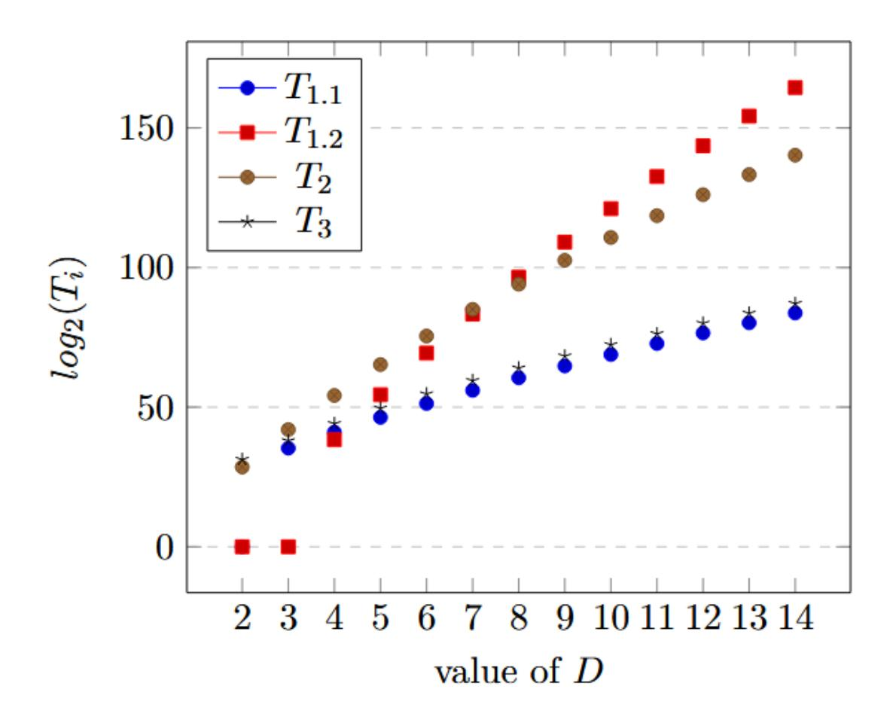

{0}------------------------------------------------

# Improved preprocessing for the Crossbred algorithm and application to the MQ problem

Damien Vidal†<sup>1</sup> , Claire Delaplace‡<sup>1</sup> , and Sorina Ionica§1,2

<sup>1</sup>Laboratoire MIS, Universit´e de Picardie Jules Verne <sup>2</sup>UVSQ, Universit´e Paris-Saclay, LMV

Abstract. First, we correct certain omissions in the literature on the complexity analysis of Crossbred and give a full analysis of this algorithm. Secondly, we propose a criterion to reduce the number of polynomials generated in the preprocessing step for a set of admissible parameters D, d and k, whenever this step of the algorithm produces more polynomials than necessary. We conclude by applying this criterion to the security of MQOM.

Keywords: multivariate cryptography, MQ problem, Gr¨obner basis algorithm, MQOM

### 1 Introduction

The resolution of a system of m polynomials and n variables over F<sup>q</sup> is proven to be NP-complete [25]. When the system is quadratic, we call this problem the MQ problem. In cryptography, this is a well studied problem which appears in several contexts. Recently, several schemes such as LUOV [8], Rainbow [17], Gemss [13] or MQDSS [14], whose security relies on this problem, were submitted to the NIST competition for post-quantum cryptography in 2017. Note that all of these schemes were later broken for the parameters given in the specifications [34, 7, 37, 29], resulting in the absence of multivariate polynomials schemes in the later rounds of the competition. However, this was not the end for multivariate cryptography as there was a call for additional signature in 2023. In response, ten new multivariate schemes were proposed [6, 27, 39, 30]. Moreover, some of the MPC-in-the-head schemes submitted to this NIST call also depend on the MQ problem [5].

Most algorithms for solving the MQ problem rely on Gr¨obner bases, whose computation was first made possible by Buchberger's algorithm [12]. Lazard [31] introduced an alternative approach by introducing Macaulay matrices, which are now at the heart of all linear-based algorithms for computing Gr¨obner basis, i.e. F<sup>4</sup> [24], F<sup>5</sup> [21], XL [16] and their variants.

<sup>†</sup> damien.vidal@u-picardie.fr

<sup>‡</sup> claire.delaplace@u-picardie.fr

<sup>§</sup> sorina.ionica@uvsq.fr

{1}------------------------------------------------

In the case of small finite fields (such as F2, F<sup>3</sup> and even F<sup>5</sup> to some extent), exhaustive search becomes a viable option. It is mostly used to assign certain variables before using a linear algebra-based algorithm on the Macaulay matrices associated to the system (FXL [16], BooleanSolve [2], Crossbred [28]).

On the practical side, the fastest solving method in F<sup>2</sup> was a pure exhaustive search algorithm named FES [10], which was beaten in 2017 by Joux and Vitse's Crossbred algorithm [28]. Given a sequence of polynomials F in F2[x1, . . . , xn], this algorithm depends on three parameters D, d and k (d < D, k < n) and runs in two steps. The first step consists in performing linear algebra on certain submatrices of the Macaulay matrix of degree D associated to the system and generating new polynomials with degree smaller than d over the first k variables. After this, we specialize the system and the newly generated polynomials and solve the resulting system.

In the original paper, the complexity and choice of parameters for the algorithm are briefly discussed. In particular, the authors introduce a bivariate generating series, and claim that its coefficients determine the number of new polynomials generated during preprocessing. Since then, there have been multiple studies on the complexity and choice of parameters, which all rely on the correctness of this series ([14, 18, 3, 35]). Recently, Vidal et al. [38] prove the correctness of this series under strong semi-regularity assumptions, and show that the coefficients of the series allow indeed to predetermine potentially admissible parameters for the algorithm, i.e. parameters for which the algorithm may find the solutions to the system. However, it is shown in [38] that the series computation predicts indeed the corank of the Macaulay matrix considered in the preprocessing step of the algorithm as long as Faug`ere's General and Frobenius criteria are used to construct these matrices.

During the execution, the criteria identify and discard rows that belong to the linear span of the rows above them, just like in the F5 algorithm. To identify these rows, we need to perform linear algebra iteratively on Macaulay matrices of degree 0 < d′ ≤ D − 2. This comes of course at a price.

Until now, no available complexity analysis of Crossbred took into account the use of these criteria. The question on whether it is interesting or not to take the General and Frobenius criteria into account while generating Macaulay matrices is classical in the literature on linear algebra-based Gr¨obner basis algorithms. On one hand, applying the criteria allows to keep the matrices as small as possible, reducing the memory and time complexity of linear algebra which depends on the number of rows of the Macaulay matrix. On the other hand, the generation itself costs more, as it requires to keep an echelonized version of Macaulay matrices of degree d ′ ≤ D − 2. These matrices will be dense, hence using them increases the memory complexity and their computation itself would require about (ncols) <sup>ω</sup> operations, where ncols is the number of columns of the Macaulay matrix of degree D − 2 and ω ≃ 2.8074 is the linear algebra constant.

On the practical side, record-breaking implementations of F5 [22] and Crossbred [11] are based on the criteria, hence taking them into account in theoretical 

{2}------------------------------------------------

estimations should bring the estimates closer to the reality of effective computations.

In this paper, we revisit the complexity analysis of the preprocessing step of the algorithm. Firstly, we take into account the cost of using the criteria, and show the complexity formula for iteratively computing the echelon form of Macaulay matrices. Secondly, we point out a mistake in the literature in the complexity formula for computing the new polynomials by performing sparse linear algebra on a certain Macaulay matrix. Indeed, MQ estimators [3] give this formula in terms of the number of columns, whereas the number of rows should be used instead (see Section 2.3 and Proposition 7). While there is no theoretical estimate for the number of rows, for fixed parameters D, d and k, this can be deduced by computing the coefficient  $g_{D,d}^k$  of the generating series conjectured in [28] and proven in [38]. Vidal  $et\ al\ [38]$  showed experimentally that the preprocessing step produces a number of new polynomials which is way too large as compared to the number of equations that we need in order for the algorithm to find solutions of the system during the exhaustive search step.

Instead of looking at the vector space generated by the polynomials obtained during the first step of the Crossbred algorithm, we look at the  $\mathbb{F}_2[x_{k+1},\ldots,x_n]$ -module structure of this space. We show examples indicating that linearly dependent elements (syzygies) in this module are produced during preprocessing for certain sets of admissible parameters. With this in hand, we state a new criterion allowing us to remove rows in the Macaulay matrix which would produce these syzygies. Finally, using classical commutative algebra results on finitely generated modules over Noetherian rings, we bound the number of polynomials that need to be generated during the preprocessing step. This allows us to reduce the complexity of the cokernel computation performed during the preprocessing step. We show a new complexity formula based on this bound in Corollary 2.

This paper is organised as follows: In Section 2 we introduce the Crossbred algorithm and detail the generation process of the Macaulay matrices. In Section 2.3 we suppose known a set of admissible parameters D,d and k for a system with m equations and n variables and review the state-of-the art on the complexity of the algorithm in terms of these parameters. Section 2.4 discusses the computation of admissible parameters. In Section 3 we give our main results allowing to reduce the number of rows of the Macaulay matrices considered during the preprocessing step. Section 5 presents experiments which confirm that it is possible to remove rows from the Macaulay matrix and that this improves indeed the running time of the preprocessing algorithm. Section 6 applies the methods introduced in the paper to polynomial systems having as a solution the secret key of MQOM for different security levels [4]. In addition, we note that on these particular examples, we also decrease the number of columns of matrices considered during preprocessing. This further improves the time and memory complexity of the algorithm.

{3}------------------------------------------------

**Acknowledgement.** We are grateful to the anonymous reviewers of a previous version of this paper. We thank Magali Bardet for helpful discussion on determinantal ideals.

### 2 Notation and Background

In this section, we will introduce the notation and terminology used throughout the paper. We will use the polynomial ring  $R = \mathbb{F}_p[x_1, \dots, x_n]$ , where  $\mathbb{F}_p$  is any finite field. We write  $x^b = x_1^{b_1} x_2^{b_2} \cdots x_n^{b_n}$  with  $b = (b_1, \dots, b_n)$ . Then  $|b| = \sum_{i=1}^n b_i$  is the degree of the monomial (also called total degree) and is written  $\deg(x^b)$ . We denote by  $\deg_k$  the degree over the first k variables (i.e.  $\deg_k(x^b) = \sum_{i=1}^k b_i$ ). We fix an admissible graded monomial ordering on R.

All linear algebra-based algorithms for computing Gröbner basis use the Macaulay matrices, which are defined as follows.

**Definition 1.** Given a affine system of polynomials  $\mathcal{F} = \{f_1, \ldots, f_m\}$  in R, we define the Macaulay matrix of degree  $\leq D$ , denoted by  $Mac_{\leq D,m}(\mathcal{F})$ , to be the matrix whose columns are indexed by the monomials in R of degree  $\leq D$ , sorted in decreasing order from left to the right following the chosen order. The rows of this matrix are given by all polynomials  $uf_i$  written as vectors of coefficients of monomials, where u is a monomial in R and  $f_i \in \mathcal{F}$  such that  $deg(uf_i) \leq D$ .

Example 1. Given a polynomial system  $\mathcal{F} = \{f_1, f_2\}$  in  $\mathbb{F}_2[x_1, x_2, x_3]$ , we show in Figure 1 the Macaulay matrix of degree lesser or equal to 3 associated to this system.

|          | $x_1 x_2 x_3$ | $x_1x_2$ | $x_1x_3$ | $x_2x_3$ | $x_1$ | $x_2$ | $x_3$ | 1             |
|----------|---------------|----------|----------|----------|-------|-------|-------|---------------|
| $f_1$    | / 0           | 1        | 0        | 1        | 1     | 0     | 0     | $1 \setminus$ |
| $f_2$    | 0             | 0        | 1        | 0        | 0     | 1     | 0     | 0             |
| $x_3f_1$ | 1             | 0        | 1        | 1        | 0     | 0     | 1     | 0             |
| $x_2f_1$ | 0             | 0        | 0        | 1        | 0     | 1     | 0     | 0             |
| $x_1f_1$ | 1             | 1        | 0        | 0        | 0     | 0     | 0     | 0             |
| $x_3f_2$ | 0             | 0        | 1        | 1        | 0     | 0     | 0     | 0             |
| $x_2f_2$ | 1             | 0        | 0        | 0        | 0     | 1     | 0     | 0             |
| $x_1f_2$ | / 0           | 1        | 1        | 0        | 0     | 0     | 0     | 0 /           |

Fig. 1:  $Mac_{\leq 3,2}(\mathcal{F})$  over the field  $\mathbb{F}_2$ 

In the rest of this paper, we refer to the row corresponding to the polynomial  $uf_i$  in a Macaulay matrix either as the row tagged  $(u, f_i)$  or as the row  $uf_i$ . Given a matrix M, we note  $\widetilde{M}$  the echelonized form of M.

{4}------------------------------------------------

### 2.1 Semi-regular polynomial sequences

From now on, we consider polynomial systems defined over the finite field  $\mathbb{F}_2$ . Since the homogeneous part of highest degree of field equations  $x_i^2 - x_i$  is  $x_i^2$ , we consider the ring  $R^h = \mathbb{F}_2[x_1, \ldots, x_n]/\langle x_1^2, \ldots, x_n^2 \rangle$ . Any homogeneous polynomial of degree d in  $R^h$  verifies  $f^2 = 0$ . Following Bardet [1], we directly state the definition of a semi-regular sequence of polynomials defined over  $\mathbb{F}_2$ .

**Definition 2.** Let  $\{f_1, \ldots, f_m\}$  be a sequence of homogeneous polynomials  $R^h$  and denote by I the ideal that it generates. The sequence is called semi-regular over  $\mathbb{F}_2$  if:

1.  $\langle f_1, \ldots, f_m \rangle \neq R^h$ , 2. For all  $i \in \{1, \ldots, m\}$  if  $g_i f_i = 0$  in  $R^h / \langle f_1, \ldots, f_{i-1} \rangle$  and  $\deg(g_i f_i) < H(I)$ , then  $g_i \in \langle f_1, \ldots, f_{i-1}, f_i \rangle$ .

In Definition 2, H(I) corresponds to the index of regularity. It is the smallest degree D such that

$$\dim_{\mathbb{F}_2}(\langle f_1, \dots, f_m \rangle_D) = \dim_{\mathbb{F}_2}((R^h)_D),$$

if such a degree exists.

To define semi-regularity for sequences of affine polynomials, we look at the sequence given by the homogenous parts of highest degree of these polynomials.

**Definition 3.** Let  $\mathcal{F} = \{f_1, \dots, f_m\}$  be an affine sequence of polynomials in R and denote by  $f_i^{top}$  the homogeneous part of highest degree of  $f_i$ ,  $1 \leq i \leq m$ . Then  $\mathcal{F}$  is called semi-regular if the sequence  $\mathcal{F}^{top} = \{f_1^{top}, \dots, f_m^{top}\}$  is semi-regular.

Given a field K, Fröberg's conjecture [26] states that almost all sequences  $\mathcal{F} = \{f_1, \ldots, f_m\}$  in  $K[x_1, \ldots x_n]$  are semi-regular, in the sense that the semi-regularity property is generic. To be more precise, Fröberg states the generic property in terms of the Hilbert series of  $K[x_1, \ldots, x_n]/\langle f_1, \ldots, f_m \rangle$ , but this is shown to be equivalent to semi-regularity by Bardet. This conjecture is proven for certain choices of parameters m and n and field K.

The index of regularity of the sequence  $\{f_1^{top}, \ldots, f_m^{top}\}$  is also called the degree of regularity of the sequence  $\{f_1, \ldots, f_m\}$  and is noted  $D_{reg}$ . It corresponds to the first fall degree in a Gröbner basis computation.

In this paper, we consider a stronger regularity assumption which is common when analyzing hybrid algorithms.

**Definition 4** ([2, 38]). Given an affine sequence of polynomials  $\mathcal{F} = \{f_1, \ldots, f_m\}$ , we say that  $\mathcal{F}$  is  $\gamma$ -strong semi-regular if:

- 1. The affine sequence of polynomials  $\mathcal{F}$  is semi-regular.
- 2. The set

$$S(\mathcal{F}) = \{(a_{k+1}, \dots, a_n) \in (\mathbb{F}_2)^{n-k} |$$
  
 $\{f_1(x_1, \dots, x_k, a_{k+1}, \dots, a_n), \dots, f_m(x_1, \dots, x_k, a_{k+1}, \dots a_n)\} \text{ is not semi-regular} \}$ 

has cardinality  $O(2^{-\gamma n})$ .

{5}------------------------------------------------

Given a sequence  $\mathcal{F} = \{f_1, \ldots, f_m\}$  we denote by  $\mathcal{F}^* = \{f_1^*, \ldots, f_n^*\}$  the sequence obtained by specializing  $\mathcal{F}$  at a value  $(a_{k+1}, \ldots, a_n) \in (\mathbb{F}_2)^{n-k}$ . Condition 2 in Definition 4 can also be restated as follows: given an affine semi-regular sequence of polynomials  $\mathcal{F} = \{f_1, \ldots, f_m\}$  and a random value  $(a_{k+1}, \ldots, a_n) \in (\mathbb{F}_2)^{n-k}$ , the affine sequence  $\mathcal{F}^*$  is semi-regular with high probability.

If  $\mathcal{F}$  is  $\gamma$ -strong semi-regular, we denote by  $d_{reg}(k)$  the degree of regularity of the specialized system  $\mathcal{F}^*$ . For the rest of the paper, we assume that we work with a  $\gamma$ -strong semi-regular sequence of polynomials. The authors of [2] extended the conjecture proposed by [26] to  $\gamma$ -strong semi-regular sequences of polynomials. Although the conjecture is not proven to our knowledge, it is supported by experiments performed by [2, 38]. In particular, Table 4 in Appendix B in [38] shows evidence that semi-regular sequences are  $\gamma$ -strong semi-regular for different choices of parameters m, n and k.

### 2.2 The Crossbred algorithm

Before presenting the Crossbred algorithm, we define the Macaulay-like matrices which are used in this algorithm.

**Definition 5.** Given an affine system of polynomials  $\mathcal{F} = \{f_1, \ldots, f_m\}$  in R, let  $Mac_{\leq D, \geq d, m}^k(\mathcal{F})$  be the submatrix of the Macaulay matrix  $Mac_{\leq D, m}(\mathcal{F})$  whose rows  $uf_i$  verifies  $deg(u) \leq D-2$  and  $deg_k(u) \geq d-1$  with  $1 \leq i \leq m$ . Let  $\mathcal{M}_{\leq D, \geq d, m}^k(\mathcal{F})$  be the submatrix of  $Mac_{\leq D, \geq d, m}^k(\mathcal{F})$  whose columns correspond to monomials M with  $deg_k(M) \geq d+1$ .

The Crossbred algorithm performs in two steps:

- 1. The preprocessing step, which can itself be divided in three parts.
  - (a) The generation of  $Mac_{\leq D, \geq d, m}^{k}(\mathcal{F})$ . This step may seem simple but can be difficult to handle, especially if one applies the criteria for eliminating linear dependencies (see Propositions 1 and 2).
  - (b) The computation of r independent vectors of the cokernel of  $\mathcal{M}^k_{\leq D, \geq d, m}(\mathcal{F})$ . The variable r stands for the number of polynomials generated during the preprocessing step.
  - (c) The generation of new polynomials  $\{p_1, \ldots, p_r\}$  by doing the product of the vectors previously computed and  $Mac_{\leq D, \geq d, m}^k(\mathcal{F})$
- 2. The resolution step, which consists of the assignation of the last n-k variables in the system (the original system  $\mathcal{F}$  and the newly generated polynomials) and solving said system.

Let us explain the matrix generation part. For  $D' \leq D$  and d' < D, we call a stripe (D', d') of the matrix  $Mac_{\leq D, \geq d, m}^k(\mathcal{F})$  the set of rows of  $Mac_{\leq D, \geq d, m}^k(\mathcal{F})$  corresponding to polynomials f of total degree D' and degree d' + 1 in the first k variables.

**Definition 6.** Given an affine polynomial system  $\mathcal{F} = \{f_1, \ldots, f_m\}$ , we denote by  $Mac_{D,m}(\mathcal{F})$  the Macaulay matrix of degree exactly D and by  $Mac_{D,d,m}^k(\mathcal{F})$ 

{6}------------------------------------------------

the sub-matrix of  $Mac_{D,m}(\mathcal{F})$  whose rows corresponds to polynomials  $uf_i$  where deg(u) = D - 2 and  $deg_k(u) = d - 1$ . We denote by note  $\mathcal{M}_{D,d,m}^k(\mathcal{F})$  the sub-matrix of  $Mac_{D,d,m}^k(\mathcal{F})$  whose columns corresponds to monomials M such that  $deg_k(M) = d + 1$ .

The idea is to build the matrix  $Mac_{\leq D,\geq d,m}^k(\mathcal{F})$  stripe by stripe. As usual, for a given pair (D',d') each row f of the matrix  $Mac_{D',d',m}^k(\mathcal{F})$  is tagged by a pair  $(u,f_i)$  such that  $f=uf_i$ .

Now, we construct  $Mac_{D',d',m}^k(\mathcal{F})$  by multiplying polynomials f of total degree D'-1 by a single variable  $x_{\lambda}$ . In a similar way to the generation of matrices in Matrix-F5 [1], to avoid computing the same polynomial several times, rows f tagged by  $(u, f_i)$  are only multiplied by variables  $x_{\lambda}$  such that  $\lambda$  is more than the highest index  $\ell_{max}$  appearing in u. We claim the following.

**Lemma 1.** For any D', d' such that  $2 \le D' \le D$  and  $1 \le d' \le \min(d, D' - 1)$ , the stripe (D', d') of the matrix  $Mac_{< D, > d, m}^k(\mathcal{F})$  is built as follows:

- a) We multiply rows f of  $Mac_{D'-1,d',m}^k(\mathcal{F})$  by a variable  $x_{\lambda}$ ,  $\lambda > k$  if  $1 \leq d' \leq D'-2$ .
- b) We multiply rows f of  $Mac_{D'-1,D'-2,m}^k(\mathcal{F})$  by a variable  $x_{\lambda}$ ,  $\lambda \leq k$ .

*Proof.* Two cases are to be considered. First, we assume that  $\deg_k(f) = d' + 1$  (i.e., f corresponds to a row of  $Mac_{D'-1,d',m}^k(\mathcal{F})$ ). In this case, to ensure that  $x_{\lambda}f$  still has degree d'+1 in the first k variables, we consider indices  $\lambda$  such that  $\lambda > \max(k, \ell_{max})$ .

In the second case, we assume that  $\deg_k(f) = d'$  (i.e., f corresponds to a row of  $Mac_{D'-1,d'-1,m}^k(\mathcal{F})$ ). Now, to ensure that  $x_{\lambda}f$  has degree d'+1 in the first k variables, we need to consider indices  $\lambda$  such that

$$\ell_{\max} < \lambda \le k \tag{1}$$

However, it can be noticed that if d'-2 < D'-3, the rows of  $Mac_{D'-1,d'-1,m}^k(\mathcal{F})$  are tagged by  $(u, f_i)$  such that the degree of u in the last n-k variables is at least 1. As such,  $\ell_{max} > k$  and the Inequality (1) is inconsistent.

During the generation of  $Mac_{\leq D, \geq d, m}^k(\mathcal{F})$  linear dependencies may appear, either directly in the matrix, or in some polynomials generated during the preprocessing step. To prevent those reductions to zero, we rely on the General criterion first proposed by Faugère for the F5 algorithm [21]. Given a sequence of polynomials  $\mathcal{F} = \{f_1, \ldots, f_m\}$  in R, we denote  $\mathcal{F}_i = \{f_1, \ldots, f_i\}$ ,  $i \geq 1$ . By extension, we denote by  $Mac_{D,i}(\mathcal{F})$  the Macaulay matrix  $Mac_{D,i}(\mathcal{F}_i)$ .

**Proposition 1** ([21]). For  $1 \leq j < i \leq m$ , if a row tagged  $(t, f_j)$  in the matrix  $\widetilde{Mac}_{D-2,i-1}(\mathcal{F})$  has a leading term t', then the row tagged  $(t', f_i)$  in the matrix  $Mac_{D,i}(\mathcal{F})$  is a linear combination of previous rows.

{7}------------------------------------------------

### Algorithm 1: The Crossbred algorithm

```
Data: Polynomial system \mathcal{F} of m equations and n variables with parameters
              D, d, k
    Result: A solution of the system (or nothing otherwise)
 1 Construct Mac_{\leq D, \geq d, m}^{k}(\mathcal{F}) and \mathcal{M}_{\leq D, \geq d, m}^{k}(\mathcal{F})
 2 Compute a basis (v_1, \ldots, v_r) of the left kernel of \mathcal{M}^k_{\leq D, \geq d, m}(\mathcal{F})
 3 Construct polynomials p_1, \ldots, p_r corresponding to v_i \cdot Mac_{< D, > d, m}^k(\mathcal{F})
 4 for a = (a_{k+1}, \ldots, a_n) \in (\mathbb{F}_2)^{n-k} do
         Evaluate the last n-k variables in each f \in \mathcal{F} at (a_{k+1}, \ldots, a_n) and
 5
          compute \mathcal{F}^*
         Compute \mathcal{F}'^* as the partial evaluation of \mathcal{F}' = \{p_1, \dots, p_r\} at
 6
          (a_{k+1},\ldots,a_n)
         Compute S^* = Mac_{\leq d,m}(\mathcal{F}^* \cup \mathcal{F}'^*)
 7
         if S^* is consistent then
 8
              return the solution
 9
         end
10
11 end
```

The previous criterion holds on any field  $\mathbb{F}_q$ . Nevertheless, it is not sufficient to remove all dependencies over  $\mathbb{F}_2$ , as we need to take in account the dependencies stemming from the relation  $f^2 = f$ . It is for this reason that we also consider the Frobenius criterion.

**Proposition 2** ([1]). For  $1 \leq i \leq m$ , if a row tagged  $(t, f_i)$  in the matrix  $\widetilde{Mac}_{D-2,i}(\mathcal{F})$  has a leading term t', then the row tagged  $(t', f_i)$  in the matrix  $Mac_{D,i}(\mathcal{F})$  is a linear combination of previous rows.

In Algorithm 1, we give the pseudocode of Crossbred. Lines 1 to 3 of Algorithm 1 correspond to the preprocessing. The construction of a stripe (D, d) of the matrix  $Mac_{\leq D, \geq d, k}^k(\mathcal{F})$  relies on Lemma 1 and is detailed in Algorithm 3 in Appendix A. In this Algorithm, both the General criterion and the Frobenius criterion are applied. For all newly computed polynomials  $x_{\lambda}f$ , where f is tagged by  $(u, f_i)$ , we check if  $x_{\lambda}u$  corresponds to a pivot in  $\widetilde{Mac_{D'-2,i}}(\mathcal{F}^{top})$ . Finally, to build  $Mac_{\leq D, \geq d,m}^k(\mathcal{F})$ , we only have to concatenate all matrices  $Mac_{D',d',m}^k(\mathcal{F})$  for  $2 \leq D' \leq D$  and  $d \leq d' \leq D-1$ .

The goal of this step is to perform linear algebra to extract the cokernel of the submatrix  $\mathcal{M}_{\leq D, \geq d, k}^k(\mathcal{F})$ . With this in hand, we generate new polynomials that will be used during the exhaustive search. The exhaustive search corresponds to lines 4 to 11 in Algorithm 1. It consists in affecting the values of the last n-k variables and solving the resulting system. In this paper, we assume that a linearization on a Macaulay matrix of degree d is used to solve the specialized system.

In Section 4, we explain in more detail the routines used in each of these steps to provide an astute time complexity.

{8}------------------------------------------------

### 2.3 Complexity analysis

In the existing literature on the Crossbred algorithm [14, 18, 3, 35], the time complexity T of the algorithm is computed as

$$T = PP + S_{pe}, (2)$$

where PP is the complexity of the preprocessing step and  $S_{pe}$  that of the exhaustive search step. In these works, PP is given by the complexity of computing the cokernel of  $\mathcal{M}^k_{\leq D, \geq d, m}(\mathcal{F})$  and varies depending on the linear algebra method that is used. The complexity of the exhaustive search is given by the cost of verifying the consistency of the specialized system times the maximum number of values that can be tested during the exhaustive search. The complexity of testing the consistency of a dense affine system (which is equivalent to fully echelonizing the Macaulay matrix of degree d of the corresponding system) is known and used in all complexity analysis: For a matrix Mat, the complexity would be  $\mathcal{O}(\#Col(Mat)^{\omega})$ , where #Col(Mat) denotes the number of columns of Mat and  $\omega$  is the linear constant for matrix multiplication. A noteworthy difference between these formulae is the complexity for the resolution step, which consists in the specialization of the last n-k variables and the resolution of the resulting system.

Chen et al. [14] claim the following complexity formula for q > 2:

$$\mathcal{O}\left(\binom{n+D-1}{D}^2\right) + \mathcal{O}\left(\log(n-k)\cdot q^{n-k}\cdot \binom{k+d-1}{d}^{\omega}\right).$$

In their analysis, they assume that the block Lanczos algorithm [32] is used to compute the cokernel. The authors claim that the complexity of this algorithm is  $\mathcal{O}\left(\binom{n+D-1}{D}^2\right)$ , where the binomial term in the formula corresponds to the number of monomials of degree D over n variables in  $\mathbb{F}_q[x_1,\ldots,x_n]$ . This is not equivalent to the number of columns in  $\mathcal{M}_{\leq D,\geq d,m}^k(\mathcal{F})$ , but it may serve as an upper bound to the number of columns. On the right side of the addition stands the complexity of the exhaustive search over all  $q^{n-k}$  possibilities.

Duarte [18] proceeds in a similar fashion, but he distinguishes between the case q=2 and that of q>2. Moreover, the exact number of columns of the matrix  $\mathcal{M}_{\leq D,\geq d,m}^k(\mathcal{F})$  is given and a different complexity for the cost of the exhaustive search is chosen. This yields the following complexity for q=2:

$$\tilde{\mathcal{O}}\left(\left(\sum_{d_k=d+1}^{D}\sum_{d'=0}^{D-d_k}\binom{k}{d_k}\binom{n-k}{d'}\right)^2\right)+\tilde{\mathcal{O}}\left(2^{n-k}\left(\sum_{i=0}^{d}\binom{k}{i}\right)^{\omega}\right).$$

For q > 2, Duarte claims the following complexity:

$$\tilde{\mathcal{O}}\left(\left(\sum_{d_k=d+1}^{D}\sum_{d'=0}^{D-d_k}\binom{k+d_k-1}{d_k}\binom{n-k+d'-1}{d'}\right)^2+2^{n-k}\binom{k+d-1}{d}^{\omega}\right).$$

{9}------------------------------------------------

Although the explanations are succinct, Bellini et al. [3] develop each step a bit more. Instead of just taking  $\#Col\left(Mac_{\leq D,\geq d,m}^k(\mathcal{F})\right)^{\omega}$  as the complexity for the preprocessing step like [14] and [18], they take the minimum between the complexity of computing the left nullspace of a dense matrix and a sparse matrix, which brings the following complexity:

$$\min \left\{ \mathcal{O}\left(n_{cols}^{\omega}\right), \mathcal{O}\left(3\binom{k+d}{d}\binom{n+2}{2} \cdot n_{cols}^{2}\right) \right\} + + \mathcal{O}\left(m \cdot q^{n-k} \cdot \binom{k+d}{d}^{\omega}\right) (3)$$

Nakamura [35] uses roughly the formula given in [3]. The complexity is given by

$$min\left\{\mathcal{O}\left(n_{cols}^{\omega}\right), \mathcal{O}\left(3\binom{n+2}{2} \cdot n_{cols}^{2} \cdot N_{itr}\right)\right\} + \mathcal{O}\left(m \cdot q^{n-k} \cdot \binom{k+d}{d}^{\omega}\right), (4)$$

where  $n_{cols} = \#Col\left(\mathcal{M}_{\leq D,\geq d,m}^k(\mathcal{F})\right)$  and  $N_{itr}$  corresponds to the number of times the block Wiedmann algorithm is applied to compute the cokernel. The formulae in Equations (3) and (4) should be taken with a grain of salt. First, since we compute the cokernel, not the kernel of the matrix  $\mathcal{M}_{\leq D,\geq d,m}^k(\mathcal{F})$ , the preprocessing step depends on the number of rows, not on the number of columns of this matrix. Secondly, we note that these estimates do not detail an important point in the preprocessing step of the algorithm: the cost of generating  $Mac_{\leq D,\geq d,m}^k(\mathcal{F})$ . In Section 4 we evaluate the cost of generating the matrices in the preprocessing step (Proposition 6) and give the complexity of using sparse linear algebra for cokernel computation (Proposition 7). With these in hand, we restate the overall complexity formula for the preprocessing algorithm.

### 2.4 Computing admissible parameters

Let  $\mathcal{F} = \{f_1, \ldots, f_m\}$  be a sequence of homogeneous quadratic polynomials in R and denote by  $U_{d_1,d_2,m}^k$ , where  $d_1,d_2 \geq 0$ , the number of rows of the matrix  $Mac_{d_1,d_2,m}^k(\mathcal{F})$ , and thus of  $\mathcal{M}_{d_1,d_2,m}^k(\mathcal{F})$ . The number of columns of  $\mathcal{M}_{d_1,d_2,m}^k(\mathcal{F})$  is given by  $M_{d_1,d_2+1}^k$ , which corresponds to the number of monomials v of total degree  $d_1$  such that  $\deg_k v = d_2 + 1$ .

To analyse Crossbred, we will consider the following sequence introduced by Vidal  $et\ al\ [38]$ :

$$h_{d_{1},d_{2},m}^{k} = \begin{cases} U_{d_{1},d_{2},m}^{k} - M_{d_{1},d_{2}+1}^{k}, & \text{if } d_{1} \geq d_{2} \geq 0, m \geq 1, \\ -M_{d_{1},0}^{k}, & \text{if } d_{1} \geq 0, d_{2} = -1, m \geq 0, \\ -M_{d_{1},d_{2}+1}^{k}, & d_{1} \geq d_{2} \geq 0, m = 0, \\ 0, & \text{in all other cases.} \end{cases}$$
(5)

We define the following sequence for  $D \geq 0$ ,  $d \geq 0$ :

$$g_{D,d}^k = \#Row(\mathcal{M}_{\leq D,>d,m}^k(\mathcal{F})) - \#Col(\mathcal{M}_{\leq D,>d,m}^k(\mathcal{F})). \tag{6}$$

If  $g_{D,d}^k > 0$  and there are no reductions to 0 in the matrix  $Mac_{\leq D,\geq d,m}^k(\mathcal{F})$ , then this coefficient gives exactly the dimension of the vector space generated

{10}------------------------------------------------

by the polynomials obtained in the preprocessing step of Crossbred. Moreover, as shown in [38], this coefficient may be computed as:

$$g_{D,d}^k = \sum_{d_1=2}^D \sum_{d_2=2}^{D-2} h_{d_1,d_2}.$$

Vidal et al [38] proved the following result which will be useful for precomputing the coefficients  $g_{D,d}^k$ .

**Proposition 3.** Fix the values of m, n and k. Assuming that the sequence  $\mathcal{F}$  is semi-regular, then for all  $d_1 < D_{reg}$  and  $d_2 < \min(d_{reg}(k), d_1) \operatorname{corank}(\mathcal{M}^k_{\leq d_1, \geq d_2, m}(\mathcal{F}))$  is given by the coefficient of the term  $X^{d_1}Y^{d_2}$  of the following series:

$$G_{m,n}^k(X,Y) = -\frac{YH_{m,n}^k(X,Y) - H_{m,n}^k(X,1)}{(1-X)(1-Y)},\tag{7}$$

where the series H is given by

$$H_{m,n}^k(X,Y) = \frac{1}{Y} \left( (1+X)^{n-k} - \frac{(1+XY)^k (1+X)^{n-k}}{(1+X^2Y^2)^m} \right).$$

Example 2. Let m = 45, n = 21 and k = 13. A simple calculation shows that

$$g_{3,1} = h_{2,1} + h_{3,1} + h_{3,2} = -33 - 264 + 299 = 2.$$

We see that we do not generate enough polynomials to do the linearization during the resolution step. Indeed, as d = 1, we need at least k + 1 = 14 independant polynomials for the second step. We therefore compute:

$$g_{4,1} = h_{2,1} + h_{3,1} + h_{3,2} + h_{4,1} + h_{4,2} + h_{4,3}$$
  
= -33 - 264 + 299 - 924 + 2392 + 1760 = 3230

We see that for k = 13, D = 4 and d = 1 are potentially admissible parameters.

We saw in Example 2 that it is possible to generate polynomials during the preprocessing step but not generate enough polynomials to linearize the system after specialization. However, we also see that although we only need to have 14 polynomials, we generate more than that. A natural question is whether it is necessary to compute all of these polynomials. This question will be answered in Section 3.

A question with a different flavour is whether linear dependencies may appear on the Macaulay matrix for the specialized system  $\mathcal{F}^*$  to which we appended the newly generated polynomials:

$$Mac_{\leq d,m}(\mathcal{F}^* \bigcup \{p_1^*,\ldots,p_r^*\}).$$
 (8)

To predict if a set of parameters will generate enough polynomials to linearize the matrix in Equation (8) after specialization, Vidal *et al.* [38] assume that the system is  $\gamma$ -strong semi-regular. As explained in Definition 4, this is equivalent to the system being semi-regular and the specialized system being semi-regular for most specializations of the variables  $x_{k+1}, \ldots, x_n$ .

{11}------------------------------------------------

**Proposition 4 ([38]).** Fix the values of m, n and k. Assuming the sequence  $\mathcal{F}$  is  $\gamma$ -strong semi-regular, then for all  $D < D_{reg}$  and  $d < d_{reg}(k)$ , the corank of the matrix  $Mac_{\leq d,m}(\mathcal{F}^* \bigcup \{p_1^*,\ldots,p_r^*\})$  is given by the coefficient of the term  $X^DY^d$  of the following series:

$$J_{m,n}^k(X,Y) = \frac{1}{(1-X)(1-Y)} \left( \frac{(1+X)^{n-k}(1+XY)^k}{(1+X^2Y^2)^m} - \frac{(1+X)^n}{(1+X^2)^m} - \frac{(1+Y)^k}{(1+Y^2)^m} \right).$$

Using the series J in Proposition 4, we may therefore check if the number of polynomials that are generated in the preprocessing step yields a number of rows to be added to  $Mac_{\leq d,m}(\mathcal{F}^*)$  which is sufficient to linearize this matrix during the resolution step. However, linear dependencies may appear between these rows after specialization, and in fact this does happen in practice. Due to this phenomenon, Vidal  $et\ al.\ [38]$  introduce the notion of potentially admissible parameters.

**Definition 7** ([38]). Given a strong semi-regular sequence of quadratic polynomials  $\mathcal{F} = \{f_1, \ldots, f_m\}$  in R, a set of parameters (D, d, k), with 1 < k < n and  $1 \le d \le D$ , is called potentially admissible for finding the solutions of the corresponding system using the Crossbred algorithm if:

- $1. \ 2 \le D < D_{req},$
- 2.  $1 \le d < d_{reg}(k)$ ,
- 3. The coefficient of the term  $X^DY^d$  in the series  $J_{m,n}^k(X,Y)$  is non-negative.

The authors of [38] state as a conjecture the fact that every set of parameters which is potentially admissible is in fact admissible.

# 3 From linear algebra over $\mathbb{F}_2$ to linear algebra over a ring

As we have seen in Example 2, for certain choices of parameters D, d and k it may happen to generate polynomials during the first step of the Algorithm 1 and not generate enough polynomials to linearize the Macaulay matrix during the resolution step. Indeed, assuming that linearization is used, the number of  $\mathbb{F}_2$ -linearly independant polynomials we need for the second step of the Crossbred algorithm is bounded by

$$N = \sum_{i=0}^{d} \binom{k}{i},\tag{9}$$

which is the dimension of the vector space of polynomials in  $\mathbb{F}_2[x_1,\ldots,x_k]$  of degree smaller than d. As shown in Table 1, in most examples that we computed the number of polynomials that are obtained during preprocessing is much greater than the dimension of the vector space of polynomials of degree smaller than d obtained after specialization. The entries in the column labelled by r give the

{12}------------------------------------------------

number of polynomials that are generated during preprocessing for different sets of parameters m, n, D, d and k, while the last column gives the value of N defined in Equation (9). We see clearly that we generate over 1000 times many more polynomials than needed for d = 1. This ratio seems to decrease as the value of d gets closer to D. The reader is also referred to [28, Table 1] and [38, Table 2] for similar experiments.

| m  | n  | k  | D | d | r    | N    |
|----|----|----|---|---|------|------|
| 63 | 30 | 17 | 4 | 1 | 2930 | 18   |
| 59 | 28 | 17 | 4 | 1 | 2591 | 18   |
| 49 | 23 | 18 | 4 | 1 | 1944 | 19   |
| 69 | 33 | 22 | 4 | 2 | 5945 | 254  |
| 63 | 30 | 20 | 4 | 2 | 6429 | 211  |
| 43 | 20 | 14 | 3 | 2 | 238  | 106  |
| 47 | 22 | 14 | 3 | 2 | 294  | 106  |
| 79 | 38 | 27 | 4 | 3 | 7019 | 3304 |
| 83 | 40 | 27 | 4 | 3 | 8097 | 3304 |

Table 1: Comparing the number of generated polynomials and the number of monomials of degree at most d over k variables.

#### 3.1 A new criterion

In this section, we introduce a new criterion that can be used to eliminate some linear dependencies that would appear after the specialization in the Crossbred algorithm.

As usual, let  $\mathcal{F} = \{f_1, \dots, f_m\}$  a sequence of polynomials in  $\mathbb{F}_2[x_1, \dots, x_n]$ . We denote by:

$$\mathcal{K}_{\leq D, \geq d}^{k} = \left\{ f = \sum_{i} u_{i} f_{i} \middle| deg(u_{i}) \leq D - 2, \deg_{k}(u_{i}) \geq d - 1, \deg_{k}(f) \leq d \right\}$$
(10)

the  $\mathbb{F}_2$ -vector space obtained in the preprocessing step of Algorithm 1 with input parameters the sequence  $\mathcal{F}$  and D, d and k.

**Lemma 2.** Given D, d, k > 0, the following inclusions hold:

$$\mathcal{K}_{\leq D, \geq d}^{k} \subset \mathcal{K}_{\leq D+1, \geq d}^{k},$$

$$\sum_{i \in \{k+1, \dots, n\}} x_{i} \mathcal{K}_{\leq D, \geq d}^{k} \subset \mathcal{K}_{\leq D+1, \geq d}^{k}.$$

Recall that the dimension of the vector space  $\mathcal{K}^k_{\leq D,\geq d}$  is given by the value of  $g^k_{D,d}$  defined in Equation (6). From Lemma 2, it follows that if  $g^k_{D,d} > 0$ , then

{13}------------------------------------------------

for all D' > D we have that  $g_{D',d} > 0$ . We denote by  $\Delta_d$  the smallest D such that  $g_{D,d}^k > 0$ .

As a consequence of Lemma 2, we remark that some redundancy appears after specialization amongst polynomials generated with parameters (D+1,d,k) for  $D \geq \Delta_d$ . Indeed, the linear algebra preprocessing step will produce a number of polynomials generating  $\mathcal{K}^k_{\leq D+1,\geq d}$ , but after specialization the distinct vector spaces  $\mathcal{K}^k_{\leq D,\geq d}$  and  $x_i\mathcal{K}^k_{\leq D,\geq d}$ , i>k may have non-trivial intersection. We reformulate Lemma 2 in terms of the Macaulay matrices involved in the Crossbred algorithm. From an algorithmic point of view, this yields a criterion allowing us to reduce the size of  $Mac^k_{\leq D,\geq d,k}(\mathcal{F})$  by discarding redundant rows.

**Proposition 5.** Given a row tagged by  $(u, f_i)$  on  $Mac_{\leq D, \geq d, m}^k(\mathcal{F})$  that is a linear combination of previous rows on the submatrix  $\mathcal{M}_{\leq D, \geq d, m}^k(\mathcal{F})$ , then for all j > k the row tagged by  $(x_j u, f_i)$  on  $Mac_{\leq D+1, \geq d, m}^k(\mathcal{F})$  is a linear combination of previous rows on the submatrix  $\mathcal{M}_{\leq D+1, \geq d, m}^k(\mathcal{F})$ .

Proof. Assume that there exist a polynomial g such that  $g = uf_i + \sum_l u_l f_l$  with  $\deg u_l f_l \leq D$ ,  $\deg_k u_l \geq d-1$ ,  $\deg(g) \leq D$  and  $\deg_k(g) \leq d$ . For any row  $x_j u f_i$  in  $Mac_{\leq D+1, \geq d, m}^k(\mathcal{F})$  with j > k, it is possible to explicit a similar relation to generate  $x_j g$  with  $\deg(x_j g) \leq D+1$  and  $\deg_k(x_j g) \leq d$ . Indeed, we can write  $x_j g = x_j u f_i + x_j (\sum_v u_l f_l)$ . This proves that  $x_j u f_i$  is a linear combination of previous rows in  $\mathcal{M}_{\leq D+1, \geq d, m}^k(\mathcal{F})$ .

Directly applying the criterion in Proposition 5 involves supplementary linear algebra computations. Indeed, if partial echelonization on  $Mac_{\leq D, \geq d, m}^k(\mathcal{F})$  is used to compute the kernel of  $\mathcal{M}_{\leq D, \geq d, m}^k(\mathcal{F})$ , then a solution would be to keep track of the labels of rows  $(u, f_i)$  yielding vectors in the cokernel of  $\mathcal{M}_{\leq D, \geq d, m}^k(\mathcal{F})$ , and not add the rows  $(x_j u, f_i)$  with j > k to  $Mac_{\leq D+1, \geq d, m}^k(\mathcal{F})$ . Since our goal is to use a sparse linear algebra algorithm for preprocessing, we take an ad hoc path to avoid the redundant rows efficiently.

Assume that we have  $\mathcal{K}^k_{\leq D,\geq d} \neq 0$  (which can be easily checked by verifying that  $g^k_{D,d} > 0$ ) and that we want to generate  $\mathcal{K}^k_{\leq D+1,\geq d}$ . For each stripe  $Mac_{D+1,d'}(m)$ ,  $d' \leq D-3$ , that is added when constructing  $Mac^k_{\leq D+1,\geq d,m}(\mathcal{F})$  iteratively, we only add a number of rows which is equal to  $\#Cols(\mathcal{M}^k_{D+1,d,m}(\mathcal{F}))$ . In this way we ensure that no polynomial of the form  $x_jg$  with  $j \geq k$  and  $g \in \mathcal{K}^k_{\leq D,\geq d}$  is computed.

The generation of  $Mac_{\leq D,\geq d,m}^k(\mathcal{F})$  is done stripe by stripe, and the stripes are generated using Lemma 1. We propose in Algorithm 2 an implementation of the new criterion for a stripe (D,d). For that, we modify Algorithm 3 (in Appendix A) to implement the criterion. Similarly to Algorithm 3, Algorithm 2 has input parameters (D,d,k), the matrix  $\widetilde{Mac}_{D-2}(\mathcal{F}^{top})$ , and either the matrix  $Mac_{D-1,d,m}^k(\mathcal{F})$  if d < D-1 or  $Mac_{D-1,D-2,m}^k(\mathcal{F})$  otherwise. In addition, this algorithm has two extra input parameters: T which denotes the corank of the matrix  $\mathcal{M}_{\leq D-1,\geq d,k}^k(\mathcal{F})$  and r which is the maximum number of polynomials  $p_i$  that we expect to generate during the preprocessing step. The value of r for our

{14}------------------------------------------------

improved preprocessing algorithm is calculated in Corollary 1. The value of T is incremented by the number of rows in the stripe  $Mac_{D,d,k}^k(\mathcal{F})$  at the end of every execution of the **GenMat** procedure and allows us to ensure that the final number of rows of  $Mac_{\leq D,\geq d,m}^k(\mathcal{F})$  is such that the corank of  $\mathcal{M}_{\leq D,\geq d,k}^k(\mathcal{F})$  is smaller than r.

In a similar fashion to Lemma 1, the Algorithm is separated into two parts. The idea is that when we add rows of the form  $(x_j u, f_i)$  where j > k and  $(u, f_i)$  is a row of  $Mac_{D-1,d,m}^k(\mathcal{F})$  (which corresponds to the case (a) of the Lemma), then we only add a number of rows equal to the number of columns  $\#Cols(\mathcal{M}_{D+1,d,m}^k(\mathcal{F}))$ . On the other hand, when adding rows  $(x_i u, f_i)$  where  $i \leq k$  and  $(u, f_i)$  is a row of  $Mac_{D-1,D-2,m}^k(\mathcal{F})$  (which corresponds to case (b) of the Lemma), then we add all possible rows.

The AppendRow procedure is used to add a row to the matrix  $Mac_{\leq D, \geq d, k}^k(\mathcal{F})$ . This procedure also performs the additional task of tagging with  $(x_j u, i)$  the row  $x_j u f_i$  which was added.

We propose in Section 3.2 a lower bound on r, which proves that the number of polynomials which need to be generated during preprocessing is actually small. This is an essential step in correctly assessing the complexity of the Crossbred algorithm.

### 3.2 Reducing the size of matrices in the preprocessing step

Let us fix d and D such that  $1 \leq d < D$ . We denote by  $R_k = \mathbb{F}_2[x_{k+1}, \ldots, x_n]$  and by  $\tilde{\mathcal{K}}$  the  $R_k$ -module  $R_k \mathcal{K}^k_{\leq D, \geq d}$ , where  $\mathcal{K}^k_{\leq D, \geq d}$  is the vector space defined in Equation (10). This module is finitely generated by definition. We will see that the dimension of the vector space V generated by the polynomials  $p_1^*, \ldots, p_r^*$  after specialization is upper bounded by the number of minimal generators of this module. Before explaining this, we briefly recall a series of results on finitely generated modules over noetherian rings.

**Linear algebra for modules over a noetherian ring.** Let S be a noetherian ring. For our purposes, S will be the multivariate polynomial ring  $R_k = \mathbb{F}_2[x_{k+1},\ldots,x_n]$ . A free resolution of a finitely generated module M over a ring S is an exact sequence

$$\mathbf{F}: \dots F_i \to F_{i-1} \to \dots \to F_1 \to F_0 \to M \to 0,$$

where  $F_i$  are free S-modules.

A free resolution is said to be finite of length s if there exists an  $s \in \mathbb{N}$  such that  $F_s \neq 0$  and  $F_i = 0$ , for all i > s. Hilbert's syszygy Theorem [20, Theorem 1.1.13] says that every finitely generated module over  $R_k$  has a finite minimal resolution of length at most n-k, by finitely generated free modules. All minimal resolutions are isomorphic as complexes. Moreover, the minimal free resolution is the smallest free resolution in the sense that the ranks of its free modules are less than or equal to the ranks of the corresponding free modules

{15}------------------------------------------------

### Algorithm 2: GenMat procedure with new criterion

```
Data: Integers D \ge 3, 1 \le d \le D - 1, 0 < k < n, T > 0 and r > 0,
Mac_{D-1,d,m}^k(\mathcal{F}) if d < D-1 or Mac_{D-1,D-2,m}^k(\mathcal{F}) otherwise, and
\widetilde{Mac}_{D-2}(\mathcal{F}^{top})
Result: The matrix Mac_{D,d,k}^{k}(\mathcal{F}).
Mac_{D,d,m}^k(\mathcal{F}) \leftarrow \text{Empty matrix};
if d < D - 1 then
     while \#Row\left(Mac_{D,d,m}^k(\mathcal{F})\right) \leq \binom{k}{d+1}\binom{n-k}{D-(d+1)} do
           Take a random f \in Mac_{D-1,d,m}^k(\mathcal{F}) tagged by (u,i);.
           Take a random x_{\lambda} such that \lambda > \max\{k, \max\{\ell \mid x_{\ell} \in u\}\};
           if there is no pivot on column x_{\lambda}u in \widetilde{Mac}_{D-2,i}(\mathcal{F}^{top}) then
             \  \  \, \Big| \  \  \, \mathsf{AppendRow}(Mac_{D,d,m}^k(\mathcal{F}),x_\lambda f);
           end
     end
end
else
     while \#Row\left(Mac_{D,d,m}^k(\mathcal{F})\right) + T \le r + \binom{k}{d+1}\binom{n-k}{D-(d+1)} do
           Take a random f \in Mac_{D-1,D-2,m}^{k}(\mathcal{F}) tagged by (u,i);
           Take a random x_{\lambda} such that \max\{\ell|x_{\ell}\in u\}<\lambda\leq k;
           if there is no pivot on column x_{\lambda}u in \widetilde{Mac}_{D-2,i}(\mathcal{F}^{top}) then
            AppendRow(Mac_{D,d,m}^k(\mathcal{F}),x_{\lambda}f);
           end
     end
     end T \leftarrow T + corank(\mathcal{M}_{D,d,m}^k(\mathcal{F}));
end
return Mac_{D,d,m}^k(\mathcal{F}) and T
```

in an arbitrary free resolution of the resolved module. The *i-th Betti number*, denoted by  $\beta_i(M)$ , is the rank of the module  $F_i$  in a minimal free resolution. The minimal number of generators of the module M is thus given by the first Betti number and we denote it by  $\mu(M)$ .

Remark 1. It is obvious that the minimal number of generators of the module obtained during the preprocessing step of Crossbred bounds the dimension of the vector space V of polynomials of degree at most d obtained after specialization at some  $(a_{n-k}, \ldots, a_n) \in \mathbb{F}_2^k$ . Indeed, we have  $\dim_{\mathbb{F}_2} V \leq \mu(\tilde{\mathcal{K}})$ .

Remark 2. Let D, d and k be a set of parameters for Algorithm 1. Then a necessary condition for D, d and k to be admissible parameters for the algorithm is that

$$\mu(\tilde{\mathcal{K}}) \ge N.$$

By Remark 1, it becomes now clear that if we could precompute the set of minimal generators of the module  $\tilde{\mathcal{K}}$  in advance, by specializing these polynomials at any value in  $(\mathbb{F}_2)^{n-k}$  we would extract a basis over  $\mathbb{F}_2$  for the cokernel

{16}------------------------------------------------

space V. To the best of our knowledge, to compute these generators one needs to compute the minimal free resolution, which is as costly as computing a Gröbner basis. Instead, we compute a bound on the minimal number of generators for the cokernel module  $\tilde{\mathcal{K}}$ .

The following lemma is a direct consequence of the well known lemma of Nakayama (see [19, Corollary 4.8]). We state it here for completeness.

**Lemma 3 (Nakayama's lemma [19]).** If A is a local ring with maximal ideal  $\mathfrak{m}$  and and  $\{m_1, \ldots, m_n\}$  are finitely many elements of a finitely generated A-module M such that the residue classes  $\{m_1, \ldots, m_n\}$  span the vector space  $M/\mathfrak{m}M$  over  $A/\mathfrak{m}$ , then  $\{m_1, \ldots, m_n\}$  generate M as A-module.

**Lemma 4.** Let  $1 \leq d < D$  and let  $\tilde{\mathcal{K}}$  the module  $R_k \mathcal{K}_{\leq D, \geq d}^k$ , where  $\mathcal{K}_{\leq D, \geq d}^k$  is the vector space in Equation (10). We have that

$$\mu(\tilde{\mathcal{K}}) \leq N,$$

where N is the dimension of the vector space of polynomials in  $\mathbb{F}_2[x_1,\ldots,x_k]$  of degree at most d.

Proof. Let  $s = \mu(\tilde{\mathcal{K}})$  and  $\mathfrak{m} = (x_{n-k} - a_{n-k}, \dots, x_n - a_k)$  a maximal ideal in  $R_k$ . Then  $V = \tilde{\mathcal{K}}_{\mathfrak{m}}/\mathfrak{m}\tilde{\mathcal{K}}_{\mathfrak{m}}$  is a vector space over the field  $(R_k)_{\mathfrak{m}}/\mathfrak{m}(R_k)_{\mathfrak{m}} \simeq \mathbb{F}_2$ . Moreover  $\dim_{\mathbb{F}_2}(V) \leq N$ .

Lemma 3 implies that every basis of  $\tilde{\mathcal{K}}_{\mathfrak{m}}/\mathfrak{m}\tilde{\mathcal{K}}_{\mathfrak{m}}$  lifts to a set of generators of  $\tilde{\mathcal{K}}_{\mathfrak{m}}$ . Hence  $\mu(\tilde{\mathcal{K}}_{\mathfrak{m}}) \leq \dim_{\mathbb{F}_2}(V)$ . Since  $\mu(\tilde{\mathcal{K}}) \leq \mu(\tilde{\mathcal{K}}_{\mathfrak{m}})$  (localization preserves exact sequences and thus free presentations), we conclude that  $\mu(\tilde{\mathcal{K}}) \leq N$ .

We will now show that by computing a small set of random elements in the module  $\tilde{\mathcal{K}}$ , we are still able to extract a basis for the vector space V for almost all values in  $(\mathbb{F}_2)^{n-k}$ .

**Definition 8.** Let p and q be two positive integers and let  $t \leq \min(p,q)$ . Given a field K and a  $p \times q$  polynomial matrix M whose entries are homogeneous polynomial in  $K[x_1, \ldots, x_n]$ . We call the t-determinantal ideal of the matrix M to be the ideal  $I_t$  in  $K[x_1, \ldots, x_n]$  generated by the minors of size t of the matrix.

Faugère et al. [23] study the dimension of the determinantal ideal, under genericity assumptions. The case that is of interest to us is the 0-dimensional case, where the system given by the t-minors of a polynomial matrix has finitely many solutions. Such a situation is typical in multivariate cryptography.

**Theorem 1** ([23]). Let  $I_t$  be the t-determinantal ideal defined by minors of size t of a matrix of size  $p \times q$  with entries in  $K[x_1, \ldots x_n]$ . Under a genericity assumption on these entries<sup>1</sup>, the dimension of the ideal  $I_t$  is n - (p - t + 1)(q - t + 1)

This assumption is that there exists a non-zero multivariate polynomial h such that the result holds when this polynomial does not vanish on the coefficients of the polynomials in the matrix.

{17}------------------------------------------------

t+1) and the Hilbert series of  $K[x_1, \ldots x_n]/I_t$  is:

$$HS_{I_t}(X) = \frac{\det(A_t^{p,q}(X^D))(1 - X^D)^{(p-t+1)(q-t+1)}}{X^{D\binom{t-1}{2}}(1 - X)^n},$$
(11)

where D is the degree of polynomials which appear as coefficients of the matrix, and  $A_t^{p,q}(X)$  is the  $(t-1)\times(t-1)$  matrix whose (i,j)-entry is  $\sum_k \binom{p-i}{k}\binom{q-j}{k}X^k$ .

With these in hand, we are now able to state our main result, on which we rely to improve the preprocessing step of the Crossbred algorithm. In the remainder of this paper, we mean that a property holds for almost all values in  $(\mathbb{F}_2)^{n-k}$  if it holds for all values in this set except for a subset of size o(1) of them.

**Theorem 2.** We use the notation in Lemma 4. Let  $p_1, \ldots p_s \in R_k[x_1 \ldots x_k]$ , with  $s = \mu(\tilde{\mathcal{K}})$ , a minimal set of generators of the module  $\tilde{\mathcal{K}}$ . Denote by V the  $\mathbb{F}_2$ -vector space generated by  $p_1^*, \ldots p_s^*$  at a given specialization  $(a_{k+1}, \ldots, a_n) \in (\mathbb{F}_2)^{n-k}$  of the variables  $x_{k+1}, \ldots, x_n$ . Let r = (n-k) + s - 1 and  $m_1, \ldots, m_r$  a set of elements  $\tilde{\mathcal{K}}$  with  $r \geq s$  such that  $m_i = \sum_{j=1}^s g_{ij}p_j$  with  $g_{ij} \in R_k$ . Denote by G the  $r \times s$  polynomial matrix  $(g_{ij})_{1 \leq i \leq r, 1 \leq j \leq s}$  and assume that  $g_{ij}$  are polynomials with generic coefficients. Then  $m_1^*, \ldots, m_r^*$  generate V for almost all specialization  $(a_{k+1}, \ldots, a_n) \in (\mathbb{F}_2)^{n-k}$ .

*Proof.* Since  $p_1, \ldots, p_s$  generate  $\tilde{\mathcal{K}}$ , we write

$$m_i = \sum_{j=1}^s g_{ij} p_j, \tag{12}$$

with  $g_{ij} \in R_k$  for all  $i \in \{1, \ldots, r\}$ . Denote by G the  $r \times s$  matrix  $(g_{ij})_{1 \leq i \leq r, 1 \leq j \leq s}$ . For a given specialization in  $(\mathbb{F}_2)^{n-k}$ , the set  $(m_i^*)_{i \in \{1, \ldots, r\}}$  contains a basis of V if and only if there exists a  $s \times s$  minor of G whose determinant is different from 0 after specialization. Conversely,  $(m_i^*)_{i \in \{1, \ldots, r\}}$  does not contain a basis of V if and only if the specialization  $(a_{k+1}, \ldots, a_n)$  is a solution for the system given by all  $s \times s$  minors of the matrix G. Following Theorem 1, under a genericity assumption, the dimension of the s-determinantal ideal of the matrix G is (n-k)-(r-s+1). By taking r=(n-k)+s-1 we get a determinantal ideal of dimension 0. Hence the system given by the minors has a negligible number of solutions in  $\mathbb{F}_2$ .

**Corollary 1.** We use the notation in Theorem 2 and assume in addition that (D,d,k) are potentially admissible parameters for Algorithm 1. Then for the algorithm to terminate, it suffices to consider  $N+n-k-1+\#Col(\mathcal{M}^k_{\leq D,\geq d,\mathcal{F}}(\mathcal{F}))$  rows when constructing the matrices  $Mac^k_{\leq D,\geq d,m}(\mathcal{F})$  and  $\mathcal{M}^k_{\leq D,\geq d,\mathcal{F}}(\mathcal{F})$  used in the preprocessing step.

*Proof.* Following Remark 2 and Lemma 4, if D, d and k are admissible parameters we have that the minimal number of generators of the module  $\tilde{\mathcal{K}}$  is exactly N. Hence in Theorem 2 we take r = N + n - k - 1 and the result follows.  $\square$ 

{18}------------------------------------------------

In the remainder of this paper, we will refer to the algorithm computing the number of new polynomials from a matrix  $Mac_{\leq D, \geq d, k}^k(\mathcal{F})$  with a number of rows as in Corollary 1 as the *improved preprocessing algorithm*. To ensure the genericity property in the statement of Theorem 2, we need to construct this matrix by adding random rows stripe by stripe, as in Algorithm 2. In Section 5.1 we added experiments supporting the fact that the entries of the polynomial matrix  $g_{ij}$  obtained in this way are generic.

Note that since we do not have an asymptotic estimate for the the coefficients  $g_{D,d}^k$  of the series computed in Proposition 3, it is hard to quantify the actual gain on the number of rows of the  $Mac_{\leq D,\geq d,m}^k(\mathcal{F})$  matrix. Numerical examples in Table 1 are evidence of this gain, and in Section 5.2 we show experiments which confirm a gain on the running time of preprocessing.

### 4 Complexity analysis

The goal of this section is to analyze the complexity of the Crossbred algorithm and we focus mainly on the preprocessing step. Denote by W the size of a machine word. We give the time complexity for each step of the Crossbred algorithm in terms of elementary operations (arithmetical and bitwise operations, comparisons, reading and writing, etc.) over W-bit registers. As before,  $\mathcal{F} = \{f_1, \ldots, f_m\}$  denotes a sequence of quadratic polynomials in R and let (D, d, k) be a parameters of the Crossbred algorithm for the corresponding system. Instead of assimilating the preprocessing step to the computation of the cokernel, we look separately at its three main stages:

- matrix generation: construction of  $Mac_{\leq D, \geq d, m}^{k}(\mathcal{F})$ ,
- finding the cokernel of  $\mathcal{M}^k_{\leq D, \geq d, m}(\mathcal{F})$ ,
- computing new polynomials.

We do not consider the cost of computing  $\mathcal{M}_{\leq D, \geq d, m}^k(\mathcal{F})$  as it is a submatrix of  $Mac_{\leq D, \geq d, m}^k(\mathcal{F})$ . The reader should note that the statements of Propositions 6, 7, 8, 9 and 10 give the complexity of these different stages for both the original version of Crossbred and our version with improved preprocessing. The only difference between these two versions is the number of rows of the matrix  $Mac_{\leq D, \geq d, m}^k(\mathcal{F})$  and thus the dimension r of the cokernel of the matrix  $\mathcal{M}_{\leq D, \geq d, m}^k(\mathcal{F})$ . Recall that r is exactly the number of polynomials generated during preprocessing. Corollary 2 alone concerns the complexity of our improved preprocessing, for which a particular choice of the value of r is made (see also Corollary 1).

Matrix generation. The matrix generation procedure was detailed in Section 2.2 and we will first analyze its complexity.

**Proposition 6.** Let  $\mathcal{F} = \{f_1, \ldots, f_m\}$  a quadratic system of polynomials in R and let (D, d, k) be a parameters of the Crossbred algorithm. We denote

{19}------------------------------------------------

by  $T_1(m, n, D, d, k)$  the number of operations needed to generated the matrix  $Mac_{\leq D, \geq d, m}^k(\mathcal{F})$  used in the preprocessing step of this algorithm. We have that:

$$T_1(m, n, D, d, k) = \mathcal{O}\left(n^3 \sum_{D'=2}^{D-1} \binom{n}{D'} + \sum_{D'=2}^{D-2} \binom{n}{D'}\right)^{\omega}$$
 (13)

operations.

*Proof.* We denote by  $R_{D',d'}^k$  the number of rows in  $Mac_{D',d',m}^k(\mathcal{F})$ . We generate this matrix as explained in Lemma 1. First, we show that adding to  $Mac_{D',d',m}^k(\mathcal{F})$  the rows obtained from  $Mac_{D'-1,d',m}^k(\mathcal{F})$  requires

$$\mathcal{O}\left(n^2(n-k)R_{D',d'}^k\right) \tag{14}$$

operations.

Indeed, it is easy to check that, in order to construct  $Mac_{D',d',m}^k(\mathcal{F})$ , we need to go through all the rows of  $Mac_{D'-1,d',m}^k(\mathcal{F})$ . For each of such rows f tagged by  $(u, f_i)$ , we check the validity according to the General and Frobenius criteria of at most n-k monomials  $x_{\lambda}u$ . The validity test in itself can be done in constant time with an appropriate data structure (e.g., look-up tables). Then, if a row is valid, it is appended to the current  $Mac_{D',d',i}^k(\mathcal{F})$ . Denote by  $n_z(x_{\lambda}f)$  the number of non-zero coefficients in  $x_{\lambda}f$ . If sparse representations are used, this copy step requires  $\mathcal{O}(n_z(x_{\lambda}f))$  operations. Since a polynomial  $uf_i$  has the same number of non-zero coefficients as the quadratic polynomial  $f_i$ , we have that  $n_z(x_{\lambda}f) = \mathcal{O}(n^2)$ . This leads to the complexity claimed in Equation (14).

By a similar reasoning, we get that it takes

$$\mathcal{O}\left(n^2kR_{D'-1,D'-2}\right)$$

operations to add to  $Mac_{D',D'-1,m}^k(\mathcal{F})$  the rows obtained from  $Mac_{D'-1,D'-2,m}^k(\mathcal{F})$ .

Now, we need to establish which  $Mac_{D',d',m}^k(\mathcal{F})$  are actually needed in order to compute  $Mac_{\leq D,\geq d,m}^k(\mathcal{F})$ .

All in all, the complexity of computing  $Mac_{\leq D,\geq d,m}^k(\mathcal{F})$  is upper-bounded by the complexity of generating all the  $Mac_{D',d',m}^k(\mathcal{F})$ , for  $3\geq D'\leq D$  and  $1\leq d'\leq D-1$  which is given by

$$\mathcal{O}\left[n^2\left((n-k)\sum_{D'=3}^{D}\sum_{d'=1}^{D'-2}R_{D'-1,d'}^k + k\sum_{D'=3}^{D}R_{D'-1,D'-2}^k\right)\right]$$

operations for the computation of all required  $Mac_{D',d',m}^k(\mathcal{F})$ . We notice that the sum  $\sum_{d'=1}^{D'-2} R_{D'-1,d'}^k$  is equal to the number of rows of  $Mac_{D'-1,m}(\mathcal{F})$ , which is upper bounded by the number of columns since D (and hence D') is less than  $D_{reg}$ , this whole expression can be upper bounded by

$$\mathcal{O}\left(n^2 \max(n-k,k) \sum_{D'=3}^{D} \binom{n}{D'}\right).$$

{20}------------------------------------------------

Since  $n/2 \le \max(n-k,k) \le n$  for all possible values of k, this can be further simplified to

$$\mathcal{O}\left(n^3 \sum_{D'=3}^{D} \binom{n}{D'}\right).$$

Finally, we need to take into account the complexity of echelonizing the multiple  $\widetilde{Mac}_{D',m}(\mathcal{F}^{top})$  matrices, for  $2 \leq D' \leq D-2$ . Using Strassen's Algorithm, this requires at most

$$\mathcal{O}\left(\binom{n}{D'}^{\omega}\right)$$

operations.

We obtain the claimed complexity formula by summing over all values of D' and adding this sum to the one in Equation (13).

Finding the cokernel. Secondly, we look into the complexity for the computation of the cokernel of a sparse matrix over  $\mathbb{F}_2$ . Since the matrix is sparse, this step can be achieved using a so-called "black-box" sparse linear algebra algorithm such as block Lanczos [33] or block Wiedemann [15]. Since the complexities of these two algorithms are comparable, we suppose that block Lanczos is used for this step. In particular, this algorithm was also used in the implementation of Crossbred in [11].

**Proposition 7.** We use the notation in Proposition 6. In addition, we denote by r the corank of  $\mathcal{M}^k_{\leq D, \geq d, m}(\mathcal{F})$  and by  $T_2(m, n, D, d, k, r)$  the number of operations needed to compute r linearly independant vectors in the cokernel of  $\mathcal{M}^k_{\leq D, \geq d, m}(\mathcal{F})$ . We have that

$$T_2(m, n, D, d, k, r) = \mathcal{O}\left(\frac{r}{W}c^2 \max(n^2/W, 1)\right),\tag{15}$$

where c is the number of rows of  $\mathcal{M}^k_{\leq D, \geq d, m}(\mathcal{F})$ .

In our proof, we will use the following well known result.

**Lemma 5.** When taking vectors at random uniformly over  $(\mathbb{F}_2)^r$ , the expected number of vectors required to get  $\gamma$  independent vectors is approximately  $\gamma + 1$ .

*Proof.* We denote by  $\alpha_i = 1 - \frac{1}{2^{r-i+1}}$  the probability that a random vector v is not a linear combination of  $v_1, \ldots, v_{i-1}$  (i.e.  $v \notin \langle v_1, \ldots, v_{i-1} \rangle$ ). In that case, we set  $v_i := v$ . Hence the expected number of vectors we need to generate to get  $v_i$  is  $\frac{1}{\alpha_i}$ .

Knowing this, the expected number of random vectors we need to compute to get  $\gamma$  independent vectors is:

$$\sum_{i=0}^{\gamma-1} \frac{1}{\alpha_i} = \sum_{i=0}^{\gamma-1} \frac{2^{r-i}}{2^{r-i}-1} \approx \gamma + \sum_{i=0}^{\gamma-1} \frac{1}{2^{r-i}} \le \gamma + 1.$$

21

{21}------------------------------------------------

Proof (of Proposition 7). Following [32], the complexity of computing W vectors in the cokernel of a symmetric matrix S is given by

$$T_{BLanczos} = \mathcal{O}\left(n_z c^2/W\right) + \mathcal{O}(c^2),\tag{16}$$

where the block size W is the bit-size of our machine registers, c corresponds to the number of rows of the matrix S and  $n_z$  being the average number of non-zero entries per column in it.

Note that in our case, the input matrix  $\mathcal{M}^k_{\leq D, \geq d, m}(\mathcal{F})$  is not symmetric, so in order use block Lanczos, we need to run it on

$$S = \mathcal{M}^{k}_{\leq D, \geq d, m}(\mathcal{F}) \mathcal{M}^{k}_{\leq D, \geq d, m}(\mathcal{F})^{t}.$$

The issue is that there is a high chance that this matrix is dense. However, since block Lanczos only needs to compute matrix-vector products u = Sv, for some vectors v, this can be handled by doing the following: first compute  $v' = \mathcal{M}_{\leq D, \geq d, m}^k(\mathcal{F})^t v$ , then compute  $u = \mathcal{M}_{\leq D, \geq d, m}^k(\mathcal{F})v'$ . This only multiplies by a factor 2 the running time of the algorithm. However, since we perform operation both on the original matrix  $\mathcal{M}_{\leq D, \geq d, m}^k(\mathcal{F})$  and its transpose, it changes the value of  $n_z$  in Equation (16) as  $\max(n_z(c), n_z(r))$ , where  $n_z(c)$  and  $n_z(r)$  respectively represent the average number of non-zero coefficients in the columns and the rows of  $\mathcal{M}_{\leq D, \geq d, m}^k(\mathcal{F})$ . Similarly, c now represents the maximum between the number of rows and the number of columns in  $\mathcal{M}_{\leq D, \geq d, m}^k(\mathcal{F})$ .

To find an estimation of the average number of non-zero coefficients per rows and per columns in our matrix  $\mathcal{M}^k_{\leq D, \geq d, m}(\mathcal{F})$ , we start by evaluating the density of  $Mac_{\leq D, m}(\mathcal{F})$ .

Since the number of non-zero entries on a row of  $Mac_{\leq D,m}(\mathcal{F})$  is  $\mathcal{O}(n^2)$ , the density of the matrix  $Mac_{\leq D,m}(\mathcal{F})$  is roughly equal to  $n^2/N_c$ , where

$$N_c = \sum_{D'=0}^{D} \binom{n}{D'},$$

is the number of columns of  $Mac_{\leq D,m}(\mathcal{F})$ . Thus the average number of non-zero entries in a column of  $\mathcal{M}^k_{\leq D,\geq d,m}(\mathcal{F})$  is given by:

$$n_z(c) = \frac{n^2 r'}{N_c},$$

where r' is the number of rows of  $Mac_{\leq D, \geq d, m}^{k}(\mathcal{F})$ . Since D is below the degree of regularity of  $\mathcal{F}$ ,  $r' \leq N_c$  and thus  $n_z(c) = \mathcal{O}(n^2)$ .

Furthermore,  $\mathcal{M}_{\leq D,\geq d,m}^k(\mathcal{F})$  is built by removing columns of  $Mac_{\leq D,m}(\mathcal{F})$ , so the number of non-zero coefficients per rows in  $\mathcal{M}_{\leq D,\geq d,m}^k(\mathcal{F})$  can only decrease compared to the one of  $Mac_{\leq D,m}(\mathcal{F})$ . Thus, it is also bounded by  $\mathcal{O}(n^2)$ .

As such, the complexity of running block Lanczos algorithm once is given by:

$$\mathcal{O}\left(c^2 \max(n^2/W, 1)\right)$$

{22}------------------------------------------------

Finally, note that block Lanczos does not necessarily return linearly independent vectors. In fact, it is safe to assume that the W vectors we obtain after one run of block Lanczos are uniformly random vectors of the cokernel of  $\mathcal{M}^k_{\leq D, \geq d, m}(\mathcal{F})$ . Since our goal is to obtain r linearly independent vectors, we may need to restart the aforementioned routine in order to achieve it. According to Lemma 5, assuming that r is lower or equal than the corank of  $\mathcal{M}^k_{\leq D, \geq d, m}(\mathcal{F})$ , the expected number of vectors we have to draw to obtain r linearly independent vector is bounded by r+2. As such, restarting block Lanczos more than a constant times (r+2)/W times should be enough to ensure that we have on average r linearly independent vectors. Hence the complexity of this whole step is given by

 $\mathcal{O}\left(c^2\frac{r}{W}\max(n^2/W,1)\right).$ 

Remark 3. Note that using block Wiedmann instead of block Lanczos would not change the overall complexity. Indeed, since we are searching vectors in the cokernel of the matrix  $\mathcal{M}^k_{\leq D, \geq d, m}(\mathcal{F})$ , we need to compute vector-matrix products. Hence, the complexity of one iteration of block Wiedmann will be the same as the one given in Equation (16), where c represent the number of rows of  $\mathcal{M}^k_{\leq D, \geq d, m}(\mathcal{F})$ .

Proposition 7 shows that the complexity of computing the cokernel of the matrix  $\mathcal{M}^k_{\leq D, \geq d, m}(\mathcal{F})$  is determined by the number of rows of this matrix. As explained in Section 2.4, in the original Crossbred algorithm the number of rows of the matrix  $Mac^k_{< D, > d, m}(k)$  is:

$$\#Rows(Mac_{\leq D,\geq d,m}^k(\mathcal{F})) = g_{D,d}^k + \#Cols(Mac_{\leq D,\geq d,m}^k(\mathcal{F})).$$

**Corollary 2.** We use the notation in Proposition 7. In addition, we assume that (D, d, k) is a set of potentially admissible parameters for the Crossbred algorithm for the system  $\mathcal{F}$ . The cost  $T_2(m, n, D, d, k, r)$  for cokernel computation of the improved preprocessing algorithm is

$$\mathcal{O}\left(\frac{N+n-k-1}{W}\left(N+n-k-1+\sum_{D'=d+1}^{D}\sum_{d'=d+1}^{D'}\binom{k}{d'}\binom{n-k}{D'-d'}\right)^{2}\max(n^{2}/W,1)\right),$$

where  $N = \sum_{i=0}^{d} {k \choose i}$ .

*Proof.* As shown in Corollary 1, for the algorithm to terminate it suffices to generate a matrix  $\mathcal{M}^k_{\leq D, \geq d, m}(\mathcal{F})$  with number of rows :

$$\#Rows(\mathcal{M}_{\leq D,\geq d,m}^k(\mathcal{F})) = N + n - k + \#Cols(\mathcal{M}_{\leq D,\geq d,m}^k(\mathcal{F})).$$

Hence the corank of

$$\mathcal{M}^k_{\leq D, \geq d, m}(\mathcal{F})$$

is r = N + n - k - 1. We obtain the claimed formula by applying Proposition 7.

{23}------------------------------------------------

Computing new polynomials. Once we have computed r linearly independent vectors of the cokernel of  $\mathcal{M}^k_{\leq D, \geq d, m}(\mathcal{F})$ , we still need to multiply each of them by  $Mac^k_{\leq D, \geq d, m}(\mathcal{F})$ , in order to generate the set of new polynomials  $p_1, \ldots, p_r$ . Since these vectors are generated randomly, it is safe to assume that the r-by-c matrix formed by stacking them on top of one another is dense. We denote by A this matrix.

**Proposition 8.** We use the notation in Proposition 7. We denote by  $T_3(m, n, D, d, k, r)$  the number of operations needed to compute  $\{p_1, \ldots p_r\}$  from the matrix formed by the vectors generated at line 2 in Algorithm 1. We have that

$$T_3(m, n, D, d, k, r) = \mathcal{O}\left(rn^2c\right),\tag{17}$$

where c is the number of rows of  $Mac_{\leq D, \geq d, m}^{k}(\mathcal{F})$ .

*Proof.* This result is straightforward and is given by the complexity of multiplying an r-by-c dense matrix A by a sparse matrix  $Mac_{\leq D,\geq d,m}^k(\mathcal{F})$  with  $|Mac_{\leq D,\geq d,m}^k(\mathcal{F})|$  non-zero coefficients in it, which is

$$\mathcal{O}\left(r|Mac_{\leq D,\geq d,m}^{k}(\mathcal{F})|\right). \tag{18}$$

As explained in the proof of Proposition 7, the number of non-zero coefficients in  $Mac_{\leq D, \geq d, m}^k(\mathcal{F})$  is  $\mathcal{O}\left(cn^2\right)$ . Replacing  $|Mac_{\leq D, \geq d, m}^k(\mathcal{F})|$  by this value in Equation (18), we obtain the claimed complexity.

The complexity of the preprocessing step of the Crossbred algorithm is obtained by putting together the complexity formulae obtained in Proposition 6, Proposition 7 and Proposition 8.

In the remainder of this paper, we assume that the size of the machine word is  $W = \mathcal{O}(n)$ . This assumption is reasonable in standard complexity models (e.g. transdichotomous Random Access Machine).

**Proposition 9.** We use the notation in Propositions 7 and 8. Under the assumption that  $W = \mathcal{O}(n)$ , the cost of computing the new polynomials  $T_3(m, n, D, d, k, r)$  is asymptotically dominated by  $T_2(m, n, D, d, k, r)$ , the cost of the computation of the cokernel.

*Proof.* We approximate  $T_2(m, n, D, d, k, r)$  by the function in Equation (15). Since  $W = \mathcal{O}(n)$ , for large enough n, we will have

$$\max(n^2/W, 1) = \frac{n^2}{W}.$$

By taking W < n we approximate

$$T_2(m, n, D, d, k) \approx rc^2$$
.

{24}------------------------------------------------

Recall that c is the number of rows of  $Mac_{\leq D, \geq d, m}^k(\mathcal{F})$  which is more than the number of columns of  $\mathcal{M}_{\leq D, \geq d, m}^k(\mathcal{F})$ . Hence

$$c \ge \sum_{D'=d+1}^{D} \sum_{d'=d+1}^{D'} {k \choose d'} {n-k \choose D'-d'},$$

which means that  $c = \Omega(n^2)$ , when  $D \geq 3$ . As such,  $rc^2 = \Omega(rcn^2)$ , which shows that  $T_3$  is asymptotically upper bounded by  $T_2$  when  $W = \mathcal{O}(n)$ .

We would like to know which part of the computation is the most time consuming. Comparing the asymptotic behaviour of  $T_1$  and  $T_2$  is not an easy task. Once d and k are fixed, the optimal choice for D is obviously the value  $\Delta_d$  introduced in Section 3.1. Unfortunately, determining the asymptotic behaviour of  $\Delta_d$  is not as easy task. We focus on the case d=1, which was mostly used in practice.

**Proposition 10.** We use the notation in Propositions 6 and 7. Let d=1 and fix  $D \leq \frac{n}{2}$ . The following hold:

- 1. The cost of matrix generation  $T_1(m, n, D, 1, k)$  is dominated by the cost of the cokernel computation  $T_2(m, n, D, 1, k)$  for all  $D \leq 6$ .
- 2. The cost of cokernel computation  $T_2(m, n, D, 1, k)$  is dominated by the cost of the matrix generation  $T_1(m, n, D, 1, k)$  for all D > 6.

*Proof.* Using Vandermonde's identity, we compute the number of columns of  $\mathcal{M}^k_{\leq D, \geq 1, m}(\mathcal{F})$  as follows:

$$#Cols(\mathcal{M}_{\leq D,\geq 1,m}^{k}(\mathcal{F})) = \sum_{D'=2}^{D} \sum_{d'=2}^{D'} \binom{k}{d'} \binom{n-k}{D'-d'}$$

$$= \sum_{D'=2}^{D} \left( \sum_{d'=0}^{D'} \binom{k}{d'} \binom{n-k}{D'-d'} - k \binom{n-k}{D'} \right)$$

$$= \sum_{D'=2}^{D} \left( \binom{n}{D'} - k \binom{n-k}{D'} \right).$$

We estimate  $T_2$  as follows:

$$T_2 = \left(\sum_{D'=2}^{D} \left( \binom{n}{D'} - k \binom{n-k}{D'} \right) \right)^2 \approx \sum_{D'=2}^{D} \binom{n}{D'}^2 \approx D \binom{n}{D}^2 \approx \sqrt{2\pi D} \frac{n^{2D} e^{2D}}{D^{2D}},$$

where the last formula is obtained using Stirling's formula.

{25}------------------------------------------------

On the other hand,  $T_1$  is approximated as follows:

$$T_1 = n^3 \sum_{D'=2}^{D-1} \binom{n}{D'} + \sum_{D'=2}^{D-2} \binom{n}{D'}^{\omega} \approx (D-3) \binom{n}{D-2}^{\omega} \approx (D-3) \frac{n^{\omega(D-2)} e^{\omega(D-2)}}{(D-2)^{\omega(D-2)}}.$$

A simple computation shows that  $T_1 = \mathcal{O}(T_2)$  for  $D \leq 6$  and that  $T_2 = \mathcal{O}(T_1)$  for D > 6.

In Figure 2 and Figure 3, we compare the costs of the four different steps of the preprocessing algorithm. In these figures, parameters d, m, n and k are fixed. We vary D and compute the resulting complexities, regardless of whether the parameters are admissible or not. In Figure 2 we considered a polynomial system of 69 polynomials over 33 variables with k=18 and d=1. In Figure 3 we considered parameters at the first level of security for MQOM [4, table 12], i.e. m=160, n=160, k=31 and d=1.

In these figures, we denote by  $T_{1.1}$  the first sum which appears in Equation (13), which gives the actual cost of matrix generation. We denote by  $T_{1,2}$  the second sum in this Equation, which corresponds to the complexity of applying the General and Frobenius criteria. Examining these graphs, we see two things. On one hand, the complexity of  $T_{1.1}$  and the polynomial generation  $T_3$  are comparable. On the other hand, we see that the complexity needed to apply Frobenius and General criteria  $T_{1.2}$  quickly becomes the dominating part of the computation, as we increase the value of D. This raises the question on whether it is worth applying these criteria for large values of D. However, this question is not discussed in this paper.

### 5 Experiments

We support the theory in Section 3.2 with a series of experiments that were done using the computer software Magma [9].

### 5.1 Reducing the number of generated polynomials

First, we computed the Betti numbers for the  $R_k$ -module denoted by  $\tilde{\mathcal{K}}$  for quadratic polynomial systems by varying the parameters m,n. For this, we implemented the full preprocessing step in Magma and ran it to obtain a set of r new polynomials of degree smaller than d over the first k variables. Note that our choices of D and d are limited by the time and memory consumption in Magma. Once a full set of generators is computed, Magma computes the minimal resolution for the module. This computation is rather tedious, since it relies on Gröbner basis algorithms. The results are shown in Table 2.

For a fixed set of parameters D, d and k, we repeated the experiment on ten systems of m polynomials and n variables. Interestingly, we noticed that all the modules that we computed have the same Betti numbers. This suggests that the Betti numbers are probably related to the particular module we generate,

{26}------------------------------------------------



Fig. 2: Comparison between the costs of the preprocessing steps d = 1, m = 69, n = 33, k = 18



Fig. 3: Comparison between the costs of the preprocessing steps d = 1, m = 160, n = 160, k = 31

{27}------------------------------------------------

coming from a semi-regular polynomial sequence. Note that when computing Betti numbers  $\beta_i(\tilde{\mathcal{K}})$ , Magma ignores the free part of the module. This is easily seen by looking at the Gröbner basis. In the last column of the Table, we give the exact values of  $\beta_1(\tilde{\mathcal{K}})$ .

| m  | n  | k  | D | d | r    | $\beta_1(\tilde{\mathcal{K}})$ |
|----|----|----|---|---|------|--------------------------------|
| 63 | 30 | 17 | 4 | 1 | 2930 | 30                             |
| 59 | 28 | 17 | 4 | 1 | 2591 | 28                             |
| 49 | 23 | 16 | 4 | 1 | 2568 | 23                             |
| 49 | 23 | 15 | 4 | 1 | 3003 | 23                             |
| 49 | 23 | 14 | 3 | 2 | 322  | 115                            |

Table 2: Betti number for various polynomial systems

Once we computed the minimal number of generators, we ran again the preprocessing step, this time by constructing a matrix  $\mathcal{M}_{\leq D,\geq d,m}^k(\mathcal{F})$  with exactly the number of rows given in Corollary 1.

This means that we only generate a number of polynomials equal to the minimal number of generators of the module  $\tilde{\mathcal{K}}$ . Table 3 shows experiments on the resolution step of the Crossbred algorithm, in which we only appended to the matrix  $Mac_{\leq d,m}(\mathcal{F}^*)$  the t polynomials generated following Corollary 1. The last column in this Table gives the rank of the matrix  $M^*$  obtained in this way, for all  $(a_{k+1}, a_{k+2}, \ldots, a_n) \in (\mathbb{F}_2)^{n-k}$ . For each couple in this column the first entry is the rank of  $M^*$  and the second entry is the number of values in  $(\mathbb{F}_2)^{n-k}$ . We see that for most values in  $(\mathbb{F}_2)^{n-k}$  the rank of the matrix is N, which means that we may solve by linearization.

| 1  |    |    |   |   |    | , , , |      | $(rank(M^*), \#Specializations)$ |
|----|----|----|---|---|----|-------|------|----------------------------------|
| 59 | 28 | 17 | 4 | 1 | 28 | 28    | 2048 | (18, 2044)(17, 4)                |
| 59 | 28 | 20 | 4 | 1 | 28 | 28    | 256  | (21, 253)(20, 3)                 |
| 63 | 30 | 17 | 4 | 1 | 30 | 30    | 8192 | (18,8190)(17,2)                  |
| 63 | 30 | 17 | 4 | 1 | 31 | 30    | 8192 | (18,8191)(17,1)                  |

Table 3: Reducing the number of generated polynomials

Recall that Theorem 2 and Corollary 1 hold under the assumption that the coefficients  $(g_{ij})_{ij}$  of the matrix G are generic. While we cannot prove that by generating r random elements in the module  $\tilde{\mathcal{K}}$  we obtain a matrix  $(g_{(ij)_{i,j}})_{i,j}$  with generic coefficients, we bring experimental evidence supporting this claim.

As in Theorem 2, let r = n - k + s - 1, where  $s = \mu(\tilde{\mathcal{K}})$ . We randomly generated r polynomials  $m_i$  in the preprocessing of the Crossbred algorithm. After that, we computed the polynomials  $g_{ij}$  such that  $m_i = \sum_j g_{ij} p_j$ , where  $p_1, \ldots, p_s$  is a minimal set of generators of the module  $\tilde{\mathcal{K}}$ . We then computed

{28}------------------------------------------------

the s-determinantal ideal  $I_s$  of the matrix  $G = (g_{ij})_{ij}$  and the Hilbert series of  $R_k/I_s$ . We compared this series against the expected Hilbert series given in Theorem 1 and confirmed that the two series coincide.

We give below a detailed example of such a computation.

Example 3. First, we apply the Crossbred algorithm with parameters (D, d, k) = (3, 1, 7) to an instance coming from a Rainbow attack and generated using [36]. This is a polynomial system of 23 polynomials and 10 variables. A reduced Gröbner basis of the polynomial system is then used as a minimal set of generators of the module  $\tilde{\mathcal{K}}$ . As a consequence, we have that  $\mu(\tilde{\mathcal{K}}) = 10$ . To compute the Hilbert series with Magma, we choose  $r = \mu(\tilde{\mathcal{K}}) + (n-k) - 1 = 12$  random polynomials  $m_i$  generated by the preprocessing algorithm. We compute polynomials  $g_{ij} \in \mathbb{F}_2[x_8, x_9, x_{10}]$  such that  $m_i = \sum_j g_{ij} p_j$ . We then compute the minors of size 10 of the matrix  $(g_{ij})$  and get the following Hilbert series of  $\mathbb{F}_2[x_8, x_9, x_{10}]/I_{10}$ , where  $I_{10}$  is the corresponding determinantal ideal:

$$1 + 4 \cdot s + 10 \cdot s^2 + 20 \cdot s^3 + 35 \cdot s^4 + 56 \cdot s^5 + 84 \cdot s^6 + O(s^7). \tag{19}$$

Secondly, we compute the Hilbert series defined in Theorem 1 for p = 12 and q = r = 10. The r polynomials  $m_i$  we will work with are of total degree 3 and degree 1 over the first k = 7 variables. Since the polynomials  $p_j$  in the reduced Gröbner basis are of total degree 1, we get homogenized  $g_{ij} \in \mathbb{F}_2[x_8, x_9, x_{10}, h]$  of degree at most 2. Hence we take D = 2 in Theorem 1. We verify that this Hilbert series coincides with the one in Equation (19).

In Table 4, we show several sets of parameters for the improved preprocessing of the Crossbred algorithm for which we verified on multiple examples that the Hilbert series corresponding to the determinantal ideal of the matrix  $(g_{ij})_{ij}$  is equal to the series given in Theorem 1.

| $\overline{m}$ | n  | k | D | d | r  | s  |
|----------------|----|---|---|---|----|----|
| 19             | 8  | 6 | 3 | 1 | 9  | 8  |
| 21             | 9  | 7 | 3 | 1 | 10 | 9  |
| 23             | 10 | 7 | 3 | 1 | 12 | 10 |
| 25             | 11 | 8 | 3 | 1 | 13 | 11 |
| 25             | 11 | 9 | 3 | 1 | 12 | 11 |

Table 4: List of verified polynomials system

In practice, we attempt to generate r random polynomials in  $\tilde{\mathcal{K}}$ . In particular, none of the generated polynomials should be in the linear span of the others. Applying the criterion given in Proposition 5 is then an obvious condition, as it avoids certain linear dependencies in the  $R_k$ -module.

{29}------------------------------------------------

### 5.2 Improvement of the computation of the cokernel

We also ran experiments to mesure the practical effect of using matrices of smaller size on the running time of the preprocessing step. Our benchmarks confirm that as we reduce the number of rows in  $Mac_{\leq D, \geq d, m}^k(\mathcal{F})$  and therefore the one of  $\mathcal{M}_{\geq D, \leq d, m}^k(\mathcal{F})$ , the computation of the cokernel, and to a lesser extent, the generation of polynomials will be faster.

For fixed m and n and a set of potentially admissible parameters (D,d,k), we ran ten times the preprocessing step of the Crossbred algorithm for systems of polynomials. The columns  $r_{before}$  and  $time_{before}$  correspond to the number of polynomials that are generated and to the time in seconds needed to compute the cokernel, respectively. The original Crossbred preprocessing algorithm was used to obtain the entries in these columns. Columns  $r_{after}$  and  $time_{after}$  give the number of polynomials and the time, obtained with our improved preprocessing. The time to compute the cokernel is obtained by taking the mean of ten executions.

As we can see in Table 5, the time needed to compute the cokernel is reduced when the improved preprocessing is used. The ratio  $\frac{time_{before}}{time_{after}}$  seems to become larger as we increase the size of m and n, but we prefer not to comment on its value. Our Magma implementation should be regarded as a proof of concept and is certainly not optimised.

| m  | n  | k  | D | d | $r_{before}$ | $time_{before}$ | $r_{after}$ | $time_{after}$ |
|----|----|----|---|---|--------------|-----------------|-------------|----------------|
| 59 | 28 | 18 | 4 | 1 | 1639         | 1089            | 29          | 965            |
| 61 | 29 | 17 | 4 | 1 | 2741         | 821             | 30          | 647            |
| 63 | 30 | 17 | 4 | 1 | 2930         | 1143            | 31          | 753            |
| 69 | 33 | 20 | 4 | 1 | 1734         | 2109            | 34          | 1482           |

Table 5: Benchmarks on the running time for cokernel computation

## 6 Application to the analysis of MQOM

In this section, we explain the impact the new criterion and rows deletion have on a polynomial system of a cryptographic size. For this, we consider the polynomial system of size corresponding to level I, III and V of security in MQOM [4, Table 12] and the corresponding parameters. We first detail with a polynomial system corresponding to level I how we proceed and then we give an overview of the three level in a similar fashion.

We highlight multiples information on each polynomial system: number of rows (without applying the General and the Frobenius criteria) and number of columns of  $Mac_{\leq D, \geq d, m}^k(\mathcal{F})$ , and the dimension of the cokernel of  $\mathcal{M}_{\leq D, \geq d, m}^k(\mathcal{F})$ . Furthermore, we note how many rows can be deleted without compromising the preprocessing.

{30}------------------------------------------------

#### Detail on level I 6.1

The polynomial system corresponding to level I is a system of 160 polynomials and 160 variables. Since they considered external hybridation with h=3, in turn we took a system which has n-h=157 variables. We also choose the set of parameters (D,d,k)=(13,1,31) as these are the parameters recommended for Crossbred in the MQOM documentation [4]. We get the following estimates for the number of rows and columns of the matrix  $Mac_{\leq 13,\geq 1,160}^k(\mathcal{F})$  in the original Crossbred algorithm:

- $log_2(\#Row\left(Mac^{31}_{\leq 13,\geq 1,160}(\mathcal{F})\right)) \approx 61.91$   $log_2(\#Col\left(Mac^{31}_{\leq 13,\geq 1,160}(\mathcal{F})\right)) \approx 61.69$   $log_2(r) \approx 60.34$

First, after computing the coefficient  $g_{D,d}^k$  of the series G in terms of the coefficients of the series H:

$$g_{13,1} = \sum_{D'=2}^{13} \sum_{d'=1}^{D'-1} h_{D',d'},$$

we conclude that we can reduce the number of rows and columns. More precisely, we only need to consider rows  $uf_i$  such that  $deg(uf_i) \leq 13$  and  $0 \leq \deg_k(uf_i) \leq$ 4. In other words we delete all rows  $uf_i$  where  $\deg_k(uf_i) > 4$ . Note that all columns corresponding to monomials M such that  $\deg_k(M) > 6$  will also be deleted as all entries in these columns become zero.

Secondly, the number of polynomials generated r can be greatly reduced. According to Corollary 1 we only need to compute t = 161 polynomials as d=1. Consequently, we only generate random rows  $uf_i$  with  $\deg_k(uf_i) \leq 4$  until a matrix  $Mac_{\leq 13, \geq 1, 160}^{31}(\mathcal{F})$  with  $t + \#Col(M_{\leq 13, \geq 1, 160}^{31}(\mathcal{F}))$  rows is obtained.

We obtain the following estimates for the number of rows and columns of the matrix  $Mac_{\leq 13,\geq 1,160}^k(\mathcal{F})$  in our improved preprocessing algorithm:

- $log_2(\#Row\left(Mac^{31}_{\leq 13,\geq 1,160}(\mathcal{F})\right)) \approx 61.27$   $log_2(\#Col\left(Mac^{31}_{\leq 13,\geq 1,160}(\mathcal{F})\right)) \approx 61.66$   $log_2(t) \approx 7.3$

This corresponds to a reduction of approximately 35.73% of rows and 2.2% of columns in the matrix  $Mac_{\leq 13,\geq 1,160}^k(\mathcal{F})$  as compared to the original Crossbred algorithm.

#### General Overview 6.2

We compute similar estimates for security levels III and V of MQOM and summarize these computations in Table 6. Reducing the number of rows and columns has a clear impact on the memory complexity of attacking MQOM. We do not give exact memory costs for the original and our new version of preprocessing as this is outside the scope of this paper.

{31}------------------------------------------------

In Table 7, we show three time complexities for each security level of MQOM. We first consider the cost shown in [4, Table 12]. To the best of our knowledge, the estimator used to get this complexity is not public, but in private discussion with the authors we have verified that they rely on a preprocessing algorithm where the number of rows of the matrics  $Mac_{\leq D, \geq d, k}^k(\mathcal{F})$  is heuristically taken as  $O(\#Col(\mathcal{M}_{\leq D, \geq d, k}^k(\mathcal{F})))$ .

For our estimates, we provide two different values. The first one is based on our complexity formula  $T_{1.1}+T_{1.2}+T_2+T_3$  with the original preprocessing, where we apply the General and the Frobenius criteria without further reduction on the size of matrices involved. The second one is also based on our formula with improved preprocessing, i.e. we apply the new criterion introduced in Proposition 5 and remove unnecessary rows and columns following Corollary 1. In both cases, we consider that the word size W is 64. For the complexity of the exhaustive search, we consider the complexity given in the MQEstimator [3] (see also Equation (3)). As we can see, the improved preprocessing has a lower time complexity.

|               | Level                                                                         | I     | III   | V      |
|---------------|-------------------------------------------------------------------------------|-------|-------|--------|
|               | m                                                                             | 160   | 240   | 320    |
|               | n                                                                             | 160   | 240   | 320    |
|               | h                                                                             | 3     | 4     | 3      |
|               | k                                                                             | 31    | 44    | 56     |
|               | D                                                                             | 13    | 20    | 27     |
|               | $log_2(\#Row\left(Mac_{\leq D,\geq 1,m}^k(\mathcal{F})\right))$               | 61.91 | 96.45 | 131.08 |
| Original      | $\log_2(\#Col\left(Mac_{\leq D,\geq 1,m}^{\overline{k}}(\mathcal{F})\right))$ | 61.69 | 95.52 | 129.68 |
| preprocessing | $log_2(\bar{r})$                                                              | 60.34 | 95.50 | 130.41 |
|               | $log_2(\#Row\left(Mac_{\leq D,\geq 1,m}^k(\mathcal{F})\right))$               | 61.27 | 95.15 | 129.03 |
| Improved      | $\log_2(\#Col\left(Mac_{\leq D,\geq 1,m}^{k}(\mathcal{F})\right))$            | 61.66 | 95.3  | 129.1  |
| preprocessing | $log_2(\overline{r})$                                                         | 7.3   | 7.89  | 8.31   |
|               | % of rows removed                                                             | 35.73 | 59.3  | 75.7   |
|               | % of cols removed                                                             | 2.2   | 14.16 | 33.19  |

Table 6: Reducing the size of  $Mac_{\leq D, \geq d, m}^{k}(\mathcal{F})$ 

### References

- 1. Bardet, M.: Etude des systèmes algébriques surdéterminés. Applications aux codes correcteurs et à la cryptographie. Ph.D. thesis, Université Paris 6 (2004)
- 2. Bardet, M., Faugère, J.C., Salvy, B., Spaenlehauer, P.J.: On the complexity of solving quadratic Boolean systems. Journal of Complexity **29**(1), 53–75 (2013)
- 3. Bellini, E., Makarim, R.H., Sanna, C., Verbel, J.: An estimator for the Hardness of the MQ Problem. In: Batina, L., Daemen, J. (eds.) Progress in Cryptology AFRICACRYPT 2022. pp. 323–347. Springer Nature Switzerland (2022)

{32}------------------------------------------------

| Level                              | I   | III                  | V   |
|------------------------------------|-----|----------------------|-----|
| m                                  | 160 | 240                  | 320 |
| n                                  | 160 | 240                  | 320 |
| h                                  | 3   | 4                    | 3   |
| k                                  | 31  | 44                   | 56  |
| D                                  | 13  | 20                   | 27  |
| MQOM [4, Table 12]                 | 144 | 213                  | 282 |
| Time (with original preprocessing) |     | 177.64 276.34 382.05 |     |
| Time (with improved preprocessing) |     | 151.6 244.12 337.18  |     |

Table 7: Security estimation

- 4. Benadjila, R., Bouillaguet, C., Feneuil, T., Rivain, M.: MQOM: MQ on my Mind algorithm specifications and supporting documentation (version 2.0) (2025), https://csrc.nist.gov/csrc/media/Projects/pqc-dig-sig/ documents/round-2/spec-files/mqom-spec-round2-web.pdf
- 5. Benadjila, R., Feneuil, T., Rivain, M.: MQ on my Mind: Post-Quantum Signatures from the Non-Structured Multivariate Quadratic Problem. 2024 IEEE 9th European Symposium on Security and Privacy (EuroS&P) pp. 468–485 (2024)
- 6. Beullens, W.: MAYO: practical post-quantum signatures from oil-and-vinegar maps. In: AlTawy, R., H¨ulsing, A. (eds.) Selected Areas in Cryptography - 28th International Conference, SAC 2021, Virtual Event, September 29 - October 1, 2021, Revised Selected Papers. Lecture Notes in Computer Science, vol. 13203, pp. 355–376. Springer (2021)
- 7. Beullens, W.: Breaking Rainbow takes a weekend on a laptop. In: Dodis, Y., Shrimpton, T. (eds.) Advances in Cryptology - CRYPTO 2022 - 42nd Annual International Cryptology Conference, Proceedings, Part II. Lecture Notes in Computer Science, vol. 13508, pp. 464–479. Springer (2022)
- 8. Beullens, W., Preneel, B.: Field Lifting for Smaller UOV Public Keys. In: Patra, A., Smart, N.P. (eds.) Progress in Cryptology – INDOCRYPT 2017. pp. 227–246. Springer International Publishing (2017)
- 9. Bosma, W., Cannon, J., Playoust, C.: The Magma algebra system. I. The user language. J. Symbolic Comput. 24(3-4), 235–265 (1997), computational algebra and number theory (London, 1993)
- 10. Bouillaguet, C., Chen, H.C., Cheng, C.M., Chou, T., Niederhagen, R., Shamir, A., Yang, B.Y.: Fast exhaustive search for polynomial systems in F2. In: Cryptographic Hardware and Embedded Systems, CHES 2010. pp. 203–218. Springer Berlin Heidelberg (2010)
- 11. Bouillaguet, C., Sauvage, J.: High-Performance Xbred. https://gitlab.lip6.fr/ almasty/hpXbred (2023)
- 12. Buchberger, B.: Ein Algorithmus zum Auffinden der Basiselemente des Restklassenringes nach einem nulldimensionalen Polynomideal. Ph.D. thesis, University of Innsbruck (1965)
- 13. Casanova, A., Faugere, J.C., Macario-Rat, G., Patarin, J., Perret, L., Ryckeghem, J.: GeMSS: a great multivariate short signature (2017)
- 14. Chen, M.S., H¨ulsing, A., Rijneveld, J., Samardjiska, S., Schwabe, P.: MQDSS specifications (2019), https://mqdss.org/files/MQDSS\_Ver2.pdf
- 15. Coppersmith, D.: Solving homogeneous linear equations over gf(2) via block Wiedemann algorithm. Mathematics of Computation 62(205), 333–350 (1994)

{33}------------------------------------------------

- 16. Courtois, N., Klimov, A., Patarin, J., Shamir, A.: Efficient algorithms for solving overdefined systems of multivariate polynomial equations. In: Preneel, B. (ed.) Advances in Cryptology — EUROCRYPT 2000. pp. 392–407. Springer Berlin Heidelberg (2000)
- 17. Ding, J., Schmidt, D.: Rainbow, a new multivariable polynomial signature scheme. In: Ioannidis, J., Keromytis, A., Yung, M. (eds.) Applied Cryptography and Network Security. pp. 164–175. Springer Berlin Heidelberg, Berlin, Heidelberg (2005)
- 18. Duarte, J.D.: On the Complexity of the Crossbred Algorithm. https://eprint. iacr.org/2023/1664.pdf (2023)
- 19. Eisenbud, D.: Commutative algebra with a view toward algebraic geometry, Graduate Texts in Mathematics, vol. 150. Springer-Verlag (1995)
- 20. Eisenbud, D.: The geometry of syzygies. A second course in commutative algebra and algebraic geometry, Graduate Texts in Mathematics, vol. 229. Springer (2005)
- 21. Faug`ere, J.C.: A new efficient algorithm for computing Gr¨obner basis without reduction to zero (F5). In: Proceedings of the 2002 International Symposium on Symbolic and Algebraic Computation. pp. 75–83. ISSAC '02, ACM, New York, NY, USA (2002)
- 22. Faug`ere, J.C., Joux, A.: Algebraic cryptanalysis of Hidden Field Equation (HFE) cryptosystems using Gr¨obner bases. In: Boneh, D. (ed.) Advances in Cryptology - CRYPTO 2003. pp. 44–60. Springer Berlin Heidelberg, Berlin, Heidelberg (2003)
- 23. Faug`ere, J.C., Safey El Din, M., Spaenlehauer, P.J.: On the complexity of the generalized minrank problem. Journal of Symbolic Computation 55, 30–58 (2013). https://doi.org/https://doi.org/10.1016/j.jsc.2013.03.004, https://www. sciencedirect.com/science/article/pii/S0747717113000485
- 24. Faug´ere, J.C.: A new efficient algorithm for computing Gr¨obner bases (F4). Journal of Pure and Applied Algebra 139(1), 61–88 (1999)
- 25. Fraenkel, A., Yesha, Y.: Complexity of problems in games, graphs and algebraic equations. Discrete Applied Mathematics 1(1), 15–30 (1979)
- 26. Fr¨oberg, R.: An inequality for Hilbert series of graded algebras. Mathematica Scandinavica 56, 117–144 (1985), http://eudml.org/doc/166929
- 27. Furue, H., Hoshino, F., Ikematsu, Y., Miyazawa, T., Nagai, A., Saito, T., Takagi, T., Yasuda, K.: QR-UOV (2023), https://info.isl.ntt.co.jp/crypt/qruov/
- 28. Joux, A., Vitse, V.: A Crossbred algorithm for solving boolean polynomial systems. In: Number-Theoretic Methods in Cryptology - NuTMiC 2017. Lecture Notes in Computer Science, vol. 10737, pp. 3–21. Springer (2017)
- 29. Kales, D., Zaverucha, G.: An attack on some signature schemes constructed from five-pass identification schemes. In: Krenn, S., Shulman, H., Vaudenay, S. (eds.) Cryptology and Network Security - 19th International Conference, CANS 2020, Proceedings. pp. 3–22. Lecture Notes in Computer Science (2020)
- 30. Kipnis, A., Patarin, J., Goubin, L.: Unbalanced Oil and Vinegar Signature Schemes. In: Stern, J. (ed.) Advances in Cryptology — EUROCRYPT '99. pp. 206–222. Springer Berlin Heidelberg, Berlin, Heidelberg (1999)
- 31. Lazard, D.: Gr¨obner bases, Gaussian elimination and resolution of systems of algebraic equations. In: van Hulzen, J. (ed.) EUROCAL 1983. Lecture Notes in Computer Science, vol. 162, p. 146–156. Springer, Heidelberg (1983)
- 32. Montgomery, P.L.: A Block Lanczos Algorithm for Finding Dependencies over GF(2). In: Advances in Cryptology — EUROCRYPT '95. pp. 106–120. Springer (1995)
- 33. Montgomery, P.L.: A block Lanczos algorithm for finding dependencies over gf(2). In: International Conference on the Theory and Applications of Cryptographic Techniques. pp. 106–120. Springer (1995)

{34}------------------------------------------------

- 34. Mus, K., Islam, S., Sunar, B.: QuantumHammer: A practical hybrid attack on the LUOV signature scheme. In: Ligatti, J., Ou, X., Katz, J., Vigna, G. (eds.) CCS '20: 2020 ACM SIGSAC Conference on Computer and Communications Security. pp. 1071–1084. ACM (2020)
- 35. Nakamura, S.: Admissible parameter sets and complexity estimation of Crossbred algorithm. https://eprint.iacr.org/2023/1687.pdf (2024)
- 36. Sedláček, V.: mq-comparaison-suite. https://github.com/VladaSedlacek/mq-comparison-suite (2022)
- 37. Tao, C., Petzoldt, A., Ding, J.: Efficient key recovery for all HFE signature variants. In: Malkin, T., Peikert, C. (eds.) Advances in Cryptology CRYPTO 2021. pp. 70–93. Springer International Publishing, Cham (2021)
- 38. Vidal, D., Delaplace, C., Ionica, S.: An analysis of the Crossbred algorithm for the MQ problem. IACR Communications in Cryptology 1(3) (2024). https://doi.org/10.62056/ak86cy7qiu
- 39. Wang, L.C., Tseng, P.E., Kuan, Y.L., Chou, C.Y.: A simple noncommutative UOV scheme (2022), https://eprint.iacr.org/2022/1742

### A Precomputation: Matrix Generation

We present in Algorithm 3 an implementation of the generation of the stripe (D,d) of the matrix  $Mac_{\leq D,\geq d,m}^k(\mathcal{F})$  following Lemma 1. As such, the first **if** case in the **for** loop corresponds to case (a) in the Lemma and the **else** case corresponds to case (b) in the Lemma. In both cases, the General and Frobenius criteria are applied. For rows where the two criteria do not apply, the procedures **Tag** and **AppendRow** are called. The **Tag** procedure adds a tag  $(x_{\lambda}u, i)$  to the row  $x_{\lambda}f$  and then the **AppendRow** procedure adds the row  $x_{\lambda}f$  to the matrix.

{35}------------------------------------------------

#### **Algorithm 3:** GenMat procedure

```
Data: Parameters D \ge 3, 1 \le d \le D - 1, and 0 < k < n.
Mac_{D-1,d,m}^k(\mathcal{F}) if d < D-1 or Mac_{D-1,D-2,m}^k(\mathcal{F}) otherwise: the sub-matrix
of Mac_{\leq D-1,m}(\mathcal{F}) corresponding to the rows of total degree D-1 and degree
d+1 (resp. D-1) in the first k variables.
\widetilde{Mac}_{D-2}(\mathcal{F}^{top}): the row-echelon form of Mac_{D-2,m}(\mathcal{F}^{top}), where \mathcal{F}^{top} is given
by the degree-2 homogeneous part of \mathcal{F}.
Result: Mac_{D,d,k}^k(\mathcal{F}): the sub-matrix of Mac_{\leq D,m}(\mathcal{F}) corresponding to the
              rows of total degree D and degree d+1 in the first k variables.
for i = 1 to m do
      Mac_{D,d,i}^k(\mathcal{F}) \leftarrow \bot;
     if d < D - 1 then
           for
each f \in Mac^k_{D-1,d,i}(\mathcal{F}) tagged by (u,i) do
                 foreach x_{\lambda}, \lambda \in \{k+1, \ldots, n\}, \lambda > \max_{\ell} \{x_{\ell} \in u\} do
                       \begin{array}{l} \textbf{if} \ \ there \ \ is \ \ no \ \ pivot \ \ on \ \ column \ \ x_{\lambda}u \ \ in \ \ \widetilde{Mac}_{D-2,i}(\mathcal{F}^{top}) \ \ \textbf{then} \\ \ \ \ \ \ \ \ \ \ \ \ \ \ \ \ \ \ \ 
                  end
           end
      end
      else
           foreach f \in Mac^k_{D-1,D-2,i}(\mathcal{F}) tagged by (u,i) do
                 foreach x_{\lambda}, \lambda \in \{1, \dots, k\}, \lambda > \max_{\ell} \{x_{\ell} \in u\} do
                       if there is no pivot on column x_{\lambda}u in \widetilde{Mac}_{D-2,i}(\mathcal{F}^{top}) then
                        \left| \begin{array}{c} \mathsf{Tag}(x_{\lambda}f,(x_{\lambda}u,i)); \\ \mathsf{AppendRow}(Mac_{D,d,i}^{k}(\mathcal{F}),x_{\lambda}f); \\ \mathbf{end} \end{array} \right| 
                  end
            end
      end
end
Mac_{D,d,k}^k(\mathcal{F}) \leftarrow \mathsf{RowConcat}(Mac_{D,d,k}^k(1), \dots, Mac_{D,d,k}^k(m))
```