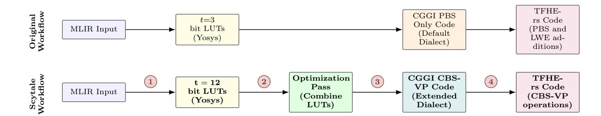

{0}------------------------------------------------

# Scytale: A Compiler Framework for Accelerating TFHE with Circuit Bootstrapping

Rostin Shokri and Nektarios Georgios Tsoutsos

University of Delaware, Newark DE 19716, USA {rostinsh, tsoutsos}@udel.edu

Abstract. Fully Homomorphic Encryption (FHE) offers strong cryptographic guarantees for secure outsourced computation, yet the performance of modern schemes like TFHE remains a barrier for complex applications. Existing TFHE approaches relying on programmable bootstrapping (PBS) are inefficient for large circuits, as they are limited to evaluating small (3-4 bit) lookup tables (LUTs). Our work introduces a novel compiler framework that overcomes this limitation by integrating circuit bootstrapping (CBS) and vertical packing (VP) to enable the evaluation of circuits composed of LUTs up to 12 bits. Our framework, built upon MLIR, introduces new dialects for CBS and VP and leverages Yosys for circuit synthesis, automating the translation from highlevel programs to optimized TFHE circuits. Furthermore, we propose bespoke optimization passes that combine shared LUTs to minimize the overall cryptographic operations required. Experimental results demonstrate that our CBS-based design achieves execution times several times faster than the baseline PBS-only approach, highlighting the practical benefits of combining CBS and VP with compiler-driven circuit-level optimizations.

Keywords: Circuit Bootstrapping · Fully Homomorphic Encryption · MLIR · Programmable Bootstrapping · TFHE

# 1 Introduction

In today's digital ecosystem, a vast range of applications, spanning areas like advanced machine learning workloads [\[19\]](#page-13-0) and large-scale genomic processing in healthcare [\[20\]](#page-13-1), are increasingly deployed in the cloud. While this shift provides access to powerful computational resources, it also exposes sensitive data to new risks. In particular, side-channel attacks [\[29,](#page-14-0)[30\]](#page-14-1) have demonstrated the ability to extract private information from co-located cloud tenants, raising serious concerns about confidentiality. Conventional cryptographic tools such as AES [\[9\]](#page-13-2) can secure data at rest and in transit, but to perform computations, decryption keys must be made available to the cloud environment, creating opportunities for leakage.

An effective solution to this problem is Fully Homomorphic Encryption (FHE) [\[13\]](#page-13-3), which allows for direct computation on encrypted data, without 

{1}------------------------------------------------

ever exposing the plaintext or the secret key. Over the past decade, numerous FHE schemes have emerged, each optimized for particular data types and computational patterns. Among them, the TFHE (Torus Fully Homomorphic Encryption) scheme [\[8\]](#page-13-4), also known as CGGI after its authors, has proven especially effective for non-linear operations and arbitrary program computation, owing to its programmable bootstrapping (PBS) primitive. This primitive can evaluate arbitrary univariate functions on small integers, typically between 1 and 4 bits. Recent refinements [\[26\]](#page-14-2), [\[27\]](#page-14-3) have significantly improved circuit bootstrapping (CBS), an operation that transforms ciphertext properties to enable different computational models. This improvement, in conjunction with the vertical packing (VP) operation, facilitates the efficient evaluation of larger lookup tables (LUTs), ranging from 6 to 20 bits.

To date, all compilers proposed in the literature that support the TFHE scheme have only utilized the PBS primitive as their core computational method. While this computing paradigm has proven to be effectively parallelizable at scale, especially for acceleration on specialized hardware such as the GPU [\[16\]](#page-13-5), it has inherent limitations. Many applications require operations on large-bitwidth inputs, necessitating a large number of PBS operations to compute functions such as 32-bit ciphertext multiplication. The first generation of TFHE compilers [\[18\]](#page-13-6), [\[15\]](#page-13-7) operated exclusively on binary circuits, but more advanced compilers were later introduced to support LUTs of 3 or 4 bits [\[1\]](#page-12-0), [\[17\]](#page-13-8). These compilers rely on the Yosys framework for RTL synthesis [\[28\]](#page-14-4) to convert a high-level program to an equivalent circuit, which is then translated into its FHE counterpart.

The new CBS-VP paradigm offers significantly higher computational throughput than a PBS-only execution, as it permits the efficient evaluation of larger LUTs via VP and exhibits a linear growth in execution time for LUTs up to approximately 12 bits, depending on the chosen parameters. For LUTs larger than 12 bits, the execution time of the VP operation increases exponentially, and grows to become as expensive as a single PBS operation for LUTs around 20 bits. The primary performance bottleneck in the CBS-VP workflow is the CBS operation. In its original formulation, a single CBS operation was approximately 10 times slower than a single PBS operation, rendering it largely impractical for many applications. The works in [\[27\]](#page-14-3) and [\[26\]](#page-14-2) proposed and refined a new CBS algorithm with an execution time less than twice that of a PBS, making it practical for real-world use. For instance, these improvements enable the evaluation of an AES decryption circuit in approximately 12 seconds on a single thread, which is nearly 3 times faster than the PBS-only solution of 32 seconds [\[2\]](#page-12-1).

While the new CBS-VP operations are promising, they present a more complex programming model, as the input ciphertexts to the CBS require different encodings than those used in a PBS-only computation. Additionally, the orchestration of CBS and VP operations is challenging to manage within a compiler environment, where a CBS operation must be applied to each ciphertext holding a single message bit before it can be used in a VP operation. A batched variant of CBS was introduced in [\[26\]](#page-14-2), which applies the CBS transformation to input ciphertexts encoding multiple message bits, thereby improving its performance. 

{2}------------------------------------------------

Similarly, the VP operation can produce ciphertexts that hold multiple message bits. The combination of standard and batched CBS operations, in conjunction with VP operations that have varying output formats (depending on the LUT), presents significant challenges for compiler automation.

In this work, we propose a new end-to-end compiler framework built on top of the HEIR (Homomorphic Encryption Intermediate Representation) compiler, which is based on the MLIR (Multi-Level Intermediate Representation) framework [\[21\]](#page-13-9). Our approach leverages the new CBS-VP operations to evaluate larger LUTs, up to 12 bits, under FHE. We propose a novel compiler pass that leverages batched CBS to improve performance and introduce new dialect extensions to the CGGI dialect to support CBS-VP operations. Our primary contributions are as follows:

- A novel optimization pass that combines LUTs with shared inputs, which minimizes the overall cryptographic operations required.
- Integration of batched CBS alongside standard CBS, enabling their interoperable use within a single application in our compiler workflow, which significantly reduces PBS count and improves performance.
- A novel compiler pipeline that unlocks large-bitwidth LUT evaluation (up to 12 bits) in TFHE by integrating a custom Yosys synthesis pass. This is supported by our new CGGI dialect extensions for the CBS-VP operations that facilitate the conversion to equivalent FHE programs.

Roadmap: The rest of the paper is organized as follows: In Section [2,](#page-2-0) we present essential background information on fully homomorphic encryption, the TFHE scheme, as well as the primitive operations over its ciphertext types. Section [3](#page-6-0) introduces our end-to-end compiler framework, which utilizes the CBS-VP operations and proposes a novel compiler pass to combine LUTs and reduce execution time for arbitrary circuits under FHE. In Section [4,](#page-8-0) we present our experimental evaluation on selected benchmarks on a CPU, and report significant speedups compared to the PBS-only execution, which is the current state-ofthe-art in arbitrary program computation in TFHE. Finally, Section [5](#page-10-0) discusses notable prior works, and Section [6](#page-12-2) presents our concluding remarks.

# <span id="page-2-0"></span>2 Background

#### 2.1 Fully Homomorphic Encryption

Fully Homomorphic Encryption enables meaningful computation to be carried out directly on ciphertexts, so that sensitive data never needs to be decrypted while it is being processed. In modern constructions, each ciphertext carries deliberately injected noise that grows with every homomorphic operation; once this noise surpasses a scheme-specific threshold, decryption fails. To prevent this, schemes employ bootstrapping, which homomorphically evaluates the decryption function on a ciphertext to reset its noise and thereby enable continued computation. Most contemporary FHE designs derive security from problems believed 

{3}------------------------------------------------

to be hard for both classical and quantum adversaries, notably Learning with Errors (LWE) [\[24\]](#page-13-10) and its ring variant (RLWE) [\[22\]](#page-13-11). Fundamentally, these schemes support homomorphic addition and multiplication, which together are sufficient to express arbitrary computations.

Several schemes natively target integer arithmetic. In BFV [\[12\]](#page-13-12) and BGV [\[4\]](#page-12-3), many integers can be "batched" into a single RLWE ciphertext, and both addition and multiplication are supported on this packed representation. CKKS [\[6\]](#page-12-4) offers similar functionality but is tailored to approximate real (floating-point–like) arithmetic.

At the bit level, FHEW [\[11\]](#page-13-13) (built on LWE/RLWE) encodes each bit in its own LWE ciphertext, enabling low-latency, gate-wise logic. Its gate bootstrapping mechanism applies Boolean operations (e.g., XOR, AND) and also refreshes the noise.

TFHE [\[8\]](#page-13-4) advances this line by introducing programmable bootstrapping. Using binary secret keys and a faster Blind Rotation primitive at the core of PBS, TFHE can evaluate arbitrary univariate functions while simultaneously refreshing noise. With standard parameters, a single PBS takes on the order of 10 milliseconds on a CPU. Moreover, TFHE can efficiently encrypt small integers (roughly 1 to 4 bits) using substantially smaller lattice parameters than wordwise schemes.

### 2.2 TFHE Operations

The original TFHE scheme [\[8\]](#page-13-4) is built upon three core operations: programmable bootstrapping, key switching, and modulus switching. Subsequent work [\[3\]](#page-12-5) introduced optimizations such as circuit bootstrapping and vertical packing, which enhance the scheme's performance and versatility for various applications. A description of each operation follows.

Modulus Switching The PBS operation requires that the modulus of the input LWE ciphertext be reduced from q to 2N, where N ≪ q. The modulus switching operation is given by:

$$a_i' = \left\lfloor a_i \cdot \frac{2N}{q} \right\rfloor \bmod 2N, \tag{1}$$

where:

- a<sup>i</sup> denotes the i-th coefficient (ring element) of the LWE ciphertext,
- ⌊·⌉ denotes rounding to the nearest integer.

In a nutshell, modulus switching helps reduce the size of the LWE elements to 2N, so that it is mathematically possible to rotate an accumulator of size N for PBS.

{4}------------------------------------------------

#### <span id="page-4-0"></span>Algorithm 1 Programmable Bootstrapping

Input: LWE ciphertext LWEs,q(µin · ∆in)

Input: Bootstrapping key bsk = {GGSW(si)} n−1 i=0

Input: GLWE ciphertext lut encoding function f with scaling factor ∆out

Output: LWE ciphertext LWEs,q(f(µin) · ∆out)

1: ct′ ← ModSwitch(LWEs,q(µin · ∆in))

2: rotated\_lut ← BlindRotate(ct′ , bsk, lut)

3: ct\_out ← SampleExtract(rotated\_lut)

4: return ct\_out

Programmable Bootstrap The programmable bootstrapping in TFHE is a three-step procedure that both refreshes a noisy LWE ciphertext and computes a user-specified function f on the encrypted input µin. The high-level flow (cf. Algorithm [1\)](#page-4-0) is: (i) apply modulus switching to map the ciphertext modulus down to 2N, where N is the GLWE (Generalized LWE) ring dimension; (ii) run a blind rotation (BR) operation on the modulus-switched ciphertext using a GLWE accumulator that encodes the lookup table for f; and (iii) perform sample extraction on the first polynomial coefficient of the rotated GLWE, producing an LWE ciphertext (under the GLWE secret key S) that encrypts f(µin). The blind rotation is realized via the homomorphic multiplexer (CMUX) primitive introduced in [\[8\]](#page-13-4); implementation details of this step are given in [\[8\]](#page-13-4).

Circuit Bootstrapping (CBS) In circuit bootstrapping, each input bit is encrypted as its own LWE ciphertext; these LWEs are then lifted to the GGSW (Generalized GSW)[1](#page-4-1) form. The resulting GGSW ciphertexts are consumed by the VP operation [\[8\]](#page-13-4), which is implemented via a blind rotation and, when required, a CMUX tree, returning an LWE encryption of the desired output. Formally, CBS ingests LWEs(m · ∆), where m ∈ {0, 1} and ∆ = q/2 for modulus q, and emits a GGSW ciphertext.

A GGSW ciphertext is parameterized by a decomposition depth ℓ and base β. It consists of (k+1)ℓ GLWE ciphertexts, each encrypting the message m under the GLWE secret key S = (S0, . . . , Sk). While GGSW supports nonbinary payloads, we assume m is one bit for CBS. We write its components as

$$\mathrm{GLWE}_S\!\left(m\cdot S_i\cdot \frac{q}{\beta^j}\right),\quad 1\leq j\leq \ell,\ 0\leq i\leq k,$$

where j indexes the decomposition level and β j is the j-th power of the base.

Recent results [\[26,](#page-14-2)[27\]](#page-14-3) substantially reduce CBS latency by introducing more efficient key-switching and scheme-switching pipelines. The method splits CBS into two phases: a refresh stage that produces multiple scaled LWE encryptions of the same bit via PBS, followed by a conversion stage that assembles those LWEs into a single GGSW. Concretely:

<span id="page-4-1"></span><sup>1</sup> The GSW scheme was introduced by Gentry, Sahai, and Waters [\[14\]](#page-13-14).

{5}------------------------------------------------

- **PBSmanyLUT:** Performs the refresh using a single Blind Rotation, deliberately omitting Sample Extraction to accelerate the step.
- Homomorphic Trace (HomTrace): Applies GLWE key switching to retain only monomial terms carrying the message bits, zeroing out all others.
- Scheme Switching (SS): Uses an external product to combine the secret key with the preceding GLWE ciphertexts, yielding valid GGSW ciphertexts.

For a comprehensive description of the algorithms, see [26, 27].

# 2.3 Vertical Packing (VP)

Given GGSW ciphertexts that each encrypt a single bit, an LUT can be evaluated via vertical packing using CMUX gates. When the number of input bits m satisfies  $m \leq \log_2 N$  (with N the GLWE ring dimension), the LUT requires only a blind rotation. This BR in VP is substantially more efficient than the one in PBS, because VP uses merely  $\log_2 N$  CMUX operations, whereas in a standard PBS the BR requires n CMUX operations, with  $n \gg \log_2 N$  in typical parameter sets. If  $m > \log_2 N$ , the inputs are first reduced by a CMUX tree before running BR; the tree costs  $2^{m-\log_2 N} - 1$  CMUX operations, which is exponential in the excess over  $\log_2 N$ .

The resulting LWE ciphertext can encode up to  $\log_2 p$  output bits, where p is the message modulus for the chosen parameters. Consequently, an m-to-m bit LUT must be partitioned into  $\frac{m}{\log_2 p}$  separate VP evaluations. For instance, an 8-to-8 bit LUT with p=2 requires 8 VP runs.

#### 2.4 Our Assumed Threat Model

We target the TFHE scheme [7] in our implementation. TFHE provides chosenplaintext indistinguishability (IND-CPA) by default, which is the standard security setting for most FHE applications. Its programmable bootstrapping introduces a nonzero decryption-failure probability,  $P_{\text{fail}}$ , largely due to noise growth during modulus switching. Throughout this work, we tune parameters to cap this failure rate at  $2^{-40}$ , a conventional target in the literature.

Cheon et al. [5] recently demonstrated a key-recovery attack against exact schemes (which incur no precision loss from homomorphic computations) like TFHE that breaks IND-CPA<sup>D</sup> by exploiting access to a decryption oracle (denoted as  $^D$ ) together with nonzero decryption-failure events. Under this stronger threat model,  $P_{\text{fail}}$  itself becomes a security-critical parameter, motivating a tighter bound of  $2^{-128}$  or lower. Meeting this bound requires larger cryptographic parameters and, therefore, increases the runtime of both PBS and CBS. For completeness, we also provide parameter sets that satisfy this stricter failure target, enabling deployments to choose according to their performance and security needs.

{6}------------------------------------------------



<span id="page-6-1"></span>Fig. 1. Comparison of the original compiler workflow with Scytale's optimized workflow. The numbered steps in Scytale's flow highlight our key contributions: (1) We introduce a bespoke Yosys pass that performs technology mapping to larger LUTs, up to 12 bits in size; (2) Our novel optimization pass combines LUTs with the same set of inputs, and replaces them with multi-output LUTs; (3) Lowering to our extended CGGI dialect, which incorporates novel intermediate representation operations for CBS and VP; (4) A new code generation pass targeting the TFHE-rs library and the CBS implementation from [26]. Although Scytale introduces an additional optimization pass, the compilation overhead is negligible because the total runtime remains dominated by the Yosys step.

# <span id="page-6-0"></span>3 Our Proposed Framework

### 3.1 Our Compiler Workflow

To transform high-level programs into efficient TFHE code, we propose *Scytale*, a new multi-stage compiler workflow built upon the MLIR infrastructure. The pipeline, illustrated in the Figure 1, begins with a program represented in a high-level MLIR dialect, and it is designed to generate optimized code for the Rust-based TFHE-rs library, by applying a series of compiler passes at different levels of abstraction. The key stages of our compilation process are:

- 1. **Generalized Technology Mapping:** We introduce a bespoke Yosys pass for technology mapping. Unlike the default pass in HEIR, which can only generate 3-bit LUTs, our pass maps the circuit directly to large, t-bit LUTs, supporting input sizes of up to t = 12. This allows for a more compact and efficient representation of complex functions.
- 2. Circuit Optimization pass: A novel optimization pass that identifies LUTs that share the same set of inputs and combines them into multi-output LUTs. We also introduce new LUT dialect extensions in HEIR and define a multi-output LUT, where each output bit is computed by a separate function; in this case, each function is encoded individually and stored in the metadata of the LUT. This custom pass reduces the number of cryptographic operations and improves efficiency.
- 3. Lowering to Extended CGGI dialect: The optimized circuit is then lowered to our CGGI dialect extensions. We introduce new high-level operations that represent the single- and multi-output LUTs. These operations encapsulate circuit bootstrapping, its batched variation, and vertical packing with variable-sized outputs.
- 4. **Code Generation:** In the final stage, we define a new pass to translate the CGGI intermediate representation (IR) program to equivalent code targeting the TFHE-rs library and the CBS implementation from [26].

{7}------------------------------------------------

<span id="page-7-0"></span>Algorithm 2 Combine LUTs with Equal Inputs into One Multi-Output LUT

**Input:** Block B of TruthTableOps; each op has inputs I (ordered list) and single-output table T.

**Output:** Groups of LUTs that share the same inputs are replaced by one multi-output LUT.

```
1: G \leftarrow \text{empty map from key to list of ops}
 2: for all operation op in B in program order do
        {\bf if}\ op\ {\bf is}\ {\bf TruthTableOp}\ {\bf then}
 3:
 4:
            k \leftarrow (|op.I|, \text{ tuple}(op.I))
                                                       // equal arity \& identical ordered inputs
            G[k].push back(op)
 5:
 6: for all group L in values of G do
        if |L| \leq 1 then
 7:
 8:
            continue
        I \leftarrow L[0].I
 9:
10:
         [T_1,\ldots,T_m] \leftarrow \text{tables from } L \text{ in block order}
        T^* \leftarrow \text{BuildMultiOutputTable}([T_1, \dots, T_m]) // \text{row-wise concat of outputs}
11:
12:
        M \leftarrow \texttt{MultiTruthTableOp}(I, T^{\star})
                                                                // produces outputs M[0..m-1]
13:
        for i \leftarrow 0 to m-1 do
             Replace all uses of L[i].result with M[i]
14:
15:
        for i \leftarrow 0 to m-1 do
16:
             Erase L[i] from B
17: function BuildMultiOutputTable([T_1, \ldots, T_m])
18:
        return table formed by concatenating each row's bits/entries across T_1, \ldots, T_m
```

#### 3.2 Optimization to Reduce Cryptographic Operations

The optimization pass we introduce significantly reduces the PBS count, which is the most costly cryptographic operation in the CBS-VP workflow, as well as the number of VP and key switching operations. The goal is to identify the LUTs with the same set of distinct inputs and represent them as a single multi-output LUT. In other words, we are identifying nodes in the circuit's data-flow graph that share an identical set of input wires. These nodes are then merged into a single, consolidated node that produces multiple outputs.

When lowering to our custom CGGI dialect, each multi-output LUT with m outputs will be represented as  $\left\lceil \frac{m}{\tau} \right\rceil$  VP operations, where each VP outputs an LWE ciphertext holding  $\tau$  output bits, except for the last one, which holds the remaining  $m \pmod{\tau}$  of the output bits.

If the output bits are used in subsequent LUTs, a CBS operation must be used to convert the LWE ciphertexts to GGSW ciphertexts. Since each LWE ciphertext holds multiple bits, the batched variation of CBS is used, where only one underlying PBS operation is used within the batched CBS to convert multiple bits to multiple GGSW ciphertexts, each holding one of the bits. Without this batched variant, a separate PBS operation is needed for each output bit. This optimization significantly reduces the number of PBS and key switching operations for the output LWE ciphertexts, leading to substantial improvements in execution time. A detailed description of our optimization pass is provided in Algorithm 2.

{8}------------------------------------------------

#### 3.3 Lowering to the CGGI CBS-VP Dialect

Since we use CBS-VP operations that are not defined in HEIR, we introduce new dialect extensions using MLIR, and design a compiler pass that lowers an MLIR program composed of single- and multi-output LUTs with up to t input bits into equivalent CBS and VP operations. For single-output LUTs, the corresponding VP operation outputs a binary LWE ciphertext, so a standard CBS is performed on the resulting ciphertext. Conversely, for the multi-output case, the VP operations produce LWE ciphertexts holding τ bits of message, and a batched CBS is performed on the resulting ciphertext. Note that standard CBS or batched CBS is only used when the output bit(s) are used as input(s) in a subsequent LUT.

Batched CBS: Since the τ parameter greatly affects the Pfail, using higher values of τ to increase the batch size significantly increases the failure probability, as noise accumulation becomes excessive for ring dimension N. Doubling N more than doubles the execution time for the PBS, which reduces performance. To this end, we utilize the Centered Mean Noise Reduction technique introduced in [\[25\]](#page-13-15) to decrease the noise growth in the modulus switching, which allows us to choose higher values of τ while using the same efficient ring parameters.

# 3.4 Frontend for Scytale's Compiler

Currently, our compiler ingests programs written directly in an MLIR format, which is then lowered to equivalent CGGI CBS-VP code by using our compiler passes. Since we built our compiler framework on top of HEIR, it is possible to use HEIR's Python frontend to generate FHE programs by writing annotated Python programs (where variables intended for FHE encryption are explicitly marked), and then generate valid MLIR code. Another existing frontend is Polygeist [\[23\]](#page-13-16), which is a C/C++ frontend that can only translate a small subset of programs to valid MLIR, and it is not fully robust in its current stage. Developing a new and robust frontend to generate efficient MLIR code is an exciting future direction that falls outside the scope of this paper.

# <span id="page-8-0"></span>4 Experimental Evaluation

To evaluate the practicality and efficiency of the proposed Scytale framework, we compare its efficiency and performance against a baseline compiler using selected benchmarks. We also present optimized parameter sets for both our approach and the baseline method, targeting various failure probabilities. All experiments were conducted on an Ubuntu workstation equipped with an AMD 7970X CPU and 160 GB of RAM. We note that all experimental results are based on singlethreaded execution. For our evaluations, we target the TFHE-rs library as our TFHE backend, and adopt the refined CBS algorithm from [\[26\]](#page-14-2). In addition, all parameter sets are configured to provide 128 bits of cryptographic security, which is standard.

{9}------------------------------------------------

<span id="page-9-0"></span>Table 1. Optimized parameters for LUT evaluation in CBS-VP mode. The parameters support computations on large-bitwidth LUTs (up to 12 bits) while satisfying the target failure probability.

| Set | n | N          | k ℓks | Bks    | ℓpbs | Bpbs    | ℓtr | Btr     | ℓss | Bss     | ℓggsw | Bggsw  | ϑ τ   | Pfail   |
|-----|---|------------|-------|--------|------|---------|-----|---------|-----|---------|-------|--------|-------|---------|
| I   |   | 768 1024 2 | 3     | 4<br>2 | 2    | 15<br>2 | 4   | 10<br>2 | 2   | 17<br>2 | 2     | 7<br>2 | 1 3 2 | −40.78  |
| II  |   | 640 1024 2 | 7     | 2<br>2 | 2    | 15<br>2 | 5   | 9<br>2  | 2   | 17<br>2 | 2     | 7<br>2 | 1 2 2 | −130.41 |

<span id="page-9-1"></span>Table 2. Parameter set for a PBS-only execution of 3-bit LUTs with 1 bit of padding. Centered Mean Noise Reduction is used to reduce the noise growth.

| Set | n | N          | k ℓpbs | Bpbs    | ℓks | Bks    | Pfail        |
|-----|---|------------|--------|---------|-----|--------|--------------|
| I   |   | 768 1024 2 | 1      | 23<br>2 | 7   | 2<br>2 | −43.13<br>2  |
| II  |   | 953 1024 2 | 1      | 23<br>2 | 5   | 3<br>2 | −134.34<br>2 |

### 4.1 Cryptographic Parameter Sets

The two most computationally expensive operations are the PBS and HomTrace operations. In terms of memory overhead, the ℓggsw parameter should be minimized to reduce the size of the GGSW ciphertexts, which are larger than their LWE counterparts. We use the batched CBS with τ = 3, and generate an efficient parameter set that achieves a failure probability of approximately Pfail = 2<sup>−</sup><sup>40</sup> . To achieve the stricter target of Pfail ≈ 2 <sup>−</sup>128, we reduce τ to 2 while maintaining the same ring parameters to prevent PBS performance degradation.

Table [1](#page-9-0) lists the judiciously optimized parameters for our workflow. The ℓggsw is set to the minimum possible value, since setting it to 1 would cause uncontrollable noise growth irrespective of other parameters. For comparison, Table [2](#page-9-1) presents efficient parameters for the baseline PBS-only workflow. Note that the Centered Mean Noise Reduction technique is applied to reduce the noise growth, and as a result, enables the use of more efficient parameters. For the baseline PBS parameter set, we optimize the parameters for a 4-bit plaintext, corresponding to the 3-bit LUTs with 1 bit of padding targeted by HEIR.

# 4.2 Ciphertext-Ciphertext Multiplication

Ciphertext multiplication is a fundamental operation in FHE that is used in many applications. Since TFHE does not natively support ciphertext multiplication, it must be implemented by composing LUTs. We evaluate multiplication using the parameter sets from Table [1](#page-9-0) for our Scytale methodology, and Table [2](#page-9-1) for the HEIR baseline. We evaluate ciphertext multiplications across different bit-widths and failure probabilities, and report our results in Table [3](#page-10-1)

#### 4.3 Encrypted BubbleSort

To showcase the efficiency gains of our compiler framework on a more complex application, we implement bubble sort in MLIR for different array sizes and data

{10}------------------------------------------------

<span id="page-10-1"></span>

| Bit-width | Set | HEIR [1] (s) | Ours (s) | Speedup (×) |
|-----------|-----|--------------|----------|-------------|
| 8         | I   | 1.01         | 0.20     | 5.05        |
|           | II  | 1.14         | 0.22     | 5.18        |
| 16        | I   | 4.68         | 0.85     | 5.50        |
|           | II  | 5.33         | 1.04     | 5.12        |
| 32        | I   | 19.10        | 4.03     | 4.73        |
|           | II  | 21.71        | 4.06     | 5.34        |
| 64        | I   | 76.0         | 17.11    | 4.44        |
|           | II  | 86.44        | 17.26    | 5.00        |

Table 3. Execution time (s) of ciphertext × ciphertext multiplications across different bit-widths and parameter sets.

bit-widths, and compare it with the baseline PBS-only execution in HEIR. We chose this algorithm specifically because its frequent compare-and-swap operations create a computational bottleneck that directly highlights Scytale's advantage: synthesizing complex, multi-bit functions into large, efficient LUTs. As the baseline implementation (HEIR) currently requires manual loop unrolling, we selected array sizes that allow for verifiable manual code generation while still clearly demonstrating the performance scaling.

Our results presented in Table [4](#page-11-0) demonstrate consistent performance improvements, with our framework achieving speedups ranging from 1.77× to 3.23×. The core of the bubble sort algorithm is the compare-and-swap operation, which our compiler synthesizes into large-bitwidth LUTs that can be evaluated efficiently using a minimal number of VP calls. In contrast, the baseline approach must decompose this operation into a deep circuit of many small 3-bit LUTs, incurring substantial PBS overhead. This architectural advantage is most evident in the 2-element sort (a single compare-and-swap), where we observe the highest speedups. As the array size increases, this optimization is compounded, leading to significant overall application speedups of approximately 2×. Notably, these gains are robust across both standard (Set I) and high-security (Set II) parameters, confirming the effectiveness of our approach.

# <span id="page-10-0"></span>5 Related Works

Existing compilers for arbitrary program execution in TFHE have exclusively relied on PBS to evaluate circuits composed of small-sized LUTs (1 to 4 bits); typically, these methods rely on high-level synthesis tools and Yosys for homomorphic circuit generation. The first generation of compilers [\[15,](#page-13-7) [18\]](#page-13-6) relied on high-level synthesis tools, such as GoogleXLS [\[10\]](#page-13-17), that consume C++ programs and convert them into Verilog. Yosys was then used to translate these designs into Boolean netlists, where each gate was evaluated in FHE using the Gate Bootstrapping primitive from TFHE [\[8\]](#page-13-4). A significant drawback of this approach is that for programs with complex control flow, such as loops, the resulting Boolean

{11}------------------------------------------------

Table 4. Execution time (s) of bubble sort for different parameter sets, array sizes, and integer types.

<span id="page-11-0"></span>

| Type   | Size | Set | HEIR [1] (s) | Ours (s) | Speedup (×) |
|--------|------|-----|--------------|----------|-------------|
|        | 2    | I   | 0.32         | 0.11     | 2.90        |
| 8-bit  |      | II  | 0.38         | 0.13     | 2.92        |
|        | 5    | I   | 3.48         | 1.73     | 2.01        |
|        |      | II  | 3.98         | 1.83     | 2.17        |
|        |      | I   | 0.72         | 0.24     | 3.00        |
| 16-bit | 2    | II  | 0.85         | 0.3      | 2.83        |
|        | 5    | I   | 7.68         | 4.31     | 1.78        |
|        |      | II  | 8.79         | 4.32     | 2.03        |
|        |      | I   | 1.65         | 0.53     | 3.11        |
| 32-bit | 2    | II  | 1.93         | 0.63     | 3.06        |
|        |      | I   | 16.69        | 8.05     | 2.07        |
|        | 5    | II  | 19.08        | 8.53     | 2.23        |
|        |      | I   | 3.4          | 1.05     | 3.23        |
| 64-bit | 2    | II  | 3.96         | 1.28     | 3.09        |
|        | 5    | I   | 33.02        | 18.59    | 1.77        |
|        |      | II  | 37.76        | 18.77    | 2.01        |

circuit can become prohibitively large for efficient FHE evaluation. For example, a 32-bit multiplication would require 32 seconds using the Google Transpiler, or 56 seconds in Romeo [\[17,](#page-13-8) Figure 6].

To improve upon this, the HELM compiler [\[17\]](#page-13-8) utilized parallelization strategies to reduce the execution overhead of large circuits with large width, and proposed an LUT mode to compute circuits composed of small LUTs, which significantly improves performance. While HELM was a major improvement, a key limitation is its restrictive C++ frontend, which supports only a reduced subset of the language. Moreover, another restriction of high-level synthesis tools such as Google-XLS is loop unrolling (which is limited to 100 loop iterations in this case).

More recently, the HEIR compiler [\[1\]](#page-12-0) was introduced as an all-purpose FHE compiler, which is designed to target multiple FHE schemes and the ability to support various frontends in future iterations (currently only Python is supported). Similar to HELM, HEIR utilizes Yosys to generate circuits composed of small LUTs (where 3-bit LUTs are chosen as the optimal target). The default passes in HEIR convert input programs in the MLIR representation to 3-bit LUTs, and then lower them to a CGGI dialect, which consists of PBS operations (including key switching and modulus switching) and LWE additions. In contrast, our work overhauls the Yosys pass to generate circuits with LUTs up to 12-bit inputs (instead of 3-bits in HEIR), while leveraging the CBS-VP paradigm to compute these larger LUTs efficiently, achieving a significant speedup in our experiments.

{12}------------------------------------------------

# <span id="page-12-2"></span>6 Concluding Remarks

In this work, we introduce a novel end-to-end compiler framework that translates plaintext programs in MLIR format into equivalent FHE programs that leverage the CBS-VP computational paradigm. Our Scytale framework integrates a new Yosys workflow on top of HEIR to generate circuits with LUTs up to 12 bits in size (instead of 3 bits in previous works). Scytale can compute these larger LUTs efficiently using circuit bootstrapping and vertical packing. Our framework also features novel optimization passes to combine LUTs, thereby reducing the total number of cryptographic operations to increase efficiency. Specifically, we integrated the batched CBS operation, enhanced by the Centered Mean Noise Reduction technique to mitigate FHE noise growth and reduce the total PBS count, which yields major performance benefits in the CBS-VP workflow. Additionally, we introduce new dialect operations in HEIR to support multi-output LUTs of varied size and the new CBS-VP operations when lowering from LUTs to CGGI operations. Our experimental evaluation on selected benchmarks demonstrates significant speedups ranging from 1.7× to 5.5× compared to the PBS-only execution. Overall, our compiler establishes a new foundation for TFHE-based arbitrary program computation in Fully Homomorphic Encryption.

# Acknowledgments

This work has been supported by NSF Awards #2239334.

# References

- <span id="page-12-0"></span>1. Ali, A., Choi, J., Gipson, B., Gorantala, S., Kun, J., Legiest, W., Lim, L., Viand, A., Demissie, M.Z., Zheng, H.: Heir: A universal compiler for homomorphic encryption (2025), <https://arxiv.org/abs/2508.11095>
- <span id="page-12-1"></span>2. Belaïd, S., Bon, N., Boudguiga, A., Sirdey, R., Trama, D., Ye, N.: Further Improvements in AES Execution over TFHE. IACR Communications in Cryptology 2(1) (2025)
- <span id="page-12-5"></span>3. Bergerat, L., Boudi, A., Bourgerie, Q., Chillotti, I., Ligier, D., Orfila, J.B., Tap, S.: Parameter optimization and larger precision for (T)FHE. Journal of Cryptology 36(3), 28 (2023)
- <span id="page-12-3"></span>4. Brakerski, Z., Gentry, C., Vaikuntanathan, V.: (Leveled) fully homomorphic encryption without bootstrapping. ACM Transactions on Computation Theory (TOCT) 6(3), 1–36 (2014)
- <span id="page-12-7"></span>5. Cheon, J.H., Choe, H., Passelègue, A., Stehlé, D., Suvanto, E.: Attacks against the IND-CPAD security of exact FHE schemes. In: ACM Conference on Computer and Communications Security. pp. 2505–2519 (2024)
- <span id="page-12-4"></span>6. Cheon, J.H., Kim, A., Kim, M., Song, Y.: Homomorphic encryption for arithmetic of approximate numbers. In: ASIACRYPT. pp. 409–437. Springer (2017)
- <span id="page-12-6"></span>7. Chillotti, I., Gama, N., Georgieva, M., Izabachène, M.: Faster fully homomorphic encryption: Bootstrapping in less than 0.1 seconds. In: ASIACRYPT. pp. 3–33. Springer (2016)

{13}------------------------------------------------

- <span id="page-13-4"></span>8. Chillotti, I., Gama, N., Georgieva, M., Izabachène, M.: TFHE: Fast Fully Homomorphic Encryption over the Torus. Journal of Cryptology 33(1), 34–91 (2020)
- <span id="page-13-2"></span>9. Daemen, J., Rijmen, V.: The design of Rijndael: The Advanced Encryption Standard (AES). Springer (2020)
- <span id="page-13-17"></span>10. Dai, W., Sunar, B.: XLS: Accelerated HW Synthesis. [https://github.com/](https://github.com/google/xls) [google/xls](https://github.com/google/xls) (2020)
- <span id="page-13-13"></span>11. Ducas, L., Micciancio, D.: FHEW: Bootstrapping Homomorphic Encryption in Less Than a Second. In: EUROCRYPT. pp. 617–640. Springer (2015)
- <span id="page-13-12"></span>12. Fan, J., Vercauteren, F.: Somewhat practical fully homomorphic encryption. Cryptology ePrint Archive, Report 2012/144 (2012)
- <span id="page-13-3"></span>13. Gentry, C.: Fully homomorphic encryption using ideal lattices. In: ACM Symposium on Theory of Computing. p. 169–178. Association for Computing Machinery, New York, NY, USA (2009). <https://doi.org/10.1145/1536414.1536440>
- <span id="page-13-14"></span>14. Gentry, C., Sahai, A., Waters, B.: Homomorphic encryption from learning with errors: Conceptually-simpler, asymptotically-faster, attribute-based. In: Annual cryptology conference. pp. 75–92. Springer (2013)
- <span id="page-13-7"></span>15. Gorantala, S., Springer, R., Purser-Haskell, S., Lam, W., Wilson, R., Ali, A., Astor, E.P., Zukerman, I., Ruth, S., Dibak, C., Schoppmann, P., Kulankhina, S., Forget, A., Marn, D., Tew, C., Misoczki, R., Guillen, B., Ye, X., Kraft, D., Desfontaines, D., Krishnamurthy, A., Guevara, M., Perera, I.M., Sushko, Y., Gipson, B.: A General Purpose Transpiler for Fully Homomorphic Encryption. Cryptology ePrint Archive, Report 2021/811 (2021)
- <span id="page-13-5"></span>16. Gouert, C., Joseph, V., Dalton, S., Augonnet, C., Garland, M., Tsoutsos, N.G.: Hardware-accelerated encrypted execution of general-purpose applications. Proceedings on Privacy Enhancing Technologies (2025)
- <span id="page-13-8"></span>17. Gouert, C., Mouris, D., Tsoutsos, N.G.: HELM: Navigating homomorphic encryption through gates and lookup tables. IEEE Transactions on Information Forensics and Security 20, 2822–2835 (2025)
- <span id="page-13-6"></span>18. Gouert, C., Tsoutsos, N.G.: Romeo: Conversion and evaluation of hdl designs in the encrypted domain. In: 2020 57th ACM/IEEE Design Automation Conference (DAC). pp. 1–6. IEEE (2020)
- <span id="page-13-0"></span>19. Khan, T., Tian, W., Zhou, G., Ilager, S., Gong, M., Buyya, R.: Machine learning (ML)-centric resource management in cloud computing: A review and future directions. Journal of Network and Computer Applications 204, 103405 (2022)
- <span id="page-13-1"></span>20. Langmead, B., Nellore, A.: Cloud computing for genomic data analysis and collaboration. Nature Reviews Genetics 19(4), 208–219 (2018)
- <span id="page-13-9"></span>21. Lattner, C., Amini, M., Bondhugula, U., Cohen, A., Davis, A., Pienaar, J., Riddle, R., Shpeisman, T., Vasilache, N., Zinenko, O.: MLIR: Scaling compiler infrastructure for domain specific computation. In: 2021 IEEE/ACM International Symposium on Code Generation and Optimization (CGO). pp. 2–14. IEEE (2021)
- <span id="page-13-11"></span>22. Lyubashevsky, V., Peikert, C., Regev, O.: On ideal lattices and learning with errors over rings. In: EUROCRYPT. pp. 1–23. Springer (2010)
- <span id="page-13-16"></span>23. Moses, W.S., Chelini, L., Zhao, R., Zinenko, O.: Polygeist: Raising C to polyhedral MLIR. In: 30th International Conference on Parallel Architectures and Compilation Techniques (PACT). pp. 45–59. IEEE (2021)
- <span id="page-13-10"></span>24. Regev, O.: On lattices, learning with errors, random linear codes, and cryptography. Journal of the ACM 56(6), 1–40 (2009)
- <span id="page-13-15"></span>25. de Ruijter, T., D'Anvers, J.P., Verbauwhede, I.: Don't be mean: Reducing approximation noise in TFHE through mean compensation. Cryptology ePrint Archive, Report 2025/809 (2025)

{14}------------------------------------------------

- <span id="page-14-2"></span>26. Wang, R., Ha, J., Shen, X., Lu, X., Chen, C., Wang, K., Lee, J.: Refined TFHE leveled homomorphic evaluation and its application. Cryptology ePrint Archive, Report 2024/1318 (2024)
- <span id="page-14-3"></span>27. Wang, R., Wen, Y., Li, Z., Lu, X., Wei, B., Liu, K., Wang, K.: Circuit bootstrapping: faster and smaller. In: EUROCRYPT. pp. 342–372. Springer (2024)
- <span id="page-14-4"></span>28. Wolf, C., Glaser, J., Kepler, J.: Yosys - A Free Verilog Synthesis Suite. In: Proceedings of the 21st Austrian Workshop on Microelectronics (Austrochip). vol. 97 (2013)
- <span id="page-14-0"></span>29. Zhang, Y., Juels, A., Reiter, M.K., Ristenpart, T.: Cross-VM side channels and their use to extract private keys. In: ACM Computer and Communications Security. pp. 305–316 (2012)
- <span id="page-14-1"></span>30. Zhang, Y., Juels, A., Reiter, M.K., Ristenpart, T.: Cross-tenant side-channel attacks in PaaS clouds. In: ACM Computer and Communications Security. pp. 990– 1003 (2014)