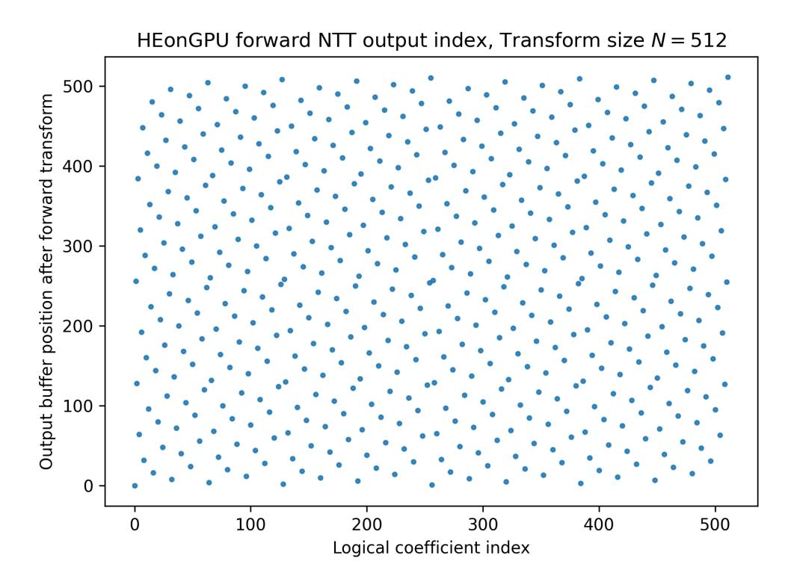
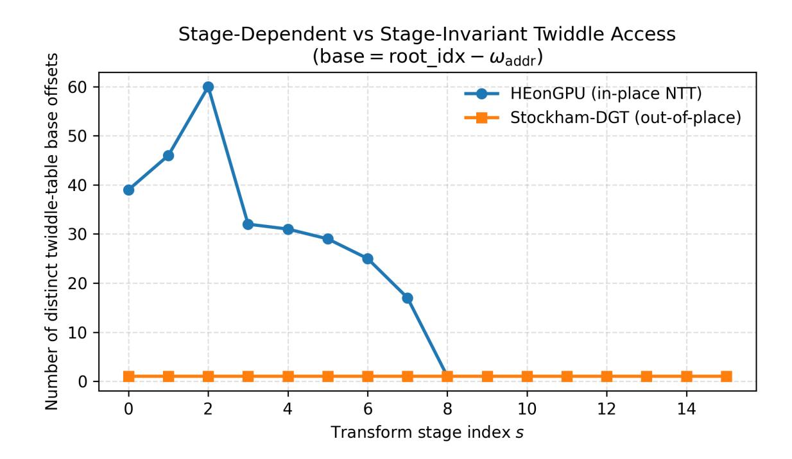
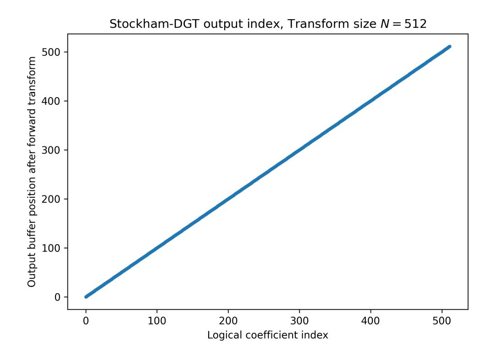
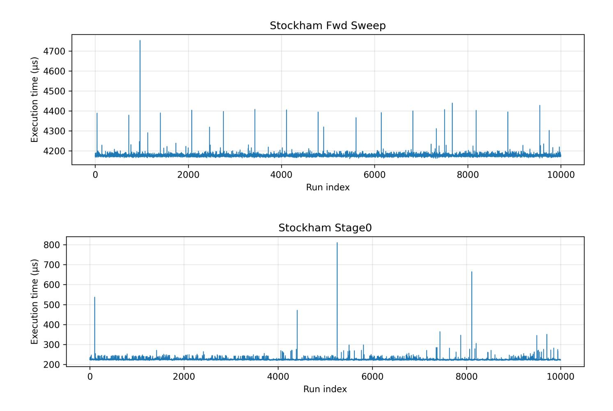
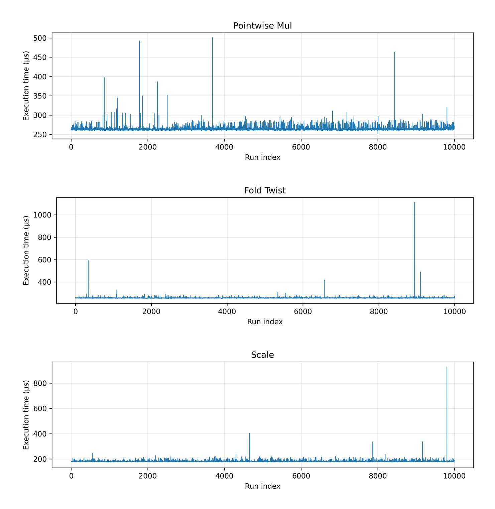

{0}------------------------------------------------

# **Janus-FHE: A Side Channel Resilient Framework for High-Degree Homomorphic Encryption on GPUs**

Kashfia Farheen and Nektarios Georgios Tsoutsos

University of Delaware [{farheen,tsoutsos}@udel.edu](mailto:{farheen, tsoutsos}@udel.edu)

**Abstract.** Homomorphic Encryption (HE) enables secure cloud computing through computations on encrypted data, yet the physical security of these implementations on shared hardware accelerators remains a critical challenge. While Graphics Processing Units (GPUs) offer the massive parallelism required for HE workloads, their Single Instruction Multiple Thread (SIMT) architecture amplifies side-channel vulnerabilities. Standard implementations of polynomial multiplication and relinearization often exhibit data-dependent control flows and irregular memory access patterns that leak sensitive information through variable timing behavior. In this paper, we present Janus-FHE, a GPU-based framework for BFV ciphertext multiplication and relinearization designed with intrinsic side-channel resistance. We reformulate polynomial multiplication as large-integer arithmetic via Kronecker substitution, executing it using a Schonhage-Strassen algorithm based on the Discrete Galois Transform (DGT). Critically, we compute these transforms using the Stockham algorithm, which enforces strictly deterministic, input-independent memory access patterns, effectively mitigating cache-timing vulnerabilities. Furthermore, we implement a constant-time relinearization strategy that replaces conditional branching with masked arithmetic to prevent warp divergence. Our experimental evaluation confirms that Janus-FHE eliminates the control-flow leakage observed in state-of-the-art libraries like HEonGPU, extending the computational reach of GPU-based FHE by successfully computing multiplications for polynomial degrees up to 2 18 .

**Keywords:** Homomorphic Encryption · Side Channel Resilience · Discrete Galois Transform · GPU Acceleration

## **1 Introduction**

The paradigm shift towards remote computing services has been brought about by a simple economic reality: it is far more efficient to pay for cloud infrastructure rather than purchasing and maintaining locally hosted infrastructure. Increasingly, organizations are migrating computational workloads to off-premise infrastructure instead of incurring high capital expenditures for on-premise infrastructure [\[AFG](#page-20-0)<sup>+</sup>10, [DG08,](#page-21-0) A<sup>+</sup>[16\]](#page-19-0). Platforms like Google Workspace and Microsoft 365 allow real-time document editing across thousands of miles; storage solutions like Amazon S3 and Dropbox replace local hard drives; and database services like AWS RDS or Azure SQL eliminate the need for on-premise maintenance. Furthermore, the rise of serverless computing models such as AWS Lambda and container orchestration platforms such as Kubernetes has fundamentally decoupled software deployment from physical hardware. However, cloud efficiency introduces significant privacy challenges [\[MG11\]](#page-22-0). Consequently, data owners must entrust sensitive information to third-party providers who own and maintain the servers. In this environ

{1}------------------------------------------------

ment, an honest-but-curious server poses a significant threat. While the server may not be malicious in nature, they may be able to peek at sensitive client information, if there are no confidentiality measures protecting the data. Even with regulatory frameworks like GDPR, the risk of malicious exploitation remains high [\[VVdB17\]](#page-22-1).

Standard encryption techniques [\[RAD78\]](#page-22-2) do not provide a solution to this dilemma; as it is able to protect the data only in storage and transit. In order to perform meaningful computations on the data, it has to be decrypted. Homomorphic Encryption (HE) represents a cryptographic breakthrough in this particular scenario. HE allows computations to be done on encrypted data; the output of a ciphertext computation would be the encrypted form of the output of the same computation using those corresponding plaintexts. HE can therefore ensure the privacy of the data that is to be processed on a cloud server, as the data would remain encrypted throughout the computation [\[Gen09\]](#page-21-1).

Modern HE schemes encode the message or data into vectors of integers or floating-point numbers [\[FV12,](#page-21-2) [BGV14,](#page-20-1) [CKKS17,](#page-20-2) [CGGI20\]](#page-20-3); when encrypted, the ciphertext takes the form of tuples of high-degree polynomials with very large coefficients [\[BEHO16,](#page-20-4) [HS14\]](#page-21-3). As a consequence, ciphertext computations require polynomial arithmetic. This process of computation on ciphertexts becomes orders of magnitude slower than computations done on their corresponding plaintexts due to the magnitude of ciphertext polynomial coefficient sizes. While ciphertext polynomial additions are linear and computationally inexpensive, ciphertext multiplication becomes a significant bottleneck, as it is the cornerstone of most non-linear HE operations like activation functions in neural networks. Ciphertext multiplication involves large polynomial convolutions and auxiliary maintenance procedures such as key switching and relinearization to control ciphertext growth and maintain correctness. After multiplication, product ciphertexts often have an expanded number of components; relinearization transforms those ciphertexts back into a fixed number of components using evaluation keys derived from the secret key.

To tackle the complexity of ciphertext multiplications, there are several algorithmic strategies for computing this operation. One can utilize the schoolbook route, where every component of a polynomial is multiplied to every other component of the other polynomial and summed; while simple, this is prohibitively slow. The Karatsuba algorithm [\[KO62\]](#page-21-4) follows a divide-and-conquer approach and is significantly faster, but slightly more complex. Recent works rely on the Fast Fourier Transform (FFT) / Number Theoretic Transform (NTT) [\[CT65,](#page-21-5) C <sup>+</sup>[67,](#page-20-5) [LN16\]](#page-21-6) to map the polynomials into the Fourier domain, where convolution simplifies to element-wise multiplication.

Given this intense focus, there has been a significant amount of research into different ciphertext multiplication strategies, with several state-of-the-art implementations that use different combinations of hardware and mathematical algorithms [\[AB](#page-19-1)<sup>+</sup>17, R<sup>+</sup>[20,](#page-22-3) J <sup>+</sup>[21,](#page-21-7) [DS15\]](#page-21-8). Recently, GPUs have also emerged as a critical asset for HE. Most algorithms decompose the ciphertext polynomials using Residual Number System (RNS) Decomposition, which allows polynomials of large coefficients to be decomposed into smaller, independent residues that can be processed independent of one other. Most recent multiplication algorithms make use a transform to take advantage of convolution, which also enables massive thread parallelism. Taking advantage of massive parallelization opportunities, GPUs can be used to significantly increase computational throughput.

Nevertheless, the architectural features that make GPUs fast also make them uniquely vulnerable to side-channel attacks [\[Koc96,](#page-21-9) [Ber05\]](#page-20-6). GPUs are shared resources, and house highly parallel architectures with complex memory hierarchy. They utilize a Single Instruction, Multiple Thread (SIMT) architecture where threads are grouped into warps that execute in lockstep. This massive parallelism introduces signal amplification; unlike CPU execution where signal leakage is isolated, GPUs execute thousands of threads in sync, increasing the magnitude of exploitable power or timing fluctuations. GPU memory hierarchy leads to bank conflicts, when traditional FFT/NTT algorithms utilize irregular

{2}------------------------------------------------

butterfly patterns; these simultaneous accesses to shared memory banks force the hardware to serialize execution, creating measurable pipeline stalls that can lead to identification of exploitable information. Furthermore, conditional logic intrinsic to modular reduction triggers warp divergence, where threads within a single warp are forced into different execution paths, generating data-dependent timing signatures. All of this makes GPUs particularly susceptible to side-channel attacks. In the context of HE, these side channels are especially concerning, since ciphertext multiplication and key switching are executed at scale. Although ciphertexts are encrypted, data-dependent execution behavior during polynomial multiplication and key switching may still leak sensitive information about the relinearization key and structural parameters.

In this paper, we propose an alternative algorithm for homomorphic ciphertext multiplication, using the Schonhage-Strassen multiplication algorithm [\[SS71a\]](#page-22-4) in the spirit of PolyFHEmus [\[GT25\]](#page-21-10). By converting large-integer RNS components into polynomial coefficients via digit chunking, we use Discrete Galois Transform (DGT) to transform the polynomials and multiply them via convolution. The DGT operates over gaussian extension fields, allowing for a negacyclic fold that halves the transform size compared to traditional NTT approaches, thereby reducing arithmetic complexity [\[Har09\]](#page-21-11). We computed the transform using Stockham's algorithm [\[Sto66\]](#page-22-5). Unlike the regular Cooley-Tukey butterflies common in other libraries, Stockham reorders the data at each stage. This removes the need for bit reversal and leads to strictly regular memory access patterns. Stockham yields superior hardware acceleration on GPUs and enhances resistance to side-channel attacks. While regular butterflies can leak information through cache timing [\[Koc96\]](#page-21-9) due to input-dependent access patterns [\[Ber05\]](#page-20-6), Stockham's constant-access geometry mitigates these vulnerabilities.

While this work focuses primarily on ciphertext multiplication, the same design principles extend naturally to key switching and relinearization. In modern HE implementations, relinearization is dominated by multiplication of massive, multi-limb integers, a process driven by base conversion and modular reduction. By expressing these large-integer operations within our DGT-based convolution framework, we ensure that the heavy arithmetic of key switching executes with the same input-independent control flow and regularized memory behavior as standard polynomial multiplication.

Rather than treating side-channel resistance as an afterthought, our work incorporates constant-pattern execution and regularized memory behavior directly into the core arithmetic pipeline. Our strategy also allows extension into very large parameter sets, supporting ciphertext polynomial degrees up to 2 <sup>18</sup>. This design philosophy enables secure evaluation of HE workloads on GPUs, aligning performance optimization with practical security considerations.

Overall, our contributions are as follows:

- 1. We propose a GPU-based multiplication framework that uses Discrete Galois Transform based Schonhage-Strassen.
- 2. We propose a Stockham based algorithm for the DGT, which provides more resilience to cache timing attacks. We use explicit Montgomery mathematics and constant-time strategies for the same purpose.
- 3. We propose a new relinearization strategy that is also derived with a similar algorithm, making it side channel resilient.

# **2 Background**

This section establishes the cryptographic and algorithmic foundations of our work. We begin with the principles of Fully Homomorphic Encryption, relinearization and side channel 

{3}------------------------------------------------

vulnerabilities. We then detail some basic concepts that we use in our work: transforms including the Discrete Galois Transforms, the Stockham formulation for such transforms, the Schönhage-Strassen algorithm for integer multiplication, and the Kronecker Substitution technique. We conclude with the threat model governing our security assumptions.

## **2.1 Relinearization in Fully Homomorphic Encryption**

As discussed, Fully Homomorphic Encryption (FHE) enables computation on encrypted data without the need for decrypting it first, theoretically ensuring complete security of the underlying plaintexts. Modern lattice-based FHE schemes such as BGV, BFV, CKKS encode and encrypt messages as coefficients of polynomials within the ring R*<sup>q</sup>* = Z*q*[*X*]*/*(*X<sup>N</sup>* + 1), and ciphertexts take the form of polynomial tuples. While homomorphic addition maintains the size of the ciphertext, homomorphic multiplication induces expansion of the ciphertext structure. Multiplying two ciphertext tuples (*c*0*, c*1) and (*d*0*, d*1) results in a larger tuple (*e*0*, e*1*, e*2). To prevent unbounded growth in ciphertext size during complex computations, a maintenance procedure known as relinearization (or key switching) is needed. Relinearization compresses the ciphertext back to its original size. This operation is computationally distinct from standard polynomial arithmetic, as it involves folding the extra tuple component back into the original number of components. In particular, it multiplies the extra ciphertext component with the relinearization key and adds it back into the other components, after rounding it off:

$$c_{new} \leftarrow (e_0, e_1) + \left\lfloor \frac{e_2 \cdot \text{rlk}}{P} \right\rfloor \pmod{q}$$

where e0,e1,e2 are the ciphertext components obtained after multiplication, rlk is the relinearization key, P is the auxillary modulus or special modulus, q is the ciphertext modulus.

## **2.2 Side-Channel Vulnerabilities in Standard FHE**

Standard FHE schemes security is established through the Ring Learning With Errors (RLWE) assumption but the physical security of FHE implementation depends on the shared hardware where these schemes are hosted. FHE libraries are optimized strictly for speed, often employing data-dependent optimizations that leak information through side channels. In this context, an adversary does not attack the encryption scheme itself but rather analyzes the physical signatures of the computation such as execution time, power consumption, and memory access patterns.

If the execution of an algorithm depends on the data, such as a while loop that depends on the size of a variable, or a conditional code that runs when the value is zero, an observer can infer sensitive information by measuring these variances. While the ciphertexts being leaked is no problem, often the leaks may involve the different keys used in various phases such as relinearization keys. Relinearization keys are derived from the secret encryption keys, and therefore recovery of relinearization keys could prove catastrophic for the security of the scheme.

## **2.3 Transforms in Polynomial Multiplication: Discrete Galois Transform**

As mentioned before, multiplication between ciphertexts take the form of polynomial multiplication. At large cryptographic scales, polynomials are of very large degrees and have exceedingly large coefficients, and so naive multiplication algorithms become completely infeasible due to their quadratic complexity. To manage multiplication on that scale, polynomials are mapped into an evaluation domain through transforms, where convolution mirrors multiplication in the polynomial domain. This allows for multiplication to morph

{4}------------------------------------------------

into a transform-convolution-inverse transform operation. This approach fundamentally alters the complexity of the homomorphic operation, making high-degree arithmetic to be manageable on an FHE-scale. Fast polynomial multiplication on GPUs has also been studied outside the HE setting [\[MMP10\]](#page-22-6). Below, we discuss some relevant transforms and their characteristics:

The Discrete Fourier Transform (DFT) was one of the first transforms used for fast polynomial multiplication. However, its reliance on floating-point arithmetic introduced rounding errors. In cryptographic contexts, that kind of loss of precision is unacceptable since even minor rounding errors could lead to decryption failures. Nevertheless, GPU implementations of fast transforms have been extensively optimized over the past two decades, with early work on high-performance DFT/FFT kernels [G<sup>+</sup>[08,](#page-21-12) L <sup>+</sup>[08,](#page-21-13) D<sup>+</sup>[11\]](#page-21-14). The Number Theoretic Transform (NTT) computes the Fourier transform in modular arithmetic, eliminating the problem of rounding errors. NTT operates over finite fields bounded by prime modulus, and has become a standard in many homomorphic encryption libraries. The Discrete Galois Transform (DGT) is unique and presents characteristics unlike both DFT and NTT; it avoids rounding errors by operating in modular arithmetic. In particular, the NTT and FFT transform sizes are tied to the polynomial degree, so for a polynomial of degree N, a full N-point transform is required to cover all the coefficients; the DGT, however, can operate in extended fields such as Gaussian integer fields *GF*(*p* 2 ), which allows the transform size to be decoupled from the polynomial degree. The potential of DGT in cryptography is still being explored and has not fully been tapped into yet.

## **2.4 Algorithms for Calculation of the Transforms: Stockham Algorithm**

The core computational primitive of fast transforms (FFT, NTT, DGT) is the butterfly operation, which combines inputs using roots of unity (twiddle factors). There are several butterfly algorithms:

- Cooley-Tukey butterfly: This butterfly multiplies one input by a twiddle factor first, then computes the sum and difference with the other input. This is typically used for forward transforms; i.e. decimation in time.
- Gentleman-Sande butterfly: This butterfly algorithm computes the sum and difference first, then it multiplies one input with a twiddle factor. This is used for reverse transforms; i.e. decimation in frequency.

Standard transform implementations apply these butterflies to inputs recursively across stages to generate large transforms; by essentially dividing them up into smaller computations. However, algorithms like Cooley-Tukey generally perform calculations in-place, necessitating a bit-reversal permutation step to reorder the data indices. The Stockham algorithm is another way to organize these butterfly computations. Stockham avoids the need for the re-ordering or bit reversal to be done at the end of the Cooley-Tukey. The bit reversal results in non-sequential memory access patterns and is detrimental to memory coalescing. Meanwhile, each stage in Stockham produces outputs in a partially ordered structure, and so by the final stage the data is naturally in the correct order. Stockham offers better memory access patterns, and a more regular structure which does not depend on the underlying input. This property of non-reliance of the algorithm on the inputs also makes the Stockham algorithm inherently resilient against side-channel attacks.

### **2.5 Algorithms for Multiplication: Schonhage-Strassen**

The Schonhage-Strassen algorithm is a special algorithm for multiplication of astronomically large integers. The core insight of Schonhage-Strassen is that integers can be represented as polynomials evaluated at a specific radix base. The algorithm proceeds in five general stages:

{5}------------------------------------------------

- 1. **Segmentation:** The large integer inputs are decomposed (chunked) into fixed-size digits.
- 2. **Mapping:** These digits are treated as the coefficients of two polynomials, *A*(*x*) and *B*(*x*).
- 3. **Transform:** The polynomials are transformed into the evaluation domain using the FFT (or a Number Theoretic Transform for exactness).
- 4. **Convolution:** The transformed sequences are multiplied pointwise. This step has linear complexity *O*(*N*).
- 5. **Reconstruction:** The result is transformed back to the coefficient domain via Inverse FFT. A final pass propagates carries between the coefficients to recover the resulting large integer.

## **2.6 Conversion algorithm: Kronecker substitution**

Kronecker substitution is a foundational algorithm that allows for the interchange between integer and polynomial arithmetic. This technique establishes a mapping between the ring of polynomials over integers Z[*x*] and the ring of integers Z. Kronecker Substitution states that for two polynomials *A*(*x*) and *B*(*x*), the product of the polynomials can be recovered from the product of the integers *a* = *A*(2*<sup>k</sup>* ) and *b* = *B*(2*<sup>k</sup>* ), provided that the evaluation point 2 *k* is sufficiently large to prevent coefficient overflow in the result. The resulting product integer can be unpacked into polynomials by using the same base. Kronecker substitution is used in computer algebra to serve as a bridge between polynomial arithmetic and integer arithmetic.

#### **2.7 Threat model**

We assume that the computing party is a remote server owned by a cloud service provider and follows an honest-but-curious model. In this case, homomorphic encryption computations are executed correctly but may be observed through execution-level side channels. The cloud service provider will execute the algorithm as desired by the client on the encrypted data. The adversary is assumed to know all public parameters and the evaluation program, and can passively monitor execution characteristics such as timing behavior, control-flow variation, and memory access patterns across repeated runs with different ciphertexts or keys. The adversary does not tamper with the computation, inject faults, or access secret memory contents. Under this model, leakage arises if observable execution behavior correlates with secret-dependent data.

# **3 Our Janus-FHE Methodology**

## **3.1 Conceptual Perspective**

We approach ciphertext multiplication in lattice-based homomorphic encryption (HE) as a problem of structured arithmetic reformulation, rather than a low level optimizations applied to conventional transform pipelines.

The goal of our framework is to reformulate polynomial multiplication into a structure that can execute at massive cryptographic scales on parallel hardware, and exhibits constant time execution behavior, which makes it difficult to run side channel attacks on the model. We enforce input-independent control flow and memory access geometry at compile time and independent of ciphertext components. Thus, we adopt a representation-centric view by Kronecker substitution and large-integer arithmetic, similar in spirit to PolyFHEmus.

{6}------------------------------------------------

Our methodology places emphasis on execution regularity and constant-time behavior as design objectives, motivated by side-channel considerations in shared GPU environments.

## **3.2 Multiplication Pipeline Overview**

The proposed ciphertext multiplication pipeline is organized into a sequence of phases. Each phase performs a well-defined transformation on the data representation, and is input-independent:

- **1:** Multi-modulus reconstruction and digitization
- **2:** Digit-domain embedding into a finite algebraic domain
- **3:** Forward transform (Stockham-style DGT)
- **4:** Point-wise multiplication in the transform domain
- **5:** Inverse transform
- **6:** Carry propagation and regrouping
- **7:** Reconstruction to the integer domain
- **8:** Mapping back to the RNS representation

The execution geometry of each phase is fixed by public parameters, ensuring uniform behavior across the ciphertext instances.

## **3.3 Polynomial Multiplication as Integer Arithmetic**

At the core of our methodology is the reduction of polynomial multiplication to integer multiplication. Ciphertexts are mapped as tuples of high degree polynomials with very large coefficients. Under our methodology, these polynomials are visualized as structured encodings of large integers, such that polynomial convolution corresponds exactly to integer multiplication under fixed circumstances.

This perspective enables the use of big integer arithmetic techniques that scale favorably at large operand sizes and decouple the asymptotic cost of multiplication from the polynomial degree alone. Importantly, the structure of the resulting integer representation depends only on public parameters such as modulus size and polynomial degree, encoding the polynomial to a further level of abstraction.

### **3.4 Multi-Modulus Reconstruction and Digitization**

Homomorphic encryption schemes typically represent ciphertext coefficients using a Residue Number System (RNS) across several moduli. In our methodology, this multi-modulus representation is treated as an intermediate stage rather than the primary computational domain.

To enable big integer-based arithmetic, RNS moduli and residues of each coefficient are used to reconstruct the polynomial into its original bounded large integer coefficient form. The reconstruction does not adapt to the values being reconstructed; instead, it is defined entirely by the modulus set. As a result, all coefficients undergo identical reconstruction steps, yielding a uniform integer representation suitable for subsequent arithmetic.

In implementation, reconstruction is performed using a Garner-inspired CRT algorithm, where Garner updates are Montgomery-hardened [\[Mon85\]](#page-22-7) and modular subtraction and reduction are implemented using branchless, masked arithmetic. Reconstruction exhibits invariant control flow across all ciphertext instances.

{7}------------------------------------------------

## **3.5 Digit Decomposition and Kronecker Embedding**

Reconstructed integers are decomposed into a fixed-radix digit representation. In our implementation, each integer is digitized uniformly into base-2 <sup>16</sup> digits, producing digit vectors of identical length for all coefficients. This digitization step enables large integer multiplication to be expressed as structured convolution over digit sequences, which is advantageous on GPU, and it fixes the geometric layout of data for subsequent transformbased multiplication.

The digit representation is parameterized solely by public values and is independent of ciphertext content. Each polynomial coefficient is mapped to a digit vector of identical length and structure, ensuring that all downstream operations operate over fixed-size objects. This step completes the Kronecker-style embedding: polynomial multiplication is now equivalent to convolution over digit arrays.

## **3.6 Transform-Based Convolution**

To compute digit convolution efficiently, our methodology applies a structured discrete transform over a finite algebraic domain. Rather than operating directly on polynomial coefficients, the transform operates on digit vectors and enables convolution via pointwise multiplication in the transform domain.

Specifically, we employ the *Discrete Galois Transform* (DGT), defined over the quadratic extension field F*p*<sup>2</sup> and implemented using arithmetic over Gaussian integers Z*p*[*i*]. The DGT supports exact convolution without approximation error and enables a negacyclic reduction modulo *x <sup>n</sup>* + 1 through a combination of coefficient folding and twisting by powers of a primitive root of *i*. This formulation allows polynomial multiplication to be carried out with reduced effective dimension while preserving algebraic correctness.

The transform modulus *p* is selected such that a *k*-th primitive root of *i* exists modulo *p*, where *k* = *n/*2 for a degree-*n* polynomial ring. In practice, primes satisfying *p* ≡ 1 (mod 4) are used, enabling factorization of *p* in the ring of Gaussian integers. A *k*-th root of *i* is then constructed via Gaussian prime decomposition and Chinese Remainder recombination. All transform parameters, including roots of unity and twisting factors, are precomputed from public parameters and reused across executions.

To accommodate large polynomial degrees and GPU architectural constraints, the DGT is implemented using a hierarchical formulation. The folded digit vector is interpreted as a matrix whose dimensions are chosen to fit within a single thread block. Forward and inverse transforms are decomposed into a sequence of smaller DGTs applied across rows and columns, interleaved with deterministic twiddle-factor multiplications. This hierarchical structure avoids global synchronization and enables each transform stage to execute with fixed kernel configurations and bounded shared-memory usage.

Across all stages, the transform satisfies three key properties:

- **Exactness:** All arithmetic is performed in finite fields with no approximation or rounding.
- **Dimensional Reduction:** Folding in Z*p*[*i*] halves the effective transform size.
- **Regularity:** Stage structure, loop bounds, and memory-access patterns are fixed and parameter-driven.

As a result, convolution is realized as a predictable sequence of arithmetic operations whose control flow and memory-access geometry do not depend on input values. This regularity is preserved in both the forward and inverse transforms and is central to the constant-time behavior evaluated in later sections.

{8}------------------------------------------------

## **3.7 Inverse Mapping**

After convolution, our methodology reverses the embedding process. Digit vectors are recomposed into large-integer representations using deterministic carry propagation and regrouping procedures defined entirely by the digit radix and vector length. These carry schedules are fixed and independent of operand values.

The resulting large integers are then mapped back into the RNS domain using a fixed reduction procedure determined by the original modulus set. This inverse mapping is exact and applies uniformly to all coefficients, completing the inverse of the initial reconstruction and digitization steps.

## **3.8 Relinearization**

Relinearization is treated as a distinct computational stage following ciphertext multiplication. From an abstract standpoint, relinearization corresponds to applying a fixed linear transformation to ciphertext components, parameterized by relinearization keys.

In our implementation, relinearization is expressed as a sequence of structured arithmetic operations with fixed execution geometry. Decomposition into key-switching digits, multiplication with evaluation-key components, and accumulation are all performed with statically defined loop bounds and kernel launch configurations. Conditional corrections are implemented using masked arithmetic rather than branches.

While secret key material influences arithmetic operands, it does not affect control flow, memory-access patterns, or execution structure. As a result, relinearization preserves the uniform execution behavior enforced throughout the multiplication pipeline.

# **4 Evaluation and Experimentation**

Recent GPU-based homomorphic encryption systems, such as HEonGPU, are highly optimized for throughput and latency. Their designs emphasize fast arithmetic kernels, aggressive in-place transforms, and performance-driven modular reduction strategies. As a result, these systems often achieve superior raw performance for polynomial multiplication and key-switching operations.

However, such optimizations often introduce data-dependent control flow, warp divergence, and variable execution time at the GPU microarchitectural level. These behaviors are largely invisible at the algorithmic level, yet may leak sensitive information through timing variation or control-flow side channels in shared GPU environments.

In this evaluation, we deliberately shift focus from peak throughput to execution regularity and side-channel behavior. Rather than attempting to outperform existing libraries in raw speed, we examine how design choices in GPU HE implementations affect control flow, predication, and timing stability. In particular, we analyze whether commonly used arithmetic constructs in HEonGPU give rise to secret-dependent behavior after compilation.

## **4.1 Experimental Setup**

All experiments were conducted on a system equipped with two NVIDIA GeForce RTX 5090 GPUs. Each GPU provides 32 GB of device memory and operates under the NVIDIA driver version 580.97 with CUDA 13.0 support. Since our baseline works on a single-GPU environment, our experiments were also executed on a single GPU with no concurrent compute workloads.

Kernels were compiled using nvcc with optimization enabled (-O3) and C++17 support. The model supports multiple polynomial degrees and corresponding RNS modulus

{9}------------------------------------------------

configurations. In our experiments, we evaluate the parameter set:

$$\{(2^{12}, 2), (2^{13}, 3), (2^{14}, 7), (2^{15}, 14), (2^{16}, 29), (2^{17}, 58), (2^{18}, 117)\},\$$

where each pair (*N, r*) denotes a polynomial degree *N* and the number *r* of RNS primes used in the ciphertext modulus. The individual RNS primes range in size of 40–59 bits.

As mentioned before, we consider an honest-but-curious co-tenant threat model, in which an adversary may observe kernel execution characteristics such as timing behavior, or program-counter (PC) sampling while co-residing on the same GPU or node. The attacker does not modify inputs, inject faults, or access secret memory, and knows all public parameters and the evaluation program.

## **4.2 Case Study: Side Channel Leakage in HEonGPU Relinearization**

We begin with a case study of HEonGPU's BFV relinearization pipeline, focusing on keyswitching type 1, which is similar to Microsoft SEAL's relinearization [\[CLP17\]](#page-21-15). Through this case study, we identify different side-channel surfaces that arise at different layers of the HEonGPU implementation. Together, we argue that these observations motivate the need for a framework with constant-time arithmetic.

#### **4.2.1 Relinearization Pipeline Overview**

In HEonGPU's BFV implementation, multiplication between two component ciphertexts produces a three-component ciphertext; however, in order to make this ciphertext compatible with the HE pipeline, it has to be reduced back into two components. Relinearization folds the extra component back into a two-component ciphertext using a relinearization key.

The relinearization pipeline proceeds through a fixed sequence of stages. First, the extra ciphertext component is broadcast and decomposed across the RNS basis, and the resulting residues are then transformed via NTT, where the external product with the relinearization key is computed via keyswitch\_multiply\_accumulate\_kernel. The accumulated result is subsequently transformed back to the coefficient domain via inverse NTT, after which coefficient-domain folding and rounding are performed by divide\_round\_lastq\_kernel to recover a two-component ciphertext. There is an intermediate buffer temp2\_relin that contains the product of ciphertext digits and relinearization key material prior to the final divide-and-round step.

#### **4.2.2 Examples of Side Channel Vulnerabilities in Relinearization Code**

At the core of relinearization, there are multiplications between ciphertext digits and relinearization-key inside keyswitch\_multiply\_accumulate\_kernel. At a low level, modular addition and multiplication operations terminate with *conditional modular corrections*. On CPUs, this kind of code construction compiles to data-dependent branches and are a well-known source of timing leakage. Since the comparison is applied to values derived from ciphertext-relinearization key products, this stage represents a potential side-channel surface. The relinearization key is derived from the secret key, and so this segment of code stands at risk of leaking information about the key itself.

However, on NVIDIA GPUs, short conditional expressions are sometimes compiled into predicated select instructions (SEL/SELP) rather than control-flow branches. To reason precisely about this behavior, we analyze kernels at the SASS (Streaming Assembler) level, the native instruction set executed directly on the GPU. This inspection allows us to distinguish between constant-time predicated arithmetic and true data-dependent control flow.

{10}------------------------------------------------

Our baseline SASS audit was performed on a standard HEonGPU Release build generated via CMake (build\_o3), using NVCC 13.0.88 with CMAKE\_CUDA\_ARCHITECTURES=75. Our inspection confirms that, under this compiler version and optimization settings, these conditional corrections are implemented using predicated selection rather than branching. As a result, there is little immediate risk of warp divergence or secret-dependent timing variability. However, this behavior represents a *latent* side-channel surface, and this code is secure only by chance. The absence of leakage depends critically on compiler heuristics, and small changes in surrounding code, register pressure, or compiler version may cause the same construct to be lowered into branches, reintroducing timing variability. Such leakage relies on compiler behavior rather than the algorithm.

```
/*08c0*/ ISETP.GE.U32.AND.EX P1, PT, R45, R17, PT, P1 ;
/*08e0*/ SEL R41, R16, RZ, P1 ;
/*0930*/ SEL R20, R17, RZ, P1 ;
/*0940*/ IADD3 R41, P2, P3, R52, R38, -R41 ;
/*0960*/ IADD3 R33, P1, R33, R34, RZ ;
```

Listing 1: Release (-O3): modular correction lowered to branchless predicated selection.

In the Release (-O3) build, the conditional correction is realized via ISETP + SEL, so all threads execute an identical instruction trace and no control-flow transfer occurs.

To further assess this behavior, we examined the same kernel compiled under different build configuration (e.g., Debug / -G). Although the source code and logical operation remain unchanged, the generated SASS differs structurally across these builds. Listings 1 and 2 show representative excerpts corresponding to the same conditional modular reduction but compiled with different settings. Although instruction addresses and register names differ across builds, both excerpts correspond to the same logical step: computing a predicate from a comparison and applying a conditional modular correction for the same kernel and same instruction.

```
/*e910*/ ISETP.GE.U32.AND P0, PT, R10, R9, PT ;
/*e920*/ ISETP.GE.U32.AND.EX P0, PT, R8, R6, PT, P0 ;
/*e930*/ PLOP3.LUT P0, PT, P0, PT, PT, 0x8, 0x0 ;
/*e950*/ BSSY B0, 0xeb70 ;
/*e960*/ @P0 BRA 0xeac0 ;
/*e970*/ BRA 0xe980 ;
```

Listing 2: Debug (-G): same logical compare region lowered into predicate-controlled control flow.

In Listing 2, the conditional reduction is implemented using a predicate-guarded branch instruction. The branch itself is conditionally executed based on the predicate outcome. This variant is functionally correct and preserves arithmetic logic, yet they no longer exhibit the fully predicated, branchless structure observed in the baseline build. This introduces a conditional timing variability that could be exploited.

This demonstrates that the constant-time behavior observed in the baseline configuration is not invariant across compilations and is not enforced by the source-level construction. Instead, the operation of the conditional modular reduction depends on compiler heuristics and optimization choices. Unlike the optimized build, this variant explicitly employs BRA and BSSY instructions, confirming that the compiler is free to introduce divergent or partially divergent execution paths under different circumstances.

From a security perspective, this distinction is critical. The conditional modular reduction operates on values derived from ciphertext-relinearization key products, and therefore depends on secret material. Should the same construct be lowered into true control-flow branching under a different compiler version, optimization level, or surrounding code context, warp divergence would occur whenever threads evaluate the condition differently. This would introduce secret-dependent execution time variability directly into the relinearization phase.

{11}------------------------------------------------

Another source of secret-dependent control flow arises in the rounding stage implemented in divide\_round\_lastq\_kernel. This kernel invokes a helper routine reduce\_forced, which performs iterative modular reduction depending on the size of the parameter it is operating on. The input to this loop is derived from temp2\_relin, which contains ciphertext-relinearization key products. Consequently, the number of loop iterations depends on secret-derived intermediate values. The reduction logic implemented by reduce\_forced is shown below:

```
static __device__ __forceinline__ T1
reduce_forced(const T1& input, const Modulus<T1>& modulus)
{
    T1 result = input;
    while (result >= modulus.value)
    {
        result = reduce(result, modulus);
    }
    return result;
}
```

Listing 3: Forced modular reduction.

At the SASS level, we identified predicated backward branch instructions (@P0 BRA, @!P0 BRA) forming a conditional loop. The predicate is computed via chained multiword comparisons (ISETP.GE.U32.AND and ISETP.GE.U32.AND.EX), resulting in inputdependent iteration counts.

For typical parameter choices (40-59 bit moduli), the loop executes zero or one iteration in most cases, and multi-iteration behavior being rare. Although this leakage may not enable single-trace key recovery, it violates strict constant-time execution policies, and may be used in conjunction with more powerful side channel observations to recover bits of the secret.

#### **4.3 Our Design Analysis**

The HEonGPU case study illustrates that side-channel leakage in GPU-based homomorphic encryption does not arise from a single flawed code segment, but rather from the interaction between arithmetic logic and compiler decisions. In particular, we make a critical observation: constant-time behavior in arithmetic often relies on compiler predication rather than algorithmic logic. More broadly, recent work on code generation for modular arithmetic highlights that low-level lowering decisions are central to cryptographic kernel behavior [Z <sup>+</sup>[25\]](#page-22-8).

We show that, by design, our pipeline reduces side-channel vulnerabilities identified in the case study, without relying on compiler heuristics or assumptions.

## **4.4 Structural Analysis of Transform Schedules**

#### **4.4.1 Transform Structures and Index Schedules**

Both HEonGPU and our Janus-FHE are executing staged butterfly networks, but they compute fundamentally different transforms in different data layouts. HEonGPU employs a Cooley-Tukey Number-Theoretic Transform (NTT) over the coefficient ring. On the other hand, Janus is based on a Discrete Galois Transform (DGT) over GF(*p* 2 ), with elements represented as Gaussian integers in Montgomery form, computed using a Stockham-style formulation with ping-pong buffers.

In both transforms, each stage consists of a collection of butterfly operations in which pairs of elements are combined and one operand is multiplied by a stage-dependent twiddle factors. The resulting index schedule (including butterfly operand pairs and twiddle 

{12}------------------------------------------------

selections) is fully determined by public parameters such as the transform size, stage index, and thread-block indices, and is independent of data values for both cases.

The key distinction lies in how intermediate results are organized across stages. In HEonGPU's NTT, butterfly operations read from and write to the same working buffer. As a result, the logical ordering of coefficients evolves across the different stages, and the mapping between logical coefficient positions and physical buffer indices changes as the transform progresses. This implicit reordering calls for the need of a bit-reversal permutation.

In contrast, our Stockham-DGT formulation reorders data between stages by alternating between input and output buffers. This design ensures that the index relationships between paired elements remain fixed across stages. Consequently, the DGT access schedule exhibits a regular, stage-invariant structure in both coefficient access and twiddle selection.

#### **4.4.2 Visualizing Transform Schedules**

To characterize these structural properties independently of data values, we instrumented the forward transform stage of both implementations to record two classes of index-level events:

- Butterfly operand pairings, i.e., the two working-buffer indices (*a*idx*, b*idx) combined by each butterfly stage, and
- Twiddle selections, i.e., the index of the twiddle factor applied at each butterfly stage.

All indices were recorded in the kernel's working-buffer index space: shared-memory indices for HEonGPU's in-place NTT, and ping-pong buffer indices for the out-of-place Stockham-DGT transform. Importantly, the recorded indices reflect the logical access schedule accessed by the kernel rather than physical memory addresses.

To keep trace sizes bounded, we sampled a region consisting of a single representative thread block and a single warp within that block, while recording all transform stages. This strategy captures the full stage structure and index geometry of the transform and avoids redundancy from identical per-warp execution patterns across the grid.

We visualized the transform schedules of HEonGPU's forward NTT and the Stockham-DGT stages used in our pipeline using scatter plots, and recorded the indices of workingbuffer elements consumed by each butterfly operation along with the indices of the corresponding twiddle factors.

#### **4.4.3 Schedule Determinism and Secret Independence**

For both implementations, the index schedules were identical across random ciphertext inputs. This confirms that butterfly pairing schedules and twiddle selections depend exclusively on public parameters (such as transform size, stage index, and thread indices) and are entirely independent of secret data values.

While both implementations therefore satisfy index-level determinism, HEonGPU's in-place NTT exhibits stage-dependent shape of operand pairs and twiddle accesses, reflecting the implicit bit-reversal behavior that is inherent to Cooley-Tukey formulations. In contrast, the Stockham-DGT transform exhibits highly regular, stage-invariant access patterns arising from explicit out-of-place reordering at each stage.

#### **4.4.4 HEonGPU: Stage-Dependent In-Place Access Structure**

Figure [1](#page-13-0) visualizes the output index order for HEonGPU's forward NTT, where the horizontal axis denotes the logical coefficient index and the vertical axis denotes the

{13}------------------------------------------------

<span id="page-13-0"></span>

Figure 1: **HEonGPU (in-place NTT) output order.** Each point maps a logical coefficient index *i* ∈ [0*, N* − 1] (x-axis) to its physical output-buffer position *π*(*i*) after the forward transform (y-axis), with *N* = 512. The scrambled pattern corresponds to an implicit bit-reversal permutation induced by the in-place Cooley-Tukey formulation.

physical output buffer position after the forward transform. Here, *N* is the transform size (i.e., the number of polynomial coefficients). The resulting plot follows a characteristic bit-reversal pattern, confirming that the in-place Cooley-Tukey formulation implicitly reorders coefficients across stages.

This output order figure captures the cumulative effect of this reordering of the data, but the stage-level structure is further revealed by the twiddle-access analysis in Figure [2.](#page-14-0) For each transform stage *s*, we plot the number of distinct twiddle-table base offsets

$$base = root\_idx - \omega_{addr},$$

where *ω*addr denotes the table address used by the kernel and root\_idx denotes the logical twiddle index. Each distinct base value corresponds to a different contiguous region of the twiddle table being accessed. In HEonGPU, multiple base offsets are observed within each stage. This indicates that twiddle accesses are tightly coupled to the evolving in-place data layout. Taken together, these two figures demonstrate that while HEonGPU's forward NTT is independent of secret data, its memory-access geometry is intrinsically stage-dependent as a direct consequence of the in-place Cooley-Tukey formulation.

#### **4.4.5 Stockham-DGT: Stage-Invariant Out-of-Place Access Structure**

Figure [3](#page-14-1) visualizes the output index order for the Stockham-DGT transform of Janus-FHE using the same axes as Figure [1.](#page-13-0) In contrast to HEonGPU, the output follows the identity mapping, yielding a diagonal pattern. This confirms that the Stockham-DGT formulation produces autosorted (natural-order) output via explicit reordering between stages, without requiring a separate bit-reversal step.

The stage-level access structure is further characterized by the twiddle-access in Figure [2.](#page-14-0) Across all transform stages *s*, the effective base offset

$$base = root\_idx - \omega_{addr}$$

remains constant or tightly bounded within each stage. This indicates that all twiddle accesses within a stage are confined to a fixed region of the twiddle table, and that this access geometry does not reshape as the transform progresses.

{14}------------------------------------------------

<span id="page-14-0"></span>

Figure 2: **Stage-wise twiddle-table access structure.** For each transform stage *s* (x-axis), we plot the number of distinct twiddle-table base offsets (y-axis), where base = root\_idx − *ω*addr. HEonGPU exhibits stage-dependent variation due to its in-place access pattern, while Stockham-DGT remains tightly bounded across all stages.

<span id="page-14-1"></span>

Figure 3: **Stockham-DGT (out-of-place) output order.** Using the same axes and *N* = 512, the diagonal *π*(*i*) = *i* confirms that the Stockham-DGT formulation produces autosorted (natural-order) output by construction, without requiring a separate bit-reversal step.

This behavior arises from the explicit out-of-place Stockham formulation, in which data is reordered between stages using alternating ping-pong buffers. Because butterfly pairing and twiddle selection are independent from the evolving data layout, both coefficient accesses and twiddle-table accesses follow fixed, stage-invariant patterns determined solely by transform parameters. As a result, the Stockham-DGT transform exposes a structurally regular access schedule across all stages.

{15}------------------------------------------------

#### **4.4.6 Discussion and Implications**

Although both implementations are algorithmically constant-time and are secret independent, the visualizations reveal a clear qualitative difference in the structural regularity of their access schedules. HEonGPU's in-place NTT exhibits stage-dependent access reshaping, whereas the Stockham-DGT transform produces uniform, stage-invariant access patterns. From a hardening perspective, Stockham-style DGT formulations provide a structurally regular baseline that reduces variability in access geometry across stages, which is attractive for side-channel–resistant GPU implementations.

## **4.5 SASS-Level Control-Flow Analysis of Stockham-DGT**

To validate constant-time execution at the compiled code-level, we conducted an instruction set-level audit of the GPU machine code (SASS) emitted for several Janus kernels, in a similar manner to how we audited HEonGPU kernels.

#### **4.5.1 Methodology**

Each kernel was compiled into a device binary (.cubin) targeting the native GPU architecture and disassembled using nvdisasm. For every kernel, we extracted the .text section and performed a static scan to identify: (i) explicit control-transfer instructions (such as BRA) (ii) predicate-generating instructions (ISETP), (iii) predicated data-movement instructions (SEL, SELP), and (iv) trap instructions (BPT.TRAP). For each control-transfer site, we examined a fixed window of surrounding instructions to determine how the predicate was computed and whether it could depend on secret-derived values. We conducted this experiment with the same settings as we did with HEonGPU.

#### **4.5.2 Observation**

We examined four kernels: forward Stockham transform (k\_stockham\_fwd\_gf2\_mont), fold-twist (k\_fold\_twist\_gf2\_mont), point-wise multiplication (k\_pointwise\_gf2\_mont), and scaling (k\_gf2\_scale\_mont). Across all four kernels, the SASS exhibits a highly regular structure predicated selection instructions appear, whereas predicated branches are rare and fixed in number. We did not observe any secret-dependent control-flow transfers. Conditional logic is implemented through predicated selection rather than divergent branching.

#### **4.5.3 Classification of predicated branches**

All predicated branches observed in the analyzed kernels fall into two categories that are independent of secret data. The first category consists of compiler-inserted prologue guards that conditionally branch to a BPT.TRAP instruction, primarily present in debug-oriented builds and not part of the algorithmic control flow. The second category comprises standard CUDA bounds checks, in which thread indices are compared against public bounds and out-of-range threads skip computation.

#### **4.5.4 Straight-line execution in the transform body.**

The core arithmetic regions of all four kernels showed that conditional behavior is implemented via predicate generation (ISETP) followed by predicated selection (SEL/SELP), rather than through branching control. As a result, execution paths of these kernels operate with a fixed schedule determined by public parameters.

{16}------------------------------------------------

Table 1: Execution time statistics over 10,000 randomized runs per kernel (microseconds). Low dispersion (Std, CV) and stable tail quantiles (p99, p99.9) are consistent with inputindependent execution; rare maxima are attributable to system-level noise.

| Kernel         | Mean  | Std  | CV (%) | Min   | Max    | p99   | p99.9 |
|----------------|-------|------|--------|-------|--------|-------|-------|
| fold_twist     | 258.3 | 10.1 | 3.91   | 252.5 | 1110.5 | 272.0 | 290.9 |
| pointwise_mul  | 264.4 | 6.3  | 2.40   | 250.8 | 500.8  | 283.7 | 296.1 |
| stockham_stage | 91.2  | 1.8  | 1.97   | 89.9  | 112.4  | 95.0  | 97.2  |
| stockham_full  | 512.6 | 14.9 | 2.91   | 501.3 | 1298.6 | 538.4 | 562.8 |

#### **4.6 Timing Histogram Evaluation**

The goal of this experiment is to evaluate whether the core GPU kernels in the Janus-FHE pipeline exhibit constant-time behavior independent to the inputs. We test whether varying numerical input values induces measurable variation in kernel execution timing which would indicate data-dependent control flow. We evaluate several representative kernels, including a single-stage Stockham forward kernel; the full forward Stockham sweep aggregating all transform stages; a GF(*p* 2 ) pointwise multiplication kernel; and a fold-twist kernel. Collectively, these kernels provide a minimal yet comprehensive timing-based assessment of constant-time behavior across the pipeline.

#### **4.6.1 Methodology**

For each kernel, we perform 10,000 independent timing measurements while holding execution parameters constant. The modulus constants (*p*, *n* ′ , *r* 2 ), twiddle tables, grid and block dimensions, kernel code, and launch configuration remain fixed. The only variable is the input ciphertext data supplied to the kernel.

The input ciphertexts are randomized on the GPU using a deterministic pseudorandom number generator with a run-dependent seed. Host-device transfers, input initialization, and synchronization are excluded from the timed region. For kernels operating over GF(*p* 2 ), both field components are converted to Montgomery form prior to execution.

Kernel execution time is measured using CUDA events placed immediately around the kernel call, or around the kernel group. Warm-up and synchronization overheads are excluded so that each time record contains only the elapsed execution time, in microseconds, of a single kernel launch.

#### **4.6.2 Results**

Across all kernels, the resulting timing histograms exhibit uniform distributions with close clustering around the mean, low variance relative to execution time, and no observable input-dependent variance. The full forward Stockham sweep shows stable timing behavior. Rare high-latency spikes occur at extremely low frequencies and are consistent with system-level GPU noise, such as scheduling or clock variability.

#### **4.6.3 Interpretation.**

Because input values are independently randomized for each timing sample, the invariant execution time indicates that kernel latency does not depend on secret data values. In particular, conditional logic such as modular reduction is implemented by masked arithmetic rather than data-dependent branches. This constant time behavior is attributed to the strict enforcement of time-invariant arithmetic which precludes certain localized optimizations available to the HEonGPU baseline.

{17}------------------------------------------------



Figure 4: **Execution-time distributions for Stockham-DGT transform kernels.** Top: full forward Stockham sweep over all stages. Bottom: a single Stockham stage. Each histogram shows 10,000 runs under randomized ciphertext inputs. Tight clustering and low variance indicate input-independent execution at both macro- and micro-levels of the transform.

## **5 Related Work**

A large body of prior work has focused on accelerating homomorphic encryption (HE) primitives using GPUs and other specialized hardware, with particular emphasis on polynomial multiplication and key-switching operations. Among these efforts, GPU-based implementations of BFV, BGV, and CKKS schemes have demonstrated substantial improvements in performance by exploiting data parallelism and fast modular arithmetic. However, the majority of existing work prioritizes throughput and latency, with comparatively little attention paid to constant-time execution and side-channel resilience at the microarchitectural level [\[DS15,](#page-21-8) [AB](#page-19-1)<sup>+</sup>17, [ABVMA18,](#page-20-7) J <sup>+</sup>[21,](#page-21-7) [SJM](#page-22-9)<sup>+</sup>22, R<sup>+</sup>[20\]](#page-22-3).

HEonGPU represents one of the most mature GPU-accelerated HE libraries. It provides optimized CUDA implementations of core HE operations, including NTT-based polynomial multiplication, relinearization, and modulus switching. While HEonGPU achieves high performance through careful kernel design and memory optimizations, its implementations largely follow conventional algorithm inherited from CPU-oriented designs. As a result, certain kernels such as those involved in division, rounding, and forced modular reduction exhibit secret-dependent control flow. Prior work does not analyze these behaviors at the GPU instruction level, nor does it evaluate their implications for timing leakage or warp divergence.

Several other GPU-oriented HE frameworks have explored similar design spaces. Cheddar [\[CKA26\]](#page-20-8) is an open-source GPU library that accelerates lattice-based cryptographic primitives including polynomial arithmetic and key-switching operations. Like HEonGPU, Cheddar emphasizes performance and scalability on CUDA-capable devices, but does not explicitly address constant-time execution or instruction-level side-channel behavior. FIDESlib [\[ADVLG](#page-20-9)<sup>+</sup>25] represents an earlier effort toward GPU acceleration of homomor-

{18}------------------------------------------------



Figure 5: **Execution-time distributions for arithmetic kernels in the Janus-FHE pipeline.** From top to bottom: GF(*p* 2 ) pointwise multiplication, fold-twist, and scaling kernels. All kernels were executed 10,000 times with randomized inputs. The absence of multimodal behavior or input-correlated variance indicates masked arithmetic without data-dependent control flow.

phic encryption primitives; however, it appears it is no longer actively maintained and is not functional on modern GPU toolchains. Neither framework includes an analysis of control-flow regularity, predication behavior, or timing leakage at the compiled-kernel level.

An alternative line of research explores rethinking polynomial multiplication itself. PolyFHEmus [\[GT25\]](#page-21-10) proposes reducing polynomial multiplication to large integer multiplication via Kronecker substitution [\[Har09\]](#page-21-11) and accelerates this computation using the Schonhage-Strassen algorithm [\[SS71b\]](#page-22-10) combined with the Discrete Galois Transform (DGT). This representation-centric approach demonstrates that, for large polynomial degrees, non-NTT-based formulations can outperform traditional designs. However, PolyFHEmus primarily targets algorithmic efficiency and asymptotic performance, and does not consider GPU-specific execution characteristics such as predication, branch formation, or instructionlevel regularity. Consequently, constant-time execution and side-channel behavior are outside its threat model.

Several prior works have investigated the use of the DGT as an alternative to the NTT for

{19}------------------------------------------------

HE polynomial arithmetic, particularly in GPU contexts [\[ABVA18,](#page-20-10) [ABVMA20,](#page-20-11) [AOA20\]](#page-20-12). These studies highlight the reduced transform size and lower memory bandwidth requirements of the DGT, making it attractive for massively parallel architectures. Hierarchical and tiled variants of the DGT further improve sc by adapting transform structure to GPU memory hierarchies. Nonetheless, these works focus almost exclusively on performance metrics and do not analyze the security implications of control-flow decisions introduced during modular arithmetic, rounding, or base conversion.

In contrast to existing approaches, this work explicitly examines GPU-based HE kernels from a side-channel perspective [\[Koc96,](#page-21-9) [Ber05,](#page-20-6) [GB25\]](#page-21-16). By inspecting compiled SASS code, we identify secret-dependent control flow arising from correctness-driven constructs such as iterative modular reduction. Our analysis demonstrates that even when high-level CUDA code appears branch-free, compiler decisions can introduce predicated loops whose iteration counts depend on secret-derived values or conditional paths that are secret dependent. This paper therefore addresses this concern by providing instruction-level evidence of latent side-channel surfaces and by motivating constant-time reformulations of GPU HE primitives.

# **6 Conclusion**

This work examines GPU-accelerated homomorphic encryption through the lens of microarchitectural side-channel security. While existing GPU HE implementations achieve high throughput, their reliance on in-place transforms, data-dependent reductions, and compilerdriven predication introduces latent timing and control-flow leakage under shared-hardware threat models.

We presented Janus-FHE, a framework that enforces constant-time execution by construction. By reformulating ciphertext multiplication and relinearization as largeinteger arithmetic executed via a Stockham-based Discrete Galois Transform, our design yields deterministic control flow and stage-invariant memory access patterns independent of input data and compiler heuristics.

SASS-level inspection and large-scale timing experiments confirm that core Janus-FHE kernels exhibit stable, input-independent execution behavior. These results suggest that side-channel resilience on GPUs is best achieved through structurally regular arithmetic pipelines. Overall, this work demonstrates that secure homomorphic computation on GPUs is achievable when execution regularity is treated as a primary design objective.

# **Acknowledgment**

The authors would like to acknowledge the support of the National Science Foundation (Award 2239334).

## **References**

- <span id="page-19-0"></span>[A<sup>+</sup>16] Martín Abadi et al. Tensorflow: A system for large-scale machine learning. In *12th USENIX Symposium on Operating Systems Design and Implementation (OSDI 16)*, pages 265–283, 2016.
- <span id="page-19-1"></span>[AB<sup>+</sup>17] Ahmad Al Badawi et al. High-performance homomorphic encryption on GPU. In *2017 IEEE International Symposium on Parallel and Distributed Processing with Applications (ISPA)*, pages 525–532, 2017.

{20}------------------------------------------------

- <span id="page-20-10"></span>[ABVA18] Ahmad Al Badawi, Bharadwaj Veeravalli, and Khin Mi Mi Aung. Efficient polynomial multiplication via modified Discrete Galois Transform and negacyclic convolution. In *Progress in Cryptology – INDOCRYPT 2018*, volume 11356 of *LNCS*, pages 434–454. Springer, 2018.
- <span id="page-20-7"></span>[ABVMA18] Ahmad Al Badawi, Bharadwaj Veeravalli, Chan Fook Mun, and Khin Mi Mi Aung. High-performance FV somewhat homomorphic encryption on GPUs: An implementation using CUDA. *arXiv preprint arXiv:1810.04546*, 2018.
- <span id="page-20-11"></span>[ABVMA20] Ahmad Al Badawi, Bharadwaj Veeravalli, Chan Fook Mun, and Khin Mi Mi Aung. Efficient polynomial multiplication via modified DGT. *IEEE Transactions on Computers*, 70(10):1737–1750, 2020.
- <span id="page-20-9"></span>[ADVLG<sup>+</sup>25] Carlos Agulló-Domingo, Óscar Vera-López, Seyda Guzelhan, Lohit Daksha, Aymane El Jerari, Kaustubh Shivdikar, Rashmi Agrawal, David Kaeli, Ajay Joshi, and José L Abellán. Fideslib: A fully-fledged open-source fhe library for efficient ckks on gpus. In *2025 IEEE International Symposium on Performance Analysis of Systems and Software (ISPASS)*, pages 1–3. IEEE, 2025.
- <span id="page-20-0"></span>[AFG<sup>+</sup>10] Michael Armbrust, Armando Fox, Rean Griffith, Anthony D. Joseph, Randy Katz, Andy Konwinski, Gunho Lee, David Patterson, Ariel Rabkin, Ion Stoica, et al. A view of cloud computing. *Communications of the ACM*, 53(4):50–58, 2010.
- <span id="page-20-12"></span>[AOA20] Pedro Geraldo M. R. Alves, Jheyne N. Ortiz, and Diego F. Aranha. Faster homomorphic encryption over GPGPUs via hierarchical DGT. *Cryptology ePrint Archive*, 2020/752, 2020.
- <span id="page-20-4"></span>[BEHO16] Jean-Claude Bajard, Julien Eynard, Anwar Hasan, and Jean-Baptiste Orfila. A full RNS variant of FV-like somewhat homomorphic encryption schemes. In *International Conference on Selected Areas in Cryptography (SAC)*, pages 423–442. Springer, 2016.
- <span id="page-20-6"></span>[Ber05] Daniel J. Bernstein. Cache-timing attacks on AES. Manuscript, 2005.
- <span id="page-20-1"></span>[BGV14] Zvika Brakerski, Craig Gentry, and Vinod Vaikuntanathan. (Leveled) fully homomorphic encryption without bootstrapping. *ACM Transactions on Computation Theory (TOCT)*, 6(3):1–36, 2014.
- <span id="page-20-5"></span>[C<sup>+</sup>67] William T. Cochran et al. What is the fast Fourier transform? *Proceedings of the IEEE*, 55(10):1664–1674, 1967.
- <span id="page-20-3"></span>[CGGI20] Ilaria Chillotti, Nicolas Gama, Mariya Georgieva, and Malika Izabachène. TFHE: fast fully homomorphic encryption over the torus. *Journal of Cryptology*, 33(1):34–91, 2020.
- <span id="page-20-8"></span>[CKA26] Wonseok Choi, Jongmin Kim, and Jung Ho Ahn. Cheddar: A swift fully homomorphic encryption library designed for gpu architectures. In *Proceedings of the 31st ACM International Conference on Architectural Support for Programming Languages and Operating Systems, Volume 1*, pages 35–49, 2026.
- <span id="page-20-2"></span>[CKKS17] Jung Hee Cheon, Andrey Kim, Miran Kim, and Yongsoo Song. Homomorphic encryption for arithmetic of approximate numbers. In *International Conference on the Theory and Application of Cryptology and Information Security (ASIACRYPT)*, pages 409–437. Springer, 2017.

{21}------------------------------------------------

- <span id="page-21-15"></span>[CLP17] Hao Chen, Kim Laine, and Rachel Player. Simple encrypted arithmetic library (SEAL). In *Financial Cryptography and Data Security (FC)*, pages 3–18. Springer, 2017.
- <span id="page-21-5"></span>[CT65] James W. Cooley and John W. Tukey. An algorithm for the machine calculation of complex Fourier series. *Mathematics of Computation*, 19(90):297–301, 1965.
- <span id="page-21-14"></span>[D<sup>+</sup>11] Yuri Dotsenko et al. Auto-tuning FFTs on GPUs. In *2011 International Conference on Parallel Processing*, pages 215–224, 2011.
- <span id="page-21-0"></span>[DG08] Jeffrey Dean and Sanjay Ghemawat. Mapreduce: simplified data processing on large clusters. *Communications of the ACM*, 51(1):107–113, 2008.
- <span id="page-21-8"></span>[DS15] Wei Dai and Berk Sunar. cuHE: A homomorphic encryption accelerator library. In *International Conference on Cryptology and Network Security (CANS)*, pages 169–186. Springer, 2015.
- <span id="page-21-2"></span>[FV12] Junfeng Fan and Frederik Vercauteren. Somewhat practical fully homomorphic encryption. *Cryptology ePrint Archive*, 2012. Paper 2012/144.
- <span id="page-21-12"></span>[G<sup>+</sup>08] Naga K. Govindaraju et al. High performance DFTs on GPUs. In *Proceedings of the 2008 ACM/IEEE Conference on Supercomputing*, pages 1–12, 2008.
- <span id="page-21-16"></span>[GB25] Baraq Ghaleb and William J. Buchanan. Side channel analysis in homomorphic encryption. *arXiv preprint arXiv:2505.11058*, 2025.
- <span id="page-21-1"></span>[Gen09] Craig Gentry. Fully homomorphic encryption using ideal lattices. In *Proceedings of the 41st Annual ACM Symposium on Theory of Computing (STOC)*, pages 169–178, 2009.
- <span id="page-21-10"></span>[GT25] Charles Gouert and Nektarios Georgios Tsoutsos. PolyFHEmus: Rethinking multiplication in fully homomorphic encryption. In *IEEE Computer Society Annual Symposium on VLSI (ISVLSI)*, pages 1–6. IEEE, 2025.
- <span id="page-21-11"></span>[Har09] David Harvey. Faster polynomial multiplication via multipoint Kronecker substitution. *Journal of Symbolic Computation*, 44(10):1502–1510, 2009.
- <span id="page-21-3"></span>[HS14] Shai Halevi and Victor Shoup. Algorithms in HElib. In *Annual International Cryptology Conference (CRYPTO)*, pages 554–571. Springer, 2014.
- <span id="page-21-7"></span>[J<sup>+</sup>21] Wonkyung Jung et al. Over 100x acceleration of FHE on GPU. *IEEE Transactions on Computers*, 71(10):2631–2644, 2021.
- <span id="page-21-4"></span>[KO62] Anatoly Karatsuba and Yuri Ofman. Multiplication of many-digit numbers by automatic computers. *Doklady Akademii Nauk SSSR*, 145(2):293–294, 1962.
- <span id="page-21-9"></span>[Koc96] Paul C. Kocher. Timing attacks on cryptosystems. In *Annual International Cryptology Conference (CRYPTO)*, pages 104–113. Springer, 1996.
- <span id="page-21-13"></span>[L<sup>+</sup>08] Brandon Lloyd et al. Fast computation of general Fourier transforms on GPUs. Technical Report MSR-TR-2008-37, Microsoft Research, 2008.
- <span id="page-21-6"></span>[LN16] Patrick Longa and Michael Naehrig. Speeding up the NTT for RNS Ring-LWE. In *International Conference on Cryptology and Network Security (CANS)*, pages 124–139. Springer, 2016.

{22}------------------------------------------------

- <span id="page-22-0"></span>[MG11] Peter Mell and Tim Grance. The NIST definition of cloud computing. Technical Report Special Publication 800-145, National Institute of Standards and Technology, 2011.
- <span id="page-22-6"></span>[MMP10] Marc Moreno Maza and Wei Pan. Fast polynomial multiplication on a GPU. *Journal of Physics: Conference Series*, 256(1):012009, 2010.
- <span id="page-22-7"></span>[Mon85] Peter L. Montgomery. Modular multiplication without trial division. *Mathematics of Computation*, 44(170):519–521, 1985.
- <span id="page-22-3"></span>[R<sup>+</sup>20] M. Sadegh Riazi et al. HEAX: An architecture for computing on encrypted data. In *Proceedings of the Twenty-First International Conference on Architectural Support for Programming Languages and Operating Systems (ASPLOS)*, pages 1295–1309, 2020.
- <span id="page-22-2"></span>[RAD78] Ronald L. Rivest, Len Adleman, and Michael L. Dertouzos. On data banks and privacy homomorphisms. In *Foundations of Secure Computation*, volume 4, pages 169–180, 1978.
- <span id="page-22-9"></span>[SJM<sup>+</sup>22] Kaustubh Shivdikar, Gilbert Jonatan, Evelio Mora, Neal Livesay, Rashmi Agrawal, Ajay Joshi, José L Abellán, John Kim, and David Kaeli. Accelerating polynomial multiplication for homomorphic encryption on GPUs. *IEEE Transactions on Computers*, 71(10):2637–2650, 2022.
- <span id="page-22-4"></span>[SS71a] Arnold Schönhage and Volker Strassen. Schnelle multiplikation großer zahlen. *Computing*, 7(3):281–292, 1971.
- <span id="page-22-10"></span>[SS71b] Arnold Schönhage and Volker Strassen. Schnelle Multiplikation großer Zahlen. *Computing*, 7(3-4):281–292, 1971.
- <span id="page-22-5"></span>[Sto66] Thomas G. Stockham. High-speed convolution and correlation. In *Proceedings of the April 26-28, 1966, Spring Joint Computer Conference (AFIPS)*, pages 229–233, 1966.
- <span id="page-22-1"></span>[VVdB17] Paul Voigt and Axel Von dem Bussche. *The EU General Data Protection Regulation (GDPR): A Practical Guide*. Springer, 2017.
- <span id="page-22-8"></span>[Z<sup>+</sup>25] Ning Zhang et al. Code generation for cryptographic kernels using multi-word modular arithmetic. In *Proceedings of the 23rd ACM/IEEE International Symposium on Code Generation and Optimization (CGO)*, 2025.