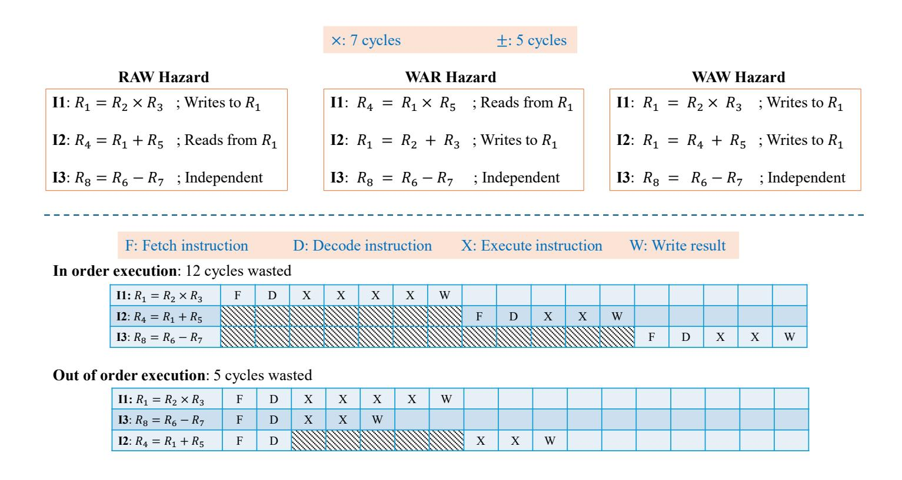
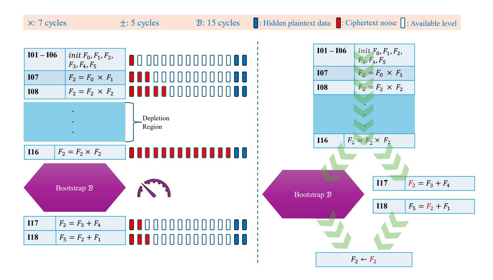
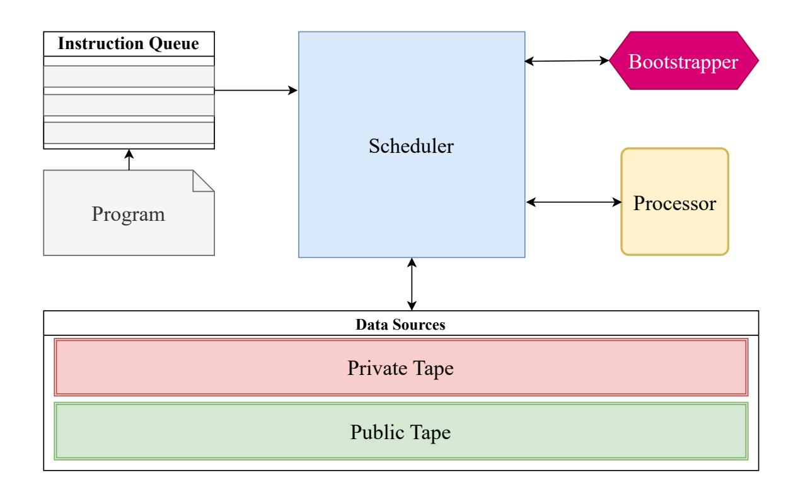
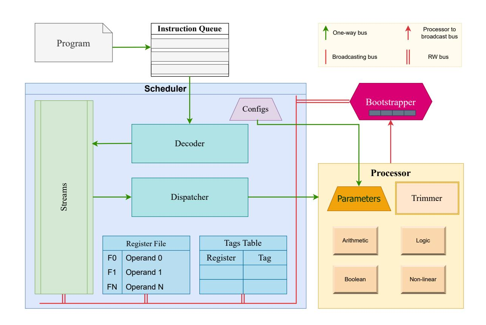
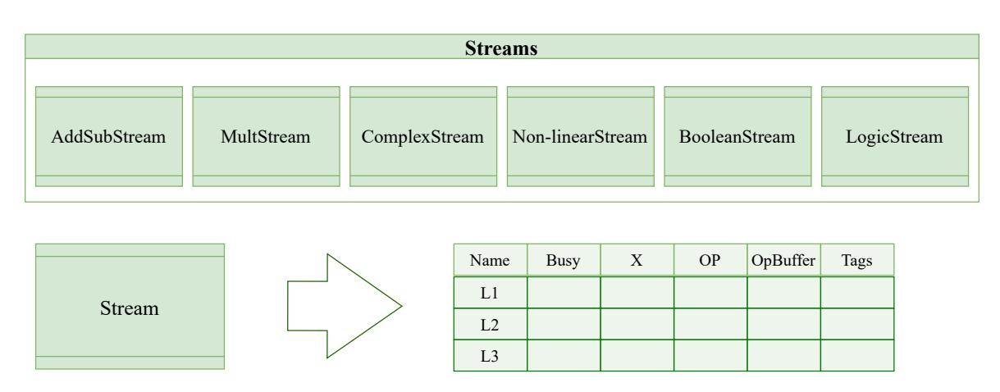
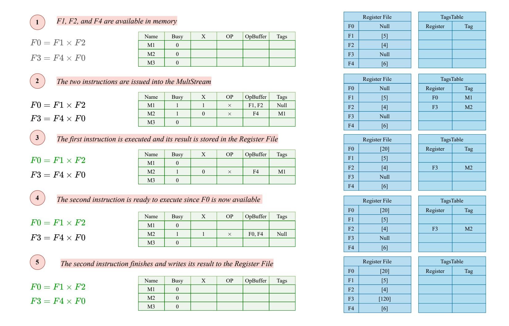
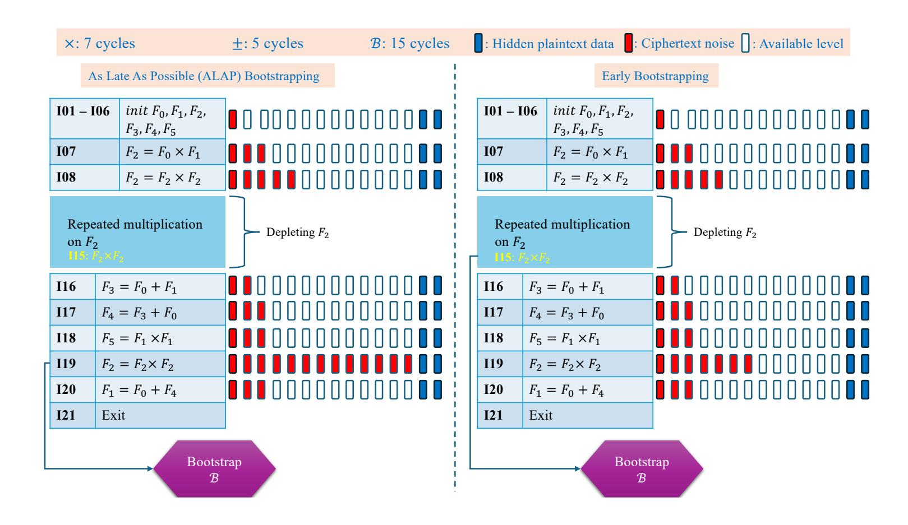
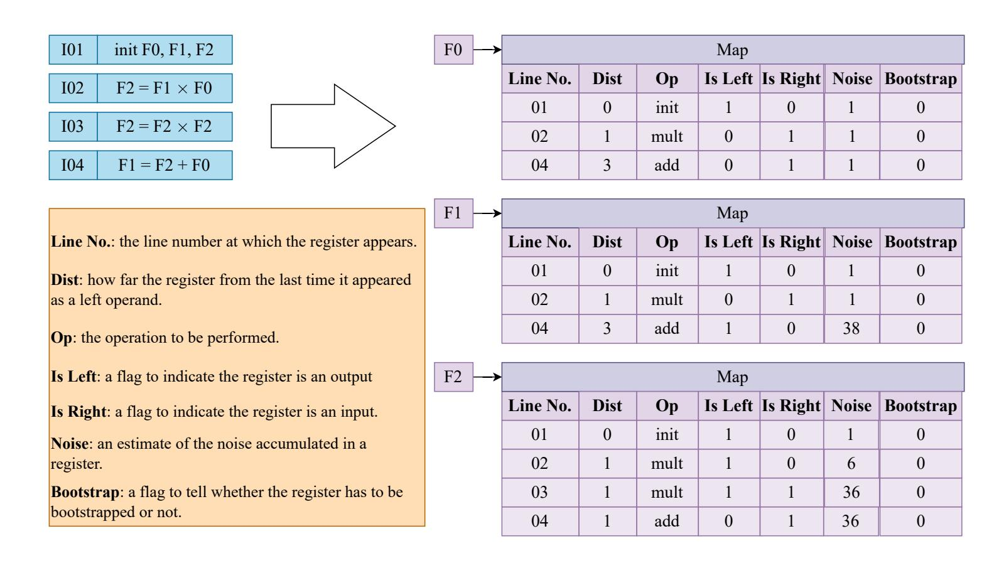
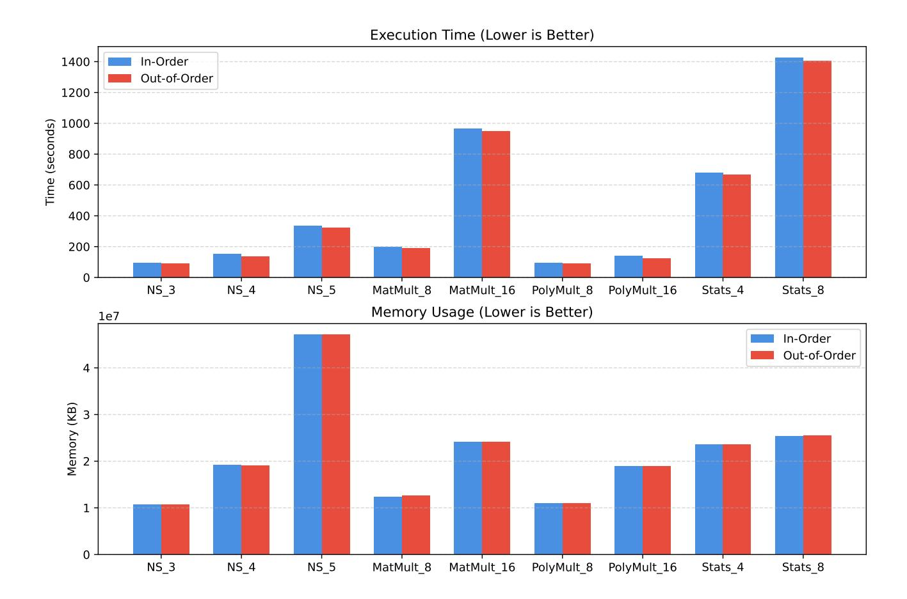
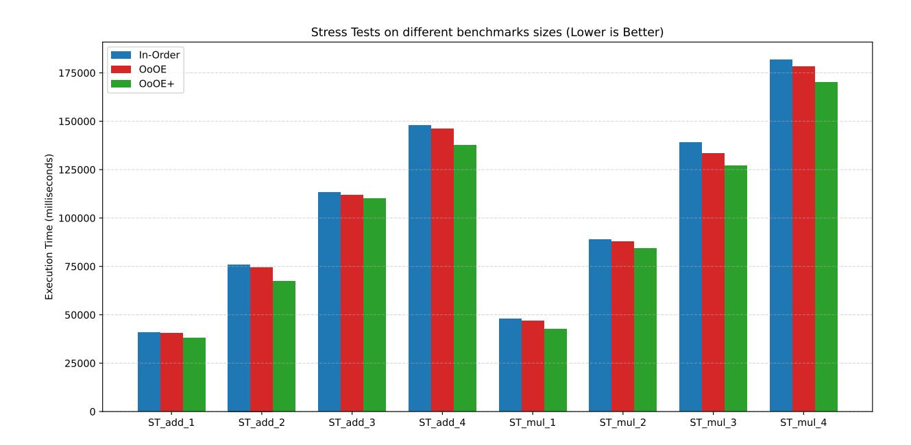

{0}------------------------------------------------

# **LazyArc: Dynamic Out-of-Order Engine for High-Throughput FHE**

Omar Ahmed and Nektarios Georgios Tsoutsos

University of Delaware [{oaaa,tsoutsos}@udel.edu](mailto:{oaaa, tsoutsos}@udel.edu)

**Abstract.** Fully Homomorphic Encryption (FHE) is a modern cryptographic technique that allows performing computations directly over encrypted data. This makes FHE an indispensable method for privacy-preserving applications, where users' data are encrypted and processed by a potentially untrusted third party. Nevertheless, FHE computations are computationally expensive, often rendering them less practical for realistic scenarios. Notably, a major performance bottleneck for FHE is an operation called bootstrapping that allows refreshing the inherent noise of an FHE ciphertext so it could support more computations. In this work, we introduce LazyArc, a versatile lightweight dynamic Out-of-Order (OoO) engine that supports higherthroughput FHE computations expressed as a sequence of instructions. Notably, LazyArc encapsulates a hybrid engine capable of evaluating both arithmetic and Boolean instructions in the same program. Moreover, our proposed OoO paradigm improves the runtime performance by masking the latency of bootstrapping by executing of independent instructions in an FHE application. To enable LazyArc, we introduce a novel data structure, dubbed RegisterMap, which performs static analysis on FHE arithmetic circuits and tracks the noise of each ciphertext to allow proactive bootstrapping scheduling. Our approach is evaluated using linear algebra benchmarks and can achieve about 10% performance improvement over baselines.

**Keywords:** Fully Homomorphic Encryption · Encrypted Processor · Noise Hazards · Privacy-preserving Computations · Bootstrapping · Hybrid Architecture

### **1 Introduction**

In the current digital landscape, data have evolved into the world's most valuable resource, from fueling personalized advertisements, to feeding Artificial Intelligence systems, and enabling financial forecasting. As a result, the modern computing paradigm has shifted from local computations on low performance edge devices to outsourced computations on high-performance cloud servers. This shift has introduced advances in runtime performance, allowing regular users to perform complex operations, often on large datasets, very quickly and efficiently. Nevertheless, outsourcing computations to cloud servers also introduces significant privacy risks for end users.

In a common scenario, outsourcing computations to a potential untrusted cloud service could compromise the users' privacy if the cloud provider eavesdrops on user data; for example, the cloud may use the data for personalized advertisements or to train their own AI models [\[MM21,](#page-23-0) [KSG24,](#page-23-1) [MTV](#page-23-2)<sup>+</sup>20, [PM22\]](#page-23-3). Likewise, cloud systems are common targets for various cyber-attacks; as discussed in recent work [\[TKR20,](#page-24-0) [WD25,](#page-24-1) [Abd23,](#page-20-0) [DB22\]](#page-21-0), there are several security risks applicable to cloud computing services, each threatening the confidentiality of user data.

One fundamental and widely-adopted method to protect data confidential is to use secure cryptographic algorithms such as AES and RSA. Such traditional encryption methods

{1}------------------------------------------------

can be used to address the need of protecting sensitive data in two of its three states: (1) *data at rest*: encrypting data while on storage devices, and (2) *data in transit*: encrypting data while being transmitted over networks. However, protecting *data in use* remains a challenging problem. Indeed, to process encrypted data, the current cloud infrastructure would have to decrypt private data first (e.g., banking records and patient information) before being able to perform computations on them. Therefore, the cloud provider can see the confidential data in the clear and there is no fundamental protection against misusing them for their own benefit. In addition, decrypting the data could expose the processor to additional risks, such as side-channel attacks and memory dumps. Considering these challenges, cloud providers may not be fully trusted by end users [\[AHA](#page-20-1)<sup>+</sup>21], which limits the actual benefits of cloud computing.

A promising approach to enable end-to-end secure computations on encrypted data is Fully Homomorphic Encryption (FHE) [\[Gen09\]](#page-22-0). FHE supports performing arbitrary computations on encrypted data (ciphertexts) without the need to decrypt them. More formally, if we denote an encryption algorithm *E* and a decryption algorithm *D*, then a processor (e.g., a cloud provider or a computing device) can compute a circuit *F* on inputs *x*<sup>1</sup> and *x*<sup>2</sup> as follows:

$$D(F(E(x_1), E(x_2))) = F(x_1, x_2)$$
(1)

In effect, FHE consumes encrypted inputs *x*<sup>1</sup> and *x*<sup>2</sup> and returns an encrypted result. By decrypting that ciphertext output, we receive the same result as if the circuit was evaluated on plaintext values *x*<sup>1</sup> and *x*2. With this powerful capability, we can execute arbitrary computations on encrypted data to maintain their privacy while **at rest**, **in transit**, and **in use**. Nevertheless, on limitation of FHE is its runtime performance. This is due the nature of the encoding schemes used to represent ciphertext data (typically very large polynomials). These polynomials encapsulate the plaintext data with a "noise" component, and this noise is what protects the plaintext values and makes the FHE scheme secure.

Performing arithmetic operations on ciphertexts is often translated to very complex and heavy operations on the underlying polynomials. This leads to having the noise embedded within the polynomials grow, which eventually can corrupt the original values. In particular, performing an addition operation between two ciphertexts introduces minimal noise to the output ciphertext. However, performing a multiplication causes a significant noise growth in the output ciphertext. Without a noise reduction mechanism, we can execute arithmetic circuits with only a couple of additions and multiplications only.

Fortunately, modern FHE schemes support a technique that can reduce such noise, called bootstrapping. In particular, Bootstrapping is essentially a homomorphic decryption operation that processes a ciphertext and reduces the accumulated noise on it. Thus, it allows more computations to be performed on a given ciphertext, hence, we can execute deeper circuits. Nevertheless, computing bootstrapping at runtime can cause a considerable delay that can stall the evaluation of a target circuit.

In addition, noise management during the evaluation of FHE circuits remains an intricate process that requires a high level of domain-specific expertise due to its inherent complexity. When writing FHE programs, programmers have to track the noise level of each ciphertext and invoke the bootstrapping function when necessary. One may think that automatically bootstrapping a ciphertext after every operation would solve the problem. However, this causes significant slowdowns to FHE programs, so this approach does not scale well. Meanwhile, not bootstrapping a sufficiently noisy ciphertext can corrupt the execution of the encrypted program. To address this challenge, developers can manually set fixed checkpoints within the circuit to bootstrap ciphertexts when reaching this point. This process, however, does not scale well, as it is bespoke for each particular circuit target.

There are various FHE schemes that are widely used. The most common schemes in-

{2}------------------------------------------------

clude BFV (Brakerski-Fan-Vercauteren) [\[FV12\]](#page-22-1), BGV (Brakerski-Gentry-Vaikuntanathan) [\[BGV14\]](#page-21-1), CKKS (Cheon-Kim-Kim-Song) [\[CKKS17\]](#page-21-2), as well as CGGI (Chillotti-Gama-Georgieva-Izabachene) [\[CGGI20\]](#page-21-3) and DM (Ducas-Micciancio) [\[DM15\]](#page-22-2). BFV and BGV share similarities: they both support arithmetic circuits that encrypt integers, where the noise grows slowly during computations. However, the current bootstrapping algorithms for the BFV and BGV schemes incur significant overheads, so both schemes are often used to evaluate circuits with limited depth. For example, these schemes can be used for applications that require exact integer arithmetic such as secure-multiparty computation [\[Gol98\]](#page-22-3), information retrieval applications, and applications that require the integration of Zero-Knowledge Proof protocols with FHE [\[AGT24\]](#page-20-2).

Unlike the BGV/BFV schemes that are tailored for integer arithmetic, CKKS is an HE scheme that evaluates arithmetic circuits over encrypted real-numbers; in particular, CKKS performs approximate computations on ciphertexts, and these ciphertexts lose precision as more computations are performed on them. Overall, CKKS is well studied in the FHE community, and there are recent efforts to realize CKKS bootstrapping [\[AKP25,](#page-20-3) [KPK](#page-23-4)<sup>+</sup>22, [BMTPH21a\]](#page-21-4). In terms of applications, CKKS is widely used for private machine learning inference on encrypted data [\[HKC](#page-22-4)<sup>+</sup>23, [BHM](#page-21-5)<sup>+</sup>20, [YZD](#page-25-0)<sup>+</sup>24, [LKL](#page-23-5)<sup>+</sup>22, [SZL](#page-24-2)<sup>+</sup>20].

The CGGI and DM schemes are completely different in the sense that they are tailored to evaluating Boolean circuits (i.e., circuits encrypting bits). These schemes offer significantly faster bootstrapping speeds compared to integer schemes. However, the amortized latency to execute an arithmetic operation (e.g., addition) is notably slower than the CKKS and BGV/BFV schemes. Instead, CGGI/DM are more flexible when evaluating non-linear operations on ciphertexts. Also, the Boolean schemes can be extended to perform exact integer operations like BGV/BFV. The popular OpenFHE library [\[ABBB](#page-20-4)<sup>+</sup>22] uses a unified codebase for CGGI and DM, so in this work we are referring to these Boolean FHE schemes interchangeably (FHEW/TFHE) following the OpenFHE nomenclature.

These modern FHE schemes rely on variants of Learning With Errors (LWE) [\[Reg09\]](#page-23-6) as the underlying hard problem. LWE is also a foundational problem in post-quantum cryptographic schemes that rely on the hardness of finding a secret vector from noisy linear equations. Current implementations of CKKS and BGV/BFV feature a technique called "batching", which allows packing multiple plaintexts into one ciphertext object, enabling parallel single instruction-multiple data (SIMD) execution. Batching techniques for FHEW/TFHE are not well-investigated yet, and thus Boolean FHE is often desirable when evaluating circuits based on Boolean gates or when bit-wise operations are needed.

Modern software library implementations of FHE schemes realize a technique called Scheme Switching (SS). In a nutshell, the SS technique enables converting a ciphertext object from one scheme to another, all while the data remain encrypted. This feature is beneficial because it allows us to leverage the strengths of different schemes. For instance, we can execute a CKKS circuit and switch to FHEW/TFHE to perform bit-wise operations. Unfortunately, SS is an expensive operation, especially for large ciphertexts, and requires careful selection of the homomorphic encryption parameters.

Recent research efforts have focused on decoupling the performance overheads of FHE, particularly bootstrapping, and realizing hardware or algorithmic acceleration. A recent survey [\[SXY](#page-24-3)<sup>+</sup>25] categorizes existing methods to accelerate FHE performance into three main categories: optimizing homomorphic modular reduction, optimizing encoding and decoding schemes, and alterative constructions for blind rotations (a complex procedure within bootstrapping used to refresh ciphertexts by performing rotations on polynomials). Similarly, another survey [\[GCM](#page-22-5)<sup>+</sup>24] offers a broader overview of acceleration techniques, covering both hardware and algorithmic optimization techniques.

Algorithmic techniques often rely on memory-centric approaches, as well as improving operations on the underlying polynomials and the Number Theoretic Transform (NTT) used for efficient polynomial multiplication [\[ABEK20,](#page-20-5) [SJM](#page-24-4)<sup>+</sup>22, [GLGY21,](#page-22-6) [BMTPH21b,](#page-21-6)

{3}------------------------------------------------

[KLK](#page-23-7)<sup>+</sup>22]. On the other hand, hardware accelerators rely on the design of specialized hardware architectures and parallelization paradigms, exploiting high performance GPUs and FPGAs [\[ABPA](#page-20-6)<sup>+</sup>19, [ABVL](#page-20-7)<sup>+</sup>20, [TCH](#page-24-5)<sup>+</sup>21, [SFK](#page-23-8)<sup>+</sup>22, [JLJ22\]](#page-22-7). Likewise, software approaches often focus on both the usability and performance of FHE, including works that focus on compilers and virtual processor frameworks with specialized scheduling techniques [\[AT24,](#page-21-7) [GMT24,](#page-22-8) [WOAS25,](#page-24-6) [VJHH23,](#page-24-7) [KSL](#page-23-9)<sup>+</sup>24, [CPS18,](#page-21-8) [DSC](#page-22-9)<sup>+</sup>19, [ACG](#page-20-8)<sup>+</sup>25, [WGYT23,](#page-24-8) [AGT24\]](#page-20-2).

In this work, we focus on the performance challenges of FHE evaluation for applications expressed as a sequence of instructions. Specifically, our approach focuses on Out-of-Order (OoO) execution of FHE instructions to increase the computation throughput in light of bootstrapping overheads. Our goal is to address execution stalls (dubbed "noise hazards" in this work) due to bootstrapping operations injected at runtime, which are needed to refresh ciphertext noise before more instructions can be evaluated. In this context, these noise hazards are an intrinsic problem of FHE programs expressed as a sequence of instructions with ciphertext arguments, which delays in virtual pipeline of the underlying execution engine. Based on our analysis of the noise hazard problem, our key observation is that an out of order execution engine can mask the bootstrapping costs and can lead to a significant increase in the performance of FHE programs.

Our OoO execution approach for FHE is modeled within a lightweight dynamic execution engine, dubbed LazyArc, that can execute arbitrary FHE programs efficiently using domain-specific instruction sequences. Notably, our LazyArc approach is paired with a novel static circuit analysis tool that can introduce hints to the execution engine to allow optimal bootstrapping scheduling for different ciphertexts. LazyArc implements a hybrid architecture that can execute both arithmetic and Boolean circuits (circuits with real-numbers and binary values).

Overall, our contributions in this work are as follows:

- 1. To the best of our knowledge, this is the first work to study *Noise Hazards* in the context of FHE program execution. Our work provides the first empirical analysis of noise hazards and associated execution delays.
- 2. To overcome noise hazards and improve the performance of FHE programs, we introduce LazyArc: a versatile FHE execution engine that allows concurrent Outof-Order (OoO) execution of FHE instructions, while enabling higher execution throughput and better utilization of computational resources.
- 3. To further augment the efficiency of our methodology, we introduce our *RegisterMap Tool* (RMT) that provides static circuit-analysis for FHE circuits before execution and helps LazyArc to optimally bootstrap a ciphertext when necessary.
- 4. To ensure versatility and compatibility across different FHE circuits, LazyArc offers support for both arithmetic and Boolean operations in the supported instruction set.

The rest of the paper is organized as follows: Section [2](#page-3-0) presents a literature review on the recent state-of-the-art focused on accelerating FHE schemes. In Section [3](#page-5-0) we elaborate on the motivation of our methodology and introduce the core concepts required to realize LazyArc. Section [4](#page-9-0) offers a technical description of our proposed execution engine, focusing on the design of LazyArc and the role of each component in our engine, while Section [5](#page-16-0) presents our empirical evaluation of our proposed engine on computationally intensive benchmarks that are common components in real-world applications. Finally, Section [6](#page-19-0) offers our concluding remarks.

### <span id="page-3-0"></span>**2 Related Work**

Recent state-of-the-art work in accelerating FHE has shifted from theoretical scheme designs to practical hardware-based acceleration and software-based acceleration. In this 

{4}------------------------------------------------

section, we review the recent SOTA work that focuses on methods to accelerate FHE computations.

**Hardware-based acceleration techniques.** The authors of [\[SFK](#page-23-8)<sup>+</sup>22] present CraterLake, which is a bespoke hardware accelerator built to enable the execution of FHE circuits of unbounded sizes while efficiently scaling with larger ciphertexts. CraterLake outperforms CPUs implementation by gmean 4600x. Similarly, FAST [\[FDK](#page-22-10)<sup>+</sup>25] is a hardware accelerator that incorporates cryptographic optimizations such as the hoisting technology with a focus on key-switching operations. FAST supports high-level of parallelism and reduces latency by 44.4%. Likewise, Trinity [\[DFH](#page-22-11)<sup>+</sup>24] is a general-purpose hardware accelerator that supports CKKS and TFHE. Trinity focuses on the optimization of scheme switching and properly selecting the allocation components for FHE primitives to maintain high hardware utilization.

Another hardware accelerator is PBSAcc proposed by Wang *et. al.* [\[WZZ](#page-25-1)<sup>+</sup>25], which is dedicated to the FHEW/TFHE Boolean schemes. PBSAcc introduces improvements for batch bootstrapping and employs reconfigurable processing elements to perform computations on uniform hardware. Similarly, FHEMem [\[ZNG](#page-25-2)<sup>+</sup>25] is based on the Processing-in-Memory (PIM) paradigm and introduces a novel PIM architecture to achieve high-throughput FHE acceleration.

The work presented in [\[WYZ](#page-25-3)<sup>+</sup>25] introduces an FPGA accelerator optimized for computational patterns for Private Set Intersection (PSI) protocols. Moreover, this approach also introduces optimizations to the relinearization algorithm for the BFV scheme. Another FPGA accelerator has been proposed in [\[BVBTV23\]](#page-21-9) which is dedicated to the FHEW scheme. This architecture uses a hardware-based NTT computation approach, which results in accelerating FHEW bootstrapping by at least 7.5x.

**Software-based acceleration techniques.** As with hardware-based acceleration techniques, the FHE research community has committed to proposing algorithmic optimizations and software architectural design to improve the efficiency of FHE computations. For instance, the authors of [\[AT24\]](#page-21-7) introduce PulpFHE, which is a virtual processor framework that accelerates the computations of the TFHE scheme on CPUs. Similar to PulpFHE, Juliet [\[GMT24\]](#page-22-8) also focuses on optimizing TFHE computations on commodity GPUs.

A recent work proposed by Paiva *et. al.* [\[PDMH](#page-23-10)<sup>+</sup>25] aims to improve the bootstrapping operation for the FHEW/TFHE schemes. The authors rely on exploiting the incompleteness in homomorphic NTT and inverse NTT operations. Meanwhile, XBOOT [\[NHY](#page-23-11)<sup>+</sup>25] focuses on the efficiency of performing the XOR operation on CKKS ciphertext and transciphering. Furthermore, the work presented in [\[XLK](#page-25-4)<sup>+</sup>25] introduces a GPU-based accelerator for FHEW/TFHE bootstrapping, which features a novel parallelization strategy.

A different approach to accelerate FHE computations is proposed by White *et. al* [\[WGYT23\]](#page-24-8), which formulates the bootstrapping scheduling problem and optimizes it using two Integer Programming (IP) models. Additionally, HEAP [\[ACJ24\]](#page-20-9) is a parallelized bootstrapper designed for the CKKS scheme. The key innovation is based on the utilization of the CKKS scheme to perform computations while switching to TFHE to perform accelerated bootstrapping.

A recent work that aims to optimize the TFHE scheme is presented in [\[BBC](#page-21-10)<sup>+</sup>25]; this approach brings the batching capability to the TFHE scheme based on the Common Mask assumption. It achieves up 2x performance gains compared to the traditional scheme. Likewise, a recent FHEW/TFHE acceleration approach on GPUs is VeloFHE, proposed in [\[SYL](#page-24-9)<sup>+</sup>25]. VeloFHE offers a framework that employs CUDA-based acceleration and introduces a novel four-step highly parallelizable NTT design to optimize blind rotation and key switching implementations.

{5}------------------------------------------------

Compared to these earlier works, our proposed LazyArc engine is a software-based framework that approaches the FHE acceleration problem from a different angle; in particular, our observation is that Out-of-Order evaluation can be exploited to address noise hazards and hide the latency of bootstrapping. Our proposed approach relies on dynamic scheduling to perform CKKS computations on ciphertexts while, concurrently, bootstrapping other ciphertexts.

## <span id="page-5-0"></span>**3 Motivation**

In this section, we briefly discuss the concepts of data hazards and out-of-order execution. Then we define our new concept of *noise hazards* and how it negatively impacts the performance of FHE execution pipelines. Finally, we show a high-level overview of the LazyArc architecture, highlighting its main modules, and discussing the design goals.

### **3.1 Data Hazards and OoO Execution**

In computer architecture, out-of-order execution (OoOE) is an instruction scheduling approach that is used in modern CPUs. OoOE is often referred to as dynamic scheduling or dynamic execution; it minimizes the number of stalling cycles, allowing the processor to execute other independent instructions instead. In a nutshell, typical execution paradigms would execute the instructions based on their order in a program; however, OoOE executes the instructions based on the availability of the inputs and computational resources. With this technique, a CPU can avoid stalls while waiting for the preceding instructions to finish execution, and instead process the next instructions immediately if their inputs are available. The overall gain of OoOE is higher computation throughput, thus hiding latencies of other instructions.

Inherently, the execution of a program's instructions with intermediate results introduces resource conflicts that cause performance issues. In computer architecture, a common type of such conflict is called data hazards, which occur when instructions depend on data from preceding instructions still in the pipeline. This causes stalls by forcing subsequent instructions to wait for results. Data hazards are categorized as Read After Write (RAW) hazards, Write After Read (WAR) hazards, and Write After Write (WAW) hazards.

Figure [1](#page-6-0) shows examples of the three types of data hazards and the difference between in-order and out-of-order execution. The example assumes that a multiplication operation takes 7 cycles (or time units) while addition and subtraction take 5 cycles. In each cycle, the pipeline can fetch (F), decode (D), execute (X), or write back a result (W).

As shown in the upper part of Figure [1,](#page-6-0) RAW hazards occur when a later instruction (I2) attempts to read a source operand (*R*1) before an earlier instruction (I1) has finished writing it. If the pipeline executes both I1 and I2 at the same time, I2 will use an incorrect old value of *R*1. Meanwhile, WAR hazards occur when a later instruction (I2) attempts to write to a destination (*R*1) before an earlier instruction (I1) has finished reading it. In a concurrent pipeline scenario, I1 may get an incorrect updated value of *R*1. Finally, a WAW hazard occurs when a later instruction (I2) attempts to write to a destination before an earlier instruction (I1) has finished writing to the same destination (*R*1). Again, in a concurrent pipeline scenario, *R*<sup>1</sup> may end up holding the result of I1 not I2.

The bottom of Figure [1](#page-6-0) demonstrates the idea of in order versus out of order execution on the program with RAW hazard. In a naive in-order pipeline, I1 will be executed and consumes 7 cycles. I2 will not execute until I1 finishes and writes the result back so *R*<sup>1</sup> can be read. Unfortunately, I3 will be delayed until I2 finishes its execution, although it is independent of I1 and I2. Thus, this pipeline wastes up to 12 cycles. Conversely, in an OoOE pipeline (assuming concurrent execution of instructions), it incurs a delay of 5

{6}------------------------------------------------

<span id="page-6-0"></span>

Figure 1: Overview of Data Hazards. The upper part of the Figure illustrates RAW, WAR, and WAW hazards. The bottom part highlights the concept of out-of-order execution (assuming concurrency) versus in-order execution.

cycles only, and I3 does not wait. Particularly, the pipeline will fetch and decode I2, but since  $R_1$  is not yet available, it waits for 5 cycles only until I1 finishes.

It is worth noting that OoOE and data hazards are not tightly coupled concepts. In other words, OoOE does not directly solve data hazards, nor do data hazards pose problems to OoOE. Instead, we can say that data hazards are typically found in most programs, and OoOE is a typical optimization technique. However, data hazards obstruct the deployment of OoOE in execution pipelines.

To mitigate the risk of data hazards, two common algorithms have been proposed to enable efficient dynamic scheduling. These algorithms are the scoreboard algorithm [Tho64] and Tomasulo's algorithm [Tom67]. Both the scoreboard and Tomasulo algorithms can detect RAW hazards and will pause the execution of dependent instructions until the inputs are ready. However, these two algorithms differ on how they handle WAW and WAR hazards. The scoreboard algorithm handles WAR and WAW by stalling, while Tomasulo's algorithm handles them by **Register Renaming**. Register renaming is the key technique that efficiently avoids WAR and WAR hazards.

#### 3.2 Noise Hazards

Recall that computations on ciphertexts increase the noise that protects the underlying plaintext values. At some point, performing more operations on a noisy ciphertext will render it invalid and destroy its content. Hence, bootstrapping must be invoked at a particular point to refresh this ciphertext when reaching a specific noise threshold. This threshold is determined based on the parameters set used to setup the target FHE scheme. Thus, when expressing an target program for FHE evaluation, we have to either invoke bootstrapping immediately after every expensive operation (e.g., multiplication) or estimate the noise amount whenever a ciphertext is manipulated and bootstrap it accordingly. Certainly, the latter approach is better to minimize the bootstrapping overhead.

In FHE programs, the execution pipeline will suffer from data hazards (when some instructions are dependent on earlier instructions) in addition to noise hazards. Noise hazards occur when the FHE execution pipeline stalls because a ciphertext object has been

{7}------------------------------------------------

*written to a register structure but it cannot be used without bootstrapping*. Notably, the overhead introduced by bootstrapping is significantly larger than the delays introduced by FHE addition and multiplication. We formally define noise hazards as follows.

**Definition 1** (Noise Hazards)**.** A type of pipeline stalls that occur in FHE programs due to the complexity of bootstrapping. An output ciphertext may exist in its register (available), but using it for further computations will corrupt it.

To simplify the idea, consider the example program shown in Figure [2.](#page-8-0) The left part of the figure shows a sequence of FHE instructions with their corresponding noise budget. Instructions I01 to I06 initialize new ciphertext registers. A fresh ciphertext register has the minimum noise required to hide the plaintext. Instruction I07 performs the multiplication *F*<sup>0</sup> × *F*<sup>1</sup> and writes the result to *F*2. Hence, *F*<sup>2</sup> accumulates more noise. As the ciphertext is involved in more multiplication, it enters the depletion region (blue area on the figure). The depletion region is where a ciphertext is involved in a series of computations, accumulating more noise on it. Following the depletion region, instruction I16 performs another multiplication (for a total of 10 consecutive multiplications involving *F*2). The output of I16 becomes too noisy, hence the execution cannot proceed without bootstrapping. Once bootstrapping is done, the execution proceeds to I17 and I18.

Here, we observe how bootstrapping stalls the program execution: I17 and I18 will wait until the 15 cycles of bootstrapping are consumed. This is a standard example of a noise hazard. In fact, instruction I16 consumes its 7 cycles, after which *F*<sup>2</sup> is available in its memory. However, using *F*<sup>2</sup> directly will destroy the ciphertext and cause incorrect results. This basic example introduces a basic research question: is it possible to hide the latency of bootstrapping and proceed with executing I17 and I18? This is the exact question we are aiming to address with the design of our LazyArc (Section [4\)](#page-9-0).

Next, we highlight how the OoO execution is applied in the example of Figure [2.](#page-8-0) As shown in the right part of the figure, the pipeline can proceed in-order until I16. After I16, the execution engine can evaluate the bootstrapping, while it allocates the resources for I17 and I18, and instead of writing the result to *F*2, it writes it to a temporary register, and I18 reads the value from that temporary register. We remark that bootstrapping takes 15 cycles, while addition takes 5 cycles. Thus, while the bootstrapping is executing, I17 and I18 finish within 10 cycles. Thus, the total stall duration is 5 cycles instead of 15. At the end of the bootstrapping operation, *F*<sup>2</sup> is updated from the temporary register.

#### **3.3 Overview of LazyArc**

Motivated by earlier dynamic scheduling algorithms, we introduce the LazyArc lightweight engine that supports OoO execution of FHE program instructions. Figure [3](#page-8-1) shows a high level overview of LazyArc. The Scheduler is the central module that is responsible for reading and writing inputs and outputs from the public and private tapes. The public tape stores the public (plaintext) inputs/constants, while the private tape stores encrypted inputs supplied by the user. The Program (left side of the Scheduler) represents the FHE circuit to be executed. Instructions are read from the program and pushed into the Instruction Queue to be fetched by the Scheduler. Finally, LazyArc features a Bootstrapper, which is a functional module that detects a noisy ciphertext, refreshes it, and sends it back to the Scheduler. A more detailed discussion on the specification of our LazyArc is provided in Section [4.](#page-9-0)

#### **3.3.1 Design goals**

**Complete architecture interface**: Expressing circuits over plaintext data is a relatively easy problem for modern programming languages. Conversely, expressing the same circuit as a program for the FHE domain is significantly more complex. This is because

{8}------------------------------------------------

<span id="page-8-0"></span>

Figure 2: Noise Hazards example. An FHE program initializes 5 ciphertexts and performs additions and multiplications, which causes ciphertext noise growth. The instructions from I01 to I16 are dependent and cannot be executed OoO. Instructions I18 depends on I17, which both I18 and I17 will not be executed until bootstrapping finishes. The right-side figure depicts the typical scenario to achieve OoOE.

<span id="page-8-1"></span>

Figure 3: High-level design of LazyArc: The Scheduler is a central controller that is responsible for reading, decoding, and writing inputs and outputs. The Processor is responsible for performing computations only. The Bootstrapper is a functional module responsible for refreshing the outputs.

FHE primarily supports addition/subtraction and multiplication. Hence, performing comparisons or non-linear operations (e.g., square root) has to be expressed in terms of addition, subtraction, and multiplication. This creates a high barrier to entry for non-expert developers. Thus, to maintain a usable end-to-end framework, LazyArc exposes an interface that enables the execution of arbitrary FHE instructions. In particular, LazyArc comprises an Instruction Set Architecture (ISA), founded on [AT24], to seamlessly execute

{9}------------------------------------------------

arbitrary instructions, such as comparisons, square root, and bit-wise operations.

**Efficient dynamic scheduling**: The runtime complexity of each FHE operation is not always the same; indeed, even seemingly similar operation may consume a different number of cycles. For instance, multiplying two ciphertexts is more expensive than multiplying a ciphertext by a plaintext. This difference complicates the design of a dynamic scheduling algorithm to avoid noise hazards. The goal is to hide the delays introduced by bootstrapping. Thus, LazyArc should be aware of which instructions are executed and on which operands. In addition, LazyArc tracks the noise budget of the ciphertexts to anticipate noise hazards and hence to avoid them.

**Hybrid execution engine**: State-of-the-art frameworks often rely on a single encryption scheme, which limits their applicability to support different types of operations. For example, the CKKS scheme is best suited for real-number arithmetic, but it cannot be used to perform bit-wise operations directly, such as XOR. Although CKKS can process integers (encoded as real-numbers), this still results in approximate computations. For example, computing *Enc*(4*.*0) × *Enc*(3*.*0) may output 11*.*99999 rather than 12. Although such loss bits of precision can be acceptable in some applications, other applications (e.g., counting) may not tolerate it. To ensure versatility, LazyArc supports processing real-number, integer, and Boolean ciphertexts in a way that is agonistic to the target FHE circuit.

### <span id="page-9-0"></span>**4 LazyArc: A Dynamic Out-of-Order Engine**

Our main objective is to hide the latency introduced by bootstrapping. Towards that end, we need to realize out-of-order execution (OoOE) in the FHE domain. Therefore, we first need to address the challenge of the noise hazards in FHE; identifying a solution to the noise hazards problem will enable OoOE, which in turn helps hide the latency of bootstrapping. Our ultimate goal is to increase the throughput of FHE execution pipelines, achieve better utilization of computational resources, and better runtime performance.

Figure [4a](#page-10-0) offers a detailed view of the LazyArc execution engine (omitting the input tapes for simplicity). The LazyArc engine consists of three fundamental modules: the Scheduler, the Processor, and the Bootstrapper, and each of these modules consists of smaller units. The Scheduler consists of a Decoder unit, a Dispatcher unit, a Streams unit, a Register File unit, and a Tags Table unit. The Decoder is responsible for decoding the instructions fetched from the Instruction Queue and posting them to the Streams unit. Streams is a special storage unit that stores the instruction's operands (i.e., registers). As shown in Figure [4b,](#page-10-1) LazyArc has six Streams: AddSubStream for handling addition and subtraction instructions, MultStream for handling multiplication instructions, ComplexStream for compound instructions such as computing mean and variance, Non-linearStream for non-linear instructions such as division and square root, BooleanStream for bit-wise operations such as XOR and AND, and LogicStream for comparison instructions such as greater than and equality checks.

Each Stream is composed of a set of lanes, where each lane includes six buffers. The first is Name, which holds the name of the lane, while the second buffer is Busy, which is a flag to show if this lane can be available to store new data (or overwrite existing) or not. The third buffer is X (ready to eXecute), which is another flag to indicate whether all the instruction's operands are available or not. The fourth buffer is OP, which holds which operation should be performed (e.g., + or -). The fifth buffer is the Operands Buffer (OpBuffer), which stores pointers to the operands values needed for the operation. The last buffer is Tags, which stores a temporary (renamed) register that is not yet available for computations.

Note that the OpBuffer and Tags buffers cannot have values at the same time; this is because setting the value of one indicates that the other's value is absent. For example,

{10}------------------------------------------------



<span id="page-10-0"></span>(a) The fundamental modules of LazyArc. The Scheduler is the central controller that defines the configurations required to operate the engine and for decoding, issuing, and handling the instructions. The Processor is responsible for performing the computations. The Bootstrapper is the module that is responsible for refreshing the outputs of the Processor. These units are all connect to the Broadcasting bus to be synchronized with each other.



<span id="page-10-1"></span>(b) A closer look at the Streams module. It consists of six streams. Each stream consists of Lanes. Each lane has a name and consists of buffers that define the status of a register.

Figure 4: This figure shows the architectural design of LazyArc. The top of the figure shows the different modules of LazyArc, while the bottom figure shows the sub-unit of the Streams unit.

assume that we have the instruction *F*3 = *F*0 + *F*3. If the registers *F*0 and *F*1 have their values ready, they will be put into the OpBuffer buffer. But if any of *F*0 or *F*1 does not have a value (e.g., the value has not been read or written by a preceding instruction), then a renamed version of this register is put into the Tags buffer. When Tags is free, it means that OpBuffer is full, and thus the X buffer is set to True, indicating that an instruction can be dispatched to the Processor (which is a virtual execution engine invoking an underlying FHE library).

After decoding instructions and posting them to the corresponding stream, the Dispatcher accesses the Streams, fetches an instruction, and passes it to the Processor. The Processor executes the instruction and writes the result to the Bootstrapper queue. The Bootstrapper checks if the noise in the Processor's output is excessive and refreshes it if necessary, before writing it to the Broadcast bus.

{11}------------------------------------------------

<span id="page-11-0"></span>

Figure 5: Illustration of how the instructions are reflected on the Streams, the RF, and the TT. The Tags buffer in the MultStream is filled with the value found in the TT corresponding to the Register missing in the OpBuffer. After finishing an instruction, its registers are removed from the TT and the Stream, and the result is written to the RF.

The Scheduler has two additional units: the Register File (RF) and the Tags Table (TT). The RF stores the current available registers and their corresponding operands. Also, it is used to detect the availability of the register's content. The content of a register can be a plaintext or a ciphertext value. For sake of simplicity, we will assume that registers hold ciphertexts, as these are the most common data-type in our case. For simplicity, we will also use "Ciphertext" and "Register" here interchangeably to refer to encrypted operands in general. Thus, a register is available if it has an operand in the RF; otherwise, the register is not available if it has a "Null" value. An unavailable register means that it has not been read, or it is an output of a pending or unfinished instruction. In this case, the unavailable register should exist in the Tags Table (TT). The TT stores the unavailable register name and the name of the Stream lane that holds its output.

We further illustrate these steps with the example in Figure [5,](#page-11-0) which shows how the instructions F0 = F1 × F2 ; F3 = F4 × F0 are populated into their Streams, and how the Register File (RF) and the Tags Table (TT) are updated accordingly. In Step 1, we assume that the Registers F3, F2, and F3 have their encrypted operands ready in the RF and they can be used immediately. In Step 2, the instructions are inserted into the MultStream, since these are multiplications. Inspecting the Tags Table in Step 2, we find that F3 is entered and its Tail is set to the name of the multiplication lane (M1). Similarly, F3 is found in the Tags Table with its Tail value set to its multiplication lane (M2). Since the second instruction is waiting for the first instruction to get F3; the OpBuffer buffer in lane M2 is missing F3 and the Tags buffer fetches its Tail value (M1) from the Tags Table.

Moving to Step 3, the first instruction finishes execution, and its output is written to the RF. Also, the Tags Table removes F3, as its value exists in the RF. In Step 4, the second instruction, in lane M2, is set to ready to execute since its OpBuffer buffer includes 

{12}------------------------------------------------

the operands and the Tags buffer is Null. At Step 5, all the instructions have finished, the Streams and the Tags Table are free, and the RF is filled out with the instructions' output.

As shown in Figure [4a,](#page-10-0) LazyArc has the Configs unit that stores the FHE scheme configurations required to evaluate FHE circuits. These configurations define the bootstrapping keys, public key, and other evaluation keys. A subset of these configurations (such as evaluation keys) are passed to the Processor, which stores them in the Parameters unit. The Processor has four computational units and a special unit. The computation units are: The Arithmetic unit for operations such as addition and multiplication, the Logic unit for comparisons (e.g., > and <), the Boolean unit for performing bit-wise operations (e.g., XOR and AND), and the Non-linear unit for operations such as square root and division.

The Trimmer unit is a special unit that can be used to clear the floating point in a ciphertext and transform it into an integer. For example, if a ciphertext value is 1*.*01, Trimmer transforms it to 1*.*00. Basically, this unit evaluates the smooth step function *S*(*x*) = 3*x* <sup>2</sup> − 2*x* 3 , which is adapted from [\[DMPS22\]](#page-22-12). This unit is useful when performing comparison operations (using the multiplexer gate). The multiplexer requires a selector bit, which has to be either 0 or 1. If the bit is 0.001 or 1.001, this will corrupt the output result. Thus, we "clean" the selector bit before using it. Also, the Trimmer module is used to allow exact (small) integer arithmetic, where floating-point is not appropriate, such as performing information retrieval or getting the maximum or minimum element of a population.

#### **4.1 Avoiding Noise Hazards**

Recall that noise hazards occur because of registers (or ciphertexts) not being ready for further computations. Normally, when the Processor finishes executing an instruction, it outputs the result, so that any waiting (dependent) institutions can use it. The problem is that although the outputs of the Processor are now available for other instructions, they might be overloaded with noise that accumulates in subsequent computations, and hence corrupt the subsequent results. Even worse, subsequent instructions that do not require the outputs of preceding instructions are forced to stall.

LazyArc addresses this issue through two techniques: Ciphertext forwarding and Register renaming. With ciphertext forwarding, we lock the ciphertext object in a dedicated queue within the Bootstrapper module. The Bootstrapper analyzes the noise within the ciphertext, refreshes it if needed, and posts it to the Broadcasting bus; if the noise is below a threshold, the Bootstrapper becomes transparent and ciphertext is posted directly to the Broadcasting line. The second technique is a tailored register renaming technique. As shown in the right part of Figure [1,](#page-6-0) the register renaming technique aims to replace the register names of later instructions (I17 and I18 in the figure) with a temporary name that will refer to the original register name (*F*2). Thus, the pipeline will be executing the later instructions while bootstrapping the output of the preceding instructions. Then, the original register is updated with the renamed register. Notably, our use of the RF and the TT in the Scheduler is what allows register renaming, and in turn out-of-order execution.

In sum, our approach to OoOE to mitigate noise hazards involves locking an instruction's output in the Bootstrapper memory until being bootstrapped and posted to the Broadcast line, while subsequent instructions are being executed by the Processor. Note that noise hazards can always be avoided except in embarrassingly dependent instructions, i.e., when the output of a preceding instruction is an input to later instructions, in this case the execution pipeline must stall.

Regarding bootstrapping scheduling, the standard As Late As Possible (ALAP) heuristic delays the operation until the noise threshold is reached to minimize computational overhead. However, we argue that ALAP is suboptimal within an OoOE paradigm. The subsequent

{13}------------------------------------------------

<span id="page-13-0"></span>

Figure 6: Early vs. ALAP Bootstrapping example in an OoOE pipeline.

section provides an analysis highlighting that proactive bootstrapping can mitigate pipeline stalls more effectively than the traditional ALAP approach.

#### **4.2 Register Map**

The typical and common way to decide when to bootstrap a ciphertext is to invoke it as late as possible (ALAP). However, based on our study, we report that ALAP bootstrapping is not always the optimal decision, especially for an OoOE pipeline. To highlight that observation, consider the example shown in Figure [6:](#page-13-0) The left side of the figure shows an example of the ALAP bootstrapping strategy. We have the register *F*<sup>2</sup> depleted from instruction I08 to the end of the depletion region (I15). The noise in *F*<sup>2</sup> at I15 does not trigger bootstrapping since it has not reached the required threshold, but it reaches this threshold at instruction I19. In this ALAP bootstrapping scenario, we bootstrap *F*<sup>2</sup> at I19 and allow I20 to execute concurrently. Thus, bootstrapping consumes 15 cycles, and 5 cycles to execute I20. So, we can reach the end of the program in 15 cycles instead of 20. On the other hand, the early bootstrapping approach on the right side of the Figure applies bootstrap *F*<sup>2</sup> at the last instruction of the depletion region (I15). During the 15 cycles of bootstrapping, the pipeline can execute I16, I17, and I19 (in 5+5+7=17 cycles). Therefore, 15 cycles of bootstrapping have been totally masked. The program can execute I19 and I20, taking 7 cycles to reach I21 (assuming I19 and I20 execute concurrently).

Determining when to bootstrap a ciphertext is achieved using our proposed RegisterMap Tool (RMT). The RMT is based on our bespoke data structure named RegisterMap. The RMT is a static analysis tool that takes an FHE circuit as input along with the configuration of the FHE scheme and outputs the same circuit but with bootstrapping hints. The bootstrapping hints inform the execution engine to bootstrap the output of a particular instruction earlier before the noise overcomes it. Thus, we achieve *proactive* bootstrapping, which allows us to further mask the delays introduced by bootstrapping, and therefore accelerate the overall execution.

The RM is a holistic data structure that captures each register in a circuit and statically tracks the noise growth in each instruction. Figure [7](#page-14-0) shows an example circuit analyzed

{14}------------------------------------------------

<span id="page-14-0"></span>

Figure 7: Our Register Map data structure captures the status of each register at each line of the FHE program/circuit.

and captured in the RM data structure. The RM captures individual registers in each line of the FHE program/circuit and constructs a map for it. The map includes seven properties, as indicated in the figure. The Noise property is a *rough estimate* of the noise accumulated in the destination register. A fresh ciphertext has the minimum noise, which we set to 1. Notably, this Noise property along with the Dist (Distance) property is what drives the algorithm that outputs the proactive bootstrapping hints.

As the RMT goes through each line in the circuit, it adds a new row of properties for each register. Each row represents the status of a register at a particular line in the circuit. The Noise property is updated according to the type of instruction and whether the register is a destination (i.e., storing an output) or an input to an instruction. If the register is a destination, then its noise increases. If it is an input register, then its noise remains the same.

Not all instructions add the same amount of noise. Effectively, we categorize the instructions into buckets, where each bucket adds a fixed noise amount. For example, bucket0 includes instructions such as mov and load that add no additional noise to the destination register. Meanwhile, bucket1 includes instructions such as add and sub that add the sum of the noise of the input registers (operands). Similarly, bucket3 includes more expensive instructions such as mult and div that double the sum of the noise of the input registers to the destination register. In general, the noise is computed according to this equation:

$$dst.noise = \begin{cases} src.noise & \text{if instruction } \in \text{bucket0} \\ bucketWeight \times (src1.noise + src2.noise) & \text{otherwise} \end{cases}$$
 (2)

When the noise reaches a fixed threshold  $\tau$ , it sets the Bootstrap property to True. Then, it reduces the noise within the register by some fixed amount  $\omega$ . These  $\tau$  and  $\omega$  values are determined from the configurations of the FHE scheme (i.e., multiplication depth and other cryptographic parameters).

As discussed, the construction of our RegisterMap corresponds to a data structure filled out with the circuit's registers. Internally, the RM data structure stores a key-value pair, where the key is the register's name and the value is a map linked to the register. The

{15}------------------------------------------------

map itself consists of rows, so that each row reflects the status of a register at a particular line in the circuit.

The RM structure is then passed to our optimization algorithm to generate the early (proactive) bootstrapping hints. The algorithm iterates over individual registers and inspects their maps. If some register *F<sup>x</sup>* at row *i* needs to be bootstrapped, the algorithm checks its source registers (instruction's operands) and confirms which has more noise. Assume that the source register with the highest noise is srcX. The optimization algorithm marks srcX for early bootstrapping at the last line *j* it appears as a destination register such that *j < i* under two conditions: (1) The distance of srcX is greater than or equal to a threshold *π* called the Long Distance Threshold, which tells what is the minimum number of instructions between the line where the register must be bootstrapped and the last time it appeared as a destination. (2) srcX is not marked for bootstrapping at line *j*.

Note that the RMT is a **static analysis tool** meant to efficiently run on the client side without executing the actual circuit. Thus, if the circuit defines a loop, the code inside the loop is evaluated as a single instruction. Based on this, we remark that the RMT may not capture 100% of the available optimization opportunities. In order for the RMT to be 100% accurate, then it must unroll loops, which in turn means evaluating the circuit (at least partially). However, doing so is against the philosophy of outsourced computation, where users intend to execute a program in its entirety on remote servers.

#### **4.3 Hybrid Execution Engine**

Our engine is built to operate over real-numbers using the CKKS scheme. However, CKKS is not sufficient for all types of computations (e.g., integer and bit-wise), which may limit the capabilities of LazyArc. To allow LazyArc to process real-numbers, integers, and binary ciphertexts, we propose a new encoding technique that allows seamlessly switching a ciphertext from the CKKS (real-numbers) domain to the FHEW (binary) domain, utilizing existing scheme switching methods.

We remark that scheme switching (SS) remains an expensive operation that is an active area of research. Modern SS techniques include PEGASUS [\[LHH](#page-23-12)<sup>+</sup>21] and CHIMERA [\[BGGJ20\]](#page-21-11), and the OpenFHE library [\[ABBB](#page-20-4)<sup>+</sup>22] relies on both of them as its foundations to implement SS. In particular, there are two strategies to perform SS in OpenFHE: the first is to transform a CKKS ciphertext directly to FHEW ciphertext, and the second is to transform a BFV ciphertext to a CKKS ciphertext. The first approach is better to get fine control on the individual bits of a ciphertext, and thus more flexibility to perform arbitrary computations. However, this approach is limited to small values (≤ 8). Supporting larger values is possible but very inefficient (and therefore not recommended). The latter approach is more efficient, but unlike the first approach, one has to start from BFV ciphertext and switch it to CKKS. Performing bit-wise operations on an integer ciphertext requires Look-Up Tables (LUTs), as discussed in [\[ABBB](#page-20-4)<sup>+</sup>22].

To overcome the limitation of the first approach, we propose a new encoding scheme that encodes the plaintext into a custom structure that can be encrypted under CKKS scheme and uses the existing SS of OpenFHE to switch from CKKS ciphertext to FHEW ciphertext. We emphasize that we are not proposing a new SS technique; instead, we introduce an encoding technique that makes CKKS/FHEW scheme switching in OpenFHE to support larger values efficiently. The main idea behind our novel encoding is mapping a plaintext value from the real-number domain to a polynomial of degree *d* (s.t. *d* = 2*k* for some *k* ∈ Z) with coefficients modulo 8, i.e.,

$$\xi: v \in \mathbb{R} \to Z_8[x]/(x^d) \tag{3}$$

Algorithm [1](#page-16-1) shows the pseudocode of the encoding function *ξ*. It takes a real-number value *v* and a degree *d*, and outputs a polynomial *D*, which represents the encoding of the

{16}------------------------------------------------

value. Note that this algorithm does not hide the plaintext yet – it is just an encoding. The output of *ξ* is packed into one plaintext object (using batching techniques), before being encrypted with CKKS. The degree *d* is set according to the desired range of plaintext values. Thus, larger plaintext values require a higher degree. For instance, to encode the value 13, a degree of 2 is sufficient, while the value 123321 requires a degree of 5. Generally, the degree required to encode a value *x* can be estimated as *d* = ⌈*log*8(*x*)⌉.

```
Algorithm 1: Mapping a real-number into Z8[x]/(x
                                               d
                                                )
  Input :Integer value v, degree d
  Output : A polynomial D ∈ Z8[x]/(x
                                   d
                                    )
1 mod ← 1;
2 maxCoef ← 8;
3 exp ← d;
4 while exp > 0 do
5 if exp (mod 2) == 1 then
 6 mod ← mod × maxCoef;
7 end
8 maxCoef ← maxCoef × maxCoef;
9 exp ← ⌊exp/2⌋;
10 end
11 mask ← mod − 1;
12 n ← v & mask;
13 D ← ∅;
14 for i ← 0 to d − 1 do
15 digit ← n (mod 8);
16 Append digit to D;
17 n ← ⌊n/8⌋;
18 end
19 return D;
```

<span id="page-16-1"></span>After encrypting the encoded plaintext, we can use this ciphertext to perform CKKS or FHEW operations. In particular, when performing additions or multiplications using CKKS, we actually perform element-wise additions or multiplications, since the plaintext is encoded as a polynomial. Thus, to correctly compute the multiplication of two ciphertexts, we have to perform polynomial multiplications, which is more complex and expensive. In LazyArc, we design special circuits for handling FHEW ciphertexts switched from CKKS ciphertext, including polynomial multiplication of two FHEW ciphertexts.

# <span id="page-16-0"></span>**5 Experimental Evaluation**

In this section, we discuss our empirical evaluation of LazyArc across different benchmarks, showing the execution time and max memory usage. We implement LazyArc using the CKKS codebase of the OpenFHE library v1.4.2, and all our benchmarks use security parameters to achieve 128-bit security. Our experiments are performed on a Linux server with an AMD EPYC 7532 32-Core Processor. To decouple the impact of available cores, our LazyArc engine is evaluated on two threads only to achieve OoOE (one thread for performing bootstrapping and the other for fetching and executing the instructions). Table [1](#page-17-0) summarizes our benchmarks, their sizes, and the multiplicative depth used to initialize the parameters of CKKS scheme.

Figure [8](#page-18-0) shows the measured execution time (in seconds) and memory usage (in Kilobytes) for LazyArc performing OoO execution compared to a naive in-order execution

{17}------------------------------------------------

<span id="page-17-0"></span>

| Benchmark                                       | Size                                        | Description                                                                                                                                                                                                                                 | Depth |
|-------------------------------------------------|---------------------------------------------|---------------------------------------------------------------------------------------------------------------------------------------------------------------------------------------------------------------------------------------------|-------|
| Newton-Schulz                                   | 3x3<br>4x4<br>5x5                           | A family of iterative algorithms often used for computing the matrix inverse. We evaluate it for 1 iteration.                                                                                                                               | 19    |
| Polynomial<br>Multiplication                    | deg-8<br>deg-16                             | Multiplying each term from the first polynomial with all terms from the second polynomial, and summing the partial products.                                                                                                                | 19    |
| Matrix<br>Multiplication                        | 8x8<br>16x16                                | The dot product of rows from the first matrix with columns from the second to find each element in the resulting matrix.                                                                                                                    | 19    |
| Statistics                                      | Size 4<br>Size 8                            | Computing the mean, variance, standard deviation, maximum, and minimum values of a set of values.                                                                                                                                           | 27    |
| Stress Test<br>Add                              | 1 block<br>2 blocks<br>3 blocks<br>4 blocks | A suite to test the proactive bootstrapping by stressing the engine to execute circuits of large multiplicative depth. Each block involves 26 consecutive multiplication followed by 11 additions or multiplications instructions.          | 31    |
| Stress Test<br>Multiplication                   | 1 block<br>2 blocks<br>3 blocks<br>4 blocks |                                                                                                                                                                                                                                             |       |
| BinAdd BinSub BinMult XOR Gate AND Gate OR Gate | Two encoded ciphertexts of degree 4.        | Addition operation on FHEW ciphertext. Subtraction operation on FHEW ciphertext. Multiplication operation on FHEW ciphertext. Boolean XOR gate on FHEW ciphertext. Boolean AND gate on FHEW ciphertext. Boolean OR gate on FHEW ciphertext. | 11    |

Table 1: Benchmarks sizes and descriptions

baseline. The memory usage is profiled with all the ciphertexts in memory to show the peak memory consumption. Our first benchmark is the Newton-Schulz algorithm; this is a family of iterative numerical methods used to compute matrices' inverses. It is especially popular in scientific computing, machine learning, and numerical linear algebra because it relies only on matrix multiplications. To compute the inverse matrix  $A^{-1}$ , the algorithm defines the iteration:

$$X_{k+1} = X_k(2I - AX_k) \tag{4}$$

where  $X_k$  converges to  $A^{-1}$  depending on the initialization of  $X_0$ . In our benchmarks, we evaluate ns\_4 for a  $4 \times 4$  matrix and ns\_5 for a  $5 \times 5$  matrix for 1 iteration.

In addition, we evaluate MatMult\_8 and MatMult\_16 for the matrix multiplications of  $8\times8$  and  $16\times16$  matrices, respectively. Similarly, we benchmark PolyMult\_8 and PolyMult\_16 for the polynomial multiplications of the degree-8 and degree-16 polynomials. Matrix multiplications and polynomial multiplications are common fundamental algorithms found in various applications such as machine learning, image processing, and general linear algebra computations.

Our benchmarks are complemented with a statistical circuit that computes the mean, variance, standard deviation, maximum, and minimum elements of a population of size 4 (Stats\_4) and size 8 (Stats\_8). Evaluating this circuit is particularly expensive since it involves repeated additions (each statistical measure is independent and re-computes the sum of the population to increase the circuit complexity). Moreover, the variance requires performing division, which is also an intensive non-linear FHE operation. Likewise, the standard deviation requires the same operations as the variance, along with the square root function.

Computing the minimum and maximum elements of a population is also an expensive

{18}------------------------------------------------

<span id="page-18-0"></span>

Figure 8: Execution time (in seconds) and peak memory consumption (in Kilobytes) of our proposed LazyArc OoOE engine compared to an In-Order execution baseline on the same environment.

operation. The program's instructions iterate over the entire population and repeatedly execute the multiplexer gate compute the selector bits. To get the minimum or maximum element without loss of precision, we evaluate the smooth step function  $S(x) = 3x^2 - 2x^3$  [DMPS22] to clear precision errors.

To demonstrate the efficiency of the RegisterMap Tool, we perform a set of stress tests. These tests are designed to include a deep multiplicative depth to intentionally deplete a ciphertext and to include independent instructions in between. In Figure 9 we report the execution time in milliseconds for two suites of stress tests: The first is  $ST_add_x$ , which is a circuit that involves a depletion region followed by a set of additions. The second suite is  $ST_mul_x$  which is a circuit that involves a depletion region followed by a set of multiplications. Each depletion region followed by additions or multiplications is referred to as a block. Thus, to test deeper circuits, we repeat the block x times. Specifically,  $ST_add_1$ ,  $ST_add_2$ ,  $ST_add_3$ , and  $ST_add_4$  are stress tests with 1, 2, 3, and 4 blocks. (The same applies to the  $ST_mul_x$  suite). The depletion region consists of 26 consecutive multiplications (e.g.,  $F3 = F1 \times F2$ ;  $F4 = F2 \times F3$ ;  $F5 = F3 \times F4$ , etc.). After the depletion region, we perform 11 independent additions or multiplications.

Table 2 shows the performance of the fundamental operations on FHEW ciphertext after switching from CKKS. Our encoding used degree-4 polynomials to support sufficiently large values. Typically, the multiplication operation is the most expensive operation in this case due to the large number of the compound bit-wise operations on the encrypted bits. Technically, our encoding scheme converts a single plaintext value into a polynomial of degree-4, where each coefficient is converted to a vector of bits of size 4. Thus, to correctly perform multiplication on two ciphertexts, we have to translate it into 4 polynomial multiplications. As we observe, the Boolean gate operations are significantly faster compared to binary multiplication. Thus, it is recommended to use scheme switching

{19}------------------------------------------------

<span id="page-19-1"></span>

Figure 9: Execution time (in milliseconds) for our stress tests: The blue bar shows a baseline in-order execution, the red bar shows an OoO execution, and the green bar shows an OoO execution with proactive bootstrapping.

<span id="page-19-2"></span>Table 2: Evaluation of addition, subtraction, multiplication operations and, XOR, OR, and AND gates on scheme-switched FHEW ciphertext.

| Benchmark | Execution time (in minutes) |  |
|-----------|-----------------------------|--|
| BinAdd    | 1.9                         |  |
| BinSub    | 1.0                         |  |
| BinMult   | 49.8                        |  |
| XOR Gate  | 0.88                        |  |
| AND Gate  | 0.86                        |  |
| OR Gate   | 0.85                        |  |

for evaluating Boolean gates only, while delegating the the arithmetic operations to the CKKS scheme.

We note that Boolean-only schemes such as FHEW and TFHE do not suffer from the noise hazards problem. This is because these schemes rely on functional bootstrapping, which renews the ciphertext noise while also evaluating a Boolean gate. In effect, bootstrapping is automatically invoked after performing the gate operation. If we were to separate these two operations, the ciphertext after the gate-only operation will not be useful because of the noise accumulation.

Overall, as shown in Figure 8, LazyArc achieves an overhead reduction of up to 10% in our benchmarks. Notably, LazyArc is not a resource intensive architecture, and in our evaluation we highlight its performance using only two threads to perform OoO execution, without incurring extra memory overheads. As illustrated in the lower plot of Figure 8, the memory consumption is almost identical for the two paradigms.

#### <span id="page-19-0"></span>6 Conclusion

In this work we introduce LazyArc, a lightweight FHE engine built for Out-of-Order execution of FHE instructions. Our analysis formalizes the concept of noise hazards in FHE and analyzes how they cause unnecessary stalls in FHE pipelines. Our LazyArc efficiently avoids noise hazards and accelerates the execution of CKKS circuits. We complement our LazyArc methodology with a new static analysis tool, dubbed RegisterMap Tool (RMT), which statically analyzes FHE circuits and outputs bootstrapping hints to allow proactive bootstrapping to further reduce FHE execution stalls. We also introduce an efficient encoding scheme that augments existing scheme switching methodologies to support larger

{20}------------------------------------------------

data values, and hence enable seamless switching between the CKKS and and FHEW scheme.

### **Acknowledgment**

The authors would like to acknowledge the support of the National Science Foundation (Award 2239334).

## **References**

- <span id="page-20-4"></span>[ABBB<sup>+</sup>22] Ahmad Al Badawi, Jack Bates, Flavio Bergamaschi, David Bruce Cousins, Saroja Erabelli, Nicholas Genise, Shai Halevi, Hamish Hunt, Andrey Kim, Yongwoo Lee, et al. Openfhe: Open-source fully homomorphic encryption library. In *proceedings of the 10th workshop on encrypted computing & applied homomorphic cryptography*, pages 53–63, 2022.
- <span id="page-20-0"></span>[Abd23] Fargana Abdullayeva. Cyber resilience and cyber security issues of intelligent cloud computing systems. *Results in Control and Optimization*, 12:100268, 2023.
- <span id="page-20-5"></span>[ABEK20] Rashmi Agrawal, Lake Bu, Alan Ehret, and Michel A Kinsy. Fast arithmetic hardware library for rlwe-based homomorphic encryption. *arXiv preprint arXiv:2007.01648*, 2020.
- <span id="page-20-6"></span>[ABPA<sup>+</sup>19] Ahmad Al Badawi, Yuriy Polyakov, Khin Mi Mi Aung, Bharadwaj Veeravalli, and Kurt Rohloff. Implementation and performance evaluation of rns variants of the bfv homomorphic encryption scheme. *IEEE Transactions on Emerging Topics in Computing*, 9(2):941–956, 2019.
- <span id="page-20-7"></span>[ABVL<sup>+</sup>20] Ahmad Al Badawi, Bharadwaj Veeravalli, Jie Lin, Nan Xiao, Matsumura Kazuaki, and Aung Khin Mi Mi. Multi-gpu design and performance evaluation of homomorphic encryption on gpu clusters. *IEEE Transactions on Parallel and Distributed Systems*, 32(2):379–391, 2020.
- <span id="page-20-8"></span>[ACG<sup>+</sup>25] Asra Ali, Jaeho Choi, Bryant Gipson, Shruthi Gorantala, Jeremy Kun, Wouter Legiest, Lawrence Lim, Alexander Viand, Meron Zerihun Demissie, and Hongren Zheng. Heir: A universal compiler for homomorphic encryption. *arXiv preprint arXiv:2508.11095*, 2025.
- <span id="page-20-9"></span>[ACJ24] Rashmi Agrawal, Anantha Chandrakasan, and Ajay Joshi. Heap: A fully homomorphic encryption accelerator with parallelized bootstrapping. In *2024 ACM/IEEE 51st Annual International Symposium on Computer Architecture (ISCA)*, pages 756–769, 2024.
- <span id="page-20-2"></span>[AGT24] Omar Ahmed, Charles Gouert, and Nektarios Georgios Tsoutsos. Peev: Parse encrypt execute verify-a verifiable fhe framework. *IEEE Access*, 2024.
- <span id="page-20-1"></span>[AHA<sup>+</sup>21] Bader Alouffi, Muhammad Hasnain, Abdullah Alharbi, Wael Alosaimi, Hashem Alyami, and Muhammad Ayaz. A systematic literature review on cloud computing security: threats and mitigation strategies. *IEEE Access*, 9:57792–57807, 2021.
- <span id="page-20-3"></span>[AKP25] Andreea Alexandru, Andrey Kim, and Yuriy Polyakov. General functional bootstrapping using ckks. *Lecture notes in computer science*, page 304–337, Jan 2025.

{21}------------------------------------------------

- <span id="page-21-7"></span>[AT24] Omar Ahmed and Nektarios Georgios Tsoutsos. Pulpfhe: Complex instruction set extensions for fhe processors. *Cryptology ePrint Archive*, 2024.
- <span id="page-21-10"></span>[BBC<sup>+</sup>25] Loris Bergerat, Charlotte Bonte, Benjamin R Curtis, Jean-Baptiste Orfila, Pascal Paillier, and Samuel Tap. Sharing the mask: Tfhe bootstrapping on packed messages. *IACR Transactions on Cryptographic Hardware and Embedded Systems*, 2025(4):925–971, 2025.
- <span id="page-21-11"></span>[BGGJ20] Christina Boura, Nicolas Gama, Mariya Georgieva, and Dimitar Jetchev. Chimera: Combining ring-lwe-based fully homomorphic encryption schemes. *Journal of Mathematical Cryptology*, 14(1):316–338, 2020.
- <span id="page-21-1"></span>[BGV14] Zvika Brakerski, Craig Gentry, and Vinod Vaikuntanathan. (leveled) fully homomorphic encryption without bootstrapping. *ACM Transactions on Computation Theory (TOCT)*, 6(3):1–36, 2014.
- <span id="page-21-5"></span>[BHM<sup>+</sup>20] Ahmad Al Badawi, Louie Hoang, Chan Fook Mun, Kim Laine, and Khin Mi Mi Aung. Privft: Private and fast text classification with homomorphic encryption. *IEEE Access*, 8:226544–226556, 2020.
- <span id="page-21-4"></span>[BMTPH21a] Jean-Philippe Bossuat, Christian Mouchet, Juan Troncoso-Pastoriza, and Jean-Pierre Hubaux. Efficient bootstrapping for approximate homomorphic encryption with non-sparse keys. *Lecture notes in computer science*, page 587–617, Jan 2021.
- <span id="page-21-6"></span>[BMTPH21b] Jean-Philippe Bossuat, Christian Mouchet, Juan Troncoso-Pastoriza, and Jean-Pierre Hubaux. Efficient bootstrapping for approximate homomorphic encryption with non-sparse keys. In *Annual International Conference on the Theory and Applications of Cryptographic Techniques*, pages 587–617. Springer, 2021.
- <span id="page-21-9"></span>[BVBTV23] Jonas Bertels, Michiel Van Beirendonck, Furkan Turan, and Ingrid Verbauwhede. Hardware acceleration of fhew. In *2023 26th International Symposium on Design and Diagnostics of Electronic Circuits and Systems (DDECS)*, pages 57–60, 2023.
- <span id="page-21-3"></span>[CGGI20] Ilaria Chillotti, Nicolas Gama, Mariya Georgieva, and Malika Izabachène. Tfhe: fast fully homomorphic encryption over the torus. *Journal of Cryptology*, 33(1):34–91, 2020.
- <span id="page-21-2"></span>[CKKS17] Jung Hee Cheon, Andrey Kim, Miran Kim, and Yongsoo Song. Homomorphic encryption for arithmetic of approximate numbers. In *International conference on the theory and application of cryptology and information security*, pages 409–437. Springer, 2017.
- <span id="page-21-8"></span>[CPS18] Eric Crockett, Chris Peikert, and Chad Sharp. Alchemy: A language and compiler for homomorphic encryption made easy. In *Proceedings of the 2018 ACM SIGSAC Conference on Computer and Communications Security*, pages 1020–1037, 2018.
- <span id="page-21-0"></span>[DB22] Savita Devi and Taran Singh Bharti. A review on detection and mitigation analysis of distributed denial of service attacks and their effects on the cloud. *International Journal of Cloud Applications and Computing (IJCAC)*, 12(1):1–21, 2022.

{22}------------------------------------------------

- <span id="page-22-11"></span>[DFH<sup>+</sup>24] Xianglong Deng, Shengyu Fan, Zhicheng Hu, Zhuoyu Tian, Zihao Yang, Jiangrui Yu, Dingyuan Cao, Dan Meng, Rui Hou, Meng Li, et al. Trinity: A general purpose fhe accelerator. In *2024 57th IEEE/ACM International Symposium on Microarchitecture (MICRO)*, pages 338–351. IEEE, 2024.
- <span id="page-22-2"></span>[DM15] Léo Ducas and Daniele Micciancio. Fhew: bootstrapping homomorphic encryption in less than a second. In *Annual international conference on the theory and applications of cryptographic techniques*, pages 617–640. Springer, 2015.
- <span id="page-22-12"></span>[DMPS22] Nir Drucker, Guy Moshkowich, Tomer Pelleg, and Hayim Shaul. BLEACH: Cleaning errors in discrete computations over CKKS. Cryptology ePrint Archive, Paper 2022/1298, 2022.
- <span id="page-22-9"></span>[DSC<sup>+</sup>19] Roshan Dathathri, Olli Saarikivi, Hao Chen, Kim Laine, Kristin Lauter, Saeed Maleki, Madanlal Musuvathi, and Todd Mytkowicz. Chet: an optimizing compiler for fully-homomorphic neural-network inferencing. In *Proceedings of the 40th ACM SIGPLAN conference on programming language design and implementation*, pages 142–156, 2019.
- <span id="page-22-10"></span>[FDK<sup>+</sup>25] Shengyu Fan, Xianglong Deng, Liang Kong, Guiming Shi, Guang Fan, Dan Meng, Rui Hou, and Mingzhe Zhang. Fast: An fhe accelerator for scalable-parallelism with tunable-bit. In *Proceedings of the 52nd Annual International Symposium on Computer Architecture*, pages 92–106, 2025.
- <span id="page-22-1"></span>[FV12] Junfeng Fan and Frederik Vercauteren. Somewhat practical fully homomorphic encryption. *Cryptology ePrint Archive*, 2012.
- <span id="page-22-5"></span>[GCM<sup>+</sup>24] Yanwei Gong, Xiaolin Chang, Jelena Mišić, Vojislav B Mišić, Jianhua Wang, and Haoran Zhu. Practical solutions in fully homomorphic encryption: a survey analyzing existing acceleration methods. *Cybersecurity*, 7(1):5, 2024.
- <span id="page-22-0"></span>[Gen09] Craig Gentry. Fully homomorphic encryption using ideal lattices. In *Proceedings of the forty-first annual ACM symposium on Theory of computing*, pages 169–178, 2009.
- <span id="page-22-6"></span>[GLGY21] Jia-Zheng Goey, Wai-Kong Lee, Bok-Min Goi, and Wun-She Yap. Accelerating number theoretic transform in gpu platform for fully homomorphic encryption. *Journal of Supercomputing*, 77(2), 2021.
- <span id="page-22-8"></span>[GMT24] Charles Gouert, Dimitris Mouris, and Nektarios Georgios Tsoutsos. Juliet: A configurable processor for computing on encrypted data. *IEEE Transactions on Computers*, 73(9):2335–2349, 2024.
- <span id="page-22-3"></span>[Gol98] Oded Goldreich. Secure multi-party computation. *Manuscript. Preliminary version*, 78(110):1–108, 1998.
- <span id="page-22-4"></span>[HKC<sup>+</sup>23] Boyoung Han, Yeonghyeon Kim, Jina Choi, Hojune Shin, and Younho Lee. Fully homomorphic privacy-preserving naive bayes machine learning and classification. In *Proceedings of the 11th Workshop on Encrypted Computing & Applied Homomorphic Cryptography*, New York, NY, USA, 2023. Association for Computing Machinery.
- <span id="page-22-7"></span>[JLJ22] Lei Jiang, Qian Lou, and Nrushad Joshi. Matcha: A fast and energy-efficient accelerator for fully homomorphic encryption over the torus. In *Proceedings of the 59th ACM/IEEE Design Automation Conference*, pages 235–240, 2022.

{23}------------------------------------------------

- <span id="page-23-7"></span>[KLK<sup>+</sup>22] Jongmin Kim, Gwangho Lee, Sangpyo Kim, Gina Sohn, Minsoo Rhu, John Kim, and Jung Ho Ahn. Ark: Fully homomorphic encryption accelerator with runtime data generation and inter-operation key reuse. In *2022 55th IEEE/ACM International Symposium on Microarchitecture (MICRO)*, pages 1237–1254. IEEE, 2022.
- <span id="page-23-4"></span>[KPK<sup>+</sup>22] Seonghak Kim, Minji Park, Jaehyung Kim, Taekyung Kim, and Chohong Min. Evalround algorithm in ckks bootstrapping. *Lecture Notes in Computer Science*, page 161–187, 2022.
- <span id="page-23-1"></span>[KSG24] Amin Karami, Milad Shemshaki, and M Ghazanfar. Exploring the ethical implications of ai-powered personalization in digital marketing. *Data Intelligence*, 3, 2024.
- <span id="page-23-9"></span>[KSL<sup>+</sup>24] Aleksandar Krastev, Nikola Samardzic, Simon Langowski, Srinivas Devadas, and Daniel Sanchez. A tensor compiler with automatic data packing for simple and efficient fully homomorphic encryption. *Proceedings of the ACM on Programming Languages*, 8(PLDI):126–150, 2024.
- <span id="page-23-12"></span>[LHH<sup>+</sup>21] Wen-jie Lu, Zhicong Huang, Cheng Hong, Yiping Ma, and Hunter Qu. Pegasus: bridging polynomial and non-polynomial evaluations in homomorphic encryption. In *2021 IEEE Symposium on Security and Privacy (SP)*, pages 1057–1073. IEEE, 2021.
- <span id="page-23-5"></span>[LKL<sup>+</sup>22] Joon-Woo Lee, Hyungchul Kang, Yongwoo Lee, Woosuk Choi, Jieun Eom, Maxim Deryabin, Eunsang Lee, Junghyun Lee, Donghoon Yoo, Young-Sik Kim, and Jong-Seon No. Privacy-preserving machine learning with fully homomorphic encryption for deep neural network. *IEEE Access*, 10:30039– 30054, 2022.
- <span id="page-23-0"></span>[MM21] Christian Meurisch and Max Mühlhäuser. Data protection in ai services: A survey. *ACM Computing Surveys (CSUR)*, 54(2):1–38, 2021.
- <span id="page-23-2"></span>[MTV<sup>+</sup>20] Fatemehsadat Mireshghallah, Mohammadkazem Taram, Praneeth Vepakomma, Abhishek Singh, Ramesh Raskar, and Hadi Esmaeilzadeh. Privacy in deep learning: A survey. *arXiv preprint arXiv:2004.12254*, 2020.
- <span id="page-23-11"></span>[NHY<sup>+</sup>25] Chao Niu, Zhicong Huang, Zhaomin Yang, Yi Chen, Liang Kong, Cheng Hong, and Tao Wei. Xboot: Free-xor gates for ckks with applications to transciphering. *Cryptology ePrint Archive*, 2025.
- <span id="page-23-10"></span>[PDMH<sup>+</sup>25] Thales B Paiva, Gabrielle De Micheli, Syed Mahbub Hafiz, Marcos A Simplicio Jr, and Bahattin Yildiz. Faster amortized bootstrapping using the incomplete ntt for free. *Cryptology ePrint Archive*, 2025.
- <span id="page-23-3"></span>[PM22] Dijana Peras and Renata Mekovec. A conceptualization of the privacy concerns of cloud users. *Information & computer security*, 30(5):653–671, 2022.
- <span id="page-23-6"></span>[Reg09] Oded Regev. On lattices, learning with errors, random linear codes, and cryptography. *Journal of the ACM (JACM)*, 56(6):1–40, 2009.
- <span id="page-23-8"></span>[SFK<sup>+</sup>22] Nikola Samardzic, Axel Feldmann, Aleksandar Krastev, Nathan Manohar, Nicholas Genise, Srinivas Devadas, Karim Eldefrawy, Chris Peikert, and Daniel Sanchez. Craterlake: a hardware accelerator for efficient unbounded computation on encrypted data. In *Proceedings of the 49th Annual International Symposium on Computer Architecture*, pages 173–187, 2022.

{24}------------------------------------------------

- <span id="page-24-4"></span>[SJM<sup>+</sup>22] Kaustubh Shivdikar, Gilbert Jonatan, Evelio Mora, Neal Livesay, Rashmi Agrawal, Ajay Joshi, José L Abellán, John Kim, and David Kaeli. Accelerating polynomial multiplication for homomorphic encryption on gpus. In *2022 IEEE International Symposium on Secure and Private Execution Environment Design (SEED)*, pages 61–72. IEEE, 2022.
- <span id="page-24-3"></span>[SXY<sup>+</sup>25] Huajie Shen, Qian Xu, Bo Yu, Yuhan Yang, and Wei He. Bootstrapping in approximate fully homomorphic encryption: a research survey. *Cybersecurity*, 8(1):87, 2025.
- <span id="page-24-9"></span>[SYL<sup>+</sup>25] Shiyu Shen, Hao Yang, Zhe Liu, Ying Liu, Xianhui Lu, Wangchen Dai, Lu Zhou, Yunlei Zhao, and Ray CC Cheung. Velofhe: Gpu acceleration for fhew and tfhe bootstrapping. *IACR Transactions on Cryptographic Hardware and Embedded Systems*, 2025(3):81–114, 2025.
- <span id="page-24-2"></span>[SZL<sup>+</sup>20] Xiaoqiang Sun, Peng Zhang, Joseph K. Liu, Jianping Yu, and Weixin Xie. Private machine learning classification based on fully homomorphic encryption. *IEEE Transactions on Emerging Topics in Computing*, 8(2):352– 364, 2020.
- <span id="page-24-5"></span>[TCH<sup>+</sup>21] Weihang Tan, Benjamin M Case, Gengran Hu, Shuhong Gao, and Yingjie Lao. An ultra-highly parallel polynomial multiplier for the bootstrapping algorithm in a fully homomorphic encryption scheme. *Journal of Signal Processing Systems*, 93(6):643–656, 2021.
- <span id="page-24-10"></span>[Tho64] James E. Thornton. Parallel operation in the control data 6600. In *Proceedings of the October 27-29, 1964, Fall Joint Computer Conference, Part II: Very High Speed Computer Systems*, New York, NY, USA, 1964. Association for Computing Machinery.
- <span id="page-24-0"></span>[TKR20] Hamed Tabrizchi and Marjan Kuchaki Rafsanjani. A survey on security challenges in cloud computing: issues, threats, and solutions. *The journal of supercomputing*, 76(12):9493–9532, 2020.
- <span id="page-24-11"></span>[Tom67] R. M. Tomasulo. An efficient algorithm for exploiting multiple arithmetic units. *IBM Journal of Research and Development*, 11(1):25–33, 1967.
- <span id="page-24-7"></span>[VJHH23] Alexander Viand, Patrick Jattke, Miro Haller, and Anwar Hithnawi. {HECO}: Fully homomorphic encryption compiler. In *32nd USENIX Security Symposium (USENIX Security 23)*, pages 4715–4732, 2023.
- <span id="page-24-1"></span>[WD25] Gurpreet Singh Walia and P Deepalakshmi. Protecting cloud computing environments from cyber threats with ai-powered machine learning systems. In *2025 Global Conference in Emerging Technology (GINOTECH)*, pages 1–6. IEEE, 2025.
- <span id="page-24-8"></span>[WGYT23] Tommy White, Charles Gouert, Chengmo Yang, and Nektarios Georgios Tsoutsos. Fhe-booster: Accelerating fully homomorphic execution with finetuned bootstrapping scheduling. In *2023 IEEE International Symposium on Hardware Oriented Security and Trust (HOST)*, pages 293–303. IEEE, 2023.
- <span id="page-24-6"></span>[WOAS25] Rick Weber, Ryan Orendorff, Ghada Almashaqbeh, and Ravital Solomon. Parasol compiler: Pushing the boundaries of fhe program efficiency. *Cryptology ePrint Archive*, 2025.

{25}------------------------------------------------

- <span id="page-25-3"></span>[WYZ<sup>+</sup>25] Haoxuan Wang, Yinghao Yang, Jinkai Zhang, Hang Lu, and Xiaowei Li. Ares: High performance near-storage accelerator for fhe-based private set intersection. In *2025 62nd ACM/IEEE Design Automation Conference (DAC)*, pages 1–6, 2025.
- <span id="page-25-1"></span>[WZZ<sup>+</sup>25] Jianfei Wang, Fahong Zhang, Zhen Zhou, Yishuo Meng, Jia Hou, Xin Tang, and Chen Yang. Pbsacc: A high-performance hardware accelerator for fhe with improved batch programmable bootstrapping. *IEEE Transactions on Circuits and Systems II: Express Briefs*, 72(11):1630–1634, 2025.
- <span id="page-25-4"></span>[XLK<sup>+</sup>25] Yu Xiao, Feng-Hao Liu, Yu-Te Ku, Ming-Chien Ho, Chih-Fan Hsu, Ming-Ching Chang, Shih-Hao Hung, and Wei-Chao Chen. Gpu acceleration for fhew/tfhe bootstrapping. *IACR Transactions on Cryptographic Hardware and Embedded Systems*, 2025(1):314–339, 2025.
- <span id="page-25-0"></span>[YZD<sup>+</sup>24] Jie Yan, Meng Zhao, Yong Ding, Hai Liang, Changsong Yang, and Yujue Wang. Verifiable and privacy-preserving online diagnosis based on multiclass svm and ckks leveled homomorphic encryption. In *2024 27th International Conference on Computer Supported Cooperative Work in Design (CSCWD)*, pages 2794–2799, 2024.
- <span id="page-25-2"></span>[ZNG<sup>+</sup>25] Minxuan Zhou, Yujin Nam, Pranav Gangwar, Weihong Xu, Arpan Dutta, Chris Wilkerson, Rosario Cammarota, Saransh Gupta, and Tajana Rosing. Fhemem: A processing in-memory accelerator for fully homomorphic encryption. *IEEE Transactions on Emerging Topics in Computing*, 13(4):1367–1382, 2025.