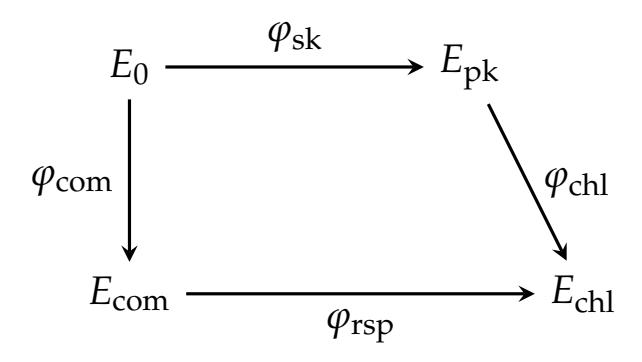

{0}------------------------------------------------

# SPRINT: New Isogeny Proofs of Knowledge and Isogeny-Based Signatures

Thomas den Hollander[1](https://orcid.org/0009-0004-2097-4117) Shai Levin[2](https://orcid.org/0000-0003-4632-9488) Marzio Mula3 Robi Pedersen[4](https://orcid.org/0000-0001-5120-5709) Daniel Slamanig[5](https://orcid.org/0000-0002-4181-2561) Sebastian A. Spindler[6](https://orcid.org/0009-0002-5421-3143)

> Research Institute CODE, Universitat der Bundeswehr M ¨ unchen ¨ 1,3,5,6 University of Auckland2 Technical University of Denmark4

#### **Abstract**

Zero-knowledge proofs of knowledge are a fundamental building block in many isogeny-based cryptographic protocols, such as signature schemes based on identification-to-signature transformations, or multi-party ceremonies that avoid a trusted setup, in particular for generating supersingular elliptic curves with unknown endomorphism rings.

In this paper, we construct *SPRINT*, an efficient polynomial IOP-based proof system that encodes the radical 2-isogeny formulas into a system of multivariate polynomials. When combined with the recent polynomial commitment scheme (PCS) DeepFold, our construction yields substantial improvements over state-of-the-art isogeny proofs of knowledge. For the SQIsign prime *p* = 5 · 2 248 − 1 (giving NIST security level I), our implementation takes only a few milliseconds for proving and verification, with proof sizes around 80 kB. Compared to previous works, we achieve a 1.1-8× speedup for the prover, a 4.4-24× speedup for verification, and proof sizes that are 1.2-2.3× smaller across different parameter sets.

Moreover, we study the weak simulation extractability of our proof system, which we can use as a starting point for a modular construction of signatures. We show that any Fiat–Shamir compiled interactive proof with a so-called canonical simulator is weakly simulation-extractable. We expect this general result to be widely applicable to other post-quantum proof systems and thus of independent interest.

Building on SPRINT and our wSE result, we introduce a new family of signature schemes whose security solely relies on the ℓ-isogeny path problem, a foundational problem in isogenybased cryptography. As a concrete instantiation, we construct a signature scheme using Deep-Fold as the PCS. Across the different NIST security levels, a prototype implementation of our scheme achieves performance on par with the highly optimized NIST specification for SQIsign. Even though our signatures are relatively large, our scheme relies on weaker assumptions and our framework offers flexibility for tradeoffs and optimizations – both within a given PCS and by switching to alternative PCS constructions. In particular, it will naturally inherit efficiency gains from future advances in plausibly post-quantum secure PCS constructions.

## **1 Introduction**

Isogenies are one of a handful of cryptographic paradigms that are presumably secure against attacks by both classical and quantum algorithms. Compared to its competitors, isogeny-based cryptography allows particularly small parameters and hence key sizes and signatures. On the other hand, however, isogenies rank among the slowest protocols that achieve post-quantum security. This drawback is particularly noticeable in the context of proving knowledge of isogenies, which often requires a significant number of repetitions to provide reasonable soundness guarantees [\[BKV19,](#page-27-0) [BCC](#page-27-1)+23, [DDGZ22,](#page-28-0) [BDGP23\]](#page-27-2).

1 [thomasdh@unibw.de](mailto:thomasdh@unibw.de) 2

[shailevin@auckland.ac.nz](mailto:shailevin@auckland.ac.nz) 3[marzio.mula@unibw.de](mailto:marzio.mula@unibw.de)

4 [robi.pedersen@protonmail.com](mailto:robi.pedersen@protonmail.com) 5[daniel.slamanig@unibw.de](mailto:daniel.slamanig@unibw.de) 6

{1}------------------------------------------------

An alternative proof of knowledge can be built around knowledge of the endomorphism ring of a given curve *E*. Such proofs have become particularly practical since the SIDH attacks [\[CD23,](#page-28-1) [MMP](#page-31-0)+23, [Rob23\]](#page-32-0) and the resulting new representation of isogenies through higher-dimensional isogenies between abelian varieties, see e.g. [\[Rob24\]](#page-32-1). This approach has been used in signatures, such as PRISM [\[BBC](#page-26-0)+25] and the more recent variants of SQIsign [\[DLRW24,](#page-29-0) [DF24,](#page-29-1) [NOC](#page-31-1)+24, [BDD](#page-27-3)+24, [NO25,](#page-31-2) [XLZO25\]](#page-32-2), resulting in very compact signatures and good computational efficiency. However, secret knowledge of an endomorphism ring End(*E*) is only possible by walking from an elliptic curve of known endomorphism ring via a (secret) isogeny *ϕ*: *E*0 → *E*, see e.g. [\[BBD](#page-26-1)+22, [MMP24\]](#page-31-3). Usually, the curve *E*0 is public and the distinguished curve of *j*-invariant 1728.

For many applications, however, the starting curve explicitly has to be of unknown endomorphism ring, such as in the CGL hash function [\[CLG09\]](#page-28-2), in the (pre-quantum) verifiable delay function [\[DMPS19\]](#page-29-2) and delay encryption [\[BD21\]](#page-27-4) schemes, in oblivious transfer over **F***p* [\[LGD21\]](#page-31-4), isogeny commitment schemes [\[Ste22\]](#page-32-3), public-key encryption [\[FMP23,](#page-30-0) [Mor23\]](#page-31-5), oblivious pseudo-random functions [\[Bas24\]](#page-26-2), and verifiable random functions [\[LP25\]](#page-31-6). Particularly, the last two also employ proof systems without having the power to leverage the endomorphism ring to their advantage.

Knowledge of the endomorphism ring of curves is also an issue in protocols between multiple parties, where parties sequentially compute chains of secret isogenies, and cannot know the endomorphism ring of these intermediate curves. This is relevant in multi-party trusted parameter generation [\[BCC](#page-27-1)+23] as well as distributed key generation and threshold signature algorithms [\[CS20,](#page-28-3) [BDPV21,](#page-27-5) [CM22,](#page-28-4) [ABCP23\]](#page-25-0), where they play the role of proofs-of-possession (PoPs) – which can also be used, in a more applied (post-quantum) setting, to certify KEM keys for KEMTLS [\[SSW20\]](#page-32-4). The multi-party parameter generation proposed by [\[BCC](#page-27-1)+23] ended up presenting proof systems of almost 20 seconds per party for NIST level I security. This result motivated [\[CLL23\]](#page-28-5) to use generic proof systems as an alternative to expensive proofs tailored to specific relations.[1](#page-1-0) With the goal of also achieving statistical zero-knowledge in a tailor-made approach, [\[CLL23\]](#page-28-5) reduced these costs down to about a second, a figure which was recently even further improved by [\[dHKM](#page-29-3)+25, [LP25,](#page-31-6) [dHMSS26\]](#page-29-4). However, there still remains the question whether these results can be improved to obtain highly efficient isogeny proofs of knowledge without the requirement of knowing endomorphism rings.

In addition to efficiency and generality, a property that over the last years turned out to be highly relevant for the practical use of zero-knowledge succinct non-interactive arguments of knowledge (zk-SNARKs) is that they are non-malleable, i.e., that modifying proofs (or statements in a weaker variant) without the knowledge of the corresponding witness is prevented. This is covered by the stronger soundness notion of (weak) simulation-extractability [\[Sah99,](#page-32-5) [DDO](#page-29-5)+01, [Gro06\]](#page-30-1), which guarantees that no cheating prover can break knowledge soundness even after asking a ZK simulator to produce proofs on adaptively chosen statements. While simulation extractability (SE) has become a very popular and important property for zk-SNARKs (cf. [\[FFK](#page-29-6)+23, [KPT23,](#page-30-2) [FFR24,](#page-29-7) [CFR25\]](#page-28-6)), to the best of our knowledge this topic is still largely unexplored for plausibly post-quantum zk-SNARKs. Moreover, in the context of isogeny proofs of knowledge, the SE property has so far not been studied at all. However, once we have a proof system that is at least weakly SE, we automatically obtain a new class of isogeny-based signatures.

#### **1.1 Previous Work**

An overview of tailor-made isogeny proofs of knowledge can be found in the 2023 survey paper [\[BDGP23\]](#page-27-2) and the further references in the introduction. In this section, we focus on the use of generic proof systems for proving isogeny-knowledge.

**Proving Isogenies using SNARKs.** The first use of succinct non-interactive arguments (SNARGs) for isogeny proofs was proposed in [\[CSRT22\]](#page-28-7). In this work, the authors proposed to use a sumcheck protocol based on modular polynomial relations in the 2-isogeny graph. Since the goal was to obtain a verifiable delay function (VDF), the suggested proof system did not need to satisfy knowledge soundness nor the zero-knowledge property. Furthermore, the practicality of their results was never properly assessed.

1 We note that [\[MJ23\]](#page-31-7) provides an alternative way of producing explicitly **F***p*-rational elliptic curves via walks in the **F***p*-rational graph, where their protocols rely on an ad-hoc adaptation of the Knowledge-of-Exponent Assumption (KEA) to CSIDH.

{2}------------------------------------------------

A few years later, Cong, Lai and Levin [CLL23] proposed a different approach to prove statements of the same relation. Instead of building their own proof system, the authors showed that expressing modular polynomial relations as R1CS constraints, and plugging them into the existing zk-SNARKs Aurora [BCR+19], Ligero [AHIV17] and Limbo [DOT21], proved very fruitful. The authors managed to construct a proof system for a NIST-level I instance that runs in just above a second. These results in turn sparked more research into optimizing the R1CS constraints, with three works trying to reduce the number of constraints using different approaches. The authors in [dHKM+25] use canonical modular polynomials instead of the classical ones to obtain smaller constraint systems. As an additional contribution, the authors also propose constraint systems for isogenies of the higher degrees  $\ell=3,5,7,13$ . In the follow-up work [dHMSS26], the authors switch to the Atkin modular polynomials to achieve even smaller constraint systems and to extend the list of usable prime degrees further. A different path is taken in the work [LP25], which leverages the recent radical isogeny formulas [CD20, CDV20] instead of a modular polynomial for  $\ell=2$ . These radical isogeny formulas have the additional advantage that they automatically prevent backtracking, and due to their simplicity they yield again a more efficient proof system.

A parallel approach is explored in [MNV24], where isogeny walks, computed via Vélu's formulas, are arithmetized and proved using the verifiable folding scheme Nova [KST22]. In multiparty protocols, this lets per-party proofs be folded into a single recursive proof. In the authors' implementation, proving a 2200-isogeny takes around 2 minutes. The main limitation of this approach is that Nova is discrete logarithm based. Although there are alternative post-quantum folding schemes [BC24, FKNP24, BC25], their use would come with the price of extra lattice-based assumptions to prove knowledge of isogenies, which is unwanted.

While the recent advancements in isogeny proofs of knowledge are promising, there is still the question whether one can further improve their efficiency. Moreover, as mentioned above, these proof systems so far do not explicitly consider simulation extractability. One consequence is that they (currently) cannot be directly used as a basis for signature schemes that are efficient and only based on well-established assumptions.2

**Isogeny-based signatures.** The recent PRISM [BBC $^+$ 25] scheme and the latest variants of SQIsign [DLRW24, DF24, NOC $^+$ 24, BDD $^+$ 24, NO25, XLZO25] are currently the most promising isogeny-based signature schemes. Their compactness allows them to rival even some post-quantum signature schemes standardized by NIST (i.e., ML-DSA based on Dilithium [LDK $^+$ 22] or FN-DSA based on Falcon [PFH $^+$ 22]), while their efficiency – notoriously one of the bottlenecks of isogeny-based protocols – has significantly improved over the previous state of the art. On the downside, both PRISM and SQIsign rely on non-standard security assumptions. Namely, for SQIsign proving zero-knowledge requires either interacting with *ad hoc* oracles or adopting new variants of the classic isogeny problems and the Fiat–Shamir heuristic [ABD $^+$ 25]. PRISM instead follows the hash-and-sign paradigm (inspired by [Ler25]), but when proven in the standard model requires a new interactive assumption (i.e., adaptive access to a so-called special degree isogeny oracle). When switching to the random oracle model, this interactive assumption can be replaced by a new non-static "q-type" assumption with the parameter q being linear in the number of signing and hash queries.

To find an isogeny-based signature scheme that relies on more standard isogeny problems, we need to take a step back to a conceptual ancestor of SQIsign, introduced in [GPS17, §4]. Here, as in SQISIgn, an identification protocol is turned into a signature scheme via the Fiat–Shamir (resp. Unruh) transform in the ROM (resp. QROM). The bottleneck is that the underlying identification scheme has a binary challenge space, which forces  $\lambda$  repetitions and hence yields signature sizes quadratic in  $\lambda$ , making the scheme impractical for both size and speed. Hence the current state of affairs in isogeny-based signatures is that practically efficient schemes whose security is only based on standard isogeny assumptions, e.g., the  $\ell$ -ISOGENYPATH problem, are not available.

#### 1.2 Our Contributions

We first prove a general result establishing weak simulation-extractability for Fiat–Shamir-compiled interactive proofs, which we expect to be widely applicable to post-quantum proof systems that are used in practice.

&lt;sup>2 One exception would be to apply the Bellare–Goldwasser template [BG89] for which a sound NIZK suffices. However, this would introduce additional assumptions (for the commitments and PRF), increase signature size and decrease performance.

{3}------------------------------------------------

We then present a new zero-knowledge argument for the knowledge of an isogeny, obtained by arithmetizing radical isogeny formulas via a tailored polynomial IOP. When used as a building block for multiparty generation of supersingular elliptic curves of unknown endomorphism ring (Secuers), we obtain substantial improvements over the state of the art. We then present a family of isogeny-based signature schemes, which can be instantiated with any PCS. Our approach allows us to use a more standard security assumption than SQIsign and PRISM, at the cost of larger signatures. We detail our contributions below.

**Simulation-extractability of NARGs with canonical simulators.** Motivated by the application of proof systems to construct signature schemes, we look at the non-malleability [Sah99, DDO $^+$ 01] and in particular simulation extractability [Gro06] of proof systems. Recently, most research has focused on *strong simulation extractability* (sSE), i.e., where a prover succeeds by creating a new proof  $\pi$  despite having access to the simulator. Results in this direction either focus on proving sSE for specific proof systems [GM17, AB19, DG23] or on generic results [KZM $^+$ 15, ARS20, GKK $^+$ 22, KPT23, FFK $^+$ 23]. Unfortunately these results are not applicable to the type of multiround protocols encountered in plausibly post-quantum SNARKs such as FRI, due to the fact that these are transparent and do not satisfy (weak) unique prover responses. However, to construct signature schemes, it is actually sufficient to start from a proof system that provides *weak simulation extractability* (wSE), i.e., where an adversary only succeeds if they forge a proof for a statement for which they did not query the simulator. This property has been explicitly shown to hold for Sigma protocols [FKMV12a], as well as for Groth16 [BKSV21].

In this work we prove that, in fact, *any* Fiat–Shamir-compiled interactive proof with a so-called canonical simulator is weak SE. This is a simulator that only programs the random oracle to obtain verifier challenges for a Fiat–Shamir transformed protocol. Unlike previous frameworks for proving SE, this is a condition that is easy to satisfy and check. Furthermore, since this is a very common method of simulation, we expect this result to be directly applicable to many other post-quantum proof systems (e.g. FRI-like SNARKs).

**Novel isogeny proofs of knowledge.** We design SPRINT (Succinct Proof for Radical Isogenies, Nimbly Transformed), a novel proof of isogeny knowledge based on the radical isogeny formulas due to Castryck, Decru and Vercauteren [CDV20]. These formulas have recently been used by Levin and Pedersen [LP25] to arithmetize Charles–Goren–Lauter (CGL) [CLG09] walks to R1CS for generic proof systems. We observe that, for proofs of knowledge of isogenies, we can embed the radical isogeny constraints directly into a polynomial IOP (PIOP) by exploiting their repetitive structure.

More precisely, we directly model the resulting equations into a multivariate polynomial and use a sumcheck-based protocol to create an efficient and perfectly zero-knowledge proof system. Unlike previous works, which consider only (knowledge) soundness, we prove round-by-round knowledge soundness, preventing the knowledge soundness losses that may otherwise occur when using the Fiat-Shamir transform on multi-round protocols. Additionally, we achieve logarithmic verification and zero-knowledge through some additional effort.

We provide an implementation for our proof system using the DeepFold PCS [GLH $^+$ 25] and achieve substantial improvements across all metrics over the state of the art. Explicitly, for different parameter sets we achieve a  $1.1-8\times$  faster prover speed and a  $4.4-24\times$  faster verification speed, while reducing proof sizes by roughly a factor of  $1.2-2.3\times$ . Notably, we achieve these improvements simultaneously, whereas previous approaches optimizing one measure suffered from significant drawbacks in the others. Ours is also the first proof system to have a full implementation since the Secuer proof of knowledge [BCC $^+$ 23], over which we achieve far greater improvements.

The use of our proof of knowledge directly improves the performance of multiparty ceremonies for the generation of Secuers. A fundamental feature in this context is that the prover does not need to know the endomorphism ring of the domain or the codomain curve.

**A new family of isogeny-based signature schemes.** We propose a new family of highly flexible isogeny-based signature schemes. For this we use a folklore compiler to obtain EUF-CMA secure signatures from any wSE NARG system.3 Here, signatures are proofs for a hard relation, defining the verification and signing keys. The hash of the message to be signed is included into the relation.

&lt;sup>3 To the best of our knowledge first formalized by Dodis et al. in [DHLW10].

{4}------------------------------------------------

Our approach yields a very versatile framework, since the polynomial commitment scheme (PCS) used with our PIOP to obtain our NARG can easily be exchanged for other PCSs. A further source of flexibility is the option to use (exclusively) curves with unknown endomorphism ring among the protocol parameters. This eliminates the traditional dependence on the curve of j-invariant 1728 (or, more generally, on a curve with known endomorphism ring), on which schemes like SQIsign and PRISM crucially rely. In terms of security, the unforgeability of our signature relies on a well-established isogeny-based assumption, the  $\ell$ -ISOGENYPATH problem, on the weak simulation extractability of the underlying zk-NARK, and on the Fiat–Shamir heuristic.

We showcase one member of our family of signature schemes by using the recent DeepFold PCS [GLH+25]. In terms of computational efficiency, our scheme is on par with the NIST specification [AAA+25] of SQIsign, and outperforms PRISM by a factor of 3 in both signing and verification time at NIST-level I, with even bigger gains for key generation. With the use of compression, key sizes match existing isogeny-based schemes, while for signature sizes our approach is less favorable, resulting in signatures of around 80kB.

However, this is not a lower bound as our design is flexible and there are tradeoffs when relying on different NARG systems. Tweaking the parameters for the PCS for instance provides interesting design flexibility, e.g., changing the rate of code-based commitment schemes gives a natural tradeoff between proving time and signature size. Moreover, switching to an alternative PCS, for instance WHIR [ACFY25] (for now ignoring that it is lacking the zero-knowledge property), is expected to more than halve the signature size.

In general, we are optimistic that the performance of our scheme still has room for considerable improvements. For comparison, consider the evolution of MPC/VOLEitH signatures over the last few years, i.e., coming down from signature sizes of around 40kB for the initial version of Picnic [CDG+17] when relying on a non-standard assumption (the LowMC blockcipher), to around 4.5kB for FAEST [BBB+25], now even relying on a standard assumption (the security of AES).

Similarly, signing times for SQIsign have undergone a  $7-9\times$  speed up from the original implementation of SQIsign2D-West [BDD+24], which already drastically improved upon the previous SQIsign variants [DKL+20, DLRW24], to the specification for the SQIsign NIST round 2 submission [AAA+25] and the recently discovered Qlapoti optimization [BCE+25].

#### 2 Preliminaries

We first introduce some notation. We write  $[n] = \{1, ..., n\}$ . Given an index i, we will write  $\vec{i}$  for its binary expansion in  $\{0,1\}^n \subset \mathbb{F}^n$ . We further define  $eq(\vec{x}, \vec{y})$  for  $\vec{x}, \vec{y} \in \{0,1\}^n$  as the multi-linear equality function

$$\tilde{\text{eq}}(\vec{x}, \vec{y}) = \prod_{i \in [n]} (x_i y_i + (1 - x_i)(1 - y_i)),$$

i.e. the unique polynomial linear in  $x_0, \ldots, x_n, y_0, \ldots, y_n$  such that in the domain  $\{0,1\}^n \times \{0,1\}^n$ , we have  $\tilde{eq}(\vec{x}, \vec{y}) = 1$  if  $\vec{x} = \vec{y}$  and 0 otherwise.

#### 2.1 Non-interactive Arguments

A non-interactive argument (NARG) in the ROM is a tuple NARG =  $(\mathcal{P}, \mathcal{V})$  where  $\mathcal{P}$  is an oracle algorithm known as the argument prover and  $\mathcal{V}$  is an oracle algorithm known as the argument verifier. We refer to [CY24] for definitions of completeness, zero-knowledge and succinctness. Here, we provide formal definitions for knowledge soundness and also adapt these to weak simulation extractability. We briefly recall the oracle configuration [CY24, Definition 7.1.1]  $\operatorname{cnf}(\lambda, n)$ , which outputs a list of output sizes  $(\ell_i)_{i \in [k]}$ . For a Fiat-Shamir transformed protocol, in round i of k, the oracle constructed from  $\operatorname{cnf}$  will output an  $\ell_i$  bit challenge.

In the following definitions, (black-box) knowledge soundness (KS) and weak simulation extractability (wSE) are presented jointly. The gray background color indicates the changes/additions needed to strengthen KS into wSE.

**Definition 1** (Straight-line KS [CY24, Definition 7.1.5] / Straight-line wSE). A non-interactive argument NARG = (P, V) for a relation R is *straight-line knowledge sound* / *straight-line weak simulation-extractable with error*  $\kappa$  if there exists a polynomial-time deterministic algorithm  $\mathcal{E}$  (the extractor) such

{5}------------------------------------------------

that for every security parameter  $\lambda \in \mathbb{N}$ , statement size bound  $n \in \mathbb{N}$ , query bound  $t \in \mathbb{N}$ , and t-query deterministic argument prover  $\tilde{\mathcal{P}}$ ,

$$\Pr\left[\begin{array}{c|c} |\mathbf{x}| \leq n \\ \wedge & (\mathbf{x}, \mathbf{w}) \notin \mathcal{R} \\ \wedge & \mathcal{V}^{f}(\mathbf{x}, \pi) = 1 \\ \wedge & \mathbf{x} \notin Q_{\mathcal{S}} \end{array} \middle| \begin{array}{c} f \leftarrow \mathcal{U}(\mathsf{cnf}(\lambda, n)) \\ (\mathbf{x}, \pi) \xleftarrow{\mathsf{tr}} \tilde{\mathcal{P}}^{f, \mathcal{S}} \\ \mathbf{w} \leftarrow \mathcal{E}(\mathbf{x}, \pi) \end{array} \right] \leq \kappa(\lambda, t, n)$$

Here,  $Q_S$  stores all statements for which S was asked for a simulated proof and f is a programmable RO.

**Definition 2** (Failure probability [CY24, Definition 7.1.6]). Let NARG =  $(\mathcal{P}, \mathcal{V})$  be a non-interactive argument. A deterministic argument prover  $\tilde{\mathcal{P}}$  has *failure probability*  $\delta_{\tilde{\mathcal{P}}, \mathcal{S}}$  if for every security parameter  $\lambda \in \mathbb{N}$  and statement size bound  $n \in \mathbb{N}$ ,

$$\Pr\left[\begin{array}{c|c} |\mathbf{x}| > n \\ \vee & \mathcal{V}^f(\mathbf{x}, \pi) = 0 \\ \vee & \mathbf{x} \in Q_{\mathcal{S}} \end{array} \middle| \begin{array}{c} f \leftarrow \mathcal{U}(\mathsf{cnf}(\lambda, n)) \\ (\mathbf{x}, \pi) \leftarrow \tilde{\mathcal{P}}^{f, \mathcal{S}} \end{array} \right] \leq \delta_{\tilde{\mathcal{P}}, \mathcal{S}}(\lambda, n).$$

Without the gray shaded text this defines the regular failure probability, while with the gray shaded text this defines the *failure probability in the presence of a simulator*.

**Definition 3** (Rewinding KS [CY24, Definition 7.1.7] / Rewinding wSE). A non-interactive argument NARG =  $(\mathcal{P}, \mathcal{V})$  for a relation  $\mathcal{R}$  is rewinding knowledge sound / weak simulation-extractable with error  $\kappa$  and extraction time  $\operatorname{et}_{\mathsf{ARG}}$  if there exists a probabilistic algorithm  $\mathcal{E}$  (the extractor) such that for every security parameter  $\lambda \in \mathbb{N}$ , statement size bound  $n \in \mathbb{N}$ , and t-query deterministic argument prover  $\tilde{\mathcal{P}}$  with failure probability  $\delta_{\tilde{\mathcal{P}}}$  and running time  $\tau_{\tilde{\mathcal{P}}}$ ,

$$\Pr\begin{bmatrix} & |\mathbf{x}| \leq n \\ \land & (\mathbf{x}, \mathbf{w}) \notin \mathcal{R} \\ \land & b = 1 \\ \land & \mathbf{x} \notin Q_{\mathcal{S}} \end{bmatrix} \begin{pmatrix} f \leftarrow \mathcal{U}(\mathsf{cnf}(\lambda, n)) \\ (\mathbf{x}, \pi) \xleftarrow{\mathsf{tr}} \tilde{\mathcal{P}}^{f, \mathcal{S}} \\ b \xleftarrow{\mathsf{tr}_{\mathcal{V}}} \mathcal{V}^{f}(\mathbf{x}, \pi) \\ \mathbf{w} \leftarrow \mathcal{E}(\mathbf{x}, \pi, \mathsf{tr}, \mathsf{tr}_{\mathcal{V}}, \tilde{\mathcal{P}}) \end{pmatrix} \leq \kappa(\lambda, t, n, \delta_{\tilde{\mathcal{P}}, \mathcal{S}}(\lambda, n)).$$

#### 2.2 Interactive Proofs

We give preliminaries on interactive proofs from [CY24, Chapter 13]. An interactive proof (IP) is a tuple of algorithms IP = (P, V) that works as follows. The IP prover P receives as input a statement  $\mathbf{x}$  and a witness  $\mathbf{w}$ , and the IP verifier V receives as input the statement  $\mathbf{x}$ . They interact over some number k of rounds, where in each round  $i \in [k]$  the IP prover P sends a message  $\alpha_i$  and then the IP verifier V sends a message  $\rho_i$ . After the interaction, the IP verifier V outputs a bit denoting whether to accept or reject, computed based on the statement  $\mathbf{x}$ , the received prover messages  $(\alpha_i)_{i \in [k]}$ , and the IP verifier's own randomness (these form the entire view of the IP verifier). Both algorithms may be probabilistic.

We omit definitions for completeness and (knowledge) soundness, only providing a formal definition for zero-knowledge:

**Definition 4** (Verifier's View [CY24, Definition 13.1.6]). The IP verifier's View in IP =  $(\mathcal{P}, \mathcal{V})$  on the statement-witness pair  $(\mathbf{x}, \mathbf{w})$ , denoted View $(\mathcal{P}, \mathcal{V}, \mathbf{x}, \mathbf{w})$ , is the random variable  $(\mathbf{x}, \rho, (\alpha_i)_{i \in [k]})$  where:

- $\rho$  is a random choice of randomness for the IP verifier V; and
- $(\alpha_i)_{i \in [k]}$  are the prover messages received in an interaction between  $\mathcal{P}(\mathbf{x}, \mathbf{w})$  and  $\mathcal{V}(\mathbf{x}, \rho)$ .

Note that the honest IP prover  $\mathcal{P}(\mathbf{x}, \mathbf{w})$  may use its own private randomness (and is not part of the IP verifier's view). If the IP is public coin then the view shows each round's randomness:  $(\mathbf{x}, (\rho_i)_{i \in [k]}, (\alpha_i)_{i \in [k]})$ .

{6}------------------------------------------------

**Definition 5** (Zero Knowledge [CY24, Definition 13.1.7]). IP =  $(\mathcal{P}, \mathcal{V})$  for a relation  $\mathcal{R}$  has *honest-verifier zero-knowledge error*  $z_{IP}$  if there exists a polynomial-time probabilistic algorithm  $\mathcal{S}$  such that for every statement-witness pair  $(\mathbf{x}, \mathbf{w}) \in \mathcal{R}$  the following random variables are  $z_{IP}(\mathbf{x})$ -close in statistical distance:

$$View(\mathcal{P}, \mathcal{V}, \mathbf{x}, \mathbf{w})$$
 and  $\mathcal{S}(\mathbf{x})$ .

We additionally define

$$z_{\text{IP}}(n) = \max\{z_{\text{IP}}(\mathbf{x}) \mid \mathbf{x}, \mathbf{w} \in \{0, 1\}^* \text{ with } |\mathbf{x}| \leq n \text{ and } (\mathbf{x}, \mathbf{w}) \in \mathcal{R}\}.$$

### 2.3 Polynomial IOP

A polynomial interactive oracle proof (PIOP) [KPT23, Definition 2.1] is a special type of interactive protocol. In the Interaction Phase,  $\mathcal{P}$  sends polynomial oracles, i.e. in round  $i \in [k]$  it sends  $(p_{i,1},\ldots,p_{s(i)})$ , and gets challenges  $\rho_i$  back. Here s(i) is a function that specifies the number of polynomials sent in round i. We write  $\vec{p}_i = (p_{i,j})_{j \in [s(i)]}$ . In the Query Phase,  $\mathcal{V}$  queries these polynomials at a number of points. Finally,  $\mathcal{V}$  accepts or rejects in the Decision Phase. We denote by  $\langle \mathcal{P}(\mathbf{x}, \mathbf{w}), \mathcal{V}(\mathbf{x}) \rangle$ ,  $\mathcal{V}$ 's output after the interaction with  $\mathcal{P}$ . We define View as in Definition 5, except for the fact that  $(\alpha_i)_i$  consists of the evaluations of the polynomial oracles  $\vec{p}_i$ . Our PIOP will satisfy completeness, zero-knowledge and round-by-round knowledge soundness, which implies regular knowledge soundness.

**Definition 6** (Completeness). PIOP = (P, V) for a relation R has *perfect completeness* if for every  $(\mathbf{x}, \mathbf{w}) \in R$ ,

$$\Pr[\langle \mathcal{P}(\mathbf{x}, \mathbf{w}), \mathcal{V}(\mathbf{x}) \rangle = 1] = 1.$$

**Definition 7** (Perfect Zero Knowledge). PIOP =  $(\mathcal{P}, \mathcal{V})$  for relation  $\mathcal{R}$ , is (perfect) honest-verifier zero-knowledge if there exists a PPT simulator  $\mathcal{S}$  such that for any tuple  $(\mathbf{x}, \mathbf{w}) \in \mathcal{R}$ , the following random variables are equally distributed:

$$View(\mathcal{P}, \mathcal{V}, \mathbf{x}, \mathbf{w})$$
 and  $\mathcal{S}(\mathbf{x})$ .

We adapt the round-by-round soundness definitions from [CY24, Definitions 31.1.1 & 31.1.4]:

**Definition 8** (State Function). A *state function* for PIOP = (P, V) is a deterministic (possibly inefficient) function RBRState that receives as input a statement x and an interaction transcript trc and outputs a bit for which the following holds.

- Empty transcript: if  $trc = \emptyset$ , then RBRState( $\mathbf{x}$ , trc) = 0.
- Prover moves: if  $\mathtt{trc} = (\vec{p_1}, \rho_1, \dots \vec{p_i}, \rho_i)$  is a transcript for i rounds (for i < k) with RBRState( $\mathbf{x}$ ,  $\mathtt{trc}$ ) = 0 then, for every  $\vec{p_{i+1}}$ , it holds that RBRState( $\mathbf{x}$ , ( $\mathtt{trc}$ ,  $\vec{p_{i+1}}$ )) = 0.
- Full transcript: if  $trc = (\vec{p_1}, \rho_1, \dots \vec{p_k}, \rho_k)$  is a full transcript and RBRState( $\mathbf{x}$ , trc) = 0, then  $\mathcal{V}$  outputs decision bit b = 0.

**Definition 9** (Round by Round Knowledge Soundness). A PIOP =  $(\mathcal{P}, \mathcal{V})$  for a relation  $\mathcal{R}$  has *round-by-round knowledge errors*  $(\epsilon_i)_{i \in [k]}$  if there exists an extractor  $\mathcal{E}$  and state function RBRState such that for every statement  $\mathbf{x}$ , round index  $i \in [k]$ , and malicious prover  $\tilde{\mathcal{P}}$  the following holds:

$$\Pr \left[ \begin{array}{cc} \operatorname{RBRState}(\mathbf{x}, (\vec{p_1}, \rho_1, \dots \vec{p_i})) = 0 \\ \wedge \operatorname{RBRState}(\mathbf{x}, (\vec{p_1}, \rho_1, \dots \vec{p_i}, \rho_i)) = 1 \\ \wedge (\mathbf{x}, \mathbf{w}) \notin \mathcal{R} \end{array} \right] \begin{array}{c} ((\vec{p_i})_{i \in [k]}, (\rho_j)_{l \in [i-1]}) \leftarrow \tilde{\mathcal{P}} \\ \rho_i \in \operatorname{Ch} \\ \mathbf{w} \leftarrow \mathcal{E}(\mathbf{x}, (\vec{p_i})_{i \in [k]}) \end{array} \right] \leq \epsilon_i(\mathbf{x}).$$

The PIOP has *round-by-round knowledge error*  $\epsilon$  if for every  $i \in [k]$  it holds that  $\epsilon_i \leq \epsilon$ .

#### 2.4 Sumcheck Protocol

The *sumcheck protocol* [LFKN92, Set20] is an interactive protocol to reduce a relation of the form  $\sum_{\vec{z} \in \{0,1\}^n} p(\vec{z}) = 0$  to the relation  $p(\vec{r_z}) = H$ , where  $\vec{r_z} \in \mathbb{F}^n$  is a uniformly random assignment for  $\vec{z}$ .

{7}------------------------------------------------

The protocol consists of n rounds of interaction, where in round i the prover  $\mathcal{P}$  sends a univariate polynomial  $\hat{p}_i$  such that

 $\hat{p}_i(X) = \sum_{\vec{z} \in \{0,1\}^{n-i}} p(r_{z1}, \dots, r_{zi-1}, X, \vec{z}).$ 

 $\mathcal{V}$  checks consistency with the previous round by checking that  $\hat{p}_i(0) + \hat{p}_i(1) = \hat{p}_{i-1}(r_{z_{i-1}})$  and then sampling a random assignment  $r_{z_i} \in \mathbb{F}$  and sending it to  $\mathcal{P}$ . After n rounds of interaction,  $\mathcal{V}$  ends up with a final claim, which can be checked by a single evaluation of p.

#### 2.5 Isogenies and Their Computation

We assume some familiarity with isogenies of elliptic curves and revisit the main definitions and arithmetic aspects of isogeny computations in Appendix A. Note that we only consider supersingular elliptic curves (with representation over  $\mathbb{F}_{p^2}$ ) and separable isogenies throughout this work. We denote the  $\ell$ -isogeny graph as  $\mathcal{G}_{\ell}(p)$  and call chains of  $\ell$ -isogenies in this graph isogeny paths.

A foundational assumption in isogeny-based cryptography is that, for long enough paths, the following problem is hard.

**Problem 1** ( $\ell$ -ISOGENYPATH). Given  $E, E' \in \mathcal{G}_{\ell}(p)$ , find an  $\ell$ -isogeny path  $\phi \colon E \to E'$ .

For most cryptographic applications, we are only interested in paths that are not *backtracking*, i.e., paths for which no step is the dual of the previous, as any path can be turned into a (possibly shorter) path without backtracking. Importantly, isogenies corresponding to paths without backtracking are *cyclic* [CLG09, Prop. 1]. The only isogenies that will be relevant in this work are isogenies of degree  $2^e$  for some positive power e. The computational cost of an isogeny depends on its degree, so computing a chain of e consecutive 2-isogenies instead of a single isogeny of degree  $2^e$  will generally give an exponential speedup in the computational cost. Classical approaches to compute such non-backtracking paths are revisited in Appendix A. Throughout this work, we will rely on the more recently introduced *radical isogenies* computational approach.

**Radical** 2-isogenies. In [CD20], Castryck and Decru propose an alternative way of computing chains of 2-isogenies  $E_0 \to E_1 \to \cdots \to E_e$ , a result that was later generalized in [CDV20]. The idea is to work over elliptic curves that have (0,0) ready in the 2-torsion and then remove the need of sampling points by post-composing the isogeny computation with an isomorphism that makes  $(0,0) \in E_{i+1}[2]$  a non-backtracking point again. For isogenies of degree 2, we can choose variants of the Montgomery form, i.e.

$$E: y^2 = x^3 + Ax^2 + Cx.$$

Clearly (0,0) is well-defined over this curve. By applying the 2-isogeny formulas from e.g. [Vél71], we find that  $E' = E/\langle (0,0) \rangle : y^2 = x^3 + A'x^2 + C'x$  has coefficients

$$A' = -2A$$
, and  $C' = A^2 - 4C$ .

On E', (0,0) is now the backtracking point, and the other 2-torsion points are given by  $(A+2\sqrt{C},0)$  and are distinguished by the choice of the root. By translating either of these points to (0,0), we end up with the curve  $E'': y^2 = x^3 + A''x^2 + C''x$ , where

$$A'' = 6\sqrt{C} + A$$
, and  $C'' = 4A\sqrt{C} + 8C$ . (1)

From this new curve, we can continue the walk in the isogeny graph by again quotienting out (0,0). Depending on the choice of the root of C, this defines either of the two outgoing vertices in the graph.

**Proof of knowledge.** More recently, [LP25] have constructed a proof of knowledge for a chain of 2-isogenies, by arithmetizing the constraints from Equation (1) into a Rank-1 Constraint System (R1CS). Here, the coefficients A and C for curves along the walk are indexed by  $i \in \{0, ..., e\}$ , with  $(A_0, C_0)$  representing the starting curve and  $(A_e, C_e)$  the end curve. The resulting constraint system can then be proven generically by any R1CS-compatible proof system. On top of these constraints, they also present a proof of the correct evaluation of a CGL hash function [CLG09], as well as a verifiable random function.

{8}------------------------------------------------

#### 2.6 Signature Schemes

**Definition 10** (Signature Scheme). A *signature scheme* is a tuple of algorithms  $\Sigma = (\mathsf{Gen}, \mathsf{Sign}, \mathsf{Verify})$  which are defined as follows:

- Gen(par): The randomized *key generation* algorithm Gen takes as input public parameters par (or just the a security parameter  $1^{\lambda}$  in unary) and outputs a secret/public key pair (sk, pk).
- Sign(sk, m): The (possibly) randomized *signing* algorithm Sign takes as input a secret key sk and a message m and outputs a signature  $\sigma$ .
- Verify(m,  $\sigma$ , pk): The deterministic *verification* algorithm Verify takes as input a public key pk, a signature  $\sigma$ , and a message m. It outputs either 1 (accept) or 0 (reject).

**Definition 11** (Correctness). A signature scheme  $\Sigma$  is correct if for every security parameter  $\lambda$ , message m such that  $pp \leftarrow \mathsf{PPGen}(1^{\lambda})$  and  $(\mathsf{sk}, \mathsf{pk}) \leftarrow \mathsf{Gen}(\mathsf{pp})$ , we have:

$$\Pr\left[\sigma \leftarrow \mathsf{Sign}(\mathsf{sk}, m) : \mathsf{Verify}(m, \sigma, \mathsf{pk}) = 1\right] = 1.$$

**Definition 12** (EUF-CMA). A signature scheme  $\Sigma$  is *existentially unforgeable under adaptively chosen-message attacks*, if for all PPT adversaries  $\mathcal{A}$  with access to a signing oracle Sign, the following probability is negligible,

$$\Pr\left[\begin{array}{l}\mathsf{pp}\leftarrow\mathsf{PPGen}(1^\lambda);\,(\mathsf{sk},\mathsf{pk})\leftarrow\mathsf{KGen}(\mathsf{pp});(m^*,\sigma^*)\leftarrow\mathcal{A}^{\mathsf{Sign}(\mathsf{sk},\cdot)}(\mathsf{pk}):\\\forall m\in Q:m^*\neq m\land\mathsf{Verify}(m^*,\sigma^*,\mathsf{pk})=1\end{array}\right]$$

where Q is the set of queries that A has issued to the signing oracle.

For unforgeability, one can also consider the strong variant denoted sEUF-CMA security, in which the oracle keeps track of message-signature pairs and the adversary wins if  $(m^*, \sigma^*) \notin Q$ .

## 3 Canonical Simulation Implies Weak-SE

Before we construct our proof of knowledge, we recall our focus on weak simulation extractability (wSE), where an adversary only succeeds if they forge a proof  $\pi$  for a statement x for which they did not query the simulator. So far there are no general results for establishing wSE for transparent multi-round protocols. While strong SE is a powerful notion, it oftentimes cannot be achieved and proving it is complex. Meanwhile, for many applications such as signature schemes, wSE is sufficient. We show that weak simulation extractability is achieved automatically for a wide class of proof systems, namely those with a *canonical simulator*. This is, loosely speaking, a simulator that first creates a simulated transcript and then constructs a query-answer list such that the transcript becomes a valid Fiat–Shamir proof under programmable random oracles  $f = (f_i)_{i \in [k]}$ .

**Definition 13** (Canonical simulator, [CY24, Construction 16.2.2]). The *canonical simulator* is an algorithm S(x) that works as follows. Below we denote by  $S_{\text{IP}}$  the honest-verifier zero-knowledge simulator of the IP.

- 1. Sample a simulated view of the IP verifier:  $(\mathbf{x}, (\rho_i)_{i \in [k]}, (\alpha_i)_{i \in [k]}) \leftarrow \mathcal{S}_{\text{IP}}(\mathbf{x})$ .
- 2. For i = 1 ... k:
  - (a) Sample a random salt  $\tau_i \in \{0,1\}^s$ .

(b) Set 
$$x_i = \begin{cases} (\mathbf{x}, \alpha_1, \tau_1) & \text{if } i = 1, \\ (\rho_{i-1}, \alpha_i, \tau_i) & \text{if } i > 1. \end{cases}$$

- (c) Set the query-answer list  $\mu_i := \{(x_i, \rho_i)\}$ , to be used to program oracle  $f_i$ .
- 3. Set  $\mu := (\mu_i)_{i \in [k]}$ .
- 4. Output  $(\pi, \mu)$ .

{9}------------------------------------------------

Note that S programs the oracles  $f = (f_i)_{i \in [k]}$  at one point each via the output  $\mu$  (and does not query f).

We write S' for a *programming* canonical simulator, which first runs the canonical simulator S, and after generating  $(\pi, \mu)$  programs the random oracles f using  $\mu$  and outputs the proof  $\pi$ . In other words, it is the canonical simulator that not only generates the query-answer list, but also programs the RO.

**Theorem 1.** Let  $NARG = (\mathcal{P}, \mathcal{V})$  be a Fiat-Shamir Transformed IP for relation  $\mathcal{R}$ , i.e.  $NARG := FS[IP, \lambda, s]$  with security parameter  $\lambda$  and privacy parameter s, and let s' be a programming canonical simulator with honest-verifier zero-knowledge error  $s_{IP}$ . Let  $s \in \mathbb{N}$  be a query bound for s, s, s be a statement size bound, and s, s, s, s, s, s, s, s,

• If NARG is straight-line knowledge sound with knowledge soundness error  $\kappa_{KS}(\lambda,t,n)$ , then it is also straight-line weak simulation-extractable with knowledge soundness error

$$\kappa_{wSE}(\lambda, t, n) = \kappa_{KS}(\lambda, t, n) + \Delta.$$

• If NARG has rewinding knowledge soundness error  $\kappa_{KS}(\lambda,t,n,\delta_{\mathcal{P}}(\lambda,n))$ , then it is also rewinding weak simulation-extractable with knowledge soundness error

$$\kappa_{\mathsf{WSE}}(\lambda, t, n, \delta_{\mathcal{P}, \mathcal{S}'}(\lambda, n)) = \kappa_{\mathsf{KS}}(\lambda, t, n, \delta_{\mathcal{P}, \mathcal{S}'}(\lambda, n) + \Delta) + \Delta.$$

We recall that  $\ell_i$  denotes the challenge size for the RO of round  $i \in [k]$  as given in Section 2.1.

*Proof.* Consider the rewinding case. We prove the result by contradiction: assume that for every extractor  $\mathcal{E}$ , there exists a weak-SE prover  $\tilde{\mathcal{P}}_{wSE}$  such that

$$\Pr\begin{bmatrix} |\mathbf{x}| \leq n & f \leftarrow \mathcal{U}(\mathsf{cnf}(\lambda, n)) \\ \wedge & (\mathbf{x}, \mathbf{w}) \notin \mathcal{R} \\ \wedge & b = 1 \\ \wedge & \mathbf{x} \notin Q_{\mathcal{S}'} & w \leftarrow \mathcal{E}(\mathbf{x}, \pi, \mathsf{tr}, \mathsf{tr}_{\mathcal{V}}, \tilde{\mathcal{P}}_{\mathsf{wSE}}) \end{bmatrix} > \kappa_{\mathsf{wSE}}(\lambda, t, n, \delta_{\tilde{\mathcal{P}}_{\mathsf{wSE}, \mathcal{S}'}}(\lambda, n)).$$
(2)

We build from  $\tilde{\mathcal{P}}_{wSE}$  a knowledge soundness prover  $\tilde{\mathcal{P}}_{KS}$  for which

$$\Pr\begin{bmatrix} |\mathbf{x}| \leq n \\ \wedge & (\mathbf{x}, \mathbf{w}) \notin \mathcal{R} \\ \wedge & b = 1 \end{bmatrix} \begin{pmatrix} f \leftarrow \mathcal{U}(\mathsf{cnf}(\lambda, n)) \\ (\mathbf{x}, \pi) \xleftarrow{\mathsf{tr}} \tilde{\mathcal{P}}_{\mathsf{KS}}^{f} \\ b \xleftarrow{\mathsf{tr}_{\mathcal{V}}} \mathcal{V}^{f}(\mathbf{x}, \pi) \\ \mathbf{w} \leftarrow \mathcal{E}(\mathbf{x}, \pi, \mathsf{tr}, \mathsf{tr}_{\mathcal{V}}, \tilde{\mathcal{P}}_{\mathsf{KS}}) \end{pmatrix} > \kappa_{\mathsf{KS}}(\lambda, t, n, \delta_{\tilde{\mathcal{P}}_{\mathsf{KS}}}(\lambda, n)).$$
(3)

Since this is a contradiction, it follows that there exists at least one extractor  $\mathcal{E}$  for which there are no provers  $\tilde{\mathcal{P}}_{wSE}$  that succeed at cheating in the weak-SE case with sufficient probability.

To construct  $\tilde{\mathcal{P}}_{KS}$  and show that Equation (2) implies Equation (3), we emulate a programmable random oracle. Let  $\mathcal{F} = (\mathcal{F}_i)_{i \in [k]}$  be a list of functionalities which work as follows: whenever  $f_i$  would be programmed,  $\mathcal{F}_i$  adds the elements of  $\mu_i$  to the initially empty set  $\mu_{i,\mathcal{F}}$ . Whenever  $\mathcal{F}_i$  is queried with  $x_i$ , it outputs  $\rho_i$  if  $(x_i, \rho_i) \in \mu_{i,\mathcal{F}}$ , and otherwise queries  $f_i$  for  $x_i$  and outputs the answer. We let  $\tilde{\mathcal{P}}_{KS}$  be identical to  $\tilde{\mathcal{P}}_{WSE}$ , except for the following:

- S' is incorporated into  $\tilde{\mathcal{P}}_{KS}$ , such that on a call to S',  $\tilde{\mathcal{P}}_{KS}$  performs any action that S' would have taken.
- For any such call, the prover keeps track of all queried statements in set  $\tilde{Q}_{S'}$  to mirror  $Q_{S'}$ .
- Any interaction with f, including any calls that S' would have made, are replaced by interactions with F.

Note that this transformation does not cause the prover to exceed the query bound t, since S' never queries f, nor does it change its running time.

{10}------------------------------------------------

Since  $\tilde{\mathcal{P}}_{KS}$  perfectly mimics  $\mathcal{S}'$ 's actions and  $\mathcal{F}$ 's behavior is indistinguishable from f's,

$$\Pr\left[\begin{array}{c|c} |\mathbf{x}| \leq n \\ \wedge & (\mathbf{x}, \mathbf{w}) \notin \mathcal{R} \\ \wedge & b = 1 \\ \wedge & \mathbf{x} \notin Q_{\mathcal{S}'} \end{array} \middle| \begin{array}{c} f \leftarrow \mathcal{U}(\mathsf{cnf}(\lambda, n)) \\ (\mathbf{x}, \pi) \xleftarrow{\mathsf{tr}} \tilde{\mathcal{P}}_{\mathsf{wSE}}^{f, \mathcal{S}'} \\ b \xleftarrow{\mathsf{tr}_{\mathcal{V}}} \mathcal{V}^{f}(\mathbf{x}, \pi) \\ \mathbf{w} \leftarrow \mathcal{E}(\mathbf{x}, \pi, \mathsf{tr}, \mathsf{tr}_{\mathcal{V}}, \tilde{\mathcal{P}}_{\mathsf{wSE}}) \end{array} \right]$$

$$= \Pr\left[\begin{array}{c|c} |\mathbf{x}| \leq n \\ \wedge & (\mathbf{x}, \mathbf{w}) \notin \mathcal{R} \\ \wedge & b = 1 \\ \wedge & \mathbf{x} \notin \tilde{\mathcal{Q}}_{\mathcal{S}'} \end{array} \middle| \begin{array}{c} f \leftarrow \mathcal{U}(\mathsf{cnf}(\lambda, n)) \\ (\mathbf{x}, \pi) \xleftarrow{\mathsf{tr}} \tilde{\mathcal{P}}_{\mathsf{KS}}^{\mathcal{F}} \\ b \xleftarrow{\mathsf{tr}_{\mathcal{V}}} \mathcal{V}^{\mathcal{F}}(\mathbf{x}, \pi) \\ \mathbf{w} \leftarrow \mathcal{E}(\mathbf{x}, \pi, \mathsf{tr}, \mathsf{tr}_{\mathcal{V}}, \tilde{\mathcal{P}}_{\mathsf{KS}}) \end{array} \right] = (\star).$$

In other words, the cheating probability of cheating prover  $\tilde{\mathcal{P}}_{KS}$  against  $\mathcal{V}^{\mathcal{F}}$  must be identical to that of  $\tilde{\mathcal{P}}_{wSE}$  against  $\mathcal{V}^f$ . We now show that

$$(\star) \leq \Pr \left[ \begin{array}{cc} |\mathbf{x}| \leq n \\ \wedge & (\mathbf{x}, \mathbf{w}) \notin \mathcal{R} \\ \wedge & b = 1 \end{array} \right| \left. \begin{array}{c} f \leftarrow \mathcal{U}(\mathsf{cnf}(\lambda, n)) \\ (\mathbf{x}, \pi) \xleftarrow{\mathsf{tr}} \tilde{\mathcal{P}}_{\mathsf{KS}}^{\mathcal{F}} \\ b \xleftarrow{\mathsf{tr}_{\mathcal{V}}} \mathcal{V}^{f}(\mathbf{x}, \pi) \\ \mathbf{w} \leftarrow \mathcal{E}(\mathbf{x}, \pi, \mathsf{tr}, \mathsf{tr}_{\mathcal{V}}, \tilde{\mathcal{P}}_{\mathsf{KS}}) \end{array} \right] + tq_{\mathcal{S}'} \sum_{i \in [k-1]} 2^{-\ell_i}.$$

There are two differences between the probabilities on either side of the inequality. First, the condition  $\mathbf{x} \notin \tilde{\mathcal{Q}}_{\mathcal{S}'}$  is removed. Second, on the right hand side,  $\mathcal{V}$  uses the real f, which  $\tilde{\mathcal{P}}_{KS}$  cannot program. Since the removal of the condition  $\mathbf{x} \notin \tilde{\mathcal{Q}}_{\mathcal{S}}$  can only increase the success probability, the only situations where the inequality becomes false are those where  $\tilde{\mathcal{P}}$  uses a programmed query in their proof, which  $\mathcal{V}$  then rejects because it was not programmed in f. By Definition 13, there are three cases that we need to consider.

- In the first round, i = 1. If  $x_1$  is a programmed query, the prover does not succeed in either case. The prover on the left does not succeed since this means  $\mathbf{x} \in Q_{\mathcal{S}'}$ , while the prover on the right does not succeed since f was not actually programmed.
- In subsequent rounds, if  $x_i = \hat{x}_i$  for some programmed query  $\hat{x}_i$ , then  $\rho_{i-1} = \hat{\rho}_{i-1}$  where  $\hat{\rho}_{i-1}$  is the previous round challenge of the simulated transcript. This could mean that  $x_{i-1} = \hat{x}_{i-1}$ , i.e. that the query for the previous round already matches that of a simulated transcript.
- Or, it could mean that the prover was lucky and even though  $x_{i-1}$  was not programmed, still  $\rho_{i-1} = \hat{\rho}_{i-1}$  for some programmed response.

It follows by induction that the prover must have found a collision  $\rho_i$  for some  $1 \leq i < k$ . Since at most  $q_{\mathcal{S}'}$  such queries have been programmed, this happens with probability across all rounds of at most  $\Delta = tq_{\mathcal{S}'} \sum_{i \in [k-1]} 2^{-\ell_i}$ . Note that the failure probability attains the same factor, i.e.  $\delta_{\tilde{\mathcal{P}}_{\mathsf{WSE}},\mathcal{S}'}(\lambda,n) \leq \delta_{\tilde{\mathcal{P}}_{\mathsf{WSE}},\mathcal{S}'}(\lambda,n) + \Delta$ . We conclude that, if  $\tilde{\mathcal{P}}_{\mathsf{WSE}}$  succeeds with probability more than  $\kappa_{\mathsf{WSE}}(\lambda,t,n,\delta_{\tilde{\mathcal{P}}_{\mathsf{WSE}},\mathcal{S}'}(\lambda,n))$ , then  $\tilde{\mathcal{P}}_{\mathsf{KS}}$  succeeds with probability more than

$$\kappa_{\mathsf{KS}}(\lambda, t, n, \delta_{\tilde{\mathcal{P}}_{\mathsf{KS}}}(\lambda, n)) = \kappa_{\mathsf{wSE}}(\lambda, t, n, \delta_{\tilde{\mathcal{P}}_{\mathsf{KS}}}(\lambda, n) - \Delta) - \Delta.$$

It follows that if there exists an extractor  $\mathcal{E}$  for which all provers  $\tilde{\mathcal{P}}$  succeed with probability at most  $\kappa_{KS}$ , then there also exists an extractor for which all weak-SE provers  $\tilde{\mathcal{P}}$  succeed with probability at most  $\kappa_{WSE}$ .

The statement for the straight-line extractor is a special case of the rewinding case. Instead of considering all extractors  $\mathcal{E}(\mathbf{x}, \pi, \operatorname{tr}, \operatorname{tr}_{\mathcal{V}}, \mathcal{P})$ , we only consider extractors that do not access  $\mathcal{P}$ . The result follows.

Note that the added success probability for the prover is an artifact of the optimized variant of Fiat–Shamir, where the challenge of the previous round is hashed instead of the full preceding transcript. In the latter case,  $\mathbf{x}$  appears in every programmed query, and thus a prover never succeeds (i.e.  $\Delta=0$ ). Since this version is more straightforward and the optimized version appears in practice, we prove the statement for the optimized version.

{11}------------------------------------------------

### 4 Constructing a Novel Isogeny Proof of Knowledge

We now present our proof of knowledge of isogeny relations. Like [LP25], we use the radical 2-isogenies to construct a proof system for an isogeny walk of degree  $2^e$ . However, instead of a R1CS to be used in a generic proof system, we construct a tailored PIOP, which can then be compiled using any polynomial commitment scheme. Since the PIOP + PCS approach of constructing proof systems is ubiquitous, this still gives us the flexibility of the generic approach, while achieving major speedups and reductions in proof sizes.

Our starting point is the constraints in Equation (1). We eliminate the factors  $\sqrt{C}$  by squaring the first formula and substituting the first into the second. We obtain the following two constraints for  $i \in \{0, \dots, e-1\}$ ,

$$-\frac{1}{12}A_i(A_{i+1}-A_i)=C_i-\frac{1}{8}C_{i+1},$$
(4)

$$\frac{1}{36}(A_{i+1} - A_i)^2 = C_i,\tag{5}$$

from which we derive the following transformed  $2^e$ -isogeny relation:

$$\mathcal{R} = \left\{ (\mathbf{x}, \mathbf{w}) : \begin{array}{l} \mathbf{x} = (A_0, C_0, A_e, C_e), \ \mathbf{w} = \left( (A_i)_{i \in [e-1]}, (C_i)_{i \in [e-1]} \right) \\ \forall i \in \{0, \dots, e-1\} : \begin{array}{l} -\frac{1}{12} A_i (A_{i+1} - A_i) = C_i - \frac{1}{8} C_{i+1} \\ \wedge \frac{1}{36} (A_{i+1} - A_i)^2 = C_i \end{array} \right\}.$$
 (6)

In the remainder of this section, we construct a PIOP which can then be compiled to a proof of knowledge for relation  $\mathcal{R}$ . We use Section 4.1 to construct the polynomial that is at the basis of this relation. As we will see, it encodes both constraints at every step of the isogeny path, which we reduce to a claim on a single evaluation point using the sumcheck protocol.

At each index i of the isogeny walk, we use coefficients at both index i and i + 1. To ensure the polynomial which we will use in a sumcheck protocol has a constant degree in every variable, we introduce a new multilinear polynomial  $\tilde{Q}$ . We prove in Section 4.2 that  $\tilde{Q}$  is efficiently evaluable, even outside of the boolean hypercube, which is necessary to obtain a succinct verifier.

In Section 4.3, we discuss how to adapt our PIOP to isogeny walks of lengths *e* that are not a power of two. Finally, Section 4.4 demonstrates how to make the resulting system zero-knowledge.

#### 4.1 Polynomial Relation from Radical Isogenies

To encode Equations (4) and (5) into a single polynomial, we introduce the multilinear polynomial  $\tilde{B}$ , such that for all  $i \in \{0, ..., e\}$ ,  $\tilde{B}(0, 0, \vec{i}) = A_i$  and  $\tilde{B}(0, 1, \vec{i}) = C_i$ .

The remaining entries will be selected uniformly at random (under the constraint that the mask M, defined in Section 4.4, sums to 0 over the boolean hypercube). We further fix the linear polynomials  $a_{A_i}$ ,  $a_{A_i}$  and  $a_{C_i}$  with

$$a_{A_j}(0) = 0,$$
  $a_{A_i}(0) = -\frac{1}{12},$   $a_{C_j}(0) = -\frac{1}{8},$   $a_{A_j}(1) = \frac{1}{36},$   $a_{A_i}(1) = -\frac{1}{36},$   $a_{C_j}(1) = 0,$ 

to encode the coefficients. Using these ingredients, we can define the polynomial

$$P'(\vec{h}, \vec{k}, \vec{i}, x, \vec{j}) = \tilde{eq}(h_0, 1) \, \tilde{eq}(x, 0) \, \tilde{Q}(\vec{i}, \vec{j}, \vec{k})$$

$$\left( \left[ a_{A_j}(h_1) \tilde{B}(x, 0, \vec{j}) + a_{A_i}(h_1) \tilde{B}(x, 0, \vec{i}) \right] \left[ \tilde{B}(x, 0, \vec{j}) - \tilde{B}(x, 0, \vec{i}) \right] - \left[ \tilde{B}(x, 1, \vec{i}) + a_{C_j}(h_1) \tilde{B}(x, 1, \vec{j}) \right] \right) \quad (7)$$

&lt;sup>4 While the total degree of the isogeny graph walk increases exponentially with *e* and only linearly with the degree of the individual steps, it could nonetheless be that moving from 2-isogenies to, say, 3- or 5-isogenies gives a concrete speedup because the larger constraint system allows for more optimizations (see also [dHMSS26, Table 1] for a similar phenomenon). We however leave this research direction to future work.

{12}------------------------------------------------

as well as the masked version

$$P(\vec{h}, \vec{k}, \vec{i}, x, \vec{j}) = P'(\vec{h}, \vec{k}, \vec{i}, x, \vec{j}) + M(\vec{i}, x, \vec{j})$$
(8)

where  $x \in \mathbb{F}$ ,  $\vec{h} \in \mathbb{F}^2$ ,  $\vec{k}$ ,  $\vec{i}$ ,  $\vec{j} \in \mathbb{F}^n$ . Here,  $h_0$  ensures independence between the mask and the constraints, while  $h_1$  selects which constraint is checked, and x is used to ensure only the evaluations  $\tilde{B}(0,\ldots)$  have contributions in the constraints, since the product is automatically 0 if x=1. Notably, M is not multilinear, but instead has degree 3 in all of its variables. By construction, it evaluates to 0 when summed over the boolean hypercube.

To ensure that our constraints run explicitly over consecutive curves of our path, we define  $\tilde{Q}$  as follows:

$$\widetilde{Q}(\vec{i}, \vec{j}, \vec{k}) = \sum_{l \in \{0,1\}^n \setminus \{1...1\}} \widetilde{eq}((l + 1), \vec{j}) \, \widetilde{eq}(\vec{l}, \vec{i}) \, \widetilde{eq}(\vec{l}, \vec{k}).$$
(9)

In words,  $\tilde{Q}$  is the unique multilinear polynomial that returns 1 if and only if  $\vec{i} = \vec{k}$  and  $\vec{j} = (\vec{i} + 1)$  on the boolean hypercube.

We define the sum

$$q(\vec{h}, \vec{k}) = \sum_{\vec{i} \in \{0,1\}^n} \sum_{x \in \{0,1\}} \sum_{\vec{j} \in \{0,1\}^n} P(\vec{h}, \vec{k}, \vec{i}, x, \vec{j}),$$
(10)

which allows us to present the following lemma:

**Lemma 2.** Relation  $\mathcal{R}$  in Equation (6) is equivalent to the following relation:

$$\mathcal{R}' = \left\{ (\mathbf{x}, \mathbf{w}) : \begin{cases} \mathbf{x} = (A_0, C_0, A_e, C_e), \ \mathbf{w} = \tilde{B}(\cdot) \\ (\mathbf{x}, \mathbf{w}) : \ \forall i \in \{0, e\} : \ \tilde{B}(0, 0, \vec{i}) = A_i, \tilde{B}(0, 1, \vec{i}) = C_i \\ \forall \vec{h} \in \{0, 1\}^2, \vec{k} \in \{0, 1\}^n : \ q(\vec{h}, \vec{k}) = 0 \end{cases} \right\}.$$

*Proof.* We have already seen how  $\mathbf{w}$  for  $\mathcal{R}$  is transformed to the polynomial  $\tilde{B}$  and vice versa. It remains to be shown that  $\mathcal{R}$  is satisfied if and only if  $\mathcal{R}'$  is.

First, note that the factor  $eq(h_0, 1)$  ensures that

$$\sum_{\vec{i}\in\{0,1\}^n}\sum_{x\in\{0,1\}}\sum_{\vec{j}\in\{0,1\}^n}P'(\vec{h},\vec{k},\vec{i},x,\vec{j}) = \sum_{\vec{i}\in\{0,1\}^n}\sum_{x\in\{0,1\}}\sum_{\vec{j}\in\{0,1\}^n}M(\vec{i},x,\vec{j}) = 0,$$

where the latter equality holds by construction. Since  $P'(\vec{h}, \vec{k}, \vec{i}, 1, \vec{j}) = 0$  due to the factor eq(x, 1), it suffices to focus on  $P'(1, h_1, \vec{k}, \vec{i}, 0, \vec{j}) = 0$ . Here, Q gives only a non-zero contribution if  $\vec{i} = \vec{k}$  and  $\vec{j} = \vec{k} + 1$  and therefore

$$\begin{split} \sum_{\vec{i} \in \{0,1\}^n} \sum_{x \in \{0,1\}} \sum_{\vec{j} \in \{0,1\}^n} P'(1,h_1,\vec{k},\vec{i},0,\vec{j}) \\ &= \Big( \left[ a_{A_j}(h_1) \tilde{B}(x,0,\vec{k}+1) + a_{A_i}(h_1) \tilde{B}(x,0,\vec{k}) \right] \left[ \tilde{B}(x,0,\vec{k}+1) - \tilde{B}(x,0,\vec{k}) \right] \\ &- \left[ \tilde{B}(x,1,\vec{k}) + a_{C_i}(h_1) \tilde{B}(x,1,\vec{k}+1) \right] \Big). \end{split}$$

We see that  $h_1 \in \{0,1\}$  recovers exactly the constraints in  $\mathcal{R}$ .

The above polynomial will be the basis of our PIOP. Instead of considering all assignments  $(\vec{h}, \vec{k}) \in \{0, 1\}^{2+n}$ , the verifier will provide the challenge  $(\vec{r_h}, \vec{r_k}) \in \mathbb{F}^{2+n}$ . This is valid due to linearity in  $\vec{h}$  and  $\vec{k}$ , and subsequently applying the Schwartz–Zippel lemma. Additional work is required to ensure the protocol is efficient, zero-knowledge and applicable to walks with length not equal to a power of two, which we cover in the remainder of this section.

**Remark 1.** One might be tempted to write  $\vec{j}(\vec{i}) = (i + 1)$  as a multilinear extension to eliminate the input variables  $\vec{j}$  and  $\vec{k}$ . Unfortunately, any bit of  $\vec{i}$  affects the value of (i + 1). For example,  $j_n$  flips from 0 to 1 if  $i_{n-1} = \cdots = i_1 = 1$ , i.e. based on the product  $\prod_{v \in [n-1]} i_v$ . While this is still multilinear, we then use it as an input to  $\tilde{B}$ , which again has a linear term in all variables. The degree of P' thus becomes linear in n in every variable, which increases the communication and verifier complexity from O(n) to  $O(n^2)$ .

{13}------------------------------------------------

### 4.2 Computing $\tilde{Q}$

One potential hurdle towards succinctness is the matter of computing the value of  $\tilde{Q}$ , defined in Equation (9). It is clear to see that this function is efficiently evaluated over the boolean hypercube, since it is 1 iff  $\vec{i} = \vec{k}$  and  $\vec{j} = (\vec{k} + 1)$  and 0 otherwise. When one index is from the entire field  $\mathbb{F}$  instead, we may consider the line defined by keeping this index variable and extrapolating from the values of  $\tilde{Q}$  where this line intersects the boolean hypercube.

It is however not clear that  $\tilde{Q}$  is efficiently evaluable when all its inputs lie in  $\mathbb{F}$ . The rest of the protocol takes O(n) work for the verifier – logarithmic in the size of the path. Naively,  $\tilde{Q}$  would need to be evaluated in time  $O(2^n)$ , due to the sum over  $l \in \{0,1\}^n \setminus \{1...1\}$ . Fortunately, this product can be evaluated more efficiently:

**Lemma 3.** Let  $\vec{i}, \vec{j}, \vec{k} \in \mathbb{F}^n$ . The polynomial

$$\tilde{Q}(\vec{i}, \vec{j}, \vec{k}) = \sum_{l \in \{0,1\}^n \setminus \{1...1\}} \tilde{\text{eq}}((l + 1), \vec{j}) \, \tilde{\text{eq}}(\vec{l}, \vec{i}) \, \tilde{\text{eq}}(\vec{l}, \vec{k})$$

may be evaluated in 6n - 4 field multiplications and 10n - 4 additions.

*Proof.* First, observe that we can compute the v'th bit of (l + 1) as follows:

$$(l+1)_v = l_v + (1-2l_v) \prod_{w < v} l_w.$$

This is the arithmetization of an adder with one of the addends fixed at 1 – it is equal to  $l_v$  plus the carry of all lower bits, which is 1 if and only if all lower bits are equal to 1. Furthermore, if both  $l_v$  and the carry are 1, the result should be 0 and so 2 is subtracted from the total. We can define  $\tilde{Q}_m$  as

$$\begin{aligned} \tilde{Q}_m(\vec{i},\vec{j},\vec{k}) &= \sum_{l \in \{0,1\}^m \setminus \{1...1\}} \prod_{v \in [m]} (l_v i_v k_v + (1-l_v)(1-i_v)(1-k_v)) \ &\cdot \left( \left( l_v + (1-2l_v) \prod_{w < v} l_w \right) j_v + \left( 1-l_v - (1-2l_v) \prod_{w < v} l_w \right) (1-j_v) \right) \end{aligned}$$

with  $\tilde{Q}_n = \tilde{Q}$ .

We can split  $\tilde{Q}_m$ 's sum into two cases: where  $l_m \neq 1$  and  $l_{m-1} \dots l_1 = 1 \dots 1$ , and where  $l_{m-1} \dots l_1 \neq 1 \dots 1$ . This yields the recursion

$$\begin{split} \tilde{Q}_m(\vec{i},\vec{j},\vec{k}) &= (1-i_m)(1-k_m)j_m \prod_{w < m} i_w k_w (1-j_w) \\ &+ \left[i_m k_m j_m + (1-i_m)(1-k_m)(1-j_m)\right] \tilde{Q}_{m-1}(\vec{i}_{m-1...1},\vec{j}_{m-1...1},\vec{k}_{m-1...1}), \end{split}$$

where we define the base case as  $\tilde{Q}_1(i_1,j_1,k_1)=(1-i_1)(1-k_1)j_1$  (the only valid assignment is  $\vec{i}=\vec{k}=0$  and  $\vec{j}=1$ ).

From this, it follows that we can compute  $\tilde{Q}(\vec{i},\vec{j},\vec{k})$  efficiently, not just over the boolean hypercube but over  $\mathbb{F}^{2n+1}$ , as follows: precompute the products  $i_m j_m k_m, \ldots, (1-i_m)(1-j_m)(1-k_m)$ , after that compute  $\tilde{Q}_1$  and then incrementally the values  $\tilde{Q}_v(i_v\ldots i_1,j_v\ldots j_1,k_v\ldots k_1)$  and  $\prod_{w< v} i_w k_w(1-j_w)$  for  $v\in\{2,\ldots,n\}$  until we arrive at  $\tilde{Q}=\tilde{Q}_n$ .

### 4.3 Supporting Arbitrary Length Walks

Since in our construction the path length *e* is halved in every round, natively only path lengths that are powers of two are supported. While this is unlikely to be an issue for most applications, where the goal is simply to attain at least some 'security level', it is nonetheless a worthwhile extension to be able to support isogeny walks of arbitrary length.

To achieve this, we 'puncture' the polynomial  $\tilde{Q}$  to allow a prover to provide only a partial path of length e'. The new multilinear polynomial  $\tilde{Q}_{e'}(\vec{i},\vec{j},\vec{k})$  is constructed such that all terms with i > e' receive a factor 0. This does not affect the proof size, but does require the verifier to do slightly more work.

{14}------------------------------------------------

The prover can simply skip these indices when computing  $\tilde{Q}$ 's evaluation table and is thus not impacted either. For more details on this approach see Appendix C, where we additionally show (Lemma 10) that the verifier needs to do just 2(n-1) additional field multiplications compared to Lemma 3. This may also allow tighter packing of the masking values, and potentially enable optimizations for multilinear PCS's since we now know that a fixed number of evaluations is always zero. We leave these optimizations for future work.

### 4.4 Adding Zero-Knowledge

There are two categories of leakage that we must prevent to make our protocol zero-knowledge: first, the evaluations of  $\tilde{B}$  that are revealed as openings of the polynomial commitment at the end of the protocol. These are masked by adding the variable x to  $\tilde{B}$ , thereby doubling the size of the polynomial, and sampling the additional coefficients uniformly at random. For example, at the end of the sumcheck protocol, we will open  $\tilde{B}(r_x, 0, \vec{r_i})$ . This hides  $\tilde{B}(0, 0, \vec{r_i})$ , which would otherwise leak information about  $(A_i)_{i \in \{0, \dots, e\}}$ .

The second form of leakage is due to the sumcheck protocol. Here we have added the mask M. We would like to embed this mask in the multilinear polynomial  $\tilde{B}$ . However, since P has degree 3 in every variable (Equation (8)), this is not straightforward. Fortunately, M does not need to be an arbitrary polynomial of degree 3 in every variable, it is enough that it hides the specific revealed evaluations, an observation due to Libra [XZZ+19]. Unlike Libra, which adds a new univariate polynomial of low degree per sumcheck round, we would like to avoid sending additional polynomials, instead packing the mask in the existing polynomial  $\tilde{B}$ . To this end, we let

$$M(\vec{z}) = \tilde{B}(1,0,\vec{0}) + \sum_{d \in [3]} \sum_{v \in [2n+1]} \tilde{B}(1,0,3(v-\vec{1})+d) z_v^d, \tag{11}$$

so that M is a polynomial of degree 3 in every variable, its coefficients being the first 6n + 4 evaluations of  $\tilde{B}$  (in lexicographic ordering). The value of  $\tilde{B}(1,\vec{0})$  is set such that M sums to 0 over the boolean hypercube. This avoids having to send the initial sumcheck value.

While M fully masks the sumcheck evaluations, it may seem that we have simply shifted the issue – to verify the evaluation of M we need to open  $\tilde{B}$  at all 6n+4 points to obtain M's coefficients. This would fully reveal the masking polynomial, defeating its purpose. Therefore, as soon as  $\vec{r_z}$  has been fixed,  $\mathcal{P}$  instead sends

$$M'(\vec{r_z}, y) = \tilde{B}(1, y, \vec{0}) + \sum_{d \in [3]} \sum_{v \in [2n+1]} \tilde{B}(1, y, 3(v - \vec{1}) + d)(\vec{r_z})_v^d.$$
 (12)

The verifier chooses a random value  $r_y$ , after which the evaluations  $\tilde{B}(1, r_y, \vec{c})$  for  $\vec{c} \in \{0, \dots, 6n + 3\}$  are revealed. The verifier then checks that these match  $M'(\vec{r_z}, r_y)$  as expected.

#### 4.5 The PIOP

With the relevant building blocks in place, we now present the full PIOP in Figure 1. We can see how the prover constructs polynomial  $\tilde{B}$ , after which the prover receives challenges  $\vec{r_h}$  and  $\vec{r_k}$ . We then perform 2n+1 rounds of sumcheck on polynomial P constructed in Section 4.1. In the last steps, the verifier samples challenge  $r_y$  to ensure that the components of the mask can be opened without revealing their respective contributions. The openings of  $\tilde{B}$  are masked by a linear combination due to  $r_x$ . The proving complexity is  $O(2^n) = O(e)$ , linear in the length of the walk, and the verification complexity is  $O(n) = O(\log(e))$ . P sends 6n+5 field elements in addition to the polynomial oracle  $\tilde{B}$ . We analyze the security of our PIOP in Section 5.

**Remark 2.** We note a potential optimization here: opening  $\tilde{B}$  at every coefficient is only necessary to compute M. In our implementation, we can batch these openings together by taking a random linear combination and providing a single opening proof. In fact, this method of batching is shared by most polynomial commitment schemes. It would be natural to avoid sending all coefficients and use batching to reveal the linear combination of evaluations of  $\tilde{B}$  directly, reducing proof size in the process. This optimization could reduce the number of (linear combinations of) evaluations sent in the final round to 3. However, since this is not captured by the PIOP definition and makes non-black-box use of the PCS, we leave this optimization for future work.

{15}------------------------------------------------

**Interaction phase:** The prover and verifier engage in the following protocol:

1. The prover P computes a multilinear polynomial *B*˜, where

$$\forall i \in \{0, ..., e\}: \ \tilde{B}(0, 0, \vec{i}) = A_i, \ \tilde{B}(0, 1, \vec{i}) = C_i, \\ \forall i \in \{1, ..., 2e + 1\}: \ \tilde{B}(1, \vec{i}) \in_R \mathbb{F},$$

and *B*˜(1,⃗0) is chosen s.t. ∑⃗*i*∈{0,1} *n* ∑*x*∈{0,1} ∑⃗*j*∈{0,1} *n M*(⃗*i*, *x*,⃗*j*) = 0, for *M* defined in Equation [\(11\)](#page-14-1).

- 2. P sends *B*˜ to V.
- 3. V samples *r*⃗*h* ∈ **F** ∗2 , ⃗*rk* ∈ **F** ∗*n* and sends these values to P.
- 4. P and V perform 2*n* + 1 rounds of sumcheck: in the *i*'th round, P sends polynomial *p*ˆ*i*(*X*) and V sends *ρi* ∈ **F** ∗ , where

$$\hat{p}_i(X) = \sum_{\vec{z} \in \{0,1\}^{2n+1-i}} P(\vec{r_h}, \vec{r_k}, \rho_1, \dots, \rho_{i-1}, X, \vec{z}).$$

Instead of sending *p*ˆ*i* in its entirety, it is derived from the constraint that *p*ˆ*i*(0) + *p*ˆ*i*(1) = *p*ˆ*i*−1(*ρi*−1) for *i* > 1 or *p*ˆ*i*(0) + *p*ˆ*i*(1) = 0 for *i* = 1.

- 5. P sends *M*′ (⃗*ri* ,*rx*,⃗*rj* , *y*) with *M*′ as defined in Eq. [\(12\)](#page-14-2).
- 6. V samples *ry* ∈ **F** ∗ uniformly at random and sends it to P.

**Query phase:** V queries *B*˜ at (*rx*, 0,⃗*ri*), *B*˜(*rx*, 0,⃗*rj*), *B*˜(*rx*, 1,⃗*ri*) and *B*˜(*rx*, 1,⃗*rj*), as well as the starting and end points *B*˜(0, 0,⃗0), *B*˜(0, 1,⃗0), *B*˜(0, 0,⃗1) and *B*˜(0, 1,⃗1), and evaluations required for the mask: *B*˜(1,*ry*,⃗*c*) for *c* ∈ {0, . . . 6*n* + 3}.

.

**Decision phase:** V accepts if

- The starting and end points match:
  - **–** *B*˜(0, 0,⃗0) = *A*0 and *B*˜(0, 0,⃗1) = *Ae* ,
  - **–** *B*˜(0, 1,⃗0) = *C*0 and *B*˜(0, 1,⃗1) = *Be*
- The constraint system is satisfied:

$$\begin{split} \hat{p}(\rho_{i}) &= \tilde{\text{eq}}(\vec{r}_{h0}, 1) \, \tilde{\text{eq}}(r_{x}, 0) \tilde{Q}(\vec{r}_{i}, \vec{r}_{j}, \vec{r}_{k}) \\ &\left( \left[ a_{A_{j}}(\vec{r}_{h1}) \tilde{B}(r_{x}, 0, \vec{r}_{j}) + a_{A_{i}}(\vec{r}_{h1}) \tilde{B}(r_{x}, 0, \vec{r}_{i}) \right] \left[ \tilde{B}(r_{x}, 0, \vec{r}_{j}) - \tilde{r}_{B}(r_{x}, 0, \vec{r}_{i}) \right] \\ &- \left[ \tilde{B}(r_{x}, 1, \vec{r}_{i}) + a_{C_{j}}(\vec{r}_{h1}) \tilde{B}(r_{x}, 1, \vec{r}_{j}) \right] \right) + M'(\vec{r}_{i}, r_{x}, \vec{r}_{j}, 0). \end{split}$$

• The mask was correctly evaluated (Eq. [\(12\)](#page-14-2) with ⃗*rz* = (⃗*ri* ,*rx*,⃗*rj*)):

$$M'(\vec{r_z}, r_y) = \tilde{B}(1, r_y, \vec{0}) + \sum_{d \in [3]} \sum_{v \in [2n+1]} \tilde{B}(1, r_y, 3(v - \vec{1}) + d)(\vec{r_z})_v^d.$$

Figure 1: The full PIOP.

{16}------------------------------------------------

### 5 Security of our PIOP

We now prove that PIOP in Figure 1 is secure.

**Lemma 4.** PIOP has perfect completeness.

*Proof.* For a valid witness  $\mathbf{w} = ((A_i)_{i \in \{0,\dots,e\}}, (C_i)_{i \in \{0,\dots,e\}})$ , we have for every  $\vec{k} \in \mathbb{F}^n$  and  $\vec{h} \in \mathbb{F}^2$ :

$$\sum_{\vec{i},\vec{j}\in\{0,1\}^n,x\in\{0,1\}} P(\vec{h},\vec{k},\vec{i},x,\vec{j}) = 0,$$

since for every  $\vec{k}$ , this relation captures one step of the isogeny path. This means that the claim at the start of Step 4 holds. Next the prover and verifier perform a sumcheck argument, arriving at a new relation that holds by construction. The prover finally sends polynomial M' honestly. Since the witness is valid and the polynomials sent by the prover are correct w.r.t.  $\tilde{B}$ , the evaluations of  $\tilde{B}$  are valid and final checks succeed and verifier outputs 1.

The simulator S produces a simulated view of the interaction between P and V:

- 1. Sample  $r_x, r_y \in \mathbb{F}$ ,  $\vec{r_h} \in \mathbb{F}^2$ ,  $\vec{r_i}$ ,  $\vec{r_j}$ ,  $\vec{r_k} \in \mathbb{F}^n$  uniformly at random.
- 2. Let  $\tilde{B}(1,\vec{i})=0$  for  $i\in\{0,\ldots,2e+1\}$ , i.e. set the part corresponding to  $(A_i)_{i\in\{0,\ldots,e\}}$  and  $(C_i)_{i\in\{0,\ldots,e\}}$  to 0.
- 3. Let  $\tilde{B}(0,\vec{i}) \in \mathbb{F}$  for  $i \in \{1,\ldots,2e+1\}$ , i.e. sample the remainder of  $\tilde{B}$  uniformly at random.
- 4. Let

$$\tilde{B}(1,\vec{0}) = \frac{-1}{2^{2n+1}} \sum_{\vec{z} \in \{0,1\}^{2n+1}} \left[ P'(\vec{r_h}, \vec{r_k}, \vec{z}) + \sum_{d \in [3]} \sum_{v \in [2n+1]} \tilde{B}(1,0,3(v-\vec{1}) + d) z_v^d \right].$$

5. Continue by following Protocol 1 honestly, starting from Step 2.

Figure 2: The canonical simulator S for the PIOP.

Multi-round protocols that are only proven to be knowledge sound may suffer from large soundness losses when made non-interactive using the Fiat–Shamir transformation. Therefore, instead of regular knowledge soundness, we focus on the stronger notion of *round-by-round knowledge soundness* [CCH+19], which is equivalent to *state-restoration knowledge soundness* [BCS16, Hol19]. Such a PIOP may be compiled to a state-restoration knowledge sound argument, i.e. with a knowledge soundness error that is 'well-behaved' under the Fiat–Shamir transformation [CGKY25].

Lemma 5. PIOP has round-by-round knowledge soundness errors

$$\left(\frac{n+2}{|\mathbb{F}|-1},\frac{3}{|\mathbb{F}|-1},\ldots,\frac{3}{|\mathbb{F}|-1},\frac{1}{|\mathbb{F}|-1}\right)_{i\in[k]}.$$

*Proof.* We define state function RBRState that indicates whether the protocol execution is doomed (RBRState(x,trc) = 0) or not (RBRState(x,trc) = 1). In the following, let trc' denote transcript trc without the last message.

- Empty transcript: If  $trc = \emptyset$  or  $trc = (\tilde{B})$ , RBRState(x, trc) = 0.
- Prover moves: If the prover sent the last message, RBRState(x, trc) = RBRState(x, trc').
- If  $\operatorname{trc} = (\tilde{B}, (\vec{r_h}, \vec{r_k}))$ , then  $\forall i \in \{0, \dots, e\} \text{ let } A_i = \tilde{B}(0, 0, \vec{i}) \text{ and } C_i = \tilde{B}(0, 1, \vec{i})$ . Then RBRState( $\mathbf{x}$ ,  $\operatorname{trc}$ ) = 0 if and only if
  - The polynomial  $\tilde{B}$  is not a valid witness for x, i.e.

{17}------------------------------------------------

- \* the starting and end points do not match:  $\mathbf{x} \neq (A_0, C_0, A_e, C_e)$ , or
- \*  $(A_i)_{i \in \{0,...,e\}}$ ,  $(C_i)_{i \in \{0,...,e\}}$  do not satisfy Equations (4) and (5), or
- \*  $\sum_{\vec{i} \in \{0,1\}^n} \sum_{x \in \{0,1\}} \sum_{j \in \{0,j\}^n} M(\vec{i}, x, \vec{j}) \neq 0$ ,
- and,  $\sum_{\vec{i} \in \{0,1\}^n} \sum_{x \in \{0,1\}} \sum_{\vec{i} \in \{0,1\}^n} P(\vec{r_h}, \vec{r_k}, \vec{i}, x, \vec{j}) \neq 0$ .
- During Step 4, in the *i*'th sumcheck round, let  $trc = (\tilde{B}, (\vec{r_h}, \vec{r_k}), \hat{p}_1, r_{z_1}, \dots, \hat{p}_i, r_{z_i})$ . Then RBRState( $\mathbf{x}$ , trc) = 0 if and only if
  - the starting and end points do not match, or
  - $\hat{p}_i(r_{zi}) \neq \sum_{\vec{z} \in \{0,1\}^{2n+1-i}} P(\vec{r_h}, \vec{r_k}, r_{z1}, \dots, r_{zi-1}, r_{zi}, \vec{z}).$
- After Step 6, for  $trc = (..., \hat{M}', r_y)$ , let RBRState(x, trc) = 0 if and only if any of the verification equations are not satisfied.

Clearly RBRState is correct: the empty transcript is always doomed, a prover message can never make a doomed state not doomed, and if the final transcript is doomed, then verification fails. It remains to be shown that if there is a non-negligible chance of leaving a doomed state, then  $\mathcal E$  can obtain a valid witness. It follows from Lemma 2 that a valid assignment for  $\mathcal R$  satisfying Equations (4) and (5) can be read of from an assignment for  $\mathcal R'$ .

The first point where a prover can leave a doomed state, is after the first challenge  $(\vec{r_h}, \vec{r_k})$  has been sent, which comes after  $\mathcal{P}$  has sent  $\tilde{B}$ . A doomed transcript can become valid if either  $\tilde{B}$  is a valid witness, in which case  $\mathcal{E}$  clearly succeeds, or if  $\tilde{B}$  is not a valid witness. In this case  $(\vec{r_h}, \vec{r_k})$  is a root of q, i.e.

$$q(\vec{h}, \vec{k}) = \sum_{\vec{i} \in \{0,1\}^n, x \in \{0,1\}, \vec{j} \in \{0,1\}^n} P(\vec{h}, \vec{k}, \vec{i}, x, \vec{j}) \neq 0,$$

but  $q(\vec{r_h}, \vec{r_k}) = 0$ . This happens with probability at most  $\frac{n+2}{|\mathbb{F}|-1}$ .

In the first sumcheck round, we have  $\hat{p}_1(0) + \hat{p}_1(1) = 0$ , and so  $\hat{p}_1(X) \neq \sum_{\vec{z} \in \{0,1\}^{2n}} P(\vec{r_h}, \vec{r_k}, X, \vec{z})$ . Since RBRState( $\mathbf{x}$ , trc') = 0, the starting and end points do not match, and therefore the only way to end up in a transcript that is not doomed is by receiving a challenge  $r_{z1}$  for which it holds that  $\hat{p}_1(r_{z1}) = \sum_{\vec{z} \in \{0,1\}^{2n}} P(\vec{r_h}, \vec{r_k}, r_{z1}, \vec{z})$ . This happens with probability at most  $\frac{3}{|\mathbf{F}|-1}$ .

By recursion, for the other sumcheck rounds

$$\hat{p}_i(0) + \hat{p}_i(1) = \hat{p}_{i-1}(r_{z_{i-1}}) \neq \sum_{\vec{z} \in \{0,1\}^{2n+2-i}} P(\vec{r_h}, \vec{r_k}, r_{z_1}, \dots, r_{z_{i-1}}, \vec{z}),$$

and so  $\hat{p}_i(X) \neq \sum_{\vec{z} \in \{0,1\}^{2n+1-i}} P(\vec{r_h}, \vec{r_k}, r_{z_1}, \dots, r_{z_{i-1}}, X, \vec{z})$ . By selecting a random value  $r_{z_i}$  for X, there is at most a probability  $\frac{3}{|\mathbb{F}|-1}$  of ending up in a state that is not doomed.

At the end of the protocol, if the transcript was doomed in the second to last state, either the starting and end points do not match, or

$$\hat{p}_{2n+1}(r_{z2n+1}) \neq P(\vec{r_h}, \vec{r_k}, r_{z1}, \dots, r_{z2n+1}) = P(\vec{r_h}, \vec{r_k}, \vec{r_i}, r_x, \vec{r_i}).$$

In the former case, the final state will always be doomed. In the latter case, suppose that, for the last prover message  $\hat{M}'(Y)$  (claimed to equal M'),

$$\hat{M}'(Y) = M'(\vec{r_i}, r_x, \vec{r_j}, Y) = \tilde{B}(1, Y, \vec{0}) + \sum_{d \in [3]} \sum_{v \in [2n+1]} \tilde{B}(1, Y, 3(v - \vec{1}) + d)(\vec{r_z})_v^d.$$

Then

$$\begin{split} \hat{p}_{2n+1}((\vec{r}_{z})_{2n+1}) \neq & \tilde{\text{eq}}(\vec{r}_{h0}, 1) \, \tilde{\text{eq}}(r_{x}, 0) \tilde{Q}(\vec{r}_{i}, \vec{r}_{j}, \vec{r}_{k}) \\ & \left( \left[ a_{A_{j}}(\vec{r}_{h1}) \tilde{B}(r_{x}, 0, \vec{r}_{j}) + a_{A_{i}}(\vec{r}_{h1}) \tilde{B}(r_{x}, 0, \vec{r}_{i}) \right] \left[ \tilde{B}(r_{x}, 0, \vec{r}_{j}) - \tilde{r}_{B}(r_{x}, 0, \vec{r}_{i}) \right] \\ & - \left[ \tilde{B}(r_{x}, 1, \vec{r}_{i}) + a_{C_{j}}(\vec{r}_{h1}) \tilde{B}(r_{x}, 1, \vec{r}_{j}) \right] \right) + \hat{M}'(\vec{r}_{i}, r_{x}, \vec{r}_{j}, 0), \end{split}$$

and verification will fail. If, on the other hand  $\hat{M}'(Y) \neq M'(Y)$ , then  $\hat{M}'(r_y) \neq M'(r_y)$  except with probability  $\frac{1}{|\mathbb{F}|-1}$ . This means that the final transcript is doomed except with probability  $\frac{1}{|\mathbb{F}|-1}$ .

{18}------------------------------------------------

#### Lemma 6. PIOP is perfect honest-verifier zero-knowledge.

*Proof.* In both the honest and the simulated protocol, the challenges are picked uniformly at random from  $\mathbb{F}^*$ . It thus remains to be shown that the prover messages are identically distributed.

In the sumcheck rounds,  $\mathcal{P}$  reveals the following evaluation points:

- $\forall X \in [3]: \sum_{\vec{i} \in \{0,1\}^{n-1}, x \in \{0,1\}, \vec{j} \in \{0,1\}^n} P(\vec{r_h}, \vec{r_k}, X, i_2 \dots i_n, x, \vec{j}),$
- $\forall X \in [3]: \sum_{\vec{i} \in \{0,1\}^{n-2}, x \in \{0,1\}, \vec{j} \in \{0,1\}^n} P(\vec{r_h}, \vec{r_k}, (\vec{r_i})_1, X, i_3 \dots i_n, x, \vec{j}),$
- ...,
- $\forall X \in [3] : P(\vec{r_h}, \vec{r_k}, \vec{r_i}, r_x, (\vec{r_i})_{1...n-1}, X).$

Due to the contribution of  $M(\vec{i},x,\vec{j})$ , these are all distributed uniformly at random over  $\mathbb{F}$ . In the honest execution, the polynomial  $\tilde{B}$  satisfies the constraint system and thus passes all checks. In the simulated execution,  $\vec{r_h}$  and thus also the linear dependence between the constraints and the mask are known and therefore  $\mathcal{S}$  is able to pick a value  $\tilde{B}(1,\vec{0})$  such that the system is satisfied, i.e. that  $q(\vec{h},\vec{k})=0$  (Equation (10)). The corresponding transcripts are therefore identically distributed.

The polynomial  $M'(\vec{r}_i, r_x, \vec{r}_i, y)$  is fully determined by the verifier checks on the final openings of  $\tilde{B}$ . It suffices to show that the openings are distributed uniformly at random. For  $\tilde{B}(r_x, 0, \vec{r}_i)$ ,  $\tilde{B}(r_x, 0, \vec{r}_j)$ ,  $\tilde{B}(r_x, 1, \vec{r}_i)$ , and  $\tilde{B}(r_x, 1, \vec{r}_j)$ , note how  $\tilde{B}$  may be written as  $\tilde{B}(\vec{z}) = \sum_{\vec{z}' \in \{0,1\}^{n+2}} \tilde{eq}(\vec{z}, \vec{z}') \tilde{B}(\vec{z}')$ . In particular, consider the contributions

$$\cdots + \tilde{eq}(\vec{z}, (1, 0, 0, \vec{1})) \tilde{B}(1, 0, 0, \vec{1}) + \tilde{eq}(\vec{z}, (1, 0, 1, \vec{1})) \tilde{B}(1, 0, 1, \vec{1}) + \tilde{eq}(\vec{z}, (1, 1, 1, \vec{1})) \tilde{B}(1, 1, 1, \vec{1}) + \tilde{eq}(\vec{z}, (1, 1, 0, \vec{1})) \tilde{B}(1, 1, 0, \vec{1}).$$

The evaluations  $\tilde{B}(r_x,0,\vec{r_i})$  and  $\tilde{B}(r_x,0,\vec{r_j})$  get a non-zero contribution from the first two terms of this sum, while  $\tilde{B}(r_x,1,\vec{r_i})$  and  $\tilde{B}(r_x,1,\vec{r_j})$  get a non-zero contribution from the second two terms of this sum. Furthermore, the contributions are all linearly independent unless  $\vec{r_i} = \vec{r_j}$  in which case the evaluations are actually pairwise identical, in both the honest as well as the simulated case. The evaluation points do not overlap with the mask since the mask requires 6n+4 evaluation points. Its binary value will thus not reach  $\vec{1} \in \mathbb{F}^{n-1}$  as long as  $n \geq 7$ . Since these values are picked uniformly at random, these openings are identically distributed in both the simulated and the honest case.

Finally, for the revealed mask we note that the evaluations  $\tilde{B}(1,r_y,\vec{c})$  for  $\vec{c} \in \{0,\ldots,6n+3\}$  all receive a non-zero contribution from  $\tilde{eq}(r_y,1)\tilde{B}(1,1,\vec{c})$ , which are uniformly distributed over  $\mathbb{F}$  for all such  $\vec{c}$ . We conclude that honest protocol execution and a simulated transcript have the same distribution.

**Theorem 7.** PIOP can be compiled to a zero-knowledge, succinct weakly simulation extractable NARG for relation R.

*Proof.* It follows from Lemmas 4, 5 and 6 that PIOP is complete, round-by-round knowledge sound and zero-knowledge. We apply the compiler from [CGKY25] with a state-restoration binding PCS to obtain a complete, zero-knowledge and state-restoration knowledge sound argument. By its state-restoration soundness the Fiat–Shamir-transformed argument is a knowledge sound zk-SNARK. Succinctness in size follows from the fact that we send a constant number of field elements in logarithmically many rounds, as well as the succinctness of the PCS. The verifier performs logarithmically many operations (see Section 4.2). Applying Theorem 1 we conclude that this argument is weak simulation extractable.

We will refer to the NARG described in Theorem 7 as *SPRINT* (Succinct Proof for Radical Isogenies, Nimbly Transformed).

{19}------------------------------------------------

## **6 Applications of SPRINT**

In this section we present two applications of SPRINT (defined after Theorem [7\)](#page-18-0). First, we show how it can be used as an alternative proof system within the multi-party generation of supersingular curves of unknown endomorphism ring proposed in [\[BCC](#page-27-1)+23]. Second, using a compiler from [\[DHLW10\]](#page-29-10), we turn SPRINT into a signature scheme. As the PCS underlying our PIOP, we rely on DeepFold [\[GLH](#page-30-9)+25], and for this reason we refer to the resulting PoK/signature by the name *DeepSPRINT*. We benchmark our prototypical implementation and compare it to the current state of the art for both applications.

### **6.1 Supersingular Curves You Can Trust**

Since SPRINT does not need knowledge of the endomorphism ring of the starting curve, it can be used as a replacement of currently deployed proofs of knowledge that also do not have this requirement. One such example is the computation of supersingular elliptic curves of unknown endomorphism ring (SECUERs).

In general, the generation of SECUERs can be realized either via a trusted setup or via a multiparty ceremony. The latter approach is explored in [\[BCC](#page-27-1)+23], where the following scheme is described: to sequentially construct a walk *E*0 → *E*1 → · · · → *Ee* in the isogeny graph, each party *i*, on input *Ei*−1 , outputs the codomain *Ei* of a random isogeny *φi* : *Ei*−1 → *Ei* and provides a NIZK proof that they know *φi* . Assuming that the NIZK proof is knowledge sound and statistically zero-knowledge, the hardness of the endomorphism ring problem and GRH, such a protocol produces a SECUER if at least one of the parties is honest (i.e., discards its secret isogeny) [\[BCC](#page-27-1)+23, Thm. 21]. They also opt for 2-isogeny walks of length *k* ≈ 2 log *p* ≈ 8*λ* in order to guarantee the output curve is statistically close to uniformly distributed in the set of supersingular curves[5](#page-19-0) .

Clearly, this scheme can be instantiated with any PoK satisfying the above assumptions, provided that it does not require the prover to know the endomorphism ring of the domain or codomain curve. The one proposed in [\[BCC](#page-27-1)+23] achieves statistical zero-knowledge via relatively long coprimedegree isogeny walks, which negatively impact its efficiency. Moreover, it enjoys special soundness only for the relaxed relation

$$\mathcal{R}^* = \{((E, E'), \phi) \mid \phi \colon E \to E' \text{ is an isogeny of degree } \ell^k d^{2i} \text{ for } 0 \le i \le n\},$$

where *n* is a sufficiently large integer depending on *p*, ℓ, *d* and the targeted security level *λ*. This means that the above approach proves knowledge of isogenies of given degree only up to a powersmooth factor.

Both limitations are addressed in [\[CLL23\]](#page-28-5), where the isogeny relation is expressed as a polynomial relation from modular polynomials, turned into a rank-1 constraint system (R1CS) over either **F***p* 2 or **F***p*, and plugged into a generic proof system. At the price of slightly worse proof sizes, it reduces proof and verification times by an order of magnitude. Further improvements were recently proposed in [\[dHKM](#page-29-3)+25, [LP25,](#page-31-6) [dHMSS26\]](#page-29-4), which describe R1CS relations based on canonical modular polynomials, radical isogenies and Atkin modular polynomials, respectively.

Our proof system lies conceptually between the tailor-made approach of [\[BCC](#page-27-1)+23] and the generic one of [\[CLL23\]](#page-28-5), leveraging a suitably tailored PIOP in which any PCS can be plugged in.

We prototypically implement DeepSPRINT in Rust[6](#page-19-1) and compare it with the previously mentioned approaches[7](#page-19-2) . For a purely apples-to-apples comparison, we opt to instantiate our protocol with the same choice of primes and path lengths, emphasizing that primes of this form are not necessary for our construction. Indeed, a smaller prime of length 2*λ* is sufficient for security, which allows for uniform mixing in walks of length ≈ 4*λ*.

Table [1](#page-20-0) contains benchmarks for the SIDH parameter sets p434, p503, p610 and p751, while Table [2](#page-21-0) gives benchmarks[8](#page-19-3) for the SQIsign primes 5 · 2 248 − 1, 65 · 2 376 − 1 and 27 · 2 500 − 1.

5 See [\[BCC](#page-27-1)+23, Thm. 7 & Lemma 14] for a tighter calculation of uniform mixing path lengths.

6 The DeepFold implementation we use has no support for (multi-point, single-polynomial) batching, and instead proves only a single evaluation. Batching would involve taking a linear combination and continuing as normal; we expect a performance impact of less than a percent.

7 The PoK from [\[LP25\]](#page-31-6) does not provide benchmarks for comparison. However, since their R1CS has the same number of constraints as the one from [\[dHMSS26\]](#page-29-4), we expect the performance and proof sizes to roughly be the same.

8 The SECUER PoK is only implemented for the SIDH parameter sets.

{20}------------------------------------------------

Table 1: Benchmarks of our isogeny proof of knowledge DeepSPRINT and recent isogeny proofs of knowledge for the SIDH parameter sets p434, p503, p610, p751, using an Intel Core i7-1370P at 1.9GHz with turbo boost disabled and restricted to one thread for SECUER, the classical modular polynomial approach and our scheme, resp. projected (cf. [\[dHMSS26,](#page-29-4) Table 3]) for the other modular polynomial approaches.

|                      |                         | Path length |          | Proof size | Time (s)                                                                                             |        |
|----------------------|-------------------------|-------------|----------|------------|------------------------------------------------------------------------------------------------------|--------|
|                      | Prime p                 | k           | zk-SNARK | (kB)       | Prove                                                                                                | Verify |
|                      | 2163 137 − 2 1 | 705         | –        | 191        | 14.9                                                                                                 | 1.69   |
| SECUER1a [BCC+23] | 2503 159 − 2 1 | 774         | –        | 216        | 24.3                                                                                                 | 2.74   |
|                      | 3053 192 − 2 1 | 1010        | –        | 404        | 76.5                                                                                                 | 8.16   |
|                      | 3723 239 − 2 1 | 1280        | –        | 663        | 157.3                                                                                                | 17.9   |
|                      | 2163 137 − 2 1 | 705         | Aurora   | 277        | 5.16                                                                                                 | 0.40   |
|                      |                         |             | Ligero   | 3281       | 1.66                                                                                                 | 1.69   |
|                      |                         | 774         | Aurora   | 313        | 6.28                                                                                                 | 0.45   |
| Classical MP1b       | 2503 159 − 2 1 |             | Ligero   | 3778       | 2.18                                                                                                 | 2.22   |
| [CLL23]              |                         |             | Aurora   | 570        | 7.65                                                                                                 | 0.87   |
|                      | 3053 192 − 2 1 | 1010        | Ligero   | 4568       | 3.73                                                                                                 | 3.04   |
|                      |                         | 1280        | Aurora   | 852        | 17.6                                                                                                 | 2.55   |
|                      | 3723 239 − 2 1 |             | Ligero   | 11302      | 5.91                                                                                                 | 14.0   |
|                      | 2163 137 − 2 1 | 705         | Aurora   | 257        | 3.73                                                                                                 | 0.30   |
|                      |                         |             | Ligero   | 2840       | 1.20                                                                                                 | 1.26   |
|                      | 2503 159 − 2 1 | 774         | Aurora   | 291        | 4.54                                                                                                 | 0.33   |
| Canonical MP         |                         |             | Ligero   | 3271       | 1.57                                                                                                 | 1.67   |
| [dHKM+25]            | 3053 192 − 2 1 | 1010        | Aurora   | 531        | 5.53                                                                                                 | 0.65   |
|                      |                         |             | Ligero   | 3955       | 2.70                                                                                                 | 2.28   |
|                      |                         |             | Aurora   | 795        | 12.8                                                                                                 | 1.91   |
|                      | 3723 239 − 2 1 | 1280        | Ligero   | 9786       | 4.28 2.35 0.76 2.87 0.99 3.50 1.71 8.09 2.71 0.44 0.61 0.86 2.52 | 10.5   |
|                      |                         | 705         | Aurora   | 231        |                                                                                                      | 0.20   |
|                      | 2163 137 − 2 1 |             | Ligero   | 2319       |                                                                                                      | 0.84   |
|                      | 2503 159 − 2 1 | 774         | Aurora   | 261        |                                                                                                      | 0.22   |
| Atkin MP             |                         |             | Ligero   | 2670       |                                                                                                      | 1.11   |
| [dHMSS26]            | 3053 192 − 2 1 | 1010        | Aurora   | 479        |                                                                                                      | 0.43   |
|                      |                         |             | Ligero   | 3229       |                                                                                                      | 1.52   |
|                      | 3723 239 − 2 1 | 1280        | Aurora   | 720        |                                                                                                      | 1.27   |
|                      |                         |             | Ligero   | 7990       |                                                                                                      | 7.00   |
|                      | 2163 137 − 2 1 | 705         | –        | 160        |                                                                                                      | 0.04   |
|                      | 2503 159 − 2 1 | 774         | –        | 178        |                                                                                                      | 0.05   |
| DeepSPRINT1c         | 3053 192 − 2 1 | 1010        | –        | 266        |                                                                                                      | 0.08   |
|                      | 3723 239 − 2 1 | 1280        | –        | 456        |                                                                                                      | 0.22   |

1a C source code: <https://github.com/trusted-isogenies/SECUER-pok>

1b C++ source code: <https://github.com/levanin/libiop-fp2>

1c Rust source code: <https://github.com/QuSAC/DeepSPRINT>. We use the technique described in Section [4.3](#page-13-1) to adapt our scheme to the given path lengths.

{21}------------------------------------------------

Table 2: Benchmarks of our isogeny proof of knowledge DeepSPRINT and recent isogeny proofs of knowledge for the SQIsign primes for *λ* ∈ {128, 192, 256} bits of security via path length 2*λ* ≈ log(*p*), using an Intel Core i7-1370P at 1.9GHz with turbo boost disabled and restricted to one thread for the classical modular polynomial approach and our scheme, resp. projected (cf. [\[dHMSS26,](#page-29-4) Table 3]) for the other modular polynomial approaches.

|                |                      | Path length |          | Proof size                                                           | Time (ms)                                                                                                   |        |
|----------------|----------------------|-------------|----------|----------------------------------------------------------------------|-------------------------------------------------------------------------------------------------------------|--------|
|                | Prime p              | k           | zk-SNARK | (kB)                                                                 | Prove                                                                                                       | Verify |
|                | 248 − 5 · 2 1  | 256         | Aurora   | 162                                                                  | 1365                                                                                                        | 109    |
|                |                      |             | Ligero   | 1298                                                                 | 485                                                                                                         | 526    |
| Classical MP2a | 376 − 65 · 2 1 | 384         | Aurora   | 355                                                                  | 2542                                                                                                        | 304    |
| [CLL23]        |                      |             | Ligero   | 2627                                                                 | 1940                                                                                                        | 1786   |
|                |                      |             | Aurora   | 677                                                                  | 5795                                                                                                        | 959    |
|                | 500 − 27 · 2 1 | 512         | Ligero   | 5206                                                                 | 1855 979 348 1829 1396 4178 1337 613 218 1149 877 2631 842 27 131 | 4346   |
|                | 248 − 5 · 2 1  | 256         | Aurora   | 149                                                                  |                                                                                                             | 82     |
|                |                      |             | Ligero   | 1123                                                                 |                                                                                                             | 394    |
| Canonical MP   | 376 − 65 · 2 1 | 384         | Aurora   | 328                                                                  |                                                                                                             | 228    |
| [dHKM+25]      |                      |             | Ligero   | 2274                                                                 |                                                                                                             | 1338   |
|                |                      |             | Aurora   | 627                                                                  |                                                                                                             | 719    |
|                | 500 − 27 · 2 1 | 512         | Ligero   | 4506 131 917 291 1857 559 3679 82 171 246 |                                                                                                             | 3271   |
|                | 248 − 5 · 2 1  | 256         | Aurora   |                                                                      |                                                                                                             | 55     |
|                |                      |             | Ligero   |                                                                      |                                                                                                             | 263    |
| Atkin MP       | 376 − 65 · 2 1 | 384         | Aurora   |                                                                      |                                                                                                             | 152    |
| [dHMSS26]      |                      |             | Ligero   |                                                                      |                                                                                                             | 892    |
|                | 500 − 27 · 2 1 | 512         | Aurora   |                                                                      |                                                                                                             | 479    |
|                |                      |             | Ligero   |                                                                      |                                                                                                             | 2181   |
|                | 248 − 5 · 2 1  | 256         | –        |                                                                      |                                                                                                             | 3.5    |
| DeepSPRINT2b   | 376 − 65 · 2 1 | 384         | –        |                                                                      |                                                                                                             | 15     |
|                | 500 − 27 · 2 1 | 512         | –        |                                                                      | 166                                                                                                         | 20     |

2a C++ source code: <https://github.com/levanin/libiop-fp2>

For the SIDH parameters we achieve 1.2-1.5× smaller proofs, 1.1 − 1.9× faster proving[9](#page-21-2) and 4.4-5.8× faster verification than the previous state of the art.

For the SQIsign primes we achieve 1.6-2.3× smaller proof sizes, 5-8× faster proving times and 10-24× faster verification times. Surprisingly, we also see in Table [2](#page-21-0) that Ligero's proof generation is slightly faster for the level V prime than for level III; as this behavior persisted across multiple tests, we expect it to be caused by unfavorable padding of the level III polynomial used in Ligero.

Note that all of the above improvements over the prior approaches are attained simultaneously, whereas SECUER suffers from significantly slower timings, Ligero from significantly larger proof sizes and verifications times, and Aurora from slightly larger proof sizes and significantly slower proving times.

In contrast to our implementation and the libiop library used for benchmarking the R1CS-based approaches, the implementation of SECUER benefits noticeably from parallelization. For this reason we also compare the fully implemented SECUER PoK to our implementation using 20 logical cores in Table [3;](#page-22-0) there we see that we still achieve 10-30× faster proving and 14-38× faster verification.

2b Rust source code: <https://github.com/QuSAC/DeepSPRINT>

9 The 'low' improvement factor of 1.1 for the p751 proving time comes from the large gap between the path length 1280 and the next 2-power 2048.

{22}------------------------------------------------

Table 3: Benchmarks of our isogeny proof of knowledge DeepSPRINT and the isogeny proof of knowledge SECUER for the SIDH parameter sets p434, p503, p610, p751, using an Intel Core i7- 1370P at 1.9GHz with turbo boost disabled and multithreading using 20 logical cores.

|                      |                         | Path length | Proof size | Time (s) |        |
|----------------------|-------------------------|-------------|------------|----------|--------|
|                      | Prime p                 | k           | (kB)       | Prove    | Verify |
| SECUER3a [BCC+23] | 2163 137 − 2 1 | 705         | 191        | 4.38     | 0.47   |
|                      | 2503 159 − 2 1 | 774         | 216        | 8.13     | 0.75   |
|                      | 3053 192 − 2 1 | 1010        | 404        | 25.0     | 2.73   |
|                      | 3723 239 − 2 1 | 1280        | 663        | 57.2     | 6.42   |
| DeepSPRINT3b         | 2163 137 − 2 1 | 705         | 162        | 0.43     | 0.03   |
|                      | 2503 159 − 2 1 | 774         | 179        | 0.60     | 0.05   |
|                      | 3053 192 − 2 1 | 1010        | 270        | 0.82     | 0.07   |
|                      | 3723 239 − 2 1 | 1280        | 454        | 2.46     | 0.21   |

3a C source code: <https://github.com/trusted-isogenies/SECUER-pok>

### **6.2 A New Family of Isogeny-Based Signature Schemes**

In this section, we first recall a folklore approach to construct EUF-CMA secure signatures from weakly simulation-extractable proof systems, and then build a family of signature schemes from SPRINT.

**EUF-CMA Signatures from wSE Proof Systems.** Given a (w)SE NIZK argument system Π = (Setup, Prove, Verify), there is a folklore way to obtain EUF-CMA secure signatures. In particular, a signature simply represents a proof for an augmented relation

$$\mathcal{R}_m = \{((\mathbf{x}, m), \mathbf{w}) : (\mathbf{x}, \mathbf{w}) \in \mathcal{R} \land m \in \{0, 1\}^n\},$$

where R is a hard relation defining verification- and signing-key pairs (*vk*,*sk*) ← GenR(1 *λ* ), and *m* is the message to be signed. We note that, in practice, one would use a collision-resistant hash function *H* and replace *m* by *H*(*m*) (e.g., as in [\[GM17\]](#page-30-6)).

A signature *σ* for message *m* is then simply obtained by running *σ* ← Π.Prove(*crs*,(*vk*, *m*),*sk*) to get the proof *σ* with *crs* ← Π.Setup(1 *λ* ), and verification is done by running *b* ← Π.Verify(*crs*, *vk*, *σ*).

To the best of our knowledge, this folklore approach has first been formalized in [\[DHLW10\]](#page-29-10) (cf. also [\[Bel21\]](#page-27-12) for the case of strongly EUF-CMA signatures from an SE NIZK), and later specifically for Fiat–Shamir transformed NIZKs in [\[FKMV12b\]](#page-30-11). We recall a theorem from [\[DHLW10\]](#page-29-10) here for completeness, which we straightforwardly adopt to the case of conventional signatures (i.e., their focus is leakage-resilience, but we can simply set the leakage to be the zero function) and instead of using labels to integrate messages we directly augment the statement by (a hash of) the message. Moreover, we note that [\[DHLW10\]](#page-29-10) actually considers *true* wSE, meaning that only true statements are allowed to be queried to the simulator, which is clearly implied by wSE.

**Theorem 8** ([\[DHLW10,](#page-29-10) Th. 4.3])**.** *Let* R*m be a family of hard relations and let* Π *be a wSE NIZK argument for* R*m. Then the above signature scheme is EUF-CMA secure.*

We hence obtain a family of signature schemes by augmenting the relation in Theorem [7](#page-18-0) by the public message *m* in the statement and then using the compiler from [\[DHLW10\]](#page-29-10) with any zeroknowledge round-by-round binding PCS. In Figure [3](#page-23-0) we give an algorithmic description of our signature scheme based on our NARG Π = (Setup, Prove, Verify) from Theorem [7.](#page-18-0)

3b Rust source code: <https://github.com/QuSAC/DeepSPRINT>. We use the technique described in Section [4.3](#page-13-1) to adapt our scheme to the given path lengths.

{23}------------------------------------------------

 $\mathsf{Setup}(1^\lambda)$ 

- 1. Fix a  $2\lambda$ -bit prime  $p = f2^e 1$  with f > 0 a small integer.
- 2. Return the public parameters pp  $= E_0/\mathbb{F}_{p^2}$ , where the curve  $E_0$  is encoded as  $(A_0, C_0) = (0, 1) \in \mathbb{F}_{p^2}$ .

 $\mathsf{Key}\mathsf{Gen}(\mathsf{pp})$ 

- 1. Sample a random path  $s \leftarrow \{0,1\}^e$  of length e.
- 2. Starting from  $(A_0, C_0)$ , iterate according to the radical isogeny formulas (1), deterministically selecting one of the two roots  $\sqrt{C_i}$  according to the bit  $s_i$ .
- 3. Output the signing key  $sk = ((A_i)_{i \in [e-1]}, (C_i)_{i \in [e-1]})$  as well as the verification key  $vk = (A_e, C_e)$ .

Sign((vk, m), sk)

1. Return  $\sigma \leftarrow \Pi$ .Prove(pp, (vk, m), sk).

 $\mathsf{Verify}(\mathit{vk},\sigma)$ 

1. Return  $\Pi$ . Verify(pp,  $(vk, m), \sigma$ ).

Figure 3: The algorithms of our signature scheme.

Note that the augmented relation of our signature scheme is

$$\mathcal{R}_{m} = \begin{cases}
\mathbf{x}_{m} = (A_{0}, C_{0}, A_{e}, C_{e}, m) \\
\mathbf{w} = ((A_{i})_{i \in [e-1]}, (C_{i})_{i \in [e-1]}) \\
(\mathbf{x}_{m}, \mathbf{w}) : \forall i \in \{0, \dots e-1\} : \\
-\frac{1}{12} A_{i} (A_{i+1} - A_{i}) = C_{i} - \frac{1}{8} C_{i+1} \\
\wedge \frac{1}{36} (A_{i+1} - A_{i})^{2} = C_{i}
\end{cases} \right\}.$$
(13)

Note also that one needs to consider the extended statement (x, m) in the first Fiat–Shamir challenge only, with no effect on the rest of the NIZK. Further, note that we do not require a trusted setup –  $\Pi$ . Setup simply generates some public parameters.

**The DeepSPRINT Signature Scheme.** As previously mentioned, we instantiate our family of signature schemes using DeepFold10 as the PCS.

**Corollary 9.** Instantiating our NARG 'SPRINT' (Theorem 7) using the DeepFold PCS and the relation with the statement extended by message *m* yields the EUF-CMA secure signature scheme DeepSPRINT.

We compare DeepSPRINT to the NIST standardization candidate SQIsign [AAA+25, BCE+25] and the other state-of-the-art isogeny-based signature PRISM [BBC+25], which we both revisit in Appendix B, including discussions on their design and security. Here, we compare our signature to these other schemes in terms of security assumptions and performance.

**Security assumptions.** The EUF-CMA security of our signature scheme relies solely on the  $\ell$ -ISOGENYPATH problem, on the wSE of the chosen NIZK and on the Fiat–Shamir heuristic. This is a rather conservative approach compared to other isogeny-based signatures, in particular PRISM and SQIsign.

&lt;sup>10 DeepFold's security proof actually shows round-by-round binding, even if the statement is for regular binding.

{24}------------------------------------------------

The EUF-CMA security of PRISM, for instance, relies on oracles that produce isogenies with large prime factors. Assuming the random oracle model, this can be replaced with a new nonstatic "*q*-type" assumption with the parameter *q* being linear in the number of signing and hash queries. The most recent approach to prove security of SQIsign, on the other hand, is based on a new framework called *Fiat–Shamir with hints* [\[ABD](#page-26-6)+25], in which EUF-CMA is reduced, in the ROM, to the *endomorphism ring with hints* problem, which gives extra information to the simulator, but also to the adversary. Furthermore, this framework relies on another decisional assumption concerning the indistinguishability of hints. The same security reduction is carried out in the quantum setting in [\[ABR26\]](#page-26-10), where the authors introduce the *Algebraic Isogeny Model* (AIM) and consider the QROM with adversaries restricted to the AIM. In this model, whenever an adversary outputs an elliptic curve, they must also provide an *explanation*, i.e., a description of an isogeny from that curve to a public (or previously seen) curve.

Thus, both PRISM and SQIsign rely on ad-hoc assumptions, which give attackers extra information when compared to more standard isogeny hardness assumptions. Whether either of these reduce to the foundational hardness assumptions of isogeny-based cryptography – such as the isogeny path problem or the endomorphism ring problem – is currently open. In fact, the only other signature schemes we are aware of that rely on "pure" isogeny assumptions are GPS [\[GPS17,](#page-30-5) §4] and group-action based schemes, such as CSI-FiSh [\[BKV19\]](#page-27-0), although the latter rely on the isogeny path problem in a subgraph of the full isogeny graph. However, neither of these signatures is currently competitive in the NIST security parameter range.

**Efficiency and sizes.** We compare the public key and signature sizes, as well as benchmarks of our prototype implementation, against PRISM and the current state-of-the-art versions of SQIsign; these benchmarks can be found in Table [4.](#page-25-3) Our public keys are two coefficients over **F***p* 2 , but they can be compressed to a single *j*-invariant, making them similar in size to other designs.

In terms of computational efficiency, our scheme achieves the fastest key generation time, improving even upon the Qlapoti improvement [\[BCE](#page-27-9)+25] of SQIsign by a factor of 1.6-4.4 across the different NIST security levels. Our signing time is about even with the specification of the SQIsign NIST submission [\[AAA](#page-25-2)+25], and subsequently slightly less efficient than the variant using Qlapoti. Finally, our verification takes about 1.5-2.4× longer than for the two SQIsign variants previously mentioned. We note, however, that these implementations of SQIsign have undergone many iterations of improvements and optimizations, and we reckon that a similar process could also improve the computational efficiency of our current prototype implementation by a substantial factor. To illustrate this point, we also compare our scheme to the C implementation of PRISM.

Here we achieve a 1.7-2.9× speed up in signing and verification times, while key generation is even improved by a factor of 14.8-25.8. Our efficiency gains, however, come at the cost of a much less competitive signature size than PRISM or the SQIsign variants. The dominant cost here is the underlying PCS DeepFold, which at all security levels accounts for over 90% of the signature size.

**Key compression.** Currently, the signing key is quite large at 2(*e* − 1)log *p* bits. Instead of storing the signing key as the entire chain of curve coefficients, one can also simply store the random path *s* sampled in the first step of the key generation algorithm and recover the coefficient chain during the signing algorithm. This reduces the signing key size from 2(*e* − 1)log *p* bits to *e* bits at only a small computational overhead for the signer.

If one requires more compact verification keys, the latter can also be halved by representing the final elliptic curve using its *j*-invariant. The curve coefficients can be provided as part of the signature, and the verifier can simply check if (*Ae* , *Ce*) define an elliptic curve of the correct *j*-invariant.

#### **6.3 Optimizations and Improvements**

We expect that the performance of our PoK can be improved in the future, not only through algorithmic optimizations, but also by leveraging the flexibility of our design, which makes it easy to switch from DeepFold to any other polynomial commitment scheme that admits a canonical simulator (and thus achieves wSE). One example is WHIR [\[ACFY25\]](#page-26-8), which we expect to more than halve the proof size; while currently unsuitable for our signature scheme due to its lack of zero-knowledge, existing techniques can likely overcome this.

{25}------------------------------------------------

Table 4: Benchmarks for our signature scheme DeepSPRINT and the isogeny-based state-of-the-art signatures on an Intel Core i7-1370P at 1.9GHz with turbo boost disabled and restricted to a single thread, using the implementations without optimized finite field arithmetic. Public-key sizes are given in both their uncompressed (as used in the benchmarks) and compressed version. Deep-SPRINT signature sizes are broken down into the contributions from the NARG and the PCS.

|              |            | Prime p              | Size (bytes)        |                            | Time (ms) |       |        |
|--------------|------------|----------------------|---------------------|----------------------------|-----------|-------|--------|
|              | Sec. level |                      | Public key          | Signature                  | Keygen    | Sign  | Verify |
| PRISM4a      | NIST-I     | 248 − 5 · 2 1  | 66                  | 189                        | 55.6      | 80.5  | 10.1   |
|              | NIST-III   | 376 − 65 · 2 1 | 98                  | 288                        | 204.8     | 248.3 | 25.4   |
| [BBC+25]     | NIST-V     | 500 − 27 · 2 1 | 130                 | 388                        | –         | –     | –      |
| SQIsign      | NIST-I     | 248 − 5 · 2 1  | 65                  | 148                        | 15.5      | 35.1  | 2.45   |
| (NIST)4b     | NIST-III   | 376 − 65 · 2 1 | 97                  | 224                        | 38.2      | 103.2 | 6.34   |
| [AAA+25]     | NIST-V     | 500 − 27 · 2 1 | 129                 | 292                        | 64.5      | 160.6 | 12.7   |
| SQIsign      | NIST-I     | 248 − 5 · 2 1  | 65                  | 148                        | 9.49      | 21.4  | 2.25   |
| (Qlapoti)4c  | NIST-III   | 376 − 65 · 2 1 | 97                  | 224                        | 36.9      | 79.4  | 6.29   |
| [BCE+25]     | NIST-V     | 500 − 27 · 2 1 | 129                 | 292                        | 49.0      | 125.2 | 12.6   |
| DeepSPRINT4d | NIST-I     | 248 − 5 · 2 1  | 128 (compr. 64)  | 82056 (7048 + 75008)    | 2.15      | 27.3  | 3.45   |
|              | NIST-III   | 376 − 65 · 2 1 | 192 (compr. 96)  | 171016 (11688 + 159328) | 13.9      | 131.1 | 14.8   |
|              | NIST-V     | 500 − 27 · 2 1 | 256 (compr. 128) | 246024 (15560 + 230464) | 30.1      | 165.8 | 19.6   |

4a C source code: <https://github.com/KULeuven-COSIC/PRISM>. Currently, the C code provided for PRISM benchmarking throws a segmentation fault for NIST-V.

Tweaking the PCS parameters also provides interesting design flexibility; for example, changing the rate of code-based commitment schemes gives a natural trade-off between proving time and proof size. Finally, we note a side-channel advantage of our approach compared to other isogeny-based signatures: Our PIOP uses a constant number of operations, and therefore, when compiled with a constant-time PCS and constant-time finite field arithmetic, the signature will also be constant-time.

## **References**

[AAA+25] Marius A. Aardal, Gora Adj, Diego F. Aranha, Andrea Basso, Isaac Andres´ Canales Mart´ınez, Jorge Chavez-Saab, Maria Corte-Real Santos, Pierrick Dartois, Luca ´ De Feo, Max Duparc, Jonathan Komada Eriksen, Tako Boris Fouotsa, Decio Luiz ´ Gazzoni Filho, Basil Hess, David Kohel, Antonin Leroux, Patrick Longa, Luciano Maino, Michael Meyer, Kohei Nakagawa, Hiroshi Onuki, Lorenz Panny, Sikhar Patranabis, Christophe Petit, Giacomo Pope, Krijn Reijnders, Damien Robert, Francisco Rodr´ıguez-Henr´ıquez, Sina Schaeffler, and Benjamin Wesolowski. SQIsign. Technical report, National Institute of Standards and Technology, 2025. Version 2.0.1 from 2025-07-07.

[AB19] Shahla Atapoor and Karim Baghery. Simulation extractability in groth's zk-SNARK. Cryptology ePrint Archive, Report 2019/641, 2019.

[ABCP23] Shahla Atapoor, Karim Baghery, Daniele Cozzo, and Robi Pedersen. Practical robust DKG protocols for CSIDH. In Mehdi Tibouchi and Xiaofeng Wang, editors, *ACNS*

4b C source code: <https://github.com/SQIsign/the-sqisign>

4c C source code: <https://github.com/KULeuven-COSIC/Qlapoti>

4d Rust source code: <https://github.com/QuSAC/DeepSPRINT>

{26}------------------------------------------------

- *23International Conference on Applied Cryptography and Network Security, Part II*, volume 13906 of *LNCS*, pages 219–247. Springer, Cham, June 2023.
- [ABD+25] Marius A. Aardal, Andrea Basso, Luca De Feo, Sikhar Patranabis, and Benjamin Wesolowski. A complete security proof of SQIsign. In *CRYPTO 2025, Part VI*, LNCS, pages 190–222. Springer, Cham, August 2025.
- [ABR26] Marius A. Aardal, Andrea Basso, and Doreen Riepel. The algebraic isogeny model: A general model with applications to SQIsign and key exchanges. Cryptology ePrint Archive, Paper 2026/032, 2026. To appear at EUROCRYPT 2026.
- [ACFY25] Gal Arnon, Alessandro Chiesa, Giacomo Fenzi, and Eylon Yogev. WHIR: Reed-Solomon proximity testing with super-fast verification. In Serge Fehr and Pierre-Alain Fouque, editors, *Advances in Cryptology - EUROCRYPT 2025 - 44th Annual International Conference on the Theory and Applications of Cryptographic Techniques, Madrid, Spain, May 4-8, 2025, Proceedings, Part IV*, volume 15604 of *Lecture Notes in Computer Science*, pages 214–243. Springer, 2025.
- [AHIV17] Scott Ames, Carmit Hazay, Yuval Ishai, and Muthuramakrishnan Venkitasubramaniam. Ligero: Lightweight sublinear arguments without a trusted setup. In Bhavani M. Thuraisingham, David Evans, Tal Malkin, and Dongyan Xu, editors, *ACM CCS 2017*, pages 2087–2104. ACM Press, October / November 2017.
- [ARS20] Behzad Abdolmaleki, Sebastian Ramacher, and Daniel Slamanig. Lift-and-shift: Obtaining simulation extractable subversion and updatable SNARKs generically. In Jay Ligatti, Xinming Ou, Jonathan Katz, and Giovanni Vigna, editors, *CCS '20: 2020 ACM SIGSAC Conference on Computer and Communications Security, Virtual Event, USA, November 9-13, 2020*, pages 1987–2005. ACM, 2020.
- [Bas24] Andrea Basso. A post-quantum round-optimal oblivious PRF from isogenies. In Claude Carlet, Kalikinkar Mandal, and Vincent Rijmen, editors, *SAC 2023*, volume 14201 of *LNCS*, pages 147–168. Springer, Cham, August 2024.
- [BBB+25] Carsten Baum, Ward Beullens, Lennart Braun, Cyprien Delpech de Saint Guilhem, Michael Klooß, Christian Majenz, Shibam Mukherjee, Emmanuela Orsini, Sebastian Ramacher, Christian Rechberger, Lawrence Roy, and Peter Scholl. Shorter, tighter, FAESTer: Optimizations and improved (QROM) analysis for VOLE-in-the-head signatures. In Yael Tauman Kalai and Seny F. Kamara, editors, *Advances in Cryptology - CRYPTO 2025 - 45th Annual International Cryptology Conference, Santa Barbara, CA, USA, August 17-21, 2025, Proceedings, Part VI*, volume 16005 of *Lecture Notes in Computer Science*, pages 124–156. Springer, 2025.
- [BBC+25] Andrea Basso, Giacomo Borin, Wouter Castryck, Maria Corte-Real Santos, Riccardo Invernizzi, Antonin Leroux, Luciano Maino, Frederik Vercauteren, and Benjamin Wesolowski. PRISM: Simple and compact identification and signatures from large prime degree isogenies. In Tibor Jager and Jiaxin Pan, editors, *Public-Key Cryptography – PKC 2025*, pages 300–332, Cham, 2025. Springer Nature Switzerland.
- [BBD+22] Jeremy Booher, Ross Bowden, Javad Doliskani, Tako Boris Fouotsa, Steven D. Galbraith, Sabrina Kunzweiler, Simon-Philipp Merz, Christophe Petit, Benjamin Smith, Katherine E. Stange, Yan Bo Ti, Christelle Vincent, Jose Felipe Voloch, Charlotte ´ Weitkamper, and Lukas Zobernig. Failing to hash into supersingular isogeny graphs. ¨ Cryptology ePrint Archive, Report 2022/518, 2022.
- [BC24] Dan Boneh and Binyi Chen. LatticeFold: A lattice-based folding scheme and its applications to succinct proof systems. Cryptology ePrint Archive, Report 2024/257, 2024.
- [BC25] Dan Boneh and Binyi Chen. LatticeFold+: Faster, simpler, shorter lattice-based folding for succinct proof systems. In *CRYPTO 2025, Part VII*, LNCS, pages 327–361. Springer, Cham, August 2025.

{27}------------------------------------------------

- [BCC+23] Andrea Basso, Giulio Codogni, Deirdre Connolly, Luca De Feo, Tako Boris Fouotsa, Guido Maria Lido, Travis Morrison, Lorenz Panny, Sikhar Patranabis, and Benjamin Wesolowski. Supersingular curves you can trust. In Carmit Hazay and Martijn Stam, editors, *EUROCRYPT 2023, Part II*, volume 14005 of *LNCS*, pages 405–437. Springer, Cham, April 2023.
- [BCE+25] Giacomo Borin, Maria Corte-Real Santos, Jonathan Komada Eriksen, Riccardo Invernizzi, Marzio Mula, Sina Schaeffler, and Frederik Vercauteren. Qlapoti: Simple and efficient translation of quaternion ideals to isogenies. In *ASIACRYPT 2025, Part IV*, LNCS, pages 174–205. Springer, Singapore, December 2025.
- [BCR+19] Eli Ben-Sasson, Alessandro Chiesa, Michael Riabzev, Nicholas Spooner, Madars Virza, and Nicholas P. Ward. Aurora: Transparent succinct arguments for R1CS. In Yuval Ishai and Vincent Rijmen, editors, *EUROCRYPT 2019, Part I*, volume 11476 of *LNCS*, pages 103–128. Springer, Cham, May 2019.
- [BCS16] Eli Ben-Sasson, Alessandro Chiesa, and Nicholas Spooner. Interactive oracle proofs. In Martin Hirt and Adam D. Smith, editors, *TCC 2016-B, Part II*, volume 9986 of *LNCS*, pages 31–60. Springer, Berlin, Heidelberg, October / November 2016.
- [BD21] Jeffrey Burdges and Luca De Feo. Delay encryption. In Anne Canteaut and Franc¸ois-Xavier Standaert, editors, *EUROCRYPT 2021, Part I*, volume 12696 of *LNCS*, pages 302–326. Springer, Cham, October 2021.
- [BDD+24] Andrea Basso, Pierrick Dartois, Luca De Feo, Antonin Leroux, Luciano Maino, Giacomo Pope, Damien Robert, and Benjamin Wesolowski. SQIsign2D-West - the fast, the small, and the safer. In Kai-Min Chung and Yu Sasaki, editors, *ASIACRYPT 2024, Part III*, volume 15486 of *LNCS*, pages 339–370. Springer, Singapore, December 2024.
- [BDGP23] Ward Beullens, Luca De Feo, Steven D. Galbraith, and Christophe Petit. Proving knowledge of isogenies: a survey. *DCC*, 91(11):3425–3456, 2023.
- [BDPV21] Ward Beullens, Lucas Disson, Robi Pedersen, and Frederik Vercauteren. CSI-RAShi: Distributed key generation for CSIDH. In Jung Hee Cheon and Jean-Pierre Tillich, editors, *Post-Quantum Cryptography - 12th International Workshop, PQCrypto 2021*, pages 257–276. Springer, Cham, 2021.
- [Bel21] Mihir Bellare. Lectures on NIZKs: A concrete security treatment. [https://cseweb.](https://cseweb.ucsd.edu/~mihir/cse208-Wi20/main.pdf) [ucsd.edu/~mihir/cse208-Wi20/main.pdf](https://cseweb.ucsd.edu/~mihir/cse208-Wi20/main.pdf), 2021.
- [BG89] Mihir Bellare and Shafi Goldwasser. New paradigms for digital signatures and message authentication based on non-interative zero knowledge proofs. In Gilles Brassard, editor, *Advances in Cryptology - CRYPTO '89, 9th Annual International Cryptology Conference, Santa Barbara, California, USA, August 20-24, 1989, Proceedings*, volume 435 of *Lecture Notes in Computer Science*, pages 194–211. Springer, 1989.
- [BKSV21] Karim Baghery, Markulf Kohlweiss, Janno Siim, and Mikhail Volkhov. Another look at extraction and randomization of Groth's zk-SNARK. In Nikita Borisov and Claudia D´ıaz, editors, *Financial Cryptography and Data Security - 25th International Conference, FC 2021, Virtual Event, March 1-5, 2021, Revised Selected Papers, Part I*, volume 12674 of *Lecture Notes in Computer Science*, pages 457–475. Springer, 2021.
- [BKV19] Ward Beullens, Thorsten Kleinjung, and Frederik Vercauteren. CSI-FiSh: Efficient isogeny based signatures through class group computations. In Steven D. Galbraith and Shiho Moriai, editors, *ASIACRYPT 2019, Part I*, volume 11921 of *LNCS*, pages 227– 247. Springer, Cham, December 2019.
- [CCH+19] Ran Canetti, Yilei Chen, Justin Holmgren, Alex Lombardi, Guy N. Rothblum, Ron D. Rothblum, and Daniel Wichs. Fiat-Shamir: from practice to theory. In Moses Charikar and Edith Cohen, editors, *51st ACM STOC*, pages 1082–1090. ACM Press, June 2019.

{28}------------------------------------------------

- [CD20] Wouter Castryck and Thomas Decru. CSIDH on the surface. In Jintai Ding and Jean-Pierre Tillich, editors, *Post-Quantum Cryptography - 11th International Conference, PQCrypto 2020*, pages 111–129. Springer, Cham, 2020.
- [CD23] Wouter Castryck and Thomas Decru. An efficient key recovery attack on SIDH. In Carmit Hazay and Martijn Stam, editors, *EUROCRYPT 2023, Part V*, volume 14008 of *LNCS*, pages 423–447. Springer, Cham, April 2023.
- [CDG+17] Melissa Chase, David Derler, Steven Goldfeder, Claudio Orlandi, Sebastian Ramacher, Christian Rechberger, Daniel Slamanig, and Greg Zaverucha. Post-quantum zeroknowledge and signatures from symmetric-key primitives. In Bhavani Thuraisingham, David Evans, Tal Malkin, and Dongyan Xu, editors, *Proceedings of the 2017 ACM SIGSAC Conference on Computer and Communications Security, CCS 2017, Dallas, TX, USA, October 30 - November 03, 2017*, pages 1825–1842. ACM, 2017.
- [CDV20] Wouter Castryck, Thomas Decru, and Frederik Vercauteren. Radical isogenies. In Shiho Moriai and Huaxiong Wang, editors, *ASIACRYPT 2020, Part II*, volume 12492 of *LNCS*, pages 493–519. Springer, Cham, December 2020.
- [CFR25] Matteo Campanelli, Antonio Faonio, and Luigi Russo. SNARKs for virtual machines are non-malleable. In Serge Fehr and Pierre-Alain Fouque, editors, *Advances in Cryptology - EUROCRYPT 2025 - 44th Annual International Conference on the Theory and Applications of Cryptographic Techniques, Madrid, Spain, May 4-8, 2025, Proceedings, Part IV*, volume 15604 of *Lecture Notes in Computer Science*, pages 153–183. Springer, 2025.
- [CGKY25] Alessandro Chiesa, Ziyi Guan, Christian Knabenhans, and Zihan Yu. On the Fiat–Shamir security of succinct arguments from functional commitments. Cryptology ePrint Archive, Paper 2025/902, 2025.
- [CL24] Giulio Codogni and Guido Lido. Spectral theory of isogeny graphs. arXiV:2308.13913v3 [math.NT], July 2024.
- [CLG09] Denis Xavier Charles, Kristin E. Lauter, and Eyal Z. Goren. Cryptographic hash functions from expander graphs. *Journal of Cryptology*, 22(1):93–113, January 2009.
- [CLL23] Kelong Cong, Yi-Fu Lai, and Shai Levin. Efficient isogeny proofs using generic techniques. In Mehdi Tibouchi and Xiaofeng Wang, editors, *ACNS 23International Conference on Applied Cryptography and Network Security, Part II*, volume 13906 of *LNCS*, pages 248–275. Springer, Cham, June 2023.
- [CM22] Fabio Campos and Philipp Muth. On actively secure fine-grained access structures from isogeny assumptions. In Jung Hee Cheon and Thomas Johansson, editors, *Post-Quantum Cryptography - 13th International Workshop, PQCrypto 2022*, pages 375–398. Springer, Cham, September 2022.
- [CS20] Daniele Cozzo and Nigel P. Smart. Sashimi: Cutting up CSI-FiSh secret keys to produce an actively secure distributed signing protocol. In Jintai Ding and Jean-Pierre Tillich, editors, *Post-Quantum Cryptography - 11th International Conference, PQCrypto 2020*, pages 169–186. Springer, Cham, 2020.
- [CSRT22] Jorge Chavez-Saab, Francisco Rodr ´ ´ıguez-Henr´ıquez, and Mehdi Tibouchi. Verifiable isogeny walks: Towards an isogeny-based postquantum VDF. In Riham AlTawy and Andreas Hulsing, editors, ¨ *SAC 2021*, volume 13203 of *LNCS*, pages 441–460. Springer, Cham, September / October 2022.
- [CY24] Alessandro Chiesa and Eylon Yogev. Building cryptographic proofs from hash functions. [https://github.com/hash-based-snargs-book/hash-based-snargs-book/](https://github.com/hash-based-snargs-book/hash-based-snargs-book/blob/main/snargs-book.pdf) [blob/main/snargs-book.pdf](https://github.com/hash-based-snargs-book/hash-based-snargs-book/blob/main/snargs-book.pdf), 2024.
- [DDGZ22] Luca De Feo, Samuel Dobson, Steven D. Galbraith, and Lukas Zobernig. SIDH proof of knowledge. In Shweta Agrawal and Dongdai Lin, editors, *ASIACRYPT 2022, Part II*, volume 13792 of *LNCS*, pages 310–339. Springer, Cham, December 2022.

{29}------------------------------------------------

- [DDO+01] Alfredo De Santis, Giovanni Di Crescenzo, Rafail Ostrovsky, Giuseppe Persiano, and Amit Sahai. Robust non-interactive zero knowledge. In Joe Kilian, editor, *CRYPTO 2001*, volume 2139 of *LNCS*, pages 566–598. Springer, Berlin, Heidelberg, August 2001.
- [DF24] Max Duparc and Tako Boris Fouotsa. SQIPrime: A dimension 2 variant of SQISignHD with non-smooth challenge isogenies. In Kai-Min Chung and Yu Sasaki, editors, *ASI-ACRYPT 2024, Part III*, volume 15486 of *LNCS*, pages 396–429. Springer, Singapore, December 2024.
- [DG23] Quang Dao and Paul Grubbs. Spartan and bulletproofs are simulation-extractable (for free!). In Carmit Hazay and Martijn Stam, editors, *EUROCRYPT 2023, Part II*, volume 14005 of *LNCS*, pages 531–562. Springer, Cham, April 2023.
- [DHK+23] Julien Duman, Dominik Hartmann, Eike Kiltz, Sabrina Kunzweiler, Jonas Lehmann, and Doreen Riepel. Generic models for group actions. In Alexandra Boldyreva and Vladimir Kolesnikov, editors, *PKC 2023, Part I*, volume 13940 of *LNCS*, pages 406–435. Springer, Cham, May 2023.
- [dHKM+25] Thomas den Hollander, Soren Kleine, Marzio Mula, Daniel Slamanig, and Sebastian A. ¨ Spindler. More efficient isogeny proofs of knowledge via canonical modular polynomials. In *CRYPTO 2025, Part I*, LNCS, pages 131–166. Springer, Cham, August 2025.
- [DHLW10] Yevgeniy Dodis, Kristiyan Haralambiev, Adriana Lopez-Alt, and Daniel Wichs. Effi- ´ cient public-key cryptography in the presence of key leakage. In Masayuki Abe, editor, *Advances in Cryptology - ASIACRYPT 2010 - 16th International Conference on the Theory and Application of Cryptology and Information Security, Singapore, December 5-9, 2010. Proceedings*, volume 6477 of *Lecture Notes in Computer Science*, pages 613–631. Springer, 2010.
- [dHMSS26] Thomas den Hollander, Marzio Mula, Daniel Slamanig, and Sebastian A. Spindler. On the use of Atkin and Weber modular polynomials in isogeny proofs of knowledge. Cryptology ePrint Archive, [Paper 2026/193,](https://eprint.iacr.org/2026/193) 2026. To appear at PQCrypto 2026.
- [DKL+20] Luca De Feo, David Kohel, Antonin Leroux, Christophe Petit, and Benjamin Wesolowski. SQISign: Compact post-quantum signatures from quaternions and isogenies. In Shiho Moriai and Huaxiong Wang, editors, *ASIACRYPT 2020, Part I*, volume 12491 of *LNCS*, pages 64–93. Springer, Cham, December 2020.
- [DLRW24] Pierrick Dartois, Antonin Leroux, Damien Robert, and Benjamin Wesolowski. SQIsignHD: New dimensions in cryptography. In Marc Joye and Gregor Leander, editors, *EUROCRYPT 2024, Part I*, volume 14651 of *LNCS*, pages 3–32. Springer, Cham, May 2024.
- [DMPS19] Luca De Feo, Simon Masson, Christophe Petit, and Antonio Sanso. Verifiable delay functions from supersingular isogenies and pairings. In Steven D. Galbraith and Shiho Moriai, editors, *ASIACRYPT 2019, Part I*, volume 11921 of *LNCS*, pages 248–277. Springer, Cham, December 2019.
- [DOT21] Cyprien Delpech de Saint Guilhem, Emmanuela Orsini, and Titouan Tanguy. Limbo: Efficient zero-knowledge MPCitH-based arguments. In Giovanni Vigna and Elaine Shi, editors, *ACM CCS 2021*, pages 3022–3036. ACM Press, November 2021.
- [FFK+23] Antonio Faonio, Dario Fiore, Markulf Kohlweiss, Luigi Russo, and Michal Zajac. From polynomial IOP and commitments to non-malleable zkSNARKs. In Guy N. Rothblum and Hoeteck Wee, editors, *TCC 2023, Part III*, volume 14371 of *LNCS*, pages 455–485. Springer, Cham, November / December 2023.
- [FFR24] Antonio Faonio, Dario Fiore, and Luigi Russo. Real-world universal zkSNARKs are non-malleable. In Bo Luo, Xiaojing Liao, Jun Xu, Engin Kirda, and David Lie, editors, *ACM CCS 2024*, pages 3138–3151. ACM Press, October 2024.

{30}------------------------------------------------

- [FKMV12a] Sebastian Faust, Markulf Kohlweiss, Giorgia Azzurra Marson, and Daniele Venturi. On the non-malleability of the Fiat-Shamir transform. In Steven D. Galbraith and Mridul Nandi, editors, *INDOCRYPT 2012*, volume 7668 of *LNCS*, pages 60–79. Springer, Berlin, Heidelberg, December 2012.
- [FKMV12b] Sebastian Faust, Markulf Kohlweiss, Giorgia Azzurra Marson, and Daniele Venturi. On the non-malleability of the Fiat-Shamir transform. *IACR Cryptol. ePrint Arch.*, page 704, 2012.
- [FKNP24] Giacomo Fenzi, Christian Knabenhans, Ngoc Khanh Nguyen, and Duc Tu Pham. Lova: Lattice-based folding scheme from unstructured lattices. In Kai-Min Chung and Yu Sasaki, editors, *ASIACRYPT 2024, Part IV*, volume 15487 of *LNCS*, pages 303–326. Springer, Singapore, December 2024.
- [FMP23] Tako Boris Fouotsa, Tomoki Moriya, and Christophe Petit. M-SIDH and MD-SIDH: Countering SIDH attacks by masking information. In Carmit Hazay and Martijn Stam, editors, *EUROCRYPT 2023, Part V*, volume 14008 of *LNCS*, pages 282–309. Springer, Cham, April 2023.
- [GKK+22] Chaya Ganesh, Hamidreza Khoshakhlagh, Markulf Kohlweiss, Anca Nitulescu, and Michal Zajac. What makes fiat-shamir zkSNARKs (updatable SRS) simulation extractable? In Clemente Galdi and Stanislaw Jarecki, editors, *SCN 22*, volume 13409 of *LNCS*, pages 735–760. Springer, Cham, September 2022.
- [GLH+25] Yanpei Guo, Xuanming Liu, Kexi Huang, Wenjie Qu, Tianyang Tao, and Jiaheng Zhang. DeepFold: Efficient multilinear polynomial commitment from reed-solomon code and its application to zero-knowledge proofs. USENIX Security 2025, 2025.
- [GM17] Jens Groth and Mary Maller. Snarky signatures: Minimal signatures of knowledge from simulation-extractable SNARKs. In Jonathan Katz and Hovav Shacham, editors, *CRYPTO 2017, Part II*, volume 10402 of *LNCS*, pages 581–612. Springer, Cham, August 2017.
- [GPS17] Steven D. Galbraith, Christophe Petit, and Javier Silva. Identification protocols and signature schemes based on supersingular isogeny problems. In Tsuyoshi Takagi and Thomas Peyrin, editors, *ASIACRYPT 2017, Part I*, volume 10624 of *LNCS*, pages 3–33. Springer, Cham, December 2017.
- [Gro06] Jens Groth. Simulation-sound NIZK proofs for a practical language and constant size group signatures. In Xuejia Lai and Kefei Chen, editors, *Advances in Cryptology - ASI-ACRYPT 2006, 12th International Conference on the Theory and Application of Cryptology and Information Security, Shanghai, China, December 3-7, 2006, Proceedings*, volume 4284 of *Lecture Notes in Computer Science*, pages 444–459. Springer, 2006.
- [Hol19] Justin Holmgren. On round-by-round soundness and state restoration attacks. Cryptology ePrint Archive, Report 2019/1261, 2019.
- [JD11] David Jao and Luca De Feo. Towards quantum-resistant cryptosystems from supersingular elliptic curve isogenies. In Bo-Yin Yang, editor, *Post-Quantum Cryptography - 4th International Workshop, PQCrypto 2011*, pages 19–34. Springer, Berlin, Heidelberg, November / December 2011.
- [KPT23] Markulf Kohlweiss, Mahak Pancholi, and Akira Takahashi. How to compile polynomial IOP into simulation-extractable SNARKs: A modular approach. In Guy N. Rothblum and Hoeteck Wee, editors, *TCC 2023, Part III*, volume 14371 of *LNCS*, pages 486–512. Springer, Cham, November / December 2023.
- [KST22] Abhiram Kothapalli, Srinath Setty, and Ioanna Tzialla. Nova: Recursive zeroknowledge arguments from folding schemes. In Yevgeniy Dodis and Thomas Shrimpton, editors, *CRYPTO 2022, Part IV*, volume 13510 of *LNCS*, pages 359–388. Springer, Cham, August 2022.

{31}------------------------------------------------

- [KZM+15] Ahmed Kosba, Zhichao Zhao, Andrew Miller, Yi Qian, Hubert Chan, Charalampos Papamanthou, Rafael Pass, abhi shelat, and Elaine Shi. C∅c∅: A framework for building composable zero-knowledge proofs. Cryptology ePrint Archive, Report 2015/1093, 2015.
- [LDK+22] Vadim Lyubashevsky, Leo Ducas, Eike Kiltz, Tancr ´ ede Lepoint, Peter Schwabe, Gregor ` Seiler, Damien Stehle, and Shi Bai. CRYSTALS-DILITHIUM. Technical report, National ´ Institute of Standards and Technology, 2022. available at [https://csrc.nist.gov/](https://csrc.nist.gov/Projects/post-quantum-cryptography/selected-algorithms-2022) [Projects/post-quantum-cryptography/selected-algorithms-2022](https://csrc.nist.gov/Projects/post-quantum-cryptography/selected-algorithms-2022).
- [Ler25] Antonin Leroux. Verifiable random function from the deuring correspondence and higher dimensional isogenies. In Serge Fehr and Pierre-Alain Fouque, editors, *Advances in Cryptology - EUROCRYPT 2025 - 44th Annual International Conference on the Theory and Applications of Cryptographic Techniques, Madrid, Spain, May 4-8, 2025, Proceedings, Part VII*, volume 15607 of *Lecture Notes in Computer Science*, pages 167–194. Springer, 2025.
- [LFKN92] Carsten Lund, Lance Fortnow, Howard Karloff, and Noam Nisan. Algebraic methods for interactive proof systems. *J. ACM*, 39(4):859–868, October 1992.
- [LGD21] Yi-Fu Lai, Steven D. Galbraith, and Cyprien Delpech de Saint Guilhem. Compact, efficient and UC-secure isogeny-based oblivious transfer. In Anne Canteaut and Franc¸ois-Xavier Standaert, editors, *EUROCRYPT 2021, Part I*, volume 12696 of *LNCS*, pages 213–241. Springer, Cham, October 2021.
- [LP25] Shai Levin and Robi Pedersen. Faster proofs and VRFs from isogenies. In *ASI-ACRYPT 2025, Part IV*, LNCS, pages 307–340. Springer, Singapore, December 2025.
- [MJ23] Youcef Mokrani and David Jao. Generating supersingular elliptic curves over **F***p* with unknown endomorphism ring. In Anupam Chattopadhyay, Shivam Bhasin, Stjepan Picek, and Chester Rebeiro, editors, *INDOCRYPT 2023, Part I*, volume 14459 of *LNCS*, pages 159–174. Springer, Cham, December 2023.
- [MMP+23] Luciano Maino, Chloe Martindale, Lorenz Panny, Giacomo Pope, and Benjamin Wesolowski. A direct key recovery attack on SIDH. In Carmit Hazay and Martijn Stam, editors, *EUROCRYPT 2023, Part V*, volume 14008 of *LNCS*, pages 448–471. Springer, Cham, April 2023.
- [MMP24] Marzio Mula, Nadir Murru, and Federico Pintore. On random sampling of supersingular elliptic curves. *Annali di Matematica Pura ed Applicata*, 204:1293–1335, 2024.
- [MNV24] Krystal Maughan, Joseph P. Near, and Christelle Vincent. Foldable, recursive proofs of isogeny computation with reduced time complexity. In Marek Osinski, Brian La Cour, and Lia Yeh, editors, *IEEE International Conference on Quantum Computing and Engineering, QCE 2024, Montreal, QC, Canada, September 15-20, 2024*, pages 1304–1308. IEEE, 2024.
- [Mor23] Tomoki Moriya. IS-CUBE: An isogeny-based compact KEM using a boxed SIDH diagram. Cryptology ePrint Archive, Report 2023/1506, 2023.
- [NO25] Kohei Nakagawa and Hiroshi Onuki. SQIsign2DPush: Faster signature scheme using 2-dimensional isogenies. Cryptology ePrint Archive, Paper 2025/897, 2025.
- [NOC+24] Kohei Nakagawa, Hiroshi Onuki, Wouter Castryck, Mingjie Chen, Riccardo Invernizzi, Gioella Lorenzon, and Frederik Vercauteren. SQIsign2D-East: A new signature scheme using 2-dimensional isogenies. In Kai-Min Chung and Yu Sasaki, editors, *ASIACRYPT 2024, Part III*, volume 15486 of *LNCS*, pages 272–303. Springer, Singapore, December 2024.
- [PFH+22] Thomas Prest, Pierre-Alain Fouque, Jeffrey Hoffstein, Paul Kirchner, Vadim Lyubashevsky, Thomas Pornin, Thomas Ricosset, Gregor Seiler, William Whyte, and Zhenfei Zhang. FALCON. Technical report, National Institute of Standards and Technology,

{32}------------------------------------------------

- 2022. available at https://csrc.nist.gov/Projects/post-quantum-cryptography/selected-algorithms-2022.
- [Piz90] Arnold K. Pizer. Ramanujan graphs and Hecke operators. *Bull. Am. Math. Soc., New Ser.*, 23(1):127–137, 1990.
- [Rob23] Damien Robert. Breaking SIDH in polynomial time. In Carmit Hazay and Martijn Stam, editors, *EUROCRYPT 2023, Part V*, volume 14008 of *LNCS*, pages 472–503. Springer, Cham, April 2023.
- [Rob24] Damien Robert. On the efficient representation of isogenies (a survey). Cryptology ePrint Archive, Report 2024/1071, 2024.
- [Sah99] Amit Sahai. Non-malleable non-interactive zero knowledge and adaptive chosen-ciphertext security. In 40th Annual Symposium on Foundations of Computer Science, FOCS 1999, New York, NY, USA, October 17-18, 1999, pages 543–553. IEEE Computer Society, 1999.
- [Set20] Srinath Setty. Spartan: Efficient and general-purpose zkSNARKs without trusted setup. In Daniele Micciancio and Thomas Ristenpart, editors, *CRYPTO 2020, Part III*, volume 12172 of *LNCS*, pages 704–737. Springer, Cham, August 2020.
- [SSW20] Peter Schwabe, Douglas Stebila, and Thom Wiggers. Post-quantum TLS without handshake signatures. In Jay Ligatti, Xinming Ou, Jonathan Katz, and Giovanni Vigna, editors, *ACM CCS* 2020, pages 1461–1480. ACM Press, November 2020.
- [Ste22] Bruno Sterner. Commitment schemes from supersingular elliptic curve isogeny graphs. *Transactions on Mathematical Cryptology*, 1(2):40—-51, Mar. 2022.
- [Vél71] Jacques Vélu. Isogénies entre courbes elliptiques. *Comptes-Rendus de l'Académie des Sciences*, 273:238–241, 1971.
- [XLZO25] Zheng Xu, Kaizhan Lin, Chang-An Zhao, and Yi Ouyang. SQIsign2D2: New SQIsign2D variant by leveraging power smooth isogenies in dimension one. In *ASI-ACRYPT* 2025, *Part IV*, LNCS, pages 341–371. Springer, Singapore, December 2025.
- [XZZ+19] Tiancheng Xie, Jiaheng Zhang, Yupeng Zhang, Charalampos Papamanthou, and Dawn Song. Libra: Succinct zero-knowledge proofs with optimal prover computation. In Alexandra Boldyreva and Daniele Micciancio, editors, *CRYPTO 2019, Part III*, volume 11694 of *LNCS*, pages 733–764. Springer, Cham, August 2019.

# A Isogeny Background

Let E, E' be two supersingular elliptic curves defined over a finite field  $\mathbb{F}_q$  of characteristic p. An isogeny  $\phi \colon E \to E'$  defined over  $\mathbb{F}_q$  is a non-constant algebraic map that is also a group homomorphism from  $E(\mathbb{F}_q)$  to  $E'(\mathbb{F}_q)$ , the groups of  $\mathbb{F}_q$ -rational points on E and E', respectively. Isogenies have degrees, which are defined as the degree of the rational map that defines them. Isogenies of degree 1 are also called *isomorphisms*. The kernel of an isogeny is a finite subgroup of  $E(\overline{\mathbb{F}_q})$ . Throughout this work, we will only consider *separable* isogenies, for which it holds that deg  $\phi = \# \ker \phi$ .

For every isogeny  $\phi: E \to E'$  there exists a dual isogeny  $\hat{\phi}: E' \to E$ , such that  $\hat{\phi} \circ \phi = [\deg \phi]$ , where [m] is the scalar multiplication endomorphism (on E). It further holds that for any finite subgroup  $G \subseteq E(\mathbb{F}_q)$ , there exists a unique (up to equivalence) separable isogeny with kernel G. We are mainly interested in the case where G is cyclic, i.e., generated by a single point  $P \in E(\mathbb{F}_q)$ .

If the degree of an isogeny  $\phi$  is composite, we can decompose the isogeny into a sequence of isogenies  $\phi = \phi_e \circ \cdots \circ \phi_1$  of smaller (usually prime) degree, where it holds that  $\deg \phi = \prod_{i=1}^e \deg \phi_i$ . Due to this property, it is often sufficient to work with isogenies of prime degrees.

{33}------------------------------------------------

 $\ell$ -isogeny graphs. For a given prime  $\ell \neq p$ , the *supersingular*  $\ell$ -isogeny graph  $\mathcal{G}_{\ell}(p)$  has nodes consisting of all isomorphism classes of supersingular elliptic curves over  $\mathbb{F}_{p^2}$  (usually labeled by their j-invariants), and edges correspond to (equivalence classes of) the  $\ell$ -isogenies connecting representatives. Due to the existence of dual isogenies, this graph is (almost 11) undirected; further it is connected and  $(\ell+1)$ -regular, i.e., each vertex has  $\ell+1$  outgoing edges. A particularly useful property of  $\ell$ -isogeny graphs is the fact that they are Ramanujan [Piz90, CL24], which gives rise to cryptographic hardness assumptions, such as the  $\ell$ -Isogeny Path problem.

A *path* is a sequence of  $\ell$ -isogenies in the isogeny graph  $\mathcal{G}_{\ell}(p)$ :

$$E_0 \xrightarrow{\phi_1} E_1 \xrightarrow{\phi_2} \cdots \xrightarrow{\phi_{e-1}} E_{e-1} \xrightarrow{\phi_e} E_e = E.$$

Note that due to the decomposition properties of isogenies, any such path of length e defines an isogeny of degree  $\ell^e$ . Throughout this work, we only look at the case  $\ell=2$ .

Computing paths of 2-isogenies. Vélu [Vél71] provides explicit formulas to compute isogenies of any degree from a given kernel, so a straightforward way to compute a chain of 2-isogenies would be to generate a point of order 2 on the starting curve  $E_0$ , use Vélu's formulas to compute the 2isogeny  $\phi_0 \colon E_0 \to E_1$ , and then sample another point of degree 2 on the codomain  $E_1$  and so on. To avoid backtracking of the walk, e.g.  $\phi_i \colon E_i \to E_{i-1}$ , we have to make sure that the point sampled on  $E_i$  does not generate the dual of  $\phi_i$ . A simple way to do this has been proposed in [CLG09]: Let  $P_i \in E_i[2]$  be the generator of  $\ker \phi_i$  and  $\det Q_i \in E_i[2] \setminus \ker \phi_i$ , then since  $\hat{\phi}_i \circ \phi_i(Q_i) = [2]Q_i = O$ , it must be that  $\phi_i(Q_i) \in \ker \hat{\phi}_i$ . So, by computing  $\phi_i(Q_i)$ , we know what  $\ker \hat{\phi}_i$  is and can sample a different 2-torsion point on  $E_{i+1}$ , which then generates a 2-isogeny that is not backtracking. A faster way of computing chains of 2-isogenies without backtracking has been proposed in [JD11] in which rational  $2^e$ -torsion is immediately made accessible on  $E_0$ . Then, any point  $P_0 \in E_0[2^e]$  defines a non-backtracking walk in the 2-isogeny graph as follows. At every step, compute  $\left[\frac{\#E(\mathbb{F}_q)}{2^i}\right]P_i$ , and use this point of order 2 to generate the kernel of the isogeny  $\phi_i$ , then push through  $P_{i+1} = \phi_i(P_i)$ . Unfortunately, scalar multiplication and pushing through points are expensive operations and increase the total cost of the isogeny computations considerably. [JD11] shows that we can cleverly optimize the trade-off between scalar multiplication and pushing through points, but does not get rid of these operations.

# **B** Overview of SQIsign and PRISM

**SQIsign.** A candidate in NIST's additional call for post-quantum digital signatures is SQIsign [AAA+25], whose original design was introduced in [DKL+20]. At a high level, SQIsign is obtained by applying the Fiat–Shamir transform of the following Sigma protocol: to prove knowledge of an isogeny  $\varphi_{sk} \colon E_0 \to E_{pk}$ , the prover computes a random (secret) isogeny  $\varphi_{com} \colon E_0 \to E_{com}$  and commits to it by sending  $E_{com}$  to the verifier, who replies with a challenge isogeny  $\varphi_{chl} \colon E_{com} \to E_{chl}$ . The prover then computes and outputs a response isogeny  $\varphi_{rsp}$ , which is accepted by the verifier if and only if  $\varphi_{rsp}$  is an isogeny  $E_{pk} \to E_{chl}$  with a suitable degree. The resulting isogeny diagram is sketched in Figure 4.

Figure 4: The identification protocol underlying SQIsign.

 $\overline{}^{11}$  With exceptions occurring only at j-invariants 0 and 1728.

{34}------------------------------------------------

An analogous identification scheme underlies several successors building on SQIsign, namely SQIsignHD [DLRW24], SQIsign2D-West [BDD $^+$ 24], SQIsign2D-East [NOC $^+$ 24], SQIPrime [DF24], SQIsign2DPush [NO25], and SQIsign2D $^2$  [XLZO25]. The main difference is that, while  $\varphi_{rsp}$  has powersmooth degree in the original SQIsign, these new protocols introduced the use of higher-dimensional representations of isogenies, which enables greater flexibility in the choice of the degree of  $\varphi_{rsp}$ , together with more compact keys/signatures and faster timings. Notably, the higher-dimensional techniques from SQIsign2D-West have now been also implemented in the most recent version of SQIsign submitted to the NIST call [AAA $^+$ 25].

In terms of security, the most difficult task is proving zero-knowledge of the underlying Sigma protocol, i.e., simulating valid transcripts that are statistically (or, at least, computationally) indistinguishable from valid executions of the protocol. Unfortunately, this task is difficult both when there are smoothness restrictions on the degree of  $\varphi_{rsp}$  and when such restrictions are relaxed by leveraging higher-dimensional techniques. In the first case, the difficulty consists in uniformly sampling from a certain subset of isogenies with powersmooth degrees, while in the second case the problem is that higher-dimensional representations cannot be simulated without knowing the endomorphism ring of the public key curve – which is equivalent to knowing the secret key. This issue was initially addressed by requiring that the simulator interacts with ad hoc oracles that produce higher-dimensional representations of random isogenies. As [ABD+25] pointed out, however, it is not clear whether the Fiat–Shamir transform is actually applicable when relying on the interaction with such oracles. To circumvent this issue, [ABD+25] introduces a new framework called Fiat-Shamir with hints, where such oracles are replaced by non-interactive hints that can be used by the simulation to produce these higher-dimensional isogenies. The authors prove that this variant of Fiat–Shamir makes the signature scheme EUF-CMA secure in the ROM, basing the security on the underlying Sigma protocol and two new hardness assumptions, the computational (one) endomorphism problem with hints assumption and a decisional hint indistinguishability assumption. Currently, no reduction from these assumptions to more standard assumptions exist. The EUF-CMA security of SQIsign, under the same assumptions, has also been proven in the QROM in [ABR26]. The proof, however, only considers adversaries restricted to the so-called *Algebraic Isogeny Model* (AIM), where every elliptic curve output by the adversary is required to also include an *explanation*, i.e., a description of an isogeny from that curve to a public (or previously seen) curve. This model is an isogeny analogue of the Algebraic Group Model and is shown to generalize the Algebraic Group Action Model [DHK+23], which had previously been used to model the security of isogeny-based constructions in the oriented setting.

**PRISM.** The signature scheme PRISM [BBC+25] applies the hash-and-sign paradigm to the following 2-move identification protocol: to prove knowledge of an isogeny  $\varphi_{sk} \colon E_0 \to E_{pk}$ , the prover is challenged by the verifier with a random a-bit prime q. The prover then computes and outputs a response isogeny  $\varphi_{rsp}$  with domain  $E_{pk}$  and degree  $q(2^a-q)$ . Choosing this degree allows to efficiently represent  $\varphi_{rsp}$  in a two-dimensional representation. The security of the identification protocol relies on a one-more type assumption that gives the adversary access to an oracle called a SPEDIO (special degree isogeny oracle), which takes as input an a-bit prime q and outputs an efficient 2D-representation of an uniformly random isogeny of degree  $q(2^a-q)$ . The goal of the adversary is to output a 2D-isogeny of degree  $q'(2^a-q')$ , where q has not been queried to the SPEDIO before.

In order to obtain a signature scheme from this protocol, the authors define a hash function  $H_{prime}$  which has as output space the primes of exactly a bits. Using this, any input message is hashed together with the public key to obtain a prime q that defines the response degree. The EUF-CMA security of the PRISM signature is proven in two different flavors, depending on how this hash function is modeled.

- The first proof is in the standard model and EUF-CMA relies on the same one-more type assumption as the identification protocol plus the assumption that the hash function Hprime is collision-resistant.
- In a second version, the hash function is modeled as a random oracle, which allows the security to rely on a strictly weaker assumption than the identification protocol. In this version, the adversary has no direct access to a SPEDIO, but is simply given polynomially many signatures of random degrees  $q_i(2^a q_i)$  and is asked to provide a 2D-representation of degree  $q(2^a q)$  for a random given prime q not among the collection  $\{q_i\}$ .

{35}------------------------------------------------

Given its simpler design, PRISM appears to be more flexible than SQIsign – i.e., easier to use as a building block for more advanced functionalities. As PRISM is a recent proposal, this direction has not yet been thoroughly explored, but we expect that it will be pursued in the near future.

# C Arbitrary Path Lengths through Q-Puncturing

To enable the prover to provide a valid walk only up to the desired length, allowing any value beyond it (such as 0), we would like  $\tilde{Q}(\vec{i},\vec{j},\vec{l})$  to be zero at every index i>e'. We can express this as a polynomial factor in  $\vec{l}$ , keeping  $\tilde{Q}$  multilinear. Indeed, let zeros(e') be the indices v such that  $\vec{e'}_v=0$ . We can then multiply each term in  $\tilde{Q}$  by the factor

$$f_{e'}(\vec{l}) = 1 - \sum_{v \in \operatorname{zeros}(e')} l_v \, \tilde{\operatorname{eq}}((e'_{v+1\dots n}), (l_{v+1\dots n}))$$

$$= 1 - \left[ \prod_{v = \operatorname{zeros}(e')_k+1}^n \tilde{\operatorname{eq}}(e'_v, l_v) \right]$$

$$\cdot \left( l_{\operatorname{zeros}(e')_k} + \left[ \prod_{v = \operatorname{zeros}(e')_{k-1}+1}^{\operatorname{zeros}(e')_k} \tilde{\operatorname{eq}}(e'_v, l_v) \right]$$

$$\cdot \left( l_{\operatorname{zeros}(e')_{k-1}} + \left[ \prod_{v = \operatorname{zeros}(e')_{k-1}+1}^{\operatorname{zeros}(e')_{k-1}} \tilde{\operatorname{eq}}(e'_v, l_v) \right]$$

$$\dots \cdot l_{\operatorname{zeros}(e')_1} \right) \dots \right)$$

to subtract such higher contributions from the sum. This formula follows from the observation that the integers greater than e' are precisely those that have a 1 where e' has a 0 and are equal to e' for the more significant digits. For example, any number higher than 0b10010 has the form 0b11..., 0b101... or 0b10011. Instead of a factor  $\tilde{Q}$ , we will now use the factor

$$\tilde{Q}_{e'}(\vec{i},\vec{j},\vec{k}) = \sum_{l \in \{0,1\}^n \setminus \{1...1\}} f_{e'}(\vec{l}) \, \tilde{\text{eq}}((l + 1), \vec{j}) \, \tilde{\text{eq}}(\vec{l}, \vec{i}) \, \tilde{\text{eq}}(\vec{l}, \vec{k}).$$

Like before, we have to ensure that this adapted  $\tilde{Q}_{e'}$  is still efficiently computable over  $\mathbb{F}^{3n}$ :

**Lemma 10.** The value of  $\tilde{Q}_{e'}(\vec{i}, \vec{j}, \vec{k})$  with  $\vec{i}, \vec{j}, \vec{k} \in \mathbb{F}^n$  is computable in 8n - 6 field multiplications and 13n - 7 field additions.

Proof. We adopt a recursive approach, like in Lemma 3. First, we define

$$\begin{split} g_{e',m}(\vec{l}) &= \left[ \prod_{v=\text{zeros}(e')_k+1}^{m} \tilde{\text{eq}}(e'_v, l_v) \right] \\ &\cdot \left( l_{\text{zeros}(e')_k} + \left[ \prod_{v=\text{zeros}(e')_{k-1}+1}^{\text{zeros}(e')_k} \tilde{\text{eq}}(e'_v, l_v) \right] \\ &\cdot \left( l_{\text{zeros}(e')_{k-1}} + \left[ \prod_{v=\text{zeros}(e')_{k-1}+1}^{\text{zeros}(e')_{k-1}} \tilde{\text{eq}}(e'_v, l_v) \right] \dots \cdot l_{\text{zeros}(e')_1} \right) \dots \right) \\ &= \begin{cases} \tilde{\text{eq}}(e'_m, l_m) \cdot g_{e', m-1}(l_{m-1...1}) & \text{if } \vec{e'}_m = 1 \\ l_m + \tilde{\text{eq}}(e'_m, l_m) \cdot g_{e', m-1}(l_{m-1...1}) & \text{if } \vec{e'}_m = 0 \\ &= (1 - e'_m) l_m + \tilde{\text{eq}}(e'_m, l_m) g_{e', m-1}(l_{m-1...1}) \end{cases} \end{split}$$

such that  $f_{e'}(\vec{l}) = 1 - g_{e',n}(\vec{l})$ , i.e.  $g_{e',m}(\vec{l})$  are the consecutive partial products of  $f_{e'}(\vec{l})$ . The base case for the recursion relation is  $g_{e',0}(\vec{l}) = 0$ , since we don't want to exclude any terms *a priori*.

{36}------------------------------------------------

We recall that

$$\tilde{Q}(\vec{i}, \vec{j}, \vec{k}) = \sum_{l \in \{0,1\}^n \setminus \{1...1\}} \tilde{\text{eq}}((l + 1), \vec{j}) \, \tilde{\text{eq}}(\vec{l}, \vec{i}) \, \tilde{\text{eq}}(\vec{l}, \vec{k}).$$

Now, let

$$\begin{split} J_{m}(\vec{i},\vec{j},\vec{k}) &= \sum_{\vec{l} \in \{0,1\}^{m} \setminus \{1...1\}} g_{e',m}(\vec{l}) \, e \tilde{q}((l + 1),j) \, e \tilde{q}(\vec{l},\vec{i}) \, e \tilde{q}(\vec{l},\vec{k}) \\ &= (1 - e'_{m}) g_{e',m-1}(\vec{1}) (1 - i_{m}) (1 - k_{m}) j_{m} \prod_{w < m} i_{w} k_{w} (1 - j_{w}) \\ &+ \sum_{l_{m} \in \{0,1\}} \sum_{\vec{l}_{m-1}...1 \in \{0,1\}^{m-1} \setminus \{1...1\}} \left( (1 - e'_{m}) l_{m} + e \tilde{q}(e'_{m}, l_{m}) g_{e',m-1}(\vec{l}_{m-1...1}) \right) \\ &\cdot e \tilde{q}(l_{m}, i_{m}) \, e \tilde{q}(l_{m}, k_{m}) \, e \tilde{q}((l + 1)_{m}, j_{m}) \\ &\cdot e \tilde{q}(\vec{l}_{m-1...1}, \vec{i}_{m-1...1}) \, e \tilde{q}(\vec{l}_{m-1...1}, \vec{i}_{m-1...1}) \, e \tilde{q}((l + 1)_{m-1...1}, \vec{i}_{m-1...1}) \\ &= (1 - e'_{m}) g_{e',m-1}(\vec{1}) (1 - i_{m}) (1 - k_{m}) j_{m} \prod_{w < m} i_{w} k_{w} (1 - j_{w}) \\ &+ \sum_{\vec{l}_{m-1...1} \in \{0,1\}^{m-1} \setminus \{1...1\}} (1 - e'_{m}) g_{e',m-1}(\vec{l}_{m-1...1}) (1 - i_{m}) (1 - k_{m}) (1 - j_{m}) \\ &+ e \tilde{q}(\vec{l}_{m-1...1}, \vec{i}_{m-1...1}) \, e \tilde{q}(\vec{l}_{m-1...1}, \vec{i}_{m-1...1}) \, e \tilde{q}((l + 1)_{m-1...1}, \vec{i}_{m-1...1}) \\ &+ \sum_{\vec{l}_{m-1...1} \in \{0,1\}^{m-1} \setminus \{1...1\}} \left( (1 - e'_{m}) + e'_{m} g_{e',m-1}(\vec{l}_{m-1...1}) \right) i_{m} k_{m} j_{m} \\ &\cdot e \tilde{q}(\vec{l}_{m-1...1}, \vec{i}_{m-1...1}) \, e \tilde{q}(\vec{l}_{m-1...1}, \vec{i}_{m-1...1}) \, e \tilde{q}((l + 1)_{m-1...1}, \vec{i}_{m-1...1}) \\ &= (1 - e'_{m}) (1 - i_{m}) (1 - k_{m}) j_{m} \cdot g_{e',m-1}(\vec{1}) \prod_{w < m} i_{w} k_{w} (1 - j_{w}) \\ &+ e'_{m} i_{m} j_{m} k_{m} \cdot \tilde{Q}_{m-1}(\vec{l}_{m-1...1}, \vec{j}_{m-1...1}, \vec{k}_{m-1...1}) \\ &+ [e'_{m} i_{m} j_{m} k_{m} + (1 - e'_{m}) (1 - i_{m}) (1 - j_{m}) (1 - k_{m})] \cdot J_{m-1}(\vec{i}_{m-1...1}, \vec{j}_{m-1...1}, \vec{k}_{m-1...1}). \end{split}$$

Here we have decomposed the sum over  $\vec{l}$  into three cases: either  $\vec{l}=01\dots 1$ , or it starts with a 0 or a 1 with at least one 0 in  $\vec{l}_{m-1\dots 1}$ . The base case is  $J_1(\vec{i},\vec{j},\vec{k})=0$ . From this formula, an iterative algorithm follows: for increasing m, we compute  $g_{e',m-1}(\vec{1})$ ,  $\prod_{w< m} i_w k_w (1-j_w)$ ,  $\tilde{Q}_m$  and finally  $\tilde{J}_m$ . When m=n we can compute

$$\tilde{Q}_{e'}(\vec{i},\vec{j},\vec{k}) = \tilde{Q}(\vec{i},\vec{j},\vec{k}) - \tilde{J}_m(\vec{i},\vec{j},\vec{k}).$$

Note that  $g_{e',m}(\vec{l}) = 1 - \tilde{eq}(\vec{e'}_{m...1},\vec{1})$ . Using the same strategy as in Lemma 3, the number of field operations follows.