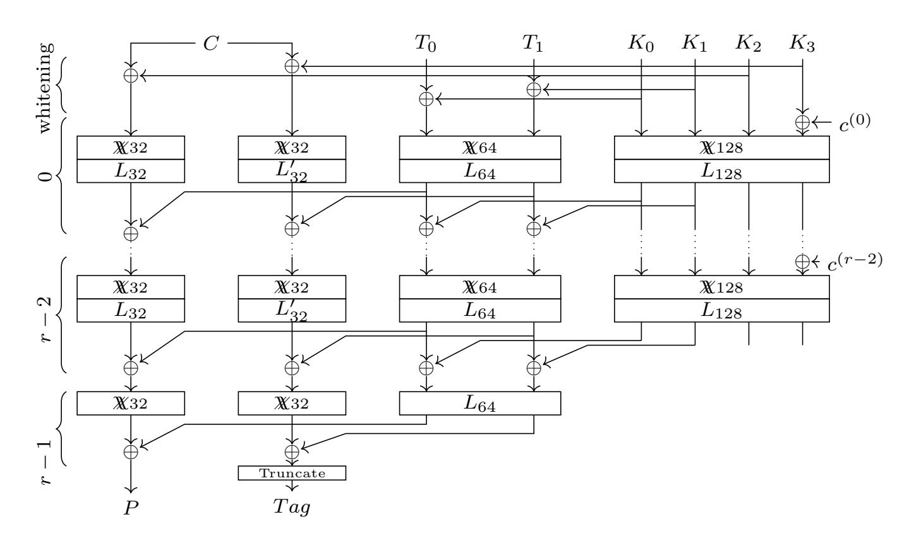
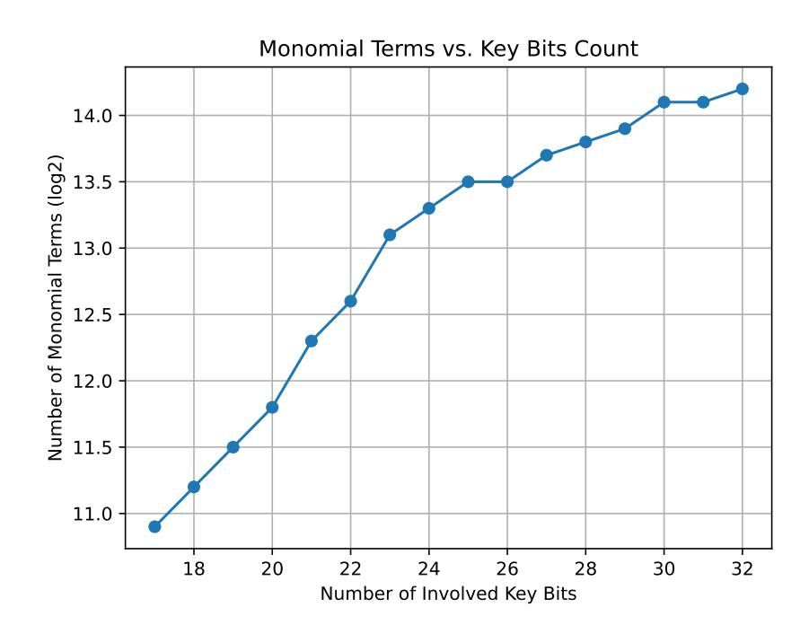
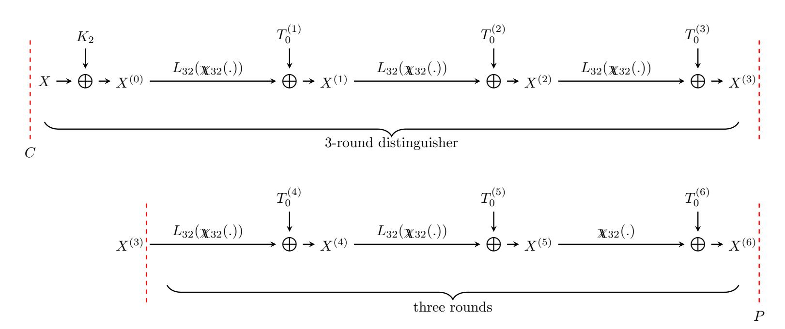
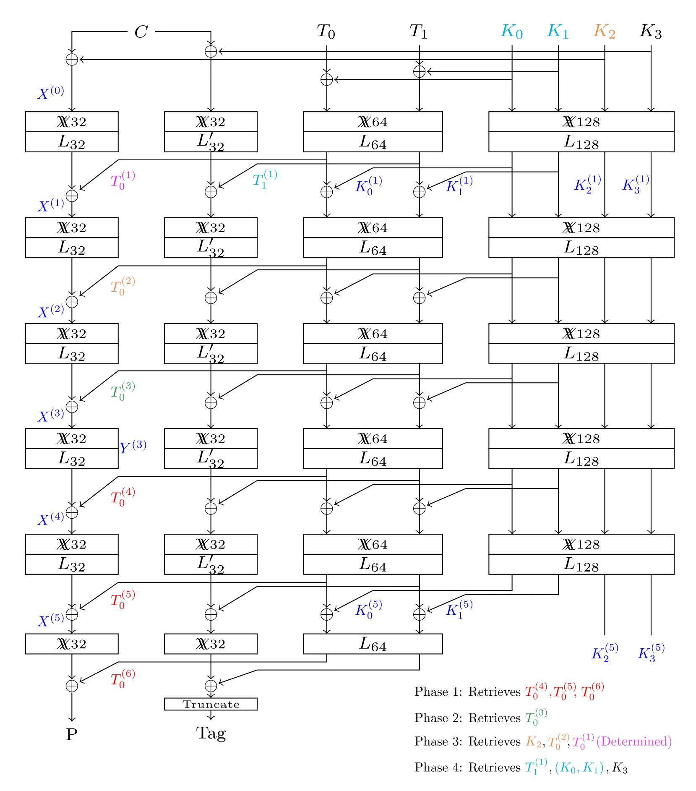
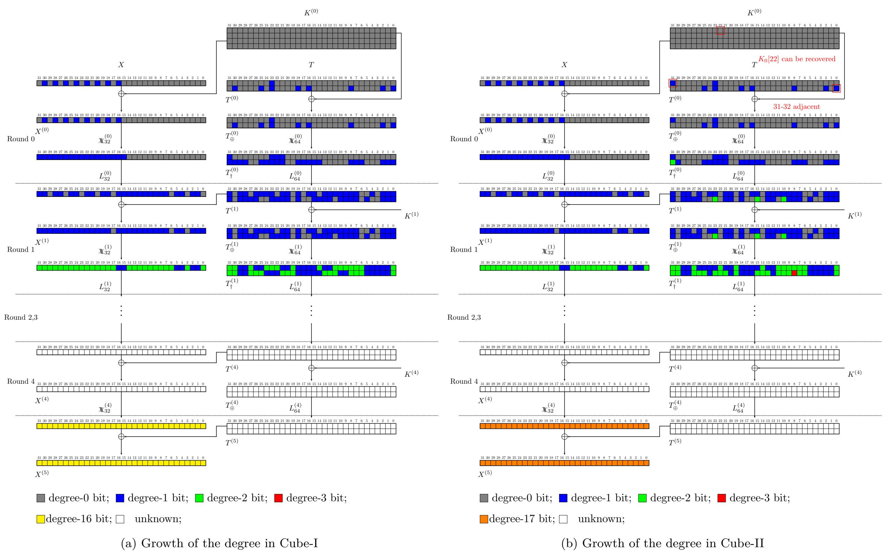
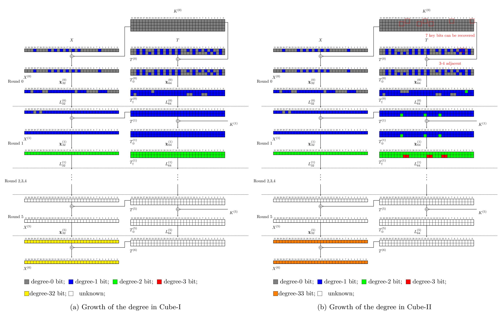

{0}------------------------------------------------

# Cube and Integral Attacks on ChiLow-32

Shuo  $\operatorname{Peng}^{1,7} \mathbb{D}^{(\boxtimes)}$ , Akram Khalesi $^2 \mathbb{D}^{(\boxtimes)}$ , Zahra Ahmadian $^3 \mathbb{D}^{(\boxtimes)}$ , Hosein Hadipour $^4 \mathbb{D}^{(\boxtimes)}$ , Jiahui  $\operatorname{He}^{1,5} \mathbb{D}^{(\boxtimes)}$ , Kai  $\operatorname{Hu}^{1,7,8} \mathbb{D}^{(\boxtimes)}$ , Zhongfeng  $\operatorname{Niu}^6 \mathbb{D}^{(\boxtimes)}$ , Shahram Rasoolzadeh $^4 \mathbb{D}^{(\boxtimes)}$  and Meiqin Wang $^{1,7} \mathbb{D}^{(\boxtimes)}$ 

**Abstract.** The protection of executable code in embedded systems requires efficient

mechanisms that ensure confidentiality and integrity. Belkheyar et al. recently proposed the Authenticated Code Encryption (ACE) framework, with Chilow as the first ACE-2 instantiation at EUROCRYPT 2025. CHILOW- $(32 + \tau)$  is a 32-bit tweakable block cipher combined with a pseudorandom function, featuring quadratic nonlinear layers called ChiChi ( $\chi$ ) and a nested tweak/key schedule optimized for low-latency decryptions in secure code execution under strict query limits. In this paper, we exploit the algebraic structure of  $\chi$  and study the resistance of Chilow- $(32 + \tau)$  to cube-like and integral cryptanalysis in single- and multiple-tweak settings. In the multiple-tweak setting, we present conditional attacks that can recover the full key for 5-round Chilow- $(32 + \tau)$  with practical complexity, and extend the analysis to 6 rounds at a still non-trivial but purely theoretical cost below brute force. We additionally construct borderline cube attacks on 5- and 6-round Chilow-(32)  $+\tau$ ), each capable of recovering the full key with practical complexity. Specifically, we recover the full key for 5-round CHILOW- $(32 + \tau)$  using  $2^{32}$  decryptions,  $2^{18.58}$ chosen ciphertext data, and  $2^{33.56}$  bits of memory, and for 6-round CHILOW- $(32 + \tau)$ using  $2^{34}$  decryptions,  $2^{33.58}$  chosen ciphertext data, and  $2^{54.28}$  bits of memory. We then focus on integral cryptanalysis and the challenge of extending the analysis to 7 rounds. We identify integral distinguishers in the single- and multiple-tweak models and extend suitable 2-round and 3-round integral distinguishers to build a 7-round attack. We present a nested strategy to recover all round tweaks and tackle the problem of deriving the master key from round-tweak and key information. Our key-recovery method exploits high-degree monomials that arise in the integral key-recovery phase to reduce the average number of guessed key bits and hence reduce the time complexity. As a result, we mount a 7-round key-recovery attack on

Notably, all our attacks remain consistent with the security claims of the design.

of about  $2^{108.55}$  encryptions, and needs negligible memory.

**Keywords:** Cryptanalysis · Cube Attack · Integral Attack · Authenticated Code Encryption · ChiLow · ChiChi

CHILOW- $(32 + \tau)$  that requires  $2^{6.32}$  chosen ciphertext data, has a time complexity

<sup>&</sup>lt;sup>1</sup> School of Cyber Science and Technology, Shandong University, Qingdao, China pengshuo@mail.sdu.edu.cn,kai.hu@sdu.edu.cn,mqwang@sdu.edu.cn,

<sup>&</sup>lt;sup>2</sup> Research Center for Development of Advanced Technologies, Tehran, Iran khalesi@rcdat.ac.ir.

<sup>&</sup>lt;sup>3</sup> Faculty of Electrical Engineering, Shahid Beheshti University, Tehran, Iran z\_ahmadian@sbu.ac.ir,

<sup>&</sup>lt;sup>4</sup> Faculty of Computer Science, Ruhr Bochum University, Bochum, Germany hsn.hadipour@gmail.com,shahram.rasoolzadeh@rub.de

 <sup>&</sup>lt;sup>5</sup> COSIC, Katholieke Universiteit Leuven, Leuven, Belgium jhe@esat.kuleuven.be,
 <sup>6</sup> School of Physical and Mathematical Sciences, Nanyang Technological University, Singapore

zhongfeng.niu@ntu.edu.sg

<sup>7</sup> State Key Laboratory of Cryptography and Digital Economy Security, Shandong University,
Qingdao, China

<sup>&</sup>lt;sup>8</sup> Suzhou Research Institute, Shandong University, Suzhou, 215123, China

{1}------------------------------------------------

# **1 Introduction**

The security of embedded systems has become a major concern, as such devices are deployed in sensitive tasks ranging from consumer electronics to industrial control and automotive systems. In many cases, the protection of executable code is crucial. Adversaries who can read or manipulate program instructions can steal intellectual property, inject malicious behavior, or bypass security checks. To address this threat, designers have proposed code encryption as a mechanism to ensure that only authorized code is executed on the device. Beyond confidentiality, integrity must also be guaranteed so that modified instructions can be detected before execution.

Authenticated Code Encryption (ACE) was introduced by Belkheyar *et al.* [\[BDG](#page-23-0)<sup>+</sup>25] as a dedicated framework to meet these requirements. ACE constructions combine the decryption of short instruction words with the computation of authentication tags. This approach enables secure and efficient code execution in resource-constrained environments. Three main variants were proposed, ACE-1, ACE-2, and ACE-3, which represent different trade-offs between performance and security, with the goal of achieving low latency while maintaining a sufficient security margin.

The primitive ChiLow-(32 + *τ* ) is the first instantiation of ACE-2. It is built from a 32-bit tweakable block cipher and a related tweakable function for tag generation, and it follows a nested tweak-key schedule. The design is optimized for embedded processors that must handle 32-bit instruction words while meeting strict query limits: at most 2 40 in total and 2 <sup>8</sup> per tweak. These limits model practical conditions for secure boot and firmware updates in constrained devices.

Due to these features, the study of ChiLow-(32 + *τ* ) is of particular interest. On the one hand, it addresses a real-world problem that arises in the secure execution of code on lightweight platforms. On the other hand, its design choices, such as the low-degree non-linear layer *χχn*, raise natural questions about its resistance to advanced cryptanalytic techniques. In particular, designers have not provided a comprehensive security analysis against cube attacks [\[DS09\]](#page-24-0) and integral attacks [\[DKR97,](#page-24-1) [KW02\]](#page-24-2), which are among the most powerful tools for evaluating ciphers with low-degree round functions [\[Lai94\]](#page-24-3). This leaves an important gap in the evaluation of ChiLow-(32 + *τ* ).

The cube attack was proposed by Dinur and Shamir [\[DS09\]](#page-24-0) and has been applied to stream ciphers, as well as permutation-based ciphers such as Ascon [\[DEMS21\]](#page-24-4). At EUROCRYPT 2017 [\[HWX](#page-24-5)<sup>+</sup>17], conditional cube attacks were used to attack Keccak keyed-mode ciphers. Today, cube attacks are among the mainstream techniques for testing the security of low-degree ciphers.

Integral cryptanalysis is also of interest for ChiLow because of the quadratic nature of its non-linear layer, which suggests that strong integral properties may propagate over several rounds. At the same time, the strict query limits imposed by the designers make such attacks challenging, since extending distinguishers backward in the single-tweak model may exceed the allowed data complexity. This combination makes integral cryptanalysis both a natural and a non-trivial choice to assess the security of ChiLow.

**Contributions.** In this work, we investigate the resistance of ChiLow-(32 + *τ* ) against cube and integral cryptanalysis. Our main contributions are as follows, with [Table 1](#page-2-0) providing a concise summary of distinguishers and attacks.

- We identify several low-data complexity integral distinguishers for ChiLow in both single-tweak and multiple-tweak models. We also experimentally verified all of our single-tweak integral distinguishers.
- We perform conditional cube attacks on ChiLow-(32 + *τ* ) in the multiple-tweak model. For these attacks, we exploit distinguishers for 5-round and 6-round ChiLow- (32 + *τ* ) with complexities of 2 <sup>17</sup> and 2 <sup>33</sup>, respectively, where the cube variables

{2}------------------------------------------------

Table 1: Summary of the results on Chilow- $(32+\tau)$ .

(a) Integral Distinguishers.

<span id="page-2-0"></span>

| Model               | # R | # Dist. | # Active Bits | Data Complexity                   |
|---------------------|-----|---------|---------------|-----------------------------------|
| $\overline{ST}$     | 2   | 1       | 2             | $2^2$                             |
| $\operatorname{ST}$ | 3   | 9       | 4             | $2^4$                             |
| $\operatorname{ST}$ | 3   | 12      | 3             | $2^3$                             |
| $\operatorname{ST}$ | 3.5 | 17      | 8             | $2^8$                             |
| MT                  | 6   | _       | 8+25          | $2^{33}$ total, $2^8$ (per tweak) |

(b) Key-Recovery Attacks.

| # R | Time              | Data                    | Memory      | Setting             | Method           | Source         |
|-----|-------------------|-------------------------|-------------|---------------------|------------------|----------------|
| 5   | $2^{32}$          | $2^{23.58}$ CC          | negl.       | $\mathbf{MT}$       | Cond. Cube       | Appendix B     |
| 5   | $\mathbf{2^{32}}$ | $2^{18.58}~\mathrm{CC}$ | $2^{33.56}$ | MT                  | Bord. Cube       | Subsection 4.1 |
| 6   | $2^{120}$         | $2^{40}~{\rm CC}$       | negl.       | MT                  | Cond. Cube       | Appendix B     |
| 6   | $\mathbf{2^{34}}$ | $2^{33.58}~\mathrm{CC}$ | $2^{54.28}$ | $\mathbf{MT}$       | Bord. Cube       | Subsection 4.2 |
| 6   | $2^{98.04}$       | $2^{5.58}~\mathrm{CC}$  | negl.       | $\mathbf{ST}$       | ${\bf Integral}$ | Subsection 5.1 |
| 6   | $2^{76.55}$       | $2^{6.32}~\mathrm{CC}$  | negl.       | $\mathbf{ST}$       | ${\bf Integral}$ | Subsection 5.2 |
| 7   | $2^{108.55}$      | $2^{6.32}~\mathrm{CC}$  | negl.       | $\mathbf{ST}$       | ${\bf Integral}$ | Subsection 5.3 |
| 8   | $2^{120.34}$      | 160 KP                  | $2^{98.32}$ | $\operatorname{ST}$ | MITM             | [LNV25]        |
| 8   | $2^{102.09}$      | 64 CC                   | $2^{94.56}$ | $\operatorname{ST}$ | MITM             | [LNV25]        |

ST: Single-Tweak CC: Chosen-Ciphertext Bord. Cube: Borderline Cube
MT: Multiple-Tweak KP: Known-Plaintext Cond. Cube: Conditional Cube

are not adjacent. However, When two cube variables become adjacent, the degree in the cube variables increases to 17 and 33 for the 5- and 6-round settings. This increase arises from degree-2 monomials appearing in the first round and degree-3 monomials appearing in the second round. The key observation is that degree-3 monomials can be suppressed under specific key constraints, which allows extraction of key information. Full key recovery is achieved on 5-round Childow-(32 +  $\tau$ ) with time  $2^{32}$  and data  $2^{23.58}$ , requiring negligible memory. For 6 rounds, full key recovery is obtained with time  $2^{120}$  and data  $2^{40}$ , again with negligible memory.

- Using the borderline cube property in ChiLow, we mount borderline cube attacks in 5-round and 6-round ChiLow- $(32 + \tau)$  with practical complexities. For 5 rounds, we use a 16-dimensional cube with non-adjacent cube variables. Because its superpoly depends on only a few key bits, recovering the superpoly directly reveals these key bits. This yields the recovery of the full key with time complexity  $2^{32}$ , data complexity  $2^{18.58}$ , and memory complexity  $2^{33.56}$  bits. For 6 rounds, we use a 32-dimensional cube with nonadjacent variables, achieving full key recovery with time  $2^{34}$ , data  $2^{33.58}$ , and memory  $2^{54.28}$  bits (approximately 2,486 terabytes).
- We present a key-recovery attack on 7 rounds of ChiLow by combining several integral distinguishers. The attack requires  $2^{6.32}$  chosen ciphertexts, runs in time dominated by  $2^{108.55}$  encryptions, and requires negligible memory. Due to the nested tweak-key schedule, recovering the later-round tweaks does not easily compromise

{3}------------------------------------------------

the master key or reveal round tweaks for different tweak values, even if an attacker manages to obtain them. We overcome this challenge by implementing a nested approach. In this method, we initially use a longer distinguisher to recover the tweaks of the last rounds. Then, shorter distinguishers are exploited to recover the tweaks of the earlier rounds as well as some bits of the master key. In this way, we can recover the round key corresponding to the recovered round tweakeys.

**Organization.** The rest of the paper is organized as follows. Section 2 recalls the notation, the tools for cube and integral analysis, and the structure of Chilow. Section 3 presents some properties of Chilow and provides our integral distinguishers in both single-tweak and multiple-tweak models. Section 4 introduces our conditional cube and borderline cube attacks for Chilow. Section 5 describes the key-recovery attacks and analyzes their complexities. Finally, Section 6 concludes the paper. The source code of our paper is available at: https://github.com/Shuo-peng/chilow.

# <span id="page-3-0"></span>2 Background

In this section, we provide a brief overview of the concepts and tools used to analyze Chilow. We first summarize the notation used throughout the paper and then review the core ideas of cube and integral attacks, as well as the specification of Chilow-(32 +  $\tau$ ).

#### 2.1 Notation

We use  $\mathbb{F}_2$  to denote the finite field with two elements, namely  $\{0,1\}$ , where 0 and 1 are the additive and multiplicative identities, respectively. For any positive integer n, we use  $\mathbb{F}_2^n$  to denote the n-dimensional vector space over  $\mathbb{F}_2$ . Additionally, we use  $\mathbb{Z}_n$  to denote the set of non-negative integers smaller than n, i.e.,  $\{0,1,\ldots,n-1\}$ .

For an *n*-bit vector  $u = (u_0, \ldots, u_{n-1}) \in \mathbb{F}_2^n$ , we denote by u[i], the *i*-th bit of u and by u[i:j] the sub-vector consisting of the bits from position i to position j of u. The Hamming weight of an *n*-bit vector  $u = (u_0, \ldots, u_{n-1}) \in \mathbb{F}_2^n$  is defined as  $\operatorname{wt}(u) = \sum_{i=0}^{n-1} u_i$ , where each  $u_i$  is interpreted as an integer.

#### 2.2 Cube Attack

For a cipher with n public variables and m secret variables, each output bit can be represented as a polynomial in these secret and public variables (i.e., a keyed Boolean function). We denote the public variables by x and the secret variables by k. With this distinction, we can write the keyed Boolean function as

<span id="page-3-1"></span>
$$f(x,k) = \sum_{u \in \mathbb{F}_2^n} \alpha_u(k) x^u, \qquad (1)$$

where  $x^u = \prod_{i=0}^{n-1} x_i^{u_i}$  is called a monomial. For simplicity, we also denote such a keyed Boolean function as  $f_k(x)$ . For each  $u \in \mathbb{F}_2^n$ ,  $\alpha_u(k)$  is the coefficient of the monomial  $x^u$  in f(x,k), which we denote by  $\operatorname{Coeff}_{f_k}(x^u)$ . Note that in this equation, the coefficient  $\operatorname{Coeff}_{f_k}(x^u)$  is itself a Boolean function of the form  $\mathbb{F}_2^m \to \mathbb{F}_2$ , mapping k to  $\alpha_u(k)$ . When we refer to the degree of a keyed Boolean function, we mean the degree in the public variables:

$$deg(f) := \max \left\{ wt(u) \mid u \in \mathbb{F}_2^n \text{ with } \alpha_u \text{ not being the constant-zero function} \right\}.$$

{4}------------------------------------------------

Let *I* ⊆ Z*n*, with *I* denoting its complement and |*I*| its size. For variables *x* = (*x*0*, . . . , xn*−1), define *x*[*I*] = {*x<sup>i</sup>* : *i* ∈ *I*} and *x <sup>I</sup>* = Q *i*∈*I xi* . The keyed Boolean function in [Equation 1](#page-3-1) can then be written as

$$f(x,k) = x^{I} \cdot p_{I}(x[\overline{I}],k) + q(x,k),$$

where each term of *q*(*x, k*) contains at least one fewer variable from *x*[*I*]. We call *x I* the *cube term* or *cube monomial*, and *p<sup>I</sup>* the *superpoly* of *x I* in *f*(*x, k*). If we fix the variables in *x*[*I*] to some constants, the superpoly becomes a Boolean function of *k*. Regarding the superpoly, we have the following lemma.

**Lemma 1** ([\[DS09\]](#page-24-0))**.** *For a set I* ⊆ Z*<sup>n</sup> and a keyed Boolean function f*(*x, k*)*, with*

$$f(x,k) = \sum_{u \in \mathbb{F}_2^n} a_u(k) x^u = x^I \cdot p_I(x[\overline{I}], k) + q(x, k),$$

*we have*

$$p_I(x[\overline{I}], k) = \sum_{x[I] \in \mathbb{F}_2^{|I|}} f(x, k).$$

Given a monomial *x u* , the following lemmas provide a theoretical basis for recovering its superpoly.

<span id="page-4-1"></span>**Lemma 2** ([\[RHSS21\]](#page-25-0))**.** *For the keyed Boolean function given in [Equation 1,](#page-3-1) it requires* 2 *m*+wt(*u*) *evaluations of f<sup>k</sup> to recover* Coeff*<sup>f</sup><sup>k</sup>* (*x u* ) *for a given u with* wt(*u*) *>* log<sup>2</sup> (*m*)*.* [1](#page-4-0)

If the algebraic expressions of *f<sup>k</sup>* are not too complex, symbolic computation provides an efficient approach for recovering Coeff*<sup>f</sup><sup>k</sup>* (*x u* ). When the algebraic normal form (ANF) or a certain partial ANF of *f<sup>k</sup>* is available, the corresponding superpoly can often be directly derived. In a block cipher, the encryption (or decryption) function is composed of multiple round functions, which allows Coeff*<sup>f</sup><sup>k</sup>* (*x u* ) to be computed incrementally, one round at a time. In this paper, we adopt symbolic computation as the primary method for recovering superpolys.

Since being proposed, several variants of the cube attack have been proposed to improve its efficiency. *Conditional cube attacks* [\[LBDW17,](#page-24-7) [DLWQ17,](#page-24-8) [LDW25,](#page-24-9) [SG18,](#page-25-1) [SGSL18\]](#page-25-2) extend the classical cube attack by incorporating additional conditions on the key or the internal state. Instead of evaluating the output over all possible cube values, these attacks focus only on inputs that satisfy specific conditions, which can reduce computational complexity or enhance the distinguishability of superpolys. This approach allows the attack to succeed even when classical cube attacks fail due to high-degree terms or partial cancellations. In [\[Hu24\]](#page-24-10), a break-and-fix strategy is applied: the attacker first disrupts the algebraic structure (break phase) to increase the degree of output bits, and then applies key conditions to restore the structure (fix phase), thereby enabling the recovery of key information by observing changes in algebraic degrees. *Borderline cubes* [\[DMP](#page-24-11)<sup>+</sup>15, [RHSS21,](#page-25-0) [PHHW25\]](#page-24-12) refer to a special class of cubes whose superpolys depend only on a relatively small subset of key variables. This property makes borderline cubes particularly useful for cryptanalysis, as they reduce the effective key space and often serve as a basis for distinguishers or partial key-recovery attacks.

#### **2.3 Integral Attack**

Integral attacks and cube attacks are closely related, as both techniques analyze the coefficients of plaintext monomials in the ANFs of the ciphertext, commonly referred to as

<span id="page-4-0"></span><sup>1</sup>The lemma is derived using the fast Möbius transform. For a detailed explanation, we refer the reader to [\[RHSS21\]](#page-25-0).

{5}------------------------------------------------

superpolys. In a cube attack, the value of a superpoly is obtained directly by summing the ciphertexts over a selected cube of plaintext variables and may subsequently be exploited for key recovery. In contrast, an integral attack typically employs the superpoly only as a distinguisher, often by appending additional rounds and partially decrypting the ciphertexts to the boundary of the integral distinguisher. Consequently, the computational complexity of cube attacks is dominated by superpoly recovery and evaluation, whereas integral attacks mainly incur costs from encryption or decryption around the distinguisher.

Integral cryptanalysis studies how sums of outputs behave when the inputs vary over a structured set. In the bit-oriented setting, we choose a set of inputs that covers all 2 *d* assignments of a selected group of *d* input bits, while the remaining bits remain constant. If an output bit sums to zero over this set, we say that it has a zero-sum property. We denote an *r*-round integral property by *A r*-round −−−−−→ *B*, where *A* is the index set of active input bits and *B* is the index set of output bits with zero-sum property.

To search for such properties at scale, we use the division property. We follow the conventional and bit-based division properties of Todo and Morii [\[Tod15,](#page-25-3) [TM16\]](#page-25-4), together with the automated method proposed by Xiang *et al.* [\[XZBL16\]](#page-25-5). The division property tracks whether any monomial containing a given set of variables can appear in the algebraic normal form of an intermediate bit. If no such monomial can appear, then the corresponding output bit has zero-sum property when summing over all values of the active inputs.

We encode the propagation of the division property through each round as a mixedinteger linear programming (MILP) model. Each round is decomposed into elementary operations such as XOR, AND, and copy. Each operation is described locally by linear constraints derived from [\[XZBL16\]](#page-25-5), which are then combined to model an entire round. By chaining these constraints across the chosen number of rounds, we obtain a global feasibility model. If the model indicates that no monomial involving the active input variables and key variables can reach a target output bit, then that bit is guaranteed to have zero-sum property for any fixed key.

We consider two data models. In the single-tweak model, the tweak is fixed and only the ciphertext bits are active at the input. In the multiple-tweak model, both the ciphertext bits and a selected subset of tweak bits may be active. We denote such a property by *A, T <sup>r</sup>*-round −−−−−→ *B*, where *T* is the set of active tweak indices. The data complexity is 2 |*A*| in the single-tweak model and 2 |*A*|+|*T*| in the multiple-tweak model, subject to the limits imposed by the design.

In our search procedure, we first fix the number of rounds and the set of active input bits *A*. We then build an MILP model that captures the propagation of the division property through all components of these rounds, with the objective of minimizing the sum of output bits. After solving the model, if the objective value equals one (corresponding to a unit vector at the output), the associated bit does not necessarily have the zero-sum property. We then iteratively update the model by excluding all previously identified unit vectors and continue solving until no further unit vectors are found. For the given active set *A*, the output bits not associated with any recovered unit vector constitute the complete set *B*. Repeating this process over all small active sets yields the collection of distinguishers reported in this paper. Due to the low data complexity of our distinguishers, we finally verified some of them through direct experiments, which confirm that the predicted output positions indeed have the zero-sum property for the given set *A*.

# **2.4 Specification of ChiLow-(32+***τ* **)**

ChiLow-(32+*τ* ) instantiates the ACE-2 construction defined in [\[BDG](#page-23-0)<sup>+</sup>25] and consists of two closely related tweakable primitives built on the same core structure: a 32-bit tweakable block cipher *D*<sup>32</sup> and a tweakable pseudorandom function *D*′ <sup>32</sup>. While both primitives take as input a 32-bit ciphertext *C*, a 128-bit master key *K* = *K*<sup>0</sup> ∥ *K*<sup>1</sup> ∥ *K*<sup>2</sup> ∥ *K*3,

{6}------------------------------------------------

<span id="page-6-0"></span>

Figure 1: Full construction of CHILOW- $(32 + \tau)$ .

and a 64-bit tweak  $T = T_0 \parallel T_1$ ,  $D_{32}$  corresponds to the decryption algorithm for encrypted instructions and outputs a 32-bit plaintext P, and  $D'_{32}$ , with a very similar construction to  $D_{32}$ , truncates the output to  $\tau$  bits with  $\tau \in \{8, 16\}$  to compute an authentication tag for a 32-bit encrypted instruction. Figure 1 provides an overview of the full Childow-(32+ $\tau$ ) decryption and tag computation process.

CHILOW uses a nested tweak-key schedule architecture. The internal state is divided into three distinct parts, which are updated in parallel over rnd rounds (with rnd = 8 claimed to be secure):

1. Key State Update: It is initialized with the master key K and updated as follows:

$$K^{(i+1)} = L_{128} \Big( \chi_{128} \big( K^{(i)} \oplus c^{(i)} \big) \Big),$$

where  $c^{(i)}$  is a 32-bit round constant added to bits 96–127 of  $K^{(i)}$ , and  $L_{128}$  and  $\chi_{128}$  denote the corresponding linear and nonlinear transformations, respectively.

2. Tweak State Update: It is initialized with  $T \oplus (K_0 \parallel K_1)$  and updated using the following round function, which incorporates material from the key state:<sup>2</sup>

$$T^{(i+1)} = L_{64} \Big( \chi_{64} \big( T^{(i)} \oplus (K_0 \parallel K_1)^{(i+1)} \big) \Big).$$

However, the last round consists only of a linear mapping, i.e.,

$$T^{(\mathsf{rnd})} = L_{64} \big( T^{(\mathsf{rnd}-1)} \big)$$

3. Cipher State Update: This part involves two independent 32-bit states: X for  $D_{32}$ , initialized with  $C \oplus K_2$ , and X' for  $D'_{32}$ , initialized with  $X \oplus K_3$ . Both states are updated by the round functions  $\mathcal{R}[T^{(i+1)}](\cdot)$  and  $\mathcal{R}'[T^{(i+1)}](\cdot)$ , respectively, which incorporate material from the tweak state, as follows:

$$X^{(i+1)} = \mathcal{R}[T^{(i+1)}](X^{(i)}) = L_{32}(\chi_{32}(X^{(i)})) \oplus T_0^{(i+1)},$$
  
$$X'^{(i+1)} = \mathcal{R}'[T^{(i+1)}](X'^{(i)}) = L'_{32}(\chi_{32}(X'^{(i)})) \oplus T_1^{(i+1)}.$$

<span id="page-6-1"></span><sup>&</sup>lt;sup>2</sup>The specification of ChiLow-(32+ $\tau$ ) slightly differs from the figure and test vectors given in [BDG<sup>+</sup>25]. The formula here is consistent with the figure and test vectors of the original paper.

{7}------------------------------------------------

|            |          |           | J         |           |
|------------|----------|-----------|-----------|-----------|
| Linear Map | $\alpha$ | $\beta_0$ | $\beta_1$ | $\beta_2$ |
| $L_{32}$   | 11       | 5         | 9         | 12        |
| $L_{32}'$  | 11       | 1         | 26        | 30        |
| $L_{64}$   | 3        | 1         | 26        | 50        |
| $L_{128}$  | 17       | 7         | 11        | 14        |

<span id="page-7-1"></span>Table 2: Offsets of the linear layers in Chilow.

Here, in the last round, only the nonlinear mapping is applied:

$$\begin{split} X^{(\mathsf{rnd})} &= \ \chi_{32}\big(X^{(\mathsf{rnd}-1)}\big) \oplus T_0^{(\mathsf{rnd})} \,, \\ X'^{(\mathsf{rnd})} &= \ \chi_{32}\big(X'^{(\mathsf{rnd}-1)}\big) \oplus T_1^{(\mathsf{rnd})} \,. \end{split}$$

**Non-Linear Layer**  $\chi_n$ . The nonlinear transformation is a bijective function defined for even state sizes n=2m, based on the well-known  $\chi$  functions [Dae95]. It is defined as follows:

$$\chi_n(x) = \begin{pmatrix} \chi_{m-1}(x_0, x_1, \dots, x_{m-2}) \\ \chi_{m+1}(x_{m-1}, x_m, \dots, x_{2m-1}) \end{pmatrix} + \lambda(x),$$

where the *i*-th coordinate of  $\lambda$  is defined as

$$\lambda_{i}(x) = \begin{cases} x_{m} + x_{m-3}, & \text{if } i = m - 3, \\ x_{m-1} + x_{m-2}, & \text{if } i = m - 2, \\ x_{m-3} + x_{m} + x_{m-1}, & \text{if } i = m - 1, \\ x_{m} + x_{m-2}, & \text{if } i = m, \\ 0, & \text{otherwise.} \end{cases}$$

**Linear Layer**  $L_n$ **.** All linear layers in ChiLow-(32+ $\tau$ ) satisfy the following relation, with the corresponding parameters for each case given in Table 2:

$$y_i = x_{\alpha i + \beta_0} + x_{\alpha i + \beta_1} + x_{\alpha i + \beta_2}$$

**Security Claims.** The designers claim the tweakable strong pseudo-random permutation  $(\pm \widetilde{\text{prp}})$  security for the underlying block cipher  $D_{32}$  and the pseudo-random function (prf) security for the truncated variant  $D'_{32}$  to  $\tau$  bits, assuming that the total number of queries satisfies  $q \leq 2^{40}$  and the number of queries per tweak satisfies  $q_t \leq 2^{8}$  [BDG<sup>+</sup>25].

# <span id="page-7-0"></span>3 Insights into ChiLow

#### 3.1 Understanding the Security Claim and Integral Distinguishers

In [BDG<sup>+</sup>25], the designers make the following security claims for CHILOW-(32+ $\tau$ ):

- 1. The number of queries under the same tweak must not exceed  $2^8$ .
- 2. The total number of queries must remain below  $2^{40}$ .

Accordingly, two types of cube-variable selection are possible in the single-key cube attack:

1. In the single-tweak setting, the cube variables must be chosen exclusively from the data path and are therefore limited to at most 8 bits.

{8}------------------------------------------------

2. In the multiple-tweak setting, let d and t denote the numbers of cube variables selected from the data and tweak paths, respectively; then  $d \leq 8$  and  $d + t \leq 40$ .

Since the design of CHILOW shifts the analysis focus to the decryption algorithm, our attacks target the decryption process. CHILOW- $(32+\tau)$  employs the quadratic  $\chi$  function as its nonlinear layer in every round. Therefore, the algebraic degree of each output bit after r rounds is upper-bounded by  $2^r$  for  $r \leq 6$ . However, the quadratic terms in  $\chi$  arise only from products of adjacent cube variables. Hence, by carefully selecting non-adjacent input bits as cube variables while fixing the remaining bits to constants, the algebraic degree of the first-round output variables remains 1. Consequently, the algebraic degree of the r-round CHILOW output bits is upper-bounded by  $2^{r-1}$  for  $r \leq 6$ .

Recall that  $\chi$  is defined as

$$\chi_n(x) = \begin{pmatrix} \chi_{m-1}(x_0, x_1, \dots, x_{m-1}) \\ \chi_{m+1}(x_m, x_{m+1}, \dots, x_{2m-1}) \end{pmatrix} + \lambda(x),$$

where m is even, n = 2m, and  $\lambda(x)$  is a linear function of the input vector x. Given  $\chi_p$  with odd p, at most (p-1)/2 non-adjacent input variables can be chosen as cube variables. Thus, for the input of  $\chi_n$ , up to m-1 cube variables can be selected.

CHILOW- $(32+\tau)$  uses the 32-bit and 64-bit  $\chi$  functions in its data and tweak paths, respectively. The 64-bit tweak path allows up to 31 non-adjacent cube variables, while the 32-bit data path permits up to 15 non-adjacent cube variables. In total, 47 cube variables can be selected, which is sufficient to construct an integral distinguisher for up to 6 rounds of CHILOW- $(32+\tau)$  in the multiple-tweak model.

We also use the division property to search for integral distinguishers of ChiLow. By modeling the propagation of division properties through each round as an MILP model, we determine whether any monomial involving the active inputs and key can reach a target bit. If not, that output bit is balanced, which gives an integral distinguisher. We consider both the single-tweak and multiple-tweak models, where the data complexities are  $2^{|A|}$  and  $2^{|A|+|T|}$ , respectively. In the single-tweak model, our exhaustive search shows that several 3-round distinguishers exist: with four active input bits, we find 9 distinguishers, each yielding 32 balanced output bits; with three active bits, the maximum number of balanced bits is 5, and we identify additional cases with 3 balanced bits.

We further search for a 3.5-round distinguisher using 8 non-adjacent active bits, finding 16 integral distinguishers for Childow- $(32+\tau)$ . We also present an integral distinguisher in the multiple-tweak model for 6-round Childow- $(32+\tau)$ . In addition, we find some integral distinguishers for Childow-40. The details are shown in Appendix A.

In our paper, we employ the identified single-tweak and multi-tweak integral distinguishers to recover the secret key of Childow- $(32+\tau)$ . Notably, the attack in the single-tweak setting can cover more rounds than in the multi-tweak setting. The reason lies in the robustness of the nested tweak-key schedule of Childow, in which the round key is injected into the tweak, and the round tweak is further added to the data path. In the single-tweak attacks, we can append several rounds after the single-tweak distinguisher and decrypt the ciphertexts back to the distinguisher output, thereby recovering the corresponding round tweaks. In contrast, in the multi-tweak attacks, the nested tweak-key schedule prevents decryption with the guessed key, as the tweakey changes.

#### 3.2 Borderline Cube in ChiLow

The quadratic terms of  $\chi$  arise only from products of adjacent input variables. Choosing non-adjacent bits as cube variables (while fixing the others) keeps the first-round degree at 1. Therefore, since the degree of the round function is 2, the algebraic degree of the r-round Chilow output bits is bounded by  $2^{r-1}$  for  $r \leq 6$ . When we choose a  $2^{r-1}$ -dimensional cube whose cube variables are non-adjacent, if a key variable is not multiplied

{9}------------------------------------------------

by the cube variables in the first round, then the cube sums do not depend on the value of this key variable. On the other hand, if a key variable is multiplied by the cube variables in the first round, then the cube sums generally depend on the value of that key variable.

In the first round, the multiplication between cube variables and key variables arises solely from the  $\chi$  function. Each cube variable is multiplied by at most two key bits. For example, for the cube variable  $T^{(0)}[32]$  in the first-round  $\chi$  function, we have the following involvements:

$$\begin{split} T_{\dagger}^{(0)}[31] &= T_{\oplus}^{(0)}[31] + (T_{\oplus}^{(0)}[32] + 1)T_{\oplus}^{(0)}[33] \\ &= T^{(0)}[31] + K^{(0)}[31] + (T^{(0)}[32] + K^{(0)}[32] + 1)(T^{(0)}[33] + K^{(0)}[33]) \\ &= T^{(0)}[31] + K^{(0)}[31] + T^{(0)}[32]T^{(0)}[33] + T^{(0)}[32]K^{(0)}[33] \\ &\quad + K^{(0)}[32]T^{(0)}[33] + K^{(0)}[32]K^{(0)}[33] + T^{(0)}[33] + K^{(0)}[33], \\ T_{\dagger}^{(0)}[63] &= T_{\oplus}^{(0)}[63] + (T_{\oplus}^{(0)}[31] + 1)T_{\oplus}^{(0)}[32] \\ &= T^{(0)}[63] + K^{(0)}[63] + (T^{(0)}[31] + K^{(0)}[31] + 1)(T^{(0)}[32] + K^{(0)}[32]) \\ &= T^{(0)}[63] + K^{(0)}[63] + T^{(0)}[31]T^{(0)}[32] + T^{(0)}[31]K^{(0)}[32] + K^{(0)}[31]T^{(0)}[32] \\ &\quad + K^{(0)}[31]K^{(0)}[32] + T^{(0)}[32] + K^{(0)}[32], \end{split}$$

where  $T_{\oplus}^{(0)}[i]$  and  $T_{\dagger}^{(0)}[i]$  denote the *i*-th bit of the tweak state after the key addition and after the nonlinear layer of the 0-th round, respectively.

Other cube variables may multiply with the same key variable. For instance,  $T^{(0)}[34]$  also multiplies with  $K^{(0)}[33]$ . Therefore, for  $r \leq 6$ , if we select  $2^{r-1}$  non-adjacent cube variables for r rounds of Childow, the corresponding superpoly depends on at most  $2 \cdot 2^{r-1}$  key variables (and possibly fewer when duplicate key variables are involved).

This leads to a borderline cube situation. Specifically, for five rounds, a 16-dimensional non-adjacent cube involves at most 32 key bits, whereas for six rounds, a 32-dimensional non-adjacent cube involves at most 64 key bits. Hence, given that the secret key length is 128 bits, borderline cubes can be constructed for the 5- and 6-round versions of Childow- $(32+\tau)$ .

# <span id="page-9-1"></span>4 Conditional and Borderline Cube Attacks on ChiLow- $(32+\tau)$

In this section, we construct cube attacks for CHILOW- $(32+\tau)$  in the multiple-tweak setting, including conditional and borderline cube attacks. We first present conditional cube attacks that recover the full key of 5-round CHILOW- $(32+\tau)$  with practical time, data, and memory requirements, and extend the analysis to 6 rounds with a still non-trivial but sub-brute-force complexity. We then develop borderline cube attacks on 5 and 6 rounds, both capable of full key recovery with practical complexity. Since the complexities of the borderline cube attacks are lower than those of the conditional cube attacks, we provide a detailed description of the borderline cube attacks in this section as our main cube attacks, while the discussion of conditional cube attacks is relegated to Appendix B.

# <span id="page-9-0"></span>4.1 Borderline Cube Attack on 5-round ChiLow-(32+ $\tau$ )

The key-recovery process for 5-round Chilow- $(32+\tau)$  based on the borderline cube consists of two steps. In the offline phase, the superpolys corresponding to the selected borderline cube are recovered. In the online phase, the Chilow- $(32+\tau)$  oracle is queried to compute the cube sum, which is then used to recover the secret key.

{10}------------------------------------------------

**Cube Configuration.** In this attack, we employ 16 non-adjacent cube variables to perform key recovery. Without loss of generality, we select these 16 cube variables from the tweak path, specified as

Tweak path:  $\{32, 34, 36, 38, 40, 42, 44, 46, 48, 50, 52, 54, 56, 58, 60, 62\}$ .

In the first round, these cube variables multiply with certain key variables. For example,  $T^{(0)}[32]$  multiplies with  $K^{(0)}[31]$  and  $K^{(0)}[33]$ , while  $T^{(0)}[34]$  multiplies with  $K^{(0)}[33]$  and  $K^{(0)}[35]$ , and so on. After removing duplicate key variables, a total of 17 key variables are involved in the superpoly corresponding to this borderline cube, listed as follows:

$$\begin{split} K^{(0)}[31], K^{(0)}[33], K^{(0)}[35], K^{(0)}[37], K^{(0)}[39], K^{(0)}[41], K^{(0)}[43], K^{(0)}[45], \\ K^{(0)}[47], K^{(0)}[49], K^{(0)}[51], K^{(0)}[53], K^{(0)}[55], K^{(0)}[57], K^{(0)}[59], K^{(0)}[61], K^{(0)}[63] \,. \end{split}$$

Offline Phase (Superpoly Recovery). To compute the superpolys of all output bits of 5-round Chilow-32, we employ symbolic computation. Specifically, we first compute the ANFs of the state after 4 rounds, denoted by  $X^{(4)}$ . For each bit, we store all degree-8 monomials in a hash table, with the monomials as keys and their coefficients as values. These hash tables require at most  $32 \cdot \binom{16}{8} \cdot 2^{17} \approx 2^{39.65}$  bits of memory. However, in our experiments, the coefficient of each degree-8 monomial contains at most  $2^{11}$  terms. Therefore, the hash tables require only  $32 \cdot \binom{16}{8} \cdot 2^{11} \approx 2^{33.65}$  bits of memory.

When computing the superpolys of the 5-round output bits, it suffices to consider only the products of degree-8 terms from two bits. For example, consider  $X^{(5)}[0]$ , whose ANF is given by

$$X^{(5)}[0] = X^{(4)}[0] + (X^{(4)}[1] + 1)X^{(4)}[2] + T^{(5)}[0].$$

It is clear that the coefficients of the resulting degree-16 monomials are generated by multiplying the degree-8 monomials in  $X^{(4)}[1]$  with the degree-8 monomials in  $X^{(4)}[2]$ .

Concretely, for each degree-8 term in the first bit's hash table, we check whether there exists a corresponding degree-8 monomial in the second bit's hash table such that their product yields a degree-16 monomial. If such a match exists, we multiply their coefficients and store the result. After iterating through all entries in the hash tables, the coefficients of the resulting superpoly are obtained.

With the 32 recovered superpolys, we can define a vectorial Boolean function  $F: \mathbb{F}_2^{17} \to \mathbb{F}_2^{32}$  that maps the key bits  $(K^{(0)}[31], K^{(0)}[33], \dots, K^{(0)}[63])$  to the corresponding 32 cube sums. To facilitate key recovery, we then store each key candidate  $(K^{(0)}[31], K^{(0)}[33], \dots, K^{(0)}[63]) \in \mathbb{F}_2^{17}$  in a hash table  $\mathbb{H}$  indexed by value of  $F(K^{(0)}[31], K^{(0)}[33], \dots, K^{(0)}[63])$ . This requires approximately  $2^{17} \cdot 32 = 2^{22}$  bits of memory.

Online Phase (Key Recovery). In the online phase, we query the ChiLow- $(32+\tau)$  oracle to compute the cube sums for the 32-bit output of the 5-round cipher. We denote the cube sum as  $(z_0, z_1, \ldots, z_{31})$ . The corresponding key candidate is then directly retrieved from the hash table  $\mathbb{H}[(z_0, z_1, \ldots, z_{31})]$ . Since the 32-bit superpolys depend on only 17 key variables, this procedure produces a unique key candidate. The time complexity of this phase is  $2^{16}$  queries to ChiLow- $(32+\tau)$ .

Recovering the Remaining Key Bits. Using a single 16-dimensional borderline cube, we can recover 17 key bits. By employing additional borderline cubes, more key bits can be obtained. Specifically, six 16-dimensional borderline cubes allow the recovery of 96 key bits, namely  $K_0[i]$  for  $0 \le i \le 63$  and  $96 \le i \le 127$ . The remaining key bits,  $K^{(0)}[i]$  for  $64 \le i \le 95$ , which are xored into  $D'_{32}$  prior to the first round, can be recovered via exhaustive search.

{11}------------------------------------------------

**Complexity.** The time complexity of the attack can be divided into three components. The first corresponds to the offline phase for recovering the superpolys, which, in our experiments, can be completed within a few minutes. The second corresponds to the online phase: for a single borderline cube,  $2^{16}$  queries are required, and for six cubes, a total of  $6 \cdot 2^{16}$  queries are needed. The third component involves an exhaustive search for the remaining key bits, which requires  $2^{32}$  encryptions. Thus, the overall time complexity is dominated by  $2^{32}$  encryptions. The data complexity is  $6 \cdot 2^{16} \approx 2^{18.58}$  and the memory complexity is primarily determined by the hash tables, which require approximately  $2^{33.65}$  bits of memory.

We note that the memory complexity is higher than the time complexity. This is mainly due to the offline phase, where recovering the target superpoly constitutes the dominant cost. To reduce the time complexity, we first compute the ANFs of several bits in the preceding round, which simplifies the superpoly recovery. Although this requires additional memory to store the ANFs, it significantly decreases the time needed to recover the target superpoly, while keeping the overall memory complexity practical.

### <span id="page-11-0"></span>4.2 Borderline Cube Attack on 6-round ChiLow-(32+ $\tau$ )

**Cube Configuration.** For the 6-round CHILOW- $(32+\tau)$ , we select a 32-dimensional cube in which all cube variables are non-adjacent. An example of such a cube configuration is given below:

```
Data path: \{1\},
Tweak path: \{1, 3, 5, 7, 9, 11, 13, 15, 17, 19, 21, 23, 25, 27, 29\},
\{32, 34, 36, 38, 40, 42, 44, 46, 48, 50, 52, 54, 56, 58, 60, 62\}.
```

In the first round, the following 35 key variables are multiplied by the cube variables and also appear in the superpolys:

```
K^{(0)}[96], K^{(0)}[98], K^{(0)}[0], K^{(0)}[2], K^{(0)}[4], K^{(0)}[6], K^{(0)}[8], K^{(0)}[10], K^{(0)}[12], K^{(0)}[14], \\ K^{(0)}[16], K^{(0)}[18], K^{(0)}[20], K^{(0)}[22], K^{(0)}[24], K^{(0)}[26], K^{(0)}[28], K^{(0)}[30], \\ K^{(0)}[31], K^{(0)}[33], K^{(0)}[35], K^{(0)}[37], K^{(0)}[39], K^{(0)}[41], K^{(0)}[43], K^{(0)}[45], \\ K^{(0)}[47], K^{(0)}[49], K^{(0)}[51], K^{(0)}[53], K^{(0)}[55], K^{(0)}[57], K^{(0)}[59], K^{(0)}[61], K^{(0)}[63].
```

Offline Phase (Superpoly Recovery). Since the 32-dimensional borderline cube involves only 35 key variables in its superpolys, Lemma 2 implies that  $2^{32+35}$  evaluations are required to recover the superpolys. The time complexity can be reduced by employing symbolic computation.

We first compute the coefficients of all degree-16 monomials for the 32-bit state after 5 rounds, denoted by  $X^{(5)}$ . For each bit, we store  $\binom{32}{16}$  degree-16 monomials in a hash table, where the monomials serve as keys and their coefficients as values. In theory, these hash tables require at most  $32 \cdot \binom{32}{16} \cdot 2^{35} \cdot 35 \approx 2^{74.28}$  bits of memory. However, since Chilow is an ultra-lightweight block cipher, the superpolys of all degree-16 monomials after 5 rounds, derived from the 32 cube variables, do not involve all key variables. The number of key variables appearing in the superpolys ranges from 17 to 32. Intuitively, a larger number of key variables leads to a more complex superpoly after 5 rounds. To better estimate the number of terms in the superpolys, we randomly selected 1000 degree-16 monomials. In these experiments, the number of monomials in each superpoly never exceeded  $2^{15}$ . We also observed that the number of monomials increases with the number of involved key variables, which is consistent with our intuition. The relationship between the number of key variables and the number of terms in the superpolys is illustrated in Figure 2.

{12}------------------------------------------------

<span id="page-12-0"></span>

Figure 2: The relationship between the number of key variables and the average number of terms involved into the superpolies of 1,000 16-degree monomials we randomly select.

Concretely, for superpolys involving only 17 key variables (the minimum), the number of monomials did not exceed  $2^{11}$ , whereas for those involving 32 key variables (the maximum), the number of terms can reach  $2^{14}$ . We further tested all superpolys involving 32 key variables (453 cases in total), and in every case the number of terms remained below  $2^{15}$ . Therefore, we adopt the maximum value ( $2^{15}$  terms) as an upper-bound estimate for the number of terms in all superpolys when computing the memory complexity. Consequently, the corresponding hash tables require approximately  $32 \cdot \binom{32}{16} \cdot 2^{15} \cdot 35 \approx 2^{54.28}$  bits of memory.

When computing the superpolys of the 6-round output bits, it suffices to consider only the products of degree-16 terms from two bits. For example, consider  $X^{(6)}[0]$ , whose ANF is given by

$$X^{(6)}[0] = X^{(5)}[0] + (X^{(5)}[1] + 1)X^{(5)}[2] + T^{(5)}[0].$$

The coefficients of the resulting degree-32 monomials are obtained by multiplying the degree-16 monomials in  $X^{(5)}[1]$  with those in  $X^{(5)}[2]$ . For each degree-16 term in the first hash table, we check for a matching term in the second hash table whose product yields a degree-32 monomial. If a match exists, we multiply their coefficients and store the result. After processing all entries, the coefficients of the superpoly are obtained. Treating each multiplication as a single query to Childow-(32+ $\tau$ ), this step requires  $\binom{32}{16} \approx 2^{29.16}$  queries.

With the 32 recovered superpolys, we define a vectorial Boolean function  $F: \mathbb{F}_2^{35} \to \mathbb{F}_2^{32}$  that maps the key bits  $(K^{(0)}[96], K^{(0)}[98], \dots, K^{(0)}[63])$  to the corresponding 32 cube sums. Similar to 5-round, we then store each full key candidate  $(K^{(0)}[96], K^{(0)}[98], \dots, K^{(0)}[63])$  in a hash table  $\mathbb{H}$  indexed by  $F((K^{(0)}[96], K^{(0)}[98], \dots, K^{(0)}[63]))$ . This requires approximately  $2^{35} \cdot 32 = 2^{40}$  bits of memory.

Online Phase (Key Recovery). In the online phase, we query the ChiLow oracle to obtain the 32-bit cube sums  $(z_0, z_1, \ldots, z_{31})$  of the 5-round cipher. The corresponding key candidates can then be directly retrieved from the hash table  $\mathbb{H}[(z_0, z_1, \ldots, z_{31})]$ . Since the 32-bit superpolys depend on only 35 key bits, this yields  $2^3$  candidates, with a time complexity of  $2^{32}$  oracle queries.

{13}------------------------------------------------

Recovering the Remaining Key Bits. Using a single 32-dimensional borderline cube reduces the key space by  $2^{32}$ . With three such cubes, we can recover 96 key bits, specifically  $K^{(0)}[i]$  for  $0 \le i \le 63$  and  $96 \le i \le 127$ . The remaining bits,  $K^{(0)}[i]$  for  $64 \le i \le 95$ , which are xored into  $D'_{32}$  before the first round, can then be recovered via exhaustive search.

**Complexity.** The time complexity of the attack can be divided into three components. The first component corresponds to the offline phase for recovering the superpolys, which is  $2^{29.16}$ . The second component corresponds to the online phase: for a single borderline cube,  $2^{32}$  queries are required, and for three cubes, a total of  $3 \cdot 2^{32}$  queries are needed. The third component involves an exhaustive search of the remaining key bits, which requires  $2^{32}$  encryptions. Therefore, the overall time complexity is  $2^{29.16} + 3 \cdot 2^{32} + 2^{32} \approx 2^{34}$ . The data complexity is  $3 \cdot 2^{32} \approx 2^{33.58}$ . The memory complexity is mainly determined by the hash tables, which require  $2^{54.28}$  bits. The same strategy as in the 5-round attack is used to recover the 6-round superpolys, resulting in a memory complexity higher than the time complexity while remaining practical.

# <span id="page-13-1"></span>5 Integral Attack on ChiLow-(32+ $\tau$ )

In this section, we first introduce a primary 6-round integral key recovery attack. We then propose an improved version of the 6-round attack and extend it to a 7-round key recovery attack.

### <span id="page-13-0"></span>5.1 Primary 6-Round Attack on ChiLow-(32+ $\tau$ )

In this attack, we append three rounds of key recovery to the three-round distinguishers (see Figure 3). Unlike conventional integral attacks, which rely only on the longest distinguishers, we employ shorter ones, such as two-round distinguishers, to prune the number of guesses and reduce the overall complexity. In particular, the two-round distinguishers assist in recovering the earlier-round tweaks.

<span id="page-13-2"></span>

Figure 3: Attack on 6-round ChiLow- $(32+\tau)$ .

Our key recovery proceeds by propagating backward across several rounds from the plaintext side. This requires repeated evaluation of  $L_{32}^{-1}$  interleaved with  $\chi_{32}^{-1}$ . The Algorithm 1 and Algorithm 2 present the full procedure of our key recovery attack and provide a clear basis for the subsequent complexity analysis. We define the following

{14}------------------------------------------------

functions used in Algorithm 1, and Algorithm 2:

$$\begin{split} &\mathcal{E}_{2}(P, T_{0}^{(6)}, T_{0}^{(5)}) \coloneqq \chi_{32}^{-1} \left( L_{32}^{-1} \left( \chi_{32}^{-1} (P \oplus T_{0}^{(6)}) \oplus T_{0}^{(5)} \right) \right), \\ &\mathcal{E}_{3}(P, T_{0}^{(6)}, T_{0}^{(5)}, T_{0}^{(4)}) \coloneqq \chi_{32}^{-1} \left( L_{32}^{-1} \left( \mathcal{E}_{2}(P, T_{0}^{(6)}, T_{0}^{(5)}) \oplus T_{0}^{(4)} \right) \right), \\ &\mathcal{E}_{4}(P, T_{0}^{(6)}, T_{0}^{(5)}, T_{0}^{(4)}, T_{0}^{(3)}) \coloneqq \chi_{32}^{-1} \left( L_{32}^{-1} \left( \mathcal{E}_{3}(P, T_{0}^{(6)}, T_{0}^{(5)}, T_{0}^{(4)}) \oplus T_{0}^{(3)} \right) \right), \\ &\mathcal{E}_{5}(P, T_{0}^{(6)}, T_{0}^{(5)}, T_{0}^{(4)}, T_{0}^{(3)}, T_{0}^{(2)}) \coloneqq \chi_{32}^{-1} \left( L_{32}^{-1} \left( \mathcal{E}_{4}(P, T_{0}^{(6)}, T_{0}^{(5)}, T_{0}^{(4)}, T_{0}^{(3)}) \oplus T_{0}^{(2)} \right) \right). \end{split}$$

Moreover, we define

$$\mathcal{D}_{i}(C, T_{0}^{(i)}, ..., T_{0}^{(1)}, K_{2}) := L_{32} \Big( \chi_{32} \Big( \mathcal{D}_{i-1}(C, T_{0}^{(i-1)}, ..., T_{0}^{(1)}, K_{2}) \Big) \Big) \oplus T_{0}^{(i)},$$

for  $i \in \{2, 3, 4, 5\}$ , and

$$\mathcal{D}_{1}(C, T_{0}^{(1)}, K_{2}) := L_{32}(\chi_{32}(C \oplus K_{2})) \oplus T_{0}^{(1)},$$

$$\mathcal{D}(C, T_{0}^{(6)}, ..., T_{0}^{(1)}, K_{2}) := \chi_{32}(\mathcal{D}_{5}(C, T_{0}^{(5)}, ..., T_{0}^{(1)}, K_{2})) \oplus T_{0}^{(6)}.$$

Figure 4 illustrates the distinct phases of our 6-round attack, which serves as the core of the subsequent 7-round attack. In the following, we describe the attack in detail. The attack comprises four phases.

**First Phase.** By employing 3-round integral distinguishers and extending them three rounds forward, we determine candidate values for the tweak states  $T_0^{(4)}$ ,  $T_0^{(5)}$ , and  $T_0^{(6)}$ . The distinguishers used in this phase are:

Distinguisher I: 
$$\{21, 23, 25\} \xrightarrow{\text{3-round}} \{2, 3, 14, 25, 26\},$$
 Distinguisher II: 
$$\{21, 23, 25, 27\} \xrightarrow{\text{3-round}} \{0, \dots, 31\}.$$

Note that the active bits in the first distinguisher form a subset of those in the second. This relationship is beneficial for reducing the number of required queries.

First, we choose three distinct sets of  $2^4$  ciphertexts that are active in bit numbers  $\{21,23,25,27\}$  and constant at other positions, and query their corresponding plaintexts. Then, for the  $2^{96}$  possible values of  $T_0^{(6)} \parallel T_0^{(5)} \parallel T_0^{(4)}$ , we compute the parity of the third-round output for a subset of the first input set according to Distinguisher I, and continue with the values leading to the balanced property in bit numbers 2, 3, 14, 25, and 26. We expect  $2^{96} \cdot 2^{-5} = 2^{91}$  values for  $T_0^{(6)} \parallel T_0^{(5)} \parallel T_0^{(4)}$  to pass this filter, with time complexity  $2^{96} \cdot 2^3 \cdot \frac{3}{6} = 2^{98}$  encryptions.

Afterward, for the  $2^{91}$  filtered values of  $T_0^{(6)} \parallel T_0^{(5)} \parallel T_0^{(4)}$ , we compute the parity across the entire first input set. Exploiting the expected 32-bit balanced property according to Distinguisher II reduces the number of possible values for  $T_0^{(6)} \parallel T_0^{(5)} \parallel T_0^{(4)}$  to  $2^{91} \cdot 2^{-32} = 2^{59}$ . The corresponding time complexity is  $2^{91} \cdot 2^3 \cdot \frac{3}{6} = 2^{93}$ .

For the candidate values of  $T_0^{(6)} \parallel T_0^{(5)} \parallel T_0^{(4)}$ , we also compute the parity of the second and third input sets and reduce the number of candidates to one, with time complexity  $((2^{59} \cdot 2^4) + (2^{27} \cdot 2^4)) \cdot \frac{3}{6} \approx 2^{62}$  encryptions, due to the  $2 \cdot 32$ -bit condition. Hence, we obtain one candidate for  $T_0^{(6)} \parallel T_0^{(5)} \parallel T_0^{(4)}$  on average. The time complexity of this phase is dominated by  $2^{98} + 2^{93} + 2^{62} \approx 2^{98.04}$  encryptions, and we denote it by  $T_{\text{ph.1}} = 2^{98.04}$  encryptions.

{15}------------------------------------------------

<span id="page-15-0"></span>

Figure 4: Attack on 6-round Chilow-(32 +  $\tau$ ).

**Second Phase.** We aim to recover  $T_0^{(3)}$  by exploiting a 2-round integral distinguisher that is extended four rounds forward. In this way, for the candidate values of  $T_0^{(6)} \parallel T_0^{(5)} \parallel T_0^{(4)}$  obtained in the first phase, the parity is checked for all  $2^{32}$  possible values of  $T_0^{(3)}$ , and those leading to the balanced property are introduced as candidates. The distinguisher exploited in this phase is:

Distinguisher III: 
$$\{21, 23\} \xrightarrow{2\text{-round}} \{0, \dots, 31\},\$$

i.e., the input has 2 active bits, while the entire 32-bit output block is balanced.

It should be noted that the active bits in *Distinguisher III* are a subset of the active bits in Distinguisher I. Thus, a subset of the chosen ciphertexts in the first phase can be used for the second phase, and no extra data is required. We expect  $1 \cdot 2^{32} \cdot 2^{-32} = 1$  candidate

{16}------------------------------------------------

**Algorithm 1:** Attack on 6-round CHILOW (32+ $\tau$ ): Phase 1 and Phase 2

```
1 Input: 3 distinct sets [S_0, S_1, S_2] of 2^4 pairs (P, C) each, s.t. C[0, ..., 20, 22, 24, 26, 28, ..., 31] takes
        a distinct constant in each set.
  2 Output: Candidate tweak triples \mathcal{T}'.
  з \mathcal{K} \leftarrow \emptyset; \mathcal{T} \leftarrow \emptyset
  4 Let S_0^I \subset S_0 be the 2^3 pairs of Distinguisher I.
  5 Let S_0^{III} \subset S_0 be the 2^2 pairs of Distinguisher III.
 6 for all T_0^{(6)} \| T_0^{(5)} \| T_0^{(4)} do
                                                                                                // \mathbf{1}^{st} phase: prune tweak candidates
  7
             \mathtt{PAR} \leftarrow 0
             for all (P,C) \in S_0^I
  8
                   X^{(3)} \leftarrow \mathcal{E}_3(P, T_0^{(6)}, T_0^{(5)}, T_0^{(4)}); \, \mathtt{PAR} \leftarrow \mathtt{PAR} \oplus X^{(3)}
  9
10
             if PAR[2,3,14,25,26] \neq 0 then continue with the next T_0^{(6)} \| T_0^{(5)} \| T_0^{(4)}
11
             \begin{array}{l} \text{for all } (P,C) \in S_0 \setminus S_0^I \\ \big| \quad X^{(3)} \leftarrow \mathcal{E}_3(P,T_0^{(6)},T_0^{(5)},T_0^{(4)}); \, \text{PAR} \leftarrow \text{PAR} \oplus X^{(3)} \end{array}
12
13
              endfor
14
             if PAR \neq 0 then continue with the next T_0^{(6)} ||T_0^{(5)}||T_0^{(4)}
15
             for all i \in \{1, 2\} do
16
                    \mathtt{PAR}_i \leftarrow 0
17
                     for all (P,C) \in S_i
18
                          X^{(3)} \leftarrow \mathcal{E}_3(P, T_0^{(6)}, T_0^{(5)}, T_0^{(4)}); \, \mathtt{PAR}_i \leftarrow \mathtt{PAR}_i \oplus X^{(3)}
19
                     endfor
20
                    if \mathtt{PAR}_i \neq 0 then continue with the next T_0^{(6)} \| T_0^{(5)} \| T_0^{(4)}
\mathbf{21}
              endfor
22
             \mathcal{T} \leftarrow \mathcal{T} \cup \{T_0^{(6)} || T_0^{(5)} || T_0^{(4)} \}
23
24 endfor
25 \mathcal{T}' \leftarrow \emptyset
                                                                                          // 2^{nd} phase: extend to one more round
26 for all T_0^{(6)} \| T_0^{(5)} \| T_0^{(4)} \in \mathcal{T} do
27 for all T_0^{(3)} do
                     \mathtt{PAR} \leftarrow 0
28
                    \begin{array}{l} \textbf{for all } (P,C) \in S_0^{III} \\ \big| \quad X^{(2)} \leftarrow \mathcal{E}_4(P,T_0^{(6)},T_0^{(5)},T_0^{(4)},T_0^{(3)}); \ \text{PAR} \leftarrow \text{PAR} \oplus X^{(2)} \\ \textbf{endfor} \end{array}
29
30
31
                    if PAR = 0 then \mathcal{T}' \leftarrow \mathcal{T}' \cup \{T_0^{(6)} \| T_0^{(5)} \| T_0^{(4)} \| T_0^{(3)} \}
32
             endfor
33
34 endfor
35 return \mathcal{T}'
```

on average for  $T_0^{(6)} \parallel T_0^{(5)} \parallel T_0^{(4)} \parallel T_0^{(3)}$ , due to the 32-bit filter and the 32-bit guess for  $T_0^{(3)}$  over the candidates of  $T_0^{(6)} \parallel T_0^{(5)} \parallel T_0^{(4)}$  from the first phase. The time complexity of this phase is estimated as  $T_{\text{ph.2}} = 2^{32} \cdot 2^2 \cdot \frac{4}{6} \approx 2^{33.42}$  encryptions.

**Third Phase.** We guess  $T_0^{(2)} \parallel K_2$  and compute  $X^{(1)}$  by partial encryption under the candidates for  $T_0^{(6)} \parallel T_0^{(5)} \parallel T_0^{(4)} \parallel T_0^{(3)}$  from the previous phase, and obtain  $T_0^{(1)} = X^{(1)} \oplus L_{32}(\chi_{32}(C_1 \oplus K_2))$  for an arbitrary pair (P,C). Then, we check the resulting candidates for  $T_0^{(i)}$  with  $i \in \{1,\ldots,6\}$ , and  $K_2$  using two other arbitrary pairs (P,C) by  $P = \mathcal{D}(C,T_0^{(6)},\ldots,T_0^{(1)},K_2)$ . Hence, with  $T_{\text{ph},3} = 2^{64} \cdot 3 \approx 2^{65.58}$  encryptions, we expect one candidate on average for  $K_2$  and  $T_0^{(i)}$  with  $i \in \{1,\ldots,6\}$ .

**Fourth Phase.**  $T_0^{(1)} \parallel T_1^{(1)}$  depends only on the tweak T and 64 bits of the master key  $K_0 \parallel K_1$ . Hence, we guess the 64-bit value  $K_0 \parallel K_1$  and filter the guesses using the 32-bit condition imposed by  $T_0^{(1)}$ , recovered in the third phase. Afterward, for each retrieved value of  $K_0 \parallel K_1 \parallel K_2$ , we guess  $K_3$  and filter the candidates using the recovered values of

{17}------------------------------------------------

**Algorithm 2:** Attack on 6-round CHILOW (32+ $\tau$ ): Phase 3 and Phase 4

```
35 Input: Candidate tweak triples \mathcal{T}'.
36 Output: Final key candidates \mathcal{K}.
        \mathcal{T} \leftarrow \emptyset
37
         Choose 3 distinct pairs (P_i, C_i) with i \in \{1, 2, 3\}.
38
       for all T_0^{(2)} \| K_2  do
                                                                                                                                                    // 3^{rd} phase: partial key recovery
39
                   for all T_0^{(6)} \parallel T_0^{(5)} \parallel T_0^{(4)} \parallel T_0^{(3)} \in \mathcal{T}' do
X^{(1)} \leftarrow \mathcal{E}_4(P_1, T_0^{(6)}, T_0^{(5)}, T_0^{(4)}, T_0^{(3)}, T_0^{(2)})
T_0^{(1)} = L_{32}(\chi_{32}(C_1 \oplus K_2)) \oplus X^{(1)}
40
 41
 42
                  if P_2 = \mathcal{D}(C_2, T_0^{(6)}, ..., T_0^{(1)}, K_2) and P_3 = \mathcal{D}(C_3, T_0^{(6)}, ..., T_0^{(1)}, K_2) then                                    
 43
44
                                                                                                                                                           // 4^{th} phase: final key recovery
                   all (K_0 \parallel K_1) do (\tilde{T}_0^{(1)} \parallel \tilde{T}_1^{(1)}) = L_{64} \Big( \chi_{64} \Big( (K_0 \parallel K_1) \oplus (T_0 \parallel T_1) \Big) \Big)
45 for all (K_0 \parallel K_1) do
46
                    \begin{array}{l} \textbf{for all } T_0^{(6)} \, \| \, T_0^{(5)} \, \| \, T_0^{(4)} \, \| \, T_0^{(3)} \, \| \, T_0^{(2)} \, \| \, T_0^{(1)} \, \| \, K_2 \in \mathcal{T} \, \, \mathbf{do} \\ \\ \big| \quad \textbf{if } \tilde{T}_0^{(1)} \neq T_0^{(1)} \, \textbf{then continue with the next} \quad T_0^{(6)} \, \| \, T_0^{(5)} \, \| \, T_0^{(4)} \, \| \, T_0^{(3)} \, \| \, T_0^{(2)} \, \| \, T_0^{(1)} \, \| \, K_2 \\ \end{array} 
47
 48
                               for all K_3 do
 49
                                         (K_0^{(0)} \parallel K_1^{(0)} \parallel K_2^{(0)} \parallel K_3^{(0)}) \leftarrow (K_0 \parallel K_1 \parallel K_2 \parallel K_3)
for i = 1, ..., 4 do
(K_0^{(i)} \parallel K_1^{(i)} \parallel K_2^{(i)} \parallel K_3^{(i)}) =
 50
 51
 52
                                         L_{128}\left(\chi_{128}\left(\left(K_{0}^{(i-1)} \parallel K_{1}^{(i-1)} \parallel K_{2}^{(i-1)} \parallel K_{3}^{(i-1)}\right) \oplus c^{(i-1)}\right)\right)
(\tilde{T}_{0}^{(i+1)} \parallel \tilde{T}_{1}^{(i+1)}) = L_{64}\left(\chi_{64}\left(\left(\tilde{T}_{0}^{(i)} \parallel \tilde{T}_{1}^{(i)}\right) \oplus \left(K_{0}^{(i)} \parallel K_{1}^{(i)}\right)\right)\right)
 53
                                              if \tilde{T}_0^{(i+1)} \neq T_0^{(i+1)} then continue with the next K_3
 54
                                           \mathcal{K} \leftarrow \mathcal{K} \cup \mathcal{K}
 55
56 return \mathcal{K}
```

<span id="page-17-5"></span><span id="page-17-4"></span><span id="page-17-3"></span><span id="page-17-2"></span> $T_0^{(i)}$  for  $i \in \{2, 3, 4, 5\}$  from the previous phases.

The time complexity of this phase is estimated as  $2^{64} \cdot \frac{1}{6} \approx 2^{61.42}$  decryptions for line 46 in Algorithm 2, and  $2^{64} \cdot 2^{-32} \cdot 2^{32} = 2^{64}$  decryptions for line 52 and line 53 in Algorithm 2, yielding a total complexity of  $T_{\text{ph.4}} = 2^{64.22}$ . At the end of this phase, we expect to recover the correct master key, since we guess  $3 \cdot 32$  bits  $K_1 \parallel K_2 \parallel K_3$  in total and filter them using  $5 \cdot 32$  bits  $T_0^{(i)}$  for  $i \in \{1, 2, 3, 4, 5\}$  (see line 48 and line 54 in Algorithm 2).

**Complexity.** The attack requires  $3 \cdot 2^4$  chosen ciphertexts, corresponding to three distinct sets of data with 4 active bits according to *Distinguisher II*. Thus, the overall data complexity is  $\mathcal{D} = 2^{5.58}$  chosen ciphertexts. As shown in Table 3, the time complexity is dominated by the first phase, which is estimated as  $\mathcal{T} \approx T_{\text{ph.1}} \approx 2^{98.04}$  encryptions. Only a negligible amount of memory is required for temporary storage.

|       |                                                     |              | ·                       |
|-------|-----------------------------------------------------|--------------|-------------------------|
| Phase | Recovered Parameter                                 | # Candidates | Time Complexity         |
| 1     | $T_0^{(6)} \parallel T_0^{(5)} \parallel T_0^{(4)}$ | 1            | $2^{98.04} \text{ enc}$ |
| 2     | $T_0^{(3)}$                                         | 1            | $2^{33.42}$ enc         |
| 3     | $T_0^{(2)} \parallel T_0^{(1)} \parallel K_2$       | 1            | $2^{65.58} \text{ enc}$ |
| 4     | $K_0 \parallel K_1 \parallel K_3$                   | 1            | $2^{64.22}  \det$       |

<span id="page-17-6"></span>Table 3: Summary of the key recovery attack on 6-round Chilow- $(32+\tau)$ .

{18}------------------------------------------------

Comparison with 6-round Meet-in-the-Middle (MITM) Attack. For 6-round Chilow –  $(32+\tau)$ , a straightforward 3+3 meet-in-the-middle (MITM) attack is possible. In this attack, the values  $K_2, T_0^{(1)}, T_0^{(2)}$  are guessed in the first three rounds, while  $T_0^{(4)}, T_0^{(5)}, T_0^{(6)}$  are guessed in the last three rounds, enabling the computation of  $T_0^{(3)}$ . By matching  $T_0^{(3)}$  using several plaintext–ciphertext pairs, the correct values of  $K_2, T_0^{(1)}, T_0^{(2)}$  and  $T_0^{(4)}, T_0^{(5)}, T_0^{(6)}$  can be recovered. This MITM attack has time and memory complexities of approximately  $2^{96}$  and requires only a small amount of data. Moreover, it can be implemented in a memoryless MITM framework, which reduces the memory complexity to a negligible level at the cost of a slight increase in time complexity. Compared with this MITM attack, our primary 6-round integral attack does not achieve a competitive complexity. Nevertheless, we present this basic attack mainly for clarity of exposition, as it serves as an intermediate step toward the improved 6-round integral attack. In the improved variant, the time complexity is significantly reduced. Furthermore, this improved attack can be naturally extended to 7 rounds, yielding a result beyond the reach of a straightforward MITM attack.

### <span id="page-18-0"></span>5.2 Improved 6-Round Attack on ChiLow-(32+ $\tau$ )

In this subsection, we present a significantly improved key-recovery attack on 6-round CHILOW- $(32 + \tau)$ , which substantially reduces the time complexity compared to the primary attack in Subsection 5.1. The key enhancement lies in a refined strategy for recovering the round tweaks during the first phase of the attack, which dominates the overall complexity. Instead of guessing large portions of the tweak state simultaneously, we introduce an incremental guessing strategy that leverages a crucial property of the  $\chi_{32}^{-1}$  function to filter candidates efficiently.

# 5.2.1 Core Idea: Decoupling the State via $\chi_{32}^{-1}$

The primary bottleneck in our earlier attack was the need to guess all 32 bits of  $T_0^{(4)}$  simultaneously. We overcome this limitation by exploiting a specific property of  $\chi_{32}^{-1}$ .

The nonlinear layer  $\chi_{32}$  is constructed from two smaller  $\chi$  functions operating on separate halves of the state, connected by a linear feedforward  $\lambda(x)$  that links the two segments. This feedforward generally enforces a global dependency across the entire state during encryption. However, a detailed analysis of  $\chi_{32}^{-1}$  (provided in Appendix C) reveals that, under specific conditions on the intermediate state  $Y^{(3)}$ , this dependency can be broken. Specifically, we observe that certain output bits of  $\chi_{32}^{-1}(Y^{(3)})$ , such as  $x_0$ , become independent of a significant number of input bits from the opposite segment (by bypassing the two involved intermediate bits  $y_{13}$  and  $y_{14}$ ) when the following simple condition holds:

<span id="page-18-1"></span>
$$\overline{y}_1 \overline{y}_3 \overline{y}_5 \overline{y}_7 = 0. (2)$$

Assuming that the variables in Equation 2 are uniformly random, this condition holds with probability  $p = 1 - 2^{-4}$ . Under this condition, the computation of the corresponding output bit is effectively decoupled from the complexity of the feedforward branch.

This observation allows us to attack the two state segments in parallel rather than as a single monolithic unit. Moreover, it enables piecewise guessing of the tweak bits within each segment, where the balance property is verified one bit at a time to discard incorrect candidates early. Consequently, the attack is transformed from a large simultaneous guess into a sequence of smaller and manageable steps, leading to a significant reduction in complexity.

{19}------------------------------------------------

#### 5.2.2 Attack Setup and Distinguishers

To implement this strategy, we define the equivalent tweak  $T_0^{\prime(4)} = L_{32}^{-1}(T_0^{(4)})$ . We utilize two integral distinguishers:

Distinguisher IV: 
$$\{7, 9, 11\} \xrightarrow{3\text{-round}} \{0, 4, 24\},$$
  
Distinguisher V:  $\{7, 9, 11, 14\} \xrightarrow{3\text{-round}} \{0, \dots, 31\}.$ 

Let  $S_i$  with  $i \in \{0, ..., 5\}$  be six data sets constructed for *Distinguisher V*. Each  $S_i$  provides two data sets for *Distinguisher IV* by fixing the ciphertext bit C[14] to a constant value. More precisely, let  $S_i^{IV} = S_i|_{Ctx[14]=0}$ . Then  $S_i^{IV}$  and  $S_i \setminus S_i^{IV} = S_i|_{Ctx[14]=1}$  form two appropriate sets for *Distinguisher IV*. Hence, defining  $S = \{S_i^{IV}, S_i \setminus S_i^{IV} \mid i \in \{0, 1, 2\}\}$ , the collection S contains six appropriate sets for *Distinguisher IV*.

**Step 1.** The first phase of the improved attack proceeds through multiple steps to recover  $T_0^{(6)}$ ,  $T_0^{(5)}$ , and  $T_0^{\prime(4)}$ . It employs a backtracking algorithm to recover  $T_0^{\prime(4)}$ , as detailed in Algorithm 3. We begin by guessing the values of  $T_0^{(6)} \parallel T_0^{(5)}$ . We then guess the seven bits of  $T_0^{\prime(4)}$  that significantly contribute to  $X^{(3)}[0]$ , namely  $T_0^{\prime(4)}[1,\ldots,7]$ .

For each data set corresponding to *Distinguisher IV* in S, we first verify that the independence condition (Equation 2) holds for all  $2^3$  pairs within the set. We process the pairs sequentially and stop immediately at the first "invalid" pair, defined as  $Y^{(3)}[1,3,5,7] = 0^4$ , which occurs with probability  $2^{-4}$  per pair.

We introduce a parity accumulator PAR, initialized to 0 for each set. For each valid pair (P, C), we compute

$$Y^{(3)} = L_{32}^{-1} (\mathcal{E}_2(P, T_0^{(6)}, T_0^{(5)})) \oplus T_0^{\prime(4)}.$$

We then verify its validity (line 35). If  $Y^{(3)}[1,3,5,7] = 0^4$ , the current set S is discarded and the procedure proceeds to the next set. Otherwise, we apply the inverse of the  $\chi$  layer to obtain  $X^{(3)} = \chi (Y^{(3)})$ . We then update the parity accumulator (line 37): PAR  $\leftarrow PAR \oplus X^{(3)}$ . The value PAR[0] is then checked to verify the balance condition. This process is repeated for all pairs in the set, stopping immediately at the first invalid pair.

Let  $N_Y$  denote the variable counting the number of pairs in a single set for which  $Y^{(3)}$  is computed before the first invalid pair appears, with a maximum of 8 pairs per set. Since each pair is valid with probability  $p = 1 - 2^{-4}$ , the expected value of  $N_Y$  is

$$\mathbb{E}[N_Y] = \sum_{j=0}^7 p^j = \frac{1-p^8}{1-p} = 2^4 \cdot \left(1 - (1-2^{-4})^8\right) \approx 2^{2.69}.$$

Due to the condition  $PAR[0] \neq 0$  (line 39), which holds with probability  $2^{-1}$ , the probability that a set S ends the search for the current tweak is

$$r = \mathbb{P}(\text{set is valid}) \cdot \mathbb{P}(\mathtt{PAR}[0] \neq 0 \mid \text{set is valid}) = (1 - 2^{-4})^8 \cdot 2^{-1} \approx 2^{-1.74}$$
.

Consequently, the expected number of sets processed per tweak is

$$\mathbb{E}[\# \text{ sets per tweak}] = \sum_{j=0}^{5} (1-r)^j = \frac{1-(1-r)^6}{r} \approx 2^{1.56}.$$

For a given guess of  $T_0^{(6)} || T_0^{(5)}$ , the total time complexity of computing  $Y^{(3)}$  from the plaintext (line 35) is therefore

$$T_{1,a} = 2^7 \cdot \mathbb{E}[N_Y] \cdot \mathbb{E}[\# \text{ sets per tweak}] \cdot \frac{2}{6} \approx 2^7 \cdot 2^{2.69} \cdot 2^{1.56} \cdot \frac{1}{3} \approx 2^{9.67} \text{ encryptions}.$$

{20}------------------------------------------------

**Algorithm 3:** Improved Attack on 6-round CHILOW (32+ $\tau$ ): Phase 1

```
1 Input: 6 distinct sets [S_0, \ldots, S_5] of 2^4 pairs (P, C) each,
 2 Output: Candidate tweak triples \mathcal{T}'.
 3 S \leftarrow \{S_i|_{Ctx[14]=0}, S_i|_{Ctx[14]=1}|i \in \{0,1,2\}\};
 4 \mathcal{T} \leftarrow \emptyset;
 5 for all T_0^{(6)} || T_0^{(5)} do
          \mathcal{T}'_L \leftarrow \emptyset;
                                                     // Reset global collection for left segment candidates
  6
          for all T_0^{\prime(4)}[1,\ldots,7] do
  7
                current \leftarrow 0; current[1, \ldots, 7] \leftarrow T_0^{\prime(4)}[1, \ldots, 7]
  8
                if \mathit{CheckBalance}(T_0^{(6)}, T_0^{(5)}, \mathit{current}, 7, \mathcal{S}) then
  9
                      TweakRecovery(current,8) // Recover remaining left segment bits recursively
10
                end
11
          endfor
12
          \mathcal{T}_R' \leftarrow \emptyset;
                                                   // Reset global collection for right segment candidates
13
          for all T_0^{\prime(4)}[17,\ldots,23] do
14
                current \leftarrow 0; current [17, \dots, 23] \leftarrow T_0^{\prime(4)}[17, \dots, 23]
15
                if CheckBalance(T_0^{(6)}, T_0^{(5)}, current, 23, \{S_0, \dots, S_5\}) then
16
                                                                       // Recover remaining right segment bits
                      TweakRecovery(current,24)
17
                        recursively
                end
18
          endfor
19
          for all T_0'^{(4)}[1, \dots, 12, 17, \dots, 31] \in \mathcal{T}_L' \times \mathcal{T}_R' do

| for all T_0'^{(4)}[0, 13, 14, 15, 16] do

| for all S \in \{S_6, S_7\} do
\mathbf{20}
\mathbf{21}
22
                          \mathtt{PAR} \leftarrow \sum_{P \in S} \mathcal{E}_3(P, T_0^{(6)}, T_0^{(5)}, T_0^{(4)});
23
                           if PAR \neq 0 then continue with the next T_0^{\prime(4)}
\mathbf{24}
                      endfor
25
                     \mathcal{T} \leftarrow \mathcal{T} \cup \{(T_0^{(6)}, T_0^{(5)}, T_0^{(4)})\}
26
                endfor
27
          endfor
\mathbf{28}
29 endfor
30 return \mathcal T
31 function CheckBalance(T_0^{(6)}, T_0^{(5)}, \text{current}, i, \mathcal{S}):
32 for all S \in \mathcal{S} do
          T_0^{\prime(4)} \leftarrow 0; T_0^{\prime(4)}[1,\ldots,i] \leftarrow current; PAR \leftarrow 0; for all (P,C) \in S do
33
34
                Y^{(3)} \leftarrow L_{32}^{-1}(\mathcal{E}_2(P, T_0^{(6)}, T_0^{(5)})) \oplus T_0^{\prime(4)}
                                                                          // Compute Y^{(3)} to check the condition
35
                if Y^{(3)}[i-6, i-4, i-2, i] = 0^4 then continue with the next S
36
                                                                               // Apply \chi\!\!\chi^{-1} and accumulate parity
                X^{(3)} \leftarrow \chi^{-1}(Y^{(3)}); \text{ PAR} \leftarrow \text{PAR} \oplus X^{(3)};
37
          endfor
38
          if PAR[i-7] \neq 0 then return false
39
40 endfor
                                                                                 // All sets satisfy balance property
41 return true
42 end function
43 function TweakRecovery(current, i,):
44 if i = 13 then
          \mathcal{T}_L' \leftarrow \mathcal{T}_L' \cup \{\text{current}[1, \dots, 12]\}
                                                                 // Completed left segment recovery (bits 1-12)
45
          return
46
47 end
48 if i = 32 then
          \mathcal{T}_{R}' \leftarrow \mathcal{T}_{R}' \cup \{\text{current}[17, \dots, 31]\}
                                                              // Completed right segment recovery (bits 17-31)
49
          return
50
51 end
52 for all b \in \{0,1\} do
          \operatorname{current}[i] \leftarrow b
                                                                                // Try both values for next tweak bit
53
          if CheckBalance(T_0^{(6)}, T_0^{(5)}, current, i, \{S_0, \dots, S_5\}) then
54
                TweakRecovery(current, i + 1)
                                                                                         // Recursively recover next bit
55
          end
56
57 endfor
58 end function
```

{21}------------------------------------------------

The transition from  $Y^{(3)}$  to  $X^{(3)}$  requires a computation equivalent to a single  $\chi_{32}^{-1}$  (line 37). This computation is performed once per valid pair before the first invalid pair appears. Let  $N_X$  denote the number of applications of  $\chi^{-1}$  for a single set. With a maximum of 8 pairs, the expected value of  $N_X$  is

$$\mathbb{E}[N_X] = \sum_{j=1}^8 p^j \approx 2^{2.97} \,.$$

The total time spent executing line 37 for each guess of  $T_0^{(6)} \parallel T_0^{(5)}$  is

$$T_{1,b} = 2^7 \cdot \mathbb{E}[N_X] \cdot \mathbb{E}[\# \text{ sets per tweak}] \cdot \frac{1}{6} = 2^7 \cdot 2^{2.97} \cdot 2^{1.56} \cdot \frac{1}{6} \approx 2^{8.57} \text{ encryptions}.$$

Finally, we compute the expected number of tweak candidates delivered to the subsequent steps of Algorithm 3. Since a single set rejects a wrong tweak with probability r, a wrong value for  $T_0^{(6)} \parallel T_0^{(5)} \parallel T_0^{(4)} [1, \ldots, 7]$  survives a set with probability 1 - r, and 6 sets with probability  $(1 - r)^6$ . Hence, the number of tweaks delivered to the next steps for each guess of  $T_0^{(6)} \parallel T_0^{(5)}$  is

$$N_1 = 2^7 \cdot (1 - r)^6 \approx 2^{3.93}$$

**Step 2.** For each candidate  $T_0'^{(4)}[1,\ldots,7]$  surviving Step 1, we proceed to recover the remaining bits of the left segment,  $T_0'^{(4)}[8]$  through  $T_0'^{(4)}[12]$ , using *Distinguisher V*. We employ an incremental guessing strategy, where for each target bit position  $i \in \{8,\ldots,12\}$ , we guess the corresponding tweak bit  $T_0'^{(4)}[i]$  and verify the specific 4-bit independence condition for the output bit  $X^{(3)}[i-7]$  (detailed in Table 4) over all pairs within the set. We then compute the parity PAR[i-7] over valid data pairs and discard the candidate if  $PAR[i-7] \neq 0$ .

This sequential filtering process ensures that only consistent candidates progress to subsequent stages. The surviving values for  $T_0^{\prime(4)}[1,\ldots,12]$  are stored in the list  $\mathcal{T}_L^{\prime}$ . The complete complexity analysis for this step is provided in Table 4.

- **Step 3.** Independent of the left segment recovery, we initiate the recovery of the right segment  $T_0^{\prime(4)}[17,\ldots,23]$  for each guess of  $T_0^{(6)} \parallel T_0^{(5)}$ . This step targets the balance property of  $X^{(3)}[16]$  using *Distinguisher V*, requiring verification of the independence condition  $Y^{(3)}[17,19,21,23] \neq 0^4$  for each data pair. Following an analysis analogous to Step 1, the time complexity for this phase is  $T_3 = 2^{10.74}$  encryptions, yielding  $N_3 = 2^{5.30}$  surviving candidates.
- **Step 4.** This step is similar to Step 2. For each candidate  $T_0^{(6)} \parallel T_0^{(5)} \parallel T_0'^{(4)}[17,\ldots,23]$  from Step 3, we complete the right segment recovery by incrementally guessing  $T_0'^{(4)}[24]$  through  $T_0'^{(4)}[31]$ . For each bit position  $i \in \{24,\ldots,31\}$ , we guess  $T_0'^{(4)}[i]$  and verify the 4-bit independence condition for  $X^{(3)}[i-7]$ . We then check the balance property PAR[i-7] = 0 and eliminate candidates failing the parity test. The valid candidates for  $T_0'^{(4)}[17,\ldots,31]$  are stored in list  $\mathcal{T}_R'$ . Detailed complexity figures are available in Table 4.
- **Step 5.** For each guess of  $T_0^{(6)} \parallel T_0^{(5)}$ , we combine the candidates from both segments by considering all pairs  $(\mathcal{T}'_L \times \mathcal{T}'_R)$ , yielding  $1 + N_2 \cdot N_4 = 1 + 2^{0.18}$  candidates for the complete  $T_0^{\prime(4)}[1,\ldots,12,17,\ldots,31]$ . We then perform a final guess of the remaining middle bits  $T_0^{\prime(4)}[0,13,14,15,16]$  and verify the full 32-bit balance property of  $X^{(3)}$  using two additional data sets for *Distinguisher IV*.

{22}------------------------------------------------

| $\overline{\text{Step}}$ | Balance Guessed |                                 | Condition                          | Dist. | Dist # Sats |                    |                    |                                                       |
|--------------------------|-----------------|---------------------------------|------------------------------------|-------|-------------|--------------------|--------------------|-------------------------------------------------------|
| $\underline{}$           | bit             | tweak bit(s)                    | Condition                          | Dist. | # Sets      | $\mathbf{T}_{i,a}$ | $\mathbf{T}_{i,b}$ | $\begin{array}{c} \mathbf{N_i} \\ \hline \end{array}$ |
| 1                        | $X^{(3)}[0]$    | $T_0^{\prime(4)}[1,\ldots,7]$   | $Y^{(3)}[1,3,5,7] \neq 0^4$        | IV    | 6           | $2^{9.67}$         | $2^{8.57}$         | $2^{3.93}$                                            |
| 2-1                      | $X^{(3)}[1]$    | $T_0^{\prime(4)}[8]$            | $Y^{(3)}[2,4,6,8] \neq 0^4$        | V     | 6           | $2^{8.67}$         | $2^{7.58}$         | $2^{3.24}$                                            |
| 2-2                      | $X^{(3)}[2]$    | $T_0^{\prime(4)}[9]$            | $Y^{(3)}[3,5,7,9] \neq 0^4$        | V     | 6           | $2^{7.97}$         | $2^{6.88}$         | $2^{2.54}$                                            |
| 2-3                      | $X^{(3)}[3]$    | $T_0^{\prime(4)}[10]$           | $Y^{(3)}[4,6,8,10] \neq 0^4$       | V     | 6           | $2^{7.28}$         | $2^{6.18}$         | $2^{1.84}$                                            |
| 2-4                      | $X^{(3)}[4]$    | $T_0^{\prime(4)}[11]$           | $Y^{(3)}[5,7,9,11] \neq 0^4$       | V     | 6           | $2^{6.58}$         | $2^{5.49}$         | $2^{1.14}$                                            |
| 2-5                      | $X^{(3)}[5]$    | $T_0^{\prime(4)}[12]$           | $Y^{(3)}[6, 8, 10, 12] \neq 0^4$   | V     | 6           | $2^{5.88}$         | $2^{4.79}$         | $2^{0.45}$                                            |
| 3                        | $X^{(3)}[16]$   | $T_0^{\prime(4)}[17,\ldots,23]$ | $Y^{(3)}[17, 19, 21, 23] \neq 0^4$ | IV    | 6           | $2^{10.74}$        | $2^{9.64}$         | $2^{5.30}$                                            |
| 4-1                      | $X^{(3)}[17]$   | $T_0^{\prime(4)}[24]$           | $Y^{(3)}[18, 20, 22, 24] \neq 0^4$ | V     | 6           | $2^{10.04}$        | $2^{8.95}$         | $2^{4.61}$                                            |
| 4-2                      | $X^{(3)}[18]$   | $T_0^{\prime(4)}[25]$           | $Y^{(3)}[19, 21, 23, 25] \neq 0^4$ | V     | 6           | $2^{9.34}$         | $2^{8.25}$         | $2^{3.91}$                                            |
| 4-3                      | $X^{(3)}[19]$   | $T_0^{\prime(4)}[26]$           | $Y^{(3)}[20, 22, 24, 26] \neq 0^4$ | V     | 6           | $2^{8.65}$         | $2^{7.55}$         | $2^{3.21}$                                            |
| 4-4                      | $X^{(3)}[20]$   | $T_0^{\prime(4)}[27]$           | $Y^{(3)}[21, 23, 25, 27] \neq 0^4$ | V     | 6           | $2^{7.95}$         | $2^{6.86}$         | $2^{2.51}$                                            |
| 4-5                      | $X^{(3)}[21]$   | $T_0^{\prime(4)}[28]$           | $Y^{(3)}[22, 24, 26, 28] \neq 0^4$ | V     | 6           | $2^{7.25}$         | $2^{6.16}$         | $2^{1.82}$                                            |
| 4-6                      | $X^{(3)}[22]$   | $T_0^{\prime(4)}[29]$           | $Y^{(3)}[23, 25, 27, 29] \neq 0^4$ | V     | 6           | $2^{6.55}$         | $2^{5.46}$         | $2^{1.12}$                                            |
| 4-7                      | $X^{(3)}[23]$   | $T_0^{\prime(4)}[30]$           | $Y^{(3)}[24, 26, 28, 30] \neq 0^4$ | V     | 6           | $2^{5.86}$         | $2^{4.77}$         | $2^{0.42}$                                            |
| 4-8                      | $X^{(3)}[24]$   | $T_0^{\prime(4)}[31]$           | $Y^{(3)}[25, 27, 29, 31] \neq 0^4$ | V     | 6           | $2^{5.16}$         | $2^{4.07}$         | $2^{-0.27}$                                           |

<span id="page-22-1"></span>Table 4: Details for each (sub-)step of the improved attack.  $T_{i,a}$  and  $T_{i,b}$  are referring to the time complexity of line 35 and line 37 of Algorithm 3.

Each verification test provides a  $2^{-32}$  filtering factor. The computational complexity for this final verification step is:

$$T_5 \approx \frac{1}{2} \cdot 2^{64} \cdot 2^5 \cdot (1 + 2^{0.18}) \cdot 2^4 \cdot (1 + 2^{-32}) \approx 2^{73.09}$$
 encryptions.

The expected number of surviving candidates for  $T_0^{(6)} \parallel T_0^{(5)} \parallel T_0^{(4)}$  after Phase 1 is:

<span id="page-22-2"></span>
$$N_{ph.1} = N_5 \approx 2^{64} \cdot 2^4 \cdot (1 + 2^{0.18}) \cdot 2^{-2.32} \approx 2^{5.09}$$
.

**Complexity.** The total time complexity of Phase 1 (Algorithm 3) is

$$T_{ph.1} = 2^{64} \cdot \left(\sum_{i=1}^{4} (T_{i,a} + T_{i,b})\right) + T_5 \approx 2^{64} \cdot 2^{12.39} + 2^{73.09} \approx 2^{76.53} \text{ encryptions}.$$
 (3)

Based on the time complexity of the remaining phases of the attack, listed in Table 3, the overall time complexity is

$$\mathcal{T} = T_{ph.1} + N_{ph.1} (T_{ph.2} + T_{ph.3} + T_{ph.4})$$
  
 $\approx 2^{76.53} \text{ enc.} + 2^{5.09} (2^{33.42} + 2^{65.58}) \text{ enc.} + 2^{5.09} \cdot 2^{64.23} \text{ dec.} \approx 2^{76.55} \text{ encryptions.}$ 

This attack requires  $\mathcal{D}=6\cdot 2^4=2^{6.58}$  chosen ciphertexts, achieving an improvement of approximately  $2^{22}$  in time complexity over the primary 6-round attack. This enhanced approach can be straightforwardly extended to 7 rounds by incorporating an additional guess for  $T_0^{(7)}$ , while preserving the same data complexity and overall attack framework.

# <span id="page-22-0"></span>5.3 7-Round Attack on ChiLow-(32+ $\tau$ )

The improved 6-round attack presented in Subsection 5.2 can be directly extended to 7 rounds of Chilow-(32+ $\tau$ ). For the 7-round variant, in addition to guessing  $T_0^{(6)} \parallel T_0^{(5)}$ , we also guess the 32-bit value  $T_0^{(7)}$  used in line 5 of Algorithm 3. Consequently, both the time complexity and the number of filtered tweak candidates in each step of Phase 1 increase by a factor of  $2^{32}$ .

{23}------------------------------------------------

Therefore, the total complexity of the first phase scales accordingly. In particular, the value of  $T_{ph.1}$  in Equation 3 and the number of surviving candidates  $N_{ph.1}$  are multiplied by  $2^{32}$ , yielding  $T_{ph.1} \approx 2^{108.53}$  and  $N_{ph.1} \approx 2^{37.09}$ .

As in the 6-round case, the overall time complexity remains dominated by Phase 1, while the data complexity is unchanged. Hence, the resulting 7-round attack requires  $\mathcal{D}=2^{6.32}$  chosen plaintext data and about  $\mathcal{T}\approx 2^{108.55}$  encryptions.

### <span id="page-23-1"></span>6 Conclusion

In this paper, we conducted a comprehensive cryptanalytic study of CHILOW-(32 +  $\tau$ ), focusing on cube-like and integral attacks in both single- and multiple-tweak settings. Leveraging the algebraic structure of the  $\chi$  layer, we developed conditional cube attacks that fully recover the key for 5-round and 6-round versions with practical and sub-brute-force complexities, respectively. We further constructed borderline cube attacks on 5 and 6 rounds, demonstrating that they can also recover the full key within practical time, data, and memory limits. We then turned to integral cryptanalysis, achieving a 7-round key-recovery attack requiring only  $2^{6.32}$  chosen ciphertexts, with a time complexity of roughly  $2^{108.55}$  encryptions and negligible memory. A nested strategy was introduced to recover all round tweaks, and a refined key-recovery technique exploited high-degree monomials to significantly reduce the effective key-guessing complexity. All our attacks remain consistent with the designers' security claims. Overall, this work deepens the understanding of the security margins of CHILOW-(32 +  $\tau$ ) and provides insights that may guide the future design and analysis of tweakable block ciphers for secure code execution.

Acknowledgments. We sincerely thank the anonymous reviewers for providing valuable comments to help us improve the overall quality of the paper. This research is partially supported by the National Cryptologic Science Fund of China (2025NCSF02007), the National Key R&D Program of China (grant no. 2024YFA1013000, 2023YFA1009500), the National Natural Science Foundation of China (Grant No. U2336207, 62032014), the National Cryptologic Science Fund of China (Grant No. 2025NCSF01013), the Natural Science Foundation of Shandong Province (2025HWYQ-025), the Natural Science Foundation of Jiangsu Province (BK20240420), the Fundamental and Interdisciplinary Disciplines Breakthrough Plan of the Ministry of Education of China (Grant No. JYB2025XDXM114), the European Research Council (ERC) under project SYMTRUST (grant no. 101097056), and by the Flemish Government through the Cybersecurity Research Program with grant number: VOEWICS02.

#### References

- <span id="page-23-2"></span>[ALPS25] Samuele Andreoli, Gregor Leander, Enrico Piccione, and Lukas Stennes. Generalizations of chichi: Families of low-latency permutations in any even dimension. *IACR Trans. Symmetric Cryptol.*, 2025(3):800–826, 2025. URL: https://doi.org/10.46586/tosc.v2025.i3.800-826, doi: 10.46586/TOSC.V2025.I3.800-826.
- <span id="page-23-0"></span>[BDG<sup>+</sup>25] Yanis Belkheyar, Patrick Derbez, Shibam Ghosh, Gregor Leander, Silvia Mella, Léo Perrin, Shahram Rasoolzadeh, Lukas Stennes, Siwei Sun, Gilles Van Assche, et al. Chilow and ChiChi: new constructions for code encryption. In *Annual International Conference on the Theory and Applications of Cryptographic Techniques*, pages 212–243. Springer, 2025.

{24}------------------------------------------------

<span id="page-24-13"></span>[Dae95] Joan Daemen. *Cipher and hash function design strategies based on linear and differential cryptanalysis*. PhD thesis, Doctoral Dissertation, March 1995, KU Leuven, 1995.

- <span id="page-24-4"></span>[DEMS21] Christoph Dobraunig, Maria Eichlseder, Florian Mendel, and Martin Schläffer. Ascon v1.2: Lightweight authenticated encryption and hashing. *J. Cryptol.*, 34(3):33, 2021. [doi:10.1007/S00145-021-09398-9](https://doi.org/10.1007/S00145-021-09398-9).
- <span id="page-24-1"></span>[DKR97] Joan Daemen, Lars R. Knudsen, and Vincent Rijmen. The block cipher Square. In Eli Biham, editor, *FSE '97,*, volume 1267 of *LNCS*, pages 149–165. Springer, 1997. [doi:10.1007/BFB0052343](https://doi.org/10.1007/BFB0052343).
- <span id="page-24-8"></span>[DLWQ17] Xiaoyang Dong, Zheng Li, Xiaoyun Wang, and Ling Qin. Cube-like attack on round-reduced initialization of Ketje Sr. *IACR Transactions on Symmetric Cryptology*, pages 259–280, 2017.
- <span id="page-24-11"></span>[DMP<sup>+</sup>15] Itai Dinur, Paweł Morawiecki, Josef Pieprzyk, Marian Srebrny, and Michał Straus. Cube attacks and cube-attack-like cryptanalysis on the round-reduced Keccak sponge function. In *Annual International Conference on the Theory and Applications of Cryptographic Techniques*, pages 733–761. Springer, 2015.
- <span id="page-24-0"></span>[DS09] Itai Dinur and Adi Shamir. Cube attacks on tweakable black box polynomials. In *Annual international conference on the theory and applications of cryptographic techniques*, pages 278–299. Springer, 2009.
- <span id="page-24-10"></span>[Hu24] Kai Hu. Improved conditional cube attacks on Ascon AEADs in noncerespecting settings: with a break-fix strategy. *IACR Transactions on Symmetric Cryptology*, 2024(2):118–140, 2024.
- <span id="page-24-5"></span>[HWX<sup>+</sup>17] Senyang Huang, Xiaoyun Wang, Guangwu Xu, Meiqin Wang, and Jingyuan Zhao. Conditional cube attack on reduced-round Keccak sponge function. In *Annual International Conference on the Theory and Applications of Cryptographic Techniques*, pages 259–288. Springer, 2017.
- <span id="page-24-2"></span>[KW02] Lars R. Knudsen and David A. Wagner. Integral cryptanalysis. In Joan Daemen and Vincent Rijmen, editors, *FSE 2002,*, volume 2365 of *LNCS*, pages 112–127. Springer, 2002. [doi:10.1007/3-540-45661-9\\_9](https://doi.org/10.1007/3-540-45661-9_9).
- <span id="page-24-3"></span>[Lai94] Xuejia Lai. Higher order derivatives and differential cryptanalysis. In *Communications and cryptography*, pages 227–233. Springer, 1994.
- <span id="page-24-7"></span>[LBDW17] Zheng Li, Wenquan Bi, Xiaoyang Dong, and Xiaoyun Wang. Improved conditional cube attacks on Keccak keyed modes with MILP method. In *International Conference on the Theory and Application of Cryptology and Information Security*, pages 99–127. Springer, 2017.
- <span id="page-24-9"></span>[LDW25] Zheng Li, Xiaoyang Dong, and Xiaoyun Wang. Conditional cube attack on round-reduced ASCON. *arXiv preprint arXiv:2508.15172*, 2025.
- <span id="page-24-6"></span>[LNV25] Eran Lambooij, Patrick Neumann, and Michiel Verbauwhede. Meet-in-themiddle attacks on full ChiLow-32. Cryptology ePrint Archive, Paper 2025/1601, 2025. URL: <https://eprint.iacr.org/2025/1601>.
- <span id="page-24-12"></span>[PHHW25] Shuo Peng, Kai Hu, Jiahui He, and Meiqin Wang. Improved key recovery attacks of Ascon. In *Cryptographers' Track at the RSA Conference*, pages 123–146. Springer, 2025.

{25}------------------------------------------------

- <span id="page-25-0"></span>[RHSS21] Raghvendra Rohit, Kai Hu, Sumanta Sarkar, and Siwei Sun. Misuse-free key-recovery and distinguishing attacks on 7-round Ascon. *Cryptology ePrint Archive*, 2021.
- <span id="page-25-1"></span>[SG18] Ling Song and Jian Guo. Cube-attack-like cryptanalysis of round-reduced Keccak using MILP. *IACR Transactions on Symmetric Cryptology*, pages 182–214, 2018.
- <span id="page-25-2"></span>[SGSL18] Ling Song, Jian Guo, Danping Shi, and San Ling. New MILP modeling: improved conditional cube attacks on Keccak-based constructions. In *International Conference on the Theory and Application of Cryptology and Information Security*, pages 65–95. Springer, 2018.
- <span id="page-25-4"></span>[TM16] Yosuke Todo and Masakatu Morii. Bit-based division property and application to simon family. In *International Conference on Fast Software Encryption*, pages 357–377. Springer, 2016.
- <span id="page-25-3"></span>[Tod15] Yosuke Todo. Structural evaluation by generalized integral property. In *Annual International Conference on the Theory and Applications of Cryptographic Techniques*, pages 287–314. Springer, 2015.
- <span id="page-25-5"></span>[XZBL16] Zejun Xiang, Wentao Zhang, Zhenzhen Bao, and Dongdai Lin. Applying MILP method to searching integral distinguishers based on division property for 6 lightweight block ciphers. In *International conference on the theory and application of cryptology and information security*, pages 648–678. Springer, 2016.

# <span id="page-25-6"></span>**A Integral Distinguishers for ChiLow-(32+***τ* **)**

Here, we present the details of our integral distinguishers on ChiLow-(32 + *τ* ).

### **A.1 Integral Distinguishers in the Single-Tweak Model**

To identify integral distinguishers for ChiLow-(32 + *τ* ), we employ an MILP modeling framework based on the conventional division property [\[Tod15,](#page-25-3) [TM16\]](#page-25-4), as described in [\[XZBL16\]](#page-25-5). Using this approach, we exhaustively searched for all possible 3-round integral distinguishers with four active input bits and identified nine such distinguishers, each yielding 32 balanced output bits. Each of the following input sets independently produces a 3-round integral distinguisher in which the entire 32-bit output state is balanced:

```
{5, 7, 9, 11}, {6, 8, 10, 12}, {7, 9, 11, 14}, {8, 10, 12, 14}, {14, 17, 19, 21},
{21, 23, 25, 27}, {22, 24, 26, 28}, {23, 25, 27, 29}, {23, 25, 27, 30}.
```

Similarly, we performed an exhaustive search for all 3-round integral distinguishers with three active input bits. The maximum number of balanced output bits in this setting is five, which occurs in two distinct cases. In addition, we identified ten distinguishers that

{26}------------------------------------------------

yield three balanced output bits. These results are summarized below.

{21*,* 23*,* 25} 3-round −−−−−→ {2*,* 3*,* 14*,* 25*,* 26}*,* {27*,* 29*,* 31} 3-round −−−−−→ {5*,* 14*,* 22*,* 25*,* 28}*,* {3*,* 5*,* 7} 3-round −−−−−→ {0*,* 4*,* 24}*,* {6*,* 8*,* 10} 3-round −−−−−→ {5*,* 24*,* 27}*,* {7*,* 9*,* 11} 3-round −−−−−→ {0*,* 9*,* 12}*,* {9*,* 11*,* 13} 3-round −−−−−→ {7*,* 11*,* 31}*,* {12*,* 14*,* 17} 3-round −−−−−→ {6*,* 21*,* 24}*,* {17*,* 19*,* 21} 3-round −−−−−→ {14*,* 19*,* 23}*,* {18*,* 20*,* 22} 3-round −−−−−→ {6*,* 18*,* 27}*,* {19*,* 21*,* 25} 3-round −−−−−→ {2*,* 14*,* 26}*,* {22*,* 24*,* 26} 3-round −−−−−→ {21*,* 25*,* 30}*,* {26*,* 28*,* 30} 3-round −−−−−→ {1*,* 10*,* 22}*.*

We further investigated the potential for longer distinguishers, motivated by the existence of 3-round integral distinguishers with four active bits that produce a fully balanced 32-bit output. In particular, we performed an exhaustive search for a 3.5-round distinguisher – i.e., a 3-round distinguisher extended by one additional nonlinear layer – starting from eight non-adjacent active bits. The results are summarized below.

{1*,* 3*,* 5*,* 9*,* 13*,* 15*,* 17*,* 30} <sup>3</sup>*.*5-R −−−→ {25*,* 26}*,* {4*,* 6*,* 8*,* 10*,* 12*,* 14*,* 17*,* 19} <sup>3</sup>*.*5-R −−−→ {22*,* 23}*,* {10*,* 14*,* 17*,* 19*,* 21*,* 23*,* 25*,* 29} <sup>3</sup>*.*5-R −−−→ {1*,* 5}*,* {14*,* 17*,* 19*,* 21*,* 23*,* 25*,* 27*,* 29} <sup>3</sup>*.*5-R −−−→ {1*,* 2}*,* {14*,* 16*,* 20*,* 22*,* 24*,* 26*,* 28*,* 30} <sup>3</sup>*.*5-R −−−→ {23*,* 24}*,* {14*,* 16*,* 20*,* 22*,* 24*,* 26*,* 28*,* 31} <sup>3</sup>*.*5-R −−−→ {23*,* 24}*,* {14*,* 16*,* 20*,* 22*,* 24*,* 26*,* 29*,* 31} <sup>3</sup>*.*5-R −−−→ {23*,* 24}*,* {14*,* 16*,* 20*,* 22*,* 24*,* 27*,* 29*,* 31} <sup>3</sup>*.*5-R −−−→ {23*,* 24}*,* {14*,* 16*,* 20*,* 22*,* 25*,* 27*,* 29*,* 31} <sup>3</sup>*.*5-R −−−→ {23*,* 24}*,* {14*,* 16*,* 20*,* 23*,* 25*,* 27*,* 29*,* 31} <sup>3</sup>*.*5-R −−−→ {23*,* 24}*,* {14*,* 16*,* 21*,* 23*,* 25*,* 27*,* 29*,* 31} <sup>3</sup>*.*5-R −−−→ {23*,* 24}*,* {1*,* 3*,* 5*,* 7*,* 9*,* 11*,* 13*,* 15} <sup>3</sup>*.*5-R −−−→ {25}*,* {1*,* 3*,* 5*,* 7*,* 9*,* 11*,* 13*,* 31} <sup>3</sup>*.*5-R −−−→ {25}*,* {2*,* 4*,* 6*,* 8*,* 10*,* 12*,* 29*,* 31} <sup>3</sup>*.*5-R −−−→ {25}*,* {10*,* 14*,* 17*,* 19*,* 21*,* 23*,* 25*,* 27} <sup>3</sup>*.*5-R −−−→ {1}*,* {10*,* 14*,* 17*,* 19*,* 21*,* 23*,* 25*,* 28} <sup>3</sup>*.*5-R −−−→ {1}*.*

The choice of non-adjacent active bits is motivated by the structure of the *χχ* function, in which the nonlinear term primarily appears in the form *xixi*+1. Based on this observation, we restricted our search for 3.5-round distinguishers to a subspace with higher likelihood of yielding useful results. Nevertheless, our randomized exploration indicates that distinguishers with adjacent active bits may also exist. For instance, the input set {0*,* 5*,* 7*,* 9*,* 11*,* 13*,* 16*,* 17} produces a 3.5-round distinguisher with balanced output bit {25}.

### **A.2 Integral Distinguishers in the Multiple-Tweak Model**

In the multiple-tweak model, distinguishers can extend across a larger number of rounds due to the more relaxed constraints on the number of queries. In particular, we identify a 6-round integral distinguisher for ChiLow-(32+*τ* ) that involves 8 active bits in the ciphertext and 25 active bits in the tweak. This setting satisfies the data limitations, namely a total of 2 <sup>40</sup> queries with at most 2 <sup>8</sup> queries per tweak. The distinguisher is described as follows:

$$\begin{cases} \text{ciphertext: } \{8, 10, 12, 14, 21, 23, 25, 27\} \\ \text{tweak: } \{0, 2, 8, 10, 12, 14, 21, 23, 25, 27, 34, 36, 38 \xrightarrow{6\text{-round}} \{0, \dots, 31\} \\ 40, 42, 44, 46, 48, 50, 52, 54, 56, 58, 60, 62\} \end{cases}$$

# <span id="page-26-0"></span>**B Conditional Cube Attack on ChiLow-(32+***τ* **)**

We apply the conditional cube attack with the *break–fix* strategy to 5-round and 6-round ChiLow-(32 + *τ* ). The break–fix method consists of two phases: the *break* phase, which 

{27}------------------------------------------------

deliberately modifies the cube to increase the algebraic degree of the output, and the fix phase, which imposes key-dependent conditions to restore the original degree. By testing whether the degree returns to its initial value, the attacker can extract information about the secret key.

### B.1 Conditional Cube Attack on 5-round ChiLow-(32+ $\tau$ )

**Distinguishers and Cube Configuration.** In this attack, we employ 17 cube variables that produce a zero-sum over the outputs of 5-round CHILOW- $(32 + \tau)$ . Without loss of generality, we choose 8 cube variables from the data path and 9 cube variables from the tweak path, denoted as *Cube-I*, defined as follows:

```
Data path: \{16, 18, 20, 22, 24, 26, 28, 30\},
Tweak path: \{23, 32, 34, 40, 48, 50, 55, 57, 62\}.
```

**Break Phase.** In the *break* phase, we alter the cube structure by replacing the 62-nd tweak bit with the 31-st bit, thereby introducing two adjacent bits into the cube. The resulting modified cube, denoted as Cube-II, is defined as:

```
Data path: \{16, 18, 20, 22, 24, 26, 28, 30\},
Tweak path: \{23, 31, 32, 34, 40, 48, 50, 55, 57\}.
```

For Cube-I, the degree (with respect to the cube variables) of all output bits after 5 rounds is at most 16, whereas under Cube-II it increases to 17. The degree growth is primarily caused by the adjacency of cube variables introduced in the tweak path. In the following, we analyze the first two rounds to illustrate the effect of these two adjacent bits.

A comparison between Cube-I and Cube-II is shown in Figure 5. Let  $T_{\oplus}^{(i)}$  and  $T_{\dagger}^{(i)}$  denote the states before and after  $\chi$ , respectively. In Figure 5a, under Cube-I, since the cube variables are non-adjacent, the degree after the first round is 1, after the second round is 2, and after five rounds the upper bound reaches 16. For Cube-II, consider the tweak path in Figure 5b. In the first round, according to the ANFs of  $\chi_{64}$ , the 63-rd output bit of  $\chi_{64}^{(0)}$  (the  $\blacksquare$  bit in  $T_{\dagger}^{(0)}$  in Figure 5b) has degree 2, as

$$\begin{split} T_{\dagger}^{(0)}[63] &= T_{\oplus}^{(0)}[63] + (T_{\oplus}^{(0)}[31] + 1)T_{\oplus}^{(0)}[32] \\ &= (T^{(0)}[63] + K^{(0)}[63]) + (T^{(0)}[31] + K^{(0)}[31] + 1)(T^{(0)}[32] + K^{(0)}[32]) \\ &= T^{(0)}[31]T^{(0)}[32] + T^{(0)}[31]K^{(0)}[32] + K^{(0)}[31]T^{(0)}[32] + K^{(0)}[31]K^{(0)}[32] \\ &+ T^{(0)}[63] + K^{(0)}[63] + T^{(0)}[32] + K^{(0)}[32]. \end{split}$$

Both  $T^{(0)}[31]$  and  $T^{(0)}[32]$  are cube variables, which makes  $T^{(0)}_{\dagger}[63]$  a quadratic bit. However, since the quadratic term  $T^{(0)}[31]T^{(0)}[32]$  in  $T^{(0)}_{\dagger}[63]$  has coefficient 1, it cannot be canceled by imposing key conditions. Therefore, to apply the conditional cube attack, we must analyze the bits after  $\chi$  in the second round, i.e.,  $\chi^{(1)}_{64}$ .

After  $L_{64}^{(0)}$ , this degree-2 contribution propagates into  $T^{(1)}[42]$ ,  $T^{(1)}[47]$ , and  $T^{(1)}[55]$  (the three bits in  $T^{(1)}$  shown in Figure 5b), as

$$T^{(1)}[42] = \frac{T_{\dagger}^{(0)}[63]}{[63]} + T_{\dagger}^{(0)}[24] + T_{\dagger}^{(0)}[48],$$

$$T^{(1)}[47] = T_{\dagger}^{(0)}[14] + T_{\dagger}^{(0)}[39] + \frac{T_{\dagger}^{(0)}[63]}{[63]},$$

$$T^{(1)}[55] = T_{\dagger}^{(0)}[38] + \frac{T_{\dagger}^{(0)}[63]}{[63]} + T_{\dagger}^{(0)}[23].$$

{28}------------------------------------------------

The addition of the key does not affect the quadratic terms. Thus, *T* (1) <sup>⊕</sup> [42], *T* (1) <sup>⊕</sup> [47], and *T* (1) <sup>⊕</sup> [55] (the bits in *T* (1) <sup>⊕</sup> shown in [Figure 5b\)](#page-30-2) still contain the term *T* (0)[31]*T* (0)[32]. After *χχ* (1) <sup>64</sup> , the propagation is as follows:

- *T* (1) <sup>⊕</sup> [42] is multiplied by *T* (1) <sup>⊕</sup> [41] and *T* (1) <sup>⊕</sup> [43],
- *T* (1) <sup>⊕</sup> [47] is multiplied by *T* (1) <sup>⊕</sup> [46] and *T* (1) <sup>⊕</sup> [48],
- *T* (1) <sup>⊕</sup> [55] is multiplied by *T* (1) <sup>⊕</sup> [54] and *T* (1) <sup>⊕</sup> [56].

The ANFs of *T* (1) <sup>⊕</sup> [41], *T* (1) <sup>⊕</sup> [43], *T* (1) <sup>⊕</sup> [46], *T* (1) <sup>⊕</sup> [48], *T* (1) <sup>⊕</sup> [54], and *T* (1) <sup>⊕</sup> [56] are as follows:

$$\begin{split} T_{\oplus}^{(1)}[41] &= T_{\dagger}^{(0)}[60] + K^{(1)}[60] + T_{\dagger}^{(0)}[21] + K^{(1)}[21] + T_{\dagger}^{(0)}[45] + K^{(1)}[45], \\ T_{\oplus}^{(1)}[43] &= T_{\dagger}^{(0)}[2] + K^{(1)}[2] + T_{\dagger}^{(0)}[27] + K^{(1)}[27] + T_{\dagger}^{(0)}[51] + K^{(1)}[51], \\ T_{\oplus}^{(1)}[46] &= T_{\dagger}^{(0)}[11] + K^{(1)}[11] + T_{\dagger}^{(0)}[36] + K^{(1)}[36] + T_{\dagger}^{(0)}[60] + K^{(1)}[60], \\ T_{\oplus}^{(1)}[48] &= T_{\dagger}^{(0)}[17] + K^{(1)}[17] + T_{\dagger}^{(0)}[42] + K^{(1)}[42] + T_{\dagger}^{(0)}[2] + K^{(1)}[2], \\ T_{\oplus}^{(1)}[54] &= T_{\dagger}^{(0)}[35] + K^{(1)}[35] + T_{\dagger}^{(0)}[60] + K^{(1)}[60] + T_{\dagger}^{(0)}[20] + K^{(1)}[20], \\ T_{\oplus}^{(1)}[56] &= T_{\dagger}^{(0)}[41] + K^{(1)}[41] + T_{\dagger}^{(0)}[2] + K^{(1)}[2] + T_{\dagger}^{(0)}[26] + K^{(1)}[26]. \end{split}$$

Excluding the bits of *K*(1) (which are constants and do not affect the degree), the monomial *T* (0)[31]*T* (0)[32] is multiplied by *T* (0) † [2*,* 11*,* 17*,* 20*,* 21*,* 26*,* 27*,* 35*,* 36*,* 41*,* 42*,* 45*,* 51*,* 60].

Except for *T* (0) † [21], all other terms are constants (as indicated by the bit in *T* (0) † in [Figure 5b\)](#page-30-2). For *T* (0) † [21], whose ANF is given by

$$T_{\dagger}^{(0)}[21] = T^{(0)}[21] + K^{(0)}[21] + (T^{(0)}[22] + K^{(0)}[22] + 1)(T^{(0)}[23] + K^{(0)}[23]),$$

since *T* (0)[23] is a cube variable, this produces a unique degree-3 monomial (which is contained in the bit in *T* (1) † in [Figure 5b\)](#page-30-2) as follows:

$$(T^{(0)}[22] + K^{(0)}[22] + 1) T^{(0)}[23] T^{(0)}[31] T^{(0)}[32].$$

Owing to the coefficient of this degree-3 monomial depending on the secret key, we can impose a condition on the key, thereby recovering information about the secret key.

**Fix Phase.** As described above, the term (*T* (0)[22]+*K*(0)[22]+ 1) *T* (0)[23] *T* (0)[31] *T* (0)[32] is the unique degree-3 monomial after *χχ*<sup>64</sup> in the second round, contained by *T* (1) † [40] (the bit in *T* (1) † in [Figure 5b\)](#page-30-2). This monomial necessarily contributes to each term of the superpoly of Cube-II, since the degree-17 monomial is generated by multiplying this degree-3 monomial with other terms.

Consequently, the superpoly of Cube-II in the *i*-th output bit can be expressed as

$$(T^{(0)}[22] + K^{(0)}[22] + 1) \cdot f[i],$$

where *f*[*i*] is a complex polynomial depending on the secret key.

If we set (*T* (0)[22] + *K*(0)[22] + 1) to zero, the degree-3 term *T* (0)[23] *T* (0)[31] *T* (0)[32] is canceled. Consequently, the coefficient of the degree-17 monomial in all output bits becomes zero, and the degree of all output bits after five rounds reverts to 16. In this

{29}------------------------------------------------

case, we can establish a relationship between  $T^{(0)}[22]$  and  $K^{(0)}[22]$ , allowing us to recover information about  $K^{(0)}[22]$ :

$$K^{(0)}[22] = \begin{cases} T^{(0)}[22] + 1, & \text{if all cube sums are zero,} \\ T^{(0)}[22], & \text{otherwise.} \end{cases}$$

Note that the recovery of  $K^{(0)}[22]$  relies on the following assumption:

**Assumption 1.** If  $T^{(0)}[22] + K^{(0)}[22] + 1 \neq 0$ , then the 32 cube sums for Cube-II cannot all be zero.

**Recovering the Remaining Key Bits.** Using the same method but slightly adjusting the cube variables, we can recover other key bits. For example, if we replace the 23-rd bit with the 3-rd bit in the tweak path, we can recover  $K^{(0)}[4]$ . In this case, after  $\chi_{64}$  in the second round, the unique degree-3 monomial that appears is

$$(T^{(0)}[4] + K^{(0)}[4])T^{(0)}[3]T^{(0)}[31]T^{(0)}[32].$$

If  $T^{(0)}[4] + K^{(0)}[4] = 0$ , then all corresponding superpolys in the output bits evaluate to 0, allowing us to deduce  $K^{(0)}[4]$ .

Similarly, by replacing the 23rd bit in the tweak path with one of the bits from the set

$$\{4, 12, 13, 18, 19, 28, 29, 37, 38, 44, 46, 47, 52, 53, 61, 62\},\$$

the resulting unique degree-3 monomial changes accordingly. Applying this method, we can recover additional secret key bits. Specifically, the recovered key bits are  $K^{(0)}[3,12,13,18,19,28,29,37,38,43,47,46,53,52,61,62]$ . In total, we can recover 18 bits of the secret key under the two adjacent cube variables  $(T^{(0)}[31], T^{(0)}[32])$ .

We can also modify the choice of adjacent cube variables. For instance, selecting  $T^{(0)}[19]$  and  $T^{(0)}[20]$  results in  $T^{(0)}_{\dagger}[18]$  becoming a quadratic term. Through the linear function applied in the first round, this term propagates to  $T^{(1)}[27]$ ,  $T^{(1)}[32]$ , and  $T^{(1)}[40]$ . Analogously to the previous case, we can control the emergence of a unique degree-3 monomial, which enables recovering  $K^{(0)}[1,2,7,8,16,17,22,40,41,42,48,55,56,57,63]$ .

Note that  $T^{(1)}[27]$  is xored into the data path, forming a unique degree-3 monomial within the data path. These monomials, in turn, enable the recovering  $K^{(0)}[96, 97, 99, 100, 103, 104, 105, 106, 121, 122, 125, 126]$ . By adjusting the selection of adjacent cube variables, we can recover the secret key bits  $K^{(0)}[i]$  for  $0 \le i \le 63$  and  $96 \le i \le 127$ . The remaining 32 bits of the secret key, which are xored into  $D'_{32}$  prior to the first round, can be recovered via an exhaustive search.

**Complexity.** Recovering a single key bit in our attack requires both time and data complexities of  $2^{17}$ . In total, 96 secret key bits, namely  $K^{(0)}[i]$  for  $0 \le i \le 63$  and  $96 \le i \le 127$ , can be recovered by means of the conditional cube attack. The remaining key bits can subsequently be determined by an exhaustive search. The overall data complexity is  $96 \cdot 2^{17} \approx 2^{6.58} \cdot 2^{17} = 2^{23.58}$ , while the total time complexity is  $96 \cdot 2^{17} + 2^{32} \approx 2^{32}$ . The memory requirements are minimal and can be disregarded.

{30}------------------------------------------------

31

<span id="page-30-2"></span><span id="page-30-1"></span><span id="page-30-0"></span>

Figure 5: Comparison of Cube-I and Cube-II in 5-round CHILOW- $(32+\tau)$ .

{31}------------------------------------------------

### B.2 Conditional Cube Attack on 6-round ChiLow- $(32+\tau)$

**Distinguishers and Cube Configuration.** The conditional cube attack on 6-round Childow-32 is similar to the 5-round case. We use 33 cube variables for the 6-round output. For the distinguisher, the cube setting denoted as Cube-I is as follows:

Data path: 
$$\{6, 13, 15, 17, 19, 21, 23, 28\}$$
,  
Tweak path:  $\{1, 4, 6, 8, 10, 12, 15, 17, 19, 21, 23, 27, 29\}$ ,  
 $\{33, 35, 37, 42, 47, 49, 51, 53, 55, 57, 59, 61\}$ .

**Break Phase.** In the *break* phase, we replace the 23rd bit with the 3rd bit in the tweak path, creating two adjacent cube variables,  $T^{(0)}[3]$  and  $T^{(0)}[4]$ . The resulting cube, denoted Cube-II, is:

Data path: 
$$\{6, 13, 15, 17, 19, 21, 23, 28\},$$
 (4)

Tweak path: 
$$\{1, 3, 4, 6, 8, 10, 12, 15, 17, 19, 21, 27, 29\},$$
 (5)

<span id="page-31-0"></span>
$${33, 35, 37, 42, 47, 49, 51, 53, 55, 57, 59, 61}.$$
 (6)

For Cube-I, the maximum degree (with respect to cube variables) of all 6-round outputs is 32. Under Cube-II, it increases to 33, primarily due to the adjacency of  $T^{(0)}[3]$  and  $T^{(0)}[4]$ . Figure 6 compares Cube-I and Cube-II for 6-round Chilow-32. In Figure 6a, for Cube-I, the non-adjacent cube variables yield a degree of 1 after the first round, 2 after the second round, and a maximum of 32 after six rounds. In Figure 6b, Cube-II shows a different degree progression due to the adjacency of cube variables.

In the first round, according to the ANFs of  $\chi_{64}$ ,  $T_{\dagger}^{(0)}[2]$  (the bit in  $T_{\dagger}^{(0)}$  in Figure 6b) has degree 2, containing the term  $T^{(0)}[3]T^{(0)}[4]$ . After the first-round linear layer  $(L_{64})$ , this degree-2 term appears in  $T^{(1)}[43]$ ,  $T^{(1)}[48]$ , and  $T^{(1)}[56]$  (the three bits in  $T^{(1)}$  in Figure 6b).

After the addition of the key,  $T_{\oplus}^{(1)}[43]$ ,  $T_{\oplus}^{(1)}[48]$ ,  $T_{\oplus}^{(1)}[56]$  (the bits in  $T_{\oplus}^{(1)}$  in Figure 6b) still contain the term  $T_{\oplus}^{(0)}[3]T_{\oplus}^{(0)}[4]$ . After  $\chi_{64}$  in the second round:

- $T_{\oplus}^{(1)}[43]$  is multiplied by  $T_{\oplus}^{(1)}[42]$  and  $T_{\oplus}^{(1)}[44]$ ,
- $T_{\oplus}^{(1)}[48]$  is multiplied by  $T_{\oplus}^{(1)}[47]$  and  $T_{\oplus}^{(1)}[49]$ ,
- $T_{\oplus}^{(1)}[56]$  is multiplied by  $T_{\oplus}^{(1)}[55]$  and  $T_{\oplus}^{(1)}[57]$ .

The ANFs of  $T_{\oplus}^{(1)}[42]$ ,  $T_{\oplus}^{(1)}[44]$ ,  $T_{\oplus}^{(1)}[47]$ ,  $T_{\oplus}^{(1)}[49]$ ,  $T_{\oplus}^{(1)}[55]$ , and  $T_{\oplus}^{(1)}[57]$  are as follows:

$$\begin{split} T_{\oplus}^{(1)}[42] &= T_{\dagger}^{(0)}[24] + K^{(1)}[24] + T_{\dagger}^{(0)}[48] + K^{(1)}[48] + T_{\dagger}^{(0)}[63] + K^{(1)}[63], \\ T_{\oplus}^{(1)}[44] &= T_{\dagger}^{(0)}[5] + K^{(1)}[5] + T_{\dagger}^{(0)}[30] + K^{(1)}[30] + T_{\dagger}^{(0)}[54] + K^{(1)}[54], \\ T_{\oplus}^{(1)}[47] &= T_{\dagger}^{(0)}[14] + K^{(1)}[14] + T_{\dagger}^{(0)}[39] + K^{(1)}[39] + T_{\dagger}^{(0)}[63] + K^{(1)}[63], \\ T_{\oplus}^{(1)}[49] &= T_{\dagger}^{(0)}[5] + K^{(1)}[5] + T_{\dagger}^{(0)}[20] + K^{(1)}[20] + T_{\dagger}^{(0)}[45] + K^{(1)}[45], \\ T_{\oplus}^{(1)}[55] &= T_{\dagger}^{(0)}[23] + K^{(1)}[23] + T_{\dagger}^{(0)}[38] + K^{(1)}[38] + T_{\dagger}^{(0)}[63] + K^{(1)}[63], \\ T_{\oplus}^{(1)}[57] &= T_{\dagger}^{(0)}[5] + K^{(1)}[5] + T_{\dagger}^{(0)}[29] + K^{(1)}[29] + T_{\dagger}^{(0)}[44] + K^{(1)}[44]. \end{split}$$

Excluding the bits of  $K^{(1)}$ , the monomial  $T^{(0)}[3]T^{(0)}[4]$  is multiplied by  $T^{(0)}_{\dagger}[5, 14, 20, 23, 24, 29, 30, 38, 39, 44, 45, 48, 54, 63]$ . According to Cube-II (Equation 4) and the ANFs of

{32}------------------------------------------------

*χχ*64, the following terms involve cube variables, while the remaining terms are constants:

$$T_{\dagger}^{(0)}[5] = T^{(0)}[5] + K^{(0)}[5] + (T^{(0)}[6] + K^{(0)}[6] + 1)(T^{(0)}[7] + K^{(0)}[7]),$$

$$T_{\dagger}^{(0)}[14] = T^{(0)}[14] + K^{(0)}[14] + (T^{(0)}[15] + K^{(0)}[15] + 1)(T^{(0)}[16] + K^{(0)}[16]),$$

$$T_{\dagger}^{(0)}[20] = T^{(0)}[20] + K^{(0)}[20] + (T^{(0)}[21] + K^{(0)}[21] + 1)(T^{(0)}[22] + K^{(0)}[22]),$$

$$T_{\dagger}^{(0)}[30] = T^{(0)}[30] + K^{(0)}[30] + (T^{(0)}[0] + K^{(0)}[0] + 1)(T^{(0)}[1] + K^{(0)}[1]),$$

$$T_{\dagger}^{(0)}[45] = T^{(0)}[45] + K^{(0)}[45] + (T^{(0)}[46] + K^{(0)}[46] + 1)(T^{(0)}[47] + K^{(0)}[47]),$$

$$T_{\dagger}^{(0)}[48] = T^{(0)}[48] + K^{(0)}[48] + (T^{(0)}[49] + K^{(0)}[49] + 1)(T^{(0)}[50] + K^{(0)}[50]),$$

$$T_{\dagger}^{(0)}[54] = T^{(0)}[54] + K^{(0)}[54] + (T^{(0)}[55] + K^{(0)}[55] + 1)(T^{(0)}[56] + K^{(0)}[56]).$$

After the *χχ*<sup>64</sup> in the second round, seven degree-3 monomials will appear (which is contained by the bit in *T* (1) † in [Figure 6b\)](#page-33-2) as follows:

$$(T^{(0)}[7] + K^{(0)}[7]) T^{(0)}[3] T^{(0)}[4] T^{(0)}[6], \qquad (T^{(0)}[16] + K^{(0)}[16]) T^{(0)}[3] T^{(0)}[4] T^{(0)}[15]$$
 
$$(T^{(0)}[22] + K^{(0)}[22]) T^{(0)}[3] T^{(0)}[4] T^{(0)}[21], \qquad (T^{(0)}[0] + K^{(0)}[0] + 1) T^{(0)}[3] T^{(0)}[4] T^{(0)}[1]$$
 
$$(T^{(0)}[46] + K^{(0)}[46] + 1) T^{(0)}[3] T^{(0)}[4] T^{(0)}[47], \qquad (T^{(0)}[50] + K^{(0)}[50]) T^{(0)}[3] T^{(0)}[4] T^{(0)}[49]$$
 
$$(T^{(0)}[56] + K^{(0)}[56]) T^{(0)}[3] T^{(0)}[4] T^{(0)}[55]$$

**Fix Phase.** These degree-3 monomials necessarily contribute to each term of the superpolys of Cube-II, since the degree-33 monomial is generated by multiplying one degree-3 monomial with other terms. Consequently, the superpoly of Cube-II in the *i*-th output bit can be expressed as

$$(T^{(0)}[7] + K^{(0)}[7]) \cdot f_0[i] + (T^{(0)}[16] + K^{(0)}[16]) \cdot f_1[i] + (T^{(0)}[22] + K^{(0)}[22]) \cdot f_2[i]$$

$$+ (T^{(0)}[0] + K^{(0)}[0] + 1) \cdot f_3[i] + (T^{(0)}[46] + K^{(0)}[46] + 1) \cdot f_4[i]$$

$$+ (T^{(0)}[50] + K^{(0)}[50]) \cdot f_5[i] + (T^{(0)}[56] + K^{(0)}[56]) \cdot f_6[i],$$

where *f*0[*i*]*, f*1[*i*]*, . . . , f*6[*i*] denote complex polynomials that depend on the secret key and correspond to the *i*-th output bit. If we impose the key conditions that cancel all degree-3 monomials, the cube sums in all output bits must be 0, which allows us to recover the seven key bits. The key recovery algorithm is illustrated in [Algorithm 4.](#page-34-0)

In [Algorithm 4,](#page-34-0) the overall complexity is bounded by 2 <sup>40</sup> in both data and time (with the data complexity limited to 2 <sup>40</sup>). Once the seven key bits have been recovered, we can designate *T* (0)[16] as a cube variable and fix *T* (0)[15] as a constant. This choice yields a degree-3 monomial

$$(T^{(0)}[15] + K^{(0)}[15] + 1) T^{(0)}[3]T^{(0)}[4]T^{(0)}[16],$$

in the second round, which enables the recovery of *K*(0)[15]. Noting that [Algorithm 4](#page-34-0) already employs the required data, this step does not increase the data complexity. The remaining 120 key bits can subsequently be determined through exhaustive search.

**Assumption 2.** *If the seven key conditions are not satisfied, then the 32 cube sums for Cube-II are never all zero.*

{33}------------------------------------------------

<span id="page-33-2"></span><span id="page-33-1"></span><span id="page-33-0"></span>

Figure 6: Comparison of Cube-I and Cube-II in 6-round Chilow- $(32+\tau)$ 

{34}------------------------------------------------

**Algorithm 4:** Recovery of seven key bits for 6-round CHILOW- $(32+\tau)$ .

```
Input: Oracle of CHILOW-(32+\tau)
    Output: Values of K^{(0)}[0, 7, 16, 22, 46, 50, 56]
 1 for T^{(0)}[0,7,16,22,46,50,56] \in \mathbb{F}_2^7 do
        Compute the cube sums of Cube-II for all output bits;
 2
 3
        if all cube sums are equal to 0 then
             K^{(0)}[7] \longleftarrow T^{(0)}[7];
 4
             K^{(0)}[16] \longleftarrow T^{(0)}[16];
 5
             K^{(0)}[22] \longleftarrow T^{(0)}[22];
 6
             K^{(0)}[0] \longleftarrow T^{(0)}[0] + 1;
 7
             K^{(0)}[46] \longleftarrow T^{(0)}[46] + 1;
 8
             K^{(0)}[50] \longleftarrow T^{(0)}[50];
 9
             K^{(0)}[56] \longleftarrow T^{(0)}[56];
10
             return K^{(0)}[0,7,16,22,46,50,56];
11
        end
12
13 end
```

<span id="page-34-0"></span>**Remark.** The number of degree-3 monomials in the second round (after the  $\chi$  function) determines both the time and data complexities of the attack. Fewer degree-3 monomials generally result in lower complexity. In our attack, we exhaustively test all possible pairs of adjacent cube variables and find that at least seven degree-3 monomials inevitably appear in the second round. While there exist multiple choices of adjacent cube variable pairs that yield seven degree-3 monomials, in this paper we select  $T^{(0)}[3]$  and  $T^{(0)}[4]$  for our analysis.

**Complexity.** The attack consists of two main phases. The first phase is the conditional cube attack, which requires  $2^{40}$  operations. The second phase is an exhaustive search, requiring  $2^{120}$  operations. Therefore, the overall time complexity of the 6-round attack is  $2^{120}$ . The data complexity is  $2^{40}$ , while the memory complexity is negligible.

#### **B.3** Discussion of the Assumptions.

It is important to note that our conditional cube attack relies on certain assumptions. In 5-round Chilow- $(32+\tau)$ , if  $T^{(0)}[22]+K^{(0)}[22]+1\neq 0$ , then the 32 cube sums for Cube-II cannot all be zero. In 6-round Chilow- $(32+\tau)$ , Algorithm 4 assumes that when the seven key conditions are not satisfied, it is impossible for all cube sums corresponding to Cube-II to be zero. Verifying this assumption is challenging due to the high dimensionality of the cube and the involvement of many key bits in their superpolys.

For 5-round CHILOW- $(32+\tau)$ , there is only one case where the key condition is not satisfied, whereas in 6 rounds there are  $2^7-1$  such cases. In our experiments, we tested the bias of the 32 superpolys under each case and confirmed that the superpolys are nearly balanced. Specifically, for each superpoly, approximately 5 out of 10 tests evaluated to 0. Assuming the 32 superpolys are independent, the probability that all cube sums are zero when the key conditions are not satisfied is  $(1/2)^{32}$ , which is nearly zero.

A potential concern is that the assumption of independence among the 32 superpolys may not strictly hold, as such an assumption is better justified when the round function is more complex and when the cipher has more rounds. However, in Childow-(32+ $\tau$ ), the nonlinear layer of the round function has degree only 2. Since it is not practical to verify this assumption directly for 6-round Childow-(32+ $\tau$ ), we instead conduct experiments on

{35}------------------------------------------------

its 5-round version. In these experiments, when the key condition was not satisfied, all cube sums were always nonzero, confirming that the independence assumption holds for 5-round CHILOW- $(32+\tau)$ . Given that the superpolys in the 6-round version are more complex than in 5 rounds, it is reasonable to extend this assumption to 6 rounds. Therefore, our conditional cube attack on the 6-round cipher is valid.

# <span id="page-35-0"></span>C Description of $\chi_{32}^{-1}$

The non-linear layer  $\chi_{32}$  is a 32-bit bijection composed of parallel  $\chi_{15}$  and  $\chi_{17}$  functions, interconnected through a linear feedforward transformation  $\lambda(x)$  applied to the four middle coordinates (indices  $13, \ldots, 16$ ). Its structure is defined as follows:

$$\chi_{32}(x) = \begin{pmatrix} \chi_{15}(x_0, x_1, \dots, x_{m-1}) \\ \chi_{17}(x_m, x_{m+1}, \dots, x_{2m-1}) \end{pmatrix} + \lambda(x).$$

The inverse mapping  $x = \chi^{-1}(y)$  can be computed efficiently in three steps:

- 1. Recovery of the middle bits: Determine  $x_{13}, \ldots, x_{16}$  directly from y using explicit expressions provided in Subsection C.1.
- 2. **Feedforward cancellation:** Compute  $y' = y \oplus \lambda(x)$ . For coordinates outside the range  $13, \ldots, 16$ , this simplifies to y' = y.
- 3. Parallel inversion of the  $\chi$  layers: Reconstruct the complete state by applying  $\chi_{15}^{-1}$  and  $\chi_{17}^{-1}$  to the corresponding segments of y'. The detailed formulas are given in Subsection C.2.

This procedure preserves computational efficiency while the feedforward  $\lambda(x)$  increases the algebraic degree and the dependency of x on y, thereby strengthening security compared to two independent  $\chi$  components.

# <span id="page-35-1"></span>C.1 Description of $\chi_{32}^{-1}$ at the Middle Coordinates

Based on Lemmas 3 to 6 of [ALPS25], the computation of  $x = \chi_{32}^{-1}(y)$  for coordinates i = 13, 14, 15, 16 is derived as follows.

$$x_{16} = y_{13} + (y_{0} + y_{2}\overline{y}_{1} + y_{4}\overline{y}_{1}\overline{y}_{3} + y_{6}\overline{y}_{1}\overline{y}_{3}\overline{y}_{5} + y_{8}\overline{y}_{1}\overline{y}_{3}\overline{y}_{5}\overline{y}_{7}$$

$$+ y_{10}\overline{y}_{1}\overline{y}_{3}\overline{y}_{5}\overline{y}_{7}\overline{y}_{9} + y_{12}\overline{y}_{1}\overline{y}_{3}\overline{y}_{5}\overline{y}_{7}\overline{y}_{9}\overline{y}_{11})$$

$$\cdot (\overline{y}_{16} + (y_{18}\overline{y}_{17} + y_{20}\overline{y}_{17}\overline{y}_{19} + y_{22}\overline{y}_{17}\overline{y}_{19}\overline{y}_{21}$$

$$+ y_{24}\overline{y}_{17}\overline{y}_{19}\overline{y}_{21}\overline{y}_{23} + y_{26}\overline{y}_{17}\overline{y}_{19}\overline{y}_{21}\overline{y}_{23}\overline{y}_{25}$$

$$+ y_{28}\overline{y}_{17}\overline{y}_{19}\overline{y}_{21}\overline{y}_{23}\overline{y}_{25}\overline{y}_{27} + y_{30}\overline{y}_{17}\overline{y}_{19}\overline{y}_{21}\overline{y}_{23}\overline{y}_{25}\overline{y}_{27}\overline{y}_{29})$$

$$+ y_{14}\overline{y}_{17}\overline{y}_{19}\overline{y}_{21}\overline{y}_{23}\overline{y}_{25}\overline{y}_{27}\overline{y}_{29}\overline{y}_{31}),$$

$$x_{16} + x_{13} = y_{15} + (\overline{y}_{13} + \overline{y}_{16}(y_{0} + y_{2}\overline{y}_{1} + y_{4}\overline{y}_{1}\overline{y}_{3} + y_{6}\overline{y}_{1}\overline{y}_{3}\overline{y}_{5}$$

$$+ y_{8}\overline{y}_{1}\overline{y}_{3}\overline{y}_{5}\overline{y}_{7} + y_{10}\overline{y}_{1}\overline{y}_{3}\overline{y}_{5}\overline{y}_{7}\overline{y}_{9} + y_{12}\overline{y}_{1}\overline{y}_{3}\overline{y}_{5}\overline{y}_{7}\overline{y}_{9}\overline{y}_{11}))$$

$$\cdot (y_{17} + y_{19}\overline{y}_{18} + y_{21}\overline{y}_{18}\overline{y}_{20} + y_{23}\overline{y}_{18}\overline{y}_{20}\overline{y}_{22}\overline{y}_{24}\overline{y}_{26}$$

$$+ y_{29}\overline{y}_{18}\overline{y}_{20}\overline{y}_{22}\overline{y}_{24} + y_{27}\overline{y}_{18}\overline{y}_{20}\overline{y}_{22}\overline{y}_{24}\overline{y}_{26}\overline{y}_{22}\overline{y}_{24}\overline{y}_{26}\overline{y}_{28} + y_{31}\overline{y}_{18}\overline{y}_{20}\overline{y}_{22}\overline{y}_{24}\overline{y}_{26}\overline{y}_{28}\overline{y}_{30}),$$

{36}------------------------------------------------

$$x_{15} = y_{14} + (y_{1}\overline{y}_{0} + y_{3}\overline{y}_{0}\overline{y}_{2} + y_{5}\overline{y}_{0}\overline{y}_{2}\overline{y}_{4} + y_{7}\overline{y}_{0}\overline{y}_{2}\overline{y}_{4}\overline{y}_{6}$$

$$+ y_{9}\overline{y}_{0}\overline{y}_{2}\overline{y}_{4}\overline{y}_{6}\overline{y}_{8} + y_{11}\overline{y}_{0}\overline{y}_{2}\overline{y}_{4}\overline{y}_{6}\overline{y}_{8}\overline{y}_{10})$$

$$+ (\overline{y}_{15} + (\overline{y}_{17} + y_{19}\overline{y}_{18} + y_{21}\overline{y}_{18}\overline{y}_{20} + y_{23}\overline{y}_{18}\overline{y}_{20}\overline{y}_{22}$$

$$+ y_{25}\overline{y}_{18}\overline{y}_{20}\overline{y}_{22}\overline{y}_{24} + y_{27}\overline{y}_{18}\overline{y}_{20}\overline{y}_{22}\overline{y}_{24}\overline{y}_{26}$$

$$+ y_{29}\overline{y}_{18}\overline{y}_{20}\overline{y}_{22}\overline{y}_{24}\overline{y}_{26}\overline{y}_{28} + y_{31}\overline{y}_{18}\overline{y}_{20}\overline{y}_{22}\overline{y}_{24}\overline{y}_{26}\overline{y}_{28}\overline{y}_{30})\overline{y}_{13})$$

$$\cdot (\overline{y}_{0}\overline{y}_{2}\overline{y}_{4}\overline{y}_{6}\overline{y}_{8}\overline{y}_{10}\overline{y}_{12}),$$

$$x_{14} = y_{16} + (y_{18}\overline{y}_{17} + y_{20}\overline{y}_{17}\overline{y}_{19} + y_{22}\overline{y}_{17}\overline{y}_{19}\overline{y}_{21}$$

$$+ y_{24}\overline{y}_{17}\overline{y}_{19}\overline{y}_{21}\overline{y}_{23} + y_{26}\overline{y}_{17}\overline{y}_{19}\overline{y}_{21}\overline{y}_{23}\overline{y}_{25}$$

$$+ y_{28}\overline{y}_{17}\overline{y}_{19}\overline{y}_{21}\overline{y}_{23}\overline{y}_{25}\overline{y}_{27} + y_{30}\overline{y}_{17}\overline{y}_{19}\overline{y}_{21}\overline{y}_{23}\overline{y}_{25}\overline{y}_{27}\overline{y}_{29})$$

$$+ (y_{14} + (y_{1}\overline{y}_{0} + y_{3}\overline{y}_{0}\overline{y}_{2} + y_{5}\overline{y}_{0}\overline{y}_{2}\overline{y}_{4} + y_{7}\overline{y}_{0}\overline{y}_{2}\overline{y}_{4}\overline{y}_{6}$$

$$+ y_{9}\overline{y}_{0}\overline{y}_{2}\overline{y}_{4}\overline{y}_{6}\overline{y}_{8} + y_{11}\overline{y}_{0}\overline{y}_{2}\overline{y}_{4}\overline{y}_{6}\overline{y}_{8}\overline{y}_{10} + y_{13}\overline{y}_{0}\overline{y}_{2}\overline{y}_{4}\overline{y}_{6}\overline{y}_{8}\overline{y}_{10}\overline{y}_{12})$$

$$+ y_{15}\overline{y}_{0}\overline{y}_{2}\overline{y}_{4}\overline{y}_{6}\overline{y}_{8}\overline{y}_{10}\overline{y}_{12})$$

$$\cdot (\overline{y}_{17}\overline{y}_{19}\overline{y}_{21}\overline{y}_{23}\overline{y}_{25}\overline{y}_{27}\overline{y}_{29}\overline{y}_{31}).$$

### <span id="page-36-0"></span>C.2 Description of $\chi_{32}^{-1}$ at the Other Coordinates

Based on [ALPS25], the computation of  $x = \chi_{32}^{-1}(y)$  for all coordinates except i = 13, 14, 15, 16 is derived as follows. Let  $y' = y \oplus \lambda(x)$ .

```
 x_0 = y_0 + y_{14}'(\overline{y_{13}}'.\overline{y_{11}}.\overline{y_9}.\overline{y_7}.\overline{y_5}.\overline{y_3}.\overline{y_1}) + y_{12}(\overline{y_{11}}.\overline{y_9}.\overline{y_7}.\overline{y_5}.\overline{y_3}.\overline{y_1}) + y_{10}(\overline{y_9}.\overline{y_7}.\overline{y_5}.\overline{y_3}.\overline{y_1}) + y_{10}(\overline{y_9}.\overline{y_7}.\overline{y_5}.\overline{y_3}.\overline{y_1}) + y_{10}(\overline{y_9}.\overline{y_7}.\overline{y_5}.\overline{y_3}.\overline{y_1}) + y_{10}(\overline{y_9}.\overline{y_7}.\overline{y_5}.\overline{y_3}.\overline{y_1}) + y_{10}(\overline{y_9}.\overline{y_7}.\overline{y_5}.\overline{y_3}.\overline{y_1}) + y_{11}(\overline{y_{10}}.\overline{y_8}.\overline{y_6}.\overline{y_4}.\overline{y_2}) + y_{11}(\overline{y_{10}}.\overline{y_8}.\overline{y_6}.\overline{y_4}.\overline{y_2}) + y_{11}(\overline{y_{10}}.\overline{y_8}.\overline{y_6}.\overline{y_4}.\overline{y_2}) + y_{11}(\overline{y_{10}}.\overline{y_8}.\overline{y_6}.\overline{y_4}.\overline{y_2}) + y_{11}(\overline{y_{10}}.\overline{y_8}.\overline{y_6}.\overline{y_4}.\overline{y_2}) + y_{11}(\overline{y_{10}}.\overline{y_8}.\overline{y_6}.\overline{y_4}.\overline{y_2}) + y_{11}(\overline{y_{10}}.\overline{y_8}.\overline{y_6}.\overline{y_4}.\overline{y_2}) + y_{11}(\overline{y_{10}}.\overline{y_8}.\overline{y_6}.\overline{y_4}.\overline{y_2}) + y_{11}(\overline{y_{10}}.\overline{y_8}.\overline{y_6}.\overline{y_4}.\overline{y_2}) + y_{11}(\overline{y_{10}}.\overline{y_8}.\overline{y_6}.\overline{y_4}.\overline{y_2}) + y_{11}(\overline{y_{10}}.\overline{y_8}.\overline{y_6}.\overline{y_4}.\overline{y_2}) + y_{11}(\overline{y_{10}}.\overline{y_8}.\overline{y_6}.\overline{y_4}.\overline{y_2}) + y_{11}(\overline{y_{10}}.\overline{y_8}.\overline{y_6}.\overline{y_4}.\overline{y_2}) + y_{11}(\overline{y_{10}}.\overline{y_8}.\overline{y_6}.\overline{y_4}.\overline{y_2}) + y_{11}(\overline{y_{10}}.\overline{y_8}.\overline{y_6}.\overline{y_4}.\overline{y_2}) + y_{11}(\overline{y_{10}}.\overline{y_8}.\overline{y_6}.\overline{y_4}.\overline{y_2}) + y_{11}(\overline{y_{10}}.\overline{y_8}.\overline{y_6}.\overline{y_4}.\overline{y_2}) + y_{11}(\overline{y_{10}}.\overline{y_8}.\overline{y_6}.\overline{y_4}) + y_{11}(\overline{y_{10}}.\overline{y_8}.\overline{y_6}.\overline{y_4}) + y_{12}(\overline{y_{11}}.\overline{y_9}.\overline{y_7}.\overline{y_5}) + y_{11}(\overline{y_{10}}.\overline{y_8}.\overline{y_6}.\overline{y_4}) + y_{12}(\overline{y_{11}}.\overline{y_9}.\overline{y_7}.\overline{y_5}) + y_{11}(\overline{y_{10}}.\overline{y_{13}}.\overline{y_{11}}.\overline{y_9}.\overline{y_7}.\overline{y_5}) + y_{11}(\overline{y_{10}}.\overline{y_8}.\overline{y_6}) + y_{12}(\overline{y_{11}}.\overline{y_9}.\overline{y_7}.\overline{y_5}) + y_{11}(\overline{y_{10}}.\overline{y_8}.\overline{y_6}) + y_{12}(\overline{y_{11}}.\overline{y_9}.\overline{y_7}.\overline{y_5}) + y_{11}(\overline{y_{10}}.\overline{y_8}.\overline{y_6}) + y_{12}(\overline{y_{11}}.\overline{y_9}.\overline{y_7}) + y_{11}(\overline{y_{10}}.\overline{y_8}.\overline{y_6}) + y_{11}(\overline{y_{10}}.\overline{y_8}.\overline{y_6}) + y_{11}(\overline{y_{10}}.\overline{y_8}.\overline{y_6}) + y_{11}(\overline{y_{10}}.\overline{y_8}.\overline{y_6}) + y_{11}(\overline{y_{10}}.\overline{y_8}.\overline{y_6}) + y_{11}(\overline{y_{10}}.\overline{y_8}.\overline{y_6}) + y_{11}(\overline{y_{10}}.\overline{y_9}.\overline{y_7}) + y_{11}(\overline{y_{10}}.\overline{y_9}.\overline{y_7}) + y_{11}(\overline{y_{10}}.\overline{y_9}.\overline{y_7}) + y_{11}(\overline{y_{10}}.\overline{y_9}.\overline{y_7}) + y_{11}(\overline{y_{10}}.\overline{y_9}.\overline{y_7}) + y_{11}(\overline{y
```

 $+y_0(\overline{y_{14}}'.\overline{y_{12}}.\overline{y_{10}}.\overline{y_8}) + y'_{13}(\overline{y_{12}}.\overline{y_{10}}.\overline{y_8}) + y_{11}(\overline{y_{10}}.\overline{y_8}) + y_{9}(\overline{y_8})$   $x_8 = y_8 + y_7(\overline{y_6}.\overline{y_4}.\overline{y_2}.\overline{y_0}.\overline{y_{13}}'.\overline{y_{11}}.\overline{y_9}) + y_5(\overline{y_4}.\overline{y_2}.\overline{y_0}.\overline{y_{13}}'.\overline{y_{11}}.\overline{y_9}) + y_3(\overline{y_2}.\overline{y_0}.\overline{y_{13}}'.\overline{y_{11}}.\overline{y_9})$ 

 $+y_1(\overline{y_0}.\overline{y_{13}}'.\overline{y_{11}}.\overline{y_9}) + y_{14}'(\overline{y_{13}}'.\overline{y_{11}}.\overline{y_9}) + y_{12}(\overline{y_{11}}.\overline{y_9}) + y_{10}(\overline{y_9})$ 

- $x_{9} = y_{9} + y_{8}(\overline{y_{7}}.\overline{y_{5}}.\overline{y_{3}}.\overline{y_{1}}.\overline{y_{14}}'.\overline{y_{12}}.\overline{y_{10}}) + y_{6}(\overline{y_{5}}.\overline{y_{3}}.\overline{y_{1}}.\overline{y_{14}}'.\overline{y_{12}}.\overline{y_{10}}) + y_{4}(\overline{y_{3}}.\overline{y_{1}}.\overline{y_{14}}'.\overline{y_{12}}.\overline{y_{10}}) + y_{2}(\overline{y_{1}}.\overline{y_{14}}'.\overline{y_{12}}.\overline{y_{10}}) + y_{0}(\overline{y_{14}}'.\overline{y_{12}}.\overline{y_{10}}) + y_{13}'(\overline{y_{12}}.\overline{y_{10}}) + y_{11}(\overline{y_{10}})$
- $x_{10} = y_{10} + y_{9}(\overline{y_{8}}.\overline{y_{6}}.\overline{y_{4}}.\overline{y_{2}}.\overline{y_{0}}.\overline{y_{13}}'.\overline{y_{11}}) + y_{7}(\overline{y_{6}}.\overline{y_{4}}.\overline{y_{2}}.\overline{y_{0}}.\overline{y_{13}}'.\overline{y_{11}}) + y_{5}(\overline{y_{4}}.\overline{y_{2}}.\overline{y_{0}}.\overline{y_{13}}'.\overline{y_{11}})$

{37}------------------------------------------------

- $+y_3(\overline{y_2}.\overline{y_0}.\overline{y_{13}}'.\overline{y_{11}}) + y_1(\overline{y_0}.\overline{y_{13}}'.\overline{y_{11}}) + y_{14}'(\overline{y_{13}}'.\overline{y_{11}}) + y_{12}(\overline{y_{11}})$
- $x_{11} = y_{11} + y_{10}(\overline{y_9}.\overline{y_7}.\overline{y_5}.\overline{y_3}.\overline{y_1}.\overline{y_{14}}'.\overline{y_{12}}) + y_8(\overline{y_7}.\overline{y_5}.\overline{y_3}.\overline{y_1}.\overline{y_{14}}'.\overline{y_{12}}) + y_6(\overline{y_5}.\overline{y_3}.\overline{y_1}.\overline{y_{14}}'.\overline{y_{12}}) + y_4(\overline{y_3}.\overline{y_1}.\overline{y_{14}}'.\overline{y_{12}}) + y_2(\overline{y_1}.\overline{y_{14}}'.\overline{y_{12}}) + y_0(\overline{y_{14}}'.\overline{y_{12}}) + y_{13}'(\overline{y_{12}}) + y_{13}'(\overline{y_{12}})$
- $x_{12} = y_{12} + y_{11}(\overline{y_{10}}.\overline{y_8}.\overline{y_6}.\overline{y_4}.\overline{y_2}.\overline{y_0}.\overline{y_{13}}') + y_9(\overline{y_8}.\overline{y_6}.\overline{y_4}.\overline{y_2}.\overline{y_0}.\overline{y_{13}}') + y_7(\overline{y_6}.\overline{y_4}.\overline{y_2}.\overline{y_0}.\overline{y_{13}}') + y_5(\overline{y_4}.\overline{y_2}.\overline{y_0}.\overline{y_{13}}') + y_1(\overline{y_0}.\overline{y_{13}}') + y_1(\overline{y_0}.\overline{y_{13}}') + y_1(\overline{y_1}.\overline{y_{13}}')$
- $x_{16} = y'_{16} + y'_{15}(\overline{y_{31}}.\overline{y_{29}}.\overline{y_{27}}.\overline{y_{25}}.\overline{y_{23}}.\overline{y_{21}}.\overline{y_{19}}.\overline{y_{17}}) + y_{30}(\overline{y_{29}}.\overline{y_{27}}.\overline{y_{25}}.\overline{y_{23}}.\overline{y_{21}}.\overline{y_{19}}.\overline{y_{17}})$  $+ y_{28}(\overline{y_{27}}.\overline{y_{25}}.\overline{y_{23}}.\overline{y_{21}}.\overline{y_{19}}.\overline{y_{17}}) + y_{26}(\overline{y_{25}}.\overline{y_{23}}.\overline{y_{21}}.\overline{y_{19}}.\overline{y_{17}}) + y_{24}(\overline{y_{23}}.\overline{y_{21}}.\overline{y_{19}}.\overline{y_{17}})$  $+ y_{22}(\overline{y_{21}}.\overline{y_{19}}.\overline{y_{17}}) + y_{20}(\overline{y_{19}}.\overline{y_{17}}) + y_{18}(\overline{y_{17}})$
- $x_{17} = y_{17} + y'_{16}(\overline{y_{15}}'.\overline{y_{30}}.\overline{y_{28}}.\overline{y_{26}}.\overline{y_{24}}.\overline{y_{22}}.\overline{y_{20}}.\overline{y_{18}}) + y_{31}(\overline{y_{30}}.\overline{y_{28}}.\overline{y_{26}}.\overline{y_{24}}.\overline{y_{22}}.\overline{y_{20}}.\overline{y_{18}}) + y_{27}(\overline{y_{26}}.\overline{y_{24}}.\overline{y_{22}}.\overline{y_{20}}.\overline{y_{18}}) + y_{25}(\overline{y_{24}}.\overline{y_{22}}.\overline{y_{20}}.\overline{y_{18}}) + y_{27}(\overline{y_{26}}.\overline{y_{24}}.\overline{y_{22}}.\overline{y_{20}}.\overline{y_{18}}) + y_{25}(\overline{y_{24}}.\overline{y_{22}}.\overline{y_{20}}.\overline{y_{18}}) + y_{23}(\overline{y_{22}}.\overline{y_{20}}.\overline{y_{18}}) + y_{21}(\overline{y_{20}}.\overline{y_{18}}) + y_{19}(\overline{y_{18}})$
- $x_{18} = y_{18} + y_{17}(\overline{y_{16}}'.\overline{y_{31}}.\overline{y_{29}}.\overline{y_{27}}.\overline{y_{25}}.\overline{y_{23}}.\overline{y_{21}}.\overline{y_{19}}) + y'_{15}(\overline{y_{31}}.\overline{y_{29}}.\overline{y_{27}}.\overline{y_{25}}.\overline{y_{23}}.\overline{y_{21}}.\overline{y_{19}})$  $+ y_{30}(\overline{y_{29}}.\overline{y_{27}}.\overline{y_{25}}.\overline{y_{23}}.\overline{y_{21}}.\overline{y_{19}}) + y_{28}(\overline{y_{27}}.\overline{y_{25}}.\overline{y_{23}}.\overline{y_{21}}.\overline{y_{19}}) + y_{26}(\overline{y_{25}}.\overline{y_{23}}.\overline{y_{21}}.\overline{y_{19}})$  $+ y_{24}(\overline{y_{23}}.\overline{y_{21}}.\overline{y_{19}}) + y_{22}(\overline{y_{21}}.\overline{y_{19}}) + y_{20}(\overline{y_{19}})$
- $x_{19} = y_{19} + y_{18}(\overline{y_{17}}.\overline{y_{15}}'.\overline{y_{30}}.\overline{y_{28}}.\overline{y_{26}}.\overline{y_{24}}.\overline{y_{22}}.\overline{y_{20}}) + y'_{16}(\overline{y_{15}}'.\overline{y_{30}}.\overline{y_{28}}.\overline{y_{26}}.\overline{y_{24}}.\overline{y_{22}}.\overline{y_{20}})$  $+ y_{31}(\overline{y_{30}}.\overline{y_{28}}.\overline{y_{26}}.\overline{y_{24}}.\overline{y_{22}}.\overline{y_{20}}) + y_{29}(\overline{y_{28}}.\overline{y_{26}}.\overline{y_{24}}.\overline{y_{22}}.\overline{y_{20}}) + y_{27}(\overline{y_{26}}.\overline{y_{24}}.\overline{y_{22}}.\overline{y_{20}})$  $+ y_{25}(\overline{y_{24}}.\overline{y_{22}}.\overline{y_{20}}) + y_{23}(\overline{y_{22}}.\overline{y_{20}}) + y_{21}(\overline{y_{20}})$
- $x_{20} = y_{20} + y_{19}(\overline{y_{18}}.\overline{y_{16}}'.\overline{y_{31}}.\overline{y_{29}}.\overline{y_{27}}.\overline{y_{25}}.\overline{y_{23}}.\overline{y_{21}}) + y_{17}(\overline{y_{16}}'.\overline{y_{31}}.\overline{y_{29}}.\overline{y_{27}}.\overline{y_{25}}.\overline{y_{23}}.\overline{y_{21}}) + y_{17}(\overline{y_{16}}'.\overline{y_{31}}.\overline{y_{29}}.\overline{y_{27}}.\overline{y_{25}}.\overline{y_{23}}.\overline{y_{21}}) + y_{30}(\overline{y_{29}}.\overline{y_{27}}.\overline{y_{25}}.\overline{y_{23}}.\overline{y_{21}}) + y_{28}(\overline{y_{27}}.\overline{y_{25}}.\overline{y_{23}}.\overline{y_{21}}) + y_{26}(\overline{y_{25}}.\overline{y_{23}}.\overline{y_{21}}) + y_{24}(\overline{y_{23}}.\overline{y_{21}}) + y_{22}(\overline{y_{21}})$
- $x_{21} = y_{21} + y_{20}(\overline{y_{19}}.\overline{y_{17}}.\overline{y_{15}}'.\overline{y_{30}}.\overline{y_{28}}.\overline{y_{26}}.\overline{y_{24}}.\overline{y_{22}}) + y_{18}(\overline{y_{17}}.\overline{y_{15}}'.\overline{y_{30}}.\overline{y_{28}}.\overline{y_{26}}.\overline{y_{24}}.\overline{y_{22}})$  $+ y'_{16}(\overline{y_{15}}'.\overline{y_{30}}.\overline{y_{28}}.\overline{y_{26}}.\overline{y_{24}}.\overline{y_{22}}) + y_{31}(\overline{y_{30}}.\overline{y_{28}}.\overline{y_{26}}.\overline{y_{24}}.\overline{y_{22}}) + y_{29}(\overline{y_{28}}.\overline{y_{26}}.\overline{y_{24}}.\overline{y_{22}})$  $+ y_{27}(\overline{y_{26}}.\overline{y_{24}}.\overline{y_{22}}) + y_{25}(\overline{y_{24}}.\overline{y_{22}}) + y_{23}(\overline{y_{22}})$
- $x_{22} = y_{22} + y_{21}(\overline{y_{20}}.\overline{y_{18}}.\overline{y_{16}}'.\overline{y_{31}}.\overline{y_{29}}.\overline{y_{27}}.\overline{y_{25}}.\overline{y_{23}}) + y_{19}(\overline{y_{18}}.\overline{y_{16}}'.\overline{y_{31}}.\overline{y_{29}}.\overline{y_{27}}.\overline{y_{25}}.\overline{y_{23}}) + y_{17}(\overline{y_{16}}'.\overline{y_{31}}.\overline{y_{29}}.\overline{y_{27}}.\overline{y_{25}}.\overline{y_{23}}) + y_{15}'(\overline{y_{31}}.\overline{y_{29}}.\overline{y_{27}}.\overline{y_{25}}.\overline{y_{23}}) + y_{30}(\overline{y_{29}}.\overline{y_{27}}.\overline{y_{25}}.\overline{y_{23}}) + y_{28}(\overline{y_{27}}.\overline{y_{25}}.\overline{y_{23}}) + y_{26}(\overline{y_{25}}.\overline{y_{23}}) + y_{24}(\overline{y_{23}})$
- $x_{23} = y_{23} + y_{22}(\overline{y_{21}}.\overline{y_{19}}.\overline{y_{17}}.\overline{y_{15}}'.\overline{y_{30}}.\overline{y_{28}}.\overline{y_{26}}.\overline{y_{24}}) + y_{20}(\overline{y_{19}}.\overline{y_{17}}.\overline{y_{15}}'.\overline{y_{30}}.\overline{y_{28}}.\overline{y_{26}}.\overline{y_{24}})$  $+ y_{18}(\overline{y_{17}}.\overline{y_{15}}'.\overline{y_{30}}.\overline{y_{28}}.\overline{y_{26}}.\overline{y_{24}}) + y'_{16}(\overline{y_{15}}'.\overline{y_{30}}.\overline{y_{28}}.\overline{y_{26}}.\overline{y_{24}}) + y_{31}(\overline{y_{30}}.\overline{y_{28}}.\overline{y_{26}}.\overline{y_{24}})$  $+ y_{29}(\overline{y_{28}}.\overline{y_{26}}.\overline{y_{24}}) + y_{27}(\overline{y_{26}}.\overline{y_{24}}) + y_{25}(\overline{y_{24}})$
- $x_{24} = y_{24} + y_{23}(\overline{y_{22}}.\overline{y_{20}}.\overline{y_{18}}.\overline{y_{16}}'.\overline{y_{31}}.\overline{y_{29}}.\overline{y_{27}}.\overline{y_{25}}) + y_{21}(\overline{y_{20}}.\overline{y_{18}}.\overline{y_{16}}'.\overline{y_{31}}.\overline{y_{29}}.\overline{y_{27}}.\overline{y_{25}})$  $+ y_{19}(\overline{y_{18}}.\overline{y_{16}}'.\overline{y_{31}}.\overline{y_{29}}.\overline{y_{27}}.\overline{y_{25}}) + y_{17}(\overline{y_{16}}'.\overline{y_{31}}.\overline{y_{29}}.\overline{y_{27}}.\overline{y_{25}}) + y'_{15}(\overline{y_{31}}.\overline{y_{29}}.\overline{y_{27}}.\overline{y_{25}})$  $+ y_{30}(\overline{y_{29}}.\overline{y_{27}}.\overline{y_{25}}) + y_{28}(\overline{y_{27}}.\overline{y_{25}}) + y_{26}(\overline{y_{25}})$
- $x_{25} = y_{25} + y_{24}(\overline{y_{23}}.\overline{y_{21}}.\overline{y_{19}}.\overline{y_{17}}.\overline{y_{15}}'.\overline{y_{30}}.\overline{y_{28}}.\overline{y_{26}}) + y_{22}(\overline{y_{21}}.\overline{y_{19}}.\overline{y_{17}}.\overline{y_{15}}'.\overline{y_{30}}.\overline{y_{28}}.\overline{y_{26}}) + y_{18}(\overline{y_{17}}.\overline{y_{15}}'.\overline{y_{30}}.\overline{y_{28}}.\overline{y_{26}}) + y_{16}(\overline{y_{15}}'.\overline{y_{30}}.\overline{y_{28}}.\overline{y_{26}}) + y_{16}(\overline{y_{15}}'.\overline{y_{30}}.\overline{y_{28}}.\overline{y_{26}}) + y_{21}(\overline{y_{20}}.\overline{y_{20}}.\overline{y_{20}}) + y_{22}(\overline{y_{20}}.\overline{y_{20}}) + y_{22}(\overline{y_{20}}.\overline{y_{20}}) + y_{22}(\overline{y_{20}}.\overline{y_{20}})$
- $x_{26} = y_{26} + y_{25}(\overline{y_{24}}.\overline{y_{22}}.\overline{y_{20}}.\overline{y_{18}}.\overline{y_{16}}'.\overline{y_{31}}.\overline{y_{29}}.\overline{y_{27}}) + y_{23}(\overline{y_{22}}.\overline{y_{20}}.\overline{y_{18}}.\overline{y_{16}}'.\overline{y_{31}}.\overline{y_{29}}.\overline{y_{27}})$  $+ y_{21}(\overline{y_{20}}.\overline{y_{18}}.\overline{y_{16}}'.\overline{y_{31}}.\overline{y_{29}}.\overline{y_{27}}) + y_{19}(\overline{y_{18}}.\overline{y_{16}}'.\overline{y_{31}}.\overline{y_{29}}.\overline{y_{27}}) + y_{17}(\overline{y_{16}}'.\overline{y_{31}}.\overline{y_{29}}.\overline{y_{27}})$  $+ y'_{15}(\overline{y_{31}}.\overline{y_{29}}.\overline{y_{27}}) + y_{30}(\overline{y_{29}}.\overline{y_{27}}) + y_{28}(\overline{y_{27}})$

{38}------------------------------------------------

 $x_{27} = y_{27} + y_{26}(\overline{y_{25}}.\overline{y_{23}}.\overline{y_{21}}.\overline{y_{19}}.\overline{y_{17}}.\overline{y_{15}}'.\overline{y_{30}}.\overline{y_{28}}) + y_{24}(\overline{y_{23}}.\overline{y_{21}}.\overline{y_{19}}.\overline{y_{17}}.\overline{y_{15}}'.\overline{y_{30}}.\overline{y_{28}}) + y_{22}(\overline{y_{21}}.\overline{y_{19}}.\overline{y_{17}}.\overline{y_{15}}'.\overline{y_{30}}.\overline{y_{28}}) + y_{20}(\overline{y_{19}}.\overline{y_{17}}.\overline{y_{15}}'.\overline{y_{30}}.\overline{y_{28}}) + y_{18}(\overline{y_{17}}.\overline{y_{15}}'.\overline{y_{30}}.\overline{y_{28}}) + y_{16}(\overline{y_{15}}'.\overline{y_{30}}.\overline{y_{28}}) + y_{29}(\overline{y_{28}})$ 

- $x_{28} = y_{28} + y_{27}(\overline{y_{26}}.\overline{y_{24}}.\overline{y_{22}}.\overline{y_{20}}.\overline{y_{18}}.\overline{y_{16}}'.\overline{y_{31}}.\overline{y_{29}}) + y_{25}(\overline{y_{24}}.\overline{y_{22}}.\overline{y_{20}}.\overline{y_{18}}.\overline{y_{16}}'.\overline{y_{31}}.\overline{y_{29}}) + y_{21}(\overline{y_{20}}.\overline{y_{18}}.\overline{y_{16}}'.\overline{y_{31}}.\overline{y_{29}}) + y_{19}(\overline{y_{18}}.\overline{y_{16}}'.\overline{y_{31}}.\overline{y_{29}}) + y_{17}(\overline{y_{16}}'.\overline{y_{31}}.\overline{y_{29}}) + y_{17}(\overline{y_{16}}'.\overline{y_{31}}.\overline{y_{29}}) + y_{17}(\overline{y_{16}}'.\overline{y_{31}}.\overline{y_{29}}) + y_{17}(\overline{y_{20}}.\overline{y_{29}}) + y_{27}(\overline{y_{20}}.\overline{y_{29}})$
- $x_{29} = y_{29} + y_{28}(\overline{y_{27}}.\overline{y_{25}}.\overline{y_{23}}.\overline{y_{21}}.\overline{y_{19}}.\overline{y_{17}}.\overline{y_{15}}'.\overline{y_{30}}) + y_{26}(\overline{y_{25}}.\overline{y_{23}}.\overline{y_{21}}.\overline{y_{19}}.\overline{y_{17}}.\overline{y_{15}}'.\overline{y_{30}}) + y_{24}(\overline{y_{23}}.\overline{y_{21}}.\overline{y_{19}}.\overline{y_{17}}.\overline{y_{15}}'.\overline{y_{30}}) + y_{22}(\overline{y_{21}}.\overline{y_{19}}.\overline{y_{17}}.\overline{y_{15}}'.\overline{y_{30}}) + y_{20}(\overline{y_{19}}.\overline{y_{17}}.\overline{y_{15}}'.\overline{y_{30}}) + y_{18}(\overline{y_{17}}.\overline{y_{15}}'.\overline{y_{30}}) + y_{16}'(\overline{y_{15}}'.\overline{y_{30}}) + y_{31}(\overline{y_{30}})$
- $x_{30} = y_{30} + y_{29}(\overline{y_{28}}.\overline{y_{26}}.\overline{y_{24}}.\overline{y_{22}}.\overline{y_{20}}.\overline{y_{18}}.\overline{y_{16}}'.\overline{y_{31}}) + y_{27}(\overline{y_{26}}.\overline{y_{24}}.\overline{y_{22}}.\overline{y_{20}}.\overline{y_{18}}.\overline{y_{16}}'.\overline{y_{31}}) + y_{23}(\overline{y_{22}}.\overline{y_{20}}.\overline{y_{18}}.\overline{y_{16}}'.\overline{y_{31}}) + y_{21}(\overline{y_{20}}.\overline{y_{18}}.\overline{y_{16}}'.\overline{y_{31}}) + y_{19}(\overline{y_{18}}.\overline{y_{16}}'.\overline{y_{31}}) + y_{17}(\overline{y_{16}}'.\overline{y_{31}}) + y_{15}'(\overline{y_{31}})$
- $x_{31} = y_{31} + y_{30}(\overline{y_{29}}.\overline{y_{27}}.\overline{y_{25}}.\overline{y_{23}}.\overline{y_{21}}.\overline{y_{19}}.\overline{y_{17}}.\overline{y_{15}}') + y_{28}(\overline{y_{27}}.\overline{y_{25}}.\overline{y_{23}}.\overline{y_{21}}.\overline{y_{19}}.\overline{y_{17}}.\overline{y_{15}}')$  $+ y_{26}(\overline{y_{25}}.\overline{y_{23}}.\overline{y_{21}}.\overline{y_{19}}.\overline{y_{17}}.\overline{y_{15}}') + y_{24}(\overline{y_{23}}.\overline{y_{21}}.\overline{y_{19}}.\overline{y_{17}}.\overline{y_{15}}') + y_{22}(\overline{y_{21}}.\overline{y_{19}}.\overline{y_{17}}.\overline{y_{15}}')$  $+ y_{20}(\overline{y_{19}}.\overline{y_{17}}.\overline{y_{15}}') + y_{18}(\overline{y_{17}}.\overline{y_{15}}') + y_{16}'(\overline{y_{15}}')$