{0}------------------------------------------------

# Careful with the Ring: Enhanced Hybrid Decoding Attacks against Module/Ring-LWE

Jianhua Hou<br/>1,2 and Haodong Jiang<br/>1,2( $\boxtimes$ )

<sup>1</sup> Information Engineering University, Zhengzhou, 450001, Henan, China
<sup>2</sup> Henan Key Laboratory of Network Cryptography Technology, Zhengzhou, 450001, Henan, China

jianhua.hou@foxmail.com, hdjiang13@163.com

**Abstract.** In order to reduce size and improve efficiency, many latticebased cryptographic schemes adopt structured variants of the Learning With Errors (LWE) problem, such as the Module-LWE and Ring-LWE. Nevertheless, when analyzing the concrete security of lattice-based schemes, these algebraic structures are usually not considered, given the absence of techniques to exploit them for accelerating known attacks. For the widely-used polynomial ring  $\mathbb{Z}_q[X]/(x^N+1)$ , we first propose an enhanced hybrid decoding attack against Module/Ring-LWE by leveraging the ring structure to accelerate its guessing and decoding steps. Then, we theoretically show that compared to the prior hybrid decoding attack, our new attack can lead to a complexity improvement by a factor of O(N) in sparse secret setting. Moreover, we implement our new enhanced hybrid decoding attack on the benchmark instances established by [WSM+25, S&P], and achieve several new records. In particular, compared with state-of-the-art methods given by [KKN+26, EC], our approach is  $17 \times$  to  $114 \times$  faster on the known broken instances. Finally, we show how to estimate the concrete bit security with our new hybrid attack under the same model as in the lattice estimator, and perform the analyses of the latest sparse Ring-LWE parameter sets used in Fully Homomorphic Encryption (FHE) schemes including [JM22, EC], [CCKS23, CCS], [BCKS24, EC], [CHKS25, EC] and [AKP25, C]. The numerical results show that compared to the best-known attack, our enhanced attack can improve the attack complexity by up to 13 bits for all the considered parameter sets. In particular, under our new enhanced hybrid decoding attack, 12 out of the 16 parameter sets fall below the targeted 128-bit security level.

**Keywords:** Module/Ring-LWE  $\cdot$  Sparse LWE  $\cdot$  Hybrid Decoding Attack  $\cdot$  Fully Homomorphic Encryption  $\cdot$  Cryptanalysis

#### **Update 03.2026**

- Added discussion on concurrent and independent work [61], see Section 1.2.
- Updated numerical results of the concrete bit-security analyses for the considered FHE schemes. Our previous evaluations were based on commit e35f4 5b7 of the lattice-estimator. On Feb 11, 2026, the lattice-estimator was updated, fixing an issue where the cost function in the PrimalHybrid class

{1}------------------------------------------------

in lwe\_primal.py (Lines 433–436 in commit e35f45b7) might fail to compute the optimal value of d (the dimension of the lattice) accurately, which could lead to overestimated bit-security levels for some FHE parameter sets. One can refer to commit 1e28f669 of the lattice-estimator (Lines 456–460 of lwe\_primal.py). Using the corrected implementation, we re-evaluated the bit-security of all FHE parameter sets, and updated the corresponding tables and figures in our paper accordingly<sup>1</sup>. Under the new evaluations, the bit-security of most parameter sets shows almost no change compared to the previous results with only a few exceptions (while the improvement in time complexity achieved by leveraging the ring structure remains nearly unchanged). Furthermore, under our enhanced hybrid decoding attack in the new evaluations, more parameter sets (12 out of 16, compared to 10 out of 16 in our previous evaluation) fall below the targeted 128-bit security level.

#### 1 Introduction

As a well-studied hard problem in lattice-based cryptography, Learning with Errors (LWE) problem [63] is described as follows. Given m LWE samples  $(\mathbf{a}, b) \in \mathbb{Z}_q^n \times \mathbb{Z}_q$  such that  $b = \mathbf{a} \cdot \mathbf{s} + e$ , where  $\mathbf{a}$  is chosen uniformly at random from  $\mathbb{Z}_q^n$  and the secret  $\mathbf{s}$  (the error e, resp.) is sampled according to some distribution  $\chi_{\mathbf{s}}$  ( $\chi_{\mathbf{e}}$ , resp.), one is asked to find  $\mathbf{s}$ . For the sake of efficiency and size considerations, many practical lattice-based cryptographic schemes choose to adopt structured variants of the LWE problem such as Ring-LWE [56,67] and Module-LWE [21,51]. Taking Module-LWE as an example, the instance is defined by  $(\mathbf{a}, b) \in \mathcal{R}_q^k \times \mathcal{R}_q$  such that  $b = \mathbf{a} \cdot \mathbf{s} + e$  ( $\mathbf{s} \in \mathcal{R}^\kappa, e \in \mathcal{R}$ ), where  $\mathcal{R}_q = \mathbb{Z}_q[X]/(f_N(x))$  and  $\mathcal{R} = \mathbb{Z}[X]/(f_N(x))$ . Here, the polynomial  $f_N(x)$  is usually set to be  $x^N + 1$ . As in the LWE instance,  $\mathbf{a}$  is uniformly distributed, and  $\mathbf{s}, e$  are small. When  $\kappa$  is 1, Module-LWE becomes Ring-LWE. In particular, the lattice-based schemes recently standardized by NIST, Kyber [18] (FIPS 203) and Dilithium (FIPS 204) [13] are based on Module-LWE, and the Fully Homomorphic Encryption (FHE) scheme [3] to be standardized by ISO/IEC is based on Ring-LWE.

**Sparse Module/Ring-LWE.** The current FHE schemes to be standardized allow for the secret distribution  $\chi_s$  to be uniform ternary [3,19], i.e., each coefficient of the secret polynomial is chosen independently and uniformly at random from the set  $\{-1,0,1\}$ . However, as shown in [35,19], in order to reduce the complexity of the bootstrapping step, many FHE implementations, such as [29,32,28,44,47,20,31,12,16,8,46,42,33], use a sparse secret for which all but a certain Hamming weight h (e.g.,  $h \leq 0.25 \cdot N$ ) of the coefficients are zero. As the Homomorphic Encryption Standard group wrote in [3], the security of using sparse secrets is not well understood yet and they expect to specify concrete parameters for sparse secret keys in future versions of the standard. In addition, in

<span id="page-1-0"></span>The revised evaluation code, along with the corresponding data and figures, has been updated in our GitHub repository at https://github.com/identitymapping/enhanced\_lattice-estimator.

{2}------------------------------------------------

order to widen the recommended parameter sets, Curtis and Player researched the feasibility and impact of standardizing sparse-secret LWE for Homomorphic Encryption, and presented numerous sparse parameter sets as alternatives [\[35\]](#page-35-0).

Hybrid Decoding Attack. Currently, there are several main strategies for solving the LWE problem and its structured variants (see [\[7\]](#page-32-2) for a review), including primal attack [\[9\]](#page-32-3), dual attack [\[2,](#page-32-4)[43,](#page-36-4)[57,](#page-37-2)[25\]](#page-34-2), hybrid decoding attack (also known as primal hybrid attack) [\[5,](#page-32-5)[45,](#page-36-5)[17](#page-33-7)[,49,](#page-37-3)[62\]](#page-38-3), BKW attack [\[4\]](#page-32-6), combinatorial attack [\[58\]](#page-37-4), algebraic attack [\[10\]](#page-32-7), etc. In particular, hybrid decoding attack is one of the most competitive methods in the sparse-secret regime, which combines key enumeration and lattice reduction. In detail, the hybrid decoding attack first reduces the LWE instance to dimension-reduced Bounded-Distance-Decoding (BDD) instances via some well-designed guessing strategies, and then uses the BDD solver to recover secrets. Different hybrid decoding attacks adopt different guessing strategies and BDD solvers. Recent several hybrid decoding attacks [\[5,](#page-32-5)[62](#page-38-3)[,45\]](#page-36-5) have been included in the lattice-estimator[2](#page-2-0) , which is the main tool to analyze the concrete bit security of lattice-based schemes. In particular, virtually all current FHE schemes including the ones to be standardized [\[35,](#page-35-0)[19\]](#page-33-3) use the lattice-estimator to choose parameters for a target security level. However, all the known works on hybrid decoding attack, e.g., [\[5,](#page-32-5)[62](#page-38-3)[,45,](#page-36-5)[49\]](#page-37-3), just trivially take the Module-LWE (and Ring-LWE) instance as one single LWE instance, and ignore the algebraic structures.

Benchmarks. Considering the LWE-based schemes that have been standardized by NIST (e.g., FIPS 203) and will be standardized by ISO/IEC (the upcoming FHE standard), Wenger et al. [\[70\]](#page-38-4) provided the benchmarks for LWE secret recovery on standardized parameters to improve the understanding of concrete LWE security. Different from the Darmstadt Lattice Challenge [\[23\]](#page-34-3), Wenger et al.'s Challenge is the first benchmark for small and low-weight (sparse) secrets. Several approaches including generic unique-SVP (uSVP) attack [\[6\]](#page-32-8), Machine-Learning (ML) based attack called SALSA [\[53,](#page-37-5)[68\]](#page-38-5), Cool & Cruel attack [\[60\]](#page-38-6), dual hybrid Meet-in-the-Middle (MITM) [\[34\]](#page-35-4) and hybrid decoding attack [\[62,](#page-38-3)[50\]](#page-37-6), have been implemented against Wenger et al.'s benchmarks. The state-of-the-art results and records are achieved with the hybrid decoding attack (see [\[62,](#page-38-3)[50\]](#page-37-6)).

#### 1.1 Our contribution

In this paper, we first propose an enhanced hybrid decoding attack against Module/Ring-LWE exploiting the algebraic property of the underlying ring, then theoretically show that our enhanced attack can lead to a complexity improvement by a factor of O(N) compared to the prior standard hybrid decoding attack in sparse secret setting, subsequently demonstrate the practical performance improvements on Wenger et al.'s benchmarks [\[70\]](#page-38-4), and finally show the concrete influence on several latest sparse Ring-LWE parameters recently used in FHE.

<span id="page-2-0"></span><sup>2</sup> <https://github.com/malb/lattice-estimator>

{3}------------------------------------------------

Our detailed contributions are as follows.

- 1. We propose an enhanced hybrid decoding attack against Module/Ring-LWE that exploits the algebraic property of the underlying ring. For a Module-LWE instance  $(\mathbf{a}, b) \in \mathcal{R}_q^{\kappa} \times \mathcal{R}_q$  with  $b = \mathbf{a} \cdot \mathbf{s} + e$ , the standard hybrid decoding attack disregards the algebraic structure and merely treats it as an unstructured LWE instance. In each iteration of the standard hybrid decoding attack, the attack first guesses the possible values of the k dropped dimensions of the secret s, which yields a dimension-reduced BDD instance; a BDD solver is then applied to solve this reduced instance. We denote the success probability of each such iteration by  $p_{it}$ . In our enhanced hybrid decoding attack, we multiply both sides of the equation  $b = \mathbf{a} \cdot \mathbf{s} + e$  by  $x^i$  for  $i=0,1,\ldots,N-1$ , which gives  $x^i\cdot b=\mathbf{a}\cdot(x^i\cdot\mathbf{s})+x^i\cdot e$ . This transformation corresponds to a new Module-LWE instance  $(\mathbf{a}, x^i \cdot b)$  with the transformed secret  $x^i \cdot \mathbf{s}$ . Notably, recovering any one of the transformed secrets  $x^i \cdot \mathbf{s}$ suffices to reconstruct the original secret s. In the enhanced hybrid decoding attack, we leverage this property to improve the success probability of each iteration, which we denote by  $p'_{it}$ . When the per-iteration cost is identical, a higher  $p'_{it}$  than  $p_{it}$  reduces the number of iterations required for the enhanced hybrid decoding attack, thereby lowering the total attack complexity.
- 2. We provide a thorough theoretical analysis that proves our enhanced hybrid decoding attack achieves an asymptotic speedup of O(N) compared with the standard hybrid decoding attack in sparse secret setting. We set the periteration time cost of the enhanced hybrid decoding attack to be approximately equal to that of the standard hybrid decoding attack, and analyze the ratio  $p'_{it}/p_{it}$ . Through formal mathematical derivation, we prove that this ratio is asymptotically O(N), which further implies an O(N) speedup in the total time complexity. We also conduct comprehensive experiments to validate the correctness of our theoretical claims.
- 3. We apply our enhanced hybrid decoding attack to the benchmark of Module-LWE and Ring-LWE instances with sparse secrets proposed by Wenger et al. [70]. Across all tested instances, our enhanced hybrid decoding attack outperforms the unstructured baseline by a speedup factor ranging from 17 to 114. For instance, on the same hardware, the implementation of Pulles et al. [50,62] takes an average of 1.38 hours (4979.2 seconds) over five experimental runs with four parallel workers to solve the Ring-LWE instances with n=1024,  $\log q=26$ , and a secret of Hamming weight 9. In contrast, our enhanced hybrid decoding attack requires an average of only 2.9 minutes (173.8 seconds) over five experimental runs with a single worker for the same instances, amounting to a 114.6× speedup over the baseline. Furthermore, we set new benchmark records via our enhanced hybrid decoding attack. For example, for the Ring-LWE instance with n=1024 and  $\log q=26$ , the previously highest solvable secret Hamming weight was 11, while our attack can solve instances with a Hamming weight of  $14^3$ .

<span id="page-3-0"></span><sup>&</sup>lt;sup>3</sup> Using our enhanced hybrid decoding attack, the estimated bit security of the instances is 61.1 (with the target success probability set to 0.99), and the actual

{4}------------------------------------------------

4. We show how to evaluate the concrete bit-security of Module/Ring-LWE based cryptographic schemes under our enhanced hybrid decoding attack in the cost model used in lattice-estimator. The hybrid decoding attack generally performs well against sparse secrets. Figure [1.1](#page-5-1) plots the complexity of various methods when evaluated on sparse ternary secrets with different Hamming weights, from which one can observe that the enhanced hybrid decoding attack performs best when the Hamming weight is small. Since many FHE parameter sets are built around sparse ternary secrets, we use the enhanced hybrid decoding attack to reassess the bit-security of several representative FHE parameter sets. Concretely, among the 16 parameter sets used in [\[47,](#page-36-1)[31,](#page-35-2)[12,](#page-33-5)[33](#page-35-3)[,8\]](#page-32-1), we find that 12 of them fail to meet the targeted 128-bit security level under our new enhanced hybrid decoding attack. Compared with the standard hybrid decoding attack (including guess-and-verify decoding and Howgrave-Graham decoding), the enhanced hybrid decoding attack reduces the bit-security by 5.7 to 13.0 bits and 4.1 to 12.2 bits, respectively. When applied to the 72 sparse secret parameter sets given by Curtis and Player [\[35\]](#page-35-0), we observe that 45 parameter sets fail to meet the target security level under our new enhanced hybrid decoding attack.

Remark 1.1. Our enhanced hybrid decoding attack has no impact on the concrete security of schemes such as Kyber and Dilithium, since the secrets of these schemes possess a relatively large Hamming weight. Under such parameter regimes, the enhanced hybrid decoding attack is not superior to the uSVP method (i.e., primal attack), as illustrated in Figure [1.1.](#page-5-1) However, we also remark that we just take the typical sparse parameter sets used in FHE [\[47](#page-36-1)[,31,](#page-35-2)[12,](#page-33-5)[33,](#page-35-3)[8\]](#page-32-1) as examples to demonstrate the advantages of our algorithm. There are many other sparse parameter sets used in FHE schemes, e.g., [\[29,](#page-34-0)[32,](#page-35-1)[44,](#page-36-0)[20,](#page-33-4)[16,](#page-33-6)[46,](#page-36-2)[42\]](#page-36-3), whose concrete security should be reconsidered but is not analyzed in this paper.

Remark 1.2. Our work is not the first to discover and use the aforementioned algebraic property. In fact, this property has not only been used to strengthen the information-set-decoding (ISD) algorithm (known as "DOOM", see [\[65,](#page-38-7)[39\]](#page-35-5)) that is the main tool to analyze the concrete bit security of Quasi-Cyclic codebased scheme, such as HQC to be standardized by NIST, but also been exploited in hybrid attacks against NTRU [\[72,](#page-39-0) Sec. 5.2]. For sparse Module/Ring-LWE, the Cool & Cruel attack [\[60\]](#page-38-6) and machine-learning-based attack [\[70\]](#page-38-4) also use this property to improve the performance. However, all prior works on hybrid decoding attacks against Module/Ring-LWE ignored this algebraic property.

Our code is available at the following GitHub repositories:

```
– https://github.com/identitymapping/enhanced_hybrid_attack
– https://github.com/identitymapping/enhanced_lattice-estimator
– https://github.com/identitymapping/enhanced_estimator_cp19
```

solving time is 2.4 days. In contrast, the unstructured baseline yields a bit security of 66.8 (5.7 bits higher than ours), corresponding to an estimated solving time of 124.8 days.

{5}------------------------------------------------

<span id="page-5-1"></span>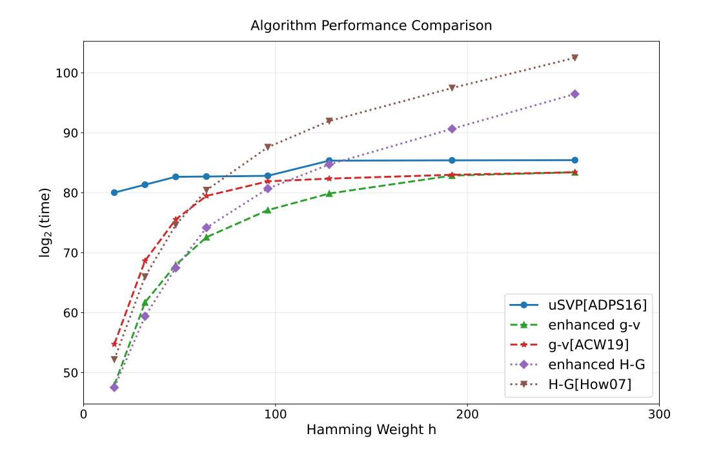

Fig. 1.1: Comparison of uSVP [9], guess-and-verify decoding attack [5], Howgrave-Graham decoding attack (with MITM) [45], enhanced guess-and-verify decoding attack, and enhanced Howgrave-Graham decoding attack (with MITM). The results correspond to Ring-LWE instances with parameters n = 1024,  $q = 2^{40}$ , and a sparse ternary secret whose Hamming weight h is chosen from  $\{16, 32, 48, 64, 96, 128, 192, 256\}$  (we select these parameters with reference to [35, Fig. 3]). The error term is drawn from the discrete Gaussian distribution  $\mathcal{D}_{\sigma}$  with  $\sigma = 3.19$ . The evaluation results are obtained using lattice-estimator.

#### <span id="page-5-0"></span>1.2 Concurrent Work

Concurrent and independent work by Ogilvie [61] partially overlaps with the results in this paper. Both our work and [61] observe that the aforementioned algebraic property in Module/Ring-LWE can be used to enhance the performance of hybrid decoding attacks and show that some latest sparse Ring-LWE parameter sets used in typical FHE schemes will fall below the targeted security level under the enhanced attack. While, different from Ogilvie [61], we implement the new enhanced hybrid decoding attack, achieve several new records on the benchmark instances established by [70], and show the practical performance advantage over the state-of-the-art method in [50]. On the other hand, Ogilvie [61] shows that the same idea can also be used to slightly improve the recent code-based hybrid dual attack [26] against Kyber by up to 0.8 bit under standard cost models, see Table 1.1<sup>4</sup>. The results in Table 1.1 show that there is still a

<span id="page-5-2"></span>In [61], Ogilvie reports that 2–3 bits of improvement can be achieved under standard cost models. We observed a minor parameter mismatch in a function call within her experimental code (specifically, the "lambda\_2" function at Line 124 in https://github.com/TabOg/CodedDualAttack/blob/7b7e8000/OptimizeCodedDualAttack/rot\_utilitaries.py; further details can be found in our GitHub repository), which was confirmed by Ogilvie and led to overestimated improvement values. We provide a carefully verified implementation and report cor-

{6}------------------------------------------------

gap between Module-LWE and LWE hardness for Kyber parameters. However, the magnitude of this gap is small.

<span id="page-6-0"></span>**Table 1.1:** Gap between Module-LWE and LWE hardness for Kyber parameters according to dual hybrid attack leveraging algebraic structures [61, Alg. 7]. All estimates presented in bits.

| Scheme    | LW    | E Hardı<br>([ <mark>26</mark> ]) | ness  | Module<br>([6 | Gap           |       |     |               |                                   |
|-----------|-------|----------------------------------|-------|---------------|---------------|-------|-----|---------------|-----------------------------------|
|           | C0    | $\mathbf{CC}$                    | CN    | <b>C</b> 0    | $\mathbf{CC}$ | CN    | C0  | $\mathbf{CC}$ | $\overline{\mathbf{C}\mathbf{N}}$ |
| Kyber512  | 121.9 | 139.3                            | 134.8 | 121.9         | 139.1         | 134.5 | 0.0 | 0.2           | 0.3                               |
| Kyber768  | 173.0 | 194.7                            | 189.5 | 173.0         | 194.7         | 188.7 | 0.0 | 0.0           | 0.8                               |
| Kyber1024 | 237.5 | 259.6                            | 254.2 | 237.4         | 259.0         | 254.1 | 0.1 | 0.6           | 0.1                               |

Note: The results in the "LWE Hardness" column of this table differ slightly from those presented in [26, Tab. 5.1]. The discrepancy arises because Line 196 of the code provided in [26] (available at https://github.com/kevin-carrier/CodedDualAttack/blob/main/OptimizeCodedDualAttack/utilitaries.py) contains a typographical error: R\_max = max(R\_min, 2^100) (where ^ denotes the XOR operator in Python, rather than exponentiation) should instead be R\_max = max(R\_min, 2\*\*100) (the standard syntax for exponentiation in Python). This oversight has been fixed by Ogilvie, and we re-evaluated the results by referring to Ogilvie's code. The results in the "LWE Hardness" and "Module-LWE Hardness" columns correspond to the time complexity at a success probability lower bound set to 0.3, consistent with that set in [26].

### 2 Prelimnaries

#### 2.1 Notations and Basic Definitions

We denote  $[n] = \{0, 1, \ldots, n-1\}$  for a positive integer n, and  $[a:b] = \{a, \ldots, b-1\}$  for integers a < b. Throughout this paper, log denotes the logarithm to the base 2. Vectors are denoted by bold lower case letters and are regarded as column vectors, e.g.,  $\mathbf{v}$ . Matrices are denoted by bold upper case letters, e.g.,  $\mathbf{B}$ . For a matrix  $\mathbf{B}$ , we express it in terms of its column vectors as  $\mathbf{B} = (\mathbf{b}_0, \ldots, \mathbf{b}_{n-1})$ , where  $\mathbf{b}_i$  stands for the i-th column of  $\mathbf{B}$ . The identity matrix of order n is denoted by  $\mathbf{I}_n$ . The m-dimensional zero vector is denoted by  $\mathbf{0}^m$ , and the  $m \times n$  zero matrix is denoted by  $\mathbf{0}^{m \times n}$ . The Euclidean norm of a vector  $\mathbf{v}$  is indicated by  $\|\mathbf{v}\|$ . The cardinality of a set S is denoted by |S|. Given a matrix  $\mathbf{A} \in \mathbb{R}^{m \times n}$ , and sets  $I \subseteq [m]$ ,  $J \subseteq [n]$ ,  $\mathbf{A}_{[I,J]}$  denotes the submatrix of  $\mathbf{A}$  consisting of the rows indexed by I and columns indexed by I. For a vector  $\mathbf{v} \in \mathbb{R}^m$  and index set  $I \subseteq [m]$ , I denotes the subvector of I with coordinates at indices in I, I denotes the I-th coordinate of I of I of I with coordinates at indices in I of I is a distribution, then we write I to indicate that I is a random variable drawn at random

rectly estimated costs in Table 1.1. The code and data used to generate Table 1.1 are available at our GitHub repository <a href="https://github.com/identitymapping/CodedDualAttack">https://github.com/identitymapping/CodedDualAttack</a>.

{7}------------------------------------------------

from  $\mathcal{D}$ . For a distribution  $\mathcal{D}$ , its support, denoted by  $\operatorname{Supp}(\mathcal{D})$ , consists of all values taking non-zero probability under  $\mathcal{D}$ ;  $H(\mathcal{D})$  is its Shannon entropy. For a distribution  $\chi$  on  $\mathbb{Z}^n$ , we define its value set as  $\operatorname{Val}(\chi) = \{x \in \mathbb{Z} : \exists \mathbf{s} \in \operatorname{Supp}(\chi), \exists i \in [n] \text{ such that } s_i = x\}$ , i.e., the set of all possible values taken by any coordinate of a random vector drawn from  $\chi$ . We further define the nonzero value set  $\operatorname{Val}^+(\chi) = \operatorname{Val}(\chi) \setminus \{0\}$ . For a positive integer  $n_1 \leq n$ , we denote by  $\chi|_{n_1}$  the marginal distribution of  $\chi$  restricted to  $n_1$  dimensions (i.e., the distribution obtained by projecting a sample from  $\chi$  onto its first  $n_1$  coordinates). We say that  $\chi$  is permutation-sign symmetric if for every  $\mathbf{x} = (x_0, \dots, x_{n-1}) \in \operatorname{Supp}(\chi)$ , every permutation  $\pi \in \mathcal{S}_n$  (where  $\mathcal{S}_n$  denotes the symmetric group of all permutations of  $\{0, 1, \dots, n-1\}$ ), and every sign vector  $\mathbf{\sigma} = (\sigma_0, \dots, \sigma_{n-1}) \in \{\pm 1\}^n$ , we have  $\operatorname{Pr}_{\chi}[\mathbf{x}] = \operatorname{Pr}_{\chi}[(\sigma_{\pi(0)}x_{\pi(0)}, \dots, \sigma_{\pi(n-1)}x_{\pi(n-1)})]$ . All these definitions naturally extend to distributions on  $\mathcal{R}^{\kappa}$  by viewing the coefficients of the polynomials as integer vectors in  $\mathbb{Z}^{\kappa N}$ .

#### 2.2 Lattices

A lattice  $\Lambda \subseteq \mathbb{R}^m$  is a discrete subgroup of  $\mathbb{R}^m$ . For a matrix  $\mathbf{B} \in \mathbb{R}^{m \times n}$ , the lattice  $\mathcal{L}$  spanned by the basis  $\mathbf{B}$  is denoted  $\mathcal{L}(\mathbf{B}) = \{\mathbf{B}\mathbf{x} \mid \mathbf{x} \in \mathbb{Z}^n\}$ . If  $\Lambda = \mathcal{L}(\mathbf{B})$ , we say that  $\mathbf{B}$  is the basis of  $\Lambda$ . We say that the dimension of  $\mathcal{L}(\mathbf{B})$  is n, and the lattice is full-rank if m = n. The Gram-Schmidt orthogonalization basis of  $(\mathbf{b}_0, \dots, \mathbf{b}_{n-1})$  is written as  $(\mathbf{b}_0^*, \dots, \mathbf{b}_{n-1}^*)$ , abbreviated as GS basis for short. For any  $i \in \{0, \dots, n-1\}$ ,  $\pi_i$  represents the orthogonal projection onto span $(\mathbf{b}_0, \dots, \mathbf{b}_{i-1})$ , and  $\pi_i^{\perp}$  represents the orthogonal projection onto span $(\mathbf{b}_0, \dots, \mathbf{b}_{i-1})^{\perp}$ . For indices satisfying  $0 \leq i < j \leq n$ , the local projected block  $(\pi_i^{\perp}(\mathbf{b}_i), \dots, \pi_i^{\perp}(\mathbf{b}_{j-1}))$  is denoted  $\mathbf{B}_{[i,j]}$ . The lattice spanned by  $\mathbf{B}_{[i,j]}$  is referred to as  $\mathcal{L}_{[i,j]}$ . We adopt  $\mathbf{B}_i$  and  $\mathcal{L}_i$  as abbreviations for  $\mathbf{B}_{[i,n]}$  and  $\mathcal{L}_{[i,n]}$ , respectively.

The volume of lattice  $\mathcal{L}(\mathbf{B})$ , denoted  $\operatorname{Vol}(\mathcal{L}(\mathbf{B}))$ , equals the product  $\prod_i \|\mathbf{b}_i^*\|$ . The first minimum of a lattice  $\mathcal{L}$ , written  $\lambda_1(\mathcal{L})$ , refers to the length of the shortest non-zero vector contained in  $\mathcal{L}$ . We also use  $\operatorname{Vol}(\mathbf{B})$  and  $\lambda_1(\mathbf{B})$  as shorthands for  $\operatorname{Vol}(\mathcal{L}(\mathbf{B}))$  and  $\lambda_1(\mathcal{L}(\mathbf{B}))$ , respectively.

**Definition 2.1 (Gaussian Heuristic).** For a random full-rank lattice  $\mathcal{L} \subset \mathbb{R}^n$  with volume  $Vol(\mathcal{L})$ , the Gaussian Heuristic estimates the length of the shortest non-zero vector as

$$GH(\mathcal{L}) \approx \sqrt{\frac{n}{2\pi e}} \cdot Vol(\mathcal{L})^{1/n}.$$

#### 2.3 LWE, BDD and CVP

<span id="page-7-0"></span>**Definition 2.2 (Search LWE).** Let n, m, q be positive integers. Let  $\chi_{\mathbf{s}}, \chi_{\mathbf{e}}$  be distributions on  $\mathbb{Z}^n$  and  $\mathbb{Z}^m$ , respectively. We define the search LWE instance with parameters  $(n, m, q, \chi_{\mathbf{s}}, \chi_{\mathbf{e}})$  as follows. Given a matrix  $\mathbf{A}$  uniformly distributed in  $\mathbb{Z}_q^{m \times n}$ , and a vector  $\mathbf{b} \in \mathbb{Z}_q^m$  such that  $\mathbf{b} = \mathbf{A}\mathbf{s} + \mathbf{e}$  and  $(\mathbf{s}, \mathbf{e}) \leftarrow (\chi_{\mathbf{s}}, \chi_{\mathbf{e}})$ , output  $\mathbf{s}$ .

{8}------------------------------------------------

**Definition 2.3 (Bounded Distance Decoding (BDD)).** Given a lattice  $\Lambda \subset \mathbb{R}^m$  with basis  $\mathbf{B} \in \mathbb{R}^{m \times n}$ , and a target vector  $\mathbf{t} \in \mathbb{R}^m$ , where  $\mathbf{t} = \mathbf{v} + \mathbf{x}$ , for some  $\mathbf{v} \in \Lambda$  and  $\mathbf{x} \in \mathbb{R}^m$  with  $\|\mathbf{x}\| < \frac{\lambda_1(\Lambda)}{2}^5$ , one is asked to find the lattice vector  $\mathbf{v}$ .

LWE instance  $(\mathbf{A}, \mathbf{b}) \in \mathbb{Z}_q^{m \times n} \times \mathbb{Z}_q^m$  can be transformed to a BDD instance as follows. Define

<span id="page-8-1"></span>
$$\mathbf{B} = \begin{pmatrix} q\mathbf{I}_m & \mathbf{A} \\ \mathbf{0}^{m \times n} & c\mathbf{I}_n \end{pmatrix}, \quad \mathbf{t} = \begin{pmatrix} \mathbf{b} \\ \mathbf{0}^n \end{pmatrix}, \quad \Lambda = \mathcal{L}(\mathbf{B})$$
 (2.1)

where c > 0 is a scaling factor to be determined for balancing the standard deviations of the respective components [14]. Let

$$\mathbf{x}' = \mathbf{t} - \mathbf{B} \begin{pmatrix} \mathbf{u} \\ \mathbf{s} \end{pmatrix} = \begin{pmatrix} \mathbf{e} \\ -c\mathbf{s} \end{pmatrix},$$

where  $\mathbf{u} \in \mathbb{Z}^m$  is an integer vector. If  $\mathbf{s}, \mathbf{e}$  is sufficiently small, satisfying  $\|\mathbf{x}'\| < \frac{\lambda_1(\Lambda)}{2}$ , then  $(\Lambda, \mathbf{t})$  is a BDD instance and its solution is  $\mathbf{t} - \mathbf{x}'$ . Usually c is chosen to satisfy  $c\frac{\|\mathbf{s}\|}{\sqrt{n}} \approx \frac{\|\mathbf{e}\|}{\sqrt{m}}$ . Thus, we can solve the LWE instance by solving the BDD instance  $(\Lambda, \mathbf{t})$ .

**Definition 2.4 (Closest Vector Problem (CVP)).** Given a lattice  $\Lambda \subset \mathbb{R}^m$  with basis  $\mathbf{B} \in \mathbb{R}^{m \times n}$ , and a target vector  $\mathbf{t} \in \mathbb{R}^m$ . One is asked to find a vector  $\mathbf{w} \in \Lambda$  such that  $\|\mathbf{w} - \mathbf{t}\| \leq \lambda_1(\Lambda)$ . If  $\mathbf{t} = \mathbf{v} + \mathbf{x}$ , for some  $\mathbf{v} \in \Lambda$  and  $\mathbf{x} \in \mathbb{R}^m$  with  $\|\mathbf{x}\| < \lambda_1(\Lambda)$ , then  $\mathbf{v}$  is the solution to this CVP instance.

#### 2.4 Sparse LWE, Ring-LWE and Module-LWE

In this work, we mainly consider LWE instances where the secret and error vectors are sampled from the following distributions:

- Ternary,  $\mathcal{B}^-$ : each coordinate is uniformly from  $\{-1,0,1\}$ .
- Binomial,  $\mathcal{B}^{\eta}$ : each coordinate is from a centered Binomial distribution, obtained by sampling  $2\eta$  uniform bits  $(a_1,...,a_{\eta},b_1,...,b_{\eta})$  and outputting  $\sum_{i=1}^{\eta} a_i \sum_{i=1}^{\eta} b_i$ .
- Discrete Gaussian,  $\mathcal{D}_{\sigma}$ : each coordinate is from a discrete Gaussian distribution over  $\mathbb{Z}$ , with probability proportional to  $\exp(-x^2/(2\sigma^2))$  for each  $x \in \mathbb{Z}$  (normalized to sum to 1).

We also define sparse variants of the above secret distributions by fixing the number of non-zero secret coordinates (i.e. Hamming weight) to a given value h. For ternary secrets, this sparse distribution with exactly h non-zero coordinates is denoted by  $\mathcal{B}_h^-$ . For binomial secrets, the corresponding sparse distribution

<span id="page-8-0"></span><sup>&</sup>lt;sup>5</sup> The condition  $\|\mathbf{x}\| < \frac{\lambda_1(A)}{2}$  in Definition 2.3 guarantees the uniqueness of the solution.

{9}------------------------------------------------

with exactly h non-zero coordinates is denoted by  $\mathcal{B}_h^{\eta_6}$ . LWE with such sparse secrets is called sparse LWE.

To reduce siezes and improve efficiency, many lattice-based schemes are based on the variants of the LWE problem, including Ring-LWE and Module-LWE. In this paper, the polynomial rings are defined as  $\mathcal{R}_q = \mathbb{Z}_q[X]/(f_N(x))$  and  $\mathcal{R} = \mathbb{Z}[X]/(f_N(x))$  where q is a prime, and  $f_N(x) = x^N + 1^7$ .

**Definition 2.5 (Search Ring-LWE).** A Ring-LWE instance is a pair  $(a,b) \in \mathcal{R}_q \times \mathcal{R}_q$ , where a is uniformly sampled from  $\mathcal{R}_q$ , and  $b = a \cdot s + e$ . The secret  $s \in \mathcal{R}$  is chosen according to the distribution  $\chi_{\mathbf{s}}$ , and the error  $e \in \mathcal{R}$  is chosen according to the distribution  $\chi_{\mathbf{e}}^{8}$ . The Search Ring-LWE asks to recover s given m Ring-LWE instances  $\{(a_i, b_i = a_i s + e_i) : i = 0, \ldots, m-1\}$ .

<span id="page-9-3"></span>**Definition 2.6 (Search Module-LWE).** A Module-LWE instance is a pair  $(\mathbf{a}, b) \in \mathcal{R}_q^{\kappa} \times \mathcal{R}_q$ , where  $\mathbf{a}$  is uniformly sampled from  $\mathcal{R}_q^{\kappa}$ , and  $b = \mathbf{a} \cdot \mathbf{s} + e$ . The secret  $\mathbf{s} \in \mathcal{R}^{\kappa}$  is chosen according to the distribution  $\chi_{\mathbf{s}}$ , and the error  $e \in \mathcal{R}$  is chosen according to the distribution  $\chi_{\mathbf{e}}$ . The term  $\kappa$  is called as the rank of the Module-LWE instance. The Search Module-LWE asks to recover  $\mathbf{s}$  given m Module-LWE instances  $\{(\mathbf{a}_i, b_i = \mathbf{a}_i \cdot \mathbf{s} + e_i) : i = 0, \ldots, m-1\}$ .

As defined above, a Ring-LWE instance is a special case of a Module-LWE instance with rank  $\kappa=1$ . Following the approach in [62], we transform a Module-LWE instance to an unstructured LWE instance via two core maps:

- 1. The coefficient embedding vec :  $\mathcal{R}_q \to \mathbb{Z}_q^N$ , which maps a polynomial  $c = \sum_{i=0}^{N-1} c_i x^i \in \mathcal{R}_q$  to its coefficient vector  $\text{vec}(c) = (c_0, c_1, \dots, c_{N-1})^{\top}$ . This map can extend naturally to modules as  $\text{vec} : \mathcal{R}_q^{\kappa} \to \mathbb{Z}_q^{\kappa N}$ . Its inverse map, the polynomial lifting poly :  $\mathbb{Z}_q^N \to \mathcal{R}_q$ , maps a coefficient vector  $\mathbf{c} = (c_0, c_1, \dots, c_{N-1})^{\top} \in \mathbb{Z}_q^N$  back to the corresponding polynomial poly( $\mathbf{c}$ ) =  $\sum_{i=0}^{N-1} c_i x^i \in \mathcal{R}_q$ , and admits a natural extension to modules as poly :  $\mathbb{Z}_q^{\kappa N} \to \mathcal{R}_q^{\kappa}$ .
- 2. The rotation map rot :  $\mathcal{R}_q \to \mathbb{Z}_q^{N \times N}$ , which converts a ring element c to a circulant matrix:

$$\operatorname{rot}(c) = (\operatorname{vec}(c), \operatorname{vec}(cx), \dots, \operatorname{vec}(cx^{N-1})),$$

and extends naturally to modules as rot :  $\mathcal{R}_q^{\kappa} \to \mathbb{Z}_q^{N \times \kappa N}$ .

The definitions of the maps vec, poly, and map extend naturally to  $\mathcal{R}$  and  $\mathcal{R}^{\kappa}$ .

<span id="page-9-0"></span><sup>&</sup>lt;sup>6</sup> All distributions  $\mathcal{D}_{\sigma}$ ,  $\mathcal{B}^{-}$ ,  $\mathcal{B}_{h}^{\eta}$ ,  $\mathcal{B}_{h}^{-}$ , and  $\mathcal{B}_{h}^{\eta}$  are permutation-sign symmetric, and we provide the reasons in Remark A.1.

<span id="page-9-1"></span><sup>&</sup>lt;sup>7</sup> In many lattice-based schemes, N is chosen as a power of two, making both  $\mathcal{R}_q$  and  $\mathcal{R}$  2-power cyclotomic rings, but our analysis in this paper does not rely on N being a power of two.

<span id="page-9-2"></span><sup>&</sup>lt;sup>8</sup> We reuse the notations  $\chi_s$  and  $\chi_e$  to denote the distributions over  $\mathcal{R}$  (and  $\mathcal{R}^{\kappa}$  as defined in Definition 2.6).

{10}------------------------------------------------

Remark 2.1. For simplicity, we regard an element of  $\mathcal{R}^{\kappa}$  as a vector over  $\mathbb{Z}^{\kappa N}$  (and vice versa) via the vec/poly maps, with context determining its precise meaning.

Thus, given m' Module-LWE instances  $\{(\mathbf{a}_i, b_i = \mathbf{a}_i \mathbf{s} + e_i) \in \mathcal{R}_q^{\kappa} \times \mathcal{R}_q : i = 0, \dots, m' - 1\}$ , with secret  $\mathbf{s}$ , applying these maps yields an unstructured LWE instance:

<span id="page-10-0"></span>
$$\begin{pmatrix}
\mathbf{A} = \begin{pmatrix} \operatorname{rot}(\mathbf{a}_0) \\ \operatorname{rot}(\mathbf{a}_1) \\ \vdots \\ \operatorname{rot}(\mathbf{a}_{m'-1}) \end{pmatrix}, \mathbf{b} = \begin{pmatrix} \operatorname{vec}(b_0) \\ \operatorname{vec}(b_1) \\ \vdots \\ \operatorname{vec}(b_{m'-1}) \end{pmatrix} \end{pmatrix} \in \mathbb{Z}_q^{m'N \times \kappa N} \times \mathbb{Z}_q^{m'N}.$$
(2.2)

This LWE instance has a secret vector  $\text{vec}(\mathbf{s}) \in \mathbb{Z}^{\kappa N}$ , secret dimension  $n = \kappa N$ , and number of samples m = m'N. Since a Ring-LWE instance is a special Module-LWE instance, its transformation to an unstructured LWE instance follows an analogous procedure; thus, we omit the details here for brevity.

#### 2.5 Lattice Algorithms

**Lattice enumeration and sieving.** Lattice enumeration [48] and sieving [1] are both algorithms for finding short vectors in a lattice. The time complexity of sieving algorithms is typically exponential in the lattice dimension n, with the best known complexity being  $2^{0.292n+o(n)}$  for solving Shortest Vector Problem (SVP) [15].

Lattice reduction. Lattice reduction algorithms aim to transform a given lattice basis into a better basis with more orthogonal or shorter vectors. The most important algorithms include:

- Lenstra-Lenstra-Lovász (LLL) algorithm [52]: A polynomial-time algorithm that produces a basis where the vectors are relatively short and nearly orthogonal. LLL is fast but yields lattice bases of low quality.
- Block Korkine-Zolotarev (BKZ) algorithm [64]: A more powerful algorithm that works by solving SVP via enumeration or sieving in smaller dimensional blocks. The quality of BKZ-reduced bases depends on the block size  $\beta$ . Larger  $\beta$  yields better bases but requires more computation.

The Geometric Series Assumption (GSA) is commonly used to estimate the lengths of the GS basis after BKZ reduction, which assumes that the lengths of the GS basis form a geometric sequence.

**Babai's Nearest Plane.** Given a BDD instance  $(\mathbf{B}, \mathbf{t})$ , if the basis  $\mathbf{B}$  is well reduced, we can use Babai's Nearest Plane (NP) algorithm [11] to solve the BDD problem in polynomial time.

{11}------------------------------------------------

**CVP solver.** If the basis **B** is not well reduced, Babai's NP algorithm fails to solve the BDD problem, and we may then resort to more powerful CVP solvers. Alternatively, the CVP can be transformed into SVP via Kannan's embedding [48], which can subsequently be solved using lattice enumeration or sieving algorithms. Additionally, Randomized Slicer [37,36] can also be employed, which enables solving large batches of CVP instances at the cost of a single CVP instance and has been implemented in existing works [71,69,49].

Cost models and shape models. In this work, we use the sieving cost models [15,57]<sup>9</sup> and quantum sieving model [27]<sup>10</sup> to evaluate security, and employ GSA or the Chen-Nguyen simulator [30] to estimate the length of GS basis after BKZ reduction<sup>11</sup>.

#### <span id="page-11-5"></span>2.6 Hybrid Decoding Attack

The hybrid decoding attack is an approach to solve LWE that combines key enumeration and lattice reduction. It is also known as the primal hybrid attack. One can use the lattice-estimator to estimate the cost of hybrid decoding attack. Given an LWE instance  $(\mathbf{A}, \mathbf{b}) \in \mathbb{Z}_q^{m \times n} \times \mathbb{Z}_q^m$  with secret vector  $\mathbf{s}$  of Hamming weight h, according to Eq. (2.1), we can reduce it to a BDD instance  $(\Lambda = \mathcal{L}(\mathbf{B}), \mathbf{t})$  with  $\mathbf{t} = \mathbf{v} + \mathbf{x}, \mathbf{v} \in \Lambda$ . Let d = m + n. Then, we show how to solve this BDD instance using classical decoding, and how to solve this LWE instance via Howgrave-Graham decoding and guess-and-verify decoding following [5].

Classical decoding. The classical decoding approach was introduced in [54,55], analyzed in [7,5], and has been integrated into lattice-estimator. In this approach, we first reduce the basis **B** via lattice reduction with block size  $\beta_{\rm Dec}$  to obtain a well-reduced basis **B**'. Then parameter  $\eta_{\rm Dec}$  is determined to solve the lower-dimensional CVP on the projected sublattice  $\Lambda_{d-\eta_{\rm Dec}}$ , which finds the vector in the projected sublattice that is closest to  $\pi_{d-\eta_{\rm Dec}}^{\perp}(\mathbf{t})$ . Finally, Babai's NP algorithm is used to obtain the full lattice vector. The details are as follows. Let

<span id="page-11-4"></span>
$$\mathbf{t} = \mathbf{v} + \mathbf{x}, \quad \mathbf{v} = \mathbf{B}' \begin{pmatrix} \mathbf{u_1} \\ \mathbf{u_2} \end{pmatrix},$$
 (2.3)

for some  $\mathbf{u_1} \in \mathbb{Z}^{d-\eta_{\mathrm{Dec}}}, \mathbf{u_2} \in \mathbb{Z}^{\eta_{\mathrm{Dec}}}$ , applying the projection  $\pi_{d-\eta_{\mathrm{Dec}}}^{\perp}$  to  $\mathbf{t}$  yields

<span id="page-11-3"></span>
$$\pi_{d-\eta_{\text{Dec}}}^{\perp}(\mathbf{t}) = \mathbf{B'}_{d-\eta_{\text{Dec}}} \mathbf{u_2} + \pi_{d-\eta_{\text{Dec}}}^{\perp}(\mathbf{x}). \tag{2.4}$$

The parameter  $\eta_{\text{Dec}}$  is choosed to satisfy  $\pi_{d-\eta_{\text{Dec}}}^{\perp}(\mathbf{x}) < \text{GH}(\mathcal{L}(\mathbf{B'}_{d-\eta_{\text{Dec}}}))$ , then Eq. (2.4) defines a CVP instance on the projected sublattice. We can solve this

<span id="page-11-0"></span><sup>&</sup>lt;sup>9</sup> Known as red\_cost\_model=BKZ.sieve in LWE-estimator and red\_cost\_model=MATZOV in lattice-estimator, where LWE-estimator is an early version of lattice-estimator.

<span id="page-11-1"></span><sup>10</sup> Known as red\_cost\_model=ChaLoy21 in lattice-estimator.

<span id="page-11-2"></span><sup>11</sup> Known as red\_shape\_model=GSA and red\_shape\_model=CN11 in lattice-estimator.

{12}------------------------------------------------

CVP instance using the CVP solver to obtain  $\mathbf{u}_2$  and the success probability is denoted as  $p_{\text{CVP}}$ . From Eq. (2.3), we can deduce that

<span id="page-12-0"></span>
$$\mathbf{t} - \mathbf{v}_2 = \mathbf{B'}_{[0,d-\eta_{\mathrm{Dec}}]} \mathbf{u}_1 + \mathbf{x}, \quad \text{for } \mathbf{v}_2 = \mathbf{B'} \begin{pmatrix} \mathbf{0}^{d-\eta_{\mathrm{Dec}}} \\ \mathbf{u}_2 \end{pmatrix}.$$
 (2.5)

Applying  $\pi_{d-\eta_{\rm Dec}}$  to both sides of Eq. (2.5) yields

<span id="page-12-1"></span>
$$\pi_{d-\eta_{\text{Dec}}}(\mathbf{t} - \mathbf{v}_2) = \mathbf{B'}_{[0,d-\eta_{\text{Dec}}]}\mathbf{u}_1 + \pi_{d-\eta_{\text{Dec}}}(\mathbf{x}). \tag{2.6}$$

Then we use Babai's NP algorithm to recover  $\mathbf{u}_1$  in Eq. (2.6), with the corresponding success probability  $p_{\text{babai}}$ . Finally we obtain the lattice vector  $\mathbf{v}$  and solve the BDD isntance  $(\Lambda, \mathbf{t})$  successfully.

The cost of this classical decoding approach is given by

$$T_{\text{Dec}} = \frac{T_{\text{BKZ}}(\beta_{\text{Dec}}, d) + T_{\text{CVP}}(\eta_{\text{Dec}})}{p_{\text{babai}} \cdot p_{\text{CVP}}},$$
(2.7)

where  $T_{\rm BKZ}(\beta_{\rm Dec},d)$  is the cost of lattice reduction in a d-dimensional lattice with block size  $\beta_{\rm Dec}$ , and  $T_{\rm CVP}(\eta_{\rm Dec})$  is the cost of solving an  $\eta_{\rm Dec}$ -dimensional CVP instance. The cost of the classical decoding approach can be estimated by lattice-estimator via the primal\_bdd function.

Howgrave-Graham decoding. This hybrid decoing approach was proposed by Howgrave-Graham [45]. It was first used to attak NTRU and later be generalized to attack LWE [24,72]. It is a hybrid strategy of guess and lattice reduction. The guess phase can be accelerated through the MITM technique. We do not consider the analysis of integrating the MITM technique here, and a comprehensive analysis is provided in Section 5.2. Its main idea is to first guess that the Hamming weight of the k dropped dimensions of the secret vector  $\mathbf{s}$  is at most  $h_{\text{hgDec}}$ , then determine the exact values of these non-zero coordinates via enumeration, and finally apply Babai's NP algorithm to solve the (d-k)-dimensional BDD instance. The probability of successfully solving the BDD instance using Babai's NP algorithm  $p_{\text{babai}}$  is estimated in [74]. The cost of this hybrid decoding approach is

<span id="page-12-2"></span>
$$T_{\text{hgDec}} = \frac{T_{\text{BKZ}}(\beta_{\text{hgDec}}, d - k) + |S_{h_{\text{hgDec}}}| \cdot T_{\text{babai}}(d - k)}{p_{\text{babai}} \cdot \left(\sum_{i=0}^{h_{\text{hgDec}}} p_i\right)}, \tag{2.8}$$

where  $|S_{h_{\text{hgDec}}}| = \sum_{i=0}^{h_{\text{hgDec}}} \binom{k}{i} |\text{Val}^+(\chi_{\mathbf{s}})|^i$  denotes the search space for k dimensional vectors with Hamming weight at most  $h_{\text{hgDec}}$  and  $p_i = \frac{\binom{h}{i} \cdot \binom{n-h}{k-i}}{\binom{n}{k}}$  is the probability that  $\mathbf{s}$  has Hamming weight exactly i over the k dropped dimensions. The cost of the decoding approach can be estimated via the primal\_hybrid function in lattice-estimator with babai=True fixed, by setting the parameter mitm to True (employing the MITM technique) or False (excluding the MITM technique).

{13}------------------------------------------------

Guess-and-verify decoding. Howgrave-Graham decoding relies on Babai's NP algorithm as low-dimensional BDD solver, leading to a very low success probability. To address this limitation, Albrecht et al. [\[5\]](#page-32-5) proposed another hybrid decoding strategy called guess-and-verify decoding, which replaces Babai's NP algorithm with a more powerful CVP solver with the subsequent application of Babai's NP algorithm to enhance the success probability in solving low-dimensional BDD problem (i.e., the classical decoding approach). The cost of this approach is

<span id="page-13-2"></span>
$$T_{\text{gvDec}} = \frac{T_{\text{BKZ}}(\beta_{\text{gvDec}}, d - k) + |S_{h_{\text{gvDec}}}| \cdot T_{\text{bdd}}(d - k)}{p_{\text{bdd}} \cdot \left(\sum_{i=0}^{h_{\text{gvDec}}} p_i\right)},$$
 (2.9)

where Tbdd denotes the cost of solving a (d−k)-dimensional BDD instance via the classical decoding approach, and pbdd is the corresponding success probability. Specifically, when hgvDec = 0, this implies that we assume the values of all k dropped dimensions of s are zero. In this case, the guess-and-verify strategy degenerates into another hybrid decoding attack called drop-and-solve decoding [\[59](#page-37-10)[,5\]](#page-32-5). Similarly, when employing Babai's NP algorithm to solve the (d − k) dimensional BDD instance, the guess-and-verify strategy degenerates into the Howgrave-Graham decoding. Algorithm [1](#page-14-0) presents the pseudocode for guessand-verify decoding. In this algorithm, each selection of the subset I requires one BKZ reduction on the lattice basis, along with multiple invocations of the lowdimensional BDD solver. Specifically, the success probability of each iteration in the guess-and-verify framework is given by pgvDec = pbdd · P<sup>h</sup>gvDec <sup>i</sup>=0 p<sup>i</sup> . In Algorithm [1,](#page-14-0) for a target success probability of 0.99, the number of iterations is set to Niters = ⌈log(1 − 0.99)/ log(1 − pgvDec)⌋. The cost of this decoding approach can be estimated by lattice-estimator through primal\_hybrid function with settings babai=False and mitm=False[12](#page-13-0) .

In lattice-estimator, hhgDec and hgvDec are chosen to be the maximal integer to satisfy the following conditions, which ensure that the cost of BKZ reduction dominates the total computational cost:

$$|S_{\text{hgDec}}| \cdot T_{\text{babai}}(d-k) \le T_{\text{BKZ}}(\beta_{\text{hgDec}}, d-k), |S_{\text{gvDec}}| \cdot T_{\text{bdd}}(d-k) \le T_{\text{BKZ}}(\beta_{\text{gvDec}}, d-k).$$
(2.10)

<span id="page-13-1"></span>Consequently, the constraints in Eq. [\(2.10\)](#page-13-1) imply that hhgDec and hgvDec are typically chosen to be small values.

<span id="page-13-0"></span><sup>12</sup> Unlike Eq. [\(2.9\)](#page-13-2), which computes the cost in an average sense, the lattice-estimator calculates the cost as Niters · TBKZ(βgvDec, d − k) + |S<sup>h</sup>gvDec | · Tbdd(d − k) , with a default target success probability set to 0.99.

{14}------------------------------------------------

#### Algorithm 1: Guess-and-verify decoding [5,62]

```
Input: an LWE instance (\mathbf{A}, \mathbf{b}) \in \mathbb{Z}_q^{m \times n} \times \mathbb{Z}_q^m with secret s drawn from
                   \chi_{\mathbf{s}}, HW(\mathbf{s}) = h, k < n (the number of dropped dimensions),
                   h_{\text{gvDec}} (the guessed maximum Hamming weight of the k
                   dropped dimensions), BKZ block size \beta_{gvDec}
     Output: the secret s
 1 Set N_{\text{iters}} according to the target success probality;
  2 for iter = 1, 2, ..., N_{iters} do
           Uniformly sample a subset I \subseteq \{0, 1, \dots, n-1\} where |I| = n - k;
  \mathbf{3}
           Define complement subset J := \{0, 1, \dots, n-1\} \setminus I;
  4
           \mathbf{A}_I := \mathbf{A}_{[[0:m],I]}, \ \mathbf{A}_J := \mathbf{A}_{[[0:m],J]};
  5
           \mathbf{B}_I := \begin{pmatrix} q \cdot \mathbf{I}_m & \mathbf{A}_I \\ \mathbf{0}^{(n-k) \times m} & c \cdot \mathbf{I}_{n-k} \end{pmatrix};
  6
           Apply BKZ algorithm with block size \beta_{gvDec} to \mathbf{B}_I and obtain a
  7
             reduced basis \mathbf{B}'_I;
           for h'' \in \{0, 1, \dots h_{gvDec}\} do
  8
                 for all \tilde{\mathbf{s}}_J \in \mathrm{Val}(\chi_{\mathbf{s}})^k with \mathrm{HW}(\tilde{\mathbf{s}}_J) = h'' do
  9
                       \mathbf{t} := \begin{pmatrix} \mathbf{b} - \mathbf{A}_J \tilde{\mathbf{s}}_J \\ \mathbf{0}^{n-k} \end{pmatrix};
10
                        Treat (\mathbf{B}'_{I}, \mathbf{t}) as a BDD instance, solve it via the classical
11
                         decoding approach and obtain \mathbf{v};
                       \mathbf{x} := \mathbf{t} - \mathbf{v};
12
                       \tilde{\mathbf{s}}_I := -\mathbf{x}_{[m:m+n-k]}/c;
13
                       \tilde{\mathbf{s}} := (\tilde{\mathbf{s}}_I, \tilde{\mathbf{s}}_J);
14
                       if \tilde{\mathbf{s}} follows the distribution \chi_{\mathbf{s}} then
15
                             return š;
16
17 return \perp
```

# 3 Enhanced Hybrid Decoding Attacks against Module/Ring-LWE

In this section, we first present the enhanced hybrid decoding attack exploiting the algebraic structure, followed by an analysis showing that this attack yields a speedup of O(N) asymptotically in sparse secret setting.

#### 3.1 Leveraging the Algebraic Structure

Since Ring-LWE is a special case of Module-LWE, we do not consider Ring-LWE separately and only present the analysis for Module-LWE.

Given a Module-LWE instance  $(\mathbf{a}, b) \in \mathcal{R}_q^{\kappa} \times \mathcal{R}_q$ , where  $b = \mathbf{a} \cdot \mathbf{s} + e$  with secret  $\mathbf{s} \in \mathcal{R}^{\kappa}$  and error  $e \in \mathcal{R}$ . Here we only consider  $\mathcal{R}_q = \mathbb{Z}_q[X]/(f_N(x))$ ,  $\mathcal{R} = \mathbb{Z}[X]/(f_N(x))$  with  $f_N(x) = x^N + 1$ . If we multiply both sides of the equation  $b = \mathbf{a} \cdot \mathbf{s} + e$  by  $x^i$ , where  $i \in \{0, 1, \dots, N-1\}$ , we obtain:

$$x^i \cdot b = x^i \cdot (\mathbf{a} \cdot \mathbf{s}) + x^i \cdot e.$$

{15}------------------------------------------------

By the commutativity of multiplication, we can rearrange the term x i ·(a · s) to a · (x i · s). Thus, the equation simplifies to:

<span id="page-15-0"></span>
$$x^{i} \cdot b = \mathbf{a} \left( x^{i} \cdot \mathbf{s} \right) + x^{i} \cdot e. \tag{3.1}$$

This is equivalent to obtaining N distinct Module-LWE instances, where a remains unchanged, while the target b, secret s and error e are transformed to x i ·b, x i · s and x i · e respectively. We only need to recover any one of the transformed secret x i ·s to derive the original secret s. Specifically, since x <sup>N</sup> ≡ −1, the inverse of x i in R is −x N−i , and thus the original secret can be computed as

$$\mathbf{s} = -x^{N-i} \cdot (x^i \cdot \mathbf{s}).$$

Next, we provide the details of our enhanced hybrid decoding attack in Algorithm [3,](#page-18-0) which utilizes the algebraic structure to speed up the process. We first present an assumption that will be used in the subsequent analysis and its verification is provided in Appendix [A.](#page-40-1)

<span id="page-15-1"></span>Assumption 1 Let s ∈ R<sup>κ</sup> denote the secret of Module-LWE, where R = Z[X]/(x <sup>N</sup> + 1). The distribution of χ<sup>s</sup> is permutation-sign symmetric. Let n = κN, and k < n be a positive integer. The enumeration set S is selected according to Algorithm [2,](#page-17-0) and p<sup>S</sup> denotes the probability that vec(s)<sup>J</sup> ∈ S for a uniformly random subset J ⊆ {0, 1, . . . , n−1} with |J| = k. The success probabilities of the following two methods are identical (both equal to 1 − (1 − pS) <sup>N</sup> ):

- 1. Sample a subset J ⊆ {0, 1, . . . , n−1} uniformly at random, where each subset satisfies |J| = k. A trial is considered successful if vec(s)<sup>J</sup> ∈ S. Repeat this process N times, and prandom denotes the probability of achieving at least one success across the N trials.
- 2. Sample a subset J ⊆ {0, 1, . . . , n−1} uniformly at random with |J| = k, and pshift denotes the probability that there exists at least one i ∈ {0, 1, . . . , N −1} such that vec(x i · s)<sup>J</sup> ∈ S.

This means that pshift = prandom = 1 − (1 − pS) N .

For each i ∈ {0, 1, . . . , N − 1}, (a, x<sup>i</sup> · b) corresponds to a Module-LWE instance given by Eq. [\(3.1\)](#page-15-0), where the secret of this instance is x i · s. Let s (i) denote vec(x i · s). We select the enumeration set S according to Algorithm [2,](#page-17-0) where p<sup>S</sup> is the probability that s (i) <sup>J</sup> ∈ S for the subset J in Algorithm [3.](#page-18-0)

If ˜s<sup>J</sup> = s (i) J for some ˜s<sup>J</sup> ∈ S, Algorithm [3](#page-18-0) will invoke the BDD solver to successfully solve the (d − k)-dimensional BDD instance and obtain s (i) in Line 17 with probability pbdd. The BDD solver can employ Babai's NP algorithm, the classical decoding approach, or the Batched-Tail-BDD algorithm integrated with Randomized Slicer [\[49,](#page-37-3) Alg. 4] for solving a batch of BDD instances.

Finally, we only need to compute −x i ·poly(s (i) ) to obtain the original secret s ∈ R<sup>κ</sup> . The computational complexity of this process (from Lines 11 to 19 in Algorithm [3\)](#page-18-0) is |S| · Tbdd(d − k), with a corresponding success probability 

{16}------------------------------------------------

of  $p_{\text{bdd}} \cdot p_S$ . Since this process is repeated N times and by Assumption 1, the success probability of Lines 10 to 19 in Algorithm 3 is  $1 - (1 - p')^N$ , where  $p' = p_{\text{bdd}} \cdot p_S^{13}$ . Adding the cost of BKZ, the total cost of Algorithm 3 is given by the following formula:

<span id="page-16-2"></span>
$$T_{\text{ehDec}} = \frac{T_{\text{BKZ}}(\beta_{\text{ehDec}}, d - k) + N \cdot |S| \cdot T_{\text{bdd}}(d - k)}{1 - (1 - p')^N},$$
(3.2)

where  $p' = p_{\text{bdd}} \cdot p_S$ .

Remark 3.1. In Algorithm 2,  $p_S$  is a constant probability for Strategy 1 and Strategy 2 according to [40, Theorem 3.6, Theorem 3.7]. Strategy 3 corresponds to the selection strategy used in guess-and-verify decoding, which essentially sorts vectors in descending order of probability and prioritizes vectors with higher probabilities. This is because when the secret is sparse, vectors with low Hamming weights correspond to higher probabilities. Beyond the aforementioned strategies, other selection strategies can also be incorporated into Algorithm 2.

Remark 3.2. In Algorithm 3, when the algebraic structure is not leveraged: if Algorithm 2 adopts Strategy 3 with the classical decoding approach as the BDD solver, Algorithm 3 corresponds to guess-and-verify decoding; if Algorithm 2 adopts Strategy 3 with Babai's NP algorithm as the BDD solver, Algorithm 3 corresponds to Howgrave-Graham decoding; if Algorithm 2 adopts Strategy 2 and the BDD solver is chosen as the Batched-Tail-BDD algorithm integrated with Randomized Slicer [49, Alg. 4], Algorithm 3 corresponds to Algorithm 6 in [49] (when restricted to solving LWE problems).

#### <span id="page-16-1"></span>3.2 Asymptotic analysis

In this section, we present an asymptotic analysis of the speedup achieved by our enhanced hybrid decoding attack over the unstructured baseline. In Algorithm 3, by setting Algorithm 2 to adopt Strategy 3, the BDD solver to use the classical decoding approach, and leveraging the algebraic structure, we obtain the guess-and-verify decoding utilizing the algebraic structure, referred to as enhanced guess-and-verify decoding. Our asymptotic analysis primarily focuses on comparing the standard guess-and-verify decoding and enhanced guess-and-verify decoding. Our results show that enhanced guess-and-verify decoding achieves a speedup of O(N) in the asymptotic sense for sparse Module/Ring-LWE.

Remark 3.3. In the asymptotic analysis of this section, we only present the analysis for the enumeration set selected according to Strategy 3 of Algorithm 2, which is consistent with the strategy adopted in the experiments of Section 4

<span id="page-16-0"></span>In Assumption 1, although  $p_{\text{bdd}}$  is not considered, we note that the shift operation in the second method of this assumption is equivalent to sample J uniformly at random in the first method. Thus, incorporating  $p_{\text{bdd}}$  yields the final success probability as  $1 - (1 - p')^N$ .

{17}------------------------------------------------

<span id="page-17-1"></span>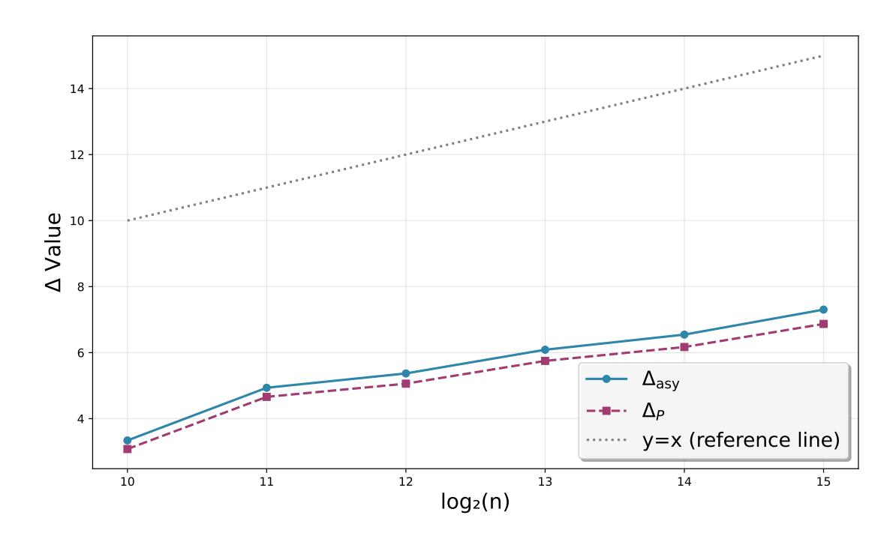

**Fig. 3.1:** Variations of  $\Delta_{asy}$  and  $\Delta_P$  with  $\log(n)$  plotted from the data in Table 3.1

#### Algorithm 2: Enumeration Set Selection Algorithm

```
Input: Dimension of the vector to be sampled k; \chi_{\mathbf{s}} (distribution of \mathbf{s})
   Output: Enumeration set S (candidate set for \mathbf{s}_J, where J \subseteq [N] and
               |J| = k) such that \Pr(\mathbf{s}_J \in S) = p_S
   /* Strategy 1: select by probability (descending order),
        corresponding to [40, Alg. 2]
                                                                                         */
 S := \emptyset;
 2 Compute the corresponding probability of all vectors drawn from \chi_{\mathbf{s}}|_k;
 3 Add the top 2^{H(\chi_{\mathbf{s}}|_k)} vectors with the highest probability to S;
 4 return S;
    /* Strategy 2: uniform selection, corresponding to [40, Alg.
        3] and [49, Alg. 5]
                                                                                         */
 S := \emptyset;
 6 for i = 1, \dots, 2^{H(\chi_{\mathbf{s}}|_k)+1} do
       \mathbf{x} \leftarrow \chi_{\mathbf{s}}|_{k};
 7
        S := S \cup \{\mathbf{x}\};
 8
 9 return S;
   /* Strategy 3: all vectors with Hamming weight \leq h', which
        specifically correspond to the strategy of
        guess-and-verify decoding
                                                                                         */
10 S := \emptyset;
11 for h'' \in \{0, 1, \dots, h'\} do
       for all \mathbf{x} \in \text{Val}(\chi_{\mathbf{s}})^k with \text{HW}(\mathbf{x}) = h'' do
12
            S := S \cup \{\mathbf{x}\};
13
14 return S;
```

{18}------------------------------------------------

```
Algorithm 3: Enhanced hybrid decoding attack
```

```
Input: m' Module-LWE instance
                \{(\mathbf{a}_j, b_j = \mathbf{a}_j \mathbf{s} + e_j) \in \mathcal{R}_q^{\kappa} \times \mathcal{R}_q : j = 0, \dots, m' - 1\} with N the
                degree of the polynomial ring, k < n the number of dropped
                dimensions, BKZ block size \beta_{\rm ehDec}
    Output: the secret \mathbf{s} \in \mathcal{R}^{\kappa}
 1 Set N_{\text{iters}} according to the target success probability;
 2 According to Eq. (2.2), transform m' Module-LWE instances into
      unstructured LWE, obtain \mathbf{A} \in \mathbb{Z}_q^{m'N \times \kappa N}, set m \leq m'N, d = m + n;
 3 for iter = 1, 2, ..., N_{iters} do
         Uniformly sample a subset I \subseteq \{0, 1, ..., n-1\} where |I| = n - k;
 4
         Define complement subset J := \{0, 1, \dots, n-1\} \setminus I;
 \mathbf{5}
         \mathbf{A}_I := \mathbf{A}_{[[0:m],I]}, \ \mathbf{A}_J := \mathbf{A}_{[[0:m],J]};
\mathbf{B}_I := \begin{pmatrix} q \cdot \mathbf{I}_m & \mathbf{A}_I \\ \mathbf{0}^{(n-k) \times m} & c \cdot \mathbf{I}_{n-k} \end{pmatrix};
 6
 7
         Apply BKZ algorithm with block size \beta_{\text{ehDec}} to \mathbf{B}_I and obtain a
 8
           reduced basis \mathbf{B}'_I;
          Choose enumeration set S with the corresponding probability p_S
 9
           according to Algorithm 2;
         for i \in \{0, 1, \dots, N-1\} do
10
               /* When only i=0 is considered, this corresponds to
                    the case where the algebraic structure is not
                    leveraged
                                                                                                              */
              \mathbf{b}^{(i)'} := (\text{vec}(x^i \cdot b_0); \dots; \text{vec}(x^i \cdot b_{m'-1}))_{[0:m]};
11
              for all \tilde{\mathbf{s}}_J \in S do
12
                   \mathbf{t} := \begin{pmatrix} \mathbf{b}^{(i)'} - \mathbf{A}_J \tilde{\mathbf{s}}_J \\ \mathbf{0}^{n-k} \end{pmatrix};
13
                    Treat (\mathbf{B}_I', \mathbf{t}) as a BDD instance, solve this
14
                      (d-k)-dimensional instance with a BDD solver at a success
                      probability of p_{\text{bdd}}, and obtain \mathbf{v};
                    /* The BDD solver can employ Babai's NP algorithm,
                          classical decoding approach, or the
                         Batched-Tail-BDD algorithm integrated with
                         Randomized Slicer [49, Alg. 4]
                                                                                                              */
                    \mathbf{x} := \mathbf{t} - \mathbf{v};
15
                    \tilde{\mathbf{s}}_I := -\mathbf{x}_{[m:m+n-k]}/c;
16
                    \tilde{\mathbf{s}} := (\tilde{\mathbf{s}}_I, \tilde{\mathbf{s}}_J);
17
                    if \tilde{\mathbf{s}} follows the distribution \chi_{\mathbf{s}} then
18
                         return -x^i \cdot \text{poly}(\tilde{\mathbf{s}});
19
20 return \perp
```

{19}------------------------------------------------

and the bit security analysis of Section 5 in this paper. For sparse secret LWE, Strategy 3 is essentially identical to Strategy 1, both of which select vectors of the set in descending order of probability. Strategy 3, however, is more flexible: it allows selecting a small number of vectors corresponding to a small probability  $p_S$ , whereas Strategy 1 requires selecting an exponential number of vectors corresponding to a constant probability. For the same set size, the probability corresponding to Strategy 2 is slightly lower than that of Strategy 1. Thus, Strategy 3 serves as the optimal selection strategy for sparse secret LWE.

<span id="page-19-5"></span>Remark 3.4. In Algorithm 1, we enumerate all vectors with Hamming weight at most a given value h' among the k dropped dimensions in each iteration. For the sake of simplifying the analysis in this section, we only consider the number of vectors and the enumeration success probability with Hamming weight exactly equal to h'. This simplification is also justified by the fact that both the number of vectors with Hamming weight at most h' and the enumeration success probability are dominated by those corresponding to Hamming weight exactly h' when h' is small<sup>14</sup>, which is consistent with the parameter regime we consider in this work.

Given m' Module-LWE instances, we can use Eq. (2.2) to convert them into an unstructured LWE instance  $(\mathbf{A}, \mathbf{b}) \in \mathbb{Z}_q^{m \times n} \times \mathbb{Z}_q^m$ , where m = m'N,  $n = \kappa N$ , d = m + n. Suppose the Hamming weight of  $\mathbf{s}$  is h.

If we employ the guess-and-verify decoding attack to solve this LWE instance with the parameter set  $(k, h_{\text{gvDec}} = h_1, \beta_{\text{gvDec}} = \beta)$ , then the complexity corresponding to these parameters is

<span id="page-19-2"></span>
$$T'_{\text{gvDec}} = \frac{T_{\text{BKZ}}(\beta, d - k) + |S'_{h_1}| \cdot T_{\text{bdd}}(d - k)}{p_{\text{bdd}} \cdot p_{h_1}},$$
 (3.3)

where 
$$|S'_{h_1}| = {k \choose h_1} \cdot |\text{Val}^+(\chi_{\mathbf{s}})|^{h_1}$$
,  $p_{h_1} = \frac{{h \choose h_1} \cdot {n-h \choose k-h_1}}{{n \choose k}}$  and  $|S'_{h_1}| \cdot T_{\text{bdd}}(d-k) \leq T_{\text{BKZ}}(\beta, d-k)$ .

Let  $h_2$  be the maximum integer satisfying the following condition:

<span id="page-19-1"></span>
$$N \cdot |S'_{h_2}| \le |S'_{h_1}|. \tag{3.4}$$

We always have  $h_1 \ll k$ , such that  $h_2 < h_1$ ; let  $t = h_1 - h_2$  be a small positive integer. With all other parameters kept unchanged (i.e.,  $\beta, k$ ), the complexity corresponding to the aforementioned parameters under the enhanced guess-and-verify decoding attack is

<span id="page-19-3"></span>
$$T'_{\text{egvDec}} = \frac{T_{\text{BKZ}}(\beta, d - k) + N \cdot |S'_{h_2}| \cdot T_{\text{bdd}}(d - k)}{1 - (1 - p'')^N},$$
(3.5)

where 
$$p_{h_2} = \frac{\binom{h}{h_2} \cdot \binom{n-h}{k-h_2}}{\binom{n}{k}}$$
,  $p'' = p_{\text{bdd}} \cdot p_{h_2}$ , and  $|S'|_{h_2} = \binom{k}{h_2} \cdot |\text{Val}^+(\chi_{\mathbf{s}})|^{h_2}$ . Denotes  $P_{\text{gvDec}} = p_{\text{bdd}} \cdot p_{h_1}$  and  $P_{\text{egvDec}} = 1 - (1 - p'')^N$ .

<span id="page-19-4"></span><span id="page-19-0"></span><sup>&</sup>lt;sup>14</sup> We provide experimental validation of this statement, as detailed in Appendix B.

{20}------------------------------------------------

Remark 3.5. We assume that the cost  $T_{\text{bdd}}(d-k)$  and the success probability  $p_{\text{bdd}}$  of solving the (d-k)-dimensional BDD instance is identical when the parameters (i.e., k and  $\beta$ ) of the enhanced guess-and-verify decoding attack match those of the guess-and-verify decoding attack. This is reasonable because the only difference is a slight variation in the Hamming weight of  $\tilde{\mathbf{s}}_J$  (cf. Line 13 of Algorithm 3). This claim is validated by Table 3.1: for identical values of k and  $\beta$ ,  $\eta_1$  and  $\eta_2$  (corresponding to the two attacks solving the (d-k)-dimensional BDD instance via the classical decoding approach) are the same.

Remark 3.6. Eq. (3.4) is a conservative assumption introduced for the convenience of comparative analysis. In practical parameter selection,  $h_2$  is the maximal integer satisfying

$$N \cdot |S'_{h_2}| \cdot T_{\text{bdd}}(d-k) \le T_{\text{BKZ}}(\beta, d-k), \tag{3.6}$$

and this may result in  $N \cdot |S'_{h_2}|$  being slightly larger than  $|S'_{h_1}|$ .

Comparing the complexity formulas in Eqs. (3.3) and (3.5) reveals two key differences between them: the multiplicative factors of  $T_{\text{bdd}}(d-k)$ , which are  $|S'_{h_1}|$  and  $N \cdot |S'_{h_2}|$  respectively, and the corresponding success probabilities  $P_{\text{gvDec}}$  and  $P_{\text{egvDec}}$ . Since the numerators of both Eq. (3.5) and Eq. (3.3) are dominated by  $T_{\text{BKZ}}(\beta, d-k)$ , we can conclude that  $T'_{\text{egvDec}} < T'_{\text{gvDec}}$  if  $P_{\text{gvDec}} < P_{\text{egvDec}}$ . Thus, we only need to analyze the relationship between  $P_{\text{gvDec}}$  and  $P_{\text{egvDec}}$ .

We first present two lemmas that will be used in the subsequent proof. The proofs of Lemma 3.1 and Lemma 3.2 are provided in Appendix C and Appendix D, respectively.

<span id="page-20-0"></span>**Lemma 3.1.** Let k be a positive integer, and let  $a, b \in \mathbb{R} \setminus \{0\}$ . Suppose we have two functions:

$$-A(n) = an^k + A_1(n)$$
, where  $A_1(n) = O(n^{k-1})$  as  $n \to \infty$ ;  $-B(n) = bn^k + B_1(n)$ , where  $B_1(n) = O(n^{k-1})$  as  $n \to \infty$ .

Then the ratio  $\frac{A(n)}{B(n)}$  admits the asymptotic approximation:

$$\frac{A(n)}{B(n)} = \frac{a}{b} + O\left(\frac{1}{n}\right),\,$$

as  $n \to \infty$ .

<span id="page-20-1"></span>**Lemma 3.2.** For any  $p \in [0,1]$  and any positive integer N, if  $Np \leq \delta$  for some  $0 < \delta < 1$ , then

$$1 - (1 - p)^N = Np(1 + \epsilon),$$

<span id="page-20-2"></span>where  $|\epsilon| \leq (Np)/2$ . In particular, when  $Np \ll 1$ , we have  $1 - (1-p)^N \approx Np$  with relative error at most  $(Np)^2/2$ , which is much smaller than Np/2.

{21}------------------------------------------------

**Theorem 3.1.** Given a set of attack parameters  $(n = \kappa N, k, h, h_1, \beta)$  for the guess-and-verify decoding attack, k > 0, let  $h_2$ ,  $T'_{gvDec}$ ,  $T'_{egvDec}$ ,  $P_{gvDec}$ ,  $P_{egvDec}$ ,  $p_{h_1}$ ,  $p_{h_2}$ , p'' be defined as above;  $t = h_1 - h_2$  is a small positive integer. We define p = h/n,  $\alpha = k/n$ ,  $\beta_1 = h_1/k$  and  $C = 1 - p - \alpha(1 - \beta_1)$ , all of which are constants for fixed attack parameters. If  $Np'' \ll 1$ , then we have the asymptotic relation

$$\frac{P_{egvDec}}{P_{qvDec}} \approx M^t N + O(1),$$

where  $M = \frac{\beta_1 C}{(p - \beta_1 \alpha)(1 - \beta_1)}$  is a constant.

*Proof.* We can deduce that

$$P_{\text{egvDec}} = 1 - (1 - p'')^N \approx Np'' = N \cdot p_{\text{bdd}} \cdot p_{h_2},$$

since  $Np'' \ll 1$  according to Lemma 3.2.

Consider the calculation of the probability ratio:

$$\frac{p_{h_2}}{p_{h_1}} = \frac{\binom{h}{h_2} \cdot \binom{n-h}{k-h_2}}{\binom{h}{h_1} \cdot \binom{n-h}{k-h_1}}.$$

Substituting  $h_2 = h_1 - t$  and defining the following products:

$$P_{t} = \prod_{j=0}^{t-1} (h_{1} - j) = \prod_{j=0}^{t-1} (\beta_{1} \alpha n - j),$$

$$Q_{t} = \prod_{j=1}^{t} (h - h_{1} + j) = \prod_{j=1}^{t} ((p - \beta_{1} \alpha) n + j),$$

$$S_{t} = \prod_{j=1}^{t} (k - h_{1} + j) = \prod_{j=1}^{t} (\alpha(1 - \beta_{1}) n + j),$$

$$R_{t} = \prod_{j=0}^{t-1} (n - h - k + h_{1} - j) = \prod_{j=0}^{t-1} (Cn - j).$$

We then have:

$$\frac{p_{h_2}}{p_{h_1}} = \frac{P_t \cdot R_t}{Q_t \cdot S_t}.$$

Thus, the probability ratio of  $P_{\rm egvDec}$  and  $P_{\rm gvDec}$  can be written as:

$$\frac{P_{\text{egvDec}}}{P_{\text{gvDec}}} \approx \frac{N \cdot p_{\text{bdd}} \cdot p_{h_2}}{p_{\text{bdd}} \cdot p_{h_1}} = N \cdot \frac{p_{h_2}}{p_{h_1}} = N \cdot \frac{P_t \cdot R_t}{Q_t \cdot S_t}.$$

Asymptotic Expansion of  $P_t$ . Since t is a constant (independent of n), we expand the product of  $P_t$  term by term and retain only the leading term (highest degree in n) and sub-leading terms:

$$P_t = \prod_{j=0}^{t-1} (\beta_1 \alpha n - j) = (\beta_1 \alpha n) \cdot (\beta_1 \alpha n - 1) \cdot \dots \cdot (\beta_1 \alpha n - (t-1)).$$

{22}------------------------------------------------

Expanding this product, the dominant term is the product of the leading terms of each factor:  $(\beta_1 \alpha n)^t$ . The sub-leading term is the sum of products where exactly one factor is reduced by its constant term (-j), which gives:

$$P_t = (\beta_1 \alpha n)^t - \left(\sum_{j=0}^{t-1} j\right) (\beta_1 \alpha n)^{t-1} + O(n^{t-2}).$$

The sum  $\sum_{j=0}^{t-1} j = \frac{t(t-1)}{2}$  is a constant (independent of n), so the sub-leading term is of order  $O(n^{t-1})$ . Thus, the asymptotic expansion of  $P_t$  simplifies to:

$$P_t = (\beta_1 \alpha n)^t + O(n^{t-1}).$$

The asymptotic expansions of  $Q_t$ ,  $S_t$ , and  $R_t$  follow the *same logic* as  $P_t$  (fixed t, expanding the product and retaining only the leading term):

$$- Q_t = ((p - \beta_1 \alpha)n)^t + O(n^{t-1}),$$
  

$$- S_t = (\alpha(1 - \beta_1)n)^t + O(n^{t-1}),$$
  

$$- R_t = (Cn)^t + O(n^{t-1}).$$

Asymptotic Analysis of  $N \cdot \frac{P_t R_t}{Q_t S_t}$ . We first compute the asymptotic expansion of the product  $P_t R_t$  and  $Q_t S_t$ :

$$P_{t}R_{t} = \left[ (\beta_{1}\alpha n)^{t} + O(n^{t-1}) \right] \left[ (Cn)^{t} + O(n^{t-1}) \right]$$

$$= (\beta_{1}\alpha C)^{t}n^{2t} + O(n^{2t-1}),$$

$$Q_{t}S_{t} = \left[ (p - \beta_{1}\alpha)^{t}n^{t} + O(n^{t-1}) \right] \left[ \alpha^{t}(1 - \beta_{1})^{t}n^{t} + O(n^{t-1}) \right]$$

$$= \alpha^{t}(p - \beta_{1}\alpha)^{t}(1 - \beta_{1})^{t}n^{2t} + O(n^{2t-1}).$$

Using Lemma 3.1, we can deduce that:

$$\frac{P_t R_t}{Q_t S_t} = \left(\frac{\beta_1 C}{(p - \beta_1 \alpha)(1 - \beta_1)}\right)^t + O\left(\frac{1}{n}\right).$$

By the definition of  $M = \frac{\beta_1 C}{(p - \beta_1 \alpha)(1 - \beta_1)}$  and  $n = \kappa N$ , this reduces to:

<span id="page-22-0"></span>
$$\frac{P_t R_t}{Q_t S_t} = M^t + O\left(\frac{1}{n}\right) = M^t + O\left(\frac{1}{N}\right). \tag{3.7}$$

Finally, we complete the proof of Theorem 3.1 by multiplying both sides of Eq. (3.7) by N:

$$\frac{P_{\text{egvDec}}}{P_{\text{gvDec}}} \approx N \cdot \frac{P_t R_t}{Q_t S_t} = N \cdot \left(M^t + O\left(\frac{1}{N}\right)\right) = M^t N + O(1).$$

{23}------------------------------------------------

Since the numerators of both Eq. (3.5) and Eq. (3.3) are dominated by  $T_{\text{BKZ}}(\beta, d-k)$  and in conjunction with Theorem 3.1, we obtain that

$$\frac{T'_{\text{gvDec}}}{T'_{\text{egvDec}}} \approx \frac{P_{\text{egvDec}}}{P_{\text{gvDec}}} \approx M^t N + O(1).$$
(3.8)

Thus, we prove that the enhanced guess-and-verify decoding attack achieves an asymptotic speedup of O(N) compared to the unstructured baseline if k > 0 and  $Np'' \ll 1$ .

Remark 3.7. For Module-LWE with non-sparse secrets, the guess-and-verify decoding attack is not superior to uSVP (see Figure 1.1), which corresponds to the parameter k=0 (i.e., no guessing is performed). Consequently, the algebraic structure cannot be leveraged to improve the probability. For the case of sparse Module-LWE, the attack parameters  $(k,\beta,h_1)$  result in  $Np''\ll 1$  in most cases because p'' is typically very small, in which  $P_{\rm egvDec}$  can achieve an improvement of O(N) over  $P_{\rm gvDec}$  (see Table 3.1). However, the attack parameters may sometimes fail to satisfy this condition, in which case the improvement will be relatively modest. For large values of t, the improvement will also be modest because  $M^t$  becomes small. Furthermore, when Strategy 1 or 2 is selected in Algorithm 2, this condition also does not hold since the probability corresponding to the enumeration set is a constant.

We select several parameter sets of Ring-LWE from [35] to verify the correctness of Theorem  $3.1^{15}$ . For a given parameter set n, q, h, we first derive the optimal attack parameters  $h_1, k, \beta, \eta_1$  that achieve minimal complexity via the guess-and-verify decoding attack using lattice-estimator, where  $\eta_1$  is the dimension of the CVP to be solved for the (d-k)-dimensional BDD instance via the classical decoding attack (see Section 2.6). We then compute the complexity of the enhanced guess-and-verify decoding attack with fixed parameters  $k, \beta$ , and further obtain the corresponding values of  $\eta_2$  and  $h_2$ . Here,  $h_2$  is determined by

$$N \cdot |S_{h_2}| \cdot T_{\text{bdd}}(d-k) \le T_{\text{BKZ}}(\beta, d-k), \tag{3.9}$$

where  $|S_{h_2}| = \sum_{i=0}^{h_2} {k \choose i} |\operatorname{Val}^+(\chi_{\mathbf{s}})|^i$ . The experimental results are presented in Table 3.1. As shown in Table 3.1,  $\eta_1$  and  $\eta_2$  are identical, which confirms Remark 3.5. We plot the variations of  $\Delta_{\text{asy}}$  and  $\Delta_P$  with  $\log(n)$  using the data from Table 3.1, as shown in Figure 3.1. The results demonstrate that the two curves are in close proximity, which implies that the asymptotic analytical results are in agreement with the experimental results and thus confirm the accuracy of the analysis in Theorem 3.1.

<span id="page-23-0"></span>In the asymptotic analysis above, as noted in Remark 3.4, we only consider the number of vectors and the enumeration success probability for Hamming weight exactly h'. However, in the subsequent experiments, the number of vectors and the enumeration success probability correspond to Hamming weight at most h' (i.e.,  $\leq h'$ ), consistent with the strategy in guess-and-verify decoding.

{24}------------------------------------------------

<span id="page-24-1"></span>Table 3.1: Estimation results for Ring-LWE parameters from [35] via lattice-estimator under guess-and-verify and enhanced guess-and-verify decoding attacks. Here  $N=n;\ h_1,k,\beta,\eta_1$  denote the optimal attack parameters for the guess-and-verify decoding attack. The fixed parameters  $k,\beta$  are fed into the enhanced guess-and-verify decoding attack to derive  $\eta_2,h_2$  and  $t=h_1-h_2$ .  $S_{h_1},P_{\rm gvDec},$  and  $T'_{\rm gvDec},$  as well as  $S_{h_2},P_{\rm egvDec},$  and  $T'_{\rm egvDec},$  denote the enumeration set, success probability per iteration, and total cost for the two respective estimations. The constant M is calculated according to Theorem 3.1, with  $\Delta_{\rm asy}=\log(M^tN),$   $\Delta_P=\log(P_{\rm egvDec})-\log(P_{\rm gvDec})$  and  $\Delta_T=\log(T'_{\rm egvDec})-\log(T'_{\rm gvDec})$ .

| $\log(n)$      | $\log(q)$            | h     | $h_1$        | k        | β             | $\eta_1$ | $\log(P_{\mathrm{gvDec}})$ | $\log( S_{h_1} )$ | $\log(T'_{\rm gvDec})$                    |
|----------------|----------------------|-------|--------------|----------|---------------|----------|----------------------------|-------------------|-------------------------------------------|
| 10             | 14                   | 64    | 11           | 660      | 281           | 18       | -51.3                      | 88.7              | 163.0                                     |
| 11             | 27                   | 64    | 10           | 1205     | 290           | 13       | -42.2                      | 90.5              | 157.9                                     |
| 12             | 55                   | 64    | 8            | 2375     | 75 264 3      |          | -45.5                      | 82.4              | 155.1                                     |
| 13             | 111                  | 64    | 7            | 4673     | 258           | 2        | -46.4                      | 80.0              | 155.6                                     |
| 14             | 223                  | 64    | 6            | 9439     | 246           | 2        | -50.6                      | 75.7              | 157.4                                     |
| 15             | 496                  | 64    | 5            | 17980    | 226           | 27       | -49.2                      | 68.8              | 151.7                                     |
| $h_2 t \eta_2$ | $\log(P_{\epsilon})$ | egvD  | $_{\rm ec})$ | $\log(N$ | $\cdot  S_h $ | $ a_2 $  | $\log(T'_{\text{egvDec}})$ | $\log(M)$ 2       | $\Delta_{\mathrm{ays}} \Delta_P \Delta_T$ |
| 9 2 18         | -48                  | 8.2   |              | 84       | 4.8           |          | 159.2                      | -3.3              | 3.3 3.1 3.9                               |
| 8 2 13         | -3'                  | 7.6   |              | 85.6     |               |          | 152.6                      | -3.0              | 4.9 4.7 5.3                               |
| 6 2 3          | -40                  | 0.4   |              | 75.8     |               |          | 149.4                      | -3.3              | 5.4 5.1 5.7                               |
| 5 2 2          | -40                  | -40.6 |              |          | 2.0           |          | 149.1                      | -3.5              | 6.1 5.8 6.4                               |
| 4 2 2          | -44                  | 4.4   |              | 66.2     |               |          | 150.6                      | -3.7              | 6.5 6.2 6.9                               |
| 3 2 27         | -42                  | 2.3   |              | 57.8     |               |          | 144.1                      | -3.8              | 7.3 6.9 7.6                               |

# <span id="page-24-0"></span>4 Benchmarking the Enhanced Guess-and-verify Decoding Attack

In this section, we benchmark the guess-and-verify decoding attack implemented by Pulles et al. in  $[62,50]^{16}$  and our enhanced guess-and-verify decoding attack.

#### 4.1 Experimental Setup

Hardware Specifications. All benchmark experiments were conducted on two computing nodes (denoted as Y and Z) with distinct hardware configurations. Table 4.1 summarizes the detailed CPU and GPU specifications of these nodes, including the number of logical cores (per CPU and total quantity) and the quantity of NVIDIA GPUs deployed on each node. Note that while the table lists the full hardware resources available on each node, some experiments utilized a subset of the CPUs/GPUs (e.g., fewer logical cores or GPUs) to ensure fair and comparable performance evaluations between the two attacks.

<span id="page-24-2"></span><sup>16</sup> https://github.com/ludopulles/GPUPrimalHybrid

{25}------------------------------------------------

Table 4.1: Hardware used for our experiments.

<span id="page-25-0"></span>

| Name   | CPU (quantity × logical cores)                                                                                                 | GPU (quantity) |
|--------|--------------------------------------------------------------------------------------------------------------------------------|----------------|
| Y<br>Z | Intel Xeon Platinum 8481 @2.0GHz (2 × 56) NVIDIA RTX 5090 (4)<br>Intel Xeon Platinum 8180 @2.5GHz (2 × 28) NVIDIA RTX 4090 (8) |                |

Benchmark Instances from [\[70\]](#page-38-4). Wenger et al. designed a set of LWE instances to benchmark the performance of various attacks, which are categorized into two distinct benchmark configurations: benchmark settings for Kyber and benchmark settings for HE[17](#page-25-1). The detailed parameter settings of these instances are as follows:

- 1. Benchmark settings for Kyber: All settings use Module-LWE with n = κN and N = 256. The secret distribution χ<sup>s</sup> is B η h , while the error distribution χ<sup>e</sup> is B <sup>η</sup> with η = 2.
- 2. Benchmark settings for HE: All settings use Ring-LWE with n = κN = 1 · 1024. The secret distribution χ<sup>s</sup> is B − h , and the error distribution χ<sup>e</sup> is the discrete Gaussian distribution D<sup>σ</sup> with σ = 3.19.

Consistent with the notation in [\[62\]](#page-38-3), we abbreviate the LWE instances under these two parameter configurations as "Bin" and "Ter", respectively. For the benchmark instances, a key performance metric is the Hamming weight h: the higher the Hamming weight h that an algorithm can successfully solve, the more efficient the algorithm is deemed to be.

In our experiments, the LWE instances used for benchmarking were generated using the code provided in [\[62,](#page-38-3)[50\]](#page-37-6). These instances are produced by a pseudorandom number generator (PRNG) with a fixed seed, thus the same LWE instances can be reproducibly generated by specifying this fixed seed, ensuring the consistency and repeatability of the experimental results.

Implementation Details of [\[62,](#page-38-3)[50\]](#page-37-6). The guess-and-verify decoding attack implemented by Pulles et al. in [\[62,](#page-38-3)[50\]](#page-37-6) is a specialized variant of the standard guess-and-verify decoding attack, distinguished by its use of Babai's NP algorithm to solve low-dimensional BDD problems (and is also the Howgrave-Graham decoding attack without MITM). In their implementation, the Hamming weight of the dropped dimensions is exactly equal to a given value (e.g., h ′ ) rather than less than or equal to it [\[62,](#page-38-3) Alg. 2]. Specifically, to accelerate the solution process, they first apply Babai's NP algorithm on the projection sublattice to filter candidate solutions, and then reapply Babai's NP algorithm to the full basis on these candidates to derive the final solution. Additionally,

<span id="page-25-1"></span><sup>17</sup> Both settings use the 2-power cyclotomic ring R<sup>q</sup> = Zq[X]/(f<sup>N</sup> (x)), R = Z[X]/(f<sup>N</sup> (x)) where f<sup>N</sup> (x) = x <sup>N</sup> + 1 with N a power of two.

{26}------------------------------------------------

Pulles et al. execute Babai's NP algorithm in batches [38, App. A.1] and leverage GPU acceleration for matrix operations to further optimize runtime efficiency. They also provide the implementation of cuBLASter for lattice reduction, which is a GPU version of BLASter [38]. The results show that their optimized guess-and-verify decoding attack outperforms Nolte et al.'s Cool & Cruel attack [60] in both runtime and success rate [62, Tab. 3]. The complexity of their attack can be estimated by lattice-estimator through function primal\_hybrid, with the parameters mitm=False, babai=True, red\_cost\_model=MATZOV and red\_shape\_model=CN11<sup>18</sup>.

Implementation of our enhanced guess-and-verify decoding attack. We modified Pulles et al.'s code by referring to Lines 10 to 14 of Algorithm 3 to leverage the algebraic structure for acceleration. Specifically, for each  $i \in [N]$ , we compute the corresponding  $\mathbf{b}^{(i)'}$  (see Line 11 of Algorithm 3); since each  $\mathbf{b}^{(i)'}$  corresponds to |S| BDD instances<sup>19</sup>, we thus need to solve a total of  $N \cdot |S|$  BDD instances (see Lines 12 to 13 of Algorithm 3). We also use Babai's NP algorithm in batches [38, App. A.1] with GPU acceleration to solve these BDD instances. Additionally, we modified the code of lattice-estimator (modification details are provided in Section 5.3) to evaluate the bit security of these instances under the enhanced guess-and-verify decoding attack.

#### 4.2 Benchmark Results

We benchmarked Pulles et al.'s implementation and ours on the servers listed in Table 4.1. We performed multiple runs of the experiments and recorded the wall time for successfully solving the LWE instances. Tables 4.2 and 4.3 compare the average wall time required to successfully solve the same LWE instances across the two implementations. The "Params" column denotes the parameters of the Module-LWE instances. The "succ." column in the tables denotes the ratio of successful runs to the total number of runs (i.e., successful runs / total runs). The "sec." column gives the bit security estimated by lattice-estimator by setting the target success probability to 0.99. "Atk para." is the abbreviation for attack parameters, and "S" is the abbreviation for server, indicating the server used in the experiments. "CPU-h" and "GPU-h" stand for CPU core hours and GPU hours, respectively. The "time-s" column refers to the average wall time (in seconds) for successful solving. "W" is the abbreviation for workers, which indicates the number of parallel processes for acceleration (1 GPU + multiple CPU cores per worker). For example, 1000 iterations with "W" set to 10 means 100 iterations per worker, enabling parallel execution. Server Y uses 1 GPU +  $10~\mathrm{CPU}$  cores per worker, and server Z uses  $1~\mathrm{GPU} + 5~\mathrm{CPU}$  cores per worker. We set "W" to 1 for Module-LWE instances of type "Ter" due to the fewer

<span id="page-26-0"></span>They also made minor modifications to lattice-estimator to better simulate the reduction quality of BLASter [50, Sec. 5.3].

<span id="page-26-1"></span>Only a correct guess of  $\tilde{\mathbf{s}}_J$  yields a valid BDD instance, yet we treat all cases (including incorrect guesses) as BDD instances and solve them accordingly.

{27}------------------------------------------------

iterations needed for the enhanced guess-and-verify decoding attack to reach the target success probability. For all tested benchmark instances, our attack reduces the bit security by 4.9 to 6.1 bits and yields a 17× to 114× speedup over the unstructured baseline.

Remark 4.1. Since the number of workers used in benchmarking instances of type "Ter" differs in Tables [4.2](#page-28-0) and [4.3,](#page-28-1) the wall time values should not be directly divided when calculating the speedup. Instead, we first multiply each wall time by the corresponding number of workers before division. For example, for the instance with type "Ter", log q = 26, h = 9, the speedup is calculated as 4979.2 · 4/(173.8 · 1) ≈ 114.6.

Table [4.4](#page-28-2) shows our new benchmark records obtained by using the enhanced guess-and-verify decoding attack. Given the long runtime, the total number of runs was set to 1 or 2 for all Module-LWE instances. For the benchmark settings for Kyber (type "Bin"), in the cases of log q = 12 (log q = 28, resp.), we improved the records from 11 (25) to 14 (26). The average solving time is 4.6 (2.6) days, with a reduction of 4.3 (4.7[20](#page-27-1)) bits in bit security, while the estimated solving time for the unstructured baseline is 90.6 (67.6) days. For the benchmark settings for HE (type "Ter"), in the cases of log q = 26 (log q = 29, resp.), we improved the records from 11 (12) to 14 (14). The average solving time is 2.4 (0.4) days, with a reduction of 5.7 (5.8) bits in bit security, while the estimated solving time for the unstructured baseline is 124.8 (22.3) days.

## <span id="page-27-0"></span>5 Concrete Cryptanalysis on FHE Schemes

#### 5.1 Sparse secret FHE schemes

Many FHE schemes adopt sparse secrets, which is designed to reduce the computational complexity of the bootstrapping step. In addition, FHE schemes are typically constructed based on the Ring-LWE problem, where the degree N of the polynomial ring is generally set to a large value. Based on the analysis in Section [3.2,](#page-16-1) the acceleration of the enhanced hybrid decoding attack exhibits a positive correlation with N; consequently, this attack achieves favorable performance against such FHE schemes.

We note that Curtis and Player researched the feasibility and impact of standardizing sparse-secret LWE for Homomorphic Encryption, and presented numerous sparse parameter sets as alternatives [\[35,](#page-35-0) Tab. 4]. The parameter sets used in FHE [\[47](#page-36-1)[,31,](#page-35-2)[12,](#page-33-5)[33,](#page-35-3)[8\]](#page-32-1) also employ sparse secrets. We experimentally evaluate the performance of the enhanced hybrid decoding attack against these parameter sets [21](#page-27-2) .

<span id="page-27-1"></span><sup>20</sup> For the instance with log q = 28 and h = 26, we set the upper bound of the BKZ block size to 60 when estimating its bit security, so as to leverage cuBLASter for lattice reduction.

<span id="page-27-2"></span><sup>21</sup> These parameter sets all employ 2-power cyclotomic rings.

{28}------------------------------------------------

Table 4.2: Benchmark results (guess-and-verify decoding attack).

<span id="page-28-0"></span>

| Params<br>Enhanced guess-and-verify decoding attack |   |    |   |       |    |   |    |                      |            |        |                  |           |   |   |
|-----------------------------------------------------|---|----|---|-------|----|---|----|----------------------|------------|--------|------------------|-----------|---|---|
| Atk para.                                           |   |    |   |       |    |   |    |                      | avg.       | avg.   | avg.             |           |   |   |
| Type κ log q                                        |   |    | h | β     | m  | k | h′ |                      | sec. succ. | time-s | CPU-h            | GPU-h W S |   |   |
| Bin                                                 | 2 | 12 |   | 11 46 | 72 |   |    | 403 3 57.5           | 6/6        |        | 24294.3 ≤ 269.94 | 26.99     | 4 | Y |
| Bin                                                 | 2 | 28 |   |       |    |   |    | 17 55 256 288 3 59.2 | 5/5        |        | 16270.8 ≤ 180.79 | 36.16     | 8 | Z |
| Ter                                                 | 1 | 26 | 9 |       |    |   |    | 51 203 819 3 56.8    | 5/5        | 4979.2 | ≤ 55.32          | 5.53      | 4 | Y |
| Ter                                                 | 1 | 29 | 9 |       |    |   |    | 53 274 800 3 56.9    | 5/5        | 4863.9 | ≤ 54.04          | 10.81     | 8 | Z |

<span id="page-28-1"></span>Table 4.3: Benchmark results (enhanced guess-and-verify decoding attack). Here, ∆ denotes the difference in bit security (vs. Table [4.2\)](#page-28-0), and "spd" represents the speedup multiple of average wall time (vs. Table [4.2\)](#page-28-0).

|                | Params<br>Enhanced guess-and-verify decoding attack |  |   |   |   |    |                          |  |       |                                 |      |                |     |
|----------------|-----------------------------------------------------|--|---|---|---|----|--------------------------|--|-------|---------------------------------|------|----------------|-----|
| Atk para.      |                                                     |  |   |   |   |    |                          |  | avg.  | avg.                            | avg. |                |     |
| Type κ log q h |                                                     |  | β | m | k | h′ |                          |  |       | sec. succ. time-s CPU-h GPU-h ∆ |      | spd            | W S |
| Bin 2          | 12                                                  |  |   |   |   |    | 11 42 67 409 2 52.6 6/6  |  | 754.8 | ≤ 8.39                          | 0.84 | 4.9 32.1×      | 4 Y |
| Bin 2          | 28                                                  |  |   |   |   |    | 17 55 256 288 2 53.9 5/5 |  |       | 910.8 ≤ 10.12                   | 2.02 | 5.3 17.9×      | 8 Z |
| Ter<br>1       | 26                                                  |  |   |   |   |    | 9 54 212 809 2 50.7 5/5  |  | 173.8 | ≤ 0.48                          | 0.05 | 6.1 114.6× 1 Y |     |
| Ter<br>1       | 29                                                  |  |   |   |   |    | 9 56 284 789 2 50.8 5/5  |  | 451.8 | ≤ 0.63                          | 0.13 | 6.1 86.1×      | 1 Z |

<span id="page-28-2"></span>Table 4.4: New benchmark records for the enhanced guess-and-verify decoding attack. Here, h<sup>p</sup> stands for the previous record that could be achieved according to [\[70,](#page-38-4) Tab. 9], [\[50,](#page-37-6) Tab. 2] and [\[62,](#page-38-3) Tab. 3]. ∆ denotes the difference in bit security (vs. unstructured baseline).

| Params            |    | Enhanced guess-and-verify decoding attack |                             |    |  |            |         |                                                               |             |         |  |  |
|-------------------|----|-------------------------------------------|-----------------------------|----|--|------------|---------|---------------------------------------------------------------|-------------|---------|--|--|
|                   |    |                                           | Atk para.                   |    |  |            | avg.    | avg.                                                          | avg.        |         |  |  |
| Type κ log q h hp |    | β<br>m                                    | k                           | h′ |  | sec. succ. | time-s  | CPU-h                                                         | GPU-h ∆ W S |         |  |  |
| Bin<br>2          | 12 |                                           | 13 11 46 72 402 2 57.0 2/2  |    |  |            | 16742.7 | ≤ 186.03                                                      | 18.60       | 4.5 4 Y |  |  |
| Bin<br>2          | 12 |                                           |                             |    |  |            |         | 14 11 46 72 402 2 59.3 1/1 395914.9 ≤ 4399.05 439.91 4.3 4 Y  |             |         |  |  |
| Bin<br>2          | 28 |                                           |                             |    |  |            |         | 26 25 59 256 277 2 63.9 1/1 226059.1 ≤ 2511.77 251.18 4.7 4 Y |             |         |  |  |
| Ter<br>1          | 26 |                                           | 12 11 54 212 809 2 56.9 1/1 |    |  |            | 1499.6  | ≤ 16.66                                                       | 1.67        | 5.7 4 Y |  |  |
| Ter<br>1          | 26 |                                           | 13 11 56 219 806 2 59.0 1/1 |    |  |            | 3739.9  | ≤ 41.55                                                       | 4.16        | 5.7 4 Y |  |  |
| Ter<br>1          | 26 |                                           |                             |    |  |            |         | 14 11 57 222 805 2 61.1 1/1 207592.3 ≤ 2306.58 230.66 5.7 4 Y |             |         |  |  |
| Ter<br>1          | 29 |                                           | 13 12 58 291 786 2 58.5 1/1 |    |  |            | 8487.7  | ≤ 94.31                                                       | 18.86       | 5.8 8 Z |  |  |
| Ter<br>1          | 29 |                                           | 14 12 59 295 785 2 60.5 1/1 |    |  |            | 35671.7 | ≤ 396.35                                                      | 79.27       | 5.8 8 Z |  |  |

{29}------------------------------------------------

#### <span id="page-29-0"></span>5.2 Combination with MITM

Wunderer presented a detailed analysis of the complexity of solving SVP via the hybrid attack combining MITM and Babai's NP algorithm, as well as the success probability of the MITM and Babai's NP algorithm [\[72,](#page-39-0)[74\]](#page-39-1). And this analysis can be generalized to the BDD problem [\[74,](#page-39-1) Section 2]. Son and Cheon extended Wunderer's work to LWE with sparse and ternary secrets and provided a comprehensive analysis [\[66\]](#page-38-11). The success probability analysis conducted by [\[74](#page-39-1)[,66\]](#page-38-11) can be applied to the Howgrave-Graham decoding attack with the MITM technique and has been integrated into lattice-estimator.

In the Howgrave-Graham decoding attack, when the MITM technique is employed, the total cost of Babai's NP algorithm |ShhgDec | · Tbabai in Eq. [\(2.8\)](#page-12-2) is reduced to p |ShhgDec |·Tbabai, meaning that MITM provides a square-root speedup compared to exhaustive search but incurs a probability loss of pmitm, which is the success probability of MITM analyzed in [\[74,](#page-39-1)[66\]](#page-38-11). The lattice-estimator utilizes the mitm\_babai\_probability function in prob.py to compute pmitm. Accordingly, the enhanced Howgrave-Graham decoding attack can still be accelerated by MITM based on [\[74,](#page-39-1) Sec. 3, Sec. 4]'s analysis. Let ShehgDec denotes the search space of ˜s<sup>J</sup> , where hehgDec represents the guessed maximum Hamming weight across the k dropped dimensions. After applying MITM, the cost N · |ShehgDec | · Tbabai can be reduced to N · p |ShehgDec | · Tbabai with the MITM probability loss also computed by lattice-estimator.

#### <span id="page-29-1"></span>5.3 Evaluating the Bit Security of FHE schemes under Enhanced Hybrid Decoding Attack

We mainly use lattice-estimator to evaluate the bit security of FHE schemes under enhanced hybrid decoding attack and we made the following modifications to lattice-estimator:

- 1. In accordance with Algorithm [3](#page-18-0) and Eq. [\(3.2\)](#page-16-2), we revised the calculation of the probability part, updating the probability of each iteration to 1−(1−p ′ ) N , which corresponds to the cost TBKZ(βehDec, d − k) + N · |S| · Tbdd(d − k).
- 2. The lattice-estimator employs a combined approach of binary search and gradient descent (implemented in the local\_minimum function in util.py) to find the optimal dropped dimensions k. However, this method may occasionally fall into local optima, leading to an abnormally high complexity in the final evaluation. We modified this part to an exhaustive two-stage search method: first a coarse-grained search with large step sizes, then a fine-grained search with small step sizes, to find the optimal k.

For the sparse parameter sets in [\[35\]](#page-35-0), in addition to the lattice-estimator, we also utilized the original code provided by the authors for evaluation[22](#page-29-2). We

<span id="page-29-2"></span><sup>22</sup> The code is available at [https://github.com/bencrts/hybrid\\_attacks](https://github.com/bencrts/hybrid_attacks) with commit 451165df and is adapted from LWE-estimator, which is an early version of lattice-estimator. The estimation results derived from this code are conservative [\[35,](#page-35-0) Sec. 2.3].

{30}------------------------------------------------

revised this code in accordance with Algorithm [3](#page-18-0) to evaluate the bit security under the enhanced hybrid decoding attack. In the code provided by Curtis et al., the security of the parameter sets is estimated using the cost model [\[15\]](#page-33-9) [23](#page-30-0) . We also present the evaluation results under the quantum cost model using a quantum sieving cost model based on [\[27\]](#page-34-5). We evaluated all 72 sparse parameter sets, and the corresponding results are summarized in Table [E.1,](#page-48-0) Table [E.2](#page-50-0) and Table [E.3](#page-52-0) in Appendix [E.](#page-47-0)

Specifically, the results in Table [E.1](#page-48-0) were obtained via lattice-estimator with configurations red\_cost\_model=MATZOV and red\_shape\_model=GSA, while the results in Table [E.2](#page-50-0) were derived from evaluations using the authors' original code, and those in Table [E.3](#page-52-0) (evaluation results under the quantum cost model) are obtained via lattice-estimator with configurations red\_cost\_model=ChaLoy 21 and red\_shape\_model=GSA.

The results in Table [E.1](#page-48-0) and Table [E.2](#page-50-0) show that, among all 72 sparse parameter sets, 21 and 45 sets, respectively, fail to achieve the target bit security level λ when the enhanced hybrid decoding attack is used. When not leveraging the algebraic structure, only 3 and 10 parameter sets in Table [E.1](#page-48-0) and Table [E.2,](#page-50-0) respectively, fail to reach the target bit security λ.

Remark 5.1. The reason why 10 parameter sets fail to achieve the target bit security even when using the code provided by Curtis et al. is that the authors subsequently updated their code (fixing several bugs and conducting more detailed analyzes), and we utilized their latest version of their code for all evaluations.

We also plotted the curves of the reduced bits achieved by the enhanced hybrid decoding attack (compared to the unstructured baseline) against log(n) using the data from Table [E.1,](#page-48-0) which are presented in Figure [F.2](#page-56-0) and Figure [F.1](#page-55-0) in Appendix [F.](#page-54-0) Inspection of these figures shows that the larger log(n) is, the more reduced bits are obtained by the enhanced hybrid decoding attack compared to the unstructured baseline.

For the parameter sets used in FHE schemes [\[47,](#page-36-1)[31,](#page-35-2)[12](#page-33-5)[,33,](#page-35-3)[8\]](#page-32-1), we obtained the evaluation results using lattice-estimator, which are presented in Table [5.1.](#page-31-0) Our findings reveal that among the 16 parameter sets used in these schemes, 12 of them fail to meet the target 128-bit security level. Compared with the unstructured baseline, the enhanced guess-and-verify decoding attack and enhanced Howgrave-Graham decoding attack reduce the complexity by 5.7–13.0 bits and 4.1–12.2 bits, respectively. The evaluation results under the quantum cost model are presented by Table [G.1](#page-57-0) in Appendix [G,](#page-54-1) which shows that the enhanced guess-and-verify decoding attack and the enhanced Howgrave-Graham attack can also respectively reduce the bit security by 4.2–11.2 bits and 4.2–11.3 bits compared to the unstructured baseline in quantum setting.

<span id="page-30-0"></span><sup>23</sup> Known as BKZ.sieve in LWE-estimator

{31}------------------------------------------------

<span id="page-31-0"></span>Table 5.1: Bit security of FHE schemes estimated by lattice-estimator with red\_cost\_model=MATZOV and red\_shape\_model=GSA. All these schemes are based on Ring-LWE (i.e., n=N, where N denotes the degree of the polynomial ring) and employ 2-power cyclotomic rings (i.e.,  $\mathcal{R}_q = \mathbb{Z}_q[X]/(x^n+1)$ ,  $\mathcal{R} = \mathbb{Z}[X]/(x^n+1)$  with n a power of two), with the error distribution  $\chi_{\mathbf{e}} = \mathcal{D}_{\sigma}$  ( $\sigma = 3.19$ ), secret distribution  $\chi_{\mathbf{s}} = \mathcal{B}_h^-$ , and modulus q. Specifically: "uSVP" denotes the complexity from the primal\_usvp function;  $T_{\text{gvDec}}$  is the complexity of the guess-and-verify decoding attack, obtained via the primal\_hybrid function with settings mitm=False and babai=False;  $T_{\text{hgDec}}$  is the complexity of the Howgrave-Graham decoding attack, calculated by the primal\_hybrid function with settings mitm=True and babai=True;  $T_{\text{egvDec}}$  and  $T_{\text{ehgDec}}$  respectively correspond to the complexities of the enhanced guess-and-verify decoding attack and enhanced Howgrave-Graham decoding attack.  $\Delta_1 = T_{\text{gvDec}} - T_{\text{egvDec}}$ ,  $\Delta_2 = T_{\text{hgDec}} - T_{\text{ehgDec}}$ . Values below 128 are bolded for emphasis.

| FHE scheme     | $\log(n)$ | h   | $\log(q)$ | uSVP  | $T_{\rm egvDec}$ | $T_{\rm gvDec}$ | $\Delta_1$ | $T_{\rm ehgDec}$ | $T_{\text{hgDec}} \Delta_2$ |
|----------------|-----------|-----|-----------|-------|------------------|-----------------|------------|------------------|-----------------------------|
| [33, Sec. 5.2] | 13        | 31  | 55        | 547.4 | 130.5            | 137.5           | 7.0        | 117.7            | <b>122.2</b> 4.5            |
| [33, Sec. 5.2] | 14        | 31  | 100       | 641.6 | 137.5            | 143.2           | 5.7        | 122.3            | <b>126.4</b> 4.1            |
| [8, Sec. 7.1]  | 15        | 192 | 767       | 146.0 | 128.8            | 139.6           | 10.8       | 123.6            | $134.1 \ 10.5$              |
| [8, Sec. 7.1]  | 16        | 192 | 1553      | 146.9 | 129.1            | 139.6           | 10.4       | 123.3            | $134.0 \ 10.7$              |
| [8, Sec. 7.1]  | 17        | 192 | 3104      | 147.9 | 130.7            | 141.2           | 10.6       | 125.0            | $135.6 \ 10.7$              |
| [12, Tab. 5]   | 14        | 256 | 424       | 129.8 | 119.5            | 127.5           | 8.0        | 117.0            | <b>125.9</b> 8.9            |
| [12, Tab. 7]   | 16        | 256 | 1598      | 141.4 | 128.7            | 137.8           | 9.1        | 125.0            | 134.0 9.1                   |
| [12, Tab. 3]   | 16        | 192 | 1555      | 144.3 | 128.9            | 139.4           | 10.5       | 123.1            | 133.8 10.8                  |
| [12, Tab. 3]   | 16        | 192 | 1546      | 147.0 | 129.7            | 140.2           | 10.6       | 123.8            | $134.5 \ 10.8$              |
| [12, Tab. 3]   | 16        | 192 | 1550      | 146.9 | 129.4            | 139.9           | 10.5       | 123.5            | $134.2 \ 10.7$              |
| [31,  Tab.  3] | 15        | 128 | 680       | 165.5 | 136.5            | 148.7           | 12.1       | 127.7            | 138.5 10.8                  |
| [31,  Tab.  3] | 16        | 128 | 1000      | 236.1 | 179.5            | 192.5           | 13.0       | 163.0            | 174.2 11.3                  |
| [47, Tab. 1]   | 16        | 256 | 1200      | 191.6 | 169.9            | 182.1           | 12.2       | 162.0            | 173.6 11.6                  |
| [47, Tab. 1]   | 16        | 256 | 1600      | 141.4 | 128.7            | 137.5           | 8.8        | 125.0            | 133.9 8.9                   |
| [47, Tab. 1]   | 17        | 256 | 2400      | 192.6 | 171.6            | 184.2           | 12.6       | 163.1            | $175.4 \ 12.2$              |
| [47, Tab. 1]   | 17        | 256 | 3000      | 153.5 | 138.5            | 148.1           | 9.6        | 132.7            | 143.3 10.6                  |

{32}------------------------------------------------

# References

- <span id="page-32-9"></span>1. Ajtai, M., Kumar, R., Sivakumar, D.: A sieve algorithm for the shortest lattice vector problem. In: Vitter, J.S., Spirakis, P.G., Yannakakis, M. (eds.) Proceedings on 33rd Annual ACM Symposium on Theory of Computing, July 6-8, 2001, Heraklion, Crete, Greece. pp. 601–610. ACM (2001), [https://doi.org/10.1145/](https://doi.org/10.1145/380752.380857) [380752.380857](https://doi.org/10.1145/380752.380857)
- <span id="page-32-4"></span>2. Albrecht, M.R.: On dual lattice attacks against small-secret LWE and parameter choices in helib and SEAL. In: Coron, J., Nielsen, J.B. (eds.) Advances in Cryptology - EUROCRYPT 2017 - 36th Annual International Conference on the Theory and Applications of Cryptographic Techniques, Paris, France, April 30 - May 4, 2017, Proceedings, Part II. Lecture Notes in Computer Science, vol. 10211, pp. 103–129 (2017), [https://doi.org/10.1007/978-3-319-56614-6\\_4](https://doi.org/10.1007/978-3-319-56614-6_4)
- <span id="page-32-0"></span>3. Albrecht, M.R., Chase, M., Chen, H., Ding, J., Goldwasser, S., Gorbunov, S., Halevi, S., Hoffstein, J., Laine, K., Lauter, K.E., Lokam, S., Micciancio, D., Moody, D., Morrison, T., Sahai, A., Vaikuntanathan, V.: Homomorphic encryption standard. IACR Cryptol. ePrint Arch. p. 939 (2019), [https://eprint.iacr.org/2019/](https://eprint.iacr.org/2019/939) [939](https://eprint.iacr.org/2019/939)
- <span id="page-32-6"></span>4. Albrecht, M.R., Cid, C., Faugère, J., Fitzpatrick, R., Perret, L.: On the complexity of the BKW algorithm on LWE. Des. Codes Cryptogr. 74(2), 325–354 (2015), <https://doi.org/10.1007/s10623-013-9864-x>
- <span id="page-32-5"></span>5. Albrecht, M.R., Curtis, B.R., Wunderer, T.: Exploring trade-offs in batch bounded distance decoding. In: Paterson, K.G., Stebila, D. (eds.) Selected Areas in Cryptography - SAC 2019 - 26th International Conference, Waterloo, ON, Canada, August 12-16, 2019, Revised Selected Papers. Lecture Notes in Computer Science, vol. 11959, pp. 467–491. Springer (2019), [https://doi.org/10.](https://doi.org/10.1007/978-3-030-38471-5_19) [1007/978-3-030-38471-5\\_19](https://doi.org/10.1007/978-3-030-38471-5_19)
- <span id="page-32-8"></span>6. Albrecht, M.R., Göpfert, F., Virdia, F., Wunderer, T.: Revisiting the expected cost of solving usvp and applications to LWE. In: Takagi, T., Peyrin, T. (eds.) Advances in Cryptology - ASIACRYPT 2017 - 23rd International Conference on the Theory and Applications of Cryptology and Information Security, Hong Kong, China, December 3-7, 2017, Proceedings, Part I. Lecture Notes in Computer Science, vol. 10624, pp. 297–322. Springer (2017), [https://doi.org/10.](https://doi.org/10.1007/978-3-319-70694-8_11) [1007/978-3-319-70694-8\\_11](https://doi.org/10.1007/978-3-319-70694-8_11)
- <span id="page-32-2"></span>7. Albrecht, M.R., Player, R., Scott, S.: On the concrete hardness of learning with errors. J. Math. Cryptol. 9(3), 169–203 (2015), [http://www.degruyter.com/view/](http://www.degruyter.com/view/j/jmc.2015.9.issue-3/jmc-2015-0016/jmc-2015-0016.xml) [j/jmc.2015.9.issue-3/jmc-2015-0016/jmc-2015-0016.xml](http://www.degruyter.com/view/j/jmc.2015.9.issue-3/jmc-2015-0016/jmc-2015-0016.xml)
- <span id="page-32-1"></span>8. Alexandru, A., Kim, A., Polyakov, Y.: General functional bootstrapping using CKKS. In: Kalai, Y.T., Kamara, S.F. (eds.) Advances in Cryptology - CRYPTO 2025 - 45th Annual International Cryptology Conference, Santa Barbara, CA, USA, August 17-21, 2025, Proceedings, Part III. Lecture Notes in Computer Science, vol. 16002, pp. 304–337. Springer (2025), [https://doi.org/10.1007/](https://doi.org/10.1007/978-3-032-01881-6_10) [978-3-032-01881-6\\_10](https://doi.org/10.1007/978-3-032-01881-6_10)
- <span id="page-32-3"></span>9. Alkim, E., Ducas, L., Pöppelmann, T., Schwabe, P.: Post-quantum key exchange - A new hope. In: Holz, T., Savage, S. (eds.) 25th USENIX Security Symposium, USENIX Security 16, Austin, TX, USA, August 10-12, 2016. pp. 327–343. USENIX Association (2016), [https://www.usenix.org/conference/](https://www.usenix.org/conference/usenixsecurity16/technical-sessions/presentation/alkim) [usenixsecurity16/technical-sessions/presentation/alkim](https://www.usenix.org/conference/usenixsecurity16/technical-sessions/presentation/alkim)
- <span id="page-32-7"></span>10. Arora, S., Ge, R.: New algorithms for learning in presence of errors. In: Aceto, L., Henzinger, M., Sgall, J. (eds.) Automata, Languages and Programming - 38th In-

{33}------------------------------------------------

- ternational Colloquium, ICALP 2011, Zurich, Switzerland, July 4-8, 2011, Proceedings, Part I. Lecture Notes in Computer Science, vol. 6755, pp. 403–415. Springer (2011), [https://doi.org/10.1007/978-3-642-22006-7\\_34](https://doi.org/10.1007/978-3-642-22006-7_34)
- <span id="page-33-10"></span>11. Babai, L.: On lovász' lattice reduction and the nearest lattice point problem. Comb. 6(1), 1–13 (1986), <https://doi.org/10.1007/BF02579403>
- <span id="page-33-5"></span>12. Bae, Y., Cheon, J.H., Kim, J., Stehlé, D.: Bootstrapping bits with CKKS. In: Joye, M., Leander, G. (eds.) Advances in Cryptology - EUROCRYPT 2024 - 43rd Annual International Conference on the Theory and Applications of Cryptographic Techniques, Zurich, Switzerland, May 26-30, 2024, Proceedings, Part II. Lecture Notes in Computer Science, vol. 14652, pp. 94–123. Springer (2024), [https://doi.](https://doi.org/10.1007/978-3-031-58723-8_4) [org/10.1007/978-3-031-58723-8\\_4](https://doi.org/10.1007/978-3-031-58723-8_4)
- <span id="page-33-2"></span>13. Bai, S., Ducas, L., Kiltz, E., Lepoint, T., Lyubashevsky, V., Schwabe, P., Seiler, G., Stehlé, D.: Crystals-dilithium: Algorithm specifications and supporting documentation (2018), <https://pq-crystals.org/dilithium/>
- <span id="page-33-8"></span>14. Bai, S., Galbraith, S.D.: Lattice decoding attacks on binary LWE. In: Susilo, W., Mu, Y. (eds.) Information Security and Privacy - 19th Australasian Conference, ACISP 2014, Wollongong, NSW, Australia, July 7-9, 2014. Proceedings. Lecture Notes in Computer Science, vol. 8544, pp. 322–337. Springer (2014), [https://doi.](https://doi.org/10.1007/978-3-319-08344-5_21) [org/10.1007/978-3-319-08344-5\\_21](https://doi.org/10.1007/978-3-319-08344-5_21)
- <span id="page-33-9"></span>15. Becker, A., Ducas, L., Gama, N., Laarhoven, T.: New directions in nearest neighbor searching with applications to lattice sieving. In: Krauthgamer, R. (ed.) Proceedings of the Twenty-Seventh Annual ACM-SIAM Symposium on Discrete Algorithms, SODA 2016, Arlington, VA, USA, January 10-12, 2016. pp. 10–24. SIAM (2016), <https://doi.org/10.1137/1.9781611974331.ch2>
- <span id="page-33-6"></span>16. Bergerat, L., Chillotti, I., Ligier, D., Orfila, J., Roux-Langlois, A., Tap, S.: New secret keys for enhanced performance in (T)FHE. In: Luo, B., Liao, X., Xu, J., Kirda, E., Lie, D. (eds.) Proceedings of the 2024 on ACM SIGSAC Conference on Computer and Communications Security, CCS 2024, Salt Lake City, UT, USA, October 14-18, 2024. pp. 2547–2561. ACM (2024). [https://doi.org/10.1145/](https://doi.org/10.1145/3658644.3670376) [3658644.3670376](https://doi.org/10.1145/3658644.3670376), <https://doi.org/10.1145/3658644.3670376>
- <span id="page-33-7"></span>17. Bernstein, D.J.: Asymptotics of hybrid primal lattice attacks. IACR Cryptol. ePrint Arch. p. 1892 (2023), <https://eprint.iacr.org/2023/1892>
- <span id="page-33-1"></span>18. Bos, J.W., Ducas, L., Kiltz, E., Lepoint, T., Lyubashevsky, V., Schanck, J.M., Schwabe, P., Seiler, G., Stehlé, D.: CRYSTALS - kyber: A cca-secure modulelattice-based KEM. In: 2018 IEEE European Symposium on Security and Privacy, EuroS&P 2018, London, United Kingdom, April 24-26, 2018. pp. 353–367. IEEE (2018), <https://doi.org/10.1109/EuroSP.2018.00032>
- <span id="page-33-3"></span>19. Bossuat, J., Cammarota, R., Chillotti, I., Curtis, B.R., Dai, W., Gong, H., Hales, E., Kim, D., Kumara, B., Lee, C., Lu, X., Maple, C., Pedrouzo-Ulloa, A., Player, R., Polyakov, Y., Lopez, L.A.R., Song, Y., Yhee, D.: Security guidelines for implementing homomorphic encryption. IACR Commun. Cryptol. 1(4), 26 (2024), <https://doi.org/10.62056/anxra69p1>
- <span id="page-33-4"></span>20. Bossuat, J., Troncoso-Pastoriza, J.R., Hubaux, J.: Bootstrapping for approximate homomorphic encryption with negligible failure-probability by using sparse-secret encapsulation. In: Ateniese, G., Venturi, D. (eds.) Applied Cryptography and Network Security - 20th International Conference, ACNS 2022, Rome, Italy, June 20-23, 2022, Proceedings. Lecture Notes in Computer Science, vol. 13269, pp. 521– 541. Springer (2022), [https://doi.org/10.1007/978-3-031-09234-3\\_26](https://doi.org/10.1007/978-3-031-09234-3_26)
- <span id="page-33-0"></span>21. Brakerski, Z., Gentry, C., Vaikuntanathan, V.: (leveled) fully homomorphic encryption without bootstrapping. ACM Trans. Comput. Theory 6(3), 13:1–13:36 (2014). <https://doi.org/10.1145/2633600>, <https://doi.org/10.1145/2633600>

{34}------------------------------------------------

- <span id="page-34-8"></span>22. Brassard, G., Høyer, P., Mosca, M., Tapp, A.: Quantum amplitude amplification and estimation. Contemporary Mathematics 305, 53–74 (2002)
- <span id="page-34-3"></span>23. Buchmann, J., Büscher, N., Göpfert, F., Katzenbeisser, S., Krämer, J., Micciancio, D., Siim, S., van Vredendaal, C., Walter, M.: Creating cryptographic challenges using multi-party computation: The LWE challenge. In: Emura, K., Hanaoka, G., Zhang, R. (eds.) Proceedings of the 3rd ACM International Workshop on ASIA Public-Key Cryptography, AsiaPKC@AsiaCCS, Xi'an, China, May 30 - June 03, 2016. pp. 11–20. ACM (2016), <https://doi.org/10.1145/2898420.2898422>
- <span id="page-34-7"></span>24. Buchmann, J., Göpfert, F., Player, R., Wunderer, T.: On the hardness of LWE with binary error: Revisiting the hybrid lattice-reduction and meet-in-the-middle attack. In: Pointcheval, D., Nitaj, A., Rachidi, T. (eds.) Progress in Cryptology - AFRICACRYPT 2016 - 8th International Conference on Cryptology in Africa, Fes, Morocco, April 13-15, 2016, Proceedings. Lecture Notes in Computer Science, vol. 9646, pp. 24–43. Springer (2016), [https://doi.org/10.1007/](https://doi.org/10.1007/978-3-319-31517-1_2) [978-3-319-31517-1\\_2](https://doi.org/10.1007/978-3-319-31517-1_2)
- <span id="page-34-2"></span>25. Carrier, K., Meyer-Hilfiger, C., Shen, Y., Tillich, J.: Assessing the impact of a variant of matzov's dual attack on kyber. In: Kalai, Y.T., Kamara, S.F. (eds.) Advances in Cryptology - CRYPTO 2025 - 45th Annual International Cryptology Conference, Santa Barbara, CA, USA, August 17-21, 2025, Proceedings, Part I. Lecture Notes in Computer Science, vol. 16000, pp. 444–476. Springer (2025), [https://doi.org/10.1007/978-3-032-01855-7\\_15](https://doi.org/10.1007/978-3-032-01855-7_15)
- <span id="page-34-4"></span>26. Carrier, K., Meyer-Hilfiger, C., Shen, Y., Tillich, J.: Assessing the impact of a variant of matzov's dual attack on kyber. In: Kalai, Y.T., Kamara, S.F. (eds.) Advances in Cryptology - CRYPTO 2025 - 45th Annual International Cryptology Conference, Santa Barbara, CA, USA, August 17-21, 2025, Proceedings, Part I. Lecture Notes in Computer Science, vol. 16000, pp. 444–476. Springer (2025), [https://doi.org/10.1007/978-3-032-01855-7\\_15](https://doi.org/10.1007/978-3-032-01855-7_15)
- <span id="page-34-5"></span>27. Chailloux, A., Loyer, J.: Lattice sieving via quantum random walks. In: Tibouchi, M., Wang, H. (eds.) Advances in Cryptology - ASIACRYPT 2021 - 27th International Conference on the Theory and Application of Cryptology and Information Security, Singapore, December 6-10, 2021, Proceedings, Part IV. Lecture Notes in Computer Science, vol. 13093, pp. 63–91. Springer (2021), [https:](https://doi.org/10.1007/978-3-030-92068-5_3) [//doi.org/10.1007/978-3-030-92068-5\\_3](https://doi.org/10.1007/978-3-030-92068-5_3)
- <span id="page-34-1"></span>28. Chen, H., Chillotti, I., Song, Y.: Improved bootstrapping for approximate homomorphic encryption. In: Ishai, Y., Rijmen, V. (eds.) Advances in Cryptology - EUROCRYPT 2019 - 38th Annual International Conference on the Theory and Applications of Cryptographic Techniques, Darmstadt, Germany, May 19-23, 2019, Proceedings, Part II. Lecture Notes in Computer Science, vol. 11477, pp. 34–54. Springer (2019), [https://doi.org/10.1007/978-3-030-17656-3\\_2](https://doi.org/10.1007/978-3-030-17656-3_2)
- <span id="page-34-0"></span>29. Chen, H., Han, K.: Homomorphic lower digits removal and improved FHE bootstrapping. In: Nielsen, J.B., Rijmen, V. (eds.) Advances in Cryptology - EURO-CRYPT 2018 - 37th Annual International Conference on the Theory and Applications of Cryptographic Techniques, Tel Aviv, Israel, April 29 - May 3, 2018 Proceedings, Part I. Lecture Notes in Computer Science, vol. 10820, pp. 315–337. Springer (2018), [https://doi.org/10.1007/978-3-319-78381-9\\_12](https://doi.org/10.1007/978-3-319-78381-9_12)
- <span id="page-34-6"></span>30. Chen, Y., Nguyen, P.Q.: BKZ 2.0: Better lattice security estimates. In: Lee, D.H., Wang, X. (eds.) Advances in Cryptology - ASIACRYPT 2011 - 17th International Conference on the Theory and Application of Cryptology and Information Security, Seoul, South Korea, December 4-8, 2011. Proceedings. Lec-

{35}------------------------------------------------

- ture Notes in Computer Science, vol. 7073, pp. 1–20. Springer (2011), [https:](https://doi.org/10.1007/978-3-642-25385-0_1) [//doi.org/10.1007/978-3-642-25385-0\\_1](https://doi.org/10.1007/978-3-642-25385-0_1)
- <span id="page-35-2"></span>31. Cheon, J.H., Cho, W., Kim, J., Stehlé, D.: Homomorphic multiple precision multiplication for CKKS and reduced modulus consumption. In: Meng, W., Jensen, C.D., Cremers, C., Kirda, E. (eds.) Proceedings of the 2023 ACM SIGSAC Conference on Computer and Communications Security, CCS 2023, Copenhagen, Denmark, November 26-30, 2023. pp. 696–710. ACM (2023), [https://doi.org/10.](https://doi.org/10.1145/3576915.3623086) [1145/3576915.3623086](https://doi.org/10.1145/3576915.3623086)
- <span id="page-35-1"></span>32. Cheon, J.H., Han, K., Kim, A., Kim, M., Song, Y.: Bootstrapping for approximate homomorphic encryption. In: Nielsen, J.B., Rijmen, V. (eds.) Advances in Cryptology - EUROCRYPT 2018 - 37th Annual International Conference on the Theory and Applications of Cryptographic Techniques, Tel Aviv, Israel, April 29 - May 3, 2018 Proceedings, Part I. Lecture Notes in Computer Science, vol. 10820, pp. 360–384. Springer (2018), [https://doi.org/10.1007/978-3-319-78381-9\\_14](https://doi.org/10.1007/978-3-319-78381-9_14)
- <span id="page-35-3"></span>33. Cheon, J.H., Hanrot, G., Kim, J., Stehlé, D.: SHIP: A shallow and highly parallelizable CKKS bootstrapping algorithm. In: Fehr, S., Fouque, P. (eds.) Advances in Cryptology - EUROCRYPT 2025 - 44th Annual International Conference on the Theory and Applications of Cryptographic Techniques, Madrid, Spain, May 4-8, 2025, Proceedings, Part III. Lecture Notes in Computer Science, vol. 15603, pp. 398–428. Springer (2025), [https://doi.org/10.1007/978-3-031-91131-6\\_14](https://doi.org/10.1007/978-3-031-91131-6_14)
- <span id="page-35-4"></span>34. Cheon, J.H., Hhan, M., Hong, S., Son, Y.: A hybrid of dual and meet-in-themiddle attack on sparse and ternary secret LWE. IEEE Access 7, 89497–89506 (2019), <https://doi.org/10.1109/ACCESS.2019.2925425>
- <span id="page-35-0"></span>35. Curtis, B.R., Player, R.: On the feasibility and impact of standardising sparsesecret LWE parameter sets for homomorphic encryption. In: Brenner, M., Lepoint, T., Rohloff, K. (eds.) Proceedings of the 7th ACM Workshop on Encrypted Computing & Applied Homomorphic Cryptography, WAHC@CCS 2019, London, UK, November 11-15, 2019. pp. 1–10. ACM (2019), [https://doi.org/10.1145/](https://doi.org/10.1145/3338469.3358940) [3338469.3358940](https://doi.org/10.1145/3338469.3358940)
- <span id="page-35-7"></span>36. Doulgerakis, E., Laarhoven, T., de Weger, B.: Finding closest lattice vectors using approximate voronoi cells. In: Ding, J., Steinwandt, R. (eds.) Post-Quantum Cryptography - 10th International Conference, PQCrypto 2019, Chongqing, China, May 8-10, 2019 Revised Selected Papers. Lecture Notes in Computer Science, vol. 11505, pp. 3–22. Springer (2019), [https://doi.org/10.1007/978-3-030-25510-7\\_1](https://doi.org/10.1007/978-3-030-25510-7_1)
- <span id="page-35-6"></span>37. Ducas, L., Laarhoven, T., van Woerden, W.P.J.: The randomized slicer for CVPP: sharper, faster, smaller, batchier. In: Kiayias, A., Kohlweiss, M., Wallden, P., Zikas, V. (eds.) Public-Key Cryptography - PKC 2020 - 23rd IACR International Conference on Practice and Theory of Public-Key Cryptography, Edinburgh, UK, May 4-7, 2020, Proceedings, Part II. Lecture Notes in Computer Science, vol. 12111, pp. 3–36. Springer (2020), [https://doi.org/10.1007/978-3-030-45388-6\\_1](https://doi.org/10.1007/978-3-030-45388-6_1)
- <span id="page-35-8"></span>38. Ducas, L., Pulles, L.N., Stevens, M.: Towards a modern LLL implementation. In: Hanaoka, G., Yang, B. (eds.) Advances in Cryptology - ASIACRYPT 2025 - 31st International Conference on the Theory and Application of Cryptology and Information Security, Melbourne, VIC, Australia, December 8-12, 2025, Proceedings, Part III. Lecture Notes in Computer Science, vol. 16247, pp. 65–99. Springer (2025), [https://doi.org/10.1007/978-981-95-5099-9\\_3](https://doi.org/10.1007/978-981-95-5099-9_3)
- <span id="page-35-5"></span>39. Esser, A., May, A., Zweydinger, F.: Mceliece needs a break - solving mceliece-1284 and quasi-cyclic-2918 with modern ISD. In: Dunkelman, O., Dziembowski, S. (eds.) Advances in Cryptology - EUROCRYPT 2022. Lecture Notes in Com-

{36}------------------------------------------------

- puter Science, vol. 13277, pp. 433–457. Springer (2022), [https://doi.org/10.](https://doi.org/10.1007/978-3-031-07082-2_16) [1007/978-3-031-07082-2\\_16](https://doi.org/10.1007/978-3-031-07082-2_16)
- <span id="page-36-7"></span>40. Glaser, T., May, A., Nowakowski, J.: Entropy suffices for key guessing. IACR Cryptol. ePrint Arch. p. 797 (2023), <https://eprint.iacr.org/2023/797>
- <span id="page-36-8"></span>41. Grover, L.K.: A fast quantum mechanical algorithm for database search. In: Miller, G.L. (ed.) Proceedings of the Twenty-Eighth Annual ACM Symposium on the Theory of Computing, Philadelphia, Pennsylvania, USA, May 22-24, 1996. pp. 212–219. ACM (1996), <https://doi.org/10.1145/237814.237866>
- <span id="page-36-3"></span>42. Guimarães, A., Pereira, H.V.L.: Fast amortized bootstrapping with small keys and polynomial noise overhead. In: Huang, C., Chen, J., Shieh, S., Lie, D., Cortier, V. (eds.) Proceedings of the 2025 ACM SIGSAC Conference on Computer and Communications Security, CCS 2025, Taipei, Taiwan, October 13-17, 2025. pp. 2967–2981. ACM (2025), <https://doi.org/10.1145/3719027.3765181>
- <span id="page-36-4"></span>43. Guo, Q., Johansson, T.: Faster dual lattice attacks for solving LWE with applications to CRYSTALS. In: Tibouchi, M., Wang, H. (eds.) Advances in Cryptology - ASIACRYPT 2021 - 27th International Conference on the Theory and Application of Cryptology and Information Security, Singapore, December 6-10, 2021, Proceedings, Part IV. Lecture Notes in Computer Science, vol. 13093, pp. 33–62. Springer (2021), [https://doi.org/10.1007/978-3-030-92068-5\\_2](https://doi.org/10.1007/978-3-030-92068-5_2)
- <span id="page-36-0"></span>44. Han, K., Ki, D.: Better bootstrapping for approximate homomorphic encryption. In: Jarecki, S. (ed.) Topics in Cryptology - CT-RSA 2020 - The Cryptographers' Track at the RSA Conference 2020, San Francisco, CA, USA, February 24-28, 2020, Proceedings. Lecture Notes in Computer Science, vol. 12006, pp. 364–390. Springer (2020), [https://doi.org/10.1007/978-3-030-40186-3\\_16](https://doi.org/10.1007/978-3-030-40186-3_16)
- <span id="page-36-5"></span>45. Howgrave-Graham, N.: A hybrid lattice-reduction and meet-in-the-middle attack against NTRU. In: Menezes, A. (ed.) Advances in Cryptology - CRYPTO 2007, 27th Annual International Cryptology Conference, Santa Barbara, CA, USA, August 19-23, 2007, Proceedings. Lecture Notes in Computer Science, vol. 4622, pp. 150–169. Springer (2007), [https://doi.org/10.1007/978-3-540-74143-5\\_9](https://doi.org/10.1007/978-3-540-74143-5_9)
- <span id="page-36-2"></span>46. Hwang, I., Min, S., Seo, J., Song, Y.: On the security and privacy of ckks-based homomorphic evaluation protocols. In: Hanaoka, G., Yang, B. (eds.) Advances in Cryptology - ASIACRYPT 2025 - 31st International Conference on the Theory and Application of Cryptology and Information Security, Melbourne, VIC, Australia, December 8-12, 2025, Proceedings, Part VII. Lecture Notes in Computer Science, vol. 16251, pp. 296–330. Springer (2025), [https://doi.org/10.](https://doi.org/10.1007/978-981-95-5122-4_10) [1007/978-981-95-5122-4\\_10](https://doi.org/10.1007/978-981-95-5122-4_10)
- <span id="page-36-1"></span>47. Jutla, C.S., Manohar, N.: Sine series approximation of the mod function for bootstrapping of approximate HE. In: Dunkelman, O., Dziembowski, S. (eds.) Advances in Cryptology - EUROCRYPT 2022 - 41st Annual International Conference on the Theory and Applications of Cryptographic Techniques, Trondheim, Norway, May 30 - June 3, 2022, Proceedings, Part I. Lecture Notes in Computer Science, vol. 13275, pp. 491–520. Springer (2022), [https://doi.org/10.](https://doi.org/10.1007/978-3-031-06944-4_17) [1007/978-3-031-06944-4\\_17](https://doi.org/10.1007/978-3-031-06944-4_17)
- <span id="page-36-6"></span>48. Kannan, R.: Improved algorithms for integer programming and related lattice problems. In: Johnson, D.S., Fagin, R., Fredman, M.L., Harel, D., Karp, R.M., Lynch, N.A., Papadimitriou, C.H., Rivest, R.L., Ruzzo, W.L., Seiferas, J.I. (eds.) Proceedings of the 15th Annual ACM Symposium on Theory of Computing, 25- 27 April, 1983, Boston, Massachusetts, USA. pp. 193–206. ACM (1983), [https:](https://doi.org/10.1145/800061.808749) [//doi.org/10.1145/800061.808749](https://doi.org/10.1145/800061.808749)

{37}------------------------------------------------

- <span id="page-37-3"></span>49. Karenin, A., Kirshanova, E., Nowakowski, J., May, A.: Fast slicer for batch-cvp: Making lattice hybrid attacks practical. In: Hanaoka, G., Yang, B. (eds.) Advances in Cryptology - ASIACRYPT 2025 - 31st International Conference on the Theory and Application of Cryptology and Information Security, Melbourne, VIC, Australia, December 8-12, 2025, Proceedings, Part III. Lecture Notes in Computer Science, vol. 16247, pp. 100–132. Springer (2025), [https://doi.org/10.](https://doi.org/10.1007/978-981-95-5099-9_4) [1007/978-981-95-5099-9\\_4](https://doi.org/10.1007/978-981-95-5099-9_4)
- <span id="page-37-6"></span>50. Karenin, A., Kirshanova, E., Nowakowski, J., Postlethwaite, E.W., Pulles, L.N., Virdia, F., Viè, P.: Cool + cruel = dual, and new benchmarks for sparse LWE. To appear at EUROCRYPT 2026 (2026), <https://eprint.iacr.org/2025/1002>
- <span id="page-37-1"></span>51. Langlois, A., Stehlé, D.: Worst-case to average-case reductions for module lattices. Des. Codes Cryptogr. 75(3), 565–599 (2015). [https://doi.org/10.1007/](https://doi.org/10.1007/S10623-014-9938-4) [S10623-014-9938-4](https://doi.org/10.1007/S10623-014-9938-4), <https://doi.org/10.1007/s10623-014-9938-4>
- <span id="page-37-7"></span>52. Lenstra, A.K., Lenstra., H.W., Lovász, L.: Factoring polynomials with rational coefficients. Mathematische Annalen 261(4), 515–534 (1982). [https://doi.org/](https://doi.org/10.1007/BF01457454) [10.1007/BF01457454](https://doi.org/10.1007/BF01457454)
- <span id="page-37-5"></span>53. Li, C.Y., Wenger, E., Allen-Zhu, Z., Charton, F., Lauter, K.E.: SALSA VERDE: a machine learning attack on LWE with sparse small secrets. In: Oh, A., Naumann, T., Globerson, A., Saenko, K., Hardt, M., Levine, S. (eds.) Advances in Neural Information Processing Systems 36: Annual Conference on Neural Information Processing Systems 2023, NeurIPS 2023, New Orleans, LA, USA, December 10 - 16, 2023 (2023), [http://papers.nips.cc/paper\\_files/paper/2023/](http://papers.nips.cc/paper_files/paper/2023/hash/a75db7d2ee1e4bee8fb819979b0a6cad-Abstract-Conference.html) [hash/a75db7d2ee1e4bee8fb819979b0a6cad-Abstract-Conference.html](http://papers.nips.cc/paper_files/paper/2023/hash/a75db7d2ee1e4bee8fb819979b0a6cad-Abstract-Conference.html)
- <span id="page-37-8"></span>54. Lindner, R., Peikert, C.: Better key sizes (and attacks) for lwe-based encryption. In: Kiayias, A. (ed.) Topics in Cryptology - CT-RSA 2011 - The Cryptographers' Track at the RSA Conference 2011, San Francisco, CA, USA, February 14-18, 2011. Proceedings. Lecture Notes in Computer Science, vol. 6558, pp. 319–339. Springer (2011), [https://doi.org/10.1007/978-3-642-19074-2\\_21](https://doi.org/10.1007/978-3-642-19074-2_21)
- <span id="page-37-9"></span>55. Liu, M., Nguyen, P.Q.: Solving BDD by enumeration: An update. In: Dawson, E. (ed.) Topics in Cryptology - CT-RSA 2013 - The Cryptographers' Track at the RSA Conference 2013, San Francisco,CA, USA, February 25-March 1, 2013. Proceedings. Lecture Notes in Computer Science, vol. 7779, pp. 293–309. Springer (2013), [https://doi.org/10.1007/978-3-642-36095-4\\_19](https://doi.org/10.1007/978-3-642-36095-4_19)
- <span id="page-37-0"></span>56. Lyubashevsky, V., Peikert, C., Regev, O.: On ideal lattices and learning with errors over rings. In: Gilbert, H. (ed.) Advances in Cryptology - EUROCRYPT 2010, 29th Annual International Conference on the Theory and Applications of Cryptographic Techniques, Monaco / French Riviera, May 30 - June 3, 2010. Proceedings. Lecture Notes in Computer Science, vol. 6110, pp. 1–23. Springer (2010). <https://doi.org/10.1007/978-3-642-13190-5\_1>, [https://doi.org/10.](https://doi.org/10.1007/978-3-642-13190-5_1) [1007/978-3-642-13190-5\\_1](https://doi.org/10.1007/978-3-642-13190-5_1)
- <span id="page-37-2"></span>57. MATZOV: Report on the security of lwe: Improved dual lattice attack (2022), <https://api.semanticscholar.org/CorpusID:251600824>
- <span id="page-37-4"></span>58. May, A.: How to meet ternary LWE keys. In: Malkin, T., Peikert, C. (eds.) Advances in Cryptology - CRYPTO 2021 - 41st Annual International Cryptology Conference, CRYPTO 2021, Virtual Event, August 16-20, 2021, Proceedings, Part II. Lecture Notes in Computer Science, vol. 12826, pp. 701–731. Springer (2021), [https://doi.org/10.1007/978-3-030-84245-1\\_24](https://doi.org/10.1007/978-3-030-84245-1_24)
- <span id="page-37-10"></span>59. May, A., Silverman, J.H.: Dimension reduction methods for convolution modular lattices. In: Silverman, J.H. (ed.) Cryptography and Lattices, International Conference, CaLC 2001, Providence, RI, USA, March 29-30, 2001, Revised Pa-

{38}------------------------------------------------

- pers. Lecture Notes in Computer Science, vol. 2146, pp. 110–125. Springer (2001), [https://doi.org/10.1007/3-540-44670-2\\_10](https://doi.org/10.1007/3-540-44670-2_10)
- <span id="page-38-6"></span>60. Nolte, N., Malhou, M., Wenger, E., Stevens, S., Li, C.Y., Charton, F., Lauter, K.E.: The cool and the cruel: Separating hard parts of LWE secrets. In: Vaudenay, S., Petit, C. (eds.) Progress in Cryptology - AFRICACRYPT 2024 - 15th International Conference on Cryptology in Africa, Douala, Cameroon, July 10-12, 2024, Proceedings. Lecture Notes in Computer Science, vol. 14861, pp. 428–453. Springer (2024), [https://doi.org/10.1007/978-3-031-64381-1\\_19](https://doi.org/10.1007/978-3-031-64381-1_19)
- <span id="page-38-0"></span>61. Ogilvie, T.: On the concrete hardness gap between MLWE and LWE. Cryptology ePrint Archive, Paper 2026/279 (2026), <https://eprint.iacr.org/2026/279>
- <span id="page-38-3"></span>62. Pulles, L.N., Vié, P.: Accelerating the primal hybrid attack against sparse LWE using gpus. IACR Cryptol. ePrint Arch. p. 1990 (2025), [https://eprint.iacr.](https://eprint.iacr.org/2025/1990) [org/2025/1990](https://eprint.iacr.org/2025/1990)
- <span id="page-38-1"></span>63. Regev, O.: On lattices, learning with errors, random linear codes, and cryptography. In: Gabow, H.N., Fagin, R. (eds.) Proceedings of the 37th Annual ACM Symposium on Theory of Computing, Baltimore, MD, USA, May 22-24, 2005. pp. 84–93. ACM (2005), <https://doi.org/10.1145/1060590.1060603>
- <span id="page-38-8"></span>64. Schnorr, C.: A hierarchy of polynomial time lattice basis reduction algorithms. Theor. Comput. Sci. 53, 201–224 (1987). [https://doi.org/10.1016/](https://doi.org/10.1016/0304-3975(87)90064-8) [0304-3975\(87\)90064-8](https://doi.org/10.1016/0304-3975(87)90064-8), [https://doi.org/10.1016/0304-3975\(87\)90064-8](https://doi.org/10.1016/0304-3975(87)90064-8)
- <span id="page-38-7"></span>65. Sendrier, N.: Decoding one out of many. In: Yang, B. (ed.) Post-Quantum Cryptography - 4th International Workshop, PQCrypto 2011. Lecture Notes in Computer Science, vol. 7071, pp. 51–67. Springer (2011), [https://doi.org/10.1007/](https://doi.org/10.1007/978-3-642-25405-5_4) [978-3-642-25405-5\\_4](https://doi.org/10.1007/978-3-642-25405-5_4)
- <span id="page-38-11"></span>66. Son, Y., Cheon, J.H.: Revisiting the hybrid attack on sparse secret LWE and application to HE parameters. In: Brenner, M., Lepoint, T., Rohloff, K. (eds.) Proceedings of the 7th ACM Workshop on Encrypted Computing & Applied Homomorphic Cryptography, WAHC@CCS 2019, London, UK, November 11-15, 2019. pp. 11–20. ACM (2019), <https://doi.org/10.1145/3338469.3358941>
- <span id="page-38-2"></span>67. Stehlé, D., Steinfeld, R., Tanaka, K., Xagawa, K.: Efficient public key encryption based on ideal lattices. In: Matsui, M. (ed.) Advances in Cryptology - ASI-ACRYPT 2009, 15th International Conference on the Theory and Application of Cryptology and Information Security, Tokyo, Japan, December 6-10, 2009. Proceedings. Lecture Notes in Computer Science, vol. 5912, pp. 617–635. Springer (2009), [https://doi.org/10.1007/978-3-642-10366-7\\_36](https://doi.org/10.1007/978-3-642-10366-7_36)
- <span id="page-38-5"></span>68. Stevens, S., Wenger, E., Li, C.Y., Nolte, N., Saxena, E., Charton, F., Lauter, K.E.: Salsa fresca: Angular embeddings and pre-training for ML attacks on learning with errors. Trans. Mach. Learn. Res. 2025 (2025), [https://openreview.net/forum?](https://openreview.net/forum?id=w4nd5695sq) [id=w4nd5695sq](https://openreview.net/forum?id=w4nd5695sq)
- <span id="page-38-10"></span>69. Wang, G., Xia, W., Gu, D.: Heuristic algorithm for solving restricted SVP and its applications. In: Niederhagen, R., Saarinen, M.O. (eds.) Post-Quantum Cryptography - 16th International Workshop, PQCrypto 2025, Taipei, Taiwan, April 8-10, 2025, Proceedings, Part II. Lecture Notes in Computer Science, vol. 15578, pp. 119–152. Springer (2025), [https://doi.org/10.1007/978-3-031-86602-9\\_5](https://doi.org/10.1007/978-3-031-86602-9_5)
- <span id="page-38-4"></span>70. Wenger, E., Saxena, E., Malhou, M., Thieu, E., Lauter, K.E.: Benchmarking attacks on learning with errors. In: Blanton, M., Enck, W., Nita-Rotaru, C. (eds.) IEEE Symposium on Security and Privacy, SP 2025, San Francisco, CA, USA, May 12-15, 2025. pp. 279–297. IEEE (2025), [https://doi.org/10.1109/SP61157.](https://doi.org/10.1109/SP61157.2025.00058) [2025.00058](https://doi.org/10.1109/SP61157.2025.00058)
- <span id="page-38-9"></span>71. van Woerden, W.: Randomized slicer implementation. [https://github.com/](https://github.com/WvanWoerden/randomized-slicer) [WvanWoerden/randomized-slicer](https://github.com/WvanWoerden/randomized-slicer) (2020)

{39}------------------------------------------------

- <span id="page-39-0"></span>72. Wunderer, T.: Revisiting the hybrid attack: Improved analysis and refined security estimates. IACR Cryptol. ePrint Arch. p. 733 (2016), [http://eprint.iacr.org/](http://eprint.iacr.org/2016/733) [2016/733](http://eprint.iacr.org/2016/733)
- <span id="page-39-2"></span>73. Wunderer, T.: On the Security of Lattice-Based Cryptography Against Lattice Reduction and Hybrid Attacks. Ph.D. thesis, Darmstadt University of Technology, Germany (2018), <http://tuprints.ulb.tu-darmstadt.de/8082/>
- <span id="page-39-1"></span>74. Wunderer, T.: A detailed analysis of the hybrid lattice-reduction and meet-in-themiddle attack. J. Math. Cryptol. 13(1), 1–26 (2019), [https://doi.org/10.1515/](https://doi.org/10.1515/jmc-2016-0044) [jmc-2016-0044](https://doi.org/10.1515/jmc-2016-0044)

{40}------------------------------------------------

# Appendices: supplementary material

#### <span id="page-40-1"></span>A Verification of Assumption 1

We design the following experiments to verify the correctness of Assumption 1: First,  $\mathbf{s} \in \mathcal{R}^{\kappa}$  is randomly generated according to  $\chi_{\mathbf{s}} = \mathcal{B}_h^-$ , where  $\mathcal{R} = \mathbb{Z}[X]/(x^N+1)$  and  $n = \kappa N$ . The enumeration set S is selected via Algorithm 2 by adopting Strategy 3 and setting the parameter h' (a parameter of Strategy 3, where S is defined as the set of all vectors with Hamming weight at most h'), with the corresponding probability denoted as  $p_S$ .

**Experiment 1**: Sample a subset  $J \subseteq \{0, 1, ..., n-1\}$  uniformly at random with |J| = k. A single trial is considered successful if  $\text{vec}(\mathbf{s})_J \in S$ . Repeat this trial N times; Experiment 1 is considered successful if at least one trial succeeds.

**Experiment 2**: Sample a subset  $J \subseteq \{0, 1, ..., n-1\}$  uniformly at random with |J| = k. Experiment 2 is considered successful if there exists at least one  $i \in \{0, 1, ..., N-1\}$  such that  $\text{vec}(x^i \cdot \mathbf{s})_J \in S$ .

Both Experiment 1 and Experiment 2 are repeated T times. We denote the number of successful trials for Experiment 1 and Experiment 2 by  $\operatorname{succ}_1$  and  $\operatorname{succ}_2$ , respectively, and compute their empirical success probabilities as  $\operatorname{succ}_1/T$  and  $\operatorname{succ}_2/T$ . The corresponding results are plotted in Figures A.1, A.2, A.3, and A.4. In these figures, the y-axis denotes the empirical success probability obtained by repeating the experiments T = 1000 times. The blue line is the theoretical success probability (i.e.,  $1 - (1 - p_S)^N$ ), the orange line is  $\operatorname{succ}_1/T$  (corresponding to  $p_{\text{random}}$  in Assumption 1), and the green line is  $\operatorname{succ}_2/T$  (corresponding to  $p_{\text{shift}}$  in Assumption 1).

Figures A.1 and A.2 show the results for  $\kappa=1$  and  $\kappa=2$ , respectively, while Figures A.1, A.3, and A.4 correspond to k=150, 350, and 450, respectively. From these plots, we observe that the three curves overlap to a large extent, which confirms the validity of Assumption 1.

Additionally, we would like to clarify that polynomial rings employed in cryptographic schemes are typically the 2-power cyclotomic rings  $\mathcal{R} = \mathbb{Z}[X]/(f_N(x))$  with N a power of two, yet this assumption still holds even when N is not a power of two. As illustrated in Figure A.5, where we set N=500, the three curves still overlap to a large extent.

<span id="page-40-0"></span>Remark A.1. In Assumption 1, the permutation-sign symmetry of the distribution  $\chi_{\mathbf{s}}$  ensures that  $x^i \cdot \mathbf{s}$  still follows  $\chi_{\mathbf{s}}$ , since in the ring  $\mathcal{R} = \mathbb{Z}[x]/(x^N+1)$ , multiplying  $\mathbf{s}$  by  $x^i$  can cause some coefficients to be negated and cyclically shifted. If this permutation-sign symmetry requirement is not satisfied, the assumption may no longer hold. All distributions used in this paper, namely  $\mathcal{D}_{\sigma}$ ,  $\mathcal{B}^-$ ,  $\mathcal{B}^{\eta}$ ,  $\mathcal{B}^-_h$ , and  $\mathcal{B}^{\eta}_h$ , are permutation-sign symmetric. We provide the reasons below. For the non-sparse cases  $\mathcal{D}_{\sigma}$ ,  $\mathcal{B}^-$ ,  $\mathcal{B}^{\eta}$ , each coordinate is drawn i.i.d. from a distribution symmetric about 0; hence the joint probability is invariant under

{41}------------------------------------------------

any permutation and any sign flip. For the sparse variants  $\mathcal{B}_h^-$ ,  $\mathcal{B}_h^\eta$ , the support is restricted to vectors of Hamming weight exactly h, with the non-zero positions chosen uniformly and their values drawn independently from the symmetric conditional distribution given non-zero. This construction preserves invariance under permutations (uniform choice of positions) and sign flips (conditional symmetry). Thus all these distributions are permutation-sign symmetric.

Remark A.2. While we only select Strategy 3 from Algorithm 2 to generate the enumeration set S for verifying our assumption, this nonetheless suffices to demonstrate that sampling J once in Experiment 2 (such that  $\text{vec}(x^i \cdot \mathbf{s})_J \in S$  holds for some  $i \in \{0, 1, ..., N-1\}$ ) yields the same effect as sampling J uniformly at random for N times in Experiment 1 (with  $\text{vec}(\mathbf{s})_J \in S$  holding for at least one trial), i.e., Experiment 2 still maintains a high degree of independence. Our assumption should therefore remain valid when other strategies from Algorithm 2 are adopted (i.e., when the enumeration set S is different).

<span id="page-41-1"></span>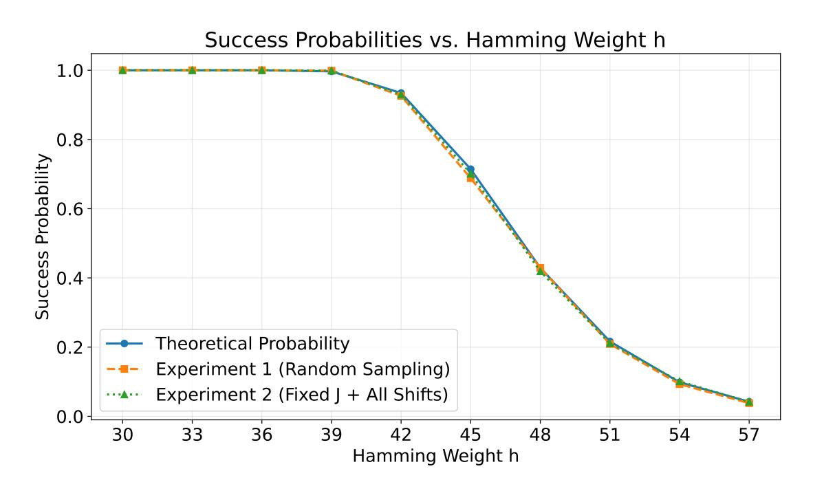

**Fig. A.1:** For  $\kappa = 1$ , N = 512, the x-axis represents h (ranging from 30 to 57) with k = 150. Algorithm 2 uses Strategy 3 with h' = 5.

## <span id="page-41-0"></span>B Experimental Validation of Remark 3.4

We conduct experiments with parameters  $n=512, k=300, \chi_{\mathbf{s}}=\mathcal{B}_h^-$  and h=64, whose definitions are consistent with those in Algorithm 1.The parameter h' denotes the guessed maximum Hamming weight of the k dropped dimensions. The experimental results are illustrated in Figures B.1 and B.2. Let  $|S'_{h'}| = \binom{k}{h'}|\operatorname{Val}^+(\chi_{\mathbf{s}})|^{h'}, |S_{h'}| = \sum_{i=0}^{h'} \binom{k}{i}|\operatorname{Val}^+(\chi_{\mathbf{s}})|^i$ , and  $p_i = \frac{\binom{h}{i} \cdot \binom{n-h}{k-i}}{\binom{n}{k}}$  for  $i \in \{0, 1, \ldots, h\}$ . In the legend, "size" denotes  $\log(|S'_{h'}|)$ , "sum size" denotes  $\log(|S_{h'}|)$ , "p" denotes  $\log(p_{h'})$ , and "sum p" denotes  $\log\left(\sum_{i=0}^{h'} p_i\right)$ . The results show that when h' is small,  $\log(|S'_{h'}|)$  and  $\log(|S_{h'}|)$  are very close, and  $\log(p_{h'})$ 

{42}------------------------------------------------

<span id="page-42-0"></span>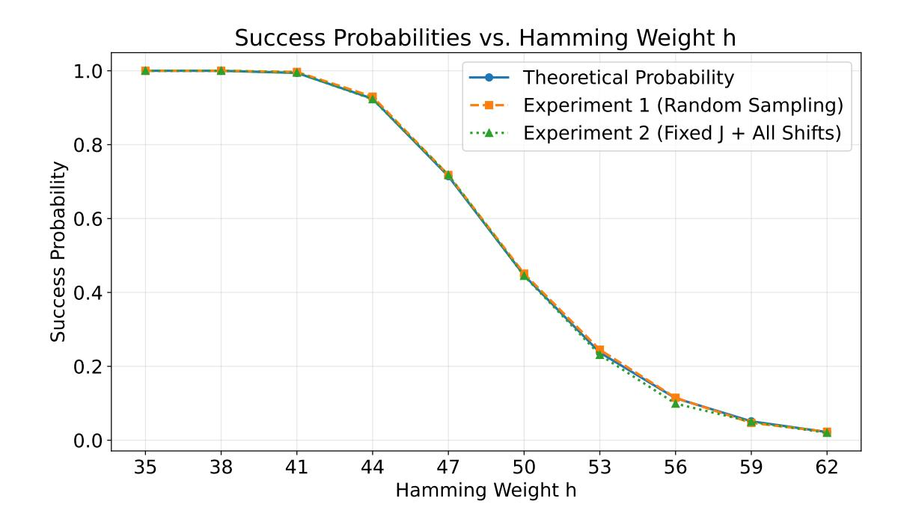

**Fig. A.2:** For  $\kappa=2,\ N=256$ , the x-axis represents h (ranging from 35 to 62) with k=150. Algorithm 2 uses Strategy 3 with h'=6.

<span id="page-42-1"></span>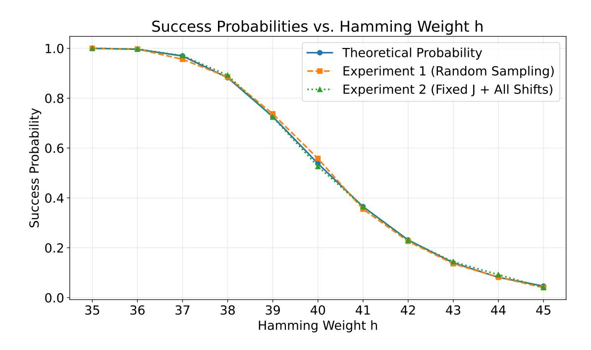

**Fig. A.3:** For  $\kappa = 1$ , N = 512, the x-axis represents h (ranging from 35 to 45) with k = 300. Algorithm 2 uses Strategy 3 with h' = 14.

{43}------------------------------------------------

<span id="page-43-0"></span>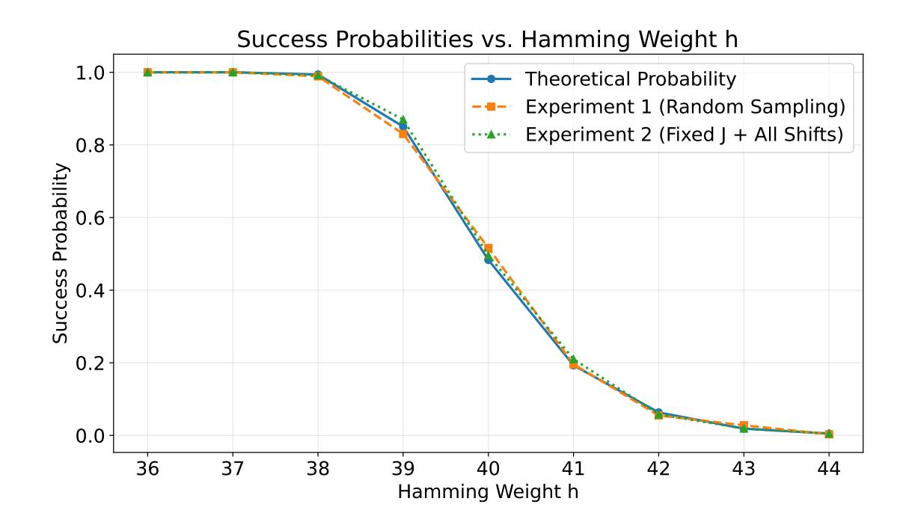

**Fig. A.4:** For  $\kappa = 1$ , N = 512, the x-axis represents h (ranging from 36 to 44) with k = 450. Algorithm 2 uses Strategy 3 with h' = 28.

<span id="page-43-1"></span>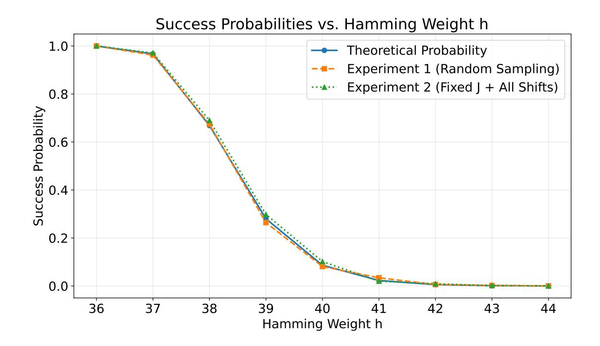

**Fig. A.5:** For  $\kappa=1,\ N=500$ , the x-axis represents h (ranging from 36 to 44) with k=450. Algorithm 2 uses Strategy 3 with h'=28.

{44}------------------------------------------------

and  $\log\left(\sum_{i=0}^{h'}p_i\right)$  are also very close. This observation confirms that when h' is small, both the number of vectors with Hamming weight at most h' and the enumeration success probability are dominated by those corresponding to Hamming weight exactly h'. When h' is large (e.g.,  $h' > \frac{h}{2}$ ),  $p_{h'}$  decreases as h' increases, so  $p_{h'}$  is no longer the dominant term in  $\sum_{i=0}^{h'}p_i$ . However, in practical attacks, h' is always small due to the constraint imposed by Eq. (2.10).

<span id="page-44-0"></span>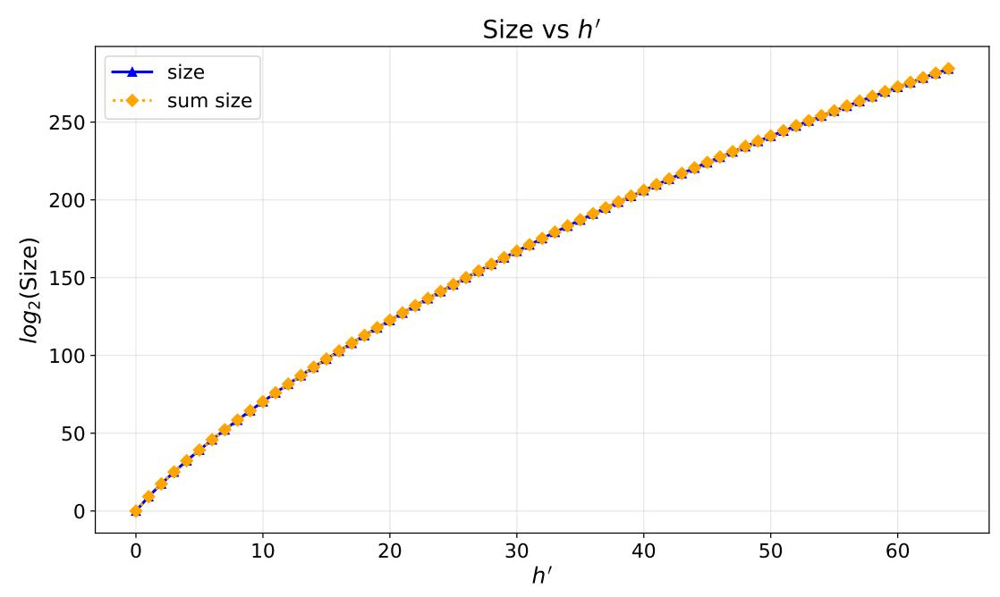

**Fig. B.1:** For n = 512, k = 300, h = 64: the x-axis represents h' (ranging from 0 to 64). The y-axis entries "size" and "sum size" denote  $\log(|S'_{h'}|)$  and  $\log(|S_{h'}|)$ , respectively.

<span id="page-44-1"></span>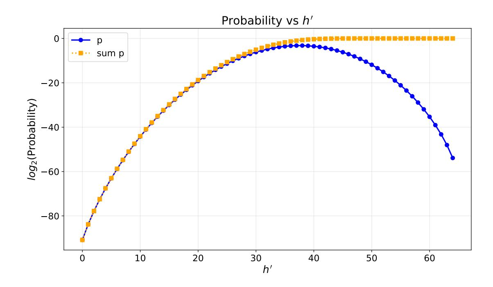

**Fig. B.2:** For n=512, k=300, h=64: the x-axis represents h' (ranging from 0 to 64). The y-axis "p" and "sum p" denote  $\log(p_{h'})$  and  $\log\left(\sum_{i=0}^{h'}p_i\right)$ , respectively.

{45}------------------------------------------------

# <span id="page-45-0"></span>C The proof of Lemma 3.1

For the sake of convenience, we restate Lemma 3.1 below.

**Lemma C.1.** Let k be a positive integer, and let  $a, b \in \mathbb{R} \setminus \{0\}$ . Suppose we have two functions:

- 
$$A(n) = an^k + A_1(n)$$
, where  $A_1(n) = O(n^{k-1})$  as  $n \to \infty$ ;  
-  $B(n) = bn^k + B_1(n)$ , where  $B_1(n) = O(n^{k-1})$  as  $n \to \infty$ .

Then the ratio  $\frac{A(n)}{B(n)}$  admits the asymptotic approximation:

$$\frac{A(n)}{B(n)} = \frac{a}{b} + O\left(\frac{1}{n}\right),\,$$

as  $n \to \infty$ .

*Proof.* Since  $A_1(n) = O(n^{k-1})$  and  $B_1(n) = O(n^{k-1})$ , we can write

$$A(n) = an^{k} (1 + \delta_{1}(n)), \qquad B(n) = bn^{k} (1 + \delta_{2}(n)),$$

where  $\delta_1(n) = \frac{A_1(n)}{an^k} = O(1/n)$  and  $\delta_2(n) = \frac{B_1(n)}{bn^k} = O(1/n)$ . The ratio then becomes

$$\frac{A(n)}{B(n)} = \frac{a}{b} \cdot \frac{1 + \delta_1(n)}{1 + \delta_2(n)}.$$

For sufficiently large n, we have  $|\delta_2(n)| < 1$ . The geometric series expansion gives

$$\frac{1}{1+\delta_2(n)} = \sum_{m=0}^{\infty} (-1)^m \delta_2(n)^m = 1 - \delta_2(n) + \sum_{m=2}^{\infty} (-1)^m \delta_2(n)^m.$$

Since  $\delta_2(n) = O(1/n)$ , the tail of the series satisfies

$$\sum_{m=2}^{\infty} (-1)^m \delta_2(n)^m = O(\delta_2(n)^2) = O(\frac{1}{n^2}).$$

Hence,

$$\frac{1}{1+\delta_2(n)} = 1 - \delta_2(n) + O\left(\frac{1}{n^2}\right).$$

Substituting this into the ratio yields

$$\frac{A(n)}{B(n)} = \frac{a}{b} (1 + \delta_1(n)) (1 - \delta_2(n) + O(\frac{1}{n^2})).$$

Expanding the product:

$$\frac{A(n)}{B(n)} = \frac{a}{b} \left[ 1 + \delta_1(n) - \delta_2(n) - \delta_1(n)\delta_2(n) + O(\frac{1}{n^2}) \right].$$

{46}------------------------------------------------

Now δ1(n) = O(1/n), δ2(n) = O(1/n), and their product is O(1/n<sup>2</sup> ). Therefore,

$$\frac{A(n)}{B(n)} = \frac{a}{b} + \frac{a}{b} \left( \delta_1(n) - \delta_2(n) \right) + O\left(\frac{1}{n^2}\right).$$

Since δ1(n)−δ2(n) = O(1/n), the middle term is O(1/n). The O(1/n<sup>2</sup> ) term is absorbed into O(1/n), and we finally obtain

$$\frac{A(n)}{B(n)} = \frac{a}{b} + O\left(\frac{1}{n}\right).$$

⊓⊔

# <span id="page-46-0"></span>D The proof of Lemma [3.2](#page-20-1)

For the sake of convenience, we restate Lemma [3.2](#page-20-1) below.

Lemma D.1. For any p ∈ [0, 1] and any positive integer N, if N p ≤ δ for some 0 < δ < 1, then

$$1 - (1 - p)^N = Np(1 + \epsilon),$$

where |ϵ| ≤ (N p)/2. In particular, when N p ≪ 1, we have 1 − (1 − p) <sup>N</sup> ≈ N p with relative error at most (N p) <sup>2</sup>/2 , which is much smaller than N p/2.

Proof. From the binomial theorem we obtain the alternating series

$$1 - (1 - p)^N = \sum_{m=1}^N (-1)^{m-1} \binom{N}{m} p^m = Np - \binom{N}{2} p^2 + \binom{N}{3} p^3 - \dots + (-1)^{N-1} p^N.$$

Under the condition N p ≤ δ < 1, the absolute values of the terms decrease monotonically for m ≥ 2. To verify this, consider the ratio of consecutive terms:

$$\frac{\binom{N}{m+1}p^{m+1}}{\binom{N}{m}p^m} = \frac{N-m}{m+1}p \quad (m \ge 2).$$

Since N p < 1 and <sup>N</sup>−<sup>m</sup> <sup>m</sup>+1 ≤ N 3 for m ≥ 2, we have

$$\frac{N-m}{m+1} \, p \le \frac{N}{3} \, p < \frac{1}{3} < 1,$$

which establishes the strict monotonic decrease.

For an alternating series whose absolute values decrease monotonically to zero, the error incurred by truncating after the first term is bounded by the absolute value of the first omitted term. Applying this classical estimate to our series yields

$$\left|1 - (1-p)^N - Np\right| \le \binom{N}{2}p^2 \le \frac{N^2p^2}{2}.$$

{47}------------------------------------------------

Therefore we can write

$$1 - (1 - p)^{N} = Np \left[ 1 + \frac{1 - (1 - p)^{N} - Np}{Np} \right] = Np(1 + \epsilon),$$

with

$$|\epsilon| = \frac{\left|1 - (1-p)^N - Np\right|}{Np} \le \frac{N^2 p^2 / 2}{Np} = \frac{Np}{2}.$$

When  $Np \ll 1$ , the relative error  $\epsilon$  is at most  $\frac{Np}{2}$ , and the absolute error  $|Np\epsilon|$  is bounded by  $\frac{N^2p^2}{2}$ . Since  $Np \ll 1$ , we have  $\frac{N^2p^2}{2} \ll \frac{Np}{2}$ , which implies that  $1-(1-p)^N \approx Np$ .

# <span id="page-47-0"></span>E Estimates for parameter sets in [35, Tab. 4]

In this section, we present the evaluation results of the parameter sets proposed by Curtis and Player under the enhanced hybrid decoding attack. The results in Table E.1 were obtained via lattice-estimator with the configurations red\_cost\_model=MATZOV and red\_shape\_model=GSA, while those in Table E.2 were derived from evaluations with the authors' original code, and those in Table E.3 (evaluation results under the quantum cost model) were obtained via lattice-estimator with the configurations red\_cost\_model=ChaLoy21 and red\_shape\_model=GSA. Furthermore, when calculating the bit security of the hybrid decoding attack under the quantum cost model, we also take the square-root speedup in searching step with Grover's algorithm [41,22] into account, as in [73, Sec. 7].

From Tables E.1 and E.3, we observe that when h is small relative to n, the hybrid attack has significantly lower complexity than uSVP, which indicates that the hybrid attack is well-suited for LWE instances with secrets of small Hamming weight. The results in Table E.1 and Table E.2 show that, among all 72 sparse parameter sets, 21 and 45 sets, respectively, fail to achieve the target bit security level  $\lambda$  when the enhanced hybrid decoding attack is used.

Remark E.1. In Table E.1 and Table E.3,  $\Delta_1$  and  $\Delta_2$  equal 0 for several parameter sets, meaning that the enhanced hybrid attack yields no improvement over the standard hybrid attack. This occurs because the Hamming weight h is relatively large for these parameter sets, which makes the the complexity of the hybrid attack is minimized when no guessing is performed.

{48}------------------------------------------------

<span id="page-48-0"></span>Table E.1: Estimates for parameter sets in [\[35,](#page-35-0) Tab. 4] using lattice-estimator with red\_cost\_model=MATZOV and red\_shape\_model=GSA. All these schemes are based on Ring-LWE (i.e., n = N, where N denotes the degree of the polynomial ring) and employ 2-power polynomial rings, with the error distribution χ<sup>e</sup> = D<sup>σ</sup> (σ = 3.19), secret distribution χ<sup>s</sup> = B − h , and modulus q. Specifically: "uSVP" denotes the complexity from the primal\_usvp function; TgvDec is the complexity of the guess-and-verify decoding attack, obtained via the primal\_hybrid function with settings mitm=False and babai=False; ThgDec is the complexity of the Howgrave-Graham decoding attack, calculated by the primal\_hybrid function with settings mitm=True and babai=True; TegvDec and TehgDec respectively correspond to the complexities of the enhanced guessand-verify decoding attack and enhanced Howgrave-Graham decoding attack. ∆<sup>1</sup> = TgvDec − TegvDec, ∆<sup>2</sup> = ThgDec − TehgDec. The parameter λ denotes the target bit security level, ζ = h/λ (sparsity ratio of the secret). Values below λ are bolded for emphasis.

| n                 | λ | ζ | h   |    |       | log(q) uSVP TegvDec | TgvDec | ∆1  | TehgDec | ThgDec | ∆2  |
|-------------------|---|---|-----|----|-------|---------------------|--------|-----|---------|--------|-----|
| 1024 128 0.5      |   |   | 64  | 14 | 219.3 | 157.6               | 163.0  | 5.5 | 149.4   | 151.8  | 2.4 |
| 1024 128 0.75 96  |   |   |     | 19 | 170.9 | 151.0               | 158.9  | 7.9 | 149.1   | 153.4  | 4.3 |
| 1024 128          |   | 1 | 128 | 21 | 157.2 | 151.0               | 154.6  | 3.6 | 153.7   | 158.8  | 5.2 |
| 1024 128 1.5 192  |   |   |     | 23 | 146.1 | 143.3               | 143.6  | 0.2 | 159.4   | 165.6  | 6.2 |
| 1024 192 0.5      |   |   | 96  | 9  | 311.4 | 257.7               | 260.4  | 2.8 | 237.8   | 239.2  | 1.4 |
| 1024 192 0.75 144 |   |   |     | 13 | 247.2 | 238.3               | 242.5  | 4.2 | 235.1   | 239.1  | 3.9 |
| 1024 192          |   | 1 | 192 | 14 | 236.2 | 231.4               | 232.0  | 0.6 | 251.8   | 255.7  | 3.9 |
| 1024 192 1.5 288  |   |   |     | 16 | 214.0 | 209.8               | 209.8  | 0.0 | 255.8   | 261.0  | 5.2 |
| 1024 256 0.5 128  |   |   |     | 7  | 355.2 | 325.2               | 325.2  | 0.0 | 355.8   | 355.8  | 0.0 |
| 1024 256 0.75 192 |   |   |     | 10 | 312.4 | 306.4               | 306.9  | 0.4 | 327.2   | 329.6  | 2.4 |
| 1024 256          |   | 1 | 256 | 11 | 298.5 | 292.6               | 292.6  | 0.0 | 347.0   | 350.0  | 3.0 |
| 1024 256 1.5 384  |   |   |     | 12 | 286.2 | 280.4               | 280.4  | 0.0 | 374.1   | 377.1  | 3.0 |
| 2048 128 0.5      |   |   | 64  | 27 | 244.7 | 151.2               | 157.9  | 6.7 | 140.6   | 144.9  | 4.3 |
| 2048 128 0.75 96  |   |   |     | 37 | 180.6 | 144.2               | 152.7  | 8.5 | 139.1   | 144.9  | 5.8 |
| 2048 128          |   | 1 | 128 | 41 | 164.0 | 142.7               | 150.9  | 8.3 | 141.9   | 148.6  | 6.7 |
| 2048 128 1.5 192  |   |   |     | 46 | 147.3 | 137.5               | 144.8  | 7.3 | 141.9   | 149.7  | 7.8 |
| 2048 192 0.5      |   |   | 96  | 19 | 345.2 | 227.8               | 234.0  | 6.2 | 209.7   | 213.1  | 3.4 |
| 2048 192 0.75 144 |   |   |     | 26 | 261.4 | 219.1               | 228.2  | 9.1 | 209.7   | 215.2  | 5.5 |
| 2048 192          |   | 1 | 192 | 29 | 236.3 | 218.5               | 227.9  | 9.4 | 215.3   | 221.5  | 6.2 |
| 2048 192 1.5 288  |   |   |     | 32 | 215.5 | 211.3               | 213.7  | 2.3 | 222.1   | 229.3  | 7.2 |
| 2048 256 0.5 128  |   |   |     | 15 | 427.7 | 307.2               | 312.1  | 4.9 | 279.4   | 283.0  | 3.7 |
| 2048 256 0.75 192 |   |   |     | 19 | 359.2 | 317.6               | 325.5  | 7.9 | 297.6   | 302.2  | 4.6 |
| 2048 256          |   | 1 | 256 | 22 | 314.6 | 306.8               | 311.7  | 4.8 | 300.8   | 306.2  | 5.4 |
| 2048 256 1.5 384  |   |   |     | 24 | 293.6 | 289.5               | 290.4  | 1.0 | 318.0   | 324.7  | 6.6 |
| 4096 128 0.5      |   |   | 64  | 55 | 254.2 | 147.0               | 155.1  | 8.2 | 134.4   | 139.8  | 5.5 |
| 4096 128 0.75 96  |   |   |     | 74 | 184.6 | 141.5               | 150.6  | 9.1 | 133.0   | 140.1  | 7.1 |
| 4096 128          |   | 1 | 128 | 83 | 165.1 | 137.6               | 147.5  | 9.9 | 133.2   | 141.2  | 8.0 |

{49}------------------------------------------------

Table E.1 – continued from previous page

| n<br>λ<br>ζ<br>h<br>log(q) uSVP TegvDec<br>TgvDec<br>∆1<br>TehgDec<br>ThgDec<br>∆2<br>4096 128 1.5 192<br>92<br>148.4<br>133.9<br>142.2<br>8.3<br>133.1<br>142.1<br>8.9<br>4096 192 0.5<br>96<br>37<br>384.5<br>223.3<br>230.0<br>6.7<br>201.6<br>206.1<br>4.6<br>4096 192 0.75 144<br>52<br>272.5<br>210.4<br>218.5<br>8.2<br>197.1<br>203.8<br>6.7<br>4096 192<br>1<br>192<br>57<br>248.7<br>210.7<br>219.7<br>9.0<br>203.3<br>210.8<br>7.5<br>4096 192 1.5 288<br>64<br>220.8<br>202.7<br>212.4<br>9.7<br>203.9<br>212.6<br>8.7<br>4096 256 0.5 128<br>30<br>478.6<br>289.0<br>297.6<br>8.6<br>261.3<br>266.0<br>4.7<br>4096 256 0.75 192<br>39<br>371.9<br>290.1<br>298.2<br>8.2<br>270.9<br>276.8<br>6.0<br>4096 256<br>1<br>256<br>44<br>328.5<br>286.4<br>295.4<br>9.0<br>275.8<br>283.0<br>7.2<br>4096 256 1.5 384<br>49<br>294.9<br>279.9<br>289.5<br>9.6<br>281.9<br>290.2<br>8.3<br>8192 128 0.5<br>64<br>111<br>258.2<br>146.9<br>155.6<br>8.7<br>132.3<br>139.0<br>6.7<br>8192 128 0.75 96<br>148<br>188.5<br>141.2<br>151.9 10.7<br>130.7<br>139.0<br>8.2<br>8192 128<br>1<br>128<br>171<br>162.0<br>134.2<br>144.2<br>9.9<br>127.1<br>136.3<br>9.2<br>8192 128 1.5 192<br>186<br>149.4<br>131.6<br>140.8<br>9.2<br>127.9<br>137.6<br>9.7<br>8192 192 0.5<br>96<br>84<br>352.1<br>206.5<br>215.0<br>8.4<br>184.3<br>190.8<br>6.5<br>8192 192 0.75 144<br>100<br>291.8<br>215.1<br>224.9<br>9.8<br>196.9<br>204.7<br>7.8<br>8192 192<br>1<br>192<br>114<br>252.7<br>208.4<br>219.0 10.5<br>196.3<br>205.1<br>8.8<br>8192 192 1.5 288<br>130<br>219.1<br>196.9<br>206.8<br>9.9<br>192.0<br>202.0 10.0<br>8192 256 0.5 128<br>60<br>510.8<br>286.9<br>294.7<br>7.9<br>253.9<br>259.6<br>5.7<br>8192 256 0.75 192<br>79<br>380.1<br>283.0<br>292.1<br>9.1<br>258.6<br>266.1<br>7.5<br>8192 256<br>1<br>256<br>89<br>333.9<br>278.0<br>288.4 10.4<br>261.5<br>270.0<br>8.5<br>8192 256 1.5 384<br>98<br>300.3<br>272.4<br>283.1 10.8<br>266.6<br>276.3<br>9.7<br>16384 128 0.5<br>64<br>223<br>262.1<br>147.8<br>157.4<br>9.6<br>132.8<br>140.1<br>7.3<br>16384 128 0.75 96<br>300<br>189.4<br>141.5<br>152.4 10.9<br>129.3<br>138.6<br>9.3<br>16384 128<br>1<br>128<br>342<br>163.1<br>134.8<br>145.9 11.1 126.3<br>136.5 10.2<br>16384 128 1.5 192<br>377<br>146.5<br>130.5<br>140.2<br>9.7<br>125.7<br>135.5<br>9.8<br>16384 192 0.5<br>96<br>157<br>391.0<br>215.7<br>224.4<br>8.7<br>190.8<br>198.2<br>7.4<br>16384 192 0.75 144<br>201<br>295.7<br>216.2<br>226.9 10.7<br>194.9<br>203.7<br>8.8<br>16384 192<br>1<br>192<br>232<br>250.9<br>206.5<br>217.9 11.4 191.1<br>201.0<br>9.9<br>16384 192 1.5 288<br>265<br>217.4<br>193.1<br>203.7 10.6 184.9<br>195.8 10.9<br>16384 256 0.5 128<br>115<br>555.7<br>294.6<br>302.4<br>7.9<br>257.6<br>264.4<br>6.8<br>16384 256 0.75 192<br>161<br>381.2<br>279.5<br>290.6 11.2 252.2<br>260.8<br>8.5<br>16384 256<br>1<br>256<br>176<br>346.1<br>280.8<br>292.1 11.3<br>259.1<br>268.8<br>9.7<br>16384 256 1.5 384<br>202<br>295.7<br>263.9<br>275.0 11.1 252.2<br>263.2 11.0<br>32768 128 0.5<br>64<br>496<br>235.2<br>140.8<br>151.7 10.9 126.9<br>135.8<br>8.9<br>32768 128 0.75 96<br>619<br>184.9<br>139.4<br>151.1 11.7 127.5<br>137.7 10.2<br>32768 128<br>1<br>128<br>699<br>162.6<br>133.2<br>145.4 12.1 124.8<br>135.6 10.8<br>32768 128 1.5 192<br>767<br>146.0<br>128.8<br>139.6 10.8 123.6<br>134.1 10.5<br>32768 192 0.5<br>96<br>350<br>350.0<br>204.8<br>215.5 10.7 181.9<br>190.1 8.2<br>32768 192 0.75 144<br>411<br>291.1<br>214.2<br>225.6 11.4<br>192.6<br>202.6<br>9.9<br>32768 192<br>1<br>192<br>479<br>246.3<br>201.3<br>214.5 13.2 186.1<br>197.2 11.1<br>32768 192 1.5 288<br>523<br>221.3<br>196.1<br>208.0 11.9 186.7<br>198.0 11.3<br>32768 256 0.5 128<br>263<br>487.7<br>275.4<br>285.8 10.4 241.8<br>249.9 8.2<br>32768 256 0.75 192<br>313<br>399.1<br>288.5<br>300.0 11.5<br>257.4<br>267.1<br>9.7 |  |  |  |  |  |  |
|-------------------------------------------------------------------------------------------------------------------------------------------------------------------------------------------------------------------------------------------------------------------------------------------------------------------------------------------------------------------------------------------------------------------------------------------------------------------------------------------------------------------------------------------------------------------------------------------------------------------------------------------------------------------------------------------------------------------------------------------------------------------------------------------------------------------------------------------------------------------------------------------------------------------------------------------------------------------------------------------------------------------------------------------------------------------------------------------------------------------------------------------------------------------------------------------------------------------------------------------------------------------------------------------------------------------------------------------------------------------------------------------------------------------------------------------------------------------------------------------------------------------------------------------------------------------------------------------------------------------------------------------------------------------------------------------------------------------------------------------------------------------------------------------------------------------------------------------------------------------------------------------------------------------------------------------------------------------------------------------------------------------------------------------------------------------------------------------------------------------------------------------------------------------------------------------------------------------------------------------------------------------------------------------------------------------------------------------------------------------------------------------------------------------------------------------------------------------------------------------------------------------------------------------------------------------------------------------------------------------------------------------------------------------------------------------------------------------------------------------------------------------------------------------------------------------------------------------------------------------------------------------------------------------------------------------------------------------------------------------------------------------------------------------------------------------------------------------------------------------------------------------------------------------------------------------------------------------------------------------------------------------------------------------------------------------------------------------------------------------------------------------------------------------------------------------------------------------------------------------------------------------------------------------------------------------------------------------------------------------------------------------------------------------------------------------------------------------------------------------------------------------------------------------------------------------------------------------------------------------------------------------------|--|--|--|--|--|--|
|                                                                                                                                                                                                                                                                                                                                                                                                                                                                                                                                                                                                                                                                                                                                                                                                                                                                                                                                                                                                                                                                                                                                                                                                                                                                                                                                                                                                                                                                                                                                                                                                                                                                                                                                                                                                                                                                                                                                                                                                                                                                                                                                                                                                                                                                                                                                                                                                                                                                                                                                                                                                                                                                                                                                                                                                                                                                                                                                                                                                                                                                                                                                                                                                                                                                                                                                                                                                                                                                                                                                                                                                                                                                                                                                                                                                                                                                                                 |  |  |  |  |  |  |
|                                                                                                                                                                                                                                                                                                                                                                                                                                                                                                                                                                                                                                                                                                                                                                                                                                                                                                                                                                                                                                                                                                                                                                                                                                                                                                                                                                                                                                                                                                                                                                                                                                                                                                                                                                                                                                                                                                                                                                                                                                                                                                                                                                                                                                                                                                                                                                                                                                                                                                                                                                                                                                                                                                                                                                                                                                                                                                                                                                                                                                                                                                                                                                                                                                                                                                                                                                                                                                                                                                                                                                                                                                                                                                                                                                                                                                                                                                 |  |  |  |  |  |  |
|                                                                                                                                                                                                                                                                                                                                                                                                                                                                                                                                                                                                                                                                                                                                                                                                                                                                                                                                                                                                                                                                                                                                                                                                                                                                                                                                                                                                                                                                                                                                                                                                                                                                                                                                                                                                                                                                                                                                                                                                                                                                                                                                                                                                                                                                                                                                                                                                                                                                                                                                                                                                                                                                                                                                                                                                                                                                                                                                                                                                                                                                                                                                                                                                                                                                                                                                                                                                                                                                                                                                                                                                                                                                                                                                                                                                                                                                                                 |  |  |  |  |  |  |
|                                                                                                                                                                                                                                                                                                                                                                                                                                                                                                                                                                                                                                                                                                                                                                                                                                                                                                                                                                                                                                                                                                                                                                                                                                                                                                                                                                                                                                                                                                                                                                                                                                                                                                                                                                                                                                                                                                                                                                                                                                                                                                                                                                                                                                                                                                                                                                                                                                                                                                                                                                                                                                                                                                                                                                                                                                                                                                                                                                                                                                                                                                                                                                                                                                                                                                                                                                                                                                                                                                                                                                                                                                                                                                                                                                                                                                                                                                 |  |  |  |  |  |  |
|                                                                                                                                                                                                                                                                                                                                                                                                                                                                                                                                                                                                                                                                                                                                                                                                                                                                                                                                                                                                                                                                                                                                                                                                                                                                                                                                                                                                                                                                                                                                                                                                                                                                                                                                                                                                                                                                                                                                                                                                                                                                                                                                                                                                                                                                                                                                                                                                                                                                                                                                                                                                                                                                                                                                                                                                                                                                                                                                                                                                                                                                                                                                                                                                                                                                                                                                                                                                                                                                                                                                                                                                                                                                                                                                                                                                                                                                                                 |  |  |  |  |  |  |
|                                                                                                                                                                                                                                                                                                                                                                                                                                                                                                                                                                                                                                                                                                                                                                                                                                                                                                                                                                                                                                                                                                                                                                                                                                                                                                                                                                                                                                                                                                                                                                                                                                                                                                                                                                                                                                                                                                                                                                                                                                                                                                                                                                                                                                                                                                                                                                                                                                                                                                                                                                                                                                                                                                                                                                                                                                                                                                                                                                                                                                                                                                                                                                                                                                                                                                                                                                                                                                                                                                                                                                                                                                                                                                                                                                                                                                                                                                 |  |  |  |  |  |  |
|                                                                                                                                                                                                                                                                                                                                                                                                                                                                                                                                                                                                                                                                                                                                                                                                                                                                                                                                                                                                                                                                                                                                                                                                                                                                                                                                                                                                                                                                                                                                                                                                                                                                                                                                                                                                                                                                                                                                                                                                                                                                                                                                                                                                                                                                                                                                                                                                                                                                                                                                                                                                                                                                                                                                                                                                                                                                                                                                                                                                                                                                                                                                                                                                                                                                                                                                                                                                                                                                                                                                                                                                                                                                                                                                                                                                                                                                                                 |  |  |  |  |  |  |
|                                                                                                                                                                                                                                                                                                                                                                                                                                                                                                                                                                                                                                                                                                                                                                                                                                                                                                                                                                                                                                                                                                                                                                                                                                                                                                                                                                                                                                                                                                                                                                                                                                                                                                                                                                                                                                                                                                                                                                                                                                                                                                                                                                                                                                                                                                                                                                                                                                                                                                                                                                                                                                                                                                                                                                                                                                                                                                                                                                                                                                                                                                                                                                                                                                                                                                                                                                                                                                                                                                                                                                                                                                                                                                                                                                                                                                                                                                 |  |  |  |  |  |  |
|                                                                                                                                                                                                                                                                                                                                                                                                                                                                                                                                                                                                                                                                                                                                                                                                                                                                                                                                                                                                                                                                                                                                                                                                                                                                                                                                                                                                                                                                                                                                                                                                                                                                                                                                                                                                                                                                                                                                                                                                                                                                                                                                                                                                                                                                                                                                                                                                                                                                                                                                                                                                                                                                                                                                                                                                                                                                                                                                                                                                                                                                                                                                                                                                                                                                                                                                                                                                                                                                                                                                                                                                                                                                                                                                                                                                                                                                                                 |  |  |  |  |  |  |
|                                                                                                                                                                                                                                                                                                                                                                                                                                                                                                                                                                                                                                                                                                                                                                                                                                                                                                                                                                                                                                                                                                                                                                                                                                                                                                                                                                                                                                                                                                                                                                                                                                                                                                                                                                                                                                                                                                                                                                                                                                                                                                                                                                                                                                                                                                                                                                                                                                                                                                                                                                                                                                                                                                                                                                                                                                                                                                                                                                                                                                                                                                                                                                                                                                                                                                                                                                                                                                                                                                                                                                                                                                                                                                                                                                                                                                                                                                 |  |  |  |  |  |  |
|                                                                                                                                                                                                                                                                                                                                                                                                                                                                                                                                                                                                                                                                                                                                                                                                                                                                                                                                                                                                                                                                                                                                                                                                                                                                                                                                                                                                                                                                                                                                                                                                                                                                                                                                                                                                                                                                                                                                                                                                                                                                                                                                                                                                                                                                                                                                                                                                                                                                                                                                                                                                                                                                                                                                                                                                                                                                                                                                                                                                                                                                                                                                                                                                                                                                                                                                                                                                                                                                                                                                                                                                                                                                                                                                                                                                                                                                                                 |  |  |  |  |  |  |
|                                                                                                                                                                                                                                                                                                                                                                                                                                                                                                                                                                                                                                                                                                                                                                                                                                                                                                                                                                                                                                                                                                                                                                                                                                                                                                                                                                                                                                                                                                                                                                                                                                                                                                                                                                                                                                                                                                                                                                                                                                                                                                                                                                                                                                                                                                                                                                                                                                                                                                                                                                                                                                                                                                                                                                                                                                                                                                                                                                                                                                                                                                                                                                                                                                                                                                                                                                                                                                                                                                                                                                                                                                                                                                                                                                                                                                                                                                 |  |  |  |  |  |  |
|                                                                                                                                                                                                                                                                                                                                                                                                                                                                                                                                                                                                                                                                                                                                                                                                                                                                                                                                                                                                                                                                                                                                                                                                                                                                                                                                                                                                                                                                                                                                                                                                                                                                                                                                                                                                                                                                                                                                                                                                                                                                                                                                                                                                                                                                                                                                                                                                                                                                                                                                                                                                                                                                                                                                                                                                                                                                                                                                                                                                                                                                                                                                                                                                                                                                                                                                                                                                                                                                                                                                                                                                                                                                                                                                                                                                                                                                                                 |  |  |  |  |  |  |
|                                                                                                                                                                                                                                                                                                                                                                                                                                                                                                                                                                                                                                                                                                                                                                                                                                                                                                                                                                                                                                                                                                                                                                                                                                                                                                                                                                                                                                                                                                                                                                                                                                                                                                                                                                                                                                                                                                                                                                                                                                                                                                                                                                                                                                                                                                                                                                                                                                                                                                                                                                                                                                                                                                                                                                                                                                                                                                                                                                                                                                                                                                                                                                                                                                                                                                                                                                                                                                                                                                                                                                                                                                                                                                                                                                                                                                                                                                 |  |  |  |  |  |  |
|                                                                                                                                                                                                                                                                                                                                                                                                                                                                                                                                                                                                                                                                                                                                                                                                                                                                                                                                                                                                                                                                                                                                                                                                                                                                                                                                                                                                                                                                                                                                                                                                                                                                                                                                                                                                                                                                                                                                                                                                                                                                                                                                                                                                                                                                                                                                                                                                                                                                                                                                                                                                                                                                                                                                                                                                                                                                                                                                                                                                                                                                                                                                                                                                                                                                                                                                                                                                                                                                                                                                                                                                                                                                                                                                                                                                                                                                                                 |  |  |  |  |  |  |
|                                                                                                                                                                                                                                                                                                                                                                                                                                                                                                                                                                                                                                                                                                                                                                                                                                                                                                                                                                                                                                                                                                                                                                                                                                                                                                                                                                                                                                                                                                                                                                                                                                                                                                                                                                                                                                                                                                                                                                                                                                                                                                                                                                                                                                                                                                                                                                                                                                                                                                                                                                                                                                                                                                                                                                                                                                                                                                                                                                                                                                                                                                                                                                                                                                                                                                                                                                                                                                                                                                                                                                                                                                                                                                                                                                                                                                                                                                 |  |  |  |  |  |  |
|                                                                                                                                                                                                                                                                                                                                                                                                                                                                                                                                                                                                                                                                                                                                                                                                                                                                                                                                                                                                                                                                                                                                                                                                                                                                                                                                                                                                                                                                                                                                                                                                                                                                                                                                                                                                                                                                                                                                                                                                                                                                                                                                                                                                                                                                                                                                                                                                                                                                                                                                                                                                                                                                                                                                                                                                                                                                                                                                                                                                                                                                                                                                                                                                                                                                                                                                                                                                                                                                                                                                                                                                                                                                                                                                                                                                                                                                                                 |  |  |  |  |  |  |
|                                                                                                                                                                                                                                                                                                                                                                                                                                                                                                                                                                                                                                                                                                                                                                                                                                                                                                                                                                                                                                                                                                                                                                                                                                                                                                                                                                                                                                                                                                                                                                                                                                                                                                                                                                                                                                                                                                                                                                                                                                                                                                                                                                                                                                                                                                                                                                                                                                                                                                                                                                                                                                                                                                                                                                                                                                                                                                                                                                                                                                                                                                                                                                                                                                                                                                                                                                                                                                                                                                                                                                                                                                                                                                                                                                                                                                                                                                 |  |  |  |  |  |  |
|                                                                                                                                                                                                                                                                                                                                                                                                                                                                                                                                                                                                                                                                                                                                                                                                                                                                                                                                                                                                                                                                                                                                                                                                                                                                                                                                                                                                                                                                                                                                                                                                                                                                                                                                                                                                                                                                                                                                                                                                                                                                                                                                                                                                                                                                                                                                                                                                                                                                                                                                                                                                                                                                                                                                                                                                                                                                                                                                                                                                                                                                                                                                                                                                                                                                                                                                                                                                                                                                                                                                                                                                                                                                                                                                                                                                                                                                                                 |  |  |  |  |  |  |
|                                                                                                                                                                                                                                                                                                                                                                                                                                                                                                                                                                                                                                                                                                                                                                                                                                                                                                                                                                                                                                                                                                                                                                                                                                                                                                                                                                                                                                                                                                                                                                                                                                                                                                                                                                                                                                                                                                                                                                                                                                                                                                                                                                                                                                                                                                                                                                                                                                                                                                                                                                                                                                                                                                                                                                                                                                                                                                                                                                                                                                                                                                                                                                                                                                                                                                                                                                                                                                                                                                                                                                                                                                                                                                                                                                                                                                                                                                 |  |  |  |  |  |  |
|                                                                                                                                                                                                                                                                                                                                                                                                                                                                                                                                                                                                                                                                                                                                                                                                                                                                                                                                                                                                                                                                                                                                                                                                                                                                                                                                                                                                                                                                                                                                                                                                                                                                                                                                                                                                                                                                                                                                                                                                                                                                                                                                                                                                                                                                                                                                                                                                                                                                                                                                                                                                                                                                                                                                                                                                                                                                                                                                                                                                                                                                                                                                                                                                                                                                                                                                                                                                                                                                                                                                                                                                                                                                                                                                                                                                                                                                                                 |  |  |  |  |  |  |
|                                                                                                                                                                                                                                                                                                                                                                                                                                                                                                                                                                                                                                                                                                                                                                                                                                                                                                                                                                                                                                                                                                                                                                                                                                                                                                                                                                                                                                                                                                                                                                                                                                                                                                                                                                                                                                                                                                                                                                                                                                                                                                                                                                                                                                                                                                                                                                                                                                                                                                                                                                                                                                                                                                                                                                                                                                                                                                                                                                                                                                                                                                                                                                                                                                                                                                                                                                                                                                                                                                                                                                                                                                                                                                                                                                                                                                                                                                 |  |  |  |  |  |  |
|                                                                                                                                                                                                                                                                                                                                                                                                                                                                                                                                                                                                                                                                                                                                                                                                                                                                                                                                                                                                                                                                                                                                                                                                                                                                                                                                                                                                                                                                                                                                                                                                                                                                                                                                                                                                                                                                                                                                                                                                                                                                                                                                                                                                                                                                                                                                                                                                                                                                                                                                                                                                                                                                                                                                                                                                                                                                                                                                                                                                                                                                                                                                                                                                                                                                                                                                                                                                                                                                                                                                                                                                                                                                                                                                                                                                                                                                                                 |  |  |  |  |  |  |
|                                                                                                                                                                                                                                                                                                                                                                                                                                                                                                                                                                                                                                                                                                                                                                                                                                                                                                                                                                                                                                                                                                                                                                                                                                                                                                                                                                                                                                                                                                                                                                                                                                                                                                                                                                                                                                                                                                                                                                                                                                                                                                                                                                                                                                                                                                                                                                                                                                                                                                                                                                                                                                                                                                                                                                                                                                                                                                                                                                                                                                                                                                                                                                                                                                                                                                                                                                                                                                                                                                                                                                                                                                                                                                                                                                                                                                                                                                 |  |  |  |  |  |  |
|                                                                                                                                                                                                                                                                                                                                                                                                                                                                                                                                                                                                                                                                                                                                                                                                                                                                                                                                                                                                                                                                                                                                                                                                                                                                                                                                                                                                                                                                                                                                                                                                                                                                                                                                                                                                                                                                                                                                                                                                                                                                                                                                                                                                                                                                                                                                                                                                                                                                                                                                                                                                                                                                                                                                                                                                                                                                                                                                                                                                                                                                                                                                                                                                                                                                                                                                                                                                                                                                                                                                                                                                                                                                                                                                                                                                                                                                                                 |  |  |  |  |  |  |
|                                                                                                                                                                                                                                                                                                                                                                                                                                                                                                                                                                                                                                                                                                                                                                                                                                                                                                                                                                                                                                                                                                                                                                                                                                                                                                                                                                                                                                                                                                                                                                                                                                                                                                                                                                                                                                                                                                                                                                                                                                                                                                                                                                                                                                                                                                                                                                                                                                                                                                                                                                                                                                                                                                                                                                                                                                                                                                                                                                                                                                                                                                                                                                                                                                                                                                                                                                                                                                                                                                                                                                                                                                                                                                                                                                                                                                                                                                 |  |  |  |  |  |  |
|                                                                                                                                                                                                                                                                                                                                                                                                                                                                                                                                                                                                                                                                                                                                                                                                                                                                                                                                                                                                                                                                                                                                                                                                                                                                                                                                                                                                                                                                                                                                                                                                                                                                                                                                                                                                                                                                                                                                                                                                                                                                                                                                                                                                                                                                                                                                                                                                                                                                                                                                                                                                                                                                                                                                                                                                                                                                                                                                                                                                                                                                                                                                                                                                                                                                                                                                                                                                                                                                                                                                                                                                                                                                                                                                                                                                                                                                                                 |  |  |  |  |  |  |
|                                                                                                                                                                                                                                                                                                                                                                                                                                                                                                                                                                                                                                                                                                                                                                                                                                                                                                                                                                                                                                                                                                                                                                                                                                                                                                                                                                                                                                                                                                                                                                                                                                                                                                                                                                                                                                                                                                                                                                                                                                                                                                                                                                                                                                                                                                                                                                                                                                                                                                                                                                                                                                                                                                                                                                                                                                                                                                                                                                                                                                                                                                                                                                                                                                                                                                                                                                                                                                                                                                                                                                                                                                                                                                                                                                                                                                                                                                 |  |  |  |  |  |  |
|                                                                                                                                                                                                                                                                                                                                                                                                                                                                                                                                                                                                                                                                                                                                                                                                                                                                                                                                                                                                                                                                                                                                                                                                                                                                                                                                                                                                                                                                                                                                                                                                                                                                                                                                                                                                                                                                                                                                                                                                                                                                                                                                                                                                                                                                                                                                                                                                                                                                                                                                                                                                                                                                                                                                                                                                                                                                                                                                                                                                                                                                                                                                                                                                                                                                                                                                                                                                                                                                                                                                                                                                                                                                                                                                                                                                                                                                                                 |  |  |  |  |  |  |
|                                                                                                                                                                                                                                                                                                                                                                                                                                                                                                                                                                                                                                                                                                                                                                                                                                                                                                                                                                                                                                                                                                                                                                                                                                                                                                                                                                                                                                                                                                                                                                                                                                                                                                                                                                                                                                                                                                                                                                                                                                                                                                                                                                                                                                                                                                                                                                                                                                                                                                                                                                                                                                                                                                                                                                                                                                                                                                                                                                                                                                                                                                                                                                                                                                                                                                                                                                                                                                                                                                                                                                                                                                                                                                                                                                                                                                                                                                 |  |  |  |  |  |  |
|                                                                                                                                                                                                                                                                                                                                                                                                                                                                                                                                                                                                                                                                                                                                                                                                                                                                                                                                                                                                                                                                                                                                                                                                                                                                                                                                                                                                                                                                                                                                                                                                                                                                                                                                                                                                                                                                                                                                                                                                                                                                                                                                                                                                                                                                                                                                                                                                                                                                                                                                                                                                                                                                                                                                                                                                                                                                                                                                                                                                                                                                                                                                                                                                                                                                                                                                                                                                                                                                                                                                                                                                                                                                                                                                                                                                                                                                                                 |  |  |  |  |  |  |
|                                                                                                                                                                                                                                                                                                                                                                                                                                                                                                                                                                                                                                                                                                                                                                                                                                                                                                                                                                                                                                                                                                                                                                                                                                                                                                                                                                                                                                                                                                                                                                                                                                                                                                                                                                                                                                                                                                                                                                                                                                                                                                                                                                                                                                                                                                                                                                                                                                                                                                                                                                                                                                                                                                                                                                                                                                                                                                                                                                                                                                                                                                                                                                                                                                                                                                                                                                                                                                                                                                                                                                                                                                                                                                                                                                                                                                                                                                 |  |  |  |  |  |  |
|                                                                                                                                                                                                                                                                                                                                                                                                                                                                                                                                                                                                                                                                                                                                                                                                                                                                                                                                                                                                                                                                                                                                                                                                                                                                                                                                                                                                                                                                                                                                                                                                                                                                                                                                                                                                                                                                                                                                                                                                                                                                                                                                                                                                                                                                                                                                                                                                                                                                                                                                                                                                                                                                                                                                                                                                                                                                                                                                                                                                                                                                                                                                                                                                                                                                                                                                                                                                                                                                                                                                                                                                                                                                                                                                                                                                                                                                                                 |  |  |  |  |  |  |
|                                                                                                                                                                                                                                                                                                                                                                                                                                                                                                                                                                                                                                                                                                                                                                                                                                                                                                                                                                                                                                                                                                                                                                                                                                                                                                                                                                                                                                                                                                                                                                                                                                                                                                                                                                                                                                                                                                                                                                                                                                                                                                                                                                                                                                                                                                                                                                                                                                                                                                                                                                                                                                                                                                                                                                                                                                                                                                                                                                                                                                                                                                                                                                                                                                                                                                                                                                                                                                                                                                                                                                                                                                                                                                                                                                                                                                                                                                 |  |  |  |  |  |  |
|                                                                                                                                                                                                                                                                                                                                                                                                                                                                                                                                                                                                                                                                                                                                                                                                                                                                                                                                                                                                                                                                                                                                                                                                                                                                                                                                                                                                                                                                                                                                                                                                                                                                                                                                                                                                                                                                                                                                                                                                                                                                                                                                                                                                                                                                                                                                                                                                                                                                                                                                                                                                                                                                                                                                                                                                                                                                                                                                                                                                                                                                                                                                                                                                                                                                                                                                                                                                                                                                                                                                                                                                                                                                                                                                                                                                                                                                                                 |  |  |  |  |  |  |
|                                                                                                                                                                                                                                                                                                                                                                                                                                                                                                                                                                                                                                                                                                                                                                                                                                                                                                                                                                                                                                                                                                                                                                                                                                                                                                                                                                                                                                                                                                                                                                                                                                                                                                                                                                                                                                                                                                                                                                                                                                                                                                                                                                                                                                                                                                                                                                                                                                                                                                                                                                                                                                                                                                                                                                                                                                                                                                                                                                                                                                                                                                                                                                                                                                                                                                                                                                                                                                                                                                                                                                                                                                                                                                                                                                                                                                                                                                 |  |  |  |  |  |  |
|                                                                                                                                                                                                                                                                                                                                                                                                                                                                                                                                                                                                                                                                                                                                                                                                                                                                                                                                                                                                                                                                                                                                                                                                                                                                                                                                                                                                                                                                                                                                                                                                                                                                                                                                                                                                                                                                                                                                                                                                                                                                                                                                                                                                                                                                                                                                                                                                                                                                                                                                                                                                                                                                                                                                                                                                                                                                                                                                                                                                                                                                                                                                                                                                                                                                                                                                                                                                                                                                                                                                                                                                                                                                                                                                                                                                                                                                                                 |  |  |  |  |  |  |
|                                                                                                                                                                                                                                                                                                                                                                                                                                                                                                                                                                                                                                                                                                                                                                                                                                                                                                                                                                                                                                                                                                                                                                                                                                                                                                                                                                                                                                                                                                                                                                                                                                                                                                                                                                                                                                                                                                                                                                                                                                                                                                                                                                                                                                                                                                                                                                                                                                                                                                                                                                                                                                                                                                                                                                                                                                                                                                                                                                                                                                                                                                                                                                                                                                                                                                                                                                                                                                                                                                                                                                                                                                                                                                                                                                                                                                                                                                 |  |  |  |  |  |  |
|                                                                                                                                                                                                                                                                                                                                                                                                                                                                                                                                                                                                                                                                                                                                                                                                                                                                                                                                                                                                                                                                                                                                                                                                                                                                                                                                                                                                                                                                                                                                                                                                                                                                                                                                                                                                                                                                                                                                                                                                                                                                                                                                                                                                                                                                                                                                                                                                                                                                                                                                                                                                                                                                                                                                                                                                                                                                                                                                                                                                                                                                                                                                                                                                                                                                                                                                                                                                                                                                                                                                                                                                                                                                                                                                                                                                                                                                                                 |  |  |  |  |  |  |
|                                                                                                                                                                                                                                                                                                                                                                                                                                                                                                                                                                                                                                                                                                                                                                                                                                                                                                                                                                                                                                                                                                                                                                                                                                                                                                                                                                                                                                                                                                                                                                                                                                                                                                                                                                                                                                                                                                                                                                                                                                                                                                                                                                                                                                                                                                                                                                                                                                                                                                                                                                                                                                                                                                                                                                                                                                                                                                                                                                                                                                                                                                                                                                                                                                                                                                                                                                                                                                                                                                                                                                                                                                                                                                                                                                                                                                                                                                 |  |  |  |  |  |  |
|                                                                                                                                                                                                                                                                                                                                                                                                                                                                                                                                                                                                                                                                                                                                                                                                                                                                                                                                                                                                                                                                                                                                                                                                                                                                                                                                                                                                                                                                                                                                                                                                                                                                                                                                                                                                                                                                                                                                                                                                                                                                                                                                                                                                                                                                                                                                                                                                                                                                                                                                                                                                                                                                                                                                                                                                                                                                                                                                                                                                                                                                                                                                                                                                                                                                                                                                                                                                                                                                                                                                                                                                                                                                                                                                                                                                                                                                                                 |  |  |  |  |  |  |
|                                                                                                                                                                                                                                                                                                                                                                                                                                                                                                                                                                                                                                                                                                                                                                                                                                                                                                                                                                                                                                                                                                                                                                                                                                                                                                                                                                                                                                                                                                                                                                                                                                                                                                                                                                                                                                                                                                                                                                                                                                                                                                                                                                                                                                                                                                                                                                                                                                                                                                                                                                                                                                                                                                                                                                                                                                                                                                                                                                                                                                                                                                                                                                                                                                                                                                                                                                                                                                                                                                                                                                                                                                                                                                                                                                                                                                                                                                 |  |  |  |  |  |  |
|                                                                                                                                                                                                                                                                                                                                                                                                                                                                                                                                                                                                                                                                                                                                                                                                                                                                                                                                                                                                                                                                                                                                                                                                                                                                                                                                                                                                                                                                                                                                                                                                                                                                                                                                                                                                                                                                                                                                                                                                                                                                                                                                                                                                                                                                                                                                                                                                                                                                                                                                                                                                                                                                                                                                                                                                                                                                                                                                                                                                                                                                                                                                                                                                                                                                                                                                                                                                                                                                                                                                                                                                                                                                                                                                                                                                                                                                                                 |  |  |  |  |  |  |
|                                                                                                                                                                                                                                                                                                                                                                                                                                                                                                                                                                                                                                                                                                                                                                                                                                                                                                                                                                                                                                                                                                                                                                                                                                                                                                                                                                                                                                                                                                                                                                                                                                                                                                                                                                                                                                                                                                                                                                                                                                                                                                                                                                                                                                                                                                                                                                                                                                                                                                                                                                                                                                                                                                                                                                                                                                                                                                                                                                                                                                                                                                                                                                                                                                                                                                                                                                                                                                                                                                                                                                                                                                                                                                                                                                                                                                                                                                 |  |  |  |  |  |  |
|                                                                                                                                                                                                                                                                                                                                                                                                                                                                                                                                                                                                                                                                                                                                                                                                                                                                                                                                                                                                                                                                                                                                                                                                                                                                                                                                                                                                                                                                                                                                                                                                                                                                                                                                                                                                                                                                                                                                                                                                                                                                                                                                                                                                                                                                                                                                                                                                                                                                                                                                                                                                                                                                                                                                                                                                                                                                                                                                                                                                                                                                                                                                                                                                                                                                                                                                                                                                                                                                                                                                                                                                                                                                                                                                                                                                                                                                                                 |  |  |  |  |  |  |

{50}------------------------------------------------

Table E.1 – continued from previous page

| n                 | λ | ζ | h   |     |       | log(q) uSVP TegvDec | TgvDec | ∆1 | TehgDec          | ThgDec     | ∆2 |
|-------------------|---|---|-----|-----|-------|---------------------|--------|----|------------------|------------|----|
| 32768 256         |   | 1 | 256 | 361 | 338.8 | 276.5               |        |    | 288.7 12.2 253.1 | 264.0 10.9 |    |
| 32768 256 1.5 384 |   |   |     | 408 | 294.0 | 261.1               |        |    | 273.5 12.4 247.4 | 259.4 12.0 |    |

<span id="page-50-0"></span>Table E.2: Estimates for parameter sets in [\[35,](#page-35-0) Tab. 4] using their code with red\_cost\_model=BKZ.sieve and red\_shape\_model=GSA. The meanings of parameters n, h, q, TehgDec, ThgDec, ∆2, λ and ζ are consistent with those in Table [E.1.](#page-48-0) Values below λ are bolded for emphasis.

| n                 | λ | ζ | h   |    |                |           |     |
|-------------------|---|---|-----|----|----------------|-----------|-----|
|                   |   |   |     |    | log(q) TehgDec | ThgDec    | ∆2  |
| 1024 128 0.5      |   |   | 64  | 14 | 126.2          | 130.2     | 4.0 |
| 1024 128 0.75 96  |   |   |     | 19 | 126.2          | 131.7     | 5.5 |
| 1024 128          |   | 1 | 128 | 21 | 129.6          | 135.5     | 6.0 |
| 1024 128 1.5 192  |   |   |     | 23 | 133.4          | 140.0     | 6.6 |
| 1024 192 0.5      |   |   | 96  | 9  | 195.1          | 198.4     | 3.3 |
| 1024 192 0.75 144 |   |   |     | 13 | 195.2          | 200.0     | 4.8 |
| 1024 192          |   | 1 | 192 | 14 | 206.5          | 211.7     | 5.2 |
| 1024 192 1.5 288  |   |   |     | 16 | 208.2          | 214.4     | 6.2 |
| 1024 256 0.5 128  |   |   |     | 7  | 263.1          | 265.7     | 2.6 |
| 1024 256 0.75 192 |   |   |     | 10 | 266.6          | 271.0     | 4.5 |
| 1024 256          |   | 1 | 256 | 11 | 279.5          | 284.4     | 4.9 |
| 1024 256 1.5 384  |   |   |     | 12 | 296.6          | 302.0     | 5.4 |
| 2048 128 0.5      |   |   | 64  | 27 | 129.0          | 134.6     | 5.5 |
| 2048 128 0.75 96  |   |   |     | 37 | 126.0          | 132.6     | 6.5 |
| 2048 128          |   | 1 | 128 | 41 | 128.7          | 134.8     | 6.1 |
| 2048 128 1.5 192  |   |   |     | 46 | 127.3          | 134.9     | 7.6 |
| 2048 192 0.5      |   |   | 96  | 19 | 186.9          | 191.5     | 4.6 |
| 2048 192 0.75 144 |   |   |     | 26 | 185.9          | 192.3     | 6.3 |
| 2048 192          |   | 1 | 192 | 29 | 188.9          | 196.0     | 7.1 |
| 2048 192 1.5 288  |   |   |     | 32 | 193.5          | 201.1     | 7.7 |
| 2048 256 0.5 128  |   |   |     | 15 | 247.5          | 252.3     | 4.8 |
| 2048 256 0.75 192 |   |   |     | 19 | 259.0          | 264.7     | 5.7 |
| 2048 256          |   | 1 | 256 | 22 | 258.4          | 265.0     | 6.6 |
| 2048 256 1.5 384  |   |   |     | 24 | 271.8          | 279.2     | 7.4 |
| 4096 128 0.5      |   |   | 64  | 55 | 126.7          | 132.8     | 6.1 |
| 4096 128 0.75 96  |   |   |     | 74 | 126.5          | 133.6     | 7.1 |
| 4096 128          |   | 1 | 128 | 83 | 125.6          | 132.8     | 7.2 |
| 4096 128 1.5 192  |   |   |     | 92 | 129.6          | 134.6     | 5.0 |
| 4096 192 0.5      |   |   | 96  | 37 | 193.5          | 199.8     | 6.3 |
| 4096 192 0.75 144 |   |   |     | 52 | 182.6          | 190.4 7.7 |     |
| 4096 192          |   | 1 | 192 | 57 | 189.1          | 196.9     | 7.8 |
| 4096 192 1.5 288  |   |   |     | 64 | 189.7          | 196.8     | 7.1 |

{51}------------------------------------------------

Table E.2 – continued from previous page

| n                  | λ | ζ | h   |     | log(q) TehgDec | ThgDec     | ∆2  |
|--------------------|---|---|-----|-----|----------------|------------|-----|
| 4096 256 0.5 128   |   |   |     | 30  | 243.4          | 249.3      | 5.9 |
| 4096 256 0.75 192  |   |   |     | 39  | 250.4          | 257.6      | 7.2 |
| 4096 256           |   | 1 | 256 | 44  | 251.6          | 259.2      | 7.6 |
| 4096 256 1.5 384   |   |   |     | 49  | 257.1          | 265.4      | 8.3 |
| 8192 128 0.5       |   |   | 64  | 111 | 128.4          | 136.2      | 7.8 |
| 8192 128 0.75 96   |   |   |     | 148 | 125.6          | 134.5      | 8.9 |
| 8192 128           |   | 1 | 128 | 171 | 123.8          | 132.2      | 8.4 |
| 8192 128 1.5 192   |   |   |     | 186 | 129.1          | 135.4      | 6.2 |
| 8192 192 0.5       |   |   | 96  | 84  | 180.7          | 188.2      | 7.4 |
| 8192 192 0.75 144  |   |   |     | 100 | 193.7          | 201.6      | 7.9 |
| 8192 192           |   | 1 | 192 | 114 | 188.6          | 197.3      | 8.6 |
| 8192 192 1.5 288   |   |   |     | 130 | 186.8          | 195.6      | 8.8 |
| 8192 256 0.5 128   |   |   |     | 60  | 246.1          | 253.2      | 7.1 |
| 8192 256 0.75 192  |   |   |     | 79  | 247.6          | 255.4 7.9  |     |
| 8192 256           |   | 1 | 256 | 89  | 249.1          | 257.8      | 8.7 |
| 8192 256 1.5 384   |   |   |     | 98  | 253.9          | 263.4      | 9.5 |
| 16384 128 0.5      |   |   | 64  | 223 | 132.7          | 140.9      | 8.3 |
| 16384 128 0.75 96  |   |   |     | 300 | 129.6          | 138.5      | 8.8 |
| 16384 128          |   | 1 | 128 | 342 | 125.6          | 135.0      | 9.4 |
| 16384 128 1.5 192  |   |   |     | 377 | 128.3          | 136.0      | 7.7 |
| 16384 192 0.5      |   |   | 96  | 157 | 193.4          | 201.6      | 8.2 |
| 16384 192 0.75 144 |   |   |     | 201 | 191.0          | 200.2      | 9.2 |
| 16384 192          |   | 1 | 192 | 232 | 188.3          | 197.8      | 9.5 |
| 16384 192 1.5 288  |   |   |     | 265 | 186.3          | 195.3      | 9.0 |
| 16384 256 0.5 128  |   |   |     | 115 | 257.5          | 265.3      | 7.8 |
| 16384 256 0.75 192 |   |   |     | 161 | 246.4          | 255.3 8.9  |     |
| 16384 256          |   | 1 | 256 | 176 | 253.8          | 262.7      | 8.9 |
| 16384 256 1.5 384  |   |   |     | 202 | 250.5          | 259.3      | 8.8 |
| 32768 128 0.5      |   |   | 64  | 496 | 126.6          | 135.6      | 9.0 |
| 32768 128 0.75 96  |   |   |     | 619 | 127.9          | 138.0 10.1 |     |
| 32768 128          |   | 1 | 128 | 699 | 125.8          | 136.0 10.2 |     |
| 32768 128 1.5 192  |   |   |     | 767 | 126.9          | 135.7      | 8.8 |
| 32768 192 0.5      |   |   | 96  | 350 | 181.7          | 189.6 7.8  |     |
| 32768 192 0.75 144 |   |   |     | 411 | 191.4          | 201.6 10.2 |     |
| 32768 192          |   | 1 | 192 | 479 | 186.5          | 197.2 10.7 |     |
| 32768 192 1.5 288  |   |   |     | 523 | 191.8          | 199.5      | 7.7 |
| 32768 256 0.5 128  |   |   |     | 263 | 241.0          | 249.4 8.4  |     |
| 32768 256 0.75 192 |   |   |     | 313 | 255.9          | 266.4 10.6 |     |
| 32768 256          |   | 1 | 256 | 361 | 252.7          | 263.0 10.3 |     |
| 32768 256 1.5 384  |   |   |     | 408 | 251.2          | 259.6      | 8.5 |
|                    |   |   |     |     |                |            |     |

{52}------------------------------------------------

<span id="page-52-0"></span>Table E.3: Estimates for parameter sets in [\[35,](#page-35-0) Tab. 4] using lattice-estimator with red\_cost\_model=ChaLoy21 and red\_shape\_model=GSA using a quantum sieving cost model based on [\[27\]](#page-34-5). The meanings of parameters n, h, q, "uSVP", TegvDec, TgvDec, ∆1, TehgDec, ThgDec, ∆2, λ and ζ are consistent with those in Table [E.1.](#page-48-0) For the complexity evaluation of the (enhanced) Howgrave-Graham decoding attack under the quantum cost model, we do not employ the MITM technique; instead, the searching step achieves a square-root speedup via the quantum algorithm for both the (enhanced) guess-and-verify and (enhanced) Howgrave-Graham decoding attacks.

| n                 | λ | ζ | h   |    |       | log(q) uSVP TegvDec | TgvDec | ∆1  | TehgDec | ThgDec | ∆2  |
|-------------------|---|---|-----|----|-------|---------------------|--------|-----|---------|--------|-----|
| 1024 128 0.5      |   |   | 64  | 14 | 173.5 | 105.5               | 109.1  | 3.6 | 110.2   | 114.0  | 3.8 |
| 1024 128 0.75 96  |   |   |     | 19 | 128.5 | 99.2                | 104.3  | 5.0 | 104.0   | 109.2  | 5.2 |
| 1024 128          |   | 1 | 128 | 21 | 115.7 | 99.3                | 104.5  | 5.2 | 103.7   | 109.6  | 5.9 |
| 1024 128 1.5 192  |   |   |     | 23 | 105.4 | 99.0                | 104.6  | 5.6 | 103.3   | 110.1  | 6.8 |
| 1024 192 0.5      |   |   | 96  | 9  | 259.6 | 178.6               | 180.0  | 1.4 | 181.4   | 183.6  | 2.2 |
| 1024 192 0.75 144 |   |   |     | 13 | 199.2 | 165.3               | 169.7  | 4.4 | 170.4   | 175.0  | 4.7 |
| 1024 192          |   | 1 | 192 | 14 | 188.9 | 173.9               | 180.2  | 6.3 | 178.7   | 183.9  | 5.2 |
| 1024 192 1.5 288  |   |   |     | 16 | 168.3 | 168.4               | 168.4  | 0.0 | 175.7   | 181.9  | 6.2 |
| 1024 256 0.5 128  |   |   |     | 7  | 307.1 | 279.9               | 279.9  | 0.0 | 264.3   | 264.5  | 0.2 |
| 1024 256 0.75 192 |   |   |     | 10 | 259.6 | 244.6               | 245.8  | 1.2 | 241.9   | 245.3  | 3.3 |
| 1024 256          |   | 1 | 256 | 11 | 246.7 | 246.7               | 246.7  | 0.0 | 250.9   | 255.5  | 4.5 |
| 1024 256 1.5 384  |   |   |     | 12 | 235.2 | 235.1               | 235.1  | 0.0 | 264.2   | 268.5  | 4.3 |
| 2048 128 0.5      |   |   | 64  | 27 | 195.3 | 104.2               | 108.9  | 4.7 | 107.6   | 112.3  | 4.7 |
| 2048 128 0.75 96  |   |   |     | 37 | 136.2 | 96.6                | 102.9  | 6.4 | 100.0   | 106.3  | 6.4 |
| 2048 128          |   | 1 | 128 | 41 | 120.8 | 95.2                | 102.1  | 6.9 | 98.6    | 105.6  | 7.0 |
| 2048 128 1.5 192  |   |   |     | 46 | 105.4 | 91.6                | 98.1   | 6.5 | 94.8    | 101.8  | 7.0 |
| 2048 192 0.5      |   |   | 96  | 19 | 287.8 | 158.5               | 163.0  | 4.5 | 163.3   | 167.7  | 4.4 |
| 2048 192 0.75 144 |   |   |     | 26 | 210.7 | 152.0               | 158.0  | 6.1 | 156.8   | 162.9  | 6.1 |
| 2048 192          |   | 1 | 192 | 29 | 187.6 | 151.8               | 158.6  | 6.8 | 156.7   | 163.7  | 6.9 |
| 2048 192 1.5 288  |   |   |     | 32 | 168.3 | 152.0               | 159.1  | 7.1 | 156.6   | 164.4  | 7.8 |
| 2048 256 0.5 128  |   |   |     | 15 | 363.7 | 213.4               | 218.1  | 4.8 | 218.8   | 223.1  | 4.3 |
| 2048 256 0.75 192 |   |   |     | 19 | 300.7 | 221.3               | 228.6  | 7.3 | 226.8   | 232.4  | 5.6 |
| 2048 256          |   | 1 | 256 | 22 | 259.6 | 217.6               | 224.4  | 6.8 | 223.7   | 230.1  | 6.4 |
| 2048 256 1.5 384  |   |   |     | 24 | 240.3 | 224.8               | 231.8  | 6.9 | 230.7   | 238.1  | 7.4 |
| 4096 128 0.5      |   |   | 64  | 55 | 203.0 | 103.4               | 109.0  | 5.6 | 105.6   | 111.0  | 5.5 |
| 4096 128 0.75 96  |   |   |     | 74 | 138.8 | 95.8                | 103.2  | 7.4 | 97.8    | 105.2  | 7.4 |
| 4096 128          |   | 1 | 128 | 83 | 120.8 | 92.2                | 100.3  | 8.1 | 94.5    | 102.4  | 7.9 |
| 4096 128 1.5 192  |   |   |     | 92 | 105.4 | 89.2                | 96.5   | 7.3 | 91.3    | 98.7   | 7.4 |
| 4096 192 0.5      |   |   | 96  | 37 | 322.5 | 159.5               | 165.4  | 5.9 | 163.0   | 168.4  | 5.5 |
| 4096 192 0.75 144 |   |   |     | 52 | 219.7 | 148.9               | 156.2  | 7.2 | 152.2   | 159.4  | 7.2 |
| 4096 192          |   | 1 | 192 | 57 | 197.9 | 149.8               | 157.8  | 8.0 | 153.2   | 161.2  | 8.0 |
| 4096 192 1.5 288  |   |   |     | 64 | 172.2 | 145.7               | 153.8  | 8.1 | 148.8   | 157.4  | 8.6 |
| 4096 256 0.5 128  |   |   |     | 30 | 408.6 | 208.8               | 214.2  | 5.4 | 213.0   | 218.4  | 5.4 |

{53}------------------------------------------------

Table E.3 – continued from previous page

| n                  | λ | ζ | h   |     |       | log(q) uSVP TegvDec | TgvDec     | ∆1   | TehgDec | ThgDec     | ∆2   |
|--------------------|---|---|-----|-----|-------|---------------------|------------|------|---------|------------|------|
| 4096 256 0.75 192  |   |   |     | 39  | 311.0 | 209.2               | 216.2      | 6.9  | 213.8   | 220.7      | 6.9  |
| 4096 256           |   | 1 | 256 | 44  | 271.1 | 208.2               | 216.1      | 7.8  | 212.9   | 220.7      | 7.8  |
| 4096 256 1.5 384   |   |   |     | 49  | 240.3 | 207.3               | 215.6      | 8.3  | 211.6   | 220.4      | 8.9  |
| 8192 128 0.5       |   |   | 64  | 111 | 205.6 | 104.2               | 110.8      | 6.6  | 105.5   | 112.0      | 6.6  |
| 8192 128 0.75 96   |   |   |     | 148 | 141.3 | 96.6                | 104.8      | 8.3  | 97.7    | 106.0      | 8.3  |
| 8192 128           |   | 1 | 128 | 171 | 116.9 | 89.7                | 98.4       | 8.7  | 90.8    | 99.6       | 8.8  |
| 8192 128 1.5 192   |   |   |     | 186 | 105.4 | 88.0                | 95.5       | 7.5  | 89.0    | 96.8       | 7.7  |
| 8192 192 0.5       |   |   | 96  | 84  | 291.7 | 149.7               | 156.4      | 6.8  | 151.4   | 158.1      | 6.7  |
| 8192 192 0.75 144  |   |   |     | 100 | 236.4 | 154.7               | 163.0      | 8.3  | 156.7   | 164.9      | 8.1  |
| 8192 192           |   | 1 | 192 | 114 | 200.5 | 149.5               | 158.7      | 9.2  | 151.6   | 160.7      | 9.2  |
| 8192 192 1.5 288   |   |   |     | 130 | 169.6 | 141.5               | 150.7      | 9.2  | 143.7   | 152.8      | 9.1  |
| 8192 256 0.5 128   |   |   |     | 60  | 436.9 | 210.4               | 216.9      | 6.5  | 213.3   | 219.8      | 6.5  |
| 8192 256 0.75 192  |   |   |     | 79  | 317.4 | 207.3               | 215.5      | 8.2  | 210.2   | 218.3      | 8.1  |
| 8192 256           |   | 1 | 256 | 89  | 275.0 | 204.7               | 213.7      | 9.0  | 207.7   | 216.7      | 9.0  |
| 8192 256 1.5 384   |   |   |     | 98  | 244.2 | 203.7               | 213.3      | 9.6  | 206.7   | 216.4      | 9.8  |
| 16384 128 0.5      |   |   | 64  | 223 | 208.2 | 105.7               | 113.5      | 7.7  | 106.6   | 114.0      | 7.4  |
| 16384 128 0.75 96  |   |   |     | 300 | 141.3 | 96.3                | 105.6      | 9.3  | 97.0    | 106.3      | 9.3  |
| 16384 128          |   | 1 | 128 | 342 | 116.9 | 90.5                | 99.8       | 9.3  | 91.4    | 100.4      | 9.1  |
| 16384 128 1.5 192  |   |   |     | 377 | 101.5 | 86.7                | 94.7       | 8.0  | 87.3    | 95.4       | 8.1  |
| 16384 192 0.5      |   |   | 96  | 157 | 326.4 | 159.0               | 166.4      | 7.4  | 160.1   | 167.6      | 7.5  |
| 16384 192 0.75 144 |   |   |     | 201 | 239.0 | 156.2               | 165.3      | 9.1  | 157.4   | 166.5      | 9.1  |
| 16384 192          |   | 1 | 192 | 232 | 197.9 | 148.2               | 158.3 10.0 |      | 149.3   | 159.6 10.2 |      |
| 16384 192 1.5 288  |   |   |     | 265 | 167.1 | 139.0               | 148.7      | 9.6  | 139.9   | 149.9 10.0 |      |
| 16384 256 0.5 128  |   |   |     | 115 | 476.7 | 219.9               | 227.4      | 7.5  | 221.8   | 229.0      | 7.2  |
| 16384 256 0.75 192 |   |   |     | 161 | 317.4 | 206.9               | 216.0      | 9.1  | 208.8   | 217.7      | 8.9  |
| 16384 256          |   | 1 | 256 | 176 | 285.3 | 208.5               | 218.6 10.1 |      | 210.4   | 220.4 10.0 |      |
| 16384 256 1.5 384  |   |   |     | 202 | 239.0 | 197.4               | 207.7 10.3 |      | 199.1   | 209.6 10.4 |      |
| 32768 128 0.5      |   |   | 64  | 496 | 182.5 | 100.0               | 108.6      | 8.6  | 100.4   | 109.0      | 8.6  |
| 32768 128 0.75 96  |   |   |     | 619 | 136.2 | 94.7                | 104.9 10.2 |      | 95.2    | 105.3 10.1 |      |
| 32768 128          |   | 1 | 128 | 699 | 115.7 | 89.1                | 99.2       | 10.1 | 89.3    | 99.4       | 10.1 |
| 32768 128 1.5 192  |   |   |     | 767 | 100.2 | 86.0                | 93.7       | 7.8  | 86.4    | 94.1       | 7.7  |
| 32768 192 0.5      |   |   | 96  | 350 | 287.8 | 151.2               | 159.7      | 8.6  | 151.8   | 160.3      | 8.5  |
| 32768 192 0.75 144 |   |   |     | 411 | 233.9 | 155.7               | 165.7 10.0 |      | 156.3   | 166.5 10.2 |      |
| 32768 192          |   | 1 | 192 | 479 | 192.8 | 145.3               | 156.1 10.8 |      | 145.6   | 156.8 11.1 |      |
| 32768 192 1.5 288  |   |   |     | 523 | 169.6 | 141.7               | 152.5 10.8 |      | 143.2   | 153.1      | 9.9  |
| 32768 256 0.5 128  |   |   |     | 263 | 413.8 | 207.9               | 215.7      | 7.8  | 208.5   | 216.8      | 8.3  |
| 32768 256 0.75 192 |   |   |     | 313 | 332.8 | 215.5               | 225.7 10.2 |      | 216.8   | 226.4      | 9.6  |
| 32768 256          |   | 1 | 256 | 361 | 277.6 | 206.3               | 217.4 11.1 |      | 207.2   | 218.3 11.0 |      |
| 32768 256 1.5 384  |   |   |     | 408 | 236.4 | 197.0               | 208.3 11.3 |      | 197.3   | 208.8 11.5 |      |
|                    |   |   |     |     |       |                     |            |      |         |            |      |

{54}------------------------------------------------

#### <span id="page-54-0"></span>F The Analysis of Estimate Results in Table [E.1](#page-48-0)

In this section, we plot the curves of the reduced bits achieved by the enhanced hybrid decoding attack compared to the unstructured baseline (i.e., ∆1, ∆2) against log(n), using the data from Table [E.1.](#page-48-0)

We group the data by Hamming weight h and calculate the values of ∆<sup>1</sup> and ∆<sup>2</sup> for different n and λ, then plot the variation curves of ∆<sup>1</sup> and ∆<sup>2</sup> with log(n). The resulting curves are presented in Figure [F.1.](#page-55-0)

Figure [F.2](#page-56-0) is created by combining all curves from Figure [F.1](#page-55-0) into a single plot.

Inspection of these two figures reveals that the values of ∆<sup>1</sup> and ∆<sup>2</sup> increase as log(n) increases, which implies that a larger log(n) corresponds to more reduced bits achieved by the enhanced hybrid decoding attack relative to the unstructured baseline.

Remark F.1. The data in Figure [3.1](#page-17-1) represent the improvement in the success probability of the enhanced hybrid decoding attack over the standard hybrid decoding attack under the same parameters (e.g., β, k). In contrast, Figures [F.1](#page-55-0) and [F.2](#page-56-0) illustrate the improvement in the total complexity of the enhanced hybrid decoding attack over the standard hybrid decoding attack, where both attacks are evaluated under their respective optimal parameters (which may differ).

# <span id="page-54-1"></span>G Estimates for FHE Schemes under Quantum Cost Model

In this section, we present the bit security of the parameter sets used in FHE schemes [\[47](#page-36-1)[,31,](#page-35-2)[12,](#page-33-5)[33](#page-35-3)[,8\]](#page-32-1) under the quantum cost model, using the quantum sieving cost model based on [\[27\]](#page-34-5) and quantum algorithm to accelerate the searching step as in [\[73,](#page-39-2) Sec. 7]. The estimated results are presented in Table [G.1.](#page-57-0)

As shown in Table [G.1,](#page-57-0) under the quantum cost model, the enhanced guessand-verify decoding attack and the enhanced Howgrave-Graham attack reduce the bit security by 4.2–11.2 bits and 4.2–11.3 bits compared to the unstructured baseline, respectively.

{55}------------------------------------------------

<span id="page-55-0"></span>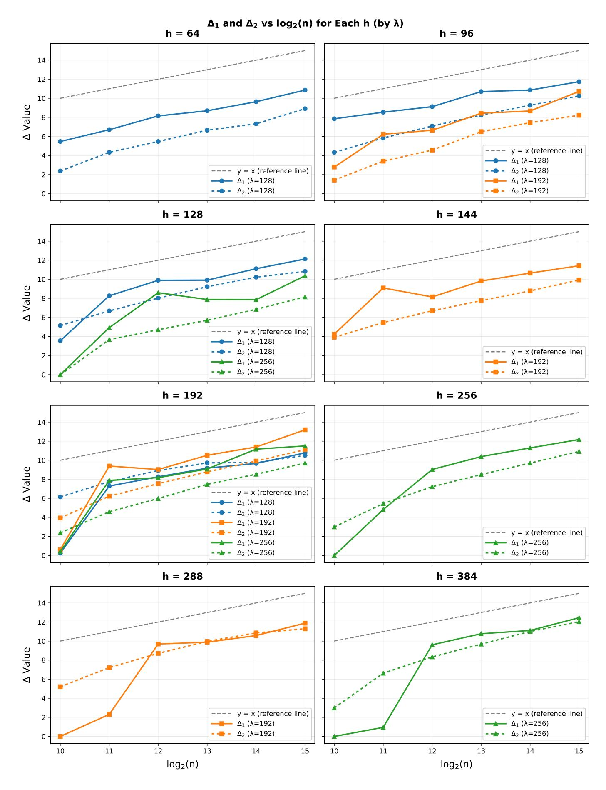

**Fig. F.1:** Variation curves of  $\Delta_1$  and  $\Delta_2$  with  $\log(n)$  for different h and  $\lambda$ , using data from Table E.1. Each h corresponds to a separate plot.

{56}------------------------------------------------

<span id="page-56-0"></span>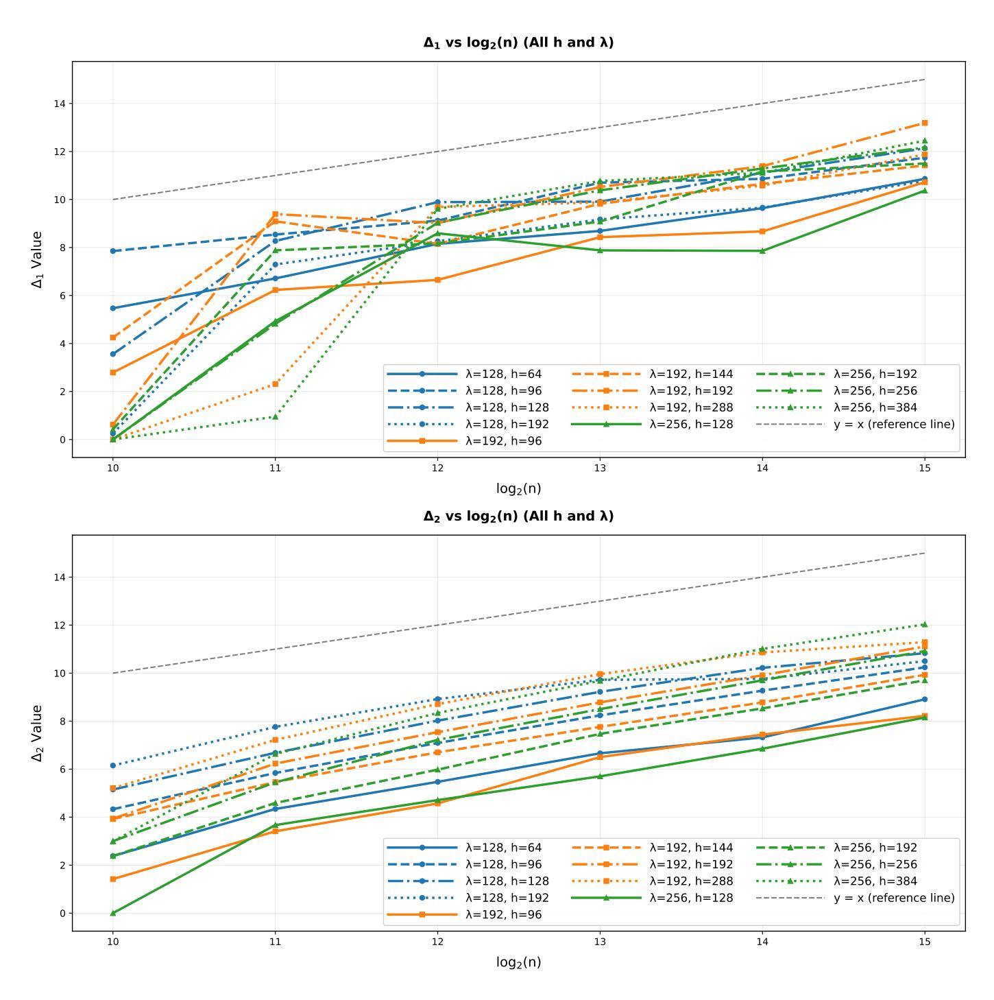

**Fig. F.2:** Variation curves of  $\Delta_1$  and  $\Delta_2$  with  $\log(n)$  for different h and  $\lambda$ , using data from Table E.1.  $\Delta_1$  and  $\Delta_2$  each correspond to a separate plot.

{57}------------------------------------------------

<span id="page-57-0"></span>Table G.1: Bit security of FHE schemes estimated by lattice-estimator with red\_cost\_model=ChaLoy21 and red\_shape\_model=GSA using a quantum sieving cost model based on [\[27\]](#page-34-5). The meanings of parameters n, h, q, "uSVP", TegvDec, TgvDec, ∆1, TehgDec, ThgDec and ∆<sup>2</sup> are consistent with those in Table [E.1.](#page-48-0) For the complexity evaluation of the (enhanced) Howgrave-Graham decoding attack under the quantum cost model, we do not employ the MITM technique; instead, the searching step achieves a square-root speedup via the quantum algorithm for both the (enhanced) guess-and-verify and (enhanced) Howgrave-Graham decoding attacks.

| FHE scheme log(n) |    | h   |          |       | log(q) uSVP TegvDec | TgvDec     | ∆1  | TehgDec | ThgDec     | ∆2  |
|-------------------|----|-----|----------|-------|---------------------|------------|-----|---------|------------|-----|
| [33, Sec. 5.2]    | 13 | 31  | 55       | 470.3 | 99.0                | 104.4      | 5.4 | 100.1   | 104.3      | 4.2 |
| [33, Sec. 5.2]    | 14 | 31  | 100      | 555.1 | 104.9               | 109.1      | 4.2 | 105.5   | 110.1      | 4.6 |
| [8, Sec. 7.1]     | 15 | 192 | 767      | 100.2 | 86.0                | 93.7       | 7.8 | 86.4    | 94.1       | 7.7 |
| [8, Sec. 7.1]     | 16 |     | 192 1553 | 100.2 | 84.2                | 93.3       | 9.2 | 84.4    | 93.4       | 9.0 |
| [8, Sec. 7.1]     | 17 |     | 192 3104 | 100.2 | 85.6                | 94.2       | 8.6 | 85.6    | 94.2       | 8.6 |
| [12, Tab. 5]      | 14 | 256 | 424      | 86.1  | 77.7                | 83.6       | 5.9 | 78.3    | 84.2       | 5.9 |
| [12, Tab. 7]      | 16 |     | 256 1598 | 95.1  | 85.0                | 91.1       | 6.2 | 85.2    | 91.3       | 6.1 |
| [12, Tab. 3]      | 16 |     | 192 1555 | 97.7  | 84.0                | 93.1       | 9.2 | 84.2    | 93.3       | 9.2 |
| [12, Tab. 3]      | 16 |     | 192 1546 | 100.2 | 84.6                | 93.7       | 9.0 | 84.9    | 94.0       | 9.1 |
| [12, Tab. 3]      | 16 |     | 192 1550 | 100.2 | 84.4                | 93.5       | 9.2 | 84.6    | 93.6       | 9.0 |
| [31, Tab. 3]      | 15 | 128 | 680      | 118.2 | 92.1                | 102.0      | 9.9 | 92.3    | 102.3 10.0 |     |
| [31, Tab. 3]      | 16 |     | 128 1000 | 182.5 | 127.4               | 138.7 11.2 |     | 127.7   | 139.0 11.3 |     |
| [47, Tab. 1]      | 16 |     | 256 1200 | 141.3 | 120.6               | 130.1      | 9.5 | 120.6   | 130.4      | 9.8 |
| [47, Tab. 1]      | 16 |     | 256 1600 | 95.1  | 84.7                | 91.1       | 6.4 | 85.0    | 91.3       | 6.4 |
| [47, Tab. 1]      | 17 |     | 256 2400 | 141.3 | 120.3               | 131.3 10.9 |     | 120.3   | 131.5 11.2 |     |
| [47, Tab. 1]      | 17 |     | 256 3000 | 105.4 | 92.3                | 99.8       | 7.5 | 92.3    | 100.0      | 7.7 |