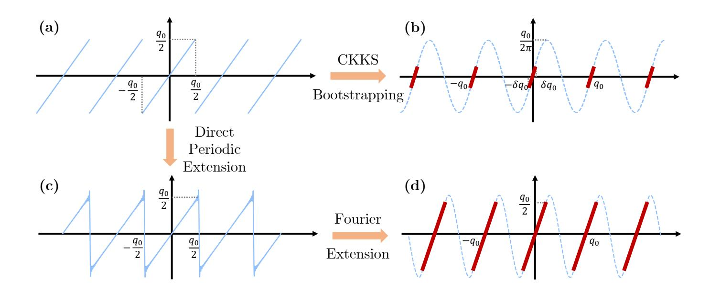
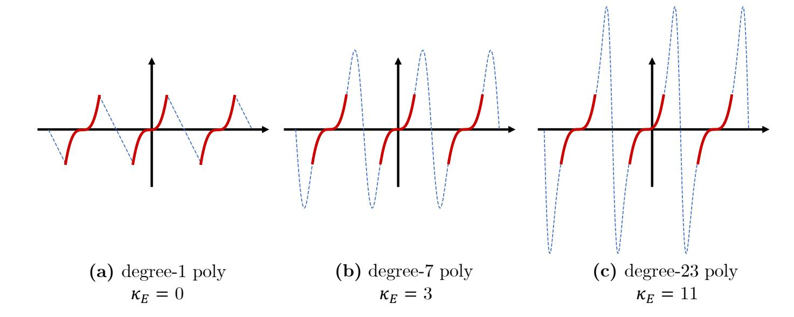
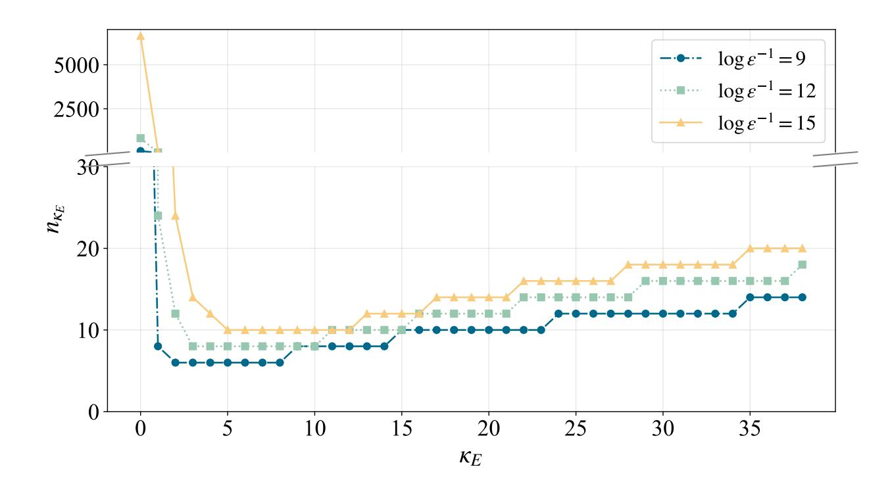
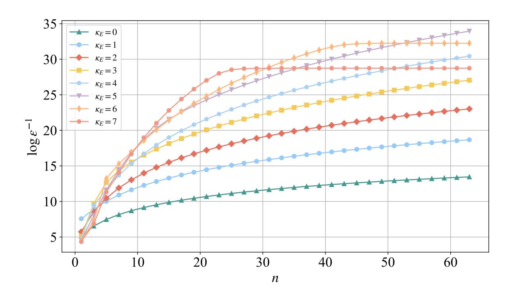
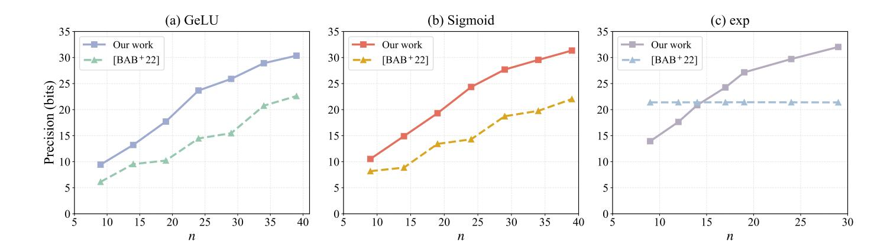
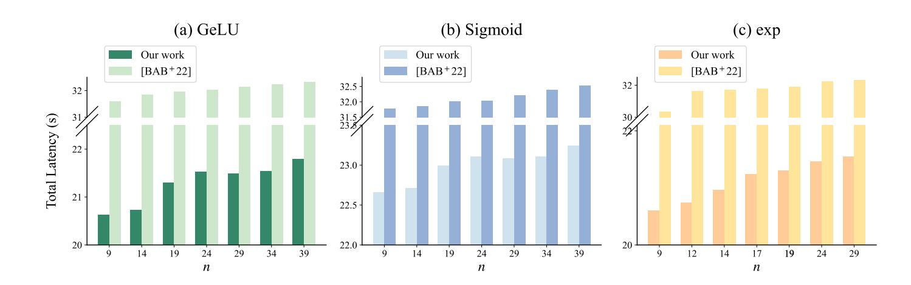

{0}------------------------------------------------

# High-Precision Functional Bootstrapping for CKKS from Fourier Extension

Song Bian<sup>1</sup> , Yunhao Fu1(B) , Ruiyu Shen<sup>1</sup> , Haowen Pan<sup>1</sup> , Anyu Wang<sup>2</sup> , and Zhenyu Guan<sup>1</sup>

<sup>1</sup> School of Cyber Science and Technology, Beihang University, Beijing, China {sbian, fyhssgss, ruiyushen, panhaowen, guanzhenyu}@buaa.edu.cn 2 Institute for Advanced Study, Tsinghua University, Beijing, China anyuwang@tsinghua.edu.cn

Abstract. We introduce a new (amortized) functional bootstrapping framework over the CKKS homomorphic encryption (HE) scheme based on Fourier extension. While approximating the modular reduction function in CKKS bootstrapping through Fourier series is a well-known technique, how such method can be efficiently generalized to functional bootstrapping is less understood. In this work, we show that, by constructing proper Fourier extensions, any function with a bounded domain in the smoothness class C κ can be approximated by a degree-n Fourier series with errors of order O(n −κ−2 ) (except at the derivative singularity), improving on previous results on a global error bound of O(n −1 ) [\[AKP25\]](#page-27-0). To achieve such bound, we propose a new way of constructing Fourier extensions, such that the extended functions appear as smooth as possible in the sense of a Fourier approximation. By implementing our functional bootstrapping over OpenFHE, we demonstrate that we can improve the data precision by 10–27 bits and reduce the amortized FBS latency by 1.1×–2× over a variety of benchmarking functions.

# <span id="page-0-0"></span>1 Introduction

Fully homomorphic encryption (FHE) enables computation to be carried out over ciphertext, and has a wide range of applications in medicine [\[FTPR](#page-29-0)<sup>+</sup>21], finance [\[BDP21,](#page-28-0) [EC25\]](#page-29-1), public administration [\[RAGR20,](#page-30-0) [ZW25\]](#page-31-0), etc. To efficiently evaluate different types of functions in various applications, the concept of functional bootstrapping (FBS) [\[BGGJ19,](#page-28-1) [GBA21\]](#page-29-2) is proposed, where an arbitrary function can be computed at low noise costs (as the ciphertext noise is refreshed by the embedded FHE bootstrapping procedure). FBS is first proposed based on the AP/DM scheme [\[ASP14,](#page-27-1) [DM15\]](#page-29-3), and is later generalized to GINX/CGGI [\[GINX16,](#page-29-4) [CGGI20\]](#page-28-2), BFV/BGV [\[MHW](#page-30-1)<sup>+</sup>23, [LW23c,](#page-30-2) [LW25\]](#page-30-3) and CKKS [\[AKP25,](#page-27-0) [DAP](#page-29-5)<sup>+</sup>26].

Existing implementation of FBS generally involves encoding a length-τ lookup table (LUT) LUT : Z → Z representing a discretized version of some function F with τ distinct input-output pairs into the bootstrapping procedure of the underlying FHE schemes [\[DM15,](#page-29-3) [CGGI20,](#page-28-2) [GBA21,](#page-29-2) [LW23a,](#page-30-4) [LW23b,](#page-30-5) [LW23c,](#page-30-2)

{1}------------------------------------------------

LW25, AKP25]. For example, in CGGI, the bootstrapping algorithm evaluates the homomorphic rotation of a particular polynomial (known as the accumulator v in [DM15]). To achieve functional bootstrapping, values in LUT are embedded as the coefficients in v as

<span id="page-1-2"></span><span id="page-1-1"></span>
$$v = \sum_{i=0}^{\tau} \mathsf{LUT}(i)x^{i},\tag{1}$$

such that for an input value of i, the homomorphic rotation of v corresponds to reading out the i-th LUT output value blindly. While DM/CGGI used to be the only known FHE scheme that supports FBS, recent works show that FBS can also be built over the BFV/BGV and CKKS [LW23c, BCKS24, BKSS25, AKP25], effectively leveraging the ciphertext single-instruction-multi-data (SIMD) property. For instance, [LW23c, IZ21] builds an LUT-specific polynomial

$$F(x) = \mathsf{LUT}(0) - \sum_{j=1}^{\tau-1} x^j \sum_{k=0}^{\tau-1} \mathsf{LUT}(k) k^{\tau-1-j} \tag{2}$$

over the BFV ciphertexts, such that  $F(\mathsf{BFV}(m)) = \mathsf{BFV}(\mathsf{LUT}(m))$  for  $\mathsf{BFV}(m)$ a BFV ciphertext encrypting a vector of plaintext messages m in N slots. Likewise, [BKSS25, AKP25, DAP+26] establish interpolation polynomials over the CKKS scheme, such that the evaluation of such a polynomial at a specific input produces the corresponding output value specified by the LUT. The key difference between CKKS-based and BFV-based FBS is that, BFV can leverage the plaintext modulus to naturally perform homomorphic modular reduction almost for free, while that for CKKS has to be explicitly approximated using high-degree polynomials. In particular, existing works [BKSS25, AKP25] generally expand modular reduction using trigonometric series, and derive Chebyshev polynomials for the specific series to serve as the overall approximations for the modular reduction function. Subsequently, to realize FBS over CKKS, the plaintext mis first homomorphically encoded into the trigonometric form as  $\exp(j2\pi m/\tau)$ (for j the imaginary unit) using Chebyshev polynomials. Then, an interpolation polynomial F(x) is built to map  $\exp(j2\pi m/\tau)$  to LUT. Concretely, in [BKSS25], F(x) is expressed as a basic Lagrange interpolation in the trigonometric form of

<span id="page-1-0"></span>
$$F(x) = \sum_{i=0}^{\tau} \mathsf{LUT}(i)\ell_i \left( \exp(j2\pi \frac{x}{\tau}) \right), \tag{3}$$

where  $\ell_i(z) = \prod_{l=0, l \neq i}^{\tau} \frac{z-z_l}{z_i-z_l}$  and  $z_i = \exp(j2\pi i/\tau)$ . Due to the periodic nature of  $\exp(j2\pi m/\tau)$ , the result of F acting on  $\exp(j2\pi m/\tau)$  is the simultaneous evaluation of both LUT and the (approximate) homomorphic modular reduction, i.e., LUT( $(m+Iq) \mod q$ ), for some ciphertext modulus q. By adopting a trigonometric-based FBS approach, the amortized FBS performance is reduced from milliseconds in DM/CGGI to microseconds for CKKS. To further reduce the interpolation noise, Equation (3) is modified to have higher-order derivatives set to zeroes for function smoothing [AKP25].

{2}------------------------------------------------

Despite the advances, retaining sufficient data precision throughout the FBS process remains a significant challenge. In particular, as observed in Equations [\(1\)](#page-1-1)–[\(3\)](#page-1-0), the number of distinct inputs to the LUT representation of the target function can only be at most τ , i.e., the degree of the embedding (in the case of DM/CGGI) or the interpolation (in the case of BFV/CKKS) polynomials. For most practical uses of FBS, τ can only be up to 2 <sup>10</sup>–2 <sup>12</sup> for performance reasons. As a result, the precision of input data to the FBS function are limited to be 8–12 bits at most [\[LHH](#page-30-6)+21, [LW23c,](#page-30-2) [AKP25\]](#page-27-0), which can often be inadequate for real-word applications [\[BPH](#page-28-5)+25, [CKW21\]](#page-29-7). Therefore, the core challenge against the design of the FBS is how to surpass the precision limitation of LUT encoding while preserving the generality of the applied functions.

## 1.1 Our Contributions

We introduce a new CKKS-based FBS method based on Fourier extension without relying on the LUT construction. First of all, we show that, by properly constructing a Fourier extension of a target periodic function, we can derive a Fourier series that approximates such function with an error rate lower than those based on direct trigonometric approximation [\[CHK](#page-28-6)<sup>+</sup>18, [BGGJ19\]](#page-28-1). Building upon the new function approximation method, we propose a high-precision functional bootstrapping scheme over CKKS with two key enhancements. First, by applying Fourier extension, we eliminate the discontinuities at the period boundaries, significantly enlarging the usable plaintext space and enhancing the precision without inducing additional approximation errors. Second, we develop algorithms to generate and optimize Fourier series that fit arbitrary functions over CKKS ciphertexts. Our main results are summarized as follows.

- High-Precision Function Approximation: For f<sup>T</sup> the target function in the smoothness class of C κ , we show that there exists a degree-n Fourier series that approximates the periodic Fourier extension of f<sup>T</sup> with error on the order of O(n −κ−2 ), except at the points of derivative singularities. Our error bound improves on previous results of a global O(n −1 ) bound. In addition, we prove that, for ˆf the periodic Fourier extension of f<sup>T</sup> and a positive real number ϵ, there exists a minimum n such that the n-degree Fourier series approximates ˆf with error less than ϵ.
- Improved Bootstrapping: One of the key benefits of Fourier extension over regular function extension is the ability to avoid boundary singularities across function periods. By applying the proposed function approximation technique to the sawtooth function (i.e., the modular reduction function), we show that the valid function domain can be enlarged from ±q0/2 <sup>11</sup> to ±q0/4 for q<sup>0</sup> the last-level CKKS ciphertext modulus.
- New Functional Bootstrapping: Leveraging the new function approximation technique, we establish a new FBS scheme that does not require function discretization. To the best of our knowledge, our method is the first FBS scheme that does not rely on LUTs. By formally analyzing the FBS errors, we show that we can completely avoid the LUT-encoding errors.

{3}------------------------------------------------



<span id="page-3-0"></span>**Figure 1.** The illustration of (a) the original function Boot and three types of function approximations to Boot: (b) the scaled-sine version of Boot [CHK<sup>+</sup>18, JM22], (c) the direct periodic extension of Boot, and (d) the Fourier extension of Boot.

- **Implementation**: We implement our FBS scheme over OpenFHE [BAB<sup>+</sup>22]. We show that, under similar latency constraint, we can improve FBS precision by 10–27 bits over a various function benchmarks compared to the state-of-the-art FBS techniques. In the special case of f(x) = x (i.e., the bootstrapping function), we can simultaneously improve the precision by 11 bits while reducing the end-to-end latency by  $2\times$ . Overall, we can complete a 31-bit regular bootstrapping, a 32-bit homomorphic GeLU, and a 31-bit homomorphic Sigmoid all under an amortized latency of 0.67 ms. Our code has been open-sourced at https://github.com/fyhssgss/FEFBS.

#### 1.2 Technical Overview

To begin with, let us first recall how existing works evaluate the bootstrapping function Boot over CKKS. To approximate Boot, there are essentially two different approaches in existing literature: i) scaled-sine approximation, and ii) trigonometric Hermite interpolation. In what follows, we outline the characteristics of both of the existing approaches.

First of all, as shown in Figure 1(a), the traditional scaled-sine approximation method applies a scaling factor to restrict the usable interval of the bootstrapping function with period q from [-q/2 + kq, q/2 + kq] to  $[-\delta q/2 + kq, \delta q/2 + kq]$ , where  $k \in \mathbb{Z}$  and  $\delta$  is typically set to  $2^{-10}$ .

The idea is that, within the domain of  $[-\delta q/2 + kq, \delta q/2 + kq]$ , a polynomial approximation to the sine function is tightly coincided with the approximation to the Boot function. The scaled-sine approach achieves high efficiency in evaluating the Boot function, but has two imperfections. First, by scaling down the usable interval of the sine function before bootstrapping, a large portion of the usable plaintext space is wasted, i.e., all values in the region  $[-q/2, -\delta q/2] \cup [\delta q/2, q/2]$  are unused. Second, the sine function can only be used in approximating the Boot

{4}------------------------------------------------

function. It is difficult to carry out FBS over the scaled-sine construction (while the recent work in [YNW+25] propose a solution for the ReLU function, it is unclear how such approach can be easily generalized to arbitrary case). To solve the above issues, recent literature [BKSS25, AKP25] adopts trigonometric interpolation to directly generate polynomials that approximate the bootstrapping function. Figure 1(c) depicts a conceptual illustration of trigonometric interpolation, where a Lagrange polynomial is established to fit a quantized version of Boot over the entire function domain (with certain derivative requirements in the case of a Hermite interpolation). Since the interpolation does not have any restriction on the shape of the target function, the trigonometric interpolation approach can be extended to full-domain FBS. Nonetheless, since the LUT is considered as a fully discretized function, all function values are interpolated as independent data points, resulting in a slow error convergence rate (i.e.,  $\mathcal{O}(n^{-1})$ ) with respect to the degree of the interpolation polynomial (i.e., n).

Function Approximation via Fourier Extension: Different from both of the existing methods, we take a third approach to the approximation of functions over FHE. Our main observation is that, the precision of function approximation is closely related to the *smoothness* of the target function. Subsequently, we discover that, by applying a Fourier extension to the target function (i.e., Boot in this example), we can build a Fourier series to directly approximate the extended function with an approximation error much less than that of the interpolation approach AKP25. Roughly speaking, to apply a Fourier extension for the Boot function, we first scale the plaintext space to  $[-\delta q/2, \delta q/2]$ , similar to the scaledsine approach. The difference here is that we set  $\delta = 1/2$ . Consequently, our usable interval is much larger than that of the scaled-sine approach (up to  $500 \times$ under common parameter settings). Next, as demonstrated in Figure 1(d), we generate a bridge polynomial to connect the right-most (resp., left-most) point of Boot in one period to the left-most (resp., right-most) point in the immediate adjacent periods to formalize a Fourier extension of Boot. Lastly, we construct a standard Fourier series to approximate the extended periodic function.

<span id="page-4-0"></span>
$$S_n^{\hat{f}_{\mathsf{Boot}}}(x) = \sum_{k=-n}^n c_k e^{jk\frac{2\pi}{q}x}, \text{ where } c_k = \frac{2}{q} \int_{-\frac{q}{2}}^{\frac{q}{2}} \hat{f}_{\mathsf{Boot}}(x) e^{-jk\frac{2\pi}{q}t} dt.$$
 (4)

Here,  $\hat{f}_{\mathsf{Boot}}$  is the periodic version of the extended Boot function, and n is the degree of the Fourier series.

FBS from Fourier Series Approximation: Building upon Equation (4), we notice that our approximation scheme is not restricted to Boot, and is applicable to any periodic function  $\hat{f}$ , yielding a new FBS scheme. Let  $f_{\rm T}$  be the target function in the smoothness class  $C^{\kappa_{\rm T}}$ . We can first apply the Fourier extension to get the periodic extended function  $\hat{f}_{\kappa_{\rm E}}$  where  $\kappa_{\rm E} \leq \kappa_{\rm T}$ . We then leverage the Fourier series approximation to obtain the approximation function  $S_n^{\hat{f}_{\kappa_{\rm E}}}$ . Next, let the input ciphertext be  $ct_{\rm in} = {\rm Enc}({\rm Ecd}_{\rm slot}(\boldsymbol{m}))$  where  $\boldsymbol{m}$  is the N-dimensional plaintext vector. Similar to  $[{\rm BKSS25}, {\rm AKP25}]$ , we apply HalfBTS(ct<sub>in</sub>)  $[{\rm BCK}^+23]$  to obtain  ${\rm Enc}({\rm Ecd}_{\rm slot}(\boldsymbol{m}+q_0\boldsymbol{I}))$ , and subsequently

{5}------------------------------------------------



<span id="page-5-0"></span>Figure 2. An illustration of three Fourier extensions for fT(x) = x <sup>3</sup> using different bridge functions: (a) degree-1 polynomial, (b) degree-7 polynomial, (c) degree-23 polynomial.

evaluate the trigonometric transformation function over ciphertext, giving in Enc(Ecdslot(exp(j2πm))). Next, we pre-compute all the ck's in Equation [\(4\)](#page-4-0) according to ˆfκ<sup>E</sup> . Finally, we directly perform a simple homomorphic polynomial evaluation (incorporating both homomorphic addition and multiplication) according to Equation [\(4\)](#page-4-0), which allows us to obtain the exact output values of f<sup>T</sup> at the input values specified by the elements in m in a SIMD manner.

We show that, by adopting Fourier extension, we can significantly enhance the smoothness of the extended function ˆfκ<sup>E</sup> , thereby reducing degree of the approximation series, i.e., n. For example, in the case of Boot, the unmodified modular reduction function is a discontinuous function (as sketched in Figure [1\(](#page-3-0)a)). Thus, the approximation error of existing method is bounded by O(n −1 ) [\[BKSS25,](#page-28-4) [AKP25\]](#page-27-0) where n is the degree of the interpolation polynomial. In contrast, by properly extending the sawtooth function as in Figure [1\(](#page-3-0)d), we can increase the smoothness of the overall function (reaching κ<sup>E</sup> = 18 in our OpenFHE implementation), achieving an error bound of O(n <sup>−</sup>20). Furthermore, we demonstrate the effectiveness of the proposed FBS over a number of functions such as exp and GeLU. In particular, for exp and GeLU under OpenFHE, we show that the error bounds can be improved to O(n <sup>−</sup><sup>20</sup>) and O(n <sup>−</sup><sup>13</sup>), respectively, both improving on the original bounds of O(n −1 ) [\[BKSS25,](#page-28-4) [AKP25\]](#page-27-0).

Approximation Degree Minimization: To achieve high-precision function evaluation at a lower computational cost, the key challenge for using Fourier extension in FBS is to minimize the degree of the approximation series in Equation [\(4\)](#page-4-0). Such challenge turns into the problem of generating the best possible f<sup>B</sup> to maximize the convergence of the extended function ˆf<sup>κ</sup><sup>E</sup> .

Under the FBS setting, f<sup>T</sup> can be of any shape, from completely discontinuous functions like the step function and tan(x), to much more smooth functions such as x <sup>2</sup> and sin(x). As a result, how to determine and optimize the shape of f<sup>B</sup> for any given FBS task becomes the fundamental challenge. To solve the 

{6}------------------------------------------------

problem, we first show that, for  $f_{\rm B}$  a polynomial and  $f_{\rm T}$  in any given smoothness class, there exists a minimum degree for the Fourier series to approximate the extended function  $\hat{f}_{\kappa_{\rm E}}$  that is in the smoothness class  $C^{\kappa_{\rm E}}$ . At a glance, the above result is trivial in that, as long as we keep increasing  $\kappa_{\rm E}$ , i.e., the smoothness of  $\hat{f}_{\kappa_{\rm E}}$ , n is expected to decrease. We show that such is not the case. In fact, when we keep letting  $\kappa_{\rm E}$  grow by increasing the polynomial degree of  $f_{\rm B}$ , the minimum Fourier series degree n will also start to increase after a certain continuity threshold, denoted as  $\kappa^*$ . In other words, we prove that, to achieve the smallest possible n, the extended function needs to have a specific smoothness  $\kappa^*_{f_{\rm T}}$  that optimally extends the target function  $f_{\rm T}$ .

To better illustrate the phenomenon, we take  $f_{\rm T}(x)=x^3$  as an example and illustrate three different ways of constructing the bridge function: linear (Figure 2(a)), degree-7 bridge polynomial (Figure 2(b)), and degree-23 bridge polynomial (Figure 2(c)). First, as depicted in Figure 2(a), if we extend  $x^3$  using a low-degree polynomial, i.e., a linear function, the size of the Fourier remainder that dominates the approximation error is dominated by the term  $\frac{2}{\pi^2 n^2}$ , which has a low convergent speed at  $\mathcal{O}(n^{-2})$ . Next, as shown in Figure 2(b), if we let  $f_{\rm B}$  to be a degree-7 polynomial, the size of the dominant term error can be reduced to  $\frac{3\,000}{\pi^5 n^5}$ , obtaining the much faster speed of  $\mathcal{O}(n^{-5})$ . Nonetheless, if we keep increasing the degree of  $f_{\rm B}$  to 23 as demonstrated in Figure 2(c), the resulting error bound is dominated by the term

<span id="page-6-0"></span>
$$\frac{2506114337126400}{\pi^{13}n^{13}}. (5)$$

The important observation here is that, due to the the large constant factor in Equation (5), even though the error decreases at a faster rate of  $\mathcal{O}(n^{-13})$ , the minimum degree of Fourier series that approximates  $x^3$  actually becomes larger than that of the degree-7 polynomial. Thus, our main result here shows that such property of Fourier extension holds true for all real-valued functions.

# <span id="page-6-1"></span>2 Background

#### 2.1 Notations

Let  $\mathbb{Z}$ ,  $\mathbb{Q}$ ,  $\mathbb{R}$ , and  $\mathbb{C}$  denote the sets of integers, rational numbers, real numbers and complex numbers, respectively. For  $S \in \{\mathbb{Z}, \mathbb{Q}, \mathbb{R}, \mathbb{C}\}$ , S[x] represents the set of polynomials with coefficients in S. For a complex number  $\alpha = a + jb \in \mathbb{C}$  with  $a, b \in \mathbb{R}$ , we denoted  $\text{Re}(\alpha) = a$  and  $\text{Im}(\alpha) = b$  as the real / imaginary part of  $\alpha$ . We use boldface lowercase letters to denote vectors (e.g. a). For a function f(x),  $f^{(i)}(x)$  denotes its i-th derivative, with  $f^{(0)}(x) = f(x)$ . Given a power-of-two  $N \geq 1$  and a prime q, let  $\mathcal{R} = \mathbb{Z}[x]/(x^N + 1)$  and  $\mathcal{R}_q = \mathcal{R}/q\mathcal{R}$ . Unless otherwise specified, all logarithms are in base 2.

{7}------------------------------------------------

## 2.2 The CKKS Scheme

The CKKS scheme [CKKS17] is a fully homomorphic encryption scheme capable of encrypting real numbers and complex numbers while supporting linear operations. We briefly outline the key components of CKKS relevant to our work.

**CKKS** ciphertext: A CKKS ciphertext ct =  $\mathsf{Enc}(m)$  defined over  $\mathcal{R}_q$  is a tuple  $(a,b) \in \mathcal{R}_q^2$  encrypting a message polynomial  $m \in \mathcal{R}_q$ , where the secret key  $s \in \mathcal{R}$  is a polynomial with coefficients in  $\{0,\pm 1\}$  satisfying:

$$b = -a \cdot s + m + e, \tag{6}$$

where  $e \in \mathcal{R}$  is a random noise polynomial with small coefficients. To efficiently handle cyclotomic polynomial rings with large modulus, the RNS-CKKS scheme [CHK<sup>+</sup>19] employs a residue number system (RNS) representation for the ring  $\mathcal{R}_Q$ :  $\mathcal{R}_Q \cong \mathcal{R}_{q_0} \times ... \times \mathcal{R}_{q_L}$ , where  $q_0, ..., q_L$  are L+1 distinct primes and  $Q = \prod_{i=0}^L q_i$ . Based on the Chinese Remainder Theorem (CRT), this RNS representation enables the CKKS scheme to process larger moduli by operating on multiple smaller prime moduli.

Slots and Coefficients: A CKKS ciphertext typically encrypts a vector of plaintext values. With a scaling factor  $\Delta \in \mathbb{Z}$ , the encoding of a vector  $\mathbf{m} \in \mathbb{C}^{N/2}$  into a polynomial  $m \in \mathcal{R}_q$  can be realized through two methods: slot encoding and coefficient encoding. In slot encoding, the conversion between  $\mathbb{C}^{N/2}$  and  $\mathcal{R}_q$  is facilitated by the discrete Fourier transform (DFT) and its inverse (iDFT), with their encoding/decoding mappings defined below:

<span id="page-7-0"></span>
$$\mathbb{C}^{N/2} \to \mathcal{R}_q : m = \mathsf{Ecd}_{\mathsf{slot}}(\boldsymbol{m}) = \lfloor \Delta \cdot \mathsf{iDFT}(\boldsymbol{m}) \rceil, \tag{7}$$

$$\mathcal{R}_q \to \mathbb{C}^{N/2} : \boldsymbol{m} = \mathsf{Dcd}_{\mathrm{slot}}(m) = \frac{1}{\Delta} \cdot \mathsf{DFT}(m).$$
 (8)

In coefficient encoding, the real and imaginary components of a complex vector are first scaled by  $\Delta$  and rounded to integers, then placed in the first and second halves of the polynomial coefficients respectively, with the corresponding maps given by:

$$\mathbb{C}^{N/2} \to \mathcal{R}_q : m = \mathsf{Ecd}_{\mathsf{coef}}(\mathbf{m}) = \sum_{i=0}^{N/2} \mathsf{Re}(\boldsymbol{m}_i) x^i + \sum_{i=0}^{N/2} \mathsf{Im}(\boldsymbol{m}_i) x^{i+N/2}, \qquad (9)$$

$$\mathcal{R}_q \to \mathbb{C}^{N/2} : \boldsymbol{m} = \mathsf{Dcd}_{\mathsf{coef}}(m) = [m_i + j m_{i+N/2}]_{0 \le i < N/2}. \tag{10}$$

Note that both encoding methods employ  $\Delta$ -scaling to position vector components in the higher-order bits of polynomial coefficients, thereby separating them from the noise occupying lower-order bits.

Homomorphic Evaluation: All operations on ring elements correspond to homomorphic evaluations supported by the CKKS scheme, including ciphertext addition, subtraction, multiplication, and automorphism. In addition to the basic ring operations, we can also evaluate finite-degree polynomials over CKKS ciphertexts. To accelerate polynomial evaluations, we can use techniques such

{8}------------------------------------------------

as Chebyshev polynomial [May06] and Minimax approximation [Tas21] to reduce the multiplicative depth. Furthermore, the baby-step-giant-step and the Paterson-Stockmeyer (PS) [PS73] methods can effectively reduce the number of ciphertext-ciphertext multiplications over CKKS [LLK<sup>+</sup>22]. Note that, when leveraging the slot encoding, all the above operations act over each of the data slots independently in a SIMD manner.

**CKKS Bootstrapping**: When successive multiplications are performed over the CKKS ciphertext, the number of RNS moduli keeps decreasing and eventually reaches a minimum value, denoted as  $q_0$ . At this stage, the ciphertext can no longer support further multiplications, and bootstrapping is required to restore the modulus chain and enable subsequent computations. Bootstrapping can be summarized in the following two steps:

- HalfBTS: HalfBTS consists of three main procedures, namely, S2C, ModRaise, and C2S [CHK+18]. First, in S2C, the ciphertext  $\operatorname{Enc}(\operatorname{Ecd}_{\operatorname{slot}}(\boldsymbol{m})) \in \mathcal{R}_{q_0}^2$  is homomorphically encoded into  $\operatorname{Enc}(\Delta m)$ . Then, in ModRaise,  $\operatorname{Enc}(\Delta m)$  is directly turned into  $\operatorname{Enc}(\Delta m + Iq'_0) \in \mathcal{R}_Q^2$ . Lastly, in C2S, the ciphertext is homomorphically decoded to produce  $\operatorname{Enc}(\operatorname{Ecd}_{\operatorname{slot}}(\boldsymbol{m} + q'_0\boldsymbol{I}))$ . Note that most existing CKKS bootstrapping techniques adopt the above three procedures as an initial step. Thus, following [BCK+23], we refer to the sequential application of S2C  $\rightarrow$  ModRaise  $\rightarrow$  as HalfBTS.
- EvalMod: In this step, the sine function is homomorphically applied to the ciphertext  $ct_{\mathsf{HalfBTS}} = \mathsf{Enc}\left(\mathsf{Ecd}_{\mathsf{slot}}(\boldsymbol{m} + q_0'\boldsymbol{I})\right)$ . By leveraging the modular behavior of the sine function near its zero-crossing points,  $q_0'\boldsymbol{I}$  can be reduced, yielding  $ct_{\mathsf{Boot}} = \mathsf{Enc}(\mathsf{Ecd}_{\mathsf{slot}}(\boldsymbol{m}))$ .

CKKS Functional Bootstrapping: Recently, it is demonstrated that functional bootstraping can also be constructed over CKKS [BGGJ19, BKSS25, AKP25]. Owing to its SIMD capability, FBS based on CKKS achieves higher throughput compared to GINX/CGGI schemes. The general framework of CKKS FBS largely follows that of the CKKS bootstrapping, where HalfBTS is first applied to the input ciphertext. Then, the target function is evaluated via the application of specially crafted approximation polynomials.

For example, [BCKS24] proposes bootstrapping bits on CKKS by constructing trigonometric functions with varying phases and amplitudes, which can be combined to realize arbitrary logic gates. [BKSS25] embeds a small integer  $m \in [0,t)$  in the form  $\frac{m}{t}$ , then maps it to a primitive t-th root of unity through the complex exponential  $\exp(j2\pi x/t)$ , which serves as the variable in subsequent Lagrange interpolation, enabling arbitrary function evaluation. [AKP25] employs trigonometric Hermite interpolation for LUT evaluation in CKKS, reducing output error by flattening the function near the interpolation points. Leveraging the properties of trigonometric interpolation, [AKP25] enables the simultaneous interpolation of function values and first derivatives using only a degree- $\tau$  complex exponential polynomial for a length- $\tau$  LUT. Building upon [AKP25], [DAP+26] adopts the idea of multiplexer trees to construct large LUTs from small ones, thereby alleviating the inefficiency caused by excessively high polynomial degrees when directly handling large-precision LUTs.

{9}------------------------------------------------

## 2.3 Function Smoothness

The smoothness of a function is quantified by the number of the continuous derivatives over the function domain. Formally, a function f is said to be of smoothness class  $C^{\kappa}$  if it is  $\kappa$ -times differentiable with continuous  $\kappa$ -th derivative, but fails to have a continuous  $(\kappa+1)$ -th derivative due to the singularities  $\zeta$  (points where the  $(\kappa+1)$ -th derivative is discontinuous). We write  $C^{\kappa}(S)$  to denote the  $\kappa$ -smoothness function defined on interval S. Furthermore, f is classified as  $C^{\infty}$  if it has continuous derivatives of all orders  $k \in \mathbb{Z} \cap [0, +\infty)$ . For instance, the triangular wave which is defined as

$$f_{\text{tri}}(x) = \begin{cases} x - kT & x \in [kT, kT + T/2) \\ T - (x - kT) & x \in [kT + T/2, (k+1)T) \end{cases}, k \in \mathbb{Z}$$
 (11)

is globally continuous but has a first discontinuous derivative  $f_{\text{tri}}^{(1)}(x) = -\text{sgn}((x \text{ mod } T) - T/2)$  where sgn(x) denotes the sign function. The jump discontinuities in  $f'_{\text{tri}}(x)$  at each x = kT/2 means that  $f_{\text{tri}}(x)$  is a  $C^0$  function.

Conversely, if a function contains one or more singularities in the function values per se, such functions are referred to as discontinuous function. A classic example is the sawtooth wave

<span id="page-9-0"></span>
$$f_{\text{saw}}(x) = x - kT, x \in [kT, (k+1)T), k \in \mathbb{Z},$$
 (12)

where the singularities occur at  $x = kT(k \in \mathbb{Z})$ .

## 2.4 Periodic Function and its Approximation

A function f is said to be periodic with period  $2T \neq 0$  if for all x in its domain, x + 2T also belongs to the domain of f and f(x + 2T) = f(x). We focus on two key aspects of periodic functions: how to extend a finite-domain function to a periodic one, and how to approximate such periodic functions analytically.

**Periodic Extension**: Let f be a function defined on [-T,T]. Odd and even extensions [Rud64] enforce periodicity by embedding finite-domain functions into a periodic function. Alternatively, one may apply  $\hat{f}(x) = \mathsf{PE}(f,x)$ , which is the direct periodic extension of f with period 2T. defined as:

$$\mathsf{PE}(f,x) = \hat{f}(x) = f(x-2kT), \text{ where } k \in \mathbb{Z} \text{ and } x-2kT \in [-T,T).$$
 (13)

Both the even-odd and the direct function extention methods rely on piecewise constructions, and thus require function segmentation.

Fourier Series: To avoid evaluating segmented functions, we can use Fourier series to construct an approximated version of the target periodic functions. Specifically, if f satisfies the Dirichlet sufficiency conditions [Rud64], it can be extended to a 2T-periodic function that admits a convergent Fourier series expansion:

$$S_n^{\hat{f}}(x) = \frac{a_0}{2} + \sum_{k=1}^n \left( a_k \cos\left(\frac{\pi}{T}kx\right) + b_n \sin\left(\frac{\pi}{T}kx\right) \right),\tag{14}$$

{10}------------------------------------------------

where the coefficients are given by

$$a_k = \frac{1}{T} \int_{-T}^{T} f(t) \cos(\frac{\pi}{T}kt) dt, b_k = \frac{1}{T} \int_{-T}^{T} f(t) \sin(\frac{\pi}{T}kt) dt.$$
 (15)

The expansion can also be expressed in complex form as follows:

<span id="page-10-3"></span>
$$S_n^{\hat{f}}(x) = \sum_{k=-n}^n c_k e^{jk\frac{\pi}{T}x}, \text{ where } c_k = \frac{1}{T} \int_{-T}^T f(x)e^{-jk\frac{\pi}{T}t}dt.$$
 (16)

The Fourier series expansion can thus be regarded as an analytic approximation of  $\hat{f}$ , with the accuracy of the approximation captured by the pointwise error  $E_n^{\hat{f}}(x) = \hat{f}(x) - S_n^{\hat{f}}(x)$ . Specifically,  $E_n^{\hat{f}}(x)$  can be expressed as [YX24]:

$$E_n^{\hat{f}}(x) = \frac{1}{T} \int_{-T}^{T} \phi(x, t) \cos(\frac{\pi}{T} n t) dt + \frac{1}{T} \int_{-T}^{T} \Phi(x, t) \sin(\frac{\pi}{T} n t) dt, \tag{17}$$

where

<span id="page-10-4"></span><span id="page-10-1"></span>
$$\phi(x,t) = \frac{\hat{f}(x) - \hat{f}(x-t)}{2}, \Phi(x,t) = \phi(x,t) \cot \frac{\pi t}{2T},$$
(18)

and  $\Phi(x,0)$  is defined by  $\lim_{t\to 0} \Phi(x,t)$ . Note that  $S_n(x)$  achieves pointwise convergence to  $\hat{f}(x)$  (i.e.,  $\lim_{n\to\infty} S_n(x) = \hat{f}(x)$ ) at points of continuity, while exhibiting Gibbs phenomena [Gib98] near discontinuities, resulting in non-convergence at these singular points. We now present a key lemma that is essential in Section 3.

<span id="page-10-2"></span>**Lemma 1.** (Theorem 2.1 in [YX24]) Let  $\hat{f}$  be a 2T-periodic function that satisfies

$$\hat{f} \in C^{\kappa}(I), f^{(\kappa+l)} \in C^{\kappa}(I \setminus \zeta), \zeta \in (-\pi, \pi)$$
(19)

with  $f^{(\kappa+l)}(\zeta\pm 0) = \lim_{x\to\zeta^{\pm}} f^{(\kappa+l)}(\zeta)$  existing for l=1,2,3. Then the error defined by Equation (17) enjoys decay orders

<span id="page-10-5"></span>
$$E_n^{\hat{f}}(x) = \begin{cases} \mathcal{O}(n^{-\kappa - 2}) & x \in I \setminus \zeta \\ \mathcal{O}(n^{-\kappa - 1}) & x = \zeta \end{cases}$$
 (20)

## <span id="page-10-0"></span>3 Fourier Extension

In this section, we first formalize the definition of the function extension problem which is a specific type of periodic function problem. Subsequently, we propose a Fourier-extension-based method for constructing periodic functions by establishing several key lemmas and theorems.

{11}------------------------------------------------

Function Extension Problem: Given a nonperiodic continuous target function  $f_{\rm T}$  defined on  $[-T_{\rm T}, T_{\rm T}]$ , how to construct a periodic function  $\hat{f}$  with arbitrary period T, such that the Fourier series expansion  $S_n^{\hat{f}}(x)$  achieve the best possible order of pointwise convergence to  $f_{\rm T}(x)$  when  $x \in [-T_{\rm T}, T_{\rm T}]$ ?

To address the above problem, we first examine the most straightforward method: constructing the periodic extension of  $f_{\rm T}$  to a  $T=2T_{\rm T}$ -periodic function defined on  $\mathbb R$ . Clearly, if the target function  $f_{\rm T}$  is continuous on its entire domain and satisfies  $f_{\rm T}(-T_{\rm T}^+)=f_{\rm T}(T_{\rm T}^-)$ , then its periodic extension  $\hat{f}$  will converge pointwise everywhere. However, if  $f_{\rm T}$  fails to satisfy the periodic boundary condition or contains inherent discontinuities,  $\hat{f}$  will exhibit the Gibbs phenomenon. Consequently, the approximation fails to converge pointwise to  $f_{\rm T}$  near discontinuities, and thus does not satisfy the requirements of the function extension problem. Hence, we can see that the effectiveness of function extension fundamentally depends on: (i) the intrinsic smoothness of  $f_{\rm T}$ , and (ii) its boundary behavior at domain endpoints. As established in Lemma 1, the smoothness of a periodic function  $\hat{f}$  positively correlates with the convergence rate of its Fourier series. Thus, the key question in solving the function extension problem becomes: how can we construct highly smooth periodic functions?

In this work, we consider an alternative extension known as Fourier extension, first mentioned in [Huy10]. In contrast to periodic extension, Fourier extension addresses the function extension problem by constructing the periodic function on a larger interval ( $> 2T_{\rm T}$ ), which provides greater flexibility in the extension process. Before presenting our construction, we first state the following lemma:

<span id="page-11-0"></span>**Lemma 2.** Let f be a function where  $f \in C^{\kappa}([l,r])$ . If f satisfies that

<span id="page-11-2"></span><span id="page-11-1"></span>
$$f(l) = f(r), f^{(1)}(l^{+}) = f^{(1)}(r^{-}), ..., f^{(\kappa)}(l^{+}) = f^{(\kappa)}(r^{-})$$
(21)

then its periodic extension  $\hat{f}$  to  $\mathbb{R}$  with period r-l belongs to  $C^{\kappa}$ , i.e.,  $\hat{f} \in C^{\kappa}(\mathbb{R})$ .

Proof. Since  $f \in C^{\kappa}([l,r])$ , all derivatives  $f^{(i)}(x)$  (for  $0 \le i \le \kappa$ ) exist and are continuous when  $x \in (l,r)$ . For  $(l+kT_f,r+kT_f)$ , where  $k \in \mathbb{Z}$  and  $T_f = r-l$ , the extension  $\hat{f}$  coincides with f after a shift with period  $T_f$ , which inherits the  $C^{\kappa}$ -smoothness in these intervals. Thus,  $\hat{f} \in C^{\kappa}(\mathbb{R} \setminus \{l+kT_f\}_{k \in \mathbb{Z}})$ .

Without loss of generality (WLOG), consider the boundary x = l. The key observation is that the periodic boundary conditions  $f^{(i)}(l^+) = f^{(i)}(r^-)$  for  $0 \le i \le \kappa$  ensure the continuity of derivatives across adjacent intervals. Specifically, when i = 0, it satisfies:

$$\lim_{x \to l^{-}} \hat{f}(x) = \hat{f}(l^{-}) = f(l - T_f + T_f) = f(r) = f(l) = \hat{f}(l^{+}) = \lim_{x \to l^{+}} \hat{f}(x). \quad (22)$$

Therefore, the continuity of  $\hat{f}$  on  $\mathbb{R}$  holds by  $\lim_{x\to kT_f+l^-} \hat{f}(x) = \lim_{x\to kT_f+l^+} \hat{f}(x)$ , which implies the existence of  $f^{(1)}(x)$  on  $\mathbb{R}$ . By induction, if  $\hat{f}^{(i)}(x)$  is continuous on  $\mathbb{R}$ , the equality  $f^{(i+1)}(l^+) = f^{(i+1)}(r^-)$  guarantees  $\hat{f}^{(i+1)}(x)$  inherits the smoothness. Iterating to  $i = \kappa$ ,  $\hat{f} \in C^{\kappa}(\mathbb{R})$ , which completes the proof.

{12}------------------------------------------------

Lemma 2 shows that maintaining  $\kappa$ -smoothness in  $\mathbb{R}$  for a periodic function requires specific boundary matching conditions on the nonperiodic function before function extension. However, in the function extension problem, the boundary derivative values of  $f_{\mathrm{T}}$  are inherently fixed, which means that most functions do not satisfy the condition in Equation (21). Fortunately, Fourier extension provides an expanded interval that permits additional manipulations. Motivated by Lemma 1 and Lemma 2, we now propose the following construction of Fourier extension.

 $\kappa_{\rm E}$ th-Order Fourier Extension For a given non-negative integer  $\kappa_{\rm E}$ , we perform the following steps:

- Step 1: Construct the bridge function  $f_{\rm B}$  defined on  $[T_{\rm T}, T_{\rm T} + T_{\rm B}]$   $(T_{\rm B} > 0)$  via Hermite interpolation satisfying the boundary condition:

$$\begin{cases} f_{\rm B}^{(i)}(T_{\rm T}^{+}) &= f_{\rm T}^{(i)}(T_{\rm T}^{-}) \\ f_{\rm B}^{(i)}(T_{\rm T} + T_{\rm B}^{-}) &= f_{\rm T}^{(i)}(-T_{\rm T}^{+}) \end{cases}, 0 \le i \le \kappa_{\rm E}$$
(23)

Note that  $f_{\rm B} = \sum_{i=0}^{2\kappa_{\rm E}+1} \mathfrak{a}_i t^i$  is a polynomial of degree  $2\kappa_{\rm E}+1$ .

– Step 2: Define the composite function  $f_{\kappa_{\rm E}}$  on  $[-T_{\rm T}, T_{\rm T} + T_{\rm B}]$  such that

$$f_{\kappa_{\rm E}}(x) = \begin{cases} f_{\rm T}(x), x \in [-T_{\rm T}, T_{\rm T}) \\ f_{\rm B}(x), x \in [T_{\rm T}, T_{\rm T} + T_{\rm B}] \end{cases}$$
 (24)

- Step 3: Perform periodic extension of  $f_{\kappa_{\rm E}}$  to obtain the periodic function  $\hat{f}_{\kappa_{\rm E}}$  with  $2T = 2T_{\rm T} + T_{\rm B}$ , the corresponding Fourier series is  $S_n^{\hat{f}_{\kappa_{\rm E}}}$ .

The above construction defines the  $\kappa_{\rm E}$ th-order Fourier extension method, denoted by the following operator:

<span id="page-12-1"></span><span id="page-12-0"></span>
$$\hat{f}_{\kappa_{\rm E}} = \mathsf{FE}_{\kappa_{\rm E}}(f_{\rm T}). \tag{25}$$

Note that  $\frac{T_{\rm B}}{T_{\rm T}}$  is an arbitrarily predefined parameter that is independent of the choice of  $\kappa_{\rm E}$ .

**Remark:** For functions that satisfy  $f_{\rm T}^{(i)}(-T_{\rm T})=f_{\rm T}^{(i)}(T_{\rm T})$  for  $0 \leq i \leq \kappa_{\rm T}$  (e.g.  $f_{\rm T}(x)\equiv c$  where c is a constant number), a straightforward periodic extension over  $[-T_{\rm T},T_{\rm T}]$  suffices to construct a periodic function belongs to  $C^{\kappa_{\rm T}}(\mathbb{R})$ . Since such functions trivially satisfy the required periodicity constraints without requiring Fourier extension, they will be excluded from subsequent analyses.

By combining Lemma 1, Lemma 2 and the  $\kappa_{\rm E}$ th-order Fourier extension, we obtain the following corollary:

Corollary 1. Let  $f_T \in C^{\kappa_T}([-T_T, T_T])$  be extended to  $\hat{f}_{\kappa_E}$  via a  $\kappa_E$ th-Order-Fourier Extension. Then the extended function satisfies that  $\hat{f}_{\kappa_E} \in C^{\min(\kappa_T, \kappa_E)}(\mathbb{R})$ .

{13}------------------------------------------------

Furthermore, let  $\zeta_{f_{\mathrm{T}}}$  be the set of singularities of  $f_{\mathrm{T}}$ , then the singularities of  $\hat{f}_{\kappa_{\mathrm{E}}}$  are given by:

$$\zeta_{\hat{f}_{\kappa_{\mathrm{E}}}} = \begin{cases}
\{\zeta_{f_{\mathrm{T}}} + kT\}, & \kappa_{\mathrm{T}} < \kappa_{\mathrm{E}} \\
\{\zeta_{f_{\mathrm{T}}} + kT\} \cup \{T_{\mathrm{T}} + kT\}, & \kappa_{\mathrm{T}} = \kappa_{\mathrm{E}}, k \in \mathbb{Z}. \\
\{T_{\mathrm{T}} + kT\}, & \kappa_{\mathrm{T}} > \kappa_{\mathrm{E}}
\end{cases} \tag{26}$$

From Corollary 1, we conclude that when  $\kappa_{\rm E} \leq \kappa_{\rm T}$ ,  $\hat{f}_{\kappa_{\rm E}} \in C^{\kappa_{\rm E}}(\mathbb{R})$ . For now, we simply say that  $\hat{f}_{\kappa_{\rm E}} \in C^{\kappa_{\rm E}}(\mathbb{R})$ , and defer the discussion on the optimality of choosing  $\kappa_{\rm E} \leq \kappa_{\rm T}$  to Section 4. Subsequently, we present three theorems characterizing the key properties of Fourier extension.

<span id="page-13-0"></span>**Theorem 1.** Given a positive number  $\epsilon$  and a non-negative integer  $\kappa_{\rm E}$ , for  $x \in [-T_{\rm T}, T_{\rm T}]$ , there exists a threshold  $n_0(\epsilon, \kappa_{\rm E}, x)$  dependent on  $\epsilon$ ,  $\kappa_{\rm E}$ , and x, such that for all  $n \geq n_0(\epsilon, \kappa_{\rm E}, x)$ , the following inequality holds:

$$\left| S_n^{\hat{f}_{\kappa_{\rm E}}}(x) - f_{\rm T}(x) \right| < \epsilon \tag{27}$$

where  $S_n^{\hat{f}_{\kappa_{\rm E}}}(x)$  represents the Fourier series derived from  $\hat{f}_{\kappa_{\rm E}}(x) = \mathsf{FE}_{\kappa_{\rm E}}(f_{\rm T}(x))$ .

*Proof.* For a given  $\kappa_{\rm E}$ , the function periodicity combined with the construction in Equation (24) ensures that  $\hat{f}_{\kappa_{\rm E}}(x) = f_{\rm T}(x)$  when  $x \in [-T_{\rm T}, T_{\rm T}]$ . Because of  $\hat{f}_{\kappa_{\rm E}} \in C^{\kappa_{\rm E}}$  ( $\kappa_{\rm E} \geq 0$ ), its Fourier series  $S_n^{\hat{f}_{\kappa_{\rm E}}}(x)$  converges pointwise to  $\hat{f}_{\kappa_{\rm E}}$  (and hence to  $f_{\rm T}(x)$ ) within  $[-T_{\rm T}, T_{\rm T}]$ . By the definition of pointwise convergence, for any fixed  $\epsilon > 0$  and  $x \in [-T_{\rm T}, T_{\rm T}]$ , there exists a positive integer  $n_0(\epsilon, \kappa_{\rm E}, x)$  such that the truncation error satisfies  $\left|S_n^{\hat{f}_{\kappa_{\rm E}}}(x) - f_{\rm T}(x)\right| < \epsilon$  for all  $n \geq n_0$ .

To quantify  $n_0$ , we leverage Lemma 1, which bounds the approximation error for  $S_n^{\hat{f}_{\kappa_{\rm E}}}(x)$ . When  $x \notin \zeta_{\hat{f}_{\kappa_{\rm E}}}$ , there exists a constant  $c_0(x, \kappa_{\rm E}) > 0$ , dependent on x and  $\kappa_{\rm E}$ , such that

$$\left| S_n^{\hat{f}_{\kappa_{\mathrm{E}}}}(x) - f_{\mathrm{T}}(x) \right| < \frac{c_0(x, \kappa_{\mathrm{E}})}{n^{\kappa_{\mathrm{E}} + 2}}. \tag{28}$$

Solving the inequality  $\frac{c(x,\kappa_{\rm E})}{n^{\kappa_{\rm E}+2}} < \epsilon$  yields

$$n > \left(\frac{c(x, \kappa_{\rm E})}{\epsilon}\right)^{\frac{1}{\kappa_{\rm E}+2}}.$$
 (29)

Substituting  $n_0$  into the error bound, we derive that

$$\left| S_n^{\hat{f}_{\kappa_{\rm E}}}(x) - f_{\rm T}(x) \right| \le \frac{c(x, \kappa_{\rm E})}{n^{\kappa_{\rm E}+2}} \le \frac{c(x, \kappa_{\rm E})}{n_0^{\kappa_{\rm E}+2}} < \epsilon, \forall n \ge n_0.$$
 (30)

For  $x \in \zeta_{\hat{f}_{\kappa_{\mathrm{E}}}}$ , the asymptotic behavior differs only in the order n of the dominant term while preserving all other analytical characteristics, which completes the proof.

{14}------------------------------------------------

Theorem 1 establishes that for any prescribed order  $\kappa_{\rm E} \geq 0$ ,  $S_n^{\hat{f}_{\kappa_{\rm E}}}(x)$  achieves high-precision approximation of  $f_{\rm T}(x)$  when  $x \in [-T_{\rm T}, T_{\rm T}]$  by increasing the Fourier expansion order n. The error decay rate is explicitly governed by the asymptotic bound  $\mathcal{O}(n^{-\kappa_{\rm E}-2})$  globally, degrading to  $\mathcal{O}(n^{-\kappa_{\rm E}-1})$  only at singularities. However, this result demonstrates only sufficiency: the error can always be reduced below any prescribed tolerance  $\epsilon > 0$  when n is sufficiently large. Moreover, an inspection of the error order in n shows that larger values of  $\kappa$  seem to be associated with faster convergence rates. A natural question arises as to whether, by selecting  $\kappa_{\rm E}$  sufficiently large, one may achieve the prescribed error tolerance with only a small expansion order. Such an observation further prompts a more fundamental inquiry: for Fourier extensions with differing  $\kappa_{\rm E}$ , does there exist a minimal critical expansion order  $n_{\rm min}(\epsilon)$  ensuring that the approximation error is less than the target tolerance  $\epsilon$  for some specific  $\kappa_{\rm E}$ ? To resolve the above question, we develop several key technical theorems as follows.

<span id="page-14-0"></span>**Theorem 2.** Given a positive number  $\epsilon$  and a non-negative integer  $\kappa_{\rm E}$ , there exists a positive integer  $n_{\kappa_{\rm E}}$  such that for all  $n \geq n_{\kappa_{\rm E}}$  and  $x \in [-T_{\rm T}, T_{\rm T}]$ ,

$$\left| S_n^{\hat{f}_{\kappa_{\rm E}}}(x) - f_{\rm T}(x) \right| < \epsilon. \tag{31}$$

*Proof.* The proof of Theorem 2 proceeds as a direct extension of the argument in Theorem 1, which establishes the pointwise convergence of  $S_n^{\hat{f}_{\kappa_{\rm E}}}(x)$  on  $[-T_{\rm T},T_{\rm T}]$ . Specifically, for each  $x\in[-T_{\rm T},T_{\rm T}]$ , there exists an index  $n_0(\epsilon,\kappa,x)$  such that convergence holds whenever  $n>n_0(\epsilon,\kappa,x)$ . To promote the pointwise convergence result to uniform convergence, we define

<span id="page-14-1"></span>
$$n_{\kappa_{\rm E}} = \inf_{x \in [-T_{\rm T}, T_{\rm T}]} n_0(\epsilon, \kappa_{\rm E}, x). \tag{32}$$

By construction, it follows that for all  $n \geq n_{\kappa_{\rm E}}$ , Equation (32) is satisfied simultaneously for every  $x \in [-T_{\rm T}, T_{\rm T}]$ , thereby ensuring uniform convergence, which completes the proof.

It is obvious that for any prescribed  $\kappa_{\rm E}$ , there exists a corresponding  $n_{\kappa_{\rm E}}$  satisfying  $\left|S_{n_{\kappa_{\rm E}}}^{\hat{f}_{\kappa_{\rm E}}}(x) - f_{\rm T}(x)\right| < \epsilon$ . This observation naturally leads to the fact that, for a fixed tolerance  $\epsilon > 0$ ,  $n_{\kappa_{\rm E}}$  may be regarded as a function of the discrete parameter  $\kappa_{\rm E}$ . To rigorously characterize such a function, we now present Theorem 3, along with a sketch of the full proof.

<span id="page-14-2"></span>**Theorem 3.** There exists a threshold index  $\kappa^*$  and a corresponding parameter  $n_{\kappa^*}$  such that, for any integer  $\kappa_{\rm E} > \kappa^*$ , the following inequality holds:

$$n_{\kappa_{\rm E}} > n_{\kappa^*}.$$
 (33)

*Proof Sketch.* To analyze the relationship between  $n_{\kappa_{\rm E}}$  and  $\kappa_{\rm E}$ , we need to study the asymptotic complexity of the uniform convergence of the Fourier remainder

{15}------------------------------------------------

 $E_n^{\hat{f}_{\kappa_{\mathrm{E}}}}(x)$ , i.e.,  $\sup_{x\in[-T_{\mathrm{T}},T_{\mathrm{T}}]}\left|E_n^{\hat{f}_{\kappa_{\mathrm{E}}}}(x)\right|$ , at  $x\in[-T_{\mathrm{T}},T_{\mathrm{T}}]$  with respect to n and  $\kappa_{\rm E}$ . First, notice that

$$\left| E_n^{\hat{f}_{\kappa_{\rm E}}}(x) \right| \le \sup_{x \in [-T_{\rm T}, T_{\rm T}]} \left| E_n^{\hat{f}_{\kappa_{\rm E}}}(x) \right| < \epsilon, \text{ where } n \le n_{\kappa_{\rm E}}.$$
 (34)

WLOG, it is sufficient to examine the value of  $E_n^{\hat{f}_{\kappa_{\rm E}}}(x)$  at x=0, since  $E_n^{\hat{f}_{\kappa_{\rm E}}}(0)$ serves as a lower bound for the uniform bound.

To understand  $E_n^{f_{\kappa_{\rm E}}}(0)$ , we substitute x=0 into Equation (17). After a routine exercise, we get

<span id="page-15-0"></span>
$$E_n^{\hat{f}_{\kappa_{\rm E}}}(0) = \hat{f}_{\kappa_{\rm E}}(0) - \frac{1}{2T} \int_{-T_{\rm T}}^{T_{\rm T}+T_{\rm B}} \hat{f}_{\kappa_{\rm E}}(-t) \Psi(n,t) dt, \tag{35}$$

where  $\Psi(n,t) = \cos(\frac{\pi}{T}nt) + \cot(\frac{\pi t}{2T})\sin(\frac{\pi}{T}nt)$ .

Because the construction of  $f_{\kappa_{\rm E}}$  satisfies that

$$\int_{-T_{\rm T}}^{T_{\rm T}+T_{\rm B}} \hat{f}_{\kappa_{\rm E}}(t) \Psi(n,t) dt = \int_{-T_{\rm T}}^{T_{\rm T}} f_{\rm T}(t) \Psi(n,t) dt + \int_{T_{\rm T}}^{T_{\rm T}+T_{\rm B}} f_{\rm B}(t) \Psi(n,t) dt, \quad (36)$$

we have that

$$E_n^{\hat{f}_{\kappa_{\rm E}}}(0) = \hat{f}_{\kappa_{\rm E}}(0) - \frac{1}{2T} \left( \int_{-T_{\rm T}}^{T_{\rm T}} f_{\rm T}(-t) \Psi(n,t) dt + \int_{T_{\rm T}}^{T_{\rm T}+T_{\rm B}} f_{\rm B}(-t) \Psi(n,t) dt \right).$$
(37)

We can decompose the right hand side (RHS) of Equation (37) into three terms:  $\hat{f}_{\kappa_{\rm E}}(0), -\frac{1}{2T} \int_{-T_{\rm T}}^{T_{\rm T}} f_{\rm T}(-t) \Psi(n,t) dt$  and  $-\frac{1}{2T} \int_{T_{\rm T}}^{T_{\rm T}+T_{\rm B}} f_{\rm B}(-t) \Psi(n,t) dt$ . One can observe that the first term in Equation (37) is independent of both n and  $\kappa_{\rm E}$ , and thus can be ignored. Next, since the second term in Equation (37) only grows with respect to n (more details are in Section A in Supplementary Material), we can also safely omit such term in the asymptotic analysis of  $E_n^{\hat{f}_{\kappa_{\rm E}}}(0)$  with respect to both n and  $\kappa_{\rm E}$ . Consequently, we only need to study the asymptotic behavior of the third term in Equation (37), i.e.,  $\int_{T_{\rm T}}^{T_{\rm T}+T_{\rm B}} f_{\rm B}(t)dt$ . Recall that  $f_{\rm B}(t) = \sum_{i=0}^{2\kappa_{\rm E}+1} \mathfrak{a}_i t^i$  is a polynomial constructed via Hermite interpolation, we have that

<span id="page-15-1"></span>
$$\int_{T_{\rm T}}^{T_{\rm T}+T_{\rm B}} f_{\rm B}(-t)\Psi(n,t)dt = \sum_{i=0}^{2\kappa_{\rm E}+1} \mathfrak{a}_i \int_{T_{\rm T}}^{T_{\rm T}+T_{\rm B}} (-t)^i \Psi(n,t)dt,$$
 (38)

where  $\mathfrak{a}_i$  is the coefficients of  $f_{\rm B}$ . We can then separately study the two components of the RHS in Equation (38), namely,  $\mathfrak{a}_i$  and  $\int_{T_{\rm T}}^{T_{\rm T}+T_{\rm B}} t^i \Psi(n,t) dt$ . We first focus on the asymptotic behaviors of the  $\mathfrak{a}_i$ 's. Among these co-

efficients,  $\mathfrak{a}_{2\kappa_{\rm E}+1}$  is of particular importance. As shown in the Supplementary

{16}------------------------------------------------



<span id="page-16-1"></span>**Figure 3.** The dependence of  $n_{\kappa_{\rm E}}$  on the parameter  $\kappa_{\rm E}$  for the Fourier extension of  $f_{\rm T}(x)=x$  on  $[-T_{\rm T},T_{\rm T}]$  with  $T_{\rm T}=\frac{1}{2}$ , under the tolerance  $\epsilon=2^{-9},2^{-12}$  and  $2^{-15}$ .

Material,  $\mathfrak{a}_{2\kappa_{\rm E}+1}=\Omega(1)$ , a property that can be justified heuristically from the uniqueness of Hermite interpolation and the prerequisite of the Fourier extension. The main conclusion here is that, since  $\mathfrak{a}_{2\kappa_{\rm E}+1}=\Omega(1)$ , we can at least say that the  $2\kappa_{\rm E}+1$ -th term in Equation (38) is non-vanishing. Then, we can proceed to our analysis on the second component,  $\int_{T_{\rm T}}^{T_{\rm T}+T_{\rm B}} t^i \Psi(n,t) dt$ . Due to space limitation, we only highlight that  $\int_{T_{\rm T}}^{T_{\rm T}+T_{\rm B}} t^i \Psi(n,t) dt = \Omega\left(\frac{(\kappa_{\rm E}+2)!}{n^{\kappa_{\rm E}+2}}\right)$  with  $0 \le i \le 2\kappa_{\rm E}+1$  here, and defer the full proof to the Supplementary Material.

Combining the individual components,  $\left| E_n^{\hat{f}_{\kappa_{\rm E}}}(0) \right|$  is bounded by

$$\left| E_n^{\hat{f}_{\kappa_{\mathrm{E}}}}(0) \right| = \Omega\left(\frac{(\kappa_{\mathrm{E}} + 2)!}{n^{\kappa_{\mathrm{E}} + 2}}\right) \le \sup_{x \in [-T_{\mathrm{T}}, T_{\mathrm{T}}]} \left| E_n^{\hat{f}_{\kappa_{\mathrm{E}}}}(x) \right| < \epsilon.$$
 (39)

Rewriting above inequality gives that

$$n = \Omega\left((\kappa_{\rm E})!^{\frac{1}{\kappa_{\rm E}}}\right). \tag{40}$$

<span id="page-16-0"></span>

By definition,  $n_{\kappa_{\rm E}}$  as a function of  $\kappa_{\rm E}$  captures all values of n satisfying Equation (40), representing the smallest n that satisfies the remainder condition for each  $\kappa_{\rm E}$ . Finally, given the shape of bounds on  $n_{\kappa_{\rm E}}$ , it is obvious that we can find a threshold  $\kappa_{\rm E}^{\star}$  beyond which  $n_{\kappa_{\rm E}}$  is strictly increasing, i.e., for all  $\kappa_{\rm E} > \kappa_{\rm E}^{\star}$ ,  $n_{\kappa_{\rm E}} > n_{\kappa_{\rm E}^{\star}}$ , completing our proof sketch.

To better understand Theorem 3, the relationship between  $\kappa_{\rm E}$  and  $n_{\kappa_{\rm E}}$  is illustrated in Figure 3 for the case  $f_{\rm T}(x)=x$  with  $\epsilon=2^{-9},2^{-12}$  and  $2^{-15}$ .

{17}------------------------------------------------

Initially,  $n_{\kappa_{\rm E}}$  decreases monotonically as  $\kappa_{\rm E}$  increases, reflecting the expected error decay. Beyond  $\kappa_{\rm E} > 8,11$  and 16, however, we can see that  $n_{\kappa}$  begins to increase, corresponding precisely to the trend described in Theorem 3.

# <span id="page-17-0"></span>4 Functional Bootstrapping from Fourier Extension

In this section, we explain the details of our new functional bootstrapping method, which reduces the core FBS operations to the Fourier extension technique introduced in Section 3. Here, we first provide an overview of our FBS framework. Then, we categorize the target functions and explain the FBS strategies for each of the categories accordingly. Finally, we present the complete FBS algorithm and perform the correctness, noise, and complexity analyses.

# 4.1 Overview of Functional Bootstrapping Framework

Before delving into the details, we first revisit the CKKS bootstrapping process. As mentioned in Section 2, the main objective of Boot is to raise the modulus of ciphertext in order to carry out further computations. Existing works implement Boot by the following two steps: HalfBTS and EvalMod. During the HalfBTS step, the ciphertext is transformed from  $\mathsf{Enc}(\mathsf{Ecd}_{\mathsf{slot}}(\boldsymbol{m}))$  to  $\mathsf{Enc}(\mathsf{Ecd}_{\mathsf{slot}}(\boldsymbol{m}+$ Iq)). Then, in EvalMod, the ciphertext undergoes a modular reduction function  $\mathsf{Mod}(x) = x \pmod{q}$  to remove  $\mathbf{I}q$  and recover  $\mathbf{m}$ . The classical CKKS bootstrapping methods [CHK<sup>+</sup>18, CCS19, HK20, LLL<sup>+</sup>21, BMTPH21, LLK<sup>+</sup>22] approximate Mod using the property of the sine curve  $\frac{q}{2\pi}\sin(\frac{2\pi}{q}x)$ , which can locally approximate  $x \pmod{q}$  within a sufficiently small neighborhood of each kq for  $k \in \mathbb{N}$ . By scaling down m to  $\delta m$  before bootstrapping, Mod can be well approximated, since all the scaled values lie sufficiently close to some kqafter ModRaise. In other words, the procedure can be understood as extending the small interval of Mod(x) around kq into a periodic function with period q, which is then evaluated by a sine function. Fundamentally, such a description corresponds to the function extension problem described in Section 3.

In what follows, we explain how functional bootstrapping can be realized under the function extension problem context. The description unfolds in three stages. First, we outline the overall goal of the FBS process. Second, we establish one-to-one mappings between the concepts in FBS and the function extension problem. Finally, we provide a high-level description of how our algorithm execute over the CKKS ciphertext.

We begin by clarifying the overall goal of FBS. Our objective is to simultaneously raise the ciphertext modulus and evaluate the target function. Formally, given  $ct = \mathsf{Enc}(\mathsf{Ecd}_{\mathsf{slot}}(\boldsymbol{m})) \in \mathcal{R}^2_{q_0}$ , the task is to homomorphically evaluate the function  $f_T$  such that, after applying the FBS procedure FuncBTS, it holds that

$$\operatorname{FuncBTS}(ct) = \operatorname{Enc}\left(\operatorname{Ecd}_{\operatorname{slot}}\left(f_{\operatorname{T}}\left(\boldsymbol{m}\right)\right)\right) \in \mathcal{R}_{Q'}^{2},\tag{41}$$

where  $q_0 \ll Q'$ .

{18}------------------------------------------------

Next, we reduce the FBS procedure to the function extension problem and establish a one-to-one correspondence from the perspectives of functions and variables. On the function side, similar to how regular CKKS bootstrapping approximates  $\mathsf{Mod}(x)$  via a small interval extension of  $f_{\mathsf{T}}(x) = x$ , we can also extend  $f_{\mathsf{T}}$  into a periodic function in FBS. Given the target function  $f_{\mathsf{T}}$  and the expected precision  $\epsilon$ , we perform a Fourier extension to obtain a smooth periodic function  $\hat{f}_{\mathsf{E}}$  via the construction in Section 3. Then, we linearly transform x to yield an FHE-friendly periodic function  $\hat{\mathsf{F}}_{\mathsf{E}}$  for homomorphic evaluation. On the variable side, x in the function extension problem is replaced by a CKKS ciphertext, requiring us to perform homomorphic operations to evaluate  $\hat{\mathsf{F}}_{\mathsf{E}}$ .

Based on the above analysis, we provide an overview of our functional bootstrapping algorithm. The algorithm consists of two phases: Preprocessing and FuncBTS. In Preprocessing, given the target function and the expected precision  $\log \epsilon^{-1}$ , our method classifies the function (continuous or discrete) and accordingly constructs the periodic function  $\hat{\mathsf{F}}_{\mathsf{E}}$ , along with the associated parameters  $\delta = \frac{T_{\mathsf{B}}}{T_{\mathsf{T}}}$ , the expansion order n and Fourier series coefficients  $\{c_k\}_n$ . In FuncBTS, we adapt the CKKS bootstrapping pipeline by replacing the steps with HalfBTS  $\to$  EvalSeries. Here, EvalSeries denotes the homomorphic evaluation of the truncated Fourier series  $S_n^{\hat{\mathsf{F}}_{\mathsf{E}}}(x)$  to approximate  $\hat{\mathsf{F}}_{\mathsf{E}}(x)$ , which gives the desired FBS outputs.

# <span id="page-18-1"></span>4.2 Function Classification

The construction of the periodic function  $\hat{\mathsf{F}}_\mathsf{E}$  critically depends on the smoothness properties of  $f_\mathsf{T}$ . Therefore, it is necessary to classify different kinds of functions and then develop the corresponding extension strategies. We divide the functions into two categories: continuous functions and discrete functions. In what follows, for each function category, we explain the strategies for constructing the corresponding Fourier extensions.

Continuous Functions All functions that belong to  $C^{\kappa_T}$  with  $\kappa_T \geq 0$  while satisfying the Dirichlet conditions [Rud64] are considered continuous functions. Such functions inherently possess a certain order of smoothness, which allows them to be extended into rapidly convergent periodic functions for evaluation. The extension algorithm for continuous functions is outlined in Algorithm 1.

Recall the prerequisites for Fourier extension established in Section 3. If  $f_{\rm T}$  satisfies Equation (21), it can be periodically extended to a function with  $\kappa_{\rm T}$ -smoothness directly (corresponding to Line 1–4 of Algorithm 1). Otherwise, the choice of  $\kappa_{\rm E}$  becomes relevant. Here, based on Theorem 3, we derive the following corollary:

<span id="page-18-0"></span>Corollary 2. For  $f_T \in C^{\kappa_T}$ , the optimal smoothness parameter  $\kappa_E$  for Fourier extension satisfies  $\kappa_E \leq \kappa_T$ .

*Proof.* We proceed by contradiction. Suppose that  $\kappa_{\rm E} > \kappa_{\rm T}$ . By Lemma 2 and Corollary 1, when  $\kappa_{\rm E} > \kappa_{\rm T}$ , the singularities of  $\hat{f}_{\kappa_{\rm E}}$  necessarily appear at

{19}------------------------------------------------

#### Algorithm 1: Fourier Extension for Continuous Function ConFE

```
Input: A function fT ∈ C
                           κT [l, r] that satisfy the Dirichlet conditions
   Input: The target error ϵ
   Output: A periodic function ˆfκE ∈ C
                                     κE [R]
 1 if f
      (i)
      T (l) = f
              (i)
              T (r) for 0 ≤ i ≤ κT then
 2 κE ← κT;
 3 return PE(fT);
 4 end
 5 else
 6 while κE ← 0 to κT do
 7 if n

              FEκE
                   (fT), ϵ
                          < n
                              FEκE+1(fT), ϵ
                                            then
 8 return FEκE
                         (fT);
 9 end
10 end
11 end
12 κE ← κT;
13 return FEκE
               (fT);
```

<span id="page-19-0"></span>TT+2kT with k ∈ Z, and the smoothness of ˆfκ<sup>E</sup> is bounded by κT. Consequently, the convergence rate cannot exceed O(n −κT−2 ) or O(n −κT−1 ) at singularities, regardless of how large κ<sup>E</sup> becomes. Moreover, Theorem [3](#page-14-2) establishes that the constant factor in the convergence bound grows in a super-exponential manner as κ<sup>E</sup> increases. This implies that, although the asymptotic order remains unchanged, the prefactor of the error term becomes increasingly larger, thereby slowing down the effective convergence rate. Hence, the optimal choice of κ<sup>E</sup> must lie within the range κ<sup>E</sup> ≤ κ<sup>E</sup> as claimed, which completes the proof. ⊓⊔

Based on Corollary [2,](#page-18-0) we iteratively select κ<sup>E</sup> from 0 up to κT. For each candidate κE, we compute the minimal expansion order nκ<sup>E</sup> required to achieve the target precision. Once an increase is detected, i.e., nκE+1 > nκ<sup>E</sup> , the iteration terminates and the corresponding κ<sup>E</sup> is taken as the output smoothness parameter (corresponding to Line 6–9 of Algorithm [1\)](#page-19-0). The stopping rule is justified by Theorem [3,](#page-14-2) where the convergence error is governed by a trade-off between the constant factor depending on κ<sup>E</sup> and the power term n −κE−2 . For small κE, the power term dominates, which leads to a decrease in n<sup>κ</sup><sup>E</sup> as κ<sup>E</sup> increases. However, as κ<sup>E</sup> further grows, the constant factor rises super-exponentially. Eventually, the growth of the constant factor outweighs the power term, causing n<sup>κ</sup><sup>E</sup> to increase. Notably, when the constant is already large for small κE, the dominance of the constant term appears earlier, in which case n<sup>κ</sup><sup>E</sup> may increase from the very beginning without an initial decreasing phase. Lastly, after generating κE, we apply the κE-th order function extension FE<sup>κ</sup><sup>E</sup> on f<sup>T</sup> as specified in Section [3,](#page-10-0) thereby obtaining a Fourier extension that achieves the target precision with the minimal expansion order.

Remark: Note that Boot can be regarded as a form of FBS over a continuous function, where fT(x) = x ∈ C<sup>∞</sup>. Consequently, Algorithm [1](#page-19-0) can be directly

{20}------------------------------------------------



<span id="page-20-0"></span>Figure 4. The convergence behavior of the Fourier series approximation for the functions FE<sup>κ</sup><sup>E</sup> (fT) (with fT(x) = x and κ<sup>E</sup> ∈ {0, 1, . . . , 7}) as the expansion order n increases.

applied to Boot. Owing to the excellent smoothness of fT(x) = x, we are able to achieve high-precision bootstrapping as a special case of our FBS framework.

Discrete Functions Under our setting, a discrete function can mean one of the following types of functions: (1) functions defined only on discrete points (e.g., logic gates), (2) functions with first- or second-kind discontinuities within an interval (e.g., the floor function), and (3) functions that do not satisfy the Dirichlet conditions [\[Rud64\]](#page-30-11) (e.g., the Weierstrass function [\[Wei88\]](#page-30-13)). In our framework, we represent all discrete functions using LUTs. In particular, for (1), the LUT is directly constructed from the given values. For (2) and (3), the function is discretely sampled to obtain an LUT of length τ . After obtaining the LUT of the target function, we construct a continuous function from the LUT by adopting a piecewise-linear interpolation or Discrete Fourier Transform (DFT), depending on the characteristics of the function (detailed in Section B of Supplementary Material). Such a construction ensures that the output periodic function attains C 0 smoothness, thereby satisfying pointwise convergence.

Remark: Note that if the analytic form of the target function can be inferred from the given LUT, the continuous version of our FBS method can be directly applied, leading to improvements in the evaluation precision.

Figure [4](#page-20-0) provides a visual illustration for selecting the optimal parameter κ<sup>E</sup> to minimize the expansion order n. As demonstrated in Figure [4,](#page-20-0) when n increases, the precision (log ϵ −1 ) also improves. However, as we can see from Figure [4,](#page-20-0) the optimal choice of κ<sup>E</sup> is highly dependent on the target precision. For example, to achieve a precision of 25 bits, the best κ<sup>E</sup> = 7. Whereas, for a higher

{21}------------------------------------------------

#### **Algorithm 2:** Functional Bootstrapping

```
Input: A CKKS ciphertext ct = \text{Enc}(\text{Ecd}_{\text{slot}}(\boldsymbol{m})) \in \mathcal{R}_{q_0}^2
      Input: Target function f_{\rm T}, target error \epsilon
      Output: \mathsf{Enc}(\mathsf{Ecd}_{\mathsf{slot}}(f_{\mathsf{T}}(\bm{m}))) \in \mathcal{R}^2_{Q'}
  1 Procedure Preprocessing (f_{\rm T}, \epsilon)
             if f_{\rm T} is continuous function then
  \mathbf{2}
               f_{\kappa_{\rm E}} \leftarrow {\sf ConFE}(f_{\rm T}, \epsilon);
  3
              end
  4
              else
  5
              \hat{f}_{\kappa_{\mathrm{E}}} \leftarrow \mathsf{LutFE}(f_{\mathrm{T}}, \epsilon);
  6
              end
  7
              F_{E}(x) \leftarrow f_{\kappa_{E}}(\sigma(x)); > \text{Normalize the period to establish a}
  8
                      standard Chebyshev approximation interval, where \sigma(x)
                      denotes the linear transformation applied to x.
             n \leftarrow n(\hat{\mathbf{F}}_{\mathsf{E}}, \epsilon); \ \rightharpoonup \mathtt{Determine} minimal degree to expand series.
  9
              c_0 \leftarrow \int_{-1}^1 \hat{\mathsf{F}}_{\mathsf{E}}(t) dt; \; \triangleright \; \mathsf{Precompute} \; \mathsf{Fourier} \; \mathsf{coefficients}.
10
              for k \leftarrow 1 to n do
11
                    a_k \leftarrow \int_{-1}^1 \hat{\mathsf{F}}_{\mathsf{E}}(t) \cos(2\pi kt) dt;
12
                 b_k \leftarrow \int_{-1}^1 \hat{\mathsf{F}}_{\mathsf{E}}(t) \sin{(2\pi kt)} dt;
13
                   c_k \leftarrow a_k - jb_k;
14
              end
15
              return F_{\mathsf{E}}, n, \{c_k\}_n;
16
17 Procedure FuncBTS(ct = \text{Enc}(\text{Ecd}_{\text{slot}}(\boldsymbol{m})), \{c_k\}_n)
              ct_1 \leftarrow \mathsf{HalfBTS}\left(\sigma(ct)\right); \ \ \vdash ct_1 = \mathsf{Enc}(\mathsf{Ecd}_{\mathrm{slot}}(\sigma(\bm{m}) + q_0'\bm{I})) \in \mathcal{R}^2_{Q''}.
18
              ct_2 \leftarrow \mathsf{EvalSeries}(ct_1, \{c_k\}_n); \ \triangleright \ \mathsf{Homomorphic} \ \mathsf{evaluation} \ \mathsf{for} \ \mathsf{Fourier}
19
                      series, ct_2 = \mathsf{Enc}(\mathsf{Ecd}_{\mathrm{slot}}(\hat{\mathsf{F}}_{\mathsf{E}}(\sigma(\boldsymbol{m})))) = \mathsf{Enc}(\mathsf{Ecd}_{\mathrm{slot}}(f_{\mathrm{T}}(\boldsymbol{m}))) \in \mathcal{R}^2_{O'}.
              return ct_2;
20
```

<span id="page-21-0"></span>30-bit precision, the optimal choice becomes  $\kappa_{\rm E}=6$ . Therefore, we use Algorithm 1 to guarantee that we can always find the most suitable  $\kappa_{\rm E}$  that meets the precision constraint  $\epsilon$  while minimizing the expansion order n.

## 4.3 FBS Algorithm Description and its Analysis

Based on the function classification in Section 4.2, we first outline the functional bootstrapping in Algorithm 2. The algorithm consists of two procedures: offline Preprocessing and online FuncBTS. Then, we analyze the correctness, noise, and complexity of our FBS algorithm.

For Preprocessing, the periodic function  $\hat{\mathsf{F}}_{\mathsf{E}}$  and the minimal expansion order n that satisfies the error requirement is generated according to the classification of  $f_{\mathsf{T}}$  on Line 1–7. On line 8, a linear transformation  $\sigma$  is applied to x so that  $\hat{\mathsf{F}}_{\mathsf{E}}$  has period 2, ensuring that subsequent Chebyshev polynomial approximations can be applied directly to the slots of CKKS ciphertexts [May06]. After the

{22}------------------------------------------------

linear transformation,  $\hat{F}_{E}$  satisfies

$$\hat{\mathsf{F}}_{\mathsf{E}}(x) = f_{\mathsf{T}}\left(\sigma^{-1}(x)\right), x \in [-\delta, \delta],\tag{42}$$

where  $\delta = \frac{T_{\rm B}}{T_{\rm T}}$  as mentioned in Section 3. On Line 9, we iteratively increase n to determine the minimal expansion degree required. Lines 10–15 compute the Fourier series of  $\hat{\mathsf{F}}_{\mathsf{E}}$ , after which the resulting coefficients are returned. Note that the entire Preprocessing stage is performed over public functions and do not require ciphertext inputs.

To perform FuncBTS, HalfBTS is first applied to obtain  $ct_1$  (Line 18), which encrypts the vector  $\sigma(\boldsymbol{m}) + q_0' \boldsymbol{I} \in [-\delta + I', \delta + I']$ . Here, I' is an integer in [-K, K], where K is determined by the Hamming weight of the CKKS secret key. Next, we proceed by EvalSeries on Line 19, which homomorphically evaluates  $\hat{\mathsf{F}}_{\mathsf{E}}$  via its Fourier series expansion  $S_n^{\hat{\mathsf{F}}_{\mathsf{E}}}$ . Concretely, EvalSeries first approximates  $e^{j2\pi m}$  by computing  $ct_{\mathsf{exp}} = \mathsf{TrigTransform}(ct_1)$  based on Chebyshev polynomials, and then evaluates the Fourier series homomorphically according to

<span id="page-22-0"></span>
$$ct_{\text{Fourier}} = \frac{c_0}{2} + \sum_{k=1}^{n} c_k \cdot (ct_{\text{exp}})^k. \tag{43}$$

Here,  $(ct_{\mathsf{exp}})^k$  denotes the k-th power of  $ct_{\mathsf{exp}}$ .  $ct_{\mathsf{Fourier}}$  can be regarded as a polynomial in the variable  $ct_{\mathsf{exp}}$ , which can be evaluated efficiently using the PS method. Finally, by extracting the real part of  $ct_{\mathsf{Fourier}}$ , we obtain  $ct_2 = \mathsf{Enc}(\mathsf{Ecd}_{\mathsf{slot}}(f_{\mathsf{T}}(\boldsymbol{m})))$ , which serves as the final output.

Correctness: The correctness of Algorithm 2 follows from the correctness of regular CKKS bootstrapping procedure (HalfBTS on Line 18) and the correctness of EvalSeries on Line 19. Here, we analyze the correctness of the proposed EvalSeries procedure. First,  $ct_1$  is transformed by TrigTransform into  $ct_{\text{exp}}$ , which encrypts  $\exp(j2\pi\sigma(\boldsymbol{m}) + q_0'\boldsymbol{I}) = \exp(j2\pi\sigma(\boldsymbol{m}))$  followed from the periodicity of the complex exponential. Subsequently, by substituting the values of  $ct_{\text{exp}}$  and  $c_k = a_k - jb_k$  into Equation (43), we have that

<span id="page-22-1"></span>
$$\operatorname{Dec}(ct_{\mathsf{Fourier}}) = \frac{a_0 - jb_0}{2} + \sum_{k=1}^{n} (a_k - jb_k) \exp(j2k\pi\sigma(\mathbf{m})). \tag{44}$$

Here, the derivation follows from expanding Equation (44) via Euler's formula and extracting the real part of  $ct_{\mathsf{Fourier}}$  yields  $ct_2$  encrypting the truncated Fourier series  $S_n^{\hat{\mathsf{F}}_\mathsf{E}}(\sigma(\boldsymbol{m}))$ :

$$\operatorname{Re}\left(\operatorname{Dec}(ct_{\mathsf{Fourier}})\right) = \frac{a_0}{2} + \sum_{k=1}^{n} a_k \cdot \cos(2\pi k \sigma(\boldsymbol{m})) + b_k \cdot \sin(2\pi k \sigma(\boldsymbol{m}))$$
$$= S_n^{\hat{\mathsf{F}}_{\mathsf{E}}}(\sigma(\boldsymbol{m})) = \hat{\mathsf{F}}_{\mathsf{E}}(\sigma(\boldsymbol{m})) \pm \epsilon' = f_{\mathsf{T}}(\boldsymbol{m}) \pm \epsilon'. \tag{45}$$

Thus, we obtain  $ct_2$ , which serves as the desired output of FuncBTS. The only deviation from the exact evaluation arises from the approximation error  $\epsilon'$ , which is bounded by  $\epsilon > 0$  as specified at the beginning of Algorithm 2.

{23}------------------------------------------------

Noise Analysis: Before discussing the concrete noise bound, we first distinguish between two sources of noises in FHE computations: the input noise and the output noise. The input noise occurs when encoding the input data into FHE-compatible plaintexts, especially for real-valued functions, while the output error is determined by the noise accumulated during homomorphic evaluations and approximation. Typical error sources include the polynomial approximation error in nonlinear function evaluation and the error introduced by using the sine function to approximate the modular reduction in CKKS bootstrapping.

In recent FBS techniques of CKKS [BKSS25, AKP25, DAP<sup>+</sup>26], the TFHE-based LUT approach is employed. The dominant noise source in such approach is the input quantization error. Specifically, evaluating an LUT of length  $\tau = n$  compresses the plaintext space to n entries, forcing the domain of the function to be discretized into n partitions. The discretization process incurs a quantization error of order  $O(n^{-1})$ , which becomes the bottleneck of the FBS precision.

In contrast, since our method avoids the discretization of the inputs, the only input error originates from the rounding operation during Ecd, which is negligible. The primary noise in our method therefore comes from the Fourier series approximation, and this error is absorbed into the ciphertext as a part of the output ciphertext noise. The magnitude of this error depends on two factors: the smoothness parameter  $\kappa_{\rm E}$  of  $\hat{\mathsf{F}}_{\rm E}$  and the expansion degree n. For continuous functions, let  $\kappa_{\rm T}$  be the smoothness of  $f_{\rm T}$ , the Fourier extension up to  $\kappa_{\rm E}$  suffices to achieve an approximation error of  $O(n^{-\kappa_{\rm E}-1})$ . If  $\kappa_{\rm E} < \kappa_{\rm T}$ , we can bypass singularities and attain  $O(n^{-\kappa_{\rm E}-2})$ . For discrete functions, placing evaluation points away from singularities yields an approximation error of  $O(n^{-2})$ .

Complexity Analysis: Here, we analyze the complexity of EvalSeries. The EvalSeries step can itself be divided into two substeps: approximating  $e^{j2\pi x}$  and evaluating  $S_n^{\hat{\mathsf{F}}_\mathsf{E}}(x)$ .

- Approximation of  $e^{j2\pi x}$ : The PS algorithm with complex coefficients is required, since the function maps real inputs to complex outputs. For  $\rho$  input messages, we need to allocate  $2\rho$  plaintext slots in the input ciphertext to hold the complex-valued evaluation. We denote by  $T_{\mathsf{Exp}}$  the computational cost of performing this step on a CKKS ciphertext with ring dimension N.
- Evaluation of  $S_n^{\hat{\mathsf{F}}_{\mathsf{E}}}(x)$ : In this case, both the input and output are complex. Consequently, for  $\rho$  slots, we need to allocate  $4\rho$  plaintext slots in the intermediate ciphertext. The corresponding computational cost on a CKKS ciphertext of ring dimension N is expressed as  $T_{\mathsf{Fourier}}$ .

Then, when  $\rho > \frac{N}{4}$ , the Fourier series evaluation requires separate handling of the real and imaginary parts, resulting in a computational cost of  $1 \times T_{\mathsf{Exp}}$  and  $2 \times T_{\mathsf{Fourier}}$ . When  $\rho \leq \frac{N}{4}$ , only  $1 \times T_{\mathsf{Exp}}$  and  $1 \times T_{\mathsf{Fourier}}$  are required.

A special simplification arises when  $\hat{f}$  is an odd or an even function. For instance, functions extending via  $f_{\rm T}(x)=x$  are always odd. In such cases, the Fourier series reduces to a sine or cosine series, so only the imaginary or real part needs to be evaluated. Therefore, even when  $\rho > \frac{N}{4}$ , the cost reduces to  $1 \times T_{\sf Exp}$  and  $1 \times T_{\sf Fourier}$ .

{24}------------------------------------------------

## 5 Implementation

In this section, we present the implementation of our functional bootstraping framework. We first describe the implementation settings, followed by a demonstration of the latency and the precision performance of our method. We compare the proposed method to the state-of-the-art (SOTA) FBS methods over a variety of function classes including Boot (i.e.,  $f_{\rm T}(x) = x$ ), GeLU, Sigmoid, etc.

#### 5.1 Implementation Setup

Our implementation is built on OpenFHE v1.4.0 using C++17 compiled with G++ 11.2.0. Our experiments are carried out on an Intel Core i9-14900KF (3.20GHz) processor and 128GB of RAM via single-threaded execution.

To ensure 128-bit security in line with the latest standards [BCC<sup>+</sup>25], we set the ring dimension to  $N=65\,536$ , with the maximum CKKS modulus  $\lceil \log_2 Q_L' P' \rceil = 1\,535$ . Each ciphertext packs at most  $\frac{N}{2}$  slots, with the other half reserved for complex-valued evaluations.

For detailed CKKS settings, we adopt SPARSE\_TERNARY secret key distribution with the Hamming weight h=192, and use the FLEXIBEAUTO scaling method along with the hybrid key-switching technique. We set FirstModSize = 60 and ScalingModSize = 59. In the EvalSeries step, we first purposely adopt a straightforward Chebyshev approximation of  $e^{j2\pi x}$  with degree 25. We then extend the interval to [-K, K] by iteratively applying the double-angle formula four times. Note that we can also adopt the strategies in  $[LLL^+21, LLK^+22]$  to further reduce the degree of the approximated polynomials.

For the choice of  $\delta$ , we set  $\delta=1$  for continuous functions  $f_{\rm T}(x)\in C^{\kappa_{\rm T}}[l,r]$  satisfying  $f^{(i)}(l)=f^{(i)}(r)$  for  $0\leq i\leq \kappa_{\rm T}$ , which enables full-domain evaluation. For functions that do not satisfy the above condition, we set  $\delta=\frac{1}{2}$  to reserve an interval for the construction of the bridge function, effectively trading one bit of plaintext space for improved smoothness of  $\hat{\mathsf{F}}_{\mathsf{E}}$ .

**Remark**: For the precision metric, we report values based on the dominant error bottleneck of the specific evaluation category. For discrete or LUT-based functions, the precision is strictly limited by input quantization and is calculated as  $\log_2 \tau$ , where  $\tau$  denotes the LUT size. In contrast, for continuous functions (e.g. Boot), precision is determined by the output error. We quantify this using the standard engineering practice [KPZ21] of setting a  $6\sigma$  tail bound, where  $\sigma$  is the empirical standard deviation of the error distribution measured over random inputs. We provide a detailed analysis on adapting our parameters for stronger IND-CPA<sup>D</sup> security (i.e.,  $2^{-128}$  failure rate) in Section D of Supplementary Material.

#### 5.2 Implementation Results

Here, we first present our results on the special case of the bootstrapping function, and then discuss our improvements for FBS over different types of functions.

{25}------------------------------------------------

<span id="page-25-1"></span>Table 1. Performance Comparison for the Bootstrapping operator

|           | δ                          | Slots                     | Total<br>Latency (s)    | Amortized<br>Latency (ms) | $\frac{\text{Precision}}{(\log \epsilon^{-1})}$ |
|-----------|----------------------------|---------------------------|-------------------------|---------------------------|-------------------------------------------------|
| [BMTPH21] | $2^{-9}$ $2^{-7}$ $2^{-7}$ | 8 192<br>16 384<br>32 768 | 19.80<br>21.60<br>30.91 | 2.42<br>1.32<br>0.94      | 20.69<br>20.19<br>19.70                         |
| [BKSS25]  | 1                          | 8 192<br>16 384<br>32 768 | 24.22<br>25.30<br>28.67 | 2.96<br>1.54<br>0.87      | 10.00<br>10.00<br>10.00                         |
| [CHKS25]  | _                          | 8 192<br>16 384<br>32 768 | 13.2<br>29.6<br>–       | 1.61<br>1.81<br>–         | 4.45<br>18.10<br>–                              |
| Our work  | $2^{-1}$                   | 8 192<br>16 384<br>32 768 | 16.10<br>17.31<br>20.14 | 1.97<br>1.06<br>0.61      | 31.25<br>31.23<br>31.22                         |

**Bootstrapping**: We first demonstrate the effectiveness of our FBS method for the bootstrapping function. We compare our work against existing bootstrapping works in [BMTPH21, BKSS25, CHKS25], where [BMTPH21] is the best known bootstrapping algorithm whose implementation is publicly available, and [BKSS25, CHKS25] are the most recent bootstrapping algorithms.<sup>1</sup>

As shown in Table 1, using a Fourier-extension-based bootstrapping approach, we can simultaneously increase the bootstrapping precision (i.e.  $\log \epsilon^{-1}$ ) by 11-21 bits while reducing the amortized bootstrapping latency by 1.4–2×. To the best of our knowledge, an amortized latency of 0.61 ms represents the fastest bootstrapping speed under a 30-bit precision constraint. Note that our work can also be seamlessly integrated into the frameworks of [BCC<sup>+</sup>22, DAP<sup>+</sup>26], further enhancing the precision in each of the individual bootstrapping runs.

In addition to the precision and latency performance gains, we can also improve ciphertext space utilization by 6-8 bits by allowing for larger values of  $\delta$  (smaller  $\delta$  indicates that more ciphertext space is wasted).

Functional Bootstrapping: Here, we evaluate the precision and latency performance of FBS over various types of functions, including GeLU, Sigmoid, exp, as well as several discrete functions. For discrete functions, we discretize GeLU and floor, and construct the LUT by uniformly sampling the input points within the evaluation interval. Detailed descriptions of the test functions are provided in Table 2. Here, the number of slots is fixed to be 32 768.

We compare our results against the SOTA FBS technique in [AKP25]. The comparisons are carried out under two distinct evaluation settings, depending on

<span id="page-25-0"></span>We also attempted to reproduce the results of [JM22]. However, we observe a notable discrepancy with the reported performance at a precision of  $\delta = 2^{-10}$ , and thus have omitted the results from Table 1. Additionally, a detailed discussion of concurrent works [CKSS25, YNW<sup>+</sup>25] is provided in Section C of Supplementary Material.

{26}------------------------------------------------

Table 2. Formulae, Descriptions and Evaluation Intervals of Different Functions

<span id="page-26-0"></span>

| Function | Formula / Description                                 | Evaluation Interval |
|----------|-------------------------------------------------------|---------------------|
| GeLU     | h<br>1 + erf<br>i<br>GeLU(x) = 1<br>√x<br>x<br>2<br>2 | [−8, 8]             |
| exp      | x<br>exp(x) = e                                       | [−2, 2]             |
| Sigmoid  | 1<br>Sigmoid(x) =<br>1+exp(−x)                        | [−8, 8]             |
| LUTGeLU  | Uniform-sampled<br>GeLU LUT                           | [−8, 8]             |
| LUTfloor | Uniform-sampled floor LUT<br>where floor(x) = ⌊x⌋     | [−2, 2]             |
| LUTSbox  | LUT for the AES S-box                                 | [0, 256) ∩ Z        |

whether the target function is continuous or discrete. For continuous functions, since our work does not rely on discrete LUT inputs, the precision is solely determined by the output error. We therefore fix the degree of the approximation polynomial to ensure a fair precision comparison. In Table [3,](#page-27-4) we demonstrate that for continuous functions, our work achieves a precision gain of 22–25 bits over [\[AKP25\]](#page-27-0) at the same degree of approximation polynomial (i.e., the same latency). In particular, we can achieve ≥ 31-bit precision using an approximation degree of less than 35 for both GeLU and exp, significantly improving on the SOTA FBS methods.

For discrete functions that are encoded as LUTs of lengths τ = n, the maximum precision is bounded by log n. Hence, the metric of interest is the minimum polynomial degree required to achieve the target precision. We show that our FBS technique can achieve up to 0–10% lower latency than [\[AKP25\]](#page-27-0). To further enhance the precision, both [\[AKP25\]](#page-27-0) and our FBS method have to increase τ , resulting in higher-degree approximation polynomials.

# 6 Conclusion

In this work, we propose a Fourier-extension based FBS framework. Our main observation is that the precision of FBS is closely related to the smoothness of the target function. Hence, different from existing works that take the smoothness of the target function as a fixed parameter, we construct Fourier extensions to maximize the smoothness of the target function. In particular, we show that by constructing the proper bridge functions, we can significantly improve the precision of FBS. We implement our technique based on OpenFHE, and show that we can perform up to 32-bit FBS simultaneously over 32 768 ciphertext slots within 22.1 seconds, translating to an amortized latency of 0.67 ms. Our method can also be naturally integrated into the modular FBS frameworks [\[BCC](#page-27-3)<sup>+</sup>22, [DAP](#page-29-5)<sup>+</sup>26] to further enhance the overall FBS performance.

{27}------------------------------------------------

<span id="page-27-4"></span>Table 3. Performance Comparison of FBS over Different Functions

| Function<br>category | fT       |                     | κE      | n          | Total<br>Latency (s) | Amortized<br>Latency (ms) | Precision<br>−1<br>log ϵ |
|----------------------|----------|---------------------|---------|------------|----------------------|---------------------------|--------------------------|
| continuous           | GeLU     | [AKP25]<br>Our work | –<br>11 | 44<br>44   | 22.07<br>22.04       | 0.6735<br>0.6724          | 5.46<br>32.04            |
|                      | Sigmoid  | [AKP25]<br>Our work | –<br>8  | 34<br>34   | 21.55<br>20.38       | 0.6578<br>0.6221          | 5.09<br>31.34            |
|                      | exp      | [AKP25]<br>Our work | –<br>18 | 29<br>29   | 21.46<br>21.50       | 0.6561<br>0.6550          | 4.86<br>32.23            |
| discrete             | LUTfloor | [AKP25]<br>Our work | –<br>0  | 512<br>140 | 31.30<br>26.97       | 0.9551<br>0.8660          | 9.00<br>9.00             |
|                      | LUTGeLU  | [AKP25]<br>Our work | –<br>0  | 512<br>216 | 31.14<br>28.38       | 0.9503<br>0.8230          | 9.00<br>9.00             |
|                      | LUTSbox  | [AKP25]<br>Our work | –<br>–  | 256<br>256 | 28.81<br>28.81       | 0.8792<br>0.8792          | 8.00<br>8.00             |

#### Acknowledgements

We thank all the anonymous reviewers for their helpful feedback. This work is partially supported by the National Key R & D Program of China (2023YFB3106200), the National Natural Science Foundation of China (624B2016, 62572020, T2425023, U2241213).

# References

- <span id="page-27-0"></span>AKP25. Andreea Alexandru, Andrey Kim, and Yuriy Polyakov. General Functional Bootstrapping Using CKKS. In CRYPTO 2025, pages 304–337, Cham, 2025. Springer Nature Switzerland.
- <span id="page-27-1"></span>ASP14. Jacob Alperin-Sheriff and Chris Peikert. Faster Bootstrapping with Polynomial Error. In CRYPTO 2014, pages 297–314, Berlin, Heidelberg, 2014. Springer Berlin Heidelberg.
- <span id="page-27-2"></span>BAB<sup>+</sup>22. Ahmad Al Badawi, Andreea Alexandru, Jack Bates, Flavio Bergamaschi, David Bruce Cousins, Saroja Erabelli, Nicholas Genise, Shai Halevi, Hamish Hunt, Andrey Kim, Yongwoo Lee, Zeyu Liu, Daniele Micciancio, Carlo Pascoe, Yuriy Polyakov, Ian Quah, Saraswathy R.V., Kurt Rohloff, Jonathan Saylor, Dmitriy Suponitsky, Matthew Triplett, Vinod Vaikuntanathan, and Vincent Zucca. OpenFHE: Open-Source Fully Homomorphic Encryption Library. Cryptology ePrint Archive, Paper 2022/915, 2022.
- <span id="page-27-3"></span>BCC<sup>+</sup>22. Youngjin Bae, Jung Hee Cheon, Wonhee Cho, Jaehyung Kim, and Taekyung Kim. META-BTS: Bootstrapping Precision Beyond the Limit. In CCS 2022, page 223–234, New York, NY, USA, 2022. Association for Computing Machinery.

{28}------------------------------------------------

- <span id="page-28-11"></span>BCC<sup>+</sup>25. Jean-Philippe Bossuat, Ro Cammarota, Jung Hee Cheon, Ilaria Chillotti, Benjamin R. Curtis, Wei Dai, Huijing Gong, Erin Hales, Duhyeong Kim, Bryan Kumara, Changmin Lee, Xianhui Lu, Carsten Maple, Alberto Pedrouzo-Ulloa, Rachel Player, Luis Antonio Ruiz Lopez, Yongsoo Song, Donggeon Yhee, and Bahattin Yildiz. Security Guidelines for Implementing Homomorphic Encryption. IACR CIC, 1(4), 2025.
- <span id="page-28-7"></span>BCK<sup>+</sup>23. Youngjin Bae, Jung Hee Cheon, Jaehyung Kim, Jai Hyun Park, and Damien Stehlé. HERMES: Efficient Ring Packing Using MLWE Ciphertexts and Application to Transciphering. In CRYPTO 2023, pages 37–69, Cham, 2023. Springer Nature Switzerland.
- <span id="page-28-3"></span>BCKS24. Youngjin Bae, Jung Hee Cheon, Jaehyung Kim, and Damien Stehlé. Bootstrapping Bits with CKKS. In EUROCRYPT 2024, pages 94–123, Cham, 2024. Springer Nature Switzerland.
- <span id="page-28-0"></span>BDP21. Tucker Balch, Benjamin E. Diamond, and Antigoni Polychroniadou. SecretMatch: inventory matching from fully homomorphic encryption. In ICAIF '20, New York, NY, USA, 2021. Association for Computing Machinery.
- <span id="page-28-1"></span>BGGJ19. Christina Boura, Nicolas Gama, Mariya Georgieva, and Dimitar Jetchev. Simulating Homomorphic Evaluation of Deep Learning Predictions. In CSCML 2019, volume 11527 of Lecture Notes in Computer Science, pages 212–230. Springer, 2019.
- <span id="page-28-4"></span>BKSS25. Youngjin Bae, Jaehyung Kim, Damien Stehlé, and Elias Suvanto. Bootstrapping Small Integers With CKKS. In Kai-Min Chung and Yu Sasaki, editors, ASIACRYPT 2024, pages 330–360, Singapore, 2025. Springer Nature Singapore.
- <span id="page-28-10"></span>BMTPH21. Jean-Philippe Bossuat, Christian Mouchet, Juan Troncoso-Pastoriza, and Jean-Pierre Hubaux. Efficient Bootstrapping for Approximate Homomorphic Encryption with Non-sparse Keys. In EUROCRYPT 2021, page 587–617, Berlin, Heidelberg, 2021. Springer-Verlag.
- <span id="page-28-5"></span>BPH<sup>+</sup>25. Song Bian, Haowen Pan, Jiaqi Hu, Zhou Zhang, Yunhao Fu, Jiafeng Hua, Yi Chen, Bo Zhang, Yier Jin, Jin Dong, and Zhenyu Guan. Engorgio: An Arbitrary-Precision Unbounded-Size Hybrid Encrypted Database via Quantized Fully Homomorphic Encryption. In USENIX Security '25, USA, 2025. USENIX Association.
- <span id="page-28-12"></span>BTPH22. Jean-Philippe Bossuat, Juan Troncoso-Pastoriza, and Jean-Pierre Hubaux. Bootstrapping for Approximate Homomorphic Encryption with Negligible Failure-Probability by Using Sparse-Secret Encapsulation. In ACNS, pages 521–541, Cham, 2022. Springer International Publishing.
- <span id="page-28-9"></span>CCS19. Hao Chen, Ilaria Chillotti, and Yongsoo Song. Improved Bootstrapping for Approximate Homomorphic Encryption. In EUROCRYPT 2019, pages 34–54, Cham, 2019. Springer International Publishing.
- <span id="page-28-2"></span>CGGI20. Ilaria Chillotti, Nicolas Gama, Mariya Georgieva, and Malika Izabachène. TFHE: Fast Fully Homomorphic Encryption Over the Torus. J. Cryptol., 33(1):34–91, 2020.
- <span id="page-28-6"></span>CHK<sup>+</sup>18. Jung Hee Cheon, Kyoohyung Han, Andrey Kim, Miran Kim, and Yongsoo Song. Bootstrapping for Approximate Homomorphic Encryption. In EUROCRYPT 2018, pages 360–384, Cham, 2018. Springer International Publishing.
- <span id="page-28-8"></span>CHK<sup>+</sup>19. Jung Hee Cheon, Kyoohyung Han, Andrey Kim, Miran Kim, and Yongsoo Song. A Full RNS Variant of Approximate Homomorphic Encryption. In SAC 2018, pages 347–368, Cham, 2019. Springer International Publishing.

{29}------------------------------------------------

- <span id="page-29-14"></span>CHKS25. Jung Hee Cheon, Guillaume Hanrot, Jongmin Kim, and Damien Stehlé. SHIP: A Shallow and Highly Parallelizable CKKS Bootstrapping Algorithm. In EUROCRYPT 2025, pages 398–428, Cham, 2025. Springer Nature Switzerland.
- <span id="page-29-9"></span>CKKS17. Jung Hee Cheon, Andrey Kim, Miran Kim, and Yongsoo Song. Homomorphic Encryption for Arithmetic of Approximate Numbers. In ASI-ACRYPT 2017, pages 409–437, Cham, 2017. Springer International Publishing.
- <span id="page-29-15"></span>CKSS25. Hyeongmin Choe, Jaehyung Kim, Damien Stehlé, and Elias Suvanto. Leveraging Discrete CKKS to Bootstrap in High Precision. In CCS '25, page 1083–1097, New York, NY, USA, 2025. Association for Computing Machinery.
- <span id="page-29-7"></span>CKW21. Pin-Chun Chen, Tzu-Hsiang Kuo, and Ja-Ling Wu. A Study of the Applicability of Ideal Lattice-Based Fully Homomorphic Encryption Scheme to Ethereum Blockchain. IEEE Syst. J., 15(2):1528–1539, 2021.
- <span id="page-29-5"></span>DAP<sup>+</sup>26. Jules Dumezy, Andreea Alexandru, Yuriy Polyakov, Pierre-Emmanuel Clet, Olive Chakraborty, and Aymen Boudguiga. Evaluating Larger Lookup Tables using CKKS. IACR TCHES, 2026(1):559–591, 2026.
- <span id="page-29-3"></span>DM15. Léo Ducas and Daniele Micciancio. FHEW: Bootstrapping Homomorphic Encryption in Less Than a Second. In EUROCRYPT 2015, pages 617–640, Berlin, Heidelberg, 2015. Springer Berlin Heidelberg.
- <span id="page-29-1"></span>EC25. Fabrianne Effendi and Anupam Chattopadhyay. Privacy-Preserving Graph-Based Machine Learning with Fully Homomorphic Encryption for Collaborative Anti-money Laundering. In SPACE, pages 80–105, Cham, 2025. Springer Nature Switzerland.
- <span id="page-29-0"></span>FTPR<sup>+</sup>21. David Froelicher, Juan R. Troncoso-Pastoriza, Jean Louis Raisaro, Michel A. Cuendet, Joao Sa Sousa, Hyunghoon Cho, Bonnie Berger, Jacques Fellay, and Jean-Pierre Hubaux. Truly privacy-preserving federated analytics for precision medicine with multiparty homomorphic encryption. Nature Communications, 12(1), 2021.
- <span id="page-29-2"></span>GBA21. Antonio Guimarães, Edson Borin, and Diego F. Aranha. Revisiting the functional bootstrap in TFHE. IACR TCHES., 2021(2):229–253, 2021.
- <span id="page-29-10"></span>Gib98. J. Willard Gibbs. Fourier's Series. nat, 59(1522):200, 1898.
- <span id="page-29-4"></span>GINX16. Nicolas Gama, Malika Izabachène, Phong Q. Nguyen, and Xiang Xie. Structural Lattice Reduction: Generalized Worst-Case to Average-Case Reductions and Homomorphic Cryptosystems. In EUROCRYPT 2016, pages 528–558, Berlin, Heidelberg, 2016. Springer Berlin Heidelberg.
- <span id="page-29-12"></span>HK20. Kyoohyung Han and Dohyeong Ki. Better Bootstrapping for Approximate Homomorphic Encryption. In Stanislaw Jarecki, editor, CT-RSA 2020, pages 364–390, Cham, 2020. Springer International Publishing.
- <span id="page-29-11"></span>Huy10. Daan Huybrechs. On the Fourier Extension of Nonperiodic Functions. SIAM J. Numer. Anal., 47(6):4326–4355, 2010.
- <span id="page-29-6"></span>IZ21. Ilia Iliashenko and Vincent Zucca. Faster homomorphic comparison operations for BGV and BFV. PETS, 2021(3):246–264, 2021.
- <span id="page-29-8"></span>JM22. Charanjit S. Jutla and Nathan Manohar. Sine Series Approximation of the Mod Function for Bootstrapping of Approximate HE. In EUROCRYPT 2022, pages 491–520, Cham, 2022. Springer International Publishing.
- <span id="page-29-13"></span>KPZ21. Andrey Kim, Yuriy Polyakov, and Vincent Zucca. Revisiting Homomorphic Encryption Schemes for Finite Fields. In ASIACRYPT 2021, pages 608–639, Cham, 2021. Springer International Publishing.

{30}------------------------------------------------

- <span id="page-30-6"></span>LHH<sup>+</sup>21. Wen-jie Lu, Zhicong Huang, Cheng Hong, Yiping Ma, and Hunter Qu. PEGASUS: Bridging Polynomial and Non-polynomial Evaluations in Homomorphic Encryption. In IEEE S&P, pages 1057–1073, 2021.
- <span id="page-30-10"></span>LLK<sup>+</sup>22. Yongwoo Lee, Joon-Woo Lee, Young-Sik Kim, Yongjune Kim, Jong-Seon No, and HyungChul Kang. High-Precision Bootstrapping for Approximate Homomorphic Encryption by Error Variance Minimization. In EURO-CRYPT 2022, pages 551–580, Cham, 2022. Springer International Publishing.
- <span id="page-30-12"></span>LLL<sup>+</sup>21. Joon-Woo Lee, Eunsang Lee, Yongwoo Lee, Young-Sik Kim, and Jong-Seon No. High-Precision Bootstrapping of RNS-CKKS Homomorphic Encryption Using Optimal Minimax Polynomial Approximation and Inverse Sine Function. In EUROCRYPT 2021, pages 618–647, Cham, 2021. Springer International Publishing.
- <span id="page-30-4"></span>LW23a. Feng-Hao Liu and Han Wang. Batch Bootstrapping I: A New Framework for SIMD Bootstrapping in Polynomial Modulus. In EUROCRYPT 2023, page 321–352, Berlin, Heidelberg, 2023. Springer-Verlag.
- <span id="page-30-5"></span>LW23b. Feng-Hao Liu and Han Wang. Batch bootstrapping ii:. In EUROCRYPT 2023, pages 353–384, Cham, 2023. Springer Nature Switzerland.
- <span id="page-30-2"></span>LW23c. Zeyu Liu and Yunhao Wang. Amortized Functional Bootstrapping in Less than 7 ms, with O˜(1) Polynomial Multiplications. In ASIACRYPT 2023, pages 101–132, Singapore, 2023. Springer Nature Singapore.
- <span id="page-30-3"></span>LW25. Zeyu Liu and Yunhao Wang. Relaxed Functional Bootstrapping: A New Perspective on BGV/BFV Bootstrapping. In ASIACRYPT 2024, pages 208–240, Singapore, 2025. Springer Nature Singapore.
- <span id="page-30-7"></span>May06. Robert Mayans. The Chebyshev Equioscillation Theorem. Journal of Online Mathematics and Its Applications, 6, 2006.
- <span id="page-30-1"></span>MHW<sup>+</sup>23. Shihe Ma, Tairong Huang, Anyu Wang, Qixian Zhou, and Xiaoyun Wang. Fast and Accurate: Efficient Full-Domain Functional Bootstrap and Digit Decomposition for Homomorphic Computation. IACR TCHES, 024 No. 1:592–616, 2023.
- <span id="page-30-15"></span>MHWW26. Shihe Ma, Tairong Huang, Anyu Wang, and Xiaoyun Wang. Practical dense-key bootstrapping with subring secret encapsulation. In ASI-ACRYPT 2025, pages 101–130, Singapore, 2026. Springer Nature Singapore.
- <span id="page-30-9"></span>PS73. Michael S. Paterson and Larry J. Stockmeyer. On the Number of Nonscalar Multiplications Necessary to Evaluate Polynomials. SICOMP, 2(1):60–66, 1973.
- <span id="page-30-0"></span>RAGR20. Peter B. Rønne, Arash Atashpendar, Kristian Gjøsteen, and Peter Y. A. Ryan. Short Paper: Coercion-Resistant Voting in Linear Time via Fully Homomorphic Encryption: Towards a Quantum-Safe Scheme, page 289–298. Springer International Publishing, 2020.
- <span id="page-30-11"></span>Rud64. Walter Rudin. Principles of mathematical analysis. McGraw Hill, 1964.
- <span id="page-30-14"></span>Sco11. L. Ridgway Scott. Numerical Analysis. Princeton University Press, USA, 2011.
- <span id="page-30-8"></span>Tas21. Abiy Tasissa. Function Approximation and the Remez Algorithm. ResearchGate, 2021.
- <span id="page-30-13"></span>Wei88. K. Weierstraß. Über continuirliche functionen eines reellen arguments, die für keinen werth des letzteren einen bestimmten differentialquotienten besitzen, pages 190–193. Vieweg+Teubner Verlag, Wiesbaden, 1988.

{31}------------------------------------------------

- <span id="page-31-1"></span>YNW<sup>+</sup>25. Zhaomin Yang, Chao Niu, Benqiang Wei, Zhicong Huang, Cheng Hong, and Tao Wei. RBOOT: Accelerating Homomorphic Neural Network Inference by Fusing ReLU within Bootstrapping. Cryptology ePrint Archive, Paper 2025/1534, 2025.
- <span id="page-31-2"></span>YX24. Shunfeng Yang and Shuhuang Xiang. Local behaviors of Fourier expansions for functions of limited regularities. Adv. Comput. Math., 50(3), 2024.
- <span id="page-31-0"></span>ZW25. Fan Zhang and Yunhao Wang. Qelect: Lattice-based Single Secret Leader Election Made Practical. In USENIX Security '25, USA, 2025. USENIX Association.

{32}------------------------------------------------

# Supplementary Material

# A Preliminary Lemmas and Proof of Theorem 3

<span id="page-32-0"></span>Before presenting the full proof of Theorem 3, we first provide several lemmas.

**Lemma A1.** Let  $f_B(x) \in C[l,r]$  be the polynomial function obtained through Hermite interpolation subject to the following boundary conditions:

$$\begin{cases} f_{\rm B}^{(i)}(l) = f_{\rm T}^{(i)}(l) \\ f_{\rm B}^{(i)}(r) = f_{\rm T}^{(i)}(r) \end{cases}, 0 \le i \le \kappa$$
 (A1)

then  $f_{\rm B}(x)$  admits the explicit representation:

$$f_{\rm B}(x) = \sum_{i=1}^{\kappa+1} [g_{i,0}(x-l)^{i-1} + g_{\kappa,i}(x-l)^{\kappa}(x-r)^{i-1}]$$
 (A2)

where  $g_{\alpha,\beta}=f_{\mathrm{T}}[\underbrace{l,..,l}_{\alpha},\underbrace{r,...,r}_{\beta}]$  denotes the divided difference with l repeated  $\alpha$ 

times and r repeated  $\beta$  times, explicitly given by:

$$g_{\alpha,\beta} = \begin{cases} \frac{f_{\rm T}^{(\alpha-1)}(l)}{(\alpha-1)!}, & \beta = 0\\ \frac{f_{\rm T}^{(\beta-1)}(r)}{(\beta-1)!}, & \alpha = 0\\ \sum_{i=1}^{\beta} \frac{(-1)^{i-1} \binom{\alpha+i-2}{i-1}}{(r-l)^{\alpha+i-1}} \frac{f_{\rm T}^{(\beta-i)}(r)}{(\beta-i)!} + (-1)^{\beta} \sum_{i=1}^{\alpha} \frac{\binom{\beta+i-2}{i-1}}{(r-l)^{\beta+i-1}} \frac{f_{\rm T}^{(\alpha-i)}(l)}{(\alpha-i)!}, & otherwise \end{cases}$$
(A3)

*Proof.* To construct the Hermite interpolation polynomial, we employ the extended divided difference framework with repeated nodes. Following [Sco11] and the conditions in Equation (A2), the nodes l and r are both repeated  $\kappa + 1$  times, respectively, to form an augmented node sequence:

$$\underbrace{l,..,l}_{\kappa+1},\underbrace{r,...,r}_{\kappa+1} \tag{A4}$$

For the subsequences specified above, we compute the divided differences  $g_{\alpha,\beta}$  recursively as follows:

- For subsequences containing only l or only r:

$$g_{\alpha,0} = f_{\mathcal{T}}[\underbrace{l,...,l}_{\alpha}] = \frac{f_{\mathcal{T}}^{(\alpha-1)}(l)}{(\alpha-1)!}, g_{0,\beta} = f_{\mathcal{T}}[\underbrace{r,...,r}_{\beta}] = \frac{f_{\mathcal{T}}^{(\beta-1)}(r)}{(\beta-1)!}.$$
 (A5)

{33}------------------------------------------------

- For mixed subsequences which i > 0 and j > 0, apply the recursive formula for divided differences with distinct nodes:

$$g_{\alpha,\beta} = \frac{g_{\alpha-1,\beta} - g_{\alpha,\beta-1}}{r - l}.$$
 (A6)

This recurrence resolves all mixed cases by iteratively reducing them to the subsequences which contains l or r. First, we recursively expand the term  $g_{\alpha-1,\beta}$  by iteratively applying the recurrence relation until reaching base cases, which yields:

$$g_{\alpha,\beta} = \frac{g_{0,\beta}}{(r-l)^{\alpha}} - \sum_{i=1}^{\alpha} \frac{g_{i,\beta-1}}{(r-l)^{\alpha+1-i}}.$$
 (A7)

Considering the recursive descent substructure of Equation (A7), each recursive term  $\frac{g_{i,\beta-k}}{(r-l)^{\alpha+k-i}}$  ( $1 \le i \le \alpha-k+1$ ,  $1 \le k \le \beta$ ) decomposes into two components during downward propagation: a boundary term  $\frac{g_{0,\beta-k}}{(r-l)^{\alpha+k}}$  and a recursive remainder term  $\sum_{i_k=1}^i \frac{g_{i_k,\beta-k-1}}{(r-l)^{\alpha+1+k-i_k}}$ . By tracing all recursive paths terminating at  $\frac{g_{0,\beta-k}}{(r-l)^{\alpha+k}}$ , the total contribution count corresponds to a multi-dimensional summation:

$$\sum_{i_1=1}^{\alpha} \sum_{i_2=1}^{i_1} \dots \sum_{i_k=1}^{i_{k-1}} 1 = \binom{\alpha+k-1}{k}.$$
 (A8)

For the other component, we resolve all terms containing exclusively  $g_{i_k,0}$  recursively. The full expansion reveals the structure

$$\sum_{i_1=1}^{\alpha} \sum_{i_2=1}^{i_1} \dots \sum_{i_{\beta}=1}^{i_{\beta-1}} \frac{g_{i_{\beta},0}}{(r-l)^{\alpha+\beta-i_{\beta}}} = \sum_{i=1}^{\alpha} {\beta+i-2 \choose i-1} \frac{g_{\alpha-i,0}}{(r-l)^{\beta+i-1}}$$
(A9)

which is derived by categorizing the indices  $i_{\beta}$  and collapsing the nested sums via their combinatorial frequencies. By leveraging the alternating sign pattern in the recursive computation of divided differences, we derive the final expression for  $g_{\alpha,\beta}$  as Equation (A3).

Substituting  $g_{\alpha,\beta}$  into the extended Newton interpolation formula, we obtain the explicit expression for  $f_{\rm B}(x)$  given in Equation (A2), which completes the proof.

<span id="page-33-0"></span>**Lemma A2.** Let f(x) be an integrable function on the interval  $x \in [-T_f, T_f]$ . Define a x-axis linear scaling transformation which mapping x to  $x' = kx + \mu$   $(k \neq 0)$ . The transformed function is

$$f'(x') = f(kx + \mu), x' \in [-kT_f + \mu, kT_f + \mu]. \tag{A10}$$

Then, the integral of the scaled function satisfies:

$$\int_{-kT_f + \mu}^{kT_f + \mu} f'(x')dx' = k \int_{-T}^{T} f(x)dx.$$
 (A11)

{34}------------------------------------------------

*Proof.* Substitute  $x = \frac{x' - \mu}{k}$ , so dx' = k dx. The bounds  $x' = \pm kT_f + \mu$  translate to  $x = \pm T_f$ . Then:

$$\int_{-kT_f + \mu}^{kT_f + \mu} f\left(\frac{x' - \mu}{k}\right) dx' = \int_{-T_f}^{T_f} f(x) \cdot k \, dx = k \int_{-T_f}^{T_f} f(x) dx,$$

which completes the proof.

<span id="page-34-0"></span>**Lemma A3.** Let  $m, n \in \mathbb{N}$  with  $m \geq 0$  and n > 0. Define

$$J_m(n) := \int_l^r t^m \exp(jnt) dt,$$

with real constants l, r under the conditions  $|l| \neq |r|$ . The magnitude of  $|J_m(n)|$  grows super-exponential as the integer parameter  $m \to \infty$ , satisfying the asymptotic lower bound:

$$|J_m(n)| = \Omega\left(\frac{m!}{n^{m+1}}\right).$$

*Proof.* Applying integration by parts, we obtain the recurrence relation:

$$J_m(n) = \frac{t^m \exp(jnt)}{jn} \Big|_l^r - \int_l^r \frac{\exp(jnt)}{jn} (mt^{m-1}) dt = \frac{t^m \exp(jnt)}{jn} \Big|_l^r - \frac{m}{jn} J_{m-1}(n).$$

By repeated application of this recurrence, we arrive at the closed-form solution for integer  $m \geq 0$ :

$$J_m(n) = \exp(jnt) \Big|_l^r \cdot \left( \sum_{i=0}^m (-1)^i \frac{m!}{(m-i)!} \frac{1}{(jn)^{i+1}} t^{m-i} \Big|_l^r \right).$$
 (A12)

Let  $I_m(t,n)$  denote the indefinite integral of the integrand in  $J_m(n)$ , which is:

$$I_m(t,n) = \exp(jnt) \sum_{k=0}^{m} (-1)^k \frac{m!}{(m-k)!} \frac{t^{m-k}}{(jn)^{k+1}}.$$

By Newton-Leibniz formula [Rud64],  $J_m(n) = I_m(r,n) - I_m(l,n)$ . Since  $I_m(t,n)$  is dominated by terms up to  $t^m$ , its evaluations at the two endpoints exhibit strictly different growth rates for  $|l| \neq |r|$ . Specifically,  $|I_m(l,n)/I_m(r,n)| \to 0$  (or  $\infty$ ) as  $m \to \infty$ , ensuring that exact cancellation  $(J_m(n) = 0)$  can occur for at most a finite number of m. Consequently, the evaluation at the endpoint with a smaller magnitude becomes negligible, leading to:

$$J_m(n) \sim I_m(t_{max}, n)$$
, where  $t_{max} = \operatorname{argmax}_{t \in [l, r]} |t|$ .

<span id="page-34-1"></span>From here, the analysis of the factorial terms within  $I_m(t_{max}, n)$  proceeds. The dominant term in the polynomial sum dictates a super-exponential growth, leading to the final conclusion that:

$$|J_m(n)| = \Omega\left(\frac{m!}{n^{m+1}}\right).$$

{35}------------------------------------------------

**Corollary A1.** Let  $C_m(n) = \int_l^r t^m \cos(nt) dt$ , with the same conditions as in Lemma A3. The magnitude of  $C_m(n)$  also exhibits super-exponential growth as the integer parameter  $m \to \infty$ , with an asymptotic lower bound of:

$$|C_m| = \Omega\left(\frac{m!}{|n|^{m+1}}\right).$$

*Proof.* The proof follows directly from Lemma A3 by expressing the cosine function using Euler's formula. The relationship between  $C_m(n)$  and  $J_m(n)$  is:

$$C_m(n) = \frac{1}{2} (J_m(n) + J_m(-n)) = \text{Re}(J_m(n)).$$

The asymptotic expansion of  $J_m(n)$  is not purely imaginary, meaning its real and imaginary parts are of the same order of magnitude. Therefore, the real part of  $J_m(n)$  inherit the same asymptotic lower bound.

Having established the preceding lemmas, we now present the complete proof of Theorem 3.

To analyze the relationship between  $n_{\kappa_{\rm E}}$  and  $\kappa_{\rm E}$ , we need to study the asymptotic complexity of the uniform convergence of the Fourier remainder  $E_n^{\hat{f}_{\kappa_{\rm E}}}(x)$ , i.e.,  $\sup_{x\in[-T_{\rm T},T_{\rm T}]}\left|E_n^{\hat{f}_{\kappa_{\rm E}}}(x)\right|$ , at  $x\in[-T_{\rm T},T_{\rm T}]$  with respect to n and  $\kappa_{\rm E}$ . First, notice that

$$\left| E_n^{\hat{f}_{\kappa_{\rm E}}}(x) \right| \le \sup_{x \in [-T_{\rm T}, T_{\rm T}]} \left| E_n^{\hat{f}_{\kappa_{\rm E}}}(x) \right| < \epsilon, \text{ where } n \le n_{\kappa_{\rm E}}.$$
(A13)

WLOG, it is sufficient to examine the value of  $E_n^{\hat{f}_{\kappa_{\rm E}}}(x)$  at x=0, since  $\left|E_n^{\hat{f}_{\kappa_{\rm E}}}(0)\right|$  serves as a lower bound for the uniform bound.

To understand  $\left| E_n^{\hat{f}_{\kappa_{\rm E}}}(0) \right|$ , we substitute x=0 into  $\phi(x,t)$  and  $\Phi(x,t)$  term of Equation (17). Given the integral identities  $\int_{-T}^T \cot(\frac{\pi t}{2T}) \sin(\frac{\pi}{T}nt) dt \equiv 2T$  and  $\int_{-T}^T \cos(\frac{\pi}{T}nt) dt \equiv 0$  for any integer n, we can simplify Equation (17) to obtain:

$$E_n^{\hat{f}_{\kappa_{\rm E}}}(0) = \hat{f}_{\kappa_{\rm E}}(0) - \frac{1}{2T} \int_{-T_{\rm T}}^{T_{\rm T} + T_{\rm B}} \hat{f}_{\kappa_{\rm E}}(-t) \Psi(n, t) dt, \tag{A14}$$

where  $\Psi(n,t) = \cos(\frac{\pi}{T}nt) + \cot(\frac{\pi t}{2T})\sin(\frac{\pi}{T}nt)$ .

Because the construction of  $\hat{f}_{\kappa_{\rm E}}$  satisfies that

$$\int_{-T_{\rm T}}^{T_{\rm T}+T_{\rm B}} \hat{f}_{\kappa_{\rm E}}(t) \Psi(n,t) dt = \int_{-T_{\rm T}}^{T_{\rm T}} f_{\rm T}(t) \Psi(n,t) dt + \int_{T_{\rm T}}^{T_{\rm T}+T_{\rm B}} f_{\rm B}(t) \Psi(n,t) dt,$$
(A15)

{36}------------------------------------------------

we have that

$$E_n^{\hat{f}_{\kappa_{\rm E}}}(0) = \hat{f}_{\kappa_{\rm E}}(0) - \frac{1}{2T} \left( \int_{-T_{\rm T}}^{T_{\rm T}} f_{\rm T}(t) \Psi(n, t) dt + \int_{T_{\rm T}}^{T_{\rm T} + T_{\rm B}} f_{\rm B}(t) \Psi(n, t) dt \right). \tag{A16}$$

We can decompose the right hand side (RHS) of Equation (A16) into three terms, which we will analyze below separately:

- The first term,  $\hat{f}_{\kappa_{\rm E}}(0)$ , is a constant value determined by Fourier extension. As it is independent of both n and  $\kappa_{\rm E}$ , it does not contribute to the asymptotic analysis and can be disregarded.
- The second term,  $-\frac{1}{2T} \int_{-T_{\rm T}}^{T_{\rm T}} f_{\rm T}(-t) \Psi(n,t) dt$  depends on the fixed function  $f_{\rm T}$  and the Fourier kernel  $\Psi(n,t)$ . By construction, neither of these components is a function of  $\kappa_{\rm E}$ . Therefore, the value of this integral is a function of n alone, and its asymptotic behavior does not influence the relationship between n and  $\kappa_{\rm E}$ .
- The third term,  $-\frac{1}{2T} \int_{T_{\rm T}}^{T_{\rm T}+T_{\rm B}} f_{\rm B}(-t) \Psi(n,t) dt$ , is the only component that depends on both n and  $\kappa_{\rm E}$ .

Consequently, we only need to study the asymptotic behavior of the third term in Equation (A16), i.e.,  $\int_{T_{\rm T}}^{T_{\rm T}+T_{\rm B}} f_{\rm B}(-t)dt$ . Recall that  $f_{\rm B}(t)=\sum_{i=0}^{2\kappa_{\rm E}+1} \mathfrak{a}_i t^i$  is a polynomial constructed via Hermite interpolation, we have that

$$\int_{T_{\rm T}}^{T_{\rm T}+T_{\rm B}} f_{\rm B}(-t)\Psi(n,t)dt = \sum_{i=0}^{2\kappa_{\rm E}+1} \mathfrak{a}_i \int_{T_{\rm T}}^{T_{\rm T}+T_{\rm B}} (-t)^i \Psi(n,t)dt, \tag{A17}$$

where  $\mathfrak{a}_i$  is the coefficients of  $f_{\rm B}$ . We can then separately study the two components of the RHS in Equation (A17), namely,  $\mathfrak{a}_i$  and  $\int_{T_{\rm T}}^{T_{\rm T}+T_{\rm B}} t^i \Psi(n,t) dt$ . We first focus on the asymptotic behaviors of the  $\mathfrak{a}_i$ 's. Among these coef-

We first focus on the asymptotic behaviors of the  $\mathfrak{a}_i$ 's. Among these coefficients,  $\mathfrak{a}_{2\kappa_E+1}$  is of particular importance. We now claim and prove its non-vanishing property in the context of Fourier extension. Assume that the degree of  $f_B$  is less than  $2\kappa_E+1$ . Due to the uniqueness of Hermite interpolation [Sco11], this assumption implies that the funtion values of  $f_T$  on  $[T_T, T_T + T_B]$  can be treated as a natural continuation rather than a rigid connection like  $\kappa_E$ -order Fourier extension. This corresponds to the smooth behavior of  $f_T$  being extended periodically, which satisfies the  $\kappa_E$ -smoothness condition without requiring further Fourier extension. However, this kind of property contradicts the premise of Fourier extension. Therefore, we conclude that  $\mathfrak{a}_{2\kappa_E+1} \neq 0$ . Having established that this coefficient is non-zero, we then proceed to analyze its magnitude. According to Lemma A1, the expression of  $\mathfrak{a}_{2\kappa_E+1}$  is given by

$$\mathfrak{a}_{2\kappa_{\rm E}+1} = \sum_{i=1}^{\kappa_{\rm E}+1} \frac{(-1)^{i-1}}{T_{\rm B}^{\kappa_{\rm E}+i}} {\kappa_{\rm E}+i-1 \choose i-1} \frac{f_{\rm T}^{(\kappa_{\rm E}+1-i)}(-T_{\rm T})}{(\kappa_{\rm E}+1-i)!} + (-1)^{\kappa_{\rm E}+1} \sum_{i=1}^{\kappa_{\rm E}+1} \frac{1}{T_{\rm B}^{\kappa_{\rm E}+i}} {\kappa_{\rm E}+i-1 \choose i-1} \frac{f_{\rm T}^{(\kappa_{\rm E}+1-i)}(T_{\rm T})}{(\kappa_{\rm E}+1-i)!}.$$
(A18)

{37}------------------------------------------------

To simplify the expression for  $\mathfrak{a}_{2\kappa_{\rm E}+1}$  in Equation (A18), we make two key observations. First, the terms involving the interval length  $T_{\rm B}$  can be simplified. As justified by Lemma A2, we can analyze the normalized case where  $T_{\rm B}=1$ , which only introduces a linear scaling factor to the result. Second, the terms  $\frac{f_{\rm T}^{(\kappa_{\rm E}+1-i)}(-T_{\rm T})}{(\kappa_{\rm E}+1-i)!}$  and  $\frac{f_{\rm T}^{(\kappa_{\rm E}+1-i)}(T_{\rm T})}{(\kappa_{\rm E}+1-i)!}$  are determined by the intrinsic properties of the fixed function  $f_{\rm T}$  and can thus be treated as constants in this analysis. Taking these observations into account, we can write the simplified expression for  $\mathfrak{a}_{2\kappa_{\rm E}+1}$  as:

$$\mathfrak{a}_{2\kappa_{\rm E}+1} = \Theta(1) \left( \sum_{i=0}^{\kappa_{\rm E}} (-1)^i \binom{\kappa_{\rm E}+i}{i} X_i + (-1)^{\kappa_{\rm E}+1} \sum_{i=0}^{\kappa_{\rm E}} \binom{\kappa_{\rm E}+i}{i} Y_i \right). \quad (A19)$$

where  $X_i$  and  $Y_i$  are constants derived from the intrinsic properties of  $f_T$ . Considering the binomial coefficient  $\binom{\kappa_E+i}{i}$  in Equation (A19), it is evident that this term represents a polynomial in  $\kappa_E$  (for fixed  $i \geq 2$ ) and thus grows as  $\kappa_E \to \infty$ . This ensures that its contribution to the asymptotic behavior is a growing factor, not a decaying one (i.e., not a negative power). We can concisely represent this asymptotically growing behavior as  $\Omega(1)$ .

Then, we can proceed to our analysis on the second component, which is  $\int_{T_{\rm T}}^{T_{\rm T}+T_{\rm B}}(-t)^i\Psi(n,t)dt$  for  $0\leq i\leq 2\kappa_{\rm E}+1$ . By applying trigonometric identities, the integral can be written as

$$\int_{T_{\rm T}}^{T_{\rm T}+T_{\rm B}} (-t)^{i} \Psi(n,t) dt = \int_{T_{\rm T}}^{T_{\rm T}+T_{\rm B}} (-t)^{i} \frac{\sin(\frac{(2n+1)\pi}{2T}t)}{\sin(\frac{t\pi}{2T})} dt$$

$$= \int_{T_{\rm T}}^{T_{\rm T}+T_{\rm B}} (-t)^{i} \left(1 + 2\sum_{k=1}^{n} \cos(\frac{\pi}{T}kt)\right) dt \qquad (A20)$$

$$= \int_{T_{\rm T}}^{T_{\rm T}+T_{\rm B}} (-t)^{i} dt + 2\sum_{k=1}^{n} \int_{T_{\rm T}}^{T_{\rm T}+T_{\rm B}} (-t)^{i} \cos(\frac{\pi}{T}kt) dt.$$

As established in Lemma 1, the asymptotic magnitude of  $E_n^{\hat{f}_{\kappa_E}}(0)$  with respect to n for a fixed  $\kappa_E$  is known, typically following a power-law decay  $\mathcal{O}(n^{-\kappa_E-2})$ . Our goal is to build upon this result by explicitly determining the leading-order coefficient, previously hidden by the  $\mathcal{O}$ -notation, which contains the dependence on  $\kappa_E$ . We therefore seek to isolate the coefficient of the leading-order term. As this is known to scale as  $n^{-\kappa_E-2}$ , our analysis focuses on the component of our expression that matches this specific rate of decay.

We now apply our preceding corollary to the dominant oscillatory component of the expression  $i=2\kappa_{\rm E}+1$ :

$$\int_{T_{\rm T}}^{T_{\rm T}+T_{\rm B}} (-t)^{2\kappa_{\rm E}+1} dt + 2\sum_{k=1}^{n} \int_{T_{\rm T}}^{T_{\rm T}+T_{\rm B}} (-t)^{2\kappa_{\rm E}+1} \cos\left(\frac{\pi}{T}kt\right) dt. \tag{A21}$$

Lemma A3 and Corollary A1 states that the magnitude of this integral contains both a numerator, which grows factorially with  $\kappa_{\rm E}$ , and a denominator, which

{38}------------------------------------------------

# Algorithm B1: BuildPolyline

```
Input: A length-\tau Look-Up Table LUT = \{p_1, \ldots, p_\tau\}, where p_i = (x_i, y_i).

Input: The set of vertex x-coordinates X' = \{x'_0, \ldots, x'_\tau\}.

Input: The starting vertex v_0 = (x'_0, y'_0).

Output: The candidate polyline function f_c.

1 V \leftarrow \{v_0\};
2 y_{prev} \leftarrow y'_0;
3 for i \leftarrow 1 to \tau do

4 y'_i \leftarrow \frac{(y_i - y_{prev})(x'_i - x'_{i-1})}{x_i - x'_{i-1}} + y_{prev};
5 V \leftarrow V \cup \{(x'_i, y'_i)\};
6 y_{prev} \leftarrow y'_i;
7 end
8 f_c \leftarrow Construct a polyline function from the ordered vertices in V;
9 return f_c;
```

<span id="page-38-0"></span>decays as a power law of the frequency. By matching this structure to the known leading-order decay rate of  $n^{-\kappa_{\rm E}-2}$  from Equation (A12), we yields the complete asymptotic expression  $\Theta\left(\frac{(\kappa_{\rm E}+2)!}{n^{\kappa_{\rm E}+2}}\right)$ .

Combining the individual components,  $\left|E_n^{\hat{f}_{\kappa_{\rm E}}}(0)\right|$  is bounded by

$$\left| E_n^{\hat{f}_{\kappa_{\mathrm{E}}}}(0) \right| = \Omega\left(\frac{(\kappa_{\mathrm{E}} + 2)!}{n^{\kappa_{\mathrm{E}} + 2}}\right) \le \sup_{x \in [-T_{\mathrm{T}}, T_{\mathrm{T}}]} \left| E_n^{\hat{f}_{\kappa_{\mathrm{E}}}}(x) \right| < \epsilon.$$

Rewriting above inequality gives that

$$n > \left(\frac{\Omega\left((\kappa_{\rm E} + 2)!\right)}{\epsilon}\right)^{\frac{1}{\kappa_{\rm E} + 2}}.\tag{A22}$$

By definition,  $n_{\kappa_{\rm E}}$  as a function of  $\kappa_{\rm E}$  captures all values of n satisfying Equation (A22), representing the smallest n that satisfies the remainder condition for each  $\kappa_{\rm E}$ , we can estimate the required value of  $n_{\kappa_{\rm E}}$ :

$$n_{\kappa_{\rm E}} = \lceil n(\kappa_{\rm E}) \rceil, n(\kappa_{\rm E}) \approx \left(\frac{C(\kappa_{\rm E} + 2)!}{\epsilon}\right)^{\frac{1}{\kappa_{\rm E} + 2}}$$
 (A23)

where C is a positive constant inherent to the  $\Omega$ -bound. By differentiating  $n(\kappa_{\rm E})$ , it is evident that there exists  $\kappa^*$ , such that for  $\kappa_{\rm E} > \kappa^*$ , we have  $n^{(1)}(\kappa_{\rm E}) > 0$ , which implies that  $n_{\kappa_{\rm E}} > n_{\kappa^*}$ , thereby completing the proof.

# **B** Fourier Extension for Discrete Function

Here, we present the Fourier extension algorithm for discrete functions, a process detailed across Algorithm B1 and Algorithm B2. The main driver, outlined

{39}------------------------------------------------

#### **Algorithm B2:** Fourier Extension for Discrete Function (LutFE)

```
Input: A length-\tau Look-Up Table LUT = \{p_1, \ldots, p_{\tau}\}, where p_i = (x_i, y_i).
     Input: The target error \epsilon.
     Output: The optimal periodic function \hat{f}, the minimum expansion order n_{\min}.
 1 for i \leftarrow 1 to \tau - 1 do
  \mathbf{z} \mid x_i' \leftarrow (x_i + x_{i+1})/2;
 3 end
 4 x'_0 \leftarrow x_1 - (x_2 - x_1)/2; x'_\tau \leftarrow x_\tau + (x_\tau - x_{\tau-1})/2; x'_{\tau+1} \leftarrow 2x'_\tau - x'_0;
  5 X' \leftarrow \{x'_0, \dots, x'_{\tau}, x'_{\tau+1}\};
 6 a \leftarrow \min_{p_i \in \mathsf{LUT}} y_i; \quad b \leftarrow \max_{p_i \in \mathsf{LUT}} y_i;
 7 I_y \leftarrow [a - (b-a)/2, b + (b-a)/2];
 8 Y_{\text{cand}} \leftarrow \text{Discretize } I_y \text{ into } \tau + 1 \text{ equidistant points};
 9 \mathbf{c} \leftarrow \mathrm{DFT}(\{\mathbf{y_1}, \dots, \mathbf{y_\tau}\});
10 \hat{f} \leftarrow \sum_{k=0}^{\tau-1} \mathbf{c}_k e^{jkx};
11 n_{\min} \leftarrow \tau;
12 foreach candidate y'_0 \in Y_{cand} do
            v_0 \leftarrow (x_0', y_0');
13
            f_{\rm c} \leftarrow \mathsf{BuildPolyline}(\mathsf{LUT}, X', v_0);
14
            f_{\rm c} \leftarrow {\sf PE}(f_{\rm c});
15
            n_{\rm c} \leftarrow n(f_{\rm c}, \epsilon);
16
            if n_c < n_{min} then
17
                 n_{\min} \leftarrow n_{\rm c};
18
                  f \leftarrow \hat{f}_{c};
19
            end
20
21 end
22 return f, n_{min};
```

<span id="page-39-0"></span>in Algorithm B2, begins with a setup phase. On Line 1–5 of Algorithm B2, we pre-compute the x-coordinates for the vertices of a new polyline, constructed such that the original points in LUT are not located at the vertices. It also defines the search space for the initial ordinate  $y'_0$ .

Before the iterative search, the algorithm establishes a baseline representation on Line 9-11. Assuming the input nodes are uniformly spaced, we apply a Discrete Fourier Transform to the LUT to directly generate the Fourier approximation coefficients, which establish an initial exact representation  $\hat{f}$  with an expansion order  $n_{\min} = \tau$ . This step effectively shifts the approximation to the frequency domain, ensuring robustness for functions with high-frequency random oscillations (e.g., the AES S-box), where geometric fitting in the time domain is often inefficient.

With the above baseline established, the algorithm proceeds to the iterative search phase to explore potential time-domain optimizations. Algorithm B2 iterates through each candidate starting point  $v_0$ . For each candidate, it invokes Algorithm B2 to generate the corresponding base polyline function  $f_c$ . Subsequently, on Line 13, it performs the periodic extension of  $f_c$ , evaluates the

{40}------------------------------------------------

required the expansion order n<sup>c</sup> to meet the error ϵ, and updates the optimal function ˆf if a smaller n<sup>c</sup> is found. The algorithm ultimately returns ˆf, along with its minimum expansion order nmin.

# C Comparative Discussion with other methods

We place our work in the context of the broader landscape. We begin by comparing our functional bootstrapping method with the standard computational workflow over CKKS. We then discuss concurrent works, specifically focusing on the differences between our work and recent advancements in standard and functional bootstrapping.

# C.1 Evaluating Functions: FBS vs. Conventional Methods

In practical applications, the computational workflow in the CKKS scheme is typically composed of three distinct operations: linear computation, nonlinear computation, and bootstrapping. Among these, nonlinear computation incurs a substantial consumption of the ciphertext modulus. Consequently, a bootstrapping procedure is often required either before or after these operations to refresh the modulus and enable further computation. Specifically, the above approach operates sequentially: it first completes the full bootstrapping circuit (e.g., evaluating EvalMod) to output a refreshed ciphertext x, and subsequently evaluates a approximated polynomial on x. Such decoupling implies that the final precision is bottlenecked by the minimum precision of these two independent steps. Crucially, increasing the precision of the bootstrapping step to match the desired precision typically incurs a prohibitive computational cost.

In contrast, our functional bootstrapping method enables a tight coupling between the noise-refreshing and function evaluation procedures. Concretely, we leverage the output of the trigonometric transform directly as the basis for a Fourier series evaluation. Rather than reconstructing x, we evaluate the target function using its Fourier coefficients. Therefore, the precision is primarily governed by the convergence rate and degree of the Fourier series, significantly relaxing the precision constraints on the intermediate trigonometric step. We evaluate its performance in the context of machine learning and scientific computing, focusing on functions such as GeLU, Sigmoid and exp. Under the experimental settings detailed in Section 5.1, we compare our work against the conventional approach built on [\[BAB](#page-27-2)<sup>+</sup>22], which first performs bootstrapping and then evaluates a Chebyshev polynomial approximation. As illustrated in Appendix Figure [C1](#page-3-0) and Appendix Figure [C2,](#page-5-0) for the same degree n, our method improves precision by 2–11 bits and reduces total latency 2× compared to [\[BAB](#page-27-2)<sup>+</sup>22].

# C.2 Compare with concurrent works

[\[CKSS25\]](#page-29-15) concurrently propose a high-precision bootstrapping method for CKKS, which employs iterative low-degree polynomials to progressively double the bootstrapping precision. While effective, the convergence rate of their iterative method

{41}------------------------------------------------



**Appendix Figure C1.** The comparison of the different function evaluation precision versus the polynomial degree n, for different target functions. The horizontal axis represents the Fourier series expansion order for our work and the Chebyshev polynomial degree after Boot in [BAB<sup>+</sup>22], respectively.



**Appendix Figure C2.** The comparison of total latency versus expansion degree n, for evaluating different functions.

is sensitive to  $\delta$ , which means that, achieving faster convergence typically requires a smaller  $\delta$ , which inevitably introduces a modulus gap and reduces ciphertext capacity utilization. In contrast, our method maintains  $\delta = \frac{1}{2}$  throughout the process, thereby reducing modulus waste and optimizing storage efficiency. As the implementation of [CKSS25] is currently closed-source, a direct performance comparison is infeasible. However, we distinguish the works by their primary scopes: [CKSS25] focuses on optimizing regular bootstrapping, whereas our work targets FBS, enabling arbitrary functions evaluation.

Another concurrent work [YNW<sup>+</sup>25] proposes a functional bootstrapping method tailored for functions belonging to to the smoothness  ${\rm class}C^0$ . (e.g., ReLU). Their method constructs piecewise linear functions by evaluating inverse trigonometric functions (i.e. arcsin) following the EvalMod step and linearly combining the results. The strategy of treating the trigonometric outputs from EvalMod as intermediate values for further processing shares a similar idea with our method outlined in Section 4.1. However, the specific composition of [YNW<sup>+</sup>25] faces approximation challenges at singularity points. For instance,

{42}------------------------------------------------

Appendix Table C1. Precision comparison for ReLU functional bootstrapping. n indicates the polynomial degree for arcsin approximation in [\[YNW](#page-31-1)<sup>+</sup>25], versus the Fourier series degree for our work.

| n   | Min. and avg. prec. Min. and avg. prec.<br>of [YNW+25] | of our work    |
|-----|--------------------------------------------------------|----------------|
| 15  | –                                                      | (7.31, 10.13)  |
| 31  | (5.24, 10.72)                                          | (8.30, 11.83)  |
| 63  | –                                                      | (9.30, 13.54)  |
| 127 | –                                                      | (10.21, 15.34) |

their construction of ReLU relies on the identity

$$ReLU(x) = \frac{2}{\pi}\arcsin(\sin(2\pi x)) - \frac{1}{\pi}\arcsin(\cos(4\pi x)) + \frac{1}{2}.$$
 (C24)

At the point x = 0, the term cos(4πx) evaluates to 1, necessitating the evaluation of arcsin(1). Since arcsin(1)(z) → ∞ as z → 1, polynomial approximations tend to converge slowly in such region. We empirically validated the analysis using the polynomial coefficients publicly provided by [\[YNW](#page-31-1)<sup>+</sup>25]. As shown in Table [C1,](#page-25-1) when considering the global error under n = 31, our method improves the minimum and average precision by 3.06 bits and 1.11 bits, respectively.

# D Security and Failure Probability Analysis

We elaborate on the failure probability of our bootstrapping method and its implications for IND-CPA<sup>D</sup> security. Bootstrapping failures typically stem from two sources:

- 1. ModRaise Overflow: A decryption failure occurs if the intermediate value I in the modular reduction I · q<sup>0</sup> + m exceeds the approximation range [−K, K]. By employing the sparse-secret encapsulation technique [\[BTPH22,](#page-28-12) [MHWW26\]](#page-30-15), the overflow probability can be reduced to ≈ 2 <sup>−</sup><sup>138</sup>, rendering failure-based key recovery attacks infeasible.
- 2. Precision Corruption (Tail Probability): This refers to the probability that the ciphertext noise exceeds the allocated precision bound. The precision values reported in Table [1](#page-25-1) and Table [3](#page-27-4) are based on a standard 6σ tail bound, corresponding to a failure probability of ≈ 2 <sup>−</sup><sup>29</sup>. To achieve stronger security guarantees (e.g., a failure rate of < 2 <sup>−</sup><sup>128</sup>), the tail bound must be increased from 6σ to approximately 13σ. Analytically, the adjustment requires enlarging the noise margin, which reduces the effective plaintext precision by 1.2 bits. Therefore, to satisfy the 2 <sup>−</sup><sup>128</sup> failure rate constraint, the precision of our method would decrease by approximately 1.2 bits compared to the reported values. Even with this adjustment, our method maintains a significant precision advantage over prior works.