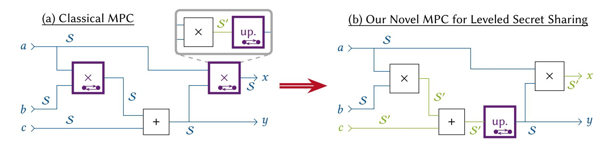
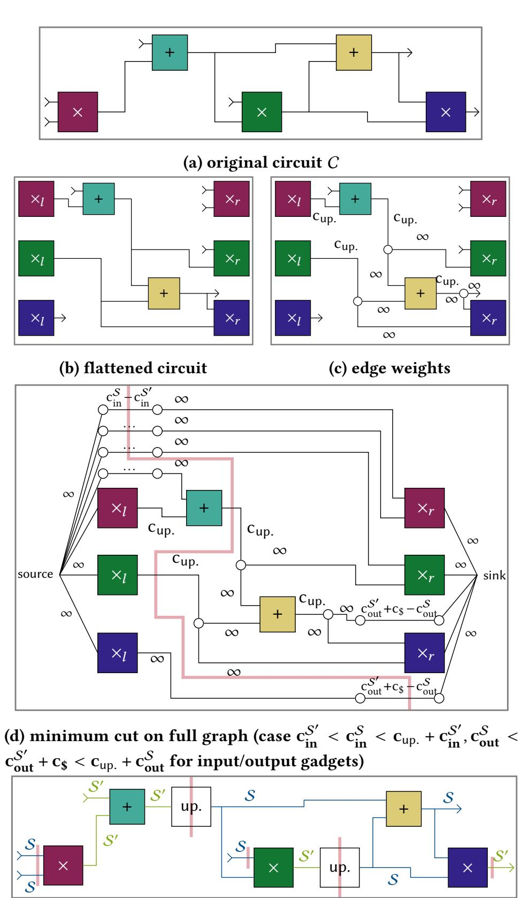
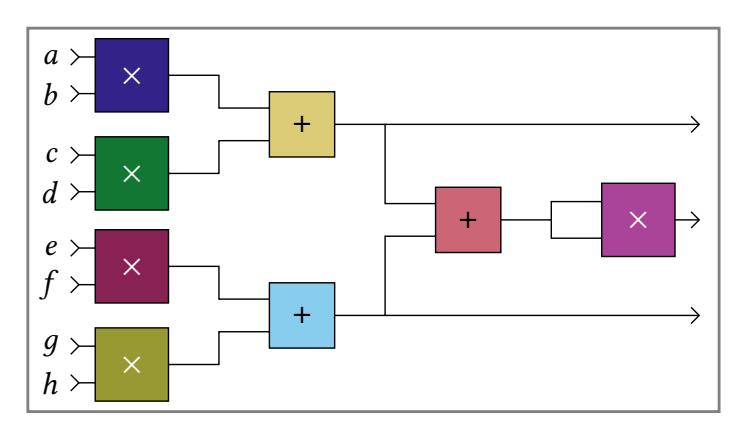
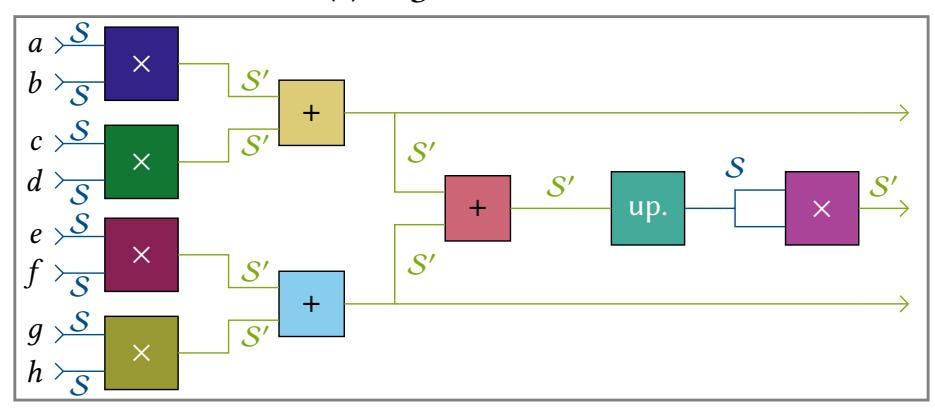
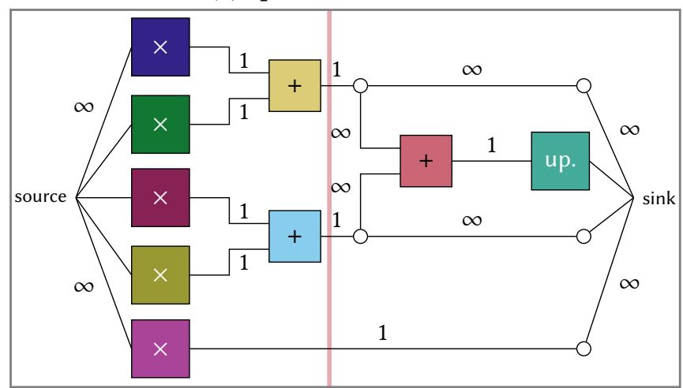
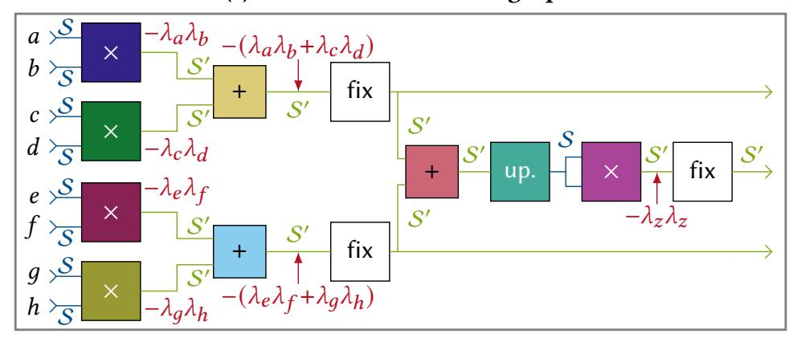

{0}------------------------------------------------

# Additions, Multiplications, and the Interaction In-Between: Optimizing MPC Protocols via Leveled Linear Secret Sharing

[Andreas Brüggemann](https://orcid.org/0000-0002-8102-9328) brueggemann@encrypto.cs.tudarmstadt.de Technical University of Darmstadt Germany

[Thomas Schneider](https://orcid.org/0000-0001-8090-1316) schneider@encrypto.cs.tudarmstadt.de Technical University of Darmstadt Germany

[Maximilian Stillger](https://orcid.org/0009-0000-9979-7790) stillger@encrypto.cs.tu-darmstadt.de Technical University of Darmstadt Germany

### Abstract

In concretely efficient secure multiparty computation (MPC) protocols based on secret sharing, a frequent pattern is to locally multiply two shared values into some intermediate representation that is immediately and interactively translated back into sharings of the product. The intermediate representation is often still a full-fledged but different secret sharing scheme. This has been used to efficiently compute dot products by computing the sum of all intermediate products and then interactively translating only the sum instead of translating each individual product. Beyond that, the intermediate representation or secret sharing scheme has mostly been seen only as a necessary interim step, leaving most of its potential untapped.

We change that by proposing the paradigm of leveled linear secret sharing, which allows dynamic switching between the original secret sharing and the previously only intermediate one more freely, while enabling arbitrary linear computations in any of the domains. Prior multiplications are split into a non-interactive multiplication that switches from one to the other secret sharing, and an interactive upgrade back to the original secret sharing domain. The upgrade now does not necessarily follow each multiplication immediately, but just needs to be placed somewhere before the next multiplication is computed, possibly upgrading the linear aggregation of many multiplications' results. We apply this idea to improve three-party computation on replicated sharings (Araki et al., CCS'16), -party BGW-style protocols (Ben-Or et al., STOC'88), and masked secret sharing protocols such as ABY2.0 (Patra et al., USENIX Security'21). We develop a novel optimizer that optimally selects which gate of a circuit is evaluated in which domain. With that, we improve communication by 10–37% for many circuits. Furthermore, we implement our generalization for replicated sharing, measure run time improvements of mostly 10–26% in a LAN, and make a full implementation of the protocol and our novel optimizer publicly available.

# Keywords

Secure Multiparty Computation, Sharing Assignment, Optimization

### 1 Introduction

Secure Multiparty Computation (MPC) is a valuable tool for privacypreserving computation. It enables mutually distrusting parties to jointly compute functions on their collective inputs while keeping their individual inputs private, e.g., if they contain personally identifiable information or trade secrets. Possible applications are privacypreserving machine learning (PPML) [\[51,](#page-12-0) [55,](#page-13-0) [65,](#page-13-1) [67,](#page-13-2) [69,](#page-13-3) [71\]](#page-13-4), private

analysis of large (social) graphs [\[3,](#page-12-1) [18,](#page-12-2) [60,](#page-13-5) [74\]](#page-13-6), private database operations [\[6,](#page-12-3) [66\]](#page-13-7), and many more. To achieve high throughput, a popular choice is to rely on MPC protocols based on linear secret sharing, such as [\[10,](#page-12-4) [27,](#page-12-5) [35,](#page-12-6) [50\]](#page-12-7) based on Shamir's secret sharing [\[72\]](#page-13-8), [\[31,](#page-12-8) [36,](#page-12-9) [49\]](#page-12-10) based on additive secret sharing, [\[2,](#page-12-11) [14,](#page-12-12) [34,](#page-12-13) [43,](#page-12-14) [64\]](#page-13-9) based on replicated secret sharing, or [\[9,](#page-12-15) [25,](#page-12-16) [61,](#page-13-10) [70\]](#page-13-11) based on masked secret sharing. Optimization of such generic protocols that securely evaluate any arithmetic/binary circuit is important, as any optimization translates to numerous possible applications and more specialized protocols built on top of the generic one.

Real-world functionalities often consist of building blocks with different requirements. E.g., a linear layer in a convolutional neural network directly translates to an arithmetic circuit which can be evaluated using arithmetic secret sharing, while nonlinear layers are preferably represented as a binary circuit, evaluated in binary secret sharing. Depending on the circuit topology in the binary domain, using garbled circuits [\[73\]](#page-13-12) provides yet another option with different tradeoffs. Hence, hybrid MPC [\[16,](#page-12-17) [37,](#page-12-18) [40,](#page-12-19) [44,](#page-12-20) [65,](#page-13-1) [70\]](#page-13-11) combines MPC in different domains into one protocol, using specific conversion protocols to switch between domains, aiming to use for each part of the computation the specific, optimal primitives. The decision on which part of a functionality is best computed in which domain induces an optimization problem that has received significant attention, yielding many automated optimizers [\[21,](#page-12-21) [28,](#page-12-22) [41,](#page-12-23) [53,](#page-13-13) [58\]](#page-13-14).

Yet, even within the same domain (arithmetic or binary) and when only using linear secret sharing, it can be beneficial to consider multiple types of secret sharings. This has been done implicitly as early as in the BGW-protocol [\[10\]](#page-12-4) based on Shamir's secret sharing [\[72\]](#page-13-8). Here, a secret value is represented by shares (1), (2), (3), . . . , () for a random polynomial with (0) = and a degree ≈ /2 such that half of all shares are required to recover . For multiplying secret shared values , represented by polynomials , , each party simply computes ℎ() := () · () inducing a polynomial ℎ of degree 2, representing the product ℎ(0) = (0) · (0) = · . The expensive, interactive part of the protocol then is to re-randomize the polynomial and reduce its degree back to . This is necessary as ℎ is not truly random (subject to ℎ(0) = · ) as it is the product of two polynomials, whereas randomness is crucial for the security of the protocol. Furthermore, any future multiplication would again increase the degree, now to a value where all parties' shares are insufficient to reconstruct the secret. Still, as long as we do not multiply and, hence, there is no communication, we could hypothetically continue to work with higher degree polynomials, delaying re-randomization and degree reduction. This has been utilized by [\[23\]](#page-12-24), 22 years after publication of BGW, to compute dot products of dimension ℓ more efficiently.

1

{1}------------------------------------------------

<span id="page-1-0"></span>

Figure 1: Classical MPC protocols based on a linear secret sharing scheme S, as depicted on the left, require interaction for their multiplications. Routinely, each multiplication consists of a local multiplication, yielding some *intermediate* sharing S' which then is immediately and interactively upgraded back to S. Instead, as depicted on the right, we detach upgrading from local multiplication, allowing for linear computation, inputs, and outputs both in S/S'. " $\Longrightarrow$ " marks gates that require interaction.

Instead of naïve computation by  $\ell$  BGW multiplications followed by addition, they *locally* compute shares of degree 2d, first sum these up, and only then interactively re-randomize and reduce the degree for the single result instead of for all  $\ell$  multiplications. This general nature of *locally* multiplying into another domain (such as double degree polynomials) and **then** interactively changing back to the original domain is not exclusive to BGW. The popular and highly efficient three-party protocol from [2] multiplies replicated secret shares locally, yielding an additive secret sharing, which it then immediately reshares to a replicated secret sharing. Again, this was only later exploited for dot products [29], adding multiple additive sharings before resharing only one value. In another line of work [25, 61, 70], masked sharings are locally multiplied to some intermediate sharings and then reshared, which is immediately also utilized for more efficient dot products. In Fig. 1a, the classical computation using this family of protocols is shown, using intermediate sharings only internally in multiplications (or dot products).

Still, the intermediate domain is not fully utilized in prior works. Dot products were investigated as an "obvious target" and also due to their high relevance for machine learning. To fully unleash the power of the intermediate domain, it should be viewed as an alternative domain that just does not allow for further multiplication before changing back to the *main* domain, but still allows for other computation. This not only enables the addition of the direct results of multiplications, but also multiplications by constants in the alternative domain, using individual products in multiple sums, and even providing inputs in either of the domains. An example is provided in Fig. 1b, demonstrating how a mixed use of both secret sharing domains enables decreasing the number of required interactive steps while showcasing inputs and outputs in both domains. Yet, this optimization requires proper formalization, security analysis, and a tool to automatically determine which part of a circuit is best evaluated in which of the domains, similar to prior optimizations in hybrid MPC. This leads over to the contributions of our work.

## 1.1 Our Contributions

**MPC Based on Leveled Linear Secret Sharing (LLSS).** We formalize the notion of *leveled linear secret sharing* (LLSS), consisting of two linear secret sharing schemes  $\mathcal{S}, \mathcal{S}'$  where sharings in  $\mathcal{S}$  can be multiplied non-interactively, yielding a sharing in  $\mathcal{S}'$ . Based on that, we propose MPC based on such leveled scheme where linear

operations, inputs, and outputs can be in either domain (S or S'), multiplication switches from S to S', and an interactive upgrade operation converts from S' back to S (for an example, see Fig. 1b). We give several concrete and provably secure instantiations based on the following existing secret sharing schemes and protocols:

- The BGW protocol [10]: Beyond computation on Shamir's secret sharing scheme [72] with threshold  $t \approx n/2$ , we consider the full-threshold variant of Shamir as an alternative domain S'.
- MPC on replicated secret sharing [2]: We consider computation on replicated *and* full-threshold additive secret sharing.
- MPC based on *masked secret sharing* (as, e.g., in ABY2.0 [70], ASTRA [25], Turbospeedz [9], and SWIFT [61]): We use the original masked secret sharing *and* the underlying secret sharing scheme for the masks (e.g., additive, replicated).

**Optimal Sharing Assignment for LLSS.** LSSS does not optimize MPC on a per-multiplication basis, but rather across the complete circuit to be computed. Hence, it is necessary to decide which parts of the circuit to evaluate in which secret sharing scheme to optimize communication. For this sharing assignment, we propose a novel optimization algorithm that minimizes the communication for securely evaluating a circuit. Our algorithm is based on finding a minimum cut and has worst-case run time  $O(|C|^3)$  for circuit size |C|. The search space we consider is a superset of what could be hand-optimized by existing dot product improvements. Hence, the optimizer can find more efficient sharing assignments while also removing the need for manual optimization, even for dot products. Furthermore, it works in arithmetic and binary domains, whereas dot products are usually considered in the arithmetic domain only. Extensive Evaluation, Including an Implementation for Layered Replicated Secret Sharing [2]. Using our optimizer, we investigate communication improvements for protocols with replicated sharing (§3.3), Shamir sharing [72] (§3.4), and masked twoparty secret sharing (§3.5) on a range of popular benchmarking circuits. Across all protocols, we improve (online<sup>1</sup>) communication

<span id="page-1-1"></span><sup>&</sup>lt;sup>1</sup>For Shamir sharings [72] (§3.4) and masked sharings (§3.5), we also use preprocessing. For §3.4, our approach yields similar preprocessing improvements. For §3.5, this depends on the setting, and we provide possible preprocessing optimizations in §3.5.2.

{2}------------------------------------------------

by 2–37% depending on the circuit topology, with over 10% improvement for the majority of circuits. For large dot products, we even improve by ≈ 70% compared to naïve dot product computation—an improvement which was also possible with existing dot product gates, but now, for the first time, is automated, not requiring to recognize and use dot products during circuit design manually. Our improvements are not the result of designing completely new protocols, but of our generic LLSS-approach that unleashes the full potential of multiple existing protocols. We also provide an implementation for [\[2\]](#page-12-11) extended to our LLSS-variant and, based on that, observe a run time improvement of up to 25% on Boolean or even 90% on arithmetic circuits compared to the plain protocol of [\[2\]](#page-12-11). We make our implementations available at <https://encrypto.de/code/LLSS-MPC>, containing our optimizer as well as the LLSS extension of [\[2\]](#page-12-11).

Obtaining Masked LLSS-MPC From Any MPC Protocol Based on Linear Secret Sharing. Multiple protocols, e.g., [\[9,](#page-12-15) [25,](#page-12-16) [61,](#page-13-10) [70\]](#page-13-11), utilize variants of masked secret sharing. We formalize the notion of masked secret sharing, yielding a compiler that builds a masked secret sharing MPC protocol with high online performance on top of any MPC protocol using linear secret sharing. This not only generalizes prior works, but also gives a straightforward generalization to LLSS, providing improvement to all existing works with masked secret sharing and a compiler to create more such protocols.

World Between Beaver Multiplication [\[7\]](#page-12-26) and Masked Secret Sharing. Classical Beaver multiplication [\[7\]](#page-12-26) can be phrased as masked LLSS-MPC that places upgrades immediately before multiplication inputs. In contrast, works on masked secret sharing [\[9,](#page-12-15) [25,](#page-12-16) [61,](#page-13-10) [70\]](#page-13-11) correspond to our masked LLSS-MPC in the case of always immediately placing upgrades after multiplication outputs. As our LLSS-MPC enables us to freely place upgrades anywhere on the path between two multiplications, it is a generalization encompassing both approaches and the entire new world in-between, unifying and extending two popular prior paradigms (cf.[§3.5.3\)](#page-7-1).

### <span id="page-2-0"></span>1.2 Related Work

Intermediate Secret-Sharing Domain in MPC Multiplications. Many MPC protocols based on linear secret sharing have multiplication sub-protocols that consist of a non-interactive multiplication step that yields the product in some intermediate linear secret-sharing domain, and a resharing/upgrade step switching back to the original sharing, e.g., [\[2,](#page-12-11) [10,](#page-12-4) [35,](#page-12-6) [61,](#page-13-10) [70\]](#page-13-11). This has been utilized to efficiently evaluate dot products at the price of a single multiplication by first adding many multiplication results and then just upgrading the sum [\[23,](#page-12-24) [29,](#page-12-25) [61,](#page-13-10) [70\]](#page-13-11). Our notion of MPC on leveled linear secret sharing captures this optimization, but is strictly more general as we enable arbitrary linear operations on multiplication outputs, yielding one or more intermediate results to be upgraded again. Furthermore, we open up the utilization of the intermediate domain even more by also enabling individual inputs and outputs to be from either the original or the intermediate domain. MAESTRO [\[68\]](#page-13-15) also considers separate non-interactive multiplication and upgrade operations, performing linear computation more general than dot products before upgrading. Yet, MAESTRO uses this only as a building block for hand-optimizing AES evaluation within MPC using replicated secret sharing. Our approach works for multiple underlying secret sharings and generalizes to any application with an

optimizer that always finds the best strategy for upgrading instead of requiring to optimize circuits by hand. ALKAID [\[38\]](#page-12-27) considers the computation of XOR gates on outputs of AND gates before upgrading to hand-optimize parallel prefix adders in their specific scheme. Our approach is more general and does not require their hand-optimization, as we determine the optimal upgrading strategy automatically. Finally, our masked LLSS construction also encompasses MPC from Beaver triples [\[7\]](#page-12-26) as a special case (cf. [§3.5.3\)](#page-7-1).

Leveled Homomorphic Encryption. The BGN [\[12\]](#page-12-28) cryptosystem allows homomorphic evaluation of depth = 1 circuits, where additions can be computed before and after a multiplication. More recently, leveled homomorphic encryption [\[15,](#page-12-29) [46\]](#page-12-30) enables to evaluate a circuit of up to some maximum multiplicative depth/number of layers . If more layers are required, expensive bootstrapping is required to enable further layers of multiplications, making the scheme fully homomorphic. Our leveled linear secret sharing could somewhat be seen as an MPC equivalent of that for only = 1 levels of multiplications before an interactive upgrade is required to enable further multiplications. In [§3.6,](#page-7-2) we additionally discuss how our approach could be generalized to multiple layers. However, this is not the focus of our work and is limited to very few layers and, potentially, many parties with a very low corruption threshold.

Sharing Assignment Optimization. Multiple past works on hybrid MPC automatically combine different secret sharing types, e.g., Boolean, arithmetic, homomorphically encrypted, and Yao's garbled circuit [\[73\]](#page-13-12) sharing, to optimize the performance of MPC computations that span many different kinds of operation types internally [\[16,](#page-12-17) [37,](#page-12-18) [44,](#page-12-20) [52,](#page-12-31) [65,](#page-13-1) [69–](#page-13-3)[71\]](#page-13-4). To automatically assign sharing semantics and conversions between them to different components of a circuit, multiple optimization tools have been proposed. Multiple works [\[28,](#page-12-22) [41,](#page-12-23) [58\]](#page-13-14) utilize integer linear programming (ILP) for searching the sharing assignment with minimal estimated protocol execution cost. Yet, solving an ILP is NP-hard, requiring high optimization cost and heuristic techniques such as segmenting a circuit into smaller parts and only solve these parts optimally. In [\[21\]](#page-12-21), the circuit is segmented into smaller parts, which are optimized by enumerating all sharing assignments, again yielding high cost and suboptimal results. The ILP-based optimization in [\[53\]](#page-13-13) can be done in polynomial time if only two choices of sharing semantics exist per an ILP relaxation. Yet, they do not specify an asymptotic complexity or concrete optimizer run times. Our sharing assignment could potentially be optimized by [\[53\]](#page-13-13), but the concrete structure of our optimization problem allows for a simpler approach that relies neither on expensive ILP solving nor on complex relaxations and reductions to reach polynomial run time. In [\[24\]](#page-12-32), heuristic optimization is used for good efficiency.

In contrast to these methods, our approach ([§4\)](#page-8-0) is an algorithm customized to our specific share assignment problem, minimizing communication cost in MPC based on our novel notion of leveled linear secret sharing. The specific nature of our novel optimization problem enables to reduce it to a minimum cut problem, inheriting a run time complexity of O (|C|<sup>3</sup> ) for circuit size |C|.

{3}------------------------------------------------

#### 1.3 Outline

After the preliminaries (§2), we introduce the notion of leveled linear secret sharing (§3) and generalize multiple existing sharing schemes and MPC protocols to that while also formalizing MPC on masked secret sharing. Then, we show how to automatically utilize leveled linear secret sharing optimally (§4), investigate concrete improvements on practical circuits (§5), and finally conclude our paper (§6). In the appendix, we give supplementary protocol details (§A), full security proofs (§B), details on our optimizer (§C), additional evaluation results (§D), and additional pointers regarding future directions (§E).

## <span id="page-3-0"></span>2 Preliminaries

#### 2.1 Notation

We consider n parties, denoted by  $\mathcal{P}_1,\ldots,\mathcal{P}_n$ . Given party  $\mathcal{P}_i$ , we sometimes refer to the next party  $\mathcal{P}_{i+1}$  or the prior party  $\mathcal{P}_{i-1}$  in cyclic fashion, i.e.,  $\mathcal{P}_{n+1}:=\mathcal{P}_1$  and  $\mathcal{P}_{1-1}:=\mathcal{P}_n$  for ease of notation. For the set of integers  $\{1,\ldots,k\}$  where  $k\in\mathbb{N}$ , we write  $\mathbb{N}_{\leq k}$ . As computation domain, we use a finite, commutative ring  $\mathcal{R}$  which can be, e.g.,  $\mathbb{Z}_{2^k}$  or  $\mathbb{F}_{p^k}$  for  $k\in\mathbb{N}$  and prime p. This covers the arithmetic domain and, as a special case, also the binary domain  $\mathcal{R}=\mathbb{F}_2$  where multiplication is a logic AND and addition is a logic XOR. We write  $a \leftarrow s$  A for sampling a uniformly random from set A.

# <span id="page-3-2"></span>2.2 Threshold Linear Secret Sharing Schemes

A (t, n)-threshold linear secret sharing scheme (LinSSS) S is defined via a share space S(R) over R and the following procedures:

- The probabilistic procedure share(·) takes as input a secret value  $v \in \mathcal{R}$  and produces shares  $([v]_{\mathcal{S}}^i)_{i \in \mathbb{N}_{\leq n}} \in \mathcal{S}(\mathcal{R})^n$ .
- The deterministic procedure  $rec(\cdot)$  takes as input at least t shares  $[v]_{S}^{i}$  and reconstructs the secret value  $v \in \mathcal{R}$ .

We write  $[v]_{\mathcal{S}} = ([v]_{\mathcal{S}}^i)_{i \in \mathbb{N}_{\leq n}}$  for any *correct* sharing of  $v \in \mathcal{R}$ , i.e., a sharing where  $\operatorname{rec}(\cdot)$  reconstructs v on any subset of at least t shares. Furthermore, we require correctness of  $\operatorname{share}(\cdot)$ , i.e., that  $\operatorname{share}(v), v \in \mathcal{R}$  always outputs a correct sharing  $[v]_{\mathcal{S}}$ , and t-privacy, i.e., that no information about v can be learned from less than t shares from the output of  $\operatorname{share}(\cdot)$ . Finally, the sharing scheme must be linear: there must be a linear structure on the share space  $\mathcal{S}(\mathcal{R})$  such that parties can perform addition of shared values, as well as addition and multiplication by constant non-interactively by some linear transformation of the shares. Throughout this paper, we sometimes omit explicitly defining share, rec where they directly follow from the description of the sharing scheme.

The sharing procedure of a LinSSS can also be performed (partly) non-interactively via *pseudorandom secret sharing* (PRSS) as introduced in [32, 47], utilizing pseudorandom functions (PRFs). We will make use of this technique in the computational setting to save on network resources similar to [2, 25, 50], assuming that pairs of parties establish joint, random PRF keys in advance. These keys enable parties to non-interactively generate joint random values.

An easy example for a (n, n)-LinSSS is the GMW-style [49] additive secret sharing, which we will later use for different protocols:

<span id="page-3-4"></span>Definition 2.1 ((n,n)-Additive Secret Sharing [49]). (n,n)-additive secret sharing (nASS) is a (n,n)-threshold LinSSS, splitting a secret  $v \in \mathcal{R}$  into n values  $[v]_{\mathrm{nASS}}^i \leftarrow \mathcal{R}$  subject to  $v = \sum_{i=1}^n [v]_{\mathrm{nASS}}^i$ .

Throughout this paper, we will introduce further LinSSSs specific to some of the protocols where needed.

# 2.3 MPC on Linear Secret Sharings

Throughout this work, we consider protocols secure against a semi-honest/passive, non-adaptive adversary, using the real-world/ideal-world simulation paradigm [22, 48]. The adversary can corrupt parties up to some corruption threshold, depending on each concrete protocol's setting. Formal details are provided alongside the security proofs in §B. We consider secure computation of arithmetic circuits over domain  $\mathcal{R}$ , which include Boolean circuits for the case of  $\mathcal{R} = \mathbb{F}_2$ . Values on all wires are encoded using a LinSSS (cf. §2.2).

It is common practice to divide the execution of MPC protocols into two phases. In the *preprocessing* (or offline) phase, the parties have not chosen their inputs yet but generate correlated randomness. This shifts large parts of the computational effort into the idle time of the parties' machines. Once all parties have their inputs, they run the *online* phase, which minimizes the latency of the computation from providing inputs to receiving results. In our work, we consider protocols without preprocessing (§3.3), with preprocessing (§3.4), or even *function-dependent* preprocessing which depends on the topology of the specific circuit evaluated later (§3.5). We emphasize that, in contrast to some function-dependent preprocessing works such as [17, 61, 70], our optimizations do not improve the online phase at the expense of more preprocessing cost, but maintain or even improve the original preprocessing cost.

# <span id="page-3-1"></span>3 MPC on Layered Linear Secret Sharings

# <span id="page-3-3"></span>3.1 Technical Overview

Our contributions rely on the observation that for multiple MPC protocols, such as the BGW protocol [10], the three-party replicated secret sharing protocol of [2], or protocols based on masked secret sharing such as [25, 70], multiplications consist of two phases: In the first phase, the parties non-interactively obtain an alternative kind of secret sharing of the product. In the second phase, the parties interactively convert the result back to the protocol's original secret sharing scheme so that further multiplications are possible. For example, BGW multiplies two values, represented by polynomials f, q of maximum degree d = t - 1 with party  $\mathcal{P}_i$  holding shares f(i), g(i), by each  $\mathcal{P}_i$  setting  $h(i) = f(i) \cdot g(i)$ , defining a polynomial h that has double degree 2d. In [2], two values shared in a replicated way can be non-interactively multiplied, obtaining an additive sharing of the product. For both cases, the second step then upgrades the sharing back to the original sharing type, i.e., lowers the degree in the case of BGW or replicates all shares for [2], while also *re-randomizing* the sharing.

While the details for these specific protocols will be provided in the following subsections, we here aim to first establish the general motivation and build a generic concept: MPC with *leveled linear secret sharing*. Here, there are two internal linear secret sharing schemes,  $\mathcal{S}$  and  $\mathcal{S}'$ , where multiplication of shares in  $\mathcal{S}$  can be done non-interactively, yielding a share in  $\mathcal{S}'$ . This represents the first phase of the aforementioned multiplication protocols where  $\mathcal{S}'$  then represents, e.g., Shamir shares [72] of degree 2d or additive shares, respectively. The threshold of  $\mathcal{S}'$  needs to be at least that of  $\mathcal{S}$  to preserve privacy, and we observe that in the above examples,

{4}------------------------------------------------

<span id="page-4-5"></span>it even becomes strictly larger. Furthermore, there is the possibility of non-interactively converting from  $\mathcal S$  to  $\mathcal S'$ , which we will explain in detail later. This leads over to the following definition:

<span id="page-4-2"></span>Definition 3.1 (Leveled Linear Secret Sharing (LLSS)). A (t, n)-threshold leveled linear secret sharing (LLSS) scheme (S, S') on domain  $\mathcal R$  consists of:

- (t, n)-LinSSS S on domain R. For ease of notation, we write  $[[v]] := [v]_S$ , and we call such sharings *higher sharings*.
- (t', n)-LinSSS S' on domain R for some  $t' \ge t$ . For ease of notation, we write  $\langle v \rangle := [v]_{S'}$ , and we call such sharings *lower sharings*.
- A non-interactive procedure ⟨xy⟩ ← mult([[x]], [[y]]), multiplying two higher sharings, and yielding a lower sharing. This procedure may be augmented by also using preprocessing material which is obtained independently of [[x]], [[y]], i.e., during the preprocessing phase of an MPC protocol. We only require the preprocessing for masked sharings in §3.5 where we particularly optimize for online performance.
- A non-interactive procedure  $\langle x \rangle \leftarrow \text{downgrade}([[x]])$  that converts from higher to lower sharing.

The second step of multiplying in prior protocols in our case reflects an upgrade from S' back to S, which requires interaction:

$$[[x]] \leftarrow \mathsf{upgrade}(\langle x \rangle).$$

More classical protocols, as in [2, 10, 25, 70], on a sharing scheme  $\mathcal{S}$  reflect MPC on an LLSS where after each instance of mult, the result in  $\mathcal{S}'$  is immediately upgraded back to  $\mathcal{S}$  using upgrade. Instead, we now allow to remain longer in  $\mathcal{S}'$ , making use of its linearity that still supports further linear operations. Before the next multiplication gates, we must ensure that an upgrade happens somewhere along the way so that all inputs to multiplications are always in  $\mathcal{S}$ . Furthermore, we also allow to provide inputs in and reconstruct outputs from the lower domain  $\mathcal{S}'$ . Hence, e.g., if multiple input values to a protocol are added and only the sum is later used in a multiplication, all of these inputs may be shared in  $\mathcal{S}'$  if this is cheaper than inputs in  $\mathcal{S}$ , followed by a single upgrade on the sum. Similarly, between the last multiplication and an output, there is no need to upgrade to  $\mathcal{S}$  before reconstructing the result.

Security. We provide the intuition regarding the security of our LLSS instantiations here and later provide the full, formal proofs in §B. For all prior protocols that we base our instantiations on, we observe that the security of their multiplications relies primarily on the security of the upgrading. For the first step, the non-interactive multiplication, it is only important that the result is a valid sharing of the expected product because only this is used as security argument regarding this step, and as no messages are exchanged. Hence, proceeding with linear operations between non-interactive multiplication and upgrade preserves security, because these operations do not entail any communication but still result in a valid sharing of the expected value. Providing inputs directly in  $\mathcal{S}'$  also is secure as per the properties of scheme S', which has a threshold at least that of S. Regarding outputs directly from S', additional care is required. For example, in BGW [10], the output of a multiplication corresponds to a polynomial of degree  $\leq 2d$  that is the product of two polynomials of degree  $\leq d$ . Yet, it is no random polynomial

(up to representing the correct value) which was required earlier as an invariant, as it, e.g., cannot be reducible and of degree > d. This can lead to leakage upon further communication, depending on this polynomial [5]. Similarly, exchange of additive shares in [2] can disclose additional information as noted in [2]. Both approaches, therefore, integrate a re-randomization technique inside their upgrade. We additionally also integrate re-randomization in all outputs from  $\mathcal{S}'$ , ensuring that any output from  $\mathcal{S}'$  can be simulated. Finally, the security of all linear operations, inputs, and outputs in  $\mathcal{S}$  are as in the base protocols, inheriting their security.

We proceed by introducing the notion of *extended circuits* that, while encoding the function to be computed, additionally also assign the choice of sharing semantics to all operations and specify where upgrades and downgrades happen (§3.2). Then, we generalize three LinSSS-based MPC protocols to LLSS (§3.3, §3.4, §3.5) and finally give an outlook on the possibility of using even more layers (§3.6).

## <span id="page-4-1"></span>3.2 Circuit Model

Usually, an arithmetic circuit C to be evaluated by an MPC protocol is a directed acyclic graph (DAG) where the nodes are multiplication, addition, and multiplication-by-constant gates. The edges are called wires, and multiplication and addition gates have exactly two input wires, while multiplication-by-constant gates have one input wire. Input and output gates are labeled with a party  $\mathcal{P}_i$ . Input gates have no input wires but output a value provided by  $\mathcal{P}_i$ . Symmetrically, output gates reveal the value on their input wire to  $\mathcal{P}_i$ .

To support the use of an LLSS, we define *extended circuits* C'. In contrast to standard circuits C, each wire now has an additional label S or S', indicating in which domain the value on this wire during circuit evaluation should be secret-shared. We additionally require that each addition or multiplication-by-constant gate uses the same domain for all of its input and output wires. Multiplication gates in accordance with Definition 3.1 require input wires to use S and output wires to use S'. We furthermore introduce gates to downgrade and upgrade (cf. §3.1) where each downgrade gate has one input wire in S and output wires in S', and each upgrade has one input wire in S' and output wires in S. For input and output gates, we allow their wires to use any domain if consistent, e.g., all output wires of an input gate must use the same domain. The domain of wires connected to input and output gates then specifies the domain in which the specific input or output is provided.

An extension C' of a circuit C is the result of adding sharing semantic labels to all wires of C and then adding downgrade and upgrade gates, replacing some wires by two wires, leading first from the source to a downgrade/upgrade and then to the destination, such that all rules specified above are satisfied.<sup>2</sup> Hence, C is C' after removing all sharing semantic labels and downgrade/upgrade gates. We refer to Ext(C) as the set of all possible extensions of C.

#### <span id="page-4-0"></span>3.3 Generalizing Replicated Secret Sharing

In the (n = 3)-party honest majority setting, the protocol of [2] based on replicated secret sharing [54] is a popular choice due to its high performance.<sup>3</sup> The secret sharing semantics are as follows:

<span id="page-4-3"></span><sup>&</sup>lt;sup>2</sup>If k wires with the same source require an upgrade, we also allow merging these upgrades by using a single wire to only one upgrade, followed by k wires from the upgrade to all destinations.

<span id="page-4-4"></span><sup>&</sup>lt;sup>3</sup>In this work, we use the simplified formulation of the protocol provided in [64].

{5}------------------------------------------------

Definition 3.2 (Three-Party Replicated Secret Sharing [2, 54, 64]). Three-party replicated secret sharing (RSS) is a (2,3)-threshold LinSSS over a ring  $\mathcal R$  with  $v \in \mathcal R$  shared as

$$[v]_{RSS}^1 := (v_1, v_3)$$
  $[v]_{RSS}^2 := (v_2, v_1)$   $[v]_{RSS}^3 := (v_3, v_2)$ 

where  $v_1, v_2, v_3 \leftarrow \Re$  subject to  $v_1 + v_2 + v_3 = v$ .

For multiplication of  $[x]_{RSS}$ ,  $[y]_{RSS}$ , [2, 64] exploit that

$$xy = (x_1 + x_2 + x_3)(y_1 + y_2 + y_3) =$$
  
$$(x_1y_1 + x_3y_1 + x_1y_3) + (x_2y_2 + x_2y_1 + x_1y_2) + (x_3y_3 + x_3y_2 + x_2y_3).$$

The first summand can locally be computed by  $\mathcal{P}_1$ , the second by  $\mathcal{P}_2$ , and the third by  $\mathcal{P}_3$ , non-interactively yielding a (3,3)-additive sharing (cf. Definition 2.1) or, in short, 3ASS-sharing of z=xy. Letting each party  $\mathcal{P}_i$  then send its additive share to  $\mathcal{P}_{i-1}$  would again yield an RSS-sharing of the product. Yet, for preserving privacy, it is necessary to first re-randomize  $[z]_{3ASS}$  by adding a fresh random sharing  $[0]_{3ASS}$ , i.e., a 3ASS-sharing with shares independently and uniformly random subject to  $[0]_{3ASS}^1 + [0]_{3ASS}^2 + [0]_{3ASS}^3 = 0$ . This sharing can be obtained using a protocol  $\Pi_{cr}$  for which [2] provides a secure, non-interactive instantiation using pre-shared PRF keys.

We note that this process naturally consists of a non-interactive mult, yielding the product in 3ASS, and an interactive upgrade switching back to RSS. Hence, it induces an LLSS (RSS, 3ASS) (cf. Definition 3.1) with higher sharings  $[[\cdot]] := [\cdot]_{RSS}$  and lower sharings  $\langle \cdot \rangle := [\cdot]_{3ASS}$ . Procedures mult and upgrade are given as parts of the multiplication protocol of [2, 64] depicted in Fig. 2. Downgrading a sharing [[v]] can be instantiated by each party  $\mathcal{P}_i$  holding  $[[v]]^i = (v_i, v_{i-1})$  discarding  $v_{i-1}$  and setting  $\langle v \rangle^i = v_i$ .

<span id="page-5-1"></span>Figure 2: RSS-multiplication of [2, 64], split into non-interactive mult and interactive upgrade.

Finally, recall from §3.1 that for outputs in domain  $\mathcal{S}'=3$ ASS, we require re-randomization to ensure privacy. Concretely, as shown by [2], the outputs of mult are not random shares subject to representing the correct value, but an exchange of them may leak information. This is why the original multiplication protocol adds  $\langle 0 \rangle \leftarrow \Pi_{cr}()$  to the additive sharing before exchanging values. Similarly, we instantiate all output gates in  $\mathcal{S}'=3$ ASS by computing a fresh  $\langle 0 \rangle \leftarrow \Pi_{cr}()$ , adding it to the sharing to be opened, and only then opening the sharing by sending all shares to the designated output party. For all other input and output gates, shares are simply exchanged as per the sharing schemes so that for inputs, all parties receive their shares, and for outputs, the output party receives sufficiently many shares to reconstruct the secret.

In §A.1, we provide an additional optimization for sharing protocol inputs using PRFs, and, for the sake of completeness, give a full, formal specification of our LLSS MPC protocol. Security is formally proven in §B, following the intuition provided in §3.1.

# <span id="page-5-0"></span>3.4 Generalizing Shamir's Secret Sharing

Next, we adapt Shamir's Secret Sharing Scheme [72] into an LLSS. Note that throughout this section, we require  $\mathcal{R}$  to be a field with at least n distinct non-zero elements  $\alpha_1, \ldots, \alpha_n$ .

Definition 3.3 ((t, n)-Shamir's Secret Sharing [72]). (t, n)-Shamir's secret sharing (tSSS) is a (t, n)-threshold LinSSS over a field  $\mathcal{R}$  of size > n, splitting a secret  $v \in \mathcal{R}$  into n values  $[v]_{tSSS}^i \in \mathcal{R}$  where  $(\alpha_i, [v]_{tSSS}^i) = (\alpha_i, f(\alpha_i))$  for  $i \in \mathbb{N}_{\leq n}$  are points on a polynomial f over  $\mathcal{R}$  with a maximum degree of t-1, and f(0)=v. Procedure share (v) chooses random  $c_j \leftarrow \mathcal{R}$  for  $j \in \mathbb{N}_{\leq t-1}$ , sets  $c_0 = v$ , defines  $f(X) := \sum_{j=0}^{t-1} c_j X^j$ , and sets each share  $[v]_{tSSS}^i$  to f(i). Procedure rec takes at least t shares which are sufficient to compute f and then reconstructs v = f(0).

As introduced by the original BGW protocol [10], two secret-shared values  $[x]_{tSSS}$ ,  $[y]_{tSSS}$  are multiplied by each party first multiplying its two shares. Given that the shares of x respectively y correspond to polynomial f(X) resp. g(X) of maximum degree t-1, the products held by all parties now correspond to polynomial  $h(X) = (f \cdot g)(X)$  representing  $h(0) = f(0) \cdot g(0) = x \cdot y$ . Yet, h(X) has maximum degree 2t-2, i.e., threshold 2t-1, so that BGW requires  $2t-1 \le n$  for h(X) to still be uniquely identified from the existing shares. This also is what requires the honest majority setting of BGW, setting  $t = \lfloor (n+1)/2 \rfloor$ . As the threshold would grow too large from further multiplications, there exist several methods to immediately decrease the polynomial degree back, e.g., [10, 35, 45, 50].

We again split these two parts. First, we consider  $[[\cdot]] := [\cdot]_{tSSS}$  as higher sharings. For the lower sharings, we use the results of the first multiplication step, i.e., local multiplication of individual shares. The resulting threshold of the multiplication is 2t - 1 = n - 1 for even n and 2t - 1 = n + 1 - 1 = n otherwise. For the sake of consistency, we always interpret the result to have full threshold n, given that a polynomial of maximum degree n - 2 also is a polynomial of maximum degree n - 1. Hence, for lower sharings we consider  $\langle \cdot \rangle := [\cdot]_{nSSS}$  and consider an LLSS (tSSS, nSSS).

While our LLSS approach can use any degree reduction from [10, 35, 45, 50] for upgrading from  $\langle \cdot \rangle$  to  $[[\cdot]]$ , we follow the DN07 [35] approach for good scalability with n, also adding optimizations from [50]. The idea is to preprocess pairs ( $[[r]], \langle r \rangle$ ) for random  $r \in \mathcal{R}$  and then, given some  $\langle z \rangle$ , compute  $\langle z \rangle - \langle r \rangle$  and open this to one designated party  $\mathcal{P}_{\text{king}}$ . This party can then distribute z - r to all parties who finally set [[z]] = z - r + [[r]] and the overall process just costs O(n) communication. For further optimization, we use the preprocessing from ATLAS [50] that requires  $\mathcal{P}_{\text{king}}$  to  $[[\cdot]]$ -share z - r instead of distributing it as plaintext. This effectively halves the preprocessing cost while binding a specific party  $\mathcal{P}_i$  to each individual multiplication to act as  $\mathcal{P}_{\text{king}}$ , hence using preprocessing material ( $[[r]], \langle r \rangle, \mathcal{P}_i$ ). The overall multiplication and our split of it into procedures mult and upgrade is given in Fig. 3.

<span id="page-5-3"></span><span id="page-5-2"></span><sup>&</sup>lt;sup>4</sup>The result technically still has threshold n-1, but we will later re-randomize to a proper threshold-n sharing before any communication so that privacy is preserved. <sup>5</sup>The role of  $\mathcal{P}_{\text{king}}$  rotates between parties across multiplications for load-balancing.

{6}------------------------------------------------

<span id="page-6-6"></span> $\boxed{\mathsf{Protocol}\,[[z]] \leftarrow \Pi_{\mathsf{mult}}([[x]], [[y]])}$ 

*Input*: [[ $\cdot$ ]]-sharings of  $x, y \in \mathcal{R}$ , *Output*: [[ $\cdot$ ]]-sharing of  $z = x \cdot y$ .

 $\langle z \rangle = \text{mult}([[x]], [[y]]) \text{ (where } z = xy)$ 

- Each party  $\mathcal{P}_i$  computes  $\langle z \rangle^i = [[x]]^i [[y]]^i$ .

 $[[z]] = \mathsf{upgrade}(\langle z \rangle)$ 

- **Preprocessing:** Generate  $([[r]], \langle r \rangle, \mathcal{P}_{king})$  as described in [50].
- The parties compute  $\langle z-r\rangle\leftarrow\langle z\rangle-\langle r\rangle$  and send their resulting shares to  $\mathcal{P}_{\rm king}$ .
- $\mathcal{P}_{\text{king}}$  runs (nSSS).rec on the received shares to recover z-r, runs (tSSS).share(z-r), and sends the resulting shares of [[z-r]] to the corresponding parties.
- <span id="page-6-1"></span>- The parties compute [[z]] = [[z-r]] + [[r]].

# Figure 3: DN07-style [35, 50] tSSS-multiplication, split into non-interactive mult and interactive upgrade.

For downgrading, we reinterpret a [[v]] as  $\langle v \rangle$ , each party using the same share as before. While this removes redundancy, it is obvious that the result still represents the same value. Finally, as noted in §3.1, outputs from domain S' = nSSS require additional re-randomization, which we achieve by adding a zero-sharing  $\langle 0 \rangle$ . Such zero-sharings can be generated during preprocessing, using the method described in [50]. We give the full formal protocol specification and additional optimizations using PRFs based on those by [50] in §A.2. and the full security proof in §B.

# <span id="page-6-0"></span>3.5 Generalizing Masked Secret Sharing

In this section, we go beyond generalizing a specific MPC protocol to LLSS. Instead, we provide a general compiler that transforms any LinSSS and corresponding multiplication protocol into an LLSS-protocol. Our compiler utilizes and generically formalizes the masking circuit randomization technique as used in [9, 25, 70], leveraging function-dependent preprocessing to optimize online performance. We begin by providing an intuition for our construction, which is based on [9, 25, 70], and then give a full description.

Let there be a LinSSS S' (cf. §2.2) that we will use as lower sharing, i.e.,  $\langle \cdot \rangle := [\cdot]_{S'}$ . The idea is to define a *masked LinSSS* S as higher sharing  $[[\cdot]] := [\cdot]_{S}$ , where for secret  $v \in \mathcal{R}$ , a  $\lambda_v \leftarrow \mathcal{R}$  is S'-shared between the parties during preprocessing and additionally, all parties have the masked value  $m_v = v - \lambda_v$  that is computed in the online phase. Hence,  $[[v]]^i = (m_v = v - \lambda_v, \langle \lambda_v \rangle^i)$  for each party  $\mathcal{P}_i$ . We note that by the linearity of S', S is linear too:

$$[[cx + dy + e]] := (cm_x + dm_y + e, \langle c\lambda_x + d\lambda_y \rangle)$$

for [[x]], [[y]] and public values  $c,d,e\in\mathcal{R}$ , as  $m_{cx+dy+e}=cm_x+dm_y+e=c(x-\lambda_x)+d(y-\lambda_y)+e=cx+dy+e-c\lambda_x-d\lambda_y=cx+dy+e-\lambda_{cx+dy+e}$ . For multiplication  $z=x\cdot y$ , we note that

$$z = xy = (m_x + \lambda_x)(m_y + \lambda_y) = m_x m_y + m_x \lambda_y + m_y \lambda_x + \lambda_x \lambda_y.$$

If the parties are able to obtain  $\langle \lambda_x \lambda_y \rangle$  in advance, using a suitable multiplication protocol for S', the parties can compute

$$\langle z \rangle = m_x m_y + m_x \langle \lambda_y \rangle + m_y \langle \lambda_x \rangle + \langle \lambda_x \lambda_y \rangle$$

without interaction by the linearity of S'. To upgrade  $\langle z \rangle$  from S' to S, during preprocessing they establish a sharing  $\langle \lambda_z \rangle$  for  $\lambda_z \leftarrow \Re$  and then compute  $\langle m_z \rangle = \langle z \rangle - \langle \lambda_z \rangle$  online which they finally recover. Prior works use both steps together to implement their

multiplication, while we again split them up. Given this intuition, we proceed to formally specify our construction:

<span id="page-6-5"></span>Theorem 3.4 (Masking Compilation of Linsss to LLSS-MPC). Let S' be a (t, n)-Linsss  $(cf. \S 2.2)$  and  $\Pi_{\text{multPre}}$  be a secure multiplication protocol on S' for up to t-1 corrupted parties. Then, there exists a masked version M(S') of S' which we use as higher sharing S s.t. (S, S') is an LLSS and there exists an MPC protocol on this LLSS.

PROOF. The higher/masked sharing S is defined as  $(m_v, \langle \lambda_v \rangle)$  for a secret  $v \in \mathcal{R}$  where  $m_v$  is known to all parties and  $v = m_v + \lambda_v$ . For the sharing procedure S.share(v), the parties establish  $\langle \lambda_v \rangle$  for  $\lambda_v \leftarrow \mathcal{R}$  during preprocessing so that the dealer learns  $\lambda_v$ . For procedure S.rec([[v]]), the parties run S'.rec( $\langle \lambda_v \rangle$ ) towards the output receiver which then computes  $v = m_v + \lambda_v$ . The security with threshold t of S directly follows from that of S' with the same threshold. Linearity of S follows from that of S' as shown before.

For function-dependent preprocessing, the parties first for each upgrade from  $\langle v \rangle$  to [[v]] establish  $\langle \lambda_v \rangle$  for  $\lambda_v \leftarrow \mathcal{R}$  which can be achieved non-interactively using PRFs [32, 33]. They also already establish  $\langle \lambda_v \rangle$  for all inputs in  $\mathcal{S}$ . For each multiplication  $z = x \cdot y$ , they then non-interactively compute  $\langle \lambda_x \rangle$ ,  $\langle \lambda_y \rangle$  following the circuit topology and linearity of  $\mathcal{S}'$ , given that  $\langle \lambda_x \rangle$ ,  $\langle \lambda_y \rangle$  are linear combinations on  $\langle \lambda_v \rangle$ -values sampled before for inputs in  $\mathcal{S}$  and outputs of upgrades. Finally, the parties compute  $\langle \lambda_x \cdot \lambda_y \rangle \leftarrow \Pi_{\text{multPre}}(\langle \lambda_x \rangle, \langle \lambda_y \rangle)$  for all multiplications in parallel, yielding a constant-round preprocessing.

<span id="page-6-3"></span>Figure 4: Masked, non-interactive multiplication.

```
      Protocol [[z]] ← upgrade(⟨z⟩)

      Input: ⟨·⟩-sharings of z ∈ \mathcal{R}, Output: [[·]]-sharing of z.

      Preprocessing Material: ⟨λ₂⟩.

      - The parties compute ⟨m₂⟩ = ⟨z⟩ - ⟨λ₂⟩.

      - The parties reconstruct m_z using one of the following options:

      A: Each party is sent enough shares of ⟨m₂⟩ to recover m_z using S'.rec.

      B: A designated P_{king} is sent enough shares of ⟨m₂⟩ to recover m_z using S'.rec which it then sends to all other parties.

      - Each party P_i sets [[z]]^i = (m_z, ⟨λ₂⟩^i).
```

### <span id="page-6-4"></span>Figure 5: Upgrading by masking.

Multiplication now directly follows the prior intuition, and we provide the details in Fig. 4. Upgrading is defined in Fig. 5, supporting the optional use of the  $\mathcal{P}_{\text{king}}$ -strategy [35] for many parties. For downgrading of [[v]], we simply let the parties compute  $m_v + \langle \lambda_v \rangle$ . Outputs from domain  $\mathcal{S}'$  require additional re-randomization by adding a zero-sharing  $\langle 0 \rangle$ . This can generically be generated noninteractively during preprocessing via pseudo-random zero sharing, using the techniques from [32].

<span id="page-6-2"></span> $<sup>^6</sup>$ E.g., the dealer could sample  $\lambda_v$  and  $\mathcal{S}'$ .share it between the parties.

{7}------------------------------------------------

Theorem 3.5. The protocol from Theorem 3.4 is computationally secure against an adversary corrupting < t parties.

Intuitively, the protocol is correct, and privacy follows from the fact that for upgrades, the exchanged data is masked by fresh pseudo-random shares  $\langle \lambda_v \rangle^i$ , while outputs from S use these pseudorandom masks, only revealing the output, and outputs from S' are re-randomized by addition of  $\langle 0 \rangle$ . We give the full, formal proof in §B, and the complete protocol specification in §A.3.

Finally, we remark that a protocol variant with a trusted dealer replacing  $\Pi_{\text{multPre}}$  exists, inspired by the design of [25]:

<span id="page-7-3"></span>Remark 3.1 (Masked LLSS-MPC with a Trusted Dealer). An MPC-protocol as in Theorem 3.4 can also be instantiated with an additional dealer party that does not have inputs or outputs and remains absent from the protocol's online phase. This dealer then samples all masks  $\lambda_v$ ,  $\langle \cdot \rangle$ -sharing them between the parties, and then computes and shares all  $\langle \lambda_x \lambda_y \rangle$  required for the multiplications.

3.5.1 Existing Concrete Instantiations. In the literature, there are multiple uses of MPC on masked secret sharings, but without using our idea of LLSS and instead running upgrade directly after each multiplication. For our evaluation (cf. §5.1), we consider the two-party (i.e., t = 2) protocol ABY2.0 [70]. This directly corresponds to using additive shares S' = 2ASS in our construction. Preprocessing multiplication  $\Pi_{\text{multPre}}$  is instantiated using oblivious transfer or homomorphic encryption. Another instantiation is ASTRA [25], which extends ABY2.0 with a dealer (cf. Remark 3.1). Here, random masks  $\langle \lambda_v \rangle$  are set up non-interactively, sampling the individual shares from pre-shared PRF keys. The only interaction by the dealer is for each multiplication to  $\langle \cdot \rangle$ -share products  $\lambda_x \lambda_y$ . For active security (which is not the focus of our paper), SWIFT [61] uses masking on S' = RSS, Trident [26] extends this by a dealer, Turbospeedz [9] uses additive shares with SPDZ-style MACs [36] as S', and Asterisk [56] extends that by a dealer.

<span id="page-7-0"></span>3.5.2 Optimizing Preprocessing Communication. We note that in the prior protocols (§3.3, §3.4), mult did not require any communication, while here, it still requires interactive preprocessing. For example, computing a sum of products  $\sum_{k=1}^{\ell} [[x_k]][[y_k]]$  in S could now be done with the online cost of a single upgrade after computing  $\langle \sum_{k=1}^{\ell} x_k y_k \rangle$  without online interaction. Still, the preprocessing cost would scale with dimension  $\ell$  as each of  $\ell$  instances of mult requires to run  $\Pi_{\text{multPre}}$ . ASTRA [25], which supports dot-products with constant communication cost, instead lets its dealer not establish a sharing  $\langle \lambda_{x_k} \lambda_{y_k} \rangle$  for each multiplication here, but instead has it distributing  $\langle \sum_{k=1}^{\ell} \lambda_{x_k} \lambda_{y_k} \rangle$  directly as the individual parts do not matter for the final result. We can translate this approach to our generalized protocol as follows: For each instance of mult, we only compute  $m_x m_y + m_x \langle \lambda_y \rangle + m_y \langle \lambda_x \rangle = \langle z - \lambda_x \lambda_y \rangle$  which does not require any preprocessing, but results in an error of  $-\lambda_x \lambda_y$  in the result. Addition of  $\langle \lambda_x \lambda_y \rangle$  would compensate this error, but requires preprocessing. Instead, we do not compensate such errors immediately. Then, as long as computation in  $\mathcal{S}'$  continues without compensating errors, these errors will accumulate, noting that only linear operations are allowed. Somewhere before either outputting from S' or upgrading, we compensate the then accumulated error, e.g., in the prior example, by adding  $\sum_{k=1}^{\ell} \lambda_{x_k} \lambda_{y_k}$ . Hence, we effectively delay error compensation to an arbitrary position between

multiplication(s) and the next following upgrade(s) or output(s) from S', aiming to later compensate less, accumulated errors.

Of course, even after moving the error compensation, the corresponding accumulated term still needs to be efficiently computed in preprocessing. If we have a dealer, this is easy as it holds all masks and, hence, can locally compute the compensation and secret-share it, similar to the idea in [25]. Otherwise, if the lower sharing S' is an upper sharing of another LLSS (S', S''), we can recursively use our general idea of MPC on LLSS to reach constant communication per compensation to be computed. For each multiplication  $z = x \cdot y$ , we non-interactively multiply  $\langle \lambda_x \rangle \cdot \langle \lambda_y \rangle$  to obtain  $[\lambda_x \lambda_y]_{S''}$  and proceed with linear operations in S'' up to the point where the error compensation is required. Only then, the parties interact by upgrading the resulting error compensation from S'' to S'. The recursive approach works, e.g., for SWIFT [61] that uses the masked version of replicated secret sharing (Def. 3.2). Error compensations for individual multiplications can be computed non-interactively as additive sharings, accumulated, and then finally upgraded to replicated sharings as shown in §3.3. For ABY2.0 [70], this trick appears not to work as it seems there is no LLSS using additive shares as higher shares. In §C.4, we give details on our recursive optimization and show how it can be used to minimize preprocessing costs.

<span id="page-7-1"></span>3.5.3 Relation to Beaver Multiplication [7]. Multiplication with Beaver triples [7] multiplies two shared values [x], [y] by using a triple ([a], [b], [c]) that is random subject to c = ab, reconstructing x - a, y - b and then setting [z] = [xy] = (x - a)(y - b) + (x - a)(y - b)a)[b] + (y - b)[a] + [c]. As pointed out in [70], this is equivalent to the masked approach here, reinterpreting a, b as masks  $\lambda_x$ ,  $\lambda_y$ and x - a, y - b as masked values  $m_x$ ,  $m_y$ . The difference is that [7] essentially upgrades to masked sharings on the *input* wires of multiplications and immediately switches back to the original domain by multiplication, whereas, e.g., ABY2.0 [70] upgrades the output wires of multiplications instead so that all inputs to multiplication gates already are masked. This was motivated by multiplications having two inputs and one output, so that, per multiplication, fewer interactive upgrades are needed. Our generalized approach to masked secret sharing can, but does not necessarily, upgrade immediately before or after multiplications. Hence, it can emulate both Beaver multiplication [7] and ABY2.0 [70] at their respective original cost, but also more freely position upgrades at positions not directly adjacent to multiplication gates. This gives us unprecedented flexibility, filling the space between both prior approaches that randomize on inputs or outputs of multiplications, and, as we will see in §5.1, enable further optimization.

#### <span id="page-7-2"></span>3.6 Multi-LLSS

While our MPC protocols for LLSS use two layers, where non-interactive multiplication has inputs on the higher and outputs on the lower layer, we raise the following question: *Could we build an LLSS with more than two layers with multiplications each going one layer down without online interaction, enabling multiple multiplications before needing to upgrade?* This appears to be possible! For instance, M(RSS) (masked sharing based on replicated sharings, cf. Theorem 3.4) as used by SWIFT [61] can be multiplied into RSS without online interaction (§3.5), and this can subsequently be multiplied into additive 3ASS without interaction (§3.3). This yields

{8}------------------------------------------------

two layers of multiplication without interaction. The same idea has recently been utilized by ALKAID [38], albeit only to handoptimize AND-gates with three and four inputs, rather than introducing a leveled secret sharing for generic circuits. Similarly, if using BGW-style protocols (§3.4), we could require a more aggressive threshold, e.g.,  $t \approx n/4$ , so that multiplications of tSSS yield (2t-1)SSS and multiplications of those yield (4t-3)SSS that can still be recovered by *n* parties. We could also imagine a masked version of tSSS, adding another layer on top. We leave further investigation of such multilayer schemes to future work. As a final remark, the masking compiler from §3.5 may raise the idea of building an LLSS over arbitrarily many layers by recursively building masked sharings based on other masked sharings, e.g., using three layers M(M(S')), M(S'), S' for some LinSSS S'. This does unfortunately not work as the first layer of multiplications would yield masks on the second layer that are unknown during preprocessing, preventing another non-interactive layer of multiplications. We provide a detailed example for this issue in §A.4.

# <span id="page-8-0"></span>4 Sharing Assignment Optimization

Given a circuit C and an LLSS (S, S'), we want to find an extended circuit C' (cf. §3.2) which adds sharing semantic labels S and S' to each wire and augments the circuit by additional gates to downgrade from S to S' and upgrade from S' to S, still computing the same function as C. Briefly recall from §3.2 that we furthermore require linear gates to have the same sharing semantics on all inputs and outputs and that multiplications always have inputs in S and outputs in S'. An obvious choice is to immediately upgrade the output of each multiplication from S' back to S, keeping all linear operations, inputs, and outputs in S. This exactly emulates existing MPC protocols such as 3PC on RSS [2], BGW [10], and ABY2.0 [70], using S' only as an intermediate step during multiplications (cf. Fig. 1a, p. 2). We have also seen in §3.5.3 that upgrading to a masked sharing (cf. §3.5) on the *input* wires to each multiplication exactly emulates MPC with Beaver multiplication [7].

In cases where a few multiplication outputs (through linear gates) feed into many multiplication inputs, it is preferable to do the interactive upgrades early, as fewer wires need to be covered. In the opposite case, with many outputs feeding into a few inputs, it is preferable to upgrade late. Yet, it may also happen that linear arithmetic after a layer of multiplications first narrows to only a few wires, and then widens again into many multiplication inputs. In such a case, it may make sense to upgrade in-between linear, non-interactive operations to save on communication. We are interested in always using the choice of sharings on all wires and corresponding upgrades that optimizes communication, i.e., the best possible extension C' from the set of all possible extensions  $\operatorname{Ext}(C)$  of a circuit C, yielding the following optimization problem:

<span id="page-8-3"></span>Definition 4.1 (LLSS Sharing Assignment Problem). Let COMM:  $\{C' \mid C' \text{ extended circuit}\} \to \mathbb{R}_0$  be a communication cost metric for extended circuits (this is specific to the used LLSS-protocol, and we may consider online or total communication). The LLSS sharing assignment problem is to, given a circuit C, find an extended

circuit  $C' \in \text{Ext}(C)$  with minimal COMM:

$$C^* = \underset{C' \in \text{Ext}(C)}{\text{arg min }} \text{comm}(C')$$

We note that the communication comm computes the sum of required communication for each interactive gate in the circuit. In Tab. 1, we provide the cost of all protocols from §3 (with their PRF optimizations from §A), where  $c_{\rm in}^{S'}$ ,  $c_{\rm in}^{S}$  denote the communication of sharing an input in lower respectively higher domain,  $c_{\rm mult}$  denotes the communication for a mult (which is non-interactive online, but still requires a static preprocessing cost in case of masked sharing),  $c_{\rm up}$  denotes the communication of upgrade,  $c_{\rm out}^{S'}$ ,  $c_{\rm out}^{S}$  denote the communication of reconstructing from lower respectively higher domain towards one party, and  $c_{\rm s}$  denotes the communication for re-randomization which we require to do as part of each output from the lower domain (cf. §3.1).

Table 1: Online communication costs for all gates except for free linear operations, for the protocols from §3.  $|\mathcal{R}|$  is the size of one ring element,  $t = \lfloor (n+1)/2 \rfloor$  is the threshold from §3.4, A is the underlying *masking scheme* from §3.5, and n is the number of parties. Preprocessing cost as stated in footnotes.

<span id="page-8-2"></span>

|                                                              | RSS (§3.3)       | tSSS (§3.4)                 | MSS(A) (§3.5)                                                                  |
|--------------------------------------------------------------|------------------|-----------------------------|--------------------------------------------------------------------------------|
| $c_{\rm in}^{\mathcal{S}'}$                                  | 0                | 0                           | $c_{\text{in}}^{A}$                                                            |
| $c_{\text{in}}^{\mathcal{S}'}$ $c_{\text{in}}^{\mathcal{S}}$ | $ \mathcal{R} $  | $(n-t) \mathcal{R} $        | $(n-1) \mathcal{R} ^{a}$                                                       |
| C <sub>mult</sub>                                            | 0                | 0                           | $0_{\rm p}$                                                                    |
| C <sub>up</sub> .                                            | $3 \mathcal{R} $ | $(2n-t-1) \mathcal{R} ^{c}$ | $n \cdot c_{\text{out}}^A \text{ or } c_{\text{out}}^A + (n-1) \mathcal{R} ^d$ |
| C <sub>\$</sub>                                              | 0                | 0                           | 0                                                                              |
| C <sub>\$</sub> Cout Cout Cout                               | $2 \mathcal{R} $ | $(n-1) \mathcal{R} $        | $c_{\text{out}}^A$                                                             |
| $c_{out}^{\hat{S}}$                                          | $ \mathcal{R} $  | $(t-1) \mathcal{R} $        | $c_{\mathrm{out}}^{A}$                                                         |

<sup>&</sup>lt;sup>a</sup> prepr: establish random  $[\lambda_v]_{S'}$ ,  $\lambda_v$  known to dealer

Given some circuit C, we need to build a valid extension C'where the cost introduced by the positioning of upgrades and choice of domain for individual circuit inputs and outputs is minimized. We first look at multiplication gates, as these will inherently require their inputs to be in the higher domain S while providing their outputs in the lower domain S'. In between multiplications that are connected by a path over linear gates, at least one upgrade needs to be placed so that the later multiplication receives its inputs in S. In the resulting C', inputs to multiplications either are a direct result of an upgrade, or they are outputs of a linear gate that only receives inputs in S and, hence, fulfill the same property that their inputs come from upgrades or linear operations in S. Thus, the sub-circuit between both multiplications needs to be split into a left-hand part that uses S', and a right-hand part that exclusively uses S. The boundary between these parts is where upgrades from  $\mathcal{S}'$  to  $\mathcal{S}$  need to be placed, which are our main source of interaction cost. Hence, we aim to identify a possible split where the boundary contains the minimal number of wires. This corresponds to a minimum cut.

We now frame our optimization as a minimum cut problem. Each multiplication gate needs to act as a source, emitting  $\mathcal{S}'$  wires, and as a sink, receiving  $\mathcal{S}$ -wires. Hence, we split each multiplication

<span id="page-8-1"></span> $<sup>^7</sup>$ We do not aim to also rewrite the actual arithmetics in the circuit for optimization. This would be logic minimization, an orthogonal problem which is  $\Sigma_2$ -hard [20].

b prepr: run  $\Pi_{\text{multPre}}$  c prepr:  $\approx n|\mathcal{R}|/2$ 

 $<sup>^{\</sup>rm d}$  second option if  $\mathcal{P}_{\rm king}$ -strategy [35]

{9}------------------------------------------------

gate " $\times$ " into two gates " $\times_l$ " and " $\times_r$ " where source " $\times_l$ " has no inputs, but all original output wires of " $\times$ ", and sink " $\times_r$ " has no outputs, but all original input wires of " $\times$ ". Between " $\times_l$ " and " $\times_r$ " of all multiplications, we place the remaining linear arithmetic of the circuit. The resulting *flattened circuit* for the example circuit *C* from Fig. 6a is given in Fig. 6b. Note that this construction also automatically takes care of paths over linear arithmetic that skip a multiplication layer, as visible in Fig. 6b.

<span id="page-9-0"></span>

(e) optimal extended circuit C' (with annotated cut from Fig. 6d)

Figure 6: Example optimization from circuit C to best extended circuit  $C' \in \text{Ext}(C)$ . Same coloring used for individual gates respectively the copies " $\times_l$ ", " $\times_r$ " of " $\times$ " gates.

The outputs of gates may be connected to multiple wires and, as defined in §3.2, a circuit extension allows to batch upgrades for multiple of them into a single upgrade, using one wire to the upgrade and from there, split into multiple wires to all destinations.

As the number of possible sets of wires to augment by upgrades is exponential in the number of former output wires, it would be inefficient to enumerate them. Instead, we always upgrade all or no wires. If some wire later goes to a gate where it is required to use  $\mathcal{S}'$ , it is always possible to insert a downgrade gate which comes at no communication cost. Hence, in all cases where a gate output has multiple wires, we add an intermediate node, draw an edge from the gate output to this intermediate node, and then rewire all prior gate output wires to originate from the intermediate node instead. This is depicted in Fig. 6c. At this point, we also add edge weights: Each output wire of a gate gets weight  $c_{up}$  as cutting this wire equals the insertion and, hence, cost of one upgrade. All outputs of intermediate nodes, as introduced before, have weight  $\infty$  as we always want to cut before the node, i.e., upgrade the wire for all destinations.

Next, we need to take care of inputs and outputs to decide if they should be in the higher or lower domain. First, we assume that  $c_{in}^{S} > c_{in}^{S'}$  as is the case for RSS and tSSS in Tab. 1. In this case, providing inputs in S' is cheaper, but might require additional upgrades later. Let us, for now, assume that all inputs are in  $\mathcal{S}'$ . In that case, inputs are handled like multiplication outputs: paths starting at them need to be cut somewhere before reaching a multiplication input. For each input, we then add a small gadget consisting of a source node and an edge of weight c<sub>up</sub>. to a second node, providing the possibility to immediately upgrade the input. This second node is then connected to everything that the input is connected to in C by edges of weight  $\infty$ . If it now holds that  $c_{in}^{\mathcal{S}} < c_{up.} + c_{in}^{\mathcal{S}'}$ , instead of an immediate upgrade of the input, it would always be better to immediately provide the input in S instead. In that case, the weight of our gadget's edge is  $c_{in}^{\mathcal{S}} - c_{in}^{\mathcal{S}'}$ , i.e., what one needs to pay additionally to input in  $\mathcal{S}$  compared to  $\mathcal{S}'$ , and cutting this edge represents that the input is in  $\mathcal{S}$ . This is also shown in our example in Fig. 6d. If  $c_{in}^{\mathcal{S}} \leq c_{in}^{\mathcal{S}'}$ , it is always optimal to share in  $\mathcal{S}$  and, if necessary, later downgrade for free. In this case, we can simply omit our gadget as no upgrade is needed.

For outputs, we use similar gadgets where the right node acts as a sink, first assuming that  $c_{out}^{S'} + c_{\$} > c_{out}^{S}$ . Assume that all outputs are in S. Then, the edge weight is  $c_{up}$  as, potentially, it needs to be cut to upgrade from S' to the desired S. Now, if we allow outputs in either sharing, it is cheaper to re-randomize and output in S' compared to upgrading if  $c_{out}^{S'} + c_{\$} < c_{up} + c_{out}^{S}$ . Then, we set the edge weight to  $c_{out}^{S'} + c_{\$} - c_{out}^{S}$ , i.e., what one needs to pay additionally to output from S' (including re-randomization) compared to an output from S. Finally, if  $c_{out}^{S'} + c_{\$} \le c_{out}^{S}$ , it is always optimal to output from S', and we omit our gadgets; if needed, free downgrades can be placed.

After introducing a single principal source and sink node to reduce the problem from the multi-source/sink case, we compute a minimum cut. This can be achieved by standard algorithms such as Edmonds-Karp [39] to compute the maximum flow and then searching for the boundary between the reachable and unreachable nodes in the residual graph of the flow, which yields the minimum cut [42]. In our example in Fig. 6d, the resulting minimum cut is shown. We translate that into an optimal extended circuit  $C' \in$ 

<span id="page-9-1"></span><sup>&</sup>lt;sup>8</sup>This roughly corresponds to Lawler's transformation [63] for hypergraphs.

<span id="page-9-2"></span><sup>&</sup>lt;sup>9</sup>Orthogonally, [57] automatically finds opportunities for local computation on inputs known by the same party before input sharing. Both approaches could be combined.

{10}------------------------------------------------

Ext(C) that is shown in Fig. 6e as follows: For each cut wire (outside of input/output gadgets), we add an upgrade gate. It may happen that there also exist wires traversing the cut backwards<sup>10</sup>, in which case we add a free downgrade. Each cut edge in an input gadget (or its non-existence if  $c_{in}^{S} \leq c_{in}^{S'}$ ) indicates that the input is to be shared in S or immediately upgraded, whatever is cheaper; otherwise it will be in S'. Similarly, each cut edge in an output gadget (or its non-existence if  $c_{out}^{S'} + c_{\$} \leq c_{out}^{S}$ ) indicates that the output shall be in S', otherwise it is in S. For conciseness, we defer a full, formal specification of our optimization algorithm to §C.1. To conclude, our optimization algorithm computes an optimal solution:

<span id="page-10-4"></span>Theorem 4.2. Our optimization algorithm (formal description in §C.1) solves the LLSS Sharing Assignment problem (Def. 4.1), i.e., given a circuit C, computes an extended circuit  $C' \in \text{Ext}(C)$  with minimal communication cost COMM.

This follows from the previous considerations of our construction and we provide a full proof in §C.2. The dominant part of the optimization cost is the Edmonds-Karp algorithm [39] with complexity  $O(|V||E|^2)$  for |V| nodes and |E| edges. As the number of gates (including inputs and outputs) is at most doubled in our construction and as the number of wires also gets at most doubled (by our merging of multiple output wires from the same gate), we get a complexity of  $O(|C|^3)$ . While we use a basic algorithm to compute the minimum cut for our share assignment, we note that more sophisticated methods exist with better complexity, see §C.3.

### <span id="page-10-0"></span>5 Evaluation

To analyze the communication improvement that our optimizer from §4 can find by using the additional freedom of detaching interactive upgrades from the remaining, now non-interactive multiplications (cf. §3), we implement our optimizer in C++ and present the results next. We compare to the prior approach of immediately upgrading after each multiplication as baseline. To also investigate the impact on concrete protocol run time, we implement our generalization of three-party MPC on replicated sharings from §3.3 in C++, running on the extended circuits computed by our optimizer. We run benchmarks of this protocol on a server with an Intel Core i9-7960X CPU @2.80 GHz and 128 GB of RAM, and take the average run times over 10 iterations. To emulate realistic network behavior, we use the network emulation tool from NEON [59], considering a LAN setting with 1 Gbit/s bandwidth and 1 ms RTT and a WAN setting with 100 Mbit/s and 100 ms RTT. We make our implementations of optimizer and protocol publicly available at https://encrypto.de/code/LLSS-MPC.

We consider multiple practical circuits for our evaluation. Regarding binary circuits for 32-bit integer arithmetic, we use a ripple-carry adder (RCA), a parallel prefix adder (PPA), and depth-optimized multiplication circuits from [16]. Furthermore, we benchmark binary circuits for single-precision floating point addition and multiplication from [16], and use the floating point division from [4]. We also consider circuits for symmetric cryptographic primitives, namely AES-128, SHA-256 from [4], and LowMC-256 from [1]. While almost all existing benchmark circuit libraries for MPC are in the binary domain, we also benchmark on two custom arithmetic

circuits on 64-bit values. One is for computing the mean square error (MSE) on a 768-dimensional vector. The second one is a neural network that operates on a 784-dimensional feature vector and has 3 hidden layers of sizes (128, 128, 64) with a logistic activation function (approximated by a degree 6 polynomial) followed by 10 output nodes. We assume the model weights to be public. Hence, multiplications are mainly used for the activation function.

Running our optimizer for a specific combination of protocol and circuit is a one-time expense, computing the optimal extended circuit and then using this circuit for many protocol executions. Hence, we can tolerate slower optimization to decrease the communication and run time of all subsequent evaluations of a circuit. Still, for smaller circuits, our optimization runs in at most a couple of seconds. For the largest circuits, AES-128 ( $|C|=37\,047$  gates), SHA-256 ( $|C|=136\,097$  gates), and float-div. ( $|C|=184\,005$  gates), it takes  $\approx 70$  s,  $\approx 32$  min, and  $\approx 166$  min, respectively, and optimization therefore still is practical. For even larger circuits, we give possible directions for algorithm improvements in §C.3.

We now investigate improvements in communication (§5.1) and in run time (§5.2), and give supplementary evaluation results in §D.

# <span id="page-10-1"></span>5.1 Communication Improvements

We use our optimizer from §4 for our LLSS-protocols from §3.3 (based on 3PC on RSS [2]), §3.4 (based on BGW-style [10] MPC using Shamir's Secret Sharing [72] tSSS), and §3.5 for two parties and underlying LinSSS 2ASS (M(2ASS)) which corresponds to ABY2.0 [70] or, if using a dealer, ASTRA [25]). Here, we decide to optimize for online communication to streamline the computation once the inputs are provided. Note that the protocol from §3.3 has no preprocessing, and the protocol from §3.4 has the majority of its communication online while our optimization will also improve preprocessing. The preprocessing of the protocol from §3.5 can be optimized in presence of a dealer (cf. §3.5.2) and remains unchanged for two parties without a dealer. We provide the concrete preprocessing results in §D.1 and focus on online performance here. For the protocol from §3.4, which works for an arbitrarily many parties n > 2, we choose n = 10 here and show in §D.2 that the results for n = 3 are similar. For the protocols from §3.3 and §3.5, we use  $\mathcal{R} = \mathbb{F}_2$  as binary domain and  $\mathcal{R} = \mathbb{Z}_{2^{64}}$  as arithmetic domain. As the protocol from §3.4 requires fields larger than the number of parties, we then use  $\mathbb{F}_{2^4}$  respectively  $\mathbb{F}_p$  for a 64-bit prime p.

Our results are shown in Tab. 2. We observe that on binary circuits, our improvement ranges from 2.07% up to 39.13% with the arithmetic operations (except for the higher depth RCA) and AES all having improvement above 10%. This result is quite notable because these improvements do not stem from specific new protocols, but rather from a generic construction that yields these improvements on top of multiple existing MPC protocols. Comparing the three different settings, we observe that they feature similar trends, whereas the existing differences can be explained by the relation between upgrading, input, and output cost differing across protocols. Regarding the arithmetic circuits MSE and Neural-Net, we see substantial improvement, especially for MSE, which is at least 66%. We note that the latter stems from the MSE essentially computing a

<span id="page-10-2"></span><sup>&</sup>lt;sup>10</sup>These will not be part of the cut, but go to gates left of the cut.

<span id="page-10-3"></span><sup>&</sup>lt;sup>11</sup>Fixed-point numbers can be used here. With low depth and for simplicity, we use no truncation here, but our protocols can be adapted with e.g. probabilistic truncation [75].

{11}------------------------------------------------

<span id="page-11-2"></span>

| Table 2: Total online communication in bits for various circuits using different baseline protocols that immediately upgrade |
|------------------------------------------------------------------------------------------------------------------------------|
| after multiplication, and our LLSS-protocol extensions of them.                                                              |

| Circuit     | Replicated: 3PC based on RSS |                    |        | <b>Shamir:</b> 10PC based on <i>t</i> SSS |                    |        | <b>Masked:</b> 2PC based on $M(2ASS)$ |                    |        |
|-------------|------------------------------|--------------------|--------|-------------------------------------------|--------------------|--------|---------------------------------------|--------------------|--------|
|             | baseline ([2])               | <b>ours</b> (§3.3) | impr.  | baseline ([50])                           | <b>ours</b> (§3.4) | impr.  | baseline([25, 70])                    | <b>ours</b> (§3.5) | impr.  |
| RCA         | 189                          | 185                | 2.11%  | 3276                                      | 3208               | 2.07%  | 158                                   | 154                | 2.53%  |
| PPA         | 573                          | 358                | 37.52% | 9932                                      | 6172               | 37.85% | 414                                   | 252                | 39.13% |
| Multiplier  | 3450                         | 3057               | 11.39% | 59 800                                    | 52 952             | 11.45% | 2332                                  | 2052               | 12.00% |
| float-add.  | 507                          | 386                | 23.86% | 8852                                      | 6744               | 23.81% | 354                                   | 268                | 24.29% |
| float-mult. | 2541                         | 2236               | 12.00% | 44 108                                    | 38 812             | 12.00% | 1710                                  | 1500               | 12.28% |
| float-div.  | 246 999                      | 184 627            | 25.25% | 4 281 316                                 | 3 200 116          | 25.25% | 164 730                               | 123 106            | 25.26% |
| AES-128     | 19 584                       | 13 232             | 32.43% | 339 456                                   | 229 184            | 32.48% | 13 184                                | 8864               | 32.76% |
| SHA-256     | 68 743                       | 67 080             | 2.41%  | 1 191 204                                 | 1162372            | 2.42%  | 46 170                                | 45 055             | 2.45%  |
| LowMC-256   | 5884                         | 5590               | 4.99%  | 102 224                                   | 96 932             | 5.17%  | 4120                                  | 3717               | 9.78%  |
| MSE         | 196 736                      | 49 344             | 74.91% | 836 160                                   | 197 440            | 76.38% | 147 584                               | 49 280             | 66.60% |
| Neural-Net  | 296 576                      | 247 040            | 16.70% | 1 268 864                                 | 1070720            | 15.61% | 214 656                               | 164 480            | 23.37% |

single large dot product. In this specific case, all baseline protocols can also be extended by more specific dot product gates [23, 29, 70], which could achieve similar improvements. Yet, we stress that we do not require a designated dot product gate to achieve such improvements, nor do we require the circuit designer to identify and handle dot products as a special case. Our optimizer finds the dot product and further optimizations automatically.

# <span id="page-11-1"></span>5.2 Run Time Improvements

Next, we investigate the run time impact of our optimization in the case of our RSS-based protocol from §3.3, compared to the baseline protocol from [2]. We consider the batched parallel execution of 1000 copies of a circuit, given that especially most of the binary circuits are relatively small on their own, so that computation and communication would be negligibly small. The results are shown in Tab. 3 for the LAN and WAN settings.

<span id="page-11-3"></span>Table 3: Run time (seconds) for the baseline RSS-based protocol from [2] that immediately upgrades after multiplication, and our LLSS-protocol extension from §3.3. Batch size 1000.

|             |       | LAN    |        | WAN    |        |        |  |
|-------------|-------|--------|--------|--------|--------|--------|--|
| Circuit     | base. | ours   | impr.  | base.  | ours   | impr.  |  |
|             | ([2]) | (§3.3) |        | ([2])  | (§3.3) |        |  |
| RCA         | 0.04  | 0.04   | 2.51%  | 2.77   | 2.64   | 4.44%  |  |
| PPA         | 0.03  | 0.02   | 13.33% | 0.99   | 0.91   | 8.77%  |  |
| Multiplier  | 0.05  | 0.04   | 9.23%  | 1.82   | 1.72   | 5.38%  |  |
| float-add.  | 0.04  | 0.03   | 13.83% | 2.02   | 1.99   | 1.53%  |  |
| float-mult. | 0.06  | 0.04   | 25.67% | 2.32   | 2.29   | 1.20%  |  |
| float-div.  | 5.40  | 5.30   | 1.79%  | 277.93 | 277.04 | 0.31%  |  |
| AES-128     | 0.23  | 0.20   | 11.54% | 5.58   | 5.40   | 3.32%  |  |
| SHA-256     | 2.69  | 2.44   | 9.29%  | 123.37 | 123.27 | 0.08%  |  |
| LowMC-256   | 0.74  | 0.63   | 15.70% | 2.50   | 2.30   | 7.81%  |  |
| MSE         | 0.38  | 0.17   | 54.64% | 18.71  | 1.83   | 90.21% |  |
| Neural-Net  | 3.57  | 2.23   | 37.60% | 15.64  | 6.57   | 57.98% |  |

For LAN, we observe at least 9% better run time for all but two circuits. It varies whether run time or communication improvement

(cf. Tab. 2) is higher, given different circuit topologies where communication can have a varying impact on run time, besides other factors such as local computation and round complexity. In the WAN setting, the improvement is mostly significantly lower than in the LAN setting. Notable exceptions are MSE and Neural-NET, where improvement now even reaches 90% and 58%, respectively. This can be attributed to both circuits having high communication (cf. Tab. 2) and few rounds. We note that our optimization aims to minimize communication, not the number of rounds. It can save one round by not requiring interactive upgrades after the last multiplication layer but output directly from S' instead of S, which is particularly beneficial for shallow circuits. However, further savings are not possible with our techniques, as between each pair of successive multiplications (that are the interactive gates in more classical protocols, but not for us), an interactive upgrade is required. In a WAN, the increased RTT now has a significantly greater impact, reducing our improvement for somewhat deeper circuits while even assisting to increase it for very shallow circuits.

#### <span id="page-11-0"></span>6 Conclusion and Future Work

In this work, we have introduced MPC on *leveled linear secret sharings* (LLSS), a new paradigm that we have shown to bring improvements to multiple well-established MPC protocols like three-party computation on replicated sharings [2], the BGW protocol [10], and protocols based on masked sharings such as ABY2.0 [70] and ASTRA [25]. The prior works follow a "multiply-then-reshare/upgrade" approach, two steps that we separate from each other, gaining new flexibility. Our novel, efficient optimizer optimally utilizes this flexibility for any circuit, decreasing communication and run time. We have also introduced the generalized notion of *masked secret sharing* to a generic compiler to create MPC protocols with highly efficient online phases, which is also of independent interest.

For future work, we highlight three possible directions. First, a generalization to more than two layers as briefly addressed in §3.6 provides potential for even more optimization, also regarding round complexity. Second, constructions based on leveled homomorphic encryption [30] may be rephrased in our framework, generalizing it beyond classical MPC and using our optimizer in other domains.

{12}------------------------------------------------

Finally, MPC based on LLSS could be extended to the active security setting using, and we defer further technical details to §E.

# Acknowledgments

The authors thank Jan Filipp (TU Darmstadt) for his LowMC [1] Bristol-fashion circuit implementation.

This project received funding from the ERC under the EU's research and innovation programs Horizon Europe (PRIVTOOLS/101124778) and Horizon 2020 (PSOTI/850990). It was co-funded by the DFG within SFB 1119 CROSSING/236615297, and supported by BMFTR and HMWK within ATHENE.

#### References

- <span id="page-12-46"></span>[1] Martin R. Albrecht, Christian Rechberger, Thomas Schneider, Tyge Tiessen, and Michael Zohner. 2015. Ciphers for MPC and FHE. In *EUROCRYPT*.
- <span id="page-12-11"></span>[2] Toshinori Araki, Jun Furukawa, Yehuda Lindell, Ariel Nof, and Kazuma Ohara. 2016. High-Throughput Semi-Honest Secure Three-Party Computation with an Honest Majority. In *ACM CCS*.
- <span id="page-12-1"></span>[3] Toshinori Araki, Jun Furukawa, Kazuma Ohara, Benny Pinkas, Hanan Rosemarin, and Hikaru Tsuchida. 2021. Secure Graph Analysis at Scale. In *ACM CCS*.
- <span id="page-12-45"></span>[4] David Archer, Victor Arribas Abril, Steve Lu, Pieter Maene, Nele Mertens, Danilo Sijacic, and Nigel Smart. 2019. 'Bristol Fashion' MPC Circuits. https://nigelsmart.github.io/MPC-Circuits/.
- <span id="page-12-38"></span>[5] Gilad Asharov and Yehuda Lindell. 2017. A Full Proof of the BGW Protocol for Perfectly Secure Multiparty Computation. *Journal of Cryptology* 30, 1 (2017).
- <span id="page-12-3"></span>[6] Eli Baum, Sam Buxbaum, Nitin Mathai, Muhammad Faisal, Vasiliki Kalavri, Mayank Varia, and John Liagouris. 2025. ORQ: Complex Analytics on Private Data with Strong Security Guarantees. In *Symposium on Operating Systems Principles*.
- <span id="page-12-26"></span>[7] Donald Beaver. 1991. Efficient Multiparty Protocols Using Circuit Randomization. In *CRYPTO*.
- <span id="page-12-48"></span>[8] Isabel Leonie Beckenbach. 2019. *Matchings and Flows in Hypergraphs*. Dissertation. Freie Universität Berlin. http://dx.doi.org/10.17169/refubium-2157
- <span id="page-12-15"></span>[9] Aner Ben-Efraim, Michael Nielsen, and Eran Omri. 2019. Turbospeedz: Double Your Online SPDZ! Improving SPDZ Using Function Dependent Preprocessing. In *ACNS*.
- <span id="page-12-4"></span>[10] Michael Ben-Or, Shafi Goldwasser, and Avi Wigderson. 1988. Completeness Theorems for Non-Cryptographic Fault-Tolerant Distributed Computation (Extended Abstract). In *ACM STOC*.
- <span id="page-12-51"></span>[11] Dan Boneh, Elette Boyle, Henry Corrigan-Gibbs, Niv Gilboa, and Yuval Ishai. 2019. Zero-Knowledge Proofs on Secret-Shared Data via Fully Linear PCPs. In *CRYPTO*.
- <span id="page-12-28"></span>[12] Dan Boneh, Eu-Jin Goh, and Kobbi Nissim. 2005. Evaluating 2-DNF Formulas on Ciphertexts. In *Theory of Cryptography*.
- <span id="page-12-49"></span>[13] Elette Boyle, Geoffroy Couteau, Niv Gilboa, Yuval Ishai, Lisa Kohl, Peter Rindal, and Peter Scholl. 2019. Efficient Two-Round OT Extension and Silent Non-Interactive Secure Computation. In *ACM CCS*.
- <span id="page-12-12"></span>[14] Elette Boyle, Niv Gilboa, Yuval Ishai, and Ariel Nof. 2019. Practical Fully Secure Three-Party Computation via Sublinear Distributed Zero-Knowledge Proofs. In *ACM CCS*.
- <span id="page-12-29"></span>[15] Zvika Brakerski, Craig Gentry, and Vinod Vaikuntanathan. 2012. (Leveled) Fully Homomorphic Encryption Without Bootstrapping. In *ITCS*.
- <span id="page-12-17"></span>[16] Lennart Braun, Daniel Demmler, Thomas Schneider, and Oleksandr Tkachenko. 2022. MOTION – A Framework for Mixed-Protocol Multi-Party Computation. *ACM TOPS* (2022).
- <span id="page-12-37"></span>[17] Andreas Brüggemann, Robin Hundt, Thomas Schneider, Ajith Suresh, and Hossein Yalame. 2023. FLUTE: Fast and Secure Lookup Table Evaluations. In *IEEE S&P*.
- <span id="page-12-2"></span>[18] Andreas Brüggemann, Nishat Koti, Varsha Bhat Kukkala, and Thomas Schneider. 2025. MultiCent: Secure and Scalable Computation of Centrality Measures on Multilayer Graphs. *PoPETS* (2025).
- <span id="page-12-50"></span>[19] Andreas Brüggemann, Oliver Schick, Thomas Schneider, Ajith Suresh, and Hossein Yalame. 2024. Don't Eject the Impostor: Fast Three-Party Computation With a Known Cheater. In *IEEE S&P*.
- <span id="page-12-42"></span>[20] David Buchfuhrer and Christopher Umans. 2008. The Complexity of Boolean Formula Minimization. In *Automata, Languages and Programming*.
- <span id="page-12-21"></span>[21] Niklas Büscher, Daniel Demmler, Stefan Katzenbeisser, David Kretzmer, and Thomas Schneider. 2018. HyCC: Compilation of Hybrid Protocols for Practical Secure Computation. In *ACM CCS*.
- <span id="page-12-35"></span>[22] Ran Canetti. 2000. Security and Composition of Multiparty Cryptographic Protocols. *Journal of Cryptology* 13, 1 (2000).
- <span id="page-12-24"></span>[23] Octavian Catrina and Sebastiaan de Hoogh. 2010. Improved Primitives for Secure Multiparty Integer Computation. In *Security and Cryptography for Networks*.

- <span id="page-12-32"></span>[24] Nishanth Chandran, Divya Gupta, Aseem Rastogi, Rahul Sharma, and Shardul Tripathi. 2019. EzPC: Programmable and Efficient Secure Two-Party Computation for Machine Learning. In *IEEE Euro S&P*.
- <span id="page-12-16"></span>[25] Harsh Chaudhari, Ashish Choudhury, Arpita Patra, and Ajith Suresh. 2019. ASTRA: High Throughput 3PC over Rings with Application to Secure Prediction. In *ACM CCSW@CCS*.
- <span id="page-12-41"></span>[26] Harsh Chaudhari, Rahul Rachuri, and Ajith Suresh. 2020. Trident: Efficient 4PC Framework for Privacy Preserving Machine Learning. In *NDSS*.
- <span id="page-12-5"></span>[27] David Chaum, Claude Crépeau, and Ivan Damgård. 1988. Multiparty Unconditionally Secure Protocols (Extended Abstract). In *ACM STOC*.
- <span id="page-12-22"></span>[28] Edward Chen, Jinhao Zhu, Alex Ozdemir, Riad S. Wahby, Fraser Brown, and Wenting Zheng. 2023. Silph: A Framework for Scalable and Accurate Generation of Hybrid MPC Protocols. In *IEEE S&P*.
- <span id="page-12-25"></span>[29] Koji Chida, Daniel Genkin, Koki Hamada, Dai Ikarashi, Ryo Kikuchi, Yehuda Lindell, and Ariel Nof. 2018. Fast Large-Scale Honest-Majority MPC for Malicious Adversaries. In *CRYPTO*.
- <span id="page-12-47"></span>[30] Ashish Choudhury, Jake Loftus, Emmanuela Orsini, Arpita Patra, and Nigel P. Smart. 2013. Between a Rock and a Hard Place: Interpolating between MPC and FHE. In *ASIACRYPT*.
- <span id="page-12-8"></span>[31] Ronald Cramer, Ivan Damgård, Daniel Escudero, Peter Scholl, and Chaoping Xing. 2018. SPD  $\mathbb{Z}_{2k}$ : Efficient MPC mod  $2^k$  for Dishonest Majority. In *CRYPTO*.
- <span id="page-12-33"></span>[32] Ronald Cramer, Ivan Damgård, and Yuval Ishai. 2005. Share Conversion, Pseudorandom Secret-Sharing and Applications to Secure Computation. In *Theory of Cryptography*.
- <span id="page-12-40"></span>[33] Ronald Cramer, Serge Fehr, Yuval Ishai, and Eyal Kushilevitz. 2003. Efficient Multi-party Computation over Rings. In *EUROCRYPT*.
- <span id="page-12-13"></span>[34] Anders P. K. Dalskov, Daniel Escudero, and Marcel Keller. 2021. Fantastic Four: Honest-Majority Four-Party Secure Computation With Malicious Security. In *USENIX Security*.
- <span id="page-12-6"></span>[35] Ivan Damgård and Jesper Buus Nielsen. 2007. Scalable and Unconditionally Secure Multiparty Computation. In *CRYPTO*.
- <span id="page-12-9"></span>[36] Ivan Damgård, Valerio Pastro, Nigel P. Smart, and Sarah Zakarias. 2012. Multiparty Computation from Somewhat Homomorphic Encryption. In *CRYPTO*.
- <span id="page-12-18"></span>[37] Daniel Demmler, Thomas Schneider, and Michael Zohner. 2015. ABY - A Framework for Efficient Mixed-Protocol Secure Two-Party Computation. In *NDSS*.
- <span id="page-12-27"></span>[38] Ye Dong, Xudong Chen, Xiangfu Song, Yaxi Yang, Wen-Jie Lu, Tianwei Zhang, Jianying Zhou, and Jin-Song Dong. 2026. ALKAID: Accelerating Three-Party Boolean Circuits by Mixing Correlations and Redundancy. *IEEE TIFS* 21 (2026).
- <span id="page-12-43"></span>[39] Jack Edmonds and Richard M. Karp. 1972. Theoretical Improvements in Algorithmic Efficiency for Network Flow Problems. *Journal of the ACM* 19, 2 (1972).
- <span id="page-12-19"></span>[40] Daniel Escudero, Satrajit Ghosh, Marcel Keller, Rahul Rachuri, and Peter Scholl. 2020. Improved Primitives for MPC over Mixed Arithmetic-Binary Circuits. In *CRYPTO*.
- <span id="page-12-23"></span>[41] Vivian Fang, Lloyd Brown, William Lin, Wenting Zheng, Aurojit Panda, and Raluca Ada Popa. 2022. CostCO: An Automatic Cost Modeling Framework for Secure Multi-Party Computation. In *IEEE Euro S&P*.
- <span id="page-12-44"></span>[42] Lester R Ford Jr and Delbert R Fulkerson. 1956. Maximal Flow Through a Network. Canadian Journal of Mathematics 8 (1956).
- <span id="page-12-14"></span>[43] Jun Furukawa, Yehuda Lindell, Ariel Nof, and Or Weinstein. 2017. High-Throughput Secure Three-Party Computation for Malicious Adversaries and an Honest Majority. In *EUROCRYPT*.
- <span id="page-12-20"></span>[44] Radhika Garg, Kang Yang, Jonathan Katz, and Xiao Wang. 2024. Scalable Mixed-Mode MPC. In *IEEE S&P*.
- <span id="page-12-39"></span>[45] Rosario Gennaro, Michael O. Rabin, and Tal Rabin. 1998. Simplified VSS and Fast-Track Multiparty Computations with Applications to Threshold Cryptography. In *Principles of Distributed Computing*.
- <span id="page-12-30"></span>[46] Craig Gentry, Amit Sahai, and Brent Waters. 2013. Homomorphic Encryption from Learning with Errors: Conceptually-Simpler, Asymptotically-Faster, Attribute-Based. In *CRYPTO*.
- <span id="page-12-34"></span>[47] Niv Gilboa and Yuval Ishai. 1999. Compressing Cryptographic Resources. In  $\it CRYPTO$ .
- <span id="page-12-36"></span>[48] Oded Goldreich. 2004. Foundations of Cryptography: Basic Applications. Vol. 2. Cambridge University Press.
- <span id="page-12-10"></span>[49] Oded Goldreich, Silvio Micali, and Avi Wigderson. 1987. How to Play any Mental Game or A Completeness Theorem for Protocols with Honest Majority. In *ACM STOC*.
- <span id="page-12-7"></span>[50] Vipul Goyal, Hanjun Li, Rafail Ostrovsky, Antigoni Polychroniadou, and Yifan Song. 2021. ATLAS: Efficient and Scalable MPC in the Honest Majority Setting. In *CRYPTO*.
- <span id="page-12-0"></span>[51] Kanav Gupta, Neha Jawalkar, Ananta Mukherjee, Nishanth Chandran, Divya Gupta, Ashish Panwar, and Rahul Sharma. 2024. SIGMA: Secure GPT Inference with Function Secret Sharing. *PoPETS* (2024).
- <span id="page-12-31"></span>[52] Wilko Henecka, Stefan Kögl, Ahmad-Reza Sadeghi, Thomas Schneider, and Immo Wehrenberg. 2010. TASTY: Tool for Automating Secure Two-partY computations. In ACM CCS.

{13}------------------------------------------------

- <span id="page-13-13"></span>[53] Muhammad Ishaq, Ana L. Milanova, and Vassilis Zikas. 2019. Efficient MPC via Program Analysis: A Framework for Efficient Optimal Mixing. In ACM CCS.
- <span id="page-13-17"></span>[54] M. Ito, A. Saito, and Takao Nishizeki. 1987. Secret Sharing Schemes Realizing General Access Structure. In IEEE Global Telecommunication Conference (Globecom).
- <span id="page-13-0"></span>[55] Neha Jawalkar, Kanav Gupta, Arkaprava Basu, Nishanth Chandran, Divya Gupta, and Rahul Sharma. 2024. Orca: FSS-based Secure Training and Inference with GPUs. In IEEE S&P.
- <span id="page-13-20"></span>[56] Banashri Karmakar, Nishat Koti, Arpita Patra, Sikhar Patranabis, Protik Paul, and Divya Ravi. 2024. Asterisk: Super-fast MPC with a Friend. In IEEE S&P.
- <span id="page-13-22"></span>[57] Florian Kerschbaum. 2011. Automatically Optimizing Secure Computation. In ACM CCS.
- <span id="page-13-14"></span>[58] Florian Kerschbaum, Thomas Schneider, and Axel Schröpfer. 2014. Automatic Protocol Selection in Secure Two-Party Computations. In ACNS.
- <span id="page-13-23"></span>[59] Andreas Klinger, Vincent Ehrmanntraut, and Ulrike Meyer. 2024. Estimating the Runtime and Global Network Traffic of SMPC Protocols. In ACM CODASPY.
- <span id="page-13-5"></span>[60] Nishat Koti, Varsha Bhat Kukkala, Arpita Patra, and Bhavish Raj Gopal. 2024. Graphiti: Secure Graph Computation Made More Scalable. In ACM CCS.
- <span id="page-13-10"></span>[61] Nishat Koti, Mahak Pancholi, Arpita Patra, and Ajith Suresh. 2021. SWIFT: Superfast and Robust Privacy-Preserving Machine Learning. In USENIX Security.
- <span id="page-13-26"></span>[62] Russell W. F. Lai, Giulio Malavolta, and Dominique Schröder. 2018. Homomorphic Secret Sharing for Low Degree Polynomials. In *ASIACRYPT*.
- <span id="page-13-21"></span>[63] Eugene L. Lawler. 1973. Cutsets and Partitions of Hypergraphs. Networks 3, 3 (1973).
- <span id="page-13-9"></span>[64] Yehuda Lindell and Ariel Nof. 2017. A Framework for Constructing Fast MPC over Arithmetic Circuits with Malicious Adversaries and an Honest-Majority. In ACM CCS.
- <span id="page-13-1"></span>[65] Payman Mohassel and Peter Rindal. 2018. ABY<sup>3</sup>: A Mixed Protocol Framework for Machine Learning. In ACM CCS.
- <span id="page-13-7"></span>[66] Payman Mohassel, Peter Rindal, and Mike Rosulek. 2020. Fast Database Joins and PSI for Secret Shared Data. In ACM CCS.
- <span id="page-13-2"></span>[67] Payman Mohassel and Yupeng Zhang. 2017. SecureML: A System for Scalable Privacy-Preserving Machine Learning. In IEEE S&P.
- <span id="page-13-15"></span>[68] Hiraku Morita, Erik Pohle, Kunihiko Sadakane, Peter Scholl, Kazunari Tozawa, and Daniel Tschudi. 2025. MAESTRO: Multi-Party AES Using Lookup Tables. In USENIX Security.
- <span id="page-13-3"></span>[69] Qi Pang, Jinhao Zhu, Helen Möllering, Wenting Zheng, and Thomas Schneider. 2024. BOLT: Privacy-Preserving, Accurate and Efficient Inference for Transformers. In IEEE S&P.
- <span id="page-13-11"></span>[70] Arpita Patra, Thomas Schneider, Ajith Suresh, and Hossein Yalame. 2021. ABY2.0: Improved Mixed-Protocol Secure Two-Party Computation. In USENIX Security.
- <span id="page-13-4"></span>[71] M. Sadegh Riazi, Christian Weinert, Oleksandr Tkachenko, Ebrahim M. Songhori, Thomas Schneider, and Farinaz Koushanfar. 2018. Chameleon: A Hybrid Secure Computation Framework for Machine Learning Applications. In ACM ASIACCS.
- <span id="page-13-8"></span>[72] Adi Shamir. 1979. How to Share a Secret. Commun. ACM 22, 11 (1979).
- <span id="page-13-12"></span>[73] Andrew Chi-Chih Yao. 1986. How to Generate and Exchange Secrets (Extended Abstract). In *IEEE FOCS*.
- <span id="page-13-6"></span>[74] Jiping Yu, Kun Chen, Yunyi Chen, Xiaoyu Fan, Xiaowei Zhu, Cheng Hong, and Wenguang Chen. 2022. GraphAce: Secure Two-Party Graph Analysis Achieving Communication Efficiency. In USENIX Security.
- <span id="page-13-24"></span>[75] Martin Zbudila, Erik Pohle, Aysajan Abidin, and Bart Preneel. 2024. MaSTer: Maliciously Secure Truncation for Replicated Secret Sharing Without Pre-Processing. In CANS.

#### <span id="page-13-16"></span>**Protocol Details** A

#### <span id="page-13-18"></span>**Details on LLSS-Protocol Based on A.1** Replicated Secret Sharing from §3.3

A.1.1 Full Protocol Specification. We provide the full specification of our protocol from §3.3 in Fig. 7.

## - Protocol $\Pi_{MPC(RSS,3ASS)}$

*Input:* Each party  $\mathcal{P}_i$  provides a vector of input values  $\vec{x}_i \in \mathcal{R}^*$ .

Auxiliary Public Input: Extended circuit C'.

*Output:* Each party  $\mathcal{P}_i$  receives a vector of output values  $\vec{y}_i \in \mathcal{R}^*$  where  $(\vec{y}_1,\ldots,\vec{y}_n)=C'(\vec{x}_1,\ldots,\vec{x}_n).$ 

#### Online:

All parties iterate over the gates of the circuit C' in the same topological order.

1. For every input gate labeled with dealer party  $\mathcal{P}_D$  and with output wires in semantic  $s \in \{RSS, 3ASS\}, \mathcal{P}_D$  computes s.share $(x_{D,k})$  on its corresponding input  $x_{D,k}$  and sends each share to the corresponding party. The parties write their shares to all output wires of the input gate.

- 2. For every gate *g* that is no input or output gate with input wire(s) holding sharings  $[v_1]_s$  and  $[v_2]_s$  or constant  $c \in \mathcal{R}$  if g is an addition or multiplication by constant, compute and write the following to the output wires:
  - if  $g = v_1 + v_2$ :  $[v_1 + v_2]_s \leftarrow [v_1]_s + [v_2]_s$ .
  - $\text{ if } g = v_1 + c \colon [v_1 + c]_s \leftarrow [v_1]_s + c.$
  - if  $g = c \cdot v_1 : [cv_1]_s \leftarrow c[v_1]_s$ .
  - if  $g = v_1 \cdot v_2$  (requires that s = RSS): every party  $\mathcal{P}_i$  parses  $[v_1]_{RSS}^i = (a_1, b_1), [v_2]_{RSS}^i = (a_2, b_2)$  and sets  $[v_1 \cdot v_2]_{3ASS}^i \leftarrow (a_1b_1 + a_2b_1 + a_1b_2).$
  - if  $g = \text{downgrade}(v_1)$  (requires that s = RSS): every party  $\mathcal{P}_i$  parses  $[v_1]_{3ASS}^i = (a, b)$  and sets  $[v_1]_{3ASS}^i \leftarrow a$ .
  - if  $g = \text{upgrade}(v_1)$  (requires that s = 3ASS):
    - The parties compute  $[0]_{3ASS} \leftarrow \Pi_{cr}()$  [2] and set  $[v'_1]_{3ASS} \leftarrow [v_1]_{3ASS} + [0]_{3ASS}.$
    - Each party  $\mathcal{P}_i$  sends  $[v_1']_{3ASS}^i$  to  $\mathcal{P}_{i+1}$  and receives  $[v_1']_{3ASS}^{i-1}$  from  $\mathcal{P}_{i-1}$ . Each party  $\mathcal{P}_i$  computes  $[v_1]_{RSS}^i \leftarrow ([v_1']_{3ASS}^i, [v_1']_{3ASS}^{i-1})$ .
- 3. For every output gate labeled with receiver party  $\mathcal{P}_R$  and with input wire in semantic  $s \in \{RSS, 3ASS\}$  holding  $[v]_s, \mathcal{P}_R$  expects an output  $y_{R,k}$  which is obtained as follows:
  - if s = RSS: Party  $\mathcal{P}_{R-1}$  sends the second component of its share  $[v]_{RSS}^{R-1}$  to  $\mathcal{P}_R$  which can then locally derive full  $[v]_{RSS}^{R-1}$ .
  - if s = 3ASS:
    - The parties compute  $[0]_{3ASS} \leftarrow \Pi_{cr}()$  [2] and set  $[v']_{3ASS} \leftarrow [v]_{3ASS} + [0]_{3ASS}$ .
    - The parties send their shares of  $[v']_{3ASS}$  to  $\mathcal{P}_R$ .
  - In any case,  $\mathcal{P}_R$  computes  $y_{R,k}$  by running s.rec on its own and the received shares.

#### <span id="page-13-25"></span>Figure 7: Three-party MPC protocol on LLSS (RSS, 3ASS) from §3.3.

A.1.2 Optimizing Inputs with PRFs. As noted in §2.2, pseudorandom secret sharing (PRSS) [32] provides an opportunity to decrease communication for sharing inputs by utilizing PRFs. Here, we first note that a 3ASS-sharing can be obtained non-interactively by the input party  $\mathcal{P}_i$  generating share  $\langle v \rangle^j$  together with each  $\mathcal{P}_i$ , using pre-shared keys instead of needing to send the value. It can then set  $\langle v \rangle^i$  accordingly to v minus the sum of all other shares. For inputs in RSS, input party  $\mathcal{P}_i$  can, together with the other parties, non-interactively sample  $[v]^{i+1}$ , together with only  $\mathcal{P}_{i-1}$ sample  $[[v]]^{i-1}$ , and then compute from that and v the remaining value  $[[v]]^{l}$  that it needs to finally send to  $\mathcal{P}_{i+1}$ .

#### <span id="page-13-19"></span>**Details on LLSS-Protocol Based on Shamir's A.2** Secret Sharing from §3.4

A.2.1 Full Protocol Specification. We provide the full specification of our protocol from §3.4 in Fig. 8.

#### Protocol $\Pi_{MPC(tSSS,nSSS)}$

input: Each party  ${\mathcal P}_i$  provides a vector of input values  $\vec{x}_i \in {\mathcal R}^*$ 

*Auxiliary Public Input:* Extended circuit C'.

*Output:* Each party  $\mathcal{P}_i$  receives a vector of output values  $\vec{u}_i \in \mathcal{R}^*$  where  $(\vec{y}_1,\ldots,\vec{y}_n)=C'(\vec{x}_1,\ldots,\vec{x}_n).$ 

#### Preprocessing:

- Generate one triple  $([r]_{tSSS}, [r]_{nSSS}, \mathcal{P}_{king})$  for each upgrade gate, as described in [50].
- Generate fresh sharing  $[0]_{nSSS}$  for each output from nSSS, as described in [50].

#### Online:

{14}------------------------------------------------

All parties iterate over the gates of the circuit C' in the same topological order.

- 1. For every input gate labeled with dealer party  $\mathcal{P}_D$  and with output wires in semantic  $s \in \{t\text{SSS}, n\text{SSS}\}$ ,  $\mathcal{P}_D$  computes  $s.\text{share}(x_{D,k})$  on its corresponding input  $x_{D,k}$  and sends each share to the corresponding party. The parties write their shares to all output wires of the input gate.
- 2. For every gate g that is no input or output gate with input wire(s) holding sharings  $[v_1]_s$  and  $[v_2]_s$  or constant  $c \in \mathcal{R}$  if g is an addition or multiplication by constant, compute and write the following to the output wires:
  - if  $g = v_1 + v_2$ :  $[v_1 + v_2]_s \leftarrow [v_1]_s + [v_2]_s$ .
  - if  $g = v_1 + c$ :  $[v_1 + c]_s \leftarrow [v_1]_s + c$ .
  - if  $g = c \cdot v_1$ :  $[cv_1]_s \leftarrow c[v_1]_s$ .
  - if  $g = v_1 \cdot v_2$  (requires that s = RSS): every party  $\mathcal{P}_i$  sets

 $[v_1 \cdot v_2]_{n\text{SSS}}^i \leftarrow [v_1]_{t\text{SSS}}^i \cdot [v_2]_{t\text{SSS}}^i.$ 

- if  $g = \text{downgrade}(v_1)$  (requires that s = tSSS): every party  $\mathcal{P}_i$  sets  $[v_1]_{n\text{SSS}}^i \leftarrow [v_1]_{t\text{SSS}}^i$ .
- if  $g = \text{upgrade}(v_1)$  (requires that s = nSSS):
  - The parties consume one triple  $([r]_{tSSS}, [r]_{nSSS}, \mathcal{P}_{king})$  from preprocessing, first setting  $[v_1 r]_{nSSS} \leftarrow [v_1]_{nSSS} [r]_{nSSS}$  and sending their resulting shares to  $\mathcal{P}_{king}$ .
  - $\mathcal{P}_{\text{king}}$  runs (nSSS).rec on the received shares to recover  $v_1 r$ .
  - $\mathcal{P}_{\text{king}}$  runs (tSSS).share( $v_1 r$ ) and sends each share to the corresponding party.
  - The parties compute  $[v_1]_{tSSS} \leftarrow [v_1 r]_{tSSS} + [r]_{tSSS}$ .
- 3. For every output gate labeled with receiver party  $\mathcal{P}_R$  and with input wire in semantic  $s \in \{t\text{SSS}, n\text{SSS}\}$  holding  $[v]_s$ ,  $\mathcal{P}_R$  expects an output  $y_{R,k}$  which is obtained as follows:
  - if s = tSSS: t 1 parties send their shares  $[v]_{t$ SSS}^{i} to  $\mathcal{P}_{R}$  which can then locally derive full  $[v]_{RSS}^{R-1}$ .
  - if s = nSSS:
    - The parties consume one  $[0]_{nSSS}$  from preprocessing and set  $[v']_{nSSS} \leftarrow [v]_{nSSS} + [0]_{nSSS}$ .
    - The parties send their shares  $[v']_{nSSS}$  to  $\mathcal{P}_R$ .
  - In any case,  $\mathcal{P}_R$  computes  $y_{R,k}$  by running s.rec on its own and the received shares.

<span id="page-14-1"></span>Figure 8: n-party MPC protocol on LLSS (tSSS, nSSS) from §3.4.

<span id="page-14-2"></span>A.2.2 Optimizing Inputs and Preprocessing with PRFs. If computational security is sufficient, PRFs with pre-shared keys can be used to reduce the communication for sharing inputs, which in turn also optimizes the upgrades' preprocessing and online phases, as described in [50]. In our case, we observe that to establish a  $[\cdot]_{t'SSS}$ -sharing for any  $t' \in \mathbb{N}_{\leq n}$ , only n - t' ring elements need to be sent: The dealer, instead of choosing random coefficients for the underlying polynomial, chooses t' - 1 shares non-interactively with t' - 1 other parties, using the PRF keys. These shares and the secret to be shared fully determine the polynomial, and the dealer computes all remaining shares (including its own), sending them to the remaining n - t' parties. Note that this decreases the cost for inputs in S = tSSS and, following that, also the online cost of upgrade where  $\mathcal{P}_{king}$  secret-shares a value. Inputs in S' = nSSS are even non-interactive.

During preprocessing, different parties  $\mathcal{P}_i$  initially provide pairs  $([[r^i]], \langle r^i \rangle)$  for  $r^i \leftarrow \mathcal{R}$ . Given one such pair from each of the n parties, [35] extracts n-t+1 pairs where to the adversary, their secrets appear independently and uniformly random. In [50], t-1 of these pairs are then again expanded into n triples of format  $([[r]], \langle r \rangle, \mathcal{P}_{\text{king}})$ , one for each choice of  $\mathcal{P}_{\text{king}}$ . Hence, for the preprocessing of each upgrade, we need  $\frac{(t-1)\cdot n/(n-t+1)}{n}$  initial pairs  $([[r^i]], \langle r^i \rangle)$ . Using the PRF optimization, each such pair costs only n-t messages for  $[[r^i]]$  and none for  $\langle r^i \rangle$  in [50]. We go one step further, noting that as  $r^i \leftarrow \mathcal{R}$ , we can choose t shares

non-interactively that define the entire polynomial, including  $r^i$ , instead of choosing t-1 many and separately sampling random  $r^i$ . This saves one additional message. The amortized cost per upgrade preprocessing then finally consists of  $\frac{(t-1)\cdot n/(n-t+1)}{n}\cdot (n-t-1)=\frac{(t-1)(n-t-1)}{n-t+1}$  ring elements.

# <span id="page-14-0"></span>A.3 Full Specification for the Generic Masking-Based LLSS-Protocol from §3.5

We provide the full specification of our protocol from §3.5 in Fig. 8. The protocol is generically compiled from a LinSSS S' and multiplication protocol  $\Pi_{\text{multPre}}$  on S' and inherits the number of parties, corruption threshold, and security from S' and  $\Pi_{\text{multPre}}$ .

#### Protocol $\Pi_{\mathrm{MPC}(M(\mathcal{S}'),\mathcal{S}')}$

*Input:* Each party  $\mathcal{P}_i$  provides a vector of input values  $\vec{x}_i \in \mathcal{R}^*$ .

Auxiliary Public Input: Extended circuit C'.

*Output*: Each party  $\mathcal{P}_i$  receives a vector of output values  $\vec{y}_i \in \mathcal{R}^*$  where  $(\vec{y}_1, \ldots, \vec{y}_n) = C'(\vec{x}_1, \ldots, \vec{x}_n)$ .

#### **Function-Dependent Preprocessing:**

- 1. For each upgrade gate, generate  $\langle \lambda_v \rangle$  for  $\lambda_v \leftarrow \mathcal{R}$  which can be achieved non-interactively using PRFs [32, 33] or any equivalent technique specific to  $\mathcal{S}'$ . Write the resulting mask to the output wires.
- 2. For every input gate labeled with dealer party  $\mathcal{P}_D$  and with output wires in semantic  $M(\mathcal{S}')$ ,  $\mathcal{P}_D$  computes  $\mathcal{S}'$ .share  $(\lambda_v)$  on  $\lambda_v \leftarrow \mathcal{R}$  and sends each share to the corresponding party, or the parties use any equivalent technique specific to  $\mathcal{S}'$  to compute random  $[\lambda_v]_{\mathcal{S}'}$  so that  $\mathcal{P}_D$  learns  $\lambda_v$ . Write the resulting mask to the output wires.
- 3. All parties iterate over the gates of the circuit C' in the same topological order. For every gate g that is no input or output gate, with inputs and outputs in M(S') and with input wire(s) holding mask sharings  $[\lambda_{v_1}]_{S'}$  and  $[\lambda_{v_2}]_{S'}$  or constant  $c \in \mathcal{R}$  if g is an addition or multiplication by constant, compute and write the following masks to the output wires:
  - $\ \text{ if } g = v_1 + v_2 \colon [\lambda_{v_1 + v_2}]_{\mathcal{S}'} \leftarrow [\lambda_{v_1}]_{\mathcal{S}'} + [\lambda_{v_2}]_{\mathcal{S}'}.$
  - if  $g = v_1 + c$ :  $[\lambda_{v_1+c}]_{\mathcal{S}'} \leftarrow [\lambda_{v_1}]_{\mathcal{S}'}$ .
  - if  $g = c \cdot v_1$ :  $[\lambda_{cv_1}]_{\mathcal{S}'} \leftarrow c \cdot [\lambda_{v_1}]_{\mathcal{S}'}$ .
  - ignore all other gates.
- 4. For each mult gate with input wires holding mask sharings  $[\lambda_{v_1}]_{S'}$  and  $[\lambda_{v_2}]_{S'}$ , the parties interactively compute  $[\lambda_{v_1}\lambda_{v_2}]_{S'} \leftarrow \Pi_{\text{multPre}}([\lambda_{v_1}]_{S'}, [\lambda_{v_2}]_{S'})$ .
- 5. Generate fresh sharing  $[0]_{S'}$  for each output from S', using pseudo-random zero sharing with the techniques from [32], or any equivalent technique specific to S'.

#### Online:

All parties iterate over the gates of the circuit  $\mathcal{C}'$  in the same topological order.

- 1. For every input gate labeled with dealer party  $\mathcal{P}_D$  and with output wires in semantic  $s \in \{M(\mathcal{S}'), \mathcal{S}'\}$ ,  $\mathcal{P}_D$  computes  $s.\text{share}(x_{D,k})$  on its corresponding input  $x_{D,k}$  (if  $s = M(\mathcal{S}')$ , using the  $[\lambda_{x_{D,k}}]_{\mathcal{S}'}$  computed in preprocessing) and sends the resulting  $m_{x_{D,k}}$  or  $\mathcal{S}'$ -shares to all parties. The parties write their shares to all output wires of the input gate.
- 2. For every gate g that is no input or output gate with input wire(s) holding sharings  $[v_1]_s$  and  $[v_2]_s$  or constant  $c \in \mathcal{R}$  if g is an addition or multiplication by constant, compute and write the following to the output wires:
  - if  $g = v_1 + v_2$ :  $[v_1 + v_2]_s \leftarrow [v_1]_s + [v_2]_s$ .
  - $\text{ if } g = v_1 + c \colon [v_1 + c]_s \leftarrow [v_1]_s + c.$
  - $\text{ if } g = c \cdot v_1 \colon [cv_1]_s \leftarrow c[v_1]_s.$
  - if  $g = v_1 \cdot v_2$  (requires that s = M(S')):  $[v_1 \cdot v_2]_{S'} \leftarrow m_{v_1} m_{v_2} + m_{v_1} [\lambda_{v_2}]_{S'} + m_{v_2} [\lambda_{v_1}]_{S'} + [\lambda_{v_1} \lambda_{v_2}]_{S'}$  (using the  $[\lambda_{v_1} \lambda_{v_2}]_{S'}$  computed in preprocessing).
  - if  $g = \text{downgrade}(v_1)$  (requires that s = M(S')):  $[v_1]_{S'} \leftarrow [\lambda_{v_1}]_{S'} + m_{v_1}$ .
  - if  $g = \text{upgrade}(v_1)$  (requires that s = S'):

{15}------------------------------------------------

- The parties compute  $[m_{v_1}]_{S'} \leftarrow [v_1]_{S'} [\lambda_{v_1}]_{S'}$  (using the  $[\lambda_{v_1}]_{S'}$  computed in preprocessing).
- The parties reconstruct  $m_{v_1}$  using one of the following options:
  - \* A: Each party is sent enough shares of  $[m_{v_1}]_{S'}$  to recover  $m_{v_1}$  using S'.rec.
  - \* B: A designated  $\mathcal{P}_{\text{king}}$  is sent enough shares of  $[m_{v_1}]_{\mathcal{S}'}$  to recover  $m_{v_1}$  using  $\mathcal{S}'$  rec which it then sends to all other parties.
- Each party  $\mathcal{P}_i$  sets  $[v_1]_{M(\mathcal{S}')} \leftarrow (m_{v_1}, [\lambda_{v_1}]_{\mathcal{S}'}^i)$ .
- 3. For every output gate labeled with receiver party  $\mathcal{P}_R$  and with input wire in semantic  $s \in \{M(\mathcal{S}'), \mathcal{S}'\}$  holding  $[v]_s$ ,  $\mathcal{P}_R$  expects an output  $y_{R,k}$  which is obtained as follows:
  - if s = M(S'):
    - t-1 parties send their shares  $[\lambda_v]_{S'}^i$  to  $\mathcal{P}_R$  which then reconstructs  $\lambda_v$  using S'.rec.
    - $\mathcal{P}_R$  computes  $y_{R,k} \leftarrow m_v + \lambda_v$ .
  - if s = S':
    - The parties consume one  $[0]_{S'}$  from preprocessing and set  $[v']_{S'} \leftarrow [v]_{S'} + [0]_{S'}$ .
    - t-1 parties send their shares  $[v']_{S'}^i$  to  $\mathcal{P}_R$  which then reconstructs  $y_{R,k}$  using S'.rec.

<span id="page-15-4"></span>Figure 9: Generic MPC protocol on LLSS (M(S'), S') from §3.5.

# <span id="page-15-1"></span>A.4 Why Building Multi-LLSS (§3.6) from Recursively Masking Does Not Work

We here provide a counter-example to recursively applying the masking compiler from §3.5 to build a multi-LLSS as proposed in §3.6. Assume any LinSSS  $\mathcal{S}'$ . We now consider layers  $M(M(\mathcal{S}'))$ ,  $M(\mathcal{S}')$ ,  $\mathcal{S}'$ , following the masking technique from §3.5. Note that  $\mathcal{S}'$  could also be a masked sharing scheme and that there may be more layers below  $\mathcal{S}'$ , but we will concentrate on the given three layers where problems will already occur.

We now aim to multiply two top layer sharings  $[a]_{M(M(S'))} = (m_a, [\lambda_a]_{M(S')})$  and  $[b]_{M(M(S'))} = (m_b, [\lambda_b]_{M(S')})$ . To this end, the parties non-interactively compute

$$[c]_{M(\mathcal{S}')} = m_a \cdot m_b + m_a \cdot [\lambda_b]_{M(\mathcal{S}')} + m_b \cdot [\lambda_a]_{M(\mathcal{S}')} + [\lambda_a \lambda_b]_{M(\mathcal{S}')}.$$

Share  $[\lambda_a\lambda_b]_{M(S')}$  is computed during preprocessing. Noting that we also recursively have  $[\lambda_a]_{M(S')}=(m_{\lambda_a},[\lambda_{\lambda_a}]_{S'}),[\lambda_b]_{M(S')}=(m_{\lambda_b},[\lambda_{\lambda_b}]_{S'})$ , and  $[\lambda_a\lambda_b]_{M(S')}=(m_{\lambda_a\lambda_b},[\lambda_{\lambda_a\lambda_b}]_{S'})$ , it holds that  $[c]_{M(S')}=(m_c,[\lambda_c]_{S'})$  where

$$\begin{split} m_c &= m_a \cdot m_b + & m_a \cdot m_{\lambda_b} + & m_b \cdot m_{\lambda_a} + & m_{\lambda_a \lambda_b}, \\ [\lambda_c]_{\mathcal{S}'} &= & m_a \cdot [\lambda_{\lambda_b}]_{\mathcal{S}'} + & m_b \cdot [\lambda_{\lambda_a}]_{\mathcal{S}'} + & [\lambda_{\lambda_a \lambda_b}]_{\mathcal{S}'}. \end{split}$$

The issue arises if we aim to non-interactively multiply  $[c]_{M(S')}$  by some  $[d]_{M(S')} = (m_d, [\lambda_d]_{S'})$ , moving down one further layer from M(S') to S'. The parties need to compute

$$[e]_{\mathcal{S}'} = m_c \cdot m_d + m_c \cdot [\lambda_d]_{\mathcal{S}'} + m_d \cdot [\lambda_c]_{\mathcal{S}'} + [\lambda_c \lambda_d]_{\mathcal{S}'}.$$

To obtain  $[\lambda_c\lambda_d]_{S'}$ ,  $[\lambda_c]_{S'}$  and  $[\lambda_d]_{S'}$  need to be multiplied. The idea for MPC based on masked secret sharing is to do this during function-dependent preprocessing so that the online multiplication remains non-interactive. Yet, it now holds that  $\lambda_c = m_a \cdot \lambda_{\lambda_b} + m_b \cdot \lambda_{\lambda_a} + \lambda_{\lambda_a\lambda_b}$ , depending on  $m_a$ ,  $m_b$  which are computed online, given values a, b and preprocessing values  $\lambda_a$ ,  $\lambda_b$ . Hence, computation of  $[\lambda_c\lambda_d]_{S'}$  does not exclusively depend on information known during preprocessing, and therefore, it needs to be computed online.

Then, the second multiplication  $[c]_{M(S')} \cdot [d]_{M(S')} = [e]_{S'}$  requires online communication, contradicting the central objective of LLSS to make multiplications (without upgrades) non-interactive.

# <span id="page-15-0"></span>**B** Security Proofs for our Novel LLSS-Based MPC Protocols

We define our ideal functionality  $\mathcal{F}_{MPC}$  for computing a function defined by some Boolean/arithmetic (extended) circuit C in Fig. 10. Note that we consider standard circuits and extended circuits as defined in §3.2 here, as the latter do not change arithmetics, but only secret sharing semantics for our optimization.

```
Functionality \mathcal{F}_{\mathrm{MPC}}

Input: Each party \mathcal{P}_i inputs \vec{x^i}.

Public Parameter: (Extended) circuit C.

Output: Each party \mathcal{P}_i receives \vec{y^i} where (\vec{y^i})_{i \in \mathbb{N}_{\leq n}} = C((\vec{x^i})_{i \in \mathbb{N}_{\leq n}}).
```

<span id="page-15-2"></span>Figure 10: Ideal functionality for securely computing an (extended) circuit C with n parties where each party provides some subset of the input-wire values and receives some subset of the output-wire values.

Security of an n-party protocol  $\Pi$  to compute an ideal functionality  $\mathcal{F}$  is defined as existence of a probabilistic, efficient simulator Sim such that for each subset  $\mathcal{P}_I$  of parties,  $I \subseteq \mathbb{N}_{\leq n}$  with size up to a certain corruption threshold depending on the concrete protocol's setting, and all input vectors  $\vec{x}$ ,

$$\{(\mathsf{Sim}(1^\kappa, I, \vec{x}_I, \mathcal{F}(\vec{x})_I), \mathcal{F}(\vec{x}))\} \equiv_c \{(\mathsf{view}_I^\Pi(\vec{x}, \kappa), \mathsf{output}^\Pi(\vec{x}, \kappa))\}.$$
 Here,  $\vec{x}_I$  denotes the inputs of the corrupted parties in  $\mathcal{P}_I$ ,  $\mathcal{F}(\vec{x})_I$  denotes their outputs from the ideal functionality,  $\mathsf{view}_I^\Pi$  contains

denotes their outputs from the ideal functionality,  $\operatorname{view}_{I}^{\Pi}$  contains the corrupted parties' random tapes, inputs, and received messages from the protocol execution,  $\operatorname{output}^{\Pi}$  denotes the outputs of all parties in the protocol execution, and  $\equiv_c$  is computational indistinguishability w.r.t. security parameter  $\kappa$ .

We show security for our protocols from §3.3, §3.4, and §3.5.

Theorem B.1. The three-party protocol  $\Pi_{MPC(RSS,3ASS)}$  from §3.3 (fully specified in Fig. 7) is computationally secure against a passive adversary corrupting at most one party.

Theorem B.2. The n-party protocol  $\Pi_{MPC(tSSS,nSSS)}$  from §3.4 (fully specified in Fig. 8) is unconditionally <sup>12</sup> secure against a passive adversary corrupting at most a minority of t-1 parties.

Theorem B.3 (Theorem 3.5 Restated). Let S' be a (t,n)-Linsss and  $\Pi_{\text{multPre}}$  be a secure multiplication protocol on S' (for up to t-1 corrupted parties). The n-party protocol  $\Pi_{MPC(M(S'),S')}$  from §3.5 (fully specified in Fig. 9) is computationally secure against a passive adversary corrupting at most a minority of t-1 parties.

Due to similarities and resulting overlaps in the individual security proofs, we provide a single, general proof that makes case distinctions where needed.

PROOF. We first observe that all our MPC protocols are correct, i.e., for each computed gate, the sharing on its output wire(s) represents the value resulting from the underlying operation, using

<span id="page-15-3"></span><sup>&</sup>lt;sup>12</sup>or computationally, if PRF optimizations such as these in §A.2.2 are utilized

{16}------------------------------------------------

the values that are represented by the sharings on the input wire(s) as inputs. For upgrade and downgrade gates, it is easy to see that the output value is the same as the input value while only the used sharing semantic is changed. We also note that the considered functionality  $\mathcal{F}_{MPC}$  is deterministic.

We proceed by providing a simulator Sim which, given the identities of corrupt parties, their inputs, and their outputs, computes a transcript/view for the corrupt parties that cannot be distinguished from the real-world transcript/view that adversary  $\mathcal A$  would learn from a protocol execution. The simulator begins by following the protocol specification on behalf of all parties, using the actual inputs of all corrupt parties and 0 for each input of an honest party.

**Preprocessing:** For the preprocessing (where applicable), it is easy to see that simulated and real transcripts so far are indistinguishable, given that this is independent of any inputs and instead only runs on freshly sampled random data. We additionally observe the following: For all triples ( $[r]_{tSSS}$ ,  $[r]_{nSSS}$ ,  $\mathcal{P}_{king}$ ) in  $\Pi_{\text{MPC}(tSSS,nSSS)}$  where  $\mathcal{P}_{king}$  is corrupt, their random values  $r \in \mathcal{R}$  are uniformly and independently random and unknown to  $\mathcal{A}$ . This follows from their generation in [50] that creates batches of n triples where each party once is  $\mathcal{P}_{king}$ , and each subset of at most t-1 triples has independently random values r. Furthermore, in  $\Pi_{\text{MPC}(M(S'),S')}$ , values  $\lambda_v$  except for those corresponding to inputs of a corrupted party remain hidden from  $\mathcal{A}$ , given that the only interaction for computation on these values is via secure  $\Pi_{\text{multPre}}$ . The same holds for the individual shares held by the honest parties.

**Inputs:** In the online phase, the only differences between simulation and real world are the 0-inputs by honest parties. Yet, the transcripts of the corrupt parties stay indistinguishable as per the t-privacy of the sharing procedure of the used LinSSSs. In particular, it is well established that t-privacy (or even privacy to a higher threshold) is provided by RSS, 3ASS, tSSS, tSSS. It is also provided for S' for  $\Pi_{\text{MPC}(M(S'),S')}$  per assumption, and each input in M(S') transmits a value to all parties that is masked by random  $\lambda_v$  from preprocessing.

**Circuit Evaluation:** Further interaction before the output stage now only happens for each upgrade. In  $\Pi_{MPC(RSS,3ASS)}$ , the corrupt party  $\mathcal{P}_i$  receives one value  $[v_1']_{3 \text{ASS}}^{i-1}$ . This is masked by random  $[0]_{3ASS}^{i-1}$  and, hence, simulated and real-world transcript cannot be distinguished. In  $\Pi_{\mathrm{MPC}(t\mathrm{SSS},n\mathrm{SSS})}$ , a corrupt  $\mathcal{P}_{\mathrm{king}}$  receives  $[v_1]_{nSSS}^i - [r]_{nSSS}^i$  from each party  $\mathcal{P}_i$ . All individual shares are independently and uniformly random as per the aforementioned generation of  $[r]_{nSSS}$ , yielding a random reconstructed value  $v_1 - r$ and, hence, indistinguishability between simulation and real world. A corrupt party that is not serving as  $\mathcal{P}_{king}$  receives the result of (tSSS).share, yielding indistinguishability as per the privacy of the LinSSS. Finally,  $\Pi_{\mathrm{MPC}(M(\mathcal{S}'),\mathcal{S}')}$  has each party  $\mathcal{P}_i$  compute  $[v_1]_{S'}^i - [\lambda_{v_1}]_{S'}^i$  where the second value acts as a mask that—for honest parties—is not known to  $\mathcal{A}$ .  $\mathcal{A}$  learns at most all individual masked parts (if it is  $\mathcal{P}_{king}$  or no  $\mathcal{P}_{king}$  is used, otherwise it learns less, i.e., the sum over all these terms). Due to the masking, indistinguishability between simulation and real world is maintained.

**Outputs:** Most complex is the final part of the protocol where the honest parties reveal outputs to the corrupt parties (for outputs to honest parties,  $\mathcal{A}$  does not receive any message). In these cases, the simulator must behave differently from the protocol. There are

two cases for outputting, based on whether the outputs are revealed in the higher domain or the lower domain.

*Lower Domain:* The simpler case is outputting from the lower domain, where we re-randomize before exchanging shares. For an expected output v which the simulator learns as part of its input, it first uses the s.rec of the corresponding LinSSS s to recover the actual current value  $\hat{v}$  in the simulation. Then, the simulator computes s.share $(v - \hat{v})$  and uses the result of that instead of re-randomizer  $[0]_s$ . In  $\Pi_{MPC(RSS,3ASS)}$ , it simulates  $\Pi_{cr}()$  returning  $[v - \hat{v}]_{3ASS}$ . In  $\Pi_{\text{MPC}(tSSS,nSSS)}$ , it simulates that the preprocessing returns  $[v - \hat{v}]_{nSSS}$  instead of  $[0]_{nSSS}$  using the corresponding protocol from [50]. This requires changing the preprocessing, which already happened in advance, but we carefully observe that  $[0]_{nSSS}$ is used nowhere else and, hence, the simulator can simply overwrite this earlier segment of the transcript that it is generating. In  $\Pi_{\text{MPC}(M(S'),S')}$ , the same approach is used, simulating that the corresponding preprocessing returns  $[v - \hat{v}]_{S'}$ , this time from invoking its generic pseudo-random secret sharing. We note that while in all cases, an incorrect sharing is returned as it does not represent zero, this fact remains hidden from  $\mathcal{A}$  as per the underlying LinSSS's privacy property. Now, proceeding to follow the protocol specification, the simulator computes and opens  $[v']_s = [\hat{v}]_s + [v - \hat{v}]_s$ so that it holds that  $v' = \hat{v} + v - \hat{v} = v$ , matching the corresponding expected behavior in the real world.

Higher Domain: The more difficult case is to output from the higher domain. For an expected output v which the simulator learns as part of its input, it again first uses s.rec for the corresponding LinSSS s to recover the current value  $\hat{v}$  according to the simulation. Regarding  $\Pi_{\text{MPC}(\text{RSS},3\text{ASS})}$ , the single corrupted party  $\mathcal{P}_i$ holds share  $[\hat{v}]_{RSS}^{l} = (\hat{v}_{i}, \hat{v}_{i-1})$ . As shown in [2], it suffices to simply compute  $v - \hat{v}_i - v_{i-1}$  and let  $\mathcal{P}_{i-1}$  send this to the corrupt party instead of  $\hat{v}_{i+1}$ . This leads to the correct reconstruction of output v. For  $\Pi_{\text{MPC}(t\text{SSS},n\text{SSS})}$ , we follow [5] by keeping t-1 shares, including all shares of the corrupt parties and potentially additional shares of simulated honest parties, and changing the remaining shares.<sup>13</sup> Note that t - 1 shares together with the anticipated output v define a unique polynomial f(X) of degree t-1. We set the share of each party  $\mathcal{P}_i$  to  $[v]_{tSSS}^i = f(\alpha_i)$  (cf. §3.4) which keeps the shares of all corrupt parties unchanged. Then, we let the simulator follow the output procedure, which results in output v and maintains privacy as per [5]. For  $\Pi_{MPC(M(S'),S')}$ , the simulator computes  $\hat{\lambda_v} = v - m_v$ . It then computes a random sharing  $[\hat{\lambda_v}]_{\mathcal{S}'}$ subject to  $[\hat{\lambda_v}]_{\mathcal{S}'}^i = [\lambda_v]_{\mathcal{S}'}^i$  for t-1 parties  $\mathcal{P}_i$ , including all corrupt parties, using the linearity of the scheme.<sup>14</sup> The simulator proceeds to follow the output procedure, but now using  $[\lambda_v]_{S'}$ instead of  $[\lambda_v]_{S'}$ , revealing  $\hat{\lambda_v}$ , which results in output  $m_v + \hat{\lambda_v} = v$ .

This simulator is efficient as it emulates the efficient protocol directly and only deviates at the beginning and end of the protocol, again in an efficient fashion. We also note that for outputs in the higher domain, the deviations to ensure that corrupt parties receive the anticipated outputs are deterministic, given that we fix t-1 shares, including those held by the corrupt parties. This ensures consistency across the sent shares for multiple outputs that linearly depend on each other as per the circuit (cf. [5]).

<span id="page-16-0"></span> $<sup>^{13}</sup>$ The choice of the t-1 shares to keep is consistent across all outputs.

<span id="page-16-1"></span><sup>&</sup>lt;sup>14</sup>The choice of the t-1 parties is consistent across all outputs.

{17}------------------------------------------------

# <span id="page-17-0"></span>C Optimizer Details

# <span id="page-17-1"></span>C.1 Full Optimizer-Algorithm Specification

Our optimizer introduced in §5 consists of three parts: generating a graph G from a circuit C, computing a minimum cut on G, and then deriving the optimal extended circuit C' from C and the computed cut. We fully specify the generation of G in Algorithm 1. Here, we encode each directed edge from node g to node g' with weight g as triple g, g', g, where g compute the minimum cut on g using Edmonds-Karp [39] to first compute a maximum flow, and then we convert that into a minimum cut [42]. This partitions the nodes g of g into sets g, g where g contains all nodes that are reachable from the source in the residual network; cut edges are those going from a node in g to a node in g. Finally, deriving g from the minimum cut is formally specified in Algorithm 2.

### Algorithm 1: Computing graph to be cut.

```
Data: Circuit C, costs metric COMM with per-gate costs
          c_{\text{in}}^{\mathcal{S}'}, c_{\text{in}}^{\mathcal{S}}, c_{\text{up.}}, c_{\$}, c_{\text{out}}^{\mathcal{S}'}, c_{\text{out}}^{\mathcal{S}}
Result: Directed weighted graph G = (V, E)
G = (V, E) \leftarrow (\{\text{source}, \text{sink}\}, \emptyset);
/* Handle all gates
                                                                                                                           */
foreach q \in C in topological order do
       if q is input gate then
                V \leftarrow V \cup \{g^1, g^2\}; /* even if no gadget is needed; then,
                  we just omit the edge */
              if c_{in}^{S'} < c_{in}^{S} < c_{in}^{S'} + c_{\text{up.}} then E \leftarrow E \cup \{(g^{1}, g^{2}, c_{\text{in}}^{S} - c_{\text{in}}^{S'})\};
else if c_{in}^{S'} + c_{\text{up.}} < c_{in}^{S} then E \leftarrow E \cup \{(g^{1}, g^{2}, c_{\text{up.}})\};
               E \leftarrow E \cup \{(\text{source}, g^1, \infty)\};
        else if q is output gate then
               V \leftarrow V \cup \{g^1, g^2\}; /* even if no gadget is needed; then,
                  we just omit the edge */
               h_q \leftarrow q^1;
              if c_{out}^{S} < c_{out}^{S'} + c_{\$} < c_{\text{up.}} + c_{out}^{S} then
| E \leftarrow E \cup \{(g^{1}, g^{2}, c_{\text{out}}^{S'} + c_{\$} - c_{\text{out}}^{S})\};\nelse if c_{\text{up.}} + c_{out}^{S} < c_{out}^{S'} + c_{\$} then E \leftarrow E \cup \{(g^{1}, g^{2}, c_{\text{up.}})\};
               E \leftarrow E \cup \{(g^2, \operatorname{sink}, \infty)\};
        else if g is multiplication gate then
               V \leftarrow V \cup \{g_l, g_r\};
                h_g \leftarrow g_r;
               E \leftarrow E \cup \{(\text{source}, g_l, \infty), (g_r, \text{sink}, \infty)\};
        else
                V \leftarrow V \cup \{g\};
               h_q \leftarrow g;
/* Handle all wires
                                                                                                                           */
foreach g \in C in topological order do
        if g is input gate then
               foreach wire (g, g') \in C do E \leftarrow E \cup \{(g_2, h_{a'}, \infty)\};
        else
                if g is multiplication gate then g \leftarrow g_r;
               if g has multiple output wires then
                       V \leftarrow V \cup \{g^*\};
                       E \leftarrow E \cup \{(g, g^*, \mathsf{c}_{\mathsf{up.}})\};
                       foreach wire (g, g') \in C do E \leftarrow E \cup \{(g^*, h_{q'}, \infty)\};
                else if g has single output wire (g, g') \in C then
                      E \leftarrow E \cup \{(g, h_{q'}, c_{\mathsf{up.}})\};
return G = (V, E)
```

### <span id="page-17-2"></span>C.2 Proof of Correctness and Optimality

We here provide the full proof for Theorem 4.2.

PROOF. We first show that our optimizer only produces valid sharing assignments. Algorithm 2 uses a minimum cut partition

# **Algorithm 2:** Computing optimal extended circuit from minimum cut.

```
Data: Circuit C, costs metric COMM with per-gate costs
       \mathbf{c_{in}^{S'}}, \mathbf{c_{in}^{S}}, \mathbf{c_{up.}}, \mathbf{c_{\$}}, \mathbf{c_{out}^{S'}}, \mathbf{c_{out}^{S}}, \text{directed weighted graph } G = (V, E),
       minimum cut partition V = L \dot{\cup} R
Result: C' \in \text{Ext}(C) with minimal \text{comm}(C')
foreach q \in C in topological order do
     if g is input gate then
           if c_{in}^{S'} < c_{in}^{S} < c_{in}^{S'} + c_{up.} then
| \text{if } g^1 \in L \land g^2 \in R \text{ then } \text{add label } S \text{ to all wires starting at } g;
                 else add label S' to all wires starting at g;
           else if c_{in}^{S'} + c_{up.} < c_{in}^{S} then 
| if g^1 \in L \land g^2 \in R then
                       replace g by upgrade-gate;
                       add label S to all wires starting at new upgrade-gate;
                       add copy of prior g and S' wire from g to upgrade;
                 else add label S' to all wires starting at q;
           else add label S to all wires starting at g;
           if all output wires are labeled {\cal S} and there exist wires from g to
             non-multiplication gate g' \in L, add downgrade-gate, add S edge
             from g to downgrade, and rewire all wires from g to g' \in L to S'
             wires from downgrade to q';
     else if q is output gate then
           if c_{\text{up.}} + c_{out}^{S} < c_{out}^{S'} + c_{\$} \wedge g^{1} \in L \wedge g^{2} \in R then replace g by upgrade-gate;
                 add copy of prior g and S' wire from upgrade to g;
           /* outputs from {\cal S} handled implicitly by next block */
     else
           if q is multiplication gate then q' \leftarrow q_l;
           else g' \leftarrow g;
           if q has multiple output wires then
                 if g' \in L \wedge g^* \in R then
                       add upgrade-gate and \mathcal{S}' wire from g to upgrade;
                       foreach (g^*, g'', \cdot) \in E do
                             if g'' \in R then
                                   replace wire (g, g'') by S wire from upgrade
                                     to g'';
                             else add label S' to wire (g, g'');
                 else if q' \in R \land q^* \in L then
                       add downgrade-gate and S wire from g to the
                         downgrade;
                       foreach (g^*, g'', \cdot) \in E do
                             replace wire (g, g'') by S' wire from downgrade to
                               g'';
                 else if q' \in L \land q^* \in L then
                       add label S' to all wires (g, g'');
                 else
                       foreach (g^*, g'', \cdot) \in E do
                             if q'' \in L then
                                   replace wire (g, g'') by S wire from g to new
                                     downgrade, add \mathcal{S}' wire from downgrade to
                                     g^{\prime\prime};
                             else add label S to wire (g, g'');
           else
                 let (g, g'') be the single output wire of g and (g', g^*, \cdot) be the
                   corresponding edge in E;
                 if q' \in L \land q^* \in R then
                       replace wire (g, g'') by S' wire from g to new upgrade
                         and S wire from upgrade to g'';
                  else if g' \in R \land g^* \in L then
                       replace wire (g, g'') by S wire from g to new
                         downgrade and S' wire from downgrade to q'';
                  else if g' \in L \land g^* \in L then add label S' to wire (g, g'');
                 else add label S to wire (q, q'');
return C' (result of previous modifications to C)
```

{18}------------------------------------------------

 $V=L\dot{\cup}R$  on the output of Algorithm 1 to derive extended circuit C' from circuit C. First, it is easy to see that if the resulting sharing assignment is correct, the circuit is an extension of C as it only adds upgrades and downgrades according to the defined rules. For each gate g that is no input or output, Algorithm 2 uses label S' on output wires of  $g \in L$  and label S on output wires of  $g \in R$  ( $g_l$  instead of g in case of multiplications). Furthermore, for all gates g' that are reachable from g with a wire, the input wire to g' will have label S' if  $g' \in L$  and label S if  $g' \in R$ . If g, g' use different labels, they are in different partitions and an upgrade or downgrade is inserted between them accordingly. From that, we derive that linear operations have inputs and outputs in the same sharing semantics. Furthermore, multiplications g have inputs in S and outputs in S' as it must always hold that  $g_l \in L$ ,  $g_r \in R$  as these are connected to the source/sink by edges of infinite weight in G.

Regarding inputs g, we observe that  $g^1 \in L$  is connected to the source with infinite weight. For each gate g' connected with g: if  $g' \in R$ , the input to g' will be in S by inputting in S or adding an upgrade. The same holds for multiplication gates as  $g'_r \in R$  always. Furthermore, if  $g' \in L$  while the input is in S or upgraded, a downgrade is added accordingly for g'. Outputs inherit the semantics of their input wires except for if they are fed by a wire in S' and upgrading and an output from S is cheaper than re-randomizing and outputting from S', in which case an upgrade is added and appropriate labels are selected.

Next, we investigate optimality. Each edge, apart from edges in input and output gadgets, has infinite weight or can be cut while having weight c<sub>up.</sub>. Exactly each of these edges being cut yields one upgrade in our extended circuit, costing communication  $c_{up.}$ . If inputs in S are not more expensive than inputs in S', it is optimal to always input in S as downgrades are free and, hence, versions of the input in any domain can be obtained at no additional cost. If outputs from  $\mathcal{S}'$  (including re-randomization) are not more expensive than outputs from S, we can also always use that and, if necessary, add a free downgrade. In both cases, the corresponding gadget does not have an edge that can be cut as no decision is to be made. Otherwise, having an input eventually in S is more expensive, costing more  $c_{\text{in}}^{\mathcal{S}} - c_{\text{in}}^{\mathcal{S}'}$  for inputting in  $\mathcal{S}$  or  $c_{\text{up}}$  to immediately upgrade, whatever costs less. Likewise, having an output being fed in  $\mathcal{S}'$  is more expensive, costing more  $c_{\text{out}}^{\mathcal{S}'} + c_{\$} - c_{\text{out}}^{\mathcal{S}}$  for rerandomizing and outputting from S' instead of S, or  $C_{up}$  for having to upgrade to S first, whatever costs less. The respective additional costs are set as edge weights.

Note that batching the upgrade of multiple of a gate's output wires as allowed in §3.2 is implicitly covered by using intermediate nodes  $g^*$  in Algorithm 2 after each gate with multiple outputs: any assignment, that has multiple separate upgrade gates for the same result of a gate, must be worse than any of the assignments created by the optimizer, as the optimizer never introduces multiple upgrades for one gate result.

Now, assume that our optimizer output is not optimal for a circuit C, i.e., that there exists an extended circuit  $C^*$  better than C'. By the choice of input/output domains and placement of upgrades, we can derive a set of cut edges in G according to  $C^*$ . We know that the set of cut edges associated to C' in the same way must be the minimal capacity set of cut edges by the correctness of

maximum flow computation and because of the max-flow min-cut theorem [42]. Therefore, the set of cut edges associated to  $C^*$ , if it is smaller, cannot be a cut of the graph. Hence, there exists a path from source to sink in the residual network of  $C^*$ . If this is the path from  $g_l$  of one multiplication to  $g'_r$  of another multiplication (extended to source and sink), there exists a path from g over linear gates to g' with no upgrade. The output of g must be in S', as must be the output of all linear gates in-between, as their inputs and outputs must be consistent. Then, g' receives its inputs in S', which contradicts  $C^*$  being a valid extended circuit. If there is a path over an input gadget to  $q_r$  of a multiplication, the input is in S', followed by a path of linear operations, remaining in S', finally arriving at q, which is invalid. Symmetrically, a path from  $q_l$ of a multiplication over an output gadget corresponds to  $\mathcal{S}'$  being used from g following linear operations up to the output. Yet, the output is in S, yielding a contradiction. For a path over an input and an output gadget, the input would be in  $\mathcal{S}'$ , and the output would be in S while again, linear operations in-between cannot change the sharing semantics. Hence, in any case, a smaller set of cut edges implies that the underlying share assignment has an inconsistency at some point. 

# <span id="page-18-1"></span>**C.3** Future Directions for Performance Improvements

The complexity of our optimizer algorithm may be improved both asymptotically and concretely. The most expensive step of our algorithm is the flow computation on the modified flattened circuit graph. The circuit may be understood as a hypergraph: if several wires are emitted from one gate in our algorithm, we may instead represent them as one directed hyperedge in a weighted hypergraph. Reducing the hypergraph to a simple graph using Lawler's transformation [63], for computing the maximum flow, corresponds to the behavior of our algorithm in §C.1. Instead, we may use maximum flow algorithms specifically designed for hypergraphs [8], yielding better asymptotic complexity. It is also possible to partition the graph of the flow problem into several connected components and compute the flow in parallel for each of them. For circuits where computations do not skip between more than two multiplication layers, this partitioning of nodes may be significant. This improvement, however, requires the overhead of partitioning the graph. It is therefore only useful for large and deep graphs with many layers of multiplications, such that no linear operation result is used later than the next layer.

Our implementation opts instead for a simple flow computation as described in §4, as we remain in a practical range of run times for our circuits and therefore other algorithms would require more complicated implementations than necessary for our purposes.

# <span id="page-18-0"></span>C.4 Recursively Optimizing Preprocessing for Masked LLSS

We provide additional information on the preprocessing optimization when working with a masked LLSS as outlined in §3.5.2 here. While we were not able to optimize the preprocessing of ABY2.0 [70] but only the online phase, we now see that our masking compiler for LLSS can also improve preprocessing. Example settings where this is possible are 2PC with a dealer (ASTRA [25]), and

{19}------------------------------------------------

3PC with S' = RSS (SWIFT [61]). For a concrete evaluation of the preprocessing optimization, see §D.1.

Given a circuit C (e.g., Fig. 11a), we first run our original optimization (cf. §4) to optimize online communication, resulting in an extended circuit (e.g., Fig. 11b). For a multiplication  $[[x]] \cdot [[y]]$ , we do not immediately add the term  $\langle \lambda_x \lambda_y \rangle$  to the result, yielding an error in the value represented by the resulting S'-sharing (e.g., Fig. 11d in red). Errors then accumulate while computation in S' continues. We insert explicit "fix" gates which compensate the error at some point later while still in S' so that no errors reach an output (from S') or upgrade gate. Each of these gates simply subtracts the accumulated error non-interactively, while we can compute the required correction during preprocessing, noting that it is a linear combination of masks and products of masks.

If we would simply evaluate the circuit as first introduced in §4, this would be the equivalent of always fixing immediately after multiplications, computing S'-sharings of the products of two S'-sharings of masks during preprocessing. Yet, if S' itself is the higher domain of an LLSS (S', S''), then each fixing has the cost of only one upgrade in this LLSS: The errors resulting from each multiplication can be non-interactively computed in S'', further arbitrary linear computation is done in S'', and where fixing is intended, the accumulated error (correction) is upgraded to S' to later be used by our main LLSS. Similarly, if a dealer is present 15 (cf. Remark 3.1, p. 8), it has access to all masks and can hence locally compute and then S'-share the error corrections for each fixing.

Using a similar approach as in §4, we now aim to minimize the number of required fixing operations. We must ensure that on the (linear computation) path between each multiplication output and upgrade or output from S', there is a fixing operation. We model this by a directed graph (e.g., Fig. 11c) where we connect all multiplications to a source, remove their other input wires, and connect all upgrade gates and S'-outputs to a sink while removing output wires of the upgrades. For gates with multiple output wires, we use the same gadgets as in §4 with infinite weights for all but the first edge. We assign infinite weight to all edges from/to source and sink and use uniform weight 1 for all remaining edges, given that the only operation we aim to insert is the fixing, which has constant cost. Then, we compute a minimum cut. As this contains the minimum number of edges separating multiplication outputs from upgrades and S'-outputs, the cut edges are the optimal position to insert fixing gates (e.g., Fig. 11d).

We remark that for sub-circuits which solely receive their inputs from multiplications and provide their outputs to upgrades, i.e., that are not connected over linear gates to any input or output, fixing always immediately before the upgrades is optimal. This is the case as a smaller cut at an earlier location would also offer a better option to place the upgrades, contradicting the online optimality of the used extended circuit. Yet, optimizing online while also considering inputs and outputs for further optimization can yield other cases, like in Fig. 11, making our more complex preprocessing optimizer necessary. Still, for sub-circuits completely between layers of multiplications and upgrades, the optimization can be improved using the aforementioned observation.

<span id="page-19-2"></span>

#### (a) original circuit C



#### (b) optimal extended C'



# (c) minimum cut on full graph



(d) extended circuit C' plus propagating errors (in red) and error correction fixes

Figure 11: Example preprocessing optimization of extended circuit C'. Same coloring used for individual gates.

## <span id="page-19-0"></span>**D** Additional Evaluation Results

# <span id="page-19-1"></span>D.1 Preprocessing Cost and Evaluation of Preprocessing Optimization from §C.4

While our LLSS-protocol from §3.3 based on replicated secret sharing (RSS) runs the entire computation online, the protocols from §3.4 based on Shamir's secret sharing [72] (tSSS) and §3.5 (M(S')) for

<span id="page-19-3"></span> $<sup>^{15}</sup>$ even if there is no LLSS  $(\mathcal{S}',\mathcal{S}'')$ 

{20}------------------------------------------------

LinSSS S') based on masked secret sharing utilize preprocessing. In this section, we provide a supplementary evaluation of preprocessing performance of the affected protocols.

Regarding the protocol from §3.4 based on *t*SSS, we recall that preprocessing is necessary to compute a triple ( $[[r]], \langle r \rangle, \mathcal{P}_i$ ) for each upgrade. Optimizing the online phase aims to decrease the number of upgrades (besides optimizing inputs and outputs), so that it automatically also improves the preprocessing. We provide the resulting communication for n = 10 parties in Tab. 4. For most circuits, improvement regarding online and preprocessing is similar. Differences can be explained by online communication also depending on inputs and outputs to the circuit which are included in our optimization. For MSE, we observe a reduction of preprocessing cost to zero, because the circuit does not contain paths with multiple multiplications, so that no upgrades are needed for our optimization. For Neural-Net, preprocessing is not improved, as the online improvements stem from optimizing inputs and outputs rather than upgrades for this circuit. Generally, we observe that the majority of communication cost stems from the online phase, whereas preprocessing has a significantly lower performance impact. We recall from Tab. 1 on p. 9 that the online cost per upgrade is  $\approx 1.5n$  field elements and further cost is introduced by inputs and outputs, whereas the amortized preprocessing cost per upgrade only is  $\approx 0.5n$ . Interestingly, for n = 3, preprocessing even is fully non-interactive with the PRF optimizations from §A.2.2.

<span id="page-20-1"></span>Table 4: Online and preprocessing communication in bits for n=10-party computation based on tSSS (§3.4) on various circuits, using as baseline the protocol from [50] that immediately upgrades after each multiplication, and our LLSS-protocol extension.

|             |           | online    |        | preprocessing |         |        |  |
|-------------|-----------|-----------|--------|---------------|---------|--------|--|
| Circuit     | base.     | ours      |        | base.         | ours    |        |  |
|             | ([50])    | (§3.4)    | ımpr.  | ([50])        | (§3.4)  | ımpr.  |  |
| RCA         | 3276      | 3208      | 2.07%  | 372           | 360     | 3.22%  |  |
| PPA         | 9932      | 6172      | 37.85% | 1908          | 948     | 50.31% |  |
| Multiplier  | 59 800    | 52 952    | 11.45% | 13 416        | 11 736  | 12.52% |  |
| float-add.  | 8852      | 6744      | 23.81% | 1836          | 1320    | 28.10% |  |
| float-mult. | 44 108    | 38 812    | 12.00% | 9972          | 8724    | 12.51% |  |
| float-div.  | 4 281 316 | 3 200 116 | 25.25% | 987 228       | 737 484 | 25.29% |  |
| AES-128     | 339 456   | 229 184   | 32.48% | 76 800        | 50 880  | 33.75% |  |
| SHA-256     | 1 191 204 | 1162372   | 2.42%  | 270 876       | 264 204 | 2.46%  |  |
| LowMC-256   | 102 224   | 96 932    | 5.17%  | 21 168        | 19 404  | 8.33%  |  |
| MSE         | 836 160   | 197 440   | 76.38% | 147 456       | 0       | 100%   |  |
| Neural-Net  | 1 268 864 | 1070720   | 15.61% | 245 760       | 245 760 | 0.00%  |  |

For masked secret sharing M(S') for LinSSS S' as described in §3.5, we again consider S' = 2ASS and two party computation (2PC), corresponding to ABY2.0 [70] or, if an additional dealer is available, ASTRA [25]. What differs is the instantiation of  $\Pi_{\text{multPre}}$  for the preprocessing phase. Without a dealer, we follow [70], using oblivious transfer (OT) to instantiate  $\Pi_{\text{multPre}}$ . We optimize this using silent OT [13], following more recent followup works of ABY2.0 [70] such as [17]. Computing batches of  $10^7$  random OTs with 128-bit security as done in [17] yields amortized preprocessing communication of  $\approx 4.236$  bits per mult in the binary domain, again

following the approach of [17]. In the arithmetic domain, mult can be realized with communication of  $\approx 2|\mathcal{R}|(1+|\mathcal{R}|+0.118)$  bits following the improved approach proposed in [19].

We provide the results in Tab. 5. As preprocessing is done per mult and not per upgrade, our optimization from §4 does not improve preprocessing. The baseline and our modified protocol share the exact same preprocessing cost. Without a dealer, the reliance on instantiating  $\Pi_{\text{multPre}}$  with OT yields a relatively expensive preprocessing phase with approximately double the communication cost of the online phase for binary circuits. The RCA is an exception, as the majority of its online costs stems from inputs and outputs. For the arithmetic domain, preprocessing becomes significantly more expensive. If we use a dealer as in ASTRA [25], preprocessing communication is decreased to one bit or ring element per mult, yielding approximately half of the online communication for binary and arithmetic circuits. Furthermore, the dealer now enables us to use the optimization first sketched in §3.5.2 and then fully introduced in §C.4. As previously for tSSS, preprocessing improvement is similar to online improvement in most cases. The structure of the RCA and LowMC-256 do not enable any aggregation of "fixing"-operations for the preprocessing optimization. On the other hand, for MSE, 768 mult are computed and the results summed up, enabling to aggregate to a single "fix" on the final sum to improve by a factor of 768×.

# <span id="page-20-0"></span>D.2 LLSS-MPC Based on Shamir's Secret Sharing for Different Numbers of Parties

In Tab. 6 we compare the improvement in online communication calculated when optimizing the multi-party protocols with Shamir's Secret Sharing [72] outlined in §3.4 for different numbers of parties n = 3 and n = 10. As expected, our optimization yields very similar results in both settings. Yet, as visible in Tab. 1, for higher n the upgrade cost grows faster than the input/output costs, causing the optimizer to prefer inputs in higher domain S to save on upgrades more often. While not considered in this optimization, it is also noteworthy that for n = 3, the preprocessing becomes non-interactive except for the static exchange of pre-shared keys, using the PRF optimizations from §A.

# D.3 Improvement Without Inputs and Outputs in Lower Domain

One may question how much of our improvements stem from reducing the number of upgrades within the circuit alone and how much stems from additionally enabling to freely use inputs and outputs in domains  $\mathcal{S}$  or  $\mathcal{S}'$ . To investigate this, we force all inputs and outputs to be in the higher domain  $\mathcal{S}$ , which can be achieved by removing all input gadgets and setting the edge weights of output gadgets to  $c_{up}$  in our optimizer construction from §4. Now, all finite edge weights are uniform, so that we simply count the number of required upgrades, given that the cost for these upgrades is simply obtained by multiplying this number by the individual upgrading cost  $c_{up}$ . We provide the number of required upgrades for our optimization results in Tab. 7.

The results in most cases are comparable to those in Tab. 2, which also include and optimize for inputs and outputs. For RCA and LowMC-256, we observe that there is no improvement, i.e., all prior measured improvements only stem from also utilizing input

{21}------------------------------------------------

<span id="page-21-0"></span>Table 5: Online and preprocessing communication in bits for two-party computation (with and without a dealer) based on masked sharings M(2ASS) (§3.5) on various circuits, using as baseline the protocols ABY2.0 [70] and ASTRA [25] that immediately upgrade after multiplication, and our LLSS-protocol extensions.

|             | C                   | online             |            | preprocessing             |                           |                     |        |  |
|-------------|---------------------|--------------------|------------|---------------------------|---------------------------|---------------------|--------|--|
| Circuit     | 2PC/ABY2.0 [70] and | d 2PC+dealer/A     | ASTRA [25] | 2PC                       | 2PC+dealer                |                     |        |  |
|             | baseline ([25, 70]) | <b>ours</b> (§3.5) | impr.      | base. ([70])/ <b>ours</b> | base. ([25])/ <b>ours</b> | ours+opt. from §C.4 | impr.  |  |
| RCA         | 158                 | 154                | 2.53%      | 131                       | 31                        | 31                  | 0.00%  |  |
| PPA         | 414                 | 252                | 39.13%     | 674                       | 159                       | 106                 | 33.33% |  |
| Multiplier  | 2332                | 2052               | 12.00%     | 4736                      | 1118                      | 1005                | 10.10% |  |
| float-add.  | 354                 | 268                | 24.29%     | 648                       | 153                       | 118                 | 22.87% |  |
| float-mult. | 1710                | 1500               | 12.28%     | 3520                      | 831                       | 734                 | 11.67% |  |
| float-div.  | 164 730             | 123 106            | 25.26%     | 348 491                   | 82 269                    | 61 521              | 25.22% |  |
| AES-128     | 13 184              | 8864               | 32.76%     | 27 110                    | 6400                      | 4368                | 31.75% |  |
| SHA-256     | 46 170              | 45 055             | 2.45%      | 95 619                    | 22 573                    | 22 025              | 2.42%  |  |
| LowMC-256   | 4120                | 3717               | 9.78%      | 7472                      | 1764                      | 1764                | 0.00%  |  |
| MSE         | 147 584             | 49 280             | 66.60%     | 6 401 360                 | 49 152                    | 64                  | 99.87% |  |
| Neural-Net  | 214 656             | 164 480            | 23.37%     | 10 668 933                | 81 920                    | 74 368              | 9.21%  |  |

<span id="page-21-1"></span>Table 6: Total online communication in bits for various circuits using the baseline BGW-style protocol [50] that immediately upgrades after multiplication, and our LLSS-protocol extensions from §3.4, using different numbers of parties n. Secret-sharing threshold t set accordingly to  $t = \lfloor (n+1)/2 \rfloor$  for honest majority setting.

|             | n = 3, t = 2 |         |        | n = 10, t = 5 |           |        |
|-------------|--------------|---------|--------|---------------|-----------|--------|
| Circuit     | base.        | ours    | imnu   | base.         | ours      | imne   |
|             | ([50])       | (§3.4)  | ımpr.  | ([50])        | (§3.4)    | impr.  |
| RCA         | 378          | 370     | 2.11%  | 3276          | 3208      | 2.07%  |
| PPA         | 1146         | 716     | 37.52% | 9932          | 6172      | 37.85% |
| Multiplier  | 6900         | 6114    | 11.39% | 59 800        | 52 952    | 11.45% |
| float-add.  | 1014         | 772     | 23.86% | 8852          | 6744      | 23.81% |
| float-mult. | 5082         | 4472    | 12.00% | 44 108        | 38 812    | 12.00% |
| float-div.  | 493 998      | 369 254 | 25.25% | 4 281 316     | 3 200 116 | 25.25% |
| AES-128     | 39 168       | 26 464  | 32.43% | 339 456       | 229 184   | 32.48% |
| SHA-256     | 137 486      | 134 160 | 2.42%  | 1 191 204     | 1162372   | 2.42%  |
| LowMC-256   | 11 768       | 11 180  | 4.99%  | 102 224       | 96 932    | 5.17%  |
| MSE         | 196 736      | 49 344  | 74.92% | 836 160       | 197 440   | 76.38% |
| Neural-Net  | 296 576      | 247 040 | 16.70% | 1 268 864     | 1 070 720 | 15.61% |

and output layers. E.g., for RCA, this is the case as the circuit is a chain of full adders, each containing a single AND-gate, where all ANDs are aligned on the circuit's critical path. Regarding MSE, we observe the improvement in upgrade gates to be significantly higher than the overall communication improvement from Tab. 2. This is because all 1280 multiplications can be merged into a single dot product, whereas especially many inputs still require communication where less optimization is possible. For Neural-Net, we get a smaller improvement here than in Tab. 2, which we attribute to the large input layer, providing many additional opportunities for optimization if any domain can be used for inputs. We conclude that our additional flexibility regarding inputs and outputs open good opportunities for optimization, whereas even without this flexibility, good improvement is possible in most cases. This is also

<span id="page-21-2"></span>Table 7: Number of inserted upgrade operations in the baseline sharing vs with bottleneck share assignment while all input and output operations are fixed to higher sharing.

| Circuit     | baseline | <b>ours</b> (§3) | impr.  |
|-------------|----------|------------------|--------|
| RCA         | 31       | 31               | 0.00%  |
| PPA         | 159      | 106              | 33.33% |
| Multiplier  | 1118     | 1005             | 10.10% |
| float-add.  | 153      | 118              | 22.87% |
| float-mult. | 831      | 734              | 11.67% |
| float-div.  | 82 269   | 61 521           | 25.22% |
| AES-128     | 6400     | 4368             | 31.75% |
| SHA-256     | 22 573   | 22025            | 2.42%  |
| LowMC-256   | 1764     | 1764             | 0.00%  |
| MSE         | 768      | 1                | 99.87% |
| Neural-Net  | 1280     | 1162             | 9.21%  |

important should a circuit be used as a component of a larger circuit where inputs and outputs are not secret-shared respectively opened, but instead already are sharings provided by and handed back to the larger circuit. In this case, we could always require inputs and outputs to be in  $\mathcal{S}$ , ensuring that the optimized subcircuit can seamlessly be composed with other sub-circuits. Yet, this *hard boundary* adds additional restrictions and more expensive optimization over the larger circuit may yield better results.

We also observe that the improvements in Tab. 7 match those in Tab. 5 from §D.1 for optimizing the preprocessing of MPC based on masked secret sharing. Here, upgrades need to split each path from a multiplication to another multiplication or an output from the lower domain, whereas the preprocessing optimization from §C.4 needs to split each path from a multiplication to an upgrade or an output from the lower domain by a fixing operation. The only difference is splitting before multiplications instead of already placed upgrades. As upgrades are assumed to be placed optimally, the restriction of choices in the second case appears not to decrease the quality of the optimization output. Yet, we recall that when also considering

{22}------------------------------------------------

inputs and outputs from any domains, the placement of upgrades can differ from that in this section. Hence, we hypothesize that the observed similarity is to be expected, but that there may be other examples where no strict equality is given.

## <span id="page-22-0"></span>E Future Directions

One possible future research direction is to generalize MPC on LLSS to more than two layers. Possible directions are addressed in [§3.6](#page-7-2) and could allow to decrease round complexity by, e.g., noninteractively multiplying from a higher to an intermediate sharing, then non-interactively multiplying yet again to a lower sharing, and finally upgrading. Yet, this requires proper formalization, security analysis, and an adapted optimizer (cf. [§4\)](#page-8-0) which now needs to solve a more complex problem by assigning one out of more than two sharing semantics to each wire.

As outlined in [§1.2,](#page-2-0) there exist parallels between LLSS and leveled homomorphic encryption [\[30\]](#page-12-47). It may be of interest to try rephrasing this or, e.g., constructions based on degree- homomorphic secret sharing [\[62\]](#page-13-26), in our framework, generalizing it beyond classical secret-sharing-based MPC. This would also enable utilizing a variant of our optimizer from [§4](#page-8-0) in these fields.

Finally, while we focus on passive security in this work, similar constructions appear to be possible in the active security model as well. For instance, MPC on replicated sharings [\[2\]](#page-12-11) can be lifted to active security [\[14\]](#page-12-12) using zero-knowledge fully linear interactive oracle proofs (zk-FLIOPs) [\[11\]](#page-12-51). It is utilized here that the correctness of messages after a multiplication requires to prove a degree-two relation. Correctness when doing additional linear operations on one or more multiplication outputs before interactively upgrading still corresponds to a degree-two relation, now for the messages sent during upgrading. One could combine LLSS with zk-FLIOPs as [\[11\]](#page-12-51) provides efficient constructions to prove any degree-two relation. Yet, this would require proofs for different degree-two relations, making it harder or even infeasible to leverage the desired amortization of zk-FLIOPs. For BGW-style protocols, verifiable secret sharing enables lifting to active security [\[10,](#page-12-4) [35,](#page-12-6) [50\]](#page-12-7) while requiring the use of a lower corruption threshold, which appears to also generalize to our construction. Finally, SWIFT [\[61\]](#page-13-10) serves as one example to use masked secret sharing in an active security setting. It reaches active security by using replicated sharings as lower sharings, providing redundancy when reconstructing to upgrade back to masked sharings. This mechanism is not restricted to the case where upgrading happens immediately after a multiplication as in the original protocol. During preprocessing, SWIFT also needs to multiply replicated sharings, using zk-FLIOPs to detect cheating. The preprocessing can then also be improved as described in [§C.4,](#page-18-0) using the fact that zk-FLIOPs efficiently support any degree-two relation as elaborated before.