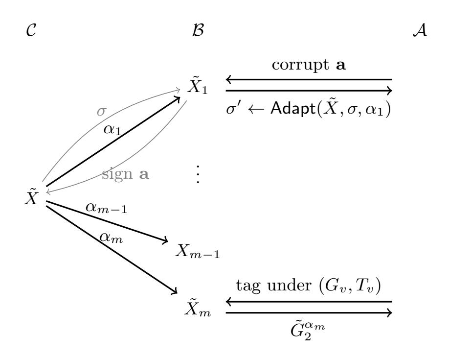

{0}------------------------------------------------

# Issuer-Hiding for BBS Anonymous Credentials via Randomizable Keys

Andrea Flamin[i](https://orcid.org/0000-0002-3872-7251) , Karla Friedrichs [,](https://orcid.org/0000-0002-2308-9111) and Anja Lehman[n](https://orcid.org/0000-0002-2872-7899)

Hasso Plattner Institute, University of Potsdam, Germany {andrea.flamini,karla.friedrichs,anja.lehmann}@hpi.de

Abstract. Anonymous credentials (AC) equip users with credentials on attested attributes, which enable them to prove verifiable yet dataminimizing statements over their attributes. However, in standard ACs, each credential presentation reveals the credential issuer, which could be more information than intended and necessary, e.g., when merely proving age or personhood. Issuer-Hiding Anonymous Credentials (IHAC) address this limitation and hide the issuer in the presentation. That is, they only reveal that the user has a credential from an issuer within a certain trust set, referred to as the policy. Recent works by Sanders and Traoré, and Katz and Sefranek show how to add issuer-hiding to PSand BBS-based credentials while keeping presentations compact, i.e., not scaling in the number of issuers. However, both constructions require the verifier to generate dedicated policy key pairs, turning verification into a secret key operation. Managing these verifier-specific keys introduces additional complexity and affects the resulting practical privacy and security guarantees. In this work, we propose two IHAC schemes from BBS signatures that achieve compact presentations without the need of such verifier-specific keys. At the core of our schemes is a technique to randomize BBS public keys and adapt the signatures accordingly, which we believe to be of independent interest.

# 1 Introduction

Anonymous credentials (AC) are an established tool to enable secure yet privacypreserving authentication [\[Cha85,](#page-32-0)[CL01,](#page-32-1)[CL03,](#page-32-2)[CL04\]](#page-32-3). The setup is as in classical certificates: a trusted issuer signs a list of user attributes, which forms the user's credential. The user can then present their attested attributes in a publicly verifiable way using the credential. The distinguishing feature of ACs is that they allow to make these presentations in a privacy-preserving way: with every presentation, the user can decide which attributes they want to reveal, and presentations are unlinkable and untraceable even when the issuer is corrupt. The current desire to build secure and privacy-respecting digital identity systems around the globe has triggered a renewed real-world interest in these techniques. In particular, the European effort to build a European Digital Identity (EUDI) Wallet [\[eud23\]](#page-32-4) is rooted in the eIDAS2.0 regulation that mandates the use of technologies that enable unlinkable authentications with minimal disclosure [\[eid24\]](#page-32-5), effectively requiring the use of ACs.

{1}------------------------------------------------

Interestingly, the privacy expectations for ACs go beyond what they naturally offer: a typical example is that minimal disclosure of a university degree should merely reveal that the user has a certain degree, but not from which university. While it is trivial to hide any attribute that contains the university's name, this information is still leaked in a normal AC system: the issuer's identity is always revealed in a presentation through their public key. Likewise, in national identity documents, the issuer is typically the country or local state a user is registered in. Thus, even a seemingly anonymous proof of age or personhood would reveal the user's home state. In fact, the practical deployment of large-scale systems might even distribute the load over several smaller issuance authorities, e.g., on federal state or municipality level. Revealing the issuer public with every presentation would then significantly reduce the anonymity set. In the context of the EUDI wallet, the property of issuer-hiding has therefore been identified as an explicit requirement for a ZKP-based solution (ZKP01(v)) [\[eud26\]](#page-32-6).

Issuer-Hiding Anonymous Credentials. ACs that reduce the leakage of information about the issuer are known as Issuer-Hiding Anonymous Credentials (IHAC). Informally, in an IHAC, the verifier no longer learns that the user holds a credential from a specific issuer with key ipk <sup>i</sup> , but only that they own one from an issuer within a well-defined set (or policy) pol := {ipk <sup>1</sup> , . . . , ipk <sup>n</sup>} of trusted issuers. Such a policy could, for instance, contain all EU member states or all universities of a certain country. Issuer-hiding has been studied explicitly only recently [\[BEK](#page-31-0)<sup>+</sup>21[,CLPK22\]](#page-32-7), and already inspired several further constructions [\[MBG](#page-33-0)<sup>+</sup>23[,ST24](#page-33-1)[,KS25\]](#page-33-2). In essence, there are currently three main approaches how to construct such IHAC:

OR proofs over the policy. This is the naïve and most generic approach to issuer hiding, also described by [\[BEK](#page-31-0)<sup>+</sup>21]: it consists of generating a standard OR proof [\[CDS94\]](#page-31-1) that proves that the user owns a credential from one of the issuers in pol. Using this approach, the proof size results to be linear in the number of issuers, which can be reduced to logarithmic for instance with [\[GGHAK22\]](#page-33-3).

The work by Connolly et al [\[CLPK22\]](#page-32-7), based on structure-preserving signatures, falls into that category, but the issuer-hiding privacy property therein requires that all issuers are honest[1](#page-1-0) , an assumption that anonymous credentials usually try to avoid.

Constant proof size using public policy key. A technique introduced by Bobolz et al. [\[BEK](#page-31-0)<sup>+</sup>21] aims to achieve constant presentation size with respect to the number of issuers. This relies on an additional entity and cryptographic scheme to authenticate the accepted policy. Each policy is authenticated through a trusted central entity which signs each public key ipk <sup>i</sup> ∈ pol through its key (vsk, vpk) as σ<sup>i</sup> ← Sign(vsk, ipk<sup>i</sup> ). The main observation is that this reduces the problem to proving that the user holds a credential cred signed by an ipk <sup>j</sup> for which they also know a signature valid under vpk. The authors propose a generic

<span id="page-1-0"></span><sup>1</sup> A malicious issuer would be able to find out if the presented credential is one of those it has issued.

{2}------------------------------------------------

construction that combines an AC scheme with a compatible signature scheme for Sign. The latter must hence be able to sign public keys of the main AC, typically group elements, and allow for efficient proofs of knowledge of a signature. Bobolz et al. instantiate their blueprint with Groth signatures [\[Gro15\]](#page-33-4).

Also the work by Mir et al [\[MBG](#page-33-0)+23], based on structure-preserving signatures somewhat falls into that category, but they consider a setting where the same attributes are certified by multiple issuers, and these credentials get aggregated into a compact presentation token. As in [\[CLPK22\]](#page-32-7), the issuer-hiding privacy property therein requires that all issuers are honest.

Constant proof size using a verifier-specific key. Sanders and Traoré [\[ST24\]](#page-33-1) recently show that issuer hiding can be achieved without a zero-knowledge proof (beyond what is needed for the selective disclosure part), which yields an even more compact solution. They use PS-based credentials [\[PS16\]](#page-33-5) and propose an algebraic approach. On a high level, holders modify a credential to make it depend on all issuer keys included in the policy at once. Crucially, they have to use some cryptographic values that the targeted verifier generates for each policy. These values come with a secret component that the verifier needs when verifying the presentation. Its secrecy is also important to ensure unforgeability, and thus must be generated and maintained individually by every verifier. The main benefit is that [\[ST24\]](#page-33-1) achieves more compact presentations in comparison to [\[BEK](#page-31-0)<sup>+</sup>21], at least for small number of attributes; this compactness gets lost if the number of attributes in a credentials is high. The recent work by Katz and Sefranek [\[KS25\]](#page-33-2) transfers this approach to BBS credentials.

Systematization of IHAC schemes. We first take a systematic view on the existing approaches and classify them according to the setup and trust they require towards verifiers. Our classification identifies three types of policy setup:

Type-0: no policy key. In the simplest case, only the policy pol, containing trusted issuer keys ipk <sup>1</sup> , . . . , ipk <sup>n</sup>, is needed to generate and verify presentations. The naïve OR-proof falls in this category.

Type-1: universal policy key. Policies have an associated public key pk pol , as introduced by Bobolz et al. [\[BEK](#page-31-0)<sup>+</sup>21], which must be generated in a trusted manner. Generation and verification of issuer-hiding presentations require pk pol in addition to pol. In Bobolz et al.'s scheme sketched above, the policy key for a policy pol would be pk pol := (vpk, {σi}<sup>∀</sup>ipki∈pol).

Type-2: per-verifier policy key. A policy key has a secret counter part sk pol , and presentations created with some pk pol require the corresponding secret key to verify. Hence, the policy key pair must be generated by the verifiers themselves. Sanders and Traoré [\[ST24\]](#page-33-1) as well as Katz and Sefranek [\[KS25\]](#page-33-2) use this approach.

We observe that these three types of IHAC have different implications for the level of practical privacy users can expect. Intuitively, issuer-hiding credentials should increase the privacy of users compared to standard ACs, as they do not disclose which issuer originally issued their credential. However, because presentations 

{3}------------------------------------------------

are now created for a specific policy pol, and possibly also a policy key pk pol , privacy may actually decrease if this is not handled carefully.

For instance, a malicious verifier could make a holder use a unique policy (key): if the holder caches this policy (key) for efficiency and re-uses it in every subsequent presentation, the presentations become easily traceable. To avoid this, pol and pk pol must either be ephemeral, i.e., send from verifier to holder before every presentation, or the holder must be sure to use identical values as many others.

Privacy and security challenges for Type-2. Note that the policies and their keys scale linearly in the number of included issuers. Thus, sending and verifying ephemeral policy keys for every presentation would render the compactness benefits of Type-1 and Type-2 solutions useless. Therefore, we do not believe sending ephemeral values to be a plausible solution in practice. Instead, a trusted repository can make the universally used policies and keys available, verifiers send a compact identifier of the desired policy, and users fetch the corresponding artifacts either from repository or cache. For Type-0 and Type-1 IHACs this yields an efficient and privacy-preserving solution. However, for Type-2, we consider this approach unfavorable: for once, the trusted repository must manage a large number of policy keys pk pol , as every verifier needs their own individual key even when they are for the same policy. The repository now also learns which policy which verifier is accepting, and – depending on the concrete implementation – possibly even for which verifier a user is requesting the policy key for.

Finally, handling secret key material on the verifier side is not without challenges either, as it directly impacts the unforgeability guarantees with respect to that verifier: the verifier must choose between generating a fresh policy key pair for each session or maintaining a long-term policy key pair. As argued above, a long-term key pair is certainly better in terms of efficiency. However, the verifier must then ensure proper protection of the secret key, as it's exposure would allow an attacker to forge arbitrary presentations, voiding the credential system of all security guarantees. Having ephemeral keys for each session would be better for security, but remove the efficiency benefits of the Type-2 IHAC solutions. Overall, while one can imagine scenarios suitable to Type-2 IHAC, e.g., when verifiers are also issuers, but overall the settings in which Type-2 IHAC schemes can realistically achieve the promised efficiency seem limited.

Type-0/1 IHAC for BBS? As we believe Type-0 and Type-1 IHACs to be preferable from both a practical and privacy point of view, our main goal is to develop efficient constructions for these types. Concretely, we are interested in improving Type-0/1 issuer-hiding for BBS [\[BBS04,](#page-31-2)[CDL16](#page-31-3)[,TZ23\]](#page-34-0) credentials. BBS credentials are already undergoing standardization [\[LKWL26,](#page-33-6)[SB25\]](#page-33-7), and have been identified as the most promising solution for a dedicated ZKP-based solution for the EUDI Wallet [\[TS126\]](#page-33-8). As standardization is key for any real-world deployment, we aim to extend these schemes in a minimal way, instead of developing new solutions from scratch or requiring additional and complex signature schemes. Let us first recap how applying the existing concepts of Type-0/1 IHACs 

{4}------------------------------------------------

to BBS would look like.

Type-0 BBS. The naïve solution is performing an OR proof over the policy. Recall that here the user must perform n instances of a sigma protocol: one for each of the n issuers in a policy, and for each proving knowledge of a BBS signature. Thus, the proof size is linear (or logarithmic [GGHAK22]) in the size of the policy. We also observe that the transcripts are rather large since they live in  $\mathbb{G}_1^2 \times \mathbb{Z}_p^{|\mathcal{U}|+3}$ , where  $|\mathcal{U}|$  is the number of hidden attributes. For policies with a large amount of issuers (e.g., all universities of the European Union) this will result in a considerable overhead. So we ask the following:

Can we construct a Type-0 IHAC from BBS credentials where the size of the repeated transcript is more compact than in the naïve solution?

<u>Type-1 BBS.</u> Type-1 IHAC adds a public policy key for better efficiency. Assuming that this  $pk_{pol}$  can be re-used in a privacy-preserving way as discussed above, the presentation becomes independent of the policy size. While Bobolz et al. [BEK+21] propose a generic Type-1 construction, they require the credential and the policy key scheme to be compatible and enable authenticating group elements. This approach is not directly applicable to BBS signatures, and [BEK+21] propose to use Groth signatures instead. Also note that the recent issuer-hiding BBS scheme [KS25] is of Type-2, and crucially relies on verifier-specific secret keys. Thus, to the best of our knowledge, so far no BBS-based construction for Type-1 IHAC exists. We therefore ask the following natural question:

Can we design a Type-1 IHAC scheme from BBS credentials with constant-size presentations?

#### 1.1 Our Contributions

In this work we positively answer both questions, and propose efficient Type-0 and Type-1 IHAC schemes from BBS credentials. To study these schemes we first present a unified security framework that formally captures privacy and unforgeability for the three types of issuer-hiding credential schemes. We then give constructions from BBS credentials, that both leverage a key randomization technique that we believe to be of independent interest. Our constructions are compatible with standard BBS credentials and provide everlasting privacy.

Key randomization of BBS credentials. An important observation for our work is that BBS signatures have randomizable public keys and adaptable signatures. That is, given a BBS signature  $\sigma$  under public key pk, we can easily transform this into a signature  $\sigma^*$  that is valid for a randomized public key  $pk^*$ . This concept is well-understood for many signatures such as Schnorr, ECDSA or PS [CGH<sup>+</sup>24], but interestingly, has not been studied for BBS signatures yet.

To sketch the main idea, let cred = (A, e) be a BBS signature on attributes  $\mathbf{a} = (a_1, \dots, a_\ell)$  generated by the issuer with public key  $ipk = \tilde{X} = \tilde{G}_2^x$ . The

{5}------------------------------------------------

verification equation for BBS signatures checks that  $\mathbf{e}(A, \tilde{X}\tilde{G}_2^e) = \mathbf{e}(C, \tilde{G}_2)$  for  $C \leftarrow G_1 \prod_{i=1}^{\ell} H_i^{a_i}$ . Recall that  $A = C^{\frac{1}{e+x}}$ . We can randomize the public key as  $\tilde{X}^* = \tilde{X}^{\alpha}$  for a random  $\alpha \leftarrow \mathbb{Z}_p$  and adapt the signature accordingly into  $cred^* = (A^*, e^*) \leftarrow (A^{\frac{1}{\alpha}}, e\alpha)$ . Then,  $(A^*, e^*)$  is a valid signature on  $\mathbf{a}$  under  $\tilde{X}^*$ .

Note that this is not a full randomization of the BBS signature, but still sufficient for our use case, as BBS signatures are not revealed in an anonymous credential system, but merely proven knowledge of. In fact, for issuer-hiding, we mainly care about the randomization of the issuer public key.

IHBBS<sub>0</sub>: policy-free BBS-IHAC with better efficiency. We use key-randomization to simplify the naive OR proof when applied to BBS credentials. Recall that a naïve proof over attributes **a** and policy  $pol = \{ipk_1, \ldots, ipk_n\}$  would be:

$$\mathsf{NIZKP}\{(\mathit{cred}, \mathbf{a}, \mathit{ipk}_i) : \mathsf{Vf}_\mathsf{BBS}(\mathit{ipk}_1, \mathbf{a}, \mathit{cred}) = 1 \lor \cdots \lor \mathsf{Vf}_\mathsf{BBS}(\mathit{ipk}_n, \mathbf{a}, \mathit{cred}) = 1\}$$

Leveraging the fact that we can randomize  $ipk_i = \tilde{X}_i$  into  $\tilde{X}^* = \tilde{X}_i^{\alpha}$ , and adapt cred accordingly into  $cred^*$ , we turn this into a presentation where the OR statement is solely proven for the public key:

$$\mathsf{NIZKP}\{(\mathit{cred}^{\star},\mathbf{a},\tilde{X},\alpha): \mathsf{Vf}_{\mathsf{BBS}}(\tilde{X}^{\star},\mathbf{a},\mathit{cred}) = 1 \land (\tilde{X}^{\star} = \tilde{X}_{1}^{\alpha} \lor \cdots \lor \tilde{X}^{\star} = \tilde{X}_{n}^{\alpha})\}$$

Thus, instead of running the OR proof over the entire BBS credential, we reveal (1) the randomized public key  $\tilde{X}^*$ , make (2) a single BBS credential presentation under the randomized public key, and (3) an OR proof of knowledge of a discrete logarithm to one of the keys in the policy. The OR part therefore has a reduced size of 2n elements in  $\mathbb{Z}_p$  instead of 2(n-1) elements in  $\mathbb{G}_1$  and  $(n-1)\cdot(|\mathcal{U}|+3)$  elements in  $\mathbb{Z}_p$ , where  $|\mathcal{U}|$  is the amount of hidden attributes. This already provides a noticeable improvement for credentials of average size, e.g., national identity or age verification credentials come with around 20-30 attributes [ISO21]. Considering a setting of n=27 (all EU Member states), and estimating  $|\mathcal{U}|=20$  this translates to 1.7 KB vs 21 KB when using BBS credentials on BLS12-381. We prove this scheme secure based on the unforgeability of BBS signatures (in the ROM).

IHBBS<sub>1</sub>: constant-size BBS-IHAC w/o verifier-specific keys. Our second construction improves efficiency by turning to the Type-1 setting, and yields the first BBS-scheme that has constant-size presentations and does not require verifier-specific keys. We start by building upon the generic approach by Bobolz et al. [BEK+21]. We again use our technique to randomize BBS public keys and adapt BBS signatures that verify under that key. This yields a Type-1 IHAC scheme (IHBBSGroth) which combines BBS signatures (for the attribute credentials) and the Groth signature [Gro15] (for the policy key). This direct application of Bobolz et al.'s approach is not fully satisfactory though: (1) proof generation and verification require computations in  $\mathbb{G}_T$ ; (2) it needs a second complex signature scheme (Groth) for the policy key signature and (3) the security proof relies on the Generic Group Model (GGM).

{6}------------------------------------------------

We therefore design a second scheme (IHBBS<sub>1</sub>) which overcomes these limitations: in spirit, it still follows the idea of Bobolz et al., but removes all computations in  $\mathbb{G}_T$ , requires only a minimal extension on top of standard BBS, and is analyzed in the AGM. In fact, our construction even gets rid of any zeroknowledge proof related to the issuer-hiding part, which was so far only known for Type-2 constructions [ST24,KS25]. To achieve that, we leverage the observation that we do not need a full-fledged signature scheme for the policy keys, as we already establish the main trust through the unforgeability of BBS signatures used for the attribute credential. Thus, instead of using a signature scheme to authenticate the trusted issuers, we rely on a new primitive, which we call a tag. Tags on authenticated messages are malleable, in the sense that a tag  $\tau$  on a message m can be easily transformed into a valid tag  $\tau'$  for the message  $m^{\alpha}$ . This controlled malleability is acceptable here – and even wanted, as tags are authenticating the issuer public keys in our construction. Thus, such malleability allows us to first randomize the issuer public key (and BBS signature) and then give out the randomized key in clear with its adapted tag. We give a very simple tag construction that provides that controlled malleability, yet ensures that forging tags for anything beyond such randomization is impossible.

Beyond the efficiency improvements, our scheme also improves on the underlying assumptions, as we prove the scheme secure in the AGM, whereas all existing IHAC schemes with constant-size presentations required the GGM model. We give a comparison of our schemes and the related work in Table 1.

<span id="page-6-0"></span>**Table 1.** Comparison of the main approaches to IHAC. **BBS** refers to the compatibility with standard BBS credentials. **Overhead** denotes the extra presentation costs needed for n issuers and  $|\mathcal{U}|$  undisclosed attributes. **No**  $\mathbb{G}_T$  captures if the presentation requires computations in  $\mathbb{G}_T$ , and **Public Vf** whether verification requires a secret policy key.

| Type          | Scheme                                                    | BBS                            | Overhead                          | Model                                                                          | $\mathbf{No}~\mathbb{G}_T$ | Public Vf    |
|---------------|-----------------------------------------------------------|--------------------------------|-----------------------------------|--------------------------------------------------------------------------------|----------------------------|--------------|
| 0             | Naïve $IHBBS_0$                                           | 1                              | $O(n \cdot  \mathcal{U} ) \ O(n)$ | ROM<br>ROM                                                                     | <b>/</b>                   | <i>y y</i>   |
| 1<br>1<br>1   | [BEK <sup>+</sup> 21]<br>IHBBSGroth<br>IHBBS <sub>1</sub> | <b>X</b> ( <b>✓</b> ) <b>✓</b> | $O(1) \\ O(1) \\ O(1)$            | $\begin{array}{c} {\rm GGM+ROM} \\ {\rm GGM+ROM} \\ {\rm AGM+ROM} \end{array}$ | х<br>х<br>√                | <i>y y y</i> |
| $\frac{2}{2}$ | [ST24]<br>[KS25]                                          | ×                              | $O(1) \\ O(1)$                    | $\frac{\mathrm{GGM} + \mathrm{ROM}}{\mathrm{GGM} + \mathrm{ROM}}$              | <i>J</i>                   | X<br>X       |

### <span id="page-6-1"></span>2 Preliminaries

Notation. Let  $\lambda$  represent the security parameter of our schemes. Throughout the algorithms given in this work, we use  $\leftarrow$  for deterministic, and  $\leftarrow$ \$ for probabilistic assignment or sampling from a set. We designate by  $\emptyset$  empty sets and by () empty dictionaries, where values are accessed by key.

{7}------------------------------------------------

(Bilinear) groups. We consider throughout this work groups  $\mathbb{G}$  of prime order p, and denote the generation of a group from a generator G by  $\mathbb{G} \leftarrow \langle G \rangle$ .

The presented BBS-based schemes rely on asymmetric bilinear groups. We use the convention of denoting the source groups with  $\mathbb{G}_1$  and  $\mathbb{G}_2$ , and the target group with  $\mathbb{G}_T$ . For convenience, we write elements  $G \in \mathbb{G}_1$  in plain, elements  $\tilde{G} \in \mathbb{G}_2$  with a tilde, and  $\hat{G} \in \mathbb{G}_T$  with a hat. All three groups are of order p, and a the respective generators are called  $G_1$ ,  $\tilde{G}_2$ , and  $\hat{G}_T$ . As an additional structure, there is a pairing, an efficiently computable map  $\mathbf{e} : \mathbb{G}_1 \times \mathbb{G}_2 \to \mathbb{G}_T$  which fulfills bilinearity (for any  $x, y \in \mathbb{Z}_p$ , it holds that  $\mathbf{e}(G_1^x, \tilde{G}_2^y) = \mathbf{e}(G_1, \tilde{G}_2)^{xy}$ ) and non-degeneracy (for all generators  $G_1$  and  $\tilde{G}_2$ ,  $\mathbf{e}(G_1, \tilde{G}_2)$  is also a generator). For the setup of public parameters, we assume a bilinear group generation algorithm  $\mathsf{BGGen}(1^\lambda) \Leftrightarrow (p, \mathbb{G}_1, \mathbb{G}_2, \mathbb{G}_T, \mathbf{e}, G_1, \tilde{G}_2, \hat{G}_T)$ .

Digital signatures. Digital signatures are defined by a set of four algorithms:  $\mathsf{PGen}(1^\lambda)$  outputs public parameters pp,  $\mathsf{KGen}(pp)$  generates a signer key pair (sk, pk),  $\mathsf{Sign}(sk, m)$  lets the signer create a signature  $\sigma$  on a message m, and  $\mathsf{Vf}(pk, \sigma, m)$  returns 1 iff  $\sigma$  is a valid signature of m under key pk.

The standard security notions for signatures are existential and strong unforgeability under chosen message attacks (UF-CMA and SUF-CMA), respectively. These notions are captured by two very similar experiments: the adversary receives from the challenger the public parameters and a public key pk. Then, it can request a polynomial number  $q(\lambda)$  of signatures for messages  $m_i$  of its choice, receiving the associated signature  $\sigma_i \leftarrow \text{Sign}(sk, m_i)$  every time. Finally, the adversary produces a forgery  $(m^{\dagger}, \sigma^{\dagger})$ . For both UF-CMA and SUF-CMA, it is checked that  $\sigma^{\dagger}$  is valid on  $m^{\dagger}$  and under pk. In the weaker UF-CMA, the adversary wins if it never queried a signature on  $m^{\dagger}$  (i.e.,  $\forall i \in [q] : m^{\dagger} \neq m_i$ ); in the stronger SUF-CMA, the adversary additionally wins if  $m^{\dagger}$  was among the queries, but  $\sigma^{\dagger}$  is fresh (i.e.,  $\forall i \in [q] : (m^{\dagger}, \sigma^{\dagger}) \neq (m_i, \sigma_i)$ ).

BBS signatures and anonymous credentials. BBS signatures permit efficient ZKPs of knowledge of a signature and therefore lend themselves to anonymous credentials [CL04,CDL16,TZ23]. We assume all algorithms receive the public parameters pp, but omit them from the inputs for brevity.

<span id="page-7-0"></span>**Definition 1 (BBS Signatures).** BBS signatures are defined by the following algorithms. Here, messages are always a vector  $\mathbf{a}$  of  $\ell$  elements  $(a_1, \ldots, a_{\ell})$ .

```
\begin{aligned} \mathsf{PGen}(1^\lambda): \ Generate\ (p,\mathbb{G}_1,\mathbb{G}_2,\mathbb{G}_T,\mathbf{e},G_1,\tilde{G}_2,\hat{G}_T) &\longleftrightarrow \mathsf{BGGen}(1^\lambda).\ Then\ sample\\ (H_1,\ldots,H_\ell) &\longleftrightarrow \mathbb{G}_1^\ell\ and\ return\ pp \leftarrow (p,\mathbb{G}_1,\mathbb{G}_2,\mathbb{G}_T,\mathbf{e},G_1,\tilde{G}_2,H_1,\ldots,H_\ell). \\ \mathsf{KGen}(pp): \ Sample\ x &\longleftrightarrow \mathbb{Z}_p.\ Compute\ \tilde{X} \leftarrow \tilde{G}_2^x,\ set\ sk \leftarrow x,\ and\ pk \leftarrow \tilde{X}. \\ \mathsf{Sign}(sk,(a_1,\ldots,a_\ell)): \ Compute\ C(\mathbf{a}) \leftarrow G_1\prod_{i=1}^\ell H_i^{a_i}.\ Sample\ e &\longleftrightarrow \mathbb{Z}_p\ and\ compute\ A \leftarrow C(\mathbf{a})^{\frac{1}{e+x}}.\ If\ A = 1_{\mathbb{G}_1},\ return\ \bot.\ Else,\ output\ (A,e). \\ \mathsf{Vf}(pk,(A,e),\mathbf{a}): \ Check\ A \neq 1_{\mathbb{G}_1}.\ Set\ C(\mathbf{a}) \leftarrow G_1\prod_{i=1}^\ell H_i^{a_i}\ and\ return\ 1\ iff\ \mathbf{e}(A,\tilde{X}\tilde{G}_2^e) = \mathbf{e}(C(\mathbf{a}),\tilde{G}_2). \end{aligned}
```

Note that an alternative check for Vf is  $\mathbf{e}(A, \tilde{X}) = \mathbf{e}(C(\mathbf{a})A^{-e}, \tilde{G}_2)$ .

{8}------------------------------------------------

To build AC from BBS, signatures (A, e) on attributes **a** serve as credentials, and ZKPs allows the holder to present their credential disclosing only a subset of the attributes. Such efficient ZKPs of knowledge for BBS signatures are given by [TZ23]; we repeat one of them below. We denote the indices of revealed attributes by  $\mathcal{D}$ , while corresponding attribute values are called  $(a_i)_{i\in\mathcal{D}}$ . Analogously, we call the indices of hidden attributes  $\mathcal{U}$ . Generation and verification of such presentations of BBS credentials is defined as follows:

Present<sub>BBS</sub>(ipk, cred,  $\mathbf{a}$ ,  $\mathcal{D}$ , nonce): Parse  $\tilde{X} \leftarrow ipk$ . The statement to be proven is  $(\tilde{X}, \mathcal{D}, (a_i')_{i \in \mathcal{D}})$ , for some disclosed attributes  $(a_i')_{i \in \mathcal{D}}$ . The witness is the credential (A, e) valid under  $\tilde{X}$  and over attributes  $\mathbf{a}$  that match the revealed ones, i.e.,  $\{a_i'\}_{i \in \mathcal{D}} = \{a_i\}_{i \in \mathcal{D}}$ .

Set  $C(\mathbf{a}) \leftarrow G_1 \prod_{i=1}^{\ell} H_i^{a_i}$  and  $C(\mathbf{a}') \leftarrow G_1 \prod_{i \in \mathcal{D}} H_i^{a_i}$ , sample  $r \leftarrow \mathbb{Z}_p^*$  and compute  $\overline{A} \leftarrow A^r$ , and  $\overline{B} \leftarrow C(\mathbf{a})^r \overline{A}^{-e}$ . Note that this implies  $\overline{B} = C(\mathbf{a}')^r \left(\prod_{j \in \mathcal{U}} H_i^{ra_i}\right) \overline{A}^{-e}$ . Finally, the holder computes  $\pi$  as:

$$\mathsf{NIZKP}\Big\{\big((\alpha,(\beta_j)_{j\in\mathcal{U}},\gamma),(\overline{B},C(\mathbf{a}'),(H_j)_{j\in\mathcal{U}},\overline{A})\big)\colon \overline{B}=C(\mathbf{a}')^\alpha\Big(\prod_{j\in\mathcal{U}}H_j^{\beta_j}\Big)\overline{A}^\gamma\Big\}$$

To compute the challenge, all public values, in particular, including the nonce, need to be hashed. Obverse that we know the witness  $(r, (ra_j)_{j \in \mathcal{U}}, -e)$ . Finally, we output  $pres \leftarrow (\overline{A}, \overline{B}, \pi) \in \mathbb{G}_1^2 \times \mathbb{Z}_p^{|\mathcal{U}|+3}$ .

VfPres<sub>BBS</sub>( $ipk, pres, \mathcal{D}, (a_i')_{i \in \mathcal{D}}, nonce$ ): Parse  $\tilde{X} = ipk$  and  $(\overline{A}, \overline{B}, \pi) \leftarrow pres$ . Compute  $C(\mathbf{a}') \leftarrow G_1 \prod_{i \in \mathcal{D}} H_i^{a_i'}$ . Return 1 iff the following three checks hold: (1)  $\overline{A} \neq 1_{\mathbb{G}_1}$ , (2)  $\mathbf{e}(\overline{A}, \tilde{X}) = \mathbf{e}(\overline{B}, \tilde{G}_2)$ , and (3)  $\pi$  is valid.

*Idealized models.* Proving the security of the constructions proposed in this work will require idealized models, more specifically, the Random Oracle Model and the Algebraic Group Model. Below we recall how these models are defined.

The Random Oracle Model (ROM) [BR93] allows to treat cryptographic hash functions H as random oracles RO. It assumes that the output RO(m) upon any input m is indistinguishable from the output of a truly random function f(m). Additionally, the ROM allows us to observe all queries the adversary makes to RO, and allows us to program the outputs of RO for specific inputs m.

In the Algebraic Group Model (AGM) [FKL18], adversaries are modeled as algebraic. Such an adversary is unable to generate fresh elements from a group, it can only compute them from elements it has seen before. Technically, every time that the adversary outputs a group element  $X \in \mathbb{G} =$ , we force it to also output a representation  $\bar{\alpha} = (\alpha_1, \dots, \alpha_n)$  that constructs X with respect to the group elements it has seen so far  $(X_1, \dots, X_n)$ , i.e.  $X = \prod_{i \in [n]} X_i^{\alpha_i}$ . The AGM is a weaker assumption [JM24] than the Generic Group Model (GGM) [Mau05], which was used in prior work on IHAC schemes [KS25,BEK+21,ST24,MBG+23].

{9}------------------------------------------------

# 3 Issuer-Hiding Anonymous Credentials

In this section we formally define Issuer-Hiding Anonymous Credentials (IHAC). We introduce three types of IHAC with an increasing complexity for the policy keys that authenticate the set of trusted issuers: Type-0 does not require any policy keys, Type-1 needs a global policy key, and Type-2 requires verifier-specific policy keys. We define the syntax of all three types, and discuss the impact they have on the practical privacy (and efficiency) of users.

## 3.1 Syntax of IHAC Schemes

We first recall standard Anonymous Credentials (AC), upon which IHAC extend. Regular AC schemes are made up of the following set of algorithms. For setup, PGen generates public parameters and IssKGen generates issuer keys (ipk, isk). Credentials cred for some attributes a = (a1, . . . , aℓ) are issued by Issue[2](#page-9-0) , using key isk, and are verified with VfCred. Holders run Present to generate presentations pres of their credential, which in turn are verified by VfPres. To minimize the information disclosed by a presentation, holders may reveal only a predicate over their attributes instead of the full attributes. In this work, we concentrate on the selective disclosure predicate, but our approach can easily be extended to other predicates. Present and VfPres also take a nonce as input, which in practice can be used to bind presentations to a particular session or context.

Standard AC are issuer-revealing: the VfPres algorithm takes some issuer public key ipk as input and accepts only presentations of credentials created by this specific issuer. In contrast, Issuer-Hiding Anonymous Credentials verify presentations with respect to a policy pol = {ipk <sup>1</sup> , . . . , ipk <sup>n</sup>}, the set of public keys of trusted issuers: given such a policy, VfPres will accept presentations of credentials created by any of the issuers in the policy.

We identify three ways to create this policy in related works, which we call Type-0, Type-1, and Type-2. Let us first describe each approach and their formal syntax before justifying this choice.

Type-0 (no policy key). The simplest constructions use the policy pol, i.e. the set of accepted issuers, and nothing else. For simplicity, we will assume here and in the following that the public parameters of the IHAC scheme are shared by all the issuers in the system. It follows a formal definition of Type-0 IHAC.

Definition 2 (Type-0 IHAC). A Type-0 Issuer-Hiding Anonymous Credential scheme (IHAC) is defined by the following set of algorithms:

```
PGen(λ) $→ pp : generates public parameters pp.
IssKGen(pp) $→ (isk, ipk) : generates an issuer key pair.
Issue(isk, a = (a1, . . . , aℓ)) $→ cred : issues a credential for the attributes in a.
VfCred(ipk, cred, a) → {0, 1} : checks if cred is a valid credential for attributes
    a under key ipk.
```

<span id="page-9-0"></span><sup>2</sup> Issue could be replaced by an interactive protocol to support blind issuance.

{10}------------------------------------------------

Present $(pol, ipk, cred, \mathbf{a}, \mathcal{D}, nonce) \Longrightarrow pres : presents cred valid under ipk, disclosing only attributes <math>(a_i)_{i \in \mathcal{D}}$ , with respect to policy  $pol = \{ipk_0, \ldots, ipk_n\}$  and for context nonce.

VfPres $(pol, pres, \mathcal{D}, (a'_i)_{i \in \mathcal{D}}, nonce) \rightarrow \{0, 1\}$ : checks whether pres is valid under policy pol, for revealed attributes  $(a'_i)_{i \in \mathcal{D}}$ , and context nonce.

Type-1 (universal policy key). In this type, in addition to the policy, an associated policy public key  $pk_{pol}$  is required for creating and verifying presentations. This policy key is created through an algorithm SetPolicy for a given policy  $pol^3$ , and can be verified to be valid for pol using VfPolicy. Both Present and VfPres get the policy key  $pk_{pol}$  as input. Note that  $pk_{pol}$  is entirely public, so this policy key can be used universally. It needs to be generated only once for each new policy, can be delegated to a trusted party and be publicly checked for well-formedness. This type is due to Bobolz et al. [BEK<sup>+</sup>21].

**Definition 3 (Type-1** IHAC). A Type-1 IHAC scheme is a set of algorithms (PGen, IssKGen, Issue, VfCred, SetPolicy, VfPolicy, Present, VfPres), with a syntax identical to Type-0 except the following <u>boxed</u> additions:

Type-2 (verifier policy key). Finally, Type-2 IHAC add a secret counterpart to the policy public keys  $pk_{pol}$ , which is necessary to verify presentations. As the secrecy of the secret key  $sk_{pol}$  is essential for the unforgeability guarantees, it cannot be shared across verifiers. This means that every verifier has to generate its own policy key pair, and credential holders must obtain the policy public key from every verifier – even when they attest to the same policy. This type was first introduced by Sanders and Traoré [ST24], and was recently used by Katz and Sefranek [KS25] in their BBS issuer-hiding scheme.

**Definition 4 (Type-2** IHAC). A Type-2 IHAC scheme is a set of algorithms (PGen, IssKGen, Issue, VfCred, SetPolicy, VfPolicy, Present, VfPres), with a syntax identical to Type-1 except the following highlighted additions:

$$\begin{split} \mathsf{SetPolicy}(pol) & \Leftrightarrow (\mathit{sk}_{pol}, \mathit{pk}_{pol}) : \ \mathit{the \ verifier \ creates \ a \ key \ pair \ for \ policy \ pol.} \\ \mathsf{VfPres}(pol, \mathit{pk}_{pol}, \mathit{sk}_{pol}, \mathit{pres}, \mathcal{D}, (a_i')_{i \in \mathcal{D}}, \mathit{nonce}) & \to \{0,1\} : \ \mathit{pres \ is \ verified \ using \ the \ verifier-specific \ secret \ key \ sk_{pol} \ in \ addition \ to \ pk_{pol}.} \end{split}$$

<span id="page-10-0"></span><sup>&</sup>lt;sup>3</sup> Note that we define the policy pol strictly as the set of issuer public keys. Some related works [BEK<sup>+</sup>21,MBG<sup>+</sup>23,KS25] denote with pol a merged object that contains both issuer public keys and the corresponding policy key  $pk_{pol}$ .

{11}------------------------------------------------

Relation between the types. There are generic transforms between the types: Type-0 schemes can be transformed into Type-1 by having SetPolicy output an empty key  $pk_{pol}$ , VfPolicy always returning 1, and Present and VfPres simply ignoring  $pk_{pol}$ . Analogously, Type-1 schemes can be made into Type-2 by leaving the  $sk_{pol}$  empty and having VfPres ignore  $sk_{pol}$ . It is easy to see that all security properties (introduced in Section 4) are preserved through this transform.

## <span id="page-11-0"></span>3.2 Impact of IHAC Type on Privacy

These IHAC types affect the practical privacy guarantees of the underlying anonymous credential scheme and we believe Type-0 and Type-1 to be strictly better for privacy than Type-2. *Unlinkability* is the principal privacy property of AC: we want a presentation to disclose the minimum amount of information necessary in an authentication procedure. In particular, the holder should stay anonymous among all presentations with the same disclosures.

For meaningful privacy, it is crucial that this anonymity set is large. A malicious verifier might attempt to de-anonymize users by shrinking the anonymity set: for instance, making a holder present a credential with a unique attribute value. Issuer-hiding credentials are intuitively creating *larger* anonymity sets than standard ACs that reveal the issuer's identity in every presentation. However, extra care is needed – in particular for Type-2 IHACs – to ensure that policies and policy keys cannot be used to *shrink* them.

Anonymity sets. Let us first understand how the anonymity sets related to issuer information arise, before discussing how attacks aiming to shrink the anonymity set can be prevented. Anonymity sets are determined by the credential-specific values revealed in a presentation. This entails the disclosed attributes  $(a_i)_i \in \mathcal{D}$  and the information on the underlying issuer public key ipk. In IHAC, the presentation only reveals that the holder owns a credential for  $ipk \in pol$ , but not the ipk itself. However, they do require a concrete policy  $pol = \{ipk_1, \ldots, ipk_n\}$  as input to the verification algorithm, and the anonymity set depends on how many other holders make presentations for the same policy.

1. Policy must not be unique. The first important observation is that the policy must not create a unique trace, but rather be shared universally among all users. If holders are using distinct policies, they can be traced across presentations. This could happen accidentally when policies are assembled on the user side, when forgetting to include certain keys or including an outdated one. Repeated credential presentation with such a "special" policy can then make the presentations linkable, regardless of the revealed attributes. In fact, a malicious verifier/policy provider could also try to "tag" users through unique policies, e.g., giving them maliciously tampered  $pol_{\mathsf{EU}}^*$  sets that contain a unique tracing key instead of the public key for Liechtenstein. This will not impact the holder's capability to make valid issuer-hiding presentations under  $pol_{\mathsf{EU}}^*$  (unless they are from Liechtenstein), but repeated presentations under the same policy key would become linkable.

{12}------------------------------------------------

Obviously, this is an inherent challenge and must be properly addressed in all three types of issuer-hiding credentials. A simple solution is to use a trusted repository that publishes typical policies, e.g., pol EU containing all current public keys of EU member states, or pol UniPL for all universities in Poland. All holders would regularly fetch and use the most recent policies from there.

2. Policy key must not be unique. Recall that Type-1 and Type-2 IHACs additionally require a policy public key pk pol as input for credential presentation and verification. Thus, the above discussion now extends to this cryptographic value: it is no longer sufficient to ensure that all users share the same policy; they must also share the same pk pol . The solution of a central repository of policies can be easily augmented to also include pk pol ; at least in Type-1 IHAC. The solution becomes less realistic for Type-2 IHAC: here, policy keys must be generated per verifier, so each verifier would have to register themselves with the third party and the repository would need to store a large amount of keys.

Another solution for Type-2 IHAC? An attempt to limit the privacy risks of Type-2 IHAC is to go rather to the other extreme: holders are provided with policies and pk pol from the verifier on the fly, but never use stored or prefetched policies. This would prevent tracking through the repeated use of the same tailored pk pol . However, this ad-hoc approach makes it easier to create faulty policies, e.g., including all countries except Italy, to single out Italian holders. Further, as every pk pol should be verified to be correct for the given pol, creating on-the-fly pk pol would require holders to run that check every time instead of relying on pre-fetched and validated values.

Overall, given these efficiency and privacy drawbacks of Type-2 IHAC, we focus on Type-0 and Type-1 IHACs for the remainder of this work.

# <span id="page-12-0"></span>4 Security Model for IHAC

We now define the security properties that IHAC schemes must satisfy. Since this work develops and analyzes a Type-0 and Type-1 construction, respectively, the security model focuses on these two IHAC types. However, to demonstrate the versatility of the model, we also provide Type-2 definitions in Appendix [C.](#page-39-0)

Our model comprises the two main properties expected from AC: unlinkability and unforgeability. We extend both to the issuer-hiding case, building upon the security models of [\[BEK](#page-31-0)<sup>+</sup>21[,ST24](#page-33-1)[,KS25\]](#page-33-2). Further, it is standard to consider correctness, i.e., the guarantee that a scheme fulfills the desired functionality if all parties behave honestly. This property is straightforward to define and prove for each construction, so we defer its treatment to Appendix [B.](#page-37-0)

#### 4.1 Issuer-Hiding Unlinkability

Classic unlinkability for anonymous credentials guarantees that presentations reveal nothing about the holder beyond the disclosed attributes. In standard

{13}------------------------------------------------

```
 \begin{array}{|c|c|c|c|c|} \hline \textbf{Game 1: Unlinkability (Type-0, Type-1)} \\ \hline & \underbrace{\mathsf{Exp}^{\mathsf{UNLINK},b}_{\mathcal{A},\mathsf{IHAC}}(\lambda)}_{pp \;\leftarrow\$\;\mathsf{PGen}(1^{\lambda})} & \mathcal{O}_{\mathsf{Chal}}(pol, pk_{pol}, \mathcal{D}, nonce, ipk^{(0)}, ipk^{(1)}, cred^{(0)}, cred^{(1)}, \mathbf{a}^{(0)}, \mathbf{a}^{(1)}) \\ \hline & & \underbrace{\mathsf{if}\;\; \mathsf{VfPolicy}(pol, pk_{pol}) = 0 : \mathbf{return}\; \bot}_{\mathbf{for}\;\; d \;\in\; \{0,1\}:} \\ & & & & \underbrace{\mathsf{if}\;\; ipk^{(d)} \not\in pol \;\; \vee \; \mathsf{VfCred}(ipk^{(d)}, cred^{(d)}, \mathbf{a}^{(d)}) = 0 : \mathbf{return}\; \bot}_{\mathbf{return}\;\; \mathsf{Present}(pol, pk_{pol}, ipk^{(b)}, cred^{(b)}, \mathbf{a}^{(b)}, \mathcal{D}, nonce)} \\ \hline \end{array}
```

unlinkability experiments, an adversary chooses two credentials that verify under the issuer public key and share a set of disclosed attributes. The experiment creates a presentation using one of these credentials and the adversary must guess which one has been used.

The central goal of IHAC is to strengthen this privacy notion: where basic AC produce presentations that reveal the issuer that produced the underlying credential, we want IHAC to hide even this aspect of the credential. Therefore, issuer-hiding unlinkability allows the adversary to specify credentials issued under different keys. The experiment is given in Game 1. Plain code makes up the base game for Type-0 IHAC, additional code for Type-1 is <u>boxed</u>.

We model a strong adversary that controls policy generation, issuance, and verification. For each challenge,  $\mathcal{A}$  chooses a policy pol (and  $pk_{pol}$ , for Type-1) and the personal inputs of two holders, consisting of the issuer key, a credential, attributes, disclosures, and a nonce. As disclosures, policy (and policy key) and nonce of a presentation are publicly verifiable, these must be identical among the two holders. Some sanity checks on the inputs are made to exclude trivial attacks where presentation of one of the input sets would simply fail: the attribute sets must overlap at the disclosed indices, the issuer keys must be part of the policy, and the credentials must be valid. Type-1 constructions also require  $pk_{pol}$  to be valid for the given policy. Note that any of these checks is easily reproducible by a wary holder.

Then, a presentation of input set b is produced. We consider an IHAC scheme unlinkable if the adversary is unable to differentiate between world b=0 and world b=1 – since this implies that  $\mathcal A$  is incapable of gleaning any information of the credential, hidden attributes, or issuer contained in a presentation.

Remark that the game implicitly assumes that holders are able to ensure they receive the same policy (and policy key for Type-1 IHAC). We discussed in Section 3.2 how any implementation must carefully provide such a guarantee to holders, as otherwise privacy breaks.

**Definition 5** (UNLINK). A (Type-0, Type-1) IHAC scheme  $\Pi$  is unlinkable, if  $\forall$  PPT adversaries the following advantage w.r.t. Game 1 is negligible:

$$\mathsf{Adv}^{\mathsf{UNLINK}}_{\varPi}(\mathcal{A},\lambda) \coloneqq \Big| \Pr \Big[ \mathsf{Exp}^{\mathsf{UNLINK},0}_{\mathcal{A},\varPi}(\lambda) = 1 \Big] - \Pr \Big[ \mathsf{Exp}^{\mathsf{UNLINK},1}_{\mathcal{A},\varPi}(\lambda) = 1 \Big] \Big|$$

Other unlinkability definitions. Our work closely follows the existing models on issuer-hiding unlinkability: [BEK+21], [ST24], and [KS25] also give left-or-right

{14}------------------------------------------------

type notions with the same adversarial abilities, attack goals, and sanity checks, except for syntactical differences.

# 4.2 Unforgeability

Unforgeability ensures that malicious holders are not able to generate presentations with respect to a policy pol, unless they have a credential from an issuer in that specific policy. This property is captured by an experiment where the adversary, during the training phase, is given access to the following oracles:

OKGen() generates keys (isk, ipk) for honest issuers. It records the pair and returns ipk to the adversary.

OSetPolicy(pol) represents a trusted entity that manages policies and creates policy public keys. The adversary must 'register' any policy here that it wants to use in a forgery. Only honest issuers are accepted in policies.

OIssue(ipk, a) generates credentials on behalf of honest issuers. The credentials are recorded but not given to the adversary.

OCorrupt(icred ) corrupts the icred -th credential, revealing it to the adversary.

OPresent(pol, pk pol , icred , D, nonce) allows the adversary to obtain presentations of uncorrupted credentials.

Eventually, A outputs its forgery pres † and wins the unforgeability experiment if it is a valid presentation for (1) a registered policy and (2) attributes for which the no matching credential was ever leaked by OCorrupt, and the presentation is fresh, i.e., not generated by OPresent.

Definition 6 (UNF). A (Type-0, Type-1 ) IHAC scheme Π is unforgeable, if ∀ PPT adversaries the following advantage w.r.t. Game [2](#page-15-0) is negligible:

$$\mathsf{Adv}^{\mathsf{UNF}}_{\varPi}(\mathcal{A},\lambda) \coloneqq \Pr \Big[ \mathsf{Exp}^{\mathsf{UNF}}_{\mathcal{A},\varPi}(\lambda) = 1 \Big]$$

The need for OSetPolicy It might surprise that we enforce honest policy generation, given that we also modeled public verification of policies via VfPolicy for Type-1 IHACs. Intuitively, it could seem sufficient to exclude malicious issuers in pol, and allow the adversary to output any policy key pk pol . Such a security notion would, however, not be achieved by the construction by Bobolz et al. [\[BEK](#page-31-0)<sup>+</sup>21], as well as our Type-1 scheme: policy keys therein are to some extent malleable and allow the adversary to secretly include more issuers to pk pol than those advertised in the policy, while pk pol still verifies for the original pol. This allows for a trivial win, where the adversary employs a credential from one of the added, 'hidden' issuers in the policy. Schemes with such malleable policy keys hence require honest generation of policy keys. This is what OSetPolicy models. In practice, policy keys should be generated by a mutually trusted authority, anyway, so we believe this to be a reasonable assumption.

Interestingly, this is an aspect where Type-2 IHACs can have an advantage, although mostly from a theoretical standpoint: Type-1 schemes in this weaker

{15}------------------------------------------------

```
Game 2: Unforgeability (Type-0, Type-1 )
ExpUNF
   A,IHAC(λ)
pp ←$ PGen(1λ);
Qkeys, Qcreds ← (); Qpols , Qpres , Qcor ← ∅
(pol†
     , pk†
          pol, pres†
                    , D†
                         , (a
                            ′†
                            i
                              )
                               i∈D† , nonce†
                                              ) ←$
  A
    OSetPolicy,OKGen,OIssue,OCorrupt,OPresent (pp)
return 0 if :
  // Policy not trusted
  (pol†
        , pk†
            pol ) ̸∈ Qpols
  // Matching corrupt credential exists
  ∨ ∃(cred, a, ipk) ∈ Qcor:
     (a
       ′†
       i
         )
          i∈D† = (ai)
                        i∈D† ∧ ipk ∈ pol†
  // Presentation not fresh
  ∨ (pol†
           , D†
               , (a
                   ′†
                   i
                     )
                      i∈D† , nonce†
                                     ) ∈ Qpres
return VfPres(pol†
                     , pk†
                          pol, pres†
                                    , D†
                                         , (a
                                            ′†
                                            i
                                              )
                                               i∈D† , nonce†
                                                              )
OPresent(pol, pk pol, icred , D, nonce)
if VfPolicy(pol, pk pol ) = 0 : return ⊥
if icred ∈/ Qcreds : return ⊥
(cred, a, ipk) ← Qcreds [icred ]
if ipk ∈/ pol: return ⊥
Qpres ← Qpres ∪ {(pol, D, (ai)i∈D, nonce)}
return Present(pol, pk pol, ipk, cred, a, D, nonce)
                                                                     OSetPolicy(pol)
                                                                     if pol ̸⊆ Qkeys : return ⊥
                                                                     pk pol ←$ SetPolicy(pol)
                                                                     Qpols ← Qpols ∪ {(pol , pk pol )}
                                                                     return pk pol
                                                                     OKGen()
                                                                     (isk, ipk) ←$ KGen(pp)
                                                                     Qkeys[ipk] ← isk
                                                                     return ipk
                                                                     OIssue(ipk, a)
                                                                     if ipk ̸∈ Qkeys: return ⊥
                                                                     cred ←$ Issue(Qkeys[ipk], a)
                                                                     Qcreds [|Qcreds |] ← (cred, a, ipk)
                                                                     OCorrupt(icred )
                                                                     if icred ∈/ Qcreds : return ⊥
                                                                     Qcor ← Qcor ∪ Qcreds [icred ]
                                                                     return Qcreds [icred ]
```

model essentially require the verifier to trust all issuers and the policy generator. As the policy generator in Type-2 is the verifier itself, this additional assumption is not needed. However, as discussed in Section [3.2,](#page-11-0) practically, verifiers might want to avoid sending pk pol at every presentation in order to reduce the communication overhead.

Removing additional trust assumptions? We remark that, for Type-1, instead of a trusted third party in charge of generating the policy public keys, issuers in the policy could jointly generate pk pol , thus distributing trust. Also, in contexts where an issuer wants to instruct delegate credential issuance to multiple parties, the very same issuer can take care of generating pk pol associated to the policy containing its delegates.

Comparison to other unforgeability definitions. Our model follows in spirit the existing IHAC models on the respective levels, but is more generous in the adversarial capabilities: the Type-1 model of Bobolz et al. [\[BEK](#page-31-0)<sup>+</sup>21] fix issuer public keys at the beginning of the experiment, whereas we allow adaptive generation. Also, they restrict the adversary to generate a single policy and associated policy key, whereas we allow multiple, and anyone can be used in the forgery. Katz and Sefranek [\[KS25\]](#page-33-2) do not model a presentation oracle. The adversary can only see presentations by corrupting credentials, which excludes attacks where the 

{16}------------------------------------------------

adversary derives a forgery from an honest holder's presentation. This can be interpreted as verifiers being honest.

# <span id="page-16-0"></span>5 Techniques: Randomizing BBS Public Keys

In this section, we introduce a technique to randomize BBS issuer public keys and signatures that is crucial for the design of both our IHAC constructions. Unlike [KS25] – where the authors starting point is the natural idea is to let the user generate a presentation that verifies under the product of the public keys  $ipk = \prod_{i \in pol} ipk_i$  – we pursue a different approach based on randomizing BBS public keys. That is, we will instruct users to generate presentations valid under a random public key, and then let them prove that this random key is related to the public key of an issuer in the policy.

This key-randomization property we need is well-understood for classic signatures, and we refer to the recent SoK paper by Celi et al. [CGH<sup>+</sup>24] for an overview of signature schemes that provide some malleability with respect to the key space. Roughly, the idea is to equip digital signatures with algorithms to randomize key pairs (sk, pk) given a randomizer  $\rho$ , outputting a randomized key pair (sk', pk'), and most importantly of an algorithm that, given a signature  $\sigma$  for the message m valid under pk and a randomizer  $\rho$ , outputs a valid signature  $\sigma'$  valid under the randomized public key pk', but still for the same message m. Signature schemes with randomizable signatures have seen applications ranging from anonymous networks [ESS21], rate-limiting PrivacyPass [ELW23], to anonymous credentials [BEK<sup>+</sup>21,CLPK22].

Interestingly, also the BBS signature is a scheme with randomizable public keys. In this section we present a technique that can be used to randomize the public keys and to adapt the associated signatures. To the best of our knowledge, this property of BBS signatures was never explicitly used to design advanced features for BBS anonymous credentials.

Randomizing BBS keys and adapting signatures. Let (A, e) be a BBS signature on the set of attributes **a** (computed according to Definition 1) generated by the issuer with public key  $ipk = \tilde{X} = \tilde{G}_2^x$ . Then, the verification equation for BBS signatures holds:

$$\mathbf{e}(A, \tilde{X}\tilde{G}_2^e) = \mathbf{e}(C(\mathbf{a}), \tilde{G}_2).$$

We observe that, for  $\alpha \leftarrow \mathbb{Z}_p^*$ , we can randomize the public key as  $\tilde{X}^* = \tilde{X}^{\alpha}$  (which is uniform in  $\mathbb{G}_2$ ) and the signature accordingly  $(A^*, e^*) \leftarrow (A^{\frac{1}{\alpha}}, e\alpha)$ . Then,  $(A^*, e^*)$  is a valid signature on the same messages **a** under  $\tilde{X}^*$  since:

$$\mathbf{e}(A^{\frac{1}{\alpha}}, \tilde{X}^{\alpha} \tilde{G}_{2}^{e\alpha}) = \mathbf{e}(A, \tilde{X} \tilde{G}_{2}^{e}) = \mathbf{e}(C(\mathbf{a}), \tilde{G}_{2})$$

Note that this is not a re-randomization of a BBS signature under a given public key, as BBS signatures are well known to not be re-randomizable. However, this algorithm enables a user to turn a signature under a public key into a signature

{17}------------------------------------------------

for another (random if  $\alpha \leftarrow \mathbb{Z}_p^*$ ) public key. In our application the fact that credentials are not re-randomized is not an issue because in presentations we will always compute NIZKPs of knowledge of it.

Below we formalize the algorithm defining the Adapt map (Definition 7)<sup>4</sup>, that will have a central role in the definition of our constructions, then we describe the equivalence classes  $[\tilde{X},(A,e)]^{\mathbf{a}}$  induced by the map Adapt (Definition 8) and the verification algorithm VfEquivalence that can be used to check that two signatures live in the same class (Definition 9). The equivalence class definition and the VfEquivalence algorithms are mostly useful to formalize our security analysis.

<span id="page-17-0"></span>**Definition 7** (Adapt Map). Let  $\mathbb{X} = \mathbb{G}_2$  be the space of BBS public keys, and  $\mathbb{S} = \mathbb{G}_1 \times \mathbb{Z}_p$  the set of all possible BBS signatures. We can define the map Adapt :  $\mathbb{X} \times \mathbb{S} \times \mathbb{Z}_p \to \mathbb{X} \times \mathbb{S}$  between public key-signature pairs over the same attributes **a** defined as

$$\mathsf{Adapt}(\tilde{X},(A,e),\alpha) \to (\tilde{X}^{\alpha},(A^{\frac{1}{\alpha}},e\alpha))$$

which on input of a valid signature (A, e) for the attributes **a** under  $\tilde{X}$ , it outputs a valid signature  $(A^{\frac{1}{\alpha}}, e\alpha)$  for the same attributes under the public key  $\tilde{X}^{\alpha}$ .

The Adapt map induces the definition of an equivalence class.

<span id="page-17-2"></span>**Definition 8 (Equivalence class of BBS signatures under Adapt).** Let (A, e) be a BBS signature of a valid under  $\tilde{X} \neq 1_{\mathbb{G}_2}$ . We define the equivalence class of a BBS signature under the Adapt operator as follows:

$$[\tilde{X},(A,e)]^{\mathbf{a}} \leftarrow \{\mathsf{Adapt}(\tilde{X},(A,e),\alpha)\}_{\alpha \in \mathbb{Z}_p^*}$$

Recall that  $(\tilde{X}^{\alpha}, (A^{\frac{1}{\alpha}}, e\alpha)) \leftarrow \mathsf{Adapt}(\tilde{X}, (A, e), \alpha)$  and that all  $(\tilde{X}, (A, e)) \in [\tilde{X}, (A, e)]^{\mathbf{a}}$  stay valid on the originally signed attributes  $\mathbf{a}$ . It is easy to see that Definition 8 defines an equivalence class and that

$$(\tilde{X}_2, (A_2, e_2)) \in [(\tilde{X}_1, (A_1, e_1))]^{\mathbf{a}} \iff$$
  
 $\exists \alpha \in \mathbb{Z}_p^* : e_2 = e_1 \alpha \land \tilde{X}_1^{\alpha} = \tilde{X}_2 \land A_1^{\frac{1}{\alpha}} = A_2.$ 

Therefore, leveraging on the condition  $e_2 = e_1 \alpha$  it is possible to define an efficient algorithm to verify whether two BBS signatures for the same messages live in the same class.

<span id="page-17-3"></span>**Definition 9 (Algorithm VfEquivalence).** The algorithm takes as input two key-signature pairs  $(\tilde{X}_1, (A_1, e_1))$ ,  $(\tilde{X}_2, (A_2, e_2))$  with  $\tilde{X}_1 \neq 1_{\mathbb{G}_2}$ ,  $\tilde{X}_2 \neq 1_{\mathbb{G}_2}$  that verify for the same vector of attributes **a**.

VfEquivalence( $(\tilde{X}_1, (A_1, e_1)), (\tilde{X}_2, (A_2, e_2)), \mathbf{a}$ ) outputs 1 if the signatures verify under corresponding public keys that belong to the same class. The algorithm runs as follows:

<span id="page-17-1"></span><sup>&</sup>lt;sup>4</sup> We use a different notation than [CGH<sup>+</sup>24] to condense in a single algorithm the randomize public key and adapt algorithms.

{18}------------------------------------------------

- 1. if both  $e_1 \neq 0$  and  $e_2 \neq 0$ : compute  $\epsilon \leftarrow \frac{e_2}{e_1}$  and return 1 if both  $\tilde{X}_1^{\epsilon} = \tilde{X}_2$  and  $A_1^{\frac{1}{\epsilon}} = A_2$ ;
- 2. if  $e_1 = e_2 = 0$ , then return 1 if  $\mathbf{e}(A_1, \tilde{X}_1) = \mathbf{e}(A_2, \tilde{X}_2)$
- 3. otherwise return 0.

An alternative randomization that we do not exploit here leaves the value A of the BBS signature intact: the key  $\tilde{X}$  is randomized as  $\tilde{X}^* := \tilde{X}\tilde{G}_2^{\alpha}$ , and the resulting signature is mapped to  $(A, e - \alpha)$ . We describe the approach in Appendix G as we observe that this randomization implicitly underlies the presentation algorithm used in [KS25], and might be of independent interest.

# 6 BBS-based Type-0 IHAC Construction: IHBBS<sub>0</sub>

Our first construction (IHBBS<sub>0</sub>) targets the Type-0 setting, i.e., does not require any input beyond the policy  $pol := \{ipk_1, \ldots, ipk_n\}$ . The main goal here is to improve upon the efficiency of the naïve approach, and concretely work for BBS credentials being the main candidate in ongoing standardization and deployment efforts. Recall that the naïve Type-0 idea is to perform an OR proof over all issuer public keys in the policy and proving that the credential is valid under one of them. While straightforward in theory, such presentations blow up in size as the number of issuers increases. To be precise, not only does the proof grow linearly [BEK<sup>+</sup>21] in the number of issuers (logarithmically with optimizations [GGHAK22]), but each clause of the disjunctive statement is a large proof of knowledge of a credential under several undisclosed attributes.

The core idea to reduce the proof size is to replace the clauses of the OR proof with something smaller. Here we exploit the key randomization technique introduced in Section 5: Instead of proving knowledge of a credential under one of the trusted keys, the holder randomizes the true issuer public key  $\tilde{X}$  into  $\tilde{X}^{\star}$ . They adapt their credential accordingly and perform a single proof of knowledge of a credential, valid under  $\tilde{X}^{\star}$ . Finally, they show in an OR proof that they know the DL between  $\tilde{X}^{\star}$  and one of the keys in the policy. Composing the OR statement of relatively small proofs of knowledge of a DL, considerably improves the size compared to the naïve approach; a detailed evaluation is given in Section 8. We start by giving the detailed construction, and then prove its security. Our construction does not require any additional assumptions, and provides everlasting privacy and unforgeability under the assumption that BBS signatures are unforgeable (in the ROM).

#### 6.1 IHBBS<sub>0</sub> Scheme

Our construction uses standard BBS signatures for the users credentials, i.e., parameters, key generation as well as issuance and verification of credentials are identical to the standard algorithms introduced in Definition 1. For the presentation, the holder randomizes the issuer's public key  $\tilde{X}$  into  $\tilde{X}^*$  and adapts their credential accordingly into  $(A^*, e^*)$ , employing the randomization technique

{19}------------------------------------------------

given in Definition 7. Then, they present the adapted credential following the standard BBS presentation algorithm with selective disclosure given in Section 2, but w.r.t. the randomized key  $\tilde{X}^*$ . Thirdly, the holder proves the relation between  $\tilde{X}^*$  and  $\{\tilde{X}_k\}_{k\in[n]}$ : for this, they use a standard OR composition of the sigma protocol for knowledge of a DL [BS23, Section 19.7], i.e., simulates knowledge of the DL for all  $\tilde{X}_k \neq \tilde{X}$  and performs the proof honestly for  $\tilde{X}$ . The proof over the credential and the OR proof are tied together by using the same challenge. Overall, we achieve a proof for the following relation:

$$\mathcal{R}_{0} = \left\{ \left( \underbrace{\left( (A^{\star}, e^{\star}), \mathbf{a}, \alpha \right)}_{\text{witness}}, \underbrace{\left( pol, \mathcal{D}, (a_{i}^{\prime})_{i \in \mathcal{D}}, \tilde{X}^{\star} \right)}_{\text{statement}} \right) :$$

$$\mathbf{e}(A^{\star}, \tilde{X}^{\star}) = \mathbf{e}(C(\mathbf{a})(A^{\star})^{-e}, G_{2}) \wedge (a_{i})_{i \in \mathcal{D}} = (a_{i}^{\prime})_{i \in \mathcal{D}} \wedge \left( \bigvee_{\tilde{X}_{k} \in pol} \tilde{X}^{\star} = \tilde{X}_{k}^{\alpha} \right) \right\}.$$

Optimizations could further reduce the size of the OR proof [GGHAK22]; but for simplicity we only describe the basic protocol here. Definition 10 describes formally the algorithms. For the convenience of the reader, we also give a more detailed version of Present and VfPres in Appendix D.1, where the proof is made non-interactive applying the Fiat-Shamir transform.

<span id="page-19-0"></span>**Definition 10** (IHBBS<sub>0</sub>). Let BBS = (PGen, KGen, Sign, Vf) be defined as in Definition 1. Then the Type-0 IHAC scheme IHBBS<sub>0</sub> is defined as the following set of algorithms (PGen, IssKGen, Issue, VfCred, Present, VfPres):

```
\begin{split} \mathsf{PGen}(1^\lambda): & \ Return \ pp = (p, \mathbb{G}_1, \mathbb{G}_2, \mathbb{G}_T, \mathbf{e}, G_1, \tilde{G}_2, H_1, \dots, H_\ell) \leftarrow \$ \ \mathsf{PGen}_\mathsf{BBS}(1^\lambda). \\ \mathsf{lssKGen}(pp): & \ Return \ (isk, ipk) \leftarrow \$ \ \mathsf{KGen}_\mathsf{BBS}(pp). \\ \mathsf{lssue}(isk, \mathbf{a}): & \ Return \ cred = (A, e) \leftarrow \$ \ \mathsf{Sign}_\mathsf{BBS}(isk, \mathbf{a}). \\ \mathsf{VfCred}(ipk, cred, \mathbf{a}): & \ Parse \ (A, e) \leftarrow cred \ and \ return \ \mathsf{Vf}_\mathsf{BBS}(ipk, (A, e), \mathbf{a}). \\ \mathsf{Present}(pol, ipk, cred, \mathbf{a}, \mathcal{D}, nonce): & \ Set \ \tilde{X}_k \leftarrow ipk, \ set \ C(\mathbf{a}) \leftarrow G_1 \prod_{i \in [\ell]} H_i^{a_i}, \\ & \ and \ C(\mathbf{a}') \leftarrow G_1 \prod_{i \in \mathcal{D}} H_i^{a_i}. \ Then, \ randomize \ \tilde{X}_k \ and \ adapt \ the \ credential: \\ & \ from \ \alpha \leftarrow \$ \ \mathbb{Z}_p \ compute \ (\tilde{X}^\star, (A^\star, e^\star)) \leftarrow \mathsf{Adapt}(\tilde{X}_k, (A, e), \alpha)^5. \\ & \ Produce \ a \ NIZKP \ of \ knowledge \ for \ the \ desired \ relation \ \mathcal{R}_0: \ sample \ r \leftarrow \$ \ \mathbb{Z}_p^*, \\ & \ set \ \overline{A} \leftarrow A^{\star r}, \ set \ \overline{B} \leftarrow C(\mathbf{a})^r \overline{A}^{-e^\star}, \ and \ compute \\ & \pi \leftarrow \$ \ \mathsf{NIZKP}\Big\{(\rho, (v_j)_{j \in \mathcal{U}}, \epsilon, \delta): \ \overline{B} = C(\mathbf{a}')^\rho \prod_{j \in \mathcal{U}} H_j^{v_j} \overline{A}^\epsilon \wedge \big(\bigvee_{\tilde{X}_k \in pol} \tilde{X}^\star = \tilde{X}_k^\delta\big)\Big\}. \end{split}
```

Finally, return pres  $\leftarrow (\tilde{X}^{\star}, \overline{A}, \overline{B}, \pi)$ .

VfPres $(pol, pres, \mathcal{D}, (a_i')_{i \in \mathcal{D}}, nonce)$ : Parse  $(\tilde{X}^*, \overline{A}, \overline{B}, \pi) \leftarrow pres$ . Return 1 iff  $\pi$  is a valid NIZKP for relation  $\mathcal{R}_0$ , given the public values  $\tilde{X}^*$ ,  $pol, \overline{A}, \overline{B}, \mathcal{D}$ , nonce, and  $C(\mathbf{a}') \leftarrow G_1 \prod_{i \in \mathcal{D}} H_i^{a_i'}$ .

While we give our scheme concretely for BBS signatures, we believe it can serve as a general blueprint for Type-0 IHAC constructions, and be helpful also in the

<span id="page-19-1"></span> $<sup>\</sup>overline{\text{1.e. } (A^{\star}, e^{\star})} \leftarrow (A^{\frac{1}{\alpha}}, \alpha e), \, \tilde{X}^{\star} \leftarrow \tilde{X}^{\alpha}$ 

{20}------------------------------------------------

design of post-quantum secure constructions. That is, we suspect that analogous IHAC constructions could be built from any signature scheme that is *key-randomizable* and has *efficient protocols*. However, we believe the idea to be simple enough to be directly deployed on such schemes, and do not consider giving a generic construction a worthwhile abstraction.

## 6.2 Security Analysis of IHBBS<sub>0</sub>

Both unlinkability and unforgeability rely on the key-randomizability property of the BBS signatures as well as the properties of the sigma protocol. The former was shown in Section 5. For the latter, it is straightforward to show that IHBBS $_0$ .Present indeed realizes a sigma protocol, but for completeness we state this result in the following, and prove it in Appendix D.2.

<span id="page-20-0"></span>**Lemma 1.** The interactive protocol underlying  $IHBBS_0$ . Present, described in Definition 10, is a sigma protocol for the relation

$$\mathcal{R} = \left\{ \left( \underbrace{\left( (A, e), \mathbf{a}, \tilde{X}_k \right)}_{witness}, \underbrace{\left( pol, \mathcal{D}, (a'_i)_{i \in \mathcal{D}} \right)}_{statement} \right) : \mathbf{e}(A, \tilde{X}_k) = \mathbf{e}(C(\mathbf{a})A^{-e}, \tilde{G}_2) \land \left( a'_i \right)_{i \in \mathcal{D}} = (a_i)_{i \in \mathcal{D}} \land \tilde{X}_k \in pol \right\}$$

parametrized with the public parameters of the BBS signature scheme.

Issuer-hiding unlinkability. Unlinkability of the construction follows mainly from the zero-knowledge property of the sigma protocol that makes up presentations. Intuitively, we perfectly blind the issuer key that signed a credential, then prove we know a valid credential under this key with a number of hidden attributes, and a mapping from the blinded issuer key to one of the keys in the policy. None of these witnesses is disclosed to a verifier, so there is no way to distinguish between two sets of an underlying credential, hidden attributes, and the true issuer key. We formalize this intuition in the following.

<span id="page-20-1"></span>**Theorem 1.** IHBBS<sub>0</sub> is UNLINK if H is a random oracle.

*Proof* (sketch). In a series of game hops we leverage the zero-knowledge property of the NIZK to swap the underlying values of the presentation from the input set used in b = 0 to the one used in b = 1, showing indistinguishability.

 $\mathsf{Game}_0$  is exactly the unlinkability game with b=0 where input set (0) is presented. In  $\mathsf{Game}_1$  we start simulating  $\mathit{challenge}$  and  $\mathit{response}$  of the NIZK, while the  $\mathit{announcement}$  is still computed from  $\mathit{ipk}^{(0)}, \mathit{cred}^{(0)}, \mathit{and} \mathbf{a}^{(0)}$ . The simulation relies on programming the RO. This change is in indistinguishable by the zero-knowledge property of the sigma protocol. Next, in  $\mathsf{Game}_2$  we switch the 'content' of the presentation and construct  $\mathit{ipk}^*, \overline{A}$ , and  $\overline{B}$  from  $\mathit{ipk}^{(1)}$  and  $\mathit{cred}^{(1)}$ . Since  $\mathit{ipk}^*$  and  $\overline{A}$  are perfectly blind versions of the issuer key and credential and  $\overline{B}$  is determined unambiguously by the former two elements, the distribution of the proof does not change.  $\mathsf{Game}_3$  reverts from simulated to regular responses, now using input set (1) for the witness; this makes  $\mathsf{Game}_3$  identical to the unlinkability game with b=1. The full proof is given in Appendix D.4.

{21}------------------------------------------------

Unforgeability. Intuitively, unforgeability of IHBBS<sub>0</sub> relies on the knowledge soundness of the sigma protocol underlying IHBBS<sub>0</sub>.Present (see Lemma 1). If an adversary is able to forge a presentation, then we should also be able to extract a randomized credential and the DL that maps the randomized  $\tilde{X}^*$  to some issuer key in pol. Then, using the extracted DL, we can compute the original credential, which must be a BBS forgery. We also know that this BBS forgery is fresh, since the winning conditions of IHAC UNF guarantee that the adversary is not in possession of any credential from any issuer inside pol for the attributes revealed in the forgery. Thus, a presentation forgery for IHBBS<sub>0</sub> reduces to existential unforgeability of BBS.

<span id="page-21-0"></span>**Theorem 2.** IHBBS<sub>0</sub> is UNF under UF-CMA of BBS signatures in the ROM.

*Proof* (sketch). Let us describe how we can extract a BBS signature forgery from an adversary  $\mathcal{A}$  winning the UNF game of IHBBS<sub>0</sub>. The UF-CMA game outputs public parameters  $pp_{\mathsf{BBS}}$ , which we forward to  $\mathcal{A}$ , and a key pk.

We assume  $\mathcal{A}$  creates at most  $q_k$  issuers, and make a guess  $j \leftarrow [q_k]$  which issuer key it will use for its forgery. During the game we set the j-th key to  $p_k$  and generate other keys honestly. We ignore queries to  $\mathcal{O}_{\mathsf{Issue}}$ . Only once  $\mathcal{A}$  queries  $\mathcal{O}_{\mathsf{Corrupt}}$  for a credential, we generate one as follows: if the query was for  $p_k$ , we obtain a signature from our Sign oracle, else we sign ourselves. Any presentation requested by  $\mathcal{A}$  is generated running the simulator of the sigma protocol, while programming the random oracle accordingly.

Eventually,  $\mathcal{A}$  outputs its forgery attempt  $(pol^{\dagger}, \mathcal{D}^{\dagger}, (a_{i}^{\dagger})_{i \in \mathcal{D}^{\dagger}}, nonce^{\dagger}, pres^{\dagger})$ . If this output satisfies the winning conditions, (after rewinding  $\mathcal{A}$ ) we run the extractor for the sigma protocol, which yields a credential  $\mathbf{a}^{\dagger}, (A^{\dagger}, e^{\dagger})$  valid under  $\tilde{X}^{\dagger} \in pol^{\dagger}$  due to knowledge soundness. With probability  $1/q_{k}$  we have  $\tilde{X}^{\dagger} = \tilde{X}_{j} = pk$ . Since IHAC UNF checks that no matching credential was corrupted by  $\mathcal{A}$  during the game, we are sure to never have queried attributes containing  $(a_{i}^{\dagger})_{i \in \mathcal{D}^{\dagger}}$  for any key in the policy. Hence,  $((A^{\dagger}, e^{\dagger}), \mathbf{a}^{\dagger})$  is the desired BBS signature forgery for the UF-CMA game. We defer the full proof to Appendix D.5.

# <span id="page-21-1"></span>7 BBS-based Type-1 IHAC Construction: IHBBS<sub>1</sub>

Our main construction for Type-1 IHAC pivots from the framework by Bobolz et al. [BEK+21]. The core idea therein is to entirely remove the need for an OR proof by relying on a second signature scheme that authenticates all issuer keys in  $pol = \{ipk_1, \ldots, ipk_n\}$  and augmenting the credential presentation with a proof that the credential verifies under a hidden but authenticated public key.

As a starting point, we describe in Section 7.1 how the framework could be instantiated with BBS credentials, once more exploiting their key-randomizability. This intermediate construction IHBBSGroth then combines BBS (for the attribute credential) and Groth signatures [Gro15] (for the policy signatures). While being the first BBS-based Type-1 construction, IHBBSGroth still has short-comings: it requires expensive computations in  $\mathbb{G}_T$  and does not rely on BBS signatures alone. Therefore, we propose a different approach: IHBBS<sub>1</sub>. The main

{22}------------------------------------------------

observation we exploit here is that a full-fledged signature for authenticating the issuer keys is not necessary. We substitute the second (Groth) signature with a new primitive we call tag, that we introduce in Section 7.2. Tags are easily malleable, but only for a controlled class of randomization. This gives us the flexibility to combine the tag-based authentication in a very simple way with BBS credentials and their randomizable issuer keys. Overall, this yields our IHBBS<sub>1</sub> scheme, presented in Section 7.3 where the issuer-hiding does not require any extension to the zero-knowledge proof. We prove the scheme secure in Section 7.4 in the AGM, which also improves upon all existing IHAC schemes with compact presentations, that need the GGM in their proofs instead. Finally, we also sketch in Appendix F how our IHBBS<sub>1</sub> construction can be turned into a Type-2 construction, which yields mild efficiency improvements over [KS25].

# <span id="page-22-0"></span>7.1 Warmup: IHBBSGroth (based on [BEK+21])

Our first contribution is to combine the randomization technique for BBS key-signature pairs and the framework presented in [BEK<sup>+</sup>21] to obtain the first Type-1 IHAC scheme for BBS signatures, which we call IHBBSGroth. We only sketch the main idea here, and refer to Appendix A.3 for details.

For the policy public key  $pk_{pol}$ , a fresh Groth [Gro15] key pair  $(sk_{\mathsf{G}}, pk_{\mathsf{G}})$  is sampled and every BBS issuer key  $\tilde{X}_k \in pol$  is signed as  $\sigma_k \leftarrow \mathsf{Sign}_{\mathsf{Groth}}(sk_{\mathsf{G}}, \tilde{X}_k)$ . The policy key is then set as  $pk_{pol} = (pk_{\mathsf{G}}, (\sigma_1, \dots, \sigma_n))$ . For presentations, the holder knows a BBS credential (A, e) by issuer key  $\tilde{X}$  and a Groth signature  $\sigma$  on  $\tilde{X}$  valid under  $pk_{\mathsf{G}}$ . The holder first randomizes  $\tilde{X}$  as  $\tilde{X}^* \leftarrow \tilde{X}^\alpha$  and adapts the BBS signature using the map  $(\tilde{X}^*, (A^*, e^*)) \leftarrow \mathsf{Adapt}(\tilde{X}, (A, e), \alpha)$ . Then they prove knowledge of (1) a signature  $\sigma$  on some hidden message  $\tilde{X}$  that is behind the randomized public key  $\tilde{X}^*$ , and (2) of the adapted BBS credential valid under  $\tilde{X}^*$ . The framework of [BEK<sup>+</sup>21] needs the signature scheme for policy keys to sign group elements (the BBS public key) and to allow for efficient proofs of knowledge, which is the reason for the choice of Groth signatures here.

Shortcomings of IHBBSGroth. While our randomization technique allows to use BBS signatures for the attribute credential instead of Groth (as in [BEK+21]), we still observe the following limitations of IHBBSGroth: First, efficiency is far from optimal as both proof generation and verification require computations in  $\mathbb{G}_T$ . While the proof size is constant, proving knowledge of a Groth signature costs another 3 elements in  $\mathbb{G}_2$ , 1 element in  $\mathbb{G}_1$  and 3 scalars. Second, the use of Groth signatures for the policy key requires a second non-standard signature scheme for the overall credential scheme. This adds complexity and delays to any real-world deployment that needs proper standardization, such as the EUDI wallet. Finally, the security proof relies on the strong Generic Group Model. This is typical for signatures over group elements, e.g., [Gro15,FHS19].

{23}------------------------------------------------

#### <span id="page-23-0"></span>7.2 Avoiding the Groth Signature: Tags

The issues described above seem to mainly stem from the use of Groth signatures, and more generally the need to have a secure signature that signs (i) over group elements and (ii) allows for efficient proofs of knowing a signature. However, we observe that full-fledged signatures with these properties are not needed here. In particular, we do not need fully unforgeable authentication as we only sign BBS public keys with that signature, and the user must also know a valid BBS signature under that key. Thus, we can piggyback most of the security on the BBS unforgeability, whereas the policy authentication merely has to ensure that the adversary has not enough control to reroute the authenticated BBS public keys to some keys that it controls.

We realize this with a relaxed variant of a signature scheme that we call a tag. This is still a public key primitive, that has secret-key based authentication and public verification. In terms of security, the tag-based authentication should still ensure that forging a tag for a specific message (unrelated to those previously signed) is infeasible, but randomization of the authenticated messages (in our case, BBS public keys) is possible. The latter property would clearly make this relaxed primitive not UF-CMA.

Looking ahead, having such a tag scheme that allows for controlled randomization of the authenticated messages, then enables us to fully leverage our randomizable BBS keys – and in fact simply disclose the randomized tag (and randomized BBS key) in clear.

It turns out that this desired *tag* functionality can be realized with a simple algebraic operation. To build some intuition, we introduce it as a stand-alone construction and describe informally the relaxed unforgeability-like guarantees it provides. After this warm-up, we are ready to present our Type-1 IHAC construction and its security analysis.

Simple tag construction. We model Tag schemes to consist of a set of four algorithms (PGen, KGen, TagMsg, VfTag) that are semantically analogous to the corresponding signature algorithms. Our tag construction algTag has scalars  $x_v \leftarrow \mathbb{Z}_p^*$  as secret keys and message space  $\mathcal{M} = \mathbb{G}_2$ . For tagging, it simply exponentiates messages with the secret key, and it uses the pairing operation for verification. Definition 11 shows algTag in detail.

<span id="page-23-1"></span>**Definition 11** (algTag). The tag scheme algTag is defined as the following set of algorithms:

- $\mathsf{PGen}(1^{\lambda}): \ \textit{Generate parameters} \ (p, \mathbb{G}_1, \mathbb{G}_2, \mathbb{G}_T, \mathbf{e}, G_1, \tilde{G}_2, \hat{G}_T) \ \Longleftrightarrow \ \mathsf{BGGen}(1^{\lambda})$  and return  $pp \leftarrow (p, \mathbb{G}_1, \mathbb{G}_2, \mathbb{G}_T, \mathbf{e}).$
- $\mathsf{KGen}(pp): Sample \ x_v \leftarrow \mathbb{Z}_p^*, \ , \ set \ sk \leftarrow x_v, \ then \ sample \ G_v \leftarrow \mathbb{G}_1 \setminus 1_{\mathbb{G}_1}, \ set$   $T_v \leftarrow G_v^{1/x_v} \ and \ set \ pk \leftarrow (G_v, T_v). \ Return \ (sk, pk).$
- TagMsg $(sk, \tilde{M})$ : Parse  $x_v \leftarrow sk$ . If  $\tilde{M} = 1_{\mathbb{G}_2}$  return  $\perp$ . Else return  $\tilde{T} \leftarrow (\tilde{M}^{1/x_v})$ .
- VfTag $(pk, \tilde{T}, \tilde{M})$ : Parse  $(G_v, T_v) \leftarrow pk$ . Return 1 if and only if  $\tilde{T} \neq 1_{\mathbb{G}_2}$  and  $\mathbf{e}(T_v, \tilde{M}) = \mathbf{e}(G_v, \tilde{T})$ .

{24}------------------------------------------------

Note that starting from a message-tag pair  $(\tilde{M}, \tilde{T})$  a user can easily randomize it computing a fresh pair choosing  $\alpha \leftarrow \mathbb{Z}_p^*$  and computing  $(\tilde{M}^\alpha, \tilde{T}^\alpha)$ . Yet, this new message-tag pair will always be in relation to a known message-tag pair. This constitutes the intuition for the security guarantee provided by algTag: not knowing the tag secret key, the adversary is in possession only of the message-tag pairs granted to it, as well as message-tags pairs that are related to the granted pairs with some DL that the adversary knows. When using algTag to tag issuer keys for the policy key, the adversary will thus be unable to learn a tag of an unrelated key, in particular, one that it controls. Let us make this intuition slightly more formal.

<span id="page-24-2"></span>Intuition of the security provided by  $\mathsf{algTag}$ . We generate parameters  $pp \leftarrow \mathsf{PGen}(1^\lambda)$  and tag keys  $(sk, pk) \leftarrow \mathsf{Tag}.\mathsf{KGen}(pp)$ . The adversary  $\mathcal A$  receives pk and can query two oracles:

- $-\mathcal{O}_{\mathsf{KGen}}$  generates BBS keys<sup>6</sup>, returns the public key  $\tilde{X} \in \mathbb{G}_2$  to  $\mathcal{A}$  and stores it in  $L_{\mathsf{KGen}}$ .
- $-\mathcal{O}_{\mathsf{Tag}}$  allows to tag any key output by  $\mathcal{O}_{\mathsf{KGen}}$ . Tags get stored in a list  $L_{\mathsf{Tag}}$ .

The adversary wins the experiment if either

- ForgeTag<sub>1</sub>: it outputs a valid key-tag pair  $(\tilde{X}^{\dagger}, \tilde{T}^{\dagger})$  of an honestly generated key  $\tilde{X}^{\dagger} \in L_{\mathsf{KGen}}$ , where  $\tilde{T}^{\dagger} \not\in L_{\mathsf{Tag}}$ , or,
- ForgeTag<sub>2</sub>: it outputs a valid key-tag pair  $(\tilde{X}^{\dagger}, \tilde{T}^{\dagger})$  together with  $\log_{\tilde{G}_2} \tilde{X}^{\dagger}$ .

Our tag construction satisfies this property due to a natural reduction to the CDH assumption. We defer this argument to Appendix H.

An avid reader might notice that, for our desired use case of algTag in the IHAC construction, the condition ForgeTag<sub>2</sub> is insufficient: in IHAC unforgeability, the adversary does not need to know the secret key of an issuer, but only a credential under this key or, a presentation that verifies under this key! Indeed, the above intuition served only as a warm-up. In the final security proof of our IHAC construction, we directly make use of the algebraic properties of algTag.

To summarize, the tag security guarantees that, for a given tag key and authenticated set of BBS public keys, an adversary can only produce tags for randomizations of those keys. In the unforgeability game of the IHAC scheme, these keys are all honest issuer keys, and thus security follows from the BBS unforgeability. At the same time, we can leverage the randomizability for privacy-preserving tag presentations.

#### <span id="page-24-0"></span>7.3 IHBBS<sub>1</sub> Scheme

Now we are ready for our main construction: the Type-1 IHAC scheme IHBBS<sub>1</sub>. Again, attribute credentials are plain BBS signatures, so parameters, issuer keys,

<span id="page-24-1"></span><sup>&</sup>lt;sup>6</sup> We state this for BBS public keys  $\tilde{X} \leftarrow \tilde{G}_2^{isk}$  for ease of access in the context of our BBS-based IHAC, but more generally, this simply stands for a group element  $\tilde{X}$  for which  $\mathcal{A}$  does not know the DL w.r.t.  $\tilde{G}_2$ .

{25}------------------------------------------------

as well as credential generation and verification are as in the standard BBS scheme. The policy generation then uses our simple algTag scheme from above. It generates a fresh tag key  $x_v$  with public key  $(G_v, T_v)$  and authenticates all BBS public keys through tags  $\tilde{T}_1, \ldots, \tilde{T}_n$ . Presentations avoid any ZKPs besides the inevitable proof of knowledge of a credential: the holder randomizes their credential as in  $IHBBS_0$ , and simply outputs the tag of the issuer key, randomized accordingly.

**Definition 12** (IHBBS<sub>1</sub>). Let BBS = (PGen, KGen, Sign, Vf) be as in Definition 1 and the tag scheme algTag = (PGen, KGen, TagMsg, VfTag) be as in Definition 11. Then, IHBBS<sub>1</sub> is defined as the following set of algorithms:

 $\mathsf{PGen}(1^{\lambda}): Run \ pp_{\mathsf{BBS}} \leftarrow (p, \mathbb{G}_1, \mathbb{G}_2, \mathbb{G}_T, \mathbf{e}, G_1, G_2, H_1, ..., H_{\ell}) \leftarrow \mathsf{\$PGen}_{\mathsf{BBS}}(1^{\lambda}),$  $set \ pp_{\mathsf{algTag}} \leftarrow (p, \mathbb{G}_1, \mathbb{G}_2, \mathbb{G}_T, \mathbf{e}) \ and \ return \ pp \leftarrow (pp_{\mathsf{BBS}}, pp_{\mathsf{algTag}}).$   $\mathsf{IssKGen}(pp): \ Return \ (isk, ipk) \leftarrow \mathsf{s} \ \mathsf{KGen}_{\mathsf{BBS}}(pp).$ 

 $Issue(isk, \mathbf{a}) : Return \ cred = (A, e) \leftarrow Sign_{BBS}(isk, \mathbf{a}).$ 

 $VfCred(ipk, cred, \mathbf{a}) : Return Vf_{BBS}(ipk, (A, e), \mathbf{a}).$ 

 $\mathsf{SetPolicy}(pol): \ \mathit{Generate}\ (x_v, (G_v, T_v)) \leftarrow \mathsf{\$}\ \mathsf{KGen}_{\mathsf{algTag}}(pp_{\mathsf{algTag}}). \ \mathit{For}\ \mathit{each}\ \mathit{issuer}$ public key  $\tilde{X}_k \in pol$ , compute a tag  $\tilde{T}_k \leftarrow \mathsf{TagMsg}(x_v, \tilde{X}_k)$ . Safely delete  $x_v$ . Return  $pk_{pol} \leftarrow ((G_v, T_v), \tilde{T}_1, \dots, \tilde{T}_n)$ .

 $\mathsf{VfPolicy}(pol, pk_{pol}): \ Parse\ ((G_v, T_v), \tilde{T}_1, \dots, \tilde{T}_n) \leftarrow pk_{pol}. \ Return\ 1 \ if \ and \ only$  $|if||pol|| = n \ and \ \forall \tilde{X}_k \in pol : \mathsf{VfTag}((G_v, T_v), \tilde{T}_k, \tilde{X}_k) = 1.$ 

 $\mathsf{Present}(pol, pk_{pol}, ipk, cred, \mathcal{D}, nonce) : \ Let \ \tilde{X} \leftarrow ipk. \ Check \ \mathsf{VfPolicy}(pol, pk_{pol})$ and  $\tilde{X} \in pol.$  Retrieve from  $pk_{pol}$  the tag  $\tilde{T}$  for key  $\tilde{X}$ . Sample  $\alpha \leftarrow \mathbb{Z}_p^*$ , randomize  $(\tilde{X}^{\star}, (A^{\star}, e^{\star})) \leftarrow \mathsf{Adapt}(\tilde{X}, (A, e), \alpha)^{7}$  and  $\tilde{T}^{\star} \leftarrow \tilde{T}_{i}^{\alpha}$  accordingly. Prove knowledge of a credential under the randomized key  $\tilde{X}^{\star}$ :

Sample  $r \leftarrow \mathbb{Z}_p^*$ , set  $\overline{A} \leftarrow (A^*)^r$ , set  $\overline{B} \leftarrow C(\mathbf{a})^r \overline{A}^{-e^*}$ , and compute

$$\pi \leftarrow \$ \operatorname{NIZKP} \Big\{ (\rho, (v_j)_{j \in \mathcal{U}}, \epsilon, \delta) : \ \overline{B} = C(\mathbf{a}')^{\rho} \prod_{j \in \mathcal{U}} H_j^{v_j} \overline{A}^{\epsilon} \Big\}.$$

Finally, return pres  $\leftarrow (\tilde{X}^{\star}, \tilde{T}^{\star}, \pi)$ .

 $\mathsf{VfPres}(pol, pk_{pol}, pres, \mathcal{D}, (a_i')_{i \in \mathcal{D}}, nonce) : Parse \ ((G_v, T_v), \tilde{T}_1, \dots, \tilde{T}_n) \leftarrow pk_{pol}$ and  $(\tilde{X}^{\star}, \tilde{T}^{\star}, \pi) \leftarrow pres.$  Return the result of VfPolicy $(pol, pk_{pol}) = 1 \wedge$  $\mathsf{VfPres}_{\mathsf{BBS}}(\tilde{X}^{\star}, \mathcal{D}, (a_i')_{i \in \mathcal{D}}, nonce, \pi) = 1 \ \land \mathsf{VfTag}_{\mathsf{algTag}}((G_v, T_v), \tilde{T}^{\star}, \tilde{X}^{\star}) = 1.$ 

#### <span id="page-25-0"></span>Security Analysis of IHBBS<sub>1</sub> **7.4**

IHBBS<sub>1</sub> achieves unlinkability and unforgeability. Whereas the former is satisfied using similar techniques as in IHBBS<sub>0</sub>, the latter proof is more involved. Unforgeability stems from BBS unforgeability and the restricted malleability of tags that we outlined. As sketched in Section 7.2, the security of the tag scheme cannot be captured as a stand-alone property, as it is deeply intertwined with the unforgeability of BBS signatures. Thus, here we argue both in a combined security proof, for which we resort to an argument in the AGM.

<span id="page-25-1"></span> $<sup>\</sup>overline{{}^7 \ \tilde{X}^{\star} \leftarrow \tilde{X}^{\alpha}} \ \text{and} \ (A^{\star}, e^{\star}) \leftarrow (A^{\frac{1}{\alpha}}, \alpha e)$ 

{26}------------------------------------------------

<span id="page-26-0"></span>Unlinkability. Presentations created by IHBBS<sub>1</sub> leak nothing about the credential, hidden attributes, or the employed issuer key, since first the key-tag pair is perfectly randomized, such that any key of the policy could be the tagged one, and second we perform a BBS presentation, which is zero-knowledge.

## <span id="page-26-1"></span>**Theorem 3.** IHBBS<sub>1</sub> is UNLINK if H is a random oracle.

Proof (sketch). Starting from the unlinkability game with b=0, we use the same strategy as for IHBBS<sub>0</sub> and replace challenge and response of the presentation by a simulation, relying on the zero-knowledge property of BBS presentations. Next we create the elements  $\tilde{X}^*$ ,  $\overline{A}$ ,  $\overline{B}$  and the tag  $\tilde{T}^*$  from the input set (1) instead of (0). This does not change the adversary's view, since  $\tilde{X}^*$  is uniformly random from  $\mathbb{G}_2$  in both cases,  $\overline{A}$  is uniformly random from  $\mathbb{G}_1$ , and  $\overline{B}$  and the tag  $\tilde{T}^*$  are uniquely determined by the former elements. Finally we revert from simulation to an honest presentation of inputs (1) and end up in the unlinkability game with b=1. We give the full proof in Appendix E.2.

**Unforgeability.** Unforgeability of IHBBS<sub>1</sub> stems from the unforgeability of the underlying BBS credentials and the guarantees that the tags provide. Recall that while it is possible to transform a tag for one message into a tag for a related message, an adversary has little control over this related message if it does not know the original message's discrete logarithm. Hence, intuitively, an attacker that is given  $pk_{pol}$  with tags on some honestly generated issuer keys can neither forge credentials valid under one of these honest keys, nor derive a tag on a specific malicious issuer key from which it could create its own credentials.

Since the proof leverages an algebraic property of the tag scheme, we rely on the AGM. Note, however, that our reduction exploits the algebraic nature of the adversary only for operations in  $\mathbb{G}_2$ . While applying the AGM to both groups might improve tightness of the reduction, our choice has the advantage that it highlights the distance between our AGM proof and a proof in the standard model. This might facilitate finding a reduction in the standard model for this or an improved construction in future works.

<span id="page-26-2"></span>**Theorem 4.** IHBBS<sub>1</sub> is UNF under SUF-CMA of BBS signatures in the AGM and ROM.

Proof (sketch). Our reduction proceeds in two parts. We sketch both reductions to the SUF-CMA security of BBS signatures here and provide the full proof in Section E.3. Informally, the first reduction succeeds against any successful adversary except those capable of breaking tag unforgeability exclusively via ForgeTag<sub>1</sub>. For this remaining class of adversaries, we construct a second reduction, denoted  $\mathcal{B}_2$ . By combining  $\mathcal{B}_1$  and  $\mathcal{B}_2$ , we obtain a unified reduction  $\mathcal{B}$  to the SUF-CMA security of BBS signatures.

**Reduction**  $\mathcal{B}_1$ . We split the description of the attacker into setup, training, and forgery phase.

{27}------------------------------------------------

Setup phase. The reduction  $\mathcal{B}_1$  to the SUF-CMA of BBS signatures forwards the public parameters  $pp_{\mathsf{BBS}}$  received from  $\mathcal{C}$  and stores the public key  $\tilde{X}$  it has received. Then,  $\mathcal{B}_1$  computes the "leakage" associated to the public key  $(\tilde{G}_2, \tilde{X})$ , which is a pair of elements  $(U_1, U_2) \in \mathbb{G}_1^2$  s.t.  $\mathbf{e}(U_1, \tilde{X}) = \mathbf{e}(U_2, \tilde{G}_2)$ .  $\mathcal{B}_1$  can compute this leakage from any signature it queries from the BBS game<sup>8</sup>. Then the reduction concludes the setup by guessing  $k \leftarrow properties q_p$  is the maximum number of policies that the adversary can register with the oracle  $\mathcal{O}_{\mathsf{SetPolicy}}$ , and the reduction expects  $\mathcal{A}$  to use the k-th policy for its forgery.

Training phase. We simulate  $\mathcal{A}$ 's oracles as follows. When  $\mathcal{A}$  asks for a new issuer public key, the reduction samples  $\alpha_i \leftarrow \mathbb{Z}_p$  and returns  $\tilde{X}_i \leftarrow \tilde{X}^{\alpha_i}$ . When the adversary corrupts a credential from  $\tilde{X}_i$  for  $\mathbf{a}$ ,  $\mathcal{B}_1$  sends a sign query to  $\mathcal{C}$  for the same attributes  $\mathbf{a}$ : it receives (A, e) and sends to  $\mathcal{A}$  the adapted signature  $(\tilde{X}_i, (A', e')) \leftarrow \mathsf{Adapt}(\tilde{X}, (A, e), \alpha_i)$ ,  $\mathcal{B}_1$  answers honestly to  $\mathcal{O}_{\mathsf{SetPolicy}}$  honestly, apart for the k-th query, where the reduction sets  $(G_v, T_v) \leftarrow (U_2, U_1)$  and for every  $\tilde{X}_i \in pol_k$ ,  $\mathcal{B}_1$  computes  $\tilde{T}_i \leftarrow \tilde{G}_2^{\alpha_i}$  returning the generated policy public key. When the adversary queries for a presentation,  $\mathcal{B}_1$  simulates a presentation randomizing a key-tag pair included in the queried  $pk_{pol}$ , and simulating a proof of knowledge of a BBS credential under this randomized key (running the HVZK simulator and programming the random oracle).

Forgery phase. Eventually, the adversary produces a forgery attempt

$$(pol^{\dagger}, pk_{pol^{\dagger}}, \mathcal{D}^{\dagger}, (a_{i}^{\dagger})_{i \in \mathcal{D}^{\dagger}}, nonce^{\dagger}, (\tilde{X}^{\dagger}, \tilde{T}^{\dagger}, \pi^{\dagger}))$$

 $\mathcal{B}_1$  aborts if it does not extract (by rewinding  $\mathcal{A}$  if the forgery is valid) a BBS credential  $(A^{\dagger}, e^{\dagger})$  for  $\mathbf{a}^{\dagger}$  valid under  $\tilde{X}^{\dagger}$ , and if  $(pol^{\dagger}, pk_{pol^{\dagger}}) \neq (pol_k, pk_{pol_k})$ , the k-th policy queried to  $\mathcal{O}_{\mathsf{SetPolicy}}$ . Since  $\mathcal{A}$  is algebraic, it provides  $\mathcal{B}_1$  with a representation of  $(\tilde{X}^{\dagger}, \tilde{T}^{\dagger})$  with respect to the elements in  $\mathbb{G}_2$  previously seen.

However, according to how  $\mathcal{B}_1$  answers  $\mathcal{A}$ 's queries in the training phase,  $\mathcal{B}_1$  can reconstruct the representation of every group element in  $\mathbb{G}_2$  received from  $\mathcal{A}$  w.r.t. simply  $\tilde{G}_2$  and  $\tilde{X}$ , obtaining  $\tilde{X}^{\dagger} = \tilde{X}^a \tilde{G}_2^b$  and  $\tilde{T}^{\dagger} = \tilde{X}^c \tilde{G}_2^d$ . Since the forgery is for the k-th queried policy,  $\exists x \in \mathbb{Z}_p : (\tilde{T}^{\dagger})^x = \tilde{X}^{\dagger} \wedge \tilde{G}_2^x = \tilde{X}$  and  $\mathcal{B}_1$  can rewrite  $\tilde{G}_2^{cx^2+dx} = \tilde{G}_2^{ax+b9}$  which holds if and only if

<span id="page-27-2"></span>
$$cx^2 + (d-a)x - b = 0 \mod p. \tag{1}$$

As we will show, the generation of Equation (1) is the crucial step that enables  $\mathcal{B}_1$  (and  $\mathcal{B}_2$ ) to generate a BBS forgery, and it is the reason why we need the AGM on the group  $\mathbb{G}_2$ .

In the extended analysis in Appendix E.3, we show that, when the key-tag pair is non-trivial – meaning that the representations that  $\mathcal{B}_1$  obtains are not of

<span id="page-27-0"></span><sup>&</sup>lt;sup>8</sup>  $(U_1, U_2)$  will be useful to generate the tag public key of a special policy. This signature on randomly chosen attributes we obtain from the SUF-CMA game is very unlikely to collide with the forgery that  $\mathcal{B}_1$  extracts.

<span id="page-27-1"></span><sup>&</sup>lt;sup>9</sup> This is a consequence of  $\tilde{X}^{\dagger} = \tilde{X}^a \tilde{G}_2^b$ ,  $\tilde{T}^{\dagger} = \tilde{X}^c \tilde{G}_2^d$ ,  $(\tilde{T}^{\dagger})^x = \tilde{X}^{\dagger}$ , and  $\tilde{G}_2^x = \tilde{X}$ .

{28}------------------------------------------------

the form  $\tilde{X}^{\dagger} = \tilde{X}^a$  and  $\tilde{T}^{\dagger} = \tilde{G}_2^a$  – then the reduction can solve Equation (1) finding also a solution to  $\log_{\tilde{G}_2} \tilde{X}$ , revealing the BBS secret key. When the key-tag pair is trivial – meaning that the representations  $\mathcal{B}_1$  obtains are indeed  $\tilde{X}^{\dagger} = \tilde{X}^a$  and  $\tilde{T}^{\dagger} = \tilde{G}_2^a$  – then  $\mathcal{B}_1$  can apply the update map to the extracted credential  $(\tilde{X}, (A, e)) \leftarrow \mathsf{Adapt}(\tilde{X}^{\dagger}, (A^{\dagger}, e^{\dagger}), \frac{1}{a})$  for which there are 2 options: (1) it is a forgery, and  $\mathcal{B}_1$  wins the strong unforgeability experiment for BBS signatures, (2) if it is not a forgery, then  $\mathbf{a}^{\dagger}, (A, e)$  was used to generate a credential for an issuer outside of the policy<sup>10</sup>, so  $\tilde{X}^{\dagger}, (A^{\dagger}, e^{\dagger})$  is in the same equivalence class of  $[\tilde{X}_i, (A', e')]^{\mathbf{a}^{\dagger}}$ , where (A', e') is a credential for  $\mathbf{a}^{\dagger}$  that  $\mathcal{B}_1$  has given to  $\mathcal{A}$  on behalf of  $\tilde{X}_i \not\in pol^{\dagger}$  in response to a corrupt query. We call this event badForgery<sup>11</sup>, and if badForgery happens,  $\mathcal{B}_1$  aborts.

Now we design another reduction, again to the SUF-CMA of BBS signatures, that succeeds if badForgery happens, and aborts otherwise.

**Reduction**  $\mathcal{B}_2$ . The other reduction covers the case that was missing in  $\mathcal{B}_1$ , reducing to SUF-CMA of BBS signatures. The reduction  $\mathcal{B}_2$  is defined as  $\mathcal{B}_1$  with the following differences.

<u>Setup phase</u>. In addition to guessing an honest policy  $k \leftarrow \$[q_p]$ ,  $\mathcal{B}_2$  guesses with  $j \leftarrow \$[q_k]$  the issuer key that  $\mathcal{A}$  will use for the forgery out of  $q_k$  queries it makes to  $\mathcal{O}_{\mathsf{KGen}}$ .

<u>Training phase.</u> After receiving the *i*-th query to  $\mathcal{O}_{\mathsf{KGen}}$ , if  $i \neq j$ ,  $\mathcal{B}_2$  samples  $\alpha_i \leftarrow \mathbb{Z}_p$  and returns  $\tilde{X}_i \leftarrow \tilde{X}^{\alpha_i}$  (as  $\mathcal{B}_1$  does), if i = j,  $\mathcal{B}_2$  samples  $sk_j \leftarrow \mathbb{Z}_p$  and returns  $\tilde{X}_j \leftarrow \tilde{G}_2^{sk_j}$ .  $\mathcal{B}_2$  answers to queries to  $\mathcal{O}_{\mathsf{Corrupt}}$  as  $\mathcal{B}_1$  does, apart for the queries for  $\tilde{X}_j$ , for which  $\mathcal{B}_2$  can generate the credentials itself with  $sk_j$ .  $\mathcal{B}_2$  answers queries to  $\mathcal{O}_{\mathsf{SetPolicy}}$  as  $\mathcal{B}_1$ , but upon reception of the *k*-th query, if  $pol_k$  includes  $\tilde{X}_j$ ,  $\mathcal{B}_2$  aborts. Presentations are simulated as  $\mathcal{B}_1$  does. Forgery phase. Eventually, the adversary produces a forgery attempt

$$(pol^{\dagger}, pk_{pol^{\dagger}}, \mathcal{D}^{\dagger}, (a_{i}^{\dagger})_{i \in \mathcal{D}^{\dagger}}, nonce^{\dagger}, (\tilde{X}^{\dagger}, \tilde{T}^{\dagger}, \pi^{\dagger})).$$

 $\mathcal{B}_2$  aborts if it cannot extract a credential (after rewinding the successful  $\mathcal{A}$ ) for  $\tilde{X}^{\dagger}$ , and  $(pol^{\dagger}, pk_{pol^{\dagger}}) \neq (pol_k, pk_{pol_k})$ . Since the adversary is algebraic, it provides  $\mathcal{B}_2$  with a representation of  $(\tilde{X}^*, \tilde{T}^*)$  with respect to the elements in  $\mathbb{G}_2$  it has previously seen. As for  $\mathcal{B}_1$ , also  $\mathcal{B}_2$  learns the representation of  $\tilde{X}^{\dagger} = \tilde{X}^a \tilde{G}_2^b$  and  $\tilde{T}^{\dagger} = \tilde{X}^c \tilde{G}_2^d$ . As  $\mathcal{B}_1$ , also  $\mathcal{B}_2$  can derive Equation (1) with undetermined x. If the derived key-tag pair is non-trivial, Equation (1) can be solved letting  $\mathcal{B}_2$  win the SUF-CMA experiment for BBS signatures. Otherwise, since we consider the event badForgery (where  $\mathcal{B}_1$  fails),  $\mathcal{B}_2$  checks if the credential is equivalent to a signature (A, e) on  $\mathbf{a}^{\dagger}$  issued on behalf of the specific issuer  $\tilde{X}_j$ . If this is not the case  $\mathcal{B}_2$  aborts. If  $\mathcal{B}_2$  has guessed the right issuer key  $\tilde{X}_j$ , it knows that

<span id="page-28-0"></span>Or it is the random signature queried in the setup for the generation of the leakage, but this event happens with negligible probability so we ignore it.

<span id="page-28-1"></span>This event corresponds to the case where an adversary of the tag scheme can generate a tag for an honest issuer outside of the policy, i.e. ForgeTag<sub>1</sub> in Section 7.2.

{29}------------------------------------------------

 $\tilde{X}_j = \tilde{G}_2^{sk_j}$ ,  $\tilde{X}^{\dagger} = \tilde{X}^a$ , and since with overwhelming probability e and  $e^{\dagger}$  are both different than 0 (they are always generated honestly),  $\mathcal{B}_2$  sets  $\epsilon \leftarrow e/e^{\dagger}$ , then  $(\tilde{X}^{\dagger})^{\epsilon} = \tilde{X}_j$ , which implies that  $\tilde{X}^{a\epsilon} = \tilde{G}_2^{sk_j}$ , therefore  $\tilde{X} = \tilde{G}_2^{\frac{sk_j}{a\epsilon}}$  and  $\mathcal{B}_2$  extracts  $x = \frac{sk_j}{a\epsilon}$ , which allows it to win the SUF-CMA experiment for BBS signatures.

Combining the reductions  $\mathcal{B}_1$  and  $\mathcal{B}_2$ . We conclude by defining the reduction  $\mathcal{B}$  that samples  $b \leftarrow \{1, 2\}$  and runs  $\mathcal{B}_b$  as we have defined above. It is possible to show that the success probability of  $\mathcal{B}$  is lower bounded by a polynomial function of the advantage of  $\mathcal{A}$ , irrespective of the happening of event badForgery.

# <span id="page-29-0"></span>8 Performance Comparison

In this section we evaluate the efficiency of our schemes  $\mathsf{IHBBS}_0$  and  $\mathsf{IHBBS}_1$ . We estimate the computational complexity for the user, since it is the entity that is most restricted in resources.

Methodology & running example. We measure our schemes in terms of communication and computational complexity on top of performing a plain BBS presentation, which is included in each approach. The computational complexity estimation is based on the number of exponentiations ( $\mathbf{e}_{\mathbb{G}}$  is an exponentiation in group  $\mathbb{G}$ ) and pairing (p) operations that the algorithms require. The data related to our running example (stated below) has been collected using https://zka.lc/, for curve BLS12-381, implemented in arkworks (https://github.com/arkworks-rs) v0.4.2 using AWS EC2 m5.2xlarge. If we implement BBS over the BLS12-381 curve, scalars in  $\mathbb{Z}_p$  have size 32 Bytes, group elements in  $\mathbb{G}_1$  have size 48 Bytes, while elements in  $\mathbb{G}_2$  have size 96 Bytes.

To give concrete numbers we consider a running example where a user is given a BBS credential from an EU member state with 33 attributes (all mandatory and optional attributes in a mDL according to [ISO21]). The holder wants to prove that they are an EU citizen. This means they must produce a presentation under a policy with 27 issuers without revealing any attribute.

Results Type-0. In Table 2 we compare Type-0 schemes: we compare our construction IHBBS<sub>0</sub> to the naïve approach obtained applying OR composition to the sigma protocol underlying BBS presentations [TZ23], which we call IHBBSOR. Computational costs of computing a proof is improved due to the reduced overhead of simulating knowledge of a DL versus knowledge of a BBS signature. In the running example, this results in a reduction of overhead by 40%. Surprisingly, the proof size is reduced from 27 KB to 1.7 KB. Note also that while the overhead for IHBBSOR grows in the number of undisclosed attributes, IHBBS<sub>0</sub> has no such dependency.

{30}------------------------------------------------

<span id="page-30-0"></span>Table 2. Performance comparison between the Type-0 constructions IHBBSOR and IHBBS0. SimulatorBBS = (|U| + 5)e<sup>G</sup><sup>1</sup> represents the computational cost of simulating a BBS presentation, which consists of two multi scalar multiplications (MSM) with a single element, and another with |U| + 3 group elements. SimulatorDL = 2e<sup>G</sup><sup>2</sup> is the computational complexity of a simulation of a Schnorr transcript: a single MSM with two elements of G2. Also, πBBS = 2G<sup>1</sup> + (|U| + 3)Z<sup>p</sup> is the size of a BBS transcript and πDL = 2Z<sup>p</sup> the size of a Schnorr transcript.

| IHAC Scheme     | Comput. OH                                | Commun. OH      |
|-----------------|-------------------------------------------|-----------------|
| IHBBSOR         | ( pol  − 1)SimulatorBBS                   | ( pol  − 1)πBBS |
| running example | 46 ms                                     | 27 KB           |
| IHBBS0          | + 2eG2<br>+ ( pol  − 1)SimulatorDL<br>eG1 | ( pol )πDL      |
| running example | 27 ms                                     | 1.7 KB          |

Results Type-1. Next, in Table [3](#page-30-1) we compare our IHBBS<sup>1</sup> scheme to IHBBSGroth, the construction we have obtained by applying the framework of [\[BEK](#page-31-0)<sup>+</sup>21] to Groth and BBS signatures, exploiting the public key randomization of BBS.

Here, we save 4 exponentiations in G1, 2 exponentiations in G2, and 2 pairings, resulting in almost 75% performance improvement over the overhead of IHBBSGroth on our running example. The overall proof size overhead is also more than halved, as IHBBS<sup>1</sup> proofs only consist of 2 G<sup>2</sup> elements. We also note that size of the policy key pk pol is only half as large in IHBBS1: for each verifier, there is only 1 G<sup>2</sup> element added, as opposed to 1 G<sup>1</sup> and 2 G<sup>2</sup> elements in IHBBSGroth. Besides, IHBBS<sup>1</sup> is proven secure in the AGM and does not rely on the GGM.

<span id="page-30-1"></span>Table 3. Performance comparison between Type-1 constructions IHBBS<sup>1</sup> and IHBBS-Groth. We specify also the idealized model (in addition to the ROM) under which the scheme is proven secure, and the policy key size.

| IHAC Scheme     | Model | Comput. OH             | Commun. OH           | pk pol<br>size    |
|-----------------|-------|------------------------|----------------------|-------------------|
| IHBBSGroth      | GGM   | 5eG1<br>+ 4eG2<br>+ 2p | G1<br>+ 3G2<br>+ 3Zp | pol (G1<br>+ 2G2) |
| running example |       | 8.7 ms                 | 0.43 KB              | 6.48 KB           |
| IHBBS1          | AGM   | + 2eG2<br>eG1          | 2G2                  | pol G2<br>+ 2G1   |
| running example |       | 2.2 ms                 | 0.19 KB              | 2.6 KB            |

Results Type-2. In Appendix [F,](#page-62-0) we conjecture that any Type-1 scheme can be used also as a Type-2 scheme, having the verifier generate the policy public key. This conjecture can be used to remove the trust assumption and the need of the trusted party who generates policies honestly. Therefore, in Appendix [F](#page-62-0) we compare between our conjectured Type-2 scheme IHBBS<sup>2</sup> obtained turning IHBBS<sup>1</sup> into a Type-2 scheme applying some straightforward optimizations, and [\[KS25\]](#page-33-2). The prover computational complexity is essentially the same, as exponentiations 

{31}------------------------------------------------

in G<sup>2</sup> are roughly 2-3 times slower than in G1, whereas we improve the communication complexity (considering the sum of size of policy public keys and presentations) by one element in G<sup>2</sup> and one scalar.

# Acknowledgements

This work was partially funded by SPRIND, the Federal Agency for Breakthrough Innovation. The authors are solely responsible for the content of this publication; the positions presented here do not reflect the views of SPRIND.

# References

- <span id="page-31-8"></span>AABN02. Michel Abdalla, Jee Hea An, Mihir Bellare, and Chanathip Namprempre. From identification to signatures via the Fiat-Shamir transform: Minimizing assumptions for security and forward-security. In Lars R. Knudsen, editor, EUROCRYPT 2002, volume 2332 of LNCS, pages 418–433. Springer, Berlin, Heidelberg, April / May 2002.
- <span id="page-31-2"></span>BBS04. Dan Boneh, Xavier Boyen, and Hovav Shacham. Short group signatures. In Matthew Franklin, editor, CRYPTO 2004, volume 3152 of LNCS, pages 41–55. Springer, Berlin, Heidelberg, August 2004.
- <span id="page-31-0"></span>BEK<sup>+</sup>21. Jan Bobolz, Fabian Eidens, Stephan Krenn, Sebastian Ramacher, and Kai Samelin. Issuer-hiding attribute-based credentials. In Mauro Conti, Marc Stevens, and Stephan Krenn, editors, CANS 21, volume 13099 of LNCS, pages 158–178. Springer, Cham, December 2021.
- <span id="page-31-7"></span>BN06. Mihir Bellare and Gregory Neven. Multi-signatures in the plain publickey model and a general forking lemma. In Ari Juels, Rebecca N. Wright, and Sabrina De Capitani di Vimercati, editors, ACM CCS 2006, pages 390–399. ACM Press, October / November 2006.
- <span id="page-31-5"></span>BR93. Mihir Bellare and Phillip Rogaway. Random oracles are practical: A paradigm for designing efficient protocols. In Dorothy E. Denning, Raymond Pyle, Ravi Ganesan, Ravi S. Sandhu, and Victoria Ashby, editors, ACM CCS 93, pages 62–73. ACM Press, November 1993.
- <span id="page-31-6"></span>BS23. Dan Boneh and Victor Shoup. A graduate course in applied cryptography. Draft 0.6, 2023.
- <span id="page-31-3"></span>CDL16. Jan Camenisch, Manu Drijvers, and Anja Lehmann. Anonymous attestation using the strong diffie hellman assumption revisited. In Trust and Trustworthy Computing: 9th International Conference, TRUST 2016, Vienna, Austria, August 29-30, 2016, Proceedings 9, pages 1–20. Springer, 2016.
- <span id="page-31-1"></span>CDS94. Ronald Cramer, Ivan Damgård, and Berry Schoenmakers. Proofs of partial knowledge and simplified design of witness hiding protocols. In Yvo Desmedt, editor, CRYPTO'94, volume 839 of LNCS, pages 174–187. Springer, Berlin, Heidelberg, August 1994.
- <span id="page-31-4"></span>CGH<sup>+</sup>24. Sofía Celi, Scott Griffy, Lucjan Hanzlik, Octavio Perez-Kempner, and Daniel Slamanig. SoK: Signatures with randomizable keys. In Jeremy Clark and Elaine Shi, editors, FC 2024, Part II, volume 14745 of LNCS, pages 160–187. Springer, Cham, March 2024.

{32}------------------------------------------------

- <span id="page-32-0"></span>Cha85. David Chaum. Security without identification: transaction systems to make big brother obsolete. Commun. ACM, 28(10):1030–1044, October 1985.
- <span id="page-32-1"></span>CL01. Jan Camenisch and Anna Lysyanskaya. An efficient system for nontransferable anonymous credentials with optional anonymity revocation. In Birgit Pfitzmann, editor, EUROCRYPT 2001, volume 2045 of LNCS, pages 93–118. Springer, Berlin, Heidelberg, May 2001.
- <span id="page-32-2"></span>CL03. Jan Camenisch and Anna Lysyanskaya. A signature scheme with efficient protocols. In Stelvio Cimato, Clemente Galdi, and Giuseppe Persiano, editors, SCN 02, volume 2576 of LNCS, pages 268–289. Springer, Berlin, Heidelberg, September 2003.
- <span id="page-32-3"></span>CL04. Jan Camenisch and Anna Lysyanskaya. Signature schemes and anonymous credentials from bilinear maps. In Matthew Franklin, editor, CRYPTO 2004, volume 3152 of LNCS, pages 56–72. Springer, Berlin, Heidelberg, August 2004.
- <span id="page-32-7"></span>CLPK22. Aisling Connolly, Pascal Lafourcade, and Octavio Perez-Kempner. Improved constructions of anonymous credentials from structure-preserving signatures on equivalence classes. In Goichiro Hanaoka, Junji Shikata, and Yohei Watanabe, editors, PKC 2022, Part I, volume 13177 of LNCS, pages 409–438. Springer, Cham, March 2022.
- <span id="page-32-5"></span>eid24. Regulation (eu) 2024/1183 of the european parliament and of the council of 11 april 2024 amending regulation (eu) no 910/2014 as regards establishing the european digital identity framework. [https://eur-lex.europa.](https://eur-lex.europa.eu/legal-content/EN/TXT/?uri=celex:32024R1183) [eu/legal-content/EN/TXT/?uri=celex:32024R1183,](https://eur-lex.europa.eu/legal-content/EN/TXT/?uri=celex:32024R1183) 2024.
- <span id="page-32-10"></span>ELW23. Edward Eaton, Tancrède Lepoint, and Christopher A. Wood. Security analysis of signature schemes with key blinding. Cryptology ePrint Archive, Report 2023/380, 2023.
- <span id="page-32-9"></span>ESS21. Edward Eaton, Douglas Stebila, and Roy Stracovsky. Post-quantum keyblinding for authentication in anonymity networks. In Patrick Longa and Carla Ràfols, editors, LATINCRYPT 2021, volume 12912 of LNCS, pages 67–87. Springer, Cham, October 2021.
- <span id="page-32-4"></span>eud23. The European Digital Identity Wallet Architecture and Reference Framework. [https://digital-strategy.ec.europa.eu/en/library/](https://digital-strategy.ec.europa.eu/en/library/european-digital-identity-wallet-architecture-and-reference-framework) [european-digital-identity-wallet-architecture-and-reference-framework,](https://digital-strategy.ec.europa.eu/en/library/european-digital-identity-wallet-architecture-and-reference-framework) 2023.
- <span id="page-32-6"></span>eud26. A.2.3.31 Topic 53 Zero-Knowledge Proofs. From: The European Digital Identity Wallet Architecture and Reference Framework. v2.8.0. [https://github.com/eu-digital-identity-wallet/](https://github.com/eu-digital-identity-wallet/eudi-doc-architecture-and-reference-framework/blob/main/docs/annexes/annex-2/annex-2.02-high-level-requirements-by-topic.md#a2331-topic-53-zero-knowledge-proofs) [eudi-doc-architecture-and-reference-framework/blob/main/docs/](https://github.com/eu-digital-identity-wallet/eudi-doc-architecture-and-reference-framework/blob/main/docs/annexes/annex-2/annex-2.02-high-level-requirements-by-topic.md#a2331-topic-53-zero-knowledge-proofs) [annexes/annex-2/annex-2.02-high-level-requirements-by-topic.md#](https://github.com/eu-digital-identity-wallet/eudi-doc-architecture-and-reference-framework/blob/main/docs/annexes/annex-2/annex-2.02-high-level-requirements-by-topic.md#a2331-topic-53-zero-knowledge-proofs) [a2331-topic-53-zero-knowledge-proofs,](https://github.com/eu-digital-identity-wallet/eudi-doc-architecture-and-reference-framework/blob/main/docs/annexes/annex-2/annex-2.02-high-level-requirements-by-topic.md#a2331-topic-53-zero-knowledge-proofs) 2026. [Accessed 11-02-2026].
- <span id="page-32-11"></span>FHS19. Georg Fuchsbauer, Christian Hanser, and Daniel Slamanig. Structurepreserving signatures on equivalence classes and constant-size anonymous credentials. Journal of Cryptology, 32(2):498–546, April 2019.
- <span id="page-32-12"></span>Fis05. Marc Fischlin. Communication-efficient non-interactive proofs of knowledge with online extractors. In Victor Shoup, editor, CRYPTO 2005, volume 3621 of LNCS, pages 152–168. Springer, Berlin, Heidelberg, August 2005.
- <span id="page-32-8"></span>FKL18. Georg Fuchsbauer, Eike Kiltz, and Julian Loss. The algebraic group model and its applications. In Hovav Shacham and Alexandra Boldyreva, editors,

{33}------------------------------------------------

- CRYPTO 2018, Part II, volume 10992 of LNCS, pages 33–62. Springer, Cham, August 2018.
- <span id="page-33-12"></span>FS87. Amos Fiat and Adi Shamir. How to prove yourself: Practical solutions to identification and signature problems. In Andrew M. Odlyzko, editor, CRYPTO'86, volume 263 of LNCS, pages 186–194. Springer, Berlin, Heidelberg, August 1987.
- <span id="page-33-3"></span>GGHAK22. Aarushi Goel, Matthew Green, Mathias Hall-Andersen, and Gabriel Kaptchuk. Stacking sigmas: A framework to compose Σ-protocols for disjunctions. In Orr Dunkelman and Stefan Dziembowski, editors, EURO-CRYPT 2022, Part II, volume 13276 of LNCS, pages 458–487. Springer, Cham, May / June 2022.
- <span id="page-33-4"></span>Gro15. Jens Groth. Efficient fully structure-preserving signatures for large messages. In Tetsu Iwata and Jung Hee Cheon, editors, ASIACRYPT 2015, Part I, volume 9452 of LNCS, pages 239–259. Springer, Berlin, Heidelberg, November / December 2015.
- <span id="page-33-9"></span>ISO21. ISO/IEC 18013-5 personal identification - ISO-compliant driving licence - part 5: Mobile driving licence (mDL) application, 09 2021.
- <span id="page-33-10"></span>JM24. Joseph Jaeger and Deep Inder Mohan. Generic and algebraic computation models: When AGM proofs transfer to the GGM. In Leonid Reyzin and Douglas Stebila, editors, CRYPTO 2024, Part V, volume 14924 of LNCS, pages 14–45. Springer, Cham, August 2024.
- <span id="page-33-2"></span>KS25. Jonathan Katz and Marek Sefranek. Issuer hiding for bbs-based anonymous credentials. Cryptology ePrint Archive, 2025.
- <span id="page-33-6"></span>LKWL26. Tobias Looker, Vasilis Kalos, Andrew Whitehead, and Mike Lodder. The BBS Signature Scheme. Internet-Draft draft-irtf-cfrg-bbs-signatures-10, Internet Engineering Task Force, January 2026. Work in Progress.
- <span id="page-33-11"></span>Mau05. Ueli M. Maurer. Abstract models of computation in cryptography (invited paper). In Nigel P. Smart, editor, 10th IMA International Conference on Cryptography and Coding, volume 3796 of LNCS, pages 1–12. Springer, Berlin, Heidelberg, December 2005.
- <span id="page-33-0"></span>MBG<sup>+</sup>23. Omid Mir, Balthazar Bauer, Scott Griffy, Anna Lysyanskaya, and Daniel Slamanig. Aggregate signatures with versatile randomization and issuerhiding multi-authority anonymous credentials. In Weizhi Meng, Christian Damsgaard Jensen, Cas Cremers, and Engin Kirda, editors, ACM CCS 2023, pages 30–44. ACM Press, November 2023.
- <span id="page-33-13"></span>PS96. David Pointcheval and Jacques Stern. Security proofs for signature schemes. In Ueli M. Maurer, editor, EUROCRYPT'96, volume 1070 of LNCS, pages 387–398. Springer, Berlin, Heidelberg, May 1996.
- <span id="page-33-5"></span>PS16. David Pointcheval and Olivier Sanders. Short randomizable signatures. In Kazue Sako, editor, CT-RSA 2016, volume 9610 of LNCS, pages 111–126. Springer, Cham, February / March 2016.
- <span id="page-33-7"></span>SB25. Manu Sporny and Greg Bernstein. Data integrity BBS cryptosuites v1.0. Candidate recommendation, W3C, February 2025. https://www.w3.org/TR/2025/CRD-vc-di-bbs-20250218/.
- <span id="page-33-1"></span>ST24. Olivier Sanders and Jacques Traoré. Compact issuer-hiding authentication, application to anonymous credential. PoPETs, 2024(3):645–658, July 2024.
- <span id="page-33-8"></span>TS126. Specification for the implementation of Zero-Knowledge Proofs based on multi-message signatures in the EUDI Wallet. v0.3. [https://github.com/eu-digital-identity-wallet/](https://github.com/eu-digital-identity-wallet/eudi-doc-standards-and-technical-specifications/blob/main/docs/technical-specifications/ts14-zkps-from-mms.md)

{34}------------------------------------------------

eudi-doc-standards-and-technical-specifications/blob/main/docs/technical-specifications/ts14-zkps-from-mms.md, 2026. [Accessed 11-02-2026].

<span id="page-34-0"></span>TZ23. Stefano Tessaro and Chenzhi Zhu. Revisiting BBS signatures. In Carmit Hazay and Martijn Stam, editors, EUROCRYPT~2023,~Part~V, volume 14008 of LNCS, pages 691–721. Springer, Cham, April 2023.

# A IHBBSGroth: BBS-based Type-1 IHAC via [BEK+21]

In this section we sketch how to obtain IHBBSGroth, a Type-1 IHAC Scheme from BBS credentials via the framework of Bobolz et al. [BEK+21]. To do so, we recall the definition of the Groth signature scheme, the protocols used to prove knowledge of a Groth signature and of the signed message via a sigma protocol requiring to perform operations in  $\mathbb{G}_T$ . Finally, we describe how to apply our map Adapt for the randomization of BBS signatures and public keys to smoothly obtain a Type-1 IHAC scheme.

# A.1 Groth Signature Scheme with Efficient Protocols

Now, we recall the Groth digital signature scheme presented in [Gro15]. This signature scheme allows to sign group elements from a bilinear group. It can be defined so to sign elements in the group  $\mathbb{G}_1$  or  $\mathbb{G}_2$ , but since we will be use this scheme to sign BBS public keys, we will present it in the latter mode.

**Definition 13 (Groth).** The algorithms defining the Groth signature scheme are the following:

 $\mathsf{PGen}(1^{\lambda}): Let \, \mathbb{G}_1 \leftarrow \langle G_1 \rangle, \mathbb{G}_2 \leftarrow \langle \tilde{G}_2 \rangle \ and \, \mathbb{G}_T \ be groups of prime order <math>p, and \ \mathbf{e}: \mathbb{G}_1 \times \mathbb{G}_2 \rightarrow \mathbb{G}_T \ be the pairing operation. Sample \, \tilde{Y} \iff \mathbb{G}_2 \ and \ set \ the \ set \ of \ public \ parameters \ pp \leftarrow (p, \mathbb{G}_1, \mathbb{G}_2, \mathbb{G}_T, \mathbf{e}, G_1, \tilde{G}_2, \tilde{Y}).$ 

 $\mathsf{KGen}(pp): Sample\ sk = v \leftarrow \mathbb{Z}_p^*\ and\ compute\ the\ associated\ public\ key\ pk = V \leftarrow G_1^v.\ Output\ (sk,pk).$ 

 $\mathsf{Sign}(sk, M) : Sample \ r \longleftrightarrow \mathbb{Z}_p^* \ and \ output$ 

$$\sigma = (R, \tilde{S}, \tilde{T}) \leftarrow (G_1^r, (\tilde{Y}\tilde{G}_2^v)^{\frac{1}{r}}, (\tilde{Y}^v\tilde{M})^{\frac{1}{r}}).$$

 $\mathsf{Vf}(pk,(R,\tilde{S},\tilde{T}),\tilde{M})$ : To verify the signature  $(R,\tilde{S},\tilde{T})$  of  $\tilde{M}$  the verifier checks that

$$\mathbf{e}(R, \tilde{S}) = \mathbf{e}(G_1, \tilde{Y})\mathbf{e}(V, \tilde{G}_2) \quad \wedge \quad \mathbf{e}(R, \tilde{T}) = \mathbf{e}(V, \tilde{Y})\mathbf{e}(G_1, \tilde{M}).$$

The signature scheme also defines an algorithm to randomize a digital signature which consists in sampling a random  $r' \iff \mathbb{Z}_p$  and compute  $(R', \tilde{S}', \tilde{T}') \leftarrow (R^{r'}, \tilde{S}^{\frac{1}{r'}}, \tilde{T}^{\frac{1}{r'}})$ .

Note that the first two components of a signature do not depend on the message signed but only on the signer key v and the randomness r sampled while computing the signature. This means that the randomization algorithm

{35}------------------------------------------------

allows to perfectly randomize the first two component of a signature of the issuer with public key V. This is useful if we want to build a NIZKP of knowledge of a signature which verifies under V.

## <span id="page-35-1"></span>Algorithm 5 (Generation and Verification of Groth Presentations).

The statement we will need to prove is that we know a signature under the public key V, and the witness is the signature  $(R, \tilde{S}, \tilde{T})$  that verifies under pk = V, and the message  $\tilde{M}$  signed in it.

 $pres \leftarrow \$ Present_{Gro15}(pk, cred, \mathbf{a}, \mathcal{D}, nonce): The prover$ 

- runs the randomization algorithm on the signature sampling  $\rho \leftarrow \mathbb{Z}_p^*$  and computing  $(R', \tilde{S}', \tilde{T}') \leftarrow (R^{\rho}, \tilde{S}^{\frac{1}{\rho}}, \tilde{T}^{\frac{1}{\rho}});$
- randomizes the message by sampling  $\gamma \leftarrow \mathbb{Z}_p^*$  computing  $\tilde{M}' \leftarrow \tilde{M}^{\frac{1}{\gamma}}$  and blinds the third component of the signature sampling  $\delta \leftarrow \mathbb{Z}_p^*$  and computing  $(R'', \tilde{S}'', \tilde{T}'') \leftarrow (R', \tilde{S}', \tilde{T}'^{\frac{1}{\delta}})$ .
- computes

$$\pi \leftarrow \$ \mathsf{NIZKP} \Big\{ (a,b) \in \mathbb{Z}_p : \mathbf{e}(R_j'', \tilde{T}'')^a = \mathbf{e}(V, \tilde{Y}) \mathbf{e}(G, \tilde{M}')^b \Big\}.$$

Note that the prover knows a witness  $(\delta, \gamma)$  such that  $\mathbf{e}(R_j'', \tilde{T}'')^{\delta} = \mathbf{e}(V, \tilde{Y})\mathbf{e}(G, \tilde{M}')^{\gamma}$ .

The proof is given by pres  $\leftarrow ((R'', \tilde{S}'', \tilde{T}''), \tilde{M}', \pi)$ .

 $0/1 \leftarrow \mathsf{VfPres_{Gro15}}(pk, \mathcal{D}, (a_i')_{i \in \mathcal{D}}, nonce, pres): the verifier returns 1 only if:$ 

- $-\mathbf{e}(R'', \tilde{S}'') = \mathbf{e}(G_1, \tilde{Y})\mathbf{e}(V, \tilde{G}_2)$
- the proof  $\pi$  is valid.

We remark that every time the prover and the verifier must compute an exponentiation of elements in  $\mathbb{G}_T$ , they compute the exponentiation over  $\mathbb{G}_1$  which is the most efficient group, and then compute a pairing to obtain the desired element of  $\mathbb{G}_T$ .

### A.2 Security of Groth's NIZKP

It is possible to show that the interactive protocol underlying the algorithm described above is a sigma protocol which can be made non-interactive using a general purpose transform like Fiat-Shamir [FS87], or Fischlin [Fis05]. The first message of the sigma protocol includes the generation of  $R'', \tilde{S}'', \tilde{T}'', \tilde{M}'$ , and the first message of  $\pi$ . The challenge is random in  $\mathbb{Z}_p$  and the response is given by the responses of  $\pi$ . It is easy to see that the sigma protocol is correct, now we show that it satisfies HVZK and special soundness.

<span id="page-35-0"></span>The third component is the only one depending on the message.

{36}------------------------------------------------

Zero-knowledge. First of all we must assume that a pair  $(R_0, \tilde{S}_0)$  s.t.  $\mathbf{e}(R_0, \tilde{S}_0) = \mathbf{e}(G_1, \tilde{Y})\mathbf{e}(V, \tilde{G}_2)$  is publicly available. This can be assumed because every signature generated by the owner of the public key V will reveal such a pair, and similarly any presentation of a credential under the policy public key generated by the owner of V will reveal such a pair.

To simulate a presentation, a simulator samples  $r \leftarrow \mathbb{Z}_p^*$  and randomizes the pair  $(R_0, \tilde{S}_0)$  as  $(R'', \tilde{S}'') \leftarrow (R_0^r, \tilde{S}_0^{\frac{1}{r}})$ . Then it samples  $\tilde{T}'', \tilde{M}' \leftarrow \mathbb{G}_2$ . Note that these elements are distributed as in a real proof.

With this in place, we invoke the simulator of the Schnorr-like sigma protocol to simulate knowledge of a representation of  $\mathbf{e}(V, \tilde{Y}) = \mathbf{e}(R''_j, \tilde{T}'')^a \mathbf{e}(G, \tilde{M}')^b$ : it generates  $z_a, z_b, ch \leftarrow \mathbb{Z}_p$ , computes the first message

$$\hat{U} \leftarrow \mathbf{e}(R_i'', \tilde{T}'')^{z_a} \mathbf{e}(G, \tilde{M}')^{z_b} \mathbf{e}(V, \tilde{Y})^{-ch},$$

and outputs the transcript

$$(\underline{R'', \tilde{S}'', \tilde{T}'', \tilde{M}', \hat{U}}, ch, \underline{z_a, z_b}).$$
first message

If we instantiate the NIZKP using Fiat-Shamir, the ZK Simulator of the NIZKP must program the random oracle setting  $H(pp,V,R'',\tilde{S}'',\tilde{T}'',\tilde{M}',\hat{U})=ch$  which overwrites the hash table only with negligible probability, since the input  $(R'',\tilde{S}'',\tilde{T}'',\tilde{M}',\hat{U})$  to the hash function has high min-entropy. Then, the simulator sets  $\pi \leftarrow (\hat{U},ch,z_a,z_b)$ .

Note that the Schnorr-like sigma protocol is run in  $\mathbb{G}_T$ , which is the least efficient and largest group of the bilinear setting. To mitigate the increase in proof size, we recall that  $\hat{U}$  can be omitted from  $\pi$  and be reconstructed from  $ch, z_a, z_b$ . To conclude, the resulting simulated proof will be given by  $R'', \tilde{S}'', \tilde{T}'', \tilde{M}', \pi$ .

Special soundness. Given two valid transcripts for the same first message and distinct challenges

$$((R'', \tilde{S}'', \tilde{T}'', \tilde{M}', \hat{U}), ch, z_a, z_b)$$
 and  $((R'', \tilde{S}'', \tilde{T}'', \tilde{M}', \hat{U}), ch', z'_a, z'_b),$ 

it is possible to extract  $(\delta, \gamma)$  so that  $\mathbf{e}(R''_j, \tilde{T}'')^{\delta} = \mathbf{e}(V, \tilde{Y})\mathbf{e}(G, \tilde{M}')^{\gamma}$  using the standard extractor of the Schnorr sigma protocol.

Thus, the extractor learns a valid message-signature pair, which is the witness of the proof: it holds that  $\mathbf{e}(R'', \tilde{S}'') = \mathbf{e}(G_1, \tilde{Y})e(V, \tilde{G}_2)$  and  $\mathbf{e}(R''_j, \tilde{T}''^\delta) = \mathbf{e}(V, \tilde{Y})\mathbf{e}(G, \tilde{M}'^{\gamma})$ , so by learning  $(\delta, \gamma)$ , the extractor may compute  $(R'', \tilde{S}'', \tilde{T}''^\delta)$  as a signature for the message  $\tilde{M}'^{\gamma}$  under the public key V.

### <span id="page-36-0"></span>A.3 IHBBSGroth Scheme

Next, we describe how to apply the framework by Bobolz et al. [BEK<sup>+</sup>21] to design Type-1 IHAC scheme from BBS credential. Essentially, we combine our technique to randomize the public key of a BBS credential with the framework in [BEK<sup>+</sup>21]. We formally describe the scheme IHBBSGrothas follows.

{37}------------------------------------------------

```
\mathsf{PGen}(1^{\lambda}): Run the parameter generation of BBS and of Groth.
```

 $\mathsf{IssKGen}(pp) : \mathsf{Return}\ (isk, ipk) \leftarrow \mathsf{\$}\ \mathsf{KGen}_\mathsf{BBS}(pp).$ 

 $Issue(isk, \mathbf{a} = (a_1, \dots, a_\ell)) : Return \ cred = (A, e) \leftarrow Sign_{BBS}(isk, \mathbf{a}).$ 

 $VfCred(ipk, cred, \mathbf{a}) : Return <math>Vf_{BBS}(ipk, (A, e), \mathbf{a}).$ 

SetPolicy(pol): The trusted third party samples a new key pair of the Groth signature scheme  $(v, X_v = G_1^v)$  for the specific policy pol and signs every issuer public key  $\tilde{X}_i \in pol$  computing  $\sigma_i$  setting  $pk_{pol} = ((X_i, \sigma_i)_{i \in pol}, X_v)$ .

VfPolicy $(pol, pk_{pol})$ : Verify that the signatures  $\sigma_i$  of the public keys  $X_i \in pol$ verify under the public key  $X_v$ .

 $\mathsf{Present}(pol, pk_{pol}, X_i, cred, \mathcal{D}, nonce) :$ Ensure that  $\mathsf{VfPolicy}(pol, pk_{pol}) = 1$ and that  $\tilde{X}_i \in pol$ . Retrieve from  $pk_{pol}$  the signature  $\sigma_i$  for key  $\tilde{X}_i$ . Randomize  $X_i$  and *cred* accordingly:

- $-r \iff \mathbb{Z}_p$
- $-(\tilde{X}^{\star},(A^{\star},e^{\star})) \leftarrow \mathsf{Adapt}(\tilde{X}_i,(A,e),r)^{13}$

Compute a NIZKP of knowledge of a Groth signature  $\sigma_i = (R, \tilde{S}, \tilde{T})$  of  $\tilde{M} = \tilde{X}_i$  where  $\tilde{M}' \leftarrow \tilde{M}^r$  which ends up being the same  $\tilde{X}^* = \tilde{M}'$  (setting  $\gamma = \frac{1}{r}$  according to Algorithm 5)

- randomize  $\sigma$  sampling  $\rho \leftarrow \mathbb{Z}_p^*$  and compute  $(R', \tilde{S}', \tilde{T}') \leftarrow (R^{\rho}, \tilde{S}^{\frac{1}{\rho}}, \tilde{T}^{\frac{1}{\rho}})$
- unlike in Algorithm 5 now we do not randomize the message  $\tilde{X}_i$  because we use the same randomization above, namely  $\tilde{X}^* = \tilde{X}_i^r$
- blinds the third component of the signature sampling  $\delta \leftarrow \mathbb{Z}_p^*$  and computing  $(R'', \tilde{S}'', \tilde{T}'') \leftarrow (R', \tilde{S}', \tilde{T}'^{\frac{1}{\delta}}).$
- compute  $\pi_1 \leftarrow \text{SNIZKP}\left\{(a,b) \in \mathbb{Z}_p : \mathbf{e}(R_j'',\tilde{T}'')^a = \mathbf{e}(V,\tilde{Y})\mathbf{e}(G,\tilde{M}')^b\right\}^{14}$ Compute a BBS presentation  $\pi_2$  of the attributes  $(a_i)_{i \in \mathcal{D}}$  from  $\mathbf{a}, (A^*, e^*)$ valid under  $\tilde{X}^{\star}$ . Return  $pres \leftarrow \left( (R'', \tilde{S}'', \tilde{T}''), \tilde{X}^{\star}, \pi_1, \pi_2 \right)$ .

 $\mathsf{VfPres}(pol, pk_{pol}, \mathcal{D}, (a_i')_{i \in \mathcal{D}}, pres, nonce)$ : The verifier checks that the presentation tation is valid verifying the combined BBS and Groth-15 presentations that are linked by the randomized public key  $X^*$ .

The security of this construction follows from [BEK<sup>+</sup>21, Section 4.2].

#### <span id="page-37-0"></span>Correctness $\mathbf{B}$

Correctness of IHAC requires intuitively that honestly generated artifacts verify as expected, i.e., honestly generated policy keys are valid for the underlying policy; honestly issued credentials verify for the creating issuer key; and honestly generated presentations verify for the given policy, policy key, nonce, and any subset of the attributes that are vouched for by the credential.

For readability we give a correctness experiment for Type-0 and Type-1 in Game 3 and separately for Type-2 in Game 4, and define the notion jointly in Definition 14.

<span id="page-37-3"></span><span id="page-37-2"></span><span id="page-37-1"></span>

 $<sup>\</sup>overline{\overset{13}{\tilde{X}^{\star}} \leftarrow \tilde{X}_{i}^{r}} \text{ and } (A^{\star}, e^{\star}) \leftarrow (A^{\frac{1}{r}}, re)$   $\overset{14}{\text{The prover knows a witness }} (\delta, \frac{1}{r}) \text{ such that } \mathbf{e}(R_{j}'', \tilde{T}'')^{\delta} = \mathbf{e}(V, \tilde{Y}) \mathbf{e}(G, \tilde{M}')^{\frac{1}{r}}.$ 

{38}------------------------------------------------

```
 \begin{array}{|c|c|c|c|c|c|c|c|c|} \hline \textbf{Game 3: Correctness (Type-0, Type-1)} \\ \hline \textbf{Exp}^{\mathsf{Correctness}}_{\mathsf{IHAC}}(\lambda, n, \ell) \\ \hline \hline pk_{pol} \leftarrow & \mathsf{SetPolicy}(pol); & cred \leftarrow & \mathsf{Issue}(isk^*, \mathbf{a}) \\ pres \leftarrow & \mathsf{Present}(pol, pk_{pol}, ipk^*, cred, \mathbf{a}, \mathcal{D}, nonce) \\ \hline \textbf{return VfCred}(ipk^*, cred, \mathbf{a}) & \land & \mathsf{Vf}(pol, pk_{pol}, pres, \mathcal{D}, (a_i')_{i \in \mathcal{D}}, nonce) \\ \hline & \land & \mathsf{VfPolicy}(pol, pk_{pol}) = 1 \\ \hline \end{array}
```

**Definition 14.** We define an IHAC scheme  $\Pi$  to be correct, if  $\forall \lambda, n, \ell \in \mathbb{N}^+$ ;  $pp \leftarrow \mathbb{P} \text{Gen}(1^{\lambda}); (isk_1, ipk_1), \dots, (isk_n, ipk_n) \leftarrow \mathbb{K} \text{KGen}(pp); pol \subseteq \{ipk_i\}_{i \in [n]} \text{ with } |pol| > 0; (isk^*, ipk^*) \in \{(isk_i, ipk_i)\}_{i \in [n]} \text{ with } ipk^* \in pol; \mathbf{a} \in \mathcal{M}^{\ell}; \mathcal{D} \subseteq [\ell]; nonce \in \{0, 1\}^*; \text{ the probability of the correctness experiment in Game 3 for Type-0 and Type-1 and in Game 4 for Type-2, respectively, outputting 0 is negligible, i.e., there exists a negligible function <math>\operatorname{negl}(\lambda)$  s.t

$$\Pr \Big[ \mathsf{Exp}^{\mathsf{Correctness}}_{\varPi}(\lambda, n, \ell) = 0 \Big] \leq \mathsf{negl}(\lambda).$$

{39}------------------------------------------------

```
 \begin{array}{lll} \textbf{Game 5: Unlinkability (Type-2)} \\ & \frac{\mathsf{Exp}_{\mathcal{A},\mathsf{IHAC}}^{\mathsf{UNLINK},b}(\lambda)}{pp \leftarrow \$ \; \mathsf{PGen}(1^{\lambda})} & \frac{\mathcal{O}_{\mathsf{Chal}}(pol,\,pk_{pol},\,\mathcal{D},\,nonce,\,ipk^{(0)},\,ipk^{(1)},\,cred^{(0)},\,cred^{(1)},\,\mathbf{a}^{(0)},\,\mathbf{a}^{(1)})}{\mathbf{if} \; \mathsf{VfPolicy}(pol,\,pk_{pol}) = 0 : \mathbf{return} \; \bot} \\ & b' \leftarrow \$ \; \mathcal{A}^{\mathcal{O}_{\mathsf{Chal}}}(pp) & \mathbf{if} \; (a_i^{(0)})_{i \in \mathcal{D}} \neq (a_i^{(1)})_{i \in \mathcal{D}} : \mathbf{return} \; \bot} \\ & \mathbf{return} \; b' & \mathbf{for} \; d \in \{0,1\} : \\ & \mathbf{if} \; ipk^{(d)} \notin pol \; \vee \; \mathsf{VfCred}(ipk^{(d)},\,cred^{(d)},\,\mathbf{a}^{(d)}) = 0 : \mathbf{return} \; \bot} \\ & \mathbf{return} \; \mathsf{Present}(pol,\,pk_{pol},\,ipk^{(b)},\,cred^{(b)},\,\mathbf{a}^{(b)},\,\mathcal{D},\,nonce) \end{array}
```

# <span id="page-39-0"></span>C Extending the security model to Type-2 IHAC

In the following, we extend the security model presented in Section 4 to Type-2  $\mathsf{IHAC}$ .

#### C.1 Correctness

The correctness game undergoes small syntax changes w.r.t. the Type-0 and Type-1 versions, where the policy now has a secret  $sk_{pol}$  that is required for verification.

**Definition 15 (Correctness Type-2).** We call a Type-2 IHAC scheme  $\Pi$  correct,  $if \forall \lambda, n, \ell \in \mathbb{N}^+; pp \leftarrow \mathbb{P} \mathsf{Gen}(1^{\lambda}); (isk_1, ipk_1), \ldots, (isk_n, ipk_n) \leftarrow \mathbb{K} \mathsf{Gen}(pp); pol \subseteq \{ipk_i\}_{i \in [n]} \ with \ |pol| > 0; (isk^*, ipk^*) \in \{(isk_i, ipk_i)\}_{i \in [n]} \ with \ ipk^* \in pol; \mathbf{a} \in \mathcal{M}^{\ell}; \mathcal{D} \subseteq [\ell]; nonce \in \{0, 1\}^*; the \ probability \ of \ the \ correctness \ experiment \ in \ Game \ 4 \ outputting \ 0 \ is \ negligible, \ i.e., \ there \ exists \ a \ negligible \ function \ \mathsf{negl}(\lambda) \ s.t. \ \Pr\Big[\mathsf{Exp}^\mathsf{Correctness}_\Pi(\lambda, n, \ell) = 0\Big] \leq \mathsf{negl}(\lambda).$ 

#### C.2 Unlinkability

The definition of Type-2 unlinkability is identical to that of Type-1. For convenience, we repeat it here:

**Definition 16 (Unlinkability Type-2).** A Type-2 IHAC scheme  $\Pi$  is unlinkable, if for all PPT adversaries the following advantage w.r.t. Game 5 is negligible:

$$\mathsf{Adv}^{\mathsf{UNLINK}}_{\varPi}(\mathcal{A},\lambda) \coloneqq \Big| \Pr \Big[ \mathsf{Exp}^{\mathsf{UNLINK},0}_{\mathcal{A},\varPi}(\lambda) = 1 \Big] - \Pr \Big[ \mathsf{Exp}^{\mathsf{UNLINK},1}_{\mathcal{A},\varPi}(\lambda) = 1 \Big] \Big|$$

#### C.3 Unforgeability

The unforgeability definition changes the most through the addition of a secret verification key. The updated game is shown in Game 6. Oracle  $\mathcal{O}_{\mathsf{SetPolicy}}$  now needs to generate a secret key. If we reveal this  $sk_{pol}$  to the adversary, we do not expect the scheme to stay unforgeable w.r.t. that policy key. Therefore, we never reveal the  $sk_{pol}$  for the trusted policies output by  $\mathcal{O}_{\mathsf{SetPolicy}}$ .

{40}------------------------------------------------

Let us make sure that the adversary maintains the same abilities as in unforgeability for Type-0 and Type-1. Note that, as for the other IHAC types, the adversary still has the ability to request presentations under untrusted policies at the OPresent oracle, and this extends to policies that the adversary generated themselves and that they know the secret policy key for. However, since in Type-2 IHAC the sk pol is necessary for verification, A has trouble checking whether some presentation is valid under some trusted policy key. Implicitly, this ability is still encoded in the game, since we verify a presentation when we check the winning conditions. However, for clarity, we decide to model this ability explicitly as well and add a verification oracle OVf that grants the possibility to verify presentations under trusted policies.

Other changes to the game are purely syntactical.

Definition 17 (Unforgeability Type-2). A Type-2 IHAC scheme Π is unforgeable, if for all PPT adversaries the following advantage w.r.t. Game [6](#page-41-1) is negligible:

$$\mathsf{Adv}^{\mathsf{UNF}}_{\varPi}(\mathcal{A},\lambda) \coloneqq \Pr \Big[ \mathsf{Exp}^{\mathsf{UNF}}_{\mathcal{A},\varPi}(\lambda) = 1 \Big]$$

{41}------------------------------------------------

```
Game 6: Unforgeability (Type-2)
\mathsf{Exp}^{\mathsf{UNF}}_{\mathcal{A},\mathsf{IHAC}}(\lambda)
                                                                                                                                                      \mathcal{O}_{\mathsf{SetPolicy}}(pol)
pp \leftarrow \$ \mathsf{PGen}(1^{\lambda});
                                                                                                                                                      if pol \not\subseteq Q_{\mathsf{keys}} : \mathbf{return} \perp
                                                                                                                                                      (sk_{pol}, pk_{pol}) \leftarrow SetPolicy(pol)
Q_{\text{keys}}, Q_{\text{creds}}, Q_{\text{pols}} \leftarrow (); \qquad Q_{\text{pres}}, Q_{\text{cor}} \leftarrow \emptyset
(pol^{\dagger}, pk_{pol}^{\dagger}, pres^{\dagger}, \mathcal{D}^{\dagger}, (a_{i}^{\prime\dagger})_{i \in \mathcal{D}^{\dagger}}, nonce^{\dagger}) \leftarrow \$
                                                                                                                                                      Q_{\mathsf{pols}}[(pol, pk_{pol})] \leftarrow sk_{pol}
                                                                                                                                                      return pk_{pol}
      \mathcal{A}^{\mathcal{O}_{\mathsf{SetPolicy}},\mathcal{O}_{\mathsf{KGen}},\mathcal{O}_{\mathsf{Issue}},\mathcal{O}_{\mathsf{Corrupt}},\mathcal{O}_{\mathsf{Present}},\mathcal{O}_{\mathsf{Vf}}}(pp)
return 0 if :
                                                                                                                                                      \mathcal{O}_{\mathsf{KGen}}()
      // Policy not trusted
                                                                                                                                                      (isk, ipk) \leftarrow \$ \mathsf{KGen}(pp)
     (pol^{\dagger}, pk_{pol}^{\dagger}) \not\in Q_{\mathsf{pols}}
                                                                                                                                                      Q_{\mathsf{keys}}[ipk] \leftarrow isk
      // Matching corrupt credential exists
                                                                                                                                                      return ipk
      \forall \exists (cred, \mathbf{a}, ipk) \in Q_{cor}:
           (a_i^{\prime\dagger})_{i\in\mathcal{D}^{\dagger}} = (a_i)_{i\in\mathcal{D}^{\dagger}} \wedge ipk \in pol^{\dagger}
                                                                                                                                                      \mathcal{O}_{\mathsf{Issue}}(ipk, \mathbf{a})
      /\!\!/ Presentation not fresh
                                                                                                                                                      if ipk \not\in Q_{\mathsf{keys}}: return \bot
     \vee \; (pol^{\dagger}, \mathcal{D}^{\dagger}, (a_{i.}^{\prime\dagger})_{i \in \mathcal{D}^{\dagger}}, nonce^{\dagger}) \in Q_{\mathrm{pres}}
                                                                                                                                                      cred \leftarrow \$ Issue(Q_{keys}[ipk], \mathbf{a})
sk_{pol}^{\dagger} \leftarrow Q_{\mathsf{pols}}[(pol^{\dagger}, pk_{pol}^{\dagger})]
                                                                                                                                                      Q_{\mathsf{creds}}[|Q_{\mathsf{creds}}|] \leftarrow (\mathit{cred}, \mathbf{a}, \mathit{ipk})
return
     \mathsf{VfPres}(pol^\dagger, pk_{pol}^\dagger, sk_{pol}^\dagger, pres^\dagger, \mathcal{D}^\dagger, (a_i'^\dagger)_{i \in \mathcal{D}^\dagger}, nonce^\dagger)
                                                                                                                                                      \mathcal{O}_{\mathsf{Corrupt}}(i_{\mathit{cred}})
                                                                                                                                                      if i_{\mathit{cred}} \notin Q_{\mathsf{creds}} : \mathbf{return} \perp
\mathcal{O}_{\mathsf{Present}}(pol, pk_{pol}, i_{cred}, \mathcal{D}, nonce)
                                                                                                                                                      Q_{\text{cor}} \leftarrow Q_{\text{cor}} \cup Q_{\text{creds}}[i_{cred}]
\overline{\mathbf{if}} \ \mathsf{VfPolicy}(pol, pk_{pol}) = 0 : \mathbf{return} \ \bot
                                                                                                                                                     \mathbf{return}\ Q_{\mathsf{creds}}[i_{\mathit{cred}}]
if i_{cred} \notin Q_{\mathsf{creds}} : \mathbf{return} \perp
(cred, \mathbf{a}, ipk) \leftarrow Q_{\mathsf{creds}}[i_{\mathit{cred}}]
if ipk \notin pol: return \bot
Q_{\mathsf{pres}} \leftarrow Q_{\mathsf{pres}} \cup \{(pol, \mathcal{D}, (a_i)_{i \in \mathcal{D}}, nonce)\}
return Present(pol, pk_{pol}, ipk, cred, \mathbf{a}, \mathcal{D}, nonce)
\mathcal{O}_{\mathsf{Vf}}(pol, pk_{pol}, pres, \mathcal{D}, (a_i')_{i \in \mathcal{D}}, nonce)
\overline{\mathbf{if}}\ (pol,pk_{pol}) \notin Q_{\mathsf{pols}} : \mathbf{return}\ \bot
sk_{pol} \leftarrow Q_{\mathsf{pols}}[(pol, pk_{pol})]
return VfPres(pol, pk_{pol}, sk_{pol}, pres, \mathcal{D}, (a'_i)_{i \in \mathcal{D}}, nonce)
```

#### D IHBBS<sub>0</sub>: Extended Description and Analysis

In this section we provide an explicit description of the NIZKP we use to generate presentations in to our scheme IHBBS<sub>0</sub>. This NIZKP is obtained from a sigma protocol made non-interactive using the Fiat-Shamir transform.

#### <span id="page-41-0"></span>D.1 Extended Description of Presentation and Verification

To facilitate the analysis, here we separate the description of the generation of the announcement (first message) of the sigma protocol, the challenge generation (which binds the proof to the statement to be proven, the fresh nonce, the public parameters, and the announcement previously computed), and the response generation. It is therefore easy to determine, from this description, the definition of the underlying interactive protocol.

Presentation Algorithm Present(pol, cred,  $\mathbf{a}$ , ipk,  $\mathcal{D}$ , nonce): Upon reception of a fresh nonce nonce, the prover performs the following operations:

{42}------------------------------------------------

**Announcement.** Randomize the issuer's public key and adapt the BBS signature accordingly, computing  $\tilde{X}^*$  and  $(A^*, e^*)$  as follows:

- 1.  $\alpha \leftarrow \mathbb{Z}_p$ ;
- 2.  $\tilde{X}^* \leftarrow \tilde{X}_j^{\alpha}$ 3.  $e^* \leftarrow \alpha \cdot e$
- 4.  $A^* \leftarrow A^{\frac{1}{\alpha}}$

The prover computes the first message of the sigma protocol underlying BBS presentations to prove knowledge of a credential issued by  $X^*$  by computing:

- 5.  $r \leftarrow \mathbb{Z}_p^*$
- 6.  $\overline{A} \leftarrow (A^{\star})^r$
- 7.  $\overline{B} \leftarrow C(\mathbf{a})^r \overline{A}^{-e^*}$

Then, they complete the announcement computing (1) the first message U of the sigma protocol for linear relations to prove knowledge of a representation of  $\overline{B}$  w.r.t.  $C(\mathbf{a}'), \{H_i\}_{i \notin \mathcal{D}}$ , and  $\overline{A}$ , (2) the first message for the Schnorr proof of which the prover knows the witness, and (3) the simulation of the transcripts for the OR proof, for which the prover does not know the witness:

- 8.  $s_r, \{s_i\}_{i \in \mathcal{U}}, s_e \leftarrow \mathbb{Z}_p^{|\mathcal{U}|+2}$ 9.  $U \leftarrow C(\mathbf{a}')^{s_r} (\prod_{i \in \mathcal{U}} H_i^{s_i}) \overline{A}^{s_e};$
- 10.  $t_j \leftarrow \mathbb{Z}_p$ ;
- 11.  $\tilde{F}_j \leftarrow (\tilde{X}^*)^{t_j}$ , the first message of the Schnorr sigma protocol for statement  $(\tilde{X}_j, \tilde{X}^*)$  for which the prover actually knows a witness.
- 12.  $\forall i \in [|pol|] \setminus \{j\}$ , run the Schnorr sigma protocol simulator for the statement  $(\tilde{X}_i, \tilde{X}^*)$  and outputs  $(\tilde{F}_i, ch_i, r_i) \in \tilde{G}_2 \times \mathbb{Z}_p^2$ ;

Challenge. Compute the challenge as

13. 
$$ch \leftarrow H(pp, pol, \mathcal{D}, \tilde{X}^{\star}, \overline{A}, \overline{B}, U, \tilde{F}_1, \dots, \tilde{F}_{|pol|}, nonce)$$

**Response.** Compute the following:

- 14. set  $z_r \leftarrow s_r + ch \cdot r$ ,  $\forall i \in \mathcal{U}, z_i \leftarrow s_i + ch \cdot ra_i$ ,  $z_e \leftarrow s_e + ch \cdot e^*$ ;
- 15. set  $ch_j = ch \sum_{i \in [n] \setminus \{j\}} ch_i$ ;
- 16. compute  $r_j = t_j + ch_j \cdot \alpha$ ;

17. return 
$$pres = (\tilde{X}^*, \overline{A}, \overline{B}, ch, z_r, \{z_i\}_{i \in \mathcal{U}}, z_e, \{(ch_k, r_k)\}_{k \in [|pol|]})$$

Compared to a standard BBS credential presentation, the presentation size increases by a single element in  $\tilde{G}_2$  and 2n scalars, where n is the number of issuers in the policy.

Verification algorithm VfPres $(pol, \mathcal{D}, (a_i')_{i \in \mathcal{D}}, nonce, pres)$ 

- 1. Parse  $(\tilde{X}^*, \overline{A}, \overline{B}, ch, z_r, \{z_i\}_{i \in \mathcal{U}}, z_e, \{(ch_k, r_k)\}_{k \in [|pol|]}) \leftarrow pres$
- 2. Check that VfPres<sub>BBS</sub>( $\tilde{X}^*$ ,  $\mathcal{D}$ ,  $(a_i')_{i\in\mathcal{D}}$ , nonce, ch,  $\overline{A}$ ,  $\overline{B}$ , ch,  $z_r$ ,  $\{z_i\}_{i\in\mathcal{U}}$ ,  $z_e$ ) = 1
- 3. Check that  $\sum_{i \in [|pol|]} ch_k = ch$  and that  $\forall k \in [|pol|], (ch_k, r_k)$  is a valid Schnorr transcripts for the statement  $(\tilde{X}_i, \tilde{X}^*)$ .

{43}------------------------------------------------

#### <span id="page-43-0"></span>D.2 Proof of Lemma 1

In this section we prove that the interactive protocol underlying the presentation algorithm for  $\mathsf{IHBBS}_0$  is indeed a sigma protocol for the relation

$$\mathcal{R} = \left\{ \left( \underbrace{((A, e), \mathbf{a}, \tilde{X})}_{\text{witness}}, \underbrace{(pol, \mathcal{D}, \{a'_i\}_{i \in \mathcal{D}})}_{\text{statement}} \right) : \mathbf{e}(A, \tilde{X}) = \mathbf{e}(C(\mathbf{a})A^{-e}, \tilde{G}_2) \wedge \{a_i\}_{i \in \mathcal{D}} = \{a'_i\}_{i \in \mathcal{D}} \wedge \tilde{X} \in pol \right\}.$$

*Proof.* It is easy to see that the protocol is correct, we must show that it is honest-verifier zero-knowledge and special sound.

Honest-Verifier Zero-Knowledge We describe a simulator Simulator<sub>IHBBS0</sub> that, given a challenge ch and a statement  $(pol, \mathcal{D}, (a_i)_{i \in \mathcal{D}})$  outputs a valid transcript for this statement. Note that we assume that for every public key in the policy, also a leakage related to the underlying secret key is known. For a public key  $\tilde{X}_i$  the leakage is  $(V_1^{(i)}, V_2^{(i)})$  such that  $\mathbf{e}(V_2^{(i)}, \tilde{G}_2) = \mathbf{e}(V_1^{(i)} \tilde{X}_i)$ . Simulator<sub>IHBBS0</sub> runs as follows:

- it chooses a public key in the policy  $\tilde{X}_i$ , samples  $\alpha \leftrightarrow \mathbb{Z}_p$  and computes  $\tilde{X}^{\star} \leftarrow \tilde{X}_i^{\alpha}$  in  $\mathbb{G}_2^{15}$
- it generates the transcripts of the OR proof by sampling random challenges  $\{ch_i\}_{i\in 1,...,|pol|}$  such that  $\sum_i ch_i = ch$ , then it runs the simulator of the Schnorr sigma protocol with respect to each public key  $\tilde{X}_i \in pol$  for the statement  $\tilde{X}^*$  and challenge  $ch_i$ , obtaining the transcripts  $\{(\tilde{F}_i, ch_i, t_i) : \tilde{F}_i = \tilde{X}_i^{t_i}(\tilde{X}^*)^{-ch_i}\} \to \pi_{\text{OR}}^{16}$ .
- it simulates the generation of a BBS presentation valid under  $\tilde{X}^*$  running the simulator of BBS presentations [TZ23]. To do so, it generates the leakage for  $\tilde{X}^*$  ( $U_1, U_2$ ) from the leakage ( $V_1, V_2$ ) of  $\tilde{X}_i$  setting ( $U_1, U_2$ )  $\leftarrow$  ( $V_1, V_2^{\alpha}$ ). Then it simulates a presentation w.r.t. the statement  $\mathcal{D}$  and the challenge ch producing as output  $\overline{A}, \overline{B}, ch, (z_{\rho}, \{z_i\}_{i \in \mathcal{U}}), z_{\epsilon}$  where  $\overline{A}$  and  $\overline{B}$  are generated randomizing ( $U_1, U_2$ ).

The resulting simulated transcript is given by

$$\pi = (\tilde{X}^{\star}, \overline{A}, \overline{B}, ch, (z_{\rho}, \{z_{i}\}_{i \in \mathcal{U}}), z_{\epsilon}, (\tilde{F}_{i}, ch_{i}, t_{i})_{i \in pol}).$$

**Special Soundness** We present an extractor  $\mathsf{Ext}^{\Sigma}_{\mathsf{IHBBS}_0}$  that, given as input two valid transcripts of the sigma protocol for the same first message and distinct challenges, outputs a witness for the proven statement.

<span id="page-43-1"></span>At first one might think that this could be generated uniformly random in  $\mathbb{G}_2$ , but as we will show, generating it randomly starting from a public key in the policy is crucial for the simulator to derive the associated leakage  $U_1, U_2$  s.t.  $\mathbf{e}(U_1, \tilde{X}^*) = \mathbf{e}(U_2, \tilde{G}_2)$ , crucial to simulate BBS presentations.

<span id="page-43-2"></span>This part of the proof could have been generated honestly since Sim has generated  $\tilde{X}^{\star} \leftarrow \tilde{X}_{i}^{\alpha}$  for some  $\tilde{X}_{i}$  in pol.

{44}------------------------------------------------

Given two valid transcripts for the same first message,

$$\underbrace{(\tilde{X}^{\star}, \overline{A}, \overline{B}, U, (\tilde{F}_{i})_{i \in [n]})}_{\text{first message}},$$

$$\underbrace{ch^{(1)}, z_{r}^{(1)}, \{z_{i}^{(1)}\}_{i \in \mathcal{U}}, z_{e}^{(1)}, \{(ch_{k}^{(1)}, z_{k}^{(1)})\}_{k \in [n]}}_{\text{challenge-response 1}}$$

$$\underbrace{ch^{(2)}, z_{r}^{(2)}, \{z_{i}^{(2)}\}_{i \in \mathcal{U}}, z_{e}^{(2)}, \{(ch_{k}^{(2)}, z_{k}^{(2)})\}_{k \in [n]}}_{\text{challenge-response 2}},$$

where we omitted U from the proof, which is computed by the verifier as  $U \leftarrow C(\mathbf{a}')^{z_r^{(b)}} \prod_{i \in [\mathcal{U}]} h_i^{z_i^{(b)}} \overline{A}^{z_e^{(b)}} \overline{B}^{-ch^{(b)}}$ , for b=1 and b=2, the extractor  $\mathsf{Ext}^{\Sigma}_{\mathsf{IHBBS}_0}$  can run the extractor of the sigma protocol for BBS presentations with input

$$(\overline{A}, \overline{B}, U, ch^{(1)}, z_r^{(1)}, \{z_i^{(1)}\}_{i \in \mathcal{U}}, z_e^{(1)}, ch^{(2)}, z_r^{(2)}, \{z_i^{(2)}\}_{i \in \mathcal{U}}, z_e^{(2)})$$

to output a credential (A', e'),  $\mathbf{a}'$  valid under the public key  $\tilde{X}^*$  such that  $\mathcal{D} \subseteq \mathbf{a}'$ . Then, it can run the extractor of the OR proof with input

$$\left( (\tilde{F}_i)_{i \in pol}, ch^{(1)}, \{ (ch_k^{(1)}, z_k^{(1)}) \}_{k \in [n]}, ch^{(2)}, \{ (ch_k^{(2)}, z_k^{(2)}) \} \right)$$

to extract a value  $\alpha$  such that for some  $\tilde{X}_j \in pol \ \tilde{X}^* = \tilde{X}_j^{\alpha}$ .

Knowing a credential (A', e'),  $\mathbf{a}'$  valid under the public key  $\tilde{X}^*$ , and knowing that for  $\tilde{X}_j \in pol$  it holds that  $(\tilde{X}^*)^{\frac{1}{\alpha}} = \tilde{X}_j$ , we can derive a credential  $((A, e), \mathbf{a}')$  valid under  $\tilde{X}_j$  running  $((A, e), \mathbf{a}') \leftarrow \mathsf{Adapt}(\tilde{X}^*, (A', e'), \frac{1}{\alpha})$ . In this way  $\mathsf{Ext}^{\Sigma}_{\mathsf{IHBBS}_0}$  has extracted a witness for the statement  $pol, \mathcal{D}$ .

#### D.3 Correctness of IHBBS<sub>0</sub>

It is easy to see that construction IHBBS<sub>0</sub> fulfills both necessary conditions in the correctness game (Game 3) except with negligible probability.

**Theorem 6.** IHBBS $_0$  is correct if the BBS signature and presentation schemes are correct.

Proof. Let  $\lambda, n, \ell \in \mathbb{N}^+$ ;  $(p, \mathbb{G}_1, \mathbb{G}_2, \mathbb{G}_T, \mathbf{e}, G_1, \tilde{G}_2, H_1, \dots H_\ell) \leftarrow \mathbb{P} \mathsf{Gen}(1^{\lambda})$ ;  $(isk_1, ipk_1), \dots, (isk_n, ipk_n) \leftarrow \mathbb{K} \mathsf{Gen}_{\mathsf{BBS}}(pp)$ ;  $pol \subseteq \{ipk_i\}_{i \in [n]} \text{ with } |pol| > 0$ . Choose some  $(isk^*, ipk^*) \in \{(isk_i, ipk_i)\}_{i \in [n]} \text{ with } ipk^* \in pol$ . Choose attributes  $\mathbf{a} \in \mathcal{M}^{\ell}$  and  $\mathcal{D} \subseteq [\ell]$ . Choose some  $nonce \in \{0, 1\}^*$ .

In the correctness game, a credential is issued over  $\mathbf{a}$  and with key  $isk^*$ , then this credential is presented w.r.t. disclosures  $\mathcal{D}$  and nonce. The game demands two conditions to hold:

{45}------------------------------------------------

Valid credential. Firstly, the credential must be valid under  $ipk^*$ : this is achieved through correctness of BBS signatures, since in IHBBS<sub>0</sub> a credential issued under  $isk^*$  over attributes **a** is simply a BBS signature over **a**, and VfCred performs exactly the BBS signature verification under the corresponding public key.

Valid presentation. Secondly, we need that a presentation of any subset  $\mathcal{D}$  of a verifies. Within the Vf function, a total of three checks is performed. Given a presentation  $(\tilde{X}^*, \overline{A}, \overline{B}, \pi)$  it need be that  $\overline{A} \neq 1_{\mathbb{G}_1}$ , that the two pairings  $\mathbf{e}(\overline{A}, \tilde{X}^*)$  and  $\mathbf{e}(\overline{B}, \tilde{G}_2)$  are equal, and finally that the ZKP  $\pi$  is valid. For the first check, we argue that  $\overline{A}$ , which is generated during Present as  $A = G_1 \prod_{i \in \ell} H_i^{a_i}$  raised to a random exponent  $r/\alpha$ , which for arbitrary attributes  $\mathbf{a}$  will be 1 only with negligible probability. For the second check, we can simplify the equivalence to remove the blinding  $\alpha$  and both sides and are left with exactly the verification of a BBS presentation:

$$\mathbf{e}(\overline{A}, \tilde{X}^{\star}) = \mathbf{e}(\overline{B}, \tilde{G}_{2})$$

$$\Leftrightarrow \mathbf{e}(A^{\frac{r}{\alpha}}, \tilde{X}^{\alpha}) = \mathbf{e}(C(\mathbf{a})^{r} A^{\frac{r}{\alpha} \cdot (-\alpha e)}, \tilde{G}_{2})$$

$$\Leftrightarrow \mathbf{e}(A^{r}, \tilde{X}) = \mathbf{e}(C(\mathbf{a})^{r} A^{r \cdot (-e)}, \tilde{G}_{2})$$

The final check holds since we have the presentation of credential (A, e) that is valid over message **a** and under key  $\tilde{X}$ .

#### <span id="page-45-0"></span>D.4 Unlinkability of IHBBS<sub>0</sub>

We extend the unlinkability proof given in Section 7.4 with more detail to facilitate verification.

*Proof (Theorem 1).* We prove unlinkability in a series of game hops, leveraging the zero-knowledge property of the NIZK to swap the underlying values of the presentation from the input set used in b=0 to the one used in b=1.

Game<sub>0</sub>. This is exactly the unlinkability game with b = 0, i.e., the  $\mathcal{O}_{\mathsf{Present}}$  oracle always presents credential  $cred^{(0)}$  of attributes  $\mathbf{a}^{(0)}$  under issuer key  $ipk^{(0)}$ .

 $\mathsf{Game}_1$ . We start answering random oracle calls to H with lazy sampling. This does not change the game from the adversary's perspective.

Game<sub>2</sub>. We start simulating the responses of the zero-knowledge proof. Thus, the proof becomes independent of  $ipk^{(0)}$ ,  $cred^{(0)}$ , and  $\mathbf{a}^{(0)}$  (while we still employ them to compute the announcements). The simulation strategy is as described for Lemma 1, but we still compute  $ipk^*$ ,  $\overline{A}$ , and  $\overline{B}$  as before. We start by computing  $ipk^*$ ,  $\overline{A}$ , and  $\overline{B}$  as before, using the inputs of world b=0. For the OR proof part, instead of calling the Schnorr proof simulator for all sub-proofs except the one for  $ipk^{(0)}$ , we simulate even this last one. This yields  $(\tilde{F}_i, ch_i, rsp_i)_{i \in [n]}$ , and the simulator is also allowed to program the random oracle. We then compute the challenge ch as  $\sum_{i \in [n]} ch_i$ . For the BBS presentation part, we first sample

{46}------------------------------------------------

random responses  $z_r, (z_j)_{j \in [\ell] \setminus \mathcal{D}}, z_e \leftarrow \mathbb{Z}_p^{\ell-|\mathcal{D}|+2}$ . Then, we simulate the first message  $U \leftarrow C(\mathbf{a}')^{z_r} (\prod_{j \in [\ell] \setminus \mathcal{D}} H_j^{z_j}) \overline{A}^{z_e} \overline{B}^{ch}$ . Finally, we need to program the random oracle to return the right value during verification of the proof, so we set  $\mathsf{H}(pp,pol,\mathcal{D},ipk^\star,\overline{A},\overline{B},U,\tilde{F}_1,\ldots,\tilde{F}_n,nonce) := ch$ . This programming of the random oracle will fail should the same inputs already have been queried, but  $ipk^\star$  and  $\overline{A}$  were randomly chosen during the presentation, so the adversary will query the exact same inputs to  $\mathcal{O}_\mathsf{H}$  only with negligible probability. Thus, with overwhelming probability, we construct a valid proof without using the holder-distinguishing elements  $cred^{(0)}, \mathbf{a}^{(0)}, ipk^{(0)}$  except in the announcement, and the change indistinguishable by the zero-knowledge property of the sigma protocol.

Game<sub>3</sub>. Now that the response part of the proof is independent of any holderdistinguishing elements, we start switching to construct  $pres_1$  instead of  $pres_0$ . We change how the announcements  $ipk^*, \overline{A}, \overline{B}$  are constructed and use  $ipk^{(1)}$ and  $cred^{(1)}$  instead of  $ipk^{(0)}$  and  $cred^{(0)}$ . Since  $ipk^*$  and  $\overline{A}$  are perfectly blind versions of the issuer key and credential and B is determined unambiguously by the former two elements, the distribution of the proof does not change. Firstly, we construct  $ipk^*$  as  $(ipk^{(1)})^{\alpha}$  for a random  $\alpha \leftarrow \mathbb{Z}_p$ . This is perfectly indistinguishable from  $(ipk^{(0)})^{\alpha}$ , both are a uniformly random element of  $\mathbb{G}_2$ , and due to the prior game hops the subsequent zero-knowledge proof does not contain  $\alpha$  at all. Secondly, we parse  $(A^{(1)}, e^{(1)}) \leftarrow cred^{(1)}$ , then construct  $\overline{A}$  as  $(A^{(1)})^{r/\alpha}$  with a random  $r \leftarrow \mathbb{Z}_p$ . Similarly, r cannot be leaked by the subsequent zero-knowledge proof since we simulate it.  $\overline{A}$  is uniformly random from  $\mathbb{G}_1$  in both cases, so it looks the same to  $\mathcal{A}$  in  $\mathsf{Game}_2$  and  $\mathsf{Game}_3$ . Finally, we construct  $\overline{B}$  from  $cred^{(1)}$ . The important observation is that while the computation of  $\overline{B}$  might involve  $cred^{(1)}$  and  $\mathbf{a}^{(1)}$ , it is at this point already uniquely determined by  $\overline{A}$  and  $ipk^*$  since it holds that  $\overline{B} = \overline{A}^{dlog(G_2,ipk^*)}$ . We conclude that  $Pr[\mathsf{Game}_2 = 1] = Pr[\mathsf{Game}_3 = 1]$ .

Game<sub>4</sub>. We revert from the simulation to a regular proof. We know  $ipk^{(1)}$ ,  $cred^{(1)}$ , and  $\mathbf{a}^{(1)}$  underlying the announcement, so we can construct  $\pi$  exactly as intended by IHBBS<sub>0</sub>. As in  $\mathsf{Game}_2$ , we argue that the real and the simulated proof are indistinguishable due to the zero-knowledge property of the sigma protocol.

 $\mathsf{Game}_5$ . Finally, we revert the change made in  $\mathsf{Game}_1$  and operate the random oracle  $\mathcal{O}_\mathsf{H}$  with a random function, as programming is no longer needed. This makes  $\mathsf{Game}_5$  identical to the original unlinkability game with b=1.

In conclusion, we showed that to the adversary the behavior of the unlinkability game with b=0 and b=1 is indistinguishable, so  $\mathsf{IHBBS}_0$  must be unlinkable.

#### <span id="page-46-0"></span>D.5 Unforgeability of IHBBS<sub>0</sub>

We give in the following the full proof of Theorem 2.

{47}------------------------------------------------

*Proof (Theorem 2).* We now describe how to design a reduction  $\mathcal{B}$  from the unforgeability of our Type-0 IHAC scheme IHBBS<sub>0</sub> to the strong unforgeability of BBS signatures.

Setup phase. Let  $\mathcal{A}$  be a probabilistic polynomial time algorithm that wins the IHAC unforgeability experiment with our scheme IHBBS<sub>0</sub> with non-negligible probability. Upon reception from  $\mathcal{C}$  of the public parameters pp of the BBS signature scheme, and the public key  $ipk = \tilde{X}$ ,  $\mathcal{B}$  forwards pp to  $\mathcal{A}$ . Then  $\mathcal{B}$  initializes the empty vectors  $Q_{\text{cor}}, Q_{\text{pres}}, Q_{\text{RO}} \leftarrow ()$ , the empty sets  $Q_{\text{keys}}, Q_{\text{creds}} \leftarrow \emptyset$ , and samples  $j \leftarrow \mathbb{F}[q_k]$ , where  $q_k$  is the maximum number of issuer keys  $\mathcal{A}$  can query during the execution of the experiment.

Training phase. In this paragraph we show how the reduction  $\mathcal B$  answers the queries of  $\mathcal A$ .

 $\mathcal{O}_{\mathsf{RO}}$ : Upon reception of a query for m to  $\mathcal{O}_{\mathsf{RO}}$ , if the input was already added to  $Q_{\mathsf{RO}}$ , return  $Q_{\mathsf{RO}}(m)$ , otherwise, sample uniformly at random  $d \leftarrow \mathbb{Z}_p$ , adds to  $Q_{\mathsf{RO}}$  the pair (m,d), and return d;

 $\mathcal{O}_{\mathsf{KGen}}$ : upon reception of the *i*-th query to  $\mathcal{O}_{\mathsf{KGen}}$ , if i = j,  $\mathcal{B}$  returns to  $\mathcal{A}$  the public key  $\tilde{X}$ ; if  $i \neq j$ ,  $\mathcal{B}$  runs  $(x_i, \tilde{X}_i) \leftarrow \$ \mathsf{KGen}_{\mathsf{BBS}}(pp)$  and returns  $\tilde{X}_i$  it to  $\mathcal{A}$ ;

 $\mathcal{O}_{\mathsf{Issue}}$ : upon reception of the *i*-th query to  $\mathcal{O}_{\mathsf{Issue}}$ , with input  $\tilde{X}_i$ ,  $\mathbf{a}_i$  the reduction stores in  $Q_{\mathsf{creds}}$  the input  $\tilde{X}_i$ ,  $\mathbf{a}_i$ ;

 $\mathcal{O}_{\mathsf{Corrupt}}$ : upon reception of a query for i to  $\mathcal{O}_{\mathsf{Corrupt}}$  the reduction retrieves the i-th entry in  $Q_{\mathsf{creds}}$ , namely  $ipk_k, \mathbf{a}_k$ , and if  $ipk_k = \tilde{X}$  it sends a sign query to  $\mathcal{C}$  for input  $\mathbf{a}_k$ , it receives a signature  $\sigma$ . Otherwise the reduction knows the associated secret key and can generate the signature  $\sigma$  itself. Finally it adds  $(\sigma, \mathbf{a}_k, ipk_k)$  to  $Q_{\mathsf{cor}}$  and forwards  $\sigma$  to  $\mathcal{A}$ ;

 $\mathcal{O}_{\mathsf{SetPolicy}}$ : Upon reception of a query to  $\mathcal{O}_{\mathsf{SetPolicy}}$ , the reduction stores in  $Q_{\mathsf{pols}}$  the set of issuers given in input if they are all honest (they are in  $Q_{\mathsf{keys}}$ ), and returns nothing since this is a Type 0 construction.

 $\mathcal{O}_{\mathsf{Present}}$ : upon reception of a query for  $(pol, i_{cred}, \mathcal{D}, nonce)$  to  $\mathcal{O}_{\mathsf{Present}}$ , if **a** are the attributes queried in the  $i_{cred}$ -th query to  $\mathcal{O}_{\mathsf{Issue}}$ , the reduction simulates a presentation running  $\mathsf{Simulator}^{\Sigma}_{\mathsf{IHBBS}_0}(pol, \mathcal{D}, (a_i)_{i \in \mathcal{D}})$  (the HVZK simulator introduced in Lemma 1) where the challenge  $ch \leftarrow \mathbb{Z}_p$  is sampled uniformly at random. Once  $\mathcal{B}$  has simulated the transcript

$$(\tilde{X}^{\star}, \overline{A}, \overline{B}, U, ch, (z_{\rho}, \{z_i\}_{i \in \mathcal{U}}), z_{\epsilon}), (\tilde{F}_i, ch_i, t_i)_{i \in pol}),$$

it programs the random oracle adding to  $Q_{RO}$  the pair

$$(\underbrace{(pp, pol, \mathcal{D}, (a_i)_{i \in \mathcal{D}}, nonce, \tilde{X}^{\star}, \overline{A}, \overline{B}, U, (\tilde{F}_i)_{i \in [|pol|]})}_{\text{message}}, ch)$$

which overwrites the random oracle only with negligible probability as  $\overline{A}, \tilde{X}^{\star}$ , output of  $\mathsf{Simulator}^{\Sigma}_{\mathsf{IHBBS}_0}$ , are distributed uniformly at random. Then  $\mathcal{B}$  outputs the presentation

$$(\tilde{X}^{\star}, \overline{A}, \overline{B}, ch, (z_{\rho}, \{z_i\}_{i \in \mathcal{U}}), z_{\epsilon}), (ch_i, t_i)_{i \in [|pol|]}).$$

{48}------------------------------------------------

Forgery phase. Eventually, the adversary outputs forgery attempt

$$(pol^{\dagger}, \mathcal{D}^{\dagger}, (a_i^{\dagger})_{i \in \mathcal{D}^{\dagger}}, nonce^{\dagger}, pres^{\dagger}).$$

We define the event  $\mathcal{A}$  wins the event that  $\mathcal{A}$  generates a valid forgery. If  $\mathcal{A}$  wins, the reduction rewinds  $\mathcal{A}$  and updates the random oracle output of the query it has computed to generate its forgery<sup>17</sup>. By the Forking Lemma [PS96,BN06] with non-negligible probability  $\mathcal{A}$  produces another valid forgery for the same first message. We call this event  $\mathcal{B}$  extracts, and note that  $\Pr[\mathcal{B} \text{ extracts}] \geq \frac{\Pr[\mathcal{A} \text{ wins}]^2}{q_h}$  [BN06] where  $q_h$  is the maximum number of queries  $\mathcal{A}$  can perform.

# If $\neg \mathcal{B}$ extracts happens, $\mathcal{B}$ aborts.

If  $\mathcal B$  extracts the forgeries of  $\mathcal A$  satisfy the winning conditions, i.e.:

- 1.  $pol^{\dagger} \in Q_{pols}$  meaning that the public keys have been generated by the oracle 18
- 2.  $\forall (cred, \mathbf{a}, ipk) \in Q_{cor}, (a_i^{\dagger})_{i \in \mathcal{D}^{\dagger}} \neq (a_i)_{i \in \mathcal{D}^{\dagger}} \vee ipk \notin pol^{\dagger}$  meaning that the adversary does not have a credential for the presented attributes by any issuer in pol
- 3.  $(pol^{\dagger}, \mathcal{D}^{\dagger}, (a_i^{\dagger})_{i \in \mathcal{D}^{\dagger}}, nonce^{\dagger}) \notin Q_{\mathsf{pres}}$  meaning that it was not a presentation queried to  $\mathcal{O}_{\mathsf{Present}}$
- 4. VfPres $(pol^{\dagger}, \mathcal{D}^{\dagger}, (a_i^{\dagger})_{i \in \mathcal{D}^{\dagger}}, nonce^{\dagger}, pres^{\dagger}) = 1$  meaning that the presentation is valid.

The reduction  $\mathcal{B}$  can run  $\operatorname{Ext}_{\mathsf{IHBBS}_0}^{\Sigma}$  (which is described in the proof of Lemma 1 in Appendix D.2) and extract a credential  $(A_{\epsilon}, e_{\epsilon})$ , and the associated attributes  $\mathbf{a}_{\epsilon}$ , valid under a public key  $\tilde{X}_{\epsilon} \in pol^{\dagger}$  with  $(a_{i}^{\dagger})_{i \in \mathcal{D}^{\dagger}} = (a_{\epsilon,i})_{i \in \mathcal{D}^{\dagger}}$ . We define backey the event that the reduction  $\mathcal{B}$  extracts a credential for  $\tilde{X}^{\dagger} \neq \tilde{X}$ .

#### If the event backey happens $\mathcal{B}$ aborts.

Since the forgery has satisfied the winning condition  $\mathcal{B}$  has never queried for a BBS signature of the attributes  $\mathbf{a}^{\dagger}$  (containing  $(a_i^{\dagger})_{i \in \mathcal{D}^{\dagger}}$ ), this means that the extracted credential  $(A_{\epsilon}, e_{\epsilon}), \mathbf{a}_{\epsilon}$  is a forgery of  $\tilde{X}$ , hence  $\mathcal{B}$  wins the UF-CMA experiment for BBS signatures.

Reduction tightness. We evaluate the probability that  $\mathcal{B}$  wins the unforgeability experiment.

 $\Pr[\mathcal{B} \text{ wins}] = \Pr[\mathcal{B} \text{ extracts} \land \neg \text{badkey}] = \Pr[\neg \text{badkey} | \mathcal{B} \text{ extracts}] \Pr[\mathcal{B} \text{ extracts}]$  and with  $\tilde{X}$  indistinguishable from other public keys,  $\Pr[\neg \text{bad} | \mathcal{B} \text{ extracts}] = \frac{1}{q_k}$ . Since  $\Pr[\mathcal{B} \text{ extracts}] \geq \frac{\Pr[\mathcal{A} \text{ wins}]^2}{q_h}$  [BN06], we can conclude that

$$\Pr[\mathcal{B} \text{ wins}] \ge \frac{\Pr[\mathcal{A} \text{ wins}]^2}{q_h q_k}$$

<span id="page-48-0"></span>We can assume, without loss of generality [AABN02], that this query is sent by the adversary, since this presentation is not one of those simulated by  $\mathcal{B}$ .

<span id="page-48-1"></span>Note that for Type-0 IHAC schemes the oracle  $\mathcal{O}_{\mathsf{SetPolicy}}$  is trivial and outputs what it has received in input. This is to emphasize that the policies are registered "somewhere". This also means that the check that  $\mathsf{P}^{\dagger} \in Q_{\mathsf{pols}}$  can be omitted.

{49}------------------------------------------------

If we define the probability of  $\mathcal{A}$  winning the experiment  $\mathsf{Exp}_{\mathcal{A},\mathsf{IHBBS}_0}^{\mathsf{UNF}}(\lambda)$  as  $\mathsf{Adv}_{\mathcal{A},\mathsf{IHBBS}_0}^{\mathsf{UNF}}(\lambda)$ , and  $\mathsf{Adv}_{\mathcal{B},\mathsf{BBS}}^{\mathsf{UNF}}(\lambda)$  the probability that  $\mathcal{B}$  wins the unforgeability experiment for BBS signatures, we can state that

$$\mathsf{Adv}^{\mathsf{UNF}}_{\mathcal{B},\mathsf{BBS}}(\lambda) \geq \frac{(\mathsf{Adv}^{\mathsf{UNF}}_{\mathcal{A},\mathsf{IHBBS}_0}(\lambda))^2}{q_h q_k}.$$

# E IHBBS<sub>1</sub>: Full Proofs

## E.1 Correctness of IHBBS<sub>1</sub>

It is easy to see that construction  $IHBBS_1$  fulfills correctness (Game 3) except with negligible probability.

**Theorem 7.** IHBBS<sub>1</sub> is correct if the BBS signature and presentation schemes are correct, and if the tag scheme algTag is correct.

Proof. Let  $\lambda, n, \ell \in \mathbb{N}^+$ ;  $(p, \mathbb{G}_1, \mathbb{G}_2, \mathbb{G}_T, \mathbf{e}, G_1, \tilde{G}_2, H_1, \dots H_\ell) \leftarrow \mathbb{P} \mathsf{Gen}(1^{\lambda})$ ;  $(isk_1, ipk_1), \dots, (isk_n, ipk_n) \leftarrow \mathbb{K} \mathsf{Gen}_{\mathsf{BBS}}(pp)$ ;  $pol \subseteq \{ipk_i\}_{i \in [n]} \text{ with } |pol| > 0$ . Choose some  $(isk^*, ipk^*) \in \{(isk_i, ipk_i)\}_{i \in [n]} \text{ with } ipk^* \in pol$ . Choose attributes  $\mathbf{a} \in \mathcal{M}^{\ell}$  and  $\mathcal{D} \subseteq [\ell]$ . Choose some  $nonce \in \{0, 1\}^*$ .

In the correctness game, first a policy key  $pk_{pol}$  is generated, where a tag key pair  $(x_v, (G_v, T_v))$  is generated and used to tag each issuer public key in the policy. Next, a credential is issued on the given attributes  $\mathbf{a}$ , under issuer key  $isk^*$  and finally, a presentation of the credential is performed, presenting  $(a_i')_{i \in \mathcal{D}}$  with respect to nonce.

For Type-1 constructions, correctness asks three conditions to be fulfilled:

Valid credential. Firstly, the credential must be valid under  $ipk^*$  and for attributes **a**: this follows from correctness of BBS signatures, since as in IHBBS<sub>0</sub>, in IHBBS<sub>1</sub> credentials are BBS signatures over **a**, and VfCred performs exactly the BBS signature verification.

Valid presentation. Secondly, we need that the presentation is valid for the disclosed attributes  $(a_i')_{i\in\mathcal{D}}$  and the nonce, under the fixed policy and  $pk_{pol}$ . This has once more three sub-conditions. The key  $pk_{pol}$  must be valid for pol, which it is if the tag scheme is correct, as we honestly tagged all issuer keys  $\in pol$ . The BBS presentation must be valid, which it is except with negligible probability if the ZKP over a BBS credential is correct, since it presented  $(A^*, e^*)$  which is a valid credential over  $\mathbf{a}$  under  $\tilde{X}^*$ : with  $\tilde{X}^*$  is computed as  $(ipk^*)^{\alpha}$  and  $(A^*, e^*)$  computed as  $(A^{1/\alpha}, \alpha e)$ , we have:

$$\mathbf{e}(A^{\star}, \tilde{X}^{\star}) = \mathbf{e}(C(\mathbf{a})(A^{\star})^{-e^{\star}}, \tilde{G}_{2})$$
  

$$\Leftrightarrow \mathbf{e}(A^{1/\alpha}, (ipk^{*})^{\alpha}) = \mathbf{e}(C(\mathbf{a})(A^{1/\alpha})^{-\alpha e}, \tilde{G}_{2})$$
  

$$\Leftrightarrow \mathbf{e}(A, ipk^{*}) = \mathbf{e}(C(\mathbf{a})A^{-e}, \tilde{G}_{2})$$

{50}------------------------------------------------

where the last equation holds since (A, e) is a valid signature of **a** under  $ipk^*$ . Finally, we also need  $\tilde{T}^*$  to be a valid tag for  $\tilde{X}^*$  under the tag key pair  $(G_v, T_v)$ . Indeed,  $\mathsf{VfTag_{algTag}}((G_v, T_v), \tilde{T}^*, \tilde{X}^*) = 1$  (unless with negligible probability  $\tilde{T}^* = 1_{\mathbb{G}_2}$ ), since:

$$\mathbf{e}(T_v, \tilde{X}^*) = \mathbf{e}(G_v, \tilde{T}^*)$$
  

$$\Leftrightarrow \mathbf{e}(T_v, (ipk^*)^{\alpha}) = \mathbf{e}(G_v, \tilde{T}^{\alpha})$$
  

$$\Leftrightarrow \mathbf{e}(T_v, ipk^*)^{\alpha} = \mathbf{e}(G_v, \tilde{T})^{\alpha}$$

which holds if the tag scheme algTag is correct.

*Valid policy key.* Thirdly, we want that the policy key  $pk_{pol}$  is valid for policy pol. This was already checked inside VfPres.

## <span id="page-50-0"></span>E.2 Unlinkability of IHBBS<sub>1</sub>

We extend the proof given in Section 7.4 with additional detail, emphasized in the following.

*Proof (Theorem 3)*. The proof proceeds similar to the corresponding proof of unlinkability of  $IHBBS_0$  (Theorem 1).

Game<sub>0</sub>. This is exactly the unlinkability game in with b = 0, where oracle  $\mathcal{O}_{\mathsf{Chal}}$  always returns a presentation of input set 0.

 $\mathsf{Game}_1$ . We do lazy sampling for the random oracle  $\mathsf{H}.$  This change is indistinguishable.

Game<sub>2</sub>. We continue to create  $ipk^*$  from  $ipk^{(0)}$  and to create  $\overline{A}$  and  $\overline{B}$  from  $cred^{(0)}$  and  $\mathbf{a}^{(0)}$ , but then call the BBS zero-knowledge simulator to simulate the rest of the proof. The simulator is allowed to program the random oracle. In detail: we start by computing  $ipk^*, \overline{A}$ , and  $\overline{B}$  as before, by randomizing the inputs  $ipk^{(0)}$ ,  $cred^{(0)}$ , and using  $\mathbf{a}^{(0)}$ . The rest of the proof is simulated: we sample random responses  $z_r, (z_j)_{j \in [\ell] \setminus \mathcal{D}}, z_e \leftarrow \mathbb{E}_p^{\ell-|\mathcal{D}|+2}$  and a random challenge  $ch \leftarrow \mathbb{E}_p$ . Then, we simulate the first message  $U \leftarrow C(\mathbf{a}')^{z_r}(\prod_{j \in [\ell] \setminus \mathcal{D}} H_j^{z_j})\overline{A}^{z_e}\overline{B}^{ch}$ . Finally, we need to program the random oracle to return the right value during verification of the proof, so we set  $\mathsf{H}(pp,pol,\mathcal{D},ipk^*,\overline{A},\overline{B},U,nonce) \coloneqq ch$ . With overwhelming probability, the random oracle is yet undefined at this point, since  $ipk^*$  and  $\overline{A}$  are truly random elements that the adversary queried before only with negligible probability. Thus, challenge and response of the proof are independent of the witnesses except for what is leaked by  $ipk^*, \overline{A}$ , and  $\overline{B}$ . This change is indistinguishable if the BBS presentation is zero-knowledge.

{51}------------------------------------------------

Game<sub>3</sub>. Next, we create the announcements  $ipk^*, \overline{A}, \overline{B}$  and the tag  $\tilde{T}^*$  from the input set 1 instead of the input set 0. This does not change the distribution of the adversary's view:  $ipk^*$  will be a uniformly random element from  $\mathbb{G}_2$  ( $(ipk^{(b)})^{\alpha}$  for a random  $\alpha \leftarrow \mathbb{Z}_p$ ) in both cases, and  $\overline{A}$  will be a uniformly random  $r \leftarrow \mathbb{Z}_p$ . Then,  $\overline{B}$  is uniquely determined by  $\overline{A}$  and  $ipk^*$  as  $\overline{B} = \overline{A}^{dlog(G_2,ipk^*)}$ . Further, the tag  $\tilde{T}^*$  is uniquely determined by  $ipk^*$  and the policy key  $ipk^*$  (which is independent of  $ipk^*$ ) as  $\tilde{T}^* = (ipk^*)^{dlog(G_v,X_v)}$ , where  $ipache G_v$  and  $ipk^*$  are part of the policy key. We are sure this computation is possible in both worlds: there must be a  $\tilde{T}_i$  matching both  $ipk^{(0)}$  and  $ipk^{(1)}$  due to the checks  $ipk^{(b)} \in pol$  and  $ipk^{(0)}$  on the one hand and  $\tilde{T}^{(1)}$  and  $ipk^{(1)}$  are exactly  $ipk^{(0)}$  and  $ipk^{(0)}$  on the one hand also that due to the changes made in  $ipk^{(0)}$ , where  $ipk^{(0)}$  is a possible in the proof.

 $\mathsf{Game}_4$ . We remove the simulator again and perform a regular presentation of  $ipk^{(1)}, cred^{(1)}$ , and  $\mathbf{a}^{(1)}$  instead, which is indistinguishable if the BBS presentation is zero-knowledge.

 $\mathsf{Game}_5$ . Finally, since the random oracle no longer requires programming, we remove the lazy sampling introduced in the first game hop. This leaves us with exactly the unlinkability game with b=1.

exactly the unlinkability game with b=1. Overall, we have shown  $\mathsf{Exp}_{\mathcal{A},\mathsf{IHAC}}^{\mathsf{UNLINK},0}$  and  $\mathsf{Exp}_{\mathcal{A},\mathsf{IHAC}}^{\mathsf{UNLINK},1}$  to be distinguishable only with negligible probability as long as the BBS presentation is zero-knowledge, which concludes the proof.

#### <span id="page-51-0"></span>E.3 Unforgeability of IHBBS<sub>1</sub>

We augment the proof sketch of Theorem 4 with additional detail. Let us first state the extended version of the theorem:

**Theorem 8** (IHBBS<sub>1</sub> UNF, extended theorem). Let  $\mathcal{A}$  be an algebraic adversary in the ROM against UNF of IHBBS<sub>1</sub> that requests at most  $q_k$  different issuer keys and at most  $q_p$  different policies. Then there exists an adversary  $\mathcal{B}$  in the strong unforgeability game against BBS signatures such that

$$\mathsf{Adv}^{\mathsf{UNF}}_{\mathcal{A},\mathsf{IHBBS}_1,}(\lambda) \leq \mathsf{Adv}^{\mathsf{S-UNF}}_{\mathcal{B},\mathsf{BBS},}(\lambda) \cdot \ 2q_p^2 q_k^2.$$

Proof (Theorem 4).

Overview. We first build a reduction  $\mathcal{B}_1$  to an attacker  $\mathcal{A}$  against SUF-CMA of BBS signatures. Observe that  $\mathcal{A}$  must use one of the policy keys generated by  $\mathcal{O}_{\mathsf{SetPolicy}}$  in order to win. We guess which of these  $pk_{pol}$  will be used for the final forgery, and will embed the challenge public key  $\tilde{X}$  obtained from the SUF-CMA game in the tag public key  $(G_v, T_v)$  of this  $pk_{pol}$ . The reduction does not know the associated secret key of the policy key  $(x = \log_{\tilde{G}_2} \tilde{X})$ , however, all the public

{52}------------------------------------------------

keys generated by  $\mathcal{O}_{\mathsf{KGen}}$  are produced randomizing  $\tilde{X}$  so that the associated tags can be computed randomizing accordingly  $G_2$ . These design choices maintain the distribution of the keys indistinguishable from real executions and still enable the reduction to answer queries to  $\mathcal{O}_{\mathsf{Corrupt}}$  forwarding queries to  $\mathcal{C}$  and using the Adapt map. This strategy succeeds if either (1)  $\mathcal{A}$  produces a key-tag pair – together with their associated algebraic representations in  $\mathbb{G}_2$  – that allows the reduction to extract secret key to X (then of course  $\mathcal{B}_1$  can win the SUF-CMA experiment), or (2) if it manages to extract from  $\mathcal{A}$ 's forgery a BBS signature forgery for X. If this does not happen, it means that A has managed to produce a valid tag for an issuer key that is *not* in the policy, and it is presenting one of the credentials it has received on behalf of that issuer during the training. For the latter case, a second reduction  $\mathcal{B}_2$  is required. Here, we generate this honest issuer key outside the policy ourselves in a way that  $\mathcal{A}$ 's forgery and it's algebraic representation will, at the end, reveal to us the secret key for the BBS unforgeability game. Combining the two reductions in a reduction  $\mathcal{B}$  we can prove the security of our scheme.

#### Reduction $\mathcal{B}_1$ .

Setup phase. The reduction  $\mathcal{B}_1$  receives from  $\mathcal{C}$  the following information:

$$(p, \mathbf{e}, \mathbb{G}_1, \mathbb{G}_2, \mathbb{G}_T, G_1, \tilde{G}_2), (H_1, \dots, H_m), \tilde{X},$$

and forwards to  $\mathcal{A}$ 

$$(p, \mathbf{e}, \mathbb{G}_1, \mathbb{G}_2, \mathbb{G}_T, G_1, \tilde{G}_2), (H_1, \dots, H_m).$$

 $\mathcal{B}_1$  computes a pair of elements  $(U_1, U_2) \in \mathbb{G}_1^2$  s.t.  $\mathbf{e}(U_1, \tilde{X}) = \mathbf{e}(U_2, \tilde{G}_2)$ . To do so, it samples a random vector of attributes  $\mathbf{a}^* \leftarrow \mathbb{Z}_p^m$  and sends a sign query to  $\mathcal{C}$  for  $\mathbf{a}^*$  obtaining  $(A^*, e^*)$ , valid under  $\tilde{X}$ . From these values it can compute  $U_1 \leftarrow A^*$  and  $U_2 \leftarrow C(\mathbf{a}^*)(A^*)^{-e^*}$  which satisfies  $\mathbf{e}(U_1, \tilde{X}) = \mathbf{e}(U_2, \tilde{G}_2)$  by the verification equation of BBS signatures. Note that  $(U_1, U_2)$  are distributed uniformly random in the set of pairs of elements in  $\mathbb{G}_1$  satisfying  $\mathbf{e}(U_1, \tilde{X}) = \mathbf{e}(U_2, \tilde{G}_2)$ .

The reduction samples  $k \leftarrow [q_p]$  where  $q_p$  is the maximum number of policies that the adversary can register with the oracle  $\mathcal{O}_{\mathsf{SetPolicy}}$ .

Training phase.  $\mathcal{B}_1$  operates the oracles for  $\mathcal{A}$  as follows:

 $\mathcal{O}_{\mathsf{RO}}$ : Upon reception of a query for m to  $\mathcal{O}_{\mathsf{RO}}$ , if the input was already added to  $Q_{\mathsf{RO}}$ , return  $Q_{\mathsf{RO}}(m)$ , otherwise, sample uniformly at random  $d \leftarrow \mathbb{Z}_p$ , adds to  $Q_{\mathsf{RO}}$  the pair (m,d), and return d;

 $\mathcal{O}_{\mathsf{KGen}}$ : When the adversary asks for a new public key, the reduction samples  $\alpha_i \leftarrow \mathbb{Z}_p$  and returns  $\tilde{X}_i \leftarrow \tilde{X}^{\alpha_i}$ . The public key is then added to  $Q_{\mathsf{keys}}$ .

 $\mathcal{O}_{\mathsf{Issue}}$ : Return nothing but record the ipk and **a** corresponding to the i-th query to this oracle.

{53}------------------------------------------------

- $\mathcal{O}_{\mathsf{Corrupt}}$ : When the reduction corrupts a credential from  $\tilde{X}_i$  for  $\mathbf{a}$ ,  $\mathcal{B}_1$  sends a sign query to  $\mathcal{C}$  for the same attributes  $\mathbf{a}$ , it receives (A, e) and updates the signature computing  $(\tilde{X}_i, (A', e')) \leftarrow \mathsf{Adapt}(\tilde{X}, (A, e), \alpha_i)$  and sends (A', e'), a valid signature of  $\mathbf{a}$  under  $\tilde{X}_i$ , to  $\mathcal{A}$ . The credential is then added to  $Q_{\mathsf{cor}}$   $\mathcal{O}_{\mathsf{SetPolicy}}$ : When the adversary queries for the generation of th i-th policy public key for  $pol_i$ , we consider two cases:
  - if  $i \neq k$   $\mathcal{B}_1$  runs  $\mathsf{SetPolicy}(pol_i)$  honestly, and returns the associated policy public key.
  - If i = k, the reduction sets  $(G_v, T_v) \leftarrow (U_2, U_1)$ , a tag public key associated to the secret key x, which is unknown to  $\mathcal{B}_1$  (and is indeed the secret key known by  $\mathcal{C}$ ), then, for every  $\tilde{X}_j \in pol_k$ ,  $\mathcal{B}_1$  computes  $\tilde{T}_j \leftarrow \tilde{G}_2^{\alpha_i 19}$ , then returns

$$pk_{pol_j} \leftarrow ((G_v, T_v), (\tilde{X}_j, \tilde{T}_j)_{j \in pol_k}).$$

The generated policy key is added to  $Q_{pols}$ .



**Fig. 1.** How the reduction  $\mathcal{B}_1$  answers queries to  $\mathcal{O}_{\mathsf{KGen}}$ , queries to  $\mathcal{O}_{\mathsf{Corrupt}}$  and tags the public keys in the k-th policy queried to  $\mathcal{O}_{\mathsf{SetPolicy}}$ .

 $\mathcal{O}_{\mathsf{Present}}$ : When the adversary requests a presentation under a policy  $(pol, pk_{pol})$ , of the  $i_{cred}$ -th credential generated by  $\mathcal{O}_{\mathsf{Issue}}$  for the attribute indices in  $\mathcal{D}$  and nonce nonce, the reduction verifies the policy public key, checks if  $i_{cred}$  is in the bound of calls to  $\mathcal{O}_{\mathsf{Issue}}$  and if the ipk corresponding to the  $i_{cred}$ -th call to  $\mathcal{O}_{\mathsf{Issue}}$  is part of the policy. In case any of the checks fails,  $\mathcal{B}_1$  returns  $\perp$ . Otherwise, it simulates a presentation as follows:

<span id="page-53-0"></span>Note that this policy public key is indistinguishable from the honestly generated ones, because all the issuer public keys randomize the public key  $\tilde{X}$  associated to the secret key x, therefore x is used only as a tag secret key for the j-th policy key.

{54}------------------------------------------------

- It parses  $(pol, (G_v, T_v), (\tilde{X}_i, \tilde{T}_i)_{i \in pol}) \leftarrow pk_{pol}$ .
- It constructs a uniformly random and valid key-tag pair by randomizing the public key and the tag  $\tilde{X}_i, \tilde{T}_i$  of the issuer of the credential indexed by  $i_{cred}$ , which must be in the policy. So it randomizes  $(\tilde{X}_i, \tilde{T}_i) \in pk_{pol}$  sampling  $r \leftarrow \mathbb{Z}_p$  and computing  $(\tilde{X}^*, \tilde{T}^*) \leftarrow (\tilde{X}_i^r, \tilde{T}_i^r)$ .
- It runs the simulator of BBS presentations with inputs  $(\tilde{X}^*, \mathcal{D}, (a_i')_{i \in \mathcal{D}})$  where  $(a_i')_{i \in \mathcal{D}}$  are the attributes with indices in  $\mathcal{D}$  of the vector of attributes queried in the  $i_{cred}$ -th query to  $\mathcal{O}_{lssue}^{20}$ . The simulator returns a proof  $\pi^*$ . Note that this simulator needs to program the random oracle (including also the *nonce* in the input), but this programming overwrites the random oracle only with negligible probability since the sigma protocol for BBS presentations has first messages with high min-entropy.

This returns a presentation  $(\tilde{X}^*, \tilde{T}^*, \pi^*)$  indistinguishable from a real presentation. The presentation is then added to  $Q_{\text{pres}}$ .

Forgery phase. Eventually, the adversary produces a forgery attempt

$$(pol^{\dagger}, pk_{pol^{\dagger}}, \mathcal{D}^{\dagger}, (a_{i}^{\dagger})_{i \in \mathcal{D}^{\dagger}}, nonce^{\dagger}, (\tilde{X}^{\dagger}, \tilde{T}^{\dagger}, \pi^{\dagger}))$$

which is a winning forgery if (1)  $(pol^{\dagger}, pk_{pol^{\dagger}}) \in Q_{\mathsf{pols}}, pol^{\dagger} \subseteq Q_{\mathsf{keys}},$  (2) it has not previously corrupted a credential from one issuer in the certified policy  $pol^{\dagger}$ , for  $(a_i^{\dagger})_{i \in \mathcal{D}^{\dagger}}$  (3) it is not a presentation previously queried to  $\mathcal{O}_{\mathsf{Present}}$  and (4) that is a presentation of a credential from a random public key  $\tilde{X}^{\dagger}$  for which the adversary can produce a valid tag  $\tilde{T}^{\dagger}$  with respect to the tag public key  $(G_v^{\dagger}, T_v^{\dagger}) \in pk_{pol^{\dagger}}$ . We define the event  $\mathcal{A}$  wins the event that  $\mathcal{A}$  generates a valid forgery and  $\Pr[\mathcal{A} \text{ wins}] = \mathsf{Adv}_{\mathcal{A},\mathsf{IHBBS}_1}^{\mathsf{INF}}$ . If  $\mathcal{A}$  wins, the reduction  $\mathcal{B}_1$  rewinds  $\mathcal{A}$  and updates the random oracle output of the query it has computed to generate its forgery. We call  $\mathcal{B}_1$  extracts the event that  $\mathcal{A}$  produces another valid forgery for the same first message which allows  $\mathcal{B}_1$  to extract a credential. Note that  $\Pr[\mathcal{B}_1 \text{ extracts}] \geq \frac{\Pr[\mathcal{A} \text{ wins}]^2}{q_h}$  by the Forking Lemma [PS96,BN06] where  $q_h$  is the maximum number of queries  $\mathcal{A}$  can perform.

#### If $\neg \mathcal{B}_1$ extracts happens, $\mathcal{B}_1$ aborts.

We refer with badPolicy to the event that the policy in the forgery is not the k-th policy issued by  $\mathcal{O}_{\mathsf{SetPolicy}}$ , i.e.  $((\tilde{X}_j)_{j \in pol_k}, ((G_v, T_v), (\tilde{T}_j)_{k \in pol_k})) \neq (pol^{\dagger}, pk_{pol^{\dagger}})$ .

### If badPolicy happens, $\mathcal{B}_1$ aborts.

 $\mathcal{B}_1$  has extracted a credential  $(A^{\dagger}, e^{\dagger})$  for  $\mathbf{a}^{\dagger}$  valid under  $\tilde{X}^{\dagger}$ , and the presentation is for  $pol_k$ . Also, since the adversary is algebraic<sup>22</sup>, it provides  $\mathcal{B}_1$  with a representation of  $(\tilde{X}^{\dagger}, \tilde{T}^{\dagger})$  with respect to the elements in  $\mathbb{G}_2$  it has previously seen that are:

<span id="page-54-0"></span>The simulator needs in input also the leakage of the randomized public key, but this can be obtained from the leakage of the public key  $\tilde{X}_i$ , randomizing it accordingly.

<span id="page-54-1"></span><sup>&</sup>lt;sup>21</sup> We recall that  $\tilde{X}^{\dagger} \neq 1_{\mathbb{G}_2}, \tilde{T}^{\dagger} \neq 1_{\mathbb{G}_2}$  is not a valid key-tag pair.

<span id="page-54-2"></span>Note that this is the only point where the reduction exploits the algebraic nature of  $\mathbb{G}_2$ .

{55}------------------------------------------------

- the generator of  $\mathbb{G}_2$  which is  $\tilde{G}_2$
- public keys of the issuers, that are powers of  $\tilde{X}$
- the tags included in policies that are powers of  $\tilde{G}_2$  (in the case of the k-th policy key that we are now considering in the forgery) or of  $\tilde{X}$  since the other policy keys have been generated honestly and  $\mathcal{B}_1$  knows all the  $\alpha_i$ s.
- the public keys and tags included in the presentations that are randomizations of group elements in  $\mathbb{G}_2$  provided by  $\mathcal{A}$ , so that are linear combinations of the group elements previously listed.

Therefore if we omit the elements belonging to the fourth category, the reduction can reconstruct:

$$\tilde{X}^{\dagger} = \underbrace{\tilde{G}_{2}^{\alpha_{1}} \prod_{i \in pol_{k}} \tilde{T}_{i}^{\gamma_{1,i}}}_{i \in pol_{k}} \underbrace{\prod_{i \in \mathcal{O}_{\mathsf{KGen}}} \tilde{X}_{i}^{\beta_{1,i}} \left( \prod_{pol_{i} \in \mathcal{O}_{\mathsf{SetPolicy}} \backslash pol_{k}} \prod_{r \in pol_{i}} \tilde{T}_{r}^{\delta_{1,i,r}} \right)}_{\mathsf{Known representation w.r.t.}} \tilde{G}_{2} \underbrace{\prod_{i \in pol_{k}} \tilde{T}_{i}^{\gamma_{2,i}}}_{\mathsf{Known representation w.r.t.}} \underbrace{\prod_{i \in \mathcal{O}_{\mathsf{KGen}}} \tilde{X}_{i}^{\beta_{2,i}} \left( \prod_{pol_{i} \in \mathcal{O}_{\mathsf{SetPolicy}} \backslash pol_{k}} \prod_{r \in pol_{i}} \tilde{T}_{r}^{\delta_{2,i,r}} \right)}_{\mathsf{Known representation w.r.t.}} \tilde{G}_{2} \underbrace{\prod_{i \in \mathcal{O}_{\mathsf{KGen}}} \tilde{X}_{i}^{\beta_{2,i}} \left( \prod_{pol_{i} \in \mathcal{O}_{\mathsf{SetPolicy}} \backslash pol_{k}} \prod_{r \in pol_{i}} \tilde{T}_{r}^{\delta_{2,i,r}} \right)}_{\mathsf{Known representation w.r.t.}} \tilde{G}_{2} \underbrace{\prod_{i \in \mathcal{O}_{\mathsf{KGen}}} \tilde{X}_{i}^{\beta_{2,i}} \left( \prod_{pol_{i} \in \mathcal{O}_{\mathsf{SetPolicy}} \backslash pol_{k}} \prod_{r \in pol_{i}} \tilde{T}_{r}^{\delta_{2,i,r}} \right)}_{\mathsf{Known representation w.r.t.}} \tilde{X}_{i}$$

therefore  $\mathcal{B}_1$  can reconstruct the representation of every group element in  $\mathbb{G}_2$  received from  $\mathcal{A}$  w.r.t.  $\tilde{G}_2, \tilde{X}$ , and in particular it learns the representation of  $\tilde{X}^{\dagger} = \tilde{X}^a \tilde{G}_2^b$  and  $\tilde{T}^{\dagger} = \tilde{X}^c \tilde{G}_2^d$ .

Note that:

- $-\mathbf{e}(T_v, \tilde{X}^{\dagger}) = \mathbf{e}(G_v, \tilde{T}^{\dagger})$  holds because the forgery contains a valid key-tag pair
- $-\mathbf{e}(T_v, \tilde{X}) = \mathbf{e}(G_v, \tilde{G}_2)$  holds because the policy key  $(G_v, T_v) = (U_2, U_1)$  and  $(U_1, U_2)$  are computed in such a way to satisfy  $\mathbf{e}(U_1, \tilde{X}) = \mathbf{e}(U_2, \tilde{G}_2)$ .

But by the bilinearity and non-degeneracy of  $\mathbf{e}$ , stating  $\mathbf{e}(T_v, \tilde{X}^{\dagger}) = \mathbf{e}(G_v, \tilde{T}^{\dagger})$  $\wedge \mathbf{e}(T_v, \tilde{X}) = \mathbf{e}(G_v, \tilde{G}_2)$  is equivalent to stating that  $\exists x \in \mathbb{Z}_p : (\tilde{T}^{\dagger})^x = \tilde{X}^{\dagger} \wedge \tilde{G}_2^x = \tilde{X}$ , where, by the second equation x is indeed the secret key of  $\mathcal{C}$  in the unforgeability experiment for BBS signatures.

The reduction  $\mathcal{B}_1$  knows also that  $\tilde{X}^{\dagger} = \tilde{X}^a \tilde{G}_2^b$  and that  $\tilde{T}^{\dagger} = \tilde{X}^c \tilde{G}_2^d$  so it can rewrite  $(\tilde{T}^{\dagger})^x = \tilde{X}^{\dagger}$  as

<span id="page-55-0"></span>
$$(\tilde{X}^c \tilde{G}_2^d)^x = \tilde{X}^a \tilde{G}_2^b \tag{2}$$

with known constant a, b, c, d and undetermined x. It can also exploit the relation  $\tilde{X} = \tilde{G}_2^x$  and substitute  $\tilde{X}$  in Equation (2) yielding:

<span id="page-55-1"></span>
$$(\tilde{G}_2^{cx}\tilde{G}_2^d)^x = \tilde{G}_2^{ax}\tilde{G}_2^b \quad \Longrightarrow \quad \tilde{G}_2^{cx^2+dx} = \tilde{G}_2^{ax+b}. \tag{3}$$

Equation (3) holds if and only if the exponents are equal, i.e.

<span id="page-55-2"></span>
$$cx^2 + (d-a)x - b = 0 \mod p. \tag{4}$$

{56}------------------------------------------------

We know that a value x satisfying Equation (4) exists, namely  $\log_{\tilde{G}_2} \tilde{X}$ . However, it being a quadratic equation modulo a prime p, it might have either 1, 2 or p solutions (the latter if the equation is undetermined with (c, d-a, b) = (0, 0, 0)).

Let us consider the following two cases. The first, referred to as  $trivial\ tag$ , corresponds to the case where the equation is undetermined as d=a and b=c=0, so  $\tilde{X}^{\dagger}=\tilde{X}^a$  and  $\tilde{T}^{\dagger}=\tilde{G}^a_2$  is simply a randomization of  $\tilde{X},\tilde{G}_2$ . The second, referred to as non-trivial tag, corresponds to the case where the key-tag pair is associated to a representation which is not a randomization of  $\tilde{X},\tilde{G}_2$ , then the equation is determined and has one or two solutions, of which one is the  $\log_{\tilde{G}_2}\tilde{X}$ .

**Non-trivial tag:**  $(c, d-a, b) \neq (0, 0, 0)$ . In this case, Equation 4 can be efficiently solved (see Lemma 2) and the reduction can find the single (if c = 0 or  $(d-a)^2 + 4cb = 0$ ) or two solutions (if  $c \neq 0$  and  $(d-a)^2 + 4cb \neq 0$ ). If the equation has two solutions the adversary chooses the one satisfying  $\tilde{G}_2^x = \tilde{X}$ . Knowing the value x, which is the challenge secret key in the BBS unforgeability game, the reduction  $\mathcal{B}_1$  can trivially win the unforgeability experiment for BBS signatures.

**Trivial tag:** (c, d-a, b) = (0, 0, 0). In this case,  $\mathcal{B}_1$  has computed  $\tilde{X}^{\dagger} = \tilde{X}^a$  and  $\tilde{T}^{\dagger} = \tilde{G}_2^a$ , as d = a and b = c = 0. Then, using the extracted BBS signature  $(A^{\dagger}, e^{\dagger}), \mathbf{a}^{\dagger}$ ,  $\mathcal{B}_1$  can compute  $(A', e') \leftarrow \mathsf{Adapt}(\tilde{X}^{\dagger}, (A^{\dagger}, e^{\dagger}), \frac{1}{a})$  to obtain a signature of  $\mathbf{a}^{\dagger}$  valid under the public key  $\tilde{X}$ . Now there are two options:

- 1. (A', e'),  $\mathbf{a}^{\dagger}$  is a forgery of  $\tilde{X}$  and  $\mathcal{B}_1$  wins the SUF-CMA experiment for BBS signatures.
- 2. (A', e'),  $\mathbf{a}^{\dagger}$  is not a forgery of  $\tilde{X}$ . This means that either (A', e'),  $\mathbf{a}^{\dagger} = (A^*, e^*)$ ,  $\mathbf{a}^*$  (the credential queried to  $\mathcal{C}$  to generate the leakage  $(U_1, U_2)$ ), which can happen only with negligible probability because the attributes in  $\mathbf{a}^*$  are sampled uniformly at random, or (A', e'),  $\mathbf{a}^{\dagger}$  has been previously produced by  $\mathcal{C}$ , and it was queried by  $\mathcal{B}_1$  to answer a corrupt query to  $\mathcal{O}_{\mathsf{Corrupt}}$ . Since  $(A^{\dagger}, e^{\dagger})$ ,  $\mathbf{a}^{\dagger}$  satisfies the statement in the forgery from  $\mathcal{A}$ , and  $\mathcal{A}$  has won the unforgeability experiment with a presentation of attributes contained in  $\mathbf{a}^{\dagger}$ ,  $\mathcal{A}$  can not have corrupted a credential for  $\mathbf{a}^{\dagger}$  from one of the issuers in  $pol^{\dagger}$ . This means that the signature (A', e'),  $\mathbf{a}^*$  was used to generate a credential for a public key outside of the policy.

In the latter case the reduction  $\mathcal{B}_1$  does not win the unforgeability experiment and we define the event badForgery.

### If badForgery happens, $\mathcal{B}_1$ aborts.

Since this event requires the definition of an additional reduction, as it is not dependent on a random guess of  $\mathcal{B}_1$  but possibly on the behavior of the adversary  $\mathcal{A}$ , due to its significance we provide a more explicit definition.

**Definition 18 (Event** badForgery). We refer with badForgery to the event where, given  $\mathcal{A}$  wins, the reduction  $\mathcal{B}_1$  extracts a credential  $(A^{\dagger}, e^{\dagger}), \mathbf{a}^{\dagger}$  that lives

{57}------------------------------------------------

in  $[\tilde{X}_i, (A, e)]^{\mathbf{a}^{\dagger}}$  (see Definition 8) for some corrupted credential (A, e) for the same attributes  $\mathbf{a}^{\dagger}$  issued on behalf of an issuer  $\tilde{X}_i \in Q_{\mathsf{keys}}$ ,  $\tilde{X}_i \notin pol^{\dagger}$ .

The opposite event  $\neg badForgery$  is the event where, given  $\mathcal{A}$  wins, the reduction  $\mathcal{B}_1$  extracts a credential which is not in the class of any credential issued to issuers outside of the forged policy. Therefore, it should be clear that

$$\Pr[\mathsf{badForgery}|\mathcal{A}\ \mathsf{wins}] + \Pr[\neg \mathsf{badForgery}|\mathcal{A}\ \mathsf{wins}] = 1$$

**Proposition 1.** When badForgery happens,  $\mathcal{B}_1$  might not win the unforgeability experiment. In fact, note that badForgery may happen, but the adversary does not provide  $\mathcal{B}_1$  with a trivial tag.

We can conclude that

$$\Pr[\mathcal{B}_1 \text{ wins}] \ge \Pr[\mathcal{B}_1 \text{ extracts} \land \neg \mathsf{bad} \land \neg \mathsf{badForgery}]$$

as if these events happen, then the reduction always wins. Conditioning on every event progressively from left to right, and by the Forking Lemma, one gets

$$\Pr[\mathcal{B}_1 \text{ wins}] \geq \Pr[\neg \mathsf{badForgery} | \mathcal{B}_1 \text{ extracts} \wedge \neg \mathsf{bad}] \cdot \frac{(\mathsf{Adv}_{\mathcal{A},\mathsf{IHBBS}_1}^{\mathsf{UNF}})^2}{q_h q_p},$$

where  $q_h$  is the maximum number of random oracle queries and  $q_p$  the maximum number of registered policies.

But since the event bad only depends on a random guess of the reduction, it does not affect neither the probability of success of  $\mathcal{A}$  in the unforgeability game nor the probability of badForgery, so we can write

$$\Pr[\mathcal{B}_1 \text{ wins}] \geq \Pr[\neg \mathsf{badForgery} | \mathcal{A} \text{ wins}] \cdot \frac{(\mathsf{Adv}_{\mathcal{A},\mathsf{IHBBS}_1}^{\mathsf{UNF}})^2}{q_h q_p}.$$

**Reduction 2: to SUF-CMA of BBS** As for the previous reduction, we describe how  $\mathcal{B}_2$  interacts with the adversary  $\mathcal{A}$  of the issuer hiding unforgeability and with the challenger of the SUF-CMA of BBS signatures  $\mathcal{C}$ . This reduction will be able to win the SUF-CMA experiment for BBS signatures when the event badForgery happens.

Reduction  $\mathcal{B}_2$  insight. The key observation for the design of reduction  $\mathcal{B}_2$  is that, if  $\mathcal{B}_2$  extracts a credential from  $\mathcal{A}$  which is in the class of one of the credentials given to  $\mathcal{A}$ , the reduction can find this credential. To this end, it must run the algorithm VfEquivalence inputting the extracted credential and, one at a time, the credentials issued by issuers outside of the policy, for the same attributes.  $\mathcal{B}_2$  can also learn the scalar that maps one key-signature pair to the other. More specifically, with  $\tilde{X}^{\dagger}$ ,  $(A^{\dagger}, e^{\dagger})$ ,  $\mathbf{a}^{\dagger}$  being the extracted credential and  $\tilde{X}_i$ ,  $(A_i, e_i)$ ,  $\mathbf{a}^{\star}$  the equivalent credential issued by  $\tilde{X}_i \in Q_{\text{keys}}$ ,  $\tilde{X}_i \notin pol^{\dagger}$ ,  $\mathcal{B}_2$  can compute  $\epsilon_i \leftarrow \frac{e_i}{e}$ ,

{58}------------------------------------------------

the scalar mapping a credential in the other via  $\mathsf{Adapt}^{23}$ . Now, if the reduction knows the secret key  $sk_i$  of  $\tilde{X}_i = \tilde{G}_2^{sk_i}$ , the value  $\epsilon_i$  such that  $\tilde{X}_i = (\tilde{X}^\dagger)^{\epsilon_i}$ , the value a such that  $\tilde{X}^\dagger = \tilde{X}^a$  then the reduction can compute  $\log_{\tilde{G}_2} \tilde{X} = \frac{sk_i}{a\epsilon_i}$  as  $\tilde{G}_2^{sk_i} = \tilde{X}_i = (\tilde{X}^\dagger)^{\epsilon_i} = (\tilde{X}^a)^{\epsilon_i}$ .

The reduction  $\mathcal{B}_2$  is defined as follows.

Setup phase.

 $-\mathcal{B}_2$  receives from  $\mathcal{C}$  the following information:

$$(p, \mathbf{e}, \mathbb{G}_1, \mathbb{G}_2, \mathbb{G}_T, G_1, \tilde{G}_2), (H_1, \dots, H_m), \tilde{X},$$

and forwards to  $\mathcal{A}$ 

$$(p, \mathbf{e}, \mathbb{G}_1, \mathbb{G}_2, \mathbb{G}_T, G_1, \tilde{G}_2), (H_1, \dots, H_m).$$

- $\mathcal{B}_2$  computes a pair of elements  $(U_1, U_2) \in \mathbb{G}_1^2$  s.t.  $\mathbf{e}(U_1, \tilde{X}) = \mathbf{e}(U_2, \tilde{G}_2)$ . To do so, it samples a random vector of attributes  $\mathbf{a}^* \leftarrow \mathbb{Z}_p^m$  and sends a sign query to  $\mathcal{C}$  for  $\mathbf{a}^*$  obtaining  $(A^*, e^*)$ , valid under  $\tilde{X}$ . From these values it can compute  $U_1 \leftarrow A^*$  and  $U_2 \leftarrow C(\mathbf{a}^*)(A^*)^{-e^*}$  which satisfies  $\mathbf{e}(U_1, \tilde{X}) = \mathbf{e}(U_2, \tilde{G}_2)$  by the verification equation of BBS signatures. Note that  $(U_1, U_2)$  are distributed unformly random in the set of pairs of elements in  $\mathbb{G}_1$  satisfying  $\mathbf{e}(U_1, \tilde{X}) = \mathbf{e}(U_2, \tilde{G}_2)$ .
- $\mathcal{B}_2$  samples an index  $j \leftarrow \$ [q_k]$  where  $q_k$  is the maximum number of queries to  $\mathcal{O}_{\mathsf{KGen}}$  for the generation of issuer public keys  $\mathcal{A}$  can perform.
- $\mathcal{B}_2$  samples  $k \leftarrow \{q_p\}$  where  $q_p$  is the maximum number of policies that the adversary can register with the oracle  $\mathcal{O}_{\mathsf{SetPolicy}}$ .
- $\mathcal{O}_{\mathsf{RO}}$ : Upon reception of a query for m to  $\mathcal{O}_{\mathsf{RO}}$ , if the input was already added to  $Q_{\mathsf{RO}}$ , return  $Q_{\mathsf{RO}}(m)$ , otherwise, sample uniformly at random  $d \leftarrow \mathbb{Z}_p$ , adds to  $Q_{\mathsf{RO}}$  the pair (m,d), and return d;
- $\mathcal{O}_{\mathsf{KGen}}$ : When  $\mathcal{A}$  sends the *i*-th query for a new issuer public key, we consider two cases:
  - if  $i \neq j$ ,  $\mathcal{B}_2$  samples  $\alpha_i \leftarrow \mathbb{Z}_p$  and returns  $\tilde{X}_i \leftarrow \tilde{X}^{\alpha_i}$ .
  - If i = j,  $\mathcal{B}_2$  samples  $sk_j \leftarrow \mathbb{Z}_p$  and returns  $\tilde{X}_j \leftarrow \tilde{G}_2^{sk_j}$ .

The public key is then added to  $Q_{\text{keys}}$ .

- $\mathcal{O}_{\mathsf{Corrupt}}$ : When the reduction asks for the issuance and the corruption of a credential from  $\tilde{X}_i$  for  $\mathbf{a}$ , we consider two cases.
  - If  $i \neq j$ , then  $\mathcal{B}_2$  sends a sign query to  $\mathcal{C}$  for the same attributes  $\mathbf{a}$ , it receives (A, e) and updates the signature computing  $(\tilde{X}_i, (A', e')) \leftarrow \mathsf{Adapt}(\tilde{X}, (A, e), \alpha_i)$  and sends (A', e') to  $\mathcal{A}$ .
  - If i = j then  $\mathcal{B}_2$  signs **a** with the secret key  $sk_j$  corresponding to  $\tilde{X}_j$ . The credential is then added to  $Q_{\mathsf{cor}}$ .

<span id="page-58-0"></span>Note that with overwhelming probability all the  $e_i$  in the signatures given by  $\mathcal{B}_2$  to  $\mathcal{A}$  are non-zero.

{59}------------------------------------------------

 $\mathcal{O}_{\mathsf{SetPolicy}}$ : When the adversary sends the *i*-th query for the generation of a policy public key for  $pol_i$ , we have two cases:

- if  $i \neq k$   $\mathcal{B}_2$  executes  $\mathsf{SetPolicy}(pol_i)$  honestly and returns the generated policy key.
- If i = k, at first it checks if  $\tilde{X}_j \in pol_k$  and we call this event bad<sub>1</sub>. If bad<sub>1</sub> happens,  $\mathcal{B}_2$  aborts.

Then  $\mathcal{B}_2$  sets  $(G_v, T_v) \leftarrow (U_2, U_1)$ , and for every  $\tilde{X}_i \in pol_k$ ,  $\mathcal{B}_2$  computes  $\tilde{T}_i \leftarrow \tilde{G}_2^{\alpha_i}$ ; then it returns

$$pk_{pol_k} \leftarrow ((G_v, T_v), (\tilde{X}_i, \tilde{T}_i)_{i \in pol_k}).$$

The policy public key is then added to  $Q_{pols}$ .

 $\mathcal{O}_{\mathsf{Present}}$ : When the adversary queries for the issuance and the presentation under a policy  $(pol, pk_{pol})$ , of the  $i_{cred}$ -th credential generated by  $\mathcal{O}_{\mathsf{Issue}}$  for the attribute indices in  $\mathcal{D}$  and nonce nonce, the reduction verifies the policy public key and, if it is not valid returns  $\bot$ , otherwise it simulates the presentation as the reduction  $\mathcal{B}_1$  does. This allows to return a presentation  $(\tilde{X}^*, \tilde{T}^*, \pi^*)$  which is added to  $Q_{\mathsf{pres}}$  indistinguishable from a real presentation.

Forgery Phase. Eventually, if  $\mathcal{B}_2$  did not abort, as a consequence of  $\mathsf{bad}_1^{24}$ , the adversary produces a forgery attempt

$$(pol^{\dagger}, pk_{pol^{\dagger}}, \mathcal{D}^{\dagger}, (a_i^{\dagger})_{i \in \mathcal{D}^{\dagger}}, nonce^{\dagger}, (\tilde{X}^{\dagger}, \tilde{T}^{\dagger}, \pi^{\dagger})).$$

We define the event  $\mathcal{A}$  wins the event that  $\mathcal{A}$  generates a valid forgery and  $\Pr[\mathcal{A} \text{ wins}] = \mathsf{Adv}_{\mathcal{A},\mathsf{IHBBS}_1}^{\mathsf{UNF}}$ . If  $\mathcal{A}$  wins, the reduction  $\mathcal{B}_2$  rewinds  $\mathcal{A}$  and updates the random oracle output of the query it has computed to generate its forgery. We call  $\mathcal{B}_2$  extracts the event that  $\mathcal{A}$  produces another valid forgery for the same first message which allows  $\mathcal{B}_2$  to extract a credential. Note that  $\Pr[\mathcal{B}_2 \text{ extracts}] \geq \frac{(\mathsf{Adv}_{\mathcal{A},\mathsf{IHBBS}_1}^{\mathsf{UNF}})^2}{q_h}$  by the Forking Lemma [PS96,BN06] where  $q_h$  is the maximum number of queries  $\mathcal{A}$  can perform.

### If $\neg \mathcal{B}_2$ extracts happens, $\mathcal{B}_2$ aborts.

Since we consider the event  $\neg \mathsf{bad}_1 \land \mathcal{A}$  wins, the forgery is valid, and the k-th queried policy key does not contain  $\tilde{X}_j$ . We call the event  $\mathsf{bad}_2$  the event that the presentation is for policy different from  $pol_k$ ,

### If bad<sub>2</sub> happens, $\mathcal{B}_2$ aborts.

By the knowledge soundness of the BBS presentation for the k-th policy key,  $\mathcal{B}_2$  is able to extract a credential  $\mathbf{a}^{\dagger}$ ,  $(A^{\dagger}, e^{\dagger})$  valid under  $\tilde{X}^{\dagger}$ , where, by construction of the tag key pair, and by the bilinearity and non-degeneracy of the pairing,  $\tilde{X}^{\dagger} = (\tilde{T}^{\dagger})^x$ , with x being the secret key used by  $\mathcal{C}$ . Also, since the adversary is algebraic, it provides  $\mathcal{B}_2$  with a representation of  $(\tilde{X}^{\star}, \tilde{T}^{\star})$  with respect to the elements in  $\mathbb{G}_2$  it has previously seen. As for  $\mathcal{B}_1$ , also  $\mathcal{B}_2$  knows the representation of every element in  $\mathbb{G}_2$  given to  $\mathcal{A}$  w.r.t.  $\tilde{X}$  and  $\tilde{G}_2$ , and this means

<span id="page-59-0"></span>Which does not happen with probability  $\geq \frac{1}{q_p q_k}$  as the adversary must generate at least a policy public key without a honest public key. Otherwise this case is already covered by reduction  $\mathcal{B}_1$ .

{60}------------------------------------------------

that the reduction learns the representation of  $\tilde{X}^{\dagger} = \tilde{X}^a \tilde{G}_2^b$  and  $\tilde{T}^{\dagger} = \tilde{X}^c \tilde{G}_2^d$ . As before, we consider two cases, following the discussion previously done about Equation 4:

**Non-trivial tag:**  $(c, d-a, b) \neq (0, 0, 0)$ . In this case, Equation 4 can be solved and the reduction can find the single or two solutions. If the equation has two solutions the adversary chooses the one satisfying  $\tilde{G}_2^x = \tilde{X}$ . Knowing the value x the reduction can trivially win the unforgeability experiment for BBS signatures.

**Trivial tag:** (c, d - a, b) = (0, 0, 0). In this case,  $\mathcal{B}_2$  obtains  $\tilde{X}^{\dagger} = \tilde{X}^a$  and  $\tilde{T}^{\dagger} = \tilde{G}_2^a$ , as d = a.

If  $\neg$ badForgery happens,  $\mathcal{B}_2$  aborts<sup>25</sup>.

We call  $\mathsf{bad}_3$  the event that the extracted credential is not in the class of any credential issued on behalf of  $\tilde{X}_j$ .

## If bad<sub>3</sub> happens, $\mathcal{B}_2$ aborts.

If  $\mathcal{B}_2$  reaches this point, one of the credentials (A, e),  $\mathbf{a}^{\dagger}$  issued by  $\tilde{X}_j$  to  $\mathcal{A}$  belongs to the same equivalence class of  $\tilde{X}^{\dagger}$ ,  $(A^{\dagger}, e^{\dagger})$ .

But now,  $\mathcal{B}_2$  knows that  $\tilde{X}_j = \tilde{G}_2^{sk_j}$ ,  $\tilde{X}^{\dagger} = \tilde{X}^a$ . We consider two cases:

- if  $e = e^{\dagger} = 0$ , this means that  $\mathcal{B}_2$  during an issuance query for  $\tilde{X}_j$  has generated a credential for e = 0. This event happens with negligible probability since  $e \leftarrow \mathbb{Z}_p$ , so we omit this event from our analysis.
- if e and  $e^{\dagger}$  are both different than 0, setting  $\epsilon \leftarrow e/e^{\dagger}$  we know that  $(\tilde{X}^{\star})^{\epsilon} = \tilde{X}_{j}$ , which implies that  $\tilde{X}^{a\epsilon} = \tilde{G}_{2}^{\beta_{j}}$ , therefore  $\tilde{X} = \tilde{G}_{2}^{\frac{\beta_{j}}{a\epsilon}}$  and  $\mathcal{B}_{2}$  extracts  $x = \frac{\beta_{j}}{a\epsilon}$ , which allows it to win the SUF-CMA experiment for BBS signatures.

To conclude, we have seen that the reduction  $\mathcal{B}_2$  wins the experiment when  $X_j \not\in pol_k$  ( $\neg bad_1$ ),  $\mathcal{A}$  wins the experiment letting  $\mathcal{B}_2$  extract the credential associated to the forgery, and the events  $\neg bad_2$ , badForgery,  $\neg bad_3$  happen<sup>26</sup>.

<span id="page-60-0"></span>The happening of this event can be checked in polynomial time running VfEquivalence with input the extracted credential and all the credentials issued to  $\mathcal{A}$ .

<span id="page-60-1"></span><sup>&</sup>lt;sup>26</sup> If the proof of knowledge of the credential is compiled with Fiat-Shamir we should also consider the tightness loss due to the forking lemma. In this proof we will consider straight line extraction, i.e. from the adversary's forgery the reduction extracts the associated credential with overwhelming probability.

{61}------------------------------------------------

Reduction Tightness We can write that

$$\begin{split} \Pr[\mathcal{B}_2 \text{ wins}] &\geq \Pr[\neg \mathsf{bad}_1 \land \mathcal{B}_2 \text{ extracts} \land \neg \mathsf{bad}_2 \land \mathsf{badForgery} \land \neg \mathsf{bad}_3] \\ &\geq \Pr[\mathcal{B}_2 \text{ extracts} \land \neg \mathsf{bad}_2 \land \mathsf{badForgery} \land \neg \mathsf{bad}_3 | \neg \mathsf{bad}_1] \cdot \frac{1}{q_p q_k} \\ &\geq \Pr[\neg \mathsf{bad}_2 \land \mathsf{badForgery} \land \neg \mathsf{bad}_3 | \mathcal{B}_2 \text{ extracts} \land \neg \mathsf{bad}_1] \\ &\cdot \frac{(\mathsf{Adv}^{\mathsf{UNF}}_{\mathcal{A},\mathsf{IHBBS}_1})^2}{q_h q_p q_k} \\ &\geq \Pr[\mathsf{badForgery} \land \neg \mathsf{bad}_3 | \neg \mathsf{bad}_2 \land \mathcal{B}_2 \text{ extracts} \land \neg \mathsf{bad}_1] \\ &\cdot \frac{(\mathsf{Adv}^{\mathsf{UNF}}_{\mathcal{A},\mathsf{IHBBS}_1})^2}{q_h q_p^2 q_k} \\ &= \Pr[\mathsf{badForgery} | \neg \mathsf{bad}_2 \land \mathcal{B}_2 \text{ extracts} \land \neg \mathsf{bad}_1] \cdot \frac{(\mathsf{Adv}^{\mathsf{UNF}}_{\mathcal{A},\mathsf{IHBBS}_1})^2}{q_h q_p^2 q_k} \\ &\geq \Pr[\mathsf{badForgery} | \neg \mathsf{bad}_2 \land \mathcal{B}_2 \text{ extracts} \land \neg \mathsf{bad}_1] \cdot \frac{(\mathsf{Adv}^{\mathsf{UNF}}_{\mathcal{A},\mathsf{IHBBS}_1})^2}{q_h q_p^2 q_k^2}. \end{split}$$

Regarding Pr[bad1], the adversary must query a for at least a policy public key for a policy that excludes at least an issuer public key generated by OKGen. This means that Pr[¬bad1] ≥ 1 qpq<sup>k</sup> , as it happens when the reduction guesses the right policy key and when the guessed policy excludes the guessed public key.

To summarize,

$$\Pr[\mathcal{B}_2 \text{ wins}] \geq \Pr[\mathsf{badForgery} | \neg \mathsf{bad}_2 \wedge \mathcal{B}_2 \text{ extracts} \wedge \neg \mathsf{bad}_1] \frac{(\mathsf{Adv}_{\mathcal{A},\mathsf{IHBBS}_1}^{\mathsf{UNF}})^2}{q_h q_p^2 q_k^2},$$

but since the events bad<sup>2</sup> and bad<sup>1</sup> correspond to random guesses of the reductions that might cause it to abort, and are independent on the success probability of A in the unforgeability game, we can write

$$\Pr[\mathcal{B}_2 \text{ wins}] \geq \Pr[\mathsf{badForgery}|\mathcal{B}_2 \text{ extracts}] \frac{(\mathsf{Adv}_{\mathcal{A},\mathsf{IHBBS}_1}^{\mathsf{UNF}})^2}{q_h q_p^2 q_k^2}$$

Combining the Reductions B<sup>1</sup> and B<sup>2</sup> We conclude defining the reduction B that samples b ←\$ {1, 2} and runs B<sup>b</sup> as we have define above. We can compute the probability of success of B in winning the strong unforgeability experiment 

{62}------------------------------------------------

for BBS signatures as follows.

$$\begin{split} \Pr[\mathcal{B} \; \mathsf{wins}] &= \Pr[\mathcal{B} \; \mathsf{wins} \wedge b = 1] + \Pr[\mathcal{B} \; \mathsf{wins} \wedge b = 2] \\ &\geq \frac{1}{2} \left( \Pr[\mathcal{B}_1 \; \mathsf{wins} | b = 1] + \Pr[\mathcal{B}_2 \; \mathsf{wins} | b = 2] \right) \\ &\geq \frac{1}{2} \Pr[\neg \mathsf{badForgery} | \mathcal{B}_1 \; \mathsf{extracts}] \cdot \frac{(\mathsf{Adv}^{\mathsf{UNF}}_{\mathcal{A},\mathsf{IHBBS}_1},(\lambda))^2}{q_h q_p} \\ &\qquad \qquad + \frac{1}{2} \Pr[\mathsf{badForgery} | \mathcal{B}_2 \; \mathsf{extracts}] \cdot \frac{(\mathsf{Adv}^{\mathsf{UNF}}_{\mathcal{A},\mathsf{IHBBS}_1},(\lambda))^2}{q_h q_p^2 q_k^2} \end{split}$$

Since the simulations of  $\mathcal{B}_1$  and  $\mathcal{B}_2$  are indistinguishable from honest executions, the ability of  $\mathcal{A}$  to generate a forgery that triggers the event badForgery is the same with  $\mathcal{B}_1$  and  $\mathcal{B}_2$ , so  $\Pr[\mathsf{badForgery}|\mathcal{B}_1 \; \mathsf{extracts}] = \Pr[\mathsf{badForgery}|\mathcal{B}_2 \; \mathsf{extracts}]$ .

Defining the advantage of  $\mathcal{B}$  in winning the strong unforgeability experiment for BBS signatures as  $\Pr[\mathcal{B} \text{ wins}] = \mathsf{Adv}_{\mathcal{B},\mathsf{BBS}}^{\mathsf{S-UNF}}(\lambda)$ , we can conclude that

$$\mathsf{Adv}^{\mathsf{S-UNF}}_{\mathcal{B},\mathsf{BBS},}(\lambda) \geq \frac{(\mathsf{Adv}^{\mathsf{UNF}}_{\mathcal{A},\mathsf{IHBBS}_1,}(\lambda))^2}{2q_p^2q_k^2}.$$

# <span id="page-62-0"></span>F IHBBS<sub>2</sub>: Turning IHBBS<sub>1</sub> into a Type-2 IHAC Scheme

Our IHBBS<sub>1</sub> scheme presented in Section 7 can easily be adapted into a Type-2 scheme if a verifier prefers not to trust the TTP, to generate policies and policy public keys itself and send them directly to the user. In this case, we can further apply the following optimizations to algorithms SetPolicy, VfPolicy, Present to obtain a Type-2 scheme we name IHBBS<sub>2</sub>:

SetPolicy: as the verifier will be the one generating the policy key, it can just send to the user the tags of the public keys in the policy without the public key of the tag, together with a NIZKP of  $\pi \leftarrow \text{NIZKP}\{\alpha \in \mathbb{Z}_p : \tilde{T}_i = \tilde{X}_i^{\alpha}, \ \forall \tilde{X}_{i \in pol}\} \in \mathbb{Z}_p^2$ .

VfPolicy: verification just checks  $\pi$ .

Present: the user must compute the tag and use it to compute the challenge of the NIZKP of knowledge of a credential for the randomized public key  $\tilde{X}^*$ , but they can avoid sending it as part of the presentation as the verifier knows the tag secret key and can recompute it. During verification, the verifier is assured that the user knew the associated tag as they will use it as an input to the random oracle for the computation of the challenge.

Our scheme applying these optimization yields a mild efficiency improvement over [KS25]. We also expect that our AGM-based security analysis carries over, thus improving also the required idealized model from GGM used in [KS25]. The comparison is shown in Table 4, considering in the communication overhead the policy public key that the verifier must send to the user, and in the computational complexity the cost of verifying the policy public key. We refer to Section 8 for the description of the methodology used for our comparison.

{63}------------------------------------------------

<span id="page-63-1"></span>**Table 4.** Performance comparison between Type-2 constructions IHBBS<sub>2</sub> and [KS25]. The computational overhead (for the prover) is measured in terms of exponentiations  $e_{\mathbb{G}}$ , where the cost of verifying a policy key is shown in gray. The communication overhead considers the policy public key in gray (not including the issuer keys in pol), and the proof size.

| Scheme - model    | comput. OH                                                                                  | commun. OH                                              |
|-------------------|---------------------------------------------------------------------------------------------|---------------------------------------------------------|
| [KS25] - GGM      | $(3+2 pol )\mathbf{e}_{\mathbb{G}_1}+1\mathbf{e}_{\mathbb{G}_2}$                            | $( pol +1)\mathbb{G}_2 + 3\mathbb{Z}_p + 1\mathbb{G}_2$ |
| running example   | $22~\mathrm{ms}$                                                                            | $2.9~\mathrm{KB}$                                       |
| $IHBBS_2$ - $AGM$ | $(1+2 pol )\mathbf{e}_{\mathbb{G}_1}+1\mathbf{e}_{\mathbb{G}_1}+2\mathbf{e}_{\mathbb{G}_2}$ | $( pol )\mathbb{G}_2 + 2\mathbb{Z}_p + 1\mathbb{G}_2$   |
| running example   | $22~\mathrm{ms}$                                                                            | $2.8~\mathrm{KB}$                                       |

# <span id="page-63-0"></span>G Additive Randomization for BBS Keys and Signatures

We observe that from a random  $\alpha \leftarrow \mathbb{Z}_p$  we can randomize a public key as  $\tilde{X}^* := \tilde{X}\tilde{G}_2^{\alpha}$ . Since a BBS verification algorithm instructs to check that

$$\mathbf{e}(A, \tilde{X}) = \mathbf{e}(C(\mathbf{a})A^{-e}, \tilde{G}_2).$$

then the following equality chain holds:

$$\mathbf{e}(A, \tilde{X}\tilde{G}_2^{\alpha}) = \mathbf{e}(A, \tilde{X}) \cdot \mathbf{e}(A, \tilde{G}_2^{\alpha}) = \mathbf{e}(C(\mathbf{a})A^{-e}, \tilde{G}_2) \cdot \mathbf{e}(A^{\alpha}, \tilde{G}_2)$$
$$= \mathbf{e}(C(\mathbf{a})A^{-(e-\alpha)}, \tilde{G}_2),$$

then the signature  $(A, e - \alpha)$  is a valid signature for the same messages **a** and under  $\tilde{X}^*$ .

We can define the following map between signatures over attributes a

$$\mathsf{Adapt}_+(\tilde{X},(A,e),\alpha) \to (\tilde{X}\tilde{G}^\alpha,(A,e-\alpha))$$

Relation between [KS25] and Adapt<sub>+</sub>. In the scheme proposed by Katz and Sefranek [KS25], the verifier randomizes each public key  $ipk_i = \tilde{X}_i$  in the policy pol computing, for secret  $a,b \in \mathbb{Z}_p$ , the values  $\tilde{T}_i \leftarrow (\tilde{X}_i \tilde{G}_2^b)^a$  and an auxiliary value  $\tilde{S} = \tilde{G}_2^a$ . This information is sent to the prover together with a NIZKP that these values have been computed correctly (i.e.  $\exists a,b$  s.t.  $\forall \tilde{X}_i \in pol, \tilde{T}_i \leftarrow (\tilde{X}_i \tilde{G}_2^b)^a \wedge S = \tilde{G}_2^a$ ), yielding a policy public key in  $\mathbb{G}_2^{|pol|+1} \times \mathbb{Z}_p^3$ . To show a credential while hiding the issuer within pol, the prover computes a blinding factor  $\tilde{\sigma} \leftarrow \tilde{S}^t \prod_{i \neq i^*} \tilde{T}_i$  (for random t) for the product  $P \leftarrow \prod_{i \in pol} \tilde{X}_i$  of all the public keys in the policy. Then, the prover uses this blinding factor to convince the verifier that it really has a credential issued by one of the issuers in pol as  $\tilde{\sigma}$  must have have been computed using  $(\tilde{T}_i)_{i \in pol}, \tilde{S}$ , and more specifically exactly |pol|-1 of the  $\tilde{T}_i$  without revealing which. The presentation is given by the BBS presentation together with the blinding factor  $\sigma^*$ , therefore it has an overhead with respect to a BBS presentation of a single element in  $\mathbb{G}_2$ .

{64}------------------------------------------------

Note that in [KS25], the presentation algorithm might even be described as follows. To show a credential hiding the issuer in *pol* the prover samples  $t \leftarrow \mathbb{Z}_p$  and computes a blinding factor for the product of all the public keys which is  $\tilde{\sigma} \leftarrow S^t \prod_{i \neq i^*} T_i$  where  $i^*$  is the index of the issuer of the prover's credential. Then the prover computes  $\mathsf{Adapt}_+(\tilde{X}_{i^*},(A,e),-t) \to (\tilde{X}_{i^*}\tilde{G}^{-t},(A',e'))$  and a presentation of (A',e') of the attributes to disclose that verifies under the public key  $\tilde{X}_{i^*}\tilde{G}_2^{-t}$ . The presentation is given by the BBS presentation together with the blinding factor  $\sigma^*$ .

# <span id="page-64-0"></span>H Tags: Security Analysis

Let us convince ourselves that the tag scheme algTag in fact achieves the security notion we described in Section 7.2. The tag experiment allows the adversary to win in two ways, which are called ForgeTag<sub>1</sub> and ForgeTag<sub>2</sub>. In either case we can construct a reduction to CDH.

First, recall the CDH experiment, which we define for a bilinear group generator for convenience. A global parameter i decides whether the challenges are from  $\mathbb{G}_1$  or  $\mathbb{G}_2$ 

**Definition 19** (CDH). We consider the CDH assumption to be hard for a bilinear group generator BGGen and its group i, if for all PPT adversaries  $\mathcal{A}$  there exists a negligible function  $\operatorname{negl}(\lambda)$  s.t. the following advantage, defined w.r.t. Game 7 is negligible:

$$\mathsf{Adv}_{\mathsf{GGen}}^{\mathsf{CDH},i}(\mathcal{A},\lambda) \coloneqq \Pr \Big[ \mathsf{Exp}_{\mathcal{A},\mathsf{GGen}}^{\mathsf{CDH},i}(\lambda) = 1 \Big]$$

Let us now sketch how each winning case of the tag security notion reduces to CDH.

Reduction for ForgeTag<sub>1</sub>. To reduce the case that  $\mathcal{A}$  wins the tag game via ForgeTag<sub>1</sub> to the CDH assumption for group  $\mathbb{G}_2$ , we proceed as follows. We receive  $(p, \mathbb{G}_1, \mathbb{G}_2, \mathbb{G}_T, \mathbf{e}, G_1, \tilde{G}_2, \hat{G}_T)$  as well as  $\tilde{G}_2^x$  and  $\tilde{G}_2^y$  from the CDH game and set the tag public key to  $\tilde{G}_2^x$ . Assuming that  $\mathcal{A}$  makes at most  $q_k$  queries to  $\mathcal{O}_{\mathsf{KGen}}$ , we guess a  $j \leftarrow \{q_k\}$  and answer the j-th query to  $\mathcal{O}_{\mathsf{KGen}}$  with  $\tilde{G}_2^y$ . For any other query to  $\mathcal{O}_{\mathsf{KGen}}$ , we sample  $\alpha_i \leftarrow \{z_p\}$  and return  $\tilde{G}_2^{\alpha_i}$ . In the  $\mathcal{O}_{\mathsf{Tag}}$  oracle, if the query is for the j-th key, we abort. Else for the i-th key we return  $(\tilde{G}_2^x)^{\alpha_i}$ , which is exactly the tag  $\mathcal{A}$  expects. Once  $\mathcal{A}$  terminates, if it outputs

{65}------------------------------------------------

a discrete logarithm (targeting ForgeTag<sub>2</sub>), we abort. Else  $\mathcal{A}$  outputs  $(\tilde{X}^{\dagger}, \tilde{T}^{\dagger})$ , and we return  $\tilde{T}^{\dagger}$  to the CDH game. If  $\mathcal{A}$  sent a valid tag for the j-th key, then  $\tilde{T}^{\dagger} = \tilde{G}_2^{yx}$ , so we win CDH.

Reduction for ForgeTag<sub>2</sub>. The ForgeTag<sub>2</sub> case is a bit more intricate. Here,  $\mathcal{A}$  may output any key  $\tilde{X}$ , in particular, possibly one that was not generated by the game. Therefore, we have to use a trick to embed our CDH challenge: instead of forwarding parameters pp from the CDH game to  $\mathcal{A}$ , we modify the generator  $\tilde{G}_2$  of  $\mathbb{G}_2$ , setting it to be the CDH challenge  $\tilde{G}_2^y$ . This change is unnoticeable for the adversary if we assume that BGGen chooses a random group element as the generator, which is possible in prime-order groups. We forward  $\tilde{G}_2^x$  as the tag public key. Now we can run  $\mathcal{O}_{\mathsf{KGen}}$  by sampling  $\alpha_i \leftarrow \mathbb{Z}_p$  and returning  $\tilde{G}_2^{\alpha_i}$  every time, and for query i to  $\mathcal{O}_{\mathsf{Tag}}$  we respond with  $(\mathbb{G}_2^x)^{\alpha_i}$ . Once  $\mathcal{A}$  terminates, if it outputs no discrete logarithm (targeting ForgeTag<sub>1</sub>), we abort. Else  $\mathcal{A}$  outputs  $(\tilde{X}^\dagger, \tilde{T}^\dagger)$  and the DL  $\beta$  of  $\tilde{X}^\dagger$ . Note that this DL is w.r.t. to generator  $\tilde{G}_2^y$ . Therefore, if the adversary wins then  $\tilde{X}^\dagger = (\tilde{G}_2^y)^\beta$  and  $\tilde{T}^\dagger = ((\tilde{G}_2^y)^\beta)^x$ . We output  $(\tilde{T}^\dagger)^{1/\beta} = \tilde{G}_2^{xy}$ , winning CDH.

To wrap up this security argument, we choose one of the two reductions described above to run with probability 1/2.

# I Additional Material for Reduction 1

## I.1 Quadratic Equations Modulo A Prime

<span id="page-65-0"></span>**Lemma 2.** For any  $a, b, c \in \mathbb{Z}_p$ ,  $a \neq 0 \mod p$ , the quadratic equation

$$ax^2 + bx + c = 0 \mod p$$

has two solutions whenever  $b^2-4ac$  is a quadratic residue, it has a solution when  $b^2-4ac=0$ , otherwise it has no solutions.

*Proof.* We can rewrite  $ax^2 + bx + c = 0$  as  $4a^2x^2 + 4abx + 4ac + b^2 - b^2 = 0$ , therefore as

$$(2ax + b)^2 = b^2 - 4ac \mod p$$

If  $b^2-4ac$  is a quadratic residue, which can be checked using Euler's Criterion verifying if  $(b^2-4ac)^{\frac{p-1}{2}}=1$ , we can compute the square root s of this value<sup>27</sup>. At this point, we can write  $(2ax+b)^2-s^2=0 \mod p$  which implies

$$(2ax + b - s)(2ax + b + s) = 0 \mod p,$$

which holds only if one of the two factors is 0 an which implies that there are two solutions to the equation which are  $x = \frac{s-b}{2a} \mod p$  and  $x = \frac{-s-b}{2a} \mod p$ . If  $b^2 - 4ac = 0$ ,  $(2ax + b)^2 = 0 \mod p$  so  $x = -b(2a)^{-1} \mod p$  is the only solution.

<span id="page-65-1"></span>This can be done using a direct formula if  $p = 3 \mod 4$  which is the case of BLS12-381, or Tonelli-Shanks if  $p = 1 \mod 4$ .