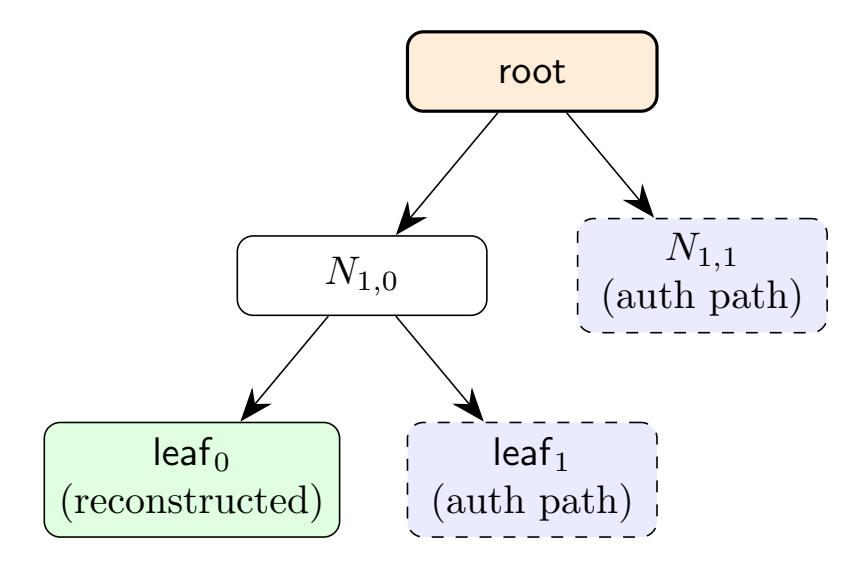
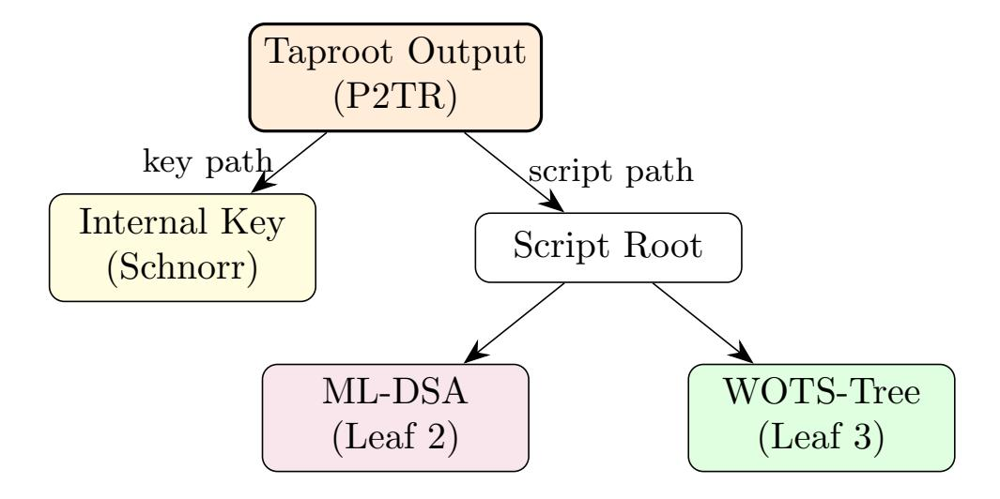

{0}------------------------------------------------

# <span id="page-0-0"></span>WOTS-Tree: Merkle-Optimized Winternitz Signatures for Post-Quantum Bitcoin

Javier Mateos\*

Version 6.4 — February 2026

### Abstract

We present WOTS-Tree, a stateful hash-based signature scheme for Bitcoin that combines WOTS+ one-time signatures [\[9\]](#page-18-0) with a binary Merkle tree [\[17\]](#page-19-0), supporting up to 2 <sup>21</sup> independent signatures per address. The construction instantiates XMSS [\[4,](#page-18-1) [10\]](#page-18-2) with parameters specifically optimized for Bitcoin's UTXO model, using a dual hash function design: SHA-256 truncated to 128 bits (n = 16, w = 256) for WOTS+ chain evaluations, and full 256-bit SHA-256 for Merkle tree compression. Deployed as dual leaves within BIP-341 Taproot [\[25\]](#page-19-1) (compatible with the proposed BIP-360 Pay-to-Merkle-Root [\[1\]](#page-18-3)), the default (hardened) mode provides: (i) a fast-path for single-use UTXOs at 353 bytes, and (ii) a fallback tree for Replace-By-Fee and address reuse at 675 bytes (K = 1,024). For Lightning channels, K = 2<sup>21</sup> yields 1,028-byte witnesses with a 19-second one-time setup. An opt-in compact mode using truncated 128-bit Merkle nodes reduces witnesses to 515–692 bytes at the cost of reduced Merkle binding security (≈ 60 bits). WOTS-Tree achieves strict L1 verification bounds of 4,601 hashes (≈ 0.009 ms on SHA-NI hardware). The default parameterization provides 115.8-bit classical and 57.9-bit quantum forgery resistance, with the Merkle binding at ≈ 124 bits, exceeding the WOTS+ forgery bound in both classical and quantum settings. We provide a complete security reduction with concrete bounds, a dual hash instantiation analysis, and a reference implementation with comprehensive test coverage. Default-mode witnesses are 4–7× smaller than hypertree variants while aligning naturally with Bitcoin's spend-once transaction model.

Keywords: Post-quantum cryptography, hash-based signatures, Bitcoin, WOTS+, XMSS, Merkle tree, UTXO, stateful signatures.

# 1 Introduction

Shor's algorithm [\[22\]](#page-19-2) renders all elliptic curve cryptography insecure against a sufficiently powerful quantum computer, threatening the secp256k1 ECDSA and Schnorr [\[24\]](#page-19-3) signatures that secure Bitcoin [\[18\]](#page-19-4) transactions. As quantum hardware advances, the Bitcoin community has explored post-quantum alternatives deployable via soft fork under proposals such as BIP-360 (Pay-to-Merkle-Root, currently in Draft status) [\[1\]](#page-18-3), or deployable today within BIP-341 Taproot [\[25\]](#page-19-1) script paths.

The NIST Post-Quantum Cryptography standardization process [\[20\]](#page-19-5) produced SLH-DSA (formerly SPHINCS+ [\[3\]](#page-18-4)), a stateless hash-based signature scheme with strong security guarantees. However, SLH-DSA witnesses exceed 7,800 bytes at the 128-bit security level, severely straining Bitcoin's 4 MB block weight limit. Recent work by Kudinov and Nick [\[13\]](#page-19-6) and the

<sup>\*</sup>Contact: javierpmateos@gmail.com

{1}------------------------------------------------

SHRINCS proposal [\[21\]](#page-19-7) have explored Bitcoin-specific parameter optimizations, achieving witnesses in the 3–5 KB range through computational grinding (≈ 2 <sup>16</sup> hash evaluations per signature) and hybrid state/parachute architectures. While these stateless approaches eliminate the need for state management, their size and computational overhead remain substantial.

At the other end of the spectrum, WOTS+ [\[9\]](#page-18-0) produces compact 288-byte signatures (with n = 16, w = 256), but is strictly one-time: signing two messages with the same key enables existential forgery. Bare WOTS+ is therefore incompatible with Replace-By-Fee (RBF), accidental address reuse, and multi-state protocols such as Lightning Network channels.

Our contribution. We introduce WOTS-Tree, which bridges this gap by organizing K independent WOTS+ key pairs under a binary Merkle tree, enabling K independent signatures per address. The construction is structurally an instantiation of XMSS [\[4\]](#page-18-1) (RFC 8391 [\[10\]](#page-18-2)) with parameters aggressively optimized for Bitcoin:

- 1. Truncated hash output (n = 16 bytes = 128 bits): We analyze the security implications of using SHA-256 truncated to 128 bits, providing concrete bounds under second-preimage resistance and multi-target attacks.
- 2. UTXO-native state management: Rather than requiring persistent local counters, WOTS-Tree enables deterministic state recovery by scanning the blockchain for spent UTXOs, aligning with Bitcoin's inherently stateful transaction model.
- 3. Dual-leaf Taproot deployment: We specify a concrete integration with BIP-341 Taproot [\[25\]](#page-19-1) as dual leaves—a standalone WOTS+ fast-path (353 bytes) and a Merkle-backed fallback (675 bytes hardened, 515 bytes compact)—within a multi-layered post-quantum Taproot structure. Under BIP-360 (P2MR), witness sizes decrease by 32 bytes.
- 4. RBF and reuse safety: We prove that each tree position derives a cryptographically independent WOTS+ key pair, ensuring Replace-By-Fee fee bumps do not degrade security.
- 5. Concrete benchmarks: We provide detailed performance comparisons against SLH-DSA, SPHINCS+C, PORS+FP [\[13\]](#page-19-6), and SHRINCS [\[21\]](#page-19-7), demonstrating 4–7× witness size reduction (default hardened mode) with sub-millisecond verification.

Relationship to XMSS. We emphasize that WOTS-Tree is not a novel cryptographic primitive but rather a carefully chosen parameterization and deployment framework for XMSS within Bitcoin's unique constraints. The novelty lies in the truncated instantiation, the UTXO-native state recovery mechanism, the dual-leaf Taproot integration, and the comprehensive security analysis under Bitcoin's specific threat model (including mempool front-running, multi-target attacks across ∼ 10<sup>9</sup> addresses, and Grover's algorithm [\[8\]](#page-18-5)).

Paper organization. Section [2](#page-1-0) surveys related work. Section [3](#page-2-0) establishes notation, security definitions, and background on hash functions, WOTS+, and Merkle trees. Section [4](#page-5-0) presents the WOTS-Tree construction with byte-level specification. Section [5](#page-6-0) provides the complete security analysis. Section [6](#page-11-0) discusses parameter selection. Section [7](#page-12-0) gives performance benchmarks. Section [8](#page-14-0) details Bitcoin integration. Section [9](#page-15-0) discusses limitations. Section [10](#page-16-0) concludes.

# <span id="page-1-0"></span>2 Related Work

Hash-based signatures. The concept of hash-based digital signatures originates with Lamport [\[15\]](#page-19-8), who showed that any one-way function suffices for one-time signatures. Merkle [\[17\]](#page-19-0) extended this to many-time signatures via authenticated binary trees. Subsequent work introduced Winternitz chains to compress Lamport signatures, culminating in WOTS+ [\[9\]](#page-18-0) with its tight security reduction under second-preimage resistance. XMSS [\[4\]](#page-18-1) and its multi-tree variant XMSSMT [\[10\]](#page-18-2) combine WOTS+ with Merkle trees to obtain stateful many-time signatures, 

{2}------------------------------------------------

standardized in RFC 8391 [\[10\]](#page-18-2) and NIST SP 800-208 [\[5\]](#page-18-6). Drake et al. [\[7\]](#page-18-7) generalize the XMSS framework for multi-signature applications in Ethereum's consensus layer, providing tighter security bounds that bypass random oracle dependence. Khovratovich, Kudinov, and Wagner [\[11\]](#page-19-9) revisit the Winternitz encoding process and introduce non-injective incomparable encodings that achieve 20–40% improvement in verification cost at the same signature size and security level; these encodings can be plugged directly into XMSS and SPHINCS+. Drake et al. [\[6\]](#page-18-8) instantiate this encoding within the multi-signature framework for Ethereum. These works address the fundamental size-time tradeoff in Winternitz chains and are complementary to our contribution, which focuses on parameter selection and deployment within Bitcoin's UTXO model. In particular, the encoding optimizations of [\[11\]](#page-19-9) could be applied to WOTS-Tree's chain evaluations to further reduce verification cost.

Stateless schemes. SPHINCS [\[2\]](#page-18-9) introduced stateless hash-based signatures using hypertrees and few-time signature (FORS) at the leaves. SPHINCS+ [\[3\]](#page-18-4) refined this framework with tweakable hash functions, achieving NIST standardization as SLH-DSA [\[20\]](#page-19-5) (FIPS 205). While statelessness eliminates counter management, it comes at the cost of large signatures (7–17 KB) and multi-millisecond verification times.

Bitcoin-specific optimizations. Kudinov and Nick [\[13\]](#page-19-6) provide a comprehensive analysis of hash-based signatures for Bitcoin, introducing SPHINCS+C (using non-injective compressed encodings [\[14\]](#page-19-10)) and PORS+FP (an optimized few-time signature replacement for FORS). Their parameter search yields witnesses of 3,128–4,704 bytes with signing-time grinding of ≈ 2 <sup>16</sup> hash evaluations. The SHRINCS proposal [\[21\]](#page-19-7) combines a small stateful scheme with a stateless "parachute" fallback, achieving 324 bytes optimally but expanding to ∼3.4 KB upon state loss.

Stateful approaches for Bitcoin. Bitcoin's UTXO model is inherently stateful: each output is spent exactly once under normal operation. This observation motivates revisiting stateful signature schemes, which have been largely dismissed in general cryptographic deployments due to the difficulty of maintaining counters. In Bitcoin, the blockchain itself serves as an immutable public ledger of which keys have been used, enabling deterministic state recovery. Our work exploits this synergy directly.

# <span id="page-2-0"></span>3 Preliminaries

# 3.1 Notation

# 3.2 Hash Function Instantiation

WOTS-Tree employs a dual hash function design that uses different output lengths for different roles:

- 1. Hchain(x) = SHA256(x)[0:16]: SHA-256 truncated to 128 bits (n = 16 bytes). Used for WOTS+ chain evaluations and secret key derivation.
- 2. Htree(x) = SHA256(x): Full 256-bit SHA-256 output (32 bytes). Used for Merkle tree node compression and leaf public key hashing.

This separation ensures that the Merkle tree binding enjoys full 128-bit collision resistance (birthday bound on 256 bits), while the WOTS+ chains benefit from compact 16-byte signatures. All concrete constructions below use Hchain or Htree explicitly; when bare H appears in abstract security definitions, it refers to a generic hash function.

Remark 3.1 (Security of truncated SHA-256). Truncating a 2λ-bit hash function to λ bits preserves the following properties with λ-bit security:

{3}------------------------------------------------

| Symbol                    | Meaning                                                                           |
|---------------------------|-----------------------------------------------------------------------------------|
| $\overline{n}$            | Hash output size in bytes (16); security parameter $\lambda = 8n = 128$ bits      |
| w                         | Winternitz parameter (256)                                                        |
| $\ell_1$                  | Number of message-digest chains: $\lceil \lambda / \log_2 w \rceil = 16$          |
| $\ell_2$                  | Number of checksum chains: $\lfloor \log_2(\ell_1(w-1))/\log_2 w \rfloor + 1 = 2$ |
| $\ell$                    | Total chains: $\ell_1 + \ell_2 = 18$                                              |
| K                         | Number of tree leaves (configurable power of 2)                                   |
| $H_{\text{chain}}(\cdot)$ | $SHA256(\cdot)[0:16]$ : truncated to $n$ bytes ( $\lambda$ bits)                  |
| $H_{\text{tree}}(\cdot)$  | $SHA256(\cdot)$ : full 256-bit output (32 bytes)                                  |
| HMAC(k,m)                 | HMAC-SHA256 with key $k$ and message $m$                                          |
| Th(P,addr,x)              | Tweakable hash: $H_{\text{chain}}(P  addr  x)$                                    |
| $\{0,1\}^{\lambda}$       | Bit strings of length $\lambda (=8n)$                                             |
| [K]                       | The set $\{0, 1,, K-1\}$                                                          |

Table 1: Notation summary.

- 1. **Preimage resistance**: Finding x such that H(x) = y requires  $\Omega(2^{\lambda})$  evaluations by a generic attack.
- 2. Second-preimage resistance (SPR): Given x, finding  $x' \neq x$  with H(x') = H(x) requires  $\Omega(2^{\lambda})$  evaluations.
- 3. Collision resistance: Finding any  $x \neq x'$  with H(x) = H(x') requires  $\Omega(2^{\lambda/2})$  evaluations (birthday bound).

The WOTS+ security reduction relies on SPR (not collision resistance), so truncation to  $\lambda=128$  bits provides  $\lambda$ -bit second-preimage security for  $H_{\rm chain}$ . The Merkle tree uses  $H_{\rm tree}$  with full 256-bit output, providing 128-bit collision resistance (birthday bound on 256 bits). This dual design avoids the collision resistance bottleneck ( $\approx 64$  bits) that would arise from using truncated hashes for tree compression.

Under Grover's algorithm [8], quantum preimage search achieves a quadratic speedup, yielding  $\approx 2^{64}$  quantum query complexity for 128-bit preimages.

### 3.3 Security Definitions

We recall the standard security notions used in our analysis. All definitions use the game-based formalism.

**Definition 3.2** (Second-Preimage Resistance — SPR). Let  $\mathcal{H} = \{H_k : \{0,1\}^* \to \{0,1\}^{\lambda}\}_{k \in \mathcal{K}}$  be a keyed hash function family. The SPR advantage of an adversary  $\mathcal{A}$  is:

$$\mathsf{Adv}_{\mathcal{H}}^{\mathsf{SPR}}(\mathcal{A}) = \Pr\left[H_k(x') = H_k(x) \ \land \ x' \neq x \ \middle| \ k \xleftarrow{\$} \mathcal{K}, \ x \xleftarrow{\$} \{0,1\}^*, \ x' \leftarrow \mathcal{A}(k,x)\right].$$

For SHA-256 truncated to  $\lambda = 128$  bits,  $Adv_H^{SPR} \leq 2^{-\lambda}$  against classical adversaries.

**Definition 3.3** (Pseudorandom Function Family — PRF). Let  $F : \mathcal{K} \times \mathcal{M} \to \{0,1\}^{\lambda}$  be a keyed function family. The PRF advantage of a distinguisher  $\mathcal{D}$  making at most q queries is:

$$\mathsf{Adv}_F^{\mathsf{PRF}}(\mathcal{D}) = \left| \Pr_{k \overset{\$}{\leftarrow} \mathcal{K}} \left[ \mathcal{D}^{F_k(\cdot)} = 1 \right] - \Pr_{f \overset{\$}{\leftarrow} \mathsf{Func}} \left[ \mathcal{D}^{f(\cdot)} = 1 \right] \right|,$$

where Func denotes the set of all functions  $\mathcal{M} \to \{0,1\}^{\lambda}$ . We instantiate F with HMAC-SHA256 [12], for which the PRF assumption is well-studied.

{4}------------------------------------------------

**Definition 3.4** (Existential Unforgeability under Chosen Message Attack — EU-CMA). A signature scheme  $\Sigma = (\text{KeyGen}, \text{Sign}, \text{Verify})$  is  $(t, q_s, \epsilon)$ -EU-CMA secure if no adversary  $\mathcal{A}$  running in time t with at most  $q_s$  signing queries can produce a valid forgery  $(m^*, \sigma^*)$  on a message  $m^*$  not previously queried, with probability exceeding  $\epsilon$ :

$$\mathsf{Adv}^{\mathsf{EU-CMA}}_{\Sigma}(\mathcal{A}) = \Pr\left[\mathsf{Verify}(\mathsf{pk}, m^*, \sigma^*) = 1 \ \land \ m^* \notin \mathcal{Q}\right] \leq \epsilon,$$

where Q is the set of messages submitted to the signing oracle.

**Definition 3.5** (Collision Resistance — CR). The collision resistance advantage of  $\mathcal{A}$  against H is:

$$\mathsf{Adv}_H^{\mathsf{CR}}(\mathcal{A}) = \Pr\left[H(x) = H(x') \ \land \ x \neq x' \mid (x, x') \leftarrow \mathcal{A}\right].$$

For the Merkle tree, we require CR of  $H_{\text{tree}}$  (256-bit output). The birthday bound gives  $\mathsf{Adv}_{H_{\text{tree}}}^{\mathsf{CR}} \leq 2^{-128}$  classically. In compact mode, using  $H_{\text{chain}}$  (128-bit) for the tree, CR degrades to  $2^{-64}$ .

### 3.4 Tweakable Hash Functions

Following the SPHINCS+ framework [3], we employ tweakable hash functions to ensure domain separation across all hash evaluations within the scheme.

**Definition 3.6** (Tweakable Hash Function). A tweakable hash function is a function Th:  $\mathcal{P} \times \mathcal{T} \times \{0,1\}^* \to \{0,1\}^{\lambda}$ , where  $\mathcal{P}$  is the public parameter space and  $\mathcal{T}$  is the tweak space. We instantiate using  $H_{\text{chain}}$ :

$$\mathsf{Th}(P,\mathsf{addr},x) = H_{\mathrm{chain}}(P \parallel \mathsf{addr} \parallel x),$$

where P is a public seed (derivable from the address) and  $\mathsf{addr} = (j, i, s)$  encodes the tree leaf position j, the chain index i, and the step counter s within the WOTS+ chain. The step counter s is incremented at each chain iteration, ensuring distinct tweaks for every hash evaluation and enabling a tight reduction to SPR (following [9]).

In our Bitcoin deployment, P is deterministically derived from the transaction outpoint (txid  $\parallel$  vout), eliminating the need to include it in the witness. This is analogous to the approach taken in [13], where public parameters are implicit in the transaction context.

Remark 3.7 (Domain separation and adversarial controllability). In the WOTS-Tree security model, neither P nor addr is adversarially controllable: P is fixed at key generation time (derived from the address), and  $\mathsf{addr} = (j, i, s)$  is deterministic given the tree position, chain index, and step counter. The concatenation  $P||\mathsf{addr}||x$  uses fixed-length fields (|P| = n,  $|\mathsf{addr}|$  is constant for a given K), preventing length ambiguity attacks. Regarding Merkle-Damgård length-extension: truncation to 128 bits of the 256-bit internal state makes practical length-extension infeasible (requiring  $2^{128}$  work to reconstruct the hidden state bits), though this is a computational barrier rather than a structural elimination. We additionally use fixed-length, canonicalized inputs and HMAC for key derivation, which structurally prevent length-extension where it matters most. For implementations requiring additional robustness, one may prefix a domain separator byte (e.g., 0x00 for chain hashes, 0x01 for leaf compression, 0x02 for tree nodes) at negligible cost.

### 3.5 WOTS+ Background

WOTS+ [9] signs an n-byte message M as follows:

- 1. Message encoding: Interpret M as  $\ell_1$  base-w digits  $d_0, \ldots, d_{\ell_1-1} \in \{0, \ldots, w-1\}$ .
- 2. Checksum: Compute  $C = \sum_{i=0}^{\ell_1-1} (w-1-d_i)$  and encode C as  $\ell_2$  base-w digits  $d_{\ell_1}, \ldots, d_{\ell-1}$ .
- 3. Chain evaluation: For each chain  $i \in [\ell]$ , starting from secret key  $\mathsf{sk}_i$ , apply  $d_i$  iterations of the tweakable hash:  $\sigma_i = \mathsf{Th}^{d_i}(P, (i, \cdot), \mathsf{sk}_i)$ .

{5}------------------------------------------------

4. **Public key**: The chain endpoints  $\mathsf{pk}_i = \mathsf{Th}^{w-1}(P,(i,\cdot),\mathsf{sk}_i)$  form the public key.

Verification reconstructs the public key by applying  $w-1-d_i$  additional hash iterations to each signature element:  $\mathsf{pk}_i' = \mathsf{Th}^{w-1-d_i}(P,(i,\cdot),\sigma_i)$ , then checks  $\mathsf{pk}_i' = \mathsf{pk}_i$  for all i.

With n=16 and w=256, the signature consists of  $\ell \times n=18 \times 16=288$  bytes, and verification requires at most  $\ell \times (w-1)=18 \times 255=4{,}590$  hash evaluations.

# 3.6 Merkle Trees

A binary Merkle tree [17] commits to K leaf values using  $\lceil \log_2 K \rceil$  levels of pairwise hashing. Each leaf  $\mathsf{leaf}_j$  is the hash of a public key. An authentication path of  $\lceil \log_2 K \rceil$  sibling hashes allows any verifier to reconstruct the root from a single leaf. The authentication path is provided as part of the witness; its length grows logarithmically with K.

# <span id="page-5-0"></span>4 WOTS-Tree Construction

### 4.1 Overview

WOTS-Tree organizes K independent WOTS+ key pairs under a Merkle tree of depth  $d = \log_2 K$ . Each tree position  $j \in [K]$  derives a fresh WOTS+ secret key from a master seed via a PRF, ensuring cryptographic independence between positions. The Merkle root serves as the public commitment (address). To sign, the signer reveals a WOTS+ signature at position j along with the Merkle authentication path from leaf j to the root.

### 4.2 Key Generation

```
Algorithm 1 WOTS-Tree Key Generation
```

```
Require: master_seed \in \{0,1\}^{256}, deriv_idx \in [2^{32}], parameter K=2^d
Ensure: address \in \{0,1\}^{\lambda}, chain_seed \in \{0,1\}^{256} (secret, full HMAC output)
  1: \ \mathsf{chain\_seed} \leftarrow \mathsf{HMAC}(\mathsf{master\_seed}, \ \mathsf{"WOTS-TREE"} \ \| \ \mathsf{deriv\_idx})
                                                                                                                 \triangleright 32 bytes, untruncated
  2: for j = 0 to K - 1 do
                                                                                                        ▷ Generate each WOTS+ leaf
            for i = 0 to \ell - 1 do
                                                                                                              ▷ Derive chain secret keys
  3:
                 \mathsf{sk}_{j,i} \leftarrow \mathsf{HMAC}(\mathsf{chain\_seed},\ \mathsf{toByte}(j, \lceil (\log_2 K)/8 \rceil) \parallel \mathsf{toByte}(i,1))[0:n]
  4:
                 \mathsf{pk}_{j,i} \leftarrow \mathsf{Th}^{w-1}(P,\ (j,i,\cdot),\ \mathsf{sk}_{j,i})
                                                                                                                            ▶ Chain endpoint
  5:
           end for
  6:
           \mathsf{leaf}_j \leftarrow H_{\mathsf{tree}}(\mathsf{pk}_{i,0} \parallel \cdots \parallel \mathsf{pk}_{i.\ell-1})
                                                                                            ▷ Compress public key (32 B output)
  7:
  8: end for
  9: \ \mathsf{root} \leftarrow \mathsf{MerkleRoot}_{H_{\mathsf{tree}}}(\mathsf{leaf}_0, \dots, \mathsf{leaf}_{K-1})
                                                                                                               ▶ Build tree (32 B nodes)
10: address \leftarrow H_{\text{tree}}(\text{root})
11: return (address, chain_seed)
```

**Remark 4.1** (Secret material). The chain\_seed is the full 256-bit HMAC-SHA256 output derived from the wallet's master seed and is **never** included in any witness or transmitted on the network. Retaining the full 256-bit seed internally provides 256-bit PRF security for key derivation, even though individual chain keys  $\mathsf{sk}_{j,i}$  are truncated to n=16 bytes. The master\_seed can be a standard BIP-32 [23] seed with hardened derivation.

### 4.3 Signing

# 4.4 Verification

The verification cost is bounded by  $\ell \times (w-1) + 1 + d = 4{,}590 + 1 + d$  hashes regardless of whether the signature is valid or invalid, preventing any asymmetric denial-of-service vector.

{6}------------------------------------------------

# <span id="page-6-2"></span>Require: chain\_seed, spend\_idx $\in [K]$ , message m (sighash) 1: for i = 0 to $\ell - 1$ do 2: $\mathsf{sk}_i \leftarrow \mathsf{HMAC}(\mathsf{chain\_seed}, \ \mathsf{toByte}(\mathsf{spend\_idx}, \lceil (\log_2 K)/8 \rceil) \parallel \mathsf{toByte}(i, 1))[0:n]$ 3: end for

4:  $(d_0, \ldots, d_{\ell-1}) \leftarrow \mathsf{WOTSEncode}(m)$   $\triangleright$  Base-w encoding with checksum 5: **for** i = 0 **to**  $\ell - 1$  **do** 

6:  $\sigma_i \leftarrow \mathsf{Th}^{d_i}(P, (\mathsf{spend\_idx}, i, \cdot), \mathsf{sk}_i)$ 

⊳ Partial chain

7: end for

8: auth\_path ← MerkleAuth(spend\_idx)

**Algorithm 2** WOTS-Tree Signing

 $\triangleright d$  sibling hashes

 $\triangleright \le 4,590$  hashes total

9: **return**  $W = (\text{spend\_idx}, \sigma_0, \dots, \sigma_{\ell-1}, \text{ auth\_path})$ 

### **Algorithm 3** WOTS-Tree Verification (L1 Node)

**Require:** root (from scriptPubKey), witness W, message m (sighash), parameter K

**Ensure:** ACCEPT or REJECT

```
1: Parse W = (\text{spend\_idx}, \sigma_0, \dots, \sigma_{\ell-1}, \text{ auth\_path})
```

2: **if** spend\_idx  $\geq K$  **then** return REJECT  $\triangleright O(1)$  bounds check

3: end if

4:  $(d_0, \ldots, d_{\ell-1}) \leftarrow \mathsf{WOTSEncode}(m)$   $\triangleright$  Recompute encoding

5: **for** i = 0 **to**  $\ell - 1$  **do** 

6:  $\mathsf{pk}'_i \leftarrow \mathsf{Th}^{w-1-d_i}(P, (\mathsf{spend\_idx}, i, \cdot), \sigma_i)$ 

7: end for

8:  $\operatorname{leaf}' \leftarrow H_{\operatorname{tree}}(\operatorname{pk}'_0 \parallel \cdots \parallel \operatorname{pk}'_{\ell-1})$   $\triangleright 1 \operatorname{hash} (32 \operatorname{B})$ 

9:  $root' \leftarrow MerklePath_{H_{tree}}(leaf', spend_idx, auth_path)$   $\triangleright d hashes (32 B)$ 

10: if  $root' \neq root$  then return REJECT

11: **end if** 

12: return ACCEPT

**Remark 4.2** (Fast-path K = 1). When K = 1 (single-use WOTS+), the Merkle tree has depth d = 0 (no authentication path) and the index is always 0. Both spend\_idx and auth\_path are omitted from the witness, yielding a minimal size of  $\ell \times n + 65 = 288 + 65 = 353$  bytes. The verifier implicitly uses spend\_idx = 0 and skips Merkle verification.

### 4.5 Witness Serialization

Table 2 specifies the exact byte layout of a WOTS-Tree witness within a BIP-341 Taproot [25] transaction.

# <span id="page-6-0"></span>5 Security Analysis

We establish the security of WOTS-Tree through a sequence of reductions, culminating in a concrete bound on the EU-CMA advantage. The analysis proceeds in three layers: (i) perposition WOTS+ security, (ii) Merkle tree binding, and (iii) multi-target and quantum bounds.

<span id="page-6-1"></span> $<sup>^3</sup>$ The index is encoded as a fixed-width unsigned integer within the WOTS-Tree signature blob, not as a Bitcoin CompactSize varint. This mirrors how BIP-340 Schnorr signatures use fixed 64-byte encoding. For reference, if the index were encoded using Bitcoin CompactSize: values  $\leq 252$  would occupy 1 byte; values 253-65,535 would occupy 3 bytes (0xFD + uint16). Our analysis assumes fixed-width encoding throughout for determinism.

{7}------------------------------------------------

| Field                                   | Description                                     | Size (bytes)  |  |
|-----------------------------------------|-------------------------------------------------|---------------|--|
| $\sigma_0 \  \cdots \  \sigma_{\ell-1}$ | WOTS+ signature $(\ell \times n)$               | 288           |  |
| spend_idx                               | Leaf index (uint16 or uint24)                   | 2 or 3        |  |
| auth_path                               | Merkle siblings ( $d \times 32$ , full SHA-256) | $d \times 32$ |  |
| Subtotal (WOTS-Tree paylo               | $290 + d \times 32 \text{ (or } 291)$           |               |  |
| BIP-341 Taproot Control Block:          |                                                 |               |  |
| Leaf version & parity                   | 1 byte                                          | 1             |  |
| Internal public key                     | 32 bytes (x-only)                               | 32            |  |
| Merkle path to Taproot root             | $depth_{\mathrm{tap}} \times 32$                | $32^{1}$      |  |
| Total L1 witness                        |                                                 | see Table 3   |  |

Table 2: Witness byte layout. Under BIP-341 Taproot, the control block is 1 + 32 + 32 = 65 bytes for a 2-leaf structure. Under BIP-360 (P2MR, Draft), this reduces to 1 + 32 = 33 bytes. All sizes in this paper use BIP-341 as the conservative baseline. The index field uses 2 bytes for  $K \le 65,536$  and 3 bytes for K > 65,536.

<span id="page-7-0"></span>

Green = reconstructed from signature. Dashed blue = provided in witness (auth path).

Figure 1: Merkle authentication path for K = 4, verifying leaf<sub>0</sub>. The verifier reconstructs the green node from the WOTS+ signature, then hashes upward using dashed siblings from the witness to reach the root.

### 5.1 EU-CMA Security per Tree Position

<span id="page-7-1"></span>**Theorem 5.1** (Per-position EU-CMA Security). Let A be a PPT adversary against WOTS-Tree at a single tree position j with  $q_{sig} = 1$  signing query. Then:

$$\mathsf{Adv}^{\mathsf{EU\text{-}CMA}}_{WOTS\text{-}Tree}(\mathcal{A}) \ \leq \ \mathsf{Adv}^{\mathsf{PRF}}_{\mathsf{HMAC}}(\mathcal{B}_1) \ + \ \ell \cdot (w-1) \cdot \mathsf{Adv}^{\mathsf{SPR}}_H(\mathcal{B}_2),$$

where  $\mathcal{B}_1$  is a PRF distinguisher running in time  $\approx t(\mathcal{A})$  and  $\mathcal{B}_2$  is an SPR adversary.

*Proof.* We proceed by a sequence of games.

Game 0 (Real game). This is the standard EU-CMA experiment. The challenger runs KeyGen to produce a WOTS+ key pair at position j: it derives  $\mathsf{sk}_{j,i} = \mathsf{HMAC}(\mathsf{chain\_seed}, j \| i)[0:n]$  for each chain  $i \in [\ell]$ , computes the public key chains, and publishes the compressed public key  $\mathsf{leaf}_j = H(\mathsf{pk}_{j,0} \| \cdots \| \mathsf{pk}_{j,\ell-1})$ . The adversary  $\mathcal{A}$  may query the signing oracle once on a chosen message m, receiving  $(\sigma_0, \ldots, \sigma_{\ell-1})$ , and must produce a valid forgery  $(m^*, \sigma^*)$  with  $m^* \neq m$ .

Let  $Pr[S_0]$  denote the probability that  $\mathcal{A}$  succeeds in Game 0.

Game 1 (PRF switch). We replace the key derivation  $\mathsf{sk}_{j,i} = \mathsf{HMAC}(\mathsf{chain\_seed}, j \| i)[0:n]$  with truly random values  $\mathsf{sk}_{j,i} \xleftarrow{\$} \{0,1\}^{\lambda}$ . Since  $\mathsf{chain\_seed}$  is derived via HMAC-SHA256(master\\_seed, ·)

{8}------------------------------------------------

and is never revealed to  $\mathcal{A}$  (only chain *endpoints* and intermediate signature values are visible), any distinguisher between Games 0 and 1 can be used to break the PRF property of HMAC-SHA256 [12] (quantified in Section 5.4: Adv<sup>PRF</sup>  $\leq 2^{-205.7}$  for  $K = 2^{21}$ ):

$$|\Pr[S_0] - \Pr[S_1]| \leq \mathsf{Adv}_{\mathsf{HMAC}}^{\mathsf{PRF}}(\mathcal{B}_1).$$

Game 2 (Reduction to SPR). In Game 1, the secret keys are independent random values. We now reduce forgery to second-preimage resistance following the analysis of Hülsing [9].

A valid forgery  $(m^*, \sigma^*)$  with  $m^* \neq m$  produces WOTS+ digit encodings  $(d_0^*, \ldots, d_{\ell-1}^*)$  for  $m^*$  and  $(d_0, \ldots, d_{\ell-1})$  for m. By the checksum property of WOTS+,  $m^* \neq m$  and both messages satisfy the checksum constraint, so there exists at least one chain index  $i^*$  where  $d_{i^*}^* < d_{i^*}$ .

For this chain  $i^*$ , the adversary has produced  $\sigma_{i^*}^*$  at height  $d_{i^*}^*$  such that applying  $d_{i^*} - d_{i^*}^*$  hash iterations yields the same value  $\sigma_{i^*}$  from the legitimate signature. Formally:

$$\mathsf{Th}^{d_{i^*}-d_{i^*}^*}(P,(i^*,\cdot),\sigma_{i^*}^*) = \sigma_{i^*}.$$

Since the intermediate chain values at heights  $d_{i^*}^*$  and  $d_{i^*}^* + 1, \ldots, d_{i^*} - 1, d_{i^*}$  are all determined by the chain starting from  $\mathsf{sk}_{i^*}$ , the adversary has found a second preimage for one of the  $d_{i^*} - d_{i^*}^* \leq w - 1$  tweakable hash evaluations. By a union bound over all  $\ell$  chains and all w - 1 possible intermediate positions:

$$\Pr[S_1] \le \ell \cdot (w-1) \cdot \mathsf{Adv}_H^{\mathsf{SPR}}(\mathcal{B}_2).$$

This union bound matches the tightness of the original WOTS+ reduction in [9] and is identical to the analysis used in RFC 8391 [10] and by Kudinov and Nick [13]. No tighter reduction is known for WOTS+ with general Winternitz parameter w.

Combining. The three games yield:

$$\begin{aligned} \mathsf{Adv}^{\mathsf{EU-CMA}}_{\mathsf{WOTS-Tree}}(\mathcal{A}) &= \Pr[S_0] \\ &\leq |\Pr[S_0] - \Pr[S_1]| + \Pr[S_1] \\ &\leq \mathsf{Adv}^{\mathsf{PRF}}_{\mathsf{HMAC}}(\mathcal{B}_1) + \ell \cdot (w-1) \cdot \mathsf{Adv}^{\mathsf{SPR}}_H(\mathcal{B}_2). \end{aligned} \quad \Box$$

Corollary 5.2 (Per-position WOTS+ security). Theorem 5.1 gives the per-position WOTS+ forgery bound. With  $\lambda = 128$  bits,  $\ell = 18$ , w = 256:

Tightness loss: 
$$\ell \cdot (w-1) = 18 \times 255 = 4,590 \approx 2^{12.16}$$
  
Per-position classical:  $128 - 12.16 = 115.84$  bits  
Per-position quantum (Grover):  $115.84/2 \approx 57.92$  bits

Note that the full scheme security (Theorem 5.4) includes an additional Merkle binding term; see Section 5.4 for the combined numerical evaluation.

# 5.2 Merkle Tree Binding Security

The Merkle tree ensures that a valid witness commits to a leaf that is genuinely part of the tree committed to by the root.

<span id="page-8-0"></span>**Theorem 5.3** (Merkle binding). For a Merkle tree of depth d with compression function H, the probability that an adversary produces a valid authentication path for a leaf not in the original tree is bounded by:

$$\mathsf{Adv}^{\mathsf{bind}}_{\mathsf{Merkle}}(\mathcal{A}) \leq d \cdot \mathsf{Adv}^{\mathsf{CR}}_H(\mathcal{B}),$$

where  $\mathcal{B}$  is a collision-finding adversary against H.

{9}------------------------------------------------

*Proof.* An authentication path traverses d compression function evaluations from the leaf to the root. If the adversary produces a valid path for a leaf  $\mathsf{leaf}' \neq \mathsf{leaf}_j$  at position j, then at some level  $l \in \{1, \ldots, d\}$  in the tree, the computed intermediate node using  $\mathsf{leaf}'$  and the same sibling produces the same hash as the legitimate intermediate node. This constitutes a collision for the compression function at level l. By a union bound over d levels:

$$\mathsf{Adv}^{\mathsf{bind}}_{\mathsf{Merkle}}(\mathcal{A}) \leq d \cdot \mathsf{Adv}^{\mathsf{CR}}_{H}(\mathcal{B}).$$

With  $\lambda=128$  bits for WOTS+ chains, the Merkle tree uses  $H_{\rm tree}$  with 256-bit output. The birthday bound on  $H_{\rm tree}$  gives  $\mathsf{Adv}_{H_{\rm tree}}^{\mathsf{CR}} \leq 2^{-128}$ , so even for d=21, the Merkle binding advantage is  $\leq 21 \cdot 2^{-128} \approx 2^{-123.6}$ .

### 5.3 Combined Security

<span id="page-9-1"></span>**Theorem 5.4** (Full WOTS-Tree EU-CMA Security). For a WOTS-Tree with  $K = 2^d$  leaves and  $q_{\text{sig}} \leq K$  signing queries (each at a distinct position), the EU-CMA advantage is:

$$\mathsf{Adv}^{\mathsf{EU-CMA}}_{\mathsf{WOTS-Tree}}(\mathcal{A}) \leq \mathsf{Adv}^{\mathsf{PRF}}_{\mathsf{HMAC}} + \ell(w-1) \cdot \mathsf{Adv}^{\mathsf{SPR}}_{H} + d \cdot \mathsf{Adv}^{\mathsf{CR}}_{H}.$$

*Proof.* A forgery against the full scheme must either (a) forge a WOTS+ signature at some leaf position (bounded by Theorem 5.1), or (b) produce a valid Merkle path for a leaf not in the tree (bounded by Theorem 5.3). The result follows by a union bound. Note that the PRF term appears only once because a single PRF break suffices to distinguish all key derivations.  $\Box$ 

### <span id="page-9-0"></span>5.4 Concrete Combined Security

We now evaluate Theorem 5.4 numerically for the default hardened mode ( $H_{\text{tree}}$  with 256-bit output). The three terms contribute:

- 1. **PRF term**: With a 256-bit chain\_seed and HMAC-SHA256, the PRF advantage for q derivations is  $\leq q^2/2^{256}$ . For  $K=2^{21}$ :  $q=K\cdot\ell=2^{25.17}$ , giving  $\mathsf{Adv}^\mathsf{PRF} \leq 2^{50.34}/2^{256} \approx 2^{-205.7}$  (negligible).
- 2. **SPR term** (WOTS+ forgery):  $\ell(w-1) \cdot 2^{-\lambda} = 4{,}590 \cdot 2^{-128} \approx 2^{-115.84}$ .
- 3. **CR term** (Merkle binding): With 256-bit  $H_{\text{tree}}$ ,  $d \cdot 2^{-128}$  (birthday on 256 bits):

| $\overline{K}$ | d  | CR term                                                                                                              | Combined (hardened)                                                                                         |
|----------------|----|----------------------------------------------------------------------------------------------------------------------|-------------------------------------------------------------------------------------------------------------|
| 65,536         | 16 | $10 \cdot 2^{-128} \approx 2^{-124.7}$ $16 \cdot 2^{-128} \approx 2^{-124.0}$ $21 \cdot 2^{-128} \approx 2^{-123.6}$ | $\approx 2^{-115.8}$ (115.8 bits)<br>$\approx 2^{-115.8}$ (115.8 bits)<br>$\approx 2^{-115.8}$ (115.8 bits) |

In the default hardened mode, the WOTS+ SPR term  $(2^{-115.84})$  dominates the combined bound for all K values. The Merkle binding ( $\geq 123.6$  bits) no longer constitutes a security bottleneck.

Remark 5.5 (Compact mode security). In compact mode ( $H_{\text{chain}}$  for Merkle nodes), the CR term becomes  $d \cdot 2^{-64}$  (birthday on 128 bits), yielding  $\approx 60$  bits of Merkle binding security. We argue this remains adequate for low-value use cases: (i)  $2^{60}$  SHA-256 evaluations costs an estimated \$10B+ in energy; (ii) NIST Category 1 requires  $2^{64}$  quantum gates; (iii) a Merkle collision must additionally correspond to a valid WOTS+ public key with a known private key, adding practical overhead beyond the pure birthday bound. However, in a multi-target scenario with N active addresses, amortized birthday attacks across trees can further reduce effective security, making compact mode unsuitable for high-value production custody.

{10}------------------------------------------------

# 5.5 Multi-Target Security

When the Bitcoin network hosts N active WOTS-Tree addresses, an adversary may attempt to forge a signature against any of them, gaining a factor-N advantage.

Proposition 5.6 (Multi-target bound). Against N independent WOTS-Tree addresses, the multi-target advantage degrades by a factor of N:

$$\mathsf{Adv}^{\mathsf{MT}} \leq N \cdot \mathsf{Adv}^{\mathsf{EU-CMA}}_{\mathrm{single}}.$$

With N = 10<sup>9</sup> : log<sup>2</sup> (10<sup>9</sup> ) ≈ 29.9 bits of loss. In hardened mode, the combined bound is 115.84 bits, yielding 115.84 − 29.9 = 85.9 bits under multi-target. For comparison, Bitcoin's current ECDSA signatures provide ≈ 128 bits per position, degrading to ≈ 98 bits under the same scenario.

In compact mode, the multi-target analysis is more nuanced: the SPR term degrades to 85.9 bits, while amortized birthday attacks across N trees can further reduce the Merkle binding term. Compact mode multi-target security is therefore limited by the ≈ 60-bit CR term, which does not degrade by the full factor N (each tree requires an independent collision) but can benefit from batch-style attacks. We recommend hardened mode for any deployment with N > 10<sup>6</sup> active addresses.

# 5.6 Quantum Security

Under Grover's algorithm [\[8\]](#page-18-5), quantum preimage search achieves complexity O(2n/<sup>2</sup> ). Applied to the WOTS+ security bound:

Proposition 5.7 (Quantum security). Under Grover's algorithm [\[8\]](#page-18-5), the per-position WOTS+ forgery bound becomes 2 <sup>−</sup>57.<sup>92</sup> (halving the classical 115.84-bit bound). For Merkle binding, the BHT quantum collision algorithm achieves O(2n/<sup>3</sup> ) query complexity. In hardened mode (Htree with 256-bit output), this yields ≈ 2 −85.3 quantum CR per tree level—well above the WOTS+ quantum bound. In compact mode (128-bit output), quantum collision search achieves O(242.<sup>7</sup> ), which becomes the quantum bottleneck. The quantum security of the default hardened mode is therefore 57.9 bits, governed by the WOTS+ SPR term under Grover.

# 5.7 Chain Isolation (RBF Safety)

A critical property for Bitcoin's Replace-By-Fee mechanism is that signing at one tree position must not leak information about keys at unused positions.

Proposition 5.8 (Chain isolation — RBF safety). For any two distinct tree positions j ̸= j ′ , the WOTS+ key pairs (skj,0, . . . ,skj,ℓ−1) and (sk<sup>j</sup> ′ ,0, . . . ,sk<sup>j</sup> ′ ,ℓ−1) are computationally independent under the PRF assumption on HMAC-SHA256. This is a standard consequence of PRF-based key derivation; we state it explicitly because RBF safety is a Bitcoin-specific deployment concern.

Proof. By Game 1 of Theorem [5.1,](#page-7-1) replacing the HMAC-derived keys with random values changes the adversary's view by at most AdvPRF HMAC. Once the keys are truly random, different positions use independent randomness by construction. Therefore, observing a complete signature at position j reveals no information about the secret keys at position j ′ , and each RBF fee bump using a fresh position maintains full security for all unused positions.

# 5.8 Front-Running Immunity

A known attack vector in Bitcoin's mempool is front-running: an adversary observes an unconfirmed transaction and races to submit a competing transaction. For signature schemes, this is dangerous if the witness reveals key material.

{11}------------------------------------------------

Proposition 5.9 (Front-running immunity). No information in a WOTS-Tree witness W = (spend idx, σ0, . . . , σℓ−1, auth path) enables derivation of secret keys at any tree position.

Proof. The witness contains: (i) the WOTS+ signature elements σ<sup>i</sup> = Thd<sup>i</sup> (P,(i, ·),ski) intermediate chain values from which deriving sk<sup>i</sup> requires inverting d<sup>i</sup> ≥ 1 hash applications (breaking preimage resistance); (ii) the Merkle authentication path—sibling hashes unrelated to any secret key; (iii) the spend index—a public integer. Crucially, the chain seed from which all keys are derived is never present in the witness. Recovering any secret key requires a preimage attack with cost Ω(2128) classically.

Remark 5.10 (Contrast with chain-based key derivation). Designs that derive keys from a publicly visible chain value (transmitted in the witness as authentication proof) conflate authentication data with key material. If sk<sup>i</sup> = H(chain val∥i) and chain val appears in the witness, any mempool observer can reconstruct all secret keys immediately. WOTS-Tree avoids this entirely: the chain seed is a secret derived from the wallet's master seed and is never broadcast.

# 5.9 Denial-of-Service Resistance

Remark 5.11 (Bounded verification cost). WOTS-Tree verification requires exactly ℓ(w−1)+ 1 + d hash evaluations for any input (valid or invalid), where d = log<sup>2</sup> K. The verifier always executes the full WOTS+ reconstruction, leaf compression, and Merkle path before comparing the root—there is no early-exit path that creates an asymmetric cost between valid and invalid inputs. This constant-time property prevents denial-of-service amplification against Bitcoin nodes.

For K = 1,024 (d = 10): total = 4,590 + 1 + 10 = 4,601 hashes. At 500 MH/s (SHA-NI): ≈ 0.009 ms.

# <span id="page-11-0"></span>6 Parameter Selection

Table [3](#page-11-1) summarizes witness sizes and setup costs for representative values of K. The BIP-341 control block for a 2-leaf P2TR structure contributes 1 + 32 + 32 = 65 bytes.

| K<br>(Capacity)   | Witness (B) | Index (B) | Setup (SHA-NI) | L1 Verify     |
|-------------------|-------------|-----------|----------------|---------------|
| 1 (Fast-Path)     | 353         | —         | ≈<br>0.009 ms  | ≈<br>0.009 ms |
| 1,024             | 675         | 2         | 9.4 ms         | ≈<br>0.009 ms |
| 65,536            | 867         | 2         | 604 ms         | ≈<br>0.009 ms |
| 21 (≈<br>2<br>2M) | 1,028       | 3         | 19.3 s         | ≈<br>0.009 ms |

Table 3: Parameter trade-offs (default hardened mode). Witness = 288+ 65+idx bytes+d×32. K = 65,536 covers indices 0–65,535, fitting within uint16 (2 bytes). K > 65,536 requires 3-byte indices. Setup cost assumes SHA-NI at 500 MH/s. Verification is constant across all K values. For compact mode (d × 16), see Section [6.1.](#page-12-1)

Setup cost derivation. For each of the K leaves, key generation evaluates ℓ key derivations + ℓ(w − 1) chain hashes + 1 leaf compression = ℓ · w + 1 = 4,609 hashes. The Merkle tree adds K − 1 internal hashes. Total:

<span id="page-11-1"></span>
$$\mathsf{Hashes}_{\text{setup}} = K \cdot (\ell \cdot w + 1) + (K - 1) = K \cdot 4{,}609 + K - 1.$$

For K = 1,024: 1,024 × 4,609 + 1,023 = 4,720,639 hashes ÷ 500 × 10<sup>6</sup> = 9.44 ms.

{12}------------------------------------------------

Recommended configurations.

- Standard wallets: K = 1,024 (675 B, 9.4 ms setup). Provides ample capacity for occasional RBF bumps and mitigates tight index management.
- High-throughput services: K = 65,536 (867 B, 604 ms setup). Suitable for exchanges and payment processors.
- Lightning Network: K = 2<sup>21</sup> (1,028 B, 19.3 s one-time setup). Supports ≈ 2 million state updates per channel.

# <span id="page-12-1"></span>6.1 Compact Mode (Opt-in)

For deployments where witness size is the overriding constraint (e.g., experimental channels, testnet, or resource-constrained environments), WOTS-Tree supports a compact mode that uses Hchain (128-bit truncated SHA-256) for Merkle tree compression instead of Htree. This reduces the authentication path from d × 32 to d × 16 bytes:

| K       | Hardened (B) | Compact (B) | Compact CR      |
|---------|--------------|-------------|-----------------|
| 1,024   | 675          | 515         | −60.7<br>≈<br>2 |
| 65,536  | 867          | 611         | −60.0<br>≈<br>2 |
| 21<br>2 | 1,028        | 692         | −59.6<br>≈<br>2 |

Warning. Compact mode reduces Merkle binding collision resistance to ≈ 60 bits (birthday bound on 128-bit hash). While adequate for low-value experimental use (see economic argument in Section [5.4\)](#page-9-0), compact mode is not recommended for production custody of significant value. In a multi-target scenario with N active addresses, an amortized birthday attack across N trees can further reduce the effective security. Implementations must clearly label compact mode as non-default and require explicit opt-in.

# <span id="page-12-0"></span>7 Performance and Comparative Analysis

# 7.1 Verification Workload

WOTS-Tree verification is deterministically bounded at ≤ 4,601 hashes for K = 1,024. At 500 MH/s (SHA-NI), this completes in ≈ 0.009 ms—negligible compared to current Schnorr signature verification (≈ 0.05 ms for one elliptic curve point multiplication).

# 7.2 Signing Performance

WOTS-Tree signing requires no computational grinding, no hypertree traversal, and no trialand-error optimization. Producing a signature (Algorithm [2\)](#page-6-2) consists of: (i) re-deriving the secret keys for the selected leaf via HMAC (ℓ = 18 derivations), and (ii) evaluating ℓ WOTS+ chains to the message-dependent depth (≤ ℓ × (w − 1) = 4,590 hashes worst case, ≈ 2,295 expected). The total signing cost is therefore ≤ 4,608 hashes plus retrieval of the precomputed authentication path.

On SHA-NI hardware (500 MH/s), signing completes in ≈ 0.009 ms. On constrained ARM platforms (e.g., Cortex-M4 class hardware wallets at ≈ 50 MH/s), signing requires ≈ 0.09 ms effectively instantaneous and deterministic, with no variance due to grinding or randomized search. This is a significant practical advantage for air-gapped hardware wallets, where user experience requires predictable, sub-second signing times.

{13}------------------------------------------------

### 7.3 The Checksum Bias

The WOTS+ checksum introduces a verifier-skewed workload distribution. For a random message, each message digit  $d_i$  is uniformly distributed in  $\{0, \ldots, 255\}$ . The signer evaluates  $d_i$  hashes per chain, and the verifier evaluates  $255 - d_i$ .

**Lemma 7.1** (Checksum bias). The expected checksum value is  $\mathbb{E}[C] = \ell_1 \cdot \frac{w-1}{2} = 16 \times 127.5 = 2,040$ . The verifier's total cost is  $V = \sum_{i=0}^{\ell_1-1} (255 - d_i) + (255 - \lfloor C/256 \rfloor) + (255 - C \mod 256)$ , where the checksum digits  $\lfloor C/256 \rfloor$  and  $C \mod 256$  are nonlinear functions of C. Since  $\mathbb{E}[f(X)] \neq f(\mathbb{E}[X])$  in general, we compute  $\mathbb{E}[\lfloor C/256 \rfloor] \approx 7.47$  and  $\mathbb{E}[C \mod 256] \approx 127.5$  via simulation (C is approximately normal by CLT with  $\mu = 2,040$ ,  $\sigma \approx 296$ ).

The expected verification cost is therefore  $\approx 2,040 + (255 - 7.47) + (255 - 127.5) \approx 2,415$  hashes ( $\approx 0.005$  ms), above the naïve symmetric estimate of  $\ell \cdot (w-1)/2 = 2,295$  hashes. Empirical simulation over 10,000 random messages confirms: mean verification hashes = 2,416 (std. dev.  $\approx 304$ ). The worst case remains bounded at  $\ell \cdot (w-1) = 4,590$  hashes. This predictable bound ensures WOTS-Tree verification cannot be leveraged as a CPU denial-of-service vector against Bitcoin nodes.

**Remark 7.2.** The signer/verifier workload asymmetry in WOTS+ is a known consequence of the checksum construction [9, 13]. Our contribution is the concrete quantification for the specific parameterization n = 16, w = 256, which yields the strongest bias due to the maximal Winternitz parameter.

# 7.4 Comparison with Alternative Schemes

| Scheme            | Witness (B)                | L1 Verify                 | Signing Cost                | Paradigm            | Ref.      |
|-------------------|----------------------------|---------------------------|-----------------------------|---------------------|-----------|
| SLH-DSA-128f      | 7,872                      | 10-50  ms                 | None                        | Stateless           | [20]      |
| SPHINCS+C         | $3,\!352 - \!4,\!704$      | $2-13~\mathrm{ms}$        | Grinding $\approx 2^{16}$ H | Stateless           | [13]      |
| PORS+FP           | 3,128-4,480                | $2-13~\mathrm{ms}$        | Grinding + Octopus          | Stateless           | [13]      |
| SHRINCS           | 3,473 (fallback)           | $\approx 0.5~\mathrm{ms}$ | None                        | Hybrid              | [21]      |
| LMS (RFC $8554$ ) | $1,\!172-\!2,\!348$        | < 1  ms                   | None                        | Stateful            | [16]      |
| XMSS (RFC 8391)   | $1,\!220 \!\!-\!\!2,\!500$ | < 1  ms                   | None                        | Stateful            | [10]      |
| WOTS-Tree (fast)  | 353                        | 0.009 ms                  | None                        | Stateful            | This work |
| WOTS-Tree (hard)  | 675                        | $0.009~\mathrm{ms}$       | None                        | Stateful            | This work |
| WOTS-Tree (comp)  | 515                        | $0.009~\mathrm{ms}$       | None                        | $\mathbf{Stateful}$ | This work |

Table 4: Comparison of post-quantum hash-based schemes for Bitcoin. SHRINCS achieves 324 B optimally but expands to  $\approx 3.4$  KB upon state loss. LMS and XMSS sizes are for n=256 (full security); WOTS-Tree uses a dual hash design with n=128 for WOTS+ chains and 256-bit Merkle nodes (hardened default). All timings assume SHA-NI hardware.

**Key trade-off.** WOTS-Tree achieves dramatically smaller witnesses and faster verification at the cost of (i) requiring state management and (ii) accepting 128-bit (vs. 256-bit) hash output security for WOTS+ chains. In the default hardened mode, witnesses are 4–7× smaller than SLH-DSA and SPHINCS+C at comparable 128-bit security levels (both use 128-bit hash-based primitives). In Bitcoin's UTXO model, state management cost is naturally low, and the 115.8-bit per-position classical security exceeds the effective security of ECDSA under multi-target scenarios.

{14}------------------------------------------------

# <span id="page-14-0"></span>8 Bitcoin Integration

# 8.1 Deployment via Multi-Layered Taproot

Following community consensus on defense-in-depth against multiple quantum threat models, WOTS-Tree integrates as the pure-hash emergency fallback within a multi-layered BIP-341 Taproot [\[25\]](#page-19-1) structure:

- Leaf 1 (Current): Schnorr BIP-340 [\[24\]](#page-19-3) efficient classical security.
- Leaf 2 (Primary PQ): ML-DSA (FIPS 204) [\[19\]](#page-19-14) lattice-based, supports unhardened derivation.
- Leaf 3 (Emergency PQ): WOTS-Tree pure hash-based, few-time secure, minimal assumptions.



Figure 2: Multi-layered Taproot structure. WOTS-Tree at Leaf 3 (depth 2) adds one 32-byte sibling hash to the BIP-341 control block: 1 + 32 + 2 × 32 = 97 bytes total. For a standalone 2 leaf tree, the BIP-341 control block is 1+ 32+ 32 = 65 bytes (under BIP-360 P2MR: 1+ 32 = 33 bytes).

Overhead at depth 2. When WOTS-Tree is Leaf 3 in a 3-leaf tree (depth 2), the BIP-341 control block expands to 1 + 32 + 64 = 97 bytes, increasing the fast-path baseline from 353 to 385 bytes. This 32-byte overhead is the cost of defense-in-depth.

BIP-360 (P2MR) savings. All witness sizes in this paper use the BIP-341 (Taproot) control block format, which includes a 32-byte internal public key. BIP-360 (Pay-to-Merkle-Root), merged into the Bitcoin BIP repository in February 2026 and currently in Draft status, eliminates the key path spend and removes this field from the control block. Under P2MR, the control block reduces from 1 + 32 + 32 = 65 bytes to 1 + 32 = 33 bytes for a 2-leaf structure, saving 32 bytes per witness. This would reduce the default hardened witness from 675 to 643 bytes. We report BIP-341 sizes throughout as the conservative baseline.

# <span id="page-14-1"></span>8.2 State Recovery from the Blockchain

The primary operational concern with stateful signatures is counter desynchronization. WOTS-Tree mitigates this through deterministic blockchain recovery:

- 1. The wallet derives all K leaf hashes from chain seed (9.4 ms for K = 1,024).
- 2. It scans the UTXO set and transaction history for spends from its address.
- 3. Each confirmed spend reveals spend idx in the witness, identifying the consumed position.
- 4. The next available index is max(used indices) + 1 (or any unused index with a gap strategy).

This recovery requires no additional on-chain data—the spend idx field is an inherent part of every WOTS-Tree witness and is permanently recorded in the blockchain.

{15}------------------------------------------------

Remark 8.1 (Scope of blockchain recovery). State recovery applies exclusively to spends executed via the WOTS-Tree script path. If a UTXO is spent via an alternative path (e.g., Schnorr key path or ML-DSA leaf), no WOTS-Tree index is consumed, and thus no WOTS-Tree state update occurs. The wallet only needs to scan for its own WOTS-Tree witnesses; other spend paths are irrelevant to index tracking.

# 8.3 Lightning Network Viability

Lightning Network channels require frequent state updates (commitment transactions). With K = 2<sup>21</sup> ≈ 2 million leaves, WOTS-Tree supports approximately 2 million channel states sufficient for ∼6 state updates per minute sustained over an entire year. The one-time setup cost of 19.3 seconds (Appendix [A\)](#page-17-0) is incurred asynchronously during channel opening, well within acceptable latency for a channel that will operate for weeks or months.

# <span id="page-15-0"></span>9 Limitations and Trade-offs

# 9.1 Statefulness

WOTS-Tree requires the signer to track consumed tree positions. While blockchain recovery (Section [8.2\)](#page-14-1) mitigates catastrophic failure, it adds operational complexity compared to stateless alternatives. Applications requiring frequent concurrent signing from multiple devices without coordination should prefer stateless schemes.

# 9.2 HD Wallet Derivation

Hash-based signatures lack the algebraic homomorphism required for unhardened BIP-32 [\[23\]](#page-19-12) public key derivation. Wallets must use strictly hardened derivation paths, preventing watchonly wallets from generating fresh addresses using only an extended public key. This complicates merchant server deployments; the recommended mitigation is pre-generating address batches from the master seed.

# 9.3 Multi-Signature and Threshold Schemes

Native multi-party computation (MPC) for hash-based signatures is computationally prohibitive due to the sequential nature of hash chain evaluation. Multi-signature wallets can use n-of-m Taproot script paths with independent WOTS-Tree leaves, but this scales the witness linearly in n.

# 9.4 Index Field Scaling

For K > 65,536, the index field expands from 2 to 3 bytes. This threshold corresponds to indices 0 through 65,535 fitting within uint16 representation; index 65,536 is the first value requiring 3 bytes.

# 9.5 Adaptor Signatures

Hash-based signatures do not support adaptor signatures, which underpin Point Time-Locked Contracts (PTLCs) for Lightning Network payment routing. WOTS-Tree is therefore best suited as a force-close emergency mechanism rather than a standalone Lightning signing scheme.

{16}------------------------------------------------

# 9.6 Reduced Hash Output Size

The choice of n = 16 bytes (128 bits) for WOTS+ chains provides 115.8-bit per-position forgery resistance (vs. 256-bit in standard XMSS). The default hardened mode uses full 256-bit SHA-256 for the Merkle tree, matching the WOTS+ bound. The opt-in compact mode uses 128-bit Merkle nodes, reducing binding security to ≈ 60 bits—see Section [6.1](#page-12-1) for guidelines. Environments requiring NIST Category 3 or higher security should use n = 32 for both WOTS+ chains and Merkle nodes.

# 9.7 Index Privacy

The spend idx field is transmitted in cleartext as part of the witness, revealing the sequential position of each spend within the tree. This constitutes a privacy leak: an observer can determine how many WOTS-Tree spends have been executed from a given address and link spends by sequential index patterns. A simple mitigation is HMAC-deterministic index selection: the wallet chooses spend idx = HMAC(chain seed, counter)[0:⌈(log<sup>2</sup> K)/8⌉] mod K, where counter increments sequentially and is recoverable by blockchain scan. This produces indices that appear uniformly distributed to observers while remaining fully deterministic from the seed, preserving the state recovery property of Section [8.2](#page-14-1) without additional secrets.

# 9.8 Compact-to-Hardened Migration

Addresses generated in compact mode cannot be upgraded in-place to hardened mode, since the Merkle tree structure differs (16 vs. 32-byte nodes produce different roots). Wallets migrating from compact to hardened must generate new addresses with hardened parameters and transfer funds. We recommend that implementations default to hardened mode from initial deployment to avoid migration overhead.

# 9.9 Hardware-Dependent Performance

The timing estimates throughout this paper assume SHA-NI-capable x86 processors (Intel Ice Lake, AMD Zen 3 or later) achieving ≈ 500 MH/s in single-threaded operation. On ARM-based platforms (e.g., Raspberry Pi 4), throughput drops to ≈ 50–100 MH/s, increasing verification time to ≈ 0.05–0.09 ms and K = 1,024 setup to ≈ 50–100 ms. These remain practical but should be considered for resource-constrained nodes.

# <span id="page-16-0"></span>10 Conclusion

We have presented WOTS-Tree, a parameterization of XMSS [\[10\]](#page-18-2) optimized for Bitcoin's UTXO model, delivering 353–675 byte post-quantum witnesses (default hardened mode) that are 4–7× smaller than the best stateless alternatives. The dual hash function design—truncated SHA-256 for WOTS+ chains, full SHA-256 for Merkle compression—provides 115.8-bit classical and 57.9 bit quantum forgery resistance, with Merkle binding (≈ 124 bits classical, ≈ 85 bits quantum) exceeding the WOTS+ forgery bound in both settings.

By combining compact WOTS+ signatures with a bounded Merkle tree and deploying as dual leaves within BIP-341 Taproot, WOTS-Tree offers a practical pure-hash fallback for Bitcoin's post-quantum transition. The scheme's statefulness—traditionally viewed as a liability becomes an asset in Bitcoin's inherently stateful UTXO model, where the blockchain enables deterministic state recovery without additional on-chain overhead.

We release a reference implementation with comprehensive test coverage at [https://github.](https://github.com/javierpmateos/wots-tree) [com/javierpmateos/wots-tree](https://github.com/javierpmateos/wots-tree) and encourage the Bitcoin development community to consider WOTS-Tree as a complementary approach alongside stateless schemes, particularly for the emergency pure-hash layer where minimal cryptographic assumptions are paramount.

{17}------------------------------------------------

Future parameterizations. The current design uses n = 16 bytes (λ = 128), yielding 115.8-bit per-position classical security. To achieve a full 128-bit combined classical bound, one requires λ ≥ 128+log<sup>2</sup> (ℓ(w−1)) ≈ 140.2 bits. With w = 256, increasing n also increases ℓ<sup>1</sup> (since ℓ<sup>1</sup> = ⌈8n/ log<sup>2</sup> w⌉ = n), so the WOTS+ signature grows quadratically: n = 18 yields ℓ = 20, signature = 360 bytes, witness K = 1,024 of 747 bytes (+10.7%). Standard parameter choices (n ∈ {24, 32}) would give ℓ = 26 or 34 with witnesses exceeding 1,000 bytes for K = 1,024, but would provide ≥ 83-bit quantum security (meeting NIST Category 1). We leave exploration of these larger parameterizations to future work, noting that the dual hash design and Taproot integration presented here apply directly to any choice of n.

# <span id="page-17-0"></span>A Setup Hash Calculations

For a Lightning Network node with K = 221:

Per-leaf cost: ℓ + ℓ(w − 1) + 1 = 18 + 18 × 255 + 1 = 4,609 hashes (key derivation + chain evaluation + leaf compression).

Total hashes:

```
Leaves: K × 4,609 = 2,097,152 × 4,609 = 9,665,773,568
Merkle tree: K − 1 = 2,097,151
     Total: 9,667,870,719
```

At SHA-NI throughput of 500 MH/s: 9,667,870,719 ÷ 500,000,000 = 19.34 seconds.

Simplified approximation. The dominant term K × ℓ × (w − 1) = 2<sup>21</sup> × 18 × 255 = 9,625,927,680 hashes ÷ 500,000,000 = 19.25 seconds.

# B Test Vectors

Reference test vectors for K = 1,024 with master seed = 0x00<sup>32</sup> and deriv idx = 0:

```
Parameters : n =16 , w =256 , ell =18 , K =1024 , depth =10
Hash : H_chain = SHA256 () [0:16] , H_tree = SHA256 ()
Key Generation ( master_seed = 0 x00 ^32 , deriv_idx = 0) :
  chain_seed (32 B ) :
    ec90155ffe6f55cb87470ac8cf2c566e
    df78c68a4e5cd1552087dd238efcf032
  sk_ {0 ,0} (16 B ) : 428 b70877eb337c8cc1d094da5ee6b85
  Number of leaves : 1024
  Merkle tree depth : 10
  Total setup hashes : 4 ,720 ,639
  Setup time ( SHA - NI ) : 9.44 ms
Witness at index 0 ( hardened mode ) :
  WOTS + signature : 288 bytes (18 x 16)
  spend_index : 2 bytes ( uint16 = 0 x0000 )
  auth_path : 320 bytes (10 siblings x 32)
  BIP -341 CB : 65 bytes (1 + 32 + 32)
  Total witness : 675 bytes
Witness at index 0 ( compact mode ) :
  auth_path : 160 bytes (10 siblings x 16)
```

{18}------------------------------------------------

```
Total witness : 515 bytes
Verification :
 WOTS + hashes : 4 ,590 ( worst case )
 Leaf compress : 1
  Merkle climb : 10
  Total hashes : 4 ,601
 Time ( SHA - NI ) : 0.009 ms
```

# References

- <span id="page-18-3"></span>[1] Hunter Beast, Ethan Heilman, and Isabel Foxen Duke. BIP 360: Pay-to-Merkle-Root (P2MR). Bitcoin Improvement Proposal (Draft), 2024. URL [https://bip360.org/](https://bip360.org/bip360.html) [bip360.html](https://bip360.org/bip360.html). Originally proposed as P2QRH (2024), renamed P2TSH (2025), then P2MR (2026).
- <span id="page-18-9"></span>[2] Daniel J. Bernstein, Daira Hopwood, Andreas H¨ulsing, Tanja Lange, Ruben Niederhagen, Louiza Papachristodoulou, Michael Schneider, Peter Schwabe, and Zooko Wilcox-O'Hearn. SPHINCS: Practical stateless hash-based signatures. In Advances in Cryptology – EUROCRYPT 2015, volume 9056 of LNCS, pages 368–397. Springer, 2015. doi: 10.1007/978-3-662-46800-5 15.
- <span id="page-18-4"></span>[3] Daniel J. Bernstein, Andreas H¨ulsing, Stefan K¨olbl, Ruben Niederhagen, Joost Rijneveld, and Peter Schwabe. The SPHINCS+ signature framework. In ACM Conference on Computer and Communications Security (CCS) 2019, pages 2129–2146. ACM, 2019. doi: 10.1145/3319535.3363229.
- <span id="page-18-1"></span>[4] Johannes Buchmann, Erik Dahmen, and Andreas H¨ulsing. XMSS – a practical forward secure signature scheme based on minimal security assumptions. In Post-Quantum Cryptography – PQCrypto 2011, volume 7071 of LNCS, pages 117–129. Springer, 2011. doi: 10.1007/978-3-642-25405-5 8.
- <span id="page-18-6"></span>[5] David Cooper, Daniel Apon, Quynh Dang, Michael Davidson, Morris Dworkin, and Carl Miller. Recommendation for stateful hash-based signature schemes. Technical Report SP 800-208, NIST, October 2020. URL <https://csrc.nist.gov/pubs/sp/800/208/final>.
- <span id="page-18-8"></span>[6] Justin Drake, Dmitry Khovratovich, Mikhail Kudinov, and Benedikt Wagner. Technical note: LeanSig for post-quantum Ethereum. Cryptology ePrint Archive, Report 2025/1332, 2025. URL <https://eprint.iacr.org/2025/1332>.
- <span id="page-18-7"></span>[7] Justin Drake, Dmitry Khovratovich, Mikhail Kudinov, and Benedikt Wagner. Hash-based multi-signatures for post-quantum Ethereum. IACR Communications in Cryptology, Vol. 2, Issue 1, 2025. URL <https://eprint.iacr.org/2025/055>.
- <span id="page-18-5"></span>[8] Lov K. Grover. A fast quantum mechanical algorithm for database search. In Proceedings of the 28th Annual ACM Symposium on Theory of Computing (STOC), pages 212–219. ACM, 1996. doi: 10.1145/237814.237866.
- <span id="page-18-0"></span>[9] Andreas H¨ulsing. W-OTS+ – shorter signatures for hash-based signature schemes. In Progress in Cryptology – AFRICACRYPT 2013, volume 7918 of LNCS, pages 173–191. Springer, 2013. doi: 10.1007/978-3-642-38553-7 10.
- <span id="page-18-2"></span>[10] Andreas H¨ulsing, Denis Butin, Stefan-Lukas Gazdag, Joost Rijneveld, and Aziz Mohaisen. XMSS: eXtended Merkle signature scheme. RFC 8391, 2018. URL [https:](https://www.rfc-editor.org/rfc/rfc8391) [//www.rfc-editor.org/rfc/rfc8391](https://www.rfc-editor.org/rfc/rfc8391).

{19}------------------------------------------------

- <span id="page-19-9"></span>[11] Dmitry Khovratovich, Mikhail Kudinov, and Benedikt Wagner. At the top of the hypercube – better size-time tradeoffs for hash-based signatures. In Advances in Cryptology – CRYPTO 2025, volume 16005 of LNCS, pages 93–. Springer, 2025. doi: 10.1007/978-3-032-01887-8 4. URL <https://eprint.iacr.org/2025/889>.
- <span id="page-19-11"></span>[12] Hugo Krawczyk, Mihir Bellare, and Ran Canetti. HMAC: Keyed-hashing for message authentication. RFC 2104, February 1997. URL [https://www.rfc-editor.org/rfc/](https://www.rfc-editor.org/rfc/rfc2104) [rfc2104](https://www.rfc-editor.org/rfc/rfc2104).
- <span id="page-19-6"></span>[13] Mikhail Kudinov and Jonas Nick. Hash-based signature schemes for bitcoin. Cryptology ePrint Archive, Report 2025/2203, 2025. URL <https://eprint.iacr.org/2025/2203>.
- <span id="page-19-10"></span>[14] Mikhail Kudinov, Andreas H¨ulsing, Eyal Ronen, and Eylon Yogev. SPHINCS+C: Compressing SPHINCS+ with (almost) no cost. Cryptology ePrint Archive, Report 2022/778, 2022. URL <https://eprint.iacr.org/2022/778>.
- <span id="page-19-8"></span>[15] Leslie Lamport. Constructing digital signatures from a one way function. Technical Report CSL-98, SRI International, October 1979.
- <span id="page-19-13"></span>[16] David McGrew, Michael Curcio, and Scott Fluhrer. Leighton-Micali hash-based signatures. RFC 8554, April 2019. URL <https://www.rfc-editor.org/rfc/rfc8554>.
- <span id="page-19-0"></span>[17] Ralph C. Merkle. A certified digital signature. In Advances in Cryptology – CRYPTO '89, volume 435 of LNCS, pages 218–238. Springer, 1990. doi: 10.1007/0-387-34805-0 21.
- <span id="page-19-4"></span>[18] Satoshi Nakamoto. Bitcoin: A peer-to-peer electronic cash system, 2008. URL [https:](https://bitcoin.org/bitcoin.pdf) [//bitcoin.org/bitcoin.pdf](https://bitcoin.org/bitcoin.pdf). White paper.
- <span id="page-19-14"></span>[19] National Institute of Standards and Technology. Module-lattice-based digital signature standard (ML-DSA). Technical Report FIPS 204, NIST, August 2024. URL [https://](https://csrc.nist.gov/pubs/fips/204/final) [csrc.nist.gov/pubs/fips/204/final](https://csrc.nist.gov/pubs/fips/204/final).
- <span id="page-19-5"></span>[20] National Institute of Standards and Technology. Stateless hash-based digital signature standard (SLH-DSA). Technical Report FIPS 205, NIST, August 2024. URL [https:](https://csrc.nist.gov/pubs/fips/205/final) [//csrc.nist.gov/pubs/fips/205/final](https://csrc.nist.gov/pubs/fips/205/final).
- <span id="page-19-7"></span>[21] Jonas Nick et al. SHRINCS: Post-quantum signatures for bitcoin. Delving Bitcoin Forum, 2025. URL [https://delvingbitcoin.org/t/](https://delvingbitcoin.org/t/shrincs-post-quantum-signatures-for-bitcoin/) [shrincs-post-quantum-signatures-for-bitcoin/](https://delvingbitcoin.org/t/shrincs-post-quantum-signatures-for-bitcoin/).
- <span id="page-19-2"></span>[22] Peter W. Shor. Algorithms for quantum computation: Discrete logarithms and factoring. In Proceedings 35th Annual Symposium on Foundations of Computer Science (FOCS), pages 124–134. IEEE, 1994. doi: 10.1109/SFCS.1994.365700.
- <span id="page-19-12"></span>[23] Pieter Wuille. BIP 32: Hierarchical deterministic wallets. Bitcoin Improvement Proposal, 2012. URL <https://github.com/bitcoin/bips/blob/master/bip-0032.mediawiki>.
- <span id="page-19-3"></span>[24] Pieter Wuille, Jonas Nick, and Tim Ruffing. BIP 340: Schnorr signatures for secp256k1. Bitcoin Improvement Proposal, 2020. URL [https://github.com/bitcoin/bips/blob/](https://github.com/bitcoin/bips/blob/master/bip-0340.mediawiki) [master/bip-0340.mediawiki](https://github.com/bitcoin/bips/blob/master/bip-0340.mediawiki).
- <span id="page-19-1"></span>[25] Pieter Wuille, Jonas Nick, and Anthony Towns. BIP 341: Taproot: SegWit version 1 spending rules. Bitcoin Improvement Proposal, 2020. URL [https://github.com/bitcoin/](https://github.com/bitcoin/bips/blob/master/bip-0341.mediawiki) [bips/blob/master/bip-0341.mediawiki](https://github.com/bitcoin/bips/blob/master/bip-0341.mediawiki).