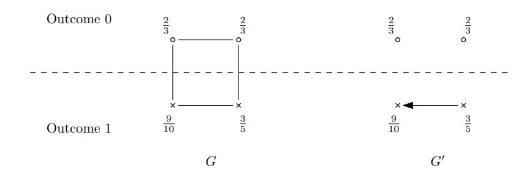
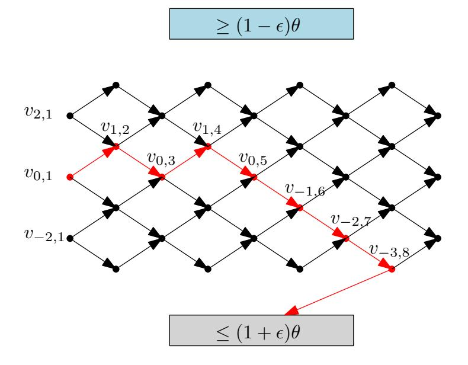
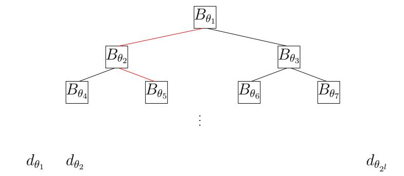
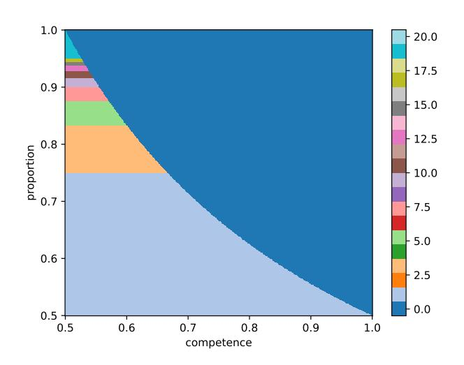
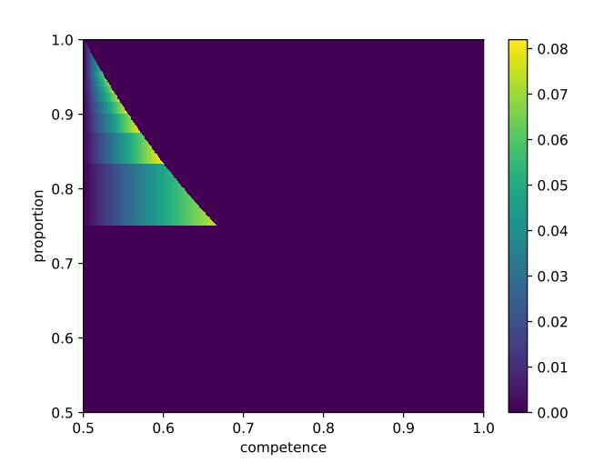
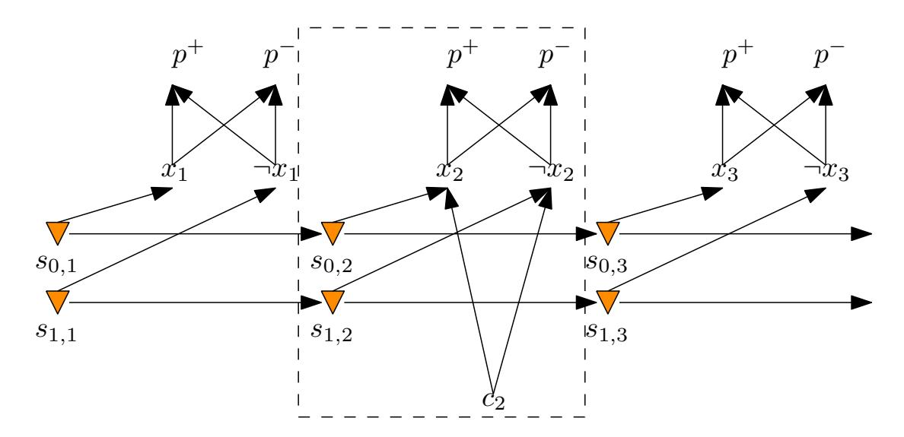
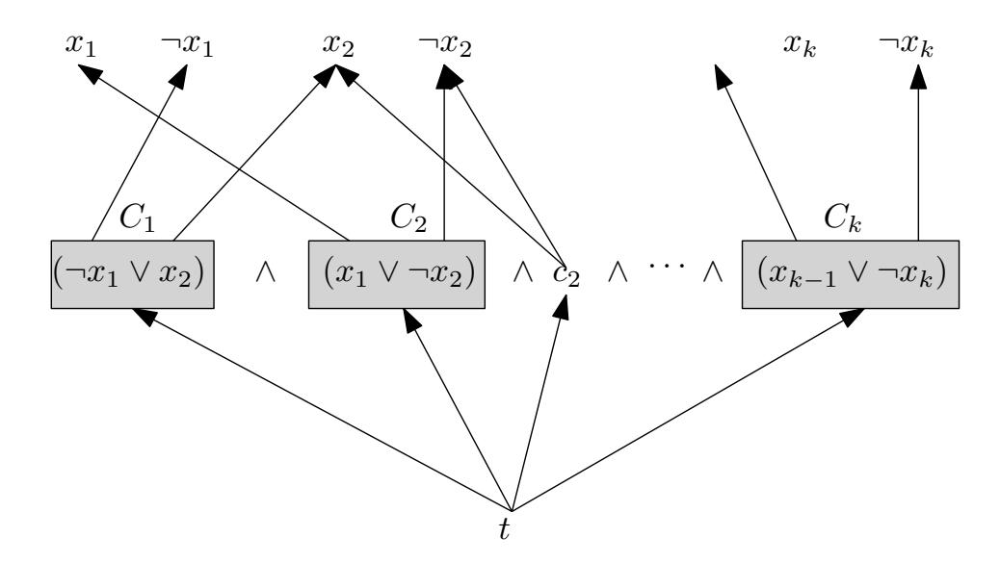

{0}------------------------------------------------

# **Liquid Democracy With Two Opposing Factions**

KRISHNENDU CHATTERJEE, ISTA, Austria
SETH GILBERT, National University of Singapore, Singapore
STEFAN SCHMID, TU Berlin & Fraunhofer SIT, Germany
JAKUB SVOBODA, ISTA, Austria
MICHELLE YEO, Aarhus University and Nanyang Technological University, Singapore

Liquid democracy is a transitive vote delegation process. Previously, the advantages of liquid democracy over direct voting have been studied in settings where there is a ground truth "good" voting outcome. In this work, we analyse liquid democracy in a realistic setting with two opposing factions without a ground truth and under uncertainty. Formally, we consider n voters who want to decide on some binary issue by voting. Each voter has a preference in  $\{0,1\}$  that represents the opinion of the voter on these issues. That is, a voter with preference 0 prefers to vote for option 0. We refer to voters with the same preference as being in the same faction. The goal is for voters in the same faction to cooperatively decide on vote delegation strategies that maximise their probability of winning the election. In this setting, we present a practical distributed algorithm under realistic assumptions to decide on an approximately vote delegation strategy that involves minimal interaction and communication, and under incomplete information about the opposing faction. We then provide a complete analytical characterisation of optimal vote delegation strategies under complete information about the opposing faction. Finally, we show that finding optimal delegation strategies in the general setting is PSPACE-complete.

CCS Concepts: • Theory of computation  $\rightarrow$  Approximation algorithms analysis; Distributed algorithms; • Applied computing  $\rightarrow$  Voting / election technologies.

Additional Key Words and Phrases: liquid democracy, delegated voting, distributed algorithms, approximation algorithms, optimisation, Nash equilibrium

#### 1 Introduction

Liquid democracy is a voting process where voters can delegate votes transitively to other voters. That is, if voter  $v_1$  delegates their vote to  $v_2$  and  $v_2$  delegates their vote to  $v_3$ , then, assuming  $v_3$  does not delegate their vote,  $v_3$ 's vote would count for  $v_1$ ,  $v_2$  and  $v_3$ . A central question in the theoretical analysis of liquid democracy is whether vote delegation gives rise to better results compared to the setting where all voters vote directly. The typical metric used to compare the performance of delegated and direct voting is to assume the existence of a "ground truth" voting outcome which is unknown to all voters. Each voter is equipped with a competency parameter that represents how likely the voter will vote for the ground truth. Under these assumptions, there have been several seminal works [10, 20, 22] that study whether delegated voting is more likely to reach this ground truth voting outcome compared to direct voting.

Nevertheless, the analysis of liquid democracy in the presence of a ground truth limits its practicality. As such, in this work, we revisit the analysis of liquid democracy in the absence of any ground truth. Rather, we focus on the binary voting setting and assume each voter has a preference for a certain outcome. In other words, the voters are split into two opposing factions, with each faction preferring a specific voting outcome. In our setting, we reinterpret the competency parameter to represent the likelihood of a voter actually voting for a choice that yields their preferred outcome. This not only continues an active area of research in voter indecision in political

Authors' Contact Information: Krishnendu Chatterjee, ISTA, Klosterneuburg, Austria, krishnendu.chatterjee@ist.ac.at; Seth Gilbert, National University of Singapore, Singapore, Singapore, gilbert@comp.nus.edu.sg; Stefan Schmid, TU Berlin & Fraunhofer SIT, Berlin, Germany, stefan.schmid@tu-berlin.de; Jakub Svoboda, ISTA, Klosterneuburg, Austria, jsvoboda@ist.ac.at; Michelle Yeo, Aarhus University and Nanyang Technological University, Singapore, Singapore, michelle.yeoxy@ntu.edu.sg.

{1}------------------------------------------------

science [4, 11, 27, 32], but also models realistic voting settings where there could be stochasticity between casting a vote and achieving a voter's desired outcome, which we illustrate with three examples below.

**Example 1** (Fickle voter). In this setting, the voter has a preferred voting outcome, but changes their mind frequently. The stochasticity in this setting comes from the fickleness of the voter, and the competency of the voter in this setting is the probability that the voter would vote for their preferred outcome during the election.

**Example 2** (Voting with unreliable candidates). In this setting, we consider voting with unreliable candidates. For example, consider voters who are voting for candidates who will be (partially) responsible for housing prices. The voters are either home owners or home buyers. Home owners have a preference to keep housing prices high, while home buyers have a preference for affordable housing. Voters have to vote on two candidates, one of them, wlog candidate 0, claims to implement an affordable housing act, while candidate 1 does not make this promise. Home owners (resp. home buyers) thus have a preference for candidate 1 (resp. 0). We assume stochasticity in the actual outcomes following the election of the candidate. That is, even if candidate 0 is elected, they might be "unreliable" and not implement the affordable housing act with some probability; or candidate 1 may implement policies yielding low housing prices (even though they did not previously make such a promise). We model this unreliability of the candidates in executing the voters' desired outcome as the competency of the voters in manifesting their desired outcome.

**Example 3** (Voting before a random future event). In this setting, we consider voting before the occurrence of of a future event whose outcome is to some extent random. For instance, consider the issue of deciding on a new government, where there is currently some uncertainty whether there will be a recession in the near future. Depending on the probability such a recession occurs, one or the other government may be more desirable. The unknown probability of the recession represents the competency of the voters in manifesting their desired outcome.

Unlike the case of Example 1, in Examples 2 and 3, the voters know the desired outcome they want, but they do not know if their preferred candidate will implement their outcome (Example 2), or if there is some external event that introduces stochasticity in the outcome after the election (Example 3). The competency of a voter in both Examples 2 and 3 represents the probability in achieving their desired outcome.

The analysis of liquid democracy in the setting without a ground truth presents new challenges, primarily the presence of an "enemy" faction: the goal of voters with the same preference is now to devise optimal delegated (or direct) voting strategies in order to maximise the probability that their preferred candidate or outcome wins the election. Additionally, to capture the spirit of liquid democracy, these optimal strategies should be devised in the presence of minimal information about the enemy faction, and involve minimal interaction between voters, particularly between voters in different factions. As such, the central question we seek to ask in this work is the following:

What are optimal vote delegation strategies for voters with the same preference and in the presence of minimal information about the enemy faction, that maximise the probability of achieving their preferred voting outcome?

#### 1.1 Our contribution

Dictatorship vs. representative democracy. An interesting observation from previous work comparing the performance of delegated to direct voting in the presence of a ground truth is that delegating votes to a single delegate (henceforth known as the Dictator strategy) might lead to worse outcomes compared to the setting where all voters vote directly [10, 22], or when votes are delegated

{2}------------------------------------------------

to some number of delegates [10] (henceforth known as Representative, the representative democracy strategy). Interestingly, our work shows a different result in the setting with two opposing factions. Specifically, we show in Theorem 2 that delegating votes to a single dictator is almost always optimal in terms of maximising the probability of achieving the desired voting outcome if the sizes of two factions are equal.

Delegation improves winning probability for weaker factions. We also examine the more interesting case where one faction is "weaker" in the sense that they might be larger in size but lower in competency, and hence lose the election in the case where all voters vote directly. We show in Lemma 4 an upper bound on the number of delegates in an optimal vote delegation strategy for this case, suggesting that concentrating power in the hands of a dictator is advantageous in the face of a stronger enemy faction. We also show how to compute the optimal delegation strategy using mixed integer linear programming in time exponential to the number of delegates k, as well as present an alternative method of computing the optimal strategy in Lemma 5 and Theorem 4 that only takes time  $O(k^2)$ , but constrains all delegates to have equal weight. Altogether, our optimal delegation strategies in this setting show that delegation improves the probability of winning over direct voting for the weaker faction.

A distributed vote delegation algorithm. Our main algorithmic contribution is a single-shot, distributed vote delegation algorithm (presented in detail in Section 3). Our algorithm is run simultaneously by voters in a single voting faction and decides on a vote delegation strategy. The algorithm involves minimal communication and interaction with other voters: only a sublinear number of voters in a faction query a random neighbour voter for their preference. An important feature of our algorithm is that it does not assume any knowledge of the enemy faction (i.e., the size and enemy voter competencies are unknown). In fact, through running our algorithm, the voters of one faction can approximately discover the size of the enemy faction, and use this to decide on a vote delegation strategy. This key idea behind this is the construction of a specific vote delegation process that effectively performs a binary search through the parameter space of the unknown enemy size, with the end point of the delegation process being a guess of the enemy faction size. The decisions made in the binary search process depend on the responses to the queries made by the voters, and we bias the delegation process such that the final guess is correct (within some small bound) with high probability. The final guess is then used to decide on a delegation strategy according to the setting where knowledge of the enemy faction is known (i.e., the strategies presented in Section 4). We show in Theorem 1 that as the number of voters increases, the vote delegation strategy is either optimal (with expensive local computation), or optimal under the assumption that all delegates are of equal weight.

Hardness of general delegation without ground truth. Our proposed distributed algorithm as well as our theoretical analysis of optimal delegation strategies rests on some assumptions on faction sizes as well as voter competencies. In Section 5 we present our main impossibility result, which is that finding optimal delegation strategies in the most general setting (i.e., no assumptions on faction sizes and competencies) is PSPACE-complete. Since this implies that finding optimal delegation strategies in the general setting is hard, this *further supports* the necessity of working with reasonable assumptions and constraints in order to achieve any practical analysis of liquid democracy in the absence of a ground truth.

*Implications.* Johannes Kepler once said that "I much prefer the sharpest criticism of a single intelligent man to the thoughtless approval of the masses". Interestingly, as we show, this is not necessarily the case in the context of delegated voting with opposing factions, especially in the case where one faction is larger but always loses in the setting of direct voting due to lower competency (i.e., the weaker faction). Our results show that vote delegation allows the weaker

{3}------------------------------------------------

faction to compensate for their lower competency by using their larger size to win with positive probability over the case of direct voting. This implies that vote delegation better reflects the utilities of the whole population while decreasing the effects of voter competency on the election result. Our results also imply that vote delegation realises a variant of "proportional fairness" [\[34\]](#page-13-4) for the weaker faction, especially since the weaker faction is technically larger in size, something which would not be possible in the setting of direct voting.

On the efficiency front, our algorithm is practical in real-life settings as it only involves a small number of voters in a faction querying a random neighbour voter (i.e., a voter which they already know of but might not know their preference). Naturally, our algorithm works best when voters are more connected, i.e., voters know as many other voters as possible. Indeed, in the extreme example where all voters in one faction are disconnected with voters in the other faction, it becomes impossible to accurately discover the strength of the enemy faction. We stress that studying the connectivity of voters is an interesting and important direction of future work, and especially timely pertaining to current real-life elections where voters are highly polarised and disconnected to voters with different opinions and preferences [\[28\]](#page-13-5).

#### 1.2 Related work

Delegated voting is well-studied and spans political science [\[1,](#page-12-3) [30,](#page-13-6) [36\]](#page-14-0), legal theory [\[29,](#page-13-7) [37\]](#page-14-1), economics [\[2,](#page-12-4) [6,](#page-12-5) [18,](#page-13-8) [39\]](#page-14-2), algorithms [\[7,](#page-12-6) [8,](#page-12-7) [10,](#page-12-0) [13,](#page-13-9) [20,](#page-13-0) [22\]](#page-13-1), and empirical analyses [\[5,](#page-12-8) [9,](#page-12-9) [15,](#page-13-10) [16,](#page-13-11) [19,](#page-13-12) [33,](#page-13-13) [35,](#page-13-14) [38\]](#page-14-3). On the practical side, delegated voting has been deployed in several real world systems [\[19,](#page-13-12) [33\]](#page-13-13), including for example elections within the German Pirate Party [\[23\]](#page-13-15). Our work continues a rich line of research that theoretically analyses and compares the performance of delegated voting to direct voting in liquid democracy [\[7,](#page-12-6) [8,](#page-12-7) [10,](#page-12-0) [13,](#page-13-9) [20,](#page-13-0) [22\]](#page-13-1). A common feature in these works is that they assume the existence of a ground truth, and they examine the settings where vote delegation outperforms direct voting in achieving this ground truth.

Recently, there are several works [\[2,](#page-12-4) [6\]](#page-12-5) that proposed a more realistic setting that eschews the existence of a ground truth. Bloembergen et al. [\[6\]](#page-12-5) propose a model where voters have a preference for candidates but their utility function is not fully known. Thus, a voter's preferred candidate winning the election might not be the best (in terms of utility) for the voter. The authors define a model of costs and utilities, and analyse the question of when does delegating offer greater utility compared to direct voting in which voters would need to exert extra effort (hence increased cost) into learning about their utility function. Amanatidis et al. [\[2\]](#page-12-4) propose a similar model with partially known preferences and present both possibility and impossibility results for delegated voting in this setting compared to the setting where full preferences are known. Our work operates in a similar setting where there is no ground truth, and there is also uncertainty in the process of voting for a candidate and achieving a voter's desired outcome.

Nevertheless, our work differs from the works of [\[2,](#page-12-4) [6\]](#page-12-5) in two distinct ways. First, the uncertainty models in both [\[2,](#page-12-4) [6\]](#page-12-5) capture the case where voters are uncertain about their utilities or preferences (as in the case of Example [1\)](#page-1-0), but not the case where voters know their utilities and, notwithstanding, there might be some external event that adds stochasticity between a voter's choice and the desired utility or outcome (Examples [2](#page-1-1) and [3\)](#page-1-2). Thus, the uncertainty model in our work can be seen as a generalisation of the previous models. Second, [\[2\]](#page-12-4) focuses on the comparison between the best outcomes achieved when all information about preferences are known vs the setting with incomplete information. In contrast, our work does not compare achievable optimal strategies in both of these settings, but instead centres on examining optimal delegation strategies (that span the range between direct democracy and delegating to a single dictator) within the setting with uncertainty. [\[6\]](#page-12-5) focuses on the question of when delegation improves individual voters' utilities, 

{4}------------------------------------------------

whereas our work seeks to answer the complementary question of the optimality of *cooperative* delegation strategies among voters with same preferences.

Our work is also related to other rational analyses of liquid democracy, most notably works that also analyse the performance of delegated voting but posit different models of costs and utilities. [12, 18] also define a model of utilities and costs and examine when delegations would maximise voters' utility, but both of these works operate in the ground truth setting. [39] studies power-seeking behaviour in delegated voting settings, where power is defined as the number of votes a delegate has that is delegated without going through any intermediary voters. The authors describe power-seeking delegation strategies that form Nash Equilibria.

Also related are works that design delegated voting systems from a cryptographic perspective [14, 24–26, 31], which seek to preserve delegation privacy among other desirable properties like coercion resistance. These works propose schemes that primarily aim to hide who a voter delegates to, which adds an orthogonal but complementary dimension of optimality to the strategies in our work.

On the political science front, there has been a wide body of recent work studying voter decision strategies [4, 11, 27, 32]. These works assume some uncertainty between voters' preferences and their ultimate voting decision, which is modeled similarly in our work using competencies. However, no analytical characterisations nor generalisations to the delegated setting are provided.

#### 2 Model

Problem setting. We consider n voters who want to decide on some binary issue (represented by options 0 and 1) by voting. Each voter  $v_i$  has a preference  $q_i \in \{0, 1\}$  that represents the opinion of  $v_i$  on these issues. That is, a voter  $v_i$  with  $q_i = 0$  prefers to vote for option 0 (and vice versa for  $q_i = 1$ ). We also refer to voters with the same preference as being in the same faction. We additionally assume that voters are unsure or may not be "competent" in how to achieve their preferred option through voting, for instance as described in Examples 1 to 3. We model this uncertainty by giving each voter a *competency* parameter  $p_i \in [0, 1]$  that denotes the probability that  $v_i$  votes for  $q_i$ , its preference. We define an instance of our problem as a graph  $G = (V, E, \mathbf{q}, \mathbf{p})$ . The set of vertices V represents the set of voters, and a directed edge between any two voters  $v_i$  and  $v_j$  represents the fact that  $v_i$  is aware of (connected to)  $v_j$ . The preference  $q_i$  and competency  $p_i$  of each voter  $v_i$  is denoted by the ith element of the vector of preferences  $\mathbf{q} = [q_1, q_2, \ldots, q_n]$  and competencies  $\mathbf{p} = [p_1, p_2, \ldots, p_n]$  respectively.

Vote delegation. For a voter v, we define its neighbour voters (denoted by  $Ne_v$ ) in the graph G as the voters that v is directly connected to, i.e.,  $v' \in V | (v, v') \in E$ . Voters can vote directly or delegate their votes to other voters they are directly connected to. Vote delegation from a voter  $v_i$  is represented by choosing one outgoing edge from  $v_i$ . Delegations are transitive, and induce a delegation graph G', which is a directed subgraph of G where a directed edge between two vertices (u,v) represents that u delegated their vote to v. In our work, we impose two restrictions on the delegation graph G': (1) acyclicity1, and (2) at most 1 outgoing edge for each vertex  $v \in G'$ . The first restriction ensures that a final vote can always be made, and the second restriction represents that each voter can delegate their vote to only one other voter.

*Voting rule and outcome.* Let S denote the set of sinks in the delegation graph G'. We assign each sink  $v_i \in S$  a corresponding weight  $w_i$  denoting the number of votes delegated to  $v_i$  (including self-votes, in the case of no delegation), and we note that each sink  $v_i \in S$  votes for their preference outcome  $q_i$  with probability  $p_i$  independently of other voters. Finally, a decision is made based on weighted majority vote, i.e., let  $S' \subset S$  denote the voters that voted for outcome 0. Then, outcome 0 will be chosen only if  $\sum_{v_i \in S'} w_i \geq \sum_{v_i \in S \setminus S'} w_i$ .

 $^{1}$ Which can be imposed by, e.g., only delegating to other voters with higher competencies, see [10] for more details.

{5}------------------------------------------------

2-player delegation game. We observe that the problem of how to optimally delegate votes within voters in the same faction can be modelled as a 2-player delegation game. The players in the game are  $P_0$  and  $P_1$ . Intuitively,  $P_0$  and  $P_1$  are abstractions of coordination mechanisms that coordinate the delegation strategies of all voters with preference 0 and 1 respectively. As a concrete example,  $P_0$  and  $P_1$  might be the candidates of the election and their goal is to find the optimal delegation strategy among their voters to maximise their chance of winning the election.

The delegation game is a 2-player strategic game (see Appendix A for a formal description of strategic games and Nash equilibria) and begins with a graph problem instance G with all information in G (including preferences and competencies) being available to both players. Player  $P_0$  (resp.  $P_1$ ) has preference 0 (resp. 1) and controls all delegations from voters  $v_i \in G$  with preference for voting outcome  $q_i = 0$  (resp.  $q_i = 1$ ). For  $i \in \{0,1\}$ , the action space  $A_i$  for  $P_i$  is the set of all possible delegations from voters with preference i to any other voter the voters are directly connected to, e.g., the action space  $A_0$  for  $P_0$  is the set of all possible delegations of voters with preference 0. For  $i \in \{0,1\}$ , a delegation strategy  $\sigma_i$  is a probability distribution over the action space  $A_i$ , and the output of  $\sigma_i$  is a delegation graph for all voters with preference type i. We say  $P_i$  wins the delegation game if the outcome of the election is i. The utilities of the players  $P_i$  correspond to their probabilities of winning the delegation game. The goal of each player  $P_i$  is to thus come up with a delegation strategy that maximises their probability of winning the delegation game. That is,  $P_0$  needs to come up with a delegation strategy  $\sigma_0$  to maximise the probability of outcome 0. We provide a simple example of a delegation instance, the delegation strategies of both players, and the corresponding delegation graph induced by the strategies in Figure 1.

Fig. 1. The graph G is the input problem instance with circle (resp. cross) vertices representing voters with preference 0 (resp. 1). Vertices are labeled with their competencies. G' is the delegation graph resulting from the strategy where  $P_0$  does not delegate at all and  $P_1$  chooses to delegate votes to the most competent voter.

# 3 Know your enemy2: a distributed vote delegation algorithm with incomplete information

In this section, we present a distributed algorithm for voters in a faction (wlog, voters with preference 0) to decide on an optimal vote delegation strategy. Specifically, the voters have to decide on whether to play Dictator, where they delegate their votes to a single dictator, or to play Representative(k) where they delegate their votes to k > 1 delegates. The voters know their own faction, including the competencies; however, they need to discover the power (proportion) of the enemy faction.

Assumptions and notation. We assume that all voters with preference 0 have competency  $c_0$  and all voters with preference 1 have competency  $c_1$ . We stress that using a single competency for all voters in one faction is not unreasonable. In our setting, only a small proportion of voters can vote directly, and they can be chosen from the upper tail of the distribution (if the competencies are drawn from a distribution). We additionally adopt the realistic assumption that both  $c_0, c_1 \ge \frac{1}{2}$ ,

&lt;sup>2From Know Your Enemy by Green Day: "Well, gotta know the enemy"

{6}------------------------------------------------

which implies that voters are more likely than not to vote for their preferred outcome. We use  $\mathfrak{p} \in [0,1]$  (resp.  $1-\mathfrak{p}$ ) to denote the proportion of voters with preference 0 (resp. 1). We use n to denote the total number of voters.

We assume each voter knows all other voters in the same faction, but nothing about voters in the opposing faction. This implies, firstly, that they do not know the competency of the voters with nonidentical preferences, i.e., voters with preference 0 (resp. 1) do not know  $c_1$  (resp.  $c_0$ ). Indeed, since we focus on an algorithm for  $P_0$ , we can assume that  $c_1 = 1$ , which is where  $P_1$  is the strongest opponent for  $P_0$  and thus most pessimistic for  $P_0$ . Secondly, voters do not know  $\mathfrak{p}$ , that is, they do not know the full set of voters. This is reasonable when we consider voting in permissionless blockchain settings, where voters can broadcast messages to seek out other voters with the same preference. Thirdly, voters can delegate to any other voter with the same preference. That is, either the graph spanning the voters with preference 0 is complete or voters can create new connections (more details in Section 3.1).

# 3.1 Algorithm description

Overview and intuition. Our algorithm is single-shot and runs simultaneously by all voters with preference 0. Every voter samples one random neighbour voter's preference and, based on this result, either delegates their vote or votes directly. The main challenge is to construct the delegation graph. In a nutshell, our algorithm splits voters into binary trees, where each node (except the leaves) in the tree is composed of a block of voters. In more detail, there are T trees, and each tree consists of n/T voters. The structure of the tree is a binary decision tree with one root, l levels, and  $2^l$  leaves (see Figure 3 for an example). Most of the voters in the tree delegate their vote to the root of the tree and are not structured into blocks. The rest of the tree is constructed by o(T/n) voters. Each block of voters in a tree is given a unique block parameter  $\theta$  and their job is to decide if  $\mathfrak p$  is above the threshold  $(1-\varepsilon)\theta$ , or below  $(1+\varepsilon)\theta$  for some  $\varepsilon>0$ . If  $\mathfrak p$  is decided to be larger than this threshold, then the block passes the decision over to a child block with the next largest  $\theta$  parameter in the tree, continuing until a leaf is reached. The process for  $\mathfrak p$  decided to be smaller than the block threshold is identical.

Intuitively, the purpose of each tree is to approximately discover the unknown proportion  $\mathfrak p$  through a special delegation procedure that "randomly walks" through blocks from the root to the leaf of the tree, effectively performing a binary search over the parameter space of  $\mathfrak p$ . The delegation procedure involves only sampling a random neighbour for each involved voter with preference 0, and the sole preference of this randomly sampled neighbour determines how votes are delegated through the delegation procedure. The key idea behind the delegation procedure is that the delegations within each block (and thus continuing through the tree) follows a random walk that is sufficiently biased such that each block correctly guesses the whether  $\mathfrak p$  is larger or smaller than  $\theta$  with high probability. This results in every tree eventually delegating almost all of its votes to one leaf voter who, from the delegation procedure, would know a good approximation of  $\mathfrak p$ . This process is repeated in parallel across all trees, and all final leaf voters across all trees use their approximation of  $\mathfrak p$  to decide on the optimal vote delegation strategy according to the case where  $\mathfrak p$  is fully known (which we will detail in Section 4).

Construction of a block. In the block with parameter  $\theta$ , there are  $(2H+1)\times L$  voters. Every voter  $v_{i,j}$  is indexed by  $i\in\{-H,\ldots H\}$  and  $j\in\{0,\ldots L-1\}$ , and delegates either to  $v_{i+1,j+1}$  or  $v_{i-1,j+1}$  (see Figure 2 for an example block). When the delegation procedure reaches i+1>H or  $j+1\geq L$ , the voter delegates to another block in the tree signifying that  $\mathfrak{p}\geq (1-\varepsilon)\theta$ . If i-1<-H, the voter delegates to another block in the tree representing  $\mathfrak{p}\leq (1+\varepsilon)\theta$ . See Figure 3 for an example delegation path across blocks in a tree. When the delegation procedure reaches a block just before

{7}------------------------------------------------

Fig. 2. Arrangement of voters in each block. The path in red is an example outcome with endpoint decision that is  $\mathfrak{p} \leq (1 + \varepsilon)\theta$  from the random walk delegation procedure.

Fig. 3. Example tree with blocks and leaf voters. The red path is an example delegation path through the tree where the root decides that  $\mathfrak{p} \leq (1+\varepsilon)\theta_0$  and block  $B_{\theta_1}$  decides that  $\mathfrak{p} \geq (1-\varepsilon)\theta_1$ .

the leaf voters of the tree, there is no next block, the delegation process delegates to one of the  $2^l$  leaf voters. Each of these leaf voters come with an a priori belief  $\theta$  about the unknown parameter  $\mathfrak{p}$ , and the leaf voter that is chosen (denoted by  $d_{\mathfrak{p}=\theta}$ ) from the delegation process of the final block represents the final belief of the tree about  $\mathfrak{p}$  that is propagated through the random walk across the tree. We will describe how to set the specfic block parameters later, however we note that  $\frac{1}{\varepsilon} << H << L$ .

Random walk delegation procedure. Every voter  $v_{i,j}$  in the block samples one random neighbour. If this neighbour has preference 0 (which will happen with probability  $\mathfrak{p}$ ), the voter  $v_{i,j}$  delegates to  $v_{i+1,j+1}$  with probability  $\frac{1}{2\theta}$ , otherwise it delegates to  $v_{i-1,j+1}$ . If this neighbor has preference 1 (with probability  $1-\mathfrak{p}$ ), it delegates to  $v_{i-1,j+1}$ . This transformation ensures that  $v_{i,j}$  delegates to  $v_{i+1,j+1}$  with probability  $\frac{\mathfrak{p}}{2\theta}$ . If  $\mathfrak{p}=\theta+x$  for some error term x>0, then the bias is at least  $\frac{1}{2}+\frac{x}{2}$ . We say that the block decided on  $\mathfrak{p}\leq (1+\varepsilon)\theta$  if the path from  $v_{0,0}$  reaches the next block from  $v_{-H,j}$  for  $j\leq L-1$ . Otherwise, we that that the block decided on  $\mathfrak{p}\geq (1-\varepsilon)\theta$ . The block decides correctly if the block decides the valid inequality (note that the block always decides correctly for values within the  $\varepsilon$ -ball around  $\theta$ ). The following lemma bounds the probability that a block decides incorrectly. The proof is in Appendix D.1 and relies on the Chernoff bound.

**Lemma 1.** A block (with parameters  $\frac{1}{\varepsilon} \ll H \ll L$ ) decides correctly with probability at least  $1 - e^{-H}$ .

Construction of a tree. The tree approximates the value of  $\mathfrak p$ . There are l levels in the tree and  $O(2^l)$  nodes. Eventually, the delegation path going through all blocks reaches one of the  $2^l$  leaf voters who know the value of  $\mathfrak p$  to the precision of  $\frac{1}{2}(1+\varepsilon)^l$ . In total, the number of voters in the tree itself is  $O(2^l \cdot H \cdot L)$ . The rest of the voters assigned to this tree (and we have n/T asymptotically larger than  $2^l \cdot H \cdot L$ ) delegate to the voter  $v_{0,0}$  of the first block forming the root of the tree without sampling any neighbors. We say that the tree decision is correct if the delegation path reaches the leaf voter whose belief parameter is closest to the actual value of  $\mathfrak p$ . Observe that if all the blocks on the delegation path are correct, then the tree decision is correct. This, together with Lemma 1, implies that the tree decision is correct with probability at least  $1 - le^{-H}$ .

{8}------------------------------------------------

General construction and parameters. There are T trees and all of them reach the correct decision with probability  $1-Tle^{-H}$ . Then, there are T voters, one in the leaf of each tree that has weight n/T. These voters know each other and also know  $\mathfrak p$  from the delegation process. This means that the voters can compute an optimal strategy assuming  $\mathfrak p$  is known and perform it using their approximation of  $\mathfrak p$ , see Section 4.2.2 for details. Note that for growing n, we have  $n/T << \frac{1}{\frac{1}{2} - \mathfrak p c_0}$ , which means that an optimal strategy is still feasible with the delegations. The next theorem (with proof in Appendix D.2) states the approximation ratio of our algorithm compared to the optimal strategy where  $\mathfrak p$  is known and all delegates have equal weight.

Theorem 1. Given a problem instance  $(\mathfrak{p}, c_0)$ , the algorithm returns a strategy with winning probability at least the winning probability of the optimal strategy for  $(\mathfrak{p} - \frac{2}{\log n}, c_0)$  with probability at least

$$1-\frac{1}{n}-\frac{1}{\log n}\,,$$

where n is the number of voters.

Remark (One-shot vs. pre-communication). An important feature of our algorithm is that it is single-shot and involves minimal communication between voters. Our algorithm, however, relies on trusted functionalities to sample a random user from a given set and to split and arrange users into the block and tree structures as decribed above. This makes it particularly appealing in settings where there is a trusted third party (TTP) which can implement these functionalities. We now describe how to extend our algorithm to the setting where there is no TTP available, at the cost of some additional rounds of pre-communication and interaction between voters. Assuming that nodes are honest, sampling can be replaced by rejection sampling, which only adds a constant factor overhead if the number of voters with preference 0 and the number of voters with preference 1 are both a constant fraction of the total number of voters. To select a random dictator or a random delegate when implementing the optimal vote delegation strategy, we can use a gossip protocol where each voter chooses  $O(\log n)$  neighbours and floods the minimum id neighbour with its preference. To hide the total number of voters, we can use You Only Speak Once (YOSO) multiparty computation (MPC) [17]. Gossip adds an additional nlog n factor in terms of communication while YOSO MPC adds a sublinear number of additional communication rounds. Finally, to split the voters into blocks and trees, we can again use YOSO MPC.

#### 4 Optimal delegation strategies with complete preference information

In Section 3, we described a distributed algorithm to decide on Dictator or Representative(k). Crucially, our algorithm is run by voters with preference 0 with incomplete information regarding the preference proportion  $\mathfrak p$  and competency  $c_1$  of the voters with preference 1. In this section, we analyse optimal delegation strategies in the 2-player delegation game in the presence of complete preference information, i.e.,  $\mathfrak p$  is public.

Assumptions and notation. We adopt the same model assumptions as in Section 3, just that now  $\mathfrak{p}$  is publicly known. We treat the number of voters as going towards infinity, which means that in expectation,  $c_0$  (resp.  $c_1$ ) proportion of voters with preference 0 (resp. 1) would vote correctly for their preference. Finally, we use DIRECT to denote the strategy where all players vote directly without any delegation.

#### 4.1 Warm up: equal proportion

We first show in Theorem 2 that when  $\mathfrak{p}=\frac{1}{2}$ , the strategy profile which consists of both players delegating all their votes to a single dictator is the unique Nash equilibrium in this delegation game instance. The proof of Theorem 2 is in Appendix C.1 and relies on the key observation that the delegation game is zero-sum.

{9}------------------------------------------------

Theorem 2. When  $\mathfrak{p}=0.5$  and  $c_0,c_1\in(\frac{1}{2},1)$ , the strategy profile  $\{Dictator,Dictator\}$  is the only Nash Equilibrium.

# 4.2 Unequal faction strength

We now consider the more general setting where both players might not have control of an equal proportion of voters. We consider strategies for  $P_0$  with competence  $c_0$  against the opponent with competence  $c_1 = 1$ . There are two cases: either  $P_0$  wins while playing DIRECT or not.

#### 4.2.1 $P_0$ wins by playing DIRECT.

The following lemma shows that under this strength assumption,  $P_0$  can win almost surely against any strategy of  $P_1$  by just letting the voters with preference 0 vote directly with no delegation needed (see the darker blue region in Figure 5).

**Lemma 2.** Let  $\mathfrak{p} \cdot c_0 \geq \frac{1}{2}$ . Then using strategy DIRECT,  $P_0$  wins with probability 1 against  $P_1$  for all  $c_1$ .

PROOF. It suffices to prove the lemma claim for  $c_1 = 1$  (i.e., the strongest possible  $P_1$ ). Then if  $P_0$  plays DIRECT, the proportion of votes for 0 is  $\mathfrak{p} \cdot c_0$  and proportion of votes for 1 is  $1 - \mathfrak{p} + \mathfrak{p}(1 - c_0)$ .  $P_0$  therefore wins if  $\mathfrak{p} \cdot c_0 \geq (1 - \mathfrak{p}) + \mathfrak{p}(1 - c_0)$ , which simplifies to  $\mathfrak{p} \cdot c_0 \geq \frac{1}{2}$ .

# 4.2.2 $P_0$ loses by playing Direct.

We now consider the case when  $\mathfrak{p} \cdot c_0 < \frac{1}{2}$ , which is the setting where  $P_0$  cannot guarantee a win by playing Direct. A natural question raised by the result of Lemma 2 is whether there are certain parameter settings (i.e., functions of  $\mathfrak{p}$  and  $c_o$ ) where there might be optimal delegation strategies for a weaker  $P_0$  that are in between Dictator and Direct, e.g., Representative(k) with some number of delegates k. We first show in Lemma 3 that an optimal strategy does not involve any direct voting. Then, we show in Lemma 4 that there is an optimal strategy where the smallest delegate weight is above some constant. This immediately implies an upper bound on the total number of delegates for any optimal Representative strategy. The proofs of Lemmas 3 and 4 are in Appendices C.2 and C.3.

**Lemma 3.** Consider a strategy  $\sigma$  for  $(\mathfrak{p}, c_0)$  where x proportion of voters vote directly, the winning probability for  $\sigma$  is the same as that of the optimal strategy for  $(\frac{\mathfrak{p}-x}{1-2c_0x}, c_0)$ .

**Lemma 4.** There is an optimal strategy for  $P_0$  such that all delegates have a weight of at least

$$\frac{1}{2}-\mathfrak{p}c_0.$$

Given this bound on the smallest delegate weight, we show in Appendix C.4 how to find the optimal delegation strategy in time exponential to the number of delegates k using mixed integer linear programming. To reduce the time complexity, we consider delegation strategies where each delegate has the same weight. Lemma 5 in Appendix C.5 upper bounds the number of delegates when all of them are constrained to have equal weight, and Theorem 4 in Appendix C.5 shows that the optimal strategy given this constraint can be found by exhaustive search in time  $O(k^2)$ .

Simulations. We simulate the space of optimal delegation strategies with equal weight delegates for the 2-player game with various values of  $\mathfrak{p} \in [0.5,1]$  and  $c_0 \in [0.5,1]$ . The curve in Figure 4 represents the boundary where  $\mathfrak{p} \cdot c_0 = \frac{1}{2}$ . Figure 4 shows optimal Representative(k) delegation strategies when all votes are split equally among k delegates, with the different colours representing the optimal number k of delegates. We note that the larger the proportion  $\mathfrak{p}$ , the more number of delegates we can have for the optimal Representative(k) strategy. Figure 5 shows the additional winning probability in playing the optimal delegation strategy as prescribed in Figure 4 over Dictator. The largest advantage is around 0.08.

{10}------------------------------------------------

Fig. 4. Optimal delegation strategies for  $P_0$  across  $c_0$  (competency) and  $\mathfrak{p}$  (proportion) parameters. The different colours represent the number of delegates.

Fig. 5. Difference between winning probabilities when playing the optimal delegation strategy as in Figure 4 and when playing strategy DICTATOR.

Key takeaway: proportion vs. competency. Focusing on the region where  $P_0$  is weaker than  $P_1$  when playing Direct, i.e., where  $\mathfrak{p} \cdot c_0 < \frac{1}{2}$ , we see in Figure 4 that trading off competency for proportion (i.e., controlling a larger proportion of voters that are less competent) opens the strategy space up to a range of more democratic optimal delegation strategies in between Direct and Dictator (i.e., delegating to more than 1 voter). This increased possibility of delegation (which potentially also increases other metrics like social welfare and decentralisation) enlarges the relative importance of proportion and decreases the relative importance of competency in this parameter region.

#### 5 Hardness of the general 2-player delegation game

In this section, we establish our hardness result: we show that finding an optimal strategy in the general 2-player delegation game is PSPACE-complete. We first observe that the model and problem setting in Section 2 are defined in general terms, i.e., we assume a general graph topology that connects voters, and voters can have competencies below  $\frac{1}{2}$  (which means that, for instance, a voter with preference 0 but with competency 0 would vote for option 1, or to delegate to a voter with preference 1), and we do not specify the mechanism that ensures the acyclicity of the graph. To establish the hardness result in this section, we assume that there is an order in which the voters fix their delegation (which is also visible to all other players).

THEOREM 3. Finding an optimal strategy in the delegation game is PSPACE-complete.

*Proof idea and outline.* We establish PSPACE-completeness using a reduction from TQBF [3]. TQBF is a Boolean satisfiability problem with existential and universal quantifiers applied to each variable such that the resulting expression evaluates to TRUE. Given a TQBF instance, we construct a 2-player delegation game instance with winning probability for a player  $P_1$  above a threshold p if and only if there exists a satisfying assignment to the TQBF instance. In the delegation game instance,  $P_0$  corresponds to the player assigning the values of the universally quantified variables in the TQBF instance, and  $P_1$  corresponds to the player assigning the variables of the existentially quantified variables. The proof proceeds in the following 3 steps:

(1) Setup signals: To set up our delegation game, we introduce the notion of *signals*. Each TQBF variable is associated with 2 signal vertices in our delegation game. These signals are controlled by player  $P_0$  (i.e.,  $P_0$  controls how the signals delegate). Intuitively, these signals

{11}------------------------------------------------

- play a dual role in our construction. (1) They are used to determine the final voting outcome: these signals end up being delegated to a sink voter with competency  $p^+$  or  $p^-$ . If one signal is delegated to one sink with competency  $p^+$  and one other sink (with competency  $p^+$  or  $p^-$ ),  $P_1$  wins with probability at least p. (2) The signals are used by  $P_0$  to enforce that  $P_1$  decides delegations such that they correctly assigns all variables such the variable is either positive or negative (more details in the following item). Informally, this ensures that  $P_0$  can secure a win if the TQBF is not satisfiable, and in the case where the TQBF is satisfiable, any delegation of  $P_0$  cannot alter the winning probability of  $P_1$ . Refer to Figure 6 for the possible delegations of the signals.
- (2) Delegation game construction: To construct the delegation game, we introduce up to 7 voters associated with each TQBF variable  $x_i$ :  $x_i$ ,  $\neg x_i$ ,  $p^+$ ,  $p^-$ ,  $s_{0,i}$ ,  $s_{1,i}$ ,  $c_i$  (see Figure 6 for an example for variable  $x_2$ ).  $P_1$  controls the delegations of vertices  $x_i$  and  $\neg x_i$ , and  $P_0$  controls the delegations of vertices  $s_{0,i}$ ,  $s_{1,i}$ ,  $c_i$ . Voters  $p^+$  and  $p^-$  are sinks (and new for all variables). The sink vertex  $p^+$  represents TRUE assignment and  $p^-$  represents FALSE assignment. A variable  $x_i$  is said to be correctly assigned if exactly one voter  $x_i$  or  $\neg x_i$  delegates to  $p^+$  and the other voter delegates to  $p^-$ . Different delegations of the  $x_i$  and  $\neg x_i$  vertices in our delegation game correspond to different assignments of TRUE and FALSE to the corresponding  $x_i$  and  $\neg x_i$  variable in the TQBF. The different ways the signals can be delegated is used to enforce a *correct assignment* of  $x_i$ , that is, only one of  $x_i$  or  $\neg x_i$  can be TRUE. The variables associated with a universal quantifier have an additional vertex  $c_i$ . After the first i-1 variables are assigned,  $P_0$  decides to delegate from  $c_i$  to either  $x_i$  or  $\neg x_i$ . This in effect adds a clause with expression  $x_i$  or  $\neg x_i$  to the formula. After all variables are assigned, one signal reaches a sink  $p^-$  and the other signal reaches vertex t. From vertex t, player  $P_0$  can delegate to a vertex representing any clause or any vertex  $c_i$ . From the vertex representing a clause,  $P_1$  can delegate to all literals that appear in the clause (to  $x_i$  or  $\neg x_i$ , depending on what appears in the clause). See Figure 7 in Section B for an example.
- (3) Correctness proof: We show that if any variable is incorrectly assigned,  $P_0$  wins. Also, if  $P_1$  does not respect the delegations of the  $c_i$  voters,  $P_0$  wins. If the TQBF is satisfiable,  $P_1$  correctly assigns every variable  $x_i$  and  $\neg x_i$ , and the choice of whether to set each  $x_i$  to TRUE or FALSE follows from the delegations of  $c_i$ , which represents the assignments made by the universal quantifier. If the assignment is true, then from vertex t,  $P_0$  can delegate only to vertices that represent clauses or universal quantifiers where  $P_1$  can ensure that signal reaches  $p^+$ . If  $P_1$  has a strategy to win with probability at least p, then there is an assignment of variables that satisfies TQBF.

The full proof of Theorem 3 is in Appendix B.

#### 6 Conclusion

In this work, we examined the problem of optimal vote delegation strategies in the absence of a ground truth for two opposing factions. We model the problem as a 2-player delegation game, and describe a single-shot, distributed algorithm for one faction that decides on an approximately optimal vote delegation strategy in the absence of information about the enemy faction. We show that our algorithm only involves a sublinear number of voters in one faction querying a single neighbour for their preference, and achieves an approximation ratio of  $1 - \frac{1}{n} - \frac{1}{\log n}$  compared to the optimal algorithm in the case where the size of enemy faction is known. We also show how to compute optimal delegation strategies assuming complete information about the size of the enemy faction. Finally, we establish that our problem in the general setting is PSPACE complete.

{12}------------------------------------------------

Fig. 6. All player delegation strategy outcomes. The orange inverted triangles represent signals controlled by  $P_0$ . The dashed box contains all the vertices associated with TQBF variable  $x_2$  (we assume TQBF variables with even indices are universally quantified). Edges represent delegations between voters. Player  $P_0$  controls the delegations of the signals and the  $c_i$  voters and  $P_1$  controls delegations of the  $x_i$  and  $\neg x_i$  voters.

We envision our work as an important first step in the analysis of optimal delegation strategies with opposing factions. In particular, we like to highlight two interesting directions of future work. First, a natural direction would be to extend our model and analysis to the setting with more than 2 parties. Note that this is not straightforward as we would have to model how less competent voters delegate. Second, our results imply that vote delegation might be more advantageous over direct voting for weaker factions in terms of maximising both winning probability as well as other objectives like fairness. Studying different notions of fairness, as well as vote delegation strategies that maximise these notions would be another natural direction for future work to achieve a better understanding of how delegated voting compares to direct voting in the setting with opposing factions.

#### References

- [1] Dan Alger. 2006. Voting by proxy. Public Choice 126 (02 2006), 1–26. https://doi.org/10.1007/s11127-006-3059-1
- [2] Georgios Amanatidis, Aris Filos-Ratsikas, Philip Lazos, Evangelos Markakis, and Georgios Papasotiropoulos. 2024. On the Potential and Limitations of Proxy Voting: Delegation with Incomplete Votes. In *AAMAS*. International Foundation for Autonomous Agents and Multiagent Systems / ACM, 49–57.
- [3] Sanjeev Arora and Boaz Barak. 2009. Computational Complexity - A Modern Approach. Cambridge University Press.
- [4] Ned Augenblick and Scott Nicholson. 2016. Ballot Position, Choice Fatigue, and Voter Behaviour. *The Review of Economic Studies* 83, 2 (2016), 460–480. https://EconPapers.repec.org/RePEc:oup:restud:v:83:y:2016:i:2:p:460-480.
- [5] Tom Barbereau, Reilly Smethurst, Orestis Papageorgiou, Johannes Sedlmeir, and Gilbert Fridgen. 2023. Decentralised Finance's timocratic governance: The distribution and exercise of tokenised voting rights. *Technology in Society* 73 (2023), 102251. https://doi.org/10.1016/j.techsoc.2023.102251
- [6] Daan Bloembergen, Davide Grossi, and Martin Lackner. 2019. On Rational Delegations in Liquid Democracy. In *AAAI*. AAAI Press, 1796–1803.
- [7] Gregory Butterworth and Richard Booth. 2023. A Contribution to the Defense of Liquid Democracy. In *Proceedings of the 24th Annual International Conference on Digital Government Research* (Gda?sk, Poland) (*dg.o '23*). Association for Computing Machinery, New York, NY, USA, 244–250. https://doi.org/10.1145/3598469.3598496
- [8] Ioannis Caragiannis and Evi Micha. 2019. A contribution to the critique of liquid democracy. In *Proceedings of the 28th International Joint Conference on Artificial Intelligence* (Macao, China) (IJCAI'19). AAAI Press, 116–122.
- [9] Alessandra Casella, Joseph Campbell, Lucas de Lara, Victoria Mooers, and Dilip Ravindran. 2023. *Liquid Democracy. Two Experiments on Delegation in Voting*. Research Papers. Columbia University. https://dx.doi.org/10.2139/ssrn.4307183
- [10] Krishnendu Chatterjee, Seth Gilbert, Stefan Schmid, Jakub Svoboda, and Michelle Yeo. 2025. When is liquid democracy possible?: On the manipulation of variance. In *PODC*. ACM, 241–251.
- [11] Love Christensen. 2022. How Does Uncertainty Affect Voters' Preferences? *British Journal of Political Science* 52, 3 (2022), 1186–1204. https://doi.org/10.1017/S0007123421000247

{13}------------------------------------------------

- [12] Zoé Christoff and Davide Grossi. 2017. Binary Voting with Delegable Proxy: An Analysis of Liquid Democracy. In *TARK (EPTCS, Vol. 251)*. 134–150.
- [13] Gal Cohensius, Shie Mannor, Reshef Meir, Eli Meirom, and Ariel Orda. 2017. Proxy Voting for Better Outcomes. In *Proceedings of the 16th Conference on Autonomous Agents and MultiAgent Systems* (São Paulo, Brazil) (*AAMAS '17*). International Foundation for Autonomous Agents and Multiagent Systems, Richland, SC, 858–866.
- [14] Stefan Dziembowski, Shahriar Ebrahimi, Haniyeh Habibi, Parisa Hassanizadeh, and Pardis Toolabi. 2025. Burn Your Vote: Decentralized and Publicly Verifiable Anonymous Voting at Scale. *IACR Cryptol. ePrint Arch.* (2025), 1022.
- [15] Rainer Feichtinger, Robin Fritsch, Yann Vonlanthen, and Roger Wattenhofer. 2023. The Hidden Shortcomings of (D)AOs - An Empirical Study of On-Chain Governance. *CoRR* abs/2302.12125 (2023).
- [16] Robin Fritsch, Marino Müller, and Roger Wattenhofer. 2024. Analyzing voting power in decentralized governance: Who controls DAOs? *Blockchain: Research and Applications* 5, 3 (2024), 100208. https://doi.org/10.1016/j.bcra.2024.100208
- [17] Craig Gentry, Shai Halevi, Hugo Krawczyk, Bernardo Magri, Jesper Buus Nielsen, Tal Rabin, and Sophia Yakoubov. 2021. YOSO: You Only Speak Once - Secure MPC with Stateless Ephemeral Roles. In *CRYPTO* (2) (Lecture Notes in Computer Science, Vol. 12826). Springer, 64–93.
- [18] James Green-Armytage. 2015. Direct voting and proxy voting. *Constitutional Political Economy* 26 (2015), 190–220. https://api.semanticscholar.org/CorpusID:154590189
- [19] Andrew B. Hall and Sho Miyazaki. 2024. *What Happens When Anyone Can Be Your Representative? Studying the Use of Liquid Democracy for High-Stakes Decisions in Online Platforms*. Research Papers 4220. Stanford University, Graduate School of Business. https://ideas.repec.org/p/ecl/stabus/4220.html
- [20] Daniel Halpern, Joseph Y. Halpern, Ali Jadbabaie, Elchanan Mossel, Ariel D. Procaccia, and Manon Revel. 2023. In Defense of Liquid Democracy. In *Proceedings of the 24th ACM Conference on Economics and Computation* (London, United Kingdom) (EC '23). Association for Computing Machinery, New York, NY, USA, 852. https://doi.org/10.1145/3580507.3597817
- [21] Kais Hamza. 1995. The smallest uniform upper bound on the distance between the mean and the median of the binomial and Poisson distributions. *Statistics & Probability Letters* 23, 1 (1995), 21–25.
- [22] Anson Kahng, Simon Mackenzie, and Ariel D. Procaccia. 2021. Liquid Democracy: An Algorithmic Perspective. J. Artif. Intell. Res. 70 (2021), 1223–1252.
- [23] Christoph Carl Kling, Jérôme Kunegis, Heinrich Hartmann, Markus Strohmaier, and Steffen Staab. 2015. Voting Behaviour and Power in Online Democracy: A Study of LiquidFeedback in Germany's Pirate Party. In *ICWSM*. AAAI Press, 208–217.
- [24] Oksana Kulyk, Karola Marky, Stephan Neumann, and Melanie Volkamer. 2016. Introducing Proxy Voting to Helios. https://doi.org/10.1109/ARES.2016.38
- [25] Oksana Kulyk, Stephan Neumann, Karola Marky, Jurlind Budurushi, and Melanie Volkamer. 2017. Coercion-resistant proxy voting. *Computers and Security* 71 (06 2017). https://doi.org/10.1016/j.cose.2017.06.007
-  $[26] \quad Oksana \, Kulyk, Stephan \, Neumann, Karola \, Marky, and \, Melanie \, Volkamer. \, 2017. \, Enabling \, Vote \, Delegation \, for \, Boardroom \, Voting. \quad https://doi.org/10.1007/978-3-319-70278-0_26$
- [27] Richard R Lau, Mona S Kleinberg, and Tessa M Ditonto. 2018. Measuring Voter Decision Strategies in Political Behavior and Public Opinion Research. *Public Opinion Quarterly* 82, S1 (03 2018), 911–936. https://doi.org/10.1093/poq/nfy004 arXiv:https://academic.oup.com/poq/article-pdf/82/S1/911/27787878/nfy004.pdf
- [28] Gilat Levy and Ronny Razin. 2019. Echo Chambers and Their Effects on Economic and Political Outcomes. *Annual Review of Economics* 11 (08 2019). https://doi.org/10.1146/annurev-economics-080218-030343
- [29] Grace Liu. 2024. The Illusion of Democracy— Why Voting in Decentralized Autonomous Organizations Is Doomed to Fail. Research Papers 24-13. NYU School of Law. https://ssrn.com/abstract=4441178
- [30] James C. Miller. 1969. A program for direct and proxy voting in the legislative process. *Public Choice* 7 (1969), 107–113. https://api.semanticscholar.org/CorpusID:154387226
- [31] Kamilla Nazirkhanova, Vrushank Gunjur, X. Pilli Cruz-De Jesus, and Dan Boneh. 2025. Kite: How to Delegate Voting Power Privately. arXiv:2501.05626 [cs.CR] https://arxiv.org/abs/2501.05626
- [32] Lluis Orriols and Álvaro Martínez. 2014. The role of the political context in voting indecision. *Electoral Studies* 35 (2014), 12–23. https://doi.org/10.1016/j.electstud.2014.03.004
- [33] Alois Paulin. 2020. An Overview of Ten Years of Liquid Democracy Research. In *Proceedings of the 21st Annual International Conference on Digital Government Research* (Seoul, Republic of Korea) (dg.o '20). Association for Computing Machinery, New York, NY, USA, 116–121. https://doi.org/10.1145/3396956.3396963
- [34] Carolina Plescia, André Blais, and John Högström. 2019. Do people want a 'fairer' electoral system? An experimental study in four countries. *European Journal of Political Research* 59 (12 2019). https://doi.org/10.1111/1475-6765.12372
- [35] Stefan Schmid and Dmitry Shestakov. 2024. Invited Paper: Blockchain Governance and Liquid Democracy – Quantifying Decentralization in Gitcoin and Internet Computer. In *Proceedings of the 2024 Workshop on Advanced Tools, Programming Languages, and PLatforms for Implementing and Evaluating Algorithms for Distributed Systems* (Nantes, France)

{14}------------------------------------------------

(ApPLIED'24). Association for Computing Machinery, New York, NY, USA, 1–7. https://doi.org/10.1145/3663338. 3663678

- [36] Gordon Tullock. 1992. Computerizing politics. *Math. Comput. Model.* 16, 8–9 (Aug. 1992), 59–65. https://doi.org/10. 1016/0895-7177(92)90087-2
- [37] Andrew Tutt. 2016. Choosing Representatives by Proxy Voting. Columbia Law Review Sidebar 116 (2016).
- [38] Chiara Valsangiacomo. 2021. Political Representation in Liquid Democracy. In *Frontiers in Political Science*. https://api.semanticscholar.org/CorpusID:232342352
- [39] Yuzhe Zhang and Davide Grossi. 2021. Power in Liquid Democracy. In AAAI. AAAI Press, 5822–5830.

# A Game theoretic definitions and solution concept

Let  $\Gamma = (N, (A_i), (u_i))$  be an N player game where  $A_i$  is a finite set of actions for each player  $i \in [N]$  and denote by  $A := A_1 \times \cdots \times A_N$  the set of action profiles. The utility function of each player  $i, u_i : A \to \mathbb{R}$ , gives the payoff player i gets when an action profile  $a \in A$  is played. A *strategy*  $\sigma_i \in \Delta(A_i)$  of a player  $i \in [N]$  is a distribution over all possible actions of the player.

**Definition 1** (Nash Equilibrium). A Nash Equilibrium (NE) of  $\Gamma$  is a product distribution  $\sigma \in \times_{j \in [N]} \Delta(A_j)$  such that for every player  $i \in [N]$  and for all  $a'_i$  in  $A_i$ ,

$$\mathbb{E}_{a \leftarrow \sigma}[u_i(a)] \ge \mathbb{E}_{a \leftarrow \sigma}[u_i(a_i', a_{-i})]$$

#### **B** Hardness proof

Theorem 3. Finding an optimal strategy in the delegation game is PSPACE-complete.

PROOF. In the game of only one player, finding the optimal strategy is in PSPACE, since all strategies can be tried and evaluated. For the general game, all pairs of strategies can be tried and evaluated, which means that finding the pair of optimal strategies is in PSPACE.

We reduce TQBF to the problem of finding the optimal strategy in the delegation game. Let  $p^+$  and  $p^-$  be two arbitrary probabilities with  $p^+ > p^-$ . Given a TQBF instance, we construct a delegation game instance such that the probability of deciding on outcome 1 is above the threshold  $p^+ + (1-p^+)p^-$  if and only if there exists satisfying assignment for the TQBF instance. We suppose that the TQBF formula consists of variables  $x_1, x_2, \ldots, x_n$  and the quantifiers appear in this order. Moreover, variables with odd indices have an associated existential quantifier, and variables with even indices have an associated universal quantifier. Player  $P_0$  (resp.  $P_1$ ) in the delegation game corresponds to the player assigning the values of the universally quantified (resp. existentially quantified) variables of the TQBF instance. To construct our delegation game instance corresponding to the TQBF instance, we would need to create voters (i.e., vertices3) that correspond to the variables in the TQBF instance. Looking ahead, the vertices associated with variables with lower indices need to be fixed (i.e., delegation should be decided) before the vertices representing variables with higher indices.

Our proof proceeds in 3 steps: (1) setup, (2) construction, (3) correctness. In step (1), we setup all the necessary vertices to create our delegation graph, in step (2) we detail the construction of our delegation game, and in step (3) we prove correctness of the theorem claim using our constructed delegation game.

**Step 1: Setup and signal creation.** Recall that fixing the order of delegation gives us a temporal notion of sinks. Formally, let the vote order be  $v_1, v_2, \ldots$  The *preliminary sinks* after the *i*th vote are the set of sinks in the partial delegation graph after the first *i* voters have voted. Correspondingly, *final sinks* are sinks in the final delegation graph after all voters have voted. To enforce valid choices and true assignment, we use two "signals" (refer to the orange triangles in Figure 6). The signals

&lt;sup>3We will use the terms "voters" and "vertices" interchangeably in our proof.

{15}------------------------------------------------

are created by adding consecutive preliminary sinks in the delegation graph under the control of player  $P_0$ . The signals are used to determine the final voting outcome, and we do so by assigning both signals to have identically large weight. This means that if both signals are final sinks (or if the result after delegation results in both signals delegating to the same vertex) and vote for one value (0 or 1), then the result is this value. As they have identically large weight, if the signals are final sinks and vote differently, or the result after delegation results in the signals delegating to different final vertices, then we assume that player  $P_1$  wins. That is, we suppose that  $P_1$  wins ties. This can be ensured by some number of voters with large competence and preference for outcome 1. Looking ahead, signals ensure that all variables are assigned to be either true or false (not both). If all variables are correctly assigned, then one signal is used to verify the result of the formula.

**Step 2: Delegation game construction.** We show our construction in three parts: (1) how to assign true or false to variables, (2) how to deal with universal quantifiers, (3) how to evaluate the whole formula. Our construction uses the fact that some voters need to commit to delegation before others. This gives us the notion of time. Some vertices can be preliminary sinks before other player commit to some delegation. In our construction, all voters that have outgoing edges need to delegate. This can be ensured by these vertices having competency 0 for their own preference.

*Part 1: assigning true or false to variables.* For every variable  $x_i$  in the TQBF, we have up to 7 voters. These are labeled  $x_i$ ,  $\neg x_i$ ,  $p^+$ ,  $p^-$ ,  $s_{0,i}$ ,  $s_{1,i}$ ,  $c_i$  (see dashed box in Figure 6 for the voters corresponding to variable  $x_1$ ). The choice vertex  $c_i$  only appears for variables  $x_i$  associated with the universal quantifier. Player  $P_1$  controls the delegations of  $x_i$  and  $\neg x_i$ , and player  $P_0$  controls the delegations of the signals  $s_{0,i}$ ,  $s_{1,i}$  and the choice vertex  $c_i$ . The order of delegations proceeds as follows:  $P_0$ delegates the choice vertex  $c_i$  first, then  $P_1$  delegates the  $x_i$  and  $\neg x_i$  vertices, then  $P_0$  delegates the signals  $s_{0,i}$  and  $s_{1,i}$ . Vertices  $p^+$  and  $p^-$  are sink vertices with corresponding competencies, i.e., voter  $p^+$  (resp.  $p^-$ ) has competency  $p^+$  (resp.  $p^-$ ). Vertices  $x_i$  and  $\neg x_i$  are connected to both  $p^+$  and  $p^-$ . Looking ahead, we will show that the order of player delegations together with the different delegations of  $x_i$  and  $\neg x_i$  correspond to different assignments of TRUE and FALSE to the corresponding  $x_i$  variable in the TQBF.  $s_{0,i}$ ,  $s_{1,i}$  are the signals associated with the variable, and  $s_{0,i}$ can only delegate to  $x_i$  or  $s_{0,i+1}$  and  $s_{1,i}$  can only delegate to  $\neg x_i$  or  $s_{1,i+1}$ . Looking ahead, we will show that the order of delegations allows  $P_0$  to use the delegations of the signals to enforce that the assignments of  $x_i$  and  $\neg x_i$  are *correct*, that is, only  $x_i$  or  $\neg x_i$  can be assigned a TRUE value and not both. The choice vertex  $c_i$  only appears for variables associated with the universal quantifier and is connected to vertices  $x_i$  and  $\neg x_i$  and the delegation of  $c_i$  is used by  $P_0$  to assign force the assignment of either the variable  $x_i$  or  $\neg x_i$  to be TRUE. In the following, we will detail how the delegations of these 7 voters correspond to the assignment of values for the corresponding TQBF variable  $x_i$ .

We say the associated TQBF variable  $x_i$  is *correctly assigned* if and only if one of the vertices  $x_i$  or  $\neg x_i$  delegates to  $p^+$  and the other vertex delegates to  $p^-$ , i.e,  $x_i$  and  $\neg x_i$  cannot delegate votes to the same voter. The vertex that delegated to  $p^+$  represents the *true assignment* of the TQBF variable  $x_i$  (i.e., the variable  $x_i$  is assigned the value TRUE), thus only one of  $x_i$  or  $\neg x_i$  can be assigned the value TRUE.

We now explain how  $P_0$  can ensure that the variable is correctly assigned using signals. There are two vertices  $s_{0,i}$  and  $s_{1,i}$  carrying the signal and recall that the signals are delegated by  $P_0$  immediately after  $P_1$  commits to delegation from vertices  $x_i$  and  $\neg x_i$ . Player  $P_0$  now has the option to delegate from  $s_{0,i}$  to  $\neg x_i$  and from  $s_{1,i}$  to  $x_i$ . The other option is to delegate to  $s_{1,i+1}$  and  $s_{0,i+1}$  respectively (see Figure 6).

We first observe that in the case that player  $P_1$  chooses to delegate from  $x_i$  to  $p^+$  and  $\neg x_i$  to  $p^+$ , the winning probability is  $p^+$  (resp.  $p^-$  when both  $x_i$  and  $\neg x_i$  are delegated to  $p^-$  by  $P_1$ ) since the

{16}------------------------------------------------

result of both signals are the same. However, if the signal reaches both  $x_i$  and  $\neg x_i$  and both of these vertices are correctly assigned by  $P_1$ , the winning probability is  $p^+ + (1-p^+)p^- > p^+$  since player  $P_1$  wins ties. Thus,  $P_1$  has an incentive to delegate votes such that the variables are correctly assigned, or at least to ensure that the outcome of the delegation goes to one  $p^+$  sink, and another  $p^-$  sink. If player 0 delegates only one signal to  $x_i$  or  $\neg x_i$  (and the other signal  $s_{j,i}$  is delegated to  $s_{j,i+1}$  for  $j \in \{0,1\}$ ), then  $P_1$  is not forced to correctly assign other variables (both positive and negative variable would be true). The later connection of signals ensures that player 1 can guide the remaining signal to other sink with value  $p^+$  or to sink with value  $p^-$  (if player 0 reached some  $p^+$  with the other signal).

Part 2: dealing with universal quantifiers. The construction of variables that are under the influence of player 0 requires only a small change from from the previous construction. The variable  $x_i$  is constructed as above (having  $x_i$ ,  $\neg x_i$ ,  $p^+$ ,  $p^-$ ,  $s_{0,i}$ ,  $s_{1,i}$ ), however, there is one more vertex associated with every universally quantified variable  $x_i$  denoted by  $c_i$  (see Figure 6). This vertex is connected to  $x_i$  and  $\neg x_i$ , and the delegation of  $c_i$  is decided by  $P_0$  before any other decision. Eventually, the vertex  $c_i$  can be reached by a signal (and one signal will reach a sink with value  $p^-$ ). This means if  $c_i$  delegates to  $x_i$  (resp.  $\neg x_i$ ), then player  $P_1$  needs to delegate from  $x_i$  (resp.  $\neg x_i$ ) to  $p^+$  (the other vertex delegates to  $p^-$  from the previous construction).

*Part 3: evaluation of a formula.* Given the formula, every clause is represented by a vertex belonging to player  $P_1$  that delegates immediately after all the variables are fixed. Possible delegations from a given clause are towards variables that appear in the clause. This means, if there is a satisfying assignment, then for every clause player  $P_1$  can choose a witness variable that is true.

Connecting everything. First, all variables are decided to be 0 or 1 in ascending order. This means, first, the delegation of vertex  $c_i$  (if i is even) is committed. Then, the delegation from  $x_i$  and  $\neg x_i$  are decided. Finally, player  $P_0$  has a chance to delegate from  $s_{0,i}$  and  $s_{1,i}$  to  $x_i$  and  $\neg x_i$  or delegate to  $s_{0,i+1}$  and  $s_{1,i+1}$ .

Delegating signals to other signals is stopped after the last signal vertices  $s_{0,n}$  and  $s_{1,n}$ . Instead, these signal vertices delegate to  $x_0$  and  $x_1$  respectively. Both vertices  $x_0$  and  $x_1$  belong to player  $P_1$  and they can decide to delegate to either a sink vertex with competency  $p^-$ , or to vertex t. Vertex t belongs to player  $P_0$  and the purpose of this vertex is to verify the formula and choices for the universal quantifier in the TQBF by its choice of delegation. This vertex can delegate to vertices denoted  $c_i$  for every i and to vertices representing every clause (see Figure 7 for an illustration of all the delegation choices of vertex t).

**Step 3:** Correctness proof. We now show that if the formula is satisfiable, there exists a strategy for player  $P_1$  such that the probability of win is at least  $p^+ + (1 - p^+)p^-$ . On the other hand, if the formula is not satisfiable, there exists a strategy for player  $P_0$  that ensures that the winning probability for player  $P_1$  is at most  $p^+$ . For both cases, we describe the strategy and then show that it achieves the desired values. Recall that player  $P_1$  wins ties. This means to prove the winning probabilities, we only need to track the two signals and we say that a player wins if they achieve the desired winning probability. Observe that  $P_1$  wins if one signal reaches a sink with competency  $p^+$  and the other signal reaches a different sink with any competency (since sinks have competency  $p^+$  or  $p^-$ ).  $P_0$  wins if both signals reach the one  $p^+$  sink or one  $p^-$  sink or two different  $p^-$  sinks.

If the formula is satisfiable, player  $P_1$  tries to assign every variable correctly (only one vertex from x and  $\neg x$  delegates to  $p^+$ , and the delegation follows the choice of vertex  $c_i$ , which represents the choice of universal quantifier). Moreover, player  $P_1$  always chooses the delegation from vertices that represent formulas to variables that are true.

{17}------------------------------------------------

Fig. 7. The directed edges between the verification vertex v and each possible clause (the grey boxes denoted by  $C_1, C_2, \ldots, C_k$ ) as well as each possible choice vertex  $c_i$  associated with each universally quantified TQBF variable  $x_i$  represent possible delegations of the verification vertex t. A delegation from vertex t to a clause or a choice vertex  $c_i$  represents  $P_0$  verifying an assignment of variables in the clause or the choices of the universal quantifier respectively.

Whenever player  $P_0$  decides to delegate from  $s_{1,i}$  to  $x_i$  (or from  $s_{0,i}$  to  $\neg x_i$ ), then player  $P_1$  stops assigning the variables correctly and delegates only to  $p^+$ . Eventually, if  $x_0$  or  $x_1$  is reached, player  $P_1$  delegates either to t (if  $p^-$  was reached by the other signal) or  $p^-$  (if  $p^+$  was reached by the other signal).

If  $P_0$  delegates from  $s_{1,i}$  and  $s_{0,i}$  to  $x_i$  and  $\neg x_i$ ,  $P_1$  wins since  $p^+$  and  $p^-$  is reached. If  $P_0$  delegates from  $s_{1,i}$  (or  $s_{0,i}$ ) to a vertex that reaches  $p^-$ , then all the following variables (x and  $\neg x$ ) delegate to  $p^+$ . This means  $P_0$  needs to delegate the signal up to  $x_0$  or  $x_1$  or lose right away. Then,  $P_1$  delegates to t, but since the formula is satisfiable, all the paths ends in sinks with competency  $p^+$ . If  $P_0$  delegates from  $s_{1,i}$  (or  $s_{0,i}$ ) to a vertex that reaches  $p^+$ ,  $P_1$  needs to ensure that the other signal does not reach this sink. This is done such that from vertex  $x_0$  or  $x_1$ , the player delegates to  $p^-$ .

If  $P_0$  delegated both signals to  $x_0$  and  $x_1$ , then from vertex t, the only delegations lead to  $p^+$  and the other signal is delegated to  $p^-$ , so player  $P_1$  again wins.

If the formula is not satisfiable, player  $P_0$  uses the signal that all variables are assigned correctly. If both x and  $\neg x$  delegates to  $p^+$ , both signals delegate to these vertices, which means  $P_0$  wins. Moreover, choices of  $c_i$  ensure that the rest of the formula is not satisfiable. If all variables are correctly assigned and the signal reaches  $x_0$  and  $x_1$ ,  $P_1$  needs to delegate one signal to  $p^-$  and the other to t (otherwise it is delegated to the same vertex which means it ends up in the same sink). Since the formula is not satisfiable, then, there exists a clause that does not delegate to the variable that is assigned with true (eventually reaches  $p^-$ ), or the assignment of variables does not respect the choice of  $c_i$  for some i. Since  $P_0$  controls vertex t,  $P_0$  delegates simply t to a vertex that has one of these violations. By this,  $P_0$  wins.

# C Omitted proofs and analysis of optimal delegation strategies with complete information

#### C.1 Proof of Theorem 2

THEOREM 2. When  $\mathfrak{p}=0.5$  and  $c_0,c_1\in(\frac{1}{2},1)$ , the strategy profile {Dictator, Dictator} is the only Nash Equilibrium.

{18}------------------------------------------------

PROOF. Since  $\mathfrak{p} = \frac{1}{2}$ , the probability that  $P_0$  wins given the strategy profile {DICTATOR, DICTATOR} is

$$\frac{1}{2}c_0c_1 + c_0(1 - c_1) + \frac{1}{2}(1 - c_0)(1 - c_1) = \frac{1}{2}c_0 + \frac{1}{2}(1 - c_1). \tag{1}$$

The first term on the LHS of Equation (1) represents the event where both dictators vote correctly but  $P_0$  wins with probability  $\frac{1}{2}$  due to  $\mathfrak{p}$ . The middle term represents the event where both dictators vote for outcome 0, and the last term on the LHS of Equation (1) represents the event where both dictators vote incorrectly and therefore  $P_0$  wins with probability  $\frac{1}{2}$ , again due to  $\mathfrak{p}$ .

We will now assume that  $P_0$  plays strategy Dictator and show that any unilateral deviation from the strategy Dictator for  $P_1$  will increase the probability of  $P_0$  winning. Since this is a zero-sum game, this would lead to lower payoffs for  $P_1$ , which implies that against the strategy Dictator, the optimal response for  $P_1$  is to always play Dictator. Moreover, if any pair of strategies provides some payoff,  $P_0$  can unilaterally change to Dictator to receive a higher payoff.

Suppose that  $P_1$  chooses a strategy that results in k delegates for some k and some proportion of free agents, i.e., some proportion of voters with preference 1 delegate to the k delegates and the remaining proportion do not delegate but vote by themselves. We first observe that the proportion of free agents needs to be 0, since  $P_0$  with probability  $c_0 > \frac{1}{2}$  votes for outcome 0 with all the votes delegated to a single voter. Free agents vote only proportionally, which for  $c_1 < 1$  means that  $P_0$  wins with probability at least  $c_0$ .

The probability of winning for  $P_0$  is then

$$\frac{1}{2}c_0\mathbb{P}[k \text{ delegates vote 1}] + c_0(1-\mathbb{P}[k \text{ delegates vote 1}]) + \frac{1}{2}(1-c_0)\mathbb{P}[k \text{ delegates vote 0}].$$

Note that since all delegates need to be correct or wrong, we do not care about the weights of the delegates. This can be simplified to

$$\frac{1}{2}c_0c_1^k + c_0(1-c_1^k) + \frac{1}{2}(1-c_0)(1-c_1)^k.$$

And for any  $k \ge 2$ , we prove that this value is bigger than Equation (1).

$$\frac{1}{2}c_0c_1^k + c_0(1 - c_1^k) + \frac{1}{2}(1 - c_0)(1 - c_1)^k \ge \frac{1}{2}c_0 + \frac{1}{2}(1 - c_1)$$

$$c_0(c_1^k + 2(1 - c_1^k) - (1 - c_1)^k) + (1 - c_1)^k \ge c_0 + (1 - c_1)$$

$$c_0(2 - c_1^k - (1 - c_1)^k) + (1 - c_1)^k \ge c_0 + (1 - c_1)$$

$$1 - c_1^k - (1 - c_1)^k + 2(1 - c_1)^k - 2(1 - c_1) \ge 0$$

$$2c_1 - 1 - c_1^k + (1 - c_1)^k > 0$$

The last equation is because  $c_1 > \frac{1}{2}$  and  $1 - c_1^k - (1 - c_1)^k > 0$ . We have that  $2c_1 - 1 - c_1^k + (1 - c_1)^k > 0$  for  $c_1 > \frac{1}{2}$ , which proves the theorem statement.

#### C.2 Proof of Lemma 3

**Lemma 3.** Consider a strategy  $\sigma$  for  $(\mathfrak{p}, c_0)$  where x proportion of voters vote directly, the winning probability for  $\sigma$  is the same as that of the optimal strategy for  $(\frac{\mathfrak{p}-x}{1-2c_0x}, c_0)$ .

PROOF. If proportion x of voters with preference 0 vote directly, then  $c_0x$  vote correctly and  $(1-c_0)x$  vote incorrectly. This gives an advantage of  $(2c_0-1)x$  voters for  $P_0$ . We will pair these voters with voters with preference 1. So in effect, their number decreases by  $(2c_0-1)x$ . We rescale  $\mathfrak{p}$  by the number of removed voters, which is  $x + (2c_0-1)x = 2c_0x$ .

{19}------------------------------------------------

#### C.3 Proof of Lemma 4

**Lemma 4.** There is an optimal strategy for  $P_0$  such that all delegates have a weight of at least

$$\frac{1}{2}-\mathfrak{p}c_0.$$

PROOF. For player  $P_0$  to win, the weights of all delegates need to sum up to at least  $\frac{1}{2}$ . However, we are in the case where  $P_0$  is weaker, i.e., the mean of the distribution is  $\mathfrak{p} \cdot c_0 < \frac{1}{2}$ .

Now, let us look at the distribution of outcomes if all of the decisions of all delegates are fixed, except the delegate with the smallest weight. The smallest delegate votes correctly with probability  $c_0$  and incorrectly with probability  $1-c_0$ . For the sake of contradiction, suppose the weight of the smallest delegate is  $w < \frac{1}{2} - \mathfrak{p}c_0$ . The delegate can change the outcome of the vote only if the votes of previous delegates are between  $\frac{1}{2} - w$  and  $\frac{1}{2} + w$ . However, we have that  $\frac{1}{2} - w > \mathfrak{p}c_0$ . This means that the delegate with the weight w can choose a random previous delegate proportionally to the weight and delegate to this delegate, which we call  $d_t$ . In all cases where the decision matters (the outcome was above  $\mathfrak{p}c_0$ ), we have that  $d_t$  is correct with probability above  $c_0$ . This change does not decrease the probability of the outcome being above  $\frac{1}{2}$ . So this means that there exists a strategy, where the smallest weight of a delegate is at least  $\frac{1}{2} - \mathfrak{p}c_0$ .

# C.4 Finding the optimal strategy

We now describe how to find the optimal strategy in a time complexity parametrised by  $\frac{1}{2} - \mathfrak{p}c_0$ . From Lemma 4, we know that there are at most k delegates for  $k = \left\lfloor \frac{1}{\frac{1}{2} - \mathfrak{p}c_0} \right\rfloor$ . Let us denote them by  $d_1, d_2, \ldots, d_k$  and we denote their weights by  $w_1 \geq w_2 \geq w_3 \geq \cdots \geq w_k = \mathfrak{p} - \sum_{i=1}^{k-1} w_i \geq \frac{1}{\frac{1}{2} - \mathfrak{p}c_0}$ .

One approach is to find the optimal strategy using a mixed integer linear program. Every outcome can be encoded by a vector  $v = [0, 1]^k$  that has 1 in the i-th place if delegate  $d_i$  voted correctly and 0 otherwise. The probability of this vector is  $c_0^{k-t}(1-c_0)^t$  for t zeros and k-t ones. We want to maximize the sum of probabilities of vectors where the sum of weights where the elements are 1 is above  $\frac{1}{2}$ .

The optimal strategy is the best solution exploring all k' for  $k' \le k$ . This forces us to solve O(k) mixed integer linear programs with O(k) unknowns and  $O(2^k)$  constraints.

#### C.5 Optimal strategy with equal weights

We now show that we can obtain a better time complexity for finding the optimal strategy if we suppose that all delegate weights are equal. First, we prove Lemma 5, which bounds the number of possible delegates and improves the algorithm, then we prove Theorem 4, which gives the time complexity of the algorithm for finding the optimal strategy.

**Lemma 5.** The number of delegates of the optimal strategy where all delegates have the same weight is bounded by  $\frac{4}{(2c_0-1)^2c_0(1-c_0)}$ .

PROOF. From [21], we have that the mean and median of a binomial distribution differ by at most  $\log_e(2)$ . Moreover, we have that the binomial distribution with k variables has exactly s successes with probability at most

$$\frac{1}{\sqrt{kc_0(1-c_0)}}.$$

This means that using k delegates, the winning probability is at most

$$\frac{1}{2} + \frac{1}{\sqrt{kc_0(1-c_0)}} \, .$$

{20}------------------------------------------------

The strategy DICTATOR wins with probability  $c_0$ . Any other strategy with k delegates needs to win with probability higher than  $c_0$ , but with probability of at most  $\frac{1}{2} + \frac{1}{\sqrt{kc_0(1-c_0)}}$ . This means

$$\frac{1}{2} + \frac{1}{\sqrt{kc_0(1-c_0)}} \ge c_0$$

$$\sqrt{kc_0(1-c_0)} \le \frac{2}{2c_0-1}$$

$$kc_0(1-c_0) \le \frac{4}{(2c_0-1)^2}$$

$$k \le \frac{4}{(2c_0-1)^2c_0(1-c_0)}$$

Theorem 4. Let  $k = \frac{1}{\frac{1}{2} - \mathfrak{p}c_0}$ , then the optimal strategy with all weights equal can be found in time  $O(k^2)$ .

PROOF. Given the number of delegates  $k' \leq k$ , let t be the number of delegates that vote incorrectly, and the decision is still 0. For fixed k', the highest feasible t gives the highest winning probability. Exhaustive search for k' gives a time complexity  $O(k^2)$ .

# D Proofs for the analysis of our algorithm

#### D.1 Proof of Lemma 1

**Lemma 1.** A block (with parameters  $\frac{1}{\varepsilon} << H << L$ ) decides correctly with probability at least  $1 - e^{-H}$ .

PROOF. We are interested in the delegation path from  $v_{0,0}$ . Observe that the probability of the path reaching  $v_{i,j}$  is the probability that from j random trials with success probability  $\frac{\mathfrak{p}}{2Th}$ , there are i successes more than failures and never has the bias exceeded H. We use Chernoff bound to bound the probability of incorrect decision, that is, deciding that  $\mathfrak{p} \leq (1-\varepsilon)Th$  when  $\mathfrak{p} \geq (1+\varepsilon)Th$  or vice versa. We prove only the inequality; the proof for the other follows from the same arguments.

Let  $X_t$  be the number of successes in the first t trials. We have  $E[X_t] = t \cdot \frac{\mathfrak{p}}{2Th} \ge t \cdot \frac{1+\varepsilon}{2}$ . Then, we have

$$Pr[X_t < t\frac{1+\varepsilon}{2} - H - \frac{t\varepsilon}{2}] \le e^{-2H^2/t - t\varepsilon^2/2}$$
.

This means the probability that the decision is incorrect by leaving the block by  $v_{-H,j}$  is at most  $\sum_{t=H}^{L} e^{-2H^2/t - t\varepsilon^2/2} \le \frac{e^{-2H}}{1 - e^{\varepsilon^2/2}} \le e^{-2H} \frac{2}{\varepsilon^2}.$ 

The probability that the delegation path reaches a voter  $v_{i,L}$  is at most

$$Pr[X_L < L\frac{1+\varepsilon}{2} - \frac{L\varepsilon - 2H}{2}] \le e^{-L(\varepsilon - 2H/L)^2/2}.$$

Using the inequality  $\frac{1}{\varepsilon} << H << L$  gives us  $e^{-2H} \frac{2}{\varepsilon^2} + e^{-L(\varepsilon - 2H/L)^2/2} < e^{-H}$ .

#### D.2 Proof of Theorem 1

Theorem 1. Given a problem instance  $(\mathfrak{p}, c_0)$ , the algorithm returns a strategy with winning probability at least the winning probability of the optimal strategy for  $(\mathfrak{p} - \frac{2}{\log n}, c_0)$  with probability at least

$$1-\frac{1}{n}-\frac{1}{\log n}\,,$$

where *n* is the number of voters.

{21}------------------------------------------------

PROOF. First, the algorithm decides that some proportion  $\delta$  of voters vote directly. This number is chosen randomly and is bounded by  $\delta \leq \frac{1}{\log n}$ . When these voters are sampled, they behave as if they were from the other faction (so the algorithm is estimating  $\mathfrak{p} - \delta$ ). Then, the trees and blocks are constructed, and the leaves of the trees agree on an optimal strategy.

We set  $\varepsilon = \frac{1}{\log^2 n}$ ,  $H = \log^4 n$ ,  $L = \log^8 n$ ,  $l = \log \log n$ , and  $T = \sqrt{n}$ . Then, the size of the tree is  $\sqrt{n}$ , out of which  $O(\log^{13} n)$  are voters in blocks. The probability that any tree reaches an incorrect decision is below  $\frac{1}{n}$ . Setting the values also means that some voters will delegate incorrectly (if they are in a tree that cannot reach the correct estimate). There is at most  $\frac{\sqrt{n}}{n} \log^{13} n$  of such voters. We treat them as voting incorrectly, but the proportion is below  $\frac{1}{\log n}$ .

The leaves have a weight around  $\sqrt{n}$  and approximate the space with precision around  $\frac{1}{\log n}$ . However, the intervals overlap, and the size of the overlap can be bounded by  $\varepsilon = \frac{1}{\log^2 n}$ . If  $\mathfrak{p}$  is close in the overlapping region, then not all of the leaf vertices that are the decision of the tree are in the same position in the tree, which we consider as a failure. This happens with probability at most  $\frac{1}{\log n}$ , since  $\delta$  voters voted directly.

This means, with probability at most  $\frac{1}{n}$  one tree decides incorrectly and with probability at most  $\frac{1}{\log n}$ , the value  $\mathfrak{p}$  is too close to the overlap. Otherwise, with probability  $1 - \frac{1}{n} - \frac{1}{\log n}$  all leaf voters agree on the estimate of  $\mathfrak{p}$  (it is estimating  $\mathfrak{p} - \delta$ ) and perform the optimal strategy for the estimate.