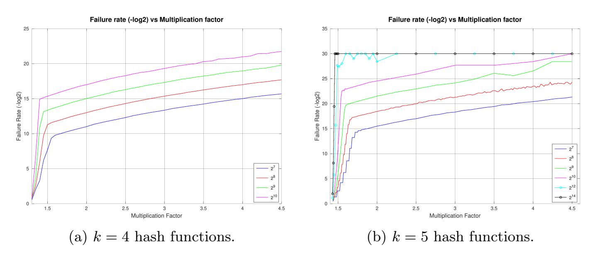

{0}------------------------------------------------

# <span id="page-0-0"></span>Is PSI Really Faster Than PSU? Achieving Efficient PSU with Invertible Bloom Filters

Lucas Piske<sup>1</sup> and Ni Trieu<sup>1</sup>

Arizona State University [lpiske,nitrieu]@asu.edu

Abstract. Private Set Union (PSU) enables two parties to compute the union of their private sets without revealing anything beyond the union itself. Existing PSU protocols remain much slower than private set intersection (PSI), often by a factor of around 30×.

In this work, we present the first PSU protocol based on Invertible Bloom Lookup Tables (IBLTs), introducing a fundamentally new framework that departs from traditional, inefficient approaches. Our protocol exploits structural invariants between each party's IBLTs and their union to compute the union efficiently without explicitly constructing a combined IBLT. Central to our approach is the notion of union peelability, which allows union elements to be recovered directly from the original IBLTs. We securely implement this functionality using only Oblivious Transfer (OT) and Oblivious Pseudorandom Function (OPRF) for equality checks, ensuring no information beyond the union is leaked.

As a result, for set sizes ranging from 2 <sup>14</sup> to 2 <sup>20</sup>, our protocol achieves a runtime of 0.08 to 2.95 seconds in the LAN setting, which is comparable to state-of-the-art PSI. We also show substantial speedups over prior PSU work—up to 10× faster in LAN settings and consistently faster in WAN scenarios—while maintaining linear computation and communication complexity with small constants.

### 1 Introduction

Private set union (PSU) is a fundamental cryptographic protocol that enables two parties to compute the union of their private sets while revealing nothing beyond the union itself – hiding the intersection and revealing only the union. PSU has diverse applications, including privacy-preserving identity management [5], collaborative cyber risk assessment through shared blacklists or vulnerability data [12], and private database joins across multiple sources [16]. It also supports association rule learning [15] and joint graph computations [4], enabling parties to combine information without revealing sensitive inputs.

There has recently been a substantial effort toward building an efficient and secure PSU. [16] introduced a practical oblivious transfer (OT)-based PSU framework secure against semi-honest adversaries, which has since inspired several follow-up optimizations [1, 9, 13, 14, 28, 29]. These works have significantly improved the efficiency of PSU in practice, pushing the state of the art forward. Nevertheless, a notable performance gap remains. Even the most recent PSU 

{1}------------------------------------------------

protocols require roughly 30 − 101 seconds in the LAN setting to handle sets of size 2 <sup>20</sup> [\[6,](#page-0-0) [13,](#page-0-0) [28\]](#page-0-0), which stands in stark contrast to private set intersection (PSI), where protocols now run in under one second at the same scale.

To pinpoint the source of this inefficiency, we revisit the popular PSU protocol proposed in the PI's work [\[16\]](#page-0-0), which has become the mainstream approach in subsequent PSU research [\[1,9,13,14,28,29\]](#page-0-0). The protocol consists of two phases:

- Reverse Private Membership Test (r-PMT): The receiver learns a bit b indicating the membership of each sender's element x in their own set Y . A key property of using r-PMT is that it hides the actual intersection: the receiver cannot determine which x yields b = 1 and which yields b = 0.
- Oblivious Transfer (OT): For each sender element, the sender inputs x, ⊥, where ⊥ is a predefined placeholder. The receiver uses the previously computed bit b as the choice bit in the OT protocol. Consequently, the receiver learns x if b = 0 (i.e., the element is not in their set), or ⊥ if b = 1.

The above step[1](#page-1-0) is repeated for each x in the sender's set X. By combining obtained results from OTs, the receiver learns the set difference X \Y and locally computes the union as X ∪ (X \ Y ).

The main performance bottleneck in the above protocol is the r-PMT step, which requires generic MPC to perform an equality check for each item in the sender's set. This makes PSU significantly less efficient than PSI, where such checks can be done without MPC since intersection items are revealed anyway. As a result, there is a substantial performance gap between PSU and both PSI and insecure union protocols.

This work eliminates the need for this costly comparison step. We propose a new direction that does not follow the traditional OT-based framework of [\[16\]](#page-0-0). Our approach leverages the Invertible Bloom Lookup Table (IBLT) [\[11\]](#page-0-0), a variant of the traditional Bloom filter [\[2\]](#page-0-0). While the IBLT supports all the standard Bloom filter operations, it also introduces new capabilities, most notably the List operation, which enables the enumeration of all inserted items.

When applying IBLT to PSU, a natural concern is the potentially large expansion factor of the IBLT compared to the original set size. Surprisingly, our experiments (see Section 7) – guided by the theoretical analysis in [\[11\]](#page-0-0) – show that the expansion factor is actually quite small (ranging from 1.5 to 4.5) to achieve a negligible false positive rate. This is in contrast to Bloom filter, which requires an expansion factor of about 60 to reach a similar level of accuracy. Moreover, we introduce an efficient way to perform the List operation on the private union using a single VOLE-based OPRF instance, which is significantly faster than computing the r-PMT inside MPC. Together, these techniques make IBLT-based PSU a practical and efficient solution. In summary, our contributions are:

– We introduce the first PSU protocol based on IBLTs. Unlike prior constructions that rely on heavy cryptographic primitives, our protocol requires only

<span id="page-1-0"></span><sup>1</sup> Existing protocols use hash-to-bin or oblivious shuffle techniques to improve performance.

{2}------------------------------------------------

- OT and a single VOLE-based OPRF instance, achieving linear communication and computation with small constants. The novelty lies in leveraging structural invariants between two IBLTs, IBLT<sup>0</sup> and IBLT1, and their union IBLT∪, enabling an efficient and lightweight design. To our knowledge, this is the first use of IBLTs in the context of private set operations.
- We take the first step toward understanding how to peel the union of two IBLTs without explicitly constructing the merged table. We identify five key structural properties that define the relationship between (IBLT0, IBLT1) and their union IBLT∪. Building on these properties, we design the uPeel function and its privacy-preserving variant, which enables peeling elements of IBLT<sup>∪</sup> directly from IBLT<sup>0</sup> and IBLT1. This abstraction is central to our PSU protocol, allowing for the efficient recovery of the union set without materializing IBLT∪, and we believe it may also have broader applications in secure set operations that require the efficient combination of private sets.
- We provide the first experimental results for IBLT parameters that achieve a negligible failure probability. The original IBLT work [\[11\]](#page-0-0) presents a theorem giving an asymptotic formula for the likelihood of the List operation succeeding, based on the tunable parameters used to instantiate the data structure. However, this theorem only provides an asymptotic estimate, which may differ from the actual success probability in practice. To the best of our knowledge, no efficiently computable function has been proven to give a tight bound on this probability. Following the approach of prior PSI works [\[19,20\]](#page-0-0), which rely on empirical experiments to estimate the success probability of encoding a Cuckoo Hash Table, we conduct an extensive set of experiments to evaluate the success probability of the List operation across a wide range of IBLT parameter settings. We present these results in this work, providing practical guidance for parameter selection and offering insights that may be useful for any future work requiring a reliable listing of elements encoded in an IBLT.
- We implement our proposed protocol and compare its performance against the most efficient state-of-the-art PSU protocols [\[13,](#page-0-0) [28,](#page-0-0) [29\]](#page-0-0) across multiple network settings and varying input set sizes. In the LAN setting, we observe runtime improvements from 10× to 15×, approaching the performance of the state-of-the-art PSI [\[1,](#page-0-0) [23\]](#page-0-0), which requires roughly a few seconds for input set sizes of 2 <sup>20</sup> under the same network setting. In the WAN setting with 200 Mbps bandwidth, improvements range from 2.32× to 4.86×, and for 50 Mbps WAN, gains range from 1.54× to 2.07×.

Enhanced PSU Functionality. Recent work [\[13\]](#page-0-0) introduces an "enhanced" PSU functionality, designed to prevent leakage in protocols that rely on hash-to-bin techniques for batched r-PMT and are vulnerable to "during-execution leakage." Our scheme, however, does not rely on r-PMT or hash-to-bin and therefore does not require this new functionality. Additionally, the notion of "during-execution leakage" refers to scenarios where an adversary gains extra information (e.g., the union size) before protocol completion, typically if a party aborts midcomputation. This concern is specific to the malicious setting. Since our work 

{3}------------------------------------------------

focuses on the semi-honest model, such leakage does not apply. We note that in our protocol, the receiver may learn union items incrementally, but in the semihonest setting, this does not count as "during-execution leakage." In Appendix C, we further discuss the enhanced PSU functionality and related work.

### 1.1 Technical Overview of Our Approach

Unlike Bloom filters, where duplicates can be easily handled by computing the secure bitwise OR across multiple filters (each representing a party's set), IBLTs require a more careful treatment to manage duplicate insertions. To address this, we first describe how to peel items from an IBLT, which serves as the foundation for handling duplicates. We then show how to implement this in a privacy-preserving manner

Peeling The Union Of Two IBLTs. Our method for computing the union of two sets using IBLTs builds on a detailed analysis of the structural properties of the original IBLTs and their union. Specifically, we consider three IBLTs—IBLT0, IBLT1, and IBLT∪—all constructed using the same parameters prm = (M, k, ℓ, H), where M is the number of bins, k is the number of hash functions, ℓ is the size of each bin, and H is the set of hash functions. The IBLT IBLT<sup>∪</sup> encodes the union of the elements stored in IBLT<sup>0</sup> and IBLT1.

We first observe that the peelability of a bin in IBLT<sup>∪</sup> can be determined solely from the counts and sums in the corresponding bins of IBLT<sup>0</sup> and IBLT1. We identify five exhaustive cases that describe all possible relationships between the counts in the two original IBLTs and their effect on the union IBLT:

- 1. A bin contains a single element in one IBLT and is empty in the other, making it trivially peelable in the union.
- 2. A bin contains exactly one element in each IBLT, but the elements are distinct, resulting in multiple elements in the union bin (not peelable).
- 3. A bin contains exactly one element in each IBLT, and the elements are identical, resulting in a peelable bin with that element preserved.
- 4. At least one of the original IBLTs has multiple elements in the bin, which guarantees multiple elements in the union bin (not peelable).
- 5. Both original bins are empty, leaving the union bin empty as well (not peelable).

Using these properties, we introduce the function uPeel: given a bin index (i, j) and the two original IBLTs (IBLT0, IBLT1), uPeel outputs the element stored in the corresponding union bin if it is peelable; otherwise, it returns ⊥. We then formalize the notion of union peelability, which captures the property that a union IBLT can be fully or partially peeled using only the original IBLTs. Our theorem 2 shows that, for union peelable triples, performing the standard Peel operation of the original IBLT on IBLT<sup>∪</sup> is equivalent to applying uPeel to (IBLT0, IBLT1).

{4}------------------------------------------------

The Secure Union-Peel Approach. We extend the uPeel function to a privacypreserving setting by defining the FUnionPeel functionality, which outputs only the result of uPeel and nothing else. Each party provides its own IBLTs along with the bin index (i, j). We then securely implement FUnionPeel, allowing both parties to recover the elements of the union directly from their respective IBLTs without explicitly constructing the union IBLT. The main challenge is ensuring that the peeling process reveals no information beyond the union set itself, particularly when bins contain different combinations of counts and sums.

To address this, we consider the five cases described above to determine the peelability of a bin. Some cases are straightforward—for example, when one table contains a single element and the other is empty, the element can be immediately recovered. Different cases require additional computation, such as secure equality testing, where both tables contain exactly one element and peeling succeeds only if the two elements are identical. In all remaining cases, the bin is deemed nonpeelable and contributes no recoverable element.

To securely implement these cases, we leverage efficient cryptographic building blocks: OT and an OPRF. The OT allows a party to obtain the correct candidate value for a union bin without revealing which case applies, whereas the OPRF is used to privately test equality when both tables contain one element. By carefully merging these tools into a single construction, we prevent any leakage about the underlying counts or non-union elements. For the special case where one table must provide its element to enable correct union peeling, we include an auxiliary OT to ensure that the element is revealed only when required and nothing more.

Finally, both parties obtain the union items by running this process in parallel across all bins. The concept of union peelability, which we formalize in this work, guarantees that for union-peelable triples (IBLT0, IBLT1, IBLT∪), our UnionPeel procedure produces the same results as applying the standard peeling algorithm to IBLT∪. This ensures correctness while maintaining efficiency and privacy.

## 2 Preliminaries

In this work, κ and λ denote the computational and statistical security parameters, and x||y denotes the concatenation of bit strings x and y. We use [, ·, ] notation for sets: [m] = {1, . . . , m}, [i, j] = {i, . . . , j}, and [a] × [b] = {(i, j) | i ∈ [a], j ∈ [b]}.

Oblivious Transfer (OT). An OT [\[22\]](#page-0-0) is a fundamental cryptographic primitive in which a sender holds two messages (m0, m1) and a receiver holds a choice bit c. The receiver learns m<sup>c</sup> without gaining any information about m1−c, while the sender learns nothing about c. In this work, we use the 1-out-of-N OT variant [\[3\]](#page-0-0), which generalizes 1-out-of-2 OT to a sender input vector (m0, . . . , mN−1) of length N ≥ 2. Additionally, we formalize the OT functionality such that each sender message can be from different domains. For example, the first message in the vector can have as its domain D<sup>0</sup> = {0, 1} <sup>∗</sup> as its domain, while the second has as its domain D<sup>1</sup> = ZM.

{5}------------------------------------------------

This minor property is necessary for one of our protocols, but note that we avoid explicitly defining the domains for the sake of simplicity of our protocol descriptions, and that the domains should be clear from context. Since the domains for each message are public functionality parameters, we can implement this functionality using a regular 1-oo-N OT parameter with all bit-string messages, choosing the bit-strings to be long enough so that they can encode all our domain elements. The formal definition of the 1-out-of-N OT functionality in question is as follows.

#### 1-out-of-N OT Ideal Functionality FOT<sup>N</sup> D

Parameters: We have two parties R and S, and the parameters N ∈ N and D = (D0, . . . , DN−1) is a vector of domain sets.

### Behavior:

- Wait for c ∈ Z<sup>N</sup> from R and (m0, . . . , mN−1) ∈ D<sup>0</sup> × · · · × DN−<sup>1</sup> from S.
- Give m<sup>c</sup> ∈ D<sup>c</sup> to R and ⊥ to S.

Fig. 1: The 1-out-of-N OT Functionality Description.

Oblivious Pseudorandom Function (OPRF). An OPRF is a two-party protocol where the sender S holds a secret key k for a PRF, and the receiver queries the function on inputs {x1, . . . , xn}. The receiver learns only the evaluations Fk(x1), . . . , Fk(xn), while S learns nothing about the receiver's inputs. A formal definition of the OPRF functionality follows.

### Ideal Functionality FOPRF

<span id="page-5-0"></span>Parameters: Two parties: sender S and receiver R, a PRF scheme F for domain D, and a query bound n ∈ N.

### Behavior:

- Wait for input ordered set X = {x1, . . . , xn} ⊆ D of size n from R.
- Sample a key k to the PRF F and give it to S.
- Give (Fk(x1), . . . , Fk(xn)) to R.

Fig. 2: The OPRF Functionality Description.

Private Set Union. We present the traditional PSU functionality, which is realized by our protocol ΠPSU and formally defined as follows. Note that this functionality does not account for "during-execution leakage," as we restrict our focus to the semi-honest setting; such leakage pertains to the malicious model [\[21\]](#page-0-0).

{6}------------------------------------------------

### Ideal Functionality $\mathcal{F}_{PSU}$

<span id="page-6-0"></span>**Parameters**: Two parties  $P_0$  and  $P_1$ ; the universe of input set elements  $\mathbb{Z}_M$ , where  $M \in \mathbb{N}^{\geq 2}$ ; the input set sizes  $n_0, n_1 \in \mathbb{N}$ .

#### Behavior:

- Wait for each party  $P_{b\in\{0,1\}}$  to provide an input set  $X_b\subseteq\mathbb{Z}_M$  of size  $n_b$ .
- Output  $X_{\cup} = X_0 \cup X_1$  to both parties.

Fig. 3: The PSU Functionality Description.

We emphasize that restricting the parties' input sets to subsets of  $\mathbb{Z}_M$  is primarily for simplifying the presentation of our constructions. This restriction can be relaxed to support more general input domains by introducing a one-to-one mapping from the desired domain into  $\mathbb{Z}_M$ . After obtaining the output from  $\mathcal{F}_{\mathsf{PSU}}$ , the parties can then apply the inverse of this mapping to recover the result in their original domain. Provided that M is chosen sufficiently large, this approach naturally extends to many practical domains, such as the set of bitstrings  $\{0,1\}^{\ell}$  for  $\ell > 0$ , as commonly considered in other PSU works.

## 3 A Revised Original IBLT Construction

Like a Bloom filter [2], an IBLT has m bins and k hash functions H to determine element placement. We use the IBLT variant from [11], which partitions the bins into k subtables of size  $\ell = m/k$ , with each hash function  $h_i : \mathcal{U} \to \mathbb{Z}_\ell$  mapping only to subtable i. This ensures no two hash functions map an element to the same position, a property assumed in the original theorems on algorithm failure. Each bin in this IBLT has two fields: a count field cnt storing a non-negative integer, and a sum field sum holding an element in  $\mathbb{Z}_M$ . These fields facilitate the insertion process. Unlike the original IBLT, we omit additional key-value fields, as they are unnecessary for our construction. For simplicity, we represent the IBLT using two  $k \times \ell$  matrices, sum and cnt, rather than m separate bins. Each row i corresponds to the subtable associated with hash function  $h_i$ , and all entries are initially set to zero.

To insert an element x into an IBLT, each hash function  $h_i \in H$  maps x to a position j in its corresponding subtable, forming pairs  $(i,j) \in [k] \times [\ell]$ . The element x is then added to  $\operatorname{sum}_{i,j}$  modulo M, and  $\operatorname{cnt}_{i,j}$  is incremented by one, tracking the number of elements in that position. Unlike the original XOR-based scheme [11], using modular addition simplifies presentation without affecting functionality. In this work, we assume IBLTs are instantiated and populated in a single step. To formalize this, we define an Encode function (Algorithm 1) that initializes the IBLT and inserts all elements of a given set X at once. The IBLT parameters, such as k and  $\ell$ , are provided as inputs; their selection is detailed in Section 7.

{7}------------------------------------------------

### **Algorithm 1:** $Encode_{prm}(X)$

```
Input: M \in \mathbb{N}^{\geq 2}, \ell, k \in \mathbb{N}, X \subseteq \mathcal{U}, and H = \{h_i : \mathcal{U} \to \mathbb{Z}_\ell\}_{i \in [k]}, where \mathsf{prm} = (M, k, \ell, H).

Set all components of \mathsf{sum} \in \mathbb{Z}_M^{k \times \ell}, \mathsf{cnt} \in \mathbb{Z}^{k \times \ell} as zero.

Set Q \leftarrow \{(x, i, h_i(x)) \mid i \in [k] \land x \in X\}.

Set \mathsf{sum}_{i,j} \leftarrow \mathsf{sum}_{i,j} + x \pmod{M} for every (x, i, j) \in Q.

Set \mathsf{cnt}_{i,j} \leftarrow \mathsf{cnt}_{i,j} + 1 for every (x, i, j) \in Q.

Output \mathsf{IBLT} = (\mathsf{sum}, \mathsf{cnt}, M, k, \ell, H).
```

Deleting an element x from an IBLT mirrors insertion, except x is subtracted from  $\mathsf{sum}_{i,j}$  and  $\mathsf{cnt}_{i,j}$  is decremented. To handle multiple deletions, we define the DeleteSet algorithm (Algorithm 2), which applies this procedure to each element in the input set X.

## Algorithm 2: DeleteSet(IBLT, X)

```
Input: IBLT = (sum, cnt, M, k, \ell, H = \{h_i : \mathcal{U} \to [\ell]\}_{i \in [k]}) and X \subseteq \mathcal{U}
Set Q \leftarrow \{(x, i, h_i(x)) \mid i \in [k] \land x \in X\}.
Set \text{sum}_{i,j} \leftarrow \text{sum}_{i,j} - x \pmod{M} for every (x, i, j) \in Q.
Set \text{cnt}_{i,j} \leftarrow \text{cnt}_{i,j} - 1 for every (x, i, j) \in Q.
Output IBLT' = (sum, cnt, M, k, \ell, H).
```

The final operation is the listing procedure. Iteratively, it searches for a **pee-lable** bin (i,j) with  $\mathtt{cnt}_{i,j} = 1$  and **peels off**  $\mathtt{sum}_{i,j}$  by adding it to the output set and deleting it from the IBLT. This process is repeated until no peelable bin remains—i.e., no entry  $\mathtt{cnt}_{i,j} = 1$  exists in the structure. For clarity and later use, we formally define the Peel function in Definition 1 and present a detailed listing algorithm as Algorithm 3.

**Definition 1.** Let  $prm = (M, k, \ell, H)$  where  $k, \ell \in \mathbb{N}$ ,  $M \in \mathbb{N}^{\geq 2}$  and  $H = \{h_i : \mathcal{U} \to [\ell]\}_{i \in [k]}$  be a family of hash functions. Let  $\mathit{IBLT} \leftarrow \mathit{Encode}_{prm}(X)$ , where  $X \subseteq \mathcal{U}$ . Let  $i \in [k]$  and  $j \in [\ell]$ . We define the Peel function in the following way:

$$\textit{Peel(IBLT}, i, j) = \begin{cases} \text{sum}_{i,j} & \textit{if } cnt_{i,j} = 1 \ \bot, & \textit{otherwise} \end{cases}$$

{8}------------------------------------------------

### Algorithm 3: List(IBLT)

```
Input: IBLT = (sum, cnt, M, k, ℓ, H)
Set t ← 0.
Set IBLT(0) ← (sum, cnt, M, k, ℓ, H).
Set Q(0) ← {(i, j) | i ∈ [k] ∧ j ∈ [ℓ]}.
while Q(t) ̸= ∅ do
   Parse IBLT(t)
                   as (sum(t)
                             , cnt(t)
                                     , M, k, ℓ, H).
   Set V
          (t) ← { Peel(sum, cnt, i, j) | (i, j) ∈ Q(t) } \ ⊥.
   Execute IBLT(t+1) ← DeleteSet(IBLT(t)
                                              , V (t)
                                                    ).
   Set Q(t+1) ← { (i, hi(v)) | i ∈ [k] ∧ v ∈ V
                                                 (t) }.
   Increment t by 1.
end
Output V = V
                 (0) ∪ · · · ∪ V
                              (t−1)
                                   .
```

Our listing procedure differs from [\[11\]](#page-0-0) in two key ways, which were not clearly described in [\[11\]](#page-0-0). First, we examine all positions in the set Q(t) in each iteration to identify peelable bins and delete them together, rather than deleting immediately upon discovery. Second, in subsequent iterations, we only check positions that were modified in the previous round, thereby avoiding a full IBLT scan. This optimization is natural and efficient, as unmodified, non-peelable positions remain non-peelable.

The IBLT data structure ensures that all encoded elements can be successfully listed with high probability. In [\[11\]](#page-0-0), the authors analyze this probability and formally prove the following theorem:

Theorem 1. [\[11\]](#page-0-0) Let m = k · ℓ be the bin count, τ be the threshold amount of elements that will be encoded as part of the IBLT, and n be the number of elements encoded as part of the IBLT. As long as m is chosen such that m > (c<sup>k</sup> + ε) · τ for some ε > 0, List fails with probability O(τ <sup>−</sup>k+2) whenever n ≤ t. Here, the values of c<sup>k</sup> are given by

$$c_k^{-1} = \sup \left\{ \alpha \colon 0 < \alpha < 1; \forall x \in (0, 1), 1 - e^{-k\alpha x^{k-1}} < x \right\}$$

The original work also provides lower bounds on the expansion rate in terms of c<sup>k</sup> for specific values of k (e.g., c<sup>4</sup> = 1.295, c<sup>5</sup> = 1.425), but the theorem gives only an asymptotic success probability for listing, not an exact formula for concrete parameters. In practice, the actual failure probability could differ. However, as shown in our experiments (Section 7), with an appropriate expansion rate (1.5-4.5), the failure probability becomes negligible—approximately 2 −λ , where λ denotes the security parameter.

## 4 Peeling The Union Of Two IBLTs

This section investigates the peeling relationship between individual IBLTs and their union in the plaintext setting. We present and formalize five properties for 

{9}------------------------------------------------

a group of IBLTs (IBLT0, IBLT1, IBLT∪), all defined with the same parameters prm = (M, k, ℓ, H), where IBLT<sup>∪</sup> encodes the union of the elements from IBLT<sup>0</sup> and IBLT1. These cases, introduced in Section 1.1, precisely characterize when a bin in the union IBLT is peelable and specify the corresponding sum and count values. For example, case (1) captures the situation where only one IBLT contains an item at position (i, j); in this case, the union's count is 1, and its sum equals the value from that IBLT. An example illustrating all cases is provided in Appendix D. Formally,

```
(1) ∃b ∈ {0, 1}, cntb,i,j = 1 ∧ cnt1−b,i,j = 0 =⇒ cnt∪,i,j = 1 ∧ sum∪,i,j = sumb,i,j
```

- (2) cnt0,i,j = cnt1,i,j = 1 ∧ sum0,i,j ̸= sum1,i,j =⇒ cnt<sup>∪</sup>,i,j > 1
- (3) cnt0,i,j = cnt1,i,j = 1 ∧ sum0,i,j = sum1,i,j =⇒ cnt<sup>∪</sup>,i,j = 1 ∧ sum<sup>∪</sup>,i,j = sum0,i,j
- (4) cnt0,i,j > 1 ∨ cnt1,i,j > 1 =⇒ cnt<sup>∪</sup>,i,j > 1
- (5) cnt0,i,j = cnt1,i,j = 0 =⇒ cnt<sup>∪</sup>,i,j = 0

Note that each bin belongs to exactly one of these categories, and together, these five cases cover all possible combinations of cnt0,i,j and cnt1,i,j . The structural relationships between these IBLTs are fundamental to our private set union protocol. Collectively, these cases allow us to determine whether a bin (i, j) of IBLT<sup>∪</sup> is peelable using only (IBLT0, IBLT1). Moreover, when a bin is peelable, they identify the element stored in (i, j) of IBLT∪, which is the sum value. Building on this, we define the function uPeel in Definition 2, which takes (IBLT0, IBLT1) and a bin index (i, j) as input and outputs the element in IBLT<sup>∪</sup> at the same bin if such a bin is peelable, or ⊥ otherwise.

Definition 2. Let prm = (M, k, ℓ, H) where k, ℓ ∈ N, M ∈ N <sup>≥</sup><sup>2</sup> and H = {h<sup>i</sup> : U → [ℓ]}i∈[k] be a family of hash functions. Let IBLT<sup>0</sup> ← Encodeprm(X0) and IBLT<sup>1</sup> ← Encodeprm(X1), where X0, X<sup>1</sup> ⊆ U. We define the function uPeel in the following way:

$$\textit{uPeel(IBLT}_0, \textit{IBLT}_1, i, j) = \begin{cases} \operatorname{sum}_{0,i,j} & \textit{if } \textit{cnt}_{0,i,j} = 1 \land \textit{cnt}_{1,i,j} = 0 \\ \operatorname{sum}_{1,i,j} & \textit{if } \textit{cnt}_{0,i,j} = 0 \land \textit{cnt}_{1,i,j} = 1 \\ \operatorname{sum}_{0,i,j} & \textit{if } \textit{cnt}_{0,i,j} = 1 \land \textit{cnt}_{1,i,j} = 1 \land \operatorname{sum}_{0,i,j} = \operatorname{sum}_{1,i,j} \\ \bot, & \textit{otherwise} \end{cases}$$

Using uPeel together with Definition 1 of Peel, we formalize union peelability for the three IBLTs {IBLT0, IBLT1, IBLT∪} in Definition 3.

Definition 3. Let prm = (M, k, ℓ, H) where k, ℓ ∈ N, M ∈ N <sup>≥</sup><sup>2</sup> and H = {h<sup>i</sup> : U → [ℓ]}i∈[k] be a family of hash functions. Let X0, X<sup>1</sup> ⊆ U and define X<sup>∪</sup> = X<sup>0</sup> ∪ X1. We say

$$\{\mathit{IBLT}_0, \mathit{IBLT}_1 \ \mathit{and} \ \mathit{IBLT}_{\cup}\} \ \mathit{are} \ \mathit{union} \ \mathit{peelable}$$

if the following holds:

$$\mathit{IBLT}_0 \leftarrow \mathit{Encode}_{\mathtt{prm}}(X_0), \mathit{IBLT}_1 \leftarrow \mathit{Encode}_{\mathtt{prm}}(X_1), \mathit{IBLT}_{\cup} \leftarrow \mathit{Encode}_{\mathtt{prm}}(X_{\cup}).$$

{10}------------------------------------------------

We present Theorem 2, which states that for union peelable IBLTs {IBLT0, IBLT1, IBLT∪}, the values of Peel(IBLT∪, i, j) and uPeel(IBLT0, IBLT1, i, j) are the same. Thus, uPeel can be used to evaluate Peel(IBLT∪, i, j), without constructing the union IBLT. We provide a formal proof of this theorem in Appendix E.1.

Theorem 2. Let prm = (M, k, ℓ, H) where k, ℓ ∈ N, M ∈ N <sup>≥</sup><sup>2</sup> and H = {h<sup>i</sup> : U → [ℓ]}i∈[k] be a family of hash functions. If {IBLT0, IBLT<sup>1</sup> and IBLT∪} are union peelable for IBLT parameters prm = (M, k, ℓ, H), then

$$\textit{Peel}(\textit{IBLT}_{\cup}, i, j) = \textit{uPeel}(\textit{IBLT}_0, \textit{IBLT}_1, i, j)$$

## 5 Union Peel Protocol

### 5.1 Ideal Functionality

### Ideal Functionality FUnionPeel

### Parameters:

- Two parties, P<sup>0</sup> and P1.
- The same public set Q ⊆ [k] × [ℓ].
- Let prm = (k, ℓ, M, H), where ℓ, k ∈ N and M ∈ N ≥2 .
- Let H = {h<sup>i</sup> : Z<sup>M</sup> → [ℓ]}i∈[k] be a family of hash functions.

### Behavior:

- Wait for each party Pb∈{0,1} to input an IBLT IBLT<sup>b</sup> with parameters prm.
- Compute vi,j ∈ (Z<sup>M</sup> ∪ ⊥) for each (i, j) ∈ Q, such that:

$$v_{i,j} = \mathsf{uPeel}(\mathsf{IBLT}_0, \mathsf{IBLT}_1, i, j)$$

– Output T = { (vi,j , i, j) | (i, j) ∈ Q } to both parties.

Our PSU protocol closely follows the listing algorithm of the original IBLT. Therefore, in this section, we introduce a new functionality called Union Peel, which enables both parties to peel each union item in an oblivious and secure manner. This functionality, denoted as FUnionPeel, is defined as above. It specifies that each party Pb∈{0,1} learns the value vi,j for every (i, j) ∈ Q, where Q is a public parameter of the functionality, and each vi,j is computed as defined by uPeel in Definition 2, as detailed below.

<span id="page-10-0"></span>
$$\begin{split} v_{i,j} &= \mathsf{uPeel}(\mathsf{IBLT}_0, \mathsf{IBLT}_1, i, j) \\ &= \begin{cases} \mathsf{sum}_{0,i,j} & \text{if } \mathsf{cnt}_{0,i,j} = 1 \wedge \mathsf{cnt}_{1,i,j} = 0 \\ \mathsf{sum}_{1,i,j} & \text{if } \mathsf{cnt}_{0,i,j} = 0 \wedge \mathsf{cnt}_{1,i,j} = 1 \\ \mathsf{sum}_{0,i,j} & \text{if } \mathsf{cnt}_{0,i,j} = 1 \wedge \mathsf{cnt}_{1,i,j} = 1 \wedge \mathsf{sum}_{0,i,j} = \mathsf{sum}_{1,i,j} \\ \bot, & \text{otherwise} \end{cases} \end{split}$$

At first glance, one might worry that this functionality leaks information. However, this is not the case in the context of our PSU protocol, which invokes this functionality, given that the union of the input sets is revealed at the end. To 

{11}------------------------------------------------

understand exactly what the values vi,j reveal about party P1−b's input IBLT1−<sup>b</sup> to party Pb, we examine the definition of uPeel under different conditions on Pb's input IBLTb. Specifically, for each (i, j) ∈ Q, we analyze what P<sup>b</sup> learns about P1−b's input IBLT1−<sup>b</sup> in three cases based on the value of cntb,i,j : when cntb,i,j = 0, when cntb,i,j = 1, and when cntb,i,j > 1. We go through these cases in order of increasing complexity:

- Case 1: cntb,i,j > 1. This is the simplest case. According to Equation [\(1\)](#page-10-0), whenever cntb,i,j > 1, the value of vi,j is always ⊥ for every (i, j) ∈ Q, regardless of the other party's input. This means that P<sup>b</sup> gains no information about IBLT1−<sup>b</sup> from vi,j in this case.
- Case 2: cntb,i,j = 0. In this case, Equation [\(1\)](#page-10-0) shows that vi,j can take only two possible values: sum1−b,i,j or ⊥, where sum1−b,i,j is always a valid message and therefore never ⊥. Given this characteristic, player P<sup>b</sup> can learn whether cnt1−b,i,j = 1 by checking if vi,j ̸= ⊥, if it is the case, then P<sup>b</sup> can be sure that cnt1−b,i,j = 1. Additionally, when vi,j ̸= ⊥, party P<sup>b</sup> also learns the value of sum1−b,i,j , which is an element of P1−<sup>b</sup> that is not elementof Pb. Given the fact that sum1−b,i,j is an element that is not in the intersection of the two parties' input sets, the information learned by P<sup>b</sup> does not constitute leakage in the context of our PSU protocol.
- Case 3: cntb,i,j = 1. In this case, only three of the conditions in Equation [\(1\)](#page-10-0) are applicable, and the possible values for vi,j are limited to sumb,i,j and ⊥. Since sumb,i,j is a known value to party P<sup>b</sup> and distinct from ⊥, the only information P<sup>b</sup> learns from vi,j is whether cnt1−b,i,j > 1. Specifically, if vi,j = ⊥, it indicates that cnt1−b,i,j > 1; otherwise, no new information is revealed. In other words, when vi,j is not ⊥, party P<sup>b</sup> cannot distinguish between the cases where cnt1−b,i,j = 1 and cnt1−b,i,j = 0. This means that P<sup>b</sup> cannot determine whether the sum originates solely from its own input IBLT<sup>b</sup> or if there is also a contribution from IBLT1−<sup>b</sup> with cnt1−b,i,j = 1. This indistinguishability is essential for hiding the intersection items in our PSU protocol.

## 5.2 Technical Overview of the Protocol

The functionality FUnionPeel specifies that both parties should receive the output (vi,j , i, j) for each (i, j) ∈ Q, where

$$v_{i,j} = \mathsf{uPeel}(\mathsf{IBLT}_0, \mathsf{IBLT}_1, i, j) \text{ for every } (i, j) \in Q.$$

To simplify the explanation, we will focus on computing vi,j for a single pair (i, j) ∈ Q. The same procedure can be executed in parallel for all other (i, j) pairs to realize the full functionality FUnionPeel. Throughout most of this overview, we focus on constructing the protocol from the perspective of party P1, ensuring it correctly obtains vi,j as output. We defer the discussion of P0's output until the end, as it is straightforward to handle in the semi-honest setting: P<sup>1</sup> can simply send the result to P0.

{12}------------------------------------------------

### Protocol $\Pi_{\mathsf{UnionPeel}}$

### <span id="page-12-0"></span>PARAMETERS:

- Two parties,  $P_0$  and  $P_1$ , with inputs from a universe  $\mathcal{U}$  of possible elements.
- The same public set  $Q \subseteq [k] \times [\ell]$ .
- Let IBLT be an Invertible Bloom Lookup Table with parameters  $(k, \ell, M, H)$ , where  $\ell, k \in \mathbb{N}$  and  $M \in \mathbb{N}^{\geq 2}$  is sufficiently large as defined in Section 7.
- Let  $H = \{h_i : \mathcal{U} \to [\ell]\}_{i \in [k]}$  be a family of functions.
- An OPRF and OT functionalities described in Section 2.

**INPUT:** Each  $P_{b \in \{0,1\}}$  provides an  $\mathsf{IBLT}_b$  with parameters  $\mathsf{prm} = (k, \ell, M, H)$ .

#### PROTOCOL:

1. For each  $(i,j) \in Q$ , run a 1-out-of-2 OT where  $P_0$  is the receiver and  $P_1$  is the sender.  $P_0$  inputs the choice bit  $c_{i,j} \stackrel{?}{=} [\mathsf{cnt}_{0,i,j} = 0]$  and  $P_1$  inputs the message pair  $m_{i,j}$  described below. As a result,  $P_0$  obtains an element  $f_{i,j} \in (\mathbb{Z}_M \cup \bot)$ .

<span id="page-12-1"></span>
$$m_{i,j,0} = \bot$$
 and  $m_{i,j,1} = \begin{cases} \operatorname{sum}_{1,i,j}, & \text{if } \operatorname{cnt}_{1,i,j} = 1 \\ \bot, & \text{otherwise.} \end{cases}$  (2)

- 2. For each  $(i,j) \in Q$ , execute an OPRF where the receiver  $P_1$  queries the point  $z_{i,j} = \operatorname{sum}_{1,i,j}$  if  $\operatorname{cnt}_{1,i,j} = 1$ , and  $z_{i,j} = \bot$  otherwise. As a result,  $P_0$  obtains the PRF key  $k_{i,j}$  and  $P_1$  receives the PRF value  $y_{i,j} = F_{k_{i,j}}(z_{i,j})$ .
- 3. For each  $(i,j) \in Q$ ,  $P_0$  locally samples a random  $r_{i,j}$  and computes  $u_{i,j}$  such that

<span id="page-12-2"></span>
$$u_{i,j} = \begin{cases} F_{k_{i,j}}(\operatorname{sum}_{0,i,j}), & \text{if } \operatorname{cnt}_{0,i,j} = 1\\ F_{k_{i,j}}(f_{i,j}), & \text{if } \operatorname{cnt}_{0,i,j} = 0 \land f_{i,j} \neq \bot\\ r_{i,j}, & \text{otherwise.} \end{cases}$$
(3)

4. For each  $(i,j) \in Q$ , execute a 1-out-of-3 OT with  $P_0$  as the sender and  $P_1$  as the receiver, where  $P_1$  inputs the selection bit  $d_{i,j}$  and  $P_0$  inputs the message vector  $\boldsymbol{w}_{i,j}$ , both described below. As a result,  $P_1$  obtains an element  $g_{i,j} \in (\mathbb{Z}_M \cup \bot)$ .

<span id="page-12-3"></span>
$$d_{i,j} = \begin{cases} \operatorname{cnt}_{1,i,j}, & \text{if } \operatorname{cnt}_{1,i,j} \in \{0,1\} \\ 2, & \text{otherwise} \end{cases}$$

$$(4)$$

<span id="page-12-4"></span>
$$w_{i,j,0} = \begin{cases} \operatorname{sum}_{0,i,j}, & \text{if } \operatorname{cnt}_{0,i,j} = 1\\ \bot, & \text{otherwise.} \end{cases} \quad \text{and} \quad w_{i,j,1} = u_{i,j} \quad \text{and} \quad w_{i,j,2} = \bot \quad (5)$$

5. For each  $(i,j) \in Q$ ,  $P_1$  computes locally  $v_{i,j}$  as

<span id="page-12-5"></span>
$$v_{i,j} = \begin{cases} \operatorname{sum}_{1,i,j}, & \text{if } d_{i,j} = 1 \land g_{i,j} = y_{i,j} \\ \bot, & \text{if } d_{i,j} = 1 \land g_{i,j} \neq y_{i,j} \\ g_{i,j}, & \text{otherwise} \end{cases}$$

$$(6)$$

- 6.  $P_1$  sends  $V = \{ (v_{i,j}, i, j) \mid (i, j) \in Q \}$  to  $P_0$ .
- 7. Both parties output V.

Fig. 4: Our UnionPeel Protocol.

{13}------------------------------------------------

Let (i, j) ∈ Q. Our approach begins by developing simple protocols tailored to specific assumptions about the values of cnt0,i,j and cnt1,i,j . After addressing these individual cases, we show how to combine them into a single, unified protocol that handles all relevant scenarios. Our approach proceeds as follows:

- 1. Design a protocol for the case where cnt1,i,j = 0 ∨ cnt1,i,j > 1. This corresponds to conditions 1 and 4 in Equation [\(1\)](#page-10-0) for computing vi,j .
- 2. Design a protocol for the case where cnt0,i,j ≥ 1 ∧ cnt1,i,j = 1. This corresponds to conditions 3 and 4 in Equation [\(1\)](#page-10-0) for computing vi,j .
- 3. Merge the above two protocols into a single protocol that handles both cases.
- 4. Extend the protocol to also support the case cnt0,i,j = 1 ∧ cnt1,i,j = 0, corresponding to the second condition in Equation [\(1\)](#page-10-0).
- 5. Adapt the protocol so both parties receive the output.

(Draft) Subprotocol 1. According to the definition of the uPeel function, when cnt1,i,j = 0, we have vi,j = sum0,i,j if cnt0,i,j = 1, and vi,j = ⊥ otherwise. In contrast, when cnt1,i,j > 1, the definition mandates that vi,j = ⊥, regardless of the value of cnt0,i,j . Both cases can be handled using a single 1-out-of-2 OT.

Specifically, we configure the OT with P<sup>0</sup> as the sender and P<sup>1</sup> as the receiver, since sum0,i,j is held by P<sup>0</sup> and P<sup>1</sup> is the intended recipient of vi,j . In this setup, P<sup>0</sup> inputs a pair of messages (wi,j,0, wi,j,1), and P<sup>1</sup> inputs a choice bit di,j . The OT ensures that P<sup>1</sup> receives wi,j,di,j = vi,j as output. We define the OT inputs as follows:

- Receiver's choice bit: di,j = ( 0, if cnt1,i,j = 0 1, otherwise
- Sender's OT messages:

$$w_{i,j,0} = \begin{cases} \mathtt{sum}_{0,i,j}, & \text{if } \mathtt{cnt}_{0,i,j} = 1 \\ \bot, & \text{otherwise} \end{cases} \quad \text{and} \quad w_{i,j,1} = \bot$$

Given these definitions, it is straightforward to verify that the OT output gi,j exhibits the desired behavior when cnt1,i,j = 0 ∨ cnt1,i,j > 1.

(Draft) Subprotocol 2. Next, we address step 2 of our outline by designing a protocol for the case where cnt0,i,j ≥ 1 and cnt1,i,j = 1.

When cnt0,i,j > 1, the definition of uPeel dictates that, regardless of cnt1,i,j , the output is always vi,j = ⊥. In the case where both cnt0,i,j = 1 and cnt1,i,j = 1, the output of uPeel is sum0,i,j if and only if sum0,i,j = sum1,i,j ; otherwise, it is ⊥. Since this requires checking whether sum0,i,j equals sum1,i,j , we begin this step by employing an OPRF-based equality test protocol.

First, the two parties engage in an OPRF protocol, where the receiver P<sup>1</sup> obliviously queries the point sum1,i,j . As a result, P<sup>1</sup> obtains yi,j = Fk(sum1,i,j ), while the sender P<sup>0</sup> obtains the PRF key k. After receiving k, P<sup>0</sup> computes ui,j = Fk(sum0,i,j ). The P<sup>0</sup> then sends to P<sup>1</sup> the value ui,j if cnt0,i,j = 1, or a random value ui,j if cnt0,i,j > 1. Finally, P<sup>1</sup> outputs

{14}------------------------------------------------

$$v_{i,j} = \begin{cases} \operatorname{sum}_{1,i,j}, & \text{if } u_{i,j} = y_{i,j} \\ \bot, & \text{otherwise} \end{cases}$$

With overwhelming probability, we have ui,j = yi,j if and only if sum0,i,j = sum1,i,j , ensuring that the protocol exhibits the desired behavior. We note that P<sup>1</sup> learns the result of the equality test directly. However, this does not pose a problem under our assumption that the conditions cnt0,i,j ≥ 1 and cnt1,i,j = 1 are already known.

(Main) Subprotocol 3. In this protocol, we aim to merge the two previously described protocols into a single protocol that correctly handles both cases simultaneously. A naive approach—executing one of the two protocols based on the values of cnt0,i,j and cnt1,i,j—would leak information about cnt<sup>0</sup> and cnt1, which we want to avoid. Similarly, running both protocols in parallel and allowing P<sup>1</sup> to choose which output to use based on cnt1,i,j and the equality check would reveal more information to P<sup>1</sup> than is allowed.

To avoid these issues, we proceed as follows: the parties execute the second protocol, but with a crucial modification—P<sup>0</sup> does not directly send the PRF output ui,j to P1. Instead, P<sup>0</sup> embeds ui,j as one of the inputs in a 1-out-of-3 OT. The other two messages in this OT are constructed following the same approach as in the first protocol. This way, P<sup>1</sup> learns only the correct output without gaining additional information about the underlying counts.

In more detail, this merged protocol begins with the two parties executing the OPRF primitive. Party P<sup>0</sup> acts as the sender, while the receiver P<sup>1</sup> queries the point sum1,i,j if cnt1,i,j = 1, and a random point otherwise. Querying a random point when cnt1,i,j ̸= 1 ensures that no meaningful information is leaked from the OPRF queries.

Once both parties receive their respective outputs from the OPRF, they proceed to execute a single 1-out-of-3 OT, with P<sup>0</sup> as the sender and P<sup>1</sup> as the receiver. The OT input is determined by the selection index di,j and a vector of message wi,j = (wi,j,0, wi,j,1, wi,j,2), defined as follows:

$$d_{i,j} = \begin{cases} 0, & \text{if } \mathsf{cnt}_{1,i,j} = 0\\ 1, & \text{if } \mathsf{cnt}_{1,i,j} = 1\\ 2, & \text{othwerwise} \end{cases}$$

$$w_{i,j,0} = \begin{cases} \mathtt{sum}_{0,i,j}, & \text{if } \mathtt{cnt}_{0,i,j} = 1 \\ \bot, & \text{otherwise} \end{cases}, \quad w_{i,j,1} = \begin{cases} F_k(\mathtt{sum}_{0,i,j}), & \text{if } \mathtt{cnt}_{0,i,j} = 1 \\ r, & \text{otherwise} \end{cases}, \quad w_{i,j,2} = \bot$$

Here, r is a uniformly random element sampled by P0. Observe that when cnt1,i,j = 0∨cnt1,i,j > 1, the output of the 1-out-of-3 OT matches the value that P<sup>1</sup> would receive when executing the first protocol under the same conditions. Similarly, when cnt1,i,j = 1 ∧ cnt0,i,j ≥ 1, the OT output gi,j = wi,j,<sup>1</sup> received by P<sup>1</sup> corresponds exactly to the PRF value ui,j that P<sup>1</sup> would receive in the second protocol. This enables P<sup>1</sup> to compare gi,j against yi,j = Fk(sum1,i,j ) and 

{15}------------------------------------------------

output the same result as specified in the second protocol. In a later section, we will modify the protocol to ensure that revealing the result of the equality check to P<sup>1</sup> does not leak any additional information, including whether sum1,i,j belongs to the intersection.

(Main) Subprotocol 4. As we have shown, this third protocol correctly outputs the intended value to P<sup>1</sup> for all combinations of cnt0,i,j and cnt1,i,j , except in the case where cnt0,i,j = 0 ∧ cnt1,i,j = 1. This corresponds to the second condition in Equation [\(1\)](#page-10-0). To extend the protocol to support this remaining case, we can modify how P<sup>0</sup> computes wi,j,<sup>1</sup> by replacing it with the following expression:

<span id="page-15-0"></span>
$$w_{i,j,1} = \begin{cases} F_k(\operatorname{sum}_{1,i,j}), & \text{if } \operatorname{cnt}_{0,i,j} = 0\\ F_k(\operatorname{sum}_{0,i,j}), & \text{if } \operatorname{cnt}_{0,i,j} = 1\\ r, & \text{otherwise} \end{cases}$$

$$(7)$$

Now, consider the case where cnt0,i,j = 0 ∧ cnt1,i,j = 1. In this situation, P<sup>1</sup> receives the OT output as gi,j = wi,j,<sup>1</sup> = Fk(sum1,i,j ), which matches the evaluation of the point sum1,i,j it previously queried in the OPRF. Consequently, P<sup>1</sup> correctly outputs sum1,i,j , as required.

The challenge with this approach is that P<sup>0</sup> does not know the value of sum1,i,j , which it needs in order to compute Fk(sum1,i,j ) and set wi,j,<sup>1</sup> correctly. Fortunately, this can be resolved with a single additional 1-out-of-2 OT. According to the definition of uPeel, when cnt0,i,j = 0 ∧ cnt1,i,j = 1, both parties are supposed to learn sum1,i,j . This allows us to let P<sup>0</sup> learn sum1,i,j before executing the 1-out-of-3 OT.

To achieve this, the two parties first execute a 1-out-of-2 OT where P<sup>0</sup> acts as the receiver and P<sup>1</sup> as the sender. In this OT, P<sup>0</sup> provides a choice bit ci,j , and P<sup>1</sup> provides a message vector mi,j , such that:

$$c_{i,j} = \begin{cases} 0, & \text{if } \mathtt{cnt}_{0,i,j} = 0 \ 1, & \text{otherwise} \end{cases}$$
  $m_{i,j,0} = \begin{cases} \mathtt{sum}_{1,i,j}, & \text{if } \mathtt{cnt}_{1,i,j} = 1 \ \bot, & \text{otherwise} \end{cases}$  and  $m_{i,j,1} = \bot$ 

By inspecting these equations, it is straightforward to see that P<sup>0</sup> receives sum1,i,j as the output of the 1-out-of-2 OT if cnt0,i,j = 0∧cnt1,i,j = 1, and ⊥ otherwise. This allows P<sup>0</sup> to compute the correct value of wi,j,<sup>1</sup> as described previously. As a result, the protocol ensures that P<sup>1</sup> receives the correct output vi,j for every possible combination of cnt0,i,j and cnt1,i,j .

At this point, we highlight an important note regarding the security implications of P<sup>1</sup> learning the result of the equality check. From Equation [\(1\)](#page-10-0), we observe that the first condition corresponds to the case where only P<sup>0</sup> possesses the item sum0,i,j . This fact is already revealed by the union output, so P<sup>1</sup> learning this outcome does not result in additional leakage.

{16}------------------------------------------------

However, it is crucial to distinguish between the second and third conditions in Equation [\(1\)](#page-10-0). The second condition indicates that only P<sup>1</sup> holds the item sum1,i,j , while the third condition implies that both P<sup>0</sup> and P<sup>1</sup> hold the same item—i.e., it is an intersection item. Therefore, revealing whether sum0,i,j = sum1,i,j could leak intersection membership and must be handled with care.

Fortunately, after the 1-out-of-2 OT, P<sup>0</sup> learns sum1,i,j in the case where cnt0,i,j = 0 ∧ cnt1,i,j = 1. Thus, if sum0,i,j = sum1,i,j , the two branches in Equation [\(7\)](#page-15-0)—namely, when cnt0,i,j = 0 and cnt0,i,j = 1—yield the same value, Fk(sum1,i,j ). As a result, the equality check succeeds in both cases without revealing which of the two conditions in Equation [\(1\)](#page-10-0) is satisfied, preserving privacy with respect to intersection membership.

(Main) Subprotocol 5. Since the functionality FUnionPeel outputs (vi,j , i, j) to both parties and we are operating in the semi-honest setting, party P<sup>1</sup> can simply send all (vi,j , i, j) values to P<sup>0</sup> in the clear. In addition to these values, P<sup>0</sup> also learns the outputs of the 1-out-of-2 OTs. However, as previously noted in Section 5.1, the information revealed by the OT outputs is already captured by the corresponding (vi,j , i, j) values. At the same time, no additional information is leaked. Party P<sup>0</sup> doesn't learn anything new from the 1-out-of-3 OTs since it always plays the sender when executing this primitive. Regarding the zi,j values also output by FUnionPeel, we have already discussed in Section 5.1 that these can be computed locally using the vi,j values along with either party's own inputs. Therefore, we do not revisit this aspect here.

### 5.3 Protocol Description in Detail

We now detail the protocol step by step, as shown in Figure [4.](#page-12-0) The two parties begin by executing |Q| instances of the 1-out-of-2 OT primitive, with one instance for each (i, j) ∈ Q. In every OT instance, party P<sup>1</sup> acts as the sender, and party P<sup>0</sup> as the receiver.

For each (i, j) ∈ Q, P<sup>0</sup> provides the choice bit ci,j ?= [cnt0,i,j = 0] and and P<sup>1</sup> provides the message vector mi,j . As a result of the OT, P<sup>0</sup> obtains the value fi,j ∈ Z<sup>M</sup> ∪ {⊥}. By referring to Equation [\(2\)](#page-12-1), which defines how mi,j is computed for each (i, j) ∈ Q, we can see that the value of fi,j is determined by

$$f_{i,j} = \begin{cases} \operatorname{sum}_{1,i,j}, & \text{if } \operatorname{cnt}_{0,i,j} = 0 \land \operatorname{cnt}_{1,i,j} = 1 \\ \bot, & \text{otherwise.} \end{cases}, \text{ for every } (i,j) \in Q.$$

Note that when P<sup>0</sup> has cnt0,i,j = 0, the value of fi,j will be equal to vi,j . Specifically, if cnt1,i,j = 1, then fi,j = sum1,i,j , and if cnt1,i,j = 0, we have fi,j = ⊥. This implies that P<sup>0</sup> learns no more information than what it would learn from vi,j when executing FUnionPeel with the same inputs as in this protocol.

In the second step of the protocol, the two parties run |Q| instances of a single-point OPRF protocol. The receiver P<sup>1</sup> queries the points {zi,j}(i,j)∈Q, where each zi,j is defined in Equation [\(8\)](#page-17-0). As a result, P<sup>0</sup> obtains the corresponding PRF keys {ki,j}(i,j)∈Q, while P<sup>1</sup> receives the PRF evaluations {yi,j = 

{17}------------------------------------------------

Fki,j (zi,j )}(i,j)∈Q. These outputs will enable the parties to efficiently perform bit-string equality checks in the subsequent steps.

<span id="page-17-0"></span>
$$z_{i,j} = \begin{cases} \operatorname{sum}_{1,i,j}, & \text{if } \operatorname{cnt}_{1,i,j} = 1\\ \bot, & \text{otherwise} \end{cases}, \text{ for } (i,j) \in Q$$
 (8)

In Step 3 of the protocol, party P<sup>0</sup> locally samples a random element ri,j and computes ui,j for each (i, j) ∈ Q, where ui,j is originally defined in Equation [\(3\)](#page-12-2). However, by considering the equation that defines the fi,j values derived earlier, we can reformulate this equation to provide clearer intuition about how the protocol realizes the functionality FUnionPeel. Specifically, we can rewrite Equation [\(3\)](#page-12-2) as follows:

<span id="page-17-1"></span>
$$u_{i,j} = \begin{cases} F_k(\operatorname{sum}_{0,i,j}), & \text{if } \operatorname{cnt}_{0,i,j} = 1\\ F_k(\operatorname{sum}_{1,i,j}), & \text{if } \operatorname{cnt}_{0,i,j} = 0 \land \operatorname{cnt}_{1,i,j} = 1\\ r_{i,j}, & \text{otherwise.} \end{cases}$$
(9)

In other words, if P<sup>0</sup> learned a new set element sum1,i,j in Step 1—specifically when cnt0,i,j = 0 and cnt1,i,j = 1—it will compute ui,j = Fk(sum1,i,j ). In the case where cnt0,i,j = 1, meaning that P<sup>0</sup> did not learn any new element in Step 1, it will compute ui,j = Fk(sum0,i,j ). If neither of these conditions holds, P<sup>0</sup> sets ui,j to the randomly sampled ri,j , making ui,j uniformly distributed. Importantly, without knowledge of Fk(sum0,i,j ), it is impossible to distinguish between the case where cnt0,i,j = 1 and the case where ui,j is simply a random element. Finally, since this step involves only local computations and no communication between the parties, no additional information is revealed to either party.

In Step 4, the two parties execute |Q| instances of 1-out-of-3 OT, with the roles reversed compared to the OTs in the first step: P<sup>1</sup> now acts as the receiver, and P<sup>0</sup> as the sender. For each (i, j) ∈ Q, P<sup>1</sup> provides the choice index di,j , and P<sup>0</sup> supplies the message vector wi,j . The values of di,j and wi,j are computed according to Equations [\(4\)](#page-12-3) and [\(5\)](#page-12-4), respectively. As a result of these OT instances, P<sup>1</sup> obtains the values gi,j for every (i, j) ∈ Q, which serve as the outputs of this step. To give a more intuitive understanding of how the di,j values are determined, we now rewrite Equation [\(4\)](#page-12-3) in the following form:

$$d_{i,j} = \begin{cases} 0, & \text{if } \mathsf{cnt}_{1,i,j} = 0 \\ 1, & \text{if } \mathsf{cnt}_{1,i,j} = 1 \\ 2, & \text{if } \mathsf{cnt}_{1,i,j} > 1 \end{cases}$$

Based on this reformulation and Equation [\(5\)](#page-12-4), which defines the values of wi,j , we can see that the outputs of the 1-out-of-3 OT instances, gi,j , are determined by the following equation:

$$g_{i,j} = \begin{cases} \mathtt{sum}_{0,i,j}, & \text{if } \mathtt{cnt}_{1,i,j} = 0 \land \mathtt{cnt}_{0,i,j} = 1 \\ u_{i,j}, & \text{if } \mathtt{cnt}_{1,i,j} = 1 \\ \bot, & \text{otherwise} \end{cases}$$

{18}------------------------------------------------

Now, let us analyze what additional information P<sup>1</sup> learns from the values gi,j . In the cases where cnt1,i,j = 0 or cnt1,i,j > 1, it is straightforward that gi,j = vi,j , where vi,j corresponds to the uPeel output of FUnionPeel. However, for the remaining case where cnt1,i,j = 1, a more careful analysis is required.

As per Equation [9,](#page-17-1) we know that ui,j is either equal to Fki,j (x) or ri,j , where x depends on the values of cnt0,i,j and cnt1,i,j . Recall that we queried PRF Fki,j during the second protocol step, using the OPRF primitive, where P<sup>1</sup> queried point zi,j = sum1,i,j . Based on this, we can see that a value ui,j isn't pseudorandom to P<sup>1</sup> if and only if x = sum1,i,j . In the case where cnt0,i,j = 0, we have x = sum1,i,j , so it must be that ui,j isn't pseudorandom. On the other hand, when cnt0,i,j = 1, we have x = sum0,i,j , which means x = sum1,i,j if and only if sum0,i,j = sum1,i,j . This means that if cnt0,i,j = 1 ∧ cnt1,i,j = 1, the value of ui,j won't be pseudorandom if and only if sum0,i,j = sum1,i,j . Finally, when cnt0,i,j > 1, Equation [9](#page-17-1) tells us that ui,j is uniformly random. Based on the analysis of these three separate cases, we can conclude that the following is true with overwhelming probability when cnt1,i,j = 1:

$$\operatorname{cnt}_{0,i,j} = 0 \lor (\operatorname{cnt}_{0,i,j} = 1 \land \operatorname{sum}_{0,i,j} = \operatorname{sum}_{1,i,j}) \iff u_{i,j} = F_{k_{i,j}}(\operatorname{sum}_{1,i,j})$$
  
 $\operatorname{cnt}_{0,i,j} > 1 \lor (\operatorname{cnt}_{0,i,j} = 1 \land \operatorname{sum}_{0,i,j} \neq \operatorname{sum}_{1,i,j}) \iff u_{i,j} \text{ is pseudorandom}$ 

which means that learning ui,j only lets P<sup>1</sup> distinguish between these two cases, which are also distinguishable from the uPeel evaluations outputted by the FUnionPeel functionality.

As the next protocol step, party P<sup>1</sup> locally computes variables vi,j for every (i, j) ∈ Q based on Equation [6.](#page-12-5) Using our previous analysis of the gi,j values, we can conclude that the all the vi,j values are dictated by

$$\begin{split} v_{i,j} &= \begin{cases} \text{sum}_{1,i,j}, & \text{if } d_{i,j} = 1 \land g_{i,j} = y_{i,j} \\ \bot, & \text{if } d_{i,j} = 1 \land g_{i,j} \neq y_{i,j} \\ g_{i,j}, & \text{otherwise} \end{cases} \\ &= \begin{cases} \text{sum}_{1,i,j}, & \text{if } d_{i,j} = 1 \land g_{i,j} = y_{i,j} \\ \bot, & \text{if } d_{i,j} = 1 \land g_{i,j} \neq y_{i,j} \\ \text{sum}_{0,i,j}, & \text{cnt}_{0,i,j} = 1 \land \text{cnt}_{1,i,j} = 0 \\ \bot, & \text{otherwise} \end{cases} \\ &= \begin{cases} \text{sum}_{1,i,j}, & \text{if } \text{cnt}_{0,i,j} = 0 \land \text{cnt}_{1,i,j} = 1 \\ \text{sum}_{1,i,j}, & \text{if } \text{cnt}_{0,i,j} = 1 \land \text{cnt}_{1,i,j} = 1 \land \left( \text{sum}_{0,i,j} = \text{sum}_{1,i,j} \right) \\ \text{sum}_{0,i,j}, & \text{cnt}_{0,i,j} = 1 \land \text{cnt}_{1,i,j} = 0 \\ \bot, & \text{otherwise} \end{cases} \end{split}$$

, except with negligible probability. Based on this equation, please note that

$$v_{i,j} = \mathsf{uPeel}(\mathsf{IBLT}_0, \mathsf{IBLT}_1, i, j).$$

, with overwhelming probability.

{19}------------------------------------------------

Following the local computation of the  $v_{i,j}$  values, party  $P_1$  sends the set  $V = \{ (v_{i,j}, i, j) \mid (i, j) \in Q \}$ , which is then output by both parties. The set V can be seen as the set that contains all the uPeel evaluations computed by the functionality  $\mathcal{F}_{\mathsf{UnionPeel}}$  together with the associated bin indexes. A security proof for the theorem below is given in Appendix E.2.

**Theorem 3.** Protocol  $\Pi_{UnionPeel}$  securely realizes the Union Peel functionality  $\mathcal{F}_{UnionPeel}$  against a PPT semi-honest adversary in the  $\{\mathcal{F}_{OPRF}, \mathcal{F}_{OT}\}$ -hybrid model.

## 6 PSU Protocol

This section combines the original IBLT construction, union peelability (Section 4), and  $\mathcal{F}_{UnionPeel}$  to construct our PSU protocol.

### Protocol $\Pi_{\mathsf{PSU}}$

### <span id="page-19-0"></span>PARAMETERS:

- Two parties  $P_0$  and  $P_1$ .
- The input set sizes  $n_0, n_1 \in \mathbb{N}$ .
- The input set elements universe  $\mathbb{Z}_M$ , such that  $M \in \mathbb{N}^{\geq 2}$ .
- The IBLT parameters: A family of k functions  $H = \{h_i : \mathbb{Z}_M \to [\ell]\}_{i \in [k]}$ , and the subtables' length  $\ell$ .
- Let  $prm = (M, k, \ell, H)$ , which is determined by  $n_0 + n_1$ .

**INPUT:** Each party  $P_{b \in \{0,1\}}$  inputs a set  $X_b \subseteq \mathbb{Z}_M$  of size  $n_b$ .

#### PROTOCOL:

- 1.  $P_{b \in \{0,1\}}$  computes  $\mathsf{IBLT}_b^{(0)} \leftarrow \mathsf{Encode}_{\mathsf{prm}}(X_b)$ .
- 2.  $P_{b \in \{0,1\}}$  sets  $t \leftarrow 0$  and  $Q_{\pi}^{(0)} \leftarrow [k] \times [\ell]$ .
- 3. Repeat until  $Q_{\pi}^{(t)} = \emptyset$ :
  - $P_0$  and  $P_1$  run  $\mathcal{F}_{\mathsf{UnionPeel}}$  with  $P_0$  and  $P_1$  providing  $\mathsf{IBLT}_0^{(t)}$  and  $\mathsf{IBLT}_1^{(t)}$  as private inputs, respectively, the public set  $Q_{\pi}^{(t)}$  and  $\mathsf{IBLT}$  parameters  $\mathsf{prm} = (M, k, \ell, H)$ . Both parties receive the set  $T^{(t)}$  as output.
  - $P_{b \in \{0,1\}} \text{ sets } V_{\pi}^{(t)} \leftarrow \{ v \mid (v,i,j) \in T^{(t)} \} \setminus \bot.$
  - $P_{b \in \{0,1\}} \text{ sets } D_b^{(t)} \leftarrow V_{\pi}^{(t)} \cap X_b.$
  - $-P_{b\in\{0,1\}} \text{ computes } \mathsf{IBLT}_b^{(t+1)} \leftarrow \mathsf{DeleteSet}(\mathsf{IBLT}_b^{(t)}, D_b^{(t)}).$
  - $P_{b \in \{0,1\}} \text{ sets } Q_{\pi}^{(t+1)} \leftarrow \{ (i, h_i(v)) \mid i \in [k] \land v \in V_{\pi}^{(t)} \}.$
  - $P_{b \in \{0,1\}} \text{ set } t \leftarrow t + 1.$
- 4.  $P_{b \in \{0,1\}}$  output  $V_{\pi} = V_{\pi}^{(0)} \cup \cdots \cup V_{\pi}^{(t-1)}$

Fig. 5: Our PSU Protocol

{20}------------------------------------------------

**Protocol Description.** We find that the most intuitive way to conceptualize our  $\Pi_{\mathsf{PSU}}$  protocol is to view it as a collaborative effort between the two parties,  $P_0$  and  $P_1$ , who work together in a distributed and privacy-preserving manner to jointly execute the List algorithm on an IBLT, denoted  $\mathsf{IBLT}_{\cup}$ . This IBLT  $\mathsf{IBLT}_{\cup}$  is constructed to encode the union of their respective input sets, that is,  $X_{\cup} = X_0 \cup X_1$ , and it is sized such that its parameters guarantee that the failure probability of the List algorithm is negligible. In particular, the dimensions of  $\mathsf{IBLT}_{\cup}$  are chosen carefully to ensure that, with overwhelming probability, the List procedure succeeds in recovering the full contents of the union. The size is determined by  $n_0 + n_1$ .

Similar to the List algorithm (Algorithm 3), at each iteration t, our  $\Pi_{\mathsf{PSU}}$  protocol looks at  $\mathsf{IBLT}^{(t)}_{\cup}$ 's bins specified by the indexes in  $Q^{(t)}_{\pi}$  searching for bins with  $\mathsf{cnt}_{i,j} = 1$ . Once one is found, we store the value of  $\mathsf{sum}_{i,j}$  in  $V^{(t)}_{\pi}$ . After all bins specified by  $Q^{(t)}_{\pi}$  are looked through, we delete all elements in  $V^{(t)}_{\pi}$  from  $\mathsf{IBLT}^{(t)}_{\cup}$ , receiving the updated  $\mathsf{IBLT}$   $\mathsf{IBLT}^{(t+1)}_{\cup}$  as output. Additionally, we store the indices of bins that have been updated as a result of these deletions in  $Q^{(t+1)}_{\pi}$ . When  $Q^{(t)}_{\pi} = \emptyset$ , as a result of no bins with  $\mathsf{cnt}_{i,j} = 1$  being found in the last iteration, the loop stops and the protocol outputs the union of all  $V^{(t)}_{\pi}$  sets computed. Of course, the parties do not have access to  $\mathsf{IBLT}_{\cup}$ , so both this search through the bins specified by  $Q^{(t)}_{\pi}$  and the deletions are done in a distributed and private fashion.

We use the  $\mathcal{F}_{\mathsf{UnionPeel}}$  functionality to look through each bin  $(i,j) \in Q_{\pi}^{(t)}$  of  $\mathsf{IBLT}_{\cup}$  and check if they satisfy the  $\mathsf{cnt}_{i,j} = 1$  condition. For each  $(i,j) \in Q_{\pi}^{(t)}$  bin that satisfies the condition, the functionality adds  $(\mathsf{sum}_{i,j}, i, j)$  to the output set  $T^{(t)}$ , and for every (i,j) that does not, it adds  $(\bot, i, j)$  to  $T^{(t)}$ . However, by its definition, the  $\mathcal{F}_{\mathsf{UnionPeel}}$  functionality outputs the set

$$T^{(t)} = \{ \mathsf{uPeel}(\mathsf{IBLT}_0^{(t)}, \mathsf{IBLT}_1^{(t)}, i, j) \mid (i, j) \in Q_\pi^{(t)} \}$$

which, at first glance, seems not to match the behaviour we just described. But, as it turns out, it is the case  $\{\mathsf{IBLT}_0^{(t)}, \mathsf{IBLT}_1^{(t)} \text{ and } \mathsf{IBLT}_{\cup}^{(t)}\}$  are **union peelable** for every iteration t, which by Theorem 2, means

$$\mathsf{Peel}(\mathsf{IBLT}_{\cup}^{(t)}, i, j) = \mathsf{uPeel}(\mathsf{IBLT}_{0}^{(t)}, \mathsf{IBLT}_{1}^{(t)}, i, j)$$

for every iteration t and  $(i,j) \in Q_{\pi}^{(t)}$ . In turn, implying that

<span id="page-20-0"></span>
$$T^{(t)} = \{ \mathsf{uPeel}(\mathsf{IBLT}_0^{(t)}, \mathsf{IBLT}_1^{(t)}, i, j) \mid (i, j) \in Q_\pi^{(t)} \}$$

$$= \{ \mathsf{Peel}(\mathsf{IBLT}_{\cup}^{(t)}, i, j) \mid (i, j) \in Q_\pi^{(t)} \}$$

$$(10)$$

and showing that  $T^{(t)}$  behaves as desired, given the way we define Peel. The fact that  $\{\mathsf{IBLT}_0^{(t)}, \mathsf{IBLT}_1^{(t)} \text{ and } \mathsf{IBLT}_{\cup}^{(t)}\}$  are **union peelable** at every iteration t, comes from  $\mathsf{IBLT}_0^{(0)}$ ,  $\mathsf{IBLT}_1^{(0)}$  and  $\mathsf{IBLT}_{\cup}^{(0)}$  being defined as

$$\mathsf{IBLT}_0^{(0)} \leftarrow \mathsf{Encode}_{\mathtt{prm}}(X_0), \mathsf{IBLT}_1^{(0)} \leftarrow \mathsf{Encode}_{\mathtt{prm}}(X_1), \mathsf{IBLT}_{\cup}^{(0)} \leftarrow \mathsf{Encode}_{\mathtt{prm}}(X_{\cup})$$

{21}------------------------------------------------

and the way we perform the deletion operation at the end of every iteration of  $\Pi_{\mathsf{PSU}}$ . We focus on this deletion step next.

At the end of each iteration t, protocol  $\Pi_{\mathsf{PSU}}$  has each party  $P_b$  delete  $V_\pi^{(t)} \cap X_b$  from their own  $\mathsf{IBLT}_b^{(t)}$ , getting  $\mathsf{IBLT}_b^{(t+1)}$  as the result. As shown in our proof for Theorem 4 (presented in Appendix E.3), the resulting  $\mathsf{IBLT}_b^{(t+1)}$  are such that

$$\mathsf{IBLT}_b^{(t+1)} = \mathsf{Encode}_{\mathtt{prm}}(X_b \setminus (V_\pi^{(0)} \cup \dots \cup V_\pi^{(t)}))$$

while  $\mathsf{IBLT}_{\cup}^{(t+1)}$  is

$$\mathsf{IBLT}_{\cup}^{(t+1)} = \mathsf{Encode}_{\mathtt{prm}}(X_{\cup} \setminus (V_{\pi}^{(0)} \cup \dots \cup V_{\pi}^{(t)}))$$

directly implying that  $\{\mathsf{IBLT}_0^{(t)}, \mathsf{IBLT}_1^{(t)} \text{ and } \mathsf{IBLT}_{\cup}^{(t)}\}$  are **union peelable**, since

$$(X_0 \setminus (V_{\pi}^{(0)} \cup \dots \cup V_{\pi}^{(t)})) \cup (X_1 \setminus (V_{\pi}^{(0)} \cup \dots \cup V_{\pi}^{(t)})) = X_{\cup} \setminus (V_{\pi}^{(0)} \cup \dots \cup V_{\pi}^{(t)})$$

and maintaining the desired union peelability invariant.

About the privacy of property of  $\Pi_{\mathsf{PSU}}$ , it hinges on whether we can simulate all the  $T^{(t)}$  values output by the  $\mathcal{F}_{\mathsf{UnionPeel}}$  functionality during the  $\Pi_{\mathsf{PSU}}$  protocol execution, since these sets are the only information learned by the parties when running  $\Pi_{\mathsf{PSU}}$ . Considering Equation 10, it is clear that given  $Q_{\pi}^{(t)}$  and  $\mathsf{IBLT}_{\cup}^{(t)}$  for each iteration t, we are able to simulate each  $T^{(t)}$ . In turn, each  $Q_{\pi}^{(t)}$  and  $\mathsf{IBLT}_{\cup}^{(t)}$  values are completely defined by  $\mathsf{IBLT}_{\cup}^{(t-1)}$ , with  $\mathsf{IBLT}_{\cup}^{(0)} = \mathsf{IBLT}_{\cup} = \mathsf{Encode}_{\mathsf{prm}}(X_{\cup})$ . So, if a simulator can acquire  $\mathsf{IBLT}_{\cup}$ , it can simulate each iteration t's set  $T^{(t)}$ . Interestingly, it is actually trivial for a simulator to acquire  $\mathsf{IBLT}_{\cup}$ , because the  $\mathsf{IBLT}$  parameters  $\mathsf{prm}$  are public parameters provided to  $\Pi_{\mathsf{PSU}}$ ,  $X_{\cup} = X_0 \cup X_1$  is the output of functionality  $\mathcal{F}_{\mathsf{PSU}}$ , and the  $\mathsf{Encode}$  algorithm is deterministic. So, a simulator can simply execute  $\mathsf{Encode}_{\mathsf{prm}}(X_{\cup})$  and obtain the desired  $\mathsf{IBLT}_{\cup}$ . A security proof for the following theorem is given in Appendix E.3.

**Theorem 4.** Let  $n_0, n_1$  be the two set sizes provided to  $\Pi_{PSU}$  and  $prm = (M, k, \ell, H)$  be the IBLT parameters provided to  $\Pi_{PSU}$ . If prm are such that List (Algorithm 3) fails with negligible probability for a threshold  $n_0+n_1$ , then protocol  $\Pi_{PSU}$  securely realizes the Union Peel functionality  $\mathcal{F}_{PSU}$  against a PPT semi-honest adversary in the  $\{\mathcal{F}_{OPRF}, \mathcal{F}_{OT}\}$ -hybrid model.

**Optimization.** At each iteration t, the functionality  $\mathcal{F}_{\mathsf{UnionPeel}}$  is invoked with  $Q_{\pi}^{(t)}$  as an input parameter, resulting in the protocol  $\Pi_{\mathsf{UnionPeel}}$  having to execute an OPRF instance for every  $(i,j) \in Q_{\pi}^{(t)}$ . We observe that whenever a party  $P_b$  queries the PRF F, it does so at the point  $\mathsf{sum}_{b,i,j}$  only when  $\mathsf{cnt}_{b,i,j} = 1$ , otherwise it queries the point  $\bot$ . Please note that having multiple  $\bot$ -queries is not an issue since each query is sent to a different OPRF instance. As discussed in Section 4, if  $\mathsf{IBLT}_b$  is union peelable—which is the case for the  $\mathsf{IBLT}_b$  provided as input—then it is guaranteed that whenever  $\mathsf{cnt}_{b,i,j} = 1$ , the corresponding  $\mathsf{sum}_{b,i,j}$  is indeed one of the items encoded in the  $\mathsf{IBLT}$ . This observation allows

{22}------------------------------------------------

us to optimize the protocol by using a single multi-point OPRF during a setup phase. Specifically, party P<sup>1</sup> can query the OPRF on all elements in its PSU input set X<sup>1</sup> in advance, ensuring that all required PRF evaluations are already available during the main execution of the protocol. This indirectly implies that no ⊥-queries need to be made to the OPRF in the optimized version of the protocol.

However, we can no longer use the PRF evaluations as before, since different sum bins may contain the same value—potentially leaking information about the items mapped to those bins. To address this, we have to modify how the ui,j values are computed by ΠUnionPeel: we concatenate the PRF point with the bin index (i, j) and the current ΠPSU iteration index t. This ensures that each evaluation remains unique and unlinkable, even if the underlying sum values repeat across bins and across invocations of ΠUnionPeel. Specifically, we define:

$$u_{i,j} = \begin{cases} H(F_k(\mathtt{sum}_{1,i,j}), t, i, j), & \text{if } \mathtt{cnt}_{0,i,j} = 0 \land f_{i,j} \neq \bot \\ H(F_k(\mathtt{sum}_{0,i,j}), t, i, j), & \text{if } \mathtt{cnt}_{0,i,j} = 1 \\ r, & \text{otherwise} \end{cases}$$

Here, H denotes a random oracle. Note that the OT receiver P<sup>1</sup> must now compare wi,j,<sup>1</sup> against H(Fk(sum1,i,j ), t, i, j), rather than Fk(sum1,i,j ) as in the non-optimized version of the protocol.

## 7 IBLT Parameters

As previously discussed, the security of our protocol depends on the IBLT item listing algorithm List failing only with negligible probability in the statistical security parameter λ, given the IBLT parameters prm = (M, k, ℓ, H) used in our PSU protocol ΠPSU. It is therefore critical to ensure that our chosen parameters meet this requirement. Fortunately, the original work introducing IBLT [\[11\]](#page-0-0) proves Theorem 1 (presented in Section 3), which characterizes the asymptotic probability that List fails to recover all encoded items.

However, Theorem 1 provides only an asymptotic bound on the failure probability of the List algorithm. In practice, the actual failure probability can be higher than the idealized bound of τ <sup>−</sup>k+2—where τ is the maximum number of elements in the IBLT and k is the number of hash functions—underscoring the need for a concrete analysis specific to the IBLT variant used in our work. For our protocol, we set τ = n<sup>0</sup> + n1. Although numerous studies have investigated IBLTs [\[7,11,18\]](#page-0-0), to the best of our knowledge, none have provided simple, efficiently computable expressions for the failure probability in the parameter regimes relevant to our setting—neither for the standard IBLT nor for the variant used in this work. For instance, the failure probability formula in [\[7\]](#page-0-0) is computationally expensive and thus impractical for evaluating the failure probability within the parameter regime considered in this paper.

To bridge the gap between the asymptotic failure guarantees of the List algorithm and its practical performance, we designed and conducted an extensive 

{23}------------------------------------------------

set of experiments. These experiments provide empirical support for our choice of concrete IBLT parameters. Using experimental evaluation to determine reliable security parameters has precedent in related contexts, such as PSI, where they aimed to determine parameters ensuring overwhelming success in encoding Cuckoo Hash Tables [\[19,20\]](#page-0-0). While some prior works [\[7,17,18\]](#page-0-0) reported empirical estimates of failure probabilities for full or partial element listing in IBLTs, their experiments were not extensive enough and did not target scenarios requiring negligible failure probabilities, limiting their applicability to our setting.

Experimental Setup. All our experiments follow the same procedure, varying only the number of hash functions k ∈ {4, 5}, the maximum number of elements to be inserted into the IBLT, that is, the threshold τ , and the IBLT-length multiplicative factor e. In our experiments, we focus on the failure behavior when inserting n items into an IBLT of length m = ⌈en⌉ using k hash functions. Accordingly, we set τ = n in our analysis. Concretely, for each parameter pair (n, e), we perform the following process 2 <sup>30</sup> times: instantiate a new IBLT with k randomly chosen hash functions and m = ⌈en⌉ bins, encode the item set [n] into the IBLT[2](#page-23-0) , and check whether the resulting structure is peelable—that is, whether the List algorithm successfully recovers all items. We record the number of peelability failures and compute the failure ratio by dividing the total failures by the total executions (e.g., 2 <sup>30</sup>). Ratios close to the failure probability predicted by Theorem 1 indicate a small gap between concrete and asymptotic failure probabilities. The ratios calculated as the result of our experiments have been plotted as graphs and can be found in Figures [6a](#page-25-0) and [6b.](#page-25-0)

For our experiments where we fix k = 4, we run the experiment as previously described for n ∈ {2 7 , 2 8 , 2 9 , 2 <sup>10</sup>} and vary the value of e between 1.3 and 4.5, with the same set of 36 different values for e chosen for every single value of n. Meanwhile, for k = 5 hash functions, we run the experiments for n ∈ {2 8 , 2 9 , 2 10 , 2 12 , 2 <sup>14</sup>} and and vary the value of e between 1.43 and 4.5, with the same set of 25 different values for e chosen for every single value of n ∈ {2 8 , 2 9 , 2 <sup>10</sup>}. A smaller set of values of e is chosen for k = 5 due to the higher runtime to execute the experiments compared to the case where k = 4. For n ∈ {2 12 , 2 <sup>14</sup>} and k = 5, fewer datapoints were collected compared to smaller values of n due to how the experiment's runtime grows as n grows. The specific data points collected for n ∈ {2 12 , 2 <sup>14</sup>} are marked in Figure [6b.](#page-25-0) In all experiments, the hash functions are instantiated using the AES block cipher with a 128-bit key.

Experimental Results. As we can see by inspecting Figure [6a,](#page-25-0) all curves follow a similar shape, where they start with a steep decrease in failure rate and then the failure rate tapers off into a curve with a significantly smaller degree

<span id="page-23-0"></span><sup>2</sup> Note that the item selection in the experiment is optimized for efficiency, as we need to repeat the process 2 <sup>30</sup> times. This choice does not affect the correctness of the experiment, since the hash functions ensure a random assignment to the table. We have also tested a single case with n randomly chosen items and observed the same outcome.

{24}------------------------------------------------

of inclination. The same shape appears in graphs presented in [7], where the authors study the failure probability of the IBLT data structure for different parameters. It is also possible to note that as n increases, so does the steepness at the beginning of the curve before it tapers off. Additionally, we can see that all curves match or surpass the value dictated by the asymptotic failure probability  $\tau^{-k+2}$  when  $e \geq 3.4$ . At the same time, if we fix a failure probability f, let's say  $f = 2^{-16}$ , we can see that the curve for  $n = 2^{10}$  reaches this failure value before all other curves, and as the value of n decreases, the value of n has to increase significantly to compensate. For example, while our graph suggests that a failure probability of  $2^{-16}$  can be achieved with  $n = 2^{10}$  and  $n = 2^{10}$  and  $n = 2^{10}$  when  $n = 2^{10}$  and  $n = 2^{10}$  when  $n = 2^{10}$  when  $n = 2^{10}$  when  $n = 2^{10}$  when  $n = 2^{10}$  when  $n = 2^{10}$  when  $n = 2^{10}$  when  $n = 2^{10}$  when  $n = 2^{10}$  when  $n = 2^{10}$  when  $n = 2^{10}$  when  $n = 2^{10}$  when  $n = 2^{10}$  when  $n = 2^{10}$  when  $n = 2^{10}$  when  $n = 2^{10}$  when  $n = 2^{10}$  when  $n = 2^{10}$  when  $n = 2^{10}$  when  $n = 2^{10}$  when  $n = 2^{10}$  when  $n = 2^{10}$  when  $n = 2^{10}$  when  $n = 2^{10}$  when  $n = 2^{10}$  when  $n = 2^{10}$  when  $n = 2^{10}$  when  $n = 2^{10}$  when  $n = 2^{10}$  when  $n = 2^{10}$  when  $n = 2^{10}$  when  $n = 2^{10}$  when  $n = 2^{10}$  when  $n = 2^{10}$  when  $n = 2^{10}$  when  $n = 2^{10}$  when  $n = 2^{10}$  when  $n = 2^{10}$  when  $n = 2^{10}$  when  $n = 2^{10}$  when  $n = 2^{10}$  when  $n = 2^{10}$  when  $n = 2^{10}$  when  $n = 2^{10}$  when  $n = 2^{10}$  when  $n = 2^{10}$  when  $n = 2^{10}$  when  $n = 2^{10}$  when  $n = 2^{10}$  when  $n = 2^{10}$  when  $n = 2^{10}$  when  $n = 2^{10}$  when  $n = 2^{10}$  when  $n = 2^{10}$  when  $n = 2^{10}$  when  $n = 2^{10}$  when  $n = 2^{10}$  when  $n = 2^{10}$  when  $n = 2^{10}$  when  $n = 2^{10}$  when  $n = 2^{10}$  when  $n = 2^{10}$  when  $n = 2^{10}$  when  $n = 2^{10}$  when  $n = 2^{10}$  when

For k=5, the respective graph presented in Figure 6b seems to follow the same patterns as the graph for k=4, with all the curves achieving the failure probabilities given by the asymptotic equation when e=4.5. However, the graph for k=5 seems to show some sharp ondulations in some of its curves, which does not happen in the graph for k=4. We believe this to be an artifact that comes from the fact that we have to cap our experiments at a total of  $2^{30}$  executions for each parameter setting, causing the curves not to have enough executions to converge into a stable ratio when such a ratio is close to  $2^{30}$ . Note that such sharp ondulations are not present in the graph in Figure 6a, and only happen for the curves in Figure 6b when such a curve has its ratio value close to  $2^{30}$ .

Based on the experimental data collected, we extrapolate the failure rates for larger values of  $\tau \in \{2^{14}, 2^{16}, 2^{18}, 2^{20}, 2^{22}\}$ , targeting negligible failure rates below  $2^{-40}$ , with the results summarized in Table 1. We are required to rely on such extrapolations as our application works with this range of parameters, and the time it would take to run experiments for such parameter settings is prohibitively high. Note that all extrapolations calculated in this section are done with a fixed value of k=5, as preliminary performance evaluations of our PSU protocol suggest that using k=5 leads to better performance while achieving statistical security equal to or below  $2^{-40}$ .

**Extrapolated Results.** We rely on the observed trend that, for two thresholds  $\tau_0 < \tau_1$  with corresponding failure rates  $f_0$  and  $f_1$ , the inequality  $\log_{\tau_1}(f_1) \le \log_{\tau_0}(f_0)$  holds for the same multiplicative factor e. This monotonic behavior is evident in Figure 6b. For example, during our experiments, we measured a failure rate of  $f_0 = 2^{-27.67}$  for  $\tau_0 = 2^{10}$ , when k = 5 and e = 3.5. Assuming the same trend continues for larger thresholds  $\tau_1$  and k = 5, we have:

$$\log_{\tau_1}(f_1) \le \log_{\tau_0}(f_0) = \log_{2^{10}}(2^{-27.67}) = -2.76$$

which implies:

$$\log_{\tau_1}(f_1) \le -2.76 \Leftrightarrow f_1 \le \tau_1^{-2.76}$$
$$= (2^{16})^{-2.76} = 2^{-44.16}$$

when e=3.5. We apply the same idea to compute all the extrapolated failure rates presented in Table 1. To be more precise, for every threshold  $\tau$  in Table 1,

{25}------------------------------------------------

we search the failure probability data f<sup>0</sup> collected during our experiments for the threshold τ<sup>0</sup> = 2<sup>10</sup> , k = 5, and every multiplicative factor e, using the previous method to extrapolate the failure probability for τ and the same value of e. Once we find the minimum value of e for which we have a failure probability better than 2 <sup>−</sup>40, we stop our search and add the extrapolated failure probability to Table [1.](#page-25-1)

<span id="page-25-0"></span>

Fig. 6: Comparison of Listing Failure Rates (− log<sup>2</sup> ) over multiplication factor e.

<span id="page-25-1"></span>

| Threshold (τ ) | Multiplication Factor (e) | List Failure Probability |
|----------------|---------------------------|--------------------------|
| 14<br>2        | 4.5                       | −42<br>≤ 2               |
| 16<br>2        | 3.5                       | −44.16<br>≤ 2            |
| 18<br>2        | 2.0                       | −44.1<br>≤ 2             |
| 20<br>2        | 1.5                       | −46<br>≤ 2               |
| 22<br>2        | 1.5                       | −50.6<br>≤ 2             |

Table 1: Extrapolated List Failure Probabilities for k = 5 and Selected τ and e.

## 8 Performance Evaluation

In this section, we provide experimental details and compare the performance of our PSU protocol with prior works [\[13,28,29\]](#page-0-0). Our end-to-end implementation is written in C++ and utilizes several libraries: the libOTe library [\[26\]](#page-0-0) for performing OT extension, the volePSI [\[24\]](#page-0-0) library for implementing the OPRF primitive, and the cryptoTools library [\[25\]](#page-0-0) for implementing symmetric cryptographic primitives, e.g., PRNG and AES. Additionally, we use the Catch2 framework [\[8\]](#page-0-0) for 

{26}------------------------------------------------

implementing tests and performance benchmarks. The complete implementation is publicly available at <https://github.com/asu-crypto/IBLT-based-PSU>.

For benchmarking, each party runs in its own thread, reflecting realistic deployments and enabling fair comparison with prior works. For security, we set the computational security parameter to κ = 128 and the statistical security parameter to λ = 40. Accordingly, the IBLT parameters used in our ΠPSU were selected based on the analysis presented in Table [1.](#page-25-1) Specifically, we chose the k = 5 hash functions as early performance experiments showed it to be the most performant choice while still fulfilling the statistical security parameter choice.

Environment. All benchmarks were conducted on our laboratory server, equipped with an AMD EPYC 74F3 processor (3.2 GHz base clock, up to 4.0 GHz boost) and 256 GB of RAM. To emulate different network environments, we used the Linux tc command to control the communication bandwidth and latency between two local sockets. Specifically, we configured the settings to reflect typical LAN and WAN conditions. For the LAN setup, we set the bandwidth to 10 Gbps and latency to 0.2 ms. For WAN simulations, we evaluated two scenarios: (i) 200 Mbps bandwidth with 80 ms latency, (ii) 50 Mbps bandwidth with 80 ms latency, and (iii) 1 Mbps bandwidth with 80 ms latency.

<span id="page-26-0"></span>

| Set Size | Protocol | Communication (MB) | Runtime (secs) |                |               |              |  |  |
|----------|----------|--------------------|----------------|----------------|---------------|--------------|--|--|
|          |          |                    | LAN            | WAN (200 Mbps) | WAN (50 Mbps) | WAN (1 Mbps) |  |  |
|          | [29]     | 2.726              | 24.15          | 40.99          | 42.15         | 125.72       |  |  |
| 14       | [13]     | 32.92              | 1.26           | 13.97          | 17.53         | 285.89       |  |  |
| 2        | [28]     | 4.760              | 2.04           | 5.63           | 5.93          | 43.19        |  |  |
|          | Ours     | 11.86 / 9.30       | 0.08           | 2.42           | 3.85          | 79.2         |  |  |
|          | [29]     | 11.14              | 87.32          | 101.08         | 106.45        | 389.32       |  |  |
| 16       | [13]     | 137.41             | 2.44           | 22.29          | 38.49         | 1175.29      |  |  |
| 2        | [28]     | 17.95              | 6.93           | 11             | 13.10         | 147.43       |  |  |
|          | Ours     | 39.09 / 29.74      | 0.17           | 4.05           | 7.79          | 250.80       |  |  |
|          | [29]     | 44.71              | 296.16         | 324.52         | 344.95        | 1434.59      |  |  |
| 18       | [13]     | 577.73             | 8.51           | 55.69          | 129.08        | 4376.68      |  |  |
| 2        | [28]     | 69.03              | 25.56          | 34.00          | 39.97         | 574.95       |  |  |
|          | Ours     | 130.07 / 99.87     | 0.65           | 8.33           | 20.76         | 841.2        |  |  |
|          | [29]     | 179.06             | 1129.05        | 1186.23        | 1236.01       | 5268.40      |  |  |
| 20       | [13]     | 2430.47            | 30.76          | 214.93         | 505.43        | 20953        |  |  |
| 2        | [28]     | 277.40             | 101.60         | 120.65         | 149.49        | 2310         |  |  |
|          | Ours     | 520.18 / 409.04    | 2.95           | 24.79          | 72            | 3252         |  |  |
|          | [29]     | 716.87             | 4241.58        | 4472.87        | 4843.23       | 20906.30     |  |  |
| 22       | [13]     | –                  | –              | –              | –             | –            |  |  |
| 2        | [28]     | 1121.58            | 409.65         | 479.21         | 597.36        | 9365         |  |  |
|          | Ours     | 2078.78 / 1633.55  | 15.49          | 85.20          | 275.4         | 12985        |  |  |

Table 2: Comparisons of Communication and Runtime between our protocol and the most recent semi-honest PSU constructions [\[13,28,29\]](#page-0-0): The "–" indicates an execution error. The best results are marked in bold letters.

Concrete Performance and Comparison. We evaluate the performance of our PSU protocol against prior works [\[13,](#page-0-0) [28,](#page-0-0) [29\]](#page-0-0) using their open-source implementations, considering both communication cost and runtime. We do not compare 

{27}------------------------------------------------

our work to [\[1\]](#page-0-0), as the authors do not provide a public implementation of their PSU protocol. Furthermore, their performance is comparable to that of [\[29\]](#page-0-0).

The results for various set sizes are in Table [2,](#page-26-0) and a detailed analysis of the communication cost per peeling round is provided in Appendix B. To ensure a fair comparison, we use input set sizes similar to prior evaluations, with greater focus on larger sets: n ∈ {2 14 , 2 16 , 2 18 , 2 20 , 2 <sup>22</sup>}, where each item is a 64-bit string. Although our protocol supports arbitrary bit lengths, we chose 64 bits to match prior works. While our runtime remains stable as bit length increases, existing approaches incur significant overhead from MPC equality checks or oblivious shuffling.

Note that one of the measurement rows for [\[13\]](#page-0-0) in Table [2](#page-26-0) contains "–". This is due to a known bug, previously reported in [\[28\]](#page-0-0), which causes the program to crash for input sets larger than 2 <sup>20</sup> elements. Additionally, unlike the single communication cost values shown for other protocols, we report two communication cost values for ΠPSU at each input size. This distinction arises from using different parameters to instantiate the SoftSpokenOT protocol [\[27\]](#page-0-0) for OT extension, with different choices made to optimize for either LAN or WAN environments.

Based on our evaluation, our protocol consistently outperforms all prior works in terms of runtime across all input set sizes and network settings, except for the 1 Mbps setting when n ∈ {2 16 , 2 <sup>18</sup>} and some of the WAN settings when n = 2<sup>14</sup> . At the same time, in terms of communication cost, our construction ranks third out of the four protocols evaluated, regardless of input size or network condition. In the LAN setting, we observed runtime improvements ranging from 10× to 15×. For the WAN setting with 200 Mbps bandwidth, improvements ranged from 2.32× to 4.86×, and in the 50 Mbps WAN setting, the gains ranged from 1.54× to 2.07×. In Appendix A, we present a detailed discussion of the round complexity of our protocol in comparison to others, highlighting that a slight increase in the multiplication factor (approximately 0.5)—which may increase the runtime by 50%—can reduce the number of rounds to as few as 10–18.

## Acknowledgments.

This work was partially supported by NSF award #2451972, and ARPA-H SP4701-23-C-0074.

## References

- 1. Bienstock, A., Patel, S., Seo, J.Y., Yeo, K.: Near-optimal oblivious key-value stores for efficient psi, PSU and volume-hiding multi-maps. In: Calandrino, J.A., Troncoso, C. (eds.) 32nd USENIX Security Symposium, USENIX Security 2023, Anaheim, CA, USA, August 9-11, 2023. pp. 301–318. USENIX Association (2023), [https://www.usenix.org/conference/usenixsecurity23/](https://www.usenix.org/conference/usenixsecurity23/presentation/bienstock) [presentation/bienstock](https://www.usenix.org/conference/usenixsecurity23/presentation/bienstock)
- 2. Bloom, B.H.: Space/time trade-offs in hash coding with allowable errors. Commun. ACM 13(7), 422–426 (Jul 1970). <https://doi.org/10.1145/362686.362692>, <https://doi.org/10.1145/362686.362692>

{28}------------------------------------------------

- 3. Brassard, G., Crépeau, C., Robert, J.M.: All-or-nothing disclosure of secrets. In: Conference on the Theory and Application of Cryptographic Techniques. pp. 234– 238. Springer (1986)
- 4. Brickell, J., Shmatikov, V.: Privacy-preserving graph algorithms in the semi-honest model. In: Roy, B.K. (ed.) ASIACRYPT 2005. LNCS, vol. 3788, pp. 236–252. Springer, Heidelberg (Dec 2005). [https://doi.org/10.1007/11593447\\_13](https://doi.org/10.1007/11593447_13)
- 5. Buddhavarapu, P., Knox, A., Mohassel, P., Sengupta, S., Taubeneck, E., Vlaskin, V.: Private matching for compute. Cryptology ePrint Archive, Paper 2020/599 (2020), <https://eprint.iacr.org/2020/599>, [https://eprint.iacr.org/2020/](https://eprint.iacr.org/2020/599) [599](https://eprint.iacr.org/2020/599)
- 6. Chen, Y., Zhang, M., Zhang, C., Dong, M., Liu, W.: Private set operations from multi-query reverse private membership test. pp. 387–416. LNCS, Springer, Heidelberg (May 2024). [https://doi.org/10.1007/978-3-031-57725-3\\_13](https://doi.org/10.1007/978-3-031-57725-3_13)
- 7. Daichi YUGAWA, T.W.: Finite length analysis on listing failure probability of invertible bloom lookup tables. IEICE TRANSACTIONS on Fundamentals E97- A(12), 2309–2316 (December 2014). [https://doi.org/10.1587/transfun.E97.A.](https://doi.org/10.1587/transfun.E97.A.2309) [2309](https://doi.org/10.1587/transfun.E97.A.2309)
- 8. Developers, C.: Catch2: A modern, c++-native, test framework for unit-tests, tdd and bdd. <https://github.com/catchorg/Catch2> (2025), accessed: July 10, 2025
- 9. Garimella, G., Mohassel, P., Rosulek, M., Sadeghian, S., Singh, J.: Private set operations from oblivious switching. In: Garay, J. (ed.) PKC 2021, Part II. LNCS, vol. 12711, pp. 591–617. Springer, Heidelberg (May 2021). [https://doi.org/10.](https://doi.org/10.1007/978-3-030-75248-4_21) [1007/978-3-030-75248-4\\_21](https://doi.org/10.1007/978-3-030-75248-4_21)
- 10. Garimella, G., Pinkas, B., Rosulek, M., Trieu, N., Yanai, A.: Oblivious key-value stores and amplification for private set intersection. pp. 395–425. LNCS, Springer, Heidelberg (2021). [https://doi.org/10.1007/978-3-030-84245-1\\_14](https://doi.org/10.1007/978-3-030-84245-1_14)
- 11. Goodrich, M.T., Mitzenmacher, M.: Invertible bloom lookup tables. In: 2011 49th Annual Allerton Conference on Communication, Control, and Computing (Allerton). pp. 792–799. IEEE (2011)
- 12. Hogan, K., Luther, N., Schear, N., Shen, E., Stott, D., Yakoubov, S., Yerukhimovich, A.: Secure multiparty computation for cooperative cyber risk assessment. In: 2016 IEEE Cybersecurity Development (SecDev). pp. 75–76 (2016). <https://doi.org/10.1109/SecDev.2016.028>
- 13. Jia, Y., Sun, S.F., Zhou, H.S., Gu, D.: Scalable private set union, with stronger security. In: 33rd USENIX Security Symposium (USENIX Security 24). pp. 6471– 6488. USENIX Association, Philadelphia, PA (Aug 2024), [https://www.usenix.](https://www.usenix.org/conference/usenixsecurity24/presentation/jia-yanxue) [org/conference/usenixsecurity24/presentation/jia-yanxue](https://www.usenix.org/conference/usenixsecurity24/presentation/jia-yanxue)
- 14. Jia, Y., Sun, S., Zhou, H.S., Du, J., Gu, D.: Shuffle-based private set union: Faster and more secure. pp. 2947–2964. USENIX Association (2022)
- 15. Kantarcioglu, M., Clifton, C.: Privacy-preserving distributed mining of association rules on horizontally partitioned data. IEEE Transactions on Knowledge and Data Engineering 16(9), 1026–1037 (2004). <https://doi.org/10.1109/TKDE.2004.45>
- 16. Kolesnikov, V., Rosulek, M., Trieu, N., Wang, X.: Scalable private set union from symmetric-key techniques. In: Galbraith, S.D., Moriai, S. (eds.) ASIACRYPT 2019, Part II. LNCS, vol. 11922, pp. 636–666. Springer, Heidelberg (Dec 2019). [https:](https://doi.org/10.1007/978-3-030-34621-8_23) [//doi.org/10.1007/978-3-030-34621-8\\_23](https://doi.org/10.1007/978-3-030-34621-8_23)
- 17. Kubjas, I., Skachek, V.: Partial extraction from invertible bloom filters. In: 2022 IEEE International Symposium on Information Theory (ISIT). pp. 2415–2420 (2022). <https://doi.org/10.1109/ISIT50566.2022.9834808>

{29}------------------------------------------------

- 18. Mizrahi, A., Bar-Lev, D., Yaakobi, E., Rottenstreich, O.: Invertible bloom lookup tables with listing guarantees. SIGMETRICS Perform. Eval. Rev. 52(1), 19–20 (Jun 2024). <https://doi.org/10.1145/3673660.3655060>, [https://doi.org/10.](https://doi.org/10.1145/3673660.3655060) [1145/3673660.3655060](https://doi.org/10.1145/3673660.3655060)
- 19. Pinkas, B., Schneider, T., Segev, G., Zohner, M.: Phasing: Private set intersection using permutation-based hashing. In: Jung, J., Holz, T. (eds.) USENIX Security 2015. pp. 515–530. USENIX Association (Aug 2015)
- 20. Pinkas, B., Schneider, T., Zohner, M.: Scalable private set intersection based on ot extension. ACM Trans. Priv. Secur. 21(2) (Jan 2018). [https://doi.org/10.](https://doi.org/10.1145/3154794) [1145/3154794](https://doi.org/10.1145/3154794), <https://doi.org/10.1145/3154794>
- 21. Pu, S., Gao, J., Trieu, N.: Malicious private set union with two-sided output. Cryptology ePrint Archive, Paper 2026/204 (2026), [https://eprint.iacr.org/](https://eprint.iacr.org/2026/204) [2026/204](https://eprint.iacr.org/2026/204)
- 22. Rabin, M.: How to exchange secrets by oblivious transfer (1981)
- 23. Raghuraman, S., Rindal, P.: Blazing fast PSI from improved OKVS and subfield VOLE. pp. 2505–2517. ACM Press (2022). [https://doi.org/10.1145/3548606.](https://doi.org/10.1145/3548606.3560658) [3560658](https://doi.org/10.1145/3548606.3560658)
- 24. Research, V.: volepsi: A protocol for private set intersection. [https://github.com/](https://github.com/Visa-Research/volepsi/blob/main/volePSI/) [Visa-Research/volepsi/blob/main/volePSI/](https://github.com/Visa-Research/volepsi/blob/main/volePSI/) (2023), accessed: 2025-01-07
- 25. Rindal, P., et al.: cryptotools: A cryptographic library for secure computation. <https://github.com/ladnir/cryptoTools> (2023), accessed: 2025-01-07
- 26. Rindal, P., et al.: libote: A fast and portable oblivious transfer library. [https:](https://github.com/osu-crypto/libOTe) [//github.com/osu-crypto/libOTe](https://github.com/osu-crypto/libOTe) (2023), accessed: 2025-01-07
- 27. Roy, L.: SoftSpokenOT: Quieter OT extension from small-field silent VOLE in the minicrypt model. pp. 657–687. LNCS, Springer, Heidelberg (2022). [https:](https://doi.org/10.1007/978-3-031-15802-5_23) [//doi.org/10.1007/978-3-031-15802-5\\_23](https://doi.org/10.1007/978-3-031-15802-5_23)
- 28. Tu, B., Bai, Y., Zhang, C., Cao, Y., Chen, Y.: Fast enhanced private set union in the balanced and unbalanced scenarios. In: Proceedings of the 34th USENIX Conference on Security Symposium. SEC '25, USENIX Association, USA (2025)
- 29. Zhang, C., Chen, Y., Liu, W., Zhang, M., Lin, D.: Linear private set union from Multi-Query reverse private membership test. In: 32nd USENIX Security Symposium (USENIX Security 23). pp. 337–354. USENIX Association, Anaheim, CA (Aug 2023), [https://www.usenix.org/conference/usenixsecurity23/](https://www.usenix.org/conference/usenixsecurity23/presentation/zhang-cong) [presentation/zhang-cong](https://www.usenix.org/conference/usenixsecurity23/presentation/zhang-cong)

## A Peeling Rounds

As explained in Section 3, the probability of the List algorithm successfully enumerating all elements inserted into an IBLT depends on the threshold parameter τ and multiplicative factor e used to instantiate the algorithm, along with the number of elements n inserted into IBLT, with Theorem 1 dictating the asymptotics of this probability. Interestingly, these variables also influence the number of iterations (i.e., the number of peeling rounds) that the List algorithm (as described in Algorithm [3\)](#page-8-0) takes to list all the elements contained in the IBLT.

As a result, these variables used when instantiating our proposed PSU protocol also influence the number of communication rounds our protocol requires, as our protocol must run the FUnionPeel at the beginning of each peeling round. More concretely, the number of communication rounds our protocol takes is roughly 

{30}------------------------------------------------

equal to 2× the number of peeling rounds it takes to list the elements of IBLT∪. Thus, to obtain estimates for the number of rounds of our protocol, we conduct a set of relatively simple experiments to determine the average number of peeling rounds the List algorithm takes under various settings. The results of these experiments can be found in Table [3.](#page-30-0)

To estimate the average number of peeling rounds for threshold τ , multiplication factor e, and number of elements n = τ , we execute the List algorithm 100 times, counting the number of peeling rounds in each execution, and then compute the average over all 100 executions. For each experiment, we provide an IBLT populated with the set of items [n]. An explanation for why this choice of population method is sound is given in Section 7.

Surprisingly, our results, shown in Table [3,](#page-30-0) indicate that for large threshold values (e.g, τ ∈ {2 20 , 2 <sup>22</sup>}) increasing the multiplication factor e even by a small amount, such as 0.5, can reduce the number of peeling rounds by roughly 64%. Thus, in some scenarios where the protocol is being executed over a network with high enough latency and high bandwidth, it might be a better choice to slightly increase e to achieve a better communication round number.

As previously stated, our protocol the number of communication rounds our protocol takes is roughly equal to 2× the number of peeling rounds it takes to list the elements of IBLT∪, so, based on Table [3,](#page-30-0) for τ ∈ {2 20 , 2 <sup>22</sup>} and e = 2.0, our protocol can be configured to take around 18 rounds to execute on average.

In comparison with existing work, for example the protocol in [\[28\]](#page-0-0), the round complexity is 4 + roundOP RF + roundssP EQT . Here, the number 4 comes from the protocol description, while the latter two terms correspond to the rounds required for OPRF and the secret-shared private equality test (ssPEQT), each of which needs at least 2 rounds. Hence, [\[28\]](#page-0-0) requires a minimum of 8 rounds, which is not significantly different from our protocol.

<span id="page-30-0"></span>

| Threshold (τ ) | Multiplication Factor (e) | Number of Rounds |
|----------------|---------------------------|------------------|
| 14<br>2        | 4.5 − 5.0                 | 5 − 3.99         |
| 16<br>2        | 3.5 − 4.0                 | 5.4              |
| 18<br>2        | 2.0 − 2.5                 | 9 − 7.2          |
| 20<br>2        | 1.5 − 2.0                 | 25.2 − 9         |
| 22<br>2        | 1.5 − 2.0                 | 25.2 − 9         |

Table 3: Average number of peeling rounds required by List to peel off all encoded elements. The number of rounds is averaged out over 100 List executions.

{31}------------------------------------------------

## B Communication Cost per Peeling Round

In Section 8, we report the total communication cost of ΠPSU. In contrast, Table [4](#page-31-0) provides a breakdown of the communication cost per peeling round. We define a peeling round as a single invocation of the Union Peel functionality FUnionPeel by the two parties during the execution of an instance of the PSU protocol ΠPSU. Since the number of times FUnionPeel is invoked varies across different executions of ΠPSU, the reported measurements are averaged over 20 protocol runs.

<span id="page-31-0"></span>

| Set Size | Multiplication Factor (e) | Avg. Peeling Round Count | Comm. Cost Per Peeling Round (MB) |
|----------|---------------------------|--------------------------|-----------------------------------|
| 14<br>2  | 4.5                       | 3                        | 2.1                               |
| 16<br>2  | 3.5                       | 4                        | 5.49                              |
| 18<br>2  | 2.0                       | 6                        | 12.6                              |
| 20<br>2  | 1.5                       | 16                       | 20.02                             |
| 22<br>2  | 1.5                       | 16                       | 80.09                             |

Table 4: The average communication cost per peeling round of the ΠPSU protocol. The measurements are averaged out over 20 protocol executions.

## C Related Work

In this section, we review the body of work that addresses the two-party PSU problem under the semi-honest adversary model, focusing on scenarios where both parties possess input sets of equal size.

The first in the lineage of relevant works is [\[16\]](#page-0-0), in which Kolesnikov et al. propose and implement the Reverse Private Membership Test (r-PMT) functionality and combine it with a hash-to-bins technique to obtain a protocol with O(n log n) communication cost and O(n log n log log n) computational cost. In [\[9\]](#page-0-0), the authors provide a framework for multiple private set operations, including private set union, with Oblivious Switching as its main ingredient, a form of oblivious shuffling where one party chooses a vector and the other a permutation, and the parties receive additive shares of the permuted vector as output. The PSU protocol presented in [\[9\]](#page-0-0) achieves a computational cost of O(n log n), improving on [\[16\]](#page-0-0) while maintaining the communication cost of O(n log n).

Combining and enhancing previous frameworks, the authors of [\[14\]](#page-0-0) leverage oblivious shuffling to implement a more efficient protocol for a generalized version of the r-PMT functionality, and combine it with the Cuckoo hashing techniques previously proposed in [\[9\]](#page-0-0), to implement a more efficient protocol than the ones previously discussed by avoiding the use of more expensive primitives such as additive homomorphic encryption. However, note that [\[14\]](#page-0-0) does not asymptotically improve on previous works, as it still has a communication and computational cost of O(n log n). Subsequently, Zhang et. al. [\[29\]](#page-0-0) adopt the model [\[16\]](#page-0-0) but extend the r-PMT functionality to support multiple input points, 

{32}------------------------------------------------

and implement it using OKVS [\[10\]](#page-0-0), OT [\[22\]](#page-0-0), and probabilistic secret/public-key encryption. By building this extended r-PMT functionality using the listed building blocks, the authors achieve both linear communication and computational cost, which, when applied accordingly to the framework of [\[16\]](#page-0-0), lets Zhang et al. build PSU protocols with linear performance costs as well.

In the same year, [\[1\]](#page-0-0) proposes an incremental improvement to [\[29\]](#page-0-0) by using the same framework proposed by [\[29\]](#page-0-0) while replacing the 3H-GCT OKVS [\[10\]](#page-0-0) with a new OKVS construction proposed in this work. Following [\[29\]](#page-0-0), Chen et al. [\[6\]](#page-0-0) leverage the framework presented in [\[29\]](#page-0-0) and propose two different ways to build the multipoint r-PMT functionality, one using a commutative weak pseudorandom function (cwPRF), and the other based on a permuted oblivious pseudorandom function (pOPRF), but both based on decisional Diffie-Hellman (DDH)-like assumptions in the random oracle model. Both of these modifications [\[1,](#page-0-0) [6\]](#page-0-0) of the framework proposed by [\[29\]](#page-0-0) maintain the same asymptotic costs as the original framework.

More recently, in [\[13\]](#page-0-0), the authors motivate and define a PSU functionality, referred to by the authors as PSU with enhanced security (we discuss this new definition in more detail at the end of this section). Naturally, they also provide a protocol that realizes this new PSU variant, which they implement using as building blocks: oblivious programmable PRF, batched equality conditional random generation, and permuted + share. It is important to note here that to fulfill this new enhanced security, the proposed protocol suffers a performance degradation compared to the previous semi-honest PSU protocols, achieving a communication and computational cost of O(n log n). Following in the footsteps of [\[13\]](#page-0-0), Tu et al. propose in [\[28\]](#page-0-0) a new protocol for PSU with enhanced security that improves on the efficiency of the previous work by achieving linear performance in both communication and computation metrics. The authors of [\[28\]](#page-0-0) accomplish this by combining a standard hash-to-bin technique (cuckoo/simple hashing) with a new functionality named by the authors as permuted non-membership conditional randomness generation (pnMCRG).

Enhanced Security. In [\[13\]](#page-0-0), the authors coin the term during-execution leakage and define it as any partial information learned during the execution of a PSU protocol about the output X ∪Y of the standard PSU functionality, rather than after the two parties are done executing the protocol. Furthermore, they list issues that can be caused by running a protocol PSU protocol that experiences during-execution leakage. For example, the authors argue that such a type of leakage may allow the receiver to drop out of the protocol once it has learned sufficient partial information about X ∪ Y , which is undesirable in a scenario where the sender charges the receiver a monetary fee per complete protocol execution. In this same work, Jia et al. propose a new variant of the PSU functionality, which they call PSU with enhanced security, that addresses the new security requirement that during-execution leakage must not occur. Note that this new requirement does not require security against arbitrary malicious behaviour, as does the actively malicious security model.

{33}------------------------------------------------

In a standard two-party PSU protocol secure against semi-honest adversaries, however, it is irrelevant whether one of the parties learns any partial information about the output X ∪ Y of the PSU functionality, since this security model guarantees that the two parties need to complete the protocol as described. For this reason, we do not address during-execution leakage in this work. We do, however, include the works that address during-execution leakage as related works and also include them as part of our performance comparison done in Section 8, given that all PSU protocols that provide enhanced security must also be secure against semi-honest adversaries.

| Prot.        | Communication | Computation          | Enhanced Sec. |  |
|--------------|---------------|----------------------|---------------|--|
| [16]         | O(n log n)    | O(n log n log log n) | ×             |  |
| [9]          | O(n log n)    | O(n log n)           | ×             |  |
| [14]         | O(n log n)    | O(n log n)           | ×             |  |
| [29]         | O(n)          | O(n)                 | ×             |  |
| [1]          | O(n)          | O(n)                 | ×             |  |
| [6]          | O(n)          | O(n)                 | ×             |  |
| [13]         | O(n log n)    | O(n log n)           | ✓             |  |
| [28]         | O(n)          | O(n)                 | ✓             |  |
| Our Protocol | O(n)          | O(n)                 | ×             |  |

Table 5: Comparison of Computational and Communication Complexity in Two-Party Semi-honest PSU Protocols

## D Peeling The Union Of Two IBLTs: Example

To illustrate the properties listed in Section 4, we provide a concrete example supported by a clear, and easy-to-follow diagram. For clarity, we use small subtables and assume k = 2 and ℓ = 4, where k denotes the number of hash functions (and equivalently, the number of subtables in the IBLT), and ℓ is the length of each subtable. We also assume that M = 14, which is sufficiently large to represent all positive integer elements that will be inserted into the IBLTs.

Let X<sup>0</sup> = {7, 8, 11, 13}, X<sup>1</sup> = {8, 9}, and X<sup>∪</sup> = X<sup>0</sup> ∪ X<sup>1</sup> = {7, 8, 9, 11, 13}. We define IBLT<sup>0</sup> ← Encodeprm(X0), IBLT<sup>1</sup> ← Encodeprm(X1), and IBLT<sup>∪</sup> ← Encodeprm(X∪). Suppose the two hash functions h<sup>0</sup> and h<sup>1</sup> that constitute H map the elements {7, 8, 9, 11, 13} as follows:

$$h_0(7) = 1; \ h_1(7) = 0; \qquad h_0(8) = 3; \ h_1(8) = 2; \qquad h_0(9) = 0; \ h_1(9) = 0$$
  
 $h_0(11) = 2; \ h_1(11) = 1; \qquad h_0(13) = 1; \ h_1(13) = 1$ 

{34}------------------------------------------------

The resulting IBLTs are shown in Figure [7.](#page-34-0) Please, recall that all arithmetic done to calculate the components of sum<sup>0</sup> and sum<sup>1</sup> is done modulo M, while the arithmetic done to compute the components of cnt<sup>0</sup> and cnt<sup>1</sup> is done over the integers. We now examine various bins in our example IBLTs that display distinct characteristics and intuitively explain the above properties that follow from them.

<span id="page-34-0"></span>

|        | $\mathtt{sum}_0$ | $\mathtt{cnt}_0$ | $\mathtt{sum}_1$ | $\mathtt{cnt}_1$ | $\mathtt{sum}_{\cup}$ | $\mathtt{cnt}_{\cup}$ |
|--------|------------------|------------------|------------------|------------------|-----------------------|-----------------------|
| (0,0): | Т                | 0                | 9                | 1                | 9                     | 1                     |
| (0,1): | 6                | 2                |                  | 0                | 6                     | 2                     |
| (0,2): | 11               | 1                | 上                | 0                | 11                    | 1                     |
| (0,3): | 8                | 1                | 8                | 1                | 8                     | 1                     |
|        |                  |                  |                  |                  |                       |                       |
| (1,0): | 7                | 1                | 9                | 1                | 2                     | 2                     |
| (1,1): | 10               | 2                | 上                | 0                | 10                    | 2                     |
| (1,2): | 8                | 1                | 8                | 1                | 8                     | 1                     |
| (1,3): | Т                | 0                | Т                | 0                | Т                     | 0                     |

Fig. 7: Peeling The Union Of Two IBLTs: Example.

Case 1. We begin with bins that fall under Case 1, where exactly one IBLT has a single element in a given bin and the other has none. Consider bin (0, 0) , which is an example of this case with b = 1. Here, only the element 9 ∈ X<sup>1</sup> maps to this bin via h0. Consequently, this bin has:

- cnt1,0,<sup>1</sup> = 1 and sum1,0,<sup>1</sup> = 9 in IBLT1,
- cnt0,0,<sup>1</sup> = 0 in IBLT0,
- and therefore cnt<sup>∪</sup>,0,<sup>1</sup> = 1 and sum<sup>∪</sup>,0,<sup>1</sup> = 9 in IBLT∪.

This behavior arises because no element from X<sup>0</sup> maps to this bin, so the only contribution in the merged IBLT comes from X1. More formally, we can state the following implication:

$$\mathtt{cnt}_{0,i,j} = 0 \land \mathtt{cnt}_{1,i,j} = 1 \implies \mathtt{cnt}_{\cup,i,j} = 1 \land \mathtt{sum}_{\cup,i,j} = \mathtt{sum}_{1,i,j}$$

A symmetric situation occurs in bin (0, 2), where cnt0,i,j = 1 and cnt1,i,j = 0 for b = 0. By similar reasoning, the merged bin also satisfies cnt<sup>∪</sup>,i,j = 1 and holds the element from IBLT0. Thus, the general rule for this case is given by (1). Intuitively, this means that when only one dataset contributes a single element to a bin, and the other contributes nothing, the merged IBLT preserves that element exactly. Moreover, the bin is peelable in IBLT∪, and we can recover sumb,i,j directly.

{35}------------------------------------------------

Case 2. Consider bin (1, 0) , where exactly one element is mapped in both IBLT<sup>0</sup> and IBLT1: element 7 in IBLT<sup>0</sup> and element 9 in IBLT1. In the merged IBLT, IBLT∪, bin (1, 0) contains both elements 7 and 9. This occurs because there is exactly one distinct element from each set X<sup>0</sup> and X<sup>1</sup> that hashes to this bin, and since the elements differ, the union set X<sup>∪</sup> maps two distinct elements to (1, 0) . Formally, this implies the property stated in (2).

Intuitively, when both IBLTs have exactly one (but distinct) element mapped to the same bin, the combined bin in IBLT<sup>∪</sup> contains multiple elements, making it not peelable.

Case 3. Consider bin (1, 2) . In this bin, exactly one element is mapped in each of the three IBLTs, and this element is 8. Unlike Case 2, where the elements differed, here the element mapped to bin (1, 2) in both IBLT<sup>0</sup> and IBLT<sup>1</sup> is the same.

Because the sets X<sup>0</sup> and X<sup>1</sup> both contain the same element mapping to bin (1, 2) , the union X<sup>∪</sup> = X<sup>0</sup> ∪ X<sup>1</sup> also has exactly one element mapped there. Therefore, we have (3). Intuitively, when both IBLTs map the same single element to a bin, the merged bin remains peelable with that element preserved.

Case 4. Consider bin (0, 1) . In this bin, exactly two elements—7 and 13—are mapped in both IBLT<sup>0</sup> and the merged IBLT IBLT∪, while no elements map to it in IBLT1. Since at least two elements from X<sup>0</sup> map to bin (0, 1) , it follows that at least two elements from the union set X<sup>∪</sup> = X<sup>0</sup> ∪ X<sup>1</sup> also map there.

By a symmetric argument, if IBLT<sup>1</sup> has two or more elements mapped to a bin, so will the merged IBLT. Formally, this gives us the property listed in (4). Intuitively, when either IBLT<sup>0</sup> or IBLT<sup>1</sup> maps multiple elements to the same bin, the merged bin will also contain multiple elements, making it not peelable.

Case 5. Finally, consider bin (1, 3) , where no element is mapped in any of the three IBLTs. Since neither X<sup>0</sup> nor X<sup>1</sup> contains elements that map to this bin, it follows that no element from the union X<sup>∪</sup> = X<sup>0</sup> ∪ X<sup>1</sup> maps there either. Consequently, bin (i, j) is empty in IBLT∪. Formally, we have (5). This also implies that such a bin (i, j) in IBLT<sup>∪</sup> is not peelable.

### E Security Proofs

### E.1 Proof for Theorem 2: Peeling The Union Of Two IBLTs

Let IBLT0, IBLT<sup>1</sup> and IBLT<sup>∪</sup> parse to (sum0, cnt0, M, k, ℓ, H), (sum1, cnt1, M, k, ℓ, H), and (sum∪, cnt∪, M, k, ℓ, H), respectively. Let (i, j) ∈ [k]×[ℓ]. We begin by proving the following five claims individually:

```
(1) ∀b ∈ {0, 1}, cntb,i,j = 1 ∧ cnt1−b,i,j = 0 =⇒ cnt∪,i,j = 1 ∧ sum∪,i,j = sumb,i,j
(2) cnt0,i,j = cnt1,i,j = 1 ∧ sum0,i,j ̸= sum1,i,j =⇒ cnt∪,i,j > 1
```

{36}------------------------------------------------

- $(3) \ \mathtt{cnt}_{0,i,j} = \mathtt{cnt}_{1,i,j} = 1 \wedge \mathtt{sum}_{0,i,j} = \mathtt{sum}_{1,i,j} \implies \mathtt{cnt}_{\cup,i,j} = 1 \wedge \mathtt{sum}_{\cup,i,j} = \mathtt{sum}_{0,i,j}$
- $(4) \ \mathtt{cnt}_{0,i,j} > 1 \lor \mathtt{cnt}_{1,i,j} > 1 \implies \mathtt{cnt}_{\cup,i,j} > 1$
- $(5) \ \mathtt{cnt}_{0,i,j} = \mathtt{cnt}_{1,i,j} = 0 \implies \mathtt{cnt}_{\cup,i,j} = 0$

Case 1. Let  $b \in \{0,1\}$ . Assume that  $\operatorname{cnt}_{b,i,j} = 1$  and  $\operatorname{cnt}_{1-b,i,j} = 0$ . By the definitions of  $\operatorname{IBLT}_b$  and  $\operatorname{IBLT}_{1-b}$ , and according to the Encode algorithm described in Algorithm 1, we know that there exists exactly one element  $x_b \in X_b$  such that  $h_i(x_b) = j$ . Additionally, there is no element  $x_{1-b} \in X_{1-b}$  such that  $h_i(x_{1-b}) = j$ . Therefore, in the union  $X_{\cup} = X_0 \cup X_1$ , there is exactly one element  $x_{\cup}$  such that  $h_i(x_{\cup}) = j$ , and specifically,  $x_{\cup} = x_b$ . Following the definition of  $\operatorname{IBLT}_{\cup}$  and the behavior of the Encode algorithm, we conclude that  $\operatorname{cnt}_{\cup,i,j} = 1$  and  $\operatorname{sum}_{\cup,i,j} = \operatorname{sum}_{b,i,j}$ . Furthermore, in this case, we can immediately deduce that

<span id="page-36-0"></span>
$$Peel(IBLT_{\cup}, i, j) = uPeel(IBLT_{0}, IBLT_{1}, i, j)$$
(11)

by the definitions of Peel and uPeel, together with the truth of statement (1).

Case 2. Now suppose that  $\operatorname{cnt}_{0,i,j} = 1$ ,  $\operatorname{cnt}_{1,i,j} = 1$ , and  $\operatorname{sum}_{0,i,j} \neq \operatorname{sum}_{1,i,j}$ . By the definition of  $\operatorname{IBLT}_b$  and the Encode algorithm (Algorithm 1), for each  $b \in \{0,1\}$ , there exists exactly one element  $x_b \in X_b$  such that  $h_i(x_b) = j$ . This directly implies that  $\operatorname{sum}_{b,i,j} = x_b$ . Since we are assuming that  $\operatorname{sum}_{0,i,j} \neq \operatorname{sum}_{1,i,j}$ , it follows that  $x_0 \neq x_1$ . Because both  $x_0$  and  $x_1$  belong to  $X_{\cup} = X_0 \cup X_1$  and both map to the same hash bucket j, it follows from the definition of  $\operatorname{IBLT}_{\cup}$  and the description of Encode that  $\operatorname{cnt}_{\cup,i,j} > 1$ . Moreover, given that statement (2) holds in this case, we can conclude that Equation (11) is satisfied here as well.

Case 3. Consider the case where  $\operatorname{cnt}_{0,i,j}=1$ ,  $\operatorname{cnt}_{1,i,j}=1$ , and  $\operatorname{sum}_{0,i,j}=\operatorname{sum}_{1,i,j}$ . Following the same reasoning from case (2), we know that for each  $b\in\{0,1\}$ , there exists exactly one element  $x_b\in X_b$  such that  $h_i(x_b)=j$ , and we have  $\operatorname{sum}_{b,i,j}=x_b$ . However, unlike case (2), we now have  $\operatorname{sum}_{0,i,j}=\operatorname{sum}_{1,i,j}$ , which implies that  $x_0=x_1$ . Therefore, in the union  $X_{\cup}=X_0\cup X_1$ , there is exactly one element  $x_{\cup}$  such that  $h_i(x_{\cup})=j$ , and this element is  $x_{\cup}=x_0=x_1$ . According to the definition of IBLT $_{\cup}$  and the workings of the Encode algorithm, it follows that  $\operatorname{cnt}_{\cup,i,j}=1$  and  $\operatorname{sum}_{\cup,i,j}=x_{\cup}=x_0=\operatorname{sum}_{0,i,j}$ . Additionally, since statement (3) holds in this case, we have that Equation (11) is satisfied here as well.

Case 4. Now consider the case where either  $\mathtt{cnt}_{0,i,j} > 1$  or  $\mathtt{cnt}_{1,i,j} > 1$ . Let  $b \in \{0,1\}$  be such that  $\mathtt{cnt}_{b,i,j} > 1$ . According to the definition of  $\mathsf{IBLT}_b$  and the description of the Encode algorithm (Algorithm 1), there must exist at least two distinct elements  $x, x' \in X_b$  such that  $h_i(x) = h_i(x') = j$ . Since  $X_{\cup} = X_0 \cup X_1$ , these elements x and x' are contained in  $X_{\cup}$ . Consequently, by the definition of  $\mathsf{IBLT}_{\cup}$  and the algorithm Encode, we know that  $\mathsf{cnt}_{\cup,i,j} > 1$ . Furthermore, since statement (4) holds in this case, we have that Equation 11 also holds.

{37}------------------------------------------------

Case 5. Lastly, suppose cnt0,i,j = cnt1,i,j = 0. By our assumption, and according to the definitions of IBLT<sup>b</sup> and the description of the Encode algorithm (Algorithm [1\)](#page-7-0), there is no element x ∈ X<sup>b</sup> such that hi(x) = j for either b = 0 or b = 1. Therefore, in the union X<sup>∪</sup> = X<sup>0</sup> ∪ X1, it follows that there is no element x ∈ X<sup>∪</sup> such that hi(x) = j. Based on this, the definition of IBLT∪, and the behavior of Encode, we conclude that cnt∪,i,j = 0. Similar to the previous cases, the correctness of statement (5) confirms that Equation [11](#page-36-0) holds in this case as well.

Finally, observe that the five cases above exhaustively cover all possible combinations of the values of cnt0,i,j and cnt1,i,j . In each of these cases, we have shown that Equation [\(11\)](#page-36-0) holds. Therefore, we can infer that

$$\mathsf{Peel}(\mathsf{IBLT}_{\cup}, i, j) = \mathsf{uPeel}(\mathsf{IBLT}_0, \mathsf{IBLT}_1, i, j)$$

concluding our proof.

## E.2 Proof for Theorem 3: Union Peel FUnionPeel

We begin by establishing the correctness of ΠUnionPeel, followed by a proof of its privacy property.

Correctness. We prove correctness by proceeding in reverse order, starting from the final equations of the protocol and moving backward toward the initial ones.

Based on the definition of the functionality FOT (Step 4 of the protocol), along with Equations [\(4\)](#page-12-3) and [\(5\)](#page-12-4), which determine the values of di,j and wi,j for each (i, j) ∈ Q, we have gi,j for every (i, j) ∈ Q as follows:

<span id="page-37-0"></span>
$$g_{i,j} = \begin{cases} w_{i,j,0}, & \text{if } \operatorname{cnt}_{1,i,j} = 0 \\ w_{i,j,1}, & \text{if } \operatorname{cnt}_{1,i,j} = 1 \\ w_{i,j,2}, & \text{if } \operatorname{cnt}_{1,i,j} > 1 \end{cases}$$
 (ref. Eq. 5)
$$= \begin{cases} w_{i,j,0}, & \text{if } \operatorname{cnt}_{1,i,j} = 0 \\ u_{i,j}, & \text{if } \operatorname{cnt}_{1,i,j} = 1 \\ \bot, & \text{if } \operatorname{cnt}_{1,i,j} > 1 \end{cases}$$
 (ref. Eq. 5)

Moreover, based on the definition of uPeel (Definition 2), we know that regardless of the value of cnt0,i,j , if cnt1,i,j > 1, then uPeel(IBLT0, IBLT1, i, j) = ⊥, for (i, j) ∈ [k] × [ℓ]. Thus, we can rewrite Equation [12](#page-37-0) as

<span id="page-37-1"></span>
$$g_{i,j} = \begin{cases} w_{i,j,0}, & \text{if } \operatorname{cnt}_{1,i,j} = 0 \\ u_{i,j}, & \text{if } \operatorname{cnt}_{1,i,j} = 1 \\ \bot, & \text{if } \operatorname{cnt}_{1,i,j} > 1 \end{cases}$$

$$= \begin{cases} w_{i,j,0}, & \text{if } \operatorname{cnt}_{1,i,j} = 0 \\ u_{i,j}, & \text{if } \operatorname{cnt}_{1,i,j} = 1 \\ \operatorname{uPeel}(\mathsf{IBLT}_0, \mathsf{IBLT}_1, i, j), & \text{if } \operatorname{cnt}_{1,i,j} > 1 \end{cases}$$

$$(\text{ref. Eq. 12})$$

$$= \begin{cases} 13 \\ \text{if } \text{cnt}_{1,i,j} = 1 \\ \text{if } \text{cnt}_{1,i,j} = 1 \end{cases}$$

{38}------------------------------------------------

Furthermore, note that wi,j,<sup>0</sup> = sum0,i,j if cnt0,i,j = 1, and wi,j,<sup>0</sup> = ⊥ otherwise. This means that if cnt1,i,j = 0, we have wi,j,<sup>0</sup> = uPeel(IBLT0, IBLT1, i, j), implying that we can rewrite Equation [13](#page-37-1) as

<span id="page-38-0"></span>
$$\begin{split} g_{i,j} &= \begin{cases} w_{i,j,0}, & \text{if } \mathsf{cnt}_{1,i,j} = 0 \\ u_{i,j}, & \text{if } \mathsf{cnt}_{1,i,j} = 1 \\ \mathsf{uPeel}(\mathsf{IBLT}_0, \mathsf{IBLT}_1, i, j), & \text{if } \mathsf{cnt}_{1,i,j} > 1 \end{cases} \\ &= \begin{cases} \mathsf{uPeel}(\mathsf{IBLT}_0, \mathsf{IBLT}_1, i, j), & \text{if } \mathsf{cnt}_{1,i,j} = 0 \\ u_{i,j}, & \text{if } \mathsf{cnt}_{1,i,j} = 1 \\ \mathsf{uPeel}(\mathsf{IBLT}_0, \mathsf{IBLT}_1, i, j), & \text{if } \mathsf{cnt}_{1,i,j} > 1 \end{cases} \end{split}$$
 (14)

Now, using Equations [\(4\)](#page-12-3) and [\(14\)](#page-38-0), we can express the value of vi,j for each (i, j) ∈ Q defined in Step 5 in the following form:

$$v_{i,j} = \begin{cases} \operatorname{sum}_{1,i,j}, & \text{if } d_{i,j} = 1 \land g_{i,j} = F_{k_{i,j}}(\operatorname{sum}_{1,i,j}) \\ \bot, & \text{if } d_{i,j} = 1 \land g_{i,j} \neq F_{k_{i,j}}(\operatorname{sum}_{1,i,j}) \\ g_{i,j}, & \text{otherwise} \end{cases}$$

$$= \begin{cases} \operatorname{sum}_{1,i,j}, & \text{if } \operatorname{cnt}_{1,i,j} = 1 \land g_{i,j} = F_{k_{i,j}}(\operatorname{sum}_{1,i,j}) \\ \bot, & \text{if } \operatorname{cnt}_{1,i,j} = 1 \land g_{i,j} \neq F_{k_{i,j}}(\operatorname{sum}_{1,i,j}) \\ g_{i,j}, & \text{otherwise} \end{cases}$$

$$= \begin{cases} \operatorname{sum}_{1,i,j}, & \text{if } \operatorname{cnt}_{1,i,j} = 1 \land u_{i,j} = F_{k_{i,j}}(\operatorname{sum}_{1,i,j}) \\ \bot, & \text{if } \operatorname{cnt}_{1,i,j} = 1 \land u_{i,j} \neq F_{k_{i,j}}(\operatorname{sum}_{1,i,j}) \\ \operatorname{uPeel}(\operatorname{sum}_{0}, \operatorname{cnt}_{0}, \operatorname{sum}_{1}, \operatorname{cnt}_{1}, i, j), & \text{otherwise} \end{cases}$$

$$(15)$$

Next, we analyze the equation that defines how the values ui,j are computed for every (i, j) ∈ Q, specifically identifying the conditions under which ui,j = Fki,j (sum1,i,j ) holds. Based on Equation [\(2\)](#page-12-1) and the fact that ci,j ?= [cnt0,i,j = 0], we obtain:

<span id="page-38-1"></span>
$$u_{i,j} = \begin{cases} F_{k_{i,j}}(\operatorname{sum}_{0,i,j}), & \text{if } \operatorname{cnt}_{0,i,j} = 1 \\ F_{k_{i,j}}(f_{i,j}), & \text{if } \operatorname{cnt}_{0,i,j} = 0 \land f_{i,j} \neq \bot \\ r_{i,j}, & \text{otherwise.} \end{cases}$$

$$= \begin{cases} F_{k_{i,j}}(\operatorname{sum}_{0,i,j}), & \text{if } \operatorname{cnt}_{0,i,j} = 1 \\ F_{k_{i,j}}(\operatorname{sum}_{1,i,j}), & \text{if } \operatorname{cnt}_{0,i,j} = 0 \land \operatorname{cnt}_{1,i,j} = 1 \\ r_{i,j}, & \text{otherwise.} \end{cases}$$

$$(16)$$

Thus, based on Equation [16,](#page-38-1) the definition of FOPRF (Figure. [2\)](#page-5-0), and the fact that ri,j is uniformly distributed, we know that the following holds for every 

{39}------------------------------------------------

(i, j) ∈ Q with overwhelming probability, assuming the range of the PRF value Fki,j and the support of ri,j are sufficiently large for each (i, j) ∈ Q:

$$v_{i,j} = \begin{cases} \operatorname{sum}_{1,i,j}, & \text{if } \operatorname{cnt}_{1,i,j} = 1 \wedge u_{i,j} = F_{k_{i,j}}(\operatorname{sum}_{1,i,j}) \\ \bot, & \text{if } \operatorname{cnt}_{1,i,j} = 1 \wedge u_{i,j} \neq F_{k_{i,j}}(\operatorname{sum}_{1,i,j}) \\ \operatorname{uPeel}(\operatorname{sum}_0, \operatorname{cnt}_0, \operatorname{sum}_1, \operatorname{cnt}_1, i, j), & \text{otherwise} \end{cases}$$

$$= \begin{cases} \operatorname{sum}_{1,i,j}, & \text{if } \operatorname{cnt}_{0,i,j} = 0 \wedge \operatorname{cnt}_{1,i,j} = 1 \\ \sup_{1,i,j}, & \text{if } \operatorname{cnt}_{1,i,j} = 1 \wedge \operatorname{cnt}_{1,i,j} = 1 \wedge \operatorname{sum}_{0,i,j} = \operatorname{sum}_{1,i,j} \\ \operatorname{uPeel}(\operatorname{sum}_0, \operatorname{cnt}_0, \operatorname{sum}_1, \operatorname{cnt}_1, i, j), & \text{otherwise} \end{cases}$$

$$= \begin{cases} \operatorname{uPeel}(\operatorname{sum}_0, \operatorname{cnt}_0, \operatorname{sum}_1, \operatorname{cnt}_1, i, j), & \text{if } \operatorname{cnt}_{1,i,j} = 0 \wedge \operatorname{cnt}_{1,i,j} = 1 \\ \operatorname{uPeel}(\operatorname{sum}_0, \operatorname{cnt}_0, \operatorname{sum}_1, \operatorname{cnt}_1, i, j), & \text{if } \operatorname{cnt}_{1,i,j} = 1 \wedge \operatorname{cnt}_{1,i,j} = 1 \wedge \operatorname{sum}_{0,i,j} = \operatorname{sum}_{1,i,j} \\ \operatorname{uPeel}(\operatorname{sum}_0, \operatorname{cnt}_0, \operatorname{sum}_1, \operatorname{cnt}_1, i, j), & \text{if } \operatorname{cnt}_{1,i,j} = 1 \wedge \operatorname{cnt}_{1,i,j} = 1 \wedge \operatorname{sum}_{0,i,j} \neq \operatorname{sum}_{1,i,j} \\ \operatorname{uPeel}(\operatorname{sum}_0, \operatorname{cnt}_0, \operatorname{sum}_1, \operatorname{cnt}_1, i, j), & \text{otherwise} \end{cases}$$

$$= \operatorname{uPeel}(\operatorname{sum}_0, \operatorname{cnt}_0, \operatorname{sum}_1, \operatorname{cnt}_1, i, j), & \text{otherwise} \end{cases}$$

$$= \operatorname{uPeel}(\operatorname{sum}_0, \operatorname{cnt}_0, \operatorname{sum}_1, \operatorname{cnt}_1, i, j)$$

Finally, based on the definition of FUnionPeel and the fact that the description of ΠUnionPeel specifies that both parties output V = vi,j | (i, j) ∈ Q, we can conclude that ΠUnionPeel satisfies the correctness property.

Security. We now proceed to prove that our protocol satisfies the privacy property as defined in our security model, beginning with the simulation for a corrupt party P0.

Corrupt P0. In order to show that a simulator S<sup>0</sup> can simulate party P0's protocol transcript, we begin by observing that P0's view consists of three components: (1) the values {fi,j}(i,j)∈<sup>Q</sup> received from the OTs executed during Step 1 of the protocol; (2) the PRF keys {ki,j}(i,j)∈<sup>Q</sup> obtained from the OPRF executions in Step 2; and (3) the set V sent by P<sup>1</sup> in Step 6.

As established in the correctness proof of ΠUnionPeel, the set V sent by P<sup>1</sup> corresponds to the output of the ideal functionality FUnionPeel. Therefore, S<sup>0</sup> can trivially simulate this component using the output from the ideal functionality.

To simulate the PRF key component {ki,j}(i,j)∈Q, S<sup>0</sup> can independently sample each ki,j using the KeyGen algorithm associated with the PRF F used in the OPRF protocol. This is valid because the remaining components of the transcript are independent of these PRF keys. The only remaining component to simulate is the set of values fi,j (i,j)∈<sup>Q</sup> received from the OTs. We now show that S<sup>0</sup> can simulate this part of the transcript as well.

Given the definition of FOT, the condition ci,j ?= [cnt0,i,j = 0] and Equation [\(2\)](#page-12-1), we can derive the following equation that determines each value fi,j in the set {fi,j}(i,j)∈Q:

<span id="page-39-0"></span>
$$f_{i,j} = \begin{cases} \operatorname{sum}_{1,i,j}, & \text{if } \operatorname{cnt}_{0,i,j} = 0 \wedge \operatorname{cnt}_{1,i,j} = 1\\ \bot, & \text{otherwise} \end{cases}$$
(18)

{40}------------------------------------------------

Given the definition of  $\mathcal{F}_{\mathsf{UnionPeel}}$ , we can leverage its output set  $V = \{(v_{i,j}, i, j) \mid (i, j) \in Q\}$  to compute each simulated value  $f'_{i,j}$  corresponding to  $f_{i,j}$  as follows:

$$f'_{i,j} = \begin{cases} v_{i,j}, & \text{if } \mathsf{cnt}_{0,i,j} = 0\\ \bot, & \text{otherwise} \end{cases}$$

, given that  $S_0$  also holds  $\mathsf{cnt}_0$ . To see that  $f'_{i,j} = f_{i,j}$  for every  $(i,j) \in Q$  note that from the definition of  $\mathcal{F}_{\mathsf{UnionPeel}}$  and the definition of the function  $\mathsf{uPeel}$ , we have

$$f'_{i,j} = \begin{cases} v_{i,j}, & \text{if } \operatorname{cnt}_{0,i,j} = 0 \\ \bot, & \text{otherwise} \end{cases}$$

$$= \begin{cases} \operatorname{uPeel}(\operatorname{sum}_0, \operatorname{cnt}_0, \operatorname{sum}_1, \operatorname{cnt}_1, i, j), & \text{if } \operatorname{cnt}_{0,i,j} = 0 \\ \bot, & \text{otherwise} \end{cases}$$

$$= \begin{cases} \operatorname{sum}_{1,i,j}, & \text{if } \operatorname{cnt}_{0,i,j} = 0 \land \operatorname{cnt}_{1,i,j} = 1 \\ \bot, & \text{otherwise} \end{cases}$$

$$= f_{i,j} \text{ (ref. Eq. 18)}$$

$$(\text{ref. Def. 2})$$

Therefore, we conclude that a simulator  $S_0$  can successfully simulate the protocol transcript of party  $P_0$ . We now proceed to construct a simulator  $S_1$  for the case where party  $P_1$  is corrupt.

Corrupt  $P_1$ . We begin this part of the proof by describing a simulator  $S_1$  and then demonstrating that it correctly simulates party  $P_1$ 's protocol transcript. Referring to the protocol description in Figure 4 for  $\Pi_{\mathsf{UnionPeel}}$ , we observe that the view of party  $P_1$  consists of two components: the values  $\{F_{k_{i,j}}(z_{i,j})\}_{(i,j)\in Q}$  received from the OPRF executions, and the values  $\{g_{i,j}\}_{(i,j)\in Q}$  received from the OTs. Therefore, the simulator  $S_1$  must produce outputs that accurately simulate these two parts of the transcript.

Let  $y_{i,j}$  and  $g'_{i,j}$  denote the values generated by  $\mathcal{S}_1$  to simulate  $\mathcal{S}_1$  to simulate  $F_{k_{i,j}}(z_{i,j})$  and  $g_{i,j}$ , respectively, for each  $(i,j) \in Q$ . Let  $V = \{(v_{i,j},i,j) \mid (i,j) \in Q\}$  be the output set produced by the ideal functionality  $\mathcal{F}_{\mathsf{UnionPeel}}$ . To simulate the OPRF outputs,  $\mathcal{S}_1$  samples each  $y_{i,j}$  independently and uniformly at random from the output range of the PRF F. Then, using the values in V, the simulator computes each  $g'_{i,j}$  such that:

<span id="page-40-0"></span>
$$g'_{i,j} = \begin{cases} v_{i,j}, & \text{if } \operatorname{cnt}_{1,i,j} = 0 \vee \operatorname{cnt}_{1,i,j} > 1 \\ y_{i,j}, & \text{if } \operatorname{cnt}_{1,i,j} = 1 \wedge v_{i,j} \neq \bot & \text{for every } (i,j) \in Q \\ s_{i,j}, & \text{otherwise} \end{cases}$$
(19)

where  $s_{i,j}$  is sampled uniformly at random for each  $(i,j) \in Q$ . From Equation 14, we know that  $g_{i,j} = \mathsf{uPeel}(\mathsf{IBLT}_0, \mathsf{IBLT}_1, i, j)$ , thus we have  $g'_{i,j} = v_{i,j}$ . At the same time, we have that  $g_{i,j}$  is an OPRF evaluation or a randomly sampled item when  $\mathsf{cnt}_{1,i,j} = 1$ , hence we have the values for the other cases as in Equation 19.

{41}------------------------------------------------

From the  $\mathcal{F}_{\mathsf{OPRF}}$  definition (Figure. 2), it follows straightforwardly that the set  $\{y_{i,j}\}_{(i,j)\in Q}$  is computationally indistinguishable from  $\{F_{k_{i,j}}(z_{i,j})\}_{(i,j)\in Q}$ . Therefore, we focus our analysis on the simulated values  $\{g'_{i,j}\}_{(i,j)\in Q}$ . To facilitate this, we rewrite Equation (14) as follows:

$$\begin{split} g_{i,j} &= \begin{cases} \mathsf{uPeel}(\mathsf{sum}_0, \mathsf{cnt}_0, \mathsf{sum}_1, \mathsf{cnt}_1, i, j), & \text{if } \mathsf{cnt}_{1,i,j} = 0 \\ u_{i,j}, & \text{if } \mathsf{cnt}_{1,i,j} = 1 \\ \mathsf{uPeel}(\mathsf{sum}_0, \mathsf{cnt}_0, \mathsf{sum}_1, \mathsf{cnt}_1, i, j), & \text{if } \mathsf{cnt}_{1,i,j} > 1 \end{cases} \\ &= \begin{cases} v_{i,j}, & \text{if } \mathsf{cnt}_{1,i,j} = 0 \\ u_{i,j}, & \text{if } \mathsf{cnt}_{1,i,j} = 1 \\ v_{i,j}, & \text{if } \mathsf{cnt}_{1,i,j} > 1 \end{cases} \\ &= \begin{cases} v_{i,j}, & \text{if } \mathsf{cnt}_{1,i,j} = 0 \lor \mathsf{cnt}_{1,i,j} > 1 \\ u_{i,j}, & \text{otherwise} \end{cases} \\ &= \begin{cases} v_{i,j}, & \text{if } \mathsf{cnt}_{1,i,j} = 0 \lor \mathsf{cnt}_{1,i,j} > 1 \\ F_{k_{i,j}}(\mathsf{sum}_{1,i,j}), & \text{if } \mathsf{cnt}_{0,i,j} = 0 \land \mathsf{cnt}_{1,i,j} = 1 \\ F_{k_{i,j}}(\mathsf{sum}_{1,i,j}), & \text{if } \mathsf{cnt}_{0,i,j} = 1 \land \mathsf{cnt}_{1,i,j} = 1 \land \mathsf{sum}_{0,i,j} = \mathsf{sum}_{1,i,j} \\ F_{k_{i,j}}(\mathsf{sum}_{0,i,j}), & \text{if } \mathsf{cnt}_{0,i,j} = 1 \land \mathsf{cnt}_{1,i,j} = 1 \land \mathsf{sum}_{0,i,j} \neq \mathsf{sum}_{1,i,j} \\ r_{i,j}, & \text{otherwise}. \end{cases} \end{aligned} \tag{20}$$

Additionally, note that to party  $P_1$ , for every (i,j) where  $sum_{0,i,j} \neq sum_{1,i,j}$ , the value  $F_{k_{i,j}}(sum_{0,i,j})$  is computationally indistinguishable from a uniformly sampled element from the range of F. Based on this observation, together with the fact that  $S_1$  samples each  $s_{i,j}$  uniformly at random from the range of F for every  $(i,j) \in Q$ , we have:

$$g_{i,j} = \begin{cases} v_{i,j}, & \text{if } \operatorname{cnt}_{1,i,j} = 0 \vee \operatorname{cnt}_{1,i,j} > 1 \\ F_{k_{i,j}}(\operatorname{sum}_{1,i,j}), & \text{if } \operatorname{cnt}_{0,i,j} = 0 \wedge \operatorname{cnt}_{1,i,j} = 1 \\ F_{k_{i,j}}(\operatorname{sum}_{1,i,j}), & \text{if } \operatorname{cnt}_{0,i,j} = 1 \wedge \operatorname{cnt}_{1,i,j} = 1 \wedge \operatorname{sum}_{0,i,j} = \operatorname{sum}_{1,i,j} \\ F_{k_{i,j}}(\operatorname{sum}_{0,i,j}), & \text{if } \operatorname{cnt}_{0,i,j} = 1 \wedge \operatorname{cnt}_{1,i,j} = 1 \wedge \operatorname{sum}_{0,i,j} \neq \operatorname{sum}_{1,i,j} \\ r_{i,j}, & \text{otherwise.} \end{cases}$$

$$\stackrel{c}{=} \begin{cases} v_{i,j}, & \text{if } \operatorname{cnt}_{1,i,j} = 0 \vee \operatorname{cnt}_{1,i,j} > 1 \\ F_{k_{i,j}}(\operatorname{sum}_{1,i,j}), & \text{if } \operatorname{cnt}_{0,i,j} = 0 \wedge \operatorname{cnt}_{1,i,j} = 1 \\ F_{k_{i,j}}(\operatorname{sum}_{1,i,j}), & \text{if } \operatorname{cnt}_{0,i,j} = 1 \wedge \operatorname{cnt}_{1,i,j} = 1 \wedge \operatorname{sum}_{0,i,j} = \operatorname{sum}_{1,i,j} \end{cases}$$

$$(21)$$

$$s_{i,j}, & \text{otherwise.}$$

<span id="page-41-0"></span>Furthermore, we rewrite Equation (19) as

{42}------------------------------------------------

$$g'_{i,j} = \begin{cases} v_{i,j}, & \text{if } \operatorname{cnt}_{1,i,j} = 0 \vee \operatorname{cnt}_{1,i,j} > 1 \\ y_{i,j}, & \text{if } \operatorname{cnt}_{1,i,j} = 1 \wedge v_{i,j} \neq \bot \\ s_{i,j}, & \text{otherwise} \end{cases}$$

$$= \begin{cases} v_{i,j}, & \text{if } \operatorname{cnt}_{1,i,j} = 0 \vee \operatorname{cnt}_{1,i,j} > 1 \\ y_{i,j}, & \text{if } \operatorname{cnt}_{1,i,j} = 1 \wedge \operatorname{cnt}_{0,i,j} = 0 \\ y_{i,j}, & \text{if } \operatorname{cnt}_{0,i,j} = 1 \wedge \operatorname{cnt}_{1,i,j} = 1 \wedge \operatorname{sum}_{0,i,j} = \operatorname{sum}_{1,i,j} \end{cases}$$
 (ref. Def. of  $v_{i,j}$  and Def. 2)
$$\begin{cases} s_{i,j}, & \text{otherwise} \end{cases}$$
 (22)

<span id="page-42-0"></span>Finally, based on Equations (21) and (22), we conclude that the two transcripts  $\{F_{k_{i,j}}(z_{i,j}), g_{i,j}\}_{(i,j)\in Q}$  and  $\{y_{i,j}, g'_{i,j}\}_{(i,j)\in Q}$  are computationally indistinguishable.

### E.3 Security Proof for PSU Protocol

We first establish the correctness of  $\Pi_{PSU}$ , and then prove its privacy guarantees. Throughout this proof, we assume that the IBLT parameters  $prm = (M, k, \ell, H)$  used by  $\Pi_{PSU}$  are chosen so that the List algorithm fails with negligible probability when applied to a threshold of  $n_0 + n_1$ , as stated in Theorem 1.

**E.3.1 Correctness.** Let  $X_0$  and  $X_1$  denote the input sets of parties  $P_0$  and  $P_1$ , respectively, as defined in our PSU protocol (Figure 5). Define  $X_{\cup} = X_0 \cup X_1$  and let  $\mathsf{IBLT}_{\cup} \leftarrow \mathsf{Encode}_{\mathsf{prm}}(X_{\cup})$ . By our assumption on the IBLT parameters  $\mathsf{prm}$ , the algorithm  $\mathsf{List}(\mathsf{IBLT}_{\cup})$  correctly outputs  $X_{\cup}$  with overwhelming probability. Since the ideal functionality  $\mathcal{F}_{\mathsf{PSU}}$  (Figure 3) specifies that both parties receive  $X_{\cup}$  as output, it suffices to show that  $\Pi_{\mathsf{PSU}}$  outputs the same value as  $\mathsf{List}(\mathsf{IBLT}_{\cup})$  to both parties. To establish this, we analyze the steps of the  $\mathsf{List}$  algorithm alongside the operations of the  $\Pi_{\mathsf{PSU}}$  protocol. By examining both descriptions, we observe that they follow the same structural flow.

- The List algorithm consists of a single loop that continues as long as the set  $Q^{(t)}$  is non-empty at iteration t; otherwise, the loop terminates. In each iteration, the algorithm computes the sets  $V^{(t)}$  and  $Q^{(t+1)}$ , then increments t. After the loop concludes, the algorithm outputs the union  $V = V^{(0)} \cup \cdots \cup V^{(r-1)}$ , where r is the final value of t upon termination. Note that List is guaranteed to terminate, so r is well-defined.
- The protocol  $\Pi_{\mathsf{PSU}}$  follows an identical flow, differing only in notation: it uses  $Q_{\pi}^{(t)}$  and  $V_{\pi}^{(t)}$  instead of  $Q^{(t)}$  and  $V^{(t)}$ , and outputs  $V_{\pi}$  instead of V. Here, the subscript  $\pi$  refers to the interactive protocol execution. Similarly, we denote the final iteration count by  $r_{\pi}$  for  $\Pi_{\mathsf{PSU}}$ .

Given this structural correspondence, to prove that List and  $\Pi_{PSU}$  produce the same output, it suffices to show that for every iteration t, we have  $Q_{\pi}^{(t)} = Q^{(t)}$ 

{43}------------------------------------------------

and  $V_{\pi}^{(t)} = V^{(t)}$ . The remainder of this correctness proof proceeds by induction on t, establishing that these equalities hold at each step of the computation.

**Analyzing List.** We observe that the sets  $Q^{(t)}$  and  $V^{(t)}$  evolve according to the following recurrence relations:

1. Initialization and update of  $Q^{(t)}$ :

<span id="page-43-0"></span>
$$Q^{(0)} = \{ [k] \times [\ell] \} \quad \text{and} \quad Q^{(t)} = \{ (i, h_i(v)) \mid i \in [k] \land v \in V^{(t-1)} \}, \text{ for } t \in [1, r]$$
(23)

2. Computation of  $V^{(t)}$ :

<span id="page-43-6"></span>
$$V^{(t)} = \{ \text{ Peel}(\mathsf{IBLT}^{(t)}, i, j) \mid (i, j) \in Q^{(t)} \} \setminus \{\bot\}, \text{ for } t \in [0, r - 1]$$
 (24)

3. Update of  $IBLT^{(t)}$ :

<span id="page-43-4"></span>
$$\mathsf{IBLT}^{(0)} = \mathsf{IBLT}_{\cup} \quad \text{and} \quad \mathsf{IBLT}^{(t)} = \mathsf{DeleteSet}(\mathsf{IBLT}^{(t-1)}, V^{(t-1)}), \text{ for } t \in [1, r]$$
 where 
$$\mathsf{IBLT}^{(t)} \text{ consists of } (\mathsf{sum}^{(t)}, \mathsf{cnt}^{(t)}, M, k, \ell, H).$$

**Analyzing**  $\Pi_{PSU}$ . Similarly, in  $\Pi_{PSU}$ , the variables  $Q_{\pi}^{(t)}$  and  $V_{\pi}^{(t)}$  evolve as follows:

1. Initialization and update of  $Q_{\pi}^{(t)}$ :

<span id="page-43-1"></span>
$$Q_{\pi}^{(0)} = \{ [k] \times [\ell] \} \quad \text{and} \quad Q_{\pi}^{(t)} = \{ (i, h_i(v)) \mid i \in [k] \land v \in V_{\pi}^{(t-1)} \}, \text{ for } t \in [1, r_{\pi}]$$
(26)

2. Computation of  $V_{\pi}^{(t)}$  from the tuples  $T^{(t)}$ :

<span id="page-43-2"></span>
$$V_{\pi}^{(t)} = \{ v \mid (v, i, j) \in T^{(t)} \} \setminus \{\bot\}, \text{ for } t \in [r_{\pi}].$$
 (27)

3. Computation of  $T^{(t)}$  using the interactive peel operation uPeel:

<span id="page-43-3"></span>
$$T^{(t)} = \{ (v, i, j) \mid (i, j) \in Q_{\pi}^{(t)} \land v = \mathsf{uPeel}(\mathsf{IBLT}_0^{(t)}, \mathsf{IBLT}_1^{(t)}, i, j) \}, \text{ for } t \in [r_{\pi}]$$

$$(28)$$

4. Initialization and update of each party's IBLT:

<span id="page-43-5"></span>
$$\mathsf{IBLT}_b^{(0)} = \mathsf{Encode}_{\mathsf{prm}}(X_b)$$

$$\mathsf{IBLT}_b^{(t)} = \mathsf{DeleteSet}(\mathsf{IBLT}_b^{(t-1)}, V_\pi^{(t-1)} \cap X_b), \text{ for } b \in \{0, 1\}, t \in [1, r_\pi]$$

$$\mathsf{where } \mathsf{IBLT}_b^{(t)} \text{ parses to } (\mathsf{sum}_b^{(t)}, \mathsf{cnt}_b^{(t)}, M, k, \ell, H) \text{ for } b \in \{0, 1\}.$$

Using these equations, we first show that  $Q_{\pi}^{(t)} = Q^{(t)}$  and  $V_{\pi}^{(t)} = V^{(t)}$  hold for the base case t = 0. We then proceed to prove the inductive step for all  $t \in [1, r_{\min}]$ , where  $r_{\min} = \min\{r, r_{\pi}\}$ . Finally, we show that  $r = r_{\pi}$ . Recall that there are three IBLTs involved: IBLT<sub>0</sub> encoding  $X_0$ , IBLT<sub>1</sub> encoding  $X_1$ , and IBLT<sub>0</sub> encoding the union  $X_0 \cup X_1$ .

{44}------------------------------------------------

**Base Case.** Based on Equations (23) and (26), it is straightforward to see that  $Q_{\pi}^{(0)} = Q^{(0)} = \{[k] \times [\ell]\}$ . Since  $Q_{\pi}^{(0)} = Q^{(0)}$  and these sets are non-empty, both List and  $\Pi_{\mathsf{PSU}}$  proceed to compute  $V^{(0)}$  and  $V_{\pi}^{(0)}$ , respectively.

To show that  $V_{\pi}^{(0)} = V^{(0)}$ , we rewrite Equation (27) using the definition of  $T^{(t)}$  from Equation (28), as follows: For  $t \in [r_{\pi}]$ ,

<span id="page-44-0"></span>
$$\begin{split} V_{\pi}^{(t)} &= \{ \ v \mid (v,i,j) \in T^{(t)} \ \} \setminus \{\bot\} \\ &= \{ \ v \mid (i,j) \in Q_{\pi}^{(t)} \wedge v = \mathsf{uPeel}(\mathsf{IBLT}_{0}^{(t)},\mathsf{IBLT}_{1}^{(t)},i,j) \} \setminus \{\bot\} \\ &= \{ \ \mathsf{uPeel}(\mathsf{IBLT}_{0}^{(t)},\mathsf{IBLT}_{1}^{(t)},i,j) \mid (i,j) \in Q_{\pi}^{(t)} \ \} \setminus \{\bot\} \end{split} \tag{30}$$

Moreover, note that given the definitions of  $\mathsf{IBLT}_0^{(0)}$ ,  $\mathsf{IBLT}_1^{(0)}$ ,  $\mathsf{IBLT}_1^{(0)}$  in Equations (25) and (29), together with Definition 3, we know that the set  $\{\mathsf{IBLT}_0^{(0)}, \mathsf{IBLT}_1^{(0)}, \mathsf{and} \; \mathsf{IBLT}_1^{(0)} \}$  are **union peelable**, and that all three IBLTs share the same parameters **prm**. Thus, combining this fact with Equations (30) and (24), and applying Theorem 2, we obtain:

$$\begin{split} V_{\pi}^{(0)} &= \{ \text{ uPeel}(\mathsf{IBLT}_{0}^{(0)}, \mathsf{IBLT}_{1}^{(0)}, i, j) \mid (i, j) \in Q_{\pi}^{(0)} \} \setminus \{\bot\} \\ &= \{ \text{ Peel}(\mathsf{IBLT}^{(0)}, i, j) \mid (i, j) \in Q_{\pi}^{(0)} \} \setminus \{\bot\} \\ &= \{ \text{ Peel}(\mathsf{IBLT}^{(0)}, i, j) \mid (i, j) \in Q^{(0)} \} \setminus \{\bot\} \\ &= V^{(0)} \end{split} \qquad (ref. \ \mathrm{Eq.} \ 24) \end{split}$$

This proves that  $Q_{\pi}^{(t)} = Q^{(t)}$  and  $V_{\pi}^{(t)} = V^{(t)}$ , for t = 0.

Inductive Hypothesis & Step. Before proceeding to prove the inductive step, we first introduce an additional base case corresponding to an "inductive" assumption – see Equation (35). This assumption will help us prove that  $V_{\pi}^{(t)} = V^{(t)}$  during the inductive step. Specifically, we establish the following base case:

$$\mathsf{IBLT}_b^{(0)} = \mathsf{Encode}_{\mathsf{prm}}(X_{\cup} \setminus Z^{(0)})$$

$$\mathsf{IBLT}_b^{(0)} = \mathsf{Encode}_{\mathsf{prm}}(X_b \setminus Z_{\pi}^{(0)}), \text{ for } b \in \{0, 1\}$$

where we define  $Z^{(t)}$  and  $Z_{\pi}^{(t)}$  as

<span id="page-44-1"></span>
$$Z^{(t)} = \bigcup_{j \in [t]} V^{(j)}, \text{ for } t \in [r+1]$$

$$Z_{\pi}^{(t)} = \bigcup_{j \in [t]} V_{\pi}^{(j)}, \text{ for } t \in [r_{\pi}+1]$$
(33)

This auxiliary base case holds trivially because both  $Z^{(0)}$  and  $Z_{\pi}^{(0)}$  are empty sets, i.e.,  $Z^{(0)} = Z_{\pi}^{(0)} = \emptyset$ .

We now proceed with the inductive step, where  $t \in [1, r_{\min}]$  and  $r_{\min} = \min\{r, r_{\pi}\}$ . For simplicity, we restrict our proof to the range  $t \leq r_{\min}$ . Later, we will show that  $r = r_{\pi}$ , completing the full argument.

{45}------------------------------------------------

Inductive Hypothesis. Let u ∈ [1, rmin]. Suppose that the following hold for all t ∈ [u]

<span id="page-45-2"></span>
$$Q_{\pi}^{(t)} = Q^{(t)} \quad \text{and} \quad V_{\pi}^{(t)} = V^{(t)}$$
 (34)

We refer to these as Statement 1 and Statement 4, respectively. Additionally, suppose that

<span id="page-45-0"></span>
$$\begin{split} \mathsf{IBLT}_b^{(t)} &= \mathsf{Encode}_{\mathsf{prm}}(X_\cup \setminus Z^{(t)}) \\ \mathsf{IBLT}_b^{(t)} &= \mathsf{Encode}_{\mathsf{prm}}(X_b \setminus Z_\pi^{(t)}), \text{ for } b \in \{0,1\} \end{split} \tag{35}$$

We refer to these as Statement 2 and Statement 3, respectively. The corresponding base cases for these statements have already been established.

Inductive Step. Assume the inductive hypothesis holds for some u ∈ [1, rmin], as stated in Statements 1–4. We now prove that these statements also hold for the next iteration, t = u.

We first prove Statement 1, as follows. We have:

<span id="page-45-5"></span>
$$Q_{\pi}^{(t)} = \{ (i, h_i(v)) \mid i \in [k] \land v \in V_{\pi}^{(t-1)} \}$$
 (ref. Eq. 26)  
=  $\{ (i, h_i(v)) \mid i \in [k] \land v \in V^{(t-1)} \}$  (since  $V_{\pi}^{(t-1)} = V^{(t-1)}$ ) (36)  
=  $Q^{(t)}$  (ref. Eq. 23)

We now proceed to prove Statement 2:

<span id="page-45-3"></span>
$$\mathsf{IBLT}^{(t)} = \mathsf{Encode}_{\mathsf{prm}}(X_{\cup} \setminus Z^{(t)}) \tag{37}$$

To this end, note that from Equations [\(24\)](#page-43-6), [\(35\)](#page-45-0) and Theorem 5, it follows that

<span id="page-45-1"></span>
$$V^{(t-1)} \subseteq X_{\cup} \setminus Z^{(t-1)} \tag{38}$$

which directly implies that

$$V^{(t-1)} \cap Z^{(t-1)} = \emptyset \tag{39}$$

Using these facts, we get

$$\begin{split} \mathsf{IBLT}^{(t)} &= \mathsf{DeleteSet}(\mathsf{IBLT}^{(t-1)}, V^{(t-1)})) & (\mathsf{ref. Eq. 25}) \\ &= \mathsf{DeleteSet}(\mathsf{Encode}_{\mathsf{prm}}(X_{\cup} \setminus Z^{(t-1)}), V^{(t-1)}) & (\mathsf{ref. Eq. 35}) \\ &= \mathsf{Encode}_{\mathsf{prm}}((X_{\cup} \setminus Z^{(t-1)}) \setminus V^{(t-1)}) & (\mathsf{ref. Thm. 6 and Eq. 38}) \\ &= \mathsf{Encode}_{\mathsf{prm}}(X_{\cup} \setminus (Z^{(t-1)} \cup V^{(t-1)})) & \\ &= \mathsf{Encode}_{\mathsf{prm}}(X_{\cup} \setminus Z^{(t)}) & (\mathsf{ref. Eq. 33}) \end{split}$$

This concludes the proof of Statement 2, corresponding to the first equation in [\(35\)](#page-45-0). Next, we proceed to prove Statement 3, which corresponds to the second relation in Equation [\(35\)](#page-45-0).

<span id="page-45-4"></span>
$$\mathsf{IBLT}_b^{(t)} = \mathsf{Encode}_{\mathsf{prm}}(X_b \setminus Z_{\pi}^{(t)}), \text{ for } b \in \{0, 1\}$$
 (40)

{46}------------------------------------------------

We first observe that:

<span id="page-46-0"></span>
$$Z_{\pi}^{(t)} = \bigcup_{j \in [t]} V_{\pi}^{(j)}$$
 (ref. Eq. 33)  
 $= \bigcup_{j \in [t]} V^{(j)}$  (ref. Eq. 34)  
 $= Z^{(t)}$  (ref. Eq. 33)

Based on this, we have

<span id="page-46-1"></span>
$$\begin{split} \mathsf{IBLT}_b^{(t)} &= \mathsf{DeleteSet}(\mathsf{IBLT}_b^{(t-1)}, V_\pi^{(t-1)} \cap X_b) & \text{(ref. Eq. 29)} \\ &= \mathsf{DeleteSet}(\mathsf{Encode}_{\mathsf{prm}}(X_b \setminus Z_\pi^{(t-1)}), V_\pi^{(t-1)} \cap X_b) & \text{(ref. Eq. 35)} \\ &= \mathsf{DeleteSet}(\mathsf{Encode}_{\mathsf{prm}}(X_b \setminus Z_\pi^{(t-1)}), V^{(t-1)} \cap X_b) & \text{(ref. Eq. 34)} \\ &= \mathsf{DeleteSet}(\mathsf{Encode}_{\mathsf{prm}}(X_b \setminus Z^{(t-1)}), V^{(t-1)} \cap X_b) & \text{(ref. Eq. 41)} \end{split}$$

Moreover, since  $V^{(t-1)} \cap X_b \subseteq X_b$  and  $V^{(t-1)} \cap Z^{(t-1)} = \emptyset$ , it follows that

<span id="page-46-2"></span>
$$V^{(t-1)} \cap X_b \subseteq X_b \setminus Z^{(t-1)} \tag{43}$$

and

<span id="page-46-3"></span>
$$(X_b \setminus Z^{(t-1)}) \setminus (V^{(t-1)} \cap X_b) = (X_b \setminus Z^{(t-1)}) \setminus V^{(t-1)}$$
 (44)

This allows us to further rewrite Equation (42) as

$$\begin{split} \mathsf{IBLT}_b^{(t)} &= \mathsf{DeleteSet}(\mathsf{Encode}_{\mathsf{prm}}(X_b \setminus Z^{(t-1)}), V^{(t-1)} \cap X_b) \\ &= \mathsf{Encode}_{\mathsf{prm}}((X_b \setminus Z^{(t-1)}) \setminus (V^{(t-1)} \cap X_b)) \\ &= \mathsf{Encode}_{\mathsf{prm}}((X_b \setminus Z^{(t-1)}) \setminus V^{(t-1)}) \\ &= \mathsf{Encode}_{\mathsf{prm}}(X_b \setminus (Z^{(t-1)} \cup V^{(t-1)})) \\ &= \mathsf{Encode}_{\mathsf{prm}}(X_b \setminus Z^{(t)}) \\ &= \mathsf{Encode}_{\mathsf{prm}}(X_b \setminus Z^{(t)}) \\ &= \mathsf{Encode}_{\mathsf{prm}}(X_b \setminus Z^{(t)}) \\ &= \mathsf{Encode}_{\mathsf{prm}}(X_b \setminus Z^{(t)}) \end{split} \tag{ref. Eq. 42}$$

for  $b \in \{0, 1\}$ , showing that Statement 3 holds true.

Next, we move to the final part of this induction step proof, where we show that **Statement 4** holds; that is,  $V_{\pi}^{(t)} = V^{(t)}$ . To prove this equality, first observe that Equations (37), (40), and (41) imply

$$\begin{split} \mathsf{IBLT}_0^{(t)} &= \mathsf{Encode}_{\mathtt{prm}}(X_0 \setminus Z^{(t)}) \\ \mathsf{IBLT}_1^{(t)} &= \mathsf{Encode}_{\mathtt{prm}}(X_1 \setminus Z^{(t)}) \\ \mathsf{IBLT}^{(t)} &= \mathsf{Encode}_{\mathtt{prm}}(X_{\cup} \setminus Z^{(t)}) \end{split}$$

Given this fact, along with the equality  $(X_0 \setminus Z^{(t)}) \cup (X_1 \setminus Z^{(t)}) = X_{\cup} \setminus Z^{(t)}$ , and Definition 3, it follows that  $\{\mathsf{IBLT}_0^{(t)}, \mathsf{IBLT}_1^{(t)} \text{ and } \mathsf{IBLT}^{(t)}\}$  are **union peelable**.

{47}------------------------------------------------

Thus, we have

$$\begin{split} V_{\pi}^{(t)} &= \{ \text{ uPeel}(\mathsf{IBLT}_{0}^{(t)}, \mathsf{IBLT}_{1}^{(t)}, i, j) \mid (i, j) \in Q_{\pi}^{(t)} \} \setminus \{\bot\} \quad \text{(ref. Eq. 30)} \\ &= \{ \text{ uPeel}(\mathsf{IBLT}_{0}^{(t)}, \mathsf{IBLT}_{1}^{(t)}, i, j) \mid (i, j) \in Q^{(t)} \} \setminus \{\bot\} \quad \text{(ref. Eq. 36)} \\ &= \{ \text{ Peel}(\mathsf{IBLT}^{(t)}, i, j) \mid (i, j) \in Q^{(t)} \} \setminus \{\bot\} \quad \text{(Thm. 2)} \\ &= V^{(t)} \quad \text{(ref. Eq. 24)} \end{split}$$

showing that  $V_{\pi}^{(t)} = V^{(t)}$ , and thus concluding our inductive step proof. However, note that so far we have proven the following:

<span id="page-47-0"></span>
$$Q_{\pi}^{(t)} = Q^{(t)} \text{ for } t \in [r_{\min} + 1] \quad \text{and} \quad V_{\pi}^{(t)} = V^{(t)} \text{ for } t \in [r_{\min}]$$
 (47)

where  $r_{\min} = \min\{r, r_{\pi}\}$ . We have yet to prove that  $r = r_{\pi} = r_{\min}$ , which we will now establish. We proceed by analyzing the following two cases:

- Case 1: Assume  $r < r_{\pi}$ , which implies  $r_{\min} = r$ . Since the List algorithm always terminates and r is the final value of t after exiting the loop, it must be that  $Q^{(r)} = \emptyset$ , as this is the condition that causes the loop to stop. Therefore, by Equation (47), we have  $Q_{\pi}^{(r)} = Q^{(r)} = \emptyset$ . Given that  $Q_{\pi}^{(r)} = \emptyset$  and  $r < r_{\pi}$ , the loop condition  $Q_{\pi}^{(r)} = \emptyset$  is checked in  $\Pi_{\mathsf{PSU}}$ , causing that loop to exit and the protocol to output, resulting in the final value of t for  $\Pi_{\mathsf{PSU}}$  also being r, which contradicts the assumption  $r < r_{\pi}$ .
- Case 2: Assume  $r_{\pi} < r$ , implying  $r_{\min} = r_{\pi}$ . Since  $r_{\min} = r_{\pi}$ , the loop in  $\Pi_{\mathsf{PSU}}$  stopped with the final value of t equal to  $r_{\pi}$ , which means  $Q_{\pi}^{(r_{\pi})} = Q^{(r_{\pi})} = \emptyset$ . By the description of the List algorithm, having  $Q^{(r_{\pi})} = \emptyset$  also causes the loop there to stop, which means  $r_{\pi}$  is the final value of t in List after exiting the loop. This implies  $r = r_{\pi}$ , contradicting the assumption  $r_{\pi} < r$ .

Hence, we conclude that  $r = r_{\pi} = r_{\min}$  completing our proof.

**E.3.2 Privacy.** We now turn to proving that our protocol satisfies the privacy property as defined in our security model. We begin by describing the simulator for the case where party  $P_0$  is corrupted.

Corrupt  $P_0$ . From the protocol description of  $\Pi_{\mathsf{PSU}}$  (Figure 5), we observe that all steps consist of local computations, except for the invocation of the  $\mathcal{F}_{\mathsf{UnionPeel}}$  functionality. Furthermore, per  $\mathcal{F}_{\mathsf{UnionPeel}}$ 's description, when  $\mathcal{F}_{\mathsf{UnionPeel}}$  is called within  $\Pi_{\mathsf{PSU}}$ , it outputs the set  $T^{(t)}$ , which is defined as follows:

<span id="page-47-1"></span>
$$T^{(t)} = \{ (v_{i,j}, i, j) \mid (i, j) \in Q_{\pi}^{(t)} \land v_{i,j} = \mathsf{uPeel}(\mathsf{IBLT}_0^{(t)}, \mathsf{IBLT}_1^{(t)}, i, j) \}$$
 (48)

This implies that party  $P_0$ 's view of the protocol consists of the sequence:

$$(T^{(0)}, T^{(1)}, \dots, T^{(r_{\pi}-1)})$$

{48}------------------------------------------------

where  $r_{\pi}$  denotes the final value of the variable t when the loop terminates in the  $\Pi_{\mathsf{PSU}}$  protocol. We now describe a simulator  $\mathcal{S}_0$  that generates this transcript, and then explain why this simulation is correct.

Let  $X_0$  and  $X_1$  denote the input sets of parties  $P_0$  and  $P_1$ , respectively. First, observe that the simulator  $S_0$  has access to the IBLT parameters  $prm = (M, k, \ell, H)$ , which are shared across all IBLTs  $\{IBLT_0^{(t)}, IBLT_1^{(t)}\}_{i \in [r_{\pi}]}$ . Second,  $S_0$  also has access to the union  $X_{\cup} = X_0 \cup X_1$ , as it receives the output of  $\mathcal{F}_{\mathsf{PSU}}$  on inputs  $X_0$  and  $X_1$ .

With this information,  $S_0$  begins by executing two steps: it first computes  $\mathsf{IBLT}_{\cup} \leftarrow \mathsf{Encode}_{\mathsf{prm}}(X_{\cup})$ , and then simulates the internal execution of  $\mathsf{List}(\mathsf{IBLT}_{\cup})$ . During this simulated execution,  $S_0$  records all intermediate values of the internal variables  $Q^{(t)}$  and  $\mathsf{IBLT}^{(t)}$  for each  $t \in [r]$ , where r is the final value of t after the loop in List terminates. Once these variables are obtained,  $S_0$  proceeds to simulate the outputs of the  $\mathcal{F}_{\mathsf{UnionPeel}}$  functionality. Each time  $\mathcal{F}_{\mathsf{UnionPeel}}$  is invoked,  $S_0$  returns the simulated set  $T'^{(t)}$ , where  $T'^{(t)}$  is defined as follows:

<span id="page-48-0"></span>
$$T'^{(t)} = \{ (v_{i,j}, i, j) \mid (i, j) \in Q^{(t)} \land v_{i,j} = \mathsf{Peel}(\mathsf{IBLT}^{(t)}, i, j) \}, \text{ for } t \in [r] \quad (49)$$

We now show that the simulator  $S_0$  correctly reproduces the protocol transcript of party  $P_0$ . First, recall from the correctness proof that we established  $r = r_{\pi}$  for the executions of List and  $\Pi_{\mathsf{PSU}}$  under consideration. Additionally, we proved that  $Q_{\pi}^{(t)} = Q^{(t)}$  and  $\{\mathsf{IBLT}^{(t)}, \mathsf{IBLT}^{(t)}_1\}$  and  $\{\mathsf{IBLT}^{(t)}, \mathsf{IBLT}^{(t)}_1\}$  are **union peelable** for every  $t \in [r_{\pi}]$ . With these facts, we can rewrite Equation (49) as follows:

$$\begin{split} T'^{(t)} &= \{ \ (v_{i,j},i,j) \mid (i,j) \in Q^{(t)} \land v_{i,j} = \mathsf{Peel}(\mathsf{IBLT}^{(t)},i,j) \ \} \\ &= \{ \ (v_{i,j},i,j) \mid (i,j) \in Q_{\pi}^{(t)} \land v_{i,j} = \mathsf{Peel}(\mathsf{IBLT}^{(t)},i,j) \ \} \\ &= \{ \ (v_{i,j},i,j) \mid (i,j) \in Q_{\pi}^{(t)} \land v_{i,j} = \mathsf{uPeel}(\mathsf{IBLT}_{0}^{(t)},\mathsf{IBLT}_{1}^{(t)},i,j) \ \} \\ &= T^{(t)} \end{split} \qquad \qquad \text{(ref. Thm 2)}$$

for every  $t \in [r_{\pi}]$ . Therefore, the simulated outputs  $T'^{(t)}$  match the actual outputs  $T^{(t)}$  in the protocol execution, meaning that  $\mathcal{S}_0$  correctly simulates the transcript of party  $P_0$ .

Corrupt  $P_1$ . The same approach used to simulate the transcript of party  $P_0$  applies to party  $P_1$ , since both parties observe the same transcript. Moreover, the simulator has access to the same information in the case of  $P_1$  as it does for  $P_0$ .

### E.4 Auxiliary Theorems

**Theorem 5.** Let  $prm = (M, k, \ell, H)$  where  $k, \ell \in \mathbb{N}$ ,  $M \in \mathbb{N}^{\geq 2}$  and  $H = \{h_i : \mathcal{U} \to [\ell]\}_{i \in [k]}$  be a family of hash functions. Let  $\mathit{IBLT} \leftarrow \mathit{Encode}_{prm}(X)$ . For every  $(i, j) \in [k] \times [\ell]$ ,

$$x = \textit{Peel}(\textit{IBLT}, i, j) \land x \neq \bot \implies x \in X$$

{49}------------------------------------------------

**Theorem 6.** Let  $prm = (M, k, \ell, H)$  where  $k, \ell \in \mathbb{N}$ ,  $M \in \mathbb{N}^{\geq 2}$  and  $H = \{h_i \colon \mathcal{U} \to [\ell]\}_{i \in [k]}$  be a family of hash functions. Let  $\mathit{IBLT} \leftarrow \mathit{Encode}_{prm}(X)$ . If  $X' \subseteq X$ , then

 $\textit{IBLT'} = \textit{DeleteSet}(\textit{IBLT}, X') \iff \textit{IBLT'} = \textit{Encode}_{\texttt{prm}}(X \setminus X')$