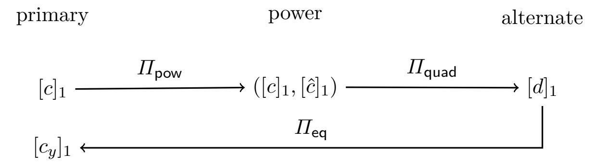

{0}------------------------------------------------

# **Pairing-based Functional Commitments for Circuits with Shorter Parameters**

David Balbás1*,*<sup>2</sup> [,](https://orcid.org/0000-0003-4864-1125) Dario Fiore<sup>1</sup> [,](https://orcid.org/0000-0001-7274-6600) and Russell W. F. Lai[3](https://orcid.org/0000-0001-9126-1887)

> 1 IMDEA Software Institute, Madrid, Spain. dbalbasg@gmail.com

dario.fiore@imdea.org <sup>2</sup> ETH Zurich, Zurich, Switzerland.

<sup>3</sup> Aalto University, Espoo, Finland. russell.lai@aalto.fi

**Abstract.** Functional commitments (FCs) enable a prover to commit to a message and later produce a succinct proof of its image under any given admissible function. Unlike succinct non-interactive arguments (SNARGs), secure FCs can be realised under falsifiable assumptions in the standard model, making them attractive alternatives when fully algebraic constructions are desired. All known algebraic constructions of FC are either lattice-based or pairing-based. While a lattice-based FC for circuits with almost optimal complexities has been recently achieved [Wee, CRYPTO'25], state-of-the-art pairingbased FCs for bounded-width *w* [Balbás-Catalano-Fiore-Lai (BCFL), TCC'23] and bounded-size *s* circuits [Wee-Wu, EUROCRYPT'24] require prohibitive public parameter sizes O *λw*<sup>5</sup> and O *λs*<sup>5</sup> , respectively.

In this work, we present a new algebraic pairing-based FC which achieves O *λw*<sup>3</sup> public parameter size for bounded-width *w* and unbounded depth *d* circuits. The construction preserves all nice properties of BCFL: O(*λ*) commitment size, O *λd*<sup>2</sup> proof size, additive homomorphism, efficient verification, and chainability. For bounded-size *s* circuits, we alternatively obtain O *λs*<sup>3</sup> public parameters with O(*λd*) proofs. At the core of our scheme lies a new chainable FC for quadratic functions with commitments computed with respect to a power basis, as well as techniques for switching between different commitment bases.

## **1 Introduction**

A functional commitment (FC) [\[LRY16\]](#page-26-0) enables a prover to generate a commitment com to a message *x* and later open it to *a function of the committed message*. That is, the prover can reveal *f*(*x*) for some function *f*, along with a publicly-verifiable proof *π*. There are two main properties that make functional commitments interesting and challenging to construct. First, both the commitment com and the functional proof *π* are succinct, i.e., sublinear in the size of the input *x* and the function *f*. Second, they satisfy a security notion called *evaluation binding*, which says that no polynomial-time adversary should be able to validly open any commitment com to two different outputs *y* 6= *y* 0 for the same function *f*. This is a natural generalization of the standard notion of commitment binding to the setting of functional openings.

*FCs as falsifiable alternatives to SNARGs.* In comparison to the standard notion of soundness for succinct non-interactive arguments (SNARGs), evaluation binding is a falsifiable security notion. This means that FCs do not fall into the impossibility result of Gentry and Wichs [\[GW11\]](#page-26-1) and are

<sup>©</sup>IACR 2026. This article appears in the proceedings of PKC 2026 and is the final version submitted by the authors to the IACR and to Springer-Verlag on 24 March 2026.

{1}------------------------------------------------

therefore realizable from standard, falsifiable assumptions.[4](#page-1-0) This property motivates the construction of FCs, in the same spirit of a successful line of research that has led to primitives such as delegation schemes [\[KPY19,](#page-26-2) [GZ21,](#page-26-3) [JKKZ21,](#page-26-4) [CJJ22\]](#page-25-0) and batch arguments for NP (BARGs) [\[KPY19,](#page-26-2) [CJJ21\]](#page-25-1). All of these proof systems can be an attractive alternative to SNARGs in applications where their respective notions are sufficient, offering the benefit of relying only on standard, well-founded assumptions. For example, FCs can totally replace SNARGs in applications such as homomorphic signatures and verifiable databases [\[CFT22\]](#page-25-2). Furthermore, any functional commitment scheme for circuits implies a universal SNARG for P.

An additional motivation to study functional commitments is that they offer an alternative recipe to build SNARKs, yielding elegant constructions with modular security proofs. Indeed, any evaluation binding FC can be compiled into a knowledge-sound SNARK by adding a simple proof of knowledge for the commitment, i.e., for a statement such as "I know a vector *x* that opens the commitment". This approach minimizes the use of idealized models and extractability assumptions, preventing issues such as the recent attacks on the Fiat-Shamir transformation [\[KRS25\]](#page-26-5) by design.

*Landscape of FCs.* An asymptotically optimal FC for circuits can be obtained by extending the flexible SNARG for RAM computations of [\[KLVW23\]](#page-26-6) (as observed in [\[ABF24\]](#page-25-3)), relying either on the sub-exponential hardness of the decisional Diffie-Hellman (DDH) assumption, or on the learning with errors (LWE) assumption. This construction makes use of probabilistically-checkable proofs (PCPs), correlation-intractable hash functions, and non-black-box use of cryptographic primitives, making it mostly theoretical. Other existing constructions of FCs are algebraic, i.e., built mostly directly from algebraic structures such as bilinear pairing groups or lattices. Such algebraic schemes present better practical efficiency and an additional motivation for their study. For instance, they are an attractive replacement for SNARGs when in composition with fully-homomorphic encryption or with other proof systems, as they do not rely on random oracles. They can be broadly classified based on (1) their expressiveness and (2) their underlying algebraic structures and computational assumptions.

Expressiveness refers to the class of functions supported by the FC. Initially, FCs were only introduced for linear functions [\[LRY16\]](#page-26-0), motivated as a generalization of commitment schemes that support more expressive openings, in the line of vector commitments [\[CFM08,](#page-25-4) [LY10,](#page-26-7) [CF13\]](#page-25-5) and polynomial commitments [\[KZG10\]](#page-26-8). Later on, functional commitments were extended to support arbitrary circuits [\[WW23b,](#page-27-0) [dCP23,](#page-25-6) [BCFL23,](#page-25-7) [WW23a,](#page-27-1) [Wee25\]](#page-26-9).

In terms of algebraic structure and computational assumptions, existing constructions are either pairing-based [\[LRY16,](#page-26-0) [LM19,](#page-26-10) [LP20,](#page-26-11) [CFT22,](#page-25-2) [BCFL23,](#page-25-7) [WW24\]](#page-27-2) or lattice-based [\[ACL](#page-25-8)+22, [WW23b,](#page-27-0) [dCP23,](#page-25-6) [BCFL23,](#page-25-7) [WW23a,](#page-27-1) [Wee25\]](#page-26-9). Notably, the recent lattice-based scheme of Wee [\[Wee25\]](#page-26-9) achieves very competitive asymptotic complexities based on the standard Short Integer Solution (SIS) assumption. However, this and other lattice-based constructions remain mostly theoretical due to their use of expensive homomorphic evaluation techniques. At present, pairing-based constructions stand out as the most promising solutions in terms of practical performance. Conveniently, the latter can be easily and accurately estimated in terms of the number of group or pairing operations. In Table [1](#page-2-0) we provide a summary of the size complexities of existing pairing-based FC schemes. We also compare the schemes in terms of whether they are additively homomorphic and chainable [\[BCFL23\]](#page-25-7), which are useful for some applications. We highlight that the state-of-the-art pairingbased FCs of Balbás, Catalano, Fiore, and Lai [\[BCFL23\]](#page-25-7) and Wee and Wu [\[WW24\]](#page-27-2)— supporting

<span id="page-1-0"></span><sup>4</sup> Gentry and Wichs proved that it is impossible to construct adaptively-sound SNARGs for NP with a black-box reduction to falsifiable assumptions [\[GW11\]](#page-26-1).

{2}------------------------------------------------

<span id="page-2-0"></span>arbitrary bounded[5](#page-2-1) width *w* and bounded-size *s* circuits, respectively—both have *quintic* public parameter sizes. The public parameter size thus represents the dominant bottleneck in state-of-the-art pairing-based FCs.

| FC scheme      | Functions                              | pp        | com   π |        | +Hom Chain |   |
|----------------|----------------------------------------|-----------|---------|--------|------------|---|
| [LRY16]        | linear maps                            | `         | 1       | `      | X          | – |
| [LM19]         | linear maps                            | 2<br>`    | 1       | 1      | X          | – |
| [LP20]         | semi-sparse poly                       | µ         | `       | 1      | –          |   |
| [CFT22]        | const. deg. poly                       | 2δ+1<br>` | δf      | δf     | X          | – |
| [BCFL23]       | quadratic functions F<br>F<br>` →<br>` | 5<br>`    | 1       | 1      | X          | X |
| [BCFL23]       | bounded-width w circuits               | 5<br>w    | 1       | 2<br>d | X          | X |
| [BCFL23]       | bounded-size s circuits                | 5<br>s    | 1       | d      | X          | X |
| [WW24]         | bounded-size s circuits                | 5<br>s    | 1       | 1      | X          | X |
| Theorem<br>1   | quadratic functions F<br>F<br>` →<br>` | 3<br>`    | 1       | 1      | X          | X |
| Corollary<br>1 | bounded-width w circuits               | 3<br>w    | 1       | 2<br>d | X          | X |
| Corollary<br>2 | bounded-size s circuits                | 3<br>s    | 1       | d      | X          | X |

Table 1: Comparison of *pairing-based FCs* for functions F *`* → F *`* . Constants and the security parameter *λ* are omitted, e.g., *`* means O(*λ`*) and 1 means O(*λ*). For semi-sparse polynomials, *µ* ≥ *`* is a sparsity-dependent parameter (cf. [\[LP20\]](#page-26-11)). For constant-degree polynomials *δ<sup>f</sup>* is the degree of the polynomial *f* used in opening while *δ* is the maximum degree fixed at setup. For circuits, *d* is the multiplicative circuit depth. +Hom means 'additively homomorphic'; schemes meeting this property can be turned into homomorphic signatures following [\[CFT22\]](#page-25-2). 'Chain' means 'chainable'; schemes meeting this property can be used to build a functional commitment for circuits following the compiler in BCFL [\[BCFL23\]](#page-25-7).

#### **1.1 Our Contributions**

In this work, we reduce the public parameter size bottleneck in pairing-based FCs. Our main contribution is an algebraic pairing-based FC for circuits of unbounded depth *d* and bounded-width *w* with the following complexities: public parameter size O *λw*<sup>3</sup> , commitment size O(*λ*), and proof size O *λd*<sup>2</sup> , where *λ* is the security parameter. This is a strict improvement on the pairing-based scheme of Balbás, Catalano, Fiore and Lai (BCFL) [\[BCFL23\]](#page-25-7), which has public parameter size O *λw*<sup>5</sup> and identical commitment and proof sizes. Our construction also preserves all the interesting properties of BCFL, namely additive homomorphism, efficient verification and chainability.

*Core building block.* To achieve this result, we follow the BCFL framework of compiling a *chainable functional commitment* (CFC) for quadratic functions into a (C)FC for circuits. In a nutshell, a CFC is an FC that allows one to generate an opening proof for *y* = *f*(*x*1*, . . . , xm*) where each input vector *x<sup>i</sup>* and the output *y* are committed. Given that outputs are also committed, one can use them again as inputs of another function, e.g., to prove *z* = *g*(*y*). Namely, one can use a CFC to prove functions in a chain of committed inputs and outputs in a "commit-and-prove" fashion, hence the name "chainable".

<span id="page-2-1"></span><sup>5</sup> 'Bounded' means specified before generating the public parameters.

{3}------------------------------------------------

Our core technical contribution is a pairing-based CFC for quadratic functions (F *`* ) *<sup>m</sup>* → F *`* which strictly improves upon that in BCFL in terms of sizes. In particular, our CFC for quadratic functions has public parameter size O *λ`*<sup>3</sup> , improving upon the O *λ`*<sup>5</sup> size of BCFL, while preserving many features of the latter: Both schemes have a commitment size of O(*λ*) and a proof size of O *λm*<sup>2</sup> , are additively homomorphic and support efficient verification with preprocessing. The security of our scheme relies on falsifiable pairing-based assumptions that can be seen as kernel assumptions with hints, in the spirit of the HiKer assumption introduced in BCFL.

Our CFC for quadratic functions is compatible with all the generic trade-offs and the transformations from BCFL. As mentioned above, this yields a pairing-based CFC for unbounded-depth *d* circuits of bounded-width *w*, where the public parameters grow as O *λw*<sup>3</sup> and the proof size scales as O *λd*<sup>2</sup> . Following a different transformation from BCFL, we also obtain a CFC for bounded-size *s* circuits where the public parameters grow as O *λs*<sup>3</sup> and the proof size is O(*λd*). The latter can be seen as an alternative to [\[WW24\]](#page-27-2), which for size-*s* circuits has O *λs*<sup>5</sup> public parameters and succinct O(*λ*) proofs. Notably, the public parameters size is the same as in the scheme by Catalano, Fiore and Tucker [\[CFT22\]](#page-25-2) for the specific case of quadratic polynomials—however, their scheme is not chainable and cannot be compiled into an FC for circuits. We also remark that the compiler from FCs to homomorphic signatures from [\[CFT22\]](#page-25-2) naturally yields an algebraic homomorphic signature scheme for unbounded-depth circuits with smaller public parameters than the state-of-the-art.

*Techniques.* In Section [2,](#page-4-0) we introduce a technical overview of how our CFC construction works, but we anticipate two features of special interest below.

- **–** *The return of the power basis.* Several previous works [\[LRY16,](#page-26-0) [LM19,](#page-26-10) [CFT22\]](#page-25-2) built functional commitments for restricted classes of functions using the so-called power basis for group elements. In the power basis, also known as monomial basis, the commitment key includes group elements of the form [*α*]*,* [*α* 2 ]*, . . . ,* [*α `* ] for some random *α* ←\$ F. Then, commitments are computed as com = P*` <sup>i</sup>*=1 *x<sup>i</sup>* · [*α i* ]. The advantage of the power basis is that one can generally obtain more succinct commitment keys than in the multilinear basis, where the commitment key encodes uncorrelated terms [*α*1]*,* [*α*2]*, . . . ,* [*αn*] such that *α<sup>i</sup>* ←\$ F. However, whether one could obtain a chainable proof system from a power basis was unclear. In our scheme, we revisit the power basis approach and overcome this challenge by introducing a series of commit-and-prove gadgets for switching between different types of commitments, i.e., in different power bases. We call these gadgets type-chaining proofs.
- **–** *Building FCs from type-chaining proofs.* Our construction is built in a black-box way following a modular abstraction which relies on (a) several commitment algorithms in different power bases, and (b) linear and quadratic type-chaining proofs between them. This framework provides a general blueprint for constructing functional commitment schemes. In particular, it is possible to observe the constructions in [\[BCFL23\]](#page-25-7) from the lens of this abstraction.

*Open questions.* There are two natural questions that our results leave open. First, can our techniques in the power basis be extended to the setting of the FC for circuits with fully-succinct proofs from [\[WW24\]](#page-27-2), with the goal of reducing the (quintic in the circuit size) public parameters of that scheme? The main challenge seems to be on embedding projective commitment spaces [\[GZ21,](#page-26-3) [WW24\]](#page-27-2) into the power basis. Second, can we push the effort of reducing public parameters further in algebraic pairing-based solutions, e.g., aiming for public parameters that are quadratic in the circuit width? We see no major reason to believe that this is not possible — one promising approach is the use of progression-free sets [\[GLWW24\]](#page-26-12).

{4}------------------------------------------------

## **1.2 Related Work**

The idea of a commitment scheme where one can open to functions of the committed data was implicitly suggested by Gorbunov, Vaikuntanathan and Wichs [\[GVW15\]](#page-26-13), although their construction is not succinct as the commitment size is linear in the length of the vector. Libert, Ramanna, and Yung [\[LRY16\]](#page-26-0) were the first to formalize *succinct* functional commitments as a generalization of vector commitments [\[CFM08,](#page-25-4) [LY10,](#page-26-7) [CF13\]](#page-25-5). They proposed a succinct FC for linear forms and showed applications of this primitive to polynomial commitments [\[KZG10\]](#page-26-8) and accumulators. Recent works have extended FCs to support more expressive functions, including linear maps [\[LM19\]](#page-26-10), semisparse polynomials [\[LP20\]](#page-26-11), and constant-degree polynomials [\[ACL](#page-25-8)+22, [CFT22\]](#page-25-2). Catalano, Fiore and Tucker [\[CFT22\]](#page-25-2) also proposed an FC for monotone span programs, which only achieves a weaker notion of evaluation binding where the adversary must reveal the committed vector, as for delegation schemes. A different, but also weaker security model is also considered in [\[PPS21\]](#page-26-14), who introduced a lattice-based FC scheme where a trusted authority is assumed to generate, using a secret key, an opening key for each function for which the prover wants to release an opening. Functional commitments have also been used as a building block for building other primitives, such as homomorphic signatures [\[CFT22,](#page-25-2) [ABF24\]](#page-25-3), batch arguments for NP [\[BFL25\]](#page-25-9) or succinct arguments [\[CGKY25\]](#page-25-10).

De Castro and Peikert [\[dCP23\]](#page-25-6), and Wee and Wu [\[WW23b\]](#page-27-0), also propose lattice-based constructions of functional commitments for circuits (as well as polynomial and vector commitments). Later, Wee and Wu introduced a lattice-based functional commitment scheme in [\[WW23a\]](#page-27-1) which achieved efficient verification, together with other improvements such as simpler assumptions. In a different work Wee and Wu introduced a fully-succinct algebraic functional commitment scheme from standard assumptions over bilinear groups [\[WW24\]](#page-27-2). This scheme extends the framework of BCFL by introducing a compression mechanism based on projective commitments which achieves constant-size proofs for all circuits. The main drawback of their scheme is the size of the public parameters, which grows as O *s* 5 where *s* is the largest supported circuit size as defined at setup time. Most recently, Wee [\[Wee25\]](#page-26-9) presented a functional commitment scheme from the SIS assumption over lattices which, remarkably, presents public parameters whose size is sublinear in the size of the inputs, and in which the opening proofs grow with the circuit depth.

## <span id="page-4-0"></span>**2 Technical Overview**

Our CFC for quadratic functions from pairings is built modularly on top of a family of commitment schemes.[6](#page-4-1) We rely on three types of commitments on different bases ([*c*]*,* [*c*ˆ]*,* [*d*]) and three different type-chaining proof systems *Π*pow*, Π*quad*, Π*eq that prove different relations between these commitments. We depict them in Figure [1.](#page-6-0) In this technical overview, we describe all of these components of our construction and how they fit together. We again remark that our type-chaining proof abstraction also captures what occurs in [\[BCFL23\]](#page-25-7), providing a cleaner framework for the results in that paper.

#### **2.1 A Family of Commitment Schemes in a Power Basis**

Our starting point for our CFC construction from pairings is a commitment scheme which, as opposed to previous constructions of chainable functional commitments [\[BCFL23,](#page-25-7) [WW24\]](#page-27-2), is based

<span id="page-4-1"></span><sup>6</sup> We remark that all of our commitments are deterministic.

{5}------------------------------------------------

on a power monomial basis instead of a multilinear basis. Given a bilinear group  $(\mathbb{G}_1,\mathbb{G}_2,\mathbb{G}_T)$  over a base field  $\mathbb{F}$ , we define our *primary* basis as a set of  $\ell$  elements  $\{[\alpha^i]_1\}_{i=1}^{\ell}$  where  $\alpha \in \mathbb{F}$  is randomly sampled. Then, given a vector  $\boldsymbol{x} = (x_1, \dots, x_\ell) \in \mathbb{F}^\ell$ , we commit to  $\boldsymbol{x}$  as  $\mathsf{com} = [c]_1 = \sum_{i=1}^\ell x_i [\alpha^i]_1$ . This corresponds to the left node  $[c]_1$  of the diagram in Figure 1.

Besides this *primary* commitment scheme, we introduce two additional commitment algorithms that allow us to commit to vectors in different monomial basis. The *power* commitment algorithm allows us to commit to a vector  $\boldsymbol{x}$  in a power basis  $[\hat{c}]_1 = \sum_{i=1}^{\ell} x_i [\alpha^{\ell(i-1)}]_1$ . Note that this basis is a monomial basis also based on powers of  $\alpha$ , but it is not the same as the primary basis, as the exponents are "spaced out" by a factor of  $\ell$ . Looking ahead, if we pair a primary commitment to xwith a ( $\mathbb{G}_2$  version of a) power commitment to x', we obtain a commitment to the tensor product  $\boldsymbol{x} \otimes \boldsymbol{x}'$  in the natural  $\alpha$ -power basis in the target group, namely  $[c]_1 \cdot [\hat{c}]_2 = \left| \sum_{i,j=1}^{\ell} x_i x_j' \alpha^{\ell(j-1)+i} \right|_T$ . The alternate commitment algorithm allows us to commit to a vector  $\boldsymbol{y}$  in a different monomial basis as  $[d]_1 = \sum_{i=1}^{\ell} y_i [\beta^i]_1$ . We will use alternate commitments to place the outputs of quadratic relations evaluated on the primary commitment.

#### 2.2Building a CFC

Chainability implies that our CFC must be able to prove relations between committed values in the same monomial basis. This is, given a commitment  $com_x = \sum_{i=1}^{\ell} x_i [\alpha^i]_1$ , our goal is to make a proof that  $com_x$  opens to  $com_y = \sum_{i=1}^{\ell} y_i [\alpha^i]_1$  under f, where  $\mathbf{y} = f(\mathbf{x})^9$ . We achieve this by using a combination of three proof systems that we call type-chaining proof systems, as they allow for switching between bases while proving relations between them. Each of these proof systems requires us to include additional cross-terms in the commitment key. Their security property is evaluation binding in the same sense of CFC, meaning that it is hard to open the same input commitment  $com_x$  to two different output commitments  $com_y$  and  $com_y'$  under the same function f. These proof systems are as follows:

- $\Pi_{pow}$  is a basis change proof that proves equality between the vector committed in a primary commitment  $[c]_1 = \sum_{i=1}^{\ell} x_i [\alpha^i]_1$  and that in a power commitment  $[\hat{c}]_1 = \sum_{i=1}^{\ell} x_i [\alpha^{\ell(i-1)}]_1$ .
- $\Pi_{\mathsf{quad}}$  is a quadratic relation proof that proves quadratic relations between the vector  $\boldsymbol{x}$  committed in a pair of primary and power commitments ( $[c]_1, [\hat{c}]_1$ ), and the vector y committed in an alternate commitment  $[d]_1 = \sum_{i=1}^{\ell} y_i [\beta^i]_1$ .
- $-\Pi_{eq}$  is again a basis change proof that proves equality between the vector committed in an alternate commitment  $[d]_1 = \sum_{i=1}^{\ell} y_i [\beta^i]_1$  and that in a primary commitment  $[c]_1 = \sum_{i=1}^{\ell} y_i [\alpha^i]_1$ .

We can now combine the three proof systems to construct the opening algorithm of our CFC for quadratic functions, following the steps in Figure 1. Given an input x, its (primary) commitment  $[c]_1$  and a function f such that y = f(x), the prover does as follows:

- Commit to  $\boldsymbol{x}$  in the power basis, obtaining  $[\hat{c}]_1$ .
- Commit to y using the alternate commitment scheme, obtaining  $[d]_1$ .
- Prove the equality between  $[c]_1$  and a power commitment  $[\hat{c}]_1$  using  $\Pi_{pow}$ .

<span id="page-5-0"></span>Across the paper, we will be using additive bracket notation where  $[a]_1$  is a shorthand for  $g_1^a$  for a generator  $g_1 \in \mathbb{G}_1$ and  $a \in \mathbb{F}$ . Similarly,  $[b]_2$  is a shorthand for  $g_2^b$  for a generator  $g_2 \in \mathbb{G}_2$ .

<span id="page-5-1"></span><sup>&</sup>lt;sup>8</sup> In [BCFL23, WW24], the commitment key instead contains elements  $\{[\alpha_i]_1\}_{i=1}^{\ell}$  for independently sampled  $\alpha_i$ 's. Commitments are then computed as  $\sum_{i=1}^{\ell} x_i [\alpha_i]_1$ .

9 We handle the general case of  $\mathbf{y} = f(\mathbf{x}_1, \dots, \mathbf{x}_m)$  later.

<span id="page-5-2"></span>

{6}------------------------------------------------

<span id="page-6-0"></span>

Fig. 1: Representation of the different proof systems that conform to our CFC.

- Prove that  $([c]_1, [\hat{c}]_1)$  and  $[d]_1$  are related by the quadratic function f using  $\Pi_{\mathsf{quad}}$ .
- Prove the equality between  $[d]_1$  and a primary commitment  $[c_y]_1$  to  $\boldsymbol{y}$  using  $\Pi_{eq}$ .

To verify the proof, given  $[c]_1$  and a commitment  $[c_y]_1$  to y, the verifier checks all the proofs. Security (evaluation binding) follows from the evaluation binding of each of the proof systems. In the technical sections, we describe how to extend this approach to evaluate f on multiple inputs (and multiple input commitments).

## 2.3 Type Chaining Proof Systems

To conclude this overview, we describe the main intuition behind each of the three type-chaining proof systems that we introduced above.

**Power Basis Type Chaining.** To switch between bases while proving equality, the idea is to ask the prover to provide, as a proof, a third commitment to a random linear combination of both bases. That is, define  $[t_i]_1 = \gamma[\alpha^{\ell(i-1)}]_1 + \delta[\alpha^i]_1$  for  $i \in [\ell]$ , where  $\gamma, \delta \in \mathbb{F}$  are random scalars. Then, the prover generates a proof  $\pi_{pow} = \sum_{i=1}^{\ell} x_i[t_i]$ . The verifier can easily check the relation by checking the following equation, where correctness is straightforward to verify.

$$[\pi_{\mathsf{pow}}]_1 = \gamma[c]_1 + \delta[\hat{c}]_1.$$

However, this approach is only sound if the prover does not know the coefficients  $\gamma$ ,  $\delta$  in advance. To make this idea work in the non-interactive case, we publish the terms  $[t_i]_1 = [\gamma \alpha^{\ell(i-1)} + \delta \alpha^i]_1$  in the commitment key, as well as  $[\gamma]_2$ ,  $[\delta]_2$  (note that these are  $\mathbb{G}_2$  elements). Then, the verifier checks

$$[\pi_{\mathsf{pow}}]_1 \cdot [1]_2 = [c]_1 \cdot [\gamma]_2 + [\hat{c}]_1 \cdot [\delta]_2.$$

The security (evaluation binding) of the proof system relies on the fact that we never give out  $[\gamma]_1, [\delta]_1$  in  $\mathbb{G}_1$  in the commitment key ck. The only  $\mathbb{G}_1$  terms where these coefficients appear are the  $[\gamma \alpha^{\ell(i-1)} + \delta \alpha^i]_1$  terms, where they are properly masked by the linear combination.

The security of the proof system relies on a kernel-with-hints assumption, in a similar flavour as the HiKer assumption from [BCFL23], that we justify with a proof in the generic group model. The assumption says that it is hard to find two  $\mathbb{G}_1$  elements in the kernel of the linear subspace defined by  $(\gamma, 1)$ , even in the presence of hints (additional terms in the commitment key). More precisely, the adversary wins if it outputs non-zero  $([U]_1, [V]_1)$  such that  $[U]_1 \cdot [1]_2 = [V]_1 \cdot [\gamma]_2$ .

Quadratic Type Chaining. For a quadratic function  $f: \mathbb{F}^{\ell} \to \mathbb{F}^{\ell}$ , we express f as

$$y_k = f_k(x) = \sum_{i,j=1}^{\ell} f_{i,j,k} x_i x_j.$$

{7}------------------------------------------------

Which can also be seen as a linear function on the tensor product  $\boldsymbol{x} \otimes \boldsymbol{x}$ . As we anticipated, pairing  $[c]_1$  and  $[\hat{c}]_2$  results in a commitment to the tensor product in the target group,  $[c]_1 \cdot [\hat{c}]_2 = \left[\sum_{i,j=1}^{\ell} x_i x_j \alpha^{\ell(j-1)+i}\right]_T$ . Then, we ask the prover to provide a commitment to the tensor product  $[\tilde{c}]_1 = \sum_{i,j=1}^{\ell} x_i x_j [\alpha^{\ell(j-1)+i}]_1$  to  $\boldsymbol{x} \otimes \boldsymbol{x}$ , whose correctness we can verify (in the target group) with the help of the primary and power commitments.

The next goal is to create an encoding of the function f (which essentially consists of a commitment to the terms  $f_{i,j,k}$ ) and a proof  $\pi$  that maps  $y_k$  to the k-th power of  $\beta$  in [d]. For this, we require that the encoding of f satisfies the following relation:

$$\tilde{c} \cdot f = \left(\sum_{i,j=1} x_i x_j \alpha^{\ell(j-1)+i}\right) \cdot f = \sum_{i,j=1} f_{i,j,k} x_i x_j \alpha^{\ell^2+1} \beta^k + T$$

where T are cross terms that will appear in a proof  $\pi$  and which, crucially, do not contain the  $\alpha^{\ell^2+1}$  term. To achieve this, we encode the i, j-th coefficient of f in the opposite order to how it appears in the commitment to the tensor product, such that they add up to  $\ell^2 + 1$ . This leads us to the following encoding of f:

$$[f]_2 \leftarrow \sum_{i,j,k=1}^{\ell} f_{i,j,k} [\beta^k \alpha^{\ell^2 + 1 - i - \ell(j-1)}]_2$$

Note that if f is known in advance,  $[f]_2$  can be precomputed, which gives us efficient verification with pre-processing. By encoding all the cross-terms in a proof  $\pi_f$ , the verification equation looks as follows:

$$[\tilde{c}]_1 \cdot [f]_2 = [\pi_f]_1 \cdot [1]_2 + [d]_1 \cdot [\alpha^{\ell^2 + 1}]_2.$$

For the proof system to be sound, we need to ensure that the  $\alpha^{\ell^2+1}$  term is not included in the proof  $\pi_f$ . We do so by never including the  $\mathbb{G}_1$  term  $[\alpha^{\ell^2+1}]_1$  in the commitment key. The resulting assumption is a variant of a q-type assumption where all powers of  $\alpha$  are given in both groups, except for the  $\ell^2 + 1$  power in  $\mathbb{G}_1$ . We leave the details for the technical section, where we also generalize the approach to multiple inputs and include a degree check on the output commitment.

We remark that the highest power of  $\alpha$  that is needed to capture all cross-terms is  $\alpha^{2\ell^2+1}$ . As we require terms  $\alpha^i\beta^j$  in at least one of the groups for every  $i \in [2\ell^2+1]$  and  $j \in [k]$ , this leads to having  $\mathcal{O}(\ell^3)$  group elements in the commitment key. In contrast, the approach in both [BCFL23, WW24] requires evaluating f on vectors  $\mathbf{x} \otimes \mathbf{x}$  that are committed in the multilinear basis as  $[c]_1 = \sum_{i,j=1}^{\ell} x_i x_j [\alpha_i \alpha_j]_1$ . As one needs  $\mathcal{O}(\ell^2)$  elements for  $[c]_1$  and  $\mathcal{O}(\ell^3)$  independent elements for generating  $[f]_2$ , this leads to having  $\mathcal{O}(\ell^5)$  cross-terms in the proof, which requires a quintic-sized commitment key.

Equality Basis Type Chaining. Finally, this system is constructed almost identically as  $\Pi_{pow}$ , by asking the prover to provide a commitment to a random linear combination of both basis. We omit the details here as they are similar to the previous proof system.

#### 3 Preliminaries

We denote by  $\mathbb{N}$  the set of natural numbers > 0. We denote the security parameter by  $\lambda \in \mathbb{N}$ . We call a function  $\epsilon$  negligible, denoted  $\epsilon(\lambda) = \mathsf{negl}(\lambda)$ , if  $\epsilon(\lambda) = \mathcal{O}(\lambda^{-c})$  for every constant c > 0, and call a function  $p(\lambda)$  polynomial, denoted poly, if  $p(\lambda) = \mathcal{O}(\lambda^c)$  for some constant c > 0. We say that

{8}------------------------------------------------

an algorithm is probabilistic polynomial time (PPT) if it consumes randomness and its running time is bounded by some  $p(\lambda) = \mathsf{poly}(\lambda)$ . For a finite set S,  $x \leftarrow S$  denotes sampling x uniformly at random in S. For an algorithm A, we write  $y \leftarrow A(x)$  for the output of A on input x. For a positive  $n \in \mathbb{N}$ , [n] is the set  $\{1, \ldots, n\}$ . We denote vectors x and matrices M using bold fonts. Given two strings x, y, we denote their concatenation by x|y. We use  $\mathcal{M}$  to denote the message space.

## 3.1 Bilinear Groups

A bilinear group generator  $\mathcal{BG}(1^{\lambda})$  is an algorithm that returns  $\mathsf{bgp} := (q, \mathbb{G}_1, \mathbb{G}_2, \mathbb{G}_T, g_1, g_2, e)$ , where  $\mathbb{G}_1$ ,  $\mathbb{G}_2$ ,  $\mathbb{G}_T$  are groups of prime order  $q, g_1 \in \mathbb{G}_1$  and  $g_2 \in \mathbb{G}_2$  are fixed generators, and  $e : \mathbb{G}_1 \times \mathbb{G}_2 \to \mathbb{G}_T$  is an efficiently computable, non-degenerate, bilinear map. In our work we use Type-3 groups in which it is assumed that there is no efficiently computable isomorphism between  $\mathbb{G}_1$  and  $\mathbb{G}_2$ . We use the bracket notation of  $[\mathsf{EHK}^+13]$  for group elements: for  $s \in \{1,2,T\}$  and  $x \in \mathbb{Z}_q$ ,  $[x]_s$  denotes  $g_s^x \in \mathbb{G}_s$ . We use additive notation for  $\mathbb{G}_1$  and  $\mathbb{G}_2$  and multiplicative notation for  $\mathbb{G}_T$ . We note that given an element  $[x]_s \in \mathbb{G}_s$ , for s = 1, 2, and a scalar a, one can efficiently compute  $a \cdot [x]_s = [ax]_s = g_s^{ax} \in \mathbb{G}_s$ ; given group elements  $[a]_1 \in \mathbb{G}_1$  and  $[b]_2 \in \mathbb{G}_2$ , one can efficiently compute  $[ab]_T = [a]_1 \cdot [b]_2$  defined as  $[a]_1 \cdot [b]_2 = e([a]_1, [b]_2)$ . For a matrix  $\mathbf{A} \in \mathbb{Z}_q^{m \times n}$ , we represent a matrix of group elements  $g_s^{\mathbf{A}}$  as  $[\mathbf{A}]_s \in \mathbb{G}_s^{m \times n}$ .

#### 4 Chainable Functional Commitments

Throughout this work, we assume that all commitments are deterministic and that the opening information is the committed vector itself.

**Definition 1 (Commitment).** A commitment scheme is a tuple of PPT algorithms (Setup, Com) with the following syntax:

Setup $(1^{\lambda}, 1^{\ell}) \to \mathsf{ck}$ : On input the security parameter  $\lambda$  and the vector length  $\ell$ , output a commitment  $key \; \mathsf{ck}$ .

 $\mathsf{Com}(\mathsf{ck}, \boldsymbol{x}) \to \mathsf{com}$ : On input the commitment key  $\mathsf{ck}$  and a vector  $\boldsymbol{x} \in \mathcal{M}^{\ell}$ , output a commitment  $\mathsf{com}$ .

A commitment scheme must satisfy the following property:

**Binding.** For any PPT adversary A and vector length  $\ell = poly(\lambda)$ ,

$$\Pr\left[ \begin{matrix} \mathsf{Com}(\mathsf{ck}, \boldsymbol{x}) = \mathsf{Com}(\mathsf{ck}, \boldsymbol{x}') \\ \wedge \ \boldsymbol{x} \neq \boldsymbol{x}' \end{matrix} \middle| \begin{matrix} \mathsf{ck} \leftarrow \mathsf{Setup}(1^\lambda, 1^\ell) \\ (\mathsf{com}, \boldsymbol{x}, \boldsymbol{x}') \leftarrow \mathcal{A}(\mathsf{ck}) \\ \boldsymbol{x}, \boldsymbol{x}' \in \mathcal{M}^\ell \end{matrix} \right] = \mathsf{negl}(\lambda).$$

#### <span id="page-8-0"></span>4.1 Chainable Functional Commitments (CFC)

A Functional Commitment (FC) [LRY16] is a powerful primitive that allows an entity to first commit to some input  $x \in \mathcal{M}^{\ell}$  and then open the commitment to f(x) for some admissible function  $f \in \mathcal{F}$ . Both the commitment com and the opening proof  $\pi$  are succinct.

Some functional commitment schemes may offer useful composability properties such as *chain-ability*. A chainable functional commitment (CFC) [BCFL23] is an extension of FC that allows

{9}------------------------------------------------

some party to commit to multiple inputs  $x_1, \ldots, x_m \in \mathcal{M}^{\ell}$  and then open to a commitment of  $y = f(x_1, \ldots, x_m)$ , i.e., the output y remains in committed form. Note that a CFC generically implies an FC by simply adding an opening proof that the output commitment indeed opens to y. Below, we follow and extend the syntax from [BCFL23] to allow each of  $x_1, \ldots, x_m, y$  to be indexed by a different index set.

<span id="page-9-2"></span>**Definition 2 (Chainable Functional Commitments (CFC)).** A chainable functional commitment (CFC) for a class of functions<sup>10</sup>  $\mathcal{F} = (\mathcal{F}_{\ell})_{\ell}$  consists of a commitment scheme (Setup, Com) for  $\mathcal{M}$  and additionally PPT algorithms (FuncProve, FuncVer) with the following syntax:

FuncProve(ck,  $(x_i)_{i \in [m]}$ , f)  $\to \pi$ : given vectors  $x_i \in \mathcal{M}^{\ell}$  for  $i \in [m]$  and a function  $f \in \mathcal{F}$  where  $f: \mathcal{M}^{m\ell} \to \mathcal{M}^{\ell}$ , returns an opening proof  $\pi$ .

FuncVer(ck,  $(com_i)_{i \in [m]}$ ,  $com_y$ ,  $f, \pi) \to b \in \{0, 1\}$ : on input commitments  $(com_i)_{i \in [m]}$  for  $i \in [m]$  to the m inputs and  $com_y$  to the output, opening proof  $\pi$ , and function  $f \in \mathcal{F}$  where  $f : \mathcal{M}^{m\ell} \to \mathcal{M}^{\ell}$ , accepts (b = 1) or rejects (b = 0).

A CFC must satisfy the following properties.

Correctness. For  $\lambda, \ell, m, \in \mathbb{N}$ ,  $f \in \mathcal{F}$  where  $f : \mathcal{M}^{m\ell} \to \mathcal{M}^{\ell}$ , and  $\mathbf{x}_i \in \mathcal{M}^{\ell}$  for  $i \in [m]$ , it holds that

$$\Pr \begin{bmatrix} \mathsf{FuncVer}(\mathsf{ck}, (\mathsf{com}_i)_{i \in [m]}, & \mathsf{ck} \leftarrow \mathsf{Setup}(1^\lambda, 1^\ell) \\ \mathsf{com}_y, f, \pi) = 1 & \mathsf{com}_y \leftarrow \mathsf{Com}(\mathsf{ck}, \boldsymbol{x}_i) & \forall i \in [m] \\ \mathsf{com}_y \leftarrow \mathsf{Com}(\mathsf{ck}, f(\boldsymbol{x}_1, \dots, \boldsymbol{x}_m)) \\ \pi \leftarrow \mathsf{FuncProve}(\mathsf{ck}, (\boldsymbol{x}_i)_{i \in [m]}, f) \end{bmatrix} = 1.$$

Succinctness. For any admissible set of parameters as before, the opening proof size  $|\pi| \leq \text{poly}(\lambda, \log \ell, \log m, o(|f|))$ , where |f| denotes the size of the circuit description of f.

The natural security notion of CFC considered in [BCFL23] is evaluation binding, recalled in Definition 3 below.

<span id="page-9-1"></span>**Definition 3 (CFC Evaluation Binding).** A CFC satisfies evaluation binding if for any PPT adversary A, the following advantage is  $negl(\lambda)$ :

$$\Pr\begin{bmatrix} \operatorname{FuncVer}(\operatorname{ck}, (\operatorname{com}_i)_{i \in [m]}, \operatorname{com}_y, f, \pi) = 1 \\ \wedge \operatorname{FuncVer}(\operatorname{ck}, (\operatorname{com}_i)_{i \in [m]}, \operatorname{com}_y', f, \pi') = 1 \\ \wedge \operatorname{com}_y \neq \operatorname{com}_y' \end{bmatrix} \xrightarrow{\operatorname{ck} \leftarrow \operatorname{Setup}(1^{\lambda}, 1^{\ell}) \\ \begin{pmatrix} \operatorname{com}_i)_{i \in [m]}, f, \\ \operatorname{com}_y, \pi, \\ \operatorname{com}_y', \pi' \end{pmatrix} \leftarrow \mathcal{A}(\operatorname{ck}) \end{bmatrix}.$$

**Definition 4 (CFC Efficient Verification).** A CFC admits efficient verification if there exists a pair of algorithms:

 $\mathsf{PreVer}(\mathsf{ck}, f) \to \mathsf{ck}_f$  on input the commitment key  $\mathsf{ck}$  and a function  $f \in \mathcal{F}$  where  $f : \mathcal{M}^{m\ell} \to \mathcal{M}^{\ell}$ , outputs a function key  $\mathsf{ck}_f$ .

EffVer( $\operatorname{ck}_f, (\operatorname{com}_i)_{i \in [m]}, \operatorname{com}_y, \pi) \to b \in \{0, 1\}$  on input a function key  $\operatorname{ck}_f,$  commitments  $(\operatorname{com}_i)_{i \in [m]}$  to the m inputs and  $\operatorname{com}_y$  to the output, and an opening proof  $\pi$ , accepts (b = 1) or rejects (b = 0).

<span id="page-9-0"></span>Furthermore,  $\operatorname{ck}_f$  is succinct,  $|\operatorname{ck}_f| \leq \operatorname{poly}(\lambda, \log(\ell), \log(m), o(|f|))$ , and EffVer runs in time  $\operatorname{poly}(\lambda, \log(\ell), m, o(|f|))$ .

The poly  $\operatorname{poly}(\lambda, \log(\ell), m, o(|f|))$  and  $\operatorname{poly}(\lambda, \log(\ell), m, o(|f|))$ .

{10}------------------------------------------------

## 4.2 Pairing-based Assumptions

In this section, we introduce three pairing-based assumptions that we require to prove the security of our construction in Section 5. In particular, Assumption 1 is required by the proof system  $\Pi_{pow}$ , Assumption 2 is required by the proof system  $\Pi_{quad}$ , and Assumption 3 is required by the proof system  $\Pi_{eq}$ . The three assumptions are closely related, as all of them are variants of a q-type assumption where the goal is to find a linear combination of elements in a kernel that is only given in  $\mathbb{G}_2$ . Besides stating them, we prove that all of them hold in the generic bilinear group model.<sup>11</sup>

<span id="page-10-1"></span>**Definition 5 (Assumption 1).** Let bgp =  $(q, \mathbb{G}_1, \mathbb{G}_2, \mathbb{G}_T, [1]_1, [1]_2)$  be a bilinear group setting and let  $\ell \in \mathbb{N}$ . We say that Assumption 1 holds for bgp on set  $\mathcal{S}_{\ell}$  if for any PPT adversary  $\mathcal{A}$ , there exists a negligible function  $\mathsf{negl}(\lambda)$  such that,

$$\Pr\left[ \begin{array}{c|c} [U]_1\cdot[1]_2 = [V]_1\cdot[\gamma]_2 \\ \wedge ([U]_1,[V]_1) \neq ([0]_1,[0]_1) \end{array} \middle| \begin{array}{c} \alpha,\gamma,\delta \leftarrow \$ \ \mathbb{F} \\ ([U]_1,[V]_1) \leftarrow \mathcal{A}(\mathsf{bgp},\mathcal{S}_{\ell}(\alpha,\gamma,\delta)) \end{array} \right] = \mathsf{negl}(\lambda).$$

Where

$$S_{\ell}(\alpha, \gamma, \delta) = \left\{ \{ [\alpha^{i}]_{1}, [\alpha^{i}]_{2} \}_{\substack{i=1\\i \neq \ell^{2}+1}}^{2\ell^{2}+1}, [\alpha^{\ell^{2}+1}]_{2}, \left\{ [\gamma \alpha^{\ell(i-1)} + \delta \alpha^{i}]_{1} \right\}_{i=1}^{\ell}, [\gamma]_{2}, [\delta]_{2} \right\}$$

and the probability is taken over the choice of  $\alpha, \gamma, \delta$  and the adversary A's random coins.

<span id="page-10-2"></span>Lemma 1. Assumption 1 is sound in the generic bilinear group model.

*Proof.* Intuitively, any adversary against the assumption should find a solution of the form  $(U, V) = (\gamma u, u)$ , this is, in the linear span of  $(\gamma, 1)$ . As  $\gamma$  only appears in  $\mathbb{G}_1$  when it is randomized by  $\delta$ , which is also never given in the clear in  $\mathbb{G}_1$ , there is no pair of elements in such space.

Formally, let  $\mathcal{A}(\mathcal{S}_{\ell}(\alpha, \gamma, \delta))$  be an adversary against Assumption 1, which given ck returns a winning tuple  $([U]_1, [V]_1)$ . Then, following the framework of Boyen [Boy08], there is a GGM extractor that two corresponding polynomials  $u(X), v(X) \in \mathbb{F}[X]$  given by

$$u(X,C,D) = u_0 + \sum_{\substack{i=1\\i\neq\ell^2+1}}^{2\ell^2+1} u_i^{(1)} X^i + \sum_{i=1}^{\ell} u_i^{(2)} (X^{\ell(i-1)}C + X^i D),$$

$$v(X, C, D) = v_0 + \sum_{\substack{i=1\\i\neq\ell^2+1}}^{2\ell^2+1} v_i^{(1)} X^i + \sum_{i=1}^{\ell} v_i^{(2)} (X^{\ell(i-1)}C + X^i D),$$

<span id="page-10-0"></span>While our assumptions are falsifiable, they are non-standard. We argue, however, that falsifiable assumptions are a strong stepping stone towards achieving realizations from standard assumptions in the future. There are several historical precedents of this phenomenon. For example, the progression of BARGs from q-type assumptions in [KPY19] to constructions based on LWE in [CJJ22], and the development of functional commitments for circuits themselves, from the HiKer assumption in [BCFL23] to MDDH in [WW24].

{11}------------------------------------------------

such that  $u(X,C,D)=v(X,C,D)\cdot C$ . Expanding on this identity, we have that

$$u_0 + \sum_{\substack{i=1\\i\neq\ell^2+1}}^{2\ell^2+1} u_i^{(1)} X^i + \sum_{i=1}^{\ell} u_i^{(2)} (X^{\ell(i-1)}C + X^i D)$$

$$= v_0 C + \sum_{\substack{i=1\\i\neq\ell^2+1}}^{2\ell^2+1} v_i^{(1)} X^i C + \sum_{i=1}^{\ell} v_i^{(2)} (X^{\ell(i-1)}C^2 + X^i C D).$$

As there are no monomials of degree 0 in C in v(X,C,D), we immediately derive that u(X,C,D)=0, since all  $u_0,u_i^{(1)},u_i^{(2)}$  appear as coefficients of some monomial of degree 0. Therefore, it also holds that  $v(X,C,D)=u(X,C,D)\cdot C=0$ .

<span id="page-11-0"></span>**Definition 6 (Assumption 2).** Let  $\mathsf{bgp} = (q, \mathbb{G}_1, \mathbb{G}_2, \mathbb{G}_T, [1]_1, [1]_2)$  be a bilinear group setting and let  $\ell \in \mathbb{N}$ . We say that Assumption 2 holds for  $\mathsf{bgp}$  on set  $\mathcal{S}_{\ell}$  if for any PPT adversary  $\mathcal{A}$ , there exists a negligible function  $\mathsf{negl}(\lambda)$  such that,

$$\Pr\begin{bmatrix} [U]_1 \cdot [1]_2 = [V]_1 \cdot [\alpha^{\ell^2+1}]_2 \\ \wedge [V]_1 \cdot [\alpha^{2\ell^2+1}]_2 = [W]_1 \cdot [1]_2 \\ \wedge [V]_1 \neq [0]_1 \end{bmatrix} = \mathsf{negl}(\lambda).$$

Where  $S_{\ell}(\alpha) = \left\{ \left\{ [\alpha^{i}]_{1}, [\alpha^{i}]_{2} \right\}_{i=1, i \neq \ell^{2}+1}^{2\ell^{2}+1}, [\alpha^{\ell^{2}+1}]_{2} \right\}$ , and the probability is taken over the choice of  $\alpha$  and the adversary  $\mathcal{A}$ 's random coins.

Lemma 2. Assumption 2 is sound in the generic bilinear group model.

*Proof.* The intuition is that, since  $[V]_1 \cdot [\alpha^{2\ell^2+1}]_2 = [W]_1 \cdot [1]_2$  and  $\alpha^{2\ell^2+1}$  is the highest power of  $\alpha$  available, then V cannot contain any powers of  $\alpha$  (in other words, it must be a constant term on the  $\alpha$ -basis). Then, as  $[U]_1 \cdot [1]_2 = [V]_1 \cdot [\alpha^{\ell^2+1}]_2$  and V is constant in  $\alpha$ , then U must contain a power  $\alpha^{\ell^2+1}$ , which is never given in  $\mathbb{G}_1$ .

Formally, let  $\mathcal{A}(\mathcal{S}_{\ell}(\alpha))$  be an adversary against Assumption 2, which given ck returns a winning tuple  $([U]_1, [V]_1, [W]_1)$ . Then, the GGM extractor outputs three corresponding polynomials  $u(X), v(X), w(X) \in \mathbb{F}[X]$  given by

$$u(X) = \sum_{\substack{i=0\\i\neq\ell^2+1}}^{2\ell^2+1} u_i X^i, \quad v(X) = \sum_{\substack{i=0\\i\neq\ell^2+1}}^{2\ell^2+1} v_i X^i, \quad w(X) = \sum_{\substack{i=0\\i\neq\ell^2+1}}^{2\ell^2+1} w_i X^i.$$

Moreover, u, v, w must satisfy the following system of equations:

$$\begin{cases} u(X) = v(X) \cdot X^{\ell^2 + 1} \\ v(X) \cdot X^{2\ell^2 + 1} = w(X) \end{cases}$$

Expanding the second equation implies that

$$\sum_{\substack{i=0\\i\neq\ell^2+1}}^{2\ell^2+1} v_i X^{2\ell^2+1+i} = \sum_{\substack{i=0\\i\neq\ell^2+1}}^{2\ell^2+1} w_i X^i,$$

{12}------------------------------------------------

which yields  $v_i = 0$  for every  $i \ge 1$ . Hence,  $v(X) = v_0$  is a constant polynomial. Then, we can rewrite the first equation as

$$\sum_{\substack{i=0\\i\neq\ell^2+1}}^{2\ell^2+1} u_i X^i = v_0 \cdot X^{\ell^2+1}.$$

which implies that both u(X) = v(X) = 0.

<span id="page-12-0"></span>**Definition 7 (Assumption 3).** Let  $\mathsf{bgp} = (q, \mathbb{G}_1, \mathbb{G}_2, \mathbb{G}_T, [1]_1, [1]_2)$  be a bilinear group setting and let  $\ell \in \mathbb{N}$ . We say that Assumption 3 holds for  $\mathsf{bgp}$  on set  $\mathcal{S}_{\ell}$  if for any PPT adversary  $\mathcal{A}$ , there exists a negligible function  $\mathsf{negl}(\lambda)$  such that,

$$\Pr\left[\begin{array}{c|c} [U]_1\cdot[1]_2=[V]_1\cdot[\gamma]_2\\ \wedge\left([U]_1,[V]_1\right)\neq\left([0]_1,[0]_1\right)\end{array}\middle| \begin{array}{c} \alpha,\beta,\gamma,\delta \hookleftarrow \$\,\mathbb{F}\\ ([U]_1,[V]_1)\leftarrow\mathcal{A}(\mathsf{bgp},\mathcal{S}_{\ell}(\alpha,\beta,\gamma,\delta)) \end{array}\right]=\mathsf{negl}(\lambda).$$

Where

$$S_{\ell}(\alpha, \beta, \gamma, \delta) = \left\{ \{ [\alpha^{i}]_{1}, [\alpha^{i}]_{2} \}_{\substack{i=1\\i \neq \ell^{2}+1}}^{2\ell^{2}+1}, [\alpha^{\ell^{2}+1}]_{2}, \left\{ [\beta^{i}]_{1}, [\beta^{i}]_{2} \right\}_{i=1}^{\ell}, \left\{ [\beta^{k}\alpha^{i}]_{1}, [\beta^{k}\alpha^{i}]_{2} \right\}_{\substack{i,k=1,\\i \neq \ell^{2}+1}}^{(2\ell^{2}+1,\ell)}, \left\{ [\gamma\alpha^{i}+\delta\beta^{i}]_{1} \right\}_{i=1}^{\ell}, [\gamma]_{2}, [\delta]_{2} \right\}$$

and the probability is taken over the choice of  $\alpha, \beta, \gamma, \delta$  and the adversary  $\mathcal{A}$ 's random coins.

Lemma 3. Assumption 3 is sound in the generic bilinear group model.

*Proof.* The assumption is essentially the same as Assumption 1 (Definition 5) but with the addition of the  $\beta$ -basis elements. Hence, the proof follows the same steps as in the proof of Lemma 1.

#### 4.3 Type Chaining Proofs

Recall the definition of chainable functional commitments from Section 4.1. Within a given CFC commitment key ck, there may exist multiple internal commitment keys corresponding to different commitment types. Hence, we allow multiple commitment algorithms  $\mathsf{Com}^{(\mathsf{type})}$  to be used on the same ck. Their syntax is given by  $\mathsf{Com}^{(\mathsf{type})}(ck, \boldsymbol{x}) \to \mathsf{com}^{\mathsf{type}}$ .

For increased modularity, we will split our CFC construction in this section into smaller proof systems that can be used independently given the same commitment key ck. These systems, that we name *type-chaining proofs*, allow one to switch between the different types of commitments allowed in ck. For simplicity, we define these proof systems assuming efficient verification.

**Definition 8 (Type Chaining Proof).** Let Setup be a commitment setup algorithm,  $\mathsf{Com}^{(\mathsf{x})}$  be an (input) commit algorithm,  $\mathsf{Com}^{(\mathsf{y})}$  be an (output) commit algorithm, and let  $\mathsf{ck} \leftarrow \mathsf{Setup}(1^\lambda, 1^\ell)$  be a commitment key. A type-chaining proof system  $\Pi$  for the above algorithms and a class of functions  $\mathcal F$  consists of a tuple of PPT algorithms (Prove, PreVer, Ver) with the following syntax:

 $\Pi$ .Prove(ck,  $(\boldsymbol{x}_i)_{i \in [m]}, f) \to \pi$ : Given a commitment key ck, input vectors  $(\boldsymbol{x}_i)_{i \in [m]}$ , and a function  $f \in \mathcal{F}$ , output a proof  $\pi$ .

 $\Pi$ .PreVer(ck, f)  $\to$  ck $_f$ : Given a commitment key ck and a function  $f \in \mathcal{F}$ , output a pre-verification key ck $_f$ .

{13}------------------------------------------------

 $\Pi.\mathsf{Ver}(\mathsf{ck}_f,(\mathsf{com}^{(\mathsf{x})}_i)_{i\in[m]},\mathsf{com}^{(\mathsf{y})},\pi)\to 0/1$ : Given input commitments  $(\mathsf{com}^{(\mathsf{x})}_i)_{i\in[m]}$ , output commitments  $\mathsf{com}^{(\mathsf{y})}$  and a proof  $\pi$ , outputs 1 (accept) or 0 (reject).

Moreover, it must satisfy:

Correctness. For  $\lambda, \ell, m, \in \mathbb{N}$ ,  $f \in \mathcal{F}$  where  $f : \mathcal{M}^{m\ell} \to \mathcal{M}^{\ell}$ , and  $\mathbf{x}_i \in \mathcal{M}^{\ell}$  for  $i \in [m]$ , it holds that

$$\Pr \begin{bmatrix} \mathsf{Ver}(\mathsf{ck}_f, (\mathsf{com}^{(\mathsf{x})}{}_i)_{i \in [m]}, \\ \mathsf{com}^{(\mathsf{y})}, f, \pi) = 1 \end{bmatrix} \begin{array}{c} \mathsf{ck} \leftarrow \mathsf{Setup}(1^\lambda, 1^\ell) \\ \mathsf{com}^{(\mathsf{x})}{}_i \leftarrow \mathsf{Com}^{(\mathsf{x})}(\mathsf{ck}, \boldsymbol{x}_i) & \forall i \in [m] \\ \mathsf{com}^{(\mathsf{y})} \leftarrow \mathsf{Com}^{(\mathsf{y})}(\mathsf{ck}, f(\boldsymbol{x}_1, \dots, \boldsymbol{x}_m)) \\ \mathsf{ck}_f \leftarrow \mathsf{PreVer}(\mathsf{ck}, f) \\ \pi \leftarrow \mathsf{Prove}(\mathsf{ck}, (\boldsymbol{x}_i)_{i \in [m]}, f) \end{bmatrix} = 1.$$

The notion of security (evaluation binding) of a type-chaining proof system is evaluation binding, identically to Definition 3. Note that evaluation binding allows for adversarially chosen commitments, and so the notion is not parametrized by the different commitment algorithms that are used, as opposed to what occurs for correctness.

## <span id="page-13-2"></span>5 Pairing-based CFC for Quadratic Functions

In this section we describe our construction of a pairing-based chainable functional commitment scheme for quadratic functions. Our goal is to prove the following theorem.

<span id="page-13-0"></span>**Theorem 1 (Pairing-based CFC).** Let  $\mathcal{F}_{quad} = \{f : (\mathbb{F}^{\ell})^m \to \mathbb{F}^{\ell} : f \text{ is quadratic}\}\$  be the family of quadratic functions with m input vectors of length  $\ell$  and a single output vector. Let  $\mathsf{bgp} = (q, \mathbb{G}_1, \mathbb{G}_2, \mathbb{G}_T, [1]_1, [1]_2)$  be a bilinear group setting. If Assumptions 1, 2 and 3 (Definitions 5, 6, 7) hold over  $\mathsf{bgp}$ , the construction CFC in Figure 6 is an additively-homomorphic chainable functional commitment (Definition 2) for  $\mathcal{F}_{\mathsf{quad}}$  with the following properties:

- The commitment key is of size  $\mathcal{O}(\lambda \ell^3)$  group elements.
- The commitment contains one  $\mathbb{G}_1$  group element.
- The proof size is  $|\pi| = \mathcal{O}(\lambda m^2)$ .
- Efficient verification runs in time dominated by  $\mathcal{O}(m^2)$  pairing computations between  $\mathbb{G}_1$  and  $\mathbb{G}_2$ , with a preprocessing key of size  $|\mathsf{ck}_f| = \mathcal{O}(\lambda)$ .

*Proof.* Correctness follows by the correctness of each of the proof systems  $\Pi_{pow}$ ,  $\Pi_{quad}$  and  $\Pi_{eq}$ , in Lemmas 4, 7 and 10 respectively. Evaluation binding follows from Theorem 2. The remaining properties follow by the construction of the commitment key in Section 5.1 and the proof systems in Section 5.2, Section 5.3 and Section 5.4.

The running times of the prover and the verifier are dominated by the quadratic type-chaining proof, which involves the most intensive computations. We analyse these in Lemma 8. As mentioned in the introduction, it is straightforward to lift our CFC for quadratic functions to fully-fledged CFC for circuits via the compilers in [BCFL23]. We summarize the properties of the resulting CFC for circuits in the two corollaries below.

<span id="page-13-1"></span>**Corollary 1.** Following [BCFL23, Theorem 1], we obtain an additively-homomorphic CFC for arithmetic circuits of bounded-width w and unbounded-depth d such that:

{14}------------------------------------------------

- The commitment key is of size  $\mathcal{O}(\lambda w^3)$  group elements.
- The commitment contains one  $\mathbb{G}_1$  group element.
- The proof size is  $|\pi| = \mathcal{O}(\lambda d^2)$ .
- Efficient verification runs in time dominated by  $\mathcal{O}(d^2)$  pairing computations between  $\mathbb{G}_1$  and  $\mathbb{G}_2$ , with a preprocessing key of size  $|\mathsf{ck}_f| = \mathcal{O}(\lambda d^2)$ .

<span id="page-14-0"></span>**Corollary 2.** Following [BCFL23, Proposition 2], we obtain an additively-homomorphic CFC for arithmetic circuits of bounded-size s and depth d such that:

- The commitment key is of size  $\mathcal{O}(\lambda s^3)$  group elements.
- The commitment contains one  $\mathbb{G}_1$  group element.
- The proof size is  $|\pi| = \mathcal{O}(\lambda d)$ .
- Efficient verification runs in time dominated by  $\mathcal{O}(d)$  pairing computations between  $\mathbb{G}_1$  and  $\mathbb{G}_2$ , with a preprocessing key of size  $|\mathsf{ck}_f| = \mathcal{O}(\lambda d)$ .

**Outline.** In the remainder of the section, we introduce our CFC for quadratic functions and prove the lemmas required in Theorem 1. In Section 5.1, we describe the setup algorithm, the base commitment scheme which is used to commit to the input vectors  $\boldsymbol{x}$ , and two auxiliary commitment schemes required internally by the scheme. Then, in Sections 5.2, 5.3, 5.4, we describe the three type-chaining proof systems  $\Pi_{pow}$ ,  $\Pi_{quad}$  and  $\Pi_{eq}$  that conform the main scheme. Finally, in Section 5.5, we describe the main construction of the CFC, which is a combination of the base commitment scheme and the type-chaining proof systems.

#### <span id="page-14-1"></span>5.1 Base Commitment Scheme

We start by describing the base algorithms of the commitment scheme, Setup and Com. These are used across the section to commit to and prove relations on the input vectors  $\boldsymbol{x}$ . The commitment key contains  $2\ell^3\mathbb{G}_1 + 2\ell^3\mathbb{G}_2 + \mathcal{O}(\ell^2)$  elements. The assumptions required to prove the evaluation binding of the type-chaining proof systems that are associated to this commitment key are based on the hardness of finding (a multiple of)  $\gamma_e, \gamma_p$  or  $\alpha^{\ell^2+1}$  in the group  $\mathbb{G}_1$ , as introduced previously.

 $\underline{\mathsf{CFC}}.\mathsf{Setup}(1^\lambda,1^\ell) \textbf{:} \quad \text{Let $\ell$ be the maximum input size and $\lambda$ the security parameter}.$ 

Generate a bilinear group description  $\mathsf{bgp} := (q, \mathbb{G}_1, \mathbb{G}_2, \mathbb{G}_T, [1]_1, [1]_2) \leftarrow \mathcal{BG}(1^{\lambda}), \text{ and let } \mathbb{F} := \mathbb{Z}_q.$  Sample  $\alpha, \beta, \delta_p, \gamma_p, \delta_e, \gamma_e \leftarrow \mathbb{F}$  and encode the key as follows:

$$\begin{split} \mathsf{ck} &= \left\{ \{ [\alpha^i]_1, [\alpha^i]_2 \}_{\substack{i=1\\i \neq \ell^2 + 1}}^{2\ell^2 + 1}, [\alpha^{\ell^2 + 1}]_2, \; \left\{ [\beta^i]_1, [\beta^i]_2 \right\}_{i=1}^{\ell}, \left\{ [\beta^k \alpha^i]_1, [\beta^k \alpha^i]_2 \right\}_{\substack{i,k = 1,\\i \neq \ell^2 + 1}}^{(2\ell^2 + 1, \ell)}, \\ &\left\{ [\gamma_p \alpha^{\ell(i-1)} + \delta_p \alpha^i]_1, [\gamma_e \alpha^i + \delta_e \beta^i]_1 \right\}_{i=1}^{\ell}, [\gamma_p]_2, [\delta_p]_2, [\gamma_e]_2, [\delta_e]_2 \right\} \end{split}$$

CFC.Com(ck, x): Let  $x = (x_1, \dots, x_\ell) \in \mathbb{F}^\ell$  be the input vector. Output com  $\leftarrow [c]_1 = \sum_{i=1}^\ell x_i [\alpha^i]_1$ .

Beyond the primary commitment algorithm, we define two additional commitment algorithms,  $\mathsf{Com}^{(\mathsf{pow})}$  and  $\mathsf{Com}^{(\mathsf{eq})}$ , that are used to commit to the auxiliary vectors  $[\hat{c}]_1$  and  $[d]_1$ , respectively. These are defined as follows:

CFC.Com<sup>(pow)</sup>(ck, 
$$\boldsymbol{x}$$
): Output  $[\hat{c}]_1 = \sum_{i=1}^{\ell} x_i [\alpha^{\ell(i-1)}]_1$ . CFC.Com<sup>(eq)</sup>(ck,  $\boldsymbol{x}$ ): Output  $[d]_1 = \sum_{i=1}^{\ell} x_i [\beta^i]_1$ .

{15}------------------------------------------------

#### <span id="page-15-1"></span>5.2 Power Basis Type Chaining

Our first type-chaining proof system is  $\Pi_{pow}$ , which proves the equality between two commitments to the same vector  $\boldsymbol{x}$  in different bases.  $\Pi_{pow}$  is defined with respect to the standard commitment algorithm Com and the auxiliary commitment algorithm Com<sup>(pow)</sup>. We introduce the construction in Figure 2.

Internally, the proof system attests equality between vectors committed in  $\mathsf{com}^{(\mathsf{x})} = [c]_1 = \sum_{i=1}^\ell x_i [\alpha^i]_1$  and  $\mathsf{com}^{(\mathsf{y})} = [\hat{c}]_1 = \sum_{i=1}^\ell x_i [\alpha^{\ell(i-1)}]_1$ . Note that in the scheme we never give out  $[\gamma_p]_1$  alone, which would break the scheme. Instead, we only give out terms of the form  $[\gamma_p \alpha^j + \delta_p \alpha^i]_1$  where always  $i \geq 1$ .

We also remark that the running time of the prover is  $\mathcal{O}(\lambda \ell^2)$ , as it requires  $\ell^2$  multiplications powers of  $\alpha$  to produce a proof.

```
\frac{\varPi_{\mathsf{pow}}.\mathsf{Prove}(\mathsf{ck}, \boldsymbol{x}):}{\mathsf{Given a vector } \boldsymbol{x}, \; \mathsf{compute} \; [\pi_{\mathsf{pow}}]_1 \leftarrow \sum_{i=1}^{\ell} x_i [\gamma_p \alpha^{\ell(i-1)} + \delta_p \alpha^i]_1.} \\
\underline{\varPi_{\mathsf{pow}}.\mathsf{Ver}(\mathsf{ck}, \mathsf{com}^{(\mathsf{x})}, \mathsf{com}^{(\mathsf{y})}, \pi):} \\
- \; \mathsf{Parse } \; \mathsf{com}^{(\mathsf{x})} = [c]_1, \; \mathsf{com}^{(\mathsf{y})} = [\hat{c}]_1 \; \mathsf{and} \; \pi = [\pi_{\mathsf{pow}}]_1 \\
- \; \mathsf{Check that} \; [\pi_{\mathsf{pow}}]_1 \cdot [1]_2 = [\hat{c}]_1 \cdot [\gamma_p]_2 + [c]_1 \cdot [\delta_p]_2.
```

Fig. 2: Power type-chaining proof  $\Pi_{pow}$ .

## <span id="page-15-0"></span>Lemma 4. $\Pi_{pow}$ satisfies correctness.

*Proof.* For honestly generated proofs and commitments, the verification equation (in the exponent) is given by:

$$\pi_{\mathsf{pow}} \cdot 1 = \sum_{i=1}^{\ell} x_i \gamma_p \alpha^{\ell(i-1)} + x_i \delta_p \alpha^i = \hat{c} \cdot \gamma_p + c \cdot \delta_p.$$

**Lemma 5.** If Assumption 1 (Definition 5) holds over bgp,  $\Pi_{pow}$  satisfies evaluation binding.

*Proof.* Let  $\mathcal{A}$  be an adversary against evaluation binding of  $\Pi_{pow}$ . We construct an adversary  $\mathcal{B}$  against the assumption as follows.  $\mathcal{B}(\mathsf{bgp}, \mathcal{S}(\alpha, \gamma_p, \delta_p))$  samples  $\beta, \gamma_e, \delta_e \leftarrow \mathbb{F}$  uniformly at random and generates a ck as follows:

$$\begin{aligned} \mathsf{ck} &= \left\{ \{ [\alpha^i]_1, [\alpha^i]_2 \}_{\substack{i=1\\i\neq\ell^2+1}}^{2\ell^2+1}, [\alpha^{\ell^2+1}]_2, \; \left\{ \beta^i[1]_1, \beta^i[1]_2 \right\}_{i=1}^{\ell}, \left\{ \beta^k[\alpha^i]_1, \beta^k[\alpha^i]_2 \right\}_{\substack{i,k=1,\\i\neq\ell^2+1}}^{(2\ell^2+1,\ell)}, \\ &\left\{ [\gamma_p \alpha^{\ell(i-1)} + \delta_p \alpha^i]_1, \left( \gamma_e[\alpha^i]_1 + \delta_e \beta^i[1]_1 \right) \right\}_{i=1}^{\ell}, [\gamma_p]_2, [\delta_p]_2, \gamma_e[1]_2, \delta_e[1]_2 \right\} \end{aligned}$$

It is easy to see that  $\mathsf{ck}$  is distributed identically as the original one. Then,  $\mathcal{B}$  calls  $\mathcal{A}(\mathsf{ck})$  and parses the proofs and outputs as  $([c]_1, [\hat{c}]_1, [\hat{c}']_1, [\pi_{\mathsf{pow}}]_1, [\pi'_{\mathsf{pow}}]_1)$ , respectively. Note that if  $\mathcal{A}$  is successful, it must be that  $[\hat{c}]_1 \neq [\hat{c}']_1$ . Then,  $\mathcal{B}$  simply outputs  $[U]_1 = [\pi_{\mathsf{pow}}]_1 - [\pi'_{\mathsf{pow}}]_1$ ,  $[V]_1 = [\hat{c}]_1 - [\hat{c}']_1$ 

{16}------------------------------------------------

The claim follows by subtracting the verification equation satisfied by  $[\hat{c}]_1$  and  $[\hat{c}']_1$  for the same input  $[c]_1$ . Namely, as

$$\begin{split} [\pi_{\mathsf{pow}}]_1 \cdot [1]_2 = & [\hat{c}]_1 \cdot [\gamma_p]_2 + [c]_1 \cdot [\delta_p]_2, \\ [\pi'_{\mathsf{pow}}]_1 \cdot [1]_2 = & [\hat{c}']_1 \cdot [\gamma_p]_2 + [c]_1 \cdot [\delta_p]_2. \end{split}$$

We subtract both equations and obtain

$$[U]_1 \cdot [1]_2 = ([\pi_{\mathsf{pow}}]_1 - [\pi'_{\mathsf{pow}}]_1) \cdot [1]_2 = ([\hat{c}]_1 - [\hat{c}']_1) \cdot [\gamma_p]_2 = [V]_1 \cdot [\gamma_p]_2.$$

## <span id="page-16-0"></span>5.3 Quadratic Map Type Chaining

Our second type-chaining proof system is  $\Pi_{quad}$ , which proves the evaluation of a quadratic function f on multiple committed input vectors  $\mathbf{x}_1, \ldots, \mathbf{x}_m$  with respect to a committed output  $\mathbf{y} = f(\mathbf{x}_1, \ldots, \mathbf{x}_m)$ . Before presenting the construction, we introduce some notation on quadratic functions.

**Notation on Quadratic Functions.** We consider the family of quadratic functions  $\mathcal{F}_{\mathsf{quad}} = \{f : (\mathbb{F}^{\ell})^m \to \mathbb{F}^{\ell} : f \text{ is quadratic}\}$ , where m is the number of input vectors and  $\ell$  is the input and output size. As we show in the following lemma, we note that it is sufficient to consider homogeneous quadratic polynomials, as any quadratic polynomial  $f(\boldsymbol{x})$  can be expressed as a homogeneous quadratic polynomial evaluated on  $(1, \boldsymbol{x})$ .

**Lemma 6.** For any  $\ell$ -variate quadratic polynomial  $f \in \mathbb{F}[X_1, \dots, X_\ell]^{\leq 2}$ , there exists a homogeneous  $\ell + 1$ -variate quadratic polynomial  $\bar{f} \in \mathbb{F}[X_0, X_1, \dots, X_\ell]^2$  such that  $f(\boldsymbol{x}) = \bar{f}(1, \boldsymbol{x})$  for every  $\boldsymbol{x} \in \mathbb{F}^{\ell}$ .

*Proof.* Consider the  $\ell$ -variate quadratic polynomial  $f(\boldsymbol{x}) = \sum_{i=1}^{\ell} \sum_{j=1}^{\ell} f_{i,j} x_i x_j + \sum_{i=1}^{\ell} g_i x_i + h$ . We define a  $\ell + 1$ -variate homogeneous quadratic polynomial  $\bar{f}$  as  $\bar{f}(x_0, \boldsymbol{x}) = \sum_{i=0}^{\ell} \sum_{j=0}^{\ell} \bar{f}_{i,j} x_i x_j$  such that:

$$\bar{f}_{i,j} = \begin{cases} \bar{f}_{i,j} & \text{if } 1 \le i, j \le \ell \\ g_i & \text{if } j = 0, 1 \le i \le \ell \\ 0 & \text{if } i = 0, 1 \le j \le \ell \\ h & \text{if } i = j = 0 \end{cases}$$

The equality of  $f(\mathbf{x})$  and  $\bar{f}(1,\mathbf{x})$  as polynomial functions follows by setting  $x_0 = 1$ , as

$$\bar{f}(1, \boldsymbol{x}) = \sum_{i,j=1}^{\ell} f_{i,j} x_i x_j + \sum_{i=1}^{\ell} \bar{f}_{i,0} x_i + \sum_{j=1}^{\ell} \bar{f}_{0,j} x_j + \bar{f}_{0,0}$$
$$= \sum_{i,j=1}^{\ell} f_{i,j} x_i x_j + \sum_{i=1}^{\ell} g_i x_i + h = f(\boldsymbol{x}).$$

{17}------------------------------------------------

For a single-input homogeneous quadratic function  $f: \mathbb{F}^{\ell} \to \mathbb{F}^{\ell}$ , we denote its coefficients by  $f_{i,j,k} \in \mathbb{F}$  for  $i,j,k \in [\ell]$ . The k-th coordinate of  $f(\boldsymbol{x})$  is given by  $y_k = \sum_{i,j=1}^{\ell} f_{i,j,k} x_i x_j$ . For its multi-input analogue  $f:(\mathbb{F}^{\ell})^m \to \mathbb{F}^{\ell}$ , we denote its coefficients by  $f_{i,j,k}^{(h,h')}$  where  $h,h' \in [m]$  indicate the inputs the function coefficient acts over. The k-th output coordinate is given by

$$y_k = f_k(\boldsymbol{x}_1, \dots, \boldsymbol{x}_m) = \sum_{h,h'}^m \sum_{i,j=1}^\ell f_{i,j}^{(h,h')} x_i^{(h)} x_j^{(h')}.$$

**Construction.** We describe the type-chaining proof in Figure 4, which entails the core of our CFC construction. In Figure 3 we introduce the simpler single-input case explicitly, as it captures the main properties and intuition of the proof system, albeit with a notably simpler notation.

## <span id="page-17-1"></span> $\Pi_{\mathsf{quad}}.\mathsf{Prove}(\mathsf{ck}, \boldsymbol{x}, f)$ :

Let  $f_{i,j,k}$  be the coefficients of a quadratic form f where  $y_k = \sum_{i,j} f_{i,j,k} x_i x_j$ . Compute a quadratic proof as:

$$[\pi_f]_1 \leftarrow \sum_{\substack{i,j,k,i',j'=1\\(i,j)\neq(i',j')}}^{\ell} f_{i,j,k} x_{i'} x_{j'} [\beta^k \alpha^{\ell^2+1-(i'-i)-\ell(j'-j)}]_1$$

- Compute an auxiliary  $[\hat{c}]_2 \leftarrow \sum_{i=1}^{\ell} x_i [\alpha^{\ell(i-1)}]_2$ . Compute the tensor encoding  $[\tilde{c}]_1 \leftarrow \sum_{i,j=1}^{\ell} x_i x_j [\alpha^{\ell(j-1)+i}]_1$
- Compute an auxiliary eq commitment  $[\check{d}]_1 \leftarrow \sum_{i=1}^{\ell} y_i [\beta^i \alpha^{2\ell^2+1}]_1$
- Output  $\pi_{quad} = ([\hat{c}]_2, [\tilde{c}]_1, [\pi_f]_1, [\check{d}]_1)$

## $\underline{\Pi_{\mathsf{quad}}}.\mathsf{PreVer}(\mathsf{ck},f)$ :

Compute and output

$$[\operatorname{ck}_f]_2 \leftarrow \sum_{i,j,k=1}^\ell f_{i,j,k} [\beta^k \alpha^{\ell^2+1-i-\ell(j-1)}]_2$$

- $\frac{\varPi_{\mathsf{quad}}.\mathsf{Ver}(\mathsf{ck}_f,\mathsf{com}^{(\mathsf{x})},\mathsf{com}^{(\mathsf{y})},\pi_{\mathsf{quad}}):}{-\ \mathsf{Parse}\ \mathsf{com}^{(\mathsf{x})}=([c]_1,[\hat{c}]_1)\ \mathsf{and}\ \mathsf{com}^{(\mathsf{y})}=[d]_1.}$
- Parse  $\pi_{quad} = ([\hat{c}]_2, [\tilde{c}]_1, [\pi_f]_1, [\check{d}]_1).$
- Check  $[1]_1 \cdot [\hat{c}]_2 = [\hat{c}]_1 \cdot [1]_2$  ( $\mathbb{G}_2$  commitment equality)
- Check  $[\tilde{c}]_1 \cdot [1]_2 = [c]_1 \cdot [\hat{c}]_2$  (tensor product) Check  $[d]_1 \cdot [\alpha^{2\ell^2+1}]_2 = [\check{d}]_1 \cdot [1]_2$  (degree test for  $[d]_1$ )
- Check  $[\tilde{c}]_1 \cdot [\mathsf{ck}_f]_2 = [\pi_f]_1 \cdot [1]_2 + [d]_1 \cdot [\alpha^{\ell^2+1}]_2$  (quadratic function)

Fig. 3: Quadratic type-chaining proof  $\Pi_{quad}$  (single-input).

## <span id="page-17-0"></span>**Lemma 7.** The construction $\Pi_{quad}$ satisfies correctness.

*Proof.* The first three verification equations are straightforward to verify. For the quadratic function test, the LHS (in the single-input scheme in Figure 3) is given by:

{18}------------------------------------------------

<span id="page-18-0"></span>
$$\Pi_{\mathsf{quad}}.\mathsf{Prove}(\mathsf{ck},(\boldsymbol{x}^{(1)},\ldots,\boldsymbol{x}^{(h)}),f)$$
 :

Let  $f_{i,j,k}^{(h,h')}$  be the coefficients of a homogeneous quadratic polynomial f where  $y_k = \sum_{i,j} f_{i,j,k}^{(h,h')} x_i^{(h)} x_j^{(h')}$ . Compute a quadratic proof as:

$$[\pi_f]_1 \leftarrow \sum_{\substack{h,h'=1\\(i,j)\neq(i',j')}}^m \sum_{\substack{i,j,k,i',j'=1\\(i,j)\neq(i',j')}}^\ell f_{i,j,k}^{(h,h')} x_{i'}^{(h)} x_{j'}^{(h')} [\beta^k \alpha^{\ell^2+1-(i'-i)-\ell(j'-j)}]_1$$

- Compute auxiliary  $[\hat{c}_h]_2 \leftarrow \sum_{i=1}^{\ell} x_i^{(h)} [\alpha^{\ell(i-1)}]_2$  for every  $h \in [m]$ .
- Compute the tensor encodings  $[\tilde{c}_{h,h'}]_1 \leftarrow \sum_{i,j=1}^{\ell} x_i^{(h)} x_j^{(h')} [\alpha^{\ell(j-1)+i}]_1$
- Compute an auxiliary eq commitment  $[\check{d}]_1 \leftarrow \sum_{i=1}^{\ell} y_i [\beta^i \alpha^{2\ell^2+1}]_1$
- Output  $\pi_{\mathsf{quad}} = (([\hat{c}_h]_2)_{h \in [m]}, ([\tilde{c}_{h,h'}]_1)_{h,h' \in [m]}, [\pi_f]_1, [\check{d}]_1)$

 $\frac{\Pi_{\mathsf{quad}}.\mathsf{PreVer}(\mathsf{ck},f):}{\mathsf{Compute} \ \mathsf{and} \ \mathsf{output}}$ 

$$[\mathsf{ck}_{f,(h,h')}]_2 \leftarrow \sum_{i,j,k=1}^{\ell} f_{i,j,k}^{(h,h')} [\beta^k \alpha^{\ell^2+1-i-\ell(j-1)}]_2$$

for every  $h, h' \in [m]$ .

 $\frac{\varPi_{\mathsf{quad}}.\mathsf{Ver}(\mathsf{ck}_f,(\mathsf{com}^{(\mathsf{x})}{}_h)_{h\in[m]},\mathsf{com}^{(\mathsf{y})},\pi_{\mathsf{quad}}):}{-\;\mathsf{Parse}\;\mathsf{ck}_f=([\mathsf{ck}_{f,(h,h')}]_2)_{h,h'\in[m]}.}$ 

- Parse  $com^{(x)}_h = ([c_h]_1, [\hat{c}_h]_1)$  for  $h \in [m]$  and  $com^{(y)} = [d]_1$ .
- Parse  $\pi_{\mathsf{quad}} = ([\hat{c}_h]_2, [\tilde{c}_{h,h'}]_1, [\pi_f]_1, [\check{d}]_1).$
- Check  $[1]_1 \cdot [\hat{c}_h]_2 = [\hat{c}_h]_1 \cdot [1]_2$  for every  $h \in [m]$  ( $\mathbb{G}_2$  commitment equality)
- Check  $[\tilde{c}_{h,h'}]_1 \cdot [1]_2 = [c_h]_1 \cdot [\hat{c}_h]_2$  for every  $h \in [m]$  (tensor product) Check  $[d]_1 \cdot [\alpha^{2\ell^2+1}]_2 = [\check{d}]_1 \cdot [1]_2$  (degree test for  $[d]_1$ )
- Check  $\sum_{h,h'=1}^{m} \left( [\tilde{c}_{h,h'}]_1 \cdot [\mathsf{ck}_{f,(h,h')}]_2 \right) = [\pi_f]_1 \cdot [1]_2 + [d]_1 \cdot [\alpha^{\ell^2+1}]_2$  (quadratic function)

Fig. 4: Quadratic type-chaining proof  $\Pi_{quad}$  (multi-input).

{19}------------------------------------------------

$$\begin{split} \tilde{c} \cdot \mathsf{ck}_f &= \left( \sum_{i',j'=1}^\ell x_{i'} x_{j'} \alpha^{i'+\ell(j'-1)} \right) \left( \sum_{i,j,k=1}^\ell f_{i,j,k} \beta^k \alpha^{\ell^2+1-i-\ell(j-1)} \right) \\ &= \sum_{\substack{i,j,k,i',j'=1\\ (i,j) \neq (i',j')}}^\ell f_{i,j,k} x_{i'} x_{j'} \beta^k \alpha^{\ell^2+1-(i'-i)-\ell(j'-j)} + \sum_{i,j,k=1}^\ell f_{i,j,k} x_i x_j \beta^k \alpha^{\ell^2+1} \\ &= \pi_f \cdot 1 + \sum_{k=1}^\ell y_k \beta^k \alpha^{\ell^2+1} \\ &= \pi_f \cdot 1 + d \cdot \alpha^{\ell^2+1}. \end{split}$$

Where in the second step, we separate the terms corresponding to  $\alpha^{\ell^2+1}$ . Note that the product only contains  $\alpha^{\ell^2+1}$  terms whenever (i,j)=(i',j').

For the multi-input scheme in Figure 4, the argument is identical, except that the notation is more cumbersome. The LHS is given by:

$$\begin{split} \sum_{h,h'}^{m} \left( \tilde{c}_{h,h'} \cdot \mathsf{ck}_{f,(h,h')} \right) \\ &= \sum_{h,h'}^{m} \left( \sum_{i',j'=1}^{\ell} x_{i'}^{(h)} x_{j'}^{(h')} \alpha^{i'+\ell(j'-1)} \right) \left( \sum_{i,j,k=1}^{\ell} f_{i,j,k}^{(h,h')} \beta^{k} \alpha^{\ell^{2}+1-i-\ell(j-1)} \right) \\ &= \sum_{h,h'}^{m} \sum_{\substack{i,j,k,i',j'=1\\ (i,j)\neq (i',j')}}^{\ell} f_{i,j,k}^{(h,h')} x_{i'}^{(h)} x_{j'}^{(h')} \beta^{k} \alpha^{\ell^{2}+1-(i'-i)-\ell(j'-j)} \\ &+ \sum_{h,h'}^{m} \sum_{\substack{i,j,k=1\\ (i,j,k)}}^{\ell} f_{i,j,k}^{(h,h')} x_{i}^{(h)} x_{j}^{(h')} \beta^{k} \alpha^{\ell^{2}+1} \\ &= \pi_{f} \cdot 1 + \sum_{k=1}^{\ell} y_{k} \beta^{k} \alpha^{\ell^{2}+1} \\ &= \pi_{f} \cdot 1 + d \cdot \alpha^{\ell^{2}+1} \,. \end{split}$$

Before proving the security of the scheme, we include a lemma about prover and verifier efficiency. We note that for families of functions with sparse coefficients, the running times of both  $\Pi_{\mathsf{quad}}$ . Prove and  $\Pi_{\mathsf{quad}}$ . PreVer are faster. For instance, for functions where  $f_{i,j,k}^{(h,h')} = 0$  except if i = j = k, algorithm  $\Pi_{\mathsf{quad}}$ . PreVer requires only  $\mathcal{O}(m^2\ell)$  group operations.

<span id="page-19-0"></span>**Lemma 8.** In the construction  $\Pi_{quad}$  (Figure 4), the worst-case running times of the algorithms are:

-  $\Pi_{quad}$ . Prove is dominated by the time required to carry out  $\mathcal{O}(m^2\ell^3 \log \ell^2)$  field operations and  $\mathcal{O}(m^2\ell^3)$  group operations.

{20}------------------------------------------------

- $\Pi_{quad}$ . PreVer is dominated by the time required to carry out  $\mathcal{O}(m^2\ell^3)$  group operations.
- $\Pi_{\mathsf{quad}}$ . Ver is dominated by the time required to carry out  $\mathcal{O}(m^2)$  pairing operations.

*Proof.* For  $\Pi_{\mathsf{quad}}.\mathsf{PreVer}$ , the result follows by inspection as the algorithm needs to compute  $m^2$  pre-verification keys  $\left[\mathsf{ck}_{f,(h,h')}\right]_2$  for every  $h,h'\in[m]$ , where for computing each of the keys one needs to sum over  $\ell^3$  distinct group elements from  $\mathsf{ck}$ . Similarly, for  $\Pi_{\mathsf{quad}}.\mathsf{Ver}$  the running time is dominated by the final check, which involves a sum over  $m^2$  elements in  $\mathbb{G}_T$  where each of them is the output of a pairing computation.

For  $\Pi_{\mathsf{quad}}$ . Prove, the naïve complexity is  $\mathcal{O}(m^2\ell^5)$ , but the prover can leverage the structure of the proof terms to compute  $[\pi_f]_1$  faster. For fixed h, h', k, consider

$$[\pi_{f,k}^{(h,h')}]_1 = \sum_{\substack{i,j,i',j'=1\\(i,j)\neq(i',j')}}^{\ell} f_{i,j,k}^{(h,h')} x_{i'}^{(h)} x_{j'}^{(h')} [\beta^k \alpha^{\ell^2+1-(i'-i)-\ell(j'-j)}]_2.$$

Naturally,  $[\pi_f]_1 = \sum_{h,h' \in [m], k \in [\ell]} [\pi_{f,k}^{(h,h')}]_1$ . To compute each of the  $[\pi_{f,k}^{(h,h')}]_1$  efficiently, define the univariate polynomials

$$p_f(\alpha) = \sum_{i,j \in [\ell]} f_{i,j,k} \alpha^{\ell^2 + 1 - i - \ell j}, \quad p_x(\alpha) = \sum_{i,j \in [\ell]} x_i x_j \alpha^{i + \ell j}.$$

Both  $p_f(\alpha)$  and  $p_x(\alpha)$  are polynomials of degree  $\ell^2$  on  $\alpha$ . Then, the prover can compute all terms on  $[\pi_{f,k}^{(h,h')}]_1$  by simply calculating the product of polynomials  $p_f(\alpha) \cdot p_x(\alpha)$ , which gives:

$$p_f(\alpha) \cdot p_x(\alpha) = \sum_{i,j,i',j'=1}^{\ell} f_{i,j,k}^{(h,h')} x_{i'}^{(h)} x_{j'}^{(h')} \alpha^{\ell^2 + 1 - (i'-i) - \ell(j'-j)}$$

Hence, by ignoring the term on  $\alpha^{\ell^2+1}$  which correspond to (i,j)=(i',j'), the prover can compute all the coefficients of  $[\pi_{f,k}^{(h,h')}]_1$  via polynomial multiplication. Using an FFT-based polynomial multiplication algorithm, this requires  $\mathcal{O}(\ell^2 \log \ell^2)$  field operations. As this has to be done for every  $h,h' \in [m]$  and for every  $k \in [\ell]$  separately, the total running time of the prover is dominated by the time required to do  $\mathcal{O}(m^2\ell^3 \log \ell^2)$  field operations plus the time required to power and add all group elements, which involve  $\mathcal{O}(m^2\ell^3)$  group operations.

**Lemma 9.** If Assumption 2 (Definition 6) holds over bgp,  $\Pi_{quad}$  satisfies evaluation binding.

*Proof.* We prove security directly for the multi-input scheme, as the single-input scheme is a special case of it. Let  $\mathcal{A}$  be an adversary against evaluation binding of  $\Pi_{\mathsf{quad}}$ . We construct an adversary  $\mathcal{B}$  against the assumption as follows.  $\mathcal{B}(\mathsf{bgp}, \mathcal{S}(\alpha))$  samples  $\beta, \gamma_p, \delta_p, \gamma_e, \delta_e \leftarrow \mathbb{F}$  uniformly at random and generates a commitment key  $\mathsf{ck}$  as follows:

$$\begin{split} \mathsf{ck} &= \left\{ \{ [\alpha^i]_1, [\alpha^i]_2 \}_{\substack{i=1\\i \neq \ell^2 + 1}}^{2\ell^2 + 1}, [\alpha^{\ell^2 + 1}]_2, \; \left\{ \beta^i [1]_1, \beta^i [1]_2 \right\}_{i=1}^{\ell}, \left\{ \beta^k [\alpha^i]_1, \beta^k [\alpha^i]_2 \right\}_{\substack{i,k=1,\\i \neq \ell^2 + 1}}^{(2\ell^2 + 1, \ell)}, \\ &\left\{ \left( \gamma_p [\alpha^{\ell(i-1)}]_1 + \delta_p [\alpha^i]_1 \right), \left( \gamma_e [\alpha^i]_1 + \delta_e \beta^i [1]_1 \right) \right\}_{i=1}^{\ell}, \gamma_p [1]_2, \delta_p [1]_2, \gamma_e [1]_2, \delta_e [1]_2 \right\} \end{split}$$

{21}------------------------------------------------

It is straightforward to see that ck is distributed identically as the output of  $\mathsf{Setup}(1^\lambda, 1^\ell)$ . Then,  $\mathcal{B}$  calls  $\mathcal{A}(\mathsf{ck})$  and parses the proofs and outputs of  $\mathcal{A}$  as

$$\begin{split} \pi_{\mathsf{quad}} &= \left( ([\hat{c}_h]_2)_{h \in [m]}, ([\tilde{c}_{h,h'}]_1)_{h,h' \in [m]}, [\pi_f]_1, [\check{d}]_1 \right) \\ \pi'_{\mathsf{quad}} &= \left( ([\hat{c}'_h]_2)_{h \in [m]}, ([\tilde{c}'_{h,h'}]_1)_{h,h' \in [m]}, [\pi'_f]_1, [\check{d}']_1 \right) \end{split}$$

respectively. Note that if  $\mathcal{A}$  is successful, it must be that  $[d]_1 \neq [d']_1$ . Finally,  $\mathcal{B}$  outputs  $[U]_1 = [\pi_f]_1 - [\pi'_f]_1$ ,  $[V]_1 = [d']_1 - [d]_1$ , and  $W = [\check{d}]_1 - [\check{d}']_1$ .

Next, we show that  $\mathcal{B}$  is a successful adversary against the assumption. First, due to the non-degeneracy of the pairing (in the  $\mathbb{G}_2$  equality check and tensor product check), we know that  $[\tilde{c}_{h,h'}]_1 = [\tilde{c}'_{h,h'}]_1$  for every  $h, h' \in [m]$ .

Second, due to the degree check, we have that:

$$[d]_1 \cdot [\alpha^{2\ell^2+1}]_2 = [\check{d}]_1 \cdot [1]_2$$
 and  $[d']_1 \cdot [\alpha^{2\ell^2+1}]_2 = [\check{d}']_1 \cdot [1]_2$ ,

Subtracting both sides yields  $([d']_1 - [d]_1) \cdot [\alpha^{2\ell^2 + 1}]_2 = ([\check{d}]_1 - [\check{d}']_1) \cdot [1]_2$ .

Third, due to the quadratic function check,

$$[\pi_f]_1 \cdot [1]_2 + [d]_1 \cdot [\alpha^{\ell^2 + 1}]_2 = \sum_{h, h' \in [m]} [\tilde{c}_{h, h'}]_1 \cdot [\mathsf{ck}_{f, (h, h')}]_2 = [\pi_f']_1 \cdot [1]_2 + [d']_1 \cdot [\alpha^{\ell^2 + 1}]_2,$$

Again, subtracting elements from both sides of the equality yields that  $([\pi_f]_1 - [\pi'_f]_1) \cdot [1]_2 = ([d']_1 - [d]_1) \cdot [\alpha^{\ell^2+1}]_2$ , which concludes the proof.

#### <span id="page-21-1"></span>5.4 Equality Type Chaining

Our last type-chaining proof system is  $\Pi_{eq}$ , which is a simple equality proof system between a  $\beta$ -basis commitment  $[d]_1 = \sum_{i=1}^{\ell} x_i [\beta^i]_1$  and a  $\alpha$ -basis commitment  $[c]_1 = \sum_{i=1}^{\ell} x_i [\alpha^i]_1$ . Naturally,  $\Pi_{eq}$  is defined with respect to  $\mathsf{Com}^{(eq)}$  and  $\mathsf{Com}$ . We introduce the construction in Figure 5.

We remark that the prover time is linear,  $\mathcal{O}(\lambda \ell)$ . Moreover, there is no need for specific efficient verification algorithms as the verifier already runs in time  $\mathcal{O}(\lambda)$ . Despite  $\Pi_{eq}$  being the most efficient of our proof systems, note that it requires the strongest assumption, as we cannot simulate any of the terms of the commitment key in the security proof. It is an interesting open question whether the assumption can be simplified.

```
\frac{\varPi_{\text{eq}}.\mathsf{Prove}(\mathsf{ck}, \boldsymbol{x}):}{\mathsf{Compute and output}} \begin{bmatrix} \pi_{\text{eq}} \end{bmatrix}_1 \leftarrow \sum_{i=1}^{\ell} x_i \left( [\gamma_e \alpha^i + \delta_e \beta^i]_1 \right). \\
\underline{\varPi_{\text{eq}}.\mathsf{Ver}(\mathsf{ck}, \mathsf{com}^{(\mathsf{x})}, \mathsf{com}^{(\mathsf{y})}, \pi_{\text{eq}}):} \\
- \mathsf{Parse com}^{(\mathsf{x})} = [d]_1 \text{ and } \mathsf{com}^{(\mathsf{y})} = [c]_1. \\
- \mathsf{Check}} [\pi_{\text{eq}}]_1 \cdot [1]_2 = [c]_1 \cdot [\gamma_e]_2 + [d]_1 \cdot [\delta_e]_2.
```

Fig. 5: Equality type-chaining proof  $\Pi_{eq}$ .

{22}------------------------------------------------

**Lemma 10.** The construction  $\Pi_{eq}$  satisfies correctness.

*Proof.* The verification equation is given by:

$$\pi_{\text{eq}} \cdot 1 = \sum_{i=1}^{\ell} x_i \gamma_e \alpha^i + \sum_{i=1}^{\ell} x_i \delta_e \beta^i = c \cdot \gamma_e + d \cdot \delta_e$$

**Lemma 11.** Suppose that Assumption 3 (Definition 7) holds over bgp. Then,  $\Pi_{eq}$  satisfies evaluation binding.

*Proof.* Let  $\mathcal{A}$  be an adversary against evaluation binding of  $\Pi_{eq}$ . We construct an adversary  $\mathcal{B}$  against the assumption as follows.  $\mathcal{B}(\mathsf{bgp}, \mathcal{S}(\alpha, \beta, \gamma_e, \delta_e))$  samples  $\gamma_p, \delta_p \leftarrow \mathbb{F}$  uniformly at random and generates a commitment key ck as follows:

$$\begin{split} \mathsf{ck} &= \left\{ \{ [\alpha^i]_1, [\alpha^i]_2 \}_{\substack{i=1\\i\neq \ell^2+1}}^{2\ell^2+1}, [\alpha^{\ell^2+1}]_2, \; \left\{ [\beta^i]_1, [\beta^i]_2 \right\}_{i=1}^{\ell}, \left\{ [\beta^k \alpha^i]_1, [\beta^k \alpha^i]_2 \right\}_{\substack{i,k=1,\\i\neq \ell^2+1}}^{(2\ell^2+1,\ell)}, \\ &\left\{ \left( \gamma_p [\alpha^{\ell(i-1)}]_1 + \delta_p [\alpha^i]_1 \right), [\gamma_e \alpha^i + \delta_e \beta^i]_1 \right\}_{i=1}^{\ell}, \gamma_p [1]_2, \delta_p [1]_2, [\gamma_e]_2, [\delta_e]_2 \right\} \end{split}$$

Clearly, ck is distributed identically as the output of  $\mathsf{Setup}(1^\lambda, 1^\ell)$ . Then,  $\mathcal{B}$  calls  $\mathcal{A}(\mathsf{ck})$  and parses the proofs and outputs of  $\mathcal{A}$  as  $([d]_1, [c]_1, [c']_1, [\pi_{\mathsf{eq}}]_1, [\pi'_{\mathsf{eq}}]_1)$ , respectively. Note that if  $\mathcal{A}$  is successful, it must be that  $[c]_1 \neq [c]_1$ . Then,  $\mathcal{B}$  simply outputs  $[U]_1 = [\pi_{\mathsf{eq}}]_1 - [\pi'_{\mathsf{eq}}]_1, [V]_1 = [c]_1 - [c']_1$ 

The claim follows as in the previous proofs, by subtracting the verification equation satisfied by  $[c]_1$  and  $[c']_1$  for the same input  $[d]_1$ , which yields:

$$[U]_1 \cdot [1]_2 = ([\pi_{eq}]_1 - [\pi'_{eq}]_1) \cdot [1]_2 = ([c]_1 - [c']_1) \cdot [\gamma_e]_2 = [V]_1 \cdot [\gamma_e]_2.$$

#### <span id="page-22-1"></span>5.5 CFC Construction

Finally, we present the CFC construction in Figure 6. Recall that the CFC algorithms Setup and Com are described in Section 5.1, as well as the auxiliary commitment algorithms  $Com^{(pow)}$  and  $Com^{(eq)}$ .

<span id="page-22-0"></span>**Theorem 2.** If  $\Pi_{pow}$ ,  $\Pi_{quad}$ ,  $\Pi_{eq}$  satisfy evaluation binding, the construction CFC in Figure 6 also satisfies evaluation binding.

*Proof.* The proof is a game-based proof which relies on the evaluation binding of the internal proof systems  $\Pi_{pow}$ ,  $\Pi_{quad}$  and  $\Pi_{eq}$ . Let  $\mathcal{A}$  be an adversary against the evaluation binding of CFC, this is,  $\mathcal{A}(\mathsf{ck})$  outputs a function  $f: \mathcal{M}^{\ell \cdots m} \to \mathcal{M}^{\ell} \in \mathcal{F}_{quad}$ , a tuple of input commitments  $(\mathsf{com}_1, \ldots, \mathsf{com}_m)$ , two different output commitments  $\mathsf{com}_y, \mathsf{com}_y'$ , and two corresponding valid opening proofs  $\pi, \pi'$ . We refer to this as the standard evaluation binding game  $\mathsf{Hyb}^0$ .

We define a sequence of game hops in Figure 7. In these games, we parse the proofs as follows:

$$\begin{split} \pi &= \left( \{\pi_{\mathsf{pow},i}\}_{i \in [m]}, \pi_{\mathsf{quad}}, \pi_{\mathsf{eq}}, \{[\hat{c}_i]_1\}_{i \in [m]}, [d]_1 \right), \\ \pi' &= \left( \{\pi'_{\mathsf{pow},i}\}_{i \in [m]}, \pi'_{\mathsf{quad}}, \pi'_{\mathsf{eq}}, \{[\hat{c}'_i]_1\}_{i \in [m]}, [d']_1 \right). \end{split}$$

{23}------------------------------------------------

```
\begin{array}{l} \frac{\mathsf{CFC}.\mathsf{FuncProve}(\mathsf{ck},(\boldsymbol{x}_1,\ldots,\boldsymbol{x}_m),f)}{-\ \boldsymbol{y}\leftarrow f(\boldsymbol{x}_1,\ldots,\boldsymbol{x}_m)}:\\ -\ [\hat{c}_i]_1\leftarrow \mathsf{CFC}.\mathsf{Com}^{(\mathsf{pow})}(\mathsf{ck},\boldsymbol{x}_i) \text{ for every } i\in[m].\\ -\ [d]_1\leftarrow \mathsf{CFC}.\mathsf{Com}^{(\mathsf{eq})}(\mathsf{ck},\boldsymbol{y}).\\ -\ \pi_{\mathsf{pow},i}\leftarrow H_{\mathsf{pow}}.\mathsf{Prove}(\mathsf{ck},\boldsymbol{x}_i) \text{ for every } i\in[m].\\ -\ \pi_{\mathsf{quad}}\leftarrow H_{\mathsf{quad}}.\mathsf{Prove}(\mathsf{ck},(\boldsymbol{x}_1,\ldots,\boldsymbol{x}_m),f).\\ -\ \pi_{\mathsf{eq}}\leftarrow H_{\mathsf{eq}}.\mathsf{Prove}(\mathsf{ck},\boldsymbol{y}).\\ -\ \mathsf{Output}\ \pi=(\{\pi_{\mathsf{pow},i}\}_{i\in[m]},\pi_{\mathsf{quad}},\pi_{\mathsf{eq}},\{[\hat{c}_i]_1\}_{i\in[m]},[d]_1).\\ \\ \frac{\mathsf{CFC}.\mathsf{PreFuncVer}(\mathsf{ck},f):}{-\ \mathsf{Compute}\ \mathsf{ck}_{\mathsf{quad}}\leftarrow H_{\mathsf{quad}}.\mathsf{PreVer}(\mathsf{ck},f).\\ -\ \mathsf{Compute}\ \mathsf{ck}_{\mathsf{quad}}\leftarrow H_{\mathsf{eq}}.\mathsf{PreVer}(\mathsf{ck}).\\ -\ \mathsf{Output}\ (\mathsf{ck}_{\mathsf{quad}},\mathsf{ck}_{\mathsf{eq}}).\\ \\ \frac{\mathsf{CFC}.\mathsf{EffFuncVer}(\mathsf{ck}_f,(\mathsf{com}_1,\ldots,\mathsf{com}_m),\mathsf{com}_y,\pi):}{-\ \mathsf{Parse}\ \pi=(\{\pi_{\mathsf{pow},i}\}_{i\in[m]},\pi_{\mathsf{quad}},\pi_{\mathsf{eq}},\{[\hat{c}_i]_1\}_{i\in[m]},[d]_1).}\\ -\ \mathsf{Check}\ \mathsf{that}\ H_{\mathsf{pow}}.\mathsf{Ver}(\mathsf{ck},\mathsf{com}_i,[\hat{c}_i]_1,\pi_{\mathsf{pow},i})=1\ \mathsf{for\ every}\ i\in[m].\\ -\ \mathsf{Check}\ \mathsf{that}\ H_{\mathsf{quad}}.\mathsf{Ver}(\mathsf{ck}_{\mathsf{quad}},\{(\mathsf{com}_1,[\hat{c}]_1)\}_{i\in[m]},[d]_1,\pi_{\mathsf{quad}})=1.\\ -\ \mathsf{Check}\ \mathsf{that}\ H_{\mathsf{eq}}.\mathsf{Ver}(\mathsf{ck}_{\mathsf{eq}},[d]_1,\mathsf{com}_y,\pi_{\mathsf{eq}})=1.\\ \end{array}
```

Fig. 6: CFC construction from the type-chaining proof systems  $\Pi_{pow}$ ,  $\Pi_{quad}$  and  $\Pi_{eq}$ .

On each game hop, we add the condition that one of the internal commitments in  $\pi$  must be equal to the corresponding one in  $\pi'$ .

We now proceed to bound the advantage of any PPT adversary  $\mathcal{A}$  against  $\mathsf{Hyb}^0$  via a series of lemmas. Note that  $\mathsf{Hyb}^0$  and  $\mathsf{Hyb}^{1,0}$  are identical.

<span id="page-23-1"></span>**Lemma 12.** For any  $i \in [m]$ , there exists a PPT adversary  $\mathcal{B}$  against the evaluation binding of  $\Pi_{\mathsf{pow}}$  such that

$$\left|\Pr[\mathsf{Hyb}^{1,i-1}_{\mathcal{A}}(\lambda)=1] - \Pr[\mathsf{Hyb}^{1,i}_{\mathcal{A}}(\lambda)=1]\right| \leq \mathsf{Adv}^{\mathrm{evbind}}_{\Pi_{\mathsf{pow}},\mathcal{B}}(\lambda).$$

*Proof.* Fix  $i \in [m]$ . We build an adversary  $\mathcal{B}$  as follows.  $\mathcal{B}$  receives input  $\mathsf{ck}$  from its challenger and runs  $\mathcal{A}(\mathsf{ck})$ . Then, it parses the proofs  $\pi, \pi'$  of  $\mathcal{A}$  and retrieves the tuples  $([\hat{c}_i]_1, \pi_{\mathsf{pow},i})$  and  $([\hat{c}'_i]_1, \pi'_{\mathsf{pow},i})$ . Finally,  $\mathcal{B}$  simply forwards  $(\mathsf{com}_i, [\hat{c}_i]_1, [\hat{c}'_i]_1, \pi_{\mathsf{pow},i}, \pi'_{\mathsf{pow},i})$  to its challenger.

We argue that if  $\mathcal{A}$  wins in  $\mathsf{Hyb}^{1,j-1}$  but not in  $\mathsf{Hyb}^{1,i}$ , then  $\mathcal{B}$  also wins in its corresponding game. First, as  $\mathcal{A}$  wins in  $\mathsf{Hyb}^{1,j-1}$ , it holds that  $\Pi_{\mathsf{pow}}.\mathsf{Ver}(\mathsf{ck},\mathsf{com}_i,[\hat{c}_i]_1,\pi_{\mathsf{pow},i})=1$  and that  $\Pi_{\mathsf{pow}}.\mathsf{Ver}(\mathsf{ck},\mathsf{com}_i,[\hat{c}_i']_1,\pi_{\mathsf{pow},i}')=1$ . Finally, as  $\mathcal{A}$  does not win in  $\mathsf{Hyb}^{1,j}$ , it must be that  $[\hat{c}_i]_1 \neq [\hat{c}_i']_1$ . Hence,  $\mathcal{B}$  breaks evaluation binding of  $\Pi_{\mathsf{pow}}$ .

<span id="page-23-2"></span>**Lemma 13.** There exists a PPT adversary  $\mathcal{B}$  against the evaluation binding of  $\Pi_{\mathsf{quad}}$  such that

$$\Pr[\mathsf{Hyb}^{1,m}_{\mathcal{A}}(\lambda) = 1] \leq \Pr[\mathsf{Hyb}^2_{\mathcal{A}}(\lambda) = 1] + \mathsf{Adv}^{\mathrm{evbind}}_{\varPi_{\mathsf{quad}},\mathcal{B}}(\lambda).$$

*Proof.* The proof is analogous to that of Lemma 12.  $\mathcal{B}$  calls  $\mathcal{A}(\mathsf{ck})$  and parses the proofs  $\pi, \pi'$ . Note that if  $\mathcal{A}$  wins in  $\mathsf{Hyb}^{1,m}$  but not in  $\mathsf{Hyb}^2$ , it must be that  $(\mathsf{com}_i, [\hat{c}_i]_1) = (\mathsf{com}_i, [\hat{c}'_i]_1)$  for every  $i \in [m]$ ,

{24}------------------------------------------------

```
\mathsf{Hyb}^0_\mathcal{A}(\lambda):
\mathsf{ck} \leftarrow \mathsf{CFC}.\mathsf{Setup}(1^{\lambda}, 1^{\ell})
(f,(\mathsf{com}_i)_{i\in[m]},\mathsf{com}_y,\mathsf{com}_y',\pi,\pi')\leftarrow\mathcal{A}(\mathsf{ck})
Parse \pi = (\{\pi_{pow,i}\}_{i \in [m]}, \pi_{quad}, \pi_{eq}, \{[\hat{c}_i]_1\}_{i \in [m]}, [d]_1)
Parse \pi' = (\{\pi'_{\mathsf{pow},i}\}_{i \in [m]}, \pi'_{\mathsf{quad}}, \pi'_{\mathsf{eq}}, \{[\hat{c}'_i]_1\}_{i \in [m]}, [d']_1)
\mathbf{assert} \ \mathsf{com}_y \neq \mathsf{com}_y'
assert CFC.Ver(ck, f, (com_i)_{i \in [m]}, com_y, \pi) = 1
assert CFC.Ver(ck, f, (com_i)_{i \in [m]}, com'_y, \pi') = 1
return 1
\mathsf{Hyb}^{1,i}_{\mathcal{A}}(\lambda), 0 \leq i \leq m:
    /\!\!/ identical to \mathsf{Hyb}^0_\mathcal{A}(\lambda) until before "return 1"
\mathbf{assert} \ [\hat{c}_j]_1 = [\hat{c}'_j]_1 \ \forall j \in [i]
return 1
\mathsf{Hyb}^2_\mathcal{A}(\lambda):
    /\!\!/ identical to \mathsf{Hyb}_{\mathcal{A}}^{1,m}(\lambda) until before "return 1"
assert [d]_1 = [d']_1
return 1
```

Fig. 7: Games  $\mathsf{Hyb}^0$ ,  $\mathsf{Hyb}^{1,i}$ ,  $\mathsf{Hyb}^2$  for the proof of evaluation binding of CFC. We <u>highlight</u> changes between games.

and that  $[d]_1 \neq [d']_1$ . Hence,  $\mathcal{B}$  simply forwards the tuple  $((\mathsf{com}_i, [\hat{c}_i]_1)_{i \in [m]}, [d]_1, [d']_1, \pi_{\mathsf{quad}}, \pi'_{\mathsf{quad}})$  from  $\mathcal{A}(\mathsf{ck})$ 's outputs to its challenger, breaking evaluation binding of  $\Pi_{\mathsf{quad}}$ .

<span id="page-24-1"></span>**Lemma 14.** There exists a PPT adversary  $\mathcal{B}$  against the evaluation binding of  $\Pi_{eq}$  such that

$$\Pr[\mathsf{Hyb}^2_{\mathcal{A}}(\lambda) = 1] \leq \mathsf{Adv}^{\mathrm{evbind}}_{\Pi_{\mathsf{eq}},\mathcal{B}}(\lambda).$$

*Proof.* The proof is again analogous to that of Lemma 12.  $\mathcal{B}$  calls  $\mathcal{A}(\mathsf{ck})$  and parses the proofs  $\pi, \pi'$ . Note that if  $\mathcal{A}$  wins in  $\mathsf{Hyb}^2$ , it must be that  $[d]_1 = [d']_1$  and that  $\mathsf{com}_y \neq \mathsf{com}'_y$ . Hence,  $\mathcal{B}$  simply forwards  $([d]_1, \mathsf{com}_y, \mathsf{com}'_y, \pi_{\mathsf{eq}}, \pi'_{\mathsf{eq}})$  from  $\mathcal{A}(\mathsf{ck})$ 's outputs to its challenger, breaking evaluation binding of  $\Pi_{\mathsf{eq}}$ .

The overall proof follows by aggregating the bounds from Lemmas 12, 13 and 14, as we obtain that

$$\Pr[\mathsf{Hyb}^0_{\mathcal{A}}(\lambda) = 1] \leq n \cdot \mathsf{Adv}^{\mathrm{evbind}}_{\varPi_{\mathsf{pow}},\mathcal{B}}(\lambda) + \mathsf{Adv}^{\mathrm{evbind}}_{\varPi_{\mathsf{quad}},\mathcal{B}}(\lambda) + \mathsf{Adv}^{\mathrm{evbind}}_{\varPi_{\mathsf{eq}},\mathcal{B}}(\lambda).$$

#### Acknowledgements

This work is supported by the PICOCRYPT project that has received funding from the European Research Council (ERC) under the European Union's Horizon 2020 research and innovation programme (Grant agreement No. 101001283),

{25}------------------------------------------------

partially funded by the grants PID2022-142290OB-I00 and CEX2024-001471-M, funded by MCIN/AEI/10.13039 /501100011033/ FEDER, UE, and partially funded by Ministerio de Universidades (FPU21/00600).

## **References**

- <span id="page-25-3"></span>ABF24. Gaspard Anthoine, David Balbás, and Dario Fiore. Fully-succinct multi-key homomorphic signatures from standard assumptions. In Leonid Reyzin and Douglas Stebila, editors, *Advances in Cryptology – CRYPTO 2024, Part III*, volume 14922 of *Lecture Notes in Computer Science*, pages 317–351. Springer, Cham, August 2024. [doi:10.1007/978-3-031-68382-4\\_10](https://doi.org/10.1007/978-3-031-68382-4_10).
- <span id="page-25-8"></span>ACL<sup>+</sup>22. Martin R. Albrecht, Valerio Cini, Russell W. F. Lai, Giulio Malavolta, and Sri Aravinda Krishnan Thyagarajan. Lattice-based SNARKs: Publicly verifiable, preprocessing, and recursively composable - (extended abstract). In Yevgeniy Dodis and Thomas Shrimpton, editors, *Advances in Cryptology – CRYPTO 2022, Part II*, volume 13508 of *Lecture Notes in Computer Science*, pages 102–132. Springer, Cham, August 2022. [doi:10.1007/978-3-031-15979-4\\_4](https://doi.org/10.1007/978-3-031-15979-4_4).
- <span id="page-25-7"></span>BCFL23. David Balbás, Dario Catalano, Dario Fiore, and Russell W. F. Lai. Chainable functional commitments for unbounded-depth circuits. In Guy N. Rothblum and Hoeteck Wee, editors, *TCC 2023: 21st Theory of Cryptography Conference, Part III*, volume 14371 of *Lecture Notes in Computer Science*, pages 363–393. Springer, Cham, November / December 2023. [doi:10.1007/978-3-031-48621-0\\_13](https://doi.org/10.1007/978-3-031-48621-0_13).
- <span id="page-25-9"></span>BFL25. David Balbás, Dario Fiore, and Russell W. F. Lai. Circuit-succinct algebraic batch arguments from projective functional commitments. Cryptology ePrint Archive, Report 2025/1943, 2025. URL: [https:](https://eprint.iacr.org/2025/1943) [//eprint.iacr.org/2025/1943](https://eprint.iacr.org/2025/1943).
- <span id="page-25-12"></span>Boy08. Xavier Boyen. The uber-assumption family (invited talk). In Steven D. Galbraith and Kenneth G. Paterson, editors, *PAIRING 2008: 2nd International Conference on Pairing-based Cryptography*, volume 5209 of *Lecture Notes in Computer Science*, pages 39–56. Springer, Berlin, Heidelberg, September 2008. [doi:10.1007/978-3-540-85538-5\\_3](https://doi.org/10.1007/978-3-540-85538-5_3).
- <span id="page-25-5"></span>CF13. Dario Catalano and Dario Fiore. Vector commitments and their applications. In Kaoru Kurosawa and Goichiro Hanaoka, editors, *PKC 2013: 16th International Conference on Theory and Practice of Public Key Cryptography*, volume 7778 of *Lecture Notes in Computer Science*, pages 55–72. Springer, Berlin, Heidelberg, February / March 2013. [doi:10.1007/978-3-642-36362-7\\_5](https://doi.org/10.1007/978-3-642-36362-7_5).
- <span id="page-25-4"></span>CFM08. Dario Catalano, Dario Fiore, and Mariagrazia Messina. Zero-knowledge sets with short proofs. In Nigel P. Smart, editor, *Advances in Cryptology – EUROCRYPT 2008*, volume 4965 of *Lecture Notes in Computer Science*, pages 433–450. Springer, Berlin, Heidelberg, April 2008. [doi:10.1007/978-3-540-78967-3\\_25](https://doi.org/10.1007/978-3-540-78967-3_25).
- <span id="page-25-2"></span>CFT22. Dario Catalano, Dario Fiore, and Ida Tucker. Additive-homomorphic functional commitments and applications to homomorphic signatures. In Shweta Agrawal and Dongdai Lin, editors, *Advances in Cryptology – ASIACRYPT 2022, Part IV*, volume 13794 of *Lecture Notes in Computer Science*, pages 159–188. Springer, Cham, December 2022. [doi:10.1007/978-3-031-22972-5\\_6](https://doi.org/10.1007/978-3-031-22972-5_6).
- <span id="page-25-10"></span>CGKY25. Alessandro Chiesa, Ziyi Guan, Christian Knabenhans, and Zihan Yu. On the Fiat-Shamir security of succinct arguments from functional commitments. Cryptology ePrint Archive, Report 2025/902, 2025. URL: <https://eprint.iacr.org/2025/902>.
- <span id="page-25-1"></span>CJJ21. Arka Rai Choudhuri, Abhishek Jain, and Zhengzhong Jin. Non-interactive batch arguments for NP from standard assumptions. In Tal Malkin and Chris Peikert, editors, *Advances in Cryptology – CRYPTO 2021, Part IV*, volume 12828 of *Lecture Notes in Computer Science*, pages 394–423, Virtual Event, August 2021. Springer, Cham. [doi:10.1007/978-3-030-84259-8\\_14](https://doi.org/10.1007/978-3-030-84259-8_14).
- <span id="page-25-0"></span>CJJ22. Arka Rai Choudhuri, Abhishek Jain, and Zhengzhong Jin. SNARGs for P from LWE. In *62nd Annual Symposium on Foundations of Computer Science*, pages 68–79. IEEE Computer Society Press, February 2022. [doi:10.1109/FOCS52979.2021.00016](https://doi.org/10.1109/FOCS52979.2021.00016).
- <span id="page-25-6"></span>dCP23. Leo de Castro and Chris Peikert. Functional commitments for all functions, with transparent setup and from SIS. In Carmit Hazay and Martijn Stam, editors, *Advances in Cryptology – EUROCRYPT 2023, Part III*, volume 14006 of *Lecture Notes in Computer Science*, pages 287–320. Springer, Cham, April 2023. [doi:10.1007/978-3-031-30620-4\\_10](https://doi.org/10.1007/978-3-031-30620-4_10).
- <span id="page-25-11"></span>EHK<sup>+</sup>13. Alex Escala, Gottfried Herold, Eike Kiltz, Carla Ràfols, and Jorge Villar. An algebraic framework for Diffie-Hellman assumptions. In Ran Canetti and Juan A. Garay, editors, *Advances in Cryptology – CRYPTO 2013, Part II*, volume 8043 of *Lecture Notes in Computer Science*, pages 129–147. Springer, Berlin, Heidelberg, August 2013. [doi:10.1007/978-3-642-40084-1\\_8](https://doi.org/10.1007/978-3-642-40084-1_8).

{26}------------------------------------------------

- <span id="page-26-12"></span>GLWW24. Rachit Garg, George Lu, Brent Waters, and David J. Wu. Reducing the CRS size in registered ABE systems. In Leonid Reyzin and Douglas Stebila, editors, *Advances in Cryptology – CRYPTO 2024, Part III*, volume 14922 of *Lecture Notes in Computer Science*, pages 143–177. Springer, Cham, August 2024. [doi:10.1007/978-3-031-68382-4\\_5](https://doi.org/10.1007/978-3-031-68382-4_5).
- <span id="page-26-13"></span>GVW15. Sergey Gorbunov, Vinod Vaikuntanathan, and Daniel Wichs. Leveled fully homomorphic signatures from standard lattices. In Rocco A. Servedio and Ronitt Rubinfeld, editors, *47th Annual ACM Symposium on Theory of Computing*, pages 469–477. ACM Press, June 2015. [doi:10.1145/2746539.2746576](https://doi.org/10.1145/2746539.2746576).
- <span id="page-26-1"></span>GW11. Craig Gentry and Daniel Wichs. Separating succinct non-interactive arguments from all falsifiable assumptions. In Lance Fortnow and Salil P. Vadhan, editors, *43rd Annual ACM Symposium on Theory of Computing*, pages 99–108. ACM Press, June 2011. [doi:10.1145/1993636.1993651](https://doi.org/10.1145/1993636.1993651).
- <span id="page-26-3"></span>GZ21. Alonso González and Alexandros Zacharakis. Fully-succinct publicly verifiable delegation from constantsize assumptions. In Kobbi Nissim and Brent Waters, editors, *TCC 2021: 19th Theory of Cryptography Conference, Part I*, volume 13042 of *Lecture Notes in Computer Science*, pages 529–557. Springer, Cham, November 2021. [doi:10.1007/978-3-030-90459-3\\_18](https://doi.org/10.1007/978-3-030-90459-3_18).
- <span id="page-26-4"></span>JKKZ21. Ruta Jawale, Yael Tauman Kalai, Dakshita Khurana, and Rachel Yun Zhang. SNARGs for bounded depth computations and PPAD hardness from sub-exponential LWE. In Samir Khuller and Virginia Vassilevska Williams, editors, *53rd Annual ACM Symposium on Theory of Computing*, pages 708–721. ACM Press, June 2021. [doi:10.1145/3406325.3451055](https://doi.org/10.1145/3406325.3451055).
- <span id="page-26-6"></span>KLVW23. Yael Kalai, Alex Lombardi, Vinod Vaikuntanathan, and Daniel Wichs. Boosting batch arguments and RAM delegation. In Barna Saha and Rocco A. Servedio, editors, *55th Annual ACM Symposium on Theory of Computing*, pages 1545–1552. ACM Press, June 2023. [doi:10.1145/3564246.3585200](https://doi.org/10.1145/3564246.3585200).
- <span id="page-26-2"></span>KPY19. Yael Tauman Kalai, Omer Paneth, and Lisa Yang. How to delegate computations publicly. In Moses Charikar and Edith Cohen, editors, *51st Annual ACM Symposium on Theory of Computing*, pages 1115–1124. ACM Press, June 2019. [doi:10.1145/3313276.3316411](https://doi.org/10.1145/3313276.3316411).
- <span id="page-26-5"></span>KRS25. Dmitry Khovratovich, Ron D. Rothblum, and Lev Soukhanov. How to prove false statements: Practical attacks on Fiat-Shamir. In Yael Tauman Kalai and Seny F. Kamara, editors, *Advances in Cryptology – CRYPTO 2025, Part VI*, volume 16005 of *Lecture Notes in Computer Science*, pages 3–26. Springer, Cham, August 2025. [doi:10.1007/978-3-032-01887-8\\_1](https://doi.org/10.1007/978-3-032-01887-8_1).
- <span id="page-26-8"></span>KZG10. Aniket Kate, Gregory M. Zaverucha, and Ian Goldberg. Constant-size commitments to polynomials and their applications. In Masayuki Abe, editor, *Advances in Cryptology – ASIACRYPT 2010*, volume 6477 of *Lecture Notes in Computer Science*, pages 177–194. Springer, Berlin, Heidelberg, December 2010. [doi:10.1007/978-3-642-17373-8\\_11](https://doi.org/10.1007/978-3-642-17373-8_11).
- <span id="page-26-10"></span>LM19. Russell W. F. Lai and Giulio Malavolta. Subvector commitments with application to succinct arguments. In Alexandra Boldyreva and Daniele Micciancio, editors, *Advances in Cryptology – CRYPTO 2019, Part I*, volume 11692 of *Lecture Notes in Computer Science*, pages 530–560. Springer, Cham, August 2019. [doi:10.1007/978-3-030-26948-7\\_19](https://doi.org/10.1007/978-3-030-26948-7_19).
- <span id="page-26-11"></span>LP20. Helger Lipmaa and Kateryna Pavlyk. Succinct functional commitment for a large class of arithmetic circuits. In Shiho Moriai and Huaxiong Wang, editors, *Advances in Cryptology – ASIACRYPT 2020, Part III*, volume 12493 of *Lecture Notes in Computer Science*, pages 686–716. Springer, Cham, December 2020. [doi:10.1007/978-3-030-64840-4\\_23](https://doi.org/10.1007/978-3-030-64840-4_23).
- <span id="page-26-0"></span>LRY16. Benoît Libert, Somindu C. Ramanna, and Moti Yung. Functional commitment schemes: From polynomial commitments to pairing-based accumulators from simple assumptions. In Ioannis Chatzigiannakis, Michael Mitzenmacher, Yuval Rabani, and Davide Sangiorgi, editors, *ICALP 2016: 43rd International Colloquium on Automata, Languages and Programming*, volume 55 of *Leibniz International Proceedings in Informatics (LIPIcs)*, pages 30:1–30:14. Schloss Dagstuhl, July 2016. [doi:10.4230/LIPIcs.ICALP.2016.30](https://doi.org/10.4230/LIPIcs.ICALP.2016.30).
- <span id="page-26-7"></span>LY10. Benoît Libert and Moti Yung. Concise mercurial vector commitments and independent zero-knowledge sets with short proofs. In Daniele Micciancio, editor, *TCC 2010: 7th Theory of Cryptography Conference*, volume 5978 of *Lecture Notes in Computer Science*, pages 499–517. Springer, Berlin, Heidelberg, February 2010. [doi:10.1007/978-3-642-11799-2\\_30](https://doi.org/10.1007/978-3-642-11799-2_30).
- <span id="page-26-14"></span>PPS21. Chris Peikert, Zachary Pepin, and Chad Sharp. Vector and functional commitments from lattices. In Kobbi Nissim and Brent Waters, editors, *TCC 2021: 19th Theory of Cryptography Conference, Part III*, volume 13044 of *Lecture Notes in Computer Science*, pages 480–511. Springer, Cham, November 2021. [doi:10.1007/978-3-030-90456-2\\_16](https://doi.org/10.1007/978-3-030-90456-2_16).
- <span id="page-26-9"></span>Wee25. Hoeteck Wee. Functional commitments and SNARGs for P/poly from SIS. In Yael Tauman Kalai and Seny F. Kamara, editors, *Advances in Cryptology – CRYPTO 2025, Part VI*, volume 16005 of *Lecture Notes in Computer Science*, pages 617–640. Springer, Cham, August 2025. [doi:10.1007/978-3-032-01887-8\\_20](https://doi.org/10.1007/978-3-032-01887-8_20).

{27}------------------------------------------------

- <span id="page-27-1"></span>WW23a. Hoeteck Wee and David J. Wu. Lattice-based functional commitments: Fast verification and cryptanalysis. In Jian Guo and Ron Steinfeld, editors, *Advances in Cryptology – ASIACRYPT 2023, Part V*, volume 14442 of *Lecture Notes in Computer Science*, pages 201–235. Springer, Singapore, December 2023. [doi:](https://doi.org/10.1007/978-981-99-8733-7_7) [10.1007/978-981-99-8733-7\\_7](https://doi.org/10.1007/978-981-99-8733-7_7).
- <span id="page-27-0"></span>WW23b. Hoeteck Wee and David J. Wu. Succinct vector, polynomial, and functional commitments from lattices. In Carmit Hazay and Martijn Stam, editors, *Advances in Cryptology – EUROCRYPT 2023, Part III*, volume 14006 of *Lecture Notes in Computer Science*, pages 385–416. Springer, Cham, April 2023. [doi:](https://doi.org/10.1007/978-3-031-30620-4_13) [10.1007/978-3-031-30620-4\\_13](https://doi.org/10.1007/978-3-031-30620-4_13).
- <span id="page-27-2"></span>WW24. Hoeteck Wee and David J. Wu. Succinct functional commitments for circuits from k-Lin. In Marc Joye and Gregor Leander, editors, *Advances in Cryptology – EUROCRYPT 2024, Part II*, volume 14652 of *Lecture Notes in Computer Science*, pages 280–310. Springer, Cham, May 2024. [doi:10.1007/](https://doi.org/10.1007/978-3-031-58723-8_10) [978-3-031-58723-8\\_10](https://doi.org/10.1007/978-3-031-58723-8_10).