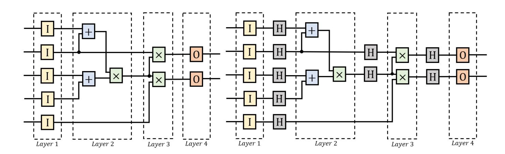

{0}------------------------------------------------

# Multi-Committee MPC: From Unanimous to Identifiable Abort

Lichun Li1 , Hongqing Liu⋆2 , Jiawei Ni2 , Chaoping Xing2 and Chen Yuan2

- 1 Ant Digital Technologies, Ant Group, China
- 2 Shanghai Jiao Tong University, Shanghai, China

Abstract. In this work, we consider dishonest majority MPC protocols with (1 − ϵ)n corrupted parties for some constant ϵ ∈ (0, 1/2). In this setting, there exist MPC protocols with unanimous abort that achieve constant communication in both online and offline phases via a packed secret sharing scheme. Departing from their approaches, we revisit the "committee-based" approach to design an efficient MPC protocol with constant online and offline communication complexity.

To balance the communication load of each party, our protocol adopts multiple committees, each of constant size. The computation of circuit C is then divided into layers, each assigned to one committee. To securely transmit messages between committees, we introduce the handoff gates, incurring only a slight communication overhead. Furthermore, we leverage circuit-dependent preprocessing and incremental checking to improve the online efficiency. Compared to other MPC protocols in the same corruption setting, our protocol achieves the smallest concrete total communication complexity.

Building upon our multi-committee unanimous-abort protocol, we upgrade it to identifiable abort by adapting a technique from (Rivinius, EUROCRYPT 2025). To integrate this technique into our setting, we adjust the verification timing and introduce a king party to reduce the communication complexity of openings. This yields the first identifiableabort MPC protocol with constant communication complexity in the sub-optimal dishonest majority setting.

# 1 Introduction

Secure multiparty computation (MPC) enables n distrustful parties to compute a public function on their private inputs while leaking no information except the final output. MPC protocols remain secure even for an adversary corrupting t out of n parties. The honest majority protocols are designed to tolerate a minority of corruptions, i.e., assume that t < n/2. These protocols can achieve information-theoretic security, which does not rely on any computational assumptions. The dishonest majority MPC protocols are secure against a larger number of corruptions (t ≥ n/2) by compromising the security through computational assumptions. We note that most MPC protocols apply the online/offline paradigm:

⋆ Hongqing Liu is the first author.

{1}------------------------------------------------

In the offline phase, expensive cryptographic operations are performed to produce correlated randomness. Then this randomness is consumed to realize an efficient, information-theoretic online phase.

Communication complexity is usually a benchmark to measure the efficiency of an MPC protocol. The communication complexity of most protocols grows at least linearly with the number of parties n, which is not practical for a large amount of participants. Therefore, it is desirable to design an MPC protocol with constant communication complexity, independent of the number of parties.

There are two major technical approaches to designing an MPC protocol with constant communication complexity. The first one is based on a packed secret sharing scheme [\[36\]](#page-32-0), which packs O(n) secrets within a single sharing. Since this scheme allows for evaluating a batch of O(n) gates simultaneously, the amortized communication complexity per gate is reduced to O(1). The packed secret sharing scheme is inherently compatible with structured circuits, such as SIMD (single instruction multiple data) circuits [\[36\]](#page-32-0) and highly repetitive circuits [\[7\]](#page-30-0). To evaluate a general circuit, we can either compile this circuit to a SIMD circuit [\[27,](#page-31-0)[38\]](#page-32-1), which generally brings an O(log |C|) communication overhead, or resort to permutation tools or network routing techniques [\[40,](#page-32-2)[41,](#page-32-3)[34,](#page-31-1)[35\]](#page-31-2).

In the sub-optimal dishonest majority setting t = (1 − ϵ)n for some constant ϵ ∈ (0, 1/2), both [\[41\]](#page-32-3) and SuperPack [\[35\]](#page-31-2) apply the packed secret sharing scheme to achieve constant online communication. It is noteworthy that [\[41\]](#page-32-3) requires interaction for addition gates due to network routing, which can be locally evaluated in most dishonest majority MPC protocols. As for the offline phase, SuperPack [\[41\]](#page-32-3) still requires linear communication overhead in the offline phase. [\[41\]](#page-32-3) does not instantiate the offline phase, and two follow-up works [\[11\]](#page-30-1) and [\[51\]](#page-33-0) instantiate the offline phase of [\[41\]](#page-32-3) with Oe(1) communication per multiplication gate.

A high-level idea of the second technical approach is to deploy the computation to a committee, a subset of parties. This idea can date back to [\[18\]](#page-30-2). A straightforward approach is to let s parties in the committee invoke an efficient MPC protocol while all other n − s parties stay idle. However, the computation and communication loads are unbalanced in this case, thus many protocols apply multiple committees to leverage the overheads. A line of committee-based protocols [\[31,](#page-31-3)[17,](#page-30-3)[37\]](#page-32-4) choose committees of size polylog(n), ensuring honest majority of each committee with an overwhelming probability. Another line of works [\[21](#page-30-4)[,52,](#page-33-1)[39\]](#page-32-5) requires that each committee contains at least one honest party, where committee size s is generally linear in the security parameter κ and independent of the number of parties n. To achieve the information-theoretic security, the lower bounds of the number of tolerated corruptions have been shown in [\[37\]](#page-32-4), which are t = (1/2 − ϵ)n against a static adversary and t = (1 − √ 0.5 − ϵ)n against an adaptive adversary. However, there exists no committee-based protocol concentrating on a sub-optimal dishonest majority setting yet.

To the best of our knowledge, all mentioned MPC protocols in the setting of t = (1 − ϵ)n achieve security with unanimous abort, i.e., honest parties can detect an attack but cannot identify who launches this attack. Since fairness and 

{2}------------------------------------------------

guarantee output delivery are impossible in dishonest majority setting, a series of works [\[42](#page-32-6)[,6,](#page-30-5)[5,](#page-29-0)[22](#page-31-4)[,50\]](#page-32-7) aim to achieve security with identifiable abort, i.e., all honest parties agree on the identity of a corrupted party in the case of an abort. This is a powerful deterrent against the adversary as honest parties can exclude the identified corrupted party when restarting the computation. Naturally, we propose the following question:

Question 1. Towards a static and malicious adversary corrupting t < (1 − ϵ)n parties for some constant ϵ ∈ (0, 1/2), can we construct an efficient dishonest majority protocol with identifiable abort that achieves constant communication complexity per gate in both online and offline phases?

### 1.1 Our Contribution

In the work, we answer the above question affirmatively. Departing from previous works [\[41](#page-32-3)[,35](#page-31-2)[,11](#page-30-1)[,51\]](#page-33-0), we revisit the line of committee-based MPC. Our contributions are two-fold: First, we introduce an efficient unanimous-abort MPC protocol with constant total communication complexity in the sub-optimal dishonest majority setting. Building upon this protocol, we then construct an identifiable-abort protocol with constant communication. We summarize these conclusions as the following theorems:

Theorem 1 (Unanimous abort, informal). Let n be a positive integer, ϵ ∈ (0, 1/2) be a constant and κ be the security parameter. For an arithmetic circuit C with size |C|, there exists an n-party protocol that computes C with statistical security against a static and malicious adversary corrupting at most t = (1 − ϵ)n parties, assuming the existence of preprocessing of authenticated sharings and Beaver triples. Let s = − κ log (1−ϵ) , this protocol achieves O(s|C|) online communication complexity, which is evenly distributed among all n parties.

Remark 1. If we instantiate the preprocessing with pseudorandom correlation generators [\[12](#page-30-6)[,13](#page-30-7)[,14,](#page-30-8)[53\]](#page-33-2), we obtain an n-party protocol with computational security against a static and malicious adversary corrupting at most t = (1 − ϵ)n parties, which achieves O(s|C|) offline communication complexity for s = − κ log (1−ϵ) .

Theorem 2 (Identifiable abort, informal). Let n be a positive integer, ϵ ∈ (0, 1/2) be a constant and κ be the security parameter. For an arithmetic circuit C with size |C|, there exists an n-party protocol that computes C with computation security against a static and malicious adversary corrupting at most t = (1 − ϵ)n parties. Let s = − κ log (1−ϵ) , this protocol achieves O(s|C|) online and O(s 2 |C|) offline communication complexity respectively, which is evenly distributed among all n parties.

Unanimous-Abort MPC. To leverage the communication and computation overhead, we propose a protocol with multiple committees, each committee 

{3}------------------------------------------------

guaranteed with at least one honest party. We split the whole circuit C into N layers and assign the i-th layer to committee Pi . After completing the computation of layer i, parties in Pi can retire and stay idle. Our MPC protocol uses the client-server model. In this model, input and output gates are associated with specific clients that provide input and receive outputs. To enhance the efficiency of our protocol, we propose the following key components:

- 1. Handoff Gates: To describe the message transmission between different layers, we introduce a new gate called the handoff gate. An (i, j) handoff gate delivers the output of a gate in layer i to layer j as the input of another gate for 1 ≤ i < j ≤ N. Since the number of handoff gates is at most linear in the circuit size |C|, introducing handoff gates usually incurs a constant overhead to the circuit size. The division of our circuit can be regarded as a variant of the layered circuits [\[23\]](#page-31-5).
- 2. Circuit-dependent Preprocessing: To accelerate the online computation, we introduce circuit-dependent preprocessing, which is the first effort to apply this technique in committee-based MPC protocols. The input, addition, multiplication and output gates can be securely computed by parties inside the same committee. Thus, it only suffices to consider the handoff gates between committees. For an (i, j) handoff gate, we introduce a new kind of correlated randomness, double sharing, which is a pair of authenticated sharings with the same secret and shared among two committees Pi ,Pj . When evaluating an (i, j) handoff gate in the online phase, parties in Pi only need to deliver a public value to Pj .
- 3. Check of Openings: The check of openings requires O(n 2 ) field elements of communication via a simultaneous message channel to commit the inputs of each party. This is not a problem in SPDZ [\[30\]](#page-31-6), as this price will be amortized away. However, this check causes an O(s 2N) communication overhead in our protocol, where N and s represent the number and size of committees, respectively. To solve this problem, we apply an incremental check proposed in [\[49\]](#page-32-8) to reduce this communication overhead to O(sN) by using a cheaper point-to-point channel.

Identifiable-Abort MPC. To upgrade our protocol to identifiable abort while preserving constant communication, we adapt the paradigm of [\[50\]](#page-32-7) to our multicommittee setting, which is a state-of-the-art protocol that provides public verifiability. This property is essential in our setting, since it enables parties within a committee to convince other parties and clients of the identity of a corrupted party when an abort occurs.

In [\[50\]](#page-32-7), each share xi is assigned with an MAC (message authentication code) LxiM = α · xi + ρ(xi), where α is the global key and per-message randomness ρ(xi) is generated by pseudorandom function (PRF) keys of all parties. Once the global key α and PRF keys are revealed, all parties can locally check the consistency of each share.

Key adaptations for our setting include:

{4}------------------------------------------------

- 1. Adjusted Verification Timing: We assign independent global keys and PRF keys to each committee and adjust the timing of verification, which allows parties in each committee to be inactive after completing their online computation duties. This maintains the "complete-and-retire" principles of our previous unanimous-abort protocol.
- 2. Opening with King Party: We introduce the role of the king party in each committee to reconstruct the secrets, which reduces the communication complexity of each opening from O(s 2 ) to O(s). Note that if the reconstructed secret is not correct, either the king party or those who send their shares to the king party are corrupted. To distinguish these two cases, we require that each message must be attached with a signature. Furthermore, We design a new verification protocol that leverages the above mechanisms to correctly identify the corrupted party.

Since most of the communication happens among one committee or between two committees, our MPC protocol with identifiable abort maintains constant communication complexity in both online and offline phases.

Extensions to Small Fields or Integer Rings. We observe that our protocol can be straightforwardly adapted to small fields or integer rings Zpk by replacing SPDZ protocol [\[30\]](#page-31-6) over large fields with other dishonest majority MPC protocols over small fields or integer rings, such as [\[28\]](#page-31-7) and SPDZ2 k [\[25\]](#page-31-8). However, other sub-optimal dishonest majority protocols only work with large fields, where the field size is at least 2 κ .

Comparison with Sub-Optimal Dishonest Majority Protocols. Because all known sub-optimal dishonest majority protocols achieve security with unanimous abort, we compare the efficiency of our unanimous-abort protocols with other suboptimal dishonest majority protocols [\[41,](#page-32-3)[35,](#page-31-2)[11,](#page-30-1)[51\]](#page-33-0). We instantiate the preprocessing with pseudorandom correlation generator (PCG) for oblivious linear evaluation (OLE) [\[14\]](#page-30-8) and vector OLE [\[12](#page-30-6)[,13](#page-30-7)[,53\]](#page-33-2). We briefly summarize the results and refer to Section [5](#page-26-0) for details. For each multiplication gate, the online communication complexity of our protocol is between SuperPack [\[35\]](#page-31-2) and [\[41\]](#page-32-3). However, if we count both online and offline communication costs, our protocol has the smallest communication cost compared to [\[35,](#page-31-2)[11](#page-30-1)[,51\]](#page-33-0). Our protocol also has a small computation overhead, since our protocol invokes a more efficient cryptographic primitive to authenticate sharings.

Comparison with Other Committee-Based Protocols. We also compare our protocol with the state-of-the-art committee-based MPC protocol [\[39\]](#page-32-5) in the honest majority setting. The authors of [\[39\]](#page-32-5) apply packed secret sharing to generate packed Beaver triples in the offline phase. In the online phase, they elect some committees containing at least one honest party. All parties in each committee "unpack" packed Beaver triples to obtain standard Beaver triples and slightly modify dishonest majority SPDZ protocol [\[30\]](#page-31-6) to evaluate part of the whole circuit. Here, we only compare the online phase, as information-theoretic security is

{5}------------------------------------------------

impossible for our dishonest majority protocol. Although [\[39\]](#page-32-5) also elects multiple committees, there is no interaction between different committees. Furthermore, its communication cost per multiplication gate is 7x higher than the original SPDZ protocol as the Beaver triples in [\[39\]](#page-32-5) are unauthenticated. In contrast, our protocol has almost the same communication cost as that in TurboSpeedz [\[8\]](#page-30-9), a variant of the SPDZ protocol with circuit-dependent preprocessing.

### 1.2 Technical Overview

The Use of Handoff Gates. Our protocol uses handoff gates to transfer messages between different committees. In comparison with layered circuits, the use of handoff gates allows message transmission between any two layers, not just adjacent ones. For example, if the output wire of a gate in layer i is connected to the input wire of a gate in another layer j, we add a handoff gate (i, j) to deliver the value of the wire. The committee in charge of layer i and the committee in charge of layer j will jointly compute this handoff gate. These two committees prepare a double sharing for each handoff gate in advance, which is a pair of authenticated sharings with the same secret and shared among different committees. To generate a double sharing, parties in two committees apply pairwise seeds of pseudorandom functions to obtain two additive sharings with the same secret and authenticate them within the respective committee. The only interaction between different committees happens during the verification, which takes the linear combination of double sharings to guarantee that each double sharing keeps the same secret.

Circuit-Dependent Preprocessing. The evaluation of a multiplication gate requires two broadcasts in the SPDZ protocol [\[30\]](#page-31-6). The introduction of circuitdependent preprocessing can reduce to a single broadcast as in TurboSpeedz [\[8\]](#page-30-9). Our protocol permits circuit-dependent preprocessing because the choice of committees and the division of circuit C are determined as the setup. Concretely, for each wire x with actual value νx, all parties in a committee hold an authenticated sharing of the mask λx, and these parties publicly learn the difference µx = νx − λx. The goal of circuit-dependent preprocessing is to obtain the authenticated sharing of mask λx, and parties only need to transfer the difference µx in the online phase.

Incremental Check of Opening. Note that each time we partially open a secret in the online phase, only parties inside the committee will learn this value. Thus, if we want to reuse the batch check protocol in SPDZ [\[30\]](#page-31-6), there are two options. One is to verify the correctness of the opened values after the computation of each layer. Another one is to store a large number of states and pass them between the committees. The states will not be erased until all values opened so far are verified. However, both of the options will lead to expensive communication overheads. Thus, we introduce the method of incremental check. In our incremental check procedure, each committee receives the shares of MAC

{6}------------------------------------------------

state  $\sigma$  from the previous committee. Then the parties update the MAC state using the MAC shares of partially opened values. In this case, only a constant-sized state needs to be transferred, which can be done with a communication cost linear in the committee size s by using seeds of pseudorandom functions.

Achieving Identifiable Abort. Directly deploying the protocol of [50] within our multi-committee framework is infeasible due to two fundamental conflicts: (1). The verification enforces all committees to stay online until the completion of the whole task, violating our "complete-and-retire" principle. (2). A single global key creates privacy risks for parties belonging to multiple committees. To resolve these issues, we require each party to hold multiple key shares and PRF keys, each corresponding to one committee it joins. This allows all parties within a committee to securely reveal their keys and perform verification immediately after its computation ends, without affecting the security of other committees.

Furthermore, we apply the king technique to each committee to reduce the communication cost of opening from  $O(s^2)$  to O(s), matching the best-known complexity in the unanimous-abort protocols. When sending  $x_i$  to the king party, each party  $P_i$  additionally provides the corresponding MAC  $(x_i)$  to prove the consistency3. If the king party fails to verify  $x_i$  with MAC  $(x_i)$ , it forwards the messages from  $P_i$  and identifies  $P_i$  as a cheater. To prevent a corrupted  $P_i$  from repudiating, we require each party to attach a signature to its messages. We note that the king party can also be corrupted. We detect and identify this corruption by applying the random linear combination, which is a common approach in SPDZ protocol.

### 1.3 Related Works

Player Virtualization. The player virtualization technique in [18] provides another approach by using committees. Their protocol sample N committees of size s. Parties in each committee invoke an inner, dishonest majority MPC protocol to emulate a virtual party, which is honest if this committee contains at least one honest party. Then N virtual parties can invoke an outer, honest majority MPC protocol to perform the actual computation. The MPC protocol equipped with player virtualization is able to achieve constant communication complexity: In [51], Song and Ye apply this technique to generate packed Beaver triples by regarding each  $d > -\frac{1}{\log(1-\epsilon)}$  parties as a virtual party. In [11], Bienstock and Yeo claim that the extraction of packed Beaver triples via weakly super-invertible matrices can be viewed as a concretely efficient version of player virtualization. Furthermore, this technique can be used to achieve poly-logarithmic computation overhead: Nielsen and Ranellucci [48] proposed an MPC protocol in the sub-optimal dishonest majority setting against a malicious and adaptive adversary. However, it was acknowledged in [48,11] that MPC emulation itself is not concretely efficient. Thus, protocols based on player virtualization may not be practical.

For simplicity, we omit the symmetric encryption here.

{7}------------------------------------------------

Fluid MPC Protocols. Committee-based MPC protocols play an important role in many scenarios, e.g., fluid MPC protocols [19,49,10] assume that the participants are free to join and quit the computation. In each epoch, only one committee is responsible for the computation. [19] requires that the majority of parties to be honest in each committee, while [49] only requires that there is at least one honest party in each committee. [10] improves the communication cost of [19] and [49] in the honest majority and dishonest majority setting, respectively. It is noteworthy that our MPC protocols with multiple committees have some similar features with fluid MPC: Both protocols deploy the computation to a dynamic subset of parties. However, the performance of fluid MPC is measured by the communication round complexity, which aims to achieve maximal fluidity. In contrast, the performance of our protocol is measured by the communication complexity.

**MPC** for Layered Circuits. In the layered circuits, the outputs of gates in layer i are used as the inputs of gates in layer i+1. Any general arithmetic circuit C of size |C| can be transformed into a layered circuit of size O(d|C|), where d is the depth of circuit C. David et al. [33] propose a perfectly secure fluid MPC protocol for layered circuits with an optimal corruption t < n/3. Layered circuits are common in MPC protocols with communication sublinear in circuit size, such as [23,15,16,32,1,24].

MPC with Identifiable Abort. The concept of identifiable abort was first formally proposed in [42,43], which aims to identify the cheater when an abort occurs. Furthermore, some works [6,26,22,50] can even convince extern auditors of the identity of corrupted parties, achieving stronger public verifiability. [6] achieves public identifiable abort (PIA) by running the non-PIA protocol twice and publishing information from the duplicated protocol to convince external auditor. [26] and [22] achieves PIA with (public verifiable) homomorphic commitment and committed OT, respectively. [50] achieves PIA by resorting to homomorphic encryption and an authenticated secret sharing scheme with PRF. [50] is the most efficient protocol among them, which requires  $O(n^2|C|)$  offline and O(n|C|) online communication complexity, respectively.

### 2 Preliminary

#### 2.1 Basic Notations

Our protocol is defined over a finite field  $\mathbb{F}_q$  with q elements, where q is typically a prime power. We use  $x \stackrel{\$}{\leftarrow} \mathbb{F}_q$  to denote a variable x uniformly sampled from the finite field  $\mathbb{F}_q$ . For a positive integer n, let [n] denote the set of integers  $\{1, ..., n\}$ . We use  $\mathsf{PRF}(s,\cdot): \{0,1\}^* \to \mathbb{F}_q$  to denote a family of pseudorandom functions (PRFs), which are determined by the seed s. Let  $s_{i,j}$  be a PRF seed shared between  $P_i$  and  $P_j$  such that  $s_{j,i} = s_{i,j}$ . The base of the logarithm function log is set as 2 by default.

{8}------------------------------------------------

### 2.2 Security Model

We consider a multiparty computation protocol in the client-server model, where c clients provide inputs to n servers PMain = {P1, · · · , Pn} and then n servers evaluate the circuit C and deliver outputs to these c clients. Note that this model is equivalent to the standard MPC model if every participant plays the role of both a client and a server. In this work, the term "party" refers only to a server. In the sub-optimal dishonest majority setting, an adversary is allowed to corrupt at most (1 − ϵ)n parties and c clients, where ϵ ∈ (0, 1/2) is a constant. One advantage of the client-server model is that it is sufficient to only consider an adversary with maximal corruption, i.e., an adversary that exactly corrupts t parties.

Let κ denote the statistical security parameter of MPC. We assume that the adversary is malicious and static. This means the adversary has to choose the set of corrupted parties before the execution of protocols and the corrupted parties can arbitrarily deviate from the protocol. We assume a private and authentic channel between each pair of parties and a broadcast channel. We also assume a more expensive simultaneous message channel, which enables some parties to commit their inputs to some specific receivers.

We present two kinds of MPC protocols that achieve security with unanimous abort and identifiable abort, respectively. The security with unanimous abort allows the adversary to abort the protocol without being identified by honest parties. The security with identifiable abort allows honest parties to identify corrupted parties when an abort happens.

Our security analysis follows Canetti's Universal Composability (UC) framework. In this model, we prove that our protocol Π securely implements a functionality F if there exists a simulator to interact with any adversary (or more formally, environment), which can only distinguish an ideal world (described in functionality F) and a real world (instantiated in protocol Π) with a negligible probability. The composability of UC framework enables us to apply a hybrid model, which guarantees that UC-secure sub-protocols can be combined to build a more complex UC-secure protocol.

### 2.3 SPDZ Protocol

SPDZ [\[30\]](#page-31-6) is one of the most ubiquitous and efficient dishonest majority multiparty computation protocols. We briefly review the SPDZ protocol for a fixed set of parties P.

The SPDZ Authenticated Secret Sharing. We use [x] = (x1, · · · , xn) to represent an additive sharing of x, i.e., x1 +· · ·+xn = x. An authenticated secret sharing [[x]] in SPDZ protocol is represented as a triple ([x], [α], [m(x)]), where each party Pi holds the random share xi of secret x, the key share αi of global key α and the MAC share mi(x) of MAC m(x) such that

$$\sum_{i=1}^{n} x_i = x \quad \sum_{i=1}^{n} \alpha_i = \alpha \quad \sum_{i=1}^{n} m_i(x) = m(x) = \alpha \cdot x$$

{9}------------------------------------------------

The SPDZ Offline Phase. The SPDZ protocol adopts a comparatively expensive offline phase to achieve an information-theoretic online phase. The main tasks of the offline phase include the generation of random authenticated sharings [[r]] and Beaver triples ([[a]], [[b]], [[c]]). In particular, the offline phase can be instantiated with additive homomorphic encryption [\[9,](#page-30-14)[46\]](#page-32-11), somewhat homomorphic encryption [\[30,](#page-31-6)[29,](#page-31-13)[4](#page-29-2)[,46\]](#page-32-11), oblivious transfer [\[47,](#page-32-12)[45\]](#page-32-13), oblivious linear evaluation [\[44](#page-32-14)[,2](#page-29-3)[,49,](#page-32-8)[3\]](#page-29-4), etc.

The SPDZ Online Phase. In the online phase, every Pi shares its private input xi by broadcasting xi − ri to other parties in P, where the (ri , [[ri ]]) is an unused input mask generated in the offline phase.[4](#page-9-0)

Addition gates can be computed locally: For an addition gate with input wires x, y and output wire z, all parties in P locally compute [[z]] = [[x]] + [[y]].

For a multiplication gate with input wires x, y and output wire z, one Beaver triple ([[a]], [[b]], [[c]]) is consumed for computation. Then all parties partially open d = [[x]] − [[a]] and e = [[y]] − [[b]] to all other parties in P. Finally, these parties can locally compute

$$[\![z]\!] = [\![c]\!] + d[\![b]\!] + e[\![a]\!] + d \cdot e$$

Before the final output, parties run a verification protocol to check all opened values by using MACs. If a corrupted party deviates from the protocol, the deviation is caught with an overwhelming probability.

King Technique. In SPDZ protocol, all parties in P agree on a special party PKing, which collects the shares of all other parties, reconstructs the secret and broadcasts the value. The communication of partial opening can be reduced from O(n 2 ) to O(n) with the king technique.

# 3 MPC with Unanimous Abort

In this section, we apply multiple committees to perform computations during the online phase. Let s and N denote the size and number of committees, respectively. We mainly consider the case that there exists at least one honest party in each committee, thus we set s = − κ+log N log(1−ϵ) based on the union bound to ensure that each committee contains at least one honest party.

### 3.1 Circuit Structure

Division of the Circuit. We want to divide circuit C into N layers, and each committee only takes charge of one layer in its epoch. The goal of division is to make the interaction between different layers as less as possible. We divide circuit C into N layers such that:

4 An input mask (ri, [[ri]]) is a random authenticated sharing, where the secret ri is learned by Pi. To generate an input mask, all parties generate a random authenticated sharing and distribute their shares to Pi.

{10}------------------------------------------------

- In the first layer, parties receive inputs from clients.
- For the gates in intermediate layers, we require that at least one input is received from the output of input gates or multiplication gates in previous layers.
- In the last layer, parties send outputs to clients.

We note that the output wire of a given layer may be adjacent to gates in other layers. In view of this, we add handoff gates to represent the message transmission between different committees. A single handoff gate (i, j) receives the output of a gate in layer i and delivers this value to layer j. For example, assume a gate in layer i with output wires adjacent to gates in layer j1, · · · , jℓ. Then we need to add ℓ handoff gates (i, j1),(j1, j2), · · · ,(jℓ−1, jℓ). Note that if there are multiple output wires of this gate adjacent to gates in the same layer, we still add one handoff gate in this case. Since the fan-in degree of each gate is at most 2, the number of handoff gates is bounded by 2|C|.

We present an example of our division of circuit C in [Fig. 1,](#page-9-1) where "I", "H" and "O" in [Fig. 1](#page-9-1) represent input, handoff and output gates, respectively. The output wire of the second input gate in layer 1 is connected to an addition gate in layer 2 and a multiplication gate in layer 3, thus we add handoff gates (1, 2) and (2, 3) as shown on the right in [Fig. 1.](#page-9-1) The output wire of the multiplication gate in layer 2 is adjacent to two multiplication gates in layer 3, thus we only add one handoff gate to deliver the value. Moreover, the output wire of the last input gate in layer 1 is connected to the second multiplication gate in layer 3, we then add a handoff gate (1, 3) to deliver this value from layer 1 to layer 3.

Fig. 1. An example of our division of circuit C when N = 4.

Comparison with Layered Circuits. Our division of circuit C is similar to layered circuits. However, there are two major differences that can reduce the number of handoff gates:

– Layered circuits are completely determined by the circuit topology, while our division is influenced by the type of gates. For example, two layers are necessary for the sub-circuit of layer 2 in [Fig. 1](#page-9-1) in the layered circuits.

{11}------------------------------------------------

– Layered circuits require that only two adjacent layers are connected via some wires, while our division removes this requirement and has a more flexible interaction pattern. The number of handoff gates in our division is O(|C|), while this number is O(d|C|) in the layered circuits, where d is the depth of circuit C.

Committee Dependency. All parties in committee  $\mathcal{P}_i$  need to stay online to receive inputs from previous committees and perform the computation in their epoch. Once parties in  $\mathcal{P}_i$  deliver their outputs to other committees, they can quit the computation and become idle. We use committee dependency to denote the number of online epochs for a committee. For example, if committee  $\mathcal{P}_i$  receives inputs from committees  $\mathcal{P}_{j_1}, \dots, \mathcal{P}_{j_a}$ , then the committee dependency of committee  $\mathcal{P}_i$  is  $i - \min\{j_1, \dots, j_a\} + 1$ . We observe that our division has the same interaction pattern as layered circuits if the committee dependency is 2. If the committee dependency is too large, we can add dummy handoff gates to reduce the dependency. For example, assume that the committee  $\mathcal{P}_j$  only receives the input from committee  $\mathcal{P}_i$ . We break an (i,j) handoff gate into two handoff gates (i,k) and (k,j) with i < k < j. Then, the committee dependency of committee  $\mathcal{P}_j$  is reduced from j-i+1 to j-k+1. Thus, by adding dummy handoff gates, we can achieve a trade-off between committee dependency and communication complexity.

Authenticated Secret Sharing for Multiple Committees. We denote the committee that performs the computation in epoch i as  $\mathcal{P}_i \subseteq \mathcal{P}_{\mathsf{Main}}$ . We define the sum of key shares held by all parties in  $\mathcal{P}_i$  as the global key of this committee, denoting it as  $\alpha^{(i)}$ . We denote  $P_{\mathsf{King}}^{(i)}$  as the king party of  $\mathcal{P}_i$ .

To distinguish authenticated secret sharings between different committees, the secret x shared by committee  $\mathcal{P}_i$  is denoted as  $[x]^{(i)} = ([x]^{(i)}, [\alpha]^{(i)}, [m(x)]^{(i)})$ , where each party  $P_j$  in  $\mathcal{P}_i$  holds the random share  $x_j$ , the key share  $\alpha_j$  and the MAC share  $m_j(x)$ , subject to

$$\sum_{P_j \in \mathcal{P}_i} x_j = x \quad \sum_{P_j \in \mathcal{P}_i} \alpha_j = \alpha^{(i)} \quad \sum_{P_j \in \mathcal{P}_i} m_j(x) = m(x) = x \cdot \alpha^{(i)}$$

Circuit-Dependent Preprocessing. We use  $\nu_x$  to represent the actual value on wire x. We denote  $\lambda_x$  as the mask on wire x, which is produced during the offline phase, and denote its authenticated secret sharing held by parties in  $\mathcal{P}_i$  as  $[\![\lambda_x]\!]^{(i)}$ . The difference  $\mu_x = \nu_x - \lambda_x$  is publicly available for all parties in  $\mathcal{P}_i$  during the online phase, if  $\mathcal{P}_i$  is the current committee to perform the computation. The mask is generated in the following way:

- For an input gate, a multiplication gate or a handoff gate with output wire x, sample  $\lambda_x \stackrel{\$}{\leftarrow} \mathbb{F}_q$ .
- For an addition gate with input wire x, y and output wire z, set  $\lambda_z = \lambda_x + \lambda_y$ .

{12}------------------------------------------------

To securely compute the addition of  $\nu_x$  and  $\nu_y$  in epoch i, all parties in  $\mathcal{P}_{i}$  locally compute  $(\mu_{z}, [\![\lambda_{z}]\!]^{(i)}) = (\mu_{x} + \mu_{y}, [\![\lambda_{x} + \lambda_{y}]\!]^{(i)})$  with  $[\![\lambda_{x} + \lambda_{y}]\!]^{(i)} = ([\![\lambda_{x}]\!]^{(i)} + [\![\lambda_{y}]\!]^{(i)}, [\![\alpha]\!]^{(i)}, [\![m(\lambda_{x})]\!]^{(i)} + [\![m(\lambda_{y})]\!]^{(i)}).$ 

To securely multiply a public element a with  $\nu_x$  to obtain  $\nu_y$  in epoch i, all parties in  $\mathcal{P}_i$  locally compute  $(\mu_y, [\![\lambda_y]\!]^{(i)}) = (a \cdot \mu_x, a \cdot [\![\lambda_x]\!]^{(i)})$  with  $a \cdot [\![\lambda_x]\!]^{(i)} =$  $(a \cdot [\lambda_x]^{(i)}, [\alpha]^{(i)}, a \cdot [m(\lambda_x)]^{(i)})$ 

**Evaluation of Handoff Gates.** We next consider how to deal with a handoff gate. We resort to a special type of correlated randomness double sharing: If two committees  $\mathcal{P}_i$  and  $\mathcal{P}_j$  authenticate the same value r to obtain  $[\![r]\!]^{(i)}$  and  $[\![r]\!]^{(j)}$ respectively, then this pair is denoted as a double sharing.

Assume a handoff gate (i, j) with the input wire x and output wire y. All parties in  $\mathcal{P}_i$  already obtain  $(\mu_x, [\![\lambda_x]\!]^{(i)})$ , and parties in  $\mathcal{P}_i$  and  $\mathcal{P}_j$  choose a double sharing generated in advance as  $([\![\lambda_y]\!]^{(i)}, [\![\lambda_y]\!]^{(j)})$ . All parties in  $\mathcal{P}_i$  send their shares  $[\![\lambda_x - \lambda_y]\!]^{(i)}$  to the king party of  $\mathcal{P}_i$ , and this party sends  $\mu_y = \mu_x + (\lambda_x - \lambda_y)$ to all parties in  $\mathcal{P}_i$ .

#### 3.2 Circuit-Independent Preprocessing Phase

In this subsection, we introduce circuit-independent preprocessing functionality  $\mathcal{F}_{\mathsf{CI-Prep}}^{\mathsf{UA}}$  for multiple committees. In the circuit-independent preprocessing phase, all parties obtain the number of committees N and the circuit size of each layer.

# Functionality 1: $\mathcal{F}_{CI-Prep}^{UA}$

Let s and N denote the size and the number of committees, respectively.

- Initialize: On input (Init) from all parties in  $\mathcal{P}_{\mathsf{Main}}$ , sample  $\alpha_i$  and  $s_{i,j}$  for  $P_i, P_j \notin \mathcal{C}$ , and set  $s_{j,i} = s_{i,j}$ . For  $P_i \in \mathcal{C}$ , receive  $\alpha_i$  and  $s_{i,j}$  from the adversary and set  $s_{j,i} = s_{i,j}$  for all  $j \neq i$ . Send  $\alpha_i$  and  $\{s_{i,j}\}_{j\neq i}$  to  $P_i$  for  $P_i \notin \mathcal{C}$ .
- **Elect:** On input (Elect, s, N) from all parties in  $\mathcal{P}_{\mathsf{Main}}$ :
  - 1. For  $i \in [N]$ , randomly sample a committee  $\mathcal{P}_i \subseteq \mathcal{P}_{\mathsf{Main}}$ , where  $\mathcal{P}_i$ contains s distinct parties. If there exists  $i \in [N]$  such that  $\mathcal{P}_i \subseteq \mathcal{C}$ , then  $\mathcal{F}_{CI-Prep}^{UA}$  aborts.
  - 2. For  $i \in [N]$ , set the global key of the committee  $\mathcal{P}_i$  as  $\alpha^{(i)} = \sum_{P_i \in \mathcal{P}_i} \alpha_j$ .
- Authenticate: On input (Auth,  $[x]^{(i)}$ ,  $\mathcal{P}_i$ ) from all parties in  $\mathcal{P}_i$ :
  1. Compute the MAC  $m(x) = x \cdot \alpha^{(i)}$ 

  - 2. Receive  $\{m_j(x)\}_{P_j\in\mathcal{P}_i\cap\mathcal{C}}$  from the adversary and randomly sample  $\{m_j(x)\}_{P_j \in \mathcal{P}_i \setminus \mathcal{C}}$  subject to  $m(x) = \sum_{P_j \in \mathcal{P}_i} m_j(x)$ .
  - 3. Send  $m_j(x)$  to party  $P_j$  for all  $P_j \in \mathcal{P}_i \setminus \mathcal{C}$ .
- Authenticate Random Sharings: On input (AuthRand,  $\mathcal{P}_i$ ) from all parties in  $\mathcal{P}_i$ , randomly sample  $r \stackrel{\$}{\leftarrow} \mathbb{F}_q$  and generate an authenticated sharing  $[r]^{(i)}$  such that for  $P_j \in \mathcal{C} \cap \mathcal{P}_i$ , j-th share is chosen by the adversary. Then send the corresponding shares to  $P_j$  for all  $P_j \in \mathcal{P}_i \setminus \mathcal{C}$ .

{13}------------------------------------------------

- **Triple:** Receiving (Triple,  $\mathcal{P}_i$ ) from all parties in  $\mathcal{P}_i$ , sample  $a, b \xleftarrow{\$} \mathbb{F}_q$  and compute  $c = a \cdot b$ . Generate authenticated sharings ( $\llbracket a \rrbracket^{(i)}, \llbracket b \rrbracket^{(i)}, \llbracket c \rrbracket^{(i)}$ ) such that for  $P_j \in \mathcal{P}_i \cap \mathcal{C}$ , j-th shares of these sharings are chosen by the adversary. Then send the corresponding shares to  $P_j$  for all  $P_j \in \mathcal{P}_i \setminus \mathcal{C}$ .

**Initialization.** First, every party  $P_i$  in  $\mathcal{P}_{\mathsf{Main}}$  randomly samples  $\alpha_i \stackrel{\$}{\leftarrow} \mathbb{F}_q$  as its key share. Then, each pair of parties in  $\mathcal{P}_{\mathsf{Main}}$  share a common PRF seed. We use  $\{s_{i,j}\}_{P_j \in \mathcal{P}_{\mathsf{Main}} \setminus \{P_i\}}$  to denote all seeds held by  $P_i$ . Recall that  $s_{i,j} = s_{j,i}$  for all pairs  $(P_i, P_j)$  in  $\mathcal{P}_{\mathsf{Main}}$ . The seeds of PRF are used in the generation of double sharings in the circuit-dependent preprocessing phase and the incremental check in the online phase.

**Election.** All parties in  $\mathcal{P}_{\mathsf{Main}}$  randomly elect N committees, each of size s. The generation of correlated randomness is divided into epochs. In each epoch, only a designated committee will participate in the computation. Those designated committees for each epoch are predetermined at the beginning.

Correlated randomness. In the circuit-independent preprocessing, parties in each committee generate two kinds of correlated randomness: authenticated secret sharings (in command Auth and AuthRand5) and authenticated Beaver triples (in command Triple).

#### 3.3 Circuit-Dependent Preprocessing Phase

In this subsection, we start by introducing circuit-dependent preprocessing functionality  $\mathcal{F}_{\mathsf{CD-Prep}}^{\mathsf{UA}}$  for multiple committees, and then illustrate how to securely implement it. We follow the same routine for the online phase in the following subsections. We note that the structure of circuit C is known in the circuit-dependent preprocessing phase. The goal of circuit-dependent preprocessing functionality  $\mathcal{F}_{\mathsf{CD-Prep}}^{\mathsf{UA}}$  is to generate the authenticated sharing of the mask  $\lambda_x$  for wire x.

# Functionality 2: $\mathcal{F}_{CD-Prep}^{UA}$

Let s and N denote the size and the number of committees, respectively. For  $i \in [N]$ , the parties in  $\mathcal{P}_i$  maintain a dictionary  $\mathsf{Val}^{(i)}$ , which keeps track of

&lt;sup>5 We use two commands Auth and AuthRand to separate the authentication of a given and random additive sharing. This is because instantiation of AuthRand is sometimes more efficient than Auth. For instance, in the preprocessing based on vector oblivious linear evaluation [49], AuthRand can be instantiated with sublinear communication, while Auth requires linear communication.

{14}------------------------------------------------

authenticated values in this committee. The shares of authenticated sharing held by corrupted parties can be chosen by the adversary.

This functionality contains the same commands in  $\mathcal{F}_{CI-Prep}^{UA}$  and the following new commands:

- **Input Prepare:** On input (InputPrep,  $id_{x_1}, \dots, id_{x_\ell}$ , Client,  $\mathcal{P}_1$ ) from all parties in  $\mathcal{P}_1$  and Client, sample  $\lambda_{x_1}, \dots, \lambda_{x_\ell} \stackrel{\$}{\leftarrow} \mathbb{F}_q$ , then send  $\lambda_{x_i}$  to Client and store  $\mathsf{Val}^{(1)}[id_{x_i}] = \lambda_{x_i}$  for  $i \in [\ell]$ .
- Addition Prepare: On input (AddPrep,  $id_x$ ,  $id_y$ ,  $id_z$ ,  $\mathcal{P}_i$ ) from all parties in  $\mathcal{P}_i$ , retrieve  $\lambda_x = \mathsf{Val}^{(i)}[id_x]$  and  $\lambda_y = \mathsf{Val}^{(i)}[id_y]$ . Store  $\mathsf{Val}^{(i)}[id_z] = \lambda_x + \lambda_y$ .
- Multiplication Prepare: On input (MultPrep,  $id_x$ ,  $id_y$ ,  $id_z$ ,  $id_{xy}$ ,  $\mathcal{P}_i$ ) from all parties in  $\mathcal{P}_i$ , retrieve  $\lambda_x = \mathsf{Val}^{(i)}[id_x]$  and  $\lambda_y = \mathsf{Val}^{(i)}[id_y]$ . Sample  $\lambda_z \stackrel{\$}{\leftarrow} \mathbb{F}_q$  and store  $\mathsf{Val}^{(i)}[id_z] = \lambda_z$ . Compute  $\lambda_x \cdot \lambda_y$  and store  $\mathsf{Val}^{(i)}[id_{xy}] = \lambda_x \cdot \lambda_y$ .
- **Handoff Prepare:** On input (HandPrep,  $id_x$ ,  $id_y$ ,  $\mathcal{P}_i$ ,  $\mathcal{P}_j$ ) from all parties in  $\mathcal{P}_i$  and  $\mathcal{P}_j$ , retrieve  $\lambda_x = \mathsf{Val}^{(i)}[id_x]$ . Sample  $\lambda_y \stackrel{\$}{\leftarrow} \mathbb{F}_q$ , and store  $\mathsf{Val}^{(j)}[id_y] = \lambda_y$ . Distribute  $\lambda_x \lambda_y$  to all parties in  $\mathcal{P}_i$ .
- **Output Prepare:** On input (OutputPrep,  $id_{x_1}, \dots, id_{x_\ell}$ , Client,  $\mathcal{P}_N$ ) from all parties in  $\mathcal{P}_N$  and Client, retrieve  $\lambda_{x_i} = \mathsf{Val}^{(N)}[id_{x_i}]$  and send  $\lambda_{x_i}$  to Client for  $i \in [\ell]$ .

Check of Openings. Before dealing with different gates in the circuit-dependent preprocessing phase, we first discuss how to check the opening of  $\llbracket \cdot \rrbracket$ -sharings. We describe this functionality as  $\mathcal{F}_{\mathsf{Check}}^{\mathsf{UA}}$ , which records the opened values and corresponding  $\llbracket \cdot \rrbracket$ -sharings of each committee, and checks the correctness of all previous openings before the final committee  $\mathcal{P}_N$  delivers outputs to Client. Since  $\mathcal{F}_{\mathsf{Check}}^{\mathsf{UA}}$  only records opening of  $\llbracket \cdot \rrbracket$ -sharings in the circuit-dependent preprocessing phase, we defer the concrete instantiation  $\Pi_{\mathsf{Check}}^{\mathsf{UA}}$  to the description of online phase in Section 3.4. Similar to SPDZ protocol, all parties in a committee can partially open a  $\llbracket \cdot \rrbracket$ -sharing (only open the secret), and leave the verification to the final check. One can find the detail in procedure  $\pi_{\mathsf{Open}}^{\mathsf{UA}}$  in Section A in the Supplementary Material.

# Functionality 3: $\mathcal{F}_{Check}^{UA}$

Denote s and N as the size and the number of committees, respectively. For  $i \in [N]$ , the parties in  $\mathcal{P}_i$  maintain a dictionary  $\mathsf{Val}^{(i)}$ , which keeps track of authenticated values in this committee. This functionality proceeds as follows:

- Compute State: On input (Check,  $id_{x_1}, \dots, id_{x_{\ell_i}}, x_1^{(i)}, \dots, x_{\ell_i}^{(i)}, \mathcal{P}_i$ ) from all parties in  $\mathcal{P}_i$ , record the opened values along with their corresponding indexes.
- **Final Check:** On input (FinalCheck,  $\mathcal{P}_N$ ) from all parties in  $\mathcal{P}_N$ , wait for a signal from the adversary. If the adversary sends OK and  $x_j^{(i)} = \mathsf{Val}^{(i)}[\mathsf{id}_{x_j}]$

{15}------------------------------------------------

for  $i \in [N]$ ,  $j \in [\ell_i]$ , return OK to all honest parties. Otherwise, return Abort to all honest parties.

**Prepare for Input Gates.** Assume the number of input gates of Client is  $\ell$ , whose output wires are denoted as  $x_1, \dots, x_\ell$ , respectively. All parties in  $\mathcal{P}_1$  first choose  $\ell+1$  random authenticated sharings generated in  $\mathcal{F}^{\mathsf{UA}}_{\mathsf{Cl-Prep}}$  as  $\{ \llbracket \lambda_{x_i} \rrbracket^{(1)} \}_{i \in \{0\} \cup [\ell]}$ . Then these parties distribute their shares to Client and Client reconstructs  $\lambda_{x_i}$  for  $i \in \{0\} \cup [\ell]$ . Parties in  $\mathcal{P}_1$  and Client jointly sample  $\ell$  public random coefficients  $\{c_i\}_{i \in [\ell]}$  via the coin tossing functionality  $\mathcal{F}_{\mathsf{Coin}}$ , which is described in Section A in the Supplementary Material. Then Client opens the value  $y = \sum_{i=0}^{\ell} c_i \cdot \lambda_{x_i}$  (set  $c_0 = 1$ ) to parties in  $\mathcal{P}_1$ , and parties in  $\mathcal{P}_1$  sacrifice the first authenticated sharing  $\llbracket \lambda_{x_0} \rrbracket^{(1)}$  to check the correctness of the last  $\ell$  authenticated sharings.

Prepare for Addition Gates. The addition gates only require local computations.

Prepare for Multiplication Gates. In this step, we need to consume an unused multiplication triple ( $[a]^{(i)}, [b]^{(i)}, [c]^{(i)}$ ) and random authenticated sharing  $[r]^{(i)}$  generated in  $\mathcal{F}_{\mathsf{CI-Prep}}^{\mathsf{UA}}$ . Assume a multiplication gate in layer i with input wires x, y and output wire z. All parties in  $\mathcal{P}_i$  set the mask of output wire z as  $[\lambda_z]^{(i)} = [r]^{(i)}$ . Next, all parties in  $\mathcal{P}_i$  locally compute  $[\lambda_x]^{(i)} - [a]^{(i)}$  and  $[\lambda_y]^{(i)} - [b]^{(i)}$ , and send theirs shares to  $P_{\mathsf{King}}^{(i)}$ .  $P_{\mathsf{King}}^{(i)}$  reconstructs two secrets and distributes them to all parties in  $\mathcal{P}_i$ .

**Prepare for Handoff Gates.** We first discuss how to generate double sharings, the correlated randomness for (i,j) handoff gates. Two committees  $\mathcal{P}_i$  and  $\mathcal{P}_j$  can locally generate additive sharing of the same field element r with pairwise seeds of PRF. Let  $\mathsf{PRF}(s,\cdot):\{0,1\}^* \to \mathbb{F}_q$  be a family of pseudorandom functions indexed by PRF key s. We use sid to denote a security identifier to generate fresh output from PRFs. Each party  $P_k$  in  $\mathcal{P}_i$  sets its share  $r_k$  as  $\sum_{P_h \in \mathcal{P}_j} \mathsf{PRF}(s_{k,h},\mathsf{sid})$ . Each party  $P_h$  in  $\mathcal{P}_j$  sets its share  $r_h$  in a similar way. Then we have that

$$\sum_{P_k \in \mathcal{P}_i} r_k = \sum_{P_k \in \mathcal{P}_i} \sum_{P_h \in \mathcal{P}_j} \mathsf{PRF}(s_{k,h}, \mathsf{sid}) = r = \sum_{P_h \in \mathcal{P}_j} \sum_{P_k \in \mathcal{P}_i} \mathsf{PRF}(s_{h,k}, \mathsf{sid}) = \sum_{P_h \in \mathcal{P}_j} r_h$$

Two committees can authenticate additive sharings of r with Auth command. However, corrupted parties may not follow the protocol to use seeds from PRFs and thus we need to check the consistency. To amortize the communication complexity, our protocol generates  $\tau+1$  double sharings  $\{\llbracket r_\ell \rrbracket^{(i)}, \llbracket r_\ell \rrbracket^{(j)}\}_{\ell \in \{0\} \cup [\tau]}$  and takes a random linear combination of the last  $\tau$  double sharings. To check the consistency, we sacrifice  $(\llbracket r_0 \rrbracket^{(i)}, \llbracket r_0 \rrbracket^{(j)})$  to open the secrets. One can find the detail in procedure  $\pi_{\text{Double}}^{\text{UA}}$ .

{16}------------------------------------------------

#### Procedure 1: π UA Double

Let PRF(s, ·) : {0, 1} ∗ → Fq be a family of pseudorandom functions indexed by PRF key s. Let sid be the security identifier to compute a fresh output from PRFs. This procedure produces τ double sharings for two committees Pi and Pj .

- 1. For P ℓ ∈ {0} ∪ [τ ], each party Pk in Pi locally computes its share rk,ℓ = Ph∈Pj PRF(sk,h,sid + ℓ), and every party Ph in Pj locally computes its share rh,ℓ = P Pk∈Pi PRF(sh,k,sid + ℓ). Set [rℓ] (i) = {rk,ℓ}Pk∈Pi and [rℓ] (j) = {rh,ℓ}Ph∈Pj .
- 2. Parties in Pi and Pj invoke F UA CI−[Prep](#page-12-0) with command Auth to obtain ([[r0]](i) , · · · , [[rτ ]](i) ) and ([[r0]](j) , · · · , [[rτ ]](j) ), respectively.
- 3. All parties in Pi and Pj call F[Coin](#page-34-2) to obtain c1, · · · , cτ \$ ← Fq.
- 4. All parties in Pi and Pj locally compute

$$[\![x]\!]^{(i)} = [\![r_0]\!]^{(i)} + \sum_{\ell=1}^{\tau} c_{\ell} \cdot [\![r_{\ell}]\!]^{(i)}, \quad [\![y]\!]^{(j)} = [\![r_0]\!]^{(j)} + \sum_{\ell=1}^{\tau} c_{\ell} \cdot [\![r_{\ell}]\!]^{(j)}$$

- 5. All parties in Pi and Pj call π UA [Open](#page-34-0) to open x and y, then abort if x ̸= y .
- 6. If no party aborts, the parties in Pi output ([[r1]](i) , · · · , [[rτ ]](i) ) and parties in Pj output ([[r1]](j) , · · · , [[rτ ]](j) ).

For an (i, j) handoff gate with input wire x and output wire y, we consume an unused double sharing ([[r]](i) , [[r]](j) ) and assign the secret r as the mask λy of output wire y. In the online phase, a handoff gate with input wire x and output wire y keeps the actual values but changes the masks, i.e., νx = νy but λx ̸= λy. If all parties in Pi hold the difference λx − λy between two masks λx and λy in the circuit-dependent preprocessing phase, then they locally transform µx to µy and deliver µy to all parties in Pj in the online phase.

Remark 2. We observe that the preparation for the first handoff gate next to an input or multiplication gate can be done without interaction in the circuitdependent preprocessing phase. For example, let wire z denote the output wire of a multiplication gate in layer i and the input wire of an (i, j) handoff gate, and w denote the output wire of this handoff gate. We use a unused double sharing ([[λw]](i) , [[λw]](j) ) between Pi and Pj . If all parties in Pi directly set [[λz]](i) = [[λw]](i) , it is clear that no interaction is needed for this handoff gate.

Prepare for Output Gates. Assume the number of output gates of Client is ℓ, whose input wires are x1, · · · , xℓ respectively. Similar to the preparation for input gates, parties in PN open their shares to Client and Client reconstructs {λxi }i∈[ℓ] . To checked the correctness of ℓ authenticated sharings, parties in PN sacrifice one random authenticated sharing [[λx0 ]](N) . The only difference is that for an output gate, the mask of input wire x [[λx]](N) is obtained from previous 

{17}------------------------------------------------

computation, while for an input gate, the mask of output wire  $x \ [\![\lambda_x]\!]^{(1)}$  is a random authenticated sharings produced in  $\mathcal{F}_{\mathsf{CI-Prep}}^{\mathsf{UA}}$ .

Due to space constraints, we defer the instantiation  $\Pi_{CD-Prep}^{UA}$  of circuit-dependent preprocessing phase to Section A in the Supplementary Material.

**Theorem 3.** The protocol  $\Pi_{\mathsf{CD-Prep}}^{\mathsf{UA}}$  securely implements  $\mathcal{F}_{\mathsf{CD-Prep}}^{\mathsf{UA}}$  in the  $(\mathcal{F}_{\mathsf{CI-Prep}}^{\mathsf{UA}}, \mathcal{F}_{\mathsf{Coin}})$ -hybrid model, with statistical security parameter  $\kappa$  against any static malicious adversary corrupting up to  $(1 - \epsilon) \cdot n$  parties.

The proof of Theorem 3 can be found in Section B.1 in the Supplementary Material.

#### 3.4 Online Phase

In the online phase, parties in committee  $\mathcal{P}_i$  receive inputs from previous committees, evaluate the gates in the *i*-th layer, and then become idle after handing the outputs to the subsequent committees. In each epoch, only one committee is active to perform the computation. Recall that the authenticated sharing of mask  $\lambda_x$  of each wire x has been prepared in  $\mathcal{F}_{\text{CD-Prep}}^{\text{UA}}$ . Thus, it suffices to compute the difference  $\mu_x$  of output wire x for each gate in functionality  $\mathcal{F}_{\text{MPC}}^{\text{UA}}$ . For each gate in layer i, note that the difference  $\mu_x$  of each input wire x is public to all parties in  $\mathcal{P}_i$ .

# Functionality 4: $\mathcal{F}_{MPC}^{UA}$

Let s and N denote the size and the number of committees, respectively. For  $i \in [N]$ , the parties in  $\mathcal{P}_i$  maintain a dictionary  $\mathsf{Val}^{(i)}$ , which keeps track of authenticated values in this committee.

- **Initialize:** On input (Init) from all parties in  $\mathcal{P}_{\mathsf{Main}}$ , set the global key share  $\alpha_i$  for each party  $P_i$ . Elect N size-s committees  $(\mathcal{P}_1, \dots, \mathcal{P}_N)$ . If there exists  $i \in [N]$  such that  $\mathcal{P}_i \subseteq \mathcal{C}$ ,  $\mathcal{F}_{\mathsf{MPC}}^{\mathsf{UA}}$  aborts.
- Input: On input (Input,  $id_x$ ,  $\nu_x$ , Client,  $\mathcal{P}_1$ ) from Client and (Input,  $id_x$ , Client,  $\mathcal{P}_1$ ) from all parties in  $\mathcal{P}_1$ , compute  $\mu_x = \nu_x \lambda_x$  and send  $\mu_x$  to all parties in  $\mathcal{P}_1$ .
- **Addition:** On input (Add,  $id_x$ ,  $id_y$ ,  $id_z$ ,  $\mathcal{P}_i$ ) from all parties in  $\mathcal{P}_i$ , send  $\mu_z = \mu_x + \mu_y$  to all parties in  $\mathcal{P}_i$ .
- **Multiplication:** On input (Mult,  $id_x$ ,  $id_y$ ,  $id_z$ ,  $id_{xy}$ ,  $\mathcal{P}_i$ ) from all parties in  $\mathcal{P}_i$ , retrieve  $\lambda_x = \mathsf{Val}^{(i)}[id_x]$ ,  $\lambda_y = \mathsf{Val}^{(i)}[id_y]$ ,  $\lambda_z = \mathsf{Val}^{(i)}[id_z]$  and  $\lambda_x \cdot \lambda_y = \mathsf{Val}^{(i)}[id_{xy}]$ . Send  $\mu_z = (\mu_x + \lambda_x)(\mu_y + \lambda_y) \lambda_z$  to all parties in  $\mathcal{P}_i$ .
- **Handoff:** On input (Hand,  $id_x$ ,  $id_y$ ,  $\mathcal{P}_i$ ,  $\mathcal{P}_j$ ) from all parties in  $\mathcal{P}_i$  and  $\mathcal{P}_j$ , send  $\mu_y = \mu_x + (\lambda_x \lambda_y)$  to all parties in  $\mathcal{P}_i$  and  $\mathcal{P}_j$ .
- **Output:** On input (Output,  $id_x$ , Client,  $\mathcal{P}_N$ ) from Client and all parties in  $\mathcal{P}_N$ , retrieve  $\lambda_x = \mathsf{Val}^{(N)}[id_x]$  and send it to the adversary if  $\mathsf{Val}^{(N)}[id_x] \neq \emptyset$ . Wait for a message from the adversary, if it sends Abort then the functionality aborts, otherwise deliver  $\nu_x = \lambda_x + \mu_x$  to Client.

We regard an (i, j) handoff gate as a gate in layer i.

{18}------------------------------------------------

Now, we move to the instantiation of the online phase. The following is the overview of our online phase.

Input Gates. Recall that all parties in  $\mathcal{P}_1$  and Client already have  $[\![\lambda_x]\!]^{(1)}$  and  $\lambda_x$  respectively in the circuit-dependent preprocessing phase. Therefore, for an input gate in layer 1 with output wire x, Client simply sends  $\mu_x = \nu_x - \lambda_x$  to all parties in  $\mathcal{P}_1$  as the difference value.

Addition Gates. Assume the addition gate in layer i is equipped with input wires x, y and output wire z. Recall that all parties in  $\mathcal{P}_i$  have obtained  $[\![\lambda_z]\!]^{(i)}$ , where  $\lambda_z = \lambda_x + \lambda_y$ . Thus, all parties in  $\mathcal{P}_i$  can locally compute  $\mu_z$  from  $\mu_x$  and  $\mu_y$ :

$$\mu_z = \nu_z - \lambda_z = (\nu_x + \nu_y) - (\lambda_x + \lambda_y) = (\nu_x - \lambda_x) + (\nu_y - \lambda_y) = \mu_x + \mu_y$$

**Multiplication Gates.** Assume the multiplication gate in layer i is equipped with input wires x, y and output wire z. Recall that parties in  $\mathcal{P}_i$  already hold the shares of  $[\![\lambda_x \cdot \lambda_y]\!]^{(i)}$  and  $[\![\lambda_z]\!]^{(i)}$  in the circuit-dependent preprocessing phase. All parties in  $\mathcal{P}_i$  locally computes

$$[\![\mu_z]\!]^{(i)} = \mu_x \cdot \mu_y + \mu_x \cdot [\![\lambda_y]\!]^{(i)} + \mu_y \cdot [\![\lambda_x]\!]^{(i)} + [\![\lambda_x \cdot \lambda_y]\!]^{(i)} - [\![\lambda_z]\!]^{(i)}$$

and then open  $\mu_z$  as the difference value of wire z.

**Handoff Gates.** Assume an (i, j) handoff gate is equipped with input wire x and output wire y. Recall that parties in  $\mathcal{P}_i$  and  $\mathcal{P}_j$  hold  $[\![\lambda_x]\!]^{(i)}$  and  $[\![\lambda_y]\!]^{(j)}$ , respectively. All parties in  $\mathcal{P}_i$  already hold the difference  $\lambda_x - \lambda_y$  between two masks  $\lambda_x$  and  $\lambda_y$ . All parties in  $\mathcal{P}_i$  can locally compute  $\mu_y$  from  $\mu_x$ :

$$\mu_y = \nu_y - \lambda_y = \nu_x - \lambda_y = (\mu_x + \lambda_x) - \lambda_y = \mu_x + (\lambda_x - \lambda_y)$$

Then  $P_{\mathsf{King}}^{(i)}$  sends  $\mu_y$  to all parties in  $\mathcal{P}_j$ . However, a corrupted king party  $P_{\mathsf{King}}^{(i)}$  can broadcast an incorrect value. To avoid such attacks, we can let  $P_{\mathsf{King}}^{(i)}$  broadcast  $\mu_y$  to all parties in  $\mathcal{P}_i \cup \mathcal{P}_j$ , and any deviation can be detected by an honest party in  $\mathcal{P}_i$ . Such modification inevitably doubles the communication complexity, thus we propose the following Procedure  $\pi_{\mathsf{PubOpen}}$  to amortize the communication cost of verification.

Procedure 2: 
$$\pi_{\mathsf{PubOpen}}^{\mathsf{UA}}(\mathcal{P}_i, \mathcal{P}_j)$$

Let  $x_1, \dots, x_\ell$  denotes  $\ell$  values public to all parties in  $\mathcal{P}_i$ . This procedure sends  $x_1, \dots, x_\ell$  to all parties in  $\mathcal{P}_j$ .

1. For  $k \in [\ell]$ ,  $P_{\mathsf{King}}^{(i)}$  broadcasts  $x_k$  to all parties in  $\mathcal{P}_j$ .

{19}------------------------------------------------

- 2. All parties in  $\mathcal{P}_i \cup \mathcal{P}_j$  invoke  $\mathcal{F}_{\mathsf{Coin}}$  to sample  $c_1, \dots, c_\ell \xleftarrow{\$} \mathbb{F}_q$  and locally compute  $y = \sum_{k \in [\ell]} c_k x_k$ .
- 3.  $P_{\mathsf{King}}^{(j)}$  broadcast y' to all parties in  $\mathcal{P}_i \cup \mathcal{P}_j$ . If a party in  $\mathcal{P}_i$  finds that received y' is inconsistent with y computed by itself, abort the protocol.

Output Gates. Assume an output gate is equipped with input wire x. Client only needs to obtain  $\mu_x$  as Client has learned  $\lambda_x$  in the circuit-dependent preprocessing phase. However, a corrupted  $P_{\mathsf{King}}^{(N)}$  may send an incorrect  $\mu_x$  to Client. To avoid this attack, we require that  $P_{\mathsf{King}}^{(N)}$  broadcasts  $\mu_x$  to Client  $\cup \mathcal{P}_N$ . In this case, the deviation of  $\mu_x$  could be detected by an honest party in  $\mathcal{P}_N$ .

Incremental Check of Openings. We proceed to the verification of partial openings. If we reuse the check of openings from SPDZ protocol, the verification requires each party in committee  $\mathcal{P}_i$  to broadcast its share to all other parties in  $\mathcal{P}_i$  via the simultaneous message channel, which incurs  $O(s^2)$  communication complexity. The simultaneous message channel is usually more expensive than the point-to-point channel and broadcast channel, which requires committing to the share of each party in  $\mathcal{P}_i$ .

To achieve a lightweight checking with communication complexity linear in committee size s, we introduce an incremental verification proposed in [49] to check the openings. All parties in  $\mathcal{P}_i$  maintain a MAC state  $\sigma$ , which is computed from the MAC state  $\sigma'$  of the previous committee  $\mathcal{P}_{i-1}$ , the linear combination of all opened values and their corresponding MACs. We set all the shares of  $[\sigma]^{(1)}$  held by parties in  $\mathcal{P}_1$  to be zero. To reshare the MAC state from  $\mathcal{P}_i$  to  $\mathcal{P}_{i+1}$ , all parties in  $\mathcal{P}_i$  only need to send one field element to  $P_{\text{King}}^{(i+1)}$  with the assistance of PRFs.

Recall that we use sid as a security identifier to generate fresh output from PRFs. Each party  $P_j$  in  $\mathcal{P}_i$  computes  $\sigma_j - \sum_{P_k \in \mathcal{P}_{i+1} \setminus \{P_{\mathsf{King}}^{(i+1)}\}} \mathsf{PRF}(s_{j,k},\mathsf{sid})$  and sends it to  $P_{\mathsf{King}}^{(i+1)}$ . For  $P_k \in \mathcal{P}_{i+1} \setminus \{P_{\mathsf{King}}^{(i+1)}\}$ ,  $P_k$  sets  $\sigma_k$  as  $\sum_{P_j \in \mathcal{P}_i} \mathsf{PRF}(s_{k,j},\mathsf{sid})$ .  $P_{\mathsf{King}}^{(i+1)}$  adds up all values it received from parties in  $\mathcal{P}_i$  as its share of  $[\sigma]^{(i+1)}$ . For the sake of simplicity, let  $\mathcal{P}'_{i+1} = \mathcal{P}_{i+1} \setminus \{P_{\mathsf{King}}^{(i+1)}\}$ , then we have that

$$\begin{split} \sum_{P_j \in \mathcal{P}_i} \sigma_j &= \sum_{P_j \in \mathcal{P}_i} \sum_{P_k \in \mathcal{P}'_{i+1}} \mathsf{PRF}(s_{j,k}, \mathsf{sid}) + \sum_{P_j \in \mathcal{P}_i} \left( \sigma_j - \sum_{P_k \in \mathcal{P}'_{i+1}} \mathsf{PRF}(s_{j,k}, \mathsf{sid}) \right) \\ &= \sum_{P_k \in \mathcal{P}'_{i+1}} \sum_{P_j \in \mathcal{P}_i} \mathsf{PRF}(s_{k,j}, \mathsf{sid}) + \sum_{P_j \in \mathcal{P}_i} \left( \sigma_j - \sum_{P_k \in \mathcal{P}'_{i+1}} \mathsf{PRF}(s_{j,k}, \mathsf{sid}) \right) \\ &= \sum_{P_k \in \mathcal{P}_{i+1}} \sigma_k \end{split}$$

{20}------------------------------------------------

After all computation in the *i*-th layer, the parties in  $\mathcal{P}_i$  will update the MAC state  $[\sigma]^{(i)}$ . Denote  $(x_1^{(i)}, \dots, x_{\ell_i}^{(i)})$  be the opened values of  $(\llbracket x_1 \rrbracket^{(i)}, \dots, \llbracket x_{\ell_i} \rrbracket^{(i)})$ in the *i*-th layer, parties in  $\mathcal{P}_i$  call  $\mathcal{F}_{\mathsf{Coin}}$   $\ell_i$  times to sample random coefficients  $c_1^{(i)}, \cdots, c_{\ell_i}^{(i)}$  and locally compute

$$[\sigma]^{(i)} = [\sigma']^{(i)} + [m(y)]^{(i)} - y^{(i)} \cdot [\alpha]^{(i)}$$

with  $y^{(i)} = \sum_{j=1}^{\ell_i} c_j^{(i)} \cdot x_j^{(i)}$  and  $[m(y)]^{(i)} = \sum_{j=1}^{\ell_i} c_j^{(i)} \cdot [m(x_j)]^{(i)}$ . Finally, all parties in the last committee  $\mathcal{P}_N$  check MAC state  $[\sigma]^{(N)}$  via the simultaneous message channel. We present the functionality  $\mathcal{F}_{\mathsf{Check}}^{\mathsf{UA}}$  to check the correctness of all partially opened values, and securely instantiate this functionality in  $\Pi_{\mathsf{Check}}^{\mathsf{UA}}$ as Protocol 3 below.

# Protocol 3: $\Pi_{\mathsf{Check}}^{\mathsf{UA}}$

Let  $\mathsf{PRF}(s,\cdot):\{0,1\}^*\to\mathbb{F}_q$  be a family of pseudorandom functions indexed by PRF key s. Let sid be the security identifier to compute a fresh output from PRFs. Denote s and N as the size and the number of committees, respectively. For  $i \in [N]$ , the parties in  $\mathcal{P}_i$  maintain a dictionary  $\mathsf{Val}^{(i)}$ , which keeps track of authenticated values in this committee.

- Compute State: If all parties in  $\mathcal{P}_i$  receive (Check,  $id_{x_1}, \dots, id_{x_{\ell_i}}, x_1^{(i)}$  $\cdots$ ,  $x_{\ell_i}^{(i)}$ ,  $\mathcal{P}_i$ ), retrieve  $[x_j]^{(i)} = \mathsf{Val}^{(i)}[\mathsf{id}_{x_j}]$  for  $j \in [\ell_i]$ . If i = 1, all parties set shares of  $[\sigma]^{(1)}$  as 0. Otherwise, we assume parties in  $\mathcal{P}_i$  have obtained the MAC state  $[\sigma']^{(i)}$  of the previous committee  $\mathcal{P}_{i-1}$  via resharing and then execute the following operations to compute  $[\sigma]^{(i)}$ :

### Committee $\mathcal{P}_i$ :

- 1. All parties in  $\mathcal{P}_i$  call  $\mathcal{F}_{\mathsf{Coin}}$   $\ell_i$  times to sample  $c_1^{(i)}, \cdots, c_{\ell_i}^{(i)} \stackrel{\$}{\leftarrow} \mathbb{F}_q$ .
- 2. All parties in  $\mathcal{P}_{i}$  locally compute  $[\sigma]^{(i)} = [\sigma']^{(i)} + [m(y)]^{(i)} y^{(i)} \cdot [\alpha]^{(i)}$ , where  $y^{(i)} = \sum_{j=1}^{\ell_{i}} c_{j}^{(i)} \cdot x_{j}^{(i)}$  and  $[m(y)]^{(i)} = \sum_{j=1}^{\ell_{i}} c_{j}^{(i)} \cdot [m(x_{j})]^{(i)}$ .

  3. For  $P_{j} \in \mathcal{P}_{i}$ ,  $P_{j}$  computes  $\sigma_{j} \sum_{P_{k} \in \mathcal{P}_{i+1} \setminus \{P_{\mathsf{King}}^{(i+1)}\}} \mathsf{PRF}(s_{j,k}, \mathsf{sid})$  and
- sends it to the  $P_{\text{King}}^{(i+1)}$ .

### Committee $\mathcal{P}_{i+1}$ :

- 1. For each  $P_k \in \mathcal{P}_{i+1} \setminus \{P_{\mathsf{King}}^{(i+1)}\}, P_k \text{ locally computes } \sigma_k$  $\sum_{P_j \in \mathcal{P}_i} \mathsf{PRF}(s_{k,j},\mathsf{sid}). \ P_{\mathsf{King}}^{(i+1)} \ \text{locally computes the sum of values it}$ receives from parties in  $\mathcal{P}_i$  as its share of  $\sigma$ . In this way, all parties in  $\mathcal{P}_{i+1}$  obtain the additive sharing of the MAC state of  $\mathcal{P}_i$ .
- - Final Check: After the Computation State of the last committee  $\mathcal{P}_N$ , all parties in  $\mathcal{P}_N$  receive (FinalCheck,  $\mathcal{P}_N$ ). These parties have obtained  $[\sigma]^{(N)}$  and then execute the following operations to check the correctness of the MAC state.
  - 1. For every  $P_{N_j}$  in  $\mathcal{P}_N = \{P_{N_1}, \cdots, P_{N_s}\}$ , broadcasts  $\sigma_{N_j}$  via the simultaneous message channel.
  - 2. All parties in  $\mathcal{P}_N$  locally compute  $\sigma = \sigma_{N_1} + \cdots + \sigma_{N_s}$ , and check whether  $\sigma = 0$ . If  $\sigma \neq 0$ , output  $\perp$  and abort.

{21}------------------------------------------------

**Theorem 4.** The protocol  $\Pi_{\mathsf{Check}}^{\mathsf{UA}}$  securely implements  $\mathcal{F}_{\mathsf{Check}}^{\mathsf{UA}}$  in the  $\mathcal{F}_{\mathsf{Coin}}$ -hybrid model, with statistical security parameter  $\kappa$  against any static malicious adversary corrupting up to  $(1 - \epsilon) \cdot n$  parties.

The proof of Theorem 4 can be found in Section B.1 in the Supplementary Material.

Putting all pieces together, we describe a protocol  $\Pi_{\mathsf{Online}}^{\mathsf{UA}}$  that securely implements  $\mathcal{F}_{\mathsf{MPC}}^{\mathsf{UA}}$  as Protocol 4 below.

# Protocol 4: ΠUAOnline

Let s and N denote the size and the number of committees, respectively. For  $i \in [N]$ , the parties in  $\mathcal{P}_i$  maintain a dictionary  $\mathsf{Val}^{(i)}$ , which keeps track of authenticated values in this committee.

- Initialize: The parties call  $\mathcal{F}^{UA}_{CD-Prep}$  as follows:
  - 1. On input (Init) to get the global key share  $\alpha_i$  for each party  $P_i \in \mathcal{P}_{\mathsf{Main}}$ .
  - 2. On input (Elect, s, N) to elect N size-s committees  $\mathcal{P}_1, \dots, \mathcal{P}_N$ .
- Input: If Client receives (Input,  $id_x$ ,  $\nu_x$ , Client,  $\mathcal{P}_1$ ) and parties in the committees  $\mathcal{P}_1$  receive (Input,  $id_x$ , Client,  $\mathcal{P}_1$ ),
  - 1. Client and all parties in  $\mathcal{P}_1$  receive  $\lambda_x$  and  $[\![\lambda_x]\!]^{(1)}$  from  $\mathcal{F}_{\mathsf{CD-Prep}}^{\mathsf{UA}}$ , respectively.
  - 2. Client computes  $\mu_x = \nu_x \lambda_x$  and broadcasts  $\mu_x$  to all parties in  $\mathcal{P}_1$ .
- Addition: If parties in  $\mathcal{P}_i$  receive (Add,  $id_x$ ,  $id_y$ ,  $id_z$ ,  $\mathcal{P}_i$ ),
  - 1. All parties in  $\mathcal{P}_i$  receive  $[\![\lambda_z]\!]^{(i)} = \mathsf{Val}^{(i)}[\mathsf{id}_z]$  from  $\mathcal{F}_{\mathsf{CD-Prep}}^{\mathsf{UA}}$ .
  - 2. All parties in  $\mathcal{P}_i$  locally compute  $\mu_z = \mu_x + \mu_y$ .
- Multiplication: If all parties in  $\mathcal{P}_i$  receive (Mult,  $id_x$ ,  $id_y$ ,  $id_z$ ,  $id_{xy}$ ,  $\mathcal{P}_i$ ),
  - parties in  $\mathcal{P}_i$  retrieve  $[\![\lambda_x]\!]^{(i)} = \mathsf{Val}^{(i)}[\mathsf{id}_x], [\![\lambda_y]\!]^{(i)} = \mathsf{Val}^{(i)}[\mathsf{id}_y],$ 1. All parties in  $\mathcal{P}_i$  receive  $[\![\lambda_z]\!]^{(i)} = \mathsf{Val}^{(i)}[\mathsf{id}_z]$  and  $[\![\lambda_x \cdot \lambda_y]\!]^{(i)} = \mathsf{Val}^{(i)}[\![\mathsf{id}_z]\!]$  $\mathsf{Val}^{(i)}[\mathsf{id}_{xy}] \text{ from } \mathcal{F}^{\mathsf{UA}}_{\mathsf{CD-Prep}}.$
  - 2. All parties in  $\mathcal{P}_i$  locally compute  $\llbracket \mu_z \rrbracket^{(i)} = \mu_x \cdot \mu_y + \mu_x \cdot \llbracket \lambda_y \rrbracket^{(i)} + \mu_y \cdot \llbracket \lambda_y \rrbracket^{(i)} = \mu_x \cdot \mu_y + \mu_x \cdot \llbracket \lambda_y \rrbracket^{(i)} + \mu_y \cdot \llbracket \lambda_y \rrbracket^{(i)} = \mu_x \cdot \mu_y + \mu_x \cdot \llbracket \lambda_y \rrbracket^{(i)} + \mu_y \cdot \llbracket \lambda_y \rrbracket^{(i)} = \mu_x \cdot \mu_y + \mu_x \cdot \llbracket \lambda_y \rrbracket^{(i)} + \mu_y \cdot \llbracket \lambda_y \rrbracket^{(i)} = \mu_x \cdot \mu_y + \mu_x \cdot \llbracket \lambda_y \rrbracket^{(i)} + \mu_y \cdot \llbracket \lambda_y \rrbracket^{(i)} = \mu_x \cdot \mu_y + \mu_x \cdot \llbracket \lambda_y \rrbracket^{(i)} + \mu_y \cdot \llbracket \lambda_y \rrbracket^{(i)} = \mu_x \cdot \mu_y + \mu_x \cdot \llbracket \lambda_y \rrbracket^{(i)} + \mu_y \cdot \llbracket \lambda_y \rrbracket^{(i)} = \mu_x \cdot \mu_y + \mu_x \cdot \llbracket \lambda_y \rrbracket^{(i)} + \mu_y \cdot \llbracket \lambda_y \rrbracket^{(i)} = \mu_x \cdot \mu_y + \mu_x \cdot \llbracket \lambda_y \rrbracket^{(i)} + \mu_y \cdot \llbracket \lambda_y \rrbracket^{(i)} = \mu_x \cdot \mu_y + \mu_x \cdot \llbracket \lambda_y \rrbracket^{(i)} + \mu_y \cdot \llbracket \lambda_y \rrbracket^{(i)} = \mu_x \cdot \mu_y + \mu_x \cdot \llbracket \lambda_y \rrbracket^{(i)} + \mu_y \cdot \llbracket \lambda_y \rrbracket^{(i)} + \mu_y \cdot \llbracket \lambda_y \rrbracket^{(i)} + \mu_y \cdot \llbracket \lambda_y \rrbracket^{(i)} + \mu_y \cdot \llbracket \lambda_y \rrbracket^{(i)} + \mu_y \cdot \llbracket \lambda_y \rrbracket^{(i)} + \mu_y \cdot \llbracket \lambda_y \rrbracket^{(i)} + \mu_y \cdot \llbracket \lambda_y \rrbracket^{(i)} + \mu_y \cdot \llbracket \lambda_y \rrbracket^{(i)} + \mu_y \cdot \llbracket \lambda_y \rrbracket^{(i)} + \mu_y \cdot \llbracket \lambda_y \rrbracket^{(i)} + \mu_y \cdot \llbracket \lambda_y \rrbracket^{(i)} + \mu_y \cdot \llbracket \lambda_y \rrbracket^{(i)} + \mu_y \cdot \llbracket \lambda_y \rrbracket^{(i)} + \mu_y \cdot \llbracket \lambda_y \rrbracket^{(i)} + \mu_y \cdot \llbracket \lambda_y \rrbracket^{(i)} + \mu_y \cdot \llbracket \lambda_y \rrbracket^{(i)} + \mu_y \cdot \llbracket \lambda_y \rrbracket^{(i)} + \mu_y \cdot \llbracket \lambda_y \rrbracket^{(i)} + \mu_y \cdot \llbracket \lambda_y \rrbracket^{(i)} + \mu_y \cdot \llbracket \lambda_y \rrbracket^{(i)} + \mu_y \cdot \llbracket \lambda_y \rrbracket^{(i)} + \mu_y \cdot \llbracket \lambda_y \rrbracket^{(i)} + \mu_y \cdot \llbracket \lambda_y \rrbracket^{(i)} + \mu_y \cdot \llbracket \lambda_y \rrbracket^{(i)} + \mu_y \cdot \llbracket \lambda_y \rrbracket^{(i)} + \mu_y \cdot \llbracket \lambda_y \rrbracket^{(i)} + \mu_y \cdot \llbracket \lambda_y \rrbracket^{(i)} + \mu_y \cdot \llbracket \lambda_y \rrbracket^{(i)} + \mu_y \cdot \llbracket \lambda_y \rrbracket^{(i)} + \mu_y \cdot \llbracket \lambda_y \rrbracket^{(i)} + \mu_y \cdot \llbracket \lambda_y \rrbracket^{(i)} + \mu_y \cdot \llbracket \lambda_y \rrbracket^{(i)} + \mu_y \cdot \llbracket \lambda_y \rrbracket^{(i)} + \mu_y \cdot \llbracket \lambda_y \rrbracket^{(i)} + \mu_y \cdot \llbracket \lambda_y \rrbracket^{(i)} + \mu_y \cdot \llbracket \lambda_y \rrbracket^{(i)} + \mu_y \cdot \llbracket \lambda_y \rrbracket^{(i)} + \mu_y \cdot \llbracket \lambda_y \rrbracket^{(i)} + \mu_y \cdot \llbracket \lambda_y \rrbracket^{(i)} + \mu_y \cdot \llbracket \lambda_y \rrbracket^{(i)} + \mu_y \cdot \llbracket \lambda_y \rrbracket^{(i)} + \mu_y \cdot \llbracket \lambda_y \rrbracket^{(i)} + \mu_y \cdot \llbracket \lambda_y \rrbracket^{(i)} + \mu_y \cdot \llbracket \lambda_y \rrbracket^{(i)} + \mu_y \cdot \llbracket \lambda_y \rrbracket^{(i)} + \mu_y \cdot \llbracket \lambda_y \rrbracket^{(i)} + \mu_y \cdot \llbracket \lambda_y \rrbracket^{(i)} + \mu_y \cdot \llbracket \lambda_y \rrbracket^{(i)} + \mu_y \cdot \llbracket \lambda_y \rrbracket^{(i)} + \mu_y \cdot \llbracket \lambda_y \rrbracket^{(i)} + \mu_y \cdot \llbracket \lambda_y \rrbracket^{(i)} + \mu_y \cdot \llbracket \lambda_y \rrbracket^{(i)} + \mu_y \cdot \llbracket \lambda_y \rrbracket^{(i)} + \mu_y \cdot \llbracket \lambda_y \rrbracket^{(i)} + \mu_y \cdot \llbracket \lambda_y \rrbracket^{(i)} + \mu_y \cdot \llbracket \lambda_y \rrbracket^{(i)} + \mu_y \cdot \llbracket \lambda_y \rrbracket^{(i)} + \mu_y \cdot \llbracket \lambda_y \rrbracket^{(i)} + \mu_y \cdot \llbracket \lambda_y \rrbracket^{(i)} + \mu_y \cdot \llbracket \lambda_y \rrbracket^{(i)} + \mu_y \cdot \llbracket \lambda_y \rrbracket^{(i)} + \mu_y \cdot \llbracket \lambda_y \rrbracket^{(i)} + \mu_y \cdot \llbracket \lambda_y \rrbracket^{(i)} + \mu_y \cdot$  $[\![\lambda_x]\!]^{(i)} + [\![\lambda_x \cdot \lambda_y]\!]^{(i)} - [\![\lambda_z]\!]^{(i)}.$
  - 3. All parties in  $\mathcal{P}_i$  invoke  $\pi_{\mathsf{Open}}^{\mathsf{UA}}$  on  $\llbracket \mu_z \rrbracket^{(i)}$  to get  $\mu_z$ .
- **Handoff:** If all parties in  $\mathcal{P}_i$  and  $\mathcal{P}_j$  receive (Hand,  $id_x$ ,  $id_y$ ,  $\mathcal{P}_i$ ,  $\mathcal{P}_j$ ), retrieve  $[\![\lambda_x]\!] = \mathsf{Val}^{(i)}[\mathsf{id}_x],$ 
  - 1. All parties in  $\mathcal{P}_i$  receive  $\lambda_x \lambda_y$  and  $[\![\lambda_y]\!]^{(i)} = \mathsf{Val}^{(i)}[\mathsf{id}_y]$  from  $\mathcal{F}^{\mathsf{UA}}_{\mathsf{CD-Prep}}$ .
  - 2. All parties in  $\mathcal{P}_i$  locally compute  $\mu_y = \mu_x + (\lambda_x \lambda_y)$  and invoke  $\pi_{\text{PubOpen}}^{\text{UA}}$  to deliver  $\mu_y$  to all parties in  $\mathcal{P}_j$ .
- Output: If Client and all parties in  $\mathcal{P}_i$  receive (Output,  $id_x$ , Client,  $\mathcal{P}_N$ ), retrieve  $[\![\lambda_x]\!]^{(N)} = \mathsf{Val}^{(N)}[\mathsf{id}_x]$ :
  - 1. All parties in  $\mathcal{P}_N$  invoke  $\mathcal{F}_{\mathsf{Check}}^{\mathsf{UA}}$  with command (FinalCheck,  $\mathcal{P}_N$ ) to check the correctness of all opened values so far. If the check fails, abort.
  - 2.  $P_{\mathsf{King}}^{(N)}$  broadcasts  $\mu_x$  to all parties in  $\mathcal{P}_N$  and Client. Each party  $P_i$  in  $\mathcal{P}_N$  checks whether received  $\mu_x$  is the same as  $\mu_x$  computed by itself. If not,  $P_i$  aborts. Client computes  $\nu_x = \lambda_x + \mu_x$ .

{22}------------------------------------------------

**Theorem 5.** The protocol  $\Pi_{\mathsf{Online}}^{\mathsf{UA}}$  securely implements  $\mathcal{F}_{\mathsf{MPC}}^{\mathsf{UA}}$  in the  $(\mathcal{F}_{\mathsf{CD-Prep}}^{\mathsf{UA}}, \mathcal{F}_{\mathsf{Check}}^{\mathsf{UA}})$ -hybrid model, with statistical security parameter  $\kappa$  against any static malicious adversary corrupting up to  $(1 - \epsilon) \cdot n$  parties.

The proof of Theorem 5 can be found in Section B.1 in the Supplementary Material.

### 4 MPC with Identifiable Abort

In this section, we show how to modify our protocol of Section 3 to achieve security with identifiable abort. We first take a brief overview of [50], the state-of-the-art dishonest majority protocol with identifiable abort, and discuss the challenges of a straightforward approach. Finally, we show how to overcome these challenges and adapt [50] to our multiple-committee MPC setting.

### 4.1 MPC with Identifiable Abort in [50]

**Secret Sharing Scheme.** The authenticated secret sharing scheme  $\langle \cdot \rangle$  in [50] is used to identify a corrupted party when an abort happens. While an authenticated sharing for SPDZ protocol [x] directly uses  $\alpha \cdot x$  as MAC, an authenticated sharing with identifiable abort  $\langle x \rangle$  uses  $\alpha \cdot x + \rho$  as MAC, where  $\rho$  is a per-message randomness. Similar to [5,50], this randomness is generated by a pseudorandom function.

Assume that each party  $P_i$  has a PRF key  $s_i$ . For each authenticated sharing with identifiable abort  $\langle x \rangle$ , party  $P_i$  holds  $(x_i, \alpha_i, (x_i), \{\rho_i(x_j)\}_{j \in [n]})$ , where  $x_i$  is the share of the secret x,  $\alpha_i$  is the share of the key  $\alpha$ ,  $(x_i)$  is the MAC of  $x_i$  and  $\rho_i(x_i)$  is the randomness share for  $x_i$ . The followings are held:

$$\rho_{i}(x_{j}) = \mathsf{PRF}(s_{i}, (\mathsf{ctx}, j)) \quad \rho(x_{j}) = \sum_{i \in [n]} \rho_{i}(x_{j})$$

$$\alpha = \sum_{i \in [n]} \alpha_{i} \quad x = \sum_{i \in [n]} x_{i} \quad (|x_{i}|) = \alpha \cdot x_{i} + \rho(x_{i})$$

$$(1)$$

where ctx is the identifier of secret x. The secret sharing scheme  $\langle x \rangle$  could be regarded as a trade-off between SPDZ [30] and BDOZ [9] protocol, which uses a single element as a MAC but n elements as the randomness to generate the MAC.

One can define the following linear operations over randomness and MAC to make  $\langle \cdot \rangle$ -scheme a linear secret sharing scheme:

$$(|x_i + y_i|) = (|x_i|) + (|y_i|) \quad \rho_i(x_j + y_j) = \rho_i(x_j) + \rho_i(y_j)$$

$$(|ax_i|) = a(|x_i|) \quad \rho_i(ax_j) = a\rho_i(x_j)$$

We proceed to the opening and check of  $\langle \cdot \rangle$ -scheme. There are two opening commands Open and OpenTo in [50], where Open command opens secret to all

{23}------------------------------------------------

parties and OpenTo command opens secret to a specific client (only used for input and output gates). Assume that each party Pi holds a symmetric encryption key ki and a symmetric encryption key ki,j towards the j-th client. Let enc(k, ·) denote the symmetric encryption algorithm with symmetric key k.

- Open(⟨x⟩): Each party Pi broadcasts xi and enc(ki ,LxiM).
- OpenTo(⟨x⟩, Client): Assume that Client is the j-th client. Each party Pi sends xi and enc(ki,j ,LxiM) to Client.

Once the global key α, PRF keys {si}i∈[n] and symmetric keys {ki , ki,j}i∈[n],j∈[c] are revealed, we can check the correctness of each secret share xi with the assistance of MAC LxiM. We will discuss this procedure later.

Offline Phase. The offline phase of [\[50\]](#page-32-7) uses homomorphic encryption, e.g., BGV scheme. For simplicity, we mainly focus on the generation of a ⟨·⟩ sharing, whose core is to generate MAC LxiM for each secret share xi . Assume that each party Pi holds a public/private key pair of homomorphic encryption (pki , ski). Let Enc(pki , ·) and Dec(ski , ·) denote the encryption and decryption functions of homomorphic encryption, respectively. Party Pi first encrypts xi with its own public key to obtain Enc(pki , xi) and sends it to all other parties. Then, Pj (j ̸= i) computes Enc(pki , tji) = αj · Enc(pki , xi) + Enc(pki , PRF(sj ,(ctx, i)) and returns this ciphertext to Pi . Finally, Pi sets tii = αixi + PRF(si ,(ctx, i)) and tji = Dec(ski , Enc(pki , tji)). We have that LxiM = P j∈[n] tji as:

$$\begin{aligned} \operatorname{Enc}(pk_i,t_{ji}) &= \operatorname{Enc}(pk_i,\alpha_j \cdot x_i + \operatorname{PRF}(s_j,(\operatorname{ctx},i)) = \operatorname{Enc}(pk_i,\alpha_j \cdot x_i + \rho_j(x_i)) \\ \sum_{j \in [n]} t_{ji} &= \sum_{j \in [n]} \alpha_j \cdot x_i + \rho_j(x_i) = \alpha \cdot x_i + \rho(x_i) = (\![x_i]\!] \end{aligned}$$

To detect the misbehavior, we need to verify each ciphertext. We can apply the zero-knowledge proof in [\[4\]](#page-29-2) to verify Enc(pki , xi) sent by Pi . However, it is not possible to verify Enc(pki , tji) sent by Pj due to the application of PRF. Therefore, the check of Enc(pki , tji) will be deferred to the final verification.

Online Phase. Since the linear operations of ⟨·⟩ can be locally computed, it suffices to consider the computation of input, multiplication and output gates.

- Input Gates: To compute an input gate from Client with output wire x, all parties prepare a random sharing ⟨r⟩ produced in the offline phase. Then, all parties invoke OpenTo(⟨r⟩, Client), and Client distributes u = x − r to all parties. All parties can locally compute ⟨x⟩ = ⟨r⟩ + u.
- Multiplication Gates: To compute a multiplication gate with input wires x, y and output wire z, all parties prepare an authenticated Beaver triple (⟨a⟩,⟨b⟩,⟨c⟩) in the offline phase. Next, all parties invoke Open(⟨x⟩ − ⟨a⟩) and Open(⟨y⟩ − ⟨b⟩) to obtain d = x − a and e = y − b. Then all parties locally compute ⟨z⟩ = ⟨c⟩ + d⟨b⟩ + e⟨a⟩ + d · e.

{24}------------------------------------------------

- Output Gates: To compute an output gate with input wire x, [50] designs a two-stage output, where Output command is invoked before the verification, and FinalOutput is only invoked if no abort happens in the verification. This is because the global key  $\alpha$  and PRF keys have to be revealed in the verification, which may leak information about the output if the protocol aborts. All parties need to prepare a new global key  $\omega$  and PRF keys  $\{s_i'\}_{i\in[n]}$ , which are used in FinalOutput command. To avoid possible ambiguity, we denote the old and new schemes as  $\langle \cdot \rangle^{\alpha}$  and  $\langle \cdot \rangle^{\omega}$ , respectively. Assume that all parties prepare a double-authenticated mask  $(\langle r \rangle^{\alpha}, \langle r \rangle^{\omega})$  in the offline phase.
  - Output( $\langle x \rangle^{\alpha}$ ): All parties invoke Open( $\langle x \rangle^{\alpha} \langle r \rangle^{\alpha}$ ) to obtain u = x r.
  - FinalOutput( $\langle x \rangle^{\alpha}$ , Client): Let u and  $\langle r \rangle^{\omega}$  be the values associated to  $\mathsf{Open}(\langle x \rangle^{\alpha})$ . All parties invoke  $\mathsf{OpenTo}(\langle r \rangle^{\omega}, \mathsf{Client})$  and  $\mathsf{Client}$  sets x = u + r.

**Verification.** During the verification, we first check the correctness of  $\langle \cdot \rangle$ -scheme generated in the offline phase, and then check the openings in the online phase. If all of these checks pass, all parties invoke FinalOutput command with the new global key  $\omega$  and PRF keys  $\{s_i'\}_{i \in [n]}$ .

- Verification of Offline Phase: Recall that we only need to check the correctness of ciphertext  $Enc(pk_i, t_{ji})$ . In this step, each party  $P_i$  reveals its key share  $\alpha_i$  and PRF key  $s_i$ . Then  $P_i$  can locally compute the ciphertext of  $t_{ji}$  and compare it with the received ciphertext. If these two ciphertexts are different,  $P_i$  identifies  $P_j$  as a cheater.
- Verification of Online Phase: In this step, each party  $P_i$  reveals symmetric keys  $k_i$  and  $\{k_{i,j}\}_{j\in[c]}$ . These symmetric keys aim to avoid the information leakage caused by an abort in the verification of the offline phase. In  $\mathsf{Open}(\langle x \rangle)$  command, all parties can locally check the correctness of each share  $x_i$  and identify possible cheaters. In  $\mathsf{OpenTo}(\langle x \rangle, \mathsf{Client})$  command, where  $\mathsf{Client}$  is the j-th client,  $\mathsf{Client}$  checks the correctness of each share  $x_i$ . If the messages from  $P_i$  are incorrect,  $\mathsf{Client}$  identifies  $P_i$  and forwards  $x_i$ ,  $\mathsf{enc}(k_{i,j}, \langle x_i \rangle)$  to other parties.
- Verification of Final Output: In this step, each party  $P_i$  reveals new key share  $\omega_i$  and PRF key  $s'_i$ . The verification is similar to that of the online phase.

To achieve public verifiability, parties forward the evidence identifying the cheaters to external auditors. If a corrupted party cheats in the offline phase, the evidence is an invalid zero-knowledge proof or an incorrect ciphertext. Otherwise, the evidence is an inconsistent authenticated sharing. As shown in [50], an external auditor only needs to perform lightweight computations for the verification.

### 4.2 Limitations of Direct Deployment of [50]

The protocol in [50] provides a complete solution for identifiable abort in a single committee. However, its direct application within our multi-committee framework in Section 3 encounters several fundamental incompatibilities:

{25}------------------------------------------------

- 1. The protocol of [50] requires all parties to stay online until completing the final verification. If we defer the verification to the end of online phase when all committees complete their computation, this requirement forces all committees to remain online indefinitely, nullifying the "complete-and-retire" advantage of our framework. Note that in our MPC protocol with unanimous abort, we introduce incremental checking to avoid this situation.
- 2. If verification is performed immediately upon a committee's completion, the key share and PRF key of each party in this committee must be revealed. However, if there exists a party belonging to multiple committees (e.g.,  $\mathcal{P}_{i_1}$  and  $\mathcal{P}_{i_2}$ ), the revelation of these keys during the verification of  $\mathcal{P}_{i_1}$  would compromise the privacy of all subsequent computation in  $\mathcal{P}_{i_2}$ .
- 3. Each opening of [50] requires O(s) broadcasts which incurs roughly  $O(s^2)$  total communication cost, while SPDZ protocol only requires O(s) communication cost via point-to-point channels using the king technique. However, it is nontrivial to directly introduce the king party in our protocol, as we need to distinguish between two cases: a corrupted party provides an incorrect share to the king party, or the king party itself reconstructs and broadcasts an incorrect secret.

#### 4.3 Our Approach

The challenges outlined above demonstrate that a naive deployment is untenable, as it would compromise the security and efficiency of our framework. To bridge this gap, we now introduce a suite of technical adaptations:

First, we change the timing of the verification of authenticated sharings and openings. To reduce the committee dependency, each committee completes the verification right after finishing its computation. Since this verification forces all parties in this committee to reveal their key shares and PRF keys, our protocol makes each party hold multiple key shares and PRF keys, each corresponding to one committee it joins. That is, if a party  $P_j$  belongs to committee  $\mathcal{P}_i$ , we denote the key share and PRF key in  $\mathcal{P}_i$  as  $\alpha_j^{(i)}$  and  $s_j^{(i)}$ , respectively. In our multi-committee setting, we rewrite Equation (1) to construct an authenticated sharing  $\langle x \rangle^{(i)}$ : For  $P_j, P_k \in \mathcal{P}_i$ ,

$$\rho_{j}(x_{k}) = \mathsf{PRF}\left(s_{j}^{(i)}, (\mathsf{ctx}, k)\right) \quad \rho(x_{k}) = \sum_{P_{j} \in \mathcal{P}_{i}} \rho_{j}(x_{k})$$

$$\alpha^{(i)} = \sum_{P_{j} \in \mathcal{P}_{i}} \alpha_{j}^{(i)} \quad x = \sum_{P_{j} \in \mathcal{P}_{i}} x_{j} \quad \langle x_{j} \rangle = \alpha^{(i)} \cdot x_{j} + \rho(x_{j})$$

$$(2)$$

Then we assign a king party to our identifiable-abort protocol to reduce the communication complexity of openings. The introduction of the king party poses a new challenge: When opening  $\langle x \rangle^{(i)}$ , a corrupted party  $P_j \in \mathcal{P}_i$  may send an inconsistent share  $x_j$  to  $P_{\mathsf{King}}^{(i)}$ , and a corrupted king party  $P_{\mathsf{King}}^{(i)}$  may broadcast an incorrect opening x. To identify these two kinds of corruption, we propose the following approach:

{26}------------------------------------------------

- 1. Opening Towards a King Party: When opening  $\langle x \rangle^{(i)}$ , each party  $P_j \in \mathcal{P}_i$  sends  $x_j$  and  $\text{enc}(k_j^{(i)}, \langle x_j \rangle)$  to  $P_{\text{King}}^{(i)}$ , then  $P_{\text{King}}^{(i)}$  distributes  $x' = \sum_{P_j \in \mathcal{P}_i} x_j$  to all parties in  $\mathcal{P}_i$ .
- 2. Random Linear Combination: Assume that parties in  $\mathcal{P}_i$  have opened  $\langle z_1 \rangle^{(i)}, \cdots, \langle z_\ell \rangle^{(i)}$ . We use the random linear combination to minimize the size of the message to be verified. That is, all parties in  $\mathcal{P}_i$  invoke  $\mathcal{F}_{\mathsf{Coin}}$  to sample  $c_1, \cdots, c_\ell$  and locally compute  $\langle y \rangle^{(i)} = \sum_{h \in [\ell]} c_h \langle z_h \rangle^{(i)}$ . Then each party  $P_j \in \mathcal{P}_i$  broadcasts  $\mathsf{enc}(k_j^{(i)}, y_j)$ ,  $\mathsf{enc}(k_j^{(i)}, (y_j))$  at the end of online phase of  $\mathcal{P}_i$ .
- 3. Verification of Openings: During the verification of openings, each party  $P_j \in \mathcal{P}_i$  reveals its symmetric key  $k_j^{(i)}$  to decrypt  $\operatorname{enc}(k_j^{(i)}, y_j)$ ,  $\operatorname{enc}(k_j^{(i)}, (y_j))$ . We note that the key share  $\alpha_j^{(i)}$  and PRF key  $s_j^{(i)}$  are already revealed before this process, because our protocol will first verify the authenticated sharings.
  - (a) For an opened sharing  $\langle x \rangle^{(i)}$ , if  $P_{\mathsf{King}}^{(i)}$  observes that there exists  $P_j \in \mathcal{P}_i$  such that  $(x_j) \neq \alpha^{(i)} \cdot x_j + \rho(x_j)$ , it identifies  $P_j \in \mathcal{P}_i \cap \mathcal{C}$  and broadcasts  $x_j, \mathsf{enc}(k_j^{(i)}, (x_j))$  to all parties in  $\mathcal{P}_i$ . This means that  $P_j \in \mathcal{P}_i$  provides an inconsistent share  $x_j$  to  $P_{\mathsf{King}}^{(i)}$ .
  - (b) If there exists  $P_j \in \mathcal{P}_i$  such that  $(y_j) \neq \alpha^{(i)} \cdot y_j + \rho(y_j)$ , identify  $P_j \in \mathcal{P}_i \cap \mathcal{C}$ . This indicates that  $P_j$  broadcasts an incorrect share  $y_j$ .
  - (c) If the verification of (a) and (b) passes but the sum of  $\{y_j\}_{P_j \in \mathcal{P}_i}$  is not equal to the random linear combination of values broadcast by  $P_{\mathsf{King}}^{(i)}$ , i.e.,  $\sum_{P_j \in \mathcal{P}_i} y_j \neq \sum_{i=1}^{\ell} c_i z_i$ , identify  $P_{\mathsf{King}}^{(i)} \in \mathcal{P}_i \cap \mathcal{C}$ .

Remark 3. It is noteworthy that [50] resorts to two sets of global keys and PRF keys to deal with output gates. However, this is unnecessary for our protocol due to circuit-dependent preprocessing. For an output gate with input wire x, [50] consumes a double-authenticated sharing  $(\langle r \rangle^{\alpha}, \langle r \rangle^{\omega})$  to obtain a public u = x - r. By setting  $r = \lambda_x$  and  $u = \mu_x$ , our protocol is similar to [50].

Putting all pieces together, we manage to adapt our MPC protocol in Section 3 to achieve security with identifiable abort. For completeness, we give a full-fledged description of our identifiable-abort protocols in Section A in the Supplementary Material. The corresponding proof can be found in Section B.2 in the Supplementary Material.

### 5 Analysis

In this section, we compare the communication and computation complexity of our protocol with other sub-optimal dishonest majority protocols [11,35,41,51]. Since all related works only achieve security with unanimous abort, we make

&lt;sup>7 To prevent  $P_j$  from repudiating, we require that  $P_j$  attaches a signature to each message sent to  $P_{\text{King}}^{(i)}$ . Note that  $P_{\text{King}}^{(i)}$  only accepts messages with a valid signature, and ignores those with an invalid signature.

{27}------------------------------------------------

a comparison by analyzing the efficiency of our protocol in Section [3.](#page-9-2) We also make a brief discussion of our identifiable-abort MPC protocol in Section [C](#page-52-0) in the Supplementary Material.

To simplify our analysis, we assume that circuit C is well-distributed. That is, each layer has the same number of gates, and each client has the same number of input and output gates. Moreover, each party is elected to n/s committees and thus computes s|C|/n gates.

### 5.1 Online Phase

In this subsection, we mainly consider the communication cost of our protocol for multiplication gates and defer the analysis of other gates to Section [C](#page-52-0) in the Supplementary Material. For a multiplication gate in layer i with output wire z, all parties in Pi partially open [[µz]](i) in the online phase, which requires 2s field elements of communication. For simplicity, we assume that committee number N ≪ 2 κ , and take s = − κ log(1−ϵ) .

We proceed to bound the communication cost of other sub-optimal dishonest majority protocols. SuperPack [\[35\]](#page-31-2), [\[41\]](#page-32-3) and our protocol all achieve constant online communication per multiplication gate. Both SuperPack [\[35\]](#page-31-2) and our protocol support circuit-dependent preprocessing, while [\[41\]](#page-32-3) only works in the circuit-independent preprocessing model, which is the standard online-offline paradigm. SuperPack [\[35\]](#page-31-2) requires 6/ϵ field elements of communication per multiplication gate, while [\[41\]](#page-32-3) communicates 56/ϵ + 96/ϵ2 field elements for each multiplication gate and cannot locally compute addition gates due to network routing. We summarize the concrete communication complexity of multiplication gates of each protocol in Table [1.](#page-27-0) Following [\[30\]](#page-31-6), we set the statistical parameter κ = 40. The online communication complexity of our protocol is between SuperPack [\[35\]](#page-31-2) and [\[41\]](#page-32-3). However, we will see that the offline communication complexity of our protocol is much smaller than SuperPack [\[35\]](#page-31-2) and [\[41\]](#page-32-3) in the following subsection.

| ϵ       | SuperPack [35] | GPS22 [41] | Our protocol |
|---------|----------------|------------|--------------|
| ϵ = 1/2 | 12             | 496        | 80           |
| ϵ = 1/4 | 24             | 1760       | 192          |
| ϵ = 1/8 | 48             | 6592       | 416          |

Table 1. The online communication cost per multiplication gate in terms of field elements.

{28}------------------------------------------------

### 5.2 Offline Phase

SuperPack [\[35\]](#page-31-2), [\[11\]](#page-30-1) and [\[51\]](#page-33-0) implement the offline phase with the building block OLE (oblivious linear evaluation) and VOLE (vector OLE) based on PCG (pseudorandom correlation generator) technique [\[12](#page-30-6)[,13,](#page-30-7)[14,](#page-30-8)[53\]](#page-33-2). The PCG technique enables us to generate random OLE/VOLE correlations with sublinear communication complexity. To make a fair comparison, we instantiate F UA CI−[Prep](#page-12-0) with the same cryptographic primitives:

- AuthRand command: We could directly produce a random authenticated sharing by resorting to PCG-based VOLE.
- Auth command: Given a random authenticated sharing [[r]], we authenticate an additive sharing [x] by opening u = x − r and computing [[x]] = [[r]] + u. Although an adversary can introduce an additive error during opening, this error is able to be detected by applying the random linear communication with an overwhelming probability. Thus, the amortized communication cost for each Auth command is 2s field elements.
- Triple command: We use PCG-based OLE [\[14\]](#page-30-8) to sample an unauthenticated Beaver triple ([a], [b], [c]), and then apply AuthRand and Auth command to authenticate [a], [b] and [c], respectively.[8](#page-28-0) To guarantee the correctness of ([[a]], [[b]], [[c]]), we need to sacrifice another Beaver triple [[a ′ ]], [[b]], [[c ′ ]], which requires two additional openings. In summary, the generation of each authenticated Beaver triple is 8s field elements.

SuperPack [\[35\]](#page-31-2) achieves linear communication (6n + 39/ϵ field elements) per multiplication gate in the offline phase, while [\[11,](#page-30-1)[51\]](#page-33-0) and our protocol achieve constant offline communication cost. Therefore, we only compare the concrete communication cost of [\[11,](#page-30-1)[51\]](#page-33-0) with our protocol in Table [2.](#page-29-5) Since [\[51\]](#page-33-0) only provides the communication complexity in the honest majority setting, i.e., ϵ = 1/2, we recompute the size of communication in the sub-optimal dishonest majority setting e.g., ϵ = 1/4, 1/8 and choose the corresponding parameters to obtain the concrete communication cost. To adapt the protocol to dishonest majority setting, we require that the size d of each virtual party in [\[51\]](#page-33-0) has to increase from 2. Thus, we set d to minimize the communication cost of [\[51\]](#page-33-0) in the setting of ϵ = 1/4, 1/8. One can find the detailed analysis in Section [C](#page-52-0) in the Supplementary Material. Table [2](#page-29-5) implies that our protocol achieves the smallest communication cost among three protocols, which is 3.37x-3.52x and 4.61x-10.80x smaller than [\[11\]](#page-30-1) and [\[51\]](#page-33-0) respectively.

As a final remark, our protocol uses a smaller number of VOLEs and OLEs, which achieves smaller computation complexity. Both [\[11\]](#page-30-1) and [\[51\]](#page-33-0) apply OLE correlations to directly generate packed Beaver triples, and then consume these triples to authenticate packed Shamir sharings. In contrast, the authentication of SuperPack [\[35\]](#page-31-2) and our protocol resorts to VOLE, which is usually a more

8 Note that the former two items [a] and [b] are random sharing determined by the seed of PCG, which can be directly authenticated by applying programmable PCG-based VOLE. We refer to [\[49\]](#page-32-8) for details.

{29}------------------------------------------------

| ϵ       | SY25 [51]      | Weakly SIM [11] | Our protocol |
|---------|----------------|-----------------|--------------|
| ϵ = 1/2 | 2212 (d = 2)   | 1616            | 480          |
| ϵ = 1/4 | 7018 (d = 7)   | 4016            | 1152         |
| ϵ = 1/8 | 26966 (d = 15) | 8806            | 2496         |

Table 2. The communication cost to prepare for a multiplication gate in terms of field elements.

efficient primitive compared to OLE. For example, it takes around 9 ∼ 20 seconds to produce 2 20 OLE correlations in [\[14\]](#page-30-8), while it only requires around 130 ms to generate the same number of VOLE correlations in [\[53\]](#page-33-2). For a circuit of size |C|, SuperPack [\[35\]](#page-31-2) requires O(n|C|/ϵ) OLE and VOLE correlations, which is reduced to O(s 2 |C|) in our protocol by restricting the number of participants.

# Acknowledgements

We thank Marc Rivinius for helpful discussion about identifiable-abort MPC protocols.

The work was supported in part by the National Natural Science Foundation of China under Grants 12361141818, 12426302 and 12271084, the National Key Research and Development Program of China under Grants 2023YFE0123900 and 2022YFA1004900. This work was also supported in part by Ant Group through CCF-Ant Research Fund CCF-AFSG RF20230306.

# References

- 1. Abram, D., Roy, L., Scholl, P.: Succinct homomorphic secret sharing. In: EURO-CRYPT. LNCS, vol. 14656, pp. 301–330. Springer (2024), [https://doi.org/10.](https://doi.org/10.1007/978-3-031-58751-1_11) [1007/978-3-031-58751-1\\_11](https://doi.org/10.1007/978-3-031-58751-1_11)
- 2. Applebaum, B., Damgård, I., Ishai, Y., Nielsen, M., Zichron, L.: Secure arithmetic computation with constant computational overhead. In: CRYPTO 2017. LNCS, vol. 10401, pp. 223–254. Springer (2017), [https://doi.org/10.1007/](https://doi.org/10.1007/978-3-319-63688-7_8) [978-3-319-63688-7\\_8](https://doi.org/10.1007/978-3-319-63688-7_8)
- 3. Applebaum, B., Konstantini, N.: Actively secure arithmetic computation and VOLE with constant computational overhead. In: EUROCRYPT. LNCS, vol. 14005, pp. 190–219. Springer (2023), [https://doi.org/10.1007/978-3-031-30617-4\\_7](https://doi.org/10.1007/978-3-031-30617-4_7)
- 4. Baum, C., Cozzo, D., Smart, N.P.: Using topgear in overdrive: A more efficient zkpok for SPDZ. In: SAC. LNCS, vol. 11959, pp. 274–302. Springer (2019), [https:](https://doi.org/10.1007/978-3-030-38471-5_12) [//doi.org/10.1007/978-3-030-38471-5\\_12](https://doi.org/10.1007/978-3-030-38471-5_12)
- 5. Baum, C., Melissaris, N., Rachuri, R., Scholl, P.: Cheater identification on a budget: MPC with identifiable abort from pairwise macs. In: CRYPTO 2024. Lecture Notes in Computer Science, vol. 14927, pp. 454–488. Springer (2024), [https://doi.org/10.1007/978-3-031-68397-8\\_14](https://doi.org/10.1007/978-3-031-68397-8_14)

{30}------------------------------------------------

- 6. Baum, C., Orsini, E., Scholl, P.: Efficient secure multiparty computation with identifiable abort. In: TCC 2016-B. LNCS, vol. 9985, pp. 461–490 (2016). [https://doi.org/10.1007/978-3-662-53641-4\\\_18](https://doi.org/10.1007/978-3-662-53641-4\_18), [https://doi.org/](https://doi.org/10.1007/978-3-662-53641-4_18) [10.1007/978-3-662-53641-4\\_18](https://doi.org/10.1007/978-3-662-53641-4_18)
- 7. Beck, G., Goel, A., Jain, A., Kaptchuk, G.: Order-c secure multiparty computation for highly repetitive circuits. In: Canteaut, A., Standaert, F. (eds.) EURO-CRYPT. LNCS, vol. 12697, pp. 663–693. Springer (2021), [https://doi.org/10.](https://doi.org/10.1007/978-3-030-77886-6_23) [1007/978-3-030-77886-6\\_23](https://doi.org/10.1007/978-3-030-77886-6_23)
- 8. Ben-Efraim, A., Nielsen, M., Omri, E.: Turbospeedz: Double your online spdz! improving SPDZ using function dependent preprocessing. In: ACNS. LNCS, vol. 11464, pp. 530–549. Springer (2019), [https://doi.org/10.1007/978-3-030-21568-2\\_26](https://doi.org/10.1007/978-3-030-21568-2_26)
- 9. Bendlin, R., Damgård, I., Orlandi, C., Zakarias, S.: Semi-homomorphic encryption and multiparty computation. In: EUROCRYPT. LNCS, vol. 6632, pp. 169–188. Springer (2011), [https://doi.org/10.1007/978-3-642-20465-4\\_11](https://doi.org/10.1007/978-3-642-20465-4_11)
- 10. Bienstock, A., Escudero, D., Polychroniadou, A.: On linear communication complexity for (maximally) fluid MPC. In: CRYPTO. LNCS, vol. 14081, pp. 263–294. Springer (2023), [https://doi.org/10.1007/978-3-031-38557-5\\_9](https://doi.org/10.1007/978-3-031-38557-5_9)
- 11. Bienstock, A., Yeo, K.: Weakly super-invertible matrices and constant communication dishonest majority MPC. In: EUROCRYPT 2025. LNCS, vol. 15605, pp. 421–452. Springer (2025), [https://doi.org/10.1007/978-3-031-91092-0\\_15](https://doi.org/10.1007/978-3-031-91092-0_15)
- 12. Boyle, E., Couteau, G., Gilboa, N., Ishai, Y.: Compressing vector OLE. In: CCS. pp. 896–912. ACM (2018), <https://doi.org/10.1145/3243734.3243868>
- 13. Boyle, E., Couteau, G., Gilboa, N., Ishai, Y., Kohl, L., Scholl, P.: Efficient pseudorandom correlation generators: Silent OT extension and more. In: CRYPTO. LNCS, vol. 11694, pp. 489–518. Springer (2019), [https://doi.org/10.1007/](https://doi.org/10.1007/978-3-030-26954-8_16) [978-3-030-26954-8\\_16](https://doi.org/10.1007/978-3-030-26954-8_16)
- 14. Boyle, E., Couteau, G., Gilboa, N., Ishai, Y., Kohl, L., Scholl, P.: Efficient pseudorandom correlation generators from ring-lpn. In: CRYPTO. LNCS, vol. 12171, pp. 387–416. Springer (2020), [https://doi.org/10.1007/978-3-030-56880-1\\_14](https://doi.org/10.1007/978-3-030-56880-1_14)
- 15. Boyle, E., Couteau, G., Meyer, P.: Sublinear secure computation from new assumptions. In: TCC. LNCS, vol. 13748, pp. 121–150. Springer (2022), [https:](https://doi.org/10.1007/978-3-031-22365-5_5) [//doi.org/10.1007/978-3-031-22365-5\\_5](https://doi.org/10.1007/978-3-031-22365-5_5)
- 16. Boyle, E., Couteau, G., Meyer, P.: Sublinear-communication secure multiparty computation does not require FHE. In: EUROCRYPT. LNCS, vol. 14005, pp. 159–189. Springer (2023), [https://doi.org/10.1007/978-3-031-30617-4\\_6](https://doi.org/10.1007/978-3-031-30617-4_6)
- 17. Boyle, E., Goldwasser, S., Tessaro, S.: Communication locality in secure multiparty computation - how to run sublinear algorithms in a distributed setting. In: TCC. LNCS, vol. 7785, pp. 356–376. Springer (2013), [https://doi.org/10.1007/](https://doi.org/10.1007/978-3-642-36594-2_21) [978-3-642-36594-2\\_21](https://doi.org/10.1007/978-3-642-36594-2_21)
- 18. Bracha, G.: An o(log n) expected rounds randomized byzantine generals protocol. Journal of ACM 34(4), 910–920 (1987), <https://doi.org/10.1145/31846.42229>
- 19. Choudhuri, A.R., Goel, A., Green, M., Jain, A., Kaptchuk, G.: Fluid MPC: secure multiparty computation with dynamic participants. In: Malkin, T., Peikert, C. (eds.) CRYPTO. LNCS, vol. 12826, pp. 94–123. Springer (2021), [https://doi.org/](https://doi.org/10.1007/978-3-030-84245-1_4) [10.1007/978-3-030-84245-1\\_4](https://doi.org/10.1007/978-3-030-84245-1_4)
- 20. Choudhury, A., Patra, A.: An efficient framework for unconditionally secure multiparty computation. IEEE Trans. Inf. Theory 63(1), 428–468 (2017). [https://doi.](https://doi.org/10.1109/TIT.2016.2614685) [org/10.1109/TIT.2016.2614685](https://doi.org/10.1109/TIT.2016.2614685), <https://doi.org/10.1109/TIT.2016.2614685>
- 21. Choudhury, A., Patra, A., Smart, N.P.: Reducing the overhead of MPC over a large population. In: SCN 2014. LNCS, vol. 8642, pp. 197–217. Springer

{31}------------------------------------------------

- (2014). https://doi.org/10.1007/978-3-319-10879-7\\_12, https://doi.org/10.1007/978-3-319-10879-7\_12
- 22. Cohen, R., Doerner, J., Kondi, Y., Shelat, A.: Secure multiparty computation with identifiable abort via vindicating release. In: CRYPTO 2024. LNCS, vol. 14927, pp. 36–73. Springer (2024). https://doi.org/10.1007/978-3-031-68397-8\\_2, https://doi.org/10.1007/978-3-031-68397-8\_2
- 23. Couteau, G.: A note on the communication complexity of multiparty computation in the correlated randomness model. In: EUROCRYPT. LNCS, vol. 11477, pp. 473–503. Springer (2019), https://doi.org/10.1007/978-3-030-17656-3\_17
- 24. Couteau, G., Kumar, N.: 10-party sublinear secure computation from standard assumptions. In: CRYPTO. LNCS, vol. 14928, pp. 39–73. Springer (2024), https://doi.org/10.1007/978-3-031-68400-5\_2
- 25. Cramer, R., Damgård, I., Escudero, D., Scholl, P., Xing, C.: SPD $\mathbb{Z}_{2^k}$ : Efficient MPC mod  $2^k$  for dishonest majority. In: CRYPTO 2018. LNCS, vol. 10992, pp. 769–798. Springer (2018), https://doi.org/10.1007/978-3-319-96881-0\_26
- 26. Cunningham, R.K., Fuller, B., Yakoubov, S.: Catching MPC cheaters: Identification and openability. In: Shikata, J. (ed.) ICITS. LNCS, vol. 10681, pp. 110–134. Springer (2017). https://doi.org/10.1007/978-3-319-72089-0\\_7, https://doi.org/10.1007/978-3-319-72089-0\_7
- 27. Damgård, I., Ishai, Y., Krøigaard, M.: Perfectly secure multiparty computation and the computational overhead of cryptography. In: EUROCRYPT. LNCS, vol. 6110, pp. 445–465. Springer (2010), https://doi.org/10.1007/978-3-642-13190-5\_23
- 28. Damgård, I., Keller, M., Larraia, E., Miles, C., Smart, N.P.: Implementing AES via an actively/covertly secure dishonest-majority MPC protocol. In: SCN. LNCS, vol. 7485, pp. 241–263. Springer (2012), https://doi.org/10.1007/978-3-642-32928-9\_14
- 29. Damgård, I., Keller, M., Larraia, E., Pastro, V., Scholl, P., Smart, N.P.: Practical covertly secure MPC for dishonest majority - or: Breaking the SPDZ limits. In: ESORICS. LNCS, vol. 8134, pp. 1–18. Springer (2013), https://doi.org/10.1007/978-3-642-40203-6\_1
- 30. Damgård, I., Pastro, V., Smart, N.P., Zakarias, S.: Multiparty computation from somewhat homomorphic encryption. In: CRYPTO 2012. LNCS, vol. 7417, pp. 643–662. Springer (2012), https://doi.org/10.1007/978-3-642-32009-5\_38
- 31. Dani, V., King, V., Movahedi, M., Saia, J.: Brief announcement: breaking the o(nm) bit barrier, secure multiparty computation with a static adversary. In: ACMPODC 12. pp. 227–228. ACM (2012). https://doi.org/10.1145/2332432.2332473
- 32. Dao, Q., Ishai, Y., Jain, A., Lin, H.: Multi-party homomorphic secret sharing and sublinear MPC from sparse LPN. In: CRYPTO. LNCS, vol. 14082, pp. 315–348. Springer (2023), https://doi.org/10.1007/978-3-031-38545-2\_11
- 33. David, B., Deligios, G., Goel, A., Ishai, Y., Konring, A., Kushilevitz, E., Liu-Zhang, C., Narayanan, V.: Perfect MPC over layered graphs. In: CRYPTO. LNCS, vol. 14081, pp. 360–392. Springer (2023), https://doi.org/10.1007/978-3-031-38557-5\_12
- 34. Escudero, D., Goyal, V., Polychroniadou, A., Song, Y.: Turbopack: Honest majority MPC with constant online communication. In: CCS. pp. 951–964. ACM (2022), https://doi.org/10.1145/3548606.3560633
- 35. Escudero, D., Goyal, V., Polychroniadou, A., Song, Y., Weng, C.: Superpack: Dishonest majority MPC with constant online communication. In: EUROCRYPT. LNCS, vol. 14005, pp. 220–250. Springer (2023), https://doi.org/10.1007/978-3-031-30617-4\_8

{32}------------------------------------------------

- 36. Franklin, M.K., Yung, M.: Communication complexity of secure computation (extended abstract). In: STOC. pp. 699–710. ACM (1992), [https://doi.org/10.](https://doi.org/10.1145/129712.129780) [1145/129712.129780](https://doi.org/10.1145/129712.129780)
- 37. Garay, J.A., Ishai, Y., Ostrovsky, R., Zikas, V.: The price of low communication in secure multi-party computation. In: CRYPTO. LNCS, vol. 10401, pp. 420–446. Springer (2017), [https://doi.org/10.1007/978-3-319-63688-7\\_14](https://doi.org/10.1007/978-3-319-63688-7_14)
- 38. Genkin, D., Ishai, Y., Polychroniadou, A.: Efficient multi-party computation: From passive to active security via secure SIMD circuits. In: CRYPTO. LNCS, vol. 9216, pp. 721–741. Springer (2015), [https://doi.org/10.1007/978-3-662-48000-7\\_35](https://doi.org/10.1007/978-3-662-48000-7_35)
- 39. Gordon, S.D., Starin, D., Yerukhimovich, A.: The more the merrier: Reducing the cost of large scale MPC. In: EUROCRYPT. LNCS, vol. 12697, pp. 694–723. Springer (2021), [https://doi.org/10.1007/978-3-030-77886-6\\_24](https://doi.org/10.1007/978-3-030-77886-6_24)
- 40. Goyal, V., Polychroniadou, A., Song, Y.: Unconditional communication-efficient MPC via hall's marriage theorem. In: CRYPTO. Lecture Notes in Computer Science, vol. 12826, pp. 275–304. Springer (2021), [https://doi.org/10.1007/](https://doi.org/10.1007/978-3-030-84245-1_10) [978-3-030-84245-1\\_10](https://doi.org/10.1007/978-3-030-84245-1_10)
- 41. Goyal, V., Polychroniadou, A., Song, Y.: Sharing transformation and dishonest majority MPC with packed secret sharing. In: CRYPTO. Lecture Notes in Computer Science, vol. 13510, pp. 3–32. Springer (2022), [https://doi.org/10.1007/](https://doi.org/10.1007/978-3-031-15985-5_1) [978-3-031-15985-5\\_1](https://doi.org/10.1007/978-3-031-15985-5_1)
- 42. Ishai, Y., Ostrovsky, R., Seyalioglu, H.: Identifying cheaters without an honest majority. In: Cramer, R. (ed.) TCC 2012. LNCS, vol. 7194, pp. 21–38. Springer (2012). [https://doi.org/10.1007/978-3-642-28914-9\\\_2](https://doi.org/10.1007/978-3-642-28914-9\_2), [https://doi.org/10.](https://doi.org/10.1007/978-3-642-28914-9_2) [1007/978-3-642-28914-9\\_2](https://doi.org/10.1007/978-3-642-28914-9_2)
- 43. Ishai, Y., Ostrovsky, R., Zikas, V.: Secure multi-party computation with identifiable abort. In: Garay, J.A., Gennaro, R. (eds.) CRYPTO 2014. LNCS, vol. 8617, pp. 369– 386. Springer (2014). [https://doi.org/10.1007/978-3-662-44381-1\\\_21](https://doi.org/10.1007/978-3-662-44381-1\_21), [https:](https://doi.org/10.1007/978-3-662-44381-1_21) [//doi.org/10.1007/978-3-662-44381-1\\_21](https://doi.org/10.1007/978-3-662-44381-1_21)
- 44. Ishai, Y., Prabhakaran, M., Sahai, A.: Secure arithmetic computation with no honest majority. In: TCC. LNCS, vol. 5444, pp. 294–314. Springer (2009), [https:](https://doi.org/10.1007/978-3-642-00457-5_18) [//doi.org/10.1007/978-3-642-00457-5\\_18](https://doi.org/10.1007/978-3-642-00457-5_18)
- 45. Keller, M., Orsini, E., Scholl, P.: MASCOT: faster malicious arithmetic secure computation with oblivious transfer. In: CCS. pp. 830–842. ACM (2016), [https:](https://doi.org/10.1145/2976749.2978357) [//doi.org/10.1145/2976749.2978357](https://doi.org/10.1145/2976749.2978357)
- 46. Keller, M., Pastro, V., Rotaru, D.: Overdrive: Making SPDZ great again. In: EUROCRYPT. LNCS, vol. 10822, pp. 158–189. Springer (2018), [https://doi.org/](https://doi.org/10.1007/978-3-319-78372-7_6) [10.1007/978-3-319-78372-7\\_6](https://doi.org/10.1007/978-3-319-78372-7_6)
- 47. Nielsen, J.B., Nordholt, P.S., Orlandi, C., Burra, S.S.: A new approach to practical active-secure two-party computation. In: CRYPTO. LNCS, vol. 7417, pp. 681–700. Springer (2012), [https://doi.org/10.1007/978-3-642-32009-5\\_40](https://doi.org/10.1007/978-3-642-32009-5_40)
- 48. Nielsen, J.B., Ranellucci, S.: On the computational overhead of MPC with dishonest majority. In: PKC. LNCS, vol. 10175, pp. 369–395. Springer (2017), [https://doi.](https://doi.org/10.1007/978-3-662-54388-7_13) [org/10.1007/978-3-662-54388-7\\_13](https://doi.org/10.1007/978-3-662-54388-7_13)
- 49. Rachuri, R., Scholl, P.: Le mans: Dynamic and fluid MPC for dishonest majority. In: CRYPTO. LNCS, vol. 13507, pp. 719–749. Springer (2022), [https://doi.org/](https://doi.org/10.1007/978-3-031-15802-5_25) [10.1007/978-3-031-15802-5\\_25](https://doi.org/10.1007/978-3-031-15802-5_25)
- 50. Rivinius, M.: MPC with publicly identifiable abort from pseudorandomness and homomorphic encryption. In: EUROCRYPT 2025. LNCS, vol. 15605, pp. 270–300. Springer (2025), [https://doi.org/10.1007/978-3-031-91092-0\\_10](https://doi.org/10.1007/978-3-031-91092-0_10)

{33}------------------------------------------------

- 51. Song, Y., Ye, X.: Honest majority MPC with õ(|c|) communication in minicrypt. In: EUROCRYPT 2025. LNCS, vol. 15605, pp. 453–483. Springer (2025), [https:](https://doi.org/10.1007/978-3-031-91092-0_16) [//doi.org/10.1007/978-3-031-91092-0\\_16](https://doi.org/10.1007/978-3-031-91092-0_16)
- 52. Wails, R., Johnson, A., Starin, D., Yerukhimovich, A., Gordon, S.D.: Stormy: Statistics in tor by measuring securely. In: ACM CCS 2019. pp. 615–632. ACM (2019). <https://doi.org/10.1145/3319535.3345650>, [https://doi.org/10.1145/](https://doi.org/10.1145/3319535.3345650) [3319535.3345650](https://doi.org/10.1145/3319535.3345650)
- 53. Weng, C., Yang, K., Katz, J., Wang, X.: Wolverine: Fast, scalable, and communication-efficient zero-knowledge proofs for boolean and arithmetic circuits. In: IEEE SP 2021,. pp. 1074–1091. IEEE (2021), [https://doi.org/10.1109/](https://doi.org/10.1109/SP40001.2021.00056) [SP40001.2021.00056](https://doi.org/10.1109/SP40001.2021.00056)

{34}------------------------------------------------

# Supplementary Material

# A Missing Functionalities and Protocols

Channels. This functionality models all required communication channels.

# Functionality 5: FChannel

Let S be the set of all receivers of a broadcast and simultaneous broadcast. This functionality proceeds as follows:

- Pairwise: On input (Message, x, Pi, Pj ) from Pi, sends x to Pj .
- Broadcast: On input (Broadcast, x, Pi, S) from Pi, send x to all parties in S.
- Simultaneous: On input (Simultaneous, xj , Pj , Pi, S) from each party Pj in Pi, store the value xj . Do not send {xj}Pj∈Pi to all parties in S until all parties in Pi have provided inputs[a](#page-34-3) .

Coin tossing functionality F[Coin](#page-34-2). This functionality samples a uniformly random element r ∈ R and sends r to every party in P.

# Functionality 6: FCoin(P)

Upon receiving (Coin, R) from all parties in P, sample r \$ ← R and send r to the adversary.

- If the adversary returns OK, send r to all honest parties in P.
- If the adversary returns Abort, send Abort to all honest parties in P.

Opening. The following procedure enables the parties to partially open some values and store these values to wait for a final check.

#### Procedure 5: π UA Open

Let S denote the set of all receivers for a partial opening. Upon receiving (Open, [[x]](i) , Pi) from all parties in the committees Pi:

- 1. Every party Pj in Pi sends its share x (i) j to the P (i) King in Pi.
- 2. P (i) King in Pi reconstructs x (i) = P Pj∈Pi x (i) j and broadcasts it to all parties in Pi.
- 3. All parties in Pi invoke F UA [Check](#page-14-0) with command Check to check the opening of [[x]](i) .

a This command aims to commit to inputs of each party in Pi

{35}------------------------------------------------

Circuit-Dependent Preprocessing Phase. The following protocol instantiates the circuit-dependent preprocessing phase under the security notion of unanimous abort.

# Protocol 6: $\Pi_{CD-Prep}^{UA}$

Let s and N denote the size and the number of committees, respectively. For  $i \in [N]$ , the parties in  $\mathcal{P}_i$  maintain a dictionary  $\mathsf{Val}^{(i)}$ , which keeps track of authenticated values in this committee.

- Input Prepare: On input (InputPrep,  $id_{x_1}, \dots, id_{x_\ell}$ , Client,  $\mathcal{P}_1$ ):
  - 1. For  $i \in \{0\} \cup [\ell]$ , parties in  $\mathcal{P}_1$  invoke  $\mathcal{F}_{\mathsf{CI-Prep}}^{\mathsf{UA}}$  with the command (AuthRand,  $\mathcal{P}_1$ ) to obtain  $[\![\lambda_{x_i}]\!]^{(1)}$ .
  - 2. For  $i \in \{0\} \cup [\ell]$ , parties in  $\mathcal{P}_1$  send their shares of  $[\![\lambda_{x_i}]\!]^{(1)}$  to Client, then Client reconstructs the secret  $\lambda_{x_i}$ .
  - 3. Parties in  $\mathcal{P}_1$  and Client call  $\mathcal{F}_{\mathsf{Coin}}$  to obtain  $c_1, \dots, c_\ell \stackrel{\$}{\leftarrow} \mathbb{F}_q$ .
  - 4. Client computes and broadcasts  $y = \lambda_{x_0} + \sum_{i=1}^{\ell} c_i \cdot \lambda_{x_i}$  to all parties in  $\mathcal{P}_1$ .
  - 5. All parties in  $\mathcal{P}_1$  locally compute  $\llbracket y \rrbracket^{(1)} = \llbracket \lambda_{x_0} \rrbracket^{(1)} + \sum_{i \in [\ell]} c_i \llbracket \lambda_{x_i} \rrbracket^{(1)}$ and call  $\mathcal{F}_{\mathsf{Check}}^{\mathsf{UA}}$  with command  $\mathsf{Check}$  to check the correctness of y. 6. If the consistency check passes, store  $\mathsf{Val}^{(1)}[\mathsf{id}_{x_i}] = [\![\lambda_{x_i}]\!]^{(1)}$  for  $i \in [\ell]$ .
- Addition Prepare: On input (AddPrep,  $id_x$ ,  $id_y$ ,  $id_z$ ,  $\mathcal{P}_i$ ), all parties in  $\mathcal{P}_i$  retrieve  $[\![\lambda_x]\!]^{(i)} = \mathsf{Val}^{(i)}[\mathsf{id}_x]$  and  $[\![\lambda_y]\!]^{(i)} = \mathsf{Val}^{(i)}[\mathsf{id}_y]$ , locally compute  $[\![\lambda_z]\!]^{(i)} = [\![\lambda_x]\!]^{(i)} + [\![\lambda_y]\!]^{(i)}$  and store  $\mathsf{Val}^{(i)}[\mathsf{id}_z] = [\![\lambda_z]\!]^{(i)}$ .
- Multiplication Prepare: On input (MultPrep,  $id_x$ ,  $id_y$ ,  $id_z$ ,  $id_{xy}$ ,  $\mathcal{P}_i$ ), let  $[\![\lambda_x]\!]^{(i)} = \mathsf{Val}^{(i)}[\mathsf{id}_x]$  and  $[\![\lambda_y]\!]^{(i)} = \mathsf{Val}^{(i)}[\mathsf{id}_y]$ .
  - 1. Parties in  $\mathcal{P}_i$  invoke  $\mathcal{F}_{\mathsf{CI-Prep}}^{\mathsf{UA}}$  with the command (AuthRand,  $\mathcal{P}_i$ ) to obtain  $[\![\lambda_z]\!]^{(i)}$ . Store  $\mathsf{Val}^{(i)}[\mathsf{id}_z] = [\![\lambda_z]\!]^{(i)}$ .
  - 2. All parties in  $\mathcal{P}_i$  call  $\mathcal{F}_{\mathsf{CI-Prep}}^{\mathsf{UA}}$  with command (Triple,  $\mathcal{P}_i$ ) to obtain a Beaver triple  $([a]^{(i)}, [b]^{(i)}, [c]^{(i)}).$
  - 3. Parties in  $\mathcal{P}_i$  locally compute  $[\![\lambda_x a]\!]^{(i)} = [\![\lambda_x]\!]^{(i)} [\![a]\!]^{(i)}$  and  $[\![\lambda_y a]\!]^{(i)}$  $[b]^{(i)} = [[\lambda_y]^{(i)} - [[b]^{(i)}].$
  - 4. Parties in  $\mathcal{P}_i$  invoke  $\pi_{\mathsf{Open}}^{\mathsf{UA}}$  on these sharings to get  $\lambda_x a$  and  $\lambda_y b$ .
  - 5. Parties in  $\mathcal{P}_i$  locally compute  $[\![\lambda_x \cdot \lambda_y]\!]^{(i)} = (\lambda_x a)(\lambda_y b) + (\lambda_x a)[\![b]\!]^{(i)} + (\lambda_y b)[\![a]\!]^{(i)} + [\![c]\!]^{(i)}$  and store  $\mathsf{Val}^{(i)}[\mathsf{id}_{xy}] = [\![\lambda_x \cdot \lambda_y]\!]^{(i)}$ .
- Handoff Prepare: On input (HandPrep,  $id_x$ ,  $id_y$ ,  $\mathcal{P}_i$ ,  $\mathcal{P}_j$ ), all parties in  $\mathcal{P}_i$  retrieve  $[\![\lambda_x]\!]^{(i)} = \mathsf{Val}^{(i)}[\mathsf{id}_x].$ 
  - 1. All parties in  $\mathcal{P}_i$  and  $\mathcal{P}_j$  call  $\pi_{\mathsf{Double}}^{\mathsf{UA}}$  to obtain a double sharing  $(\llbracket \lambda_y \rrbracket^{(i)}, \llbracket \lambda_y \rrbracket^{(j)}).$
  - 2. All parties in  $\mathcal{P}_i$  locally compute  $[\![\lambda_x \lambda_y]\!]^{(i)} = [\![\lambda_x]\!]^{(i)} [\![\lambda_y]\!]^{(i)}$ . Store  $\mathsf{Val}^{(i)}[\mathsf{id}_{x-y}] = [\![\lambda_x - \lambda_y]\!]^{(i)}.$ 3. Parties in  $\mathcal{P}_i$  invoke  $\pi^{\mathsf{UA}}_{\mathsf{Open}}$  on  $[\![\lambda_x - \lambda_y]\!]^{(i)}$  to get  $\lambda_x - \lambda_y$ .
- Output Prepare: On input (OutputPrep,  $id_{x_1}, \dots, id_{x_\ell}, \mathcal{P}_N$ , Client) from all parties in  $\mathcal{P}_N$  and Client, retrieve  $[\![\lambda_{x_i}]\!]^{(N)} = \mathsf{Val}^{(N)}[\mathsf{id}_{x_i}]$  for  $i \in [\ell]$ .
  - 1. All parties in  $\mathcal{P}_N$  invoke  $\mathcal{F}_{\mathsf{CI-Prep}}^{\mathsf{UA}}$  with command (AuthRand,  $\mathcal{P}_N$ ) to obtain  $[\![\lambda_{x_0}]\!]^{(N)}$ .
  - 2. All parties in  $\mathcal{P}_N$  and Client follow Step 2-5 of command InputPrep to verify the correctness of  $[\![\lambda_{x_i}]\!]^{(N)}$  for  $i \in [\ell]$ .

{36}------------------------------------------------

MPC Protocols with Identifiable Abort. Similar to protocols with unanimous abort, we start with  $\mathcal{F}_{\mathsf{Cl-Prep}}^{\mathsf{IA}}$ . The implementation of this functionality can be found in [50, Section 5]. Compared to  $\mathcal{F}_{\mathsf{Cl-Prep}}^{\mathsf{UA}}$ , there are two major differences:

- 1. In  $\mathcal{F}_{\mathsf{Cl-Prep}}^{\mathsf{UA}}$ , all parties first sample the key shares and pairwise PRF keys in the Init command, and then run Elect command to constitute the committees. However, in the protocols with identifiable abort, each party holds multiple key shares and PRF keys. Therefore, we exchange the order of Init and Elect commands in  $\mathcal{F}_{\mathsf{Cl-Prep}}^{\mathsf{IA}}$ .
- 2. In  $\mathcal{F}_{\mathsf{CI-Prep}}^{\mathsf{UA}}$ , authenticated sharing  $\llbracket \cdot \rrbracket$  is implicitly verified after the production in commands Auth and AuthRand. However, the generation and verification of authenticated sharing  $\langle \cdot \rangle$  is divided in [50]. Therefore, we add a new command Identify to check authenticated sharings  $\langle \cdot \rangle$  and identify possible cheaters in  $\mathcal{F}_{\mathsf{CI-Prep}}^{\mathsf{IA}}$ .

# Functionality 7: $\mathcal{F}_{CI-Prep}^{IA}$

Let s and N denote the size and the number of committees, respectively.

- **Elect:** On input (Elect, s, N) from all parties in  $\mathcal{P}_{\mathsf{Main}}$ : For  $i \in [N]$ , randomly sample a committee  $\mathcal{P}_i \subseteq \mathcal{P}_{\mathsf{Main}}$ , where  $\mathcal{P}_i$  contains s distinct parties. If there exists  $i \in [N]$  such that  $\mathcal{P}_i \subseteq \mathcal{C}$ , then  $\mathcal{F}_{\mathsf{Cl-Prep}}^{\mathsf{IA}}$  aborts.
- Initialize: On input (Init) from all parties in  $\mathcal{P}_{\mathsf{Main}}$ :
  - 1. Sample  $s_{i,j}$  for  $P_i, P_j \notin \mathcal{C}$  and set  $s_{i,j} = s_{j,i}$ . For  $P_i \in \mathcal{C}$ , receive  $s_{i,j}$  from the adversary and set  $s_{j,i} = s_{i,j}$  for all  $j \neq i$ . Send  $\{s_{j,i}\}_{j\neq i}$  to  $P_j$  for  $P_j \notin \mathcal{C}$ .
  - 2. For  $i \in [N]$ , sample  $\alpha_j^{(i)}, s_j^{(i)}, k_j^{(i)}, \{k_{j,h}^{(i)}\}_{h \in [c]}$  and send these values to  $P_j$  for  $P_j \in \mathcal{P}_i \setminus \mathcal{C}$ . Receive  $\alpha_j^{(i)}, s_j^{(i)}, k_j^{(i)}, \{k_{j,h}^{(i)}\}_{h \in [c]}$  from the adversary for  $P_j \in \mathcal{P}_i \cap \mathcal{C}$ ,
  - 3. For  $i \in [N]$ , set the global key of the committee  $\mathcal{P}_i$  as  $\alpha^{(i)} = \sum_{P_j \in \mathcal{P}_i} \alpha_j^{(i)}$ .
- **Authenticate:** On input (Auth,  $[x]^{(i)}$ ,  $\mathcal{P}_i$ ) from all parties in  $\mathcal{P}_i$ : Let ctx denote the unique identifier for  $[x]^{(i)}$ :
  - 1. For  $P_j \in \mathcal{P}_i \setminus \mathcal{C}$ ,  $P_k \in \mathcal{P}_i$ , compute  $\rho_j(x_k) = \mathsf{PRF}(s_j^{(i)}, (\mathsf{ctx}, k))$ .
  - 2. Receive  $\{\rho_j(x_k)\}_{P_j \in \mathcal{P}_i \cap \mathcal{C}, P_k \in \mathcal{P}_i}$  and  $\{(x_j)\}_{P_j \in \mathcal{P}_i \cap \mathcal{C}}$  from the adversary. For  $P_j \in \mathcal{P}_i \setminus \mathcal{C}$ , set  $(x_j) = \alpha^{(i)} \cdot x_j + \sum_{P_k \in \mathcal{P}_i} \rho_k(x_j)$ .
  - 3. Send  $\{\rho_j(x_k)\}_{P_k \in \mathcal{P}_i}$  and  $(x_j)$  to  $P_j$  for all  $P_j \in \mathcal{P}_i \setminus \mathcal{C}$ . Output  $\langle x \rangle^{(i)} = (x_j, \alpha_j^{(i)}, (x_j), \{\rho_j(x_k)\}_{P_k \in \mathcal{P}_i})_{P_i \in \mathcal{P}_i}$ .
- Authenticate Random Sharings: On input (AuthRand,  $\mathcal{P}_i$ ) from all parties in  $\mathcal{P}_i$ , randomly sample  $r \stackrel{\$}{\leftarrow} \mathbb{F}_q$  and generate an authenticated sharing  $\langle r \rangle^{(i)}$  such that for  $P_j \in \mathcal{C} \cap \mathcal{P}_i$ , j-th share is chosen by the adversary. Then send the corresponding shares to  $P_j$  for all  $P_j \in \mathcal{P}_i \setminus \mathcal{C}$ .
- **Triple:** Receiving (Triple,  $\mathcal{P}_i$ ) from all parties in  $\mathcal{P}_i$ , sample  $a, b \leftarrow^{\$} \mathbb{F}_q$  and compute  $c = a \cdot b$ . Generate authenticated sharings  $(\langle a \rangle^{(i)}, \langle b \rangle^{(i)}, \langle c \rangle^{(i)})$  such that for  $P_j \in \mathcal{P}_i \cap \mathcal{C}$ , j-th shares of these sharings are chosen by the adversary. Then send the corresponding shares to  $P_j$  for all  $P_j \in \mathcal{P}_i \setminus \mathcal{C}$ .

{37}------------------------------------------------

- **Identify**: On input (**Identify**,  $\mathcal{P}_i$ ) from all parties in  $\mathcal{P}_i$ : For each party  $P_j \in \mathcal{P}_i$ , reveal  $\alpha_j^{(i)}, s_j^{(i)}$  to all parties in  $\mathcal{P}_i$ . If there exists an invalid authenticated sharing  $\langle x \rangle^{(i)}$ , output a corrupted party  $P_j \in \mathcal{P}_i \cap \mathcal{C}$ .

We combine the opening of  $\langle \cdot \rangle$  sharings and the corresponding verification in  $\mathcal{F}_{\mathsf{CheckOpen}}^{\mathsf{IA}}$ .  $\mathcal{F}_{\mathsf{CheckOpen}}^{\mathsf{IA}}$  allows parties to open  $\langle \cdot \rangle$  sharings in the circuit-dependent preprocessing and online phase in command Open and check their consistency in command Check. While command FinalCheck in  $\mathcal{F}_{\mathsf{CheckOpen}}^{\mathsf{UA}}$  is invoked after all committees complete their online computation, command Check in  $\mathcal{F}_{\mathsf{CheckOpen}}^{\mathsf{IA}}$  is invoked each time one committee completes its online computation. Furthermore, we follow [50] to add two commands OpenTo and CheckTo for input and output gates, which opens an authenticated sharing to a specific client and checks the consistency.  $\Pi_{\mathsf{CheckOpen}}^{\mathsf{IA}}$  securely implements  $\mathcal{F}_{\mathsf{CheckOpen}}^{\mathsf{IA}}$  in Protocol 7.

# Functionality 8: $\mathcal{F}_{CheckOpen}^{IA}$

Denote s and N as the size and the number of committees, respectively. For  $i \in [N]$ , the parties in  $\mathcal{P}_i$  maintain a dictionary  $\mathsf{Val}^{(i)}$ , which keeps track of authenticated values in this committee.

#### - Opening:

- On input (Open,  $id_{x_1}, \dots, id_{x_{\ell_i}}, \mathcal{P}_i$ ) from all parties in  $\mathcal{P}_i$ , send  $x_j = Val[id_{x_j}]$  to all parties in  $\mathcal{P}_i$  for  $j \in [\ell_i]$ .
- On input (OpenTo,  $id_x$ ,  $\mathcal{P}_i$ , Client) from all parties in  $\mathcal{P}_i$  and Client, send  $x = Val[id_x]$  to Client.

#### - Check:

- On input (Check,  $\mathcal{P}_i$ ) from all parties in  $\mathcal{P}_i$ , if  $x_j = \mathsf{Val}^{(i)}[\mathsf{id}_{x_j}]$  for  $j \in [\ell_i]$ , return OK to all honest parties. Otherwise, return Abort to all honest parties and identify  $P_j \in \mathcal{C} \cap \mathcal{P}_i$ .
- On input (CheckTo,  $\mathcal{P}_i$ , Client) from all parties in  $\mathcal{P}_i$  and Client, if  $x = \mathsf{Val}^{(i)}[\mathsf{id}_x]$  for each x opened to Client, return OK to all honest parties. Otherwise, return Abort to all honest parties and identify  $P_j \in \mathcal{C} \cap \mathcal{P}_i$ .

# Protocol 7: $\Pi_{\mathsf{CheckOpen}}^{\mathsf{IA}}$

Denote s and N as the size and the number of committees, respectively. For  $i \in [N]$ , the parties in  $\mathcal{P}_i$  maintain a dictionary  $\mathsf{Val}^{(i)}$ , which keeps track of authenticated values in this committee.

#### – Opening:

• Upon receiving (Open,  $id_{x_1}, \dots, id_{x_{\ell_i}}, \mathcal{P}_i$ ) from all parties in the committee  $\mathcal{P}_i$ : Retrieve  $\langle x_h \rangle^{(i)} = \mathsf{Val}[id_{x_h}]$  for  $h \in [\ell_i]$ .

{38}------------------------------------------------

- 1. For  $h \in [\ell_i]$ , each party  $P_j \in \mathcal{P}_i$  sends  $x_{h,j}$ ,  $\operatorname{enc}(k_j^{(i)}, (x_{h,j}))$  and the signature of them to  $P_{\mathsf{King}}^{(i)}$ , where  $x_{h,j}$  and  $(x_{h,j})$  are the j-th secret share and MAC of  $\langle x_h \rangle^{(i)}$ , respectively.
- 2. For  $h \in [\ell_i]$ , if the signature is not valid,  $P_{\mathsf{King}}^{(i)}$  just ignores the message with its invalid attached signature.
- 3.  $P_{\mathsf{King}}^{(i)}$  computes  $x_h' = \sum_{P_j \in \mathcal{P}_i} x_{h,j}$  for  $h \in [\ell_i]$ , broadcasts  $\{x_h'\}_{h \in [\ell_i]}$ and the signature of it to all parties in  $\mathcal{P}_i$ .
- 4. All parties in  $\mathcal{P}_i$  invoke  $\mathcal{F}_{\mathsf{Coin}}$  to sample  $c_1, \dots, c_{\ell_i} \overset{\$}{\leftarrow} \mathbb{F}_q$ . 5. All parties in  $\mathcal{P}_i$  locally compute  $\langle y \rangle^{(i)} = \sum_{h \in [\ell_i]} c_h \langle x_h \rangle^{(i)}$ .
- 6. Each party  $P_j \in \mathcal{P}_i$  broadcasts  $enc(k_j^{(i)}, y_j), enc(k_j^{(i)}, (y_j))$  and the signature of them. If its attached signature is invalid, parties in  $\mathcal{P}_i$ just ignore the message.
- Upon receiving (OpenTo,  $id_x$ , Client) from all parties in  $\mathcal{P}_i$  and Client: Retrieve  $\langle x \rangle^{(i)} = \mathsf{Val}[\mathsf{id}_x]$ . Let Client be the h-th client.
  - 1. Each party  $P_j \in \mathcal{P}_i$  sends  $x_j$ ,  $enc(k_{i,h}^{(i)}, \langle x_j \rangle)$  and its signature to Client.
  - 2. If the received signature is invalid, Client just ignores the message with its invalid attached signature.

#### – Check:

- Upon receiving (Check,  $\mathcal{P}_i$ ) from all parties in the committee  $\mathcal{P}_i$ :
  - 1. Each party  $P_j \in \mathcal{P}_i$  broadcasts symmetric key  $k_j^{(i)}$  via the simultaneous message channel so that  $P_{\mathsf{King}}^{(i)}$  obtains  $\{(x_{h,j})\}_{h\in[\ell_i],P_j\in\mathcal{P}_i}$ and all parties in  $\mathcal{P}_i$  obtain  $\{y_j, (y_j)\}_{P_i \in \mathcal{P}_i}$ .
  - 2. All parties in  $\mathcal{P}_i$  execute the following verification:
    - (a) If  $P_{\mathsf{King}}^{(i)}$  finds that there exists  $P_j \in \mathcal{P}_i$  and  $h \in [\ell_i]$  such that  $(x_{h,j}) \neq \alpha^{(i)} \cdot x_{h,j} + \rho(x_{h,j})$ , it identifies  $P_j \in \mathcal{P}_i \cap \mathcal{C}$ , broadcasts  $x_{h,j}, \operatorname{enc}(k_j^{(i)}, (x_{h,j}))$  and the attached signature to all parties in  $\mathcal{P}_{\mathsf{Main}}$  and all clients.
    - (b) If there exists  $P_j \in \mathcal{P}_i$  such that  $(y_j) \neq \alpha^{(i)} \cdot y_j + \rho(y_j)$ , identify  $P_j \in \mathcal{P}_i \cap \mathcal{C}$ , broadcasts  $\operatorname{enc}(k_j^{(i)}, y_j), \operatorname{enc}(k_j^{(i)}, (y_j))$  and the attached signature to all parties in  $\mathcal{P}_{\mathsf{Main}}$  and all clients.
    - (c) If verification in (a) and (b) passes and  $\sum_{P_i \in \mathcal{P}_i} y_j \neq$  $\sum_{h \in [\ell_i]} c_h \cdot x'_h, \text{ identify } P_{\mathsf{King}}^{(i)} \in \mathcal{P}_i \cap \mathcal{C}, \text{ broadcasts } \{y_j\}_{j \in \mathcal{P}_i},$  $\{c_h\}_{h\in[\ell_i]}, \{x_h'\}_{h\in[\ell_i]}$  to all parties in  $\mathcal{P}_{\mathsf{Main}}$  and all clients.
- Upon receiving (CheckTo,  $\mathcal{P}_i$ , Client) from all parties in  $\mathcal{P}_i$  and Client:
  - 1. For  $h \in [c]$ , each party  $P_j \in \mathcal{P}_i$  broadcasts symmetric key  $k_{j,h}^{(i)}$  via the simultaneous message channel.
  - 2. For each  $\langle x \rangle^{(i)}$  opened to Client, if Client finds that there exists  $P_j \in \mathcal{P}_i$  such that  $(x_j) \neq \alpha^{(i)} \cdot x_j + \rho(x_j)$ , it identifies  $P_j \in \mathcal{P}_i \cap \mathcal{C}$ , broadcasts  $x_j$ ,  $enc(k_{j,h}^{(i)}, (x_j))$  and the attached signature to all parties in  $\mathcal{P}_{\mathsf{Main}}$  and all clients.

The generation of double sharings in our MPC protocol with identifiable abort is similar to that with unanimous abort. Since the secret share is completely 

{39}------------------------------------------------

determined by PRF keys, all parties only reveal the pairwise PRF keys to identify the cheater after abort.

# Procedure 8: $\pi_{\text{Double}}^{\text{IA}}$

Let  $\mathsf{PRF}(s,\cdot):\{0,1\}^* \to \mathbb{F}_q$  be a family of pseudorandom functions indexed by PRF key s. Let sid be the security identifier to compute a fresh output from PRFs. This procedure produces  $\tau$  double sharings for two committees  $\mathcal{P}_i$  and  $\mathcal{P}_j$ .

- 1. For  $\ell \in \{0\} \cup [\tau]$ , each party  $P_g$  in  $\mathcal{P}_i$  locally computes its share  $r_{g,\ell} = \sum_{P_h \in \mathcal{P}_j} \mathsf{PRF}(s_{g,h}, \mathsf{sid} + \ell)$ , and every party  $P_h$  in  $\mathcal{P}_j$  locally computes its share  $r_{h,\ell} = \sum_{P_g \in \mathcal{P}_i} \mathsf{PRF}(s_{h,g}, \mathsf{sid} + \ell)$ . Set  $[r_\ell]^{(i)} = \{r_{g,\ell}\}_{P_g \in \mathcal{P}_i}$  and  $[r_\ell]^{(j)} = \{r_{h,\ell}\}_{P_h \in \mathcal{P}_j}$ .
- 2. Parties in  $\mathcal{P}_i$  and  $\mathcal{P}_j$  invoke  $\mathcal{F}_{\mathsf{Cl-Prep}}^{\mathsf{IA}}$  with command Auth to obtain  $(\langle r_0 \rangle^{(i)}, \dots, \langle r_{\tau} \rangle^{(i)})$  and  $(\langle r_0 \rangle^{(j)}, \dots, \langle r_{\tau} \rangle^{(j)})$ , respectively.
- 3. All parties in  $\mathcal{P}_i$  and  $\mathcal{P}_j$  call  $\mathcal{F}_{\mathsf{Coin}}$  to obtain  $c_1, \dots, c_{\tau} \stackrel{\$}{\leftarrow} \mathbb{F}_q$ .
- 4. All parties in  $\mathcal{P}_i$  and  $\mathcal{P}_i$  locally compute

$$\langle x \rangle^{(i)} = \langle r_0 \rangle^{(i)} + \sum_{\ell=1}^{\tau} c_{\ell} \cdot \langle r_{\ell} \rangle^{(i)}, \quad \langle y \rangle^{(j)} = \langle r_0 \rangle^{(j)} + \sum_{\ell=1}^{\tau} c_{\ell} \cdot \langle r_{\ell} \rangle^{(j)}$$

- 5. Each party  $P_g \in \mathcal{P}_i$  and  $P_h \in \mathcal{P}_j$  broadcast  $x_g, \operatorname{enc}(k_g^{(i)}, \langle x_g \rangle)$  and  $y_h, \operatorname{enc}(k_h^{(j)}, \langle y_h \rangle)$  to all parties in  $\mathcal{P}_i \cup \mathcal{P}_j$ , respectively.
- 6. If  $\sum_{P_g \in \mathcal{P}_i} x_g \neq \sum_{P_h \in \mathcal{P}_j} y_h$ , each party  $P_g \in \mathcal{P}_i$  and  $P_h \in \mathcal{P}_j$  broadcast  $\{s_{g,h}\}_{P_h \in \mathcal{P}_j}$  and  $\{s_{h,g}\}_{P_g \in \mathcal{P}_i}$ , respectively. Then all parties in  $\mathcal{P}_i \cup \mathcal{P}_j$  recompute  $\{x_k, y_h\}$  and identify a cheater.
- 7. Parties in  $\mathcal{P}_i$  output  $(\langle r_1 \rangle^{(i)}, \dots, \langle r_{\tau} \rangle^{(i)})$  and parties in  $\mathcal{P}_j$  output  $(\langle r_1 \rangle^{(j)}, \dots, \langle r_{\tau} \rangle^{(j)})$ .
- 8. After parties in  $\mathcal{P}_i$  and  $\mathcal{P}_j$  invoke  $\mathcal{F}_{\mathsf{CheckOpen}}^{\mathsf{IA}}$  with command  $\mathsf{Check}$ , check the consistency of  $\{x_g\}_{P_g \in \mathcal{P}_i}$  and  $\{y_h\}_{P_h \in \mathcal{P}_j}$ .

Functionalities  $\mathcal{F}_{CD-Prep}^{IA}$  and  $\mathcal{F}_{MPC}^{IA}$  are almost the same as  $\mathcal{F}_{CD-Prep}^{UA}$  and  $\mathcal{F}_{MPC}^{UA}$  respectively, except that they need to identify a cheater if an abort occurs. Therefore, we do not present them here.

By plugging previous functionalities and protocols, we obtain Protocol  $\Pi_{\mathsf{CD-Prep}}^{\mathsf{IA}}$  and  $\Pi_{\mathsf{Online}}^{\mathsf{IA}}$  which constitute our MPC protocols with identifiable abort. Note that for each committee except  $\mathcal{P}_N$ , the last gate of their computation is a handoff gate. Thus, our protocol include the verification of authenticated sharings and openings in the command Hand. As for  $\mathcal{P}_N$ , we include the verification of authenticated sharings and openings in the command Output.

{40}------------------------------------------------

# Protocol 9: $\Pi_{CD-Prep}^{IA}$

Let s and N denote the size and the number of committees, respectively. For  $i \in [N]$ , the parties in  $\mathcal{P}_i$  maintain a dictionary  $\mathsf{Val}^{(i)}$ , which keeps track of authenticated values in this committee.

- Input Prepare: On input (InputPrep,  $id_{x_1}, \dots, id_{x_\ell}$ , Client,  $\mathcal{P}_1$ ):
  - 1. For  $i \in [\ell]$ , parties in  $\mathcal{P}_1$  invoke  $\mathcal{F}_{\mathsf{CI-Prep}}^{\mathsf{IA}}$  with the command (AuthRand,  $\mathcal{P}_1$ ) to obtain  $\langle \lambda_{x_i} \rangle^{(1)}$ .
  - 2. All parties in  $\mathcal{P}_1$  and Client invoke  $\mathcal{F}_{\mathsf{CheckOpen}}^{\mathsf{IA}}$  with command OpenTo to open  $\langle \lambda_{x_1} \rangle^{(1)}, \cdots, \langle \lambda_{x_\ell} \rangle^{(1)}$  to Client. Store  $\mathsf{Val}^{(1)}[\mathsf{id}_{x_i}] = \langle \lambda_{x_i} \rangle^{(1)}$  for  $i \in [\ell]$ .
- Addition Prepare: On input (AddPrep,  $id_x$ ,  $id_y$ ,  $id_z$ ,  $\mathcal{P}_i$ ), all parties in  $\mathcal{P}_i$  retrieve  $\langle \lambda_x \rangle^{(i)} = \mathsf{Val}^{(i)}[id_x]$  and  $\langle \lambda_y \rangle^{(i)} = \mathsf{Val}^{(i)}[id_y]$ , locally compute  $\langle \lambda_z \rangle^{(i)} = \langle \lambda_x \rangle^{(i)} + \langle \lambda_y \rangle^{(i)}$  and store  $\mathsf{Val}^{(i)}[id_z] = \langle \lambda_z \rangle^{(i)}$ .
- Multiplication Prepare: On input (MultPrep,  $id_x$ ,  $id_y$ ,  $id_z$ ,  $id_{xy}$ ,  $\mathcal{P}_i$ ), let  $\langle \lambda_x \rangle^{(i)} = Val^{(i)}[id_x]$  and  $\langle \lambda_y \rangle^{(i)} = Val^{(i)}[id_y]$ :
  - 1. Parties in  $\mathcal{P}_i$  invoke  $\mathcal{F}_{\mathsf{CI-Prep}}^{\mathsf{IA}}$  with the command (AuthRand,  $\mathcal{P}_i$ ) to obtain  $\langle \lambda_z \rangle^{(i)}$ . Store  $\mathsf{Val}^{(i)}[\mathsf{id}_z] = \langle \lambda_z \rangle^{(i)}$ .
  - 2. All parties in  $\mathcal{P}_i$  call  $\mathcal{F}_{\mathsf{CI-Prep}}^{\mathsf{IA}}$  with command (Triple,  $\mathcal{P}_i$ ) to obtain a Beaver triple  $(\langle a \rangle^{(i)}, \langle b \rangle^{(i)}, \langle c \rangle^{(i)})$ .
  - 3. Parties in  $\mathcal{P}_i$  locally compute  $\langle \lambda_x a \rangle^{(i)} = \langle \lambda_x \rangle^{(i)} \langle a \rangle^{(i)}$  and  $\langle \lambda_y b \rangle^{(i)} = \langle \lambda_y \rangle^{(i)} \langle b \rangle^{(i)}$ .
  - 4. Parties in  $\mathcal{P}_i$  invoke  $\mathcal{F}_{\mathsf{CheckOpen}}^{\mathsf{IA}}$  with command Open on these sharings to get  $\lambda_x a$  and  $\lambda_y b$ .
  - 5. Parties in  $\mathcal{P}_i$  locally compute  $\langle \lambda_x \cdot \lambda_y \rangle^{(i)} = (\lambda_x a)(\lambda_y b) + (\lambda_x a)\langle b \rangle^{(i)} + (\lambda_y b)\langle a \rangle^{(i)} + \langle c \rangle^{(i)}$  and store  $\mathsf{Val}^{(i)}[\mathsf{id}_{xy}] = \langle \lambda_x \cdot \lambda_y \rangle^{(i)}$ .
- **Handoff Prepare:** On input (HandPrep,  $id_x$ ,  $id_y$ ,  $\mathcal{P}_i$ ,  $\mathcal{P}_j$ ), all parties in  $\mathcal{P}_i$  retrieve  $\langle \lambda_x \rangle^{(i)} = \mathsf{Val}^{(i)}[id_x]$ :
  - 1. All parties in  $\mathcal{P}_i$  and  $\mathcal{P}_j$  call  $\pi_{\mathsf{Double}}^{\mathsf{IA}}$  to obtain a double sharing  $(\langle \lambda_y \rangle^{(i)}, \langle \lambda_y \rangle^{(j)})$ . Store  $\mathsf{Val}^{(j)}[\mathsf{id}_y] = \langle \lambda_y \rangle^{(j)}$ .
  - 2. All parties in  $\mathcal{P}_i$  locally compute  $\langle \lambda_x \lambda_y \rangle^{(i)} = \langle \lambda_x \rangle^{(i)} \langle \lambda_y \rangle^{(i)}$ .
  - 3. All parties in  $\mathcal{P}_i$  invoke  $\mathcal{F}_{\mathsf{CheckOpen}}^{\mathsf{IA}}$  with command  $\mathsf{Open}$  on  $\langle \lambda_x \lambda_y \rangle^{(i)}$  to get  $\lambda_x \lambda_y$ .
- **Output Prepare**: On input (OutputPrep,  $id_{x_1}, \dots, id_{x_\ell}, \mathcal{P}_N$ , Client) from all parties in  $\mathcal{P}_N$  and Client, retrieve  $\langle \lambda_{x_i} \rangle^{(N)} = \mathsf{Val}^{(N)}[id_{x_i}]$  for  $i \in [\ell]$ . All parties in  $\mathcal{P}_N$  and Client invoke  $\mathcal{F}^{\mathsf{IA}}_{\mathsf{CheckOpen}}$  with command OpenTo to open  $\langle \lambda_{x_1} \rangle^{(N)}, \dots, \langle \lambda_{x_\ell} \rangle^{(N)}$  to Client.

# Procedure 10: $\pi_{\mathsf{PubOpen}}^{\mathsf{IA}}(\mathcal{P}_i, \mathcal{P}_j)$

Let  $x_1, \dots, x_\ell$  denotes  $\ell$  values public to all parties in  $\mathcal{P}_i$ . This procedure sends  $x_1, \dots, x_\ell$  to all parties in  $\mathcal{P}_j$ .

1.  $P_{\mathsf{King}}^{(i)}$  broadcasts  $\{x_k'\}_{k \in [\ell]}$  and the signature of these values to all parties in  $\mathcal{P}_j$  and  $\mathcal{P}_i \cup \mathcal{P}_j$ , respectively. A party in  $\mathcal{P}_j$  identifies  $P_{\mathsf{King}}^{(i)}$  if the signature

{41}------------------------------------------------

- broadcast by  $P_{\mathsf{King}}^{(i)}$  is invalid, broadcasts  $\{x_k'\}_{k\in[\ell]}$  and the signature to all parties in  $\mathcal{P}_{\mathsf{Main}}$  and all clients.
- 2. A party in  $\mathcal{P}_i$  identifies  $P_{\mathsf{King}}^{(i)}$  if the signature broadcast by  $P_{\mathsf{King}}^{(i)}$  is invalid, broadcasts  $\{x_k\}_{k\in[\ell]}$  and the signature to all parties in  $\mathcal{P}_{\mathsf{Main}}$  and all clients.

# Protocol 11: $\Pi_{\text{Online}}^{\text{IA}}$

Let s and N denote the size and the number of committees, respectively. For  $i \in [N]$ , the parties in  $\mathcal{P}_i$  maintain a dictionary  $\mathsf{Val}^{(i)}$ , which keeps track of authenticated values in this committee.

- **Initialize:** The parties call  $\mathcal{F}_{CD-Prep}^{IA}$  as follows:
  - 1. On input (Elect, s, N) to elect N size-s committees  $\mathcal{P}_1, \dots, \mathcal{P}_N$ .
  - 2. On input (Init) to get the global key share  $\alpha_j^{(i)}$ , PRF key  $s_j^{(i)}$  and symmetric key  $k_j^{(i)}$  for each party  $P_j$  in each committee  $\mathcal{P}_i$ .
- Input: If Client receives (Input,  $id_x$ ,  $\nu_x$ , Client,  $\mathcal{P}_1$ ) and parties in the committees  $\mathcal{P}_1$  receive (Input,  $id_x$ , Client,  $\mathcal{P}_1$ ),
  - 1. Client and all parties in  $\mathcal{P}_1$  receive  $\lambda_x$  and  $\langle \lambda_x \rangle^{(1)}$  from  $\mathcal{F}_{\mathsf{CD-Prep}}^{\mathsf{IA}}$ , respectively.
  - 2. Client computes  $\mu_x = \nu_x \lambda_x$  and broadcasts  $\mu_x$  to all parties in  $\mathcal{P}_1$ .
  - 3. After the global key and PRF keys of  $\mathcal{P}_1$  are revealed, parties in  $\mathcal{P}_1$  and Client invoke  $\mathcal{F}_{\mathsf{CheckOpen}}^{\mathsf{IA}}$  with command  $\mathsf{CheckTo}$  to check the consistency of  $\lambda_x$ .
- Addition: If parties in  $\mathcal{P}_i$  receive (Add,  $id_x$ ,  $id_y$ ,  $id_z$ ,  $\mathcal{P}_i$ ),
  - 1. All parties in  $\mathcal{P}_i$  receive  $\langle \lambda_z \rangle^{(i)} = \mathsf{Val}^{(i)}[\mathsf{id}_z]$  from  $\mathcal{F}_{\mathsf{CD-Prep}}^{\mathsf{IA}}$ .
  - 2. All parties in  $\mathcal{P}_i$  locally compute  $\mu_z = \mu_x + \mu_y$ .
- Multiplication: If all parties in  $\mathcal{P}_i$  receive (Mult,  $id_x$ ,  $id_y$ ,  $id_z$ ,  $id_{xy}$ ,  $\mathcal{P}_i$ ), parties in  $\mathcal{P}_i$  retrieve  $\langle \lambda_x \rangle^{(i)} = \mathsf{Val}^{(i)}[\mathsf{id}_x], \ \langle \lambda_y \rangle^{(i)} = \mathsf{Val}^{(i)}[\mathsf{id}_y],$ 1. All parties in  $\mathcal{P}_i$  receive  $\langle \lambda_z \rangle^{(i)} = \mathsf{Val}^{(i)}[\mathsf{id}_z]$  and  $\langle \lambda_x \cdot \lambda_y \rangle^{(i)} = \mathsf{Val}^{(i)}[\mathsf{id}_z]$ 
  - $\mathsf{Val}^{(i)}[\mathsf{id}_{xy}] \text{ from } \mathcal{F}^{\mathsf{IA}}_{\mathsf{CD-Prep}}.$
  - 2. All parties in  $\mathcal{P}_i$  locally compute  $\langle \mu_z \rangle^{(i)} = \mu_x \cdot \mu_y + \mu_x \cdot \langle \lambda_y \rangle^{(i)} + \mu_y \cdot \langle \lambda_y \rangle^{(i)}$  $\langle \lambda_x \rangle^{(i)} + \langle \lambda_x \cdot \lambda_y \rangle^{(i)} - \langle \lambda_z \rangle^{(i)}.$
  - 3. All parties in  $\mathcal{P}_i$  invoke  $\mathcal{F}_{\mathsf{CheckOpen}}^{\mathsf{IA}}$  on  $\langle \mu_z \rangle^{(i)}$  to get  $\mu_z$ .
- **Handoff:** If all parties in  $\mathcal{P}_i$  and  $\mathcal{P}_j$  receive (Hand,  $id_x$ ,  $id_y$ ,  $\mathcal{P}_i$ ,  $\mathcal{P}_j$ ), retrieve  $\langle \lambda_x \rangle^{(i)} = \mathsf{Val}^{(i)}[\mathsf{id}_x],$ 
  - 1. All parties in  $\mathcal{P}_i$  receive  $\lambda_x \lambda_y$  and  $\langle \lambda_y \rangle^{(i)} = \mathsf{Val}^{(i)}[\mathsf{id}_y]$  from  $\mathcal{F}_{\mathsf{CD-Prep}}^{\mathsf{IA}}$ .
  - 2. All parties in  $\mathcal{P}_i$  locally compute  $\mu_y = \mu_x + (\lambda_x \lambda_y)$  and  $P_{\mathsf{King}}^{(i)}$ broadcasts it to all parties in  $\mathcal{P}_j$ .
  - 3. All parties in  $\mathcal{P}_i$  and  $\mathcal{P}_j$  invoke  $\pi_{\mathsf{PubOpen}}^{\mathsf{IA}}$  to check the correctness of  $\mu_y$ .
  - 4. All parties in  $\mathcal{P}_i$  invoke  $\mathcal{F}_{\mathsf{CD-Prep}}^{\mathsf{IA}}$  with command (Identify,  $\mathcal{P}_i$ ) to check the correctness of authenticated sharings.
  - 5. All parties in  $\mathcal{P}_i$  invoke  $\mathcal{F}_{\mathsf{CheckOpen}}^{\mathsf{IA}}$  with command ( $\mathsf{Check}, \mathcal{P}_i$ ) to check the correctness of openings.
- Output: If Client and all parties in  $\mathcal{P}_N$  receive (Output,  $id_x$ , Client,  $\mathcal{P}_N$ ), retrieve  $\langle \lambda_x \rangle^{(N)} = \mathsf{Val}^{(N)}[\mathsf{id}_x]$ :

{42}------------------------------------------------

- 1. Parties in  $\mathcal{P}_N$  invoke  $\mathcal{F}_{\mathsf{CD-Prep}}^{\mathsf{IA}}$  with command (Identify,  $\mathcal{P}_N$ ) to check the correctness of  $\langle \lambda_x \rangle^{(N)}$ .
- 2. All parties in  $\mathcal{P}_N$  and Client invoke  $\mathcal{F}_{\mathsf{CheckOpen}}^{\mathsf{IA}}$  with command CheckTo to check the consistency of  $\lambda_x$ .
- 3.  $P_{\mathsf{King}}^{(N)}$  broadcasts  $\mu_x$  to all parties in  $\mathcal{P}_N$  and Client.
- 4. Each party  $P_i$  in  $\mathcal{P}_N$  checks whether received  $\mu_x$  is the same as  $\mu_x$  computed by itself. If not,  $P_i$  aborts and identifies  $P_{\mathsf{King}}^{(N)} \in \mathcal{P}_N \cap \mathcal{C}$ .
- 5. If the consistency check passes, Client computes  $\nu_x = \lambda_x + \mu_x$ .

## **B** Missing Proofs

### **B.1** Proof of Unanimous-Abort Protocols

Theorem 6 (Theorem 3, Restated). The protocol  $\Pi_{\text{CD-Prep}}^{\text{UA}}$  securely implements  $\mathcal{F}_{\text{CD-Prep}}^{\text{UA}}$  in the ( $\mathcal{F}_{\text{CI-Prep}}^{\text{UA}}$ ,  $\mathcal{F}_{\text{Coin}}$ )-hybrid model, with security parameter  $\kappa$  against any static malicious adversary corrupting up to  $(1 - \epsilon) \cdot n$  parties.

*Proof.* Let  $\mathcal{Z}$  be the environment corrupting a set of at most  $(1 - \epsilon) \cdot n$  parties in  $\mathcal{P}_{\mathsf{Main}}$ , referred to as the adversary. We present the simulator  $\mathcal{S}$  as follows.

### Simulating the Preparation for Input Gates.

- 1. For  $i \in \{0\} \cup [\ell]$ ,  $\mathcal{S}$  emulates  $\mathcal{F}_{\mathsf{CI-Prep}}^{\mathsf{UA}}$  with command AuthRand to generate the authenticated sharing  $[\![\lambda_{x_i}]\!]^{(1)}$ . In this process,  $\mathcal{S}$  receives the shares of  $[\![\lambda_{x_i}]\!]^{(1)}$  held by corrupted parties from the adversary.
- 2. For  $i \in \{0\} \cup [\ell]$ ,
  - If Client is honest: S receives the shares  $[\![\lambda_{x_i}]\!]^{(1)}$  of corrupted parties in  $\mathcal{P}_1$  from the adversary.
  - If Client is corrupted: S sends the shares  $[\![\lambda_{x_i}]\!]^{(1)}$  of honest parties to the adversary.
- 3. S emulates the functionality  $\mathcal{F}_{\mathsf{Coin}}$ , randomly samples and sends  $c_1, \dots, c_\ell$  to the adversary.
- 4. S honestly follows the protocol to compute the shares of  $[y]^{(1)}$  and m(y) held by honest parties in  $\mathcal{P}_1$ . After the following process, S sets  $\Delta(y) = y (\lambda_{x_0} + \sum_{i \in [\ell]} c_i \cdot \lambda_{x_i})$ .
  - If Client is honest: S honestly computes  $y = \lambda_{x_0} + \sum_{i \in [\ell]} c_i \cdot \lambda_{x_i}$ , and sends y to the adversary.
  - If Client is corrupted: S receives y from the adversary.
- 5. S emulates the functionality  $\mathcal{F}_{\mathsf{Check}}^{\mathsf{UA}}$  to check the consistency. If the check fails, S sends Abort to  $\mathcal{F}_{\mathsf{CD-Prep}}^{\mathsf{UA}}$ .

{43}------------------------------------------------

Simulating the Preparation for Addition Gates. Since addition gates only involve local computation S honestly follows the protocol to compute shares of honest parties.

### Simulating the Preparation of Multiplication Gates.

- 1. S emulates  $\mathcal{F}_{\mathsf{Cl-Prep}}^{\mathsf{UA}}$  with command AuthRand to generate  $[\![\lambda_z]\!]^{(i)}$ , and receives shares of  $[\![\lambda_z]\!]^{(i)}$  held by corrupted parties from the adversary.
- 2. S emulates  $\mathcal{F}_{\text{CI-Prep}}^{\text{UA}}$  on behalf of honest parties in  $\mathcal{P}_i$  to generate a multiplication triple ( $\llbracket a \rrbracket^{(i)}, \llbracket b \rrbracket^{(i)}, \llbracket c \rrbracket^{(i)}$ ). For any corrupted party in  $\mathcal{P}_i$ , S receives the shares of triple it held from the adversary.
- 3. S honestly follows the protocol to compute the shares of  $[\![\lambda_x a]\!]^{(i)}$  and  $[\![\lambda_y b]\!]^{(i)}$  held by honest parties in  $\mathcal{P}_i$ . After the following process, S sets  $\Delta(d) = d (\lambda_x a)$  and  $\Delta(e) = e (\lambda_y b)$ .
  - If  $P_{\mathsf{King}}^{(i)}$  is honest:  $\mathcal{S}$  receives shares of corrupted parties of  $[\lambda_x a]^{(i)}$  and  $[\lambda_y b]^{(i)}$  from the adversary. Then  $\mathcal{S}$  reconstructs d and e, and sends them to the adversary.
  - If  $P_{\mathsf{King}}^{(i)}$  is corrupted:  $\mathcal{S}$  sends the shares of honest parties to  $P_{\mathsf{King}}^{(i)}$ , and receives the opened values d and e.
- 4. S honestly follows the protocol to compute the shares of  $[\![\lambda_x \cdot \lambda_y]\!]^{(i)}$  held by honest parties in  $\mathcal{P}_i$ .

#### Simulating the Preparation for Handoff Gates.

1. S executes  $\pi_{\mathsf{Double}}^{\mathsf{UA}}$  with the adversary to obtain a double sharing  $(\llbracket \lambda_y \rrbracket^{(i)}, \llbracket \lambda_y \rrbracket^{(j)})$ , here we provide a simulation of  $\pi_{\mathsf{Double}}^{\mathsf{UA}}$  which generates  $\tau$  double sharings. For  $\ell \in \{0\} \cup [\tau]$  and  $P_k \in \mathcal{P}_i \setminus \mathcal{C}$ , S computes correct share  $r_{k,\ell}$  by using seeds  $\{s_{k,h}\}_{P_h \in \mathcal{P}_j}$  of PRFs. For  $\ell \in \{0\} \cup [\tau]$  and  $P_k \in \mathcal{P}_i \cap \mathcal{C}$ , S receives share  $r_{k,\ell}$  from the adversary. For  $\ell \in \{0\} \cup [\tau]$ , S computes the secret

$$\begin{split} r_{\ell}^{(i)} &= \sum_{P_k \in \mathcal{P}_i \cap \mathcal{C}} r_{k,\ell} + \sum_{P_k \in \mathcal{P}_i \setminus \mathcal{C}} r_{k,\ell} \\ &= \sum_{P_k \in \mathcal{P}_i \cap \mathcal{C}} r_{k,\ell} + \sum_{P_k \in \mathcal{P}_i \setminus \mathcal{C}} \sum_{P_h \in \mathcal{P}_j} \mathsf{PRF}(s_{k,h}, \mathsf{sid} + \ell) \\ &= \sum_{P_k \in \mathcal{P}_i \cap \mathcal{C}} r_{k,\ell} + \sum_{P_k \in \mathcal{P}_i \setminus \mathcal{C}} \sum_{P_h \in \mathcal{P}_j \cap \mathcal{C}} \mathsf{PRF}(s_{k,h}, \mathsf{sid} + \ell) \\ &+ \sum_{P_k \in \mathcal{P}_i \setminus \mathcal{C}} \sum_{P_h \in \mathcal{P}_j \setminus \mathcal{C}} \mathsf{PRF}(s_{k,h}, \mathsf{sid} + \ell) \end{split}$$

In the same manner, we can simulate the behaviors of honest parties in  $\mathcal{P}_j$  and compute  $r_\ell^{(j)}$ . For  $\ell \in \{0\} \cup [\tau]$ , our goal is to show  $r_\ell^{(i)} = r_\ell^{(j)}$ . We define the additive error  $\Delta(r_\ell) = r_\ell^{(j)} - r_\ell^{(i)}$ .

{44}------------------------------------------------

- 2. For  $\ell \in \{0\} \cup [\tau]$ ,  $\mathcal{S}$  emulates  $\mathcal{F}_{\mathsf{CI-Prep}}^{\mathsf{UA}}$  on behalf of honest parties in  $\mathcal{P}_i$   $(\mathcal{P}_j)$ with  $[r_{\ell}]^{(i)}$  ( $[r_{\ell}]^{(j)}$ ), and then generates authenticates secret sharings  $[r_{\ell}]^{(i)}$  $([\![r_\ell]\!]^{(j)}).$
- 3.  $\mathcal{S}$  emulates  $\mathcal{F}_{\mathsf{Coin}}$  to sample  $c_1, \dots, c_{\tau} \stackrel{\$}{\leftarrow} \mathbb{F}_q$ .
- 4. For  $P_k \in \mathcal{P}_i \setminus \mathcal{C}$ ,  $\mathcal{S}$  honestly follows the protocol to compute  $x_k$ .
  - $-P_{\mathsf{King}}^{(i)}$  is honest:  $\mathcal{S}$  receives shares of corrupted parties  $\{x_k\}_{P_k \in \mathcal{P}_i \cap \mathcal{C}}$  on behalf of honest  $P_{\mathsf{King}}^{(i)}$  from the adversary. Then  $\mathcal{S}$  reconstructs x and sends x to the adversary.
  - $-P_{\mathsf{King}}^{(i)}$  is corrupted:  $\mathcal{S}$  sends the shares of honest parties to  $P_{\mathsf{King}}^{(i)}$  and receives the secret x.  $\mathcal{S}$  sets  $\Delta(x) = x (r_0^{(i)} + \sum_{\ell \in [\tau]} c_\ell \cdot r_\ell^{(i)})$ . In the same manner,  $\mathcal{S}$  simulates
  - the behaviors of honest parties in  $\mathcal{P}_j$ , reconstructs y and computes  $\Delta(y)$ .
- 5.  $\mathcal{S}$  emulates  $\mathcal{F}_{\mathsf{Check}}^{\mathsf{UA}}$  with command  $\mathsf{Check}$  to record opened values x and yalong with their corresponding indexes. If  $x \neq y$ ,  $\mathcal{S}$  sends Abort to  $\mathcal{F}_{\mathsf{CD-Prep}}^{\mathsf{UA}}$ .
- 6. Output corresponding shares of double sharings.
- 7. S honestly computes the shares of  $[\![\lambda_x \lambda_y]\!]^{(i)}$  held by honest parties according to the protocol.
- 8. After the following process, S sets  $\Delta(z) = z (\lambda_x \lambda_y)$ .
  - If  $P_{\text{King}}^{(i)}$  is honest:  $\mathcal{S}$  receives shares of  $[\lambda_x \lambda_y]^{(i)}$  held by corrupted parties from the adversary. Then S reconstructs z and sends it to the adversary.
  - If  $P_{\mathsf{King}}^{(i)}$  is corrupted:  $\mathcal{S}$  sends the shares of honest parties to  $P_{\mathsf{King}}^{(i)}$  and receives the opened value z.

#### Simulating the Preparation for Output Gates.

- 1. S emulates  $\mathcal{F}_{\mathsf{CI-Prep}}^{\mathsf{UA}}$  with command AuthRand to generate the authenticated sharing  $[\![\lambda_{x_0}]\!]^{(N)}$ . In this process,  $\mathcal{S}$  receives the shares of  $[\![\lambda_{x_0}]\!]^{(N)}$  held by corrupted parties from the adversary.
- 2. Similar to InputPrep command, for  $i \in \{0\} \cup [\ell]$ ,
  - If Client is honest: S receives the shares  $[\![\lambda_{x_i}]\!]^{(N)}$  of corrupted parties in  $\mathcal{P}_N$  from the adversary.
  - If Client is corrupted: S sends shares  $[\lambda_{x_i}]^{(N)}$  of honest parties in  $\mathcal{P}_N$  to the adversary.
- 3.  $\mathcal{S}$  emulates the functionality  $\mathcal{F}_{\mathsf{Coin}}$ , randomly samples and sends  $c_1, \dots, c_\ell$  to the adversary.
- 4. After the following process, S sets  $\Delta(y) = y (\lambda_{x_0} + \sum_{i \in [\ell]} c_i \cdot \lambda_{x_i})$ ,
  - If Client is honest: S computes  $y = \lambda_{x_0} + \sum_{i \in [\ell]} c_i \cdot \lambda_{x_i}$  and sends it to the adversary.
  - If Client is corrupted: receives y from the adversary.
- 5. S honestly follows the protocol to compute the shares of  $[y]^{(N)}$  and m(y)held by honest parties in  $\mathcal{P}_N$ .
- 6. S emulates the functionality  $\mathcal{F}_{\mathsf{Check}}^{\mathsf{UA}}$  to check the consistency. If the check fails, S sends Abort to  $\mathcal{F}_{CD-Prep}^{UA}$ .

{45}------------------------------------------------

Indistinguishability. Now we argue that environment  $\mathcal{Z}$  cannot distinguish the real world and the ideal world. We begin by analyzing the InputPrep command, the values  $\mathcal{Z}$  sees in this phase are random in both executions. If the adversary introduces an additive error in the InputPrep command,  $\mathcal{F}_{\mathsf{Check}}^{\mathsf{UA}}$  results in Abort with an overwhelming probability. The indistinguishability is clear for AddPrep command, as environment  $\mathcal{Z}$  receives no messages here.

In MultPrep command, the opened elements  $\lambda_x - a$  and  $\lambda_y - b$  are fresh random values. Therefore, the adversary receives random shares from honest parties in both worlds, and the views of  $\mathcal{Z}$  in both worlds are the same. The adversary may send incorrect shares for the corrupted parties to open  $\lambda_x - a$  and  $\lambda_y - b$ , however, we have argued that the consistency check passes with negligible probability in the previous analysis.

For HandPrep command invoked in the preparation of handoff gates, all secrets opened in this step are random due to the pseudorandomness of PRFs. Next, we show that if the adversary introduces additive errors in the HandPrep command, then the probability of passing the verification is negligible. In Step 2, for  $\ell \in \{0\} \cup [\tau]$ , the additive error  $\Delta(r_{\ell})$  satisfies that

$$\Delta(r_{\ell}) = \sum_{P_{h} \in \mathcal{P}_{j} \cap \mathcal{C}} r_{h,\ell} + \sum_{P_{h} \in \mathcal{P}_{j} \setminus \mathcal{C}} \sum_{P_{k} \in \mathcal{P}_{i} \cap \mathcal{C}} \mathsf{PRF}(s_{h,k}, \mathsf{sid} + \ell)$$
$$- \sum_{P_{k} \in \mathcal{P}_{i} \cap \mathcal{C}} r_{k,\ell} - \sum_{P_{k} \in \mathcal{P}_{i} \setminus \mathcal{C}} \sum_{P_{h} \in \mathcal{P}_{i} \cap \mathcal{C}} \mathsf{PRF}(s_{k,h}, \mathsf{sid} + \ell)$$

Thus, the adversary may introduce an additive error  $\Delta(r_{\ell})$ . In Step 5, we open  $[x]^{(i)}$  and  $[y]^{(j)}$  to check the consistency. To pass the consistency check, it must hold x = y. This requires

$$\Delta(r_0) + \sum_{\ell \in [\tau]} c_\ell \Delta(r_\ell) = 0 \tag{3}$$

If corruptions happen, this equation holds with probability at most 1/q as  $c_1, \ldots, c_{\tau}$  are random elements. For the following steps in the HandPrep command, the simulator emulates  $\mathcal{F}_{\text{CI-Prep}}^{\text{UA}}$  honestly and the mask  $\lambda_y$  looks uniformly at random to  $\mathcal{Z}$  in both of the worlds.

Finally, from the perspective of environment  $\mathcal{Z}$ , the random shares of  $\lambda_x - \lambda_y$  from  $\mathcal{S}$  in OutputPrep command have the same distribution in both of the worlds. When opening some values, the adversary may corrupt shares to change the opened values. Due to the same analysis of the security game in the circuit-independent preprocessing phase, we can show that the adversary will succeed with probability at most 1/q.

Claim. If the consistency check passes then  $\Delta(x) = 0$ , except with probability at most 1/q.

*Proof.* We demonstrate in the following security game that forged authentication secret sharings will pass the verification with only a negligible probability.

{46}------------------------------------------------

- 1. The challenger generates a secret key  $\alpha \stackrel{\$}{\leftarrow} \mathbb{F}_q$  and MAC  $m(x) = x \cdot \alpha$ , then sends x to the adversary.
- 2. The adversary chooses  $x + \Delta(x)$  that  $\Delta(x) \neq 0$ , and sends it back to the challenger with a error  $\Delta$ .
- 3. The challenger then checks whether  $\Delta(x) \cdot \alpha = \Delta$ .

In this security game, there is only one place that the adversary can succeed, i.e., the error introduced by the adversary in step 2 passes the verification in step 3. This implies that  $\alpha = (\Delta(x))^{-1} \cdot \Delta$ . Since the global key of each committee is distributed uniformly at random in  $\mathbb{F}_q$ , the probability that  $\Delta$  chosen by the adversary passes the verification is at most 1/q.

Theorem 7 (Theorem 4, Restated). The protocol  $\Pi_{\mathsf{Check}}^{\mathsf{UA}}$  securely implements  $\mathcal{F}_{\mathsf{Check}}^{\mathsf{UA}}$  in the  $\mathcal{F}_{\mathsf{Coin}}$ -hybrid model, with security parameter  $\kappa$  against any static malicious adversary corrupting up to  $(1 - \epsilon) \cdot n$  parties.

*Proof.* We define a simulator  $\mathcal{S}$  such that the probability that  $\mathcal{Z}$  can distinguish between a real execution interacting with the honest parties and an ideal execution interacting with  $\mathcal{S}$  is negligible. The simulator  $\mathcal{S}$  operates in the following way.

Simulating the State Computation.  $\mathcal{S}$  simulates the behaviors of honest parties in  $\mathcal{P}_i$  and  $\mathcal{P}_{i+1}$  in the following way. For  $h \in [\ell_i]$ , we define the additive error of every opened value in  $\mathcal{P}_i$  as  $\Delta\left(x_h^{(i)}\right)$ .

### - Committee $\mathcal{P}_i$ :

- 1. S emulates  $\mathcal{F}_{\mathsf{Coin}}$  to sample  $c_1^{(i)}, \cdots, c_{\ell_i}^{(i)} \stackrel{\$}{\leftarrow} \mathbb{F}_q$ .
- 2. S honestly follows the protocol to compute the shares of  $[\sigma]^{(i)}$  held by honest parties in  $\mathcal{P}_i$ .
- 3. For  $P_j \in \mathcal{P}_i \setminus \mathcal{C}$ ,  $\mathcal{S}$  computes  $\sigma_j \sum_{P_k \in \mathcal{P}_{i+1} \setminus \{P_{\mathsf{King}}^{(i+1)}\}} \mathsf{PRF}(s_{j,k},\mathsf{sid})$  honestly as the value sent to  $P_{\mathsf{King}}^{(i+1)}$ .
  - If  $P_{\mathsf{King}}^{(i+1)}$  is honest:  $\mathcal{S}$  receives values computed by corrupted parties in  $\mathcal{P}_i$  from the adversary.
  - If  $P_{\mathsf{King}}^{(i+1)}$  is corrupted:  $\mathcal{S}$  sends the computed values to the adversary.
- Committee  $\mathcal{P}_{i+1}$ : We define the additive error of  $[\sigma]^{(i+1)}$  introduced by the adversary as  $\Delta(\sigma^{(i+1)})$ .
  - 1. For  $P_k \in \mathcal{P}_{i+1} \setminus (\mathcal{C} \cup \{P_{\mathsf{King}}^{(i+1)}\})$ ,  $\mathcal{S}$  computes correct share  $\sigma_k$  by using seeds  $\{s_{k,j}\}_{P_j \in \mathcal{P}_i}$  of PRFs.
  - 2. If  $P_{\mathsf{King}}^{(i+1)}$  is honest,  $\mathcal{S}$  follows the protocol to compute the share of  $P_{\mathsf{King}}^{(i+1)}$ .

Simulating the Final Check. S receives shares of corrupted parties  $\{\sigma_j\}_{P_j \in \mathcal{P}_N \cap \mathcal{C}}$  from the adversary, on behalf of the honest parties in  $\mathcal{P}_N$ . Then S reconstructs  $\sigma$  and checks whether  $\sigma = 0$ . If  $\sigma \neq 0$ , S sends Abort to  $\mathcal{F}_{\mathsf{Check}}^{\mathsf{UA}}$ . We define the additive error of the opened value  $\sigma$  introduced by the adversary as  $\Delta(\sigma)$ .

{47}------------------------------------------------

Indistinguishability. We now proceed to argue that  $\mathcal{Z}$  cannot distinguish the real interaction from the ideal one. When opening values, corrupted parties may send their shares with errors, causing the opened values to contain additive errors. If we define the additive error of opened value  $x_h^{(i)}$  as  $\Delta\left(x_h^{(i)}\right)$ , then the error  $\Delta(\sigma^{(i)})$  introduced in the computation of  $[\sigma]^{(i)}$  due to incorrect open values can be expressed as

$$-\alpha^{(\mathcal{P}_i)} \cdot \sum_{h=1}^{\ell_i} c_h^{(i)} \cdot \Delta\left(x_h^{(i)}\right)$$

We denote the summation of the error introduced by corrupted parties in the computation of  $[\sigma]^{(i)}$  with incorrect MAC shares and the error introduced in the resharing of  $\sigma$  as  $\Delta(\sigma^{(i+1)})$ . To satisfy  $\sigma_{N_1} + \cdots + \sigma_{N_s} = 0$ , we require that

$$\sum_{i=1}^{N-1} \Delta(\sigma^{(i+1)}) = \sum_{i=1}^{N} \alpha^{(\mathcal{P}_i)} \cdot \sum_{h=1}^{\ell_i} c_h^{(i)} \cdot \Delta\left(x_h^{(i)}\right)$$

Note that the global keys of committees are distributed uniformly at random in  $\mathbb{F}_q$  and kept secret from the adversary, therefore the above equation holds with probability at most 1/q.

**Theorem 8 (Theorem 5, Restated).** The protocol  $\Pi_{\text{Online}}^{\text{UA}}$  securely implements  $\mathcal{F}_{\text{MPC}}^{\text{UA}}$  in the  $(\mathcal{F}_{\text{CD-Prep}}^{\text{UA}}, \mathcal{F}_{\text{Check}}^{\text{UA}})$ -hybrid model, with statistical security parameter  $\kappa$  against any static malicious adversary corrupting up to  $(1 - \epsilon) \cdot n$  parties.

*Proof.* Let environment  $\mathcal{Z}$  plays the role of both the distinguisher and the sub-optimal adversary that can corrupt at most  $(1 - \epsilon) \cdot n$  parties in  $\mathcal{P}_{\mathsf{Main}}$ . For the reason that the adversary here merely delivers messages sent and received by the corrupted parties, following the instructions of the environment  $\mathcal{Z}$ . We construct a simulator S as follows, such that  $\mathcal{Z}$  can only distinguish between the real interaction with  $\Pi_{\mathsf{Online}}^{\mathsf{UA}}$  and the interaction with the simulator and  $\mathcal{F}_{\mathsf{MPC}}^{\mathsf{UA}}$  with a negligible probability.

Simulating the Initialization. We let the simulator S emulates  $\mathcal{F}_{CD-Prep}^{UA}$  honestly, it then knows the global key shares of all parties in  $\mathcal{P}_{Main}$ . S also returns N elected committees of size s, set  $\alpha^{(\mathcal{P}_i)}$  as the global key of  $\mathcal{P}_i$ . Apart from that, it also generates authenticated sharings of the mask values for every wire in the circuit, with some necessary opened values for handoff gates and sharings for the product of mask elements used in multiplication gates.

### Simulating the Input Gates.

- If Client is honest: S randomly samples  $\mu_x \stackrel{\$}{\leftarrow} \mathbb{F}_q$  and broadcasts it to all parties in  $\mathcal{P}_1$ .
- If Client is corrupted:  $\mathcal{S}$  receives  $\mu_x$  from the adversary and extracts the input of Client as  $\nu_x = \mu_x + \lambda_x$ , where  $\lambda_x$  is the random value that Client should have used.  $\mathcal{S}$  then uses the extracted value as input for  $\mathcal{F}_{\mathsf{MPC}}^{\mathsf{UA}}$ .

{48}------------------------------------------------

**Simulating the Addition Gates.** Only local computation is required in this command, with no need for communication between the parties.  $\mathcal{S}$  just carries out computations according to the protocol honestly on behalf of the virtual honest parties.

Simulating the Multiplication Gates. S follows the protocol to compute the shares of  $[\mu_z]^{(i)}$  held by honest parties in  $\mathcal{P}_i$ .

- If  $P_{\mathsf{King}}^{(i)}$  is honest:  $\mathcal{S}$  receives shares of  $[\mu_z]^{(i)}$  held by corrupted parties on behalf of honest  $P_{\mathsf{King}}^{(i)}$  from the adversary.  $\mathcal{S}$  then computes  $\mu_z$  honestly and broadcasts it to all parties in  $\mathcal{P}_i$ .
- If  $P_{\mathsf{King}}^{(i)}$  is corrupted:  $\mathcal{S}$  sends shares of honest parties to  $P_{\mathsf{King}}^{(i)}$  and receives the opened value  $\mu_z$ .

Next,  $\mathcal{S}$  emulates  $\mathcal{F}_{\mathsf{Check}}^{\mathsf{UA}}$  with command  $\mathsf{Check}$  to record opened values along with their corresponding indexes in layer i.

Simulating the Handoff Gates. S executes the procedure  $\pi_{PubOpen}^{UA}$  with the adversary to deliver  $\mu_y$  from  $\mathcal{P}_i$  to  $\mathcal{P}_j$ .

- 1. For  $k \in [\ell]$ ,

   If  $P_{\mathsf{King}}^{(i)}$  is honest:  $\mathcal{S}$  broadcasts  $x_k$  to all parties in  $\mathcal{P}_j$  on behalf of honest  $P_{\mathsf{King}}^{(i)}.$ 
  - If  $P_{\mathsf{King}}^{(i)}$  is corrupted:  $\mathcal{S}$  receives  $x_k$  on behalf of honest parties in  $\mathcal{P}_j$  from the adversary.
- 2.  $\mathcal{S}$  emulates  $\mathcal{F}_{\mathsf{Coin}}$  to sample  $c_1, \dots, c_\ell \stackrel{\$}{\leftarrow} \mathbb{F}_q$ , and honestly compute y = $\sum_{k\in[\ell]} c_k x_k$  on behalf of honest parties in  $\mathcal{P}_i$  and  $\mathcal{P}_j$ .
  - If  $P_{\mathsf{King}}^{(j)}$  is honest:  $\mathcal{S}$  broadcasts y to all parties in  $\mathcal{P}_j \cup \mathcal{P}_j$  on behalf of honest  $P_{\mathsf{King}}^{(j)}$ .
  - If  $P_{\mathsf{King}}^{(j)}$  is corrupted:  $\mathcal{S}$  receives y' on behalf of honest parties in  $\mathcal{P}_j \cup \mathcal{P}_j$ from the adversary. If  $y \neq y'$ , S sends Abort to  $\mathcal{F}_{MPC}^{UA}$ .

Simulating the Output Gates.  $\mathcal{S}$  emulates  $\mathcal{F}_{\mathsf{Check}}^{\mathsf{UA}}$  with command FinalCheck to check the correctness of all opened values so far. If the check aborts,  $\mathcal S$  sends Abort to the functionality  $\mathcal{F}_{\mathsf{MPC}}^{\mathsf{UA}}$ , otherwise continues with the following steps.

- If  $P_{\mathsf{King}}^{(N)}$  is honest:  $\mathcal{S}$  sends  $\mu_x$  to the adversary.
- If  $P_{\mathsf{King}}^{(N)}$ and Client are corrupted: S receives  $\mu_x$  from the adversary on behalf of honest parties in  $\mathcal{P}_N$ , and checks whether received  $\mu_x$  is the same as  $\mu_x$ computed by itself. If not,  $\mathcal{S}$  sends Abort to  $\mathcal{F}_{MPC}^{UA}$ .
- If  $P_{\mathsf{King}}^{(N)}$  is corrupted and Client is honest:  $\mathcal{S}$  receives  $\mu_x$  from the adversary and checks whether received  $\mu_x$  is the same as  $\mu_x$  computed by itself. If not,  $\mathcal{S}$  sends Abort to  $\mathcal{F}_{MPC}^{UA}$ . Otherwise, computes  $\nu_x = \lambda_x + \mu_x$  honestly.

{49}------------------------------------------------

Indistinguishability. We argue that  $\mathcal{Z}$  cannot distinguish between the real execution and the ideal execution. In the initialization step,  $\mathcal{S}$  only invoke  $\mathcal{F}_{\mathsf{CD-Prep}}^{\mathsf{UA}}$ , therefore  $\mathcal{Z}$  cannot distinguish the real and ideal world in the hybrid model. In the Input command, the value broadcast by Client is random in both executions. Similarly, the opened values of the Mult command are the results after masking, these are all random shares whether in the real execution or the ideal execution. It is apparent that the simulation of these phases is indistinguishable. In Hand command,  $\mathcal{S}$  just computes values for honest parties honestly according to the protocol. If  $P_{\mathsf{King}}^{(i)}$  is honest, the element  $\mathcal{S}$  broadcasts is a masked random value. Therefore, these values are uniformly random in both worlds. We then discuss the Output command.

The Output command requires careful consideration, as it needs to verify the correctness of all previously opened values before revealing the output. Due to the proof of Theorem 4 above, we have shown that opened values with errors only pass the incremental checking with a negligible probability of 1/q.

### **B.2** Proof of Identifiable-Abort Protocol

**Theorem 9.** The protocol  $\Pi_{\mathsf{CheckOpen}}^{\mathsf{IA}}$  securely implements  $\mathcal{F}_{\mathsf{CheckOpen}}^{\mathsf{IA}}$  in the  $\mathcal{F}_{\mathsf{Coin}}$ -hybrid model with security parameter  $\kappa$  against any static malicious adversary corrupting up to  $(1 - \epsilon) \cdot n$  parties.

*Proof.* We argue that  $\mathcal{Z}$  cannot distinguish between the real execution and the ideal execution. Since the command OpenTo and CheckTo can be viewed as a simpler version of Open and Check, we focus on the simulation and analysis of Open and Check. The simulator  $\mathcal{S}$  proceeds in the following way.

Simulating the Opening. S emulates the behaviors of honest parties in  $\mathcal{P}_i$  in the following way.

- 1. For  $h \in [\ell_i]$ ,
  - If  $P_{\mathsf{King}}^{(i)}$  is honest:  $\mathcal{S}$  receives  $x_{h,j}$ ,  $\mathsf{enc}(k_j^{(i)}, (\!|x_{h,j}|\!|))$  and the signature from the adversary on behalf of honest  $P_{\mathsf{King}}^{(i)}$ . If the signature is invalid,  $\mathcal{S}$  just ignores the message. The adversary can introduce additive errors  $\Delta(x_{h,j})$  and  $\Delta((\!|x_{h,j}|\!|))$  to shares and MACs, respectively.
  - If  $P_{\mathsf{King}}^{(i)}$  is corrupted:  $\mathcal{S}$  sends  $x_{h,j}$ ,  $\mathsf{enc}(k_j^{(i)}, \langle x_{h,j} \rangle)$  and the signature to the adversary on behalf of honest parties in  $\mathcal{P}_i$ .
- 2. S honestly computes  $x'_h$  for  $h \in [\ell_i]$ , broadcasts  $\{x'_h\}_{h \in [\ell]}$  and the signature of it to all parties in  $\mathcal{P}_i$  if  $P_{\mathsf{King}}^{(i)}$  is honest. Otherwise, S receives  $\{x'_h\}_{h \in [\ell]}$  and the signature of it from the adversary. In this procedure, the adversary can introduce an additive error  $\Delta(x_h)$  to  $x'_h$ .
- 3.  $\mathcal{S}$  emulates  $\mathcal{F}_{\mathsf{Coin}}$  to sample  $c_1, \dots, c_{\ell_i} \stackrel{\$}{\leftarrow} \mathbb{F}_q$ .
- 4. S honestly follows the protocol to compute the shares of  $\langle y \rangle^{(i)}$  held by honest parties in  $\mathcal{P}_i$ .

{50}------------------------------------------------

5. For  $P_j \in \mathcal{P}_i \setminus \mathcal{C}$ ,  $\mathcal{S}$  broadcasts  $\operatorname{enc}(k_j^{(i)}, y_j)$ ,  $\operatorname{enc}(k_j^{(i)}, (y_j))$  and the signature of it. For  $P_j \in \mathcal{P}_i \cap \mathcal{C}$ ,  $\mathcal{S}$  receives  $\operatorname{enc}(k_j^{(i)}, y_j)$ ,  $\operatorname{enc}(k_j^{(i)}, (y_j))$  and the signature of it from the adversary. In this case, we define the additive error of the plaintext of  $\operatorname{enc}(k_j^{(i)}, y_j)$  and  $\operatorname{enc}(k_j^{(i)}, (y_j))$  sent by  $P_j$  as  $\Delta(y_j)$  and  $\Delta((y_j))$ , respectively.

### Simulating the Check.

- 1. For  $P_j \in \mathcal{P}_i \setminus \mathcal{C}$ ,  $\mathcal{S}$  broadcasts the symmetric key  $k_j^{(i)}$  via the simultaneous message channel. For  $P_j \in \mathcal{P}_i \cap \mathcal{C}$ ,  $\mathcal{S}$  receives the symmetric key  $k_j^{(i)}$  from the adversary. Note that if  $\mathcal{S}$  provides an inconsistency symmetric key  $k_j^{(i)}$ , this is equivalent to an additive attack to the previous plaintexts.
- 2.  $\mathcal{S}$  executes the following verification with the adversary:
  - (a) If  $P_{\mathsf{King}}^{(i)}$  is honest and there exists  $P_j \in \mathcal{P}_i$  and  $h \in [\ell_i]$  such that  $(x_{h,j}) \neq \alpha^{(i)} \cdot x_{h,j} + \rho(x_{h,j})$ ,  $\mathcal{S}$  identifies  $P_j \in \mathcal{P}_i \cap \mathcal{C}$ , broadcasts  $x_{h,j}$ ,  $\mathsf{enc}(k_j^{(i)}, (x_{h,j}))$  and the attached signature to all parties in  $\mathcal{P}_{\mathsf{Main}}$  and all clients.
  - (b) S identifies  $P_j \in \mathcal{P}_i \cap \mathcal{C}$  on behalf of honest parties in  $\mathcal{P}_i$  if  $(y_j) \neq \alpha^{(i)} \cdot y_j + \rho(y_j)$ , broadcasts  $\operatorname{enc}(k_j^{(i)}, y_j), \operatorname{enc}(k_j^{(i)}, (y_j))$  and the attached signature to all parties in  $\mathcal{P}_{\mathsf{Main}}$  and all clients.
  - (c) If (a),(b) passes and  $\sum_{P_j \in \mathcal{P}_i} y_j \neq \sum_{h \in [\ell_i]} c_h \cdot x'_h$ ,  $\mathcal{S}$  identifies  $P_{\mathsf{King}}^{(i)} \in \mathcal{P}_i \cap \mathcal{C}$ , broadcasts  $\{y_j\}_{j \in \mathcal{P}_i}$ ,  $\{c_h\}_{h \in [\ell_i]}$  and  $\{x'_h\}_{h \in [\ell_i]}$  to all parties in  $\mathcal{P}_{\mathsf{Main}}$  and all clients.

**Indistinguishability.** We now argue that  $\mathcal{Z}$  cannot distinguish between the real execution and the ideal one with an overwhelming probability. We show that whenever the adversary launches an attack,  $\mathcal{S}$  is able to detect this attack and identify a corrupted party.

1. We first discuss the case where adversary introduces additive errors in Step 1, i.e., there exists  $\Delta(x_{h,j}) \neq 0$  or  $\Delta(\langle x_{h,j} \rangle) \neq 0$  for some  $h \in [\ell_i], P_j \in \mathcal{P}_i \setminus \{P_{\mathsf{King}}^{(i)}\}$ . Once the global key  $\alpha$  and PRF keys are determined, to satisfy that  $\langle x_{h,j} \rangle + \Delta(\langle x_{h,j} \rangle) = \alpha^{(i)}(x_{h,j} + \Delta(x_{h,j})) + \rho(x_{h,j})$ , we require that

$$\Delta(\langle x_{h,j} \rangle) = \alpha^{(i)} \cdot \Delta(x_{h,j})$$

Since  $\alpha^{(i)}$  is kept secret before the verification, the adversary passes the verification with probability at most 1/q. Note that this analysis is also applicable when the adversary introduces additive errors  $\Delta(y_j)$ ,  $\Delta((y_j))$  in Step 6.

2. Now we proceed to the case where  $P_{\mathsf{King}}^{(i)}$  is corrupted by the adversary, i.e., the adversary launches an attack by setting  $\Delta(x_h) \neq 0$  for some  $h \in [\ell_i]$ . Since the verification of (a) and (b) passes, we can claim that the shares  $\{y_j\}_{P_j \in \mathcal{P}_i}$  are correct with probability at least  $1 - \frac{1}{q}$ . Assuming  $\{y_j\}_{P_j \in \mathcal{P}_i}$ 

{51}------------------------------------------------

are correct and if  $\sum_{P_j \in \mathcal{P}_i} y_j = \sum_{h \in [\ell_i]} c_h x'_h = \sum_{h \in [\ell_i]} c_h (x_h + \Delta(x_h))$ , we can conclude that  $\sum_{h \in [\ell_i]} c_h \Delta(x_h) = 0$ , which holds with a probability 1/q as coefficients  $\{c_h\}_{h \in [\ell_i]}$  are randomly sampled by  $\mathcal{F}_{\mathsf{Coin}}$ .

**Theorem 10.** The protocol  $\Pi_{\mathsf{CD-Prep}}^{\mathsf{IA}}$  securely implements  $\mathcal{F}_{\mathsf{CD-Prep}}^{\mathsf{IA}}$  in the  $(\mathcal{F}_{\mathsf{CI-Prep}}^{\mathsf{IA}})$   $\mathcal{F}_{\mathsf{CheckOpen}}^{\mathsf{IA}}$  by  $\mathcal{F}_{\mathsf{CheckOpen}}^{\mathsf{IA}}$  by  $\mathcal{F}_{\mathsf{CheckOpen}}^{\mathsf{IA}}$  and  $\mathcal{F}_{\mathsf{CD-Prep}}^{\mathsf{IA}}$  in the  $\mathcal{F}_{\mathsf{CI-Prep}}^{\mathsf{IA}}$  in the  $\mathcal{F}_{\mathsf{CI-Prep}}^{\mathsf{IA}}$  in the  $\mathcal{F}_{\mathsf{CI-Prep}}^{\mathsf{IA}}$  in the  $\mathcal{F}_{\mathsf{CI-Prep}}^{\mathsf{IA}}$  in the  $\mathcal{F}_{\mathsf{CI-Prep}}^{\mathsf{IA}}$  in the  $\mathcal{F}_{\mathsf{CI-Prep}}^{\mathsf{IA}}$  in the  $\mathcal{F}_{\mathsf{CI-Prep}}^{\mathsf{IA}}$  in the  $\mathcal{F}_{\mathsf{CI-Prep}}^{\mathsf{IA}}$  in the  $\mathcal{F}_{\mathsf{CI-Prep}}^{\mathsf{IA}}$  in the  $\mathcal{F}_{\mathsf{CI-Prep}}^{\mathsf{IA}}$  in the  $\mathcal{F}_{\mathsf{CI-Prep}}^{\mathsf{IA}}$  in the  $\mathcal{F}_{\mathsf{CI-Prep}}^{\mathsf{IA}}$  in the  $\mathcal{F}_{\mathsf{CI-Prep}}^{\mathsf{IA}}$  in the  $\mathcal{F}_{\mathsf{CI-Prep}}^{\mathsf{IA}}$  in the  $\mathcal{F}_{\mathsf{CI-Prep}}^{\mathsf{IA}}$  in the  $\mathcal{F}_{\mathsf{CI-Prep}}^{\mathsf{IA}}$  in the  $\mathcal{F}_{\mathsf{CI-Prep}}^{\mathsf{IA}}$  in the  $\mathcal{F}_{\mathsf{CI-Prep}}^{\mathsf{IA}}$  in the  $\mathcal{F}_{\mathsf{CI-Prep}}^{\mathsf{IA}}$  in the  $\mathcal{F}_{\mathsf{CI-Prep}}^{\mathsf{IA}}$  in the  $\mathcal{F}_{\mathsf{CI-Prep}}^{\mathsf{IA}}$  in the  $\mathcal{F}_{\mathsf{CI-Prep}}^{\mathsf{IA}}$  in the  $\mathcal{F}_{\mathsf{CI-Prep}}^{\mathsf{IA}}$  in the  $\mathcal{F}_{\mathsf{CI-Prep}}^{\mathsf{IA}}$  in the  $\mathcal{F}_{\mathsf{CI-Prep}}^{\mathsf{IA}}$  in the  $\mathcal{F}_{\mathsf{CI-Prep}}^{\mathsf{IA}}$  in the  $\mathcal{F}_{\mathsf{CI-Prep}}^{\mathsf{IA}}$  in the  $\mathcal{F}_{\mathsf{CI-Prep}}^{\mathsf{IA}}$  in the  $\mathcal{F}_{\mathsf{CI-Prep}}^{\mathsf{IA}}$  in the  $\mathcal{F}_{\mathsf{CI-Prep}}^{\mathsf{IA}}$  in the  $\mathcal{F}_{\mathsf{CI-Prep}}^{\mathsf{IA}}$  in the  $\mathcal{F}_{\mathsf{CI-Prep}}^{\mathsf{IA}}$  in the  $\mathcal{F}_{\mathsf{CI-Prep}}^{\mathsf{IA}}$  in the  $\mathcal{F}_{\mathsf{CI-Prep}}^{\mathsf{IA}}$  in the  $\mathcal{F}_{\mathsf{CI-Prep}}^{\mathsf{IA}}$  in the  $\mathcal{F}_{\mathsf{CI-Prep}}^{\mathsf{IA}}$  in the  $\mathcal{F}_{\mathsf{CI-Prep}}^{\mathsf{IA}}$  in the  $\mathcal{F}_{\mathsf{CI-Prep}}^{\mathsf{IA}}$  in the  $\mathcal{F}_{\mathsf{CI-Prep}}^{\mathsf{IA}}$  in the  $\mathcal{F}_{\mathsf{CI-Prep}}^{\mathsf{IA}}$  in the  $\mathcal{F}_{\mathsf{CI-Prep}}^{\mathsf{IA}}$  in the  $\mathcal{F}_{\mathsf{CI-Prep}}^{\mathsf{IA}}$  in the  $\mathcal{F}_{\mathsf{CI-Prep}}^{\mathsf{IA}}$  in the  $\mathcal{F}_{\mathsf{CI-Prep}}^{\mathsf{IA}}$  in the  $\mathcal{F}_{\mathsf{CI-Prep}}^{\mathsf{IA}}$  in the  $\mathcal{F}_{\mathsf{CI-Prep}}^{\mathsf{IA}}$  in the  $\mathcal{F}_{\mathsf{CI-Prep}}^{\mathsf{IA}}$  in the  $\mathcal{F}_{\mathsf{CI-Prep}}^{\mathsf{IA}}$  in the  $\mathcal{F}_{\mathsf{CI-Prep}}^{\mathsf{IA}}$  in the  $\mathcal{F}_{\mathsf{CI-Prep}}^{\mathsf{IA}}$  in the  $\mathcal{F}_{\mathsf{CI-Prep}}^{\mathsf{I$ 

Proof. We argue that the environment  $\mathcal{Z}$  cannot distinguish the real interaction from the ideal one with overwhelming probability, given that  $\mathcal{S}$  emulates the honest parties by simply following the protocol in computing and sending their shares. The simulation here is quite similar to that in  $\Pi_{\text{CD-Prep}}^{\text{UA}}$  which we have already described in Theorem 3. The main difference is the openings of the secrets. Parties are required to provide the encryption of the MAC and their signature when sending their shares.  $\mathcal{S}$  will then identify the corrupted party if it receives an invalid signature from that party. Subsequently,  $\mathcal{S}$  sends the identity of the corrupted party to the ideal functionality, causing the ideal execution to abort. It is noteworthy that the generation of double sharing in this protocol slightly differs from that in  $\Pi_{\text{CD-Prep}}^{\text{UA}}$ . Besides broadcasting the shares of the linear combination, each party also broadcasts the encryption of its MAC. If a corrupted party adds an additive error to its share, the probability of passing the consistency check is at most 1/q.

Recall that the verification of authenticated sharings in  $\Pi_{\text{CD-Prep}}^{\text{UA}}$  is performed via a linear combination of the shares, whereas in the identifiable-abort protocol, parties are required to reveal their key shares and PRF keys during the verification. Therefore, we defer the simulation of verification to the online phase.

**Theorem 11.** The protocol  $\Pi_{\mathsf{Online}}^{\mathsf{IA}}$  securely implements  $\mathcal{F}_{\mathsf{MPC}}^{\mathsf{IA}}$  in the  $(\mathcal{F}_{\mathsf{CD-Prep}}^{\mathsf{IA}}, \mathcal{F}_{\mathsf{CheckOpen}}^{\mathsf{IA}})$ -hybrid model, with security parameter  $\kappa$  against any static malicious adversary corrupting up to  $(1 - \epsilon) \cdot n$  parties.

*Proof.* We assume that the protocol does not abort during the preprocessing phase and describe how the simulator proceeds.

- 1. S simulates the input, addition and multiplication gates to extract the actual value  $\nu_x$  for each wire x, in a way similar to that of Theorem 5.
- 2. For an (i, j) handoff with input wire x and output wire y, parties in  $\mathcal{P}_i$  and  $\mathcal{P}_j$  invoke  $\pi_{\mathsf{PubOpen}}^{\mathsf{IA}}$  to distribute  $\mu_y$  to parties in  $\mathcal{P}_j$  and check the consistency. Here we provide a simulator  $\mathcal{S}$  of  $\pi_{\mathsf{PubOpen}}^{\mathsf{IA}}$ . Assume that  $\ell$  values  $x_1, \dots, x_\ell$  are sent from  $\mathcal{P}_i$  to  $\mathcal{P}_j$ .
  - (a) In the case of honest  $P_{\mathsf{King}}^{(i)}$ ,  $\mathcal{S}$  broadcasts  $\{x_k\}_{k\in[\ell]}$  and the signature of these values to all parties in  $\mathcal{P}_j$  and  $\mathcal{P}_i\cup\mathcal{P}_j$ , respectively. Otherwise,  $\mathcal{S}$  receives  $\{x_k'\}_{k\in[\ell]}$  and the signature of it from  $P_{\mathsf{King}}^{(i)}$ . If the signature is invalid on  $\{x_k'\}_{k\in[\ell]}$ ,  $\mathcal{S}$  identifies  $P_{\mathsf{King}}^{(i)}$ , broadcasts  $\{x_k'\}_{k\in[\ell]}$  and the signature to all parties in  $\mathcal{P}_{\mathsf{Main}}$  and all clients.

{52}------------------------------------------------

- (b) If  $P_{\mathsf{King}}^{(i)}$  is corrupted and the signature broadcast by it is invalid on the actual public values  $\{x_k\}_{k\in[\ell]}$ ,  $\mathcal{S}$  identifies  $P_{\mathsf{King}}^{(i)}$ , broadcasts  $\{x_k\}_{k\in[\ell]}$  and the signature to all parties in  $\mathcal{P}_{\mathsf{Main}}$  and all clients.
- After simulating  $\pi_{\text{PubOpen}}^{\text{IA}}$ ,  $\mathcal{S}$  emulates  $\mathcal{F}_{\text{CD-Prep}}^{\text{IA}}$  and  $\mathcal{F}_{\text{CheckOpen}}^{\text{IA}}$  to verify the correctness of authenticated sharings and openings of  $\mathcal{P}_i$ , respectively.
- 3.  $\mathcal{S}$  proceeds to simulate the output gates:
  - (a) Similar to handoff gates, S emulates  $\mathcal{F}_{\mathsf{CD-Prep}}^{\mathsf{IA}}$  and  $\mathcal{F}_{\mathsf{CheckOpen}}^{\mathsf{IA}}$  for the final verification.
  - (b) Let x denote the input wire of an output gate. If  $P_{\mathsf{King}}^{(N)}$  is honest,  $\mathcal{S}$  distributes  $\mu_x$  to all parties in  $\mathcal{P}_N$  and Client. Otherwise,  $\mathcal{S}$  receives  $\mu_x$  from the adversary and identifies  $P_{\mathsf{King}}^{(N)}$  if this value is incorrect.

**Indistinguishability.** In the initialization step,  $\mathcal{S}$  only invoke  $\mathcal{F}_{\mathsf{CD-Prep}}^{\mathsf{IA}}$ , therefore  $\mathcal{Z}$  cannot distinguish the real and ideal world in the hybrid model. The analysis for input, addition and multiplication gates is similar to that in  $\Pi_{\mathsf{Online}}^{\mathsf{UA}}$ . If the adversary alters authenticated sharings or introduces an additive error during opening,  $\mathcal{F}_{\mathsf{CheckOpen}}^{\mathsf{IA}}$  is able to detect and identify a corrupted party in command Hand and Output.

Finally, we consider the case where one king party broadcasts an incorrect public value. The analysis for output gate is straightforward, thus we focus on handoff gates. For an (i,j) handoff gate, a corrupted  $P_{\mathsf{King}}^{(i)}$  which introduces additive errors to  $\{x_k'\}_{k\in[\ell]}$ , may broadcast the signature in two possible ways. On the one hand, it can broadcast a valid signature on the incorrect public values to convince the parties in  $\mathcal{P}_j$ , but the honest parties in  $\mathcal{P}_i$  will detect the inconsistency. On the other hand, if  $P_{\mathsf{King}}^{(i)}$  broadcasts a valid signature on  $\{x_k'\}_{k\in[\ell]}$  to convince the parties in  $\mathcal{P}_i$ , honest parties in  $\mathcal{P}_j$  will find it inconsistent with the incorrect public values. We conclude that if a corrupted  $P_{\mathsf{King}}^{(i)}$  introduces additive errors to  $\{x_k'\}_{k\in[\ell]}$ , it will be captured by the verification steps. Note that if a corrupted party in  $\mathcal{P}_i(\mathcal{P}_j)$  attempts to forge an invalid signature in order to accuse an honest  $P_{\mathsf{King}}^{(i)}$  of broadcasting an invalid signature, the remaining honest parties in  $\mathcal{P}_i(\mathcal{P}_j)$  can reveal the correct signature to support the honest  $P_{\mathsf{King}}^{(i)}$ .

### C More Efficiency Analysis and Discussion

Online Communication Costs for Different Gates. We calculate the online communication costs of our protocol in Section 3 for other gates except multiplication gates and list them as follows:

- **Input Gates:** For each input gate with output wire x, Client distributes  $\mu_x$  to all parties in  $\mathcal{P}_1$  in the online phase. This requires s field elements of communication.
- Addition Gates: No communication is needed as the addition can be computed locally.

{53}------------------------------------------------

- **Handoff Gates:** For an (i, j) handoff gate with output wire y, all parties in  $\mathcal{P}_i$  invoke  $\pi_{\mathsf{PubOpen}}^{\mathsf{UA}}$  to deliver  $\mu_y$  to all parties in  $\mathcal{P}_j$ . The amortized communication cost of computing each handoff gate is s field elements.
- **Output Gates:** For an output gate with input wire x,  $P_{\mathsf{King}}^{(N)}$  broadcasts  $\mu_x$  to Client and all other parties in  $\mathcal{P}_N$  in the online phase. This requires s field elements of communication.
- Incremental Check: In the Compute State of protocol  $\Pi_{\mathsf{Check}}^{\mathsf{UA}}$ , all parties in one committee transfer their MAC state to parties in another committee by using PRFs. This requires s field elements of communication. In the **Final Check** of protocol  $\Pi_{\mathsf{Check}}^{\mathsf{UA}}$ , each party in  $\mathcal{P}_N$  sends its share to all other parties in  $\mathcal{P}_N$  via the simultaneous message channel. Similar to SPDZ protocol, this communication cost is amortized away for circuit C of large size.

Communication complexity of [51]. We briefly analyze the communication cost of [51] to prepare a handoff gate in the sub-optimal dishonest majority setting, which is not given in [51]. The starting point of [51] is to generate packed Beaver triples by using player virtualization. Each d parties are regarded as a virtual party, which is an honest virtual party if there exists at least one honest party within this committee. Therefore, there exist  $N = n^d$  virtual parties and  $\epsilon' = 1 - (1 - \epsilon)^d$  of them are honest. When  $\epsilon' \geq 1/2$ , each virtual party distributes a packed Beaver triple. By applying the triple extraction technique [20], parties can obtain some random packed Beaver triples. Given  $[\alpha \cdot \mathbf{1}]$ , these triples can be consumed to authenticate [x] by computing  $[\alpha \cdot x]$ , where  $\alpha \in \mathbb{F}_q$  is the global key. In a similar way, we can generate authenticated packed Beaver triples to prepare for multiplication gates. In summary, we list the concrete offline communication cost per multiplication gate of [51] as follows:

$$\[ \frac{8(3d+4+\frac{2}{\epsilon})}{\frac{1}{2}-(1-\epsilon)^d} + 53 + \frac{26}{\epsilon} \] \frac{2}{\epsilon}$$

By letting  $\epsilon = 1/2$  and d = 2, this matches the result of [51] in the honest majority setting.

The Price of Identifiable Abort. Here we mainly analyze the efficiency of our identifiable-abort protocol in Section 4 and compare it with our unanimous-abort MPC in Section 3. Our identifiable-abort protocol applies homomorphic encryption in the offline phase, while that with unanimous abort applies OLE and VOLE instead. Therefore, it is hard to make a direct comparison of computation overhead. Here we mainly compare the communication complexity to authenticate a sharing. Recall that each party needs to send a ciphertext to party  $P_i$  to authenticate  $x_i$  in [50], thus each authentication communicates  $s^2$  ciphertexts of homomorphic encryption. In contrast, our unanimous-abort protocol requires 2s field elements of communication according to the analysis in Section 5. In the online phase, our identifiable-abort protocol requires O(s) point-to-point communication for each opening of authenticated sharing, which is similar to

{54}------------------------------------------------

that with unanimous abort. The main price comes from the additional encryption of MAC and the attached signature. Although our identifiable-abort protocol requires slightly more communication compared to unanimous-abort one, it also achieves constant communication overhead.

Parallel Execution for Wide Circuits. For a wide circuit C, the number of gates in each layer is large, thus we can further deploy a layer to several committees and evaluate the circuit in parallel.

In this case, we need to increase the committee size s slightly. Assume that there exist k committees for parallel execution, each committee is fully corrupted by the adversary with probability (1 − ϵ) s . To make all these committees contain at least one honest party, we obtain the committee size s with union bound.

$$kN(1-\epsilon)^s \le 2^{-\kappa} \Rightarrow s \ge -\frac{\kappa + \log(kN)}{\log(1-\epsilon)}$$

Merging of Layers for Deep Circuits. In our circuit division scheme, the number of additional handoff gates proliferates as the depth of circuit C increases, which becomes the bottleneck for deep and narrow circuits. To solve this problem, we merge several layers into a sub-circuit and each committee tackles a sub-circuit instead of a layer. We observe that other sub-optimal dishonest majority MPC protocols [\[41](#page-32-3)[,35](#page-31-2)[,11](#page-30-1)[,51\]](#page-33-0) require circuits with O(ϵn) width due to the application of packed secret sharing, while our protocol has no restriction on circuit width.