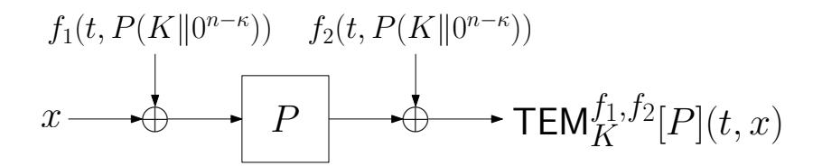
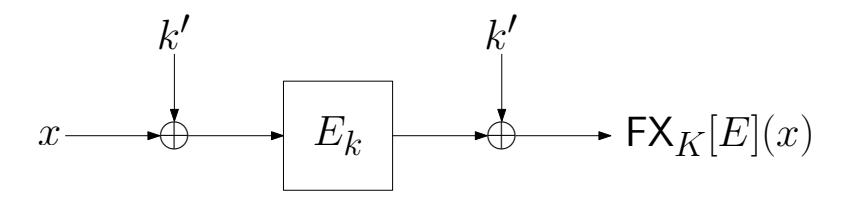

{0}------------------------------------------------

# **Multi-key Security in the Quantum World: Revisiting Tweakable Even-Mansour and FX**

Rentaro Shiba1*,*2 and Tetsu Iwata1

1 Nagoya University, Nagoya, Japan, [shiba.rentaro.k7@s.mail.nagoya-u.ac.jp,tetsu.iwata@nagoya-u.jp](mailto:shiba.rentaro.k7@s.mail.nagoya-u.ac.jp,tetsu.iwata@nagoya-u.jp) 2 Mitsubishi Electric, Kamakura, Japan, [shiba.rentaro@dc.mitsubishielectric.co.jp](mailto:shiba.rentaro@dc.mitsubishielectric.co.jp)

**Abstract.** In this paper, we prove the security of symmetric-key constructions in an adversary model called the Q1MK model, which combines the Q1 model, where the adversary makes classical online queries and quantum offline queries, and the multi-key (multi-user) setting. Specifically, under this model, we prove the security of two symmetric-key constructions: the tweakable Even-Mansour cipher (TEM) and the FX construction (FX), as starting points for understanding the post-quantum security of symmetric-key constructions in this adversary model. Our security proofs are based on the hybrid argument technique introduced by Alagic et al. at EUROCRYPT 2022. First, we prove that in order to break TEM in the Q1MK model, Ω(2*κ/*3 ) classical and quantum queries are needed, regardless of the number of target *κ*-bit keys. Then, before turning to the Q1MK security analysis of FX, we revisit the security proof of FX in the standard Q1 model proposed in version 20230317:200508 of ePrint 2022/1097 and tighten it. By the modified proof, we show that in order to break FX with (*κ*+*n*) bit secret key in the Q1 model, Ω(2(*κ*+*n*)*/*3 ) classical and quantum queries are needed. We then apply this analysis to the Q1MK setting, and we show that in order to break FX in the Q1MK model, Ω(2(*κ*+*n*−*u*)*/*3 ) classical and quantum queries are needed, when 2 *u* (≤ 2 *κ* ) independent keys are in use.

**Keywords:** multi-key · multi-user · quantum · tweakable Even-Mansour · FX

## **1 Introduction**

#### **1.1 Background**

**Post-quantum security of symmetric-key algorithms.** Recent advances in quantum computing have raised concerns about the security of existing cryptographic systems. While some public-key algorithms are known to be severely threatened by quantum algorithms for the discrete logarithm problem and integer factorization [\[Sho94\]](#page-37-0), the implications for symmetric-key algorithms are less widely recognized. Nevertheless, quantum algorithms such as Grover's algorithm [\[Gro96\]](#page-36-0) can significantly reduce security margins by providing a quadratic speedup for key search.

To assess the impact of quantum adversaries on symmetric-key algorithms, two quantumadversary models are commonly used: the Q1 model and the Q2 model. In the Q1 model, the adversary can perform arbitrary quantum computations offline, but they have only classical access to the encryption/decryption oracles. In contrast, the adversary in the Q2 model is permitted to make quantum superposition queries to the oracle. Since quantumaccessible oracles are yet far from practical, the Q1 model is generally regarded as a more realistic setting.

{1}------------------------------------------------

**Symmetric-key algorithms in the multi-key setting.** Many practical cryptographic applications involve multiple users or sessions, each using its own independently generated key. This gives rise to the so-called multi-key or multi-user security setting, where the adversary can interact with multiple oracles operating under (pseudo) independently specified secret keys. In the following, to show the practical relevance of the multi-key setting, we describe two examples where it naturally arises: secure communication protocols and EMV-compliant payment systems.

Secure communication protocols such as TLS, SSH, and QUIC derive fresh session keys via a key exchange and a key schedule, yielding (pseudo) independent traffic keys per connection, per direction, and even per epoch. At scale, servers handle many concurrent connections, allowing an adversary to interact with a large number of simultaneously active, independently keyed instances of the same symmetric primitive. Although keys within a single connection are derived from a shared master secret, from an adversary's viewpoint, the outputs of a secure key derivation function are indistinguishable from independent, uniformly distributed keys. Even across connections, fresh handshakes further ensure independence. Hence, these protocols for secure-channel deployments are naturally modeled in the multi-key setting.

As another example, EMV is the global specification[1](#page-1-0) for chip-based payment cards and terminals, covering both contact and contactless transactions. EMV-compliant cards are generally personalized with card-unique symmetric keys, and each transaction derives session keys and produces cryptographic responses (*e*.*g*., authorization request cryptogram called ARQC/ARPC). From an attack perspective, however, the number of queries the attacker can make for each card is typically small: a single transaction yields only *O*(1) responses, and rapidly repeating online queries to the same card is operationally constrained by card-present interactions and risk management schemes such as application transaction counter and velocity check. In contrast, deployments involve a vast population of independently keyed cards, and terminals routinely process many different cards. Thus, while one cannot issue many queries per keyed instance, the number of concurrently or collectively accessible instances can be large. The multi-key setting can also capture precisely this "many keys, few queries per keyed instance" context.

### **1.2 Motivation**

Although both quantum security and multi-key security have been studied individually, their combination remains unexplored. In practice, however, it is natural to assume that a quantum adversary might interact with multiple independently keyed instances of a cryptographic construction. This raises the question of whether symmetric-key algorithms that are secure in each setting individually remain secure in their combination, and how to prove such security rigorously.

As the first step for understanding the security of symmetric-key algorithms in this setting, we focus on two representative block cipher constructions: the (tweakable) Even-Mansour cipher and the FX construction.

**(Tweakable) Even-Mansour cipher.** The Even-Mansour cipher (EM) [\[EM97\]](#page-36-1) is one of the simplest and most fundamental block cipher designs, introduced by Even and Mansour. For a public random permutation *P* : {0*,* 1} *n* → {0*,* 1} *n*, the encryption of EM, EM[*P*] : {0*,* 1} *n* × {0*,* 1} *n* → {0*,* 1} *n* is defined as

$$\mathsf{EM}[P](K,x) \coloneqq P(x \oplus K) \oplus K. \tag{1}$$

While the initial proposal of EM applies distinct keys for the input and output XORs, Dunkelman *et al*. [\[DKS12\]](#page-36-2) proved that the single key variant shown in Eq. [\(1\)](#page-1-1) achieves

1<https://www.emvco.com/>

{2}------------------------------------------------

the same security of the original variant. Hence, for simplicity, we consider the variant that uses a single key throughout. Due to its minimal structure and the availability of existing security analyses, it serves as an ideal starting point for evaluating security against adversaries in our setting.

In this paper, instead of analyzing EM, we focus on its tweakable variant, known as the tweakable Even-Mansour cipher (TEM) [CLS15]. The TEM construction is the generalization of EM by incorporating a tweak input, and thus subsumes EM as a special case of TEM. Moreover, TEM has gained practical relevance as a foundational component in various authenticated encryption and MAC schemes such as Chaskey [MMH+14], Elephant [BCDM21], and Minalpher [STA+15]. Let  $\mathcal{T}$  be a tweak space, and let  $f_1, f_2 : \mathcal{T} \times \{0, 1\}^n \to \{0, 1\}^n$  be functions that have certain properties we will describe later (in Section 3.1). In this paper, we mainly consider TEM considered in [ABK+24], where the encryption TEMf1,f2[P] :  $\{0,1\}^{\kappa} \times \mathcal{T} \times \{0,1\}^n \to \{0,1\}^n$  (Fig. 1) is defined as

$$\mathsf{TEM}^{f_1, f_2}[P](K, t, x) := P(x \oplus f_1(t, P(K \| 0^{n-\kappa})) \oplus f_2(t, P(K \| 0^{n-\kappa})). \tag{2}$$

Figure 1: TEM

For simplicity, we let  $\mathsf{TEM}^{f_1,f_2}[P](K,\cdot,\cdot) = \mathsf{TEM}^{f_1,f_2}_K[P](\cdot,\cdot)$  in the rest of the paper. Note that the original  $\mathsf{TEM}$  [CLS15] uses simply  $f_1(t,K)$  and  $f_2(t,K)$  for whitening the input and output (more precisely, it is instantiated with the same function, i.e.,  $f_1 = f_2$  in [CLS15]). In [ABK+24], the original  $\mathsf{TEM}$  with the case  $\kappa = n$  is treated as  $\mathsf{TEM}$ , whereas the construction in Eq. (2) is actually denoted as  $\mathsf{TEM-KX}$ . However, since Eq. (2) is a more general construction, we take it as our target and refer to it as  $\mathsf{TEM}$  instead of  $\mathsf{TEM-KX}$  for simplicity.

**FX construction.** The FX construction can be viewed as a variant of EM in which an ideal cipher replaces the public permutation. In the rest of the paper, we refer to the FX construction as FX. FX was originally introduced by Kilian and Rogaway [KR96] as a generalization of DESX2. Let  $E: \{0,1\}^{\kappa} \times \{0,1\}^n \to \{0,1\}^n$  be an ideal block cipher, and  $K = (k,k') \in \{0,1\}^{\kappa+n}$ . Then, the encryption of FX,  $\mathsf{FX}[E]: \{0,1\}^{\kappa+n} \times \{0,1\}^n \to \{0,1\}^n$  (Fig. 2) is defined as

$$\mathsf{FX}[E](K,x) \coloneqq E_k(x \oplus k') \oplus k'. \tag{3}$$

Figure 2: FX

As TEM, we let  $\mathsf{FX}[E](K,\cdot) = \mathsf{FX}_K[E](\cdot)$  in the rest of the paper. FX is employed as the underlying construction for some concrete block ciphers such as PRINCE [BCG+12], PRIDE [ADK+14], and MANTIS [BJK+16]. While it is widely accepted that doubling the

&lt;sup>2Proposed by Ron Rivest but the scheme was never described in any conference or journal paper.

{3}------------------------------------------------

key length mitigates the quadratic speedup achieved by Grover's algorithm, implementing this in practice often requires substantial changes to the block cipher. FX offers a lightweight alternative to extending the key length. It achieves key-length extension by simply XORing the whitening key independent of the key of a block cipher to its input and output, without modifying the block cipher itself.

**Related works on quantum security of EM (TEM) and FX.** Since both EM and FX are fundamental block cipher constructions, their quantum security is well analyzed in both Q1 and Q2 models. In the Q2 model, Kuwakado and Morii [\[KM12\]](#page-36-5) showed that we can identify all the secret key bits of EM in polynomial time. On the other hand, in the Q1 model, the number of classical and quantum queries to succeed in the attack is proven to be Ω(2*n/*3 ) by Alagic *et al*. [\[ABKM22\]](#page-35-5). The proven security bound for EM by Alagic *et al*. corresponds to the complexity of quantum attacks in the Q1 model [\[KM12,](#page-36-5) [BHN](#page-35-6)+19]. In [\[ABK](#page-35-1)+24], Alagic *et al*. proved that the tweakable version of EM, TEM also requires at least Ω(2*n/*3 ) classical and quantum queries in the Q1 model to break it. For FX, Leander and May [\[LM17\]](#page-36-6) showed that all key bits of FX can be recovered with *O*(*n*2 *κ/*2 ) quantum queries in the Q2 model by introducing Grover-Meets-Simon algorithm, *i*.*e*., they showed that the whitening keys are not effective to improve the security in the Q2 model. On the other hand, Jaeger *et al*. [\[JST21\]](#page-36-7) proved that, in the Q1 model, Ω(2(*κ*+*n*)*/*3 ) classical and quantum queries are needed to break FX, where the adversary is restricted to make non-adaptive classical queries. This is a tight security bound since it corresponds to the complexity of quantum attacks using non-adaptive classical queries in the Q1 model [\[BHN](#page-35-6)+19]. Subsequently, in [\[ABK](#page-34-0)+22] [3](#page-3-0) , the security of FX against fully adaptive adversaries in the Q1 model was claimed. However, the authors later reported that their proof failed and the revised security bound is quite loose, *i*.*e*., their proof shows only the birthday bound security Ω(2*n/*2 ) in *n*.

**Related works on the multi-key security of symmetric-key algorithms.** Several prior works have studied the multi-key (multi-user) security of symmetric-key algorithms. In the classical setting, Mouha and Luykx [\[ML15\]](#page-37-3) analyzed the multi-key security of EM and showed that the query lower bound is invariant when used with multiple independently chosen keys. They also established the multi-key security of the ideal cipher model. Hoang and Tessaro [\[HT16\]](#page-36-8) provided tight bounds for iterated Even-Mansour ciphers with independent permutations and independent keys in the multi-user setting. More recently, Naito *et al*. [\[NSS24\]](#page-37-4) proved the exact multi-user security of (tweakable) iterated Even-Mansour ciphers using a single permutation. In addition, multi-key and multi-user security has been proven for various other symmetric-key constructions [\[BT16,](#page-35-7) [HT17,](#page-36-9) [NSSY22,](#page-37-5) [CDN24,](#page-35-8) [NSS25\]](#page-37-6), and they remain an essential topic in the provable security of symmetric-key constructions.

On the other hand, in the quantum setting, Chailoux *et al*. [\[CNS17\]](#page-36-10) mentioned the application of their quantum collision finding algorithm (which is known as CNS algorithm) to the multi-key setting. Very recently, Shi *et al*. [\[SWD](#page-37-7)+25] proposed the quantum multikey attack on TEM, and applied the attack to OPP and Elephant. However, Shi *et al*.'s attacks aim to recover all secret keys when the adversary has access to multiple keyed instances, whereas in the multi-key security notion defined by Mouha *et al*. the adversary wins if it can distinguish the target construction from an ideal construction using oracle access to multiple independently keyed instances. Thus, the success condition of Shi *et al*.'s attacks is different from that of the adversary in the multi-key setting defined by Mouha *et al*., as well as from the multi-user security notions commonly studied in the provable

3An older version of the preprint of [\[ABK](#page-35-1)+24] is available at: [https://eprint.iacr.org/archive/](https://eprint.iacr.org/archive/2022/1097/1679083508.pdf) [2022/1097/1679083508.pdf](https://eprint.iacr.org/archive/2022/1097/1679083508.pdf).

{4}------------------------------------------------

security literature. Thus, to the best of our knowledge, there are currently no results on post-quantum security in the multi-key setting from a provable security perspective.

Concurrent work. Very recently, Alagic et al. [ABMS25] concurrently proved that the security of FX in the Q1 model is  $\Omega(2^{(\kappa+n)/3})$ . Their bound corresponds to our bound shown in Theorem 2 and Theorem 3 with  $\ell=1$ , where  $\ell$  denotes the number of keyed instances, which we will prove in Section 4.1 and Section 4.2, respectively. The advantage of their work is that it establishes a systematic framework for the post-quantum security proof of various symmetric-key constructions that are based on block ciphers, including FX, tweakable block cipher constructions [LRW02, Rog11], and some block cipher modes. In contrast, our work focuses on proving the post-quantum security of FX (and also TEM) in the multi-key setting, which is crucial for practical deployment in the post-quantum era, while correcting the existing proof [ABK+22].

#### 1.3 Contributions

In this paper, we formalize an adversary model that captures realistic post-quantum threats to symmetric-key constructions. Specifically, we combine two well-established settings: the Q1 model, where adversaries can make classical oracle queries and perform arbitrary quantum computations offline, and the multi-key setting, where the adversary interacts with multiple instances using independently chosen keys. We refer to this combined model as the Q1MK model. We then study the security of two basic symmetric-key constructions under the Q1MK model: TEM and FX.

Our security proofs are based on the hybrid argument framework introduced in [ABKM22], which has subsequently been used for security proofs in the Q1 model of various symmetric-key constructions [ABK+24, Hos25, BBC+25, ABMS25]. We extend it to handle adversaries with classical access to multiple independently keyed instances, as required in the Q1MK model. As in the original work [ABKM22] and its subsequent works, the core of our proof relies on the arbitrary reprogramming lemma and the resampling lemma.

For the Q1MK security of FX, we first revisit the security proof of FX in the Q1 model provided in [ABK+22] which yields only a loose security bound, and we tighten its bound by refining some bad events.

To the best of our knowledge, our work is the first to evaluate the security of TEM and FX in a quantum setting that incorporates multiple independently keyed instances. As a summary, Tab. 1 gives the comparison with existing works.

Our main results for each construction are as follows.

**TEM.** We extend the security proof for TEM in the standard Q1 model proposed in [ABK+24] to the Q1MK security. Let  $\ell$  be the number of keyed instances, and for  $l \in \{1, \ldots, \ell\}$ , let  $q_{C,l}$  be the number of classical queries to the l-th instance. Let  $q_C$  be the total number of classical queries to the  $\ell$  keyed instances, i.e.,  $q_C = \sum_{l=1}^{\ell} q_{C,l}$ , and  $q_Q$  be the number of quantum queries. Then, we prove the following security bound.

$$\mathsf{Adv}^{\mathsf{Q1MK}}_{\mathsf{TEM}} \leq \frac{4q_C^2}{2^\kappa} + \frac{q_C + 2q_C\sqrt{q_Q} + 2q_Q\sqrt{2q_C}}{\sqrt{2^\kappa}}$$

The above bound implies that in order to break TEM,  $\Omega(2^{\kappa/3})$  quantum and classical queries are needed. In this setting, the classical query lower bound of  $\Omega(2^{\kappa/3})$  refers to the total number of classical queries across all keyed instances. This result matches the Q1 model security bound shown in [ABK+24]. We also show that our bound is tight in terms of the information-theoretic viewpoint. Specifically, we show that while the best-known quantum attacks [KM12, BHN+19] on EM in the Q1 model can be parallelized across

{5}------------------------------------------------

 $\ell$  keyed instances to reduce the computational time, any such speed-up is necessarily reflected in the total number of classical queries  $q_C = \sum_{l \in [1,\ell]} q_{C,l}$ .

**FX.** As we mentioned above, we first revisit the security proof of [ABK+22] and tighten the security bound by refining some bad events. As a result, we show that for FX with a  $(\kappa + n)$ -bit secret key,  $\Omega(2^{(\kappa+n)/3})$  classical and quantum queries are needed, in the standard Q1 model. While the security of FX in the Q1 model has also been studied in [JST21] and it is shown that  $\Omega(2^{(\kappa+n)/3})$  classical and quantum queries are needed, their analysis considers only adversaries restricted to non-adaptive classical queries. In contrast, our result applies even when the adversary makes adaptive classical queries, thereby providing a more general security bound. Besides, our bound matches the one derived in Alagic *et al.*'s concurrent work [ABMS25]. Furthermore, we extend the revised proof so that the adversary can make classical queries to multiple keyed instances. As a result, we prove the following security bound.

$$\mathsf{Adv}^{\mathsf{Q1MK}}_{\mathsf{FX}} \leq \frac{q_C^2}{2^{\kappa+n}} + \frac{q_Q \sqrt{2\ell q_C} + 2q_C \sqrt{2\ell q_Q}}{\sqrt{2^{\kappa+n}}} + \frac{2q_C^2 \ell^2}{2^{\kappa+n}},$$

where  $\ell$  is the number of uniform random permutations or keyed instances. When  $\ell=1$ , it matches the security bound in the standard Q1 model that we derive by modifying the proof given in [ABK+22]. We note that the last term  $2q_C^2\ell^2/2^{\kappa+n}$  stems from a bad event related to collisions among the  $\kappa$ -bit internal cipher keys used to define the  $\ell$  keyed instances. This contribution is meaningful only in the regime  $\ell \leq 2^{\kappa/2}$  (otherwise it becomes trivial), whereas the middle term remains valid for  $\ell \leq 2^{\kappa}$ . Thus, the above bound implies that in order to break FX,  $\Omega(2^{(\kappa+n-u)/3})$  quantum and classical queries are needed, when  $\ell=2^u$  ( $\leq 2^{\kappa}$ ) keys are in use. Unfortunately, we could not find the quantum multi-key attack on FX whose complexity matches our bound. Therefore, although our bound is tight for  $\ell=1$ , the tightness of our bound for  $\ell\geq 2$  is left as an open problem.

**Paper organization.** Section 2 gives basic notations and definitions, some preliminaries on the quantum security model, and main lemmas that we use in our proofs. Section 3 provides the security proof of TEM in the Q1MK model. Section 4 revisits the security proof of FX provided in [ABK+22], shows how to tighten the security in the Q1 model, and generalizes it to the Q1MK security. Section 5 concludes this paper.

#### 2 Preliminaries

#### 2.1 Notations

Throughout the paper, we use the following notation.

- |S|: the cardinality of a finite set S.
- $x \leftarrow S$ : sampling an element x uniformly at random from a finite set S.
- $\mathcal{T}$ : a tweak space.
- $\mathcal{P}_n$ : a set of all permutations on  $\{0,1\}^n$ .
- $\tilde{\mathcal{P}}_{\mathcal{T},n}$ : a set of all tweakable permutations on  $\{0,1\}^n$  with a tweak space of  $\mathcal{T}$ .
- $\mathcal{E}_{\kappa,n}$ : a set of all ideal ciphers with key length  $\kappa$  and block length n.
- [n, m]: the set of integers  $\{n, n+1, \ldots, m\}$  (for integers  $n \leq m$ ).

{6}------------------------------------------------

Table 1: Summary of our results and comparison with known results, where query lower bounds show proofs and query upper bounds show attacks.  $\kappa$  and n are the key length and the block length, respectively. EM and TEM are grouped together, since for EM with  $\kappa = n$ , the security bounds coincide with those of TEM.

| Target | Setting               | Query lower bound                                           | Query upper bound                                                           |
|--------|-----------------------|-------------------------------------------------------------|-----------------------------------------------------------------------------|
|        | classical             | $\Omega(2^{\kappa/2})$ [EM97, CLS15]                        | $O(2^{\kappa/2})$ [Dae91, CLS15]                                            |
|        | multi-key             | $\Omega(2^{\kappa/2})$ [ML15, ZH16]                         | $O(2^{\kappa/2})$ [FJM14, ZH16]                                             |
| EM,TEM | Q1                    | $\Omega(2^{\kappa/3})$ [ABKM22, ABK + 24]        | $O(2^{\kappa/3})$ [KM12, BHN + 19]                               |
|        | Q2*                   | $\Omega(\kappa)$ [KN23]                                     | $O(\kappa)$ [KM12]                                                          |
|        | Q1MK                  | $\Omega(2^{\kappa/3})$ Theorem 1                            | $O(2^{\kappa/3})$ (adapted from [KM12, BHN + 19] $^{\diamond}$ ) |
|        | classical             | $\Omega(2^{(\kappa+n)/2})$ [KR96]                           | $O(2^{(\kappa+n)/2})$ [KR96]                                                |
| FX     | $\mathrm{Q}1^\dagger$ | $\Omega(2^{(\kappa+n)/3})$ [JST21]                          | $O(2^{(\kappa+n)/3})$ [BHN + 19]                                 |
|        | Q1                    | $\Omega(2^{(\kappa+n)/3})$ Theorem 2, [ABMS25] ‡ | $O(2^{(\kappa+n)/3})$ [BHN + 19]                                 |
|        | Q2                    | $\Omega(2^{\kappa/2}) \text{ [ABMS25]}^*$                   | $O(n2^{\kappa/2})$ [LM17]                                                   |
|        | Q1MK                  | $\Omega(2^{(\kappa+n-u)/3})^{\diamondsuit}$ Theorem 3       | $O(2^{(\kappa+n)/3})$ [BHN + 19]                                 |

&lt;sup>† The Q1 model where the adversary's classical queries are restricted to non-adaptive.

#### 2.2 Basics on Quantum Security Analysis

Quantum random permutation and ideal cipher model. In this paper, we focus on the Q1 model, where the adversary can perform offline quantum computation and make online classical queries. In the Q1 model, the adversary has classical access to the encryption (decryption) oracle. Additionally, depending on the underlying primitive, the adversary is generally assumed to be granted a unitary operator of a public random permutation defined as

$$U_P |x\rangle |y\rangle = |x\rangle |y \oplus P(x)\rangle,$$
  

$$U_{P^{-1}} |x\rangle |y\rangle = |x\rangle |y \oplus P^{-1}(x)\rangle,$$

or an ideal cipher defined as

$$U_{E} |K\rangle |x\rangle |y\rangle = |K\rangle |x\rangle |y \oplus E_{K}(x)\rangle,$$
  

$$U_{E^{-1}} |K\rangle |x\rangle |y\rangle = |K\rangle |x\rangle |y \oplus E_{K}^{-1}(x)\rangle.$$

The adversary model with the former unitary is often referred to as the quantum random permutation model, and that with the latter is often referred to as the quantum ideal cipher model.

**Quantum adversary model.** In this paper, we consider the following two types of quantum adversary models.

**(Standard) Q1 model:** The adversary is allowed to make classical (non-superposition) online queries to the target construction, and quantum oracle access to the idealized primitive underlying the construction (a random permutation or an ideal cipher).

**Q1MK model:** The adversary's ability is identical to the standard Q1 model except that there are multiple independent instances of the target construction. At each classical query, the adversary may arbitrarily choose which instance's oracle to query.

When clear from context, we write "the Q1 model" to refer to the standard Q1 model.

&lt;sup>‡ A concurrent work.

 $^{\diamond}$  When the attack procedures for each keyed instance can be executed in parallel, the time complexity reduced in terms of the computational aspect. However, when we evaluate the complexity by the total number of queries, it remains as  $O(2^{\kappa/3})$ . See Sections A and 3.4 for details.

\* Reduction to an ideal cipher. Derived from the quantum search lower bound [BBBV97].

 $^{\Diamond} \ell = 2^u.$ 

{7}------------------------------------------------

Adversary's distinguishing advantage. We evaluate security in terms of the adversary's distinguishing advantage between the ideal world and the real world. Let  $F_K[\pi]$  be a symmetric-key scheme that takes  $K \in \{0,1\}^{\kappa}$  as a secret key, and let an idealized primitive  $\pi$  be an internal construction of which the algorithm is public. Let R be an ideal construction we want to compare with  $F_K[\pi]$ . In line with our targets, we assume that  $F_K[\pi]$ , R, and  $\pi$  are invertible. Let  $\mathcal{A}^{F_K[\pi],\pi}$  be an adversary that has classical access to  $F_K[\pi]$  and  $F_K^{-1}[\pi]$ , and quantum access to  $\pi$  and  $\pi^{-1}$ , and  $\pi^{-1}$ . Then, we define  $\pi$ 0's distinguishing advantage in the Q1 model as

$$\mathsf{Adv}_F^{\mathsf{Q1}}(\mathcal{A}) \coloneqq \left| \mathsf{Pr}[\mathcal{A}^{F_K[\pi],\pi} = 1] - \mathsf{Pr}[\mathcal{A}^{R,\pi} = 1] \right|.$$

In this paper, we consider the multi-key setting where  $\ell$  classical oracles are available. Let  $\mathcal{A}^{F_{K_1}[\pi],\dots,F_{K_\ell}[\pi],\pi}$  be an adversary that has classical access to  $F_{K_1}[\pi],\dots,F_{K_\ell}[\pi]$  (and their inverse), where  $K_1,\dots,K_\ell$  are independently chosen keys, and quantum access to  $\pi$  and  $\pi^{-1}$ . Let  $\mathcal{A}^{R_1,\dots,R_\ell,\pi}$  be an adversary that has classical access to  $R_1,\dots,R_\ell$  (and their inverse), which are independently chosen ideal constructions, and quantum access to  $\pi$  and  $\pi^{-1}$ . Then, we define  $\mathcal{A}$ 's distinguishing advantage in the Q1MK model as

$$\mathsf{Adv}_F^{\mathsf{Q1MK}}(\mathcal{A}) \coloneqq \left| \mathsf{Pr}[\mathcal{A}^{F_{K_1}[\pi], \dots, F_{K_\ell}[\pi], \pi} = 1] - \mathsf{Pr}[\mathcal{A}^{R_1, \dots, R_\ell, \pi} = 1] \right|.$$

In both cases, we focus on the maximum distinguishing advantage taken over all adversaries  $\mathcal{A}$  in our security proof. Thus, we let  $\mathsf{Adv}_F^{\mathsf{Q1}} \coloneqq \max_{\mathcal{A}} \{\mathsf{Adv}_F^{\mathsf{Q1}}(\mathcal{A})\}$  and  $\mathsf{Adv}_F^{\mathsf{Q1MK}} \coloneqq \max_{\mathcal{A}} \{\mathsf{Adv}_F^{\mathsf{Q1MK}}(\mathcal{A})\}$ .

#### 2.3 Arbitrary Reprogramming

The arbitrary reprogramming (ARP) lemma is first introduced in [ABKM22]. It considers a distinguisher that fixes a base oracle and a randomized algorithm that outputs a set of reprogramming points. The distinguisher then receives quantum access either to the base oracle or the reprogrammed oracle. The ARP lemma bounds the distinguisher's advantage. Formally, the ARP lemma is the following result.

**Lemma 1** (ARP lemma [ABKM22]). Let  $\mathcal{D}$  be an ARP distinguisher in the ARP experiment which proceeds as follows.

**Phase 1:**  $\mathcal{D}$  outputs a random function  $F_0 = F : \{0,1\}^n \to \{0,1\}^m$  and a randomized algorithm  $\mathcal{B}$  which outputs a set  $B \subset \{0,1\}^n \times \{0,1\}^m$  where each  $x \in \{0,1\}^n$  is the first element of at most one tuple in B. Let  $B_1 = \{x \mid \exists y : (x,y) \in B\}$  and  $\epsilon = \max_{x \in \{0,1\}^n} \{ \mathsf{Pr}_{B \leftarrow \mathcal{B}}[x \in B_1] \}.$ 

**Phase 2:**  $\mathcal{B}$  is run to obtain B. Let  $F_1 = F^{(B)}$ , where  $F^{(B)}$  is defined as

$$F^{(B)}(x) \coloneqq \left\{ \begin{array}{ll} y & if (x,y) \in B, \\ F(x) & otherwise. \end{array} \right.$$

The challenger samples a uniform bit  $b \in \{0,1\}$  and  $\mathcal{D}$  is given quantum access to  $F_b$ .

**Phase 3:**  $\mathcal{D}$  loses access to  $F_b$ , and receives the randomness r used to invoke  $\mathcal{B}$  in the previous step. Then  $\mathcal{D}$  outputs b', a guess of b.

For  $\mathcal{D}$  making q queries in expectation when its oracle is  $F_0$ , it holds that

$$\mathsf{Adv}^{\mathsf{arp}}(\mathcal{D}) := \left| \mathsf{Pr}[\mathcal{D}^{F_b} = 1 \mid b = 1] - \mathsf{Pr}[\mathcal{D}^{F_b} = 1 \mid b = 0] \right| \le 2q\sqrt{\epsilon} \,. \tag{4}$$

The proof of Lemma 1 is given in [ABKM22, Section 4.1]. If  $F = F_0$  is a cipher, we consider the input as a pair of key and plaintext, i.e.,  $(K, x) \in \{0, 1\}^{\kappa} \times \{0, 1\}^n$  and we write F(K, x).

{8}------------------------------------------------

#### 2.4 Resampling

The resampling (RS) lemma for random permutations is originally proposed in [ABKM22]. It considers a distinguisher with quantum access to either a uniformly random permutation P or to the permutation obtained by swapping the images of two inputs of P. The RS lemma bounds the distinguisher's advantage. In [ABK+22], a RS lemma for ideal ciphers, where a random permutation is replaced with an ideal cipher, was proposed. Subsequently, in [ABK+24], a generalized version of the RS lemma for random permutations was introduced, which can handle scenarios where the resampled points are drawn from arbitrary distributions, while it is restricted to the uniform distribution in the original RS lemma for random permutations.

In our proof for TEM, we use the generalized RS lemma for random permutations provided in [ABK+24]. In the rest of paper, we refer to the RS for random permutations as RS-P, and the RS for ideal ciphers as RS-C. For both RS-P and RS-C, we use a swapping operation  $\mathsf{swap}_{s_0,s_1}:\{0,1\}^n \to \{0,1\}^n$  defined as

$$\mathsf{swap}_{s_0,s_1}(x) \coloneqq \left\{ \begin{array}{ll} s_1 & \text{if } x = s_0, \\ s_0 & \text{if } x = s_1, \\ x & \text{otherwise.} \end{array} \right. \text{ for } s_0,s_1 \in \{0,1\}^n.$$

In the following, we formally explain RS-P and RS-C lemmas.

#### Resampling for random permutations (RS-P).

**Lemma 2** (RS-P lemma [ABK+24]). Let  $F \subset \mathcal{P}_n$ . Consider the following RS-P experiment involving a quantum RS-P distinguisher  $\mathcal{D}$ :

**Phase 1:** Choose uniform  $P \in \mathcal{P}_n$ , and give  $\mathcal{D}$  quantum access to P.  $\mathcal{D}$  outputs  $(D, \tau)$ , where D is a distribution on  $\{0, 1\}^n$  and  $\tau \in F$ .

**Phase 2:** Sample  $\hat{s} \leftarrow D$ , set  $s_0 = \tau \circ P(\hat{s})$ , and choose  $s_1 \leftarrow \{0,1\}^n$ . Let  $P^{(0)} = P$  and define  $P^{(1)} := P \circ \mathsf{swap}_{s_0,s_1}$ . A uniform bit  $b \in \{0,1\}$  is chosen, and  $\mathcal{D}$  is given  $\hat{s}$  and quantum access to  $P^{(b)}$ . Then  $\mathcal{D}$  outputs a guess b'.

Let  $\epsilon = 2 \cdot \mathbb{E}_{(D,\tau) \leftarrow \mathcal{D}^P} \left[ \max_{x \in \{0,1\}^n} \mathsf{Pr}_{x' \leftarrow D}[x' = x] \right]$ . For any distinguisher  $\mathcal{D}$  making q queries to P in phase 1, we have

$$\begin{split} \mathsf{Adv}^{\mathsf{rs-p}}(\mathcal{D}) \coloneqq \left| \mathsf{Pr}[\mathcal{D}^{P^{(b)}} = 1 \mid b = 1] - \mathsf{Pr}[\mathcal{D}^{P^{(b)}} = 1 \mid b = 0] \right| \\ & \leq \sqrt{\epsilon} \left( 1 + \sqrt{q + \log\left(\frac{11 \cdot |F|}{\sqrt{\epsilon}}\right)} \right). \end{split}$$

The proof of Lemma 2 is given in [ABK+24, Appendix A].

#### Resampling for ideal ciphers (RS-C).

**Lemma 3** (RS-C lemma [ABK+22]). Consider the following RS-C experiment involving a quantum RS-C distinguisher  $\mathcal{D}$ .

**Phase 1:** Choose uniform  $E \in \mathcal{E}_{\kappa,n}$ , and give  $\mathcal{D}$  quantum access to E.

**Phase 2:** Sample  $k \leftarrow \{0,1\}^{\kappa}$  and  $s_0, s_1 \leftarrow \{0,1\}^n$ . Let  $E^{(0)} = E$  and define  $E^{(1)} : \{0,1\}^{\kappa} \times \{0,1\}^n \to \{0,1\}^n$  as

$$E_{k^*}^{(1)}(x) := \begin{cases} E_{k^*}(x) & \text{if } k^* \neq k, \\ E_{k^*} \circ \mathsf{swap}_{s_0, s_1}(x) & \text{if } k^* = k. \end{cases}$$
 (5)

A uniform bit  $b \in \{0,1\}$  is chosen, and  $\mathcal{D}$  is given  $k, s_0, s_1$ , and quantum access to  $E^{(b)}$ . Then,  $\mathcal{D}$  outputs a quess b'.

{9}------------------------------------------------

Let

$$\epsilon = \max_{\substack{k^* \in \{0,1\}^\kappa \\ s^* \in \{0,1\}^n}} \mathsf{Pr}_{(k,s_0,s_1) \leftarrow \mathcal{D}}[(k^*,s^*) \in \{(k,s_0),(k,s_1)\}].$$

For any  $\mathcal{D}$  making at most q queries to E in phase 1, we have

$$\mathsf{Adv}^{\mathsf{rs-c}}(\mathcal{D}) \coloneqq \left| \mathsf{Pr}[\mathcal{D}^{E^{(b)}} = 1 \mid b = 1] - \mathsf{Pr}[\mathcal{D}^{E^{(b)}} = 1 \mid b = 0] \right| \leq 2\sqrt{2q\epsilon}.$$

The proof of Lemma 3 is given in [ABK+22, Appendix A].

# 3 Post-quantum Security of Tweakable Even-Mansour in the Multi-key Setting

#### 3.1 Basic Definitions

Before proceeding to the proof Q1MK security of TEM, we collect the basic definitions to be used. The definitions presented here will also be used in the proof of the Q1MK security of FX in Section 4.

**Oracle-selection operation.** We denote by  $\rho$  the operation that selects arbitrarily, among the  $\ell$  independent oracles, the one to which the current classical query is addressed. The operation  $\rho$  outputs an index in  $[1,\ell]$ , and we write  $\rho(i)$  for the index of the oracle queried on the i-th classical query. For example, if  $\ell$  random permutations in ideal world (resp. keyed oracles in real world) are given as  $R_1, \ldots, R_\ell$  (resp.  $F_{K_1}, \ldots, F_{K_\ell}$ ), then the i-th query is addressed to  $R_{\rho(i)}$  (resp.  $F_{K_{\rho(i)}}$ ).

Transcripts of classical queries. In our proof, the i-th query to the l-th oracle is responded to by  $(t_i^l, x_i^l, y_i^l, b_i^l)$  where  $t_i^l$  is a tweak value,  $x_i^l$  is the query itself,  $y_i^l$  is the output, and  $b_i^l$  is the direction of the query. In particular,  $b_i^l = 0$  (resp.  $b_i^l = 1$ ) means that the i-th query to the l-th oracle is forward (resp. inverse) direction. In the case where there is no tweak input, i.e., for our proof of FX which will be given in Section 4, it is denoted as  $(x_i^l, y_i^l, b_i^l)$ . We define a transcript obtained by  $j_l$  classical queries to the oracle indexed by l so far as  $T_{j_l}^l \coloneqq \left\{ (t_1^l, x_1^l, y_1^l, b_1^l), \ldots, (t_{j_l}^l, x_{j_l}^l, y_{j_l}^l, b_{j_l}^l) \right\}$ . For our proof of FX, it is denoted as  $T_{j_l}^l = \left\{ (x_1^l, y_1^l, b_1^l), \ldots, (x_{j_l}^l, y_{j_l}^l, b_{j_l}^l) \right\}$ . Let  $j = \sum_{l \in [1, \ell]} j_l$ . We denote a union of transcripts of each oracle as a multiset  $T_j = \bigcup_{l \in [1, \ell]} T_{j_l}^l$ . For convenience, we view  $T_j$  as the multiset of the  $j = \sum_{l \in [1, \ell]} j_l$  classical queries, ordered chronologically, regardless of which oracle instance they were addressed to. Accordingly, we write  $T_j = \{(t_i, x_i, y_i, b_i)\}_{i=1}^j$  for the proof of TEM and  $T_j = \{(x_i, y_i, b_i)\}_{i=1}^j$  for the proof of FX.

**Proper functions.** As [ABK+22, ABK+24], public functions  $f_1, f_2 : \mathcal{T} \times \{0, 1\}^n \to \{0, 1\}^n$  for tweakable ciphers are assumed to be *proper* (with respect to  $\mathcal{T}$ ), *i.e.*, for each  $i \in \{1, 2\}$ , the following properties hold.

**Uniformity:** For every  $t \in \mathcal{T}$ ,  $f_i(t, \cdot)$  is a permutation on  $\{0, 1\}^n$ .

**XOR-universality:** For all distinct  $t, t' \in \mathcal{T}$  and all  $y \in \{0, 1\}^n$ ,

$$\Pr_{K \leftarrow \{0,1\}^n} [f_i(t,K) \oplus f_i(t',K) = y] \le 2^{-n}.$$

{10}------------------------------------------------

#### 3.2 Q1MK Security of TEM

**Theorem 1** (Q1MK security of TEM). Let  $\mathcal{A}$  be an adversary who can make  $q_C$  classical queries to  $R_1, \ldots, R_\ell \leftarrow \mathcal{P}_n$  or  $\mathsf{TEM}_{K_1}^{f_1, f_2}[P], \ldots, \mathsf{TEM}_{K_\ell}^{f_1, f_2}[P]$  where  $K_1, \ldots, K_\ell \leftarrow \{0, 1\}^\kappa$  and  $P \leftarrow \mathcal{P}_n$ , and  $q_Q$  quantum queries to P. Let  $q_{C,l}$  be the number of classical queries  $\mathcal{A}$  made to the l-th instance, i.e.,  $q_C = \sum_{l \in [1,\ell]} q_{C,l}$ . Assume that  $f_1$  and  $f_2$  are proper functions with respect to  $\mathcal{T}$ . Then, the Q1MK security of TEM is

$$\mathsf{Adv}^{\mathsf{Q1MK}}_{\mathsf{TEM}} \leq \frac{4q_C^2}{2^{\kappa}} + \frac{q_C + 2q_C\sqrt{q_Q} + 2q_Q\sqrt{2q_C}}{\sqrt{2^{\kappa}}}.$$

*Proof.* Our proof is based on Alagic *et al.*'s hybrid argument [ABK+24]. We modify the technique so that we can evaluate the Q1MK security. Without loss of generality, we assume  $\mathcal{A}$  does not query the same value more than once to one classical oracle. As per [ABK+24], we divide an execution of  $\mathcal{A}$  into  $q_C + 1$  stages. The j-th stage means the period between the j-th query and (j + 1)-st query.  $\mathcal{A}$  can distribute an arbitrary number of quantum queries to each stage.

Following the notation we defined in Section 2.1, the oracle which receives the *i*-th classical query can be expressed as  $\tilde{R}_{\rho(i)}$  or  $\mathsf{TEM}_{K_{\rho(i)}}^{f_1,f_2}$ . We denote  $j_l$  as the number of classical queries that  $\mathcal{A}$  made to  $\tilde{R}_l$  until the *j*-th stage. It is clear that  $j = \sum_{l \in [1,\ell]} j_l$ . Only for the proof of  $\mathsf{TEM}$ , let  $q_{C,l}$  be the upper bound of  $j_l$ , *i.e.*,  $q_{C,l} \geq j_l$  for all  $l \in [1,\ell]$ , and we have  $q_C = \sum_{l \in [1,\ell]} q_{C,l}$ .

Following Alagic *et al.*'s proof [ABK+24], our proof involves an experiment where the quantum primitive is modified based on the outcomes of classical queries so far. To maintain consistency with the classical transcript, we define the reprogramming of P via a recursive sequence of swaps. Let  $P_{[1,\ell]}^0 := P$ . Then, for all  $j \in [1, q_C]$ , the reprogrammed version of a random permutation P based on  $T_j$  is defined as follows.

$$P^j_{[1,\ell]} \coloneqq \mathsf{swap}_{P^{j-1}_{[1,\ell]}(x_j \oplus f_1(t_j, P(K_{\rho(j)} \| 0^{n-\kappa}))), y_j \oplus f_2(t_j, P(K_{\rho(j)} \| 0^{n-\kappa}))} \circ P^{j-1}_{[1,\ell]}$$

 $P_{[1,\ell]}^j$  is a modified version of P so that it ensures consistency with the forward and inverse queries recorded in the transcript  $T_j = \{(t_i, x_i, y_i, b_i)\}_{i=1}^j$ . We note that this recursive approach was not used in the earlier works [ABKM22, ABK+22, ABK+24], while it is adopted in Alagic *et al.*'s concurrent work [ABMS25]. The recursive approach prevents two or more swap operations touching the same point if we consider a single classical oracle. However, in the multi-key setting, reprogramming points generated from different instances may still collide, and such cross-collisions cannot be ruled out solely by the recursive definition. We define such a bad event as

$$col_{j}: \text{there exist } l, l' \in [1, \ell] \ (l \neq l') \text{ and } i \in [1, j_{l}] \text{ and } i' \in [1, j_{l'}] \text{ s.t.} 
x_{i}^{l} \oplus f_{1}(t_{i}^{l}, P(K_{l} || 0^{n-\kappa})) = x_{i'}^{l'} \oplus f_{1}(t_{i'}^{l'}, P(K_{l'} || 0^{n-\kappa})) \text{ or} 
y_{i}^{l} \oplus f_{2}(t_{i}^{l}, P(K_{l} || 0^{n-\kappa})) = y_{i'}^{l'} \oplus f_{2}(t_{i'}^{l'}, P(K_{l'} || 0^{n-\kappa})).$$

Since we assume  $f_1$  and  $f_2$  are permutations for a fixed key and  $\mathcal{A}$  never repeats the same classical query, the above event may occur only for  $l \neq l'$   $(l, l' \in [1, \ell])$ .

We now define a sequence of hybrid experiments  $\mathbf{H}_j$  for all  $j \in [0, q_C]$ .

**Experiment H**j. Sample uniform  $\tilde{R}_1, \ldots, \tilde{R}_{\ell} \leftarrow \tilde{\mathcal{P}}_{\mathcal{T},n}$  and  $P \leftarrow \mathcal{P}_n$ , and uniform  $K_1, \ldots, K_{\ell} \leftarrow \{0, 1\}^{\kappa}$ . Then:

1. Run  $\mathcal{A}$ , answering its classical queries using  $\tilde{R}_1, \ldots, \tilde{R}_\ell$  and quantum queries using P. The i-th classical query is responded by  $\tilde{R}_{\rho(i)}$ . Stop  $\mathcal{A}$  immediately before making its (j+1)-st classical query. Let  $T_j = \bigcup_{l=1}^{\ell} T_{j_l}^l$  be a list of classical queries  $\mathcal{A}$  made so far, where  $T_{j_l}^l = \{(t_1^l, x_1^l, y_1^l, b_1^l), \ldots, (t_{j_l}^l, x_{j_l}^l, y_{j_l}^l, b_{j_l}^l)\}$ .

{11}------------------------------------------------

- 2. Resume A. For the remainder of A's execution,
  - If  $col_i$  occurs:
    - $-\mathcal{A}$ 's classical queries are answered with an error symbol  $\perp$ .
    - $-\mathcal{A}$ 's quantum queries are answered using P.
  - Else:
    - $-\mathcal{A}$ 's classical queries are answered using  $\mathsf{TEM}_{K_1}^{f_1,f_2}\left[P_{[1,\ell]}^j\right],\ldots,\mathsf{TEM}_{K_\ell}^{f_1,f_2}\left[P_{[1,\ell]}^j\right].$
    - $\mathcal{A}$ 's quantum queries are answered using  $P^{j}_{[1,\ell]}$ .

Here, the error symbol  $\perp$  is introduced only as a bookkeeping device to cleanly separate the analysis of the bad even from the hybrid comparison. This method of isolating the bad event via the error symbol is also introduced in the proof of key-alternating Feistel ciphers [BBC+25]. Under the assumption that  $\operatorname{col}_j$  does not occur, we can concisely describe experiment  $\mathbf{H}_j$  as providing oracle responses to  $\mathcal{A}$  according to the following sequence:

$$\underbrace{P, \tilde{R}_{\rho(1)}, P, \dots, \tilde{R}_{\rho(j)}, P,}_{j=j_1+\dots+j_\ell \text{ classical queries}} \underbrace{\mathsf{TEM}^{f_1, f_2}_{K_{\rho(j+1)}} \left[P^j_{[1,\ell]}\right], P^j_{[1,\ell]}, \dots, \mathsf{TEM}^{f_1, f_2}_{K_{\rho(q_C)}} \left[P^j_{[1,\ell]}\right], P^j_{[1,\ell]}}_{q_C-j \text{ classical queries}}$$

Each instance of  $\tilde{R}_l$  or  $\mathsf{TEM}_{K_l}^{f_1,f_2}\left[P_{[1,\ell]}^j\right]$  for all  $l\in[1,\ell]$  represents a single classical query, while each instance of P and  $P_{[1,\ell]}^j$  represents multiple quantum queries  $\mathcal{A}$  makes at the stage. When j=0, i.e., experiment  $\mathbf{H}_0$ , all classical queries are answered using  $\mathsf{TEM}_{K_1}^{f_1,f_2},\ldots,\mathsf{TEM}_{K_\ell}^{f_1,f_2}$  and thus this experiment corresponds to the experiment in the real world. In this case, we denote the adversary  $\mathcal{A}$  as  $\mathcal{A}^{\mathsf{TEM}_{K_1}^{f_1,f_2},\ldots,\mathsf{TEM}_{K_\ell}^{f_1,f_2},P}$ . On the other hand, when  $j=q_C$ , i.e., experiment  $\mathbf{H}_{q_C}$ , all classical queries are answered using ideal tweakable permutations  $\tilde{R}_1,\ldots,\tilde{R}_\ell$  and thus this experiment corresponds to the experiment in the ideal world. In this scenario, we denote the adversary  $\mathcal{A}$  as  $\mathcal{A}^{\tilde{R}_1,\ldots,\tilde{R}_\ell,P}$ . Thus, we can express the Q1MK security of TEM as

$$\begin{split} \mathsf{Adv}^{\mathsf{Q1MK}}_{\mathsf{TEM}}(\mathcal{A}) &= \left| \mathsf{Pr}[\mathcal{A}^{\mathsf{TEM}_{K_1}^{f_1,f_2}[P],\dots,\mathsf{TEM}_{K_\ell}^{f_1,f_2}[P],P} = 1] - \mathsf{Pr}[\mathcal{A}^{\tilde{R}_1,\dots,\tilde{R}_\ell,P} = 1] \right| \\ &= \left| \mathsf{Pr}[\mathcal{A}(\mathbf{H}_0) = 1] - \mathsf{Pr}[\mathcal{A}(\mathbf{H}_{q_C}) = 1] \right| \\ &= \left| \mathsf{Pr}[\mathcal{A}(\mathbf{H}_0) = 1] - \mathsf{Pr}[\mathcal{A}(\mathbf{H}_{q_C}) = 1 \land \neg \mathsf{col}_{q_C}] - \mathsf{Pr}[\mathcal{A}(\mathbf{H}_{q_C}) = 1 \land \mathsf{col}_{q_C}] \right| \\ &\leq \left| \mathsf{Pr}[\mathcal{A}(\mathbf{H}_0) = 1] - \mathsf{Pr}[\mathcal{A}(\mathbf{H}_{q_C}) = 1 \land \neg \mathsf{col}_{q_C}] \right| + \mathsf{Pr}[\mathsf{col}_{q_C}] \\ &\leq \left( \sum_{j=0}^{q_C-1} \left| \mathsf{Pr}[\mathcal{A}(\mathbf{H}_j) = 1 \land \neg \mathsf{col}_j] - \mathsf{Pr}[\mathcal{A}(\mathbf{H}_{j+1}) = 1 \land \neg \mathsf{col}_{j+1}] \right| \right) \\ &+ \mathsf{Pr}[\mathsf{col}_{q_C}]. \end{split}$$

We first bound the probability of  $\operatorname{col}_{q_C}$ . This corresponds to a cross-collision event, namely the event that two or more identical reprogramming points are generated during the reprogramming procedure. As we mentioned above, for each fixed instance  $l \in [1, \ell]$ , the functions  $f_1(t, \cdot)$  and  $f_2(t, \cdot)$  are permutations for every tweak t, and we assume that the adversary never repeats the same classical query to a given oracle  $\tilde{R}_l$ . Hence, within a single instance, the reprogramming points generated from the same ideal construction are always distinct. On the other hand, reprogramming points generated from different instances may collide, since they are derived from independent keys and may coincide in the domain of P. Therefore, the event  $\operatorname{col}_{q_C}$  can only occur due to collisions among

{12}------------------------------------------------

reprogramming points obtained from different ideal oracles. Thus, we can bound  $\mathsf{col}_{q_C}$  as

$$\Pr[\mathsf{col}_{q_C}] \leq 2 \cdot \frac{\sum_{l,l' \in [1,\ell]|l < l'} q_{C,l} q_{C,l'}}{2^{\kappa}} \lesssim \frac{2q_C^2}{2^{\kappa}}.$$

The remainder of proof is the comparison between  $\mathbf{H}_j$  and  $\mathbf{H}_{j+1}$  under the condition that the bad event while the reprogramming does not occur.

To bound the remaining part, as per [ABK+24], we introduce an additional experiment  $\mathbf{H}'_j$  as an intermediate experiment between  $\mathbf{H}_j$  and  $\mathbf{H}_{j+1}$  for all  $j \in [0, q_C - 1]$ . The experiment  $\mathbf{H}'_j$  is as follows.

**Experiment H'j.** Sample uniform  $\tilde{R}_1, \ldots, \tilde{R}_{\ell} \leftarrow \tilde{\mathcal{P}}_{\mathcal{T},n}$  and  $P \leftarrow \mathcal{P}_n$ , and uniform  $K_1, \ldots, K_{\ell} \leftarrow \{0, 1\}^{\kappa}$ . Then:

- 1. Run  $\mathcal{A}$ , answering its classical queries using  $\tilde{R}_{1}, \ldots, \tilde{R}_{i}$  and quantum queries using P. The i-th classical query is responded by  $\tilde{R}_{\rho(i)}$ . Stop  $\mathcal{A}$  immediately after making its (j+1)-st classical query. Let  $T_{j+1} = \left(\bigcup_{l \in [1,\ell] \setminus \rho(j+1)} T_{j_{l}}^{l}\right) \cup T_{j_{\rho(j+1)}+1}^{\rho(j+1)}$  be a list of classical queries  $\mathcal{A}$  made so far, where  $T_{j_{l}}^{l} = \left\{(t_{1}^{l}, x_{1}^{l}, y_{1}^{l}, b_{1}^{l}), \ldots, (t_{j_{l}}^{l}, x_{j_{l}}^{l}, y_{j_{l}}^{l}, b_{j_{l}}^{l})\right\}$  for  $l \in [1,\ell] \setminus \{\rho(j+1)\}$  and  $T_{j_{\rho(j+1)}+1}^{\rho(j+1)} = \left\{(t_{1}^{\rho(j+1)}, x_{1}^{\rho(j+1)}, y_{1}^{\rho(j+1)}, b_{1}^{\rho(j+1)}), \ldots, (t_{j_{\rho(j+1)}+1}^{\rho(j+1)}, t_{j_{\rho(j+1)}+1}^{\rho(j+1)}, b_{j_{\rho(j+1)}+1}^{\rho(j+1)}, b_{j_{\rho(j+1)}+1}^{\rho(j+1)}, b_{j_{\rho(j+1)}+1}^{\rho(j+1)}\right\}$ .
- 2. Resume A. For the remainder of A's execution,
  - If  $col_{j+1}$  occurs:
    - $\mathcal{A}$ 's classical queries are answered with  $\perp$ .
    - $-\mathcal{A}$ 's quantum queries are answered using P.
  - Else:
    - $-\mathcal{A}$ 's classical queries are answered using  $\mathsf{TEM}_{K_1}^{f_1,f_2}\left[P_{[1,\ell]}^{j+1}\right],\ldots,\mathsf{TEM}_{K_\ell}^{f_1,f_2}\left[P_{[1,\ell]}^{j+1}\right].$
    - $\mathcal{A}$ 's quantum queries are answered using  $P_{[1,\ell]}^{j+1}$ .

Under the assumption that  $\operatorname{col}_{j+1}$  does not occur, we can concisely describe experiment  $\mathbf{H}'_j$  as providing oracle responses to  $\mathcal{A}$  according the following sequence:

$$\underbrace{P, \tilde{R}_{\rho(1)}, P, \dots, \tilde{R}_{\rho(j)}, P}_{j=j_1+\dots+j_\ell \text{ classical queries}} \tilde{R}_{\rho(j+1)}, P^{j+1}_{[1,\ell]}, \underbrace{\mathsf{TEM}^{f_1,f_2}_{K_{\rho(j+2)}} \left[P^{j+1}_{[1,\ell]}\right], P^{j+1}_{[1,\ell]}, \dots, \mathsf{TEM}^{f_1,f_2}_{K_{\rho(q_C)}} \left[P^{j+1}_{[1,\ell]}\right], P^{j+1}_{[1,\ell]}}_{q_C-j-1 \text{ classical queries}}$$

By introducing this experiment, we can efficiently compare  $\mathbf{H}_j$  and  $\mathbf{H}_{j+1}$  as

$$\begin{aligned} |\Pr[\mathcal{A}(\mathbf{H}_{j}) &= 1 \land \neg \mathsf{col}_{j}] - \Pr[\mathcal{A}(\mathbf{H}_{j+1}) &= 1 \land \neg \mathsf{col}_{j+1}]| \\ &\leq \left|\Pr[\mathcal{A}(\mathbf{H}_{j}) &= 1 \land \neg \mathsf{col}_{j}] - \Pr[\mathcal{A}(\mathbf{H}'_{j}) &= 1 \land \neg \mathsf{col}_{j+1}]\right| \\ &+ \left|\Pr[\mathcal{A}(\mathbf{H}'_{j}) &= 1 \land \neg \mathsf{col}_{j+1}] - \Pr[\mathcal{A}(\mathbf{H}_{j+1}) &= 1 \land \neg \mathsf{col}_{j+1}]\right|. \end{aligned}$$
(6)

We complete the proof by bounding  $\mathcal{A}$ 's distinguishing advantage between  $\mathbf{H}_j$  and  $\mathbf{H}'_j$ , and  $\mathbf{H}_{j+1}$  and  $\mathbf{H}'_j$  under the assumption that bad events do not occur during the reprogramming. In the following, we prove the bounds on these distinguishing advantages.

**Lemma 4.** For all  $j \in [0, q_C - 1]$ ,

$$\left|\Pr[\mathcal{A}(\mathbf{H}_{j+1}) = 1 \wedge \neg \mathsf{col}_{j+1}] - \Pr[\mathcal{A}(\mathbf{H}_j') = 1 \wedge \neg \mathsf{col}_{j+1}]\right| \leq 2q_{Q,j+1} \sqrt{\frac{2(j+1)}{2^\kappa}}.$$

{13}------------------------------------------------

*Proof.* Under the assumption that  $\operatorname{col}_{j+1}$  does not occur, we can concisely describe experiments  $\mathbf{H}_{j+1}$  and  $\mathbf{H}'_j$  as providing oracle responses to  $\mathcal{A}$  according the following oracle sequences:

$$\mathbf{H}_{j+1} : \underbrace{P, \tilde{R}_{\rho(1)}, P, \dots, \tilde{R}_{\rho(j)}, P, \tilde{R}_{\rho(j+1)}, P,}_{j=j_1+\dots+j_\ell \text{ classical queries}} \underbrace{\mathbb{E} \mathsf{M}_{K_{\rho(j+2)}}^{f_1, f_2} \left[P_{[1,\ell]}^{j+1}\right], P_{[1,\ell]}^{j+1}, \dots, \mathsf{TEM}_{K_{\rho(q_C)}}^{f_1, f_2} \left[P_{[1,\ell]}^{j+1}\right], P_{[1,\ell]}^{j+1}}_{q_C-j-1 \text{ classical queries}} \mathbf{H}_{j}' : \underbrace{P, \tilde{R}_{\rho(1)}, P, \dots, \tilde{R}_{\rho(j)}, P, \tilde{R}_{\rho(j+1)}, P_{[1,\ell]}^{j+1}, \underbrace{\mathsf{TEM}_{K_{\rho(j+2)}}^{f_1, f_2} \left[P_{[1,\ell]}^{j+1}\right], P_{[1,\ell]}^{j+1}, \dots, \mathsf{TEM}_{K_{\rho(q_C)}}^{f_1, f_2} \left[P_{[1,\ell]}^{j+1}\right], P_{[1,\ell]}^{j+1}}_{q_C-j-1 \text{ classical queries}}$$

In this case, the difference of two experiments is reduced to the difference between the quantum random permutations which are accessible at the (j+1)-st stage. Since  $\mathcal{A}$  can make quantum access to the function (permutation) or its reprogrammed version based on the randomized algorithm, which corresponds to the generation of the reprogramming set, and the goal is to distinguish them, this corresponds to the setting of the ARP experiment in Lemma 1. Therefore, we can construct an ARP distinguisher  $\mathcal{D}$  for the ARP experiment from  $\mathcal{A}$ .

Then, the procedure of  $\mathcal{D}$  is as follows.

Phase 1:  $\mathcal{D}$  samples  $\tilde{R}_1, \ldots, \tilde{R}_\ell \leftarrow \tilde{\mathcal{P}}_{\mathcal{T},n}, F_0 = P \leftarrow \mathcal{P}_n$ . It then runs  $\mathcal{A}$ , answering its classical queries using  $\tilde{R}_1, \ldots, \tilde{R}_\ell$  and quantum queries using P. Stop immediately after receiving a response of  $\mathcal{A}$ 's (j+1)-st classical query. Let  $T_{j+1} = \left(\bigcup_{l \in [1,\ell] \setminus \rho(j+1)} T_{j_l}^l\right) \cup T_{j_{\rho(j+1)}+1}^{\rho(j+1)}$  be a list of classical queries  $\mathcal{A}$  made so far, where  $T_{j_l}^l = \left\{(t_1^l, x_1^l, y_1^l, b_1^l), \ldots, (t_{j_l}^l, x_{j_l}^l, y_{j_l}^l, b_{j_l}^l)\right\}$  for  $l \in [1,\ell] \setminus \{\rho(j+1)\}$  and  $T_{j_{\rho(j+1)}}^{\rho(j+1)} = \left\{(t_1^{\rho(j+1)}, x_1^{\rho(j+1)}, y_1^{\rho(j+1)}, b_1^{\rho(j+1)}), \ldots, (t_{j_{\rho(j+1)}+1}^{\rho(j+1)}, x_{j_{\rho(j+1)}+1}^{\rho(j+1)}, y_{j_{\rho(j+1)}+1}^{\rho(j+1)}, b_{j_{\rho(j+1)}+1}^{\rho(j+1)})\right\}$ .  $\mathcal{D}$  defines  $F(a, x) \coloneqq P^a(x)$  for  $a \in \{-1, 1\}$ . It also defines a randomized algorithm  $\mathcal{B}$  such that it samples  $K_1, \ldots, K_\ell \leftarrow \{0, 1\}^\kappa$ , then outputs the set B of input/output pairs to be reprogrammed so that  $F_1^a(x) = F^{(B)}(a, x) = \left(P_{[1,\ell]}^{j+1}\right)^a(x)$ . Finally,  $\mathcal{D}$  outputs  $(F, \mathcal{B})$ .

**Phase 2:**  $\mathcal{B}$  is run to obtain B. A uniform bit  $b \in \{0,1\}$  is chosen, and  $\mathcal{D}$  is given quantum access to  $F_b$ .  $\mathcal{D}$  resumes  $\mathcal{A}$ , answering its quantum queries with  $F_b$ . Phase 2 ends before the (j+2)-nd classical query.

**Phase 3:**  $\mathcal{D}$  is given  $K_1, \ldots, K_\ell$ . It resumes  $\mathcal{A}$ , answering its classical queries using  $\mathsf{TEM}_{K_1}^{f_1, f_2} \left[ P_{[1,\ell]}^{j+1} \right], \ldots, \mathsf{TEM}_{K_\ell}^{f_1, f_2} \left[ P_{[1,\ell]}^{j+1} \right]$ . Finally, it outputs whatever  $\mathcal{A}$  outputs.

If b=0,  $\mathcal{A}$  in  $\mathcal{D}$  corresponds to  $\mathcal{A}$  in the experiment  $\mathbf{H}_{j+1}$ . On the other hand, if b=1,  $\mathcal{A}$  in  $\mathcal{D}$  corresponds to  $\mathcal{A}$  in the experiment  $\mathbf{H}'_j$ . Therefore,  $\mathcal{A}$ 's distinguishing advantage between  $\mathbf{H}_{j+1}$  and  $\mathbf{H}'_j$  is equal to the distinguishing advantage of  $\mathcal{D}$  in the reprogramming experiment. We first bound the reprogramming probability  $\epsilon$ . The value of  $\epsilon$  can be bounded by considering the definition of  $P_{[1,\ell]}^{j+1}$  and the fact that  $F^{(B)}(a,x) = \left(P_{[1,\ell]}^{j+1}\right)^a(x)$ . Let  $\mathcal{S}_{j_{\rho(j+1)}+1}^{\rho(j+1)}$  be a set of reprogrammed points generated by  $T_{j_{\rho(j+1)}+1}^{\rho(j+1)}$  and  $\mathcal{S}_{j_l}^l$  be a set of reprogrammed points generated by  $T_{j_l}$  for all  $l \in [1,\ell] \setminus \{\rho(j+1)\}$ . The probability that any particular input (a,x) is reprogrammed is at most the probability over all values of  $K_1, \ldots, K_\ell$  that it lies in the set  $\mathcal{S}_{\rho(j+1)+1}^{\rho(j+1)} \cup \mathcal{S}_{j_l}^l$ , where

$$S_{j_{\rho(j+1)}+1}^{\rho(j+1)} = \left\{ \begin{array}{l} (1, x_i^l \oplus f_1(t_i^l, P(K_{\rho(j+1)} \| 0^{n-\kappa}))), \\ (1, P^{-1}(x_i^l \oplus f_2(t_i^l, P(K_{\rho(j+1)} \| 0^{n-\kappa})))), \\ (-1, P(x_i^l \oplus f_1(t_i^l, P(K_{\rho(j+1)} \| 0^{n-\kappa})))), \\ (-1, y_i^l \oplus f_2(t_i^l, P(K_{\rho(j+1)} \| 0^{n-\kappa}))) \end{array} \right\}_{i=1}^{j_{\rho(j+1)}+1}$$

{14}------------------------------------------------

and

$$S_{j_l}^l = \left\{ \begin{array}{l} (1, x_i^l \oplus f_1(t_i^l, P(K_l \| 0^{n-\kappa}))), (1, P^{-1}(x_i^l \oplus f_2(t_i^l, P(K_l \| 0^{n-\kappa})))), \\ (-1, P(x_i^l \oplus f_1(t_i^l, P(K_l \| 0^{n-\kappa})))), (-1, y_i^l \oplus f_2(t_i^l, P(K_l \| 0^{n-\kappa}))) \end{array} \right\}_{i=1}^{j_l}.$$

For each of  $S_{j_{\rho(j+1)}+1}^{\rho(j+1)}$  and  $S_{j_l}^l$  for all  $l \in [1,\ell] \setminus \{\rho(j+1)\}$ , there exist two reprogrammed points for each i and  $a \in \{-1,1\}$ . Therefore, using the fact that each key is selected uniformly,  $\epsilon$  can be bounded as

$$\epsilon \leq \frac{\left| \mathcal{S}_{j_{\rho(j+1)}+1}^{\rho(j+1)} \right|}{2^{\kappa}} + \sum_{l \in [1,\ell] \setminus \{l\}} \frac{\left| \mathcal{S}_{j_{l}}^{l} \right|}{2^{\kappa}} = \frac{2(j_{\rho(j+1)+1}+1)}{2^{\kappa}} + \sum_{l \in [1,\ell] \setminus \{l\}} \frac{2j_{l}}{2^{\kappa}} = \frac{2(j+1)}{2^{\kappa}}.$$

Let the number of quantum queries made during the (j + 1)-st stage be  $q_{Q,j+1}$ . Using Lemma 1, we have

$$\begin{split} \left| \Pr[\mathcal{A}(\mathbf{H}_{j+1}) = 1 \land \neg \mathsf{col}_{j+1}] - \Pr[\mathcal{A}(\mathbf{H}_j') = 1 \land \neg \mathsf{col}_{j+1}] \right| \\ & \leq \mathsf{Adv}^{\mathsf{arp}}(\mathcal{D}) = \left| \Pr[\mathcal{D}^{F_b} = 1 \mid b = 1] - \Pr[\mathcal{D}^{F_b} = 1 \mid b = 0] \right| \leq 2q_{Q,j+1} \sqrt{\frac{2(j+1)}{2^{\kappa}}}. \end{split}$$

Lemma 5. For all  $j \in [0, q_C]$ ,

$$\begin{split} \left| \Pr[\mathcal{A}(\mathbf{H}_j) = 1 \wedge \neg \mathsf{col}_j] - \Pr[\mathcal{A}(\mathbf{H}_j') = 1 \wedge \neg \mathsf{col}_{j+1}] \right| \\ &\leq \frac{1}{\sqrt{2^{\kappa}}} \left( 1 + \sqrt{q_Q + \log\left(11|\mathcal{T}|2^n\sqrt{2^{\kappa}}\right)} \right) + \frac{4j}{2^{\kappa}}. \end{split}$$

*Proof.* As Alagic *et al.*'s proof, we introduce two additional experiments  $\mathbf{H}_{j}^{*}$  and  $\mathbf{H}_{j}^{**}$  to compare  $\mathbf{H}_{j}$  and  $\mathbf{H}_{j}^{\prime}$  efficiently.

**Experiment H**j\*. Sample uniform  $\tilde{R}_1, \ldots, \tilde{R}_{\ell} \leftarrow \mathcal{R}_{\mathcal{T},n}$  and  $P \leftarrow \mathcal{P}_n$ , and uniform  $K_1, \ldots, K_{\ell} \leftarrow \{0, 1\}^{\kappa}$ . Then:

- 1. Run  $\mathcal{A}$ , answering its classical queries using  $\tilde{R}_1, \ldots, \tilde{R}_\ell$  and quantum queries using P. The i-th classical query is responded by  $\tilde{R}_{\rho(i)}$ . Stop  $\mathcal{A}$  immediately after submitting its (j+1)-st classical query without receiving the response. We ensure that (j+1)-st classical query is the forward direction query4, i.e.,  $b_{j_{\rho(j+1)}+1}^{\rho(j+1)}=0$ .
- 2. Define  $s_0 = x_{j_{\rho(j+1)}+1}^{\rho(j+1)} \oplus f_1(t_{j_{\rho(j+1)}}^{\rho(j+1)}, P(K_{\rho(j+1)} \| 0^{n-\kappa}))$  and sample uniform  $s_1 \leftarrow \{0,1\}^n$ . Define  $P^{(1)}$  as  $P^{(1)} = P \circ \mathsf{swap}_{s_0,s_1}$ .
- 3. Resume A. For the remainder of A's execution
  - If  $col_i$  occurs:
    - $-\mathcal{A}$ 's classical queries are answered with  $\perp$ .
    - $-\mathcal{A}$ 's quantum queries are answered using P.
  - Else:
    - $\mathcal{A}$ 's classical queries are answered using  $\mathsf{TEM}_{K_1}^{f_1,f_2}\left[(P^{(1)})_{[1,\ell]}^j\right],\ldots,$   $\mathsf{TEM}_{K_\ell}^{f_1,f_2}\left[(P^{(1)})_{[1,\ell]}^j\right].$
    - $\mathcal{A}$ 's quantum queries are answered using  $(P^{(1)})_{[1,\ell]}^{j+1}$

&lt;sup>4The analysis for the inverse direction query is similar.

{15}------------------------------------------------

**Experiment H**j\*\*. The identical experiment to  $\mathbf{H}_{j}^{*}$  except that the (j+1)-st classical query is responded by using  $\tilde{R}_{\rho(j+1)}$  in  $\mathbf{H}_{j}^{**}$ .

Under the assumption that the bad event during the reprogramming does not occur, we can concisely describe experiments  $\mathbf{H}_j$ ,  $\mathbf{H}_j^*$ ,  $\mathbf{H}_j^{**}$ , and  $\mathbf{H}_j'$  as providing oracle responses to  $\mathcal{A}$  according to the following oracle sequences:

$$\mathbf{H}_{j} : \underbrace{P, \tilde{R}_{\rho(1)}, P, \dots, \tilde{R}_{\rho(j)}, P}_{j=j_{1} + \dots + j_{\ell} \text{ classical queries}}, \underbrace{P[1,\ell]]}_{j=j_{1} + \dots + j_{\ell} \text{ classical queries}}, \underbrace{P[1,\ell]]}_{q_{C} - j - 1 \text{ classical queries}}, \underbrace{P[1,\ell]]}_{q_{C} - j - 1 \text{ classical queries}}, \underbrace{P[1,\ell]]}_{q_{C} - j - 1 \text{ classical queries}}, \underbrace{P[1,\ell]]}_{q_{C} - j - 1 \text{ classical queries}}, \underbrace{P[1,\ell]]}_{q_{C} - j - 1 \text{ classical queries}}, \underbrace{P[1,\ell]]}_{q_{C} - j - 1 \text{ classical queries}}, \underbrace{P[1,\ell]]}_{q_{C} - j - 1 \text{ classical queries}}, \underbrace{P[1,\ell]]}_{q_{C} - j - 1 \text{ classical queries}}, \underbrace{P[1,\ell]]}_{q_{C} - j - 1 \text{ classical queries}}, \underbrace{P[1,\ell]]}_{q_{C} - j - 1 \text{ classical queries}}, \underbrace{P[1,\ell]]}_{q_{C} - j - 1 \text{ classical queries}}, \underbrace{P[1,\ell]]}_{q_{C} - j - 1 \text{ classical queries}}, \underbrace{P[1,\ell]]}_{q_{C} - j - 1 \text{ classical queries}}, \underbrace{P[1,\ell]]}_{q_{C} - j - 1 \text{ classical queries}}, \underbrace{P[1,\ell]]}_{q_{C} - j - 1 \text{ classical queries}}, \underbrace{P[1,\ell]]}_{q_{C} - j - 1 \text{ classical queries}}, \underbrace{P[1,\ell]]}_{q_{C} - j - 1 \text{ classical queries}}, \underbrace{P[1,\ell]]}_{q_{C} - j - 1 \text{ classical queries}}, \underbrace{P[1,\ell]]}_{q_{C} - j - 1 \text{ classical queries}}, \underbrace{P[1,\ell]]}_{q_{C} - j - 1 \text{ classical queries}}, \underbrace{P[1,\ell]]}_{q_{C} - j - 1 \text{ classical queries}}, \underbrace{P[1,\ell]]}_{q_{C} - j - 1 \text{ classical queries}}, \underbrace{P[1,\ell]]}_{q_{C} - j - 1 \text{ classical queries}}, \underbrace{P[1,\ell]]}_{q_{C} - j - 1 \text{ classical queries}}, \underbrace{P[1,\ell]]}_{q_{C} - j - 1 \text{ classical queries}}, \underbrace{P[1,\ell]]}_{q_{C} - j - 1 \text{ classical queries}}, \underbrace{P[1,\ell]]}_{q_{C} - j - 1 \text{ classical queries}}, \underbrace{P[1,\ell]]}_{q_{C} - j - 1 \text{ classical queries}}, \underbrace{P[1,\ell]]}_{q_{C} - j - 1 \text{ classical queries}}, \underbrace{P[1,\ell]]}_{q_{C} - j - 1 \text{ classical queries}}, \underbrace{P[1,\ell]}_{q_{C} - j - 1 \text{ classical queries}}, \underbrace{P[1,\ell]}_{q_{C} - j - 1 \text{ classical queries}}, \underbrace{P[1,\ell]}_{q_{C} - j - 1 \text{ classical queries}}, \underbrace{P[1,\ell]}_{q_{C} - j - 1 \text{ classical queries}}, \underbrace{P[1,\ell]}_{q_{C} - j - 1 \text{ classical queries}}, \underbrace{P[1,\ell]}_{q_{C} - j - 1 \text{ classical queries}}, \underbrace{P[1,\ell]}_{q_{C} - j - 1 \text{ classical queries}}, \underbrace{P[1,\ell]}_{q_{C} - j - 1 \text{ classical queries}},$$

Using these two intermediate experiments, we have

$$|\Pr[\mathcal{A}(\mathbf{H}_{j}) = 1 \land \neg \mathsf{col}_{j}] - \Pr[\mathcal{A}(\mathbf{H}'_{j}) = 1] \land \neg \mathsf{col}_{j+1}|$$

$$\leq |\Pr[\mathcal{A}(\mathbf{H}_{j}) = 1 \land \neg \mathsf{col}_{j}] - \Pr[\mathcal{A}(\mathbf{H}^{*}_{j}) = 1 \land \neg \mathsf{col}_{j}]|$$

$$+ |\Pr[\mathcal{A}(\mathbf{H}^{*}_{j}) = 1 \land \neg \mathsf{col}_{j}] - \Pr[\mathcal{A}(\mathbf{H}^{**}_{j}) = 1 \land \neg \mathsf{col}_{j}]|$$

$$+ |\Pr[\mathcal{A}(\mathbf{H}^{**}_{j}) = 1 \land \neg \mathsf{col}_{j}] - \Pr[\mathcal{A}(\mathbf{H}'_{j}) = 1 \land \neg \mathsf{col}_{j+1}]|.$$
(7)

Therefore, we can bound the distinguishing advantage between  $\mathbf{H}_j$  and  $\mathbf{H}'_j$  under the assumption that the bad events during the reprogramming do not occur, by bounding three differences on the right-hand side of the above inequality.

- $\mathbf{H}_j$  and  $\mathbf{H}_j^*$ . Let  $\mathcal{A}$  be a distinguisher between  $\mathbf{H}_j$  and  $\mathbf{H}_j^*$ . The difference between the two experiments is reduced to the difference between the quantum random permutations which are accessible at the (j+1)-st stage onward. Since  $\mathcal{A}$  is given quantum access to the random permutation  $P_{[1,\ell]}^j$ , or  $(P^{(1)})_{[1,\ell]}^j$  obtained by swapping two input points of  $P_{[1,\ell]}^j$  sampled at the j-th stage, and the goal is to distinguish them, this corresponds to the setting of the RS-P experiment in Lemma 2. Therefore, from  $\mathcal{A}$ , we can construct a RS-P distinguisher  $\mathcal{D}$  for the RS-P experiment where  $F = \{f_1(t,\cdot) \oplus x\}_{t \in \mathcal{T}, x \in \{0,1\}^n}$ . The procedure of  $\mathcal{D}$  is as follows.
- **Phase 1:**  $\mathcal{D}$  is given quantum access to a uniform permutation P. Run  $\mathcal{A}$ , answering its classical queries using  $\tilde{R}_1, \ldots, \tilde{R}_\ell$  and quantum queries using P. It stops  $\mathcal{A}$  immediately after submitting the (j+1)-st classical query, of which the direction is ensured to be forward  $(b_{j_{\rho(j+1)}+1}^{\rho(j+1)}=0)$ , without receiving the response5.  $\mathcal{D}$  lets  $\tau \in F$  be a function such that  $\tau(\cdot) = x_{j_{\rho(j+1)}+1}^{\rho(j+1)} \oplus f_1(t_{j_{\rho(j+1)}+1}^{\rho(j+1)}, \cdot)$  and defines the distribution D on  $\{0,1\}^n$  that chooses uniform  $K_{\rho(j+1)} \in \{0,1\}^\kappa$  and outputs  $K^{\rho(j+1)} \| 0^{n-\kappa}$ .
- **Phase 2:** The challenger samples  $\hat{s} \leftarrow D$  with  $\hat{s} = K_{\rho(j+1)} \| 0^{n-\kappa}$ . Then  $\mathcal{D}$  is given  $s_0$  and quantum access to  $P^{(b)}$ . It resumes  $\mathcal{A}$ , answering its classical queries using  $\mathsf{TEM}_{K_1}^{f_1,f_2}\left[(P^{(b)})_{[1,\ell]}^j\right],\ldots,\mathsf{TEM}_{K_\ell}^{f_1,f_2}\left[(P^{(b)})_{[1,\ell]}^j\right]$  and quantum queries using  $(P^{(b)})_{[1,\ell]}^j$ .  $\mathcal{D}$  outputs whatever  $\mathcal{A}$  does.

&lt;sup>5The analysis for the inverse direction query is similar.

{16}------------------------------------------------

If b=0,  $\mathcal{A}$  in  $\mathcal{D}$  corresponds to  $\mathcal{A}$  in the experiment  $\mathbf{H}_j$ . On the other hand, if b=1,  $\mathcal{A}$  in  $\mathcal{D}$  corresponds to  $\mathcal{A}$  in the experiment  $\mathbf{H}_j^*$ . In  $\mathbf{H}_j^*$ ,  $\mathcal{A}$ 's classical and quantum queries are answered using  $\mathsf{TEM}_{K_1}^{f_1,f_2}\left[(P^{(1)})_{[1,\ell]}^{j+1}\right],\ldots,\mathsf{TEM}_{K_\ell}^{f_1,f_2}\left[(P^{(1)})_{[1,\ell]}^{j+1}\right]$  and  $(P^{(1)})_{[1,\ell]}^{j+1}$  after from the time when  $\mathcal{A}$  makes the (j+1)-st classical query, while  $\mathsf{TEM}_{K_1}^{f_1,f_2}\left[P_{[1,\ell]}^{j+1}\right],\ldots,\mathsf{TEM}_{K_\ell}^{f_1,f_2}\left[P_{[1,\ell]}^{j+1}\right]$  and  $P_{[1,\ell]}^{j+1}$  are used in  $\mathbf{H}_j$ . Thus, by applying Lemma 2, we have

$$|\Pr[\mathcal{A}(\mathbf{H}_{j}) = 1 \land \neg \mathsf{col}_{j}] - \Pr[\mathcal{A}(\mathbf{H}_{j}^{*}) = 1 \land \neg \mathsf{col}_{j}]|$$

$$\leq \mathsf{Adv}^{\mathsf{rs-p}}(\mathcal{D}) = \left|\Pr[\mathcal{D}^{P^{(b)}} = 1 \mid b = 1] - \Pr[\mathcal{D}^{P^{(b)}} = 1 \mid b = 0]\right|$$

$$\leq \sqrt{\varepsilon} \left(1 + \sqrt{q_{Q} + \log\left(\frac{11|\mathcal{T}|2^{n}}{\sqrt{\varepsilon}}\right)}\right)$$

$$= \frac{1}{\sqrt{2^{\kappa}}} \left(1 + \sqrt{q_{Q} + \log\left(11|\mathcal{T}|2^{n}\sqrt{2^{\kappa}}\right)}\right). \tag{8}$$

 $\mathbf{H}_{j}^{*}$  and  $\mathbf{H}_{j}^{**}$ . In  $\mathbf{H}_{j}^{*}$ , the (j+1)-st classical query is answered using  $\mathsf{TEM}_{K_{\rho(j+1)}}^{f_{1},f_{2}}\left[(P^{(1)})_{[1,\ell]}^{j+1}\right]$ . On the other hand, in  $\mathbf{H}_{j}^{**}$ , the (j+1)-st classical query is answered using  $\tilde{R}_{\rho(j+1)}$ . Let  $y_{j+1}$  be a response of the (j+1)-st classical query. Then, in  $\mathbf{H}_{j}^{*}$ ,

$$y_{j+1} = \mathsf{TEM}_{K_{\rho(j+1)}}^{f_1, f_2} \left[ (P^{(1)})_{[1,\ell]}^j \right] (t_{j+1}, x_{j+1})$$

$$= (P^{(1)})_{[1,\ell]}^j (s_0) \oplus f_2(t_{j+1}, P(K_{\rho(j+1)} || 0^{n-\kappa}))$$

$$= P_{[1,\ell]}^j (s_1) \oplus f_2(t_{j+1}, P(K_{\rho(j+1)} || 0^{n-\kappa})).$$

Since we assume that  $f_2$  has the XOR universality and  $s_1$  is uniform, the distribution of  $y_{j+1}$  is uniform. On the other hand, in  $\mathbf{H}_j^{**}$ ,  $y_{j+1}$  is not uniform. In  $\mathbf{H}_j^{**}$ , we have  $y_{j+1} = \tilde{R}_{\rho(j+1)}(t_{j+1}, x_{j+1})$ . This becomes a permutation for a fixed  $t_{j+1}$ . Define  $\mathcal{Y}_{j+1}^{\rho(j+1)} = \left\{ y_i^{\rho(j+1)} \mid t_i^{\rho(j+1)} = t_{j+1} \right\}_{i=1}^{j_{\rho(j+1)}}$ ,  $\overline{\mathcal{Y}_{j+1}^{\rho(j+1)}} = \left\{ y_i^{\rho(j+1)} \mid t_i^{\rho(j+1)} \neq t_{j+1} \right\}_{i=1}^{j_{\rho(j+1)}}$ , and  $\overline{\mathcal{Y}_{j+1}^{\rho(j+1)}} = \left\{ y_i^l \right\}_{i \in [1,j_l], l \in [1,\ell] \setminus \rho(j+1)}$ . Then, the event  $y_{j+1} \in \mathcal{Y}_{j+1}^{\rho(j+1)}$  never occurs since  $\mathcal{A}$  does not repeat the same query. On the other hand,  $y_{j+1}$  is uniform over  $\overline{\mathcal{Y}_{j+1}^{\rho(j+1)}}$  and  $\mathcal{Y}_{j+1}^{\rho(j+1)}$ . Therefore,  $y_{j+1} \in \mathcal{Y}_{j+1}^{\rho(j+1)}$  is a bad event to distinguish  $\mathbf{H}_j^*$  from  $\mathbf{H}_j^{**}$ , and we can bound the distinguishing advantage by the probability  $\Pr[y_{j+1} \in \mathcal{Y}_{j+1}^{\rho(j+1)}]$ . Thus, we have

$$|\Pr[\mathcal{A}(\mathbf{H}_{j}^{*}) = 1 \land \neg \mathsf{col}_{j}] - \Pr[\mathcal{A}(\mathbf{H}_{j}^{**}) = 1 \land \neg \mathsf{col}_{j}]|$$

$$\leq \Pr[y_{j+1} \in \mathcal{Y}_{j+1}^{\rho(j+1)}] \leq \frac{\left|\mathcal{Y}_{j+1}^{\rho(j+1)}\right|}{2^{n}} \leq \frac{j_{\rho(j+1)}}{2^{n}} \leq \frac{j}{2^{\kappa}}.$$
(9)

 $\mathbf{H}_{j}^{**}$  and  $\mathbf{H}_{j}'$ . The difference between  $\mathbf{H}_{j}^{**}$  and  $\mathbf{H}_{j}'$  is that the former uses  $(P^{(1)})_{[1,\ell]}^{j}$  from the (j+1)-st stage onward, whereas the latter uses  $P_{[1,\ell]}^{j+1}$ .  $(P^{(1)})_{[1,\ell]}^{j}$  and  $P_{[1,\ell]}^{j+1}$  can be

{17}------------------------------------------------

expressed as

$$\begin{split} (P^{(1)})_{[1,\ell]}^j &= \left(\prod_{l \in [1,\ell]} \left( \overleftarrow{S}_{T_j^l,P^{(1)},K_l} \circ \overrightarrow{S}_{T_j^l,P^{(1)},K_l} \right) \right) \circ P^{(1)}, \\ P_{[1,\ell]}^{j+1} &= \operatorname{swap}_{x_{j+1} \oplus K_{\rho(j+1)},y_{j+1} \oplus K_{\rho(j+1)}}^{1-b_{j+1}} \circ \operatorname{swap}_{x_{j+1} \oplus K_{\rho(j+1)},y_{j+1} \oplus K_{\rho(j+1)}}^{b_{j+1}} \\ &\circ \left(\prod_{l \in [1,\ell]} \left( \overleftarrow{S}_{T_j^l,P,K_l} \circ \overrightarrow{S}_{T_j^l,P,K_l} \right) \right) \circ P. \end{split}$$

 $(P^{(1)})_{[1,\ell]}^j$  can be obtained by applying a reprogramming operation based on  $T_j$  to  $P^{(1)}$ , whereas  $P_{[1,\ell]}^{j+1}$  can be obtained by applying a reprogramming operation based on  $T_{j+1}$  to P. Although these permutations are identical in most cases, they differ with a small probability. We bound the distinguishing advantage between  $\mathbf{H}_j^{**}$  and  $\mathbf{H}_j'$  by the probability that these permutations differ.

Let  $\mathcal{X} = \bigcup_{l \in [1,\ell]} \mathcal{X}^l$  where  $\mathcal{X}^l = \{x_i^l \oplus f_1(t_1^l, K_l || 0^{n-\kappa})\}_{i=1}^{j_i}$ . We divide  $\mathcal{X}$  into the following three subsets:

$$\mathcal{X}_{=}^{\rho(j+1)} = \left\{ x_{i}^{\rho(j+1)} \oplus f_{1}(t_{i}^{\rho(j+1)}, K_{\rho(j+1)} \| 0^{n-\kappa}) \mid t_{i}^{\rho(j+1)} = t_{j+1} \right\}_{i=1}^{j_{\rho(j+1)}}, 
\mathcal{X}_{\neq}^{\rho(j+1)} = \left\{ x_{i}^{\rho(j+1)} \oplus f_{1}(t_{i}^{\rho(j+1)}, K_{\rho(j+1)} \| 0^{n-\kappa}) \mid t_{i}^{\rho(j+1)} \neq t_{j+1} \right\}_{i=1}^{j_{\rho(j+1)}}, 
\mathcal{X}_{\neq}^{\overline{\rho(j+1)}} = \mathcal{X} \setminus (\mathcal{X}_{=}^{\rho(j+1)} \cup \mathcal{X}_{\neq}^{\rho(j+1)}) = \bigcup_{l \in [1,\ell] \setminus \{\rho(j+1)\}} \mathcal{X}^{l}.$$

For these sets, we consider the following events.

bad0: 
$$s_0 = x_{j+1} \oplus f_1(t_{j+1}, K_{\rho(j+1)} || 0^{n-\kappa}) \in \mathcal{X}$$

bad1:  $s_1 \in \mathcal{X}$ 

We first consider  $\mathsf{bad}_0$ . Since  $\mathcal{X} = \mathcal{X}^{\rho(j+1)}_{=} \cup \mathcal{X}^{\rho(j+1)}_{\neq} \cup \mathcal{X}^{\overline{\rho(j+1)}}$ ,  $\mathsf{bad}_0$  can be expressed as

$$\mathsf{bad}_0: (s_0 \in \mathcal{X}^{\rho(j+1)}_{=}) \vee (s_0 \in \mathcal{X}^{\rho(j+1)}_{\neq}) \vee (s_0 \in \mathcal{X}^{\overline{\rho(j+1)}}).$$

Since  $\mathcal{A}$  never repeats the same query, the event  $s_0 \in \mathcal{X}^{\rho(j+1)}_{=}$  never occurs and we have  $\Pr[s_0 \in \mathcal{X}^{\rho(j+1)}_{=}] = 0$ . With regard to the event  $s_0 \in \mathcal{X}^{\rho(j+1)}_{\neq}$ , we have

$$s_{0} = x_{j+1} \oplus f_{1}(t_{j+1}, K_{\rho(j+1)} \| 0^{n-\kappa}) \in \mathcal{X}_{\neq}^{\rho(j+1)}$$

$$\Leftrightarrow x_{j+1} \in \left\{ x_{i}^{\rho(j+1)} \oplus f_{1}(t_{i}^{\rho(j+1)}, K_{\rho(j+1)} \| 0^{n-\kappa}) \oplus f_{1}(t_{j+1}, K_{\rho(j+1)} \| 0^{n-\kappa}) \right.$$

$$\left. \mid t_{i}^{\rho(j+1)} \neq t_{j+1} \right\}_{i=1}^{j_{\rho(j+1)}}.$$

We see that  $f_1(t_i^{\rho(j+1)}, K_{\rho(j+1)} \| 0^{n-\kappa}) \oplus f_1(t_{j+1}, K_{\rho(j+1)} \| 0^{n-\kappa})$  can be viewed as a permutation on  $K_{\rho(j+1)}$  for  $t_i^{\rho(j+1)} \neq t_{j+1}$ , because of the XOR universality of  $f_1$ , *i.e.*,  $\Pr_{K_{\rho(j+1)} \leftarrow \{0,1\}^{\kappa}} [f_1(t_i^{\rho(j+1)}, K_{\rho(j+1)} \| 0^{n-\kappa}) \oplus f_1(t_{j+1}, K_{\rho(j+1)} \| 0^{n-\kappa}) = y] \leq 2^{-n}$  for any  $y \in \{0,1\}^n$ . Therefore,  $\Pr[s_0 \in \mathcal{X}_{\neq}^{\rho(j+1)}] \leq \frac{\left|\mathcal{X}_{\neq}^{\rho(j+1)}\right|}{2^n} \leq \frac{j_{\rho(j+1)}}{2^n} \leq \frac{j}{2^{\kappa}}$ .

The event  $s_0 \in \mathcal{X}^{\overline{\rho(j+1)}}$  also occurs probabilistically. However, this event occurs with the same probability in both experiments. Therefore, if this occurs, we cannot distinguish  $(P^{(1)})_{[1,\ell]}^j$  and  $P_{[1,\ell]}^{j+1}$ . Thus,  $\Pr[\mathsf{bad}_0] \leq \frac{j}{2^\kappa}$ .

{18}------------------------------------------------

On the other hand,  $bad_1$  can be expressed as follows.

$$\mathsf{bad}_1: (s_1 \in (\mathcal{X}_{=}^{\rho(j+1)} \cup \mathcal{X}_{\neq}^{\rho(j+1)})) \vee (s_1 \in \mathcal{X}^{\overline{\rho(j+1)}})$$

For the event  $s_1 \in (\mathcal{X}_{=}^{\rho(j+1)} \cup \mathcal{X}_{\neq}^{\rho(j+1)})$ , since  $s_1$  is  $\frac{j_{\rho(j+1)}}{2^n}$ -close to uniform6, we have  $\Pr[\mathsf{bad}_1] \leq \frac{2j_{\rho(j+1)}}{2^n} \leq \frac{2j}{2^n}$ . Although the event  $s_1 \in \mathcal{X}^{\overline{\rho(j+1)}}$  also occurs probabilistically, we cannot distinguish  $(P^{(1)})_{[1,\ell]}^j$  and  $P_{[1,\ell]}^{j+1}$ .

Therefore, the permutations defined in  $(P^{(1)})_{[1,\ell]}^j$  and  $P^{j+1}_{[1,\ell]}$  differ if

$$(s_0 \in \mathcal{X}_{\neq}^{\rho(j+1)}) \vee (s_1 \in (\mathcal{X}_{=}^{\rho(j+1)} \cup \mathcal{X}_{\neq}^{\rho(j+1)})).$$

Thus, we can bound the distinguishing advantage as

$$|\Pr[\mathcal{A}(\mathbf{H}_{j}^{**}) = 1 \land \neg \mathsf{col}_{j}] - \Pr[\mathcal{A}(\mathbf{H}_{j}^{\prime}) = 1 \land \neg \mathsf{col}_{j+1}]| \leq \Pr[\mathsf{bad}_{0}] + \Pr[\mathsf{bad}_{1}]$$

$$\leq \Pr[s_{0} \in \mathcal{X}_{\neq}^{\rho(j+1)}] + \Pr[s_{1} \in (\mathcal{X}_{=}^{\rho(j+1)} \cup \mathcal{X}_{\neq}^{\rho(j+1)})] \leq \frac{3j}{2^{\kappa}}. \tag{10}$$

From Eq. (7) to (10), we have

$$\begin{aligned} |\Pr[\mathcal{A}(\mathbf{H}_j) &= 1 \land \neg \mathsf{col}_j] - \Pr[\mathcal{A}(\mathbf{H}_j') = 1 \land \neg \mathsf{col}_{j+1}]| \\ &\leq \frac{1}{\sqrt{2^{\kappa}}} \left( 1 + \sqrt{q_Q + \log\left(11|\mathcal{T}|2^n\sqrt{2^{\kappa}}\right)} \right) + \frac{4j}{2^{\kappa}}. \end{aligned}$$

As per Alagic *et al.*'s proof, we assume that  $q_Q \ge \log(11|\mathcal{T}|)$ ,  $q_Q \ge n \ge \kappa$ , and  $\sqrt{q_Q + \log(11|\mathcal{T}|2^n\sqrt{2^{\kappa}})} \le \sqrt{7q_Q/2}$ . From Eq. (6) and Lemmas 4 and 5, we have

$$\begin{split} \mathsf{Adv}_\mathsf{TEM}^\mathsf{Q1MK} &\leq \sum_{j=0}^{q_C-1} \left( \left| \mathsf{Pr}[\mathcal{A}(\mathbf{H}_j) = 1 \land \neg \mathsf{col}_j] - \mathsf{Pr}[\mathcal{A}(\mathbf{H}_j') = 1 \land \neg \mathsf{col}_{j+1}] \right| \\ &+ \left| \mathsf{Pr}[\mathcal{A}(\mathbf{H}_{j+1}) = 1 \land \neg \mathsf{col}_{j+1}] - \mathsf{Pr}[\mathcal{A}(\mathbf{H}_j') = 1 \land \neg \mathsf{col}_{j+1}] \right| \right) + \mathsf{Pr}[\mathsf{col}_{q_C}] \\ &\leq \sum_{j=0}^{q_C-1} \left( \frac{1}{\sqrt{2^\kappa}} \left( 1 + \sqrt{q_Q + \log\left(11|\mathcal{T}|2^n\sqrt{2^\kappa}\right)} \right) + \frac{4j}{2^\kappa} + 2q_{Q,j+1}\sqrt{\frac{2(j+1)}{2^\kappa}} \right) + \frac{2q_C^2}{2^\kappa} \\ &\leq \frac{q_C}{\sqrt{2^\kappa}} \left( 1 + \sqrt{7q_Q/2} \right) + \frac{4q_C^2}{2^\kappa} + 2q_Q\sqrt{\frac{2q_C}{2^\kappa}} \\ &\leq \frac{4q_C^2}{2^\kappa} + \frac{q_C + 2q_C\sqrt{q_Q} + 2q_Q\sqrt{2q_C}}{\sqrt{2^\kappa}}. \end{split}$$

#### 3.3 Applications

**Even-Mansour cipher.** EM defined as Eq. (1) is a special case of TEM where  $\kappa = n$  and the tweak value is fixed. Since  $f_1$  and  $f_2$  are assumed to be permutations and their outputs are uniform under a fixed tweak, the key distribution remains the same as EM under the assumption that the challenger uniformly chooses the key. Therefore, the Q1MK security of EM where the key is uniformly chosen corresponds to the Q1MK security of TEM obtained in Theorem 1 with  $\kappa = n$  and the tweak value is assumed to be fixed. Formally, for EM, we have the following corollary from Theorem 1.

&lt;sup>6Here, " $\alpha$ -close to uniform" means that the total variation distance is at most  $\alpha$  from the uniform distribution.

{19}------------------------------------------------

**Corollary 1** (Q1MK security of EM)**.** *Let* A *be an adversary who can make qC classical queries to R*1*, . . . , Rℓ* ← P*n or* EM*K*1 [*P*]*, . . . ,* EM*Kℓ* [*P*] *where K*1*, . . . , Kℓ* ← {0*,* 1} *n and P* ← P*n, and qQ quantum queries to P. Let qC,l be the number of classical queries* A *made to the l-th instance, i.e., qC* = P *l*∈[1*,ℓ*] *qC,l. Then, the* Q1MK *security of* EM *is*

$$\mathsf{Adv}^{\mathsf{Q1MK}}_{\mathsf{EM}} \leq \frac{4q_C^2}{2^n} + \frac{q_C + 2q_C\sqrt{q_Q} + 2q_Q\sqrt{2q_C}}{\sqrt{2^n}}.$$

**Chaskey, Elephant, and Minalpher.** In [\[ABK](#page-35-1)+24], the security proof of TEM in the (standard) Q1 model was instantiated to derive Q1 security for the TEM-based constructions: Chaskey [\[MMH](#page-37-1)+14], Elephant [\[BCDM21\]](#page-35-0), and (a variant of) Minalpher [\[STA](#page-37-2)+15]. Theorem [1](#page-10-0) shows that our Q1MK security bound for TEM is independent of the number of keys *ℓ*. Hence, for these TEM-based schemes, the security does not change when the number of users/keys increases. Thus, Q1MK security of these constructions corresponds to the bounds in [\[ABK](#page-35-1)+24] given as the security in the standard Q1 model.

#### **3.4 Discussion on the Tightness of Theorem [1](#page-10-0)**

For simplicity, we discuss the tightness of our bound based on quantum attacks on EM, since we can trivially extend the attack on EM to the attack on TEM in our setting. The bestknown attacks against EM in the Q1 model, the single key setting, are Kuwakado and Morii's attack [\[KM12\]](#page-36-5) which is based on the BHT quantum collision finding algorithm [\[BHT16\]](#page-35-12), and the offline Simon's algorithm [\[BHN](#page-35-6)+19]. Both attacks can recover the full key bits for EM with the optimal complexity of approximately 2 *n/*3 .

These attacks can also be considered in the multi-key setting. If the adversary is allowed to distribute its classical queries to each keyed instance and to run the corresponding search procedures for all instances in parallel, the time complexity of the overall attack can be reduced in terms of the computational complexity evaluation. Under the informationtheoretic metric, the benefit of increasing *ℓ* is naturally captured via the total number of online queries *qC* = P *l*∈[1*,ℓ*] *ql* .

For example, we consider the multi-key variant of Kuwakado and Morii's attack, which essentially follows the BHT collision-finding algorithm. Let *D* denote the number of data per user, and let *ℓ* be the number of keyed instances. In the single-key setting, *D* classical queries are made for one keyed instance and run quantum search with the time complexity of *T* = p 2 *n/D* where the complexities are balanced if *D* = *T* = 2*n/*3 . In the multi-key setting, an adversary may run *ℓ* independent copies of the BHT procedure in parallel, each using *D* classical queries for each keyed instance. In this case, the time complexity of quantum search becomes *T* = p 2 *n/*(*ℓ* · *D*). However, *ℓ* · *D* is also considered as the total number of classical queries made to all instances. Therefore, the (total classical) data and time complexities are balanced when *ℓ* · *D* = *T* = 2*n/*3 .

In Section [A,](#page-37-11) we show that the same optimality holds for the offline Simon's algorithm.

# **4 Post-quantum Security of FX in the Multi-key Setting**

In this section, we prove the Q1MK security of FX. Before we move to the Q1MK security of FX, we improve Alagic *et al*.'s proof [\[ABK](#page-34-0)+22] for a tighter standard Q1 security bound of FX. While the original work treats the tweakable FX, our improved bound is developed for only the standard FX (Eq. [\(3\)](#page-2-4), Fig. [2\)](#page-2-3). This is in light of the erratum in [\[ABK](#page-34-0)+22], which demonstrates that a birthday bound attack for tweakable variants exists.

In Section [4.1,](#page-20-1) we explain only the part updated from Alagic *et al*.'s proof by adopting their notation and definitions, and then, in Section [4.2,](#page-24-1) we will give the full proof for the Q1MK security of FX. Readers who only need the security proofs for FX in the standard 

{20}------------------------------------------------

Q1 and Q1MK models, and who do not require updates from Alagic *et al.*—may skip Section 4.1 and proceed directly to Section 4.2, since Theorem 2 in Section 4.1 can be obtained from Theorem 1 in Section 4.2 by fixing the number of keys to  $\ell = 1$ .

#### 4.1 Tighter Security of the FX in the Standard Q1 Model

By improving Alagic *et al.*'s proof [ABK+22], we have the following new security bound for FX in the (standard) Q1 model.

**Theorem 2** (Security of FX in the Q1 model). Let  $\mathcal{A}$  be an adversary who can make  $q_C$  classical queries to  $R \leftarrow \mathcal{P}_n$  or  $\mathsf{FX}_K[E]$  where  $K \leftarrow \{0,1\}^{\kappa+n}$  and  $E \leftarrow \mathcal{E}_{\kappa,n}$ , and  $q_Q$  quantum queries to E. Then, the security of  $\mathsf{FX}$  in the Q1 model is

$$\mathsf{Adv}^{\mathsf{Q1}}_{\mathsf{FX}} \leq \frac{q_C^2}{2^{\kappa+n}} + \frac{q_Q \sqrt{2q_C} + 2q_C \sqrt{2q_Q}}{\sqrt{2^{\kappa+n}}}.$$

*Proof.* In this proof, we reuse the definitions and notations of [ABK+22]. Unlike the original work, however, we focus only on the (non-tweakable) FX construction rather than its tweakable variant, and therefore, we compare these experiments without taking tweaks into account. The proof is based on the hybrid argument using the experiments:  $\mathbf{H}_j, \mathbf{H}_j^*, \mathbf{H}_j^{**}, \mathbf{H}_j'$ . The definitions of these experiments are shown in [ABK+22]7. The proof is basically the same as [ABK+22] except for the definition of the reprogrammed cipher, and the transition from  $\mathbf{H}_j^*$  to  $\mathbf{H}_j'$  via  $\mathbf{H}_j^{**}$ . With regard to the reprogrammed cipher, we use

$$E_k^{T_j,K} := \operatorname{swap}_{E_k^{T_j-1,K}(x_i \oplus k'), y_i \oplus k'} \circ E_k^{T_{j-1},K}, \tag{11}$$

where  $E^{T_0,K} := E$ , instead of the one defined in [ABK+22, Equation 1]. We assume that Eq. (11) is used in all experiments whenever the cipher is reprogrammed based on the classical transcript. This change eliminates the bad event during the reprogramming, and it does not affect the entire proof in [ABK+22], and thus the distinguishability between  $\mathbf{H}'_j$  and  $\mathbf{H}'_j$  and  $\mathbf{H}'_j$  remains the same as [ABK+22]. We improve the distinguishability between  $\mathbf{H}^*_j$  and  $\mathbf{H}^*_j$  to Lemma 6, and the distinguishability between  $\mathbf{H}^*_j$  and  $\mathbf{H}'_j$  to Lemma 7. Thus, we have

$$|\Pr[\mathcal{A}(\mathbf{H}_j') = 1] - \Pr[\mathcal{A}(\mathbf{H}_{j+1}) = 1]| \le 2q_{Q,j+1} \sqrt{\frac{2(j+1)}{2^{\kappa+n}}}$$

and

$$\begin{split} |\Pr[\mathcal{A}(\mathbf{H}_j) = 1] - \Pr[\mathcal{A}(\mathbf{H}_j') = 1]| &\leq |\Pr[\mathcal{A}(\mathbf{H}_j) = 1] - \Pr[\mathcal{A}(\mathbf{H}_j^*) = 1]| \\ &+ |\Pr[\mathcal{A}(\mathbf{H}_j^*) = 1] - \Pr[\mathcal{A}(\mathbf{H}_j^{**}) = 1]| \\ &+ |\Pr[\mathcal{A}(\mathbf{H}_j^{**}) = 1] - \Pr[\mathcal{A}(\mathbf{H}_j') = 1]| \\ &\leq 2\sqrt{2}\sqrt{\frac{q_Q}{2^{\kappa+n}}} + \frac{2j}{2^{\kappa+n}} + 2q_{Q,j+1}\sqrt{\frac{2}{2^{\kappa+n}}}. \end{split}$$

&lt;sup>7Alternatively, readers may refer to these experiments defined in Section 4.2, *i.e.*,  $\mathbf{H}_{j}^{*}$ ,  $\mathbf{H}_{j}^{**}$ , and  $\mathbf{H}_{j}^{\prime}$  for  $\ell=1$  in Section 4.2 correspond to the original  $\mathbf{H}_{j}^{*}$ ,  $\mathbf{H}_{j}^{**}$ , and  $\mathbf{H}_{j}^{\prime}$  in [ABK+22].

{21}------------------------------------------------

Using the above, we have

$$\begin{split} &|\Pr[\mathcal{A}(\mathbf{H}_{0})=1] - \Pr[\mathcal{A}(\mathbf{H}_{q_{C}})=1]| \\ &\leq \sum_{j=0}^{q_{C}-1} \left( 2\sqrt{2}\sqrt{\frac{q_{Q}}{2^{\kappa+n}}} + \frac{2j}{2^{\kappa+n}} + 2q_{Q,j+1}\sqrt{\frac{2}{2^{n+\kappa}}} + 2q_{Q,j+1}\sqrt{\frac{2(j+1)}{2^{\kappa+n}}} \right) \\ &\leq \frac{q_{C}^{2}}{2^{\kappa+n}} + \frac{q_{Q}\sqrt{2q_{C}} + 2q_{C}\sqrt{2q_{Q}}}{\sqrt{2^{\kappa+n}}}. \end{split}$$

Alagic et al.'s proof for FX [ABK+22] is also based on the hybrid argument [ABKM22], and it highly depends on the ARP lemma (Lemma 1) and the RS-C lemma (Lemma 3).

Their proof implicitly relies on a reprogrammed cipher  $E_k^{T_j}$  that is intended to be consistent with j classical queries. However, if  $E_k^{T_j}$  is defined as [ABK+22, Equation (1)], then two reprogramming operations may touch the same point, in which case consistency with the classical transcript is no longer guaranteed unless one explicitly treats the resulting event as bad. To avoid this issue, we redefine  $E_k^{T_j}$  in a recursive manner, as Eq. (11), analogously to the recursive reprogramming of P used in our TEM analysis. As we mentioned in Section 3.2, this recursive approach was not used in the earlier works [ABKM22, ABK+22, ABK+24], while it is adopted in Alagic  $et\ al$ 's concurrent work [ABMS25]. As mentioned in the proof, this change does not affect other parts of their proof.

In addition, parts of their security bound are obtained by the distinguishability between  $\mathbf{H}_{j}^{*}$  and  $\mathbf{H}_{j}^{*}$ , and the distinguishability between  $\mathbf{H}_{j}^{*}$  and  $\mathbf{H}_{j}^{*}$ . In their proof, each distinguishability is bounded by approximately  $O(j/2^{n})$  for all  $j \in [0, q_{C}]$ , which accounts for the looseness of the resulting security bound. This arises from how the RS-C is treated in  $\mathbf{H}_{j}^{*}$  and  $\mathbf{H}_{j}^{**}$ ; Their proof proceeds as if the key resampled at the RS-C experiment were identical to the one sampled at the beginning of  $\mathbf{H}_{j}^{*}$  and  $\mathbf{H}_{j}^{**}$ . However, in the RS-C experiment in  $\mathbf{H}_{j}^{*}$  and  $\mathbf{H}_{j}^{**}$ , the key should be resampled independently of the key initially sampled. Accordingly, one must explicitly condition on whether the initially chosen key coincides with the resampled key and, in each case, evaluate the corresponding bad events.

Considering the above fact, both distinguishabilities can be bounded more tightly, *i.e.*, approximately  $O(j/2^{\kappa+n})$  for all  $j \in [0, q_C]$ , as we will show in Lemmas 6 and 7. In the following, we present the proofs of these lemmas, which primarily contribute to improving the bound. As the proof of Theorem 2, also in the proofs of Lemmas 6 and 7, we reuse the definitions and notations in the original paper [ABK+22].

We first reprove the distinguishability between  $\mathbf{H}_{j}^{*}$  and  $\mathbf{H}_{j}^{**}$  (Lemma 6), and then move on to the distinguishability between  $\mathbf{H}_{j}^{**}$  and  $\mathbf{H}_{j}^{\prime}$  (Lemma 7).

 $\mathbf{H}_{j}^{*}$  and  $\mathbf{H}_{j}^{**}$ . We first tighten the distinguishability between  $\mathbf{H}_{j}^{*}$  and  $\mathbf{H}_{j}^{**}$ . For these experiments, we have the following distinguishability.

**Lemma 6.** For experiments  $\mathbf{H}_{j}^{*}$  and  $\mathbf{H}_{j}^{**}$  defined in [ABK+22, Section 3], for all  $j \in [0, q_{C}]$ , we have

$$|\Pr[\mathcal{A}(\mathbf{H}_j^*) = 1] - \mathcal{A}(\mathbf{H}_j^{**}) = 1]| \le \frac{j}{2^{\kappa+n}}.$$

*Proof.* Let k be a key for the internal cipher sampled in the initialization, and let  $\hat{k}$  be a key resampled in the RS-C experiment. Let  $\mathsf{bad}|_{k=\hat{k}}$  be a bad event under the condition

{22}------------------------------------------------

that  $k = \hat{k}$ , and  $\mathsf{bad}|_{k \neq \hat{k}}$  be a bad event under the condition that  $k \neq \hat{k}$ . Then, we can bound the distinguishability between  $\mathbf{H}_j^*$  and  $\mathbf{H}_j^{**}$  as

$$|\Pr[\mathcal{A}(\mathbf{H}_j^*) = 1] - \Pr[\mathcal{A}(\mathbf{H}_j^{**}) = 1]| \le \Pr[\mathsf{bad}|_{k = \hat{k}}] \cdot \Pr[k = \hat{k}] + \Pr[\mathsf{bad}|_{k \ne \hat{k}}] \cdot \Pr[k \ne \hat{k}]. \tag{12}$$

Since both k and  $\hat{k}$  are uniformly sampled, the probability that k corresponds to  $\hat{k}$  is  $\Pr[k = \hat{k}] = 1/2^{\kappa}$ . On the other hand, the probability that k and  $\hat{k}$  differ can be approximated as  $\Pr[k \neq \hat{k}] = (2^{\kappa} - 1)/2^{\kappa} \approx 1$  for a sufficiently large  $\kappa$ .

Since the distinguishability between  $\mathbf{H}_{j}^{*}$  and  $\mathbf{H}_{j}^{**}$  is reduced to the distinguishability of the response of the (j+1)-st classical query, the probabilities of  $\mathsf{bad}|_{k=\hat{k}}$  and  $\mathsf{bad}|_{k\neq\hat{k}}$  can be bounded as follows.

The probability of bad $|_{k=\hat{k}}$ . In  $\mathbf{H}_{j}^{*}$ , the (j+1)-st classical query is responded by

$$y_{j+1} = (E_k^{(1)})^{T_j,K}(x_{j+1} \oplus k') \oplus k' = E_k^{T_j,K}(s_1) \oplus k',$$

where  $s_1$  is uniformly sampled in the RS-C experiment. On the other hand, in  $\mathbf{H}_j^{**}$ , the (j+1)-st classical query is responded by a random permutation, *i.e.*,  $y_{j+1} = R(x_{j+1})$ . Let  $\mathcal{X} = \{x_i \oplus k'\}_{i=1}^j$ . In this case,  $\mathbf{H}_j^*$  and  $\mathbf{H}_j^{**}$  differ if and only if  $s_1 \in \mathcal{X}$ , since this occurs in  $\mathbf{H}_j^*$  while this never occurs in  $\mathbf{H}_j^{**}$  due to the condition that  $\mathcal{A}$  never repeats the same query. Therefore, the probability of  $\mathsf{bad}|_{k=\hat{k}}$  can be bounded as

$$\Pr[\mathsf{bad}|_{k=\hat{k}}] \le \Pr[s_1 \in \mathcal{X} \text{ in } \mathbf{H}_j^*] \le \frac{j}{2^n}.$$
 (13)

The probability of bad $|_{k\neq\hat{k}}$ . In this case, the event  $s_1 \in \mathcal{X} = \{x_i \oplus k'\}_{i=1}^{J}$  does not occur in both  $\mathbf{H}_{j}^{*}$  and  $\mathbf{H}_{j}^{**}$ , since the resampling is applied with the distinct key from the initially sampled key, *i.e.*, the one used for the reprogramming based on  $T_j$ . Therefore, in  $\mathbf{H}_{j}^{*}$ , the (j+1)-st classical query is responded by

$$y_{j+1} = (E_k^{(1)})^{T_j,K}(x_{j+1} \oplus k') \oplus k' = E_k^{T_j,K}(x_{j+1} \oplus k') \oplus k'.$$

On the other hand, in  $\mathbf{H}_{j}^{**}$ , it is responded by  $y_{j+1} = R(x_{j+1})$ . Since  $\mathcal{A}$  never repeats the same query and  $y_{j+1}$  is uniform in the both experiments, from  $\mathcal{A}$ 's viewpoint,  $\mathbf{H}_{j}^{*}$  is identical to  $\mathbf{H}_{j}^{**}$ . Thus, we have

$$\Pr[\mathsf{bad}|_{k \neq \hat{k}}] = 0. \tag{14}$$

From Eq. (12) to (14), we have Lemma 6.

 $\mathbf{H}_{j}^{**}$  and  $\mathbf{H}_{j}'$ . Next, we tighten the distinguishability between  $\mathbf{H}_{j}^{**}$  and  $\mathbf{H}_{j}'$ . For these experiments, we have the following distinguishability.

**Lemma 7.** For experiments  $\mathbf{H}_{j}^{**}$  and  $\mathbf{H}_{j}^{\prime}$  defined in [ABK+22, Section 3], for all  $j \in [0, q_C]$ , we have

$$|\Pr[\mathcal{A}(\mathbf{H}_{j}^{**}) = 1] - \Pr[\mathcal{A}(\mathbf{H}_{j}') = 1]| \le \frac{j}{2^{\kappa + n}} + 2q_{Q,j+1}\sqrt{\frac{2}{2^{\kappa + n}}}.$$
 (15)

*Proof.* We follow the notations used in Alagic *et al.*'s proof [ABK+22]. The distinguishability between experiments  $\mathbf{H}_{j}^{**}$  and  $\mathbf{H}_{j}'$  can be reduced to the distinguishability between

{23}------------------------------------------------

ciphers  $E_k^{T_{j+1},K}$  and a cipher defined as  $(E_k^{(1)})^{T_j,K}$ . Since we redefine these ciphers according to Eq. (11), we compare

$$E_k^{T_{j+1},K} = \operatorname{swap}_{E_k^{T_j,K}(x_{j+1} \oplus k'),y_{j+1} \oplus k'} \circ E_k^{T_j,K},$$

and

$$(E_k^{(1)})^{T_j,K} = \operatorname{swap}_{(E_k^{(1)})^{T_{j-1},K}(x_j \oplus k'),y_j \oplus k'} \circ (E_k^{(1)})^{T_{j-1},K}.$$

As the proof of Lemma 6, let k be a key which is initially sampled, and let  $\hat{k}$  be a key sampled for the resampling in experiment  $\mathbf{H}_{j}^{**}$ . Let  $\mathcal{A}'$  be a quantum algorithm that is given a quantum oracle access to  $E_{k}^{T_{j+1},K}$  or  $(E_{k}^{(1)})^{T_{j},K}$ , and let

$$\Delta = \left| \Pr[\mathcal{A}'^{E_k^{T_{j+1},K}} = 1] - \Pr[\mathcal{A}'^{(E_k^{(1)})^{T_j,K}} = 1] \right|.$$

Using this, we bound the distinguishability of  $\mathbf{H}_{j}^{**}$  and  $\mathbf{H}_{j}'$  as

$$|\Pr[\mathcal{A}(\mathbf{H}_i^{**}) = 1] - \mathcal{A}(\mathbf{H}_i') = 1]| \le \Pr[k = \hat{k}] \cdot (\Delta|_{k = \hat{k}}) + \Pr[k \ne \hat{k}] \cdot (\Delta|_{k \ne \hat{k}}), \quad (16)$$

where  $\Delta|_{k=\hat{k}}$  and  $\Delta|_{k\neq\hat{k}}$  are the values of  $\Delta$  under the condition that  $k=\hat{k}$  and  $k\neq\hat{k}$ , respectively. As per the distinguishability between  $\mathbf{H}_j^*$  and  $\mathbf{H}_j^{**}$ , we let  $\Pr[k=\hat{k}]=1/2^{\kappa}$  and  $\Pr[k\neq\hat{k}]\approx 1$ . Therefore, we can bound Eq. (16) by bounding distinguishing advantages  $\Delta|_{k=\hat{k}}$  and  $\Delta|_{k\neq\hat{k}}$ . These conditioned distinguishing advantages are as follows.

The distinguishing advantage  $\Delta|_{k=\hat{k}}$ . In Alagic *et al.*'s proof, the bad event, which bounds  $\Delta|_{k=\hat{k}}$  is defined as the event that the resampling points  $s_0$  or  $s_1$  are in a set  $\mathcal{X} = \{x_i \oplus k'\}_{i=1}^j$  in  $\mathbf{H}_j^{**}$ . Although Alagic *et al.* further divide this set according to the tweak condition, we do not care about it since we consider only FX, the variant that takes a plaintext as its only input. Since  $s_0 = x_{j+1} \oplus k'$  and  $\mathcal{A}$  never repeats the same query,  $s_0 \in \mathcal{X}$  never occurs.  $(E_k^{(1)})^{T_j,K}$  and  $E_k^{T_{j+1},K}$  differ when the sampled  $s_1$  for constructing  $(E_k^{(1)})^{T_j,K}$  is in a set  $\mathcal{X} = \{x_i \oplus k'\}_{i=1}^j$ . Since  $s_1$  is uniformly sampled, we can bound the distinguishing advantage as

$$\Delta|_{k=\hat{k}} \le \Pr[s_1 \in \mathcal{X}] \le \frac{j}{2^n}. \tag{17}$$

The distinguishing advantage  $\Delta|_{k\neq\hat{k}}$ . Alagic *et al.*'s proof does not take this case into account. However, even in this case, the two ciphers slightly differ. In this case, the resampling does not occur at the key of  $k=\hat{k}$  in  $\mathbf{H}_j^{**}$ , and hence  $E_k^{(1)}=E_k$  for  $k\neq\hat{k}$ . Let  $\hat{E}=(E_k)^{T_j,K}$ . Then, the ciphers  $(E_k^{(1)})^{T_j,K}$  and  $E_k^{T_{j+1},K}$  can be expressed as

$$(E_k^{(1)})^{T_j,K} = \hat{E}, \ E_k^{T_{j+1},K} = \operatorname{swap}_{E_k(x_{j+1} \oplus k'),y_{j+1} \oplus k'}^{1-b_{j+1}} \circ \operatorname{swap}_{x_{j+1} \oplus k,E_k^{-1}(y_{j+1} \oplus k')}^{b_{j+1}} \circ \hat{E},$$

respectively. That is, these two experiments induce the same reprogrammed oracle of  $\hat{E}_k$  up to the j-th stage, and it is reprogrammed according to the (j+1)-st classical query only in  $\mathbf{H}'_j$ . We can create an ARP distinguisher  $\mathcal{D}$  for the ARP experiment from  $\mathcal{A}'$ . The distinguisher  $\mathcal{D}$  proceeds as follows.

**Phase 1:**  $\mathcal{D}$  samples  $R \leftarrow \mathcal{P}_n$  and outputs  $F_0 = \hat{E}$ . Stop immediately after receiving a response of a  $\mathcal{A}'$ 's classical query. Let  $(x_{j+1}, y_{j+1}, b_{j+1})$  be a tuple of classical query  $\mathcal{A}'$  made, where  $y_{j+1} = R(x_{j+1})$ . Then,  $\mathcal{D}$  defines  $F(a, k, x) = \hat{E}_k^a(x)$ . It also defines the randomized algorithm  $\mathcal{B}$  such that it samples  $K \leftarrow \{0, 1\}^{\kappa+n}$ , then outputs the set B of input/output pairs to be reprogrammed so that  $F_1^a(k, x) = F^{(B)}(a, k, x) = (E_k^{T_{j+1}, K})^a(x)$ . Finally, D outputs  $(F, \mathcal{B})$ .

{24}------------------------------------------------

**Phase 2:**  $\mathcal{B}$  is run to obtain B. A uniform bit  $b \in \{0,1\}$  is chosen, and  $\mathcal{D}$  is given quantum access to  $F_b$ .  $\mathcal{D}$  resumes  $\mathcal{A}'$ , answering its quantum queries with  $F_b$ .

**Phase 3:**  $\mathcal{D}$  loses access to  $F_b$ , and is given K. Finally, it outputs whatever  $\mathcal{A}'$  outputs.

If b = 0,  $\mathcal{A}'$  in  $\mathcal{D}$  has quantum access to  $\hat{E}$ . On the other hand, if b = 1,  $\mathcal{A}'$  in  $\mathcal{D}$  has quantum access to  $E_k^{T_{j+1},K}$ . Let  $\mathcal{S}_1$  be a set of reprogramming points generated by a tuple  $(x_{j+1}, y_{j+1}, b_{j+1})$ , and it is defined as

$$S_1 = \left\{ \begin{array}{l} (1, k, x_{j+1} \oplus k'), (1, k, E_k^{-1}(y_{j+1} \oplus k')) \\ (-1, k, E_k(x_{j+1} \oplus k')), (-1, k, y_{j+1} \oplus k') \end{array} \right\}.$$

The reprogramming probability  $\epsilon$  that any particular input (a, k, x) lies in the set  $S_1$  is bounded as  $\epsilon \leq \frac{2}{2^{\kappa+n}}$ . Since the number of quantum queries  $\mathcal{A}'$  made in this experiment is  $q_{Q,j+1}$ , by applying Lemma 1, we can bound  $\Delta|_{k\neq\hat{k}}$  as

$$\mathsf{Adv}^{\mathsf{arp}}(\mathcal{D}) = \left| \mathsf{Pr}[\mathcal{D}^{F_b} = 1 \mid b = 1] - \mathsf{Pr}[\mathcal{D}^{F_b} = 1 \mid b = 0] \right| \\ = \Delta|_{k \neq \hat{k}} \le 2q_{Q,j+1} \sqrt{\frac{2}{2^{\kappa + n}}}. \tag{18}$$

From Eq. (16) to (18) cases, we have Lemma 7.

Remark on tweakable FX. In the case of tweakable FX, the distinguishing advantage between  $\mathbf{H}_{j}^{**}$  and  $\mathbf{H}_{j}^{*}$  in [ABK+22] is still bounded by  $j/2^{n}$ . Moreover, even if we refine the bad events between  $\mathbf{H}_{j}^{**}$  and  $\mathbf{H}_{j}^{\prime}$ , the probability that  $s_{0}$  is in the set  $\{x_{i} \oplus f_{1}(t_{i},k') \mid t_{i} \neq t_{j+1}\}_{i=1}^{j}$ , i.e., the set of queries to the cipher where all the queried tweak values differ from  $t_{j+1}$  (the (j+1)-st tweak input), is bounded by  $j/2^{n}$  because of the uniformity of  $f_{1}$ , regardless of the condition that the adversary never repeats the same query. Combining these bounds yields an overall security bound of  $O(q_{C}^{2}/2^{n})$ , which enables the birthday bound attack. Alagic et al.'s concurrent work [ABMS25] also shows that tweakble FX variants: LRW [LRW02] and XEX2 [Rog11] cannot achieve stronger security than the birthday bound in the Q1 model.

#### 4.2 Q1MK Security of FX

**Theorem 3** (Security of FX in the Q1 model). Let  $\mathcal{A}$  be an adversary who can make  $q_C$  classical queries to  $R_1, \ldots, R_\ell \leftarrow \mathcal{P}_n$  or  $\mathsf{FX}_{K_1}[E], \ldots, \mathsf{FX}_{K_\ell}[E]$  where  $K_1, \ldots, K_\ell \leftarrow \{0,1\}^{\kappa+n}$  and  $E \leftarrow \mathcal{E}_{\kappa,n}$ , and  $q_Q$  quantum queries to an ideal cipher. Then, the Q1MK security of FX with  $\ell$  ( $\leq 2^{\kappa}$ ) independent keys is

$$\mathsf{Adv}^{\mathsf{Q1MK}}_{\mathsf{FX}} \leq \frac{q_C^2}{2^{\kappa+n}} + \frac{q_Q \sqrt{2\ell q_C} + 2q_C \sqrt{2\ell q_Q}}{\sqrt{2^{\kappa+n}}} + \frac{2q_C^2 \ell^2}{2^{\kappa+n}}.$$

*Proof.* Our proof for FX construction is based on the revised version of Alagic *et al.*'s proof of FX [ABK+22] with our new partial bound shown in Section 4.1. Since our proof is similar to TEM in Section 3, we also adopt the definitions explained in Section 3.1 for FX. As in the proof for TEM, we assume that  $\mathcal{A}$  never queries the same value more than once to one classical oracle.

Recall that  $T_j^l = \{(x_1^l, y_1^l, b_1^l), \dots, (x_{j_l}^l, y_{j_l}^l, b_{j_l}^l)\}$  is a transcript describing the  $j_l$  classical queries made by  $\mathcal{A}$  to  $R_l$  and we denote  $T_j = \bigcup_{l \in [1,\ell]} T_{j_l}^l$ , since FX does not take a tweak value as its input. As we mentioned in Section 3.1, each classical query in  $T_j = \{(x_i, y_i, b_i)\}_{i=1}^j$  is indexed according the chronological order in which the  $j = \sum_{l \in [1,\ell]} j_l$  classical queries are issued.

{25}------------------------------------------------

Recall that  $\mathsf{swap}_{a,b}$  is an operation that swaps a and b, and  $K_l = (k_l, k'_l) \in \{0, 1\}^{\kappa + n}$ . Let  $E^0_{[1,\ell]} := E$ . Then, for all  $j \in [1, q_C]$ , the reprogrammed version of a cipher E based on  $T_j$  is defined as follows.

$$E^j_{[1,\ell]} \coloneqq \mathsf{swap}_{E^{j-1}_{k_{\rho(j)}}(x_j \oplus k'_{\rho(j)}), y_j \oplus k'_{\rho(j)}} \circ E^{j-1}_{[1,\ell]}.$$

 $E^j_{[1,\ell]}$  is a modified version of E so that it ensures consistency with the forward and inverse queries recorded in the transcript  $T_j = \{(x_i, y_i, b_i)\}_{i=1}^j$ . Specifically, we denote the encryption of  $E^j_{[1,\ell]}$  under a key k as  $(E_k)^j_{[1,\ell]}$ . As in the proof of TEM, we define the bad event about the cross-collision  $\operatorname{col}_j$  that two swaps interfere, namely that a point touched by a swap at some stage is touched again at another stage, as:

$$\operatorname{col}_j$$
: there exist  $l, l' \in [1, \ell]$   $(l \neq l')$  and  $i \in [1, j_l]$  and  $i' \in [1, j_{l'}]$  s.t.  $k_l = k_{l'}$ , and  $x_i^l \oplus k_l = x_{i'}^{l'} \oplus k'_{l'}$  or  $y_i^l \oplus k_l = y_{i'}^{l'} \oplus k'_{l'}$ .

Since  $\mathcal{A}$  never repeats the query, the above event may occur only for  $l \neq l'$   $(l, l' \in [1, \ell])$ . As in the proof of TEM, we now define a sequence of hybrid experiments  $\mathbf{H}_j$  for all  $j \in [0, q_C]$ .

**Experiment H**j. Sample  $R_1, \ldots, R_\ell \leftarrow \mathcal{P}_n$ ,  $E \leftarrow \mathcal{E}_{\kappa,n}$ , and  $K_1 = (k_1, k_1'), \ldots, K_\ell = (k_\ell, k_\ell') \leftarrow \{0, 1\}^{\kappa+n}$ . Then:

- 1. Run  $\mathcal{A}$ , answering its classical queries using  $R_1, \ldots, R_\ell$  and its quantum queries using E. The i-th classical query is responded by  $R_{\rho(i)}$ . Stop immediately before making its (j+1)-st classical query. Let  $T_j = \bigcup_{l \in [1,\ell]} T^l_{j_l}$  be a list of classical queries  $\mathcal{A}$  made so far, where  $T^l_{j_l} = \{(x^l_1, y^l_1, b^l_1), \ldots, (x^l_{j_l}, y^l_{j_l}, b^l_{j_l})\}$ .
- 2. Resume A. For the remainder of A's execution,
  - If  $col_i$  occurs:
    - $\mathcal{A}$ 's classical queries are answered with  $\perp$ .
    - $-\mathcal{A}$ 's quantum queries are answered using E.
  - Else:
    - $\mathcal{A}$ 's classical queries are answered using  $\mathsf{FX}_{K_1}[E^j_{[1,\ell]}], \ldots, \mathsf{FX}_{K_\ell}[E^j_{[1,\ell]}]$ .
    - $\mathcal{A}$ 's quantum queries are answered using  $E^{j}_{[1,\ell]}$ .

Under the assumption that  $\operatorname{col}_j$  does not occur, we can concisely describe experiment  $\mathbf{H}_j$  as providing oracle responses to  $\mathcal{A}$  according to the following sequence:

$$\underbrace{E, R_{\rho(1)}, E, \cdots, R_{\rho(j)}, E}_{j = j_1 + \cdots + j_\ell \text{ classical queries}} \underbrace{\mathsf{FX}_{K_{\rho(j+1)}} \left[ E^j_{[1,\ell]} \right], E^j_{[1,\ell]}, \cdots, \mathsf{FX}_{K_{\rho(q_C)}} \left[ E^j_{[1,\ell]} \right], E^j_{[1,\ell]}}_{q_E - j \text{ classical queries}}$$

Each instance of  $R_l$  and  $\mathsf{FX}_{K_l}\left[E^j_{[1,\ell]}\right]$  for all  $l \in [1,\ell]$  represents a single classical query, while each instance of E and  $E^j_{[1,\ell]}$  represents multiple quantum queries  $\mathcal{A}$  makes at the stage. It is clear that, as in the proof for TEM,  $\mathbf{H}_0$  corresponds to the experiment in the ideal world and  $\mathbf{H}_{q_C}$  corresponds to the experiment in the real world. Therefore, as the

{26}------------------------------------------------

proof for TEM in Section 3,  $Adv_{FX}^{Q1MK}$  can be bounded as

$$\begin{split} \mathsf{Adv}^{\mathsf{Q1MK}}_{\mathsf{FX}}(\mathcal{A}) &= \left| \mathsf{Pr}[\mathcal{A}^{\mathsf{FX}_{K_1}[E],\ldots,\mathsf{FX}_{K_\ell}[E],E} = 1] - \mathsf{Pr}[\mathcal{A}^{R_1,\ldots,R_\ell,E} = 1] \right| \\ &= \left| \mathsf{Pr}[\mathcal{A}(\mathbf{H}_0) = 1] - \mathsf{Pr}[\mathcal{A}(\mathbf{H}_{q_C}) = 1] \right| \\ &= \left| \mathsf{Pr}[\mathcal{A}(\mathbf{H}_0) = 1] - \mathsf{Pr}[\mathcal{A}(\mathbf{H}_{q_C}) = 1 \land \neg \mathsf{col}_{q_C}] - \mathsf{Pr}[\mathcal{A}(\mathbf{H}_{q_C}) = 1 \land \mathsf{col}_{q_C}] \right| \\ &\leq \left| \mathsf{Pr}[\mathcal{A}(\mathbf{H}_0) = 1] - \mathsf{Pr}[(\mathbf{H}_{q_C}) = 1 \land \neg \mathsf{col}_{q_C}] \right| + \mathsf{Pr}[\mathsf{col}_{q_C}] \\ &\leq \left( \sum_{j=0}^{q_C-1} \left| \mathsf{Pr}[\mathcal{A}(\mathbf{H}_j) = 1 \land \neg \mathsf{col}_j] - \mathsf{Pr}[\mathcal{A}(\mathbf{H}_{j+1}) = 1 \land \neg \mathsf{col}_{j+1}] \right| \right) + \mathsf{Pr}[\mathsf{col}_{q_C}] \\ &\leq \left( \sum_{j=0}^{q_C-1} \left( \left| \mathsf{Pr}[\mathcal{A}(\mathbf{H}_j) = 1 \land \neg \mathsf{col}_j] - \mathsf{Pr}[\mathcal{A}(\mathbf{H}_j') = 1 \land \neg \mathsf{col}_{j+1}] \right| \right) \\ &+ \left| \mathsf{Pr}[\mathcal{A}(\mathbf{H}_{j+1}) = 1 \land \neg \mathsf{col}_{j+1}] - \mathsf{Pr}[\mathcal{A}(\mathbf{H}_j') = 1 \land \neg \mathsf{col}_{j+1}] \right| \right) + \mathsf{Pr}[\mathsf{col}_{q_C}] \end{split}$$

by introducing the intermediate experiment  $\mathbf{H}'_j$  between  $\mathbf{H}_j$  and  $\mathbf{H}_{j+1}$ . We first bound the probability of  $\mathsf{col}_{q_C}$ . As the proof for TEM,  $\mathsf{col}_{q_C}$  is a cross-collision event, namely the event that two or more identical reprogramming points are generated during the reprogramming procedure. For the cipher case, this event occurs if and only if the two independently chosen keys for the internal cipher collide. Therefore,  $\mathsf{col}_{q_C}$  can occur due to collisions among reprogramming points obtained from different ideal oracles under the condition that two of  $\ell$  independently chosen keys for the internal cipher collide. Thus, we can bound  $\mathsf{col}_{q_C}$  as

$$\Pr[\mathsf{col}_{q_C}] \leq 2 \frac{\sum_{l,l' \in [1,\ell]} q_{C,l} q_{C,l'} \Pr[k_l = k_{l'}]}{2^n} \lesssim \frac{2q_C^2 \ell^2}{2^{\kappa + n}}.$$

Now, we move on to the comparison between  $\mathbf{H}_j$  and  $\mathbf{H}_{j+1}$  via  $\mathbf{H}'_j$  under the condition that bad events during the reprogramming do not occur. The experiment  $\mathbf{H}'_j$  is as follows.

**Experiment H'j.** Sample 
$$R_1, \ldots, R_\ell \leftarrow \mathcal{P}_n$$
,  $E \leftarrow \mathcal{E}_{\kappa,n}$ , and  $K_1 = (k_1, k'_1), \ldots, K_\ell = (k_\ell, k'_\ell) \leftarrow \{0, 1\}^{\kappa+n}$ . Then:

- 1. Run  $\mathcal{A}$ , answering its classical queries using  $R_1, \ldots, R_\ell$  and quantum queries using E. The i-th classical query is responded by  $R_{\rho(i)}$ . Stop  $\mathcal{A}$  immediately after making its (j+1)-st classical query. Let  $T_{j+1} = \left(\bigcup_{l \in [1,\ell] \setminus \{\rho(j+1)\}} T_{j_l}^l\right) \cup T_{j_{\rho(j+1)}+1}^{\rho(j+1)}$  be the list of classical queries so far, where  $T_{j_l}^l = \left\{(x_1^l, y_1^l, b_1^l), \ldots, (x_{j_l}^l, y_{j_l}^l, b_1^l)\right\}$  for  $l \in [1,\ell] \setminus \{\rho(j+1)\}$  and  $T_{j_{\rho(j+1)}+1}^{\rho(j+1)} = \left\{(x_1^{\rho(j+1)}, y_1^{\rho(j+1)}, b_1^{\rho(j+1)}), \ldots, (x_{j_{\rho(j+1)}+1}^{\rho(j+1)}, y_{j_{\rho(j+1)}+1}^{\rho(j+1)}, b_{\rho(j+1)+1}^{\rho(j+1)})\right\}$ .
- 2. Resume A. For the remainder of A's execution,
  - If  $col_{j+1}$  occurs:
    - $-\mathcal{A}$ 's classical queries are answered with  $\perp$ .
    - $-\mathcal{A}$ 's quantum queries are answered using E.
  - Else:
    - $-\mathcal{A}$ 's classical queries are answered using  $\mathsf{FX}_{K_1}\left[E_{[1,\ell]}^{j+1}\right],\ldots,\mathsf{FX}_{K_\ell}\left[E_{[1,\ell]}^{j+1}\right].$
    - $\mathcal{A}$ 's quantum queries are answered using  $E_{[1,\ell]}^{j+1}$ .

{27}------------------------------------------------

Under the assumption that  $\operatorname{col}_{j+1}$  does not occur, we can concisely describe experiment  $\mathbf{H}'_j$  as providing oracle responses to  $\mathcal{A}$  according the following sequence:

$$\underbrace{E, R_{\rho(1)}, E, \cdots, R_{\rho(j)}, E}_{j=j_1+\cdots+j_\ell \text{ classical queries}}, R_{\rho(j+1)}, E_{[1,\ell]}^{j+1}, \underbrace{EX_{K_{\rho(j+2)}} \left[E_{[1,\ell]}^{j+1}\right], E_{[1,\ell]}^{j+1}, \cdots, FX_{K_{\rho(q_C)}} \left[E_{[1,\ell]}^{j+1}\right], E_{[1,\ell]}^{j+1}}_{q_E-j-1 \text{ classical queries}}$$

We bound  $Adv_{FX}^{Q1MK}$  by using the distinguishability of  $\mathbf{H}_j$  and  $\mathbf{H}_{j+1}$ , and the distinguishability of  $\mathbf{H}_{j+1}$  and  $\mathbf{H}'_j$ . In the following, we first bound the former, and then we bound the latter.

**Lemma 8.** For all  $j \in [0, q_C - 1]$ ,

$$\left| \Pr[\mathcal{A}(\mathbf{H}'_j) = 1 \land \neg \mathsf{col}_{j+1}] - \Pr[\mathcal{A}(\mathbf{H}_{j+1}) = 1 \land \neg \mathsf{col}_{j+1}] \right| \le 2q_{Q,j+1} \sqrt{\frac{2\ell j}{2^{\kappa + n}}}. \tag{19}$$

*Proof.* Recall that, under the assumption that  $\operatorname{col}_{j+1}$  does not occur, we can concisely describe experiments  $\mathbf{H}_{j+1}$  and  $\mathbf{H}'_j$  as providing oracle responses to  $\mathcal{A}$  according the following oracle sequences:

$$\mathbf{H}_{j+1} : \underbrace{E, R_{\rho(1)}, E, \ldots, R_{\rho(j)}, E}_{j=j_1+\cdots+j_\ell \text{ classical queries}}, R_{\rho(j+1)}, E, \underbrace{\mathsf{EX}_{K_{\rho(j+2)}} \left[E_{[1,\ell]}^{j+1}\right], E_{[1,\ell]}^{j+1}, \ldots, \mathsf{FX}_{K_{\rho(q_C)}} \left[E_{[1,\ell]}^{j+1}\right], E_{[1,\ell]}^{j+1}}_{q_C-j-1 \text{ classical queries}}, \underbrace{\mathsf{EX}_{K_{\rho(j+2)}} \left[E_{[1,\ell]}^{j+1}\right], E_{[1,\ell]}^{j+1}, \ldots, \mathsf{FX}_{K_{\rho(q_C)}} \left[E_{[1,\ell]}^{j+1}\right], E_{[1,\ell]}^{j+1}}_{j=j_1+\cdots+j_\ell \text{ classical queries}}, \underbrace{\mathsf{EX}_{K_{\rho(j+2)}} \left[E_{[1,\ell]}^{j+1}\right], E_{[1,\ell]}^{j+1}, \ldots, \mathsf{FX}_{K_{\rho(q_C)}} \left[E_{[1,\ell]}^{j+1}\right], E_{[1,\ell]}^{j+1}}_{q_C-j-1 \text{ classical queries}}$$

Let  $\mathcal{A}$  be a distinguisher between  $\mathbf{H}_{j+1}$  and  $\mathbf{H}'_j$ . The difference of the two experiments is reduced to the difference between the quantum random permutations which are accessible at the (j+1)-st stage. Since  $\mathcal{A}$  can make quantum access to the function (cipher) or its reprogrammed version based on the randomized algorithm which corresponds to the generation of the reprogramming set, and the goal is to distinguish them, this corresponds to the setting of the ARP experiment in Lemma 1. Therefore, we can construct an ARP distinguisher  $\mathcal{D}$  for the ARP experiment from  $\mathcal{A}$ . The procedure of  $\mathcal{D}$  is as follows.

- Phase 1:  $\mathcal{D}$  samples  $R_1, \ldots, R_\ell \leftarrow \mathcal{P}_n$ ,  $F_0 = E \leftarrow \mathcal{E}_{\kappa,n}$ . It then runs  $\mathcal{A}$ , answering its classical queries using  $R_1, \ldots, R_\ell$  and quantum queries using E. Stop immediately after receiving a response of  $\mathcal{A}$ 's (j+1)-st classical query. Let  $T_{j+1} = \left(\bigcup_{l \in [1,\ell] \setminus \rho(j+1)} T_{j_l}^l\right) \cup T_{j_{\rho(j+1)}+1}^{\rho(j+1)}$  be a list of classical queries  $\mathcal{A}$  made so far, where  $T_{j_l}^l = \left\{(x_1^l, y_1^l, b_1^l), \ldots, (x_{j_l}^l, y_{j_l}^l, b_1^l)\right\}$  for  $l \in [1,\ell] \setminus \{\rho(j+1)\}$  and  $T_{j_{\rho(j+1)}+1}^{\rho(j+1)} = \left\{(x_1^{\rho(j+1)}, y_1^{\rho(j+1)}, b_1^{\rho(j+1)}), \ldots, (x_{j_{\rho(j+1)}+1}^{\rho(j+1)}, y_{j_{\rho(j+1)}+1}^{\rho(j+1)}, b_{\rho(j+1)+1}^{\rho(j+1)})\right\}$ . Then,  $\mathcal{D}$  defines  $F(a, k, x) = E_k^a(x)$ . It also defines the randomized algorithm  $\mathcal{B}$  such that it samples  $K_1, \ldots, K_\ell \leftarrow \{0, 1\}^{\kappa+n}$ , then outputs the set B of input/output pairs to be reprogrammed so that  $F_1^a(k, x) = F^{(B)}(a, k, x) = ((E_k)_{[1,\ell]}^{j+1})^a(x)$ . Finally,  $\mathcal{D}$  outputs  $(F, \mathcal{B})$ .
- **Phase 2:**  $\mathcal{B}$  is run to obtain B. A uniform bit  $b \in \{0,1\}$  is chosen, and  $\mathcal{D}$  is given quantum access to  $F_b$ .  $\mathcal{D}$  resumes  $\mathcal{A}$ , answering its quantum queries with  $F_b$ . Phase 2 ends before the (j+2)-nd classical query.
- **Phase 3:**  $\mathcal{D}$  is given  $K_1, \ldots, K_\ell$ . It resumes  $\mathcal{A}$ , answering its classical queries using  $\mathsf{FX}_{K_1}\left[E_{[1,\ell]}^{j+1}\right], \ldots, \mathsf{FX}_{K_\ell}\left[E_{[1,\ell]}^{j+1}\right]$ . Finally, it outputs whatever  $\mathcal{A}$  outputs.

{28}------------------------------------------------

If b=0,  $\mathcal{A}$  in  $\mathcal{D}$  corresponds to  $\mathcal{A}$  in the experiment  $\mathbf{H}_{j+1}$ . On the other hand, if b=1,  $\mathcal{A}$  in  $\mathcal{D}$  corresponds to  $\mathcal{A}$  in the experiment  $\mathbf{H}'_j$ . Therefore,  $\mathcal{A}$ 's distinguishing advantage between  $\mathbf{H}_{j+1}$  and  $\mathbf{H}'_j$  is equal to the distinguishing advantage of  $\mathcal{D}$  in the reprogramming experiment. As the proof for TEM, the reprogramming probability  $\epsilon$  can be bounded by considering the definition of  $E_{[1,\ell]}^{j+1}$  and the fact that  $F^{(B)}(a,k,x)=(E_{[1,\ell]}^{j+1})^a(x)$ . Following the notation we used in the proof of TEM, a set of reprogrammed points generated by  $T_{j_{\rho(j+1)+1}}^{\rho(j+1)}$  can be expressed as

$$S_{j_{\rho(j+1)}+1}^{\rho(j+1)} = \left\{ \begin{array}{c} (1, k_{\rho(j+1)}, x_i^{\rho(j+1)} \oplus k'_{\rho(j+1)}), \\ (1, k_{\rho(j+1)}, E_{k_{\rho(j+1)}}^{-1} (y_i^{\rho(j+1)} \oplus k'_{\rho(j+1)})) \\ (-1, k_{\rho(j+1)}, E_{k_{\rho(j+1)}} (x_i^{\rho(j+1)} \oplus k'_{\rho(j+1)})), \\ (-1, k_{\rho(j+1)}, y_i^{\rho(j+1)} \oplus k'_{\rho(j+1)}) \end{array} \right\}_{i=1}^{j_{\rho(j+1)}+1}$$

$$(20)$$

and

$$S_{j_l}^l = \left\{ \begin{array}{c} (1, k_l, x_i^l \oplus k_l'), (1, k_l, E_{k_l}^{-1}(y_i^l \oplus k_l')) \\ (-1, k_l, E_{k_l}(x_i^{\rho(j+1)} \oplus k_l')), (-1, k_l, y_i^l \oplus k_l') \end{array} \right\}_{i=1}^{j_l}$$

for all  $l \in [1, \ell] \setminus {\rho(j+1)}$ .

The probability that any particular input (a,k,x) is reprogrammed is at most the probability that it lies in the set  $\mathcal{S}_{j_{\rho(j+1)}+1}^{\rho(j+1)} \cup \bigcup_{l \in [1,\ell] \setminus \{\rho(j+1)\}} \mathcal{S}_{j_{l}}^{l}$ . If  $k \in \{k_{1},\ldots,k_{\ell}\} \setminus \{k_{\rho(j+1)}\}$ , there exists at most  $j_{l}$  reprogrammed points for  $k'_{l}$  for all  $l \in [1,\ell] \setminus \{\rho(j+1)\}$ . Since  $k'_{l}$  is uniform, the probability that any particular input (a,k,x) lies in the set  $\mathcal{S}_{j_{l}}^{l}$  for any  $l \in [1,\ell] \setminus \{\rho(j+1)\}$  can be bounded as  $\Pr[(a,k,x) \in \mathcal{S}_{j_{l}}^{l}] \leq \frac{2(\ell-1)j_{l}}{2^{\kappa+n}}$ . On the other hand, any particular input (a,k,x) lies in  $\mathcal{S}_{j_{\rho(j+1)}+1}^{\rho(j+1)}$  if and only if  $k=k_{\rho(j+1)}$ . Since  $k'_{\rho(j+1)}$  is uniform, the probability  $\Pr[(a,k,x) \in \mathcal{S}_{j_{\rho(j+1)}+1}^{\rho(j+1)}]$  can be bounded as  $\Pr[(a,k,x) \in \mathcal{S}_{j_{\rho(j+1)}+1}^{\rho(j+1)}] \leq \frac{2(j_{\rho(j+1)}+1)}{2^{\kappa+n}}$ . The reprogramming probability  $\epsilon$  can be bounded as

$$\begin{split} \epsilon & \leq \left( \sum_{l \in [1,\ell] \setminus \{\rho(j+1)\}} \Pr[(a,k,x) \in \mathcal{S}_{j_{l}}^{l}] \right) + \Pr[(a,k,x) \in \mathcal{S}_{j_{\rho(j+1)}+1}^{\rho(j+1)}] \\ & \leq \frac{2(\ell-1)(j-j_{\rho(j+1)})}{2^{\kappa+n}} + \frac{2(j_{\rho(j+1)}+1)}{2^{\kappa+n}} \\ & \leq \frac{2(\ell-1)j+2}{2^{\kappa+n}} \approx \frac{2\ell j}{2^{\kappa+n}}. \end{split}$$

Let the number of quantum queries made during the (j + 1)-st stage be  $q_{Q,j+1}$ . Using Lemma 1, we have

$$\begin{aligned} &\left| \Pr[\mathcal{A}(\mathbf{H}'_{j}) = 1 \wedge \neg \mathsf{col}_{j+1}] - \Pr[\mathcal{A}(\mathbf{H}_{j+1}) = 1 \wedge \neg \mathsf{col}_{j+1}] \right| \\ &\leq \mathsf{Adv}^{\mathsf{arp}}(\mathcal{D}) = \left| \Pr[\mathcal{D}^{F_{b}} = 1 \mid b = 1] - \Pr[\mathcal{D}^{F_{b}} = 1 \mid b = 0] \right| \\ &\leq 2q_{Q,j+1}\sqrt{\epsilon} \leq 2q_{Q,j+1}\sqrt{\frac{2\ell j}{2^{\kappa+n}}}. \end{aligned} \tag{21}$$

Lemma 9. For all  $j \in [0, q_C]$ ,

$$|\Pr[\mathcal{A}(\mathbf{H}_{j}) = 1 \land \neg \mathsf{col}_{j}] - \Pr[\mathcal{A}(\mathbf{H}'_{j}) = 1 \land \neg \mathsf{col}_{j+1}]|$$

$$\leq 2\sqrt{\frac{2\ell q_{Q}}{2^{\kappa+n}}} + \frac{2j}{2^{\kappa+n}} + 2q_{Q,j+1}\sqrt{\frac{2}{2^{\kappa+n}}}.$$
(22)

{29}------------------------------------------------

*Proof.* As in the proof for TEM, we can effectively compare  $\mathbf{H}_j$  and  $\mathbf{H}'_j$  by introducing two intermediate experiments  $\mathbf{H}_j^*$  and  $\mathbf{H}_j^{**}$ .

**Experiment H**j\*. Sample  $R_1, \ldots, R_\ell \leftarrow \mathcal{P}_n$ ,  $E \leftarrow \mathcal{E}_{\kappa,n}$ , and  $K_1 = (k_1, k_1'), \ldots, K_\ell = (k_\ell, k_\ell') \leftarrow \{0, 1\}^{\kappa+n}$ . Then:

- 1. Run  $\mathcal{A}$ , answering its classical queries using  $R_1, \ldots, R_\ell$  and quantum queries using E. The i-th classical query is responded by  $R_{\rho(i)}$ . Stop  $\mathcal{A}$  immediately after submitting the (j+1)-st classical query without receiving the response. We ensure that the (j+1)-st classical query is restricted to the forward direction, i.e.,  $b_{j_{\rho(j+1)}+1}^{\rho(j+1)}=0$ .
- 2. Choose uniform  $s \leftarrow \{0,1\}^n$  and  $\hat{k} \leftarrow \{0,1\}^n$ , and define  $E^{(1)}$  as

$$E^{(1)} = E_{k^*}^{(1)} = \begin{cases} E_{k^*}(x) & \text{if } k^* \neq \hat{k}, \\ E_{k^*} \circ \mathsf{swap}_{k' \oplus x_{j+1}, s}(x) & \text{if } k^* = \hat{k}. \end{cases}$$
(23)

- 3. Resume A. For the remainder of A's execution,
  - If  $col_i$  occurs:
    - $\mathcal{A}$ 's classical queries are answered with  $\perp$ .
    - $-\mathcal{A}$ 's quantum queries are answered using E.
  - Else:
    - $-\mathcal{A}$ 's classical queries are answered using  $\mathsf{FX}_{K_1}\left[(E^{(1)})_{[1,\ell]}^j\right],\ldots,\mathsf{FX}_{K_\ell}\left[(E^{(1)})_{[1,\ell]}^j\right].$
    - $\mathcal{A}$ 's quantum queries are answered using  $(E^{(1)})_{[1,\ell]}^j$ .

**Experiemnt H**j\*\*. The identical experiment to  $\mathbf{H}_{j}^{*}$  except that the (j+1)-st classical query is responded by  $R_{\rho(j+1)}$  in  $\mathbf{H}_{j}^{**}$ .

Under the assumption that the bad event during the reprogramming does not occur, we can concisely describe experiments  $\mathbf{H}_j$ ,  $\mathbf{H}_j^*$ ,  $\mathbf{H}_j^{**}$ , and  $\mathbf{H}_j'$  as providing oracle responses to  $\mathcal{A}$  according to the following oracle sequences:

$$\mathbf{H}_{j} : \underbrace{E, R_{\rho(1)}, E, \cdots, R_{\rho(j)}, E}_{j=j_{1}+\cdots+j_{\ell} \text{ classical queries}}, \mathsf{FX}_{K_{\rho(j+1)}} \left[ E_{[1,\ell]}^{j} \right], \quad E_{[1,\ell]}^{j}, \quad \underbrace{\mathsf{FX}_{K_{\rho(j+2)}} \left[ E_{[1,\ell]}^{j} \right], E_{[1,\ell]}^{j}, \dots, \mathsf{FX}_{K_{\rho(q_{C})}} \left[ E_{[1,\ell]}^{j} \right], E_{[1,\ell]}^{j}, \dots, \mathsf{FX}_{K_{\rho(q_{C})}} \left[ E_{[1,\ell]}^{j} \right], E_{[1,\ell]}^{j}, \dots, \mathsf{FX}_{K_{\rho(q_{C})}} \left[ E_{[1,\ell]}^{j} \right], E_{[1,\ell]}^{j}, \dots, \mathsf{FX}_{K_{\rho(q_{C})}} \left[ E_{[1,\ell]}^{j} \right], E_{[1,\ell]}^{j}, \dots, \mathsf{FX}_{K_{\rho(q_{C})}} \left[ E_{[1,\ell]}^{j} \right], E_{[1,\ell]}^{j}, \dots, \mathsf{FX}_{K_{\rho(q_{C})}} \left[ E_{[1,\ell]}^{j} \right], E_{[1,\ell]}^{j}, \dots, \mathsf{FX}_{K_{\rho(q_{C})}} \left[ E_{[1,\ell]}^{j} \right], E_{[1,\ell]}^{j}, \dots, \mathsf{FX}_{K_{\rho(q_{C})}} \left[ E_{[1,\ell]}^{j} \right], E_{[1,\ell]}^{j}, \dots, \mathsf{FX}_{K_{\rho(q_{C})}} \left[ E_{[1,\ell]}^{j} \right], E_{[1,\ell]}^{j}, \dots, \mathsf{FX}_{K_{\rho(q_{C})}} \left[ E_{[1,\ell]}^{j} \right], E_{[1,\ell]}^{j}, \dots, \mathsf{FX}_{K_{\rho(q_{C})}} \left[ E_{[1,\ell]}^{j} \right], E_{[1,\ell]}^{j}, \dots, \mathsf{FX}_{K_{\rho(q_{C})}} \left[ E_{[1,\ell]}^{j} \right], E_{[1,\ell]}^{j}, \dots, \mathsf{FX}_{K_{\rho(q_{C})}} \left[ E_{[1,\ell]}^{j} \right], E_{[1,\ell]}^{j}, \dots, \mathsf{FX}_{K_{\rho(q_{C})}} \left[ E_{[1,\ell]}^{j} \right], E_{[1,\ell]}^{j}, \dots, \mathsf{FX}_{K_{\rho(q_{C})}} \left[ E_{[1,\ell]}^{j} \right], E_{[1,\ell]}^{j}, \dots, \mathsf{FX}_{K_{\rho(q_{C})}} \left[ E_{[1,\ell]}^{j} \right], E_{[1,\ell]}^{j}, \dots, \mathsf{FX}_{K_{\rho(q_{C})}} \left[ E_{[1,\ell]}^{j} \right], E_{[1,\ell]}^{j}, \dots, \mathsf{FX}_{K_{\rho(q_{C})}} \left[ E_{[1,\ell]}^{j} \right], E_{[1,\ell]}^{j}, \dots, \mathsf{FX}_{K_{\rho(q_{C})}} \left[ E_{[1,\ell]}^{j} \right], E_{[1,\ell]}^{j}, \dots, \mathsf{FX}_{K_{\rho(q_{C})}} \left[ E_{[1,\ell]}^{j} \right], E_{[1,\ell]}^{j}, \dots, \mathsf{FX}_{K_{\rho(q_{C})}} \left[ E_{[1,\ell]}^{j} \right], E_{[1,\ell]}^{j}, \dots, \mathsf{FX}_{K_{\rho(q_{C})}} \left[ E_{[1,\ell]}^{j} \right], E_{[1,\ell]}^{j}, \dots, \mathsf{FX}_{K_{\rho(q_{C})}} \left[ E_{[1,\ell]}^{j} \right], E_{[1,\ell]}^{j}, \dots, \mathsf{FX}_{K_{\rho(q_{C})}} \left[ E_{[1,\ell]}^{j} \right], E_{[1,\ell]}^{j}, \dots, \mathsf{FX}_{K_{\rho(q_{C})}} \left[ E_{[1,\ell]}^{j} \right], E_{[1,\ell]}^{j}, \dots, \mathsf{FX}_{K_{\rho(q_{C})}} \left[ E_{[1,\ell]}^{j} \right], E_{[1,\ell]}^{j}, \dots, \mathsf{FX}_{K_{\rho(q_{C})}} \left[ E_{[1,\ell]}^{j} \right], E_{[1,\ell]}^{j}, \dots, \mathsf{FX}_{K_{\rho(q_{C})}} \left[ E_{[1,\ell]}^{j} \right], E_{[1,\ell]}^{j}, \dots, \mathsf{FX}_{K_{\rho(q_{C})}} \left[ E_{[1,\ell]}^{j} \right], E_{[1,\ell]}^{j}, \dots, \mathsf{FX}_{K_{\rho(q_{C})}} \left[ E_{[1,\ell]}^{j} \right], E_{[1,\ell]}^{j}, \dots, \mathsf{FX}_{K_{\rho(q_{C})}} \left[ E_{[1,\ell]}^{j} \right$$

As the proof of TEM shown in Section 3, we can effectively compare  $\mathbf{H}_j$  and  $\mathbf{H}_j'$  by using  $\mathbf{H}_j^*$  and  $\mathbf{H}_j^{**}$  as

$$\begin{split} &|\Pr[\mathcal{A}(\mathbf{H}_{j}) = 1 \land \neg \mathsf{col}_{j}] - \Pr[\mathcal{A}(\mathbf{H}'_{j}) = 1] \land \neg \mathsf{col}_{j+1}| \\ &\leq |\Pr[\mathcal{A}(\mathbf{H}_{j}) = 1 \land \neg \mathsf{col}_{j}] - \Pr[\mathcal{A}(\mathbf{H}^{*}_{j}) = 1 \land \neg \mathsf{col}_{j}]| \\ &+ |\Pr[\mathcal{A}(\mathbf{H}^{*}_{j}) = 1 \land \neg \mathsf{col}_{j}] - \Pr[\mathcal{A}(\mathbf{H}^{**}_{j}) = 1 \land \neg \mathsf{col}_{j}]| \\ &+ |\Pr[\mathcal{A}(\mathbf{H}^{**}_{j}) = 1 \land \neg \mathsf{col}_{j}] - \Pr[\mathcal{A}(\mathbf{H}'_{j}) = 1 \land \neg \mathsf{col}_{j+1}]|. \end{split}$$

We can bound the distinguishing advantage between  $\mathbf{H}_j$  and  $\mathbf{H}'_j$  by bounding three differences on the right-hand side of the above inequality. We first compare  $\mathbf{H}_j$  and  $\mathbf{H}_j^*$ , and then  $\mathbf{H}_j^*$  and  $\mathbf{H}_j^{**}$ , and finally  $\mathbf{H}_j^{**}$  and  $\mathbf{H}_j'$ .

{30}------------------------------------------------

 $\mathbf{H}_j$  and  $\mathbf{H}_j^*$ . Let  $\mathcal{A}$  be a distinguisher between  $\mathbf{H}_j$  and  $\mathbf{H}_j^*$ . The difference of the two experiments is reduced to the difference between the quantum random permutations which are accessible at the (j+1)-st stage onward. Since  $\mathcal{A}$  is given quantum access to the cipher  $E_{[1,\ell]}^j$ , or  $(E^{(1)})_{[1,\ell]}^j$  obtained by swapping two input points of  $E_{[1,\ell]}^j$  sampled at the j-th stage, and the goal is to distinguish them, this corresponds to the setting of the RS-C experiment in Lemma 3. Therefore, from  $\mathcal{A}$ , we can construct a RS-C distinguisher  $\mathcal{D}$  for the RS-C experiment for ideal ciphers. The procedure of  $\mathcal{D}$  is as follows.

- **Phase 1:** The challenger samples  $E \leftarrow \mathcal{E}_{\kappa,n}$  and  $K_1 = (k_1, k'_1), \ldots, K_\ell = (k_\ell, k_\ell) \leftarrow \{0,1\}^{\kappa+n}$ .  $\mathcal{D}$  is given quantum access to an ideal cipher E. Run  $\mathcal{A}$ , answering its classical queries using  $R_1, \ldots, R_\ell$  and quantum queries using E. It stops  $\mathcal{A}$  immediately after submitting the (j+1)-st classical query without receiving the response.
- **Phase 2:**  $\mathcal{D}$  is given uniform  $s_1 \leftarrow \{0,1\}^n$  and  $\hat{k} \leftarrow \{0,1\}^\kappa$ , and quantum oracle access to a cipher  $E^{(b)}$ .  $\mathcal{D}$  lets  $k'_{\rho(j+1)} = s_0 \oplus x_{j+1}$ .  $\mathcal{D}$  resumes  $\mathcal{A}$ , answering its remaining classical queries including the (j+1)-st query using  $\mathsf{FX}_{K_1}\left[(E^{(1)})^j_{[1,\ell]}\right], \ldots, \mathsf{FX}_{K_\ell}\left[(E^{(1)})^j_{[1,\ell]}\right]$ , and quantum queries using  $(E^{(b)})^j_{[1,\ell]}$ .  $\mathcal{D}$  outputs whatever  $\mathcal{A}$  does.

If b = 0,  $\mathcal{A}$  in  $\mathcal{D}$  corresponds to  $\mathcal{A}$  in the experiment  $\mathbf{H}_j$ . On the other hand, if b = 1,  $\mathcal{A}$  in  $\mathcal{D}$  corresponds to  $\mathcal{A}$  in the experiment  $\mathbf{H}_j^*$ . In  $\mathbf{H}_j^*$ ,  $\mathcal{A}$ 's classical queries are answered using  $\mathsf{FX}_{K_1}\left[\left(E^{(1)}\right)_{[1,\ell]}^j\right],\ldots,\mathsf{FX}_{K_\ell}\left[\left(E^{(1)}\right)_{[1,\ell]}^j\right]$  and quantum queries are answered using  $(E^{(1)})_{[1,\ell]}^j$ . In our setting, the resampling probability can be bounded as

$$\epsilon = \max_{\substack{k^* \in \{0,1\}^\kappa \\ s^* \in \{0,1\}^n}} \Pr_{(\hat{k},s_0,s_1) \leftarrow \mathcal{D}} \left[ (k^*, s^*) \in \{(\hat{k}, s_0), (\hat{k}, s_1)\} \right] \le \frac{\ell}{2^{n+\kappa}},$$

since  $\ell$  possible values for  $\hat{k}$  exist. Therefore, using Lemma 3, we have

$$\begin{aligned} &|\Pr[\mathcal{A}(\mathbf{H}_{j}) = 1 \land \neg \mathsf{col}_{j}] - \Pr[\mathcal{A}(\mathbf{H}_{j}^{*}) = 1 \land \neg \mathsf{col}_{j}]| \\ &\leq \mathsf{Adv}^{\mathsf{RS-C}}(\mathcal{D}) = \left| \Pr[\mathcal{D}^{E^{(b)}} = 1 \mid b = 1] - \Pr[\mathcal{D}^{E^{(b)}} = 1 \mid b = 0] \right| \leq 2\sqrt{\frac{2\ell q_{Q}}{2^{n+\kappa}}}. \end{aligned} \tag{24}$$

 $\mathbf{H}_{j}^{*}$  and  $\mathbf{H}_{j}^{**}$ .  $\mathbf{H}_{j}^{*}$  and  $\mathbf{H}_{j}^{**}$  here are the multi-key variants of experiments  $\mathbf{H}_{j}^{*}$  and  $\mathbf{H}_{j}^{**}$  in Section 4.1, respectively. Therefore, also in the multi-key setting, for the distinguishability between  $\mathbf{H}_{j}^{*}$  and  $\mathbf{H}_{j}^{**}$ , we have to consider the two cases: the resampled key in  $\mathbf{H}_{j}^{*}$  or  $\mathbf{H}_{j}^{**}$  corresponds to initially sampled key, or not. Let  $\hat{k}$  be a resampled key during the RS-C experiment in  $\mathbf{H}_{j}^{*}$  or  $\mathbf{H}_{j}^{**}$ . Then, we can bound the distinguishability between  $\mathbf{H}_{j}^{*}$  and  $\mathbf{H}_{j}^{**}$  as

$$\begin{aligned} &|\Pr[\mathcal{A}(\mathbf{H}_{j}^{*}) = 1 \land \neg \mathsf{col}_{j}] - \Pr[\mathcal{A}(\mathbf{H}_{j}^{**}) = 1 \land \neg \mathsf{col}_{j}]| \\ &\leq \Pr[\mathsf{bad}|_{k_{\rho(j+1)} = \hat{k}}] \cdot \Pr[k_{\rho(j+1)} = \hat{k}] + \Pr[\mathsf{bad}|_{k_{\rho(j+1)} \neq \hat{k}}] \cdot \Pr[k_{\rho(j+1)} \neq \hat{k}], \end{aligned} \tag{25}$$

where  $\mathsf{bad}|_{k_{\rho(j+1)}=\hat{k}}$  is the bad event under the condition that  $\hat{k}$  matches the initially sampled key  $k_{\rho(j+1)}$ , and  $\mathsf{bad}|_{k_{\rho(j+1)}\neq\hat{k}}$  is the bad event under the condition that  $\hat{k}$  does not match  $k_{\rho(j+1)}$ . Since both  $k_{\rho(j+1)}$  and  $\hat{k}$  are uniformly sampled, the probability that  $k_{\rho(j+1)}$  corresponds to  $\hat{k}$  is  $\Pr[k_{\rho(j+1)}=\hat{k}]=1/2^{\kappa}$ . On the other hand, the probability that  $k_{\rho(j+1)}$  and  $\hat{k}$  differ can be approximated as  $\Pr[k_{\rho(j+1)}\neq\hat{k}]=(2^{\kappa}-1)/2^{\kappa}\approx 1$  for a sufficiently large  $\kappa$ .

{31}------------------------------------------------

The distinguishability between  $\mathbf{H}_{j}^{*}$  and  $\mathbf{H}_{j}^{**}$  is reduced to the distinguishability of the response of the (j+1)-st query, as the single-key case shown in Section 4.1. The probabilities of  $\mathsf{bad}|_{\rho(j+1)=\hat{k}}$  and  $\mathsf{bad}|_{\rho(j+1)=\hat{k}}$  can be bounded as follows.

The probability of bad  $|_{k_{\rho(j+1)}=\hat{k}}$ . In  $\mathbf{H}_{j}^{*}$ , the (j+1)-st classical query is responded by

$$y_{j+1} = \mathsf{FX}_{K_{\rho(j+1)}} \left[ (E^{(1)})_{[1,\ell]}^{j} \right] (x_{j+1})$$

$$= (E_{k_{\rho(j+1)}}^{(1)})_{[1,\ell]}^{j} (x_{j+1} \oplus k'_{\rho(j+1)}) \oplus k'_{\rho(j+1)}$$

$$= (E_{k_{\rho(j+1)}})_{[1,\ell]}^{j} (s_{1}) \oplus k_{\rho(j+1)},$$

where  $s_1$  is uniformly sampled in the RS-C experiment. On the other hand, in  $\mathbf{H}_j^{**}$ , the (j+1)-st classical query is responded by a random permutation, *i.e.*,  $y_{j+1} = R_{\rho(j+1)}(x_{j+1})$ . Let  $\mathcal{X}^{\rho(j+1)} = \{x_{j_{\rho(j+1)}} \oplus k'_{\rho(j+1)}\}_{i=1}^{j_{\rho(j+1)}}$ . In this case,  $\mathbf{H}_j^*$  and  $\mathbf{H}_j^{**}$  differ if and only if  $s_1 \in \mathcal{X}^{\rho(j+1)}$ , since this occurs in  $\mathbf{H}_j^*$  while this never occurs in  $\mathbf{H}_j^{**}$  due to the condition that  $\mathcal{A}$  never repeats the same query. Threfore, the probability of  $\mathsf{bad}|_{k_{\rho(j+1)}=\hat{k}}$  can be bounded as

$$\Pr[\mathsf{bad}|_{k_{\rho(j+1)}=\hat{k}}] \le \Pr[s_1 \in \mathcal{X}^{\rho(j+1)} \text{ in } \mathbf{H}_j^*] \le \frac{j}{2^{\kappa+n}}. \tag{26}$$

The probability of bad  $|_{k_{\rho(j+1)} \neq \hat{k}}$ . In this case, the event  $s_1 \in \mathcal{X}^{\rho(j+1)} = \{x_{j_{\rho(j+1)}} \oplus k'_{\rho(j+1)}\}_{i=1}^{j_{\rho(j+1)}}$  does not occur in both  $\mathbf{H}_j^*$  and  $\mathbf{H}_j^{**}$ , since the resampling is applied with the distinct key from the initially sampled key, *i.e.*, the one used for reprogramming based on  $T_j$ . Therefore, in  $\mathbf{H}_j^*$ , the (j+1)-st classical query is responded by

$$y_{j+1} = \mathsf{FX}_{K_{\rho(j+1)}} \left[ (E^{(1)})_{[1,\ell]}^{j} \right] (x_{j+1})$$

$$= (E_{k_{\rho(j+1)}}^{(1)})_{[1,\ell]}^{j} (x_{j+1} \oplus k'_{\rho(j+1)}) \oplus k'_{\rho(j+1)}$$

$$= (E_{k_{\rho(j+1)}})_{[1,\ell]}^{j} (x_{j+1} \oplus k'_{\rho(j+1)}) \oplus k'_{\rho(j+1)}.$$

On the other hand, in  $\mathbf{H}_{j}^{**}$ , it is responded by  $y_{j+1} = R_{\rho(j+1)}(x_{j+1})$ . Since  $\mathcal{A}$  never repeats the same query and  $y_{j+1}$  is uniform in both experiments, from  $\mathcal{A}$ 's viewpoint,  $\mathbf{H}_{j}^{*}$  is identical to  $\mathbf{H}_{j}^{**}$ . Thus, we have

$$\Pr[\mathsf{bad}|_{k_{\rho(j+1)} \neq \hat{k}}] = 0. \tag{27}$$

From Eq. (25) to (27), we have

$$|\Pr[\mathcal{A}(\mathbf{H}_{j}^{*}) = 1 \land \neg \mathsf{col}_{j}] - \Pr[\mathcal{A}(\mathbf{H}_{j}^{**}) = 1 \land \neg \mathsf{col}_{j}]| \le \frac{j}{2^{\kappa + n}}.$$
 (28)

 $\mathbf{H}_{j}^{**}$  and  $\mathbf{H}_{j}'$ . The difference between  $\mathbf{H}^{**}$  and  $\mathbf{H}_{j}'$  is that the former uses  $(E^{(1)})_{[1,\ell]}^{j}$  from the (j+1)-st stage onward, whereas the latter uses  $E_{[1,\ell]}^{j+1}$ . The ciphers  $(E^{(1)})_{[1,\ell]}^{j}$  and  $E_{[1,\ell]}^{j+1}$  can be expressed as

$$(E^{(1)})_{[1,\ell]}^{j} = \mathsf{swap}_{(E^{(1)})_{k_{\rho(j)}}^{j}}(x_{j} \oplus k'_{\rho(j)}), y_{j} \oplus k'_{\rho(j)}} \circ (E^{(1)})_{[1,\ell]}^{j-1}, \tag{29}$$

$$E_{[1,\ell]}^{j+1} = \operatorname{swap}_{E_{k_{\rho(j+1)}}^{j}(x_{j+1} \oplus k_{\rho(j+1)}'), y_{j+1} \oplus k_{\rho(j+1)}'} \circ E_{[1,\ell]}^{j}. \tag{30}$$

{32}------------------------------------------------

respectively.  $(E^{(1)})_{[1,\ell]}^j$  can be obtained by applying a reprogramming operation based on  $T_j$  to  $E^{(1)}$ , whereas  $E^{j+1}$  can be obtained by applying a reprogramming operation based on  $T_{j+1}$  to E. We bound the distinguishability between  $\mathbf{H}_j^{**}$  and  $\mathbf{H}_j'$  by the distinguishability of these ciphers, as in Section 4.1. Following Section 4.1, we let  $\mathcal{A}'$  be an efficient quantum algorithm that is given quantum oracle access to one of the ciphers Eq. (29) or Eq. (30), and let its distinguishing advantage be

$$\Delta = \left| \mathsf{Pr}[\mathcal{A}'^{(E^{(1)})^j_{[1,\ell]}} = 1] - \mathsf{Pr}[\mathcal{A}'^{E^{j+1}_{[1,\ell]}} = 1] \right|.$$

We further let  $\Delta|_{k_{\rho(j+1)}=\hat{k}}$  and  $\Delta|_{k_{\rho(j+1)}\neq\hat{k}}$  be the value of  $\Delta$  under the conditions that  $k_{\rho(j+1)}=\hat{k}$  and  $k_{\rho(j+1)}\neq\hat{k}$ , respectively. Then, as the bound in Lemma 7, we bound the distinguishability between  $\mathbf{H}_{j}^{**}$  and  $\mathbf{H}_{j}'$  as

$$|\Pr[\mathcal{A}(\mathbf{H}_{j}^{**}) = 1 \land \neg \mathsf{col}_{j}] - \Pr[\mathcal{A}(\mathbf{H}_{j}^{\prime}) = 1 \land \neg \mathsf{col}_{j+1}]|$$

$$\leq \Pr[k_{\rho(j+1)} = \hat{k}] \cdot (\Delta|_{k_{\rho(j+1)} = \hat{k}}) + \Pr[k_{\rho(j+1)} \neq \hat{k}] \cdot (\Delta|_{k_{\rho(j+1)} \neq \hat{k}}). \tag{31}$$

As we mentioned above, the probability  $\Pr[k_{\rho(j+1)} = \hat{k}]$  and  $\Pr[k_{\rho(j+1)} \neq \hat{k}]$  are  $1/2^{\kappa}$  and approximately 1, respectively. Therefore, by bounding  $\Delta|_{k_{\rho(j+1)} = \hat{k}}$  and  $\Delta_{k_{\rho(j+1)} \neq \hat{k}}$ , we can bound Eq. (31). In the following, we bound these two conditioned distinguishing advantages.

The distinguishing advantage  $\Delta|_{k_{\rho(j+1)}=\hat{k}}$ . If  $k_{\rho(j+1)}=\hat{k}$ , the swap operation is applied to  $E_{k_{\rho(j+1)}}$  in  $\mathbf{H}_{j}^{*}$ . Let  $\mathcal{X}^{\rho(j+1)}=\{x_{j_{\rho(j+1)}}\oplus k'_{\rho(j+1)}\}_{i=1}^{\rho(j+1)}$ .  $\Delta|_{k_{\rho(j+1)}=\hat{k}}$  can be bounded as the probability that  $s_{0}$  or  $s_{1}$  are in a set  $\mathcal{X}^{\rho(j+1)}$  in  $\mathbf{H}_{j}^{**}$ , since this occurs in  $\mathbf{H}_{j}^{**}$  with a small probability while this never occurs in  $\mathbf{H}_{j}^{'}$ . Since  $s_{0}=x_{j+1}\oplus k_{\rho(j+1)}$  and  $\mathcal{A}$  never repeats the same query,  $s_{0}\in\mathcal{X}^{\rho(j+1)}$  never occurs. On the other hand,  $s_{1}$  is uniformly sampled. Therefore,  $s_{1}\in\mathcal{X}^{\rho(j+1)}$  occurs probabilistically in  $\mathbf{H}_{j}^{**}$ . Thus, we can bound the distinguishing advantage as

$$\Delta|_{k_{\rho(j+1)}=\hat{k}} \le \Pr[s_1 \in \mathcal{X}^{\rho(j+1)}] \le \frac{j}{2^n}. \tag{32}$$

The distinguishing advantage  $\Delta|_{k_{\rho(j+1)} \neq \hat{k}}$ . If  $k_{\rho(j+1)} \neq \hat{k}$ , we can view as  $(E_{k_{\rho(j+1)}}^{(1)})_{[1,\ell]}^{j} = (E_{k_{\rho(j+1)}})_{[1,\ell]}^{j}$  under the key  $k_{\rho(j+1)}$ , and thus  $(E^{(1)})_{[1,\ell]}^{j}$  and  $E_{[1,\ell]}^{j+1}$  are identical under the key  $k_{\rho(j+1)}$ , up to the reprogrammed points based on up to the j-th classical queries. Let  $\hat{E} = E_{[1,\ell]}^{j}$ . Then  $E_{[1,\ell]}^{j+1}$  can be expressed as

$$\begin{split} E^{j+1}_{[1,\ell]} &= \operatorname{swap}_{\hat{E}_{k_{\rho(j+1)}}(x_{j+1}, \oplus k'_{\rho(j+1)}), y_{j+1} \oplus k'_{\rho(j+1)}}^{1-b_{j+1}} \\ &\circ \operatorname{swap}_{x_{j+1}, \oplus k'_{\rho(j+1)}, \hat{E}_{k_{\rho(j+1)}}^{-1}(y_{j+1} \oplus k'_{\rho(j+1)})}^{1-b_{j+1}} \circ \hat{E}. \end{split}$$

That is,  $E_{[1,\ell]}^{j+1}$  can be viewed as a construction which can be obtained by applying a single swap operation to  $\hat{E}$ . We can construct an ARP distinguisher for the ARP experiment from  $\mathcal{A}'$ . In the experiment about the distinguisher  $\mathcal{D}$ , without loss of generality, we can equivalently view the challenger as first sampling  $\hat{E}$ . The distinguisher  $\mathcal{D}$  proceeds as follows.

**Phase 1:**  $\mathcal{D}$  samples  $R_{\rho(j+1)} \leftarrow P_n$  and outputs  $F_0 = \hat{E}$ . Stop immediately after receiving a response of a  $\mathcal{A}'$ 's classical query. Let  $(x_{j+1}, y_{j+1}, b_{j+1})$  be a tuple of classical query  $\mathcal{A}'$  made, where  $y_{j+1} = R_{\rho(j+1)}(x_{j+1})$ . Then  $\mathcal{D}$  defines

{33}------------------------------------------------

 $F(a,k,x) = \hat{E}_k^a(x)$ . It also defines the randomized algorithm  $\mathcal{B}$  such that it samples  $K_{\rho(j+1)} \leftarrow \{0,1\}^{\kappa+n}$ , then outputs the set B of input/output pairs to be reprogrammed so that  $F_1^a(k,x) = F^{(B)}(a,k,x) = (E_{[1,\ell]}^{j+1})^a(x)$ .

**Phase 2:**  $\mathcal{B}$  is run to obtain B. A uniform bit  $b \in \{0,1\}$  is chosen, and  $\mathcal{D}$  is given quantum access to  $F_b$ .  $\mathcal{D}$  resumes  $\mathcal{A}'$ , answering its quantum queries with  $F_b$ .

**Phase 3:**  $\mathcal{D}$  loses access to  $F_b$ , and is given  $K_{\rho(j+1)}$ . Finally, it outputs whatever  $\mathcal{A}'$  outputs.

If b = 0,  $\mathcal{A}'$  in  $\mathcal{D}$  interacts with  $\hat{E}$ . On the other hand, if b = 1,  $\mathcal{A}'$  in  $\mathcal{D}$  interacts with  $E_{[1,\ell]}^{j+1}$ . Let  $\mathcal{S}_1^{\rho(j+1)}$  be a set of reprogramming points generated by a tuple  $(x_{j+1}, y_{j+1}, b_{j+1})$ , and it is defined as

$$S_{1}^{\rho(j+1)} = \left\{ \begin{array}{l} (1, k_{\rho(j+1)}, x_{j+1} \oplus k'_{\rho(j+1)}), \\ (1, k_{\rho(j+1)}, E_{k_{\rho(j+1)}}^{-1} (y_{j+1} \oplus k'_{\rho(j+1)})) \\ (-1, k_{\rho(j+1)}, E_{k_{\rho(j+1)}} (x_{j+1} \oplus k'_{\rho(j+1)})), \\ (-1, k_{\rho(j+1)}, y_{j+1} \oplus k'_{\rho(j+1)}) \end{array} \right\}.$$

$$(33)$$

The reprogramming probability  $\epsilon$  that any particular input (a,k,x) lies in the set  $\mathcal{S}_1^{\rho(j+1)}$  is bounded as  $\epsilon \leq 2/2^{\kappa+n}$ . Thus, by applying Lemma 1, the distinguishing advantage  $\Delta|_{k_{\rho(j+1)} \neq \hat{k}}$  can be bounded as

$$\mathsf{Adv}^{\mathsf{arp}}(\mathcal{D}) = \left| \mathsf{Pr}[\mathcal{D}^{F_b} = 1 \mid b = 1] - \mathsf{Pr}[\mathcal{D}^{F_b} = 1 \mid b = 0] \right|$$

$$= \Delta|_{k_{\rho(j+1)\neq k}} \le q_{Q,j+1} \sqrt{\frac{2}{2^{\kappa+n}}}. \tag{34}$$

From Eq. (31), (32) and (34),  $\mathcal{A}$ 's distinguishing advantage between  $\mathbf{H}_{j}^{**}$  and  $\mathbf{H}_{j}'$  is

$$|\Pr[\mathcal{A}(\mathbf{H}_{j}^{**}) = 1 \land \neg \mathsf{col}_{j}] - \Pr[\mathcal{A}(\mathbf{H}_{j}^{\prime}) = 1 \land \neg \mathsf{col}_{j+1}]|$$

$$\leq \frac{j}{2^{\kappa+n}} + 2q_{Q,j+1}\sqrt{\frac{2}{2^{\kappa+n}}}.$$
(35)

By putting together Eq. (24), (28) and (35), we have

$$\begin{split} |\mathsf{Pr}[\mathcal{A}(\mathbf{H}_j) = 1 \wedge \neg \mathsf{col}_j] - \mathsf{Pr}[\mathcal{A}(\mathbf{H}_j') = 1 \wedge \neg \mathsf{col}_{j+1}]| \\ \leq 2\sqrt{\frac{2\ell q_Q}{2^{\kappa+n}}} + \frac{2j}{2^{\kappa+n}} + 2q_{Q,j+1}\sqrt{\frac{2}{2^{\kappa+n}}}. \end{split}$$

From Lemmas 8 and 9, we have

$$\begin{split} \mathsf{Adv}^{\mathsf{Q1MK}}_{\mathsf{FX}} &\leq \left(\sum_{j=0}^{q_C-1} (|\mathsf{Pr}[\mathcal{A}(\mathbf{H}_j) = 1 \wedge \neg \mathsf{col}_j] - \mathsf{Pr}[\mathcal{A}(\mathbf{H}_j') = 1 \wedge \neg \mathsf{col}_{j+1}]| \right. \\ &+ |\mathsf{Pr}[\mathcal{A}(\mathbf{H}_{j+1}) = 1 \wedge \neg \mathsf{col}_{j+1}] - \mathsf{Pr}[\mathcal{A}(\mathbf{H}_j') = 1 \wedge \neg \mathsf{col}_{j+1}]|) \right) + \mathsf{Pr}[\mathsf{col}_{q_C}] \\ &\leq \sum_{j=0}^{q_C-1} \left(2q_{Q,j+1}\sqrt{\frac{2\ell j}{2^{\kappa+n}}} + 2\sqrt{\frac{2\ell q_Q}{2^{\kappa+n}}} + \frac{2j}{2^{\kappa+n}} + 2q_{Q,j+1}\sqrt{\frac{2}{2^{\kappa+n}}}\right) + \frac{2q_C^2\ell^2}{2^{\kappa+n}} \\ &\leq \frac{q_C^2}{2^{\kappa+n}} + \frac{q_Q\sqrt{2\ell q_C} + 2q_C\sqrt{2\ell q_Q}}{\sqrt{2^{\kappa+n}}} + \frac{2q_C^2\ell^2}{2^{\kappa+n}}. \end{split}$$

{34}------------------------------------------------

Theorem [3](#page-24-0) can be viewed as a generalization of Theorem [2,](#page-20-0) since for *ℓ* = 1, we obtain the bound of Theorem [2.](#page-20-0) In other words, Theorem [3](#page-24-0) can be regarded as a generalization of Theorem [2](#page-20-0) to *ℓ* ≥ 1, where independent classical oracles are available to the adversary. Note that *ℓ* in the security bound in Section [4.2](#page-24-1) comes from the number of the ideal cipher keys. Specifically, from the proof, we observe that it comes from the probability that any particular *k* corresponds to one of the *ℓ* keys in the ARP experiment, shown in Eq. [\(21\)](#page-28-1), and the probability that resampled ideal cipher key corresponds to one of the *ℓ* keys in the RS-C experiment, shown in Eq. [\(24\)](#page-30-1). Thus, it never exceeds 2 *κ* , the total number of possible keys for the ideal cipher. This is why we restrict the number of keys so that *ℓ* ≤ 2 *κ* .

#### **4.3 Discussion on the Tightness of Theorem [3](#page-24-0)**

In the Q1 model, the lower bound on the query complexity derived from the security bound shown in Theorem [2](#page-20-0) and Theorem [3](#page-24-0) with *ℓ* = 1 of FX is Ω(2(*n*+*k*)*/*3 ). It matches the bound given in the offline Simon's algorithm-based attack shown in [\[BHN](#page-35-6)+19]. Hence, our bound is tight.

On the other hand, to the best of our knowledge, there is no result of the quantum attack on FX in the Q1MK model so far. Unfortunately, we could not find quantum multi-key attacks on FX with the *ℓ*-dependent complexity which matches the bound of Theorem [3.](#page-24-0) This suggests that either Theorem [3](#page-24-0) could be improved, or there may exist non-trivial quantum multi-key attacks.

## **5 Conclusion**

In this paper, we introduced the Q1MK model where the attacker performs offline quantum computation and the target algorithm is used with multiple independently chosen keys. As a first step for understanding the security of symmetric-key algorithms in this model, we analyzed the Q1MK security of TEM. As a result, we showed that it is secure up to *O*(2*κ/*3 ) classical and quantum queries. From the result, we observe that the security is not degraded if the number of used keys (or users) increases.

We also analyzed the Q1MK security of FX. Before presenting the multi-key result, we revisited and tightened the existing single-key proofs: we showed that FX is secure against adaptive adversaries in the Q1 model up to *O*(2(*κ*+*n*)*/*3 ) classical and quantum queries, matching the Alagic *et al*.'s concurrent work [\[ABMS25\]](#page-35-9), and the quantum attack of [\[BHN](#page-35-6)+19]. We then proved that, in the Q1MK model, when *ℓ* = 2*u* (≤ 2 *κ* ) independent keys are in use, FX is secure up to *O*(2(*κ*+*n*−*u*)*/*3 ) classical and quantum queries.

As quantum capabilities advance and deployed systems scale to ever larger numbers of concurrently keyed instances, the Q1MK model offers a practically motivated target for post-quantum security analyses. We therefore advocate treating Q1MK as a security goal for symmetric primitives that are deployed in multi-user environments for the postquantum era. We hope this work serves as a first step toward a systematic understanding of symmetric-key security in the Q1MK setting and motivates further study on other symmetric-key algorithms.

## **References**

[ABK+22] Gorjan Alagic, Chen Bai, Jonathan Katz, Christian Majenz, and Patrick Struck. Post-quantum security of the (tweakable) FX construction, and applications. *Cryptology ePrint Archive, Paper 2022/1097*, 2022. Version 20230317:200508.

{35}------------------------------------------------

- [ABK+24] Gorjan Alagic, Chen Bai, Jonathan Katz, Christian Majenz, and Patrick Struck. Post-quantum security of tweakable Even-Mansour, and applications. In *EUROCRYPT (1)*, volume 14651 of *Lecture Notes in Computer Science*, pages 310–338. Springer, 2024.
- [ABKM22] Gorjan Alagic, Chen Bai, Jonathan Katz, and Christian Majenz. Post-quantum security of the Even-Mansour cipher. In *EUROCRYPT (3)*, volume 13277 of *Lecture Notes in Computer Science*, pages 458–487. Springer, 2022.
- [ABMS25] Gorjan Alagic, Chen Bai, Christian Majenz, and Kaiyan Shi. Post-quantum security of block cipher constructions. *CoRR*, abs/2510.08725, 2025.
- [ADK+14] Martin R. Albrecht, Benedikt Driessen, Elif Bilge Kavun, Gregor Leander, Christof Paar, and Tolga Yalçin. Block ciphers - focus on the linear layer (feat. PRIDE). In *CRYPTO (1)*, volume 8616 of *Lecture Notes in Computer Science*, pages 57–76. Springer, 2014.
- [BBBV97] Charles H. Bennett, Ethan Bernstein, Gilles Brassard, and Umesh V. Vazirani. Strengths and weaknesses of quantum computing. *SIAM J. Comput.*, 26(5):1510–1523, 1997.
- [BBC+25] Jyotirmoy Basak, Ritam Bhaumik, Amit Kumar Chauhan, Ravindra Jejurikar, Ashwin Jha, Anandarup Roy, André Schrottenloher, and Suprita Talnikar. Post-quantum security of key-alternating Feistel ciphers. *IACR Cryptol. ePrint Arch.*, page 1603, 2025.
- [BCDM21] Tim Beyne, Yu Long Chen, Christoph Dobraunig, and Bart Mennink. Elephant v2. In *Technical report*. NIST, 2021.
- [BCG+12] Julia Borghoff, Anne Canteaut, Tim Güneysu, Elif Bilge Kavun, Miroslav Knezevic, Lars R. Knudsen, Gregor Leander, Ventzislav Nikov, Christof Paar, Christian Rechberger, Peter Rombouts, Søren S. Thomsen, and Tolga Yalçin. PRINCE - A low-latency block cipher for pervasive computing applications extended abstract. In *ASIACRYPT*, volume 7658 of *Lecture Notes in Computer Science*, pages 208–225. Springer, 2012.
- [BHN+19] Xavier Bonnetain, Akinori Hosoyamada, María Naya-Plasencia, Yu Sasaki, and André Schrottenloher. Quantum attacks without superposition queries: The offline simon's algorithm. In *ASIACRYPT (1)*, volume 11921 of *Lecture Notes in Computer Science*, pages 552–583. Springer, 2019.
- [BHT16] Gilles Brassard, Peter Høyer, and Alain Tapp. Quantum algorithm for the collision problem. In *Encyclopedia of Algorithms*, pages 1662–1664. 2016.
- [BJK+16] Christof Beierle, Jérémy Jean, Stefan Kölbl, Gregor Leander, Amir Moradi, Thomas Peyrin, Yu Sasaki, Pascal Sasdrich, and Siang Meng Sim. The SKINNY family of block ciphers and its low-latency variant MANTIS. In *CRYPTO (2)*, volume 9815 of *Lecture Notes in Computer Science*, pages 123–153. Springer, 2016.
- [BT16] Mihir Bellare and Björn Tackmann. The multi-user security of authenticated encryption: AES-GCM in TLS 1.3. In *CRYPTO (1)*, volume 9814 of *Lecture Notes in Computer Science*, pages 247–276. Springer, 2016.
- [CDN24] Bishwajit Chakraborty, Chandranan Dhar, and Mridul Nandi. Tight multi-user security of Ascon and its large key extension. In *ACISP (1)*, volume 14895 of *Lecture Notes in Computer Science*, pages 57–76. Springer, 2024.

{36}------------------------------------------------

- [CLS15] Benoit Cogliati, Rodolphe Lampe, and Yannick Seurin. Tweaking even-mansour ciphers. In *CRYPTO (1)*, volume 9215 of *Lecture Notes in Computer Science*, pages 189–208. Springer, 2015.
- [CNS17] André Chailloux, María Naya-Plasencia, and André Schrottenloher. An efficient quantum collision search algorithm and implications on symmetric cryptography. In *ASIACRYPT (2)*, volume 10625 of *Lecture Notes in Computer Science*, pages 211–240. Springer, 2017.
- [Dae91] Joan Daemen. Limitations of the Even-Mansour construction. In *International Conference on the Theory and Application of Cryptology*, pages 495–498. Springer, 1991.
- [DKS12] Orr Dunkelman, Nathan Keller, and Adi Shamir. Minimalism in cryptography: The Even-Mansour scheme revisited. In *EUROCRYPT*, volume 7237 of *Lecture Notes in Computer Science*, pages 336–354. Springer, 2012.
- [EM97] Shimon Even and Yishay Mansour. A construction of a cipher from a single pseudorandom permutation. *J. Cryptol.*, 10(3):151–162, 1997.
- [FJM14] Pierre-Alain Fouque, Antoine Joux, and Chrysanthi Mavromati. Multi-user collisions: Applications to discrete logarithm, Even-Mansour and PRINCE. In *ASIACRYPT (1)*, volume 8873 of *Lecture Notes in Computer Science*, pages 420–438. Springer, 2014.
- [Gro96] Lov K. Grover. A fast quantum mechanical algorithm for database search. In *STOC*, pages 212–219. ACM, 1996.
- [Hos25] Akinori Hosoyamada. Post-quantum security of keyed sponge-based constructions through a modular approach. *IACR Cryptol. ePrint Arch.*, page 1059, 2025.
- [HT16] Viet Tung Hoang and Stefano Tessaro. Key-alternating ciphers and key-length extension: Exact bounds and multi-user security. In *CRYPTO (1)*, volume 9814 of *Lecture Notes in Computer Science*, pages 3–32. Springer, 2016.
- [HT17] Viet Tung Hoang and Stefano Tessaro. The multi-user security of double encryption. In *EUROCRYPT (2)*, volume 10211 of *Lecture Notes in Computer Science*, pages 381–411, 2017.
- [JST21] Joseph Jaeger, Fang Song, and Stefano Tessaro. Quantum key-length extension. In *TCC (1)*, volume 13042 of *Lecture Notes in Computer Science*, pages 209– 239. Springer, 2021.
- [KM12] Hidenori Kuwakado and Masakatu Morii. Security on the quantum-type Even-Mansour cipher. In *ISITA*, pages 312–316. IEEE, 2012.
- [KN23] Akinori Kawachi and Yuki Naito. Quantum query lower bounds for key recovery attacks on the even-mansour cipher. In *COCOON (2)*, volume 14423 of *Lecture Notes in Computer Science*, pages 3–16. Springer, 2023.
- [KR96] Joe Kilian and Phillip Rogaway. How to protect DES against exhaustive key search. In *CRYPTO*, volume 1109 of *Lecture Notes in Computer Science*, pages 252–267. Springer, 1996.
- [LM17] Gregor Leander and Alexander May. Grover meets Simon - quantumly attacking the FX-construction. In *ASIACRYPT (2)*, volume 10625 of *Lecture Notes in Computer Science*, pages 161–178. Springer, 2017.

{37}------------------------------------------------

- [LRW02] Moses D. Liskov, Ronald L. Rivest, and David A. Wagner. Tweakable block ciphers. In *CRYPTO*, volume 2442 of *Lecture Notes in Computer Science*, pages 31–46. Springer, 2002.
- [ML15] Nicky Mouha and Atul Luykx. Multi-key security: The Even-Mansour construction revisited. In *CRYPTO (1)*, volume 9215 of *Lecture Notes in Computer Science*, pages 209–223. Springer, 2015.
- [MMH+14] Nicky Mouha, Bart Mennink, Anthony Van Herrewege, Dai Watanabe, Bart Preneel, and Ingrid Verbauwhede. Chaskey: An efficient MAC algorithm for 32-bit microcontrollers. In *Selected Areas in Cryptography*, volume 8781 of *Lecture Notes in Computer Science*, pages 306–323. Springer, 2014.
- [NSS24] Yusuke Naito, Yu Sasaki, and Takeshi Sugawara. The exact multi-user security of (tweakable) key alternating ciphers with a single permutation. In *EUROCRYPT (1)*, volume 14651 of *Lecture Notes in Computer Science*, pages 97–127. Springer, 2024.
- [NSS25] Yusuke Naito, Yu Sasaki, and Takeshi Sugawara. The exact multi-user security of key-alternating Feistel ciphers with a single permutation. In *CRYPTO (5)*, volume 16004 of *Lecture Notes in Computer Science*, pages 404–436. Springer, 2025.
- [NSSY22] Yusuke Naito, Yu Sasaki, Takeshi Sugawara, and Kan Yasuda. The multi-user security of triple encryption, revisited: Exact security, strengthening, and application to TDES. In *CCS*, pages 2323–2336. ACM, 2022.
- [Rog11] Phillip Rogaway. Evaluation of some blockcipher modes of operation. *Cryptography Research and Evaluation Committees (CRYPTREC) for the Government of Japan*, 630:11, 2011.
- [Sho94] Peter W. Shor. Algorithms for quantum computation: Discrete logarithms and factoring. In *FOCS*, pages 124–134. IEEE Computer Society, 1994.
- [STA+15] Yu Sasaki, Yosuke Todo, Kazumaro Aoki, Yusuke Naito, Takeshi Sugawara, Yumiko Murakami, Mitsuru Matsui, and Shoichi Hirose. Minalpher v1.1. In *Technical report*. NIST, 2015.
- [SWD+25] Tairong Shi, Wenling Wu, Lin Ding, Sengpeng Wang, Mengyuan Zhang, Bin Hu, and Jie Guan. (multi-key) quantum analysis of masked Even-Mansour with applications to offset public permutation and Elephant. *Quantum Information Processing*, 24(6):168, 2025.
- [ZH16] Ping Zhang and Honggang Hu. On the provable security of the tweakable Even-Mansour cipher against multi-key and related-key attacks. *IACR Cryptol. ePrint Arch.*, page 1172, 2016.

# **A The Offline Simon's Algorithm-based Attack on (T)EM in the Multi-key Setting**

In this section, we propose the multi-key variant of the offline Simon's algorithm-based attack. To describe the multi-key attack, we use Alg-ExpQ1 and SimQ1 whose detailed procedures are available in [\[BHN](#page-35-6)+19].

{38}------------------------------------------------

The multi-key attack based on the offline Simon's algorithm. Assume that the attacker(s) has classical access to  $\ell$  independent oracles of EM, i.e.,  $\mathsf{EM}_{K_1}[P], \ldots, \mathsf{EM}_{K_\ell}[P]$ . Let v be an integer such that  $0 \le v \le n$ . Define  $F : \{0,1\}^{n-v} \times \{0,1\}^v \to \{0,1\}^n$  by

$$F(i, x) = P(x||i),$$

and define  $g_l : \{0,1\}^v \to \{0,1\}^n$  by  $g_l(x) = \mathsf{EM}_{K_l}[P](x||0^{n-v})$  for all  $l \in [1,\ell]$ . We let  $K_l = K_l^{(1)} ||K_l^{(2)}|$  for all  $l \in [1,\ell]$ . Note that  $F(K_l^{(2)}, x) \oplus g_l(x)$  has the period  $K_l^{(1)}$  since  $F(K_l^{(2)}, x) \oplus g_l(x) = P(x||K_l^{(2)}) \oplus P((x \oplus K_l^{(1)}) ||K_l^{(2)}) \oplus K_l$ . Our attack proceeds as follows.

**Step 1:** Run Alg-ExpQ1 for the above F and  $g_l$  for all  $l \in [1, \ell]$ , recover one of the partial keys  $K_{l'}^{(2)}$  for any  $l' \in [1, \ell]$ .

**Step 2:** Recover  $K_{\nu}^{(1)}$  by applying SimQ1.

**The complexity.**  $\ell$  instances of Alg-ExpQ1 are executed, and  $D=2^v$  classical queries are made in each instance. Since step 1 succeeds if at least one of the partial keys is found, the complexity of the search corresponds to the  $\ell$ -parallel Grover search with Simon's subroutine. The cost for the search is approximately  $n\sqrt{2^{n-v}/\ell}$ . Step 2 executes only SimQ1 and thus the complexity for the step 2 is polynomial in n. The time complexity T is approximately

$$T = n\sqrt{2^{n-v}/\ell} + n = \sqrt{2^{n-v}/\ell}.$$

For simplicity, we approximate T as  $T = \sqrt{2^{n-v}/\ell}$ . Assume that the attack procedure is parallelized with  $\ell$  instances, the data and time complexities are  $D = 2^v$  and  $T = \sqrt{2^{n-v}/\ell}$ . This is indeed more efficient than the single-key setting.

However, from the information-theoretic perspective,  $\ell \cdot D$  should be considered as the total data complexity. In this case, the minimal v such that the data and time complexities are balanced, i.e.,  $\ell \cdot D = T$ , is  $v = n/3 - \log_2 \ell$  and the resulting optimal complexity is

$$\ell \cdot D = T = \ell 2^{n/3 - \log_2 \ell} = 2^{n/3}$$
.

Thus,  $\ell$  does not affect the optimal attack complexity in terms of the information-theoretic complexity. This attack also works for TEM trivially in our setting, because we assume  $f_1$  and  $f_2$  are public and permutations for all  $t \in \mathcal{T}$ .