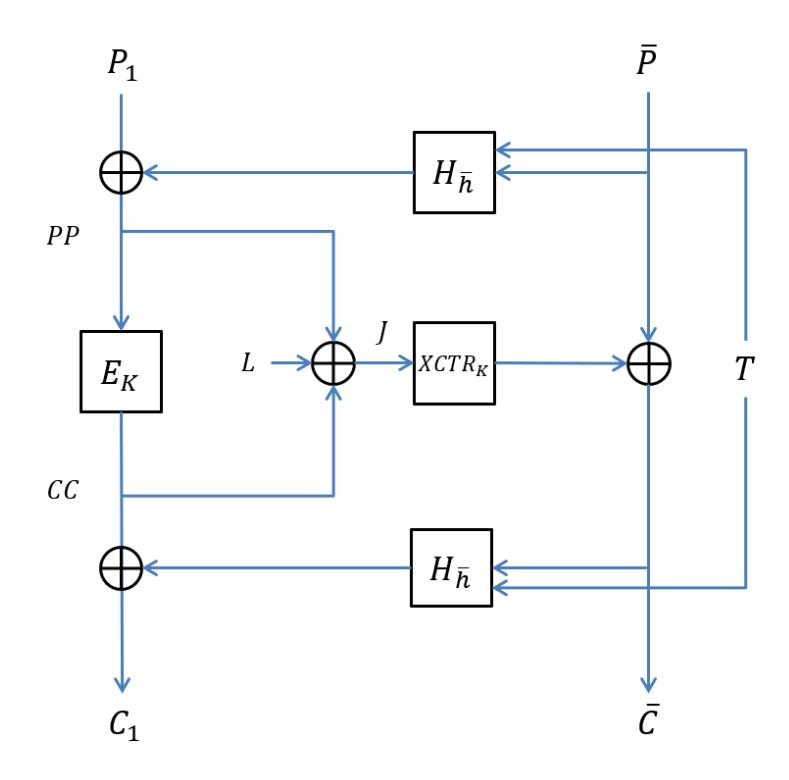
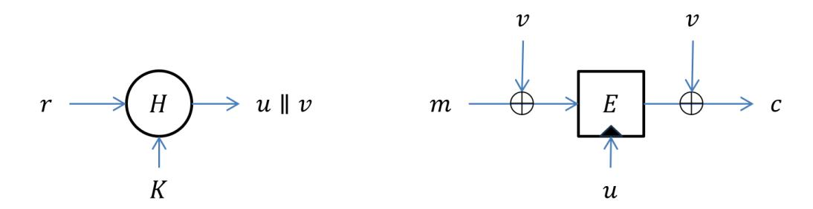
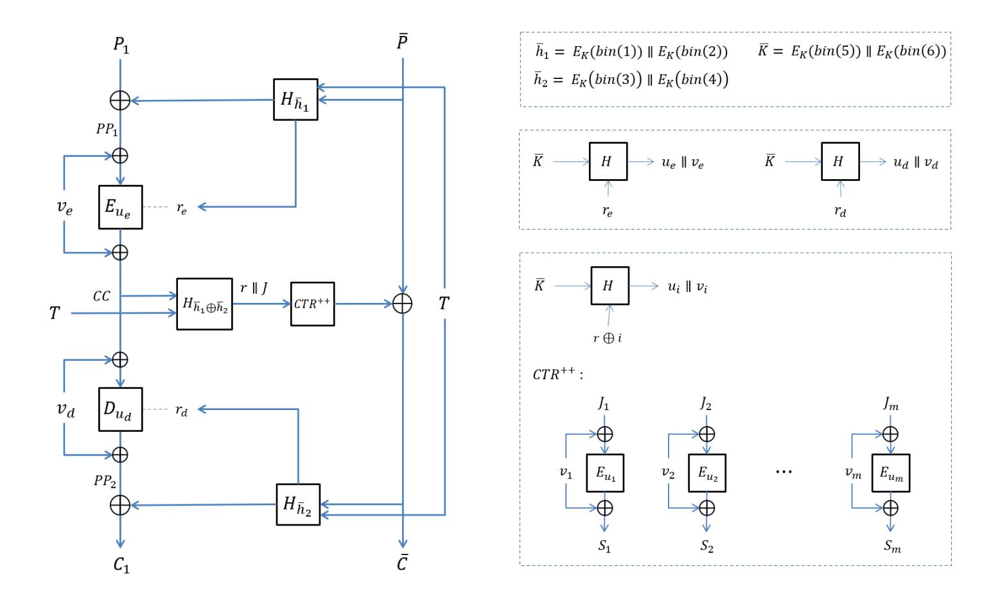

{0}------------------------------------------------

# HCTR++ : A Beyond Birthday Bound Secure HCTR2 Variant

Gülnihal Öztürk<sup>1</sup> , Onur Koçak<sup>2</sup> , and Oğuz Yayla<sup>1</sup>

<sup>1</sup>Cryptography, IAM METU, Ankara, Türkiye , gulnihal.ozturk\_01@metu.edu.tr, oguz@metu.edu.tr <sup>2</sup>TÜBİTAK, Ankara, Türkiye , onur.kocak@tubitak.gov.tr

February 2026

#### Abstract

Current industry-standard block cipher modes of operation, such as CBC and GCM, are fundamentally limited by the birthday bound O(2n/<sup>2</sup> ), a constraint that has evolved from a theoretical concern into a practical security bottleneck in contemporary high-throughput, highdata-volume environments. To address this, the cryptographic community and NIST are prioritizing Beyond Birthday Bound (BBB) security to extend the operational security margin toward the full block size O(2n). Achieving BBB security requires a departure from traditional constructions, primarily utilizing three methodologies: XOR of Permutations (XORP), Tweakable Block Ciphers (TBCs), and Fresh Re-keying. While none of these innovative BBB modes have been formally standardized, NIST has initiated the Accordion Mode project, defining a new primitive class: the Tweakable Variable-Input-Length Strong Pseudorandom Permutation (VIL-SPRP). This primitive treats the entire message as a single, indivisible block and expects the submission of BBB-secure variants. To contribute to this standardization effort, we propose a simple BBB-secure variant of the HCTR2 algorithm. We first explain the core BBB methodologies, then discuss the operational mechanism of HCTR2, and finally present our proposed BBB-secure construction.

Keywords: Accordion mode, Beyond Birthday Bound Security, HCTR2.

{1}------------------------------------------------

## 1 Introduction

Block ciphers form the backbone of modern cryptographic systems, but they rely on specific modes of operation to secure data streams. While industry standards such as CBC (Cipher Block Chaining) [\[16\]](#page-26-0) and GCM (Galois/Counter Mode) [\[17\]](#page-26-1) have heavily utilized over decades, they are constrained by a theoretical limit known as the birthday bound. In an era where data transmission speeds reach terabit-per-second levels and the volume of data encrypted under a single key grows exponentially, this limit has evolved from a theoretical concern into a practical security bottleneck. Consequently, NIST (National Institute of Standards and Technology) and the cryptographic community are pivoting towards next-generation modes that offer Beyond Birthday Bound (BBB) security, with innovative designs like Accordion [\[8\]](#page-25-0) emerging as critical solutions.

Most traditional block cipher modes preserve confidentiality only up to O(2n/<sup>2</sup> ) processing complexity for an n-bit block size. For a standard 128-bit block cipher like AES, this limit is 2 <sup>64</sup> blocks. While this margin is generally acceptable for 128-bit ciphers under moderate loads, it becomes a critical vulnerability for 64-bit lightweight ciphers or high-throughput environments where data volumes approach the collision threshold. Based on the Birthday Paradox, this threshold represents the point where the probability of a collision between ciphertext blocks becomes non-negligible (occurring well before the full exhaustive search space is exhausted). In high-performance environments such as terabit-speed optical links, massive storage area networks (SANs), or long-lived encrypted tunnels, the accumulation of data can approach thresholds where distinguishing attacks or plaintext recovery become theoretically feasible. When this limit is approached or exceeded, an adversary can distinguish the output of the encryption scheme from a truly random permutation or in certain scenarios (such as nonce reuse in GCM [\[23\]](#page-27-0) or Sweet32 class attacks [\[6\]](#page-25-1)), partial plaintext information may be compromised.

To overcome these constraints without abandoning the efficiency of 128 bit primitives, BBB modes are designed to push the security margin from the standard O(2n/<sup>2</sup> ) birthday barrier to higher bounds, ideally, to the full block size of O(2<sup>n</sup> ). Therefore, the cryptographic research community has aggressively pursued BBB security. A BBB mode of operation is designed to maintain its security properties, confidentiality, authenticity, or both, for data volumes significantly exceeding the 2 n/2 limit, where security is limited only by exhaustive key search. Achieving BBB security typically requires a departure from traditional single-key, single-permutation constructions. 

{2}------------------------------------------------

Theoretical research has focused on three primary methodologies for overcoming the birthday barrier: the XOR of Permutations (XORP), Tweakable Block Ciphers (TBC), and Fresh Re-keying. These methodologies have been effective in the design of numerous BBB secure modes of operation.

The first methodology, XORP , is firstly suggested by Bellare et al [\[4\]](#page-25-2) and Lucks [\[27\]](#page-27-1). As established by them and later refined by Patarin [\[31\]](#page-28-0). This methodology has found practical application in several BBB-secure designs, including CENC [\[19\]](#page-27-2) and its variant CHM which offers efficient parallelizability by XORing the block cipher output with a sum-of-permutations generated keystream; GCM-SIV2 [\[20\]](#page-27-3), which modifies the standard GCM's CTR operation to XOR the output of two block ciphers for both data encryption and tag generation; Docked Double Decker [\[14\]](#page-26-2) by Dobraunig et al., which also suggests a BBB-secure authenticated encryption mode for block ciphers like AES using a CENC-like construction; and more recently, the eGCM and eGCM-SIV proposals by Chung et al. [\[10\]](#page-26-3), which leverage CENC-like constructions (eCTR and HteC) to upgrade the security of the original GCM family.

The second primary methodological approach for achieving BBB security employs TBCs, a primitive formally introduced by Liskov, Rivest, and Wagner [\[26\]](#page-27-4). TBC approach has driven significant innovation, including the OCB (Offset Codebook) family (versions 1 through 3) by Rogaway et al. [\[32,](#page-28-1) [24\]](#page-27-5), which uses an efficient XEX-based construction to simulate a TBC, and its enhanced version XOCB [\[2\]](#page-25-3) which achieves BBB security by hybridizing the TBC principle with XORP. Further advanced TBC-based modes include ZCZ by Bhaumik, List, and Nandi [\[7\]](#page-25-4), which offers full n-bit security, and THCTR by Dutta and Nandi [\[15\]](#page-26-4), which achieves n-bit security dependent on tweak repetition, while the more recent HCTR+ by Datta et al. [\[12\]](#page-26-5) is a BBB-secure mode that distinctively achieves n-bit security independent of tweak repetition.

The third major methodological approach for overcoming the birthday bound is Fresh Re-keying, a procedural technique extensively analyzed by Abdalla and Bellare [\[1\]](#page-25-5), and subsequently refined by Mennink [\[29\]](#page-28-2). This principle contrasts with the structural modifications of the XORP and TBC methods by focusing on the temporal dimension of key usage constraints, and has been demonstrated as a viable technique, such as in Mennink's proposal for achieving another BBB secure version of the OCB mode [\[29\]](#page-28-2).

Despite the theoretical and practical advancements in BBB security modes employing XORP, TBC, or Fresh Re-keying methodologies, none of these innovative designs have yet been formally standardized for widespread adoption. Consequently, recognizing the imperative to meet evolving high per

{3}------------------------------------------------

formance and high-security requirements, NIST has initiated a focused standardization effort for a new class of cryptographic mode known as the Accordion Mode.

The NIST Accordion Mode project transcends the objective of merely developing a superior iteration of established standards like GCM; it is formally defining a novel class of cryptographic primitive. The term Accordion functions as a descriptive metaphor for its operational capacity: the cipher accepts a message of arbitrary length and dynamically adjusts its internal transformation, compressing or extending, to produce a ciphertext of precisely the same length, potentially with a minimal, fixed expansion for authentication metadata. Technically, the Accordion Mode is defined as a Tweakable Variable-Input-Length Strong Pseudorandom Permutation (VIL-SPRP) , representing a conceptual shift where the cipher dynamically expands and contracts to match the entire message length, thereby treating the entire message as a single, indivisible block. The construction must satisfy the rigorous requirement of being indistinguishable from a random permutation in both encryption and decryption, implying that a single-bit modification in the plaintext must result in an avalanche effect that randomizes the entire ciphertext, a property termed Wide Block Encryption. Furthermore, the primitive accepts a secondary public input, the tweak, which serves to randomize the specific permutation within the family; this ensures that encrypting the identical message with the same key but a distinct tweak yields a completely uncorrelated ciphertext, a property critical for applications such as disk encryption (where the tweak represents the sector address) and network protocols (where the tweak often incorporates the sequence number). Nevertheless, this project expects the submission of multiple variants, including a construction that offers BBB security in conjunction with the primary mode that furnishes the indispensable functional features. This requirement guarantees that the probability of internal cryptographic collisions remains statistically negligible, even as the cumulative volume of processed data approaches the theoretical maximum security limit of the underlying primitive.

#### 1.1 Our Contribution

To meet these requirements, NIST proposed to develop variants of the HCTR2 algorithm [\[11\]](#page-26-6) for the Accordion Mode standardization effort in June 2025. HCTR2 is considered a highly practical and flexible design, facilitating the straightforward derivation of the requisite accordion properties, which suggests it can be rapidly standardized following minor refinements. Conse

{4}------------------------------------------------

quently, in this article we will present HCTR++ as a variant of HCTR2 that achieves BBB security up to limited tweak reuse by leveraging the previously discussed methodologies. HCTR++ is derived from the HCTR2 construction by substituting the underlying block ciphers with re-keying schemes and replacing the n-bit keyed almost-XOR-universal (AXU) hash functions with 2n-bit variant, for instance POLYVAL over GF(2256) defined by the Rijndael-256 polynomial. The primary objective of this study is to demonstrate how established cryptographic primitives can be integrated to achieve target security bounds. Furthermore, we present the design of a BBB secure accordion mode that maintains compatibility with arbitrary block ciphers, specifically AES-128. Accordingly, the proposed design supports standard cryptographic primitives, thereby facilitating the deployment of widely adopted algorithms within a secure architecture. The fresh re-keying method was adopted because the use of tweakable block ciphers would preclude the direct application of these standards like AES and diminish algorithmic flexibility. Moreover, the adoption of an XOR-sum of permutations approach would fundamentally compromise the reversibility of the scheme, requiring significant structural modifications to maintain a valid decryption path. Consequently, the proposed method utilizes these primitives to satisfy security requirements while maintaining architectural integrity and enhancing implementational efficiency. Despite its performance latency, HCTR++ leverages a re-keying scheme to support standard block ciphers, ultimately delivering optimal O(2<sup>n</sup> ) security with unique tweaks. Comparative analysis indicates that HCTR++ surpasses contemporary block cipher-based constructions in both security and key utilization. While TBC-based schemes offer comparable security assurances, they lack compatibility with standard encryption primitives. These distinctions are detailed in [Table 1,](#page-5-0) which compares the tweakable beyond birthday bound secure schemes according to their underlying primitives, security, operation counts, and key quantities.

The remainder of this paper is organized as follows: Section 2 delineates established methodologies for achieving BBB security. Section 3 elucidates the architectural mechanics of the HCTR2 algorithm, providing the necessary context for Section 4, where we propose the BBB-secure HCTR++ variant. Finally, Section 5 presents a formal security proof demonstrating that the design satisfies the Strong Pseudorandom Permutation (SPRP) criteria.

{5}------------------------------------------------

<span id="page-5-0"></span>Table 1: Comparision with BBB Secure Tweakable Enciphering Schemes

| Design      |      | Security          | Cipher   | Operation Count         | Key Count  |
|-------------|------|-------------------|----------|-------------------------|------------|
| TCT2        | [33] | O(22n/3<br>)      | BC       | (6m + 6)BC + (7m + 7)HF | m + s + 19 |
| THCTR       | [15] | ‡<br>O(2n<br>)    | TBC      | mTBC + 3HF              | 3          |
| bbb-ddd-AES | [14] | O(22n/3<br>‡<br>) | BC       | (2m + 4)BC + 2HF        | 3          |
| Db-HCTR     | [25] | O(22n/3           | ) TBC/BC | 1TBC + (m − 1)BC + 2HF  | 3          |
| HCTR+       | [12] | O(2n<br>)         | TBC      | (m + 2)TBC + 2HF        | 1          |
| CHCTR       | [9]  | O(22n/3<br>)      | BC       | 2mBC + 4HF              | 2          |
| HCTR2-TwKD  | [9]  | ‡<br>O(22n/3<br>) | BC       | mBC + 2HF + 1KDF        | 1          |
| HCTR++      |      | ‡<br>O(2n)        | BC       | (m + 7)BC + (m + 4)HF   | 1          |

BC: Block Cipher, TBC: Tweakable Block Cipher, HF: Hash Function, KDF : Key Derivation Function, n: block size, m: number of blocks of a specific message

‡The security levels of these algorithms depend on the number of data blocks under the same tweaks.

# 2 Methodologies for Achieving Beyond Birthday Bound Security

To exceed the conventional birthday bound of O(2n/<sup>2</sup> ), a mode of operation must disrupt the collision probability inherent in using a fixed permutation over a growing data set. This section details the algorithmic mechanics and security properties of the three dominant approaches: XOR of Permutations, Tweakable Block Ciphers, and Fresh Re-keying.

### 2.1 XOR of Permutations (XORP)

In the pursuit of BBB security, one of the most elegant and theoretically sound approaches is the XOR of Permutations, often referred to in cryptographic literature as the Sum of Permutations (SoP). The core principle of this method is the construction of a Pseudorandom Function (PRF) from two or more distinct Pseudorandom Permutations (PRPs). In standard block cipher operations, the use of a single permutation allows an adversary to distinguish the output from a truly random string once the data volume approaches the birthday bound. This distinguishes the cipher because a PRP is bijective, whereas a PRF exhibits collisions with high probability. At 2 n/2 queries, the absence of collisions in an n-bit PRP allows an adversary to 

{6}------------------------------------------------

distinguish it from an PRF with high probability.

The XORP approach relies on the sum of permutations principle. It constructs a pseudorandom function F by summing the outputs of k independent n-bit permutations P1, . . . , Pk:

$$F(x) = P_1(x) \oplus P_2(x) \oplus \cdots \oplus P_k(x)$$

Theoretical analysis by Bellare et al. [\[4\]](#page-25-2) and Patarin [\[31\]](#page-28-0) demonstrates that while a single permutation leaks information at the birthday bound, the XOR sum of two independent permutations (P1(x) ⊕ P2(x)) masks the internal structure. The resulting function F becomes indistinguishable from a true random function up to O(2<sup>n</sup> ) queries, or O(22n/<sup>3</sup> ) depending on the specific proof technique and adversary model.

A canonical illustration of the XOR of Permutations methodology is its application to Counter mode (CTR) construction. In a direct XORP implementation for CTR, the keystream block for the i-th counter value is generated using the sum of two permutations: EK(0 ∥ counteri) ⊕ EK(1 ∥ counteri), rather than the single block cipher evaluation EK(counteri). This construction successfully elevates the security bound to O(2<sup>n</sup> ), but it incurs a significant efficiency cost, effectively doubling the number of block cipher calls required per block of data. Iwata subsequently enhanced the efficiency of this approach in the Cipher-based Encryption (CENC) mode [\[19\]](#page-27-2). CENC achieves a practical security bound of O(22n/<sup>3</sup> ) while improving performance by strategically masking the output of one counter encryption, EK(1 ∥ counteri), with the output of the other, EK(0 ∥ counteri), only up to a predefined data volume limit.

In essence, the XORP methodology enables modes like CENC to generate a keystream whose collision probability is consistent with that of a truly random function (PRF), reaching security bounds of O(2<sup>n</sup> ) or O(22n/<sup>3</sup> ). This functional characteristic effectively obfuscates the bijective nature of the underlying block cipher, which is the primary source of the birthday bound limitation.

#### 2.2 Tweakable Block Ciphers (TBC)

While the XORP achieves BBB security by masking collisions, the Tweakable Block Cipher method achieves it by preventing collisions from ever occurring in the first place through domain separation. In modern high-security cryptography, replacing a standard block cipher with a TBC is one of the most direct methods to extend data limits from 2 n/2 to approximately 2 n .

{7}------------------------------------------------

A standard block cipher is defined as a mapping E : {0, 1} <sup>k</sup> × {0, 1} <sup>n</sup> → {0, 1} n . For a fixed key K ∈ {0, 1} k , the function EK(·) operates as a permutation where distinct inputs are required to ensure unique outputs. Within these constructions, security is inherently constrained by the birthday bound. A Tweakable Block Cipher extends this definition to E : {0, 1} <sup>k</sup> × {0, 1} <sup>t</sup> × {0, 1} <sup>n</sup> → {0, 1} n , where T ∈ {0, 1} t is a public tweak that selects a unique permutation from a family. The core security requirement is that for any two distinct tweaks T<sup>1</sup> ̸= T2, the permutations EK(T1, ·) and EK(T2, ·) should appear computationally independent.

The primary method for achieving BBB security utilizing TBCs is to ensure that the tweak input possesses a nonce-like or counter-like uniqueness for every block processed. Through systematic application of this unique tweak per block, the mode effectively deploys a fresh, distinct permutation for every single encryption operation; since no specific permutation is queried more than once, the probability of an internal cryptographic collision remains theoretically zero. This rigorous domain separation allows the security to hold up to the limits imposed by the size of the key space or the available tweak space, asymptotically approaching the full codebook size of O(2<sup>n</sup> ).

A critical nuance is that not all TBC constructions inherently provide BBB security; for instance, prevalent structures such as XEX [\[32\]](#page-28-1) (utilized in XTS-AES) only maintain security up to the birthday bound O(2n/<sup>2</sup> ). To leverage the TBC methodology for BBB security, the underlying TBC primitive must exhibit strong or beyond birthday security properties, with prominent examples including (a) Minematsu's construction [\[30\]](#page-28-4), which achieves BBB security reliant on the tweak size through a tweak-dependent key, and (b) Mennink's construction [\[28\]](#page-27-7), which attains optimal O(2<sup>n</sup> ) security using only two block cipher calls. Wang et al. [\[34\]](#page-28-5) subsequently generalized Mennink's design to 32 variants, and Jha et al. [\[22\]](#page-27-8) further generalized both Mennink's and Wang et al.'s work in 2017 by incorporating a block cipher and a universal hash function, typically involving a non-linear key/tweak mixing structure to ensure operational independence. Another notable example is the Deoxys-BC family of algorithms [\[21\]](#page-27-9), which is used in the HCTR+ mode. These TBCs integrate the tweak directly into the key schedule, thereby guaranteeing that the tweak provides a fresh, distinct random permutation for each encryption operation.

#### 2.3 Fresh Re-keying

In the landscape of BBB cryptography, Fresh Re-keying stands out as a radical approach. Rather than modifying the mode of operation (like CENC) 

{8}------------------------------------------------

or the internal structure of the cipher (like TBCs), Fresh Re-keying mitigates the birthday bound by ensuring that the underlying block cipher instance is never used enough times for collisions to become statistically probable.

Its methodology addresses the birthday bound by fundamentally limiting the operational lifespan of any single key instance, K. As the quantity of data blocks (q) processed by a static block cipher E<sup>K</sup> increases, the probability of an adversary distinguishing the resulting ciphertext from a truly random permutation grows according to the Birthday Paradox. Critically, the birthday bound, q ≈ 2 n/2 , applies specifically to the number of blocks encrypted under a single, fixed key. Fresh Re-keying effectively neutralizes this constraint by generating a new, ephemeral session key for every individual block or small chunk of blocks. The encryption of a message block M using a master key MK and a unique nonce/counter r is formally defined by the sequence K<sup>r</sup> = FMK(r) for key derivation and C = EK<sup>r</sup> (M) for the encryption operation, where F is a Pseudorandom Function (PRF) and E is the underlying block cipher. Because the session key K<sup>r</sup> is distinct for every unique value of r, the adversary is effectively confronting a distinct, independently random permutation for every block, rather than attacking a single, static permutation.

The security of this approach relies on the Standard-Model to Ideal-Cipher-Model translation. With a static key, an adversary observes q outputs derived from one permutation, and the security is limited by the collision probability O(q <sup>2</sup>/2 n ). In contrast, if the re-keying function F is cryptographically secure, the adversary effectively observes one output from q different, independent random permutations. Since these permutations are independent, the collision probability for distinct inputs is minimized, and the aggregate security margin is successfully pushed beyond the traditional birthday limit.

This methodological approach was initially proposed by Abdalla and Bellare [\[1\]](#page-25-5) to enhance the permissible usage count of the master key. Subsequently, Dobraunig et al. [\[13\]](#page-26-8) advanced this concept by proposing two distinct re-keying schemes, one of which achieves BBB security through the strategic leveraging of a TBC. Building upon this foundation, Mennink [\[29\]](#page-28-2) conducted further research into optimizing the efficiency of combining BBBsecure TBCs with re-keying, leading to the proposal of three distinct fresh re-keying schemes. These schemes, detailed in Mennink's work, are explicitly based on: the Mennink TBC construction [\[28\]](#page-27-7), one of the TBC variants proposed by Wang et al. [\[34\]](#page-28-5), and the generalized XHX construction by Jha et al [\[22\]](#page-27-8).

{9}------------------------------------------------

# 3 HCTR2 Mechanics and BBB Variant Construction

Driven by the limitations and vulnerabilities inherent in current modes of operation, NIST has identified HCTR2 [\[11\]](#page-26-6) as a primary candidate for a new cryptographic modes which is called accordion mode. HCTR2 serves as a variable-input-length, tweakable, strong pseudorandom permutation, a requisite property for the proposed new standard. Structurally, the algorithm is based on Hash-Encrypt-Hash (HEH) construction. To facilitate its standardization as an accordion mode, researchers have proposed developing variants that incorporate additional functional attributes. This section details the operational mechanics of HCTR2 and subsequently introduces a BBB secure variant achieved through the integration of Bart Mennink's R3 fresh re-keying scheme.

### 3.1 Working Mechanism of HCTR2

HCTR2, which is given in the [Figure 1,](#page-10-0) employs a three-pass structure reminiscent of a Feistel network, utilizing the HEH paradigm to efficiently process plaintext of arbitrary length while maintaining high security bounds. The algorithm operates under a single block cipher key, K. To manage internal hashing and enforce domain separation without necessitating additional key material, HCTR2 derives two internal sub-keys during initialization: a polynomial hashing key, h ← EK(bin(0)), and a masking key, L ← EK(bin(1)) where bin(x) is little-endian n-bit binary representation of x.

For a given tweak T and plaintext P, the input is partitioned into a fixed-size leading block, P<sup>1</sup> (n bits), and a variable-length remainder, P. The process initiates with a polynomial hash function, H<sup>h</sup> , which processes the tweak T and the remainder P. The resulting digest is XORed with the leading block P<sup>1</sup> to generate an intermediate value, P P. This value is subsequently encrypted via the underlying block cipher to produce CC.

A critical component of HCTR2 is the generation of the internal state J (acting as the initialization vector for the XCTR phase), which is derived by XORing the input and output of the block cipher encryption with the masking key L (i.e., J = P P ⊕ CC ⊕ L). The XCTR mode then generates a keystream by encrypting a sequence of counters XORed with J (denoted as EK(J ⊕ 1) ∥ EK(J ⊕ 2). . .). This keystream is XORed with the remainder P to yield the ciphertext remainder C. In the final phase, the algorithm re-hashes the tweak T and the newly generated ciphertext remainder C; this hash digest is XORed with CC to derive the final leading ciphertext block, 

{10}------------------------------------------------

C1. The complete ciphertext is formed by the concatenation C = C<sup>1</sup> ∥ C.

<span id="page-10-0"></span>

Figure 1: HCTR2 Algorithm

### 3.2 BBB Variant HCTR2: HCTR++

Securing the HCTR2 algorithm at the BBB level requires strategic design changes that prevent internal collisions and preserve security near the conventional birthday threshold. We achieve this enhanced profile by modifying the collision probabilities of two core components. First, a 2n-bit hash function replaces the internal n-bit version. Second, Mennink's R3 re-keying scheme substitutes the standard n-bit block cipher primitive. This application of the Fresh Re-keying methodology ensures the encryption function uses a distinct, independent permutation for each block, thereby neutralizing static key vulnerabilities and pushing the security bound toward O(2<sup>n</sup> ).

As shown in [Figure 2,](#page-11-0) Mennink's R3 method is architecturally influenced from the tweakable block cipher paradigm. Specifically, his approach computes a 2n-bit digest by hashing an n-bit random nonce alongside the n-bit master key. The most significant n bits of this output are utilized as the ephemeral key for the encryption algorithm, while the least significant n bits are employed as the tweak. Thus, the collision bound for each encryption instance is dependent on both the key and the tweak parameters.

Detailed in [Figure 3,](#page-12-0) HCTR++ adapts the HCTR2 structure to accommodate the R3 scheme. This construction replaces static encryptions with R3 re-keying and substitutes the n-bit universal hash function with a 2n-

{11}------------------------------------------------

<span id="page-11-0"></span>

Figure 2: Re-keying Construction R3

bit equivalent. Significant structural deviations include the replacement of XCTR with an R3-based CTR variant and the introduction of a decryption operation on the first message block to enforce dependence on the complete hash output. Similar to HCTR2, HCTR<sup>++</sup> requires a single key input to derive the hash keys  $\overline{h}_1, \overline{h}_2$  and  $\overline{K}$ . It generates keys for all subsequent re-keying operations utilizing the initial n bits of the hash output, thereby guaranteeing that the ciphertext is dependent on the entire hash digest. The subkeys for re-keying operations are generated using the identical universal hash algorithm to the one utilized in the main algorithm. Furthermore, the internal state J is derived from the hash of the combined encryption output and tweak. This derivation logic, alongside the inverted operation on the first block, ensures symmetry between encryption and decryption procedures, thereby streamlining implementation. The algorithmic details, explicitly demonstrating the symmetry between encryption and decryption, are defined in Figure 4.

# 4 Security

In this section, we establish the security of HCTR<sup>++</sup> within the framework of strong pseudorandom permutations as defined by Bellare et al. [3].

**Definition 1.** Let  $\mathcal{K}$  and  $\mathcal{M}$  denote the key space and message space, respectively. Let  $\operatorname{Perm}(\mathcal{M})$  denote the set of all length-preserving permutations on  $\mathcal{M}$ . Consider a block cipher  $E: \mathcal{K} \times \mathcal{M} \to \mathcal{M}$ . The SPRP advantage of a distinguishing adversary  $\mathcal{A}$  against E is defined as:

$$\mathbf{Adv}_{E}^{\mathrm{SPRP}}(\mathcal{A}) := \left| \Pr[K \xleftarrow{\$} \mathcal{K} : \mathcal{A}^{E_{K}, E_{K}^{-1}} \Rightarrow 1] - \Pr[\pi \xleftarrow{\$} \mathrm{Perm}(\mathcal{M}) : \mathcal{A}^{\pi, \pi^{-1}} \Rightarrow 1] \right|$$

where  $K \stackrel{\$}{\leftarrow} \mathcal{K}$  denotes sampling a key uniformly at random, and the notation " $\Rightarrow$  1" denotes the event that the adversary outputs 1.

{12}------------------------------------------------



<span id="page-12-0"></span>Figure 3: HCTR++ Algorithm

This advantage quantifies the adversary's ability to distinguish the block cipher E from a uniform random permutation π given adaptive access to both encryption and decryption oracles. A negligible advantage implies security against both chosen-ciphertext and chosen-plaintext attacks.

We now state the security of HCTR++ formally. Theorem 1 establishes that the SPRP advantage of an adversary attacking HCTR++ is negligible, provided the number of queries is bounded by 2 <sup>n</sup> and the maximum number of queries sharing the same tweak µ is sufficiently restricted.

Theorem 1. Let E : K × M → M be a secure block cipher, and let H be an ϵ-almost-XOR-universal 2n-bit keyed hash function. Let HCTR++[E, H] denote the accordion mode construction defined over the message space M = {0, 1} na with key space K = {0, 1} k . For any adversary A making at most q encryption and decryption queries, where at most µ queries share the same tweak, the SPRP advantage of A is bounded by:

$$\mathbf{Adv}_{HCTR^{++}[E,H]}^{SPRP}(\mathcal{A}) \le 3q^{2}\epsilon + \binom{q}{2} \cdot \epsilon + \frac{2 \cdot \binom{q(a+1)}{2}}{2^{2n}} + \frac{q(\mu-1)}{2^{n+1}} + \frac{\binom{q}{2}}{2^{2n}} + \frac{q^{2}}{2^{2n+1}}$$

We prove Theorem 1 using the code-based game-playing (hybrid argument) technique [\[3\]](#page-25-6). This methodology involves defining a sequence of games.

{13}------------------------------------------------

```
Algorithm 1 Enc(K, T, P)
  P1 ← MSBn(P)
  P ← LSB|P |−n(P)
  h1 ← EK(bin(1)) ∥ EK(bin(2))
  h2 ← EK(bin(3)) ∥ EK(bin(4))
  K ← EK(bin(5)) ∥ EK(bin(6))
  P P1 ← P1 ⊕ MSBn(Hh1
                         (P , T))
  re ← LSBn(Hh1
                 (P , T))
  ue ∥ ve ← HK(re)
  CC ← Eue
            (P P1 ⊕ ve) ⊕ ve
  r ∥ J ← Hh1⊕h2
                 (CC, T)
  S ← CTR++(J)
       s = |P|, m = ⌈s/n⌉, i = 1
       for i ≤ m do
          Ji = J ⊕ i, ri = r ⊕ i
          ui ∥ vi ← HK(ri)
          Si ← Eui
                   (Ji ⊕ vi) ⊕ vi
          i ← i + 1
       end for
       S = MSBs(S1 ∥ S2 ∥ · · · ∥ Sm)
  C ← P ⊕ S
  rd ← LSBn(Hh2
                 (C, T))
  ud ∥ vd ← HK(rd)
  P P2 ← Dud
             (CC ⊕ vd) ⊕ vd
  C1 ← P P2 ⊕ MSBn(Hh2
                         (C, T))
  C ← C1||C
  return C
                                           Algorithm 2 Dec(K, T, C)
                                              C1 ← MSBn(C)
                                              C ← LSB|C|−n(C)
                                              h1 ← EK(bin(1)) ∥ EK(bin(2))
                                              h2 ← EK(bin(3)) ∥ EK(bin(4))
                                              K ← EK(bin(5)) ∥ EK(bin(6))
                                              P P1 ← C1 ⊕ MSBn(Hh2
                                                                     (C, T))
                                              re ← LSBn(Hh2
                                                             (C, T))
                                              ue ∥ ve ← HK(re)
                                              CC ← Eue
                                                        (P P1 ⊕ ve) ⊕ ve
                                              r ∥ J ← Hh1⊕h2
                                                             (CC, T)
                                              S ← CTR++(J)
                                                  s = |C|, m = ⌈s/n⌉, i = 1
                                                  for i ≤ m do
                                                     Ji = J ⊕ i, ri = r ⊕ i
                                                     ui ∥ vi ← HK(ri)
                                                     Si ← Eui
                                                              (Ji ⊕ vi) ⊕ vi
                                                     i ← i + 1
                                                  end for
                                                  S = MSBs(S1 ∥ S2 ∥ · · · ∥ Sm)
                                              P ← C ⊕ S
                                              rd ← LSBn(Hh1
                                                             (P , T))
                                              ud ∥ vd ← HK(rd)
                                              P P2 ← Dud
                                                         (CC ⊕ vd) ⊕ vd
                                              P1 ← P P2 ⊕ MSBn(Hh1
                                                                    (P , T))
                                              P ← P1||P
                                              return P
```

<span id="page-13-0"></span>Figure 4: HCTR++ Pseudocode

The first game represents the real interaction with the HCTR++ construction, while the final game represents the interaction with an ideal random permutation. By systematically replacing deterministic substructures with random primitives and bounding the probability of distinguishing events in each transition (game hop), we limit the adversary's advantage. Our analysis parallels the proof techniques employed in [\[18\]](#page-26-9).

Proof. Let A denote an adversary that makes at most q queries. Each query has a length of na bits, where n represents the block size of the underlying cipher and a denotes the maximum number of blocks per message. We define a sequence of games, Game0,Game1, . . . , transitioning from the real-world environment to the ideal-world scenario.

{14}------------------------------------------------

Game0: This game embodies the real attack environment. The adversary  $\mathcal{A}$  interacts with an oracle that faithfully simulates the HCTR<sup>++</sup>[ $\tilde{E}$ , H] construction. In this setting,  $\tilde{E}$  denotes the re-keying scheme utilized in the construction as  $\tilde{E}(r,K,P)=E(h_1(r,K),P\oplus h_2(r,K))\oplus h_2(r,K)$ , where  $h_1$  and  $h_2$  denote the first and last n bits of the hash output, respectively, E denotes a standard n-bit block cipher, and H represents a 2n-bit  $\epsilon$ -almost-XOR-universal hash function. Consequently, the probability of the adversary outputting 1 in this game is, by definition, identical to the probability of the adversary interacting with the real construction:

$$Pr[\mathcal{A}^{\mathrm{HCTR}^{++}[\tilde{E},H]} \implies 1] = Pr[\mathcal{A}^{\mathsf{Game0}} \implies 1]$$

Game1: In this game, we replace the real-world instantiation with an idealized setting. Specifically, we replace the concrete re-keying scheme  $\tilde{E}$  with an ideal re-keying scheme  $\tilde{\pi}$ , and the hash function H with a truly random function  $\rho$ . This results in the idealized construction HCTR<sup>++</sup>[ $\tilde{\pi}, \rho$ ], detailed in Algorithms 3, 4. By the standard hybrid argument, the adversary's advantage in distinguishing the real construction is bounded by the distance to this ideal game plus the security advantages of the underlying primitives:

$$\mathbf{Adv}_{\mathrm{HCTR}^{++}[E,H]}^{\mathrm{SPRP}} \leq \mathbf{Adv}_{\mathrm{HCTR}^{++}[\tilde{\pi},\rho]}^{\mathrm{SPRP}} + \mathbf{Adv}_{\tilde{E}}^{\mathrm{SPRP}} + \mathbf{Adv}_{H}^{\mathrm{PRF}}$$

To simulate the ideal re-keying scheme  $\tilde{\pi}$  efficiently within the game, we employ the lazy sampling technique introduced by Halevi and Rogaway [18]. Rather than sampling the entire permutation upfront, the game simulates  $\tilde{\pi}$  dynamically based on the adversary's queries. Initially, the permutation  $\tilde{\pi}$  is everywhere undefined.

Specifically, when a query requires the evaluation of  $\tilde{\pi}(r',P')$ , the oracle first verifies whether the output is already defined; if so, the stored value is returned immediately. If the value is undefined, the oracle samples a uniform random value C' from the set of currently unselected range elements. Subsequently, the mapping is established by assigning  $\tilde{\pi}(r',P') \leftarrow C'$  and updating the inverse relation  $\tilde{\pi}^{-1}(r',C') \leftarrow P'$ . This new tuple (r',P',C') is then recorded in the domain and range sets D and R as (r',P') and (r',C') being updated accordingly to maintain the consistency of the simulation for future queries.

A symmetric procedure is applied for inverse queries to  $\tilde{\pi}^{-1}$ . For the purpose of security analysis, we introduce a failure flag, denoted as bad. This flag is initialized to false and is raised if the lazy sampling procedure encounters a collision that would violate the permutation consistency. The adversary  $\mathcal{A}$  has no visibility of the bad flag.

{15}------------------------------------------------

To facilitate the subsequent analysis, we leverage the established relationship between SPRP and SPRF security detailed in [5]. Specifically, we bound the SPRP advantage of the idealized construction by its corresponding SPRF advantage. This transformation significantly simplifies the proof by eliminating the need to account for certain collision events inherent to permutations, thereby reducing the complexity of the *bad* case analysis. Consequently, the upper bound on the adversary's advantage is updated as follows:

$$\mathbf{Adv}^{\mathrm{SPRP}}_{\mathrm{HCTR}^{++}[E,H]} \leq \mathbf{Adv}^{\mathrm{SPRF}}_{\mathrm{HCTR}^{++}[\tilde{\pi},\rho]} + \mathbf{Adv}^{\mathrm{SPRP}}_{\tilde{E}} + \mathbf{Adv}^{\mathrm{PRF}}_{H} + \frac{q^2}{2^{2n+1}}$$

Game2: This game is derived from Game1 by eliminating the consistency checks previously enforcing the permutation property of  $\tilde{\pi}$ . Consequently, the oracle no longer verifies if an input was previously queried; instead, it generates a fresh random assignment for every invocation of  $\tilde{\pi}$  (or  $\tilde{\pi}^{-1}$ ). This effectively replaces the ideal permutation with a random function. To bound the difference between the games, we retain the *bad* flag, which is raised exactly when the oracle selects a value that collides with a previously defined domain or range element. By the Fundamental Lemma of Game-Playing, the distinguishability of the two games is bounded by the probability of this flag being set:

$$\Pr[\mathcal{A}^{\mathsf{Game1}} \Rightarrow 1] - \Pr[\mathcal{A}^{\mathsf{Game2}} \Rightarrow 1] \leq \Pr[\mathsf{Game2} \text{ sets } bad]$$

Furthermore, we simplify the generation of responses by applying the technique from [18]. In the encryption queries, the randomness inherent in the internal variables  $S_i^r$  and  $PP_2^r$  is propagated directly to the ciphertext components  $\overline{C^r}$  and  $C_1^r$  (and analogously to  $\overline{P^r}$  and  $P_1^r$  for decryption). Since the internal values are uniformly distributed and mask the outputs via XOR operations, the resulting ciphertexts and plaintexts provided to the adversary are indistinguishable from sequences of independent, uniformly random bits. Because this modification does not alter the distribution of answers viewed by the adversary, the probability of winning remains invariant. Through this transformation, the oracle in Game2 becomes functionally identical to a random bit oracle, leading to the following equality:

$$\Pr[\mathcal{A}^{\mathsf{Game2}} \Rightarrow 1] = \Pr[\mathcal{A}^{\mathsf{SPRF}} \Rightarrow 1]$$

Finally, combining these observations with the definition of SPRF secu-

{16}------------------------------------------------

### **Algorithm 3** Game1 - $r^{\text{th}}$ Encryption Query $(P_1^r || \overline{P^r}, T^r)$

```
bad \leftarrow \mathbf{false}; \quad D \leftarrow R \leftarrow T \leftarrow \emptyset; \quad \tilde{\pi} \leftarrow \mathbf{undef}
X_1^r \stackrel{\$}{\leftarrow} \{0,1\}^{2n}
r_e^r \leftarrow \mathrm{LSB}_n(X_1^r)
PP_1^r \leftarrow P_1^r \oplus \mathrm{MSB}_n(X_1^r)
CC^r \stackrel{\$}{\leftarrow} \{0,1\}^n
if (r_e^r, CC^r) \in \mathbb{R} then bad \leftarrow \text{true}, | (r_e^r, CC^r) \xleftarrow{\$} \overline{\mathbb{R}} | end if
if (r_e^r, PP_1^r) \in D then bad \leftarrow \text{true}, \boxed{CC^r \leftarrow \tilde{\pi}(r_e^r, PP_1^r)} end if
\tilde{\pi}(r_e^r, PP_1^r) \leftarrow CC^r, \quad \mathbf{D} \leftarrow \mathbf{D} \cup \{(r_e^r, PP_1^r)\}, \quad \mathbf{R} \leftarrow \mathbf{R} \cup \{(r_e^r, CC^r)\}
(r \parallel J)^r \stackrel{\$}{\leftarrow} \{0,1\}^{2n}
if (T^r, CC^r) \in T) then bad \leftarrow true end if
T \leftarrow T \cup \{(T^r, CC^r)\}
 S^r \leftarrow \text{CTR}^{++}(J^r)
             s^r = |\overline{P^r}|, \quad m = \lceil s^r/n \rceil
             for i = 1 to m do
                      J_i^r = J^r \oplus i, \quad r_i^r = r^r \oplus i
                      S_i^r \stackrel{\$}{\leftarrow} \{0,1\}^n
                      if (r_i^r, S_i^r) \in \mathbb{R} then bad \leftarrow \text{true}, \left| (r_i^r, S_i^r) \stackrel{\$}{\leftarrow} \overline{\mathbb{R}} \right| end if
                      if (r_i^r, J_i^r) \in D then bad \leftarrow \text{true}, \overline{S_i^r \leftarrow \tilde{\pi}(r_i^r, J_i^r)} end if
                      \tilde{\pi}(r_i^r, J_i^r) \leftarrow S_i^r, \quad D \leftarrow D \cup \{(r_i^r, J_i^r)\}, \quad R \leftarrow R \cup \{(r_i^r, S_i^r)\}
             end for
             S^r = \mathrm{MSB}_{s^r}(S_1 \parallel S_2 \parallel \cdots \parallel S_m)
\overline{C^r} \leftarrow \overline{P^r} \oplus S^r
X_2^r \stackrel{\$}{\leftarrow} \{0,1\}^{2n}
r_d^r \leftarrow \text{LSB}_n(X_2^r)
PP_2^r \stackrel{\$}{\leftarrow} \{0,1\}^n
if (r_d^r, PP_2^r) \in D then bad \leftarrow \text{true}, \left| (r_d^r, PP_2^r) \xleftarrow{\$} \overline{D} \right| end if
\begin{split} & \textbf{if } (r_d^r, CC^r) \in \mathbf{R} \textbf{ then } bad \leftarrow \mathbf{true}, \boxed{PP_2^r \leftarrow \tilde{\pi}^{-1}(r_d^r, CC^r)} \textbf{ end if} \\ & \tilde{\pi}^{-1}(r_d^r, CC^r) \leftarrow PP_2^r, \quad \mathbf{D} \leftarrow \mathbf{D} \cup \{(r_d^r, PP_2^r)\}, \quad \mathbf{R} \leftarrow \mathbf{R} \cup \{(r_d^r, CC^r)\} \end{split}
 C_1^r \leftarrow PP_2^r \oplus \mathrm{MSB}_n(X_2^r)
 C^r \leftarrow C_1^r || \overline{C^r}|
 return C^r
```

rity, we derive the upper bound for the security of the idealized construction:

$$\begin{aligned} \mathbf{Adv}_{\mathrm{HCTR}^{++}[\tilde{\pi},\rho]}^{\mathrm{SPRF}} &= \left| \Pr[\mathcal{A}^{\mathrm{HCTR}^{++}[\tilde{\pi},\rho]} \Rightarrow 1] - \Pr[\mathcal{A}^{\mathrm{SPRF}} \Rightarrow 1] \right| \\ &= \left| \Pr[\mathcal{A}^{\mathsf{Game1}} \Rightarrow 1] - \Pr[\mathcal{A}^{\mathsf{Game2}} \Rightarrow 1] \right| \\ &\leq \Pr[\mathsf{Game2} \ \mathrm{sets} \ \mathit{bad}] \end{aligned}$$

Game3: In this game, we restructure the experiment to separate the ad-

{17}------------------------------------------------

### **Algorithm 4** Game1 - $r^{\text{th}}$ Decryption Query $(C_1^r || \overline{C^r}, T^r)$

```
bad \leftarrow \mathbf{false}; \quad D \leftarrow R \leftarrow T \leftarrow \emptyset; \quad \tilde{\pi} \leftarrow \mathbf{undef}
X_1^r \stackrel{\$}{\leftarrow} \{0,1\}^{2n}
r_e^r \leftarrow \mathrm{LSB}_n(X_1^r)
PP_1^r \leftarrow C_1^r \oplus \mathrm{MSB}_n(X_1^r)
CC^r \stackrel{\$}{\leftarrow} \{0,1\}^n
if (r_e^r, CC^r) \in \mathbb{R} then bad \leftarrow \text{true}, | (r_e^r, CC^r) \xleftarrow{\$} \overline{\mathbb{R}} | end if
if (r_e^r, PP_1^r) \in D then bad \leftarrow \text{true}, CC^r \leftarrow \tilde{\pi}(r_e^r, PP_1^r) end if
\tilde{\pi}(r_e^r, PP_1^r) \leftarrow CC^r, \quad \mathbf{D} \leftarrow \mathbf{D} \cup \{(r_e^r, PP_1^r)\}, \quad \mathbf{R} \leftarrow \mathbf{R} \cup \{(r_e^r, CC^r)\}
(r \parallel J)^r \stackrel{\$}{\leftarrow} \{0,1\}^{2n}
if (T^r, CC^r) \in T) then bad \leftarrow true end if
T \leftarrow T \cup \{(T^r, CC^r)\}
 S^r \leftarrow \text{CTR}^{++}(J^r)
             s^r = |\overline{C^r}|, \quad m = \lceil s^r/n \rceil
             for i = 1 to m do
                      J_i^r = J^r \oplus i, \quad r_i^r = r^r \oplus i
                      S_i^r \stackrel{\$}{\leftarrow} \{0,1\}^n
                      if (r_i^r, S_i^r) \in \mathbb{R} then bad \leftarrow \text{true}, \left| (r_i^r, S_i^r) \stackrel{\$}{\leftarrow} \overline{\mathbb{R}} \right| end if
                      if (r_i^r, J_i^r) \in D then bad \leftarrow \text{true}, \boxed{S_i^r \leftarrow \tilde{\pi}(r_i^r, J_i^r)} end if
                      \tilde{\pi}(r_i^r, J_i^r) \leftarrow S_i^r, \quad D \leftarrow D \cup \{(r_i^r, J_i^r)\}, \quad R \leftarrow R \cup \{(r_i^r, S_i^r)\}
             end for
              S^r = MSB_{s^r}(S_1 \parallel S_2 \parallel \cdots \parallel S_m)
 \overline{P^r} \leftarrow \overline{C^r} \oplus S^r
X_2^r \stackrel{\$}{\leftarrow} \{0,1\}^{2n}
r_d^r \leftarrow \text{LSB}_n(X_2^r)
PP_2^r \stackrel{\$}{\leftarrow} \{0,1\}^n
if (r_d^r, PP_2^r) \in D then bad \leftarrow \text{true}, \left| (r_d^r, PP_2^r) \xleftarrow{\$} \overline{D} \right| end if
\begin{split} & \textbf{if } (r_d^r, CC^r) \in \mathbf{R} \textbf{ then } bad \leftarrow \mathbf{true}, \boxed{PP_2^r \leftarrow \tilde{\pi}^{-1}(r_d^r, CC^r)} \textbf{ end if} \\ & \tilde{\pi}^{-1}(r_d^r, CC^r) \leftarrow PP_2^r, \quad \mathbf{D} \leftarrow \mathbf{D} \cup \{(r_d^r, PP_2^r)\}, \quad \mathbf{R} \leftarrow \mathbf{R} \cup \{(r_d^r, CC^r)\} \end{split}
 P_1^r \leftarrow PP_2^r \oplus \mathrm{MSB}_n(X_2^r)
P^r \leftarrow P_1^r || \overline{P^r}
 return P^r
```

versary's interaction from the internal consistency checks. This approach simplifies the probability bounding by dividing the game into three distinct phases: query-response, intermediate computation and bad analysis. In query-response phase, the oracle interacts with the adversary  $\mathcal{A}$ . For every encryption or decryption query, the oracle immediately returns a completely random and independent response, effectively simulating a random bit oracle. In intermediate computation phase, once the adversary has com-

{18}------------------------------------------------

pleted all q queries, the game retroactively calculates the internal variables necessary to make the random responses consistent with the inputs. In bad analysis phase, the game inspects the sets of collected internal variables. The bad flag is raised if any collision conditions are detected within these sets.

Crucially, because the generation of random values and the definition of bad events are mathematically equivalent to the previous game, the probability of the flag being raised remains invariant. Thus, we have:

$$Pr[\mathsf{Game2} \text{ sets } bad] = Pr[\mathsf{Game3} \text{ sets } bad]$$

Game4 : In this game, we move to a non-interactive analysis by eliminating the adaptive query-response phase. Instead of a dynamic game, we consider a fixed transcript of q queries and their corresponding random responses. Without loss of generality, we assume the adversary makes no redundant queries, as these provide no additional advantage. Furthermore, to isolate the non-trivial collision events, we condition the analysis on transcripts that satisfy the following constraint:

• For all distinct queries r ̸= s, we require P<sup>r</sup> ⊕ C<sup>r</sup> ̸= P<sup>s</sup> ⊕ C<sup>s</sup> .

This constraint is essential because the internal state S is derived directly from the XOR sum P ⊕ C and subsequently parsed into blocks S<sup>1</sup> ∥ · · · ∥ Sm. In the simulation, the tuples {(r<sup>i</sup> , Si)} are recorded in the range set R. Consequently, a collision in the aggregate value P ⊕C would deterministically replicate the S<sup>i</sup> blocks across queries. If such a replication coincides with a collision in r<sup>i</sup> , it would trivially trigger the bad flag, thereby invalidating the randomness assumption.

We proceed by analyzing the specific query set that maximizes the probability of setting the bad flag, subject to the constraint above. Consequently, the probability of failure in the previous game is bounded by the probability of failure in this constrained non-interactive game, plus the probability that the excluded constraint is violated (the trivial collision probability).

$$\Pr[\mathsf{Game3} \text{ sets } bad] \leq \Pr[\mathsf{Game4} \text{ sets } bad] + \frac{\binom{q}{2}}{2^{2n}}$$

As previously established, the probability of the bad flag being raised in Game4 is determined strictly by the occurrence of collisions among the elements within the domain set D, the range set R and the tweak set T. Consequently, to derive an upper bound for Pr[Game4 sets bad], and thereby limit the overall SPRF advantage of the construction, we proceed by rigorously

{19}------------------------------------------------

#### Algorithm 5 Game3

```
Query-Response
r^{\text{th}} Encryption Query (P_1^r||\overline{P^r},T^r)
qt^r \leftarrow \mathbf{Enc}
Y^r \stackrel{\$}{\leftarrow} \{0,1\}^{an}, l = |P_1^r||\overline{P^r}|
C^r = C_1^r || \overline{C^r} \leftarrow \mathrm{MSB}_l(Y^r)
\mathbf{return}\ C^r
r^{\text{th}} Decryption Query (C_1^r || \overline{C^r}, T^r)
qt^r \leftarrow \mathbf{Dec}
Y^r \stackrel{\$}{\leftarrow} \{0,1\}^{an}, l = |C_1^r||\overline{C^r}|
P^r = P_1^r || \overline{P^r} \leftarrow \mathrm{MSB}_l(Y^r)
return P^r
Intermediate Computation
D \leftarrow R \leftarrow T \leftarrow \emptyset where D, R, T are multisets
for r = 1 to q do
      if qt^r = Enc then
             X_1^r \stackrel{\$}{\leftarrow} \{0,1\}^{2n}
            r_e^r \leftarrow \text{LSB}_n(X_1^r), \quad PP_1^r \leftarrow P_1^r \oplus \text{MSB}_n(X_1^r)
             CC^r \stackrel{\$}{\leftarrow} \{0,1\}^n
             D \leftarrow D \cup \{(r_e^r, PP_1^r)\}, \quad R \leftarrow R \cup \{(r_e^r, CC^r)\}
             (r \parallel J)^r \stackrel{\$}{\leftarrow} \{0,1\}^{2n}
             T \leftarrow T \cup \{(T^r, CC^r)\}
             s^r = |\overline{P^r}|, \quad m = \lceil s^r/n \rceil
             S^r = S_1 \parallel S_2 \parallel \cdots \parallel S_m \leftarrow \overline{C^r} \oplus \overline{P^r}
             for i = 1 to m do
                   J_i^r = J^r \oplus i, \quad r_i^r = r^r \oplus i
                   D \leftarrow D \cup \{(r_i^r, J_i^r)\}, \quad R \leftarrow R \cup \{(r_i^r, S_i^r)\}
             end for
             X_2^r \stackrel{\$}{\leftarrow} \{0,1\}^{2n}
            r_d^r \leftarrow \text{LSB}_n(X_2^r), \quad PP_2^r \leftarrow C_1^r \oplus \text{MSB}_n(X_2^r)
             D \leftarrow D \cup \{(r_d^r, PP_2^r)\}, \quad R \leftarrow R \cup \{(r_d^r, CC^r)\}
      else if qt^r = Dec then
             X_1^r \xleftarrow{\$} \{0,1\}^{2n}
            r_e^r \leftarrow \text{LSB}_n(X_1^r), \quad PP_1^r \leftarrow C_1^r \oplus \text{MSB}_n(X_1^r)
             CC^r \stackrel{\$}{\leftarrow} \{0,1\}^n
             \mathbf{D} \leftarrow \mathbf{D} \cup \{(r_e^r, PP_1^r)\}, \quad \mathbf{R} \leftarrow \mathbf{R} \cup \{(r_e^r, CC^r)\}
             (r \parallel J)^r \stackrel{\$}{\leftarrow} \{0,1\}^{2n}
             T \leftarrow T \cup \{(T^r, CC^r)\}
             s^r = |\overline{C^r}|, \quad m = \lceil s^r/n \rceil
            S^r = S_1 \parallel S_2 \parallel \cdots \parallel S_m \leftarrow \overline{P^r} \oplus \overline{C^r}
             for i = 1 to m do
                   J_i^r = J^r \oplus i, \quad r_i^r = r^r \oplus i
                   D \leftarrow D \cup \{(r_i^r, J_i^r)\}, \quad R \leftarrow R \cup \{(r_i^r, S_i^r)\}
             end for
            X_2^r \xleftarrow{\$} \{0,1\}^{2n}
             r_d^r \leftarrow \text{LSB}_n(X_2^r), \quad PP_2^r \leftarrow P_1^r \oplus \text{MSB}_n(X_2^r)
             D \leftarrow D \cup \{(r_d^r, PP_2^r)\}, \quad R \leftarrow R \cup \{(r_d^r, C\bar{C}^r)\}
      end if
end for
bad Analysis
bad \leftarrow \text{true if (some value appears more than once in D or R or T)}
```

{20}------------------------------------------------

#### Algorithm 6 Game4

```
Q = (qt, P_1 || \overline{P}, C_1 || \overline{C}, T^r),
                                                              D \leftarrow R \leftarrow T \leftarrow \emptyset where D, R, T are multisets
for r = 1 to q do
       if qt^r = Enc then
              X_1^r \stackrel{\$}{\leftarrow} \{0,1\}^{2n}
              r_e^r \leftarrow \text{LSB}_n(X_1^r), \quad PP_1^r \leftarrow P_1^r \oplus \text{MSB}_n(X_1^r)
              CC^r \stackrel{\$}{\leftarrow} \{0,1\}^n
              D \leftarrow D \cup \{(r_e^r, PP_1^r)\}, \quad R \leftarrow R \cup \{(r_e^r, CC^r)\}
              (r \parallel J)^r \stackrel{\$}{\leftarrow} \{0,1\}^{2n}
               T \leftarrow T \cup \{(T^r, CC^r)\}
               s^r = |\overline{P^r}|, \quad m = \lceil s^r/n \rceil
              S^r = S_1 \parallel S_2 \parallel \cdots \parallel S_m \leftarrow \overline{C^r} \oplus \overline{P^r}
               for i = 1 to m do
                      J_i^r = J^r \oplus i, \quad r_i^r = r^r \oplus i
                     \overrightarrow{D} \leftarrow \overrightarrow{D} \cup \{(r_i^r, J_i^r)\}, \quad \overrightarrow{R} \leftarrow \overrightarrow{R} \cup \{(r_i^r, S_i^r)\}
               end for
              X_2^r \xleftarrow{\$} \{0,1\}^{2n}
              r_d^r \leftarrow \text{LSB}_n(X_2^r), \quad PP_2^r \leftarrow C_1^r \oplus \text{MSB}_n(X_2^r)

D \leftarrow D \cup \{(r_d^r, PP_2^r)\}, \quad R \leftarrow R \cup \{(r_d^r, CC^r)\}
       else if qt^r = Dec then
              X_1^r \stackrel{\$}{\leftarrow} \{0,1\}^{2n}
              r_e^r \leftarrow \text{LSB}_n(X_1^r), \quad PP_1^r \leftarrow C_1^r \oplus \text{MSB}_n(X_1^r)
              CC^r \stackrel{\$}{\leftarrow} \{0,1\}^n
              \mathbf{D} \leftarrow \mathbf{D} \cup \{(r_e^r, PP_1^r)\}, \quad \mathbf{R} \leftarrow \mathbf{R} \cup \{(r_e^r, CC^r)\}
              (r \parallel J)^r \stackrel{\$}{\leftarrow} \{0,1\}^{2n}
              T \leftarrow T \cup \{(T^r, CC^r)\}
               s^r = |\overline{C^r}|, \quad m = \lceil s^r/n \rceil
              S^r = S_1 \parallel S_2 \parallel \cdots \parallel S_m \leftarrow \overline{P^r} \oplus \overline{C^r}
               for i = 1 to m do
                      J_i^r = J^r \oplus i, \quad r_i^r = r^r \oplus i
                     \mathbf{D} \leftarrow \mathbf{D} \cup \{(r_i^r, J_i^r)\}, \quad \mathbf{R} \leftarrow \mathbf{R} \cup \{(r_i^r, S_i^r)\}
               end for
              X_2^r \stackrel{\$}{\leftarrow} \{0,1\}^{2n}
              r_d^r \leftarrow \text{LSB}_n(X_2^r), \quad PP_2^r \leftarrow P_1^r \oplus \text{MSB}_n(X_2^r)
              \mathbf{D} \leftarrow \mathbf{D} \cup \{(r_d^r, PP_2^r)\}, \quad \mathbf{R} \leftarrow \mathbf{R} \cup \{(r_d^r, CC^r)\}
       end if
end for
bad \leftarrow \text{true if (some value appears more than once in D or R or T)}
```

examining the specific algebraic terms added to D, R and T throughout the execution of the queries.

$$\begin{split} \mathbf{D} = & \{ (r_e^r, PP_1^r) \mid qt^r = Enc \} \cup \{ (r_i^r, J_i^r), \quad \forall i \in [1, \lceil |\overline{P^r}|/n \rceil] \mid qt^r = Enc \} \\ & \cup \{ (r_d^r, PP_2^r) \mid qt^r = Enc \} \cup \{ (r_e^r, PP_1^r) \mid qt^r = Dec \} \\ & \cup \{ (r_i^r, J_i^r), \quad \forall i \in [1, \lceil |\overline{C^r}|/n \rceil] \mid qt^r = Dec \} \cup \{ (r_d^r, PP_2^r) \mid qt^r = Dec \} \end{split}$$

{21}------------------------------------------------

As defined above, the set D comprises three distinct categories of tuples:

- $(r_e, PP_1)$ , derived from  $X_1$ .
- $(r_i, J_i)$ , derived from a  $r \parallel J$ .
- $(r_d, PP_2)$ , derived from  $X_2$ .

The tuples  $(r_e, PP_1)$  and  $(r_d, PP_2)$  originate from the random variables  $X_1$  and  $X_2$ , respectively. Since these variables are drawn uniformly from  $\{0,1\}^{2n}$ , a collision necessitates a match of the full 2n-bit string, an event occurring with probability  $2^{-2n}$ . Likewise, the tuple  $(r_i, J_i)$  is determined by  $r \parallel J \in \{0,1\}^{2n}$ , which is also chosen uniformly at random. Consequently, the probability of a collision occurring for  $(r_i, J_i)$  is identically  $2^{-2n}$ .

$$\begin{aligned} \mathbf{R} = & \{ (r_e^r, CC^r) \mid qt^r = Enc \} \cup \{ (r_i^r, S_i^r), \forall i \in [1, \lceil |\overline{P^r}|/n \rceil] \mid qt^r = Enc \} \\ & \cup \{ (r_d^r, CC^r) \mid qt^r = Enc \} \cup \{ (r_e^r, CC^r) \mid qt^r = Dec \} \\ & \cup \{ (r_i^r, S_i^r), \forall i \in [1, \lceil |\overline{C^r}|/n \rceil] \mid qt^r = Dec \} \cup \{ (r_d^r, CC^r) \mid qt^r = Dec \} \end{aligned}$$

Analogous to D, the set R consists of three tuple categories:

- $(r_e, CC)$ , derived from  $X_1$  and drawn uniformly from  $\{0, 1\}^n$ .
- $(r_i = r \oplus i, S_i = (\overline{P} \oplus \overline{C})_i \oplus i)$ , derived from a portion of  $r \parallel J$  and  $\overline{P} \oplus \overline{C}$ .
- $(r_d, CC)$ , derived from  $X_2$  and drawn uniformly from  $\{0,1\}^n$ .

The tuples  $(r_e, CC)$  and  $(r_d, CC)$  exhibit a collision probability of  $2^{-2n}$  since  $r_e$  and  $r_d$  which are derived from random variables  $X_1$  and  $X_2$  and CC which is drawn uniformly from  $\{0,1\}^n$  are independent, uniformly random n-bit terms, the conditions  $r_e^r = r_e^s$ ,  $r_d^r = r_d^s$  and  $CC^r = CC^s$  each hold with probability  $2^{-n}$ . Regarding  $S^r = \overline{P^r} \oplus \overline{C^r}$ , recall that we operate under the constraint that  $\overline{P} \oplus \overline{C}$  is unique per query (considering only non-trivial collisions), rendering full string collisions impossible. However, collisions between individual blocks  $S_i^r$  and  $S_j^s$  remain possible. In this instance, the probability corresponds to the collision of a tuple comprising uniformly random n-bit terms, specifically  $(r_i, S_i)$ . Thus, the collision probability is  $2^{-2n}$ .

$$T = \{(T^r, CC^r) \mid qt^r = Enc\} \cup \{(T^r, CC^r) \mid qt^r = Dec\}$$

In contrast to the previous sets, the set T evaluates the inputs to the hash function responsible for random value generation. Specifically, it contains

{22}------------------------------------------------

tuples (T, CC) formed by the adversary's tweak input and the internally computed term CC. To analyze collisions within this set, it is sufficient to examine inner collisions arising from repeated tweaks, as distinct tweaks trivially avoid immediate collisions in the hash output. For queries sharing the same tweak, the collision probability is exactly  $2^{-n}$ , as CC is an n-bit value chosen uniformly at random.

An analysis of the tuples within sets D and R indicates that each tuple exhibits a collision probability of  $2^{-2n}$ . The cardinality of each set is q(a+1), where q denotes the total number of queries and a represents the maximum number of blocks per query. Consequently, the probability of a collision occurring within a single set is bounded by  $\binom{q(a+1)}{2} \cdot 2^{-2n}$ . For the set T, the collision probability is determined by the likelihood of the CC terms colliding among tuples that share the same tweak value. Let  $\mu$  denote the maximum number of tuples sharing an identical tweak across q queries. Consequently, the probability of a collision occurring in set T is bounded by  $q(\mu-1)\cdot 2^{-(n+1)}$ . Accounting for sets, we derive the final bound:  $\Pr[\mathsf{Game4} \ \mathsf{sets} \ bad] \leq 2 \cdot \binom{q(a+1)}{2} \cdot 2^{-2n} + q(\mu-1) \cdot 2^{-(n+1)}$ . Consolidating the outcomes of the sequence of games with this final probability bound, we derive the upper bound on the SPRP advantage of HCTR<sup>++</sup> in terms of the security advantages of the underlying primitives:

$$\begin{split} \mathbf{Adv}_{\mathrm{HCTR}^{\mathrm{SPRP}}}^{\mathrm{SPRP}} &\leq \mathbf{Adv}_{\mathrm{HCTR}^{++}[\tilde{\pi},\rho]}^{\mathrm{SPRP}} + \mathbf{Adv}_{\tilde{E}}^{\mathrm{SPRP}} + \mathbf{Adv}_{H}^{\mathrm{PRF}} \\ &\leq \mathbf{Adv}_{\mathrm{HCTR}^{++}[\tilde{\pi},\rho]}^{\mathrm{SPRF}} + \mathbf{Adv}_{\tilde{E}}^{\mathrm{SPRP}} + \mathbf{Adv}_{H}^{\mathrm{PRF}} + \frac{q^{2}}{2^{2n+1}} \\ &\leq \mathrm{Pr}[\mathsf{Game4} \ \mathrm{sets} \ bad] + \frac{\binom{q}{2}}{2^{2n}} + \mathbf{Adv}_{\tilde{E}}^{\mathrm{SPRP}} + \mathbf{Adv}_{H}^{\mathrm{PRF}} + \frac{q^{2}}{2^{2n+1}} \\ &\leq \mathbf{Adv}_{\tilde{E}}^{\mathrm{SPRP}} + \mathbf{Adv}_{H}^{\mathrm{PRF}} + \frac{2 \cdot \binom{q(a+1)}{2}}{2^{2n}} + \frac{q(\mu-1)}{2^{n+1}} + \frac{\binom{q}{2}}{2^{2n}} + \frac{q^{2}}{2^{2n+1}} \end{split}$$

By definition, if H is an  $\epsilon$ -almost-XOR-universal hash function, its PRF advantage for q queries is bounded by  $\mathbf{Adv}_H^{\mathrm{PRF}} \leq \binom{q}{2} \epsilon$ . Since the re-keying scheme employs the same hash function, we invoke Theorem 3 of Mennink [29] to bound the SPRP advantage of the rekeyed cipher  $\tilde{E}$ . Specifically,  $\mathbf{Adv}_{\tilde{E}}^{\mathrm{SPRP}} \leq q(q-1+2p)\epsilon$ , where q denotes the number of queries to the re-keying scheme and p denotes the number of queries to the underlying primitive. Following the simplification suggested in [29] where q=p, this bound reduces to  $\mathbf{Adv}_{\tilde{E}}^{\mathrm{SPRP}} \leq 3q^2\epsilon$ . Substituting these terms into the previously derived inequality, we establish the final SPRP advantage for the

{23}------------------------------------------------

HCTR++ construction:

$$\mathbf{Adv}_{\mathrm{HCTR}^{++}[E,H]}^{\mathrm{SPRP}} \le 3q^{2}\epsilon + \binom{q}{2} \cdot \epsilon + \frac{2 \cdot \binom{q(a+1)}{2}}{2^{2n}} + \frac{q(\mu-1)}{2^{n+1}} + \frac{\binom{q}{2}}{2^{2n}} + \frac{q^{2}}{2^{2n+1}}$$

## 5 Conclusion

The exponential growth of data transmission rates and the ubiquity of highthroughput encryption environments have rendered the traditional birthday bound limit of O(2n/<sup>2</sup> ) a critical vulnerability rather than a theoretical abstraction. As detailed in this work, established standards such as GCM and CBC are increasingly ill-equipped to secure terabit-scale data streams without risking distinguishing attacks or plaintext compromise. In response to NIST's call for next-generation Accordion modes that ensure robust security margins, this article has presented HCTR++, a novel variant of the HCTR2 algorithm designed to achieve BBB security.

HCTR++ successfully bridges the gap between the operational efficiency of HCTR2 and the rigorous security demands of modern infrastructure by synthesizing the Fresh Re-keying methodology with a Wide Block Encryption structure. By integrating the R3 re-keying scheme, replacing the standard encryption primitives with dynamic re-keying operations, and upgrading the universal hash function to a 2n-bit equivalent, the proposed construction effectively circumvents the collision thresholds that constrain standard modes. Furthermore, the structural innovations introduced, specifically the introduction of a decryption operation on the initial block and the symmetric derivation of the internal state J, ensure that the ciphertext depends on the entire hash output while simultaneously harmonizing the encryption and decryption logic for implementation ease.

Ultimately, HCTR++ demonstrates that it is possible to retain the parallelizability and versatility of the HCTR2 design while extending its security to the full block size of O(2<sup>n</sup> ) subject to a security degradation related to tweak repetition. As the cryptographic community and NIST move toward standardizing the Accordion Mode, HCTR++ stands as a formidable candidate. It offers a practical, high-assurance solution that satisfies the definition of a Tweakable Variable-Input-Length Strong Pseudorandom Permutation, ensuring that the confidentiality and authenticity of global data streams remain secure against the advanced threats of the beyond birthday bound usage.

{24}------------------------------------------------

# Acknowledgement

We would like to thank Mustafa Khairallah for his comments towards improving our manuscript. The authors acknowledge the use of AI Tools in drafting and refining the introduction and conclusion sections of this paper.

{25}------------------------------------------------

## References

- <span id="page-25-5"></span>[1] Michel Abdalla and Mihir Bellare. Increasing the lifetime of a key: A comparative analysis of the security of re-keying techniques. In Tatsuaki Okamoto, editor, Advances in Cryptology — ASIACRYPT 2000, pages 546–559, Berlin, Heidelberg, 2000. Springer Berlin Heidelberg.
- <span id="page-25-3"></span>[2] Zhenzhen Bao, Seongha Hwang, Akiko Inoue, Byeonghak Lee, Jooyoung Lee, and Kazuhiko Minematsu. Xocb: Beyond-birthday-bound secure authenticated encryption mode with rate-one computation. In Carmit Hazay and Martijn Stam, editors, Advances in Cryptology – EURO-CRYPT 2023, pages 532–561, Cham, 2023. Springer Nature Switzerland.
- <span id="page-25-6"></span>[3] M. Bellare, A. Desai, E. Jokipii, and P. Rogaway. A concrete security treatment of symmetric encryption. In Proceedings 38th Annual Symposium on Foundations of Computer Science, pages 394–403, 1997.
- <span id="page-25-2"></span>[4] M. Bellare and R. Impagliazzo. A tool for obtaining tighter security analyses of pseudorandom function based constructions, with applications to PRP to PRF conversion. Cryptology ePrint Archive, Paper 1999/024, 1999.
- <span id="page-25-7"></span>[5] Mihir Bellare, Joe Kilian, and Phillip Rogaway. The security of the cipher block chaining message authentication code. Journal of Computer and System Sciences, 61(3):362–399, 2000.
- <span id="page-25-1"></span>[6] Karthikeyan Bhargavan and Gaëtan Leurent. On the practical (in- )security of 64-bit block ciphers: Collision attacks on http over tls and openvpn. In Proceedings of the 2016 ACM SIGSAC Conference on Computer and Communications Security, CCS '16, page 456–467, New York, NY, USA, 2016. Association for Computing Machinery.
- <span id="page-25-4"></span>[7] Ritam Bhaumik, Eik List, and Mridul Nandi. Zcz–achieving n-bit sprp security with a minimal number of tweakable-block-cipher calls. In International Conference on the Theory and Application of Cryptology and Information Security, pages 336–366. Springer, 2018.
- <span id="page-25-0"></span>[8] Yu Long Chen, Michael Davidson, Morris Dworkin, John Kelsey, Yu Sasaki, Meltem Sönmez Turan, Donghoon Chang, Nicky Mouha, and Alyssa Thompson. Requirements for cryptographic accordions. 2025.

{26}------------------------------------------------

- <span id="page-26-7"></span>[9] Yu Long Chen, Yukihito Hiraga, Nicky Mouha, Yusuke Naito, Yu Sasaki, and Takeshi Sugawara. Beyond-birthday-bound security with HCTR2: Cascaded construction and tweak-based key derivation. Cryptology ePrint Archive, Paper 2026/085, 2026.
- <span id="page-26-3"></span>[10] Woohyuk Chung, Seongha Hwang, Seongkwang Kim, Byeonghak Lee, and Jooyoung Lee. Making gcm great again: Toward full security and longer nonces. In Serge Fehr and Pierre-Alain Fouque, editors, Advances in Cryptology – EUROCRYPT 2025, pages 33–61, Cham, 2025. Springer Nature Switzerland.
- <span id="page-26-6"></span>[11] Paul Crowley, Nathan Huckleberry, and Eric Biggers. Length-preserving encryption with HCTR2. Cryptology ePrint Archive, Paper 2021/1441, 2021.
- <span id="page-26-5"></span>[12] Nilanjan Datta, Avijit Dutta, Shibam Ghosh, Eik List, and Hrithik Nandi. HCTR+: An optimally secure TBC-based accordion mode. Cryptology ePrint Archive, Paper 2024/2053, 2024.
- <span id="page-26-8"></span>[13] Christoph Dobraunig, François Koeune, Stefan Mangard, Florian Mendel, and François-Xavier Standaert. Towards fresh and hybrid rekeying schemes with beyond birthday security. In Naofumi Homma and Marcel Medwed, editors, Smart Card Research and Advanced Applications, pages 225–241, Cham, 2016. Springer International Publishing.
- <span id="page-26-2"></span>[14] Christoph Dobraunig, Krystian Matusiewicz, Bart Mennink, and Alexander Tereschenko. Efficient instances of docked double decker with AES, and application to authenticated encryption. Cryptology ePrint Archive, Paper 2024/084, 2024.
- <span id="page-26-4"></span>[15] Avijit Dutta and Mridul Nandi. Tweakable HCTR: A BBB secure tweakable enciphering scheme. Cryptology ePrint Archive, Paper 2019/1324, 2019.
- <span id="page-26-0"></span>[16] Morris Dworkin. Recommendation for block cipher modes of operation: Methods and techniques, nist sp 800-38a, 2001. [https://https://doi.](https://https://doi.org/10.6028/NIST.SP.800-38A) [org/10.6028/NIST.SP.800-38A](https://https://doi.org/10.6028/NIST.SP.800-38A).
- <span id="page-26-1"></span>[17] Morris Dworkin. Recommendation for block cipher modes of operation: Galois/counter mode (gcm) and gmac, nist sp 800-38d, 2007. [https:](https://doi.org/10.6028/NIST.SP.800-38D) [//doi.org/10.6028/NIST.SP.800-38D](https://doi.org/10.6028/NIST.SP.800-38D).
- <span id="page-26-9"></span>[18] Shai Halevi and Phillip Rogaway. A tweakable enciphering mode. Cryptology ePrint Archive, Paper 2003/148, 2003.

{27}------------------------------------------------

- <span id="page-27-2"></span>[19] Tetsu Iwata. New blockcipher modes of operation with beyond the birthday bound security. Cryptology ePrint Archive, Paper 2006/188, 2006.
- <span id="page-27-3"></span>[20] Tetsu Iwata and Kazuhiko Minematsu. Stronger security variants of GCM-SIV. Cryptology ePrint Archive, Paper 2016/853, 2016.
- <span id="page-27-9"></span>[21] Jérémy Jean, Ivica Nikolic, Thomas Peyrin, and Yannick Seurin. Deoxys v1. 41. 2016.
- <span id="page-27-8"></span>[22] Ashwin Jha, Eik List, Kazuhiko Minematsu, Sweta Mishra, and Mridul Nandi. Xhx – a framework for optimally secure tweakable block ciphers from classical block ciphers and universal hashing. In Tanja Lange and Orr Dunkelman, editors, Progress in Cryptology – LATINCRYPT 2017, pages 207–227, Cham, 2019. Springer International Publishing.
- <span id="page-27-0"></span>[23] Antoine Joux. Authentication failures in nist version of gcm. NIST Comment, 3, 2006.
- <span id="page-27-5"></span>[24] Ted Krovetz and Phillip Rogaway. The software performance of authenticated-encryption modes. In Antoine Joux, editor, Fast Software Encryption, pages 306–327, Berlin, Heidelberg, 2011. Springer Berlin Heidelberg.
- <span id="page-27-6"></span>[25] Byeonghak Lee. A BBB-secure accordion mode from HCTR. Presentation at the NIST Workshop on the Requirements for an Accordion Cipher Mode, June 2024. Accessed: 2025-05-22.
- <span id="page-27-4"></span>[26] Moses Liskov, Ronald L Rivest, and David Wagner. Tweakable block ciphers. In Advances in Cryptology—CRYPTO 2002: 22nd Annual International Cryptology Conference Santa Barbara, California, USA, August 18–22, 2002 Proceedings 22, pages 31–46. Springer, 2002.
- <span id="page-27-1"></span>[27] Stefan Lucks. The sum of prps is a secure prf. In Advances in Cryptology - EUROCRYPT 2000, International Conference on the Theory and Application of Cryptographic Techniques, Bruges, Belgium, May 14-18, 2000, Proceeding, volume 1807 of Lecture Notes in Computer Science, pages 470–484. Springer, 2000.
- <span id="page-27-7"></span>[28] Bart Mennink. Optimally secure tweakable blockciphers. In International Workshop on Fast Software Encryption, pages 428–448. Springer, 2015.

{28}------------------------------------------------

- <span id="page-28-2"></span>[29] Bart Mennink. Beyond birthday bound secure fresh rekeying: Application to authenticated encryption. In Shiho Moriai and Huaxiong Wang, editors, Advances in Cryptology – ASIACRYPT 2020, pages 630–661, Cham, 2020. Springer International Publishing.
- <span id="page-28-4"></span>[30] Kazuhiko Minematsu. Beyond-birthday-bound security based on tweakable block cipher. In Fast Software Encryption, 16th International Workshop, FSE 2009, volume 5665 of Lecture Notes in Computer Science, pages 308–326. Springer, 2009.
- <span id="page-28-0"></span>[31] Jacques Patarin. A proof of security in o (2 n) for the xor of two random permutations. In International Conference on Information Theoretic Security, pages 232–248. Springer, 2008.
- <span id="page-28-1"></span>[32] Phillip Rogaway. Efficient instantiations of tweakable blockciphers and refinements to modes ocb and pmac. In International Conference on the Theory and Application of Cryptology and Information Security, pages 16–31. Springer, 2004.
- <span id="page-28-3"></span>[33] Thomas Shrimpton and R. Seth Terashima. A modular framework for building variable-input-length tweakable ciphers. In Kazue Sako and Palash Sarkar, editors, Advances in Cryptology - ASIACRYPT 2013, pages 405–423, Berlin, Heidelberg, 2013. Springer Berlin Heidelberg.
- <span id="page-28-5"></span>[34] Lei Wang, Jian Guo, Guoyan Zhang, Jingyuan Zhao, and Dawu Gu. How to build fully secure tweakable blockciphers from classical blockciphers. In Jung Hee Cheon and Tsuyoshi Takagi, editors, Advances in Cryptology – ASIACRYPT 2016, pages 455–483, Berlin, Heidelberg, 2016. Springer Berlin Heidelberg.