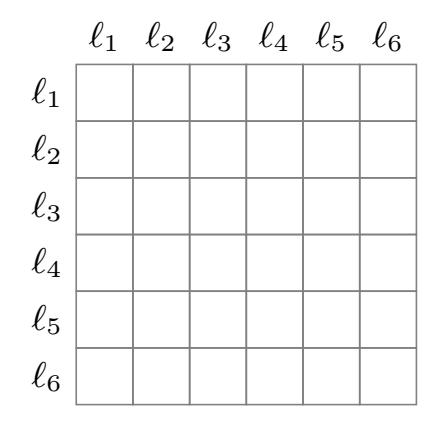
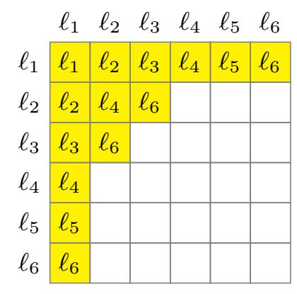

{0}------------------------------------------------

# The Structured Generic-Group Model

Henry Corrigan-Gibbs1,2 , Alexandra Henzinger2 , and David J. Wu3

> 1 UC Berkeley, Berkeley, CA, USA 2 MIT, Cambridge, MA, USA 3 UT Austin, Austin, TX, USA

Abstract. This paper introduces the structured generic-group model, an extension of Shoup's generic-group model (from Eurocrypt 1997) to capture algorithms that take advantage of some non-generic structure of the group. We show that any discrete-log algorithm in a group of prime order q that exploits the structure of at most a δ fraction of group elements, in a way that we precisely define, must run in time Ω(min{ √q, 1/δ}). As an application, we prove a tight subexponentialtime lower bound against discrete-log algorithms that exploit the multiplicative structure of smooth integers, but that are otherwise generic. This lower bound applies to a broad class of index-calculus algorithms. We prove similar lower bounds against algorithms that exploit the structure of small integers, smooth polynomials, and elliptic-curve points.

# 1 Introduction

The hardness of the discrete-logarithm problem is the foundation of the most widely-deployed cryptographic protocols [\[28,](#page-25-0) [33,](#page-25-1) [45,](#page-26-0) [62\]](#page-27-0). However, complexitytheoretic barriers make it infeasible to prove the hardness of discrete log in any concrete group. To gain confidence in the hardness of discrete log and related computational problems [\[15,](#page-24-0) [17,](#page-24-1) [18\]](#page-24-2), we thus resort to studying their hardness against restricted classes of algorithms [\[9,](#page-24-3)[21,](#page-25-2)[23,](#page-25-3)[32,](#page-25-4)[42,](#page-26-1)[51,](#page-26-2)[55,](#page-26-3)[67,](#page-27-1)[73\]](#page-27-2). A particularly fruitful line of study has focused on "generic algorithms" [\[51,](#page-26-2)[55,](#page-26-3)[67\]](#page-27-1)—algorithms that only make black-box use of the group operation. A fast generic algorithm for the discrete-log problem implies a fast discrete-log algorithm in every group that has an efficiently-computable group operation.

Because generic algorithms are restricted in how they interact with the underlying group, it is possible to prove unconditional, information-theoretic lower bounds against their performance. Nechaev [\[55\]](#page-26-3), Shoup [\[67\]](#page-27-1), and Maurer [\[51\]](#page-26-2) show, in slightly different models, that every generic algorithm that solves the discrete-log problem in a group of prime order q with constant probability must perform at least Ω( √q) group operations [\[51,](#page-26-2) [55,](#page-26-3) [67,](#page-27-1) [73\]](#page-27-2). These lower bounds demonstrate that any better discrete-log algorithm must make some non-blackbox use of the group. In fact, over many standard elliptic-curve groups [\[47,](#page-26-4)[49,](#page-26-5)[54\]](#page-26-6), generic algorithms for discrete log [\[58,](#page-26-7) [59,](#page-26-8) [66\]](#page-27-3) are the best ones known.

At the same time, there are many groups of interest where non-generic algorithms significantly outperform their generic counterparts [\[6\]](#page-24-4). The most notable 

{1}------------------------------------------------

example is discrete log over a finite field Fpk . Over Fpk , index-calculus methods solve discrete log in subexponential time [\[34,](#page-25-5) [50\]](#page-26-9) or even quasi-polynomial time, when the field characteristic is small [\[10\]](#page-24-5). Index-calculus methods apply to elliptic-curve groups with pairings [\[52\]](#page-26-10), class groups [\[37\]](#page-25-6), and certain hyperelliptic curve groups [\[5\]](#page-24-6), among others. These index-calculus algorithms take advantage of the structure of group elements, and specifically the ability to lift group elements to the integers (or to a polynomial ring, or to some other object) in a way that preserves some of the original group structure.

The existence of these fast non-generic algorithms leaves discrete-log-based cryptography in an uncomfortable state: generic-group analysis rules out a large class of discrete-log algorithms. Even so, as index-calculus methods show, this class cannot capture the best discrete-log algorithms in many groups. The limitations of generic models mean that we have no way to rule out better and better non-generic attacks in cryptographically important groups.

In this work, we introduce the structured generic-group model, a new idealized group model. The structured generic-group model captures algorithms that exploit some non-generic structure of the group, albeit in a restricted way. We show that the structured generic-group model is expressive enough to capture subexponential-time index-calculus attacks [\[3,](#page-24-7)[60\]](#page-26-11), yet is generic enough to let us reason about the hardness of the discrete-log problem with information-theoretic tools. This approach lets us rule out a broader class of discrete-log attacks than classic generic-group analysis can. In particular, we prove that a certain indexcalculus algorithm for discrete log is optimal among algorithms that are generic, but for the ability to lift group elements to the integers, and factor them.

As in Shoup's original generic-group model [\[67\]](#page-27-1), each group element in our model is represented via a "label," which is just an arbitrary bitstring in some label space L. A structured-generic-group-model algorithm interacts with these labels by calling a group-operation oracle O. The algorithm passes two labels ℓ1, ℓ2 ∈ L to the oracle, and the oracle returns the label ℓ3 = O(ℓ1, ℓ2) ∈ L corresponding to their product under the group operation. In Shoup's genericgroup model, the only way for the algorithm to learn information on the output of the group operation on ℓ1 and ℓ2 is to consult the oracle O. Internally, the genericgroup oracle maintains a labeling function σ that maps each group element's discrete log to its associated label.

Algorithms in our structured generic-group model work just as in Shoup's model—labels represent group elements and the algorithm interacts with a groupoperation oracle O. The one difference is that the structured generic-group model is parameterized by a partial binary function ⋆, which operates on pairs of labels in the label space L. Algorithms in the (L, ⋆)-structured generic-group model have free access to the partial binary function ⋆. The model's guarantee is that wherever ℓ1 ⋆ ℓ2 is defined, it "agrees with" the group-operation oracle: that is, ℓ1 ⋆ ℓ2 = O(ℓ1, ℓ2). In this sense, the ⋆ function captures information that the labels alone (i.e., the bit representation of group elements) leak to the adversary.

With different choices of the ⋆ function, we can model different group structures. At one extreme, when the ⋆ function is defined nowhere, the structured 

{2}------------------------------------------------

generic-group model is identical to Shoup's generic-group model. At the other extreme, when the  $\star$  function is defined on all pairs of labels in the label space, we recover a *concrete* group, since  $\star$  fully determines the discrete log of every element. (In this case, discrete log is easy information-theoretically.) Parametrizations of the structured generic-group model between these two extremes let us model groups and discrete-log algorithms that are generic, but for the ability to exploit some specific property of group elements' representations, captured by  $\star$ .

For example, we can model groups in which elements are represented as integers and algorithms can exploit the multiplicative structure of small integers. To do so, we let the label space  $\mathcal{L}$  represent n integers  $\mathcal{L} = \{\ell_1, \ldots, \ell_n\}$  and we define  $\star \colon \mathcal{L}^2 \to \mathcal{L}$  to be  $\ell_i \star \ell_j = \ell_{i \cdot j}$  for all  $i, j \in \{1, \ldots, n\}$  such that  $i \cdot j < B$ , where B < n is some bound. In this model, algorithms can "multiply" and "factor" all group elements represented as integers < B for free.

With an appropriate choice of  $\star$ , we can also model algorithms that exploit the multiplicative structure of polynomial rings as well. We show that such parametrizations of the structured generic-group model are both expressive enough to efficiently implement subexponential-time index-calculus algorithms and generic enough to support stronger lower bounds than previously known.

Our results. Our first result in the new model is a lower bound showing that a fast discrete-log algorithm must exploit non-generic properties of many group elements (Theorem 3.2). To sketch this result: fix a label space  $\mathcal{L}$  and function  $\star \colon \mathcal{L}^2 \to \mathcal{L}$ . We say that a label  $\ell \in \mathcal{L}$  is "constrained by  $\star$ " if there exists a triple of labels  $\ell_1, \ell_2, \ell_3 \in \mathcal{L}$  such that: (1)  $\ell_1 \star \ell_2 = \ell_3$  is defined and (2)  $\ell \in \{\ell_1, \ell_2, \ell_3\}$ . Then, we prove that, if a  $\ell$  fraction of labels in  $\ell$  are constrained by  $\ell$ , every discrete-log algorithm in the  $\ell$  oracle queries succeeds with probability at most  $\ell$  oracle queries succeeds with probability at most  $\ell$  oracle queries succeeds with probability at most  $\ell$  oracle queries succeeds with probability at most  $\ell$  oracle queries succeeds with probability at most  $\ell$  oracle queries succeeds with probability at most  $\ell$  oracle queries succeeds with probability at most  $\ell$  oracle queries succeeds with probability at most  $\ell$  oracle queries succeeds with probability at most  $\ell$  oracle queries succeeds with probability at most  $\ell$  oracle queries succeeds with probability at most  $\ell$  oracle queries succeeds with probability at most  $\ell$  oracle queries succeeds with probability at most  $\ell$  oracle queries succeeds with probability at most  $\ell$  oracle queries succeeds with probability at most  $\ell$  oracle queries succeeds with probability at most  $\ell$  oracle queries succeeds with probability at most  $\ell$  oracle queries succeeds with probability at most  $\ell$  oracle queries succeeds with probability at most  $\ell$  oracle queries succeeds with probability at most  $\ell$  oracle queries  $\ell$  oracle queries  $\ell$  oracle queries  $\ell$  oracle queries  $\ell$  oracle queries  $\ell$  oracle queries  $\ell$  oracle queries  $\ell$  oracle queries  $\ell$  oracle queries  $\ell$  oracle queries  $\ell$  oracle queries  $\ell$  oracle queries  $\ell$  oracle queries  $\ell$  oracle queries  $\ell$  oracle queries  $\ell$  oracle queries  $\ell$  oracle queries  $\ell$  oracle queries  $\ell$  oracle queries  $\ell$  oracle queries  $\ell$  oracle queries  $\ell$  oracle queries

Our second result shows that classic index-calculus algorithms for finding discrete logarithms can be efficiently instantiated in the structured generic-group model. In particular, we construct an index-calculus-style discrete-log algorithm in the structured generic-group model (Theorem 4.2). The algorithm succeeds with constant probability and its running time is dictated by: (1) a smoothness property of the  $\star$  function and (2) the time required to "factor" a label, under the  $\star$  function. More specifically, let there be a set of labels  $S = \{\ell_1, \ell_2, \dots\} \subseteq \mathcal{L}$ such that a  $\gamma$  fraction of all labels in  $\mathcal{L}$  "factor over" this set S. That is, for a random label  $\ell \stackrel{\mathbb{R}}{\leftarrow} \mathcal{L}$ , with probability  $\gamma$  it can be written as a  $\star$  combination of labels in S. Then in the  $(\mathcal{L},\star)$ -structured generic-group model of order q, our index-calculus algorithm makes  $T = |S| \cdot \frac{1}{\gamma} \cdot \operatorname{polylog}(q)$  group-operation-oracle queries. For any choice of  $\star$  where there exists a set S with  $|S| \approx 1/\gamma < \sqrt{q}$ , the number of group-operation oracle queries required to solve discrete log matches that of our lower bound, up to logarithmic factors. Moreover, the RAM-model running time of this algorithm is roughly TF, where F is the time required to factor a group element under  $\star$ .

{3}------------------------------------------------

Finally, in Section 5, we apply our upper and lower bounds to analyze discrete-log algorithms that exploit specific types of non-generic group structure. In particular, we look at algorithms that lift group elements to the integers and to polynomials. In both settings, we give lower bounds against discrete-log algorithms that are generic, but for the ability to factor group elements over the integers (or over a polynomial ring). In these instantiations of our model, we show that our index-calculus-style discrete-log algorithm of Section 4 makes an optimal number of group-operation oracle queries, up to low-order terms. As we discuss in Section 5.3, we have not yet attempted to model more sophisticated index-calculus algorithms, such as the number-field or function-field sieve [3,34].

Related work. The cryptography community has analyzed an array of RSA-and discrete-log-type assumptions [16, 24, 27, 72] and constructions [19, 63, 68] in generic-group models, and has proven separations that show that certain cryptographic primitives cannot be built from generic groups [57, 61, 64, 65, 73, 74]. A number of works have extended the generic-group model by giving the algorithm additional oracles to model pairing groups [17, 18, 43], Diffie-Hellman relations [51], or Jacobi-symbol-like predicates [64]. Further work extends the model to capture groups of unknown order [24].

In Section 6, we give detailed discussion of five existing models that aim to capture non-generic attacks in groups: the algebraic group model [32], the generic ring model [7], the smooth generic-group model [40], the preprocessing model [21, 23], and the bit-fixing model [21, 22, 71]. As far as we know, the structured generic-group model is the only model of these that can simultaneously capture subexponential-time index-calculus attacks and support matching information-theoretic lower bounds.

Enge and Gaudry [30] give a general template for constructing index-calculus algorithms over different groups. Their goal is not to give a formal generic model or prove lower bounds, but it is possible to interpret their template as an informal version of our algorithm (Section 4).

As with the random-oracle model [12], there exist computational problems that can be hard in generic groups, but are easy in *every* concrete group [26,31, 48,73]. In light of this, the correct interpretation of a generic-group lower bound is that "any fast algorithm must be non-generic," rather than "no fast algorithm exists."

**Notation.** We write  $\log x$  to denote the logarithm to the base 2 of x. For a finite set S, we use  $x \stackrel{\mathbb{R}}{\leftarrow} S$  to denote a uniform random sample from S. For a function f, we write f(x) := y to denote setting the value of f at x to the value y.

# 2 The structured generic-group model

#### 2.1 Background: Shoup's generic-group model

Given a group order  $n \in \mathbb{N}$  and a label space  $\mathcal{L} \subseteq \{0,1\}^*$  of order n, Shoup [67] models a generic group using an injective function  $\sigma \colon \mathbb{Z}_n \to \mathcal{L}$ . We call  $\sigma$  the

{4}------------------------------------------------

(a) The function table of a  $\star$  function representing a generic group. The  $\star$  operator is undefined everywhere.

(b) The function table of an intermediate  $\star$  function. It is defined on labels  $(\ell_i, \ell_j)$  where  $i \cdot j < 7$  as integers.

|          | $\ell_1$ | $\ell_2$ | $\ell_3$ | $\ell_4$ | $\ell_5$ | $\ell_6$ |
|----------|----------|----------|----------|----------|----------|----------|
| $\ell_1$ | $\ell_1$ | $\ell_2$ | $\ell_3$ | $\ell_4$ | $\ell_5$ | $\ell_6$ |
| $\ell_2$ | $\ell_2$ | $\ell_4$ | $\ell_6$ | $\ell_1$ | $\ell_3$ | $\ell_5$ |
| $\ell_3$ | $\ell_3$ | $\ell_6$ | $\ell_2$ | $\ell_5$ | $\ell_1$ | $\ell_4$ |
| $\ell_4$ | $\ell_4$ | $\ell_1$ | $\ell_5$ | $\ell_2$ | $\ell_6$ | $\ell_3$ |
| $\ell_5$ | $\ell_5$ | $\ell_3$ | $\ell_1$ | $\ell_6$ | $\ell_4$ | $\ell_2$ |
|          |          |          |          | $\ell_3$ |          |          |

(c) The function table of a  $\star$  function representing the concrete group  $\mathbb{Z}_7^*$ . The  $\star$  function is defined everywhere.

Fig. 1: The structured generic-group model interpolates between a fully generic group and a concrete group. We demonstrate this with a  $\star$  function over label space  $\mathcal{L} = \{\ell_1, \ldots, \ell_6\}$ . Depending on the choice of the star function (a model parameter), we obtain a generic group (left), a concrete group (right), or something in between (center).

labeling function. The labels  $\{\sigma(0), \sigma(1), \sigma(2), \dots\} \subseteq \mathcal{L}$  represent the elements of a cyclic group  $\mathbb{G}$  generated by  $g \in \mathbb{G}$ :  $\{g^0, g^1, g^2, \dots\}$ .

An algorithm in Shoup's generic-group model may not access the labeling function  $\sigma$  directly. Instead, the only way that an algorithm can learn about the labeling function  $\sigma$  is via queries to a group-operation oracle,  $\mathcal{O}_{\sigma}$ . The group-operation oracle takes as input two labels in  $\mathcal{L}$ , representing any two group elements  $g^i \in \mathbb{G}$  and  $g^j \in \mathbb{G}$ , and outputs the label representing their product under the group operation: that is, the element  $g^i \cdot g^j = g^{i+j} \in \mathbb{G}$ . The precise definition of the group-operation oracle is:

**Definition 2.1 (Group-operation oracle).** For an injective labeling function  $\sigma: \mathbb{Z}_n \to \mathcal{L}$ , the corresponding group-operation oracle  $\mathcal{O}_{\sigma}: \mathcal{L}^2 \to \mathcal{L}$  is the function that computes

$$i \leftarrow \sigma^{-1}(\ell_i) \in \mathbb{Z}_n, \quad j \leftarrow \sigma^{-1}(\ell_j) \in \mathbb{Z}_n, \quad \ell_{i+j \bmod n} \leftarrow \sigma(i+j \bmod n) \in \mathcal{L},$$

and returns  $\ell_{i+j \mod n} \in \mathcal{L}$ . If either of the oracle's arguments are not in the range of  $\sigma$ , the oracle returns  $\perp$ .

We refer to Shoup's model as the generic-group model.

#### 2.2 Informal description of the structured generic-group model

An algorithm in the structured generic-group model operates exactly as an algorithm in Shoup's traditional generic-group model (cf. Section 2.1) [67]. The only difference is that, in addition to the group-operation oracle  $\mathcal{O}_{\sigma}$ , the algorithm also has access to a partial binary function  $\star$  on the label space  $\mathcal{L}$ , which imposes some additional structure on the labeling function  $\sigma \colon \mathbb{Z}_n \to \mathcal{L}$ .

{5}------------------------------------------------

Specifically, the structured generic-group model is defined relative to a label space L and a partial binary function ⋆: L 2 → L. As usual, an algorithm in the structured generic-group model may interact with the normal generic-group oracle Oσ : L 2 → L. In addition, the algorithm gets free access to the function ⋆. The key point is that, on pairs of labels (ℓi , ℓj ) ∈ L2 where ⋆ is defined, we require the group-operation oracle's answers to "agree with" the ⋆ function. That is, we restrict the group-operation oracle Oσ to be such that: ℓi ⋆ ℓj = Oσ(ℓi , ℓj ).

For the purposes of proving lower bounds, we think of evaluations of ⋆ as being free—we only charge the algorithm for making queries to the group-operation oracle Oσ. In this way, the ⋆ function reveals partial information about the labeling function σ to an algorithm, even before the algorithm makes any groupoperation oracle queries. We refer to [Fig. 1](#page-4-0) for a visual depiction of this.

## 2.3 Definition of the structured generic-group model

We now describe the structured generic-group model in more detail.

Definition 2.2 (Structured label space). For a finite set L and partial binary function ⋆: L 2 → L, we say that (L, ⋆) is a structured label space of order n if |L| = n and (L, ⋆) is a commutative monoid with unique factorization.

To be more concrete, (L, ⋆) is a structured label space if it has the following properties:

- Associativity. For all labels ℓ1, ℓ2, ℓ3 ∈ L, where (ℓ1 ⋆ ℓ2) and (ℓ1 ⋆ ℓ2) ⋆ ℓ3 are defined, we have that (ℓ1 ⋆ ℓ2) ⋆ ℓ3 = ℓ1 ⋆ (ℓ2 ⋆ ℓ3).
- Commutativity. For all labels ℓ1, ℓ2 ∈ L, we have that ℓ1 ⋆ ℓ2 = ℓ2 ⋆ ℓ1. In particular, if ℓ1 ⋆ ℓ2 is defined, then so is ℓ2 ⋆ ℓ1.
- Identity. There exists a label ℓ ∈ L, the "identity element," such that for all ℓ ′ ∈ L, it holds that ℓ ⋆ ℓ′ = ℓ ′ ⋆ ℓ = ℓ ′ .
- Unique factorization. We say a label ℓ ∈ L is "prime" if ℓ is not an identity element, and there does not exist labels ℓ1, ℓ2 ∈ L∖{ℓ} such that ℓ1 ⋆ ℓ2 = ℓ. Then we require that for all labels ℓ ∈ L, either: (1) ℓ is an identity element, (2) ℓ is prime, or (3) there exists a unique set of primes ℓ1, . . . , ℓt such that ℓ1 ⋆ · · · ⋆ ℓt = ℓ.

We can define variants of the structured generic-group model by being more permissive about the definition of a structured label space (e.g., not requiring unique factorization). We stick with this simplest formulation since it already captures many non-generic discrete-log algorithms.

Definition 2.3 (Structured labeling function). Fix a structured label space (L, ⋆) of order at least n. A structured labeling function of order n over (L, ⋆) is an injective function σ : Zn → L whose corresponding group-operation oracle Oσ (as in [Definition 2.1\)](#page-4-1) "agrees with" the ⋆ function, wherever the ⋆ function is defined. To be precise, for all labels ℓi , ℓj ∈ L such that ℓi and ℓj are in the image of σ and ℓi ⋆ ℓj is defined, it holds that

$$\ell_i \star \ell_j = \mathcal{O}_{\sigma}(\ell_i, \ell_j). \tag{1}$$

{6}------------------------------------------------

We now define the discrete-log problem in the structured generic-group model:

#### Definition 2.4 (Discrete-log problem in a structured generic group).

We define the discrete-log advantage of an algorithm  $\mathcal{A}$  in the  $(\mathcal{L}, \star)$ -structured generic-group model of order n with respect to a distribution  $\mathcal{D}$  over structured labeling functions over  $(\mathcal{L}, \star)$  as

$$\mathsf{DLAdv}_{(\mathcal{L},\star)}[\mathcal{A},\mathcal{D}] := \Pr \left[ \mathcal{A}^{\mathcal{O}_{\sigma}} \big( \sigma(1), \sigma(x) \big) = x : \begin{array}{c} \sigma \leftarrow \mathcal{D} \\ x \stackrel{\mathbb{R}}{\leftarrow} \mathbb{Z}_n \end{array} \right]. \tag{2}$$

When the distribution  $\mathcal{D}$  is the constant distribution that outputs  $\sigma$  with probability 1, we may write  $\mathsf{DLAdv}_{(\mathcal{L},\star)}[\mathcal{A},\sigma]$ .

A salient difference between Definition 2.4 and the standard generic-group formulation is that here we explicitly specify the distribution  $\mathcal{D}$  over labeling functions from which the challenger chooses the labeling function  $\sigma$ . In contrast, in the standard generic-group formulation, the challenger always picks the labeling function  $\sigma$  uniformly at random from the set of all labelings.

We explicitly specify the distribution over labelings since for a particular structured label space  $(\mathcal{L}, \star)$ , it may not be obvious how to sample from the uniform distribution over labelings in a way that satisfies all  $\star$  constraints. When we prove lower bounds, we typically show that there exists some hard distribution over labelings—often not the uniform one—on which all algorithms making few group-operation-oracle queries must fail often.

**Measuring running time.** For the purposes of proving lower bounds, we measure the running time of an algorithm in the structured generic-group model only by the number of group-operation oracle queries it makes. All other computation—including evaluation of the  $\star$  function—is for free. Not charging the algorithm for computation yields stronger lower bounds.

#### 3 A lower bound in the structured generic-group model

In this section, we present a lower bound on the running time of discrete-log algorithms in the structured generic-group model. This result is general in that it applies to *every* structured label space.

Shoup's generic-group lower bound states that any generic discrete-log algorithm must run in  $\Omega(\sqrt{q})$  time in a group of order n, where q is the largest prime divisor of n. Our result essentially says that any generic algorithm that additionally exploits the structure of a  $\delta$  fraction of group elements must run in time  $\Omega(\min\{\sqrt{q},1/\delta\})$ , in a group of prime order n, where q is again the largest prime divisor of n. Thus, algorithms—such as traditional index-calculus algorithms in a subgroup of  $\mathbb{Z}_n^*$ —that only make use of the structure of a subexponentially small  $\delta \approx \exp(-\sqrt{\log n})$  fraction of group elements, must run in at least  $1/\delta = \exp(\sqrt{\log n})$  time.

{7}------------------------------------------------

As we detail in [Theorem 3.2,](#page-7-0) the structure that ⋆ reveals can be much less helpful than arbitrary preprocessed advice (i.e., auxiliary input) about the group structure. The ⋆ function only provides local information about the group operation, and an adversary cannot choose at what points ⋆ is defined. For this reason, we obtain tighter lower bounds than direct application of known bounds on generic discrete-log algorithms with preprocessing would give [\[21,](#page-25-2)[22,](#page-25-10)[23,](#page-25-3)[36,](#page-25-14)[71\]](#page-27-10).

We use the following notation:

Definition 3.1 (Constrained by star). For a structured label space (L, ⋆) and a label ℓ ∈ L, we say that ℓ is constrained by star if either (a) there exists a non-identity element ℓ ′ where ℓ ⋆ ℓ′ is defined; or (b) there exist labels ℓ1, ℓ2 ̸= ℓ such that ℓ1 ⋆ ℓ2 = ℓ.

Theorem 3.2 (Hardness of discrete log in the structured generic group model). Let (L, ⋆) be a structured label space such that there exists at least one structured labeling function of order n over (L, ⋆). Let δ denote the fraction of elements in L constrained by ⋆, in the sense of [Definition 3.1,](#page-7-1) and let q be the largest prime divisor of n.

Then, there exists a distribution D over structured labeling functions such that for all T-query discrete-log algorithms A in the (L, ⋆)-structured genericgroup model,

$$\mathsf{DLAdv}_{(\mathcal{L},\star)}[\mathcal{A},\mathcal{D}] \leq \frac{\delta n(3T+2)}{q} + \frac{(3T+1)^2}{q} + \frac{1}{n}.$$

In [Appendix B,](#page-29-0) we extend this lower bound to handle algorithms for the special case of prime-order groups in the structured generic-group model with preprocessing. We use a compression argument to show [\(Theorem B.1\)](#page-30-0) that even if a discrete-log algorithm has S bits of arbitrary preprocessed advice about the generic-group oracle, if it makes at most T group-operation oracle queries, then in a group of prime order q, its advantage at solving discrete log is at most Oe(ST2/q + δT).

In addition, in [Appendix B.4,](#page-34-0) we show that these general lower bounds are tight. In particular, for every δ ∈ (0, 1), there is a structured label space (Lδ, ⋆δ) of prime order q in which a δ fraction of elements are constrained by star. There also is an algorithm A that solves discrete log in the (Lδ, ⋆δ)-structured genericgroup model using S bits of preprocessed advice and T queries achieving advantage roughly ST2/q + δT. This implies that we cannot hope to prove a lower bound better than [Theorem 3.2](#page-7-0) without somehow restricting the set of label spaces to which the lower bound applies.

As we discuss in [Section 6.5,](#page-22-0) it is also possible to prove [Theorem 3.2](#page-7-0) using the "presampling" technique [\[21,](#page-25-2)[22,](#page-25-10)[71\]](#page-27-10). We give the direct proof here, since it is so straightforward. In contrast, as far as we know, presampling techniques are not sufficient to prove tight lower bounds in the structured generic-group model with preprocessing.

Proof of [Theorem 3.2.](#page-7-0) We first define the distribution D. We do so by describing the process of sampling a structured labeling function σ from D.

{8}------------------------------------------------

The distribution is defined relative to an arbitrary structured labeling function  $\sigma_0$  over  $(\mathcal{L}, \star)$ . (The theorem assumes that at least one such  $\sigma_0$  exists.) Having fixed  $\sigma_0$ , we then sample  $\sigma \sim \mathcal{D}$  in two steps:

- 1. For every label  $\ell \in \mathcal{L}$  that is constrained by  $\star$ , in the sense of Definition 3.1, we define  $\sigma^{-1}(\ell) := \sigma_0^{-1}(\ell)$ .
- 2. For all other labels  $\ell \in \mathcal{L}$ , we define  $\sigma^{-1}(\ell)$  to be a random value  $x \in \mathbb{Z}_n$  such that  $\sigma(x)$  has not yet been defined.

Now, we argue that for all T-query adversaries  $\mathcal{A}$ ,

$$\mathsf{DLAdv}_{(\mathcal{L},\star)}[\mathcal{A},\mathcal{D}] \leq \frac{\delta n(3T+2)}{q} + \frac{(3T+1)^2}{q} + \frac{1}{n}.$$

Let  $\mathcal{A}$  be a discrete-log algorithm in the  $(\mathcal{L},\star)$ -structured generic-group model.

**Hybrid 0.** Real distribution. At the beginning of the game, the challenger samples a random structured labeling function  $\sigma \sim \mathcal{D}$ . The challenger also samples  $x \stackrel{\mathbb{R}}{\leftarrow} \mathbb{Z}_n$ , and runs algorithm  $\mathcal{A}$  on the discrete-log challenge  $(\sigma(1), \sigma(x))$ . The challenger answers  $\mathcal{A}$ 's group-operation-oracle queries using  $\sigma$  as usual. At the end of the game, the adversary outputs a value  $x' \in \mathbb{Z}_n$ . The challenger outputs "1" if x = x' and "0" otherwise.

**Hybrid 1.** In this game, the challenger answers group-operation oracle queries differently. Instead of choosing  $\sigma$  at the start of the game, the challenger, following Shoup [67], builds it up lazily.

In more detail, the challenger maintains a table mapping labels in  $\mathcal{L}$  to values in  $\mathbb{Z}_n$ , as in Shoup. The difference from Shoup is that the challenger pre-populates its table with certain values. That is, at the start of the interaction, for every label  $\ell \in \mathcal{L}$  constrained by star, the challenger adds the pair  $(\ell, \sigma_0^{-1}(\ell)) \in \mathcal{L} \times \mathbb{Z}_n$  to the table. There are at most  $\delta n$  such values.

Next, the challenger chooses  $\ell_x \stackrel{\mathbb{R}}{\leftarrow} \mathcal{L}$ . If  $\ell_x$  does not yet appear in the table, the challenger samples a value  $x \stackrel{\mathbb{R}}{\leftarrow} \mathbb{Z}_n$  distinct from all other  $\mathbb{Z}_n$  values in the table and adds the pair  $(\ell_x, x)$  to the table. The challenger then sends  $\ell_x$  to the algorithm  $\mathcal{A}$  as the discrete-log challenge.

To answer an oracle query on input  $(\ell_i, \ell_j) \in \mathcal{L}^2$ , the challenger proceeds as follows:

- For each label  $\ell \in \{\ell_i, \ell_j\}$  that does not correspond to a table entry, sample a value  $r \stackrel{\mathbb{R}}{\leftarrow} \mathbb{Z}_n$  distinct from all  $\mathbb{Z}_n$  values currently in the table. The challenger adds the mapping  $(\ell, r)$  to the table.
- Let  $z_i, z_j \in \mathbb{Z}_n$  be the values that labels  $\ell_i, \ell_j$  map to in the table.
  - If  $z_i + z_j \in \mathbb{Z}_n$  corresponds to a label in the table, return that label.
  - Otherwise, sample a random label  $\ell_k \in \mathcal{L}$  distinct from all others in the table. Add the mapping  $(\ell_k, z_i + z_j \in \mathbb{Z}_n)$  to the table, and return the label  $\ell_k$ .

{9}------------------------------------------------

**Hybrid 2.** In this game, the challenger answers group-operation oracle queries differently. Instead of choosing the value of  $x \in \mathbb{Z}_n$  at the start of the game, the challenger instead chooses it at the end.

More precisely, the challenger now maintains a table mapping labels in  $\mathcal{L}$  to formal polynomials in  $\mathbb{Z}_n[X]$ . The challenger prepopulates its table with values corresponding to labels constrained by star, as in Hybrid 1. That is, for each label  $\ell \in \mathcal{L}$  constrained by star, the challenger adds the pair  $(\ell, \sigma_0^{-1}(\ell))$  to the table. (Here,  $\sigma_0^{-1}(\ell) \in \mathbb{Z}_n$  represents a constant polynomial.)

Then, the challenger samples  $\ell_x \stackrel{\mathbb{R}}{\leftarrow} \mathcal{L}$  and sends the label  $\ell_x$  to the algorithm as the discrete-log challenge. Hybrid 2 differs in the way the challenger handles the challenge label if  $\ell_x$  is not already in the table. In this case, the challenger inserts the pair  $(\ell_x, X)$  into its table, where X is a formal variable.

The challenger then answers an oracle query on input  $(\ell_i, \ell_j) \in \mathcal{L}^2$  as in Hybrid 1. The only difference is that the z values are all now formal polynomials in  $\mathbb{Z}_n[X]$ .

At the end of the game, the algorithm  $\mathcal{A}$  outputs a value  $x' \in \mathbb{Z}_n$ . The challenger then samples  $x \stackrel{\mathbb{R}}{\leftarrow} \mathbb{Z}_n$ . The challenger outputs "1" if x = x' and "0" otherwise.

For  $i \in \{0,1\}$ , let  $W_i$  be the event that in the  $i^{\text{th}}$  hybrid distribution, the challenger outputs "1." By construction, we have that  $\Pr[W_0]$  is the probability that the adversary solves discrete log in the star model.

Claim 3.3. 
$$Pr[W_0] = Pr[W_1]$$
.

*Proof.* The adversary's view in Hybrid 0 and Hybrid 1 is identical. Both hybrids simulate an interaction with  $\sigma$  that is identical to  $\sigma_0$  at all labels constrained by star, and random elsewhere, subject to the constraint that distinct labels have distinct discrete logs.

Claim 3.4. 
$$|\Pr[W_1] - \Pr[W_2]| \le (3T+2)(\delta n/q) + (3T+1)^2/q$$
.

*Proof.* The adversary's view in the two hybrids differ if either of the following events occur:

- The label  $\ell_x$  sampled by the challenger is already contained in the table. In this case, the challenger in Hybrid 1 would check if x' is the discrete-log associated with  $\ell_x$ , whereas in Hybrid 2, the challenger checks whether x' = x where  $x \stackrel{\mathbb{R}}{\leftarrow} \mathbb{Z}_n$ .
- The label  $\ell_x$  is not already in the table and the challenger samples a discretelog x that is inconsistent with the challenger's oracle outputs. This corresponds to the case where there are two distinct labels  $\ell_1, \ell_2$  in the table associated with formal polynomials  $f_1$  and  $f_2$ , respectively, where  $f_1(x) = f_2(x)$ . In this case, the challenger would have responded with the *same* label in Hybrid 2, but different labels in Hybrid 3.

The first event occurs with probability  $\delta$ . We bound the probability of the second event happening. Following Shoup [67], the second event only happens when there exists a pair of formal polynomials in the table whose evaluation at

{10}------------------------------------------------

x is identical. The polynomials appearing in the table are univariate with degree at most 1. To agree modulo n at a randomly-sampled point  $x \stackrel{\mathbb{R}}{\leftarrow} \mathbb{Z}_n$ , a distinct pair of such polynomials must agree modulo each prime divisor q of n. Letting q denote the largest prime divisor of n, the probability that they agree modulo n is thus bounded by  $\frac{1}{q}$ .

The challenger evaluates at most 3T+1 polynomials. Each polynomial's evaluation can "collide" with the  $\delta n$  constant polynomials in the table or one of the 3T other non-constant polynomials. Taking a union bound over all such pairs gives a collision probability of

$$(3T+1)(3T+\delta n)/q \le (3T+1)^2/q + \delta(3T+1)(n/q).$$

Since the first event occurs with probability  $\delta$ , the claim now follows via a union bound.

Finally, we have  $\Pr[W_2] = \frac{1}{n}$ , since the adversary's view in Hybrid 2 is independent of the discrete-log x. This completes the proof.

# 4 Index calculus in the structured generic-group model

In this section, we describe an index-calculus-style algorithm for the discrete-logarithm problem in the structured generic-group model.

There are two main reasons to be interested in such an algorithm:

- First, it demonstrates that the structured generic-group model is powerful enough to express subexponential time discrete-log algorithms.
- Second, it isolates the exact property that a label space must have for a discrete-log algorithm to run in subexponential time. (As one familiar with index-calculus algorithms would expect, some notion of "smoothness" is critical.)

The algorithm here is an adaptation of the discrete-log algorithm of Pomerance [60] in the language of the structured generic-group model.

Before presenting the algorithm, we introduce some useful definitions. First, recall from Definition 2.2 that a label  $\ell \in \mathcal{L}$  in a structured label space  $(\mathcal{L}, \star)$  is "prime" if  $\ell$  is not an identity element, and there do not exist labels  $\ell_1, \ell_2 \in \mathcal{L} \setminus \{\ell\}$  such that  $\ell_1 \star \ell_2 = \ell$ . We now define what it means to factor over a set of primes:

**Definition 4.1 (Factoring over a set).** Let  $S \subseteq \mathcal{L}$  be a set of primes. We say a label  $\ell \in \mathcal{L}$  factors over S if there exist labels  $\ell_1, \ldots, \ell_t \in S$  such that  $\ell = \ell_1 \star \cdots \star \ell_t$ .

### 4.1 The discrete-log algorithm

We now give the main result of this section, a discrete-log algorithm in the structured generic-group model. The bottom line of the result is: if labels in a structured generic group factor often over a small set, then discrete log in the group is relatively easy.

{11}------------------------------------------------

Theorem 4.2 (Index-calculus for discrete log, based on Pomerance [60]).

Let  $(\mathcal{L}, \star)$  be a structured label space of order n. Let there be a size-k set  $S \subseteq \mathcal{L}$  such that: a  $\gamma$ -fraction of labels in  $\mathcal{L}$  factor over the set S, in the sense of Definition 4.1.

Then, there is an algorithm  $\mathcal{A}$  in the  $(\mathcal{L},\star)$ -structured generic-group model of order n that

- makes  $T = O(\frac{1}{\gamma} \cdot k \cdot \log^2 k \cdot \log n)$  group-operation oracle queries and,
- for all distributions  $\mathcal{D}$ , satisfies  $\mathsf{DLAdv}_{(\mathcal{L},\star)}[\mathcal{A},\mathcal{D}] \geq 1 \frac{\log n}{k}$ .

Moreover, algorithm A runs in time poly  $(k, \frac{1}{\gamma}, \log n) + T \cdot F$  in the RAM model, where F is the time required to factor a label over the set S.

As an easy corollary (Corollary 4.5), we get that for prime q, there is a discrete-log algorithm in  $\mathbb{Z}_q^*$  running in time  $\exp(O(\sqrt{\log q \log \log q}))$ .

**Algorithm preliminaries.** The index-calculus algorithm is parameterized by a (possibly composite) group order n, a label space  $\mathcal{L}$ , a vector of distinct labels  $S = (\pi_1, \pi_2, \dots, \pi_k) \subseteq \mathcal{L}$  (called the "factor base"), and a parameter  $t_{\text{factor}} \in \mathbb{N}$ , which we set to  $O(\gamma^{-1} \log k)$ . The algorithm has access to the generic-group oracle, which implicitly defines a labeling function  $\sigma \colon \mathbb{Z}_n \to \mathcal{L}$  that maps every discrete log to its corresponding label.

Finally, the input to the algorithm is a discrete-log instance  $(\sigma(1), \sigma(x))$ . The output of the algorithm (if successful) is the discrete log  $x \in \mathbb{Z}_n$ .

We need this one additional bit of notation:

**Definition 4.3 (Exponent vector with respect to a set).** Let  $S \subseteq \mathcal{L}$  be a set of labels where |S| = t. Let  $\pi_1, \ldots, \pi_t$  be the elements of S under some canonical ordering. Let  $\ell \in \mathcal{L}$  be a label that factors over S and let  $\ell = \pi_{i_1} \star \pi_{i_2} \star \cdots \star \pi_{i_k}$  be the factorization, where  $i_1, \ldots, i_k \in [t]$ . We define the exponent vector associated with this factorization to be  $\sum_{j \in [k]} \mathbf{e}_{i_j}$ , where  $\mathbf{e}_j \in \mathbb{Z}_n^t$  is the  $j^{\text{th}}$  standard basis vector.

Now we present the algorithm that proves Theorem 4.2.

#### Description of the index-calculus algorithm:

- 1. Collect linear relations on the discrete logs of the factor base. Maintain a set V of vectors in  $\mathbb{Z}_n^k$ .
  - (a) Repeat for  $t_{\text{factor}} \cdot k \cdot (2\lceil \log k \rceil + 3)$  iterations:
    - Choose random  $r \stackrel{\mathbb{R}}{\leftarrow} \mathbb{Z}_n$  and compute  $\sigma(r)$  using the group-operation oracle by repeated doubling of  $\sigma(1)$ .
    - If  $\sigma(r)$  factors over the factor base S, add the corresponding exponent vector  $(e_1, \ldots, e_k)$  of  $\sigma(r)$  to the set V.
  - (b) For each i = 1, 2, ..., k, repeat these steps  $t_{\text{factor}} \cdot (2\lceil \log k \rceil + 3)$  times:
    - Choose  $s \stackrel{\mathbb{R}}{\leftarrow} \mathbb{Z}_n$  and compute  $\sigma(s)$  using the group-operation oracle.
    - Let  $\pi_i$  be the  $i^{\text{th}}$  element of the factor base. Apply the group-operation oracle to  $\pi_i$  and  $\sigma(s)$  to get a label  $\ell_i$ .

{12}------------------------------------------------

- If  $\ell_i$  factors over S, then add the corresponding exponent vector  $(e_1, \ldots, e_k)$  of  $\ell_i$  to V.
- 2. Solve for the discrete logs of the elements in the factor base. Let  $z_1, z_2, \ldots, z_k \in \mathbb{Z}_n$  be the discrete logs of the k values in the factor base. That is, for all  $i \in [k]$ , let  $z_i \in \mathbb{Z}_n$  be such that  $\sigma(z_i) = \pi_i \in \mathcal{L}$ .

Each factorization from Step 1 gives a linear relation on the values  $z_1, \ldots, z_k$ . Specifically, if  $(e_1, \ldots, e_k)$  is the exponent vector of  $\sigma(r)$ , then it must be that  $\sigma(r) = \sigma(e_1z_1 + \cdots + e_kz_k)$ . Since  $\sigma$  is injective, this implies that  $r = e_1z_1 + \cdots + e_kz_k \in \mathbb{Z}_n$ . Then, we have two cases:

- If the group order n is a prime, attempt to solve directly for these values  $z_1, \ldots, z_k$  using Gaussian elimination.
- If the group order is a composite, factor n, attempt to solve the linear system modulo each of the (prime power) factors of n, applying Hensel lifting as necessary, and then reassemble the solutions modulo n using the Chinese Remainder Theorem.

If the linear system has no unique solution, output "FAIL" and halt.

3. Express the target discrete-log as a linear relation of the discrete logs of the elements in the factor base.

Repeat  $t_{\text{factor}}$  times:

- Choose random  $r \stackrel{\mathbb{R}}{\leftarrow} \mathbb{Z}_n$  and compute the label  $\ell_r \leftarrow \sigma(r)$  using the group-operation oracle.
- Let  $\ell_x = \sigma(x)$  be the discrete-log challenge. Apply the group-operation oracle to  $\ell_x$  and  $\ell_r$  to get  $\ell_{x'}$ .
- If  $\ell_{x'}$  factors over S with exponent vector  $(e_1, \ldots, e_k) \in \mathbb{Z}_n^k$ , output  $x \leftarrow \left(\sum_{i \in [k]} e_i z_i\right) r \mod n$  and halt.

If the algorithm has not terminated after  $t_{\rm factor}$  iterations, output "FAIL" and halt.

We give an analysis of this index-calculus algorithm in Appendix A.

Remark 4.4 (Index calculus in groups of unknown order). While our description here assumes that the algorithm knows the order n of the group, this is not necessary. When the group order is unknown, there is a standard trick that applies here: the algorithm first proceeds as if the group order were prime. If the algorithm never encounters a non-invertible element in the group, it succeeds. If the algorithm does encounter a non-invertible x element in the group, it must be that the greatest common divisor between x and n reveals a factor of n. The algorithm can then use this factor to decompose n (using the Chinese Remainder Theorem) and restart. The number of restarts is no larger than the number of prime factors of n, which is bounded by  $\log(n)$ .

{13}------------------------------------------------

## 4.2 Consequences for concrete groups

Over the group  $\mathbb{Z}_q^*$  for any prime q, Theorem 4.2 implies a subexponential-time algorithm:

Corollary 4.5 (Index calculus in  $\mathbb{Z}_q^*$ ). For any prime q, there is a discrete-log algorithm in  $\mathbb{Z}_q^*$  that runs in expected time  $\exp(O(\sqrt{\log q \log \log q}))$ .

Our proof of Corollary 4.5 relies on the following fact on the smoothness of the integers which comes from the survey of Granville [35, Equation (1.16)]:

Lemma 4.6 (Density of numbers that factor into small primes [35]). Let  $L(x) := \exp(\sqrt{\log x \log \log x})$ . Then for a positive integer x, the fraction of positive integers  $\leq x$  that factor into primes  $\leq L(x)$  is  $1/L(x)^{\frac{1}{2}+o(1)}$ .

Proof of Corollary 4.5. Let the order-(q-1) label space be  $\mathcal{L} = \mathbb{Z}_q^*$ . Then, for a fixed generator  $g \in \mathbb{Z}_q^*$ , for all  $i \in [q-1]$ , define  $\sigma(i) := (g^i \mod q)$ . Let  $\gamma = 1/L(q)^{\frac{1}{2}+o(1)}$ , and let S be the set containing the first L(q) primes, where  $L(q) := \exp(\sqrt{\log q \log \log q})$  is the function from Lemma 4.6. By Lemma 4.6, the set  $(\mathcal{L}, \star)$  is  $\gamma$ -smooth with respect to the set S.

Instantiating Theorem 4.2 with

$$k = |S| = L(q)$$
 and  $\gamma = 1/L(q)^{\frac{1}{2} + o(1)}$ ,

we obtain a discrete-log algorithm  $\mathcal{A}$  in the structured generic-group model that makes  $T = \exp(O(\sqrt{\log q \log \log q}))$  group-operation queries and performs up to  $\exp(O(\sqrt{\log q \log \log q}))$  additional operations.

Algorithm  $\mathcal{A}$  implies a discrete-log algorithm in the *concrete* group  $\mathbb{Z}_q^*$ . The idea is to run  $\mathcal{A}$ ; every time  $\mathcal{A}$  must factor a label  $\ell_x$ , factor the integer x over the first k primes and return the corresponding labels as the factorization. (If x does not factor into the first k primes, return "prime.") We then obtain a discrete-log algorithm over  $\mathbb{Z}_q^*$  that runs in time  $\exp(O(\sqrt{\log q \log \log q}))$ . Here, we use the fact that factoring an integer into the first k = L(q) primes (or determining that it does not factor that way) is possible by trial division in  $k \cdot \operatorname{polylog} k$  time.  $\square$ 

### 5 Applications

In this section, we show how to use the structured generic-group model to analyze discrete-log algorithms that are "slightly" non-generic.

#### 5.1 Discrete-log algorithms that lift group elements to the integers

First, we show how the structured generic-group model can model non-generic discrete-log algorithms that (1) "lift" group elements to the integers and (2) use structural properties of these integer representations to solve discrete log.

As an example, Adleman's subexponential-time index-calculus [2] algorithm for solving discrete log over finite fields (i.e., a subgroup of the multiplicative

{14}------------------------------------------------

group  $\mathbb{Z}_p^*$  for prime p) relies on the ability to lift  $\mathbb{Z}_p^*$  elements to the integers and then factor them. Hellman and Reyneri [39] generalized this technique to work over a broader range of finite fields and Pomerance [60] provided a rigorous analysis of the algorithm's runtime. The simplest subexponential-time algorithms for computing discrete log in  $\mathbb{Z}_p^*$  still use this approach [29,60].

Such algorithms are not generic—they make use of structural properties of the group elements—so standard generic-group lower bounds do not apply. At the same time, the basic index-calculus algorithms make only very limited use of the structure of the integers. That is, when computing discrete logs in a prime-order subgroup of  $\mathbb{Z}_p^*$ , for prime p, the algorithms only take advantage of the fact that for integers  $a, b \in \mathbb{Z}$ , if ab = c over the integers and if  $a, b, c \in \mathbb{Z}_p^*$  then  $ab = c \in \mathbb{Z}_p^*$ .

The structured generic-group model gives us a way to *prove* that algorithms that only make use of this restricted structure of the integers—and are otherwise generic—cannot solve discrete log. In this way, we can show that existing index-calculus methods over the integers are optimal among generic algorithms that exploit this small bit of extra structure of the integers. We give two examples of this approach. For each, we define a structured label space  $(\mathcal{L}, \star)$  that models the structure of the labels. Then we apply our lower and upper bounds to reason about the running time of algorithms in these models.

**Model 1:** Multiplying small integers for free. For prime p, define the label space  $\mathcal{L}_{\mathbb{Z}_p^*} = \{\ell_1, \dots \ell_{p-1}\}$ , where each label in  $\mathcal{L}_{\mathbb{Z}_p^*}$  is an arbitrary string. Then, for a bound  $B \in \{1, \dots, p\}$ , define a function  $\star_B^{\mathsf{small}} \colon \mathcal{L}^2 \to \mathcal{L}$ . For all  $i, j \in \mathbb{Z}_p^* \subseteq \mathbb{Z}$ , let  $\ell_i \star_B^{\mathsf{small}} \ell_j$  be defined if  $i \cdot j \leq B$  over the integers. If so, we define  $\ell_i \star_B^{\mathsf{small}} \ell_j = \ell_{ij}$ .

The  $(\mathcal{L}_{\mathbb{Z}_p^*}, \star_B^{\mathsf{small}})$ -structured generic-group model models algorithms that can (a) lift group elements to integers in  $\mathbb{Z}$ , and (b) evaluate the group operation on "small" group elements (those represented by integers whose product  $\leq B$ ) for free.

In the structured generic-group model of order p-1, we can prove that such discrete log algorithms must still run in exponential time whenever  $B \leq p^{\varepsilon}$  for any constant  $\varepsilon < 1$ . The following is a direct application of our main lower bound (Theorem 3.2):

Corollary 5.1 (Discrete log is hard for semi-generic algorithms that can lift to the integers and factor small numbers). Fix positive integers p and  $B \leq p$ . Let q be the largest prime divisor of p-1. There exists a distribution  $\mathcal{D}$  over structured labeling functions such that for every algorithm  $\mathcal{A}$  in the  $(\mathcal{L}_{\mathbb{Z}_p^*}, \star_B^{\mathsf{small}})$ -structured generic-group model of order  $|\mathbb{Z}_p^*| = p-1$ ,

$$\mathsf{DLAdv}_{(\mathcal{L}_{\mathbb{Z}_p^*}, \star_B^{\mathsf{small}})}[\mathcal{A}, \mathcal{D}] \leq O\left(\frac{BT}{q} + \frac{T^2}{q}\right).$$

The corollary asserts that, to solve discrete log with constant probability, an algorithm in the  $(\mathcal{L}_{\mathbb{Z}_p^*}, \star_B^{\mathsf{small}})$ -structured generic-group model must run in time  $T = \Omega(\min\{q/B, \sqrt{q}\})$ , where q is the largest prime divisor of p-1.

{15}------------------------------------------------

Proof of Corollary 5.1. The function  $\star_B^{\mathsf{small}}$  is defined on at most a  $\delta = B/p$  fraction of labels, by construction.

To apply Theorem 3.2, we then must only demonstrate that there exists at least one structured labeling function  $\sigma_0 \colon \mathbb{Z}_{p-1} \to \mathcal{L}$  over  $(\mathcal{L}_{\mathbb{Z}_p^*}, \star_B^{\mathsf{small}})$ . We can construct one such labeling by just looking at the labels assigned to group elements in the concrete group  $\mathbb{Z}_p^*$ . To construct  $\sigma_0$ , choose an arbitrary generator  $g \in \mathbb{Z}_p^*$  of the group  $\mathbb{Z}_p^*$ . Then, for  $i \in \mathbb{Z}_{p-1}$ , define  $\sigma_0(i) := \ell_{(g^i \mod p)} \in \mathcal{L}_{\mathbb{Z}_p^*}$ .

To show that  $\sigma_0$  is consistent with  $\star_B^{\mathsf{small}}$ , we must show that for all  $\ell_i, \ell_j \in \mathcal{L}_{\mathbb{Z}_p^*}$  such that  $\ell_i \star_B^{\mathsf{small}} \ell_j$  is defined, it holds that  $\ell_i \star_B^{\mathsf{small}} \ell_j = \sigma_0(\sigma_0^{-1}(\ell_i) + \sigma_0^{-1}(\ell_j))$ . Fix a pair of labels  $\ell_i, \ell_j \in \mathcal{L}_{\mathbb{Z}_p^*}$  on which  $\ell_i \star_B^{\mathsf{small}} \ell_j$  is defined. By construction of  $\star_B^{\mathsf{small}}$ , it must be that  $i \cdot j < B$  as integers, and  $\ell_i \star_B^{\mathsf{small}} \ell_j = \ell_{i \cdot j}$ .

Since g generates all of  $\mathbb{Z}_p^*$ , we can without loss of generality write,  $\ell_i = \ell_{(g^a \mod p)}$  and  $\ell_j = \ell_{(g^b \mod p)}$ , for some unique  $a, b \in \mathbb{Z}_{p-1}$ . Then  $\sigma_0^{-1}(\ell_i) = a$  and  $\sigma_0^{-1}(\ell_j) = b$ . Finally,  $\sigma_0(a+b) = \ell_{(g^{a+b} \mod p)} = \ell_{(g^a \mod p) \cdot (g^b \mod p)} = \ell_{i \cdot j}$ .

Since  $\sigma_0$  is a valid structured labeling function, we can apply Theorem 3.2 to prove the corollary.

One interpretation of Corollary 5.1 is that lifting group elements to the integers and then exploiting the factorizations cannot be too useful to a generic discrete-log algorithm, provided that the algorithm can only factor integers of size  $\leq B$ .

To show that the lower bound of Corollary 5.1 is tight for a wide range of parameters:

- When  $\sqrt{q} < p/B$ , we can use the standard (generic) baby-step giant-step discrete-log algorithm to solve discrete log in the  $(\mathcal{L}_{\mathbb{Z}_p^*}, \star_B^{\mathsf{small}})$ -structured generic-group model of order p-1 in time  $T = O(\sqrt{q})$ .
- When  $p/B < \sqrt{q}$ , we can use the index-calculus algorithm of Theorem 4.2. Letting  $L(\cdot)$  be as in Lemma 4.6, a  $1/L(B)^{1/2+o(1)}$  fraction of integers  $\leq B$  factor over the set  $S = \{\ell_{\pi} \mid \pi \leq L(B) \text{ is prime}\} \subseteq \mathcal{L}_{\mathbb{Z}_p^*}$ . Equivalently, there are roughly  $B/\sqrt{L(B)}$  integers  $\leq B$  that factor over S. Thus, over the full label space  $\mathcal{L}_{\mathbb{Z}_p^*}$ , roughly a  $\gamma = B/(p\sqrt{L(B)})$  fraction of labels in  $\mathcal{L}_{\mathbb{Z}_p^*}$  factor over S. The set S has size at most L(B). Then to get a discrete-log algorithm, we apply Theorem 4.2 to obtain the following corollary:

Corollary 5.2 (A better-than-generic discrete-log algorithm that exploits a lift to integers and factorizations of small integers). Let p be a prime and let  $B \leq p$  be an integer. There is an algorithm  $\mathcal{A}$  in the  $(\mathcal{L}_{\mathbb{Z}_p^*}, \star_B)$ -structured generic-group model of order  $|\mathbb{Z}_p^*| = p-1$  that makes  $T = \widetilde{O}(p/B) \cdot \exp(O(\sqrt{\log B \log \log B}))$  group-operation oracle queries and for all distributions  $\mathcal{D}$  satisfies

$$\mathsf{DLAdv}_{(\mathcal{L}_{\mathbb{Z}_p^*}, \star_B)}[\mathcal{A}, \mathcal{D}] \geq 1/2.$$

When we take  $B = p^{\varepsilon}$ , and when the largest prime divisor of p-1 is  $q = \Theta(p)$ , we can write the running time of the algorithm of Corollary 5.2 as  $p^{1-\varepsilon+o(1)} \approx$ 

{16}------------------------------------------------

 $q^{1+o(1)}/B$ , which matches the lower bound of Corollary 5.1, up to the low-order o(1) term in the exponent.

Model 2: Factoring smooth integers for free. Next, we show that the structured generic-group model can also model algorithms that lift group elements to (arbitrarily large) "smooth" integers—these are integers that factor entirely into small factors.

First, for a prime p, let the label space  $\mathcal{L}_{\mathbb{Z}_p^*} = \{\ell_1, \ell_2, \ell_3, \dots, \ell_{p-1}\}$  be a set of arbitrary strings representing group elements, as before. Now, for a smoothness bound  $B \in \{1, \dots, p\}$ , we define  $\star_B^{\mathsf{smooth}} \colon \mathcal{L}^2 \to \mathcal{L}$ . For all  $i, j \in \mathbb{Z}_p^* \subseteq \mathbb{Z}$ ,  $\ell_i \star_B^{\mathsf{smooth}} \ell_j$  is defined if both i and j factor into primes  $\leq B$ .

We can then obtain a lower bound against algorithms in the  $(\mathcal{L}_{\mathbb{Z}_p^*}, \star_B^{\mathsf{smooth}})$ structured generic-group model. Again by Lemma 4.6, if we set B = L(p) then a  $\delta \approx L(p)^{-1/2}$  fraction of  $\mathcal{L}_{\mathbb{Z}_p^*}$  factors over the set  $S = \{\ell_{\pi} \mid \text{prime } \pi \leq B\}$ . Theorem 3.2 now yields the following:

Corollary 5.3 (Discrete log is hard for semi-generic algorithms that can lift to the integers and factor smooth numbers). Fix a prime p and integer  $B = \exp(O(\sqrt{\log p \log \log p}))$ . There exists a distribution  $\mathcal{D}$  over structured labeling functions such that for every algorithm  $\mathcal{A}$  in the  $(\mathcal{L}_{\mathbb{Z}_p^*}, \star_B^{\mathsf{smooth}})$ -structured generic-group model of order  $|\mathbb{Z}_p^*| = p - 1$ ,

$$\mathsf{DLAdv}_{(\mathcal{L}_{\mathbb{Z}_p^*}, \star_B^{\mathsf{smooth}})}[\mathcal{A}, \mathcal{D}] \leq \frac{Tp}{q} \cdot \exp(-\Omega(\sqrt{\log p \log \log p})) + \frac{O(T^2)}{q}.$$

*Proof.* The only delicate part of applying Theorem 3.2 is constructing a labeling  $\sigma_0$  that is consistent with  $\star_B^{\mathsf{smooth}}$  wherever  $\star_B^{\mathsf{smooth}}$  is defined. The same labeling function  $\sigma_0$  that we construct in the proof of Corollary 5.1 also serves here.  $\square$ 

Corollary 5.3 says that to achieve constant discrete-log advantage in the  $(\mathcal{L}_{\mathbb{Z}_p^*}, \star_B^{\mathsf{smooth}})$ -structured generic-group model where the largest prime factor of p satisfies  $q = \Omega(p)$ , an algorithm must run in time roughly  $T \geq \exp(\sqrt{\log p})$ . Moreover, Theorem 4.2 gives a matching upper bound.

#### 5.2 Discrete log algorithms that lift group elements to polynomials

Certain non-generic discrete-log algorithms, including the best ones for small-characteristic finite fields, represent group elements as polynomials. These algorithms are able to represent group elements  $\ell_f, \ell_g, \ell_h$  as polynomials f, g, h if  $f \cdot g = h$  (as polynomials) then  $\ell_f \star \ell_g = \ell_h$  (where  $\star$  represents the group operation). Such representations typically require f, g, and h to factor into irreducible polynomials of small degree.

We now show that the structured generic-group model is useful for modeling this type of non-generic structure as well. In particular, consider the multiplicative group  $\mathbb{F}_{2^n}^*$  of the finite field  $\mathbb{F} = \mathbb{F}_{2^n}$ , for some  $n \geq 1$ . Define the label space

$$\mathcal{L}_{\mathbb{F}^*} = \{ \ell_f \mid f \in \mathbb{F}_2[X] \text{ and } \deg(f) < n \}.$$

{17}------------------------------------------------

Define the set  $S_B \subseteq \mathcal{L}_{\mathbb{F}}$  of B-smooth labels as

 $S_B = \{\ell_f \mid f \text{ factors into irreducible polynomials of degree} < B\}.$ 

Define the function  $\star_B : \mathcal{L}_{\mathbb{F}^*}^2 \to \mathcal{L}_{\mathbb{F}^*}$  on all pairs  $\ell_f, \ell_g \in \mathcal{L}_{\mathbb{F}^*}$  where  $\ell_f$  and  $\ell_g$  are both B-smooth and  $\deg(f) + \deg(g) < n$ .

Lemma 5.4 (Density of smooth polynomials [56, Corollary A2]). For B such that  $n^{1/100} < B < n^{99/100}$ ,

$$\frac{|S_B|}{|\mathcal{L}_{\mathbb{F}^*}|} = \left(\frac{B}{n}\right)^{(1+o(1))\frac{n}{B}}.$$

This bound immediately yields a lower bound on generic algorithms that can additionally lift a  $\delta = |S_B| / |\mathcal{L}_{\mathbb{F}^*}|$  fraction of group elements to polynomials:

Corollary 5.5 (Discrete log is hard for semi-generic algorithms that lift to polynomials and factor smooth ones). Let  $n, B \in \mathbb{N}$  such that q is the largest prime divisor of  $2^n - 1$  and  $n^{1/100} < B < n^{99/100}$ .

Then, there exists a distribution  $\mathcal{D}$  over structured labeling functions such that for every algorithm  $\mathcal{A}$  in the  $(\mathcal{L}_{\mathbb{F}^*}, \star_B)$ -structured generic-group model of order  $|\mathbb{F}^*| = 2^n - 1$ ,

$$\mathsf{DLAdv}_{(\mathcal{L}_{\mathbb{F}^*}, \star_B)}[\mathcal{A}, \mathcal{D}] \leq \frac{(2^n - 1) \cdot T}{q} \cdot \left(\frac{B}{n}\right)^{(1 + o(1)) \cdot \frac{n}{B}} + \frac{O(T^2)}{q}.$$

In particular, when  $B = \sqrt{n}$  and  $q = \Theta(2^n)$ , every algorithm in the  $(\mathcal{L}_{\mathbb{F}^*}, \star_B)$ structured generic-group model that achieves constant discrete-log advantage
must run in subexponential time  $T \geq \exp(\widetilde{\Omega}(\sqrt{\log n}))$ .

Proof of Corollary 5.5. As in the proof of Corollary 5.1, to apply Theorem 3.2, we must show that there exists one structured labeling function  $\sigma_0: \mathbb{Z}_q \to \mathcal{L}_{\mathbb{F}^*}$  over  $(\mathcal{L}_{F^*}, \star_B)$ .

To do so, fix a generator  $\alpha$  of  $\mathbb{F}^* = \mathbb{F}_{2^n}^*$ . For all  $i \in \mathbb{Z}_{(2^n-1)}$ , define  $\sigma_0(i) := \ell_{(\alpha^i \in \mathbb{F}_{2^n})}$ . Then for all  $\ell_i, \ell_j$  such that  $\ell_i \star_B \ell_j$  is defined, we can write  $i = \alpha^a$  and  $j = \alpha^b$ , since  $\alpha$  generates all of  $\mathbb{F}_{2^n}^*$ . Then we have that

$$\sigma_0(\sigma_0^{-1}(\ell_{\alpha^a}) + \sigma_0^{-1}(\ell_{\alpha^b})) = \sigma_0(a+b) = \ell_{\alpha^{a+b}} = \ell_{(\alpha^a \cdot \alpha^b)}.$$

Since  $\ell_i \star_B \ell_j = \ell_{\alpha^a} \star_B \ell_{\alpha^b} = \ell_{\alpha^a \cdot \alpha^b}$  by construction,  $\sigma_0$  is a valid structured labeling. Applying Theorem 3.2 with  $\delta = (B/n)^{(1+o(1))\frac{n}{B}}$  completes the proof.

We can also show that there is a discrete-log algorithm in the structured generic-group model whose running time matches this bound when  $B = \sqrt{n}$ . The analysis applies Theorem 4.2 taking the set S in that theorem to be the set of irreducible polynomials with coefficients in  $\mathbb{F}_2$  of degree  $\leq \sqrt{n}$ . There are at most  $2^{\sqrt{n}}$  such polynomials. The probability that a polynomial factors over the set S is, by Lemma 5.4, roughly  $2^{-\sqrt{n}}$ . This yields:

{18}------------------------------------------------

Corollary 5.6 (Discrete-log algorithms that lift to smooth polynomials). Fix positive integers n and  $B = \sqrt{n}$ . Let  $\mathbb{F}^* = \mathbb{F}_{2^n}^*$ . There is an algorithm  $\mathcal{A}$  in the  $(\mathcal{L}_{\mathbb{F}^*}, \star_B)$ -structured generic-group model of order  $|\mathbb{F}^*| = 2^n - 1$  that makes  $T = 2^{\widetilde{O}(\sqrt{n})}$  group-operation oracle queries and for all distributions  $\mathcal{D}$  satisfies  $\mathsf{DLAdv}_{(\mathcal{L}_{\mathbb{F}}, \star_B)}[\mathcal{A}, \mathcal{D}] \geq 1/2$ .

#### 5.3 Other applications

There are many other non-generic discrete-log algorithms that we have not yet attempted to model. These include, for example, the Gaussian integers method [20], the function-field sieve [3,4], algorithms for hyperelliptic-curve discrete log [70], and special-case algorithms for elliptic-curve discrete log [69]. We expect that extensions to the structured generic-group model will be able to capture many of these non-generic algorithms.

As one example, number-field-sieve-type algorithms [34] are the fastest known discrete-log algorithms in  $\mathbb{Z}_p^*$ , under reasonable running-time heuristics. At a conceptual level, these algorithms construct a ring K such that there is a ring homomorphism  $\phi \colon K \to \mathbb{Z}_p^*$ . Then, these algorithms exploit the ability to "factor" a group element  $h \in \mathbb{Z}_p^*$  in two ways: (1) by lifting h to the integers and factoring h into primes over  $\mathbb{Z}$  and (2) by finding a preimage  $\alpha_h \leftarrow \phi^{-1}(h) \in K$  of the ring homomorphism and factoring  $\alpha_h$  into prime ideals over the ring K. We could extend the structured generic-group model to capture such structure by defining a label space  $\mathcal{L} = \{\ell_i \mid i \in \mathbb{Z}_n\} \cup \{\ell_\alpha \mid \alpha \in K\}$  and a function  $\star \colon \mathcal{L}^2 \to \mathcal{L}$  in which each group element can have two factorizations under  $\star \colon$  one into labels representing rational primes, and one into labels representing elements of K.

# 6 Discussion of alternative models

In this section, we compare our structured generic-group model to existing generic-group-style models that aim to capture some restricted forms of non-generic attack.

#### 6.1 The algebraic group model

The algebraic group model [32], like our work, aims to bridge the gap between the generic-group model and concrete groups. The goal of the algebraic group model is to give a way to prove reductions between hard problems. The algebraic group model does not give a way to prove unconditional lower bounds against certain classes of algorithms, as Shoup's generic-group model does, or as our model does.

As an example, an application of the algebraic group model would be to prove "If discrete log is hard for 'algebraic' algorithms, then so is the computational Diffie-Hellman problem." Then, the idea is that a generic-group lower bound on the cost of computing the discrete-log problem could also give a lower bound

{19}------------------------------------------------

on the generic-group running time of generic algorithms for the computational Diffie-Hellman problem.

The strong algebraic-group model [\[46\]](#page-26-18) extends the algebraic model to allow fine-grained reasoning about the running time of algebraic algorithms. They use this to show, for example, that a strongly algebraic algorithm that can break a certain delay function can be converted into a faster-than-expected factoring algorithm.

Recent works have shown [\[73,](#page-27-2)[75\]](#page-27-14) that the existence of an algebraic reduction in the algebraic group model to a problem that is unconditionally hard in Shoup's generic-group model, does not always mean that the original problem is hard in the generic-group model. Jaeger and Mohan [\[42\]](#page-26-1) provide a systematic treatment of when proofs in the algebraic group model can be used to derive unconditional lower bounds in the generic-group model.

The semi-generic group model [\[43\]](#page-26-14) predates the algebraic group model and is specialized to the setting of cryptographic groups with a bilinear map. At the same time, the goal is similar to the algebraic group model: it allows proving reductions of the form "If there is a fast semi-generic algorithm for problem X, then there is a concrete algorithm for problem Y ."

Again, the goal of the structured generic-group model is to support proving information-theoretic lower bounds against algorithms that make use of some non-generic group structure. This is orthogonal from the algebraic group model's goal, of giving a framework for providing reductions between hard problems.

#### 6.2 The generic ring model

The generic-ring model, of Aggarwal and Maurer [\[7\]](#page-24-9), gives a way to reason about the hardness of computational problems that are defined over rings. One such problem is the RSA problem defined over Z ∗ n . In the generic-ring model, an algorithm interacts with ring elements via opaque "handles." An algorithm can only: (1) add, subtract, multiply, and divide ring elements, and (2) test ring elements for equality.

Aggarwal and Maurer show that, in the generic-ring model, solving the RSA problem is as hard as factoring [\[7\]](#page-24-9). At the same time, the model is so restrictive that every non-trivial decision problem in the generic-ring model is as hard as factoring [\[8\]](#page-24-13). As one concrete example, Jager and Schwenk [\[44\]](#page-26-19) show that computing the Jacobi symbol, which is easy in the concrete ring Z ∗ n , is as hard as factoring in the generic-ring model.

Our structured generic-group model is different from the generic-ring model in two ways: First, in our ⋆-structured generic-group model, there is only a single group operation that algorithms can apply to group elements. In this way, our model is more restrictive than the generic ring model, which allows addition and multiplication. Second, in our model, algorithms get explicit labels representing group elements, rather than abstract handles, and these labels are endowed with additional structure, via the ⋆ function. In this way, our model gives algorithms more power: algorithms can, for example, efficiently factor group 

{20}------------------------------------------------

elements under ⋆ and implement index-calculus-type algorithms. (In contrast, in the generic-ring model, there is no better-than-brute-force factoring algorithm.)

## 6.3 The smooth generic-group model

Very recently, Hhan [\[40\]](#page-26-15) introduced the smooth generic-group model to capture the essence of index-calculus algorithms and prove lower bounds against their runtime.

While our structured generic-group model appears superficially similar to Hhan's smooth generic-group model, the two models are actually quite different. In the smooth generic-group model, an algorithm is essentially given access to a "smoothing" oracle. (Strictly speaking, the smooth generic-group model represents computations as circuits, so the smoothing operation is represented there as a special type of gate.) This oracle takes as input a group element h and, if the element h falls into a distinguished set S of group elements, the oracle outputs some information about the discrete log of h. The distinguished set S is random and hidden from the adversary. Therefore, in essence the smoothing gate just outputs information about the discrete log of its argument with probability ε = |S| /n, in a group of order n.

In this model, Hhan proves that, until the adversary makes Ω(1/ε) queries to the smoothing oracle, the oracle is not useful to the adversary. More precisely, in the smooth generic-group model, an algorithm making T oracle queries total in a group of order n, solves discrete-log with probability T 2/n + T ε.

In contrast, our structured generic-group model introduces no additional oracles or sources of randomness, beyond the standard generic-group oracle. The only change we make to the standard generic-group model is to impose some structure—fixed, deterministic, and known to the adversary—on the labels (i.e., group elements) themselves. This structure can model, e.g., the multiplicative structure of the integers.

There are two major limitations of the smooth generic-group model, which distinguish it from our structured generic-group model:

The existence of a lower bound in the smooth generic-group model does not rule out the existence of an algorithm that works in every group (i.e., a generic algorithm). This follows because an algorithm can succeed with probability 1 in every generic group and can succeed with probability negligibly close to zero in the smooth model. This peculiarity arises because in the smooth model, with extremely high probability, many distinct group elements will have the same discrete log. Thus, a discrete-log algorithm could work in every group in which distinct elements have distinct discrete logs (i.e., in all groups defined on a particular label space), and yet it could fail with all but negligible probability in the smooth model. Thus, a lower bound in the smooth model does not rule out extremely powerful discrete-log algorithms.

To explain the issue with the smooth model in more detail: The smooth model chooses a set of distinct group elements to be small primes, and it assigns discrete logs to these values independently at random. A substantial fraction 

{21}------------------------------------------------

of the remaining group elements (namely, all smooth elements) have discrete logs that are fixed linear combinations of the discrete logs of the small primes. In a group of order n, as soon as the number of smooth group elements is larger than √ n, by a birthday-bound argument, multiple smooth group elements will be assigned the same discrete log. In Hhan's smooth model, the number of smooth elements is Ω(n/ exp(√ log n log log n)) = Ω(n 0.99), which implies that such collisions will occur with overwhelming probability. Therefore, it will almost always be the case that multiple distinct group elements are assigned the same discrete log, meaning that the group-operation oracle's answers will almost never be consistent with a valid labeling function for a generic group. (One might hope to prove an adversary will never be able to detect this inconsistency, but that seems challenging.)

In contrast, in our model, the adversary's view is always consistent with a group in which every group element has a distinct discrete log. Ensuring that the adversary's view remains so is absolutely crucial to the argument.

The existence of a good algorithm for discrete log in the smooth generic-group model does not imply the existence of a good algorithm for discrete log in any concrete group. The reason for this is that there is no clear way to instantiate the smoothing oracle in a concrete group. A discrete-log algorithm in the smooth model could, for example, exploit the randomness of the smoothing-oracle in a way that is not possible to simulate in a concrete group. (Moreover, Hhan [\[40\]](#page-26-15) does not prove any upper bounds in the smooth model.)

In contrast, upper bounds in our model do imply upper bounds for algorithms in concrete groups, just by instantiating the group-operation oracle with a concrete group operation that respects the relevant ⋆ function. The RAMmodel running time of the resulting algorithm depends on the complexity of factoring over ⋆, in a way that we precisely characterize. We give a better-thangeneric discrete-log algorithm in our model [\(Section 4\)](#page-10-1), which immediately yields better-than-generic algorithms for concrete groups [\(Corollary 4.5\)](#page-13-1).

## 6.4 The generic-group model with preprocessing

The generic-group model with preprocessing [\[21,](#page-25-2) [23\]](#page-25-3) models generic algorithms that get some bits of arbitrary preprocessed "advice" (or leakage) on the groupoperation oracle. The preprocessing model is the natural choice to model attacks, such as Hellman tables [\[38\]](#page-25-19), in which the adversary learns some global information about the entire group. In contrast, our model is a more natural fit to capture algorithms, such as index-calculus ones, which only exploit local information about group elements.

Star constraints are "less useful" than arbitrary preprocessed advice. Existing lower bounds [\[21,](#page-25-2) [23\]](#page-25-3) show that a T-time generic discrete-log algorithm with preprocessing using S bits of advice advantage at most ε ≤ ST2/q. Viewing the ⋆ constraints as giving out δq bits of preprocessed advice, and applying this bound implies that the best discrete-log algorithm in the structured genericgroup model has advantage at most ε ≤ (S +δq)·T 2/q in the structured generic

{22}------------------------------------------------

group model. This is weaker than the bound of [Theorem B.1,](#page-30-0) as the bound we show in [Theorem B.1](#page-30-0) has a smaller δT term while this bound has a δT2 term. When δ ≈ 1/T, the difference is significant.

The intuitive reason for the gap is that ⋆ constraints are much less helpful to a discrete-log algorithm than arbitrary advice. For example, a single bit of preprocessed advice can depend on the entire labeling function σ, while a star constraint is local: it can touch at most three values of σ. Our compression argument can comprehend this limitation of algorithms in the structured genericgroup model.

## 6.5 The bit-fixing model

The structured generic-group model is conceptually similar to the "bit-fixing model" [\[21,](#page-25-2) [22,](#page-25-10) [71\]](#page-27-10) used to prove non-uniform lower bounds via the presampling approach. In the bit-fixing model, as applied to Shoup's generic-group model [\[21\]](#page-25-2) of order q over label space L, the adversary can fix the labeling function σ : Zq → L at some P arbitrary inputs during the preprocessing stage. Our structured generic-group model similarly imposes constraints on the possible values of the oracle. The critical difference, however, is that the adversary in the structured generic-group model does not have the ability to pick the star constraints, nor the values of the oracle at those constraints. These constraints are determined by the model parameters and are outside of the adversary's control.

Bit-fixing lower bounds imply structured generic-group model lower bounds without preprocessing. In the structured generic-group model over (L, ⋆), if a δ fraction of labels are constrained by ⋆ then any time-T discrete-log algorithm in the structured generic-group model of order n implies a time-T discrete-log algorithm in the bit-fixing model with P = O(δn) fixed points. (The idea is to just fix the points at which the star function is defined.) Coretti et al. [\[21\]](#page-25-2) show that every time-T discrete-log adversary in the bit-fixing model with P fixed points achieves advantage at most (T 2+P T)/q, ignoring low-order terms. Instantiating P = δq recovers the lower bound of [Section 3.](#page-6-1)

Unfortunately, the connection to bit-fixing does not directly allow us to prove lower bounds against algorithms in the structured generic-group model with preprocessing. Coretti et al. [\[21\]](#page-25-2) show that a preprocessing algorithm implies a bit-fixing algorithm (and thus lower bounds against bit-fixing algorithms imply lower bounds against preprocessing algorithms). Proving a similar relationship for the structured generic-group model with preprocessing seems to require nonblack-box modifications to their argument.

The structured generic-group model is not equivalent to the bit-fixing model. In the prior three paragraphs, we have argued that an algorithm in the structured generic-group model translates directly to an algorithm in the bit-fixing model (preserving the key parameters). We now emphasize that this connection does not flow in both directions—that is, an algorithm in the bit-fixing model does not always give an algorithm in the structured generic-group model.

{23}------------------------------------------------

That is, an algorithm in the bit-fixing model with P presampled points running in time T might not correspond to a T-time algorithm in the  $(\mathcal{L}, \star)$ -structured generic-group model, for any choice of the label space  $\mathcal{L}$  and  $\star$ . The issue is that in the presampling world, the adversary gets to *choose* which of the labeling function  $\sigma$  are fixed. In the  $(\mathcal{L}, \star)$ -model, the adversary has no control over which points are fixed.

# 7 Conclusion

We close by discussing one direction for future work. A long-standing open question in computational number theory is: "Given an oracle for factoring integers, is there a polynomial-time algorithm for computing discrete logarithms in  $\mathbb{Z}_n^*$ ?"

One way to rule out such a discrete-log algorithm would be to prove that there is no fast discrete-log algorithm that (a) uses a factoring oracle and (b) is otherwise generic. Our structured generic-group model gives one crisp way to model such a statement.

To sketch the idea: for an integer m, let  $\mathcal{L}_m$  be a set of m arbitrary labels. Then, define the function  $\star_m \colon \mathcal{L}_m^2 \to \mathcal{L}_m$  such that, for all integers  $a, b, c \in \mathbb{Z}$  where  $1 \leq a, b, c < m$  and  $a \cdot b = c \in \mathbb{Z}$ , it holds that  $\ell_a \star_m \ell_b = \ell_c$ . At all other points, the  $\star_m$  function is undefined. An algorithm in the  $(\mathcal{L}_m, \star_m)$ -structured generic-group model then is one that (1) may factor  $\mathcal{L}_m$  elements as integers into primes for free but (2) otherwise makes only black-box use of the group operation.

Proving any non-trivial bound against discrete-log algorithms in the  $(\mathcal{L}_m, \star_m)$ structured generic-group model appears challenging. (An overwhelming fraction
of labels in  $\mathcal{L}_m$  are involved in  $\star_m$  constraints, so the lower bounds of Section 3
are useless here.) At the same time, it seems entirely plausible that strong lower
bounds—or surprising upper bounds!—exist in this model.

This is one example of how, for us, the structured generic-group model captures some of the drama and mystery of the discrete-log problem.

## Acknowledgments

We thank Dmitry Kogan and Julian Loss for extensive discussion on the model and its implications. We thank the EUROCRYPT reviewers for helpful comments that improved the exposition. This work was supported in part by gifts from Amazon, Apple, Meta, Google, Microsoft, the Stellar Development Foundation, NSF Awards 2140975, 2318701, 2439941, and a Sloan Research Fellowship. Part of this work was done while all three authors were visiting the Simons Institute for the Theory of Computing and supported in part by a grant from the UC Noyce Initiative. Alexandra Henzinger was supported by the NSF GRFP under Grant No. 2141064.

{24}------------------------------------------------

# References

- [1] Martín Abadi, Joan Feigenbaum, and Joe Kilian. On hiding information from an oracle (extended abstract). In STOC, 1987.
- [2] Leonard Adleman. A subexponential algorithm for the discrete logarithm problem with applications to cryptography. In FOCS, 1979.
- [3] Leonard Adleman. The function field sieve. In ANTS, 1994.
- [4] Leonard Adleman and Ming-Deh Huang. Function field sieve method for discrete logarithms over finite fields. Inf. Comput., 151(1), 1999.
- [5] Leonard M. Adleman, Jonathan DeMarrais, and Ming-Deh A. Huang. A subexponential algorithm for discrete logarithms over the rational subgroup of the jacobians of large genus hyperelliptic curves over finite fields. In Algorithmic Number Theory, First International Symposium, ANTS-I, Ithaca, NY, USA, May 6-9, 1994, Proceedings, 1994.
- [6] David Adrian, Karthikeyan Bhargavan, Zakir Durumeric, Pierrick Gaudry, Matthew Green, J. Alex Halderman, Nadia Heninger, Drew Springall, Emmanuel Thomé, Luke Valenta, Benjamin VanderSloot, Eric Wustrow, Santiago Zanella Béguelin, and Paul Zimmermann. Imperfect forward secrecy: How diffie-hellman fails in practice. In ACM CCS, 2015.
- [7] Divesh Aggarwal and Ueli Maurer. Breaking rsa generically is equivalent to factoring. In EUROCRYPT, 2009.
- [8] Divesh Aggarwal and Ueli Maurer. Breaking RSA generically is equivalent to factoring. IEEE Trans. Inf. Theory, 62(11), 2016.
- [9] László Babai and Endre Szemerédi. On the complexity of matrix group problems I. In FOCS, 1984.
- [10] Razvan Barbulescu, Pierrick Gaudry, Antoine Joux, and Emmanuel Thomé. A heuristic quasi-polynomial algorithm for discrete logarithm in finite fields of small characteristic. In EUROCRYPT, 2014.
- [11] James Bartusek, Fermi Ma, and Mark Zhandry. The distinction between fixed and random generators in group-based assumptions. In CRYPTO, 2019.
- [12] Mihir Bellare and Phillip Rogaway. Random oracles are practical: A paradigm for designing efficient protocols. In ACM CCS, 1993.
- [13] Daniel J. Bernstein and Tanja Lange. Non-uniform cracks in the concrete: The power of free precomputation. In ASIACRYPT, 2013.
- [14] Jeremiah Blocki and Seunghoon Lee. On the multi-user security of short schnorr signatures with preprocessing. In EUROCRYPT, 2022.
- [15] Dan Boneh. The decision Diffie-Hellman problem. In ANTS, 1998.
- [16] Dan Boneh and Xavier Boyen. Short signatures without random oracles. In EUROCRYPT, 2004.
- [17] Dan Boneh, Xavier Boyen, and Eu-Jin Goh. Hierarchical identity based encryption with constant size ciphertext. In EUROCRYPT, 2005.
- [18] Xavier Boyen. The uber-assumption family: A unified complexity framework for bilinear groups. In International Conference on Pairing-Based Cryptography, 2008.

{25}------------------------------------------------

- [19] Daniel R. L. Brown. Generic groups, collision resistance, and ECDSA. Designs, Codes and Cryptography, 35, 2005.
- [20] Don Coppersmith, Andrew M. Odlyzko, and Richard Schroeppel. Discrete logarithms in GF(p). Algorithmica, 1(1–4), 1986.
- [21] Sandro Coretti, Yevgeniy Dodis, and Siyao Guo. Non-uniform bounds in the random-permutation, ideal-cipher, and generic-group models. In CRYPTO, 2018.
- [22] Sandro Coretti, Yevgeniy Dodis, Siyao Guo, and John P. Steinberger. Random oracles and non-uniformity. In EUROCRYPT, 2018.
- [23] Henry Corrigan-Gibbs and Dmitry Kogan. The discrete-logarithm problem with preprocessing. In EUROCRYPT, 2018.
- [24] Ivan Damgard and Maciej Koprowski. Generic lower bounds for root extraction and signature schemes in general groups. In EUROCRYPT, 2002.
- [25] Anindya De, Luca Trevisan, and Madhur Tulsiani. Time space tradeoffs for attacks against one-way functions and PRGs. In CRYPTO, 2010.
- [26] Alexander W. Dent. Adapting the weaknesses of the random oracle model to the generic group model. In ASIACRYPT, 2002.
- [27] Alexander W. Dent. The hardness of the DHK problem in the generic group model. IACR Cryptol. ePrint Arch., 2006.
- [28] Whitfield Diffie and Martin E. Hellman. New directions in cryptography. IEEE Trans. Inf. Theory, 22(6), 1976.
- [29] John D. Dixon. Asymptotically fast factorization of integers. Mathematics of computation, 36(153), 1981.
- [30] Andreas Enge and Pierrick Gaudry. A general framework for subexponential discrete logarithm algorithms. Acta Arithmetica, 102, 2002.
- [31] Marc Fischlin. A note on security proofs in the generic model. In ASI-ACRYPT, 2000.
- [32] Georg Fuchsbauer, Eike Kiltz, and Julian Loss. The algebraic group model and its applications. In CRYPTO, 2018.
- [33] Taher El Gamal. A public key cryptosystem and a signature scheme based on discrete logarithms. In CRYPTO, 1984.
- [34] Daniel M. Gordon. Discrete logarithms in GF(P) using the number field sieve. SIAM J. Discret. Math., 6(1), 1993.
- [35] Andrew Granville. Smooth numbers: computational number theory and beyond. Algorithmic number theory: lattices, number fields, curves and cryptography, 44, 2008.
- [36] Siyao Guo, Qian Li, Qipeng Liu, and Jiapeng Zhang. Unifying presampling via concentration bounds. In TCC, 2021.
- [37] James L Hafner and Kevin S McCurley. A rigorous subexponential algorithm for computation of class groups. Journal of the American mathematical society, 2(4), 1989.
- [38] Martin E. Hellman. A cryptanalytic time-memory trade-off. IEEE Trans. Inf. Theory, 26(4), 1980.
- [39] Martin E. Hellman and Justin M. Reyneri. Fast computation of discrete logarithms in GF(q). In CRYPTO, 1982.

{26}------------------------------------------------

- [40] Minki Hhan. A new approach to generic lower bounds: Classical/quantum MDL, quantum factoring, and more. In EUROCRYPT, 2025.
- [41] Pavel Hubácek, L'ubica Jancová, and Veronika Králová. On the distributed discrete logarithm problem with preprocessing. In ITC, 2022.
- [42] Joseph Jaeger and Deep Inder Mohan. Generic and algebraic computation models: When AGM proofs transfer to the GGM. In CRYPTO, 2024.
- [43] Tibor Jager and Andy Rupp. The semi-generic group model and applications to pairing-based cryptography. In ASIACRYPT, 2010.
- [44] Tibor Jager and Jörg Schwenk. On the analysis of cryptographic assumptions in the generic ring model. In ASIACRYPT, 2009.
- [45] Don Johnson, Alfred Menezes, and Scott A. Vanstone. The elliptic curve digital signature algorithm (ECDSA). Int. J. Inf. Sec., 1(1), 2001.
- [46] Jonathan Katz, Julian Loss, and Jiayu Xu. On the security of time-lock puzzles and timed commitments. In TCC, 2020.
- [47] Neal Koblitz. Elliptic curve cryptosystems. Mathematics of computation, 48(177), 1987.
- [48] Neal Koblitz and Alfred Menezes. Another look at generic groups. Adv. Math. Commun., 1(1), 2007.
- [49] Neal Koblitz, Alfred Menezes, and Scott A. Vanstone. The state of elliptic curve cryptography. Des. Codes Cryptogr., 19(2/3), 2000.
- [50] D.V. Matyukhin. On asymptotic complexity of computing discrete logarithms over GF(p). Discrete Mathematics and Applications, 13(1), 2003.
- [51] Ueli M. Maurer. Abstract models of computation in cryptography. In IMACC, 2005.
- [52] Alfred Menezes, Tatsuaki Okamoto, and Scott A. Vanstone. Reducing elliptic curve logarithms to logarithms in a finite field. IEEE Transactions on Information Theory, 39(5), 1993.
- [53] Joseph P. Mihalcik. An analysis of algorithms for solving discrete logarithms in fixed groups. Master's thesis, Naval Postgraduate School, 2010.
- [54] Victor S. Miller. Use of elliptic curves in cryptography. In CRYPTO, 1985.
- [55] V. I. Nechaev. Complexity of a determinate algorithm for the discrete logarithm. Mathematical Notes, 55(2), 1994.
- [56] Andrew M Odlyzko. Discrete logarithms in finite fields and their cryptographic significance. In Workshop on the Theory and Application of Cryptographic Techniques, 1984.
- [57] Periklis A. Papakonstantinou, Charles Rackoff, and Yevgeniy Vahlis. How powerful are the DDH hard groups? IACR Cryptol. ePrint Arch., 2012.
- [58] Stephen C. Pohlig and Martin E. Hellman. An improved algorithm for computing logarithms over GF(p) and its cryptographic significance (corresp.). IEEE Trans. Inf. Theory, 24(1), 1978.
- [59] J. M. Pollard. Monte Carlo methods for index computation mod p. Mathematics of Computation, 32, 1978.
- [60] Carl Pomerance. Fast, rigorous factorization and discrete logarithm algorithms. In Discrete algorithms and complexity. Elsevier, 1987.
- [61] Lior Rotem, Gil Segev, and Ido Shahaf. Generic-group delay functions require hidden-order groups. In EUROCRYPT, 2020.

{27}------------------------------------------------

- [62] Claus-Peter Schnorr. Efficient identification and signatures for smart cards. In CRYPTO, 1989.
- [63] Claus-Peter Schnorr and Markus Jakobsson. Security of signed ElGamal encryption. In ASIACRYPT, 2000.
- [64] Gili Schul-Ganz and Gil Segev. Accumulators in (and beyond) generic groups: Non-trivial batch verification requires interaction. In TCC, 2020.
- [65] Gili Schul-Ganz and Gil Segev. Generic-group identity-based encryption: A tight impossibility result. In ITC, 2021.
- [66] Daniel Shanks. Class number, a theory of factorization, and genera. In AMS Pure Math Proceedings, volume 20, 1971.
- [67] Victor Shoup. Lower bounds for discrete logarithms and related problems. In EUROCRYPT, 1997.
- [68] Nigel Smart. The exact security of ECIES in the generic group model. Cryptography and Coding, 2001.
- [69] Nigel P. Smart. The discrete logarithm problem on elliptic curves of trace one. J. Cryptol., 12(3), 1999.
- [70] Nicolas Thériault. Index calculus attack for hyperelliptic curves of small genus. In ASIACRYPT, 2003.
- [71] Dominique Unruh. Random oracles and auxiliary input. In CRYPTO, 2007.
- [72] Aaram Yun. Generic hardness of the multiple discrete logarithm problem. In EUROCRYPT, 2015.
- [73] Mark Zhandry. To label, or not to label (in generic groups). In CRYPTO, 2022.
- [74] Mark Zhandry and Cong Zhang. Impossibility of order-revealing encryption in idealized models. In TCC, 2018.
- [75] Cong Zhang, Hong-Sheng Zhou, and Jonathan Katz. An analysis of the algebraic group model. In ASIACRYPT, 2022.

# A Analysis of the index-calculus algorithm

In this section, we provide an analysis of the index-calculus algorithm of [Sec](#page-10-0)[tion 4.1,](#page-10-0) which closely follows the original analysis of Pomerance [\[60\]](#page-26-11). The analysis uses the following lemma. The lemma states that a collection of vectors that forms a basis for a vector space W remains a basis for W after it is perturbed by sufficiently many vectors drawn at random from a finite set W′ ⊆ W.

Lemma A.1 ([\[60,](#page-26-11) Lemma 4.1]). Let W be a vector space of dimension k over a finite field F. Let W′ ⊆ W be a finite set and let b1, . . . , bk ∈ F k be a basis for W. Take any ℓ ≥ 2 log k + 3 and for each i ∈ [k] and j ∈ [ℓ], sample vi,j , wˆ i,j ←R W′ . For i ∈ [k] and j ∈ [ℓ], let wi,j = bi + wˆ i,j . Then,

$$\Pr\left[\operatorname{span}\left(\left\{\mathbf{v}_{i,j},\mathbf{w}_{i,j}\right\}_{i\in[k],j\in[\ell]}\right)=W\right]\geq 1-\frac{1}{2k}.$$

We will also need the following simple claim:

{28}------------------------------------------------

Claim A.2. Fix a structured label space  $(\mathcal{L}, \star)$  of order n. Let  $\sigma \colon \mathbb{Z}_n \to \mathcal{L}$  be any labeling function such that a  $\delta$  fraction of elements in  $\mathcal{L}$  factor over a set S. Then

 $\Pr[\forall i \in [t_{factor}] : \sigma(r_i) \text{ does not factor over } S : r_1, \dots, r_{t_{factor}} \stackrel{\mathbb{R}}{\leftarrow} \mathbb{Z}_n] \leq e^{-\delta t_{factor}}$ 

*Proof of claim.* Since  $|\mathcal{L}| = n$  and the image of  $\sigma$  is equal to  $\mathcal{L}$ , we have

$$\Pr\left[\sigma(r) \text{ factors over } S \colon r \stackrel{\mathbb{R}}{\leftarrow} \mathbb{Z}_n\right] = \delta.$$

If we sample  $r_1, \ldots, r_{t_{\text{factor}}}$  uniformly and independently from  $\mathbb{Z}_n$ , the probability that none of  $\sigma(r_1), \ldots, \sigma(r_{t_{\text{factor}}})$  factor over S is then  $(1-\delta)^{t_{\text{factor}}} \leq e^{-\delta t_{\text{factor}}}$ .  $\square$ 

Proof of Theorem 4.2. We prove the claim with an analysis of the algorithm of Section 4.1. Throughout this discussion we use the shorthand  $L = 2\lceil \log k \rceil + 3$ .

First, we argue that the algorithm's output is correct. That is, whenever the algorithm on input  $(\sigma(1), \sigma(x))$ , produces an output x', it holds that  $x = x' \mod n$ . By construction, the values  $z_1, \ldots, z_k \in \mathbb{Z}_n$  computed in Step 2 are such that, for all  $i \in [k]$ ,  $\sigma(z_i) = \pi_i$ . In Step 3, if  $\ell_{x'}$  factors over S with associated exponent vector  $(e_1, \ldots, e_k)$ , then in Step 3, we have:

$$\sigma(x+r) = \sigma(e_1 \cdot \sigma^{-1}(\pi_1) + \dots + e_k \cdot \sigma^{-1}(\pi_k)).$$

Since  $\sigma$  is injective, it holds that:

$$x + r = e_1 z_1 + \dots + e_k z_k \in \mathbb{Z}_n.$$

Finally, we conclude that  $x' = \sum_{i \in [k]} e_i z_i - r \in \mathbb{Z}_n$  is the correct discrete log (i.e., x = x').

Now, we argue that the algorithm succeeds with probability at least 1-1/k. By Claim A.2, Step 1(a) adds at least kL vectors to the set V, except with probability at most  $kL \cdot \exp(-\delta t_{\text{factor}})$ . Again by Claim A.2, in Step 1(b), for each loop iteration  $i \in [k]$ , the algorithm adds at least L vectors to the set V, except with probability  $kL \cdot \exp(-\delta t_{\text{factor}})$ . Thus, Step 1 succeeds, except with probability  $2kL \cdot \exp(-\delta t_{\text{factor}})$ .

If neither failure event in Step 1 occurs, by Lemma A.1, the vectors in V modulo each prime factor q of n will span all of  $\mathbb{Z}_q^k$ , except with probability 1/2k. If the vectors in V modulo each of the prime factors of n span their respective vector spaces, then using Hansel lifting and the Chinese Remainder Theorem, the algorithm will successfully recover a solution to the linear system. Thus, conditioned on Step 1 succeeding and union bounding over each of the (up to  $\log n$ ) prime factors of n, the probability that Step 2 outputs "FAIL" in Step 2 is at most  $\log n/2k$ .

If the algorithm does not fail in Step 2, then in Step 3, each iteration of the loop succeeds with probability  $\delta$ . The probability that all  $t_{\text{factor}}$  iterations fail is at most  $(1 - \delta)^{t_{\text{factor}}} \leq \exp(-\delta t_{\text{factor}})$ .

{29}------------------------------------------------

The probability that any of the three steps fails is then bounded by:

$$(2kL+1) \cdot \exp(-\delta t_{\text{factor}}) + \frac{\log n}{2k}$$

.

as desired. By setting tfactor = ⌈log 2k(2kL + 1) /δ⌉, the failure probability is then bounded by (log n)/k.

# B The structured generic-group model with preprocessing

# B.1 Definition: Preprocessing algorithms in the structured generic-group model

We extend the structured generic-group model to handle preprocessing. Following earlier work on discrete log with preprocessing in generic groups [\[11,](#page-24-14) [13,](#page-24-15) [14,](#page-24-16) [21,](#page-25-2) [23,](#page-25-3) [41,](#page-26-20) [53\]](#page-26-21), we consider an algorithm that:

- in an offline phase, makes any number of group-operation oracle queries and then outputs an S-bit advice string, and
- in an online phase, takes as input the preprocessed advice string and a discrete-log challenge, makes T group-operation oracle queries, and finally outputs a discrete log.

Here, taking S = O(1) recovers the plain structured generic-group model (without preprocessing).

More formally, a preprocessing algorithm in the structured generic-group model is a pair of algorithms (A0, A1). We say that (A0, A1) p-solves discrete log in the (L, ⋆)-structured generic-group model of order n using space S and time T, with respect to a distribution D over structured labeling functions on (L, ⋆),

$$\Pr \begin{bmatrix} \sigma \overset{\mathbb{R}}{\leftarrow} \mathcal{D} \\ \mathcal{A}_{1}^{\mathcal{O}_{\sigma}} \big( \mathsf{st}, \sigma(x) \big) = x : \mathsf{st} \leftarrow \mathcal{A}_{0}(\sigma) \\ x \overset{\mathbb{R}}{\leftarrow} \mathbb{Z}_{n} \end{bmatrix} \geq p,$$

where we require that:

- algorithm A0 outputs an S-bit string, and
- algorithm A1 makes at most T oracle queries.

## B.2 A preprocessing lower bound

For the sake of simplicity, the lower bound that we give in this section holds for groups of prime order q, though we expect that it can be readily generalized to the composite-order case.

In the following theorem statement, we consider a structured-generic-groupmodel algorithm with preprocessing, and we treat the algorithm's space usage S, time usage T, and success probability p as functions of the group order q. 

{30}------------------------------------------------

(As per [Section 2.3,](#page-5-1) S here represents the size of the algorithm's preprocessed advice string, and T represents the number of group-operation oracle queries made in the online phase.) This implies a corresponding lower bound in the model without preprocessing by simply setting the length of the advice string to be S = 1. Throughout, the notation Oe(·) hides logarithmic factors in q.

The theorem statement uses the terminology "constrained by ⋆," defined in [Definition 3.1.](#page-7-1)

Then, the main theorem, which we prove in [Appendix B.3](#page-30-1) is:

Theorem B.1 (Lower bound in the structured generic-group model). Let (L, ⋆) be a structured label space of size at least q such that there exists at least one structured labeling function of prime order q over (L, ⋆). Let δ denote the fraction of elements in L constrained by ⋆ (in the sense of [Definition 3.1\)](#page-7-1).

Then, there exists a distribution D over structured labeling functions such that all algorithms A in the (L, ⋆)-structured generic-group model of order q, using space S and time T, have discrete-log advantage at most:

$$\mathsf{DLAdv}_{(\mathcal{L},\star)}[\mathcal{A},\mathcal{D}] \leq \widetilde{O}(ST^2/q + \delta T).$$

We state the theorem in the prime-order setting for simplicity; the extension to the composite-order setting is standard.

We now sketch the main idea for the proof of [Theorem B.1.](#page-30-0) We give the full proof in [Appendix B.3.](#page-30-1)

Proof idea for [Theorem B.1.](#page-30-0) The first observation is that if we have one labeling function that is consistent with the ⋆ constraints, then we can generate a family Σ of ((1 − δ) · q)! distinct labelings consistent with the ⋆ constraints by permuting the labels of the unconstrained values, via [Lemma B.3.](#page-31-0) These labelings are all identical at the ⋆ constraints, in the sense of [Definition B.2.](#page-30-2) The hard distribution D in the theorem is the uniform distribution over labelings in family Σ.

We then use an averaging argument to show that a discrete-log algorithm that succeeds with probability ε on a random labeling also succeeds with probability nearly ε on a large fraction of the labelings in Σ. Finally, we use the random self-reducibility of discrete log to boost the success probability of the algorithm on every element in Σ to very close to 1. Then, we can apply [Lemma B.4](#page-31-1) to this set of labeling functions.

The consequence of [Lemma B.4](#page-31-1) is that we can use our discrete-log algorithm to compress elements of Σ by S−εq/T2+δq/T bits. Since compressing a random σ ∈ Σ is impossible, we roughly have S − εq/T2 + δq/T < 0, and solving for ε gives the final bound.

#### B.3 Proof [Theorem B.1](#page-30-0)

We now give the proof of [Theorem B.1,](#page-30-0) which uses the following definition:

{31}------------------------------------------------

**Definition B.2 (Identical at**  $\star$  **constraints).** Let  $\mathcal{L}$  be a label space and let  $\star : \mathcal{L}^2 \to \mathcal{L}$  be a partial binary function. We say that two labeling functions  $\sigma_i, \sigma_j$  over  $(\mathcal{L}, \star)$  are *identical at the*  $\star$  *constraints* if, for all labels  $\ell \in \mathcal{L}$  constrained by  $\star$ , we have  $\sigma_i^{-1}(\ell) = \sigma_j^{-1}(\ell)$ .

We begin by proving some auxiliary claims that will be useful in the proof of Theorem B.1.

**Lemma B.3.** Let  $\mathcal{L}$  be a label space of order q and let  $\star \colon \mathcal{L}^2 \to \mathcal{L}$  be a partial binary function. Let  $\delta$  denote the fraction of elements in  $\mathcal{L}$  constrained by  $\star$ . Then for every structured labeling function  $\sigma \colon \mathbb{Z}_q \to \mathcal{L}$  over  $(\mathcal{L}, \star)$ , there exists a set  $\Sigma$  of structured labeling functions such that:

- the set  $\Sigma$  contains the labeling function  $\sigma$ ,
- the set  $\Sigma$  has size  $|\Sigma| \geq ((1 \delta) \cdot q)!$ , and
- every pair of labeling functions in  $\Sigma$  is identical at the  $\star$  constraints.

Proof. Let  $\sigma: \mathbb{Z}_q \to \mathcal{L}$  be a valid structured labeling function over  $(\mathcal{L}, \star)$ . We mutate  $\sigma$  into another structured labeling function by renaming (i.e., permuting) the labels that are not constrained by  $\star$ . The resulting function is still a valid structured labeling function. There are  $(1 - \delta) \cdot q$  labels that are not constrained by  $\star$ . As such, there are  $((1 - \delta) \cdot q)!$  permutations of these labels, which implies that there exist at least  $((1 - \delta) \cdot q)!$  valid structured labeling functions that are identical with  $\sigma$  at the  $\star$  constraints.

The next key lemma follows the argument of Corrigan-Gibbs and Kogan [23], with a modification to account for the  $\star$  constraints.

**Lemma B.4.** Let q be a prime and let  $\mathcal{L}$  be a label space of size at least q. Let  $\star \colon \mathcal{L}^2 \to \mathcal{L}$  be a partial binary function and let k be the number of the labels in  $\mathcal{L}$  that are constrained by  $\star$ . Let  $\Sigma = \{\sigma_1, \sigma_2, \ldots\}$  be a non-empty subset of the structured labeling functions over  $(\mathcal{L}, \star)$  such that every pair of functions in  $\Sigma$  is identical at the  $\star$  constraints.

Let  $(A_0, A_1)$  be a preprocessing algorithm in the  $(\mathcal{L}, \star)$ -structured generic-group model of order q such that, for every  $\sigma \in \Sigma$ ,  $A_0$  outputs an S-bit string,  $A_1$  makes at most T group-operation oracle queries, and  $(A_0, A_1)$  satisfies:

$$\Pr_{\mathcal{A}_{1},x} \left[ \mathcal{A}_{1}^{\mathcal{O}_{\sigma}(\cdot,\cdot)}(\mathcal{A}_{0}(\sigma),\sigma(x)) = x \colon x \overset{\mathbb{R}}{\leftarrow} \mathbb{Z}_{q} \right] \geq \varepsilon,$$

and let  $kT = o(\varepsilon q/\log q)$ . Then, there exists a randomized encoding scheme that compresses elements of  $\Sigma$  to bitstrings of length at most

$$\log((q-k)!) + S - \frac{\varepsilon q}{32T^2 \log q} + \frac{k}{16T} + O(1)$$

and succeeds with probability at least 1/2.

The proof of Lemma B.4 uses an incompressibility argument, closely following that of Lemma 4 of Corrigan-Gibbs and Kogan [23]. We prove the key lemma first and then return to prove the main theorem.

{32}------------------------------------------------

Proof of [Lemma B.4.](#page-31-1) To execute the incompressibility argument, we must construct two algorithms:

- an encoder, which takes as input a labeling function σ and outputs a compressed representation of σ, and
- a decoder, which takes as input a compressed representation and outputs a labeling function σ.

Since the argument is information theoretic, neither the encoder nor the decoder need to be computationally efficient.

The encoder/decoder pair that we construct is very similar to the one in the proof of Lemma 4 of Corrigan-Gibbs and Kogan [\[23\]](#page-25-3). In that proof, the encoder and decoder maintain a table Table containing pairs of (a) formal polynomials with coefficients in Zq and (b) labels in L. This table captures the information about the labeling function σ that the encoder has transmitted, or that the decoder has received, at any point in its execution. In particular, if the pair (α, ℓ) ∈ Zq × L appears in the encoder's table, we know that the encoder's compressed representation has conveyed to the decoder that σ(α) = ℓ.

There is only one difference between our encoder/decoder pair and that of Corrigan-Gibbs and Kogan: at the very beginning of the encoding routine before the encoder has output any bits at all—our encoder prepopulates the table with k pairs. In particular, for each label ℓ ∈ L constrained by ⋆, by definition it must hold that the value σ −1 (ℓ) is the same for all σ ∈ Σ. Thus, for each such label ℓ ∈ L, the encoder can add the pair (σ −1 (ℓ), ℓ) to the table. In words, the encoder prepopulates the table with the discrete logs of the k labels associated with labels constrained by ⋆.

The rest of the encoding/decoding routine remains unchanged.

To complete the proof of [Lemma B.4,](#page-31-1) we must now analyze the length of the compressed representation that the encoder outputs. If the encoder runs the algorithm A1 for d times, then the table grows to size of at most k +d(3T + 1) ≤ k + 4dT: the k initial values, plus at most an additional 3T for each execution, added as a result of answering A1's oracle queries, plus one for the discretelog computed. In contrast, the encoder's table in prior work [\[23\]](#page-25-3) only grows to size d(3T + 1). The extra k rows in our encoder's table come from the k star constraints.

Applying [Lemma B.3,](#page-31-0) the naïve encoding of a labeling function in Σ requires log((q − k)!) bits to encode the mapping from Zq on to L for each label not constrained by star. For R = (2 log q)/ε, Corrigan-Gibbs and Kogan show that as long as

$$2 \leq \frac{q - |\mathsf{Table}|}{RT \cdot |\mathsf{Table}|}, \qquad \text{or equivalently} \qquad |\mathsf{Table}| \cdot (2RT + 1) \leq n, \qquad (3)$$

and A0 outputs an S-bit advice string, each execution of A1 that the encoder runs yields one bit of savings in the encoding-length over the naïve encoding. Thus, the total encoding length is at most

$$\log((q-k)!) + S - d + O(1)$$
 bits,

{33}------------------------------------------------

where the O(1) accounts for rounding fractions.

If the encoder runs  $A_1$  at most  $d = \lfloor q/(16RT^2) - k/(16T) \rfloor$  times, then we have  $|\mathsf{Table}| \leq q/(4RT) - k/4$ . To satisfy Eq. (3), we need

$$2kRT + 2k + n/4RT^2 + n/4T \le n.$$

The first term on the left side is o(n) by the the hypothesis of the lemma that  $kT = o(\varepsilon q/\log q)$ . The remaining terms are all at most n/4. Thus we satisfy Eq. (3) as long as q is large enough.

Then, the total compressed representation has bit-length at most:

$$\log((q-k)!) + S - \frac{q}{16RT^2} + \frac{k}{16T} + O(1).$$

Substituting in  $R = 2(\log q)/\varepsilon$  completes the analysis.

We now return to the proof of Theorem B.1.

Proof of Theorem B.1. Fix an adversary  $\mathcal{A} = (\mathcal{A}_0, \mathcal{A}_1)$ . Let the distribution  $\mathcal{D}$  be the uniform distribution over the family  $\Sigma$  of labelings implied by Lemma B.3.

We first use an averaging argument to construct a set  $\Sigma_{\text{good}} \subseteq \Sigma$  of labeling functions such that: the discrete-log algorithm  $(\mathcal{A}_0, \mathcal{A}_1)$  succeeds with probability at least  $\varepsilon' \approx \varepsilon$  on every labeling in  $\Sigma_{\text{good}}$ . Since all labelings in  $\Sigma_{\text{good}}$  are consistent at the  $\star$  constraints (by construction of  $\Sigma$ ), we then can apply Lemma B.4 to compress elements of this set  $\Sigma_{\text{good}}$ .

Let  $\mathsf{DLAdv}_{(\mathcal{L},\star)}[\mathcal{A},\mathcal{D}] = \varepsilon$ . Following Corrigan-Gibbs and Kogan [23], we say that a labeling  $\sigma \in \Sigma$  is "good" if  $(\mathcal{A}_0, \mathcal{A}_1)$  successfully computes discrete logs with probability at least  $\varepsilon/2$  (only over the choice of the discrete-log challenge and  $\mathcal{A}_1$ 's randomness) when the challenger implements the generic-group oracle using labeling  $\sigma$ . Letting  $\Sigma_{\mathrm{good}} \subseteq \Sigma$  be the set of good labelings, by an averaging argument, we have that at least an  $\varepsilon/2$  fraction of the labelings in  $\Sigma$  are good. Then we have:

$$|\Sigma_{\text{good}}| \ge \frac{\varepsilon}{2} \cdot |\Sigma| \ge \frac{\varepsilon}{2} \cdot ((1 - \delta)q)!.$$

Using the random self-reducibility of discrete log [1], we can convert the algorithm  $(\mathcal{A}_0, \mathcal{A}_1)$ —which for all  $\sigma \in \Sigma_{\text{good}}$  succeeds with probability at least  $\varepsilon$  over the random choice of the challenge and of its coins—to an algorithm  $(\mathcal{A}_0, \mathcal{A}'_1)$ —which for all  $\sigma \in \Sigma_{\text{good}}$  and for all choices of the challenge, succeeds with probability  $\varepsilon$  only over the choice of its random coins. If the running time of  $\mathcal{A}_1$  is T, the running time of  $\mathcal{A}'_1$  is  $T + \Theta(\log q)$ .

Now, we can apply Lemma B.4 to the set of labeling functions  $\Sigma_{\text{good}}$ , and this algorithm  $(\mathcal{A}_0, \mathcal{A}'_1)$ . Lemma B.4 requires the number of points k constrained by star to be such that  $kT = o(\varepsilon q/\log q)$ . This equivalently requires  $\delta T = o(1/\log q)$ , which we may assume since if  $\delta T = \omega(1/\log q)$ , the theorem holds trivially.

{34}------------------------------------------------

Lemma B.4 implies that we can use  $(A_0, A'_1)$  to compress every element in  $\Sigma_{good}$  to a bitstring of length at most

$$\log(q-k)! + S - \frac{\varepsilon q}{\widetilde{O}(T^2)} + \frac{\delta q}{T} + O(1),$$

where we apply the lemma with  $k = \delta q$ , and the compression routine succeeds with probability at least 1/2.

By a compression argument [25], the length of such an encoding must be at least  $\log |\Sigma_{\rm good}| - \log 2$  bits. We then have

$$\log\left(\frac{\varepsilon}{2}((1-\delta)q)!\right) - 1 \le \log((1-\delta)q)! + S - \frac{\varepsilon q}{\widetilde{O}(T^2)} + \frac{q\delta}{T} + O(1)$$
$$\frac{\varepsilon q}{\widetilde{O}(T^2)} \le S + \frac{q\delta}{T} + \log(1/\varepsilon) + O(1)$$
$$\varepsilon \le \widetilde{O}\left(\frac{ST^2}{q} + \delta T\right),$$

where we used on the second-to-last line that  $\log(1/\varepsilon) \leq \log q$ .

## B.4 An algorithm that matches the lower bound

We now show that Theorem B.1 is in some sense tight.

**Theorem B.5.** Take any modulus of prime order  $q \in \mathbb{N}$ . Let  $\mathcal{L}$  be a label space. For every  $\delta \in [0,1]$ , there exists a partial function  $\star_{\delta} \colon \mathcal{L}^2 \to \mathcal{L}$  such that:

- at most  $\delta q$  elements of  $\mathcal{L}$  are constrained by  $\star_{\delta}$ , and
- there is a (preprocessing) algorithm in the structured generic-group model of order q over  $(\mathcal{L}, \star_{\delta})$  such that for every distribution  $\mathcal{D}$  over structured labeling functions,

$$\mathsf{DLAdv}_{(\mathcal{L},\star)}[\mathcal{A},\mathcal{D}] \geq \widetilde{\varOmega}\left(\frac{ST^2}{q} + \delta T\right).$$

*Proof.* We work in the fixed-generator setting. When  $ST^2 > \delta T$ , we can use standard discrete-log algorithms with preprocessing in the generic-group model [23], no matter what the  $\star_{\delta}$  function is. These algorithms achieve advantage  $\varepsilon = \widetilde{\Omega}(ST^2/q)$ .

When  $ST^2 \leq \delta T$ , we can define the function  $\star_{\delta}$  as  $(\ell_1, \ell_i) = \ell_{i+1}$  for all  $i \in [\delta n]$ , where  $\ell_1$  is the fixed generator. (That is, for all structured labelings,  $\sigma(1) = \ell_1$ .) For readability, we will describe the algorithm using standard discrete-log notation, where g is the generator of the order-q group  $\mathbb{G}$  (i.e., g represents label  $\ell_1$ ). Defining the  $\star_{\delta}$  function in this way effectively gives the adversary a list of values  $L = (g, g^2, g^3, g^4, \ldots, g^{\delta q})$  whose discrete-logs it knows.

Then, we define the following algorithm that is given a discrete-log challenge  $h=g^x\in\mathbb{G}$ :

{35}------------------------------------------------

- 1. Choose a random r ←R Zq, compute h · g r using the group-operation oracle (this can be done with log(r) + 1 ≤ log(q) + 1 oracle calls using repeated squaring), and check whether h · g r ∈ L.
- 2. If so, we have learned a relation of the form c = x + r ∈ Zq, where c ∈ [1, 2, . . . , δn]. Then, output x = c − r ∈ Zq as the discrete log.
- 3. Otherwise, go to step (1) and repeat. The maximum number of iterations is determined by the time budget T.

We will show that for every structured labeling function σ (and thus for every distribution D over such functions), the algorithm does well. To compute the advantage: each time the algorithm re-randomizes the discrete-log challenge, it will compute a value h·g r ∈ G that hits the list L with probability (δq)/q = δ. Each attempt requires O(log q) group-operation oracle queries. After T attempts (which requires time T ·O(log q)), the probability that the algorithm has not hit the list is at most (1 − δ) T ≤ e −δT . Thus an Oe(T) algorithm achieves success probability

$$\varepsilon \ge 1 - e^{-\delta T} \ge 1 - \left(1 - \frac{\delta T}{2}\right) \ge \tilde{\Omega}(\delta T),$$

which completes the proof.