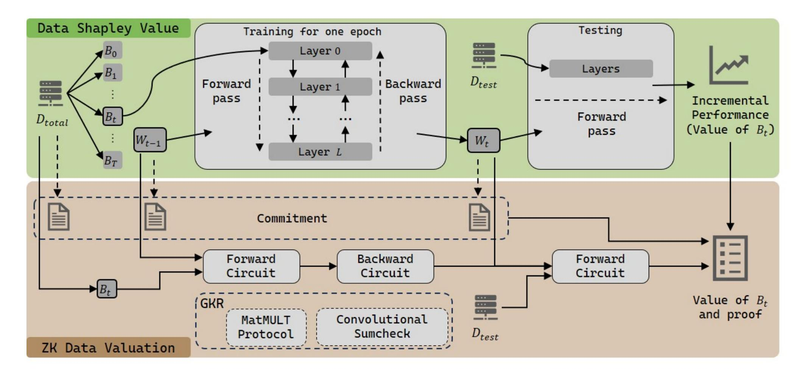
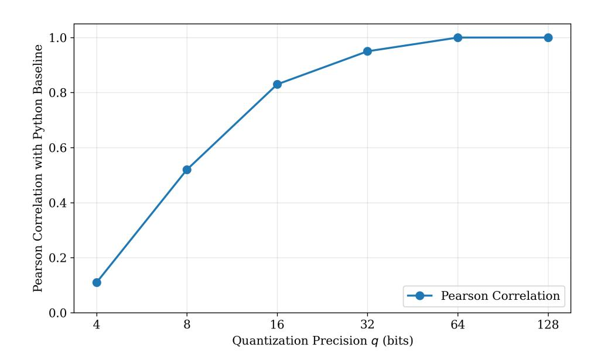

{0}------------------------------------------------

## Bridging Privacy and Utility: A Verifiable Framework for Data Valuation via Zero-Knowledge Proofs

Ruibang Liu Shanghai Jiao Tong University Shanghai, Shanghai, China 628628@sjtu.edu.cn

> Dengji Ma Delphinus Lab Sydney, Australia ponymdj@gmail.com

#### **Abstract**

Deep learning's hunger for high-quality data has catalyzed a burgeoning economy of decentralized data marketplaces. However, a fundamental trust deficit stifles this ecosystem: buyers fear data poisoning, while sellers fear data leakage. Although the Shapley value offers a rigorous economic framework for fair compensation, its calculation traditionally requires a Trusted Third Party (TTP) to access raw data, creating a single point of failure for privacy. Verifying data valuation without compromising confidentiality remains an open challenge.

In this paper, we present ZK-DV, the first Zero-Knowledge Proof (ZKP) system designed for verifiable, privacy-preserving data valuation. ZK-DV enables a seller to prove that a claimed valuation score (based on Gradient Shapley) is mathematically consistent with the underlying private data and the buyer's model, without revealing either. Our key technical insight is the architectural coupling of model training and valuation: we construct a specialized arithmetic circuit that combines the valuation logic into the backpropagation, extracting marginal utility scores from intermediate gradients. This design, implemented via the GKR protocol with a hybrid commitment strategy, amortizes the heavy cryptographic overhead through batched processing. Our implementation, evaluated on LeNet-5 and VGG-11 across MNIST and CIFAR-10, demonstrates practical prover scalability and constant, negligible verifier time. ZK-DV thus bridges the gap between cryptographic integrity and economic fairness, paving the way for trustless data exchange.

#### **CCS Concepts**

• **Security and privacy** → *Privacy-preserving protocols*.

## **Keywords**

Zero Knowledge Proof, GKR protocol, deep learning, verifiable machine learning, data valuation.

Permission to make digital or hard copies of all or part of this work for personal or classroom use is granted without fee provided that copies are not made or distributed for profit or commercial advantage and that copies bear this notice and the full citation on the first page. Copyrights for components of this work owned by others than the author(s) must be honored. Abstracting with credit is permitted. To copy otherwise, or republish, to post on servers or to redistribute to lists, requires prior specific permission and/or a fee. Request permissions from permissions@acm.org.

Conference acronym 'XX, Woodstock, NY

© 2018 Copyright held by the owner/author(s). Publication rights licensed to ACM. ACM ISBN 978-1-4503-XXXX-X/2018/06 https://doi.org/XXXXXXXXXXXXXX

Minyu Chen Shenzhen Technology University Shenzhen, Guangdong, China chenminyu@sztu.edu.cn

Guoqiang Li Shanghai Jiao Tong University Shanghai, Shanghai, China li.g@sjtu.edu.cn

#### **ACM Reference Format:**

Ruibang Liu, Minyu Chen, Dengji Ma, and Guoqiang Li. 2018. Bridging Privacy and Utility: A Verifiable Framework for Data Valuation via Zero-Knowledge Proofs. In *Proceedings of Make sure to enter the correct conference title from your rights confirmation email (Conference acronym 'XX)*. ACM, New York, NY, USA, 16 pages. https://doi.org/XXXXXXXXXXXXXXXXXXXXXXXXXXXXXXXXXXXX

#### 1 Introduction

The precipitous rise of Deep Learning (DL) has transformed high-quality data into a critical asset, fueling a burgeoning economy of data marketplaces. The proliferation of data-driven intelligence has catalyzed the emergence of decentralized data marketplaces, where high-quality data is traded as a distinct asset class. In domains ranging from medical imaging to autonomous driving, the performance of machine learning (ML) models relies heavily on the diversity and quality of the underlying training data. Consequently, establishing a fair and transparent compensation mechanism for data contributors is paramount. A pricing mechanism that accurately reflects the marginal contribution of each data point incentivizes high-quality submissions and sustains the data economy.

In data marketplaces, model developers (Buyers) seek to acquire diverse datasets from multiple providers (Sellers) to train robust models, while Sellers demand fair compensation. The data Shapley value [10], originating from cooperative game theory [26], has emerged as the gold standard for data valuation due to its unique fairness axioms, quantifying the marginal contribution of each data point to the model's utility. However, deploying Shapley-based valuation in a mutually distrustful environment presents a formidable challenge. Standard calculations require the buyer or a Trusted Third Party (TTP) to access all raw data and execute the training, which fundamentally compromises data confidentiality. This architecture creates an inherent conflict of interest: buyers are incentivized to under-report valuation scores to minimize payments, while providers may demand high rewards for low-utility or poisoned data. Although relying on a TTP for auditing seems viable, it violates critical privacy constraints because model owners protect proprietary weights as intellectual property, and providers refuse to expose sensitive raw data. Thus, a fundamental challenge arises: How can we verifiably prove the correctness of a Shapley value computation without compromising the confidentiality of the underlying data or model parameters?

{1}------------------------------------------------

Zero-Knowledge Proofs (ZKPs) offer a promising cryptographic solution to this dilemma, allowing a Prover to convince a Verifier of a computation's correctness without leaking secrets. However, applying ZKP to G-Shapley presents significant system challenges. By generating a succinct proof of computation, a Seller can prove that "the model was trained correctly on my data" and "my data contributed amount to the model's accuracy" without revealing the data itself. While recent advancements in Zero-Knowledge Machine Learning (ZK-ML) have made verifiable inference [\[22,](#page-11-1) [27,](#page-11-2) [36\]](#page-11-3) and training [\[1,](#page-10-1) [7,](#page-10-2) [32\]](#page-11-4) feasible, extending these frameworks to support Data Valuation remains an open problem. A naive implementation of Shapley valuation inside a ZK circuit would require training the model exponentially many times, computing distinct backward passes for every individual data point. Such an approach incurs a prohibitive computational overhead, rendering it impractical for real-world datasets.

Computing the exact Shapley value necessitates retraining the model on an exponentially growing number of subsets, a combinatorial process that is computationally intractable for modern Deep Neural Networks (DNNs). Constructing a Zero-Knowledge Proof (ZKP) system for such an exhaustive workload would further exacerbate this complexity. To bridge this gap, we adopt Gradient Shapley (G-Shapley) [\[10\]](#page-10-0) as our valuation basis. This approximation estimates data utility by performing a single forward and backward propagation pass, effectively reducing the valuation complexity to that of one training epoch.

Crucially, we observe that the arithmetic core of G-Shapley constitutes a strict subset of the operations required for standard DNN training and inference. This insight allows us to construct a specialized ZKP for data valuation by extracting the relevant gradient descent logic from the existing Zero-Knowledge Proof of Training (ZKPoT) framework. By iteratively interleaving the weight update process with performance evaluation, we achieve a unified proof structure. Furthermore, unlike the dynamic weight dependencies in full retraining, G-Shapley operates on deterministic gradient snapshots. This characteristic enables us to batch proof generation and significantly amortize the overhead of heavy cryptographic commitments.

In this paper, we present ZK-DV, the first system to enable verifiable, privacy-preserving data valuation via Zero-Knowledge Proof. ZK-DV enables a prover to demonstrate the validity of a G-Shapley valuation score concurrently with the model training process, ensuring that the final payment is mathematically grounded in the data's actual utility. Our key insight is that the arithmetic structures of gradient descent and data valuation are inherently coupled. In standard Stochastic Gradient Descent (SGD), the system computes the aggregate gradient to update weights. We observe that the components required for G-Shapley valuation, which are the gradients, are essentially intermediate byproducts of the backpropagation algorithm. The gradients here not only represent the direction of weight updates, but also reflect the value of the corresponding data blocks. Instead of treating valuation as a post-hoc analysis, ZK-DV reused the circuit structure and intermediate results.

To achieve concrete efficiency, we ground our implementation in the GKR protocol [\[11\]](#page-10-3) and Sumcheck-based arguments, which are inherently adept at handling the dense linear algebra operations dominant in neural networks. We address the challenge of

numerical precision within finite fields through a rigorous ablation study, identifying a fixed-point configuration ( = 64) that preserves high statistical fidelity ( > 0.999) without incurring overflow costs. Architecturally, ZK-DV employs a hybrid commitment strategy optimized for GKR: utilizing Merkle Trees for sparse data access and Multilinear Polynomial Commitments for dense weight tensors. At the circuit level, we synthesize state-of-the-art arithmetic primitives: we employ Thaler's MATMULT protocol [\[35\]](#page-11-5) for fully connected layers and adopt the convolutional sumcheck from zkCNN [\[22\]](#page-11-1) for convolutional layers, while handling non-linearities via bit decomposition with auxiliary witnesses. Our system architecture builds upon the KAIZEN framework [\[1\]](#page-10-1) to manage the recursive composition and commitment aggregation. Finally, the entire execution trace is compiled into a succinct, non-interactive argument via the Fiat-Shamir heuristic, allowing the Buyer to verify the fairness of data valuation with minimal latency.

Our design bridges the gap between the economic theory of Shapley values and the cryptographic efficiency of the GKR protocol. We address the non-linearity of DNNs (e.g., ReLU) using bit-decomposition witnesses and ensure the binding of inputs via a hybrid commitment strategy involving Merkle Trees for data and Polynomial Commitments for weights.

We provide a comprehensive C++ implementation of ZK-DV and evaluate its performance across varying dataset magnitudes. We implement our zero-knowledge data valuation (ZK-DV) framework over the F 2 extension field (with = 2 61 − 1) and evaluate its performance on standard vision benchmarks, including LeNet-5 and VGG-11 trained on MNIST and CIFAR-10. Our experiments reveal that optimizing the batching strategy is critical for scalability; specifically, saturating the batch size amortizes the fixed cryptographic overheads, yielding a 2.7× speedup in prover time compared to naive fragmented execution. Furthermore, we validate the system's numerical precision through a quantization ablation study, demonstrating that a 64-bit configuration ( = 64) achieves perfect statistical correlation ( = 1.0) with standard floating-point baselines. Crucially, ZK-DV maintains a low verification cost (< 0.2s), confirming its economic viability for decentralized marketplaces.

In summary, this paper makes the following contributions:

- To the best of our knowledge, we are the first to state the problem of verifiable data valuation. We propose ZK-DV, a privacy-preserving system that guarantees the computational integrity of G-Shapley scores. Our system simultaneously protects the confidentiality of the provider's training data and the buyer's model weights, bridging the gap between verifiable computation and economic fairness.
- We develop a specialized zero-knowledge proof framework designed for the integrated execution of DNN training and inference. This framework optimizes the validity proofs for gradient computations, enabling practical and verifiable data valuation on neural networks.
- We implement a prototype of ZK-DV integrating C++ GKR backends. Extensive evaluation on MNIST datasets with architectures up to LeNet-5 demonstrates that ZK-DV is practical, generating valuation proofs for deep networks in minutes with a constant on-chain verification cost. We further

{2}------------------------------------------------

verify that our fixed-point quantization preserves the relative ranking of data values with a Pearson correlation of  $\rho > 0.99$ .

The remainder of this paper is organized as follows. Section 2 introduces the necessary background on Zero-Knowledge Proofs and the Shapley Value. Section 3 state the problem and design goals. Section 4 details the architecture and technical construction of our proposed ZK-DV system. Section 5 presents the implementation details and provides a comprehensive experimental evaluation. Finally, We review related work in Section 6 and conclude the paper in Section 7.

#### 2 Preliminaries

In this section, we provide the necessary background on cryptographic primitives, zero-knowledge proofs for training, and data valuation metrics. We denote  $\mathbb{F}$  as a finite field and  $\lambda$  as the security parameter. For a vector  $\mathbf{x}$ , we denote  $x_i$  as its i-th element.

#### 2.1 Data Valuation

Data Shapley Value. In a standard machine learning paradigm, a model is trained on an aggregation of diverse data sources, culminating in a specific performance metric (e.g., accuracy or loss). The fundamental objective of data valuation is to rigorously quantify the marginal contribution of each individual data source to this aggregate performance. To quantify the contribution of each data point  $(x_i, y_i)$  to the model performance, we utilize the Data Shapley value [10]. It uniquely satisfies equitability properties and is defined as the average marginal contribution of a data point across all possible subsets of the dataset:

$$\phi_i = C \sum_{S \subseteq D \setminus \{i\}} \frac{1}{\binom{n-1}{|S|}} (V(S \cup \{i\}) - V(S)),$$

where V(S) represents the performance (e.g., test accuracy) of a model trained on subset S. By aggregating data point i into group i, we obtain the representative value for that group.

Gradient Shapley Approximation. Since computing the exact Shapley value requires retraining the model exponentially many times, which is computationally prohibitive in a ZK context, we adopt the Gradient Shapley (G-Shapley) approximation. G-Shapley approximates the value by measuring the effect of a data point on the loss reduction during gradient descent [10]:

$$\phi_{B_t} = \nabla \mathcal{L}(W_{t+1}, D_{val}) - \nabla \mathcal{L}(W_t, D_{val})$$

where  $B_t$  is the t-th batch group of data point and  $D_{val}$  is the validation set. This formulation allows calculating data value incrementally during the training process, making it compatible with iterative zkPoT systems.

## 2.2 Zero-Knowledge Proof and Commitments

Zero-Knowledge Proofs (ZKPs) allow a prover to convince a verifier of the validity of a statement without revealing any information beyond the statement's validity. For complex computations such as deep neural network training, we specifically rely on zero-knowledge proofs, which offer information-theoretic soundness. Prove of knowledge relies on computational hardness assumptions

to ensure soundness against polynomial-time adversaries. We provide the formal definition below.

DEFINITION 1 (ZERO-KNOWLEDGE PROOF OF KNOWLEDGE). Let R be an NP relation with language  $L_R$ . A tuple of algorithms  $(\mathcal{G}, \mathcal{P}, \mathcal{V})$  is a zero-knowledge proof of knowledge for R if it satisfies completeness, knowledge soundness, and zero-knowledge properties [12].

- Completeness: For every  $(x, w) \in R$ , the verifier V always accepts the proof generated by the honest prover P.
- **Knowledge Soundness:** For any adversary  $\mathcal{A}$  that convinces V with non-negligible probability, there exists an extractor that can extract the witness w.
- **Zero-Knowledge:** The interaction reveals no information about the witness w beyond the validity of the statement. This is formally defined via a simulator that produces transcripts indistinguishable from real executions.

Polynomial Commitment Schemes (PCS). Polynomial Commitment Schemes are a fundamental building block in modern Zero-Knowledge Proof (ZKP) systems, particularly for Machine Learning applications where the input size (e.g., model weights **W** and datasets D) is substantial. Our framework relies on PCS to handle large inputs (e.g., model weights and datasets). We require the PCS to satisfy evaluation binding and hiding properties. A PCS allows a prover  $\mathcal P$  to commit to a secret polynomial  $f(x) \in \mathbb F[x]$  and subsequently prove that f(r) = y for a challenge point r without revealing the coefficients of f.

A PCS consists of the following parts:

- cmf  $\leftarrow$  Commit(f, pp):  $\mathcal{P}$  produces a succinct commitment cmf to the polynomial f.
- $\pi \leftarrow \text{Open}(f, r, y, pp)$ :  $\mathcal{P}$  generates a proof  $\pi$  that the evaluation of the committed polynomial at point r equals y, i.e., f(r) = y.
- $\{0,1\} \leftarrow \text{Verify}(\text{cm}_f, r, y, \pi, vp)$ :  $\mathcal{V}$  checks the validity of the evaluation using the commitment and the proof.

#### 2.3 Sumcheck and GKR Protocol

Our construction builds upon the GKR protocol [11], an interactive proof system for layered arithmetic circuits based on the sumcheck protocol.

*Multilinear Extensions (MLE).* Let  $V:\{0,1\}^\ell \to \mathbb{F}$  be a function. The multilinear extension of V, denoted as  $\tilde{V}:\mathbb{F}^\ell \to \mathbb{F}$ , is the unique polynomial that agrees with V on the boolean hypercube  $\{0,1\}^\ell$ .  $\tilde{V}$  can be expressed as:

$$\tilde{V}(x_1,\ldots,x_\ell) = \sum_{b\in\{0,1\}^\ell} \tilde{\beta}(x,b)\cdot V(b),$$

where  $\tilde{\beta}(x,b) = \prod_{i=1}^{\ell} ((1-x_i)(1-b_i) + x_i b_i)$  is the Lagrange basis polynomial.

The Sumcheck Protocol. The sumcheck protocol [25] allows a verifier to delegate the computation of a sum  $H = \sum_{b \in \{0,1\}^{\ell}} f(b)$  to a prover, where f is an  $\ell$ -variate polynomial. The protocol proceeds in  $\ell$  rounds, reducing the claim about the sum to a claim about a single evaluation of f at a random point  $r \in \mathbb{F}^{\ell}$ . This protocol is fundamental for verifying matrix multiplications and convolutions in CNNs.

{3}------------------------------------------------

*GKR for Layered Circuits.* Goldwasser, Kalai, and Rothblum proposed an interactive proof system for layered arithmetic circuits, known as the GKR protocol [11], which is built upon the sumcheck protocol. This protocol enables a prover  $\mathcal P$  to convince a verifier  $\mathcal V$  that a given layered arithmetic circuit  $\mathcal C$  is evaluated correctly on a specific input, with verification time much shorter than executing the circuit itself.

Let C be a depth-d arithmetic circuit over a finite field  $\mathbb{F}$ , where layer 0 is the output layer and layer d is the input layer. Each gate in layer i receives inputs from gates in layer i + 1. Let  $S_i$  denote the number of gates in layer i, and define  $s_i = \lceil \log S_i \rceil$ . The wiring structure of the circuit is captured by two predicates:

$$add_i, mult_i : \{0, 1\}^{s_i + 2s_{i+1}} \to \{0, 1\},$$

where  $add_i(z, x, y) = 1$  (resp.  $mult_i(z, x, y) = 1$ ) if and only if gate z in layer i is an addition (resp. multiplication) gate with inputs from gates x and y in layer i + 1.

Let  $v_i : \{0, 1\}^{s_i} \to \mathbb{F}$  be the function mapping a gate label in layer i to its value for a fixed input to the circuit. The multilinear extension  $\tilde{v}_i$  of  $v_i$  satisfies the following recurrence for each layer i:

$$\tilde{V}_{i}(z) = \sum_{x,y \in \{0,1\}^{s_{i+1}}} (\widetilde{add}_{i}(z,x,y)(\tilde{V}_{i+1}(x) + \tilde{V}_{i+1}(y)) + \widetilde{mult}_{i}(z,x,y)(\tilde{V}_{i+1}(x) \cdot \tilde{V}_{i+1}(y))).$$

The GKR protocol proceeds iteratively from the output layer to the input layer. Initially,  $\mathcal{V}$  samples a random point  $r_0$  and computes  $\tilde{v}_0(r_0)$  (or receives it from an oracle). Then, for each layer  $i=0,\ldots,d-1$ , the prover and verifier engage in a sumcheck protocol on the above equation, reducing a claim about  $\tilde{v}_i$  to claims about  $\tilde{v}_{i+1}$  at two random points. Finally, the verifier  $\mathcal{V}$  checks the values of  $\tilde{v}_d$  at these points against the known input.

## 2.4 Deep Neural Network Training and ZKP for training

We define a DNN as a sequence of L transformations mapping inputs to outputs. Each layer l executes a parameterized linear operation followed by a non-linear activation. The linear operation differs by layer type: dense layers compute a matrix multiplication  $T = W \cdot U$ , while convolutional layers perform a sliding window operation T = W \* U. Post-linear activation functions are applied coordinate-wise (e.g., ReLU, tanh) or across the vector (e.g., Softmax $(x_i) = \frac{e^{x_i}}{\sum_j e^{x_j}}$ ). The network may also incorporate pooling layers, which deterministically downsample intermediate feature maps by extracting the maximum or mean value from local regions.

*Mini-Batch Gradient Descent.* We consider training a DNN using mini-batch gradient descent. Let  $D = \{(x_i, y_i)\}_{i=1}^n$  be the training dataset. In the t-th iteration with a batch  $B_t \subseteq D$ , the model weights  $W_t$  are updated to  $W_{t+1}$  as:

$$W_{t+1} = W_t - \eta \cdot \frac{1}{|B_t|} \sum_{(x,y) \in B_t} \nabla \mathcal{L}(W_t; x, y),$$

where  $\eta$  is the learning rate and  $\mathcal{L}$  is the loss function.

*GKR-based ZKP for ML.* Recent advances in Zero-Knowledge Proofs (ZKP) for Machine Learning (ML) primarily leverage GKR-style protocols to handle the high computational density of neural

networks. These works include Zero-Knowledge Proof of Inference [22] and Zero-Knowledge Proof of Training (zkPoT) [1, 7]. To accommodate the constraints of finite field operations, existing ZKML protocols frequently employ quantization schemes to transform floating-point tensors into field-compatible integers. The goal of ZK inference is to prove that a public or committed input  ${\bf x}$  produces a specific output  ${\bf y}$  through a model f with committed parameters  ${\bf W}$ , i.e.,  ${\bf y}=f({\bf x};{\bf W})$ . zkCNN [22] optimizes the GKR protocol for convolutional layers.

A Zero-Knowledge Proof of Training (zkPoT) protocol allows a prover  $\mathcal{P}$  to convince a verifier  $\mathcal{V}$  that a model  $W_T$  was generated by correctly applying an optimization algorithm (e.g., Gradient Descent) on a committed dataset D, without revealing the model parameters or the training data. Take KAIZEN [1] as an example. KAIZEN extends the GKR framework to verify the backpropagation and weight update steps. In KAIZEN, the prover demonstrates that the transition from  $W_t$  to  $W_{t+1}$  follows the gradient descent rule:

$$W_{t+1} = W_t - \eta \cdot \nabla_W \mathcal{L}(W_t; B_t). \tag{1}$$

To handle the sequential nature of training iterations, KAIZEN employs Incremental Verifiable Computation (IVC) to recursively compose proofs. This allows a verifier to check the validity of T training steps with a succinct proof whose size is independent of T. By integrating optimized GKR for both forward and backward passes, KAIZEN provides a foundation for verifying that a model was trained on specific data according to a prescribed protocol.

#### 3 Problem Statement

We consider a decentralized data valuation scenario involving two primary entities: a Model Developer (Buyer) and a Data Owner (Seller). The ecosystem comprises three distinct data components:

- **Public Baseline Data** ( $D_{pub}$ ): A publicly available benchmark dataset (e.g., MNIST [17]) that serves as a standard reference for training related models.
- Public Validation Data ( $D_{test}$ ): A publicly agreed-upon benchmark dataset used to evaluate the final model's accuracy or loss.
- **Private Premium Data** ( $D_{priv}$ ): The Seller's proprietary dataset. The Seller claims that training on  $D_{pub} \cup D_{priv}$  or even  $D_{priv}$  alone yields a superior model compared to training on  $D_{pub}$  alone.

The Model Developer intends to train a Deep Neural Network (DNN)  $\mathcal{M}$  on the combined dataset  $D_{total} = D_{pub} \cup D_{priv}$ . The core objective is to compute the Relative Value of the private data. We adopt the Gradient Shapley (G-Shapley) metric for this purpose, as it rigorously and efficiently quantifies the marginal contribution of individual data points to the model's gradient updates. In G-Shapley, all data in  $D_{total}$  are treated equally. In our framework, data blocks are presented in a randomized sequence. G-Shapley is utilized to estimate the marginal contribution of each block as it is integrated into the training process. By immediately benchmarking the model on the validation dataset  $D_{test}$  after each update, we interpret the resulting performance delta as the realized value of that block. This methodology reduces the valuation overhead significantly, requiring only one epoch to assess the entire dataset.

{4}------------------------------------------------

A critical tension exists in this valuation exchange: the data seller aims to prove the claim that their private dataset yields performance gains beyond publicly available baselines, yet they must simultaneously preserve the privacy of the raw data. Furthermore, the resulting model parameters, which represent the distilled intellectual property of the training process, must remain confidential until the transaction is finalized.

We model this scenario using a Zero-Knowledge Proof (ZKP) framework. In our protocol, the seller assumes the role of the Prover, conducting the model training offline using a composite of public baseline data and their private dataset, which is  $D_{total}$  as defined above. Following training, the seller evaluates the model on a public test set to quantify its utility. Crucially, instead of transmitting the model or data, the seller generates a cryptographic commitment to the dataset  $D_{priv}$  and the trained parameters  $W_D$ , alongside a zero-knowledge proof  $\pi$  and the metric  $V_{D_{priv}}$ . This proof attests to the verifier, which is the buyer, that the reported performance metric on the public test set is the authentic result of a correct training execution on the committed data. Finally, the Buyer validates  $\pi$ . If the proof holds and the metric  $V_{D_{priv}}$  meets the purchase criteria, the transaction is settled. This approach simultaneously safeguards the seller's data sovereignty and provides the buyer with cryptographic assurance of the data's utility.

More formally, the protocol proceeds as follows:

(1) **Phase 1: Local Computation (Seller**  $\mathcal{P}$ ). Given a public model structure M and learning algorithm A,  $\mathcal{P}$  locally executes the training on the combined dataset to obtain the optimal weights  $W_D^*$  and evaluates the performance  $V_{Dpriv}$  on the public test set:

$$W_D^* \leftarrow \mathsf{Train}(D_{pub} \cup D_{priv}), \quad V_{D_{priv}} \leftarrow \mathsf{Eval}(W_D^*, D_{test})$$

(2) **Phase 2: Proof Generation (Seller**  $\mathcal{P}$ **).**  $\mathcal{P}$  generates cryptographic commitments for the private data and the resulting model. Then, the protocol constructs an arithmetic circuit  $C_{M,A}$  to represent the calculation of training and testing, and  $\mathcal{P}$  generates a zero-knowledge proof  $\pi$ :

$$com_{data} \leftarrow Commit(D_{priv}), \quad com_{model} \leftarrow Commit(W_D^*)$$

$$\pi \leftarrow \mathsf{ZKP}.\mathsf{Prover}(com_{data}, com_{data}, C_{M.A})$$

 $\mathcal{P}$  sends  $(V_{D_{priv}}, \pi)$  to the Buyer  $\mathcal{V}$ .

(3) **Phase 3: Verification (Buyer**  $\mathcal{V}$ ).  $\mathcal{V}$  checks the validity of the proof  $\pi$  against the claimed metric  $V_{D_{priv}}$  and the commitments:

$$b_{valid} \leftarrow \mathsf{ZKP.Verify}(\pi)$$

**Output:** The whole process is verified if and only if  $b_{valid} = 1$ .

A more detailed description of the protocol can be found in the appendix section C, more specifically speaking, Protocol 5.

## 4 Zero-Knowledge Proof of Data Valuation

In this section, we articulate the architectural design of ZK-DV, a privacy-preserving framework tailored for verifiable data valuation as depicted in Figure 1.

## 4.1 System Overview

The system operates within a two-party computation model involving a Data Seller (Prover) and a Data buyer (Verifier). At a high level, the protocol begins with the prover committing to their private dataset using a cryptographically secure commitment scheme. These commitments act as the ground truth for all subsequent proofs, anchoring the valuation to specific data samples. Then the prover, who possesses a pre-trained or untrained model, performs the G-Shapley valuation off-chain. This involves computing the gradients of the committed data against the model snapshots and calculating their alignment with the validation set's gradients.

To prove the correctness of this valuation, without leaking the privacy dataset, the prover and verifier reach an agreement through the Zero-Knowledge Proof (ZKP). This proof encompasses the entire computational graph: from the valid ingestion of the committed data and the correct execution of the neural network's forward and backward passe. The Verifier, upon receiving the valuation score and the proof, can efficiently verify the result without ever accessing the model weights or re-executing the heavy backpropagation logic.

## **4.2 Gradient Shapley Approximation for Data Shapley Valuation**

Before we delve into the cryptographic circuit construction, it is essential to intuitively describe the algorithmic process occurring within the original valuation block [10] of our system, as shown in the upper part of Figure 1. The goal here is not just to train a model, but to simultaneously quantify exactly how much the Seller's private data helps (or hurts) that training process relative to the public baseline.

Distinct from standard deep learning pipelines that optimize solely for predictive accuracy, the G-Shapley orchestrates a synchronized, dual-objective process: it iteratively updates the model parameters while simultaneously quantifying the marginal utility of the private dataset relative to the public baseline. The fundamental premise of the valuation logic is the construction of a composite training distribution. In each iteration t, the system samples a minibatch from  $D_{total}$ , which is either from  $D_{pub}$  or  $D_{priv}$ . This sampling establishes the optimization trajectory driven by the public data as a reference frame, against which the marginal influence of the private data can be rigorously measured.

As the system executes Stochastic Gradient Descent (SGD) to compute the aggregate batch gradient—representing the consensus direction for model improvement—it concurrently initiates the valuation routine for every private data instance. In this context, the gradient vector assumes a dual role: it serves not only as the vector for parameter optimization but also as the distinct manifestation of the data's intrinsic value. Subsequently, the data undergoes a single epoch of forward and backward propagation. Following the forward pass, the network generates predictions  $\hat{y}_i$ , which are immediately evaluated against ground truth labels  $y_i$  via the loss function  $\mathcal{L}$ . This loss value triggers the backward differentiation process, enabling the derivation of gradients and the subsequent update of model weights.

The updated model parameters assimilate the informational content of the newly processed batch. Consequently, evaluating the model on the held-out test set  $D_{test}$  at this juncture serves as a

{5}------------------------------------------------

Figure 1: Overview of ZK-DV

proxy for quantifying the incremental utility derived from the batch, which is equivalent to conducting an additional forward pass. The resulting accuracy metric validates the performance trajectory of the trained model. This process persists until the entire dataset is traversed. Throughout this process, the system maintains a persistent cumulative Shapley value vector  $\Sigma$ . At each step, the marginal contribution score of each private data point is aggregated into this vector, effectively transforming the abstract concept of 'data quality' into a concrete, verifiable numeric basis for final settlement.

## 4.3 Quantization and Finite Field Adaptation

A fundamental impedance mismatch exists between the arithmetic of standard DNNs and ZK-SNARKs. While G-Shapley valuation relies on gradients computed over the field of real numbers  $\mathbb{R}$ , our ZK circuits operate over a prime finite field  $\mathbb{F}_p$ . Direct emulation of floating-point arithmetic within arithmetic circuits is prohibitively expensive due to the need for bit-level decompositions for exponent alignment. To address this, we follow the prior work [1, 7] and employ a rigorous fixed-point quantization scheme akin to those used in quantized inference, but adapted for gradient preservation.

*Quantization Scheme.* We define a quantization function  $Q: \mathbb{R} \to \mathbb{F}_p$  that maps a real-valued scalar x to a field element:

$$Q(x,S) = \lfloor x \cdot 2^S \rfloor \mod p \tag{2}$$

where S is a global scaling factor (precision bits), typically set to S = 16 or S = 32 depending on the gradient magnitude range. All inputs, including the committed data  $x_i$  and the model weights W, are ingested into the circuit in this quantized form.

Exponent and Scale Management. The challenge in the ZK Nero Network lies in managing the scale explosion during chain rule multiplications. Consider the operation  $y = w \cdot x$ . In the quantized

domain, this becomes  $\hat{y} = Q(w, S) \cdot Q(x, S) \approx (w \cdot 2^S) \cdot (x \cdot 2^S) = (w \cdot x) \cdot 2^{2S}$ . Without intervention, the scaling factor doubles at every multiplicative depth (e.g., convolution layers), rapidly causing the value to overflow the field modulus p.

To mitigate this, we introduce a deterministic *Rescaling Gadget* after each linear layer. This gadget performs an integer division by  $2^S$  (implemented efficiently as a bit-shift constraint in the circuit) to restore the scale from  $2^{2S}$  back to  $2^S$ .

$$Rescale(val, S) = |val \cdot 2^{-S}|$$
(3)

This ensures that the gradients  $\nabla \mathcal{L}$  flowing backward maintain a consistent dynamic range.

Gradient Sensitivity. We observe that while quantization inherently introduces a noise term  $\epsilon$ , it poses a specific challenge for gradients with negligible magnitudes, which are prone to significant distortion or information loss. Selecting a sufficiently large scaling factor S ensures that the quantized gradients maintain a high statistical correlation with the full-precision baseline. However, in practice, an arbitrarily large S is constrained by the capacity of the underlying finite field and computational efficiency constraints. Consequently, a critical trade-off must be navigated between the quantization scale and numerical precision.

## 4.4 Hybrid Commitment Strategy

A critical security requirement for ZK-DV is binding the computational trace to the authentic dataset and model snapshots without leaking their plaintexts. We observe that the access patterns for data and model parameters differ fundamentally: data samples are accessed sparsely and randomly for individual Shapley calculations, while model weights are accessed globally as dense tensors for matrix operations. To optimize for these distinct patterns, we employ a hybrid commitment strategy.

{6}------------------------------------------------

Dataset Commitment via Merkle Trees. The dataset  $D_{total} = \{z_1, z_2, \ldots, z_N\}$  is committed using a Merkle Tree structure. Each leaf node corresponds to the cryptographic hash of a data (or data chunk) sample,  $h_i = \operatorname{Hash}(z_i||r_i)$ , where  $r_i$  is a local randomness blinding factor. The Data Provider publishes the Merkle Root,  $rt_D$ , which serves as the immutable identifier of the dataset.

During ZK-DV, to prove the validity of a specific input sample  $z_i$ , the Prover supplies a Merkle Authentication Path as a private witness. The circuit includes a MerkleVerify gadget that re-computes the path hashes and asserts equality with the public root  $rt_D$ . This structure allows ZK-DV to efficiently verify membership for any randomly selected subset of data with  $O(\log N)$  overhead. The overall commitment is O(N), and proof size is the same as verification time for  $O(\log N)$ .

Weight Commitment via Polynomial Commitments. Unlike input data, model weights  $W^{(l)}$  at layer l are involved in structured linear algebraic operations compatible with the GKR protocol. Committing to weights via Merkle Trees would be inefficient, as verifying matrix-vector products would require opening all leaves of the weight matrix.

Instead, we treat the weight tensor of each layer as the evaluation of a multilinear polynomial  $\tilde{W}^{(l)}: \mathbb{F}^{\log d} \to \mathbb{F}$ . We employ a Multilinear Polynomial Commitment Scheme (PCS), suitable for multilinear extensions.

In the gradient derivation phase, the GKR protocol reduces the verification of the layer-wise gradient  $\nabla W^{(l)}$  to a claim about the evaluation of  $\tilde{W}^{(l)}(r^*)$  at a random challenge point  $r^*$ . Rather than providing the full weight matrix to the circuit, the Prover provides the short cryptographic commitment  $C_{W^{(l)}}$ , the claimed evaluation value  $v = \tilde{W}^{(l)}(r^*)$  and an evaluation proof  $\pi_{eval}$  attesting that the polynomial underlying  $C_{W^{(l)}}$  indeed evaluates to v at  $r^*$ .

This PCS approach decouples the circuit size from the model size, allowing ZK-DV to support deep architectures where the number of parameters exceeds the capacity of standard SNARK trusted setups.

## 4.5 Recursive Proving Architecture

Building upon the primitives defined above, we explicitly instantiate the arithmetic circuits and detail the execution protocol. Since the main calculation of G-shapley lies in the training and inference of neural networks, our design follows a modular approach derived from an existing zkPoT framework, KAIZEN [1], bifurcating the neural network computation into two distinct sub-circuits: the Forward Pass Circuit ( $C_{fwd}$ ) and the Backward Pass Circuit ( $C_{bwd}$ ).

Circuit Construction. To minimize the prover overhead and circuit size, ZK-DV followed the prior work and employs tailored arithmetic protocols for different layer types. We integrate optimizations from state-of-the-art ZKML frameworks to handle the distinct algebraic structures of fully connected layers, convolutional layers, and non-linear activation functions. The linear transformations constitute the bulk of the arithmetic complexity. We differentiate the handling strategy based on the layer topology: for Fully Connected (FC) Layers, we utilize the standard MatMULT [35] protocol. This protocol leverages the sumcheck argument to verify the computation  $C = A \cdot B$  in  $O(d^2)$  prover time, where d is the

matrix dimension, avoiding the  $O(d^3)$  cost of naive circuit evaluation. For Convolutional (Conv) Layers: Naive implementation of convolutions as matrix multiplications results in massive. To address this, we adopt the optimized sumcheck for convolutionals from zkCNN [22].

Arithmetic circuits over finite fields  $\mathbb{F}_p$  efficiently support addition and multiplication but struggle with non-arithmetic operations required by activation functions (e.g., ReLU, MaxPool). For a ReLU activation  $y = \max(0, x)$ , verifying the inequality  $x \geq 0$  requires extracting the sign bit of the field element. We employ a Bit-Decomposition approach using Auxiliary Inputs.

Proof of Training. Unlike conventional training proofs where forward and backward passes are tightly coupled strictly for parameter optimization, ZK-DV reconfigures this interaction to facilitate efficient Shapley value estimation. In iteration t, the Forward Circuit  $C_{fwd}$  accepts the current model weights  $W_{t-1}$  and input batch  $B_t$ . We treat the layer-wise intermediate activations  $a^{(l)}$  as trusted advice (witnesses) supplied by the Prover. These witnesses are subsequently verified for algebraic consistency against the weights  $W_{t-1}$  using the GKR layer-check protocol, significantly reducing circuit depth. The Backward Circuit  $C_{bwd}$  adapts the backpropagation logic of KAIZEN. It takes the verified activations from  $C_{fwd}$  and the computed loss  $\mathcal L$  to initiate the gradient derivation. Crucially,  $C_{bwd}$  generates not only the updated weights  $W_t$  but also the individual gradient components required for valuation.

Proof of Testing. A salient feature of our protocol is the polymorphic reuse of the forward propagation circuit,  $C_{fwd}$ . While primarily employed for training, this circuit is repurposed within the execution trace to quantify the marginal utility of the batch  $B_t$ . Specifically, we instantiate  $C_{fwd}$  with the updated weights  $W_t$  and the standard validation set  $D_{test}$  to compute the model's post-update accuracy. Crucially, this reuse entails a shift in visibility constraints. Unlike the training phase, where data is private, the validation set  $D_{test}$  is agreed upon by all parties and is therefore treated as a Public Input (Instance) to the circuit. This ensures that the valuation metric is derived from a transparent, verifiable benchmark. Upon the completion of all training iterations, this mechanism yields a verified sequence of valuation scores corresponding to each input batch.

Non-Interactivity via Fiat-Shamir Transformation. The native GKR protocol is interactive, requiring multiple rounds of random challenges from the Verifier. To make ZK-DV practical for blockchain deployment or asynchronous auditing, we compile the protocol into a Non-Interactive Zero-Knowledge (NIZK) argument using the Fiat-Shamir heuristic. We employ a cryptographic sponge function as the Random Oracle (RO). All public inputs (Dataset Root, Model Commitments) and the prover's initial messages (commitments to layer-wise polynomials) are absorbed into the sponge. The sponge then squeezes out the random challenges  $r_1, r_2, \ldots$  required for the sumcheck rounds.

$$\pi_{final} \leftarrow \text{FiatShamir}(C_{fwd}, C_{bwd}, \text{RO})$$
 (4)

This transformation binds the proof generation to the specific instance data, preventing replay attacks and enabling the Verifier to

{7}------------------------------------------------

| Model   | Metric            | MN           | IIST          | CIFAR-10     |               |  |
|---------|-------------------|--------------|---------------|--------------|---------------|--|
| Wiodei  | Wittie            | <i>b</i> = 8 | <i>b</i> = 16 | <i>b</i> = 8 | <i>b</i> = 16 |  |
| LeNet-5 | Prover time (s)   | 205.36       | 295.77        | 204.21       | 302.52        |  |
|         | Verifier time (s) | 0.095        | 0.108         | 0.102        | 0.109         |  |
|         | Proof size (KB)   | 1045.00      | 1359.26       | 1150.58      | 1401.21       |  |
| VGG-11  | Prover time (s)   | 796.32       | 1135.83       | 803.74       | 1253.91       |  |
|         | Verifier time (s) | 0.121        | 0.135         | 0.122        | 0.139         |  |
|         | Proof size (KB)   | 1773.28      | 1920.03       | 1780.31      | 1950.20       |  |

Table 1: Zero-Knowledge Data Valuation: Performance by Model, Dataset, and Batch Size

validate the entire G-Shapley calculation via a single static proof string.

The final artifact produced by ZK-DV is a composite proof. We employ the Fiat-Shamir heuristic to render the protocol non-interactive. The system aggregates the sub-proofs from the Forward Pass and the Backward Pass. Using recursive SNARK composition, we compress these distinct logical branches into a single, constant-size proof string  $\pi$ . The Verifier, holding only the commitment to the data  $Com(x_i)$  and the public validation set, can verify  $\pi$ , gaining mathematical assurance that the claimed value  $V_t$  is indeed the faithful G-Shapley value of the concealed data. We have placed the construction of the protocols and the related proofs in the appendix sections C and D.

### 5 Implementation and Evaluation

Experimental Setup. Our implementation builds upon the KAIZEN framework, with the core arithmetic backend (e.g., the GKR protocol) optimized in C++ for performance. The artifact will be open-sourced upon publication. Experiments were performed on an Ubuntu 23.04 server featuring an AMD Ryzen 9 5950X CPU and 128GB RAM.

*Parameters and Benchmarks.* We instantiated the protocol over the extension field  $\mathbb{F}_{p^2}$  with the Mersenne prime  $p=2^{61}-1$ . To mitigate precision loss and prevent modular overflow during backpropagation, we utilized a fixed-point quantization strategy with parameters q=64 (total bits) and F=32 (fractional bits). The evaluation targets the LeNet-5 and VGG-11 [31] architecture on the MNIST [25] and CIFAR-10 dataset [14].

## 5.1 Performance

Table 1 reports the computational overhead and proof size of our zero-knowledge data valuation framework on two representative models (LeNet-5 and VGG-11), two vision datasets (MNIST and CIFAR-10), and two batch sizes (b = 8 and b = 16) for one iteration. The metrics include prover time (in seconds), verifier time (in seconds), and proof size (in kilobytes).

For LeNet-5 on MNIST, increasing the batch size from 8 to 16 raises the prover time from 205.36s to 295.77s, while the verifier time remains below 0.11s and the proof size grows moderately from 1045KB to 1359KB. A similar trend holds on CIFAR-10, where the prover time increases from 204.21s to 302.52s. The verifier time

stays under 0.11s and proof size expands from 1150KB to 1401KB. These results indicate that the prover's workload is sensitive to the batch size, whereas the verifier's cost is nearly constant and very low, confirming the succinctness of our proofs.

Switching to the larger VGG-11 model leads to significantly higher prover times. On MNIST with b=8, the prover takes 796.32s, which is about 3.9× slower than LeNet-5 under the same configuration. Doubling the batch size to 16 increases the prover time further to 1135.83s. On CIFAR-10, the prover times are 803.74s (b=8) and 1253.91s (b=16). The verifier time for VGG-11 remains between 0.12s and 0.14s, still negligible compared to the prover. Proof sizes grow to around 1.9MB, which is practical for network transmission and storage.

# 5.2 Phase-wise Computational Breakdown with Varying Block Sizes

Table 2 presents a comprehensive breakdown of the computational overhead incurred by ZK-DV across different dataset magnitudes under the Lenet-5 network and MNIST dataset. To rigorously evaluate the impact of our batching strategy, we fixed the total number of data points (Magnitude) at three levels. And for each level, we varied the configuration between the batch size (*B*) and the number of batches (*N*). The reported metrics decompose the total Prover time into three distinct phases: the generation and opening of cryptographic commitments (*Commitments Time*), the GKR-based verification of the gradient computation circuit (*Proof of Training Circuits*), and the alignment verification against the validation set (*Proof of Testing Circuits*). Additionally, we report the total proof size and the verifier's runtime to assess the system's storage and verification efficiency.

A critical insight derived from the experimental results is the significant performance gain achieving through batch amortization. As illustrated in the high-magnitude scenario (DataSet = 256), the system configuration exerts a dramatic influence on the total proving time. When operating with a small batch size (B = 4, N = 64), the total prover time stands at approximately 8120 seconds. However, by increasing the batch size to B = 64 (and reducing N to 4), the total time plummets to 2992 seconds, representing a speedup of nearly 2.7×. This non-linear improvement confirms that the fixed overheads inherent in the zero-knowledge protocol—specifically

{8}------------------------------------------------

| Magnitude                         | DataSet = 16 |              |          | DataSet = 64 |              | DataSet = 256 |           |                |               |
|-----------------------------------|--------------|--------------|----------|--------------|--------------|---------------|-----------|----------------|---------------|
| Magnitude                         | B=2, N=8     | B = 4, N = 4 | B=8, N=2 | B=4, N=16    | B = 8, N = 8 | B = 16, N = 4 | B=4, N=64 | B = 16, N = 16 | B = 64, N = 4 |
| Prover Time (s)                   |              |              |          |              |              |               |           |                |               |
| Commitments Time                  | 463.62       | 308.83       | 233.83   | 1121.90      | 940.59       | 797.58        | 4080.59   | 3128.66        | 2356.62       |
| <b>Proof of Training Circuits</b> | 437.03       | 221.83       | 117.34   | 861.89       | 448.70       | 225.72        | 2925.12   | 1206.01        | 454.35        |
| Proof of Testing Circuits         | 160.43       | 83.43        | 42.89    | 342.69       | 173.60       | 83.47         | 1113.92   | 477.34         | 181.59        |
| <b>Total Prover (s)</b>           | 1061.08      | 613.26       | 394.06   | 1983.79      | 1562.89      | 1106.77       | 8119.63   | 4812.01        | 2992.56       |
| Proof Size (KB)                   |              |              |          |              |              |               |           |                |               |
| Sumcheck Proofs                   | 2532.68      | 1831.13      | 1194.4   | 7836.14      | 4575.91      | 2560.26       | 27298.25  | 12738.68       | 7820.81       |
| Comm. Openings                    | 868.43       | 838.86       | 821.76   | 3155.68      | 3101.22      | 2937.36       | 10745.27  | 10627.59       | 10227.25      |
| Total Proof (KB)                  | 3401.11      | 2652.89      | 2016.16  | 10991.82     | 7677.13      | 5497.62       | 38043.52  | 23366.27       | 18048.06      |
| Verifier Time (s)                 |              |              |          |              |              |               |           |                |               |
| Total Verifier (s)                | 0.202        | 0.108        | 0.053    | 0.416        | 0.224        | 0.114         | 1.536     | 0.464          | 0.126         |

Table 2: The runtime for different dataset size. B represents the batch size, and N represents the batch number

the setup costs for the GKR circuit and the initialization of sumcheck polynomials—are effectively amortized when multiple data points are processed within a single circuit instance. The data indicates that users or data marketplaces should prioritize maximizing the batch size up to the memory limit of the provisioning machine to achieve optimal throughput.

Furthermore, a granular analysis of the runtime breakdown reveals a shifting bottleneck as the batch size increases. In the small batch size configuration (B=4 for Dataset 256), the arithmetic circuit computation for gradients consumes a substantial portion of the runtime (2925 seconds), comparable to the commitment operations. However, as the system moves towards a large batch size configuration (B=64), the arithmetic proof time drops precipitously to 454 seconds, an 84% reduction. In stark contrast, the *Commitments Time* only decreases from 4080 seconds to 2356 seconds.

A pivotal observation from our empirical analysis is the distinct sensitivity of different system components to batch configuration, leading to a clear optimization strategy, maximizing batch size yields superior space-time efficiency. First, we observe that larger batch sizes inherently amortize the fixed overheads associated with the zero-knowledge protocol. The total proving time does not scale linearly with the number of iterations. Rather, each iteration incurs a baseline cost for circuit setup, polynomial memory allocation, and the final SNARK wrapping. By aggregating more data points into a single batch (increasing B), we reduce the total number of iterations N required to traverse the full dataset. As evidenced in Table 2, for a fixed dataset of 256 samples, consolidating processing from 64 iterations (B = 4) to 4 iterations (B = 64) reduces the arithmetic circuit overhead by nearly an order of magnitude. This confirms that the GKR protocol is highly amenable to data parallelism.

Second, our breakdown analysis reveals a fundamental divergence in scalability between cryptographic commitments and arithmetic circuit proofs. The commitment overhead is largely data-dependent rather than iteration-dependent. The computational cost of commitments is intrinsically tied to the total information content (i.e., the total number of data points) rather than how they are grouped. Whether 256 data points are verified in one massive batch or 256 individual batches, the total number of hashing operations remains roughly constant. In contrast, the proof generation for the gradient computation is strictly iteration-dependent. Each

Figure 2: Impact of quantization precision on valuation accuracy. The x-axis represents the precision q (in bits) on a logarithmic scale. The y-axis represents the correlation with Python baseline

separate batch necessitates a fresh execution of the sumcheck protocol and an independent recursive aggregation step. Consequently, under a fixed data budget, the optimal strategy is to saturate the batch size B up to the physical memory limits of the prover machine. This approach minimizes the expensive iteration count N, thereby maximizing the efficiency of the arithmetic circuit while the commitment overhead remains a stable, unavoidable baseline.

Finally, regarding scalability and on-chain feasibility, the system demonstrates robust performance characteristics. The growth in total prover time relative to the dataset size remains favorable; quadrupling the dataset size from 64 to 256 (under optimal batching) results in less than a  $3\times$  increase in runtime, indicating sub-linear scaling behavior in practice. Moreover, the verifier time remains consistently negligible across all configurations, peaking at merely 1.5 seconds even in the most fragmented batch setting. In the optimal B=64 configuration for 256 data points, the verification concludes in 0.126 seconds. This constant-time verification capability serves as a strong indicator that ZKDV is economically viable for deployment on verifier with limited computing resources.

{9}------------------------------------------------

## 5.3 Impact of Quantization

Metric Definition. To rigorously quantify the fidelity of our cryptographic implementation against the standard Shapley value execution, we utilize the Pearson correlation coefficient ( $\rho$ ). This metric assesses the linear dependence between the valuation scores derived from our quantized arithmetic circuit and those generated by the baseline Python implementation. A coefficient approaching  $\rho = 1.0$  indicates that the relative ranking and magnitude of the data valuation scores are preserved, ensuring that the quantization noise introduced by the finite field arithmetic does not distort the downstream valuation logic.

Using the same data, we conducted Gradient Shapley value calculations on both the quantified neural network and the traditional neural network implemented in Python, and also calculated the linear correlation between the two value distribution vectors. Figure 2 illustrates the sensitivity of the valuation accuracy to the quantization bit-width q. We observe a distinct sigmoidal convergence profile: For the low-precision region ( $q \le 8$ ), the correlation is critically compromised. This indicates that the quantization artifacts overwhelm the gradient signals, rendering the valuation results statistically insignificant. For mid-precision region (q = 16, 32): Increasing the precision to 16 bits yields a substantial improvement, recovering the correlation to  $\rho \approx 0.83$ . While better, this level of fidelity may still be insufficient for high-stakes financial settlements. At q = 32 bits, the system achieves a strong correlation of  $\rho = 0.95$ . This represents a better trade-off point for our system, providing reliable valuation utility while maintaining a compact circuit size. For a high-precision region ( $q \ge 64$ ), finally, extending the precision to 64 bits or beyond results in perfect alignment ( $\rho = 1.0$ ). Thus, we adopt q = 64 as the default configuration.

### 6 Related Work

This section surveys the two foundational pillars underpinning our approach: Data Valuation and Zero-Knowledge Machine Learning (ZKML). We first trace the evolution of data valuation from classical Leave-One-Out heuristics to rigorous Shapley-based frameworks, highlighting the computational challenges that have driven the development of efficient approximation techniques such as Gradient Shapley and Distributional Shapley. We then examine the rapid maturation of Zero-Knowledge Machine Learning (ZKML), spanning from early decision-tree verification to recent GKR-based protocols for deep neural networks and transformers. While these fields have largely progressed in parallel, their intersection remains largely unexplored: existing ZKML frameworks focus on proving the correctness of computation over *fixed* datasets, yet they lack mechanisms to account for the relative value or contribution of individual data points involved in training or inference. This survey contextualizes our work at the confluence of these domains, motivating the need for verifiable computation protocols that are inherently value-aware.

## 6.1 Data Valuation

Foundations of Data Valuation. Early approaches to quantifying the influence of individual data points on model training predominantly relied on the Leave-One-Out (LOO) test. Cook et al. [3] utilized influence functions to assess the impact of removing a

single point on regression models. However, LOO suffers from limitations in capturing interactions between data points; for instance, in nearest-neighbor classifiers with redundant data, removing a single point may yield zero marginal loss, resulting in a zero valuation for all points. To address this, Ghorbani et al. [10] formalized the data valuation problem in supervised learning. They proposed three axioms for equitable valuation: (1) null player (zero value for non-contributing data), (2) symmetry (equal value for equal marginal contributions), and (3) linearity (additivity of values). Inspired by cooperative game theory [26], they introduced the *Data Shapley* value. Unlike LOO, which considers only the marginal contribution to the full dataset, Data Shapley computes the weighted average of marginal contributions across all possible subsets [13], effectively capturing the interactive value of data points.

Efficient Approximations. Exact computation of Shapley values is #P-complete and computationally intractable for large datasets. Consequently, significant research has focused on approximation techniques. Ghorbani et al. [10] introduced Truncated Monte Carlo (TMC)-Shapley, which estimates value by sampling random permutations of the dataset until convergence. To further eliminate the need for retraining models on every subset, they proposed Gradient Shapley (G-Shapley). G-Shapley assumes a gradient descent training process and approximates a point's value by accumulating the change in model performance (measured via gradients) after each update step. This allows valuation within a single pass of the dataset. Parallel to this, Jia et al. [13] proposed approximation methods based on group testing [4] and compressed sensing [28].

Futher Scenarios. Standard Shapley values are inherently tied to a specific fixed dataset. Ghorbani et al. [9] extended this to Distributional Shapley (D-Shapley), defining value as an expectation over a data distribution rather than a fixed set, thereby improving stability against dataset perturbations. Kwon et al. [15, 16] formalized this framework and introduced Beta Shapley, which generalizes the valuation using Beta distributions to weight marginal contributions, showing superior performance in noise detection. Lin et al. unified these methods under the concept of Average Marginal Effect (AME) [20] and further extended robustness to distribution shifts via Distributionally Robust Generalization Error (DRGE) [21]. Recent works have tailored Shapley values for specific data structures and tasks. Schoch et al. [29] introduced CS-Shapley to distinguish class-wise contributions, aiding in the identification of mislabeled samples. For fragmented data scenarios (e.g., vertical or horizontal partitioning), Liu et al. [23] proposed 2D-Shapley, evaluating contributions at the granularity of feature blocks or cells.

## **6.2** Zero-Knowledge Machine Learning (ZKML)

As machine learning models become intellectual property assets and are deployed in sensitive domains, the dual need for privacy and verifiable correctness has driven the emergence of Zero-Knowledge Machine Learning (ZKML). ZKML allows a model owner to prove the accuracy of predictions or the integrity of training without revealing model parameters or private data.

Zero-Knowledge Inference. Early research focused on verifying the inference phase of static models. Zhang et al. [37] pioneered this field with zkDT, transforming decision tree verification into 

{10}------------------------------------------------

an arithmetic circuit satisfiability problem. However, its specialized tree-based polynomial commitments limited its generalizability. For Convolutional Neural Networks (CNNs), Lee et al. [18] introduced vCNN, leveraging Groth16 and QAPs to verify convolutions. To improve efficiency, Feng et al. proposed ZEN [5], utilizing quantization to optimize R1CS constraints, followed by ZENO [6], which integrated a privacy type system for compiler optimization. Wang et al.'s Mystique [36] further enhanced expressiveness by using a VOLE-based backend to support mixed-type (arithmetic and boolean) computations.

While R1CS-based approaches (like Groth16) are versatile, they often struggle with the dense linear layers of DNNs. Consequently, GKR-based protocols have gained prominence due to their efficiency in handling layered arithmetic circuits. SafetyNets [8] was an early GKR attempt but was restricted to quadratic activations. Liu et al. achieved a breakthrough with zkCNN [22]. They optimizes the GKR protocol for convolutional layers, introducing a sumcheck protocol based on Fast Fourier Transform (FFT) for convolutions and using bit-decomposition to handle non-linear activations like ReLU. By representing convolutions as polynomial multiplications and utilizing a specialized sumcheck protocol for Fast Fourier Transforms (FFT), zkCNN achieves linear prover time O(N) relative to the size of the circuit. This ensures that the integrity of the model's prediction and its claimed accuracy on a dataset can be verified without revealing the proprietary model weights

With the rise of Large Language Models (LLMs), focus has shifted to the Transformer architecture. Chen et al.'s ZKML framework [2] provided a modular compiler (based on Halo2) capable of handling various operations. Sun et al. proposed zkLLM [33], introducing a *tlookup* protocol to verify non-linearities via parallel set membership, achieving significant speedups. More recently, Lu et al. [24] and Qu et al.'s zkGPT [27] have pushed boundaries further. zkGPT leverages GKR with optimized advice columns and range constraints to handle non-arithmetic operations, offering a highly efficient framework for deep model inference.

Zero-Knowledge Training. Verifying the training process is significantly more challenging than inference due to the complexity of backpropagation and parameter updates. Garg et al. [7] formally defined zkPoT (Zero-Knowledge Proof of Training). To circumvent the overhead of standard SNARKs, they combined MPC-in-the-head techniques with SNARKs, demonstrating feasibility for logistic regression. To support Deep Neural Networks (DNNs), Abbaszadeh et al. introduced KAIZEN [1]. KAIZEN employs a GKR-based proof for gradient descent and uses recursive proof composition to make verification cost independent of training iterations. It handles non-linearities via bit-decomposition, balancing prover efficiency with expressiveness. Similarly, Sun et al.'s zkDL [32] proposed a zkReLU protocol and a flattened circuit structure to verify training steps efficiently. There are some other works apply these techniques to verify fairness properties [30, 38].

Tan et al. [34] shifts the focus of Zero-Knowledge Proofs of Training (zkPoT) from verifying the iterative training process to directly proving the quality of the resulting model via a novel "optimum vicinity" definition. By utilizing the strong convexity of regularized loss functions and interval arithmetic, the framework provides a mathematical bound on the distance between the committed model

and the global optimum, significantly reducing computational overhead while ensuring robustness against rejection sampling attacks. VeriLoRA [19] introduces the first end-to-end zero-knowledge proof (ZKP) framework for parameter-efficient fine-tuning, specifically addressing the integrity of the forward and backward propagation steps in Low-Rank Adaptation (LoRA).

#### 7 Conclusion

This paper addresses the critical conflict between transparency and privacy in decentralized data marketplaces. We introduced ZK-DV, a novel system that leverages Zero-Knowledge Proofs to guarantee the computational integrity of Gradient Shapley valuation without exposing sensitive training data or proprietary model weights. Our construction synthesizes state-of-the-art GKR protocols and Sumcheck arguments, and a rigorously tuned fixed-point quantization scheme to achieve both high performance and statistical fidelity. Empirical evaluations confirm that ZK-DV scales effectively with dataset size. Ultimately, ZK-DV eliminates the reliance on Trusted Third Parties for data auditing, establishing a new paradigm where data quality is mathematically proven rather than blindly trusted. We believe this work lays the foundational infrastructure for a fair, secure, and thriving data economy.

#### References

- [1] Kasra Abbaszadeh, Christodoulos Pappas, Jonathan Katz, and Dimitrios Papadopoulos. 2024. Zero-Knowledge Proofs of Training for Deep Neural Networks. In *Proceedings of the 2024 on ACM SIGSAC Conference on Computer and Communications Security* (Salt Lake City, UT, USA) (CCS '24). Association for Computing Machinery, New York, NY, USA, 4316–4330. doi:10.1145/3658644.3670316
- [2] Bing-Jyue Chen, Suppakit Waiwitlikhit, Ion Stoica, and Daniel Kang. 2024. ZKML: An Optimizing System for ML Inference in Zero-Knowledge Proofs. In *Proceedings of the Nineteenth European Conference on Computer Systems* (Athens, Greece) (*EuroSys* '24). Association for Computing Machinery, New York, NY, USA, 560–574. doi:10.1145/3627703.3650088
- [3] R. Dennis Cook. 2000. Detection of Influential Observation in Linear Regression. *Technometrics* 42, 1 (2000), 65–68. doi:10.1080/00401706.2000.10485981
- [4] Ding-Zhu Du and Frank K Hwang. 1999. Combinatorial Group Testing and Its Applications (2nd ed.). WORLD SCIENTIFIC. doi:10.1142/4252
- [5] Boyuan Feng, Lianke Qin, Zhenfei Zhang, Yufei Ding, and Shumo Chu. 2021. ZEN: An Optimizing Compiler for Verifiable, Zero-Knowledge Neural Network Inferences. Cryptology ePrint Archive, Paper 2021/087. https://eprint.iacr.org/ 2021/087
- [6] Boyuan Feng, Zheng Wang, Yuke Wang, Shu Yang, and Yufei Ding. 2024. ZENO: A Type-based Optimization Framework for Zero Knowledge Neural Network Inference. In Proceedings of the 29th ACM International Conference on Architectural Support for Programming Languages and Operating Systems, Volume 1 (La Jolla, CA, USA) (ASPLOS '24). Association for Computing Machinery, New York, NY, USA, 450–464. doi:10.1145/3617232.3624852
- [7] Sanjam Garg, Aarushi Goel, Somesh Jha, Saeed Mahloujifar, Mohammad Mahmoody, Guru-Vamsi Policharla, and Mingyuan Wang. 2023. Experimenting with Zero-Knowledge Proofs of Training. In *Proceedings of the 2023 ACM SIGSAC Conference on Computer and Communications Security* (Copenhagen, Denmark) (CCS '23). Association for Computing Machinery, New York, NY, USA, 1880–1894. doi:10.1145/3576915.3623202
- [8] Zahra Ghodsi, Tianyu Gu, and Siddharth Garg. 2017. SafetyNets: Verifiable Execution of Deep Neural Networks on an Untrusted Cloud. In *Advances in Neural Information Processing Systems*, Vol. 30. Curran Associates, Inc.
- [9] Amirata Ghorbani, Michael Kim, and James Zou. 2020. A Distributional Framework For Data Valuation. In Proceedings of the 37th International Conference on Machine Learning (Proceedings of Machine Learning Research, Vol. 119). PMLR, 3535–3544.
- [10] Amirata Ghorbani and James Zou. 2019. Data Shapley: Equitable Valuation of Data for Machine Learning. In *Proceedings of the 36th International Conference on Machine Learning (Proceedings of Machine Learning Research, Vol. 97).* PMLR, 2242–2251.
- [11] Shafi Goldwasser, Yael Tauman Kalai, and Guy N. Rothblum. 2015. Delegating Computation: Interactive Proofs for Muggles. *J. ACM* 62, 4, Article 27 (Sept. 2015), 64 pages. doi:10.1145/2699436

{11}------------------------------------------------

- [12] S Goldwasser, S Micali, and C Rackoff. 1985. The knowledge complexity of interactive proof-systems. In *Proceedings of the Seventeenth Annual ACM Symposium on Theory of Computing* (Providence, Rhode Island, USA) (STOC '85). Association for Computing Machinery, New York, NY, USA, 291–304. doi:10.1145/22145.22178
- [13] Ruoxi Jia, David Dao, Boxin Wang, Frances Ann Hubis, Nick Hynes, Nezihe Merve Gürel, Bo Li, Ce Zhang, Dawn Song, and Costas J. Spanos. 2019. Towards Efficient Data Valuation Based on the Shapley Value. In Proceedings of the Twenty-Second International Conference on Artificial Intelligence and Statistics (Proceedings of Machine Learning Research, Vol. 89), Kamalika Chaudhuri and Masashi Sugiyama (Eds.). PMLR, 1167–1176.
- [14] Alex Krizhevsky. 2009. *Learning multiple layers of features from tiny images*. Technical Report. Canadian Institute for Advanced Research.
- [15] Yongchan Kwon, Manuel A. Rivas, and James Zou. 2021. Efficient Computation and Analysis of Distributional Shapley Values. In *Proceedings of The 24th International Conference on Artificial Intelligence and Statistics (Proceedings of Machine Learning Research, Vol. 130)*. PMLR, 793–801.
- [16] Yongchan Kwon and James Zou. 2022. Beta Shapley: a Unified and Noise-reduced Data Valuation Framework for Machine Learning. In Proceedings of The 25th International Conference on Artificial Intelligence and Statistics (Proceedings of Machine Learning Research, Vol. 151). PMLR, 8780–8802.
- [17] Y. Lecun, L. Bottou, Y. Bengio, and P. Haffner. 1998. Gradient-based learning applied to document recognition. *Proc. IEEE* 86, 11 (1998), 2278–2324. doi:10. 1109/5.726791
- [18] Seunghwa Lee, Hankyung Ko, Jihye Kim, and Hyunok Oh. 2024. vCNN: Verifiable Convolutional Neural Network Based on zk-SNARKs. *IEEE Transactions on Dependable and Secure Computing* 21, 4 (2024), 4254–4270. doi:10.1109/TDSC. 2023.3348760
- [19] Guofu Liao, Taotao Wang, Shengli Zhang, Jiqun Zhang, Shi Long, and Dacheng Tao. 2025. VeriLoRA: Fine-Tuning Large Language Models with Verifiable Security via Zero-Knowledge Proofs. arXiv:2508.21393 [cs.CR] https://arxiv.org/abs/2508. 21393
- [20] Jinkun Lin, Anqi Zhang, Mathias Lécuyer, Jinyang Li, Aurojit Panda, and Siddhartha Sen. 2022. Measuring the Effect of Training Data on Deep Learning Predictions via Randomized Experiments. In *Proceedings of the 39th International Conference on Machine Learning (Proceedings of Machine Learning Research, Vol. 162)*. PMLR, 13468–13504.
- [21] Xiaoqiang Lin, Xinyi Xu, Zhaoxuan Wu, See-Kiong Ng, and Bryan Kian Hsiang Low. 2024. Distributionally Robust Data Valuation. In *Proceedings of the 41st International Conference on Machine Learning (Proceedings of Machine Learning Research, Vol. 235)*. PMLR, 30362–30391.
- [22] Tianyi Liu, Xiang Xie, and Yupeng Zhang. 2021. zkCNN: Zero Knowledge Proofs for Convolutional Neural Network Predictions and Accuracy. In Proceedings of the 2021 ACM SIGSAC Conference on Computer and Communications Security (Virtual Event, Republic of Korea) (CCS '21). Association for Computing Machinery, New York, NY, USA, 2968–2985. doi:10.1145/3460120.3485379
- [23] Zhihong Liu, Hoang Anh Just, Xiangyu Chang, Xi Chen, and Ruoxi Jia. 2023. 2D-Shapley: A Framework for Fragmented Data Valuation. In *Proceedings of the 40th International Conference on Machine Learning (Proceedings of Machine Learning Research, Vol. 202)*. PMLR, 21730–21755.
- [24] Tao Lu, Haoyu Wang, Wenjie Qu, Zonghui Wang, Jinye He, Tianyang Tao, Wenzhi Chen, and Jiaheng Zhang. 2024. An Efficient and Extensible Zero-knowledge Proof Framework for Neural Networks. Cryptology ePrint Archive, Paper 2024/703. https://eprint.iacr.org/2024/703
- [25] Carsten Lund, Lance Fortnow, Howard Karloff, and Noam Nisan. 1992. Algebraic methods for interactive proof systems. *J. ACM* 39, 4 (Oct. 1992), 859–868. doi:10. 1145/146585.146605
- [26] Irwin Mann and Lloyd S. Shapley. 1962. *Values of Large Games, VI: Evaluating the Electoral College Exactly*. RAND Corporation, Santa Monica, CA.
- [27] Wenjie Qu, Yijun Sun, Xuanming Liu, Tao Lu, Yanpei Guo, Kai Chen, and Jiaheng Zhang. 2025. zkGPT: an efficient non-interactive zero-knowledge proof framework for LLM inference. USENIX Association, USA, 2045–2063.
- [28] Holger Rauhut. 2010. *Compressive Sensing and Structured Random Matrices*. De Gruyter, Berlin, New York, 1–92. doi:doi:10.1515/9783110226157.1
- [29] Stephanie Schoch, Haifeng Xu, and Yangfeng Ji. 2022. CS-Shapley: Class-wise Shapley Values for Data Valuation in Classification. In *Advances in Neural Information Processing Systems*.
- [30] Ali Shahin Shamsabadi, Sierra Calanda Wyllie, Nicholas Franzese, Natalie Dullerud, Sébastien Gambs, Nicolas Papernot, Xiao Wang, and Adrian Weller. 2023. Confidential-PROFITT: Confidential PROof of Falr Training of Trees. In *The Eleventh International Conference on Learning Representations*. https://openreview.net/forum?id=iIfDQVyuFD
- [31] K. Simonyan and A. Zisserman. 2015. Very Deep Convolutional Networks for Large-Scale Image Recognition. In *International Conference on Learning Representations*.
- [32] Haochen Sun, Tonghe Bai, Jason Li, and Hongyang Zhang. 2025. zkDL: Efficient Zero-Knowledge Proofs of Deep Learning Training. *IEEE Transactions on Information Forensics and Security* 20 (2025), 914–927. doi:10.1109/TIFS.2024.3520863

- [33] Haochen Sun, Jason Li, and Hongyang Zhang. 2024. zkLLM: Zero Knowledge Proofs for Large Language Models. In *Proceedings of the 2024 on ACM SIGSAC Conference on Computer and Communications Security* (Salt Lake City, UT, USA) (CCS '24). Association for Computing Machinery, New York, NY, USA, 4405–4419. doi:10.1145/3658644.3670334
- [34] Gefei Tan, Adria Gascon, Sarah Meiklejohn, Mariana Raykova, Xiao Wang, and Ning Luo. 2025. Founding Zero-Knowledge Proof of Training on Optimum Vicinity. In *Proceedings of the 2025 ACM SIGSAC Conference on Computer and Communications Security* (Taipei, Taiwan) (CCS '25). Association for Computing Machinery, New York, NY, USA, 1173–1187. doi:10.1145/3719027.3744862
- [35] Justin Thaler. 2013. Time-Optimal Interactive Proofs for Circuit Evaluation. In *Advances in Cryptology – CRYPTO 2013*. Springer Berlin Heidelberg, Berlin, Heidelberg, 71–89.
- [36] Chenkai Weng, Kang Yang, Xiang Xie, Jonathan Katz, and Xiao Wang. 2021. Mystique: Efficient Conversions for Zero-Knowledge Proofs with Applications to Machine Learning. In 30th USENIX Security Symposium (USENIX Security 21). USENIX Association, 501–518.
- [37] Jiaheng Zhang, Zhiyong Fang, Yupeng Zhang, and Dawn Song. 2020. Zero Knowledge Proofs for Decision Tree Predictions and Accuracy. In *Proceedings of the 2020 ACM SIGSAC Conference on Computer and Communications Security* (Virtual Event, USA) (*CCS '20*). Association for Computing Machinery, New York, NY, USA, 2039–2053. doi:10.1145/3372297.3417278
- [38] Tianyu Zhang, Shen Dong, O. Deniz Kose, Yanning Shen, and Yupeng Zhang. 2025. FairZK: A Scalable System to Prove Machine Learning Fairness in Zero-Knowledge. In 2025 IEEE Symposium on Security and Privacy (SP). 3460–3478. doi:10.1109/SP61157.2025.00205

## **Appendices**

## A Open Science

#### **B** Ethical Considerations

## **C** Protocols

The core part of the protocols is described as follows:

*Protocol 1 (Sumcheck Protocol).* The sumcheck protocol is a fundamental interactive proof that allows a prover to convince a verifier of the correctness of a sum of a multivariate polynomial over the Boolean hypercube. It proceeds in  $\ell$  rounds, each time reducing the claim to a claim about a univariate polynomial, and finally to a single evaluation. It is the building block for many efficient zero-knowledge proofs.

*Protocol 2 (MATMULT Protocol).* The matrix multiplication protocol uses the sumcheck protocol to verify that  $C = A \cdot B$  for matrices A, B, C. It encodes matrix entries as multilinear extensions (MLEs) and reduces the verification to checking a single random evaluation via sumcheck. This yields sublinear verification cost.

*Protocol 3 (GKR Protocol).* The GKR protocol is an interactive proof system for layered arithmetic circuits. It recursively reduces claims about the circuit's output to claims about lower layers using sumcheck, and finally checks the input layer. It achieves succinct verification with complexity logarithmic in the circuit size.

Protocol 4 (Proof of Gradient Descent, PoGD).. The PoGD protocol [1] proves the correctness of a single mini-batch gradient descent iteration for deep neural networks. It combines sumcheck protocols for linear operations (matrix multiplication, convolution) and GKR for non-linear operations, all under polynomial commitments to ensure zero knowledge. It consists of four phases: weight update, backward pass, forward pass, and evaluation reduction.

*Protocol 5 (zk Data Valuation Protocol).* This is the main protocol for zero-knowledge data valuation. It integrates data consistency checks, training proofs (via PoGD), and performance proofs on

{12}------------------------------------------------

#### **Protocol: Sumcheck**

**Parameters:** Let  $f : \mathbb{F}^{\ell} \to \mathbb{F}$  be an  $\ell$ -variate polynomial of variable degree at most d. Let  $H = \sum_{\mathbf{b} \in \{0,1\}^{\ell}} f(\mathbf{b})$ . The prover  $\mathcal{P}$  wants to convince the verifier  $\mathcal{V}$  that H is correct.

**Procedure:** The protocol proceeds in  $\ell$  rounds.

(1) **Round 1:**  $\mathcal{P}$  sends a univariate polynomial

$$g_1(X_1) = \sum_{(x_2,\dots,x_\ell)\in\{0,1\}^{\ell-1}} f(X_1,x_2,\dots,x_\ell),$$

which is of degree at most d.  $\mathcal{V}$  checks that  $g_1(0) + g_1(1) = H$ . If not, reject. Otherwise,  $\mathcal{V}$  picks  $r_1 \in \mathbb{F}$  uniformly at random and sends it to  $\mathcal{P}$ .

(2) **Round** i (for  $i = 2, ..., \ell - 1$ ):  $\mathcal{P}$  sends

$$g_i(X_i) = \sum_{(x_{i+1},\dots,x_{\ell})\in\{0,1\}^{\ell-i}} f(r_1,\dots,r_{i-1},X_i,x_{i+1},\dots,x_{\ell}).$$

 $\mathcal V$  checks that  $g_{i-1}(r_{i-1})=g_i(0)+g_i(1)$ . If not, reject. Otherwise,  $\mathcal V$  picks  $r_i\in\mathbb F$  uniformly at random and sends it to  $\mathcal P$ .

(3) Round  $\ell$ :  $\mathcal{P}$  sends

$$q_{\ell}(X_{\ell}) = f(r_1, \ldots, r_{\ell-1}, X_{\ell}).$$

 $\mathcal{V}$  checks that  $g_{\ell-1}(r_{\ell-1}) = g_{\ell}(0) + g_{\ell}(1)$ . If not, reject. Otherwise,  $\mathcal{V}$  picks  $r_{\ell} \in \mathbb{F}$  uniformly at random and queries  $f(r_1, \ldots, r_{\ell})$  (via an oracle or commitment opening).  $\mathcal{V}$  accepts iff  $g_{\ell}(r_{\ell}) = f(r_1, \ldots, r_{\ell})$ .

#### **Protocol: MATMULT**

**Parameters:** In finite field  $\mathbb{F}_q$ , given two  $n \times n$  matrices  $A, B \in \mathbb{F}_q^{n \times n}$  and a result matrix  $C \in \mathbb{F}_q^{n \times n}$ , the prover  $\mathcal{P}$  wants to convince the verifier  $\mathcal{V}$  that  $C = A \cdot B$  is correct. Let  $k = \lceil \log n \rceil$ . Define  $A(i, j), B(i, j), C(i, j) : \{0, 1\}^k \times \{0, 1\}^k \to \mathbb{F}_q$  as functions mapping matrix indices to entries. Let  $\tilde{A}, \tilde{B}, \tilde{C}$  denote their multilinear extensions. For any matrix M, let  $\tilde{M}$  denote the MLE of its entries.

#### Procedure:

- (1) **Claim Output:**  $\mathcal{P}$  sends matrix  $C^*$  (claimed to equal C = AB).
- (2) Verifier Sampling:  $\mathcal{V}$  samples random  $r_1, r_2 \in \mathbb{F}_q^k$  uniformly.
- (3) **Evaluation Reduction:**  $\mathcal{P}$  and  $\mathcal{V}$  apply Sumcheck protocol (Protocol 1) to the follow k-variate polynomial

$$H(z) = \sum_{z \in \{0,1\}^k} \tilde{A}(r_1,z) \cdot \tilde{B}(z,r_2)$$

(4) **Final Verification:** In the final round of sumcheck,  $\mathcal V$  receives claim:

$$g(r_3) = \tilde{A}(r_1, r_3) \cdot \tilde{B}(r_3, r_2)$$

for randomly chosen  $r_3 \in \mathbb{F}_q^k$ .

 $\mathcal V$  verifies this by multiplying the results:  $\tilde{A}(r_1, r_3) \cdot \tilde{B}(r_3, r_2)$ , and checking equality with  $\mathcal P$ 's claimed  $g(r_3)$ . If all checks pass and  $H = \tilde{C}^*(z)$ ,  $\mathcal V$  accepts  $C^*$  as correct.

a test set to compute the value of each training batch (or data point) incrementally. The prover commits to the dataset, model weights, and test set, then iteratively proves that each gradient descent step was performed correctly and that the resulting model's performance yields the claimed valuation. The verifier can check the entire process without seeing the data or weights.

#### D Security Analysis of ZK-Data Valuation

In this section, we present a formal security analysis of the proposed zero-knowledge protocol for computing Data Shapley values. The protocol is built upon sumcheck-based arguments and polynomial commitments. We provide the proof of the following three necessary properties, completeness, soundness, and zero-knowledge for ZK-DV, following the construction of Protocol Protocol 5.

## **D.1** Completeness

The ZK-Data Valuation protocol satisfies *completeness*: an honest prover who correctly computes the Data Shapley value for all training points will always convince the verifier.

Assume an honest prover  $\mathcal{P}$  holds the correct dataset  $\mathcal{D}$ , test set X, initial weights  $W_0$ , previous weights  $W_{i-1}$ , a satisfying proof  $\pi_{i-1}$  (i.e., Verify accepts), and a batch  $B_{i-1}$  correctly sampled from  $\mathcal{D}$  according to the public permutation together with valid Merkle opening proofs  $\mathbf{p}_{B_{i-1}}$ .

{13}------------------------------------------------

#### **Protocol: GKR**

**Parameters:** Let  $C : \mathbb{F}^n \to \mathbb{F}^m$  be a layered arithmetic circuit of depth d. Let  $S_i$  be the number of gates in layer i, and  $s_i = \lceil \log S_i \rceil$ . Define wiring predicates addi, multi:  $\{0,1\}^{s_i+2s_{i+1}} \to \{0,1\}$ . Let  $v_i : \{0,1\}^{s_i} \to \mathbb{F}$  be the gate values of layer i on a given input. The prover  $\mathcal{P}$  wants to convince the verifier  $\mathcal{V}$  that C is correct.

#### **Procedure:**

- (1) **Initialization:** Prover  $\mathcal{P}$  first sends the claimed output of the circuit to  $\mathcal{V}$ . From the claimed output,  $\mathcal{V}$  defines polynomial  $\tilde{W}_0$  and computes  $\tilde{W}_0(r)$  for a random  $r \in \mathbb{F}^{s_0}$ .
- (2) **Recursive reduction:** for i = 0, ..., d 1
  - (a)  $\mathcal P$  and  $\mathcal V$  run a sumcheck protocol(Protocol 1) on the identity

$$\widetilde{W}_{i}(z) = \sum_{x,y \in \{0,1\}^{S_{i+1}}} \widetilde{\operatorname{add}}_{i}(z,x,y) (\widetilde{W}_{i+1}(x) + \widetilde{W}_{i+1}(y)) + \widetilde{\operatorname{mult}}_{i}(z,x,y) \widetilde{W}_{i+1}(x) \widetilde{W}_{i+1}(y).$$

At the end,  $\mathcal{V}$  obtains claims about  $\widetilde{W}_{i+1}$  at two random points  $u_{i+1}, v_{i+1}$ .

- (b)  $\mathcal{V}$  picks random  $\alpha_{i+1}, \beta_{i+1} \in \mathbb{F}$  and sends them to  $\mathcal{P}$ .
- (c)  $\mathcal P$  and  $\mathcal V$  run the last sumcheck on

$$\alpha_{i+1}\widetilde{W}_{i+1}(u_{i+1}) + \beta_{i+1}\widetilde{W}_{i+1}(v_{i+1})$$

In this way,  $\mathcal{V}$  and  $\mathcal{P}$  reduce a claim about the layer i to two claims about values in layer i + 1.  $\mathcal{V}$  and  $\mathcal{P}$  then combine the two claims into one through a random linear combination, and run a sumcheck protocol on it, and then recursively all the way to the input layer.

- (3) **Final check:** At the input layer,  $\mathcal{V}$  verifies the evaluations match the actual input values. Which is at the input layer (i = d),  $\mathcal{V}$  checks the obtained evaluations of  $\widetilde{W}_d$  against the actual input.
- **Data consistency:** By completeness of Merkle tree verification, every MT.Verify call returns 1. Hence the consistency check passes.
- **Training proof:**  $\mathcal{P}$  runs PoGD.Prove to obtain  $\pi_i^{\text{PoGD}}$ . Since PoGD is complete, PoGD.Verify accepts and certifies that  $W_i$  was correctly computed from  $W_{i-1}$  using  $B_{i-1}$ .
- **Performance proof:**  $\mathcal{P}$  computes predictions  $P_i = f(X, W_i)$  and generates a proof  $\pi_i^{\text{val}}$  using sumcheck and GKR. Completeness of those protocols guarantees that  $\mathsf{Sum}_{\mathsf{Mat}}$ ,  $\mathsf{Sum}_{\mathsf{Conv}}$ , and GKR verifiers accept. The valuation

$$V_i = \Phi(P_{i-1}, P_i, |B_{i-1}|, |\mathcal{D}|)$$

is computed deterministically.

• Consistency: The commitments  $\sigma_{W_i}$  and  $\rho_X$  are generated honestly, so the consistency checks succeed.

Since all steps succeed, the verifier accepts with probability 1. Thus completeness holds.

## D.2 Soundness

The ZK-Data Valuation protocol ensures *soundness*, meaning that a malicious PPT prover who deviates from the specified computations can convince the verifier to accept an incorrect Shapley value only with negligible probability.

Let  $\mathcal A$  be a PPT adversary that outputs an accepting tuple:

$$(i, \rho_{\mathcal{D}}, \rho_X, \sigma_{W_0}, \sigma_{W_i}, V_i, \pi_i)$$

with non-negligible probability, i.e., Verify returns 1. We construct an extractor  $\xi$  that extracts the underlying witnesses.

The proof  $\pi_i = (\pi_i^{\text{PoGD}}, \pi_i^{\text{val}})$ . Because verification passes:

• PoGD.Verify( $\pi_i^{\text{PoGD}}$ ) = 1. By the knowledge soundness of PoGD, there exists an extractor  $\xi_{\text{PoGD}}$  that extracts  $W_{i-1}$ ,  $B_{i-1}$ ,  $W_i$  such that the gradient descent relation holds and

- $\sigma_{W_{i-1}}$ ,  $\sigma_{W_i}$  are commitments to  $W_{i-1}$  and  $W_i$  respectively. Moreover, the data consistency checks (Merkle verifications) imply that each element of  $B_{i-1}$  is a leaf of the Merkle tree committed by  $\rho_{\mathcal{D}}$ . By the position-binding property of Merkle trees, we can extract the entire dataset  $\mathcal{D}$  from  $\rho_{\mathcal{D}}$  (by opening enough leaves; a standard straight-line extractor exists for Merkle commitments).
- $\pi_i^{\text{val}}$  is accepted by the sumcheck and GKR verifiers. The knowledge soundness of these protocols yields that the predictions  $P_{i-1}$  and  $P_i$  are correctly computed from  $W_{i-1}$  and  $W_i$  on the test set X, and that  $V_i = \Phi(P_{i-1}, P_i, |B_{i-1}|, |\mathcal{D}|)$ . The test set commitment  $\rho_X$  is binding, so X can be extracted as well.

For recursive composition (when  $\pi_{i-1}$  is part of the extracted witness), we proceed by induction: from an accepting  $\pi_i$  we extract  $\pi_{i-1}$ , then apply the extractor recursively to obtain all previous weights and batches. This yields sequences  $\{W_0, \ldots, W_i\}$  and  $\{B_0, \ldots, B_{i-1}\}$  with the required properties. Hence knowledge soundness holds.

### D.3 Zero Knowledge

The ZK-Data Valuation protocol satisfies *zero knowledge*: the verifier learns nothing about the training data, the model parameters, or the intermediate values beyond the final computed Shapley values.

We construct a simulator S that, given only oracle access to the valuation function Val, outputs a simulated proof indistinguishable from a real one. S works as follows:

(1) Randomly generate a dummy dataset  $\mathcal{D}^*$  and dummy test set  $X^*$ . Compute their Merkle roots  $\rho_{\mathcal{D}}^*$  and  $\rho_X^*$  (hiding property of Merkle trees guarantees indistinguishability from real commitments).

{14}------------------------------------------------

#### **Protocol: Gradient Descent (PoGD)**

**Parameters:** Let GKR be a generic GKR-style proof system (Protocol 3), SumMat be the sublinear sumcheck for matrix multiplication (Protocol 2), SumConv for convolution, and PCS a polynomial commitment scheme. The model has L layers. Prover  $\mathcal{P}$  wants to convince the verifier  $\mathcal{V}$  that he holds weights  $W_{i-1} = \{W_{i-1,\ell}\}_{\ell=1}^L$  and a batch  $B_{i-1}$ , and runs one gradient-descent iteration to obtain  $W_i$ , auxiliary inputs  $AUX_i$ .  $\mathcal{P}$  sends  $\mathcal{V}$  the commitments  $\sigma_{W_i} \leftarrow \text{PCS.Commit}(\widetilde{W}_i, r_{W_i})$ ,  $\sigma_{W_{i-1}} \leftarrow \text{PCS.Commit}(\widetilde{W}_{i-1}, r_{W_{i-1}})$ ,  $\sigma_{B_{i-1}} \leftarrow \text{PCS.Commit}(\widetilde{B}_{i-1}, r_{B_{i-1}})$ , and  $\sigma_{AUX_i} \leftarrow \text{PCS.Commit}(\widetilde{AUX}_i, r_{AUX_i})$ .

#### **Procedure:**

- (1) **Phase 1 (Update):** For  $\ell = 1$  to L:
  - (a)  $\mathcal{V}$  samples  $r_{\mathsf{out},W_{i,\ell}}$  and requests  $\widetilde{W}_{i,\ell}(r_{\mathsf{out},W_{i,\ell}})$ .
  - (b)  $\mathcal{P}$  and  $\mathcal{V}$  run GKR on  $W_{i,\ell} = W_{i-1,\ell} \eta_{\ell} \cdot \overline{G}_{i,\ell}$ , ending with evaluations of  $\widetilde{W}_{i-1,\ell}$  and  $\widetilde{G}_{i,\ell}$ .
- (2) **Phase 2 (Backward pass):** For  $\ell = 1$  to L:
  - (a) Verify the following formula with sumcheck-based protocol:

$$\widetilde{G}_{i,\ell} = \frac{\partial H_i}{\partial \widetilde{W}_{i-1\,\ell}} = (\mathbf{R}_{i,\ell+1} \circ \mathbf{T}'_{i,\ell}) \cdot \mathbf{U}_{i,\ell-1}^T$$

(b) if  $\ell \neq 1$ , verify the following formula with sumcheck-based protocol:

$$\mathbf{R}_{i,\ell} = \frac{\partial H_i}{\partial \mathbf{U}_{i,\ell-1}} = \operatorname{pad}(\widetilde{W}_{i-1,\ell}^T) \cdot (\mathbf{R}_{i,\ell+1} \circ \mathbf{T}'_{i,\ell})$$

(c) Verify the following formula with sumcheck-based protocol:

$$\mathbf{T}'_{i,\ell} = \frac{\partial \mathbf{U}_{i,\ell}}{\partial \mathbf{T}_{i,\ell}} = \mathbf{W}_{i-1,\ell} \cdot \mathbf{U}_{i,\ell-1}$$

where sumcheck-based protocol means:

- (a) For linear operations, run SumMat for matrix multiplication or SumConv for convlution.
- (b) For non-linear operations, run GKR with  $AUX_i$ .
- The run ends with evaluations of  $\widetilde{W}_{i-1,\ell}$ ,  $U_{i,\ell}$ , and  $\widetilde{AUX}_{i,\ell}$ .

(3) **Phase 3 (Forward pass):** For  $\ell = L$  down to 1: Verify the following formula with sumcheck-based protocol:

$$\mathbf{T}_{i,\ell} = \frac{\partial \mathbf{U}_{i,\ell}}{\partial \mathbf{T}_{i,\ell}} = \mathbf{W}_{i-1,\ell} \cdot \mathbf{U}_{i,\ell-1}$$

Note that  $U_{i,0}$  is viewed as an evaluation of  $\widetilde{B}_{i-1}$ , thus the run ends with evaluations of  $\widetilde{W}_{i-1,\ell}$ ,  $\widetilde{B}_{i-1}$ ,  $\widetilde{AUX}_{i,\ell}$ .

- (4) **Phase 4 (Evaluation reduction):** Combine all evaluations via a sumcheck.  $\mathcal{V}$  checks final evaluations via PCS openings. The final combined evaluations can be verified by invoking the evaluation opening algorithm of the commitment scheme PCS.Open( $\widetilde{\boldsymbol{W}}_i, r_{\boldsymbol{W}_i}, r_{\text{in}, \boldsymbol{W}_{i-1}}, \text{pp}$ ), PCS.Open( $\widetilde{\boldsymbol{W}}_{i-1}, r_{\boldsymbol{W}_{i-1}}, r_{\text{in}, \boldsymbol{W}_{i-1}}, pp$ ), and PCS.Open( $\widetilde{\boldsymbol{AUX}}_i, r_{\text{AUX}}_i, r_{\text{in}, \text{AUX}}_i, pp$ )
- (2) Randomly sample initial weights  $W_0^*$  and compute its commitment  $\sigma_{W_0}^*$  using PCS.Commit (or use the zero-knowledge simulator of PCS).
- (3) For the *i*-th iteration, S queries the valuation oracle Val to obtain a value  $V_i^*$  (e.g., query on a dummy batch). It then runs the zero-knowledge simulators for each sub-protocol:
  - $S_{PoGD}$  produces a simulated proof  $\pi_i^{PoGD*}$  that is indistinguishable from a real PoGD proof, without needing the actual weights or batch.
- $S_{\text{sumcheck}}$  and  $S_{\text{GKR}}$  produce simulated proofs  $\pi_i^{\text{val}*}$  for the performance computation, using random commitments for predictions.
- PCS zero-knowledge simulator produces a commitment  $\sigma_{W_i}^*$  indistinguishable from a real weight commitment.
- $(4) \ \text{Output} \ (i, \rho_{\mathcal{D}}^*, \rho_X^*, \sigma_{W_0}^*, \sigma_{W_i}^*, V_i^*, (\pi_i^{\mathsf{PoGD}*}, \pi_i^{\mathsf{val}*})).$

Because each building block (Merkle tree, PCS, PoGD, sumcheck, GKR) satisfies zero-knowledge or hiding, the simulated view is computationally indistinguishable from the real view. Therefore the protocol is zero-knowledge.

{15}------------------------------------------------

#### **Protocol: zk Data Valuation**

**Parameters:** Let PCS = (KeyGen, Commit, Open, Verify) be a polynomial commitment scheme with public parameters pp.Let PoGD = (Prove, Verify) be the zero-knowledge proof of gradient descent (cf. Protocol 3). Let SumMat be the sumcheck protocol for matrix multiplication. Let GKR be a generic GKR-style proof system. Let  $\mathcal{D}$  be the training dataset,  $\mathbf{W}_0$  be initial model weights. Let X be the testing dataset (used for valuation). Let C be the training iteration circuit. Let V all be a valuation function that computes the value  $V_i$  of batch  $B_i$  based on its contribution to model performance on X. **Basic procedures:** KeyGen samples public parameters by running PCS.KeyGen. DataCom generates a commitment  $\rho_{\mathcal{D}}$  to the training dataset  $\mathcal{D}$  by returning its Merkle root. TestCom generates a commitment  $\rho_X$  to the testing dataset X similarly. WeiCom commits the multilinear extension of weights using PCS.Commit. BatchOpen generates an opening proof for a batch  $B_i$  from  $\mathcal{D}$ .

**Prover**  $\mathcal{P}(i, \rho_{\mathcal{D}}, \rho_X, \sigma_{\mathbf{W}_0}, \sigma_{\mathbf{W}_{i-1}}, \mathbf{W}_{i-1}, B_{i-1}, \mathbf{p}_{B_{i-1}}, \pi_{i-1}, \mathsf{pp})$ :

(1) **Data Consistency:** Validate that batch  $B_{i-1}$  is correctly sampled from  $\mathcal{D}$ :

$$\forall j \in [N] : MT.Verify(\rho_{\mathcal{D}}, v_j, B_{i-1}[j], \mathbf{p}_{B_{i-1}}[j]) = 1$$

where  $v_j$  is the *j*-th index in the permutation for epoch  $e = \lfloor (i-1)/k \rfloor$  (assuming *k* batches per epoch).

(2) **Training Proof:** Run PoGD.Prove to generate a proof of correct gradient descent iteration:

$$(\mathbf{W}_i, \pi_i^{\mathsf{PoGD}}) \leftarrow \mathsf{PoGD}.\mathsf{Prove}(\mathbf{W}_{i-1}, B_{i-1}, \mathsf{pp})$$

This proves that  $W_i$  was correctly computed from  $W_{i-1}$  using batch  $B_{i-1}$ .

- (3) **Performance Proof:** Prove correctness of performance computation:
  - (a) Commit to predictions:  $\sigma_{P_i} \leftarrow \text{PCS.Commit}(\widetilde{P}_i)$ .
  - (b) Compute model predictions on test set X using both  $W_{i-1}$  and  $W_i$ :

$$P_i = f(X, \mathbf{W}_i)$$
 (predictions with new weights)

where f is the forward pass of the model.

(c) Prove the formula with the sumcheck-based protocol:

$$\widetilde{P}_i(r) = \sum_{z} \widetilde{X}(r_1, z) \cdot \widetilde{\mathbf{W}}_i(z, r_2)$$

(d) Compute batch value  $V_i$ :

$$V_i = \Phi(P_{i-1}, P_i, |B_{i-1}|, |D|)$$

where  $\Phi$  is the valuation function, and  $P_{i-1}$  was from the previous iteration.

(4) **Output:** Return  $(\mathbf{W}_i, V_i, \sigma_{\mathbf{W}_i}, \pi_i)$  where  $\pi_i = (\pi_i^{\text{PoGD}}, \pi_i^{\text{val}})$ .

**Verifier**  $V(i, \rho_D, \rho_X, \sigma_{W_0}, \sigma_{W_i}, V_i, \pi_i, pp)$ :

- (1) **Training Verification:** Run PoGD. Verify on  $\pi_i^{\text{PoGD}}$  to verify correct training iteration.
- (2) **Performance Verification:** Verify the performance proof  $\pi_i^{\text{val}}$ : Verify forward pass proofs using SumMat, SumConv and GKR verifiers.
- (3) **Consistency Check:** Verify that all commitments are consistent:
  - Check that  $\sigma_{\mathbf{W}_i}$  is a valid commitment to  $\mathbf{W}_i$ .
  - Check that test set commitments match  $\rho_X$ .
- (4) Output: Accept if all verifications pass; otherwise reject.