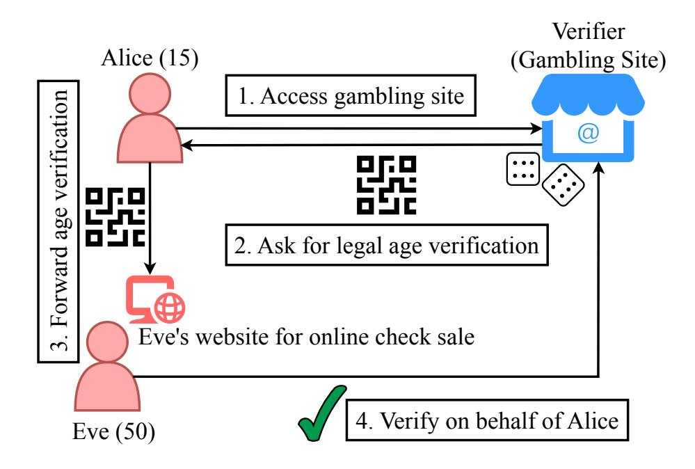
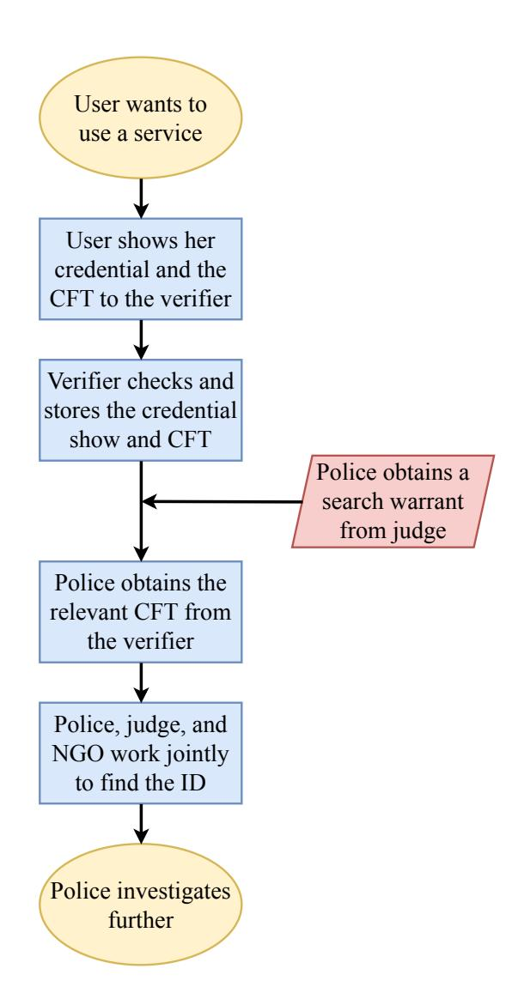
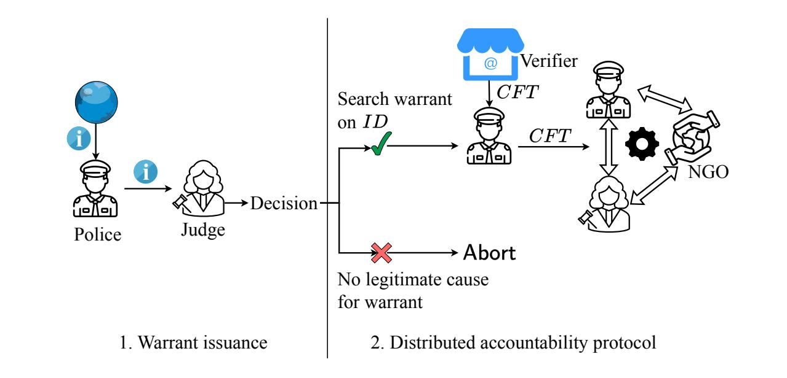
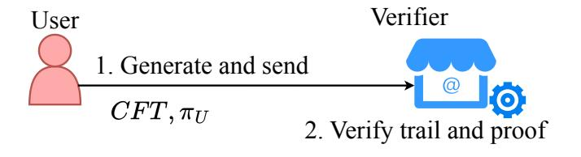
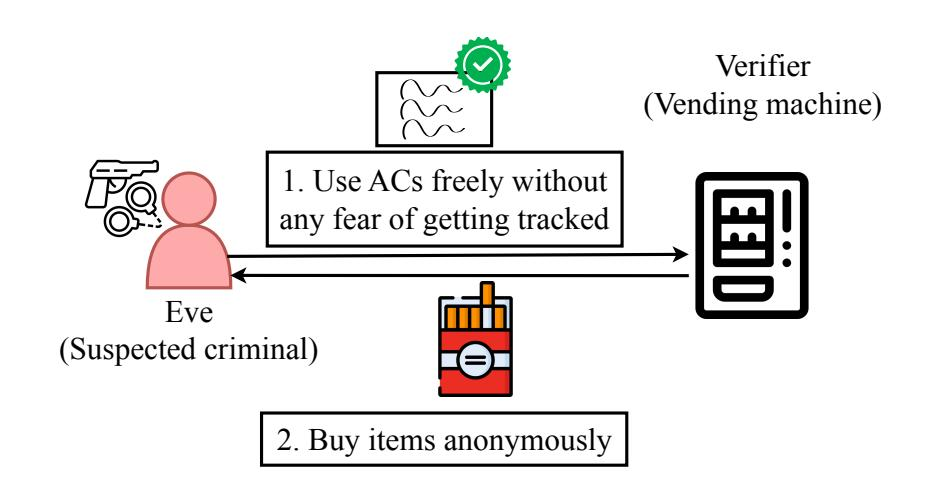

{0}------------------------------------------------

# Towards Accountability for Anonymous Credentials

Shailesh Mishra shailesh.mishra@epfl.ch EPFL Switzerland

Martin Burkhart martin.burkhart@armasuisse.ch armasuisse Switzerland

### Abstract

Anonymous Credentials (or ACs) enable users to prove claims with strong privacy guarantees, protecting credential holders from being tracked by issuers and verifiers. However, these privacy guarantees imply that a credential holder cannot be held accountable for misuse (e.g., selling credential checks online for proving > 18). The lack of accountability may raise questions about the adoption of ACs into national identity systems (e.g., European EUDI or Swiss e-ID), which might lead to the issuing authorities resorting to credential systems with weaker privacy guarantees (e.g., batch issuance of one-show credentials). This shows that the lack of accountability can adversely impact the levels of privacy enjoyed by users.

Hence, in this paper, we discuss transferability attacks on ACs and introduce a framework for providing accountability in AC systems. In addition to issuers, holders and verifiers, it assumes the existence of: (i) a law enforcement body (the police) and a judicial body (the judge) that work together to find information on credential misuse and; (ii) one or more digital privacy advocates, called the NGO(s), that ensure the system is not used for tracking people.

We introduce the cryptographic forensic trail (CFT), which is attached to each credential show. The CFT can be used for obtaining more information about an individual if and only if the police have probable cause and can convince the judge to issue a corresponding search warrant. Then, the police, the judge, and the NGO(s) run a multiparty protocol for decrypting relevant trails only. The protocol mimics checks and balances of a healthy democracy, in which neither law enforcement nor justice can track people as they will. Even if both branches colluded, the NGO(s) can detect the misuse and block further use.

In addition to possible extensions, we discuss performance constraints on mobile phones and argue that practical feasibility of the CFT is within reach.

### 1 Introduction

Anonymous credential or AC systems, proposed more than 40 years ago by Chaum [\[23\]](#page-14-0), provide maximal privacy for a user when proving claims about herself. AC systems consist of three main parties: (i) the user, who holds and uses credentials in the system; (ii) the issuer, who issues credentials to the user, and; (iii) the verifier, who verifies the credential shown by a user. A seminal AC design was provided by Camenisch and Lysyanskaya [\[18\]](#page-14-1), which provided many desirable privacy properties such as: (i) unlinkability, which ensures that even if an issuer and a verifier collude, they cannot link an issued credential and a shown credential; (ii) unforgeability, which ensures that it should be impossible for other users and the issuer to forge a credential for another user (even if they collude with each other); (iii) non-transferability, which aims to prevent a user from transferring her credential to another user; (iv) anonymity revocation, which revokes a user's anonymity if she misuses her credential. After the seminal work by Camenisch and Lysyanskaya, multiple improvements and variations of ACs have been proposed [\[15,](#page-14-2) [19,](#page-14-3) [20,](#page-14-4) [22,](#page-14-5) [46\]](#page-15-0), bringing the performance of AC systems closer to deployment. Furthermore, given the recent development of electronic identity in Europe, ACs are closer than ever to being deployed at scale.

Recently, ACs have become more relevant as Switzerland and the European Union are both rolling out privacypreserving digital-identity ecosystems. Swiss voters approved a Federal Act on Electronic Identification Services in September 2025 that creates a state-issued e-ID and public trust infrastructure [\[42\]](#page-14-6). The Swiss e-ID will be stored in a smartphone wallet and use verifiable credentials with selectivedisclosure tokens, allowing residents to share only necessary data, for example, proving they are over 18 without revealing their birthdate. Also, subsequent transactions using the same credential must not be linkable [\[12,](#page-14-7) [41\]](#page-14-8). The Swiss e-ID will support selective disclosure and single-use key pairs (batch issuance) [\[52\]](#page-15-1), providing unlinkability for verifiers. However, if issuers colluded with verifiers, transactions could still be linked. The public launch of the Swiss e-ID is currently planned for 2026.

Meanwhile, the EU's eIDAS 2.0 regulation requires every member state to offer a European Digital Identity (EUDI) wallet by 2026; the wallet links national identities to credentials such as driving licences and bank accounts, mandates user control over data sharing, and obliges service providers to accept it [\[24\]](#page-14-9). EU guidance emphasizes selective disclosure, pseudonym generation and techniques that prevent any party from tracking or correlating transactions [\[36\]](#page-14-10), while the European Data Protection Supervisor notes that AC technology could enhance privacy although it has not yet been widely adopted [\[49\]](#page-15-2).

Both initiatives therefore converge on the goal of secure, interoperable digital identities that let users prove specific claims without unnecessary disclosure, but fall short of providing maximal privacy yet [\[14,](#page-14-11) [45\]](#page-14-12).

The primary reason behind not deploying ACs today is the lack of suitable standards, such as BBS, available on mobile phone secure enclaves and practicality of alternative approaches, such as zero-knowledge proof systems (ZKP) [\[34\]](#page-14-13). While standardization and progress in ZKP research may weather away these obstacles in the near future, there is

{1}------------------------------------------------

another source of resistance: The recurring push by EU politicians towards chat control [\[6\]](#page-14-14) demonstrates the necessity of a minimum level of accountability for privacy-preserving protocols. If this minimum level of control is not implemented, chances are high that politicians will call for laws undermining users' privacy at a much more fundamental level, e.g. by bypassing end-to-end encryption in general. Hence, we argue that the ability to hold malicious users accountable must be designed into privacy-preserving systems from the beginning in order to gain the trust of citizens.

A major challenge in achieving accountability in anonymous credentials lies in their inherent unlinkability. A malicious user can show credentials on behalf of others without being caught, enabling illegitimate access to services. For example, a malicious user could sell age checks of > 18, which underage citizens could use to access gambling or erotic websites. The general availablity of such anonymous age checks at large scales would undermine the effectiveness of any law for the protection of minors. Transferability attacks remain a major threat to digital identity systems, and unless addressed, these attacks provide a motivation to the governmental authorities to deploy a less privacy-preserving solution.

Camenisch and Lysyanskaya proposed anonymity revocation [\[18\]](#page-14-1) for holding users accountable, but they required a central authority. The long line of further works have neglected this issue and have primarily focused on improving the performance of ACs, while ensuring maximal user privacy. Thus, we pose the following research question:

Can we provide digital identity users with the same levels of privacy as an anonymous credential system, while ensuring malicious users can be held accountable for executing a transferability attack?

This paper attempts to answer this question in the affirmative using cryptographic forensic trails (CFTs). Our design adopts a decentralized approach, unlike in [\[18\]](#page-14-1), and we strive towards the notion of conditional anonymity revocation: a user's anonymity can be revoked only if the user has misused their identity for transferability attacks. With conditional anonymity revocation, our goal is to emulate the legal process of "searching an individual" in the physical world. In particular, our design requires the law enforcement body (the police) to obtain a digital search warrant from the judicial body (the judge) before even initiating the anonymity revocation protocol. The judge is also involved in running the anonymity revocation protocol, ensuring that all the computation is decentralized. To emulate the physical world even more closely and to further decentralize our system, we include a nongovernmental organization (NGO), which ensures that the governmental bodies, the police and the judge, do not misuse the system for tracking benign users. In summary, using a decentralized anonymity revocation committee, consisting of the police, the judge, and the NGO, we ensure that the CFTs are used for revoking the anonymity of malicious users only.

A CFT is a nonce-based encryption of an identifying piece of data (e.g., a social security number) that a user needs to provide with each credential show [\(Section 5\)](#page-6-0). A verifier stores the shown CFT for a certain duration, such as six months or a year, and in case there is a transferability attack, the police obtains the relevant CFT from the verifier (after obtaining a search warrant from the judge). Thereafter, the police works together with the judge and the NGO for decrypting the CFT(s). In our baseline approach [\(Section 5\)](#page-6-0), the CFT is generated by sequentially encrypting the user ID with the public keys of the police, the judge, and the NGO. Thus, during decryption, one layer of encryption is removed by each of these three parties in the reverse order. Our baseline approach is simple, and it ensures that exactly one CFT is decrypted per warrant, guaranteeing benign users stay unaffected.

We extend our discussion in [Section 6](#page-9-0) to outline scenarios where the anonymity of multiple suspected users could be revoked, and these scenarios, unlike the baseline approach, require the police to decrypt multiple trails. If we use the baseline approach, then we would leak the user IDs of benign users. Therefore, we propose design variants in [Section 7](#page-10-0) which provide stronger privacy guarantees with conditional anonymity revocation. These variants are of course computationally more expensive than the baseline approach and carry their respective challenges for their deployment. We therefore highlight the tradeoffs, with respect to the baseline approach, for each of these variants, and also discuss future work needed to make these systems practically realizable.

Finally, we provide an estimate of the computation time for generating the CFT and the corresponding proof. While we do not provide a prototype implementation of our system, our estimations are based on state-of-the-art libraries and hence, we believe these estimations provide an upper bound for the performance of a prototype, which is the immediate next step in our future work.

The paper makes the following contributions:

- ∙ Thorough discussion of transferability attacks [\(Section 3\)](#page-3-0) that can pose a major threat to electronic ID systems.
- ∙ The notion of conditional anonymity revocation [\(Section 4\)](#page-4-0) for ensuring that only the anonymity of malicious users is revoked.
- ∙ The design of cryptographic forensic trails [\(Section 5\)](#page-6-0) for providing conditional anonymity revocation of users trying to execute a transferability attack.
- ∙ Design variants to provide stronger privacy guarantees for scenarios with multiple suspects. [\(Section 7\)](#page-10-0).

#### 2 Background and Motivation

In this section, we first provide a brief background on national electronic ID projects and anonymous credentials. Then, we describe the challenges of using anonymous credentials in national electronic ID systems.

# 2.1 Electronic ID Projects in EU and Switzerland

2.1.1 The European Union. The European Digital Identity (EUDI) framework is legally in force and in an advanced pilot phase, with six large-scale pilots completed or ongoing to test 

{2}------------------------------------------------

wallets and use cases across most Member States plus a few associated countries. Member States are legally required to make at least one certified EUDI wallet available to citizens and businesses by the end of 2026.

Cryptographers criticized the low ambitions of the EU Digital Identity Wallet (EUDIW) when it comes to privacy preservation [\[14\]](#page-14-11). Their specific recommendation is to use the BBS family of anonymous credentials, which allows for unlinkable signatures. However, current versions of secure enclaves in smartphones support only ECDSA signatures and standardization of new curves is hard [\[34\]](#page-14-13).

The use of zero-knowledge proofs (ZKPs) for presenting credentials is currently discussed in the EUDI ARF (Architecture and Reference Framework) [\[3\]](#page-13-0).

2.1.2 The Swiss e-ID. In January 2025, the Swiss government published a public beta of the future Swiss e-ID [\[8\]](#page-14-15). The Swiss e-ID will be based on self-sovereign identity (SSI) principles. With SSI, users own their digital identity and autonomously control what information is disclosed to which service providers. This contrasts with current internet single sign-on architectures, which threaten user privacy by deploying central identity providers.

For protecting user privacy, the Swiss e-ID uses batch issuance of one-time keys [\[52\]](#page-15-1). With this, subsequent presentations of the same e-ID credential cannot be correlated and are hence unlinkable for verifiers, protecting users from surveillance and tracking. However, if the issuer and verifiers collude, the privacy of users can be broken, because the issuer knows which keys belong to which batch from which user.

For achieving even stronger levels of privacy, researchers are suggesting the use of zero-knowledge proofs (e.g., [\[13,](#page-14-16) [28,](#page-14-17) [39,](#page-14-18) [44\]](#page-14-19)).

# <span id="page-2-0"></span>2.2 Motivation

While anonymous credentials (ACs) may provide strong privacy guarantees, including unlinkability even in the case of issuer-verifier collusion, AC-based systems have not been widely deployed. The lack of widespread adoption is due to: (i) the lack of current general purpose AC systems to provide performance at scale and; (ii) the lack of accountability in ACs that would let users misuse their credentials. Given the continual advancements in ACs [\[28\]](#page-14-17), ACs would most likely become efficient enough for practical purposes eventually. Even if the general purpose ACs become practical, the lack of accountability in ACs would still be an impediment: the authorities responsible for electronic identity (e-ID) deployment would raise questions about the privacy guarantees of ACs allowing malicious actors misuse their credentials without any fear of getting caught. For example, an AC user could sell her credentials for age verification to underage citizens, who wish to access gambling sites (see [Section 3](#page-3-0) for more details on how this works).

If we wish to hold wrongdoers accountable for credential misuse, we need a mechanism that would allow the revocation of anonymity of such users and only such users; we refer to this property as conditional anonymity revocation (inspired from anonymity revocation in idemix [\[18\]](#page-14-1)). As a privacy researcher, one has to be wary of when and how the authorities trigger the anonymity revocation protocol—which makes us think if conditional anonymity revocation is a viable choice.

Conversely, let us consider the other end of the spectrum where we ask the authorities to not include any mechanism for accountability in the identity system and thus, use a fully private AC system. In such a scenario, the authorities will most likely push back against deploying ACs altogether under the pretext of public safety. In fact, they might advocate for alternative solutions with weaker privacy guarantees, such as issuing a batch of tokens associated with a long-term identifier. This is not mere speculation: given the stance of the EU on getting rid of end-to-end (e2e) encryption [\[37\]](#page-14-20), it is reasonable to assume that the authorities would definitely push for a system that would facilitate tracking of people in e-ID. Moreover, a key reason end-to-end encryption has withstood efforts to phase it out is its long-standing and global adoption; in contrast, the e-ID is a nascent technology, which makes it easier for the authorities to push for the deployment of a trackable system.

To evade surveillance, some argue that e-ID systems should stay optional. To this end, we would like to highlight that Aadhaar, India's nationwide digital identity system, started as an optional identity system, and now, every Indian citizen needs to be enrolled into the Aadhaar system for accessing many services, such as banking and booking train tickets [\[33\]](#page-14-21).

Getting back to our previous question: is conditional anonymity revocation a viable choice? As we have argued above, not providing any mechanism for accountability would most likely lead to the authorities deploying a backdoor to users' identity—putting benign users under the threat of getting tracked by default. Therefore, a conditional anonymity revocation protocol might actually be a viable approach, given that the conditional anonymity revocation mechanism is handled as it is supposed to be: based on separation of powers and requiring probable cause. Therefore, our goal should be ensuring that the anonymity revocation mechanism is triggered only when necessary, so that a wrongdoer can be held accountable for her actions, while benign users can enjoy all the privacy guarantees that an AC system has to offer. This work aims to achieve the above-mentioned goal of building the first conditional anonymity revocation protocol.

#### 2.3 Non-goals

We do not aim to address the following issues:

- (1) The process for issuing a digital search warrant should be similar to the corresponding process in the physical world. We assume this process is given and do not discuss it.
- (2) We assume that the law enforcement body already has probable cause for searching an individual. Specifically, our system does not search for patterns of malicious activities, as it is the goal in chat control. See [Section 10.4](#page-13-1) for a more detailed discussion on this.

{3}------------------------------------------------

### <span id="page-3-0"></span>3 Transferability Attacks on Electronic IDs

<span id="page-3-2"></span>

Figure 1: Transferability attacks on electronic IDs: Alice (age 15) is not legally allowed to access a gambling site, but she is able to bypass the age check since Eve (age 50) proves legal age on Alice's behalf.

We consider the case where the electronic-ID (e-ID) system ensures maximal privacy. Specifically, we consider the following: (i) the e-ID system is based on anonymous credentials; (ii) the payment systems associated with e-ID use anonymous payments system [\[47\]](#page-15-3). Hence, there is no leakage while using the e-ID[1](#page-3-1) . If the e-ID system is designed this way, it opens up the possibility of malicious users misusing their credentials and getting away with it [\[11\]](#page-14-22). They could sell anonymous checks on the internet (e.g. for legal age, nationality, personhood [\[9\]](#page-14-23)) by having people forward the verifiers' requests to them. We refer to these instances of anonymous check sales as transferability attacks. As depicted in [Figure 1,](#page-3-2) an illegitimate user can forward the presented QR code to someone else and the other person can provide the credential proof on behalf of the illegitimate user. This could include checks for legal age, citenzenship, personhood, nationality, covid certificates, university degrees, etc. Hence, with AC-based identity system, individuals can sell online checks for a small price without being held accountable.

## 3.1 Countermeasure 1: Tracking down users

The Federal Office of Information Technology (FOITT) of Switzerland, which operates the Swiss e-ID, acknowledges the threat of transferability attacks [\[27\]](#page-14-24) (chapter 6.9). The impact of the threat is rated as HIGH, while the likelihood is considered to be LOW, resulting in an overall MEDIUM risk level. In fact, the practical feasibility of such attacks on the Swiss e-ID wallet has recently been demonstrated [\[10\]](#page-14-25). Using an automated emulation environment, an age-check service was

developed that automatically provides legal age proofs for all verification requests sent to a special telegram channel. One option the FOITT discusses for mitigation is to "track down the credential in question and revoke it", which implies that there will be no unlinkability of credential shows. In fact, with the current system using batch issuance [\[52\]](#page-15-1), FEDPOL, the federal police and issuer of the Swiss e-ID, would actually be able to track down the owner by collaborating with verifiers. Such a design choice is problematic, since it puts all users under the threat of getting tracked, even if there is no apparent cause for doing so. However, if FEDPOL would be progressing to a more privacy-preserving system, e.g., by adopting ZKPs, the ability to "track down" malicious actors would vanish.

# 3.2 Countermeasure 2: Verification of holder binding

A straightforward way of preventing such transferability or proxying attacks is to verify holder binding, i.e., making sure that the person presenting an e-ID is the person it was issued to. This is usually done by visually comparing a picture stored on the credential with the presenting person [\[31\]](#page-14-26). In other words, transferability attacks can be prevented by using inperson biometric authentication. Such an approach is suitable for the Swiss e-ID because of two reasons: (i) the Swiss e-ID includes the picture of the user; and (ii) the Swiss e-ID is device bound as the relevant keys are stored in the secure enclave of the smartphone. So whenever the owner presents the e-ID to a human verifier, e.g., when buying a beer in a bar, the verifier can match the picture against the face of the person and verify holder binding.

However, there will be many online use cases neglecting the verification of holder binding. Reasons for this are complexity, costs, usability and anonymity. While image- and video-based identification solutions could do the job in theory, they are costly and require biometric data to be processed, which raises data protection issues. These issues are the very reasons why proponents call for modern e-ID systems not requiring the upload of physical ID card pictures and selfie videos to random service providers. Also, users may not want to provide their pictures to all websites requiring legal age verification. Moreover, cameras might not be available on all devices (e.g., self-checkout systems in shops or restricted office clients). Hence, misuse of the e-ID will mainly be a concern with anonymous online use-cases where no human verifier is in the loop.

Note however, that the Swiss and EU digital identity infrastructure is envisioned to build the foundation for not just a single identity credential but an entire ecosystem around digital credentials [\[2,](#page-13-2) [4\]](#page-13-3). Issuers from different government offices and industry are invited to issue their own domain-specific credentials. Standards for health, financial, and education sectors are currently being developed. Some of these credentials may not require hardware device binding, which simplifies key extraction and credential misuse even more. Therefore, transferability attacks may apply to many different credential

<span id="page-3-1"></span><sup>1</sup>We do not consider side-channels such as timing, network-level metadata, etc.

{4}------------------------------------------------

types in the future. If not protected carefully, we will soon be facing the next generation of agentic AI bots being able to prove personhood, legal age, citizenship, health insurance coverage, and possession of university degrees.

### <span id="page-4-0"></span>4 Overview

This section describes the reasoning behind the design choices of the cryptographic forensic trail (CFT) [\(Sections 4.1](#page-4-1) and [4.2\)](#page-4-2), the high-level workflow of CFT usage in e-ID [\(Section 4.3\)](#page-4-3), the system model [\(Section 4.4\)](#page-4-4), the threat model [\(Section 4.5\)](#page-5-0), and the desired properties such a system should achieve [\(Sec](#page-5-1)[tion 4.6\)](#page-5-1). Broadly speaking, a cryptographic forensic trail is an encrypted string of bits attached to every credential show, and in case the credential holder is involved in any unlawful activities, such as selling online anonymous checks, this trail is used to revoke the anonymity of the holder. The motivation for introducing the forensic trail[2](#page-4-5) parallels that of anonymity revocation in idemix[\[18,](#page-14-1) [20\]](#page-14-4), serving a mechanism for enabling accountability in anonymous credentials.

# <span id="page-4-1"></span>4.1 The importance of decentralization

idemix assumes the existence of a centralized revocation authority for handling anonymity revocation, and also presents anonymity revocation as an optional feature in anonymous credentials. In contrast, we hold that there must be a decentralized unit, which we refer to as the revocation committee, and this committee must comprise multiple independent entities for running the revocation protocol. Moreover, anonymity revocation should not be treated as an opt-in feature during user registration; it should be universally applicable to all users, but only triggered in cases of legal non-compliance. That is, anonymity revocation should be conditional, instead of being optional, and we must ensure that the conditions are met before any revocation. As described in [Section 2.2,](#page-2-0) if we do not provide a conditional revocation mechanism for all the credential users, authorities could push for trackable solutions under the pretext of "anyone could be a criminal in the future", making benign users vulnerable to tracking. Therefore, in this section, we elaborate on how the conditional anonymity revocation should be designed so that only the law violators have their anonymity revoked, while the benign users enjoy full privacy.

# <span id="page-4-2"></span>4.2 Forming the decentralized accountability committee

The above-mentioned required properties for anonymity revocation, namely decentralization and conditional revocation, lead to the following question: which parties should be involved in anonymity revocation? In this regard, an e-ID system does not or rather should not invent a new process involving new parties for anonymity revocation; instead the e-ID system should try to emulate the law enforcement structure that has existed for centuries in healthy democracies. Specifically, in any democratic country, every citizen has the

right to her privacy, and she owns this right until she violates some law of the country. Even when the law enforcement body (the police) finds an indication for law violation, the police cannot simply override the right to privacy of the citizen. The police needs to prove the judicial authority (the judge) that the citizen has violated some law, and only if the judge issues a search warrant, the police can override the right to privacy of the citizen, and search in her private space. This structure has been established and has functioned in democracies for centuries [\[53,](#page-15-4) [54\]](#page-15-5). Hence, we hold that e-ID systems must emulate this process for accountability: the police should be able to search the credential shows of an individual only if the judge issues a (digital) search warrant against that individual.

A concern with only the police and the judge forming the anonymity revocation committee in the digital world is the possibility of covert tracking: if the police and the judge collude, then they can track all the credential users, and it is much easier to do so in the digital world than tracking people physically. Hence, the anonymity revocation committee must consist of one or more organizations which are independent of government bodies, such as NGOs or international bodies, which can act as deterrents to governments going rogue (we will use the term "NGOs" to refer to these independent parties involved in anonymity revocation). In summary, the anonymity revocation committee should have three entities: the police, the judge, and one or more NGO(s), so that we can harness and emulate the features of democratic societies, while ensuring that there are checks for preventing governmental bodies from tracking everyone.

# <span id="page-4-3"></span>4.3 Workflow

[Figure 2](#page-5-2) depicts the high-level workflow of the use of CFT for ensuring accountability in the e-ID system. The process starts with the user showing her credential to the verifier for accessing a service, during which the user creates the CFT. The verifier verifies the correctness of the credential show as well as the CFT, and thereafter, stores the CFT. This CFT log is used for holding people accountable in case of transferability attacks. That is, upon finding an instance of transferability attack and obtaining a search warrant, the police acquires the relevant CFT(s) from the verifier. Then, the police, the judge, and the NGO run a protocol together to revoke the anonymity of the user corresponding to the acquired CFT.

#### <span id="page-4-4"></span>4.4 System Model

Our system consists of two main units: (i) the identity management unit, which is responsible for credential issuance and usage, and (ii) the conditional anonymity revocation committee, which is responsible for ensuring that the credentials are used legitimately. The identity management unit consists of the three entities: (i) the issuer who issues credentials; (ii) the user who obtains a credential from the issuer, and; (iii) the verifier who verifies the credential of the user before providing some service. The credential contains attributes of

<span id="page-4-5"></span><sup>2</sup>We use "forensic trail", "trail", and "cryptographic forensic trail" interchangeably.

{5}------------------------------------------------

<span id="page-5-2"></span>

Figure 2: Cryptographic forensic trail (CFT) workflow: user generates the CFT while showing her credential to the verifier, who logs all the CFTs; after obtaining a digital search warrant, the police looks for the relevant CFT record, whose anonymity needs to be revoked; finally, the police, the judge, and the NGO run a protocol together to revoke the anonymity of the relevant CFT.

the user, and one of the attributes is a technical identifier, which could be the national identity number (e.g., Social Security Number). Furthermore, the user also owns a public key-secret key pair, which is required for generating signatures of knowledge. A service in an e-ID system is provided by a verifier, and the user needs to prove that she is eligible to access the service using her secret key and the attributes requested by the verifier. A verifier needs to store the credential shows of users for a certain duration (e.g., six months or a year), which is in line with many data retention policies requiring phone and internet service providers to store call and connection metadata for some duration[\[1,](#page-13-4) [40\]](#page-14-27).

The conditional anonymity revocation committee consists of three entities: the police, the judge, and the NGO. The police, the judge, and the NGO hold their respective public key-secret key pair. These three entities use their respective key pairs, and work together in order to revoke the anonymity of any law offender.

# <span id="page-5-0"></span>4.5 Threat model

Our system aims to defend against a user who attempts to abuse the privacy guarantees of the e-ID by selling her anonymous credential shows. We assume that the issuer issues credentials correctly, i.e., the issuer signs the right set of claims and does not issue duplicate credentials to users.[3](#page-5-3)

For our main design, we also assume that a verifier checks the proof provided by a user correctly and maintains the log of credential shows correctly. Although the issuers and the verifiers perform their tasks correctly, verifiers can collude among themselves as well as with issuers in an attempt to revoke the anonymity. Additionally, there might be malicious verifiers, who would collude with users and not check the correctness of credential shows or not store correct information about credential shows. In order to ensure that verifiers comply with their duties, anonymous test verifications could be performed. Certification of verifiers and a trust registry could help to guide users towards responsible verifiers and build incentives for verifiers to comply.

We assume that 1-out-of-3 parties among the law enforcement body (the police), the judicial body (the judge), and the non-governmental body (the NGO) is honest, and the protocol is aborted in case an honest party detects an attempt to track. This assumption is based on separation of powers in a healthy democracy: (i) the law enforcement body and the judicial body work independently and; (ii) the NGO does not collude with or cannot be coerced by governmental bodies. This implies that ideally our system should revoke the anonymity of the CFTs that correspond to transferability attacks only. However, with the 1-out-of-3 assumption, our system allows collusion between any two parties. For example, in an authoritarian country, the judge and the police might work together, or a corrupted NGO might collude with the police or the judge. The issue of collusion can be dealt with more decentralization (e.g., involving more NGOs in the anonymity revocation protocol); although involving more parties would lead to more computation / communication costs. Such adaptations can be easily made to our main protocol, and hence, we describe our main solution based on the 1-out-of-3 assumption in [Section 5.](#page-6-0)

#### <span id="page-5-1"></span>4.6 Desired Properties

Here, we discuss all the properties desired from a system that uses CFTs for providing accountability in anonymous credentials (ACs).

Privacy properties: A system using CFTs must ensure all the privacy guarantees provided by any AC system, such as idemix.

DP.P1. Single-verifier unlinkability: A verifier should be unable to find out whether two credential shows correspond to the same (anonymous) user or not.

<span id="page-5-3"></span><sup>3</sup>We note that Sybil attacks are a major threat to any e-ID system since the user can use multiple identities for selling credential shows, making it even more difficult for ensuring accountability. Such attacks can be prevented using stronger deduplication techniques, such as by using biometrics, but this line of work remains out of scope of this work.

{6}------------------------------------------------

DP.P2. Verifier-verifier unlinkability: Even if multiple verifiers collude, they should not be able to find out whether two credential shows correspond to the same (anonymous) user or not.

DP.P3. Issuer-verifier unlinkability: Even if the issuer of the presented credential and a verifier collude, they should be unable to find out whether two credential shows correspond to the same (anonymous) user or not.

DP.P4. Selective disclosure The anonymity revocation process must not leak credential claims that were willingly undisclosed during the credential show other than the identity of the user. As an example, while the social security number may be learned through anonymity revocation, the process should not leak attributes, such as gender, the date of birth or home address, that may have been part of the credential usage.

Functionality properties: CFT usage must emulate the real-world warrant issuance and anonymity revocation of an individual. Hence, using CFTs with ACs must satisfy the following requirements.

DP.F1. Conditional anonymity revocation: Law abiding users must enjoy all the privacy guarantees provided by AC systems, whereas users misusing the AC system can have their anonymity revoked.

DP.F2. Selective revocation: The anonymity revocation committee should be able to run the revocation protocol only for a certain (or a certain set of) credential shows. That is, even if an individual is suspected, the revocation authority should be unable to run the revocation protocol on credential show(s) for which no search warrant has been issued. Also, revocation of credential shows must not allow the identification of non-revoked credential shows of the same user. That is, unlinkability of non-revoked credential shows must be maintained.

DP.F3. Constrained revocation operation: In a healthy democracy with separation of powers, police need to obtain a search warrant based on probable cause in order to enter one's private space for investigation. Similarly, in the digital realm using ACs, the police must obtain a digital search warrant in order to revoke one's anonymity. The technique used for providing accountability must not invent new requirements or steps for anonymity revocation, but rather use the protocols that have been well-established in democratic societies for decades.

#### Integrity requirements:

DP.I1 Transaction binding: The revoked identity must match the identity that was involved in the actual credential show as a response to an identity request. That is, revocation must be bound to a specific identity request by a specific verifier in order to prevent false identity injection to different contexts.

DP.I2 Replay protection: It must not be possible to reuse old credential shows of a user to interfere with anonymity revocation of a current credential show.

#### Deployment requirements:

DP.D1 Non-autocracy: No single entity should be able to revoke the anonymity of users. If we use the approach in idemix [\[20\]](#page-14-4), and employ a single entity for deanonymizing organization, then we introduce a single point of failure to the system. Hence, we stress that multiple parties must be involved in running the anonymity revocation protocol.

DP.D2 Eventual transparency: Since people have raised concerns over the governments being able to track people with an electronic ID system, we believe that ensuring transparency would help with gaining people's trust. In particular, an electronic ID system must (correctly) inform a user about the usage of her data: if the credential shows of the user was processed on while a suspected individual was being searched for. The transparency is eventual and not immediate because ongoing investigations should be hidden from suspects due to the risk of spoliation of evidence.

DP.D3 Oppression resilience: An AC system that provides accountability must have the ability to self-destruct its ability to hold people accountable. Such a property is required to ensure that there is a deterrent to oppression, e.g., a government turning into an autocracy or a repressive regime taking over and controlling multiple (or all) entities. Ideally, the self-destructive protocol should be designed in a way that it can be invoked by any honest party involved in running the e-ID system.

# <span id="page-6-0"></span>5 Cryptographic Forensic Trail

In this section, we detail the core design of the cryptographic forensic trail (CFT). Our solution is simple yet effective, and it aims to achieve all the desired properties highlighted above [\(Section 4.6\)](#page-5-1). [Figure 3](#page-7-0) presents a high-level overview of our solution. We first describe how the CFT is created during credential show[\(Section 5.1\)](#page-6-1), and then, we discuss how the anonymity of a user is revoked using the CFT [\(Section 5.2\)](#page-7-1).

[Table 1](#page-7-2) summarizes the notation used for the different components involved in our system.

# <span id="page-6-1"></span>5.1 Credential show and cryptographic forensic trail generation

[Algorithm 1](#page-7-3) depicts the steps involved in generating the credential show and the cryptographic forensic trail (CFT). Our design uses the technical ID of the user ( ) for anonymity revocation. Hence, the user generates the following the CFT using the technical ID and other public parameters [\(Equa](#page-7-4)[tion \(1\)\)](#page-7-4). Then, the user generates the proof for proving the ownership of the valid credential and the correctness of the CFT [\(Equation \(2\)\)](#page-7-5). Since the CFT is a nonce-based encryption and the proof is a succinct zero-knowledge proof of knowledge, two credential shows of the same user cannot be linked (with high probability), even if two verifiers or a verifier and an issuer collude. The user sends the CFT and the proof to the verifier, who must perform following tasks:

(1) Verify the zero-knowledge proof . If the proof fails, it must abort the transaction.

{7}------------------------------------------------



<span id="page-7-0"></span>

(a) CFT Generation

(b) CFT for accountability

Figure 3: Cryptographic forensic trail (CFT): (a) CFT generation: 1 - user generates and sends the CFT and the proof to the verifier (generation is done on user's device, which has not been shown for diagram's clarity); 2 - verifier verifies the correctness of the CFT and the proof, and on successful verification, the verifier stores the CFT and the proof; (b) Anonymity revocation using CFT: 1 - the police finds a cause for searching an individual and then, the police needs to convince the judge that there is a legitimate cause for searching that individual; 2 - if the judge decides that a search warrant should be issued, then the police, the judge, and the NGO run a joint protocol for revoking the anonymity of the cryptographic forensic trail.

Table 1: Notations

<span id="page-7-2"></span>

| Notation       | Description                                    |
|----------------|------------------------------------------------|
| 𝐼              | Issuer                                         |
| 𝑈              | User                                           |
| 𝑉              | Verifier                                       |
| 𝑃              | Police                                         |
| 𝐽              | Judge                                          |
| 𝑁              | Non-governmental organization (NGO)            |
| 𝐼𝐷𝑈            | Technical ID of the user (e.g., SSN)           |
| 𝐼𝐷𝑉            | ID of the verifier                             |
| 𝑐𝑟𝑒𝑑𝑈          | Credential issued by the issuer to the user    |
| 𝑎𝑡𝑡𝑟𝑠 ⃗        | Attributes of the user                         |
| 𝑎𝑡𝑡𝑟𝑠 ⃗ 𝑉      | Attributes that the user needs to show to      |
|                | the verifier                                   |
| (𝑝𝑘𝑖<br>, 𝑠𝑘𝑖) | Public key - secret key pair of party 𝑖, where |
|                | 𝑖 ∈ {𝑈, 𝑉, 𝑃, 𝐽, 𝑁}                            |
| 𝐶𝐹 𝑇           | Cryptographic forensic trail                   |
| 𝑆𝑊             | Search warrant                                 |
| 𝐼𝐷𝑆𝑊           | ID of the search warrant                       |
| reason         | Reason for search warrant                      |
| aux            | Auxiliary information related to the search    |
|                | warrant                                        |

(2) Store the CFT along with the ID of the presentation request and a timestamp.

#### <span id="page-7-1"></span>5.2 Forensic trail for anonymity revocation

We are interested in the case where abuses an e-ID system by selling anonymous checks online, which we refer to as transferability attacks [\(Section 3\)](#page-3-0). Our system's goal is

# <span id="page-7-3"></span>Algorithm 1 Generation of CFT and Zero-Knowledge Proof

Parties: User , Verifier

Inputs: users's secret key , user's technical ID , verifier's identifier , set of attributes to be shownattrs ⃗ , timestamp ts, request ID RID, public keys { , , }, predicate (·)

1: generates cryptographic forensic trail, :

$$CFT = \mathsf{Enc}_{pk_N}(\mathsf{Enc}_{pk_J}(\mathsf{Enc}_{pk_P}(ID_U||ID_V||\mathsf{ts}||\mathsf{RID}||\mathsf{nonce}))) \tag{1}$$

2: generates the zero-knowledge proof, :

$$\pi_{U} = \mathsf{SNARK} \Big[ \left( sk_{U}, at\vec{t}rs, ID_{U}, \mathsf{nonce}, \mathsf{ts}, \mathsf{RID}, pk_{P}, pk_{J}, pk_{N} \right) \\ \mathsf{VerifyCred} \big( pk_{U}, sk_{U}, at\vec{t}rs \big) = 1 \\ \land \ \mathsf{f}_{V} \big( at\vec{t}rs_{V} \big) = 1 \\ \land \ \mathsf{f}_{\mathsf{Enc}} \big( pk_{P,J}, CFT, ID_{U}, \mathsf{nonce} \big) = 1 \Big]$$

$$(2)$$

- 3: sends and to .
- 4: verifies the correctness of :

$$V_{\pi_U} = \mathsf{VerifySNARK}(vk_{\mathsf{SNARK}}, \pi_U, pk_P, pk_J, pk_N,$$

$$CFT, at\vec{t}rs_V, \mathsf{ts}, \mathsf{RID})$$
 (3)

<span id="page-7-5"></span><span id="page-7-4"></span>:

- 5: if = 1 then
- 6: stores and
- 7: else
- 8: Abort

to revoke the anonymity of , who is involved in misuse of her e-ID, while leaking minimal information during the

{8}------------------------------------------------

#### <span id="page-8-1"></span>Algorithm 2 CFT for anonymity revocation

**Parties**: Police P, Judge J, NGO N, Verifier V

**Inputs**: reason for warrant issuance **reason**, auxiliary information **aux**, identifier for the search warrant  $ID_{SW}$ , cryptographic forensic trail CFT, public key-secret key pairs  $(pk_i, sk_i)$  for  $i \in \{P, J, N\}$ , Abort protocol for aborting the anonymity revocation.

```
1: P finds the probable cause reason, and presents reason to J. J verifies the "legitimacy" of the reason.
 2: if reason is legitimate then
         J issues a warrant in the form of a signature:
 3:
                                                           \sigma_{SW} = \mathsf{Sign}_{sk_J}(ID_{SW}||\mathtt{reason}||\mathtt{aux})
                                                                                                                                                        (4)
         P acts as a "user" and buys a check (with identifier RID) from the anonymous check sale service. P provides the \sigma_{SW}
 4:
         and RID to V, who verifies the signature:
                                                   V_{\sigma_{SW}} = \mathsf{VerifySign}_{pk_J}(\sigma_{SW}, ID_{SW} || \mathtt{reason} || \mathtt{aux})
                                                                                                                                                        (5)
        if V_{\sigma_{SW}} = 1 then
 5:
             V provides the CFT corresponding to RID along with a signature:
 6:
                                                              \sigma_{SW,V} = \mathsf{Sign}_{sk_{V}}(ID_{SW}||\mathsf{H}(CFT))
                                                                                                                                                        (6)
             P approaches N with CFT, \sigma_{SW}, and \sigma_{SW,V}.
 7:
             N verifies the reason for warrant issuance, and also checks the correctness of \sigma_{SW} just like Equation (5) to obtain
 8:
             V_{\sigma_{SW}}. Finally, V verifies \sigma_{SW,V}:
                                                     V_{\sigma_{SW,V}} = \mathsf{VerifySign}_{pk_V}(\sigma_{SW,V}, ID_{SW}||\mathsf{H}(CFT))
                                                                                                                                                        (7)
            if reason is "correct" and V_{\sigma_{SW}}=1 and V_{\sigma_{SW,V}}=1 then
 9:
                 N decrypts CFT and gives the decryption (CFT') as well as a signature on the decryption (\sigma_{SW,N}) to P:
10:
                                               CFT' = \mathsf{Dec}_{sk_N}(CFT), \quad \sigma_{SW,N} = \mathsf{Sign}_{sk_N}(ID_{SW}||\mathsf{H}(CFT'))
                                                                                                                                                        (8)
                 P approaches J with CFT', \sigma_{SW}, and \sigma_{SW,N}.
11:
                 J verifies the correctness of \sigma_{SW} (to ensure that there is no tampering) just like Equation (5) to obtain and also
12:
                 the correctness of \sigma_{SW,N}:
                                                       V_{\sigma_{SW,N}} = \mathsf{VerifySign}_{pk_N}(\sigma_{SW,N}, ID_{SW} || \mathsf{H}(CFT'))
                                                                                                                                                        (9)
                 if V_{\sigma_{SW}}=1 and V_{\sigma_{SW,N}}=1 then
13:
                     N decrypts CFT' and gives the decryption (CFT'') to P:
14:
                                                                         CFT'' = \mathsf{Dec}_{sk_J}(CFT')
                                                                                                                                                       (10)
                     P decrypts CFT'':
15:
                                                                        CFT''' = \mathsf{Dec}_{sk_B}(CFT'')
                                                                                                                                                       (11)
                     P finds ID_U from CFT'''.
16:
                 else
17:
                     J invokes Abort
18:
19:
             else
                 N invokes Abort
20:
         else
21:
            V invokes Abort
22:
23: else
```

deanonymization. Figure 3b depicts the anonymity revocation protocol on a high-level and Algorithm 2 details the steps involved in anonymity revocation.

J invokes Abort

24:

The whole procedure starts with the police finding a potential cause for searching an individual and thereafter, the police presents this cause to the judge (the judicial body). If the judge finds the cause legitimate, then they issue a warrant for searching the individual (in our case, it is the individual who hosts the anonymous online checks). After obtaining the warrant, the police obtains a relevant trail with

<span id="page-8-3"></span><span id="page-8-2"></span><span id="page-8-0"></span>the help of a verifier: first the police acts as a "buyer" to buy an anonymous check from the online service setup by the individual being searched, and then, the police obtains the relevant CFT from the verifier using the request identifier of the credential show. Next, the police needs to revoke the anonymity of the CFT to obtain the identifier of the individual being searched. The identifier is concatenated with some additional information, and the concatenated information is encrypted sequentially with the public keys of the police, the judge, and the NGO to form the CFT Equation (1). Thus, 

{9}------------------------------------------------

the police approaches the NGO and subsequently the judge, each of whom removes one layer of encryption. Finally, the police decrypts the trail obtained from the judge to obtain the identifier of the individual being searched. The police can use this identifier for further investigation. If the identifier is a technical ID only known to the issuer, the police approaches the issuer with the search warrant, and obtains the relevant details about the user's identity.

While our described solution in [Algorithm 2](#page-8-1) allows the police to get hold of users misusing an e-ID system, it adds multiple checkpoints to ensure that the police do not search for users not supposed to be searched. The initial check by the judge ensures that the search can be initiated only for legitimate reasons. [Equation \(5\)](#page-8-0) ensures that the parties run the protocol only if a valid search warrant is issued, [Equation \(7\)](#page-8-2) and [Equation \(9\)](#page-8-3) ensure that the police cannot fool the NGO and the judge to decrypt the trails which are impertinent to the search.

# 5.3 Why should police buy anonymous checks?

When investigating an anonymous online service operated by an unknown user, the police do not know the verifiers, the RIDs, and the timestamps ts. By buying a single credential check from the suspected user, the police can choose a verifier and ts. Also, they learn the RID and the relevant trail from the verifier, which is assumed to collaborate with the police. This ensures that the police only deanonymizes the relevant trail(s), preventing the leakage of technical IDs of benign users.

# 5.4 Shortcomings of the baseline design

In the approach described above, after the finding the cause for searching an individual hosting a malicious service, the police use the service under investigation and approach the precise verifier with the precise request ID for obtaining the single trail they need. This approach is convenient since it requires decryption of the relevant trail only, ensuring benign users are unaffected.

However, if the police solely know about potential cause but are unable to obtain the precise trail, then revoking the anonymity of the suspected individual solely becomes problematic. For instance, consider an anonymous check sale service which requests some identifying information to the buyers before selling the anonymous check and in turn, the police is unable to buy an anonymous check. This leaves the police with no choice but to scan through multiple trails to find the technical ID of the suspected user. The police would collect all the trails from one (or more) verifier(s) for a certain time window and then, revoke the anonymity of all the trails to find the technical ID that appears abnormally high number of times, The police would learn the technical IDs of all users that were using the service(s) within that time window and consequently, the police can even learn the usage patterns of users. In summary, if the adversarial behavior is different from the one discussed in [Section 3](#page-3-0) due

to which the police is unable to buy anonymous checks, then the baseline approach leaks information about benign users.

Next, we discuss relevant adversarial behavior, other than transferability attacks, where anonymity revocation might be desirable or even necessary [Section 6,](#page-9-0) and then, discuss variants of the baseline protocol to ensure accountability along with privacy of benign users [Section 7.](#page-10-0)

# <span id="page-9-0"></span>6 Other Use Cases

<span id="page-9-1"></span>

Figure 4: Without accountability, Eve, a suspected criminal, can use her electronic ID to buy items anonymously and not leave any trail.

In this section, we discuss two additional scenarios where anonymity revocation can be relevant. These scenarios are not direct attacks on an e-ID system—instead they represent scenarios where e-ID records could, or perhaps would, be investigated in the future. Specifically, e-ID records are digital traces that can contain details about criminals, as depicted in [Figure 4.](#page-9-1) This, of course, is not the purpose of an e-ID system and one might argue that there is no need for looking into why electronic IDs should be associated with catching criminals. In the past, however, the law enforcement bodies have scanned through messages/phone records/emails of a large population to track down only a few criminals [\[26,](#page-14-28) [32,](#page-14-29) [48,](#page-15-6) [50\]](#page-15-7). This means, in case of emergency, police will be tempted to use the information associated with credential shows for obtaining more information about criminals.

We stress that we are not motivating the need for tracking suspicious individuals using an e-ID system. Instead, we outline scenarios, different from the transferability attack, where anonymity in an e-ID system could be revoked, and motivate why stronger privacy guarantees are needed while providing accountability. The need for stronger privacy guarantees stems from the difference in the trails that need to be decrypted: in the transferability attack scenario, the police could obtain the exact trail to be decrypted and hence, only the single relevant trail was decrypted; in contrast, the police does not know which trails should be decrypted in the two scenarios that we discuss next.

### 6.1 Finding the known criminal

In the first scenario, the police suspect Eve to be the criminal, and they try to find her in the credential show records. In

{10}------------------------------------------------

other words, the police know the technical ID of Eve, and they search for trails that contain Eve's ID. The police have some idea of Eve's activities, and hence, they know the potential verifiers as well as the relevant time window. If we use our baseline approach of [Section 5,](#page-6-0) then it would require decryption of multiple trails: the anonymity revocation committee would obtain trails from a specific time window, decrypt them, and then, search for Eve's ID in plaintext. This means the anonymity revocation committee would see the technical IDs of benign users in plaintext, defeating the purpose of conditional anonymity revocation.

# 6.2 Searching for a criminal

In the second scenario, the police know that there is a criminal but do not know that it is Eve. However, they have some idea of the criminal's activities, and hence, they know the potential verifiers as well as the relevant time window. They need to look for the technical ID that matches best the criminal's activities across multiple verifiers. If we use the baseline approach [\(Section 5\)](#page-6-0), then we would leak the technical IDs of benign users across multiple verifiers and the technical IDs of benign users would be revealed in plaintext.

Hence, we need an alternate approach such that benign users remains stay unaffected in the above-mentioned two scenarios, even if multiple trails have to processed. We discuss alternate approaches and further enhancements in the next section.

#### <span id="page-10-0"></span>7 Design Variants

In this section, we modify the baseline design provided in [Sec](#page-6-0)[tion 5](#page-6-0) for addressing the privacy issues. For each design, we discuss the associated tradeoff with respect to the baseline approach, and present techniques or highlight future work addressing those tradeoffs. The variants are concerned with the distributed accountability protocol only: Step 2 of [Figure 3,](#page-7-0) except the last approach which is fundamentally a different approach.

### 7.1 MPC-based design

The first approach for minimizing the leakage during anonymity revocation is by using secure multi-party computation (MPC). This approach can be used for addressing the issues highlighted in both the scenarios of [Section 6.](#page-9-0) Instead of partially decrypting the trails one-by-one like the baseline design, the police, the judge, and the NGO run an MPC protocol for revoking the anonymity of the trails that correspond to the malicious user only. Therefore, while using MPC, the distributed accountability protocol would consist of the following steps:

- (1) First, the police obtain the digital search warrant. Since the police cannot obtain the relevant request ID, the search warrant is issued for obtaining trails from multiple potentially relevant verifiers for a certain time window.
- (2) After obtaining the trails, the police proceeds to run the MPC protocol with the judge and the NGO, which is discussed in the next three steps.

- (3) Decryption phase: run distributed private decryption protocol for decrypting the forensic trails. After the decryption, each party holds the secret shares of the trails and neither the police nor the judge, nor the NGO learns any technical ID after this step.
- (4) Comparison phase: the comparison phase depends on whether the police posses the suspected individual's identifier. If the police possess the technical ID, then the parties next run a distributed private matching protocol for finding out the technical ID that matches with the technical ID of the suspected individual. On the other hand, if the police do not possess the suspected individual's technical ID, then they can either: (i) all-to-all matching of the technical IDs across multiple verifier; or (ii) use a approach similar to private join-and-compute [\[35\]](#page-14-30) across verifiers. Since the comparison is performed under secret sharing, none of the parties learns the number of times a technical ID was used.
- (5) Reveal phase: all the three parties learn the relevant technical ID(s) obtained from the comparison phase.
- (6) Finally, the police obtains more information from the issuer, , about the technical ID(s) outputted by the MPC protocol.

Tradeoff w.r.t. baseline. The MPC-based approach reveals solely the technical ID of the user being searched. No information about benign users is leaked during the protocol run and hence, the MPC-based approach is an upgrade over the baseline approach, at least in terms of privacy. However, there are potential deployment issues with this approach since all the three parties need to be involved running an MPC protocol. Specifically, all the parties, including the NGO, need to provide the same set of resources for running the protocol at any point in time, and it may be unreasonable for NGOs to provide the same compute resources as well as the operational manpower for running an MPC protocol.

Addressing the tradeoff. A way to reduce the burden on the NGO is by providing a ready-to-run API for the MPC protocol and splitting the protocol runs into two paths: (i) optimistic path: the NGO simply allows the police and the judge run the API, on its behalf, while the secrets remains under control of the NGO. However, this optimistic path works when the police and the judge function in the way they are supposed. In case they go rogue, the NGO can switch to the pessimistic path; (ii) pessimistic path: the NGO runs the protocol using the API on its own resources. The NGO can switch to this path when it feels that the government has gone rogue. The pessimistic path is very costly as it would require manual verification of the search warrants.

Another way of dealing with this tradeoff is by using asymmetric MPC protocols. In particular, it would be ideal if parties with different resources could run an MPC protocol. Goyal et al. [\[29\]](#page-14-31) provide a means for dealing with varying communication constraints among parties. However, protocols that deal with varying compute resources or storage resources do not exist. We believe that advancements in building MPC protocols that handle different constraints

{11}------------------------------------------------

are needed for paving towards a fully privacy-preserving accountability protocol in ACs that meets all the discussed requirements.

#### 7.2 Rate-limiting anonymous credentials

This approach does not involve running any accountability protocol or require a distributed anonymity revocation authority. Instead, it uses rate-limiting anonymous credentials [\[17\]](#page-14-32). With this approach, a user can use a credential only a certain number of times within a timeframe. This would reduce the number of credentials that can be sold and even demotivate malicious users to sell their credentials. Note that basic rate limiting would also be possible using the batch issuance approach [\[52\]](#page-15-1). However, if users deviated from the single-use per key policy and used each key multiple times, they could surpass the rate limit. Yet, this would make the transactions with reused keys trackable.

Tradeoff w.r.t. baseline. This approach does not require an anonymity revocation authority since the number of credential shows held by a user is bounded. However, this design does not prevent selling of anonymous checks entirely since a malicious user could sell some of her credential shows (e.g., if a service is of no interest to her). It does not hold people accountable for the misuse of their credentials. Furthermore, it is hard to set the "right" limit on the credential usage since users will have different usage patterns.

Addressing the tradeoff. There is no exactly right modification for the rate-limiting anonymous credentials approach: some benign users might want to use a service more often. The rate-limiting thus needs to be adapted to the services and the users, which is a challenging task.

#### 8 Practicality and Evaluation

The main goal of this paper is to argue about the need of accountability in anonymous credentials. Moreover, we have designed the CFT as a potential solution for accountability gaps. While an implementation of CFT is beyond the scope of this work, we briefly discuss its potential practicality based on available data.

Digital identity systems, such as the EUDI and the Swiss e-ID, have strict performance requirements. Central components run on mobile devices with restricted computation and communication resources. Moreover, use cases involve direct user interaction. Hence, delays introduced in basic transactions, such as showing a digital identity to a verifier, are directly added to the user's waiting time for transactions to finish. Therefore, timing overheads threaten to deteriorate the perceived overall agility of the system. If adding CFT to a credential presentation raises the duration of the action from 500ms to 5s, it will not be accepted by users. Yet, a total transaction duration of about 1-2s for a presentation is often considered acceptable.

Arguably, the most expensive part in terms of mobile computation resources is the SNARK proving the correct generation of the CFT to the verifier (see [Section 5.1\)](#page-6-1). The

user will typically provide the proof part of this SNARK on a mobile phone.

This raises the question of how practical zero-knowledge proofs are for these kind of use cases. In [\[39\]](#page-14-18), many generalpurpose zero-knowledge proof systems were evaluated. Also, the author implemented several use cases inspired by digital identities and conducted a thorough performance analysis. The proofs written in Circom [\[16\]](#page-14-33) were compiled to R1CS constraints which were in turn proven by a proof back-end. Proving time depends on many aspects of the proving framework, such as whether the setup is universal and what the underlying assumptions are. As an example, proving time for 2 <sup>16</sup> = 65′ 536 constraints was only 0.48 on Spartan, while it took 52.2 on snarkjs (Plonk). While being fast, Spartan also supports transparent and universal proofs. This is why Spartan was chosen to evaluate the digital identity use cases.

Proving in zero-knowledge the possession of a valid, nonrevoked e-ID credential and legal age of the owner took 2.5s of proving and 0.2s of verifying time [\[39\]](#page-14-18). The main bottleneck in the evaluation was the verification of ECDSA signatures. While this is already close to acceptable timing, optimized custom approaches allow for further reduction of proving times. For instance, longfellow-zk by Frigo et al. [\[28\]](#page-14-17) presented a strategy to perform extremely efficient ECDSA signature verifications. They manage to parse and verify a complete mDoc credential in less than a second.

# 8.1 Proving Correct Encryption

Much work has been done on verifying signatures in zeroknowledge. However, in the CFT construction, there is no need to prove signature verification but correct encryption with a given public key in fEnc(). Doing this with RSA using existing Circom libraries leads to circuits with 536k constraints [\[7\]](#page-14-34). According to the Spartan benchmark in [\[39\]](#page-14-18), this amounts to a proving time of around 4s. This is clearly above the tolerable overhead, in particular if it needs to be done three times: for the keys of the police, the judge and the NGO.

A more practical option could be to use ECIES (Elliptic Curve Integrated Encryption Scheme) instead of RSA. Signature verification in ECDSA requires two scalar multiplications in the elliptic curve, which in turn requires successive addition of a point along the curve. These scalar multiplications comprise the most expensive part of the verification circuit. Similarly to ECDSA signature verification, ECIES requires two scalar multiplications for the key derivation part. For the encryption part, however, it uses AES, which adds another 60k constraints [\[25\]](#page-14-35). Hence, adding 0.5s for the 60k AES constraints to the e-ID credential verification proving time of 2.5s, a circuit for proving ECIES encrpytion could probably be proven in around 3s. Again, this is for a single encryption.

Proving correct CFT encryption to the verifier with generalpurpose zk-frameworks is currently slightly above the acceptable timing constraints for interactive user transactions. One must not forget that the CFT overhead comes on top of

{12}------------------------------------------------

the proofs for presenting the credential in the first place (VerifyCred() and f ()). However, anticipating improvements in these frameworks and given the option to develop custom optimized circuits, we think it will soon be practical to implement CFT. This task is left for future work.

### 9 Future Work

This section presents the work that needs to be done in the space of accountability in ACs.

# 9.1 Proofs, prototype and evaluation

Currently, we use cryptographic building blocks as a black box, and we have not yet shown that our system is provably secure. Hence, our immediate next step is to provide proofs for the tools that we have used. Secondly, our current system evaluation consists only of a conservative estimate of the time taken for: (i) proof generation on a user's end; (ii) proof verification on a verifier's end and; (iii) distributed decryption on the distributed anonymity revocation authority's end. We do not yet have a prototype for evaluating these three parameters. Therefore, we aim to implement a prototype of our system and evaluate it.

# 9.2 Distributed puncturing of encryption

A design property that we have not yet addressed is opression resilience: in case an oppressive state takes over, it would be ideal if we could invalidate all the stored credential shows. A paradigm that could work for such a scenario would be puncturable encryption [\[30\]](#page-14-36). It would be ideal if a group of parties could puncture all the cryptographic forensic trails stored by the verifiers.

Alternatively, an honest party could permanently erase their private key in a way that makes it impossible for an oppressing regime to recover it. Since all private keys are required for anonymity revocation, this would effectively stop the system and protect users from mass surveillance.

#### 9.3 Asymmetric multi-party computation

In our most ideal design we assume the inclusion of NGOs in running the anonymity revocation protocol as part of an MPC protocol. Although the NGOs simply need to run an API, they need the same amount of resources as the police and the judge. We believe that it is unreasonable to ask the NGOs to host the same amount of resources as the government and be prepared to run the protocol at any point in time. Therefore, it would be ideal if an e-ID system could be hosted on an asymmetric multi-party computation setting (MPC) [\[29\]](#page-14-31), where the government entities are involved in resource-intensive tasks, while the NGOs are only involved in less-intensive tasks. While Goyal et al. [\[29\]](#page-14-31) provide a technique for asymmetric network requirements, we believe thar protocols that can function with asymmetric compute and storage requirements are needed for including NGOs in the revocation step.

# 9.4 Multi-Party Functional Encryption (MPFA)

Multi-Party Functional Encryption (MPFA) [\[43\]](#page-14-37) could be an interesting building block for the CFT. However, in case central infrastructure is provided, as it is the case for the base and trust registers in the Swiss e-ID, there might be simpler solutions, not relying on multi-party computation. Also, MPFA does not provide a general scheme. Each function requires a custom construction.

Simpler approaches, such as Functional Encryption (FE) or Attribute-Based Encryption (ABE) could be useful as well. In ABE, the goal is to (dis-)allow access to a message based on attributes, whereas in FE, it's to learn only a function of a message. In CFT as currently envisioned, we do not require the computation of a function of the trail. We simple need to learn the identity encrypted in the trail.

#### 10 Related Work

In this section we discuss related work.

# 10.1 Using ZKP for Verifiable Credentials

longfellow-zk by Frigo et al. [\[28\]](#page-14-17) presented a strategy to perform extremely efficient ECDSA signature verifications for NIST standard curves and SHA256 comp utations by working over multiple finite fields simultaneously.

Paquin et al. [\[44\]](#page-14-19) observed that, generally, most of the work done by proofs is repetitive and dominated by the signature verification. Their design moves this expensive operation to a pre-processing phase which the prover executes only once for each credential.

Heimdall developed by Babel and Sedlmeier [\[13\]](#page-14-16) is a ZK-SNARK based implementation that uses ZK-friendly functions, such as Poseidon hashes and EdDSA signatures. They demonstrate the feasibility of complex geometric range checks, e.g. checking whether the user coordinates lie within a polygon approximation of the Bavaria region.

#### 10.2 Cryptographic Pseudonyms

Mayrhofer et al. [\[38\]](#page-14-38) describe cryptographic pseudonyms for the upcoming European Identity Wallet (EUDIW). For each verifier, the holders will use different but fixed pseudonyms. The verifiers will bind accounts to these pseudonyms. By comparing pseudonyms used across different user accounts, verifiers are therefore capable of detecting potential misuse, e.g., when a user resells his pseudonyms to other users. However, if a holder uses pseudonyms per verifier, she may sell − 1 of them without getting detected.

While this approach limits the rate of proof selling depending on the parameter , it requires verifiers to track (anonymous) holders using personal accounts[4](#page-12-0) . If rate limiting is maximized ( = 1), verifiers are able to build a

<span id="page-12-0"></span><sup>4</sup>When creating these accounts, special care has to be taken by users not to accidentally leak identifying information that was deliberately not disclosed during credential presentation, such as email addresses for account maintenance.

{13}------------------------------------------------

complete profile of the users' activities on their sites. Depending on , this weakens or completely breaks same-verifier unlinkability (property DP.P1 ). Also, the approach does not allow anonymity revocation of misbehaving users (property DP.F1 ) or stopping their activity on other sites. Because pseudonyms are unique to each verifier, it is impossible to build collaborative blocklists.

# 10.3 Anonymity Revocation

Camenisch and Lysyanskaya were the first to discuss anonymity revocation for anonymous credentials [\[18\]](#page-14-1). In their approach, users would embed an encrypted or committed form of their identity (or issuer-specific pseudonym) into each credential presentation. This identity-binding component is hidden under zero-knowledge proofs, so verifiers cannot link presentations or learn anything during normal use. If misuse occurs, the verifier can forward the transcript to a designated anonymity revocation manager, which uses a secret key to open the embedded value and recover the user's identity or pseudonym. The user can choose whether a presentation is revocable at all, making revocation optional.

# <span id="page-13-1"></span>10.4 Chat Control

Chat control is a set of measures planned by the EU to detect CSAM (Child Sex and Abuse Material) in encrypted messages [\[6\]](#page-14-14). Proponents of chat control want to work around end-to-end encryption, e.g., using client-side scanning or detection orders for providers. Their goal is to search encrypted content and the proactive detection of suspicious behavior, e.g. CSAM. If suspicious patterns are found, alerts for further investigations are generated. Hence, probable cause is created from observing patterns in encrypted data. The politicians' plans have provoked widespread resistance among researchers [\[5\]](#page-14-39).

In contrast, our idea does not create probable cause, but acts on it. The CFT does not search for patterns in encrypted data or workaround end-to-end encryption. It simply revokes anonymity of single malicious users, following a controlled process respecting privacy of benign users.

The recurring push by EU politicians towards chat control demonstrates the necessity of a minimum level of accountability for privacy-preserving protocols. Some politicians would go as far as bypassing end-to-end encryption and surveil all citizens just to generate suspect lists. With the CFT, no encrypted data are mined for potential patterns. It simply balances the individual right to privacy with the societal right for self-protection in case of probable cause, respecting separation of powers in democratic countries.

### 10.5 Others

Anonymous Tokens have been extended with a hidden metadata bit from Algebraic MACs [\[21\]](#page-14-40). For the CFT, however, a single bit is not enough for encoding the trail.

Zcash supports opening private transactions by using socalled viewing keys. However, these keys are controlled by

the users. If authorities want to look at transactions, users must share their viewing keys with them.

Tsang et al. [\[51\]](#page-15-8) have presented an approach for blacklisting anonymous credentials in a decentralized way. However, this would not meet our goals of actually revoking the anonymity of malicious users and make them accountable (property DP.F1 ).

# 11 Conclusions

Anonymous credential systems have been a subject of research for decades but have seen limited adoption in practical deployments. With the rise of national electronic identity frameworks in regions such as the EU and Switzerland, privacypreserving mechanisms inspired by anonymous credentials are gaining renewed relevance. Many existing designs incorporate some notion of unlinkability between credential presentations; however, achieving perfect unlinkability—resilient even against collusion between issuers and verifiers—remains an open challenge in practice, constrained by current performance and standardization limitations. These barriers are likely to diminish as the technology matures.

Once unlinkability approaches this ideal, a new challenge becomes central: accountability. Fully unlinkable systems can be misused, for example, by malicious users reselling identity proofs. We argue that accountability must be an integral part of system design to preempt political pressures to weaken privacy guarantees for all citizens—pressures similar to those seen in current debates around end-to-end encryption and "chat control" initiatives.

To address this, we introduce the cryptographic forensic trail (CFT), a mechanism enabling controlled and transparent revocation of anonymity through a multi-party protocol with democratic checks and balances. We analyze several CFT design variants and present conservative performance estimates based on state-of-the-art cryptographic primitives, demonstrating that practical, privacy-preserving accountability mechanisms are within reach.

### Acknowledgments

Shailesh Mishra is supported by Armasuisse Science and Technology.

#### References

- <span id="page-13-4"></span>[1] 2018. Federal Law (Classified Compilation) — 2018/32 (English edition). [https://www.fedlex.admin.ch/eli/cc/2018/32/en.](https://www.fedlex.admin.ch/eli/cc/2018/32/en) <https://www.fedlex.admin.ch/eli/cc/2018/32/en> Published in the Classified Compilation of Swiss Federal Legislation. Accessed: 2026-01-07.
- <span id="page-13-2"></span>[2] 2022. Building a Swiss Digital Trust Ecosystem – Perspectives around an e-ID ecosystem in Switzerland. [https://digitalswitzerland.com/building-a-swiss-digital-trust](https://digitalswitzerland.com/building-a-swiss-digital-trust-ecosystem/)[ecosystem/.](https://digitalswitzerland.com/building-a-swiss-digital-trust-ecosystem/)
- <span id="page-13-0"></span>[3] 2025. EUDI Architecture and Reference Framework - Discussion Paper G - Zero Knowledge Proof. [https://github.com/eu](https://github.com/eu-digital-identity-wallet/eudi-doc-architecture-and-reference-framework/discussions/408)[digital-identity-wallet/eudi-doc-architecture-and-reference](https://github.com/eu-digital-identity-wallet/eudi-doc-architecture-and-reference-framework/discussions/408)[framework/discussions/408.](https://github.com/eu-digital-identity-wallet/eudi-doc-architecture-and-reference-framework/discussions/408)
- <span id="page-13-3"></span>[4] 2025. European Digital Identity Architecture and Reference Framework (ARF). [https://eudi.dev/latest/architecture-and](https://eudi.dev/latest/architecture-and-reference-framework-main/)[reference-framework-main/.](https://eudi.dev/latest/architecture-and-reference-framework-main/)

{14}------------------------------------------------

- <span id="page-14-39"></span>[5] 2025. Joint statement of scientists and researchers on the EU Presidency's new proposal for the Child Sexual Abuse Regulation. [https://csa-scientist-open-letter.org/Sep2025.](https://csa-scientist-open-letter.org/Sep2025)
- <span id="page-14-14"></span>[6] 2025. Proposal for a Regulation of the European Parliament and of the Council laying down rules to prevent and combat child sexual abuse. [https://cdn.netzpolitik.org/wp](https://cdn.netzpolitik.org/wp-upload/2025/07/2025-07-24_Council_Presidency_LEWP_CSA-R_Compromise-texts_11596.pdf)[upload/2025/07/2025-07-24](https://cdn.netzpolitik.org/wp-upload/2025/07/2025-07-24_Council_Presidency_LEWP_CSA-R_Compromise-texts_11596.pdf) Council Presidency LEWP CSA-R [Compromise-texts](https://cdn.netzpolitik.org/wp-upload/2025/07/2025-07-24_Council_Presidency_LEWP_CSA-R_Compromise-texts_11596.pdf) 11596.pdf.
- <span id="page-14-34"></span>[7] 2025. RSA Encryption in a circuit. [https://medium.com/](https://medium.com/@circuitscan/rsa-encryption-in-a-circuit-c277e205f638) [@circuitscan/rsa-encryption-in-a-circuit-c277e205f638.](https://medium.com/@circuitscan/rsa-encryption-in-a-circuit-c277e205f638)
- <span id="page-14-15"></span>[8] 2025. Swiss Digital identity and Trust Infrastructure. [https:](https://www.eid.admin.ch/) [//www.eid.admin.ch/.](https://www.eid.admin.ch/)
- <span id="page-14-23"></span>[9] Steven Adler, Zo¨e Hitzig, Shrey Jain, Catherine Brewer, Wayne Chang, Ren´ee DiResta, Eddy Lazzarin, Sean McGregor, Wendy Seltzer, Divya Siddarth, et al. 2024. Personhood credentials: Artificial intelligence and the value of privacy-preserving tools to distinguish who is real online. arXiv preprint arXiv:2408.07892 (2024).
- <span id="page-14-25"></span>[10] Dominique Aguacil Alonso. 2026. Security Analysis of Mobile e-ID Wallet Applications: A Case Study on the SWIYU Wallet. Technical Report. Zurich University of Applied Sciences (ZHAW).
- <span id="page-14-22"></span>[11] Rachel Arnold and Dave Longley. 2019. Zero-knowledge proofs do not solve the privacy-trust problem of attribute-based credentials: What if alice is evil? IEEE Communications Standards Magazine 3, 4 (2019), 26–31.
- <span id="page-14-7"></span>[12] Swiss Federal Authorities. 2025. The Electronic Identity (e-ID).<https://www.eid.admin.ch/en/e-id-e> Describes the privacy features of the Swiss e-ID, including decentralised storage, data minimisation and unlinkability.
- <span id="page-14-16"></span>[13] Matthias Babel and Johannes Sedlmeir. 2023. Bringing data minimization to digital wallets at scale with general-purpose zeroknowledge proofs. arXiv preprint arXiv:2301.00823 (2023).
- <span id="page-14-11"></span>[14] Carsten Baum, Olivier Blazy, Jan Camenisch, Jaap-Henk Hoepman, Eysa Lee, Anja Lehmann, Anna Lysyanskaya, Ren´e Mayrhofer, Hart Montgomery, Ngoc Khanh Nguyen, et al. 2024. Cryptographers' feedback on the eu digital identity's ARF. Tech. Rep. (2024).
- <span id="page-14-2"></span>[15] Mira Belenkiy, Melissa Chase, Markulf Kohlweiss, and Anna Lysyanskaya. 2008. P-signatures and noninteractive anonymous credentials. In Theory of cryptography conference. Springer, 356– 374.
- <span id="page-14-33"></span>[16] Marta Bell´es-Mu˜noz, Miguel Isabel, Jose Luis Mu˜noz-Tapia, Albert Rubio, and Jordi Baylina. 2022. Circom: A circuit description language for building zero-knowledge applications. IEEE Transactions on Dependable and Secure Computing 20, 6 (2022), 4733–4751.
- <span id="page-14-32"></span>[17] Fabrice Benhamouda, Mariana Raykova, and Karn Seth. 2023. Anonymous counting tokens. In International Conference on the Theory and Application of Cryptology and Information Security. Springer, 245–278.
- <span id="page-14-1"></span>[18] Jan Camenisch and Anna Lysyanskaya. 2001. An efficient system for non-transferable anonymous credentials with optional anonymity revocation. In International conference on the theory and applications of cryptographic techniques. Springer, 93–118.
- <span id="page-14-3"></span>[19] Jan Camenisch and Anna Lysyanskaya. 2004. Signature schemes and anonymous credentials from bilinear maps. In Annual international cryptology conference. Springer, 56–72.
- <span id="page-14-4"></span>[20] Jan Camenisch and Els Van Herreweghen. 2002. Design and implementation of the idemix anonymous credential system. In Proceedings of the 9th ACM Conference on Computer and Communications Security (Washington, DC, USA) (CCS '02). Association for Computing Machinery, New York, NY, USA, 21–30. <https://doi.org/10.1145/586110.586114>
- <span id="page-14-40"></span>[21] Melissa Chase, F. Bet¨ul Durak, and Serge Vaudenay. 2022. Anonymous Tokens with Hidden Metadata Bit from Algebraic MACs. Cryptology ePrint Archive, Paper 2022/1622. [https:](https://eprint.iacr.org/2022/1622) [//eprint.iacr.org/2022/1622](https://eprint.iacr.org/2022/1622)
- <span id="page-14-5"></span>[22] Melissa Chase, Sarah Meiklejohn, and Greg Zaverucha. 2014. Algebraic MACs and keyed-verification anonymous credentials. In Proceedings of the 2014 acm sigsac conference on computer and communications security. 1205–1216.
- <span id="page-14-0"></span>[23] David L Chaum. 1981. Untraceable electronic mail, return addresses, and digital pseudonyms. Commun. ACM 24, 2 (1981), 84–90.
- <span id="page-14-9"></span>[24] European Commission. 2024. European Digital Identity (EUDI) Regulation. [https://digital-strategy.ec.europa.eu/en/policies/](https://digital-strategy.ec.europa.eu/en/policies/eudi-regulation) [eudi-regulation](https://digital-strategy.ec.europa.eu/en/policies/eudi-regulation) Explains that eIDAS 2.0 requires member states to provide an EU Digital Identity wallet by 2026 and describes

- the obligations and goals.
- <span id="page-14-35"></span>[25] Crema Labs. 2024. Generic AES Implementation in Circom. [https://github.com/crema-labs/aes-circom.](https://github.com/crema-labs/aes-circom)
- <span id="page-14-28"></span>[26] digit.site36.net. 2019. The tracking bug in your pocket. [https://digit.site36.net/2019/12/26/the-tracking-bug-in-your](https://digit.site36.net/2019/12/26/the-tracking-bug-in-your-pocket/)[pocket/.](https://digit.site36.net/2019/12/26/the-tracking-bug-in-your-pocket/) Accessed: 2026-02-18.
- <span id="page-14-24"></span>[27] Fabrice Egger. 2025. Security Analysis of the Swiss e-ID and Trust Infrastructure. Master's thesis. Ecole Polytechnique ´ F´ed´erale de Lausanne (EPFL).
- <span id="page-14-17"></span>[28] Matteo Frigo and abhi shelat. 2024. Anonymous credentials from ECDSA. Cryptology ePrint Archive, Paper 2024/2010. <https://eprint.iacr.org/2024/2010>
- <span id="page-14-31"></span>[29] Vipul Goyal, Chen-Da Liu-Zhang, and Rafail Ostrovsky. 2023. Asymmetric Multi-Party Computation. Cryptology ePrint Archive (2023).
- <span id="page-14-36"></span>[30] Matthew D Green and Ian Miers. 2015. Forward secure asynchronous messaging from puncturable encryption. In 2015 IEEE Symposium on Security and Privacy. IEEE, 305–320.
- <span id="page-14-26"></span>[31] Julia Hesse, Nitin Singh, and Alessandro Sorniotti. 2023. How to bind anonymous credentials to humans. In 32nd USENIX Security Symposium (USENIX Security 23). 3047–3064.
- <span id="page-14-29"></span>[32] CT Insider. 2019. How the FBI uses your phone data to solve crimes. [https://www.ctinsider.com/news/article/How-the-FBI](https://www.ctinsider.com/news/article/How-the-FBI-uses-your-phone-data-to-solve-13712344.php)[uses-your-phone-data-to-solve-13712344.php.](https://www.ctinsider.com/news/article/How-the-FBI-uses-your-phone-data-to-solve-13712344.php) Accessed: 2026-02- 18.
- <span id="page-14-21"></span>[33] Progressive International. 2025. Beware of Aadhaar. [https://progressive.international/wire/2025-12-10-beware](https://progressive.international/wire/2025-12-10-beware-of-aadhaar/en/)[of-aadhaar/en/.](https://progressive.international/wire/2025-12-10-beware-of-aadhaar/en/) Accessed: 2026-01-07.
- <span id="page-14-13"></span>[34] Anja Lehmann. 2025. EU digital identity and anonymous credentials - a happy end? Talk given at RWC 2025, Video at [https://youtu.be/UpQHWObCx4I.](https://youtu.be/UpQHWObCx4I)
- <span id="page-14-30"></span>[35] Tancrede Lepoint, Sarvar Patel, Mariana Raykova, Karn Seth, and Ni Trieu. 2021. Private join and compute from PIR with default. In International Conference on the Theory and Application of Cryptology and Information Security. Springer, 605–634.
- <span id="page-14-10"></span>[36] Anna Lysyanskaya. 2024. Anonymous Credentials and the EUDI Wallet. [https://csrc.nist.gov/csrc/media/presentations/2024/](https://csrc.nist.gov/csrc/media/presentations/2024/wpec2024-3b5/images-media/wpec2024-3b5-slides-anna--anon-cred-EUDI.pdf) [wpec2024-3b5/images-media/wpec2024-3b5-slides-anna--anon](https://csrc.nist.gov/csrc/media/presentations/2024/wpec2024-3b5/images-media/wpec2024-3b5-slides-anna--anon-cred-EUDI.pdf)[cred-EUDI.pdf](https://csrc.nist.gov/csrc/media/presentations/2024/wpec2024-3b5/images-media/wpec2024-3b5-slides-anna--anon-cred-EUDI.pdf) Presentation summarizing Regulation 2024/1183 requirements for selective disclosure and pseudonym generation in the EUDI wallet.
- <span id="page-14-20"></span>[37] The Parliament Magazine. 2025. The end of encryption as we know it? [https://www.theparliamentmagazine.eu/news/article/](https://www.theparliamentmagazine.eu/news/article/the-end-of-encryption-as-we-know-it) [the-end-of-encryption-as-we-know-it.](https://www.theparliamentmagazine.eu/news/article/the-end-of-encryption-as-we-know-it) Accessed: 2026-01-07.
- <span id="page-14-38"></span>[38] Ren´e Mayrhofer, Anja Lehmann, and abhi shelat. 2025. A Brief Note on Cryptographic Pseudonyms for Anonymous Credentials. arXiv preprint arXiv:2510.05419 (2025).
- <span id="page-14-18"></span>[39] Damiano Mombelli. 2025. General-Purpose Zero-Knowledge Proofs for Verifiable Credentials. Master's thesis. ETH Zurich. Available at [https://ethz.ch/content/dam/ethz/special-interest/](https://ethz.ch/content/dam/ethz/special-interest/infk/inst-infsec/appliedcrypto/education/theses/masters-thesis_damiano-mombelli.pdf) [infk/inst-infsec/appliedcrypto/education/theses/masters](https://ethz.ch/content/dam/ethz/special-interest/infk/inst-infsec/appliedcrypto/education/theses/masters-thesis_damiano-mombelli.pdf)thesis [damiano-mombelli.pdf.](https://ethz.ch/content/dam/ethz/special-interest/infk/inst-infsec/appliedcrypto/education/theses/masters-thesis_damiano-mombelli.pdf)
- <span id="page-14-27"></span>[40] Netzpolitik. 2025. Internes Dokument: EU-Staaten fordern ein Jahr Vorratsdatenspeicherung f¨ur Internet-Dienste wie Messenger. [https://netzpolitik.org/2025/internes-dokument-eu-staaten](https://netzpolitik.org/2025/internes-dokument-eu-staaten-fordern-ein-jahr-vorratsdatenspeicherung-fuer-internet-dienste-wie-messenger/)[fordern-ein-jahr-vorratsdatenspeicherung-fuer-internet-dienste](https://netzpolitik.org/2025/internes-dokument-eu-staaten-fordern-ein-jahr-vorratsdatenspeicherung-fuer-internet-dienste-wie-messenger/)[wie-messenger/.](https://netzpolitik.org/2025/internes-dokument-eu-staaten-fordern-ein-jahr-vorratsdatenspeicherung-fuer-internet-dienste-wie-messenger/) Accessed: 2026-01-07.
- <span id="page-14-8"></span>[41] Swiss Academy of Engineering Sciences. 2025. From the vote to the infrastructure: what Switzerland has really decided with the e-ID. [https://www.satw.ch/en/news/from-the-vote-to-the](https://www.satw.ch/en/news/from-the-vote-to-the-infrastructure-what-switzerland-has-really-decided-with-the-e-id)[infrastructure-what-switzerland-has-really-decided-with-the-e](https://www.satw.ch/en/news/from-the-vote-to-the-infrastructure-what-switzerland-has-really-decided-with-the-e-id)[id](https://www.satw.ch/en/news/from-the-vote-to-the-infrastructure-what-switzerland-has-really-decided-with-the-e-id) Discusses the SWIYU trust infrastructure, selective-disclosure JWT verifiable credentials and open protocols used in the Swiss system.
- <span id="page-14-6"></span>[42] The Federal Council of Switzerland. 2025. e-ID Act. [https://www.admin.ch/gov/en/start/documentation/votes/](https://www.admin.ch/gov/en/start/documentation/votes/20250928/e-id-act.html) [20250928/e-id-act.html](https://www.admin.ch/gov/en/start/documentation/votes/20250928/e-id-act.html) On 28 September 2025, Swiss voters approved a state-issued e-ID after rejecting a private scheme in 2021.
- <span id="page-14-37"></span>[43] Ruxandra F Olimid. 2025. Multi-Party Functional Encryption (MPFE): A powerful tool in the distributed and decentralized world. Cryptology ePrint Archive (2025).
- <span id="page-14-19"></span>[44] Christian Paquin, Guru-Vamsi Policharla, and Greg Zaverucha. 2024. Crescent: stronger privacy for existing credentials. Cryptology ePrint Archive (2024).
- <span id="page-14-12"></span>[45] Stefan Gabriel Popescu. 2026. Swiss e-ID: Use Cases, Harms, Opportunities. [https://infoscience.epfl.ch/entities/publication/](https://infoscience.epfl.ch/entities/publication/25a1f247-3f5e-4967-b4d1-3dabb0eb7ed5)

{15}------------------------------------------------

- [25a1f247-3f5e-4967-b4d1-3dabb0eb7ed5](https://infoscience.epfl.ch/entities/publication/25a1f247-3f5e-4967-b4d1-3dabb0eb7ed5)
- <span id="page-15-0"></span>[46] Michael Rosenberg, Jacob White, Christina Garman, and Ian Miers. 2023. zk-creds: Flexible anonymous credentials from zksnarks and existing identity infrastructure. In 2023 IEEE Symposium on Security and Privacy (SP). IEEE, 790–808.
- <span id="page-15-3"></span>[47] Eli Ben Sasson, Alessandro Chiesa, Christina Garman, Matthew Green, Ian Miers, Eran Tromer, and Madars Virza. 2014. Zerocash: Decentralized anonymous payments from bitcoin. In 2014 IEEE symposium on security and privacy. IEEE, 459–474.
- <span id="page-15-6"></span>[48] Courthouse News Service. 2023. Massachusetts high court OKs cell phone dragnets for criminals. [https:](https://www.courthousenews.com/massachusetts-high-court-oks-cell-phone-dragnets-for-criminals/) [//www.courthousenews.com/massachusetts-high-court-oks](https://www.courthousenews.com/massachusetts-high-court-oks-cell-phone-dragnets-for-criminals/)[cell-phone-dragnets-for-criminals/.](https://www.courthousenews.com/massachusetts-high-court-oks-cell-phone-dragnets-for-criminals/) Accessed: 2026-02-18.
- <span id="page-15-2"></span>[49] European Data Protection Supervisor. 2025. TechDispatch – Digital Identity Wallets. [https://www.edps.europa.eu/data](https://www.edps.europa.eu/data-protection/our-work/publications/techdispatch/2025-12-15-techdispatch-32025-digital-identity-wallets_en)[protection/our-work/publications/techdispatch/2025-12-15](https://www.edps.europa.eu/data-protection/our-work/publications/techdispatch/2025-12-15-techdispatch-32025-digital-identity-wallets_en) [techdispatch-32025-digital-identity-wallets](https://www.edps.europa.eu/data-protection/our-work/publications/techdispatch/2025-12-15-techdispatch-32025-digital-identity-wallets_en) en Notes that anonymous credentials can mitigate over-disclosure and linkability and are not yet widely adopted.
- <span id="page-15-7"></span>[50] Ars Technica. 2016. FBI used cell tower dumps to net suspects in Colorado bank robberies. [https://arstechnica.com/tech](https://arstechnica.com/tech-policy/2016/02/fbi-used-cell-tower-dumps-to-net-suspects-in-colorado-bank-robberies/)[policy/2016/02/fbi-used-cell-tower-dumps-to-net-suspects-in](https://arstechnica.com/tech-policy/2016/02/fbi-used-cell-tower-dumps-to-net-suspects-in-colorado-bank-robberies/)[colorado-bank-robberies/.](https://arstechnica.com/tech-policy/2016/02/fbi-used-cell-tower-dumps-to-net-suspects-in-colorado-bank-robberies/) Accessed: 2026-02-18.
- <span id="page-15-8"></span>[51] Patrick P Tsang, Man Ho Au, Apu Kapadia, and Sean W Smith. 2007. Blacklistable anonymous credentials: blocking misbehaving users without TTPs. In Proceedings of the 14th ACM conference on Computer and communications security. 72–81.
- <span id="page-15-1"></span>[52] Fran¸cois Weissbaum, Andreas Frey Sang, Alexandra H¨oss, and Jonas Niestroj. 2025. Key Management for e-ID - Batch Issuance and Renewal V 1.1. [https://github.com/swiyu-admin](https://github.com/swiyu-admin-ch/community/blob/main/tech-concepts/e-id-key-management-batch-issuance-and-renewal.md)[ch/community/blob/main/tech-concepts/e-id-key-management](https://github.com/swiyu-admin-ch/community/blob/main/tech-concepts/e-id-key-management-batch-issuance-and-renewal.md)[batch-issuance-and-renewal.md.](https://github.com/swiyu-admin-ch/community/blob/main/tech-concepts/e-id-key-management-batch-issuance-and-renewal.md)
- <span id="page-15-4"></span>[53] Wikipedia. 1791. Fourth Amendment to the United States Constitution. [https://en.wikipedia.org/wiki/Fourth](https://en.wikipedia.org/wiki/Fourth_Amendment_to_the_United_States_Constitution) Amendment to the United States [Constitution.](https://en.wikipedia.org/wiki/Fourth_Amendment_to_the_United_States_Constitution) Accessed: 2026-01-28.
- <span id="page-15-5"></span>[54] Wikipedia. 1953. Article 8 of the European Convention on Human Rights. [https://en.wikipedia.org/wiki/Article](https://en.wikipedia.org/wiki/Article_8_of_the_European_Convention_on_Human_Rights) 8 of the European [Convention](https://en.wikipedia.org/wiki/Article_8_of_the_European_Convention_on_Human_Rights) on Human Rights. Accessed: 2026-01-29.