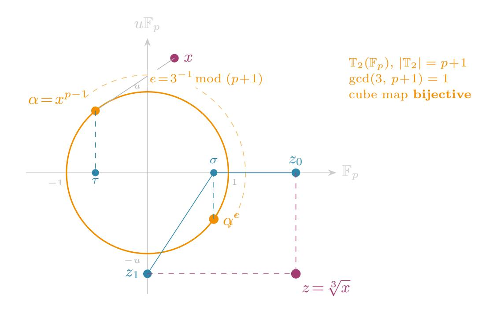
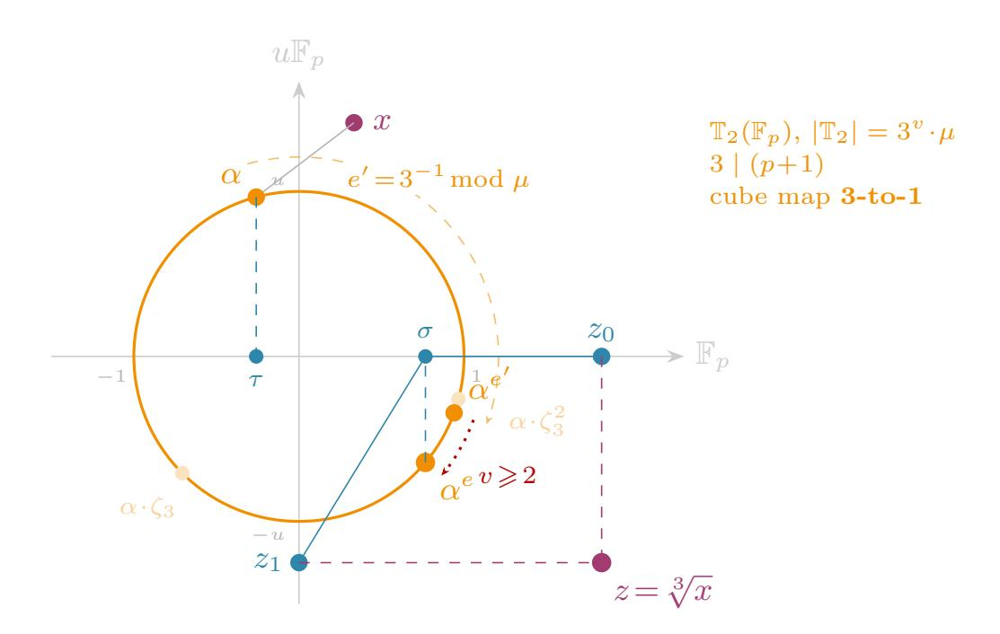
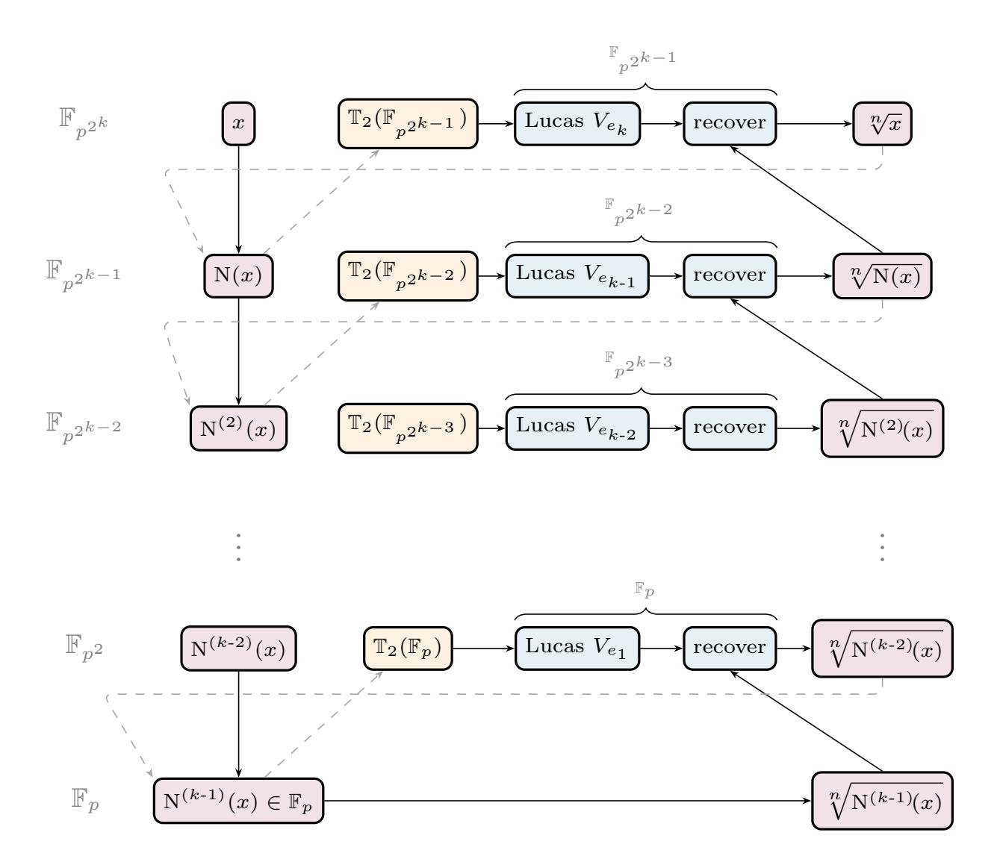

{0}------------------------------------------------

# Fast cube roots in $\mathbb{F}_{p^2}$ via the algebraic torus

Youssef El Housni

Consensys, Linea youssef.elhousni@consensys.net

**Abstract.** Computing cube roots in quadratic extensions of finite fields is a subroutine that arises in elliptic-curve point decompression, hash-to-curve and isogeny-based protocols. We present a new algorithm that, for  $p \equiv 1 \pmod{3}$ —which holds in all settings where  $\mathbb{F}_{p^2}$  cube roots arise in practice—reduces the  $\mathbb{F}_{p^2}$  cube root to operations entirely in the base field  $\mathbb{F}_p$  via the algebraic torus  $\mathbb{T}_2(\mathbb{F}_p)$  and Lucas sequences. We prove correctness in all residuosity cases and implement the algorithm using the **gnark-crypto** open-source library. Benchmarks on six primes spanning pairing-based and isogeny-based cryptography show  $1.6-2.3\times$  speed-ups over direct (addition chain) exponentiations in  $\mathbb{F}_{p^2}$ . We also extend the approach to  $p \equiv 2 \pmod{3}$  and, more generally, to any odd n-th roots in quadratic towers  $\mathbb{F}_{n^{2^k}}$  with  $\gcd(n,p+1)=1$ .

# <span id="page-0-0"></span>1 Introduction

Let p be a prime > 3 and let  $\mathbb{F}_{p^2} = \mathbb{F}_p[u]/(u^2 - \beta)$  for some non-square  $\beta \in \mathbb{F}_p$ . Computing  $z \in \mathbb{F}_{p^2}$  such that  $z^3 = x$  for a given  $x \in \mathbb{F}_{p^2}$  is a fundamental arithmetic operation that appears in several cryptographic contexts:

- **Hash-to-curve.** Icart's deterministic encoding [22] maps field elements to points on curves  $y^2 = x^3 + ax + b$  by computing a cube root in  $\mathbb{F}_p$ . Koshelev [23] generalizes this to curves  $y^2 = x^3 + b$  over  $\mathbb{F}_p$  relevant to pairing-based cryptography, where the cube root is in  $\mathbb{F}_{p^2}$ . In that work, Koshelev explicitly states that he "does not know how to express  $\sqrt[3]{\cdot} \in \mathbb{F}_{p^2}$  through a few  $\mathbb{F}_p$ -roots," leaving it as an open problem. Our method resolves this question.
- Point decompression. On j-invariant 0 curves  $y^2 = x^3 + b$  defined over highly 2-adic fields (as used in SNARKs e.g. BLS12-377 [11] used in Linea zkEVM), storing y and recovering  $x = (y^2 b)^{1/3}$  via a cube root is preferable to the standard approach of storing x and recovering y via a square root, since the latter requires a Tonelli–Shanks square root, which involves an exponentiation followed by a discrete-log correction in the 2-Sylow subgroup of size  $2^v$ —and v is large for SNARK-friendly primes (e.g. v = 46 for BLS12-377). For pairing-friendly curves of embedding degree 12 (e.g. the BLS12 [5], BN [6] families) the  $\mathbb{G}_2$  subgroup lives on a curve over  $\mathbb{F}_{p^2}$ , so the cube root is in  $\mathbb{F}_{p^2}$ .

To take this further, Koshelev [24] uses quotient varieties to show that two points can be batch-decompressed using a single cube root, amortizing the cost further. For points living in  $\mathbb{G}_2$ , one needs efficient cube roots in  $\mathbb{F}_{p^2}$ .

{1}------------------------------------------------

- **3-isogeny walks.** In several isogeny-based constructions—including hash functions, verifiable delay functions, key-encapsulation mechanisms, and generic proof systems for isogeny knowledge [17]—the  $\mathbb{F}_{p^2}$  cube root is the *bottle-neck operation* of each step of a length-m 3-isogeny walk over  $\mathbb{F}_{p^2}$ . This work speeds up this bottleneck operation by more than  $2\times$ .
- Solving depressed cubics over  $\mathbb{F}_p$ . Cardano's formula solves  $t^3 + at + b = 0$  via the resolvent quadratic  $z^2 + bz a^3/27 = 0$ , whose roots involve  $\sqrt{-\Delta/108}$  with  $\Delta = -4a^3 27b^2$ . When  $\Delta$  is a non-square in  $\mathbb{F}_p$ , this square root lies in the quadratic extension  $\mathbb{F}_{p^2} = \mathbb{F}_p(\sqrt{-\Delta/108})$ , and obtaining t then requires extracting a cube root of an element of  $\mathbb{F}_{p^2}$ —exactly the operation this paper accelerates. A concrete cryptographic instance is the y-increment map-to-curve method of [18]: on a  $j \neq 0$  curve  $y^2 = x^3 + ax + b$ , recovering x from a candidate y-coordinate requires solving the depressed cubic  $x^3 + ax + c = 0$  with  $c = b y^2$ , whose discriminant  $\Delta = -4a^3 27c^2$  may be a non-square in  $\mathbb{F}_p$ , leading directly to an  $\mathbb{F}_{p^2}$  cube root.

We focus on the case  $p \equiv 1 \pmod 3$ , which covers all pairing-friendly curve families of practical interest (BN, BLS12, BLS24): their primes are parametrized by a seed x and satisfy  $p \equiv 1 \pmod 6$  by construction (e.g.,  $p = 36x^4 + 36x^3 + 24x^2 + 6x + 1$  for BN), ensuring that the embedding degree  $k \mid (p-1)$  and that the full cyclotomic structure is available. The isogeny-based primes used in [17] also satisfy  $p \equiv 1 \pmod 3$ : their prime shape  $p = 2^{3a} \cdot f - 1$  with  $\gcd(3, f) = 1$  forces  $p \equiv 1 \pmod 3$ , which is required for efficient radical 3-isogeny computation via cube roots over  $\mathbb{F}_{p^2}$  [13]. The condition  $p \equiv 1 \pmod 3$  ensures  $\gcd(3, p+1) = 1$ , which is crucial for our torus-based approach (Section 3). We also discuss an extension to  $p \equiv 2 \pmod 3$  in Section 6.1.

*Prior work.* The standard approach computes  $z = x^e$  in  $\mathbb{F}_{p^2}$  for an exponent e that depends on  $p^2 \mod 9$ :

```
-p^2 \equiv 4 \pmod{9} (i.e., p \equiv 2 \text{ or } 7 \pmod{9}): e = (2p^2 + 1)/9; -p^2 \equiv 7 \pmod{9} (i.e., p \equiv 4 \text{ or } 5 \pmod{9}): e = (p^2 + 2)/9;
```

 $-p^2 \equiv 1 \pmod{9}$  (i.e.,  $p \equiv 1$  or  $8 \pmod{9}$ ):  $9 \mid (p^2-1)$  and no single exponent e satisfies  $3e \equiv 1 \pmod{(p^2-1)/3}$ . A Tonelli–Shanks-like algorithm in  $\mathbb{F}_{p^2}$  is needed, decomposing  $p^2-1=3^v\cdot m$  and handling the  $3^v$ -part via discrete-log corrections.

In the first two cases the exponent has  $\approx 2\log_2 p$  bits and the cost is dominated by the  $\mathbb{F}_{p^2}$  exponentiation. The third case adds a Tonelli–Shanks correction loop of v-1 iterations. The authors of [17] use, in the companion code [16], a simple binary square-and-multiply method with a hardcoded 759-bit exponent. Since the exponent is fixed one can derive a short addition chain to speed up the exponentiation a bit.

A natural improvement is *Frobenius splitting*: decompose the exponent as  $e = e_0 + e_1 p$  with  $e_0, e_1 \approx p$ , then use a multi-exponentiation  $x^e = x^{e_0} \cdot \overline{x}^{e_1}$  via Straus' trick, where  $\overline{x} = x^p$  is the Frobenius conjugate. This halves the effective exponent length but still works entirely in  $\mathbb{F}_{p^2}$ . While Frobenius splitting

{2}------------------------------------------------

is a well-known technique in pairing-based cryptography, to the best of our knowledge it has not been applied to  $\mathbb{F}_{p^2}$  cube root computation in existing implementations, including the companion code of [17].

Related work. Adj and Rodríguez-Henríquez [2], Scott [30, Sec. 6.3] and Aardal et al. [1, Alg. 3,  $p \equiv 3 \pmod{4}$  only] all reduce  $\mathbb{F}_{p^2}$  square roots to computations in  $\mathbb{F}_p$ . The key identity is  $x^{p+1} = N(x) \in \mathbb{F}_p$ . Since p+1 is even,  $b = x^{(p+1)/2}$ satisfies  $b^2 = N(x) \in \mathbb{F}_p$ , which forces  $b \in \mathbb{F}_p$  (or  $b \in \mathbb{F}_p \cdot u$ ). The  $\mathbb{F}_{p^2}$  square root thus reduces to: compute b via an  $\mathbb{F}_p$  exponentiation (using the Frobenius  $x^p = \overline{x}$ ), take an  $\mathbb{F}_p$  square root of N(x), and combine. For cube roots, one might try  $\gamma = x^{(p+1)/3}$ , which cubes to  $N(x) \in \mathbb{F}_p$ . But  $\gamma$  itself is a general  $\mathbb{F}_{p^2}$  element—it does not collapse to  $\mathbb{F}_p$ —so the Frobenius does not yield an  $\mathbb{F}_p$  reduction. More fundamentally, expanding  $z^3 = x$  with  $z = z_0 + z_1 u$  and eliminating  $z_1$  yields a cubic in  $z_0$  over  $\mathbb{F}_p$  whose three roots cannot be expressed through  $\mathbb{F}_p$  radicals alone—an instance of the classical casus irreducibilis. Our method takes a different route: instead of decomposing an  $\mathbb{F}_{p^2}$  exponentiation, we project onto the algebraic torus  $\mathbb{T}_2(\mathbb{F}_p)$  and work entirely in  $\mathbb{F}_p$  via Lucas sequences. This approach is related to the XTR system [26], which uses traces of elements on the degree-6 torus  $\mathbb{T}_6(\mathbb{F}_p)$  via third-order recurrences; we use the simpler second-order Lucas V-sequences on  $\mathbb{T}_2(\mathbb{F}_p)$ .

Contributions. We present a new method that reduces the  $\mathbb{F}_{p^2}$  cube root entirely to  $\mathbb{F}_p$  operations by working on the algebraic torus  $\mathbb{T}_2(\mathbb{F}_p)$ . Concretely:

- 1. We show that the  $\mathbb{F}_{p^2}$  cube root can be decomposed into: an  $\mathbb{F}_p$  cube root of the norm N(x), a Lucas-sequence exponentiation on  $\mathbb{T}_2(\mathbb{F}_p)$ , and a rational recovery step.
- 2. We introduce a fused  $\mathbb{F}_p$  exponentiation that simultaneously computes  $\sqrt[3]{N(x)}$  and  $N(x)^{-1}$  from a single addition chain, saving a separate  $\mathbb{F}_p$  inversion.
- 3. We prove correctness in all residuosity cases and handle the cube-root ambiguity when  $p \equiv 1 \pmod{9}$  via a cheap verification-and-adjustment step using roots of unity.
- 4. We implement the method in Go [21] for six primes: three corresponding to widely-deployed pairing-friendly curves and three corresponding to isogeny-walk primes from [17]. As an additional implementation contribution, we also provide a 2-bit windowed Frobenius-splitting multi-exponentiation baseline, which to our knowledge has not been applied to  $\mathbb{F}_{p^2}$  cube roots in existing codebases. We benchmark all methods and compare against the direct exponentiation used in practice.
- 5. We discuss two generalisations odd n-th roots (for any odd n with  $\gcd(n, p+1)=1$ ) and roots in  $\mathbb{F}_{p^{2^k}}$  via quadratic towers and show that in both settings our torus-based algorithm outperforms Frobenius splitting and direct exponentiation.

Organization. Section 2 recalls the algebraic torus, Lucas sequences, and cuberoot residuosity in  $\mathbb{F}_p$ . Section 3 describes the algorithm, including the fused

{3}------------------------------------------------

exponentiation, and proves correctness. Section 4 analyzes the cost. Section 5 presents implementation results. Section 6 presents three generalisations: to  $p \equiv 2 \pmod{3}$ , to cube roots in  $\mathbb{F}_{p^{2^k}}$  via quadratic towers, and to odd n-th roots in  $\mathbb{F}_{p^2}$ . Section 7 concludes.

# <span id="page-3-0"></span>2 Preliminaries

Throughout, p denotes a prime with  $p \equiv 1 \pmod{3}$  and  $\mathbb{F}_{p^2} = \mathbb{F}_p[u]/(u^2 - \beta)$  for some non-square  $\beta \in \mathbb{F}_p$ . We write elements of  $\mathbb{F}_{p^2}$  as  $x = x_0 + x_1 u$  with  $x_0, x_1 \in \mathbb{F}_p$ . The Frobenius automorphism  $\sigma : x \mapsto x^p$  acts as  $\sigma(x_0 + x_1 u) = x_0 - x_1 u$ , and we denote  $\overline{x} := \sigma(x) = x_0 - x_1 u$  the conjugate.

# 2.1 The $\mathbb{F}_{p^2}/\mathbb{F}_p$ norm

The norm map  $N: \mathbb{F}_{p^2}^* \to \mathbb{F}_p^*$  is defined by

$$N(x) = x \cdot \overline{x} = x_0^2 - \beta x_1^2 = x_0^2 + |\beta| x_1^2, \qquad (1)$$

since  $\beta < 0$  for all curves of interest. The norm is surjective and satisfies  $N(x^k) = N(x)^k$  for all  $k \in \mathbb{Z}$ .

# 2.2 The algebraic torus $\mathbb{T}_2(\mathbb{F}_p)$

The algebraic torus of  $\mathbb{F}_{p^2}$  over  $\mathbb{F}_p$  is the subgroup

$$\mathbb{T}_2(\mathbb{F}_p) = \{ \alpha \in \mathbb{F}_{p^2}^* : \mathcal{N}(\alpha) = 1 \} = \ker(\mathcal{N} : \mathbb{F}_{p^2}^* \to \mathbb{F}_p^*). \tag{2}$$

It has order  $|\mathbb{T}_2(\mathbb{F}_p)| = p+1$ . Every element  $\alpha$  on the torus satisfies  $\alpha^p = \overline{\alpha} = \alpha^{-1}$ , so  $\alpha$  is determined by its trace

$$\operatorname{Tr}(\alpha) := \alpha + \overline{\alpha} = 2 \,\alpha_0 \in \mathbb{F}_p \,.$$
 (3)

The torus was introduced in cryptography by Rubin and Silverberg [29]; Lenstra and Verheul's XTR system [26] is an earlier instantiation using traces.

#### 2.3 Lucas V-sequences

The Lucas V-sequence  $\{V_n(P,Q)\}_{n\geqslant 0}$  with parameters  $P,Q\in\mathbb{F}_p$  is defined by

$$V_0 = 2,$$
  $V_1 = P,$   $V_{n+1} = P V_n - Q V_{n-1}.$  (4)

The binary ladder doubling formulas are:

$$V_{2k} = V_k^2 - 2Q^k$$
,  $V_{2k+1} = V_k \cdot V_{k+1} - PQ^k$ . (5)

{4}------------------------------------------------

Specialization to the torus (Q = 1). Every element  $\alpha \in \mathbb{T}_2(\mathbb{F}_p)$  satisfies the characteristic equation  $\alpha^2 - \tau \alpha + 1 = 0$  where  $\tau = \text{Tr}(\alpha)$ , so the corresponding Lucas parameters are  $P = \tau$  and Q = 1. The trace of the *n*-th power is then  $\text{Tr}(\alpha^n) = V_n(\tau, 1)$  for all  $n \ge 0$  [26]. With Q = 1 the doubling formulas simplify to

<span id="page-4-3"></span>
$$V_{2k} = V_k^2 - 2, \qquad V_{2k+1} = V_k \cdot V_{k+1} - \tau,$$
 (6)

since  $Q^k = 1$  for all k. In particular, no auxiliary tracking of  $Q^k$  is needed. Computing  $V_n(\tau, 1)$  requires  $\lfloor \log_2 n \rfloor$  steps, each costing  $1 \mathbf{M}_p + 1 \mathbf{S}_p$ , i.e.,  $1.8 \mathbf{M}_p$  per bit (counting  $\mathbf{S}_p = 0.8 \mathbf{M}_p$ ).

# <span id="page-4-2"></span>2.4 Cube roots in $\mathbb{F}_p$

Since  $p \equiv 1 \pmod{3}$ , there are three cube roots of unity in  $\mathbb{F}_p$ :  $\{1, \omega, \omega^2\}$  where  $\omega$  is a primitive cube root. An element  $a \in \mathbb{F}_p^*$  is a cubic residue if and only if  $a^{(p-1)/3} = 1$ .

The cube root  $a^{1/3}$  is computed by exponentiating a by a helper exponent h that depends on  $p \mod 9$  (or  $p \mod 27$ ):

| Case                    | h         | d  | r  |
|-------------------------|-----------|----|----|
| $p \equiv 7 \pmod{9}$   | (p-7)/9   | 9  | 7  |
| $p \equiv 4 \pmod{9}$   | (p-4)/9   | 9  | 4  |
| $p \equiv 10 \pmod{27}$ | (p-10)/27 | 27 | 10 |
| $p \equiv 19 \pmod{27}$ | (p-19)/27 | 27 | 19 |

<span id="page-4-0"></span>**Table 1.** Helper exponent h for  $\mathbb{F}_p$  cube root depending on  $p \mod 9$  (or  $p \mod 27$ ). Divisor d and remainder r.

Given  $t = a^h$ , one obtains the cube root as  $m = a \cdot t^s$  where s = 1 if r is odd and s = 2 if r is even.

<span id="page-4-1"></span>**Lemma 1.** With the notation above,  $m^3 = a$ .

*Proof.* We have  $m=a^{1+sh}$ , so  $m^3=a^{3(1+sh)}$ . It suffices to show  $3(1+sh)\equiv 1\pmod{p-1}$ . Since h=(p-r)/d and  $p\equiv 1\pmod{3}$ , we compute:

- $-(d=9,r=7,s=1): 3(1+h)=3(p+2)/9=(p+2)/3=1+(p-1)/3\equiv 1.$
- -(d=9,r=4,s=2):  $3(1+2h)=3(2p+1)/9=(2p+1)/3=1+2(p-1)/3\equiv 1$ .
- $-(d=27, r=19, s=1): 3(1+h) = 3(p+8)/27 = (p+8)/9 = 1+(p-1)/9 \equiv 1.$
- -(d=27, r=10, s=2): 3(1+2h)=3(2p+7)/27=(2p+7)/9=1+2(p-1)/9=1.

<span id="page-4-4"></span>In each case  $m^3 = a^1 = a$ .

{5}------------------------------------------------

```
Algorithm 1: Torus-based cube root in \mathbb{F}_{p^2}
     Input: x = x_0 + x_1 u \in \mathbb{F}_{p^2}^*
Output: z \in \mathbb{F}_{p^2} with z^3 = x, or \bot if x is not a cubic residue
 1 if x_1 = 0 then
           return (x_0^{1/3}, 0) using \mathbb{F}_p cube root;
  \mathbf{2}
 3 if x_0 = 0 then
           a \leftarrow (-x_1 \cdot |\beta|^{-1})^{1/3} \text{ in } \mathbb{F}_p;
 4
           return (0, a) after verification;
                                                                                                       // see Remark 2
 5
                                                                                                      // n = N(x) \in \mathbb{F}_p
 6 n \leftarrow x_0^2 + |\beta| x_1^2;
                                                                                     // (m = n^{1/3}, n^{-1}) fused
 7 (m, n^{-1}) \leftarrow \text{CbrtAndInverse}(n);
 8 \tau \leftarrow 2(x_0^2 - |\beta| x_1^2) \cdot n^{-1};
                                                                                                       // \operatorname{Tr}(x^{p-1}) \in \mathbb{F}_p
 9 \sigma \leftarrow V_e(\tau) where e = 3^{-1} \mod (p+1);
                                                                                                         // Lucas chain
10 d_0 \leftarrow m \cdot (\sigma - 1); d_1 \leftarrow m \cdot (\sigma + 1);
11 \delta \leftarrow (d_0 \cdot d_1)^{-1};
                                                                                          // single \mathbb{F}_p inversion
12 z_0 \leftarrow x_0 \cdot d_1 \cdot \delta; \ z_1 \leftarrow x_1 \cdot d_0 \cdot \delta;
13 z \leftarrow (z_0, z_1);
14 z \leftarrow VerifyAndAdjust(z, x);
15 return z;
```

<span id="page-5-7"></span><span id="page-5-6"></span><span id="page-5-5"></span>Remark 1. The four cases in Table 1 cover all primes with  $v_3(p-1) \leq 2$ , where  $v_3$  denotes the 3-adic valuation. If  $v_3(p-1) \geq 3$  (i.e.  $27 \mid (p-1)$ ), the simple exponentiation formula no longer suffices and one must resort to a discrete-logarithm correction in the 3-Sylow subgroup of  $\mathbb{F}_p^*$ , analogous to the Tonelli–Shanks algorithm for square roots in the highly 2-adic case. Such a generalisation is given by the Adleman–Manders–Miller algorithm [3]. In practice, all pairing-friendly and isogeny primes considered in this work satisfy  $v_3(p-1) \leq 2$ , so the direct exponentiation above is sufficient.

### <span id="page-5-0"></span>3 The Algorithm

Throughout this section we assume  $p \equiv 1 \pmod{3}$ , so that  $\gcd(3, p+1) = 1$  and the cube map is a bijection on  $\mathbb{T}_2(\mathbb{F}_p)$ . The extension to  $p \equiv 2 \pmod{3}$  is discussed in Section 6.1.

The key idea is to avoid working in  $\mathbb{F}_{p^2}$  altogether. Given  $x = x_0 + x_1 u \in \mathbb{F}_{p^2}^*$ , we project x onto the algebraic torus  $\mathbb{T}_2(\mathbb{F}_p)$  via the norm-one element  $\alpha = x^{p-1}$ , compute a cube root of  $\alpha$  on the torus using a Lucas-sequence exponentiation (which operates entirely in  $\mathbb{F}_p$ ), and then lift the result back to  $\mathbb{F}_{p^2}$  using the  $\mathbb{F}_p$  cube root of the norm N(x). The norm cube root and its inverse are obtained simultaneously from a single fused  $\mathbb{F}_p$  addition chain (Section 3.1). The algorithm proceeds in five steps, summarized in Algorithm 1.

<span id="page-5-1"></span>We now describe each step of Algorithm 1 in detail (see Figure 1 in Appendix A for a visual interpretation).

{6}------------------------------------------------

Remark 2. When  $x_0 = 0$ , we have  $x = x_1 u$  and seek z = a u with  $z^3 = a^3 u^3 = a^3 \beta u = x_1 u$ , so  $a = (x_1/\beta)^{1/3} = (-x_1 \cdot |\beta|^{-1})^{1/3}$ . For  $\beta = -1$  (BN254 [7], BLS12-381 [10] used in Ethereum and isogeny primes from [17]) this simplifies to  $a = (-x_1)^{1/3}$ . For  $\beta = -5$  (BLS12-377), the constant  $|\beta|^{-1} = 5^{-1} \in \mathbb{F}_p$  is precomputed.

# <span id="page-6-0"></span>3.1 Step 1: Norm and fused exponentiation — CbrtAndInverse (line 7)

Given  $x = x_0 + x_1 u$ , we compute the  $\mathbb{F}_{p^2}/\mathbb{F}_p$  norm  $n = N(x) = x_0^2 + |\beta| x_1^2 \in \mathbb{F}_p$  and then, in a single fused  $\mathbb{F}_p$  exponentiation, obtain both  $m = n^{1/3}$  (the  $\mathbb{F}_p$  cube root) and  $n^{-1}$  (the norm inverse). This is the dominant cost of the algorithm.

Correctness. Since x is a cubic residue, there exists  $z^* \in \mathbb{F}_{p^2}^*$  with  $(z^*)^3 = x$ . Then  $N(z^*)^3 = N(x) = n$ , so n is a cube in  $\mathbb{F}_p$ , and  $m = n^{1/3}$  exists. By Lemma 1, the exponentiation correctly computes some m with  $m^3 = n$  (possibly  $m = N(z^*) \cdot \omega^j$ ).

The fused computation. A naïve approach would perform two separate  $\mathbb{F}_p$  exponentiations: one for the cube root and one for the inverse (via Fermat:  $n^{-1} = n^{p-2}$ ). We show that both can be extracted from a *single* addition chain. This is the 3-analogue of Scott's "progenitor" trick for square roots [30].

Let h = (p-r)/d be the helper exponent from Section 2.4, and let  $t = n^h$  be the result of the addition-chain exponentiation. We already know that  $m = n \cdot t^s$  gives  $m^3 = n$ . The following proposition shows how to obtain  $n^{-1}$ .

<span id="page-6-1"></span>**Proposition 1.** Let a = r - 2 and  $b = d - a \cdot s$ . Then  $m^a \cdot t^b = n^{-1}$ .

*Proof.* We have  $m = n^{1+sh}$  and  $t = n^h$ , so

$$m^a \cdot t^b = n^{a(1+sh)+bh} = n^{a+(as+b)h}$$

Now as + b = (r-2)s + d - (r-2)s = d, so the exponent becomes  $a + dh = (r-2) + d \cdot \frac{p-r}{d} = p-2$ . By Fermat's little theorem,  $n^{p-2} = n^{-1}$ .

*Examples.* For p-p377 (BLS12-377),  $p \equiv 7 \pmod{9}$ , so d = 9, r = 7, s = 1, giving a = 5, b = 4 and  $n^{-1} = m^5 \cdot t^4$ .

For i-p381  $(p=2^{372}\cdot 437-1)$ ,  $p\equiv 4\pmod 9$ , so  $d=9,\,r=4,\,s=2$ , giving  $a=2,\,b=5$  and  $n^{-1}=m^2\cdot t^5$ .

Each formula is evaluated via a short squaring chain. For example,  $m^5 \cdot t^4 = (m^2)^2 \cdot m \cdot ((t^2)^2)$  uses  $3 \, \mathbf{S}_p + 2 \, \mathbf{M}_p = 4.4 \, \mathbf{M}_p$ . The total cost of evaluating  $m^a \cdot t^b$  is at most 7–11  $\mathbf{M}_p$ , which is negligible compared to the  $\approx 375 \, \mathbf{S}_p + 68 \, \mathbf{M}_p$  in the main addition chain for  $t = n^h$ . The savings from avoiding a separate  $\mathbb{F}_p$  inversion (typically  $\approx 50 \, \mathbf{M}_p$  via an addition chain for  $n^{p-2}$ , or a full extended-GCD) are significant.

{7}------------------------------------------------

Reuse of intermediate values. The squaring chain for  $m^a$  produces  $m^2$  as an intermediate. Since the verification  $m^3 = n$  (needed to confirm that the cube root is correct) equals  $m^2 \cdot m$ , we reuse  $m^2$  and save one  $\mathbf{S}_p$ .

#### 3.2 Step 2: Torus trace (line 8)

The element  $x^{p-1} = \overline{x}/x \in \mathbb{T}_2(\mathbb{F}_p)$  lies on the torus. We compute its trace  $\tau = \text{Tr}(x^{p-1})$  directly from  $x_0, x_1$  without performing the  $\mathbb{F}_{p^2}$  exponentiation.

<span id="page-7-0"></span>**Proposition 2.** For  $x = x_0 + x_1 u \in \mathbb{F}_{p^2}^*$  with  $x_1 \neq 0$ ,

$$\operatorname{Tr}(x^{p-1}) = \frac{2(x_0^2 + \beta x_1^2)}{\operatorname{N}(x)} = \frac{2(x_0^2 - |\beta| x_1^2)}{x_0^2 + |\beta| x_1^2}.$$

*Proof.* Since  $x^p = \overline{x}$ , we have  $x^{p-1} = \overline{x}/x$  and  $x^{1-p} = x/\overline{x}$ . Therefore

$$\operatorname{Tr}(x^{p-1}) = x^{p-1} + x^{1-p} = \frac{\overline{x}}{x} + \frac{x}{\overline{x}} = \frac{\overline{x}^2 + x^2}{x \cdot \overline{x}} = \frac{x^2 + \overline{x}^2}{\operatorname{N}(x)}.$$

Now  $x^2 = (x_0^2 + \beta x_1^2) + 2x_0x_1u$  and  $\overline{x}^2 = (x_0^2 + \beta x_1^2) - 2x_0x_1u$ , so  $x^2 + \overline{x}^2 = 2(x_0^2 + \beta x_1^2)$ .

Note that  $\tau$  is computed using  $x_0^2$  and  $x_1^2$  (already available from the norm computation) and  $n^{-1}$  (from the fused exponentiation), at a cost of  $1 \mathbf{M}_p + O(1)$  additions.

Correctness. By Proposition 2,  $\tau = \text{Tr}(x^{p-1})$  is correctly computed in  $\mathbb{F}_p$ .

#### 3.3 Step 3: Lucas chain — cube root on the torus (line 9)

Since  $|\mathbb{T}_2(\mathbb{F}_p)| = p+1$  and  $p \equiv 1 \pmod{3}$  implies  $p+1 \equiv 2 \pmod{3}$ , the cube map  $\alpha \mapsto \alpha^3$  is a bijection on  $\mathbb{T}_2(\mathbb{F}_p)$ . Its inverse is exponentiation by  $e = 3^{-1} \pmod{(p+1)}$ .

Now, if  $z^3 = x$  then  $z^{3(p-1)} = x^{p-1}$ , i.e.,  $(z^{p-1})^3 = x^{p-1}$ . Since  $z^{p-1} \in \mathbb{T}_2(\mathbb{F}_p)$ , the trace  $\sigma = \text{Tr}(z^{p-1})$  satisfies  $V_3(\sigma) = \tau$  and is recovered as

$$\sigma = V_e(\tau), \qquad e = 3^{-1} \mod (p+1).$$

This is computed via the Lucas-sequence binary ladder (equations (6)) in  $\lfloor \log_2 e \rfloor$  steps at a cost of  $\approx 1.8 \,\mathrm{M}_p$  per bit.

Correctness. Since  $p+1 \equiv 2 \pmod{3}$ , the element 3 is invertible modulo p+1, so  $e=3^{-1} \pmod{(p+1)}$  exists. The element  $x^{p-1}$  lies on  $\mathbb{T}_2(\mathbb{F}_p)$  (it has norm 1), and its cube root on the torus is the unique element  $\gamma \in \mathbb{T}_2(\mathbb{F}_p)$  with  $\gamma^3 = x^{p-1}$ . By the Lucas-sequence identity,  $\text{Tr}(\gamma) = V_e(\text{Tr}(x^{p-1})) = V_e(\tau) = \sigma$ .

{8}------------------------------------------------

#### 3.4 Step 4: Recovery of z (line 12)

We now have  $m = N(x)^{1/3} = N(z)$  and  $\sigma = Tr(z^{p-1})$ . We recover  $z = z_0 + z_1 u$  as follows.

<span id="page-8-0"></span>**Proposition 3.** Let  $z = z_0 + z_1 u$  with  $z^3 = x$  and  $z_1 \neq 0$ . Write  $m = N(z) = N(x)^{1/3}$  and  $\sigma = \text{Tr}(z^{p-1})$ . Then

$$z_0 = \frac{x_0}{m(\sigma - 1)}, \qquad z_1 = \frac{x_1}{m(\sigma + 1)}.$$

*Proof.* From  $z^3=x$  and N(z)=m, we derive  $z^2=x\cdot \overline{z}/m$ . Writing this out component-wise:

$$z_0^2 + \beta z_1^2 = (x_0 z_0 - \beta x_1 z_1)/m,$$
  
$$2z_0 z_1 = (x_1 z_0 - x_0 z_1)/m.$$

Meanwhile, from  $\text{Tr}(z^{p-1}) = \sigma$  and Proposition 2 applied to z:

$$\sigma = \frac{2(z_0^2 + \beta \, z_1^2)}{m} \, .$$

Combined with  $z_0^2 - \beta z_1^2 = m$ , we obtain  $z_0^2 = m(\sigma + 2)/4$  and  $z_1^2 = m(\sigma - 2)/(4\beta)$ . Substituting back into the component equations of  $z^2 = x\overline{z}/m$  and simplifying yields the stated formulas.

Alternatively, the formulas can be verified directly: if  $z_0 = x_0/(m(\sigma-1))$  and  $z_1 = x_1/(m(\sigma+1))$ , one can check that  $z_0^2 - \beta z_1^2 = m$  and  $2(z_0^2 + \beta z_1^2)/m = \sigma$  by substitution.

The two divisions  $x_0/d_0$  and  $x_1/d_1$  (where  $d_0 = m(\sigma - 1)$ ,  $d_1 = m(\sigma + 1)$ ) are computed using a single  $\mathbb{F}_p$  inversion via Montgomery's trick:  $\delta = (d_0d_1)^{-1}$ , then  $z_0 = x_0 \cdot d_1 \cdot \delta$  and  $z_1 = x_1 \cdot d_0 \cdot \delta$ . This costs  $1 \mathbf{I}_p + 5 \mathbf{M}_p$ .

Correctness. The recovery formulas of Proposition 3 yield a candidate z such that  $z^3 = x \cdot \omega^j$  for some  $j \in \{0, 1, 2\}$  depending on which cube root m was chosen in Step 1.

#### 3.5 Step 5: Verification and adjustment - VerifyAndAdjust (line 14)

When  $p \equiv 1 \pmod{9}$ , the  $\mathbb{F}_p$  cube root  $m = n^{1/3}$  may return any of the three cube roots  $m, m\omega, m\omega^2$ . Algorithm 1 may thus return z such that  $z^3 = x\omega^j$  for some  $j \in \{0, 1, 2\}$  rather than  $z^3 = x$ . A primitive 9th root of unity  $\zeta \in \mathbb{F}_p$  (satisfying  $\zeta^3 = \omega$ ) allows correction:

- If  $z^3 = x$ : return z.
- If  $z^3 \cdot \omega^2 = x$ : return  $z \cdot \zeta$ .
- If  $z^3 \cdot \omega = x$ : return  $z \cdot \zeta^2$ .
- Otherwise: x is not a cubic residue; return  $\perp$ .

{9}------------------------------------------------

Remark 3. Since  $\omega, \zeta \in \mathbb{F}_p$  (they are purely real), the multiplications  $z \cdot \zeta$  cost only  $2 \mathbf{M}_p$  rather than  $3 \mathbf{M}_p$  for a general  $\mathbb{F}_{p^2}$  multiplication. Similarly, the check  $z^3 \cdot \omega^j = x$  involves multiplying by a real constant.

Remark 4. When  $p \not\equiv 1 \pmod{9}$  (i.e.  $p \equiv 4$  or 7  $\pmod{9}$  in the cases of Table 1), the  $\mathbb{F}_p$  cube root formula always yields  $z^3 = x$  directly and no adjustment is needed. This is the case for BLS12-377, where  $p \equiv 7 \pmod{9}$ , and also for primes with  $p \equiv 4 \pmod{9}$ .

Correctness. If j=0, we are done. If  $j\neq 0$ , the verification step detects the discrepancy and multiplies z by  $\zeta^k$  for the appropriate  $k\in\{1,2\}$ , where  $\zeta^3=\omega$ . Since  $(\zeta^k)^3=\omega^k$ , we get  $(z\cdot\zeta^k)^3=x\omega^j\cdot\omega^k=x$  by choosing k such that  $j+k\equiv 0\pmod 3$ . When  $p\not\equiv 1\pmod 9$  (i.e.  $v_3(p-1)=1$ ), the recovery always yields  $z^3=x$  directly, so no adjustment is needed.

# <span id="page-9-0"></span>4 Cost Analysis

We analyze the cost of Algorithm 1 in terms of  $\mathbb{F}_p$  multiplications, writing  $\ell = \lfloor \log_2 p \rfloor$  for the bit-length of p. We use the conventions  $\mathbf{S}_p = 0.8 \, \mathbf{M}_p$ ,  $\mathbf{I}_p = 50 \, \mathbf{M}_p$ ,  $\mathbf{M}_{p^2} \approx 3 \, \mathbf{M}_p$  (Karatsuba), and  $\mathbf{S}_{p^2} \approx 2 \, \mathbf{M}_p$  (Complex). All exponentiations use short addition chains (generated, e.g., by McLoughlin's addchain [27]).

| Step                | Cost                                                    |
|---------------------|---------------------------------------------------------|
| Norm $n$ and $\tau$ | $2\mathbf{S}_p + 1\mathbf{M}_p = 2.6\mathbf{M}_p$       |
| CbrtAndInverse      | $\approx 1.0 \left(\ell - \log_2 d\right) \mathbf{M}_p$ |
| Lucas $V_e$         | $\approx 1.8  \ell  \mathbf{M}_p$                       |
| Recovery            | $5\mathbf{M}_p + 1\mathbf{I}_p$                         |
| Verification        | $\leqslant 7\mathbf{M}_p$                               |
| Total               | $\approx (2.8  \ell + 70)  \mathbf{M}_p$                |

**Table 2.** Cost analysis of Algorithm 1 with  $\ell = \log_2 p$ ,  $\mathbf{S}_p = 0.8 \, \mathbf{M}_p$  and  $\mathbf{I}_p = 50 \, \mathbf{M}_p$ .

**Norm and**  $\tau$ . We compute  $x_0^2$  and  $x_1^2$  (2  $\mathbf{S}_p = 1.6 \, \mathbf{M}_p$ ), from which  $n = x_0^2 + |\beta| \, x_1^2$  follows by additions (or a small constant multiplication). The trace  $\tau = 2(x_0^2 - |\beta| \, x_1^2) \cdot n^{-1}$  reuses  $x_0^2, x_1^2$  and the norm inverse from the fused step, costing one additional  $\mathbf{M}_p$ .

Fused exponentiation – CbrtAndInverse. The addition chain for  $n^h$  (where h = (p-r)/d, an  $(\ell - \log_2 d)$ -bit exponent) dominates. A naïve square-and-multiply uses  $\approx 1.3 \, \mathbf{M}_p$  per bit on average  $(1 \, \mathbf{S}_p + 0.5 \, \mathbf{M}_p = 1.3 \, \mathbf{M}_p)$ . A good addition chain for an N-bit exponent typically uses N squarings  $+ N/\log_2(N)$  multiplications; with  $\mathbf{S}_p = 0.8 \, \mathbf{M}_p$  this gives  $\approx (0.8 + 1/\log_2 N) \, \mathbf{M}_p$  per bit  $\approx 1.0 \, \mathbf{M}_p$  for typical prime sizes. The norm inverse  $m^a \cdot t^b$  (Proposition 1) adds a

{10}------------------------------------------------

short squaring chain: at most  $\lceil \log_2 a \rceil + \lceil \log_2 b \rceil$  squarings plus a few multiplications and one final product, totaling at most 11  $\mathbf{M}_p$  (for the worst case  $m^{17} \cdot t^{10}$  of BN254).

**Lucas**  $V_e$ . The binary ladder for  $V_e(\tau)$  runs for  $\lfloor \log_2 e \rfloor \approx \ell$  steps. Each step performs one multiplication and one squaring in  $\mathbb{F}_p$  (equation (6)), costing  $1 \, \mathbf{M}_p + 1 \, \mathbf{S}_p = 1.8 \, \mathbf{M}_p$ .

<span id="page-10-0"></span>Remark 5. The Lucas chain cost ( $\approx 1.8 \, \ell \, \mathbf{M}_p$ ) can be reduced by using a differential addition chain [8] instead of the binary ladder. Since  $e = 3^{-1} \mod (p+1)$  is fixed and the Lucas V-sequence with Q = 1 satisfies  $V_{m+n} = V_m \cdot V_n - V_{m-n}$ , this applies directly and typically saves 5–10% of the steps, reducing the Lucas cost to  $\approx 1.6 \, \ell \, \mathbf{M}_p$ . For BLS12-377, this would save  $\approx 68 \, \mathbf{M}_p$ . For i-p381, where the Lucas chain dominates (60% of the total cost), the savings would be  $\approx 34-68 \, \mathbf{M}_p$ .

**Recovery.** We compute  $d_0 = m(\sigma - 1)$  and  $d_1 = m(\sigma + 1)$   $(2 \mathbf{M}_p)$ , then  $\delta = (d_0 d_1)^{-1}$   $(1 \mathbf{M}_p + 1 \mathbf{I}_p)$ , and finally  $z_0 = x_0 d_1 \delta$  and  $z_1 = x_1 d_0 \delta$   $(2 \mathbf{M}_p)$ . **Verification.** Compute  $z^3$  by squaring z in  $\mathbb{F}_{p^2}$   $(2 \mathbf{M}_p)$  and multiplying  $z^2 \cdot z$   $(3 \mathbf{M}_p)$ , then compare with x. If adjustment is needed, multiply by  $\zeta \in \mathbb{F}_p$   $(2 \mathbf{M}_p)$ , since  $\zeta$  is real).

The constant term ( $\approx 70\,\mathrm{M}_p$ ) is dominated by the single  $\mathbb{F}_p$  inversion in the recovery step ( $50\,\mathrm{M}_p$ ), with the remaining  $\approx 20\,\mathrm{M}_p$  coming from the norm inverse chain, the norm/trace computations, and the verification. For typical prime sizes ( $\ell \approx 250\text{--}400$ ), this constant represents 6–9% of the total cost. As concrete examples:

- For BLS12-377 ( $\ell = 377, d = 9$ ), the addition chain for  $n^{(p-7)/9}$  uses  $368 \, \mathbf{S}_p + 75 \, \mathbf{M}_p = 369 \, \mathbf{M}_p$ , the Lucas chain costs  $375 \times 1.8 = 675 \, \mathbf{M}_p$ , and the total is  $\approx 1119 \, \mathbf{M}_p$  ( $\Delta = 7 \, \mathbf{M}_p$  with the theoretical cost).
- For i-p381 ( $\ell = 381$ , d = 9), the addition chain for  $n^{(p-4)/9}$  uses  $372 \, \mathbf{S}_p + 72 \, \mathbf{M}_p = 370 \, \mathbf{M}_p$ , the Lucas chain costs  $379 \times 1.8 = 682 \, \mathbf{M}_p$ , for a total of  $\approx 1127 \, \mathbf{M}_p$ . The Lucas chain dominates (60% of the cost), making the isogeny primes good candidates for differential addition chain optimization (Remark 6).

#### 4.1 Comparison with prior methods

We compare against two alternative approaches for computing  $z^3 = x$  in  $\mathbb{F}_{p^2}$ :

– **Direct addition chain in**  $\mathbb{F}_{p^2}$ . Compute  $x^e$  where e is the appropriate exponent for the given  $p^2 \mod 9$ . The exponent has ≈  $2\ell$  bits. With a short addition chain (≈ 1.2 operations per bit), one uses ≈  $2.4 \ell$  steps. Most steps are squarings ( $\mathbf{S}_{p^2} = 2 \mathbf{M}_p$ ) with occasional multiplications ( $\mathbf{M}_{p^2} = 3 \mathbf{M}_p$ ), giving an average cost of ≈  $2.2 \mathbf{M}_p$  per step and a total of ≈  $5.3 \ell \mathbf{M}_p$ . With naïve square-and-multiply (1.5 operations per bit), the cost would be ≈  $6.5 \ell \mathbf{M}_p$ . For BLS12-377, the concrete addition chain gives:  $747 \mathbf{S}_{p^2} + 138 \mathbf{M}_{p^2} = 1494 + 414 = 1908 \mathbf{M}_p$ .

{11}------------------------------------------------

- **Frobenius splitting.** Decompose  $e = e_0 + e_1 p$  with  $e_0, e_1 \approx p$  and use Straus' trick:  $x^e = x^{e_0} \cdot \overline{x}^{e_1}$ . This halves the effective exponent length to  $\approx \ell$  bits.

1-bit windows. Each of the  $\ell$  steps requires one  $\mathbf{S}_{p^2} = 2\,\mathbf{M}_p$ , and on average  $\approx 75\%$  of the steps require an additional  $\mathbf{M}_{p^2} = 3\,\mathbf{M}_p$  (since each bit position has probability 3/4 that at least one of the two exponent bits is 1), giving a cost of  $\approx \ell (2 + 0.75 \times 3) = 4.25 \,\ell\,\mathbf{M}_p$ . The precomputed table has 3 entries  $(\overline{x}, x, x \cdot \overline{x})$ .

2-bit windows. Processing two bits at a time from each exponent reduces the number of iterations to  $\lceil \ell/2 \rceil$ , each performing  $2 \mathbf{S}_{p^2} = 4 \mathbf{M}_p$ . The 2-bit window indices  $(w_0, w_1)$  with  $w_0, w_1 \in \{0, 1, 2, 3\}$  yield 16 combinations, of which only (0,0) requires no multiplication, so  $\approx 15/16$  of the steps require a  $\mathbf{M}_{p^2} = 3 \mathbf{M}_p$ . The precomputed table has 15 entries  $(x^i \cdot \overline{x}^j)$  for  $(i,j) \in \{0, \ldots, 3\}^2 \setminus \{(0,0)\}$ , built from 8 multiplications. The total cost is  $\approx \frac{\ell}{2} (4 + \frac{15}{16} \times 3) \approx 3.4 \ell \mathbf{M}_p$ , a 20% improvement over 1-bit windows at the expense of a larger table.

Table 3 summarises the asymptotic and concrete costs. With the PRAC differential addition chain (Remark 5), the Lucas cost drops to  $\approx 1.6 \, \ell \, \mathbf{M}_p$ , giving a total of  $\approx 2.6 \, \ell + 70 \, \mathbf{M}_p$ . The structural advantage is that all torus operations are in  $\mathbb{F}_p$ , avoiding the 2–3× overhead of  $\mathbf{S}_{p^2}$  and  $\mathbf{M}_{p^2}$ .

| Method                                         | Asymptotic               | $\ell = 377$ | Ratio         |
|------------------------------------------------|--------------------------|--------------|---------------|
| Direct (addition chain in $\mathbb{F}_{p^2}$ ) | $\approx 5.3  \ell$      | 1998         | 1.90×         |
| Frobenius 1-bit                                | $\approx 4.25\ell$       | 1602         | $1.53 \times$ |
| Frobenius 2-bit                                | $\approx 3.4\ell$        | 1282         | $1.22\times$  |
| Torus (binary ladder)                          | $\approx 2.8  \ell + 70$ | 1126         | $1.07 \times$ |
| Torus (PRAC)                                   | $\approx 2.6\ell + 70$   | 1050         | $1 \times$    |
|                                                |                          |              |               |

<span id="page-11-1"></span>**Table 3.** Theoretical cost comparison for  $\mathbb{F}_{p^2}$  cube root ( $\mathbf{M}_p$  counts). The concrete column uses  $\ell = 377$  (BLS12-377). Ratios are relative to the fastest method (Torus with PRAC).

#### <span id="page-11-0"></span>5 Implementation and Benchmarks

We implemented the  $\mathbb{F}_p$  and  $\mathbb{F}_{p^2}$  arithmetic together with Algorithm 1 for six primes (Section 5.1), using the open-source gnark-crypto library [9] (Go language). The addition chains for the helper exponent h are generated by addchain [27] for five of the six primes. For i-p765, the 765-bit helper exponent exceeds the capacity of addchain's internal allocator, so the helper exponentiation falls back to generic square-and-multiply. An optimized addition chain for this prime would further improve the torus timings.

The code is available in [21]: https://github.com/yelhousni/fp2-cbrt.

{12}------------------------------------------------

#### <span id="page-12-0"></span>5.1 Target parameters

Pairing-friendly primes. These are defined by a polynomial family p(x) evaluated at a specific seed z:

```
– p-p254 (BN254): p = 36x
                        4+36x
                              3+24x
                                     2+6x+1, z = 0x44E992B44326A040.
– p-p381 (BLS12-381): p = (x−1)2
                               (x
                                 4−x
                                     2+1)/3+x, z = −0xD201000000010000.
– p-p377 (BLS12-377): p = (x−1)2
                               (x
                                 4−x
                                     2+1)/3+x, z = 0x8508C00000000001.
```

Isogeny-friendly primes. These are from [\[17\]](#page-22-3), of the form p = 23<sup>a</sup> · f − 1 with gcd(3, f) = 1:

```
– i-p381: p = 2372
                    · 437 − 1.
– i-p575: p = 2567
                    · 139 − 1.
– i-p765: p = 2756
                    · 257 − 1.
```

| Prime  | log2<br>p | p mod 9       | β  | s | Unique root |
|--------|-----------|---------------|----|---|-------------|
| p-p254 | 254       | 1 (19 mod 27) | −1 | 1 | no          |
| p-p381 | 381       | 1 (10 mod 27) | −1 | 2 | no          |
| p-p377 | 377       | 7             | −5 | 1 | yes         |
| i-p381 | 381       | 4             | −1 | 2 | no          |
| i-p575 | 575       | 4             | −1 | 2 | no          |
| i-p765 | 765       | 4             | −1 | 2 | no          |

Table 4. Algorithm parameters for the six target primes.

#### 5.2 Benchmark results

All benchmarks are run on an AMD EPYC 9R14 (x86\_64) with Go 1.24, using go test -bench with -count=4 (we report the median). The four methods compared are:

- Direct: exponentiation in Fp<sup>2</sup> using short addition chains generated by addchain [\[27\]](#page-23-7).
- Frob. 1-bit: Frobenius-splitting multi-exponentiation in Fp<sup>2</sup> with 1-bit Straus (3-entry table).
- Frob. 2-bit: same with 2-bit windowed Straus (15-entry table).
- Torus: Algorithm [1](#page-5-2) using an optimised PRAC differential addition chain for the Lucas V-sequence (see Remark [6\)](#page-13-0).

The Direct column uses optimised addition chains generated by addchain [\[27\]](#page-23-7), giving a strong baseline with zero heap allocations. Against this baseline, the torus method achieves 1.6–2.3× speed-ups across all six primes. For the isogeny

{13}------------------------------------------------

| Prime  | Direct | Frob. 1-bit | Frob. 2-bit | Torus | Torus speed-up |                 |
|--------|--------|-------------|-------------|-------|----------------|-----------------|
|        | (µs)   | (µs)        | (µs)        | (µs)  | vs. Direct     | vs. Frob. 2-bit |
| p-p254 | 33.0   | 28.1        | 23.2        | 18.2  | 1.81×          | 1.27×           |
| p-p377 | 113.7  | 86.2        | 74.4        | 52.4  | 2.17×          | 1.42×           |
| p-p381 | 96.1   | 80.7        | 66.4        | 53.0  | 1.81×          | 1.25×           |
| i-p381 | 66.6   | 67.2        | 54.2        | 39.1  | 1.70×          | 1.39×           |
| i-p575 | 364.2  | 375.4       | 296.9       | 159.8 | 2.28×          | 1.86×           |
| i-p765 | 1113.1 | 1180.2      | 926.1       | 685.5 | 1.62×          | 1.35×           |

<span id="page-13-1"></span>Table 5. Benchmark results for Fp<sup>2</sup> cube root on AMD EPYC 9R14 (x86\_64), Go 1.24.

primes, these translate to substantial absolute savings (28–428 µs per cube root), which is particularly significant since the cube root is the bottleneck operation in every step of the 3-isogeny walk [\[17\]](#page-22-3).

Frobenius splitting, while a well-known technique, had not been applied to Fp<sup>2</sup> cube roots in practice. Our 2-bit windowed implementation provides 1.2– 1.5× speed-ups over the direct method and is itself 1.2–1.3× faster than the 1-bit variant, consistent with the theoretical ∼20% improvement predicted in Section [4.](#page-9-0) Note that for the largest primes (i-p575, i-p765), the 1-bit Frobenius method is actually slower than the direct approach, as the overhead of two halflength multi-exponentiations with a 3-entry table exceeds the cost of a single full-length addition chain. The torus method remains 1.3–1.9× faster than even the 2-bit Frobenius, with the largest gap on i-p575 (1.86×) where the pure-F<sup>p</sup> Lucas ladder benefits most from the wider superscalar pipeline of the x86 microarchitecture.

<span id="page-13-0"></span>Remark 6 (On differential addition chains for the Lucas ladder). As noted in Remark [5](#page-10-0) (Section [4\)](#page-9-0), the Lucas chain cost can theoretically be reduced by replacing the binary ladder with a shorter differential addition chain (DAC). We investigated this direction using the PRAC algorithm [\[8\]](#page-22-9), which produces near-optimal DACs for the fixed exponent e = 3<sup>−</sup><sup>1</sup> mod (p + 1).

For BN254, the PRAC chain uses 441 field operations versus 504 for the binary ladder (12.5% fewer). For the isogeny primes, savings are more modest (1.9–4.6%) due to the less favorable structure of e. We also explored factoring e when the prime has a polynomial parameterization (e.g., for BN254, e = (6u <sup>2</sup> + 1)(2u <sup>2</sup> + 2u + 1)) and composing two shorter PRAC chains via Vmn(α) = Vm(Vn(α)), which reduces the total to 436 operations.

A naïve switch-based interpreter over the PRAC operation codes incurs nonnegligible control-flow overhead: the binary ladder has a tight, branch-free loop body (one conditional swap + two field operations), while PRAC chains dispatch over 10 operation types per step. We found that three implementation techniques close this gap:

{14}------------------------------------------------

- 1. Fused swaps. Each PRAC step may begin with a register swap. We encode the swap flag in the high bit of each one-byte operation code, eliminating a separate dispatch step.
- 2. Pointer-based register rotation. Instead of copying field elements for the A ← B ← C rotations required by most PRAC cases, we rotate Go pointers into a five-element register file.
- 3. Fast-pathing case 3. The most frequent PRAC operation (typically ∼60% of all steps) is placed first in the switch, reducing branch-prediction overhead.

With these optimisations, the PRAC chain is slightly faster than the binary ladder for most primes (Table [6\)](#page-14-0). The benchmarks in Table [5](#page-13-1) use this optimised PRAC implementation.

| Prime  | Binary (µs) | PRAC (µs) | ∆     |
|--------|-------------|-----------|-------|
| p-p254 | 19.5        | 18.2      | −6.7% |
| p-p377 | 54.0        | 52.4      | −3.0% |
| p-p381 | 54.6        | 53.0      | −2.9% |
| i-p381 | 40.7        | 39.1      | −3.9% |
| i-p575 | 159.2       | 159.8     | +0.4% |
| i-p765 | 688.7       | 685.5     | −0.5% |
|        |             |           |       |

<span id="page-14-0"></span>Table 6. Binary ladder vs. optimised PRAC chain for the Lucas V-sequence.

For small fields (4–6 limbs), where the field-operation saving is largest (8– 13%), the optimised PRAC chain is 3–7% faster in wall-clock time. For larger fields, the shorter chains (2–5% fewer field ops) yield a smaller net benefit, and for i-p575 the two methods are indistinguishable within measurement noise.

# 5.3 Constant-time considerations

Cube roots in Fp<sup>2</sup> arise in several cryptographic contexts with different secrecy requirements. We briefly survey the main applications and discuss the constanttime properties of the methods presented in this paper.

Applications and their secrets. In the CGL hash function [\[15\]](#page-22-11) instantiated with 3 isogenies (CGLHash3), the input path is the public message being hashed, so the cube root input is public and constant-time execution is not required. In isogenybased key-encapsulation mechanisms such as QFESTA [\[28\]](#page-23-8) and group-actionbased protocols such as CSIDH/CTIDH [\[14](#page-22-12)[,4,](#page-21-3)[12\]](#page-22-13), the isogeny path encodes the secret key: the curve coefficient a<sup>3</sup> fed to the cube root depends on the secret walk taken so far. In that setting the cube root must run in constant time with respect to its input. In hash-to-curve constructions (e.g. RFC 9380 [\[19\]](#page-22-14)), the field element being mapped may derive from a secret (e.g. a password in 

{15}------------------------------------------------

OPAQUE); constant-time behaviour is required as a defensive measure. In point decompression, the compressed coordinate is typically public, so constant-time execution is not needed.

Analysis of the five methods. All five cube root methods studied in this paper — Direct (addition-chain), Frobenius 1-bit, Frobenius 2-bit, Torus (binary ladder) and Torus (PRAC) — execute a fixed sequence of field operations determined solely by the prime p. In each case:

- The exponent (or chain) is a public constant derived from p, not from the input.
- The loop structure, table indices, and conditional swaps depend only on fixed exponent bits, never on the input value.

Therefore, all five methods are constant-time with respect to the cube root input, assuming the underlying field arithmetic ( $\mathbb{F}_p$  multiplication, squaring, addition) is itself constant-time.

The VerifyAndAdjust caveat. The final step of Algorithm 1 (line 14) checks whether  $z^3 = x$  and, if not, multiplies by a cube root of unity  $\zeta_3$ . This introduces an input-dependent branch on the outcome. However, this branch does not leak information about the cube root input x; it reveals only which cube root of unity was obtained, which is protocol-level information:

- In CGLHash<sub>3</sub> the trit  $path_i \in \{0, 1, 2\}$  is public, so the branch is harmless.
- In QFESTA/CSIDH, the trit is secret. As noted in [17], the standard approach is to compute all three cube roots  $[\sqrt[3]{-a_3}, \zeta_3\sqrt[3]{-a_3}, \zeta_3\sqrt[3]{-a_3}]$  and select the correct one via a constant-time conditional move keyed on the secret trit. The cube root primitive itself remains constant-time; only the final selection must be handled at the protocol level.

#### <span id="page-15-1"></span>6 Generalisations

#### <span id="page-15-0"></span>6.1 Extension to $p \equiv 2 \pmod{3}$

Throughout the paper we have assumed  $p \equiv 1 \pmod{3}$ , which ensures  $\gcd(3, p+1) = 1$  and makes the cube map a bijection on  $\mathbb{T}_2(\mathbb{F}_p)$ . We now discuss how to adapt the torus approach when  $p \equiv 2 \pmod{3}$ , where  $3 \mid (p+1)$  and the cube map on  $\mathbb{T}_2(\mathbb{F}_p)$  is no longer bijective (see Figure 2 in Appendix A for a visual interpretation).

**Structural differences** When  $p \equiv 2 \pmod{3}$ , two things change:

1.  $\mathbb{F}_p$  cube roots are trivial. Since  $p \equiv 2 \pmod{3}$ , we have  $\gcd(3, p-1) = 1$ , so every element of  $\mathbb{F}_p^*$  is a cube and the cube root is unique:  $a^{1/3} = a^{(2p-1)/3}$ . The exponent (2p-1)/3 has  $\approx \log_2 p$  bits.

{16}------------------------------------------------

2. The cube map on  $\mathbb{T}_2(\mathbb{F}_p)$  has a non-trivial kernel. The torus  $\mathbb{T}_2(\mathbb{F}_p)$  has order p+1 with  $3 \mid (p+1)$ . Write  $p+1=3^v \cdot \mu$  with  $\gcd(3,\mu)=1$  and  $v \geqslant 1$ . The cube map  $\alpha \mapsto \alpha^3$  on  $\mathbb{T}_2(\mathbb{F}_p)$  has kernel  $\mu_3 \subset \mathbb{T}_2(\mathbb{F}_p)$ , the subgroup of cube roots of unity of order 3 (these lie in  $\mathbb{F}_{p^2} \setminus \mathbb{F}_p$  since  $3 \nmid (p-1)$ ). Therefore the cube map is 3-to-1 on cubes and 0-to-1 on non-cubes.

An element  $x \in \mathbb{F}_{p^2}^*$  is a cube if and only if  $x^{(p^2-1)/3} = 1$ . Since  $p^2 - 1 = (p-1)(p+1)$  and  $\gcd(3, p-1) = 1$ , this simplifies to  $(x^{p-1})^{(p+1)/3} = 1$ , i.e., the torus element  $\alpha = x^{p-1}$  has order dividing (p+1)/3.

The case v=1 When v=1, we have  $p+1=3\mu$  with  $\gcd(3,\mu)=1$ . The adaptation of Algorithm 1 is straightforward and requires no Tonelli–Shanks-like correction.

The key observation is that  $e = 3^{-1} \mod \mu$  satisfies  $3e = 1 + j\mu$  for some integer j. If x is a cube and  $\alpha = x^{p-1} \in \mathbb{T}_2(\mathbb{F}_p)$ , then  $\alpha$  has order dividing  $\mu$  (by the residuosity condition above), so  $\alpha^{\mu} = 1$  and:

$$\alpha^{3e} = \alpha^{1+j\mu} = \alpha \cdot (\alpha^{\mu})^j = \alpha$$
.

Therefore  $\gamma_0 = \alpha^e$  exactly satisfies  $\gamma_0^3 = \alpha$  on  $\mathbb{T}_2(\mathbb{F}_p)$ —no ambiguity arises. The adapted algorithm is:

- 1. Compute n = N(x) and the (unique)  $\mathbb{F}_p$  cube root  $m_0 = n^{1/3} = n^{(2p-1)/3}$ , fused with  $n^{-1}$ .
- 2. Compute  $\tau = \text{Tr}(x^{p-1})$  as in Proposition 2.
- 3. Compute  $\sigma = V_e(\tau)$  where  $e = 3^{-1} \mod \mu$ .
- 4. Recover z from  $(m_0, \sigma)$  as in Proposition 3.
- 5. Verify  $z^3 = x$ ; if not, x is not a cube (return  $\perp$ ).

Compared to the  $p \equiv 1 \pmod{3}$  case:

- The  $\mathbb{F}_p$  cube root is unique, so no  $\omega/\zeta$ -adjustment step is needed.
- The Lucas exponent  $e = 3^{-1} \mod \mu$  has  $\approx \log_2(\mu) \approx \log_2(p) 1.58$  bits, essentially the same length as  $3^{-1} \mod (p+1)$ .
- If verification fails, x is provably a non-cube—no ambiguity between "wrong cube root" and "non-residue".

Cost. The fused  $\mathbb{F}_p$  exponentiation computes  $n^{(2p-1)/3}$  (the cube root) and  $n^{-1} = n^{p-2}$  from a single addition chain. The helper exponent (2p-1)/3 has  $\approx \log_2 p$  bits, comparable to the helper exponents in the  $p \equiv 1 \pmod{3}$  case. The Lucas chain costs  $\approx 1.8 \, \mathbf{M}_p$  per bit for  $\approx \log_2 p$  bits. In total, the cost is comparable to Algorithm 1, and the speed-up over the direct  $\mathbb{F}_{p^2}$ -exponentiation method (exponent  $\approx 2\log_2 p$  bits at  $\approx 3 \, \mathbf{M}_p$  per bit) is of the same order.

{17}------------------------------------------------

```
Algorithm 2: Torus cube root correction for the 3^v-Sylow (v \ge 2)
   Input: \gamma_0 \in \mathbb{T}_2(\mathbb{F}_p) with \gamma_0^3 = \alpha \cdot \eta, \eta of order \mid 3^{v-1}; precomputed c \in \mathbb{T}_2(\mathbb{F}_p)
                of order 3^v
    Output: \gamma \in \mathbb{T}_2(\mathbb{F}_p) with \gamma^3 = \alpha
1 \gamma \leftarrow \gamma_0; t \leftarrow \eta; r \leftarrow v;
2 while t \neq 1 do
         find smallest i \ge 1 such that t^{3^i} = 1;
3
         b \leftarrow c^{3^{r-i-1}};
4
                                                                                                // b has order 3^{i+1}
         find j \in \{1, 2\} such that (t \cdot b^{3j})^{3^{i-1}} = 1;
5
         \gamma \leftarrow \gamma \cdot b^j; \quad t \leftarrow t \cdot b^{3j}; \quad r \leftarrow i;
6
7 return \gamma;
```

The general case  $v \geqslant 2$  When  $v \geqslant 2$ , the  $\mu$ -part cube root  $\gamma_0 = \alpha^e$  (with  $e = 3^{-1} \mod \mu$ ) may no longer satisfy  $\gamma_0^3 = \alpha$  exactly. Instead,  $\gamma_0^3 = \alpha \cdot \eta$  where  $\eta = \alpha^{j\mu} \in \mathbb{T}_2(\mathbb{F}_p)$  has order dividing  $3^{v-1}$ . A Tonelli–Shanks-like correction is then needed.

The loop runs at most v-1 iterations. Each iteration requires computing powers of torus elements, which can be done via Lucas sequences at a cost of  $O(\log p)$  per iteration. In practice, v is small (typically  $v \leq 3$  for cryptographic primes), so the correction overhead is modest.

Precomputation. The correction requires a generator  $c \in \mathbb{T}_2(\mathbb{F}_p)$  of order  $3^v$ . This can be found by choosing a random  $g \in \mathbb{F}_{p^2}^*$ , computing  $g^{(p-1)\cdot\mu} \in \mathbb{T}_2(\mathbb{F}_p)$  (which has order dividing  $3^v$ ), and checking that it has exact order  $3^v$ . Since c depends only on  $(p,\beta)$ , it is computed once and stored as a curve constant.

Trace representation. A subtlety arises because the Lucas-sequence representation stores only the trace  $\text{Tr}(\gamma) \in \mathbb{F}_p$ , not the full element  $\gamma \in \mathbb{F}_{p^2}$ . The correction in Algorithm 2 requires multiplying torus elements, which cannot be done from traces alone. Two approaches are possible:

- **Decompression.** Recover the full element from its trace: given  $s = \text{Tr}(\gamma)$ , the coordinates are  $\gamma_0 = s/2$  and  $\gamma_1 = \sqrt{(s^2 4)/(4\beta)}$ , costing one  $\mathbb{F}_p$  square root. The correction then proceeds in full  $\mathbb{F}_{p^2}$  arithmetic.
- Direct  $\mathbb{F}_{p^2}$  exponentiation of the  $\mu$ -part. Instead of using Lucas sequences, compute  $\gamma_0 = \alpha^e$  directly in  $\mathbb{F}_{p^2}$  (via a multi-exponentiation using the Frobenius), then apply Algorithm 2 in  $\mathbb{F}_{p^2}$ . This loses the per-bit cost advantage of Lucas sequences but avoids the square root.

For v=1, no correction is needed and the trace representation suffices. For  $v\geqslant 2$ , the choice between the two approaches depends on the relative costs of the  $\mathbb{F}_p$  square root and the Lucas-vs- $\mathbb{F}_{p^2}$  exponentiation trade-off.

{18}------------------------------------------------

#### <span id="page-18-0"></span>Extension to cube roots in $\mathbb{F}_{n^{2^k}}$ 6.2

The torus-based algorithm of Section 3 generalises naturally to quadratic towers  $\mathbb{F}_p \subset \mathbb{F}_{p^2} \subset \mathbb{F}_{p^4} \subset \cdots \subset \mathbb{F}_{n^{2^k}}$  via a recursive norm-and-torus decomposition (see Figure 3 in Appendix A).

General recursive structure Let  $\mathbb{F}_{q^2} = \mathbb{F}_q[\nu]/(\nu^2 - \gamma)$  for a non-square  $\gamma \in \mathbb{F}_q$ (where  $q = p^{2^j}$  for some j). The norm map  $N_{q^2/q} : \mathbb{F}_{q^2}^* \to \mathbb{F}_q^*$  sends  $x \mapsto x \cdot x^q$ , and the algebraic torus

$$\mathbb{T}_2(\mathbb{F}_q) \ = \ \{ \alpha \in \mathbb{F}_{q^2}^* : \mathcal{N}(\alpha) = 1 \}, \qquad |\mathbb{T}_2(\mathbb{F}_q)| = q + 1,$$

carries cube roots via the Lucas V-sequence exactly as in the  $\mathbb{F}_{p^2}$  case, provided gcd(3, q+1) = 1. For the recursive tower with  $q = p^{2^j}$ , this condition is automatically satisfied at every level  $j \ge 1$ : since  $p^2 \equiv 1 \pmod{3}$  for any prime p > 3, we have  $p^{2^j} \equiv 1 \pmod{3}$  and hence  $q + 1 \equiv 2 \pmod{3}$ . The only constraint is at the base level j = 0 (the  $\mathbb{F}_{p^2}$  case), where  $p \equiv 1 \pmod{3}$  is required as in Section 3.

The algorithm for  $\sqrt[3]{\cdot}$  in  $\mathbb{F}_{q^2}$  is:

- 1. Compute  $n = N_{q^2/q}(x) \in \mathbb{F}_q$ . 2. Recursively compute  $\sqrt[3]{n}$  and  $n^{-1}$  in  $\mathbb{F}_q$ .
- 3. Compute the torus trace  $\tau = \text{Tr}(x^{q-1}) \in \mathbb{F}_q$  from x and  $n^{-1}$ . 4. Evaluate  $V_e(\tau)$  with  $e = 3^{-1} \mod (q+1)$ , using Lucas arithmetic over  $\mathbb{F}_q$ .
- 5. Recover  $z \in \mathbb{F}_{q^2}$  from  $\sqrt[3]{n}$ ,  $V_e(\tau)$ , and x.

Step 2 recurses until the base case q = p, where the cube root reduces to a single  $\mathbb{F}_p$  root extraction (Section 2.4). At each intermediate level, a Lucas sequence evaluation over the sub-field is still required (Step 4). For the  $\mathbb{F}_{p^2}$  case there are only two levels, so there is a single Lucas sequence and it is computed over  $\mathbb{F}_p$  the same field as the base root extraction. The recursion tree has depth k for  $\mathbb{F}_{p^{2^k}}$  .

Concrete example: cube roots in  $\mathbb{F}_{p^4}$  For BLS24 family of pairing-friendly curves,  $\mathbb{G}_2$  lives in  $\mathbb{F}_{p^4}$ . Take  $\mathbb{F}_{p^4} = \mathbb{F}_{p^2}[\nu]/(\nu^2 - \gamma)$  with  $\gamma \in \mathbb{F}_{p^2}$  a non-square. The multiplicative group  $\mathbb{F}_{p^4}^*$  decomposes by cyclotomic polynomials:

$$p^4 - 1 = \underbrace{(p-1)}_{\Phi_1(p)} \cdot \underbrace{(p+1)}_{\Phi_2(p)} \cdot \underbrace{(p^2+1)}_{\Phi_4(p)}.$$

The torus  $\mathbb{T}_2(\mathbb{F}_{p^2})$  has order  $\Phi_4(p) = p^2 + 1$  and captures the  $\Phi_4$ -part of the cube root; the norm  $N(x) \in \mathbb{F}_{p^2}$  captures the  $\Phi_1 \cdot \Phi_2$ -part, whose cube root is handled by Algorithm 1.

The algorithm for  $\mathbb{F}_{p^4}$  thus performs:

- 1.  $n = N_{p^4/p^2}(x) = x \cdot x^{p^2} \in \mathbb{F}_{p^2}$ . 2.  $\sqrt[3]{n}$  in  $\mathbb{F}_{p^2}$  via Algorithm 1 (cost:  $\approx 2.8 \, \ell \, \mathbf{M}_p$ ).
- 3. Torus trace  $\tau = \text{Tr}(x^{p^2-1}) \in \mathbb{F}_{p^2}$ . 4. Lucas  $V_e(\tau)$  with  $e = 3^{-1} \mod (p^2 + 1)$ , using  $\mathbb{F}_{p^2}$  arithmetic.
- 5. Recovery.

{19}------------------------------------------------

Cost of the Lucas step. Each bit of the Lucas ladder requires  $1 \mathbf{S}_{p^2} + 1 \mathbf{M}_{p^2} = 2 \mathbf{M}_p + 3 \mathbf{M}_p = 5 \mathbf{M}_p$ . The exponent e has  $\approx 2\ell$  bits, giving a naïve cost of  $\approx 10 \ell \mathbf{M}_p$ .

GLV-like optimisation. Unlike  $\mathbb{T}_2(\mathbb{F}_p)$  where Frobenius acts trivially on the trace, the *p*-power Frobenius  $\varphi \colon \alpha \mapsto \alpha^p$  is a non-trivial endomorphism of  $\mathbb{T}_2(\mathbb{F}_{p^2})$ , analogous to the efficient endomorphisms exploited in [20] for elliptic curves and in [25,31] for XTR exponentiation on  $\mathbb{T}_6$ . On the trace it acts as

$$V_p(s) = s^p = \bar{s} \qquad (s \in \mathbb{F}_{p^2}),$$

i.e., conjugation in  $\mathbb{F}_{p^2}$ , which is **free**. In the exponent ring  $\mathbb{Z}/(p^2+1)\mathbb{Z}$ , the element p satisfies  $p^2 \equiv -1$ , playing the role of  $\sqrt{-1}$ . Using lattice reduction one decomposes

$$e = e_0 + e_1 \cdot p \pmod{p^2 + 1}, \qquad e_0, e_1 \approx p \text{ (i.e., } \approx \ell \text{ bits)},$$

and computes

$$t_0 = V_{e_0}(s),$$
  $t_1 = V_{e_1}(\bar{s}),$ 

each via an  $\ell$ -bit Lucas ladder ( $\approx 5 \ell \mathbf{M}_p$ ), then combines using  $V_{a+b}(s) = V_a(s) \cdot V_b(s) - V_{a-b}(s)$ . With a two-dimensional differential ladder the doublings can be shared between the two half-length exponents, reducing the cost to an estimated  $\approx 7-8 \ell \mathbf{M}_p$ .

Total cost comparison.

| Method                                   | Cost                                     |                                                    |
|------------------------------------------|------------------------------------------|----------------------------------------------------|
| Direct $\mathbb{F}_{p^4}$ exponentiation | $\approx 20  \ell  \mathbf{M}_p$         | (Frobenius 4-dim. multi-exp)                       |
| Torus, no GLV                            | $\approx 12.8  \ell  \mathbf{M}_p$       | $(10 \ell \text{ Lucas} + 2.8 \ell \text{ norm})$  |
| $\mathrm{Torus}+\mathrm{GLV}$            | $\approx 9.8 – 10.8  \ell  \mathbf{M}_p$ | $(7-8 \ell \text{ Lucas} + 2.8 \ell \text{ norm})$ |

The torus method with GLV yields a roughly  $1.8-2\times$  speed-up over the direct approach. Notably, the free endomorphism on  $\mathbb{T}_2(\mathbb{F}_{p^2})$  has no analogue for  $\mathbb{T}_2(\mathbb{F}_p)$ , making the  $\mathbb{F}_{p^4}$  case more amenable to optimisation than  $\mathbb{F}_{p^2}$ .

**Higher extensions** For  $\mathbb{F}_{p^{2^k}}$  with  $k \geq 3$ , the recursion introduces tori  $\mathbb{T}_2(\mathbb{F}_{p^{2^j}})$  at each level  $j = 0, \ldots, k-1$ . At level j the Lucas ladder operates over  $\mathbb{F}_{p^{2^j}}$  with an exponent of  $\approx 2^j \ell$  bits. The p-power Frobenius provides a free endomorphism at every level  $j \geq 1$ , enabling a GLV-like decomposition that halves the effective exponent length. The dominant cost is always the deepest torus (j = k - 1), while all norm cube roots recurse to shallower (and cheaper) levels.

#### 6.3 Extension to odd n-th roots in $\mathbb{F}_{p^2}$

Although the algorithm of Section 3 is stated for cube roots (n = 3), the torus-based approach generalises naturally to n-th roots in  $\mathbb{F}_{p^2}$  for any odd n satisfying  $\gcd(n, p + 1) = 1$ .

{20}------------------------------------------------

**General principle** Let  $n \geq 3$  be an odd integer with gcd(n, p + 1) = 1. Since  $|\mathbb{T}_2(\mathbb{F}_p)| = p + 1$ , the *n*-th power map  $\alpha \mapsto \alpha^n$  is a bijection on  $\mathbb{T}_2(\mathbb{F}_p)$ , with inverse  $\alpha \mapsto \alpha^e$  where  $e = n^{-1} \mod (p + 1)$ . Algorithm 1 adapts as follows:

- 1. Norm and fused exponentiation. Replace the  $\mathbb{F}_p$  cube root of the norm by the  $\mathbb{F}_p$  *n*-th root  $m = \mathrm{N}(x)^{1/n}$ ; fuse the computation of m and  $\mathrm{N}(x)^{-1}$  from a single addition chain, exactly as in Section 3.1.
- 2. Torus trace. Unchanged:  $\tau = \text{Tr}(x^{p-1})$  is independent of n.
- 3. **Lucas chain.** Compute  $\sigma = V_e(\tau)$  with  $e = n^{-1} \mod (p+1)$  instead of  $e = 3^{-1} \mod (p+1)$ . The exponent e has  $\approx \ell$  bits in all cases, so the cost is unchanged at  $\approx 1.8 \ell \mathbf{M}_p$ .
- 4. **Recovery and verification.** The recovery formulas of Proposition 3 depend only on m = N(z) and  $\sigma = \text{Tr}(z^{p-1})$ , not on n. The verification step checks  $z^n = x$  and adjusts by n-th roots of unity in  $\mathbb{F}_p$  if needed.

The total cost remains ( $\approx 2.8 \ell + O(1)$ )  $\mathbf{M}_p$ , since the Lucas chain cost is determined by  $|e| \approx \ell$ , independent of n, and the  $\mathbb{F}_p$  n-th root of the norm costs  $\approx 1.0 \ell \mathbf{M}_p$  when  $\gcd(n, p-1) = 1$  or  $v_n(p-1)$  is small (otherwise an Adleman–Manders–Miller correction is needed, as in Remark 1 for n=3).

The casus irreducibilis for odd n The obstruction that necessitates the torus approach persists for all odd n: the element  $\gamma = x^{(p+1)/n}$  satisfies  $\gamma^n = \mathrm{N}(x) \in \mathbb{F}_p$ , but  $\gamma$  itself is a general  $\mathbb{F}_{p^2}$  element. Expanding  $z^n = x$  with  $z = z_0 + z_1 u$  and eliminating  $z_1$  yields a degree-n univariate polynomial in  $z_0$  over  $\mathbb{F}_p$  whose roots cannot, in general, be expressed through  $\mathbb{F}_p$  radicals alone—the classical casus irreducibilis for odd-degree equations. Thus no direct  $\mathbb{F}_p$ -reduction analogous to the square-root case  $(x^{(p+1)/2} \in \mathbb{F}_p)$  is available, and the torus detour remains the most efficient route.

**Higher-degree base extensions** For root extraction in  $\mathbb{F}_{p^r}$  with  $r \geq 3$ , the relevant torus  $\mathbb{T}_r(\mathbb{F}_p)$  has order  $\Phi_r(p)$  and requires r-th order linear recurrences costing  $\approx (2r-1)\,\mathbf{M}_p$  per bit, versus  $2\,\mathbf{M}_p$  for the Lucas sequences on  $\mathbb{T}_2$ . Moreover, Frobenius r-way multi-exponentiation (Straus' trick with r bases  $x, x^p, \ldots, x^{p^{r-1}}$ ) processes  $\ell$ -bit exponents at a cost of  $\approx (1-2^{-r})\,\mathbf{M}_{p^r}$  per step, which scales favourably with r. For r=3, the torus approach yields  $\approx 12\,\ell\,\mathbf{M}_p$  while the Frobenius 3-way multi-exponentiation achieves  $\approx 10\,\ell\,\mathbf{M}_p$ , making the latter preferable. The quadratic case (r=2) is therefore the unique setting where the torus approach outperforms Frobenius splitting, owing to the efficiency of second-order Lucas sequences.

### <span id="page-20-0"></span>7 Conclusion

In its full generality, our algorithm computes odd n-th roots in quadratic towers  $\mathbb{F}_{p^{2^k}}$  for any odd n with  $\gcd(n, p+1) = 1$ . At each level of the tower  $\mathbb{F}_{q^2}/\mathbb{F}_q$ 

{21}------------------------------------------------

(where  $q=p^{2^j}$ ), the algorithm projects the input onto the algebraic torus  $\mathbb{T}_2(\mathbb{F}_q)$  via the norm map, computes the n-th root on the torus using Lucas V-sequences entirely over  $\mathbb{F}_q$ , and lifts the result back. The n-th root of the norm  $\mathrm{N}(x) \in \mathbb{F}_q$  is then handled by recursing to the next level down, projecting onto  $\mathbb{T}_2(\mathbb{F}_{p^{2^{j-1}}})$  in turn, until the base case  $\mathbb{F}_p$  is reached. The condition  $\gcd(n,p+1)=1$  ensures that the n-th power map is a bijection on every torus in the tower, so no correction step is needed and all operations ultimately reduce to  $\mathbb{F}_p$  arithmetic (Appendix A illustrates the approach visually).

As a concrete specialisation, we focused on cube roots in  $\mathbb{F}_{p^2}$ , which arise as a subroutine in hash-to-curve, point decompression on j-invariant 0 curves, and radical 3-isogeny walks. We implemented the algorithm for six primes spanning pairing-friendly and isogeny-friendly settings. Benchmarks show  $1.6-2.3\times$  speedups over direct (addition-chain) exponentiations in  $\mathbb{F}_{p^2}$  and  $1.3-1.9\times$  over a 2-bit windowed Frobenius-splitting multi-exponentiation, which we also implemented as a new baseline. The largest gains appear on the isogeny-walk primes, where the cube root is the bottleneck operation at each step.

Future work. An implementation of the  $p \equiv 2 \pmod{3}$  variant (Section 6.1) for concrete primes would quantify the practical gains in that setting. A concrete implementation of the  $\mathbb{F}_{p^4}$  case — especially the GLV-like two-dimensional Lucas ladder exploiting the free Frobenius endomorphism on  $\mathbb{T}_2(\mathbb{F}_{p^2})$  — would be a natural next step, with direct applicability to BLS24 curves.

Acknowledgments. The author thanks Dmitrii Koshelev for carefully reviewing the paper and for his helpful remarks on the cube-root ambiguity conditions. The author also thanks Benjamin Smith for his insightful comments and contributions; a fuller acknowledgment is anticipated in a forthcoming revision where his contributions will be incorporated.

#### References

- <span id="page-21-1"></span>1. Aardal, M.A., Adj, G., Alblooshi, A., Aranha, D.F., Martinez, I.A.C., Chávez-Saab, J., Filho, D.L.G., Reijnders, K., Rodríguez-Henríquez, F.: Optimized one-dimensional SQIsign verification on intel and cortex-M4. IACR TCHES **2025**(1), 497–522 (2025). https://doi.org/10.46586/tches.v2025.i1.497-522
- <span id="page-21-0"></span>2. Adj, G., Rodríguez-Henríquez, F.: Square root computation over even extension fields. IEEE Transactions on Computers **63**(11), 2829–2841 (2014). https://doi.org/10.1109/TC.2013.145
- <span id="page-21-2"></span>3. Adleman, L.M., Manders, K., Miller, G.L.: On taking roots in finite fields. 18th Annual Symposium on Foundations of Computer Science (FOCS) pp. 175–178 (1977)
- <span id="page-21-3"></span>4. Banegas, G., Bernstein, D.J., Campos, F., Chou, T., Lange, T., Meyer, M., Smith, B., Sotáková, J.: CTIDH: faster constant-time CSIDH. IACR TCHES **2021**(4), 351–387 (2021). https://doi.org/10.46586/tches.v2021.i4.351-387, https://tches.iacr.org/index.php/TCHES/article/view/9069

{22}------------------------------------------------

- <span id="page-22-1"></span>5. Barreto, P.S.L.M., Lynn, B., Scott, M.: Constructing elliptic curves with prescribed embedding degrees. In: Cimato, S., Galdi, C., Persiano, G. (eds.) SCN 02. LNCS, vol. 2576, pp. 257–267. Springer, Berlin, Heidelberg (Sep 2003). [https://doi.org/10.1007/3-540-36413-7\\_19](https://doi.org/10.1007/3-540-36413-7_19)
- <span id="page-22-2"></span>6. Barreto, P.S.L.M., Naehrig, M.: Pairing-friendly elliptic curves of prime order. In: Preneel, B., Tavares, S. (eds.) SAC 2005. LNCS, vol. 3897, pp. 319–331. Springer, Berlin, Heidelberg (Aug 2006). [https://doi.org/10.1007/11693383\\_22](https://doi.org/10.1007/11693383_22)
- <span id="page-22-7"></span>7. Ben-Sasson, E., Chiesa, A., Tromer, E., Virza, M.: Succinct noninteractive zero knowledge for a von neumann architecture. In: Fu, K., Jung, J. (eds.) USENIX Security 2014. pp. 781–796. USENIX Association (Aug 2014), [https://www.usenix.org/conference/usenixsecurity14/](https://www.usenix.org/conference/usenixsecurity14/technical-sessions/presentation/ben-sasson) [technical-sessions/presentation/ben-sasson](https://www.usenix.org/conference/usenixsecurity14/technical-sessions/presentation/ben-sasson)
- <span id="page-22-9"></span>8. Bernstein, D.J., Cottaar, J., Lange, T.: Searching for differential addition chains. Research in Number Theory 11(45) (2025). [https://doi.org/10.1007/s40993-024-](https://doi.org/10.1007/s40993-024-00604-8) [00604-8](https://doi.org/10.1007/s40993-024-00604-8)
- <span id="page-22-10"></span>9. Botrel, G., Piellard, T., Housni, Y.E., Tabaie, A., Gutoski, G., Kubjas, I.: Consensys/gnark-crypto: v0.15.0 (Jan 2025). [https://doi.org/10.5281/zenodo.5815453,](https://doi.org/10.5281/zenodo.5815453) [https://doi.org/10.5281/zenodo.](https://doi.org/10.5281/zenodo.5815453) [5815453](https://doi.org/10.5281/zenodo.5815453)
- <span id="page-22-8"></span>10. Bowe, S.: BLS12-381: New zk-SNARK elliptic curve construction. Zcash blog (March 11 2017), <https://blog.z.cash/new-snark-curve/>
- <span id="page-22-0"></span>11. Bowe, S., Chiesa, A., Green, M., Miers, I., Mishra, P., Wu, H.: ZEXE: Enabling decentralized private computation. In: 2020 IEEE Symposium on Security and Privacy. pp. 947–964. IEEE Computer Society Press (May 2020). <https://doi.org/10.1109/SP40000.2020.00050>
- <span id="page-22-13"></span>12. Campos, F., Hellenbrand, A., Meyer, M., Reijnders, K.: dCTIDH: Fast & deterministic CTIDH. IACR TCHES 2025(3), 516–541 (2025). <https://doi.org/10.46586/tches.v2025.i3.516-541>
- <span id="page-22-5"></span>13. Castryck, W., Decru, T., Vercauteren, F.: Radical isogenies. In: Moriai, S., Wang, H. (eds.) ASIACRYPT 2020, Part II. LNCS, vol. 12492, pp. 493–519. Springer, Cham (Dec 2020). [https://doi.org/10.1007/978-3-030-64834-3\\_17](https://doi.org/10.1007/978-3-030-64834-3_17)
- <span id="page-22-12"></span>14. Castryck, W., Lange, T., Martindale, C., Panny, L., Renes, J.: CSIDH: An efficient post-quantum commutative group action. In: Peyrin, T., Galbraith, S. (eds.) ASIACRYPT 2018, Part III. LNCS, vol. 11274, pp. 395–427. Springer, Cham (Dec 2018). [https://doi.org/10.1007/978-3-030-03332-3\\_15](https://doi.org/10.1007/978-3-030-03332-3_15)
- <span id="page-22-11"></span>15. Charles, D.X., Lauter, K.E., Goren, E.Z.: Cryptographic hash functions from expander graphs. Journal of Cryptology 22(1), 93–113 (Jan 2009). <https://doi.org/10.1007/s00145-007-9002-x>
- <span id="page-22-6"></span>16. Chi-Domínguez, J.J., Ochoa-Jiménez, E., Pontaza-Rodas, R.N.: Let us walk on the 3-isogeny graph: efficient, fast, and simple (2025), [https://github.com/](https://github.com/Crypto-TII/pqc-engineering-ssec-23) [Crypto-TII/pqc-engineering-ssec-23](https://github.com/Crypto-TII/pqc-engineering-ssec-23)
- <span id="page-22-3"></span>17. Chi-Domínguez, J.J., Ochoa-Jiménez, E., Rodas, R.N.P.: Let us walk on the 3 isogeny graph: efficient, fast, and simple. IACR TCHES 2025(4), 644–666 (2025). <https://doi.org/10.46586/tches.v2025.i4.644-666>
- <span id="page-22-4"></span>18. El Housni, Y., Bünz, B.: On the security of constraint-friendly map-to-curve relations. Cryptology ePrint Archive, Report 2026/590 (2026), [https://eprint.iacr.](https://eprint.iacr.org/2026/590) [org/2026/590](https://eprint.iacr.org/2026/590)
- <span id="page-22-14"></span>19. Faz-Hernandez, A., Scott, S., Sullivan, N., Wahby, R.S., Wood, C.A.: Hashing to elliptic curves. RFC 9380 (2023), <https://www.rfc-editor.org/rfc/rfc9380>

{23}------------------------------------------------

- <span id="page-23-9"></span>20. Gallant, R.P., Lambert, R.J., Vanstone, S.A.: Faster point multiplication on elliptic curves with efficient endomorphisms. In: Kilian, J. (ed.) CRYPTO 2001. LNCS, vol. 2139, pp. 190–200. Springer, Berlin, Heidelberg (Aug 2001). [https://doi.org/10.1007/3-540-44647-8\\_11](https://doi.org/10.1007/3-540-44647-8_11)
- <span id="page-23-5"></span>21. Housni, Y.E.: Fast cube roots in fp2 via the algebraic torus in go (2026), [https:](https://github.com/yelhousni/fp2-cbrt) [//github.com/yelhousni/fp2-cbrt](https://github.com/yelhousni/fp2-cbrt)
- <span id="page-23-0"></span>22. Icart, T.: How to hash into elliptic curves. In: Halevi, S. (ed.) CRYPTO 2009. LNCS, vol. 5677, pp. 303–316. Springer, Berlin, Heidelberg (Aug 2009). [https://doi.org/10.1007/978-3-642-03356-8\\_18](https://doi.org/10.1007/978-3-642-03356-8_18)
- <span id="page-23-1"></span>23. Koshelev, D.: Some remarks on how to hash faster onto elliptic curves. Journal of Computer Virology and Hacking Techniques 20, 593–605 (2024). <https://doi.org/10.1007/s11416-024-00514-4>
- <span id="page-23-2"></span>24. Koshelev, D.: Batch point compression in the context of advanced pairing-based protocols. Applicable Algebra in Engineering, Communication and Computing 36, 611–629 (2025). <https://doi.org/10.1007/s00200-023-00625-3>
- <span id="page-23-10"></span>25. Lenstra, A.K., Verheul, E.R.: Key improvements to XTR. In: Okamoto, T. (ed.) ASIACRYPT 2000. LNCS, vol. 1976, pp. 220–233. Springer, Berlin, Heidelberg (Dec 2000). [https://doi.org/10.1007/3-540-44448-3\\_17](https://doi.org/10.1007/3-540-44448-3_17)
- <span id="page-23-4"></span>26. Lenstra, A.K., Verheul, E.R.: The XTR public key system. In: Bellare, M. (ed.) CRYPTO 2000. LNCS, vol. 1880, pp. 1–19. Springer, Berlin, Heidelberg (Aug 2000). [https://doi.org/10.1007/3-540-44598-6\\_1](https://doi.org/10.1007/3-540-44598-6_1)
- <span id="page-23-7"></span>27. McLoughlin, M.: addchain: Cryptographic addition chain generation in go (2024), <https://github.com/mmcloughlin/addchain>
- <span id="page-23-8"></span>28. Nakagawa, K., Onuki, H.: QFESTA: Efficient algorithms and parameters for FESTA using quaternion algebras. In: Reyzin, L., Stebila, D. (eds.) CRYPTO 2024, Part V. LNCS, vol. 14924, pp. 75–106. Springer, Cham (Aug 2024). [https://doi.org/10.1007/978-3-031-68388-6\\_4](https://doi.org/10.1007/978-3-031-68388-6_4)
- <span id="page-23-6"></span>29. Rubin, K., Silverberg, A.: Torus-based cryptography. In: Boneh, D. (ed.) CRYPTO 2003. LNCS, vol. 2729, pp. 349–365. Springer, Berlin, Heidelberg (Aug 2003). [https://doi.org/10.1007/978-3-540-45146-4\\_21](https://doi.org/10.1007/978-3-540-45146-4_21)
- <span id="page-23-3"></span>30. Scott, M.: A note on the calculation of some functions in finite fields: Tricks of the trade. Cryptology ePrint Archive, Report 2020/1497 (2020), [https://eprint.](https://eprint.iacr.org/2020/1497) [iacr.org/2020/1497](https://eprint.iacr.org/2020/1497)
- <span id="page-23-11"></span>31. Stam, M., Lenstra, A.K.: Speeding up XTR. In: Boyd, C. (ed.) ASIACRYPT 2001. LNCS, vol. 2248, pp. 125–143. Springer, Berlin, Heidelberg (Dec 2001). [https://doi.org/10.1007/3-540-45682-1\\_8](https://doi.org/10.1007/3-540-45682-1_8)

# A Visual interpretation of the torus approach

{24}------------------------------------------------



<span id="page-24-0"></span>**Fig. 1.** Visual interpretation of Algorithm 1 for  $p \equiv 1 \pmod{3}$ . The input  $x \in \mathbb{F}_{p^2}$  is projected onto the torus  $\mathbb{T}_2(\mathbb{F}_p)$  via  $\alpha = x^{p-1}$ , then "rotated" by  $e = 3^{-1} \pmod{(p+1)}$  using a Lucas V-sequence entirely in  $\mathbb{F}_p$ . The trace  $\sigma = \text{Tr}(\alpha^e)$  and the  $\mathbb{F}_p$  cube root of N(x) suffice to recover  $z_0, z_1 \in \mathbb{F}_p$ .



<span id="page-24-1"></span>**Fig. 2.** Visual interpretation for  $p \equiv 2 \pmod{3}$  (Section 6.1). Since  $3 \mid (p+1)$ , the cube map on  $\mathbb{T}_2(\mathbb{F}_p)$  is 3-to-1; the faded points  $\alpha \cdot \zeta_3$  and  $\alpha \cdot \zeta_3^2$  are the other two cube roots of  $\alpha^3$ . The rotation uses  $e' = 3^{-1} \mod \mu$  (where  $p+1=3^v\mu$ ). When v=1,  $\alpha^{e'}$  is exact; when  $v \geqslant 2$ , a Tonelli–Shanks-like 3-Sylow correction (dotted arc) yields  $\alpha^e$ .

{25}------------------------------------------------



<span id="page-25-0"></span>**Fig. 3.** Recursive *n*-th root in the quadratic tower  $\mathbb{F}_p \subset \mathbb{F}_{p^2} \subset \mathbb{F}_{p^4} \subset \cdots \subset \mathbb{F}_{p^{2^k}}$  (Section 6.2). At each level j, the algorithm projects onto  $\mathbb{T}_2(\mathbb{F}_{p^{2^{j-1}}})$ , evaluates a Lucas chain over the sub-field, and recovers the root. The norm  $N(x) \in \mathbb{F}_{p^{2^{j-1}}}$  recurses to the next level (solid vertical arrows); the computed n-th root feeds back into the recovery step (dashed arrows). The recursion reduces to a single root extraction in  $\mathbb{F}_p$ , but a Lucas sequence evaluation is still needed at each intermediate level over the sub-field arithmetic. For  $\mathbb{F}_{p^2}$  (two levels), there is a single Lucas sequence computed over  $\mathbb{F}_p$ . Odd n with  $\gcd(n, p+1) = 1$ .