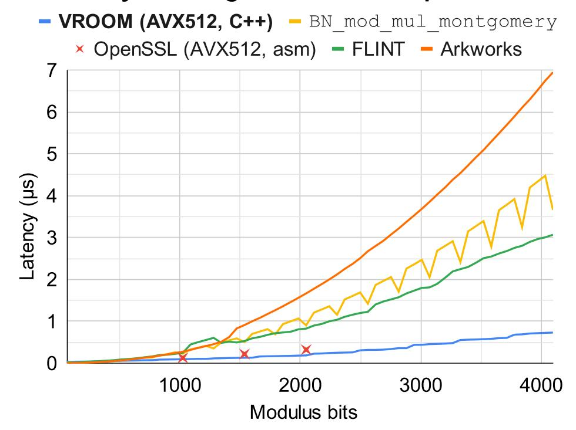
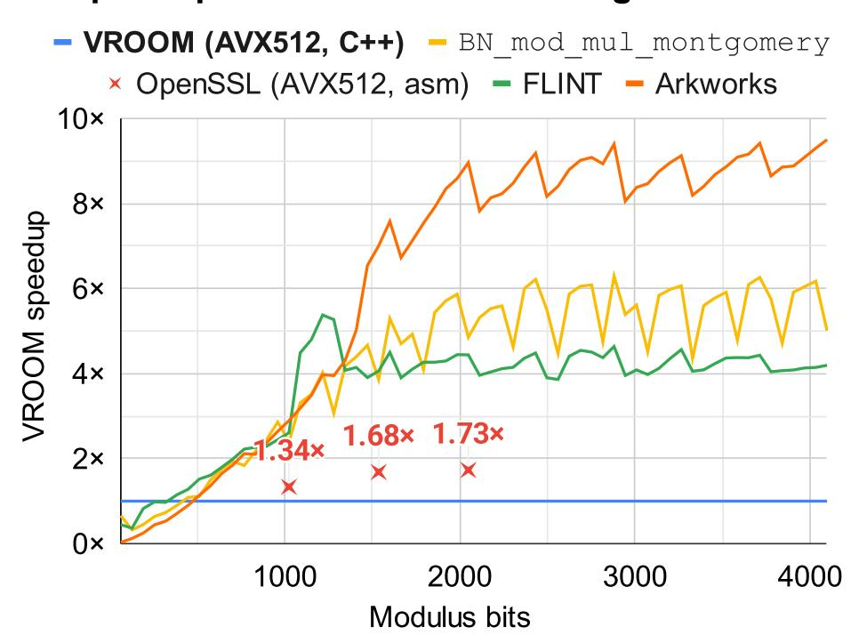
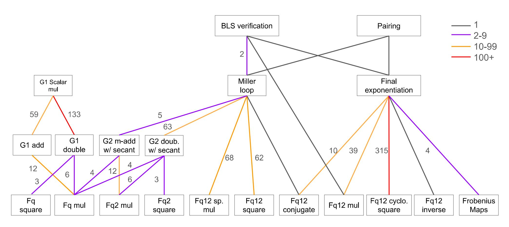

{0}------------------------------------------------

# VROOM: Accelerating (Almost All) Number-Theoretic Cryptography Using Vectorization and the Residue Number System

Simon Langowski *MIT*

Kaiwen He *MIT*

Srinivas Devadas *MIT*

# Abstract

Modular arithmetic with a large prime modulus is a dominant computational cost in number-theoretic cryptography. Modular operations are especially challenging to parallelize efficiently on CPUs using vector instructions; standard CPU implementations rely on costly carry operations and permutation instructions to align with the multiplication datapath, negating the benefits of vectorization.

We develop vectorized algorithms for modular addition and multiplication, and present a new, constant-time modular multiplication algorithm suitable for general moduli – prime or otherwise. Our method uses a Residue Number System (RNS) representation to align the arithmetic naturally with wide vector units, and strategically eliminate extraneous instructions. Existing works either require the use of customized hardware or fail to show latency improvements.

Reducing the latency of modular arithmetic results in speedups for cryptographic applications. We accelerate RSA-4096 signatures by 4.0× (verify) and 1.3× (sign) over OpenSSL, and speed up BLS signature verifications by 3.43× over the assembly-optimized blst library. To facilitate broad practical adoption, we plan to upstream our implementation into BoringSSL, where it will directly benefit real-world TLS and cryptographic deployments.

# 1 Introduction

*Modular multiplication* computes the product of two integers modulo a given integer *p*, and is the primary bottleneck in modular arithmetic, the fundamental building block for number-theoretic cryptography. For example, the celebrated RSA [\[54\]](#page-16-0) encryption and signature algorithm is essentially a *modular exponentiation*, which consists of thousands of sequential modular multiplications. Modular arithmetic is also the key computation in almost all elliptic curve cryptography, including zero-knowledge proofs [\[39\]](#page-15-0), as well as ECDSA [\[34\]](#page-15-1), EdDSA [\[35\]](#page-15-2), BLS [\[11\]](#page-14-0), and Schnorr [\[55,](#page-16-1) [56\]](#page-16-2) signatures. Despite past efforts in optimization, for many modulus sizes relevant to cryptography–hundreds to thousands of

bits–modular multiplication remains an expensive operation on general-purpose processors.

Almost all existing implementations of modular multiplication uses the schoolbook method, which incurs a quadratic cost and involves carry propagation. To make modular multiplications more parallelizable, an alternative approach is to represent integers in the Residue Number System (RNS) [\[59\]](#page-16-3), which encodes a large integer as a vector of residues modulo a set of *t* pairwise coprime numbers *p*1,..., *p<sup>t</sup>* . Additions and multiplications are performed modulo each small modulus *p*1,..., *p<sup>t</sup>* in parallel, and then the final answer (modulo the product of the little primes) can be reconstructed using the Chinese Remainder Theorem. Posch and Posch [\[50\]](#page-16-4) extended RNS to multiplication modulo a single large prime number *p* as needed in cryptography (rather than modulo the composite product of *t* little primes).

Despite the promise of the approach, it is challenging to use RNS to achieve speedups over optimized CPU implementations. Despite some attempts [\[21,](#page-15-3) [41,](#page-15-4) [46\]](#page-16-5), RNS has yet to see adoption in mainstream cryptographic libraries for CPUs, like GMP [\[22\]](#page-15-5), FLINT [\[61\]](#page-16-6), and OpenSSL, suggesting that prior works do not achieve concrete speedups. There are also analytical reasons for this difficulty: an RNS-based approach requires concretely more operations than the schoolbook approach, so we must offset this increase with (1) further algorithmic optimizations (2) better utilization of parallelism.

In this work, we achieve both goals. For (1), we discover several algorithmic insights to significantly reduce the number of operations compared to Posch and Posch [\[50\]](#page-16-4). For (2), we seamlessly map our algorithm to widely available multiply– accumulate instructions on CPUs, and provide a concrete instantiation via AVX512IFMA instructions.

Our algorithm is constant time and works with an *arbitrary* modulus *p*, making us especially competitive in settings where *p* is randomly generated (RSA). We evaluate performance against a variety of existing baselines, and demonstrate speedups (up to 4.0×) over the state-of-the-art in applications like RSA and BLS signatures [\[11\]](#page-14-0).

{1}------------------------------------------------

Our contributions We summarize our contributions:

- We develop VROOM[1](#page-1-0) , a new RNS Montgomery algorithm that uses an essentially optimal number of multiplications. This algorithm is novel to the best of our knowledge, since prior works [\[3,](#page-14-1) [38\]](#page-15-6) resorted to significantly more complicated techniques, and still required more multiplications than our work (See Section [7\)](#page-12-0).
- We create a new unifying optimization framework of premultiplications and post-multiplications that subsumes several ad-hoc techniques [\[3,](#page-14-1) [38\]](#page-15-6) as suboptimal special cases. This framework allows us to arrive at VROOM, and may be of independent interest to future works.
- We develop a new programming framework for RNS computation that generalizes the ideas behind VROOM into settings beyond a single modular multiplication, including computing modular inner products, extension field arithmetic, and elliptic-curve arithmetic (Section [4\)](#page-3-0), used in high-level protocols. We show how to enforce compile-time correctness for arbitrary algorithms, and how to utilize RNS Montgomery to reduce the computational cost below that of "schoolbook" methods.
- We provide an open-source, constant-time implementation of VROOM in C++ via a strategic mapping to AVX512IFMA instruction intrinsics, and show how our implementation can be adapted to work with any multiply–accumulate vector instruction (Section [5\)](#page-5-0).
- We provide a full-fledged fork of BoringSSL using VROOM, and demonstrate a 3.3–3.6× speedup in RSA signature verification for RSA modulus ranging from 2048 to 4096 bits. We plan to merge VROOM into the upstream repository, which will deliver such a speedup to all users of BoringSSL.
- We show how to adapt VROOM to the 381-bit modulus of the BLS12-381 elliptic curve, by taking advantage of optimizations for modular arithmetic, and demonstrate a speedup of 3.15× for elliptic-curve pairings [\[44\]](#page-16-7) over popular libraries.

Organization In Section [2,](#page-1-1) we give an introduction to the necessary background to understand VROOM's modular multiplication algorithm. In Section [3,](#page-2-0) we introduce a unifying framework and present VROOM's new algorithmic optimizations for modular multiplication using this framework. In Section [4,](#page-3-0) we generalize VROOM to support *both* modular addition and multiplication on the same RNS-based encodings. In Section [5,](#page-5-0) we strategically map VROOM to commodity hardware, and give a concrete instantiation using AVX512IFMA instructions. In Section [6,](#page-8-0) we evaluate the performance of

VROOM compared to existing baselines. Finally, in Section [7,](#page-12-0) we describe prior works in relation to VROOM.

# <span id="page-1-1"></span>2 Background

For simplicity, we present modular multiplication with a prime modulus *p*, but it also applies to composite moduli, such as the RSA modulus *N* = *p* · *q*. For brevity, we denote the binary modulo operation *a* mod *m* as *a*%*m*. Unless otherwise noted, *a<sup>m</sup>* denotes a variable holding the value *a*%*m*, often suggesting that *a* is stored in the RNS encoding modulo *m*.

# <span id="page-1-2"></span>2.1 Montgomery modular multiplication

Our modular multiplication algorithm is based on the RNS adaptation of Montgomery modular multiplication [\[45\]](#page-16-8). Montgomery multiplication traditionally works over integer encodings, and is motivated by the need to avoid expensive division instructions on a CPU. We present the integer algorithm first.

Instead of computing *a* · *b*%*p*, Montgomery multiplication computes *a* · *b*/*M*%*p* (where division denotes multiplication by the modular inverse) which can be done using modulo *M* rather than modulo *p* arithmetic. On machines where modulo *M* arithmetic is fast (e.g *M* = 2 <sup>64</sup> on a 64-bit machine), this results in significant speedups. Using Montgomery arithmetic requires encoding numbers in Montgomery form, which is the original number multiplied by the factor *M* modulo *p*. Observe that applying Montgomery multiplication on two integers in Montgomery form results in a new integer in Montgomery form, accounting for the *M*−<sup>1</sup> : (*aM*)·(*bM*)/*M* ≡ *ab* · *M* (mod *p*). The cost of converting into and out of Montgomery form can often be amortized away in cryptography applications since modular multiplication is often invoked repeatedly on a small set of numbers (e.g., during modular exponentiation).

Let *s* = *a*·*b* ∈ [0,(*p*−1) 2 ] be an unreduced product. Modular reduction involves finding the number in [0,(*p*−1)] that is congruent modulo *p* to *s*, called a representative. The insight behind Montgomery multiplication is to instead find an alternate representative *s* ′ congruent to *s* modulo *p*, such that *s* ′ is a multiple of *M*. We can then compute *s* ′/*M* over the *integers* rather than doing it modulo *p*. To find such a representative, we set *s* ′ = *s*+*q* · *p* for some integer *q*, and we solve for *q* in *s*+*q* · *p* ≡ 0 (mod *M*). We give the full algorithm below:

- 1. Compute the unreduced product *s* = *a* · *b*.
- 2. Find the solution *q* = −*s*· *p* <sup>−</sup>1%*M*.
- 3. Compute the redundant remainder *r* ′ = (*s* + *q* · *p*)/*M*. (We can prove that *r* ′ ∈ [0,2*p*−1].)
- 4. Compute a conditional subtraction:

$$r = \begin{cases} r' & r'$$

<span id="page-1-0"></span><sup>1</sup>Vectorized RNS Montgomery with Optimal Multiplications

{2}------------------------------------------------

For efficiency, we often precompute  $d = -p^{-1}\%M$  for a fixed p, and pick M to be a power of two so that division by M and reduction modulo M are trivial bit extractions.

Lastly, we adopt a standard technique called *redundant* Montgomery representation [31,49], which permits the Montgomery representation of a to be any integer congruent to aM (mod p) in a range [0,cp-1] for a small constant c. Using redundant Montgomery representations allow us to omit the final conditional subtraction step, and only perform the conditional subtraction once – when we convert the final answer out of Montgomery form (proof in Appendix D). Looking ahead, the omission of this conditional subtraction is *essential* when we represent integers in the RNS form, where the integer comparison r' < p would be expensive.

#### 2.2 Residue Number System (RNS)

To make modular multiplications more vectorizable, we store integers in an alternate representation known as the Residue Number System (RNS) [59]. We say a modulus R is RNS-friendly if R factors into coprime integers  $p_1, \ldots, p_t$  that each fit inside a machine word. We encode a number  $x_R$  modulo an RNS-friendly moduli  $R = p_1 p_2 \cdots p_t$  via the t-tuple  $(x_{p_1}, \ldots, x_{p_t}) := (x p_1, \ldots, x p_t)$ , and call this the RNS-R encoding. Addition and multiplication (modulo R) is implemented via elementwise additions and multiplications in the underlying t-tuple, where correctness holds from the Chinese Remainder Theorem. Linear time addition and multiplication are advantages of RNS over the traditional integer encodings.

For a general modulus p, since R must be RNS-friendly, we cannot trivially solve the problem by setting R = p. A recurring idea in RNS Montgomery algorithms is to pick a sufficient large R to avoid wraparound, and use the RNS representation to *simulate* the ring of integers. This gives the ability to add and multiply integers, although division and modulo need to be implemented by breaking this ring abstraction by looking under the hood of the RNS representation.

#### 2.3 RNS Montgomery modular multiplication

We present the ideas in [50] as an adaptation of the Montgomery algorithm [45], using the ring modulo R to *simulate* the ring of integers. First, observe that the largest integers in the Montgomery algorithm (in Section 2.1) have size roughly  $2p^2$  (specifically intermediate expression  $s+q \cdot p$ ), so we pick  $R > c \cdot p^2$  for some small constant c. The next problem is that in the Montgomery algorithm, we need to do

- (1) a reduction modulo M, and
- (2) an exact division by M, where the input is *guaranteed* to be divisible by M.

These steps are simply bit extractions when using traditional integer encodings when M is a power of two, but nontrivial when the representation in RNS.

The idea is to pick the RNS modulus to allow division by M in RNS; we introduce an auxiliary RNS-friendly modulus N that is coprime with M, where each of M and N is a small constant multiple of p. We then set the RNS modulus to be  $R = M \cdot N$ , so that R is RNS-friendly and  $R > p^2$ . Note that the RNS-R encoding can be viewed as a concatenation of the RNS-M and RNS-N encodings, so there is no conversion overhead between these encodings. We use the following notation to denote this free conversion process:  $x_{MN} = \text{RNS}(x_M, x_N)$ , where  $x_M = x_{MN} \% M$  and  $x_N = x_{MN} \% N$ .

First, reducing x modulo M for (1) above is trivial: we just use the RNS-M part  $x_M$ . However, we would like to do our computations in RNS-MN, so we also need to compute  $x_M$  in RNS-N. Note that this is not simply  $x_N$ , instead it is x%M in RNS-N rather than x. This is solved using a change RNS base procedure, which we denote CRNS $_N^M$ , which takes in y in RNS-M and outputs y in RNS-N. There are various ways to implement this, and we explain our implementation of CRNS later in Section 5.1.3.

Then, to perform (2), an exact division of x by M, we exploit the guarantee that x is a multiple of M, so  $x/M \equiv x \cdot M^{-1} \pmod{N}$ . This gives a procedure to compute the quotient x/M in RNS N, but fails in RNS-M because  $M^{-1}$  does not exist in RNS-M. Instead, the output in RNS-N already contains the correct Montgomery algorithm output x/M, and since  $N > c \cdot p$  it is represented exactly in RNS-N. The last step is to use CRNSM to convert this output from RNS-N to RNS-M (the opposite direction from before) to construct the full RNS-MN output. We show the full algorithm in Algorithm 1. Note all additions (+) and multiplications (·) are simple elementwise operations under the RNS abstraction.

#### <span id="page-2-1"></span>**Algorithm 1** Posch and Posch [50]

```
Require: a_{MN}, b_{MN} \in [0, 3p-1], M > 9p, N > 6p

Ensure: r_{MN} \equiv a_{MN} \cdot b_{MN} \cdot M \pmod{p}, r_{MN} \in [0, 3p-1]

1: parse \mathsf{RNS}(a_M, a_N) \coloneqq a_{MN}, \mathsf{RNS}(b_M, b_N) \coloneqq b_{MN}.

2: q_M = a_M \cdot b_M \cdot (-p^{-1})\%M

3: q_N = \mathsf{CRNS}_N^M(q_M)

4: r_N = (a_N \cdot b_N + q_N \cdot p) \cdot M^{-1}\%N

5: r_M = \mathsf{CRNS}_M^N(r_N)

6: return r_{MN} = \mathsf{RNS}(r_M, r_N)
```

# <span id="page-2-0"></span>3 Algorithmic optimizations

In this section, we introduce our new algorithmic optimizations for *modular multiplication*, the most expensive procedure of modular arithmetic.

#### 3.1 Absorb multiplications into CRNS

We observe that in Algorithm 1, CRNS is often surrounded by RNS multiplications by fixed parameters independent of the

{3}------------------------------------------------

inputs, such a  $p^{-1}$  and p. Looking ahead, CRNS $_N^M$  is implemented as a product between a matrix (with precomputed entries that depend on M and N) and a vector, and RNS multiplications are implemented as elementwise products. Therefore, we can *merge* these two procedures into a single matrix–vector multiplication with different matrix entries. For a premultiplication by y%M and a postmultiplication by z%N, we define

$$\mathsf{CRNS}_{N*z}^{M*y}(x) = \mathsf{CRNS}_{N}^{M}(x \cdot y\%M) \cdot z\%N.$$

As we described above, an implementation for  $\mathsf{CRNS}_{N*z}^{M*y}$  is just as efficient as  $\mathsf{CRNS}_N^M$ . For example, an immediate optimization is to absorb the premultiplication by  $d_M = -p^{-1} \% M$  and postmultiplication by  $p_N = p \% N$  into  $\mathsf{CRNS}_N^M$  in Algorithm 1, turning it into  $\mathsf{CRNS}_{N*p}^{M*(-p^{-1})}$ . However, unlike  $p^{-1}$  and p, it is not trivial to absorb  $M^{-1} \% N$ . The problem here is that  $r_N$  is both an input to  $\mathsf{CRNS}_M^N$  and an output of the algorithm.

#### <span id="page-3-2"></span>3.2 VROOM: Our final optimized algorithm

At a high level, our final optimized algorithm absorbs the post-multiplication by  $M^{-1}\%N$  by defining yet another new encoding of the inputs in similar spirit to that of Montgomery multiplication. We start by distributing  $M^{-1}$  to the two terms on line 4 of Algorithm 1. We then absorb all possible constant factors into CRNS and replace lines 2 to 4 of Algorithm 1 with the steps:

(A) 
$$c_N = a_N \cdot b_N \cdot M^{-1} \% N$$
  
(B)  $r_N = (c_N + \mathsf{CRNS}_{N*(p \cdot M^{-1})}^{M*-p^{-1}} (a_M \cdot b_M)) \% N$ 

Our goal is to compute step (A) without multiplying by  $M^{-1}$ . Similar to Montgomery multiplication, the idea is to define an alternate encoding  $x'_N = x_N \cdot M^{-1} \% N$ , such that now we have  $a'_N \cdot b'_N = a_N \cdot b_N \cdot M^{-2} = c_N \cdot M^{-1} = c'_N$ . To accommodate this new encoding, we adjust the constants in the two CRNS operations. Such changes are colored in purple. Lines 3 to 6 of Algorithm 1 are now replaced by:

(A) 
$$c'_{N} = a'_{N} \cdot b'_{N} \% N$$
  
(B)  $r'_{N} = (c'_{N} + \mathsf{CRNS}_{N*(p \cdot M^{-2})}^{M*-p^{-1}} (a_{M} \cdot b_{M})) \% N$   
(C)  $r_{M} = \mathsf{CRNS}_{M*1}^{N*M} (r'_{N})$ 

Note that our multiplication by  $M^{-1}$  is done modulo N, not modulo p, so it does not cancel out the multiplication by M modulo p in Montgomery form. Since we defined an alternate encoding for RNS-N but not RNS-M, the alternate encoding for RNS-MN is essentially an automorphism induced by multiplication by T, the unique number in [0, MN - 1] that is both  $M^{-1} \pmod{N}$  and  $1 \pmod{M}$ .

Our final algorithm VROOM is provided in full in Algorithm 2 and a correctness proof in Appendix C. VROOM

achieves an essentially optimal number of multiplications; the only remaining multiplications outside of CRNS are between the input operands, which are necessary for any (however optimized) modular multiplication approach that works by expanding to the full product before reducing.

```
Algorithm 2 VROOM: Our optimized algorithm
```

```
Require: T = M(M^{-1}\%N)^2 + (N)(N^{-1}\%M)\%(MN),

a_{MN} = (a \cdot M\%p) \cdot T\%(MN),

b_{MN} = (b \cdot M\%p) \cdot T\%(MN),

a_{MN}T^{-1}\%(MN), b_{MN}T^{-1}\%(MN) \in [0, 3p - 1],

M > 9p, N > 6p

Ensure: r_{MN} \equiv (a \cdot b \cdot M\%p) \cdot T \pmod{MN},

r_{MN}T^{-1}\%(MN) \in [0, 3p - 1]

1: parse RNS(a_M, a_N) := a_{MN}, RNS(b_M, b_N) := b_{MN}.

2: q_M = a_M \cdot b_M\%M

3: r_N = (a_N \cdot b_N + \text{CRNS}_{N*pM^{-2}}^{M*-p^{-1}}(q_M))\%N

4: r_M = \text{CRNS}_{M*1}^{N*M}(r_N)

5: return r_{MN} = \text{RNS}(r_M, r_N)
```

In Table 6, we will discuss the relative cost of modular multiplication with a t-word modulus p using VROOM RNS Montgomery multiplication as  $2t^2 + 13t$  and schoolbook Montgomery multiplication as  $2t^2 + 2t$ . While these have the same leading  $2t^2$  term, we have a strictly larger 13t > 2t term; VROOM's reduced multiplication count reduced this linear term (which is 19t in Algorithm 1), which is significant for small t. Nevertheless, 13t > 2t, and in the next section, we present additional optimizations that overcome this hurdle.

#### <span id="page-3-0"></span>4 Protocol-level optimizations for RNS

We present further optimizations in computing modular arithmetic, i.e., the combination of modular multiplication and addition, beyond using Section 3.2 as a black box, which is crucial in obtaining speedups for extension field arithmetic and elliptic curve operations. Due to the nontriviality of ensuring correctness in RNS modular addition, we introduce a new framework that enables automatic, compiler-driven determination of the optimal RNS parameters, which may be of independent interest.

While modular addition is trivial in the schoolbook setting, RNS introduces additional considerations. In particular, a sum of k unreduced products could be as large as  $k(p-1)^2$ , which is k times as large as the typical upper bound for a single product, and MN need to be increased by a factor of k accordingly, specifically by M > k(9p). Furthermore, unlike in the schoolbook setting, it is nontrivial to perform the conditional correction step of classical modular addition, which means that we prefer to operate on redundant forms. First, we track the redundance of numbers used in RNS with compile time bounds-checking. We then describe techniques to speed

{4}------------------------------------------------

<span id="page-4-4"></span>

| Component           | Schoolbook               | RNS       |
|---------------------|--------------------------|-----------|
| $F_p$ mult          | $2t^2$                   | $2t^2$    |
| Sum of $k F_p$ mult | $(k+1)t^2$               | $2t^2$    |
| $F_p^k$ mult        | $(k^{\log_2(3)} + k)t^2$ | $2kt^2$   |
| $F_p^2$ mult        | $5t^2$                   | $4t^2$    |
| $F_p^6$ mult        | $24t^2$                  | $12t^{2}$ |
| $F_p^{12}$ mult     | $66t^2$                  | $24t^{2}$ |

Table 1: Let p be a t word modulus. RNS speeds up the computation of a sum of products and field extensions, measured in single precision wide multiplication operations. Both schoolbook and RNS use lazy reduction to combine sums before modular reduction. We assume the use of Karatsuba's algorithm for field extensions, an important optimization for the schoolbook algorithm [40], with concrete instantiations provided for k = 2, 6, 12. Lower order terms omitted, see Table 6 for more details.

up combinations of modular multiplications and additions (Section 4.1) and explain how they apply to field extensions (Section 4.2) and elliptic curve arithmetic (Section 4.4).

### <span id="page-4-0"></span>4.1 Bounding RNS values

After a series of arithmetic operations, the redundancy  $c \cdot p$  grows; if it overflow the RNS modulus  $M > c \cdot p$ , then the result will be incorrect. With the much more complicated algorithms in elliptic curves (see Appendix G), bounds checking is crucial to ensuring the RNS cannot experience overflow. Because a sum of products of *random* inputs tends towards its mean value, such an overflow may not be detectable via random testing, and must be proven impossible analytically to defend against *adversarial* inputs.

To solve this problem, we introduce compiler-checked bounds on our numbers. Each number is assigned a RNS **Bounds** $\langle lower, upper \rangle$  parameter to track the allowed range of values. It follows that **Bounds** $\langle l_1, u_1 \rangle + Bounds \langle l_2, u_2 \rangle = Bounds \langle l_1 + l_2, u_1 + u_2 \rangle$ . By propagating bounds through each operation in the logical way, compile-time assert statements ensure that at no point in the program any value can overflow MN, thereby eliminating runtime overhead.

# <span id="page-4-1"></span>4.2 Speedups for field extensions

The key advantage of RNS is that elementwise modular multiplications are fast, being linear in the modulus size. To take advantage of this, we need to look for sums of products. For a simple sum of products  $(a \cdot b + c \cdot d)\%p$  with a t-word modulus p, schoolbook lazy reduction computes: the product  $a \cdot b$ ,  $c \cdot d$  and the reduction mod p once on the total sum (so called lazy reduction [14]), for a total of  $3t^2$ . On the other hand, RNS computes the products  $a \cdot b$  and  $c \cdot d$  in linear time, but

| Expression                   | Strategy                            |  |  |
|------------------------------|-------------------------------------|--|--|
| $a \cdot b + c \cdot d$      | Lazy reduction, Section 4.2         |  |  |
| $\overline{(a+b)\cdot(c+d)}$ | Unexpanded computation, Section 4.3 |  |  |

Table 2: Different strategies for modular arithmetic expressions with RNS Montgomery.

requires  $2t^2$  to implement the reduction mod p. Therefore, for a sum of 2 products, RNS achieves up to a  $1.5 \times$  speedup.

In settings with sums of products, RNS Montgomery is asymptotically (and concretely) superior even when other optimizations are also applied to traditional algorithms. One of the main uses of sums of products in cryptography is in the computation of field extensions [40]. In Table 1, we show the asymptotic speedups from implementing field extensions using RNS and lazy reduction, compared to using Karatsuba and lazy reduction with schoolbook multiplication. Such algorithms are used implicitly in prior work [14]. The speedup grows with the number of terms in the sum of products: for an  $F_q^{12}$  extension, RNS achieves up to a speedup of  $2.75\times$ .

### <span id="page-4-3"></span>4.3 Mixing expanded and unexpanded form

Another combination of multiplication and addition operators that can be optimized is  $(a+b)\cdot(c+d)$ , where this is the only use of a,b,c,d. In total, we invoked 4 calls to CRNS $_{M*1}^{N*M}$  in Algorithm 2 – one to compute each of a,b,c,d. Instead, we can add (a+b) and (c+d) as  $r_N$  values, and then invoke 2 calls to CRNS $_{M*1}^{N*M}$  on the sums (a+b) and (c+d). This can eliminate expensive CRNS calls and allows us to use slightly cheaper mod N rather than MN arithmetic. We can compute mod N as long as the sum (or other expression computed in  $r_N$ ) will not overflow  $^2$ . Note the product of any two numbers will be on the order of  $p^2$  and require the full MN; therefore, expansion of the RNS from N to MN (via CRNS $_{M*1}^{N*M}$ ) must be completed before any values are multiplied.

#### <span id="page-4-2"></span>4.4 Choosing elliptic curve algorithms

With these optimizations in mind, we can consider how they affect cryptographic applications. The basic elliptic curve group operation is point addition, with a specialization for x+x called point doubling. Each of these operations is implemented with a series of modular addition and multiplications. The exact formula depends both on the specific curve parameters and the coordinate system used to represent points. We choose to use the formulas from Renes et al. [52]. This is because in RNS Montgomery, the goal is to minimize the number of reduction, rather than multiplication, operations. There are several considerations which lead to this choice:

<span id="page-4-5"></span><sup>&</sup>lt;sup>2</sup>Specifically  $M > 9 \cdot c \cdot p$  and  $N > 6 \cdot c' \cdot p$  supports products of  $cp^2$  and unexpanded sums of c'p.

{5}------------------------------------------------

- Traditionally, 4 coordinates systems have fewer multiplies. However, we prefer coordinate systems with 3 coordinates to those with 4, as 3 outputs means 3 reductions, rather than 4.
- We choose formulas that are strongly unified, meaning that point addition can also be used for doubling. This eliminates the need to check special cases through comparisons, which are difficult to do in RNS.
- We choose projective over Jacobian coordinates. This is because low-depth algorithms allow efficient batching of reduction operations in comparison to long chains of sequential multiplications: a batch of reduction operations becomes matrix-matrix multiplication, and allows additional optimizations to be applied.
- Finally, although many formulas make extensive use of Karatsuba-like techniques to reduce multiplications, sum-of-products formulas are more efficient with RNS.

In Appendix [G](#page-20-0) we show how we utilize both lazy reduction and unexpanded computation in the elliptic curve point addition operation (for the BLS12-381 curve).

# <span id="page-5-0"></span>5 Mapping to vector instructions

Commodity hardware platforms can perform a wide range of tasks, enabling the mass-production of hardware with much lower end-user computational costs. However, in exchange, software must use a fixed word width *w* and fixed instruction set, which is not necessarily optimized for its use case. Custom hardware, such as ASICs and FPGAs, on the other hand, have no such restrictions, but require large capital costs or have relatively slow clock frequencies, respectively. In this section, we will optimize our modular multiplication algorithm focusing on commodity hardware with vector instructions.

We point out concrete differences between custom and commodity hardware that will affect our design choices. Optimizations with redundant forms are generally only valuable on hardware where conditional correction is expensive, namely, CPUs and GPUs. Specifically, consider the modular reduction required to implement RNS operations. Since we can choose any (co-prime) moduli to construct the Residue Number System, it is general practice to choose pseudo-Mersenne moduli. On custom hardware, like ASICs and FPGAs, each pseudo-Mersenne modulus can be baked into a simple circuit, making RNS extremely fast. Redundant form would cause larger width multipliers in exchange for removing some bitwise and addition operations – not a worthwhile tradeoff. On commodity hardware, however, the fixed multiplication width means we always multiply *w* bits, whether we need them or not. Seen this way, redundant forms allow us to utilize this extra multiplication width to save on other operation costs. As an example, we will use Montgomery reduction

– an algorithm that applies for any modulus (not just those of pseudo-Mersenne form) to reduce wide values (those of > *w* bits), which should be more computationally intensive than pseudo-Mersenne reduction. On AVX512, the throughput of multiplication instructions is actually greater than that for bitshift instructions (Table [3\)](#page-6-1), making the general Montgomery algorithm faster – exactly the opposite of the case with circuit-based hardware.

# 5.1 Implementing with commodity hardware

There are many possible ways to implement our algorithm on commodity hardware. For CPUs, the most efficient implementation for RNS Montgomery is to use the AVX512IFMA extension, which provides for high-throughput 52-bit multiplication operations on vectors of 512 bits.

There are 3 key kernels to implement as a "backend": elementwise addition, elementwise multiplication, and CRNS. We assume access to functions like subtraction, bitwise and, logical right shift srli and a multiply–accumulate madd(*x*,*y*,*z*) = *x* + *y* · *z*, which can be split into the high (madhi) and low (madlo) outputs. We mainly focus on the AVX512 setting (see Table [3](#page-6-1) for a partial mapping), but apply in general to commodity vector processors, for example, on a GPU madlo may be a 32-bit multiplication.

#### <span id="page-5-2"></span>5.1.1 Elementwise additive reduction

For additive elementwise reduction (RNS(*x*)+RNS(*y*)), we utilize either psuedo-Mersenne reduction or conditional correction. In addition to tracking the multiples of *p* as in Section [4.1,](#page-4-0) we also track the bounds for each elementwise moduli *m<sup>i</sup>* in the RNS, which are used to automatically determine the best strategy. For example, a 50-bit pseudo-Mersenne modulus is of the form *m* = 2 <sup>50</sup> −*z*, for small *z*, and we can compute

$$maddlo(and(x, 2^{50}-1), srli(x, 50), z)$$

This works because *x* = 2 <sup>50</sup>*u* + *l* ≡ *zu* + *l* (mod 2<sup>50</sup> − *z*). When available, we leave each 50-bit residue itself in a 51 bit redundant form with Bounds⟨0,2m⟩. If the bound is already Bounds⟨0,2m⟩, we automatically take no action, and if the bound is Bounds⟨0,4m⟩ we automatically apply a conditional correction (which is slightly cheaper than the above psuedo-Mersenne reduction). We do not use Montgomery reduction here because this introduces additional Montgomery factors into the form; instead we use Montgomery reduction to efficiently reduce products.

#### <span id="page-5-1"></span>5.1.2 Montgomery multiplication reduction

For wide values (the outputs of products RNS(*x*)· RNS(*y*)), we use traditional Montgomery reduction for the elementwise RNS operations. The input to Montgomery reduction is a

{6}------------------------------------------------

<span id="page-6-1"></span>

| Code   | AVX mnemonic instruction | CPI | Description                                                |
|--------|--------------------------|-----|------------------------------------------------------------|
| maddlo | _mm512_madd521o_epu64    | 0.5 | 52-bit multiply, adding low 52 bits to 64-bit accumulator  |
| maddhi | _mm512_madd52hi_epu64    | 0.5 | 52-bit multiply, adding high 52 bits to 64-bit accumulator |
| sub    | _mm512_sub_epi64         | 0.5 | Subtract 64 bit numbers                                    |
| srli   | _mm512_srli_epi64        | 1   | Shift 64 bits right                                        |

Table 3: Selected AVX512IFMA and related instructions. Throughput and mnemonics for Sapphire-rapids from [32]

<span id="page-6-3"></span>

| Implementation | <b>Moduli size</b> (w) | Accumulator size |
|----------------|------------------------|------------------|
| AVX512-IFMA    | 52 bits                | 116 (128) bits   |
| AVX512-IFMA    | 50 bits                | 112 (128) bits   |

Table 4: Comparison of implementation parameters. Moduli size is equivalent to word size w, and accumulator must be at least  $2w + \log_2(t)$  bits.

wide value, expressed as a high and low element h and l respectively, such that  $h2^w + l$  would reconstruct the wide value for a word size w. Montgomery reduction can then be expressed in 3 steps:

- 1.  $q = \text{maddlo}(0, l, (m^{-1}\%2^w))$
- 2. u = maddhi(-m, q, m)
- 3. **return** sub(h, u)

For products, the wide input is of the type **Bounds** $\langle \mathbf{0}, \mathbf{km}^2 \rangle$ , meaning that  $0 \le x \le km^2$  (all bounds are inclusive). We can carefully consider the bounds at each step. This process is automated, and here we illustrate for a 50-bit modulus with a w = 52-bit word size:

- 1. The value q is the low 52 bits of a product, and therefore bounded by  $2^{52}$ .
- 2. The product  $q \cdot m < 2^{52}m$ , so the high product  $0 \le \lfloor \frac{qm}{2^{52}} \rfloor \le m$  has **Bounds** $\langle \mathbf{0}, \mathbf{m} \rangle$ . The constant -m has **Bounds** $\langle -\mathbf{m}, -\mathbf{m} \rangle$ , and so the sum u has **Bounds** $\langle \mathbf{0} + -\mathbf{m}, \mathbf{m} + -\mathbf{m} \rangle = \mathbf{Bounds} \langle -\mathbf{m}, \mathbf{0} \rangle$ .
- 3. We have  $h \leq \frac{km}{2^{52}}m$ . For 50-bit  $m, m < 2^{50}$ , so we have  $h \leq \lceil \frac{k}{4} \rceil m$ , giving h the new bounds  $\operatorname{Bounds}\langle \mathbf{0}, \lceil \frac{k}{4} \rceil \mathbf{m} \rangle$ . Then, the subtraction gives bounds  $\operatorname{Bounds}\langle \mathbf{0}, \lceil \frac{k}{4} \rceil \mathbf{m} \rangle \operatorname{Bounds}\langle -\mathbf{m}, \mathbf{0} \rangle = \operatorname{Bounds}\langle \mathbf{0}, (\mathbf{1} + \lceil \frac{k}{4} \rceil) \mathbf{m} \rangle$ .

The algorithm then outputs in this redundant form. If our residue size and word size are different, this can be particularly efficient; for 50-bit residues with 52-bit words, **Bounds** $\langle \mathbf{0}, \mathbf{4m} \rangle$  fits in 1 word. Therefore, for  $k \leq 12$ , the output can be used directly in any subsequent multiplication operations without an elementwise reduction or conditional correction step.

#### <span id="page-6-0"></span>**5.1.3** CRNS modulo *p* reduction

The final operation required to implement RNS Montgomery arithmetic efficiently in our combined CRNS operation. The

<span id="page-6-2"></span>

| $\mathbf{A}_{i,j}$   | $(((ICRT_i \cdot y)\%M) \cdot z)\%n_j$ |
|----------------------|----------------------------------------|
| $\vec{\mathbf{f}}_i$ |                                        |
| $\vec{\mathbf{c}}_j$ | $(-M \cdot z)\%n_j$                    |

Table 5: Constants used in CRNS $_{N*z}^{M*y}$ . ICRT $_i$  is the inverse chinese remainder theorem factor:  $(M/m_i)((M/m_i)^{-1}\%m_i)$ . See Appendix A for details.

algorithm has 3 steps, each involving precomputed constants  $\mathbf{A}, \mathbf{f}, \mathbf{c}$ , which for CRNS $_{N*y}^{M*x}$  are derived in Appendix A and show in Table 5. It takes two inputs at runtime:  $\vec{r}$ , the input in RNS form M, and  $\vec{a}$  an accumulator in RNS form N (generally initialized to 0).

- 1.  $\vec{a} = \text{vec\_mat\_madd}(\vec{a}, \vec{r}, \mathbf{A})$
- 2.  $k = srli(dot\_product(\vec{r}, \mathbf{f}), precision)$
- 3. **return** madd( $\vec{a}, k, \vec{c}$ )

The first step vec\_mat\_madd is a matrix-vector product of a  $1 \times t$  by  $t \times t$  product. The second step determines k which measures how much the RNS overflows the modulus. We estimate k using fixed-point arithmetic (Appendix B), with a slightly wider type. For w bit residues, we need at least a  $precision = w + 1 + \log_2(t)$  to compute the value accurately. This can be implemented using 2 w bit-multiplications, or by combining different multiplier widths if available. In particular, for AVX, we use 64-bit precision implemented with standard integer multiplies. Some possibilities are summarized in Table 4. Once computed, we also need to use the slightly wider arithmetic to apply the correction, which is another madd operation. Finally, as shown in Appendix D, CRNS reduction outputs in RNS  $\mathbf{Bounds}\langle \mathbf{0}, \mathbf{3p}\rangle$  for input in RNS  $\mathbf{Bounds}\langle \mathbf{0}, \mathbf{Mp}\rangle$ , and elementwise moduli  $\mathbf{Bounds}\langle \mathbf{0}, \mathbf{2m}\log_2(\mathbf{t})\rangle$ .

#### 5.1.4 Putting things together

To reduce the elementwise bound, each CRNS is followed by a Montgomery reduction (Section 5.1.2) and elementwise reduction (Section 5.1.1). A full modular multiplication modulo p using RNS will therefore require an initial unreduced multiplication, 3 Montgomery reductions, 2 elementwise reductions, and 2 CRNS calls. Using Montgomery reduction for elementwise operations requires a small modification of

{7}------------------------------------------------

<span id="page-7-0"></span>

| Steps                           | RNS          | Schoolbook   |
|---------------------------------|--------------|--------------|
| <i>U</i> : Unreduced multiply   | t            | $t^2$        |
| <i>M</i> : Montgomery reduce    |              |              |
| (Section 5.1.2)                 | t            | N/A          |
| R: Elementwise reduce           |              |              |
| (Section 5.1.1)                 | 0.5t         | N/A          |
| <i>C</i> : CRNS (Section 5.1.3) | $t^2+4t$     | N/A          |
| Modular multiplication:         |              |              |
| U+3M+2R+2C                      | $2t^2 + 13t$ | $2t^2 + 2t$  |
| Sum of <i>k</i> products:       | $2t^{2} +$   | $(k+1)t^2 +$ |
| kU + 3M + 3R + 2C               | (12.5+k)t    | 2t           |

Table 6: Single precision, wide multiplication counts for modular multiplication, and sum of products with RNS. We count high and low multiplication as 0.5 wide multiplication operations. Assumes non-vectorized computation with word-size pseudomersenne moduli.

the CRNS parameters, see Appendix E. If arithmetic includes subtraction, we can offset by adding a precomputed multiple of the modulus p to make the result positive, as this does not change the result modulo p. This can be determined by looking at the lower bound of **Bounds**(lower, upper), which will be negative in this case, and indicate the smallest multiple required to clear the negative. We precompute appropriate multiples for powers of 2 to efficiently make values positive.

**Multiplication complexity** Now that we have described all the algorithm steps, we can analyze the work required for a RNS modular multiplication in comparison to a schoolbook multiplication using these algorithms. One method of measuring algorithmic complexity is to count the number of multiplication operations required on a given machine. We assume a machine with a 64-bit madd that is used for both schoolbook and RNS (therefore, using 64-bit residues for the RNS). The computational complexity of Montgomery multiplication (Mont in Table 14) for a t-word modulus given in terms of single-precision multiplication operations is  $2t^2 + 2t$ (Note 14.38 in [43]). We compute the corresponding complexity of a RNS Montgomery multiplication as  $2t^2 + 13t$ in Table 6. This means that without field extensions and/or sums of products, RNS Montgomery has strictly more operations than schoolbook Montgomery multiplication. Note that we assume here that the schoolbook algorithm and RNS use the same number of words/residues t; depending on the exact bound required RNS can require one extra word/residue compared to the schoolbook algorithm.

#### **5.2** Application details

We describe the specific parameters used for our applications in the evaluation with AVX512IFMA. AVX512IFMA

performs 8 52-bit multiplications, and there will be approximately approximately 64/52 - 1 = 23% more residues in the RNS compared with a 64-bit implementation. However, the 64-bit accumulator in AVX512IFMA allows us to easily implement redundant representations and lazy reduction. We use it to support **Bounds** $\langle -2048m, 2048m \rangle$  for elementwise operations without overflow.

**AVX512IFMA BLS12-381** We find that the RNS bounds for the elliptic curve pairing, with the algorithm as chosen in Section 4.4, are **Bounds** $\langle -5796p^2, 7131p^2 \rangle$ . This is found computationally by the template parameters, and using any smaller value will cause the program to fail to compile, printing the error, e.g., that the used bound 3 < 7131, and informing the programmer what bound they should increase to. This number is a function of the elliptic curve algorithm; in particular, it occurs during the computation of the y coordinate of the elliptic curve doubling step over the  $F_p^2$  extension. We make the range positive by adding the precomputed constant  $5796p^2$  before modular reduction, clearing all negatives. The range then becomes **Bounds** $\langle 0, 12927p^2 \rangle$ , requiring M, N to be at least as big as c = 12927 times the 381-bit BLS12-381 modulus q, or at least 395 bits each. Since  $52 \cdot 8 = 416 > 395$ , we can use one AVX512 vector to hold the 8 required residues. However, it is more efficient to use 50-bit residues, which works since  $8 \cdot 50 = 400 > 395$ . This allows us to utilize the redundant form outputs from Section 5.1.1 and Section 5.1.2, eliminating many operations. Although these operations are O(t), since t=8 is relatively small, the quadratic term doesn't dominate, and these extra operations are a significant portion of the RNS computation.

**AVX512IFMA RSA** We note that the same trick does not apply well to RSA. First, RSA computation is comprised entirely of modular multiplications, with no additions. Second, the use of 50-bit residues would incur an extra AVX512 limb. For example, consider a 2048-bit RSA modulus. We let c = 9 for a single multiply, and so we require  $\lceil \frac{2048 + \log_2(9)}{52} \rceil = 40$  residues, which requires  $\lceil \frac{40}{8} \rceil = 5$  AVX512 elements. The same computation with 50-bit residues requires 6 AVX512 limbs, making using 50 bits a (worse) tradeoff and not a strict improvement.

Constant-time property Assuming that AVX512 instructions are constant time, then our implementation is also constant time, as we do not introduce any data-dependent control flow in our higher level algorithms (e.g., we use a constant time modular exponentiation method that utilizes our constant-time modular multiplication method). When needed, we implement conditional corrections as described in [9], using the AVX512 minimum operation and no comparisons.

{8}------------------------------------------------

# <span id="page-8-0"></span>6 Evaluation

We evaluate our C++ implementation of VROOM on the SapphireRapids AWS c7i.metal−24xlarge machine. All experiments are pinned to a single core with taskset -c 0. The source code we used to run RSA and pairing experiments can be found in the following two repositories, respectively:

RSA: [github.com/kevin-he-01/vroomssl](https://github.com/kevin-he-01/vroomssl) Pairings: [github.com/SimonLangowski/VROOM](https://github.com/SimonLangowski/VROOM)

# 6.1 Modular multiplication

As a microbenchmark, we measure the time for a chain of modular multiplications *a* ← *a* · *b*%*p* using our method or a library. This benchmarks the raw sequential latency, as each multiplication is dependent on the last. For modular exponentiation and many of our applications, we have a long chain of sequential modular multiplications with a constant number of input and output operands, motivating the benchmark design. We allow each implementation to use its own representation (e.g., Montgomery form) of numbers for maximal efficiency, since the time to convert between standard integer and alternative representations is amortized away by this long chain. We also permit arbitrary precomputation on the fixed modulus *p* before the benchmark begin, such as Montgomery factors. We provide some details for a few key baseline implementations:

OpenSSL OpenSSL [\[47\]](#page-16-11) is a popular cryptographic library, and is often used by applications using TLS or SSH. It has two functions for (Montgomery) modular multiplication:

- BN\_mod\_mul\_montgomery performs constant-time Montgomery modular multiplication for general moduli sizes using scalar instructions.
- ossl\_rsaz\_amm52x**#**\_x1\_ifma256, where **#** is 20, 30, or 40, are specialized assembly implementations of Almost Montgomery Multiplication (AMM) [\[27\]](#page-15-11) on moduli of size 1024, 1536, and 2048 bits respectively, using AVX512IFMA instructions. Those functions are internal symbols in OpenSSL used by specialized modular exponentiation routines for RSA.

BoringSSL BoringSSL is a drop-in replacement of OpenSSL, and is used by many Google products [\[25\]](#page-15-12), most Chromium-based browsers, and Electron apps. It also has the BN\_mod\_mul\_montgomery function, and we found that its performance is almost identical to that of OpenSSL (the plotted lines would overlap), so we opt not to plot it separately.

FLINT Fast Library for Number Theory (FLINT) [\[61\]](#page-16-6) is a highly optimized multi-precision integer library based on GMP [\[22\]](#page-15-5) with further optimizations for modular arithmetic. For moduli up to 1024 bits, we use the function mpn\_mod\_mul since it is the most optimized routine to our knowledge. For

larger moduli where this function is not implemented, we use fmpz\_mod\_mul, which precomputes the Barrett [\[5\]](#page-14-4) inverse of the moduli to speed up reductions.

**arkworks** arkworks [\[2\]](#page-14-5) provides modular arithmetic for cryptographic algorithms and libraries in the Rust programming language. It is a popular library for elliptic curve cryptography and zk-SNARKs [\[39\]](#page-15-0). We use the overloaded multiplication (\*) operator on Fp objects using MontBackend which performs Montgomery modular multiplication.

The results are shown in Figure [1a,](#page-9-0) we compare performance on moduli in 64-bit increments, so as to align with the baselines that store numbers as 64-bit limbs. From the figure, observe that BoringSSL and OpenSSL achieves the best performance at 256-bit increments. In Figure [1b,](#page-9-0) we plot our speedups over the baselines.

# 6.2 Modular exponentiation

Many cryptographic applications, including RSA signatures, crucially rely on modular exponentiation, which computes *a <sup>e</sup>*%*m*. Exponentiation sequentially invokes multiplication, potentially storing intermediate results in lookup tables.

For a constant-time implementation, the performance is determined by (1) an upper bound on the bit length of the exponent *e* (2) whether *e* needs to be protected from side channel attacks (3) whether *m* is a composite number with a known factorization. The bit length determines the raw number of modular multiplications and table lookups needed. A public *e* (as in RSA verification) enables optimizations such as the use of optimal addition chains, and the use of algorithms that branch conditionally on the bits of *e*, like sliding-window exponentiation [\[43\]](#page-15-10). In contrast, if *e* is private (as in RSA signing), we must use a constant-time linear scan lookup table and lower fixed-window exponentiation [\[43\]](#page-15-10).

Generic exponentiation We first focus on the case where we do not exploit knowledge of the factorization of *m*, which is already the best known approach for RSA verification (where *m* = *N*). We compare with OpenSSL, BoringSSL, and FLINT as baselines. We report numbers for parameters most commonly used in RSA signatures, namely *m* being 2048, 3072, and 4096 bits, respectively. Cryptographic libraries like OpenSSL have highly-optimized code paths for those parameters. We remark that unlike other libraries, the FLINT implementation for modular exponentiation is not constant-time, but is reported here for reference purposes.

In Table [7b,](#page-9-1) we use parameters most relevant to RSA private key operations (signing and decryption), namely (1) bit length of *e* matches the bit length of the modulus (2) *e* needs to be protected from side-channel attacks. OpenSSL has two functions that perform this op-

{9}------------------------------------------------

<span id="page-9-0"></span>

(a) Comparison of the modular multiplication latency of VROOM with OpenSSL (ossl\_rsaz\_amm52x**#**\_x1\_ifma256), arkworks, FLINT, and BN\_mod\_mul\_montgomery (with almost identical performance in BoringSSL and OpenSSL) on a range of moduli.



(b) VROOM's multiplicative speedup over baselines. For moduli consisting of 1500 bits or more, the speedups are approximately 8× over arkworks, 4× over FLINT/BN\_mod\_mul\_montgomery, and 1.7× over specialized assembly implementations in OpenSSL.

Figure 1: Modular multiplication performance of VROOM compared to existing libraries.

<span id="page-9-1"></span>

| Bits | OSSL | BSSL | FLINT | VROOM | Speedup |
|------|------|------|-------|-------|---------|
| 1024 | 3.75 | 3.5  | 5.99  | 1.87  | 1.87×   |
| 1536 | 7.92 | 7.43 | 11.8  | 2.54  | 2.93×   |
| 2048 | 13.9 | 13   | 20    | 3.7   | 3.51×   |
| 3072 | 30.7 | 28.7 | 41.2  | 8.38  | 3.42×   |
| 4096 | 54.3 | 50.9 | 71.3  | 13.6  | 3.74×   |

<sup>(</sup>a) Public-exponent modular exponentiation (*e* = 65537). Times reported in microseconds; speedups relative to BoringSSL.

| Bits | OSSL  | BSSL  | FLINT* | VROOM | Speedup |
|------|-------|-------|--------|-------|---------|
| 1024 | 228   | 236   | 344    | 125   | 1.83×   |
| 1536 | 629   | 741   | 1020   | 256   | 2.45×   |
| 2048 | 1293  | 1716  | 2280   | 494   | 2.62×   |
| 3072 | 5672  | 5678  | 7055   | 1687  | 3.36×   |
| 4096 | 13322 | 13323 | 16434  | 3700  | 3.60×   |

(b) Secret-exponent modular exponentiation (exponent bit length = modulus bit length). Times reported in microseconds; speedups relative to the fastest function in OpenSSL.

Table 7: Running time of a single modular exponentiation in microseconds for various modulus and exponent bit lengths.

eration, BN\_mod\_exp\_mont\_consttime (x1) uses scalar instructions for all bit lengths, while for select bit lengths (1024, 1536, and 2048), BN\_mod\_exp\_mont\_consttime\_x2 (x2) performs *two* modular exponentiations in parallel using highly-optimized assembly code and vector instructions, and falls back to running x1 twice for other bit lengths. We confirmed that on our experimental setup, the code uses AVX512IFMA instructions for those bit lengths. On our setup, x2 is faster (*even* in single-operation latency) than x1 for those bit lengths, likely due to the use of vector instructions.

In Table [7a,](#page-9-1) we use parameters most relevant to RSA public key operations (verification and encryption), namely (1) *e* = 65537 (2) *e* is public, i.e., dataflow is allowed to depend on *e*.

RSA-CRT exponentiation For RSA private key operations, and the party knows the secret primes *p* and *q* (e.g., RSA signing and decryption), a standard optimization is to apply

the Chinese Remainder Theorem (CRT) [\[51,](#page-16-12) [59\]](#page-16-3) to perform separate computations modulo *p* and *q* instead of modulo *N* = *pq*. This improves performance even if the two exponentiations run sequentially, since schoolbook multiplication has a quadratic complexity. However, we can do better even on a single thread. For our algorithm, we can strategically interleave the individual instructions in two parallel instantiations of RNS Montgomery, which hides the high latency of AVX instructions. OpenSSL uses AVX instructions (x2) to to perform a batch of two exponentiations in parallel for bit lengths 1024, 1536, and 2048, which corresponds to RSA moduli of length 2048, 3072, and 4096 bits. BoringSSL also uses the CRT decomposition for RSA, but computes the exponentiations modulo *p* and *q* sequentially.

We benchmark the performance of an RSA-CRT exponentiation, namely, computing *a <sup>d</sup>*%*pq* for the RSA secret exponent *d* where *d*%(*p* − 1), *d*%(*q* − 1), and *q* <sup>−</sup>1%*p* are

<sup>\*</sup> FLINT: Not a constant-time implementation.

{10}------------------------------------------------

<span id="page-10-1"></span>

| RSA modulus size (bits) | 2048  | 3072  | 4096  |
|-------------------------|-------|-------|-------|
| OpenSSL RSA_sign        | 255   | 688   | 1394  |
| BoringSSL RSA_sign      | 488   | 1515  | 3491  |
| VROOM RSA_sign          | 209   | 540   | 1083  |
| Speedup over OpenSSL    | 1.22× | 1.27× | 1.29× |
| Speedup over BoringSSL  | 2.33× | 2.81× | 3.22× |

| RSA modulus size (bits) | 2048  | 3072  | 4096  |
|-------------------------|-------|-------|-------|
| OpenSSL RSA_verify      | 15.1  | 32.4  | 56.4  |
| BoringSSL RSA_verify    | 13.5  | 29.5  | 51.5  |
| VROOM RSA_verify        | 4.05  | 8.84  | 14.2  |
| Speedup over OpenSSL    | 3.73× | 3.67× | 3.97× |
| Speedup over BoringSSL  | 3.33× | 3.34× | 3.63× |

Table 8: RSA signature latencies of VROOM across modulus sizes, in microseconds, versus OpenSSL and BoringSSL.

<span id="page-10-0"></span>

| RSA modulus size (bits) | 2048  | 3072  | 4096  |
|-------------------------|-------|-------|-------|
| OpenSSL                 | 243   | 663   | 1355  |
| BoringSSL               | 487   | 1516  | 3492  |
| Vroom                   | 209   | 542   | 1079  |
| Speedup over OpenSSL    | 1.16× | 1.22× | 1.26× |
| Speedup over BoringSSL  | 2.33× | 2.80× | 3.24× |

Table 9: The latency of performing a single RSA-CRT exponentiation, in microseconds.

precomputed (values are often stored in a private key file). OpenSSL implements RSA-CRT exponentiation in the internal function <code>rsa\_ossl\_mod\_exp</code>, while BoringSSL implements RSA-CRT in <code>rsa\_default\_private\_transform</code>. Both functions implement the countermeasure against fault attacks [10]: involving a modular exponentiation with the short RSA *public* exponent *e*. We report the results in Table 9.

#### **6.3** RSA signatures

We evaluate our algorithm for RSA signing and verification with OpenSSL and BoringSSL as baselines, and test on commonly-used RSA key sizes, namely RSA-2048, RSA-3072, and RSA-4096.

BoringSSL is evaluated by invoking its built-in BM\_SpeedRSASign and BM\_SpeedRSAVerify benchmark suites from the bssl\_bench binary, which uses the Google benchmark tool to measure the single-core performance of the functions RSA\_sign and RSA\_verify. To ensure a fair comparison, we swapped out the scalar code for generic and RSA-CRT exponentiations in BoringSSL with our implementation, and use the same benchmark code. For OpenSSL, we wrote Google benchmark tests that measures the exact same functions (namely, RSA\_sign and RSA\_verify) in OpenSSL to ensure a fair comparison.

We report the performance of RSA signatures in Table 8.

#### 6.4 Elliptic-curve pairings

Elliptic curves are commonly used across cryptographic applications, providing digital signatures, public key encryption, and homomorphic operations. Compared to RSA, elliptic curves use smaller moduli, typically 256-384 bits, and also support additional cryptographic properties. We concretely

<span id="page-10-2"></span>

| Library           | Pairing (ns) |
|-------------------|--------------|
| arkworks [16]     | 1,310,000    |
| ZKcrypto [13]     | 1,072,900    |
| Pairing CE [42]   | 1,520,076    |
| Gnark-crypto [15] | 530,600      |
| blst [58]         | 504,195      |
| VROOM             | 168,903      |

Table 10: Comparison of pairing performance against popular BLS12-381 libraries on AWS c7i.metal-24xl. See also [20].

focus on the BLS12-381 elliptic curve, which supports a bilinear pairing operation. This operation is commonly used in Zero knowledge proofs, cryptocurrencies, and other applications of pairing-based cryptography. Each curve is defined by a fixed modulus, which makes the precomputation of numbers required for RNS especially efficient. We focus on BLS381 because it does not require packing multiple elements in one AVX vector, and we can take advantage of sum of products computations due to its extensive use of field extensions. In particular, the BLS12-381 curve is parameterized by a specific 381-bit prime modulus q and we refer to this field as  $F_q$ . The curve over the finite field  $F_q$  is called the G1 curve, and the curve over the field extension  $F_q^2$  is called the G2 curve. A pairing operation takes one point on the G1 curve and one point on the G2 curve, and outputs a  $F_q^{12}$  result. The major operations involved will be those for the G2 curve and  $F_q^{12}$ extension. A breakdown of the operations for the pairing is shown in Figure 2 and associated speedups are in Table 13.

In Table 10, we measured several common implementations—arkworks, Zkcrypto, Pairing CE, gnark-crypto—and found that the blst library, which primarily uses assembly, was consistently the fastest. We use blst for our detailed operation benchmarks, and report our speedups over blst.

**Field multiplications** In Table 11 we explore the effect of batch size for  $F_q$  multiplication. This is because in BLS12-381, each number fits in one AVX512 vector. AVX512 has high throughput, but also high latency. With a batch size of 1, there is effectively no speedup to using AVX512 and RNS over traditional methods. For some operations, such as exponentiation or modular inversion, which are strictly a serial sequence of modular multiplications are forced to use

{11}------------------------------------------------

<span id="page-11-0"></span>

Figure 2: Breakdown of operations in BLS verification. Counts indicate subroutine calls. Minor operations omitted.

<span id="page-11-1"></span>

| Batch | 1    | 2    | 4    | 6    | 8    | 10   | 12   |
|-------|------|------|------|------|------|------|------|
| Time  | 28.3 | 23.3 | 19.3 | 18.3 | 16.5 | 15.8 | 17.4 |

Table 11: Effect of batch size on performance: Amortized time per  $F_q$  multiplication in nanoseconds. Increasing the batch size allows increased latency hiding. CRNS requires 3 AVX512 registers per multiplication (1 each for the input, the high, and low accumulator). Given 32 AVX512 registers, a batch size of 12 introduces register spilling as  $3 \cdot 12 > 32$ .

a batch size of 1. For pairings, however, all of the relevant field extension and elliptic curve operations have inherent parallelism, allowing the use of larger batch sizes to achieve the full throughput of AVX512.

**Field extensions** We see speedups in Table 12 for field extensions as predicted in Section 4.2. As the degree of the extension increases, we see much greater speedups, also as predicted. This is due both to the algorithmic reduction in the number of operations required and the effect of increased batch size. For a  $F_q^{12}$  multiply, we achieve a  $5.27 \times$  speedup. We achieve smaller speedups for operations like squaring, as squaring reduces the number of schoolbook big integer multiplications required, but does not affect the fact that we need to do 12 reductions. The times for squaring and multiplication (for both  $F_q^{12}$  and  $F_q^2$ ) are very similar, only differing in that we also reduce the number of elementwise multiplications.

**Inversion**  $F_q^{12}$  inversion is implemented with  $F_q$  modular arithmetic and one  $F_q$  inversion. We use blst's constant time extended euclidean algorithm implementation for  $F_q$  inversion. This is because the euclidean algorithm is asymptotically

and concretely faster than modular exponentiation for BLS size primes, and the comparisons required are not easily implementable in RNS. Therefore, to implement  $F_q^{12}$  inversion, we convert one number to standard radix form (Appendix F), apply blst's inversion, and then convert back to RNS. This results in a total  $1.55\times$  speedup versus blst's  $F_q^{12}$  inversion algorithm.

**Curve operations** We report the speedup for the G1  $(F_q)$  and G2  $(F_q^2)$  elliptic curve addition, doubling, and mixed-addition operations (Table 13). Addition and doubling use projective coordinates while mixed-addition adds projective and affine coordinates. While schoolbook time is determined by the number of multiplications, RNS is determined by the number of reductions. In contrast to blst, many curve operations have similar times because they have similar numbers of reductions: G1 point addition uses 9 reductions, mixed addition uses 8 and doubling uses 7. G2 uses twice as many reductions, which allows additional latency hiding and batching as previously illustrated in Table 11.

**Scalar multiplication** We benchmark G1 and G2 scalar multiplication using the GLV and GLS endomorphisms respectively [24] [23]. Our speedups come in between the time for the main elliptic curve double and addition operations these operations require.

**Miller loop** As discussed in Section 4.4, we use a variant of the curve addition algorithm that minimizes the number of reduction and allows for batching. The Miller loop involves adding curve points and computing the secant line used in the addition calculation. This secant line computation falls

{12}------------------------------------------------

<span id="page-12-2"></span>

| Operation                    | blst | VROOM | Speedup |
|------------------------------|------|-------|---------|
| $F_q$ multiply               | 28.9 | 28.4  | 1.02×   |
| $F_q^2$ multiply             | 87   | 46.9  | 1.85×   |
| $F_q^2$ square               | 65.1 | 49.3  | 1.32×   |
| $F_q^{12}$ sparse mul        | 1067 | 253   | 4.22×   |
| $F_q^{12}$ square            | 1136 | 265   | 4.29×   |
| $F_q^{12}$ conjugate         | 18.6 | 8.85  | 2.10×   |
| $F_q^{12}$ multiply          | 1580 | 300   | 5.27×   |
| $F_q^{12}$ cyclotomic square | 704  | 251   | 2.80×   |
| $F_q^{12}$ inverse           | 5575 | 3583  | 1.55×   |

Table 12: Comparison of latency of BLS12-381 elliptic curve field extensions. Measured on AWS c7i.metal-24xl (sapphire-rapids) instance, single core (using metal reduces measurement noise). All times in nanoseconds, measured using Google Benchmark [26].

naturally out of the elliptic curve addition/doubling formulas, requiring no more than one extra multiply to compute. Then, the line is evaluated at the point from the pairing input. We apply a standard optimization to merge the line and point operations together for efficiency. This line is viewed as an element in  $F_q^{12}$ , and the Miller loop uses the  $F_q^{12}$  sparse-multiply and squares to compute the result. We achieve a speedup of around  $3\times$  on the Miller loop curve operations, and when combined with the larger  $4.29\times$  speedup from  $F_q^{12}$  square operations get a total speedup of  $3.67\times$  (Table 13).

**Final exponentiation** As shown in Figure 2, final exponentiation invokes the cyclotomic squaring subroutine many times. This operator has 18 multiplications and 12 reductions using the Karatsuba algorithm [36], as done in blst. This means that there is not as much opportunity to take advantage of the sums of products as the full  $F_q^{12}$  multiplication, and this is reflected in the smaller  $2.80\times$  speedup of this operation. Final exponentiation also requires one  $F_q^{12}$  inverse. blst uses a constant time extended Euclidean algorithm implementation. As RNS does not support comparisons required for such an algorithm, we develop a 425 step addition chain to compute the exponent. Therefore, despite the large  $5.27\times$  speedup for  $F_q^{12}$  multiplication operations, the smaller speedups for cyclotomic squaring, and slowdown for inversion result in a  $3.08\times$  speedup (Table 13).

**Pairing** Composing the Miller loop with the final exponentiation creates the pairing calculation. Bilinear pairings are the key feature of pairing-based cryptography, mainly used in the BLS12-381 elliptic curve. In practice, the pairing is slightly slower than the sum of the miller loop and final exponentiation, likely due to code size increase. For the total, we achieve an  $3.29 \times$  speedup for the pairing (Table 13).

<span id="page-12-1"></span>

| Operation                | blst   | VROOM  | Spdup |
|--------------------------|--------|--------|-------|
| G1 add                   | 586    | 175    | 3.34× |
| G1 mixed add             | 435    | 168    | 2.59× |
| G1 double                | 270    | 169    | 1.60× |
| G2 add                   | 1420   | 356    | 3.99× |
| G2 mixed add             | 991    | 311    | 3.19× |
| G2 double                | 599    | 259    | 2.31× |
| G2 mixed add secant/eval | 1279   | 432    | 2.96× |
| G2 double secant/eval    | 1037   | 369    | 2.81× |
| G1 scalar mult.          | 76594  | 35863  | 2.13× |
| G2 scalar mult.          | 147536 | 48147  | 3.06× |
| Miller loop              | 216977 | 59059  | 3.67× |
| Final exponentiation     | 287037 | 92419  | 3.08× |
| Pairing                  | 504201 | 151731 | 3.29× |
| BLS verification         | 722758 | 210846 | 3.43× |

Table 13: Comparison of latency of BLS12-381 elliptic curve pairing, and related operations.

BLS signatures The BLS scheme [11] is commonly used to create signatures. Signing requires a scalar multiplication. This involves repeated G2 or G1 add and double operations depending on the version. BLS verification requires computing 2 pairing operations. This is commonly batched together to be implemented with 2 Miller loops and only 1 final exponentiation. Because of our larger speedup on the Miller loop, we get a slightly better  $3.43 \times$  speedup for the verification (Table 13). There are also efficient algorithms that extend this idea for batch n verification, performing a combined n Miller loop followed by 1 final exponentiation. While batch verification can also be implemented via multi-core parallelism, the final exponentiation will remain a bottleneck, and greatly benefit from reduced single-core latency with AVX512.

#### <span id="page-12-0"></span>7 Related works

To our knowledge, VROOM provides state-of-the-art performance in the *latency*-focused setting for CPUs on a single core. For latency-critical tasks like a web server that performs cryptography immediately on each request, *latency* – not raw throughput – is the relevant metric. A single-core implementation is necessary in the latency-focused setting, since the latency overhead of spawning a new thread (or any form of inter-thread synchronization) dominates the cost of the computation itself. Furthermore, the use of multiple threads complicates the design, reduces portability (multithreading mechanism is OS-dependent), and increases susceptibility to security vulnerabilities from race conditions.

Algorithmic optimizations for RNS Montgomery There are many scattered ideas in the literature that makes incremental optimizations upon Posch and Posch [50], includ-

{13}------------------------------------------------

ing [\[4,](#page-14-11) [37,](#page-15-18) [57\]](#page-16-14). To our knowledge, we are the first to create a unifying framework, using pre-multiplications and postmultiplications, that subsumes those ad-hoc techniques as special cases. We give a concise summary of algorithmic techniques from the literature in Appendix [E](#page-19-0) (Table [14\)](#page-19-1). Specifically, compared to VROOM, DQ-RNS Mont and D-RNS Mont give different ways to extend Posch and Posch. Among all such works, we require the least number of elementwise multiplications outside of CRNS, and is the only work to implement CRNS using AVX512IFMA instructions on a CPU.

A few works [\[1,](#page-14-12) [14,](#page-14-2) [18,](#page-14-13) [19\]](#page-14-14) have considered the idea of combining RNS and lazy reduction to reduce the complexity of elliptic-curve operations, field extensions, and pairings. However, unlike our work, none of the works provide a comprehensive and automated calculation of RNS bounds (See Section [4.1\)](#page-4-0) necessary to maintain correctness in a sequence of modular additions. Provable bounds are extremely crucial to ensure security against adversarial inputs, and manual, adhoc calculations are time-consuming and prone to mistakes and gaps in mathematical proofs. Since the inputs are random during typical usage, security vulnerabilities of this kind can easily go unnoticed in production systems.

Schoolbook multiplication using vectorization Almost all implementations of modular multiplication use the schoolbook method for Montgomery multiplication, which requires carry propagation. Despite theoretical efforts at parallelization [\[28,](#page-15-19) [29,](#page-15-20) [63\]](#page-16-15), the carry-dependent dataflow is difficult to vectorize on modern CPUs, often requiring expensive permutation instructions which add significant performance penalty. Although some works [\[17,](#page-14-15) [48\]](#page-16-16) explored low-overhead vectorization for a *batched* setting, batching is not universally applicable in all applications. For example, modular exponentiation consists of sequential modular multiplications that cannot be batched. Thus those works are likely unable to reduce the single-operation latency for, e.g., RSA signatures.

In fact, OpenSSL has vectorized implementations for schoolbook-based Almost Montgomery Multiplication [\[27\]](#page-15-11), and we show performance improvement over its implementation in *both* the single-operand setting and when there is a batch of two independent operations. See Section [6.](#page-8-0)

It is also worth noting that the work [\[63\]](#page-16-15) applied vectorization to speed up Curve25519, which has no efficiently computable pairings, while VROOM targets the pairing-friendly elliptic curve BLS12-381 [\[12\]](#page-14-16), which is necessary for many applications like zk-SNARKs [\[39\]](#page-15-0). BLS12-381 is more challenging to optimize since its 381-bit prime modulus has no exploitable structure (due to constraints from pairingfriendliness), while Curve25519 [\[6\]](#page-14-17) is designed with a pseudo-Mersenne prime.

RNS Montgomery on CPUs Only a small number of works have implemented RNS Montgomery arithmetic on generalpurpose CPUs [\[21,](#page-15-3) [41,](#page-15-4) [46\]](#page-16-5). Massoud et al. [\[41\]](#page-15-4) and Fournaris

et al. [\[21\]](#page-15-3) do not attempt SIMD/vectorized implementations; furthermore, Massoud et al. provide no CPU baselines for direct performance comparison, while Fournaris et al. evaluate only a proof-of-concept prototype built on the non-constanttime GMP library [\[22\]](#page-15-5), which limits both performance credibility and side-channel assurances. Because RNS formulations usually incur larger constant operation counts than schoolbook arithmetic, the lack of carefully optimized, vectorized CPU baselines makes it unlikely that those works achieve runtime advantages over highly tuned, state-of-the-art CPU implementations. Ochoa-Jiménez et al. [\[46\]](#page-16-5) do present an AVX2-enabled CPU variant and report speedups against selected academic baselines (for example, a multi-prime RSA implementation [\[30\]](#page-15-21)); however, their design relies heavily on expensive permutation instructions that merely move data without performing computation, which makes it unlikely to outperform VROOM. Finally, the CPU code from [\[46\]](#page-16-5) is not publicly available (their released artifact [\[53\]](#page-16-17) contains only a GPU implementation), preventing direct, apples-to-apples comparisons on the same hardware. The absence of RNS Montgomery in mainstream CPU cryptographic libraries to date further suggests that prior CPU-focused RNS efforts have not yet delivered concrete speedups.

RNS Montgomery on non-CPU hardware There are several works that target GPUs, such as [\[1,](#page-14-12) [33,](#page-15-22) [46,](#page-16-5) [60\]](#page-16-18). GPUs suffer from high communication overhead, which adds significant latency to the procedure.

RNS Montgomery on dedicated hardware Although a flurry of works [\[3,](#page-14-1) [7,](#page-14-18) [8,](#page-14-19) [14,](#page-14-2) [19,](#page-14-14) [37,](#page-15-18) [38,](#page-15-6) [62\]](#page-16-19) have optimized RNS-based modular multiplication for dedicated hardware such as ASICs and FPGAs, their techniques cannot be directly adapted for commodity hardware (e.g., CPUs), which operates on fixed-size words and have a more restricted dataflow. A major drawback of ASICs is that they are expensive to design and build, significantly limiting their adoption and impact. In fact, most referenced proposals have *never* been implemented in silicon, let alone in commercial silicon. In addition, FPGA proposals fail to realize speedups relative to traditional software implementations, since FPGAs are usually clocked 10× to 50× slower than commercial CPUs.

# 8 Conclusion

Modular multiplication remains a critical performance bottleneck in number-theoretic cryptography. By combining a Residue Number System representation with careful alignment to wide vector units and targeted use of AVX512IFMA instructions, we eliminate the permutation overhead that has historically undermined vectorized modular arithmetic on commodity hardware. Our constant-time modular multiplication algorithm achieves near-optimal latency speedups on a

{14}------------------------------------------------

single core, substantially outperforming state-of-the-art CPU libraries across a range moduli. The resulting improvements translate directly into faster cryptographic protocols, including RSA and BLS signatures. More broadly, our results show that RNS-based, vector-friendly designs can unlock significant performance gains on commodity CPUs, opening a promising direction for high-performance implementations of number-theoretic cryptography.

# References

- <span id="page-14-12"></span>[1] Samuel Antão, Jean-Claude Bajard, and Leonel Sousa. RNS-based elliptic curve point multiplication for massive parallel architectures. *The Computer Journal*, 55(5):629–647, 2012.
- <span id="page-14-5"></span>[2] arkworks contributors. arkworks zksnark ecosystem, 2022.
- <span id="page-14-1"></span>[3] Jean-Claude Bajard and Nabil Merkiche. Double level Montgomery Cox-Rower architecture, new bounds. In Marc Joye and Amir Moradi, editors, *Smart Card Research and Advanced Applications*, pages 139–153, Cham, 2015. Springer International Publishing.
- <span id="page-14-11"></span>[4] Jean-Claude Bajard and Thomas Plantard. RNS bases and conversions. In *Advanced Signal Processing Algorithms, Architectures, and Implementations XIV*, volume 5559, pages 60–69. SPIE, 2004.
- <span id="page-14-4"></span>[5] Paul Barrett. Implementing the rivest shamir and adleman public key encryption algorithm on a standard digital signal processor. In Andrew M. Odlyzko, editor, *Advances in Cryptology — CRYPTO '86*, volume 263 of *Lecture Notes in Computer Science*, pages 311–323. Springer, 1987.
- <span id="page-14-17"></span>[6] Daniel J Bernstein. Curve25519: new diffie-hellman speed records. In *International workshop on public key cryptography*, pages 207–228. Springer, 2006.
- <span id="page-14-18"></span>[7] Karim Bigou and Arnaud Tisserand. Improving modular inversion in RNS using the plus-minus method. In *Cryptographic Hardware and Embedded Systems-CHES 2013: 15th International Workshop, Santa Barbara, CA, USA, August 20-23, 2013. Proceedings 15*, pages 233– 249. Springer, 2013.
- <span id="page-14-19"></span>[8] Karim Bigou and Arnaud Tisserand. RNS modular multiplication through reduced base extensions. In *2014 IEEE 25th International Conference on Application-Specific Systems, Architectures and Processors*, pages 57–62. IEEE, 2014.
- <span id="page-14-3"></span>[9] Fabian Boemer, Sejun Kim, Gelila Seifu, Fillipe D. M. de Souza, and Vinodh Gopal. Intel HEXL: Accelerating

- homomorphic encryption with Intel AVX512-IFMA52, 2021.
- <span id="page-14-6"></span>[10] Dan Boneh, Richard A DeMillo, and Richard J Lipton. On the importance of eliminating errors in cryptographic computations. *Journal of cryptology*, 14(2):101–119, 2001.
- <span id="page-14-0"></span>[11] Dan Boneh, Ben Lynn, and Hovav Shacham. Short signatures from the Weil pairing. *Journal of cryptology*, 17(4):297–319, 2004.
- <span id="page-14-16"></span>[12] Sean Bowe. Bls12-381: New zk-snark elliptic curve construction, March 2017. Accessed: 2026-02-04.
- <span id="page-14-8"></span>[13] Sean Bowe and Jack Grigg. bls12\_381. [https://github.com/zkcrypto/bls12\\_381](https://github.com/zkcrypto/bls12_381), April 2025. Commit 6bb9695.
- <span id="page-14-2"></span>[14] Ray CC Cheung, Sylvain Duquesne, Junfeng Fan, Nicolas Guillermin, Ingrid Verbauwhede, and Gavin Xiaoxu Yao. FPGA implementation of pairings using residue number system and lazy reduction. In *International Workshop on Cryptographic Hardware and Embedded Systems*, pages 421–441. Springer, 2011.
- <span id="page-14-9"></span>[15] Consensys. gnark-crypto. [https://github.com/](https://github.com/Consensys/gnark-crypto) [Consensys/gnark-crypto](https://github.com/Consensys/gnark-crypto), January 2026. Commit d1dece6.
- <span id="page-14-7"></span>[16] Arkworks contributors. arkworks::algebra. <https://github.com/arkworks-rs/algebra>, December 2025. Commit 598a5fba.
- <span id="page-14-15"></span>[17] Laurent-Stéphane Didier, Nadia El Mrabet, Léa Glandus, and Jean-Marc Robert. Truncated multiplication and batch software SIMD AVX512 implementation for faster montgomery multiplications and modular exponentiation. *IACR Communications in Cryptology*, 1(3), 2024.
- <span id="page-14-13"></span>[18] Sylvain Duquesne. RNS arithmetic in Fpk and application to fast pairing computation. *Journal of Mathematical Cryptology*, 5(1):51–88, 2011.
- <span id="page-14-14"></span>[19] Sylvain Duquesne and Nicolas Guillermin. A FPGA pairing implementation using the residue number system. *Cryptology EPrint Archive*, 2011.
- <span id="page-14-10"></span>[20] Jens Ernstberger, Stefanos Chaliasos, George Kadianakis, Sebastian Steinhorst, Philipp Jovanovic, Arthur Gervais, Benjamin Livshits, and Michele Orrù. zkbench: A toolset for comparative evaluation and performance benchmarking of snarks. In Clemente Galdi and Duong Hieu Phan, editors, *Security and Cryptography for Networks*, pages 46–72. Springer Nature Switzerland, 2024.

{15}------------------------------------------------

- <span id="page-15-3"></span>[21] Apostolos P Fournaris, Louiza Papachristodoulou, and Nicolas Sklavos. Secure and efficient RNS software implementation for elliptic curve cryptography. In *2017 IEEE European Symposium on Security and Privacy Workshops (EuroS&PW)*, pages 86–93. IEEE, 2017.
- <span id="page-15-5"></span>[22] Free Software Foundation. GNU Multiple Precision Arithmetic Library (GMP), 2023. Version 6.3.0.
- <span id="page-15-15"></span>[23] Steven D Galbraith, Xibin Lin, and Michael Scott. Endomorphisms for faster elliptic curve cryptography on a large class of curves. *Journal of cryptology*, 24(3):446– 469, 2011.
- <span id="page-15-14"></span>[24] Robert P Gallant, Robert J Lambert, and Scott A Vanstone. Faster point multiplication on elliptic curves with efficient endomorphisms. In *Annual International Cryptology Conference*, pages 190–200. Springer, 2001.
- <span id="page-15-12"></span>[25] Google. BoringSSL. [https://github.com/google/](https://github.com/google/boringssl) [boringssl](https://github.com/google/boringssl), 2026. Accessed: 2026-02-05.
- <span id="page-15-16"></span>[26] Google Benchmark Contributors. Google Benchmark: A microbenchmark support library. [https://github.](https://github.com/google/benchmark) [com/google/benchmark](https://github.com/google/benchmark), 2026. Accessed: February 25, 2026.
- <span id="page-15-11"></span>[27] Shay Gueron. Efficient software implementations of modular exponentiation. *Journal of Cryptographic Engineering*, 2(1):31–43, 2012.
- <span id="page-15-19"></span>[28] Shay Gueron and Vlad Krasnov. Software implementation of modular exponentiation, using advanced vector instructions architectures. In *International Workshop on the Arithmetic of Finite Fields*, pages 119–135. Springer, 2012.
- <span id="page-15-20"></span>[29] Shay Gueron and Vlad Krasnov. Accelerating big integer arithmetic using intel ifma extensions. In *2016 IEEE 23nd Symposium on Computer Arithmetic (ARITH)*, pages 32–38. IEEE, 2016.
- <span id="page-15-21"></span>[30] Shay Gueron and Vlad Krasnov. Speed records for multiprime rsa using avx2 architectures. In Shahram Latifi, editor, *Information Technology: New Generations*, pages 237–245, Cham, 2016. Springer International Publishing.
- <span id="page-15-7"></span>[31] Gaël Hachez and Jean-Jacques Quisquater. Montgomery exponentiation with no final subtractions: Improved results. In *International Workshop on Cryptographic Hardware and Embedded Systems*, pages 293– 301. Springer, 2000.
- <span id="page-15-9"></span>[32] Intel. Intel intrinsics guide. [https://www.intel.com/](https://www.intel.com/content/www/us/en/docs/intrinsics-guide/index.html#) [content/www/us/en/docs/intrinsics-guide/](https://www.intel.com/content/www/us/en/docs/intrinsics-guide/index.html#) [index.html#](https://www.intel.com/content/www/us/en/docs/intrinsics-guide/index.html#), Jul 2024. v3.6.9.

- <span id="page-15-22"></span>[33] Zhuoran Ji, Jianyu Zhao, Zhaorui Zhang, Jiming Xu, Shoumeng Yan, and Lei Ju. A compiler-like framework for optimizing cryptographic big integer multiplication on gpus. In *2024 57th IEEE/ACM International Symposium on Microarchitecture (MICRO)*, pages 380–392, 2024.
- <span id="page-15-1"></span>[34] Don Johnson, Alfred Menezes, and Scott Vanstone. The elliptic curve digital signature algorithm (ECDSA). *International journal of information security*, 1(1):36–63, 2001.
- <span id="page-15-2"></span>[35] Simon Josefsson and Ilari Liusvaara. Edwards-Curve Digital Signature Algorithm (EdDSA). RFC 8032, January 2017.
- <span id="page-15-17"></span>[36] A. A. Karatsuba and Y. Ofman. Multiplication of multidigit numbers on automata. *Soviet Physics Doklady*, 7:595–596, 1962.
- <span id="page-15-18"></span>[37] Shinichi Kawamura, Masanobu Koike, Fumihiko Sano, and Atsushi Shimbo. Cox-rower architecture for fast parallel montgomery multiplication. In *Advances in Cryptology—EUROCRYPT 2000: International Conference on the Theory and Application of Cryptographic Techniques Bruges, Belgium, May 14–18, 2000 Proceedings 19*, pages 523–538. Springer, 2000.
- <span id="page-15-6"></span>[38] Shinichi Kawamura, Yuichi Komano, Hideo Shimizu, and Tomoko Yonemura. RNS Montgomery reduction algorithms using quadratic residuosity. *Journal of Cryptographic Engineering*, 9, 11 2019.
- <span id="page-15-0"></span>[39] Junkai Liang, Daqi Hu, Pengfei Wu, Yunbo Yang, Qingni Shen, and Zhonghai Wu. Sok: Understanding zk-snarks: The gap between research and practice. *arXiv preprint arXiv:2502.02387*, 2025.
- <span id="page-15-8"></span>[40] Patrick Longa. Efficient algorithms for large prime characteristic fields and their application to bilinear pairings. *IACR Transactions on Cryptographic Hardware and Embedded Systems*, 2023(3):445–472, 2023.
- <span id="page-15-4"></span>[41] Chiraz Massoud, Anissa Sghaier, Medien Zeghid, and Mohsen Machhout. Efficient software implementation of rns-montgomery modular multiplication for embedded system. In *2016 International Image Processing, Applications and Systems (IPAS)*, pages 1–5. IEEE, 2016.
- <span id="page-15-13"></span>[42] Matter-labs. zksync-crypto. [https://github.com/](https://github.com/matter-labs/zksync-crypto) [matter-labs/zksync-crypto](https://github.com/matter-labs/zksync-crypto), January 2026. Commit e770ffd.
- <span id="page-15-10"></span>[43] Alfred J Menezes, Paul C Van Oorschot, and Scott A Vanstone. *Handbook of applied cryptography*. CRC press, 2018.

{16}------------------------------------------------

- <span id="page-16-7"></span>[44] Victor S Miller. The Weil pairing, and its efficient calculation. *Journal of cryptology*, 17(4):235–261, 2004.
- <span id="page-16-8"></span>[45] Peter L Montgomery. Modular multiplication without trial division. *Mathematics of computation*, 44(170):519– 521, 1985.
- <span id="page-16-5"></span>[46] Eduardo Ochoa-Jimenez, Luis Rivera-Zamarripa, Nareli Cruz-Cortes, and Francisco Rodriguez-Henriquez. Implementation of RSA signatures on GPU and CPU architectures. *IEEE Access*, 8:1–1, 01 2020.
- <span id="page-16-11"></span>[47] OpenSSL Project. OpenSSL: Cryptography and SSL/TLS toolkit. <https://www.openssl.org>, 2026. Accessed: 2026-02-05.
- <span id="page-16-16"></span>[48] Erdinc Ozturk, Tomasz Kantecki, and Kirk Yap. Intel® AVX-512 – Fast Modular Multiplication Technique. Technology Guide 812656-001US, Intel Corporation, March 2024. Network Transformation Experience Kits.
- <span id="page-16-9"></span>[49] Dan Page and Nigel P Smart. Parallel cryptographic arithmetic using a redundant Montgomery representation. *IEEE Transactions on Computers*, 53(11):1474– 1482, 2004.
- <span id="page-16-4"></span>[50] Karl C. Posch and Reinhard Posch. Modulo reduction in residue number systems. *IEEE Transactions on Parallel and Distributed Systems*, 6(5):449–454, 1995.
- <span id="page-16-12"></span>[51] J-J Quisquater and Chantal Couvreur. Fast decipherment algorithm for RSA public-key cryptosystem. *Electronics letters*, 18(21):905–907, 1982.
- <span id="page-16-10"></span>[52] Joost Renes, Craig Costello, and Lejla Batina. Complete addition formulas for prime order elliptic curves. In *Annual International Conference on the Theory and Applications of Cryptographic Techniques*, pages 403– 428. Springer, 2016.
- <span id="page-16-17"></span>[53] Luis Rivera-Zamarripa. GPU. [https://github.com/](https://github.com/luinxz/RSA) [luinxz/RSA](https://github.com/luinxz/RSA), March 2024.
- <span id="page-16-0"></span>[54] Ronald L Rivest, Adi Shamir, and Leonard Adleman. A method for obtaining digital signatures and public-key cryptosystems. *Communications of the ACM*, 21(2):120– 126, 1978.
- <span id="page-16-1"></span>[55] Claus-Peter Schnorr. Efficient identification and signatures for smart cards. In *Conference on the Theory and Application of Cryptology*, pages 239–252. Springer, 1989.
- <span id="page-16-2"></span>[56] Claus-Peter Schnorr. Efficient signature generation by smart cards. *Journal of cryptology*, 4(3):161–174, 1991.
- <span id="page-16-14"></span>[57] AP Shenoy and Ramdas Kumaresan. Fast base extension using a redundant modulus in RNS. *IEEE Transactions on Computers*, 38(2):292–297, 2002.

- <span id="page-16-13"></span>[58] Supranational. blst. [https://github.com/](https://github.com/supranational/blst) [supranational/blst](https://github.com/supranational/blst), November 2025. Commit 8065152.
- <span id="page-16-3"></span>[59] Nicholas S. Szabo and Richard I. Tanaka. *Residue Arithmetic and its Applications to Computer Technology*. McGraw-Hill, New York, 1967.
- <span id="page-16-18"></span>[60] Robert Szerwinski and Tim Güneysu. Exploiting the power of gpus for asymmetric cryptography. In *International Workshop on Cryptographic hardware and embedded systems*, pages 79–99. Springer, 2008.
- <span id="page-16-6"></span>[61] The FLINT team. *FLINT: Fast Library for Number Theory*, 2025. Version 3.2.1, <https://flintlib.org>.
- <span id="page-16-19"></span>[62] Tao Wu. High-performance RNS modular exponentiation by sum-residue reduction. *IEEE Canadian Journal of Electrical and Computer Engineering*, 46(2):137–143, 2023.
- <span id="page-16-15"></span>[63] Jipeng Zhang, Junhao Huang, Lirui Zhao, Donglong Chen, and Çetin Kaya Koç. {ENG25519}: Faster {TLS} 1.3 handshake using optimized x25519 and ed25519. In *33rd USENIX Security Symposium (USENIX Security 24)*, pages 6381–6398, 2024.

{17}------------------------------------------------

#### **Appendices**

### <span id="page-17-1"></span>**A CRNS and Constant Merging**

In this section we explain how to implement  $CRNS_{N*z}^{M*y}$ .

Let  $\mathsf{ICRT}_i$  denote the inverse Chinese Remainder Theorem factor  $(M/m_i)((M/m_i)^{-1}\%m_i)$  such that  $x = (\sum_{i=0}^t r_i \mathsf{ICRT}_i)\%M$  converts from  $\mathsf{RNS}_M$  to integer form. The version of CRNS we use evaluates the inverse Chinese Remainder Theorem in the new RNS base. Specifically, let  $x = (\sum_{i=0}^t r_i \mathsf{ICRT}_i) - kM$  for some small integer k (precisely bounded in Appendix B). Then

$$x\%N = ((\sum_{i=0}^{t} r_i | \mathsf{ICRT_i}) - kM)\%N$$
$$= ((\sum_{i=0}^{t} r_i (|\mathsf{ICRT_i}\%N) + k(-M\%N))\%N$$

Therefore in the basic CRNS<sub>N\*1</sub><sup>M\*1</sup>, we have  $\mathbf{A}_{i,j} = \mathsf{ICRT}_i \% n_j$ ,  $\vec{\mathbf{c}}_j = M \% n_j$ , and  $\vec{\mathbf{f}}$  as derived in Appendix B.

Then premultiplication by *y* can be distributed on the original ICRT formula as follows:

$$(x \cdot y)\%M = \left(\sum_{i=1}^{t} (x \cdot y\%m_i)((\mathsf{ICRT_i})\%M)\right)\%M$$
$$= \left(\sum_{i=1}^{t} (x\%m_i)((\mathsf{ICRT_i} \cdot y)\%M)\right)\%M$$

Similarly, to apply the postmultiplication factor we distribute on the CRNS formula:

$$x \cdot z\%N = \left(\left(\sum_{i=0}^{t} r_i(\mathsf{ICRT_i}\%N) + k(-M\%N)\right) \cdot z\%N\right)$$
$$= \left(\left(\sum_{i=0}^{t} r_i(\mathsf{ICRT_i} \cdot z\%N) + k(-M \cdot z\%N)\right)\%N\right)$$

The final formula is then

$$\mathbf{A}_{i,j} = (((\mathsf{ICRT}_i \cdot y)\%M) \cdot z)\%n_j$$

$$\vec{\mathbf{c}}_j = (-M \cdot z)\%n_j$$

$$\vec{\mathbf{f}}_i = \left\lceil \frac{2^u((\mathsf{ICRT}_i \cdot y)\%M)}{M} \right\rceil$$

#### <span id="page-17-2"></span>**B** CRNS error analysis

We prove correctness bounds for the CRNS algorithm. In this section we show correctness for y=z=1, and in the next for other constants. For RNS word-size moduli of at most  $2^w$  and a fixed-point precision of  $u \ge w + \log(t) + 1$ , the function CRNS $_{N*1}^{M*1}$  has the following behavior:

CRNS<sub>N\*1</sub><sup>M\*1</sup>(x) = 
$$\begin{cases} x\%N & x \le M/2 \\ x(+)M\%N & x > M/2 \end{cases}$$

Note that if  $x = \sum_{i=0}^{t} r_i \mathsf{ICRT}_i - kM$  (Appendix A), then  $k = \left\lfloor \frac{\sum_{i=0}^{t} r_i \mathsf{ICRT}_i}{M} \right\rfloor$ . We therefore construct fixed point approximations  $\vec{\mathbf{f}}$  for  $\frac{\mathsf{ICRT}_i}{M}$ .

To show the precision required and the output behavior, we decompose each fixed-point approximation into its real value and an error term of at most 1, created by the ceiling operator. Let the ceiling rounded u bit fixed point approximation be

$$\vec{\mathbf{f}} = \left\lceil \frac{\mathsf{ICRT}_{\mathsf{i}} 2^u}{M} \right\rceil = \frac{\mathsf{ICRT}_{\mathsf{i}} 2^u}{M} + e_i, 0 \le e_i < 1$$

Then, the evaluated expression is

$$\tilde{k} = \left\lfloor \frac{\sum_{i=1}^{t} r_i \vec{\mathbf{f}}}{2^u} \right\rfloor = \left\lfloor \frac{\sum_{i=1}^{t} r_i \frac{\mathsf{ICRT}_i 2^u}{M} + \sum_{i=1}^{t} r_i e_i}{2^u} \right\rfloor$$

which simplifies to

$$\tilde{k} = \left\lfloor \frac{\sum_{i=1}^{t} r_i \mathsf{ICRT_i}}{M} + \frac{\sum_{i=1}^{t} r_i e_i}{2^u} \right\rfloor$$

Wwe can replace  $\frac{\sum_{i=1}^{t} r_i ICRT_i}{M}$  by  $k + \frac{x}{M}$  to get:

$$\tilde{k} = k + \left| \frac{x}{M} + \frac{\sum_{i=1}^{t} r_i e_i}{2^u} \right|$$

We now consider our two cases. For x < M/2 we have:

$$\left\lfloor \frac{x}{M} + \frac{\sum_{i=1}^{t} r_i e_i}{2^u} \right\rfloor < \left\lfloor \frac{1}{2} + \frac{\sum_{i=1}^{t} r_i e_i}{2^u} \right\rfloor$$

Since  $r_i < m_i \le 2^w$  for word size moduli, we have:

$$\frac{\sum_{i=1}^{t} r_i e_i}{2^u} < \frac{\sum_{i=1}^{t} 2^w e_i}{2^u} < \frac{\sum_{i=1}^{t} 2^w}{2^u} = \frac{t2^w}{2^u}$$

Therefore, for  $u > w + \log(t) + 1$ , the error is less than 1/2, and so the sum is less than 1, meaning that the floor will make  $\tilde{k} = k$ . For the case where M > x > M/2, we note that we will have by a similar argument that:

$$\frac{x}{M} + \frac{\sum_{i=1}^{t} r_i e_i}{2^u} < \frac{3}{2}$$

After taking the floor, we have  $\tilde{k} = k(+)1$ . It follows from the full algorithm that this will turn into an output of (k+1)(M) = kM + M, and therefore output x + M. With AVX512 parameters, we have that  $64 \ge 52 + \log(2048) + 1$  will be sufficient precision for t < 2048.

#### <span id="page-17-0"></span>**C** Correctness of modified RNS Montgomery

Let  $a \rightarrow a' = ((aM\%p)T)\%MN$ , and  $b \rightarrow b' = ((bM\%p)T)\%(MN)$ 

1. Elementwise product:

$$s = a'b'\%(MN) = ((aM\%p)(bM\%p)T^2)\%(MN)$$

{18}------------------------------------------------

- 2. First  $CRNS_{N*pM^{-2}}^{M*-p^{-1}}$ , where we apply Appendix A.
  - (a) The input s%M = (aM%p)(bM%p) since  $T \equiv 1 \pmod{M}$ .
  - (b) The premultiplication gives  $q=(aM\%p)(bM\%p)(-p^{-1})\%M$  is the standard Montgomery quotient.
  - (c) The output with postmultiplication is  $(qpM^{-2})\%N$ .
  - (d) We accumulate with s%N which is  $(aM\%p)(bM\%p)(M^{-2})\%N$  since  $T \equiv M^{-1}\%N$ .
  - (e) This gives  $\frac{(aM\%p)(bM\%p)-qp}{M}M^{-1}\%N$ . Applying the standard proof for Montgomery reduction yields  $(abM\%p)M^{-1}\%N$ . See Appendix D for the redundance of this calculation, and the standard proof of Montgomery.
- 3. We have  $(abM\%p)M^{-1}\%N$ . We apply  $\mathsf{CRNS}_{M*1}^{N*M}$  to compute (abM%p)%M. Concatenating these results yields ((abM%p)T)%(MN).
  - (a) Premultiplication computes  $((abM\%p)M^{-1}M)\%N = (abM\%p)\%N$
  - (b) CRNS changes this to (abM%p)%M

Therefore the output is (ab)' = ((abM%p)T)%(MN), which is ab in the rotated Montgomery RNS form.

#### <span id="page-18-0"></span>D Redundance Bound

Suppose that we want to reduce products s up to  $9 \cdot c' \cdot p^2$ . Then for  $M > 9 \cdot c' \cdot p$  and N > 6p, Algorithm 1 will, output a redundant Montgomery representation of  $r \equiv s \pmod{p}$  such that  $0 \le r < 3p$ . Note that the product of two such outputs is bounded by  $(3p)(3p) = 9p^2$ , which corresponds to exactly one multiply c' = 1.

A standard proof for Montgomery multiplication is as follows:

1. The calculation  $\frac{s}{M}$  outputs an integer. This is because:

$$c \equiv (s + (s(-p^{-1}\%M))p)) \pmod{M}$$
$$\equiv (s - s) \pmod{M}$$
$$\equiv 0 \pmod{M}$$

2. The integer is congruent to  $sM^{-1} \pmod{p}$ :

$$\frac{s+qp}{M} \equiv \frac{s+0}{M} \pmod{p}$$
$$\equiv sM^{-1} \pmod{p}.$$

3. The integer has value at most 2p, and therefore is a redundant representation. This is because q < M and s < Mp and therefore:

$$\frac{s+qp}{M} = \frac{s}{M} + \frac{qp}{M} < \frac{Mp}{M} + \frac{Mp}{M} = 2p$$

Compared to the standard proof for Montgomery, in RNS we may have q%M > M/2, and so CRNS $_N^M$  will potentially output q+M (Appendix B). Following the effects through the algorithm we have

$$\frac{s + (q+M)p}{M} = \frac{s+qp}{M} + p < 3p$$

which therefore outputs a redundance for  $r_N$  of 3p instead of 2p in the standard (non-RNS) algorithm. To finish correctness, note that  $r_N < 3p < \frac{N}{2}$  for N > 6p, so by Appendix B, CRNS<sub>M</sub> will output  $r_M$  exactly in RNS<sub>M</sub>.

{19}------------------------------------------------

<span id="page-19-1"></span>

| Alg.           | Representation                           | Product           | Quotient                                                          | Remainder                                     | Notes                                               |
|----------------|------------------------------------------|-------------------|-------------------------------------------------------------------|-----------------------------------------------|-----------------------------------------------------|
| Basic          | a' = a                                   | s = a'b'          | $q = \lfloor \frac{s}{n} \rfloor$                                 | r = s - qp                                    | Inefficient                                         |
| Barrett        | a' = a                                   | s = a'b'          | $q = \lfloor \frac{sf}{2^w} \rfloor$                              | r = s - qp                                    | $f = \lfloor \frac{2^w}{p} \rfloor$                 |
| 14             | 1 ( 2w) 01                               | /1/               | ( 1/) of 2W                                                       | s-ap                                          | $w \ge \lceil \log_2(p) \rceil$                     |
| Mont<br>simple | $a' = (a2^w)\%p$                         | s = a'b'          | $q = (sd')\%2^w$                                                  | $r = \frac{s - qp}{2^w}$                      | $d' = p^{-1}\%2^w$ $w > \lceil \log_{10}(p) \rceil$ |
| Mont           | a' = (aM)%p                              | s = a'b'          | q = (sd)%M                                                        | $r = \frac{s + qp}{M}$                        | $w \ge \lceil \log_2(p) \rceil$ $d = -p^{-1} \% M$  |
| [45]           | a = (an) np                              | s - a v           | q = (3a) / 0H                                                     | , — <sub>M</sub>                              | u - p 7011                                          |
| Modular        | a' = (aM)%p                              | s = a'b'          | q = (sd)%M                                                        | r = (s + qp)(W)%N                             | $d = -p^{-1}\%M$                                    |
| Mont           |                                          |                   |                                                                   |                                               | $W = M^{-1}\%N$                                     |
| RNS            | $a_i' = ((aM)\%p)\%m_i$                  | $s_i = a_i' b_i'$ | $q_i = (s_i d_i) \% m_i$                                          | $r_j = (s_j + q_j p_j)(W_j) \% n_j$           | $d_i = -p^{-1}\%m_i$                                |
| Mont           | $a_j' = ((aM)\%p)\%n_j$                  | $\%m_i$           | $q_j = CRNS_{N*1}^{M*1}(q_i)$                                     | $r_i = CRNS_{M*1}^{N*1}(r_j)$                 | $W_j = M^{-1} \% n_j$                               |
| [50]           |                                          | $s_j = a'_j b'_j$ |                                                                   |                                               | $p_j = p\%n_j$                                      |
| 2 2110         |                                          | $%n_{j}$          | ( 1) ~                                                            | ( ) (;;; ) ~                                  | ~                                                   |
| D-RNS          | $a_i' = (((aM)\%p)2^w)\%m_i$             | same as           | $q_i = (s_i d_i) \% m_i$                                          | $r_j = (s_j + q_j p_j)(W_j) \% n_j$           | % is Montgomery                                     |
| simple         | $a'_{j} = (((aM)\%p)2^{w})\%n_{j}$       | above w/%         | $q_j = CRNS_{N*2^{2w}}^{M*2^{-w}}(q_i)$                           | $r_i = CRNS_{M*2^{2w}}^{N*2^{-w}}(r_j)$       | reduction [45]                                      |
| DQ-RNS         | $a'_{i} = (((aM)\%p)2^{w/2}K)\%m_{i}$    | same as           |                                                                   | $r_i = CRNS_{M*1}^{N*K}(s_j + q_j)$           | $K = ICRT\left(\sqrt{c_i p^{-1}}\right)$            |
| Mont           | $a'_{j} = (((aM)\%p)2^{w/2}K)\%n_{j}$    | above             | $q_j = CRNS_{N*1}^{M*d}(s_i)$                                     | $r_j = (s_j + q_j)(\gamma_j) \% n_j$          | (if exists)                                         |
| [38]           |                                          |                   |                                                                   |                                               | $\gamma_j = 2^{3w/2} K \frac{N}{n_j} \% n_j$        |
| D-RNS          | $a'_{i} = (((aM)\%p)2^{w})\%m_{i}$       | same as           | $q_i = (s_i d_i') \% m_i$                                         | $r_j = (s_j + q_j)(W'_j) \% n_j$              | $c_i = (\frac{M}{m_i})^{-1} \% m_i$                 |
| Mont           | $a'_{j} = (((aM)\%p)2^{w})\%n_{j}$       | above             | $q_j = CRNS_{N*p2^{2w}}^{M*c^{-1}2^{-w}}(q_i)$                    | $r_i = CRNS_{M*2^{2w}}^{N*c^{-1}2^{-w}}(r_j)$ | $d_i' = d_i c_i$                                    |
| [3]            |                                          |                   | -· r-                                                             |                                               | $W_j' = W_j c_j$                                    |
| VROOM          | $a'_{i} = (((aM)\%p)2^{w})\%m_{i}$       | same as           |                                                                   | $r_j = s_j + q_j$                             | Diff with D-RNS Mont                                |
|                | $a'_{j} = (((aM)\%p)M^{-1}2^{w})\%n_{j}$ | above             | $q_j = CRNS_{N*p\mathbf{M}^{-2}2^{2w}}^{M*\mathbf{d}2^{-w}}(s_i)$ | $r_i = CRNS_{M*2^{2w}}^{N*M2^{-w}}(r_j)$      | $d = -p^{-1}\%M$                                    |

Table 14: Formulas for variations on modular multiplication.

 $\mathsf{CRNS}_{N*z}^{M*y}$  is RNS conversion from RNS M to RNS N with premultiplication by y and postmultiplication by z. For succinctness, we use a%b to denote a%b. Computational changes from prior art to our optimized algorithm VROOM are highlighted in red. There are fewer multiplications and a simplified structure in relation to prior art.

# <span id="page-19-0"></span>E Comparison of algorithms and additional related work

We present a comparison of the algorithms found in related work viewed through the CRNS framework in Table 14.

{20}------------------------------------------------

#### <span id="page-20-1"></span>F Conversion to/from radix form

We can use CRNS to efficiently convert inputs into RNS Montgomery form. The only difference is that inputs are expressed in terms of words rather than residues. Let  $\vec{x} \leftarrow r_i : x = \sum_{i=t} r_i 2^{wi}$  instead of  $r_i = x\%m_i$ . Then, to compute  $x \cdot M)\%p \cdot T\%MN$  we can compute:

$$\mathsf{CRNS}^{p*M}_{N*M^{-1}}(x)$$

This calculates  $RNS_N$ , and the expansion step (Algorithm 2 line 5) can calculate  $RNS_M$ . This means that conversion is almost equivalent, in computational cost, to a single modular multiplication.

A similar algorithm can be derived for conversion back to radix, however it will require some big integer steps to handle the output. This conversion will work with either  $RNS_M$  or  $RNS_N$ , but  $RNS_N$  allows omission of the expansion step (Algorithm 2 line 5) in the final multiplication:

$$\mathsf{CRNS}^{N*M}_{p*M^{-1}}(x)$$

For an efficient implementation, this algorithm accumulates on 64 bit accumulators before recombining the bits into the output big integer. A final step is to apply conditional correction to remove the redundancy.

# <span id="page-20-0"></span>G Elliptic curve formula in RNS Montgomery for the BLS12-381 curve

BLS12-381 is a short Weirstrass curve with no linear term, and [52] Algorithm 7 applies. Since variable names are reused we refer to each as  $t_3^{14}$  to represent t3 that appears in step 14. The function reduce applies  $CRNS_{N*(p\cdot M^{-2})}^{M*-p^{-1}}$  and the function expand applies  $CRNS_M^{N*M}$ . All other operations can be assumed to be elementwise addition/multiplication of RNS form numbers.

Algorithm 3 Elliptic curve addition [52] with RNS Montgomery

```
1: procedure RNSMONTMUL(P_x, P_y, P_z, Q_x, Q_y, Q_z)
Require: P,Q points on BLS12-381 curve, 3b = 12.
                  t_3^4 = P_x + P_y
  2:
                 t_{3}^{14} = P_{x} + P_{z}
t_{4}^{9} = P_{y} + P_{z}
t_{4}^{5} = Q_{x} + Q_{y}
x_{3}^{10} = Q_{y} + Q_{z}
  3:
  4:
  5:
  6:
                  y_3^{15} = Q_x + Q_z
  7:
         These 6 multiplications can be batched together
                  t_0^1 = \mathsf{reduce}(P_{\mathsf{X}} \cdot Q_{\mathsf{X}})
  8:
                  t_1^2 = \operatorname{reduce}(P_y \cdot Q_y)
  9:
                  t_2^{3} = \text{reduce}(P_z \cdot Q_z)
10:
                  t_3^{\tilde{6}} = \operatorname{reduce}(t_3^4 \cdot t_4^5)
11:
                  t_{5}^{11} = \text{reduce}(t_{4}^{9}, x_{3}^{10})
12:
                  x_3^{16} = \text{reduce}(t_3^{14} \cdot y_3^{15})
13:
          The following lines are computed on unexpanded form
                 t_4^7 = t_0^1 + t_1^2
x_3^{12} = t_1^2 + t_2^3
y_3^{17} = t_0^1 + t_2^3
y_3^{18} = x_3^{16} - y_3^{17}
x_3^{19} = t_0^1 + t_0^1
14:
15:
16:
17:
18:
                  t_2^{21} = t_2^3 * 3b
19:
         Expand before multiplication
                   t_3^8 = \operatorname{expand}(t_3^6 - t_4^7)
20:
                 y_3^{24} = \operatorname{expand}(t_3 \quad t_4)
y_3^{24} = \operatorname{expand}(y_3^{18} * 3b)
z_3^{22} = \operatorname{expand}(t_1^2 + t_2^{21})
t_1^{23} = \operatorname{expand}(t_1^2 - t_2^{21})
t_4^{13} = \operatorname{expand}(t_5^{11} - x_3^{12})
t_0^{20} = \operatorname{expand}(t_0^1 + x_3^{19})
21:
22:
23:
24:
25:
          Sums of products result in a cost of 9 reductions rather
          than 12 multiplications.
                 \begin{array}{l} x_3^{27} = \operatorname{expand}(\operatorname{reduce}(t_1^{23} \cdot t_3^8 + t_4^{13} \cdot (-y_3^{24}))) \\ y_3^{30} = \operatorname{expand}(\operatorname{reduce}(t_0^{20} \cdot y_3^{24} + t_1^{23} \cdot z_3^{22})) \\ z_3^{33} = \operatorname{expand}(\operatorname{reduce}(t_0^{20} \cdot t_3^8 + t_4^{13} \cdot z_3^{22})) \end{array}
26:
27:
28:
```

**return**  $(P+Q).xyz = (x_3^{27}, y_3^{30}, z_3^{23})$ 

29:

30: end procedure