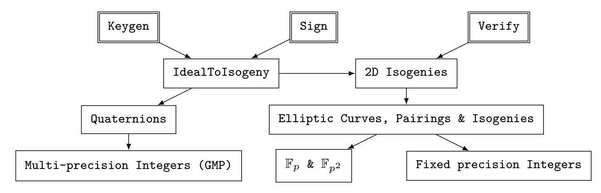
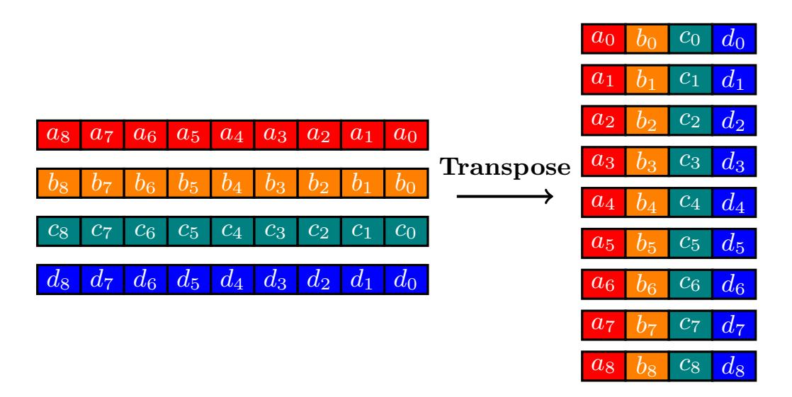

{0}------------------------------------------------

Luca De Feo<sup>1</sup> , Li-Jie Jian<sup>2</sup> , Ting-Yuan Wang∗3 , Bo-Yin Yang<sup>2</sup>

> IBM Research Europe, Zürich, Switzerland<sup>1</sup> Academia Sinica, Taipei, Taiwan<sup>2</sup> University of Southern California<sup>3</sup>

[iacr-papers@defeo.lu,{jcuyo613,deanwang88528}@gmail.com,by@crypto.tw](mailto:iacr-papers@defeo.lu, {jcuyo613,deanwang88528}@gmail.com, by@crypto.tw)

**Abstract.** We present the first vectorized implementation of SQIsign for highperformance Arm architectures. SQIsign is a promising candidate in the NIST On-Ramp Digital Signatures Call Round 2 to its most compact key and signature sizes. However, its signing performance remains a primary bottleneck, particularly the ideal-to-isogeny conversion. The conversion requires a large number of operations on elliptic curves and Abelian varieties, which depend on finite field arithmetic. Despite recent algorithmic improvements, research on high-performance implementations and efficient vectorized finite field arithmetic for SQIsign is still unexplored.

Our main contribution is the first demonstration of non-trivial vectorization speedups for SQIsign. By leveraging the NEON instruction set, we implement highly efficient finite field arithmetic and batched elliptic curve operations tailored for 2-dimensional isogeny chain computations. This accelerates the subroutine by 2.24× over the state-of-the-art. Moreover, our improvements are completely orthogonal to the recent algorithmic improvement Qlapoti (Asiacrypt 2025), offering similar performance gains in the SQIsign signing algorithm. When combined with Qlapoti, our implementation achieves a speedup of more than 2.24× in signing at NIST security level I. We expect our work to inspire further SQIsign optimization from a vectorization perspective, especially for quaternion computations with precise bounds.

**Keywords:** Vectorization · SQIsign · Ideal-to-isogeny Conversion · Finite Field Arithmetic · Arm Architectures

# **1 Introduction**

Post-quantum cryptography (PQC) refers to cryptographic algorithms that remain secure against quantum computers. With PQC we can continue to protect information against adversaries equipped with cryptographically relevant quantum computers.

In recent years, NIST has initiated and published PQC standards, including Key Encapsulation Mechanisms (KEMs) and digital signature schemes. In particular, there are three digital signatures, ML-DSA (based on CRYSTALS-Dilithium)[\[DKL](#page-19-0)<sup>+</sup>18], SLH-DSA (SPHINCS+)[\[BDE](#page-19-1)<sup>+</sup>17], and FN-DSA (FALCON)[\[FHK](#page-20-0)<sup>+</sup>19], that have been chosen for standardization. Partly in order to diversify the NIST digital signature portfolio against overreliance on lesser-studied lattice-based security assumptions, NIST opened a new call for additional digital signature schemes [\[ABC](#page-18-0)<sup>+</sup>24].

SQIsign [\[DKL](#page-19-2)<sup>+</sup>20] is a promising candidate in the second round of the NIST on-ramp call for digital signatures. As an isogeny-based digital signature scheme, SQIsign relies on the conjectured hardness of computing endomorphism rings of supersingular curves, which is fundamentally different from the security assumptions used in the current NIST PQC standards. Additionally, SQIsign is noted for the most compact key and signature

<sup>∗</sup>The author contributed to this work only during his time at Academia Sinica.

{1}------------------------------------------------

sizes. For example, at NIST security level I, the combined size of SQIsign's public key and signature is approximately **7** times smaller than that of FN-DSA, **17** times smaller than ML-DSA, and **37** times smaller than SLH-DSA. Independent of these impressive advantages, the main challenge of SQIsign lies in its expensive and complex signing process.

SQIsign leverages Deuring's correspondence between supersingular curves over finite fields and maximal orders of a quaternion algebra. Most of the signing (over **80%** of the total running time) is in the so-called IdealToIsogeny conversion. This routine takes as input an ideal of a maximal order, i.e. a rank 4 lattice in Q<sup>4</sup> , and outputs an efficient representation of a corresponding isogeny over a finite field.

Over time, SQIsign evolved and has redefined IdealToIsogeny with respect to its inputs, outputs, and operation. SQIsign v1 [\[DKL](#page-19-2)<sup>+</sup>20] was restricted to ideals of smooth norm and wrote its output as a chain of small degree isogenies. SQIsignHD [\[DLRW24\]](#page-19-3) could treat many more isogenies using Kani's lemma [\[Kan97\]](#page-20-1), a technique that embeds isogenies of elliptic curves into simpler-to-represent isogenies of higher-dimensional Abelian varieties. The current version of SQIsign [\[BDD](#page-19-4)+24] further improves on SQIsignHD, bringing down the dimension of the Abelian varieties from 4 to 2. Recently, Qlapoti [\[BCRSE](#page-19-5)+26] further reduced the higher-dimensional isogenies computed. Any variant of IdealToIsogeny involves a large number of operations on elliptic curves and Abelian varieties, ultimately reducing to arithmetic over a finite field F*p*<sup>2</sup> with a relatively large *p*.

## **1.1 The Problems**

Signing remains the major challenge to SQIsign performance. While recent advances [\[BDD](#page-19-4)<sup>+</sup>24, [BCRSE](#page-19-5)<sup>+</sup>26] yielded substantial speed-ups on x86 architectures, there is still ample room for optimization. Specifically, IdealToIsogeny persists as the most expensive component of signing, dominated by the computation of the 2-dimensional isogeny chain. Motivated by these observations, we highlight the following three problems:

- 1. The current open-source codebase lacks SQIsign implementations on larger Arm CPUs. While recent research has improved x86 and Arm Cortex-M4 performance mostly for verification — optimizations for signing using the NEON instruction set remain unexplored. Closing this implementation gap is vital for realizing competitive performance and fostering architectural diversity across modern CPU architectures.
- 2. Since SQIsign relies on the relatively new and challenging endomorphism ring problem, most implementations have focused on functional correctness and feasibility, leaving optimizations under-explored, particularly within the complex signing process.
- 3. IdealToIsogeny is the core of SQIsign underlying key generation, signing, and verification, dominated by the computation of isogeny-chain; optimizing this component is essential for improving overall performance.

# **1.2 Our Contributions**

This work presents the first vectorized implementation of SQIsign on bigger CPUs using the Armv8-A. In particular, we focus on Cortex-A76 due to its enduring relevance across the computing spectrum. According to the Arm White Paper [\[PSB](#page-20-2)<sup>+</sup>20], Neoverse N1 is based on Cortex-A76. Since 2019, Neoverse N1-based processors have been widely deployed in cloud services. For instance, Amazon EC2 instances [\[Ser26\]](#page-20-3) powered by AWS Gravition2 processors continue to offer multiple services. Furthermore, other major cloud providers, such as Microsoft Azure with its Dpdsv5-series virtual machines[\[Mic26\]](#page-20-4) and Oracle OCI with Ampere A1 Compute instances[\[Ora26\]](#page-20-5), deploy Ampere Altra processors. Therefore, Cortex-A76-class microarchitectures remain a practical target for optimization.

{2}------------------------------------------------

As announced, we focus on enhancing the performance of IdealToIsogeny by optimizing isogeny chain computations. Indeed, we identified through profiling that this computation constitutes the dominant bottleneck of SQIsign. Rather than attempting global optimization across all routines, we concentrate on vectorizing the computation and show that it alone yields significant end-to-end speedups.

Our primary contributions include:

- 1. To the best of our knowledge, this is the first work to demonstrate non-trivial vectorization speedups for SQIsign, on any platform. Our implementation achieves performance improvements on par with the latest algorithmic advances [BCRSE<sup>+</sup>26] in the signing algorithm. In addition, our result further indicates that implementation-level vectorization remains a largely unexplored yet impactful optimization dimension for SQIsign.
- 2. We implement a fast computation of 2-dimensional 2-isogeny chains. By leveraging NEON instruction set, we introduce vectorized arithmetic over  $\mathbb{F}_p$  and  $\mathbb{F}_{p^2}$ , together with batched elliptic curve operations. This approach provides greater flexibility in choosing efficient arithmetic strategies, without strictly relying on optimized formulas from the Explicit-Formulas Database [BL].
- 3. At NIST security level I, we achieve  $\mathbf{1.52} \times$  faster in keygen,  $\mathbf{1.49} \times$  faster in signing, and  $\mathbf{1.48} \times$  faster in verification for SQIsign on Cortex-A76. In addition, our work achieves at least a  $\mathbf{1.22} \times$  speedup for all SQIsign even on the highly superscalar Apple M1 processor.

The code of this work is publicly available at https://anonymous.4open.science/r/sqisign-vectorization-ches2026.

#### 1.3 Related work

Although it may not lead to as large speed-ups as our work, optimizing the non-finite-field part of the signing procedure is equally important. At the moment, this is made difficult by the fact that integer coefficients in the quaternion part of the computation are unbounded, which is the reason why the official SQIsign implementation resorts to GMP for this part. The recent work [KLKL25] tries to bound the integers appearing in the quaternion computation and replaces GMP with a fixed-precision integer implementation, without claiming any speed-up. This is a preliminary step towards optimizing the quaternion part of SQIsign.

# 2 Preliminaries

#### 2.1 The Deuring Correspondence

Let p be a prime and  $\mathbb{F}_{p^2}$  a finite field with  $p^2$  elements. Every <u>supersingular curve</u> in characteristic p is isomorphic to one defined over  $\mathbb{F}_{p^2}$  and having  $(p+1)^2$  points. There are  $\lfloor p/12 \rfloor + c$  distinct isomorphism classes of such curves, with  $c \in \{0, 1, 2\}$ . Every two such curves are isogenous, and even connected by short\*  $\ell$ -isogeny walks for any prime  $\ell \neq p$ .

For any p, a supersingular elliptic curve can be constructed in time polynomial in  $\log(p)$ . For example, if and only if  $p=3 \pmod 4$ , the curve of equation  $y^2=x^3+x$  is supersingular. Starting from this one, any other supersingular curve can, in principle, be constructed efficiently by taking a short  $\ell$ -isogeny walk for some small  $\ell$ . However, given a pair of such curves, it is difficult in general to find any isogeny between them: even for a quantum computer, the best algorithm known has complexity polynomial in p.

<span id="page-2-0"></span><sup>\*</sup>By short walk, we mean one of length  $O(\log(p))$ .

{3}------------------------------------------------

A quaternion algebra over  $\mathbb{Q}$  is a 4-dimensional  $\mathbb{Q}$ -algebra with basis 1, i, j, k and multiplication table given by  $i^2 = a$ ,  $j^2 = b$ , ij = -ji = k, for some  $a, b \in \mathbb{Q}$ . A (fractional) ideal of a quaternion algebra B is a sub-lattice of rank 4. Two ideals I, J of B are said to be left-equivalent if there is an  $\alpha \in B$  such that  $I\alpha = J$ . An ideal that is also a ring is called an order, it is said to be maximal if it is not contained in any other order. The left order of an ideal I is the largest order stabilizing it to the left:  $O_L(I) = \{\alpha \in B \mid \alpha I \in I\}$ , the right order being the one stabilizing I to the right. An ideal that is contained in its left (equivalently, right) order is said to be integral.

The Deuring correspondence is a remarkable equivalence relating supersingular curves and quaternion algebras. The endomorphisms of a supersingular curve form a ring isomorphic to a maximal order in a quaternion algebra. For example, the curve  $y^2 = x^3 + x$  has endomorphism ring isomorphic to the order generated by  $(1, i, \frac{j+1}{2}, \frac{k+i}{2})$ , with  $i^2 = -1$  and  $j^2 = -p$ . Fix a curve  $E_0$  and a maximal order  $O_0$  isomorphic to  $\operatorname{End}(E_0)$ . The Deuring correspondence states that the isogenies with domain  $E_0$  are in one-to-one correspondence with integral left  $O_0$ -ideals (ideals whose left order is  $O_0$ ), and the curves isogenous to  $E_0$  are in one-to-one correspondence with left ideal classes of  $O_0$ . Additionally, if  $I_{\phi}$  is the ideal corresponding to an isogeny  $\phi$ , then the right order of  $I_{\phi}$  is isomorphic to the endomorphism ring of the codomain of  $\phi$ .

Ideals provide an efficient representation for isogenies: an IdealToIsogeny algorithm is one that takes as input  $E_0$ ,  $O_0$ , an integral ideal  $I_{\phi}$  corresponding to an isogeny  $\phi$  and a point  $P \in E_0$ , and outputs  $\phi(P)$  in time polynomial in deg  $\phi$  and log(p). Such an algorithm is easily extended to evaluate isogenies of any supersingular curve, not just  $E_0$ .

But the quaternion analogue of the isogeny finding problem turns out to be easy too: given a left ideal class [I], or equivalently the isomorphism class of its right order<sup>†</sup>, an ideal representative of I can be computed in time polynomial in  $\log(p)$ . It follows that computing endomorphism rings of supersingular curves must be generically hard, otherwise we could combine this fact with an IdealToIsogeny algorithm and solve the isogeny problem. And indeed computing endomorphism rings and finding isogenies of supersingular curves are proven equivalent, assuming the Generalized Riemann Hypothesis [Wes22].

#### 2.2 Higher-dimensional Abelian Varieties

Abelian varieties are smooth projective varieties that are also algebraic groups. Elliptic curves are the only example of one-dimensional varieties. Two-dimensional Abelian varieties come in two kinds: Cartesian products of elliptic curves or Jacobians of genus 2 hyperelliptic curves. As the dimension grows, more and more kinds of Abelian varieties appear.

Higher-dimensional Abelian varieties started being centrally featured in isogeny-based cryptography after the SIDH attacks [CD23, MMP+23, Rob23]. Their main use is <u>Kani's lemma</u>, a technique that embeds two isogenies of degrees a, b between Abelian varieties into an isogeny of degree a + b between Abelian varieties of double the dimension. Despite the increase in dimension, an exponential complexity gain is achieved by setting up the isogenies so that a + b is smooth, for example,  $a + b = 2^n$ . Kani's lemma was first used constructively in SQIsignHD [DLRW24], an improvement over the original SQIsign using 4-dimensional isogenies. Further improvements brought down to 2 the dimension of the Abelian varieties [NOC+24, BDD+24], ultimately informing NIST's round-two version of SQIsign [AAA+25].

#### 2.3 SQIsign

SQIsign is a Fiat-Shamir-style signature, based on a sigma-protocol proving knowledge of the endomorphism ring of a supersingular curve. In a nutshell, an origin supersingular

<span id="page-3-0"></span> $<sup>^{\</sup>dagger}$ also known as its right order type

{4}------------------------------------------------

curve *E*<sup>0</sup> is fixed, together with its endomorphism ring *O*0. The secret key is a random ideal *I<sup>ϕ</sup>* corresponding to an isogeny *ϕ* from *E*0, the public key is the codomain of *ϕ*, computed via IdealToIsogeny.

When signing, the prover generates a random commitment curve, in the same way as they generated the public key. The verifier offers a challenge in the form of a 2-isogeny walk from the public key. The prover responds with an isogeny from the commitment curve to the public key, passing through the challenge isogeny. The intuition behind the scheme is that only a prover who knows the endomorphism rings of both the public key and the commitment could use the Deuring correspondence to compute an isogeny between these two curves.

The round-two version of SQIsign makes heavy use of Kani's lemma and 2-dimensional Abelian varieties in IdealToIsogeny, essentially following [\[BDD](#page-19-4)+24]. A recently published improvement over this algorithm, named Qlapoti [\[BCRSE](#page-19-5)<sup>+</sup>26], also uses 2-dimensional Abelian varieties.

The response too is transmitted to the verifier as a 2-dimensional isogeny, embedding the 1-dimensional isogeny from the public key to the commitment; Indeed the endomorphism rings of these curves are secret information, thus using ideals to represent the response isogeny is not an option. Because of this difference between prover and verifier, SQIsign's code is peculiar in that verification has much smaller code coverage than key-generation or signing. Figure [1](#page-4-0) presents the dependency diagram of SQIsign, where we clearly see how key-generation and signing depend on both F*<sup>p</sup>* arithmetic for the isogeny part and multi-precision integer arithmetic for the quaternions, whereas verification does not use quaternions at all. In this work, we focus on optimizing the 2-dimensional isogeny part, as it is the one that has the greatest impact by far on the overall running time.

<span id="page-4-0"></span>

**Figure 1:** SQIsign's dependency graph, inspired by [https://github.com/SQIsign/](https://github.com/SQIsign/the-sqisign#project-structure) [the-sqisign#project-structure](https://github.com/SQIsign/the-sqisign#project-structure).

# **2.4 Barrett reduction**

[\[Bar87\]](#page-19-8) introduced an efficient technique to compute modular reduction *a mod q*. Assuming q is an odd number such that *q < R* = 2*<sup>k</sup>* , where *a* ∈ Z, the standard reduction can be expressed as *x* ≡ *a* mod *q* = *a* − (round *a q* · *q*). BarrettReduction provides an approximation, *a* mod *q* ≈ *a* − ⌊(*a* · ⌊*R/q*⌉)*/R*⌉ · *q*. This formula replaces the division with a more efficient way using a single multiplication and a bit shift. The precomputed part, ⌊*R/q*⌉, represents an approximate quotient. This quotient is particularly valuable for effectively implementing the modular reduction step in large-integer multiplication. More details on its vectorized implementation will be presented in [Section 3.](#page-5-0)

{5}------------------------------------------------

#### Algorithm 1 BarrettReduction

```
Input: 2^e < q < 2^{e+1}, q < R = 2^k
Output: x \equiv a \mod q, |x| \le \frac{(q-1)}{2}

1: d \leftarrow \operatorname{qrdmulh}(d, a, \lfloor \frac{R}{2q} \rceil) \qquad \triangleright \text{ Using } 2q \text{ as qrdmulh doubles the multiplication result.}
2: x \leftarrow \operatorname{mls}(x, d, q)
3: return x
```

## 2.5 Montgomery representation

Given a modulus q and a Montgomery radix R, usually chosen as a power of 2 such that gcd(q,R) = 1 and R > q, an integer  $a \in \mathbb{Z}_q$  is represented in Montgomery representation as:

$$A = aR \mod q$$
.

Montgomery multiplication [Mon85] enables efficient modular multiplication on elements with Montgomery representation. Specifically, under the representation, Montgomery multiplication is defined as:

$$MontMul(A, B) = ABR^{-1} \mod q$$

which computes modular multiplication without costly division by the modulus. The result preserves Montgomery representation. Consequently, sequences of modular operations can be performed entirely within Montgomery representation. In the end, conversion back to the standard representation requires only a single Montgomery multiplication with B=1.

In our isogeny chain computation, field elements are reorganized to implement vectorized arithmetic. This change needs an adjustment the Montgomery radix. Concretely, we switch the Montgomery radix from  $R_1 = 2^{255}$  to  $R_2 = 2^{261}$  for subsequent modular operations, ensuring correctness while enabling efficient SIMD implementations.

#### 2.6 ARMv8-A instruction

Armv8-A [ARM21] is the first 64-bit ARM architecture. Beyond standard 32-bit and 64-bit scalar operations, ARMv8-A offers a set of instructions for 32 128-bit vector registers, known as NEON. Specifically, NEON operates on multiple data elements within each register, supporting two 64-bit, four 32-bit, eight 16-bit, or sixteen 8-bit integers. However, a notable limitation is that NEON does not support 64-bit vectorized long multiplication. In contrast, the 8-bit, 16-bit, or 32-bit integer type has more powerful instructions.

# <span id="page-5-0"></span>3 Vectorized field arithmetic

We now present the vectorized finite field arithmetic operations essential for SQIsign. Following NIST security level I, SQIsign utilizes the prime  $p = 5 \cdot 2^{248} - 1$  as the characteristic of the base field, which is the specific case we focus on. We analyze four unsaturated representations for large integer multiplication in Montgomery representation in 3.2. Considering lazy reduction, 3.3 displays a tailored modular reduction for p. In 3.4, we introduce our vectorized arithmetic for  $\mathbb{F}_p$  and show how these methods are extended to the extension field  $\mathbb{F}_{p^2}$  in 3.5.

# 3.1 Lazy reduction

Reducing the number of modular reduction operations often yields significant savings. Specifically, in our finite field arithmetic, a modular reduction costs approximately two-thirds of a full multiplication. Therefore, we aim to delay reductions as much as possible at the register level.

{6}------------------------------------------------

A key technique is **lazy reduction**. It prevents the need for reduction and carry chain after every arithmetic operation by using unsaturated representation, which reserves space in the most significant bits of each integer. Given an m-bit integer that contains only numbers smaller than 2 *<sup>n</sup>*, where *m > n*, the integer can tolerate up to 2 *<sup>m</sup>*−*<sup>n</sup>* consecutive additions/subtractions before a carry is required. We refer to this tolerance value as **bound**, which is equal to 2 *<sup>m</sup>*−*n*. That is, a modular reduction is only executed when the accumulated value exceeds this bound.

# <span id="page-6-0"></span>**3.2 Configuration**

There are four potential limb sizes: 27-bit, 28-bit, 29-bit, 51-bit, each with its own pros and cons. We analyze the overhead of F*<sup>p</sup>* arithmetic and choose the most suitable unsaturated representation for our implementation.

- The 51-bit limb configuration is adopted from [\[AAA](#page-18-1)<sup>+</sup>25]. The limbs have the bound of 2 <sup>64</sup>−<sup>51</sup> = 8192. However, this configuration is inefficient for the ARM-v8- A architecture because the NEON SIMD instruction set does not support 64-bit multiplication.
- The 29-bit limb configuration actually uses 8 limbs of 29 bits and a single 19-bit most significant limb. In particular, the lower 8 limbs have a tight bound: 2 <sup>32</sup>−<sup>29</sup> = 8, and the most significant limb has a larger bound 2 <sup>32</sup>−<sup>19</sup> = 8192. We employ an incomplete reduction on the lower limbs when their bound is reached. The resulting carry is accumulated into the most significant limb until its larger bound is also reached. Then, we apply a reduction on the most significant limb.
- The 28-bit limb configuration consists of 8 limbs of 28 bits and one 27-bit most significant limb. The lower 8 limbs have the bound of 2 <sup>32</sup>−<sup>28</sup> = 16, and the most significant limb has a bound of 2 <sup>32</sup>−<sup>27</sup> = 32. The same incomplete reduction technique can be used here, with the lower limbs having twice the bound. However, the smaller bound of the most significant limb causes more limitations.
- The 27-bit limb requires 9 limbs of 27 bits and one 8-bit most significant limb. The lower 9 limbs have the bound of 2 <sup>32</sup>−<sup>27</sup> = 32, and the most significant limb has a bound of 2 <sup>32</sup>−<sup>8</sup> = 16777216. While this approach increases the per-limb bound for the lower limbs, it requires an extra limb. This results in a substantial increase in computational cost, necessitating at least 19 additional umlal instructions per finite field multiplication.

Among the configurations discussed above, the 51-bit limb size is excluded because it does not effectively utilize SIMD instructions. The 27-bit limb size is also omitted, as the extra limb incurs additional computational overhead. As a result, we focus on the performance comparison between 28-bit and 29-bit limbs in F*<sup>p</sup>* arithmetic, especially analyzing the required carry chains and the number of reductions.

In the 29-bit limb configuration, fpMulVec multiplies two 29-bit limbs, adds the corresponding congruence term obtained from a 29-bit by 19-bit multiplication, and performs a 29-bit right shift for the most significant limb of the output. Consequently, for any input smaller than 8×(0x1FFFFFFF) in the lower 8 limbs and 32×(0x4FFFF) in the most significant limb, the resulting limb still fits within 8·29+19 bits. In contrast, the 28-bit limb configuration involves a 28-bit by 28-bit multiplication, a congruence term computed from a product of 28-bit and 27-bit, and a 28-bit right shift. As a result, this configuration tolerates up to 16×(0xFFFFFFF) in the lower 8 limbs but only 1×(0x4FFFFFF) in the most significant limb.

The wider bound in the most significant limb allows the 29-bit limb configuration to better support lazy reduction during addition and subtraction with modular multiplication.

{7}------------------------------------------------

Moreover, it enables the use of incomplete reduction, effectively exploiting the generous bound in the most significant limb. Conversely, the narrow tolerance of the 28-bit configuration in its most significant limb requires a complete reduction before each fpMulVec. Based on this analysis, we conclude that the 29-bit limb size offers a more efficient overall configuration.

Throughout the remainder of this paper, we denote values smaller than (0x1FFFFFFF) in the lower limbs and (0x4FFFF) in the most significant limb as the **base**. Establishing this baseline is essential for analyzing corresponding carry and reduction operations in field arithmetic in [3.4](#page-8-0) and [3.5.](#page-9-0)

# <span id="page-7-0"></span>**3.3 Modular reduction**

For values approaching the bound, we employ [Algorithm 2](#page-7-1) to propagate the excess values from the reserved bits of each limb sequentially into the next, continuing until the most significant limb. Since this initial propagation step does not guarantee the most significant limb itself will not overflow, this process is termed an incomplete reduction.

If the most significant limb also requires reduction, we apply BarrettReduction. For subsequent vectorization, we implement this reduction for vector registers as [Algorithm 3.](#page-8-1) Specifically, [Algorithm 3](#page-8-1) computes both the remainder and the quotient of the most significant limb divided by 5. The remainder is retained in the most significant limb, whereas the quotient is added back to the least significant limb. Subsequently, a second incomplete reduction is performed to clear all reserved spaces within the limbs, preventing potential overflow in subsequent calculations.

In the 29-bit limb configuration, the most significant limb can tolerate at most 32× base, ensuring the quotient after BarrettRedution is less than (0x1FFFFFFF). Therefore, a complete reduction in the configuration requires only two IncompleteReduction and one BarrettReduction application.

## <span id="page-7-1"></span>**Algorithm 2** IncompleteReduction

```
Input: a < 8p and mask.
Output: Incomplete reduced a
 1: t0[0] ← a0[0]
 2: t0[1] ← a0[1]
 3: t1[0] ← a0[2]
 4: t1[1] ← a0[3]
 5: t0 ← shr(t0, 29)
 6: t1 ← shr(t1, 29)
 7: a0 ← and(a0, mask)
 8: for i ← 1 to 7 do
 9: t0 ← addw(t0,
                     -
                      ai[0], ai[1]
                                  )
10: t1 ← addw(t1,
                     -
                      ai[2], ai[3]
                                  )
11: ai[0], ai[1] ← and(t0, mask)
12: ai[2], ai[3] ← and(t1, mask)
13: t0 ← shr(t0, 29)
14: t1 ← shr(t1, 29)
15: end for
16: a8[0], a8[1] ← add(
                      -
                       a8[0], a8[1]
                                   , t0)
17: a8[2], a8[3] ← add(
                      -
                       a8[2], a8[3]
                                   , t1)
18: return a
```

{8}------------------------------------------------

#### <span id="page-8-1"></span>**Algorithm 3** BarrettReduced

```
Input: a8 is the most significant limb of a and mask16 = 216 − 1
Output: Complete reduced a8
1: t0 ← shr(a8, 16)
2: t1 ← qrdmulh(t0, const) ▷ const = ⌊
                                                          R
                                                          q
                                                            ⌉, R = 216, and q = 5
3: t2 ← mls(t0, t1, q)
4: quo ← t1
5: t0 ← shl(t2, 16)
6: t1 ← and(a8, mask16) ▷ mask16 = 216 − 1
7: a8 ← add(t0, t1)
8: return a8, quo
```

# <span id="page-8-0"></span>**3.4 Vectorized** F*<sup>p</sup>* **arithmetic**

We implement vectorized 32-bit operations with the NEON instruction set. Since NEON vector registers are represented as 4-lane, 32-bit vectors, we process four field elements simultaneously and transpose them for storage across 9 vector registers. [Figure 2](#page-9-1) offers a visualization of this process.

Another trick is the replacement of multiplication with bit-shifting operations for modular multiplication in Montgomery representation. In particular, leveraging the property that (*p* + 1) = 5 · 2 <sup>248</sup>, it needs to multiply the modulus to maintain the result within the target (8 · 29 + 19)-bit format. Since the overall process has a true dependency, relying on the SIMD multiplication unit forces the pipeline to stall; it cannot be parallelized. However, using bit-shifting not only reduces this data dependency but also optimizes pipeline utilization for better performance. We call this vectorized, unsaturated, large integer multiplication fpMulVec. The complete algorithm is presented in [Algorithm 4.](#page-9-2)

[Algorithm 4](#page-9-2) utilizes two vectors, *t*<sup>0</sup> and *t*1, to store the unsigned multiplication result. The assembly implementation takes advantage of the properties of umlal to perform multiplication and accumulation with the first element, thereby saving an extra addition. Moreover, the umull is used initially to avoid having to initialize registers.

For carry handling, the low part is retained in the register *t*64 using a constant mask (0x1FFFFFFF). The corresponding carry bits are then efficiently extracted via a shift right and temporarily stored in registers *t*0*, t*<sup>1</sup> to be added to the next iteration. The mask is pre-defined and reused, eliminating the overhead of reloading. Overall, we have 36-*t*64 like variables to store the low parts. The return value, *c*, is obtained from the last 18 of *t*64 by extracting narrow elements and converting the data form from 2×64-bit to 2×32-bit.

Moreover, all instances of the for-loop and if statements present in [Algorithm 4](#page-9-2) are inlined in our asm implementation. This means that no actual loop control, conditional branching, or data reloading overhead occurs. The high efficiency is sustained by utilizing the NEON register structure (e.g., v0.2d or v0.4s) for direct data manipulation and ensuring data remains cached to minimize register reloading.

{9}------------------------------------------------

<span id="page-9-1"></span>

**Figure 2: Transpose**: Packing four  $(8 \cdot 29 + 19)$ -bit unsaturated limb elements into nine vector registers

#### <span id="page-9-2"></span>Algorithm 4 fpMulVec

```
Input: a, b, mask
Output: c = abR^{-1} \mod q
 1: for i \leftarrow 0 to 16 do
                                                                      \triangleright Replace umlal(2) with umull(2) for the i=0 case.
           if i \le 8 then
 2:
                for j \leftarrow 0 to i do
 3:
                     t_0 \leftarrow \mathtt{umlal}(t_0, a_j, b_{i-j}), \ t_1 \leftarrow \mathtt{umlal2}(t_1, a_i, b_{i-j})
 4:
                end for
 5:
 6:
           else
                for j \leftarrow 0 to (16 - i) do
 7:
                     t_0 \leftarrow \text{umlal}(t_0, a_{i+j-8}, b_{8-j}), t_1 \leftarrow \text{umlal2}(t_1, a_{i+j-8}, b_{8-j})
 8:
 9:
                end for
           end if
10:
11:
           if i \ge 8 then
12:
                for k \leftarrow 0 to 1 do
                     tmp_0 \leftarrow \text{shl}(t64_{i\%8+k}, 18), \ tmp_1 \leftarrow \text{shl}(t64_{i\%8+k}, 16)
13:
                     tmp_0 \leftarrow \mathtt{add}(tmp_0, tmp_1)
14:
                     t_k \leftarrow \mathtt{add}(t_k, tmp_0)
15:
                end for
16:
           end if
17:
           t64_{(2i)} \leftarrow \text{and}(t_0, mask), \ t64_{(2i+1)} \leftarrow \text{and} \ (t_1, mask)
18:
19:
           t_0 \leftarrow \text{ushr}(t_0, 29), t_1 \leftarrow \text{ushr}(t_1, 29)
20: end for
21: t64_{34} \leftarrow \text{shrn}(t_0, 29)
22: t64_{35} \leftarrow \text{shrn}(t_1, 29)
                                                                       \triangleright The latter 18 in t64 are stored in the output, c.
```

## <span id="page-9-0"></span>3.5 Vectorized $\mathbb{F}_{p^2}$ arithmetic

Each  $\mathbb{F}_{p^2}$  element is processed using a cross-vector view, divided into a pair of  $9\times 32$ -bit components. We use 18 vector registers to store an element of  $\mathbb{F}_{p^2}$ .

For the arithmetic in  $\mathbb{F}_{p^2}$ , Algorithm 5 uses a Karatsuba-based method to reduce the required number of fpMulVec from 4 to 3. Similarly, in Algorithm 6, the square is reduced to 2-fpMulVec, while adding only a few additional additions and subtractions.

Furthermore, to prevent overflow during subtraction in the  $\mathbb{F}_{p^2}$  arithmetic, we must add an auxiliary modulus q before the operation. Specifically, q is defined as q=kp for the smallest integer k such that kp is greater than the subtrahend. While the exact value of q depends on the corresponding subtrahend, it can still be precomputed and loaded without introducing any overhead.

Since we are using the 29-bit limb configuration, we must consider the input bounds

{10}------------------------------------------------

for fp2MulVec. The input  $t \in \mathbb{F}_p$  for fpMulVec within fp2MulVec operations is derived by adding the inputs of fp2MulVec. The input bound for fp2MulVec becomes  $4\times$  base for the lower limbs and  $16\times$  base for the most significant limb. Moreover, fp2MulVec implements a Karatsuba-like method, which results in the real and imaginary parts of the output having different bounds. Specifically, the limbs in the real part are bounded by  $2\times$  base, while the limbs in the imaginary part are bounded by  $3\times$  base. On the other hand, fp2SqrVec shares the same input bound as fp2MulVec, but its output is only  $1\times$  base.

#### <span id="page-10-0"></span>Algorithm 5 fp2MulVec

```
Input: a = a_0 + a_1 i, b = b_0 + b_1 i \in \mathbb{F}_{p^2}, q
Output: c = c_0 + c_1 i = (a_0 b_0 - a_1 b_1) + (a_0 b_1 + a_1 b_0) i \in \mathbb{F}_{p^2}
  1: for i \leftarrow 0 to 9 do
           t_0[i] \leftarrow a_0[i] + a_1[i] 
 t_1[i] \leftarrow b_0[i] + b_1[i]
  2:
  3:
  4: end for
  5: fpMulVec(t_0, t_0, t_1)
  6: fpMulVec(t_1, a_1, b_1)
  7: fpMulVec(c_0, a_0, b_0)
  8: for i \leftarrow 0 to 9 do
           c_1[i] \leftarrow t_0[i] + q[i]
  9:
           t_0[i] \leftarrow t_1[i] + c_0[i]
10:
           c_1[i] \leftarrow c_1[i] - t_0[i]
11:
           c_0[i] \leftarrow c_0[i] + q[i]
12:
           c_0[i] \leftarrow c_0[i] - t_1[i]
13:
14: end for
15: return c
```

## <span id="page-10-1"></span>Algorithm 6 fp2SqrVec

```
Input: a = a_0 + a_1 i \in \mathbb{F}_{p^2}, q
Output: b = b_0 + b_1 i = (a_0^2 - a_1^2) + (2a_0a_1)i \in \mathbb{F}_{p^2}
1: for i \leftarrow 0 to 9 do
2: t_0[i] \leftarrow a_0[i] + a_1[i]
3: q[i] \leftarrow q[i] + a_0[i]
4: t_1[i] \leftarrow q[i] - a_1[i]
5: q[i] \leftarrow a_1[i] + a_1[i]
6: end for
7: fpMulVec(b_1, a_0, q)
8: fpMulVec(b_0, t_0, t_1)
9: return b
```

# Algorithm 7 fp2AddVec Input: $a = a_0 + a_1 i, b = b_0 + b_1 i \in F_{p^2}$ Output: $c \in \mathbb{F}_{p^2} = c_0 + c_1 i,$ $= (a_0 + b_0) + (a_1 + b_1)i$ 1: for $i \leftarrow 0$ to 9 do 2: $c_0[i] \leftarrow a_0[i] + b_0[i]$ 3: $c_1[i] \leftarrow a_1[i] + b_1[i]$ 4: end for

```
Algorithm 8 fp2SubVec

Input: a = a_0 + a_1 i, b = b_0 + b_1 i \in \mathbb{F}_{p^2}
Output:
c \in \mathbb{F}_{p^2} = c_0 + c_1 i,
= (a_0 - b_0) + (a_1 - b_1) i
1: for i \leftarrow 0 to 9 do
2: t_0[i] \leftarrow a_0[i] + q[i]
3: c_0[i] \leftarrow t_0[i] - b_0[i]
4: t_0[i] \leftarrow a_1[i] + q[i]
5: c_1[i] \leftarrow t_0[i] - b_1[i]
6: end for
7: return c
```

# <span id="page-10-2"></span>4 Vectorizing SQIsign

5: return c

In this section, we focus on evaluating isogenies from ideals for the NIST security level I of SQIsign signature scheme with vectorization perspectives. Following this, in 4.1, we

{11}------------------------------------------------

utilize our vectorized large integer multiplication and the unsaturated representation in the supersingular elliptic curve point computations. Although our vectorized methods have higher algorithmic complexity, they are precisely designed for vector-friendly operations, achieving better performance. Next, 4.2 presents our vectorized approaches for theta coordinate computation, which is the most resource-demanding algorithm when computing a 2-dimensional 2-isogeny chain.

#### <span id="page-11-0"></span>4.1 Efficiently computing elliptic points on Jacobian coordinates

The SQIsign signature scheme relies on point arithmetic computed in Jacobian coordinates. To improve performance, we focus on the use of SIMD instruction sets by analyzing and optimizing vectorization strategies for three core algorithms: DBL, DBLW, and GluingEval. These algorithms and their calling functions are defined and elaborated on in [AAA<sup>+</sup>25].

The DBL (Point Doubling) function for a Montgomery curve in Jacobian coordinates originally required 6 multiplications (M) and 6 squarings (S) for each call. The cost is suboptimal for direct single-instruction vectorization. Since the computation often requires simultaneous processing of two Jacobian points, these two DBL operations can be batched and implemented efficiently using just 3 vectorized field multiplications and 3 vectorized field squarings. The algorithm is presented as Algorithm 9.

In particular, Algorithm 9 utilizes four vector registers,  $t_0$ - $t_4$ , to record the intermediate results of  $[2]P_1$  and  $[2]P_2$ . As detailed in 3.4, we operate with the  $4\times32$ -bit instruction set, where each vector register can directly access its four 32-bit elements. These elements are indexed from 0-3, specifically as t[0], t[1], t[2], and t[3]. For clarity and ease of reading, we have omitted the data loading process and movement. In fact, we mitigate its impact on the efficiency of the algorithm by taking advantage of cached data and the ext instruction.

As detailed in Section 3, we implemented lazy reduction techniques in Algorithm 9 to eliminate redundant overhead. Our vectorized version requires only six complete reductions with reduced input, ensuring the output is restricted to  $1 \times$  base. Compared to the previous DBL approach, this optimization resulted in a computational saving of over twelve reductions.

#### <span id="page-11-1"></span>Algorithm 9 Vectorized batched DBL

```
Input: Jacobian points P_1, P_2 and their corresponding Montgomery curves E_1, E_2.
Output: The result of doubled Jacobian points [2]P_1 and [2]P_2
 1: t_0 \leftarrow \texttt{fp2SqrVec}(\left[X_{P_1}, X_{P_2}, Z_{P_1}, Z_{P_2}\right])
 2: t_1 \leftarrow \text{fp2SqrVec}([t_0[2], t_0[3], Y_{P_1}, Y_{P_2}])
 3: t_1 \leftarrow \mathtt{fp2AddVec}([t_0[0], t_0[1], t_1[2], t_1[3]], [t_1[0], t_1[1], t_1[2], t_1[3]])
  4: t_2 \leftarrow \texttt{fp2AddVec}([t_0[0], t_0[1], X_{P_1}, X_{P_2}], [t_0[0], t_0[1], X_{P_1}, X_{P_2}])
 5: t_0 \leftarrow \texttt{fp2MulVec}([t_0[2], t_0[3], t_1[2], t_1[3]], [A_{E_1}, A_{E_2}, X_{P_1}, X_{P_2}])
 6: t_3 \leftarrow \mathtt{fp2AddVec}(\left[t_0[2], t_0[3], t_2[0], t_2[1]\right], \left[t_0[2], t_0[3], t_1[0], t_1[1]\right])
 7: t_2 \leftarrow \mathtt{fp2AddVec}(\left[t_0[0], t_0[1], t_3[0], t_3[1]\right], \left[t_2[2], t_2[3], t_3[0], t_3[1]\right])
 8: t_4 \leftarrow \mathtt{fp2MulVec}(\left[t_1[2], t_1[3], 2X_{P_1}, 2X_{P_2}\right], \left[t_2[0], t_2[1], t_0[0], t_0[1]\right])
 9: t_4 \leftarrow \mathtt{fp2AddVec}(\left[t_4[0], t_4[1], t_4[2], t_4[3]\right], \left[t_4[0], t_4[1], t_3[2], t_3[3]\right])
10: t_0 \leftarrow \text{fp2SqrVec}([t_4[2], t_4[3], t_1[2], t_1[3]])
11: t_0 \leftarrow \mathtt{fp2SubVec}(\left[t_0[0], t_0[1], 0, 0\right], \left[t_4[0], t_4[1], t_0[2], t_0[3]\right])
12: \ t_3 \leftarrow \mathtt{fp2SubVec}(\left[t_3[0], t_3[1], t_0[2], t_0[3]\right], \left[t_0[0], t_0[1], t_0[2], t_0[3]\right])
13: t_1 \leftarrow \mathtt{fp2MulVec}(\left[t_4[2], t_4[3], Y_{P_1}, Y_{P_2}\right], \left[t_3[0], t_3[1], Z_{P_1}, Z_{P_2}\right])
14: \ t_1 \leftarrow \mathtt{fp2AddVec}(\left[t_1[0], t_1[1], t_1[2], t_1[3]\right], \left[t_3[2], t_3[3], t_1[2], t_1[3]\right])
15: X_{[2]P_1}, X_{[2]P_2}, Y_{[2]P_1}, Y_{[2]P_2}, Z_{[2]P_1}, Z_{[2]P_2} \leftarrow t_0[0], t_0[1], t_1[0], t_1[1], t_1[2], t_1[3]
16: return X_{[2]P_1}, Y_{[2]P_1}, Z_{[2]P_1}, X_{[2]P_2}, Y_{[2]P_2}, Z_{[2]P_2}
```

DBLW is another point doubling function for a Weierstrass curve in Jacobian coordinates, typically requiring 3M and 5S. This operation count is also not good for direct vectorization. Furthermore, even when processing two points, the batched DBLW is not amenable to perfect instruction alignment as the batched DBL. Therefore, we employ a strategy that uses a slightly computationally redundant but vectorization-friendly algorithm: 4M and 4S per

{12}------------------------------------------------

DBLW call. This strategy better utilizes SIMD instruction sets, thereby resulting in better performance in practice. The adjusted batched DBLW is in Algorithm 10.

## <span id="page-12-0"></span>Algorithm 10 Vectorized batched DBLW

```
Input: Modified Jacobian points P_1, P_2 for a Weierstrass curve Output: The result of doubled modified Jacobian points [2]P_1 and [2]P_2

1: t_0 \leftarrow \text{fp2SqrVec}([X_{P_1}, Y_{P_1}, X_{P_2}, Y_{P_2}])

2: t_1 \leftarrow \text{fp2AddVec}([t_0[0], t_0[1], t_0[2], t_0[3]], [t_0[0], t_0[1], t_0[2], t_0[3]])

3: t_2 \leftarrow \text{fp2AddVec}([t_1[0], t_1[1], t_1[2], t_1[3]], [T_{P_1}, t_1[1], T_{P_2}, t_1[3]])

4: t_3 \leftarrow \text{fp2MulVec}([t_2[1], Z_{P_1}, t_2[3], Z_{P_2}], [X_{P_1}, Y_{P_1}, X_{P_2}, Y_{P_2}])

5: t_4 \leftarrow \text{fp2AddVec}([t_0[0], t_3[1], t_0[2], t_3[3]], [t_2[0], t_3[1], t_2[2], t_3[3]])

6: t_1 \leftarrow \text{fp2SqrVec}([t_4[0], t_1[1], t_4[2], t_1[3]])

7: t_3 \leftarrow \text{fp2AddVec}([t_3[0], t_1[1], t_3[2], t_1[3]], [t_3[0], t_1[1], t_3[2], t_1[3]])

8: t_2 \leftarrow \text{fp2SubVec}([t_3[0], t_1[0], t_3[2], t_1[2]], [t_1[0], 4Y_{P_1}^2 X_{P_1}, t_1[2], 4Y_{P_2}^2 X_{P_2}])

9: t_5 \leftarrow \text{fp2AddVec}([T_{P_1}, 4Y_{P_1}^2 X_{P_1}, T_{P_2}, 4Y_{P_2}^2 X_{P_2}], [T_{P_1}, t_2[0], T_{P_2}, t_2[1]])

10: t_5 \leftarrow \text{fp2MulVec}([t_3[1], t_4[0], t_3[3], t_4[2]], [t_5[0], t_5[1], t_5[2], t_5[3]])

11: t_0 \leftarrow \text{fp2SubVec}([t_2[1], t_5[1], t_2[3], t_5[3]], [4Y_{P_1}^2 X_{P_1}, t_3[1], 4Y_{P_1}^2 X_{P_1}, t_3[3]])

12: t_1 \leftarrow [t_5[0], 2Y_{P_1} Z_{P_1}, t_5[2], 2Y_{P_2} Z_{P_2}]

13: [X_{[2]P_1}, Y_{[2]P_1}, X_{[2]P_2}, Y_{[2]P_2}], [T_{[2]P_1}, T_{[2]P_2}, T_{[2]P_2}, T_{[2]P_2}, T_{[2]P_2}, T_{[2]P_2}, T_{[2]P_2}, T_{[2]P_2}, T_{[2]P_2}, T_{[2]P_2}, T_{[2]P_2}, T_{[2]P_2}, T_{[2]P_2}, T_{[2]P_2}, T_{[2]P_2}, T_{[2]P_2}, T_{[2]P_2}, T_{[2]P_2}, T_{[2]P_2}, T_{[2]P_2}, T_{[2]P_2}, T_{[2]P_2}, T_{[2]P_2}, T_{[2]P_2}, T_{[2]P_2}, T_{[2]P_2}, T_{[2]P_2}, T_{[2]P_2}, T_{[2]P_2}, T_{[2]P_2}, T_{[2]P_2}, T_{[2]P_2}, T_{[2]P_2}, T_{[2]P_2}, T_{[2]P_2}, T_{[2]P_2}, T_{[2]P_2}, T_{[2]P_2}, T_{[2]P_2}, T_{[2]P_2}, T_{[2]P_2}, T_{[2]P_2}, T_{[2]P_2}, T_{[2]P_2}, T_{[2]P_2}, T_{[2]P_2}, T_{[2]P_2}, T_{[2]P_2}, T_{[2]P_2}, T_{[2]P_2}, T_{[2]P_2}, T_{[2]P_2}, T_{[2]P_2}, T_{[2]P_2}, T_{[2]P_2}, T_{[2]P_2}, T_{[2]P_2}, T_{[2]P_2}, T_{[2]P_2}, T_{[2]P_2}, T_{[2]P_2},
```

[CFA<sup>+</sup>12] states that the points on a short Weierstrass curve can be expressed using modified Jacobian coordinates. This representation uses the curve coefficient a to define a new, precomputed variable  $T = aZ^4$ . Hence, Algorithm 10 takes the Jacobian points  $P_1$  and  $P_2$  as its input, represented by  $(X_P, Y_P, Z_P, T_P)$ . Again, vector registers  $t_0$  to  $t_5$  are used to save intermediate results. In our specific implementation, we enhance efficiency by caching data and reusing these vector registers instead of wasting space and incurring data reloading overhead. Moreover, by using lazy reduction, we perform only eight complete reductions. This yields better performance than the reference DBLW that reduces after every operation. Precisely, Algorithm 10 saves at least six reductions.

In addition to doubling operations, GluingEval is crucial in SQIsign. The techniques of gluing isogenies  $\Phi: A_1 \to A_2$  and its subsequent (2,2)-isogeny chain evaluation significantly improve the efficiency of the scheme. We note  $A_1$  is the Cartesian product of  $E_1$  and  $E_2$ , and  $A_2$  is the Jacobian of a hyperelliptic curve C, where C is a genus-2 hyperelliptic curve. A single gluing evaluation takes a gluing isogeny and a point P on  $A_1$  as input, and computes the corresponding point  $\Phi(P)$  on  $A_2$  using 62M and 18S. As the basis evaluation requires the isogeny chain for two points simultaneously, the operation count doubles to 124M and 36S. While the total cost remains the same, we optimize for vectorization by adjusting the computation order in xz-coordinates to cache intermediate results, thereby achieving a better performance.

GluingEval initially relies on AddComponents for the cross-addition components. Specifically, the algorithm evaluates the gluing isogeny originating from the basis of  $E_1 \times E_2$  and requires simultaneous computation for two distinct pairs of Jacobian points. The whole process costs four calls to AddComponents for their corresponding projective representations. However, this baseline approach is inefficient since the sequential instructions within AddComponents suffer from data dependency and cause redundant data reloading. To solve these issues, we combine and execute all four operations at once for vectorization optimization. A similar approach is applied in ApplyIsomorphism. Since ApplyIsomorphism is essentially a  $4\times 4$  matrix-by-4-vector multiplication, we adjust the instruction sequence to perform column-wise matrix-vector multiplication, further leveraging vectorization capabilities. Thanks to our reduction techniques, we only need to perform one additional reduction to ensure the output remains within  $1\times$  base. This approach prevents a significant reduction overhead in AddComponents and ApplyIsomorphism. The complete and batched implementations are presented in Algorithm 11 and Algorithm 12.

{13}------------------------------------------------

#### <span id="page-13-0"></span>Algorithm 11 VectorizedBatchedAddComponents

```
Input: Four pairs of distinct Jacobian points, (P_1, Q_1), (P_3, Q_1) on E_1 and (P_2, Q_2), (P_4, Q_2) on E_2. Output: (u, v, w) represents the projective x-only coordinates of P + Q = (u - v : w) and P - Q = (u + v : w)
       w).
  1: t_0 \leftarrow \text{fp2SqrVec}(|Z_{P_1}, Z_{P_2}, Z_{P_3}, Z_{P_4}|)
 2:\ t_1 \leftarrow \texttt{fp2SqrVec}(\left\lceil Z_{Q_1}, Z_{Q_2}, Z_{Q_1}, Z_{Q_2} \right\rceil)
 3: \ t_2 \leftarrow \mathtt{fp2MulVec}(\left[X_{P_1}, X_{P_2}, X_{P_3}, X_{P_4}\right], \left[t_1[0], t_1[1], t_1[2], t_1[3]\right])
 4: t_3 \leftarrow \text{fp2MulVec}([X_{Q_1}, X_{Q_2}, X_{Q_1}, X_{Q_2}], [t_0[0], t_0[1], t_0[2], t_0[3]])
 5: t_4 \leftarrow \texttt{fp2MulVec}(\left[Y_{P_1}, Y_{P_2}, Y_{P_3}, Y_{P_4}\right], \left[Z_{Q_1}, Z_{Q_2}, Z_{Q_1}, Z_{Q_2}\right])
 6:\ t_5 \leftarrow \texttt{fp2MulVec}(\left\lceil Z_{P_1}, Z_{P_2}, Z_{P_3}, Z_{P_4} \right\rceil, \left\lceil Y_{Q_1}, Y_{Q_2}, Y_{Q_1}, Y_{Q_2} \right\rceil)
  7: t_5 \leftarrow \mathtt{fp2MulVec}(|t_5[0], t_5[1], t_5[2], t_5[3]|, |t_0[0], t_0[1], t_0[2], t_0[3]|)
  8: t_4 \leftarrow \mathtt{fp2MulVec}(|t_4[0], t_4[1], t_4[2], t_4[3]|, |t_1[0], t_1[1], t_1[2], t_1[3]|)
 9:\ t_0 \leftarrow \mathtt{fp2MulVec}(\left\lceil t_0[0], t_0[1], t_0[2], t_0[3] \right\rceil, \left\lceil t_1[0], t_1[1], t_1[2], t_1[3] \right\rceil)
10: t_6 \leftarrow \texttt{fp2MulVec}(|t_4[0], t_4[1], t_4[2], t_4[3]|, |t_5[0], t_5[1], t_5[2], t_5[3]|)
11: t_4 \leftarrow \text{fp2SqrVec}(|t_4[0], t_4[1], t_4[2], t_4[3]|)
12: t_5 \leftarrow \text{fp2SqrVec}(|t_5[0], t_5[1], t_5[2], t_5[3]|)
13: t_4 \leftarrow \mathtt{fp2AddVec}(|t_4[0], t_4[1], t_4[2], t_4[3]|, |t_5[0], t_5[1], t_5[2], t_5[3]|)
14: t_5 \leftarrow \text{fp2AddVec}(|t_2[0], t_2[1], t_2[2], t_2[3]|, |t_3[0], t_3[1], t_3[2], t_3[3]|)
15: \ v \leftarrow \mathtt{fp2AddVec}(\left\lceil t_{6}[0], t_{6}[1], t_{6}[2], t_{6}[3] \right\rceil, \left\lceil t_{6}[0], t_{6}[1], t_{6}[2], t_{6}[3] \right\rceil)
16: t_3 \leftarrow \text{fp2AddVec}(|t_3[0], t_3[1], t_3[2], t_3[3]|, |t_3[0], t_3[1], t_3[2], t_3[3]|)
17: t_1 \leftarrow \text{fp2MulVec}([A_{E_1}, A_{E_2}, A_{E_1}, A_{E_2}], [t_0[0], t_0[1], t_0[2], t_0[3]])
18: t_1 \leftarrow \text{fp2AddVec}(|t_5[0], t_5[1], t_5[2], t_5[3]|, |t_1[0], t_1[1], t_1[2], t_1[3]|)
19: t_3 \leftarrow \text{fp2SubVec}(|t_5[0], t_5[1], t_5[2], t_5[3]|, |t_3[0], t_3[1], t_3[2], t_3[3]|)
20: t_3 \leftarrow \text{fp2SqrVec}(|t_3[0], t_3[1], t_3[2], t_3[3]|)
21: w \leftarrow \texttt{fp2MulVec}(|t_3[0], t_3[1], t_3[2], t_3[3]|, |t_0[0], t_0[1], t_0[2], t_0[3]|)
22: t_1 \leftarrow \mathtt{fp2MulVec}(\left[t_1[0], t_1[1], t_1[2], t_1[3]\right], \left[t_3[0], t_3[1], t_3[2], t_3[3]\right])
23: u \leftarrow \text{fp2SubVec}([t_4[0], t_4[1], t_4[2], t_4[3]], [t_1[0], t_1[1], t_1[2], t_1[3]])
24: return (u, v, w)
```

#### <span id="page-13-1"></span>Algorithm 12 ApplyIsomorphismVec

```
Input: A matrix N_{4\times 4} = \begin{bmatrix} N_0 \\ N_1 \\ N_2 \\ N_3 \end{bmatrix}, and a point P.

Output: The matrix-by-vector product in c.

1: c \leftarrow \text{fp2MulVec}(\left[N_0[0], N_0[1], N_0[2], N_0[3]\right], \left[X_P, X_P, X_P, X_P\right])

2: t_0 \leftarrow \text{fp2MulVec}(\left[N_1[0], N_1[1], N_1[2], N_1[3]\right], \left[Y_P, Y_P, Y_P, Y_P\right])

3: c \leftarrow \text{fp2AddVec}(\left[c[0], c[1], c[2], c[3]\right], \left[t_0[1], t_0[1], t_0[1], t_0[1]\right])

4: t_0 \leftarrow \text{fp2MulVec}(\left[N_2[0], N_2[1], N_2[2], N_2[3]\right], \left[Z_P, Z_P, Z_P, Z_P\right])

5: c \leftarrow \text{fp2AddVec}(\left[c[0], c[1], c[2], c[3]\right], \left[t_0[1], t_0[1], t_0[1], t_0[1]\right])

6: t_0 \leftarrow \text{fp2MulVec}(\left[N_3[0], N_3[1], N_3[2], N_3[3]\right], \left[T_P, T_P, T_P, T_P\right])

7: c \leftarrow \text{fp2AddVec}(\left[c[0], c[1], c[2], c[3]\right], \left[t_0[1], t_0[1], t_0[1], t_0[1]\right])

8: return c
```

#### <span id="page-13-2"></span>Algorithm 13 HadamardVec

```
Input: Four elements x, y, z, w \in \mathbb{F}_{p^2} and q.

Output: a = (x + y + z + w), \ b = (x - y + z - w), \ c = (x + y - z - w), \ d = (x - y - z + w) \in \mathbb{F}_{p^2}.

1: for i \leftarrow 0 to 17 do

2: t_0 \leftarrow x[i] + y[i], \ t_1 \leftarrow x[i] + q[i] - y[i]

3: t_2 \leftarrow z[i] + w[i], \ t_3 \leftarrow z[i] + q[i] - w[i]

4: a[i] \leftarrow t_0 + t_2, \ b[i] \leftarrow t_1 + t_3, \ c[i] \leftarrow t_0 + 2q[i] - t_2, \ d[i] \leftarrow t_1 + 2q[i] - t_3

5: end for

6: return (a, b, c, d)
```

{14}------------------------------------------------

#### <span id="page-14-0"></span>Algorithm 14 VectorizedBatchedGluingEvalBasis

```
Input: Four Jacobian points P_1, P_2, P_3, P_4 are sampled from P_A, P_B \in E_1 \times E_2, where P_1, P_2 \in P_A and P_3, P_4 \in P_B. Q_1, Q_2 such that are obtained by a 8-torsion point Q'' that satisfies [4]Q'' \in ker(\Phi), the
       dual of the theta point \Phi(Q'') = (x : x : y : y), and the change-of-basis matrix N.
Output: Theta coordinates of \Phi(P_A), \Phi(P_B)
 1: (u, v, w) \leftarrow \texttt{VectorizedBatchedAddComponents}(P_1, P_2, P_3, P_4, Q_1, Q_2, E_1, E_2)
 2: t_0 \leftarrow \texttt{fp2MulVec}(\left|u[0], u[2], u[0], w[0]\right|, \left|u[1], u[3], w[1], u[1]\right|)
 3: t_1 \leftarrow \mathtt{fp2MulVec}(|v[0], v[2], u[2], w[2]|, |v[1], v[3], w[3], u[3]|)
 4: \ c_0 \leftarrow \mathtt{fp2AddVec}(\left\lceil t_0[0], t_0[1], t_0[2], t_0[3] \right\rceil, \left\lceil t_1[0], t_1[1], t_1[2], t_1[3] \right\rvert)
 5: t_2 \leftarrow \texttt{fp2AddVec}(|u[0], u[1], u[2], u[3]|, |v[0], v[1], v[2], v[3]|)
 6: \ t_3 \leftarrow \mathtt{fp2MulVec}(\left\lceil t_2[0], t_2[2], w[0], w[2] \right\rceil, \left\lceil t_2[1], t_2[3], w[1], w[3] \right\rfloor)
 7: t_4 \leftarrow \mathtt{fp2SubVec}(|t_3[0], t_3[1], t_3[2], t_3[3]|, |c_0[0], c_0[1], c_0[2], c_0[3]|)
 8: c_1 \leftarrow \mathtt{fp2MulVec}(\left|v[0], w[0], v[2], w[2]\right|, \left|w[1], v[1], w[3], v[3]\right|)
 9: u \leftarrow \text{ApplyIsomorphismVec}(N, |c_0[0], t_0[2], t_0[3], t_3[2]|)
10: t_0 \leftarrow \text{fp2SqrVec}(|u[0], u[1], u[2], u[3]|)
11: v \leftarrow \texttt{ApplyIsomorphismVec}(N, [t_4[0], c_1[0], c_1[1], 0])
12: t_1 \leftarrow \texttt{fp2SqrVec}(|v[0], v[1], v[2], v[3]|)
13: u \leftarrow \texttt{ApplyIsomorphismVec}(N, \lceil c_0[1], t_1[2], t_1[3], t_3[3] \mid)
14: t_2 \leftarrow \texttt{fp2SqrVec}(\left|u[0], u[1], u[2], u[3]\right|)
15: v \leftarrow \texttt{ApplyIsomorphismVec}(N, |t_4[1], c_1[2], c_1[3], 0|)
16: t_3 \leftarrow \text{fp2SqrVec}(|v[0], v[1], v[2], v[3]|)
17: t_0 \leftarrow \mathtt{fp2SubVec}(\left\lceil t_0[0], t_0[1], t_0[2], t_0[3] \right\rceil, \left\lceil t_1[0], t_1[1], t_1[2], t_1[3] \right\rceil)
18: t_0 \leftarrow \text{HadamardVec}(|t_0[0], t_0[1], t_0[2], t_0[3]|)
19:\ t_2 \leftarrow \mathtt{fp2SubVec}(\left\lceil t_2[0], t_2[1], t_2[2], t_2[3] \right\rceil, \left\lceil t_3[0], t_3[1], t_3[2], t_3[3] \right\rceil)
20: t_2 \leftarrow \text{HadamardVec}([t_2[0], t_2[1], t_2[2], t_2[3]])
21: \Phi(P_A) \leftarrow \text{fp2MulVec}([t_0[0], t_0[1], t_0[2], t_0[3]], [y, y, x, x])
22: \Phi(P_A) \leftarrow \text{HadamardVec}([\Phi(P_A)[0], \Phi(P_A)[1], \Phi(P_A)[2], \Phi(P_A)[3]])
23: \Phi(P_B) \leftarrow \text{fp2MulVec}([t_2[0], t_2[1], t_2[2], t_2[3]], [y, y, x, x])
24: \Phi(P_B) \leftarrow \text{HadamardVec}(|\Phi(P_B)[0], \Phi(P_B)[1], \Phi(P_B)[2], \Phi(P_B)[3]|)
25: return \Phi(P_A), \Phi(P_B)
```

Algorithm 14 uses a batching technique to implement two GluingEval operations simultaneously. To enhance efficiency and manage data dependencies, we also slightly modify the instruction sequence, allowing us to perform four extension field operations at once. This approach clearly benefits vectorization. Furthermore, for the reduced input, Algorithm 14 requires 48 complete reductions in total to produce an output with  $1 \times$  base. Due to the smaller base of fp2MulVec output's real part, the specific sequence of fp2SubVec and HadamardVec within this algorithm allows us to perform a complete reduction only on the imaginary part. This strategic design improves the benefits gained from using lazy reductions.

The last few instructions involve Hadamard, which transforms the theta point. In fact, HadamardVec is functionally identical to the standard Hadamard in [AAA<sup>+</sup>25], but it processes four 18× 29-bit inputs, based on our configuration for this work. In particular, given a reduced input, Algorithm 13 yields an output that is four times the input value. Thus, we perform two complete reductions here to facilitate subsequent computations.

In addition, all core algorithms, including point doubling on both Montgomery and Weierstrass curves, and the gluing evaluation, fundamentally rely on additions and subtractions. Within the doubling algorithms, these additions/subtractions consistently follow a multiplication/squaring step, or they occur as a continuous sequence before a multiplication/squaring operation. This inherent sequence of operations highlights the importance of implementing lazy reduction. Obviously, executing a modular reduction after every single finite field operation represents a high hidden cost in elliptic curve point computation. While [AAA $^+$ 25] similarly employed an unsaturated configuration, this optimization insight was not discussed. As a result, we emphasize the significance of the lazy reduction strategy. Our implementation results demonstrate that the time savings achieved closely mirror the

{15}------------------------------------------------

theoretical performance benefits of vectorization.

# <span id="page-15-0"></span>4.2 Vectorization for (2,2)-Isogeny

In this part, we introduce the vectorized approach for computing the (2,2)-isogeny chain. For a full technical explanation of the (2,2)-isogeny  $\Phi: E_1 \to E_2$ , refer to [AAA<sup>+</sup>25].

The core computation of (2,2)—isogeny relies on GenericCodomain, GenericCodomain-With4Torsion, GenericCodomainWith8Torsion, and GenericEval. Due to their reliance on two or three square root computations, GenericCodomain and GenericCodomain-With4Torsion are inherently difficult to vectorize. We use a similar approach as the previous work but forcefully adopt SIMD instructions. Thus, we do not detail the specialized vectorization implementations for these two algorithms.

In contrast, GenericCodomainWith8Torsion and GenericEval are more friendly to vectorization. The former takes as input two known 8-torsion points,  $P_1, P_2 \in E_1[8]$ , which satisfy  $e_8(P_1, P_2) = 1$ , and where the kernel of  $\Phi$  is  $\langle [4]P_1 \rangle \oplus \langle [4]P_1 \rangle$ . The latter also uses theta coordinates to represent a point and the inverse of the dual theta null point. Notably, all representations in theta coordinates comprise four elements,  $x, y, z, w \in \mathbb{F}_{p^2}$ , making it naturally suitable for vectorization using NEON intrinsics. With vectorized representations, we efficiently implement Algorithm 15 and Algorithm 16 using the algorithms described in 3.5 with the aid of a few permutations.

#### <span id="page-15-1"></span>Algorithm 15 Vectorized GenericCodomainWith8Torsion

```
Input: Theta coordinates of P_1, P_2 such that kernel of \Phi = \langle [4]P_1 \rangle \oplus \langle [4]P_1 \rangle.
Output: The dual isogeneous theta null point (\alpha, \beta, \gamma, \delta), the inverse of the dual theta null point
     I = (\alpha^{-1}, \beta^{-1}, \gamma^{-1}, \delta^{-1}), and the theta null point 0_{E_2} on the image curve E_2, where E_2 satisfies
      \Phi: E_1 \to E_2.
 1: T_1 \leftarrow \mathtt{HadamardVec}(|x_{P_1}, y_{P_1}, z_{P_1}, w_{P_1}|)
 2: T_1 \leftarrow \text{fp2SqrVec}([T_1[0], T_1[1], T_1[2], T_0[3]])
 3: \ T_2 \leftarrow \mathtt{HadamardVec}(\left\lceil x_{P_2}, y_{P_2}, z_{P_2}, w_{P_2} \right\rceil)
 4: T_2 \leftarrow \text{fp2SqrVec}([T_2[0], T_2[1], T_2[2], T_2[3]])
 5: if 0 \in \{T_1[0], T_1[1], T_2[0], T_2[1], T_2[2], T_2[3]\} then
 6: raise Exception
 7: end if
 8: \ t0 \leftarrow \mathtt{fp2MulVec}(\left \lceil T_1[1], T_1[0], T_2[3], T_2[2] \right \rceil, \left \lceil T_2[0], T_2[1], T_2[2], T_2[3] \right \rceil)
 9: \ [\alpha, \beta, \gamma, \delta] \leftarrow \mathtt{fp2MulVec}(\left[t_0[2], t_0[3], t_0[1], t_0[0]\right], \left[T_2[0], T_2[1], T_2[2], T_2[3]\right])
10: I \leftarrow \mathtt{fp2MulVec}(\left[t_0[2], t_0[3], 0, 0\right], \left[T_1[1], T_1[0], T_2[3], T_2[2]\right])
11: I[2], I[3] \leftarrow \delta, \gamma
12: if Processing in Verification then
           t_1 \leftarrow \mathtt{fp2MulVec}(\left|T_1[0], T_1[1], T_1[2], T_1[3]\right|, \left|I[0], I[1], I[2], I[3]\right|)
13:
           if t_1[0] \neq t_1[1] or t_1[2] \neq t_1[3] then
14:
15:
                 raise Exception
16:
            end if
           t_1 \leftarrow \mathtt{fp2MulVec}(\left[T_2[0], T_2[1], T_2[2], T_2[3]\right], \left[I[0], I[1], I[2], I[3]\right])
17:
           if t_1[0] \neq t_1[1] or t_1[2] \neq t_1[3] then
18:
19:
                 raise Exception
20:
           end if
21: end if
22: \ 0_{E_2} \leftarrow \mathtt{HadamardVec}(\left| codo[0], codo[1], codo[2], codo[3] \right|)
23: return [\alpha, \beta, \gamma, \delta], I, 0_{E_2}
```

## <span id="page-15-2"></span>Algorithm 16 Vectorized GenericEval

```
Input: A point P with the representation in theta coordinates and the inverse of the dual theta null point I=(\alpha^{-1},\beta^{-1},\gamma^{-1},\delta^{-1}).
Output: Theta coordinates of P'=\Phi(P).
1: t_0\leftarrow \texttt{HadamardVec}(\left[x_P,y_P,z_P,w_P\right])
2: t_0\leftarrow \texttt{fp2SqrVec}(\left[t_0[0],t_0[1],t_0[2],t_0[3]\right])
3: t_0\leftarrow \texttt{fp2MulVec}(\left[t_0[0],t_0[1],t_0[2],t_0[3]\right],\left[\alpha^{-1},\beta^{-1},\gamma^{-1},\delta^{-1}\right])
4: P'\leftarrow \texttt{HadamardVec}(\left[t_0[0],t_0[1],t_0[2],t_0[3]\right])
5: \texttt{return}\ P'
```

{16}------------------------------------------------

# 5 Benchmark

This section presents the benchmarking results of our vectorized implementation on high-performance Arm architectures, with a specific focus on the Cortex-A76. Subsection 5.1 evaluates the performance of our vectorized field arithmetic and elliptic curves operations used in IdealToIsogeny. Subsection 5.2 summarizes the overall performance of our vectorized SQIsign implementation. All reported results represent the median of 1,000 benchmark runs, where M denotes  $10^6$  cycles.

Our implementation targets the vectorization of IdealToIsogeny. We particularly focus on the profiling of the SQIsign signing algorithm, since it represents the scheme's predominant computation bottleneck. As shown in Table 1, IdealToIsogeny accounts for more than 80% of the total signature generation cost, even when potential signing-failure cases are excluded. Therefore, the performance gains achieved in IdealToIsogeny through vectorization are directly reflected in the improvement of the overall signing procedure.

In addition, IdealToIsogeny is a critical component in key generation and signature verification. By accelerating this algorithm, we achieve a substantial improvement in the overall performance of SQIsign.

| Algorithm | Subroutine                | Reference | Qlapoti | This work |
|-----------|---------------------------|-----------|---------|-----------|
|           | Commitment                | 66.19 M   | 37.96 M | 23.27 M   |
| Sign      | Challenge                 | 0.08 M    | 0.08 M  | 0.08 M    |
| Sign      | Response                  | 88.10 M   | 59.50 M | 40.90 M   |
|           | ChangeOfBasis             | 8.82 M    | 8.82 M  | 7.83 M    |
|           | SampleIdealGivenNorm      | 1.31 M    | 1.31 M  | 1.31 M    |
| Commit    | ReducedNorm               | 1.38 M    | 1.38 M  | 1.38 M    |
|           | IdealToIsogeny            | 63.28 M   | 34.94 M | 20.27 M   |
| Challenge | Challenge                 | 0.08 M    | 0.08 M  | 0.08 M    |
|           | ComputeChallengeIdeal     | 0.72 M    | 0.72 M  | 0.70 M    |
|           | ComputeResponseQuaternion | 2.27 M    | 2.26 M  | 2.26 M    |
|           | BacktrackingAndNormalize  | 0.01 M    | 0.01 M  | 0.01 M    |
| Response  | ComputeAuxiliaryNorm      | 0.29 M    | 0.29 M  | 0.29 M    |
|           | SampleAuxiliaryIdeal      | 5.54 M    | 5.51 M  | 5.56 M    |
|           | AuxiliaryIdealToIsogeny   | 63.64 M   | 35.23 M | 20.45 M   |
|           | SplitAuxiliaryIsogeny     | 9.81 M    | 9.81 M  | 5.54 M    |
|           | ComputeRemainingChain     | 0.76 M    | 0.76 M  | 0.76 M    |
|           | ComputeChallengeDomain    | 3.29 M    | 3.29 M  | 3.18 M    |

<span id="page-16-1"></span>**Table 1:** Performance profiles of the SQIsign signing algorithm at NIST security level I.

#### <span id="page-16-0"></span>5.1 Component profiling

This part details the performance improvements achieved for each component of our vectorized implementation. The components include  $\mathbb{F}_p$  and  $\mathbb{F}_{p^2}$  arithmetic, as well as the various subroutines introduced in Section 4 that are integral to IdealToIsogeny.

Many components within IdealToIsogeny are inherently well-suited for vectorization. Theoretically, SIMD instructions can yield a speedup of up to  $4\times$  over scalar integer operations. However, since the NEON instruction set does not support 64-bit integer multiplication in SIMD, the achievable speedup is typically limited to around  $2\times$ . As demonstrated in the following tables, our experimental results not only align with this theoretical expectation but, in several cases, even exceed it.

<span id="page-16-2"></span>

| Algorithm      | Cycles | Count(s) | Total     |  |
|----------------|--------|----------|-----------|--|
| fpMul          | 111    | 4        | 371 (444) |  |
| fpMulVec (mul) | 148    | 1        | 148       |  |
| fpMulVec (shr) | 130    | 1        | 130       |  |

**Table 2:** Performance of  $\mathbb{F}_p$  arithmetic

{17}------------------------------------------------

<span id="page-17-1"></span> ${\bf Algorithm}$ Cycles Count(s)Total37 74 (148) fp2Add 4 fp2AddVec 37 1 37 fp2Sub 37 4 74 (148) fp2SubVec 55 1 55 fp2Mul 1203 (1260) 315 4 fp2MulVec 444 1 444 129 4 389 (516) fp2Sqr fp2SqrVec 278 278 1 CompleteReduction 93 1 93

**Table 3:** Performance of  $\mathbb{F}_{p^2}$  arithmetic

**Table 4:** Performance of Components

<span id="page-17-2"></span>

| Algorithm                      | Cycles  | Count(s) | Total   |
|--------------------------------|---------|----------|---------|
| DBL                            | 3389    | 2        | 6759    |
| DBLVec                         | 3611    | 1        | 3611    |
| DBLW                           | 2463    | 2        | 4889    |
| DBLWVec                        | 3870    | 1        | 3870    |
| GluingEval                     | 45667   | 1        | 45667   |
| GluingEvalVec                  | 17018   | 1        | 17018   |
| GenericCodomainWith8Torsion    | 5556    | 1        | 5556    |
| GenericCodomainWith8TorsionVec | 2537    | 1        | 2537    |
| GenericEval                    | 10426   | 1        | 10426   |
| GenericEvalVec                 | 3481    | 1        | 3481    |
| ComputeIsogenyChain*           | 16.21 M | 1        | 16.21 M |
| ComputeIsogenyChainVec*        | 7.21 M  | 1        | 7.21 M  |
| IdealToIsogeny*                | 63.28 M | 1        | 63.28 M |
| IdealToIsogenyVec*             | 39.05 M | 1        | 39.05 M |

In Table 2 and Table 3, Total reports the measured cycle counts, while the numbers in parentheses represent the theoretical totals computed as  $Count \times Cycles$ . Additionally, we compare our vectorized elliptic curve operations and isogeny chain computations with the reference implementations in Table 4. The algorithms with a star mark (\*) are not constant time. In particular, the cycles of isogeny chains computation rely on chain lengths. Since our field arithmetic and core components are more efficient, the performance gains become more obvious for longer isogeny chains. We thus report the fastest one in our comparison. Notably, our vectorization makes ComputeIsogenyChain  $2.24\times$  faster and IdealToIsogeny  $1.62\times$  faster.

#### <span id="page-17-0"></span>5.2 Performance

We present the performance improvements of our vectorized implementation in Table 5. Specifically, our optimizations yielded a significant improvement in execution time compared to the reference implementation: our signing process is  $1.49 \times$  faster than the reference [AAA<sup>+</sup>25], key generation and verification are  $1.52 \times$  and  $1.48 \times$  faster, respectively. The result conclusively demonstrates that IdealToIsogeny is both a major computational bottleneck within SQIsign and an exceptionally good target for vectorization.

Compared to Qlapoti [BCRSE $^+$ 26], our vectorized implementation remains highly competitive in the signing algorithm. More importantly, as Table 6 shows, our optimizations are orthogonal to those of Qlapoti. In conclusion, by integrating both approaches, SQIsign achieves an acceleration factor above  $\mathbf{2.49}\times$  in key generation and  $\mathbf{2.24}\times$  in signing, relative to the reference implementation.

{18}------------------------------------------------

Verify

| Architecture | SQIsign | Reference[AAA+25] | This work | Improvement               |
|--------------|---------|-------------------|-----------|---------------------------|
|              | KeyGen  | 72.37 M           | 47.57 M   | $\boldsymbol{1.52}\times$ |
| Cortex-76    | Sign    | 164.32 M          | 109.90 M  | $\boldsymbol{1.49}\times$ |
|              | Verify  | 13.74 M           | 9.27 M    | $1.48 \times$             |
|              | KeyGen  | 129.37 M          | 96.73 M   | 1.33×                     |
| Cortex-72    | Sign    | 294.17 M          | 221.97 M  | 1.32×                     |
|              | Verify  | 23.09 M           | 16.97 M   | 1.36×                     |
|              | KeyGen  | 236.87 M          | 200.11 M  | 1.18×                     |
| Cortex-53    | Sign    | 589.55 M          | 454.46 M  | 1.29×                     |
|              | Verify  | 32.81 M           | 26.92 M   | 1.21×                     |
|              | KeyGen  | 56.96 M           | 45.91 M   | 1.24×                     |
| Apple M1     | Sign    | 130.85 M          | 106.51 M  | 1.22×                     |
|              | Verify  | 9.45 M            | 7.36 M    | 1.28×                     |
|              | KeyGen  | 49.84 M           | 42.37 M   | 1.17×                     |
| Apple M3     | Sign    | 115.25 M          | 97.89 M   | 1.17×                     |

<span id="page-18-2"></span>**Table 5:** Benchmarks for SQIsign Level I. Results are the median of 1,000 benchmark runs, where timing is in Megacycles.

<span id="page-18-3"></span>**Table 6:** The comparison shows that our vectorization is orthogonal to prior algorithmic optimizations and provides multiplicative speedups. SQIsign Level I on Cortex-A76. Results represent the median over 1,000 runs, timing in 10<sup>6</sup> cycles.

6.59 M

1.21×

7.99 M

| SQIsign-LVL I                   | Approach      | K       | eyGen       | Sign     |             |  |
|---------------------------------|---------------|---------|-------------|----------|-------------|--|
| S&ISIGII-LVL I                  | Approach      | Cycles  | Improvement | Cycles   | Improvement |  |
| Reference [AAA <sup>+</sup> 25] | Baseline      | 72.37 M | $1 \times$  | 164.32 M | $1 \times$  |  |
| Qlapoti [BCRSE <sup>+</sup> 26] | Algorithmic   | 43.80 M | 1.65×       | 107.78 M | 1.52×       |  |
| This work                       | Vectorization | 47.57 M | 1.52×       | 109.90 M | 1.49×       |  |
| Qlapoti + This work             | Orthogonality | 28.98 M | 2.49×       | 73.04 M  | 2.24×       |  |

**Table 7:** Performance improvements of SQIsign on Cortex-A76 across NIST security levels.

| NIST Level  | SQIsign                         | Approach      | KeyGen   |               | ${\bf Sign}$ |             |
|-------------|---------------------------------|---------------|----------|---------------|--------------|-------------|
| TVIST Level | SQISIGII                        | Approach      | Cycles   | Improvement   | Cycles       | Improvement |
| _           | Reference [AAA <sup>+</sup> 25] | Baseline      | 72.37 M  | 1×            | 164.32 M     | 1×          |
|             | Qlapoti [BCRSE <sup>+</sup> 26] | Algorithmic   | 43.80 M  | 1.65×         | 107.78 M     | 1.52×       |
|             | This work                       | Orthogonality | 28.98 M  | $2.49 \times$ | 73.04 M      | 2.24×       |
| TTT         | Reference [AAA <sup>+</sup> 25] | Baseline      | 206.84 M | $1 \times$    | 473.88 M     | 1×          |
| III         | Qlapoti [BCRSE+26]              | Algorithmic   | 139.03 M | 1.48×         | 360.10 M     | 1.31×       |
|             | This work                       | Orthogonality | 99.91 M  | 2.07×         | 263.18 M     | 1.80×       |
|             | Reference [AAA <sup>+</sup> 25] | Baseline      | 405.56 M | 1×            | 945.02 M     | 1×          |
| V           | Qlapoti [BCRSE+26]              | Algorithmic   | 260.76 M | 1.55×         | 667.03 M     | 1.41×       |
|             | This work                       | Orthogonality | 188.41 M | $2.15 \times$ | 502.47 M     | 1.88×       |

# References

<span id="page-18-1"></span> $[AAA^+25]$ 

Marius A. Aardal, Gora Adj, Diego F. Aranha, Andrea Basso, Isaac Andrés Canales Martínez, Jorge Chávez-Saab, Maria Corte-Real Santos, Pierrick Dartois, Luca De Feo, Max Duparc, Jonathan Komada Eriksen, Tako Boris Fouotsa, Décio Luiz Gazzoni Filho, Basil Hess, David Kohel, Antonin Leroux, Patrick Longa, Luciano Maino, Michael Meyer, Kohei Nakagawa, Hiroshi Onuki, Lorenz Panny, Sikhar Patranabis, Christophe Petit, Giacomo Pope, Krijn Reijnders, Damien Robert, Francisco Rodríguez-Henríquez, Sina Schaeffler, and Benjamin Wesolowski. SQIsign. Technical report, National Institute of Standards and Technology, 2025.

<span id="page-18-0"></span> $[ABC^+24]$ 

Gorjan Alagic, Maxime Bros, Pierre Ciadoux, David Cooper, Quynh Dang, Thinh Dang, John M. Kelsey, Jacob Lichtinger, Carl A. Miller, Dustin Moody, Rene Peralta, Ray Perlner, Angela Robinson, Hamilton Silberg, Daniel Smith-Tone, Noah Waller, and Yi-Kai Liu. Status report on the first

{19}------------------------------------------------

round of the additional digital signature schemes for the nist post-quantum cryptography standardization process, 2024-10-24 04:10:00 2024.

- <span id="page-19-9"></span>[ARM21] ARM. Arm architecture reference manual armv8, for a-profile architecture. <https://developer.arm.com/documentation/ddi0487/latest>, 2021. Accessed: 2026-01-15.
- <span id="page-19-8"></span>[Bar87] Paul Barrett. Implementing the Rivest Shamir and Adleman public key encryption algorithm on a standard digital signal processor. In Andrew M. Odlyzko, editor, Advances in Cryptology – CRYPTO'86, volume 263 of Lecture Notes in Computer Science, pages 311–323, Santa Barbara, CA, USA, August 1987.
- <span id="page-19-5"></span>[BCRSE+26] Giacomo Borin, Maria Corte-Real Santos, Jonathan Komada Eriksen, Riccardo Invernizzi, Marzio Mula, Sina Schaeffler, and Frederik Vercauteren. Qlapoti: Simple and efficient translation of quaternion ideals to isogenies. In Goichiro Hanaoka and Bo-Yin Yang, editors, Advances in Cryptology – ASIACRYPT 2025, pages 174–205, Singapore, 2026. Springer Nature Singapore.
- <span id="page-19-4"></span>[BDD+24] Andrea Basso, Pierrick Dartois, Luca De Feo, Antonin Leroux, Luciano Maino, Giacomo Pope, Damien Robert, and Benjamin Wesolowski. SQIsign2D-West - the fast, the small, and the safer. In Advances in Cryptology – ASIACRYPT 2024, Part III, Lecture Notes in Computer Science, pages 339–370, December 7–11, 2024.
- <span id="page-19-1"></span>[BDE<sup>+</sup>17] {Daniel J.} Bernstein, Christoph Dobraunig, Maria Eichlseder, Scott Fluhrer, Stefan-Lukas Gazdag, Andreas Hülsing, Panos Kampanakis, Stefan Kölbl, Tanja Lange, {Martin M.} Lauridsen, Florian Mendel, Ruben Niederhagen, Christian Rechberger, Joost Rijneveld, and Peter Schwabe. Sphincs+ submission to the nist post-quantum cryptography project, 2017. Submission available at \https://sphincs.org.
- <span id="page-19-6"></span>[BL] Daniel J. Bernstein and Tanja Lange. Explicit-Formulas Database. [https:](https://www.hyperelliptic.org/EFD/) [//www.hyperelliptic.org/EFD/](https://www.hyperelliptic.org/EFD/). Accessed: 2026-01-15.
- <span id="page-19-7"></span>[CD23] Wouter Castryck and Thomas Decru. An efficient key recovery attack on SIDH. In Carmit Hazay and Martijn Stam, editors, Advances in Cryptology – EUROCRYPT 2023, Part V, volume 14008 of Lecture Notes in Computer Science, pages 423–447, Lyon, France, April 23–27, 2023.
- <span id="page-19-10"></span>[CFA<sup>+</sup>12] Henri Cohen, Gerhard Frey, Roberto Avanzi, Christophe Doche, Tanja Lange, Kim Nguyen, and Frederik Vercauteren. Handbook of Elliptic and Hyperelliptic Curve Cryptography, Second Edition. Chapman & Hall/CRC, 2nd edition, 2012.
- <span id="page-19-0"></span>[DKL<sup>+</sup>18] Léo Ducas, Eike Kiltz, Tancrède Lepoint, Vadim Lyubashevsky, Peter Schwabe, Gregor Seiler, and Damien Stehlé. Crystals-dilithium: A latticebased digital signature scheme. IACR Transactions on Cryptographic Hardware and Embedded Systems, 2018(1):238–268, Feb. 2018.
- <span id="page-19-2"></span>[DKL<sup>+</sup>20] Luca De Feo, David Kohel, Antonin Leroux, Christophe Petit, and Benjamin Wesolowski. SQISign: Compact post-quantum signatures from quaternions and isogenies. In Shiho Moriai and Huaxiong Wang, editors, Advances in Cryptology – ASIACRYPT 2020, Part I, volume 12491 of Lecture Notes in Computer Science, pages 64–93, Daejeon, South Korea, December 7–11, 2020.
- <span id="page-19-3"></span>[DLRW24] Pierrick Dartois, Antonin Leroux, Damien Robert, and Benjamin Wesolowski. SQIsignHD: New dimensions in cryptography. In Advances in Cryptology – EUROCRYPT 2024, Part I, Lecture Notes in Computer Science, pages 3–32, June 2024.

{20}------------------------------------------------

- <span id="page-20-0"></span>[FHK<sup>+</sup>19] Pierre-Alain Fouque, Jeffrey Hoffstein, Paul Kirchner, Vadim Lyubashevsky, Thomas Pornin, Thomas Prest, Thomas Ricosset, Gregor Seiler, William Whyte, and Zhenfei Zhang. Falcon: Fast-fourier lattice-based compact signatures over ntru. 2019.
- <span id="page-20-1"></span>[Kan97] Ernst Kani. The number of curves of genus two with elliptic differentials. Journal für die reine und angewandte Mathematik (Crelles Journal), 1997:122 – 93, 1997.
- <span id="page-20-6"></span>[KLKL25] Won Kim, Jeonghwan Lee, Hyeonhak Kim, and Changmin Lee. SQIsign with fixed-precision integer arithmetic. Cryptology ePrint Archive, Paper 2025/1649, 2025.
- <span id="page-20-4"></span>[Mic26] Microsoft. Microsoft azure virtual machines documention. https://learn.microsoft.com/en-us/azure/virtual-machines/sizes/general-purpose/dpdsv5-series?tabs=sizebasic, 2026. Accessed: 2026-01-15.
- <span id="page-20-8"></span>[MMP<sup>+</sup>23] Luciano Maino, Chloe Martindale, Lorenz Panny, Giacomo Pope, and Benjamin Wesolowski. A direct key recovery attack on SIDH. In Carmit Hazay and Martijn Stam, editors, Advances in Cryptology – EUROCRYPT 2023, Part V, volume 14008 of Lecture Notes in Computer Science, pages 448–471, Lyon, France, April 23–27, 2023.
- <span id="page-20-11"></span>[Mon85] Peter L. Montgomery. Modular multiplication without trial division. Mathematics of Computation, 44:519–521, 1985.
- <span id="page-20-10"></span>[NOC<sup>+</sup>24] Kohei Nakagawa, Hiroshi Onuki, Wouter Castryck, Mingjie Chen, Riccardo Invernizzi, Gioella Lorenzon, and Frederik Vercauteren. SQIsign2D-East: A new signature scheme using 2-dimensional isogenies. In <u>Advances in Cryptology – ASIACRYPT 2024</u>, Part III, Lecture Notes in Computer Science, pages 272–303, December 7–11, 2024.
- <span id="page-20-5"></span>[Ora26] Oracle. Oracle cloud infrastructure (oci) ampere compute platform. https://www.oracle.com/asean/cloud/compute/arm/, 2026. Accessed: 2026-01-15.
- <span id="page-20-2"></span>[PSB+20] Andrea Pellegrini, Nigel Stephens, Magnus Bruce, Yasuo Ishii, Joseph Pusdesris, Abhishek Raja, Chris Abernathy, Jinson Koppanalil, Tushar Ringe, Ashok Tummala, Jamshed Jalal, Mark Werkheiser, and Anitha Kona. The Arm Neoverse N1 Platform: Building Blocks for the Next-Gen Cloud-to-Edge Infrastructure SoC. IEEE Micro, 40(02):53–62, March 2020.
- <span id="page-20-9"></span>[Rob23] Damien Robert. Breaking SIDH in polynomial time. In Carmit Hazay and Martijn Stam, editors, Advances in Cryptology – EUROCRYPT 2023, Part V, volume 14008 of Lecture Notes in Computer Science, pages 472–503, Lyon, France, April 23–27, 2023.
- <span id="page-20-3"></span>[Ser26] Amazon Web Services. Amazon ec2 instance types. https://docs.aws.amazon.com/AWSEC2/latest/UserGuide/instance-types.html, 2026. Accessed: 2026-01-15.
- <span id="page-20-7"></span>[Wes22] Benjamin Wesolowski. The supersingular isogeny path and endomorphism ring problems are equivalent. In 62nd Annual Symposium on Foundations of Computer Science, pages 1100–1111, Denver, CO, USA, February 7–10, 2022. IEEE Computer Society Press.