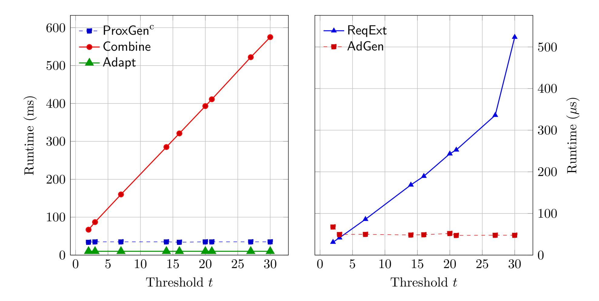

{0}------------------------------------------------

# How To Make Delegated Payments on Bitcoin: A Question for the AI Agentic Future

Jay Taylor<sup>1</sup> , Paul Gerhart<sup>2</sup> , and Sri AravindaKrishnan Thyagarajan<sup>1</sup>

> <sup>1</sup>University of Sydney <sup>2</sup>TU Wien

#### Abstract

AI agents and custodial services are increasingly being entrusted as intermediaries to conduct transactions on behalf of institutions. The stakes are high: The digital asset market is projected to exceed \$16 trillion by 2030, where exchanges often involve proprietary, time-sensitive goods. Although industry efforts like Google's Agent-to-Payments (AP2) protocol standardize how agents authorize payments, they leave open the core challenge of fair exchange: ensuring that a buyer obtains the asset if and only if the seller is compensated without exposing sensitive information.

We introduce proxy adaptor signatures (PAS), a new cryptographic primitive that enables fair exchange through delegation without sacrificing atomicity or privacy. A stateless buyer issues a single request and does not need to manage long-term cryptographic secrets while proxies complete the exchange with a seller. The seller is guaranteed payment if the buyer can later reconstruct the purchased witness; meanwhile, the proxies remain oblivious to the witness throughout the protocol. We formalize PAS under a threshold model that tolerates the collusion of up to t − 1 proxies. We also present an efficient construction from standard primitives that is compatible with Bitcoin, Cardano, and Ethereum. Finally, we evaluate a Rust implementation that supports up to 30 proxies. Our prototype is concretely efficient: buyer and seller computations take place in microseconds, proxy operations in milliseconds, and on-chain costs are equivalent to those of a standard transaction without fair exchange.

{1}------------------------------------------------

## Contents

| 1 | Introduction<br>3                                                |          |  |  |  |  |  |  |  |  |
|---|------------------------------------------------------------------|----------|--|--|--|--|--|--|--|--|
|   | 1.1<br>Our Contributions<br><br>1.2<br>Related Work              | 4<br>5   |  |  |  |  |  |  |  |  |
|   |                                                                  |          |  |  |  |  |  |  |  |  |
| 2 | Background                                                       | 6        |  |  |  |  |  |  |  |  |
|   | 2.1<br>Adaptor Signatures<br>2.2<br>Threshold Adaptor Signatures | 6<br>7   |  |  |  |  |  |  |  |  |
|   |                                                                  |          |  |  |  |  |  |  |  |  |
| 3 | Proxy Adaptor Signatures                                         | 7        |  |  |  |  |  |  |  |  |
|   | 3.1<br>Generic Construction                                      | 11       |  |  |  |  |  |  |  |  |
|   | 3.2<br>Security Analysis                                         | 12       |  |  |  |  |  |  |  |  |
| 4 | Deployment<br>13                                                 |          |  |  |  |  |  |  |  |  |
| 5 | Conclusion                                                       | 15       |  |  |  |  |  |  |  |  |
| A | Additional Preliminaries                                         |          |  |  |  |  |  |  |  |  |
|   | A.1<br>Hard Relations<br>                                        | 20<br>20 |  |  |  |  |  |  |  |  |
|   | A.2<br>Digital Signatures<br>                                    | 20       |  |  |  |  |  |  |  |  |
|   | A.3<br>Public Key Encryption                                     | 21       |  |  |  |  |  |  |  |  |
|   | A.4<br>Secret Sharing<br>                                        | 22       |  |  |  |  |  |  |  |  |
|   | A.5<br>Distributed Key Generation                                | 23       |  |  |  |  |  |  |  |  |
|   | A.6<br>Non-Interactive Zero-Knowledge Arguments                  | 24       |  |  |  |  |  |  |  |  |
|   | A.7<br>Threshold Signature Schemes<br>                           | 25       |  |  |  |  |  |  |  |  |
|   | A.8<br>Correctness of Proxy Adaptor Signatures<br>               | 26       |  |  |  |  |  |  |  |  |
| B | Proofs for Generic Proxy Adaptor Signature Construction<br>26    |          |  |  |  |  |  |  |  |  |
|   | B.1<br>Adaptability                                              | 26       |  |  |  |  |  |  |  |  |
|   | B.2<br>Extractability                                            | 27       |  |  |  |  |  |  |  |  |
|   | B.3<br>Witness Privacy<br>                                       | 27       |  |  |  |  |  |  |  |  |
| C | Fairness Model                                                   | 30       |  |  |  |  |  |  |  |  |

{2}------------------------------------------------

## <span id="page-2-0"></span>1 Introduction

The market for digital assets is projected to reach \$16.1 trillion by 2030 [\[GS25\]](#page-17-0), with data marketplaces driving much of this growth through the exchange of datasets, trained AI models, and streaming telemetry [\[Gra25,](#page-17-1) [AL22\]](#page-15-0). These transactions raise challenges distinct from traditional finance: digital assets are often proprietary, perishable, and must be transferred fairly without exposing sensitive information. Consider a vendor selling short-lived trading signals to a hedge fund. The fund must verify the signals meet advertised accuracy before paying, while the vendor needs guaranteed compensation if they deliver valid signals. Because the signals are highly time-sensitive and reveal valuable intellectual property, neither side can risk releasing their part first. This setting exemplifies the classic fair-exchange problem: both sides require guarantees that they receive their outcome if and only if the counterparty does too.

Current approaches to fair exchange of a digital good provide varying undesirable tradeoffs. Centralized exchanges, trusted platforms that facilitate trading between users while holding custody of assets, require users to forfeit custody of their assets to a single third party. Decentralized blockchain finance (DeFi) allows for atomicity and trustless, immutable settlement, but can incur substantial fees (eg. gas costs), as most DeFi protocols leverage smart contracts, involving complex business logic executed by a large network of nodes. Additionally, most smart contract-based DeFi solutions are not universally deployable: sellers and proxies may operate across heterogeneous systems, many of which (e.g., Bitcoin, private ledgers, or off-chain environments) lack expressive contract functionality. Recent efforts [\[Poe17,](#page-18-0)[AEE](#page-15-1)+21,[GSST24\]](#page-17-2) describe protocols that circumvent the need for smart contracts via new cryptographic primitives, but demand continuous involvement from the parties involved in the exchange, often with many rounds of interaction.

This need for continuous direct participation of the principals creates barriers for institutional adoption. In practice, portfolio managers cannot be expected to personally execute cryptographic protocols to acquire market data, nor should AI firm executives need to manage private keys to purchase training datasets. The operational burden includes: (1) maintaining online presence during potentially lengthy negotiation and exchange phases; (2) securely storing and managing cryptographic keys; (3) discovering and vetting potential counter-parties; (4) executing complex cryptographic protocols correctly; and (5) handling dispute resolution when transactions fail. Additionally, recent developments in multi-party compute (MPC) wallets have led to widely-adopted "wallet-as-a-service" offerings, where key custody of a cryptographic wallet is distributed to specialized service providers [\[blo23\]](#page-15-2). This introduces added complexity to the exchange, as well as involvement from third parties, who should not necessarily be privy to the exchanged data. Recent rapid developments in agentic AI payments, where agents are able to transact on behalf of users, further demonstrate a tangible demand from institutions to delegate the purchasing of critical business assets to third parties [\[PS25\]](#page-18-1).

Considering these emerging concerns, we find a critical gap: the absence of a formal framework for proxy exchanges. While existing cryptographic techniques enable delegation of certain operations, no existing system permits a buyer to delegate an end-to-end fair exchange to a group of proxies while retaining atomicity and privacy. To address institutional needs while maintaining security, we require a fair exchange protocol that satisfies several key properties:

- Atomicity: malicious parties should be unable to cheat by obtaining their desired outcome while preventing the counter-party from receiving theirs. This ensures fair exchange even in a trustless environment.
- Witness privacy: only the buyer should learn the witness they're purchasing; proxies should not learn the witness simply by participating in the protocol. This is crucial for delegating the purchase of sensitive assets like private keys or proprietary data.

{3}------------------------------------------------

- Scalability: the seller's workload should be independent of the number of proxies and ideally agnostic to their existence. If this were not the case, the seller would have to incur costs for a protocol which adds no benefit to them (as the proxy exchange model only benefits the buyer).
- No buyer-seller interaction: the buyer and seller do not interact; the seller interacts only with the proxies, as does the buyer. This allows the buyer to remain undiscoverable to the seller and reduces the buyer's online requirements. Clearly, this property requires some form of intermediary, whether it be a proxy or smart contract.
- Lightweight buyer: expensive cryptographic operations are offloaded to the proxies and the buyer maintains minimal secure state, performing only lightweight computations. This enables the use of low-power devices or "cold" wallets for the buyer.

Technical Challenges. A natural starting point would be to have the buyer hand over their signing authority (possibly for a temporary wallet used only for the exchange) to a set of proxies using the aforementioned existing solutions. The proxies could then participate in standard cryptographic fair-exchange protocols on behalf of the buyer. However, this naive approach immediately fails as proxies must extract secret information during the exchange process, information that should only be accessible to the buyer. One might attempt to resolve this by having the seller encrypt the sensitive data under the buyer's public key before the exchange. However, this approach is not fair, as the proxies may simply pass on the ciphertext to the buyer before payment is made. It is therefore imperative that we ensure atomicity in the exchange: the seller receives the payment if and only if the proxies learn the ciphertext. Moreover, as a design choice, we aim to minimize heavy cryptographic operations at the buyer's end, particularly to support low-end devices.

Our approach to solving these challenges is to let the proxies securely generate a blinding factor to obtain a blinded version of the desired secret witness, rather than the witness itself. No proxy knows the blinding factor, but the buyer, and only the buyer, is able to jointly reconstruct it to "unblind" the blinded witness and derive what they purchased. This retains fairness, witness privacy, and keeps the buyer lightweight. To capture this functionality, we introduce a new cryptographic primitive called proxy adaptor signatures. We summarize our contributions below.

#### <span id="page-3-0"></span>1.1 Our Contributions

Formal model. We formalise proxy adaptor signatures (PAS), a new primitive that enables a buyer to delegate the purchase of a digital good (or witness wit for an NP statement stmt) to a set of proxies. PAS extends adaptor signatures [\[GSST24\]](#page-17-2) in the style of proxy-based primitives such as proxy signatures [\[MUO96\]](#page-18-2) and proxy re-encryption [\[AFGH06\]](#page-15-3), and is tailored for blockchainbased fair exchange. The construction operates in a threshold setting with n proxies, tolerating corruption of up to t−1, and captures exchange-related guarantees in rigorous game-based security definitions that also account for collusion between principals (buyer or seller) and subsets of up to t − 1 proxies. A defining feature is witness privacy: even though proxies carry out all operations, only the buyer can reconstruct the purchased witness.

At a high level, the buyer, or the proxies on their behalf, can post a request for a witness to a specific statement on a public bulletin board or marketplace, e.g., a job board or a dedicated data marketplace, which serves as an asynchronous communication channel. We make no assumptions on this bulletin board, but assume that potential sellers eventually notice the request. A seller, upon discovering this, publishes an "advertisement", which must include a cryptographic proof of knowledge of a corresponding witness for the statement. The buyer goes offline after issuing a request req to the proxies, who run an interactive ProxGen protocol followed by a local Combine 

{4}------------------------------------------------

to produce a proxy output τ . The seller, when given τ , can then apply Adapt to transform the proxy output into a valid signature σ on a payment transaction m using the witness wit. Then, the seller can publish the signature on-chain, and receive payment. Using τ and σ, any proxy can later run ProxExt to derive a blinded witness wit<sup>τ</sup> and deliver it to the buyer. Crucially, the blinded witness leaks no information about the actual witness to the proxies. Finally, the buyer runs ReqExt locally to unblind and recover the full witness wit, completing the exchange. This design enables proxies to handle the exchange on the buyer's behalf, ensuring atomicity while keeping the buyer's involvement minimal.

Efficient construction. We design an efficient PAS construction that uses standard primitives in a black-box manner, in particular adaptor signatures compatible with Schnorr and EdDSA. This ensures immediate deployability on major blockchain platforms such as Bitcoin, Cardano, and Ethereum, requiring only transaction-signature verification scripts or lightweight contracts. PAS thereby enables delegated exchanges without reliance on complex smart contracts, improving scalability, reducing on-chain costs (e.g., gas fees), and improving fungibility. Our PAS construction lets the buyer be stateless aside from storing a secret to authenticate with the proxies and require negligible computation, and even be offline (needing no interaction with the seller) during the exchange. We provide a rigorous security analysis under standard cryptographic assumptions, demonstrating that the construction satisfies all the required properties of a proxy-based exchange, even in the presence of adversaries corrupting the buyer, seller, or a minority of proxies.

Performance evaluation. We provide an open-source implementation [\[pas25\]](#page-18-3) of our proxy exchange construction in Rust with an end-to-end demonstration on Bitcoin's testnet. We utilize the Secp256k1 curve to demonstrate feasibility with major blockchains, and we provide performance benchmarks for various parameter configurations involving up to 30 proxies participating in the threshold structure. Our results demonstrate that our construction is practical for a variety of real-world use cases: buyer and seller computations are completed in microseconds, proxy computation is performed in milliseconds, and the on-chain footprint is equivalent to that of a standard transaction. We share more details of our implementation in Section [4.](#page-12-0)

#### <span id="page-4-0"></span>1.2 Related Work

There is extensive literature on fair exchange in blockchain settings. Adaptor signatures, originating from Poelstra's "Scriptless Scripts" [\[Poe17\]](#page-18-0), enable the atomic fair exchange of witnesses for signatures, offering an attractive, lightweight, and portable alternative to the expensive and complex smart contract-based solutions. The formalization by Aumayr et al. [\[AEE](#page-15-1)+21] established security definitions, with subsequent work strengthening these definitions [\[DOY22,](#page-16-0)[GRS26,](#page-17-3)[GSST24\]](#page-17-2) and demonstrating applications beyond basic payments, including mixing protocols [\[GMM](#page-16-1)+22] and oracle-based transfers [\[MTV](#page-17-4)+23]. Functional adaptor signatures [\[VST24\]](#page-18-4) extend this work to enable exchange of function outputs rather than complete witnesses, addressing privacy concerns in data markets.

Several works have extended these cryptographic primitives to multi-party settings. Threshold and multi-adaptor signatures [\[JXGZ24\]](#page-17-5) allow groups of signers to participate in fair exchange, while consecutive adaptor signatures [\[KOT24\]](#page-17-6) enable N-party chains of exchanges. Most closely related to our work, Baecker et al. [\[BGKS25\]](#page-15-4) study fair exchange between two groups (buyer and seller DAOs) with threshold structures within each group. They formalize intra- and inter-group fairness and construct a protocol using time-based mechanisms and certified witness encryption. While one may initially propose a trivial implementation of these schemes for our use case, our 

{5}------------------------------------------------

setting differs fundamentally: rather than multiple buyers collaborating to purchase from multiple sellers, we have a single buyer who delegates the exchange process to proxies. In particular, there is some third-party "buyer" that will not actively participate in the protocol, yet should learn the full witness, while the proxies do not.

The idea of delegating signing authority to proxies has been studied extensively [\[DSP06\]](#page-16-2). In proxy signature schemes, the original signer derives proxy keys that enable designated parties to sign on their behalf under specified constraints. Such signatures are publicly verifiable, distinguishable from ordinary signatures, and delegation links can be proved. Threshold variants [\[SLH99,](#page-18-5) [ZL22\]](#page-19-3) distribute authority among several proxies, requiring a quorum for signature generation. However, these schemes assume a persistent original signer who must hold the master key, making them unsuitable for our setting. While some work combines proxy signatures with fair exchange [\[GAS14\]](#page-16-3), it relies on trusted proxies and is not well-suited for blockchain environments.

To summarise: adaptor signatures (AS) give two-party fairness; threshold adaptor signatures (TAS) distribute signing but the principals hold the shares; functional adaptor signatures (FAS) change the exchanged object (function outputs) but still require buyer-seller interaction; MPC wallets distribute custody but offer no witness privacy or fair exchange; proxy signatures delegate signing but require trust and don't facilitate fair exchange immediately. PAS uniquely combines delegation, threshold control, and witness privacy, allowing proxies to execute the exchange while the buyer remains offline and still learns the witness.

## <span id="page-5-0"></span>2 Background

We recall the main cryptographic tools used throughout this work. Beyond adaptor signatures, we rely on standard notions of hard relations, public-key encryption, NIZKs, DKG, and threshold signatures. See Appendix [A](#page-19-0) for all preliminaries.

#### <span id="page-5-1"></span>2.1 Adaptor Signatures

Adaptor signatures [\[GSST24,](#page-17-2) [AEE](#page-15-1)+21, [Poe17\]](#page-18-0) extend conventional digital signatures to facilitate fair exchange of a signature for a witness to a hard relation. Given a signature scheme Σ = (KGen, Sign, Vf) and a hard relation R, an adaptor signature scheme provides four algorithms enabling pre-signature generation, verification, adaptation, and witness extraction.

Definition 2.1. (Adaptor Signature Scheme) An adaptor signature scheme ASΣ,<sup>R</sup> = (PreSign, PreVerify, Adapt, Ext) is defined with respect to a signature scheme Σ = (KGen, Sign, Vf) and a hard relation R as follows:

- σ˜ ← PreSign(sk, m,stmt). Takes secret key sk, message m ∈ {0, 1} ∗ , and statement stmt ∈ LR, outputs a pre-signature σ˜.
- 0/1 := PreVerify(vk, m,stmt, σ˜). Takes public key vk, message m, statement stmt, and pre-signature σ˜, outputs a bit b.
- σ ← Adapt(vk, σ, ˜ wit). Takes public key vk, pre-signature σ˜, and witness wit such that (stmt,wit) ∈ R, outputs an adapted signature σ.
- wit := Ext(vk, σ, σ, ˜ stmt). Takes public key vk, pre-signature σ˜, signature σ, and statement stmt ∈ LR, outputs witness wit or ⊥.

Definition 2.2. (Pre-signature Correctness) An adaptor signature scheme AS satisfies pre-signature correctness if for all λ, all key pairs (sk, vk) ← Σ.KGen(λ), all statements/witnesses (stmt,wit) ∈ R,

{6}------------------------------------------------

and all messages m, the following holds:

$$\Pr \big[ \mathsf{PreVerify}(\mathsf{vk}, m, \mathsf{stmt}, \tilde{\sigma}) = 1 \land \Sigma. \mathsf{Vf}(\mathsf{vk}, m, \sigma) = 1 \land (\mathsf{stmt}, \mathsf{wit}') \in \mathcal{R} \big] = 1,$$

where ˜σ ← PreSign(sk, m,stmt), σ ← Adapt(vk, σ, ˜ wit), and wit′ ← Ext(vk, σ, σ, ˜ stmt).

### <span id="page-6-0"></span>2.2 Threshold Adaptor Signatures

Threshold adaptor signatures [\[BGKS25\]](#page-15-4) generalize adaptor signatures to the threshold setting, enabling any t-out-of-n signers to collaboratively generate pre-signatures. We follow the notation of [\[BGKS25\]](#page-15-4).

<span id="page-6-2"></span>Definition 2.3. (Threshold Adaptor Signature). A threshold adaptor signature scheme w.r.t. a hard relation R for some language L<sup>R</sup> and a threshold signature scheme TS = (Setup,KGen, Sign, Vf) consists of a tuple of four algorithms and protocols TASR,TS = (PreSign, Adapt, PreVerify, Ext) defined as:

σ˜ ← ⟨PreSign(sk<sup>i</sup> , vk, m,stmt)⟩. The pre-signing protocol is an interactive algorithm of which an instance is run by each signer S1, . . . , S<sup>t</sup> concurrently, taking as input a signing key share sk<sup>i</sup> , the joined public key vk, a message m, and a NP-statement stmt. At the end of the protocol, S<sup>i</sup> obtains a pre-signature σ˜ as output.

0/1 := PreVerify(vk, m,stmt, σ˜). The pre-verification algorithm is a DPT algorithm that on input a public key vk, message m ∈ {0, 1} <sup>ℓ</sup>m, statement stmt ∈ LR, and pre-signature σ˜, outputs a bit 0/1. σ := Adapt(vk, σ, ˜ wit). The adapting algorithm is a DPT algorithm that on input a pre-signature σ˜ and witness wit for the statement stmt ∈ L<sup>R</sup> outputs an adapted signature σ, or ⊥.

wit := Ext(vk, σ, σ, ˜ stmt). The extracting algorithm is a DPT algorithm that on input a public key vk, pre-signature σ˜, signature σ, and statement stmt ∈ LR, outputs a witness wit such that (stmt,wit) ∈ R, or ⊥.

A threshold adaptor signature scheme satisfies Pre-signature adaptability if for all λ ∈ N, messages m ∈ {0, 1} ∗ , pre-signatures ˜σ, statement/witness pairs (stmt,wit) ∈ R, and public keys vk,

$$\mathsf{PreVerify}(\mathsf{vk}, m, \mathsf{stmt}, \tilde{\sigma}) = 1 \Rightarrow \mathsf{Vf}(\mathsf{vk}, m, \mathsf{Adapt}(\mathsf{vk}, \tilde{\sigma}, \mathsf{wit})) = 1.$$

A threshold adaptor signature scheme satisfies Extractability if for any PPT adversary A, there exists a negligible function negl such that for all λ, t < n ∈ N,

$$\Pr[\mathsf{Ext}_{\mathsf{TAS},t,n}^{\mathcal{A}}(1^{\lambda}) = 1] \leq \mathsf{negl}(\lambda),$$

where the experiment Ext<sup>A</sup> TAS,t,n(1<sup>λ</sup> ) is defined in Figure [1](#page-7-0) and the randomness is taken over all random coins used by the probabilistic algorithms.

# <span id="page-6-1"></span>3 Proxy Adaptor Signatures

A proxy-enabled exchange involves a buyer, a seller, and n proxies who jointly control a (t, n) threshold wallet. The proxies buy a witness from the seller for the buyer. We assume that compensation for the proxies is handled externally, i.e., the buyer pays for the threshold service off-chain or through some other means.

{7}------------------------------------------------

```
Experiment ExtA
                     TAS,t,n(1λ
                                 )
pp ← TS.Setup(n, t)
(vk, {ski}i∈[n]
              ) ← TS.KGen(1λ
                               )
corr ← A(vk)
if |corr| ≥ t : return ⊥
H ← [n] \ corr
QSign, QPreSign, Qstmt := ∅
O := (OPreSign(·, ·), OSign(·, ·), Ostmt(1λ
                                       ))
(m∗
    , σ∗
        ) ← AO (vk, {ski}i∈corr)
assert TS.Vf(vk, m∗
                     , σ∗
                         )
assert m∗ ∈ Q/ Sign
assert ∀(˜σ
           ∗
            , stmt) ∈ QPreSign[m∗
                                  ]PreVerify(vk, m∗
                                                   , stmt, σ˜
                                                           ∗
                                                             )
return ∀(˜σ, stmt) ∈ QPreSign[m∗
                                 ] s.t. stmt ∈ Q/ stmt :
  (stmt, Ext(vk, σ, σ ˜
                    ∗
                     , stmt)) ∈ R/
                                                                 Oracle OPreSign(m,stmt)
                                                                 RH ← {random coins}
                                                                 σ˜ ← ⟨PreSign(ski
                                                                                   , m, stmt; RH), A⟩
                                                                 QPreSign[m]
                                                                              ∪
                                                                             := {(˜σ, stmt)}
                                                                 return σ˜
                                                                 Oracle OSign(m)
                                                                 RH ← {random coins}
                                                                 σ ← ⟨TS.Sign(ski
                                                                                   , m; RH), A⟩
                                                                 QSign
                                                                        ∪
                                                                       := {m}
                                                                 return σ
                                                                 Oracle Ostmt(1λ
                                                                                      )
                                                                 (s, w) ← GenR(1λ
                                                                                    )
                                                                 Qstmt
                                                                        ∪
                                                                       := {s}
                                                                 return s
```

<span id="page-7-0"></span>Figure 1: Extractability game for threshold adaptor signatures

Definition 3.1. (Proxy adaptor signatures). A proxy adaptor signature scheme PAS := (Setup, ReqGen, ReqVerify, AdGen, AdVerify, ProxGen, Combine, Adapt, ProxExt, ReqExt) is defined with respect to a threshold signature scheme TS = (Setup,KGen, Sign, Vf) and a hard relation RDLog. The interfaces are as follows:

pp ← Setup(1<sup>λ</sup> ). Takes security parameter 1 <sup>λ</sup> and outputs public parameters pp. From now on, pp is an implicit input to all subsequent algorithms.

req ← ReqGen(stmt). Takes statement stmt ∈ LRDLog and outputs a public request object.

0/1 := ReqVerify(stmt,req). Takes statement stmt and request object req and outputs 0/1, signifying whether req was generated correctly.

(stadvt, advt) ← AdGen(stmt,wit). Takes statement stmt, witness wit such that (stmt,wit) ∈ RDLog, and outputs a secret state stadvt and an advertisement advt.

0/1 := AdVerify(stmt, advt). Takes statement stmt, advertisement advt, and outputs 0/1, signifying whether advt was generated correctly.

({st<sup>i</sup> <sup>τ</sup> }i∈S, τ, ˜ S) ← ⟨ProxGen(sk<sup>i</sup> , vk,req, advt,stmt, m)⟩. The proxy generation protocol is an interactive algorithm of which an instance ProxGen<sup>i</sup> is run by each proxy signer S1, . . . , S<sup>t</sup> concurrently. ProxGen<sup>i</sup> takes a secret key share sk<sup>i</sup> , corresponding shared verification key vk (previously generated by TS.KGen), request object req, advertisement advt, statement stmt, and message m. At the end of the protocol, signer i obtains public output τ˜ and secret output st<sup>i</sup> τ . Additionally the index set of signers S is outputted.

τ /⊥ := Combine(vk, m, advt,stmt, τ, ˜ S,req). Takes verification key vk, message m, advertisement advt, statement stmt, partial proxy output τ˜, request req, and outputs τ , the full proxy output, or ⊥.

σ/⊥ := Adapt(stadvt,wit, τ, vk). Takes secret state stadvt, witness wit, combined proxy output τ , verification key vk, and outputs a signature for the message m and verification key vk, or ⊥.

wit<sup>τ</sup> := ProxExt(vk, τ, σ,stmt). Takes verification key vk, proxy output τ , signature σ, statement stmt and outputs a blinded witness wit<sup>τ</sup> .

{8}------------------------------------------------

 $\underline{\mathsf{wit}} \coloneqq \mathsf{ReqExt}(\{(i,\mathsf{st}_\tau^i)\}_{i\in\mathcal{S}}, \mathsf{wit}_\tau, \mathsf{vk}). \ \ \mathit{Takes} \ \mathit{a} \ \mathit{set} \ \{(i,\mathsf{st}_\tau^i)\}_{i\in\mathcal{S}} \ \mathit{of} \ \mathit{secret} \ \mathit{states}, \ \mathit{a} \ \mathit{blinded} \ \mathit{witness} \ \mathsf{wit}_\tau, \\ \overline{\mathit{a} \ \mathit{verification} \ \mathit{key} \ \mathsf{vk}, \ \mathit{and} \ \mathit{outputs} \ \mathit{a}} \ \ \mathit{witness} \ \mathsf{wit} \ \mathit{for} \ \mathit{the} \ \mathit{statement} \ \mathsf{stmt}.$ 

After setup of public parameters (via Setup) and threshold wallet key shares (via TS.KGen), a typical exchange proceeds as follows. The buyer runs ReqGen on a statement stmt and forwards the resulting public request req to the proxies; the proxies first validate req using ReqVerify before participating (e.g., to ensure the request is well-formed for the intended statement). A seller, who has a valid witness wit for the statement stmt, responds by publishing an advertisement advt (and keeping secret state  $st_{advt}$ ), produced by AdGen; the proxies validate the advertisement via AdVerify, which proves the seller's knowledge of a valid witness.

Next, a threshold of proxies runs the interactive protocol ProxGen, using their signing key shares together with req, advt, stmt, and the target signing message m (typically a transaction to pay the seller). This produces a public transcript  $\tilde{\tau}$  and per-proxy secret outputs  $\mathsf{st}_{\tau}^i$  (which are later delivered to the buyer). Anyone can then run Combine on  $\tilde{\tau}$  to verify the request/advertisement and any NIZKs included by the proxies, and to obtain a constant-size proxy output  $\tau$  (or  $\perp$ ). The seller uses Adapt to turn  $\tau$  into a full signature  $\sigma$  on m (e.g., posting a payment transaction on-chain). After  $\sigma$  is available, any proxy can run ProxExt on  $(\tau, \sigma)$  to derive a blinded witness wit, for the buyer. Finally, once the buyer collects at least t secret outputs  $\{(i, \mathsf{st}_{\tau}^i)\}$  from the proxies, they run ReqExt to recover the witness wit.

We now formally define various security properties of a proxy adaptor signature scheme. For readability, we assume that whenever the adversary aborts an oracle interaction, the oracle simulating the protocol party aborts the ongoing protocol execution and returns  $\bot$ . We defer correctness to Appendix A.8.

**Adaptability.** Similar to the pre-signature adaptability of a threshold adaptor scheme, a proxy adaptor signature scheme satisfies *adaptability* if, given partial outputs  $\tilde{\tau}$ , a successful generation of a  $\tau$  using Combine implies that knowing a valid witness wit, a valid signature can be adapted from  $\tau$  using Adapt.

<span id="page-8-0"></span>**Definition 3.2.** (Adaptability). A proxy adaptor signature scheme PAS satisfies adaptability if for all  $\lambda \in \mathbb{N}$ , messages  $m \in \{0,1\}^*$ , (stmt, wit)  $\in \mathcal{R}_{\mathsf{DLog}}$ , public keys vk, requests req, such that ReqVerify(stmt, req) = 1, (st<sub>advt</sub>, advt)  $\leftarrow \mathsf{AdGen}(\mathsf{stmt}, \mathsf{wit})$ , partial proxy outputs  $\tilde{\tau}$  generated with signing set  $\mathcal{S}$ , and  $\tau \leftarrow \mathsf{Combine}(\mathsf{vk}, m, \mathsf{advt}, \mathsf{stmt}, \tilde{\tau}, \mathcal{S}, \mathsf{req})$ :

$$\tau \neq \bot \Rightarrow \mathsf{TS.Vf}(\mathsf{vk}, m, \mathsf{Adapt}(\mathsf{st}_{\mathsf{advt}}, \mathsf{wit}, \tau, \mathsf{vk})) = 1.$$

Extractability. We adopt a similar definition of extractability from threshold adaptors (Definition 2.3), letting the adversary corrupt the seller and n-t-1 proxies  $(t \ge n/2)$ . We limit the set of corrupted proxies as otherwise the adversary can trivially win by not sending back their secret outputs from ProxGen, preventing the buyer from obtaining the necessary t shares required in ReqExt. Intuitively, our definition of extractability captures that a malicious seller and n-t-1 proxies cannot prevent the buyer from obtaining a valid witness from an adapted signature. Similarly to the new notion of extractability introduced by [GSST24], we also capture unforgeability—the adversary cannot generate a valid signature without access to the corresponding witness for a statement.

<span id="page-8-1"></span>**Definition 3.3.** (Extractability). A proxy adaptor signature scheme PAS satisfies extractability if for any PPT adversary  $\mathcal{A}$ , there exists a negligible function negl such that for all  $\lambda, t < n \in \mathbb{N}$ ,  $\Pr[\mathsf{paExt}_{\mathsf{PE},t,n}^{\mathcal{A}}(1^{\lambda}) = 1] \leq \mathsf{negl}(\lambda)$ , where the experiment  $\mathsf{paExt}_{\mathsf{PE},t,n}^{\mathcal{A}}(1^{\lambda})$  is defined in Figure 2 and the randomness is taken over all random coins used by the probabilistic algorithms.

{9}------------------------------------------------

```
Experiment \mathsf{paExt}_{\mathsf{PE},t,n}^{\mathcal{A}}(1^{\lambda})
                                                                                                                              Oracle \mathcal{O}_{\mathsf{Sign}}(m)
                                                                                                                               /\!\!/ Fixed randomness for honest parties
pp \leftarrow Setup(1^{\lambda})
                                                                                                                               R_{\mathcal{H}} \leftarrow \{\text{random coins}\}\
(\mathsf{vk}, \{\mathsf{sk}_i\}_{i \in [n]}) \leftarrow \mathsf{TS}.\mathsf{KGen}(1^{\lambda})
                                                                                                                              \sigma \leftarrow \langle \mathsf{TS.Sign}(\mathsf{sk}_i, m; R_{\mathcal{H}}), \mathcal{A} \rangle
corr \leftarrow \mathcal{A}(vk)
                                                                                                                              \mathcal{Q}_{\mathsf{Sign}} \stackrel{\cup}{\coloneqq} \{m\}
\mathcal{H} \leftarrow [n] \setminus \mathsf{corr}
      // Need honest threshold
                                                                                                                               return \sigma
if |\mathcal{H}| < t \lor |\mathsf{corr}| > t - 1 : \mathbf{return} \perp
 \mathcal{Q}_{\mathsf{Sign}}, \mathcal{Q}_{\mathsf{stmt}}, \mathcal{Q}_{\mathsf{ProxGen}} \coloneqq \emptyset
                                                                                                                              Oracle \mathcal{O}_{\mathsf{ProxGen}}(\mathsf{advt}, m, \mathsf{req}, \mathsf{stmt})
\mathbb{O} \coloneqq (\mathcal{O}_{\mathsf{Sign}}(\cdot), \mathcal{O}_{\mathsf{ProxGen}}(\cdot, \cdot, \cdot, \cdot), \mathcal{O}_{\mathsf{stmt}}(1^{\lambda}))
                                                                                                                              if AdVerify(stmt, advt) = 0
(\sigma^*, m^*, \mathsf{advt}^*) \leftarrow \mathcal{A}^{\mathbb{O}}(\mathsf{vk}, \{\mathsf{sk}_i\}_{i \in \mathsf{corr}})
                                                                                                                                      \vee ReqVerify(stmt, req) = 0 : return \perp
assert TS.Vf(vk, m^*, \sigma^*)
                                                                                                                              R_{\mathcal{H}} \leftarrow \{\text{random coins}\}\
assert m^* \notin \mathcal{Q}_{\mathsf{Sign}}
                                                                                                                              (\{\mathsf{st}^i_{\tau}\}_{i\in\mathcal{H}},\tilde{\tau},\mathcal{S})
foreach (\tau, \{\mathsf{st}_{\tau}^i\}_{i \in [\mathcal{S}]}, \mathsf{stmt}) \in \mathcal{Q}_{\mathsf{ProxGen}}[m^*]:
                                                                                                                                       \leftarrow \langle \mathsf{ProxGen}(\{\mathsf{sk}_i\}, \mathsf{vk}, \mathsf{req}, \mathsf{advt}, \mathsf{stmt}, m; R_{\mathcal{H}}), \mathcal{A} \rangle
      if stmt \notin Q_{\mathsf{stmt}}:
                                                                                                                              \tau \leftarrow \mathsf{Combine}(\mathsf{vk}, m, \mathsf{stmt}, \tilde{\tau}, \mathcal{S}, \mathsf{reg})
            \mathsf{wit}_{\tau} \leftarrow \mathsf{ProxExt}(\mathsf{vk}, \tau, \sigma^*, \mathsf{stmt})
                                                                                                                              if \tau = \bot : \mathbf{return} \perp
            \mathsf{wit} \leftarrow \mathsf{ReqExt}(\{(i,\mathsf{st}_{\tau}^i)\}_{i\in\mathcal{H}},\mathsf{wit}_{\tau},\mathsf{vk})
                                                                                                                              \mathcal{Q}_{\mathsf{ProxGen}}[m] \stackrel{\cup}{\coloneqq} \{(\tau, \{\mathsf{st}_{\tau}^i\}_{i \in \mathcal{H}}, \mathsf{stmt})\}
            if (\mathsf{stmt}, \mathsf{wit}) \notin \mathcal{R}_{\mathsf{DLog}} : \mathbf{return} \ 1
                                                                                                                              return \tau
return 0
                                                                                                                              \frac{\text{Oracle } \mathcal{O}_{\mathsf{stmt}}(1^{\lambda})}{(\mathsf{stmt}, \mathsf{wit}) \leftarrow \mathsf{GenR}(1^{\lambda})}
                                                                                                                              \mathcal{Q}_{\mathsf{stmt}} \stackrel{\cup}{\coloneqq} \{\mathsf{stmt}\}
                                                                                                                              return stmt
```

<span id="page-9-0"></span>Figure 2: Extractability game for proxy adaptor signatures.

Witness Privacy. Witness privacy captures that the adversary cannot learn any information about the witness, even if t-1 proxies are corrupted. Intuitively, the size of the corrupted set is bounded by t, as otherwise the adversary will have access to t of the secret outputs from ProxGen, allowing them the same power as the buyer in that they can run ReqExt themselves to obtain the full witness. We formally define our notion of witness privacy as zero knowledge, requiring that a simulator should be able to simulate the real experiment for the adversary without access to the witness.

<span id="page-9-1"></span>**Definition 3.4.** (Witness Privacy). A proxy adaptor signature scheme PAS satisfies witness privacy if for every probabilistic polynomial-time (PPT) adversary  $\mathcal{A}$ , there exists a stateful PPT simulator Sim = (ReqGen\*, AdGen\*, ProxGen\*, Adapt\*) and a negligible function negl such that for all security parameters  $\lambda \in \mathbb{N}$ , for all (stmt, wit)  $\in \mathcal{R}_{\mathsf{DLog}}$ , and for all PPT distinguishers D

$$\left|\Pr[\mathsf{D}(\mathsf{paZKReal}_{\mathsf{PAS},t,n}^{\mathcal{A}}(1^{\lambda},\mathsf{stmt},\mathsf{wit})) = 1] - \Pr[\mathsf{D}(\mathsf{paZKIdeal}_{\mathsf{PAS},t,n}^{\mathcal{A}}(1^{\lambda},\mathsf{stmt})) = 1]\right| \leq \mathsf{negI}(\lambda).$$

We define the experiments  $\mathsf{paZKReal}_{\mathsf{PAS},t,n}^{\mathcal{A}}$  and  $\mathsf{paZKIdeal}_{\mathsf{PAS},t,n}^{\mathcal{A}}$  in Figure 3.

Our definitions imply that proxy adaptor signatures achieve fair exchange between the buyer and the sellers, similar to fairness for ordinary adaptor signatures [GSST24]. Extractability ensures that if the proxies make a payment, the buyer can recover a requested witness; hence, we have fairness for the buyer. We ensure fairness for the seller, as the advertisement does not disclose any information about the witness (protected by witness privacy), and aside from the advertisement,

{10}------------------------------------------------

```
Experiment paZKRealA
                            PAS,t,n(1λ
                                        ,stmt,wit)
pp ← Setup(1λ
               )
(vk, {ski}i∈[n]
              ) ← TS.KGen(1λ
                               )
req ← ReqGen(stmt)
(stadvt, advt) ← AdGen(stmt, wit)
corr := ∅
O := (OProxGen(·), OAdapt(·, ·))
(corr, stA) ← AO(vk, {ski}i∈[n]
                               ,req, advt, stmt)
AO(stA)
return view of A
Oracle OProxGen(m)
if |corr| ≥ t : return ⊥
H := [n] \ corr
// Sample fixed randomness for honest parties
RH ← {random coins}
( , τ, ˜ S)
  ← ⟨ProxGen(ski
                   , vk,req, advt, stmt, m; RH), A⟩
τ ← Combine(vk, m, advt, stmt, τ, ˜ S,req)
return τ
Oracle OAdapt(m, τ )
σ ← Adapt(stadvt, wit, τ, vk)
return σ
                                                         Experiment paZKIdealA
                                                                                       PAS,t,n(1λ
                                                                                                   ,stmt)
                                                         pp ← Setup∗
                                                                      (1λ
                                                                          )
                                                         (vk, {ski}i∈[n]
                                                                       ) ← TS.KGen(1λ
                                                                                        )
                                                         req ← ReqGen∗
                                                                         (stmt)
                                                         advt ← AdGen∗
                                                                         (stmt)
                                                         corr, Qτ := ∅
                                                         O := (OProxGen
                                                                        ∗
                                                                         (·), OAdapt
                                                                                   ∗
                                                                                    (·, ·))
                                                         (corr, stA) ← A(vk, {ski}i∈[n]
                                                                                       ,req, advt, stmt)
                                                         AO(stA)
                                                         return view of A
                                                         Oracle OProxGen
                                                                              ∗
                                                                               (m)
                                                         if |corr| ≥ t : return ⊥
                                                         (st, τ, ˜ S)
                                                            ← ⟨ProxGen∗
                                                                          (ski
                                                                              , vk,req, m, advt, stmt), A⟩
                                                         τ ← Combine(vk, m, advt, stmt, τ, ˜ S,req)
                                                         Qτ [τ] := st
                                                         return τ
                                                         Oracle OAdapt
                                                                           ∗
                                                                             (m, τ )
                                                         st := Qτ [τ]
                                                         σ ← Adapt∗
                                                                      (τ, vk, st)
                                                         if TS.Vf(vk, m, σ) = 0 : return ⊥
                                                         return σ
```

<span id="page-10-1"></span>Figure 3: Witness privacy game for proxy adaptor signatures (real vs. simulated).

the seller only posts a valid signature on-chain. Therefore, whenever the seller leaks the witness (which happens only through posting the signature), the seller is already paid.

While our definitions achieve fairness in a cryptographical sense, i.e., the extracted witness matches the advertised one, our definition of proxy adaptor signatures is agnostic to the semantic quality of the witness. The semantic quality must be asserted by the higher-level protocol using proxy adaptor signatures to realize fair exchange, but is out of scope of the actual exchange.

As an example of how the semantic quality of a witness can differ, consider the case of "asset race conditions", where the witness is a wallet's private key. If the seller exchanges this key in a fair manner, but moves the funds before the buyer claims them, the exchange was fair, but not what the buyer desired. To mitigate such a race condition, a higher-level protocol would utilize a time-locked multisignature between the proxies and the seller to ensure that the seller cannot transfer the funds until after the exchange is complete. A formal treatment of fairness appears in Appendix [C.](#page-29-0)

### <span id="page-10-0"></span>3.1 Generic Construction

Let RDLog be a discrete-log NP relation with language LRDLog such that (stmt,wit) ∈ RDLog ⇔ stmt = g wit, for some generator g of a prime order group. Let RPKE be an encryption correctness relation with language LRPKE such that ((g x , c, pk), x) ∈ RPKE ⇔ c = PKE.Enc(pk, x) for some secret value x and public key pk. This relation captures that a ciphertext c is the encryption of the

{11}------------------------------------------------

discrete-log of some public commitment g <sup>x</sup> under the public key pk. Note that RDLog is practical for many use cases, as the exchanged witness could simply be a key to access sensitive data securely hosted elsewhere. This permits a protocol design that can feasibly support any type of data product using the compiler of [\[TSZ](#page-18-6)+24]. Our construction relies on the following cryptographic building blocks:

- NIZK argument systems NIZKDLog for discrete-log relation RDLog and NIZKPKE for encryption relation RPKE, where NIZKPKE has an online extractor
- A (t, n) threshold adaptor signature scheme TASRDLog,TS with guaranteed output delivery
- A linearly homomorphic encryption scheme PKE
- A (t, n) distributed key generation (DKG) scheme for RDLog

To increase readability, we assume that DKG.KGen provides an interface (Y, yi) ← KGeni(1<sup>λ</sup> ) for each party i ∈ [n], which returns the public and individual private output of the interactive DKG algorithm for party i.

In our generic construction, the buyer's request equals the statement. To create an advertisement, the seller computes a NIZKDLog proving knowledge of a witness which corresponds to the buyer's statement, as well as a public encryption key. This advertisement can be verified by verifying NIZKDLog. To generate a proxy, the proxies collectively generate shares of a secret blinding factor r (and corresponding public output R := g r ) through a DKG, where each proxy i obtains a share r<sup>i</sup> , without any individual proxy learning the full blinding factor r. Proxy i then encrypts their share of the blinding factor r<sup>i</sup> with the seller's encryption key, and proves the correctness of this encryption using NIZKPKE. The proxies then interactively generate a pre-signature that is bound to a blinded version of the statement stmt · R. They also homomorphically combine all of the encrypted shares r<sup>i</sup> into an encryption c of the blinding factor r.

To adapt, the seller derives a full signature by first decrypting the encryption of r and adapting the pre-signature with a blinded version of the witness wit + r. To proxy extract, the proxies run the extract algorithm of the adaptor signature based on the previously computed pre-signature and the adapted signature (which the seller publishes on-chain to receive payment). To extract the witness, the buyer receives the shares of r and the blinded witness from the proxies and subtracts r from the blinded witness. We detail the construction in Figure [4.](#page-12-1)

#### <span id="page-11-0"></span>3.2 Security Analysis

We now state the main security properties of our proxy adaptor signature construction. Detailed proofs appear in Appendix [B.](#page-25-1)

<span id="page-11-1"></span>Lemma 3.5. Suppose TAS is pre-signature adaptable, NIZKPKE is simulation extractable, and PKE is correct. Then, the proxy adaptor signature construction in Figure [4](#page-12-1) satisfies adaptabillty (Definition [3.2\)](#page-8-0).

<span id="page-11-2"></span>Lemma 3.6. Suppose TAS satisfies extractability (Figure [1\)](#page-7-0) and DKG t-securely realizes FDKG. Then, the proxy adaptor signature construction in Figure [4](#page-12-1) satisfies extractability (Definition [3.3\)](#page-8-1).

<span id="page-11-3"></span>Lemma 3.7. Suppose NIZKDLog and NIZKPKE are simulation-extractable NIZKs, TAS satisfies presignature adaptability (Definition [2.3\)](#page-6-2), and DKG t-securely realizes FDKG. Then, the proxy adaptor signature construction in Figure [4](#page-12-1) satisfies witness privacy (Definition [3.4\)](#page-9-1).

{12}------------------------------------------------

```
Setup(1λ
           )
crsPKE ← NIZKPKE.Setup(1λ
                            )
crsDLog ← NIZKDLog.Setup(1λ
                              )
ppTS ← TS.Setup(1λ
                     )
return (crsPKE, crsDLog, ppTS)
ReqGen(stmt)
return stmt
ReqVerify(stmt,req)
return stmt
             ?= req
AdGen(stmt,wit)
(pk, sk) ← PKE.KGen(1λ
                         )
πadvt ← NIZKDLog.Prove(crsDLog, (stmt, pk), wit)
advt := (pk, πadvt)
return (sk, advt)
AdVerify(stmt, advt)
parse (pk, πadvt) = advt
return NIZKDLog.Vf(crsDLog, (stmt, pk), πadvt)
ProxGeni(ski
                , vk,req, advt,stmt, m)
parse (pk, π) = advt
(R, ri) ← DKG.KGeni(1λ
                         )
ci ← PKE.Enc(pk, ri)
πi ← NIZKPKE.Prove(crsPKE, (g
                               ri
                                 , ci, pk), ri)
σ˜i ← TAS.PreSigni
                   (ski
                       , vk, m, stmt · R)
τ˜i
  := (ci, πi, gri
               , σ˜i)
  // Final ˜τ is (R, {τ˜i}i∈S )
return (ri, τ˜i)
                                                   Combine(vk, m, advt,stmt, τ, ˜ S,req)
                                                   parse (R, {(ci, πi, gri
                                                                          , σ˜i)}i∈S ) = ˜τ
                                                   parse (pk, ) = advt
                                                   σ˜ ← TAS.Combine({σ˜i}i∈V )
                                                   V := {i : i ∈ S, NIZKPKE.Vf(crsPKE, (g
                                                                                         ri
                                                                                           , ci, pk), πi) = 1}
                                                   if |V| < t ∨ TAS.PreVerify(vk, m, stmt · R, σ˜) = 0 :
                                                     return ⊥
                                                   // λi is the Lagrange coefficient for the i-th signer
                                                   for i ∈ V : λi
                                                                 :=
                                                                       Y
                                                                    j∈V,j̸=i
                                                                               j
                                                                             j − i
                                                   c :=
                                                        Y
                                                        i∈V
                                                            c
                                                             λi
                                                             i
                                                   τ := (R, c, σ˜)
                                                   return τ
                                                   Adapt(stadvt,wit, τ, vk)
                                                   parse sk = stadvt
                                                   parse ( , c, σ˜) = τ
                                                   r := PKE.Dec(sk, c)
                                                   return TAS.Adapt(vk, σ, ˜ wit + r)
                                                   ProxExt(vk, τ, σ,stmt)
                                                   parse (R, , σ˜) = τ
                                                   return TAS.Ext(vk, σ, σ, ˜ stmt · R)
                                                   ReqExt({(i,sti
                                                                     τ
                                                                      )}i∈S,witτ
                                                                                    , vk)
                                                   parse (ri)i∈S = (sti
                                                                       τ
                                                                         )i∈S
                                                   r := DKG.Recover((i, ri)i∈S )
                                                   wit := witτ − r
                                                   return wit
```

<span id="page-12-1"></span>Figure 4: Generic construction for proxy adaptor signatures

# <span id="page-12-0"></span>4 Deployment

Deployment begins with a one-time proxy setup: n proxies run a DKG to obtain shares of a threshold signing key and publish the joint public key, which serves as the on-chain payment address. A buyer joins by funding this proxy address once, enabling delegated exchanges. Importantly, after funding the proxy, the buyer does not need to hold long-term secrets or state, as long as it can authenticate to the proxy. To initiate a purchase, the buyer issues a lightweight buy assignment; proxies use their threshold shares to produce an adaptor pre-signature tied to a blinded version of the witness. A seller participates by advertising a statement and, upon receiving the pre-signature, adapting it into a valid transaction signature using the blinded witness, which simultaneously transfers payment and reveals the blinded witness. When the buyer comes online again and successfully authenticates, the proxies interact with him to reveal the unblinded witness.

{13}------------------------------------------------

Table 1: Computational Efficiency of Proxy Adaptor Signature Construction

<span id="page-13-0"></span>

| Params |    | Running Times (seconds) |             |      |                  |            |          |             |  |
|--------|----|-------------------------|-------------|------|------------------|------------|----------|-------------|--|
| t      | n  | AdGen                   | AdVerify    |      | ProxGen ProxGenc | Combine    | Adapt    | ReqExt      |  |
| 2      | 3  | 6.76 · 10−5             | 1.05 · 10−4 | 0.87 | 3.4 · 10−2       | 6.7 · 10−2 | 1 · 10−2 | 3.11 · 10−5 |  |
| 3      | 5  | 4.96 · 10−5             | 7.69 · 10−5 | 0.97 | 3.5 · 10−2       | 8.7 · 10−2 | 1 · 10−2 | 4.16 · 10−5 |  |
| 7      | 10 | 4.99 · 10−5             | 8.74 · 10−5 | 1.28 | 3.5 · 10−2       | 0.16       | 1 · 10−2 | 8.61 · 10−5 |  |
| 14     | 20 | 4.83 · 10−5             | 7.25 · 10−5 | 1.69 | 3.5 · 10−2       | 0.29       | 1 · 10−2 | 1.69 · 10−4 |  |
| 16     | 30 | 4.9 · 10−5              | 8.02 · 10−5 | 1.79 | 3.4 · 10−2       | 0.32       | 1 · 10−2 | 1.9 · 10−4  |  |
| 20     | 30 | 5.19 · 10−5             | 7.72 · 10−5 | 2.01 | 3.5 · 10−2       | 0.39       | 1 · 10−2 | 2.43 · 10−4 |  |
| 21     | 40 | 4.73 · 10−5             | 7.25 · 10−5 | 2.03 | 3.5 · 10−2       | 0.41       | 1 · 10−2 | 2.53 · 10−4 |  |
| 27     | 40 | 4.77 · 10−5             | 7.25 · 10−5 | 2.38 | 3.5 · 10−2       | 0.52       | 1 · 10−2 | 3.36 · 10−4 |  |
| 30     | 40 | 4.77 · 10−5             | 7.31 · 10−5 | 2.54 | 3.5 · 10−2       | 0.58       | 1 · 10−2 | 5.24 · 10−4 |  |

Prototype. We provide an open-source implementation of our proxy adaptor signature construction in Rust [\[pas25\]](#page-18-3). We measured the costs on an Apple MacBook Pro with the M3 Max chip, featuring 16 cores (performance cores at 4.05 GHz and efficiency cores at 2.75 GHz), and 128GB of memory. For compatibility with Bitcoin and many other blockchains, we use the Secp256k1 elliptic curve, provided via the k256 crate [\[Rus25\]](#page-18-7). We utilize the Paillier cryptosystem for public-key encryption, implemented efficiently in the paillier-zk crate [\[Var25\]](#page-18-8), which includes a zero-knowledge proof system for discrete-log encryptions, as required. AdGen employs a standard Schnorr-based discrete-log proof of knowledge. Our implementation is a fork of an existing implementation of the Sparkle threshold signature scheme [\[tra25\]](#page-18-9), which we extend to implement the multi-party fair exchange protocol described in [\[BGKS25\]](#page-15-4). We make the following implementation optimizations:

- In ProxGen, we assume the DKG for the blinding factor r is performed beforehand. This is practical because proxies can generate multiple blinding factors ahead of time for different sales in batched protocol runs. Indeed, they would prefer to perform a single DKG run ahead of time for multiple sales, rather than one DKG per sale ad hoc.
- Similarly, we do not include key generation time for the seller's Paillier keys in AdGen, as sellers would typically generate and reuse these keys across multiple sales.

To demonstrate the feasibility of our solution, we additionally provide an end-to-end demonstration of our construction on Bitcoin's testnet [\[btc25\]](#page-15-5). We establish a (2, 2) multisig between a (2, 3) threshold proxy wallet and a seller's wallet, and execute the proxy adaptor signature protocol to generate a signature from the proxies' side for a transaction that pays the seller 0.00005 BTC in exchange for a secret witness. Our artifact includes the keys used for the example transaction, which can be verified via a CLI command. The total on-chain size for the operation was 564 bytes (246 for the transaction to fund the multisig, and 318 for the proxy adaptor signature exchange).

Computational efficiency. We share the performance results in Table [1.](#page-13-0) We test for a variety of threshold configurations, ranging from (t, n) = (2, 3) to (t, n) = (30, 40). In each case, t proxies participate in the protocol. We show ProxGen runtimes inclusive and exclusive of local networking times (the latter indicated with ProxGen<sup>c</sup> ). Considering compute only, Combine is the most expensive operation, scaling linearly with t. Crucially, ReqExt, the buyer's main step, is sub-millisecond, even with larger t, fulfilling our goal of a lightweight buyer. Figure [5](#page-14-1) visualizes these trends.

Deployment cost. To contextualize these numbers, we estimate hardware costs on commodity cloud infrastructure. For the smallest threshold setting (t, n) = (2, 3), a proxy requires about 0.93 seconds of compute per exchange, amounting to roughly 259 vCPU-hours for one million

{14}------------------------------------------------



<span id="page-14-1"></span>Figure 5: Workload scaling with threshold t. Left: Adaptor steps (ProxGen<sup>c</sup> , Combine, Adapt) in milliseconds. Right: buyer/seller auxiliary steps (ReqExt, AdGen) in microseconds.

exchanges. On AWS, this workload translates to only \$9–12 in compute cost on-demand using c7i.large (x86) or c7g.large (Arm) instances of comparable performance, with Arm instances being cheaper [\[aws25\]](#page-15-6). At client scale, the cost per exchange falls below 10−<sup>5</sup> USD–effectively negligible. On-chain, each exchange corresponds to exactly one standard blockchain transaction (approximately \$1.80 on Bitcoin at the time of writing [\[YCh25\]](#page-19-4)). Overall, the cost of proxy adaptor signatures is dominated by transaction fees rather than computation, with both proxy and client workloads remaining lightweight and economically viable even at million-scale deployments.

## <span id="page-14-0"></span>5 Conclusion

We introduced proxy adaptor signatures, formalizing delegated fair exchange among a buyer, seller, and threshold of proxies, and gave a generic construction from standard components (threshold adaptor signatures, NIZKs, DKG, and homomorphic encryption). Our analysis demonstrates adaptability, extractability, and witness privacy, enabling fair exchange while keeping the buyer effectively stateless (up to storing authentication information) and offline, except for a lightweight request/retrieval step.

Future Work. The main limitation of our work is the honest-majority assumption among proxies. One could mitigate this by considering rational adversaries and a slightly stronger blockchain model that is capable of penalizing misbehavior. Another interesting direction is replacing our PKE-based blinding with witness encryption, which may remove the need for seller key generation and further streamline the exchange.

{15}------------------------------------------------

## Acknowledgements

The research of Paul Gerhart has been supported by the Google PhD Fellowship in Privacy, Safety, and Security.

# References

- <span id="page-15-1"></span>[AEE+21] Lukas Aumayr, Oguzhan Ersoy, Andreas Erwig, Sebastian Faust, Kristina Host´akov´a, Matteo Maffei, Pedro Moreno-Sanchez, and Siavash Riahi. Generalized channels from limited blockchain scripts and adaptor signatures. In Mehdi Tibouchi and Huaxiong Wang, editors, Advances in Cryptology – ASIACRYPT 2021, Part II, volume 13091 of Lecture Notes in Computer Science, pages 635–664, Singapore, December 6–10, 2021. Springer, Cham, Switzerland.
- <span id="page-15-3"></span>[AFGH06] Giuseppe Ateniese, Kevin Fu, Matthew Green, and Susan Hohenberger. Improved proxy re-encryption schemes with applications to secure distributed storage. ACM Transactions on Information and System Security (TISSEC), 9(1):1–30, 2006.
- <span id="page-15-0"></span>[AL22] Santiago Andr´es Azcoitia and Nikolaos Laoutaris. A survey of data marketplaces and their business models. SIGMOD Rec., 51(3):18–29, November 2022.
- <span id="page-15-6"></span>[aws25] Amazon ec2 on-demand pricing. AWS pricing page, 2025.
- <span id="page-15-4"></span>[BGKS25] Ruben Baecker, Paul Gerhart, Jonathan Katz, and Dominique Schr¨oder. Fair exchange for decentralized autonomous organizations via threshold adaptor signatures. Cryptology ePrint Archive, Paper 2025/388, 2025.
- <span id="page-15-9"></span>[BK25] Renas Bacho and Alireza Kavousi. SoK: Dlog-based distributed key generation. Cryptology ePrint Archive, Paper 2025/819, 2025.
- <span id="page-15-2"></span>[blo23] Builder Vault Overview. Blockdaemon documentation, 2023.
- <span id="page-15-5"></span>[btc25] Example proxy adaptor signature transaction on bitcoin. Bitcoin testnet transaction, 2025.
- <span id="page-15-8"></span>[CGS97] Ronald Cramer, Rosario Gennaro, and Berry Schoenmakers. A secure and optimally efficient multi-authority election scheme. In Walter Fumy, editor, Advances in Cryptology – EUROCRYPT'97, volume 1233 of Lecture Notes in Computer Science, pages 103–118, Konstanz, Germany, May 11–15, 1997. Springer, Berlin, Heidelberg, Germany.
- <span id="page-15-10"></span>[CHK07] Ran Canetti, Shai Halevi, and Jonathan Katz. A forward-secure public-key encryption scheme. Journal of Cryptology, 20(3):265–294, July 2007.
- <span id="page-15-11"></span>[CKM23] Elizabeth Crites, Chelsea Komlo, and Mary Maller. Fully adaptive schnorr threshold signatures. Cryptology ePrint Archive, Report 2023/445, 2023.
- <span id="page-15-7"></span>[CL15] Guilhem Castagnos and Fabien Laguillaumie. Linearly homomorphic encryption from DDH. In Kaisa Nyberg, editor, Topics in Cryptology – CT-RSA 2015, volume 9048 of Lecture Notes in Computer Science, pages 487–505, San Francisco, CA, USA, April 20– 24, 2015. Springer, Cham, Switzerland.

{16}------------------------------------------------

- <span id="page-16-4"></span>[DH76] Whitfield Diffie and Martin E. Hellman. New directions in cryptography. IEEE Transactions on Information Theory, 22(6):644–654, 1976.
- <span id="page-16-7"></span>[DMP88] Alfredo De Santis, Silvio Micali, and Giuseppe Persiano. Non-interactive zeroknowledge proof systems. In Carl Pomerance, editor, Advances in Cryptology – CRYPTO'87, volume 293 of Lecture Notes in Computer Science, pages 52–72, Santa Barbara, CA, USA, August 16–20, 1988. Springer, Berlin, Heidelberg, Germany.
- <span id="page-16-10"></span>[DOTT22] Ivan Damg˚ard, Claudio Orlandi, Akira Takahashi, and Mehdi Tibouchi. Two-round n-out-of-n and multi-signatures and trapdoor commitment from lattices. Journal of Cryptology, 35(2):14, April 2022.
- <span id="page-16-0"></span>[DOY22] Wei Dai, Tatsuaki Okamoto, and Go Yamamoto. Stronger security and generic constructions for adaptor signatures. In Takanori Isobe and Santanu Sarkar, editors, Progress in Cryptology - INDOCRYPT 2022: 23rd International Conference in Cryptology in India, volume 13774 of Lecture Notes in Computer Science, pages 52–77, Kolkata, India, December 11–14, 2022. Springer, Cham, Switzerland.
- <span id="page-16-11"></span>[DR23] Sourav Das and Ling Ren. Adaptively secure BLS threshold signatures from DDH and co-CDH. Cryptology ePrint Archive, Paper 2023/1553, 2023.
- <span id="page-16-2"></span>[DSP06] Manik Lal Das, Ashutosh Saxena, and Deepak B. Phatak. Algorithms and approaches of proxy signature: A survey. CoRR, abs/cs/0612098, 2006.
- <span id="page-16-5"></span>[ElG85] Taher ElGamal. A public key cryptosystem and a signature scheme based on discrete logarithms. IEEE Transactions on Information Theory, 31(4):469–472, 1985.
- <span id="page-16-8"></span>[Fis05] Marc Fischlin. Communication-efficient non-interactive proofs of knowledge with online extractors. In Victor Shoup, editor, Advances in Cryptology – CRYPTO 2005, volume 3621 of Lecture Notes in Computer Science, pages 152–168, Santa Barbara, CA, USA, August 14–18, 2005. Springer, Berlin, Heidelberg, Germany.
- <span id="page-16-9"></span>[FLS90] Uriel Feige, Dror Lapidot, and Adi Shamir. Multiple non-interactive zero knowledge proofs based on a single random string (extended abstract). In 31st Annual Symposium on Foundations of Computer Science, pages 308–317, St. Louis, MO, USA, October 22– 24, 1990. IEEE Computer Society Press.
- <span id="page-16-3"></span>[GAS14] Kosar Ghorbani, Maryam Rajabzadeh Asaar, and Mahmoud Salmasizadeh. An optimistic fair exchange protocol for proxy signatures. In 7'th International Symposium on Telecommunications (IST'2014), pages 913–918, 2014.
- <span id="page-16-6"></span>[GJKR07] Rosario Gennaro, Stanislaw Jarecki, Hugo Krawczyk, and Tal Rabin. Secure distributed key generation for discrete-log based cryptosystems. Journal of Cryptology, 20(1):51– 83, January 2007.
- <span id="page-16-1"></span>[GMM+22] Noemi Glaeser, Matteo Maffei, Giulio Malavolta, Pedro Moreno-Sanchez, Erkan Tairi, and Sri Aravinda Krishnan Thyagarajan. Foundations of coin mixing services. In Heng Yin, Angelos Stavrou, Cas Cremers, and Elaine Shi, editors, ACM CCS 2022: 29th Conference on Computer and Communications Security, pages 1259–1273, Los Angeles, CA, USA, November 7–11, 2022. ACM Press.

{17}------------------------------------------------

- <span id="page-17-7"></span>[GMR88] Shafi Goldwasser, Silvio Micali, and Ronald L. Rivest. A digital signature scheme secure against adaptive chosen-message attacks. SIAM Journal on Computing, 17(2):281–308, April 1988.
- <span id="page-17-9"></span>[GOS06] Jens Groth, Rafail Ostrovsky, and Amit Sahai. Non-interactive zaps and new techniques for NIZK. In Cynthia Dwork, editor, Advances in Cryptology – CRYPTO 2006, volume 4117 of Lecture Notes in Computer Science, pages 97–111, Santa Barbara, CA, USA, August 20–24, 2006. Springer, Berlin, Heidelberg, Germany.
- <span id="page-17-1"></span>[Gra25] Grand View Research. Data marketplace platform market size, share & trends analysis report. Grand View Research, 2025.
- <span id="page-17-3"></span>[GRS26] Paul Gerhart, Daniel Rausch, and Dominique Schr¨oder. Universally composable adaptor signatures. In Proceedings of the 2026 ACM SIGSAC Conference on Computer and Communications Security. Association for Computing Machinery, 2026.
- <span id="page-17-0"></span>[GS25] Boston Consulting Group and ADDX Singapore. Digital assets now on a legitimate footing. Vietnam Investment Review, July 2025.
- <span id="page-17-2"></span>[GSST24] Paul Gerhart, Dominique Schr¨oder, Pratik Soni, and Sri Aravinda Krishnan Thyagarajan. Foundations of adaptor signatures. In Marc Joye and Gregor Leander, editors, Advances in Cryptology – EUROCRYPT 2024, Part II, volume 14652 of Lecture Notes in Computer Science, pages 161–189, Zurich, Switzerland, May 26–30, 2024. Springer, Cham, Switzerland.
- <span id="page-17-5"></span>[JXGZ24] Yunfeng Ji, Yuting Xiao, Birou Gao, and Rui Zhang. Threshold/multi adaptor signature and their applications in blockchains. Electronics, 13(1), 2024.
- <span id="page-17-8"></span>[Kat24] Jonathan Katz. Round-optimal, fully secure distributed key generation. In Leonid Reyzin and Douglas Stebila, editors, Advances in Cryptology – CRYPTO 2024, Part VII, volume 14926 of Lecture Notes in Computer Science, pages 285–316, Santa Barbara, CA, USA, August 18–22, 2024. Springer, Cham, Switzerland.
- <span id="page-17-11"></span>[KG20] Chelsea Komlo and Ian Goldberg. FROST: Flexible round-optimized Schnorr threshold signatures. In Orr Dunkelman, Michael J. Jacobson Jr., and Colin O'Flynn, editors, SAC 2020: 27th Annual International Workshop on Selected Areas in Cryptography, volume 12804 of Lecture Notes in Computer Science, pages 34–65, Halifax, NS, Canada (Virtual Event), October 21-23, 2020. Springer, Cham, Switzerland.
- <span id="page-17-6"></span>[KOT24] Kaisei Kajita, Go Ohtake, and Tsuyoshi Takagi. Consecutive adaptor signature scheme: From two-party to n-party settings. Cryptology ePrint Archive, Paper 2024/241, 2024.
- <span id="page-17-10"></span>[Lin17] Yehuda Lindell. Fast secure two-party ECDSA signing. In Jonathan Katz and Hovav Shacham, editors, Advances in Cryptology – CRYPTO 2017, Part II, volume 10402 of Lecture Notes in Computer Science, pages 613–644, Santa Barbara, CA, USA, August 20–24, 2017. Springer, Cham, Switzerland.
- <span id="page-17-4"></span>[MTV+23] Varun Madathil, Sri Aravinda Krishnan Thyagarajan, Dimitrios Vasilopoulos, Lloyd Fournier, Giulio Malavolta, and Pedro Moreno-Sanchez. Cryptographic oracle-based conditional payments. In ISOC Network and Distributed System Security Symposium – NDSS 2023, San Diego, CA, USA, February 2023. The Internet Society.

{18}------------------------------------------------

- <span id="page-18-2"></span>[MUO96] Masahiro Mambo, Keisuke Usuda, and Eiji Okamoto. Proxy signatures for delegating signing operation. In Proceedings of the 3rd ACM Conference on Computer and Communications Security, pages 48–57, 1996.
- <span id="page-18-11"></span>[Pai99] Pascal Paillier. Public-key cryptosystems based on composite degree residuosity classes. In Jacques Stern, editor, Advances in Cryptology – EUROCRYPT'99, volume 1592 of Lecture Notes in Computer Science, pages 223–238, Prague, Czech Republic, May 2–6, 1999. Springer, Berlin, Heidelberg, Germany.
- <span id="page-18-3"></span>[pas25] Proxy adaptor signatures implementation. GitHub repository, 2025.
- <span id="page-18-14"></span>[PKM+24] Rafa¨el Del Pino, Shuichi Katsumata, Mary Maller, Fabrice Mouhartem, Thomas Prest, and Markku-Juhani O. Saarinen. Threshold raccoon: Practical threshold signatures from standard lattice assumptions. In Marc Joye and Gregor Leander, editors, Advances in Cryptology – EUROCRYPT 2024, Part II, volume 14652 of Lecture Notes in Computer Science, pages 219–248, Zurich, Switzerland, May 26–30, 2024. Springer, Cham, Switzerland.
- <span id="page-18-0"></span>[Poe17] Andrew Poelstra. Scriptless scripts. Presentation Slides, 2017.
- <span id="page-18-1"></span>[PS25] Stavan Parikh and Rao Surapaneni. Announcing Agent Payments Protocol (AP2). Google Cloud Blog, 9 2025.
- <span id="page-18-10"></span>[RSA78] Ronald L. Rivest, Adi Shamir, and Leonard M. Adleman. A method for obtaining digital signatures and public-key cryptosystems. Communications of the Association for Computing Machinery, 21(2):120–126, February 1978.
- <span id="page-18-7"></span>[Rus25] RustCrypto. k256. Rust crate, 2025.
- <span id="page-18-12"></span>[Sha79] Adi Shamir. How to share a secret. Communications of the Association for Computing Machinery, 22(11):612–613, November 1979.
- <span id="page-18-5"></span>[SLH99] H. M. Sun, N. Y. Lee, and T. Hwang. Threshold proxy signatures. IEE Proceedings - Computers and Digital Techniques, 146:259–263, 1999.
- <span id="page-18-13"></span>[TPCZ23] Guofeng Tang, Bo Pang, Long Chen, and Zhenfeng Zhang. Efficient lattice-based threshold signatures with functional interchangeability. Trans. Info. For. Sec., 18:4173–4187, January 2023.
- <span id="page-18-9"></span>[tra25] traffictse. tss-schnorr-sparkle. GitHub repository, 2025.
- <span id="page-18-6"></span>[TSZ+24] Ertem Nusret Tas, Istv´an Andr´as Seres, Yinuo Zhang, M´ark Melczer, Mahimna Kelkar, Joseph Bonneau, and Valeria Nikolaenko. Atomic and fair data exchange via blockchain. In Proceedings of the 2024 on ACM SIGSAC Conference on Computer and Communications Security, CCS '24, page 3227–3241, New York, NY, USA, 2024. Association for Computing Machinery.
- <span id="page-18-8"></span>[Var25] Varlakov, Denis and maurges. paillier-zk. Rust crate, 2025.
- <span id="page-18-4"></span>[VST24] Nikhil Vanjani, Pratik Soni, and Sri AravindaKrishnan Thyagarajan. Functional adaptor signatures: Beyond all-or-nothing blockchain-based payments. In Proceedings of the 2024 on ACM SIGSAC Conference on Computer and Communications Security, CCS '24, page 1493–1507, New York, NY, USA, 2024. Association for Computing Machinery.

{19}------------------------------------------------

- <span id="page-19-4"></span>[YCh25] YCharts. Bitcoin average transaction fee (usd per transaction). Website, September 2025.
- <span id="page-19-3"></span>[ZL22] Yaodong Zhang and Feng Liu. Improved (t,n)-threshold proxy signature scheme. In Xiaofeng Chen, Xinyi Huang, and Miros law Kuty lowski, editors, Security and Privacy in Social Networks and Big Data, pages 3–14, Singapore, 2022. Springer Nature Singapore.

# <span id="page-19-0"></span>A Additional Preliminaries

Notations. We fix a security parameter λ and assume all probabilistic algorithms run in time polynomial in λ. A function ν : N → R is called negligible if for every integer k > 0 there exists n<sup>0</sup> such that for all n ≥ n0, |ν(n)| ≤ n −k . We write x ←\$ X to denote that x is sampled uniformly at random from a finite set X. For a probabilistic polynomial-time (PPT) algorithm A, we denote y ← A(x; r) when A on input x and randomness r returns y. If A is deterministic polynomial-time (DPT), we write y := A(x). In our games, we use the function call assert condition to enforce invariants: the call aborts the current experiment if condition evaluates to false.

### <span id="page-19-1"></span>A.1 Hard Relations

We recall the notion of a hard relation R with statement/witness pairs (stmt,wit). We denote the associated language L<sup>R</sup> = {stmt | ∃wit,(stmt,wit) ∈ R}. We say R is hard if it satisfies the following properties:

Definition A.1. (Hardness of a Relation) Let R be a relation with language LR. We require:

- Sampleability: There exists a PPT algorithm (stmt,wit) ← GenR(1<sup>λ</sup> ) that outputs a statement/witness pair (stmt,wit) ∈ R.
- Decidability: There exists a DPT algorithm 0/1 := DecideR(stmt,wit) that returns 1 if (stmt,wit) ∈ R, and 0 otherwise.
- Hardness: For every non-uniform PPT adversary A, there exists a negligible function negl such that

$$\Pr[\mathsf{G}_{\mathcal{R},\mathcal{A}}(1^{\lambda}) = 1] \le \mathsf{negl}(\lambda)$$

where the game GR,A(1<sup>λ</sup> ) is defined in Figure [6.](#page-20-1)

A common relation is the discrete logarithm (or DLog) relation, which can be formalised as

$$(\mathsf{stmt},\mathsf{wit}) \in \mathcal{R} \Longleftrightarrow \mathsf{stmt} = g^{\mathsf{wit}}$$

for all stmt,wit ∈ G for some group G with generator g. It's known that for certain groups (e.g. Z ∗ p for prime p) the DLog relation is hard.

## <span id="page-19-2"></span>A.2 Digital Signatures

In a digital signature scheme [\[DH76,](#page-16-4) [GMR88\]](#page-17-7), a signer runs the signing algorithm to generate a signature for a message using a private signing key. The validity of the signature can be publicly verified with a verification algorithm that takes as input the signer's public key, the message, and the signature.

{20}------------------------------------------------

```
Game GR,A(1λ
                  )
(stmt, wit) ← GenR(1λ
                     )
wit′ ← A(1λ
            , stmt)
return DecideR(stmt, wit′
                         )
```

<span id="page-20-1"></span>Figure 6: Hardness game for relation R

Definition A.2. (Digital Signature Scheme) A digital signature scheme Σ = (KGen, Sign, Vf) consists of the following efficient algorithms:

- (sk, vk) ← KGen(1<sup>λ</sup> ). Takes a security parameter 1 <sup>λ</sup> and outputs a private/public key pair (sk, vk).
- σ ← Sign(sk, m). Takes a private key sk and message m and outputs a signature σ.
- 0/1 := Vf(vk, m, σ). Takes a public key vk, message m, and signature σ, and outputs a bit indicating acceptance or rejection.

Definition A.3. (Correctness) A digital signature scheme Σ is correct if, for all security parameters 1 λ , all messages m ∈ {0, 1} ∗ , and all key pairs (sk, vk) ← KGen(1<sup>λ</sup> ), it holds that:

$$\Pr\bigl[\mathsf{Vf}(\mathsf{vk}, m, \mathsf{Sign}(\mathsf{sk}, m)) = 1\bigr] = 1,$$

where the probability is taken over the randomness of KGen and Sign.

We require the digital signature scheme to satisfy strong existential unforgeability [\[GMR88\]](#page-17-7).

### <span id="page-20-0"></span>A.3 Public Key Encryption

A public key encryption (PKE) scheme provides confidentiality in the asymmetric-key model: a sender uses the recipient's public key to compute a ciphertext, and the recipient recovers the plaintext by applying the corresponding secret key [\[DH76,](#page-16-4) [RSA78,](#page-18-10) [CL15\]](#page-15-7).

Definition A.4. (Public Key Encryption). A public key encryption scheme PKE = (KGen, Enc, Dec) for message space M consists of the following algorithms defined as:

(pk,sk) ← KGen(1<sup>λ</sup> ). Takes a security parameter 1 <sup>λ</sup> and outputs a public/secret key pair (pk,sk).

c ← Enc(pk, m). Takes a public key pk and a message m ∈ M and outputs a ciphertext c.

m := Dec(sk, c). Takes a secret key sk and a ciphertext c and outputs the decrypted message m or ⊥.

A linearly homomorphic PKE scheme additionally has the property that for any two ciphertexts c1, c<sup>2</sup> decrypting to m1, m2, it is the case that c1c<sup>2</sup> decrypts to m<sup>1</sup> + m2, and for a scaler α, it is the case that c α <sup>1</sup> decrypts to αm1. These properties are captured by the following evaluation algorithms:

{21}------------------------------------------------

c ∗ := EvalAdd(c1, c2). Takes as input two ciphertexts c<sup>1</sup> and c2, and outputs a new ciphertext c ∗ which decrypts to m<sup>1</sup> + m<sup>2</sup> where each c<sup>i</sup> , i ∈ {1, 2} decrypts to mi.

c ∗ := EvalScal(c, α). Takes as input a ciphertext c which decrypts to m, and a scalar α, and outputs a new ciphertext c <sup>∗</sup> which decrypts to α · m.

A PKE scheme is IND-CPA secure (or semantically secure under chosen plaintext attack) if for any PPT adversary A, there exists a negligible function negl such that for all λ ∈ N,

$$\Pr[\text{IND-CPA}_{\mathsf{PKE},\mathcal{A}}(1^{\lambda}) = 1] \le \frac{1}{2} + \mathsf{negl}(\lambda),$$

where IND-CPAPKE,<sup>A</sup> is defined in Figure [7.](#page-21-1)

IND-CPAPKE,A(1<sup>λ</sup> ) (pk, sk) ← KGen(1<sup>λ</sup> ) (m0, m1) ← A(pk) b ← {0, 1} c <sup>∗</sup> ← Enc(pk, mb) b ′ ← A(c ∗ ) return (b ′ = b)

<span id="page-21-1"></span>Figure 7: IND-CPA security game IND-CPA for public-key encryption

A notable efficient linearly-homomorphic PKE scheme is the Paillier cryptosystem [\[Pai99\]](#page-18-11), derived from the decisional composite residuosity assumption. Certain schemes offer limited homomorphism, such as the ElGamal cryptosystem [\[ElG85\]](#page-16-5), which provides the homomorphic property that c<sup>1</sup> · c<sup>2</sup> decrypts to m<sup>1</sup> · m2. Variants of ElGamal, notably "Exponential" and "Hashed" ElGamal, offer limited additive homomorphism, useful in certain applications like secure voting schemes [\[CGS97\]](#page-15-8).

#### <span id="page-21-0"></span>A.4 Secret Sharing

Secret sharing [\[Sha79\]](#page-18-12) involves the distribution of a secret into n shares such that any t subset of the shares can recover the original secret, but no subset of size less than t can recover any information about the original secret.

Definition A.5. (Secret Sharing). A (n, t) secret sharing scheme SS = (Share, Recover) consists of the following algorithms defined as:

(d1, . . . , dn) ← Share(s). Takes a secret s, and outputs an ordered n-tuple of shares (d1, . . . , dn).

s := Recover((a1, d1), ...,(ak, dk)). Takes a set of k ≥ t ordered pairs (a<sup>i</sup> , di), where a<sup>i</sup> ∈ [n], and outputs the recovered secret s.

In Shamir's original scheme, the secret sharing involves the sampling of a t−1 degree polynomial and the evaluation of the polynomial at n points. The shares are the evaluations of the polynomial 

{22}------------------------------------------------

at these points. Using the Lagrange interpolation formula, any t shares can be used to recover the secret. Specifically, for each i ∈ [n], the Lagrange coefficient λ<sup>i</sup> is defined as:

$$\lambda_i = \prod_{1 \le j \le n, j \ne i} \frac{a_j}{a_j - a_i}$$

The secret is then recovered as:

$$s = \sum_{i=1}^{n} \lambda_i s_i$$

For our construction and games, we assume that shared secrets can be recovered in this manner.

### <span id="page-22-0"></span>A.5 Distributed Key Generation

A distributed key generation (DKG) scheme is a protocol for a group of parties to jointly generate a shared secret key. It amounts to sharing a random, uniformly distributed secret where no one party ever learns the original jointly computed secret. We follow definitions from [\[GJKR07,](#page-16-6)[Kat24,](#page-17-8)[BK25\]](#page-15-9). For the purpose of our construction, we assume a synchronous communication model between the participants.

Definition A.6. (DLog Based Verifiable Distributed Key Generation). A (n, t) DLog-based verifiable distributed key generation scheme DKG = (KGen, Recover) defined with respect to a group G with generator g consists of the following algorithms:

(Y,(g <sup>y</sup><sup>i</sup> )i∈[n] ,(yi)i∈[n] ) ← ⟨KGen(1<sup>λ</sup> )⟩. Executed interactively by n parties, outputs a public value Y , public commitments (g <sup>y</sup><sup>i</sup> )i∈[n] , and secret shares (yi)i∈[n] , where each party i receives share yi.

y := Recover((i1, yi<sup>1</sup> ), . . . ,(ik, yi<sup>k</sup> )). Takes a set of k ≥ t ordered pairs (i<sup>j</sup> , yi<sup>j</sup> ), where i<sup>j</sup> ∈ [n], and outputs the secret key y corresponding to Y .

Security. A DKG scheme t−securely realizes FDKG if for any PPT adversary A corrupting up to t−1 parties, there exists a PPT simulator S such that no distinguisher can distinguish A interacting in the real protocol and S interacting with FDKG. We provide the functionality FDKG in Figure [8.](#page-23-1) We note, that this strictly implies correctness (honest parties output valid shares consistent with Y ) and unbiasability (the adversary cannot influence the distribution of Y ), assuming the protocol does not abort. This notion of security implies the notions of secrecy and robustness [\[BK25\]](#page-15-9), which we recite here.

Secrecy. A DKG protocol is t−secret, if for any PPT adversary A corrupting up to t−1 parties, there exists a PPT simulator S that on input a uniformly random element Y ∈ G, produces a view which is indistinguishable from A's view in a run of ΠDKG that terminates with output Y as the public key.

Robustness. A DKG-protocol is t-robust if in the presence of up to t − 1 corrupt parties, if the adversary does not abort the protocol, every honest party i outputs the same tuple (Y, Y⃗ ), and its secret key share y<sup>i</sup> satisfies Y<sup>i</sup> = g yi . Furhter for any two sets, each having at least t honest shares, a unique secret key y can be reconstructed, where g <sup>y</sup> = Y .

{23}------------------------------------------------

### FDKG

- 1. Sample y ←\$ Z<sup>p</sup> uniformly at random, and then compute Y = g <sup>y</sup> ∈ G.
- 2. Generate (t, n)-threshold Shamir shares {y1, . . . , yn} of y. Set Y<sup>i</sup> = g yi for i ∈ [n], and Y⃗ ← (Y1, . . . , Yn).
- 3. Send (Y, Y⃗ ) to the adversary.
- 4. The adversary responds with continue or abort. If abort, send (abort, ⊥) to each honest party, otherwise send y<sup>i</sup> to party i.

<span id="page-23-1"></span>Figure 8: The ideal DKG functionality with abort.

## <span id="page-23-0"></span>A.6 Non-Interactive Zero-Knowledge Arguments

<span id="page-23-2"></span>Definition A.7. (Secure NIZK Argument System). A NIZK [\[DMP88,](#page-16-7) [Fis05\]](#page-16-8) for language L<sup>R</sup> in the common reference string (CRS) model consists of the following possibly randomized algorithms NIZKDLog = (Setup, Prove, Vf) defined as:

crs ← Setup(1<sup>λ</sup> ). It takes in a security parameter 1 <sup>λ</sup> and outputs the common reference string crs which is publicly known to everyone.

π ← Prove(crs,stmt,wit). It takes in the common reference string crs, a statement stmt ∈ LR, and a witness wit such that (stmt,wit) ∈ R, and outputs a proof π.

0/1 := Vf(crs,stmt, π). It takes in the common reference string crs, a statement stmt ∈ LR, and a proof π, and either accepts (with output 1) the proof, or rejects (with output 0) it.

A secure NIZK argument system must satisfy the following properties:

• Completeness: For all stmt,wit where R(stmt,wit) = 1, if crs ← Setup(1<sup>λ</sup> ) and π ← Prove(crs,stmt,wit), then,

$$\Pr[\mathsf{Vf}(\mathsf{crs},\mathsf{stmt},\pi)=1]=1.$$

• Adaptive Soundness: For all non-uniform PPT provers P ∗ , there exists a negligible function negl such that for all λ ∈ N and (stmt, π) ← P ∗ (crs), then,

$$\Pr[\mathsf{stmt} \notin L_{\mathcal{R}} \land \mathsf{Vf}(\mathsf{crs}, \mathsf{stmt}, \pi) = 1] \leq \mathsf{negl}(\lambda).$$

• Zero-Knowledge: There exists a PPT simulator Sim = (Setup<sup>∗</sup> , Prove<sup>∗</sup> ) and there exists a negligible function negl such that for all PPT distinguishers D, for all λ ∈ N, for all (stmt,wit) ∈ R,

$$|\Pr[\mathsf{D}(\mathsf{crs},\pi)=1] - \Pr[\mathsf{D}(\mathsf{crs}^*,\pi^*)=1]| \leq \mathsf{negl}(\lambda).$$

where crs ← Setup(1<sup>λ</sup> ), π ← Prove(crs,stmt,wit), (crs<sup>∗</sup> , τ ) ← Setup<sup>∗</sup> (1<sup>λ</sup> ), π <sup>∗</sup> ← Prove<sup>∗</sup> (crs<sup>∗</sup> , τ,stmt) and τ is a trapdoor used by Sim to come up with proof π ∗ for a statement stmt without a witness.

{24}------------------------------------------------

A NIZK argument system has an **online extractor** [Fis05] if for any probabilistic polynomial-time (PPT) adversary  $\mathcal{A}$ , there exists a PPT algorithm Ext (the extractor) such that for all security parameters  $1^{\lambda} \in \mathbb{N}$ ,

$$\Pr\left[(\mathsf{stmt},\mathsf{wit}) \notin \mathcal{R} \middle| \begin{matrix} (\mathsf{stmt},\pi) \leftarrow \mathcal{A}^{\mathsf{RO}}, \\ \mathsf{wit} \leftarrow \mathsf{Ext}(\mathsf{stmt},\pi,\mathcal{Q}_{\mathsf{RO}}(\mathcal{A})) \end{matrix}\right] \leq \mathsf{negl}(\lambda),$$

where RO is a random oracle and  $\mathcal{Q}_{RO}(\mathcal{A})$  is the sequence of queries of  $\mathcal{A}$  to RO and RO's answers.

A NIZK argument system NIZK = (Setup, Prove, Vf) for relation  $\mathcal{R}$  is simulation-extractable with respect to a zero-knowledge simulator Sim = (Setup\*, Prove\*) if for any PPT adversary  $\mathcal{A}$  there exists a PPT extractor Ext and a negligible function negl such that for all security parameters  $1^{\lambda} \in \mathbb{N}$ ,

$$\Pr\begin{bmatrix} \mathsf{Vf}(\mathsf{crs},\mathsf{stmt},\pi) = 1 \land \middle| (\mathsf{crs},\tau) \leftarrow \mathsf{Setup}^*(1^\lambda) \\ (\mathsf{stmt},\pi) \notin Q \land & (\mathsf{stmt},\pi) \leftarrow \mathcal{A}^{\mathsf{SimProve}(\cdot)}(\mathsf{crs}) \\ (\mathsf{stmt},\mathsf{wit}) \notin \mathcal{R} & \mathsf{wit} \leftarrow \mathsf{Ext}(\tau,\mathsf{stmt},\pi) \end{bmatrix} \leq \mathsf{negl}(\lambda),$$

where SimProve(stmt) returns a simulated proof  $\pi^* \leftarrow \text{Prove}^*(\text{crs}, \tau, \text{stmt})$  and appends (stmt,  $\pi^*$ ) to the set Q of simulator-generated statement-proof pairs.

Standard NIZK argument systems are known from the factoring assumption [FLS90] and standard assumptions on bilinear pairings [CHK07, GOS06], and constructions with online extractors are known [Fis05].

#### <span id="page-24-0"></span>A.7 Threshold Signature Schemes

Threshold signatures [Lin17, DOTT22] are a family of 't-out-of-n' signatures: a set of n parties run an interactive key generation protocol to produce a shared public key, and thereafter any subset of at least t parties can collaboratively sign messages under the shared key. Unforgeability guarantees that no coalition of up to t-1 malicious signers can produce a valid signature without the participation of honest parties:

**Definition A.8.** (Threshold Signature Scheme). A threshold signature scheme TS := (Setup, KGen, Sign, Vf) consists of algorithms and protocols as follows:

 $\frac{\mathsf{pp} \coloneqq \mathsf{Setup}(n,t)}{\mathsf{pp}.\ \mathit{From\ now\ on}}.\ \mathit{Takes\ number\ of\ signers\ n\ and\ signing\ threshold\ t,\ and\ outputs\ public\ parameters}$   $\frac{\mathsf{pp}.\ \mathit{From\ now\ on},\ \mathsf{pp}\ \mathit{is\ an\ implicit\ input\ to\ all\ subsequent\ algorithms}.}$ 

 $\frac{(\mathsf{vk}, \{\mathsf{sk}_i\}_{i \in [n]}) \leftarrow \mathsf{KGen}(1^\lambda)}{\mathsf{vk}, \ and \ a \ signing \ key \ share}. \ \ \mathit{Takes \ security \ parameter} \ 1^\lambda \ \ and \ \ outputs \ \ a \ \ combined \ \ verification \ \ key}{\mathsf{vk}, \ and \ a \ signing \ key \ share} \ \mathsf{sk}_i \ \ \mathit{for \ each \ signer \ } i.$ 

 $\frac{\sigma \leftarrow \langle \mathsf{Sign}(\mathsf{sk}_i, m) \rangle}{\mathit{rently. Each signer i runs}}$ . The signing protocol is an interactive algorithm run by each signer concurrently. Each signer i runs  $\mathsf{Sign}_i$  with their secret key share  $\mathsf{sk}_i$  and message m. At the end of the protocol, a signature  $\sigma$  is output.

 $0/1 := Vf(vk, m, \sigma)$ . Takes verification key vk, message m, and signature  $\sigma$  and outputs 0/1, signifying whether  $\sigma$  was generated correctly.

**Definition A.9.** (Correctness) A threshold signature scheme TS is correct if, for all security parameters  $\lambda$ , all parameters n, t with  $t \leq n$ , all messages  $m \in \{0, 1\}^*$ , and any set  $\mathcal{H}$  of at least

{25}------------------------------------------------

t honest signers, the signing protocol followed by these t parties always produces a signature that verifies under the shared public key. Formally, if

$$(\mathsf{vk}, \{\mathsf{sk}_i\}_{i \in [n]}) \leftarrow \mathsf{TS}.\mathsf{KGen}(\lambda), \quad \sigma \leftarrow \langle \mathsf{TS}.\mathsf{Sign}(\{\mathsf{sk}_i\}_{i \in \mathcal{H}}, m) \rangle, \quad b \leftarrow \mathsf{TS}.\mathsf{Vf}(\mathsf{vk}, m, \sigma),$$

then

$$\Pr[b=1]=1,$$

where the probability is taken over the randomness of KGen and the signing protocol.

Threshold cryptosystems are known from standard assumptions and signature schemes, including Schnorr [KG20, CKM23] and BLS [DR23]. Recent work has also demonstrated efficient lattice-based constructions [TPCZ23, PKM<sup>+</sup>24]

#### <span id="page-25-0"></span>A.8 Correctness of Proxy Adaptor Signatures

**Definition A.10.** (Proxy Adaptor Signature Correctness). A proxy adaptor signature scheme PAS satisfies correctness, if for all  $\lambda, t < n \in \mathbb{N}, m \in \{0, 1\}^*$ , and  $(\mathsf{stmt}, \mathsf{wit}) \in \mathcal{R}_{\mathsf{DLog}}$ :

$$\Pr\left[ \begin{array}{l} \mathsf{ReqVerify}(\mathsf{stmt},\mathsf{req}) = 1 \land \\ \mathsf{AdVerify}(\mathsf{stmt},\mathsf{advt}) = 1 \land \\ \mathsf{TS.Vf}(\mathsf{vk},m,\sigma) = 1 \land \\ (\mathsf{stmt},\mathsf{wit}') \in \mathcal{R}_\mathsf{DLog} \end{array} \right. \\ \left. \begin{array}{l} \mathsf{pp} \leftarrow \mathsf{Setup}(1^\lambda) \\ (\mathsf{vk},\{\mathsf{sk}_i\}_{i \in [n]}) \leftarrow \mathsf{TS.KGen}(1^\lambda) \\ (\mathsf{req} \leftarrow \mathsf{ReqGen}(\mathsf{stmt}) \\ (\mathsf{st}_{\mathsf{advt}},\mathsf{advt}) \leftarrow \mathsf{AdGen}(\mathsf{stmt},\mathsf{wit}) \\ (\{\mathsf{st}_i^\tau\}_{i \in \mathcal{S}},\tilde{\tau},\mathcal{S}) \leftarrow \langle \mathsf{ProxGen}(\{\mathsf{sk}_i\}_{i \in \mathcal{S}},\mathsf{vk},\mathsf{req},\mathsf{advt},\mathsf{stmt}) \rangle \\ \tau \leftarrow \mathsf{Combine}(\mathsf{vk},m,\mathsf{advt},\mathsf{stmt},\tilde{\tau},\mathsf{req}) \\ \sigma \leftarrow \mathsf{Adapt}(\mathsf{st}_{\mathsf{advt}},\mathsf{wit},\tau,\mathsf{vk}) \\ \mathsf{wit}'_\tau \leftarrow \mathsf{ProxExt}(\mathsf{vk},\tau,\sigma,\mathsf{stmt}) \\ \mathsf{wit}' \leftarrow \mathsf{ReqExt}(\{(i,\mathsf{st}_\tau^i)\}_{i \in \mathcal{S}},\mathsf{wit}'_\tau,\mathsf{vk}) \end{array} \right] = 1$$

# <span id="page-25-1"></span>B Proofs for Generic Proxy Adaptor Signature Construction

This section contains the formal proofs for the security properties of our proxy adaptor signature construction stated in Section 3.2.

#### <span id="page-25-2"></span>B.1 Adaptability

Proof of lemma 3.5. By our construction, if ReqVerify(stmt, req) = 1, we know that stmt = req. Each NIZK proof  $\pi_i$  attests that  $c_i$  is a valid encryption of  $r_i$  under pk w.r.t.  $R_i$ . Furthermore, it can be publicly checked that the values  $R_i$  interpolate R using Shamir's secret sharing, if one knows at least t values  $r_i$ . We can show by the simulation-extractability of NIZK<sub>PKE</sub>, that if  $\mathcal{V} := \{i : i \in \mathcal{S}, \text{NIZK}_{\text{PKE}}.\text{Vf}(\text{crs}_{\text{PKE}}, (g^{r_i}, c_i, \text{pk}), \pi_i) = 1\}$  has size of at least t, then knowing pk, t can be recovered.

Hence, if Combine does not abort, we have that the decrypted r satisfies  $g^r = R$ , and so  $(\mathsf{stmt} \cdot R, \mathsf{wit} + r) \in \mathcal{R}_{\mathsf{DLog}}$ , and since

$$\tau \neq \bot \Rightarrow \mathsf{TAS.PreVerify}(\mathsf{vk}, m, \mathsf{stmt} \cdot R, \tilde{\sigma}) = 1.$$

Finally, we use the pre-signature adaptability of TAS, which implies that  $\tilde{\sigma}$  can be adapted into a valid signature under vk, m using wit + r. Therefore, we have by construction of Adapt that

$$\mathsf{TS.Vf}(\mathsf{vk}, m, \mathsf{Adapt}(\mathsf{st}_{\mathsf{advt}}, \mathsf{wit}, \tau, \mathsf{vk})) = 1.$$

{26}------------------------------------------------

#### <span id="page-26-0"></span>**B.2** Extractability

Proof of lemma 3.6. We need to show that for every probabilistic polynomial-time (PPT) adversary  $\mathcal{A}$ , there exists a negligible function negl such that for all security parameters  $\lambda \in \mathbb{N}$ , for all  $t < n \in \mathbb{N}$ :

$$\Pr[\mathsf{paExt}_{\mathsf{PE},t,n}^{\mathcal{A}}(1^{\lambda}) = 1] \le \mathsf{negl}(\lambda).$$

We proceed via a reduction to the extractability of the threshold adpator signature scheme.

Assume towards a contradiction that there exists a PPT adversary  $\mathcal{A}$  such that  $\Pr[\mathsf{paExt}_{\mathsf{PE},t,n}^{\mathcal{A}}(1^{\lambda}) = 1] > \epsilon$  for non-negligible  $\epsilon$ . Then,  $\mathcal{B}$  is formally defined in Figure 9. The reduction interacts with the challenger of the TAS extractability game  $\mathsf{Ext}_{\mathsf{TAS},t,n}^{\mathcal{A}}$  by forwarding the corrupted index set chosen by the internal adversary to the challenger, and returning back to the challenger whatever message and signature the internal adversary outputs. Notice that  $\mathcal{B}$  can run the extractability game perfectly for the adversary  $\mathcal{A}$ , except that it doesn't obtain all secret key shares of the threshold scheme. In cases where the game requires the secret key shares,  $\mathcal{B}$  instead forwards internal oracle calls to the oracles provided by the challenger, which provide an indistinguishable view to the adversary, and hence the witness extractability game is fully simulated by  $\mathcal{B}$ .

When our construction runs a DKG instance, we observe that in our proof, we replace this interaction by  $\mathcal{F}_{\mathsf{DKG}}$  (i.e., we perform the proof in the  $\mathcal{F}_{\mathsf{DKG}}$  model [Kat24]). This means that instead of running the DKG protocol with the adversary, the challenger samples values  $r_i \leftarrow \mathbb{Z}_p$  for all  $i \in [n]$ , computes  $R_i = g^{r_i}$ , and Shamir interpolates R from  $R_i$ . Then, the challenger forwards  $(R, \vec{R})$  to the adversary that either continues or aborts. If the adversary aborts, the challenger quits simulating the oracle in which the DKG was used. Otherwise, the challenger forwards the  $r_i$  values of the malicious parties to the adversary. We note that if the adversary does not abort, the blinding R is uniformly distributed (unbiasability), and the shares  $r_i$  of the honest parties suffice to reconstruct a valid witness r for R (robustness). Since we only need to be able to reconstruct in this security game, and do not need to blind the witness from the adversary, simulating  $\mathcal{F}_{\mathsf{DKG}}$  like this (without embedding a challenge) suffices.

Eventually, the adversary outputs its forgery. Due to the way we construct  $\operatorname{wit}_{\tau}$  using  $\mathcal{F}_{\mathsf{DKG}}$ , if  $\sigma^*$  is a valid forgery against extractability of the proxy adaptor signature,  $\sigma^*$  is also a valid forgery for breaking the extractability of the threshold adaptor signature scheme. This is true since,  $\operatorname{wit}_{\tau} = \operatorname{wit} + r$ , and r is well-formed, and known to the reduction. Therefore, we have

$$\mathsf{paExt}_{\mathsf{PE},t,n}^{\mathcal{A}}(1^{\lambda}) = 1 \Rightarrow \mathsf{Ext}_{\mathsf{TAS},t,n}^{\mathcal{B}}(1^{\lambda}) = 1.$$

Since we assume  $\mathsf{paExt}_{\mathsf{PE},t,n}^{\mathcal{A}}$  is won with non-negligible probability  $\epsilon$ , we have that  $\mathsf{Ext}_{\mathsf{TAS},t,n}^{\mathcal{B}}$  is won with non-negligible probability  $\epsilon$ , which breaks the extractability of TAS.

#### <span id="page-26-1"></span>**B.3** Witness Privacy

Proof of lemma 3.7. We need to show that for every probabilistic polynomial-time (PPT) adversary  $\mathcal{A}$ , there exists a stateful PPT simulator  $\mathsf{Sim} = (\mathsf{ReqGen}^*, \mathsf{AdGen}^*, \mathsf{ProxGen}^*, \mathsf{Adapt}^*)$  and a negligible function negl such that for all security parameters  $\lambda \in \mathbb{N}$ , for all  $(\mathsf{stmt}, \mathsf{wit}) \in \mathcal{R}_{\mathsf{DLog}}$ , for all  $\mathsf{wit}_{\tau}$  such that there exists  $\mathsf{st}_{\mathsf{req}}$ ,  $\mathsf{vk}$  with  $\mathsf{wit} = \mathsf{ReqExt}(\mathsf{st}_{\mathsf{req}}, \mathsf{wit}_{\tau}, \mathsf{vk})$ , and for all PPT distinguishers D:

$$\left|\Pr[\mathsf{D}(\mathsf{paZKReal}_{\mathsf{PAS},t,n}^{\mathcal{A}}(1^{\lambda},\mathsf{stmt},\mathsf{wit})) = 1] - \Pr[\mathsf{D}(\mathsf{paZKIdeal}_{\mathsf{PAS},t,n}^{\mathcal{A}}(1^{\lambda},\mathsf{stmt})) = 1]\right| \leq \mathsf{negI}(\lambda).$$

{27}------------------------------------------------

```
Experiment paExtA
                        PE,t,n(1λ
                                   ), Reduction B
crsPKE ← NIZKPKE.Setup(1λ
                            ), crsDLog ← NIZKDLog.Setup(1λ
                                                             )
ppTS ← TS.Setup(1λ
                     )
(vk, {ski}i∈[n]
              ) ← TS.KGen(1λ
                               ) vk ← C(1λ
                                             )
corr ← A(vk)
H := [n] \ corr
if |H| < t ∨ |corr| > t − 1 : return 0
{ski}i∈corr ← C(corr)
QSign, Qstmt, QProxGen := ∅
O := (OSign(·), OProxGen(·, ·, ·, ·, ·), Ostmt(1λ
                                          ))
(σ
  ∗
   , m∗
       ) ← AO(vk, {ski}i∈corr)
assert TS.Vf(vk, m∗
                     , σ∗
                         )
assert m∗ ∈ Q/ Sign
return (m∗
             , σ∗
                 )
foreach ((R, c, σ˜), {ri}i∈H, stmt) ∈ QProxGen[m∗
                                                 ] :
  if stmt ∈ Q/ stmt :
    witτ ← TAS.Ext(vk, σ, σ ˜
                             ∗
                              , stmt · R)
    r ← DKG.Recover((i, ri)i∈H)
    wit ← witτ − r
    if (stmt, wit) ∈ R/ DLog : return 1
return 0
Oracle OSign(m)
RH ← {random coins}
σ ← ⟨TS.Sign(ski
                 , m; RH), A⟩ σ ← TAS.OSign(m)
QSign
      ∪
     := {m}
return σ
Oracle Ostmt(1λ
                     )
(stmt, wit) ← GenR(1λ
                       ) stmt ← TAS.Ostmt(1λ
                                                )
Qstmt
      ∪
      := {stmt}
return stmt
                                                                 Oracle OProxGen(advt, m,req,stmt)
                                                                 parse (pk, π) = advt
                                                                 if NIZKDLog.Vf(crsDLog, (stmt, pk), π) = 0 : return ⊥
                                                                 RH ← {random coins}
                                                                 // Interactively run all ProxGeni
                                                                 ({ri}i∈H, τ, ˜ S)
                                                                    ← ⟨ProxGeni(vk, m, advt, stmt; RH), A⟩
                                                                 parse (R, {(ci, πi, gri
                                                                                        , σ˜i)}i∈S ) = ˜τ
                                                                 V := {i : i ∈ S, NIZKPKE.Vf(crsPKE, (g
                                                                                                        ri
                                                                                                          , ci, pk), πi)}
                                                                 if |V| < t : return ⊥
                                                                 for i ∈ V : λi
                                                                                :=
                                                                                     Y
                                                                                   j∈V,j̸=i
                                                                                             j
                                                                                           j − i
                                                                 c :=
                                                                      Y
                                                                      i∈V
                                                                          c
                                                                           λi
                                                                           i
                                                                 σ˜ ← ⟨TAS.PreSign(ski
                                                                                        , vk, m, stmt · R; RH), A⟩
                                                                  σ˜ ← TAS.OPreSign(m, stmt · R)
                                                                 if TAS.PreVerify(vk, m, stmt · R, σ˜) = 0 : return ⊥
                                                                 τ := (R, c, σ˜)
                                                                 QProxGen[m]
                                                                              ∪
                                                                              := {(τ, {ri}i∈H, stmt)}
                                                                 return τ
                                                                 ProxGeni(vk, m, advt,stmt)
                                                                 parse (pk, crsDLog, π) = advt
                                                                 (R, ri) ← DKG.KGeni(1λ
                                                                                           )
                                                                 ci ← PKE.Enc(pk, ri)
                                                                 πi ← NIZKPKE.Prove(crsPKE, (g
                                                                                                 ri
                                                                                                   , ci, pk), ri)
                                                                 τ˜i
                                                                    := (ci, πi, gri )
                                                                 return (ri, τ˜i)
```

<span id="page-27-0"></span>Figure 9: Extractability game for proxy adaptor signatures with reduction B to extractability of TAS

To prove witness privacy, we introduce a series of hybrid experiments that incrementally convert from the real-world experiment to a simulated ideal experiment. Again we do this in the FDKG model [\[Kat24\]](#page-17-8), which is feasible since we assume that the DKG t-securely realizes FDKG.

Hybrid H0: This is the same as the experiment in Figure [10.](#page-32-0)

Hybrid H1: This is the same as H<sup>0</sup> except that NIZKDLog and NIZKPKE are replaced with their respective zero-knowledge simulators.

Hybrid H2: This is the same as H<sup>1</sup> except that the honest parties encrypt 0 instead of shares of

{28}------------------------------------------------

r, and use local state for correctness.

- Hybrid  $\mathcal{H}_3$ : This is the same as  $\mathcal{H}_2$  except that the simulator extracts the encrypted value  $r'_i$  from all malicious parties and aborts, if this value does not equal the value  $r_i$  output by  $\mathcal{F}_{\mathsf{DKG}}$ .
- Hybrid  $\mathcal{H}_4$ : This is the same as  $\mathcal{H}_3$ , except that the challenger provides the adversary access to  $\mathcal{F}_{\mathsf{DKG}}$ , and it simulates its behavior based on a uniformly random group element R.
- Hybrid  $\mathcal{H}_5$ : This is the same as  $\mathcal{H}_4$  except regarding the generation of R. Instead of invoking  $\mathcal{F}_{\mathsf{DKG}}$  to generate a random R, the challenger samples  $\mathsf{wit}_\tau \leftarrow \mathbb{Z}_q$  and computes  $R := g^{\mathsf{wit}_\tau} \cdot \mathsf{stmt}^{-1} = g^{\mathsf{wit}+r-\mathsf{wit}} = g^r$  (recall from Section 3.1 that  $\mathsf{stmt}$  is in a discrete-log NP relation, hence  $\mathsf{stmt}$  is a group element and so we can compute  $\mathsf{stmt}^{-1}$ ). In  $\mathcal{O}_{\mathsf{Adapt}}$ , if  $\mathsf{TS.Vf}(\mathsf{vk}, m, \sigma) = 0$ , then the oracle aborts. With this change,  $\mathcal{H}_4$  can be simulated without knowing the witness.

We proceed to argue the indistinguishability of each hybrid experiment from its predecessor.

- $\mathcal{H}_0 \stackrel{\mathcal{E}}{\approx} \mathcal{H}_1$ : The difference between  $\mathcal{H}_0$  and  $\mathcal{H}_1$  is just the way honest proofs are computed. We replace all honestly computed proofs one-by-one (first the advertisement proof, then each honest proxy's encryption-correctness proof produced in each call to  $\mathcal{O}_{\mathsf{ProxGen}}$ ). Each replacement changes the adversary's view by at most a negligible amount by the zero-knowledge of the corresponding NIZK system (Definition A.7), and the number of replaced proofs is polynomial in  $1^{\lambda}$ . Therefore, using the standard hybrid argument,  $\mathcal{H}_0 \stackrel{\mathcal{E}}{\approx} \mathcal{H}_1$ .
- $\underline{\mathcal{H}_1} \stackrel{c}{\approx} \underline{\mathcal{H}_2}$ : Suppose towards a contradiction that there exists a distinguisher D and a non-negligible  $\epsilon$  such that

$$|\Pr[\mathsf{D}(\mathsf{view}_{\mathcal{A}}(\mathcal{H}_1)) = 1] - \Pr[\mathsf{D}(\mathsf{view}_{\mathcal{A}}(\mathcal{H}_2)) = 1]| = \epsilon.$$

Note that the view of  $\mathcal{A}$  differs only in that it receives PKE.Enc(pk, 0) instead of PKE.Enc(pk,  $r_i$ ) from each honest proxy i. We show that this gap is bounded by a standard hybrid argument over the CPA security of PKE. We just consider the gap between two hybrids: We build a reduction  $\mathcal{B}$  which breaks the CPA security of PKE. The reduction works by running the experiment as normal, except that instead of honest proxies sending PKE.Enc(pk,  $r_i$ ). In this case, the reduction sends PKE.Enc(pk,  $r_i$ ) for the first  $\ell-1$  proxies, and PKE.Enc(pk, 0) for all other proxies except for proxy  $\ell$ . For the honest proxy  $\ell$ , it sends  $(r_\ell, 0)$  to the challenger as the choice of plaintexts. After receiving a challenge ciphertext  $c^*$ , the reduction continues as normal, returning D(view<sub> $\mathcal{A}$ </sub>) to the challenger. Note that if  $r_\ell$  is chosen for the ciphertext, the view of  $\mathcal{A}$  is the same as in the previous hybrid. Similarly, if 0 is chosen, the view of  $\mathcal{A}$  is the same as in the latter hybrid. The two extreme hybrids of our hybrid argument equal the experiments  $\mathcal{H}_4$  and  $\mathcal{H}_5$ . Hence, if D has non-negligible advantage  $\epsilon$  in distinguishing between  $\mathcal{H}_4$  and  $\mathcal{H}_5$ , then  $\mathcal{B}$  has non-negligible advantage against the challenger for the IND-CPA game. Hence,  $\mathcal{B}$  breaks the CPA security of PKE.

 $\mathcal{H}_2 \stackrel{\mathcal{C}}{\approx} \mathcal{H}_3$ : The only difference between  $\mathcal{H}_2$  and  $\mathcal{H}_3$  appears if the extraction of the value  $r_i'$  does not equal the value  $r_i$  simulated for malicious user i. We bound the probability that this happens via a reduction to the simulation-extractability of NIZK<sub>PKE</sub>. As input, the reduction receives the public parameters of NIZK and simulates all oracles as in  $\mathcal{H}_2$ . When an abort happens in  $\mathcal{H}_3$ , the reduction returns the ciphertext,  $R_i$ , and the proof. This reduction breaks simulation extractability, since  $r_i' \neq r_i$  is no valid witness for  $R_i$ . Additionally, the proof was generated by the adversary. Again, this generalizes using the standard hybrid argument to all proofs output by the adversary.

{29}------------------------------------------------

 $\underline{\mathcal{H}_3} \stackrel{\leqslant}{\approx} \underline{\mathcal{H}_4}$ : The expected output of  $\mathcal{F}_{\mathsf{DKG}}$  is outputting a uniformly random R, partial commitments  $R_i$  and shares  $r_i$ . To simulate this, our reduction does the following: First, it also samples  $R \leftarrow \mathbb{G}$ , and t-1 values  $r_i$ , such that the index i corresponds to at least all malicious parties. (If fewer than t-1 parties are corrupted, the reduction uses the honest parties' indices as well, until t-1 values are assigned). Then, the reduction computes  $R_i = g^{r_i}$  for these values, and interpolates all remaining  $R_j$  values using the set of  $R_i$  and R. It sends  $r_i$  to the adversary for all corrupted i. The distribution of this simulation is identical to the distribution of  $\mathcal{F}_{\mathsf{DKG}}$ . In addition, the challenger can simulate all oracles, since in the situation of  $\mathcal{H}_3$ , the value  $r_j$  for honest parties does not need to be known to the challenger in order to simulate. The hybrids  $\mathcal{H}_3$  and  $\mathcal{H}_4$  are statistically close, so the claim holds.

 $\underline{\mathcal{H}_4} \stackrel{c}{\approx} \underline{\mathcal{H}_5}$ : In  $\mathcal{H}_4$ ,  $R = g^r$  where  $r \leftarrow \mathbb{Z}_q$  is chosen uniformly at random. In  $\mathcal{H}_5$ ,  $R = g^{\mathsf{wit}_\tau} \cdot \mathsf{stmt}^{-1} = g^{\mathsf{wit}_\tau - \mathsf{wit}}$ . Since  $\mathsf{wit}_\tau$  is sampled uniformly from  $\mathbb{Z}_q$ , the value  $(\mathsf{wit}_\tau - \mathsf{wit})$  is also uniformly distributed in  $\mathbb{Z}_q$ . Thus, R is uniformly distributed in the group  $\mathbb{G}$  in both experiments, and this change cannot be detected. Aside from this, the hybrids only differ if the challenger aborts, as the adapted signature does not verify. Assume towards a contradiction that

$$|\Pr[\mathcal{H}_4 \text{ aborts}] - \Pr[\mathcal{H}_5 \text{ aborts}]| = \epsilon$$

for some non-negligible  $\epsilon$ . Observe that the only functional difference causing an abort in  $\mathcal{H}_5$  is the check if  $\mathsf{TS.Vf}(\mathsf{vk}, m, \sigma) = 0$ . We hence have

$$\Pr[\mathsf{TS.Vf}(\mathsf{vk}, m, \sigma) = 0 \mid \mathsf{TAS.PreVerify}(\mathsf{vk}, m, \mathsf{stmt} \cdot R, \tilde{\sigma}) = 1] = \epsilon$$

Since it is given that  $\mathsf{stmt} \in L_{\mathcal{R}_{\mathsf{DLog}}}$ , this implies that a valid pre-signature failed to adapt into a valid signature, which breaks the pre-signature adaptability of TAS.

 $\mathcal{H}_0$  and  $\mathcal{H}_5$  are formally defined in Figure 10.

#### <span id="page-29-0"></span>C Fairness Model

This section formalizes the system model, the involved parties, and the notion of fairness for proxy adaptor signatures.

**Relation and assets.** Let  $\mathbb{G}$  be a cyclic group of prime order q generated by g. We define the discrete logarithm relation

$$\mathcal{R}_{\mathsf{DLog}} \coloneqq \{(X, x) \mid X \in \mathbb{G}, \ x \in \mathbb{Z}_q, \ \mathrm{and} \ X = g^x\}.$$

A statement stmt is a group element  $X \in \mathbb{G}$ . A witness wit is a scalar  $x \in \mathbb{Z}_q$  such that  $X = g^x$ . The witness x is the secret asset owned by the seller. The payment asset is a valid threshold signature on a message m under the shared verification key vk generated by the threshold signature scheme. In practice, the message m encodes a blockchain transaction that authorizes a transfer of funds from the threshold-controlled account associated with verification key vk to the seller. The validity of the transaction is enforced by the ledger through verification of the threshold signature under vk.

{30}------------------------------------------------

**Parties and delegation.** The system consists of a seller S, a buyer B, and a set of n proxy signers  $P = \{S_1, \ldots, S_n\}$ . The seller S holds a witness wit  $\in \mathbb{Z}_q$  for a public statement  $\mathsf{stmt} \in \mathbb{G}$  such that  $(\mathsf{stmt}, \mathsf{wit}) \in \mathcal{R}_{\mathsf{DLog}}$ . The proxies jointly hold secret key shares  $\{\mathsf{sk}_i\}$  of a threshold signing key generated by TS.KGen with threshold t and corresponding verification key  $\mathsf{vk}$ . The buyer B does not hold any signing key material, but is capable of authenticating to the proxies.

Delegation is modeled as follows. Prior to executing any exchange, the buyer B transfers the payment funds to an account controlled by the proxies via the threshold verification key vk. After this transfer, the proxies control the payment asset on behalf of the buyer. When the buyer wishes to purchase an asset, it issues a public request object  $req \leftarrow ReqGen(stmt)$  specifying the statement stmt. The request authorizes the proxies to identify a matching seller S and to execute a proxy adaptor signature protocol with S. Any subset  $S \subseteq P$  with  $|S| \ge t$  may participate in the protocol. The buyer does not participate in the cryptographic execution and may remain offline until returning to obtain the witness via the extraction procedure. After transferring the funds to the proxies, the buyer's only required state is the authorization secret needed to authenticate to the proxies and to obtain the proxy secret states required for witness extraction.

**Execution model.** The seller publishes an advertisement advt generated from (stmt, wit). The proxies interactively execute ProxGen on input (vk, req, advt, stmt, m) and produce a proxy output  $\tau$ . The seller may adapt  $\tau$  using wit to obtain a valid threshold signature  $\sigma$  on m. Given (vk,  $\tau$ ,  $\sigma$ , stmt), the proxies derive a blinded witness wit $_{\tau} \leftarrow \text{ProxExt}(\text{vk}, \tau, \sigma, \text{stmt})$ . When the buyer comes online again and successfully authenticates with the proxies, each proxy  $S_i$  sends its secret state  $\text{st}_{\tau}^i$  and the blinded witness wit $_{\tau}$  to the buyer. Using the blinded witness and the secret proxy states from any subset of at least t proxies, the buyer locally recovers the witness wit  $\leftarrow \text{ReqExt}(\{(i, \text{st}_{\tau}^i)\}_{i \in S}, \text{wit}_{\tau}, \text{vk})$ .

**Fair exchange.** Fairness requires that payment and witness revelation are cryptographically linked and occur atomically. We follow the definitions of [GSST24].

<span id="page-30-0"></span>**Definition C.1.** (Fair exchange). A proxy adaptor signature scheme satisfies fair exchange if the following properties hold for all probabilistic polynomial-time adversaries.

- 1. Seller fairness. For any adversary that may corrupt the buyer and all proxies, if the adversary obtains a witness wit such that  $(\mathsf{stmt}, \mathsf{wit}) \in \mathcal{R}_{\mathsf{DLog}}$ , then there exists a valid threshold signature  $\sigma$  on the message m under the verification key  $\mathsf{vk}$  that can be produced by the seller.
- 2. Buyer fairness. For any adversary that may corrupt the seller and up to t-1 proxies with  $2 \cdot t \geq n$ , a valid threshold signature  $\sigma$  on the message m under  $\mathsf{vk}$  can be produced only if an honest buyer is able to recover a witness wit such that  $(\mathsf{stmt}, \mathsf{wit}) \in \mathcal{R}_{\mathsf{DLog}}$ .
- 3. Witness privacy. For any adversary that may corrupt up to t-1 proxies while the seller is honest, the adversary's view of the protocol execution is simulatable without knowledge of the witness wit. In particular, no proxy learns any information about wit beyond what is implied by the public statement **stmt**, and the witness is revealed only to the buyer.

<span id="page-30-1"></span>**Theorem C.2.** (PAS achieves fair exchange). Let PAS be a proxy adaptor signature construction that satisfies *adaptability*, *extractability*, and *witness privacy* as defined in Section 3, then PAS satisfies fair exchange according to Definition C.1.

{31}------------------------------------------------

We prove each item of Definition [C.1](#page-30-0) via a dedicated lemma. Combining the three lemmas yields Theorem [C.2.](#page-30-1)

Lemma C.3. (Seller fairness from adaptability and witness extractability). If PAS satisfies adaptability and witness privacy, then it satisfies seller fairness.

Proof. Fix any probabilistic polynomial-time adversary that corrupts the buyer and all proxies. We show that if the adversary outputs a witness wit such that (stmt,wit) ∈ RDLog, then there exists a valid threshold signature σ on m under vk that can be produced by the seller. By the PAS interfaces, the seller's input witness wit is used only in AdGen(stmt,wit) and in Adapt(stadvt,wit, τ, vk). All other algorithms executed by the adversary and the proxies take as input only public values and proxy secret states. By witness privacy, the advertisement advt output by AdGen can be simulated without knowledge of wit. Therefore, advt does not provide the adversary with information sufficient to compute a valid witness for stmt. In addition, by adaptability, the output of Adapt(stadvt,wit, τ, vk) yields a valid signature to the seller, and this establishes seller fairness.

Lemma C.4. (Buyer fairness from extractability). If PAS satisfies extractability, then it satisfies buyer fairness.

Proof. Consider any adversary that corrupts the seller and up to t − 1 proxies. Suppose a valid threshold signature σ on m under vk is produced. By extractability, such a valid signature is either signed by the proxies or can be used to extract a valid witness. Since extractability requires that 2 ·t ≥ n, even if up to t−1 proxies are corrupted, there exists a threshold set containing sufficiently many honest proxies to provide the required secret proxy states to the buyer. Therefore, a valid payment signature can be produced only if an honest buyer is able to recover a valid witness, thereby proving buyer fairness.

Lemma C.5. (Witness privacy). If PAS satisfies witness privacy, then it satisfies the witness privacy condition of Definition [C.1.](#page-30-0)

Proof. This follows directly from the witness privacy definition of PAS by instantiating the adversary with any coalition of at most t − 1 proxies and taking the simulator promised by the definition. Thus, the coalition learns no information about wit beyond what is implied by stmt, and the witness is revealed only to the buyer through ReqExt.

{32}------------------------------------------------

```
Experiments paZKRealA
                              PAS,t,n(1λ
                                          ,stmt,wit), paZKIdealA,NIZKDLog.Sim,DKG.Sim
                                                                      PAS,t,n (1λ
                                                                                                     ,stmt)
(vk, {ski}i∈[n]
              ) ← TS.KGen(1λ
                               )
crsPKE ← NIZKPKE.Setup(1λ
                            ) (crsPKE, τPKE) ← NIZKPKE.Setup∗
                                                                 (1λ
                                                                    )
crsDLog ← NIZKDLog.Setup(1λ
                             ) (crsDLog, τ) ← NIZKDLog.Setup∗
                                                                (1λ
                                                                   )
req ← ⊥
(pk, sk) ← PKE.KGen(1λ
                        ) (pk, ) ← PKE.KGen(1λ
                                                   )
πadvt ← NIZKDLog.Prove(crsDLog, (stmt, pk), wit) πadvt ← NIZKDLog.Prove∗
                                                                           (crsDLog, τ, (stmt, pk))
advt := (pk, πadvt)
corr, Qτ := ∅
O := (OProxGen(·), OAdapt(·, ·))
  O := (OProxGen
                ∗
                 (·), OAdapt
                           ∗
                            (·, ·, ·))
corr ← AO(vk, {ski}i∈[n]
                        ,req, advt, stmt)
return view of A
Oracle OProxGen(m), OProxGen
                                      ∗
                                       (m)
if |corr| ≥ t : return ⊥
H := [n] \ corr
RH ← {random coins}
(R, {R1, . . . Rn}) ← FDKG
witτ ←$ Zq, R := g
                   witτ · stmt−1
{R1, . . . Rn}, {ri}i∈corr ← SDKG(R)
msg ← A(R, {R1, . . . Rn})
if msg == abort then return ⊥
{r1, . . . rn} ← FDKG(continue)
// Interactively run all ProxGeni, A receives malicious ri before.
(˜τ, S) ← ⟨ProxGen(ski
                      , vk,req, advt, stmt, m; RH), A⟩
(˜τ, S) ← ⟨ProxGen∗
                    (ski
                        , vk,req, advt, stmt, m, R, R⃗; RH), A⟩
parse (R, {(ci, πi, gri
                      , σ˜i)}i∈S ) = ˜τ
V := {i : i ∈ S, NIZKPKE.Vf(crsPKE, (g
                                     ri
                                       , ci, pk), πi) = 1}
if |V| < t : return ⊥
for i ∈ V : λi
              :=
                   Y
                 j∈V,j̸=i
                           j
                         j − i
c :=
    Y
    i∈V
        c
         λi
         i
τ := (R, c, TAS.Combine({σ˜i}i∈V ))
Q[τ] := witτ
return τ
Oracle OAdapt(m, τ )
parse (R, c, σ˜) = τ
r := PKE.Dec(sk, c)
if g
   r
     ̸= R ∨ TAS.PreVerify(vk, m, stmt · R, σ˜) = 0 : return ⊥
return TAS.Adapt(vk, σ, ˜ wit + r)
                                                                     ProxGeni(ski
                                                                                     , vk,req, advt,stmt, m)
                                                                   ProxGen∗
                                                                             i
                                                                               (ski
                                                                                   , vk,req, advt,stmt, m, R, R⃗ )
                                                                     parse (pk, ) = advt
                                                                     ci ← PKE.Enc(pk, ri) ci ← PKE.Enc(pk, 0)
                                                                     πi ← NIZKPKE.Prove(crsPKE, (g
                                                                                                    ri
                                                                                                      , ci, pk), ri)
                                                                     πi ← NIZKPKE.Prove∗
                                                                                            (crsPKE, τPKE, (Ri, ci, pk))
                                                                     σ˜i ← TAS.PreSigni
                                                                                        (ski
                                                                                            , vk, m, stmt · R)
                                                                     τ˜i
                                                                       := (ci, πi, gri
                                                                                    , σ˜i)
                                                                     return (ri, τ˜i)
                                                                     OAdapt
                                                                              ∗
                                                                               (m, τ )
                                                                     parse (R, , σ˜) = τ
                                                                     witτ
                                                                         := Qτ [τ]
                                                                     if TAS.PreVerify(vk, m, stmt · R, σ˜) = 0 : return ⊥
                                                                     σ := TAS.Adapt(vk, σ, ˜ witτ
                                                                                               )
                                                                     if TS.Vf(vk, m, σ) = 0 : return ⊥
                                                                     return σ
```

<span id="page-32-0"></span>Figure 10: Zero knowledge security of proxy adaptor signature construction 33