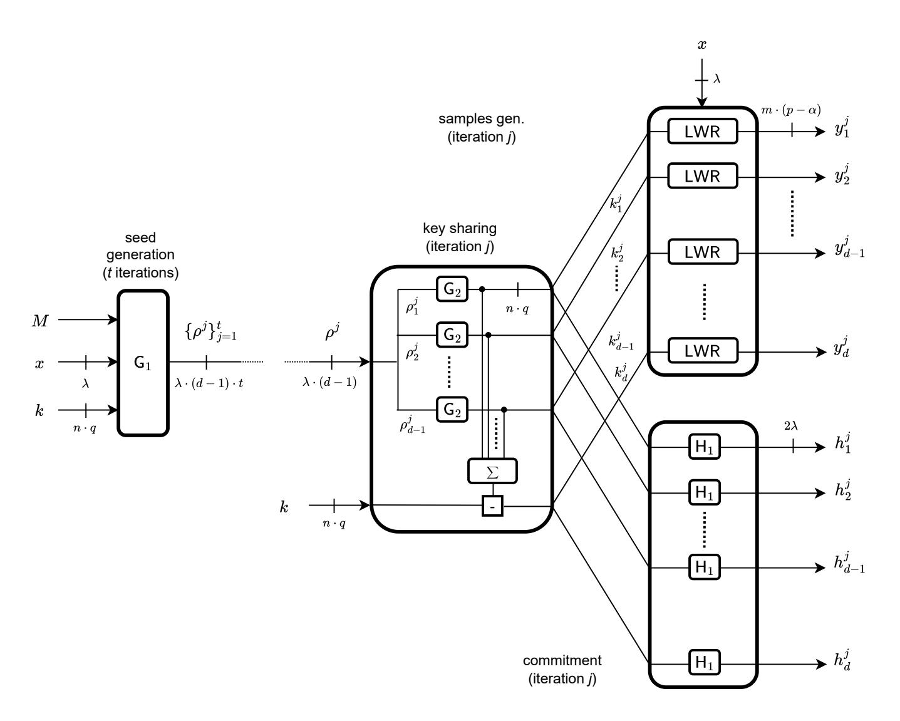

{0}------------------------------------------------

# Bittersweet Signatures: Bringing LWR to a Picnic for Hardware-Friendly MPC-in-the-Head

# – Full Version –

Brieuc Balon<sup>1</sup> [,](https://orcid.org/0009-0007-6270-853X) Gianluca Brian2,<sup>3</sup> [,](https://orcid.org/0000-0002-5352-9763) Sebastian Faust<sup>2</sup> [,](https://orcid.org/0000-0002-8625-4639) Carmit Hazay<sup>4</sup> [,](https://orcid.org/0000-0002-8951-5099) Elena Micheli<sup>2</sup> [,](https://orcid.org/0009-0001-0808-1453) and Fran¸cois-Xavier Standaert<sup>1</sup>

 UCLouvain, ICTEAM, Crypto Group, Louvain-la-Neuve, Belgium Technical University of Darmstadt, Germany ETH Zurich, Zurich, Switzerland Bar-Ilan University, Israel

Abstract. Post-quantum signature schemes are becoming increasingly important due to the threat of quantum computers to classical cryptographic schemes. Among the approaches considered in the literature, the MPC-in-the-head paradigm introduced by Ishai et al. (STOC'07) provides an innovative solution for constructing zero-knowledge proofs by exploiting Multi-Party Computation (MPC). This technique has proven to be a versatile tool in order to design efficient cryptographic schemes, including post-quantum signatures. Building on the MPC-in-the-head paradigm, we introduce Bittersweet signatures, a new class of signature schemes based on the Learning With Rounding (LWR) assumption. Their main advantage is conceptual simplicity: by exploiting (almost) key-homomorphic pseudorandom functions (PRFs), a cryptographic object that preserves pseudorandomness while allowing linear operations on keys, we obtain a very regular design offering nice opportunities for parallel implementations. Theoretically, analyzing Bittersweet signatures requires addressing significant challenges related to the (carry) leakage that almost key-homomorphic operations lead to. Concretely, Bittersweet signatures natively lead to competitive signature sizes, trading moderate software performance overheads for hardware performance gains when compared to state-of-the-art MPC-in-the-head schemes (e.g., relying on code-based assumptions), while admittedly lagging a bit behind recent algorithms based on the VOLE-in-the-head or Threshold-Computationin-the-head frameworks. Besides, their scalability and algebraic structure makes them promising candidates for leakage-resilient implementations. The new abstractions we introduce additionally suggest interesting research directions towards further optimization and generalization.

# 1 Introduction

#### 1.1 State of the Art

For more than a decade now, designing signature schemes that can withstand quantum computers has been a major research area. These efforts culminated with the selection of three first algorithms for standardization by the NIST 

{1}------------------------------------------------

in July 2022: Dilithium (<https://pq-crystals.org/dilithium/>) and Falcon (<https://falcon-sign.info/>), whose security relies on the hardness of solving lattice problems, and SPHINCS+, whose security relies on cryptographic hash functions (<https://sphincs.org/>). Nevertheless, the design of post-quantum signature schemes remains of fundamental importance for several reasons. First, increasing the diversity of the hardness assumptions these algorithms rely on is needed to avoid "putting all eggs in the same basket". This has prompted the NIST to open a call for new proposals, leading to the submission of 50 candidates in June 2023.[1](#page-1-0) Second, the performances and cost of these algorithms remains a topic of concern, especially if security against implementation attacks is required [\[65,](#page-43-0) [11,](#page-40-0) [38,](#page-41-0) [66\]](#page-43-1). Finally, the state of the art regarding signatures with advanced functionalities such as threshold and multisignatures [\[29\]](#page-41-1), group signatures [\[37\]](#page-41-2) and ring signatures [\[77\]](#page-44-0), currently remains relatively sparse.

As reflected by the submissions to the 2023 NIST call, post-quantum signatures can be based on various assumptions (e.g., besides lattices and hash functions used by Dilithium, Falcon, and SPHINCS+, Isogenies, code-based assumptions, and multivariate polynomials have been considered) and rely on different methodologies. Among those, one popular approach, on which we focus in this work, is to rely on zero-knowledge proofs using the MPC-in-the-head paradigm, introduced by Ishai et al. [\[62\]](#page-43-2). This paradigm refers to a technique that uses Multi-Party Computation (MPC) in the context of Zero-Knowledge (ZK) proofs, where a set of parties compute a function over their inputs while keeping those inputs private. In the proof system, the prover then simulates an MPC protocol in his mind (or "in the head") and commits to the produced views. The verifier then asks to open a subset of these views and verifies that they are consistent and that the output of the computation is correct.

While initially seen as a primarily theoretical contribution, this paradigm has been shown to be a versatile tool to construct (among others) efficient signature schemes, starting with the work of Giacomelli et al. [\[58\]](#page-43-3). On the one hand, it has motivated several designs relying on symmetric cryptographic primitives like Picnic [\[36,](#page-41-3) [35\]](#page-41-4), BBQ [\[40\]](#page-42-0), Banquet [\[18\]](#page-40-1), Limbo [\[41\]](#page-42-1) and Rainier [\[46\]](#page-42-2). On the other hand, it has also been exploited to leverage various other assumptions. For example, LegRoast relies on the one-wayness of the Legendre PRF [\[26\]](#page-41-5), several schemes rely on the syndrome decoding problem [\[60,](#page-43-4) [52,](#page-42-3) [28,](#page-41-6) [34\]](#page-41-7), Feneuil et al. proposed schemes based on the subset sum problem [\[53\]](#page-42-4), Adj et al. proposed a scheme based on the MinRank problem [\[3\]](#page-39-0), Benadjila et al. proposed a scheme based on the multivariate quadratic problem [\[21\]](#page-40-2), and Bettaieb et al. proposed one based on the permuted kernel problem [\[24\]](#page-41-8). To a large extent, these new designs followed the first motivations mentioned above (i.e., avoiding putting all eggs in the same basket and improving performances, mostly ignoring implementation attacks so far). As a result, and to the best of our knowledge, there are few works considering the combination of lattice-based assumptions and the MPC-in-the-head paradigm (exceptions are discussed in related works).

<span id="page-1-0"></span><sup>1</sup> <https://csrc.nist.gov/Projects/pqc-dig-sig/round-1-additional-signatures>.

{2}------------------------------------------------

#### 1.2 Our Contribution

The early MPC-in-the-head schemes relied on various instantiations of the underlying MPC protocol, with dishonest majority [\[58,](#page-43-3) [36,](#page-41-3) [67\]](#page-43-5) and honest majority [\[8,](#page-39-1) [27\]](#page-41-9), introducing different trade-offs between prover runtime and proof length. More recent schemes considered new abstractions that capture simpler cryptographic building blocks, such as game-based cryptographic primitives that support homomorphic computations [\[61\]](#page-43-6) and puncturable PRFs [\[34\]](#page-41-7). In this paper, we consider yet another instantiation of the MPC-in-the-head paradigm based on (almost) key-homomorphic PRFs [\[31\]](#page-41-10), which preserve pseudorandomness while allowing operations on the keys in an (almost) homomorphic way.

Key-homomorphic PRFs are useful in the MPC-in-the-head (signature) setting because they enable non-interactive computations, which considerably simplifies the views on which a prover has to commit. The concrete PRF we use for this purpose is based on the Learning With Rounding (LWR) assumption [\[13\]](#page-40-3), and therefore goes against the conventional wisdom that signatures based on the MPC-in-the-head paradigm are best combined with non-lattice-based assumptions. We nevertheless show that this choice comes with various advantages, which we reflect with the Bittersweet signatures' name.[2](#page-2-0) Among others, working with this object enables a clean formalization of the virtual MPC protocol for evaluating the PRF on a public value (as needed for our signature scheme). It also leads to a regular design facilitating parallel implementations where the (multi-party) computations can be performed on each share independently.

As a first step towards formalizing the use of key-homomorphic primitives for MPC-in-the-head signatures, we investigate a simple setting where all-but-one share are revealed at every iteration of the protocol. The main technical challenge we need to solve for this purpose is to deal with the additional (carry) leakage that the almost key-homomorphism leads to. That is, since the share-based MPC computations of the PRF we use are only approximately correct, the errors may leak additional information about the secret (via carry propagation). Like many other post-quantum signature schemes, we rely on the Fiat-Shamir with abort transform in order to mitigate this carry leakage [\[69\]](#page-43-7). We also discuss how heuristic instantiation choices can make this carry leakage arbitrarily small and how to capture it directly with (new) hardness assumptions. More precisely, we show in [Section A](#page-45-0) that a "LWR with carry leakage" can be reduced to standard LWR (given some increase of the parameters), and that it is also connected to a form of "LWR with misuse", which may be of independent interest.

A more detailed overview of our technical contribution is given in Section [2.](#page-4-0)

We finally illustrate the potential of our results by discussing the concrete instantiation of Bittersweet signatures. This allows us to exhibit the gaps between parameters suggested by (current) security proofs and parameters enabling efficient implementations, as observed for other schemes like Picnic [\[36,](#page-41-3) [35\]](#page-41-4). It also allows us to exhibit how more aggressive optimizations can gradually reduce the size of Bittersweet signatures and lead to competitive instances. We

<span id="page-2-0"></span><sup>2</sup> Suggesting an initially strange but ultimately good-tasting mix of ingredients.

{3}------------------------------------------------

additionally confirm the interest of regular designs for hardware implementation purposes. We show that almost key-homomorphism leads to a straightforward way to increase the number of shares since the same circuit can be applied to all the shares without interaction, which is easily leveraged by hardware implementations for computationally-intensive operations (e.g., hash functions, multiplications). As a result, we can demonstrate hardware performance gains for moderate software performance overheads when compared to state-of-the-art MPC-in-the-head schemes (e.g., relying on code-based assumptions), while the performances of Bittersweet are admittedly lagging a bit behind the ones recent schemes based on the VOLE-in-the-head or Threshold-Computation-in-the-head frameworks. Incidentally, our results also lead to one of the few efficient signature schemes relying on unstructured lattice assumptions in the literature.

#### 1.3 Future Work

The conceptual simplicity of Bittersweet signatures and the generic investigation of almost key-homomorphic primitives for MPC-in-the-head signatures that we initiate come with a nice potential for further developments towards leakageresilient implementations, and opens interesting research avenues:

Leakage-resilience. It has already been shown that the PRF on which Bittersweet signatures rely can be efficiently masked [\[48\]](#page-42-5). Hence, implementations with strong leakage-resilience are a natural target for future work. The (almost linear) scaling trends of masked key-homomorphic primitives should, for example, lead to a better efficiency vs. (side-channel) security tradeoff than MPC-in-the-head signatures based on symmetric cryptographic primitives [\[78,](#page-44-1) [10\]](#page-39-2). The large moduli used by Bittersweet signatures could additionally be turned intro an asset if combined with advanced (e.g., inner product) masking schemes [\[50\]](#page-42-6).

Generalizations. Our investigations focus on a PRF operating in Z<sup>2</sup> <sup>q</sup> , additive secret sharing and a protocol opening all-but-one share per iteration. But nothing theoretically prevents generalizations to other fields, secret sharing schemes, and opening strategies. Such generalizations could be interesting for performance [\[54,](#page-42-7) [55\]](#page-42-8), leakage-resilience [\[72\]](#page-44-2) and possibly help to design new signatures with advanced functionalities (e.g., threshold or multisignatures). Whether our results can be extended to the LWE context and whether other key-homomorphic PRFs can lead to better results are also interesting open questions.

Optimizations. As many post-quantum signature schemes based on the MPC-inthe-head paradigm, Bittersweet signatures require to commit on a lot of randomness. The parallel nature of the Bittersweet design nevertheless raises the question of whether one could get rid of (some of) these commitments by leveraging properties of LWR (e.g., if the LWR function was itself sufficiently committing). Such optimizations would lead to further performance improvements.

LWR with carry leakage and misuse. The formal investigation of these new variants of standard hardness assumptions that we initiate in [Section A](#page-45-0) finally raises the question whether they could find applications in other contexts.

{4}------------------------------------------------

#### 1.4 Related Works

Combining the MPC-in-the-head paradigm with lattice-based assumption was already proposed by other works like [\[22,](#page-40-4) [19,](#page-40-5) [25\]](#page-41-11), yet in a quite different context than ours (i.e., not as a building block of key-homomorphic PRFs).

Using a rounding operation as a source of non-linearity to build low-complexity cryptographic objects is reminiscent of using alternating moduli [\[30,](#page-41-12) [44\]](#page-42-9).

A recent line of work focuses on VOLE-in-the-head signatures [\[17,](#page-40-6) [76,](#page-44-3) [39,](#page-41-13) [16\]](#page-40-7), whose key building blocks are multi-round interactive protocols based on Vector Oblivious Linear Evaluation (VOLE) correlations. This paradigm is tailored for ZK protocols in the VOLE-hybrid model, aiming to compile them into a publicly verifiable protocol. However, it may require more than three rounds of interaction and non-black-box compilation techniques within the underlying VOLE protocol. As a result, adapting their techniques to our context would not be straightforward, and yields another interesting direction for future work.

MPC-based signatures rely on symmetric primitives (GGM/Merkle trees) in order to derive randomness for the parties. As the number of emulated parties grows, this part of the designs may lead to significant overheads. To address this, [\[33\]](#page-41-14) uses a block cipher-based Punctured PRF (PPRF) instead of a hash-based one, which reduces the execution time, while [\[16\]](#page-40-7) redesigns the GGM-PPRF to further shrink the signature size. We avoid these optimizations which would be less beneficial to Bittersweet signatures, for which the main performance bottleneck stems from algebraic operations. Adopting [\[16\]](#page-40-7) would further introduce a rejection probability tied to the challenge space, complicating the design.

Finally, and besides the aforementioned thresholding approach [\[54,](#page-42-7) [55\]](#page-42-8), the hypercube optimization has been proposed to amplify the soundness of any MPC protocol that uses additive secret sharing [\[74\]](#page-44-4). Such an optimization is conceptually applicable to Bittersweet, but its interest is reduced because it combines poorly with another (more significant) optimization we leverage, namely replacing the last (unopened) shares by smaller error vectors in the signature.

# <span id="page-4-0"></span>2 Technical Overview

A successful paradigm for designing signature schemes is based on identification schemes (which can also be viewed as a generalization of Sigma protocols). Specifically, in the first step, a challenge-response 3-round protocol is constructed for a given hard relation. Then, in the next step, a round collapsing mechanism is applied to the above protocol, using the signed message as the challenge. The MPC-in-the-head framework can be seen as a generalization of the above paradigm. In this context, the hard relation is translated into a distributed functionality, which is then realized with multiple parties running an MPC protocol. As a result, the choice of this MPC protocol will have a crucial impact on the level of concrete efficiency of the signature scheme. At a high level, the design of such a signature scheme involves the following four main steps:

1. Selecting the hard relation between public and secret keys;

{5}------------------------------------------------

- 2. Choosing the MPC scheme used to compute the relation;
- 3. Constructing the Sigma protocol for the hard relation;
- 4. Transforming the Sigma protocol into a signature scheme.

A well-known example of an MPC-in-the-head signature scheme that further serves as our starting point is the Picnic scheme [\[36\]](#page-41-3) that follows the next stepping stones toward constructing their finalized (non-optimized) scheme.

- 1. Selecting the hard relation: Picnic's underlying relation is given by a pseudorandom function (PRF). Namely, the public value is the couple (x, y) of input and output of the PRF, the secret value is the key k of the PRF F, and the pairs ((x, y), k) in the relation are those satisfying y = Fk(x). Concretely, this PRF is instantiated with the LowMC block cipher [\[6\]](#page-39-3).
- 2. Choosing the MPC scheme: The scheme of Giacomelli et al., on which Picnic relies, exploits any linear function decomposition [\[58\]](#page-43-3). This is a notion introduced to capture protocol virtualization as done in MPC-in-the-head. For their particular instantiation, they consider a (2,3)-decomposition, which operates by performing secret sharing of the computations carried on the gates defining the arithmetic representation of F. First, the secret key k is additively shared into 3 shares k1, k2, k3. Then, linear operations are conducted on each share locally, while multiplication gates require interaction. The information involved in the computation of each output share y1, y2, y<sup>3</sup> is finally stored in the corresponding views view1, view2, view3.
- <span id="page-5-0"></span>3. Constructing the Sigma protocol: Picnic is based on the ZKBoo protocol of Giacomelli et al. [\[58\]](#page-43-3), which works as follows. The prover first runs the MPC protocol described above on the key k, resulting in a triple of key shares k1, k2, k3, output shares y1, y2, y3, and views view1, view2, view3. Next, it commits to all the key shares and views and sends the commitments and output shares to the verifier. The verifier picks a couple of random indices i1, i<sup>2</sup> and sends them to the prover. As a response, the prover reveals the key shares and views corresponding to the parties indexed by i1, i2. Finally, the verifier can check three properties: (1) the correctness of two output shares based on the opened key shares and views, (2) the validity of two commitments, and (3) that the output shares reconstruct to the PRF output y. This process can then be repeated t times with the same long-term key k and different random coins in order to reduce the soundness error.
- 4. Transforming the Sigma protocol into a signature scheme: In the latest versions of Picnic [\[35\]](#page-41-4), this is done via the Fiat-Shamir heuristic, both in the classic and quantum setting. Namely, the public key is the input-output PRF pair (x, y), the signing key is the PRF key k, and a signature consists of a Sigma protocol transcript. To make it non-interactive, the challenge is computed by hashing the content of the public key, the first round of every iteration of the Sigma protocol and the message to be signed. The security proof is in the quantum random oracle model. It relies on several features of the Sigma protocol: completeness, unpredictable commitments, special soundness, zero-knowledge and quantum computationally unique responses.

{6}------------------------------------------------

Informally, the size and performances of Picnic signatures significantly depend on the number of multiplication gates within the circuit representation of the PRF F (since it affects the running time of the MPC protocol and the size of the views). This concern motivates our interest in key-homomorphic PRFs as a building block for MPC-in-the-head based signatures [31]. Key-homomorphic PRFs allow the computation on each key share independently, i.e., satisfy  $F_k(x) = F_{k_1}(x) + \ldots + F_{k_d}(x)$  for every d-additive sharing  $k_1, \ldots, k_d$  of the key k. In other words, they imply a "non-interactive MPC" scenario where each party contributes a single message to the MPC protocol. Consequently, key homomorphism eliminates the need for large views or interaction between the virtual parties, allowing us to increase the number of parties almost for free.

While this intuition holds regardless of the details of the key-homomorphic PRF, its specific choice affects security and efficiency. This is because each signature contains many PRF evaluations, one for each party and each iteration of the Sigma protocol. Therefore, we adopt the key-homomorphic PRF introduced by Boneh et al. [31], which is based on the Learning with Rounding (LWR) assumption [13]. Our primary motivation for choosing this scheme is its conceptual simplicity and, looking ahead to future work, its potential for leakage-resilient implementations via masking [48]. In this scheme, the PRF key is a random vector  $\mathbf{k} \in \mathbb{Z}_Q^n$ , the input is a random matrix  $\mathbf{X} \in \mathbb{Z}_Q^{m \times n}$ , and the output is computed as  $\mathbf{y} = F_{\mathbf{k}}(\mathbf{X}) = \lfloor \mathbf{X}\mathbf{k} \rfloor_P \in \mathbb{Z}_P^m$ , where  $\lfloor \mathbf{x} \rfloor_P = \left\lfloor \mathbf{x} \cdot \frac{P}{Q} \right\rfloor$ .

A bit more precisely, this scheme only satisfies a weaker variant of key-homomorphism, known in the literature as almost key homomorphism. For a function F and key k, it ensures that  $|F_k(x) - (F_{k_1}(x) + \ldots + F_{k_d}(x))| \leq \delta$  for every additive sharing  $k_1, \ldots, k_d$  of the key, where  $\delta$  is a small error. For our LWR-based PRF, this error scales with  $\log(d)$  and intuitively describes the carry information that is preserved when summing-before-rounding and lost when rounding-before-summing. Introducing a small reconstruction error translates into several technical and conceptual challenges in the analysis and design of the scheme, forming the core of our technical contribution. In the following paragraphs, we outline these challenges and explain how we address them.

A modified verification check and its impact on the security of the hard relation. To ensure completeness, we include a small error tolerance in the verification check of the output shares, therefore modifying check (3) of Picnic (cf. Item 3). In other words, instead of checking the consistency of the output shares as  $y_1 + \ldots + y_d = y$ , we check that  $\mathbf{y} - (\mathbf{y}_1 + \ldots + \mathbf{y}_d) \leq \delta$ . Besides, and beyond completeness, we also target special soundness, a form of extractability for Sigma protocols (see Definition 2 for a formal definition). To achieve it, we introduce a tolerance in the hard relation as well, defining it as

<span id="page-6-0"></span><sup>&</sup>lt;sup>3</sup> Formally, our analysis only requires weak PRF and we do not need to hash the input with a random oracle as Boneh et al. in order to get a PRF. We nevertheless use a hash function in our concrete instances, for performance reasons.

{7}------------------------------------------------

R = {((X, y), k) : |y−Fk(X)| ≤ δ}. Since the distance is measured componentwise and the vector y−Fk(X) has m components, this relation is (2δ+1)m-times easier to break compared to a strict equality check (see [Lemma 1](#page-13-0) for the security bound). Interestingly, we reduce this factor to 3<sup>m</sup> when considering a setting where all-but-one shares are revealed in each protocol iteration, modifying check (3) accordingly. Intuitively, this is because having d − 1 additive shares out of d can be seen as having 1 additive share out of 2. In practice, in check (3), the verifier therefore aggregates the opened key shares ki<sup>1</sup> , . . . , kid−<sup>1</sup> into one, and then verifies almost key-homomorphism with the only unopened output share, i.e., the verification check becomes |y − (Fki1+...+kid−<sup>1</sup> (X) + yi<sup>d</sup> )| ≤ 1.

Average-case completeness and zero-knowledge. The standard zero-knowledge security definition quantifies over all statement-witness pairs ((X, y), k) in the relation, which implies that privacy holds even if the distinguisher knows the witness. However, this creates an issue with our simulation due to having almost key homomorphism: while the carry is deterministic for the distinguisher, it remains probabilistic for the simulator. To address this, we restrict ourselves to pairs generated through an external distribution, denoted as DX×W. This notion, referred to as average-case zero-knowledge [\[23\]](#page-40-8), resolves the simulation issue by ensuring that the distinguisher has no longer access to the witness. An orthogonal problem that arises with completeness further requires the switch to the average case definition. The problem arises because a statement-witness pair is in the relation if the absolute value difference between y and Fk(X) is less than 1. However, honestly-generated proofs for pairs satisfying |y − Fk(X)| = 1 might not be accepted. This is because the verifier compares y with y˜, which it computes locally based on the decommitments and the unopened output shares. Since the reconstruction of y˜ can also differ from Fk(X) by a factor 1, by the triangle inequality the difference between y and y˜ can be 2 for some components, resulting in rejection. Therefore, we restrict ourselves to the set of instances in which y = Fk(X). Looking ahead, this will not pose a problem for the security of our signature scheme because it is defined over honestly generated keys, and therefore, it suffices to generate the key pairs with DX×W. Furthermore, the security of Fiat-Shamir signatures is often proved for Sigma protocols with constraints on the statement-witness distribution (cast as identification schemes), and thus will adapt to our security definition. See [Section 5](#page-19-0) for the details.

The carry leakage information and the abort condition. The main technical challenge of this work concerns estimating how much information the carry leaks. Intuitively, this is because every iteration j of the Sigma protocol provides an eavesdropper with a noisy version z of Xk, computable from the opened key shares k<sup>i</sup><sup>1</sup> , . . . , k<sup>i</sup>d−<sup>1</sup> and the unopened output share y<sup>i</sup><sup>d</sup> as

$$z = X(k_{i_1} + \ldots + k_{i_{d-1}}) + \frac{Q}{P}y_{i_d} \in \left[Xk - \frac{Q}{P} + 1, Xk\right].$$

By averaging such samples over enough iterations, an eavesdropper could eventually isolate Xk and learn the secret. Although the scheme is already correct

{8}------------------------------------------------

as presented, this type of attack compromises its security. Interestingly, we show that an abort-based approach allows us to control the amount of information leaked. The abort event can be triggered in any iteration by the equality of any component of two vectors (the non-rounded output Xk and the sum of the non-rounded output shares  $Xk_{i_1} + \ldots + Xk_{i_{d-1}}$ , in a fixed  $\alpha$ -sized subset of their bits. This subset corresponds to the most significant  $\alpha$  bits cut out by the rounding function, i.e., the ones between  $r_S = \log(Q) - \log(P)$  and  $r_E = \log(Q) - \log(P) + \alpha$ . This condition ensures that the remaining transcripts do not reveal more than an LWR instance with  $\alpha$  extra bits, as it intuitively guarantees that information on the (secret) LSBs of y cannot be forwarded to its (public) MSBs due to carry propagation. Since the abort condition excludes a  $\approx t \cdot m \cdot 2^{-\alpha}$  fraction of the transcripts, we can increase the parameter  $\alpha$  to make the abort probability arbitrarily small. We discuss in Section 7 that combining such an increase with reasonable heuristics can significantly reduce the size of Bittersweet signatures. We also propose a formal approach to the carry leakage in Section A, where we introduce two variants of the LWR problem and show that, under certain conditions, they can be reduced to the standard LWR.

Overall security. From the above arguments, our Sigma protocol satisfies average-case completeness and average-case honest-verifier zero-knowledge. Using similar arguments as for Picnic, we also prove that it achieves unpredictable commitments, special soundness, and quantum computationally unique responses, which are properties required for applying the Fiat-Shamir transform. At this point, the security of the signature follows from the vast literature on the post-quantum security of the Fiat-Shamir with abort transform. For correctness, we rely on the analysis of Devevey et al. [43], which, to our knowledge, is the only formal treatment of the subject. Regarding unforgeability, most analyses follow a modular framework: first prove unforgeability against no-message attack and then amplify to standard unforgeability. For the former, we consider the analysis of Don et al. [47], which, to the best of our knowledge, remains the state-of-the-art. Finally, we extend unforgeability against no-message attack to the standard notion via the recent result of Barbosa et al. [14]. See details in Section 6.

# 3 Preliminaries

#### 3.1 Notation

Given a set S, |S| denotes its number of elements. If  $N \in \mathbb{N}$ ,  $S^N$  denotes the N-times cartesian product, and [N] denotes the set  $\{1, \ldots, N\}$ . Given an element  $z \in \mathbb{Z}_Q$  for some positive integer Q, |z| denotes  $\min\{z \mod Q, -z \mod Q\}$ . Given a vector  $\mathbf{v} \in \mathbb{Z}_Q^N$ ,  $|\mathbf{v}|$  denotes the maximal component of  $\mathbf{v}$  in absolute

<span id="page-8-0"></span><sup>&</sup>lt;sup>4</sup> A similar technique is used in the analysis of the NIST candidate Dilithium.

<span id="page-8-1"></span><sup>&</sup>lt;sup>5</sup> Although their results are not directly defined in the abort framework, the properties involved in their proofs do not seem to worsen with the introduction of aborts. We carefully discuss the adaptation of these results we need in Section C.5.

{9}------------------------------------------------

value, and the notation  $0 \in v$  refers to the event where v as at least one zero component. Given two integers Q > P and two rings  $S_Q$ ,  $S_P$  such that  $|S_Q| = Q$  and  $|S_P| = P$ , the rounding function  $[\cdot]_P : S_Q \to S_P$  is defined as  $[x]_P = \lfloor x \frac{P}{Q} \rfloor$ . When referring to the rounding of a vector, we consider its application component-wise. Given two integers p, i such that i < p, and a value  $x \in \mathbb{Z}_{2^p}$ , we denote with x[i] the i-th bit of x. In particular, x[0] is the least significant bit, and x[p-1] is the most significant bit. Throughout the paper, we always consider x[i] as an element of  $\mathbb{Z}$  rather than  $\mathbb{Z}_2$  or  $\mathbb{Z}_{2^p}$ . For two values i, j, we denote by i..j the range of indices from i (included) to j (excluded), i.e.  $i..j = \{i, i+1, \ldots, j-1\}$ . If i = 0 (resp., j = p), we omit it and simply write i..j (resp., i...). When we sum two ring elements, we always assume that the sum is the one for which the ring is defined. For example, if i..., i..., i..., i..., i... and i..., i..., i..., i... we denote i..., i..., i... when we write i..., i..., i... and i..., i... and i..., i... then we write i..., i... and i..., i... and i..., i... and i..., i... and i..., i... and i... and i..., i... and i... and i... and i... and i... and i... and i... and i... and i... and i... and i... and i... and i... and i... and i... and i... and i... and i... and i... and i... and i... and i... and i... and i... and i... and i... and i... and i... and i... and i... and i... and i... and i... and i... and i... and i... and i... and i... and i... and i... and i... and i... and i... and i... and i... and i... and i... and i... and i... and i... and i... and i... and i... and i... and i... and i... and i... and i... and i... and i... and i... and i... and i... and i... and i... and i... and i... and i... and i... a

#### 3.2 The Computational Model

Our computational model assumes classical queries to the signing oracle as outlined in NIST's call for Additional Digital Signature Schemes.<sup>6</sup> However, we evaluate the security of our scheme in the Quantum Random Oracle Model (QROM), which extends the classical Random Oracle Model (ROM) to include adversaries making quantum superposition queries to the oracle.

#### 3.3 Standard Cryptographic Primitives

We defer the definitions of signature schemes, pseudorandom generators, weak pseudo-random functions, and hash functions to Section B.

#### <span id="page-9-1"></span>3.4 Sigma Protocols

Let  $\mathcal{X}, \mathcal{W} \subseteq \{0,1\}^*$  be sets, and  $\mathcal{R} \subseteq \mathcal{X} \times \mathcal{W}$  be an efficiently decidable relation for the language  $\mathcal{L} = \{x : \exists w \text{ s.t. } (x,w) \in \mathcal{R}\}$ . A Sigma protocol  $\Sigma$  for  $\mathcal{R}$  is an interactive protocol between two parties, called the prover and the verifier. The prover is modeled as a couple of probabilistic polynomial-time algorithms  $\Sigma.\mathsf{Prove} = (\Sigma.\mathsf{Prove}_1, \Sigma.\mathsf{Prove}_2)$ , which are assumed to share state. The verifier  $\Sigma.\mathsf{Verify}$  is a deterministic polynomial-time algorithm that outputs a decision bit. Sigma protocols always consist of three rounds. In the first round, the prover generates a first message firstmes  $\in \mathcal{N}_{\mathsf{com}}$  as firstmes  $\leftarrow \mathbb{S} \Sigma.\mathsf{Prove}_1(x,w)$ . Next, in the second round, the verifier answers with a uniformly random generated challenge  $ch \leftarrow \mathbb{S} \mathcal{N}_{\mathsf{ch}}$ . In the third round, the prover publishes a response  $resp \leftarrow \mathbb{S} \Sigma.\mathsf{Prove}_2(ch)$ . Finally, the verifier outputs  $\Sigma.\mathsf{Verify}(x, firstmes, ch, resp)$   $\in \{0,1\}$ . We call transcript of the protocol the triple (firstmes, ch, resp).

We now introduce three key properties of Sigma protocols: completeness, honest-verifier zero-knowledge, and s-special soundness. The first ensures that

<span id="page-9-0"></span><sup>&</sup>lt;sup>6</sup> Mentioned on page 14 of https://csrc.nist.gov/csrc/media/Projects/pqc-dig-sig/documents/call-for-proposals-dig-sig-sept-2022.pdf

{10}------------------------------------------------

honestly generated proofs for statements in the language are always verified. Honest-verifier zero-knowledge guarantees that the transcript of an execution where the verifier issues a random challenge (and thus behaves honestly) reveals no more information on the witness beyond what could be derived from the statement alone. Finally, s-special soundness allows the reconstruction of a witness for a given statement from s transcripts, provided they meet specific criteria. These criteria include validity of the transcript, identical first messages, and distinct challenges. Similarly to [\[23\]](#page-40-8), we consider the average-case variant of completeness and zero-knowledge, meaning that we restrict to statements generated according to precise distributions.[7](#page-10-1) This relaxes completeness to only hold for statements generated via the distribution, and therefore, not all the honestly generated proofs for statements in the language are correctly verified. Moreover, this weakens the adversaries considered in the experiment for zero-knowledge: their choices cannot depend on the internal coins used for sampling the statement, but only on the statement itself. We make these properties formal below, where the experiments refer to [Fig. 1.](#page-11-0) We denote with DX×W distributions that output values in X × W, and with D<sup>X</sup> distributions that output values in X .

Definition 1 (Completeness). We say that Σ = (Σ.Prove, Σ.Verify) is ϵΣ.Compaverage-case complete for a distribution DX×W if

$$\mathbb{P}\left[\mathbf{\Sigma}.\mathsf{Comp}_{\Sigma} = 0\right] \leq \epsilon_{\mathbf{\Sigma}.\mathsf{Comp}}.$$

<span id="page-10-0"></span>Definition 2 (Special Soundness). Let Σ be a Sigma protocol for a relation R.We say that ΠNI has (s, ϵΣ.SS)-special soundness if there exists an algorithm E such that for every quantum-polynomial-time adversaries A it holds that

$$\mathbb{P}\left[\Sigma.\mathsf{SS}(\mathsf{A},\mathsf{E})=0\right] \leq \epsilon_{\Sigma.\mathsf{SS}}.$$

Looking forward, we prove the unforgeability of the FS signatures with abort under a computational variant of HVZK. To this end, we merge the techniques used in [\[59\]](#page-43-8) and [\[14\]](#page-40-9). The former proves unforgeability of FS signatures under a computational variant of HVZK named multi-HVZK, albeit only in the abortfree scenario. In the second work, unforgeability is proved in the setting with aborts, though under a statistical variant of HVZK named accepting HVZK.

Therefore, our proof requires a new variant of HVZK. As stated before, it is an average-case notion; this aligns with the definitions given in [\[59\]](#page-43-8) and [\[14\]](#page-40-9), which are formulated directly for identification schemes. To accommodate signatures with aborts, we adopt the accepting property from [\[14\]](#page-40-9), requiring simulatability only for accepting transcripts. Additionally, we incorporate the multi-HVZK variant from [\[59\]](#page-43-8), where HVZK holds across multiple transcripts.[8](#page-10-2)

<span id="page-10-1"></span><sup>7</sup> This is not a problem for the security of the resulting Fiat-Shamir signature. In the literature, the latter is usually built on top of identification schemes, which correspond to Sigma protocols equipped with a statement-witness generation algorithm.

<span id="page-10-2"></span><sup>8</sup> As noted in [\[59\]](#page-43-8), this stronger variant follows from statistical HVZK, but not from computational HVZK in the context of identification or average-case schemes.

{11}------------------------------------------------

```
Σ.Comp()
(x, w) ←$ DX×W
(firstmes, ch, resp) ←$ Σ.Tr(x, w)
b ← Σ.Verify(x, firstmes, ch, resp)
if (x, w) ∈ R AND b = 0
  return 0
return 1
Σ.SS(A, E)
(x, firstmes,(chc, respc)c∈[s]) ←$ A()
w ←$ E(x, firstmes,(chc, respc)c∈[s])
if ∃c ̸= c
         ′ ∈ [s]: chc = chc
                           ′
  return 1
for c ∈ [s]
  bc ← Σ.Verify(x, firstmes, chc, respc)
  if bc = 0
    return 1
if (x, w) ∈ R
  return 1
return 0
                                                Σ.Tr(x, w)
                                                firstmes ←$ Σ.Prove1(x, w)
                                                ch ←$ Nch
                                                resp ←$ Σ.Prove2(ch)
                                                return (firstmes, ch, resp)
                                                Σ.ViewReal,N (x, w)
                                                for i ∈ [N]
                                                   tri ←$ Σ.Tr(x, w)
                                                return (x,tr1, . . . ,trN )
                                                Σ.ViewSim,N (x)
                                                for i ∈ [N]
                                                   tri ←$ Σ.Sim(x)
                                                return (x,tr1, . . . ,trN )
```

<span id="page-11-0"></span>Fig. 1. The experiments relevant to the definitions in [Section 3.4](#page-9-1)

Definition 3 (Average-Case Accepting Multi-HVZK). Let N ∈ N and ϵΣ.HVZK ∈ [0, 1]. Let X ,Y be two sets, R ⊆ X × Y be a relation, and DX×W be a distribution over R. Let D<sup>X</sup> be the distribution that samples (x, w) ←\$ DX×W and outputs x. A Sigma protocol Σ = (Σ.Prove, Σ.Verify) for the relation R and the distribution DX×W is average-case accepting (N, ϵΣ.HVZK)-multi-HVZK ((N, ϵΣ.HVZK)-acamHVZK for short) if there exists a polynomial-time simulator Σ.Sim such that, for every stateful quantum polynomial-time adversary A,

```
|P [A(Σ.ViewReal,N (DX×W)) = 1 | Success] − P [A(Σ.ViewSim,N (DX )) = 1]|
```

is at most ϵΣ.HVZK, where Success is the event where resp<sup>i</sup> ̸= ⊥ for every i ∈ [N].

Next, we present less standard properties for Sigma protocols: commitment unpredictability and quantum computationally unique responses (QCUR) [\[47\]](#page-42-11). The first concerns the probability of guessing the Sigma protocol's first message. The second translates the classical notion of computationally unique responses to the quantum world, stating that it is hard to detect a measurement over a superposition of successful responses to the same first message and challenge.

<span id="page-11-1"></span>Definition 4 (Commitment Unpredictability). Let Σ be a Sigma protocol with statement space X and witness space W, and let DX×W be a distribution 

{12}------------------------------------------------

that outputs values in X × W. We say that Σ has ϵComGuess-unpredictable commitments with respect to DX×W if

$$\mathbb{E}\left(\max_{\mathit{firstmes}_0 \in \mathcal{N}_{\mathsf{com}}} \Pr[\mathit{firstmes} = \mathit{firstmes}_0]\right) \leq \epsilon_{\mathsf{ComGuess}},$$

where the average is taken over (x, w) ←\$ DX×W, and the probability inside is taken over firstmes ←\$ Σ.Prove(x, w).

Formalizing quantum computationally unique responses requires the introduction of an additional definition, i.e., the one of collapsing relation. This notion concerns generic relations and is used to argue about the verification stage of the Sigma protocol. Informally, it states that given a relation between two sets S<sup>1</sup> and S2, if an adversary produces two superpositions S<sup>1</sup> and S<sup>2</sup> that satisfy the relation, then it cannot determine whether S<sup>1</sup> was measured.

Definition 5 (Collapsing Relation [\[47\]](#page-42-11)). Let Rel : S<sup>1</sup> × S<sup>1</sup> → {0, 1} be a relation over two sets S<sup>1</sup> and S<sup>2</sup> and define the following two games for a twostage adversary A = (A1, A2):

$$\begin{array}{ll} \operatorname{\mathsf{Game}}_1(\mathsf{A}) & \operatorname{\mathsf{Game}}_2(\mathsf{A}) \\ (\mathit{state},\mathsf{S}_1,\mathsf{S}_2) \leftarrow \mathsf{A}_1 & (\mathit{state},\mathsf{S}_1,\mathsf{S}_2) \leftarrow \mathsf{A}_1 \\ r \leftarrow \mathit{Rel}(\mathsf{S}_1,\mathsf{S}_2) & r \leftarrow \mathit{Rel}(\mathsf{S}_1,\mathsf{S}_2) \\ \mathsf{S}_1 \leftarrow \mathcal{M}(\mathsf{S}_1) & \\ \mathsf{S}_2 \leftarrow \mathcal{M}(\mathsf{S}_2) & \mathsf{S}_2 \leftarrow \mathcal{M}(\mathsf{S}_2) \\ b \leftarrow \mathsf{A}_2(\mathit{state},\mathsf{S}_1,\mathsf{S}_2) & b \leftarrow \mathsf{A}_2(\mathit{state},\mathsf{S}_1,\mathsf{S}_2) \\ \mathbf{return} \ (b,r) & \mathbf{return} \ (b,r) \end{array}$$

In the games above, M denotes a measurement in the computational basis, and applying Rel to quantum registers is done by computing the relation coherently and measuring it. A relation Rel is called ϵColl-collapsing from S<sup>1</sup> to S<sup>2</sup> if for every quantum-polynomial-time adversary A, it holds that

$$|\Pr[\mathsf{Game}_1(\mathsf{A}) = (1,1)] - \Pr[\mathsf{Game}_2(\mathsf{A}) = (1,1)]| \le \epsilon_{\mathsf{Coll}}.$$

<span id="page-12-0"></span>Definition 6 (Quantum Computationally Unique Responses [\[47\]](#page-42-11)). Let Σ be a Sigma protocol with first message space Ncom, challenge space Nch and response space Nresp. We say that the protocol Σ has ϵQCUR-quantum computationally unique responses if the verification predicate Σ.Verify(x, ·, ·, ·): Ncom × Nch × Nresp → {0, 1}, seen as a relation between Ncom × Nch and Nresp, is ϵQCURcollapsing from Nresp to Ncom × Nch.

#### 3.5 Hard-Instance Generators

<span id="page-12-1"></span>Let λ ∈ N be a security parameter, let R be a relation, and let f(1<sup>λ</sup> ) be an efficient algorithm. Intuitively, f is a hard instance generator if it satisfies two properties. First, it outputs pairs in R with overwhelming probability. Second, given a public value p generated with f, it should be hard to construct a secret value s ′ such that (p, s′ ) ∈ R. We next report the formal definition from [\[81\]](#page-44-5).

{13}------------------------------------------------

**Definition 7 (Hard Instance Generator).** f is called a  $(\epsilon_{Rel}, \epsilon_{HIG})$ -hard instance generator for a relation  $\mathcal{R}$  if the following conditions are met:

- $-\mathbb{P}\left[(p,s)\notin\mathcal{R}\mid(p,s)\leftarrow sf\right]\leq\epsilon_{\mathsf{Rel}};$
- for every quantum polynomial-time adversary A, then  $\mathbb{P}[f.\mathsf{HIG}(\mathsf{A})=1] \leq \epsilon_{\mathsf{HIG}}$ , where  $f.\mathsf{HIG}(\mathsf{A})$  is the following experiment:

$$\frac{f.\mathsf{HIG}(\mathsf{A})}{(p,s) \leftarrow^{\$} f(1^{\lambda})}$$

$$s' \leftarrow^{\$} \mathsf{A}(p)$$

$$\mathbf{if} \ (p,s') \in \mathcal{R}$$

$$\mathbf{return} \ 1$$

$$\mathbf{return} \ 0$$

By inspection, the notion of hard instance generator is closely related to that of one-way function. Notably, it is also possible to instantiate hard instance generators using weak PRFs. While this result is implicitly mentioned in the literature, the version we provide below explicitly incorporates the parameters of the PRF and the associated relation. In our case, the weak PRF takes values in  $\mathcal{Y} = \mathbb{Z}_P^m$ . Therefore, we tailor the following lemma to this scenario. However, it is easy to extend the result to generic sets  $\mathcal{Y}$  where a distance is defined.

<span id="page-13-0"></span>**Lemma 1.** Let  $F: \mathcal{K} \times \mathcal{X} \to \mathbb{Z}_P^m$  be a  $(N, \epsilon_{\mathsf{wPRF}})$ -weak pseudorandom function for N = 1, and with  $\epsilon_{\mathsf{wKR}}$ -weak security against key recovery. Let f be the algorithm that samples k and x at random in  $\mathcal{K}$  and  $\mathcal{X}$ , and outputs the pair  $((x, F_k(x)), k)$ . Consider the relation  $\mathcal{R}_{\delta} = \{((x, y), k) : |F_k(x) - y| \leq \delta\} \subseteq (\mathcal{X} \times \mathbb{Z}_P^m) \times \mathcal{K}$ . Then f is a  $(\epsilon_{\mathsf{Rel}}, \epsilon_{\mathsf{HIG}})$  hard-instance generator for the relation  $\mathcal{R}$ , where  $\epsilon_{\mathsf{Rel}} = 0$  and

$$\epsilon_{\mathsf{HIG}} = \epsilon_{\mathsf{wPRF}} + (2\delta + 1)^m \cdot \frac{|\mathcal{K}|}{P^m} \cdot \epsilon_{\mathsf{wKR}}.$$

*Proof (sketch).* First, we observe that f always produces pairs  $((x, y), k) \in \mathcal{R}$ . This proves the first part of the definition of HIG with  $\epsilon_{\mathsf{Rel}} = 0$ . For the second part of the definition, we consider the following hybrid experiments:

 $\mathsf{Hyb}^{(1)}(\mathsf{A})$  is defined as  $f.\mathsf{HIG}(\mathsf{A})$ , but the PRF output y is sampled uniformly at random instead of being computed as  $y = F_k(x)$ .

 $\mathsf{Hyb}^{(2)}(\mathsf{A})$  is defined as  $\mathsf{Hyb}^{(1)}(\mathsf{A})$ , but instead of checking that the key k' generated from A satisfies  $|F_{k'}(x) - y| \leq \delta$ , it outputs 1 only if  $F_{k'}(x) = y$ .

Then, we prove that for every quantum polynomial-time adversary  $\tilde{A}$  there exists a quantum polynomial-time adversary  $\tilde{A}$  such that

<span id="page-13-2"></span><span id="page-13-1"></span>
$$\left| \Pr[f.\mathsf{HIG}(\mathsf{A}) = 1] - \Pr[\mathsf{Hyb}^{(1)}(\mathsf{A}) = 1] \right| \le \epsilon_{\mathsf{wPRF}} \tag{1}$$

$$\Pr[\mathsf{Hyb}^{(1)}(\mathsf{A}) = 1] = (2\delta + 1)^m \cdot \Pr[\mathsf{Hyb}^{(2)}(\tilde{\mathsf{A}}) = 1] \tag{2}$$

{14}------------------------------------------------

<span id="page-14-0"></span>
$$\Pr[\mathsf{Hyb}^{(2)}(\mathsf{A}) = 1] \le \frac{|\mathcal{K}|}{|\mathbb{Z}_P^m|} \cdot \epsilon_{\mathsf{wKR}}. \tag{3}$$

Notably, the combination of Equation 1, 2 and 3 proves the lemma, so it remains to explain why these equations hold. Equation 1 derives from a standard reduction over the pseudorandomness of F. Equation 2 is true because guessing a key k' yielding one value in the interval  $[y-\delta^m,y+\delta^m]$  is  $(2\delta+1)^m$  times easier than finding one exactly matching y. Equation 3 is true because finding a key k' such that  $F_{k'}(x) = y$  is easier than finding the exact key k used for computing y from x. To quantify how easier it is, we use the fact that there are in average  $\frac{|\mathcal{K}|}{|\mathbb{Z}_P^m|}$  keys k' for every possible (x,y). Therefore, finding a key such that  $F_{k'}(x) = y$  is  $\frac{|\mathcal{K}|}{|\mathbb{Z}_P^m|}$  times easier than finding the exact key used for generating (x,y).

The complete proof of the above lemma can be found in Section C.1.

#### <span id="page-14-2"></span>3.6 Signatures from Sigma Protocols and Fiat-Shamir with Aborts

Similar to other well-known signatures, our scheme is constructed from a Sigma protocol via the Fiat-Shamir transform [56] with aborts [69] framework, which we present in Fig. 2. This construction is proved correct and post-quantum secure under various combinations of assumptions on the underlying Sigma protocol. In this work, we rely on the results of Devevey et al. [43], Fehr et al. [47], and Barbosa et al. [14], and report them below. Looking ahead, Section 6 contains an instantiation of the theorems from this section with the parameters of the hard-instance generator and the sigma protocol derived in Section 4 and 5.

```
 \begin{array}{cccccccccccccccccccccccccccccccccccc
```

<span id="page-14-1"></span>Fig. 2. The Signature Scheme  $\Pi_{Sign} = (S.Gen, Sign, S.Verify)$  constructed via Fiat-Shamir with Abort.  $\Sigma = (\Sigma.Prove_1, \Sigma.Prove_2, \Sigma.Verify)$  is any Sigma protocol for some relation  $\mathcal{R}$ .  $\mathcal{D}_{\mathcal{X}\times\mathcal{W}}$  is any distribution generating a pair of statement and witness in  $\mathcal{R}$ .

Analyzing correctness in the abort setting is a bit tedious [43], as many parameters come into play. The first one is the completeness parameter  $\epsilon_{\Sigma.\mathsf{Comp}}$  of the sigma protocol, as the signature verification is strongly related to the one of the sigma protocol. The probability of abort in an honest execution of the sigma

{15}------------------------------------------------

protocol  $\epsilon_{\mathsf{HAbort}}$ , together with the number of iterations  $\kappa$  of the Fiat-Shamir with aborts construction, are related to the probability that Sign does not abort. Moreover, a sufficiently high min-entropy of the first message  $\nu$  guarantees that the challenges generated with the random oracle are uniformly random. This intuition is made formal in Theorem 6 of [43], which we next simplify.

<span id="page-15-1"></span>Theorem 1 (Correctness, [43], restated). Let H be a hash function modeled as a random oracle. Let  $\Sigma$  be a sigma protocol that meets the following properties. First, the probability of aborting in an honest execution should be at most  $\epsilon_{\mathsf{HAbort}}$ . Moreover, every non-aborting honest execution should be accepted, i.e.  $\epsilon_{\Sigma.\mathsf{Comp}}$ -average-case completeness holds with  $\epsilon_{\Sigma.\mathsf{Comp}} = \epsilon_{\mathsf{HAbort}}$ . Finally, for every statement and witness couple generated with  $\mathcal{D}_{\mathcal{X}\times\mathcal{W}}$ , the min entropy of the first message should be at least  $\nu$ . Let  $\Pi_{\mathsf{Sign}}$  be the signature scheme constructed from  $\mathcal{D}_{\mathcal{X}\times\mathcal{W}}$  and  $\Sigma$  via the Fiat-Shamir with Abort transform (cf. Fig. 2). Then, for any (vk, sk) generated with  $\mathcal{D}_{\mathcal{X}\times\mathcal{W}}$  and any message msg,  $\Pi_{\mathsf{Sign}}$  satisfies  $\epsilon_{\mathsf{Corr}}$ -correctness with

$$\epsilon_{\mathsf{Corr}} = \frac{2^{-\nu}}{(1 - \epsilon_{\mathsf{HAbort}})^3}.$$

The next result concerns the security of the signature scheme against nomessage attacks. As the presence of aborts does not play a role here, the main challenges in the security analysis arise from the increased capabilities of the adversary in the QROM. In the classical ROM, unforgeability is typically reduced to the soundness of the underlying Sigma protocol by measuring the adversary's oracle queries. However, extending this approach to the quantum world presents additional hurdles, as it is impossible to measure superposition queries without disturbing them. The work of [47] provides a comprehensive treatment of this scenario, and we condense their Theorem 21 and 25 in Theorem 2 below.

The first requirement for unforgeability against no-message attacks (UF-NMA) is that the key pair is generated with an hard-instance generator. This guarantees, intuitively, that an adversary A can hardly recover a valid signing key from the public key only. UF-NMA is achieved in combination with another important property: any adversary capable of forging a signature given only the public key must, with high probability, also know the underlying signing key. In the quantum setting, this property can be reduced to the sigma protocol level up to a multiplicative factor  $O(N_H^2)$  and an additive factor  $\frac{1}{N_HC}$  (see Theorem 8 in [47]). This results in the sigma protocol property known as proof of knowledge. Theorem 21 in [47] formalizes the intuitions given up to this point. Namely, a sigma protocol with the proof of knowledge property and superpolynomial challenge space, combined with a hard-instance generator in the Fiat-Shamir heuristic, guarantees unforgeability against no-message attacks.

In Theorem 25 in [47], the authors investigate the assumptions implying that a sigma protocol is a proof of knowledge, made formal by considering an algorithm E extracting a witness from an interaction with the adversary. In the

<span id="page-15-0"></span>Theorem 6 of [43] also holds for the more general case where  $\epsilon_{\Sigma,Comp} \geq \epsilon_{HAbort}$ .

{16}------------------------------------------------

proof of Theorem 25 in [47], E runs the malicious prover A to the point where it outputs the first message. Then, it samples a random challenge and sends it to A, obtaining a response by measuring A's corresponding register. Next, E rewinds A on the measured state, and chooses and sends to A a fresh random challenge, resulting in a response. If both transcripts verify, then E can compute the witness w using the extractor  $\mathsf{E}_{\mathsf{SS}}$  corresponding to the  $(s, \epsilon_{\mathsf{\Sigma}.\mathsf{SS}})$ -special soundness property with s=2. This strategy fails if the fresh challenge equals the first one and if any of the measurements is detected. This motivates the factor 1/C and the assumption that the scheme has  $\epsilon_{\mathsf{QCUR}}$ -quantum computationally unique responses. We refer to Theorem 21 and 25 in [47] for a formal treatment and to Section C.5 for a more detailed explanation of how Theorem 2 follows.

<span id="page-16-0"></span>Theorem 2 (Unforgeability against no-message attack, [47], restated). Let  $\Sigma$  be a Sigma protocol for a relation  $\mathcal{R}$  with challenge space size C,  $(s, \epsilon_{\Sigma.SS})$ special soundness with s = 2 and  $\epsilon_{\Sigma.SS} = 0$  (cf. Definition 2), and  $\epsilon_{QCUR}$ -quantum
computationally unique responses (cf. Definition 6). Let  $\mathcal{D}_{\mathcal{X} \times \mathcal{W}}$  be a  $\epsilon_{HIG}$ -hard\ninstance generator according to Definition 7, yielding a pair of statements and
witnesses in  $\mathcal{R}$ . Let  $\Pi_{Sign}$  be the signature scheme constructed from  $\mathcal{D}_{\mathcal{X} \times \mathcal{W}}$  and  $\Sigma$ via the Fiat-Shamir with Abort transform (cf. Fig. 2). Then  $\Pi_{Sign}$  is  $(\epsilon_{Sign,0}, N_H)$ -\nunforgeable against no-message attack, with

$$\epsilon_{\mathrm{Sign},0} \leq \left(\epsilon_{\mathrm{HIG}} \cdot N_H^6 + \frac{1}{C} + 2\epsilon_{\mathrm{QCUR}} + \frac{1}{O(N_H^5) \cdot C} + \frac{1}{8N_H^3C^3}\right)^{\frac{1}{3}}.$$

*Proof (sketch)*. Theorem 2 is a direct application of two slightly adapted variants of Theorem 25 and Theorem 21 of [47]. Below, we detail the modification to each theorem and motivate why the resulting statements stay valid.

Theorem 25 assumes generic t-soundness (cf. [47], section 5), while we assume  $(s, \epsilon_{\Sigma,SS})$ -special soundness. Since special soundness implies t-soundness, the theorem continues to hold. Looking ahead, we directly instantiate  $(s, \epsilon_{\Sigma,SS}) = (2,0)$ , as our sigma protocol satisfies special soundness with these particular parameters. Moreover, we make explicit the parameters defining the proof of knowledge (cf. [47], definition 14), yielding p = 1, d = 3, and  $\kappa = \frac{1}{C} + 2\epsilon_{QCUR}$ . These values are derived from a step-by-step revision of the proof of Theorem 25 and of the underlying technical lemma ([47], Lemma 15). The latter proves that proofs of knowledge for static adversaries extend to adaptive adversaries, and through our revision we prove that this extension leaves the parameters  $p, d, \kappa$  unchanged.

Theorem 21 proves unforgeability against no message attacks for standard Fiat-Shamir signatures, while our variant refers to the Fiat-Shamir with abort transform (cf. Fig. 2). However, the possibility of abort only reduces the probability that an adversary can generate an accepting signature, therefore we can keep the same bounds. Since we apply Theorem 21 to the proof of knowledge

<span id="page-16-1"></span>The authors prove this result for generic  $(s, \epsilon_{\Sigma.SS})$ -special soundness. For simplicity, we only report the concrete case of s = 2 and  $\epsilon_{\Sigma.SS} = 0$ .

{17}------------------------------------------------

from Theorem 25, where d=3, we compute the parameters for Theorem 21 under this assumption, yielding unforgeability with

$$\epsilon_{\mathsf{Sign},0} \leq \left(\epsilon_{\mathsf{HIG}} N_H^6 p(\eta) + \kappa(\eta) + \frac{1}{p(\eta)} \cdot \left(\frac{1}{8N_H^3 C^3} + \frac{1}{\mathcal{O}(N_H^5)C}\right)\right)^{1/3}.$$

The parameter computation derives again from a detailed revision of the proof of Theorem 21 and the underlying Corollary (Corollary 16 in [47]). For the latter, we observe that the proof of knowledge property of  $\mathsf{FS}(\Sigma)$  holds with the same parameters p,d as in  $\Sigma$ , and with e=6,  $\mu(\eta)=\kappa(\eta)+\frac{1}{p(\eta)}\cdot\left(\frac{1}{8N_H^3C^3}+\frac{1}{\mathcal{O}(N_H^5)C}\right)$ , where  $N_H$  is the number of queries to the random oracles made by the attacker to  $\mathsf{FS}(\Sigma)$ , under the assumption that d=3.

Lifting unforgeability against no-message attacks to standard unforgeability requires, first of all, an underlying zero-knowledge sigma protocol. This holds because the adversary can try to forge based on each of the  $N_{\text{Sign}}$  previous signatures, which in this case are sigma protocol transcripts. In turn, relating the signatures to sigma protocol conversations requires arguing about the randomness of the challenges produced by the RO. This is strictly related to the entropy of the input to the random oracle, which includes the first message, motivating the assumption of  $\epsilon_{\text{ComGuess}}$ -unpredictable commitments.

At the proof level, using the ZK simulator implies reprogramming the random oracle accordingly, which poses several technical challenges in the quantum setting. The presence of aborts further complicates the analysis, since reprogramming introduces a bias toward first messages corresponding to non-aborting transcripts. Barbosa *et al.* [14] formalize this intuition in their Theorem 2, and we report a slightly simplified version of it below.<sup>11</sup>

<span id="page-17-1"></span>Theorem 3 (Unforgeability, [14], restated for Multi-HVZK). Let  $N_{\text{Sign}}$ ,  $N_H \in \mathbb{N}$ . Let  $\mathcal{R}$  be a relation, and  $\mathcal{D}_{\mathcal{X} \times \mathcal{W}}$  be a distribution yielding a pair of statements and witnesses in  $\mathcal{R}$ . Let  $\Sigma$  be an average-case accepting ( $N_{\text{Sign}}$ ,  $\epsilon_{\Sigma,\text{HVZK}}$ )-multi-HVZK Sigma protocol for the relation  $\mathcal{R}$  and the distribution  $\mathcal{D}_{\mathcal{X} \times \mathcal{W}}$ . Denote with  $\epsilon_{\text{HAbort}}$  the probability of abort in an honest execution of  $\Sigma$ , and with  $\epsilon_{\text{ComGuess}}$  the commitment-guessing probability, as defined in Definition 4. Let  $\Pi_{\text{Sign}}$  be the signature scheme constructed from  $\mathcal{D}_{\mathcal{X} \times \mathcal{W}}$  and  $\Sigma$  via the Fiat-Shamir transform with Abort (cf. Fig. 2). Assume that the attacker A to unforgeability makes  $N_{\text{Sign}}$  classical queries to the signing oracle and  $N_H$  quantum queries to the random oracle H. Further, assume that  $\Pi_{\text{Sign}}$  is  $(\epsilon_{\text{Sign},N_{\text{Sign}}},N_H)$ -unforgeable against no-message attacks. Then  $\Pi_{\text{Sign}}$  is also  $(\epsilon_{\text{Sign},N_{\text{Sign}}},N_H,N_{\text{Sign}})$ -unforgeable, with

$$\begin{split} \epsilon_{\mathsf{Sign},N_{\mathsf{Sign}}} \leq & \epsilon_{\mathsf{Sign},0} + \frac{2N_{\mathsf{Sign}}\sqrt{\epsilon_{\mathsf{ComGuess}}}}{1-\epsilon_{\mathsf{HAbort}}}\sqrt{N_H + 1 + \frac{N_{\mathsf{Sign}}}{1-\epsilon_{\mathsf{HAbort}}}} \\ & + 2(N_H + 1)\sqrt{\frac{N_{\mathsf{Sign}}\epsilon_{\mathsf{ComGuess}}}{1-\epsilon_{\mathsf{HAbort}}}} + \epsilon_{\mathsf{\Sigma}.\mathsf{HVZK}}. \end{split}$$

<span id="page-17-0"></span><sup>&</sup>lt;sup>11</sup> The main difference is that their result is defined over generic events  $\Gamma$ , while in the following, we restrict to  $\Gamma$  being the event that is always true.

{18}------------------------------------------------

*Proof* (sketch). The proof is similar to the one in [14]. The only difference is the need to replace the real proofs with simulated ones all at once, which is possible thanks to the new definition of Average-Case Accepting Multi-HVZK. 

We refer the reader to Section C.6 for a more detailed explanation of the differences between the work of |14| and the proof of Theorem 3.

#### <span id="page-18-0"></span>Learning with Rounding 4

The learning with rounding (LWR) assumption is a deterministic variant of the well-known learning with errors (LWE) assumption, differing in how noise is added to the result. In the LWE case, a small error is added to the product, whereas in LWR, the product is instead rounded. Given two integers Q, P such that Q > P, the rounding function  $[\cdot]_P : \mathbb{Z}_Q \to \mathbb{Z}_P$  is defined as  $[x]_P :=$  $\left|x\cdot\frac{P}{Q}\right|$ , where [.] denotes the floor function over rational numbers. We can extend the rounding function  $\lfloor \cdot \rfloor_P$  to operate on vectors: if  $\boldsymbol{x} \in \mathbb{Z}_Q^m$  is a vector,  $\lfloor \boldsymbol{x} \rfloor_P$ simply applies the  $\lfloor \cdot \rfloor_P$  to every component, yielding a vector in  $\mathbb{Z}_P^m$ . The inherent properties of the rounding function, including almost key-homomorphism, form the base for the technical results of this work. They are detailed in Section D.

For parameters  $Q, P, n, m \in \mathbb{N}$  such that Q > P, and a vector  $\mathbf{k} \in \mathbb{Z}_Q^n$ , we define the LWR distribution (and the corresponding random distribution) as:

$$\frac{\mathsf{LWR}\left(Q,P,n,m\right).\mathsf{Real}(\boldsymbol{k})}{1: \quad \boldsymbol{X} \leftarrow \!\!\!\! \$ \, \mathbb{Z}_Q^{m \times n}, \; \boldsymbol{y} \leftarrow \lfloor \boldsymbol{X} \boldsymbol{k} \rfloor_P} \qquad \qquad \frac{\mathsf{LWR}\left(Q,P,n,m\right).\mathsf{Rand}()}{\boldsymbol{X} \leftarrow \!\!\!\! \$ \, \mathbb{Z}_Q^{m \times n}, \; \boldsymbol{y} \leftarrow \!\!\!\! \$ \, \mathbb{Z}_P^m} \\ 2: \quad \mathbf{return} \; \left(\boldsymbol{X},\boldsymbol{y}\right) \qquad \qquad \mathbf{return} \; \left(\boldsymbol{X},\boldsymbol{y}\right)$$

When it is clear from the context, we just omit the parameters and write LWR.Real(k) (resp., LWR.Rand()) or just Real(k) (resp., Rand()). The LWR assumption is defined from these experiments, and states that it is hard to distinguish the rounded matrix product from a fresh random vector.

**Definition 8 (LWR [13]).** Let  $Q, P, n, m \in \mathbb{N}$  such that Q > P. The decisional LWR assumption holds with advantage  $\epsilon_{LWR}$  if,  $\forall$  quantum PPT adversary A,

$$\left|\mathbb{P}\left[\mathsf{A}\left(\mathsf{LWR}.\mathsf{Real}(\pmb{k})\right) = 1 \mid \pmb{k} \leftarrow \$ \ \mathbb{Z}_Q^n\right] - \mathbb{P}\left[\mathsf{A}\left(\mathsf{LWR}.\mathsf{Rand}()\right) = 1\right]\right| \leq \epsilon_{\mathsf{LWR}}.$$

#### <span id="page-18-2"></span>A LWR-Based Weak Pseudorandom Function 4.1

We now introduce the weak pseudorandom function (wPRF) used in our construction and analyze two key properties: its security as a weak pseudorandom function (wPRF) and as a hard-instance generator. We consider a natural LWRbased wPRF,  $F_{\mathbf{k}}: \mathbb{Z}_Q^n \times \mathbb{Z}_Q^{m \times n} \to \mathbb{Z}_P^m(\mathbf{X})$  such that  $\mathbf{y} \leftarrow \lfloor \mathbf{X} \mathbf{k} \rfloor_P$ . LWR implies that F is a weak PRF, with the remark that an increased

<span id="page-18-1"></span>number of wPRF queries corresponds to a matrix with more rows.

{19}------------------------------------------------

**Lemma 2.** Consider  $F_k$  with parameters  $P, Q, n, m \in \mathbb{N}$  such that P < Q. Let  $N \in \mathbb{N}$ , and assume that the LWR assumption holds with probability  $\epsilon_{\mathsf{LWR}}$  over the same parameters, apart from the number of rows of the random matrix being  $\tilde{m} = Nm$ . Then F is a  $(N, \epsilon_{\mathsf{WPRF}})$ -weak PRF, with

$$\epsilon_{\text{wPRF}} \leq \epsilon_{\text{LWR}}$$
.

*Proof* (sketch). To show that F is a weak PRF, we reduce its security to the LWR assumption. In wPRF.Real and wPRF.Rand the adversary receives N random matrices with either rounded products  $\lfloor X_i k \rfloor$  or random outputs. By stacking these matrices (and outputs) row-wise, the distribution is identical to sampling a single large matrix and vector in the LWR experiments.

The full proof of Lemma 2 is deferred to Section C.2.

<span id="page-19-1"></span>As a result, LWR implies that F is a hard instance generator.

Lemma 3. Consider  $F_{\mathbf{k}}$  with parameters  $P, Q, n, m \in \mathbb{N}$  such that P < Q. Assume that the LWR assumption holds with probability  $\epsilon_{\mathsf{LWR}}$  over the same parameters, apart from the number of rows of the random matrix being  $\tilde{m} = Nm$ , with  $N \geq 2$ . Let  $\mathcal{D}_{\mathcal{X} \times \mathcal{W}}$  be the algorithm that samples  $\mathbf{k}, \mathbf{X}$  at random in  $\mathbb{Z}_Q^n \times \mathbb{Z}_Q^{m \times n}$ , and outputs the pair  $((\mathbf{X}, F_{\mathbf{k}}(\mathbf{X})), \mathbf{k})$ . Consider the relation  $\mathcal{R} = \{((\mathbf{X}, \mathbf{y}), \mathbf{k}) : |F_{\mathbf{k}}(\mathbf{X}) - \mathbf{y}| \leq 1\} \subseteq (\mathbb{Z}_Q^{m \times n} \times \mathbb{Z}_P^m) \times \mathbb{Z}_Q^n$ . Then f is a  $(\epsilon_{\mathsf{Rel}}, \epsilon_{\mathsf{HIG}})$  hard-instance generator for the relation  $\mathcal{R}$ , where  $\epsilon_{\mathsf{Rel}} = 0$  and

$$\epsilon_{\mathsf{HIG}} \le \epsilon_{\mathsf{LWR}} \left( 1 + 3^m \frac{Q^n}{P^m} \right) + 3^m \frac{Q^n}{P^{2mN}}.$$

*Proof* (sketch). This is a direct application of Lemma 1, where  $\epsilon_{\text{wPRF}}$  is bounded according to Lemma 2, and  $\epsilon_{\text{wKR}}$  is upper bounded in terms of  $\epsilon_{\text{wPRF}}$  via Lemma 7. The full proof of Lemma 3 appears in Section C.3.

#### <span id="page-19-0"></span>5 A Sigma Protocol Based on LWR

In this section, we introduce our Sigma protocol and prove its completeness, honest-verifier zero-knowledge, special soundness, commitment unpredictability, and quantum computationally unique responses. Our protocol follows a similar approach as previous MPC-in-the-head-based schemes like ZKBoo [58, 36] and ZKB++ [36], but is tailored to the almost key-homomorphic functionality introduced in Section 4.1. Its full description is given in Fig. 3.

We start with a high-level overview on its main features, including the prover's computation of the first message and response, the verification algorithm, and the abort condition. The first message is computed by creating key shares  $k_i$ 's, and then returning their hash-based commitments  $h_i$ 's together with the local PRF evaluations  $y_i$ , for every iteration  $j \in [t]$ . Upon receiving a challenge, the prover checks whether the abort event holds and opens the committed shares if not. The verifier then checks that the openings are computed correctly, that the

{20}------------------------------------------------

$$\begin{array}{lll} & \Sigma.\mathsf{Prove}_1((X,y),k) & \Sigma.\mathsf{Verify}((X,y),\mathit{firstmes},\mathit{ch},\mathit{resp}) \\ & \text{for } j \in [t] & (y_j^{(j)},h_j^{(j)})_{i \in [d],j \in [t]} \leftarrow \mathit{firstmes} \\ & (k_1^{(j)},\ldots,k_d^{(j)}) \hookrightarrow \mathsf{Share}(k) & (\mathcal{I}^{(j)})_{j \in [t]} \leftarrow \mathit{ch} \\ & \text{for } i \in [d] & \text{if } \mathit{resp} = \bot \\ & z_i^{(j)} \leftarrow \mathsf{Output}(X,k_i^{(j)},i) & \\ & y_i^{(j)} \leftarrow \left\lfloor z_i^{(j)} \right\rfloor_{2p-\alpha} & \rho_i^{(j)} \leftrightarrow \mathsf{PH} \\ & h_i^{(j)} \leftarrow \mathsf{H}(k_i^{(j)},\rho_i^{(j)}) & \\ & h_i^{(j)} \leftarrow \mathsf{H}(k_i^{(j)},\rho_i^{(j)}) & \\ & \text{if } \mathit{return } 0 & \\ & (k_i^{(j)},\rho_i^{(j)})_{i \in \mathcal{I}},p_i^{(j)}) \neq h_i^{(j)} & \\ & \mathsf{return } 0 & \\ & z_i^{(j)} \leftarrow \mathsf{Output}(X,k_i^{(j)},p_i^{(j)}) + k_i^{(j)} & \\ & \mathsf{return } 0 & \\ & z_i^{(j)} \leftarrow \mathsf{Output}(X,k_i^{(j)},p_i^{(j)}) \neq h_i^{(j)} & \\ & \mathsf{return } 0 & \\ & z_i^{(j)} \leftarrow \mathsf{Output}(X,k_i^{(j)},i) & \\ & \mathsf{if} \left\lfloor z_i^{(j)} \right\rfloor_{2p-\alpha} \neq y_i^{(j)} & \\ & \mathsf{return } 0 & \\ & z_i^{(j)} \leftarrow \mathsf{Output}(X,k_i^{(j)},i) & \\ & \mathsf{if} \left\lfloor z_i^{(j)} \right\rfloor_{2p-\alpha} \neq y_i^{(j)} & \\ & \mathsf{return } 0 & \\ & z_i^{(j)} \leftarrow \mathsf{Output}(X,k_i^{(j)},i) & \\ & \mathsf{if} \left\lfloor z_i^{(j)} \right\rfloor_{2p-\alpha} \neq y_i^{(j)} & \\ & \mathsf{return } 0 & \\ & z_i^{(j)} \leftarrow \mathsf{Output}(X,k_i^{(j)},i) & \\ & \mathsf{if} \left\lfloor z_i^{(j)} \right\rfloor_{2p-\alpha} \neq y_i^{(j)} & \\ & \mathsf{return } 0 & \\ & z_i^{(j)} \leftarrow \mathsf{Output}(X,k_i^{(j)},i) & \\ & \mathsf{if} \left\lfloor z_i^{(j)} \right\rfloor_{2p-\alpha} \neq y_i^{(j)} & \\ & \mathsf{return } 0 & \\ & z_i^{(j)} \leftarrow \mathsf{Output}(X,k_i^{(j)},i) & \\ & \mathsf{if} \left\lfloor z_i^{(j)} \right\rfloor_{2p-\alpha} \neq y_i^{(j)} & \\ & \mathsf{return } 0 & \\ & z_i^{(j)} \leftarrow \mathsf{Output}(X,k_i^{(j)},i) & \\ & \mathsf{if} \left\lfloor z_i^{(j)} \right\rfloor_{2p-\alpha} \neq y_i^{(j)} & \\ & \mathsf{return } 0 & \\ & z_i^{(j)} \leftarrow \mathsf{Output}(X,k_i^{(j)},i) & \\ & \mathsf{if} \left\lfloor z_i^{(j)} \right\rfloor_{2p-\alpha} \neq y_i^{(j)} & \\ & \mathsf{return } 0 & \\ & z_i^{(j)} \leftarrow \mathsf{Output}(X,k_i^{(j)},i) & \\ & \mathsf{if} \left\lfloor z_i^{(j)} \right\rfloor_{2p-\alpha} + y_i^{(j)} & \\ & \mathsf{return } 0 & \\ & \mathsf{return } 0 & \\ & \mathsf{return } 0 & \\ & \mathsf{return } 0 & \\ & \mathsf{return } 0 & \\ & \mathsf{return } 0 & \\ & \mathsf{return } 0 & \\ & \mathsf{return } 0 & \\ & \mathsf{return } 0 & \\ & \mathsf{return } 0 & \\ & \mathsf{return } 0 & \\ & \mathsf{return } 0 & \\ & \mathsf{return } 0 & \\ & \mathsf{return } 0 & \\ & \mathsf{return } 0 & \\ & \mathsf{return } 0 & \\ & \mathsf{return } 0 & \\ & \mathsf{return } 0 & \\ & \mathsf{ret$$

<span id="page-20-0"></span>Fig. 3. The Sigma protocol  $\Sigma = (\Sigma.\mathsf{Prove}_1, \Sigma.\mathsf{Prove}_2, \Sigma.\mathsf{Verify})$  and its subprocedures Share, Output and Abort. The statement is  $(\boldsymbol{X}, \boldsymbol{y})$  and the witness is  $\boldsymbol{k}$ . The challenge  $ch = (\mathcal{I}^{(j)})_{j \in [t]}$  is a tuple of t subsets of [d] with d-1 elements each. In the subprocedures Share and Output,  $G_{\mathcal{K}} \colon \mathcal{P}_{\mathcal{K}} \to \mathbb{Z}_{2^q}^n$  is a pseudorandom generator.

{21}------------------------------------------------

$$\begin{aligned} & \mathcal{D}_{\mathcal{X}\times\mathcal{W}} \ & \bm{k} \leftarrow & \mathbb{Z}_{2^q}^n \ & \bm{X} \leftarrow & \mathbb{Z}_Q^{m\times n} \ & \bm{y} = \bracklet{X}\bm{k}\bracklet_{2^{p-\alpha}} \ & \mathbf{return}\; ((\bm{X},\bm{y}),\bm{k}) \end{aligned}$$

<span id="page-21-0"></span>Fig. 4. The distribution  $\mathcal{D}_{\mathcal{X}\times\mathcal{W}}$  generating statements and witnesses for the  $\Sigma$  protocol. key shares correspond to the output shares, and that the output shares (almost) sum up to  $\boldsymbol{y}$ , up to a difference 1. The abort event can be triggered in any iteration by the equality of any component of two vectors, namely the non-rounded output and the sum of the non-rounded output shares, in a fixed  $\alpha$ -sized subset of their bits. This subset corresponds to the most significant  $\alpha$  bits cut out by the rounding function, i.e., the ones between  $r_S = q - p$  and  $r_E = q - p + \alpha$ .

<span id="page-21-1"></span>Theorem 4 (Completeness). Let  $\Sigma$  be the sigma protocol described in Fig. 3,  $\mathcal{D}_{\mathcal{X}\times\mathcal{W}}$  be the distribution described in Fig. 4, and consider the relation  $\mathcal{R} = \{((\boldsymbol{X},\boldsymbol{y}),\boldsymbol{k}): |\boldsymbol{y}-\lfloor \boldsymbol{X}\boldsymbol{k}\rfloor_{2^{p-\alpha}}| \leq 1\}$ . Assume that decisional LWR holds with parameters  $(2^q,2^p,n,m)$  and advantage  $\epsilon_{\mathsf{LWR}}$ , and that  $G_{\mathcal{K}}$  is a  $\epsilon_{\mathsf{PRG},\mathcal{K}}$ -secure PRG. Then  $\Sigma$  is a  $\epsilon_{\mathsf{\Sigma}.\mathsf{Comp}}$ -average-case complete sigma protocol for the relation  $\mathcal{R}$  and for the distribution  $\mathcal{D}_{\mathcal{X}\times\mathcal{W}}$ , where

$$\epsilon_{\Sigma.\mathsf{Comp}} = \epsilon_{\mathsf{HAbort}} = tm \cdot 2^{-\alpha} + t \cdot \epsilon_{\mathsf{PRG},\mathcal{K}} + \epsilon_{\mathsf{LWR}},$$

where  $\epsilon_{\mathsf{HAbort}}$  denotes the probability of aborting in an honest execution.

Proof (sketch). As long as the abort condition is not triggered and the statement-witness pair is generated with  $\mathcal{D}_{\mathcal{X}\times\mathcal{W}}$ , an honestly-generated proof always passes the verification checks. This makes completeness only depend on the probability of aborts. Recall that the abort condition occurs when, in any of the t iterations and for any of the t components, t bits of two vectors match. Assuming that t is a PRG and that LWR holds with parameters t t t t t t t t t t

Proving average-case accepting multi-honest-verifier zero-knowledge poses significant challenges, which we tackle in Section E.2 and summarize in the next lines. In this setting, we wish to prove that an adversary observing a non-aborting transcript hardly gets information about the secret key. The main difficulty comes from the use of an almost-key homomorphic PRF, as potential reconstruction errors could leak information about the secret. Therefore, we need to carefully quantify the possible leakage. As part of the proof we present an algorithm, named  $\operatorname{Sim}^*$ , able to simulate a full transcript without knowledge of the secret key. However, this comes with certain constraints:  $\operatorname{Sim}^*$  needs  $\alpha$  additional bits of the public key to function properly, and has a rather high probability of

{22}------------------------------------------------

aborting. Due to the first constraint, zero-knowledge reduces to LWR with parameters  $(2^q, 2^p, n, m)$ , even though the public key itself is only in  $\mathbb{Z}_{2^{p-\alpha}}^n$ . To deal with the second constraint, we use a common technique from the literature: we define an algorithm Sim that runs Sim\*  $\omega$  times, drastically reducing the probability of aborts. This motivates the presence of  $\omega$  in the statement of Theorem 5. The factor  $t\epsilon_{\text{Hide}}$  corresponds to the attack where any of the t unopened shares can be recomputed from the first message, leading to complete key leakage. The remaining terms correspond, as in Theorem 4, to the probability of aborts, and the way they appear is influenced by how this probability changes across the hybrid experiments in the proof. Finally, all of the above only holds for every transcript considered separately; when joining all the N transcripts together, we have to take into account a factor N that multiplies everything else.

<span id="page-22-0"></span>Theorem 5 (Average-Case Accepting Multi-HVZK). Let  $\mathcal{D}_{\mathcal{X}\times\mathcal{W}}$  be the distribution described in Fig. 4, and let  $\omega \in \mathbb{N}$ . Assume that

- decisional LWR holds with parameters  $(2^q, 2^p, n, m)$  and advantage  $\epsilon_{LWR}$ ,
- $G_{\mathcal{K}}$  is a  $\epsilon_{\mathsf{PRG}}$ -secure PRG, and
- the canonical commitment scheme for H is  $\epsilon_{\mathsf{Hide}}$ -hiding.

Consider the relation  $\mathcal{R} = \{((\boldsymbol{X}, \boldsymbol{y}), \boldsymbol{k}) : |F_{\boldsymbol{k}}(\boldsymbol{X}) - \boldsymbol{y}| \leq 1\}$ , where F is the weak PRF defined in Section 4.1. Then  $\Sigma$  satisfies  $(N, \epsilon_{\Sigma, \mathsf{HVZK}})$ -acamHVZK for the relation  $\mathcal{R}$  and the distribution  $\mathcal{D}_{\mathcal{X} \times \mathcal{W}}$ , where  $N \in \mathbb{N}$  and

$$\epsilon_{\Sigma.\mathsf{HVZK}} = Nt\epsilon_{\mathsf{Hide}} + \frac{2Nt\epsilon_{\mathsf{PRG}} + 4\epsilon_{\mathsf{LWR}}}{1 - N \cdot t \cdot m \cdot 2^{-\alpha}} + 2\gamma^{\omega},$$

where  $\gamma \leq N \cdot t \cdot m \cdot 2^{-\alpha}$ .

Proof (sketch). We split the experiments in smaller components, and then shift from the real experiment to the simulated one via hybrid arguments that gradually replace such components. Namely, the main components are the secret sharing algorithm Share, the PRG-based sampler Output, the commitment function H, the challenge distribution  $\mathcal{N}_{ch}$ , and the LWR problems LWR, LWR' with different parameters. We summarize the key steps below.

- 1. We move the challenge generation at the beginning of the experiment, since the distribution  $\mathcal{N}_{\mathsf{ch}}$  does not depend on anything else. This allows to know the index  $i^*$  of the unopened share in each iteration from the start.
- 2. We replace the commitment values  $H(\mathbf{k}_{i^*})$  with commitment values of uniform, unrelated values. By reduction to the  $\epsilon_{\mathsf{Hide}}$ -hiding property of H, applied for N messages and t iterations per message, it incurs in a distinguishing advantage  $Nt\epsilon_{\mathsf{Hide}}$ .
- 3. Now we consider the event **Abort** that happens when the middle  $\alpha$  bits of the reconstructed sum match the ones in the original  $y_{ext}$  vector in at least one component (i.e., when the Abort function outputs 1).
  - When  $y_{ext}$  comes from LWR.Rand, this event happens with probability  $2^{-\alpha}$  for each component of the vector, or, by applying the union bound, with an overall probability of at most  $t \cdot m \cdot 2^{-\alpha}$  for each message.

{23}------------------------------------------------

– When  $y_{ext}$  comes from a real LWR sample, the probability of Abort for each message is upper bounded by  $tm2^{-\alpha} + \epsilon_{LWR}$ , since otherwise detecting whether the event happens or not would already be an attack against LWR with advantage more than  $\epsilon_{LWR}$ .

If the event **Abort** does not happen, it is then sufficient to know  $y_{ext}$  and all the  $k_i$  for  $i \neq i^*$  to compute  $y_{i^*}$  without using  $k_{i^*}$ .

- 4. Now that every other dependency to the unopened key share  $\mathbf{k}_{i^*}$  has been removed, we can replace the pseudorandom output  $G_{\mathcal{K}}(\mathbf{k}_{i^*})$  in the computation of Share with a uniform, unrelated random value. By reduction to the PRG  $G_{\mathcal{K}}$ , this incurs in the additional distinguishing advantage  $Nt\epsilon_{\mathsf{PRG}}$ .
- 5. The only remaining dependency on the key k is the computation of  $y_{ext}$ , which contains the additional  $\alpha$  for each component. From now on, instead of also getting the key k as input, the experiment can just get the LWR sample  $(X, y_{ext})$ . For this, we define a (efficiently computable) function Hyb that takes as input the LWR sample and outputs the corresponding transcript.
- 6. Additionally, we consider a simulator  $\mathsf{Sim}_1$  that only takes as input an LWR sample (X, y), and randomly samples the additional missing  $\alpha$  bits. It is easy to see that, when the sample comes from a random instance, the output of  $\mathsf{Sim}_1$  and  $\mathsf{Hyb}$  is identically distributed:

$$\mathsf{Hyb}\left(\mathsf{LWR}'.\mathsf{Rand}()\right) \equiv \mathsf{Sim}_1\left(\mathsf{LWR}.\mathsf{Rand}()\right).$$

Both Hyb and  $Sim_1$  can be seen as reductions to the respective LWR problems. Therefore, moving from LWR'.Real to LWR'.Rand first and from LWR.Rand to LWR.Real later incurs in an additional distinguishing advantage  $2\epsilon_{LWR}$ .

Notice that Steps 4 to 6 require that **Abort** does not happen. Let **Success** be the complementary event, and let  $\epsilon_{\mathbf{Success}}$  be the distinguishing advantage whenever **Success** happens. A generic reduction to the distinguishing problem between the initial hybrid experiment of Step 4 and the final simulator of Step 6 shows that conditioning on **Success** can increase the advantage by a factor of  $2/p_{\mathbf{Success}}$ , where  $p_{\mathbf{Success}}$  is the probability that **Success** happens. Indeed, by carefully crafting a reduction that cancels the advantage when **Abort** happens, and applying the total probability law, we get

$$\epsilon = |p_{\mathbf{Success}_0} \Pr[\mathsf{A}(\mathcal{P}_0) = 1 | \mathbf{Success}_0] - p_{\mathbf{Success}_1} \Pr[\mathsf{A}(\mathcal{P}_1) = 1 | \mathbf{Success}_1]|$$
  
  $\geq p_{\mathbf{Success}} \epsilon_{\mathbf{Success}} - \epsilon,$ 

where  $\epsilon$  is the overall distinguishing advantage before conditioning on **Success**, **Success**<sub>b</sub> for  $b \in \{0,1\}$  is the event that **Success** happens in experiment  $\mathcal{P}_b$ ,  $\epsilon_{\mathbf{Success}} = |\Pr[\mathsf{A}(\mathcal{P}_0) = 1 | \mathbf{Success}_0] - \Pr[\mathsf{A}(\mathcal{P}_1) = 1 | \mathbf{Success}_1]|$ , and the inequality comes from the application of the same reasoning as in Step 3: if the difference between  $p_{\mathbf{Success}_0}$  and  $p_{\mathbf{Success}_1}$  was more than  $\epsilon$ , simply detecting the event happening would allow for a distinguishing advantage of more than  $\epsilon$ , therefore we can upper bound this difference with  $\epsilon$ . Since we are interested in  $\epsilon_{\mathbf{Success}}$  and, in our case, the overall advantage after considering the event

{24}------------------------------------------------

Abort is ϵ = N tϵPRG + 2ϵLWR, we get that

$$\epsilon_{\mathbf{Success}} = \frac{2Nt\epsilon_{\mathsf{PRG}} + 4\epsilon_{\mathsf{LWR}}}{p_{\mathbf{Success}}},$$

and we are free to choose any event that is not more than ϵ far from any between Success<sup>0</sup> and Success1; for simplicity, we choose the event caused by the LWR.Rand experiment, which, as argued in Step 3, happens with probability at most 1 − N · t · m · 2 <sup>−</sup>α. Finally, in order to get rid of the event Abort in the simulator, we construct an additional simulator Sim<sup>ω</sup> that runs Sim<sup>1</sup> until a non-aborting transcript is generated, or aborts if the number of attempts exceed ω. ⊓⊔

Our scheme satisfies (2, 0)-special soundness, meaning that two accepting transcripts with the same first message and distinct challenges always enable the witness' reconstruction. Intuitively, this happens because two proofs with different challenges provide a complete sharing, and their validity with respect to the same first message guarantees that the reconstructed key is a valid witness. We state this observation in the next theorem and give its proof in [Section E.3.](#page-98-0)

<span id="page-24-0"></span>Theorem 6 (Special soundness). Let Σ be the sigma protocol described in [Fig. 3,](#page-20-0) and consider the relation R = {((X, y), k): |y − ⌊Xk⌋<sup>2</sup> <sup>p</sup>−<sup>α</sup> | ≤ 1}. Then Σ is a sigma protocol with (s, ϵΣ.SS)-special soundness (cf. [Definition 2\)](#page-10-0) for R, where s = 2 and ϵΣ.SS = 0.

Proof (sketch). We observe that having s = 2 accepting proofs for the same commitment and different challenges provides the extractor with a complete sharing of a candidate witness k. Therefore, extraction can be finalized by reconstructing k from its sharing. The validity of each transcript with respect to the same statement and first message, together with the almost key homomorphism of the rounding function, imply that this extraction strategy always provides a valid witness for the given statement. ⊓⊔

A fundamental property of our sigma protocol is having ϵQCUR-quantum computationally unique responses, ensuring hardness in finding two accepting transcripts with the same first message, same challenge, but distinct responses. Looking ahead, this relates to a powerful attack to the unforgeability of the signature scheme: the attacker could observe an honestly generated signature (which is a proof), and forge a valid one by just changing the response.

This attack is hard if the responses and the rest of the transcripts are related in a binding way. This is the reason why many MPCith-based schemes, including ours, hash the response with a collapsing hash function, and include the result in the first message. We state the corresponding theorem in the following with a sketch of proof and defer the complete proof to [Section E.4.](#page-101-0)

<span id="page-24-1"></span>Theorem 7 (Quantum Computationally Unique Responses). Let Σ be the Sigma protocol defined in [Fig. 3.](#page-20-0) Assume that the hash functions used are ϵColl-collapsing (cf. [Definition 13\)](#page-56-0). Then Σ has ϵQCUR-quantum computationally unique responses, with

$$\epsilon_{\mathsf{QCUR}} \leq t(d-1) \cdot \epsilon_{\mathsf{Coll}}.$$

{25}------------------------------------------------

Proof (sketch). This proof is very similar to the one provided for Picnic1 in Corollary 26 of [47]. To prove quantum computationally unique responses, we must argue about the event where an adversary provides two different responses for the same first message and challenge, and about the detection of a measurement in the computational basis. Notably, the response of our sigma protocol only contains preimages of the hash function. Therefore, the QCUR property reduces to the collapsingness of H on each of the (d-1)t opened values. Using the bound on the concurrent composition of collapsing functions (Lemma 4, [51]), the theorem follows.

Finally, we prove that our scheme has unpredictable commitments. Looking ahead to the signature scheme, this property ensures that the input to the Random Oracle (RO) is sufficiently random, thereby guaranteeing that the RO-generated challenge is also random. This allows to relate the correctness of the signature to the completeness of the sigma protocol and to prevent the forger from crafting "comfortable" challenges. Similarly to other MPCith-based scheme, ours has highly unpredictable commitments. This is because each iteration involves the sampling of a new sharing, and each first message contains the evaluation of such shares with a collapsing hash function. We make this intuition formal in the following theorem, and provide the full proof in Section E.5.

<span id="page-25-1"></span>Theorem 8 (Unpredictable Commitments). Let  $\Sigma$  be the Sigma protocol of Fig. 3. Assume that the hash function used to instantiate it is  $\epsilon_{Coll}$ -collapsing (cf. Definition 13). Then  $\Sigma$  has  $\epsilon_{ComGuess}$ -unpredictable commitments, with

$$\epsilon_{\mathsf{ComGuess}} \leq \left(2\epsilon_{\mathsf{Coll}}\left(1 - \frac{1}{|\mathcal{P}_{\mathcal{K}}|}\right) + \frac{1}{|\mathcal{P}_{\mathcal{K}}|}\right)^{(d-1)t}.$$

In other words, for every couple of statement and witness generated with  $\mathcal{D}_{\mathcal{X}\times\mathcal{W}}$ , the min entropy  $\nu$  of the first message is at least

$$-\log\left[\left(2\epsilon_{\mathsf{Coll}}\left(1-\frac{1}{|\mathcal{P}_{\mathcal{K}}|}\right)+\frac{1}{|\mathcal{P}_{\mathcal{K}}|}\right)^{(d-1)t}\right].$$

Proof (sketch). To prove commitment unpredictability, we upper bound the probability that an honest prover outputs a fixed first message firstmes\*. This happens only if all hash values match those in firstmes\*. In turn, this requires that either all the PRG seeds equal those underlying firstmes\*, or that some of the PRG seeds differ but still yield identical hash outputs. Producing the same hash from two different seeds corresponds to finding a collision, which happens with probability at most  $2\epsilon_{\text{Coll}}$  for  $\epsilon_{\text{Coll}}$ - collapsing hash functions (cf. Lemma 24 of [82]). Combining the independent contributions of all seeds and applying the binomial theorem, we obtain the theorem bound.

# <span id="page-25-0"></span>6 Signatures from Sigma Protocols and HIGs

In this section, we provide the formal security analysis of our signature scheme. Similarly to other well-known signatures, our scheme is constructed from a sigma

{26}------------------------------------------------

protocol and a hard instance via the Fiat-Shamir transform with aborts (see Section 3.6). Specifically, we build on the sigma protocol defined in Section 5 and the hard-instance generator of Section 4.1. This construction is proved correct and post-quantum secure under various combinations of assumptions on the underlying sigma protocol. We rely on the results of Devevey et al. [43], Fehr et al. [47], and Barbosa et al. [14] (reported in Section 3.6). Plugging our parameters from Section 4.1 and 5 into their theorems, we get the following bounds.

<span id="page-26-0"></span>Theorem 9 (Correctness of Bittersweet Signatures). Let  $\Sigma$  be the sigma protocol defined in Section 5, and  $\mathcal{D}_{\mathcal{X}\times\mathcal{W}}$  be the hard-instance generator of Section 4.1. Let  $\Pi_{Sign}$  be the signature scheme constructed from  $\mathcal{D}_{\mathcal{X}\times\mathcal{W}}$  and  $\Sigma$  using the Fiat-Shamir transform with Abort (cf. Fig. 2). Then  $\Pi_{Sign}$  is  $\epsilon_{Corr}$ -correct, where  $\epsilon_{Corr}$  is at most

$$\frac{\left(2\epsilon_{\mathsf{Coll}}\left(1-\frac{1}{|\mathcal{P}_{\mathcal{K}}|}\right)+\frac{1}{|\mathcal{P}_{\mathcal{K}}|}\right)^{(d-1)t}}{(1-tm\cdot 2^{-\alpha}+t\cdot\epsilon_{\mathsf{PRG},\mathcal{K}}+\epsilon_{\mathsf{LWR}})^3}\cdot$$

<span id="page-26-1"></span>Theorem 10 (Unforgeability of Bittersweet Signatures). Let  $\Sigma$  be the sigma protocol defined in Section 5, and  $\mathcal{D}_{\mathcal{X}\times\mathcal{W}}$  be the hard-instance generator of Section 4.1. Let  $\Pi_{\text{Sign}}$  be the signature scheme constructed from  $\mathcal{D}_{\mathcal{X}\times\mathcal{W}}$  and  $\Sigma$  using the Fiat-Shamir transform with Abort (cf. Fig. 2). Then  $\Pi_{\text{Sign}}$  is  $(\epsilon_{\text{Sign},N_{\text{Sign}}},N_H,N_{\text{Sign}})$ -unforgeable, with

$$\begin{split} \epsilon_{\mathsf{Sign},N_{\mathsf{Sign}}} & \leq \left( \left( \epsilon_{\mathsf{LWR}}^{(p-\alpha)} \left( 1 + 3^m \frac{2^{qn}}{2^{(p-\alpha)m}} \right) + 3^m \frac{2^{qn}}{2^{2qnN}} \right) \cdot N_H^6 \right. \\ & + \frac{1}{d^t} + 2t(d-1) \cdot \epsilon_{\mathsf{Coll}} + \frac{1}{O(N_H^5) \cdot C} + \frac{1}{8N_H^3 C^3} \right)^{\frac{1}{3}} \\ & + \frac{2N_{\mathsf{Sign}} \sqrt{\left( 2\epsilon_{\mathsf{Coll}} \left( 1 - \frac{1}{|\mathcal{P}_{\mathcal{K}}|} \right) + \frac{1}{|\mathcal{P}_{\mathcal{K}}|} \right)^{(d-1)t}}}{1 - (tm \cdot 2^{-\alpha} + t \cdot \epsilon_{\mathsf{PRG},\mathcal{K}} + \epsilon_{\mathsf{LWR}})} \\ & \cdot \sqrt{N_H + 1 + \frac{N_{\mathsf{Sign}}}{1 - (tm \cdot 2^{-\alpha} + t \cdot \epsilon_{\mathsf{PRG},\mathcal{K}} + \epsilon_{\mathsf{LWR}})}} \\ & + 2(N_H + 1) \sqrt{\frac{N_{\mathsf{Sign}} \left( 2\epsilon_{\mathsf{Coll}} \left( 1 - \frac{1}{|\mathcal{P}_{\mathcal{K}}|} \right) + \frac{1}{|\mathcal{P}_{\mathcal{K}}|} \right)^{(d-1)t}}{1 - (tm \cdot 2^{-\alpha} + t \cdot \epsilon_{\mathsf{PRG},\mathcal{K}} + \epsilon_{\mathsf{LWR}})}} \\ & + N_{\mathsf{Sign}} t \epsilon_{\mathsf{Hide}} + \frac{2N_{\mathsf{Sign}} t \epsilon_{\mathsf{PRG}} + 4\epsilon_{\mathsf{LWR}}}{1 - N_{\mathsf{Sign}} \cdot t \cdot m \cdot 2^{-\alpha}} + 2\gamma^{\omega}}, \end{split}$$

where  $\gamma \leq N \cdot t \cdot m \cdot 2^{-\alpha}$ , and  $\omega$  is any value in  $\mathbb{N}$  related to the (polynomial) runtime of the simulator.

The proofs of Theorem 9 and Theorem 10 are in Section C.7 and Section C.8.

{27}------------------------------------------------

# <span id="page-27-0"></span>7 Instantiation and Performance

We complete the paper by examining the instantiation of Bittersweet signatures. We start with a more operational description, follow with a discussion of parameters' choices and conclude with performance evaluation.

#### 7.1 Operational Specifications

Let us first define a function that outputs m LWR samples:

$$\mathsf{LWR}_{\boldsymbol{k}}(x): \lambda \times \mathbb{Z}_{2^q}^n \to \mathbb{Z}_{2^{p-\alpha}}^n: x \mapsto \boldsymbol{y} = \lfloor \mathsf{G}(x) \cdot \boldsymbol{k} \rfloor_{2^{p-\alpha}},$$

where G(x) is a function that expands the  $\lambda$ -bit input x into a  $m \times n$  matrix  $X \in \mathbb{Z}_{2^q}^{m \times n}$ , typically instantiable with an eXtendable Output Function (XOF) [75]. The Bittersweet signatures' blueprint is given in Figure 5, which illustrates the parallel nature of their design. It is based on the following steps, which essentially match the descriptions in the previous sections, with a few additional details (separation bits, salt, ...) mimicking what can be found in Picnic [36, 35].



<span id="page-27-1"></span>Fig. 5. Bittersweet signatures' blueprint.

**Key generation.** Pick up a plaintext  $x \stackrel{\$}{\leftarrow} \{0,1\}^{\lambda}$  and a secret key  $\mathbf{k} \stackrel{\$}{\leftarrow} \mathbb{Z}_{2^q}^n$  uniformly at random. Compute the public key  $pk := (x, \mathbf{y})$  with  $\mathbf{y} = \mathsf{LWR}_{\mathbf{k}}(x)$ .

{28}------------------------------------------------

Seeds generation. Compute seeds  $\{\rho^j\}_{j=1}^t = \mathsf{G}_1(M,x,\boldsymbol{k},salt)$ , where M is the message to sign, x the plaintext part of the public key,  $\boldsymbol{k}$  the secret (signature) key, the  $\lambda$ -bit salt is used to prevent multi-target attacks [45] and t is the number of iterations of the signature process. The resulting seeds have bitsize  $\lambda \cdot (d-1) \cdot t$ , with d being the number of parties. For each iteration j, the seed  $\rho^j$  is split into d-1 equal parts denoted as  $\rho^j_i$ ,  $1 \le i \le d-1$ , each of them having bitsize  $\lambda$ .

**Key sharing.** For each iteration  $j, 1 \leq j \leq t$  and for each party  $i, 1 \leq i \leq d-1$ , compute the expanded key shares  $\mathbf{k}_i^j = \mathsf{G}_2(\rho_i^j, i, j, salt)$  and  $\mathbf{k}_d^j = \mathbf{k} - \sum_{i=1}^{d-1} \mathbf{k}_i \mod 2^q$ , so that every key share  $\mathbf{k}_i^j, 1 \leq i \leq d, 1 \leq j \leq t$ , has bitsize  $n \cdot q$ .

**Commitment.** For each iteration j,  $1 \le j \le t$ , commit on the key share by computing  $h_i^j = \mathsf{H}_1(\mathbf{k}_i^j, i, j, salt), 1 \le i \le d$ , so that each  $h_i^j$  has bitsize  $2\lambda$ .

**LWR samples generation.** For each iteration j,  $1 \le j \le t$ , compute the output shares  $\mathbf{y}_i^j = \mathsf{LWR}_{\mathbf{k}_i}(x)$ ,  $1 \le i \le d$ , so that each  $\mathbf{y}_i^j$  has bitsize  $m \cdot (p - \alpha)$ .

**Challenge.** Compute the hash of the message to sign M, the commitments  $h_{1:d}^{1:t}$ , the output shares  $\mathbf{y}_{1:d}^{1:t}$ , the signer's public key  $(x, \mathbf{y})$  and the salt as:

$$c = \mathsf{H}_2(\boldsymbol{y}_{1:d}^{1:t}, h_{1:d}^{1:t}, M, x, \boldsymbol{y}, salt).$$

**Signature assembly.** Assume  $d=2^{\delta}$  and  $|h|=\delta t$  for simplicity. For each iteration j, denote the  $\delta$ -bit index of the key share that is not opened as nop(j), and the indexes of the d-1 key shares that are opened as op(j). The signature  $\sigma$  is obtained by concatenating the salt with all the output shares  $\boldsymbol{y}_{1:d}^{1:t}$  and commitments  $h_{1:d}^{1:t}$  as well as the opened key shares  $\{\boldsymbol{k}_{op(j)}^j\}_{j=1}^t$ .

$$\sigma = (salt \mid\mid \boldsymbol{y}_{1:d}^{1:t} \mid\mid h_{1:d}^{1:t} \mid\mid \{\boldsymbol{k}_{op(j)}^{j}\}_{j=1}^{t})$$

**Aborts.** For each iteration j,  $1 \leq j \leq t$ , compute the first addend of the right-hand-side of Eq. (4), this time rounded to p (rather than  $p - \alpha$ ) bits, *i.e.*,  $\left[\sum_{op(j)}\mathsf{G}(x)\cdot \boldsymbol{k}_{op(j)}^{j} \mod 2^{q}\right]_{2^{p}}$ . Compare it with  $\boldsymbol{y}_{ext}$ , which is the extended representation of  $\boldsymbol{y}$  where  $\mathsf{G}(x)\cdot\boldsymbol{k}$  is rounded to p (rather than  $p-\alpha$ ) bits. Abort if the  $\alpha$  LSBs of these values match in any of the m vector components.

**Verification.** Derive the challenge c from the signature. For each iteration j,  $1 \le j \le t$ , recompute the commitments and output shares of the opened parties using  $\{k_{op(j)}^j\}_{j=1}^t$ . Then check that they correspond to the ones present in the signature using the indexing associated to the challenge. If this holds, compute the noisy outputs for each iteration:

<span id="page-28-0"></span>
$$\tilde{\boldsymbol{y}}^{j} = \left[ \sum_{op(j)} \mathsf{G}(x) \cdot \boldsymbol{k}_{op(j)}^{j} \mod 2^{q} \right]_{2^{p-\alpha}} + \boldsymbol{y}_{nop(j)}^{j} \mod 2^{p-\alpha}. \tag{4}$$

If the inequality  $y^j - \tilde{y}^j \leq 1$  holds component-wise, accept the signature.

**Optimizations.** We use the next optimizations To reduce the signature size. First, the output share of the opened parties  $\{y_{op(j)}^j\}_{j=1}^t$  can be removed from the

{29}------------------------------------------------

signature since they can be recomputed using the opened key shares  $\{k^j_{op(j)}\}_{j=1}^t$  and the public key x. Second, the commitments of the opened parties  $\{h^j_{op(j)}\}_{j=1}^t$  can also be removed from the signature as they can be recomputed from the opened key shares  $\{k^j_{op(j)}\}_{j=1}^t$ . To guarantee that these opened key shares were correctly committed, we include the challenge c in the signature. This challenge acts as a "commitment to the commitments" [36], since the verifier checks that the recomputed commitments are consistent by verifying that the recalculated challenge matches the one present in the signature. Third, the size of the first d-1 key shares can be reduced by transmitting the corresponding seeds. Using a GGM-tree, only the root seed of the tree must be sent if the last party remains unopened. Otherwise, the last key share is sent with the sibling-path of the GGM tree associated to the unopened party, which consists of  $\log_2(d)$  seeds.

By contrast, while most MPCitH schemes can get rid of the unopened output share by deriving it from the public statement and the opened output shares, this cannot be applied to Bittersweet due to presence of a small reconstruction error. Yet, since the unopened key shares  $\boldsymbol{y}_{nop(j)}^{j}$  can be computed from the error vector  $\boldsymbol{e}^{j} = \boldsymbol{y}^{j} - \tilde{\boldsymbol{y}}^{j}$ , we can replace each  $\boldsymbol{y}_{nop(j)}^{j}$  by  $\boldsymbol{e}^{j}$  to reduce its size.

**Signature size**. Using the different aforementioned optimizations, the averaged size (in bits) of Bittersweet signatures is:

<span id="page-29-0"></span>
$$|\sigma| = t \cdot \left(\frac{d-1}{d} \cdot \left(n \cdot q + \lceil \log_2(d) \rceil \cdot \lambda\right) + \frac{1}{d} \cdot \lambda\right) \quad \to \text{ seeds and key shares}$$

$$+ t \cdot m \qquad \to \text{ error vectors}$$

$$+ t \cdot 2\lambda \qquad \to \text{ commitments}$$

$$+ \lambda + t \cdot \lceil \log_2(d) \rceil \qquad \to \text{ salt and challenge}$$

### 7.2 Parameters' Choices

The functions and parameters of Bittersweet signatures depend on the security target that can be bounded using the theorems in the previous sections. We next show how they can be selected concretely by identifying the dominating terms of our main bounds, making clear when heuristic choices are operated.

First, the hiding guarantees of the commitments and the quantum computationally unique responses requirement drive the choice of the hash function. We use SHA3-256 (resp., SHA3-384 and SHA3-512) for NIST's security level 1 (resp., 3, 5). Similarly, the PRG security drives the selection of the XOF. We use SHAKE-128 (resp., SHAKE-256) for NIST's security level 1 (resp., 3, 5).

The next step is to select the LWR instance. The most demanding requirement in this respect comes from the ZK analysis of Theorem 5, where security is required for an instance of LWR rounding to p bits, despite the specifications of the previous subsection all round to  $p' = p - \alpha$  bits (which is sufficient to make it hard to recover k from y). The reason of this requirement is intuitive. First rewrite Eq. (4) as  $\tilde{y}^j = \tilde{y}_{rec}^j + \tilde{y}_{nop(j)}^j \mod 2^{p'}$ . Then, write

{30}------------------------------------------------

$$\begin{split} \tilde{\boldsymbol{y}}_{\mathrm{rec}}^{j} &= \overbrace{\mathsf{MSBs}(\tilde{\boldsymbol{y}}_{\mathrm{rec}}^{j})}^{p' \; \mathrm{bits}} \quad | | \underbrace{\overbrace{\mathsf{buffer}(\tilde{\boldsymbol{y}}_{\mathrm{rec}}^{j})}^{\alpha \; \mathrm{bits}} \mid | \underbrace{\mathsf{LSBs}(\tilde{\boldsymbol{y}}_{\mathrm{rec}}^{j})}^{q-p \; \mathrm{bits}}, \\ \boldsymbol{y} &= \mathsf{MSBs}(\boldsymbol{y}) \; | | \; \mathsf{buffer}(\boldsymbol{y}) \; | | \; \mathsf{LSBs}(\boldsymbol{y}). \end{split}$$

It allows expressing the abort condition as checking that the  $\alpha$ -bit buffer differs for all components of  $\tilde{y}_{\rm rec}^j$  and y. Such a condition is necessary to ensure that information on the (secret) LSBs of y cannot be forwarded to its (public) MSBs due to carry propagation. This is because each time an adversary observes a signature (that did not abort), it can reject one value of the buffer. After observing a number of signatures  $N_{\rm Sign}$  which is a small multiple of  $2^{\alpha-\log_2(t)}$ , one can get the buffer in full, justifying the requirement of Theorem 5.

It is nevertheless also possible to limit the carry leakage due to the observation of  $N_{\text{Sign}}$  signatures by increasing the buffer size. Say for example that q=96,  $\alpha=90$ , p'=3 and  $N_{\text{Sign}}$  is bounded by the application to  $2^{32}$  (more conservative) or  $2^{64}$  (more aggressive). Then, one can consider Bittersweet signatures relying on a LWR instance that is rounding to p' bits with a small leakage on the buffer. Namely, the statistical distance between the uniform buffer distribution and the leaky one is  $\frac{N_{\text{Sign}}}{2^{\alpha}}$  for each component, and roughly m times more for the full vectors, leading to an abort probability of  $P_{\text{abort}} \approx m \cdot t \cdot 2^{-\alpha}$ . We posit that this leakage does not significantly affect the security of the corresponding LWR instance as long as  $N_{\text{Sign}}$  is (very) small in front of  $2^{\alpha}$  (e.g.,  $2^{32}$  or  $2^{64}$  in front of  $2^{90}$  in the conservative and aggressive parameters that we propose above).

Albrecht et al.'s estimator. We now detail how we used the estimator from Albrecht et al. [5] to select LWR parameters, as it provides security estimates against a range of known attacks on LWE instances. We first show how to convert the parameters of an LWR problem into an equivalent LWE instance. Then we apply the estimator to find parameter sets (q, p', n) for each security level.

Converting LWR to LWE. As shown in [4], an LWR instance of the form  $y = \lfloor Xk \frac{P'}{Q} \rfloor$  can be transformed into an LWE instance  $y = Xk + \mathbf{e}$ , where the error vector is sampled from  $\mathbf{e} \stackrel{\$}{\leftarrow} \mathcal{U}_{Q,P'}^m$ , with  $\mathcal{U}_{Q,P'}$  the discrete uniform distribution over the set  $[-\frac{Q}{2 \cdot P'} + 1; \frac{Q}{2 \cdot P'}]$ . Therefore, a distribution LWR (Q, P', n, m) with a secret  $k \in \mathbb{Z}_Q^n$  can be converted, without loss of security, into a LWE distribution LWE (Q, n, m) with same secret distribution and where  $\mathbf{e} \stackrel{\$}{\leftarrow} \mathcal{U}_{Q,P'}^m$ . The estimator from [5] evaluates the security of an LWE instance based on its parameters (Q, n, m) and the standard deviation of the secret and noise distribution (denoted by  $\sigma_k$  and  $\sigma_e$ ). Table 1 summarizes the relationship between those parameters and the corresponding LWR instance with rounding from q to p'.

Table 1. LWE parameters derived from an LWR instance

<span id="page-30-0"></span>

| Q      | $\sigma_k$                    | $\sigma_e$                         |
|--------|-------------------------------|------------------------------------|
| $2^q $ | $\sqrt{\frac{(2^q)^2-1}{12}}$ | $\sqrt{\frac{(2^{q-p'})^2-1}{12}}$ |

{31}------------------------------------------------

Proposed instances. To choose the parameters (q, p′ , n), we first impose some restrictions on q. In order to support signing up to 2<sup>64</sup> messages while limiting carry leakage, we require q ≫ 64. Moreover, we restrict q to multiples of 16 to leverage efficient SIMD multiplication instructions on 16 and 32 bits words in software execution. We additionally cap q at 128 and therefore consider the candidate set q ∈ {80, 96, 112, 128}. For p ′ , we limit the choices to p ′ ∈ {2, 3, 4} as it provides small abort probability and small signature sizes.

Using the LWE estimator [\[5\]](#page-39-4), we determine the smallest n for each parameter pair (q, p′ ) that achieves the three NIST security levels. The resulting security estimates and signature sizes are summarized in [Section F,](#page-103-0) [Table 9](#page-104-0) where the parameter set (q, p′ ) = (96, 3) yields the smallest signature size for security level L1 and L3 and relatively small signature size for L5, making it a natural choice for our Bittersweet instances. From these parameters, we can compute the number of samples m needed to ensure a hard instance thanks to Lemma [1](#page-13-0) or [3:](#page-19-1) m = l n·q p′−log<sup>2</sup> (3)<sup>m</sup> , meaning m = 747 (resp., 1222, 1697) for security level L1 (resp., L3, L5).[12](#page-31-0) The number of iteration t is finally chosen such that the soundness error, achieved with the multiple iterations, gets smaller than the security level t = ⌈ λ log<sup>2</sup> (d) ⌉. These parameters are in [Table 2](#page-31-1) for d = {32, 256}.

<span id="page-31-1"></span>Table 2. Bittersweet parameters set for NIST security levels L1, L3 and L5.

|                | NIST               |      |            |   | Parameters      |    |               | Sizes   |                |
|----------------|--------------------|------|------------|---|-----------------|----|---------------|---------|----------------|
| Name           | Security<br>(bits) |      | LWR        |   |                 |    | MPCitH        | (Bytes) |                |
|                | λ                  | q p′ | α          | n | m               | d  | t Pabort      | sk   pk | σ              |
| Bittersweet L1 | 128                |      | 96 3 90 11 |   | 747             | 32 | 26 2−75.7     | 132 297 | 8 645          |
|                |                    |      |            |   |                 |    | 256 16 2−76.4 | 132 297 | 6 183          |
| Bittersweet L3 | 192                |      |            |   | 96 3 90 18 1222 | 32 | 39 2−74.4     |         | 216 483 20 602 |
|                |                    |      |            |   |                 |    | 256 24 2−75.2 |         | 216 483 14 622 |
| Bittersweet L5 | 256                |      |            |   | 96 3 90 25 1697 | 32 | 52 2−73.6     |         | 300 669 37 648 |
|                |                    |      |            |   |                 |    | 256 32 2−74.3 |         | 300 669 26 627 |

#### 7.3 Performances Evaluation

We now study the size and computation time of Bittersweet signatures in function of the number of parties d for the NIST's three security levels.

Performances. The signing time is dominated, in decreasing order, by:

<span id="page-31-0"></span><sup>12</sup> As in the case of Picnic 2, this choice of parameters ignores the N 6 <sup>H</sup> factor and the cubic root loss found in Theorem [10,](#page-26-1) which would both result in overly large parameters and are conjectured to be due to a non-tight security proof.

{32}------------------------------------------------

- d · m · t inner products between (nq)-bit vectors.
- (d − 1) · t extensions/XOFs from λ-bit seeds to (nq)-bit key shares.
- d · t commitments (i.e., hashes from n · q bits to 2λ bits).
- The generation of the (nqm)-bit public matrices (with a XOF).

In order to highlight the interest of Bittersweet signatures' simple design for hardware implementations, we implemented the three versions on a Xilinx Artix-7 FPGA (XC7A200T-3) and synthetized them with Vivado v2022.1. The hardware comparison between Bittersweet and other signature schemes, for which FPGA implementations are available, is given in [Table 4](#page-34-0) for performances and [Table 5](#page-35-0) for resources' utilization. For completeness, software performance comparisons between Bittersweet and other signature schemes are given in [Tables 6](#page-36-0) to [8](#page-38-0) for all security levels. Cycle counts for Bittersweet are obtained using an Intel Core i7-1355U CPU with 16 GB of RAM, running Ubuntu 22.04.5. The code is compiled using GCC 11.4.0 with optimization flags -O3 -march=native -std=gnu11, on a system supporting SSE2 and AVX2 intrinsics.

In general, increasingly d leads to a tradeoff between signature size and computation time. Increasing the security levels leads to increased signature size due to the independent increase of the vector size n (to have a secure LWR instance) and the number of iterations t (to decrease the soundness error). The signing and verification processes are dominated by the inner product computations with a large modulus Q = 2<sup>96</sup> and the rejection probability is always below 2<sup>−</sup><sup>70</sup> .

As for the comparison with natural competitors, our main conclusion is that while Bittersweet signatures lead to mild overheads in the software case, they gain interest in the hardware case. In particular, Bittersweet instances consistently lead to better signature sizes compared with MPCitH signatures like Picnic [\[63,](#page-43-10) [68\]](#page-43-11) and SDitH [\[42\]](#page-42-14), while maintaining comparable performance and hardware footprint. Hardware performances could even be further improved by increasing the level of parallelism, for example by instantiating additional multipliers. By contrast, Bittersweet admittedly lags behind Mirath, which is based on TCitH framework [\[55\]](#page-42-8), even in the hardware implementation context [\[71\]](#page-44-8).

Finally, Dilithium remains out of reach from the signature size and performances' viewpoint (at the cost of larger private and public keys). Yet, on the one hand, Bittersweet signatures do not rely on structured lattices, which explains most of the performance gap. Existing examples of signature schemes relying on unstructured lattices are indeed known to be significantly more expensive as highlighted in [Table 3.](#page-33-0) So the fact that Bittersweet signatures are competitive without such structured assumptions is actually interesting from the "not putting all eggs in the same basket" viewpoint. On the other hand, their potential for leakage-resilient implementations, which are known to be expensive for Dilithium [\[11\]](#page-40-0), should reduce this gap. Not only because the key-homomorphic nature of its computations should make masking significantly simpler and more efficient than for MPC-in-the-head signatures based on symmetric cryptographic primitives [\[78,](#page-44-1) [10\]](#page-39-2). Also because the large modulus Q = 2<sup>96</sup> should make the 

{33}------------------------------------------------

recombination of the information leaked by different shares significantly more difficult, especially with inner product masking [\[50\]](#page-42-6). The combination of these features with the optimizations and generalizations mentioned in the introduction could make Bittersweet signatures a solution of choice for hardware and leakageresilient implementations with improved (physical) security vs. cost tradeoff, which is therefore an interesting direction for further research.

Table 3. Comparison of key and signature sizes for unstructured lattice-based signature schemes targeting 128-bit security (NIST security Level 1).

<span id="page-33-0"></span>

| Scheme                 | Assumption |           | Size (Bytes) |       |
|------------------------|------------|-----------|--------------|-------|
|                        |            | sk        | pk           | σ     |
| Bittersweet L1         | LWR        | 132       | 297          | 6 183 |
| TESLA-1 [7]            | LWE        | 4 332 000 | 11 559 900   | 2 444 |
| Bai and Galbraith [12] | LWE/SIS    | 1 272 917 | 2 119 519    | 1 553 |
| Lyubashevsky [70]      | LWE/SIS    | 561 917   | 92 682       | 1 813 |
| Squirrels-I [49]       | LWE/SIS    | 2 593     | 681 780      | 1 019 |

Acknowledgments. We are grateful to Martin Albrecht, Cecilia Boschini, Yu-Hsuan Huang, and Andreas H¨ulsing for our very insightful discussions. Carmit Hazay is supported by ISF grant No. 607/25. Fran¸cois-Xavier Standaert is a research director of the F.R.S.-FNRS. This work has been funded by the German Research Foundation (DFG) CRC 1119 CROSSING (project S7), by the German Federal Ministry of Education and Research and the Hessen State Ministry for Higher Education, Research and the Arts within their joint support of the National Research Center for Applied Cybersecurity ATHENE, and by the European Research Concil (ERC) Consolidator Grant 101044770 (CRYP-TOLAYER) and Advanced Grant 101096871 (BRIDGE). Views and opinions expressed in the paper are those of the authors and do not necessarily reflect those of the European Union nor the European Research Council. Neither the European Union nor the granting authority can be held responsible for them.

{34}------------------------------------------------

<span id="page-34-0"></span>**Table 4.** Hardware performance comparison of Bittersweet signatures with other MPCitH-, TCitH- and lattice-based signature schemes evaluated on Xililinx Artix-7 (XC7A200T-3) platform. Schemes marked with <sup>†</sup> have been evaluated on a Xilinx Kintex-7 (XC7K480T-3). The latencies are expressed in Mcycles and the times in ms.

| Framework               | Assumption      | Scher                     | me       | d   | KeyC    | Gen   | $\mathbf{Sig}$ | gn     | Ver     | ify    | $\mathbf{Si}$ | ze (By | rtes)      |
|-------------------------|-----------------|---------------------------|----------|-----|---------|-------|----------------|--------|---------|--------|---------------|--------|------------|
| ranie work              | 1100 dilipuloii | Sciici                    | 110      | a   | Latency | Time  | Latency        | Time   | Latency | Time   | sk            | pk     | $ \sigma $ |
|                         |                 |                           | L1       |     | 0.015   | 0.12  | 1.06           | 8.48   | 0.91    | 7.28   | 132           | 297    | 8 645      |
| MPCitH                  |                 |                           | L3       | 32  | 0.049   | 0.39  | 2.43           | 19.44  | 2.01    | 16.08  | 216           | 483    | 20 602     |
| &                       | LWR             | Bittersweet               | L5       |     | 0.095   | 0.76  | 4.54           | 36.32  | 3.78    | 30.24  | 300           | 669    | 37 648     |
| Fiat-Shamir with aborts | _,,,,,          | 210001211000              | L1       |     | 0.015   | 0.12  | 5.19           | 41.25  | 4.39    | 35.12  | 132           | 297    | 6 183      |
| with abolts             |                 |                           | L3       | 256 | 0.049   | 0.39  | 11.79          | 94.32  | 10.03   | 80.24  | 216           | 483    | $14\ 622$  |
|                         |                 |                           | L5       |     | 0.095   | 0.76  | 22.02          | 176.16 | 18.50   | 148.00 | 300           | 669    | 26 627     |
|                         |                 | Picnic1 [63]              | L1-FS    | 3   | -       | -     | 0.03           | 0.25   | 0.03    | 0.24   | 32            | 16     | 32 862     |
|                         | LowMC           | Picnici [05]              | L5-FS    | 3   | -       | -     | 0.15           | 1.24   | 0.15    | 1.17   | 64            | 32     | 128 201    |
|                         | Lowing          | Picnic $3^{\dagger}$ [68] | L1       | 4   | -       | -     | 0.02           | 0.08   | -       | -      | 17            | 34     | 19 573     |
| MPCitH                  |                 | Figure 9. [00]            | L5       | 4   | -       | -     | 0.03           | 0.18   | -       | -      | 32            | 64     | 75 721     |
| &                       |                 |                           | L1-GF256 | 256 | 0.055   | 0.34  | 6.73           | 41.04  | 8.69    | 52.98  | 404           | 120    | 8 260      |
| Fiat-Shamir             |                 |                           | L1-GF251 | 250 | 0.057   | 0.35  | 21.14          | 130.77 | 23.40   | 142.71 | 404           | 120    | o 200      |
|                         | Syndrome        | SDitH [42]                | L3-GF256 | 256 | 0.046   | 0.28  | 7.74           | 47.17  | 10.96   | 66.85  | 616           | 183    | 19 206     |
|                         | Decoding        | hypercube                 | L3-GF251 | 250 | 0.047   | 0.29  | 24.6           | 149.99 | 24.60   | 149.99 | 010           | 100    | 19 200     |
|                         |                 |                           | L5-GF256 | 256 | 0.083   | 0.51  | 17.48          | 106.60 | 24.94   | 152.10 | 812           | 234    | 99 110     |
|                         |                 |                           | L5-GF251 | ∠30 | 0.086   | 0.53  | 45.28          | 276.07 | 30.11   | 183.57 | 012           | 234    | 33 448     |
| TCitH &                 | MinRank         | Mirath [71]               | 1b-fast  | 256 | 0.016   | 0.063 | 0.55           | 2.18   | 0.50    | 1.97   | 32            | 57     | 3 456      |
| Fiat-Shamir             | MIIINAIIK       |                           | 5b-fast  | 200 | 0.061   | 0.278 | 1.37           | 6.29   | 1.21    | 6.56   | 64            | 112    | $14\ 262$  |
| Figt Charmin            | MLWE            |                           | L2       |     | 0.004   | 0.04  | 0.03           | 0.29   | 0.004   | 0.05   | 2 528         | 1 312  | 2 420      |
| Fiat-Shamir with aborts | MSIS            | Dilithium [83]            | L3       |     | 0.006   | 0.06  | 0.04           | 0.46   | 0.006   | 0.06   | 4 000         | 1 952  | 3 293      |
| W1011 000100            | 1/1/1/          |                           | L5       |     | 0.009   | 0.09  | 0.05           | 0.51   | 0.009   | 0.09   | 4 864         | 2 592  | 4595       |

{35}------------------------------------------------

<span id="page-35-0"></span>**Table 5.** Hardware resources comparison of Bittersweet with other MPCitH-, TCitH- and lattice-based signatures. Scheme marked with  $^\dagger$  include only signature generation.

| Schen                     | ne       | d   | FP        | GA Ut      | ilisat | ion   | Frequency | Platform   |
|---------------------------|----------|-----|-----------|------------|--------|-------|-----------|------------|
| 2 3-13-1                  |          |     | LUT       | FF         | DSP    | BRAM  | (MHz)     |            |
|                           | L1       |     | 15 891    | 9 242      | 180    | 60    |           |            |
|                           | L3       | 32  | 19 372    | $11 \ 541$ | 294    | 110   | 125       | XC7A200T-3 |
| Bittersweet               | L5       |     | 21 170    | 12 254     | 410    | 144   |           |            |
|                           | L1       |     | 18 425    | 9 617      | 180    | 286   |           |            |
|                           | L3       | 256 | $22\ 352$ | $12\ 171$  | 294    | 384   | 125       | XC7A200T-3 |
|                           | L5       |     | $24\ 512$ | 13 514     | 410    | 512   |           |            |
| Picnic1 [63]              | L1-FS    | 3   | 90 037    | 23 105     | 0      | 52.5  | 125       | Kintex-7   |
| Fichici [03]              | L5-FS    | 3   | 167 530   | 33 164     | 0      | 98.5  | 120       | Killitex-1 |
| Picnic3 <sup>†</sup> [68] | L1       | 4   | 82 789    | 38 554     | 0      | 65.5  | 199       | XC7K480T-3 |
| Fichico [08]              | L5       | 4   | 190 469   | 65 551     | 0      | 159.5 | 199       | AC/R4001-3 |
|                           | L1-GF256 | 256 | 16 592    | 8 778      | 0      | 164.5 | 164       | XC7A200T-3 |
|                           | L1-GF251 | 200 | 17 423    | 16 336     | 196    | 164.5 | 104       | AC7A2001-3 |
| SDitH-hyp [42]            | L3-GF256 | 256 | 22 569    | 13 881     | 0      | 356   | 164       | XC7A200T-3 |
|                           | L3-GF251 | 200 | 29 961    | 25 794     | 382    | 356   | 104       | AC7A2001-3 |
|                           | L5-GF256 | 256 | 23 323    | 14 962     | 0      | 520.5 | 164       | XC7A200T-3 |
|                           | L5-GF251 | 250 | 34 456    | 31 409     | 472    | 521.5 | 104       | AC7A2001-3 |
| Mirath [71]               | 1b-fast  | 256 | 15 400    | 9 445      | 0      | 42    | 254       | XC7A200T-3 |
| Milatii [71]              | 5b-fast  | 250 | 30 415    | 18 223     | 0      | 96    | 218       | AC7A2001-3 |
|                           | L2       |     |           |            |        |       |           |            |
| Dilithium [83]            | L3       |     | 29,998    | 10,366     | 10     | 11    | 97        | Artix-7    |
|                           | L5       |     |           |            |        |       |           |            |

{36}------------------------------------------------

<span id="page-36-0"></span>**Table 6.** Software performance comparison of Bittersweet signatures with other MPCitH-, TCitH-, VOLEitH- and Lattice-based signature schemes for L1 security level. The reported runtimes are from the AVX optimized implementation. Values marked with \* have been converted from milliseconds to cycles, as the cycle count was not provided.

| Framework                                            | Assumption    | Sch            | neme            | d        | Runtii | me (Mc | ycles)                                | Siz   | ze (By | tes)       |
|------------------------------------------------------|---------------|----------------|-----------------|----------|--------|--------|---------------------------------------|-------|--------|------------|
| Transcwork                                           | rissumption   | Name           | Parameter set   | $\alpha$ | Keygen | Sign   | Verify                                | sk    | pk     | $ \sigma $ |
| MPCitH &                                             |               |                |                 | 32       | 0.54   | 13.83  | 13.04                                 | 132   | 297    | 8 645      |
| Fiat-Shamir                                          | LWR           | Bittersweet    | L1              | 256      | 0.54   | 63.53  | 65.52                                 | 132   | 297    | 6 183      |
| with aborts                                          |               |                |                 | 2048     | 0.54   | 377.94 | 373.83                                | 132   | 297    | 5 232      |
| MDCUII                                               | LowMC         | Picnic1 [35]   | L1-FS           | 3        | 0.01   | 5.19   | 4.15                                  | 32    | 16     | 32 862     |
| $\begin{array}{c} \mathrm{MPCitH} \\ \& \end{array}$ | LOWINC        | Picnic3 [64]   | L1              | 16       | -      | *18.61 | *14.26                                | 32    | 16     | 12595      |
| Fiat-Shamir                                          | Permuted      | DEDIZ [1]      | I-fast-5        | 32       | 0.09   | 7.00   | 4.90                                  | 16    | 240    | 8 030      |
|                                                      | Kernel        | PERK [1]       | I-short-5       | 256      | 0.09   | 35.00  | 25.00                                 | 16    | 240    | 5 780      |
|                                                      | Mira Darala   | Minath [9]     | 1b-fast         | 256      | 0.60   | 15.10  | 12.20                                 | 32    | 57     | 3 456      |
| $\mathrm{TCitH}$                                     | MinRank       | Mirath [2]     | 1b-short        | 4096     | 0.60   | 152.00 | 101.00                                | 32    | 57     | 2 902      |
| &                                                    | Multivariate  | MOOM9 [90]     | L1-gf2-fast-3r  | 256      | 1.90   | 14.12  | 11.69                                 | 52    | 72     | 3 212      |
| Fiat-Shamir                                          | Quadratic     | MQOM2 [20]     | L1-gf2-short-3r | 2048     | 1.74   | 26.52  | 25.11                                 | 52    | 72     | $2\ 868$   |
|                                                      | Rank Syndrome | DVDE [0]       | 1-Fast (gf2)    | 256      | 0.04   | 11.90  | 11.50                                 | 32    | 69     | 3 597      |
|                                                      | Decoding      | RYDE [9]       | 1-Short (gf2)   | 4096     | 0.04   | 123.70 | 117.00                                | 32    | 69     | 2 988      |
| VOLEMI                                               | AES           | FAEST2 [15]    | 128-f           |          | 0.01   | 1.72   | 1.41                                  | 32    | 32     | 5 924      |
| $\begin{array}{c} \text{VOLEitH} \ \& \end{array}$   | ALS           | FAES12 [15]    | 128-s           |          | 0.01   | 12.79  | 9.78                                  | 32    | 32     | 4 506      |
| Fiat-Shamir                                          | Syndrome      | SDitH2 [73]    | L1-gf2-fast     |          | *1.45  | *7.25  | *6.54                                 | 163   | 70     | 4 484      |
|                                                      | Decoding      | SDIUHZ [75]    | L1-gf2-short    |          | *1.49  | *22.86 | *20.04                                | 163   | 70     | 3 705      |
| Fiat-Shamir                                          | MLWE          | Dilithium [79] | L2              |          | 0.12   | 0.33   | 0.12                                  | 2 528 | 1 312  | 2 420      |
| with aborts                                          | MSIS          |                |                 |          |        |        | • • • • • • • • • • • • • • • • • • • |       |        |            |
| Hash & Sign                                          | NTRU          | Falcon [57]    | 512             |          | 19.87  |        |                                       | 1 281 | 897    | 666        |
|                                                      | MLIP          | HAWK2 [32]     | 512             |          | 8.43   | 0.08   | 0.15                                  | 184   | 1024   | 555        |

{37}------------------------------------------------

**Table 7.** Software performance comparison of Bittersweet signatures with other MPCitH-, TCitH-, VOLEitH- and Lattice-based signature schemes for L3 security level. The reported runtimes are from the AVX optimized implementation. Values marked with \* have been converted from milliseconds to cycles, as the cycle count was not provided.

| Framework                                          | Assumption    | Sch            | ieme            | d    | Runt   | time (Mc | ycles)   | Siz   | ze (By | tes)       |
|----------------------------------------------------|---------------|----------------|-----------------|------|--------|----------|----------|-------|--------|------------|
| Trainework                                         | Tissampusi    | Name           | Parameter set   | a    | Keygen | Sign     | Verify   | sk    | pk     | $ \sigma $ |
| MPCitH &                                           |               |                |                 | 32   | 1.74   | 50.11    | 47.26    | 216   | 483    | 20 602     |
| Fiat-Shamir                                        | LWR           | Bittersweet    | L3              | 256  | 1.74   | 237.78   | 234.76   | 216   | 483    | $14\ 622$  |
| with aborts                                        |               |                |                 | 2048 | 1.74   | 1 464.41 | 1 456.87 | 216   | 483    | 12 299     |
| MDC:411                                            | LowMC         | Picnic1 [35]   | L3-FS           | 3    | 0.01   | 12.14    | 10.05    | 48    | 24     | 74 134     |
| MPCitH<br>&                                        | LOWINC        | Picnic3 [64]   | L3              | 16   | -      | *37.56   | *29.20   | 48    | 24     | $27\ 551$  |
| Fiat-Shamir                                        | Permuted      | DEDIZ [1]      | III-fast-5      | 32   | 0.19   | 15.00    | 11.00    | 24    | 370    | 18 000     |
|                                                    | Kernel        | PERK [1]       | III-short-5     | 256  | 0.20   | 75.00    | 59.00    | 24    | 370    | 13 200     |
|                                                    | MinDonk       | Minath [9]     | 3b-fast         | 256  | 1.20   | 55.00    | 51.60    | 48    | 84     | 7 936      |
| $\mathrm{TCitH}$                                   | MinRank       | Mirath [2]     | 3b-short        | 4096 | 1.20   | 520.00   | 327.00   | 48    | 84     | 6 514      |
| &                                                  | Multivariate  | MQOM2 [20]     | L3-gf2-fast-3r  | 256  | 7.85   | 57.37    | 51.19    | 78    | 108    | 7 576      |
| Fiat-Shamir                                        | Quadratic     | MQOMZ [20]     | L3-gf2-short-3r | 2048 | 8.23   | 114.90   | 103.60   | 78    | 108    | 6 388      |
|                                                    | Rank Syndrome | RYDE [9]       | 3-Fast          | 256  | 0.06   | 32.10    | 31.40    | 48    | 101    | 8 264      |
|                                                    | Decoding      | KIDE [9]       | 3-Short         | 4096 | 0.06   | 368.00   | 331.10   | 48    | 101    | 6 728      |
| WOLD'LL                                            | AES           | DA DODO [15]   | 192f            |      | 0.01   | 7.04     | 6.08     | 40    | 48     | 14 948     |
| $\begin{array}{c} \text{VOLEitH} \ \& \end{array}$ | ALS           | FAEST2 [15]    | 192s            |      | 0.01   | 54.69    | 42.29    | 40    | 48     | 11 260     |
| Fiat-Shamir                                        | Syndrome      | CD:4119 [79]   | L3-gf2-fast     |      | *3.94  | *19.26   | *17.42   | 232   | 98     | 9 916      |
|                                                    | Decoding      | SDitH2 [73]    | L3-gf2-short    |      | *4.19  | *109.12  | *101.38  | 232   | 98     | 7 964      |
| Fiat-Shamir with aborts                            | MLWE<br>MSIS  | Dilithium [79] | L3              |      | 0.26   | 0.53     | 0.18     | 4 000 | 1 952  | 3 293      |

{38}------------------------------------------------

<span id="page-38-0"></span>**Table 8.** Software performance comparison of Bittersweet signatures with other MPCitH-, TCitH-, VOLEitH- and Lattice-based signature schemes for L5 security level. The reported runtimes are from the AVX optimized implementation. Values marked with \* have been converted from milliseconds to cycles, as the cycle count was not provided.

| Framework                                          | Assumption    | Sch            | ieme            | d    | Runt   | time (Mc | ycles)   | Si    | ze (By | rtes)      |
|----------------------------------------------------|---------------|----------------|-----------------|------|--------|----------|----------|-------|--------|------------|
| Tramework                                          | rissampuon    | Name           | Parameter set   | a    | Keygen | Sign     | Verify   | sk    | pk     | $ \sigma $ |
| MPCitH &                                           |               |                |                 | 32   | 3.41   | 121.19   | 114.34   | 300   | 669    | 37 648     |
| Fiat-Shamir                                        | LWR           | Bittersweet    | L5              | 256  | 3.41   | 570.06   | 565.34   | 300   | 669    | $26\ 627$  |
| with aborts                                        |               |                |                 | 2048 | 3.41   | 3 549.47 | 3 521.74 | 300   | 669    | 22 333     |
| MPCitH                                             | LowMC         | Picnic1 [35]   | L5-FS           | 3    | 0.02   | 21.13    | 17.71    | 64    | 32     | $128\ 176$ |
| MPCITH &                                           | LOWING        | Picnic3 [64]   | L5              | 16   | -      | *65.34   | *46.87   | 64    | 32     | 48 716     |
| Fiat-Shamir                                        | Permuted      | PERK [1]       | V-fast-5        | 32   | 0.32   | 34.00    | 26.00    | 32    | 510    | 31 700     |
|                                                    | Kernel        | FERR [1]       | V-short-5       | 256  | 0.33   | 168.00   | 131.00   | 32    | 510    | $23\ 000$  |
|                                                    | MinRank       | Mirath [2]     | 5b-fast         | 256  | 2.00   | 121.00   | 88.00    | 64    | 112    | 14 262     |
| $\mathrm{TCitH}$                                   | Willitalik    | Willauli [2]   | 5b-short        | 4096 | 2.00   | 1 421.00 | 630.00   | 64    | 112    | 11 620     |
| &                                                  | Multivariate  | MOOM9 [90]     | L5-gf2-fast-3r  | 256  | 13.71  | 145.51   | 129.97   | 104   | 144    | 13 412     |
| Fiat-Shamir                                        | Quadratic     | MQOM2 [20]     | L5-gf2-short-3r | 2048 | 13.81  | 278.92   | 266.51   | 104   | 144    | 11 764     |
|                                                    | Rank Syndrome | RYDE [9]       | 5-Fast          | 256  | 0.08   | 65.90    | 61.60    | 64    | 133    | 14 609     |
|                                                    | Decoding      | RIDE [9]       | 5-Short         | 4096 | 0.08   | 799.30   | 623.00   | 64    | 133    | 11 819     |
| VOLEMI                                             | AES           | FAEST2 [15]    | 256f            |      | 0.01   | 11.07    | 10.24    | 48    | 48     | 26 548     |
| $\begin{array}{c} \text{VOLEitH} \ \& \end{array}$ | AES           | FAES12 [10]    | 256s            |      | 0.01   | 76.33    | 74.55    | 48    | 48     | 20 696     |
| Fiat-Shamir                                        | Syndrome      | SDitH2 [73]    | L5-gf2-fast     |      | *4.70  | *27.37   | *25.06   | 307   | 132    | 17 540     |
|                                                    | Decoding      | 5D10112 [75]   | L5-gf2-short    |      | *4.75  | *152.34  | *141.02  | 307   | 132    | 14 121     |
| Fiat-Shamir with aborts                            | MLWE<br>MSIS  | Dilithium [79] | L5              |      | 0.30   | 0.64     | 0.28     | 4 864 | 2 592  | 4 595      |
| Hash & Sign                                        | NTRU          | Falcon [57]    | 512             |      | 63.13  | -        | -        | 2 305 | 1 793  | 1 280      |
| masii & bigii                                      | MLIP          | HAWK2 [32]     | 512             |      | 43.66  | 0.18     | 0.30     | 360   | 2 440  | 1 221      |

{39}------------------------------------------------

# References

- <span id="page-39-9"></span><span id="page-39-8"></span><span id="page-39-7"></span>1. Najwa Aaraj, Slim Bettaieb, Lo¨ıc Bidoux, Alessandro Budronand, Victor Dyseryn, Andre Esser, Thibauld Feneuil, Philippe Gaborit, Mukul Kulkarni, Victor Mateu, Marco Palumbi, Lucas Perin, Matthieu Rivain, Jean-Pierre Tillich, and Keita Xawaga. PERK. Round 2 : Submission to the NIST Post-Quantum Cryptography : Additional Digital Signature Schemes, 2025. [https://csrc.nist.gov/csrc/media/Projects/pqc-dig-sig/documents/](https://csrc.nist.gov/csrc/media/Projects/pqc-dig-sig/documents/round-2/spec-files/perk-spec-round2-web.pdf) [round-2/spec-files/perk-spec-round2-web.pdf](https://csrc.nist.gov/csrc/media/Projects/pqc-dig-sig/documents/round-2/spec-files/perk-spec-round2-web.pdf).
- 2. Gora Adj, Nicolas Aragon, Stefano Barbero, Magali Bardet, Emanuele Bellini, Lo¨ıc Bidoux, Jes´us-Javier Chi-Dom´ınguez, Victor Dyseryn, Andre Esser, Thibauld Feneuil, Philippe Gaborit, Romaric Neveu, Matthieu Rivain, Luis Rivera-Zamarripa, Carlo Sanna, Jean-Pierre Tillich, Javier Verbel, and Floyd Zweydinger. Mirath Signature Scheme, Algorithm Specifications and Supporting Documentation. Round 2 : Submission to the NIST Post-Quantum Cryptography : Additional Digital Signature Schemes, 2025. [https://csrc.nist.gov/csrc/media/Projects/pqc-dig-sig/documents/](https://csrc.nist.gov/csrc/media/Projects/pqc-dig-sig/documents/round-2/spec-files/mirath-spec-round2-web.pdf) [round-2/spec-files/mirath-spec-round2-web.pdf](https://csrc.nist.gov/csrc/media/Projects/pqc-dig-sig/documents/round-2/spec-files/mirath-spec-round2-web.pdf).
- <span id="page-39-0"></span>3. Gora Adj, Stefano Barbero, Emanuele Bellini, Andre Esser, Luis Rivera-Zamarripa, Carlo Sanna, Javier A. Verbel, and Floyd Zweydinger. MiRitH: Efficient Post-Quantum Signatures from MinRank in the Head. IACR Trans. Cryptogr. Hardw. Embed. Syst., 2024(2):304–328, 2024.
- <span id="page-39-5"></span>4. Martin R. Albrecht, Benjamin R. Curtis, Amit Deo, Alex Davidson, Rachel Player, Eamonn W. Postlethwaite, Fernando Virdia, and Thomas Wunderer. Estimate all the {LWE, NTRU} schemes! In Dario Catalano and Roberto De Prisco, editors, Security and Cryptography for Networks - 11th International Conference, SCN 2018, Amalfi, Italy, September 5-7, 2018, Proceedings, volume 11035 of Lecture Notes in Computer Science, pages 351–367. Springer, 2018.
- <span id="page-39-4"></span>5. Martin R. Albrecht, Rachel Player, and Sam Scott. On the concrete hardness of learning with errors. J. Math. Cryptol., 9(3):169–203, 2015.
- <span id="page-39-3"></span>6. Martin R. Albrecht, Christian Rechberger, Thomas Schneider, Tyge Tiessen, and Michael Zohner. Ciphers for MPC and FHE. In Elisabeth Oswald and Marc Fischlin, editors, EUROCRYPT 2015, Part I, volume 9056 of LNCS, pages 430– 454. Springer, Heidelberg, April 2015.
- <span id="page-39-6"></span>7. Erdem Alkim, Nina Bindel, Johannes Buchmann, Ozg¨ur Dagdelen, Edward Eaton, ¨ Gus Gutoski, Juliane Kr¨amer, and Filip Pawlega. Revisiting TESLA in the quantum random oracle model. In PQCrypto, volume 10346 of Lecture Notes in Computer Science, pages 143–162. Springer, 2017.
- <span id="page-39-1"></span>8. Scott Ames, Carmit Hazay, Yuval Ishai, and Muthuramakrishnan Venkitasubramaniam. Ligero: Lightweight sublinear arguments without a trusted setup. In CCS, pages 2087–2104. ACM, 2017.
- 9. Nicolas Aragon, Magali Bardet, Lo¨ıc Bidoux, Jes´us-Javier Chi-Dom´ınguez, Victor Dyseryn, Thibauld Feneuil, Philippe Gaborit, Antoine Joux, Romaric Neveu, Matthieu Rivain, Jean-Pierre Tillich, and Adrien Vin¸cotte. RYDE Signature Scheme, Algorithm Specifications and Supporting Documentation. Round 2 : Submission to the NIST Post-Quantum Cryptography : Additional Digital Signature Schemes, 2025. [https://csrc.nist.gov/csrc/media/Projects/pqc-dig-sig/](https://csrc.nist.gov/csrc/media/Projects/pqc-dig-sig/documents/round-2/spec-files/ryde-spec-round2-web.pdf) [documents/round-2/spec-files/ryde-spec-round2-web.pdf](https://csrc.nist.gov/csrc/media/Projects/pqc-dig-sig/documents/round-2/spec-files/ryde-spec-round2-web.pdf).
- <span id="page-39-2"></span>10. Diego F. Aranha, Sebastian Berndt, Thomas Eisenbarth, Okan Seker, Akira Takahashi, Luca Wilke, and Greg Zaverucha. Side-channel protections for picnic signatures. IACR Trans. Cryptogr. Hardw. Embed. Syst., 2021(4):239–282, 2021.

{40}------------------------------------------------

- <span id="page-40-11"></span><span id="page-40-0"></span>11. Melissa Azouaoui, Olivier Bronchain, Ga¨etan Cassiers, Cl´ement Hoffmann, Yulia Kuzovkova, Joost Renes, Tobias Schneider, Markus Sch¨onauer, Fran¸cois-Xavier Standaert, and Christine van Vredendaal. Protecting Dilithium against Leakage Revisited Sensitivity Analysis and Improved Implementations. IACR Trans. Cryptogr. Hardw. Embed. Syst., 2023(4):58–79, 2023.
- <span id="page-40-12"></span><span id="page-40-10"></span>12. Shi Bai and Steven D. Galbraith. An improved compression technique for signatures based on learning with errors. In CT-RSA, volume 8366 of Lecture Notes in Computer Science, pages 28–47. Springer, 2014.
- <span id="page-40-3"></span>13. Abhishek Banerjee, Chris Peikert, and Alon Rosen. Pseudorandom functions and lattices. In EUROCRYPT, pages 719–737. Springer, 2012.
- <span id="page-40-9"></span>14. Manuel Barbosa, Gilles Barthe, Christian Doczkal, Jelle Don, Serge Fehr, Benjamin Gr´egoire, Yu-Hsuan Huang, Andreas H¨ulsing, Yi Lee, and Xiaodi Wu. Fixing and mechanizing the security proof of fiat-shamir with aborts and dilithium. In CRYPTO, pages 358–389. Springer, 2023.
- 15. Carsten Baum, Ward Beullens, Lennart Braun, Cyprien Delpech de Saint Guilhem, Michael Klooß, Christian Majenz, Shibam Mukherjee, Emmanuela Orsini, Sebastian Ramacher, Christian Rechberger, Lawrence Roy, and Peter Scholl. FAEST v2: Algorithm Specifications, Version 2.0. Round 2 : Submission to the NIST Post-Quantum Cryptography : Additional Digital Signature Schemes, 2025. [https://csrc.nist.gov/csrc/media/Projects/pqc-dig-sig/documents/](https://csrc.nist.gov/csrc/media/Projects/pqc-dig-sig/documents/round-2/spec-files/faest-spec-round2-web.pdf) [round-2/spec-files/faest-spec-round2-web.pdf](https://csrc.nist.gov/csrc/media/Projects/pqc-dig-sig/documents/round-2/spec-files/faest-spec-round2-web.pdf).
- <span id="page-40-7"></span>16. Carsten Baum, Ward Beullens, Shibam Mukherjee, Emmanuela Orsini, Sebastian Ramacher, Christian Rechberger, Lawrence Roy, and Peter Scholl. One tree to rule them all: Optimizing GGM trees and owfs for post-quantum signatures. In ASIACRYPT, pages 463–493. Springer, 2024.
- <span id="page-40-6"></span>17. Carsten Baum, Lennart Braun, Cyprien Delpech de Saint Guilhem, Michael Klooß, Emmanuela Orsini, Lawrence Roy, and Peter Scholl. Publicly verifiable zeroknowledge and post-quantum signatures from vole-in-the-head. In CRYPTO, pages 581–615. Springer, 2023.
- <span id="page-40-1"></span>18. Carsten Baum, Cyprien Delpech de Saint Guilhem, Daniel Kales, Emmanuela Orsini, Peter Scholl, and Greg Zaverucha. Banquet: Short and Fast Signatures from AES. In PKC, pages 266–297. Springer, 2021.
- <span id="page-40-5"></span>19. Carsten Baum and Ariel Nof. Concretely-efficient zero-knowledge arguments for arithmetic circuits and their application to lattice-based cryptography. In PKC, pages 495–526. Springer, 2020.
- 20. Ryad Benadjila, Charles Bouillaguet, Thibauld Feneuil, and Matthieu Rivain. MQOM: MQ on my Mind, Algorithm Specifications and Supporting Documentation (Version 2.0). Round 2 : Submission to the NIST Post-Quantum Cryptography : Additional Digital Signature Schemes, 2025. [https://csrc.nist.gov/csrc/media/Projects/pqc-dig-sig/documents/](https://csrc.nist.gov/csrc/media/Projects/pqc-dig-sig/documents/round-2/spec-files/mqom-spec-round2-web.pdf) [round-2/spec-files/mqom-spec-round2-web.pdf](https://csrc.nist.gov/csrc/media/Projects/pqc-dig-sig/documents/round-2/spec-files/mqom-spec-round2-web.pdf).
- <span id="page-40-2"></span>21. Ryad Benadjila, Thibauld Feneuil, and Matthieu Rivain. MQ on my mind: Postquantum signatures from the non-structured multivariate quadratic problem. In EuroS&P, pages 468–485. IEEE, 2024.
- <span id="page-40-4"></span>22. Rikke Bendlin and Ivan Damg˚ard. Threshold decryption and zero-knowledge proofs for lattice-based cryptosystems. In TCC, pages 201–218. Springer, 2010.
- <span id="page-40-8"></span>23. Itay Berman, Akshay Degwekar, Ron D. Rothblum, and Prashant Nalini Vasudevan. From laconic zero-knowledge to public-key cryptography - extended abstract. In Hovav Shacham and Alexandra Boldyreva, editors, CRYPTO 2018, Part III, volume 10993 of LNCS, pages 674–697. Springer, Heidelberg, August 2018.

{41}------------------------------------------------

- <span id="page-41-15"></span><span id="page-41-8"></span>24. Slim Bettaieb, Lo¨ıc Bidoux, Victor Dyseryn, Andre Esser, Philippe Gaborit, Mukul Kulkarni, and Marco Palumbi. PERK: compact signature scheme based on a new variant of the permuted kernel problem. Des. Codes Cryptogr., 92(8):2131–2157, 2024.
- <span id="page-41-16"></span><span id="page-41-11"></span>25. Ward Beullens. Sigma protocols for mq, PKP and sis, and fishy signature schemes. In EUROCRYPT, pages 183–211. Springer, 2020.
- <span id="page-41-5"></span>26. Ward Beullens and Cyprien Delpech de Saint Guilhem. LegRoast: Efficient Postquantum Signatures from the Legendre PRF. In PQCrypto, pages 130–150. Springer, 2020.
- <span id="page-41-9"></span>27. Rishabh Bhadauria, Zhiyong Fang, Carmit Hazay, Muthuramakrishnan Venkitasubramaniam, Tiancheng Xie, and Yupeng Zhang. Ligero++: A new optimized sublinear IOP. In CCS, pages 2025–2038. ACM, 2020.
- <span id="page-41-6"></span>28. Lo¨ıc Bidoux, Philippe Gaborit, Mukul Kulkarni, and V´ıctor Mateu. Code-based Signatures from New Proofs of Knowledge for the Syndrome Decoding Problem. Des. Codes Cryptogr., 91(2):497–544, 2023.
- <span id="page-41-1"></span>29. Gerrit Bleumer. Threshold Signatures. In Encyclopedia of Cryptography and Security (2nd Ed.), pages 1294–1296. Springer, 2011.
- <span id="page-41-12"></span>30. Dan Boneh, Yuval Ishai, Alain Passel`egue, Amit Sahai, and David J. Wu. Exploring crypto dark matter: - new simple PRF candidates and their applications. In TCC, pages 699–729. Springer, 2018.
- <span id="page-41-10"></span>31. Dan Boneh, Kevin Lewi, Hart William Montgomery, and Ananth Raghunathan. Key homomorphic prfs and their applications. In CRYPTO, pages 410–428. Springer, 2013.
- 32. Joppe W. Bos, Olivier Bronchain, L´eo Ducas, Serge Fehr, Yu-Hsuan Huang, Thomas Pornin, Eamonn W. Postlethwaite, Thomas Prest, Ludo N. Pulles, and Wessel van Woerden. Hawk, version 1.1. Round 2 : Submission to the NIST Post-Quantum Cryptography : Additional Digital Signature Schemes, 2025. [https://csrc.nist.gov/csrc/media/Projects/pqc-dig-sig/documents/](https://csrc.nist.gov/csrc/media/Projects/pqc-dig-sig/documents/round-2/spec-files/hawk-spec-round2-web.pdf) [round-2/spec-files/hawk-spec-round2-web.pdf](https://csrc.nist.gov/csrc/media/Projects/pqc-dig-sig/documents/round-2/spec-files/hawk-spec-round2-web.pdf).
- <span id="page-41-14"></span>33. Dung Bui, Eliana Carozza, Geoffroy Couteau, Dahmun Goudarzi, and Antoine Joux. Faster signatures from mpc-in-the-head. In ASIACRYPT, pages 396–428. Springer, 2024.
- <span id="page-41-7"></span>34. Eliana Carozza, Geoffroy Couteau, and Antoine Joux. Short signatures from regular syndrome decoding in the head. In EUROCRYPT, pages 532–563. Springer, 2023.
- <span id="page-41-4"></span>35. Melissa Chase, David Derler, Steven Goldfeder, Jonathan Katz, Vladimir Kolesnikov, Claudio Orlandi, Sebastian Ramacher, Chirstian Rechberger, Daniel Slamanig, Xiao Wang, et al. The Picnic Signature Scheme. The Picnic Signature Scheme - Design Document. Version 2.2, 14 April 2020.
- <span id="page-41-3"></span>36. Melissa Chase, David Derler, Steven Goldfeder, Claudio Orlandi, Sebastian Ramacher, Christian Rechberger, Daniel Slamanig, and Greg Zaverucha. Post-Quantum Zero-Knowledge and Signatures from Symmetric-Key Primitives. In CCS, pages 1825–1842. ACM, 2017.
- <span id="page-41-2"></span>37. David Chaum and Eug`ene van Heyst. Group Signatures. In EUROCRYPT, pages 257–265. Springer, 1991.
- <span id="page-41-0"></span>38. Keng-Yu Chen and Jiun-Peng Chen. Masking Floating-Point Number Multiplication and Addition of Falcon First- and Higher-order Implementations and Evaluations. IACR Trans. Cryptogr. Hardw. Embed. Syst., 2024(2):276–303, 2024.
- <span id="page-41-13"></span>39. Hongrui Cui, Hanlin Liu, Di Yan, Kang Yang, Yu Yu, and Kaiyi Zhang. sfresolved: Shorter signatures from regular syndrome decoding and vole-in-the-head. In PKC, pages 229–258. Springer, 2024.

{42}------------------------------------------------

- <span id="page-42-0"></span>40. Cyprien Delpech de Saint Guilhem, Lauren De Meyer, Emmanuela Orsini, and Nigel P. Smart. BBQ: Using AES in Picnic Signatures. In SAC, pages 669–692. Springer, 2019.
- <span id="page-42-16"></span><span id="page-42-1"></span>41. Cyprien Delpech de Saint Guilhem, Emmanuela Orsini, and Titouan Tanguy. Limbo: Efficient Zero-Knowledge MPCitH-based Arguments. In CCS, pages 3022– 3036. ACM, 2021.
- <span id="page-42-14"></span>42. Sanjay Deshpande, James Howe, Jakub Szefer, and Dongze Yue. Sdith in hardware. IACR Trans. Cryptogr. Hardw. Embed. Syst., 2024(2):215–251, 2024.
- <span id="page-42-10"></span>43. Julien Devevey, Pouria Fallahpour, Alain Passel`egue, and Damien Stehl´e. A detailed analysis of fiat-shamir with aborts. In CRYPTO, pages 327–357. Springer, 2023.
- <span id="page-42-9"></span>44. Itai Dinur, Steven Goldfeder, Tzipora Halevi, Yuval Ishai, Mahimna Kelkar, Vivek Sharma, and Greg Zaverucha. Mpc-friendly symmetric cryptography from alternating moduli: Candidates, protocols, and applications. In CRYPTO, pages 517–547. Springer, 2021.
- <span id="page-42-13"></span>45. Itai Dinur and Niv Nadler. Multi-target attacks on the picnic signature scheme and related protocols. In EUROCRYPT, pages 699–727. Springer, 2019.
- <span id="page-42-2"></span>46. Christoph Dobraunig, Daniel Kales, Christian Rechberger, Markus Schofnegger, and Greg Zaverucha. Shorter Signatures Based on Tailor-Made Minimalist Symmetric-Key Crypto. In CCS, pages 843–857. ACM, 2022.
- <span id="page-42-11"></span>47. Jelle Don, Serge Fehr, Christian Majenz, and Christian Schaffner. Security of the Fiat-Shamir transformation in the quantum random-oracle model. In Alexandra Boldyreva and Daniele Micciancio, editors, CRYPTO 2019, Part II, volume 11693 of LNCS, pages 356–383. Springer, Heidelberg, August 2019.
- <span id="page-42-5"></span>48. Stefan Dziembowski, Sebastian Faust, Gottfried Herold, Anthony Journault, Daniel Masny, and Fran¸cois-Xavier Standaert. Towards sound fresh re-keying with hard (physical) learning problems. In CRYPTO (2), pages 272–301. Springer, 2016.
- <span id="page-42-15"></span>49. Thomas Espitau, Guilhem Niot, Chao Sun, and Mehdi Tibouchi. Squirrels, Square Unstructured Integer Euclidean Lattice Signature. Round 1 : Submission to the NIST Post-Quantum Cryptography : Additional Digital Signature Schemes, 2023. [https://csrc.nist.gov/csrc/media/Projects/pqc-dig-sig/documents/](https://csrc.nist.gov/csrc/media/Projects/pqc-dig-sig/documents/round-1/spec-files/Squirrels-spec-web.pdf) [round-1/spec-files/Squirrels-spec-web.pdf](https://csrc.nist.gov/csrc/media/Projects/pqc-dig-sig/documents/round-1/spec-files/Squirrels-spec-web.pdf).
- <span id="page-42-6"></span>50. Sebastian Faust, Lo¨ıc Masure, Elena Michel, Hai Hoang Nguyen, Maximilian Orlt, and Fran¸cois-Xavier Standaert. IP masking with generic security guarantees under minimum assumptions, and applications. In ASIACRYPT (2), volume 16246 of Lecture Notes in Computer Science, pages 544–575. Springer, 2025.
- <span id="page-42-12"></span>51. Serge Fehr. Classical proofs for the quantum collapsing property of classical hash functions. In Amos Beimel and Stefan Dziembowski, editors, TCC 2018, Part II, volume 11240 of LNCS, pages 315–338. Springer, Heidelberg, November 2018.
- <span id="page-42-3"></span>52. Thibauld Feneuil, Antoine Joux, and Matthieu Rivain. Syndrome Decoding in the Head: Shorter Signatures from Zero-Knowledge Proofs. In CRYPTO, pages 541–572. Springer, 2022.
- <span id="page-42-4"></span>53. Thibauld Feneuil, Jules Maire, Matthieu Rivain, and Damien Vergnaud. Zero-Knowledge Protocols for the Subset Sum Problem from MPC-in-the-Head with Rejection. In ASIACRYPT, pages 371–402. Springer, 2022.
- <span id="page-42-7"></span>54. Thibauld Feneuil and Matthieu Rivain. Threshold linear secret sharing to the rescue of mpc-in-the-head. In ASIACRYPT (1), pages 441–473. Springer, 2023.
- <span id="page-42-8"></span>55. Thibauld Feneuil and Matthieu Rivain. Threshold computation in the head: Improved framework for post-quantum signatures and zero-knowledge arguments. J. Cryptol., 38(3):28, 2025.

{43}------------------------------------------------

- <span id="page-43-9"></span>56. Amos Fiat and Adi Shamir. How to prove yourself: Practical solutions to identification and signature problems. In Andrew M. Odlyzko, editor, CRYPTO'86, volume 263 of LNCS, pages 186–194. Springer, Heidelberg, August 1987.
- <span id="page-43-16"></span><span id="page-43-15"></span><span id="page-43-14"></span><span id="page-43-13"></span>57. Pierre-Alain Fouque, Jeffrey Hoffstein, Paul Kirchner, Vadim Lyubashevsky, Thomas Pornin, Thomas Prest, Thomas Ricosset, Gregor Seiler, William Whyte, and Zhenfei Zhang. Falcon: Fast-fourier lattice-based compact signatures over ntru (specification v1.2). Round-3 : Submission to the NIST Post-Quantum Cryptography Standardization Project, 2020. <https://falcon-sign.info/falcon.pdf>.
- <span id="page-43-3"></span>58. Irene Giacomelli, Jesper Madsen, and Claudio Orlandi. ZKBoo: Faster Zero-Knowledge for Boolean Circuits. In USENIX Security Symposium, pages 1069– 1083. USENIX Association, 2016.
- <span id="page-43-8"></span>59. Alex B. Grilo, Kathrin H¨ovelmanns, Andreas H¨ulsing, and Christian Majenz. Tight adaptive reprogramming in the QROM. In Advances in Cryptology - ASIACRYPT 2021 - 27th International Conference on the Theory and Application of Cryptology and Information Security, Singapore, December 6-10, 2021, Proceedings, Part I, pages 637–667. Springer, 2021.
- <span id="page-43-4"></span>60. Shay Gueron, Edoardo Persichetti, and Paolo Santini. Designing a Practical Code-Based Signature Scheme from Zero-Knowledge Proofs with Trusted Setup. Cryptogr., 6(1):5, 2022.
- <span id="page-43-6"></span>61. Carmit Hazay, Muthuramakrishnan Venkitasubramaniam, and Mor Weiss. Beyond mpc-in-the-head: Black-box constructions of short zero-knowledge proofs. In TCC, pages 3–33. Springer, 2023.
- <span id="page-43-2"></span>62. Yuval Ishai, Eyal Kushilevitz, Rafail Ostrovsky, and Amit Sahai. Zero-Knowledge from Secure Multiparty Computation. In STOC, pages 21–30. ACM, 2007.
- <span id="page-43-10"></span>63. Daniel Kales, Sebastian Ramacher, Christian Rechberger, Roman Walch, and Mario Werner. Efficient FPGA implementations of lowmc and picnic. In Stanislaw Jarecki, editor, Topics in Cryptology - CT-RSA 2020 - The Cryptographers' Track at the RSA Conference 2020, San Francisco, CA, USA, February 24-28, 2020, Proceedings, volume 12006 of Lecture Notes in Computer Science, pages 417–441. Springer, 2020.
- 64. Daniel Kales and Greg Zaverucha. Improving the performance of the picnic signature scheme. IACR Trans. Cryptogr. Hardw. Embed. Syst., 2020(4):154–188, 2020.
- <span id="page-43-0"></span>65. Matthias Kannwischer, Joost Rijneveld, Peter Schwabe, and Ko Stoffelen. PQM4: Post-Quantum Crypto Library for the ARM Cortex-M4. [https://github.com/](https://github.com/mupq/pqm4) [mupq/pqm4](https://github.com/mupq/pqm4), 2019.
- <span id="page-43-1"></span>66. Matthias J. Kannwischer, Aymeric Genˆet, Denis Butin, Juliane Kr¨amer, and Johannes Buchmann. Differential power analysis of XMSS and SPHINCS. In COSADE, pages 168–188. Springer, 2018.
- <span id="page-43-5"></span>67. Jonathan Katz, Vladimir Kolesnikov, and Xiao Wang. Improved non-interactive zero knowledge with applications to post-quantum signatures. In CCS, pages 525– 537. ACM, 2018.
- <span id="page-43-11"></span>68. Guoxiao Liu, Keting Jia, Puwen Wei, and Lei Ju. High-performance hardware implementation of mpcith and picnic3. IACR Trans. Cryptogr. Hardw. Embed. Syst., 2024(2):190–214, 2024.
- <span id="page-43-7"></span>69. Vadim Lyubashevsky. Fiat-shamir with aborts: Applications to lattice and factoring-based signatures. In ASIACRYPT, pages 598–616. Springer, 2009.
- <span id="page-43-12"></span>70. Vadim Lyubashevsky. Lattice signatures without trapdoors. In EUROCRYPT, volume 7237 of Lecture Notes in Computer Science, pages 738–755. Springer, 2012.

{44}------------------------------------------------

- <span id="page-44-10"></span><span id="page-44-8"></span>71. Stelios Manasidis, Quinten Norga, Suparna Kundu, and Ingrid Verbauwhede. Mpspeed: Implementing and optimizing mpc-in-the-head digital signatures in hardware. Cryptology ePrint Archive, Paper 2026/206, 2026. [https://eprint.iacr.](https://eprint.iacr.org/2026/206) [org/2026/206](https://eprint.iacr.org/2026/206).
- <span id="page-44-13"></span><span id="page-44-12"></span><span id="page-44-9"></span><span id="page-44-2"></span>72. Lo¨ıc Masure, Pierrick M´eaux, Thorben Moos, and Fran¸cois-Xavier Standaert. Effective and efficient masking with low noise using small-mersenne-prime ciphers. In EUROCRYPT (4), pages 596–627. Springer, 2023.
- 73. Carlos Aguilar Melchor, Slim Bettaieb, Lo¨ıc Bidoux, Thibauld Feneuil, Nicolas Gama, Shay Gueron, James Howe, Andreas H¨ulsing, David Joseph, Antoine Joux, Mukul Kulkarni, Edoardo Persichetti, Tovohery Hajatiana Randrianarisoa, Matthieu Rivain, and Dongze Yue. The Syndrome Decoding in the Head (SD-in-the-Head) Signature Scheme, Algorithm Specifications and Supporting Documentation – Version 2.0. Round 2 : Submission to the NIST Post-Quantum Cryptography : Additional Digital Signature Schemes, 2025. [https://csrc.nist.gov/csrc/media/Projects/pqc-dig-sig/documents/](https://csrc.nist.gov/csrc/media/Projects/pqc-dig-sig/documents/round-2/spec-files/sdith-spec-round2-web.pdf) [round-2/spec-files/sdith-spec-round2-web.pdf](https://csrc.nist.gov/csrc/media/Projects/pqc-dig-sig/documents/round-2/spec-files/sdith-spec-round2-web.pdf).
- <span id="page-44-4"></span>74. Carlos Aguilar Melchor, Nicolas Gama, James Howe, Andreas H¨ulsing, David Joseph, and Dongze Yue. The return of the sdith. In EUROCRYPT (5), volume 14008 of Lecture Notes in Computer Science, pages 564–596. Springer, 2023.
- <span id="page-44-7"></span>75. Arno Mittelbach and Marc Fischlin. The Theory of Hash Functions and Random Oracles - An Approach to Modern Cryptography. Information Security and Cryptography. Springer, 2021.
- <span id="page-44-3"></span>76. Ying Ouyang, Deng Tang, and Yanhong Xu. Code-based zero-knowledge from volein-the-head and their applications: Simpler, faster, and smaller. In ASIACRYPT, pages 436–470. Springer, 2024.
- <span id="page-44-0"></span>77. Ronald L. Rivest, Adi Shamir, and Yael Tauman. How to Leak a Secret. In ASIACRYPT, pages 552–565. Springer, 2001.
- <span id="page-44-1"></span>78. Okan Seker, Sebastian Berndt, Luca Wilke, and Thomas Eisenbarth. Sni-in-thehead: Protecting mpc-in-the-head protocols against side-channel analysis. In CCS, pages 1033–1049. ACM, 2020.
- 79. L´ao Ducas Shi Bai, Eike Kiltz, Tancr`ede Lepoint, Vadim Lyubashevsky, Peter Schwabe, Gregor Seiler, and Damien Stehl´e. CRYSTALS–dilithium: Algorithm specification and supporting documentation (version 3.1). Round-3 : Submission to the NIST Post-Quantum Cryptography Standardization Project, 2020. [https:](https://cryptojedi.org/papers/#dilithiumnistr3) [//cryptojedi.org/papers/#dilithiumnistr3](https://cryptojedi.org/papers/#dilithiumnistr3).
- <span id="page-44-14"></span>80. Dominique Unruh. Quantum proofs of knowledge. In David Pointcheval and Thomas Johansson, editors, EUROCRYPT 2012, volume 7237 of LNCS, pages 135–152. Springer, Heidelberg, April 2012.
- <span id="page-44-5"></span>81. Dominique Unruh. Non-interactive zero-knowledge proofs in the quantum random oracle model. In Elisabeth Oswald and Marc Fischlin, editors, EUROCRYPT 2015, Part II, volume 9057 of LNCS, pages 755–784. Springer, Heidelberg, April 2015.
- <span id="page-44-6"></span>82. Dominique Unruh. Computationally binding quantum commitments. In Marc Fischlin and Jean-S´ebastien Coron, editors, EUROCRYPT 2016, Part II, volume 9666 of LNCS, pages 497–527. Springer, Heidelberg, May 2016.
- <span id="page-44-11"></span>83. Cankun Zhao, Neng Zhang, Hanning Wang, Bohan Yang, Wenping Zhu, Zhengdong Li, Min Zhu, Shouyi Yin, Shaojun Wei, and Leibo Liu. A compact and highperformance hardware architecture for crystals-dilithium. IACR Trans. Cryptogr. Hardw. Embed. Syst., 2022(1):270–295, 2022.

{45}------------------------------------------------

#### <span id="page-45-0"></span>A New Variants of the LWR Problem

The standard LWR assumption is defined for a uniform matrix X and uniform vectors k, U, as

$$(X, |Xk|) \approx (X, \mathbf{U})$$
.

In the Sigma protocol introduced in Section 5, however, some extra information never makes it to the adversary's view thanks to the abort event. Simplifying, the key  $k \in \mathbb{Z}_Q^n$  is shared into shares  $k_1, k_2 \in \mathbb{Z}_Q^n$ , then the LWR on the single keys is computed by  $y_i \leftarrow \lfloor Xk_i \rfloor$  for  $i \in \{1, 2\}$ , and finally  $y, y_1, y_2$  are output in the first message and one of the key shares is revealed to the adversary in the response message. Assuming that we reveal the first share, the view of the adversary is given by the random variable.

$$(\boldsymbol{X}, \lfloor \boldsymbol{X} \boldsymbol{k} \rfloor, \lfloor \boldsymbol{X} \boldsymbol{k}_2 \rfloor, \boldsymbol{k}_1)$$
 .

Notice that, since both X and  $k_1$  are given to the adversary, we can just simplify and omit  $\lfloor Xk_1\rfloor$  from the view. This process is repeated several times, and the end result is that the adversary's view is

$$\left(\boldsymbol{X}, \lfloor \boldsymbol{X}\boldsymbol{k} \rfloor, \left( \left\lfloor \boldsymbol{X}\boldsymbol{k}_{2}^{(j)} \right\rfloor, \boldsymbol{k}_{1}^{(j)} \right)_{j \in [N]} \right), \tag{5}$$

for some N that depends on the number of iterations in the Sigma protocol and the number of signatures. In principle, this is bad because now the adversary gets many samples of the error between  $\lfloor Xk \rfloor$  and  $\lfloor Xk_1 \rfloor + \lfloor Xk_2 \rfloor$ , along with the share  $k_1$  in full, which allows for averaging attacks. We define this new problem in Section A.1, and we define a useful abstraction in Section A.2 that allows us to deal with the problem more easily.

#### <span id="page-45-2"></span>A.1 Learning with Rounding with Misuse

Here, we formally introduce the problem, which we call  $Learning\ with\ Rounding\ with\ Misuse$ , or LWRwM for short. The name comes from reusing the same matrix  $\boldsymbol{X}$  to compute different instances of LWR, thus allowing averaging attacks on the secret. We describe the LWRwM distributions in Fig. 6, and we define the LWRwM assumption as

LWRwM.Real(
$$\mathbf{k}$$
)  $\approx$  LWRwM.Rand().

Notice that the definition in Fig. 6 is slightly different from what we stated at the beginning of the section; namely, instead of giving  $\mathbf{y}_2$  to the adversary, we give  $\mathbf{u} - \mathbf{r}_2$ , where  $\mathbf{r}_2 = (\mathbf{v} \mod P)$ . However, by writing

$$u = \frac{Q}{P}y + r$$
 (=  $Xk$  in the Real case)

<span id="page-45-1"></span>In our protocol, we sample d shares instead of just two, but it is easy to see that this can be derived by sharing  $\mathbf{k}$  into  $\mathbf{k}_1, \mathbf{k}_2$  and then sharing again  $\mathbf{k}_1$  into  $\mathbf{k}_{1,1}, \ldots, \mathbf{k}_{1,d-1}$ ; additionally, we generate most of the shares using a PRG, which we omit in this section for simplicity.

{46}------------------------------------------------

$$\begin{array}{|c|c|} \hline \mathsf{LWRwM}(Q,P,n,m,N).\mathsf{Real}(\boldsymbol{k}) & \quad & \quad & \quad & \quad & \quad & \quad & \quad & \quad & \\ \boldsymbol{X} \leftarrow \$ \, \mathbb{Z}_Q^{m \times n}, \, \, \boldsymbol{u} \leftarrow \boldsymbol{X} \boldsymbol{k} & \quad & \quad & \boldsymbol{X} \leftarrow \$ \, \mathbb{Z}_Q^{m \times n}, \, \boldsymbol{u} \leftarrow \$ \, \mathbb{Z}_Q^m \\ \boldsymbol{y} \leftarrow \lfloor \boldsymbol{u} \rfloor_P & \quad & \quad & \boldsymbol{y} \leftarrow \lfloor \boldsymbol{u} \rfloor_P \\ \mathbf{for} \, \, i \leftarrow [N] \, \, \mathbf{do} & \quad & \quad & \quad & \boldsymbol{y} \leftarrow \lfloor \boldsymbol{u} \rfloor_P \\ \mathbf{for} \, \, i \leftarrow [N] \, \, \mathbf{do} & \quad & \quad & \boldsymbol{k}_1 \leftarrow \$ \, \mathbb{Z}_Q^n \\ \boldsymbol{v} \leftarrow \boldsymbol{u} - \boldsymbol{X} \boldsymbol{k}_1 & \quad & \boldsymbol{v} \leftarrow \boldsymbol{u} - \boldsymbol{X} \boldsymbol{k}_1 \\ \boldsymbol{r}_2 \leftarrow \boldsymbol{v} - \frac{Q}{P} \, \lfloor \boldsymbol{v} \rfloor_P & \quad & \boldsymbol{r}_2 \leftarrow \boldsymbol{v} - \frac{Q}{P} \, \lfloor \boldsymbol{v} \rfloor_P \\ \boldsymbol{s}^{(i)} \leftarrow (\boldsymbol{u} - \boldsymbol{r}_2, \boldsymbol{k}_1) & \quad & \boldsymbol{s}^{(i)} \leftarrow (\boldsymbol{u} - \boldsymbol{r}_2, \boldsymbol{k}_1) \\ \mathbf{return} \, \, \left( \boldsymbol{X}, \boldsymbol{y}, \left( \boldsymbol{s}^{(i)} \right)_{i \in [N]} \right) & \quad & \mathbf{return} \, \, \left( \boldsymbol{X}, \boldsymbol{y}, \left( \boldsymbol{s}^{(i)} \right)_{i \in [N]} \right) \end{array}$$

<span id="page-46-0"></span>Fig. 6. The real and random distributions of LWRwM, parametrized by the usual LWR parameters and, additionally, the number N of samples.

$$\bm{X}\bm{k}_1 = \frac{Q}{P}\bm{y}_1 + \bm{r}_1,$$
  $\bm{v} = \bm{u} - \bm{X}\bm{k}_1 = \frac{Q}{P}\bm{y}_2 + \bm{r}_2$   $(= \bm{X}\bm{k}_2 \text{ in the Real case})\,,$ 

with r, r1, r<sup>2</sup> ∈ Z m Q/P , we can write the output u−r<sup>2</sup> in the LWRwM distribution as

$$\begin{aligned} \boldsymbol{u} - \boldsymbol{r}_2 &= \boldsymbol{u} - \boldsymbol{v} + \frac{Q}{P} \big\lfloor \boldsymbol{v} \big\rfloor_P \\ &= \boldsymbol{u} - \boldsymbol{u} + \boldsymbol{X} \boldsymbol{k}_1 + \frac{Q}{P} \big\lfloor \boldsymbol{u} - \boldsymbol{X} \boldsymbol{k}_1 \big\rfloor_P \\ &= \boldsymbol{X} \boldsymbol{k}_1 + \frac{Q}{P} \big\lfloor \boldsymbol{u} - \boldsymbol{X} \boldsymbol{k}_1 \big\rfloor_P \end{aligned}$$

When the sample comes from the real distribution, u = Xk, and

$$\lfloor \boldsymbol{X}\boldsymbol{k} - \boldsymbol{X}\boldsymbol{k}_1 \rfloor_P = \lfloor \boldsymbol{X}\boldsymbol{k}_2 \rfloor_P$$
,

which is exactly the value appearing in [Eq. \(5\).](#page-29-0) On the other side, if u is random, there is no k2, and the value ⌊Xk2⌋<sup>P</sup> must be simulated by ⌊u − Xk1⌋<sup>P</sup> , that is, again, what we get in the above derivation.

The LWRwM problem is useful to understand why the adversary gets more information. In particular, by writing the extra information as u−r2, we can see that the adversary gets the unrounded LWR value u, which can be either Xk or uniform, with many samples of the error r2, which can be used to average the distribution and leak information from u.

{47}------------------------------------------------

#### <span id="page-47-0"></span>A.2 Learning with Rounding and Carry Leakage

| LWRCL(Q, P, n, m, N).Real(k)    | LWRCL(Q, P, n, m, N).Rand()                |
|---------------------------------|--------------------------------------------|
| X ←\$ Z<br>m×n<br>, u ← Xk<br>Q | X ←\$ Z<br>m×n<br>, u ←\$ Z<br>m<br>Q<br>Q |
| for i ← [N] do                  | for i ← [N] do                             |
| ←\$ Z                           | ←\$ Z                                      |
| n                               | n                                          |
| k1                              | k1                                         |
| Q                               | Q                                          |
| y1                              | y1                                         |
| ← ⌊Xk1⌋P                        | ← ⌊Xk1⌋P                                   |
| y2                              | y2                                         |
| ← ⌊u − Xk1⌋P                    | ← ⌊u − Xk1⌋P                               |
| c ← ⌊u⌋P                        | c ← ⌊u⌋P                                   |
| − y1                            | − y1                                       |
| − y2                            | − y2                                       |
| (i) ←                           | (i) ←                                      |
| s                               | s                                          |
| (k1, c)                         | (k1, c)                                    |
| return                          | return                                     |
|                                 |                                            |
|                                 |                                            |
|                                 |                                            |
| (i)                             | (i)                                        |
| X, ⌊u⌋P                         | X, ⌊u⌋P                                    |
| ,                               | ,                                          |
| s                               | s                                          |
| i∈[N]                           | i∈[N]                                      |

<span id="page-47-1"></span>Fig. 7. The real and random distributions of LWRCL, parametrized by the usual LWR parameters and, additionally, the number N of samples.

In [Fig. 7](#page-47-1) introduce another variant of LWR, which we name learning with rounding and carry leakage (LWRCL). In this setting, instead of getting the ⌊Xk2⌋<sup>P</sup> , the adversary learns the error between the original LWR value and the sum of the rounded shares:

$$c = \lfloor Xk \rfloor_P - \lfloor Xk_1 \rfloor_P - \lfloor Xk_2 \rfloor_P$$
.

Transformed for the general case, the carry can be defined as

$$c = \lfloor u \rfloor_P - \lfloor X k_1 \rfloor_P - \lfloor v \rfloor_P$$
.

The name carry leakage comes from the fact that, for Q = 2<sup>q</sup> and P = 2<sup>p</sup> , the value c is the carry of the sum r<sup>1</sup> + r2.

As before, we define the LWRCL assumption as

LWRCL.Real(
$$\mathbf{k}$$
)  $\approx$  LWR.Rand().

We also show that the two problems are equivalent by constructing an LWRCL sample from an LWRwM sample and vice versa. Recall that, from the previous section,

$$r_2 = (\boldsymbol{v} \mod P) = \boldsymbol{v} - \frac{Q}{P} \lfloor \boldsymbol{v} \rfloor_P = \boldsymbol{v} - \frac{Q}{P} \boldsymbol{y}_2,$$

and, therefore,

$$\begin{align} \begin{align} \begin{align} \begin{align} \begin{align} \begin{align} \begin{align} \begin{align} \begin{align} \begin{align} \begin{align} \begin{align} \begin{align} \begin{align} \begin{align} \begin{align} \begin{align} \begin{align} \begin{align} \begin{align} \begin{align} \begin{align} \begin{align} \begin{align} \begin{align} \begin{align} \begin{align} \begin{align} \begin{align} \begin{align} \begin{align} \begin{align} \begin{align} \begin{align} \begin{align} \begin{align} \begin{align} \begin{align} \begin{align} \begin{align} \begin{align} \begin{align} \begin{align} \begin{align} \begin{align} \begin{align} \begin{align} \begin{align} \begin{align} \begin{align} \begin{align} \begin{align} \begin{align} \begin{align} \begin{align} \begin{align} \begin{align} \begin{align} \begin{align} \begin{align} \begin{align} \begin{align} \begin{align} \begin{align} \begin{align} \begin{align} \begin{align} \begin{align} \begin{align} \begin{align} \begin{align} \begin{align} \begin{align} \begin{align} \begin{align} \begin{align} \begin{align} \begin{align} \begin{align} \begin{align} \begin{align} \begin{align} \begin{align} \begin{align} \begin{align} \begin{align} \begin{align} \begin{align} \begin{align} \begin{align} \begin{align} \begin{align} \begin{align} \begin{align} \begin{align} \begin{align} \begin{align} \begin{align} \begin{align} \begin{align} \begin{align} \begin{align} \begin{align} \begin{align} \begin{align} \begin{align} \begin{align} \begin{align} \begin{align} \begin{align} \begin{align} \begin{align} \begin{align} \begin{align} \begin{align} \begin{align} \begin{align} \begin{align} \begin{align} \begin{align} \begin{align} \begin{align} \begin{align} \begin{align} \begin{align} \begin{align} \begin{align} \begin{align} \begin{align} \begin{align} \begin{align} \begin{align} \begin{align} \begin{align} \begin{align} \begin{align} \begin{align} \begin{align} \begin{align} \begin{align} \begin{align} \begin{align} \begin{align} \begin{align} \begin{align} \begin{align} \begin{align} \begin{align} \begin{align} \begin{align} \begin{align} \begin{align} \begin{align} \begin{align} \begin{align} \begin{align} \begin{align} eg$$

{48}------------------------------------------------

$$=\boldsymbol{y}_1+\boldsymbol{y}_2+\big\lfloor\boldsymbol{r}_1+\boldsymbol{r}_2\big\rfloor_P\,,$$

therefore, by plugging in y<sup>1</sup> = ⌊Xk1⌋<sup>P</sup> and y<sup>2</sup> = ⌊Xk2⌋<sup>P</sup> , we get that

$$\boldsymbol{c} = \lfloor \boldsymbol{r}_1 + \boldsymbol{r}_2 \rfloor_P$$
 .

Getting carry leakage from misuse sampling. Given an instance of LWRwM, the adversary obtains k<sup>1</sup> and u − r2, and can compute

$$(\boldsymbol{u} - \boldsymbol{r}_2) - \boldsymbol{r}_1 = (\boldsymbol{X}\boldsymbol{k}_1 + \boldsymbol{v} - \boldsymbol{r}_2) - \boldsymbol{r}_1$$
  
=  $\frac{Q}{P}(\boldsymbol{y}_1 + \boldsymbol{y}_2),$ 

hence the carry can be obtained by

$$\begin{aligned} \boldsymbol{c} &= \big\lfloor \boldsymbol{u} \big\rfloor_P - \big\lfloor \boldsymbol{X} \boldsymbol{k}_1 \big\rfloor_P - \big\lfloor \boldsymbol{u} \big\rfloor_P - \bigl( \boldsymbol{y}_1 + \boldsymbol{y}_2 \bigr) \ &= \big\lfloor \boldsymbol{u} \big\rfloor_P - \bigl( \boldsymbol{u} - \boldsymbol{r}_2 \bigr) - \boldsymbol{r}_1 \bigr\rbrace_P. \end{aligned}$$

Getting misuse sampling from carry leakage. Given an instance of LWRCL, the adversary obtains k<sup>1</sup> and the carry c, and can compute

$$(\boldsymbol{u} - \boldsymbol{r}_2) = (\boldsymbol{X}\boldsymbol{k}_1 + \boldsymbol{v} - \boldsymbol{r}_2)$$

$$= \frac{Q}{P}\boldsymbol{y}_1 + \boldsymbol{r}_1 + \frac{Q}{P}\boldsymbol{y}_2 + \boldsymbol{r}_2 - \boldsymbol{r}_2$$

$$= \frac{Q}{P}(\boldsymbol{y}_1 + \boldsymbol{y}_2 + \boldsymbol{c} - \boldsymbol{c}) + \boldsymbol{r}_1$$

$$= \frac{Q}{P}(\lfloor \boldsymbol{u} \rfloor_P - \boldsymbol{c}) + \boldsymbol{r}_1,$$

thus getting back the misuse sampling.

#### A.3 Reducing LWRCL to LWR

In this subsection, we show that, for Q = 2<sup>q</sup> and P = 2<sup>p</sup> , we can easily reduce the LWRCL problem to the LWR problem, provided that we have α extra bits to use for the reduction. The theorem below proves exactly this fact by adding a distinguishing error of 2<sup>1</sup>−<sup>α</sup>Nm + ϵLWR caused by the fact that, intuitively, one of the shares k<sup>1</sup> given to the adversary is "too close" to the original key k after the matrix multiplication.

<span id="page-48-0"></span>Theorem 11. Let q, p, n, m, N, α ∈ N such that q > p and 2 <sup>α</sup> > Nm. Assume that the decisional assumption

$$\mathsf{LWR}(2^q, 2^{p+\alpha}, n, m)$$

holds with advantage ϵLWR, for some ϵLWR ∈ [0, 1]. Then, the decisional assumption

$$\mathsf{LWRCL}(2^q, 2^p, n, m, N)$$

{49}------------------------------------------------

holds with advantage

$$\epsilon_{\mathsf{LWRCL}} \coloneqq 2 \cdot \left( 2^{-\alpha} Nm + \epsilon_{\mathsf{LWR}} \right).$$

Looking ahead, the check of being "too close" is performed by the reduction using the α additional bits given in the sample. For this reason, the original LWR instance must be secure even with parameters (2<sup>q</sup> , 2 <sup>p</sup>+α, n, m). Unfortunately, this means that α should be quite large in order to achieve a negligible advantage. Interestingly, if we limit the adversary to only see LWRCL samples that are not "too close" to the original LWR sample (i.e., in which the α bits are different), α does not need to be large anymore. This strategy is what we use in our Sigma protocol in [Section 5,](#page-19-0) where the protocol aborts if the α bits of the shares match the ones in the original LWR sample.

```
R (X, y) where X ∈ Z
                       m×n
                       2q , y ∈ Z
                                   m
                                   2p+α
 1 : rS ← q − p − α, rE ← rS + α
 2 : for i ← 1..N do
 3 : k1 ←$ Z
                n
                2q
 4 : for j ← 1..m do
          // Get the j-th component of the vector Xk1 ∈ Z
                                                       m
                                                       2q .
 5 : z ← (Xk1)
                      j
          // Compare z with the challenge y and set the carry accordingly.
 6 : if z[rS..rE] < yj [0..α] then cj ← 0
 7 : elseif z[rS..rE] > yj [0..α] then cj ← 1
          // If a strict ordering is not possible, the carry is determined by one of the
          // least significant bits of Xk, hence R has not enough information.
 8 : else abort
 9 : c := (c1, . . . , cm)
10 : s
         (i) ← (k1, c)
11 : return 
                X, ⌊y⌋2p ,

                            s
                             (i)

                                 i∈[N]
```

<span id="page-49-0"></span>Fig. 8. The reduction from LWRCL to LWR

The rest of this section is dedicated to the proof of the above theorem. We proceed by reduction. Namely, consider the reduction R depicted in [Fig. 8.](#page-49-0)

Let Bad(i) j be the event where z[rS..rE] = y<sup>j</sup> [0..α] in iteration i, and let

$$BAD := \bigcup_{i \in [N]} \bigcup_{j \in n} BAD_j^{(i)}.$$

In particular, Bad happens in the reduction if and only if R aborts.

{50}------------------------------------------------

**Lemma 4.** Let  $q, p, n, m, N, \alpha \in \mathbb{N}$  such that q > p and  $2^{\alpha} > Nm$ . Assume that BAD does not happen. Then, the reduction  $\mathcal{R}$  is perfect.

*Proof.* The only difference between the output of LWRCL and the output of the reduction  $\mathcal{R}$  lies in how the carry vector is computed. Assuming that the two ways to compute the carry lead to the same result, it is easy to see that the reduction perfectly simulates LWRCL.Real when receiving a sample from LWR.Real as input and perfectly simulates LWRCL.Rand when receiving a sample from LWR.Rand as input. Therefore, the rest of the proof will focus on the carry computation.

In the original LWRCL experiments, the carry is computed as

$$\boldsymbol{c} \leftarrow \lfloor \boldsymbol{u} \rfloor_{2^p} - \lfloor \boldsymbol{X} \boldsymbol{k}_1 \rfloor_{2^p} - \lfloor \boldsymbol{u} - \boldsymbol{X} \boldsymbol{k}_1 \rfloor_{2^p},$$

where u is either the real computation Xk or a uniformly sampled vector in  $\mathbb{Z}_{2^q}^m$ . By letting  $z := Xk_1$ , this means that, for every component  $j \in [m]$  of the vectors, the carry is computed as

$$c_j \leftarrow \lfloor u_j \rfloor_{2^p} - \lfloor z_j \rfloor_{2^p} - \lfloor u_j - z_j \rfloor_{2^p}.$$

We can now multiply by  $2^{q-p}$  and apply Proposition 2 to get

$$2^{q-p}c_j = u_j - u_j[0..(q-p)]$$

$$- z_j + z_j[0..(q-p)]$$

$$- (u_j - z_j) + (u_j - z_j)[0..(q-p)]$$

$$= (u_j - z_j)[0..(q-p)] + z_j[0..(q-p)] - u_j[0..(q-p)].$$

Notice that all the values on the right-hand side of the equality are (q-p)-bits long, hence they are all strictly less than  $2^{q-p}$ . This means that

$$-2^{q-p} < 2^{q-p}c_j < 2 \cdot 2^{q-p}.$$

Since  $c_j$  is an integer, the only two possible values for it are either  $c_j = 0$  or  $c_j = 1$ . We have:

- if 
$$z_j[0..(q-p)] \le u_j[0..(q-p)],$$

$$2^{q-p}c_j \le (u_j - z_j)[0..(q-p)] < 2^{q-p},$$

which means that  $c_j$  cannot be 1, hence  $c_j = 0$ ;

- if 
$$z_j[0..(q-p)] > u_j[0..(q-p)],$$

$$2^{q-p}c_i > (u_i - z_i)[0..(q-p)] \ge 0,$$

which means that  $c_j$  cannot be 0, hence  $c_j = 1$ .

To conclude, it suffices to check that the reduction does the same. First of all, notice that  $y_j = \lfloor u_j \rfloor_{2^{p+\alpha}}$  or, by applying Proposition 2 and recalling the definition of  $r_{\mathsf{S}}$  and  $r_{\mathsf{E}}$ ,

$$y_i = u_i[(q - p - \alpha)..q] = u_i[r_{S}..q].$$

{51}------------------------------------------------

Then, by applying again Proposition 2 and  $r_{\mathsf{E}} = r_{\mathsf{S}} + \alpha$ , we get that

$$y_j[0..\alpha] = u_j[r_S..q][0..\alpha] = u_j[r_S..(r_S + \alpha)] = u_j[r_S..r_E].$$

Now, assuming that BAD does not happen, there are only two possibilities for the comparison between  $z[r_{\mathsf{S}}..r_{\mathsf{E}}]$  and  $y_j[0..\alpha] = u_j[r_{\mathsf{S}}..r_{\mathsf{E}}]$ 

- If  $z[r_{\mathsf{S}}..r_{\mathsf{E}}] < u_j[r_{\mathsf{S}}..r_{\mathsf{E}}]$ , by Proposition 2,  $z[0..r_{\mathsf{E}}] < u_j[0..r_{\mathsf{E}}]$ , and both  $\mathcal{R}$  and the original LWRCL experiments set  $c_j = 0$ .
- If  $z[r_{\mathsf{S}}..r_{\mathsf{E}}] > u_j[r_{\mathsf{S}}..r_{\mathsf{E}}]$ , by Proposition 2,  $z[0..r_{\mathsf{E}}] > u_j[0..r_{\mathsf{E}}]$ , and both  $\mathcal{R}$  and the original LWRCL experiments set  $c_j = 1$ .

This concludes the proof.

<span id="page-51-0"></span>**Lemma 5.** Let  $q, p, n, m, N, \alpha \in \mathbb{N}$  such that q > p and  $2^{\alpha} > Nm$ . Then,

$$\mathbb{P}\left[\text{Bad } happens \mid (\boldsymbol{X}, \boldsymbol{y}) \leftarrow \text{\$ LWR.Rand}()\right] \leq 2^{-\alpha} Nm.$$

*Proof.* We start by bounding the probability of the event  $BAD_j^{(i)}$ ; then, the proof will follow by the union bound. The event  $BAD_j^{(i)}$  happens if and only if, when sampling z in line 5 of the reduction, it happens that  $z[r_S..r_E] = y_j[0..\alpha]$ . However, when the reduction receives  $(\boldsymbol{X}, \boldsymbol{y})$  from LWR.Rand, the value  $y_j$  is uniformly sampled, and the value z is sampled independently of it. This means that

$$\begin{split} & \mathbb{P}\left[\mathrm{BAD}_{j}^{(i)} \; \mathrm{happens} \mid (\boldsymbol{X}, \boldsymbol{y}) \leftarrow \mathrm{\$LWR.Rand}()\right] \\ & = \mathbb{P}\left[z[r_{\mathsf{S}}..r_{\mathsf{E}}] = y_{j}[0..\alpha] \mid (\boldsymbol{X}, \boldsymbol{y}) \leftarrow \mathrm{\$LWR.Rand}()\right] \\ & = \mathbb{P}\left[z[r_{\mathsf{S}}..r_{\mathsf{E}}] = \mathbf{U}_{\mathbb{Z}_{2}^{\alpha}}\right] \\ & = 2^{-\alpha}. \end{split}$$

Since

$$BAD = \bigcup_{i \in [N]} \bigcup_{j \in n} BAD_j^{(i)},$$

the proof follows by the union bound

<span id="page-51-1"></span>**Lemma 6.** Let  $q, p, n, m, N, \alpha \in \mathbb{N}$  such that q > p and  $2^{\alpha} > Nm$ . Then, for a uniformly sampled  $\mathbf{k}$ ,

$$\mathbb{P}\left[\text{BAD } happens \mid (\boldsymbol{X}, \boldsymbol{y}) \leftarrow \text{$\$$ LWR.Real}(\boldsymbol{k})\right] \leq 2^{-\alpha}Nm + \epsilon_{\text{LWR}}.$$

*Proof.* By reduction to the LWR $(2^q, 2^{p+\alpha}, n, m)$  problem. Assume that BAD happens with probability more than  $2^{-\alpha}Nm + \epsilon_{\text{LWR}}$  when the sample comes from the real distribution, and consider the following distinguisher.

$$\begin{aligned} \mathcal{D}\left(\boldsymbol{X},\boldsymbol{y}\right) & \text{where } \boldsymbol{X} \in \mathbb{Z}_{2^q}^{m \times n}, \boldsymbol{y} \in \mathbb{Z}_{2^{p+\alpha}}^m \ 1 : & \text{run } \mathcal{R}\left(\boldsymbol{X},\boldsymbol{y}\right) \ 2 : & \text{if } \mathcal{R} \text{ aborts then} \ 3 : & \text{return } 1 \ 4 : & \text{else} \ 5 : & \text{return } 0 \end{aligned}$$

{52}------------------------------------------------

Recall that, by hypothesis,

$$\mathbb{P}\left[\mathrm{BAD}\mid (\boldsymbol{X},\boldsymbol{y}) \leftarrow \mathrm{sLWR.Real}(\boldsymbol{k})\right] > 2^{-\alpha}Nm + \epsilon_{\mathrm{LWR}},$$

and, by [Lemma 5,](#page-51-0)

$$2^{-\alpha}Nm \geq \mathbb{P}\left[\mathrm{BAD} \mid (\boldsymbol{X}, \boldsymbol{y}) \leftarrow \mathrm{\$LWR.Rand}()\right].$$

Therefore, the difference

$$\mathbb{P}\left[\text{BAD} \mid (\boldsymbol{X}, \boldsymbol{y}) \leftarrow \text{\$ LWR.Real}(\boldsymbol{k})\right] - \mathbb{P}\left[\text{BAD} \mid (\boldsymbol{X}, \boldsymbol{y}) \leftarrow \text{\$ LWR.Rand}()\right]$$

is positive and we can drop the absolute value. Furthermore, by definition of D,

$$\mathbb{P}\left[\mathcal{D}(\boldsymbol{X},\boldsymbol{y}) = 1 \mid (\boldsymbol{X},\boldsymbol{y}) \leftarrow \text{\$ Real}(\boldsymbol{k})\right] = \mathbb{P}\left[\text{Bad}\mid (\boldsymbol{X},\boldsymbol{y}) \leftarrow \text{\$ LWR.Real}(\boldsymbol{k})\right]$$

and

$$\mathbb{P}\left[\mathcal{D}(\boldsymbol{X},\boldsymbol{y}) = 1 \mid (\boldsymbol{X},\boldsymbol{y}) \leftarrow \text{\$} \, \mathsf{Rand}()\right] = \mathbb{P}\left[\mathrm{BAD} \mid (\boldsymbol{X},\boldsymbol{y}) \leftarrow \text{\$} \, \mathsf{LWR}.\mathsf{Rand}()\right].$$

With these considerations, we can compute the distinguishing advantage of D as

$$\begin{split} |\mathbb{P}\left[\mathcal{D}(\boldsymbol{X},\boldsymbol{y}) = 1 \mid (\boldsymbol{X},\boldsymbol{y}) \leftarrow_{\$} \mathsf{Real}(\boldsymbol{k})\right] \\ -\mathbb{P}\left[\mathcal{D}(\boldsymbol{X},\boldsymbol{y}) = 1 \mid (\boldsymbol{X},\boldsymbol{y}) \leftarrow_{\$} \mathsf{Rand}()\right]| \\ = |\mathbb{P}\left[\mathsf{BAD} \mid (\boldsymbol{X},\boldsymbol{y}) \leftarrow_{\$} \mathsf{Real}(\boldsymbol{k})\right] & \text{(by definition of } \mathcal{D}) \\ -\mathbb{P}\left[\mathsf{BAD} \mid (\boldsymbol{X},\boldsymbol{y}) \leftarrow_{\$} \mathsf{Real}(\boldsymbol{k})\right] & \text{(by positivity of the difference)} \\ -\mathbb{P}\left[\mathsf{BAD} \mid (\boldsymbol{X},\boldsymbol{y}) \leftarrow_{\$} \mathsf{Real}(\boldsymbol{k})\right] & \text{(by positivity of the difference)} \\ -\mathbb{P}\left[\mathsf{BAD} \mid (\boldsymbol{X},\boldsymbol{y}) \leftarrow_{\$} \mathsf{Rand}()\right] & \text{(by hypothesis and Lemma 5)} \\ = \epsilon_{\mathsf{LWR}}. \end{split}$$

This means that D is a distinguisher for the LWR(2<sup>q</sup> , 2 <sup>p</sup>+α, n, m) with advantage more than ϵLWR, which is against the assumption of hardness of the decisional LWR problem. ⊓⊔

We are now ready to prove [Theorem 11.](#page-48-0)

Proof. The proof proceeds by a reduction R to the LWR(2<sup>q</sup> , 2 <sup>p</sup>+<sup>α</sup>, n, m) problem. Assume that there exists a distinguisher D such that

$$\left|\mathbb{P}\left[\mathcal{D}\left(\mathsf{LWRCL}.\mathsf{Real}(\boldsymbol{k})\right) = 1\right] - \mathbb{P}\left[\mathcal{D}\left(\mathsf{LWRCL}.\mathsf{Rand}()\right) = 1\right]\right| > \epsilon_{\mathsf{LWRCL}}.$$

We show that D ◦R is a distinguisher for the LWR problem with an advantage of more than ϵLWR. We start by observing that, since the only difference between the computation of D (R (LWR.Real(k))) and D (LWRCL.Real(k)) is that D ◦ R aborts when Bad happens,

$$|\mathbb{P}\left[\mathcal{D}\left(\mathcal{R}\left(\mathsf{LWR}.\mathsf{Real}(\boldsymbol{k})\right)\right) = 1\right] - \mathbb{P}\left[\mathcal{D}\left(\mathsf{LWRCL}.\mathsf{Real}(\boldsymbol{k})\right) = 1\right]|$$

{53}------------------------------------------------

$$\leq \mathbb{P}\left[\text{Bad}\right]$$
  
 $\leq 2^{-\alpha}Nm + \epsilon_{\mathsf{LWR}},$ 

where the last inequality is simply the result of [Lemma 6.](#page-51-1) Similarly, the event R is the only difference between D (R (LWR.Rand())) and D (LWRCL.Rand()) as well, therefore

$$\begin{split} &|\mathbb{P}\left[\mathcal{D}\left(\mathcal{R}\left(\mathsf{LWR.Rand}()\right)\right) = 1\right] - \mathbb{P}\left[\mathcal{D}\left(\mathsf{LWRCL.Rand}()\right) = 1\right]| \\ &\leq \mathbb{P}\left[\mathsf{BAD}\right] \\ &\leq 2^{-\alpha}Nm, \end{split}$$

where the last inequality is simply the result of [Lemma 5.](#page-51-0) From the above observation, and the assumption that D is a distinguisher for the LWRCL(2<sup>q</sup> , 2 <sup>p</sup>+α, n, m, N) problem,

$$\begin{split} &|\mathbb{P}\left[\mathcal{D}\left(\mathcal{R}\left(\mathsf{LWR}.\mathsf{Real}(\boldsymbol{k})\right)\right) = 1\right] - \mathbb{P}\left[\mathcal{D}\left(\mathcal{R}\left(\mathsf{LWR}.\mathsf{Rand}\right)\right) = 1\right]| \\ &\geq |\mathbb{P}\left[\mathcal{D}\left(\mathsf{LWRCL}.\mathsf{Real}(\boldsymbol{k})\right) = 1\right] - \mathbb{P}\left[\mathcal{D}\left(\mathsf{LWRCL}.\mathsf{Rand}(\right)\right) = 1\right]| \\ &- |\mathbb{P}\left[\mathcal{D}\left(\mathcal{R}\left(\mathsf{LWR}.\mathsf{Real}(\boldsymbol{k})\right)\right) = 1\right] - \mathbb{P}\left[\mathcal{D}\left(\mathsf{LWRCL}.\mathsf{Real}(\boldsymbol{k})\right) = 1\right]| \\ &- |\mathbb{P}\left[\mathcal{D}\left(\mathcal{R}\left(\mathsf{LWR}.\mathsf{Rand}(\right)\right)\right) = 1\right] - \mathbb{P}\left[\mathcal{D}\left(\mathsf{LWRCL}.\mathsf{Rand}(\right)\right) = 1\right]| \\ &> \epsilon_{\mathsf{LWRCL}} - 2 \cdot 2^{-\alpha}Nm - \epsilon_{\mathsf{LWR}} \\ &= \epsilon_{\mathsf{LWR}}, \end{split}$$

which concludes the proof. ⊓⊔

# <span id="page-53-0"></span>B Standard Cryptographic Primitives

### B.1 Signature Schemes

Let ROdist be a distribution on functions, modeling the distribution of the random oracle H. A signature scheme is a triple of classical polynomial-time algorithms ΠSign = (S.Gen, Sign, S.Verify) specified as follows.

Key Generation: The probabilistic key generation algorithm S.Gen takes as input the security parameter λ ∈ N (in unary) and returns a pair of keys (vk, sk) ∈ V × S. We call vk the verification key and sk the signing key.

Signature Generation: The probabilistic signing algorithm Sign takes as input a message msg ∈ M and a signing key sk, and outputs a signature σ ←\$ Sign<sup>H</sup>(sk, msg) with σ ∈ Σ.

Signature Verification: The deterministic verification algorithm S.Verify takes as input a pair (msg, σ) and a verification key vk, and outputs a bit. A signature σ is called valid with respect to msg and vk iff S.Verify<sup>H</sup>(vk, msg, σ) = 1.

In what follows, we define correctness and unforgeability and we refer to the experiments in [Fig. 9.](#page-54-0) The scheme satisfies ϵCorr-correctness if for every quantum polynomial-time adversary A,

$$\mathbb{P}\left[\mathsf{Corr}_{\varPi_{\mathsf{Sign}},H}(\mathsf{A})=0\right] \leq \epsilon_{\mathsf{Corr}}.$$

{54}------------------------------------------------

$$\begin{array}{ll} & \qquad \qquad \qquad \qquad \qquad \qquad \qquad \qquad \qquad \qquad \qquad \qquad \qquad \qquad \qquad \qquad \qquad \qquad$$

<span id="page-54-0"></span>Fig. 9. The experiments Corr and UF − CMA for correctness and unforgeability. Here, QSign is the list of all queries m to Sign<sup>H</sup>(sk, ·). The oracle access to Sign is assumed to be classical, while the one to H is quantum.

As for security, we consider unforgeability. That is, no efficient attacker can forge a valid message-signature pair (msg <sup>∗</sup> , σ<sup>∗</sup> ) for a fresh message msg<sup>∗</sup> without knowledge of the signing key.

Definition 9 (Unforgeable Signature). We call a signature scheme ΠSign (ϵSign, NH, NSign)-unforgeable if for all quantum polynomial-time adversaries A asking at most N<sup>H</sup> queries to H and NSign queries to Sign, then:

$$\mathbb{P}\left[\mathsf{UF}-\mathsf{CMA}_{\varPi_{\mathit{Sign}},H}(\mathsf{A})=1\right] \leq \epsilon_{\mathsf{Sign}}(\lambda).$$

We say that ΠSign is (ϵSign, NH)-unforgeable against no-message attacks if it is (ϵSign, NH, 0)-unforgeable.

## B.2 Pseudorandom Generators

A pseudorandom generator (PRG) is a deterministic polynomial-time algorithm G that, upon input a seed of true randomness, expands it into a much longer pseudorandom string.

Definition 10 (Pseudorandom generator). We call G : P → K a ϵPRGsecure PRG if it holds that |K| > |P|, and additionally that for every quantum polynomial-time adversary A,

$$\left|\mathbb{P}\left[\mathsf{A}\left(G\left(\mathbf{U}_{\mathcal{P}}\right)\right)=1\right]-\mathbb{P}\left[\mathsf{A}\left(\mathbf{U}_{\mathcal{K}}\right)=1\right]\right|\leq\epsilon_{\mathsf{PRG}}$$

where U<sup>S</sup> denotes the uniform distribution over the set S.

#### <span id="page-54-1"></span>B.3 Weak Pseudo-Random Functions

Let λ ∈ N, let K(λ), X (λ) and Y(λ) be sets. Let F(λ): K(λ) × X (λ) → Y(λ) be an efficient function. For succinctness, we omit λ from now on. The property we 

{55}------------------------------------------------

consider is that of weak-pseudorandomness. Intuitively, this means that N evaluations of F over a random key and a random input look random as long as the key stays secret. In other words, we work with a relaxed version of conventional pseudorandomness, where the inputs to the function are randomly sampled. We make weak pseudorandomness formal by considering the experiments in [Fig. 10.](#page-55-1)

| wPRF.RealF                   | wPRF.RandF              |
|------------------------------|-------------------------|
| (A)                          | (A)                     |
| k ←\$ K                      | k ←\$ K                 |
| N                            | N                       |
| (xi)i∈[N]                    | (xi)i∈[N]               |
| ←\$ X                        | ←\$ X                   |
| ← (Fk(xi))i∈[N]<br>(yi)i∈[N] | N<br>(yi)i∈[N]<br>←\$ Y |
|                              |                         |
|                              |                         |
| b ←\$ A                      | b ←\$ A                 |
| (xi, yi)i∈[N]                | (xi, yi)i∈[N]           |
| return b                     | return b                |

<span id="page-55-1"></span>Fig. 10. The experiments defining the weak pseudorandomness of F.

Definition 11 (Weak Pseudorandom Function). F is a (N, ϵwPRF)-weak pseudorandom function (wPRF) if for every quantum polynomial-time adversary A,

$$|\mathbb{P}\left[\mathsf{wPRF}.\mathsf{Real}_\mathsf{F}(\mathsf{A}) = 1\right] - \mathbb{P}\left[\mathsf{wPRF}.\mathsf{Rand}_\mathsf{F}(\mathsf{A}) = 1\right]| \leq \epsilon_{\mathsf{wPRF}}.$$

We additionally consider the conventional notion of weak security against key recovery, where the adversary gets an input-output pair and wins when it finds the key used to generate it. As for the previous definition, the input is not adversarially chosen, but uniformly random.

Definition 12 (Weak Security against Key Recovery). F is ϵwKR-weakly secure against key recovery if for every quantum polynomial time adversary A,

$$\mathbb{P}\left[\mathsf{KR}_F(\mathsf{A}) = 1\right] \le \epsilon_{\mathsf{wKR}},$$

where KR<sup>F</sup> (A) is the experiment defined as follows:

$$\frac{\mathsf{KR}_F(\mathsf{A})}{k \leftarrow \mathfrak{s} \, \mathcal{K}}$$

$$x \leftarrow \mathfrak{s} \, \mathcal{X},$$

$$k' \leftarrow \mathfrak{s} \, \mathsf{A} \, (x, F_k(x))$$
**if**  $k' = k$ 
**return** 1
**return** 0

<span id="page-55-0"></span>It is well known that any pseudorandom function is also secure against key recovery. The same observation stays true for uniformly random inputs. We make it formal in the following lemma, and for completeness, provide a proof in [Section C.4.](#page-63-1)

{56}------------------------------------------------

**Lemma 7.** Let F be a  $(N, \epsilon_{\mathsf{WPRF}})$ -weak pseudorandom function with output space  $\mathcal{Y}$ , with  $N \geq 2$ . Then, F is also  $\epsilon_{\mathsf{WKR}}$ -secure against key recovery, with  $\epsilon_{\mathsf{WKR}} \leq \epsilon_{\mathsf{WPRF}} + \frac{1}{|\mathcal{Y}|^{N-1}}$ .

#### **B.4** Hash Functions

We call *hash function* a non-injective function H that maps arbitrary-length inputs into fixed-length outputs.

The notion of *collapsing* hash function was introduced by Unruh [82] to extend the notion of collision-resistance to the quantum setting. Intuitively, it states that a quantum adversary able to find collisions to the hash functions cannot tell whether they are measured or not. This notion is used to prove that our sigma protocol achieves quantum computationally unique responses (*cf.* Section 3.4).

**Definition 13 (Collapsing Hash Function [82]).** Let H be a hash function, and  $A = (A_1, A_2)$  be a two-stage adversary. Consider the following two games

<span id="page-56-0"></span>

| $Game_1(A)$                   | $Game_2(A)$                    |
|-------------------------------|--------------------------------|
| $state, K, h) \leftarrow A_1$ | $(state, K, h) \leftarrow A_1$ |
| $k \leftarrow \mathcal{M}(K)$ |                                |
| $b \leftarrow A_2(state,K)$   | $b \leftarrow A_2(state,K)$    |
| $\mathbf{return}\ b$          | $\mathbf{return}\ b$           |

Here,  $\mathcal{M}$  denotes a measurement in the computational basis. We call an adversary A valid if  $\Pr[H(k) = h] = 1$  when we run (state, K, h)  $\leftarrow$  A and measure K in the computational basis as k. A function H is collapsing iff for any quantum-polynomial-time valid adversary A, then

$$|\Pr[\mathsf{Game}_1(\mathsf{A}) = 1] - \Pr[\mathsf{Game}_2(\mathsf{A}) = 1]| \le \epsilon_{\mathsf{Coll}}.$$

For a hash function H, we call *canonical commitment scheme* the couple of algorithms (Commit, Open) defined as follows. Commit takes as input one value x, concatenates it with some fresh randomness  $\rho$ , and outputs  $H(x \parallel \rho)$ . Open outputs x and  $\rho$ .

The canonical commitment scheme is implicitly used in our construction, as we hash the key shares with uniformly random coins. Proving its zero-knowledge requires relying on its *hiding property*, which we report below for completeness.

**Definition 14 (Computationally Hiding).** We call a (hash-based) commitment scheme H  $\epsilon_{\text{Hide}}$ -computationally hiding if for every pair of inputs  $x_0, x_1$ , random coins  $\rho_0, \rho_1$  and every quantum polynomial-time adversary A,

$$|\mathbb{P}\left[\mathsf{A}(\mathsf{H}(x_0 \parallel \rho_0)) = 1\right] - \mathbb{P}\left[\mathsf{A}(\mathsf{H}(x_1 \parallel \rho_1)) = 1\right]| \leq \epsilon_{\mathsf{Hide}}.$$

The hiding property of the canonical commitment scheme is proven in the random oracle model in Lemma 17 of [82].

{57}------------------------------------------------

# C Other results and omitted proofs

#### <span id="page-57-0"></span>C.1 Proof of Lemma 1

First, we observe that f always produces pairs  $((x,y),k) \in \mathcal{R}$ . This proves the first part of the definition of HIG with  $\epsilon_{\mathsf{Rel}} = 0$ . For the analysis of  $\epsilon_{\mathsf{HIG}}$ , we introduce the following variants of  $f.\mathsf{HIG}(\mathsf{A})$ :

$$\begin{array}{ll} \begin{tabular}{ll} \begin{tabular}{ll} \begin{tabular}{ll} \begin{tabular}{ll} \begin{tabular}{ll} \begin{tabular}{ll} \begin{tabular}{ll} \begin{tabular}{ll} \begin{tabular}{ll} \begin{tabular}{ll} \begin{tabular}{ll} \begin{tabular}{ll} \begin{tabular}{ll} \begin{tabular}{ll} \begin{tabular}{ll} \begin{tabular}{ll} \begin{tabular}{ll} \begin{tabular}{ll} \begin{tabular}{ll} \begin{tabular}{ll} \begin{tabular}{ll} \begin{tabular}{ll} \begin{tabular}{ll} \begin{tabular}{ll} \begin{tabular}{ll} \begin{tabular}{ll} \begin{tabular}{ll} \begin{tabular}{ll} \begin{tabular}{ll} \begin{tabular}{ll} \begin{tabular}{ll} \begin{tabular}{ll} \begin{tabular}{ll} \begin{tabular}{ll} \begin{tabular}{ll} \begin{tabular}{ll} \begin{tabular}{ll} \begin{tabular}{ll} \begin{tabular}{ll} \begin{tabular}{ll} \begin{tabular}{ll} \begin{tabular}{ll} \begin{tabular}{ll} \begin{tabular}{ll} \begin{tabular}{ll} \begin{tabular}{ll} \begin{tabular}{ll} \begin{tabular}{ll} \begin{tabular}{ll} \begin{tabular}{ll} \begin{tabular}{ll} \begin{tabular}{ll} \begin{tabular}{ll} \begin{tabular}{ll} \begin{tabular}{ll} \begin{tabular}{ll} \begin{tabular}{ll} \begin{tabular}{ll} \begin{tabular}{ll} \begin{tabular}{ll} \begin{tabular}{ll} \begin{tabular}{ll} \begin{tabular}{ll} \begin{tabular}{ll} \begin{tabular}{ll} \begin{tabular}{ll} \begin{tabular}{ll} \begin{tabular}{ll} \begin{tabular}{ll} \begin{tabular}{ll} \begin{tabular}{ll} \begin{tabular}{ll} \begin{tabular}{ll} \begin{tabular}{ll} \begin{tabular}{ll} \begin{tabular}{ll} \begin{tabular}{ll} \begin{tabular}{ll} \begin{tabular}{ll} \begin{tabular}{ll} \begin{tabular}{ll} \begin{tabular}{ll} \begin{tabular}{ll} \begin{tabular}{ll} \begin{tabular}{ll} \begin{tabular}{ll} \begin{tabular}{ll} \begin{tabular}{ll} \begin{tabular}{ll} \begin{tabular}{ll} \begin{tabular}{ll} \begin{tabular}{ll} \begin{tabular}{ll} \begin{tabular}{ll} \begin{tabular}{ll} \begin{tabular}{ll} \begin{tabular}{ll} \begin{tabular}{ll} \begin{tabular}{ll} \begin{tabular}{ll} \begin{tabular}{ll} \begin{tabular}{ll$$

Lemma 1 follows from the claims below.

<span id="page-57-1"></span>Claim 1 
$$\left| \Pr[f.\mathsf{HIG}(\mathsf{A}) = 1] - \Pr[\mathsf{Hyb}^{(1)}(\mathsf{A}) = 1] \right| \le \epsilon_{\mathsf{wPRF}}.$$

<span id="page-57-2"></span>Claim 2 For every A there exists A such that

$$\Pr[\mathsf{Hyb}^{(1)}(\mathsf{A}) = 1] = (2\delta + 1)^m \cdot \Pr[\mathsf{Hyb}^{(2)}(\tilde{\mathsf{A}}) = 1].$$

<span id="page-57-3"></span>Claim 3 
$$\Pr[\mathsf{Hyb}^{(2)}(\mathsf{A}) = 1] \leq \frac{|\mathcal{K}|}{|\mathbb{Z}_P^m|} \cdot \epsilon_{\mathsf{wKR}}.$$

First, we show how to derive Lemma 1 from the three claims above.

*Proof* (Lemma 1). We can rewrite Pr[f.HIG(A) = 1] as

$$\left(\Pr[f.\mathsf{HIG}(\mathsf{A}) = 1] - \Pr[\mathsf{Hyb}^{(1)}(\mathsf{A}) = 1]\right) + \Pr[\mathsf{Hyb}^{(1)}(\mathsf{A}) = 1].$$

Claim 1 and Claim 2 allow to upper bound the above equation with  $\epsilon_{\text{wPRF}} + (2\delta + 1)^m \Pr[\mathsf{Hyb}^{(2)}(\mathsf{A}) = 1]$ , and thus the lemma follows by using Claim 3.  $\square$ 

We now proceed with the proofs of each of the above claims.

Proof (Claim 1). This is a standard reduction to the PRF. Let A be an adversary in the experiments  $f.\mathsf{HIG}$  and  $\mathsf{Hyb}^{(1)}(\mathsf{A}), i.e.$  an algorithm that, upon receiving  $(x,y) \in \mathcal{X} \times \mathbb{Z}_P^m$ , outputs a candidate key k'. Let  $\tilde{\mathsf{A}}$  be an adversary for  $\epsilon_{\mathsf{wPRF}}$  that runs A on input  $(x_1,y_1)$ , and returns 1 whenever A outputs k' satisfying  $|F_{k'}(x_1) - y_1| \leq \delta$ , and 0 otherwise. Then

$$\left| \mathbb{P} \left[ b = 1 \middle| \begin{matrix} k \leftarrow \mathfrak{K}, \\ \{x_i\}_{i \in [N]} \leftarrow \mathfrak{X}^N, \\ b \leftarrow \mathfrak{A} \left( \{x_i, F_k(x_i)\}_{i \in [N]} \right) \end{matrix} \right] - \mathbb{P} \left[ b = 1 \middle| \begin{matrix} \{x_i\}_{i \in [N]} \leftarrow \mathfrak{K}^N, \\ \{y_i\}_{i \in [N]} \leftarrow \mathfrak{K} \left( \mathbb{Z}_P^m \right)^N, \\ b \leftarrow \mathfrak{K} \left( \{x_i, y_i\}_{i \in [N]} \right) \end{matrix} \right] \right|$$

{58}------------------------------------------------

$$= \left| \mathbb{P} \left[ |F_{k'}(x_1) - y_1| \le \delta \left| \begin{matrix} k \leftarrow \mathfrak{K} \\ x_1 \leftarrow \mathfrak{K} \\ k' \leftarrow \mathfrak{K} & (x_1, F_k(x_1)) \end{matrix} \right] \right.$$
$$\left. - \mathbb{P} \left[ |F_{k'}(x_1) - y_1| \le \delta \left| \begin{matrix} x_1 \leftarrow \mathfrak{K} \\ y_1 \leftarrow \mathfrak{K} \end{matrix} \right. \right. \right] \right|.$$

Since the first term represents a particular instance of  $\epsilon_{\mathsf{wPRF}}$  with N=1, while the second yields an arbitrary instance of  $\left|\Pr[f.\mathsf{HIG}(\mathsf{A})=1] - \Pr[\mathsf{Hyb}^{(1)}(\mathsf{A})=1]\right|$ , the claim follows.

Proof (Claim 2). This claim formalizes the intuition that finding k' satisfying  $|F_{k'}(x) - y| \le \delta$  is  $(2\delta + 1)^m$  times easier than finding k' satisfying  $F_{k'}(x) = y$ . We now prove this observation formally. Let A be an adversary for  $\mathsf{Hyb}^{(1)}$ . We construct an adversary  $\tilde{\mathsf{A}}$  for  $\mathsf{Hyb}^{(2)}$ . Upon input two random values (x,y),  $\tilde{\mathsf{A}}$  samples a random e in the interval  $[-\delta, +\delta]^m$  and computes y' = y + e. It runs A upon input (x,y'), and outputs the same key k' as A. Note that whenever A produces a key k' for (x,y'), then k' satisfies  $F_{k'}(x) = y$  with probability  $\frac{1}{(2\delta+1)^m}$ , as

$$\mathbb{P}\left[F_{k'}(x) = y \middle| \begin{matrix} x \leftarrow \$ \mathcal{X}, \\ y \leftarrow \$ \mathbb{Z}_{P}^{m}, \\ k' \leftarrow \$ \tilde{\mathsf{A}}(x, y) \end{matrix}\right] = \mathbb{P}\left[F_{k'}(x) = y \middle| \begin{matrix} x \leftarrow \$ \mathcal{X}, \\ y \leftarrow \$ \mathbb{Z}_{P}^{m}, \\ e \leftarrow \$ [-\delta, +\delta]^{m}, \\ y' = y + e, \\ k' \leftarrow \$ \mathsf{A}(x, y') \end{matrix}\right]$$

$$= \frac{1}{(2\delta + 1)^{m}} \cdot \sum_{e^{*} \in [-\delta, +\delta]^{m}} \mathbb{P}\left[F_{k'}(x) = y' - e^{*} \middle| \begin{matrix} x \leftarrow \$ \mathcal{X}, \\ y' \leftarrow \$ \mathbb{Z}_{P}^{m}, \\ k' \leftarrow \$ \mathsf{A}(x, y') \end{matrix}\right]$$

$$= \frac{1}{(2\delta + 1)^{m}} \cdot \mathbb{P}\left[|F_{k'}(x) - y'| \le \delta \middle| \begin{matrix} x \leftarrow \$ \mathcal{X}, \\ y' \leftarrow \$ \mathbb{Z}_{P}^{m}, \\ k' \leftarrow \$ \mathsf{A}(x, y') \end{matrix}\right].$$

This proves that for every A there exists in  $\mathsf{Hyb}^{(2)}$  such that  $\Pr[\mathsf{Hyb}^{(1)}(\mathsf{A}) = 1] = (2\delta + 1)^m \cdot \Pr[\mathsf{Hyb}^{(2)}(\tilde{\mathsf{A}}) = 1].$ 

Proof (Claim 3). This claim formalizes the observation that finding a key k' satisfying  $F_{k'}(x) = y$  is easier than finding the exact key k used to compute y from x. To intuitively quantify how easier it is, we use the fact that there are in average  $\frac{|\mathcal{K}|}{|\mathbb{Z}_P^m|}$  keys k' for every possible (x, y). Therefore, finding a key such that  $F_{k'}(x) = y$  is  $\frac{|\mathcal{K}|}{|\mathbb{Z}_P^m|}$  times easier than finding the exact key used for generating (x, y). Below, we prove this observation formally. By employing the law of total probability and Bayes' Theorem, we can rewrite  $\Pr[\mathsf{Hyb}^{(2)}(\mathsf{A}) = 1]$  as

$$\mathbb{P}\left[F_{k'}(x) = y \middle| \begin{matrix} x \leftarrow \mathfrak{s} \mathcal{X}, \\ y \leftarrow \mathfrak{s} \mathbb{Z}_P^m, \\ k' \leftarrow \mathfrak{s} \mathsf{A}(x, y) \end{matrix}\right]$$

{59}------------------------------------------------

$$= \sum_{(x^*, y^*) \in \mathcal{X} \times \mathbb{Z}_P^m} \mathbb{P} \begin{bmatrix} F_{k'}(x) = y, & x \leftarrow s \mathcal{X}, \\ x = x^*, & y \leftarrow s \mathbb{Z}_P^m, \\ y = y^* & k' \leftarrow s \mathsf{A}(x, y) \end{bmatrix}$$

$$= \sum_{(x^*, y^*) \in \mathcal{X} \times \mathbb{Z}_P^m} \mathbb{P} \left[ F_{k'}(x^*) = y^* \mid k' \leftarrow s \mathsf{A}(x^*, y^*) \right] \cdot \mathbb{P} \left[ x = x^*, & x \leftarrow s \mathcal{X}, \\ y = y^* & y \leftarrow s \mathbb{Z}_P^m \right]$$

$$= \frac{1}{|\mathcal{X}| \cdot |\mathbb{Z}_P^m|} \cdot \sum_{(x^*, y^*) \in \mathcal{X} \times \mathbb{Z}_P^m} \mathbb{P} \left[ F_{k'}(x^*) = y^* \mid k' \leftarrow s \mathsf{A}(x^*, y^*) \right]. \tag{6}$$

In what follows, we show that  $\frac{|\mathcal{K}|}{|\mathbb{Z}_P^m|} \Pr[\mathsf{KR}_F(\mathsf{A}) = 1]$  equals Eq. (6) as well. First, we use the fact that k' = k implies that  $F_{k'}(x) = F_k(x)$ 

<span id="page-59-0"></span>
$$\Pr[\mathsf{KR}_{F}(\mathsf{A}) = 1] = \mathbb{P}\left[k' = k \middle| \begin{matrix} k \leftarrow \mathfrak{s} \, \mathcal{K}, \\ x \leftarrow \mathfrak{s} \, \mathcal{X}, \\ k' \leftarrow \mathfrak{s} \, \mathsf{A} \, (x, F_{k}(x)) \end{matrix}\right]$$

$$= \mathbb{P}\left[k' = k, \\ F_{k'}(x) = F_{k}(x) \middle| \begin{matrix} k \leftarrow \mathfrak{s} \, \mathcal{K}, \\ x \leftarrow \mathfrak{s} \, \mathcal{X}, \\ k' \leftarrow \mathfrak{s} \, \mathsf{A} \, (x, F_{k}(x)) \end{matrix}\right].$$

Next, we use both the law of total probabilities and Bayes' theorem, yielding

<span id="page-59-1"></span>
$$\Pr[\mathsf{KR}_{F}(\mathsf{A}) = 1] = \frac{1}{|\mathcal{X}|} \sum_{x^{*} \in \mathcal{X}} \mathbb{P} \begin{bmatrix} k' = k, \\ F_{k'}(x^{*}) = F_{k}(x^{*}) & k \leftarrow s \, \mathcal{K}, \\ k' \leftarrow s \, \mathsf{A} \, (x^{*}, F_{k}(x^{*})) \end{bmatrix}$$

$$= \frac{1}{|\mathcal{X}|} \sum_{x^{*} \in \mathcal{X}} \mathbb{P} \begin{bmatrix} k' = k & k \leftarrow s \, \mathcal{K}, \\ k' \leftarrow s \, \mathsf{A} \, (x^{*}, F_{k}(x^{*})), \\ F_{k'}(x^{*}) = F_{k}(x^{*}) \end{bmatrix}$$

$$\cdot \mathbb{P} \left[ F_{k'}(x^{*}) = F_{k}(x^{*}) & k \leftarrow s \, \mathcal{K}, \\ k' \leftarrow s \, \mathsf{A} \, (x^{*}, F_{k}(x^{*})) \end{bmatrix} \right]$$

$$= \frac{1}{|\mathcal{X}|} \sum_{x^{*} \in \mathcal{X}} \mathbb{P} \left[ F_{k'}(x^{*}) = F_{k}(x^{*}) & k \leftarrow s \, \mathcal{K}, \\ K' \leftarrow s \, \mathsf{A} \, (x^{*}, F_{k}(x^{*})) \end{bmatrix} \right]$$

$$\cdot \sum_{y^{*} \in \mathbb{Z}_{P}^{m}} \mathbb{P} \left[ k' = k, \\ F_{k}(x^{*}) = y^{*} & k \leftarrow s \, \mathcal{K}, \\ k' \leftarrow s \, \mathsf{A} \, (x^{*}, F_{k}(x^{*})), \\ F_{k'}(x^{*}) = F_{k}(x^{*}) \end{bmatrix} \right]$$

$$= \frac{1}{|\mathcal{X}|} \sum_{x^{*} \in \mathcal{X}} \mathbb{P} \left[ F_{k'}(x^{*}) = F_{k}(x^{*}) & k \leftarrow s \, \mathcal{K}, \\ k' \leftarrow s \, \mathsf{A} \, (x^{*}, F_{k}(x^{*})), \\ k' \leftarrow s \, \mathsf{A} \, (x^{*}, F_{k}(x^{*})), \\ F_{k'}(x^{*}) = F_{k}(x^{*}), \\ k' \leftarrow s \, \mathsf{A} \, (x^{*}, F_{k}(x^{*})), \\ F_{k'}(x^{*}) = F_{k}(x^{*}), \\ F_{k'}(x^{*}) = F_{k}(x^{*}), \\ F_{k'}(x^{*}) = F_{k}(x^{*}), \\ F_{k'}(x^{*}) = F_{k}(x^{*}), \\ F_{k'}(x^{*}) = F_{k}(x^{*}), \\ F_{k'}(x^{*}) = F_{k}(x^{*}), \\ F_{k'}(x^{*}) = F_{k}(x^{*}), \\ F_{k'}(x^{*}) = F_{k}(x^{*}), \\ F_{k'}(x^{*}) = F_{k}(x^{*}), \\ F_{k'}(x^{*}) = F_{k}(x^{*}), \\ F_{k'}(x^{*}) = F_{k}(x^{*}), \\ F_{k'}(x^{*}) = F_{k}(x^{*}), \\ F_{k'}(x^{*}) = F_{k}(x^{*}), \\ F_{k'}(x^{*}) = F_{k}(x^{*}), \\ F_{k'}(x^{*}) = F_{k}(x^{*}), \\ F_{k'}(x^{*}) = F_{k}(x^{*}), \\ F_{k'}(x^{*}) = F_{k}(x^{*}), \\ F_{k'}(x^{*}) = F_{k}(x^{*}), \\ F_{k'}(x^{*}) = F_{k}(x^{*}), \\ F_{k'}(x^{*}) = F_{k}(x^{*}), \\ F_{k'}(x^{*}) = F_{k}(x^{*}), \\ F_{k'}(x^{*}) = F_{k}(x^{*}), \\ F_{k'}(x^{*}) = F_{k}(x^{*}), \\ F_{k'}(x^{*}) = F_{k}(x^{*}), \\ F_{k'}(x^{*}) = F_{k}(x^{*}), \\ F_{k'}(x^{*}) = F_{k}(x^{*}), \\ F_{k'}(x^{*}) = F_{k}(x^{*}), \\ F_{k'}(x^{*}) = F_{k}(x^{*}), \\ F_{k'}(x^{*}) = F_{k}(x^{*}), \\ F_{k'}(x^{*}) = F_{k}(x^{*}), \\ F_{k'}(x^{*}) = F_{k}(x^{*}), \\ F_{k'}(x^{*}) = F_{k}(x^{*}), \\ F_{k'}(x^{*}) = F_{k}(x^{*}), \\ F_{k'}(x^{*}) = F_{k}(x^{*}), \\ F_{k'}(x^{*}) = F_{k$$

{60}------------------------------------------------

To conclude the proof, we analyze the probabilities appearing in Eq. (7). In the second probability, we can apply Bayes twice, yielding

$$\mathbb{P}\left[F_{k}(x^{*}) = y^{*} \begin{vmatrix} k \leftarrow s \mathcal{K}, \\ k' \leftarrow s \mathsf{A}(x^{*}, F_{k}(x^{*})), \\ F_{k'}(x^{*}) = F_{k}(x^{*}) \end{vmatrix} \right]$$

$$= \mathbb{P}\left[F_{k}(x^{*}) = y^{*}, \\ F_{k'}(x^{*}) = F_{k}(x^{*}) \begin{vmatrix} k \leftarrow s \mathcal{K}, \\ k' \leftarrow s \mathsf{A}(x^{*}, F_{k}(x^{*})) \end{vmatrix} \right]$$

$$\cdot \left(\mathbb{P}\left[F_{k'}(x^{*}) = F_{k}(x^{*}) \begin{vmatrix} k \leftarrow s \mathcal{K}, \\ k' \leftarrow s \mathsf{A}(x^{*}, F_{k}(x^{*})) \end{vmatrix} \right]\right)^{-1}$$

$$= \mathbb{P}\left[F_{k'}(x^{*}) = F_{k}(x^{*}) \begin{vmatrix} k \leftarrow s \mathcal{K}, \\ k' \leftarrow s \mathsf{A}(x^{*}, F_{k}(x^{*})), \\ F_{k}(x^{*}) = y^{*} \end{vmatrix} \right]$$

$$\cdot \mathbb{P}\left[F_{k}(x^{*}) = y^{*} \begin{vmatrix} k \leftarrow s \mathcal{K}, \\ k' \leftarrow s \mathsf{A}(x^{*}, F_{k}(x^{*})) \end{vmatrix} \right]$$

$$\cdot \left(\mathbb{P}\left[F_{k'}(x^{*}) = F_{k}(x^{*}) \begin{vmatrix} k \leftarrow s \mathcal{K}, \\ k' \leftarrow s \mathsf{A}(x^{*}, F_{k}(x^{*})) \end{vmatrix} \right]\right)^{-1}.$$
(8)

The first term of Eq. (8) can be restated as

<span id="page-60-0"></span>
$$\mathbb{P}\left[F_{k'}(x^*) = F_k(x^*) \middle| \begin{matrix} k \leftarrow *\mathcal{K}, \\ k' \leftarrow *\mathsf{A}(x^*, F_k(x^*)), \\ F_k(x^*) = y^* \end{matrix}\right]$$

$$= \mathbb{P}\left[F_{k'}(x^*) = y^* \middle| k' \leftarrow *\mathsf{A}(x^*, y^*)\right].$$

For the second term of Eq. (8), we observe that the probability depends uniquely on the structure of the weak PRF

$$\mathbb{P}\left[F_{k}(x^{*}) = y^{*} \middle| k \leftarrow \mathcal{K}, \\ k' \leftarrow A(x^{*}, F_{k}(x^{*})) \right]$$

$$= \mathbb{P}\left[F_{k}(x^{*}) = y^{*} \middle| k \leftarrow \mathcal{K} \right]$$

$$= \frac{|\{k : F_{k}(x^{*}) = y^{*}\}|}{|\mathcal{K}|}.$$

For the last term of Eq. (8), we remark that it is independent of  $y^*$  and it's the inverse of the first term of Eq. (7). Summing up, the second probability in Eq. (7) can be rewritten as Eq. (8), which in turn equals

$$\begin{split} & \mathbb{P}\left[ \left. F_{k'}(x^*) = y^* \mid k' \leftarrow \$ \, \mathsf{A} \left( x^*, y^* \right) \right) \right] \\ & \cdot \frac{\left| \left\{ k \colon F_k(x^*) = y^* \right\} \right|}{|\mathcal{K}|} \\ & \cdot \left( \mathbb{P}\left[ \left. F_{k'}(x^*) = F_k(x^*) \right| \left. \begin{matrix} k \leftarrow \$ \, \mathcal{K}, \\ k' \leftarrow \$ \, \mathsf{A} \left( x^*, F_k(x^*) \right) \end{matrix} \right] \right)^{-1}. \end{split}$$

{61}------------------------------------------------

In the last term of Eq. (7), we condition on the event where  $F_{k'}(x^*) = F_k(x^*)$  and k' is chosen by A by only observing  $(x^*, F_k(x^*))$ . In this setting, A can only guess the exact key with uniform probability among the keys yielding the same output, *i.e.* 

$$\mathbb{P}\left[k' = k, \begin{vmatrix} k \leftarrow \$ & \{k \colon F_k(x^*) = y^*\} \\ k' \leftarrow \$ & A(x^*, F_k(x^*)) \\ F_{k'}(x^*) = F_k(x^*) \end{vmatrix} = \frac{1}{|\{k \colon F_k(x^*) = y^*\}|}.$$

Going back to Eq. (7), we get

$$\Pr[\mathsf{KR}_{F}(\mathsf{A}) = 1] = \frac{1}{|\mathcal{X}|} \sum_{(x^{*}, y^{*}) \in \mathcal{X} \times \mathbb{Z}_{P}^{m}} \mathbb{P}\left[F_{k'}(x^{*}) = y^{*} \mid k' \leftarrow \mathsf{s} \, \mathsf{A}\left(x^{*}, y^{*}\right)\right]$$

$$\cdot \frac{|\{k \colon F_{k}(x^{*}) = y^{*}\}|}{|\mathcal{K}|} \cdot \frac{1}{|\{k \colon F_{k}(x^{*}) = y^{*}\}|}$$

$$= \frac{1}{|\mathcal{X}| \cdot |\mathcal{K}|} \sum_{(x^{*}, y^{*}) \in \mathcal{X} \times \mathbb{Z}_{P}^{m}} \mathbb{P}\left[F_{k'}(x^{*}) = y^{*} \mid k' \leftarrow \mathsf{s} \, \mathsf{A}\left(x^{*}, y^{*}\right)\right].$$

This proves the claim.

#### <span id="page-61-0"></span>C.2 Proof of Lemma 2

To prove that F is a weak PRF, we must upper bound the following quantity for every quantum polynomial adversary A:

$$|\mathbb{P}[\mathsf{wPRF}.\mathsf{Real}_{\mathsf{F}}(\mathsf{A})=1]-\mathbb{P}[\mathsf{wPRF}.\mathsf{Rand}_{\mathsf{F}}(\mathsf{A})=1]|$$

where  $\mathsf{wPRF}.\mathsf{Real}_F(\mathsf{A})$  and  $\mathsf{wPRF}.\mathsf{Rand}_F(\mathsf{A})$  are the experiments defining the security of F as a weak PRF (cf. Section B.3). In what follows, we prove that

<span id="page-61-1"></span>
$$\mathsf{wPRF.Real}_{\mathsf{F}}(\mathsf{A}) \equiv \mathsf{LWR}(Q, P, n, Nm) . \mathsf{Real}(\mathbf{k}) \tag{9}$$

and

<span id="page-61-2"></span>
$$wPRF.Rand_{F}(A) \equiv LWR(Q, P, n, Nm).Rand(), \tag{10}$$

when  $k \leftarrow \mathbb{Z}_Q^n$ . Note that Eq. (9) and Eq. (10) imply Lemma 2, as then

$$\begin{split} &|\mathbb{P}\left[\mathsf{wPRF}.\mathsf{Real}_F(\mathsf{A}) = 1\right] - \mathbb{P}\left[\mathsf{wPRF}.\mathsf{Rand}_F(\mathsf{A}) = 1\right]| \\ &= \left|\mathbb{P}\left[\mathsf{A}\left(\mathsf{LWR}.\mathsf{Real}(\boldsymbol{k})\right) = 1 \mid \boldsymbol{k} \leftarrow \$ \ \mathbb{Z}_Q^n\right] - \mathbb{P}\left[\mathsf{A}\left(\mathsf{LWR}.\mathsf{Rand}()\right) = 1\right]\right| \\ &\leq \epsilon_{\mathsf{LWR}}. \end{split}$$

Therefore, in the rest of the proof we show Eq. (9) and Eq. (10). For a better visualization, we report the experiments of interest in Fig. 11.

The only difference between the experiments wPRF and LWR (both in the Real and Rand case) is that the first one samples N small matrices  $(X_i)_{i \in [N]}$  in  $\mathbb{Z}_Q^{m \times n}$ , while the second directly samples a big matrix  $X \in \mathbb{Z}_Q^{Nm \times n}$ . The key

{62}------------------------------------------------

$$\begin{array}{lll} & \operatorname{\mathsf{wPRF.Real}}_F(\mathsf{A}) & \operatorname{\mathsf{LWR}}(Q,P,n,Nm) . \operatorname{\mathsf{Real}}(k) \\ & & & & & & & & & & & & & & \\ & & & & & & & & & & & & \\ & & & & & & & & & & & & \\ & & & & & & & & & & & \\ & & & & & & & & & & \\ & & & & & & & & & & \\ & & & & & & & & & \\ & & & & & & & & & \\ & & & & & & & & & \\ & & & & & & & & \\ & & & & & & & & \\ & & & & & & & & \\ & & & & & & & \\ & & & & & & & \\ & & & & & & & \\ & & & & & & & \\ & & & & & & & \\ & & & & & & & \\ & & & & & & & \\ & & & & & & \\ & & & & & & \\ & & & & & & \\ & & & & & & \\ & & & & & & \\ & & & & & & \\ & & & & & & \\ & & & & & & \\ & & & & & & \\ & & & & & & \\ & & & & & & \\ & & & & & \\ & & & & & & \\ & & & & & \\ & & & & & & \\ & & & & & \\ & & & & & \\ & & & & & \\ & & & & & & \\ & & & & & \\ & & & & & \\ & & & & & \\ & & & & & \\ & & & & & \\ & & & & & \\ & & & & & \\ & & & & & \\ & & & & & \\ & & & & & \\ & & & & & \\ & & & & & \\ & & & & & \\ & & & & & \\ & & & & & \\ & & & & & \\ & & & & & \\ & & & & & \\ & & & & & \\ & & & & & \\ & & & & & \\ & & & & & \\ & & & & & \\ & & & & & \\ & & & & & \\ & & & & & \\ & & & & & \\ & & & & & \\ & & & & & \\ & & & & \\ & & & & & \\ & & & & \\ & & & & & \\ & & & & \\ & & & & & \\ & & & & \\ & & & & \\ & & & & \\ & & & & & \\ & & & & \\ & & & & \\ & & & & \\ & & & & \\ & & & & \\ & & & & \\ & & & & \\ & & & & \\ & & & & \\ & & & & \\ & & & & \\ & & & & \\ & & & & \\ & & & & \\ & & & & \\ & & & & \\ & & & & \\ & & & & \\ & & & & \\ & & & & \\ & & & & \\ & & & & \\ & & & & \\ & & & & \\ & & & & \\ & & & & \\ & & & & \\ & & & & \\ & & & & \\ & & & & \\ & & & & \\ & & & & \\ & & & & \\ & & & & \\ & & & & \\ & & & & \\ & & & & \\ & & & & \\ & & & & \\ & & & & \\ & & & & \\ & & & & \\ & & & & \\ & & & & \\ & & & & \\ & & & & \\ & & & & \\ & & & & \\ & & & & \\ & & & & \\ & & & & \\ & & & & \\ & & & & \\ & & & & \\ & & & & \\ & & & & \\ & & & & \\ & & & & \\ & & & & \\ & & & & \\ & & & & \\ & & & & \\ & & & \\ & & & & \\ & & & & \\ & & & & \\ & & & & \\ & & & & \\ & & & & \\ & & & & \\ & & & & \\ & & & & \\ & & & & \\ & & & & \\ & & & & \\ & & & & \\ & & & & \\ & & & & \\ & & & & \\ & & & & \\ & & & & \\ & & & & \\ & & & \\ & & & & \\ & & & & \\ & & & & \\ & & & & \\ & & & & \\ & & & \\$$

<span id="page-62-0"></span>Fig. 11. The experiments involved in the proof of Lemma 2.

insight here is to think of X as the matrix where the small matrices  $(X_i)_{i \in [N]}$  are stacked one on top of the other, *i.e.* 

$$\begin{pmatrix} \bm{X}_1 \ \bm{X}_2 \ \vdots \ \bm{X}_N \end{pmatrix}$$
 .

Therefore, sampling X at random in  $\mathbb{Z}_Q^{Nm\times n}$  is equivalent to sampling  $(X_i)_{i\in[N]}$  at random in  $\mathbb{Z}_Q^{m\times n}$ . In the Rand experiments, the same reasoning applies to y and  $(y_i)_{i\in[N]}$ , and therefore Eq. (10) follows. To prove Eq. (9), we further observe that multiplying X by k is equivalent to multiplying  $(X_i)_{i\in[N]}$  by k individually and then stacking the results on top of each other, i.e.

$$\begin{pmatrix} \begin{pmatrix} \boldsymbol{X}_1 \ \boldsymbol{X}_2 \ \vdots \ \boldsymbol{X}_N \end{pmatrix} \cdot \boldsymbol{(k)} = \begin{pmatrix} \boldsymbol{X}_1 \boldsymbol{k} \ \boldsymbol{X}_2 \boldsymbol{k} \ \vdots \ \boldsymbol{X}_N \boldsymbol{k} \end{pmatrix}.$$

Since  $(y_i)_{i\in[N]}$  are computed by rounding  $(X_ik)_{i\in[N]}$ , and since the rounding acts component-wise, then y is also the same as stacking  $(y_i)_{i\in[N]}$  on top of each other. This proves the claim.

{63}------------------------------------------------

#### <span id="page-63-0"></span>C.3 Proof of Lemma 3

Lemma 1 guarantees that the PRF-based distribution  $\mathcal{D}_{\mathcal{X}\times\mathcal{W}}$  is a hard-instance generator for  $\mathcal{R}$ , with  $\epsilon_{\mathsf{Rel}} = 0$  and

$$\epsilon_{\mathsf{HIG}} = \epsilon_{\mathsf{wPRF}} + 3^m \cdot \frac{Q^n}{P^m} \cdot \epsilon_{\mathsf{wKR}}.$$

Here  $\epsilon_{\mathsf{wPRF}}$  and  $\epsilon_{\mathsf{wKR}}$  correspond, respectively, to the pseudorandomness and the security against key recovery of F. According to Lemma 7, a  $(N, \epsilon_{\mathsf{wPRF}})$ -weak pseudorandom function with output space  $\mathbb{Z}_P^m$  is also  $\epsilon_{\mathsf{wKR}}$ -secure against key recovery with N=2, with  $\epsilon_{\mathsf{wKR}} \leq \epsilon_{\mathsf{wPRF}} + \frac{1}{P^{mN}}$ . According to Lemma 2,  $\epsilon_{\mathsf{wPRF}} \leq \epsilon_{\mathsf{LWR}}$ . The theorem follows.

#### <span id="page-63-1"></span>C.4 Proof of Lemma 7

This lemma describes the standard observation that recovering the key of a PRF is harder than distinguishing it from random. For completeness, we report its adaptation to the weaker PRF notion we consider. Let A be any adversary in the game underlying  $\epsilon_{\mathsf{WKR}}$ , *i.e.* an algorithm that, upon receiving a couple  $(x,y) \in \mathcal{X} \times \mathcal{Y}$ , returns a candidate key k'. We now use A to construct an adversary  $\tilde{\mathsf{A}}$  for the experiment corresponding to  $\epsilon_{\mathsf{WPRF}}$ . Upon input  $\{x,y\}_{i\in[N]}$ ,  $\tilde{\mathsf{A}}$  runs A over the first pair  $(x_1,y_1)$ . If the key k' returned by A satisfies  $F_{k'}(x_i) = y_i$  for every  $i \in [N]$ ,  $\tilde{\mathsf{A}}$  outputs 1. Otherwise, the output is 0. This implies that

$$\begin{split} & \left| \mathbb{P} \left[ \mathsf{wPRF.Real}_{\mathsf{F}}(\tilde{\mathsf{A}}) = 1 \right] - \mathbb{P} \left[ \mathsf{wPRF.Rand}_{\mathsf{F}}(\tilde{\mathsf{A}}) = 1 \right] \right| \\ & = \left| \mathbb{P} \left[ b = 1 \left| \begin{matrix} k \leftarrow \mathsf{s} \, \mathcal{K}, \\ \{x_i\}_{i \in [N]} \leftarrow \mathsf{s} \, \mathcal{X}^N, \\ b \leftarrow \mathsf{s} \, \tilde{\mathsf{A}} \left( \{x_i, F_k(x_i)\}_{i \in [N]} \right) \right] - \mathbb{P} \left[ b = 1 \left| \begin{matrix} \{x_i\}_{i \in [N]} \leftarrow \mathsf{s} \, \mathcal{X}^N, \\ \{y_i\}_{i \in [N]} \leftarrow \mathsf{s} \, \mathcal{Y}^N, \\ b \leftarrow \mathsf{s} \, \tilde{\mathsf{A}} \left( \{x_i, y_i\}_{i \in [N]} \right) \right] \right| \\ & \geq \mathbb{P} \left[ b = 1 \left| \begin{matrix} k \leftarrow \mathsf{s} \, \mathcal{K}, \\ \{x_i\}_{i \in [N]} \leftarrow \mathsf{s} \, \mathcal{X}^N, \\ k' \leftarrow \mathsf{s} \, \mathsf{A} \left( x_1, F_k(x_1) \right), \\ k' = k, \\ b \leftarrow \mathsf{s} \, \tilde{\mathsf{A}} \left( \{x_i, F_k(x_i)\}_{i \in [N]} \right) \right] \right] \\ & + \mathbb{P} \left[ b = 1, \left| \begin{matrix} k \leftarrow \mathsf{s} \, \mathcal{K}, \\ \{x_i\}_{i \in [N]} \leftarrow \mathsf{s} \, \mathcal{X}^N, \\ k' \leftarrow \mathsf{s} \, \mathsf{A} \left( x_1, F_k(x_1) \right), \\ b \leftarrow \mathsf{s} \, \tilde{\mathsf{A}} \left( \{x_i, F_k(x_i)\}_{i \in [N]} \right) \right] \right] \\ & - \mathbb{P} \left[ b = 1 \left| \begin{matrix} \{x_i\}_{i \in [N]} \leftarrow \mathsf{s} \, \mathcal{X}^N, \\ \{y_i\}_{i \in [N]} \leftarrow \mathsf{s} \, \mathcal{Y}^N, \\ k' \leftarrow \mathsf{s} \, \mathsf{A} \left( x_1, F_k(x_1) \right), \\ b \leftarrow \mathsf{s} \, \tilde{\mathsf{A}} \left( \{x_i, y_i\}_{i \in [N]} \right) \right] \right] \\ & - \mathbb{P} \left[ b = 1 \left| \begin{matrix} \{x_i\}_{i \in [N]} \leftarrow \mathsf{s} \, \mathcal{X}^N, \\ \{y_i\}_{i \in [N]} \leftarrow \mathsf{s} \, \mathcal{Y}^N, \\ k' \leftarrow \mathsf{s} \, \mathsf{A} \left( x_1, F_k(x_1) \right), \\ b \leftarrow \mathsf{s} \, \tilde{\mathsf{A}} \left( \{x_i, y_i\}_{i \in [N]} \right) \right] \right] \\ & - \mathbb{P} \left[ b = 1 \left| \begin{matrix} \{x_i\}_{i \in [N]} \leftarrow \mathsf{s} \, \mathcal{X}^N, \\ \{y_i\}_{i \in [N]} \leftarrow \mathsf{s} \, \mathcal{Y}^N, \\ k' \leftarrow \mathsf{s} \, \mathsf{A} \left( x_1, F_k(x_1) \right), \\ b \leftarrow \mathsf{s} \, \tilde{\mathsf{A}} \left( \{x_i, y_i\}_{i \in [N]} \right) \right] \right] \\ & - \mathbb{P} \left[ b = 1 \left| \begin{matrix} \{x_i\}_{i \in [N]} \leftarrow \mathsf{s} \, \mathcal{X}^N, \\ \{y_i\}_{i \in [N]} \leftarrow \mathsf{s} \, \mathcal{X}^N, \\ \{y_i\}_{i \in [N]} \leftarrow \mathsf{s} \, \mathcal{Y}^N, \\ k' \leftarrow \mathsf{s} \, \mathsf{A} \left( x_1, F_k(x_1) \right), \\ k' \leftarrow \mathsf{s} \, \mathsf{A} \left( x_1, F_k(x_1) \right), \\ k' \leftarrow \mathsf{s} \, \mathsf{A} \left( x_1, F_k(x_1) \right), \\ k' \leftarrow \mathsf{s} \, \mathsf{A} \left( x_1, F_k(x_1) \right), \\ k' \leftarrow \mathsf{s} \, \mathsf{A} \left( x_1, F_k(x_1) \right), \\ k' \leftarrow \mathsf{s} \, \mathsf{A} \left( x_1, F_k(x_1) \right), \\ k' \leftarrow \mathsf{s} \, \mathsf{A} \left( x_1, F_k(x_1) \right), \\ k' \leftarrow \mathsf{s} \, \mathsf{A} \left( x_1, F_k(x_1) \right), \\ k' \leftarrow \mathsf{s} \, \mathsf{A} \left( x_1, F_k(x_1) \right), \\ k' \leftarrow \mathsf{s} \, \mathsf{A} \left( x_1, F_k(x_1) \right), \\ k' \leftarrow \mathsf{s} \, \mathsf{A} \left( x_1, F_k(x_1) \right), \\ k' \leftarrow \mathsf{s} \, \mathsf{A} \left( x_1, F_k(x_1) \right), \\ k' \leftarrow \mathsf{s} \, \mathsf{A} \left( x_1, F_k(x_1) \right), \\ k' \leftarrow \mathsf{s} \, \mathsf{A} \left( x_1, F_k(x_1) \right), \\ k' \leftarrow \mathsf{s} \, \mathsf{A} \left( x_1, F_k(x_1) \right), \\ k' \leftarrow \mathsf{s} \,$$

{64}------------------------------------------------

where the inequality above follows by the definition of conditional probability and the law of total probabilities. In the right-hand side of the equation, the first probability equals 1 by definition of  $\tilde{A}$ , the second is an arbitrary instance for  $KR_F(A)$ , and the third can be lower-bounded with 0. As for the last probability, b=1 happens only when the randomly sampled elements  $y_2, \ldots, y_N$  hit exactly the evaluations of  $F_{k'}$  over  $x_2, \ldots, x_N$ , which happens with probability  $\frac{1}{|\mathcal{Y}|^{N-1}}$ . The lemma follows.

#### <span id="page-64-0"></span>C.5 Proof of Theorem 2

The main purpose of this section is to show how Theorem 2 follows from the work of [47]. In particular, we restate some of their results using our notation, and include relations between parameters that they only state implicitly. Theorem 2 is directly implied by the two results below.

<span id="page-64-1"></span>Theorem 12 (Theorem 25 of [47], restated, for s=2 and  $\epsilon_{\Sigma.SS}=0$ ). Let  $\Sigma$  be a Sigma protocol with challenge space size C,  $(s, \epsilon_{\Sigma.SS})$ -special soundness with s=2 and  $\epsilon_{\Sigma.SS}=0$ , and  $\epsilon_{QCUR}$ -quantum computationally unique responses. Then  $\Sigma$  is a computational proof of knowledge for adaptive adversaries as in Definition 14 of [47], with parameters p=1, d=3 and  $\kappa=\frac{1}{C}+2\epsilon_{QCUR}$ .

<span id="page-64-2"></span>Theorem 13 (Theorem 21 of [47], restated, for d=3). Let  $\Sigma$  be a Sigma protocol for a relation  $\mathcal{R}$  with challenge space size C, satisfying the adaptive proof of knowledge property with parameters p, d=3, and  $\kappa$  as in Definition 14 of [47]. Let  $\mathcal{D}_{\mathcal{X}\times\mathcal{W}}$  be a  $\epsilon_{\mathsf{HIG}}$ -hard instance generator yielding a pair of statements and witnesses in  $\mathcal{R}$ . Let  $\Pi_{\mathsf{Sign}}$  be the signature scheme constructed from  $\mathcal{D}_{\mathcal{X}\times\mathcal{W}}$  and  $\Sigma$  via the Fiat-Shamir with Abort transform (cf. Fig. 2). Then  $\Pi_{\mathsf{Sign}}$  is  $(\epsilon_{\mathsf{Sign},0}, N_H)$ -unforgeable against no-message attack, with

$$\epsilon_{\mathsf{Sign},0} \leq \left(\epsilon_{\mathsf{HIG}} N_H^6 p(\eta) + \kappa(\eta) + \frac{1}{p(\eta)} \cdot \left(\frac{1}{8N_H^3 C^3} + \frac{1}{\mathcal{O}(N_H^5)C}\right)\right)^{1/3}$$

In the rest of this section, we relate Theorem 12 and Theorem 13 with the corresponding results in [47]. To do it, we also restate two of their intermediate results. We present them below.

<span id="page-64-3"></span>Lemma 8 (Lemma 15 of [47], with parameters). If  $\Sigma$  is a computational/statistical proof of knowledge for static A with parameters  $p, d, \kappa$ , then it is also a computational/statistical proof of knowledge for adaptive A with the same parameters (cf. Definition 14 of [47]).

<span id="page-64-4"></span>Corollary 1 (Corollary 16 of [47], with parameters, for d = 3). Let  $\Sigma$  be a Sigma protocol with super polynomial challenge space size C. Let  $FS(\Sigma)$  be the Fiat-Shamir-based non-interactive proof system described in Section 3.2 of [47]. If  $\Sigma$  is a computational/statistical proof of knowledge for static adversaries with parameters  $p, d, \kappa$ , with d = 3, then  $FS(\Sigma)$  is a computational/statistical proof of knowledge for adaptive adversaries (cf. Definition 14 of [47]) with parameters

{65}------------------------------------------------

p,d as in  $\Sigma$ , and  $e=6, \mu(\eta)=\kappa(\eta)+\frac{1}{p(\eta)}\cdot\left(\frac{1}{8N_H^3C^3}+\frac{1}{\mathcal{O}(N_H^5)C}\right)$ , where  $N_H$  is the number of queries to the random oracles made by the attacker to  $\mathsf{FS}(\Sigma)$ .

First, we prove Theorem 12 and Theorem 13 based on Lemma 8, Corollary 1, and the corresponding results in [47].

*Proof (Theorem 12)*. The statement of Theorem 12 differs from the one of Theorem 25 in [47] in the following points:

- <span id="page-65-0"></span>1. They assume t-soundness, while we assume  $(s, \epsilon_{\Sigma.SS})$ -special soundness with s = 2 and  $\epsilon_{\Sigma.SS} = 0$ .
- <span id="page-65-1"></span>2. They claim that Sigma is a computational proof of knowledge, while we claim that it is a computational proof of knowledge for adaptive adversaries.
- <span id="page-65-2"></span>3. We include the parameters for the proof of knowledge property.

We discuss each of these points, starting from Item 1. In [47] (section 5), tsoundness is defined as follows: "for any first message a, for uniformly random
chosen challenges  $c_1, \ldots, c_t$ , and for any responses  $z_1, \ldots, z_t$  with  $V(x, a_i, c_i, z_i)$ for all  $i \in \{1, \ldots, t\}$ , a witness w for x can be efficiently computed except with
negligible probability (over the choices of  $c_i$ )". In other words, Theorem 25 [47]
works with a weaker version of  $(s, \epsilon_{\Sigma.SS})$ -special soundness, where the challenges
are random instead of adversarially chosen, and  $\epsilon_{\Sigma.SS}$  is negligible. Therefore, its
statements still holds under the stronger assumption of  $(s, \epsilon_{\Sigma.SS})$ -special soundness. Moreover, since their result holds for any s and every negligible  $\epsilon_{\Sigma.SS}$ , it
also holds for s = 2 and  $\epsilon_{\Sigma.SS} = 0$ .

We now move to Item 2. In their Theorem 25 [47], the authors do not mention whether they prove the computational proof of knowledge for static or adaptive adversaries. Nonetheless, their Lemma 15 (Lemma 8 in our work) guarantees that the two notions are equivalent. For readability, we here claim computational proof of knowledge for adaptive adversaries, while only proving it for static ones.

It remains to address Item 3, and thus motivate the parameters. For this part, we refer to both the proof of Theorem 25 in [47] and of Theorem 9 in Unruh's work [80], as the first only provides a proof sketch, while the second offers a comprehensive analysis of a similar statement. Both works consider the canonical extractor (see Section 3 of [80] for a detailed description), which works as follows. It runs the malicious prover A to the point where it outputs the first message firstmes. Then, it chooses a random challenge  $ch_1$  and sends it to A, obtaining a response  $resp_1$  by measuring A's corresponding register. The extractor E rewinds A on the measured state, and chooses and sends to A a fresh random challenge  $ch_2$ , resulting in a response  $resp_2$ . If  $\Sigma$ .Verify $(x, firstmes, ch_s, resp_s) = 1$  for all  $s \in \{1, 2\}$ , then E can compute the witness w using the extractor  $\mathsf{E}_{SS}$  corresponding to the special soundness property. Both proofs follow a hybrid argument, and we refer to the hybrid experiments Game 1, ..., Game 7 defined in the proof of Theorem 9 in [80]. Below, we only report the most relevant hybrids to our proof.

**Game 1.** Game 1 is the original experiment defining the proof of knowledge property (*cf.* Definition 14 of [47]). the success event in Game 1, denoted by Succ: Game 1, describes the event where E outputs a valid witness w for x.

{66}------------------------------------------------

Game 2. Game 2 is identical to Game 1, except for the definition of the success event. Success Succ in Game 2 corresponds to the event where the transcripts (firstmes, ch1, resp1) and (firstmes, ch2, resp2) are accepting for x and ch<sup>1</sup> ̸= ch2.

Game 5. Game 5 is a variant of the above experiments where, before measuring the responses resp1, resp2, the extractor E measures whether the transcripts (firstmes, ch1, resp1) and (firstmes, ch2, resp2) yield an accepting conversation. Moreover, the extractor E doesn't run ESS anymore. Here, Succ denotes the event where ch<sup>1</sup> ̸= ch<sup>2</sup> and both verification measurements succeed.

Game 6. Game 6 is identical to Game 5, except that the measurements of resp1, resp<sup>2</sup> are removed.

The goal of the proof is to lower bound Pr<sup>E</sup> = Pr[Succ : Game 1]. Since special soundness holds with ϵΣ.SS = 0, success in Game 2 always implies success in Game 1. Therefore, Pr<sup>E</sup> = Pr[Succ : Game 1] ≥ Pr[Succ : Game 2]. For the same reasons explained in the proof of Theorem 9 [\[80\]](#page-44-14), Pr[Succ : Game 2] = Pr[Succ : Game 5]. Notably, the only difference between Game 5 and 6 is that the second doesn't measure the values resp1, resp<sup>2</sup> involved in the verification measurements. Since Σ has quantum computationally unique responses (cf. [Definition 6\)](#page-12-0), by union bound it holds |Pr[Succ : Game 5]−Pr[Succ : Game 6]| ≤ 2ϵQCUR. The rest is identical to Unruh's proof of Theorem 9. Namely,

$$\Pr[\mathsf{Succ} : \mathsf{Game} \ 6] \ge \Pr_{\mathsf{V}} \left( \Pr_{\mathsf{V}}^2 - \frac{1}{C} \right) \ge \Pr_{\mathsf{V}}^3 - \frac{1}{C},$$

where Pr<sup>V</sup> denotes the probability that A generates an accepting proof in the static setting. Putting things together, we get

```
PrE = Pr[Succ : Game 1]
    ≥ Pr[Succ : Game 2]
    = Pr[Succ : Game 5]
    ≥ Pr[Succ : Game 6] − |Pr[Succ : Game 5] − Pr[Succ : Game 6]|
    ≥ Pr3
         V −
             1
             C
               − 2ϵQCUR.
```

This concludes the proof.

Proof [\(Theorem 13\)](#page-64-2). The statement of [Theorem 13](#page-64-2) differs from the one of Theorem 21 of [\[47\]](#page-42-11) in the following points.

- <span id="page-66-0"></span>1. We assume that d = 3.
- <span id="page-66-1"></span>2. [Theorem 13](#page-64-2) assumes that DX×W is a hard-instance generator, while Theorem 21 assumes a hard relation R.
- <span id="page-66-2"></span>3. [Theorem 13](#page-64-2) assumes adaptive proofs of knowledge, while Theorem 21 does not specify the static/adaptive variant.
- <span id="page-66-3"></span>4. [Theorem 13](#page-64-2) refers to the Fiat-Shamir with abort transform (cf. [Fig. 2\)](#page-14-1), while Theorem 21 proves unforgeability for standard Fiat-Shamir signatures (cf. Definition 19 in [\[47\]](#page-42-11)).

{67}------------------------------------------------

<span id="page-67-0"></span>5. Theorem 13 provides an explicit upper bound based on the underlying parameters.

In what follows, we address each of these points, starting from Item 1. Theorem 21 is true for every d, therefore the same holds for a specific choice of d. We now move to Item 2. Since  $\mathcal{D}_{\mathcal{X}\times\mathcal{W}}$  is a distribution yielding a pair of statements and witnesses in  $\mathcal{R}$ , assuming that  $\mathcal{D}_{\mathcal{X}\times\mathcal{W}}$  is a hard-instance generator (as in Definition 7) is the same as assuming that  $\mathcal{R}$  is a hard relation (with generator  $\mathcal{D}_{\mathcal{X}\times\mathcal{W}}$ , as in Definition 18 of [47]). To motivate Item 3, we remark that Lemma 8 guarantees that the static and adaptive notions are equivalent for proofs of knowledge. Regarding Item 4, we compare the unforgeability against no message attack of standard Fiat-Shamir signatures with the same property for Fiat-Shamir-with-Aborts signatures. We observe that the first implies the second in the natural scenario where proofs with  $resp = \bot$  are not accepted. In other words, the possibility of abort only reduces the probability that an adversary can generate an accepting signature. To conclude with Item 5, we discuss how the parameters of Theorem 13 follow from the proof of Theorem 21. As a first step, Theorem 21 leverages Corollary 1 to argue that  $FS(\Sigma)$  is a proof of knowledge for adaptive adversaries, with parameters p, d = 3 as in  $\Sigma$ , and  $e = 6, \mu(\eta) = \kappa(\eta) + \frac{1}{p(\eta)} \cdot \left(\frac{1}{8N_H^3C^3} + \frac{1}{\mathcal{O}(N_H^5)C}\right)$ . This implies their Equation 6. Taking the expectation in Equation 6 and using Jensen's inequality, they get the following:

$$\mathbb{E}_{x \leftarrow G} \left[ \left( \Pr \left[ x' || m \in X \land (x', w) \in R : (x' || m, w) \leftarrow \mathcal{E}^A \right] q^e p(\eta) + \mu(\eta) \right)^{1/d} \right]$$

$$\leq \left( \mathbb{E}_{x \leftarrow G} \Pr \left[ x' || m \in X \land (x', w) \in R : (x' || m, w) \leftarrow \mathcal{E}^A \right] q^e p(\eta) + \mu(\eta) \right)^{1/d}.$$

Notably, the expected value in the right-hand side corresponds to  $\epsilon_{\mathsf{HIG}}$ . The theorem follows by converting the proof according to our notation, and by replacing the values  $p, d, e, \mu$  and  $\kappa$ .

We now conclude the analysis with the proofs of Lemma 8 and Corollary 1.

Proof (Lemma 8). The only difference between Lemma 8 and Lemma 15 in [47] is that the first makes the parameters explicit. Thus, it suffices to focus on the parameters and, in particular, to show that they remain unchanged. This can be deducted by the proof of Lemma 15 (Appendix A of [47]). The parameters  $p, d, \kappa$  appearing there come directly from the assumption that  $\Sigma$  is a proof of knowledge for static adversaries (used in the first inequality), and remain the same throughout the proof. This happens because neither Jensen's inequality nor the compact representation of the probability impact the parameters.

*Proof (Corollary 1)*. For the same reason discussed in the proof of Lemma 8, we only need to motivate the relations between parameters. Again, these relations naturally emerge from the proof of Corollary 16 in [47]. From the last equation of their proof, one can readily deduce that p and d are the same as in  $\Sigma$ , while e = 2d. On the other hand, the description of  $\mu$  stays implicit. In the rest of the

{68}------------------------------------------------

proof, we provide a description for  $\mu$  in the special case where d=3. We can rewrite their second last equation by expanding the cube of a binomial, *i.e.* 

<span id="page-68-2"></span><span id="page-68-1"></span>
$$\frac{1}{p(\eta)} \left( \frac{1}{\mathcal{O}(q^2)} \sum_{x_0 \in X} \Pr_{H} \left[ x = x_0 \wedge V_{FS}^H(x, \pi) : (x, \pi) \leftarrow \mathcal{A}^H \right] - \frac{1}{2q|C|} \right)^3 - \kappa(\eta)$$

$$= \frac{1}{p(\eta)\mathcal{O}(q^6)} \left( \sum_{x_0 \in X} \Pr_{H} \left[ x = x_0 \wedge V_{FS}^H(x, \pi) : (x, \pi) \leftarrow \mathcal{A}^H \right] \right)^3$$

$$- \frac{1}{p(\eta)\mathcal{O}(q^5)|C|} \left( \sum_{x_0 \in X} \Pr_{H} \left[ x = x_0 \wedge V_{FS}^H(x, \pi) : (x, \pi) \leftarrow \mathcal{A}^H \right] \right)^2$$

$$+ \frac{1}{p(\eta)\mathcal{O}(q^4)|C|^2} \left( \sum_{x_0 \in X} \Pr_{H} \left[ x = x_0 \wedge V_{FS}^H(x, \pi) : (x, \pi) \leftarrow \mathcal{A}^H \right] \right)$$

$$- \frac{1}{8p(\eta)q^3|C|^3} - \kappa(\eta)$$

$$\geq \frac{1}{p(\eta)\mathcal{O}(q^6)} \left( \sum_{x_0 \in X} \Pr_{H} \left[ x = x_0 \wedge V_{FS}^H(x, \pi) : (x, \pi) \leftarrow \mathcal{A}^H \right] \right)^3$$

$$- \left( \frac{1}{p(\eta)\mathcal{O}(q^5)|C|} + \frac{1}{8p(\eta)q^3|C|^3} + \kappa(\eta) \right),$$

where we get the last inequality by ignoring the positive factor of Eq. (12) and by upper-bounding the probability in Eq. (11) with 1. Moving back to our notation, where q is replaced with  $N_H$  and |C| is replaced with C, the corollary follows.

#### <span id="page-68-0"></span>C.6 Proof of Theorem 3

We consider the same hybrid experiments as in [14], depicted in Fig. 12. In particular, we use the fact, already proved in [14], that, for every quantum polynomial-time distinguisher D querying the signing oracle at most  $N_{\text{Sign}}$  times and the random oracle at most  $N_H$  times,

$$\left| \mathbb{P} \left[ \mathsf{D}^{\mathbf{Sign}, H} = 1 \right] - \mathbb{P} \left[ \mathsf{D}^{\mathbf{Prog}, H} \right] \right| \le \frac{2N_{\mathsf{Sign}} \sqrt{\epsilon_{\mathsf{ComGuess}}}}{1 - \epsilon_{\mathsf{HAbort}}} \sqrt{N_H + \frac{N_{\mathsf{Sign}}}{1 - \epsilon_{\mathsf{HAbort}}}} \quad (13)$$

and

<span id="page-68-4"></span>
$$\left| \mathbb{P} \left[ \mathsf{D}^{\mathbf{Prog},H} = 1 \right] - \mathbb{P} \left[ \mathsf{D}^{\mathbf{Trans},H} \right] \right| \le 2N_H \sqrt{\frac{N_{\mathsf{Sign}} \epsilon_{\mathsf{ComGuess}}}{1 - \epsilon_{\mathsf{HAbort}}}}, \tag{14}$$

<span id="page-68-3"></span>for every quantum polynomial-time adversary A querying the random oracle at most  $N_H$  times, since these hybrids do not depend on the zero-knowledge property.

**Lemma 9.** For every quantum polynomial-time adversary A querying the random oracle at most  $N_H$  times,

<span id="page-68-5"></span>
$$\left| \mathbb{P}\left[ \mathbf{A}^{\mathbf{Trans},H} = 1 \right] - \mathbb{P}\left[ \mathbf{A}^{\mathbf{Sim},H} = 1 \right] \right| \leq \epsilon_{\Sigma.\mathsf{HVZK}}.$$

{69}------------------------------------------------

```
\mathbf{Sign}(msg)
                                                                   \mathbf{Trans}(msg)
 \mathbf{do}
                                                                    \mathbf{do}
   (firstmes, state) \leftarrow \Sigma.\mathsf{Prove}_1(sk)
                                                                      (firstmes, state) \leftarrow \Sigma.\mathsf{Prove}_1(sk)
    ch := H(firstmes, msq)
                                                                       ch \leftarrow \mathcal{N}_{\mathsf{ch}}
                                                                      resp := \Sigma. Prove_2(firstmes, ch, state)
   resp := \Sigma.Prove_2(firstmes, ch, state)
                                                                   until resp \neq \perp
until resp \neq \bot
return (firstmes, resp)
                                                                    H(firstmes, msg) := ch
                                                                   return (firstmes, resp)
\mathbf{Prog}(msg)
                                                                   \mathbf{Sim}(msg)
 \mathbf{do}
                                                                    (firstmes, ch, resp) \leftarrow \mathsf{ZKSim}(pk)
   (firstmes, state) \leftarrow \Sigma.\mathsf{Prove}_1(sk)
                                                                    H(firstmes, msq) := ch
    H(firstmes, msg) := ch \leftarrow \mathcal{N}_{\mathsf{ch}}
                                                                  return(firstmes, resp)
   resp := \Sigma.Prove_2(firstmes, ch, state)
until resp \neq \perp
return (firstmes, resp)
```

<span id="page-69-0"></span>Fig. 12. The hybrid experiments used in the proof of Theorem 3.

Proof. We replace the oracles **Trans** and **Sim** with the oracles **Multi** $\langle \mathbf{T} \rangle$  and **Multi** $\langle \mathbf{S} \rangle$  depicted in **Fig. 13**. Notice that the only difference between **Trans** and **Multi** $\langle \mathbf{T} \rangle$  is syntactic. Indeed, in both experiments the challenge ch is sampled independently of the message msg, and then the random oracle is reprogrammed using firstmes, msg. The only difference is that **Trans** lazily samples firstmes, resp during every query, while  $\mathbf{Multi} \langle \mathbf{T} \rangle$  samples everything at the beginning; hence,  $\mathbf{Trans} \equiv \mathbf{Multi} \langle \langle \mathbf{T} \rangle$ . With the same reasoning,  $\mathbf{Sim} \equiv \mathbf{Multi} \langle \langle \mathbf{S} \rangle$ . Finally, the only difference between  $\mathbf{Multi} \langle \langle \mathbf{T} \rangle$  and  $\mathbf{Multi} \langle \langle \mathbf{S} \rangle$  lies in how the transcripts are sampled. Namely,  $\mathbf{Multi} \langle \langle \mathbf{T} \rangle$  samples the transcripts as in the real setting, while  $\mathbf{Multi} \langle \langle \mathbf{S} \rangle$  invokes the zero-knowledge simulator. An easy reduction shows that, for every quantum polynomial-time adversary A querying the random oracle at most  $N_H$  times,

<span id="page-69-1"></span>
$$\begin{split} & \left| \mathbb{P} \left[ \mathbf{A}^{\mathbf{Trans},H} = 1 \right] - \mathbb{P} \left[ \mathbf{A}^{\mathbf{Sim},H} = 1 \right] \right| \\ & = \left| \mathbb{P} \left[ \mathbf{A}^{\mathbf{Multi} \langle \langle \mathbf{T} \rangle \rangle, H} = 1 \right] - \mathbb{P} \left[ \mathbf{A}^{\mathbf{Multi} \langle \langle \mathbf{S} \rangle \rangle, H} = 1 \right] \right| \\ & \leq \epsilon_{\Sigma,\mathsf{HVZK}}, \end{split}$$

thus concluding the proof.

The next lemma is a simplified version of [14, Lemma 1], in which we consider  $\Gamma$  to be the event that is always true.

{70}------------------------------------------------

$$\begin{array}{lll} \mathbf{T}() & \mathbf{S}() \\ \mathbf{for} \ \beta \in [N_{\mathsf{Sign}}] : & (\mathit{firstmes}_{\beta}, \mathit{ch}_{\beta}, \\ \mathbf{do} & \mathit{resp}_{\beta})_{\beta \in [N_{\mathsf{Sign}}]} \leftarrow \mathsf{s} \ \mathsf{ZKSim}(\mathit{pk}) \\ & (\mathit{firstmes}_{\beta}, \mathit{state}_{\beta}) \leftarrow \mathsf{s} \ \mathsf{\Sigma}.\mathsf{Prove}_1(\mathit{sk}) & \mathbf{return} \ (\mathit{firstmes}_{\beta}, \mathit{resp}_{\beta})_{\beta \in [N_{\mathsf{Sign}}]} \\ & c\mathit{h}_{\beta} \leftarrow \mathsf{s} \ \mathcal{N}_{\mathsf{ch}} & \mathbf{return} \ (\mathit{firstmes}_{\beta}, \mathit{resp}_{\beta})_{\beta \in [N_{\mathsf{Sign}}]} \\ & \mathit{teturn} \ (\mathit{firstmes}_{\beta}, \mathit{resp}_{\beta})_{\beta \in [N_{\mathsf{Sign}}]} & \mathbf{Multi}(\langle \mathcal{O} \rangle \rangle (\mathit{msg}) \\ & \mathbf{multi} \ \mathit{return} \ (\mathit{firstmes}_{\beta}, \mathit{resp}_{\beta})_{\beta \in [N_{\mathsf{Sign}}]} \leftarrow \mathsf{s} \ \mathcal{O}() \\ & \beta \leftarrow \beta + 1 \\ & \mathit{H}(\mathit{firstmes}_{\beta}, \mathit{msg}) := \mathit{ch}_{\beta} \\ & \mathbf{return} \ (\mathit{firstmes}_{\beta}, \mathit{resp}_{\beta}) \\ & \mathbf{return} \ (\mathit{firstmes}_{\beta}, \mathit{resp}_{\beta}) \\ & \mathbf{return} \ (\mathit{firstmes}_{\beta}, \mathit{resp}_{\beta}) \\ & \mathbf{return} \ (\mathit{firstmes}_{\beta}, \mathit{resp}_{\beta}) \\ & \mathbf{return} \ (\mathit{firstmes}_{\beta}, \mathit{resp}_{\beta}) \\ & \mathbf{return} \ (\mathit{firstmes}_{\beta}, \mathit{resp}_{\beta}) \\ & \mathbf{return} \ (\mathit{firstmes}_{\beta}, \mathit{resp}_{\beta}) \\ & \mathbf{return} \ (\mathit{firstmes}_{\beta}, \mathit{resp}_{\beta}) \\ & \mathbf{return} \ (\mathit{firstmes}_{\beta}, \mathit{resp}_{\beta}) \\ & \mathbf{return} \ (\mathit{firstmes}_{\beta}, \mathit{resp}_{\beta}) \\ & \mathbf{return} \ (\mathit{firstmes}_{\beta}, \mathit{resp}_{\beta}) \\ & \mathbf{return} \ (\mathit{firstmes}_{\beta}, \mathit{resp}_{\beta}) \\ & \mathbf{return} \ (\mathit{firstmes}_{\beta}, \mathit{resp}_{\beta}) \\ & \mathbf{return} \ (\mathit{firstmes}_{\beta}, \mathit{resp}_{\beta}) \\ & \mathbf{return} \ (\mathit{firstmes}_{\beta}, \mathit{resp}_{\beta}) \\ & \mathbf{return} \ (\mathit{firstmes}_{\beta}, \mathit{resp}_{\beta}) \\ & \mathbf{return} \ (\mathit{firstmes}_{\beta}, \mathit{resp}_{\beta}) \\ & \mathbf{return} \ (\mathit{firstmes}_{\beta}, \mathit{resp}_{\beta}) \\ & \mathbf{return} \ (\mathit{firstmes}_{\beta}, \mathit{resp}_{\beta}) \\ \\ & \mathbf{return} \ (\mathit{firstmes}_{\beta}, \mathit{resp}_{\beta}) \\ & \mathbf{return} \ (\mathit{firstmes}_{\beta}, \mathit{resp}_{\beta}) \\ \\ & \mathbf{return} \ (\mathit{firstmes}_{\beta}, \mathit{resp}_{\beta}) \\ \\ & \mathbf{return} \ (\mathit{firstmes}_{\beta}, \mathit{resp}_{\beta}) \\ \\ & \mathbf{return} \ (\mathit{firstmes}_{\beta}, \mathit{resp}_{\beta}) \\ \\ & \mathbf{return} \ (\mathit{firstmes}_{\beta}, \mathit{resp}_{\beta}) \\ \\ & \mathbf{return} \ (\mathit{firstmes}_{\beta}, \mathit{resp}_{\beta}) \\ \\ \\ & \mathbf{return} \ (\mathit{firstmes}_{\beta}, \mathit{resp}_{\beta}) \\ \\ \\ & \mathbf{return} \ (\mathit{firstmes}_{\beta}, \mathit{resp}_{\beta}) \\ \\ \\ \\ & \mathbf{return} \ (\mathit{firstmes}_{\beta}, \mathit{resp}_{\beta}) \\ \\ \\ \\ \\ \\ \\$$

<span id="page-70-0"></span>**Fig. 13.** The oracles  $\mathbf{Multi}\langle\langle\mathbf{T}\rangle\rangle$  and  $\mathbf{Multi}\langle\langle\mathbf{S}\rangle\rangle$  that compute every transcript at the beginning instead of on request by the adversary.

Lemma 10 (Lemma 1 of [14], adapted to Multi-HVZK and  $\Gamma$  = true).

Let  $\epsilon_{\mathsf{ComGuess}} \geq 0$  and  $\epsilon_{\mathsf{HAbort}} < 1$ . Let  $\mathsf{A}^{\mathbf{Sign},H}_{N_{\mathsf{Sign}},N_H}$  be a quantum polynomial-time adversary CMA attacker against  $\Sigma$  that makes at most  $N_{\mathsf{Sign}}$  queries to the signing oracle  $\mathbf{Sign}$  and  $N_H$  queries to the random oracle H. Then, there exists a quantum polynomial-time adversary NMA attacker  $\mathsf{B}^H$  against  $\Sigma$  and a pair of quantum polynomial-time distinguishers  $\mathsf{D}^{\cdot,H},\mathsf{D}'^{\cdot,H}$ ,

$$\begin{split} \mathbb{P}\left[\mathsf{A}_{N_{\mathsf{Sign}},N_{H}}^{\mathbf{Sign},H} \ wins\right] &\leq \mathbb{P}\left[\mathsf{B}^{H} \ wins\right] \\ &+ \left| \mathbb{P}\left[\mathsf{D}_{N_{\mathsf{Sign}},N_{H}+1}^{\mathbf{Sign},H} = 1\right] - \mathbb{P}\left[\mathsf{D}_{N_{\mathsf{Sign}},N_{H}+1}^{\mathbf{Prog},H} = 1\right] \right| \\ &+ \left| \mathbb{P}\left[\mathsf{D}_{N_{\mathsf{Sign}},N_{H}+1}^{\prime \mathbf{Prog},H} = 1\right] - \mathbb{P}\left[\mathsf{D}_{N_{\mathsf{Sign}},N_{H}+1}^{\prime \mathbf{Trans},H} = 1\right] \right| \\ &+ \epsilon_{\mathsf{\Sigma}.\mathsf{HVZK}}. \end{split}$$

*Proof* (sketch). As in the original proof, we consider an adversary  $\widetilde{A}$  that, upon input the public key vk internally runs A, verifies the correctness of the produced forgery and outputs 1 if and only if it is a valid forgery (and 0 otherwise). Since  $\widetilde{A}$  requires an additional oracle query for the verification, the amount of oracle queries from  $\widetilde{A}$  is at most  $N_H + 1$  and, moreover,

$$\mathbb{P}\left[\mathsf{A}_{N_{\mathsf{Sign}},N_H}^{\mathbf{Sign},H} \text{ wins}\right] = \mathbb{E}\left[\mathbb{P}\left[\widetilde{\mathsf{A}}_{N_{\mathsf{Sign}},N_H+1}^{\mathbf{Sign},H} = 1\right]\right].$$

We can upper bound the guessing probability of  $\widetilde{\mathsf{A}}$  with

$$\mathbb{P}\left[\widetilde{\mathsf{A}}_{N_{\mathsf{Sign}},N_H+1}^{\mathbf{Sign},H}=1\right] \leq \mathbb{P}\left[\widetilde{\mathsf{A}}_{N_{\mathsf{Sign}},N_H+1}^{\mathbf{Sim},H}=1\right]$$

{71}------------------------------------------------

$$\begin{split} &+ \left| \mathbb{P}\left[ \widetilde{\mathsf{A}}_{N_{\mathsf{Sign}},N_{H}+1}^{\mathbf{Sign},H} = 1 \right] - \mathbb{P}\left[ \widetilde{\mathsf{A}}_{N_{\mathsf{Sign}},N_{H}+1}^{\mathbf{Prog},H} = 1 \right] \right| \\ &+ \left| \mathbb{P}\left[ \widetilde{\mathsf{A}}_{N_{\mathsf{Sign}},N_{H}+1}^{\prime \mathbf{Prog},H} = 1 \right] - \mathbb{P}\left[ \widetilde{\mathsf{A}}_{N_{\mathsf{Sign}},N_{H}+1}^{\prime \mathbf{Trans},H} = 1 \right] \right| \\ &+ \left| \mathbb{P}\left[ \widetilde{\mathsf{A}}_{N_{\mathsf{Sign}},N_{H}+1}^{\prime \mathbf{Trans},H} = 1 \right] - \mathbb{P}\left[ \widetilde{\mathsf{A}}_{N_{\mathsf{Sign}},N_{H}+1}^{\prime \mathbf{Sim},H} = 1 \right] \right| \end{split}$$

and, by applying Lemma 9 and averaging over the choice of vk, there exists a pair of quantum polynomial-time distinguishers  $\mathsf{D}^{\cdot,H},\mathsf{D}'^{\cdot,H}$  such that

$$\begin{split} \mathbb{P}\left[\mathsf{A}_{N_{\mathsf{Sign}},N_{H}}^{\mathbf{Sign},H} \text{ wins}\right] &\leq \mathbb{P}\left[\widetilde{\mathsf{A}}_{N_{\mathsf{Sign}},N_{H}+1}^{\mathbf{Sim},H} = 1\right] \\ &+ \left| \mathbb{P}\left[\mathsf{D}_{N_{\mathsf{Sign}},N_{H}+1}^{\mathbf{Sign},H} = 1\right] - \mathbb{P}\left[\mathsf{D}_{N_{\mathsf{Sign}},N_{H}+1}^{\mathbf{Prog},H} = 1\right] \right| \\ &+ \left| \mathbb{P}\left[\mathsf{D}_{N_{\mathsf{Sign}},N_{H}+1}^{\prime\mathbf{Prog},H} = 1\right] - \mathbb{P}\left[\mathsf{D}_{N_{\mathsf{Sign}},N_{H}+1}^{\prime\mathbf{Trans},H} = 1\right] \right| \\ &+ \epsilon_{\Sigma.\mathsf{HVZK}}. \end{split}$$

Recall that, for a random key pair (vk, sk),  $\widetilde{\mathsf{A}}_{N_{\mathsf{Sign}}, N_H + 1}^{\mathbf{Sim}, H}$  runs A against the CMA game in which all the signing queries are answered by  $\mathbf{Sim}$  instead of  $\mathbf{Sign}$ , which means that no signature queries are actually performed. This implies that there exists an adversary  $\mathsf{B}_{N_{\mathsf{Sign}}, N_H}^H$  with the same success probability against the NMA game. The lemma follows.

Finally, Theorem 3 follows by combining Eqs. (13) and (14) and Lemma 10.

#### <span id="page-71-0"></span>C.7 Proof of Theorem 9

Our scheme meets all the assumptions of Theorem 1, with

$$\begin{split} \epsilon_{\text{\Sigma.Comp}} &= tm \cdot 2^{-\alpha} + t \cdot \epsilon_{\text{PRG},\mathcal{K}} + \epsilon_{\text{LWR}}, \\ \epsilon_{\text{HAbort}} &= tm \cdot 2^{-\alpha} + t \cdot \epsilon_{\text{PRG},\mathcal{K}} + \epsilon_{\text{LWR}}, \\ \nu &= -\log \left[ \left( 2\epsilon_{\text{Coll}} \left( 1 - \frac{1}{|\mathcal{P}_{\mathcal{K}}|} \right) + \frac{1}{|\mathcal{P}_{\mathcal{K}}|} \right)^{(d-1)t} \right], \end{split}$$

according to, respectively, Theorem 4, Theorem 14, and Theorem 8. By plugging these parameters into Theorem 1, Theorem 9 follows.

#### <span id="page-71-1"></span>C.8 Proof of Theorem 10

Combining the results of Fehr et al. [47] and Barbosa et al. [14] (reported in Section 3.6), we get

$$\begin{split} \epsilon_{\mathsf{Sign},N_{\mathsf{Sign}}} & \leq \left(\epsilon_{\mathsf{HIG}} \cdot N_H^6 + \frac{1}{C} + 2\epsilon_{\mathsf{QCUR}} + \frac{1}{O(N_H^5) \cdot C} + \frac{1}{8N_H^3C^3}\right)^{\frac{1}{3}} \\ & + \frac{2N_{\mathsf{Sign}}\sqrt{\epsilon_{\mathsf{ComGuess}}}}{1 - \epsilon_{\mathsf{HAbort}}} \sqrt{N_H + 1 + \frac{N_{\mathsf{Sign}}}{1 - \epsilon_{\mathsf{HAbort}}}} \end{split}$$

{72}------------------------------------------------

$$+ \ 2(N_H + 1) \sqrt{\frac{N_{\mathsf{Sign}} \cdot \epsilon_{\mathsf{ComGuess}}}{1 - \epsilon_{\mathsf{HAbort}}}} + N_{\mathsf{Sign}} \epsilon_{\Sigma.\mathsf{HVZK}}.$$

From Lemma 3, we know that

$$\epsilon_{\mathsf{HIG}} \leq \epsilon_{\mathsf{LWR}}^{(p-\alpha)} \left( 1 + 3^m \frac{2^{qn}}{2^{(p-\alpha)m}} \right) + 3^m \frac{2^{qn}}{2^{2qnN}}.$$

Our sigma protocol has challenge size  $C = d^t$ , and from Section 5 we derive the parameters

$$\begin{split} \epsilon_{\mathsf{HAbort}} & \leq tm \cdot 2^{-\alpha} + t \cdot \epsilon_{\mathsf{PRG},\mathcal{K}} + \epsilon_{\mathsf{LWR}}, \\ \epsilon_{\mathsf{\Sigma}.\mathsf{HVZK}} &= Nt\epsilon_{\mathsf{Hide}} + \frac{2Nt\epsilon_{\mathsf{PRG}} + 4\epsilon_{\mathsf{LWR}}}{1 - N \cdot t \cdot m \cdot 2^{-\alpha}} + 2\gamma^{\omega}, \\ \epsilon_{\mathsf{QCUR}} & \leq t(d-1) \cdot \epsilon_{\mathsf{Coll}}, \\ \epsilon_{\mathsf{ComGuess}} & \leq \left(2\epsilon_{\mathsf{Coll}} \left(1 - \frac{1}{|\mathcal{P}_{\mathcal{K}}|}\right) + \frac{1}{|\mathcal{P}_{\mathcal{K}}|}\right)^{(d-1)t}. \end{split}$$

The lemma follows.

# <span id="page-72-0"></span>D Properties of the Rounding Function

In this section, we introduce simple properties of the rounding function that we use throughout our proofs.

Proposition 1 (Generic properties of the rounding function). Let Q, P be integers such that Q > P, and let  $x \in \mathbb{Z}_Q$ . Then the following properties hold

<span id="page-72-2"></span>1. Let  $P' \in \mathbb{N}$  such that P'|P. Moreover, assume that P|Q. Then

$$\lfloor x \rfloor_{P'} = \lfloor \lfloor x \rfloor_P \rfloor_{P'}.$$

<span id="page-72-3"></span>2. If P|Q, then

$$x = \frac{Q}{P} \lfloor x \rfloor_P + \left( x \mod \frac{Q}{P} \right).$$

<span id="page-72-1"></span>3. Let  $x' \in \mathbb{Z}_Q$ , and assume that P|Q. Then

$$[x + x']_P - [x]_P - [x']_P \in \{0, 1\}.$$

Proposition 2 (Properties of the rounding functions over bit strings). Let q, p be integers such that q > p. Then, the following properties hold.

<span id="page-72-4"></span>1. (MSB notation) For all  $x \in \mathbb{Z}_{2^q}$ ,

$$\lfloor x \rfloor_{2^p} = x[(q-p)..q].$$

{73}------------------------------------------------

<span id="page-73-2"></span>2. (LSB notation) For all  $x \in \mathbb{Z}_{2^q}$ ,

$$2^{q-p} |x|_{2p} = x - x[0..(q-p)],$$

or, equivalently,

$$x = 2^{q-p} |x|_{2p} + x[0..(q-p)].$$

<span id="page-73-3"></span>3. (Slices of slices equivalence) Let  $i, j, k, h \in \mathbb{N}$  be such that  $k < h \leq q$  and  $i < j \leq h - k$ . Then, for all  $x \in \mathbb{Z}_{2^q}$ ,

$$x[k..h][i] = x[k+i]$$

and

74

$$x[k..h][i..j] = x[(k+i)..(k+j)].$$

<span id="page-73-0"></span>4. (Monotonicity of rounding) Let  $i, j \in \mathbb{N}$  be such that  $i < j \leq q$ . Then, for all  $u, v \in \mathbb{Z}_{2^q}$ ,

- If 
$$u[i..j] < v[i..j]$$
, then  $u[0..j] < v[0..j]$ .

- If 
$$u[i..j] > v[i..j]$$
, then  $u[0..j] > v[0..j]$ 

In what follows, we report the proofs of both propositions.

Proof (Proposition 1). We start with the proof of Item 1. We first show the inequality  $\lfloor \lfloor x \rfloor_P \rfloor_{P'} \leq \lfloor x \rfloor_{P'}$ , and then the same in the opposite direction, *i.e.*  $\lfloor x \rfloor_{P'} \leq \lfloor \lfloor x \rfloor_P \rfloor_{P'}$ , which implies that the equality holds. We start with the first inequality:

$$\lfloor \lfloor x \rfloor_P \rfloor_{P'} = \left| \left| x \cdot \frac{P}{Q} \right| \cdot \frac{P'}{P} \right| \le \left| x \cdot \frac{P}{Q} \cdot \frac{P'}{P} \right| = \left| x \cdot \frac{P'}{Q} \right| = \lfloor x \rfloor_{P'}.$$

We now prove the second inequality. First, we remark that P'|P and P|Q imply that there exist  $c_1, c_2, c_3$  such that  $\frac{Q}{P'} = c_1, \frac{P}{P'} = c_2, \frac{Q}{P} = c_3$  and  $c_1 = c_2 \cdot c_3$ . Now, consider the Euclidean division of x by  $c_1$ , and name the quotient  $M_1$  and the remainder  $R_1$ , i.e.  $x = M_1 \cdot c_1 + R_1$  with  $M_1, R_1 \in \mathbb{N}$  and  $R_1 < c_1$ . Then

<span id="page-73-1"></span>
$$\lfloor x \rfloor_{P'} = \left\lfloor \frac{M_1 \cdot c_1 + R_1}{c_1} \right\rfloor = M_1, \tag{15}$$

and

$$\lfloor \lfloor x \rfloor_P \rfloor_{P'} = \left\lfloor \left\lfloor \frac{M_1 \cdot c_1 + R_1}{c_3} \right\rfloor \cdot \frac{1}{c_2} \right\rfloor$$

$$\geq \left\lfloor \left\lfloor \frac{M_1 \cdot c_1}{c_3} \right\rfloor \cdot \frac{1}{c_2} \right\rfloor$$

$$= \left\lfloor \lfloor M_1 \cdot c_2 \rfloor \cdot \frac{1}{c_2} \right\rfloor = \left\lfloor M_1 \cdot c_2 \cdot \frac{1}{c_2} \right\rfloor = M_1$$

{74}------------------------------------------------

<span id="page-74-0"></span>
$$= \lfloor x \rfloor_{P'}. \tag{16}$$

where Eq. (16) follows from Eq. (15). This proves Item 1.

We now prove Item 2. Consider the Euclidean division of x by  $\frac{Q}{P}$ , and name M the quotient and R the rest, i.e.  $x = M \cdot \frac{Q}{P} + R$  with  $M, R \in \mathbb{N}$  and  $R < \frac{Q}{P}$ . Then

$$x \mod \frac{Q}{P} = R,$$

$$\lfloor x \rfloor_P = \left\lfloor M \cdot \frac{Q}{P} \cdot \frac{P}{Q} + R \cdot \frac{P}{Q} \right\rfloor = M + \left\lfloor R \cdot \frac{P}{Q} \right\rfloor = M.$$

To conclude, we prove Item 3. According to Item 2, we can rewrite

$$x + x' = \frac{Q}{P} \lfloor x \rfloor_P + \frac{Q}{P} \lfloor x' \rfloor_P + \left( x \mod \frac{Q}{P} \right) + \left( x' \mod \frac{Q}{P} \right).$$

By applying the rounding on both sides, we get

$$\lfloor x + x' \rfloor_P = \left\lfloor \frac{Q}{P} \lfloor x \rfloor_P + \frac{Q}{P} \lfloor x' \rfloor_P + \left( x \mod \frac{Q}{P} \right) + \left( x' \mod \frac{Q}{P} \right) \right\rfloor_P$$

$$= \lfloor x \rfloor_P + \lfloor x' \rfloor_P + \left\lfloor \left( x \mod \frac{Q}{P} \right) + \left( x' \mod \frac{Q}{P} \right) \right\rfloor_P$$

$$(17)$$

where Eq. (17) follows from the definition of rounding and from the fact that  $\lfloor x \rfloor_P$  and  $\lfloor x' \rfloor_P$  are integers. To conclude the proof, it suffices to show that

<span id="page-74-1"></span>
$$\left\lfloor \left(x \mod \frac{Q}{P}\right) + \left(x' \mod \frac{Q}{P}\right) \right\rfloor_P \in \{0, 1\}.$$

This is true because every  $x, x' \in \mathbb{Z}_Q$  satisfies

<span id="page-74-2"></span>
$$0 \le \left(x \mod \frac{Q}{P}\right), \left(x' \mod \frac{Q}{P}\right) \le \frac{Q}{P} - 1,$$

and therefore

$$0 \le \left(x \mod \frac{Q}{P}\right) + \left(x' \mod \frac{Q}{P}\right) \le 2\frac{Q}{P} - 2. \tag{18}$$

Moving to the rounding, Eq. (18) yields

$$0 \le \left\lfloor \left( x \mod \frac{Q}{P} \right) + \left( x' \mod \frac{Q}{P} \right) \right\rfloor_P \le \left\lfloor 2\frac{Q}{P} - 2 \right\rfloor_P \le 1. \tag{19}$$

This concludes the proof.

*Proof* (*Proposition 2*). We start with Item 1. We rewrite  $\lfloor x \rfloor_{2^p}$  as

$$\lfloor x \rfloor_{2^p} = \left| \sum_{i=0}^{q-1} 2^i x[i] \right|_{2^p}$$
 (binary representation),

{75}------------------------------------------------

$$= \left[\sum_{i=0}^{q-1} 2^{i} x[i] \cdot \frac{2^{p}}{2^{q}}\right]$$
 (by definition of rounding),  

$$= \left[\sum_{i=0}^{q-1} 2^{i-(q-p)} x[i]\right]$$
 (simplifying the fraction),  

$$= \sum_{i=q-p}^{q-1} 2^{i-(q-p)} x[i]$$
 (rounding in  $\mathbb{Z}$ ),  

$$= x[(q-p)..q]$$
 (binary representation),

where the rounding in Z happens because

$$\sum_{i=q-p}^{q-1} 2^{i-(q-p)} x[i]$$

is an integer and

$$\sum_{i=0}^{q-p-1} 2^{i-(q-p)} x[i] < 1.$$

We now move to [Item 2.](#page-73-2) We rewrite x − x[0..(q − p)] as

$$x - x[0..(q - p)] = \sum_{i=0}^{q-1} 2^{i}x[i] - \sum_{i=0}^{q-p-1} 2^{i}x[i]$$
 (binary representation),  

$$= \sum_{i=q-p}^{q-1} 2^{i}x[i]$$
 (simplifying the sum),  

$$= 2^{q-p} \sum_{i=q-p}^{q-1} 2^{i-q-p}x[i]$$
 (moving  $2^{q-p}$  outside),  

$$= 2^{q-p}x[(q-p)..q]$$
 (binary representation),  

$$= 2^{q-p} \lfloor x \rfloor_{2^p}$$
 (by Item 1).

Next, we prove [Item 3.](#page-73-3) We can rewrite x[k..h][i] as

$$x[k..h][i] = \left(\sum_{\eta=k}^{h-1} 2^{\eta-k} x[\eta]\right)[i] = x[\eta^*]$$

for η ∗ such that η <sup>∗</sup>−k = i, hence x[η ∗ ] = x[k+i], which proves the first equality. Now we can use this to prove the second equality:

$$x[k..h][i..j] = \sum_{\eta=i}^{j-1} 2^{\eta-i} x[k..h][\eta] \qquad \text{(binary representation)},$$

{76}------------------------------------------------

$$= \sum_{\eta=i}^{j-1} 2^{\eta-i} x [k+\eta]$$
 (by the first equality),  

$$= \sum_{\eta=k+i}^{k+j-1} 2^{\eta-k-i} x [\eta]$$
 (reparametrization of the sum index),  

$$= x [(k+i)..(k+j)]$$
 (binary representation).

We now conclude with the proof of [Item 4.](#page-73-0) We only prove the first statement, since the proof for the second one is identical. First, we rewrite 2iu[i..j] as

$$2^{i}u[i..j] = 2^{i}u[0..j][i..j]$$
 (by Item 3),  
 $= 2^{i} \lfloor u[0..j] \rfloor_{2^{j-i}}$  (by Item 1),  
 $= u[0..j] - u[0..i]$  (by Item 2),

and, similarly, 2iv[i..j] = v[0..j] − v[0..i]. Now, assume that u[i..j] < v[i..j] or, since both are integers, u[i..j] + 1 ≤ 2 <sup>i</sup>v[i..j]. Then,

$$u[0..j] = u[0..j] - u[0..i] + u[0..i]$$
 (by adding and subtracting  $u[0..i]$ )
$$= 2^{i}u[i..j] + u[0..i]$$
 (by applying the above)
$$< 2^{i}u[i..j] + 2^{i}$$
 (by  $u[0..i] < 2^{i}$ )
$$= 2^{i}(u[i..j] + 1)$$
 (distributive property)
$$\leq 2^{i}v[i..j]$$
 (by  $u[i..j] + 1 \leq 2^{i}v[i..j]$ )
$$= v[0..j] - v[0..i]$$
 (by applying the above again)
$$\leq v[0..j]$$
 (by  $v[0..i] \geq 0$ ).

# E Security of the Sigma Protocol in [Section 5](#page-19-0)

In this section, we formally prove all the properties of the sigma protocol. Before that, we need to introduce a preliminary result.

<span id="page-76-0"></span>Theorem 14. Let Σ be the Sigma protocol from [Fig. 3,](#page-20-0) and DX×W be the distribution described in [Fig. 4.](#page-21-0) Assume that decisional LWR holds with parameters (2<sup>q</sup> , 2 p , n, m) and advantage ϵLWR, and that G<sup>K</sup> is a ϵPRG,<sup>K</sup>-secure PRG. Then, the probability ϵHAbort that Abort outputs 1 in an honest execution of Σ satisfies

$$\epsilon_{\mathsf{HAbort}} \leq tm \cdot 2^{-\alpha} + t \cdot \epsilon_{\mathsf{PRG},\mathcal{K}} + \epsilon_{\mathsf{LWR}}.$$

We prove the above via a hybrid argument. We report the experiments of interest in [Fig. 14,](#page-77-0) and shortly summarize them below.

HonestAbort: This experiment describes the event where Abort outputs 1 during an honest execution of the protocol. Notably, this experiment ignores the response and verification, as we are only interested in the output of Abort.

{77}------------------------------------------------

```
HonestAbort
((X, y), k) ←$ DX×W
(firstmes, state) ←$ Σ.Prove1((X, y), k)
ch ←$ Nch
if Abort(state, ch)
  return 1
return 0
Hyb(1)
((X, y), k) ←$ DX×W
ch ←$ Nch
state′ ←$ Σ.Prove′
                   1((X, y), k, ch)
if Abort′
         (state′
                )
  return 1
return 0
Hyb(2)
    j∗
((X, y), k) ←$ DX×W
ch ←$ Nch
state′ ←$ Σ.Prove′′
                   1,j∗ ((X, y), k, ch)
if Abort′
         (state′
                )
  return 1
return 0
Hyb(3)
((X, y), k) ←$ D
                  ′
                  X×W
ch ←$ Nch
state′ ←$ Σ.Prove′′
                   1,t((X, y), k, ch)
if Abort′
         (state′
                )
  return 1
return 0
                                                    Σ.Prove′
                                                             1((X, y), k, ch)
                                                    (I
                                                       (j)
                                                         )j∈[t] ← ch
                                                    for j ∈ [t]
                                                       (k
                                                         (j)
                                                         1
                                                            , . . . , k
                                                                   (j)
                                                                   d
                                                                      ) ←$ Share(k)
                                                       for i ∈ [d]
                                                         z
                                                           (j)
                                                           i ← Output(X, k
                                                                                (j)
                                                                                i
                                                                                  , i)
                                                       sum
                                                            (j) ←
                                                                   X
                                                                  i∈I(j)
                                                                         z
                                                                          (j)
                                                                          i
                                                    yext ← ⌊Xk⌋2p
                                                    state′ ← (yext,(sum
                                                                           (j)
                                                                             )j∈[t])
                                                    return state′
                                                    Σ.Prove′′
                                                             1,j∗ ((X, y), k, ch)
                                                    (I
                                                       (j)
                                                         )j∈[t] ← ch
                                                    for j ∈ [t]
                                                       if j ≤ j
                                                               ∗
                                                         k˜(j) ←$ Z
                                                                    n
                                                                    Q
                                                         sum
                                                              (j) ← Xk˜(j)
                                                       else
                                                         (k
                                                            (j)
                                                            1
                                                               , . . . , k
                                                                      (j)
                                                                      d
                                                                         ) ←$ Share(k)
                                                         for i ∈ [d]
                                                            z
                                                             (j)
                                                             i ← Output(X, k
                                                                                  (j)
                                                                                  i
                                                                                     , i)
                                                         sum
                                                              (j) ←
                                                                      X
                                                                     i∈I(j)
                                                                           z
                                                                             (j)
                                                                             i
                                                    yext ← ⌊Xk⌋2p
                                                    state′ ← (yext,(sum
                                                                           (j)
                                                                             )j∈[t])
                                                    return state′
                                                    Abort′
                                                           (state′
                                                                  )
                                                    (yext,(sum
                                                                (j)
                                                                   )j∈[t]) ← state′
                                                    for j ∈ [t]
                                                       if 0 ∈ sum
                                                                   (j)
                                                                      [rS..rE] − yext[0..α]
                                                         return 1
                                                    return 0
                                                    D
                                                      ′
                                                      X×W
                                                    k ←$ Z
                                                            n
                                                            2q
                                                    X ←$ Z
                                                             m×n
                                                             Q
                                                    y ←$ Z
                                                            m
                                                            2p−α
                                                    return ((X, y), k)
```

<span id="page-77-0"></span>Fig. 14. The hybrid experiments for the proof of [Theorem 14.](#page-76-0)

{78}------------------------------------------------

Hyb<sup>(1)</sup>: This is a variant of HonestAbort where we tailor the prover's description to only compute the values determining the abort condition. Specifically, we consider an alternative prover  $\Sigma.\mathsf{Prove}_1'$  that, instead of passing to the abort algorithm a state state including all the key shares  $(k_i^{(j)})_{i,j}$  and the matrix X, only passes a state state' containing the sums  $(sum^{(j)})_{j \in [t]}$ . Since this value depends on the challenge ch,  $\Sigma.\mathsf{Prove}_1'$  takes it as an extra input. Accordingly, we define an alternative algorithm, Abort', which no longer computes the values  $(sum^{(j)})_{j \in [t]}$  internally, but instead takes them directly as part of the input.

 $(\mathsf{Hyb}_{j^*}^{(2)})_{j^* \in [t]}$ : These experiments are identical to  $\mathsf{Hyb}^{(1)}$ , except that the first  $j^*$  partial sums are generated in a key-independent way.

Hyb<sup>(3)</sup>: This is a variant of Hyb<sup>(2)</sup> where statement-witness pair is generated with an alternative algorithm  $\mathcal{D}'_{\mathcal{X}\times\mathcal{W}}$ . The only difference between  $\mathcal{D}_{\mathcal{X}\times\mathcal{W}}$  and  $\mathcal{D}'_{\mathcal{X}\times\mathcal{W}}$  is that the latter samples  $\boldsymbol{y}$  at random, independently of  $\boldsymbol{X}$  and  $\boldsymbol{k}$ .

The proof proceeds via a sequence of hybrid arguments, and follows from the claims below.

<span id="page-78-0"></span>Claim 4 HonestAbort  $\equiv Hyb^{(1)}$ .

*Proof (Claim 4)*. The main observation of this proof is that the output of Abort only depends on the extended output  $y_{ext}$  and the partial sums  $(sum^{(j)})_j$ . Therefore, omitting the computation of the rest does not affect the output of Abort. Aside from this, the only difference between HonestAbort and Hyb<sup>(1)</sup> is the order of computation. However, since the information used by Abort stays the same, so does the output. The claim follows.

<span id="page-78-1"></span>Claim 5  $\mathsf{Hyb}^{(1)} \equiv \mathsf{Hyb}^{(2)}_0$ .

*Proof* (Claim 5). This is true because  $\Sigma$ .Prove'<sub>1</sub> and  $\Sigma$ .Prove''<sub>1,j\*</sub> are the same algorithm when  $j^* = 0$ .

<span id="page-78-2"></span>Claim 6 Assume that  $G_K$  is a  $\epsilon_{\mathsf{PRG},K}$ -secure pseudorandom generator. Then

<span id="page-78-3"></span>
$$\mathbb{P}\left[\mathsf{Hyb}_{j^*-1}^{(2)} = 1\right] - \mathbb{P}\left[\mathsf{Hyb}_{j^*}^{(2)} = 1\right] \leq \epsilon_{\mathsf{PRG},\mathcal{K}}.$$

*Proof* (Claim 6). This proof works via a reduction to the pseudorandomness of  $G_{\mathcal{K}}$ . The only difference between the two experiments concerns the partial sum  $sum^{(j^*)}$ . In the first case, it is computed as

$$sum^{(j^*)} = \sum_{i \in \mathcal{I}^{(j)}} \boldsymbol{z}_i^{(j)} = \boldsymbol{X} \left( \sum_{i \in [d-1] \cap \mathcal{I}^{(j^*)}} G_{\mathcal{K}}(\boldsymbol{k}_i) + \sum_{i \in \{d\} \cap \mathcal{I}^{(j^*)}} \boldsymbol{k}_i \right), \quad (20)$$

whereas in the second, it's just the multiplication of X with a fresh random vector  $\tilde{k}^{(j^*)}$ . The main remark here is that  $sum^{(j^*)}$  in  $\mathsf{Hyb}_{j^*-1}^{(2)}$  is distributed

{79}------------------------------------------------

either as the shifted multiplication of X with a pseudorandom value, or as the multiplication of X with a sum of pseudorandom values. Moreover, this can be determined based on  $\mathcal{I}^{(j^*)}$ . In the next few lines, we make this observation formal. First, assume that  $d \in \mathcal{I}^{(j^*)}$ . Then we can use the description of  $k_d^{(j)}$  in Eq. (20) and get

$$sum^{(j^*)} = X \left( \sum_{i \in [d-1] \cap \mathcal{I}^{(j^*)}} G_{\mathcal{K}}(\mathbf{k}_i) + \mathbf{k}_d \right)$$

$$= X \left( \sum_{i \in [d-1] \cap \mathcal{I}^{(j^*)}} G_{\mathcal{K}}(\mathbf{k}_i) + \mathbf{k} - \sum_{i \in [d-1]} G_{\mathcal{K}}(\mathbf{k}_i) \right)$$

$$= -XG_{\mathcal{K}}(\mathbf{k}_{i^*}) + X\mathbf{k}, \tag{21}$$

where  $i^*$  is defined as  $[t] \setminus \mathcal{I}^{(j)}$ . Now, consider the case where  $d \notin \mathcal{I}^{(j)}$ . Then

<span id="page-79-1"></span><span id="page-79-0"></span>
$$sum^{(j^*)} = \mathbf{X} \sum_{i \in [d-1]} G_{\mathcal{K}}(\mathbf{k}_i). \tag{22}$$

With this intuition in mind, we can construct a reduction to the pseudorandomness of  $G_{\mathcal{K}}$ . We consider a reduction  $\mathsf{A}_{\mathsf{PRG}}$  that takes as input a value  $\tilde{k} \in \mathbb{Z}_Q^n$ , and behaves as in Fig. 15. In a nutshell,  $\mathsf{A}_{\mathsf{PRG}}$  does the same as both hybrids in every iteration  $j \neq j^*$ , and the key point is the way it samples  $sum^{(j^*)}$ . If  $d \in \mathcal{I}^{(j^*)}$ , then  $sum^{(j)} = X\tilde{k}$ , and otherwise  $sum^{(j)} = X\left(\tilde{k} + \sum_{i \in [d-2]} G_{\mathcal{K}}(k_i^{(j)})\right)$ . Notably, if  $\tilde{k}$  is pseudorandom, this yields a perfect simulation of  $\mathsf{Hyb}_{j^*-1}^{(2)}$  according to Eq. (21) and Eq. (22). On the other hand, if  $\tilde{k}$  is purely random, then both ways of computing  $sum^{(j^*)}$  correspond to the multiplication of X with a random vector. This is because in both cases  $sum^{(j)} = X\tilde{k}'$ , where  $\tilde{k}'$  is the sum of a random vector with independent objects, and therefore is still random. This proves that  $\mathsf{A}_{\mathsf{PRG}}$  perfectly simulates both hybrids, and proves the claim.

<span id="page-79-2"></span>Claim 7 Assume that decisional LWR holds with parameters  $(2^q, 2^p, n, m)$  and advantage  $\epsilon_{\mathsf{LWR}}$ . Then

$$\mathbb{P}\left[\mathsf{Hyb}_t^{(2)}=1\right]-\mathbb{P}\left[\mathsf{Hyb}^{(3)}=1\right]\leq \epsilon_{\mathsf{LWR}}.$$

Proof (Claim 7). This proof is a reduction to the one-time pseudorandomness of the wPRF F defined in Section 4.1. We can reduce to the wPRF F for three main reasons. First, because  $\mathcal{D}_{\mathcal{X}\times\mathcal{W}}$  and  $\mathcal{D}'_{\mathcal{X}\times\mathcal{W}}$  generate the statement and witness, respectively, as the real and ideal experiments for F generate their input, output, and key. Second, because the Abort' condition does not depend on the key k directly, but only on the extended wPRF output  $y_{ext} \in \mathbb{Z}_{2^p}^m$  and the partial sums  $(sum^{(j)})_j$ . Finally, because  $\Sigma$ .Prove''\_{1,t} generates the partial sums independently of k. In other words, the only input to Abort' which could be related to k is  $y_{ext}$ , which either equals  $\lfloor Xk \rfloor_{2^p}$ , or is an independent random

{80}------------------------------------------------

```
APRG(k˜)
((X, y), k) ←$ DX×W,
for j ∈ [t]
  i
   ∗ ←$ [d]
  I
    (j) ← [d] \ {i
                  ∗
                   }
  if j ≤ j
           ∗ − 1
     k˜(j) ←$ Z
                n
                Q
     sum
          (j) ← Xk˜(j)
  if j = j
           ∗
     if d ∈ I(j)
       sum
            (j) ← X(k − k˜)
     else
       sum
            (j) ← X

                      k˜ +
                               X
                             i∈[d−2]
                                     GK(k
                                           (j)
                                           i
                                              )

  if j ≥ j
           ∗ + 1
     (k
       (j)
       1
          , . . . , k
                  (j)
                  d
                    ) ←$ Share(k)
     for i ∈ [d]
       z
         (j)
         i ← Output(X, k
                              (j)
                              i
                                 , i)
     sum
          (j) ←
                  X
                i∈I(j)
                       z
                         (j)
                        i
yext ← ⌊Xk⌋2p
state′ ← (yext,(sum
                      (j)
                         )j∈[t])
if Abort′
          (state′
                 )
  return 1
return 0
```

<span id="page-80-0"></span>Fig. 15. The reduction to the PRG G<sup>K</sup> of [Claim 6](#page-78-2)

{81}------------------------------------------------

string. For these reasons, even though the statement includes a wPRF output  $\boldsymbol{y}$  with  $p-\alpha$  bits, we reduce to a wPRF with a p-bits output. Our reduction  $A_{\text{wPRF}}$  to the one-time security of F takes as input a matrix  $\boldsymbol{X}$  (i.e. the input to the PRF) and a p-bits output  $\boldsymbol{y}_{ext}$ , and behaves as in Fig. 16. In short,  $A_{\text{wPRF}}$ 

$$\begin{aligned} & \frac{\mathsf{A}_{\mathsf{wPRF}}(\boldsymbol{X}, \boldsymbol{y}_{ext})}{\mathbf{for}\ j \in [t]} \ & i^* \leftarrow & [d] \ & \mathcal{I}^{(j)} \leftarrow & [d] \setminus \{i^*\} \ & \tilde{\boldsymbol{k}}^{(j)} \leftarrow & \mathbb{Z}_Q^n \ & sum^{(j)} \leftarrow & \boldsymbol{X} \tilde{\boldsymbol{k}}^{(j)} \ & ch \leftarrow & (\mathcal{I}^{(j)})_{j \in [t]} \ & state' \leftarrow & (\boldsymbol{y}_{ext}, (sum^{(j)})_{j \in [t]}) \ & \mathbf{if}\ \mathsf{Abort}'(state') \ & \mathbf{return}\ 1 \ & \mathbf{return}\ 0 \end{aligned}$$

<span id="page-81-0"></span>Fig. 16. The reduction to the wPRF F of Claim 7

samples  $(sum^{(j)})_{j\in[t]}$  as in  $\mathsf{Hyb}_t^{(2)}$  and  $\mathsf{Hyb}_t^{(3)}$ , and feeds its input  $\boldsymbol{y}_{ext}$  as input to Abort' too. This guarantees that when  $\boldsymbol{y}_{ext}$  equals  $[\boldsymbol{X}\boldsymbol{k}]_{2^p} = F_{\boldsymbol{k}}(\boldsymbol{X})$ , then  $\mathsf{A}_{\mathsf{wPRF}}(\boldsymbol{X},\boldsymbol{y}_{ext})$  perfectly simulates  $\mathsf{Hyb}_t^{(2)}$ ; whereas when  $\boldsymbol{y}_{ext}$  is random, then  $\mathsf{A}_{\mathsf{wPRF}}(\boldsymbol{X},\boldsymbol{y}_{ext})$  perfectly simulates  $\mathsf{Hyb}_t^{(3)}$ . More formally, this proves that

$$\begin{split} \mathbb{P}\left[\mathsf{wPRF}.\mathsf{Real}_F(\mathsf{A}_{\mathsf{wPRF}}) = 1\right] &= \mathbb{P}\left[\mathsf{Hyb}_t^{(2)} = 1\right] \\ \mathbb{P}\left[\mathsf{wPRF}.\mathsf{Rand}_F(\mathsf{A}_{\mathsf{wPRF}}) = 1\right] &= \mathbb{P}\left[\mathsf{Hyb}^{(3)} = 1\right]. \end{split}$$

This concludes the proof.

<span id="page-81-1"></span>Claim 8 
$$\mathbb{P}\left[\mathsf{Hyb}^{(3)}=1\right] \leq tm \cdot 2^{-\alpha}$$

Proof (Claim 8). Define Event as the event where Abort outputs 1 in  $\mathsf{Hyb}^{(3)}$ . Additionally, define  $\mathsf{Event}_j$  as the event where the j-th iteration triggers the abort, meaning that  $sum^{(j)}[r_s..r_E]$  and  $\boldsymbol{y}_{ext}[0..\alpha]$  have at least one equal component. Thus, we have  $\mathsf{Event} = \bigcup_{i \in [t]} \mathsf{Event}_j$ . Moreover,  $\mathbb{P}\left[\mathsf{Event}_j\right] \leq m \cdot 2^{\alpha}$ , as in every iteration j of  $\mathsf{Hyb}^{(3)}$ , Abort compares component-wise two independent  $\alpha$ -bit strings, one of which is uniformly random. By union bound,

$$\mathbb{P}\left[\mathsf{Hyb}^{(3)} = 1\right] = \mathbb{P}\left[\mathsf{Event}\right] \leq \sum_{i \in [t]} \mathbb{P}\left[\mathsf{Event}_j\right] \leq tm \cdot 2^{\alpha}.$$

{82}------------------------------------------------

This proves the claim.

To conclude the proof of Theorem 14, we now combine Claim 4, 5, 6, 7, and 8. Adding and subtracting the terms corresponding to all the hybrids, we get

$$\begin{split} \mathbb{P}\left[\mathsf{HonestAbort} = 1\right] &= \left(\mathbb{P}\left[\mathsf{HonestAbort} = 1\right] - \mathbb{P}\left[\mathsf{Hyb}^{(1)} = 1\right]\right) \\ &+ \left(\mathbb{P}\left[\mathsf{Hyb}^{(1)} = 1\right] - \mathbb{P}\left[\mathsf{Hyb}^{(2)}_0 = 1\right]\right) \\ &+ \sum_{j^* \in [t]} \left(\mathbb{P}\left[\mathsf{Hyb}^{(2)}_{j^*} = 1\right] - \mathbb{P}\left[\mathsf{Hyb}^{(2)}_{j^*-1} = 1\right]\right) \\ &+ \left(\mathbb{P}\left[\mathsf{Hyb}^{(2)}_t = 1\right] - \mathbb{P}\left[\mathsf{Hyb}^{(3)} = 1\right]\right) \\ &+ \mathbb{P}\left[\mathsf{Hyb}^{(3)} = 1\right] \\ &\leq t \cdot \epsilon_{\mathsf{PRG},\mathcal{K}} + \epsilon_{\mathsf{LWR}} + tm \cdot 2^{-\alpha}. \end{split}$$

#### <span id="page-82-0"></span>E.1 Completeness (Theorem 4)

In the first part of the proof, we use Theorem 14 to upper bound the probability that Abort outputs 1. Then, we use the almost homomorphic properties of the rounding function to prove that, if Abort outputs 0, then honestly generated proofs are always accepted. Consider the event  $\mathsf{Event} = \{\mathsf{Abort}(state, ch) = 0\}$  in  $\Sigma.\mathsf{Comp}_{\Sigma}$ . Then,

$$\mathbb{P}\left[\Sigma.\mathsf{Comp}_{\Sigma} = 0\right]$$

$$= \mathbb{P}\left[\Sigma.\mathsf{Comp}_{\Sigma} = 0, \mathsf{Event}\right] + \mathbb{P}\left[\Sigma.\mathsf{Comp}_{\Sigma} = 0, \neg \mathsf{Event}\right] \tag{23}$$

$$\leq \mathbb{P}\left[\mathsf{\Sigma}.\mathsf{Comp}_{\varSigma} = 0, \mathsf{Event}\right] + \mathbb{P}\left[\neg\mathsf{Event}\right] \tag{24}$$

$$\leq \mathbb{P}\left[\Sigma.\mathsf{Comp}_{\Sigma} = 0, \mathsf{Event}\right] + tm \cdot 2^{-\alpha} + t \cdot \epsilon_{\mathsf{PRG},\mathcal{K}} + \epsilon_{\mathsf{LWR}},$$
 (25)

where Eq. (23) follows from the law of total probabilities, Eq. (24) follows from the observation that the joint probability is always smaller than the corresponding marginals, and Eq. (25) is true by Theorem 14. In what follows, we prove that

<span id="page-82-5"></span><span id="page-82-4"></span><span id="page-82-3"></span><span id="page-82-2"></span><span id="page-82-1"></span>
$$\mathbb{P}\left[\Sigma.\mathsf{Comp}_{\Sigma} = 0, \mathsf{Abort}(state, ch) = 0\right] = 0. \tag{26}$$

According to Eq. (25), this implies the theorem. If  $\mathbb{P}[\mathsf{Abort}(state, ch) = 0] = 0$ , then Eq. (26) is true. Therefore, it suffices to prove Eq. (26) under the assumption that  $\mathbb{P}[\mathsf{Abort}(state, ch) = 0] > 0$ . Via Bayes' Theorem, we get

$$\begin{split} & \mathbb{P}\left[\mathsf{\Sigma}.\mathsf{Comp}_{\varSigma} = 0, \mathsf{Abort}(state, ch) = 0\right] \\ & = \mathbb{P}\left[\mathsf{\Sigma}.\mathsf{Comp}_{\varSigma} = 0 \middle| \mathsf{Abort}(state, ch) = 0\right] \cdot \mathbb{P}\left[\mathsf{Abort}(state, ch) = 0\right] \\ & \leq \mathbb{P}\left[\mathsf{\Sigma}.\mathsf{Comp}_{\varSigma} = 0 \middle| \mathsf{Abort}(state, ch) = 0\right], \end{split} \tag{27}$$

where the latter probability is well defined because  $\mathbb{P}\left[\mathsf{Abort}(state, ch) = 0\right] > 0$ . In what follows, we prove that Eq. (27) equals 0. The experiment  $\Sigma.\mathsf{Comp}_{\Sigma}$  outputs 0 only if at least one of these conditions is met:

{83}------------------------------------------------

- <span id="page-83-0"></span>1.  $((\boldsymbol{X}, \boldsymbol{y}), \boldsymbol{k}) \notin \mathcal{R}$ .
- <span id="page-83-1"></span>2.  $resp = \bot$ .
- <span id="page-83-2"></span>3. There exists  $j \in [t], i \in \mathcal{I}^{(j)}$  such that  $\mathsf{H}(k_i^{(j)}) \neq h_i^{(j)}$ .
- <span id="page-83-3"></span>4. There exists  $j \in [t], i \in \mathcal{I}^{(j)}$  such that  $\left[\boldsymbol{z}_{i}^{(j)}\right]_{2^{p-\alpha}} \neq \boldsymbol{y}_{i}^{(j)}$
- <span id="page-83-4"></span>5. There exists  $j \in [t]$  such that  $\mathbf{y} - \tilde{\mathbf{y}}^{(j)} \notin \{0, 1\}^m$ , where  $\tilde{\mathbf{y}}^{(j)} = \lfloor sum^{(j)} \rfloor_{2^{p-\alpha}} + \mathbf{y}_{i^*}^{(j)}$

Item 1 is never true because the experiment  $\Sigma.\mathsf{Comp}_{\Sigma}$  generates ((X,y),k) with  $\mathcal{D}_{\mathcal{X}\times\mathcal{W}}$ , which only outputs statement-witness pairs in  $\mathcal{R}$ . Item 2 cannot happen either, as Eq. (27) is under the condition that the prover does not abort. Item 3 and Item 4 are impossible as well in  $\Sigma.\mathsf{Comp}_{\Sigma}$ , because  $\Sigma.\mathsf{Prove}_1$  generates  $h_i^{(j)}$  and  $\mathbf{y}_i^{(j)}$  precisely as  $\mathsf{H}(k_i^{(j)})$  and  $\mathbf{z}_i^{(j)}|_{2^{p-\alpha}}$ , respectively. To conclude the proof, it remains to prove Item 5. The latter argument combines the fact that the key is (pseudorandomly) additively shared with the almost homomorphic behaviour of the rounding function (Proposition 1, Item 3). For every  $j \in [t]$ , the experiment  $\Sigma.\mathsf{Comp}_{\Sigma}$  computes  $y - \tilde{y}^{(j)}$  as follows

$$\begin{aligned} & \boldsymbol{y} - \tilde{\boldsymbol{y}}^{(j)} \\ &= \boldsymbol{y} - \left\lfloor sum^{(j)} \right\rfloor_{2^{p-\alpha}} - \boldsymbol{y}_{i^*}^{(j)} \\ &= \left\lfloor \boldsymbol{X} \boldsymbol{k} \right\rfloor_{2^{p-\alpha}} - \left\lfloor \sum_{i \in \mathcal{I}^{(j)}} \mathsf{Output}(\boldsymbol{X}, \boldsymbol{k}_i, i) \right\rfloor_{2^{p-\alpha}} - \left\lfloor \mathsf{Output}(\boldsymbol{X}, \boldsymbol{k}_{i^*}, i^*) \right\rfloor_{2^{p-\alpha}}. \end{aligned} (28)$$

We now want to use the almost homomorphic properties of the rounding, and rewrite Eq. (28) as  $\lfloor x + x' \rfloor_{2^{p-\alpha}} - \lfloor x \rfloor_{2^{p-\alpha}} - \lfloor x' \rfloor_{2^{p-\alpha}}$ . This would conclude the proof, as Proposition 1, Item 3 guarantees that the latter always lies in  $\{0,1\}^m$ . We define

$$\bm{x} = \sum_{i \in \mathcal{I}^{(j)}} \mathsf{Output}(\bm{X}, \bm{k}_i, i), \quad \bm{x}' = \mathsf{Output}(\bm{X}, \bm{k}_{i^*}, i^*).$$

Therefore, the lemma follows if we show that

<span id="page-83-7"></span><span id="page-83-6"></span><span id="page-83-5"></span>
$$x + x' = Xk. (29)$$

Here, we use the fact that the key is (pseudorandomly) additively shared. More formally, since  $(k_i)_{i \in [d]}$  is generated with  $\mathsf{Share}(k)$ , we know that

<span id="page-83-8"></span>
$$\mathbf{k} = \sum_{i \in [d-1]} G_{\mathcal{K}}(\mathbf{k}_i) + \mathbf{k}_d. \tag{30}$$

Therefore, we can rewrite the right-hand side of Eq. (29) as

$$\mathbf{X}\mathbf{k} = \sum_{i \in [d-1]} \mathbf{X}G_{\mathcal{K}}(\mathbf{k}_i) + \mathbf{X}\mathbf{k}_d$$
(31)

{84}------------------------------------------------

<span id="page-84-1"></span>
$$= \sum_{i \in [d]} \mathsf{Output}(\boldsymbol{X}, \boldsymbol{k}_i, i) \tag{32}$$

<span id="page-84-2"></span>
$$= \sum_{i \in \mathcal{I}^{(j)}} \mathsf{Output}(\boldsymbol{X}, \boldsymbol{k}_i, i) + \mathsf{Output}(\boldsymbol{X}, \boldsymbol{k}_{i^*}, i^*)$$
(33)

<span id="page-84-3"></span>
$$= x + x'. (34)$$

where Eq. (31) uses Eq. (30) and the linearity of the matrix product, Eq. (32) uses the definition of Output and groups the summands together, Eq. (33) splits the summands isolating the index  $i^*$ , and Eq. (34) uses the definition of x and x'. This proves Eq. (29), and therefore the theorem.

#### <span id="page-84-0"></span>E.2 Average-Case Accepting Multi-HVZK (Theorem 5)

The proof follows by a sequence of hybrid experiments, moving from the real output to the simulated output. We denote by **Success** the event of a successful computation (i.e., the algorithm **Abort** outputs 0), and we denote by **Abort** the opposite event.

Before proceeding with the actual proof, we define some auxiliary tools. For pairs  $(\beta, j), (\beta', j') \in [N] \times [t]$ , we define the lexicographic relation  $\leq_{\mathsf{lex}}$ , defined as

$$(\beta, j) \leq_{\mathsf{lex}} (\beta', j') \iff \beta < \beta^* \lor (\beta = \beta^* \land j \leq j^*).$$

We define in Fig. 17 some helper functions that will make the proof easier to follow, and we summarize them below.

- A "batch" hash function  $H\langle\langle\beta^*,j^*\rangle\rangle$  that, intuitively, uses H to compute the hash values of the list of keys provided as input. Additionally, given a set of indices  $i^*$ ,  $H\langle\langle\beta^*,j^*\rangle\rangle$  replaces some of the keys (depending on the parameters  $\beta^*$  and  $j^*$ ) indexed by  $i^*$  and produces hash values of random keys instead.
- A "batch" sharing algorithm  $\mathsf{Share}\langle\langle\beta^*,j^*\rangle\rangle$  that runs  $\mathsf{Share}\ Nt$  times and produces a secret sharing of either the input value k or of a uniformly random key  $k^* \leftarrow \mathbb{Z}_Q^n$ , depending on the parameters  $\beta^*$  and  $j^*$ .
- A "batch" output algorithm  $Output\langle\langle b\rangle\rangle$  that computes Output on every key share, except, when b=1, for the ones indexed by  $i^*$ , for which the output value is computed by a special function Calc, described below.
- A function Calc that computes the share  $y_{i^*}$  given the computation of  $z_i \leftarrow \text{Output}(\boldsymbol{X}, \boldsymbol{k}_i, i)$  for all the  $i \neq i^*$ , and the extended output  $y_{ext}$ . Looking ahead, this computation does not always output the same as computing  $y_{i^*}$  directly as  $\lfloor z_i \rfloor_{2^{p-\alpha}}$ ; however, the cases in which the two outputs differ are the cases in which the **Abort** happens, which is never the case if we condition to **Success**.

For the sake of completeness, the descriptions of both the real experiment and the simulator are depicted in Fig. 18, in which we made explicit the steps of  $\Sigma$ .Prove<sub>1</sub>. In particular, the view of the adversary in the real setting is given by the distribution

$$\mathsf{Real}(\mathcal{D}_{\mathcal{X} \times \mathcal{W}}),$$

{85}------------------------------------------------

```
\mathsf{H}\langle\!\langle \beta^*, j^* \rangle\!\rangle (keys, i^*)
                                                                                                                                          Output\langle\!\langle b \rangle\!\rangle (\bm{X}, keys, \bm{y}_{ext}, i^*)
 where \beta^* \in [N], j^* \in [t]
                                                                                                                                         where b \in \{0, 1\}
(k_i^{(\beta,j)},\rho_i^{(\beta,j)})_{(\beta,j,i)\in[N]\times[t]\times[d]}\leftarrow\mathsf{keys}
                                                                                                                                        \overline{(\boldsymbol{k}_i^{(\beta,j)},\rho_i^{(\beta,j)})_{(\beta,j,i)\in[N]\times[t]\times[d]}} \leftarrow \mathsf{keys}
                                                                                                                                        for (\beta, j) \in [N] \times [t]:
for (\beta, j, i) \in [N] \times [t] \times [d]:
    if (\beta, j) \leq_{\mathsf{lex}} (\beta^*, j^*) \lor i \neq i^*_{\beta, j}:
                                                                                                                                              for i \in [d] \setminus \{b \cdot i_{\beta,j}^*\}:
           h_i^{(\beta,j)} \leftarrow \mathsf{H}(\boldsymbol{k}_i^{(\beta,j)}, \rho_i^{(\beta,j)})
                                                                                                                                                       \boldsymbol{z}_i \leftarrow \mathsf{Output}(\boldsymbol{X}, \boldsymbol{k}_i, i)
                                                                                                                                                      \boldsymbol{y}_i^{(\beta,j)} \leftarrow \lfloor \boldsymbol{z}_i \rfloor_{2p-\alpha}
       else:
            \boldsymbol{k}^* \leftarrow \$ \ \mathbb{Z}_Q^n
                                                                                                                                                if b = 1:
             h_{i}^{(\beta,j)} \leftarrow \!\!\!\!\!\!\!\!\!\!\!\!\!\!\!\!\!\!\!\!\!\!\!\!\!\!\!\!\!\!\!\!\!\!\!
                                                                                                                                                      \boldsymbol{y}_{i^*_{\beta,j}}^{(\beta,j)} \leftarrow \mathsf{Calc}\left((\boldsymbol{z}_i)_{i \neq i^*_{\beta,j}}, \boldsymbol{y}_{ext}\right)
return (h_i^{(\beta,j)})_{(\beta,j,i)\in[N]\times[t]\times[d]}
                                                                                                                                        \text{return } \left(\boldsymbol{y}_i^{(\beta,j)}\right)_{(\beta,j,i)\in[N]\times[t]\times[d]}
\mathsf{Share}\langle\!\langle \beta^*, j^* \rangle\!\rangle \left( \boldsymbol{k} \right)
where \beta^* \in [N], j^* \in [t]
                                                                                                                                       \frac{\mathsf{Calc}\left(\left(\boldsymbol{z}_{i}\right)_{i\neq i^{*}},\boldsymbol{y}_{ext}\right)}{sum\leftarrow\sum_{i\neq i^{*}}\boldsymbol{z}_{i}}
for (\beta, j, i) \in [N] \times [t] \times [d]:
      if (\beta, j) \leq_{\mathsf{lex}} (\beta^*, j^*):
                \left(\boldsymbol{k}_i^{(\beta,j)}\right)_{i\in \lceil d\rceil} \leftarrow \!\!\!\!\!\!\!\!\!\!\!\!\!\!\!\!\!\!\!\!\!\!\!\!\!\!\!\!\!\!\!\!\!\!\!
                                                                                                                                        \mathsf{LHS} \leftarrow \mathbf{1}^m || \boldsymbol{y}_{ext}[0..\alpha]
                                                                                                                                        \mathsf{RHS} \leftarrow \mathbf{0}^m ||sum[r_S..r_E]
       else:
                                                                                                                                        \boldsymbol{c} \leftarrow \boldsymbol{1}^m - |\mathsf{LHS} - \mathsf{RHS}|_2
              \boldsymbol{k}^* \leftarrow \!\!\!\!+ \!\!\!\!\!\! \mathbb{Z}_Q^n
              \bm{k}^* \leftarrow \mathbb{Z}_Q^n \ \left(\bm{k}_i^{(\beta,j)}\right)_{i \in [d]} \leftarrow \mathbb{S} \, \mathsf{Share}(\bm{k}^*)
                                                                                                                                        \boldsymbol{y}_{i^*} \leftarrow \lfloor \boldsymbol{y}_{ext} \rfloor_{2p-\alpha} - \lfloor sum \rfloor_{2p-\alpha} - \boldsymbol{c}
                                                                                                                                         return y_{i^*}
\text{return } \left(\boldsymbol{k}_i^{(\beta,j)}\right)_{(\beta,j,i)\in [N]\times [t]\times [d]}
```

<span id="page-85-0"></span>**Fig. 17.** The helper functions. The order relation  $\leq_{\text{lex}}$  is defined as  $(\beta, j) \leq_{\text{lex}} (\beta^*, j^*)$  whenever  $\beta < \beta^*$  or  $\beta = \beta^*$  and  $j \leq j^*$ .

{86}------------------------------------------------

while the simulated view is output by

$$Sim_{\omega}(\mathcal{D}_{\mathcal{X}\times\mathcal{W}}).$$

The simulator tries  $\omega$  times to produce a list of valid simulated transcripts, after which gives up and outputs  $\bot$ . In particular, for  $\omega=1$ , only a single attempt is executed, which makes  $\mathsf{Sim}_{\omega}$  computationally close to Real only when conditioning on the event  $\mathsf{Success}$  for both of them. We will show that, by increasing  $\omega$ , the probability that  $\mathsf{Sim}_{\omega}$  outputs  $\bot$  rapidly decreases, making the simulator efficient in expected runtime. Furthermore, for  $\omega \to \infty$ , the probability of  $\bot$  goes to zero.

```
\mathsf{Real}((\boldsymbol{X}, \boldsymbol{y}), \boldsymbol{k})
                                                                                                                                            \mathsf{Sim}_{\omega}(\boldsymbol{X},\boldsymbol{y})
\boldsymbol{y}_{ext} \leftarrow |\boldsymbol{X}\boldsymbol{k}|_{2p}
                                                                                                                                            for _{-}\in [\omega]:
                                                                                                                                                   \boldsymbol{r} \leftarrow \mathbb{S} \ \mathbb{Z}_{2^{\alpha}}^n
for \beta \in [N]:
                                                                                                                                                   \boldsymbol{y}_{ext} \leftarrow 2^{\alpha} \boldsymbol{y} + \boldsymbol{r}
       for j \in [t]:
                                                                                                                                                  i^* \leftarrow * [d]^{N \times t}
              (\boldsymbol{k}_1^{(\beta,j)},\ldots,\boldsymbol{k}_d^{(\beta,j)}) \leftarrow \$ \operatorname{\mathsf{Share}}(\boldsymbol{k})
                                                                                                                                                  (ch_{\beta})_{\beta \in [N]} := ([d] \setminus \{i_{\beta,j}^*\})_{\beta \in [N], j \in [t]}
              for i \in [d]
                   \boldsymbol{z}_i^{(\beta,j)} \leftarrow \mathsf{Output}(\boldsymbol{X}, \boldsymbol{k}_i^{(\beta,j)}, i)
                                                                                                                                                   keys \leftarrow$ Share\langle\langle 0,0\rangle\rangle(\boldsymbol{k})
                                                                                                                                                   outs \leftarrow$ Output\langle\langle 1 \rangle\rangle(\boldsymbol{X}, \mathsf{keys}, \boldsymbol{y}_{ext}, i^*)
                   \boldsymbol{y}_i^{(\beta,j)} \leftarrow \left | \boldsymbol{z}_i^{(\beta,j)} \right |_{2^{p-\alpha}}
                                                                                                                                                   hashes \leftarrow$ H\langle \langle 0, 0 \rangle \rangle (keys, i^*)
                    \rho_i^{(\beta,j)} \leftarrow \mathfrak{P}_{\mathsf{H}}
                                                                                                                                                   for \beta \in [N]:
                    h_i^{(\beta,j)} \leftarrow \mathsf{H}(\pmb{k}_i^{(\beta,j)}, \rho_i^{(\beta,j)})
                                                                                                                                                          firstmes_{\beta} \leftarrow (\mathsf{outs}_{\beta}, \mathsf{hashes}_{\beta})
     firstmes_{\beta} \leftarrow (\boldsymbol{y}_{i}^{(\beta,j)}, h_{i}^{(\beta,j)})_{i \in [d], j \in [t]}
                                                                                                                                                          state_{\beta} \leftarrow (\boldsymbol{X}, \boldsymbol{y}_{ext}, \mathsf{keys}_{\beta})
     ch_{\beta} \coloneqq (\mathcal{I}^{(\beta,j)})_{j \in [t]} \leftarrow \$ \, \mathcal{N}_{\mathsf{ch}}
                                                                                                                                                          resp_{\beta} \leftarrow \Sigma. \mathsf{Prove}_2(state_{\beta}, ch_{\beta})
                                                                                                                                                         \mathsf{tr}_{\beta} \leftarrow (firstmes_{\beta}, ch_{\beta}, resp_{\beta})
     \mathsf{keys}_{\beta} \leftarrow (\boldsymbol{k}_i^{(\beta,j)}, \rho_i^{(\beta,j)})_{(i \in [d], j \in [t]}
                                                                                                                                                   if \forall \beta \in [N], resp_{\beta} \neq \bot:
     state_{\beta} \leftarrow (\boldsymbol{X}, \boldsymbol{y}_{ext}, \mathsf{keys}_{\beta})
                                                                                                                                                         \text{return } \left( \boldsymbol{X}, \boldsymbol{y}, \left( \mathsf{tr}_{\beta} \right)_{\beta \in [N]} \right)
      resp_{\beta} \leftarrow \Sigma.\mathsf{Prove}_2(state, ch)
     \mathsf{tr}_{\beta} = (\mathit{firstmes}_{\beta}, \mathit{ch}_{\beta}, \mathit{resp}_{\beta})
                                                                                                                                            return \perp
\mathbf{return} \ \left( \boldsymbol{X}, \boldsymbol{y}, (\mathsf{tr}_\beta)_{\beta \in [N]} \right)
```

<span id="page-86-0"></span>Fig. 18. The real view and the simulated view, appearing in the proof of Theorem 5.

The hybrid experiments are all depicted in Figs. 19 and 20, in which we also highlight in a yellow box what changes from the previous experiment. We give an overview of the experiments below, along with an intuition of how to move from one of them to the next one.

Real( $\mathcal{D}_{\mathcal{X}\times\mathcal{W}}$ ): As stated before, this is the real experiment, in which we made explicit the steps of  $\Sigma$ .Prove<sub>1</sub>.

{87}------------------------------------------------

- Hyb<sub>0</sub>( $\mathcal{D}_{\mathcal{X}\times\mathcal{W}}$ ): This is just a syntactic modification of the real experiment, in which we move some computation at the beginning and use the above "batch" functions instead of computing everything in sequence in a loop.
- $\mathsf{Hyb}_1(\mathcal{D}_{\mathcal{X}\times\mathcal{W}})$ : Here we replace the "batch" function  $\mathsf{H}\langle\langle N,t\rangle\rangle$  with  $\mathsf{H}\langle\langle 0,0\rangle\rangle$ , thus changing the distribution of the hash values for the indices  $i^*$ . Namely, for those indices, instead of computing the correct hash value, we compute the hash value for a uniform, unrelated key. By a hybrid argument via a simple reduction to the inner hash function  $\mathsf{H}$ , we show that this is computationally close to the previous hybrid.
- $\mathsf{Hyb}_2(\mathcal{D}_{\mathcal{X} \times \mathcal{W}})$ : Here we replace the "batch" function  $\mathsf{Output}\langle\langle 0 \rangle\rangle$  with  $\mathsf{Output}\langle\langle 1 \rangle\rangle$ , thus changing the computation of the output values  $\boldsymbol{y}^{(\beta,j)}$  for the indices  $i^*$ . Namely, instead of computing such values by the usual rounding function, we use the  $\mathsf{Calc}$  function, that simulates the value of the carry and uses it to compute  $\boldsymbol{y}_{i^*_{\beta,j}}^{(\beta,j)}$ . We will show that, whenever  $\mathsf{Abort}$  does not happen, the simulated carry is computed in the same way as the real one, and, therefore, the reconstructed output value  $\boldsymbol{y}_{i^*_{\beta,j}}^{(\beta,j)}$  is identically distributed to the real one as well. For this reason, when conditioning on  $\mathsf{Success}$ , this experiment is identical to the previous one.
- Hyb<sub>3</sub>( $\mathcal{D}_{\mathcal{X}\times\mathcal{W}}$ ): Here we replace the "batch" function Share $\langle\langle N,t\rangle\rangle$  with Share $\langle\langle 0,0\rangle\rangle$ , thus changing the distribution of the key shares  $\boldsymbol{k}_i^{(\beta,j)}$ . Namely, now the key shares do not depend anymore on the original key  $\boldsymbol{k}$ , but are sampled using a uniform, unrelated key. By a hybrid argument via a reduction to the inner secret sharing scheme Share (which, in turns, requires a reduction to the inner PRG), we show that this is computationally close to the previous hybrid.
- $\mathsf{Hyb}_4(\mathsf{LWR}.\mathsf{Real}(k))$ : This is a syntactic modification of the previous experiment. Namely, in the previous experiment, the witness k was just used to compute  $y_{ext}$ ; therefore, here we replace the input  $\mathcal{D}_{\mathcal{X}\times\mathcal{W}}$  with an LWR instance  $(X,y_{ext})$  in which  $y_{ext}$  is given.
- $\mathsf{Hyb}_4(\mathsf{LWR}.\mathsf{Rand}())$ : Here we apply a simple reduction to LWR to move from the real instance to a random one in which  $y_{ext}$  is a uniform vector.
- Sim<sub>1</sub>(LWR.Rand()): Finally, this is the simulator for  $\omega = 1$ , which, conditioning on **Success**, can be seen as a syntactic modification of the previous experiment. The only non-syntactic modification consists of how the value  $y_{ext}$  is sampled: in the previous case,  $y_{ext}$  is just a uniform vector, while, in this experiment, y is a uniform vector and  $y_{ext}$  is computed starting from y and uniformly sampling the missing bits; however, the distribution of  $y_{ext}$  turns out to be identical in the two experiments.
- $\mathsf{Sim}_1(\mathsf{LWR}.\mathsf{Real}(k))$ : This is the last experiment of the chain of hybrid experiments, in which, by a simple reduction to LWR, we return back to the situation in which (X, y) comes from the real distribution.

The final step consists in switching from  $\mathsf{Sim}_1$  to  $\mathsf{Sim}_\infty$ , where the simulator only generates successful views. The full proof of Theorem 5 follows.

<span id="page-87-0"></span>We start by proving the indistinguishability of the inner components.

{88}------------------------------------------------

```
Hyb0
     ((X, y), k)
yext ← ⌊Xk⌋2p
i
∗ ←$ [d]
         N×t
(chβ)β∈[N]
            := ([d] \ {i
                       ∗
                       β,j})β∈[N],j∈[t]
coins ←$ P
           N·t·d
           H
keys ←$ Share⟨⟨ N, t ⟩⟩(k) ∥ coins
outs ←$ Output⟨⟨ 0 ⟩⟩(X, keys, yext, i∗
                                       )
hashes ←$ H⟨⟨ N, t ⟩⟩(keys, i∗
                              )
for β ∈ [N] :
  firstmesβ ← (outsβ, hashesβ)
  stateβ ← (X, yext, keysβ
                            )
  respβ ← Σ.Prove2(stateβ, chβ)
  trβ ← (firstmesβ
                    , chβ, respβ)
return 
          X, y,(trβ)β∈[N]

Hyb2
     ((X, y), k)
yext ← ⌊Xk⌋2p
i
∗ ←$ [d]
         N×t
(chβ)β∈[N]
            := ([d] \ {i
                       ∗
                       β,j})β∈[N],j∈[t]
coins ←$ P
           N·t·d
           H
keys ←$ Share⟨⟨ N, t ⟩⟩(k) ∥ coins
outs ←$ Output⟨⟨ 1 ⟩⟩(X, keys, yext, i∗
                                       )
hashes ←$ H⟨⟨ 0, 0 ⟩⟩(keys, i∗
                             )
for β ∈ [N] :
  firstmesβ ← (outsβ, hashesβ)
  stateβ ← (X, yext, keysβ
                            )
  respβ ← Σ.Prove2(stateβ, chβ)
  trβ ← (firstmesβ
                    , chβ, respβ)
return 
          X, y,(trβ)β∈[N]

                                                Hyb1
                                                      ((X, y), k)
                                                yext ← ⌊Xk⌋2p
                                                i
                                                 ∗ ←$ [d]
                                                          N×t
                                                (chβ)β∈[N]
                                                             := ([d] \ {i
                                                                        ∗
                                                                        β,j})β∈[N],j∈[t]
                                                coins ←$ P
                                                            N·t·d
                                                            H
                                                keys ←$ Share⟨⟨ N, t ⟩⟩(k) ∥ coins
                                                outs ←$ Output⟨⟨ 0 ⟩⟩(X, keys, yext, i∗
                                                                                        )
                                                hashes ←$ H⟨⟨ 0, 0 ⟩⟩(keys, i∗
                                                                              )
                                                for β ∈ [N] :
                                                   firstmesβ ← (outsβ, hashesβ)
                                                   stateβ ← (X, yext, keysβ
                                                                             )
                                                   respβ ← Σ.Prove2(stateβ, chβ)
                                                   trβ ← (firstmesβ
                                                                     , chβ, respβ)
                                                return 
                                                           X, y,(trβ)β∈[N]

                                                Hyb3
                                                      ((X, y), k)
                                                yext ← ⌊Xk⌋2p
                                                i
                                                 ∗ ←$ [d]
                                                          N×t
                                                (chβ)β∈[N]
                                                             := ([d] \ {i
                                                                        ∗
                                                                        β,j})β∈[N],j∈[t]
                                                coins ←$ P
                                                            N·t·d
                                                            H
                                                keys ←$ Share⟨⟨ 0, 0 ⟩⟩(k) ∥ coins
                                                outs ←$ Output⟨⟨ 1 ⟩⟩(X, keys, yext, i∗
                                                                                        )
                                                hashes ←$ H⟨⟨ 0, 0 ⟩⟩(keys, i∗
                                                                              )
                                                for β ∈ [N] :
                                                   firstmesβ ← (outsβ, hashesβ)
                                                   stateβ ← (X, yext, keysβ
                                                                             )
                                                   respβ ← Σ.Prove2(stateβ, chβ)
                                                   trβ ← (firstmesβ
                                                                     , chβ, respβ)
                                                return 
                                                           X, y,(trβ)β∈[N]
```

<span id="page-88-0"></span>Fig. 19. The first four hybrid experiments in the proof of [Theorem 5.](#page-22-0)

{89}------------------------------------------------

```
\begin{aligned} & \text{Hyb}_{4}(\boldsymbol{X}, \boldsymbol{y}_{ext}) \\ & i^{*} \leftarrow^{\$} [d]^{N \times t} \\ & (ch_{\beta})_{\beta \in [N]} \coloneqq ([d] \setminus \{i_{\beta,j}^{*}\})_{\beta \in [N], j \in [t]} \\ & \text{coins} \leftarrow^{\$} \mathcal{P}_{\mathsf{H}}^{N \cdot t \cdot d} \\ & \text{keys} \leftarrow^{\$} \text{Share} \langle\!\langle 0, 0 \rangle\!\rangle ( \bot ) \parallel \text{coins} \\ & \text{outs} \leftarrow^{\$} \text{Output} \langle\!\langle 1 \rangle\!\rangle (\boldsymbol{X}, \text{keys}, \boldsymbol{y}_{ext}, i^{*}) \\ & \text{hashes} \leftarrow^{\$} \text{H} \langle\!\langle 0, 0 \rangle\!\rangle (\text{keys}, i^{*}) \\ & \text{for } \beta \in [N] : \\ & \textit{firstmes}_{\beta} \leftarrow (\text{outs}_{\beta}, \text{hashes}_{\beta}) \\ & \textit{state}_{\beta} \leftarrow (\boldsymbol{X}, \boldsymbol{y}_{ext}, \text{keys}_{\beta}) \\ & \textit{resp}_{\beta} \leftarrow \boldsymbol{\Sigma}. \text{Prove}_{2}(\textit{state}_{\beta}, ch_{\beta}) \\ & \text{tr}_{\beta} \leftarrow (\textit{firstmes}_{\beta}, ch_{\beta}, \textit{resp}_{\beta}) \\ & \text{return} & \left(\boldsymbol{X}, \boldsymbol{y}, (\text{tr}_{\beta})_{\beta \in [N]}\right) \end{aligned}
```

<span id="page-89-0"></span>Fig. 20. The last hybrid experiment in the proof of Theorem 5.

**Lemma 11.** For every vector of keys keys  $\coloneqq \left(\mathbf{k}_i^{(\beta,j)}\right)_{(\beta,j,i)\in[N]\times[t]}$ , every vector of indices  $i^*\coloneqq \left(i_{\beta,j}^*\right)_{(\beta,j)\in[N]\times[t]}$  and every stateful quantum polynomial-time adversary  $\mathsf{A}$ ,

$$|\mathbb{P}\left[\mathsf{A}\left(\mathsf{H}\langle\langle N,t\rangle\rangle(\mathsf{keys},i^*)\right)\right] - \mathbb{P}\left[\mathsf{A}\left(\mathsf{H}\langle\langle 0,0\rangle\rangle(\mathsf{keys},i^*)\right)\right]| \leq Nt\epsilon_{\mathsf{Hide}}$$

Furthermore, it is well defined  $H\langle\langle N, t\rangle\rangle$  (keys) such that, for all  $i^*$ ,

$$\mathsf{H}\langle\langle N,t\rangle\rangle(\mathsf{keys}) = \mathsf{H}\langle\langle N,t\rangle\rangle(\mathsf{keys},i^*)$$
.

Proof. The proof proceeds by hybrid argument. Notice that, for  $\beta, \beta^* \in [N], j \in [t]$ , the condition  $(\beta, j) \leq_{\text{lex}} (\beta^*, 0)$  implies that  $\beta < \beta^*$  (since  $j \geq 1$ ), or, equivalently,  $\beta \leq \beta^* - 1$ . Since  $j \leq t$ , this also implies  $(\beta, j) \leq_{\text{lex}} (\beta^* - 1, t)$ , which means that the condition in  $\mathsf{H}\langle\!\langle \beta^*, 0 \rangle\!\rangle$  and in  $\mathsf{H}\langle\!\langle \beta^* - 1, t \rangle\!\rangle$  is actually the same and the two experiments are identical. Furthermore, the condition  $(\beta, j) \leq_{\text{lex}} (\beta^*, j^*)$  is never true for  $\beta^* = 0$ , making all the experiments  $\mathsf{H}\langle\!\langle 0, j^* \rangle\!\rangle$  for  $j^* \in [t] \cup \{0\}$  identical. We now show that for  $(\beta^*, j^*) \in [N] \times [t]$ , the computational distance between  $\mathsf{H}\langle\!\langle \beta^*, j^* \rangle\!\rangle$  and  $\mathsf{H}\langle\!\langle \beta^*, j^* - 1 \rangle\!\rangle$  is bounded by  $\epsilon_{\mathsf{Hide}}$ ; the first part of the lemma will then follow by a nested hybrid argument: indeed, for every  $\beta^* \in [N]$  and every stateful quantum polynomial-time adversary A, an hybrid argument of t experiments shows that

$$|\mathbb{P}\left[\mathsf{A}\left(\mathsf{H}\langle\!\langle\beta^*,t\rangle\!\rangle(\mathsf{keys},i^*)\right)\right] - \mathbb{P}\left[\mathsf{A}\left(\mathsf{H}\langle\!\langle\beta^*,0\rangle\!\rangle(\mathsf{keys},i^*)\right)\right]| \leq t\epsilon_{\mathsf{Hide}},$$

and, by  $H\langle\!\langle \beta^*, 0 \rangle\!\rangle \equiv H\langle\!\langle \beta^* - 1, t \rangle\!\rangle$  we again have an hybrid arguments of N experiments.

{90}------------------------------------------------

Fix  $(\beta^*, j^*) \in [N] \times [t]$ . Then, the only difference between  $\mathsf{H}\langle\!\langle \beta^*, j^* \rangle\!\rangle$  and  $\mathsf{H}\langle\!\langle \beta^*, j^* - 1 \rangle\!\rangle$  is how the hash  $h_{i_{\beta^*,j^*}}^{(\beta^*,j^*)}$  is computed. Namely,  $h_{i_{\beta^*,j^*}}^{(\beta^*,j^*)}$  is a commitment to  $\mathbf{k}_{i_{\beta^*,j^*}}^{(\beta^*,j^*)}$  in  $\mathsf{H}\langle\!\langle \beta^*, j^* \rangle\!\rangle$ , and it is a commitment to an unrelated random value in  $\mathsf{H}\langle\!\langle \beta^*, j^* - 1 \rangle\!\rangle$ . The first part of the lemma follows by a simple reduction to the hiding property of  $\mathsf{H}$ . The second part follows by realizing that all the hash values are computed from the real keys in  $\mathsf{H}\langle\!\langle N, t \rangle\!\rangle$  and, therefore, the function does not depend on  $i^*$ .

<span id="page-90-0"></span> $\begin{array}{l} \textbf{Lemma 12.} \ \textit{For every} \ \mathsf{keys} \coloneqq (\boldsymbol{k}_i^{(\beta,j)})_{(\beta,j,i) \in [N] \times [t] \times [d]}, i^* \coloneqq \left(i_{\beta,j}^*\right)_{(\beta,j) \in [N] \times [t]}, \\ \boldsymbol{X}, \boldsymbol{y}_{ext} \ \textit{and every stateful quantum polynomial-time adversary} \ \mathsf{A}, \end{array}$ 

$$\begin{split} & \mathbb{P}\left[\mathsf{A}\left(\mathsf{Output}\langle\!\langle 0 \rangle\!\rangle\left(\boldsymbol{X}, \mathsf{keys}, \boldsymbol{y}_{ext}, i^*\right)\right) | \mathbf{Success}\right] \\ & = \mathbb{P}\left[\mathsf{A}\left(\mathsf{Output}\langle\!\langle 1 \rangle\!\rangle\left(\boldsymbol{X}, \mathsf{keys}, \boldsymbol{y}_{ext}, i^*\right)\right) | \mathbf{Success}\right] \end{split}$$

*Proof.* First of all, notice that the only difference concerns the computation of the values  $y_{i_{\beta,j}^*}^{(\beta,j)}$  for  $(\beta,j) \in [N] \times [t]$ . To make notation easier, we focus on a single iteration, and we drop the indices  $\beta$  and j; therefore, we focus on the computation  $y_{i^*}$ .

In  $\operatorname{Output}\langle\langle 0 \rangle\rangle$ , all the values  $\boldsymbol{y}_i$  for  $i \in [d]$  are computed by using the function  $\operatorname{Output}$  to get  $\boldsymbol{z}_i$  and then rounding, while, in  $\operatorname{Output}\langle\langle 1 \rangle\rangle$ , the values  $\boldsymbol{y}_{i^*}$  are computed using the special function  $\operatorname{Calc}$ . Expanding the definition of  $\operatorname{Calc}$ , we get that, in  $\operatorname{Output}\langle\langle 0 \rangle\rangle$ , the values  $\boldsymbol{y}$  and  $\boldsymbol{y}_{i^*}$  are computed as

$$\boldsymbol{y} = \big\lfloor \boldsymbol{X} \boldsymbol{k} \big\rfloor_{2^{p-\alpha}} \qquad \text{and} \qquad \boldsymbol{y}_{i^*} = \big\lfloor \boldsymbol{z}_{i^*} \big\rfloor_{2^{p-\alpha}}$$

respectively. Notice that  $Xk = \sum_{i=1}^{d} z_i$  and, therefore, by recalling that  $r_E = q - p + \alpha$ ,

$$\begin{aligned} \boldsymbol{y} &= \left \lfloor \sum_{i=1}^d \boldsymbol{z}_i \right \rfloor_{2^{p-\alpha}} \ &= \left \lfloor \boldsymbol{z}_{i^*} + \sum_{i \neq i^*} \boldsymbol{z}_i \right \rfloor_{2^{p-\alpha}} \ &= \left \lfloor \boldsymbol{z}_{i^*} + sum \rfloor_{2^{p-\alpha}} \right \rfloor_{2^{p-\alpha}} + \left \lfloor \boldsymbol{z}_{i^*} [0..r_E] + sum [0..r_E] \rfloor_{2^{p-\alpha}} \,, \end{aligned}$$

where the last equality follows by Item 2 of Proposition 2. By letting

$$\boldsymbol{c}' \coloneqq \left[ \boldsymbol{z}_{i^*}[0..r_E] + sum[0..r_E] \right]_{2^{p-\alpha}},$$

and recalling that  $y = \lfloor y_{ext} \rfloor_{2^{p-\alpha}}$ , we get another way to compute  $y_{i^*}$ , that is,

$$y_{i^*} = \lfloor y_{ext} \rfloor_{2^{p-\alpha}} - \lfloor sum \rfloor_{2^{p-\alpha}} - c'.$$

{91}------------------------------------------------

On the other side, in Output⟨⟨1⟩⟩, the value y<sup>i</sup> <sup>∗</sup> is computed directly as

$$\mathbf{y}_{i^*} = \lfloor \mathbf{y}_{ext} \rfloor_{2^{p-\alpha}} - \lfloor sum \rfloor_{2^{p-\alpha}} - \mathbf{c},$$

and, therefore, we only need to show that, when Success happens, the two ways of computing the carry are equivalent, i.e.,

<span id="page-91-0"></span>
$$c = c'$$
.

Since ⌊·⌋ acts component-wise, we show that this holds for every component of the m-sized vectors that we are considering; namely, assuming that yext, sum, y, zi <sup>∗</sup> are all scalars, we want to show that

$$1 - \lfloor 2^{\alpha} + \boldsymbol{y}_{ext}[0..\alpha] - sum[r_S..r_E] \rfloor_2 = \lfloor \boldsymbol{z}_{i^*}[0..r_E] + sum[0..r_E] \rfloor_{2^{p-\alpha}}, \quad (35)$$

where the left side of the above is how c is computed and the right side is exactly c ′ . We split the proof in three cases.

– Case yext[0..α] − sum[rS..rE] > 0. In this case,

$$2^{\alpha} < 2^{\alpha} + \boldsymbol{y}_{ext}[0..\alpha] - sum[r_S..r_E]$$

$$\leq 2^{\alpha} + \boldsymbol{y}_{ext}[0..\alpha]$$

$$< 2^{\alpha} + 2^{\alpha},$$

hence

$$[2^{\alpha} + \boldsymbol{y}_{ext}[0..\alpha] - sum[r_S..r_E]]_2 = 1$$

and the left side of [Eq. \(35\)](#page-91-0) is 0. On the other side, by yext[0..α] = z[rS..rE] and [Item 4](#page-73-0) of [Proposition 2,](#page-73-0)

$$\boldsymbol{y}_{ext}[0..\alpha] > sum[r_S..r_E] \implies \boldsymbol{z}[0..r_E] > sum[0..r_E].$$

In this case, z<sup>i</sup> <sup>∗</sup> = z − sum, and the same happens when only considering the r<sup>E</sup> LSBs, which means that the right side of the equality simplifies as

$$\begin{aligned} \lfloor \boldsymbol{z}_{i^*}[0..r_E] + sum[0..r_E] \rfloor_{2^{p-\alpha}} &= \lfloor \boldsymbol{z}[0..r_E] - sum[0..r_E] + sum[0..r_E] \rfloor_{2^{p-\alpha}} \\ &= \lfloor \boldsymbol{z}[0..r_E] \rfloor_{2^{p-\alpha}} \\ &= 0. \end{aligned}$$

– Case yext[0..α] − sum[rS..rE] < 0. This case is very similar to the previous one, except that the carry assumes value 1. Namely, we get that

$$0 < 2^{\alpha} + \boldsymbol{y}_{ext}[0..\alpha] - sum[r_S..r_E] < 2^{\alpha},$$

and the left side of [Eq. \(35\)](#page-91-0) simplifies as

$$1 - \lfloor 2^{\alpha} + \boldsymbol{y}_{ext}[0..\alpha] - sum[r_S..r_E] \rfloor_2 = 1 - 0 = 1.$$

{92}------------------------------------------------

On the other side, by  $y_{ext}[0..\alpha] = z[r_S..r_E]$  and Item 4 of Proposition 2, again,

$$\boldsymbol{y}_{ext}[0..\alpha] < sum[r_S..r_E] \implies \boldsymbol{z}[0..r_E] < sum[0..r_E].$$

In this case,  $z_{i^*} = 2^{p-\alpha} + z - sum$ , the same happens when only considering the  $r_E$  LSBs, which means that the right side of the equality simplifies as

$$\begin{aligned} & \left[ \boldsymbol{z}_{i^*}[0..r_E] + sum[0..r_E] \right]_{2^{p-\alpha}} \\ &= \left[ 2^{p-\alpha} + \boldsymbol{z}[0..r_E] - sum[0..r_E] + sum[0..r_E] \right]_{2^{p-\alpha}} \\ &= \left[ 2^{p-\alpha} + \boldsymbol{z}[0..r_E] \right]_{2^{p-\alpha}} \\ &= 1. \end{aligned}$$

- Case  $\mathbf{y}_{ext}[0..\alpha] = sum[r_S..r_E]$ . In this case, it may happen that  $\mathbf{c} \neq \mathbf{c}'$  with non-negligible probability. However, this is also the case that triggers Abort = 1 and, therefore, we don't need the condition  $\mathbf{c} = \mathbf{c}'$ .

Finally, the values sum and  $y_{ext}$  are computed in the same way in both experiments and, since they are the only ones influencing the event **Abort**, the probability of **Success** is the same in both experiments. The claim follows by extending the above reasoning to all components of the involved vectors.

Now we show, via a sequence of hybrid experiments, that  $\mathsf{Hyb}_2(\mathcal{D}_{\mathcal{X}\times\mathcal{W}})$  and  $\mathsf{Sim}_1(\mathcal{D}_{\mathcal{X}})$  are computationally close. Looking forward, we will use this fact, with an additional lemma, to show that, when **Abort** does not happen, Real and  $\mathsf{Sim}_1$  are computationally close.

<span id="page-92-0"></span>**Lemma 13.** For every  $X \in \mathbb{Z}_Q^{m \times n}$ ,  $k \in \mathbb{Z}_Q^n$ ,  $y = \lfloor Xk \rfloor$ , and every stateful quantum polynomial-time adversary A,

$$|\mathbb{P}\left[\mathsf{A}\left(\mathsf{Hyb}_{2}\left((\boldsymbol{X},\boldsymbol{y}),\boldsymbol{k}\right)\right)\right] - \mathbb{P}\left[\mathsf{A}\left(\mathsf{Hyb}_{3}\left((\boldsymbol{X},\boldsymbol{y}),\boldsymbol{k}\right)\right)\right]| \leq Nt\epsilon_{\mathsf{PRG}}.$$

*Proof.* For any  $(\beta^*, j^*) \in [N] \times [t]$ , let  $\mathsf{Hyb}^* \langle \langle \beta^*, j^* \rangle \rangle$  be the same as  $\mathsf{Hyb}_2$  (resp.,  $\mathsf{Hyb}_3$ ) except for the fact that we replace  $\mathsf{Share} \langle \langle N, t \rangle \rangle$  (resp.,  $\mathsf{Share} \langle \langle 0, 0 \rangle \rangle$ ) with  $\mathsf{Share} \langle \langle \beta^*, j^* \rangle \rangle$ . In particular, we get that  $\mathsf{Hyb}^* \langle \langle N, t \rangle \rangle \equiv \mathsf{Hyb}_2$  and  $\mathsf{Hyb}^* \langle \langle 0, 0 \rangle \rangle \equiv \mathsf{Hyb}_3$ , since the batch parameters of  $\mathsf{Share}$  are the only difference between the two experiments. As in the proof for Lemma 11, we only need to prove that, for any  $(\beta^*, j^*) \in [N] \times [t]$ ,

$$\left|\mathbb{P}\left[\mathsf{A}\left(\mathsf{Hyb}^*\langle\!\langle \beta^*, j^*\rangle\!\rangle\left((\boldsymbol{X}, \boldsymbol{y}), \boldsymbol{k}\right)\right)\right] - \mathbb{P}\left[\mathsf{A}\left(\mathsf{Hyb}^*\langle\!\langle \beta^*, j^* - 1\rangle\!\rangle\left((\boldsymbol{X}, \boldsymbol{y}), \boldsymbol{k}\right)\right)\right]\right| \leq \epsilon_{\mathsf{PRG}}$$

and then conclude by nested hybrid argument. We proceed by reduction to the PRG  $G_{\mathcal{K}}$ . Notice that, in both experiments, the key share  $\mathbf{k}_{i^*_{\beta^*,j^*}}^{(\beta^*,j^*)}$  is never revealed, nor used anywhere. Indeed,  $\mathbf{y}_{i^*_{\beta^*,j^*}}^{(\beta^*,j^*)}$  is computed by using all the other shares,  $h_{i^*_{\beta^*,j^*}}^{(\beta^*,j^*)}$  is the commitment to a uniformly sampled and independent value  $\mathbf{k}^*$ , and, being  $ch_{\beta^*,j^*} = [d] \setminus \{i^*_{\beta^*,j^*}\}$ , share  $\mathbf{k}_{i^*_{\beta^*,j^*}}^{(\beta^*,j^*)}$  will never make it into resp. We divide the proof in two cases.

{93}------------------------------------------------

Case  $i_{\beta^*,j^*}^* = d$ . In this case,  $k_1^{(\beta^*,j^*)}, \ldots, k_{d-1}^{(\beta^*,j^*)}$  are generated in the same way in both experiments: in particular, they are randomly sampled, independently of the key k. Therefore, in this case, the two experiments are identical.

Case  $i_{\beta^*,j^*}^* < d$ . This case is slightly more complicated, because we now give to the adversary the value

$$\boldsymbol{k}_d^{(\beta^*,j^*)} = \boldsymbol{k} - \sum_{i=1}^{d-1} G_{\mathcal{K}} \left( \boldsymbol{k}_i^{(\beta^*,j^*)} \right),$$

which depends on k. However, in this case, one of the seeds  $k_{i_{\beta^*,j^*}}^{(\beta^*,j^*)}$  is never revealed, and a simple reduction to  $G_{\mathcal{K}}$  shows that we can replace the PRG generated share  $G_{\mathcal{K}}(k_{i^*}^{(\beta^*,j^*)})$  with a uniformly sampled one  $\tilde{k}_{i_{\beta^*,j^*}}^{(\beta^*,j^*)}$ . More in detail, we define a reduction R that, upon input a value  $\hat{k}$ , runs exactly as  $\mathsf{Hyb}^*\langle\langle\beta^*,j^*\rangle\rangle$ , with the only difference of setting  $k_{i_{\beta^*,j^*}}^{(\beta^*,j^*)}\leftarrow\hat{k}$ . Then, R perfectly simulates  $\mathsf{Hyb}^*\langle\langle\beta^*,j^*\rangle\rangle$  if  $\hat{k}$  is uniformly sampled. Then, the advantage of any stateful quantum polynomial-time adversary A' distinguishing between R with PRG input and R with real input is bounded by  $\epsilon_{\mathsf{PRG}}$ . A final step is missing, to move from the situation where the shares are sampled from the original key k to the situation where they are sampled by Sample(). Namely, after the reduction R, the shares are still sampled by sampling  $k_1^{(\beta^*,j^*)},\ldots,k_{d-1}^{(\beta^*,j^*)}$  first and then letting

$$\bm{k}_{d}^{(\beta^{*},j^{*})} = \bm{k} - \bm{k}_{i_{\beta^{*},j^{*}}^{*}}^{(\beta^{*},j^{*})} - \sum_{i \in [d-1] \setminus \{i_{\beta^{*},i^{*}}^{*}\}} G_{\mathcal{K}}\left(\bm{k}_{i}^{(\beta^{*},j^{*})}\right).$$

It is easy to see that this is equivalent to sampling all the shares except for  $k_{i_{\beta^*,j^*}}^{(\beta^*,j^*)}$ , and then letting

$$\bm{k}_{i^*_{\beta^*,j^*}}^{(\beta^*,j^*)} = \bm{k} - \bm{k}_d^{(\beta^*,j^*)} - \sum_{i \in [d-1] \setminus \{i^*_{\beta^*,j^*}\}} G_{\mathcal{K}}\left(\bm{k}_i^{(\beta^*,j^*)}\right).$$

However, now we can use the same reasoning of the case  $i_{\beta^*,j^*}^* = d$  since we don't reveal  $\mathbf{k}_{i_{\beta^*,j^*}}^{(\beta^*,j^*)}$  anywhere and this is the only share that functionally depends on the key  $\mathbf{k}$ .

Lemma 14. For uniform k,

$$\mathsf{Hyb}_3\left(\mathcal{D}_{\mathcal{X}\times\mathcal{W}}\right) \equiv \mathsf{Hyb}_4\left(\mathsf{LWR}.\mathsf{Real}(\boldsymbol{k})\right).$$

*Proof.* The only difference between  $\mathsf{Hyb}_3$  and  $\mathsf{Hyb}_4$  is what is given as input and how  $y_{ext}$  is generated. Namely, the only two places where  $\mathsf{Hyb}_3$  uses the

{94}------------------------------------------------

input k are when yext is computed and when keys is computed. However, in the computation of keys, k is never used, since Share⟨⟨0, 0⟩⟩ never uses its input, while the value yext is computed exactly as in the real case. Therefore, if we give yext as input directly, we don't need k anymore, which is what happens in Hyb<sup>4</sup> . ⊓⊔

Lemma 15. For uniform k, and every stateful quantum polynomial-time adversary A,

$$\left|\mathbb{P}\left[\mathsf{A}\left(\mathsf{Hyb}_{4}\left(\mathsf{LWR}.\mathsf{Real}(\boldsymbol{k})\right)\right)\right]-\mathbb{P}\left[\mathsf{A}\left(\mathsf{Hyb}_{4}\left(\mathsf{LWR}.\mathsf{Rand}(\right)\right)\right)\right]\right|\leq\epsilon_{\mathsf{LWR}}.$$

Proof. Assume not. Then, there exists A such that

$$\left|\mathbb{P}\left[\mathsf{A}\left(\mathsf{Hyb}_{4}\left(\mathsf{LWR}.\mathsf{Real}(\pmb{k})\right)\right)\right] - \mathbb{P}\left[\mathsf{A}\left(\mathsf{Hyb}_{4}\left(\mathsf{LWR}.\mathsf{Rand}()\right)\right)\right]\right| > \epsilon_{\mathsf{LWR}},$$

which, in turns, means that there exists A ′ := A ◦ Hyb<sup>4</sup> such that

$$\left|\mathbb{P}\left[\mathsf{A}'\left(\mathsf{LWR}.\mathsf{Real}(\pmb{k})\right)\right] - \mathbb{P}\left[\mathsf{A}'\left(\mathsf{LWR}.\mathsf{Rand}()\right)\right]\right| > \epsilon_{\mathsf{LWR}},$$

thus breaking the LWR assumption. ⊓⊔

#### Lemma 16.

$$\mathsf{Hyb}_4\left(\mathsf{LWR}.\mathsf{Rand}()\right) \equiv \mathsf{Sim}_1\left(\mathsf{LWR}.\mathsf{Rand}()\right).$$

Proof. The only modification is that Sim1, instead of receiving (X, yext), receives (X, y) and uniformly samples the missing α bits per component to get yext. Since both samples (X, yext) and (X, y) come from the random distributions of the corresponding LWR instances, the value of yext in the two experiments is identically distributed. ⊓⊔

<span id="page-94-0"></span>Lemma 17. For uniform k, and every stateful quantum polynomial-time adversary A,

$$\left|\mathbb{P}\left[\mathsf{A}\left(\mathsf{Sim}_{1}\left(\mathsf{LWR}.\mathsf{Rand}()\right)\right)\right]-\mathbb{P}\left[\mathsf{A}\left(\mathsf{Sim}_{1}\left(\mathsf{LWR}.\mathsf{Real}(\boldsymbol{k})\right)\right)\right]\right|\leq\epsilon_{\mathsf{LWR}}.$$

Proof. Assume not. Then, there exists A such that

$$\left|\mathbb{P}\left[\mathsf{A}\left(\mathsf{Sim}_{1}\left(\mathsf{LWR}.\mathsf{Rand}()\right)\right)\right]-\mathbb{P}\left[\mathsf{A}\left(\mathsf{Sim}_{1}\left(\mathsf{LWR}.\mathsf{Real}(\boldsymbol{k})\right)\right)\right]\right|>\epsilon_{\mathsf{LWR}},$$

which, in turns, means that there exists A ′ := A ◦ Sim<sup>1</sup> such that

<span id="page-94-1"></span>
$$\left|\mathbb{P}\left[\mathsf{A}'\left(\mathsf{LWR}.\mathsf{Rand}()\right)\right] - \mathbb{P}\left[\mathsf{A}'\left(\mathsf{LWR}.\mathsf{Real}(\boldsymbol{k})\right)\right]\right| > \epsilon_{\mathsf{LWR}},$$

thus breaking the LWR assumption. ⊓⊔

The following lemma is needed in order to step from the general indistinguishability of experiments to the indistinguishability of experiments conditioning on some non-negligible event happening.

{95}------------------------------------------------

**Lemma 18.** Let  $\mathcal{D}, \mathcal{D}'$  be two distributions over a set  $\mathcal{X}$ , let  $\mathcal{S} \subseteq \mathcal{X}$ , and let  $\mathbf{E}$  (resp.  $\mathbf{E}'$ ) be the event that  $x \in \mathcal{S}$  when  $x \leftarrow \mathcal{D}$  (resp.  $x \leftarrow \mathcal{D}'$ ). Assume that  $\mathbb{P}[\mathbf{E}] > 0$ ,  $\mathbb{P}[\mathbf{E}'] > 0$ , and, for some  $\epsilon \in [0,1]$  and for every stateful quantum polynomial-time adversary A,

$$|\mathbb{P}[A(\mathcal{D}) = 1] - \mathbb{P}[A(\mathcal{D}') = 1]| \le \epsilon.$$

Finally, assume that  $x \in \mathcal{S}$  is an efficiently verifiable statement. Then, for every stateful quantum polynomial-time adversary A',

$$\left|\mathbb{P}\left[\mathsf{A}'\left(\mathcal{D}\right)=1\,|\,\mathbf{E}\right]-\mathbb{P}\left[\mathsf{A}'\left(\mathcal{D}'\right)=1\,|\,\mathbf{E}'\right]\right|\leq \min\left\{\frac{2\epsilon}{\mathbb{P}\left[\mathbf{E}\right]},\frac{2\epsilon}{\mathbb{P}\left[\mathbf{E}'\right]}\right\}.$$

Furthermore,  $|\mathbb{P}[\mathbf{E}] - \mathbb{P}[\mathbf{E}']| \le \epsilon$ .

*Proof.* First of all, we show that

$$|\mathbb{P}\left[\mathbf{E}\right] - \mathbb{P}\left[\mathbf{E}'\right]| \leq \epsilon.$$

Indeed, assume that this is not the case, and consider an adversary A" that outputs 1 if  $x \in \mathcal{S}$  and 0 otherwise (this adversary exists because the statement  $x \in \mathcal{S}$  is efficiently verifiable). Then,

$$|\mathbb{P}\left[\mathbf{E}\right] - \mathbb{P}\left[\mathbf{E}'\right]|$$

$$= |\mathbb{P}\left[\mathsf{A}''(\mathcal{D}) = 1\right] - \mathbb{P}\left[\mathsf{A}''(\mathcal{D}') = 1\right]|$$

$$\leq \epsilon,$$

where the last step comes directly from the hypotesis.

From the above, we have that  $\mathbb{P}[\mathbf{E}'] \leq \mathbb{P}[\mathbf{E}] + \epsilon$ . Let  $\mathsf{B}: \mathcal{X} \to \mathcal{X} \cup \{\bot\}$  be the function that maps every  $x \in \mathcal{S}$  to  $\bot$  and behaves like the identity otherwise. Then, for every stateful quantum polynomial-time adversary  $\mathsf{A}'$ ,

$$|\mathbb{P}\left[\mathsf{A}'\left(\mathcal{D}\right)=1\right]-\mathbb{P}\left[\mathsf{A}'\left(\mathcal{D}'\right)=1\right]|$$

$$\geq|\mathbb{P}\left[\mathsf{A}'\left(\mathsf{B}\left(\mathcal{D}\right)\right)=1\right]-\mathbb{P}\left[\mathsf{A}'\left(\mathsf{B}\left(\mathcal{D}'\right)\right)=1\right]|$$

$$=|\mathbb{P}\left[\mathsf{A}'\left(\mathsf{B}(\mathcal{D})\right)=1\land\mathbf{E}\right]-\mathbb{P}\left[\mathsf{A}'\left(\mathsf{B}(\mathcal{D}')\right)=1\land\mathbf{E}'\right]|$$

$$=|\mathbb{P}\left[\mathbf{E}\right]\mathbb{P}\left[\mathsf{A}'\left(\mathsf{B}(\mathcal{D})\right)=1\mid\mathbf{E}\right]-\mathbb{P}\left[\mathbf{E}'\right]\mathbb{P}\left[\mathsf{A}'\left(\mathsf{B}(\mathcal{D}')\right)=1\mid\mathbf{E}'\right]|$$

$$=|\mathbb{P}\left[\mathbf{E}\right]\mathbb{P}\left[\mathsf{A}'\left(\mathcal{D}\right)=1\mid\mathbf{E}\right]-\mathbb{P}\left[\mathbf{E}'\right]\mathbb{P}\left[\mathsf{A}'\left(\mathcal{D}'\right)=1\mid\mathbf{E}'\right]|$$

$$\geq\mathbb{P}\left[\mathbf{E}\right]|\mathbb{P}\left[\mathsf{A}'\left(\mathcal{D}\right)=1\mid\mathbf{E}\right]-\mathbb{P}\left[\mathsf{A}'\left(\mathcal{D}'\right)=1\mid\mathbf{E}'\right]|-\epsilon,$$

and, by turning around the inequality and letting A = A',

$$|\mathbb{P}\left[\mathsf{A}'\left(\mathcal{D}\right) = 1 \,|\, \mathbf{E}\right] - \mathbb{P}\left[\mathsf{A}'\left(\mathcal{D}'\right) = 1 \,|\, \mathbf{E}'\right]|$$

$$\leq \frac{|\mathbb{P}\left[\mathsf{A}(\mathcal{D}) = 1\right] - \mathbb{P}\left[\mathsf{A}(\mathcal{D}') = 1\right]| + \epsilon}{\mathbb{P}\left[\mathbf{E}\right]}$$

$$\leq \frac{2\epsilon}{\mathbb{P}\left[\mathbf{E}\right]}.$$

{96}------------------------------------------------

The proof for

$$|\mathbb{P}\left[\mathsf{A}'\left(\mathcal{D}\right)=1\,|\,\mathbf{E}\right]-\mathbb{P}\left[\mathsf{A}'\left(\mathcal{D}'\right)=1\,|\,\mathbf{E}'\right]|\leq \frac{2\epsilon}{\mathbb{P}\left[\mathbf{E}'\right]}$$

is analogous.  $\Box$ 

The following lemma puts everything together, proving that Real and Sim<sub>1</sub> are computationally close when **Abort** does not happen.

**Lemma 19.** For every stateful quantum polynomial-time adversary A,

$$\begin{split} & | \mathbb{P} \left[ \mathsf{A} \left( \mathsf{Real} \left( \mathcal{D}_{\mathcal{X} \times \mathcal{W}} \right) \right) | \mathbf{Success} \right] - \mathbb{P} \left[ \mathsf{A} \left( \mathsf{Sim}_{1} \left( \mathcal{D}_{\mathcal{X}} \right) \right) | \mathbf{Success} \right] | \\ & \leq N t \epsilon_{\mathsf{Hide}} + \frac{2N t \epsilon_{\mathsf{PRG}} + 4 \epsilon_{\mathsf{LWR}}}{1 - m N t 2^{-\alpha}}. \end{split}$$

*Proof.* First of all, notice that the only difference between Real and  $\mathsf{Hyb}_0$  is where the keys, outputs, hash values, and challenges are computed. Namely, the real experiment computes each of the above in its own loop, while  $\mathsf{Hyb}_0$  computes everything in batch at the beginning of the experiment. Furthermore, the challenge  $i^*$  is given as input to  $\mathsf{Output}\langle\langle 0\rangle\rangle$  and  $\mathsf{H}\langle\langle N,t\rangle\rangle$ , but none of them actually uses the indices. Therefore, the two experiments are identical:

<span id="page-96-0"></span>
$$\mathsf{Real}\left(\mathcal{D}_{\mathcal{X}\times\mathcal{W}}\right) \equiv \mathsf{Hyb}_{0}\left(\mathcal{D}_{\mathcal{X}\times\mathcal{W}}\right). \tag{36}$$

Moving on, the event **Success** does not depend nor affects the distribution of hashes and, therefore,

$$|\mathbb{P}\left[\mathsf{A}\left(\mathsf{Hyb}_{0}\left(\mathcal{D}_{\mathcal{X}\times\mathcal{W}}\right)\right)|\operatorname{\mathbf{Success}}\right] - \mathbb{P}\left[\mathsf{A}\left(\mathsf{Hyb}_{1}\left(\mathcal{D}_{\mathcal{X}\times\mathcal{W}}\right)\right)|\operatorname{\mathbf{Success}}\right]|$$

$$= |\mathbb{P}\left[\mathsf{A}\left(\mathsf{Hyb}_{0}\left(\mathcal{D}_{\mathcal{X}\times\mathcal{W}}\right)\right)\right] - \mathbb{P}\left[\mathsf{A}\left(\mathsf{Hyb}_{1}\left(\mathcal{D}_{\mathcal{X}\times\mathcal{W}}\right)\right)\right]|$$

$$\leq Nt\epsilon_{\mathsf{Hide}}, \tag{37}$$

where the last inequality is a consequence of Lemma 11. Furthermore, by applying Lemmas 13 to 17 and the triangular inequality, we have that

$$|\mathbb{P}\left[\mathsf{A}\left(\mathsf{Hyb}_{2}\left(\mathcal{D}_{\mathcal{X}\times\mathcal{W}}\right)\right)\right] - \mathbb{P}\left[\mathsf{A}\left(\mathsf{Sim}_{1}\left(\mathcal{D}_{\mathcal{X}}\right)\right)\right]| \leq Nt\epsilon_{\mathsf{PRG}} + 2\epsilon_{\mathsf{LWR}}.$$

Let **Success**' be the event that **Abort** does not happen in  $Sim_1(\mathcal{D}_{\mathcal{X}})$ . Then, by Lemma 18, the above inequality becomes

$$\left| \mathbb{P} \left[ A \left( \mathsf{Hyb}_{2} \left( \mathcal{D}_{\mathcal{X} \times \mathcal{W}} \right) \right) \middle| \mathbf{Success} \right] - \mathbb{P} \left[ A \left( \mathsf{Sim}_{1} \left( \mathcal{D}_{\mathcal{X}} \right) \right) \middle| \mathbf{Success}' \right] \right| \\
\leq \frac{2Nt\epsilon_{\mathsf{PRG}} + 4\epsilon_{\mathsf{LWR}}}{\mathbb{P} \left[ \mathbf{Success}' \right]}. \tag{38}$$

Notice that the event **Abort** happens whenever the first  $\alpha$  bits of one of the components of the vector  $y_{ext}$  match the same bits of one of the components of any of the sum vectors generated in any of the Nt iterations. Let **Abort**<sub>i</sub> be the event where **Abort** happens and is caused by the i-th component of the above

{97}------------------------------------------------

vectors. Since these  $\alpha$  bits of  $\mathbf{y}_{ext}$  are uniform in  $\mathsf{Sim}_1(\mathcal{D}_{\mathcal{X}})$ , the probability that the  $\alpha$  bits of a single component cause  $\mathbf{Abort}_i$  is

$$\mathbb{P}\left[\mathbf{Abort}_i\right] = \frac{Nt}{2^{\alpha}},$$

and, by the union bound,

$$\begin{aligned} \mathbb{P}\left[\mathbf{Abort}\right] &= \mathbb{P}\left[\bigvee_{i\in[m]}\mathbf{Abort}_i\right] \ &\leq \sum_{i\in[m]}\mathbb{P}\left[\mathbf{Abort}_i\right] \ &= m\frac{Nt}{2^{\alpha}}. \end{aligned}$$

Therefore, by complementing the above event, we get that

<span id="page-97-0"></span>
$$\mathbb{P}\left[\mathbf{Success'}\right] \ge 1 - mNt2^{-\alpha}.\tag{39}$$

Finally, the lemma follows by plugging together Eqs. (36) to (39) and Lemma 12 and observing that, since  $Output\langle\langle 0\rangle\rangle \equiv Output\langle\langle 1\rangle\rangle$  when **Abort** does not happen,  $Hyb_1 \equiv Hyb_2$  under the same condition.

To conclude the proof, we just replace  $\operatorname{Sim}_1$  with  $\operatorname{Sim}_{\omega}$ , which tries to sample valid transcripts for  $\omega$  before giving up, thus amplifying the probability of success.

*Proof* (of Theorem 5). It suffices to show that, for every  $\omega > 0$  and every stateful quantum polynomial-time adversary A,

$$|\mathbb{P}\left[\mathsf{A}\left(\mathsf{Sim}_{1}\left(\mathcal{D}_{\mathcal{X}}\right)\right)|\neg\mathbf{Abort}\right]-\mathbb{P}\left[\mathsf{A}\left(\mathsf{Sim}_{\omega}\left(\mathcal{D}_{\mathcal{X}}\right)\right)\right]|\leq 2\left(mNt2^{-\alpha}\right)^{\omega},$$

and the proof will follow by the triangular inequality and by the fact that

$$\lim_{\omega \to \infty} 2 \left( mNt2^{-\alpha} \right)^{\omega} = 0.$$

In each attempt, the simulator  $\operatorname{Sim}_{\omega}$  discards everything and samples everything from scratch, causing the event **Abort** with probability at most  $mNt2^{-\alpha}$ . Therefore, the probability that, for  $\omega$  consecutive attempts, **Abort** happens is upper bounded by

$$(mNt2^{-\alpha})^{\omega}$$
.

If the event **Abort** does not happen,  $Sim_1$  and  $Sim_{\omega}$  output a sample from the same distribution. The lemma follows by

$$\begin{split} &|\mathbb{P}\left[\mathsf{A}\left(\mathsf{Sim}_{1}\left(\mathcal{D}_{\mathcal{X}}\right)\right)|\neg\mathbf{Abort}\right] - \mathbb{P}\left[\mathsf{A}\left(\mathsf{Sim}_{\omega}\left(\mathcal{D}_{\mathcal{X}}\right)\right)\right]| \\ &\leq |\mathbb{P}\left[\mathsf{A}\left(\mathsf{Sim}_{1}\left(\mathcal{D}_{\mathcal{X}}\right)\right)|\neg\mathbf{Abort}\right] - \mathbb{P}\left[\mathsf{A}\left(\mathsf{Sim}_{\omega}\left(\mathcal{D}_{\mathcal{X}}\right)\right)|\neg\mathbf{Abort}\right]\mathbb{P}\left[\neg\mathbf{Abort}\right]| \\ &+ \mathbb{P}\left[\mathbf{Abort}\right] \end{split}$$

{98}------------------------------------------------

$$\leq |\mathbb{P}\left[\mathsf{A}\left(\mathsf{Sim}_{1}\left(\mathcal{D}_{\mathcal{X}}\right)\right) \mid \neg \mathbf{Abort}\right] - \mathbb{P}\left[\mathsf{A}\left(\mathsf{Sim}_{\omega}\left(\mathcal{D}_{\mathcal{X}}\right)\right) \mid \neg \mathbf{Abort}\right] (1 - \mathbb{P}\left[\mathbf{Abort}\right]) + \mathbb{P}\left[\mathbf{Abort}\right] \\ \leq 2\mathbb{P}\left[\mathbf{Abort}\right] \leq 2\left(mNt2^{-\alpha}\right)^{\omega}.$$

This concludes the proof.

#### <span id="page-98-0"></span>E.3 Special Soundness (Theorem 6)

We begin with an outline of the proof intuition, and later provide a formal treatment. First of all, we isolate the event where the adversary succeeds in producing s=2 accepting proofs for the same commitment and different challenges. Otherwise, there would be nothing to extract. Next, we observe that having 2 such transcripts provides the extractor with a complete sharing of a candidate witness k. Therefore, extraction can be finalized by reconstructing k from its sharing. Finally, we prove that this extraction strategy always provides a witness for the given statement. To do it, we rely on the validity of each transcript with respect to the same statement and first message, and on the almost homomorphism of the rounding function.

Our extractor always reconstructs the sharing in the same way: d-1 shares from the first transcript, and the remaining share from the second. Notably, there can be many different ways to reconstruct the sharing: we could have also considered an extractor taking d-i shares from the first transcript, and the remaining i shares from the second. In principle, all of them could result in a different witness candidate. Interestingly, all such cases would lead to a valid witness, for two main reasons. First, despite the opened key shares  $k_{i,1}$  and  $k_{i,2}$  can be distinct, they all verify with respect to the same first message, and in particular they all correspond to the same output shares  $y_i$ . Moreover, our witness relation is defined at the output level, and therefore the specific choice of the reconstruction is not relevant as long as the output shares stay the same. For the formal analysis, we consider the extractor E defining special soundness described in Fig. 21.

In order to prove  $(s, \epsilon_{\Sigma.SS})$ -special soundness for  $\Sigma$ , we need to upper bound with  $\epsilon_{\Sigma.SS}$  the quantity

$$\mathbb{P}\left[\Sigma.\mathsf{SS}(\mathsf{A},\mathsf{E})=0\right].$$

where  $\Sigma$ .SS(A, E) is the experiment defining special soundness (*cf.* Fig. 1). Let ASucc be the event where the adversary succeeds in creating *s* transcripts having distinct challenges and correctly verifying, *i.e.* 

$$\mathsf{ASucc} = \left\{ \begin{array}{l} ch_1 \neq ch_2 \\ \mathsf{\Sigma}.\mathsf{Verify}((\boldsymbol{X},\boldsymbol{y}),\mathsf{tr}_c) = 1 \ \forall c \in [2] \ \middle| \ \boldsymbol{k} \leftarrow \$ \ \mathsf{E}((\boldsymbol{X},\boldsymbol{y}),\mathsf{mtr}) \right. \right\},$$

where the abbreviation mtr denotes the s transcripts produced by A, i.e.

$$\begin{split} \mathsf{mtr} &= (firstmes, (ch_c, resp_c)_{c \in \{1,2\}}) \\ &= ((\boldsymbol{y}_i^{(j)}, h_i^{(j)})_{i \in [d], j \in [t]}, ((\mathcal{I}_c^{(j)}), (\boldsymbol{k}_{i,c}^{(j)})_{i \in \mathcal{I}_c^{(j)}})_{j \in [t], c \in \{1,2\}}, \end{split}$$

{99}------------------------------------------------

```
E((X, y), firstmes,(chc, respc)c∈[s])
j
 ∗ ← 0
for j ∈ [t]
  for c ∈ {1, 2}
     (I
        (j)
       c ) ← chc
     (k
        (j)
        i,c )
            i∈I(j)
               c ,j∈[t] ← respc
  if I
       (j)
       1 ̸= I
               (j)
               2
     j
      ∗ = j
if j
    ∗ = 0
  return ⊥
for i ∈ [d]
  if i ∈ I(j
             ∗)
           1
     ki ← k
             (j
               ∗)
             i,1
  else
     ki ← k
             (j
               ∗)
             i,2
k ←
       X
     i∈[d−1]
             GK(ki) + kd
return k
```

<span id="page-99-0"></span>Fig. 21. The extractor E.

{100}------------------------------------------------

and  $\mathsf{tr}_c$  denotes the c-th transcript (firstmes,  $(ch_c, resp_c)$ ). Then,

<span id="page-100-0"></span>
$$\mathbb{P}\left[\Sigma.\mathsf{SS}(\mathsf{A},\mathsf{E})=0\right] = \mathbb{P}\left[\Sigma.\mathsf{SS}(\mathsf{A},\mathsf{E})=0,\mathsf{ASucc}\right]. \tag{40}$$

If  $\mathbb{P}[\mathsf{ASucc}] = 0$ , then the theorem follows, as Eq. (40) is always smaller than  $\mathbb{P}[\mathsf{ASucc}]$ . Otherwise, we can use Bayes' Theorem and rewrite Eq. (40) as

$$\mathbb{P}\left[\Sigma.\mathsf{SS}(\mathsf{A},\mathsf{E})=0\right] = \mathbb{P}\left[\Sigma.\mathsf{SS}(\mathsf{A},\mathsf{E})=0|\mathsf{ASucc}\right] \cdot \mathbb{P}\left[\mathsf{ASucc}\right]. \tag{41}$$

In the rest of this proof, we show that

<span id="page-100-2"></span><span id="page-100-1"></span>
$$\mathbb{P}\left[\Sigma.\mathsf{SS}(\mathsf{A},\mathsf{E}) = 0|\mathsf{ASucc}\right] = 0. \tag{42}$$

According to Eq. (41), this implies the theorem. Intuitively, Eq. (42) means that conditioned on the two challenges being distinct and the transcripts all accepting, then the extractor always outputs a valid witness. Eq. (42) comes from the following sequence of remarks.

- <span id="page-100-3"></span>1. Conditioning on ASucc guarantees that  $ch_1 \neq ch_2$ . Since each challenge  $ch_c$  consists of t subsets  $(\mathcal{I}_c^{(j)})_{j \in [t]}$ , then there must be at least one index  $j^*$  in which the subsets differ, i.e.  $\mathcal{I}_1^{(j^*)} \neq \mathcal{I}_2^{(j^*)}$ . Since those are two distincts subsets of [d] with d-1 elements, then  $\mathcal{I}_1^{(j^*)} \cup \mathcal{I}_2^{(j^*)} = [d]$ . This implies that the extractor E is well defined and does not abort.
- <span id="page-100-4"></span>2. Using Item 1, we know that E produces d values  $(\mathbf{k}_1, \ldots, \mathbf{k}_d)$  and computes  $\mathbf{k} = \sum_{i \in [d-1]} G_{\mathcal{K}}(\mathbf{k}_i) + \mathbf{k}_d$ . In other words,  $(\mathbf{k}_1, \ldots, \mathbf{k}_d)$  is a sharing of the extracted key  $\mathbf{k}$ .
- <span id="page-100-5"></span>3. By combining Item 2, the almost key homomorphism of the rounding function (Proposition 1, Item 3), and the fact that the two first messages are equal, we derive

$$|Xk|_{2q-\alpha} - \tilde{y_1}^{(j^*)} \in \{0,1\},$$
 (43)

where  $\tilde{\boldsymbol{y}}_1^{(j^*)}$  denotes the value  $\tilde{\boldsymbol{y}}^{(j^*)}$  reconstructed during the verification of  $\operatorname{tr}_1$ . The latter equation follows a reasoning similar to the one made for proving Theorem 4, which we detail below. We define

$$x = \sum_{i \in \mathcal{I}^{(j^*)}} \mathsf{Output}(\boldsymbol{X}, \boldsymbol{k}_{i,1}^{(j^*)}, i), \quad x' = \mathsf{Output}(\boldsymbol{X}, \boldsymbol{k}_{i^*,2}^{(j^*)}, i^*).$$

Using 2, we can rewrite

$$\begin{aligned} \bm{X}\bm{k} &= \sum_{i \in [d-1]} \bm{X} G_{\mathcal{K}}(\bm{k}_i) + \bm{X}\bm{k}_d \ &= \sum_{i \in [d]} \mathsf{Output}(\bm{X}, \bm{k}_i, i) \ &= \sum_{i \in \mathcal{I}^{(j^*)}} \mathsf{Output}(\bm{X}, \bm{k}_{i,1}^{(j^*)}, i) + \mathsf{Output}(\bm{X}, \bm{k}_{i^*,2}^{(j^*)}, i^*) \ &= \bm{x} + \bm{x}', \end{aligned}$$

{101}------------------------------------------------

where  $i^* = [d] \setminus \mathcal{I}^{(j^*)}$ . Therefore, the almost key homomorphism of the rounding (Proposition 1, Item 3) implies that

<span id="page-101-4"></span><span id="page-101-1"></span>
$$|Xk|_{2q-\alpha} - |x|_{2q-\alpha} - |x'|_{2q-\alpha} \in \{0,1\}^m.$$
 (44)

To conclude the proof of the remark, we use two main observations. First, we denote with  $sum_1^{(j^*)}$  the partial sum computed in the verification of  $\mathsf{tr}_1$ , and rewrite

$$\left[ \boldsymbol{x} \right]_{2^{q-\alpha}} = \left[ \sum_{i \in \mathcal{I}^{(j^*)}} \mathsf{Output}(\boldsymbol{X}, \boldsymbol{k}_{i,1}^{(j^*)}, i) \right]_{2^{q-\alpha}} = \left[ sum_1^{(j^*)} \right]_{2^{q-\alpha}}.$$
 (45)

Next, we use the fact that the first message is the same for both transcripts, and they are both accepting. This implies that

$$\left[ \boldsymbol{x}' \right]_{2^{q-\alpha}} = \left[ \mathsf{Output}(\boldsymbol{X}, \boldsymbol{k}_{i^*,2}^{(j^*)}, i^*) \right]_{2^{q-\alpha}} = \boldsymbol{y}_{i^*}$$
 (46)

where  $y_{i^*}$  is the  $i^*$ -th output share appearing in *firstmes*. Eq. (45) and Eq. (46) imply that

$$\lfloor \boldsymbol{x} \rfloor_{2^{q-\alpha}} + \lfloor \boldsymbol{x}' \rfloor_{2^{q-\alpha}} = \left\lfloor sum_1^{(j^*)} \right\rfloor_{2^{q-\alpha}} + \boldsymbol{y}_{i^*} = \tilde{\boldsymbol{y}}_1^{(j^*)}.$$
 (47)

Combining Eq. (47) and Eq. (44), the remark follows.

<span id="page-101-5"></span>4. Conditioning on ASucc guarantees that verification succeeds, and in particular that

<span id="page-101-3"></span><span id="page-101-2"></span>
$$y - \tilde{y}_1^{(j^*)} \in \{0, 1\}^m.$$

5. Item 3 and 4 imply that k is a valid witness for (X, y), as

$$\bm{y} - \brackled{X}\bm{k}_{2^{p-\alpha}} = (\bm{y} - \tilde{\bm{y}}_1^{(j^*)}) - (\brackled{X}\bm{k}_{2^{p-\alpha}} - \tilde{\bm{y}}_1^{(j^*)}) \in \{-1, 0, +1\}^m.$$

This concludes the proof.

#### <span id="page-101-0"></span>E.4 Quantum Computationally Unique Response (Theorem 7)

This proof is very similar to the one provided for Picnic1 in Corollary 26 of [47]. To prove quantum computationally unique responses, we must argue about the event where an adversary provides two different responses for the same first message and challenge, and about the detection of a measurement in the computational basis. Notably, the response of our sigma protocol only contains preimages of the hash function. Therefore, the QCUR property reduces to the collapsingness of H on each of the (d-1)t opened values. Using the bound on the concurrent composition of collapsing functions (Lemma 4, [51]), the theorem follows.

{102}------------------------------------------------

#### <span id="page-102-0"></span>E.5 Unpredictable Commitments (Theorem 8)

To prove commitment unpredictability, we must upper bound the following quantity

$$\mathbb{E}\left(\max_{firstmes^* \in \mathcal{N}_{\mathsf{com}}} \Pr[firstmes = firstmes^*]\right),$$

where the average ranges over the choice of the statement and witness pair, and the probability inside is taken over  $firstmes \leftarrow \$ \Sigma. \mathsf{Prove}_1(x, w)$ . In what follows, we actually ignore the average and provide an upper bound for every statement and witness pair. Notably, for every statement ((X, y), k) and every first message  $firstmes^*$ , the probability that  $\Sigma. \mathsf{Prove}_1$  generates exactly  $firstmes^*$  as a commitment is upper-bounded by the probability that all the corresponding hash values are the same. In particular, this holds true for the t(d-1) values generated with the PRG. Formally,

$$\Pr[firstmes = firstmes^*] \le \Pr[h_i^{(j)} = h_i^{*(j)} \quad \forall (i, j) \in [d-1] \times [t]].$$

We now want to leverage the inherent collision resistance of collapsing hash functions. For  $N \in [(d-1)t]$  and for every subset of N indices  $S \subseteq [d-1] \times [t]$ , consider the event where only the key shares in S are different, *i.e.* 

$$\mathsf{Event}_{\mathcal{S}} = \{ \boldsymbol{k}_i^{(j)} \neq \boldsymbol{k}_i^{*(j)} \quad \forall (i,j) \in \mathcal{S} \text{ and } \boldsymbol{k}_i^{(j)} = \boldsymbol{k}_i^{*(j)} \text{ otherwise} \},$$

and let  $\mathsf{Event}_{i,j}$  be the event where the specific couple (i,j) yields distinct key shares, *i.e.* 

<span id="page-102-1"></span>
$$\mathsf{Event}_{i,j} = \{\boldsymbol{k}_i^{(j)} \neq \boldsymbol{k}_i^{*(j)}\}.$$

Using the law of total probabilities and the definition of conditional probability, we get

$$\Pr[firstmes = firstmes^*] \leq \Pr[h_i^{(j)} = h_i^{*(j)} \quad \forall (i,j) \in [d-1] \times [t]]$$

$$= \sum_{N \in [(d-1)t]} \sum_{\substack{S \subseteq [(d-1)] \times [t] \\ |S| = N}} \Pr[h_i^{(j)} = h_i^{*(j)} \quad \forall (i,j) \in [d-1] \times [t], \text{Event}_{\mathcal{S}}]$$

$$= \sum_{N \in [(d-1)t]} \sum_{\substack{S \subseteq [(d-1)] \times [t] \\ |S| = N}} \Pr[h_i^{(j)} = h_i^{*(j)} \quad \forall (i,j) \in [d-1] \times [t] \mid \text{Event}_{\mathcal{S}}]$$

$$\cdot \Pr[\text{Event}_{\mathcal{S}}]. \tag{48}$$

In what follows, we analyze the terms of Eq. (48) separately. Starting with  $\Pr[\mathsf{Event}_{\mathcal{S}}]$ , we remark that d-1 shares per iteration correspond to (d-1)t independently random sampled seeds for the PRG. Therefore,  $\Pr[\mathsf{Event}_{\mathcal{S}}]$  satisfies

$$\Pr[\mathsf{Event}_{\mathcal{S}}] \leq \left(1 - \frac{1}{|\mathcal{P}_{\mathcal{K}}|}\right)^N \cdot \left(\frac{1}{|\mathcal{P}_{\mathcal{K}}|}\right)^{(d-1)t - N}.$$

{103}------------------------------------------------

We now study the term  $\Pr[h_i^{(j)} = h_i^{*(j)} \quad \forall (i,j) \in [d-1] \times [t] \mid \mathsf{Event}_S]$ . Using the independence of the key shares and the fact that equal key shares correspond to equal hash, we can rewrite it as

<span id="page-103-2"></span><span id="page-103-1"></span>
$$\Pr[h_i^{(j)} = h_i^{*(j)} \quad \forall (i, j) \in [d-1] \times [t] \mid \mathsf{Event}_S]$$

$$= \prod_{(i, j) \in \mathcal{S}} \Pr[h_i^{(j)} = h_i^{*(j)} \mid \mathsf{Event}_{i, j}]$$

$$\leq (2\epsilon_{\mathsf{Coll}})^N,$$
(50)

where the last inequality holds because collapsing hash functions are inherently collision-resistant (cf. Lemma 24 in [82]). Notably, the terms in Eq. (49) correspond to finding a collision for the hash function. According to Lemma 24 of [82], each of them can be upper bounded by  $2\epsilon_{Coll}$ , yielding Eq. (50). Going back to Eq. (48), this yields

$$\begin{split} \Pr[\mathit{firstmes} &= \mathit{firstmes}^*] \leq \Pr[h_i^{(j)} = h_i^{*(j)} \quad \forall (i,j) \in [d-1] \times [t]] \\ &= \sum_{N \in [(d-1)t]} \sum_{\substack{S \subseteq [(d-1)] \times [t] \\ |S| = N}} \Pr[h_i^{(j)} = h_i^{*(j)} \quad \forall (i,j) \in [d-1] \times [t] \mid \mathsf{Event}_S] \\ & \cdot \Pr[\mathsf{Event}_\mathcal{S}] \\ &\leq \sum_{N \in [(d-1)t]} \sum_{\substack{S \subseteq [(d-1)] \times [t] \\ |S| = N}} \left(1 - \frac{1}{|\mathcal{P}_{\mathcal{K}}|}\right)^N \cdot \left(\frac{1}{|\mathcal{P}_{\mathcal{K}}|}\right)^{(d-1)t - N} \left(2\epsilon_{\mathsf{Coll}}\right)^N \\ &= \sum_{N \in [(d-1)t]} \binom{(d-1)t}{N} \cdot \left(1 - \frac{1}{|\mathcal{P}_{\mathcal{K}}|}\right)^N \cdot \left(\frac{1}{|\mathcal{P}_{\mathcal{K}}|}\right)^{(d-1)t - N} \left(2\epsilon_{\mathsf{Coll}}\right)^N \\ &\leq \left(2\epsilon_{\mathsf{Coll}} \left(1 - \frac{1}{|\mathcal{P}_{\mathcal{K}}|}\right) + \frac{1}{|\mathcal{P}_{\mathcal{K}}|}\right)^{(d-1)t}, \end{split}$$

where the last inequality is true by the binomial theorem. The theorem follows.

## <span id="page-103-0"></span>F Albrecht et al.'s estimator security estimates

{104}------------------------------------------------

<span id="page-104-0"></span>**Table 9.** Security estimates (in bits) against lattice attacks with  $m = \infty$  using [5] (Commit 2bfb768). Entries marked as  $\infty$  indicate a security greater than 1000 bits.

| NIST<br>Security | q        | p',n)   | coded<br>BKW | uSVP   | BDD    | BDD<br>hybrid | BDD mitm<br>hybrid | dual   | Size (Bytes) $d = 256$ |
|------------------|----------|---------|--------------|--------|--------|---------------|--------------------|--------|------------------------|
|                  |          | (2,6)   | 392.60       | 144.01 | 144.88 | 144.88        | 299.20             | 159.01 | 7 817                  |
|                  | 128      | (3,9)   | 521.01       | 138.45 | 138.45 | 138.45        | 292.76             | 154.22 | 6 510                  |
|                  |          | (4, 12) | 649.33       | 135.67 | 135.67 | 135.67        | 265.81             | 145.74 | 6 919                  |
|                  |          | (2,6)   | 344.41       | 128.73 | 129.60 | 129.60        | 258.52             | 142.62 | 7 164                  |
|                  | 112      | (3,10)  | 456.82       | 135.12 | 135.12 | 135.12        | 283.64             | 150.84 | 6 401                  |
| L1               |          | (4, 13) | 569.14       | 129.62 | 129.84 | 129.84        | 254.05             | 139.00 | 6 692                  |
|                  |          | (2,7)   |              | 128.73 |        |               | 258.52             | 142.62 | 7 164                  |
|                  | 96       | (3, 11) | 392.60       | 128.73 | 128.73 | 128.73        | 265.55             | 143.65 | 6 183                  |
|                  |          | (4, 16) | 585.19       | 135.67 | 135.67 | 135.67        | 265.81             | 145.74 | 6 919                  |
|                  |          | (2,10)  | 328.34       | 149.01 | 149.88 | 149.88        | 312.95             | 164.02 | 8 035                  |
|                  | 80       | (3, 14) | 408.67       | 135.12 | 135.12 | 135.12        | 283.64             | 150.84 | 6 401                  |
|                  |          | (4,19)  | 569.15       | 134.56 | 134.56 | 134.56        | 262.48             | 144.30 | 6 874                  |
|                  |          | (2,9)   | 521.01       | 205.31 | 206.18 | 206.18        | 469.51             | 222.33 | 17 563                 |
|                  | 128      | (3, 14) |              | 203.36 |        |               | 483.65             | 224.59 | 14 949                 |
|                  |          | (4,19)  | 905.82       | 202.52 | 201.12 | 201.12        | 461.21             | 219.93 | 16 084                 |
|                  |          | (2,10)  | 456.82       | 200.29 | 200.87 | 200.87        | 454.93             | 217.02 | 17 237                 |
|                  | 112      | (3, 16) | 681.41       | 203.36 | 203.39 | 203.39        | 483.65             | 224.59 | 14 949                 |
| L3               |          | (4,21)  | $\infty$     | 196.38 | 194.98 | 194.98        | 443.12             | 213.47 | 15 743                 |
|                  |          | (2,12)  | 488.92       | 205.31 | 206.18 | 206.18        | 469.51             | 222.33 | 17 563                 |
|                  | 96       | (3, 18) | 681.41       | 196.94 | 196.95 | 196.95        | 463.85             | 217.30 | 14 622                 |
|                  |          | (4, 25) | 873.77       | 201.12 | 199.17 | 199.17        | 459.47             | 217.20 | 15 947                 |
|                  |          | (2, 14) | 408.67       | 200.29 | 200.87 | 200.87        | 454.93             | 217.02 | 17 237                 |
|                  | 80       | (3, 22) | 649.34       | 200.01 | 200.02 | 200.02        | 473.98             | 221.20 | 14 782                 |
|                  |          | (4,29)  | $\infty$     | 194.15 | 192.75 | 192.75        | 435.72             | 210.74 | 15 609                 |
|                  |          | (2, 12) | 649.33       | 266.83 | 267.42 | 267.42        | 648.64             | 284.75 | 31 200                 |
|                  | 128      | (3, 19) | 905.82       | 268.51 | 269.38 | 269.38        | 684.09             | 296.82 | 26 842                 |
|                  | <u> </u> | (4, 25) | $\infty$     | 261.83 | 259.55 | 259.55        | 647.39             | 283.87 | 28 330                 |
|                  |          | (2,14)  | 569.14       | 271.87 | 272.74 | 272.74        | 663.87             | 290.08 | 31 636                 |
|                  | 112      | (3, 21) | $\infty$     | 260.39 | 261.26 | 261.26        | 658.08             | 288.10 | 26 300                 |
| L5               |          | (4,29)  | $\infty$     | 263.19 | 262.91 | 262.91        | 654.53             | 287.90 | 28 598                 |
|                  |          | (2, 16) | 585.19       | 266.83 | 267.42 | 267.42        | 648.64             | 284.75 | 31 200                 |
|                  | 96       | (3, 25) | 873.77       | 265.15 | 266.02 | 266.02        | 673.66             | 293.42 | 26 627                 |
|                  |          | (4, 33) | $\infty$     | 259.39 | 257.03 | 257.03        | 640.07             | 281.14 | 28 147                 |
|                  |          | (2,19)  | 569.15       | 264.31 | 264.90 | 264.90        | 641.03             | 282.49 | 30 985                 |
|                  | 80       | (3, 29) | $\infty$     | 257.03 | 257.90 | 257.90        | 647.73             | 284.47 | 26 080                 |
|                  |          | (4,40)  | $\infty$     | 261.83 | 259.55 | 259.55        | 647.39             | 283.87 | 28 330                 |