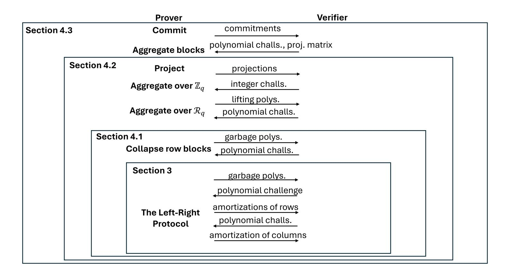

{0}------------------------------------------------

# <span id="page-0-0"></span>Orthus: Practical Sublinear Batch-Verification of Lattice Relations from Standard Assumptions

Madalina Bolboceanu1,<sup>2</sup> , Jonathan Bootle<sup>1</sup> , Vadim Lyubashevsky<sup>1</sup> , Antonio Merino-Gallardo1,<sup>2</sup> and Gregor Seiler<sup>1</sup>

1 IBM Research Europe, Zurich, Switzerland madalina.bolboceanu@ibm.com, jbt@zurich.ibm.com, vad@zurich.ibm.com, antonio@m-g.es, gseiler@posteo.net <sup>2</sup> University of Potsdam, Potsdam, Germany

Abstract. The past several years have seen a rapid rise in practical lattice-based proof systems with linear-sized zero-knowledge proofs forming the foundation of many of the most efficient quantumsafe privacy protocols, and succinct proofs rapidly catching up and surpassing other quantum-safe alternatives in many metrics. A recent comparison of lattice-based aggregate signatures (Ethereum Foundation, 2025) involving the hash-based aggregate signature scheme Plonky3 and the instantiation of aggregate signatures from Falcon from the LaZer lattice library (Lyubashevsky, Seiler, Steuer, CCS 2024) using LaBRADOR (Beullens, Seiler, Crypto 2023), showed that lattice-based constructions have an advantage in terms of proof size and prover time, but are around an order of magnitude slower with regards to verification time. In general, it appears that slower verification times are the main obstacle to the adoption of succinct lattice-based proof systems.

In this work, we introduce and implement Orthus, a proof system with sub-linear verification designed for relations that naturally arise in lattice-based constructions. Asymptotically, the verification time grows with the square root of the witness size, and for a concrete example of aggregating Falcon signatures our implementation reduces the verifier running time by a factor of 9X when aggregating 2 <sup>17</sup> signatures.

Keywords: Lattices, succinct proofs, succinct verification

{1}------------------------------------------------

# Table of Contents

| 1                                 | Intro                     | $\operatorname{oduction}$                              |  |  |  |
|-----------------------------------|---------------------------|--------------------------------------------------------|--|--|--|
|                                   | 1.1                       | Techniques and Results                                 |  |  |  |
| 2                                 | Prel                      | iminaries                                              |  |  |  |
|                                   | 2.1                       | The Linear Proof                                       |  |  |  |
|                                   | 2.2                       | LaBRADOR                                               |  |  |  |
| 3                                 | The                       | Left-Right Protocol                                    |  |  |  |
|                                   | 3.1                       | The Left-Right Relation                                |  |  |  |
|                                   | 3.2                       | The Left Part                                          |  |  |  |
|                                   | 3.3                       | The Right Part                                         |  |  |  |
|                                   | 3.4                       | Efficiency                                             |  |  |  |
|                                   | 3.5                       | Security Analysis                                      |  |  |  |
| 4                                 | Fron                      | n the Left-Right Protocol to Orthus 1                  |  |  |  |
|                                   | 4.1                       | Proving the Same Constraint for Each Row Block         |  |  |  |
|                                   | 4.2                       | Proving the Same Set of Constraints for Each Row Block |  |  |  |
|                                   | 4.3                       | Orthus                                                 |  |  |  |
| 5 Reducing the Communication Cost |                           |                                                        |  |  |  |
|                                   | 5.1                       | Two-Step Commitment                                    |  |  |  |
|                                   | 5.2                       | Proving Knowledge of Orthus Output with LaBRADOR       |  |  |  |
| 6                                 | App                       | lication: Aggregating Falcon signatures                |  |  |  |
| 7                                 |                           | $\rho$ lementation                                     |  |  |  |
|                                   | 7.1                       | Orthus Statements                                      |  |  |  |
|                                   | 7.2                       | The Column NTT                                         |  |  |  |
|                                   | 7.3                       | LaBRADOR                                               |  |  |  |
| Ac                                |                           | $\rho$ redgments                                       |  |  |  |
|                                   |                           | ces                                                    |  |  |  |
|                                   |                           | $\rm lix$                                              |  |  |  |
| _                                 | -                         | erred preliminaries                                    |  |  |  |
|                                   |                           | The Modular Johnson-Lindenstrauss Lemma                |  |  |  |
|                                   |                           | Lattice Assumptions                                    |  |  |  |
|                                   |                           | Commitment Schemes                                     |  |  |  |
|                                   |                           | Interactive Arguments                                  |  |  |  |
| В                                 |                           | erred Proofs                                           |  |  |  |
| ב                                 |                           | Proof of Lemma 1                                       |  |  |  |
|                                   | B.2                       | Proof of Lemma 2                                       |  |  |  |
|                                   |                           | Proof of Lemma 3                                       |  |  |  |
|                                   |                           | Proof of Theorem 6                                     |  |  |  |
| С                                 |                           | ails of (some) LaBRADOR Steps                          |  |  |  |
| O                                 |                           | Project                                                |  |  |  |
|                                   | C.1                       | Aggregate with Integer Challenges                      |  |  |  |
|                                   |                           | Aggregate with Integer Chanenges                       |  |  |  |
| D                                 | O.0<br>Dont               |                                                        |  |  |  |
| Б<br>Е                            |                           | Particular Constraints                                 |  |  |  |
| ${\rm F}$                         |                           |                                                        |  |  |  |
|                                   |                           | e details on aggregating Falcon signatures             |  |  |  |
| G                                 | $\mathbf{r}$ $\mathbf{g}$ | res for protocols 3                                    |  |  |  |

{2}------------------------------------------------

# <span id="page-2-0"></span>1 Introduction

Succinct proof systems are at the heart of many cryptographic primitives, ranging from digital currency applications, to aggregate signatures, to blockchain state verification. With the new quantum-safe NIST standards being published last year and quantum computing research progressing more rapidly, one needs to also begin preparing for the transition of advanced cryptographic primitives, including proof systems, to their quantum-safe variants.

There has been a lot of research on building practical hash-based proof systems, which are naturally quantum-safe. Descending from celebrated results in complexity theory such as the PCP-theorem, today, there are many hash-based proof systems with schemes such as Ligero+ [\[11\]](#page-24-1), Blaze [\[14\]](#page-24-2), BaseFold [\[35\]](#page-25-0), STIR [\[5\]](#page-24-3) and WHIR [\[6\]](#page-24-4). These schemes have very efficient verifiers, some on the order of milliseconds, reasonably-efficient provers, and outputs on the order of several hundred kilobytes to a few megabytes. These proof systems rely on collision-resistant hash functions for security, which is considered a minimal cryptographic assumption. On the other hand, many cryptographic assumptions, such as those based on lattices, offer rich algebraic structure, and exploiting this structure has led to improved concrete efficiency, particularly in terms of proof size.

Lattice-based succinct proof systems have a much shorter history. The first asymptotically-succinct proof system was proposed in [\[8\]](#page-24-5), and the first practical scheme was only proposed a few years ago. The LaBRADOR proof system [\[10\]](#page-24-6) was the first concretely practical lattice-based succinct proof system, and is currently the quantum-safe scheme with the smallest proof output size. It achieves proof sizes of around 60-70KB for systems with up to 2<sup>30</sup> constraints and its prover is also quite efficient in practice. The main negative aspect of the scheme is that the verification time is linear in the size of the witness and it is concretely more than an order of magnitude slower than for other quantum-safe succinct proofs.

Several lines of research worked on improving the verification time of lattice-based schemes. The works of [\[22,](#page-25-1) [23\]](#page-25-2) used a non-standard lattice-like assumption in which the random matrix used in (Ring)-SIS and (Ring)-LWE was replaced with a matrix consisting of tensors of small matrices, which allowed natural recursion which resulted in asymptotic verification logarithmic in the witness size. Other recent works in the LatticeFold line [\[12,](#page-24-7) [13\]](#page-24-8) use a rather different technique for proving smallness of committed vectors by directly utilizing the sumcheck protocol used elsewhere in proof system constructions. The design results in an asymptotically very efficient verifier, but at this point the protocol works with norms that are not optimally compatible with proving lattice relations that underlie other lattice schemes. It is therefore not yet clear how concretely efficient it would be, both in prover and verifier time, when fed a large witness corresponding to natural lattice statements. The recent Greyhound scheme [\[33\]](#page-25-3) achieves square root verification time for polynomial commitments. To assess its effectiveness for proving lattice relations, one would first need a compiler going from lattice statements to polynomial commitments, and it is unclear how concretely efficient this will be. In short, designing a proof system based on standard assumptions with a concretely efficient, sub-linear verifier was still an open problem.

Our Contribution. The sub-linear verification Orthus proof system designed in this work continues along the lines of the proof systems of [\[10,](#page-24-6)[26\]](#page-25-4) which take inputs that correspond directly to statements that one would want to prove in lattice protocols. This proof system is furthermore based on standard lattice assumptions (Module-SIS and Module-LWE) and is concretely efficient in practice.

At a high level, our proof system is designed to work on a set of N independent statement blocks labeled by ℓ for 1 ≤ ℓ ≤ N, each committing to polynomial vectors s˜ (ℓ) 1 , . . . , s˜ (ℓ) <sup>K</sup> and satisfying[3](#page-0-0)

<span id="page-2-1"></span>
$$f(\tilde{\boldsymbol{s}}_{1}^{(\ell)}, \dots, \tilde{\boldsymbol{s}}_{K}^{(\ell)}) := \sum_{i,j \in [K]} a_{ij} \langle \tilde{\boldsymbol{s}}_{i}^{(\ell)}, \tilde{\boldsymbol{s}}_{j}^{(\ell)} \rangle + \sum_{i \in [K]} \langle \boldsymbol{\varphi}_{i}, \tilde{\boldsymbol{s}}_{i}^{(\ell)} \rangle - b = 0, \tag{1}$$

<span id="page-2-2"></span>
$$\|\tilde{\boldsymbol{s}}_{1}^{(\ell)}\| \leq \beta_{1}, \dots, \|\tilde{\boldsymbol{s}}_{K}^{(\ell)}\| \leq \beta_{K}.$$
 (2)

<sup>3</sup> More generally, the system can also prove knowledge of the constant coefficient of the first statement and also prove the norm bounds in the second statement with a small gap, which makes the proofs more concretely efficient (though the same in an asymptotic sense) in those scenarios.

{3}------------------------------------------------

If the total witness size is N, then the asymptotic running time of the prover is  $\tilde{O}(N)$  and the verification time is roughly  $\tilde{O}(K^2\sqrt{N})$ . Thus in the typical scenarios where the number of polynomial equations in each statement block is a small constant, the verification run-time is square root in the witness length.

At the heart of the protocol is a simple technique, which we call the *Left-Right* proof, which asymptotically reduces the input by a factor of square root in the witness size, and whose verifier also runs in square root time. We then transform the shrunken output of this procedure into a form that can be efficiently fed into LaBRADOR, which then outputs a short proof of knowledge of the full statement.

Thus one can view our proof system as a generalization of LaBRADOR, which (when combined together with its Dachshund front-end from [30]) allows to prove the above set of equations, but would have a (quasi)-linear time verifier.

### <span id="page-3-0"></span>1.1 Techniques and Results.

We believe that the most natural way to explain our result and technique is by first understanding the reason why LaBRADOR did not have efficient verification. One can then think of our Left-Right proof as "fixing" this problem in LaBRADOR. So before explaining our result, we will briefly sketch the relevant part of LaBRADOR where the main roadblock appears.

<span id="page-3-3"></span>The LaBRADOR Proof System. Suppose that we would like to do something as simple as possible – commit to a long vector s and prove that  $\langle s, s \rangle = v$ . What one does is break up the long s into a few parts  $s_i$  and create compressing Ajtai commitments [2] to them as

<span id="page-3-2"></span>
$$Bs_i = t_i \tag{3}$$

and send them to the verifier (the prover will actually send them in committed form, but this is not important here). The verifier creates random low-norm challenge polynomials  $c_i$ , sends them to the prover, and the prover amortizes the witnesses as

<span id="page-3-1"></span>
$$z = \sum_{i} s_i c_i. \tag{4}$$

The verifier checks that  $\|z\|$  is short and that  $Bz = \sum_{i} t_{i}c_{i}$ , which proves that the openings to the  $t_{i}$  are unique and (with some additional work) that z is of the form in (4). The verifier is also able to compute the useful equation

$$\langle \boldsymbol{z}, \boldsymbol{z} \rangle = \sum_{i,j} \langle \boldsymbol{s}_i, \boldsymbol{s}_j \rangle c_i c_j.$$
 (5)

If, at the same time as sending the  $t_i$  in (3), the prover also sends all the  $v_{i,j} = \langle s_i, s_j \rangle$  before seeing the challenges, then by the Schwartz-Zippel lemma, it implies that the  $v_{i,j}$  really are  $\langle s_i, s_j \rangle$ , and so one can prove any statement about their linear combinations using standard lattice proofs for linear relations. Just like for the vectors  $t_i$ , the prover sends commitments to these polynomials. This procedure is then repeated recursively by also committing to the z and proving  $\langle z, z \rangle = \sum_{i,j} v_{i,j} c_i c_j$ . Even though we can prove an arbitrary statement in the linear combination of  $v_{i,j}$ , very often we do not need to do this. In the statement that we are trying to prove, we only care about the  $v_{i,i}$ , of which there are only linearly-many (where linear refers to the number of chunks into which we broke up s), and so the rest of the quadratic number of  $v_{i,j}$  that we need to commit to are just auxiliary "garbage" polynomials.

To see the main inefficiency in LaBRADOR, we look at (3), which commits to "chunks" of s. If the number of  $s_i$  is small, then each  $s_i$  is going to be long and we need the matrix B to also be long.<sup>4</sup> On

This is where having  $\boldsymbol{B}$  being a tensor of small matrices, as in [22], overcomes the need for  $\boldsymbol{B}$  to be long.

{4}------------------------------------------------

the other hand, if one breaks s into many chunks, then the number of terms  $v_{i,j}$  grows quadratically in the number of chunks, becoming the cause for inefficiency. The authors of [10] set the parameters to optimize the "chunk-splitting" in order to achieve optimal concrete proof sizes, but in practice, this may not be optimal for the prover or verifier time due to the fact that the witness size grows quadratically in the number of chunks. Furthermore, the verification time is (at least) linear in the witness size, and in practice is only about 2X faster than the prover's, whereas in hash-based proof systems, the verifier time can be more than 50X faster (c.f. [31]). The main property of our Left-Right proof system is that it allows the witness size to grow linearly in the number of chunks, rather than quadratically, which allows us to break s up into a larger (i.e. square root in the dimension of s) number of parts.

Trying to reduce the number of garbage polynomials. For soundness of LaBRADOR, it was crucial that the z in (4) had small norm, which in turn required that the  $c_i$  did too. By having distinct, small challenges  $c_i$ , we then ended up with a quadratic number of  $v_{i,j}$  when computing  $\langle z, z \rangle$ . If, for a second, we ignore the need for the  $c_i$  to be small, we could think of doing the following: instead of sending many challenges  $c_i$ , the verifier just sends one challenge  $c_i$  and the prover outputs

<span id="page-4-0"></span>
$$\boldsymbol{z} = \sum_{i=1}^{k} \boldsymbol{s}_{i} c^{i}, \quad \boldsymbol{z}' = \sum_{i=1}^{k} \boldsymbol{s}_{i} c^{-i}$$

$$(6)$$

Then

$$\langle \boldsymbol{z}, \boldsymbol{z}' \rangle = \sum_{i=1}^{k} \langle \boldsymbol{s}_i, \boldsymbol{s}_i \rangle + \sum_{-k < i < k, i \neq 0} v_i c^i,$$
 (7)

for some  $v_i$  which are combinations of the  $s_i$ . If we only care about proving  $\sum \langle s_i, s_i \rangle$  as before, then we only need to commit to 2(k-1) auxiliary terms  $v_i$  before the protocol starts (instead of  $O(k^2)$  as in LaBRADOR) to use the Schwartz-Zippel lemma. The problem is that this proof is not sound because the polynomials  $c^i$  have large coefficients and thus the verifier is not convinced that z and z' are actually constructed as in (6). The way to obtain soundness is to do a proof on "both sides" of the  $s_i$ , hence the name "Left-Right" proof.

The Left-Right Proof. Let us write  $S = [s_1, \ldots, s_k]$  where the  $s_i$  are the columns of S and  $\tilde{s}_i$  are the rows, and suppose that we would like to commit to S and prove knowledge that  $\sum \langle \tilde{s}_i, \tilde{s}_i \rangle = v$ . We will later show how to prove more general relations, but let us stick with this simple one for now. For a polynomial  $\theta \in \mathcal{R}_q$ , we define the vector  $\theta_+ \in \mathcal{R}_q^k$  to be the row vector  $[\theta, \theta^2, \theta^3, \ldots, \theta^k]$  and  $\theta_-$  to be  $[\theta^{-1}, \theta^{-2}, \theta^{-3}, \ldots, \theta^{-k}]$ .

The protocol begins with the prover sending  $t_i$  as in (3), thus BS = T, and also some auxiliary "garbage" polynomials  $v_i$ , which will be defined in (9). The verifier then creates a random (non-zero) challenge  $\theta \in \mathcal{R}_q$ , and the prover computes

<span id="page-4-2"></span>
$$\tilde{\boldsymbol{z}}_{+} = \boldsymbol{\theta}_{+} \cdot \boldsymbol{S}, \quad \tilde{\boldsymbol{z}}_{-} = \boldsymbol{\theta}_{-} \cdot \boldsymbol{S}.$$
 (8)

In the outline of the protocol (c.f. Figure 1), we call this amortization over the rows.

Observe that the inner product of the  $\tilde{\boldsymbol{z}}_{\pm}$  is

<span id="page-4-1"></span>
$$\langle \tilde{\boldsymbol{z}}_{+}, \tilde{\boldsymbol{z}}_{-} \rangle = \sum_{i=1}^{k} \langle \tilde{\boldsymbol{s}}_{i}, \tilde{\boldsymbol{s}}_{i} \rangle + \sum_{-k < i < k, i \neq 0} v_{i} \theta^{i}, \tag{9}$$

where  $v_i$ 's are some linear combinations of the inner-products  $\langle \tilde{s}_i, \tilde{s}_j \rangle$  that we committed to earlier. Thus if we knew that  $\tilde{z}_+ = \theta_+ \cdot S$  and  $\tilde{z}_- = \theta_- \cdot S$ , then by the Schwartz-Zippel lemma, we would know that the

<sup>&</sup>lt;sup>5</sup> Instead of proving statements over the columns, we prove them over the rows, but this is just notation.

{5}------------------------------------------------

polynomial[6](#page-0-0) equality

$$\left\langle \sum_{i=1}^{k} \tilde{\mathbf{s}}_{i} Y^{i}, \sum_{i=1}^{k} \tilde{\mathbf{s}}_{i} Y^{-i} \right\rangle = v + \sum_{-k < i < k, i \neq 0} v_{i} Y^{i}$$

$$\tag{10}$$

holds (since checking [\(9\)](#page-4-1) checks the above equality evaluated at a random θ) with high probability, and therefore P⟨s˜<sup>i</sup> , s˜i⟩ = v. In other words, proving knowledge of S satisfying

$$\begin{pmatrix} \boldsymbol{B} \\ \boldsymbol{\theta}_{+} \\ \boldsymbol{\theta}_{-} \end{pmatrix} \cdot \boldsymbol{S} = \begin{pmatrix} \boldsymbol{T} \\ \tilde{\boldsymbol{z}}_{+} \\ \tilde{\boldsymbol{z}}_{-} \end{pmatrix} \tag{11}$$

would conclude the proof.

To prove this statement, the verifier sends a challenge vector c consisting of small polynomials, and the prover simply outputs z = Sc. The verifier checks that ∥z∥ is small and that

<span id="page-5-0"></span>
$$\begin{pmatrix} \boldsymbol{B} \\ \boldsymbol{\theta}_{+} \\ \boldsymbol{\theta}_{-} \end{pmatrix} \cdot \boldsymbol{z} = \begin{pmatrix} \boldsymbol{T} \\ \tilde{\boldsymbol{z}}_{+} \\ \tilde{\boldsymbol{z}}_{-} \end{pmatrix} \cdot \boldsymbol{c} \tag{12}$$

The above is just a classical linear proof system for committed values (e.g. [\[9\]](#page-24-10)) and is in fact exactly what is used by LaBRADOR to prove [\(4\)](#page-3-1), where instead of the B and T = [t1, . . . , tk] in [\(4\)](#page-3-1), we have the matrices with more rows from [\(12\)](#page-5-0). We call this part of the overall proof (Figure [Figure 1\)](#page-19-2) amortization of the columns. This completes the high-level description of the Left-Right proof technique.

Observe that if S ∈ Rk×<sup>k</sup> q , then it contains k <sup>2</sup> polynomials, but everything which the verifier handles – T , v<sup>i</sup> , z, z˜±, θ±, are all O(k) in size. The running time of the verifier (as well as the proof output) is thus asymptotically square root in the size of the instance.

P From the Left-Right Proof to Orthus. Above, we described how to compute the simple relation i ⟨s˜<sup>i</sup> , s˜i⟩, but we would like to give proofs for general relations as in [\(1\)](#page-2-1), [\(2\)](#page-2-2). This is performed via a series of protocols in Sections [3,](#page-8-0) [4.1,](#page-12-1) [4.2,](#page-14-0) [4.3.](#page-16-0)

In [Section 3,](#page-8-0) we show how one can, instead of proving one quadratic relation over the entire secret, prove relations of the form ⟨s˜<sup>i</sup> , s˜i⟩ = u<sup>i</sup> , and a more generalized version where the previous are also multiplied by some public values.

In [Section 4.1,](#page-12-1) we begin to consider "row blocks". That is, instead of only allowing inner products of the form ⟨s˜<sup>i</sup> , s˜i⟩, we also allow proving a constraint involving inner products of rows in the same block. For example, if we have rows s˜1, . . . , s˜6, and we break them up into two row blocks, then we can prove that, say, ⟨s˜1, s˜<sup>2</sup> + 2s˜3⟩ = u<sup>1</sup> and ⟨s˜4, s˜<sup>5</sup> + 2s˜6⟩ = u2. The reduction from this proof to the Left-Right protocol is given in [Section 4.1.](#page-12-1) If each row-block consists of K rows, then one may need to create up to O(K<sup>2</sup> ) garbage terms for the same reason as we needed a quadratic number of garbage terms in LaBRADOR (c.f. the discussion in [Section 1.1\)](#page-3-3). In [Section 4.2,](#page-14-0) we consider the more general version where one wishes to prove several constraints per row block, and then finally in [Section 4.3,](#page-16-0) we show how one can put many constraints of the form as in [\(1\)](#page-2-1), [\(2\)](#page-2-2) into one row block, which is the final step needed to create a protocol with an O(K<sup>2</sup> √ N) time verifier.

In [Section 5,](#page-19-0) we describe some practical optimizations and explain how the output of the Orthus proof system can be fed into LaBRADOR. The latter part is particularly important for concrete efficiency because, even though the input to LaBRADOR is smaller than the original input into Orthus, if the verification of Orthus requires a lot of inner-product between various parts, then the number of garbage terms produced by LaBRADOR, which can grow quadratically (see [Section 1.1\)](#page-3-3) can negate all the efficiency gains. In [Section 7,](#page-22-0) we finally describe our full implementation.

<sup>6</sup> Laurent polynomial would be more precise, since it has negative powers. But the Schwartz-Zippel lemma still applies if we just multiply the Laurent polynomial by Y k to make all the powers positive.

{6}------------------------------------------------

A Polynomial Commitment Perspective on our Results. One way to view our results is as implicitly providing a compiler from lattice relations to batched polynomial evaluation statements related to those used in polynomial commitment schemes. For example, the left-right proof provides a way to demonstrate that the batched polynomial evaluations described in Equation (8) hold, while Orthus efficiently reduces lattice statements to this form.

Concrete Results. The way one would use Orthus in practice is to pass its shrunken output to a proof system that is not necessarily fast when it comes to verification, but produces small outputs, like LaBRADOR. We implemented and tested such a construction by using it to create an aggregate signature scheme by aggregating Falcon signatures. The results we obtain are described in Table 1, which compares the aggregate signature implemented using LaBRADOR in the LaZer library [30] with our current version combining Orthus and LaBRADOR.

The verification times are between 2.5X and 9X faster with this combination than with just LaBRADOR alone, with the improvement naturally getting larger as the instance size increases.

| Number of  | LaZer       | LaZer         | Orthus      | Orthus        |
|------------|-------------|---------------|-------------|---------------|
| Signatures | Prover Time | Verifier Time | Prover Time | Verifier Time |
| $2^{13}$   | 5.56        | 3.2           | 5 (2.4)     | 1.4 (.2)      |
| $2^{14}$   | 9.8         | 5.6           | 9.2 (5.2)   | 2.3 (.3)      |
| $2^{15}$   | 21.7        | 12.8          | 16.8 (10.8) | 2.9 (.3)      |
| $2^{16}$   | 46.7        | 27.1          | 32.4 (23)   | 4.6 (.6)      |
| $2^{17}$   | 108.5       | 63            | 62.6 (45.6) | 7 (.7)        |

<span id="page-6-2"></span>**Table 1.** Performance in seconds of Orthus on aggregating Falcon signatures and comparing to the LaBRADOR implementation in LaZer. The numbers in parentheses for the Orthus implementation are the times needed for the "Orthus part", which shrinks the input down to square root size before feeding it into LaBRADOR. The remaining time is the running time of LaBRADOR on the shrunken input. All timings were obtained on a single core of an Intel Core i7-11850H.

# <span id="page-6-0"></span>2 Preliminaries

Notation. Let q be an odd prime. We denote by  $\mathbb{Z}_q$  the ring of integers mod q. We write  $[n] = \{1, 2, \dots, n\}$ . We say  $x \leftarrow S$  when  $x \in S$  is sampled uniformly at random from a finite set S and similarly  $x \leftarrow \chi$  when x is sampled according to a distribution  $\chi$ . We denote vectors  $\mathbf{v} \in \mathbb{Z}^n$  and matrices  $\mathbf{A} \in \mathbb{Z}^{r \times m}$  with bold letters. Let d be a power of two, and let  $\mathcal{R}, \mathcal{R}_q$  be the rings  $\mathbb{Z}[X]/(X^d+1)$  and  $\mathbb{Z}_q[X]/(X^d+1)$  respectively, where q, d are such that  $X^d+1$  splits in two irreducible factors mod q. For a polynomial  $f = a_0 + a_1 X + \ldots + a_{d-1} X^{d-1} \in \mathcal{R}$ , we denote by  $\mathbf{ct}(f)$  its constant-term, i.e.  $\mathbf{ct}(f) = a_0$ . We denote the vectors  $\mathbf{v} \in \mathcal{R}^n$  by italic-bold lower-case and matrices  $\mathbf{A} \in \mathcal{R}^{r \times m}$  by italic-bold capital letters. We denote by  $\mathbf{1}_r$  the column vector containing all entries equal to (the constant polynomial) 1, and by  $\mathbf{0}_r$  the one containing all entries equal to (the constant polynomial) 0. If  $\mathbf{a} \in \mathcal{R}_q^{n_a}$  and  $\mathbf{b} \in \mathcal{R}_q^{n_b}$  are vectors, we denote by  $(\mathbf{a}, \mathbf{b}) \in \mathcal{R}_q^{n_a+n_b}$  the vector obtained by concatenating them. A function  $f : \mathbb{N} \to \mathbb{R}$  is said to be negligible if for all  $c \in \mathbb{N}$  there exists some  $n_c \in \mathbb{N}$  such that for all  $n > n_c$ ,  $|f(n)| < \frac{1}{n^c}$ . In the context of probabilities, we say  $a \approx b$  if a - b is negligible. The rest of the preliminaries can be found in Appendix A.

#### <span id="page-6-1"></span>2.1 The Linear Proof

This is an interactive argument of knowledge for Ajtai commitment openings that satisfy a linear relation, similar to the one described in [8].

{7}------------------------------------------------

Our witness vectors  $(s_i)_{i \in [m]}$ ,  $s_i \in \mathcal{R}^r$  form a witness matrix  $S \in \mathcal{R}^{r \times m}$ , and each vector has bounded Euclidean norm  $||s_i|| \leq B_i$ . A commitment of the witness matrix is given, AS = T, for  $A \in \mathcal{R}_q^{t \times r}$ , and the witness satisfies a certain linear relation, BS = U, for  $B \in \mathcal{R}_q^{t' \times r}$ . Overall, we describe an argument for

$$R_{\texttt{lin}} = \left\{ \begin{aligned} ((\boldsymbol{T}, (B_i)_i, \boldsymbol{B}, \boldsymbol{U}), \boldsymbol{S}) \big| \|\boldsymbol{s}_i\| \leq B_i, \forall i \in [m] \ \big(\boldsymbol{A} \big) \cdot \boldsymbol{S} = \big(\boldsymbol{T} \big) \end{aligned} \right\}.$$

The protocol for proving the linear relation goes as follows. Upon receiving random challenges  $c_i \in \mathcal{C} \subseteq \mathcal{R}_q$  from the verifier, the prover computes and sends z = Sc, called an amortization of the columns. Then the verifier simply checks whether  $||z|| \leq B$  and

<span id="page-7-4"></span>
$$\begin{pmatrix} A \\ B \end{pmatrix} \cdot z = \begin{pmatrix} T \\ U \end{pmatrix} \cdot c. \tag{13}$$

A summary of the protocol can be found in Figure 2. The challenge space  $\mathcal{C} \subseteq \mathcal{R}_q$  is chosen such that c - c' is invertible for any pair of distinct  $c, c' \in \mathcal{C}$  and such that  $\|c\| \le \tau$  and  $\|c\|_{\text{op}} \le T$ , for any  $c \in \mathcal{C}$ , for some constants  $\tau, T \in \mathbb{R}$ , where  $\|c\|_{\text{op}} := \sup_{r \in \mathcal{R} \setminus \{0\}} \frac{\|cr\|}{\|r\|}$ . A popular choice [10] is to sample c with small  $\|c\| = \tau$  by taking a fixed number of short non-zero entries (e.g.  $\pm 1, \pm 2$ ) that ensures a large-enough size of  $\mathcal{C}$ , while the invertibility is guaranteed by their shortness as proved in [29, Cor.1.2]. The bound B depends on the bounds  $(B_i)_i$  and  $\mathcal{C}$ . It could be set as a worst-case bound derived from T to ensure perfect completeness. However, if one is willing to accept a small completeness error, then we can use probabilistic arguments to choose a smaller B and improve the proof size. For this, we follow the analysis of [10, 32, 33].

<span id="page-7-1"></span>**Lemma 1.** Let  $S \in \mathcal{R}_q^{r \times m}$  be a matrix with bounded columns  $\|\mathbf{s}_j\| \leq B_j$ . Let  $\mathcal{C} \subseteq \mathcal{R}_q$  be a challenge space of ring elements with  $\ell_2$  norm equal to  $\tau$ . Then, the  $\mathbb{Z}_q$  coefficients of  $\mathbf{z} = \mathbf{S}\mathbf{c} \in \mathcal{R}_q^r$ , for  $\mathbf{c} \in \mathcal{C}^m$  follow a Gaussian distribution of standard deviation  $\sigma_{\mathbf{z}} \coloneqq \tau \sqrt{\sum_{j \in [m]} B_j^2/rd}$  and so, for any t > 0, we have that  $\|\mathbf{z}\| \leq t\sigma_{\mathbf{z}}\sqrt{rd}$ , except with probability  $2rd\exp\left(-\frac{t^2}{2}\right)$ .

We defer the proof to Appendix B.

Security Analysis. Denote by  $\bar{\mathcal{C}} \triangleq \mathcal{C} - \mathcal{C}$ . The linear proof gives an argument of knowledge for a relaxed version of  $R_{\text{lin}}$  that we call  $R'_{\text{lin}}$  where the norm constraints are not proven exactly; instead we can guarantee that  $\|\bar{\boldsymbol{c}}_i\bar{\boldsymbol{s}}_i\| \leq 2B$  for random  $\bar{\boldsymbol{c}} \in \bar{\mathcal{C}}^m$ .

The proofs of the lemmas follow [8] and are deferred to Appendix B.

**Lemma 2.** The protocol in Section 2.1 is complete with completeness error  $2rd\exp(-\frac{t^2}{2})$ , when setting  $B = t\sigma_z \sqrt{rd}$ .

The value of t can be chosen based on r and d and the desired completeness error.

<span id="page-7-3"></span>**Lemma 3.** The protocol in Section 2.1 is knowledge sound for  $R'_{lin}$  defined as

<span id="page-7-2"></span>
$$R'_{lin} = \left\{ \begin{array}{l} ((\boldsymbol{T}, B, \boldsymbol{B}, \boldsymbol{U}), (\bar{\boldsymbol{S}}, \bar{\boldsymbol{c}})) \Big| \|\bar{\boldsymbol{c}}_i \bar{\boldsymbol{s}}_i\| \leq 2B, \forall i \in [m] \\ \begin{pmatrix} \boldsymbol{A} \\ \boldsymbol{B} \end{pmatrix} \cdot \bar{\boldsymbol{S}} = \begin{pmatrix} \boldsymbol{T} \\ \boldsymbol{U} \end{pmatrix} \right\},$$

with knowledge error  $\kappa_{lin} := 1/|\mathcal{C}|$ . The extracted matrix is unique, under the hardness of the M-SIS<sub>t,8TB</sub> problem.

#### <span id="page-7-0"></span>2.2 LaBRADOR

The LaBRADOR proof system [10] is an iterative public coin proof system with concretely small communication size, whose security relies on the hardness of the Module Short Integer Solution problem. It is

{8}------------------------------------------------

constructed from a base protocol that receives as input an instance x and proves the knowledge of a witness x which with x which is last message dominates the communication size, while being smaller than the witness x. Rather than sending it, this last message actually becomes the witness x for another iteration of the protocol where the instance x corresponds to the verifier's checks from the base protocol. More precisely, proving knowledge of a witness x such that x belongs to x belongs to x belongs to x the same relation x. This process continues iteratively, reducing the size of the witness with each iteration, until no more progress is made and the prover finally sends the last witness for the verifier to check directly.

We recall here the relation  $R_L$ , parametrized by the rank  $n \geq 1$ , multiplicity  $r \geq 1$  and norm bound  $\beta > 0$ . The statement x involves collections of quadratic dot product constraints  $f : \mathcal{R}_q^n \times \ldots \times \mathcal{R}_q^n \to \mathcal{R}_q$  of the form

<span id="page-8-2"></span>
$$f(\mathbf{s}_1, \dots, \mathbf{s}_r) \triangleq \sum_{i,j \in [r]} a_{ij} \langle \mathbf{s}_i, \mathbf{s}_j \rangle + \sum_{i \in [r]} \langle \boldsymbol{\varphi}_i, \mathbf{s}_i \rangle - b,$$
 (14)

where  $a_{ij}, b \in \mathcal{R}_q$ ,  $\varphi_i \in \mathcal{R}_q^n$ , such that  $a_{ij} = a_{ji}$ . For some constraints f', we are only interested in the constant term  $\mathsf{ct}(\cdot)$  of their output, so the other coefficients of b are not included in the statement. We collect these *constant term* constraints in a family  $\mathcal{F}'$ , separated from the *full* constraints, that we collect in a family  $\mathcal{F}$ . A tuple  $w = (s_1, \ldots, s_r) \in (\mathcal{R}^n)^r$  is a valid witness for the statement  $x = (\mathcal{F}, \mathcal{F}', \beta)$  if and only if

$$(f(\boldsymbol{s}_1,\ldots,\boldsymbol{s}_r)=0,\forall f\in\mathcal{F})\wedge(\mathsf{ct}(f'(\boldsymbol{s}_1,\ldots,\boldsymbol{s}_r))=0,\forall f'\in\mathcal{F}')\wedge(\sum_{i\in[r]}\|\boldsymbol{s}_i\|^2\leq\beta)$$

We recall the inner and outer commitments from LaBRADOR used in [10,33], which are Ajtai commitments. Let  $N, n, r, b \in \mathbb{N}$  and  $\mathbf{t} \coloneqq \lceil \log_b q \rceil$ . Let  $(\boldsymbol{A}, \boldsymbol{B}) \in \mathcal{R}_q^{N \times n} \times \mathcal{R}_q^{N \times \mathrm{tr}N}$  be public parameters. Then the inner commitments are the r vectors  $\boldsymbol{t}_i \coloneqq \boldsymbol{A}\boldsymbol{s}_i \in \mathcal{R}_q^N$ , whereas the outer commitment is  $\boldsymbol{u} \coloneqq \boldsymbol{B}\hat{\boldsymbol{t}}$ , where  $\hat{\boldsymbol{t}} = (\hat{\boldsymbol{t}}_i)_{i \in [r]}, \hat{\boldsymbol{t}}_i \coloneqq \boldsymbol{G}_{\mathrm{b},N}^{-1}(\boldsymbol{t}_i)$ .

# <span id="page-8-0"></span>3 The Left-Right Protocol

In this section we present the Left-Right Protocol. This protocol acts as the core subroutine for our main protocol in Section 4. Given Ajtai commitments to the columns  $s_1, \ldots, s_m$  of a witness matrix  $S \in \mathbb{R}^{r \times m}$ , the Left-Right protocol proves n quadratic relations between the rows  $\tilde{s}_1, \ldots, \tilde{s}_r$  of S. The communication complexity and verification runtime of the Left-Right Protocol are O(n + m + r), which is sublinear in the size of S.

The protocol consists of two parts, which we call the Left and the Right parts, as they correspond to left and right multiplications of the witness matrix S. The Left part takes a structured linear combination of the rows  $\tilde{s}_i$  of the witness matrix S using consecutive powers of a random challenge  $\theta$ , corresponding to a left multiplication of S. These combinations are useful for proving the given quadratic relations. The Right part is simply the classic linear proof of knowledge from Section 2.1, which takes random linear combinations of the columns, corresponding to a right multiplication of S. Consistency checks between the left and right multiplications prove that the structured linear combinations of rows are correctly computed.

The linear combinations used in the Left-Right protocol come from two different challenge spaces  $\hat{\mathcal{C}} \subseteq \mathcal{R}_q$  and  $\mathcal{C} \subseteq \mathcal{R}_q$ , one for the Left and one for the Right part. The challenge  $\theta$  which generates linear combinations for the left part is sampled from  $\hat{\mathcal{C}}$ . There are no restrictions on  $\hat{\mathcal{C}}$ , and in fact one can take  $\hat{\mathcal{C}} = \mathcal{R}_q$ , the entire ring. We use  $\hat{\mathcal{C}} = \mathcal{R}_q$  for simplicity here, although using a challenge space made up of lower-norm elements provides some implementation speed-ups. The linear combinations for the Right part are sampled from  $\mathcal{C}$ , and defined as in Section 2.1.

### <span id="page-8-1"></span>3.1 The Left-Right Relation

We now give a detailed description of the relation proved by the Left-Right protocol. Let  $\mathbf{T} := \mathbf{A}\mathbf{S} \in \mathcal{R}_q^{t \times m}$  be the Ajtai commitment to the columns of  $\mathbf{S} \in \mathcal{R}^{r \times m}$ . Each column  $\mathbf{s}_1, \dots, \mathbf{s}_m$  satisfies norm constraint

{9}------------------------------------------------

 $\|s_i\| \leq B_i$ . The relation we want to prove involves n linear constraints characterized by n row vectors  $\tilde{r}_i \in \mathcal{R}_q^r$ , collected into a matrix  $\mathbf{R} \in \mathcal{R}_q^{n \times r}$ , n quadratic constraints characterized by a bilinear constraint  $\mathbf{D} \in \mathcal{R}_q^{m \times m}$ , along with the vectors  $\tilde{r}_i$  and n pairs of targets  $(u_i, w_i) \in \mathcal{R}_q^2$ . Later on in Sections 4.1 to 4.3 the matrices  $\mathbf{R}$  and  $\mathbf{D}$  will be instantiated with different choices, when proving correct computation of a wide variety of different auxiliary terms and functions of the witness  $\mathbf{S}$ , while giving proofs relative to the same commitment  $\mathbf{T}$  to  $\mathbf{S}$ .

Concretely, the prover wants to prove knowledge of S satisfying the following constraints:

$$\langle \tilde{\boldsymbol{r}}_i \boldsymbol{S} \boldsymbol{D}, \tilde{\boldsymbol{r}}_i \boldsymbol{S} \rangle = u_i, \ \forall i \in [n],$$
 (15)

<span id="page-9-2"></span><span id="page-9-1"></span>
$$\langle \boldsymbol{\varphi}, \tilde{\boldsymbol{r}}_i \boldsymbol{S} \rangle = w_i, \ \forall i \in [n].$$
 (16)

Equation (15) encodes quadratic constraints, while Equation (16) encodes linear constraints, which we summarize in the following relation:

$$R_{\text{LR}} = \left\{ \left. ((\boldsymbol{T}, (B_i)_i, \boldsymbol{R}, \boldsymbol{D}, \boldsymbol{\varphi}, (u_i, w_i)_i), \boldsymbol{S}) \right| \begin{matrix} \boldsymbol{A}\boldsymbol{S} = \boldsymbol{T}, \ \|\boldsymbol{s}_i\| \leq B_i, \ i \in [m] \\ \langle \tilde{\boldsymbol{r}}_i \boldsymbol{S} \boldsymbol{D}, \tilde{\boldsymbol{r}}_i \boldsymbol{S} \rangle = u_i, \ i \in [n] \\ \langle \boldsymbol{\varphi}, \tilde{\boldsymbol{r}}_i \boldsymbol{S} \rangle = w_i, \ i \in [n] \end{matrix} \right\}$$

We now describe the two parts of the Left-Right protocol. A full, algorithmic description of the protocol can be found in Figure 3.

### <span id="page-9-0"></span>3.2 The Left Part

The Left Part of the protocol begins with the verifier sending random challenges  $\beta_1, \ldots, \beta_n \leftarrow \mathcal{R}_q$  to the prover. These are used to take a linear combination of Equation (15) over  $i \in [n]$ , reducing n quadratic equations to a single one:

<span id="page-9-3"></span>
$$\sum_{i \in [n]} \beta_i \langle \tilde{\boldsymbol{r}}_i \boldsymbol{S} \boldsymbol{D}, \tilde{\boldsymbol{r}}_i \boldsymbol{S} \rangle = \sum_{i \in [n]} \beta_i u_i.$$
(17)

In this part, the verifier will check Equation (17) using a strategy employed in many works including [20], and later in lattice-based protocols such as [15], [22]. Namely, the verifier will use two structured linear combinations of the rows of RS and of RSD, embedding the rows into polynomials  $\sum_{i \in [n]} \beta_i \tilde{r}_i SDY^i$ ,

$$\sum_{i \in [n]} \tilde{\boldsymbol{r}}_i \boldsymbol{S} Y^{-i} \in \mathcal{R}_q^m [Y, Y^{-1}].$$

Note that if Equation (17) is indeed satisfied, then the constant coefficient of Y in  $\left\langle \sum_{i \in [n]} \beta_i \tilde{\boldsymbol{r}}_i \boldsymbol{S} \boldsymbol{D} Y^i, \sum_{i \in [n]} \tilde{\boldsymbol{r}}_i \boldsymbol{S} Y^{-i} \right\rangle$ 

is in fact equal to  $\sum_{i \in [n]} \beta_i u_i$ . More precisely, we have

<span id="page-9-4"></span>
$$\left\langle \sum_{i \in [n]} \beta_i \tilde{\boldsymbol{r}}_i \boldsymbol{S} \boldsymbol{D} Y^i, \sum_{i \in [n]} \tilde{\boldsymbol{r}}_i \boldsymbol{S} Y^{-i} \right\rangle = \sum_{i \in [n]} \beta_i u_i + \sum_{-n < i < n, i \neq 0} v_i Y^i.$$
(18)

To check Equation (17), the verifier must check that Equation (18) holds. To achieve this, the prover sends all of the other coefficients  $v_i \in \mathcal{R}_q$  to the verifier computing them as

<span id="page-9-5"></span>
$$v_i = \sum_{j,k \in [n], j-k=i} \beta_j \langle \tilde{\boldsymbol{r}}_j \boldsymbol{S} \boldsymbol{D}, \tilde{\boldsymbol{r}}_k \boldsymbol{S} \rangle, \text{ for } -n < i < n, \ i \neq 0.$$
(19)

We call these coefficients  $v_i$  "garbage" coefficients, because they are artefacts created to help the verifier check Equation (18), but not directly relevant to our original aim of checking Equation (17).

{10}------------------------------------------------

Now, we have the verifier check Equation (18) by evaluating it at a random challenge  $\theta$  from  $\hat{C}$ . After the prover has sent the garbage terms  $v_i$  from Equation (17) to the verifier, the verifier sends  $\theta$  to the prover. To avoid sending S to the verifier directly, as this would incur high communication costs, the prover helps the verifier to evaluate Equation (18) by computing and sending the evaluations of the polynomials in Y on the left hand side of Equation (18) at  $\theta$ . Namely, the prover computes

$$\tilde{\boldsymbol{z}}_{+} \coloneqq \sum_{i \in [n]} \beta_{i} \theta^{i} \tilde{\boldsymbol{r}}_{i} \boldsymbol{S} \in \mathcal{R}_{q}^{m}, \quad \tilde{\boldsymbol{z}}_{-} \coloneqq \sum_{i \in [n]} \theta^{-i} \tilde{\boldsymbol{r}}_{i} \boldsymbol{S} \in \mathcal{R}_{q}^{m},$$
 (20)

and sends them to the verifier, who can simply check the following equation:

$$\langle \tilde{\boldsymbol{z}}_+ \cdot \boldsymbol{D}, \tilde{\boldsymbol{z}}_- \rangle = \sum_{i \in [n]} \beta_i u_i + \sum_{-n < i < n, i \neq 0} v_i \theta^i.$$
 (21)

The verifier can check Equation (16) using a similar strategy with the  $w_i$ :

<span id="page-10-5"></span>
$$\langle \boldsymbol{\varphi}, \sum_{i \in [n]} \tilde{\boldsymbol{r}}_i \boldsymbol{S} Y^{-i} \rangle = \sum_{i \in [n]} w_i Y^{-i}. \tag{22}$$

Eventually, this means checking the following equation:

<span id="page-10-4"></span><span id="page-10-3"></span>
$$\langle \boldsymbol{\varphi}, \tilde{\boldsymbol{z}}_{-} \rangle = \sum_{i \in [n]} w_i \theta^{-i}. \tag{23}$$

Provided that  $\tilde{z}_{\pm}$  were computed correctly as in Equation (24), checking (21),(23) guarantees to the verifier that (18) and (22) hold, except with a negligible soundness error. The Right Part of the Left Right protocol will ensure that a cheating prover who does not compute  $\tilde{z}_{\pm}$  correctly will be caught by the verifier.

As mentioned earlier in this section, the vectors  $\tilde{z}_{\pm}$  are linear combinations of the rows of the witness matrix S, obtained by multiplying from the left:

<span id="page-10-2"></span>
$$\tilde{\boldsymbol{z}}_{+} = [\theta \beta_{1}, \dots, \theta^{n} \beta_{n}] \boldsymbol{R} \cdot \boldsymbol{S}, \quad \tilde{\boldsymbol{z}}_{-} = [\theta^{-1}, \dots, \theta^{-n}] \boldsymbol{R} \cdot \boldsymbol{S},$$
 (24)

As such, we refer to  $\tilde{z}_{\pm}$  as amortizations of rows.

Note that we do not incorporate D into  $\tilde{z}_+$  in Equation (21) because this would involve multiplying S from the right hand side, and make it more costly to check that  $\tilde{z}_+$  was computed correctly. To achieve this, we would have to check that the row amortizations of both S and SD were computed correctly, requiring extra elements to be sent in the Right Part of the protocol, which we would like to avoid.

### <span id="page-10-0"></span>3.3 The Right Part

The Right Part completes the Left-Right protocol, by convincing the verifier that the row amortizations  $\tilde{z}_{\pm}$  were correctly computed from the witness matrix S whose columns are committed in T. It comes down to running the linear protocol from Section 2.1 to prove that

$$\begin{pmatrix} \mathbf{A} \\ [\theta \beta_1, \dots, \theta^n \beta_n] \mathbf{R} \\ [\theta^{-1}, \dots, \theta^{-n}] \mathbf{R} \end{pmatrix} \cdot \mathbf{S} = \begin{pmatrix} \mathbf{T} \\ \tilde{\mathbf{z}}_+ \\ \tilde{\mathbf{z}}_- \end{pmatrix}.$$
 (25)

The linear proof involves sending vector z = Sc, a linear combination of the columns of the witness matrix S, obtained by multiplying from the right.

#### <span id="page-10-1"></span>3.4 Efficiency

The communication complexity is O(n+m+r), which is sublinear in the size of S, and the verifier runtime is also O(n+m+r).

{11}------------------------------------------------

### <span id="page-11-0"></span>3.5 Security Analysis

Completeness. If the quadratic described in Equation (15) holds for all  $i \in [n]$ , then taking linear combinations immediately yields Equation (17). For  $v_i$  computed as in Equation (19), the polynomial equality in Y from Equation (18) is satisfied, and hence also satisfied when evaluated at  $\theta$ . Therefore, the verifier check from Equation (21) passes. Similarly, assuming that Equation (16) holds, the polynomial equality in Y from Equation (22) also holds, and so does its evaluation at  $\theta$ . This means that the verifier check from Equation (23) passes. Thus, the completeness of the Left-Right protocol follows from the completeness of the Linear Proof from Section 2.1.

**Knowledge Soundness.** The Left-Right protocol is knowledge sound under the Module-SIS assumption. As in Section 2.1, the protocol is knowledge sound for a relaxed relation  $R'_{LR}$  with looser norm bounds than  $R_{LR}$  (see Lemma 3).

**Theorem 1.** Let  $\hat{C} = \mathcal{R}_q$ , and  $\mathcal{C} \subseteq \mathcal{R}_q$  be the challenge space from Section 2.1 of polynomials of operator norm T and  $\ell_2$  norm  $\tau$ . Suppose that M-SIS<sub>t,8TB</sub> is hard, where B is as in Section 2.1. Then the protocol in Section 3.1 is a knowledge-sound proof for the relation  $R'_{LR}$  defined as

<span id="page-11-2"></span>
$$R'_{LR} = \left\{ \left. ((\boldsymbol{T}, B, \boldsymbol{R}, \boldsymbol{D}, \boldsymbol{\varphi}, (u_i, w_i)_i), (\bar{\boldsymbol{S}}, \bar{\boldsymbol{c}}) \right| \begin{matrix} \boldsymbol{A}\bar{\boldsymbol{S}} = \boldsymbol{T}, & \|\bar{\boldsymbol{c}}_i \bar{\boldsymbol{s}}_i\| \leq 2B, & i \in [m] \\ \langle \tilde{\boldsymbol{r}}_i \bar{\boldsymbol{S}} \boldsymbol{D}, \tilde{\boldsymbol{r}}_i \bar{\boldsymbol{S}} \rangle = u_i, & i \in [n] \\ \langle \boldsymbol{\varphi}, \tilde{\boldsymbol{r}}_i \bar{\boldsymbol{S}} \rangle = w_i, & i \in [n] \end{matrix} \right\}$$

with soundness error  $\kappa_{LR} \coloneqq \frac{2n-1}{q^{d/2}} + \kappa_{lin}$ .

*Proof.* The Right Part of the protocol is an instantiation of the Linear Proof from Section 2.1. Therefore, we can rely on the knowledge soundness of the latter to extract a witness  $\bar{S}$  satisfying

$$\begin{pmatrix} \bm{A} \ [\theta\beta_1,\dots,\theta^n\beta_n]\bm{R} \ [\theta^{-1},\dots,\theta^{-n}]\bm{R} \end{pmatrix}\cdot\bar{\bm{S}} = \begin{pmatrix} \bm{T} \ \tilde{\bm{z}}_+ \ \tilde{\bm{z}}_- \end{pmatrix},$$

except with probability  $\kappa_{\text{lin}}$ . Moreover, if the value of  $\bar{S}$  was dependent on the challenges  $\beta_i$  and  $\theta$ , then we would be able to use the knowledge extractor for the linear proof to break M-SIS<sub>t,8TB</sub>. Therefore,  $\bar{S}$  is unique, and in particular, does not depend on the challenges  $\beta_i$  and  $\theta$ . Thus, it suffices to compute the probability, over the verifier's random challenges, that the verifier's checks are satisfied when  $\bar{S}$  does not satisfy the Left-Right relation, i.e., either

$$\langle \tilde{\boldsymbol{r}}_i \bar{\boldsymbol{S}} \boldsymbol{D}, \tilde{\boldsymbol{r}}_i \bar{\boldsymbol{S}} \rangle \neq u_i, \text{ for some } i \in [n] \text{ or } \langle \boldsymbol{\varphi}, \tilde{\boldsymbol{r}}_i \bar{\boldsymbol{S}} \rangle \neq w_i, \text{ for some } i \in [n].$$
 (26)

Assume the second case i.e.  $\langle \boldsymbol{\varphi}, \tilde{\boldsymbol{r}}_i \bar{\boldsymbol{S}} \rangle \neq w_i$  for some  $i \in [n]$ . Substituting  $\tilde{\boldsymbol{z}}_- = [\theta \beta_1, \dots, \theta^n \beta_n] \boldsymbol{R} \cdot \bar{\boldsymbol{S}}$  in (23) we get

$$\sum_{i \in [n]} \langle \boldsymbol{\varphi}, \tilde{\boldsymbol{r}}_i \boldsymbol{S} \rangle \theta^{-i} = \sum_{i \in [n]} w_i \theta^{-i},$$

which, scaled by  $\theta^n$ , gives a non-zero polynomial expression of degree at most n-1 that evaluates to zero at  $\theta$ . By Lemma 5, this can occur with probability at most  $(n-1)/q^{d/2}$  for uniform random  $\theta \in \hat{\mathcal{C}} = \mathcal{R}_q$ .

Now, assume the first case i.e.  $\langle \tilde{\boldsymbol{r}}_i \bar{\boldsymbol{S}} \boldsymbol{D}, \tilde{\boldsymbol{r}}_i \bar{\boldsymbol{S}} \rangle \neq u_i$  for some  $i \in [n]$ . Substituting  $\tilde{\boldsymbol{z}}_- = [\theta^{-1}, \dots, \theta^{-n}] \boldsymbol{R} \cdot \boldsymbol{S}$  in Equation (21) we get

<span id="page-11-1"></span>
$$\sum_{i \in [n]} \beta_i \langle \tilde{\boldsymbol{r}}_i \bar{\boldsymbol{S}} \boldsymbol{D}, \tilde{\boldsymbol{r}}_i \bar{\boldsymbol{S}} \rangle + \sum_{-n < i < n, i \neq 0} \bar{v}_i \theta^i = \sum_{i \in [n]} \beta_i u_i + \sum_{-n < i < n, i \neq 0} v_i \theta^i, \tag{27}$$

for  $\bar{v}_i := \sum_{k,j \in [n]: k-j=i} \beta_k \langle \tilde{\boldsymbol{r}}_k \bar{\boldsymbol{S}} \boldsymbol{D}, \tilde{\boldsymbol{r}}_j \bar{\boldsymbol{S}} \rangle$ . Scaling this equation by  $\theta^{n-1}$  gives a non-zero polynomial expression of degree at most 2n-2 that evalutates to zero at  $\theta$ . If the coefficients of  $\theta^i$  differ, i.e.  $\sum_i \beta_i \langle \tilde{\boldsymbol{r}}_i \bar{\boldsymbol{S}} \boldsymbol{D}, \tilde{\boldsymbol{r}}_i \bar{\boldsymbol{S}} \rangle \neq 0$ 

{12}------------------------------------------------

 $\sum_i \beta_i u_i$  or  $\bar{v}_i \neq v_i$ , then by Lemma 5, Equation (27) holds with probability at most  $(2n-2)/q^{d/2}$  for uniformly random  $\theta \leftarrow \mathcal{R}_q$ . In case all of the coefficients of  $\theta^i$  are equal, then in particular,  $\sum_i \beta_i \langle \tilde{r}_i \bar{S} D, \tilde{r}_i \bar{S} \rangle = \sum_i \beta_i u_i$ . Since  $\langle \tilde{r}_i \bar{S} D, \tilde{r}_i \bar{S} \rangle \neq u_i$  for some  $i \in [n]$ , this is a non-zero polynomial of degree at most 1 which evaluates to zero at the  $\beta_i$ . By Lemma 5, this can occur with probability at most  $1/q^{d/2}$  for uniformly random  $\beta_i \leftarrow \mathcal{R}_q$ . Therefore, in the first case, the verifier's checks are satisfied with probability at most  $(2n-1)/q^{d/2}$ .

Therefore, the soundness error of the Protocol in Section 3.1 is  $(2n-1)/q^{d/2} + \kappa_{\text{lin}}$ .

### <span id="page-12-0"></span>4 From the Left-Right Protocol to Orthus

In this section we show how to leverage the Left-Right protocol from Section 3 to prove that the rows  $\tilde{s}_i$  of a witness matrix  $S \in \mathbb{R}^{nK \times m}$  satisfy more general constraints.

Given Ajtai commitments to the columns of S, the Left-Right protocol proves quadratic relations involving inner products  $\langle \tilde{s}_i, \tilde{s}_i \rangle$  between rows at the same index. The first generalization partitions S into n groups of K consecutive rows, which we call "row blocks", and allows *mixed* inner-product constraints  $\langle \tilde{s}_i, \tilde{s}_j \rangle$  between two rows  $\tilde{s}_i, \tilde{s}_j$  from the same row block. In Section 4.1, we explain how to prove one such constraint per row block, and in Section 4.2 we cover the case of several such constraints per row block, along with approximate shortness proofs. This means that we can support arbitrary LaBRADOR dot-product constraints as in Equation (14), within each row block.

The second generalization leads to our main protocol, Orthus, which we describe in Section 4.3. Here, we further partition the row blocks into groups of consecutive columns that we call simply "blocks", and support LaBRADOR dot-product constraints within each block. We refer the reader to Figure 1 for an overview for the main protocol Orthus.

### <span id="page-12-1"></span>4.1 Proving the Same Constraint for Each Row Block

We provide a high-level description of a protocol for proving that every row block satisfies the same constraint. A full algorithmic description of the protocol can be found in Figure 4.

As previously described, we partition the witness matrix  $\mathbf{S} \in \mathcal{R}^{nK \times m}$  into n groups of K consecutive rows, which we call row blocks. For  $\ell \in [n]$ , we denote the rows of the  $\ell$ th row-block by  $\tilde{\mathbf{s}}_1^{(\ell)}, \ldots, \tilde{\mathbf{s}}_K^{(\ell)} \in \mathcal{R}^m$ . The columns  $\mathbf{s}_1, \ldots, \mathbf{s}_m \in \mathcal{R}^{nK}$  of  $\mathbf{S}$  have bounded norms  $\|\mathbf{s}_i\| \leq B_i$  and are committed using Ajtai commitment  $\mathbf{T} = \mathbf{A}\mathbf{S} \in \mathcal{R}_q^{t \times m}$ , for a matrix  $\mathbf{A} \in \mathcal{R}_q^{t \times nK}$ .

The protocol proves that for each  $\ell \in [n]$ , the  $\ell$ th row block satisfies a dot-product constraint  $F^{(\ell)}: \mathcal{R}_q^m \times \ldots \times \mathcal{R}_q^m \to \mathcal{R}_q$  of the following form:

<span id="page-12-2"></span>
$$F^{(\ell)}(\tilde{\boldsymbol{s}}_{1}^{(\ell)}, \dots, \tilde{\boldsymbol{s}}_{K}^{(\ell)}) \triangleq \sum_{i,j \in [K]} a_{ij} \langle \tilde{\boldsymbol{s}}_{i}^{(\ell)} \boldsymbol{D}, \tilde{\boldsymbol{s}}_{j}^{(\ell)} \rangle + \sum_{i \in [K]} \langle \boldsymbol{\varphi}_{i}, \tilde{\boldsymbol{s}}_{i}^{(\ell)} \rangle - b^{(\ell)} = 0.$$
 (28)

Here  $a_{ij}, b^{(\ell)} \in \mathcal{R}_q$ ,  $\varphi_i \in \mathcal{R}_q^m$ , with  $a_{ij} = a_{ji}$ , and  $\mathbf{D} \in \mathcal{R}_q^{m \times m}$  such that  $\mathbf{D}^T = \mathbf{D}$ . This constraint has a slightly different form from the LaBRADOR-type constraint of Equation (14). We allow the rows  $\tilde{\mathbf{s}}_i^{(\ell)}$  from the quadratic parts to be modified by a public matrix  $\mathbf{D}$ , which will be later instantiated in the main protocol (Section 4.3). The symmetry of this matrix is required in the soundness proof (see Theorem 2). Note that the constant terms  $b^{(\ell)}$  are parametrized by  $\ell$ , whereas the coefficients  $a_{ij}$  and the vectors  $\varphi_i$  are independent of  $\ell$ . We allow for the terms  $b^{(\ell)}$  to be different as we will need this in the reduction from Section 4.2. More concretely, we provide a protocol for the relation

$$R_{\texttt{row-block-1}} = \left\{ ((\boldsymbol{T}, (B_i)_i, (F^{(\ell)})), \boldsymbol{S}) \middle| \begin{matrix} \boldsymbol{A}\boldsymbol{S} = \boldsymbol{T}, \|\boldsymbol{s}_i\| \leq B_i, \ \forall i \in [m] \\ F^{(\ell)}(\tilde{\boldsymbol{s}}_1^{(\ell)}, \dots \tilde{\boldsymbol{s}}_K^{(\ell)}) = 0, \ \forall \ell \in [n] \end{matrix} \right\}.$$

The protocol reduces  $R_{row-block-1}$  to  $R_{LR}$  and relies on the Left-Right protocol from Section 3 to prove the latter, as we now describe.

{13}------------------------------------------------

Reducing Row Block Constraints to a Left-Right Instance. To prove that the row blocks satisfy certain constraints, we "collapse" each row block into a linear combination  $z \in \mathcal{R}_q^m$  of the rows within the row block, using random ring elements from a challenge space C. Similarly to LaBRADOR [10], we reduce the original constraints to constraints on the linear combinations z using auxiliary elements sent by the prover to the verifier before having received the random challenges. We then prove the constraints on z using the Left-Right protocol from Section 3.1. Note that while in [10] the challenge space used when computing the random linear combinations had to consist of short ring elements, we can take  $C = \mathcal{R}_q$ , the entire ring.

The prover starts by sending the following auxiliary elements in  $\mathcal{R}_q$ 

$$\boldsymbol{g}_{ij}^{(\ell)} \coloneqq \langle \tilde{\boldsymbol{s}}_i^{(\ell)} \boldsymbol{D}, \tilde{\boldsymbol{s}}_j^{(\ell)} \rangle, \ \boldsymbol{h}_{ij}^{(\ell)} \coloneqq \frac{1}{2} (\langle \boldsymbol{\varphi}_i, \tilde{\boldsymbol{s}}_j^{(\ell)} \rangle + \langle \boldsymbol{\varphi}_j, \tilde{\boldsymbol{s}}_i^{(\ell)} \rangle), \tag{29}$$

for  $i, j \in [K]$  and  $\ell \in [n]$ . These elements are also called "garbage", as they are used to help the verifier check Equation (28). Notice that, for any  $\ell$ , the matrix  $(\boldsymbol{h}_{ij}^{(\ell)})$  is symmetric. The other matrix  $(\boldsymbol{g}_{ij}^{(\ell)})$  is also symmetric, as, since  $\boldsymbol{D}^T = \boldsymbol{D}$ ,  $\langle \tilde{\boldsymbol{s}}_i^{(\ell)} \boldsymbol{D}, \tilde{\boldsymbol{s}}_j^{(\ell)} \rangle = \langle \tilde{\boldsymbol{s}}_j^{(\ell)} \boldsymbol{D}, \tilde{\boldsymbol{s}}_i^{(\ell)} \rangle$ . Therefore, the prover can send only  $n \cdot K(K+1)$  garbage elements  $\boldsymbol{g}_{ij}^{(\ell)}$  and  $\boldsymbol{h}_{ij}^{(\ell)}$ .

Upon receiving the random elements  $c_1, \ldots, c_K \in C$  from the verifier, the prover collapses each row block of index  $\ell \in [n]$ , by computing the row vector

$$\boldsymbol{z}^{(\ell)} \coloneqq c_1 \tilde{\boldsymbol{s}}_1^{(\ell)} + \ldots + c_K \tilde{\boldsymbol{s}}_K^{(\ell)} \in \mathcal{R}_q^m.$$

Proving that Equation (28) is satisfied comes down to showing

$$\langle \boldsymbol{z}^{(\ell)} \boldsymbol{D}, \boldsymbol{z}^{(\ell)} \rangle = \sum_{i,j \in [K]} \boldsymbol{g}_{ij}^{(\ell)} c_i c_j, \ \sum_{i \in [K]} \langle \boldsymbol{\varphi}_i, \boldsymbol{z}^{(\ell)} \rangle c_i = \sum_{i,j \in [K]} \boldsymbol{h}_{ij}^{(\ell)} c_i c_j, \ \ell \in [n],$$
(30)

<span id="page-13-1"></span><span id="page-13-0"></span>
$$\sum_{i,j\in[K]} a_{ij} \boldsymbol{g}_{ij}^{(\ell)} + \sum_{i\in[K]} \boldsymbol{h}_{ii}^{(\ell)} - b^{(\ell)} = 0, \ \ell \in [n].$$
(31)

Equation (30) assures the well-formedness of the garbage terms  $g_{ij}^{(\ell)}$ ,  $h_{ij}^{(\ell)}$ . Since the vectors  $z^{(\ell)}$  are linear combinations of the rows of S, we can prove that Equation (30) is satisfied using the Left-Right protocol, defining R in terms of the challenges  $c_i$ . As for Equation (31), it can be checked directly by the verifier.

We now describe the concrete instance to prove with the Left-Right protocol. Notice that the  $z^{(\ell)}$ 's are linear combinations of the rows of S:

$$\boldsymbol{z}^{(\ell)} = (c_1 \dots c_K) \begin{pmatrix} \tilde{\boldsymbol{s}}_1^{(\ell)} \\ \dots \\ \tilde{\boldsymbol{s}}_K^{(\ell)} \end{pmatrix} = \tilde{\boldsymbol{r}}_{\ell} \cdot \boldsymbol{S} \in \mathcal{R}_q^m, \tag{32}$$

where  $\tilde{\boldsymbol{r}}_{\ell} \coloneqq [\boldsymbol{0}_K | \dots | c_1, \dots, c_K | \dots | \boldsymbol{0}_K] \in \mathcal{R}^{nK}$ , with the challenges  $c_i$ 's on the  $\ell$ -th position, for any  $\ell \in [n]$ . Let  $\boldsymbol{\varphi} := \sum_{i \in [K]} c_i \boldsymbol{\varphi}_i$ . Rewriting Equation (30), one could finish by using the Left-Right protocol in Section 3.1 to prove

$$AS = T,$$

$$\langle \tilde{r}_{\ell}SD, \tilde{r}_{\ell}S \rangle = \sum_{i,j \in [K]} g_{ij}^{(\ell)} c_{i} c_{j}, \ \ell \in [n],$$

$$\langle \varphi, \tilde{r}_{\ell}S \rangle = \sum_{i,j \in [K]} h_{ij}^{(\ell)} c_{i} c_{j}, \ \ell \in [n].$$

$$(33)$$

**Efficiency.** The communication complexity is  $O(nK^2 + m)$  and the verifier runtime is  $O(nK^2 + mK)$ .

{14}------------------------------------------------

**Security Analysis.** The completeness of the protocol easily follows from the completeness of the Left-Right protocol. Here we only state the knowledge soundness. Similarly to Sections 2.1 and 3.1, knowledge soundness is satisfied for a relaxed relation  $R'_{row-block-1}$  with looser norm bounds than  $R_{row-block-1}$ .

**Theorem 2.** Let  $\hat{C} = C = \mathcal{R}_q$  and  $C \subseteq \mathcal{R}_q$  be the challenge space from Section 2.1 of polynomials of operator norm T and  $\ell_2$  norm  $\tau$ . Suppose that M-SIS<sub>t,8TB</sub> is hard, where B is as in Section 2.1. Then the protocol in Section 4.1 is a knowledge-sound proof for the relation  $R'_{row-block-1}$  defined as

$$R'_{row-block-1} = \left\{ (\boldsymbol{T}, B, (F^{(\ell)})), (\bar{\boldsymbol{S}}, \bar{\boldsymbol{c}}) \middle| \begin{array}{l} \boldsymbol{A}\bar{\boldsymbol{S}} = \boldsymbol{T}, \|\bar{\boldsymbol{c}}_i\bar{\boldsymbol{s}}_i\| \leq 2B, \ \forall i \in [m] \\ F^{(\ell)}(\bar{\boldsymbol{s}}_1^{(\ell)}, \dots, \bar{\boldsymbol{s}}_K^{(\ell)}) = 0, \ \forall \ell \in [n] \end{array} \right\}$$

with soundness error  $\kappa_{row-block-1} \coloneqq \frac{2}{q^{d/2}} + \kappa_{LR}$ .

*Proof.* Note that, up to receiving the challenges  $c_i$ , the Protocol in Section 4.1 prepares the instantiation for the Left-Right protocol. Therefore, we can rely on the knowledge soundness of the latter to extract a witness  $\bar{S} \in \mathcal{R}_q^{nK \times m}$  made by n row blocks of rows  $\bar{s}_1^{(\ell)}, \ldots, \bar{s}_K^{(\ell)}$ , for  $\ell \in [n]$ , satisfying

<span id="page-14-3"></span><span id="page-14-1"></span>
$$A\bar{S} = T,$$

$$\langle \tilde{r}_{\ell}\bar{S}D, \tilde{r}_{\ell}\bar{S} \rangle = \sum_{i,j \in [K]} g_{ij}^{(\ell)} c_i c_j, \text{ for any } \ell \in [n].$$
(34)

<span id="page-14-4"></span><span id="page-14-2"></span>
$$\langle \boldsymbol{\varphi}, \tilde{\boldsymbol{r}}_{\ell} \bar{\boldsymbol{S}} \rangle = \sum_{i,j \in [K]} \boldsymbol{h}_{ij}^{(\ell)} c_i c_j, \text{ for any } \ell \in [n],$$
 (35)

except with probability  $\kappa_{LR}$ , where  $\tilde{r}_{\ell} = [\mathbf{0}_K | \dots | c_1, \dots, c_K | \dots | \mathbf{0}_K] \in \mathcal{R}^{nK}$ , with the challenges  $c_i$ 's on the  $\ell$ -th position, for any  $\ell \in [n]$ ,  $\varphi = \sum_{i \in [K]} c_i \varphi_i$ . Moreover, if the value of  $\bar{S}$  was dependent on the challenges  $c_i$ , then, as in Theorem 1, we would be able to use the knowledge extractor to break M-SIS<sub>t,8TB</sub>. Therefore,  $\bar{S}$  is unique, and in particular, it does not depend on the challenges  $c_i$ . It suffices then to compute the probability, over the verifier's random challenges, that the verifier's checks are satisfied when  $\bar{S}$  does not satisfy the relation  $R_{row-block-1}$ , i.e.

$$\sum_{i,j\in[K]} a_{ij} \langle \bar{\boldsymbol{s}}_i^{(\ell_0)} \boldsymbol{D}, \bar{\boldsymbol{s}}_j^{(\ell_0)} \rangle + \sum_{i\in[K]} \langle \boldsymbol{\varphi}_i, \bar{\boldsymbol{s}}_i^{(\ell_0)} \rangle - b^{(\ell_0)} \neq 0, \text{ for some } \ell_0 \in [n].$$
(36)

Equation (36) implies that the garbage terms are maliciously formed, i.e either  $\boldsymbol{g}_{i_0j_0}^{(\ell_0)} \neq \langle \bar{\boldsymbol{s}}_{i_0}^{(\ell_0)} \boldsymbol{D}, \bar{\boldsymbol{s}}_{j_0}^{(\ell_0)} \rangle$ , for some  $i_0, j_0 \in [K]$ , or  $\boldsymbol{h}_{i_0i_0}^{(\ell_0)} \neq \langle \boldsymbol{\varphi}_{i_0}, \bar{\boldsymbol{s}}_{i_0}^{(\ell_0)} \rangle$ , for some  $i_0 \in [K]$ , since Equation (31) holds.

Assume the second case. Using the expression for  $\tilde{r}_{\ell_0}$ , we write  $\tilde{r}_{\ell_0}\bar{S} = c_{i_0}\bar{s}_{i_0}^{(\ell_0)} + \boldsymbol{y}$ , where  $\boldsymbol{y}$  depends only on  $\bar{S}$  and  $c_i$ 's for  $i \neq i_0$ . Substituting this into Equation (34), we get a non-zero polynomial expression of total degree 2 in  $c_{i_0}$ , with leading coefficient  $\boldsymbol{h}_{i_0i_0}^{(\ell_0)} - \langle \boldsymbol{\varphi}_{i_0}, \bar{s}_{i_0}^{(\ell_0)} \rangle$ , which evaluates to zero. By Lemma 5, this holds with probability at most  $2/q^{d/2}$ , for uniformly random  $c_{i_0} \leftarrow \mathcal{R}_q$ .

Assume the first case. If  $i_0 = j_0$ , then we proceed exactly as before. If  $i_0 \neq j_0$ , using the expression for  $\tilde{r}_{\ell_0}$ , we write  $\tilde{r}_{\ell_0}\bar{S} = c_{i_0}\bar{s}_{i_0}^{(\ell_0)} + c_{j_0}\bar{s}_{j_0}^{(\ell_0)} + \boldsymbol{y}$ , where  $\boldsymbol{y}$  depends only on  $\bar{S}$  and  $c_i$ 's for  $i \neq i_0, j_0$ . Substituting this into Equation (35), we get a non-zero polynomial expression of total degree 2 in  $c_{i_0}$  and  $c_{j_0}$ , where the coefficient of  $c_{i_0}c_{j_0}$  is  $2\langle \bar{s}_{i_0}^{(\ell_0)}\boldsymbol{D}, \bar{s}_{j_0}^{(\ell_0)}\rangle - 2\boldsymbol{g}_{i_0j_0}^{(\ell_0)}$ , which evaluates to zero. Here we used  $\boldsymbol{D}^T = \boldsymbol{D}$ . By Lemma 5, this holds with probability at most  $2/q^{d/2}$ , for uniformly random  $c_{i_0}, c_{j_0} \leftarrow \mathcal{R}_q$ .

Therefore, the soundness error of the protocol in Section 4.1 is at most  $2/q^{d/2} + \kappa_{LR}$ .

### <span id="page-14-0"></span>4.2 Proving the Same Set of Constraints for Each Row Block

We now consider the task of proving that each of the n row blocks of a witness matrix  $\mathbf{S} \in \mathbb{R}^{nK \times m}$  satisfies the same LaBRADOR-like constraints (28) grouped as full ring constraints  $f \in \mathcal{F}$  and constant-term ones

{15}------------------------------------------------

 $f' \in \mathcal{F}'$ , as well as norm bounds  $B_i$  over the rows. As in Section 4.1, in all the constraints from  $\mathcal{F}$  and  $\mathcal{F}'$  the rows  $\tilde{\boldsymbol{s}}_i^{(\ell)}$  are affected by the same public symmetric matrix  $\boldsymbol{D}$ , though the constant terms  $b^{(\ell)}$  are now independent of  $\ell$ . We again assume that the columns  $\boldsymbol{s}_1, \ldots, \boldsymbol{s}_m \in \mathcal{R}^{nK}$  of  $\boldsymbol{S}$  have bounded norms  $\|\boldsymbol{s}_i\| \leq B_i$  and are committed using an Ajtai commitment  $\boldsymbol{T} = \boldsymbol{A}\boldsymbol{S} \in \mathcal{R}_q^{t \times m}$ , for a matrix  $\boldsymbol{A} \in \mathcal{R}_q^{t \times nK}$ . More precisely, we consider the relation

$$R_{\texttt{row-block-many}} = \left\{ \begin{aligned} &((\boldsymbol{T}, (B_i)_i, \mathcal{F}, \mathcal{F}', (B_i)_i), & \boldsymbol{A}\boldsymbol{S} = \boldsymbol{T}, \|\boldsymbol{s}_i\| \leq B_i, \ \forall i \in [m] \\ &f(\tilde{\boldsymbol{s}}_1^{(\ell)}, \dots, \tilde{\boldsymbol{s}}_K^{(\ell)}) = 0, \ \forall f \in \mathcal{F} \\ &\mathsf{ct}(f'(\tilde{\boldsymbol{s}}_1^{(\ell)}, \dots, \tilde{\boldsymbol{s}}_K^{(\ell)})) = 0, \ \forall f \in \mathcal{F}' \\ &\|\tilde{\boldsymbol{s}}_1^{(\ell)}\| \leq \mathtt{B}_1, \dots, \|\tilde{\boldsymbol{s}}_K^{(\ell)}\| \leq \mathtt{B}_K \end{aligned} \right\}.$$

We provide a reduction from  $R_{row-block-many}$  to  $R_{row-block-1}$ , by performing standard techniques, as used e.g. in LaBRADOR [10], and then rely on the protocol from Section 4.1. Here, we present the high level ideas behind the techniques, and defer the full details to Appendix C. A full algorithmic description of the protocol can be found in Figure 5.

The prover starts by sending projections of the rows, using a matrix randomly sampled by the verifier. By checking the norm of these projections, the verifier is convinced that the norms of the rows hold, up to a slack factor of  $\sqrt{337/30}$ .

To prove the correctness of the projections, the prover encodes them as constant-term constraints, which are then linearly combined with integer challenges, along with all  $f' \in \mathcal{F}'$ , into  $\lambda := \lceil 128/\log q \rceil$  full ring constraints f''. Subsequently, the prover proves the correctness of these new constraints f'' by further linearly combining them, along with all  $f \in \mathcal{F}$ , with random ring elements sent by the verifier. In this way, one obtains a single final constraint  $F^{(\ell)}$  to prove for each row block of index  $\ell \in [n]$ , which resembles Equation (28). All its coefficients are the same for each row block, except for the constant term  $b^{(\ell)}$ . Finally, we can rely on the protocol from Section 4.1. These additional steps come with new prover messages, namely the projections of each row per row block (256Kn elements from  $\mathbb{Z}_q$ ) and the "lifting" polynomials  $b_k^{\prime\prime(\ell)} \in \mathcal{R}_q$ , obtained when aggregating with integer challenges  $\lambda$  times per row block, ( $\lambda n$  ring elements in total). We also get additional verifier checks on the norms of the projections and on the constant-term of the liftings.

**Efficiency.** The communication and verifier cost of proving  $R_{row-block-many}$  is dominated by the call to the protocol from Section 4.1 that proves  $R_{row-block-1}$ , so the asymptotics remain the same. In particular, the communication complexity is  $O(nK^2 + m)$  and the verifier runtime is  $O(nK^2 + mK)$ .

**Security Analysis.** The completeness follows easily from the completeness of the additional steps and from the one of the protocol in Section 4.1. Here we only state the knowledge soundness.

**Theorem 3.** Let  $\hat{C} = C = \mathcal{R}_q$  and  $C \subseteq \mathcal{R}_q$  be the challenge space from Section 2.1 of polynomials of operator norm T and  $\ell_2$  norm  $\tau$ . Suppose that M-SIS<sub>t,8TB</sub> is hard, where B is as in Section 2.1. Further, suppose that  $B_i \leq \sqrt{30/337}q/125$ , for any  $i \in [K]$ . Then the protocol in Section 4.2 is a knowledge-sound proof for the relation  $R'_{row-block-many}$  defined as

<span id="page-15-0"></span>
$$R'_{\textit{row-block-many}} = \left\{ \begin{array}{l} ((\boldsymbol{T}, B, \mathcal{F}, \mathcal{F}', (B_i)_i), \\ (\bar{\boldsymbol{S}}, \bar{\boldsymbol{c}})) \end{array} \right. \begin{vmatrix} \boldsymbol{A}\bar{\boldsymbol{S}} = \boldsymbol{T}, \|\bar{\boldsymbol{c}}_i\bar{\boldsymbol{s}}_i\| \leq 2B, \ \forall i \in [m] \\ f(\bar{\boldsymbol{s}}_1^{(\ell)}, \dots, \bar{\boldsymbol{s}}_K^{(\ell)}) = 0, \ \forall f \in \mathcal{F} \\ ct(f'(\bar{\boldsymbol{s}}_1^{(\ell)}, \dots, \bar{\boldsymbol{s}}_K^{(\ell)})) = 0, \ \forall f \in \mathcal{F}' \\ \|\bar{\boldsymbol{s}}_1^{(\ell)}\| \leq \sqrt{337/30}B_1, \dots, \\ \|\bar{\boldsymbol{s}}_K^{(\ell)}\| \leq \sqrt{337/30}B_K \end{array} \right\}$$

with knowledge error  $\kappa_{row-block-many} := \frac{1}{2^{128}} + \left(\frac{1}{q}\right)^{\lambda} + \frac{1}{q^{d/2}} + \kappa_{row-block-1}$ .

*Proof.* Note that, up to aggregating with the random polynomial challenges, the protocol in Section 4.2 prepares the instantiation for the protocol in Section 4.1. Therefore, we can rely on the knowledge soundness

{16}------------------------------------------------

of the latter to extract a witness  $\bar{S} \in \mathcal{R}_q^{nK \times m}$  made by n row blocks of rows  $\bar{s}_1^{(\ell)}, \dots, \bar{s}_K^{(\ell)}$ , for  $\ell \in [n]$ , satisfying

<span id="page-16-1"></span>
$$\mathbf{A}\bar{\mathbf{S}} = \mathbf{T}, 
F^{(\ell)}(\bar{\mathbf{s}}_{1}^{(\ell)}, \dots, \bar{\mathbf{s}}_{K}^{(\ell)}) \triangleq \sum_{i,j \in [K]} a_{ij} \langle \bar{\mathbf{s}}_{i}^{(\ell)} \mathbf{D}, \bar{\mathbf{s}}_{j}^{(\ell)} \rangle + \sum_{i \in [K]} \langle \boldsymbol{\varphi}_{i}, \bar{\mathbf{s}}_{i}^{(\ell)} \rangle - b^{(\ell)} = 0, \ \forall \ell \in [n], \tag{37}$$

except with probability  $\kappa_{\text{row-block-1}}$ , where  $F^{(\ell)}$  is the final constraint satisfied by each row block, obtained in the instantiation of the protocol in Section 4.1. Moreover, if the value of  $\bar{S}$  was dependent on the challenges sent by the verifier in the additional steps (i.e. projections and aggregations of constraints), then, as in Theorems 1 and 2, we would be able to use the knowledge extractor to break M-SIS<sub>t,8TB</sub>. Therefore,  $\bar{S}$  is unique, and in particular, it does not depend on the aforementioned challenges. Thus, it suffices to compute the probability, over these random challenges, that the verifier's checks are satisfied when  $\bar{S}$  does not satisfy the relation  $R'_{\text{row-block-many}}$ , i.e. one of the following events X, Y or Z holds, where:

- X is the event that one of the constraints  $f \in \mathcal{F}$  is not satisfied by (some) row blocks of  $\bar{S}$ ;
- Y is the event that one of the constant-term constraints  $f' \in \mathcal{F}'$  is not satisfied by (some) row blocks of  $\bar{S}$ ; and
- Z is the event that (some) rows of  $\bar{S}$  do not satisfy the norm bound, i.e.  $\|\bar{s}_i^{(\ell)}\| > \sqrt{337/30}B_i$ , for some  $i \in [K]$  and  $\ell \in [n]$ .

If X happens, then by Lemma 5, we know that  $\bar{S}$  satisfies Equation (37), obtained from the aggregation of the constraints f and f'' with polynomial challenges, with probability at most  $1/q^{d/2}$ . If Y happens and the liftings  $b_k''^{(\ell)} \in \mathcal{R}_q$  are correctly formed, then by the same reasoning, Equation (37) is satisfied with probability at most  $1/q^{d/2}$ . If Y happens but the liftings are not correctly formed, then the checks on their constant terms pass with probability at most  $(1/q)^{\lambda}$  over the randomness of the integer challenges, as there are  $\lambda$  liftings. Therefore, if Y happens, the verifier accepts with probability at most  $1/q^{d/2} + (1/q)^{\lambda}$ . If Z happens, then in the case when the corresponding projection of the long extracted vector is correctly formed, the verifier's norm check on this projection holds with probability at most  $1/2^{128}$ , by Theorem 5 and the assumption on the bounds  $B_i$ . Otherwise, the prover can cheat with probability at most  $1/2^{128}$ , by Theorem 5 and the obtain the soundness error of the protocol from Section 4.2 at most  $1/2^{128} + (1/q)^{\lambda} + 1/q^{d/2}$ . Therefore, we obtain the soundness error of the protocol from Section 4.2 at most  $1/2^{128} + (1/q)^{\lambda} + 1/q^{d/2} + \kappa_{row-block-1}$ .

### <span id="page-16-0"></span>4.3 Orthus

In this section, we describe our main protocol Orthus for proving that each "block" of a witness matrix satisfies the same set of LaBRADOR dot-product constraints, along with norm bounds.

More precisely, the witness matrix  $S \in \mathbb{R}^{nK \times mN}$  is partitioned into n row blocks of K consecutive rows, which are further partitioned into m groups of N consecutive columns, called blocks. Thus, we can think of S as a collection of nm witness blocks, each of dimensions  $K \times N$ . We consider a scenario where the prover wants to prove knowledge of these nm witness blocks, whose rows we denote by  $\tilde{\boldsymbol{u}}_1^{(\ell)}, \ldots, \tilde{\boldsymbol{u}}_K^{(\ell)} \in \mathbb{R}^N$ , that satisfy the same LaBRADOR constraints (14) collected separately, as full constraints  $f \in \mathcal{F}$  and constant-term ones  $f' \in \mathcal{F}'$ , and norm bounds  $B_i'$ . These constraints are no longer affected by a public matrix D, as opposed to the ones considered in Sections 4.1 and 4.2, but instead they are exactly like the ones from LaBRADOR, described in Section 2.2. Overall, we consider the relation

$$R_{\mathbf{0}}(\gamma) = \left\{ ((\mathcal{F}, \mathcal{F}', (\mathtt{B}_i')_i), \boldsymbol{S}) \middle| \begin{array}{l} f(\tilde{\boldsymbol{u}}_1^{(\ell)}, \dots, \tilde{\boldsymbol{u}}_K^{(\ell)}) = 0, \ \forall f \in \mathcal{F} \\ \mathsf{ct}(f'(\tilde{\boldsymbol{u}}_1^{(\ell)}, \dots, \tilde{\boldsymbol{u}}_K^{(\ell)})) = 0, \ \forall f \in \mathcal{F}' \\ \|\tilde{\boldsymbol{u}}_1^{(\ell)}\| \leq \gamma \mathtt{B}_1', \dots, \|\tilde{\boldsymbol{u}}_K^{(\ell)}\| \leq \gamma \mathtt{B}_K' \end{array} \right\}.$$

We provide an interactive proof for this relation. While for completeness the norm constraints need to hold for  $\gamma = 1$ , the protocol we describe only proves knowledge of a solution with norm bounds multiplied by a

{17}------------------------------------------------

slack factor of  $\gamma = \sqrt{337m/30}$ . We note that there are standard techniques to extend the protocol to support proving exact norm bounds (see Appendix D). Here, we provide a high-level description of Orthus, and a full algorithmic description of the protocol can be found in Figure 6.

Our proof first extends the blocks with additional rows, in order to convert the constant-term constraints into full ones. Then we reduce Orthus to proving row block constraints as in the relation  $R_{row-block-many}$ , by aggregating the constraints per blocks with random challenges from the ring, and then make use of the protocol from Section 4.2.

Adding Auxiliary Rows. In order to linearly combine the blocks and their constraints more easily, we first convert the constant-term constraints  $f' \in \mathcal{F}$  into full constraints, by extending each block with additional rows made by their evaluations  $f'(\tilde{\boldsymbol{u}}_1^{(\ell)},\ldots,\tilde{\boldsymbol{u}}_K^{(\ell)})$  and possibly padding with 0's. <sup>7</sup> Here we assume for simplicity that  $|\mathcal{F}'| \leq N$ , so we only need to add one auxiliary row per block, denoted by  $\tilde{\boldsymbol{u}}_{K+1}^{(\ell)}$ . After constructing these extra rows, we send Ajtai commitments to the now extended columns of  $\boldsymbol{S}$ . Each constraint  $f' \in \mathcal{F}'$  is thus reformulated as a full constraint  $\bar{f}' \in \mathcal{F}$ , along with a constant-term one, only linear in the additional row:

$$\bar{f}'(\tilde{\boldsymbol{u}}_{1}^{(\ell)}, \dots, \tilde{\boldsymbol{u}}_{K+1}^{(\ell)}) \triangleq \sum_{i,j \in [K]} a'_{ij} \langle \tilde{\boldsymbol{u}}_{i}^{(\ell)}, \tilde{\boldsymbol{u}}_{j}^{(\ell)} \rangle + \sum_{i \in [K+1]} \langle \boldsymbol{\varphi}'_{i}, \tilde{\boldsymbol{u}}_{i}^{(\ell)} \rangle - b' = 0$$
(38)

$$\operatorname{ct}(\langle \boldsymbol{\varphi}_{K+1}', \tilde{\boldsymbol{u}}_{K+1}^{(\ell)} \rangle) = 0, \tag{39}$$

where  $\varphi'_{K+1}$  is a unit vector whose entries are all 0, except for a single -1 entry in the right position. Let  $\bar{\mathcal{F}}$  denote the expanded set of full constraints to prove. From now on, we denote the extended matrix by S and its Ajtai commitment by T = AS, for a matrix  $A \in \mathcal{R}_q^{t \times nK}$ . We note that we do not need to prove any norm bound on the additional row  $\tilde{\boldsymbol{u}}_{K+1}^{(\ell)} \in \mathcal{R}_q^N$ .

Reducing Orthus to Proving Row Block Constraints. To reduce to row block constraints, first note that each group of m consecutive blocks, of indices  $\ell' + 1, \ldots, \ell' + m$ , for  $\ell' \in \{0, m, \ldots, (n-1)m\}$ , make a row block, made by K + 1 consecutive rows of S of index  $\ell := \ell'/m + 1$ ,

<span id="page-17-3"></span><span id="page-17-0"></span>
$$\begin{pmatrix} \tilde{\boldsymbol{s}}_{1}^{\tilde{\boldsymbol{s}}(\ell)} \ \tilde{\boldsymbol{s}}_{1}^{(\ell)} \ \tilde{\boldsymbol{s}}_{K+1}^{(\ell)} \end{pmatrix} \triangleq \begin{pmatrix} \tilde{\boldsymbol{u}}_{1}^{(\ell'+1)} & \ldots & \tilde{\boldsymbol{u}}_{1}^{(\ell'+m)} \ \tilde{\boldsymbol{s}}_{1}^{(\ell'+m)} \ \tilde{\boldsymbol{v}}_{2}^{(\ell'+1)} & \ldots & \tilde{\boldsymbol{u}}_{K+1}^{(\ell'+m)} \end{pmatrix} \in \mathcal{R}_{q}^{(K+1)\times mN}$$

Instead of individually proving the constraints for m consecutive blocks, one could just linearly combine the constraints with random polynomial challenges  $\alpha_1, \ldots, \alpha_m$  from the verifier to prove, in one shot, a linear combination of the constraints satisfied by all the m blocks, and thus, by their whole row block. Namely, as any full constraint f satisfied by a block could be written as in Equation (38) (if  $f \in \bar{\mathcal{F}}$ ,  $\varphi_{K+1} = \mathbf{0}$  and if  $f = \bar{f}' \in \bar{\mathcal{F}}$ ,  $\varphi_{K+1}$  is a unit vector), for any  $\ell' \in \{0, m, \ldots, (n-1)m\}$ , one could prove:

<span id="page-17-1"></span>
$$\sum_{k \in [m]} \alpha_k \sum_{i,j \in [K]} a_{ij} \langle \tilde{\boldsymbol{u}}_i^{(\ell'+k)}, \tilde{\boldsymbol{u}}_j^{(\ell'+k)} \rangle + \sum_{k \in [m]} \alpha_k \sum_{i \in [K+1]} \langle \boldsymbol{\varphi}_i', \tilde{\boldsymbol{u}}_i^{(\ell'+k)} \rangle - \sum_{k \in [m]} \alpha_k b' = 0, \tag{40}$$

which is the same as

$$\sum_{i,j\in[K]} a_{ij} \sum_{k\in[m]} \langle \alpha_k \tilde{\boldsymbol{u}}_i^{(\ell'+k)}, \tilde{\boldsymbol{u}}_j^{(\ell'+k)} \rangle + \sum_{i\in[K+1]} \sum_{k\in[m]} \langle \alpha_k \boldsymbol{\varphi}_i', \tilde{\boldsymbol{u}}_i^{(\ell'+k)} \rangle - \sum_{k\in[m]} \alpha_k b' = 0,$$

Then  $[\alpha_1 \tilde{\boldsymbol{u}}_i^{(\ell'+1)}, \dots, \alpha_m \tilde{\boldsymbol{u}}_i^{(\ell'+m)}] = \tilde{\boldsymbol{s}}_i^{(\ell)} \boldsymbol{D}$ , for  $\boldsymbol{D} \coloneqq \operatorname{diag}(\alpha_1 \boldsymbol{I}_N, \dots, \alpha_m \boldsymbol{I}_N) \in \mathcal{R}_q^{mN \times mN}$ . One could rewrite Equation (40), by setting  $\bar{\boldsymbol{\varphi}}_i \coloneqq [\alpha_1 \boldsymbol{\varphi}_i', \dots, \alpha_K \boldsymbol{\varphi}_i'] \in \mathcal{R}_q^{mN}$  and  $\bar{b} \coloneqq \sum_{k \in [m]} \alpha_k b' \in \mathcal{R}_q$ , as

<span id="page-17-2"></span>
$$\sum_{i,j\in[K]} a_{ij} \langle \tilde{\boldsymbol{s}}_i^{(\ell)} \boldsymbol{D}, \tilde{\boldsymbol{s}}_j^{(\ell)} \rangle + \sum_{i\in[K+1]} \langle \bar{\boldsymbol{\varphi}}_i, \tilde{\boldsymbol{s}}_i^{(\ell)} \rangle - \bar{b} = 0, \ \ell \in [n], \tag{41}$$

<sup>&</sup>lt;sup>7</sup> We could do this just for the quadratic constant-term constraints, i.e. the ones with some  $a'_{ij} \neq 0$ . For the linear ones, we can simply rewrite them in terms of the whole row of the row block, see Equation (42).

{18}------------------------------------------------

which looks like the constraints satisfied by row blocks in the protocol in Section 4.2, where the matrix D is defined in terms of the challenges  $\alpha_i$ . Let  $f_{\alpha}$  be the aggregated constraint obtained, satisfying Equation (41) and  $\bar{\mathcal{F}}_{\alpha}$  be the set of the  $f_{\alpha}$ 's. Further, Equation (39) satisfied by each of the m blocks could be written as m constant-term constraints satisfied by the whole row  $\tilde{\mathbf{s}}_{K+1}^{(\ell)} = [\tilde{\mathbf{u}}_{K+1}^{(\ell'+1)}, \dots, \tilde{\mathbf{u}}_{K+1}^{(\ell'+m)}]$ , by expanding the vector  $\boldsymbol{\varphi}_{K+1}' \in \mathcal{R}_q^N$  to one from  $\mathcal{R}_q^{mN}$ , by placing it on any i-th position,  $i \in [m]$ , and adding 0's elsewhere:

<span id="page-18-1"></span><span id="page-18-0"></span>
$$\operatorname{ct}(\langle [0, \dots 0, \varphi'_{K+1}, 0 \dots, 0], [\tilde{\boldsymbol{u}}_{K+1}^{(\ell'+1)}, \dots, \tilde{\boldsymbol{u}}_{K+1}^{(\ell'+m)}] \rangle) = \operatorname{ct}(\langle \varphi'_{K+1}, \tilde{\boldsymbol{u}}_{K+1}^{(\ell'+i)} \rangle) \tag{42}$$

For consistency, let  $\bar{\mathcal{F}}'_{\alpha}$  be the set of such constant term constraints. Moreover, due to the triangle inequality, we could consider (approximate) norm bounds on each  $\tilde{s}_i^{(\ell)}$ ,  $i \in [K]$ , keeping in mind that this is made by m rows of blocks, all of norms less than  $B_i'$ . Then, one could finish, by using the protocol from Section 4.2, to prove that for each row block, of index  $\ell \in [n]$  and of rows  $\tilde{s}_1^{(\ell)}, \ldots, \tilde{s}_{K+1}^{(\ell)}$ , satisfies the constraints from  $\bar{\mathcal{F}}_{\alpha}$  and  $\bar{\mathcal{F}}'_{\alpha}$  and the norm bounds  $\|\tilde{s}_i^{(\ell)}\| \leq B_i' \sqrt{m}$ , for any  $i \in [K]$ . We do not give any approximate norm proof for  $\tilde{s}_{K+1}^{(\ell)}$ . Although the norms of the columns  $s_i$  of the extended witness matrix S are not public, the verifier can still compute the bound B from Section 2.1 by using the public norm bounds on the rows, as this bound is a function of  $\sum_{i \in [mN]} \|s_i\|^2 = \sum_{\ell \in [n], i \in [K+1]} \|\tilde{s}_i^{(\ell)}\|^2$ . We note that the bound on the evaluations from the additional row can be computed based on the public coefficients from the equations f' (Equation (38)) and the bounds on the witness. Whenever this bound is too large, the prover would actually decompose these liftings into an appropriate base. The bound can then be computed based on the decomposition base, and the public  $\varphi'_{K+1}$  from Equation (39) would need to be adjusted with the appropriate gadget vector.

**Efficiency.** Due to the call to the protocol from Section 4.2, the communication complexity is  $O(nK^2 + mN)$  and the verifier runtime is  $O(nK^2 + mNK)$ .

**Security Analysis.** The completeness follows easily as Eqs. (40) and (42) hold, due to Equation (41), and from the completeness of the protocol from Section 4.2. Here we only state the knowledge soundness.

**Theorem 4.** Let  $\hat{C} = C = \mathcal{R}_q$  and  $\mathcal{C} \subseteq \mathcal{R}_q$  be the challenge space from Section 2.1 of polynomials of operator norm T and  $\ell_2$  norm  $\tau$ . Further, suppose that  $\mathcal{B}'_i \leq \sqrt{30/(337m)}q/125$ , for any  $i \in [K]$ . Suppose that M-SIS<sub>t,8TB</sub> is hard, where B is defined as in Section 2.1. Then the protocol in Section 4.3 is a knowledge-sound proof for the relation  $R_0(\sqrt{337m/30})$  with soundness error  $\kappa_{block} := \frac{1}{q^{d/2}} + \kappa_{row-block-many}$ .

*Proof.* Note that, up to receiving the  $\alpha_i$ 's, the protocol in Section 4.3 prepares the instantiation for the protocol in Section 4.2. Therefore, we can rely on the knowledge soundness of the latter to extract a witness  $\bar{S} \in \mathcal{R}_q^{nK \times mN}$  satisfying the relation  $R_{\text{row-block-many}}$ , i.e. the constraints from  $\bar{\mathcal{F}}_{\alpha}$  and  $\bar{\mathcal{F}}'_{\alpha}$  and the norm bounds on the rows of each row block being less than  $\sqrt{337/30B_i'\sqrt{m}}$ , except with probability  $\kappa_{row-block-many}$ . Moreover, if the value  $\bar{S}$  was dependent on the challenges  $\alpha_i$  sent by the verifier, then, as in Theorems 1 to 3, we would be able to use the knowledge extractor to break M-SIS<sub>t,8TB</sub>. Therefore,  $\bar{S}$  is unique, and in particular it does not depend on the challenges  $\alpha_i$ . It is enough then to compute the probability over these challenges that the verifier's checks are satisfied when  $\bar{S}$  does not satisfy the relation  $R_0$ , i.e. either a constraint  $f \in \mathcal{F}$  or a constraint  $f' \in \mathcal{F}'$  is not satisfied by some of the mn blocks that make the extracted matrix S. Note that, from the extraction, the norm bounds on the rows of the blocks are already satisfied, i.e. they are less than  $\sqrt{337m/30B_i'}$ . If some  $f \in \mathcal{F}$  is not satisfied by some block, then a malicious prover could make its linear aggregation  $f_{\alpha} \in \bar{\mathcal{F}}_{\alpha}$  with other m-1 constraints with the  $\alpha_i$ 's be satisfied by  $\bar{S}$  with probability at most  $1/q^{d/2}$ , by Lemma 5, for uniformly random  $\alpha_i \leftarrow \mathcal{R}_q$ . (See Equations (40) and (41)). If some  $f' \in \mathcal{F}'$  is not satisfied by some block, then it must be the case that the malicious prover crafted its evaluation in the additional row, as this row satisfies the constant-term check, Equation (42) in the protocol from Section 4.2. Therefore, this block cannot satisfy the corresponding constraint  $\bar{f}' \in \bar{\mathcal{F}}$  and as before, the prover could make its aggregation  $\bar{f}'_{\alpha} \in \bar{\mathcal{F}}_{\alpha}$  with the  $\alpha_i$ 's happen with probability at most  $1/q^{d/2}$  for uniformly random  $\alpha_i \leftarrow \mathcal{R}_q$ . Therefore, the soundness error of the protocol from Section 4.3 is at most  $1/q^{d/2} + \kappa_{\text{row-block-many}}$ .

{19}------------------------------------------------



<span id="page-19-2"></span>Fig. 1. Orthus

# <span id="page-19-0"></span>5 Reducing the Communication Cost

The natural approach to reduce the communication cost of the main protocol described in [Section 4.3](#page-16-0) involves two steps. First, all the prover's messages are moved to the last round, while in the previous rounds the prover sends instead a compressed commitment of the respective messages. This means that the verifier also has to check that the messages sent in the last round are indeed openings to the commitments sent throughout the protocol. Second, instead of sending the last message and having the verifier check all the relations, the prover proves knowledge of the last message using a succinct proof system like LaBRADOR, i.e., the last message becomes the witness to LaBRADOR. As a consequence, the communication cost we obtain is the size of the compressed commitments plus the size of the succinct LaBRADOR proof. In this section we describe the optimizations we introduce when applying those transformations, as well as some challenges we overcome.

### <span id="page-19-1"></span>5.1 Two-Step Commitment

Committing to the prover messages is a standard technique used in protocols like LaBRADOR to reduce the proof size. The norm of the to-be-committed messages needs to be small if we want to use Ajtai commitments and we achieve this by decomposing the messages. The decomposition base is chosen so that it is small enough for security, but also not too small, as otherwise the resulting vectors (the witness for LaBRADOR) will have a large dimension. LaBRADOR can then be used to prove that the ℓ<sup>2</sup> norm of the decomposed vectors is indeed small, allowing us to set the rank of the commitments according to the expected hardness of M-SIS for the respective bounds and dimension. The resulting commitments are then much smaller than the messages we started with. We refer to these commitments as middle commitments, to differentiate them from the inner commitments computed in the first round of Orthus.

We go a step further and commit to the middle commitments, obtaining outer commitments. The decomposed middle commitments then become part of the output witness. Since the middle commitments are already quite small, we can decompose them in binary without causing a significant increase to the dimension of the output witness. The advantage of this additional layer is that, if we prove that those decomposed middle commitments are indeed binary, then an even smaller rank for the outer commitment suffices to rely on the hardness of M-SIS for infinity norm bound 1 (as the difference of the two binary vectors that an attacker would have to find to break the binding property of the commitment scheme is a ternary vector). 

{20}------------------------------------------------

Following the analysis in Dilithium (see [17, Appendix C.3]) and ignoring the algebraic structure of the M-SIS problem, we note that it suffices to set the outer commitment matrix to have only 32 rows instead of 256, so the size of each outer commitment would consist of only 32 integers. Overall, the Orthus prover sends 6 of these compressed two-step commitments throughout the protocol. Technically, we do not compute middle commitments for the projections, as we decompose those directly into binary.

Adapting the Johnson-Lindenstrauss Lemma. The projections are no longer sent in the clear, so the verifier cannot directly check their  $\ell_2$  norm. Proving exact  $\ell_2$  norms for each individual projection with LaBRADOR would be relatively expensive because each of them would have to be a separate witness vector. Instead, we consider LaBRADOR proving that the projections are binary with a certain number of bits. From this we can derive a bound on the infinity norm of the projections. However, the Johnson-Lindenstrauss lemma (Theorem 5) is tailored to an  $\ell_2$  norm check on the projections. We overcome this issue by adapting the proof to show that as long as the infinity norm of the projection mod q is smaller than a bound, the witness has a small  $\ell_2$  norm bound with high probability (see Theorem 6). More precisely, in combination with Lemma 6, we can prove approximate norm bounds on the witness with a slack factor of  $9.75/0.74 \approx 13.17$ . For reference, the slack obtained when proving exact  $\ell_2$  norms on the projections is  $\sqrt{337/30} \approx 3.37$ . We believe that Theorem 6 can be of independent interest.

A Step Towards Zero-Knowledge. We note that the outer commitments can be upgraded so that they do not leak any information about the messages that they are a commitment of. This works by sampling a uniformly random binary vector and concatenating it to the message before committing. If the length of this vector is large enough, the outer commitment is computationally indistinguishable from random based on the M-LWE assumption. One would then have to feed the output of Orthus to a zero-knowledge proof system like LNP [26] to obtain zero-knowledge for the composition.

### <span id="page-20-0"></span>5.2 Proving Knowledge of Orthus Output with LaBRADOR

The last message of the compressed version of Orthus, which includes all the prover's messages of the non-compressed version from Section 4.3, becomes the witness of LaBRADOR, and the verifier's checks of Orthus become the statement to be proven with LaBRADOR. We now describe how to construct a LaBRADOR statement from the output of Orthus.

**Rephrasing Checks.** The checks performed by the Orthus verifier (Equations (13), (23), (31) and (49)) are standard linear lattice relations that can be proven with LaBRADOR. Since the vectors in the witness are in decomposed form, those checks are simply rephrased with a gadget matrix that recomposes the vectors. The remaining check, Equation (21), requires extending the witness with additional vectors.

Adding New Witness Vectors and Checks. Equation (21) considers the inner product  $\langle \tilde{\boldsymbol{z}}'_{+}, \tilde{\boldsymbol{z}}_{-} \rangle$ , where  $\tilde{\boldsymbol{z}}'_{+} \coloneqq \tilde{\boldsymbol{z}}_{+} \cdot \boldsymbol{D}$  for  $\boldsymbol{D} = \operatorname{diag}(\alpha_{1}\boldsymbol{I}_{N}, \dots, \alpha_{m}\boldsymbol{I}_{N}) \in \mathcal{R}_{q}^{mN \times mN}$ , as instantiated by the Protocol in Section 4.3. To make this constraint compatible with LaBRADOR, we need to include  $\tilde{\boldsymbol{z}}'_{+}$  as part of the witness, as well as the following linear relations that ensure its correctness:

<span id="page-20-1"></span>
$$\tilde{\boldsymbol{z}}'_{+} = \alpha_{j}(\tilde{\boldsymbol{z}}_{+})_{j}, \ j \in [m], \tag{43}$$

where  $\tilde{\boldsymbol{z}}'_+, \tilde{\boldsymbol{z}}_+$  are each split in n equal parts,  $(\tilde{\boldsymbol{z}}'_+)_j, (\tilde{\boldsymbol{z}}_+)_j$ .

Additionally, the two-step commitment compression technique requires more witness vectors and checks. In particular, the witness needs to be extended with the binary decomposition of the middle commitments. This way, the correctness of the middle and outer commitments can be encoded as linear relations going into LaBRADOR. We group the decompositions of the middle commitments and of the projections into a vector  $\tilde{x}$  for which we need to prove that it is binary. We do so following the standard approach of extending the witness with the automorphism  $\sigma_{-1}(\tilde{x})$  and adding the appropriate quadratic and linear relations. See Appendix D for more details.

Overall, the LaBRADOR witness becomes

$$((b_i''^{(\ell)}),(\boldsymbol{g}_{ij}^{(\ell)}),(\boldsymbol{h}_{ij}^{(\ell)}),(v_i),\tilde{\boldsymbol{z}}_+,\tilde{\boldsymbol{z}}_-,\tilde{\boldsymbol{z}}_+',\boldsymbol{z},\tilde{\boldsymbol{x}},\sigma_{-1}(\tilde{\boldsymbol{x}})),$$

{21}------------------------------------------------

satisfying Equations (13), (21), (23), (31), (43), (49), (53) and (55), where the vectors are decomposed into appropriate bases. The decomposition bases are chosen to be the largest possible provided the coefficients are small enough for M-SIS to be hard. This way, we keep the dimension of the witness under control, as well as the number of individual vectors in the witness, which determine the runtime efficiency of LaBRADOR. Finally, we also impose  $\ell_2$  norm bounds on the vectors, which we derive from the number of coefficients and their size (given by the choice of decomposition bases). See Appendix E for more details.

Note on Knowledge Soundness. The knowledge soundness proof for the compressed version of Orthus follows the same lines as for the simplified version (Theorem 4), except that the compressed version proves norm bounds approximately up to a new slack factor of  $9.75/0.74 \cdot \sqrt{m}$ , coming from Theorem 6, and relies on the hardness of additional M-SIS problems to assure the binding property of the middle and outer commitments. Finally, the composition result from [10, Lem.3.7] can be used to ensure the knowledge soundness of the compressed Orthus with LaBRADOR as underlying proof system.

### <span id="page-21-0"></span>6 Application: Aggregating Falcon signatures

The Falcon signature scheme [34] is an instantiation of the GPV framework [19] for lattice-based signature schemes over the NTRU [21] structured lattices. It works with a power-of-two cyclotomic ring  $\mathcal{R}' = \mathbb{Z}[X]/(X^{d_F}+1)$  of ring degree  $d_F$ , modulo  $q_F$ . To sign some target  $t \in \mathcal{R}'_{q_F} := \mathbb{Z}_{q_F}[X]/(X^{d_F}+1)$ , the signer uses the secret key together with a trapdoor preimage sampler to sample a pair  $(s_1, s_2) \in \mathcal{R}'^2$  from a Discrete Gaussian distribution such that  $s_1 + hs_2 = t \mod q_F$  and  $||(s_1, s_2)|| \leq \beta$ , for a public key  $h \in \mathcal{R}'_{q_F}$  generated according to the NTRU distribution.

We work with  $d_F = 512$ ,  $q_F = 12289$ ,  $\lfloor \beta^2 \rfloor = 34034726$ . In order to set the witness and statement for Orthus from the Falcon signatures, there are some challenges we overcome.

Change of modulus. We lift the Falcon verification equation to  $\mathcal{R}'$ . More precisely, we prove, for a lifting polynomial  $v \in \mathcal{R}'$ ,

<span id="page-21-1"></span>
$$s_1 + hs_2 + q_F v = t \in \mathcal{R}'. \tag{44}$$

Additionally, we prove that the norm of v is small enough to ensure there is no wrap-around when proving the equation modulo q.

Change of ring. As Orthus works with  $\mathcal{R} = \mathbb{Z}[X]/(X^d+1)$ , of d=256, we reformulate Equation (44) into one compatible with Orthus constraint system. As in [27, Sec. 2.8], we consider the embedding of  $\mathcal{R}$  into the Falcon ring  $\mathcal{R}'$  via  $X \to X^2$  which allows the norm-preserving representation of any  $f \in \mathcal{R}'$  as a tuple  $(f^{(e)}, f^{(o)}) \in \mathcal{R}^2$  via their linear combination with respect to the basis  $\{1, X\}$ :

<span id="page-21-2"></span>
$$f(X) = f^{(e)}(X^2) + Xf^{(o)}(X^2).$$

Therefore, using that representation for  $s_1, s_2, t, h$  and v we can express Equation (44) as a system of two equations over  $\mathcal{R}$ :

$$s_1^{(e)} + h^{(e)}s_2^{(e)} + Xh^{(o)}s_2^{(o)} + q_F v^{(e)} = t^{(e)},$$

$$s_1^{(o)} + h^{(o)}s_2^{(e)} + h^{(e)}s_2^{(o)} + q_F v^{(o)} = t^{(o)}.$$
(45)

We consider nm Falcon signatures,  $(s_1, s_2)$ , along with their corresponding public keys h, each signing to the same public target t. Therefore, we can represent a Falcon signature as a  $4 \times 4$  block of ring elements in  $\mathcal{R}_q$ :

$$\begin{pmatrix} s_1^{(e)} & s_1^{(o)} & s_2^{(e)} & s_2^{(o)} \\ 1 & 0 & h^{(e)} & Xh^{(o)} \\ 0 & 1 & h^{(o)} & h^{(e)} \\ v^{(e)} & v^{(o)} & 0 & 0 \end{pmatrix} \in \mathcal{R}_q^{4 \times 4},$$

and thus construct a  $4n \times 4m$  witness matrix for Orthus.

{22}------------------------------------------------

We assume that there is a preprocessing procedure that computes commitments to the (rows of) public keys, and both prover and verifier receive these commitments as input.

The input constraints for Orthus are derived from Equation (45) proven mod q. Additionally, we prove the correctness of the preprocessed commitments. We also provide an approximate norm proof for the last row (i.e. for the liftings) and an exact norm proof for the first row (i.e. for the signatures). More details can be found in Appendix F.

# <span id="page-22-0"></span>7 Implementation

We have implemented Orthus with the optimizations from Section 5 starting from the polynomial arithmetic of the C implementation of LaBRADOR. We have improved and extended that arithmetic, and rewritten the implementation of LaBRADOR in a generic way that makes it easier to compose with other protocols, while including further optimizations. This composability allows us to effectively feed the output of Orthus into LaBRADOR, and we have taken particular care in preparing an instance that the latter can efficiently prove. We support general Orthus statements, and concretely test the implementation on the aggregate signature instantiation from Section 6. The results can be found in Table 1.

#### <span id="page-22-1"></span>7.1 Orthus Statements

The interface to the Orthus proof system we implement works as follows. The user can introduce the LaBRADOR-like dot-products constraints that should hold for a block of vectors. Additionally, the user can indicate for each vector whether it requires a binary proof, an exact  $\ell_2$  norm proof or whether it suffices to prove an approximate  $\ell_2$  norm with the slack coming from the projections. Besides, there is the option of denoting some vectors as preprocessed, so that both the prover and verifier will receive commitments to them as input.

Having described the statement for a block, the user indicates how many blocks to prove. The proof system automatically decides how to arrange those blocks into a matrix such that the output witness for LaBRADOR is as small as possible. We implement the verifier so that it leverages this structured nature of a statement that repeats for many blocks, resulting in a very fast aggregation of the constraints, even when dealing with a large number of blocks (below 1 second for  $2^{17}$  blocks, see Table 1).

A challenge that arises when supporting exact  $\ell_2$  norms in the statement is that we first need to prove using random projections that the norm is sufficiently small, so that there is no wrap-around in the quadratic constraint that proves the norm exactly (see Appendix D). In theory, one can increase the modulus as much as needed for the guarantee provided by the projections of rows to be good enough. In practice, we work with a bounded-size modulus (on 38 bits). We resolve this limitation by computing as many projections as needed in different parts of each row, so that the projections guarantee a tight enough norm for each vector in the row.

### <span id="page-22-2"></span>7.2 The Column NTT

The computation of the garbage terms  $v_i$  from Section 3 involves the product between column vectors represented as polynomials in  $\mathcal{R}_q[Y]$  (see Equations (18) and (19)). To this end, we have implemented cyclic NTTs  $\mathcal{R}_p[Y]/(Y^n-1) \mapsto R_p^n$  for the 16-bit moduli p that are also used in the multimodular arithmetic implementation of LaBRADOR. LaBRADOR's arithmetic implementation for  $\mathcal{R}_q$  works by lifting to  $\mathcal{R}$ , then using NTT-based operations modulo several 16-bit p, and finally applying the explicit CRT modulo q. Since the cyclic  $Y^n-1$  has as roots all the roots of unity of order n in  $\mathbb{Z}_p$ , and not just the primitive roots of the cyclotomic  $Y^n+1$ , our implementation can work with n up to 2d=512. But since we cannot have any wrap-around modulo  $Y^n-1$  when multiplying column polynomials, we only multiply polynomials of degree less than 256 and hence our implementation supports up to 256 rows in the witness matrices. Alternatively

{23}------------------------------------------------

to the roots of unity in Z<sup>p</sup> we could also use the powers of the generator X of R = Z[X]/(X<sup>d</sup> + 1). So here we would compute the radix-2 splitting

$$\mathcal{R}_p[Y]/(Y^n - 1) = \mathcal{R}_p[Y]/(Y^n - X^{2d}) \mapsto \mathcal{R}_p[Y]/(Y^{n/2} - X^d) \times \mathcal{R}_p[Y]/(Y^{n/2} + X^d)$$

in the cyclic NTT, and continue recursively. This would result in a rotating NTT where all computed products are just multiplications by powers of X, i.e. rotations in the coefficient representation of Rp. We implemented this rotating NTT but are not using it in our Orthus code. The reason is that then we would need to compute cyclotomic NTTs after the cyclic NTT; that is we would need to compute the chain

$$\mathcal{R}_p[Y]/(Y^n-1) \mapsto \mathcal{R}_p^n = \left(\mathbb{Z}_p[X]/(X^d+1)\right)^n \mapsto (\mathbb{Z}_p)^{dn}.$$

Instead, we compute the two NTTs in the other order

$$\mathcal{R}_p[Y]/(Y^n-1) \mapsto (\mathbb{Z}_p^d)[Y]/(Y^n-1) \mapsto (\mathbb{Z}_p)^{dn}.$$

In this way we can reuse the cyclotomic NTTs that we also need for the Rq-arithmetic. So, in other words, our cyclic NTT for the column products operates on the cyclotomic NTT representation of the witness vectors. It is a vectorized implementation that computes 32 interleaved NTTs in parallel and achieves a very high speed of about 122000 cycles for 256 length-512 NTTs on a single core of the Intel Willow Cove microarchitecture implemented in a 2021 Tigerlake mobile CPU. This amounts to less than 500 cycles per length-512 NTT. On the other hand it is only very slightly faster than our non-interleaved cyclotomic NTT would be when extrapolated to length 512.

### <span id="page-23-0"></span>7.3 LaBRADOR

Orthus performs a large reduction in the size of the input witness while enjoying a fast verification time. We further reduce the size of the witness by feeding the output of Orthus into LaBRADOR as described in [Section 5.2.](#page-20-0) To this end, we rewrite the implementation of LaBRADOR so that it can be more easily composed with other protocols. We do this by defining a set of quadratic and linear constraints that can efficiently encode the verifier's checks of different protocols, and providing a unified set of functions that can deal with their aggregation. In particular, the verifier's checks of Orthus can be encoded with these constraints and LaBRADOR is tailored to proving them. We also make sure that the number of individual vectors in the output of Orthus is small enough, as the runtime of LaBRADOR increases quadratically with the number of input vectors.

Additionally, we extend LaBRADOR to use the two-step commitments described in [Section 5.1.](#page-19-1) One important benefit of this technique is that the projections are no longer sent in the clear. This means that we can afford to compute projections for individual vectors and reuse the same projection matrix, rather than doing a single projection of the full witness. As a consequence, the projection matrix that the verifier needs to sample and aggregate is significantly smaller, and hence the verifier runtime is improved.

Another difference is that we run LaBRADOR on 256-degree rings, as opposed to the original 64-degree implementation. The reason for this is to keep it consistent with the rings used in Orthus, where the larger degree gives the best performance due to the column NTT from [Section 7.2.](#page-22-2) This larger degree means that the elements outputted in the last round of LaBRADOR are larger, contributing to the larger proof sizes of our implementation. Concretely, the proof size we obtain for all the sizes of aggregate signatures from [Table 1](#page-6-2) is around 100KB, compared to the ∼ 75KB from LaZer [\[30\]](#page-25-5). We note that if one is concerned about this increase in proof size, one could switch to a 64-degree implementation in the last rounds of the protocol.

# <span id="page-23-1"></span>Acknowledgments

This work was supported by the EU H2020 ERC Project 101002845 PLAZA. We would also like to thank Beatrice Biasioli for discussions on the Johnson-Lindenstrauss lemma [\(Theorem 6\)](#page-27-1).

{24}------------------------------------------------

# <span id="page-24-0"></span>References

- <span id="page-24-16"></span>1. Aardal, M.A., Aranha, D.F., Boudgoust, K., Kolby, S., Takahashi, A.: Aggregating falcon signatures with LaBRADOR. In: Reyzin, L., Stebila, D. (eds.) CRYPTO 2024, Part I. LNCS, vol. 14920, pp. 71–106. Springer, Cham (Aug 2024). [https://doi.org/10.1007/978-3-031-68376-3](https://doi.org/10.1007/978-3-031-68376-3_3) 3
- <span id="page-24-9"></span>2. Ajtai, M.: Generating hard instances of lattice problems (extended abstract). In: 28th ACM STOC. pp. 99–108. ACM Press (May 1996).<https://doi.org/10.1145/237814.237838>
- <span id="page-24-17"></span>3. Ajtai, M.: Generating hard instances of the short basis problem. In: Wiedermann, J., van Emde Boas, P., Nielsen, M. (eds.) ICALP 99. LNCS, vol. 1644, pp. 1–9. Springer, Berlin, Heidelberg (Jul 1999). [https://doi.org/10.1007/](https://doi.org/10.1007/3-540-48523-6_1) [3-540-48523-6](https://doi.org/10.1007/3-540-48523-6_1) 1
- <span id="page-24-19"></span>4. Alkim, E., Ducas, L., P¨oppelmann, T., Schwabe, P.: Post-quantum key exchange - A new hope. In: Holz, T., Savage, S. (eds.) USENIX Security 2016. pp. 327–343. USENIX Association (Aug 2016), [https://www.usenix.](https://www.usenix.org/conference/usenixsecurity16/technical-sessions/presentation/alkim) [org/conference/usenixsecurity16/technical-sessions/presentation/alkim](https://www.usenix.org/conference/usenixsecurity16/technical-sessions/presentation/alkim)
- <span id="page-24-3"></span>5. Arnon, G., Chiesa, A., Fenzi, G., Yogev, E.: STIR: reed-solomon proximity testing with fewer queries. In: Advances in Cryptology - CRYPTO 2024 - 44th Annual International Cryptology Conference, Santa Barbara, CA, USA, August 18-22, 2024, Proceedings, Part X. Lecture Notes in Computer Science, vol. 14929, pp. 380–413 (2024)
- <span id="page-24-4"></span>6. Arnon, G., Chiesa, A., Fenzi, G., Yogev, E.: WHIR: reed-solomon proximity testing with super-fast verification. In: Advances in Cryptology - EUROCRYPT 2025 - 44th Annual International Conference on the Theory and Applications of Cryptographic Techniques, Madrid, Spain, May 4-8, 2025, Proceedings, Part IV. Lecture Notes in Computer Science, vol. 15604, pp. 214–243. Springer (2025)
- <span id="page-24-18"></span>7. Attema, T., Cramer, R., Kohl, L.: A compressed Σ-protocol theory for lattices. In: Malkin, T., Peikert, C. (eds.) CRYPTO 2021, Part II. LNCS, vol. 12826, pp. 549–579. Springer, Cham, Virtual Event (Aug 2021). [https://doi.org/10.1007/978-3-030-84245-1](https://doi.org/10.1007/978-3-030-84245-1_19) 19
- <span id="page-24-5"></span>8. Baum, C., Bootle, J., Cerulli, A., del Pino, R., Groth, J., Lyubashevsky, V.: Sub-linear lattice-based zeroknowledge arguments for arithmetic circuits. In: Shacham, H., Boldyreva, A. (eds.) CRYPTO 2018, Part II. LNCS, vol. 10992, pp. 669–699. Springer, Cham (Aug 2018). [https://doi.org/10.1007/978-3-319-96881-0](https://doi.org/10.1007/978-3-319-96881-0_23) 23
- <span id="page-24-10"></span>9. Baum, C., Damg˚ard, I., Lyubashevsky, V., Oechsner, S., Peikert, C.: More efficient commitments from structured lattice assumptions. In: Catalano, D., De Prisco, R. (eds.) SCN 18. LNCS, vol. 11035, pp. 368–385. Springer, Cham (Sep 2018). [https://doi.org/10.1007/978-3-319-98113-0](https://doi.org/10.1007/978-3-319-98113-0_20) 20
- <span id="page-24-6"></span>10. Beullens, W., Seiler, G.: LaBRADOR: Compact proofs for R1CS from module-SIS. In: Handschuh, H., Lysyanskaya, A. (eds.) CRYPTO 2023, Part V. LNCS, vol. 14085, pp. 518–548. Springer, Cham (Aug 2023). [https:](https://doi.org/10.1007/978-3-031-38554-4_17) [//doi.org/10.1007/978-3-031-38554-4](https://doi.org/10.1007/978-3-031-38554-4_17) 17
- <span id="page-24-1"></span>11. Bhadauria, R., Fang, Z., Hazay, C., Venkitasubramaniam, M., Xie, T., Zhang, Y.: Ligero++: A new optimized sublinear IOP. In: CCS '20: 2020 ACM SIGSAC Conference on Computer and Communications Security, Virtual Event, USA, November 9-13, 2020. pp. 2025–2038. ACM (2020)
- <span id="page-24-7"></span>12. Boneh, D., Chen, B.: LatticeFold: A lattice-based folding scheme and its applications to succinct proof systems. Cryptology ePrint Archive, Report 2024/257 (2024),<https://eprint.iacr.org/2024/257>
- <span id="page-24-8"></span>13. Boneh, D., Chen, B.: Latticefold+: Faster, simpler, shorter lattice-based folding for succinct proof systems. In: CRYPTO (7). Lecture Notes in Computer Science, vol. 16006, pp. 327–361. Springer (2025)
- <span id="page-24-2"></span>14. Brehm, M., Chen, B., Fisch, B., Resch, N., Rothblum, R.D., Zeilberger, H.: Blaze: Fast snarks from interleaved RAA codes. In: Advances in Cryptology - EUROCRYPT 2025 - 44th Annual International Conference on the Theory and Applications of Cryptographic Techniques, Madrid, Spain, May 4-8, 2025, Proceedings, Part IV. Lecture Notes in Computer Science, vol. 15604, pp. 123–152 (2025)
- <span id="page-24-11"></span>15. Cini, V., Lai, R.W.F., Malavolta, G.: Lattice-based succinct arguments from vanishing polynomials - (extended abstract). In: Handschuh, H., Lysyanskaya, A. (eds.) CRYPTO 2023, Part II. LNCS, vol. 14082, pp. 72–105. Springer, Cham (Aug 2023). [https://doi.org/10.1007/978-3-031-38545-2](https://doi.org/10.1007/978-3-031-38545-2_3) 3
- <span id="page-24-14"></span>16. Dodis, Y., Shrimpton, T. (eds.): CRYPTO 2022, Part II, LNCS, vol. 13508. Springer, Cham (Aug 2022)
- <span id="page-24-12"></span>17. Ducas, L., Kiltz, E., Lepoint, T., Lyubashevsky, V., Schwabe, P., Seiler, G., Stehl´e, D.: CRYSTALS-Dilithium: A lattice-based digital signature scheme. IACR TCHES 2018(1), 238–268 (2018). [https://doi.org/10.13154/tches.](https://doi.org/10.13154/tches.v2018.i1.238-268) [v2018.i1.238-268,](https://doi.org/10.13154/tches.v2018.i1.238-268)<https://tches.iacr.org/index.php/TCHES/article/view/839>
- <span id="page-24-15"></span>18. Gentry, C., Halevi, S., Lyubashevsky, V.: Practical non-interactive publicly verifiable secret sharing with thousands of parties. In: Dunkelman, O., Dziembowski, S. (eds.) EUROCRYPT 2022, Part I. LNCS, vol. 13275, pp. 458–487. Springer, Cham (May / Jun 2022). [https://doi.org/10.1007/978-3-031-06944-4](https://doi.org/10.1007/978-3-031-06944-4_16) 16
- <span id="page-24-13"></span>19. Gentry, C., Peikert, C., Vaikuntanathan, V.: Trapdoors for hard lattices and new cryptographic constructions. In: Ladner, R.E., Dwork, C. (eds.) 40th ACM STOC. pp. 197–206. ACM Press (May 2008). [https://doi.org/10.](https://doi.org/10.1145/1374376.1374407) [1145/1374376.1374407](https://doi.org/10.1145/1374376.1374407)

{25}------------------------------------------------

- <span id="page-25-9"></span>20. Groth, J.: Linear algebra with sub-linear zero-knowledge arguments. In: Halevi, S. (ed.) CRYPTO 2009. LNCS, vol. 5677, pp. 192–208. Springer, Berlin, Heidelberg (Aug 2009). [https://doi.org/10.1007/978-3-642-03356-8](https://doi.org/10.1007/978-3-642-03356-8_12) 12
- <span id="page-25-11"></span>21. Hoffstein, J., Pipher, J., Silverman, J.H.: NTRU: A ring-based public key cryptosystem. In: Third Algorithmic Number Theory Symposium (ANTS). LNCS, vol. 1423, pp. 267–288. Springer (Jun 1998)
- <span id="page-25-1"></span>22. Klooß, M., Lai, R.W.F., Nguyen, N.K., Osadnik, M.: RoK, paper, SISsors toolkit for lattice-based succinct arguments - (extended abstract). In: Chung, K.M., Sasaki, Y. (eds.) ASIACRYPT 2024, Part V. LNCS, vol. 15488, pp. 203–235. Springer, Singapore (Dec 2024). [https://doi.org/10.1007/978-981-96-0935-2](https://doi.org/10.1007/978-981-96-0935-2_7) 7
- <span id="page-25-2"></span>23. Klooß, M., Lai, R.W.F., Nguyen, N.K., Osadnik, M.: Rok and roll - verifier-efficient random projection for ˜o(λ) size lattice arguments. IACR Cryptol. ePrint Arch. p. 1220 (2025)
- <span id="page-25-13"></span>24. Langlois, A., Stehl´e, D.: Worst-case to average-case reductions for module lattices. DCC 75(3), 565–599 (2015). <https://doi.org/10.1007/s10623-014-9938-4>
- <span id="page-25-14"></span>25. Lyubashevsky, V.: Lattice signatures without trapdoors. In: Pointcheval, D., Johansson, T. (eds.) EURO-CRYPT 2012. LNCS, vol. 7237, pp. 738–755. Springer, Berlin, Heidelberg (Apr 2012). [https://doi.org/10.1007/](https://doi.org/10.1007/978-3-642-29011-4_43) [978-3-642-29011-4](https://doi.org/10.1007/978-3-642-29011-4_43) 43
- <span id="page-25-4"></span>26. Lyubashevsky, V., Nguyen, N.K., Plan¸con, M.: Lattice-based zero-knowledge proofs and applications: Shorter, simpler, and more general. In: Dodis and Shrimpton [\[16\]](#page-24-14), pp. 71–101. [https://doi.org/10.1007/978-3-031-15979-4](https://doi.org/10.1007/978-3-031-15979-4_3) [3](https://doi.org/10.1007/978-3-031-15979-4_3)
- <span id="page-25-12"></span>27. Lyubashevsky, V., Nguyen, N.K., Plan¸con, M., Seiler, G.: Shorter lattice-based group signatures via "almost free" encryption and other optimizations. In: Tibouchi, M., Wang, H. (eds.) ASIACRYPT 2021, Part IV. LNCS, vol. 13093, pp. 218–248. Springer, Cham (Dec 2021). [https://doi.org/10.1007/978-3-030-92068-5](https://doi.org/10.1007/978-3-030-92068-5_8) 8
- <span id="page-25-15"></span>28. Lyubashevsky, V., Nguyen, N.K., Seiler, G.: Shorter lattice-based zero-knowledge proofs via one-time commitments. In: Garay, J. (ed.) PKC 2021, Part I. LNCS, vol. 12710, pp. 215–241. Springer, Cham (May 2021). [https://doi.org/10.1007/978-3-030-75245-3](https://doi.org/10.1007/978-3-030-75245-3_9) 9
- <span id="page-25-7"></span>29. Lyubashevsky, V., Seiler, G.: Short, invertible elements in partially splitting cyclotomic rings and applications to lattice-based zero-knowledge proofs. In: Nielsen, J.B., Rijmen, V. (eds.) EUROCRYPT 2018, Part I. LNCS, vol. 10820, pp. 204–224. Springer, Cham (Apr / May 2018). [https://doi.org/10.1007/978-3-319-78381-9](https://doi.org/10.1007/978-3-319-78381-9_8) 8
- <span id="page-25-5"></span>30. Lyubashevsky, V., Seiler, G., Steuer, P.: The LaZer library: Lattice-based zero knowledge and succinct proofs for quantum-safe privacy. In: Luo, B., Liao, X., Xu, J., Kirda, E., Lie, D. (eds.) ACM CCS 2024. pp. 3125–3137. ACM Press (Oct 2024).<https://doi.org/10.1145/3658644.3690330>
- <span id="page-25-6"></span>31. Nevado, D., Kim, D., Stopar, M.: Lattice-based signature aggregation (2025), [https://ethresear.ch/t/](https://ethresear.ch/t/lattice-based-signature-aggregation/22282) [lattice-based-signature-aggregation/22282](https://ethresear.ch/t/lattice-based-signature-aggregation/22282)
- <span id="page-25-8"></span>32. Nguyen, N.K., Seiler, G.: Practical sublinear proofs for R1CS from lattices. In: Dodis and Shrimpton [\[16\]](#page-24-14), pp. 133–162. [https://doi.org/10.1007/978-3-031-15979-4](https://doi.org/10.1007/978-3-031-15979-4_5) 5
- <span id="page-25-3"></span>33. Nguyen, N.K., Seiler, G.: Greyhound: Fast polynomial commitments from lattices. In: Reyzin, L., Stebila, D. (eds.) CRYPTO 2024, Part X. LNCS, vol. 14929, pp. 243–275. Springer, Cham (Aug 2024). [https://doi.org/10.](https://doi.org/10.1007/978-3-031-68403-6_8) [1007/978-3-031-68403-6](https://doi.org/10.1007/978-3-031-68403-6_8) 8
- <span id="page-25-10"></span>34. Prest, T., Fouque, P.A., Hoffstein, J., Kirchner, P., Lyubashevsky, V., Pornin, T., Ricosset, T., Seiler, G., Whyte, W., Zhang, Z.: FALCON. Tech. rep., National Institute of Standards and Technology (2017), available at [https://csrc.nist.gov/projects/post-quantum-cryptography/post-quantum-cryptography-standardization/](https://csrc.nist.gov/projects/post-quantum-cryptography/post-quantum-cryptography-standardization/round-1-submissions) [round-1-submissions](https://csrc.nist.gov/projects/post-quantum-cryptography/post-quantum-cryptography-standardization/round-1-submissions)
- <span id="page-25-0"></span>35. Zeilberger, H., Chen, B., Fisch, B.: Basefold: Efficient field-agnostic polynomial commitment schemes from foldable codes. In: Advances in Cryptology - CRYPTO 2024 - 44th Annual International Cryptology Conference, Santa Barbara, CA, USA, August 18-22, 2024, Proceedings, Part X. Lecture Notes in Computer Science, vol. 14929, pp. 138–169 (2024)

{26}------------------------------------------------

# <span id="page-26-0"></span>Appendix

### <span id="page-26-1"></span>A Deferred preliminaries

Given  $d \in \mathbb{N}$  which is a power of 2, and an odd prime modulus  $q \in \mathbb{N}$ , let  $\mathcal{R} := \frac{\mathbb{Z}[X]}{\langle X^d + 1 \rangle}$ , and  $\mathcal{R}_q := \frac{\mathbb{Z}_q[X]}{\langle X^d + 1 \rangle}$ . In this paper we work with q and d such that  $X^d + 1$  splits in two irreducible factors mod q.

For any polynomial  $a \in \mathcal{R}$ , we denote its coefficient vector by  $\operatorname{coef}(a) \in \mathbb{Z}^d$ . For  $a = \sum_i a_i X^i$ , we denote by  $\operatorname{ct}(a) \coloneqq a_0$  the constant term of a. We will consider the norm of elements in  $\mathcal{R}$  to be  $||a||_p = |a|$  if  $a \in \mathbb{Z}$  and  $||a||_p = \sqrt[p]{\sum a_i^p}$  if  $a = \sum a_i X^i \in \mathcal{R}$ , for p > 1. We extend the notation to vectors  $||a||_p = \sqrt{\sum_i ||a_i||_p^2}$ . We remove the subscript of  $||\cdot||_p$  when p = 2. In the quotient ring, the norm of an element in  $\mathcal{R}_q$  is the norm of its unique representative  $\mathcal{R}$  with coefficients in  $[-\frac{q-1}{2}, \frac{q-1}{2}]$ . In power-of-two cyclotomic rings, working over subrings  $\mathcal{S}$  of  $\mathcal{R}$  is possible, as detailed out in [27, Section

In power-of-two cyclotomic rings, working over subrings  $\mathcal{S}$  of  $\mathcal{R}$  is possible, as detailed out in [27, Section 2.8.]. Namely, if  $\mathcal{S} = \mathbb{Z}[X]/(X^{d'}+1)$  a subring of  $\mathcal{R}$ , for d'|d, then, there is a norm-preserving bijection  $\Phi: \mathcal{R} \to \mathcal{S}^{d/d'}$ , using the embedding of  $\mathcal{S}$  in  $\mathcal{R}$  via  $X \to X^{d/d'}$ . This bijection can be naturally extended to vectors over  $\mathcal{S}$  and  $\mathcal{R}$  and over their quotients mod q.

We recall the result of [29] which says that short elements in  $\mathcal{R}_q$  are invertible.

**Lemma 4 (Cor.1.2, [29]).** Let  $q \equiv 5 \mod 8$  be a prime. Then, any  $f \in \mathcal{R}_q$  which satisfies either  $0 \le \|f\|_{\infty} < \frac{1}{2}q^{1/2}$  or  $0 < \|f\| < q^{1/2}$  is invertible in  $\mathcal{R}_q$ .

**Gadget matrices.** Let  $b, r \in \mathbb{N}$ . We define the gadget vector as  $\mathbf{g}_b^T := (1 \ b \ b^2 \dots b^{t-1})$  where  $\mathbf{t} := \lceil \log_b q \rceil$ . Then we define the gadget matrix  $\mathbf{G}_{b,r} = \mathbf{I}_r \otimes \mathbf{g}_b^T$ . We also define its inverse function  $\mathbf{G}_{b,r}^{-1} : \mathcal{R}_q^{r \times m} \to \mathcal{R}_q^{tr \times m}$ , which decomposes each entry with respect to base  $\mathbf{b}$ . Therefore, for any  $\mathbf{t} \in \mathcal{R}^r$ , we have

$$G_{\mathsf{b},r}G_{\mathsf{b},r}^{-1}(t) = t \text{ and } \|G_{\mathsf{b},r}^{-1}(t)\|_{\infty} \leq \frac{\mathsf{b}}{2}.$$

The automorphism  $\sigma_{-1}$ . The map  $\sigma_{-1} : \mathcal{R}_q \to \mathcal{R}_q$  which sends  $X \mapsto X^{-1}$  defines an automorphism of  $\mathcal{R}_q$ . We extend the definition of  $\sigma_{-1}$  to vectors and matrices over  $\mathcal{R}_q$  by applying  $\sigma_{-1}$  entry-wise. We will use the observation made in [26] that for power-of-two cyclotomic rings,  $\sigma_{-1}$  relates the inner products over  $\mathcal{R}_q$  with inner products of their coefficient vectors over  $\mathbb{Z}_q$ , namely for any  $\boldsymbol{a}, \boldsymbol{b} \in \mathcal{R}_q^n$ ,

<span id="page-26-3"></span>
$$\langle \mathsf{coef}(\boldsymbol{a}), \mathsf{coef}(\boldsymbol{b}) \rangle = \mathsf{ct}(\langle \sigma_{-1}(\boldsymbol{a}), \boldsymbol{b} \rangle).$$

In particular,  $\|\boldsymbol{a}\|^2 = \operatorname{ct}(\langle \sigma_{-1}(\boldsymbol{a}), \boldsymbol{a} \rangle)$ . Moreover, we can recover any k-th coefficient of any polynomial  $p = \sum_{i=0}^{d-1} p_i \in \mathcal{R}$  as  $p_k = \operatorname{ct}(\sigma_{-1}(X^k)p)$ , since multiplication by  $X^{-k}$  shifts via a cyclic rotation the k-th coefficient to the first position.

**The Schwartz-Zippel lemma.** We state (a consequence of) the Schwartz-Zippel lemma, used in proving equality of polynomials.

**Lemma 5.** Let  $p \in \mathcal{R}_q[X_1, \ldots, X_n]$  be a nonzero polynomial of total degree m over  $\mathcal{R}_q$ . Assume  $\mathcal{R}_q$  splits as a product of two subfields, each of size  $q^{d/2}$ . Let  $r_1, \ldots, r_n$  be sampled uniformly from  $\mathcal{R}_q$ . Then

<span id="page-26-4"></span>
$$\Pr[p(r_1,\ldots,r_n)=0] \le \frac{m}{q^{d/2}}.$$

#### <span id="page-26-2"></span>A.1 The Modular Johnson-Lindenstrauss Lemma

Proving knowledge of long vectors  $\mathbf{w} \in \mathbb{Z}^d$  with small  $\ell_2$  norm,  $\|\mathbf{w}\| \leq b$ , can be realized by applying random linear projections to reduce dimensionality. [10, 18, 26]. More precisely, the verifier samples a random linear map  $\mathbf{\Pi} : \mathbb{Z}^d \to \mathbb{Z}^{256}$  with independent entries sampled from  $\mathrm{Bin}_1$  distribution, i.e. these entries take values equal to -1, 0, or 1 with probabilities 1/4, 1/2 and 1/4 respectively. Then, the prover sends  $\mathbf{\Pi}\mathbf{w}$  and proves it is correct, but mod q. Notice that the average of  $\|\mathbf{\Pi}\mathbf{w}\|$  is  $\sqrt{128}\|\mathbf{w}\|$ .

The technical result behind this is called Johnson Lindenstrauss lemma, introduced in [18], which intuitively says that this projection preserves the  $\ell_2$  norm up to some slack factor:

{27}------------------------------------------------

Lemma 6 (Cor.3.2, [18]). For every vector  $\mathbf{w} \in \mathbb{Z}^d$ ,

$$\Pr_{\substack{\boldsymbol{\pi} \leftarrow Bin_1^d \\ \boldsymbol{\Pi} \leftarrow Bin_1^{256} \times d}} [\|\boldsymbol{\Pi} \mathbf{w}\|_{\infty} > 9.75 \|\mathbf{w}\|] < 2^{-141},$$

$$\Pr_{\substack{\boldsymbol{\Pi} \leftarrow Bin_1^{256} \times d \\ \boldsymbol{\Pi} \leftarrow Bin_1^{256} \times d}} [\|\boldsymbol{\Pi} \mathbf{w}\|_{\infty} > 9.75 \|\mathbf{w}\|] < 2^{-133},$$

$$\Pr_{\substack{\boldsymbol{\Pi} \leftarrow Bin_1^{256} \times d \\ \boldsymbol{\Pi} \leftarrow Bin_1^{256} \times d}} [\|\boldsymbol{\Pi} \mathbf{w}\| > \sqrt{337} \|\mathbf{w}\|] < 2^{-128}.$$

The prover can then send  $\Pi \mathbf{w}$  and prove that it is computed correctly. [18, Cor.3.3] says that if the verifier checks that  $\|\Pi \mathbf{w}\| \leq b\sqrt{30}$ , on the condition b < q/(45d), then the verifier is convinced that  $\|\mathbf{w}\| \leq b$  with high probability, in spite of a potential reduction mod q when computing the projection. [10, Le.4.2] strengthened this result, for a better bound on b independent on the ring degree d. This is stated for security parameter  $\lambda = 128$ . A later work [1] generalized the lemma for arbitrary  $\lambda$  and projection matrices from Bin<sub>1</sub> distribution of  $2\lambda$  rows.

**Theorem 5 (Lem.4.2, [10]).** For every vector  $\mathbf{w} \in [\pm q/2]^d$  with  $\|\mathbf{w}\| \ge b$ , for some bound  $b \le q/125$ , we have

<span id="page-27-2"></span>
$$\Pr_{\mathbf{\Pi} \leftarrow Bin_1^{256 \times d}} [\|\mathbf{\Pi} \mathbf{w} \ mod \ q\| \le \sqrt{30}b] < 2^{-128}.$$

If the verifier checks that  $\|\mathbf{\Pi}\mathbf{w}\| \leq \sqrt{337}\|\mathbf{w}\|$  then he is convinced that  $\|\mathbf{w}\| \leq \sqrt{337/30}b$  with high probability. Therefore we can give an approximate norm proof with slack factor of  $\sqrt{337/30} \approx 3.37$ .

In Section 5 we consider commitments of the decompositions of the projections. When opening, the verifier reads their infinity norm from the length of their decomposition, i.e.  $\|\mathbf{\Pi}\mathbf{w}\| \mod q\|_{\infty}$ , so he needs to be convinced about an upper bound on  $\|\mathbf{w}\|$ . The following lemma is a variant of Johnson Lindenstrauss lemma, adapted for the infinity norm. We defer its proof to Appendix B.4.

**Theorem 6.** For every vector  $\mathbf{w} \in [\pm q/2]^d$  with  $\|\mathbf{w}\| \ge b$ , for some bound  $b \le q/91$ , we have

<span id="page-27-1"></span>
$$\Pr_{\mathbf{\Pi} \leftarrow Bin_1^{256 \times d}} [\|\mathbf{\Pi} \mathbf{w} \ mod \ q\|_{\infty} \le 0.74b] < 2^{-128}.$$

If the verifier checks that  $\|\mathbf{\Pi}\mathbf{w}\|_{\infty} \leq 9.75\|\mathbf{w}\|$  then he is convinced that  $\|\mathbf{w}\| \leq 9.75/0.74b$  with high probability. Therefore, we can give an approximate norm proof with a new slack factor of  $9.75/0.74 \approx 13.17$ .

#### <span id="page-27-0"></span>A.2 Lattice Assumptions

Here we recall the computational lattice problems Module-SIS (M-SIS) and Module-LWE (M-LWE). [17,24].

**Definition 1 (Module-SIS).** The **Module Short Integer Solution** (M-SIS) problem with parameters  $\lambda$ ,  $N = N(\lambda)$ ,  $M = M(\lambda)$ ,  $q = q(\lambda)$  and  $\beta = \beta(\lambda) < q$  all natural numbers, asks the adversary A to find  $\mathbf{v} \in \mathcal{R}_q^M$  such that  $\mathbf{A}\mathbf{v} = 0$  over  $\mathcal{R}_q$  and  $0 < \|\mathbf{v}\| \le \beta$ . We denote the advantage of an adversary A in solving M-SIS<sub>N,M,\beta</sub>

$$Adv_{N,M,\beta}^{SIS}(\mathcal{A}) \coloneqq \Pr \left[ \begin{array}{c} \boldsymbol{v} \in \mathcal{R}_q^M \setminus \{0\} \\ \wedge \boldsymbol{A} \boldsymbol{v} = 0 \wedge \|\boldsymbol{v}\| \leq \beta \ \boldsymbol{v} \leftarrow \mathcal{A}(\boldsymbol{A}) \end{array} \right].$$

We say the problem M-SIS<sub>N,M, $\beta$ </sub> is hard if for all PPT algorithms  $\mathcal{A}$ ,  $Adv_{N,M,\beta}^{SIS}(\mathcal{A})$  is negligible in  $\lambda$ .

**Definition 2 (Module-LWE).** The **Module-LWE** (M-LWE) problem with parameters  $\lambda$ ,  $M' = M'(\lambda)$ ,  $N' = N'(\lambda)$ ,  $q = q(\lambda)$  natural numbers and  $\chi$  a distribution over  $\mathcal{R}$ , asks the adversary  $\mathcal{A}$  to distinguish between the two distributions

$$-D_0 := \{ (\boldsymbol{A}, \boldsymbol{A}\boldsymbol{s} + \boldsymbol{e}) : \boldsymbol{A} \leftarrow \mathcal{R}_q^{M' \times N'}, \boldsymbol{s} \leftarrow \chi^{N'}, \boldsymbol{e} \leftarrow \chi^{M'} \}$$

{28}------------------------------------------------

$$- D_1 := \{ (\boldsymbol{A}, \boldsymbol{b}) : \boldsymbol{A} \leftarrow \mathcal{R}_q^{M' \times N'}, \boldsymbol{b} \leftarrow \mathcal{R}_q^{M'} \}.$$

We denote the advantage of an adversary A in solving M-LWE<sub>M',N',\chi</sub> as

$$Adv_{M',N',e}^{MLWE}(\mathcal{A}) := \left| \Pr \left[ b = 1 \middle| \begin{matrix} (\boldsymbol{A},\boldsymbol{u}) \leftarrow D_0, \\ b \leftarrow \mathcal{A}(\boldsymbol{A},\boldsymbol{u}) \end{matrix} \right] - \Pr \left[ b = 1 \middle| \begin{matrix} (\boldsymbol{A},\boldsymbol{u}) \leftarrow D_1, \\ b \leftarrow \mathcal{A}(\boldsymbol{A},\boldsymbol{u}) \end{matrix} \right] \right|.$$

We say the problem  $M\text{-}LWE_{M',N',\chi}$  is hard if for all PPT algorithms  $\mathcal{A}$ , the advantage  $Adv_{M',N',\chi}^{MLWE}(\mathcal{A})$  is negligible in  $\lambda$ .

#### <span id="page-28-0"></span>A.3 Commitment Schemes

A commitment scheme allows a sender to create commitments to secret values which he decides to reveal later. Such a scheme satisfies *hiding* and *binding* properties. Hiding assures that the commitments do not leak information about the committed values, whereas binding that the given commitment cannot open to a different value than the one committed.

**Definition 3.** A commitment scheme Com is a tuple of algorithms (Gen, Com, Vfy) defined as follows:

- Gen(): a PPT algorithm that generates public parameters  $pp = (S_M, S_R, S_C, \chi)$  describing a message space  $S_M$ , a randomness space  $S_R$ , a commitment space  $S_C$  and an efficiently sampleable probability distribution  $\chi$  over  $S_C$ .
- Com(pp, m, r): a PPT algorithm that given public parameters pp, a message  $m \in S_M$  and randomness  $r \leftarrow \chi$ , it produces a commitment  $c \in S_C$ .
- Vfy(pp, c, m, r): a deterministic PT algorithm that given public parameters pp, commitment  $c \in S_C$ , message  $m \in S_M$ , randomness  $r \in S_R$ , it produces a bit  $b \in \{0, 1\}$ , which is equal to 1 if "accept", or 0 else.

For simplicity, we will drop pp when working with the commitment scheme algorithms, but keep in mind they always receive as input pp.

**Definition 4 (Correctness).** A commitment scheme (Gen, Com, Vfy) is correct if for any algorithm A,

$$\Pr[Vfy(c,m,r) = 1|pp \leftarrow Gen() \ m \leftarrow \mathcal{A}(pp) \ c \leftarrow Com(pp,m,r)] = 1.$$

**Definition 5 (Hiding).** A commitment scheme (Gen, Com, Vfy) is computationally hiding if for any PPT algorithm A,

$$\left| \Pr\left[ b = b' \middle| \begin{array}{c} pp \leftarrow \textit{Gen}() \ m_0, m_1 \leftarrow \mathcal{A}(pp) \ b \leftarrow \{0, 1\} \\ c \leftarrow \textit{Com}(pp, m_b, r), b' \leftarrow \mathcal{A}(c) \end{array} \right] - \frac{1}{2} \right| \approx 0.$$

**Definition 6 (Binding).** A commitment scheme (Gen, Com, Vfy) is computationally binding if for any PPT algorithm A,

$$\Pr\left[\begin{array}{c|c} m_0 \neq m_1 & and \\ \textit{Vfy}(c, m_0, r_0) = \textit{Vfy}(c, m_1, r_1) = 1 \middle| (m_0, m_1, c, r_0, r_1) \leftarrow \mathcal{A}(pp) \end{array}\right] \approx 0.$$

We describe the following commitment scheme already implicit in Ajtai's seminal work [3]. Its hiding property is based on the hardness of Module-LWE, whereas its binding property on the hardness of Module-SIS.

**Definition 7 (Ajtai commitments).** The Ajtai commitment scheme is defined as (Gen\*, Com\*, Vfy\*), where

-  $Gen^*()$ : it outputs pp. Set  $B := \sqrt{dM + dN'}$ . Define  $(S_M, S_C, S_R)$ , where

$$S_M = \{ \boldsymbol{m} \in \mathcal{R}_q^M | \operatorname{coef}(\boldsymbol{m}) \in \{0,1\}^{dM} \}, S_R = \{ \boldsymbol{r} \in \mathcal{R}_q^{N'} | \operatorname{coef}(\boldsymbol{r}) \in \{0,1\}^{dN'} \}),$$

$$\chi = \textit{Unif}(\{\bm{r} \in \mathcal{R}_q^{N'} | \textit{coef}(\bm{r}) \in \{0,1\}^{dN'}\}), S_C = \mathcal{R}_q^N.$$

Sample  $A_1 \in \mathcal{R}_q^{N \times M}, A_2 \in \mathcal{R}_q^{N \times N'}$ . Output  $pp = (N, M, B, A_1, A_2)$ .

{29}------------------------------------------------

- Com\* $(pp, \boldsymbol{m}, \boldsymbol{r})$ : output  $\boldsymbol{t} \coloneqq \boldsymbol{A}_1 \boldsymbol{m} + \boldsymbol{A}_2 \boldsymbol{r}$ .

-  $Vfy^*(t, m, r)$ : check if

$$||(m,r)|| \le B \text{ and } t = A_1m + A_2r.$$

If one is not interested in the hiding property, the random vector r can be omitted.

### <span id="page-29-0"></span>A.4 Interactive Arguments

**Definition 8.** A relation R(pp) parametrized by  $pp \in \{0,1\}^*$  is a set of tuples (x, w) where  $x \in \{0,1\}^*$  is the instance and  $w \in \{0,1\}^*$  the witness.

An interactive argument of knowledge for a relation R(pp) is a triple  $\mathsf{ARG} = (\mathcal{G}, \mathcal{P}, \mathcal{V})$  of probabilistic polynomial time algorithms, where the generator algorithm  $\mathcal{G}$  produces public parameters pp for the argument, and the prover  $\mathcal{P}$  and  $\mathcal{V}$  are stateful and interactive. The notation " $b \stackrel{tr}{\leftarrow} \langle \mathcal{P}(pp, \mathbf{x}, \mathbf{w}), \mathcal{V}(pp, \mathbf{x}) \rangle$ " denotes an interaction between  $\mathcal{P}$  and  $\mathcal{V}$ , producing a transcript tr of prover and verifier messages, where the verifier's final output is b. We say the protocol between  $\mathcal{P}$  and  $\mathcal{V}$  is public-coin if the verifier's challenges are uniformly sampled, independently of the prover's messages.

The argument ARG satisfies the following completeness and soundness properties.

- Completeness. ARG is *complete* with completeness error  $\epsilon \colon \mathbb{N} \times \mathbb{N} \to [0,1)$  if for all  $\lambda, n \in \mathbb{N}$ , and all adversaries  $\mathcal{A}$ ,

$$\Pr\left[ \begin{array}{c|c} (\mathbf{x}, \mathbf{w}) \in R(pp) \text{ and } & pp \leftarrow \mathcal{G}(1^{\lambda}, n) \\ b = 0 & (\mathbf{x}, \mathbf{w}) \leftarrow \mathcal{A}(pp) \\ b \leftarrow \langle \mathcal{P}(pp, \mathbf{x}, \mathbf{w}), \mathcal{V}(pp, \mathbf{x}) \rangle \end{array} \right] \leq \epsilon(\lambda, n),$$

where b is the verifier's output at the end of this interaction.

- **Knowledge soundness.** ARG is *knowledge sound* with knowledge error  $\kappa \colon \mathbb{N} \times \mathbb{N} \to [0, 1)$  if there exists an expected probabilistic polynomial time extractor  $\mathcal{E}$  such that for all  $\lambda, n \in \mathbb{N}$ , and all probabilistic polynomial time adversaries  $\mathcal{A}$ ,

$$\Pr\left[\begin{array}{c} (\mathbf{x}, \mathbf{w}) \not\in R(pp) \text{ and } \\ b = 1 \end{array} \middle| \begin{array}{c} pp \leftarrow \mathcal{G}(1^{\lambda}, n), \, \rho \leftarrow \chi \\ (\mathbf{x}, st) \leftarrow \mathcal{A}(pp; \rho) \\ b \xleftarrow{tr} \langle \mathcal{A}(st; \rho), \mathcal{V}(pp, \mathbf{x}) \rangle \\ \mathbf{w} \leftarrow \mathcal{E}^{\mathcal{A}(\cdot; \rho)}(pp, \mathbf{x}, tr) \end{array} \right] \leq \kappa(\lambda, n),$$

where b is the verifier's output at the end of this interaction, and the extractor  $\mathcal{E}$  has black-box oracle access to  $\mathcal{A}$ .

### <span id="page-29-1"></span>**B** Deferred Proofs

#### <span id="page-29-2"></span>B.1 Proof of Lemma 1

Proof. As in [10], we assume that the columns  $\mathbf{s}_j \in \mathcal{R}_q^r$  have  $\mathbb{Z}_q$  coefficients following independent Gaussian distributions of standard deviation  $\sigma_j := \frac{B_j}{\sqrt{rd}}$ . Notice that  $\mathbf{z}$  has r polynomial entries and each entry of index  $i \in [r]$  is a sum of the form  $\mathbf{c}_1 \mathbf{S}_{i1} + \ldots + \mathbf{c}_m \mathbf{S}_{im} \in \mathcal{R}_q$ . Each  $\mathbb{Z}_q$  coefficient of it is a sum of  $m \mathbb{Z}_q$  coefficients of the respective index, each coming from a term  $\mathbf{c}_j \mathbf{S}_{ij}$ . Each  $\mathbb{Z}_q$  coefficient of one term  $\mathbf{c}_j \mathbf{S}_{ij}$  is a sum of d products obtained when multiplying all  $\mathbb{Z}_q$  coefficients of  $\mathbf{S}_{ij}$  by a challenge  $\mathbb{Z}_q$  coefficient of  $\mathbf{c}_j$ . Each such product follows a distribution of mean 0 and standard deviation  $|x|\sigma_j$ , depending on the nonzero challenge  $\mathbb{Z}_q$  coefficient x, so then the distribution of any  $\mathbb{Z}_q$  coefficient of  $\mathbf{c}_j \mathbf{S}_{ij}$  has variance  $\tau^2 \cdot \sigma_j^2$ , where  $\tau = \|\mathbf{c}_j\|$ . Therefore, the distribution of each  $\mathbb{Z}_q$  coefficient of  $\mathbf{c}_1 \mathbf{S}_{i1} + \ldots + \mathbf{c}_m \mathbf{S}_{im}$ , call it  $\gamma_m$ , follows a centered distribution of standard deviation  $\tau_m$ , where  $\tau_m^2 = \tau^2 \sum_{j \in [m]} \sigma_j^2$ . By the central limit theorem, the standardization  $\tau_m$  converges to the standard normal distribution for  $m \to \infty$ . The same happens also

{30}------------------------------------------------

for the random variable  $\gamma'_m$  distributed according to the discrete Gaussian distribution  $D_{\sigma_m}$  with the same standard deviation as  $\gamma_m$ . Therefore, for any  $x \in \mathbb{Z}$ 

$$\lim_{m \to \infty} \Pr[\gamma_m \le x\sigma_m] - \Pr[\gamma'_m \le x\sigma_m] = 0,$$

so we can model the distribution of the  $\mathbb{Z}_q$  coefficients of each polynomial entry of  $\boldsymbol{z}$  by the discrete Gaussian distribution of standard deviation  $\sigma_{\boldsymbol{z}} = \tau_m$ . For deriving the norm bound B of  $\boldsymbol{z}$ , notice that its  $\mathbb{Z}_q$  coefficients are not independent and have each absolute value at most  $t\sigma_{\boldsymbol{z}}$  with probability at least  $1 - 2\exp\left(-\frac{t^2}{2}\right)$ . ( [25, Le.4.4]) Then, by union bound,  $\|\boldsymbol{z}\| \leq t\sigma_{\boldsymbol{z}}\sqrt{rd}$  with probability  $1 - 2rd\exp\left(-\frac{t^2}{2}\right)$ .

#### <span id="page-30-0"></span>B.2 Proof of Lemma 2

*Proof.* We show that the honest prover's messages always satisfy the verifier's checks. Since z = Sc, it is easy to see that the linear check (13) is satisfied. Finally, thanks to Lemma 1, the norm check  $||z|| \le t\sigma_z \sqrt{rd}$  holds, unless with probability  $2rd \exp\left(-\frac{t^2}{2}\right)$ .

#### <span id="page-30-1"></span>B.3 Proof of Lemma 3

*Proof.* Let  $\mathcal{A}$  be an adversary for the protocol in Section 2.1. We describe a knowledge extractor  $\mathcal{E}_{lin}$  for the protocol following the approach from [8]. On input public parameters  $\boldsymbol{A}$ , instance  $(\boldsymbol{T}, (B_i)_i, \boldsymbol{B}, \boldsymbol{U})$  and transcript  $tr = (\boldsymbol{c}_0, \boldsymbol{z})$ , the extractor  $\mathcal{E}_{lin}$  proceeds as follows.

- <span id="page-30-3"></span>1. If the transcript is not accepting, i.e. one of the conditions  $||z|| \le B$ ,  $Az = Tc_0$  or  $Bz = Uc_0$  is not satisfied, then the extractor aborts.
- <span id="page-30-4"></span><span id="page-30-2"></span>2. For each  $i \in [m]$ :
  - (a) Sample  $c_i \leftarrow \mathcal{C}$  and set  $c_i = c_0$ , except that  $(c_i)_i = c_i$ .
  - (b) Run  $\mathcal{A}$  on the challenge  $c_i$  and get  $z_i$ . If  $(c_i, z_i)$  is not an accepting transcript, and all possible choices of  $c_i$  have not yet been exhausted, go back to Step 2a, and otherwise, abort.
  - (c) Compute  $\bar{\boldsymbol{c}}_i = (\boldsymbol{c}_0)_i (\boldsymbol{c}_i)_i \in \bar{\mathcal{C}}$  and  $\bar{\boldsymbol{s}}_i \coloneqq (\boldsymbol{z}_0 \boldsymbol{z}_i)/\bar{\boldsymbol{c}}_i \in \mathcal{R}_q^m$ .
- 3. Output  $\bar{\boldsymbol{c}} := (\bar{\boldsymbol{c}}_i)_i \in \bar{\mathcal{C}}^m$  and  $\bar{\boldsymbol{S}} := [\bar{\boldsymbol{s}}_1 | \dots | \bar{\boldsymbol{s}}_m] \in \mathcal{R}_q^{r \times m}$ .

Another way to look at the extractor is by considering, for a fixed  $i \in [m]$  a binary matrix  $H \in \{0,1\}^{|\mathcal{C}|^{m-1} \times |\mathcal{C}|}$ , where the rows correspond to the values of  $(c_1, \ldots, c_{i-1}, c_{i+1}, \ldots, c_m)$  and the columns correspond to the values of  $c_i$ . The matrix contains a 1 if the transcript corresponding to that entry is accepting and otherwise contains a 0. At Step 1, the extractor finds a 1-entry in a fixed row corresponding to  $((c_0)_1, \ldots, (c_0)_{i-1}, (c_0)_{i+1}, \ldots, (c_0)_m)$  and in a column corresponding to  $(c_0)_i$ , and in Step 2a, the extractor must find a second 1-entry in the same row, but in a different column, to extract the vector  $\bar{s}_i$ .

Correctness of the Extractor. The extractor produces accepting transcripts with messages  $(c_i, z_i)$  for  $0 \le i \le m$ , which satisfy  $Az_i = Tc_i$ ,  $Bz_i = Uc_i$  and  $||z_i|| \le B$ .

Let  $T = [t_1 \mid \ldots \mid t_m]$  and  $U = [u_1 \mid \ldots \mid u_m]$ . Subtracting and dividing by  $\bar{c}_i$  shows that for  $1 \leq i \leq m$ , we have  $A\bar{s}_i = t_i$  and  $B\bar{s}_i = u_i$ . Concatenating horizontally and rewriting in terms of S gives  $A\bar{S} = T$ ,  $B\bar{S} = U$ . Finally, by the triangle inequality,  $\|\bar{c}_i\bar{s}_i\| \leq 2B$ .

Uniqueness of the Extracted Witness. Suppose that  $\mathcal{E}_{lin}$  manages to extract two tuples,  $(S, \bar{c})$  and  $(\bar{S}', \bar{c}')$ , with  $\bar{S} \neq \bar{S}'$ , such that  $A\bar{S} = A\bar{S}' = T$ ,  $B\bar{S} = B\bar{S}' = U$  and  $\max \|\bar{c}_j\bar{s}_j\|, \|\bar{c}'_j\bar{s}'_j\| \leq 2B$ . Then, notice that  $\bar{c}'_j\bar{c}_j\bar{s}_j - \bar{c}_j\bar{c}'_j\bar{s}'_j$  is an M-SIS solution, as  $\bar{c}'_j\bar{c}_jA\bar{s}_j = \bar{c}_j\bar{c}'_jA\bar{s}'_j = \bar{c}'_j\bar{c}_jt_j$ ,

**Extractor Running Time.** Suppose that  $\mathcal{A}$  runs in time T. Then the extractor can check the H-entries in time at most T. By [7, Lemma 4], the expected number of H-entries queried is at most 2, and hence the expected running time of  $\mathcal{E}_{lin}$  is at most 2T.

Extractor Success Probability. To argue knowledge soundness according to the definition in Appendix A.4, we must consider the probability that the transcript produced by  $\mathcal{A}$  in the definition is accepting

{31}------------------------------------------------

and that the extractor fails to produce a witness. Based on the correctness of the extractor, this can only happen if the extractor aborts at Step 2b.

Suppose that  $\mathcal{A}$  convinces  $\mathcal{V}$  to accept with probability  $\epsilon$ . The probability that the transcript produced by  $\mathcal{A}$  in the knowledge soundness definition is accepting and that the extractor does *not* abort is captured by [7, Lemma 4], and is at most  $\epsilon - 1/|\mathcal{C}|$ . Therefore, the probability that the extractor aborts at Step 2b is at most  $1/|\mathcal{C}|$ , so the knowledge error is  $\kappa_{lin} = 1/|\mathcal{C}|$ .

### <span id="page-31-0"></span>B.4 Proof of Theorem 6

*Proof.* We will adapt the proof of [10, Lemma 4.2] in the case of infinity norm. We will denote by  $\Pi_i$  the *i*-th row of the projection matrix, for any  $i \in [256]$ .

Case 1. Assume  $\|\mathbf{w}\| < q/10$ . Then since  $\|\mathbf{\Pi}\mathbf{w} \mod q\|_{\infty} \le 0.74b$ , then either a)  $\|\mathbf{\Pi}\mathbf{w}\|_{\infty} \le 0.74b$  or b) there exists some  $i \in [256]$  such that  $\langle \mathbf{\Pi}_i, \mathbf{w} \rangle \in [kq - 0.74b, kq + 0.74b]$ , for some nonzero integer k. Then the probability that event a) happens is at most  $\Pr[a] = \prod_{i \in [256]} \Pr[|\langle \mathbf{\Pi}_i, \mathbf{w} \rangle| \le 0.74 \|\mathbf{w}\|] \le (\frac{1}{\sqrt{2}})^{256} = 2^{-128}$ . The probability that event b) happens is at most

$$\begin{aligned} \Pr[b)] &\leq \sum_{i \in [256]} \Pr[|\langle \mathbf{\Pi}_i, \mathbf{w} \rangle| \leq 0.74 \|\mathbf{w}\|] \\ &\leq 256 \Pr[|\langle \mathbf{\Pi}_i, \mathbf{w} \rangle| \geq q - \frac{0.74q}{91}] \\ &\leq 256 \Pr[|\langle \mathbf{\Pi}_i, \mathbf{w} \rangle| \geq 9.75 \|\mathbf{w}\|] \leq 256 \cdot 2^{-141} = 2^{-133}. \end{aligned}$$

where for the last inequality we have used Lemma 6. Therefore  $\Pr[a) \cup b$ ]  $\leq \Pr[a) + \Pr[b] \approx 2^{-128}$ . Case 2. Assume  $\|\mathbf{w}\|_{\infty} > q/61$ . This leads to, for any  $i \in [256]$ ,  $\Pr[|\langle \mathbf{\Pi}_i, \mathbf{w} \rangle| \leq q/122] \leq \Pr[|\langle \mathbf{\Pi}_i, \mathbf{w} \rangle| \leq 1/2 \|\mathbf{w}\|_{\infty}] \leq 1/2$ , where for the last part we use Lemma A.1. from [28]. Using this and the fact that 0.74b < 0.74q/91 < q/122, we get

$$\Pr[\|\mathbf{\Pi}\mathbf{w} \bmod q\|_{\infty} \le 0.74b] \le \Pr[\|\mathbf{\Pi}\mathbf{w} \bmod q\|_{\infty} \le q/122]$$
$$\le \Pr[|\langle \mathbf{\Pi}_i, \mathbf{w} \rangle| \le q/122]^{256} \le 2^{-256}$$

Case 3. Assume  $\|\mathbf{w}\| \geq q/10$  and  $\|\mathbf{w}\|_{\infty} \leq q/61$ . We construct a vector  $\mathbf{v} \in \mathbb{Z}^d$  from  $\mathbf{w}$  for which we set its entries  $\mathbf{v}_i$  as 0 as least as possible and elsewhere equal to  $\mathbf{w}_i$  such that  $6q/61 \leq \|\mathbf{v}\| \leq q/10$ . Indeed, if we denote by  $\mathbf{v}'$  the previous vector before we set one entry of  $\mathbf{w}$  as 0 to get  $\mathbf{v}$ , then  $\|\mathbf{v}'\| \geq q/10$  and  $\|\mathbf{v}\| = \sqrt{\|\mathbf{v}'\|^2 - |\mathbf{w}_{j_0}|^2} \geq \sqrt{(q/10)^2 - (q/61)^2} \geq 6q/61$ , since  $|\mathbf{w}_{j_0}| \leq \|\mathbf{w}\|_{\infty} \leq q/61$ . By construction,  $\mathbf{v}$  and  $\mathbf{w} - \mathbf{v}$  have disjoint supports. We also have, for an arbitrary fixed row  $\mathbf{\Pi}_i$ ,  $i \in [256]$ ,  $\langle \mathbf{\Pi}_i, \mathbf{w} \rangle = \langle \mathbf{\Pi}_i, \mathbf{v} \rangle + \langle \mathbf{\Pi}_i, \mathbf{w} - \mathbf{v} \rangle$ . Moreover,  $\|\mathbf{v}\|_{\infty} \leq \|\mathbf{w}\|_{\infty} \leq q/61 < \|\mathbf{v}\|/6$ , which tells that the  $\ell$ -2 norm of  $\mathbf{v}$  is not concentrated too much in a few entries, so intuitively,  $\langle \mathbf{\Pi}_i, \mathbf{v} \rangle$  is a sum of small independent variables and its distribution should therefore be close to the normal distribution. To argue this fact, we will make use of the Berry-Essen Theorem, which says that if  $X = X_1 + \ldots + X_k$  is a sum of independent variables of mean  $E[X_i] = 0$  and variances  $E[X_i^2] = \sigma_i^2$ , and third moments  $E[|X_i|^3] = \rho_i$  and if Y is a normal distribution with zero mean and variance  $\sigma^2 = \sum \sigma_i^2$ , then

$$\sup_{x} |\Pr[X \le x] - \Pr[Y \le x]| \le 0.52 \frac{\max_{i \in [k]} \rho_i / \sigma_i^2}{\sqrt{\sum_{i \in [k]} \sigma_i^2}}.$$

We apply this theorem for  $\langle \mathbf{\Pi}_i, \mathbf{v} \rangle = \sum_{j \in [d]} \mathbf{\Pi}_{ij} \mathbf{v}_j$ . Since the projection matrix has entries from  $\text{Bin}_1$  distribution, any term  $X_j = \mathbf{\Pi}_{ij} \mathbf{v}_j$  from the sum has  $E[X_j] = 0$ ,  $E[X_j^2] = \mathbf{v}_j^2/2$  and  $E[|X_j|^3] = |\mathbf{v}_j|^3/2$ .

We use the heuristic from [18, Sec.3.2], that all the entries from the  $\Pi_i$  follow the normal distribution of standard deviation  $1/\sqrt{2}$ . The bound was computed via a python command, see https://docs.scipy.org/doc/scipy/reference/generated/scipy.stats.chi2.html.

{32}------------------------------------------------

Therefore  $\max_{j \in [d]} \rho_j / \sigma_j^2 = \max_{j \in [d]} |\mathbf{v}_j| = ||\mathbf{v}||_{\infty}$  and  $\sqrt{\sum_{i \in [k]} \sigma_i^2} = ||\mathbf{v}|| / \sqrt{2}$ . Applying the theorem leads us to

$$\sup_{x} |\Pr[\langle \mathbf{\Pi}_i, \mathbf{v} \rangle \le x] - \Pr[Y \le x]| \le 0.52 \frac{\|\mathbf{v}\|_{\infty}}{\|\mathbf{v}\|/\sqrt{2}} \le 0.52 \frac{q}{61} \frac{10\sqrt{2}}{q} < 0.13 := \delta,$$

where Y is a normal random variable of standard deviation  $\sigma = \|\boldsymbol{v}\|/\sqrt{2}$ . Let a be a fixed value in  $\{-q/2,\ldots,q/2\}$ . Then

$$\Pr[|\langle \mathbf{\Pi}_i, \mathbf{w} \rangle \mod q| < 0.74b |\langle \mathbf{\Pi}_i, \mathbf{w} - \mathbf{v} \rangle = a] = p_1 + p_2,$$

where  $p_1 = \Pr[|\langle \mathbf{\Pi}_i, \mathbf{v} \rangle| > q/2]$  and  $p_2 = \Pr[\langle \mathbf{\Pi}_i, \mathbf{v} \rangle \in G]$ , where we define the set G as  $G = \{x | |x + a \mod q| < 0.74b\} \cap [-q/2, q/2]$ . Since  $q/2 > 5||\mathbf{v}||$ , we have  $p_1 \leq \Pr[|\langle \mathbf{\Pi}_i, \mathbf{v} \rangle| > 5||\mathbf{v}||] < 2^{-40}$ . In case of upper bounding  $p_2$ , we "approximate"  $\langle \mathbf{\Pi}_i, \mathbf{v} \rangle$  with the random variable Y as above. Since the probability that Y falls in G is at most twice the measure of the set G, but divided by  $\sigma \sqrt{2\pi}$ , and the measure of G is at most  $2 \cdot 0.74b$ , it follows that

$$p_2 \le \frac{2 \cdot 0.74b}{\|\mathbf{v}\|/\sqrt{2} \cdot \sqrt{2\pi}} + 2\delta \le \frac{2 \cdot 0.74 \cdot q/91}{6q/61 \cdot \sqrt{\pi}} + 2\delta < 0.1 + 0.26 = 0.36.$$

Therefore,

$$\Pr[\|\mathbf{\Pi}\mathbf{w}\|_{\infty} < 0.74b] \le (\Pr[|\langle \mathbf{\Pi}_i, \mathbf{w} \rangle| < 0.74b])^{256} < (\frac{1}{2^{40}} + 0.36)^{256} = \frac{1}{2^{128}}.$$

# <span id="page-32-0"></span>C Details of (some) LaBRADOR Steps

We detail here the LaBRADOR [10] steps used in the Protocol from Section 4.2, performed per each row block. We assume that each row block of index  $\ell \in [n]$  and of rows  $\tilde{\boldsymbol{s}}_1^{(\ell)}, \ldots, \tilde{\boldsymbol{s}}_K^{(\ell)}$  satisfies for any  $f_k \in \mathcal{F}$  and  $f'_l \in \mathcal{F}'$ 

$$f_{k}(\tilde{\boldsymbol{s}}_{1}^{(\ell)}, \dots, \tilde{\boldsymbol{s}}_{K}^{(\ell)}) \triangleq \sum_{i,j \in [K]} a_{ij}^{(k)} \langle \tilde{\boldsymbol{s}}_{i}^{(\ell)} \boldsymbol{D}, \tilde{\boldsymbol{s}}_{j}^{(\ell)} \rangle + \sum_{i \in [K]} \langle \boldsymbol{\varphi}_{i}^{(k)}, \tilde{\boldsymbol{s}}_{i}^{(\ell)} \rangle - b_{k} = 0,$$

$$\operatorname{ct}(f_{l}'(\tilde{\boldsymbol{s}}_{1}^{(\ell)}, \dots, \tilde{\boldsymbol{s}}_{K}^{(\ell)})) \triangleq \operatorname{ct}(\sum_{i,j \in [K]} a_{ij}'^{(l)} \langle \tilde{\boldsymbol{s}}_{i}^{(\ell)} \boldsymbol{D}, \tilde{\boldsymbol{s}}_{j}^{(\ell)} \rangle + \sum_{i \in [K]} \langle \boldsymbol{\varphi}_{i}'^{(l)}, \tilde{\boldsymbol{s}}_{i}^{(\ell)} \rangle - b_{0,l}') = 0,$$

$$\|\tilde{\boldsymbol{s}}_{1}^{(\ell)}\| \leq B_{1}, \dots, \|\tilde{\boldsymbol{s}}_{K}^{(\ell)}\| \leq B_{K}.$$

where  $a_{ij}^{(k)}, a_{ij}^{\prime(l)} \in \mathcal{R}_q, \, \boldsymbol{\varphi}_i^{(k)}, \boldsymbol{\varphi}_i^{\prime(l)} \in \mathcal{R}_q^m, \, b_k \in \mathcal{R}_q, \, b_{0,l}^{\prime} \in \mathbb{Z}_q.$ 

### <span id="page-32-1"></span>C.1 Project

In this step, we replace the norm statements on the rows  $\tilde{s}_i^{(\ell)} \in \mathcal{R}_q^m$ ,  $\|\tilde{s}_i^{(\ell)}\| \leq B_i$ , with modular Johnson-Lindenstrauss projections, as in [10, 18, 26], which allows us to prove looser bounds than the actual norm bound  $B_i$ , up to some slack factor  $\alpha$ . Namely, upon receiving the projection matrix  $\mathbf{\Pi} \leftarrow \text{Bin}_1^{256 \times dm}$ , the prover answers with the projection of the coefficient vector  $s_i^{(\ell)} \in \mathbb{Z}^{dm}$ , namely  $\mathbf{\Pi} s_i^{(\ell)}$ , for any  $\ell \in [n]$  and  $i \in [K]$ , and lets the verifier check if  $\|\mathbf{\Pi} s_i^{(\ell)}\| \leq \sqrt{337}B_i$ . By Lemma 6, this happens unless with probability  $1/2^{128}$ . One could also consider a verifier check  $\|\mathbf{\Pi} s_i^{(\ell)}\| \leq \sqrt{128}B_i$ , but this happens with a bigger probability, 1/2, which would lead to higher probability of all norm checks to not hold simultaneously. Note that the same projection matrix could be used, for any row  $\tilde{s}_i^{(\ell)}$ . If one of these checks does not hold, the prover can request other projection matrix until they do. If these checks hold, then we get that  $\|\tilde{s}_i^{(\ell)}\| \leq \sqrt{337/30}B_i$ , unless with probability  $1/2^{128}$  (see Theorem 5), hence we introduce the slack factor  $\alpha = \sqrt{337/30} \approx 3.37$ .

<sup>&</sup>lt;sup>9</sup> We use the heuristic from [18, Sec 3.2], that all the entries from the  $\Pi_i$  follow the normal distribution of standard deviation  $1/\sqrt{2}$ .

{33}------------------------------------------------

We also need to prove that the projections are well formed. As in [10, 18, 26], we rewrite the projection entries as constant-term constraints satisfied by the rows  $\tilde{s}_i^{(\ell)}$ . Let us denote  $p_i^{(\ell)} := \mathbf{\Pi} s_i^{(\ell)} \in \mathbb{Z}^{256}$ ,  $p_{i,j}^{(\ell)}$  the j-th entry of this projection,  $\tilde{\pi}^{(j)}$  be the j-th row of the projection matrix, and  $\pi^{(j)}$  be its corresponding polynomial vector via this encoding, for  $j \in [256]$ . Then each  $\tilde{s}_i^{(\ell)}$  satisfies 256 constraints, of the form

$$\operatorname{ct}(\langle \sigma_{-1}(\boldsymbol{\pi}^{(j)}), \tilde{\boldsymbol{s}}_i^{(\ell)} \rangle - p_{i,j}^{(\ell)}) = 0.$$

As there are K rows  $\tilde{s}_i^{(\ell)}$ , we get in total 256K projection constraints per each row block, all linear in the rows. We can identify each projection with a ring element in  $\mathcal{R}$ , as the ring degree we are using is 256. Notice that, per row block, these constraints are identical up to their constant coefficient  $p_{i,j}^{(\ell)} \in \mathbb{Z}$ , which highly depends on the rows of the row block. We denote these constraints by  $g_i^{(\ell)}$ ,  $i \in [256K]$ ,  $\ell \in [n]$ .

### <span id="page-33-0"></span>C.2 Aggregate with Integer Challenges

In this step, all the input constant-term constraints  $f' \in \mathcal{F}'$  are linearly combined (or aggregated) as in [10,26], within the row block, together with the projection constraints from Appendix C.1, with uniformly random integer challenges from  $\mathbb{Z}_q$  from the verifier. Note that this aggregation preserves the zero constant coefficient. Note that, if one of the constant-term constraints is not satisfied, i.e. its constant coefficient is not 0, then this aggregation has constant coefficient 0 with probability at most 1/q over the randomness of the integer challenges. One can linearly combine the constraints  $\lambda := \lceil 128/\log q \rceil$  many times, so then the cheating probability becomes  $(1/q)^{\lambda} \approx 1/2^{128}$ . Then, upon receiving from the verifier  $\lambda$  sets of challenges  $\psi_1^{(k)}, \ldots, \psi_{|\mathcal{F}'|}^{(k)} \leftarrow \mathbb{Z}_q$  to aggregate f''s and of  $\omega_1^{(k)}, \ldots, \omega_{256K}^{(k)} \leftarrow \mathbb{Z}_q$ , where  $\omega_{256(i-1)+1}^{(k)}, \ldots, \omega_{256i}^{(k)}$  aggregate each group of 256 projection constraints per row i, the prover computes for any  $k \in [\lambda]$ ,

$$\begin{split} f_k^{\prime\prime(\ell)}(\tilde{\boldsymbol{s}}_1^{(\ell)},\ldots,\tilde{\boldsymbol{s}}_K^{(\ell)}) &= \sum_{j\in[|\mathcal{F}'|]} \psi_j^{(k)} f_j^\prime(\tilde{\boldsymbol{s}}_1^{(\ell)},\ldots,\tilde{\boldsymbol{s}}_K^{(\ell)}) + \sum_{l\in[256K]} \omega_l^{(k)} g_l^{(\ell)}(\tilde{\boldsymbol{s}}_1^{(\ell)},\ldots,\tilde{\boldsymbol{s}}_K^{(\ell)}) \\ &= \sum_{i,j\in[K]} a_{ij}^{\prime\prime(k)} \langle \tilde{\boldsymbol{s}}_i^{(\ell)} \boldsymbol{D}, \tilde{\boldsymbol{s}}_j^{(\ell)} \rangle + \sum_{i\in[K']} \langle \boldsymbol{\varphi}_i^{\prime\prime(k)}, \tilde{\boldsymbol{s}}_i^{(\ell)} \rangle - b_{0,k}^{\prime\prime(\ell)} \end{split}$$

where  $a_{ij}^{\prime\prime(k)} \in \mathcal{R}_q, \boldsymbol{\varphi}_i^{\prime\prime(k)} \in \mathcal{R}_q^m, b_{0,k}^{\prime\prime(\ell)} \in \mathbb{Z}$  are set accordingly.

<span id="page-33-2"></span>
$$a_{ij}^{\prime\prime(k)} = \sum_{l \in [|\mathcal{F}'|]} \psi_l^{(k)} a_{ij}^{\prime(l)} \tag{46}$$

<span id="page-33-3"></span>
$$\varphi_i^{\prime\prime(k)} = \sum_{l \in [|\mathcal{F}'|]} \psi_l^{(k)} \varphi_i^{\prime(l)} + \sum_{j \in [256]} \omega_{256(i-1)+j}^{(k)} \sigma_{-1}(\boldsymbol{\pi}^{(j)})$$
(47)

$$b_{0,k}^{\prime\prime(\ell)} = \sum_{l \in [|\mathcal{F}'|]} \psi_l^{(k)} b_{0,l}' + \sum_{i \in [K], j \in [256]} \omega_{256(i-1)+j}^{(k)} p_{i,j}^{(\ell)}$$

$$\tag{48}$$

Except for the constant term  $b_{0,k}^{\prime\prime(\ell)}$ , the constraints  $f^{\prime\prime(\ell)}$  have the same coefficients, for any row block of index  $\ell$ . These linear combinations  $f_k^{\prime\prime(\ell)}$  are now extended to full constraints of the type of  $\mathcal{F}$ , for proving their well formedness. Namely, the prover extends the integers  $b_{0,k}^{\prime\prime(\ell)}$  to full elements  $b_k^{\prime\prime(\ell)}$  in  $\mathcal{R}_q$  called "lifting" polynomials, such that  $f_k^{\prime\prime(\ell)}(\tilde{s}_1^{(\ell)},\ldots,\tilde{s}_K^{(\ell)})=0$ . Note that the lifting polynomials depend on the rows  $\tilde{s}_1^{(\ell)},\ldots,\tilde{s}_K^{(\ell)}$  of the row block of index  $\ell$ . The prover then sends these lifting polynomials  $b_k^{\prime\prime(\ell)},\lambda$  many per each row block, leading to  $\lambda n$  ring elements in total. The verifier has to check

<span id="page-33-4"></span><span id="page-33-1"></span>
$$ct(b_k''^{(\ell)}) = b_{0,k}''^{(\ell)}, \text{ for } k \in [\lambda], \ \ell \in [n].$$
 (49)

{34}------------------------------------------------

### <span id="page-34-0"></span>C.3 Aggregate with Polynomial Challenges

In this step, all the input full constraints  $f \in \mathcal{F}$  are linearly combined (or aggregated) as in [10,26], within the row block, together with the constraints f'' from Appendix C.2, with uniformly random challenges over  $\mathcal{R}_q$  from the verifier. Namely, the verifier sends  $\mu_1, \ldots, \mu_{|\mathcal{F}|} \leftarrow \mathcal{R}_q$  and  $\nu_1, \ldots, \nu_{\lambda} \leftarrow \mathcal{R}_q$ , which define

$$F^{(\ell)}(\tilde{\boldsymbol{s}}_{1}^{(\ell)}, \dots, \tilde{\boldsymbol{s}}_{K}^{(\ell)}) = \sum_{j \in [|\mathcal{F}|]} \mu_{j} f_{j}(\tilde{\boldsymbol{s}}_{1}^{(\ell)}, \dots, \tilde{\boldsymbol{s}}_{K}^{(\ell)}) + \sum_{k \in [t]} \nu_{k} f_{k}^{\prime\prime(\ell)}(\tilde{\boldsymbol{s}}_{1}^{(\ell)}, \dots, \tilde{\boldsymbol{s}}_{K}^{(\ell)})$$

$$= \sum_{i,j \in [K]} a_{ij} \langle \tilde{\boldsymbol{s}}_{i}^{(\ell)} \boldsymbol{D}, \tilde{\boldsymbol{s}}_{j}^{(\ell)} \rangle + \sum_{i \in [K]} \langle \boldsymbol{\varphi}_{i}, \tilde{\boldsymbol{s}}_{i}^{(\ell)} \rangle - b^{(\ell)} = 0,$$

where  $a_{ij} \in \mathcal{R}_q$ ,  $\varphi_i \in \mathcal{R}_q^m$ ,  $b^{(\ell)} \in \mathcal{R}_q$  are set accordingly:

<span id="page-34-5"></span><span id="page-34-4"></span>
$$a_{ij} = \sum_{l \in [|\mathcal{F}|]} \mu_l a_{ij}^{(l)} + \sum_{k \in [\lambda]} \nu_k a_{ij}^{"(k)}$$
(50)

$$\varphi_i = \sum_{l \in [|\mathcal{F}|]} \mu_l \varphi_i^{(l)} + \sum_{k \in [\lambda]} \nu_k \varphi_i^{\prime\prime(k)}$$
(51)

<span id="page-34-6"></span>
$$b^{(\ell)} = \sum_{l \in [|\mathcal{F}|]} \mu_l b_l + \sum_{k \in [\lambda]} \nu_j b_k^{\prime\prime(\ell)}$$
(52)

Except for the constant term  $b^{(\ell)}$ , the constraints  $F^{(\ell)}$  have the same coefficients per each row block of index  $\ell$ . Note that, if one of these constraints is not satisfied, then this aggregation is vanished with probability at most  $1/q^{d/2}$  over the randomness of the challenges over  $\mathcal{R}_q$ , assuming q splits in two factors.

# <span id="page-34-1"></span>D Particular Constraints

We would be interested in proving approximate norm proofs, binary proofs, or exact norm proofs, using lattice techniques as in prior works [10, 26].

Binary proof. For proving a vector  $\tilde{\boldsymbol{x}} \in \mathcal{R}_q^m$  is made only of ring elements with binary coefficients, or equivalently, the coefficients of any entry of this vector are binary vectors, we make use of the observation [26, Lem 5.2] saying that an integer vector  $\mathbf{x} \in \mathbb{Z}^{md}$  is binary if and only if  $\langle \mathbf{x}, \mathbf{x} - \mathbf{1}_{md} \rangle = 0$  over the integers, where  $\mathbf{1}_n$  is the integer vector with all entries equal to 1. This translates as showing that the corresponding polynomial vector  $\tilde{\boldsymbol{x}}$  over  $\mathcal{R}$  satisfies

<span id="page-34-2"></span>
$$\mathsf{ct}(\langle \sigma_{-1}(\tilde{\boldsymbol{x}} - \mathbf{1}), \tilde{\boldsymbol{x}} \rangle) = 0, \tag{53}$$

For proving this, we need to add an auxiliary witness vector,  $\sigma_{-1}(\tilde{x})$ . However, one could prove Equation (53) only mod q. In order to prove this holds over  $\mathbb{Z}$ , we would need to also prove that the vector  $\tilde{x}$  is small, i.e.  $\|\tilde{x}\| \leq \sqrt{md}$ , by projecting it as before, and thus prove its norm, up to some slack factor  $\alpha$ . As the left hand side of Equation (53) is  $|\langle \mathbf{x}, \mathbf{x} - \mathbf{1}_{md} \rangle| \leq 2\|\mathbf{x}\|^2$ , for any  $\mathbf{x} \in \mathbb{Z}^{md}$  integer vector, by letting  $2md \cdot \alpha^2 < q/2$ , we guarantee that Equation (53) holds over the integers.

Exact norm proof. For proving a vector  $\tilde{\boldsymbol{x}} \in \mathcal{R}_q^m$  has exact norm, say  $\|\tilde{\boldsymbol{x}}\| \leq B$ , one could prove that  $B^2 - \|\tilde{\boldsymbol{x}}\|^2$  is a positive integer, by taking its binary representation of length  $\log B^2 \leq d$ , as in [26]. More precisely, one could prove that for some binary polynomial  $b \in \mathcal{R}$ , both  $\tilde{\boldsymbol{x}}$  and d satisfy

<span id="page-34-3"></span>
$$\operatorname{ct}(\langle \tilde{\boldsymbol{x}}, \sigma_{-1}(\tilde{\boldsymbol{x}}) \rangle + b \cdot e - B^2) = 0,$$

where  $e = \sigma_{-1}(\sum_{i \in [\lceil \log(B^2) \rceil]} 2^{i-1} X^{i-1})$ . This requires taking additional witness vectors  $\tilde{\boldsymbol{x}}_2 \coloneqq \sigma_{-1}(\tilde{\boldsymbol{x}})$ ,  $\tilde{\boldsymbol{x}}_3 \coloneqq [b, 0, \dots, 0] \in \mathcal{R}_q^m$ . Then, for proving exact norm, one proves the following satisfied by  $\tilde{\boldsymbol{x}}, \tilde{\boldsymbol{x}}_2, \tilde{\boldsymbol{x}}_3$ ,

$$ct(\langle \tilde{\boldsymbol{x}}, \tilde{\boldsymbol{x}}_2 \rangle + \langle \tilde{\boldsymbol{x}}_3, e \cdot \tilde{\boldsymbol{e}}_1 \rangle - B^2) = 0, \tag{54}$$

{35}------------------------------------------------

where  $\tilde{\boldsymbol{e}}_1$  is the unit vector  $[1,0,\ldots,0] \in \mathcal{R}_q^m$ . We also need to prove that  $\tilde{\boldsymbol{x}}_3$  is a binary vector, as before. As in the binary case, one could prove Equation (54) only mod q. Therefore, one needs also to project the row  $\tilde{\boldsymbol{x}}$ , and thus prove that  $\|\tilde{\boldsymbol{x}}\| \leq B_i$  up to some slack factor  $\alpha$ . Since  $\tilde{\boldsymbol{x}}_3$  is proven to be binary, the left hand side of Equation (54) is in absolute value less than  $B_i^2 \cdot \alpha^2 + 2B_i^2$  and so, setting  $B_i^2 \cdot \alpha^2 + 2B_i^2 < q/2$ , we guarantee that Equation (54) holds over the integers.

Automorphism proof. As particular constraints, such as binary or exact norm proofs, involve adding new witness vectors when applying the automorphism  $\sigma_{-1}$ , one needs to prove their correctness. More precisely, as in [1, 10], we have to prove that the k-th coefficient of some polynomial  $a \in \mathcal{R}$  matches the d - k-th coefficient of  $\tilde{a} := \sigma_{-1}(a)$ , up to a sign, as in

<span id="page-35-1"></span>
$$\mathsf{ct}(X^{d-k}a - X^k\tilde{a}) = 0. \tag{55}$$

# <span id="page-35-0"></span>E Parameter Selection

We work with the ring  $\mathcal{R} = \mathbb{Z}[X]/(X^{256} + 1)$ . We consider the challenge space  $\mathcal{C}$  as in Section 2.1 with ring elements having 22 coefficients equal to  $\pm 1$  and the rest of them equal to 0, and of bounded operator norm T = 10. In this case, the  $\ell_2$  norm of each challenge is  $\tau = \sqrt{22}$ .

We provide in Table 2 an overview of notation of parameters involved in our main protocol Orthus, as presented in Section 5.

| Parameter      | Explanation                           |
|----------------|---------------------------------------|
| $\overline{q}$ | SIS modulus                           |
| t              | Height of the matrix $\boldsymbol{A}$ |
| K              | Height of a block                     |
| N              | Width of a block                      |
| n              | No. of row blocks                     |
| m              | No. of blocks per row block           |
| nK             | No. of rows of witness matrix         |
| mN             | No. of columns of witness matrix      |
| $\mathtt{t}_1$ | Rank inner commit.                    |
| $\_{\tt t}_2$  | Rank middle commit.                   |

<span id="page-35-2"></span>Table 2. Overview of parameters and notation

**Proof size.** The size of the non-interactive variant (via Fiat-Shamir) of Orthus is given by the size of each of the six outer commitments sent by the prover. As in Section 5.1, we ignore the algebraic structure of the outer-commitment matrix and note that we can set its rank as only 32 to assure security of the M-SIS problem with  $\ell_{\infty}$  norm bound 1, needed for assuring the binding of the outer commitments. So the size of each of these commitments is made of 32 elements in  $\mathbb{Z}_q$ . In total, we get 192 elements in  $\mathbb{Z}_q$ .

**Modulus q.** Recall that the projections are decomposed in binary for creating the outer commitments, and hence, their decompositions inherently read the infinity norm of the projections. By the adapted Johnson-Lindenstrauss lemma for the infinity norm ( Theorem 6) used in the soundness proof of this protocol, we have the following condition on the modulus:

$$\max_{i \in [K]} 91 \cdot \frac{9.75}{0.74} \cdot \mathsf{B}_i' \sqrt{m} \le q.$$

More requirements can be made on the modulus q, if one wants to prove exact-norm or binary constraints, as is the case of, e.g., aggregating Falcon signatures.

{36}------------------------------------------------

We recall here all the  $\mathcal{P} \to \mathcal{V}$  messages and describe the bases we use to decompose them, in order to derive the middle commitments and a better input to LaBRADOR. Except for the projections  $p_i^{(\ell)}$  and the column amortization z, we assume, as in [10], that each other prover message has uniform coefficients mod q and hence, it is decomposed with respect to a basis  $b_{mid}$  in  $t_{mid} = \lfloor \frac{\log q}{b_{mid}} \rfloor$  parts. This basis is set in order to obtain a number of decomposition parts as small as possible and to assure binding via hardness of SIS as below. These decomposition parts are assumed, as in [10], to have uniform coefficients in  $\{-b_{mid}/2, \ldots, b_{mid}/2\}$ , so of standard deviation essentially  $b_{mid}\sqrt{12}$ . The projections are decomposed in binary decompositions, whereas z is decomposed with respect to a basis b, which is set following the heuristic analysis of [10].

The prover's messages and their respective norm bounds involved in the SIS problems are the following:

- the inner commitments T: it is made of mN commitments to the columns and each has  $\mathbf{t}_1 = t$  elements in  $\mathcal{R}_q$ , so in total  $\mathbf{n}_1 := \mathbf{t}_1 mN$  ring elements. We decompose it into  $\hat{T}$  with respect to  $\mathbf{b}_{mid}$  to be committed in the middle layer. We expect its  $\ell_2$  norm to be

$$\|\hat{\boldsymbol{T}}\| \leq \beta_1'' \coloneqq \sqrt{\mathtt{n}_1 \mathsf{t}_{\mathtt{mid}} d \cdot \frac{\mathsf{b}_{\mathtt{mid}}^2}{12}}.$$

- the projections  $p_i^{(\ell)}$ ,  $i \in [K]$ ,  $\ell \in [n]$ : each of them is just one element in the ring  $\mathcal{R}$ , as its degree is d = 256, so in total  $\mathbf{n}_2 \coloneqq nK$  elements. Since  $p_i^{(\ell)}$  is a projection of  $\tilde{s}_i^{(\ell)}$  of norm at most  $\mathbf{B}_i'$ , by Lemma 6, this has  $\|p_i^{(\ell)}\|_{\infty} \le 9.75 \mathbf{B}_i' \sqrt{m}$ . Therefore, its binary decomposition  $\hat{p}_i^{(\ell)}$  is made of  $\lceil \log 9.75 \mathbf{B}_i' \sqrt{m} \rceil$  ring elements with binary coefficients to be committed in the outer layer. We get  $\mathbf{n}_2' \coloneqq n \sum_{i \in [K]} \lceil \log 9.75 \mathbf{B}_i' \sqrt{m} \rceil$  ring elements with binary coefficients in total to be committed in the outer layer.
- the lifting polynomials  $b_k''^{(\ell)}$ ,  $k \in [\lambda]$ ,  $\ell \in [K]$ , where  $\lambda = \lceil 128/\log q \rceil$ : they are  $\lambda$  ring elements per row block, which leads to a total of  $\mathbf{n}_3 \coloneqq \lambda n$  elements. We decompose them into  $\hat{b}_k''^{(\ell)}$  with respect to basis  $\mathbf{b}_{\mathtt{mid}}$  to be committed in the middle layer. We expect their  $\ell_2$  norm to be

$$\|(\hat{b}_k''^{(\ell)})\| \leq \beta_3'' \coloneqq \sqrt{\mathtt{n}_3 \mathsf{t}_{\mathtt{mid}} d \cdot \frac{\mathsf{b}_{\mathtt{mid}}^2}{12}}.$$

- the garbage elements  $\boldsymbol{g}_{ij}^{(\ell)}, \boldsymbol{h}_{ij}^{(\ell)}$ : because of symmetry, we consider only K(K+1)/2 elements in  $\mathcal{R}_q$  of each kind per row block, so we get  $\mathbf{n}_4 := nK(K+1)$  elements in  $\mathcal{R}_q$ . We decompose them into  $(\hat{\boldsymbol{g}}_{ij}^{(\ell)}, \hat{\boldsymbol{h}}_{ij}^{(\ell)})$  with respect to basis  $b_{mid}$  to be committed in the middle layer. We expect their  $\ell_2$  norm to be

$$\|(\hat{\boldsymbol{g}}_{ij}^{(\ell)},\hat{\boldsymbol{h}}_{ij}^{(\ell)})\| \leq \beta_4'' \coloneqq \sqrt{\mathtt{n}_4 \mathtt{t}_{\mathtt{mid}} d \cdot \frac{\mathtt{b}_{\mathtt{mid}}^2}{12}}.$$

- the garbage terms  $v_i$ : they are in total  $\mathbf{n}_5 = 2n-2$  ring elements as in Section 3. We decompose them into  $(\hat{v}_i)$  with respect to basis  $\mathbf{b}_{\mathtt{mid}}$  to be committed in the middle layer. We expect their  $\ell_2$  norm to be

$$\|(\hat{v}_i)\| \leq \beta_5'' \coloneqq \sqrt{\mathsf{n}_5 \mathsf{t}_{\mathtt{mid}} d \cdot \frac{\mathsf{b}_{\mathtt{mid}}^2}{12}}.$$

– the row amortizations  $\tilde{z}_+, \tilde{z}_-, \tilde{z}'_+$  in Section 3 make together  $\mathbf{n}_6 \coloneqq 3mN$  ring elements. We decompose them into  $(\hat{\tilde{z}}_+, \hat{\tilde{z}}_-, \hat{\tilde{z}}'_+)$  with respect to basis  $b_{mid}$  to be committed in the middle layer. We expect their  $\ell_2$  norm to be

$$\|(\hat{\tilde{\boldsymbol{z}}}_+,\ \hat{\tilde{\boldsymbol{z}}}_-,\ \hat{\tilde{\boldsymbol{z}}}'_+)\| \leq \beta''_6 \coloneqq \sqrt{\mathbf{n}_6 \mathbf{t}_{\mathtt{mid}} d \cdot \frac{\mathbf{b}_{\mathtt{mid}}^2}{12}}.$$

- the column amortization z: as in [10], we decompose it in two parts by reducing it modulo b, as  $z = z^{(0)} + bz^{(1)}$ . This is to make sure that the coefficients of z do not blow up. We assume  $z^{(0)}$  has uniform coefficients modulo b, so of standard deviation  $b/\sqrt{12}$ , whereas  $z^{(1)}$  has coefficients following Gaussian distribution of standard deviation  $\sigma_z/b$ , where  $\sigma_z$  is as in Lemma 1. We impose  $b/\sqrt{12} \approx \sigma_z/b$ , therefore we set  $b := \lfloor \sqrt{\sigma_z \sqrt{12}} \rfloor$ . We set the norm bounds on the parts of amortizations as  $||z^{(i)}|| \le B/b$ , hence  $||z|| = ||z^{(0)} + bz^{(1)}|| \le \beta' := (1 + b)B/b$ , where B is set as in Section 2.1.

{37}------------------------------------------------

Commitment ranks  $t_1, t_2$ . For assuring the binding property of the inner commitment layer, we need to use hardness of  $M\text{-}SIS_{t_1,8T\beta'}$ . For assuring the binding property of the middle commitment layer, we need to use hardness of  $M\text{-}SIS_{t_2,2\beta''}$ , for  $i \in [6]$ ,  $i \neq 2$ . The ranks are computed in the usual way, c.f. [4].

**LaBRADOR modulus.** For proving over  $\mathbb{Z}$  the binary Equation (53) with LaBRADOR of  $\tilde{x}$ , the concatenation of the binary decompositions of the middle commitments and of projections, as mentioned in Appendix D, we use the observation that  $|\operatorname{ct}(\langle \sigma_{-1}(\tilde{x}-1), \tilde{x} \rangle)| \leq 2\|\tilde{x}\|^2 = \|(\tilde{x}, \sigma_{-1}(\tilde{x}))\|^2 \leq 2dn_{\text{bin}}$ , where  $n_{\text{bin}}$  is the length of  $\tilde{x}$  as a vector of ring elements in  $\mathcal{R}$ . Therefore, it suffices to set  $dn_{\text{bin}} \leq q'/4$  so that Equation (53) does not wrap around modulo q', where q' is the LaBRADOR modulus. Recall from Section 5 that  $\tilde{x}$  is constructed from

- binary decompositions of the projections, in total  $n \sum_{i \in [K]} \lceil \log (9.75 B_i \sqrt{m}) \rceil$  elements in  $\mathcal{R}_q$  with binary coefficients,
- binary decompositions of the six middle commitments, each being made of  $t_2\lceil \log q \rceil$  ring elements with binary coefficients.

We get in total  $\mathbf{n}_{\text{bin}} := n \sum_{i \in [K]} \lceil \log (9.75 \mathbf{B}'_i \sqrt{m}) \rceil + 6 \mathbf{t}_2 \lceil \log q \rceil$  such terms in  $\mathcal{R}$ . Since LaBRADOR provides approximate norm proofs up to the slack factor of  $\sqrt{128/30}$  [10, Le.4.2], we need

$$4 \cdot d \cdot (n \sum_{i \in [K]} \lceil \log \left( 9.75 \mathsf{B}_i' \sqrt{m} \right) \rceil + 6 \mathsf{t}_2 \lceil \log q \rceil) \cdot \frac{128}{30} \le q'.$$

We notice that the additional outer commitment layer described in Section 5 can be also applied for the LaBRADOR proof system. This involves, in particular, decomposing the projections in binary and sending them in the outer commitment layer. As in Section 5, this version of LaBRADOR can provide approximate norm proof up to the slack factor of 9.75/0.74, (Theorem 5) so then in this case, we need

$$4 \cdot d \cdot (n \sum_{i \in [K]} \lceil \log \left( 9.75 \mathsf{B}_i' \sqrt{m} \right) \rceil + 6 \mathsf{t}_2 \lceil \log q \rceil \right) \cdot \left( \frac{9.75}{0.74} \right)^2 \leq q'.$$

### <span id="page-37-0"></span>F More details on aggregating Falcon signatures

Recall  $\mathcal{R}' = \mathbb{Z}[X]/(X^{d_F} + 1)$  and  $\mathcal{R}'_{q_F} = \mathbb{Z}_{q_F}[X]/(X^{d_F} + 1)$ ,  $d_F = 512$ . As in Section 6, each of the nm Falcon signatures is represented as a  $4 \times 4$  block of ring elements in  $\mathcal{R}_q$ . All these blocks will be arranged in a matrix form with n blocks per row and m blocks per column, leading to a big witness matrix of size  $4n \times 4m$  over  $\mathcal{R}_q$ .

We recall here the Falcon block of index  $\ell \in [nm]$ :

$$\begin{pmatrix} \tilde{\boldsymbol{u}}_{1}^{(\ell)} \\ \tilde{\boldsymbol{u}}_{2}^{(\ell)} \\ \tilde{\boldsymbol{u}}_{3}^{(\ell)} \\ \tilde{\boldsymbol{u}}_{4}^{(\ell)} \end{pmatrix} \coloneqq \begin{pmatrix} s_{1}^{(e)} \ s_{1}^{(o)} \ s_{2}^{(e)} \ s_{2}^{(e)} \ s_{2}^{(o)} \\ 1 \ 0 \ h^{(e)} \ Xh^{(o)} \\ 0 \ 1 \ h^{(o)} \ h^{(e)} \\ v^{(e)} \ v^{(o)} \ 0 \ 0 \end{pmatrix} \in \mathcal{R}_{q}^{4 \times 4},$$

where  $\|\tilde{\boldsymbol{u}}_1^{(\ell)}\|^2 \leq \lfloor \beta^2 \rfloor$ . For simplicity of the exposition, we drop the notation  $\ell$  when talking about the  $\ell$ -th Falcon signature  $(s_1, s_2)$ , public key h and the lifting v, but keep in mind they differ for any  $\ell \in [nm]$ .

We explain in detail below the constraints we need to feed into Orthus for aggregating the nm Falcon blocks.

For the Falcon public keys, we prove correctness of the preprocessed commitments  $\mathbf{A}'\tilde{\mathbf{u}}_2^{(\ell)} = \mathbf{r} \in \mathcal{R}_q^{t'}$ , for a public matrix  $\mathbf{A}' \in \mathcal{R}_q^{t' \times N}$ , as full constraints, by reading each row of the these commitments.

{38}------------------------------------------------

For the lifting element v, we provide an approximate norm on the last row, to make sure Equation (45) does not wrap around modulo q. Note that, from Equation (45), v can be computed as  $v = \frac{1}{q_F}(t - s_1 - hs_2) \in \mathcal{R}'$ , and has

$$||v|| \le \frac{1}{q_F} (||t|| + ||s_1|| + ||hs_2||)$$

$$\le \beta_v := \frac{1}{q_F} (\frac{\sqrt{d_F}q_F}{2} + \beta + \frac{d_Fq_F}{2}\beta)$$

where we use  $||s_1||, ||s_2|| \le \beta$ ,  $||t|| \le ||t||_{\infty} \sqrt{d_F}$  and  $||hs_2|| \le d_F ||h||_{\infty} ||s_2||$ , and triangle inequality. Note that, since  $t, h \in \mathcal{R}'_{q_F}$ ,  $||t||_{\infty}$ ,  $||h||_{\infty} \le q_F/2$ . We also prove correctness of the padding with 0's of the last row.

For the Falcon signature, we provide an exact norm on the first row. As in Appendix D, for this we need to consider the additional rows  $\tilde{\boldsymbol{u}}_{5}^{(\ell)} \coloneqq [d^{(\ell)}, \ 0, \ 0, \ 0], \ \tilde{\boldsymbol{u}}_{6}^{(\ell)} \coloneqq \sigma_{-1}(\tilde{\boldsymbol{u}}_{1}^{(\ell)}), \text{ where } d^{(\ell)} \in \mathcal{R} \text{ has the coefficients}$  given by the binary decomposition of  $\beta^2 - \|\tilde{\boldsymbol{u}}_{1}^{(\ell)}\|^2$ . Here we use  $\log(\beta^2) \leq d$ , which is already satisfied by the choice of  $\beta$  and d. We also need to provide an approximate norm proof for  $\tilde{\boldsymbol{u}}_{1}^{(\ell)}$ .

For proving  $d^{(\ell)}$  is a binary polynomial, we focus on proving the row  $\tilde{\boldsymbol{u}}_5^{(\ell)}$  is a binary vector, and for this, as in Appendix D, we need to consider  $\tilde{\boldsymbol{u}}_7^{(\ell)} \coloneqq \sigma_{-1}(\tilde{\boldsymbol{u}}_5^{(\ell)})$ . We also prove correctness of the padding with 0's of this row and an approximate norm proof for  $\tilde{\boldsymbol{u}}_5^{(\ell)}$ ,  $\|\tilde{\boldsymbol{u}}_5^{(\ell)}\| \le \sqrt{d}$ .

For proving the binary and exact norm constraints (Equations (53) and (54)), which are constant-term type, we consider, as in Section 4.3 an additional row containing their liftings, in order to convert these constraints to full ones:

$$\tilde{\boldsymbol{u}}_{8}^{(\ell)} \coloneqq \left[ \langle \tilde{\boldsymbol{u}}_{6}^{(\ell)}, \tilde{\boldsymbol{u}}_{1}^{(\ell)} \rangle + \sigma_{-1} \left( \sum_{0 \le i \le \lfloor \log \beta^{2} \rfloor} 2^{i} X^{i} \right) d^{(\ell)} - \lfloor \beta^{2} \rfloor, \langle \sigma_{-1} (\tilde{\boldsymbol{u}}_{5}^{(\ell)} - \mathbf{1}), \tilde{\boldsymbol{u}}_{5}^{(\ell)} \rangle, 0, 0 \right].$$

We also have to prove the well formedness of the rows  $\tilde{\boldsymbol{u}}_{6}^{(\ell)}$ ,  $\tilde{\boldsymbol{u}}_{7}^{(\ell)}$  when applying the automorphism  $\sigma_{-1}$ , using Equation (55). This check is a constant-term type linear constraint, so no liftings are considered in additional rows.

Thus, we end up with a block of 8 rows. Rewriting Equations (45) and (53) to (55), the trusted commitments constraints and the ones for correctness of padding with 0's, the block satisfies the constraints:

$$\begin{split} &\langle \tilde{\boldsymbol{u}}_{1}^{(\ell)}, \tilde{\boldsymbol{u}}_{2}^{(\ell)} \rangle + \langle q_{F} \tilde{\boldsymbol{e}}_{1}, \tilde{\boldsymbol{u}}_{4}^{(\ell)} \rangle = t^{(e)}, \\ &\langle \tilde{\boldsymbol{u}}_{1}^{(\ell)}, \tilde{\boldsymbol{u}}_{3}^{(\ell)} \rangle + \langle q_{F} \tilde{\boldsymbol{e}}_{2}, \tilde{\boldsymbol{u}}_{4}^{(\ell)} \rangle = t^{(o)}, \\ &\langle \boldsymbol{\varphi}_{2,i}, \tilde{\boldsymbol{u}}_{2}^{(\ell)} \rangle = \boldsymbol{r}_{i}, \ i \in [t'], \\ &\langle \tilde{\boldsymbol{u}}_{6}^{(\ell)}, \tilde{\boldsymbol{u}}_{1}^{(\ell)} \rangle + \langle \boldsymbol{\varphi}_{5}, \tilde{\boldsymbol{u}}_{5}^{(\ell)} \rangle - \lfloor \beta^{2} \rfloor = \langle \tilde{\boldsymbol{e}}_{1}, \tilde{\boldsymbol{u}}_{8}^{(\ell)} \rangle, \\ &\langle \tilde{\boldsymbol{u}}_{5}^{(\ell)}, \tilde{\boldsymbol{u}}_{7}^{(\ell)} \rangle - \langle \boldsymbol{\varphi}_{5}^{\prime}, \tilde{\boldsymbol{u}}_{5}^{(\ell)} \rangle - \langle \beta^{2}, \tilde{\boldsymbol{u}}_{8}^{(\ell)} \rangle, \\ &\langle \tilde{\boldsymbol{e}}_{i}, \tilde{\boldsymbol{u}}_{4}^{(\ell)} \rangle = 0, \ i \in \{3, 4\}, \\ &\langle \tilde{\boldsymbol{e}}_{i}, \tilde{\boldsymbol{u}}_{4}^{(\ell)} \rangle = 0, \ i \in \{2, 3, 4\}, \\ &\operatorname{ct}(\langle \tilde{\boldsymbol{e}}_{i}, \tilde{\boldsymbol{u}}_{8}^{(\ell)} \rangle) = 0, \ i \in \{1, 2\}, \\ &\operatorname{ct}(\langle X^{d-k} \tilde{\boldsymbol{e}}_{i}, \tilde{\boldsymbol{u}}_{1}^{(\ell)} \rangle - \langle X^{k} \tilde{\boldsymbol{e}}_{i}, \tilde{\boldsymbol{u}}_{6}^{(\ell)} \rangle) = 0, \ k \in [d], \ i \in [4], \\ &\operatorname{ct}(\langle X^{d-k} \tilde{\boldsymbol{e}}_{i}, \tilde{\boldsymbol{u}}_{5}^{(\ell)} \rangle - \langle X^{k} \tilde{\boldsymbol{e}}_{i}, \tilde{\boldsymbol{u}}_{7}^{(\ell)} \rangle) = 0, \ k \in [d], \ i \in [4], \\ &\| \tilde{\boldsymbol{u}}_{1}^{(\ell)} \| \leq \mathsf{B}_{1}^{\prime} \coloneqq \beta, \ \| \tilde{\boldsymbol{u}}_{4}^{(\ell)} \| \leq \mathsf{B}_{2}^{\prime} \coloneqq \beta_{v}, \ \| \tilde{\boldsymbol{u}}_{5}^{(\ell)} \| \leq \mathsf{B}_{5}^{\prime} \coloneqq \sqrt{d}, \end{split}$$

where  $\varphi_{2,i}$  are the rows of the matrix A',  $\varphi_5 := [\sigma_{-1}(\sum_{i \in [d]} 2^{i-1}X^{i-1}), 0, 0, 0], \varphi_5' := [\sigma_{-1}(\sum_{i \in [d]} X^{i-1}), 0, 0, 0],$  and  $\tilde{e}_i \in \mathcal{R}^4$  is the unit vector having the *i*-th entry equal to 1 and the others equal to 0, for any  $i \in [4]$ .

Modulus q. From Appendix E and Theorem 6, we have  $\max_{i \in \{1,4,5\}} 91 \cdot \frac{9.75}{0.74} B_i' \sqrt{m} \le q$ . We get further requirements for the Orthus modulus q, as showing up from proving binary and exact-norm constraints (as in Appendix D) and from proving the Falcon verification Equation (44), all not wrapping around modulo q.

{39}------------------------------------------------

From Section 5, we prove with Orthus approximate norm bounds with a slack factor  $\frac{9.75}{0.74}\sqrt{m}$ , namely  $\|(s_1, s_2)\| = \|\tilde{\boldsymbol{u}}_1^{(\ell)}\| \le \frac{9.75}{0.74} \cdot \beta \sqrt{m}$ ,  $\|v\| = \|\tilde{\boldsymbol{u}}_4^{(\ell)}\| \le \frac{9.75}{0.74} \cdot \beta_v \sqrt{m}$ ,  $\|d^{(\ell)}\| = \|\tilde{\boldsymbol{u}}_5^{(\ell)}\| \le \frac{9.75}{0.74} \cdot \sqrt{dm}$  and the following:

<span id="page-39-4"></span>
$$s_1^{(e)} + h^{(e)}s_2^{(e)} + Xh^{(o)}s_2^{(o)} + q_F v^{(e)} = t^{(e)}, (56)$$

<span id="page-39-5"></span><span id="page-39-3"></span>
$$s_1^{(o)} + h^{(o)}s_2^{(e)} + h^{(e)}s_2^{(o)} + q_F v^{(o)} = t^{(o)}. (57)$$

$$\mathsf{ct}(\langle \sigma_{-1}(s_1, s_2), (s_1, s_2) \rangle + \sigma_{-1}(\sum_{i \in [\lceil \log \beta^2 \rceil]} 2^{i-1} X^{i-1}) \cdot d^{(\ell)} - \lfloor \beta^2 \rfloor) = 0, \tag{58}$$

<span id="page-39-2"></span>
$$ct(\sigma_{-1}(d^{(\ell)} - \sum_{i \in [d]} X^{i-1}) \cdot d^{(\ell)}) = 0.$$
(59)

For Equation (59) to hold over  $\mathbb{Z}$ , as in Appendix D, we impose  $2\|d^{(\ell)}\|^2 \leq q/2$ . This leads to  $2\left(\frac{9.75}{0.74}\right)^2 \cdot dm \leq q/2$ . This would prove indeed that the polynomial  $d^{(\ell)}$  is binary.

Given that the polynomial  $d^{(\ell)}$  is now binary, for Equation (58) to hold over  $\mathbb{Z}$ , as in Appendix D, we impose  $\|\tilde{\boldsymbol{u}}_1^{(\ell)}\| + 2\beta^2 = \|(s_1, s_2)\|^2 + 2\beta^2 \leq q/2$ . If we set  $\left(\frac{9.75}{0.74}\right)^2 \cdot \beta^2 m + 2\beta^2 \leq q/2$ , this shows that  $\|(s_1, s_2)\| \leq \beta$ . In particular, this shows that  $\|s_1\|, \|s_2\| \leq \beta$ .

Equations (56) and (57) lead to Equation (44). For this to hold over  $\mathbb{Z}$ , we can assume  $||t||_{\infty} \leq q_F/2 \leq q/2$ . Then we focus only on the infinity norm of the left hand side of Equation (44),  $||s_1 + hs_2 + q_Fv||_{\infty}$ , to be less than q/2. Since  $||s_1||_{\infty} \leq ||s_1|| \leq \beta$ ,  $||hs_2||_{\infty} \leq ||h|| ||s_2|| \leq q_F/2 \cdot \sqrt{d_F} \cdot \beta$ ,  $||v||_{\infty} \leq ||v|| \leq \frac{9.75}{0.74} \beta_v \sqrt{m}$ , using triangle inequality we get

$$||s_1 + hs_2 + q_F v||_{\infty} \le \beta + \frac{q_F}{2} \sqrt{d_F} \beta + q_F \cdot \frac{9.75}{0.74} \cdot \beta_v \sqrt{m}.$$

Therefore, it suffices to set  $\beta + \frac{q_F}{2}\sqrt{d_F}\beta + q_F \cdot \frac{9.75}{0.74} \cdot \beta_v \sqrt{m} \le q/2$ , to make sure the Falcon equation does not wrap around.

### <span id="page-39-0"></span>G Figures for protocols

Private information: 
$$\mathbf{S} \in \mathcal{R}_q^{r \times m}$$
, of cols.  $\|\mathbf{s}_i\| \leq B_i$   
Public information:  $\mathbf{A} \in \mathcal{R}_q^{t \times r}$ ,  $\mathbf{B} \in \mathcal{R}_q^{t' \times r}$   
 $\mathbf{T} = \mathbf{A}\mathbf{S} \in \mathcal{R}_q^{t \times m}$ ,  $\mathbf{U} = \mathbf{B}\mathbf{S} \in \mathcal{R}_q^{t' \times m}$   
$$\frac{\text{Prover } (\mathcal{P})}{\mathbf{c} \leftarrow \mathbf{c}} \xrightarrow{\mathbf{c}} \frac{\text{Verifier } (\mathcal{V})}{\mathbf{c} \leftarrow \mathcal{C}^m}$$
$$\mathbf{z} \coloneqq \mathbf{S}\mathbf{c} \in \mathcal{R}_q^r \xrightarrow{\mathbf{z}} \text{Accept iff } \|\mathbf{z}\| \stackrel{?}{\leq} B \text{ and }$$
$$\mathbf{A}\mathbf{z} \stackrel{?}{=} \mathbf{T}\mathbf{c}$$
$$\mathbf{B}\mathbf{z} \stackrel{?}{=} \mathbf{U}\mathbf{c}$$

<span id="page-39-1"></span>**Fig. 2.** The Linear Proof  $\pi_{\text{lin}}((\boldsymbol{T},(B_i)_i,\boldsymbol{B},\boldsymbol{U}),\boldsymbol{S})$ : Proof of knowledge for relation  $R_{\text{lin}}$ .

{40}------------------------------------------------

```
Private information: S \in \mathcal{R}^{r \times m}_q, of cols. \|s_i\| \leq B_i

Public information: A \in \mathcal{R}^{t \times r}_q, T = AS

R \in \mathcal{R}^{n \times r}_q of rows \tilde{r}_i, D \in \mathcal{R}^{m \times m}_q, \varphi \in \mathcal{R}^m_q, (u_i, w_i)_i \in \mathcal{R}^{2n}_q

\langle \tilde{r}_i S D, \tilde{r}_i S \rangle = u_i, i \in [n],

\langle \varphi, \tilde{r}_i S \rangle = w_i, i \in [n]

Prover (\mathcal{P}) \langle \beta_i \rangle = \mathcal{R}^n_q

For -n < i < n, i \neq 0

v_i \coloneqq \sum_{\substack{k,j \in [n] \\ k-j=i}} \beta_k \langle \tilde{r}_k S D, \tilde{r}_j S \rangle \xrightarrow{(v_i)}

v_i \in \mathcal{R}_q \langle \beta_i \rangle = \mathcal{R}^m_q

\tilde{z}_+ \coloneqq \sum_{i \in [n]} \beta_i \theta^i \tilde{r}_i S \in \mathcal{R}^m_q

\tilde{z}_- \coloneqq \sum_{i \in [n]} \theta^{-i} \tilde{r}_i S \in \mathcal{R}^m_q

Both \mathcal{P} and \mathcal{V} compute:

B \coloneqq \begin{pmatrix} [\theta\beta_1, \dots, \theta^n\beta_n] R \\ [\theta^{-1}, \dots, \theta^{-n}] R \end{pmatrix}

U \coloneqq \begin{pmatrix} \tilde{z}_+ \\ \tilde{z}_- \end{pmatrix}

B \in \mathcal{R}^{2 \times r}_q, U \in \mathcal{R}^{2 \times m}_q

Both \mathcal{P} and \mathcal{V} run:

\pi \coloneqq \pi_{1 \text{in}}((T, (B_i)_i, B, U), S) Accept iff \pi verifies and \langle \tilde{z}_+ D, \tilde{z}_- \rangle \stackrel{?}{=} \sum_{i \in [n]} \beta_i u_i + \sum_{-n < i < n} v_i \theta^i

\langle \varphi, \tilde{z}_- \rangle \stackrel{?}{=} \sum_{i \in [n]} w_i \theta^{-i}.
```

<span id="page-40-0"></span>Fig. 3. The Left-Right protocol  $\pi_{LR}((\boldsymbol{T},(B_i)_i,\boldsymbol{R},\boldsymbol{D},\boldsymbol{\varphi},(u_i,w_i)_i),\boldsymbol{S})$ : Proof of knowledge for relation  $R_{LR}$ .

{41}------------------------------------------------

```
Private information: S \in \mathcal{R}_{q}^{nK \times m}, of cols. ||s_{j}|| \leq B_{j}, and of rows \tilde{s}_{i}^{(\ell)}, i \in [K], \ell \in [n]
Public information: A \in \mathcal{R}_{q}^{t \times nK}, T = AS
a_{ij} \in \mathcal{R}_{q}, \varphi_{i} \in \mathcal{R}_{q}^{m}, b^{(\ell)} \in \mathcal{R}_{q}, \quad D = D^{T} \in \mathcal{R}_{q}^{m \times m}
b^{(\ell)} = \sum_{i,j \in [K]} a_{ij} \langle \tilde{s}_{i}^{(\ell)} D, \tilde{s}_{j}^{(\ell)} \rangle + \sum_{i \in [K]} \langle \varphi_{i}, \tilde{s}_{i}^{(\ell)} \rangle
\frac{\text{Prover }(\mathcal{P})}{g_{ij}^{(\ell)} \coloneqq \langle \tilde{s}_{i}^{(\ell)} D, \tilde{s}_{j}^{(\ell)} \rangle} \in \mathcal{R}_{q} \qquad \xrightarrow{(\mathbf{s}_{ij}^{(\ell)})}
h_{ij}^{(\ell)} \coloneqq \frac{1}{2} (\langle \varphi_{i}, \tilde{s}_{j}^{(\ell)} \rangle + \langle \varphi_{j}, \tilde{s}_{i}^{(\ell)} \rangle) \in \mathcal{R}_{q} \qquad \xrightarrow{(\mathbf{h}_{ij}^{(\ell)})}
Both \mathcal{P} and \mathcal{V} compute: \langle \mathbf{h}_{ij}^{(\ell)} \rangle = [0_{K}] \dots |c_{1}, \dots, c_{K} \leftarrow C
\mathbf{R} of rows \tilde{\mathbf{r}}_{\ell} \in \mathcal{R}_{q}^{nK}
\tilde{\mathbf{r}}_{\ell} \coloneqq [0_{K}] \dots |c_{1}, \dots, c_{K}| \dots |0_{K}|
\varphi \coloneqq \sum_{i \in [K]} c_{i} \varphi_{i} \in \mathcal{R}_{q}^{m}
u_{\ell} \coloneqq \sum_{i,j \in [K]} g_{ij}^{(\ell)} c_{i} c_{j} \in \mathcal{R}_{q}
w_{\ell} \coloneqq \sum_{i,j \in [K]} h_{ij}^{(\ell)} c_{i} c_{j} \in \mathcal{R}_{q}
Both \mathcal{P} and \mathcal{V} run:
\pi \coloneqq \pi_{\mathrm{LR}}((\mathbf{T}, (B_{i})_{i}, \mathbf{R}, \mathbf{D}, \varphi, (u_{\ell}, w_{\ell})_{\ell}), \mathbf{S}) \qquad \text{Accept iff } \pi \text{ verifies } 
and \forall \ell \in [n]
\sum_{i,j \in [K]} a_{ij} g_{ij}^{(\ell)} + \sum_{i \in [K]} h_{ii}^{(\ell)} \stackrel{?}{=} b^{(\ell)}
```

<span id="page-41-0"></span>Fig. 4. The protocol  $\pi^1_{row}((\boldsymbol{T},(B_i)_i,(F^{(\ell)})_\ell),\boldsymbol{S})$ : Proof of knowledge for relation  $R_{row-block-1}$ .

{42}------------------------------------------------

```
Private information: \mathbf{S} \in \mathcal{R}_q^{nK \times m}, of cols. \|\mathbf{s}_j\| \leq B_j, rows \tilde{\mathbf{s}}_i^{(\ell)}
Public information: \mathbf{A} \in \mathcal{R}_q^{t \times nK}, \mathbf{T} = \mathbf{AS}
\begin{aligned} & a_{ij}^{(k)}, a_{ij}^{\prime(l)} \in \mathcal{R}_q, \ \boldsymbol{\varphi}_i^{(k)}, \boldsymbol{\varphi}_i^{(l)} \in \mathcal{R}_q^m, \ b_k \in \mathcal{R}_q, \ b_{0,l}^{\prime} \in \mathbb{Z}_q, \ \boldsymbol{D} = \boldsymbol{D}^T \in \mathcal{R}_q^{m \times m} \\ & f^{(k)} : b_k = \sum_{i,j \in [K]} a_{ij}^{(k)} \langle \tilde{\boldsymbol{s}}_i^{(\ell)} \boldsymbol{D}, \tilde{\boldsymbol{s}}_j^{(\ell)} \rangle + \sum_{i \in [K]} \langle \boldsymbol{\varphi}_i^{(k)}, \tilde{\boldsymbol{s}}_i^{(\ell)} \rangle, \ f^{(k)} \in [|\mathcal{F}|] \\ & f^{\prime(l)} : b_{0,l}^{\prime} = \operatorname{ct}(\sum_{i:j \in [K]} a_{ij}^{\prime(l)} \langle \tilde{\boldsymbol{s}}_i^{(\ell)} \boldsymbol{D}, \tilde{\boldsymbol{s}}_j^{(\ell)} \rangle + \sum_{i \in [K]} \langle \boldsymbol{\varphi}_i^{\prime(l)}, \tilde{\boldsymbol{s}}_i^{(\ell)} \rangle), \ f^{\prime(l)} \in \mathcal{F}^{\prime} \end{aligned}
   \|\tilde{\boldsymbol{s}}_{1}^{(\ell)}\| \leq \mathtt{B}_{1}, \dots, \|\tilde{\boldsymbol{s}}_{K}^{(\ell)}\| \leq \mathtt{B}_{K}

Prover (\mathcal{P})
                                                                                                                                                                                                                       Verifier (\mathcal{V})
     Prover (\mathcal{P})
                                                                                                                                                               \leftarrow \stackrel{\boldsymbol{\Pi} = (\pi^{(j)})}{\boldsymbol{\Pi}} \quad \boldsymbol{\Pi} \leftarrow \operatorname{Bin}_1^{256} \times m
   \left| (p_{i,j})_j^{(\ell)} \coloneqq \mathbf{\Pi} s_i^{(\ell)} \in \mathbb{Z}_q^{256} \qquad \qquad \frac{(p_i^{(\ell)})}{\longrightarrow} \qquad \left\| p_i^{(\ell)} \right\| \stackrel{?}{\leq} \sqrt{128} B_i
Compute a_{ij}^{"(k)}, \varphi_i^{"(k)}, b_k^{"(\ell)} (\psi_i^{(k)}), (\omega_i^{(k)}) \leftarrow \mathbb{Z}_q^{|\mathcal{F}'|} (\psi_i^{(k)}), (\omega_i^{(k)}) \leftarrow \mathbb{Z}_q^{|\mathcal{F}'|} as in (46), (47), (48) (b_k^{"(\ell)}), (b_k^{(\ell)}) \stackrel{?}{=} \sum_{\substack{l \in [|\mathcal{F}'|] \\ j \in [256] \\ (u.) \leftarrow \mathcal{D}^{|\mathcal{F}|}}} \psi_l^{(k)} b_{0,l}'
                                                                                                                                                                (\mu_i) \leftarrow \mathcal{R}_q^{|\mathcal{F}|}
(\nu_i) \leftarrow \mathcal{R}_q^{\lceil 128/\log q \rceil}
(\nu_i) \leftarrow \mathcal{R}_q^{\lceil 128/\log q \rceil}
    Both \mathcal{P} and \mathcal{V} compute
    F^{(\ell)} described by a_{ij}, \varphi_i, b^{(\ell)}
    as in (50), (51), (52)
    \left| a_{ij}, b^{(\ell)} \in \mathcal{R}_q, \ \boldsymbol{\varphi}_i \in \mathcal{R}_q^m \right|
    Both \mathcal{P} and \mathcal{V} run:
    \pi \coloneqq \pi^1_{\tt row}((\boldsymbol{T}, (B_i)_i, (F^{(\ell)})_\ell), \boldsymbol{S})
                                                                                                                                                                                                                       Accept iff \pi verifies
```

<span id="page-42-0"></span>Fig. 5. The Row-Block protocol  $\pi_{row}^{many}((\boldsymbol{T},(B_i)_i,\mathcal{F},\mathcal{F}',(B_i)_i),\boldsymbol{S})$ : Proof of knowledge for  $R_{row-block-many}$ .

{43}------------------------------------------------

```
Private information: S \in \mathcal{R}_q^{nK \times mN}, made of nm blocks of rows \tilde{\boldsymbol{u}}_i^{(\ell)} Public information: \boldsymbol{A} \in \mathcal{R}_q^{t \times nK} f^{(k)}(\tilde{\boldsymbol{u}}_1^{(\ell)}, \dots, \tilde{\boldsymbol{u}}_K^{(\ell)}) = 0, f^{(k)} \in \mathcal{F} ct(f'^{(\ell)}(\tilde{\boldsymbol{s}}_1^{(\ell)}, \dots, \tilde{\boldsymbol{s}}_K^{(\ell)})) = 0, f'^{(\ell)} \in \mathcal{F}' \|\tilde{\boldsymbol{u}}_1^{(\ell)}\| \leq \mathbf{B}_1', \dots, \|\tilde{\boldsymbol{u}}_K^{(\ell)}\| \leq \mathbf{B}_K' Prover (\mathcal{P}) Extend \boldsymbol{S} with \tilde{\boldsymbol{u}}_{K+1}^{(\ell)} \coloneqq [(f'(\tilde{\boldsymbol{u}}_1^{(\ell)}, \dots, \tilde{\boldsymbol{u}}_K^{(\ell)}))_{f' \in \mathcal{F}'}, 0, \dots, 0] \in \mathcal{R}_q^N \boldsymbol{T} \coloneqq \boldsymbol{AS} \in \mathcal{R}_q^{t \times mN} \stackrel{\boldsymbol{T}}{\to} Both \mathcal{P} and \mathcal{V} compute: \stackrel{\boldsymbol{\Gamma}}{\to}_\alpha as in (40), (41) \stackrel{\boldsymbol{\Gamma}}{\to}_\alpha' as in (42) \boldsymbol{D} \coloneqq \operatorname{diag}(\alpha_1 \boldsymbol{I}_N, \dots, \alpha_m \boldsymbol{I}_N) \in \mathcal{R}_q^{mN \times mN} B_i such that \|\boldsymbol{s}_i\| \leq B_i Both \mathcal{P} and \mathcal{V} run: \boldsymbol{\pi} \coloneqq \boldsymbol{\pi}_{\text{row}}^{\text{many}}((\boldsymbol{T}, (B_i)_i, \bar{\mathcal{F}}_\alpha, \bar{\mathcal{F}}_\alpha', (B_i'\sqrt{m})_i), \boldsymbol{S}) Accept iff \boldsymbol{\pi} verifies
```

<span id="page-43-0"></span>**Fig. 6.** The main protocol Orthus: Proof of knowledge for relation  $R_0$ .