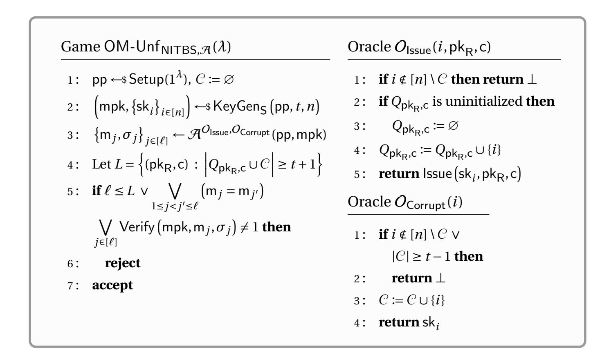
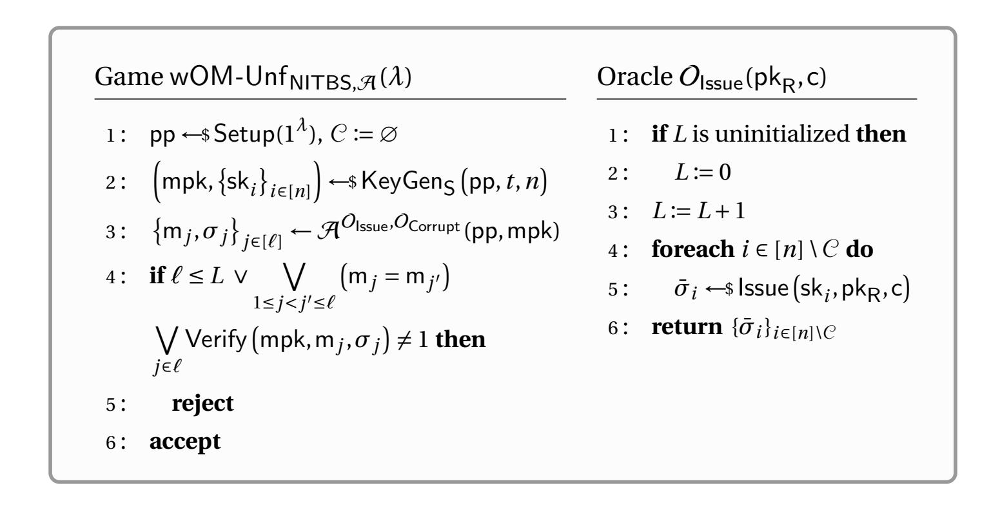
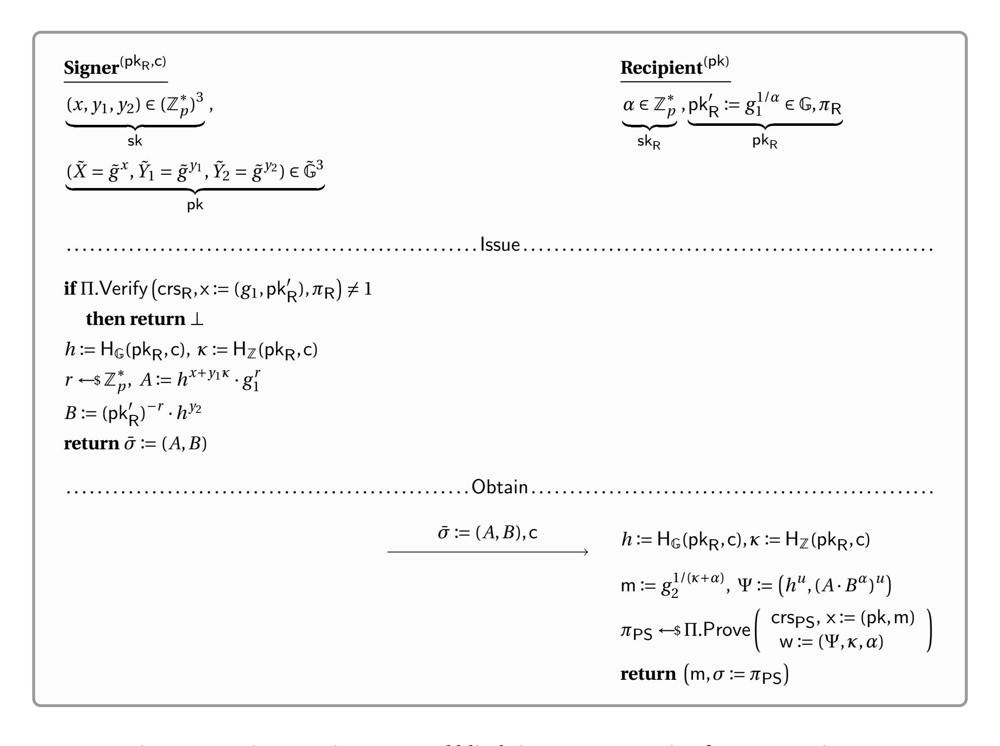

{0}------------------------------------------------

# Non-interactive Blind Signatures with Threshold Issuance

Foteini Baldimtsi George Mason University & Mysten Labs foteini@gmu.edu

Lucjan Hanzlik CISPA Helmholtz Center for Information Security

hanzlik@cispa.de

Aayush Yadav George Mason University ayadav5@gmu.edu

#### **Abstract**

Non-interactive blind signatures (NIBS) capture the minimal setting of blind signatures where the message space is restricted to unstructured random strings. They enable a signer to pre-compute presignatures without prior interaction, while ensuring that only the intended recipient can derive the corresponding blind signature.

In this work, we consider the problem of threshold issuance of NIBS. Specifically, we introduce the notion of non-interactive threshold blind signatures (NITBS), where a user obtains partial presignatures from a threshold of signers and locally combines them into a valid blind signature. We provide a formal treatment of this primitive by defining the corresponding security notions of blindness and one-more unforgeability. We then present the first concrete construction of NITBS, obtained by adapting the Pointcheval-Sanders (PS) signature scheme, and establish its security in the algebraic group model. Our micro-benchmarking results show that our construction attains the smallest presignature and signature sizes and the fastest issuance among all existing NIBS schemes.

{1}------------------------------------------------

# **Contents**

| 1 | Introduction                                                                             |          |  |  |  |  |  |  |  |
|---|------------------------------------------------------------------------------------------|----------|--|--|--|--|--|--|--|
|   | 1.1<br>Technical overview<br>                                                            | 4        |  |  |  |  |  |  |  |
|   | 1.2<br>Related work                                                                      | 8        |  |  |  |  |  |  |  |
| 2 | Preliminaries                                                                            |          |  |  |  |  |  |  |  |
|   | 2.1<br>Signature schemes<br>                                                             | 9        |  |  |  |  |  |  |  |
|   | 2.2<br>Non-interactive zero knowledege proof systems                                     | 10       |  |  |  |  |  |  |  |
|   | 2.3<br>Non-interactive blind signature schemes                                           | 11       |  |  |  |  |  |  |  |
|   | 2.4<br>Threshold secret sharing                                                          | 12       |  |  |  |  |  |  |  |
|   | 2.5<br>Bilinear groups<br>                                                               | 13       |  |  |  |  |  |  |  |
|   | 2.6<br>Hardness assumptions                                                              | 13       |  |  |  |  |  |  |  |
| 3 | Non-interactive Threshold Blind Signatures<br>15                                         |          |  |  |  |  |  |  |  |
| 4 | NIBS from PS Signatures                                                                  |          |  |  |  |  |  |  |  |
|   | 4.1<br>Security                                                                          | 20       |  |  |  |  |  |  |  |
|   | 4.2<br>The concrete NIZK proof system                                                    | 26       |  |  |  |  |  |  |  |
| 5 | NITBS from PS Signatures                                                                 | 29       |  |  |  |  |  |  |  |
|   |                                                                                          |          |  |  |  |  |  |  |  |
|   | 5.1<br>Security                                                                          | 31       |  |  |  |  |  |  |  |
|   | 5.2<br>Efficiency                                                                        | 34       |  |  |  |  |  |  |  |
|   |                                                                                          |          |  |  |  |  |  |  |  |
| 6 | Extensions                                                                               | 35       |  |  |  |  |  |  |  |
|   | 6.1<br>Tagged NI(T)BS                                                                    | 35       |  |  |  |  |  |  |  |
|   | 6.2<br>NITBS with verifiable presignatures<br><br>6.3<br>NI(T)BS with batch issuance<br> | 35<br>36 |  |  |  |  |  |  |  |

{2}------------------------------------------------

### <span id="page-2-0"></span>1 Introduction

Blind signatures are a core primitive in several privacy preserving applications. They were introduced by Chaum [Cha83] as a way to instantiate a private e-cash protocol and, since then, have found further applications in e-voting [CGT06], anonymous credentials [PZ13, BL13, FHS15, DGS<sup>+</sup>18, KRB<sup>+</sup>24], direct anonymous attestation [BCC04], and cryptocurrency mixers [HBG16, HAB<sup>+</sup>17]. The past few years have seen a resurgence of interest in blind signatures, fueled by active standardization initiatives [DIW24, PVW24, CDVW24] and broad industry deployment [App21, Goo24, MRFH24].

Typically, a blind signature is presented as a two-party protocol between a signer with secret signing key sk, and a recipient with a message m and the signer's public verification key pk. The recipient blinds m and sends the blinded value to the signer, who in turn returns a (pre)signature  $\bar{\sigma}$  on the blinded message. The recipient then "un-blinds"  $\bar{\sigma}$  to obtain (m, $\sigma$ ) verifiable under pk. In addition to the classical notion of unforgeability, a blind signature should also guarantee blindness which states that the resulting pair (m, $\sigma$ ) is *unlinkable* to the issuance transcript.

As defined above, blind signatures require at least one round (i.e., two moves) of interaction between the signer and the recipient [Cha83, PS96, PS00b]. Even so, interaction introduces latency and operational overhead in high-throughput systems. In large-scale settings where many credentials must be issued quickly and reliably, even a single interactive round can act as a scalability bottleneck.

More importantly, in the various privacy-sensitive applications where blind signatures are commonly used, such as digital cash, ticketing, and electronic voting, centralized issuance creates a single point of failure. If a signer is compromised, unauthorized signatures can be issued, breaking the integrity of the system. If it suffers outages or denial-of-service, issuance halts and recipients are blocked. These weaknesses stem directly from the concentration of risk on a single issuing authority.

**Non-interactive blind signatures (NIBS).** Recent works [Han23, BCGY24, HPZ25, BHNY25] have shown that interaction is not inherently necessary in order to issue blind signatures. In certain settings, where the message to be signed is random, meaning that it is not chosen by the recipient or drawn from a structured distribution, blind signature issuance can be made *non-interactive*. This condition arises naturally in applications where the signed message is essentially a context-specific random identifier (such as a nonce) rather than a recipient-selected string. Looking back at e-cash, for example, the signed message which serves as the coin identifier is simply a uniformly random string. Similarly, in vouchers or admission tickets, the message can be an unpredictable value generated to uniquely label a token that will later be presented for redemption.

A key practical advantage of NIBS is that an issuer can *asynchronously* create "presignatures" that can later be converted to full signatures by the corresponding recipient. Thus the signer can *pre-compute* presignatures offline, thereby decoupling expensive cryptographic operations from peak demand. This removes the need to process large volumes of concurrent online signing requests, substantially reducing latency and operational bottlenecks described above.

**Threshold blind signatures.** A prominent solution to address the risks introduced by single points of failure is to leverage *threshold* issuance, i.e., distributing the signer's operation across multiple parties. Recall that in a threshold blind signature scheme, the issuer's secret key is secret-shared among n parties (e.g., via distributed key-generation), and the recipient can interact with any t of them in order to eventually obtain a valid signature. Unlike standard threshold signatures, the signers must learn nothing about the message being signed, and the resulting signature must remain unlinkable to the issuance transcript. Despite their obvious appeal relatively few constructions are known [VZK03, KM15, CKM $^+$ 23]; this likely reflects the difficulty of simultaneously (i) binding partial signatures to a common signing instance, (ii)

{3}------------------------------------------------

providing robustness against misbehaving parties, and (iii) preserving message privacy and unlinkability in the presence of concurrent sessions.

**The open problem.** While NIBS address the overhead of interaction and threshold blind signatures address the risk of compromise, no existing work achieves both properties at once. A *non-interactive threshold blind signature* would allow any *t* issuers to contribute presignature shares that aggregate noninteractively into a full signature, while still preserving blindness and unforgeability. Designing such a primitive is non-trivial, yet highly desirable as it combines the efficiency of non-interactivity with the robustness and trust distribution of threshold cryptography. In this work, we show this is achievable by constructing the first threshold NIBS with non-interactive (presignature) aggregation.

**Our contributions.** We summarize our contributions as follows:

- We design a formal framework for Non-interactive Threshold Blind Signatures (NITBS) in Section [3.](#page-14-0) Our definitions delicately capture the combined guarantees of one-more unforgeability and blindness in the non-interactive and threshold setting. We also characterize two heirarchical levels of one-more unforgeability achievable in the NITBS setting.
- As an intermediate step to our threshold NIBS construction, in Section [4](#page-17-0) we design a practical NIBS construction from Pointcheval-Sanders (PS) signatures. This is an standalone contribution since, compared to prior NIBS proposals, our construction has important efficiency gains. In particular, our construction attains the *smallest-known presignature and signature size* and improves issuance efficiency, which is especially advantageous when presignatures are pre-computed or stored (such as in Privacy Pass).
- We present the first full NITBS scheme that supports non-interactive aggregation of presignatures in Section [5.](#page-28-0) We prove security in pairing-friendly groups: blindness reduces to the hardness of the *q*-DDHI problem, and one-more unforgeability reduces to a threshold-variant of the PS assumption that, we show, reduces to the hardness of the one-more co-Discrete Logarithm problem (in the algebraic group model). Our scheme tolerates adaptive corruptions of up to (*t* −1) issuers. We estimate that for the BLS12-381 curve, our scheme requires 0.6 ms issuance time, and less than 5 ms to obtain the final blind signature for thresholds of up to 5 (with growth roughly linear in *t*), and 4 ms for verification. On the same curve, the receiver's public key is around 112 bytes, the presignature size is 96 bytes and the final signature is around 192 bytes.
- Finally, in Section [6](#page-34-0) we present a series of extensions including (i) *tagged* NI(T)BS, which permits inclusion of non-blinded auxiliary data (analogously to partially blind signatures); (ii) NITBS with *verifiable presignatures*, which allows recipients to check the presignature shares before aggregation; and (iii) *batched* NI(T)BS, which enables a bounded number of final signatures to be derived from a single valid presignature.

# <span id="page-3-0"></span>**1.1 Technical overview**

Before jumping into the technical nuances of our approach, let us begin by recalling some necessary background details.

**Recalling non-interactive blind signatures.** In a non-interactive blind signature scheme, a signer with key-pair (pk,sk), issues a *presignature σ*¯ , under a recipient public key pk<sup>R</sup> and some public *context* c [1](#page-3-1) ,

<span id="page-3-1"></span><sup>1</sup>This can be thought of as a nonce computed using some known public information such as H(pkR∥timestamp).

{4}------------------------------------------------

given which the recipient can derive a message m, and a (blind) signature  $\sigma$  such that  $(m, \sigma)$  verifies under pk. Notably, the message m is an unstructured (pseudo)random value derived by the recipient as a combination of its secret key  $sk_R$  and the context c, over which it possesses the presignature.

In terms of security requirements, a NIBS scheme must be *unforgeable*, intuitively meaning that a recipient should not be able to derive a valid  $(m, \sigma)$  pair on its own; and it must be *blind*, meaning that a signer should not be able to link a  $(m, \sigma)$  pair to any specific issuance, and by extension to any specific recipient. Strictly speaking, these correspond to the notions of *one-more* unforgeability, and *recipient* and *context* blindness. We remark that while achieving concurrent security can be a challenge in multi-round blind signature protocols, thanks to their non-interactivity, NIBS are concurrently secure by default.

One-more unforgeability in the NIBS context is a natural extension of the same property for traditional blind signatures. As defined in [Han23], the adversary is granted access to a presignature oracle, and after obtaining  $\ell$  presignatures for (pk<sub>R</sub>,c) pairs of its choice, it must produce ( $\ell$  + 1) valid signatures to succeed.

Blindness is captured by two distinct security experiments [Han23, BCGY24]: (i) recipient blindness, ensuring that a malicious signer cannot determine which of two possible presignatures led to the final signature; and (ii) context blindness, which ensures that when a signer issues two presignatures to a specific recipient, they cannot link the final message-signature pairs to the respective presignatures. Both definitions are given as indistinguishability-based experiments.

Concretely, in the recipient blindness experiment, the adversary is given two recipient public keys  $(pk_{R_0}, pk_{R_1})$  along with an oracle for each public key, and outputs two presignatures  $(\bar{\sigma}_0, \bar{\sigma}_1)$  and contexts  $(c_0, c_1)$ , one for each key. The challenger then computes the final signature-message pairs  $(m_0, \sigma_0), (m_1, \sigma_1)$  using the presignatures. The scheme is satisfies recipient blindness if the attacker cannot link the final signature-message pairs, presented in random order, to the corresponding issuance. The experiment for context blindness is similar, but the adversary is given only a single recipient public key  $pk_R$  and correspondingly, an oracle for  $pk_R$ , and outputs two presignatures  $(\bar{\sigma}_0, \bar{\sigma}_1)$  and context  $(c_0, c_1)$ . The challenger then computes the final signature-message pairs  $(m_0, \sigma_0), (m_1, \sigma_1)$  from these presignatures. As before, the scheme is said to satisfy context blindness if the attacker cannot link the final signature-message pairs to their issuance.

A new framework for thresholdizing NIBS. Syntactically, NIBS can be extended to admit threshold signing in a natural way. Informally, a t-out-of-n non-interactive threshold blind signature scheme admits n signers, with distributed secret keys  $\mathsf{sk}_i$ , and a common public key  $\mathsf{mpk}$  such that, given  $\mathsf{partial}$  presignatures  $\bar{\sigma}_i$  from at least t signers, under a common public context  $\mathsf{c}$ , a recipient with public key  $\mathsf{pk}_\mathsf{R}$  can use the corresponding  $\mathsf{sk}_\mathsf{R}$  to derive a message  $\mathsf{m}$ , and a (blind) signature  $\sigma$  such that  $(\mathsf{m},\sigma)$  verifies under  $\mathsf{mpk}$ .

In order for an NITBS scheme to be non-trivial, we require that it must be *efficient* in the sense that the final message and signature sizes should be *independent* of n. Further, an NITBS scheme must also extend the NIBS properties of one-more unforgeability, and recipient and context blindness to the threshold setting. As a matter of fact, the blindness properties can be formalized almost identically to their NIBS counterparts since the point-of-view of the signer(s) is effectively the same in either case. However, this is not the case for unforgeability as the threshold and non-threshold views clearly differ from the recipient's point-of-view. For our NITBS unforgeability definition, we adapt the corresponding notions from the recent work of Lehmann et al. [LNÖ25] for interactive threshold blind signatures. In particular, after stripping away the session-related bookkeeping details required for the interactive setting, we are left with two notions of one-more unforgeability of NITBS against a malicious recipient who can adaptively corrupt up to (t-1) signers and learn their secret signing keys. The distinction lies in how presignature

{5}------------------------------------------------

queries to honest signers are handled:

- (i) In the first case, the adversary may query individual honest signers, obtaining a presignature share from the  $i^{\text{th}}$  signer in response to a query (i, pk<sub>R</sub>, c). This defines a stronger notion, as the adversary has more control over the query count  $\ell$ , which increments only when the number of presignature shares for a given (pk<sub>R</sub>, c) pair exceeds (t-1) (including via corruptions).
- (ii) In the second case, each presignature query ( $pk_R$ , c) yields presignature shares from *all* of them. This defines a weaker notion, as every query automatically provides enough presignature shares to derive the final signature (including those obtained via corruption), and the query count  $\ell$  increments with each such query.

These two notions correspond, roughly, to the OM-Unf-1 and OM-Unf-0 security notions of interactive threshold blind signatures.

**NIBS from PS Signatures.** We will now approach the problem of designing NITBS in a piece-wise manner. We begin by showing how to build a NIBS scheme from the signature scheme due to Pointcheval and Sanders [PS16], and then attempt to apply standard threshold secret sharing techniques over the signers' secrets to obtain NITBS<sup>2</sup>.

To recall the PS signature scheme, let  $g \in \mathbb{G}$  and  $\tilde{g} \in \tilde{\mathbb{G}}$  be the generators of two pairing-friendly groups, then in the PS signature scheme, the signature on a message vector  $(\mu_1, \dots, \mu_k) \in \mathbb{F}^k$  is given by  $\Psi := \left(\psi_1 = h, \psi_2 = h^{x + \sum_{i=1}^k y_i \mu_i}\right)$  where  $(x, y_1, y_2, \dots, y_n) \in \mathbb{F}^{k+1}$  is the secret signing key sk, and given the corresponding public verification key is  $\mathsf{pk} := \left(\tilde{X} = \tilde{g}^x, \tilde{Y}_1 = \tilde{g}^{y_1}, \tilde{Y}_2 = \tilde{g}^{y_2}, \dots, \tilde{Y}_k = \tilde{g}^{y_k}\right) \in \tilde{\mathbb{G}}^{k+1}$ , the signature can be verified by the pairing equation  $e(\psi_2, \tilde{g}) \stackrel{?}{=} e\left(\psi_1, \tilde{X} \cdot \prod_{i=1}^k \tilde{Y}_i^{\mu_i}\right)$ . The security of the PS signature scheme is based on the PS problem, which essentially requires that, given  $g, \tilde{g}, \tilde{g}^x, \tilde{g}^y$  and an oracle that, on input  $\mu \in \mathbb{F}$ , outputs  $(h, h^{x+y\mu})$  for h chosen uniformly over  $\mathbb{G}$ , it is hard to find  $(\mu^*, h^*, (h^*)^{x+y\mu^*})$  for any fresh  $\mu^* \in \mathbb{F}$  and any non-trivial  $h^*$ .

Now, in order to construct a NIBS scheme using this general template, the obvious approach would be to have the signer with key-pair  $pk := (\tilde{X}, \tilde{Y}_1, \tilde{Y}_2), sk := (x, y_1, y_2)$  sign  $(c, pk_R)$  and send it as the presignature  $\bar{\sigma}$ , and then have the recipient re-randomize  $\bar{\sigma}$ . However,  $pk_R$  will generally be a a group element, and therefore cannot be signed directly as a message. Fortunately, this is easily resolved. In particular, let  $sk_R := \alpha$ , and define  $pk_R := g^{\alpha}$ , then the signer can instead compute values  $h = g^r$  and  $H = \left(g^{x+y_1c} \cdot pk_R^{y_2}\right)^r$  for  $r \leftarrow \$$   $\mathbb{F}$ . Since  $H = (g^r)^{x+y_1c+y_2\alpha}$ , clearly  $\bar{\sigma} := (h, H)$  is a valid PS signature on  $(c, sk_R)$ . Of course, given  $\bar{\sigma}$ , the recipient can re-randomize it to obtain a fresh signature  $\Psi$  that is unlinkable to  $\bar{\sigma}$ , but it still cannot send the message in the clear. Instead, it must compute  $m := g^{1/(c+\alpha)}$  and then prove using a non-interactive zero-knowledge (NIZK) proof that it knows c and  $\alpha$  such that  $\Psi$  is a valid PS signature under pk over the message  $(c, \alpha)$  and  $m = g^{1/(c+\alpha)}$ . The resulting proof  $\pi$  (along with the re-randomized PS signature  $\Psi$ ) is then the final blind signature on message m. To maximize efficiency of our construction, we design a  $\Sigma$ -protocol based on the Schnorr identification scheme [Sch90].

Intuitively, blindness follows from the zero-knowledge of  $\pi$ , indistinguishability of  $\Psi$  from uniform (under the Strong Decisional Diffie-Hellman problem [PS00a]) and pseudorandomness of m (under the hardness of Decisional q-Diffie Hellman Inverse problem [DY05]). Similarly, unforgeability can be shown by reducing to the hardness of the PS problem modulo two small caveats. First, we actually cannot

<span id="page-5-0"></span><sup>&</sup>lt;sup>2</sup>We choose PS signatures specifically due to their efficiency and, more importantly, their amenability to this thresholdizing template. This choice, however, does not preclude other signature schemes such as BBS [BBS04] and BBS+ [CDL16, ASM06] which have similar profiles; we leave that as future research.

{6}------------------------------------------------

directly sign on c. Rather, at a very high level, we must replace it with a programmable value which will come from the PS challenger. Thus, the signer actually signs the message ( $\kappa := H(pk_R, c), sk_R$ ) where we model H as a random oracle whose outputs are tied to the PS oracle. Secondly, we actually require the NIZK proof to satisfy the stronger property of *online extractability* since a naive forking approach would incur soundness loss exponential in  $\ell$ , the number of presignature queries the adversary makes. To obtain online extractability without sacrificing the efficiency of the Schnorr protocol [Sch90], we work in the algebraic group model (AGM) [FKL18].

**Remark 1.1.** This scheme offers faster issuance, and smaller presignatures and final signatures than the previous state-of-the-art NIBS scheme due to Hanzlik [Han23]. Concretely, issuance requires 3 exponentiations in  $\mathbb{G}$ , 1 multiplication in  $\mathbb{G}$ , and 1 H computation into  $\mathbb{F}$ , compared to 5 exponentiations in  $\mathbb{G}$  and 2 multiplications in  $\mathbb{G}$  in [Han23]. The presignature size here is just 2 elements in  $\mathbb{G}$ , which is roughly half the presignature size in [Han23], where it additionally includes 1 element in  $\mathbb{G}$ . The same is true for the final signature.

**Constructing threshold NIBS from PS signatures.** Given the NIBS scheme from PS signatures, we will attempt to apply the standard thresholdizing trick for some threshold t by simply distributing t-out-of-n linear secret shares of  $sk := (x, y_1, y_1)$  among n signers<sup>3</sup>. Let  $[x]_i$  denote the i<sup>th</sup> share of x (similarly  $[y_1]_i$  and  $[y_2]_i$ ). Then, suppose that each signer, as before, issues  $\bar{\sigma}_i := \left(h_i = g^{r_i}, H_i = g^{[x]_i + [y_1]_i \kappa} \cdot \mathsf{pk}_{\mathsf{R}}^{[y_2]_i}\right)$  over some shared context  $\mathsf{c}^4$ . Could we then have the recipient simply prove that it obtained at least t valid presignature shares? Unfortunately, if we wish to keep the efficiency gained by using Schnorr proofs, this is not an option as this would result in a proof size that grows with t = O(n). So we must find a way for the recipient to locally 'aggregate' the  $\geq t$  presignature shares into a single valid PS signature.

The first hurdle in accomplishing this appears in the base  $h_i$  of the PS signature. In other words, since each signer signs over a distinct base  $h_i$ , there is no clear way to combine the  $H_i$ 's. To address this we will instead have all signers compute a common base h that depends exclusively on the  $\mathsf{pk}_\mathsf{R}$  and  $\mathsf{c}$  being signed. Simply put, the signers compute  $h \coloneqq \mathsf{H}_{\mathbb{G}}(\mathsf{pk}_\mathsf{R},\mathsf{c})$  (for clarity, we will now write  $\kappa \coloneqq \mathsf{H}_{\mathbb{Z}}(\mathsf{pk}_\mathsf{R},\mathsf{c})$ ) but note the second hurdle, that  $H_i$ 's can no longer be computed as before since the signer does not know  $h^\alpha$ . Instead, the  $i^{th}$  signer factors it into two parts as  $A_i \coloneqq h^{[x]_i + [y_1]_i \kappa} \cdot g$  and  $B_i \coloneqq (\mathsf{pk}_\mathsf{R})^{-1} \cdot h^{[y_2]_i}$  and sends the two values over as  $\bar{\sigma}_i$  to the recipient, who can compute the corresponding PS signature  $(h, A_i \cdot B_i^\alpha = h^{[x]_i + [y_1]_i \kappa + [y_2]_i \alpha})$  with base h. A minor subtlety here is that the recipients public key  $\mathsf{pk}_\mathsf{R}$  must now be  $g^{1/\alpha}$ , so that the PS signature is still over  $\alpha$ . Another technical hurdle that is not apparent from this sketch, but becomes apparent with when describing the proof is that the signers will need to introduce some additional randomness into their presignatures for the unforgeability of the scheme. That is, they must in fact compute  $A_i \coloneqq h^{[x]_i + [y_1]_i \kappa} \cdot g^{r_i}$  and  $B_i \coloneqq (\mathsf{pk}_\mathsf{R})^{-r_i} \cdot h^{[y_2]_i}$ .

One can now easily see that any recipient with at least t such PS signatures can use the share recomposition algorithm (in the exponent) of the linear threshold secret sharing scheme to obtain the final PS signature  $(h, h^{x+y_1\kappa+y_2\alpha})$ . The rest of the protocol proceeds as before, with the recipient proving knowledge of  $\kappa$  and  $\alpha$  such that the (re-randomized) PS signature  $\Psi$  is valid under pk over the message  $(\kappa, \alpha)$ 

<span id="page-6-0"></span><sup>&</sup>lt;sup>3</sup>We remark that we arrived at our NIBS construction by explicitly engineering the issuance computation so that it decomposes into additive shares that independent signers can produce non-interactively while still yielding a valid blind signature upon aggregation. This property is not present in prior NIBS schemes and the general secret-sharing recipe does not apply directly to existing designs [Han23, BCGY24, BGY25, HPZ25].

<span id="page-6-1"></span><sup>&</sup>lt;sup>4</sup>If the scheme allowed for arbitrary combination of presignature shares on different contexts, a recipient could mix-and-match presignatures. The simplest way to avoid this is to keep the context fixed for each signature. As an example: to choose a context, the signers could compute  $H(pk_R \| cur_epoch)$ , with the epoch duration itself being fixed over some reasonable interval so that all signers must issue their signatures within that epoch.

{7}------------------------------------------------

and  $m := g^{1/(\kappa + \alpha)}$ . This does not affect the issuance times or the presignature and final signatures compared to the above mentioned (non-threshold) NIBS construction. We also specify this in Table 1.

|                                    | # moves | Threshold | Recipient key             | Communication                                | Signature size                      |
|------------------------------------|---------|-----------|---------------------------|----------------------------------------------|-------------------------------------|
|                                    |         |           | $\mathbf{size}    pk_R  $ | $R \rightarrow S$ $S \rightarrow R$          | $ \sigma $                          |
| [VZK03] <sup>5</sup>               | 2       | ✓         | _                         | 1G+1F 1G                                     | 1G                                  |
| [CKM <sup>+</sup> 23] <sup>6</sup> | 5       | ✓         | _                         | $O(t\mathbb{F})$ $2\mathbb{G} + 4\mathbb{F}$ | 1G+2F                               |
| [Han23]                            | 1       | ×         | 1G                        | - 2G+1Ğ                                      | $2\mathbb{G} + 1\tilde{\mathbb{G}}$ |
| This work                          | 1       | ✓         | 1G+2F                     | - 2G                                         | 2G+3F                               |

<span id="page-7-1"></span>Table 1: Comparison of group-based non-interactive and/or threshold blind signature schemes.  $R \to S$  denotes the communication from the recipient to the signer (similarly  $S \to R$ ).  $\mathbb{G}$ ,  $\mathbb{G}$  denote the base groups,  $\mathbb{F}$  the finite field elements and t is the threshold. Note that for type-3 pairing groups, the size of  $\mathbb{G}$  in bits is at least 4 times bigger than the elements of  $\mathbb{F}$ .

**Security of NITBS from PS signatures.** Unforgeability of our scheme reduces to the security of the underlying (threshold variant of the) PS signature scheme; the reduction is straightforward because presignature generation is derived from the standard PS signing exponent with additional randomized masking that cancels at finalization. As indicated earlier, blindness can be proven almost identically to the non-threshold counterpart.

#### <span id="page-7-0"></span>1.2 Related work

Blind signature schemes have been realized under a variety of assumptions. Constructions exist in the plain model [GRS+11, GG14, Gha17], though most practical schemes rely on idealized models [PS96, PS00b, Abe01, Bol03, BL13, FHS15, HKL19, KLR21, KLX22, CAHL+22, TZ22, CATZ24]. Generic approaches include those of Juels et al. [JLO97] and Fischlin [Fis06]. The recent interest in post-quantum secure cryptography has also led to several lines of work in lattice-based blind signature constructions [LNP22, dPK22, AKSY22, BLNS23, JS25].

Given the nature of our protocol, we focus our related work discussion below on threshold and non-interactive blind signatures and summarize some comparisons in Table 1.

Threshold blind signatures. The literature on threshold blind signatures is relatively sparse. [VZK03] built on [Bol03] to construct a two-move BLS-style scheme. Kuchta and Manulis [KM15] proposed a two-move protocol from bilinear pairings, though their first message is large due to two required NIZK proofs. Crites et al. [CKM+23] introduced a five-move protocol in pairing-free groups, obtained by compiling the [TZ22] blind signature scheme and achieving efficient verification. In a recent work, Lehmann et al. [LNÖ25] provided the first systematic study of unforgeability notions for threshold blind signatures, showing separations between existing schemes and the strongest definitions, and extending the [VZK03, CKM+23] constructions to achieve stronger guarantees. Coconut [SAB+19] is a multi-round protocol for threshold anonymous credentials. Our work has some structural similarities with Coconut as both schemes use PS signatures [PS16] to build a credential scheme. However the main challenge in our design stems from the non-interactive nature of our issuance.

<span id="page-7-2"></span><sup>&</sup>lt;sup>5</sup>Satisfies the weakest notion of one-more unforgeability for threshold blind signatures (OM-Unf-0).

<span id="page-7-3"></span><sup>&</sup>lt;sup>6</sup>Pairing free.

{8}------------------------------------------------

**Non-interactivity.** Hanzlik [Han23] introduced non-interactive blind signatures, giving a practical construction from signatures on equivalence classes [HS14, FHS19], proven secure in the generic group model. Baldimtsi et al. [BCGY24] strengthened the definitional framework and proposed new constructions, including a generic approach based on NIZKs. Hanzlik et al. [HPZ25] later gave a generic garbled-circuit-based construction supporting presignature issuance on RSA keys. Most recently, Baldimtsi et al. [BGY25] instantiated the [BCGY24] paradigm to obtain an efficient, strongly secure lattice-based NIBS scheme, and further extended the framework to enable batch issuance from a single presignature.

## <span id="page-8-0"></span>2 Preliminaries

**Notation.** We use  $\lambda$  to denote the security parameter. We use  $\leftarrow$ \$ to denote the output of a randomized algorithm and  $\leftarrow$  to denote output of a deterministic algorithm. We denote the set of all positive integers up to n as  $[n] := \{1, ..., n\}$  and the set of all non-negative integers up to n as  $[0, n] := \{0\} \cup [n]$ . With slight abuse of notation, we also use  $[x]_i$  to denote the  $i^{\text{th}}$  secret share of x, although the distinction will always be clear from context.  $\mathbb{Z}$  is the ring of integers and  $\mathbb{F}$  is a field. For any prime p,  $\mathbb{Z}_p$  is the finite field of integers modulo p.

# <span id="page-8-1"></span>2.1 Signature schemes

A signature scheme over message space  $\mathcal{M}$  consists of a tuple of polynomial-time algorithms (KeyGen, Sign, Verify) defined as follows:

- Setup( $1^{\lambda}$ )  $\rightarrow$  (pk,sk). Given the security parameter  $\lambda \in NN$ , the probabilistic key generation algorithm outputs a public signature verification key pk  $\in \mathcal{PK}$  and a secret signing key sk  $\in \mathcal{SK}$ .
- Sign(sk, m)  $\rightarrow \sigma$ . Given the signing key sk  $\in SK$  and a message m  $\in M$ , the (possibly probabilistic) signature generation algorithm returns a signature  $\sigma \in \Sigma$ .
- Verify(pk, m,  $\sigma$ )  $\to$  1/0. Given the public key pk  $\in \mathcal{PK}$ , a message m  $\in \mathcal{M}$  and a signature  $\sigma$ , the deterministic signature verification algorithm outputs 1 (accept) or 0 (reject).

A signature scheme must satisfy the following properties:

i. **Correctness.** For every  $\lambda \in \mathbb{N}$  and  $m \in \mathcal{M}$ ,

$$\Pr\left[ \mathsf{Verify}(\mathsf{pk},\mathsf{m},\sigma) = 1 : \begin{array}{c} (\mathsf{pk},\mathsf{sk}) \leftarrow \mathsf{\$} \mathsf{KeyGen}(1^{\lambda}) \\ \sigma \leftarrow \mathsf{\$} \mathsf{Sign}(\mathsf{sk},\mathsf{m}) \end{array} \right].$$

ii. **Existential unforgeability under chosen messages.** For every PPT adversary  $\mathcal A$  there exists a negligible function  $\epsilon(\cdot)$  such that for all  $\lambda \in \mathbb N$ ,

$$\Pr\left[\mathsf{Verify}(\mathsf{pk},\mathsf{m}^*,\sigma^*) = 1 : \begin{array}{c} (\mathsf{pk},\mathsf{sk}) \leftarrow \mathsf{Setup}(1^{\lambda}) \\ (\mathsf{m}^*,\sigma^*) \leftarrow \mathcal{A}^{O_{\mathsf{Sign}}}(\mathsf{pk}) \end{array}\right]$$

where the signing oracle  $O_{Sign}$ , on query m, outputs Sign(sk, m). We say that  $\mathcal{A}$  is admissible if it never queries  $m^*$  to  $O_{Sign}$ .

{9}------------------------------------------------

### <span id="page-9-0"></span>2.2 Non-interactive zero knowledege proof systems

A non-interactive zero-knowledge (NIZK) proof system for relation  $\mathcal{R}$  is a tuple of polynomial-time algorithms (Setup, Prove, Verify) defined as follows:

- Setup( $1^{\lambda}$ )  $\rightarrow$  crs. The setup algorithm takes as input the security parameter  $\lambda \in \mathbb{N}$ , and outputs a common reference string crs.
- Prove(crs, x, w)  $\rightarrow \pi$ . The prover algorithm takes as input the crs, an instance  $x \in \mathcal{L}_{\mathcal{R}}$ , and a witness w. It outputs a proof  $\pi$ .
- Verify(crs, x,  $\pi$ )  $\rightarrow$  1/0. The verification algorithm takes as input the crs, an instance x, and a proof  $\pi$ . It outputs either 1 (accept) or 0 (reject).

A NIZK proof system must satisfy the following properties:

i. **Completeness.** For every  $\lambda \in \mathbb{N}$ , any instance and witness pair  $(x, w) \in \mathcal{R}$ ,

$$\Pr\left[ \mathsf{Verify}(\mathsf{crs},\mathsf{x},\pi) = 1 : \begin{array}{c} \mathsf{crs} \leftarrow \mathsf{\$} \, \mathsf{Setup}(1^{\lambda}) \\ \pi \leftarrow \mathsf{\$} \, \mathsf{Prove}(\mathsf{crs},\mathsf{x},\mathsf{w}) \end{array} \right] = 1.$$

ii. **Soundness.** For every stateful PPT adversary  $\mathcal{A}$ , there exists a negligible function  $\epsilon(\cdot)$  such that for all  $\lambda \in \mathbb{N}$ ,

$$\Pr\left[\begin{array}{c} \mathsf{Verify}(\mathsf{crs},\mathsf{x},\pi) = 1 \\ \not\exists \mathsf{w} \, : \, (\mathsf{x},\mathsf{w}) \in \mathcal{R} \end{array} \right] : \begin{array}{c} \mathsf{crs} \leftarrow \mathsf{\$} \, \mathsf{Setup}(1^{\lambda}) \\ (\mathsf{x},\pi) \leftarrow \mathcal{A}(\mathsf{crs}) \end{array} \right] \leq \varepsilon(\lambda) \; .$$

iii. **Zero-knowledge.** There exists a *stateful* PPT simulator S such that for every *stateful* PPT adversary  $\mathcal{A}$ , there exists a negligible function  $\varepsilon(\cdot)$  such that for all  $\lambda \in \mathbb{N}$ ,

$$\Pr\left[\begin{array}{c} b \leftarrow \$\{0,1\} \\ \operatorname{crs}_0 \leftarrow \$\operatorname{Setup}(1^{\lambda}), \operatorname{crs}_1 \leftarrow \mathcal{S}(1^{\lambda}) \\ \mathcal{R}(\pi_b) = b \land (\mathsf{x},\mathsf{w}) \in \mathcal{R} : \\ \pi_0 \leftarrow \$\operatorname{Prove}(\operatorname{crs}_0,\mathsf{x},\mathsf{w}) \\ \pi_1 \leftarrow \mathcal{S}(\operatorname{crs}_1,\mathsf{x}) \end{array}\right] \leq \frac{1}{2} + \epsilon(\lambda) .$$

**Argument of knowledge.** A NIZK proof system  $\Pi$  is an argument of knowledge (NIZKAoK) if it additionally satisfies the following property:

iv. **Knowledge soundness.** There exists a PPT extractor  $\mathcal{E}$  such that for every *stateful* PPT adversary  $\mathcal{A}$ , there exists a negligible function  $\varepsilon(\cdot)$  such that for all  $\lambda \in \mathbb{N}$ ,

$$\Pr\left[\begin{array}{cc} \mathsf{Verify}(\mathsf{crs},\mathsf{x},\pi) = 1 \\ \land (\mathsf{x},\mathsf{w}) \notin \mathcal{R} \end{array} \right. \begin{array}{c} \mathsf{crs} \leftarrow \mathsf{Setup}(1^\lambda) \\ \vdots \quad (\mathsf{x},\pi) \leftarrow \mathcal{R}(\mathsf{crs}) \\ \mathsf{w} \leftarrow \mathcal{E}(\mathsf{x},\pi) \end{array} \right] \leq \varepsilon(\lambda) \; .$$

**Online extraction.** A knowledge extractor  $\mathcal{E}$  is called 'online' (also, 'straight-line') if it does not rewind the adversary.

{10}------------------------------------------------

### <span id="page-10-0"></span>2.3 Non-interactive blind signature schemes

We use the context-as-input model for non-interactive blind signatures proposed in [Han23], with the corrected blindness definitions from [BCGY24]<sup>7</sup>. Formally, a non-interactive blind signature (NIBS) scheme consists of a tuple of polynomial-time algorithms (Setup, KeyGen<sub>S</sub>, KeyGen<sub>R</sub>, Issue, Obtain, Verify) defined as follows:

- Setup( $1^{\lambda}$ )  $\rightarrow$  pp. Given the security parameter  $\lambda \in \mathbb{N}$ , the probabilistic setup algorithm generates the collection of public parameters pp, which is an implicit input to the other algorithms.
- KeyGen<sub>S</sub>(pp)  $\rightarrow$  (pk,sk). Given the public parameters pp, the probabilistic (signer) key generation algorithm outputs a public key pk  $\in \mathcal{PK}$  and a secret key sk  $\in \mathcal{SK}$ .
- $KeyGen_R(pp) \rightarrow (pk_R, sk_R)$ . Given the public parameters pp, the probabilistic recipient key generation algorithm outputs a  $pk_R \in \mathcal{PK}_R$  and a secret key  $sk_R \in \mathcal{SK}_R$ .
- Issue(sk, pk<sub>R</sub>, c)  $\to \bar{\sigma}$ . Given a signing key share sk  $\in \mathcal{SK}$ , a recipient public key pk<sub>R</sub>  $\in \mathcal{PK}_R$  and context  $c \in \{0,1\}^{\lambda}$ , the probabilistic issuance algorithm outputs a presignature share  $\bar{\sigma} \in \Sigma$ .
- Obtain( $\operatorname{sk}_R,\operatorname{pk},\operatorname{c},\bar{\sigma}$ )  $\to$  ( $\operatorname{m},\sigma$ )/( $\bot$ , $\bot$ ). Given the recipient secret key  $\operatorname{sk}_R \in \mathcal{SK}_R$ , the public key  $\operatorname{pk} \in \mathcal{PK}$ , context  $\operatorname{c} \in \{0,1\}^{\lambda}$ , and a presignature  $\bar{\sigma} \in \overline{\Sigma}$ , the probabilistic obtain algorithm outputs a message and signature pair ( $\operatorname{m},\sigma$ )  $\in \mathcal{M} \times \Sigma$  or ( $\bot$ , $\bot$ ).
- Verify(pk, m,  $\sigma$ )  $\to$  1/0. Given the master public key mpk  $\in \mathcal{PK}$ , a message m  $\in \mathcal{M}$  and a signature  $\sigma \in \Sigma$ , the deterministic signature verification algorithm outputs 1 (accept) or 0 (reject).

Furthermore, a NIBS scheme NIBS must satisfy the following properties:

i. **Correctness.** For every  $\lambda$ ,  $c \in \mathbb{N}$ ,

$$\Pr\left[\begin{array}{c} \mathsf{pp} \leftarrow \mathsf{sSetup}(1^\lambda) \\ (\mathsf{pk},\mathsf{sk}) \leftarrow \mathsf{sKeyGen}_\mathsf{S}(\mathsf{pp}), \\ \mathsf{Verify}(\mathsf{pk},\mathsf{m},\sigma) = 1 : & (\mathsf{pk}_\mathsf{R},\mathsf{sk}_\mathsf{R}) \leftarrow \mathsf{sKeyGen}_\mathsf{R}(\mathsf{pp}) \\ \bar{\sigma} \leftarrow \mathsf{sIssue}(\mathsf{sk},\mathsf{pk}_\mathsf{R},\mathsf{c}) \\ (\mathsf{m},\sigma) \leftarrow \mathsf{sObtain}(\mathsf{sk}_\mathsf{R},\mathsf{pk},\mathsf{c},\bar{\sigma}) \end{array}\right] = 1 \ .$$

ii. **One-more unforgeability.** For every *stateful*, *admissible* PPT adversary  $\mathcal{A}$ , there exists a negligible function  $\epsilon(\cdot)$  such that for every  $\lambda \in \mathbb{N}$ ,

$$\Pr\left[\begin{array}{ll} \bigwedge_{i \in [\ell+1]} \mathsf{Verify}(\mathsf{pk}, \mathsf{m}_i, \sigma_i) = 1 \\ \bigwedge_{i \neq j \in [\ell+1]} \mathsf{m}_i \neq \mathsf{m}_j \end{array} \right. \quad \underset{\{(\mathsf{m}_i, \sigma_i)\}_{i=1}^{\ell+1}}{\mathsf{pp}} \leftarrow \$ \, \mathsf{Setup}(1^{\lambda}) \\ \left. (\mathsf{sk}, \mathsf{pk}) \leftarrow \$ \, \mathsf{KeyGen}_{\mathsf{S}}(\mathsf{pp}) \\ \left. \{(\mathsf{m}_i, \sigma_i)\}_{i=1}^{\ell+1} \leftarrow \mathcal{R}^{O_{\mathsf{Issue}}}(\mathsf{pp}, \mathsf{pk}) \right. \right] \leq \varepsilon(\lambda) ,$$

where oracle  $O_{lssue}$  takes as input a recipient's public key  $pk_R$  and context c, and outputs a presignature  $\bar{\sigma}$  by running  $lssue(sk, pk_R, c)$ , and  $\mathcal{A}$  is *admissible* iff  $\mathcal{A}$  makes at most  $\ell$  queries to  $O_{lssue}$ .

<span id="page-10-1"></span><sup>&</sup>lt;sup>7</sup>[BCGY24] showed that the context-as-input and context-as-output models are essentially equivalent.

{11}------------------------------------------------

iii. **Recipient blindness.** For every *stateful*, *admissible* PPT adversary  $\mathcal{A}$ , there exists a negligible function  $\epsilon(\cdot)$  such that for every  $\lambda \in \mathbb{N}$ ,

$$\Pr\left[\begin{array}{c} \mathcal{A}^{O_{\mathrm{Obtain}}^{\mathrm{R}}}(\mathsf{m}_{b},\sigma_{b},\mathsf{m}_{1-b},\sigma_{1-b}) = b : \\ \mathsf{pp} \leftarrow \mathsf{Setup}(1^{\lambda}), \ b \leftarrow \mathsf{\$}\{0,1\}, \\ \forall \omega \in \{0,1\} : (\mathsf{sk}_{\mathsf{R}_{\omega}},\mathsf{pk}_{\mathsf{R}_{\omega}}) \leftarrow \mathsf{\$} \, \mathsf{KeyGen}_{\mathsf{R}}(\mathsf{pp}) \\ (\mathsf{pk}, \{\mathsf{c}_{\omega},\bar{\sigma}_{\omega}\}_{\omega \in \{0,1\}}) \leftarrow \mathcal{A}^{O_{\mathrm{Obtain}}^{\mathrm{R}}}(\mathsf{pp},\mathsf{pk}_{\mathsf{R}_{0}},\mathsf{pk}_{\mathsf{R}_{1}}) \\ \forall \omega \in \{0,1\} : (\mathsf{m}_{\omega},\sigma_{\omega}) \leftarrow \mathsf{\$} \, \mathsf{Obtain}(\mathsf{sk}_{\mathsf{R}_{\omega}},\mathsf{pk},\mathsf{c}_{\omega},\bar{\sigma}_{\omega}) \end{array}\right] \leq \frac{1}{2} + \epsilon(\lambda) ,$$

where oracle  $O_{\mathrm{Obtain}}^{\mathrm{R}}$ , on query  $(\omega, \mathsf{pk}, \bar{\sigma}, \mathsf{c})$ , outputs  $\mathrm{Obtain}(\mathsf{sk}_{\mathsf{R}_{\omega}}, \mathsf{pk}, \mathsf{c}, \bar{\sigma})$ . We say that  $\mathcal{A}$  is admissible iff:

- a.  $\sigma_0, \sigma_1 \neq \perp$  (i.e., Obtain algorithm does not abort); and
- b.  $c_0 \neq c$  and  $c_1 \neq c$  for any context c queried to  $O_{Obtain}^R$ .
- iv. **Context blindness.** For every *stateful*, *admissible* PPT adversary  $\mathcal{A}$ , there exists a negligible function  $\epsilon(\cdot)$  such that for every  $\lambda \in \mathbb{N}$ ,

$$\Pr\left[\begin{array}{c} \mathcal{A}^{O_{\mathsf{Obtain}}^{\mathsf{C}}}(\mathsf{m}_b,\sigma_b,\mathsf{m}_{1-b},\sigma_{1-b}) = b : \\ \mathsf{pp} \leftarrow \mathsf{\$} \mathsf{Setup}(1^\lambda), \ b \leftarrow \mathsf{\$}\{0,1\} \\ (\mathsf{sk}_\mathsf{R},\mathsf{pk}_\mathsf{R}) \leftarrow \mathsf{\$} \mathsf{KeyGen}_\mathsf{R}(\mathsf{pp}) \\ (\mathsf{pk}, \{\mathsf{c}_\omega,\bar{\sigma}_\omega\}_{\omega \in \{0,1\}}) \leftarrow \mathcal{A}^{O_{\mathsf{Obtain}}^{\mathsf{C}}}(\mathsf{pp},\mathsf{pk}_\mathsf{R}) \\ \forall \omega \in \{0,1\} : (\mathsf{m}_\omega,\sigma_\omega) \leftarrow \mathsf{\$} \mathsf{Obtain}(\mathsf{sk}_{\mathsf{R}_\omega},\mathsf{pk},\mathsf{c}_\omega,\bar{\sigma}_\omega) \end{array}\right] \leq \frac{1}{2} + \epsilon(\lambda) \ ,$$

where oracle  $\mathcal{A}^{O^{\mathsf{C}}_{\mathsf{Obtain}}}$ , on query  $(\mathsf{pk}, \bar{\sigma}, \mathsf{c})$ , outputs  $\mathsf{Obtain}(\mathsf{sk}_{\mathsf{R}}, \mathsf{pk}, \mathsf{c}, \bar{\sigma})$ . We say that  $\mathcal{A}$  is admissible iff:

- a.  $\sigma_0, \sigma_1 \neq \perp$  (i.e., Obtain algorithm does not abort); and
- b.  $c_0 \neq c$  and  $c_1 \neq c$  for any context c queried to  $O_{Obtain}^{C}$ .

#### <span id="page-11-0"></span>2.4 Threshold secret sharing

A (t, n)-threshold secret sharing scheme over some field  $\mathcal{X}$  consists of a tuple of polynomial-time algorithms (Share, Combine) defined as follows:

- Share  $t_{i,n}(x) \to [x]_{i \in [n]}$ . Given an element  $x \in \mathcal{X}$ , the probabilistic secret share generation algorithm outputs a collection of n elements  $\{[x]_i \in \mathcal{X} : \forall i \in [n]\}$  denoted  $[x]_{i \in [n]}$ .
- Combine $_{t,n}(\mathcal{S},[x]_{i\in\mathcal{S}})\to x/\bot$ . Given a set  $\mathcal{S}\subset[n]$  of indices, and a collection of  $|\mathcal{S}|$  shares  $[x]_i\in\mathcal{X}: \forall i\in\mathcal{S}$ , the deterministic share recombination algorithm outputs x or  $\bot$ .

Furthermore, a (t, n)-threshold secret sharing scheme must satisfy the following properties:

(i) **Correctness.** For every  $1 \le t \le n \in \mathbb{N}$ , and any subset  $S \subset [n]$  such that |S| = t,

$$\Pr\left[\mathsf{Combine}_{t,n}(\mathcal{S},[x]_{i\in\mathcal{S}}) = x : [x]_{i\in[n]} \leftarrow \mathsf{Share}_{t,n}(x)\right] = 1$$
.

{12}------------------------------------------------

(ii) **Robustness.** For every  $t \le n \in \mathbb{N}$ , and any probabilistic adversary  $\mathcal{A}$ 

$$\Pr\left[\begin{array}{c} \mathsf{Combine}_{t,n}(\mathcal{S},[x]_{i\in\mathcal{S}}) = \bot \\ \land |\mathcal{S}| < t \end{array} : \begin{array}{c} [x]_{i\in[n]} \leftarrow \mathsf{Share}_{t,n}(x) \\ \mathcal{S} \leftarrow \mathcal{R}\left([x]_{i\in[n]}\right) \end{array}\right] = 1.$$

**Shamir's secret sharing.** Let p be a prime power with p > n and let  $\mathbb{Z}_p$  denote the finite field of order p. For integers  $1 \le t \le n$  and a secret  $s \in \mathbb{Z}_p$  the (t,n)-Shamir secret sharing scheme samples  $a_1,\ldots,a_{t-1} \leftarrow \mathbb{Z}_p$  uniformly and defines the random polynomial  $f(x) = s + \sum_{i=1}^{k-1} a_i x^i \in \mathbb{Z}_p[x]$  so that we can define the  $i^{\text{th}}$  share  $[s]_i \coloneqq f(i)$ . Importantly, any set of t shares determines t uniquely by polynomial interpolation, and in particular the the secret is recovered as the constant term t t t t t t t t t t

### <span id="page-12-0"></span>2.5 Bilinear groups

**Definition 2.1** (Pairing friendly groups). Let  $\mathbb{G}$  and  $\tilde{\mathbb{G}}$  be two groups of the same prime order p with the generators g and  $\tilde{g}$ , respectively. Also, let  $\mathbb{Z}_p$  be the field of order p. Then,  $\mathbb{G}$  and  $\tilde{\mathbb{G}}$  are *pairing friendly* if there exists an efficiently computable bilinear pairing,  $e: \mathbb{G} \times \tilde{\mathbb{G}} \to \hat{\mathbb{G}}$ , satisfying the following properties:

• Bilinearity:  $\forall h \in \mathbb{G}, \tilde{h} \in \tilde{\mathbb{G}}, x, y \in \mathbb{Z}_p$ ,

$$e(h^{x}, \tilde{h})^{y} = e(h, \tilde{h}^{y})^{x} = e(h, \tilde{h})^{xy}$$
.

• Non-degeneracy:  $e(g, \tilde{g}) \neq 1_{\hat{\mathbb{Q}}}$ .

Bilinear pairings can be of a few types depending on whether there is an efficiently computable homomorphism from  $\mathbb{G}$  to  $\widetilde{\mathbb{G}}$  in both directions (Type 1), only one direction (Type 2), or in neither direction (Type 3). Type 3 pairings are the most efficient setting for a relevant security parameter and they are commonly deployed.

#### <span id="page-12-1"></span>2.6 Hardness assumptions

**Definition 2.2** (Co-discrete Logarithm Problem). Let  $(\mathbb{G}, \tilde{\mathbb{G}})$  be pairing friendly groups of order p with a bilinear pairing  $e : \mathbb{G} \times \tilde{\mathbb{G}} \to \hat{\mathbb{G}}$ . For  $x \leftarrow \mathbb{Z}_p$  the co-discrete logarithm problem asks that given  $(p, g, \tilde{g}, X := g^x, \tilde{X} := \tilde{g}^x)$ , find and output x.

**Definition 2.3** (One-more Co-discrete Logarithm Problem). Let  $(\mathbb{G}, \tilde{\mathbb{G}})$  be pairing friendly groups of order p with a bilinear pairing  $e: \mathbb{G} \times \tilde{\mathbb{G}} \to \hat{\mathbb{G}}$ . For  $x \leftarrow \mathbb{Z}_p$  the one-more co-discrete logarithm problem asks that given  $(p, g, \tilde{g})$ , oracle O that outputs tuples  $(g^{t_i}, \tilde{g}^{t_i})$  and oracle  $O_{\text{dlog}}$  that on input  $Y \in \mathbb{G}$  (respectively  $\tilde{Y} \in \tilde{\mathbb{G}}$ ) outputs y such that  $Y = g^y$  (respectively  $\tilde{Y} = \tilde{g}^y$ ), find and output distinct  $t_1, \ldots, t_{\ell+1}$ , where for each  $i \in [\ell+1]$  there exists an output of oracle O such that  $(g^{t_i}, \tilde{g}^{t_i})$ , while making at most  $\ell$  queries to  $O_{\text{dlog}}$ .

**Definition 2.4** (Strong Decisional Diffie-Hellman Problem (sDDH)). Let  $\mathbb{G}$  be a group of order p. For  $x, y \leftarrow \mathbb{Z}_p$ , and  $g \in \mathbb{G}$ , the decisional Diffie-Hellman problem asks to distinguish, for a randomly chosen  $T \in \mathbb{G}$ , the distributions  $\mathcal{D}_0$  and  $\mathcal{D}_1$ , where:

$$\mathcal{D}_0 := \left(p, g, g^x, g^{1/x}, g^y, g^{xy}\right) \qquad \mathcal{D}_1 := \left(p, g, g^x, g^{1/x}, g^y, T\right).$$

{13}------------------------------------------------

**Definition 2.5** (Decisional q-Diffie-Hellman Inverse Problem (qDDHI)). Let  $\mathbb{G}$  be a group of order p. For  $x \leftarrow \mathbb{Z}_p$ , and  $g \in \mathbb{G}$ , the decisional q-Diffie-Hellman inverse problem asks to distinguish, for a randomly chosen  $T \in \mathbb{G}$ , the distributions  $\mathcal{D}_0$  and  $\mathcal{D}_1$ , where:

$$\mathcal{D}_0 := \left( p, g, g^x, g^{x^2}, \dots, g^{x^q}, g^{1/x} \right) \qquad \qquad \mathcal{D}_1 := \left( p, g, g^x, g^{x^2}, \dots, g^{x^q}, T \right).$$

<span id="page-13-0"></span>**Definition 2.6** (PS Problem [PS16, Assumption 2]). Let  $(\mathbb{G}, \tilde{\mathbb{G}})$  be pairing friendly groups of order p with a bilinear pairing  $e: \mathbb{G} \times \tilde{\mathbb{G}} \to \hat{\mathbb{G}}$ . For  $x, y \leftarrow \mathbb{Z}_p$  the PS problem asks that given  $(p, g, \tilde{g}, e, \tilde{X} := \tilde{g}^x, \tilde{Y} := \tilde{g}^y)$  and an oracle O that on input  $\mu \in \mathbb{Z}_p$  outputs  $(h, h^{x+y\mu})$ , find a  $(\mu^*, h^*, (h^*)^{x+y\mu^*})$  triple such that  $\mu^*$  is never queried to O and  $h^* \neq 1_{\mathbb{G}}$ .

Notably, the PS problem is reducible to the hardness of the co-discrete logarithm problem, as we explain next.

<span id="page-13-1"></span>**Lemma 2.7.** In the algebraic group model, the PS assumption holds under the co-discrete logarithm assumption.

*Sketch*. Complete proofs of the security of the PS assumption in the algebraic group model can be found in [KSAP23] and [BFL20]. Here, we sketch the proof idea. Because the adversary is algebraic, it must output a representation for the final forgery ( $\mu^*$ ,  $h^*$ ,  $H^*$ ). Thus, we can define  $a_x$ ,  $a_y$ ,  $a_R$ ,  $b_x$ ,  $b_y$ ,  $b_R$ , such that:

$$h^* = g^{a_x \cdot x + a_y \cdot y + a_R}$$
 and  $H^* = g^{b_x \cdot x + b_y \cdot y + b_R}$ ,

whereby the validity of the output we know that

$$(a_x \cdot x + a_y \cdot y + a_R) \cdot (x + \mu^* \cdot y) = b_x \cdot x + b_y \cdot y + b_R.$$

The proof then focuses on three distinct cases, where the reduction picks different targets for a codiscrete logarithm instance. It either tries to use the adversary to compute x, where  $\tilde{X}$  is set to the codiscrete logarithm instance. Alternatively, it targets y and appropriately sets  $\tilde{Y}$ . The last target, and a way for an adversary to break the PS assumption, is to compute the discrete logarithm of  $h_i$  to base g, where  $(h_i, h_i^{x+y\cdot\mu_i})$  is a response from oracle O. However, note that the reduction can use this to solve the co-discrete logarithm by setting  $h_i$ .

We also recount to the reader that in the algebraic group model, an adversary is restricted to performing group operations exclusively on the group elements it has been given.

**Definition 2.8** (Algebraic Group Model (AGM) [FKL18]). For every group element that an adversary outputs as the challenge or as part of a query, it must output its *representation* in terms of the group elements it has previously been provided by the challenger. For instance, when an adversary, having seen group elements  $R_0, R_1, \ldots, R_n$ , outputs a group element P, it must also output a vector  $(a_0, a_1, \ldots, a_n) \in \mathbb{Z}_p^n$  such that  $P = \prod_{i \in [0,n]} R_i^{a_i}$ .

Further, we call an adversary satisfying these conditions, an *algebraic* aversary.

{14}------------------------------------------------

# <span id="page-14-0"></span>**3 Non-interactive Threshold Blind Signatures**

In this section we formalize non-interactive threshold blind signatures (NITBS) and give the precise security notions tailored to the non-interactive setting. In interactive protocols "non-interactivity" is sometimes taken to mean a single round of communication (recipient → signers → recipient) [\[Pas11,](#page-43-9) [LNÖ25\]](#page-42-3). Here we mean *strict* non-interactivity, i.e., each signer produces a single presignature share that the recipient finalizes locally. This single-message structure simplifies the security model compared to recent interactive treatments (e.g. [\[LNÖ25\]](#page-42-3)).

Due to the inherent non-interactivity of our scheme, we are able to avoid all session bookkeeping – no rounds, no session identifiers and no session state. In particular, this lets us state a simple and intuitive one-more unforgeability notion wherein an efficient adversary can adaptively corrupt any subset of signers (learning their secret keys) and may request presignature shares from honest signers. As a result, we can model scenarios where an adversary, having at least *t* presignatures per (pk<sup>R</sup> ,c) pair by making presignature queries and by corrupting up to (*t*−1) signers, cannot come up with more than the expected number of forgeries. This notion corresponds closely to the one-more unforgeability notion OM-Unf-1 from [\[LNÖ25\]](#page-42-3).

We also describe a weaker one-more unforgeability notion. Informally, in this weak model each time the adversary makes a presignature query on some (pk<sup>R</sup> ,c) pair, the challenger returns the presignature shares of all non-corrupted signers (i.e., exactly what an honest recipient would obtain). We therefore treat such a query as if the adversary already possesses a usable presignature on (pk<sup>R</sup> ,c); consequently the adversary's count of legitimately obtained presignatures *ℓ* increases immediately, and the one-more condition requires that the adversary cannot output more than *ℓ* valid finalized signatures[8](#page-14-1) . The contrast with the previous stronger notion is important: in the strong model a presignature query does not automatically increase *ℓ* unless the adversary actually obtains enough signer shares (including shares obtained via corruption). The weak notion therefore corresponds roughly to the OM-Unf-0 variant of one-more unforgeability in [\[LNÖ25\]](#page-42-3), while the strong notion corresponds to their OM-Unf-1.

It is worth noting that these two definitions completely capture all possible issuing-oracle behaviors in our framework, since we do not need to model sessions or maintain state across protocol runs. Importantly, as our threshold blind signature construction is non-interactive, the four separate one-more unforgeability variants introduced in [\[LNÖ25\]](#page-42-3) for interactive threshold blind signatures are not required. For the corruption model we adopt the strongest (adaptive) notion; nonetheless, the definitions can be rephrased to accommodate an adversary that corrupts signers selectively. More details are given below.

**Definition 3.1.** A non-interactive threshold blind signature scheme over message space M is a tuple of polynomial time algorithms (Setup,KeyGen<sup>S</sup> ,KeyGenR,Issue,Obtain) defined as follows:

- Setup¡ 1 *λ* ¢ → pp. Given the security parameter *λ*, the probabilistic setup algorithm generates the collection of public parameters pp, which is an implicit input to the other algorithms.
- KeyGen<sup>S</sup> ¡ pp,*t*,*n* ¢ → ³ mpk, © sk*i* ª *i*∈[*n*] ´ . Given the public parameters pp, the minimum threshold weight *t* and the number of signers *n*, the probabilistic (signer) key generation algorithm outputs a master public key mpk ∈ PK and a set of secret signing key shares ¡ sk<sup>1</sup> ,...,sk*<sup>n</sup>* ¢ ∈ SK *<sup>n</sup>* . We assume without loss of generality that mpk implicitly contains *t* and *n*.

<span id="page-14-1"></span><sup>8</sup>The weaker notion could, for instance, be useful for blockchain applications where the signatures may be posted on-chain at once.

{15}------------------------------------------------

- KeyGen<sub>R</sub>(pp)  $\rightarrow$  (pk<sub>R</sub>, sk<sub>R</sub>). Given the public parameters pp, the probabilistic recipient key generation algorithm outputs a pk<sub>R</sub>  $\in \mathcal{PK}_R$  and a secret key sk<sub>R</sub>  $\in \mathcal{SK}_R$ .
- Issue (sk, pk<sub>R</sub>, c)  $\to \bar{\sigma}$ . Given a signing key share sk  $\in SK$ , a recipient public key pk<sub>R</sub>  $\in \mathcal{PK}_R$  and context  $c \in \{0,1\}^{\lambda}$ , the probabilistic issuance algorithm outputs a presignature share  $\bar{\sigma} \in \Sigma$ .
- Obtain  $(\mathsf{sk}_\mathsf{R}, \mathsf{mpk}, \mathcal{S}, \mathsf{c}, \{\bar{\sigma}_i\}_{i \in \mathcal{S}}) \to (\mathsf{m}, \sigma) / (\bot, \bot)$ . Given the recipient secret  $\mathsf{key}\,\mathsf{sk}_\mathsf{R} \in \mathcal{SK}_\mathsf{R}$ , the master public  $\mathsf{key}\,\mathsf{mpk} \in \mathcal{PK}$ , a set  $\mathcal{S} \subseteq [n]$  of indices, context  $\mathsf{c} \in \{0,1\}^\lambda$ , and a collection of presignature shares  $\bar{\sigma}_i \in \overline{\Sigma}$  for every  $i \in \mathcal{S}$ , the probabilistic obtain algorithm outputs a message and signature pair  $(\mathsf{m}, \sigma) \in \mathcal{M} \times \Sigma$  or  $(\bot, \bot)$ .
- Verify  $(mpk, m, \sigma) \to 1/0$ . Given the master public key  $mpk \in \mathcal{PK}$ , a message  $m \in \mathcal{M}$  and a signature  $\sigma \in \Sigma$ , the deterministic signature verification algorithm outputs 1 (accept) or 0 (reject).

It must further satisfy the following properties:

**Definition 3.2** (Correctness). For all  $\lambda$ , t,  $n \in \mathbb{N}$ , such that  $t \le n$ , all  $c \in \{0,1\}^{\lambda}$ , and all  $S \subseteq [n]$  satisfying  $|S| \ge t$ , a non-interactive threshold blind signature scheme NITBS satisfies *correctness* if

$$\Pr\left[\begin{array}{c} \mathsf{pp} \leftarrow \mathsf{sSetup}\left(1^{\lambda}\right) \\ \mathsf{(mpk, \{sk_i\}_{i \in [n]})} \leftarrow \mathsf{sKeyGen_S}\left(\mathsf{pp}, t, n\right) \\ \mathsf{Verify}(\mathsf{mpk, m}, \sigma) = 1: \\ \left(\begin{array}{c} (\mathsf{pk_R, sk_R}) \leftarrow \mathsf{sKeyGen_R}(\mathsf{pp}) \\ \forall i \in \mathcal{S}: \bar{\sigma}_i \leftarrow \mathsf{sIssue}\left(\mathsf{sk}_i, \mathsf{pk_R, c}\right) \\ (\mathsf{m}, \sigma) \leftarrow \mathsf{sObtain}\left(\mathsf{sk_R, mpk}, \mathcal{S}, \{c_i, \bar{\sigma}_i\}_{i \in \mathcal{S}}\right) \end{array}\right] = 1.$$

**Definition 3.3** (Efficiency). For all  $\lambda$ ,  $n \in \mathbb{N}$ , a non-interactive threshold blind signature scheme, NITBS, is *efficient* if  $|\mathsf{m}, \sigma| = O_{\lambda}(1)$ , i.e., the final message and signature sizes are independent of n.



<span id="page-15-0"></span>Figure 1: The one-more unforgeability experiment for NITBS.

{16}------------------------------------------------

**Definition 3.4** (One-more unforgeability). For all  $\lambda$ , n,  $t \in \mathbb{N}$  with  $t \leq n$ , let

$$Adv_{NITBS,\mathcal{A}}^{OM\text{-Unf}} = Pr \left[ OM\text{-Unf}_{NITBS,\mathcal{A}}(\lambda) = \mathbf{accept} \right]$$

be the advantage of an adversary  $\mathcal{A}$  in the experiment defined in Figure 1. We say a non-interactive threshold blind signature scheme, NITBS, is *one-more unforgeable* if for any PPT adversary  $\mathcal{A}$  this advantage is negligible.

```
Game C-Blind<sub>NITBS,\mathcal{A}(\lambda)</sub>
Game R-Blind<sub>NITBS,\mathcal{A}</sub>(\lambda)
  1: pp \leftarrow Setup(1^{\lambda}), b \leftarrow S(0,1)
                                                                                                                                                             1: pp \leftarrow$ Setup(1^{\lambda}), b \leftarrow$ {0, 1}
  2: foreach \omega \in \{0, 1\} do
                                                                                                                                                              2: (pk_R, sk_R) \leftarrow SeyGen_R(pp)
           \begin{split} & (\mathsf{pk}_{\mathsf{R}_{\omega}}, \mathsf{sk}_{\mathsf{R}_{\omega}}) \leftarrow \!\! \mathsf{KeyGen}_{\mathsf{R}}(\mathsf{pp}) \\ & \left( \mathsf{mpk}, \left\{ \begin{array}{c} \mathsf{c}_{\omega}, \\ \{\bar{\sigma}_{\omega,i}\}_{i \in \mathcal{S}_{\omega}} \end{array} \right\}_{\omega \in \{0,1\}} \right) \leftarrow \mathcal{A}^{O^{\mathsf{R}}_{\mathsf{Obtain}}} \left( \mathsf{pk}_{\mathsf{R}_{0}}, \mathsf{pk}_{\mathsf{R}_{1}} \right) \end{split}
  3:
                                                                                                                                                             3: \left\{ \mathsf{mpk}, \left\{ \begin{array}{l} \mathsf{c}_{\omega}, \\ \{\bar{\sigma}_{\omega,i}\}_{i \in \mathcal{S}_{\omega}} \end{array} \right\}_{\omega \in \{0,1\}} \right\} \leftarrow \mathcal{R}^{O^{\mathsf{C}}_{\mathsf{Obtain}}} \left( \mathsf{pk}_{\mathsf{R}} \right)
  4:
                                                                                                                                                               4: foreach \omega \in \{0,1\} do
                                                                                                                                                               5: if c_{\omega} \in Q then
  5: foreach \omega \in \{0,1\} do
                                                                                                                                                                                 reject
                 if c_{\omega} \in Q then
                                                                                                                                                               6:
  6:
              \begin{split} \textbf{reject} \\ (\mathsf{m}_{\omega}, \sigma_{\omega}) &\leftarrow \$ \, \mathsf{Obtain} \left( \begin{array}{c} \mathsf{sk}_{\mathsf{R}_{\omega}}, \mathsf{mpk}, \mathcal{S}_{\omega}, \\ \mathsf{c}_{\omega}, \{\bar{\sigma}_{\omega,i}\}_{i \in \mathcal{S}_{\omega}} \end{array} \right) \end{split}
                                                                                                                                                             7: (\mathsf{m}_{\omega}, \sigma_{\omega}) \leftarrow \mathsf{SObtain} \begin{pmatrix} \mathsf{sk}_{\mathsf{R}}, \mathsf{mpk}, \mathcal{S}_{\omega}, \\ \mathsf{c}_{\omega}, \{\bar{\sigma}_{\omega,i}\}_{i \in \mathcal{S}_{\omega}} \end{pmatrix}
  7:
  8:
                                                                                                                                                             8: if Verify(mpk, m_{\omega}, \sigma_{\omega}) \neq 1 then
            if Verify(mpk, m_{\omega}, \sigma_{\omega}) \neq 1 then
                                                                                                                                                              9:
                                                                                                                                                                                     reject
  9:
                                                                                                                                                            10: b^* \leftarrow \mathcal{A}(\mathsf{m}_b, \sigma_b, \mathsf{m}_{1-b}, \sigma_{1-b})
10:
                        reject
11: b^* \leftarrow \mathcal{A}(\mathsf{m}_b, \sigma_b, \mathsf{m}_{1-b}, \sigma_{1-b})
                                                                                                                                                            11: if b^* = b then
                                                                                                                                                                                accept
12: if b^* = b then
                                                                                                                                                             12:
                   accept
                                                                                                                                                             13: reject
13:
14: reject
                                                                                                                                                            \mathsf{Oracle}\, O^{\mathsf{C}}_{\mathsf{Obtain}} \big( \mathsf{mpk}, \mathcal{S}, \mathsf{c}, \{\bar{\sigma}_i\}_{i \in \mathcal{S}}) \big)
Oracle O_{\mathsf{Obtain}}^{\mathsf{R}}(\omega,\mathsf{mpk},\mathcal{S},\mathsf{c},\{\bar{\sigma}_i\}_{i\in\mathcal{S}})
                                                                                                                                                               1: if Q is uninitialized then
  1: if Q is uninitialized then
                                                                                                                                                                               Q := \emptyset
                                                                                                                                                               2:
           Q \coloneqq \varnothing
                                                                                                                                                               3: Q := Q \cup \{c\}
  2:
                                                                                                                                                               4: return Obtain (sk<sub>R</sub>, mpk, \mathcal{S}, c, \{\bar{\sigma}_i\}_{i \in \mathcal{S}})
  3: Q := Q \cup \{c\}
  4: return Obtain (sk_{R_{oi}}, mpk, \mathcal{S}, c, \{\bar{\sigma}_i\}_{i \in \mathcal{S}})
```

<span id="page-16-0"></span>Figure 2: The recipient (left) and context (right) blindness experiments for NITBS.

**Definition 3.5** (Blindness). For all  $\lambda$ , n,  $t \in \mathbb{N}$  with  $t \le n$ , let

$$Adv_{\mathsf{NITBS},\mathcal{A}}^{\mathsf{R-Blind}} = \Pr\left[\mathsf{R-Blind}_{\mathsf{NITBS},\mathcal{A}}(\lambda) = \mathbf{accept}\right]$$

be the advantage of a *stateful* adversary  $\mathcal{A}$  in the experiment defined in Figure 2 (left), and

$$\mathsf{Adv}^{\mathsf{C-Blind}}_{\mathsf{NITBS},\mathcal{A}} = \Pr\left[\mathsf{C-Blind}_{\mathsf{NITBS},\mathcal{A}}(\lambda) = \mathbf{accept}\right]$$

be its advantage in the experiment defined in Figure 2 (right). We say a non-interactive threshold blind signature scheme, NITBS, satisfies *blindness* if for any PPT adversary  $\mathcal{A}$  each of these advantages is at most  $1/2 + \varepsilon(\lambda)$ , for some negligible function  $\varepsilon(\cdot)$ .

For completeness, we also describe the weaker notion of one-more unforgeability, which roughly corresponds to the notion of OM-Unf-0 in threshold (interactive) blind-signatures.

{17}------------------------------------------------

**Definition 3.6** (Weak one-more unforgeability)**.** For all *λ*,*n*,*t* ∈ N with *t* ≤ *n*

$$\mathsf{Adv}^{\mathsf{wOM}\text{-}\mathsf{Unf}}_{\mathsf{NITBS},\mathcal{A}} = \Pr \left[ \mathsf{wOM}\text{-}\mathsf{Unf}_{\mathsf{NITBS},\mathcal{A}}(\lambda) = \mathbf{accept} \right]$$

denotes the advantage of an adversary A in the experiment defined in Figure [3.](#page-17-1) We say that a noninteractive threshold blind signature scheme, NITBS, is *weakly one-more unforgeable* if for any PPT adversary A this advantage is negligible.



<span id="page-17-1"></span>Figure 3: The weak one-more unforgeability experiment for NITBS.

# <span id="page-17-0"></span>**4 NIBS from PS Signatures**

In this section we describe our non-interactive (non-threshold) blind signature construction based on PS signatures. As discussed in the introduction this construction is of independent interest, but also a stepping stone towards building our threshold NIBS. We use PS signatures in a non-black-box way, and hence, the construction is described semi-generically. In particular, we make black-box use of a noninteractive proof system with efficient instantiations presented later in this section. Note that some of the described algorithms closely resemble those for the standard PS signature, i.e., the issuer's public key generation is simply the PS signature generation algorithm, however additional structure is introduced during the signature issuance stage. Nevertheless, the unforgeability of our non-interactive blind signature scheme is reducible to the security of the PS signature scheme. In fact, we actually show that even a weaker assumption is sufficient.

<span id="page-17-2"></span>**Construction 1.** Our construction requires hash functions H<sup>G</sup> : {0,1}*<sup>λ</sup>* → G and H<sup>Z</sup> : {0,1}*<sup>λ</sup>* → Z ∗ *p* . We will also make use of two non-interactive proof systems Π = (Π.Setup,Π.Prove,Π.Verify), for languages L<sup>R</sup> 

{18}------------------------------------------------

and  $\mathcal{L}_{PS}$  as described.

#### Language $\mathcal{L}_{R}$

**Instance:** Each instance x is interpreted as group elements  $(\phi_1, \phi_2) \in \mathbb{G}^2$ .

**Witness:** Witness w consists of scalar  $\alpha \in \mathbb{Z}_p^*$ . **Membership:** w is a valid witness for x if:

$$\phi_2^{\alpha} = \phi_1$$

#### Language $\mathcal{L}_{PS}$

**Instance:** Each instance x is interpreted as the issuer's public key  $pk = (\tilde{X}, \tilde{Y}_1, \tilde{Y}_2) \in \tilde{\mathbb{G}}^3$ , a group element  $m \in \tilde{\mathbb{G}}$  and a PS signature  $\Psi = (\psi_1, \psi_2) \in \mathbb{G}^2$ .

**Witness:** Witness w consists of scalars  $(\kappa, \alpha) \in (\mathbb{Z}_p^*)^2$ .

**Membership:** w is a valid witness for x if the following are satisfied:

$$e(\psi_1, \tilde{X}) \cdot e(\psi_1, \tilde{Y}_1)^{\kappa} \cdot e(\psi_1, \tilde{Y}_2)^{\alpha} = e(\psi_2, \tilde{g}) \quad \triangleright \quad \Phi \text{ is a valid PS signature for the message } (\kappa, \alpha)$$

$$\land \mathsf{m}^{\kappa + \alpha} = g_2 \quad \triangleright \quad \mathsf{m} \text{ is a valid NIBS message constructed from } (\kappa, \alpha)$$

The language will be evident from the statement used in  $\Pi$ . Prove and  $\Pi$ . Verify. Moreover, we will use different common reference strings  $crs_R$  and  $crs_{PS}$  to distinguish those two different proof systems.

**Setup.** The public parameters are given by the tuple  $pp = (e, p, \mathbb{G}, \mathbb{G}, g, g_1, g_2, g, g_1, g_2, crs_R, crs_{PS})$ , where  $e : \mathbb{G} \times \mathbb{G} \to \mathbb{G}$  is a bilinear pairing of type 3,  $g, g_1, g_2$  are generator of  $\mathbb{G}$  and  $\tilde{g}$  is a generator of  $\mathbb{G}$ , all of order p; and the setup algorithm generates the common reference strings  $crs_R$  and  $crs_{PS}$  for the proof systems for languages  $\mathcal{L}_R$  and  $\mathcal{L}_{PS}$ , respectively. It is worth noting that, depending on the instantiation of the proof systems, the setup algorithm can be transparent, i.e., no trusted party may be needed to run this setup algorithm.

**Key generation.** The signer's key generation algorithm samples a random  $(x, y_1, y_2) \leftarrow (\mathbb{Z}_p^*)^3$  and computes public key pk :=  $(Y_1 := g^{y_1}, Y_2 := g^{y_2}, \tilde{X} := \tilde{g}^x, \tilde{Y}_1 := \tilde{g}^{y_1}, \tilde{Y}_2 := \tilde{g}^{y_2})$ , while keeping sk :=  $(x, y_1, y_2)$  as the secret key. The recipient's key generation algorithm samples a random value sk<sub>R</sub>  $\leftarrow \mathbb{Z}_p^*$  as the secret signing key, and sets the public key pk<sub>R</sub> :=  $(g_1^{1/\text{sk}_R}, \pi_R)$ , where  $\pi_R$  is a proof of possession of the secret key.

KeyGen<sub>S</sub>(pp)KeyGen<sub>R</sub>(pp)1: 
$$(x, y_1, y_2) \leftarrow \$ (\mathbb{Z}_p^*)^3$$
1:  $\alpha \leftarrow \$\mathbb{Z}_p^*$ 2:  $\tilde{X} \coloneqq \tilde{g}^x$ ,  $\tilde{Y}_1 \coloneqq \tilde{g}^{y_1}$ ,  $\tilde{Y}_2 \coloneqq \tilde{g}^{y_2}$ 2:  $\pi_R \leftarrow \$\Pi$ . Prove  $\begin{pmatrix} \operatorname{crs}_R, x \coloneqq (g_1, g_1^{1/\alpha}) \\ w \coloneqq \alpha \end{pmatrix}$ 3: **return**  $\text{pk}_R \coloneqq (\tilde{X}, \tilde{Y}_1, \tilde{Y}_2), \\ \text{sk} \coloneqq (x, y_1, y_2)$ 3: **return**  $\text{pk}_R \coloneqq (g_1^{1/\alpha}, \pi_R), \\ \text{sk}_R \coloneqq \alpha$ 

**Presignature issuance and signature generation.** We detail the presignature issuance and signature generation protocols in Figure 4. To issue a presignature, the issuer first verifies the recipient's public key by verifying the proof  $\pi_R$  using  $\Pi$ . Verify  $(\operatorname{crs}_R, \mathsf{x} \coloneqq (g_1, \operatorname{pk}_R'), \pi_R)$ , where  $\operatorname{pk}_R = (\operatorname{pk}_R', \pi_R)$ . In case the proof is invalid, the issuer aborts the issuance. Otherwise, the issuer picks a random  $r \leftarrow \mathbb{Z}_p^*$  and computes the generator  $h \coloneqq H_{\mathbb{G}}(\operatorname{pk}_R, \mathsf{c})$  using the recipient's public key  $\operatorname{pk}_R$  and nonce  $\mathsf{c}$ . Finally, the presignature  $\bar{\sigma}$  consist of values (A, B), where  $A \coloneqq h^{x+y_1\kappa} \cdot g_1^r$  and  $B \coloneqq (\operatorname{pk}_R')^{-r} \cdot h^{y_2}$  for  $\kappa = H_{\mathbb{Z}}(\operatorname{pk}_R, \mathsf{c})$ .

{19}------------------------------------------------



<span id="page-19-1"></span>Figure 4: Presignature issuance and blind signature generation for construction 1.

To obtain a blind signature, the recipient recomputes the generator  $h := H_{\mathbb{G}}(\mathsf{pk}_{\mathsf{R}},\mathsf{c})$ . It then sets  $\Psi := (h^{\rho}, (A \cdot B^{\alpha})^{\rho})$ , where  $\mathsf{sk}_{\mathsf{R}} = \alpha$  and  $\rho \leftarrow \mathbb{Z}_p^*$ . It is worth reminding the reader that  $\Psi$  is a PS signature under the message vector  $(\kappa, \alpha)$ . In the final step, the recipient computes the message for the blind signature as  $\mathsf{m} = g_2^{1/(\alpha+\kappa)}$  and computes proof  $\pi_{\mathsf{PS}}$  for language  $\mathcal{L}_{\mathsf{PS}}$  with witness  $(\kappa, \alpha)$ , i.e., a proof that  $\Psi$  is a valid signature under  $(\kappa, \alpha)$  and that  $\mathsf{m} = g_2^{1/(\kappa+\alpha)}$ . We will discuss the algorithm for the validation of this blind signature next.

**Verification.** The verification algorithm consists of verifying the proofs  $\pi_{PS}$ .

Verify(pk, m, 
$$\sigma := \pi_{PS}$$
)

1: **return**  $\Pi$ . Verify(crs,  $\times := (pk, m), \pi_{PS}$ )

### <span id="page-19-0"></span>4.1 Security

In order to prove the security of our construction, we are required to show that it is one-more unforgeable, and recipient and context blind. For the former, we will make use of the following non-interactive variant of the original PS assumption (Definition 2.6). Notably, unlike the original assumption, our assumption variant is naturally *falsifiable*.

{20}------------------------------------------------

**Definition 4.1** (q-type PS Problem (qPS)). Let ( $\mathbb{G}, \tilde{\mathbb{G}}$ ) be pairing friendly groups of order p with a bilinear pairing  $e: \mathbb{G} \times \tilde{\mathbb{G}} \to \hat{\mathbb{G}}$ . For  $x, y, \mu_1, \dots \mu_q \leftarrow \mathbb{Z}_p$ , and  $h_1, \dots, h_q \leftarrow \mathbb{G}$ , the q-type PS problem asks that given  $\left(p, g, \tilde{g}, e, \tilde{X} \coloneqq \tilde{g}^x, \tilde{Y} \coloneqq \tilde{g}^y, \left\{\mu_i, h_i, h_i^{x+y\mu_i}\right\}_{i \in [q]}\right)$  find a  $(\mu, h, h^{x+y\mu})$  triple such that  $\mu \neq \mu_i$  for all  $i \in [q]$  and  $h \neq 1_{\mathbb{G}}$ .

<span id="page-20-0"></span>**Theorem 4.2** (One-more unforgeability). *Assuming the* qPS *problem is hard and*  $\Pi_R$  *and*  $\Pi_{PS}$  *online knowledge extractable, Construction* 1 *is one-more unforgeable (in the random oracle model).* 

*Proof.* We prove this theorem via a reduction to the hardness of the q-type PS assumption. Formally, suppose a PPT adversary  $\mathcal A$  has non negligible advantage against one-more unforgeability of the NIBS scheme; we will then build a reduction  $\mathcal B$  that will break the q-type PS assumption with non-negligible advantage as follows:

- Given  $\left(p,g,\tilde{g},e,\tilde{X}\coloneqq\tilde{g}^x,\tilde{Y}\coloneqq\tilde{g}^y,\left\{\mu_i,h_i,H_i\coloneqq h_i^{x+y\mu_i}\right\}_{i\in[q]}\right)$  from the qPS challenger  $\mathcal{C}$ , the reduction  $\mathcal{B}$  samples  $\beta_1,\beta_2,z \leftarrow \mathbb{Z}_p^*$  and sends  $\operatorname{pp}\coloneqq \left(p,g,\tilde{g},e,g_1\coloneqq g^{\beta_1},g_2\coloneqq g^{\beta_2},\operatorname{crs}_R,\operatorname{crs}_{\operatorname{PS}}\right)$  and  $\operatorname{pk}\coloneqq (\tilde{X},\tilde{Y}_1\coloneqq\tilde{Y},\tilde{Y}_2\coloneqq\tilde{Y}^z)$  to the adversary  $\mathcal{A}$ . Here  $\operatorname{crs}_R$  and  $\operatorname{crs}_{\operatorname{PS}}$  are the honestly generated reference strings for languages  $\mathcal{L}_R$  and  $\mathcal{L}_{\operatorname{PS}}$  respectively.  $\mathcal{B}$  internally initializes  $\mathcal{I},\mathcal{K},Q,\coloneqq \varnothing$ .
- For any  $O_{lssue}$  query of the form (pk<sub>R</sub>,c) by  $\mathcal{A}$ , the reduction  $\mathcal{B}$  responds as follows:
  - $\circ$  It checks if  $\ell$  has exceeded q. If so, the reduction aborts and continues otherwise.
  - It first checks if  $(pk_R, \alpha) \in \mathcal{K}$ . Otherwise, after parsing  $pk_R$  as  $(pk_R', \pi_R)$  it runs the extractor  $\mathcal{E}_R$  on  $(x := (g_1, pk_R'), \pi_R)$  to obtain the witness  $\alpha$  satisfying  $pk_R' = g_1^{1/\alpha}$ . If not already in the set, it also updates  $\mathcal{K} \leftarrow \mathcal{K} \cup \{(pk_R', \alpha)\}$ .
  - ∘ If for any  $j \in [q]$ ,  $(pk_R, c, j) \in Q$  it sets i = j; otherwise it sample  $i \leftarrow [q] \setminus \mathcal{G}$  and, in both cases, sets  $h := h_i$  and  $\kappa := \mu_i z\alpha$ . It also internally updates  $Q \leftarrow Q \cup \{(pk_R, c, i)\}$  and  $\mathcal{G} \leftarrow \mathcal{G} \cup \{i\}$ .
  - It then samples  $r \leftarrow \mathbb{Z}_p$  and sends  $\bar{\sigma} := (A := H_i^{1+\alpha r}, B := H_i^{-r})$  to  $\mathcal{A}$ .
- For any  $H_{\mathbb{G}}$  query of the form (pk<sub>R</sub>, c) from  $\mathcal{A}$ ,  $\mathcal{B}$  responds as follows:
  - It checks if  $[q] \setminus \mathcal{G} = \emptyset$ . If so, it outputs  $h_i := \leftarrow \$ g^{\gamma}$  for  $\gamma \leftarrow \$ \mathbb{Z}_p$  and stores  $(\mathsf{pk}_\mathsf{R}, \mathsf{c}, \gamma)$ . It continues otherwise.
  - If for any  $j \in [q]$ ,  $(pk_R, c, j) \in Q$ ; if so, it sets i = j. Otherwise it sample  $i \leftarrow [q] \setminus \mathcal{G}$  and sends  $h_i$  to  $\mathcal{A}$ . It also internally updates  $Q \leftarrow Q \cup \{(pk_R, c, i)\}$  and  $\mathcal{G} \leftarrow \mathcal{G} \cup \{i\}$ .
- For any  $H_{\mathbb{Z}}$  query of the form  $(pk_R, c)$  from  $\mathcal{A}$ ,  $\mathcal{B}$  responds as follows:
  - It checks if  $[q] \setminus \mathcal{I} = \emptyset$ . If so, it outputs  $\kappa_i := \leftarrow \$ g^{\gamma}$  for  $\gamma \leftarrow \$ \mathbb{Z}_p$  and stores  $(\mathsf{pk}_\mathsf{R}, \mathsf{c}, \gamma)$ . It continues otherwise.
  - It first checks if  $(pk_R, \alpha) \in \mathcal{K}$ . Otherwise, it parses  $pk_R$  as  $(pk_R', \pi_R)$  and then runs the extractor  $\mathcal{E}_R$  on  $(x := (g_1, pk_R'), \pi_R)$  to obtain the witness  $\alpha$  satisfying  $pk_R' = g_1^{1/\alpha}$ . If not already in the set, it also updates  $\mathcal{K} \leftarrow \mathcal{K} \cup \{(pk_R', \alpha)\}$ .
  - If for any  $j \in [q]$ ,  $(pk_R, c, j) \in Q$  it sets i = j; otherwise it sample  $i \leftarrow [q] \setminus \mathcal{G}$  and, in both cases, outputs  $\mu_i z\alpha$ . It also internally updates  $Q \leftarrow Q \cup \{(pk_R, c, i)\}$  and  $\mathcal{G} \leftarrow \mathcal{G} \cup \{i\}$ .
- Finally, after making  $\ell \leq q = \text{poly}(\lambda)$  queries, when  $\mathcal A$  outputs its (one-more) forgery  $\{\mathsf m_i, \sigma_i\}_{i \in [\ell+1]}$ ,  $\mathcal B$  does the following:

{21}------------------------------------------------

- For every  $i \in [\ell + 1]$ , it runs the extractor  $\mathcal{E}_{PS}$  on  $\left( \mathsf{x} \coloneqq (\tilde{X}, \tilde{Y}_1, \tilde{Y}_2, \mathsf{m}_i, \Psi_i), \pi_{PS}^{(i)} \right)$  to obtain the witness  $(\kappa_i, \alpha_i)$  satisfying  $\mathcal{L}_{PS}$ .
- o If not all  $(\kappa_i + z\alpha_i)$  are distinct, then  $\mathcal B$  aborts. Otherwise, since  $\mathcal A$  made exactly  $\ell$  queries to  $O_{\mathsf{Issue}}$ , it follows by a simple pigeonhole argument that there exists at least one  $i^* \in [\ell+1]$  such that the corresponding  $(\kappa_{i^*} + z\alpha_{i^*})$  does not equal any of the messages  $\mu_i$ 's with respect to any of the  $\ell$  issuances. If for every such  $i^*$ ,  $\mathcal B$  returned  $\kappa_{i^*}$  as the response to a  $\mathsf{H}_\mathbb Z$  query, it aborts. Otherwise, it picks any of the remaining (unqueried)  $i^*$ , and sends the corresponding  $(\mu^* \coloneqq \kappa_{i^*} + z\alpha_{i^*}, \Psi_{i^*})$  to C.

Since, by construction,  $\mu^*$  is not in the qPS challenge, and  $\Psi_{i^*}$  is a valid PS signature on it,  $\mathcal{B}$  wins with probability

$$\mathsf{Adv}^{\mathsf{qPS}}_{\mathcal{B}}(\lambda) \leq \mathsf{Adv}^{\mathsf{OM-Unf}}_{\mathcal{A}}(\lambda) + \mathsf{Adv}^{\mathsf{KSnd,R}}_{\mathcal{A}}(\lambda) + \mathsf{Adv}^{\mathsf{KSnd,PS}}_{\mathcal{A}}(\lambda) + \frac{q}{p} + \Pr[\mathsf{abort}] \;,$$

where q/p is the upper bound on the probability that the chosen  $\kappa_{i^*}$  corresponds to one of (q-|I|) qPS messages chosen uniformly from  $\mathbb{Z}_p$ . Also, by assumption,  $\operatorname{Adv}_{\mathcal{A}}^{\operatorname{KSnd,R}}(\lambda)$  and  $\operatorname{Adv}_{\mathcal{A}}^{\operatorname{KSnd,PS}}(\lambda)$  are negligible, so to complete the proof it only remains to be shown that the probability that  $\mathcal{B}$  aborts is also negligible. In particular, we analyze two abort conditions—

- (i) Not all  $(\kappa_i + z\alpha_i)$  are distinct: in other words, there exists some  $i, j \in [\ell + 1]$  such that  $\kappa_i + z\alpha_i = \kappa_j + z\alpha_j$ . However, since a valid one-more forgery requires that all messages defined as  $m_i := g_2^{1/(\kappa_i + \alpha_i)}$  be distinct, then we also have that  $\kappa_i + \alpha_i \neq \kappa_j + \alpha_j$ . Notice that since  $z \in \mathbb{Z}_p^*$ ,  $\kappa_i + z\alpha_i = \kappa_j + z\alpha_j$  implies that  $\kappa_i \neq \kappa_j \Leftrightarrow \alpha_i \neq \alpha_j$  and since  $\kappa_i + \alpha_i \neq \kappa_j + \alpha_j$ , we get that  $\kappa_i \neq \kappa_j$  and  $\alpha_i \neq \alpha_j$ . However, given such a pair  $(\kappa_i, \alpha_i)$  and  $(\kappa_j, \alpha_j)$ ,  $\mathcal{A}$  could easily compute  $z := \frac{\kappa_j \kappa_i}{\alpha_i \alpha_j}$  (mod p) which would break the discrete log base  $\tilde{Y}$ .
- (ii)  $\mathcal{B}$  returned  $\kappa_{i^*}$  as the response to a  $H_{\mathbb{Z}}$  query: recall that any such  $\kappa_{i^*}$  does not have a corresponding issuance by  $O_{lssue}$ . Then, we can bound the probability of this event as follows. Let  $q_H$  be the parameterized bound on the number of hash queries of any type that  $\mathcal{A}$  can make. Then,  $\mathcal{B}$  uniformly chooses one  $H_{\mathbb{Z}}$  query and instead of answering it using a qPS message when  $[q] \setminus \mathcal{I} \neq \emptyset$ , it sends a freshly sampled uniform value  $\rho \leftarrow \mathbb{Z}_p$ . Therefore, with probability, at most  $(\ell+1)/q_H$ ,  $\kappa_{i^*}$  is the uniform value,  $\rho$ , for which  $\mathcal{A}$  does not have a valid issuance but is able to produce a valid PS signature. Consequently, the probability of this event at most  $((\ell+1)/q) \cdot \operatorname{Adv}_{\mathcal{A}}^{qPS}(\lambda)$ .

Therefore,

$$\Pr[\mathsf{abort}] \leq \frac{\ell+1}{q_\mathsf{H}} \cdot \mathsf{Adv}_{\mathcal{A}}^{\mathsf{qPS}}(\lambda) + \mathsf{Adv}_{\mathcal{A}}^{\mathsf{DLOG}}(\lambda) .$$

<span id="page-21-0"></span><sup>&</sup>lt;sup>9</sup>A slightly tighter reduction is likely possible here: instead of extracting all  $(\ell+1)$  witnesses,  $\mathcal{B}$  computes all possible  $g_2^{1/(\kappa+\alpha)}$  values (note it extracts all  $\alpha$ ) and for every such valid  $(\kappa,\alpha)$  tuple appearing as a message  $m_i$  it checks whether there was a corresponding issuance. Notably, there must be at least one such tuple without an issuance. It runs  $\mathcal{E}_{PS}$  on the proof  $\pi_{PS}$  of any such forgery.

{22}------------------------------------------------

**Remark 4.3** (Honest key assumption.). To prove blindness we will require the honest key model [MOR01, Bol03]. This model requires the attacker to also provide the secret key sk corresponding to the public key pk in the blindness experiments. We remark that a NI(T)BS scheme that is secure in the honest key model can be upgraded into a fully secure scheme simply by having the signer provide a NIZK argument of knowledge of the secret key sk as part of pk. In the security proof, the reduction can then extract sk from the NIZKAoK and run the reduction for blindness in the honest key model.

<span id="page-22-0"></span>**Theorem 4.4** (Recipient blindness). *Assuming the* sDDH *and* qDDHI *problems are hard in*  $\mathbb{G}$  *and proof systems*  $\Pi_R$  *and*  $\Pi_{PS}$  *are zero-knowledge, Construction* 1 *is recipient blind (in the random oracle and honest key models).* 

*Proof.* We proceed through a series of hybrids, where we use  $Adv_{\mathcal{A}}^{j}$  to denote the advantage of a PPT adversary  $\mathcal{A}$  in hybrid  $\mathbf{H}_{j}$ .

- Hybrid  $\mathbf{H}_0$ : This is the original strong recipient blindness experiment defined with respect to Construction 1.
- Hybrid  $\mathbf{H}_1$ : This is the same as  $\mathbf{H}_0$  except, we simulate the proofs  $\pi_R^{(0)}$  and  $\pi_R^{(1)}$  given to the adversary as part of the recipients' public keys. Then assuming that the proof system for language  $\mathcal{L}_R$  satisfies zero-knowledge, we have

$$\left| \mathsf{Adv}_{\mathcal{A}}^{0} - \mathsf{Adv}_{\mathcal{A}}^{1} \right| \leq 2 \cdot \mathsf{Adv}_{\mathcal{B}}^{\mathsf{ZK}}(\lambda) .$$

Where the factor 2 follows from the use simple sub-hybrids where first apply the change to  $R_0$  and then to  $R_1$ . It follows that hybrids  $\mathbf{H}_0$  and  $\mathbf{H}_1$  are indistinguishable to the adversary.

• Hybrid  $\mathbf{H}_2$ : This is the same as  $\mathbf{H}_1$  except, on every Obtain query  $(b, \mathsf{pk}, \bar{\sigma}, \mathsf{c})$  it runs all the steps of Obtain( $\mathsf{sk}_{\mathsf{R}_b}$ ,  $\mathsf{pk}$ ,  $\mathsf{c}$ ,  $\bar{\sigma}$ ) but instead of computing the proof  $\pi_{\mathsf{PS}}$  honestly, it uses simulator  $\mathcal{S}(\mathsf{crs}_{\mathsf{PS}}, x)$  with  $\mathsf{x} = (\mathsf{pk}, \mathsf{m})$ .

Assuming the proof system for language  $\mathcal{L}_{PS}$  is zero-knowledge, it follows that hybrids  $\mathbf{H}_1$  and  $\mathbf{H}_2$  are indistinguishable to the adversary. Let  $q_O$  be an upper bound on the number of Obtain queries the adversary makes. Then we have

$$\left| \mathsf{Adv}_{\mathcal{A}}^2 - \mathsf{Adv}_{\mathcal{A}}^1 \right| \leq q_O \cdot \mathsf{Adv}_{\mathcal{B}}^{\mathsf{ZK}}(\lambda) .$$

The above claim follows by using simple sub-hybrids, where we replace the proof in each query separately.

• Hybrid  $\mathbf{H}_3$ : This is the same as  $\mathbf{H}_2$  except, we also simulate the two challenge proofs  $\pi_{\mathsf{PS}}^{(0)}$  and  $\pi_{\mathsf{PS}}^{(1)}$  given to the adversary. It follows that,

$$\left|\mathsf{Adv}_{\mathcal{A}}^3 - \mathsf{Adv}_{\mathcal{A}}^2\right| \le 2 \cdot \mathsf{Adv}_{\mathcal{B}}^{\mathsf{ZK}}(\lambda) \ .$$

{23}------------------------------------------------

• Hybrid  $\mathbf{H}_4$ : This is the same as  $\mathbf{H}_3$  except, we now make the PS signature independent of the message  $(\kappa, \alpha)$ . Specifically, we replace each  $\psi_2$  component of every signature with a uniform  $\phi \leftarrow \mathbb{G}$ . We argue that  $\mathbf{H}_4$  is indistinguishable from  $\mathbf{H}_3$  if the sDDH assumption holds in  $\mathbb{G}$ . More formally, we have that

$$\left| \mathsf{Adv}_{\mathcal{A}}^4 - \mathsf{Adv}_{\mathcal{A}}^3 \right| \le \mathsf{Adv}_{\mathcal{B}}^{\mathsf{sDDH}}(\lambda) + \Pr[\mathsf{abort}].$$

We further break this down into two sub-hybrids where we first apply the change to  $R_0$ 's signatures and then to  $R_1$ 's signatures. Then, in the first sub-hybrid, the reduction algorithm  $\mathcal B$  instantiates a sDDH challenger over  $\mathbb G$  and receives the corresponding challenge

$$\mathcal{D}_{\bar{b}}^{\mathsf{sDDH}} \coloneqq \left( p, g_1, g_1^{\alpha}, g_1^{1/\alpha}, g_1^{\beta}, T \right).$$

It samples a generator g with a known discrete  $\log \delta$  base  $g_1$ , and uses g and the group  $\mathbb G$  to instantiate the public parameters in the setup. It then sets the first element of  $\mathsf{pk}_{\mathsf{R}_0}$  to  $g_1^{1/\alpha}$  it received from the sDDH challenger and the rest of the values as it did in the previous hybrid.

Now, on the  $i^{\text{th}}$  H $_{\mathbb{G}}$  query with input  $(\mathsf{pk}_{\mathsf{R}_0},\mathsf{c}_i)$ ,  $\mathcal{B}$  first looks up whether the tuple has been queried before, and if so returns the corresponding entry; otherwise it programs the random oracle by sampling  $v_i \leftarrow \mathbb{Z}_p^*$  and returns  $h_i \coloneqq g_1^{v_i}$ . It also stores  $(\mathsf{pk}_{\mathsf{R}_0},\mathsf{c}_i,v_i)$ . For all other types of H $_{\mathbb{G}}$  queries, it answers them as before. It also answers any fresh H $_{\mathbb{Z}}$  queries by sampling a uniform  $\kappa_i \leftarrow \mathbb{Z}_p$  and storing the corresponding  $(\mathsf{pk}_{\mathsf{R}_0},\mathsf{c}_i,\kappa_i)$  to answer any repeated queries.

For the  $k^{\text{th}}$  admissible Obtain query of the form  $(0, \mathsf{pk}, c_k, \bar{\sigma}_k)$  it looks up  $(\mathsf{pk}_{\mathsf{R}_0}, \mathsf{c}_k, \cdot)$  in its  $\mathsf{H}_{\mathbb{G}}$  queries and if no such entry is found, it aborts. Similarly, if no corresponding entry is found in its  $\mathsf{H}_{\mathbb{Z}}$  queries it also aborts. Otherwise,  $\mathcal{B}$  uses the corresponding entries  $v_{(k)}$ ,  $\kappa_{(k)}$  along with knowledge of the adversary's secret key  $(x, y_1, y_2)$  to compute the PS signature as  $\left((g_1^{\beta})^{\delta v_{(k)}}, (g_1^{\beta})^{\delta v_{(k)} \cdot (x + y_1 \kappa_{(k)})}, T^{\delta v_{(k)} \cdot y_2}\right)$ . All other Obtain queries are answered as before.  $\mathcal{B}$  similarly computes the final challenge PS signature  $\Psi_0$ .

Observe that for any PS signature corresponding to  $\mathsf{pk}_{\mathsf{R}_0}$  we have that  $\psi_1 = (g_1^\beta)^{\delta v_{(k)}} = h_{(k)}^\beta$  and moreover, if  $T = g_1^{\alpha\beta}$  then  $\psi_2 = (g_1^\beta)^{\delta v_{(k)} \cdot (x+y_1 \kappa_{(k)})} \cdot T^{\delta v_{(k)} \cdot y_2} = h_{(k)}^{\beta \cdot (x+y_1 \kappa_{(k)})} \cdot (g_1^{\alpha\beta})^{\delta v_{(k)} \cdot y_2} = h_{(k)}^{\beta \cdot (x+y_1 \kappa_{(k)})} \cdot h_{(k)}^{\beta \alpha y_2} = h_{(k)}^{\beta \cdot (x+y_1 \kappa_{(k)} + y_2 \alpha)}$ . On the other hand, if T is a uniformly sampled element of  $\mathbb{G}$ , then  $\psi_2$  is indistinguishable from uniform. In other words, in case of hybrid  $\mathbf{H}_3$  we must have  $\mathcal{D}_{\bar{b}}^{\mathsf{sDDH}} = \mathcal{D}_0^{\mathsf{sDDH}}$ , and in hybrid  $\mathbf{H}_4$ ,  $\mathcal{D}_{\bar{b}}^{\mathsf{sDDH}} = \mathcal{D}_1^{\mathsf{sDDH}}$  as desired. The claim follows by repeating this reduction for  $\mathsf{R}_1$ .

• Hybrid  $\mathbf{H}_5$ : This is the same as  $\mathbf{H}_4$  except, with a minor change. Specifically, let  $(\mathsf{m}_b, \sigma_b)$  and  $(\mathsf{m}_{1-b}, \sigma_{1-b})$  be the message-signature pairs given to the adversary. Instead of computing messages  $\mathsf{m}_b$  according to the construction, it is chosen at random from  $\mathbb{G}$ , i.e.,  $\mathsf{m}_b \leftarrow \mathbb{G}$ . We argue that  $\mathbf{H}_5$  is indistinguishable from  $\mathbf{H}_4$  if the qDDHI assumption holds in  $\mathbb{G}$ . More formally, we have that

$$\left| \mathsf{Adv}_{\mathcal{A}}^5 - \mathsf{Adv}_{\mathcal{A}}^4 \right| \le 1/(q+1) \cdot \mathsf{Adv}_{\mathcal{B}}^{\mathsf{qDDHI}}(\lambda) + \Pr[\mathsf{abort}],$$

where the adversary is only allowed to make at most (q + 1) queries to the  $H_{\mathbb{Z}}$  oracle.

{24}------------------------------------------------

In particular, the reduction algorithm  $\mathcal B$  instantiates a qDDHI challenger over  $\mathbb G$  and receives the corresponding challenge

 $\mathcal{D}_{\bar{b}}^{\mathsf{qDDHI}} \coloneqq \left( p, g, g^{\alpha}, g^{\alpha^2}, \dots, g^{\alpha^q}, T \right).$ 

It uses g and the group  $\mathbb{G}$  to instantiate the public parameters in the setup. In practice,  $g_1$  and  $g_2$  will be generated using the random oracle via hashing to a group. So,  $\mathcal{B}$  can program the oracle to output predetermined by  $\mathcal{B}$  values for  $g_1$  and  $g_2$ . Specifically,  $\mathcal{B}$  randomly picks a value  $v \leftarrow \mathbb{Z}_p^*$  and sets  $g_1 = (g^{\alpha})^v$  and sets the first element of  $\mathsf{pk}_{\mathsf{R}_b}$  to  $g_1^{1/\alpha_b} = g^v$ . Thus,  $\mathsf{sk}_{\mathsf{R}_b} = \alpha_b = \alpha$ , but since  $\mathcal{B}$  received  $\alpha$  as part of the challenge, it does not know  $\mathsf{sk}_{\mathsf{R}_b}$ . However, since all the proofs are simulated, we only need to show how to generate messages for this recipient.

In the next step,  $\mathcal{B}$  picks uniformly random values  $\kappa'_1, \ldots, \kappa'_{q+1}$  from  $\mathbb{Z}_p^*$  and programs the oracle  $H_{\mathbb{Z}}$  on the i-th query output  $\kappa'_i$ . It then picks one of the  $\kappa_b$  at random and aborts if  $\kappa_b$  is not the output of query  $H_{\mathbb{Z}}(\mathsf{pk}_{\mathsf{R}_b}, \mathsf{c}_b)$ . Note that  $\mathcal{B}$  continues the simulation with probability 1/(q+1).

It then defines the polynomial  $f(X) \coloneqq \left(\prod_{i=1}^{q+1} (X + \kappa_i')\right) (X + \kappa_b)^{-1}$  and sets  $g_2 = g^{f(\alpha)}$ . Note that since f is of degree q,  $\mathcal{B}$  can use  $\mathcal{D}_{\bar{b}}^{\mathsf{qDDHI}}$  to compute  $g_2$ . It is easy to see now that  $\mathcal{B}$  can simulate all Obtain oracle queries of the adversary for the recipient with secret key  $\mathsf{sk}_{\mathsf{R}_b}$ . Given an adversary's Obtain query of the form  $(b, \mathsf{pk}, \bar{\sigma}, \mathsf{c})$ ,  $\mathcal{B}$  first looks up  $\kappa_j = \mathsf{H}_{\mathbb{Z}}(\mathsf{pk}_{\mathsf{R}_b}, \mathsf{c})$  and then defines the polynomial  $f_j(X) \coloneqq f(X)/(X + \kappa_j')$ . Note that because of the way we defined f, it is divisible by  $(X + \kappa_j')$ . Using the values from  $\mathcal{D}_{\bar{b}}^{\mathsf{qDDHI}}$ ,  $\mathcal{B}$  computes the output of the Obtain query  $(\mathsf{m}, \sigma)$  as  $\mathsf{m} \coloneqq g^{f_j(\alpha)}$ , while it also uses the simulator for the proof system to generate  $\sigma \coloneqq \pi_{\mathsf{PS}}$  (as per prior hybrids).

Finally,  $\mathcal{B}$  prepares  $(\mathsf{m}_b, \sigma_b)$ . For  $\sigma_b$  is uses the simulator, while  $\mathsf{m}_b$  is computed as follows. By definition  $\mathsf{m}_b$  should be  $g_2^{1/(\alpha+\kappa_b)}$ . However, since we set  $g_2=g^{f(\alpha)}$  and  $(X+\kappa_b)$  is not a factor of the polynomial f(X), we can rewrite message  $\mathsf{m}_b$  as  $g^{\prod_{i=-1}^{q-1} a_i \cdot \alpha^i}$  for coefficient  $a_i$  computable using the coefficient of the polynomial f and  $\kappa_b$ . What is more, because  $(X+\kappa_b)$  is not a factor we must have  $a_{-1} \neq 0$ . For each  $i \in [q]$ , let us denote by  $P_i = g^{\alpha^i}$  from  $\mathcal{D}_{\bar{b}}^{\mathsf{qDDHI}}$ .

Thus,  $\mathcal{B}$  computes  $\mathsf{m}_b = T^{a_{-1}} \cdot \prod_{i=0}^{q-1} (P_i)^{a_i}$ . It is easy to see that in case of hybrid  $\mathbf{H}_4$ ,  $\mathcal{D}_{\bar{b}}^{\mathsf{qDDHI}} = \mathcal{D}_0^{\mathsf{qDDHI}}$ , and in hybrid  $\mathbf{H}_5$ ,  $\mathcal{D}_{\bar{b}}^{\mathsf{qDDHI}} = \mathcal{D}_1^{\mathsf{qDDHI}}$  since T is random. So the claim follows.

• Hybrid  $\mathbf{H}_6$ : This is the same as  $\mathbf{H}_5$  except, but we apply the same changes now to  $(\mathsf{m}_{1-b},\sigma_{1-b})$ . We argue that  $\mathbf{H}_6$  is indistinguishable from  $\mathbf{H}_5$  if the qDDHI assumption holds in  $\mathbb{G}$ . More formally, we have

$$|\mathsf{Adv}_{\mathcal{A}}^6 - \mathsf{Adv}_{\mathcal{A}}^5| \le 1/(q+1) \cdot \mathsf{Adv}_{\mathcal{B}}^{\mathsf{qDDHI}}(\lambda) \Pr[\mathsf{abort}],$$

where the adversary is only allowed to make at most (q + 1) queries to the  $H_{\mathbb{Z}}$  oracle. This follows by using the same argument as above.

It is clear that the probability Pr[abort] in all of the above is 1/p as it corresponds to guessing the output of the random oracle. Lastly, we claim that  $Adv_{\mathcal{A}}^6 = 1/2$ . This follows directly from the way that the challenge message-signature pairs  $(\mathsf{m}_b, \sigma_b)$  and  $(\mathsf{m}_{1-b}, \sigma_{1-b})$  are generated in  $\mathbf{H}_6$ . Specifically, (i) each  $\pi_{\mathsf{PS}}^{(b)}$  is a simulated zero-knowledge proofs computed without using the witness; (ii) each PS signature  $\Psi_b$  is also independent of the message (which is the witness); and (iii) finally the NIBS messages are

{25}------------------------------------------------

random elements in  $\mathbb{G}$  and consequently independent of the witness elements. Therefore, the challenge message-signature pairs are completely independent of  $\mathsf{pk}_{\mathsf{R}_0}$  and  $\mathsf{pk}_{\mathsf{R}_1}$ , which completes the proof.

**Theorem 4.5** (Context blindness). Assuming the sDDH and qDDHI problems are hard in  $\mathbb{G}$  and proof systems  $\Pi_R$  and  $\Pi_{PS}$  are zero-knowledge, Construction 1 is context blind (in the random oracle and honest key models).

Sketch. We only sketch the proof of context blindness since it follows the same steps as the proof of recipient blindness. In the first step, we simulate all the proofs inside the public keys  $pk_R^{(b)}$ . Then, we simulate all the proofs created as part of the Obtain oracle using the zero-knowledge property as well as the proofs from the challenge signatures. In the next step, we replace the PS signatures with random group elements under the sDDH assumption. We then use the qDDHI assumption to show that an adversary cannot notice if we replace one of the two messages for the challenge message-signature pair with a random element from  $\mathbb{G}$ . Note that due to the qDDHI assumption, we can still create all the messages for the Obtain queries according to the protocol. Moreover, any adversary able to distinguish this change immediately leads to an adversary against the qDDHI assumption. The final step is to replace the second of the two messages with a random element from  $\mathbb{G}$ . With this change, the challenge to the adversary is composed of two random elements in  $\mathbb{G}$  and simulated proofs independent of the context. Thus, the chances of the adversary are equivalent to random guessing, i.e., 1/2.

### <span id="page-25-0"></span>4.2 The concrete NIZK proof system

We will now show how to efficiently instantiate the NIZK proof systems for languages  $\mathcal{L}_R$  and  $\mathcal{L}_{PS}$  and show that our instantiations satisfy the necessary properties.

**Proof for language**  $\mathcal{L}_R$ . Recipients can use a proof of knowledge of  $\alpha$ , where  $\mathsf{pk}_R' \coloneqq g_1^{1/\alpha}$ . This standard proof of discrete logarithm knowledge can be instantiated as follows. Compute  $T_R \coloneqq (\mathsf{pk}_R')^{\alpha'}$ , for some random  $\alpha' \hookleftarrow \mathbb{Z}_p^*$ , and challenge  $c_R \coloneqq \mathsf{H}(g_1, \mathsf{pk}_R', T_R)$ . Set proof  $\pi_R = (c_R, s_R)$ , where  $s_R \coloneqq \alpha' - c_R \cdot \alpha$  (mod p). To verify the proof, the verifier computes  $T_R' = g_1^{c_R} \cdot (\mathsf{pk}_R')^{s_R}$  and returns 1 iff  $\mathsf{H}(g_1, \mathsf{pk}_R', T_R') = c_R$ .

**Proof for language**  $\mathcal{L}_{PS}$ . The proof for language  $\mathcal{L}_{PS}$  is comprised of a proof of knowledge of  $(\kappa, \alpha)$  such that  $\Psi = (\psi_1, \psi_2)$  is a valid PS-signature on  $(\kappa, \alpha)$  and  $\mathsf{m} = g_2^{\kappa + \alpha}$ . In order to instantiate this proof, we first recall that the verification check for a PS-signature  $\Psi$  on  $(\kappa, \alpha)$  is

$$\underbrace{e(\psi_1, \tilde{Y}_1)}_{E_1}^{\kappa} \cdot \underbrace{e(\psi_1, \tilde{Y}_2)}_{E_2}^{\alpha} = \underbrace{e(\psi_1, \tilde{X}^{-1}) \cdot e(\psi_2, \tilde{g})}_{E_2}.$$

Now in order to compute this proof, the prover first samples  $(\kappa', \alpha') \leftarrow \$ (\mathbb{Z}_p^*)^2$ , and then computes commitments  $T_1 := E_1^{\kappa'} \cdot E_2^{\alpha'}$  and  $T_2 := \mathsf{m}^{\kappa' + \alpha'}$ . Next, it computes the challenge  $c_{\mathsf{PS}} = \mathsf{H}(g, g_2, \tilde{g}, \tilde{X}, \tilde{Y}_1, \tilde{Y}_2, \psi_1, \psi_2, E_1, E_2, E_3, T_1, T_2)$  and sends the proof  $\pi_{\mathsf{PS}} := (c_{\mathsf{PS}}, s_\kappa, s_\alpha)$  where  $s_\kappa := \kappa' - c_{\mathsf{PS}} \cdot \kappa \pmod{p}$  (similarly,  $s_\alpha$ ). To verify the proof, the verifier first computes  $E_1, E_2$  and  $E_3$  as defined, then sets  $T_1 := E_1^{s_\kappa} \cdot E_2^{s_\alpha} \cdot E_3^{-c_{\mathsf{PS}}}$  and  $T_2 := \mathsf{m}^{s_\kappa + s_\alpha} \cdot g_2^{-c_{\mathsf{PS}}}$  and finally outputs 1 iff  $\mathsf{H}(g, g_2, \tilde{g}, \tilde{X}, \tilde{Y}_1, \tilde{Y}_2, \psi_1, \psi_2, E_1, E_2, E_3, T_1, T_2) = c_{\mathsf{PS}}$ .

Summarizing all the above, the proof  $\pi_R$  consists of 2 elements  $(c_R, s_R)$  in  $\mathbb{Z}_p^*$ ; and the proof  $\pi_{PS}$  consists of the randomized PS signature  $(\psi_1, \psi_2)$  and the proof  $\pi_{PS} := (c_{PS}, s_K, s_\alpha)$ . Therefore,  $\pi_{PS}$  consists of 2 elements in  $\mathbb{G}$  and 3 elements in  $\mathbb{Z}_p^*$ .

{26}------------------------------------------------

We will now show that given any such NIZK proof and the corresponding instance, our reduction in the proof of Theorem 4.2 can indeed extract the witness in an *online* manner. Our proof relies on the algebraic group model (AGM).

**Lemma 4.6.** Proof system  $\Pi_R$  is online knowledge extractable in the algebraic group model.

*Proof.* We give an extractor  $\mathcal{E}_R$  that, given an instance  $(\phi_1,\phi_2) \in \mathbb{G}^2$  and a proof  $\pi_R$ , is able to extract  $\alpha \in \mathbb{Z}_p^*$  satisfying  $\phi_2 = \phi_1^\alpha$ . Observe that the adversary outputs  $\pi_R$  as part of its query to the  $O_{\text{Issue}}$  oracle, and that every such query has the form  $(\mathsf{pk}_R,\mathsf{c})$  where  $\mathsf{pk}_R = (\mathsf{pk}_R',\pi_R) \in \mathbb{G} \times \mathbb{Z}_p^* \times \mathbb{Z}_p^*$ . In particular, for the  $k^{\text{th}}$  such query, the algebraic adversary must also output a representation  $(a_0,a_1,a_2,\{a_{3,i}\}_{i\in[|Q|]},\{a_{4,j},a_{5,j}\}_{j\in[k-1]})$  such that

$$\mathsf{pk}'_{\mathsf{R}_k} = g^{a_0} \cdot g_1^{a_1} \cdot g_2^{a_2} \cdot \prod_{i \in [|O|]} h_i^{a_{3,i}} \cdot \prod_{j \in [k-1]} \left( A_j^{a_{4,j}} \cdot B_j^{a_{5,j}} \right) ,$$

where Q is the set of all query and response pairs to  $H_{\mathbb{G}}$ . Then, clearly for any such  $\mathsf{pk}'_{\mathsf{R}_k}$ , we have by soundness of the proof system that

$$g_1^{1/\alpha_k} = g^{a_0} \cdot g_1^{a_1} \cdot g_2^{a_2} \cdot \prod_{i \in [|Q|]} h_i^{a_{3,i}} \cdot \prod_{j \in [k-1]} \left( A_j^{a_{4,j}} \cdot B_j^{a_{5,j}} \right).$$

Expanding each  $A_j = h_j^{x+y_1\kappa_j}$  and  $B_j = \mathsf{pk}_{\mathsf{R}_j}' \cdot h_j^{y_2} = g_1^{1/\alpha_j} \cdot h_j^{y_2}$ , (for indeterminates  $x, y_1$  and  $y_2$ ), we can re-write the right-hand side so that

<span id="page-26-1"></span>
$$g_1^{1/\alpha_k} = g^{a_0} \cdot g_1^{a_1 + \sum_{j \in [k-1]} (a_{4,j}/\alpha_j)} \cdot g_2^{a_2} \cdot \prod_{i \in [|Q|]} h_i^{a_{3,i}} \cdot \prod_{j \in [k-1]} h_j^{a_{4,j}x + a_{4,j}y_1\kappa_j + a_{5,j}y_2}. \tag{1}$$

Now, let each  $h_i = g^{\gamma_i}$  for some indeterminate  $\gamma_i \in \mathbb{Z}_p$ . Then, passing to the discrete-log base g and re-arranging gives

$$\beta_1 \cdot \left( 1/\alpha_k - a_1 - \sum_{j \in [k-1]} (a_{4,j}/\alpha_j) \right) - \beta_2 \cdot a_2 - \sum_{i \in [|Q|]} \gamma_i \cdot a_{3,i} + \sum_{j \in [k-1]} \gamma_j \cdot (a_{4,j}x + a_{4,j}y_1\kappa_j + a_{5,j}y_2\alpha_j) = a_0 \pmod{p}.$$

For uniform choices of  $\beta_1$ ,  $\beta_2$  and all  $\gamma_i$ 's, except with probability at most 1/p, this equation holds only when

$$\forall i \in [|Q|], j \in [k-1] : a_2 = a_{3,i} = a_{4,j} = a_{5,j} = 0 \text{ and } 1/\alpha_k = a_1.$$

An additional caveat completes the argument. Specifically, the extractor may not control the actual values of the  $\gamma_i$  when the bases  $h_i$  are supplied by an external challenger. The argument above therefore only guarantees vanishing exponents against uniform  $\gamma_i$ . However, except with some negligible probability  $v(\lambda)$ , the  $h_i$ 's are computationally indistinguishable from uniform  $^{10}$ . Combining the above,  $\mathcal{E}_R$  fails to extract the witness for  $\pi_R$  with probability at most  $\frac{1}{n} + v(\lambda) + \mathsf{Adv}_{\mathcal{A}}^{\mathsf{Snd}}(\lambda)$ .

**Lemma 4.7.** Proof system  $\Pi_{PS}$  is online knowledge extractable in the algebraic group model.

<span id="page-26-0"></span><sup>&</sup>lt;sup>10</sup>A similar argument was made in [ABM15] to prove simulation extractability of Schnorr proof system for password-authenticated key exchange, where the crux of the argument fell on showing that the challenge bases were indistinguishable from uniformly random bases.

{27}------------------------------------------------

*Proof.* We give an extractor  $\mathcal{E}_{PS}$  that, given an instance  $(\mathsf{m}, \psi_1, \psi_2, \tilde{X}, \tilde{Y}_1, \tilde{Y}_2) \in \mathbb{G}^3 \times \tilde{\mathbb{G}}^3$  and a proof  $\pi_{PS}$ , is able to extract scalars  $(\kappa, \alpha) \in (\mathbb{Z}_p^*)^2$  satisfying  $e(\psi_1, \tilde{X}) \cdot e(\psi_1, \tilde{Y}_1)^{\kappa} \cdot e(\psi_1, \tilde{Y}_2)^{\alpha} = e(\psi_2, \tilde{g}_2)$  and  $\mathsf{m} = g_2^{1/(\kappa + \alpha)}$ .

Recall that the adversary outputs  $\pi_{PS}$  as part of its (one-more) forgery, and that every such forgery consists of group elements  $(m, \psi_1, \psi_2)$  along with their representations in their respective bases. We can rewrite this representation similarly to (1) as

$$\mathsf{m} = g^{a_0} \cdot g_1^{a_1 + \sum_{j \in [\ell]} (a_{4,j}/\alpha_j)} \cdot g_2^{a_2} \cdot \prod_{i \in [|Q|]} h_i^{a_{3,i}} \cdot \prod_{j \in [\ell]} h_j^{a_{4,j}x + a_{4,j}y_1\kappa_j + a_{5,j}y_2} ,$$

the honest relation for this commitment asserts that  $m = g_2^{1/(\kappa + \alpha)}$  for some witness pair  $(\kappa, \alpha)$ . We may thus equate the two group elements and rearrange to obtain

$$g^{a_0} \cdot g_1^{a_1 + \sum_{j \in [\ell]} (a_{4,j}/\alpha_j)} \cdot g_2^{a_2 - \frac{1}{\kappa + \alpha}} \cdot \prod_{i \in [|Q|]} h_i^{a_{3,i}} \cdot \prod_{j \in [\ell]} h_j^{a_{4,j}x + a_{4,j}y_1\kappa_j + a_{5,j}y_2} = 1.$$

We can show identically as for the case of  $\pi_R$  that with probability at most  $\frac{1}{p} + \nu(\lambda) + \mathsf{Adv}^{\mathsf{Snd}}_{\mathcal{A}}(\lambda)$ , the exponents other than  $a_2$  are all zero, which allows  $\mathcal{E}_{\mathsf{PS}}$  to obtain

<span id="page-27-1"></span>
$$\kappa + \alpha = a_2^{-1} \ . \tag{2}$$

Next, given the representation  $\psi_1 = g^{a_0} \cdot g_1^{a_1} \cdot g_2^{a_2} \cdot \prod_{i \in [|Q|]} h_i^{a_{3,i}} \cdot \prod_{j \in [\ell]} \left( A_j^{a_{4,j}} \cdot B_j^{a_{5,j}} \right)$ , we express it so that  $\psi_1 = \prod_i R_i^{a_i'}$ , where every  $R_i$  enumerates the individual  $\mathbb G$  bases appearing in the system (i.e.,  $R_0 = g, R_1 = g_1, \ldots$ ).

Observe that for any proof  $\pi_{PS}$ , there must exist  $E_1 \in \hat{\mathbb{G}}$  such that

$$E_1 = e(\psi_1, \tilde{X} \cdot \tilde{Y_1}^{\kappa} \cdot \tilde{Y_2}^{\alpha}) = e(\psi_1, \tilde{g})^{x + y_1 \kappa + y_2 \alpha} = e(\psi_1, \tilde{g})^{\tau},$$

where  $\tau := x + y_1 \kappa + y_2 \alpha$ . Moreover, with probability 1 - 1/p, the algebraic adversary must have queried the random oracle for  $E_1$  to generate the challenge  $c_{PS}$ . Thus, it must have also output a representation with respect to pairings over known group elements. Thus, we can write  $E_1 = \prod_{i,j} e(S_i, \tilde{S}_j)^{b_{i,j}}$ , where each  $S_i$  and  $\tilde{S}_j$  themselves have known representations in their respective group bases. By bilinearity and the AGM-expansions of the  $\mathbb G$  and  $\tilde{\mathbb G}$  bases, we may re-write  $E_1$ , by splitting and recombining the pairings so that each resulting individual pairing has a distinct  $R_i$  as the  $\mathbb G$  term. Let  $E_1 = \prod_{i,j} e(R_i, \tilde{R}_j)^{b'_{i,j}}$  be the resulting representation. Then we have that

$$\prod_{i,j} e(R_i, \tilde{R}_j)^{b'_{i,j}} = E_1 = e(\psi_1, \tilde{g})^{\tau} = e\left(\prod_i R_i^{a'_i}, \tilde{g}\right)^t = \prod_i e(R_i, \tilde{g})^{a'_i \tau}.$$

Rearranging,

<span id="page-27-0"></span>
$$\prod_{i,j} e(R_i, \tilde{R_j})^{c_{i,j}} = 1 \pmod{p}, \tag{3}$$

where  $c_{i,j} = b'_{i,j} - a'_i \tau \cdot \mathbf{1}_{\{j=k\}}$ . Now, let  $\hat{g} = e(g, \tilde{g})$ , then by bilinearity, we have for all i, j that

$$e(R_i, \tilde{R}_j) = e(g, \tilde{g}_0)^{\beta_i \gamma_j} = \hat{g}^{\beta_i \gamma_j}$$
,

for some indeterminate  $\beta_i, \gamma_j \in \mathbb{Z}_p$ . Passing Equation (3) to the discrete-log base  $\hat{g}$  under this substitution then gives

{28}------------------------------------------------

$$\sum_{i,j} \beta_i \gamma_j c_{i,j} = \sum_i \beta_i \left( \sum_j c_{i,j} \gamma_j \right) = 0.$$

Viewing the above as a bilinear polynomial in indeterminates  $(\beta_i)_i$  and  $(\gamma_j)_j$ , we observe that one of the following two cases must be true:

• If the coefficient  $c_{i,j}$  equals zero for all i, j, then necessarily  $b'_{i,j} = a'_i \tau$  when j = k and  $b'_{i,j} = 0$  for  $j \neq k$ , and extraction succeeds deterministically by picking any i with  $a'_i \neq 0$  and computing

<span id="page-28-1"></span>
$$\tau = b'_{i,k}/a'_i \,. \tag{4}$$

In this case, solving (2) and (4) gives us  $(\kappa, \alpha)$ .

• Otherwise we have a nonzero bilinear polynomial and by a simple application of the Schwartz–Zippel lemma, we get that the probability (over uniformly random choices of the indeterminates  $\beta_i$  and  $\gamma_j$ ) that this nonzero polynomial evaluates to zero is at most 2/p.

Therefore, in the latter failure case the equality  $E_1 = e(\psi_1, \tilde{g})^{\tau}$  can hold only with probability at most 2/p over the uniform choice of  $(\beta_i)_i$  and  $(\gamma_j)_j$ . Combining all of the above, we get that the probability that the extractor fails to extract is at most  $\frac{1}{p} + \frac{2}{p} + v(\lambda) + \text{Adv}_{\mathcal{A}}^{\text{Snd}}(\lambda)$ .

We also note that the zero-knowledge properties of  $\Pi_R$  and  $\Pi_{PS}$  follow directly from that of the Schnorr proof system.

# <span id="page-28-0"></span>5 NITBS from PS Signatures

This section introduces our main result, a non-interactive threshold blind signatures construction from PS signatures. Our starting point is the non-interactive blind signature scheme presented in Section 4. Recall that the presignature was (A, B) where  $A = h^{x+y_1\kappa} \cdot g_1^r$  and  $B = (\operatorname{pk}_R)^{-r} \cdot h^{y_2}$ , where  $x, y_1$  and  $y_2$  are the secret keys of the signer. To construct a threshold version, we first use the standard t out of n secret sharing of those keys  $([x]_i, [y_1]_i, [y_2]_i) \leftarrow \operatorname{Share}_{t,n}((x, y_1, y_2))$ . Equipped with one share of each key, a signer can create the presignature  $A_i = h^{[x]_i + [y_1]_i \kappa} \cdot g_1^r$  and  $B_i = (\operatorname{pk}_R)^{-r} \cdot h^{[y_2]_i}$ , and once combined to partial PS signatures  $h^{[x]_i + [y_1]_i \kappa + [y_2]_i \alpha}$  we can use standard Lagrange coefficients  $\Lambda_i$  to reconstruct  $h^{x+y_1\kappa+y_2\alpha}$ . The remaining steps are similar to the scheme in Section 4. We give the details below.

<span id="page-28-2"></span>**Construction 2.** Our construction requires hash functions  $H_{\mathbb{G}}: \{0,1\}^{\lambda} \to \mathbb{G}$  and  $H_{\mathbb{Z}}: \{0,1\}^{\lambda} \to \mathbb{Z}_p^*$ . We will also make use of three non-interactive proof systems  $\Pi = (\Pi.\mathsf{Setup}, \Pi.\mathsf{Prove}, \Pi.\mathsf{Verify})$ , for languages  $\mathcal{L}_{\mathsf{R}}$ ,  $\mathcal{L}_{\mathsf{PS}}$  as previously defined. Below, we describe only the main changes from the non-threshold construction (1).

**Key generation.** No change occurs in the recipient's key generation algorithm from Construction 1, and it is therefore omitted. The signer's key generation algorithm is also similar, except that except the secrets x,  $y_1$ ,  $y_2$  are t-out-of-n threshold secret shared among all n signers.

{29}------------------------------------------------

```
KeyGen<sub>S</sub>(pp, t, n)

1: (x, y_1, y_2) \leftarrow (\mathbb{Z}_p^*)^3

2: \tilde{X} := \tilde{g}^x, \tilde{Y}_1 := \tilde{g}^{y_1}, \tilde{Y}_2 := \tilde{g}^{y_2}

3: ([x]_i, [y_1]_i, [y_2]_i) \leftarrow \text{Share}_{t,n}((x, y_1, y_2))

4: return \text{mpk} := (\tilde{X}, \tilde{Y}_1, \tilde{Y}_2), \{\text{sk}_i := ([x]_i, [y_1]_i, [y_2]_i)\}_{i \in [n]}
```

```
\textbf{Signer}^{(pk_R,c)}
                                                                                                                                                                                                          \textbf{Recipient}^{(mpk)}
                                                                                                                                                                                                         \underbrace{\alpha \in \mathbb{Z}_p^*}_{\mathsf{sk}_{\mathsf{R}}}, \underbrace{\mathsf{pk}_{\mathsf{R}}' \coloneqq g_1^{1/\alpha} \in \mathbb{G}, \pi_{\mathsf{R}}}_{\mathsf{pk}_{\mathsf{D}}}
\underbrace{[x]_i, [y_1]_i, [y_2]_i \in (\mathbb{Z}_p^*)^3}_{\mathsf{sk}_i},
                                                                                                                                                             Issue......
if \Pi. Verify (\operatorname{crs}_R, x := (g_1, \operatorname{pk}'_R), \pi_R) \neq 1
        then return \perp
h := \mathsf{H}_{\mathbb{G}}(\mathsf{pk}_{\mathsf{R}},\mathsf{c}), \ \kappa := \mathsf{H}_{\mathbb{Z}}(\mathsf{pk}_{\mathsf{R}},\mathsf{c})
r \leftarrow \mathbb{Z}_p^*, A := h^{[x]_i + [y_1]_i \cdot \kappa} \cdot g_1^r
B \coloneqq (\mathsf{pk}'_{\mathsf{R}})^{-r} \cdot h^{[y_2]_i}
return \bar{\sigma} := (A, B)
                                                                                                                           ......Obtain.....
                                                                                                                      \underbrace{\mathcal{S}, \{\bar{\sigma}_i \coloneqq (A_i, B_i)\}_{i \in \mathcal{S}}, \mathsf{c}}_{u \leftarrow \$\mathbb{Z}_p^*, h \coloneqq \mathsf{H}_{\mathbb{G}}(\mathsf{pk}_\mathsf{R}, \mathsf{c}), \kappa \coloneqq \mathsf{H}_{\mathbb{Z}}(\mathsf{pk}_\mathsf{R}, \mathsf{c})
                                                                                                                                                                                                        \mathsf{m} \coloneqq \mathsf{g}_2^{1/(\kappa+\alpha)}, \ \Psi \coloneqq \left(h^u, \left(\prod_{i \in \mathcal{S}} (A_i \cdot B_i^\alpha)^{\Lambda_i}\right)^u\right)
                                                                                                                                                                                                          \pi_{PS} \leftarrow \Pi.Prove \begin{pmatrix} crs_{PS}, x := (pk, m) \\ w := (\Psi, \kappa, \alpha) \end{pmatrix}
                                                                                                                                                                                                          return (m, \sigma := \pi_{PS})
```

<span id="page-29-0"></span>Figure 5: Presignature issuance and blind signature generation for construction 2.

**Presignature issuance and signature generation.** The issuance algorithm is the same as in the case of the non-threshold construction, except that issuers are using their shares  $([x]_i, [y_1]_i, [y_2]_i)$  for signing. However, the obtain algorithm differs slightly. First, given a set of signatures  $(\bar{\sigma}_i = (A_i, B_i))_{i \in \mathcal{S}}$  for some subset  $\mathcal{S} \subseteq [n]$  of signers, the recipient recomputes the generator  $h \coloneqq \mathsf{H}_{\mathbb{G}}(\mathsf{pk}_{\mathsf{R}},\mathsf{c})$  and the partial message  $\kappa \coloneqq \mathsf{H}_{\mathbb{Z}}(\mathsf{pk}_{\mathsf{R}},\mathsf{c})$  as before. Next, using the Lagrange coefficients  $\Lambda_i$  for each issuer in  $\mathcal{S}$  (which it can pre-compute), it sets the PS signature  $\Psi$  as  $(h^\rho, \prod_{i \in \mathcal{S}} (A_i \cdot B_i^\alpha)^{\rho \Lambda_i})$  for  $\rho \leftarrow \mathbb{Z}_p$ . The rest of the protocol is identical with the final blind signature being the PS signature  $\Psi$  on  $(\kappa, \alpha)$  and the proof  $\pi_{\mathsf{PS}}$  for  $\mathcal{L}_{\mathsf{PS}}$ .

{30}------------------------------------------------

### <span id="page-30-0"></span>5.1 Security

Here, we prove the above construction's one-more unforgeability, recipient, and context blindness according to the framework in Section 3. In particular, we show the former property under the hardness of the (t, n)-threshold PS problem which, we in turn show, can be reduced to the one-more co-discrete logarithm assumption in the AGM. Recipient and context blindness, as we argue later, hold similarly to the non-threshold version under zero-knowledge of the proof systems and the hardness of the qDDHI problem.

<span id="page-30-1"></span>**Definition 5.1** ((t,n)-threshold PS Problem). Let  $(\mathbb{G},\tilde{\mathbb{G}})$  be pairing friendly groups of order p with a bilinear pairing  $e:\mathbb{G}\times\tilde{\mathbb{G}}\to\hat{\mathbb{G}}$ . For a uniformly random chosen polynomials  $f_x(X)$  and  $f_y(X)$  of degree t over  $\mathbb{Z}_p[X]$ , the (t,n)-threshold PS problem asks that given access to the oracles  $O_1,O_2,O_{\mathsf{Corrupt}}$  and  $(p,g,\tilde{g},e,\tilde{X}\coloneqq\tilde{g}^{f_x(0)},\tilde{Y}\coloneqq\tilde{g}^{f_y(0)},\{\tilde{X}_i\coloneqq\tilde{g}^{f_x(i)},\tilde{Y}_i\coloneqq\tilde{g}^{f_y(i)}\}_{i\in[n]}\}$ , find a  $(\mu^*,h^*,(h^*)^{f_x(0)+f_y(0)\mu^*})$  triple such that  $|\mathcal{C}|+|\mathcal{S}_{\mu^*}|\leq (t-1)$  and  $h\neq 1_{\mathbb{G}}$ . On input  $\mu\in\mathbb{Z}_p$  oracle  $O_1$  outputs  $h\in\mathbb{G}$ . On input of the same  $\mu\in\mathbb{Z}_p$  and  $i\in[n]\setminus\mathcal{C}$ , oracle  $O_2$  outputs  $h^{f_x(i)+f_y(i)\mu}$ . On any repeated queries, both oracles replay the same response as before and additionally, oracle  $O_2$  adds i to a set  $\mathcal{S}_\mu$ . Finally, the corruption oracle  $O_{\mathsf{Corrupt}}$  on input index  $i\in[n]$ , adds i to set  $\mathcal{C}$  and returns  $(f_x(i),f_y(i))$ .

**Lemma 5.2.** In the algebraic group model, the (t, n)-threshold PS assumption (Definition 5.1) holds under the one-more version of the co-discrete logarithm assumption.

*Proof.* The idea for the proof is straightforward, and in particular, the same steps as in the reduction for the standard PS assumption (Lemma 2.7) can also be used here for embedding the discrete logarithm problem into one of the bases  $h_i$ . The critical difference is in how the reduction handles the computation of the discrete logarithm if embedded into the public key part  $\tilde{X}$  and  $\tilde{Y}$ . In such a case, the one-more co-discrete logarithm is needed to allow adaptive corruptions.

The intuition here is that after (t-1) queries to the corruption oracle, which can be modeled using the oracle  $O_{\text{dlog}}$ , the problem "downgrades" to a single unknown value on the side of the reduction and any adversary against the above assumption will allow the reduction to obtain this value and consequently compute all the required discrete logarithms for the one-more co-discrete logarithm assumption. We will show these particular steps by constructing such a reduction  $\mathcal{B}$  for the case of embedding the secret into  $\tilde{Y}$ . The case for  $\tilde{X}$  is analogous.

In the first step, the reduction  $\mathcal{B}$  asks its challenger C in the one more co-discrete logarithm assumption for t tuples  $(T_i, \tilde{T}_i) = (g^{t_i}, \tilde{g}^{t_i})$  for  $i \in [0, t-1]$ . In the next step, it picks a random polynomial  $f_x(X)$  of degree (t-1) and prepares  $I = \left(p, g, \tilde{g}, e, \tilde{X} \coloneqq \tilde{g}^{f_x(0)}, \tilde{Y} \coloneqq \tilde{g}^{f_y(0)}, \{\tilde{X}_i \coloneqq \tilde{g}^{f_x(i)}, \tilde{Y}_i \coloneqq \tilde{g}^{f_y(i)}\}_{i \in [n]}\right)$ , where it sets  $\tilde{Y}_i = \tilde{T}_i$  for all  $i \in [t-1]$  and  $\tilde{Y} = \tilde{T}_0$ . Thus, by defining the polynomial  $f_y(X)$  using fixed points  $f_y(i) = t_i$  for  $i \in [0, t-1]$ , the reduction can interpolate in the exponent to compute the remaining points  $\tilde{Y}_t, \tilde{Y}_{t+1}, \ldots, \tilde{Y}_n$ . The reduction similarly computes  $Y_i = g^{f_y(i)}$  using the tuples provided by C (in the exponent) for all  $i \in [0, n]$ . It then sends I to the adversary  $\mathcal{A}$ .  $\mathcal{B}$  also internally initializes  $C, Q_1, Q_2 \coloneqq \emptyset$  and then does the following:

- For any  $O_{\mathsf{Corrupt}}$  query with index  $i \in [n]$  by  $\mathcal{A}$ , the reduction  $\mathcal{B}$  responds by using the discrete logarithm oracle provided by C, i.e., it submits  $\tilde{Y}_i$  to  $O_{\mathsf{dlog}}$ , receives  $t_i$ , and returns  $(f_x(i), t_i)$  to  $\mathcal{A}$ . It also internally updates  $\mathcal{C} \leftarrow \mathcal{C} \cup \{(i, t_i)\}$ .
- For any  $O_1$  query with message  $\mu \in \mathbb{Z}_p$ , the oracle first checks if there exists a tuple  $(\mu, r) \in Q_1$ . If it does, then it returns  $A_{\mu} = g^r$ . Otherwise, it picks a random  $r \leftarrow \mathbb{Z}_p^*$ , internally updates  $Q_1 \leftarrow Q_1 \cup \{(\mu, r)\}$  and returns  $g^r$ .

{31}------------------------------------------------

• For any  $O_2$  query with message  $(\mu, i) \in \mathbb{Z}_p$ , the oracle aborts if  $(i, \cdot) \in \mathbb{C}$ . Otherwise, it checks if a tuple  $(\mu, r) \in Q_1$  exists. If it does not exist, it picks a random  $r \leftarrow \mathbb{Z}_p$ , internally updates  $Q_1 \leftarrow$  $Q_1 \cup \{(\mu, r)\}$ . It then outputs  $(A_\mu, B_{\mu, i}) := (g^r, (X_i \cdot Y_i^\mu)^r)$ . It also internally updates  $Q_2 \leftarrow Q_2 \cup \{(\mu, i)\}$ .

Finally,  $\mathcal{A}$  outputs a tuple  $(\mu^*, h^*, H^*)$ , where it made  $q_1$  queries to  $Q_1$ ,  $q_{2,i}$  queries to  $Q_2$  with  $(\cdot, i)$  and  $q_{\mathsf{C}}$  queries to oracle  $O_{\mathsf{Corrupt}}$ . However, because  $\mathcal{F}$  is algebraic it provides values  $v_{\mathsf{R}}, w_{\mathsf{R}}, \{v_{\mu}, w_{\mu}\}_{(\mu, \cdot) \in Q_1}$ ,  $\{v_{\mu,i}, w_{\mu,i}\}_{(\mu,i)\in Q_2}$  such that:

$$h^* = g^{\nu_{\mathsf{R}}} \cdot \prod_{(\mu, \cdot) \in Q_1} (A_{\mu})^{\nu_{\mu}} \cdot \prod_{(\mu, i) \in Q_2} (B_{\mu, i})^{\nu_{\mu, i}}$$

$$H^* = g^{w_{\mathsf{R}}} \cdot \prod_{(\mu, \cdot) \in Q_1} (A_{\mu})^{w_{\mu}} \cdot \prod_{(\mu, i) \in Q_2} (B_{\mu, i})^{w_{\mu, i}}.$$

We can rearrange the above equations and represent them in terms of the polynomial  $f_y$  and values  $a_{\mathsf{R}}, b_{\mathsf{R}}, a_x, b_x, a_1, \dots, a_n, b_1, \dots, b_n$  (known to  $\mathcal{B}$ ) as:

<span id="page-31-1"></span><span id="page-31-0"></span>
$$h^* = g^{a_{\mathsf{R}}} \cdot X^{a_{\mathsf{x}}} \cdot \prod_{i \in [0,n]} g^{f_{\mathsf{y}}(i) \cdot a_i} \tag{5}$$

$$h^* = g^{a_{R}} \cdot X^{a_{x}} \cdot \prod_{i \in [0,n]} g^{f_{y}(i) \cdot a_{i}}$$

$$H^* = g^{b_{R}} \cdot X^{b_{x}} \cdot \prod_{i \in [0,n]} g^{f_{y}(i) \cdot b_{i}} .$$
(6)

Note that because polynomial  $f_x(X)$  is chosen by  $\mathcal{B}$ , we can represent all  $X_i$  in terms of X to some power  $a_x$ . This already looks like the starting point of the equation in the proofs in the algebraic group model for the standard PS assumption. The main difference is that instead of having a single unknown value y, the equations are defined with respect to a polynomial  $f_{\gamma}(X)$ . Without loss of generality, we assume that  $\mathcal{A}$  made all (t-1) allowable queries to  $O_{\mathsf{Corrupt}}$  (otherwise,  $\mathcal{A}$  can make those queries instead). Thus, the reduction knows (t-1) distinct points on  $f_y(X)$ . Let us use  $(t_1, f_y(t_1)), \dots, (t_{t-1}, f_y(t_{t-1}))$ to denote them. Note that  $\mathcal{B}$  is missing one point to interpolate  $f_y$  and solve all the discrete logarithms  $(T_0, \tilde{T}_0), \ldots, (T_{t-1}, \tilde{T}_{t-1})$ . However, since the known points are distinct, they interpolate a unique polynomial  $q_{\nu}(X)$  of degree (t-2) for which we can represent the polynomial  $f_{\nu}(X)$  as

$$f_{\mathcal{Y}}(X) \coloneqq q_{\mathcal{Y}}(X) + \xi \cdot u_{\mathcal{Y}}(X)$$
,

where  $u_y(X) := \prod_{i=1}^{t-1} (X - t_i)$  and  $\xi$  is a scalar that is the remaining degree of freedom and unknown to  $\mathcal{B}$ . Note that it knows  $q_y(X)$  and  $u_y(X)$ . Hence, we can substitute into equations (5) and (6), and re-write as

$$h^* = g^{a'_{R} + a_x \cdot f_x(0) + \xi \cdot a'_y}$$
$$H^* = g^{b_{R} + b_x \cdot f_x(0) + \xi \cdot b'_y}$$

where

$$a'_{R} = a_{R} + \sum_{i \in [0,n]} q_{y}(i) \cdot a_{i}$$

$$a'_{y} = \sum_{i \in [0,n]} u_{y}(i) \cdot a_{i}$$

$$b'_{R} = b_{R} + \sum_{i \in [0,n]} q_{y}(i) \cdot b_{i}$$

$$b'_{y} = \sum_{i \in [0,n]} u_{y}(i) \cdot b_{i}.$$

{32}------------------------------------------------

The reduction  $\mathcal{B}$  can now use the same steps as in the standard PS signatures to obtain  $\xi$ . With this, the reductions interpolates polynomial  $f_y(X)$  using  $f_y(X) \coloneqq q_y(X) + \xi \cdot u_y(X)$  and returns  $f_y(0), f_y(1), \ldots, f_y(t)$  to C. Note that since  $q_C \le t$ , it follows that  $\mathcal{B}$  only queries the discrete logarithm oracle at most t times, and hence the output is a valid solution to the one-more co-discrete logarithm problem. The same works analogously if the target is  $\tilde{X}$ .

<span id="page-32-0"></span>**Theorem 5.3** (One-more unforgeability). *Assuming the* (t,n)-threshold PS problem is hard and  $\Pi_R$  and  $\Pi_{PS}$  online knowledge extractable, Construction 2 is one-more unforgeable.

*Proof.* We prove this theorem via a reduction to the hardness of the (t, n)-threshold PS problem. Formally, suppose a PPT adversary  $\mathcal{A}$  has non negligible advantage against one-more unforgeability of the NITBS scheme; we will then build a reduction  $\mathcal{B}$  that will break the (t, n)-threshold PS assumption with non-negligible advantage as follows:

- Given  $(p, g, \tilde{g}, e, \tilde{X} \coloneqq \tilde{g}^{f_X(0)}, \tilde{Y} \coloneqq \tilde{g}^{f_Y(0)}, \{\tilde{X}_i \coloneqq \tilde{g}^{f_X(i)}, \tilde{Y}_i \coloneqq \tilde{g}^{f_Y(i)}\}_{i \in [n]})$  from the challenger C, the reduction  $\mathcal{B}$  samples  $\beta_1, \beta_2, z \leftarrow \mathbb{Z}_p^*$  and sends the public parameters  $pp \coloneqq (p, g, \tilde{g}, e, g_1 \coloneqq g^{\beta_1}, g_2 \coloneqq g^{\beta_2}, \operatorname{crs}_R, \operatorname{crs}_P S)$  and  $\operatorname{mpk} \coloneqq (\tilde{X}, \tilde{Y}_1 \coloneqq \tilde{Y}, \tilde{Y}_2 \coloneqq \tilde{Y}^z)$  to the adversary  $\mathcal{A}$ . Here  $\operatorname{crs}_R$  and  $\operatorname{crs}_P S$  are the honestly generated reference strings for languages  $\mathcal{L}_R$  and  $\mathcal{L}_P S$  respectively.  $\mathcal{B}$  internally initializes  $\mathcal{K}, \mathcal{C}, Q, \coloneqq \emptyset$ .
- For any  $O_{\mathsf{Corrupt}}$  query with index  $i \in [n]$  by  $\mathcal{A}$ , the reduction  $\mathcal{B}$  responds by using its own corruption oracle  $O_{\mathsf{Corrupt}}^{\mathsf{PS}}$  for the (t,n)-threshold PS problem. It also internally updates  $\mathcal{C} \leftarrow \mathcal{C} \cup \{i\}$ .
- For any  $O_{lssue}$  query of the form  $(i, pk_R, c)$  by  $\mathcal{A}$ , the reduction  $\mathcal{B}$  responds as follows:
  - It returns  $\perp$  if  $i \in C$  and continues otherwise.
  - ∘ It checks if there exists a tuple  $(pk_R, c, \kappa_{pk_R, c}) \in Q$ . If not, it internally queries oracle  $H_{\mathbb{G}}$  on input  $(pk_R, c)$ , receiving group element h
  - It checks if a tuple  $(pk_R, \alpha) \in \mathcal{K}$  exists. If not, it runs the extractor  $\mathcal{E}_R$  on  $(x \coloneqq (g_1, pk_R'), \pi_R)$  to obtain the witness  $\alpha$  satisfying  $pk_R' = g_1^{1/\alpha}$ . It also internally updates  $\mathcal{K} \leftarrow \mathcal{K} \cup \{(pk_R, \alpha)\}$ .
  - It computes  $\mu \coloneqq \kappa_{\mathsf{pk}_\mathsf{R},\mathsf{c}} + z\alpha$  and queries its own  $O_2^{\mathsf{PS}}$  with  $(i,\mu)$ , receiving group element  $h^{f_x(i)+f_y(i)\cdot\mu}$ , which it returns to  $\mathcal{A}$ .
- For any  $H_{\mathbb{Z}}$  query of the form  $(pk_R, c)$  from  $\mathcal{A}$ ,  $\mathcal{B}$  picks a random element  $\kappa_{pk_R, c} \leftarrow \mathbb{Z}_p$  and returns it. It also internally updates  $Q \leftarrow Q \cup \{(pk_R, c, \kappa_{pk_R, c})\}$ .
- For any  $H_{\mathbb{G}}$  query of the form  $(pk_R,c)$  from  $\mathcal{A}$ ,  $\mathcal{B}$  responds as follows:
  - ∘ It checks if there exists a tuple  $(pk_R, c, \kappa_{pk_R, c}) \in Q$ . If not, it internally queries oracle  $H_\mathbb{Z}$  on input  $(pk_R, c)$ .
  - It checks if a tuple  $(pk_R, \alpha) \in \mathcal{K}$  exists. If not, it runs the extractor  $\mathcal{E}_R$  on  $(x := (g_1, pk_R'), \pi_R)$  to obtain the witness  $\alpha$  satisfying  $pk_R' = g_1^{1/\alpha}$ . It also internally updates  $\mathcal{K} \leftarrow \mathcal{K} \cup \{(pk_R, \alpha)\}$ .
  - It computes  $\mu := \kappa_{\mathsf{pk}_{\mathsf{R}},\mathsf{c}} + z\alpha$  and queries its own  $O_1^{\mathsf{PS}}$  with  $\mu$ , receiving group element h, which it returns to  $\mathcal{A}$ .
- Finally, after making  $\ell = \mathsf{poly}(\lambda)$  queries, when  $\mathcal A$  outputs its (one-more) forgery  $\{\mathsf m_i, \sigma_i\}_{i \in [\ell+1]}, \mathcal B$  does the following:

{33}------------------------------------------------

- For every  $i \in [\ell + 1]$ , it runs the extractor  $\mathcal{E}_{PS}$  on  $\left( \mathsf{x} \coloneqq (\tilde{X}, \tilde{Y}_1, \tilde{Y}_2, \mathsf{m}_i), \pi_{PS}^{(i)} \right)$  to obtain the witness  $\varphi_{1,i}, \varphi_{2,i}, \kappa_i, \alpha_i$  satisfying  $\mathcal{L}_{PS}$ .
- If not all  $(\kappa_i + z\alpha_i)$  are distinct, then  $\mathcal B$  aborts. Otherwise, since  $L = \{(\mathsf{pk}_\mathsf{R}, \mathsf{c}) : |Q_{\mathsf{pk}_\mathsf{R}}, \mathsf{c} \cup \mathcal C| \ge t+1\}$  and  $\ell \le L$ , by a simple pigeonhole argument there must exist at least one  $i^* \in [L]$  such that the corresponding message  $\mu^* \coloneqq (\kappa_{i^*} + z\alpha_{i^*})$  was queried by  $\mathcal B$  to  $O_2$  less than  $(t \mathcal C)$  times, meaning that  $(\mu^*, \varphi_1, \varphi_2)$  is a valid solution to the (t, n)-threshold PS problem and  $\mathcal B$  can return it to C.

Since,  $(\varphi_1, \varphi_2)$  is a valid PS signature on  $\mu^*$ ,  $\mathcal{B}$  wins with probability

$$\mathsf{Adv}^{(t,n)\text{-PS}}_{\mathcal{B}}(\lambda) \leq \mathsf{Adv}^{\mathsf{OM}\text{-Unf}}_{\mathcal{A}}(\lambda) + \mathsf{Adv}^{\mathsf{KSnd},\mathsf{R}}_{\mathcal{A}}(\lambda) + \mathsf{Adv}^{\mathsf{KSnd},\mathsf{PS}}_{\mathcal{A}}(\lambda) + \Pr[\mathsf{abort}] \;,$$

By assumption,  $\operatorname{Adv}_{\mathcal{A}}^{\mathsf{KSnd},\mathsf{R}}(\lambda)$  and  $\operatorname{Adv}_{\mathcal{A}}^{\mathsf{KSnd},\mathsf{PS}}(\lambda)$  are negligible, so to complete the proof it only remains to be shown that the probability that  $\mathcal{B}$  aborts is also negligible. In particular, we analyze the condition that  $not\ all\ (\kappa_i + z\alpha_i)\ are\ distinct$ . In other words, there exists some  $i,j\in [\ell+1]$  such that  $\kappa_i + z\alpha_i = \kappa_j + z\alpha_j$ . We can use the same arguments here as in the case of the proof of the non-threshold version (Theorem 5.3). Now, since a valid one-more forgery requires that all messages defined as  $m_i \coloneqq g_2^{1/(\kappa_i + \alpha_i)}$  be distinct, then we also have that  $\kappa_i + \alpha_i \neq \kappa_j + \alpha_j$ . Notice that since  $z \in \mathbb{Z}_p^*$ ,  $\kappa_i + z\alpha_i = \kappa_j + z\alpha_j$  implies that  $\kappa_i \neq \kappa_j \Leftrightarrow \alpha_i \neq \alpha_j$  and since  $\kappa_i + \alpha_i \neq \kappa_j + \alpha_j$ , we get that  $\kappa_i \neq \kappa_j$  and  $\alpha_i \neq \alpha_j$ . However, given such a pair  $(\kappa_i, \alpha_i)$  and  $(\kappa_j, \alpha_j)$ ,  $\mathcal{A}$  could easily compute  $z \coloneqq \frac{\kappa_j - \kappa_i}{\alpha_i - \alpha_j}$  (mod p) which would break the discrete log base  $\tilde{Y}$ . Therefore,  $\Pr[\mathsf{abort}] \leq \mathsf{Adv}_{\mathcal{A}}^{\mathsf{DLOG}}(\lambda)$ .

**Theorem 5.4** (Recipient blindness). *Assuming the* qDDHI *problem is hard in*  $\mathbb{G}$  *and*  $\Pi_{PS}$  *zero-knowledge, Construction 2 is recipient blind.* 

Sketch. It is worth noting that since the final signature is similar to the non-threshold version in Construction 1, it follows that the proof of Theorem 4.4 for recipient blindness can also be reused. The idea is to simulate all zero-knowledge and then replace the messages in the challenged signatures with random group elements. Finally, all the challenged values given to the adversary are either simulated without the recipient's secret key or are random group elements.

**Theorem 5.5** (Context blindness). *Assuming the* qDDHI *problem is hard in*  $\mathbb{G}$  *and*  $\Pi_{PS}$  *zero-knowledge, Construction 2 is context blind.* 

*Sketch.* Follows by using the same steps as in the proof for the non-threshold version (Construction 1).

### <span id="page-33-0"></span>5.2 Efficiency

We provide some micro-benchmarks for the Issue, Obtain and Verify algorithms for our protocol in Table 2 to demonstrate its feasibility. All estimates are over the blstrs implementation of BLS12-381 curve, and were obtained using zka.lc [ECK+24] for an AWS EC2 m5.large instance (comparable to a midrange home computer). On the same curve, the receiver's public key is around 112 bytes, the presignature size is 96 bytes and the final signature is around 192 bytes for a 256-bit scalar field.

{34}------------------------------------------------

|        | # of operations |                |          | Threshold     |          |          |
|--------|-----------------|----------------|----------|---------------|----------|----------|
|        |                 | t =<br>1       | t =<br>2 | t =<br>3      | t =<br>4 | t =<br>5 |
| Issue  | 6×              |                |          | —— 0.59 ms —— |          |          |
| Obtain | 4e +(5+2t)×     | 3.837 ms       | 4.036 ms | 4.235 ms      | 4.435 ms | 4.634 ms |
| Verify | 4e +5×          | —— 3.638 ms —— |          |               |          |          |

<span id="page-34-3"></span>Table 2: The number of operations and the estimated time taken by each step of our non-interactive threshold blind signature scheme for threshold *t*. × refers to scalar multiplication in base group G, ט to the same operation in second base group G˜ , and *e* refers to pairing operations. A dash through a row indicates that times are the same across all values of *t*.

# <span id="page-34-0"></span>**6 Extensions**

In this section we discuss various extensions to our constructions.

### <span id="page-34-1"></span>**6.1 Tagged NI(T)BS**

We first notice that both of the above constructions can easily be extended to include a public message that does not change. This is the notion of tagged non-interactive blind signatures introduced in [\[Han23\]](#page-41-3). Since this is a relatively straightforward extension for both the construction and security model (in the threshold case), we omit the details and only sketch out the main idea here.

Recall that in both cases, the final blind signature is a non-interactive zero-knowledge proof of knowledge of a PS signature under message (*κ*,*α*) with pk<sup>R</sup> <sup>=</sup> *<sup>g</sup>* 1/*α* 1 and *<sup>κ</sup>* <sup>=</sup> HZ(pk<sup>R</sup> ,c). The idea for the tagged versions of constructions [1](#page-17-2) and [2](#page-28-2) is to sign one more element in the PS signature, i.e., (*κ*,*α*, *τ*) instead of (*κ*,*α*) where *τ* is the public message. The only differences are that the signer's public key consists of an additional element *Y*˜ <sup>3</sup> = *g*˜ *<sup>y</sup>*<sup>3</sup> and that the statement for language LPS must be tweaked slightly so that

$$e(\psi_1, \tilde{X}) \cdot e(\psi_1, \tilde{Y}_1)^{\kappa} \cdot e(\psi_1, \tilde{Y}_2)^{\alpha} \cdot e(\psi_1, \tilde{Y}_3)^{\tau} = e(\psi_2, \tilde{g}).$$

Moreover, since *τ* is given as part of the (public) statement, the size of the final blind signature *σ* does not change. The communication size also does not change since the signer can include *τ* in *A* by computing *A* = *h x*+*y*1·*κ*+*y*3·*τ* · *g r* 1 . Only the signer's public key increases by a single G˜ element.

### <span id="page-34-2"></span>**6.2 NITBS with verifiable presignatures**

We observe that a simple extension to non-interactive threshold blind signatures can allow the recipient to verify the validity of presignature shares. In particular, our NITBS formalization can be extended so that the recipient is also able to verify the correctness of *presignature shares*. This is often necessary in applications where signers have incentives to misbehave (e.g., when recipients pay for presignatures). Given that, in the threshold setting, recipients will have to aggregate multiple presignature shares, being able to validate them first offers a significant advantage by avoiding trial-and-error detection of spurious shares.

We begin by introducing a new algorithm to the syntax of NITBS:

{35}------------------------------------------------

• VerifyPartial ( $sk_R$ , mpk,  $i, \bar{\sigma}_i$ , c)  $\rightarrow 1/0$ . Given the recipient's secret key  $sk_R \in SK_R$ , the master public key mpk  $\in PK$ , an index  $i \in [n]$ , presignature share  $\bar{\sigma}_i$  and context c, the deterministic verification algorithm outputs 1 (accept) or 0 (reject).

With VerifyPartial, the recipient can verify the validity of a presignature share  $\bar{\sigma}_i$ . We will now show how to extend Construction 2 to provide this property. In the first step, we modify how the master public key mpk is generated. Given the shares  $([x]_i, [y_1]_i, [y_2]_i) \leftarrow \operatorname{Share}_{t,n}((x, y_1, y_2))$  of the secrets  $x, y_1, y_2$ , the master public key includes  $\tilde{X}, \tilde{Y}_1, \tilde{Y}_2$  (same as in the original construction), as well as partial keys  $\tilde{X}_i \coloneqq \tilde{g}^{[x]_i}, \tilde{Y}_{1,i} \coloneqq \tilde{g}^{[y_1]_i}, \tilde{Y}_{2,i} \coloneqq \tilde{g}^{[y_2]_i}$ , i.e.,  $\operatorname{mpk} = (\tilde{X}, \tilde{Y}_1, \tilde{Y}_2, \{\tilde{X}_i, \tilde{Y}_{1,i}, \tilde{Y}_{2,i}\}_{i \in [n]})$ . Moreover, we will use the notation  $\operatorname{mpk}_i$  to denote the tuple  $(\tilde{X}_i, \tilde{Y}_{1,i}, \tilde{Y}_{2,i})$ .

Now, a presignature in Construction 2 is of the form  $\bar{\sigma}_i = (A_i, B_i)$ , where in case of an honest signer we have  $A = h^{[x]_i + [y_1]_i \cdot \kappa} \cdot g_1^r$ ,  $B = (\mathsf{pk}_\mathsf{R})^{-r} h^{[y_2]_i}$ ,  $h = \mathsf{H}_{\mathbb{G}}(\mathsf{pk}_\mathsf{R}, \mathsf{c})$  and  $\kappa = \mathsf{H}_{\mathbb{Z}}(\mathsf{pk}_\mathsf{R}, \mathsf{c})$ . It is easy to see that from this, the recipient can first reconstruct a PS signature  $(\varphi_1, \varphi_2)$  that is valid under public key  $\mathsf{mpk}_i$ . Below, we provide the detailed steps.

```
VerifyPartial(i, mpk, \bar{\sigma}_i = (A, B), sk<sub>R</sub> = \alpha, c)
```

```
1: h := H_{\mathbb{G}}(g_1^{\alpha}, c)

2: \kappa := H_{\mathbb{Z}}(g_1^{\alpha}, c)

3: (\tilde{X}, \tilde{Y}_1, \tilde{Y}_2) := \text{mpk}_i

4: (\varphi_1, \varphi_2) := (h, (A \cdot B^{\alpha}))

5: return e(\varphi_2, \tilde{g}) \stackrel{?}{=} e(\varphi_1, \tilde{X} \cdot \tilde{Y}_1^{\kappa} \cdot \tilde{Y}_2^{\alpha})
```

**Theorem 6.1** (One-more unforgeability). Assuming the (t, n)-threshold PS problem is hard and  $\Pi_R$  and  $\Pi_{PS}$  online knowledge extractable, the above NITBS with verifiable presignature construction is one-more unforgeable (in the random oracle model).

*Sketch*. The proof follows the same steps as the proof of Theorem 5.3 for the non-interactive threshold blind signatures (Construction 2). The idea is that the (t, n)-threshold PS problem already gives all the required elements for the mpk, and the reduction can proceed similarly.

**Theorem 6.2** (Recipient blindness). Assuming the sDDH and qDDHI problems are hard in  $\mathbb{G}$  and proof systems  $\Pi_{PS}$  zero-knowledge, the above NITBS with verifiable presignature construction is recipient blind (in the random oracle model and honest key models).

**Theorem 6.3** (Context blindness). Assuming the sDDH and qDDHI problems are hard in  $\mathbb{G}$  and proof systems  $\Pi_{PS}$  zero-knowledge, the above NITBS with verifiable presignature construction is context blind (in the random oracle model and honest key models).

It is worth noting that since there is no change in the presignatures and the signatures introduced by the presignature verification algorithm, blindness holds similarly to the blindness of Construction 2.

#### <span id="page-35-0"></span>6.3 NI(T)BS with batch issuance

In a recent work, [BGY25] extended NIBS to the batched setting. Namely, given a single presignature, the user can derive a batch of message-signature pairs for some a priori fixed batch size N. Here we give a high-level overview of how our NI(T)BS scheme can also be batched. First, we notice that the message

{36}------------------------------------------------

 $\mathsf{m} \coloneqq g_2^{1/(\kappa+\alpha)}$  can be seen as a PRF for key  $\alpha$  and input  $\kappa$  (see [DY05]). Having this in mind, in the batched version, we allow the recipient to use messages  $\mathsf{m}_0 \coloneqq g_2^{1/(\kappa+\alpha)}, \ldots, \mathsf{m}_{N-1} \coloneqq g_1^{1/(\kappa+\alpha+(N-1))}$ . This requires us to update the language  $\mathcal{L}_{\mathsf{PS}}$  as follows:

# Language $\mathcal{L}'_{PS}$

**Instance:** Each instance  $\times$  is interpreted as the issuer's public key  $\mathsf{pk} = (\tilde{X}, \tilde{Y}_1, \tilde{Y}_2) \in \mathbb{G}^3$ , a group element  $\mathsf{m} \in \mathbb{G}$  and an integer N > 0.

**Witness:** Witness w consists of group elements  $\Phi = (\varphi_1, \varphi_2) \in \mathbb{G}^2$ , scalars  $(\kappa, \alpha) \in (\mathbb{Z}_p^*)^2$  and integer  $i \in \mathbb{N}$ .

**Membership:** w is a valid witness for x if the following are satisfied:

 $\triangleright$   $\Phi$  is a valid (secret) PS signature for the message  $(\kappa, \alpha)$ 

$$e(\varphi_1, \tilde{X}) \cdot e(\varphi_1, \tilde{Y}_1)^{\kappa} \cdot e(\varphi_1, \tilde{Y}_2)^{\alpha} = e(\varphi_2, \tilde{g})$$

 $\triangleright$  and m is a valid NIBS message constructed from  $(\kappa, \alpha)$ 

$$\wedge \mathsf{m}^{\kappa + \alpha + i} = g_2 \wedge i \in [0, N - 1]$$

In order to compose cleanly with a range proof system for proving  $i \in [0, N-1]$ , we use a different instantiation for the NIZK proof system  $\pi_{PS}$  than the one presented in Section 4.2. We provide the details of our instantiation further below. It is worth noting that with the modified approach, the presignature and keys remain the same in the batched version, and only the signature size increases logarithmically in the batch size, N.

#### <span id="page-36-0"></span>**6.3.1** Concrete NIZK for NI(T)BS with batch issuance

The proof for language  $\mathcal{L}'_{PS}$  comprises of the following:

- A proof of knowledge  $\pi_1$  of a PS signature  $\Phi$  under messages  $\kappa$  and  $\alpha$ , which are given as Pedersen commitments  $\tilde{C}_1 = \tilde{g}^{\tilde{r}_1} \tilde{Y}_1^{\kappa}$  and  $\tilde{C}_2 = \tilde{g}^{\tilde{r}_2} \tilde{Y}_2^{\alpha}$  for  $(\tilde{r}_1, \tilde{r}_2) \leftarrow \$ (\mathbb{Z}_p^*)^2$ .
- A proof of discrete logarithm equivalence  $\pi_2$  between commitments  $\tilde{C}_1$ ,  $\tilde{C}_2$  and commitments  $C_1 = g^{r_1}g_2^{\kappa}$  and  $C_2 = g^{r_2}g_2^{\alpha}$  for  $(r_1, r_2) \leftarrow \$(\mathbb{Z}_p^*)^2$ .
- A proof of discrete logarithm equivalence  $\pi_3$  between the message committed in  $C_{123} := C_1 \cdot C_2 \cdot C_3 = g^{r_1 + r_2 + r_3} g_2^{\kappa + \alpha + i}$  and  $m = g_2^{1/(\kappa + \alpha)}$ . Here  $C_3 = g^{r_3} g_2^i$ .
- A range proof showing that  $C_3$  is a commitment to an integer in the interval [0, N-1].

We now describe each proof separately.

(i) We start with proof  $\pi_1$ , which is inspired by the original proof of knowledge from [PS16]. Given a PS signature  $\Phi = (\varphi_1, \varphi_2)^{-11}$ , the prover first picks random  $(v, \rho) \leftarrow \mathbb{Z}_p^2$  and computes  $\psi_1 \coloneqq \varphi_1^\rho$ , and  $\psi_2 \coloneqq (\varphi_2 \cdot \varphi_1^v)^\rho$ . The proof is a proof of knowledge of  $\varepsilon = v - \tilde{r_1} - \tilde{r_2}$ , such that

<span id="page-36-1"></span><sup>&</sup>lt;sup>11</sup>Here the recipient need not re-randomize the derived PS signature under  $\rho$  as it did in Figures 4 and 5.

{37}------------------------------------------------

$$e(\psi_{1}, \tilde{g})^{\varepsilon} = e(\psi_{2}, \tilde{g}) \cdot e(\psi_{1}, \tilde{X})^{-1} \cdot e(\psi_{1}, \tilde{C}_{1})^{-1} \cdot e(\psi_{1}, \tilde{C}_{2})^{-1}$$
$$= e(\psi_{2}, \tilde{g}) \cdot e(\psi_{1}, \tilde{X} \cdot \tilde{C}_{1} \cdot \tilde{C}_{2})^{-1}.$$

In particular, this can be viewed as a simple proof of knowledge of the discrete logarithm  $\varepsilon$  of  $E_2 := e(\psi_2, \tilde{g}) \cdot e(\psi_1, \tilde{X} \cdot \tilde{C_1} \cdot \tilde{C_2})^{-1}$  to the base  $E_1 := e(\psi_1, \tilde{g})$ , i.e.,  $E_2 = E_1^{\varepsilon}$  in the target group  $\hat{\mathbb{G}}$ . Therefore, to compute this proof, the prover first computes commitment  $T := E_1^{\varepsilon'}$  and the challenge  $c_1 := H(E_1, E_2, T)$ . The proof  $\pi_1$  consists of  $(c_1, s_1)$ , where  $s_1 := \varepsilon' - c_1 \cdot \varepsilon$ . To verify the proof, given (pp, pk,  $\tilde{C_1}$ ,  $\tilde{C_2}$ ,  $\psi_1$ ,  $\psi_2$ ), the verifier reconstructs  $E_1$ ,  $E_2$  and computes  $T' := E_1^{s_1} \cdot E_2^{c_1}$ . Then accepts  $\pi_1$  if  $H(E_1, E_2, T') = c_1$ .

- (ii) The second proof  $\pi_2$  is a proof of discrete logarithm equivalence for commitments  $\tilde{C}_1$ ,  $\tilde{C}_2$  and  $C_1$ ,  $C_2$ . In other words, it must hold that  $\operatorname{dlog}_{\tilde{Y}_1}\left(\tilde{C}_1\cdot \tilde{g}^{-\tilde{r}_1}\right)=\operatorname{dlog}_{g_2}\left(C_1\cdot g^{-r_1}\right)$  (=  $\kappa$ ) and similarly  $\operatorname{dlog}_{\tilde{Y}_2}\left(\tilde{C}_2\cdot \tilde{g}^{-\tilde{r}_2}\right)=\operatorname{dlog}_{g_2}\left(C_2\cdot \tilde{g}^{-r_2}\right)$  (=  $\alpha$ ). This is a combination of simple Schnorr type proofs, where we prove the knowledge of  $r_1, r_2, \tilde{r}_1, \tilde{r}_2, \kappa, \alpha$ . Specifically, the prover computes commitments  $T_1\coloneqq g^{r_1'}g_2^{\kappa'}, \tilde{T}_1\coloneqq \tilde{g}^{\tilde{r}_1'}\tilde{Y}_1^{\kappa'}, T_2\coloneqq g^{r_2'}g_2^{\alpha'}$  and  $\tilde{T}_2\coloneqq \tilde{g}^{\tilde{r}_2'}\tilde{Y}_2^{\alpha'}$  for  $(r_1', r_2', \tilde{r}_1', \tilde{r}_2', \kappa', \alpha') \longleftrightarrow (\mathbb{Z}_p^*)^6$  and the challenge  $c_2\coloneqq H(g,g_2,\tilde{g},\tilde{Y}_1,\tilde{Y}_2,C_1,\tilde{C}_1,C_2,\tilde{C}_2,T_1,\tilde{T}_1,T_2,\tilde{T}_2)$ . The proof  $\pi_2$  consists of  $(c_2,s_{2,\kappa},s_{2,r_1},s_{2,\tilde{r}_1},s_{2,\alpha},s_{2,r_2},s_{2,\tilde{r}_2})$  where each  $s_{2,\bigcirc}\coloneqq\bigcirc '-c_2\bigcirc$  with  $\bigcirc$  replaced appropriately by  $\kappa,r_1,\tilde{r}_1,\alpha,r_2$  or  $\tilde{r}_2$ . To verify the proof, given (pp, pk,  $C_1$ ,  $\tilde{C}_1,C_2$ ,  $\tilde{C}_2$ ), the verifier computes  $T_1'\coloneqq g^{s_{2,r_1}}\cdot g_2^{s_{2,\kappa}}\cdot C_1^{s_2}$  and  $\tilde{T}_2'\coloneqq \tilde{g}^{s_{2,\tilde{r}_1}}\cdot \tilde{Y}_2^{s_{2,\alpha}}\cdot \tilde{C}_2^{c_2}$ . Then accepts  $\pi_2$  if  $H(g,g_2,\tilde{g},\tilde{Y}_1,\tilde{Y}_2,C_1,\tilde{C}_1,C_2,\tilde{C}_2,T_1',\tilde{T}_1',T_2',\tilde{T}_2')=c_2$ .
- (iii) The proof  $\pi_3$  is similarly a proof of the discrete logarithm equivalence. However, instead of using each commitment separately, the statement now considers the commitment  $C_{123} \coloneqq C_1 \cdot C_2 \cdot C_3$ , which is a Pedersen commitment to the message  $\mu \coloneqq (\kappa + \alpha + i)$ . Thus, in this proof, the prover demonstrates knowledge of the randomness  $t \coloneqq r_1 + r_2 + r_3$  used in  $C_{123}$  and the message  $\mu$  committed in  $C_{123}$ , which corresponds to the value  $\mathbf{m} = g_2^{1/\mu}$ . Thus, it must hold that  $\mathrm{dlog}_{g_2}(\mathbf{m}) \cdot \mathrm{dlog}_{g_2}(C_{123} \cdot \mathbf{g}^{-t}) = 1$ . So, the prover computes commitments  $T_{123} \coloneqq \mathbf{g}^{t'} \mathbf{g}_2^{\mu'}$  and  $T_\mu \coloneqq \mathbf{m}^{\mu'}$  for  $(t', \mu') \leftarrow \mathbf{s} (\mathbb{Z}_p^*)^2$  and the challenge  $c_3 \coloneqq \mathrm{H}(g, g_2, C_1, C_2, C_3, \mathbf{m}, T_{123}, T_\mu)$ . The proof  $\pi_3$  consists of  $(c_3, s_{3,t}, s_{3,\mu})$  where  $s_{3,t} \coloneqq t' c_3 t$  (similarly for  $s_{3,\mu}$ ). To verify the proof, given (pp,  $C_1$ ,  $C_2$ ,  $C_3$ ), the verifier computes  $T'_{123} \coloneqq \mathbf{g}^{s_{3,t}} \cdot \mathbf{g}_2^{s_{3,t}} \cdot (C_1 \cdot C_2 \cdot C_3)^{c_3}$  and  $T'_\mu \coloneqq \mathbf{g}_2^{c_3} \cdot \mathbf{m}^{s_{3,\mu}}$ . Then accepts  $\pi_3$  if  $\mathrm{H}(g, g_2, C_1, C_2, C_3, \mathbf{m}, T'_{123}, T'_\mu) = c_3$ .
- (iv) The range proof  $\pi_4$  can be implemented generically by employing the Bulletproof system [BBB<sup>+</sup>18]. Alternatively, let the batch size  $N = 2^k$  and  $i_0 \dots i_{k-1}$  be the bit decomposition of index i. Then, the prover can compute commitments  $C_{3,j} := g^{r_{3,j}} g_2^{i_j}$ , such that  $\prod_{j=0}^{k-1} (C_{3,j})^{2^j} = C_3$ , i.e., given all  $C_{3,j}$ . It can then prove, using standard disjunctive proof techniques, that for each  $j \in [0, k-1]$  the commitment  $C_{3,j}$  is a commitment to a bit, which is enough to prove that  $C_3$  is a commitment to a value  $0 \le i < N = 2^k$ .

Summarizing all the above, the proof  $\pi_R$  consists of 2 elements  $(c_R, s_R)$  in  $\mathbb{Z}_p^*$ ; and the proof  $\pi_{PS}$  consists of the randomized PS signature  $(\psi_1, \psi_2)$ , Pedersen commitments  $C_1, C_2, C_3, \tilde{C}_1, \tilde{C}_2$  and proofs  $\pi_1 := (c_1, s_1), \pi_2 := (c_2, s_{2,\kappa}, s_{2,r_1}, s_{2,\tilde{r}_1}, s_{2,\alpha}, s_{2,r_2}, s_{2,\tilde{r}_2}), \pi_3 := (c_3, s_{3,t}, s_{3,\mu})$ . Therefore,  $\pi_{PS}$  consists of 5 (+2lg N + 4 for Bulletproofs) elements in  $\mathbb{G}$ , 2 elements in  $\tilde{\mathbb{G}}$  and 12 (+5 for Bulletproofs) elements in  $\mathbb{Z}_p^*$ . As previously noted, the presignature and keys remain the same in the batched version, and only the signature size increases logarithmically in the batch size.

{38}------------------------------------------------

**Acknowledgements.** The authors thank the anonymous reviewer who provided useful insight regarding the concrete NIZK protocol. Foteini Baldimtsi and Aayush Yadav were supported by NSF awards 2143287 and 2247304. Lucjan Hanzlik was supported by Deutsche Forschungsgemeinschaft (DFG, German Research Foundation) award 545066907.

# **References**

- <span id="page-38-5"></span>[Abe01] Masayuki Abe. A secure three-move blind signature scheme for polynomially many signatures. In Birgit Pfitzmann, editor, *Advances in Cryptology – EUROCRYPT 2001*, volume 2045 of *Lecture Notes in Computer Science*, pages 136–151, Innsbruck, Austria, May 6–10, 2001. Springer Berlin Heidelberg, Germany.
- <span id="page-38-7"></span>[ABM15] Michel Abdalla, Fabrice Benhamouda, and Philip MacKenzie. Security of the J-PAKE password-authenticated key exchange protocol. In *2015 IEEE Symposium on Security and Privacy*, pages 571–587, San Jose, CA, USA, May 17–21, 2015. IEEE Computer Society Press.
- <span id="page-38-6"></span>[AKSY22] Shweta Agrawal, Elena Kirshanova, Damien Stehlé, and Anshu Yadav. Practical, roundoptimal lattice-based blind signatures. In Heng Yin, Angelos Stavrou, Cas Cremers, and Elaine Shi, editors, *ACM CCS 2022: 29th Conference on Computer and Communications Security*, pages 39–53, Los Angeles, CA, USA, November 7–11, 2022. ACM Press.
- <span id="page-38-1"></span>[App21] Apple. icloud private relay overview. [https://www.apple.com/icloud/docs/iCloud\\_](https://www.apple.com/icloud/docs/iCloud_Private_Relay_Overview_Dec2021.pdf) [Private\\_Relay\\_Overview\\_Dec2021.pdf](https://www.apple.com/icloud/docs/iCloud_Private_Relay_Overview_Dec2021.pdf), 2021. Accessed: 2024-04-29.
- <span id="page-38-4"></span>[ASM06] Man Ho Au, Willy Susilo, and Yi Mu. Constant-size dynamic k-TAA. In Roberto De Prisco and Moti Yung, editors, *SCN 06: 5th International Conference on Security in Communication Networks*, volume 4116 of *Lecture Notes in Computer Science*, pages 111–125, Maiori, Italy, September 6–8, 2006. Springer Berlin Heidelberg, Germany.
- <span id="page-38-8"></span>[BBB+18] Benedikt Bünz, Jonathan Bootle, Dan Boneh, Andrew Poelstra, Pieter Wuille, and Greg Maxwell. Bulletproofs: Short proofs for confidential transactions and more. In *2018 IEEE Symposium on Security and Privacy*, pages 315–334, San Francisco, CA, USA, May 21–23, 2018. IEEE Computer Society Press.
- <span id="page-38-3"></span>[BBS04] Dan Boneh, Xavier Boyen, and Hovav Shacham. Short group signatures. In Matthew Franklin, editor, *Advances in Cryptology – CRYPTO 2004*, volume 3152 of *Lecture Notes in Computer Science*, pages 41–55, Santa Barbara, CA, USA, August 15–19, 2004. Springer Berlin Heidelberg, Germany.
- <span id="page-38-0"></span>[BCC04] Ernest F. Brickell, Jan Camenisch, and Liqun Chen. Direct anonymous attestation. In Vijayalakshmi Atluri, Birgit Pfitzmann, and Patrick McDaniel, editors, *ACM CCS 2004: 11th Conference on Computer and Communications Security*, pages 132–145, Washington, DC, USA, October 25–29, 2004. ACM Press.
- <span id="page-38-2"></span>[BCGY24] Foteini Baldimtsi, Jiaqi Cheng, Rishab Goyal, and Aayush Yadav. Non-interactive blind signatures: Post-quantum and stronger security. In Kai-Min Chung and Yu Sasaki, editors, *Advances in Cryptology – ASIACRYPT 2024, Part II*, volume 15485 of *Lecture Notes in Computer Science*, pages 70–104, Kolkata, India, December 9–13, 2024. Springer, Singapore, Singapore.

{39}------------------------------------------------

- <span id="page-39-10"></span>[BFL20] Balthazar Bauer, Georg Fuchsbauer, and Julian Loss. A classification of computational assumptions in the algebraic group model. In Daniele Micciancio and Thomas Ristenpart, editors, *Advances in Cryptology – CRYPTO 2020, Part II*, volume 12171 of *Lecture Notes in Computer Science*, pages 121–151, Santa Barbara, CA, USA, August 17–21, 2020. Springer, Cham, Switzerland.
- <span id="page-39-5"></span>[BGY25] Foteini Baldimtsi, Rishab Goyal, and Aayush Yadav. Batched & Non-interactive Blind Signatures from Lattices. Cryptology ePrint Archive, Paper 2025/1771, 2025.
- <span id="page-39-3"></span>[BHNY25] Foteini Baldimtsi, Lucjan Hanzlik, Quan Nguyen, and Aayush Yadav. Non-interactive anonymous tokens with private metadata bit. Cryptology ePrint Archive, Report 2025/430, 2025.
- <span id="page-39-1"></span>[BL13] Foteini Baldimtsi and Anna Lysyanskaya. Anonymous credentials light. In Ahmad-Reza Sadeghi, Virgil D. Gligor, and Moti Yung, editors, *ACM CCS 2013: 20th Conference on Computer and Communications Security*, pages 1087–1098, Berlin, Germany, November 4–8, 2013. ACM Press.
- <span id="page-39-9"></span>[BLNS23] Ward Beullens, Vadim Lyubashevsky, Ngoc Khanh Nguyen, and Gregor Seiler. Lattice-based blind signatures: Short, efficient, and round-optimal. In Weizhi Meng, Christian Damsgaard Jensen, Cas Cremers, and Engin Kirda, editors, *ACM CCS 2023: 30th Conference on Computer and Communications Security*, pages 16–29, Copenhagen, Denmark, November 26–30, 2023. ACM Press.
- <span id="page-39-6"></span>[Bol03] Alexandra Boldyreva. Threshold signatures, multisignatures and blind signatures based on the gap-Diffie-Hellman-group signature scheme. In Yvo Desmedt, editor, *PKC 2003: 6th International Workshop on Theory and Practice in Public Key Cryptography*, volume 2567 of *Lecture Notes in Computer Science*, pages 31–46, Miami, FL, USA, January 6–8, 2003. Springer Berlin Heidelberg, Germany.
- <span id="page-39-7"></span>[CAHL+22] Rutchathon Chairattana-Apirom, Lucjan Hanzlik, Julian Loss, Anna Lysyanskaya, and Benedikt Wagner. PI-cut-choo and friends: Compact blind signatures via parallel instance cut-and-choose and more. In Yevgeniy Dodis and Thomas Shrimpton, editors, *Advances in Cryptology – CRYPTO 2022, Part III*, volume 13509 of *Lecture Notes in Computer Science*, pages 3–31, Santa Barbara, CA, USA, August 15–18, 2022. Springer, Cham, Switzerland.
- <span id="page-39-8"></span>[CATZ24] Rutchathon Chairattana-Apirom, Stefano Tessaro, and Chenzhi Zhu. Pairing-free blind signatures from CDH assumptions. In Leonid Reyzin and Douglas Stebila, editors, *Advances in Cryptology – CRYPTO 2024, Part I*, volume 14920 of *Lecture Notes in Computer Science*, pages 174–209, Santa Barbara, CA, USA, August 18–22, 2024. Springer, Cham, Switzerland.
- <span id="page-39-4"></span>[CDL16] Jan Camenisch, Manu Drijvers, and Anja Lehmann. Anonymous attestation using the strong Diffie Hellman assumption revisited. Cryptology ePrint Archive, Report 2016/663, 2016.
- <span id="page-39-2"></span>[CDVW24] S. Celi, A. Davidson, S. Valdez, and C. A. Wood. Privacy pass issuance protocols. RFC 9578, IETF, June 2024. Proposed Standard RFC.
- <span id="page-39-0"></span>[CGT06] Sébastien Canard, Matthieu Gaud, and Jacques Traoré. Defeating malicious servers in a blind signatures based voting system. In Giovanni Di Crescenzo and Avi Rubin, editors,

{40}------------------------------------------------

- *FC 2006: 10th International Conference on Financial Cryptography and Data Security*, volume 4107 of *Lecture Notes in Computer Science*, pages 148–153, Anguilla, British West Indies, February 27 – March 2, 2006. Springer Berlin Heidelberg, Germany.
- <span id="page-40-0"></span>[Cha83] David Chaum. Blind signature system. In David Chaum, editor, *Advances in Cryptology – CRYPTO'83*, page 153, Santa Barbara, CA, USA, 1983. Plenum Press, New York, USA.
- <span id="page-40-4"></span>[CKM+23] Elizabeth C. Crites, Chelsea Komlo, Mary Maller, Stefano Tessaro, and Chenzhi Zhu. Snowblind: A threshold blind signature in pairing-free groups. In Helena Handschuh and Anna Lysyanskaya, editors, *Advances in Cryptology – CRYPTO 2023, Part I*, volume 14081 of *Lecture Notes in Computer Science*, pages 710–742, Santa Barbara, CA, USA, August 20–24, 2023. Springer, Cham, Switzerland.
- <span id="page-40-2"></span>[DGS+18] Alex Davidson, Ian Goldberg, Nick Sullivan, George Tankersley, and Filippo Valsorda. Privacy pass: Bypassing internet challenges anonymously. *Proceedings on Privacy Enhancing Technologies*, 2018(3):164–180, July 2018.
- <span id="page-40-3"></span>[DIW24] A. Davidson, J. Iyengar, and C. A. Wood. The privacy pass architecture. RFC 9576, IETF, June 2024. Informational RFC.
- <span id="page-40-6"></span>[dPK22] Rafaël del Pino and Shuichi Katsumata. A new framework for more efficient round-optimal lattice-based (partially) blind signature via trapdoor sampling. In Yevgeniy Dodis and Thomas Shrimpton, editors, *Advances in Cryptology – CRYPTO 2022, Part II*, volume 13508 of *Lecture Notes in Computer Science*, pages 306–336, Santa Barbara, CA, USA, August 15–18, 2022. Springer, Cham, Switzerland.
- <span id="page-40-5"></span>[DY05] Yevgeniy Dodis and Aleksandr Yampolskiy. A verifiable random function with short proofs and keys. In Serge Vaudenay, editor, *PKC 2005: 8th International Workshop on Theory and Practice in Public Key Cryptography*, volume 3386 of *Lecture Notes in Computer Science*, pages 416–431, Les Diablerets, Switzerland, January 23–26, 2005. Springer Berlin Heidelberg, Germany.
- <span id="page-40-8"></span>[ECK+24] Jens Ernstberger, Stefanos Chaliasos, George Kadianakis, Sebastian Steinhorst, Philipp Jovanovic, Arthur Gervais, Benjamin Livshits, and Michele Orrù. zk-bench: A toolset for comparative evaluation and performance benchmarking of SNARKs. In Clemente Galdi and Duong Hieu Phan, editors, *SCN 24: 14th International Conference on Security in Communication Networks, Part I*, volume 14973 of *Lecture Notes in Computer Science*, pages 46–72, Amalfi, Italy, September 11–13, 2024. Springer, Cham, Switzerland.
- <span id="page-40-1"></span>[FHS15] Georg Fuchsbauer, Christian Hanser, and Daniel Slamanig. Practical round-optimal blind signatures in the standard model. In Rosario Gennaro and Matthew J. B. Robshaw, editors, *Advances in Cryptology – CRYPTO 2015, Part II*, volume 9216 of *Lecture Notes in Computer Science*, pages 233–253, Santa Barbara, CA, USA, August 16–20, 2015. Springer Berlin Heidelberg, Germany.
- <span id="page-40-7"></span>[FHS19] Georg Fuchsbauer, Christian Hanser, and Daniel Slamanig. Structure-preserving signatures on equivalence classes and constant-size anonymous credentials. *Journal of Cryptology*, 32(2):498–546, April 2019.

{41}------------------------------------------------

- <span id="page-41-9"></span>[Fis06] Marc Fischlin. Round-optimal composable blind signatures in the common reference string model. In Cynthia Dwork, editor, *Advances in Cryptology – CRYPTO 2006*, volume 4117 of *Lecture Notes in Computer Science*, pages 60–77, Santa Barbara, CA, USA, August 20–24, 2006. Springer Berlin Heidelberg, Germany.
- <span id="page-41-4"></span>[FKL18] Georg Fuchsbauer, Eike Kiltz, and Julian Loss. The algebraic group model and its applications. In Hovav Shacham and Alexandra Boldyreva, editors, *Advances in Cryptology – CRYPTO 2018, Part II*, volume 10992 of *Lecture Notes in Computer Science*, pages 33–62, Santa Barbara, CA, USA, August 19–23, 2018. Springer, Cham, Switzerland.
- <span id="page-41-6"></span>[GG14] Sanjam Garg and Divya Gupta. Efficient round optimal blind signatures. In Phong Q. Nguyen and Elisabeth Oswald, editors, *Advances in Cryptology – EUROCRYPT 2014*, volume 8441 of *Lecture Notes in Computer Science*, pages 477–495, Copenhagen, Denmark, May 11–15, 2014. Springer Berlin Heidelberg, Germany.
- <span id="page-41-7"></span>[Gha17] Essam Ghadafi. Efficient round-optimal blind signatures in the standard model. In Aggelos Kiayias, editor, *FC 2017: 21st International Conference on Financial Cryptography and Data Security*, volume 10322 of *Lecture Notes in Computer Science*, pages 455–473, Sliema, Malta, April 3–7, 2017. Springer, Cham, Switzerland.
- <span id="page-41-2"></span>[Goo24] Google. Private state tokens. [https://developers.google.com/privacy-sandbox/](https://developers.google.com/privacy-sandbox/protections/private-state-tokens) [protections/private-state-tokens](https://developers.google.com/privacy-sandbox/protections/private-state-tokens), 2024. Accessed: 2024-04-29.
- <span id="page-41-5"></span>[GRS+11] Sanjam Garg, Vanishree Rao, Amit Sahai, Dominique Schröder, and Dominique Unruh. Round optimal blind signatures. In Phillip Rogaway, editor, *Advances in Cryptology – CRYPTO 2011*, volume 6841 of *Lecture Notes in Computer Science*, pages 630–648, Santa Barbara, CA, USA, August 14–18, 2011. Springer Berlin Heidelberg, Germany.
- <span id="page-41-1"></span>[HAB+17] Ethan Heilman, Leen Alshenibr, Foteini Baldimtsi, Alessandra Scafuro, and Sharon Goldberg. TumbleBit: An untrusted bitcoin-compatible anonymous payment hub. In *ISOC Network and Distributed System Security Symposium – NDSS 2017*, San Diego, CA, USA, February 26 – March 1, 2017. The Internet Society.
- <span id="page-41-3"></span>[Han23] Lucjan Hanzlik. Non-interactive blind signatures for random messages. In Carmit Hazay and Martijn Stam, editors, *Advances in Cryptology – EUROCRYPT 2023, Part V*, volume 14008 of *Lecture Notes in Computer Science*, pages 722–752, Lyon, France, April 23–27, 2023. Springer, Cham, Switzerland.
- <span id="page-41-0"></span>[HBG16] Ethan Heilman, Foteini Baldimtsi, and Sharon Goldberg. Blindly signed contracts: Anonymous on-blockchain and off-blockchain bitcoin transactions. In Jeremy Clark, Sarah Meiklejohn, Peter Y. A. Ryan, Dan S. Wallach, Michael Brenner, and Kurt Rohloff, editors, *FC 2016 Workshops*, volume 9604 of *Lecture Notes in Computer Science*, pages 43–60, Christ Church, Barbados, February 26, 2016. Springer Berlin Heidelberg, Germany.
- <span id="page-41-8"></span>[HKL19] Eduard Hauck, Eike Kiltz, and Julian Loss. A modular treatment of blind signatures from identification schemes. In Yuval Ishai and Vincent Rijmen, editors, *Advances in Cryptology – EUROCRYPT 2019, Part III*, volume 11478 of *Lecture Notes in Computer Science*, pages 345– 375, Darmstadt, Germany, May 19–23, 2019. Springer, Cham, Switzerland.

{42}------------------------------------------------

- <span id="page-42-1"></span>[HPZ25] Lucjan Hanzlik, Eugenio Paracucchi, and Riccardo Zanotto. Non-interactive blind signatures from RSA assumption and more. In Serge Fehr and Pierre-Alain Fouque, editors, *Advances in Cryptology – EUROCRYPT 2025, Part II*, volume 15602 of *Lecture Notes in Computer Science*, pages 365–394, Madrid, Spain, May 4–8, 2025. Springer, Cham, Switzerland.
- <span id="page-42-8"></span>[HS14] Christian Hanser and Daniel Slamanig. Structure-preserving signatures on equivalence classes and their application to anonymous credentials. In Palash Sarkar and Tetsu Iwata, editors, *Advances in Cryptology – ASIACRYPT 2014, Part I*, volume 8873 of *Lecture Notes in Computer Science*, pages 491–511, Kaoshiung, Taiwan, R.O.C., December 7–11, 2014. Springer Berlin Heidelberg, Germany.
- <span id="page-42-6"></span>[JLO97] Ari Juels, Michael Luby, and Rafail Ostrovsky. Security of blind digital signatures (extended abstract). In Burton S. Kaliski, Jr., editor, *Advances in Cryptology – CRYPTO'97*, volume 1294 of *Lecture Notes in Computer Science*, pages 150–164, Santa Barbara, CA, USA, August 17–21, 1997. Springer Berlin Heidelberg, Germany.
- <span id="page-42-7"></span>[JS25] Corentin Jeudy and Olivier Sanders. Improved lattice blind signatures from recycled entropy. In Yael Tauman Kalai and Seny F. Kamara, editors, *Advances in Cryptology – CRYPTO 2025*, pages 477–513, Cham, 2025. Springer Nature Switzerland.
- <span id="page-42-4"></span>[KLR21] Jonathan Katz, Julian Loss, and Michael Rosenberg. Boosting the security of blind signature schemes. In Mehdi Tibouchi and Huaxiong Wang, editors, *Advances in Cryptology – ASI-ACRYPT 2021, Part IV*, volume 13093 of *Lecture Notes in Computer Science*, pages 468–492, Singapore, December 6–10, 2021. Springer, Cham, Switzerland.
- <span id="page-42-5"></span>[KLX22] Julia Kastner, Julian Loss, and Jiayu Xu. On pairing-free blind signature schemes in the algebraic group model. In Goichiro Hanaoka, Junji Shikata, and Yohei Watanabe, editors, *PKC 2022: 25th International Conference on Theory and Practice of Public Key Cryptography, Part II*, volume 13178 of *Lecture Notes in Computer Science*, pages 468–497, Virtual Event, March 8–11, 2022. Springer, Cham, Switzerland.
- <span id="page-42-2"></span>[KM15] Veronika Kuchta and Mark Manulis. Rerandomizable threshold blind signatures. In Moti Yung, Liehuang Zhu, and Yanjiang Yang, editors, *Trusted Systems*, pages 70–89, Cham, 2015. Springer International Publishing.
- <span id="page-42-0"></span>[KRB+24] Ioanna Karantaidou, Omar Renawi, Foteini Baldimtsi, Nikolaos Kamarinakis, Jonathan Katz, and Julian Loss. Blind multisignatures for anonymous tokens with decentralized issuance. In Bo Luo, Xiaojing Liao, Jun Xu, Engin Kirda, and David Lie, editors, *ACM CCS 2024: 31st Conference on Computer and Communications Security*, pages 1508–1522, Salt Lake City, UT, USA, October 14–18, 2024. ACM Press.
- <span id="page-42-9"></span>[KSAP23] Hyoseung Kim, Olivier Sanders, Michel Abdalla, and Jong Hwan Park. Practical dynamic group signatures without knowledge extractors. *Designs, Codes and Cryptography*, 91(3):853–893, 2023.
- <span id="page-42-3"></span>[LNÖ25] Anja Lehmann, Phillip Nazarian, and Cavit Özbay. Stronger security for threshold blind signatures. In Serge Fehr and Pierre-Alain Fouque, editors, *Advances in Cryptology – EURO-CRYPT 2025, Part II*, volume 15602 of *Lecture Notes in Computer Science*, pages 335–364, Madrid, Spain, May 4–8, 2025. Springer, Cham, Switzerland.

{43}------------------------------------------------

- <span id="page-43-7"></span>[LNP22] Vadim Lyubashevsky, Ngoc Khanh Nguyen, and Maxime Plançon. Efficient lattice-based blind signatures via gaussian one-time signatures. In Goichiro Hanaoka, Junji Shikata, and Yohei Watanabe, editors, *PKC 2022: 25th International Conference on Theory and Practice of Public Key Cryptography, Part II*, volume 13178 of *Lecture Notes in Computer Science*, pages 498–527, Virtual Event, March 8–11, 2022. Springer, Cham, Switzerland.
- <span id="page-43-10"></span>[MOR01] Silvio Micali, Kazuo Ohta, and Leonid Reyzin. Accountable-subgroup multisignatures: Extended abstract. In Michael K. Reiter and Pierangela Samarati, editors, *ACM CCS 2001: 8th Conference on Computer and Communications Security*, pages 245–254, Philadelphia, PA, USA, November 5–8, 2001. ACM Press.
- <span id="page-43-2"></span>[MRFH24] Thibault Meunier, Cefan Daniel Rubin, and Armando Faz-Hernández. Privacy pass: upgrading to the latest protocol version. [https://blog.cloudflare.com/](https://blog.cloudflare.com/privacy-pass-standard) [privacy-pass-standard](https://blog.cloudflare.com/privacy-pass-standard), 2024. Accessed: 2024-04-29.
- <span id="page-43-9"></span>[Pas11] Rafael Pass. Limits of provable security from standard assumptions. In Lance Fortnow and Salil P. Vadhan, editors, *43rd Annual ACM Symposium on Theory of Computing*, pages 109– 118, San Jose, CA, USA, June 6–8, 2011. ACM Press.
- <span id="page-43-3"></span>[PS96] David Pointcheval and Jacques Stern. Provably secure blind signature schemes. In Kwangjo Kim and Tsutomu Matsumoto, editors, *Advances in Cryptology – ASIACRYPT'96*, volume 1163 of *Lecture Notes in Computer Science*, pages 252–265, Kyongju, Korea, November 3–7, 1996. Springer Berlin Heidelberg, Germany.
- <span id="page-43-6"></span>[PS00a] Birgit Pfitzmann and Ahmad-Reza Sadeghi. Anonymous fingerprinting with direct nonrepudiation. In Tatsuaki Okamoto, editor, *Advances in Cryptology – ASIACRYPT 2000*, volume 1976 of *Lecture Notes in Computer Science*, pages 401–414, Kyoto, Japan, December 3–7, 2000. Springer Berlin Heidelberg, Germany.
- <span id="page-43-4"></span>[PS00b] David Pointcheval and Jacques Stern. Security arguments for digital signatures and blind signatures. *Journal of Cryptology*, 13(3):361–396, June 2000.
- <span id="page-43-5"></span>[PS16] David Pointcheval and Olivier Sanders. Short randomizable signatures. In Kazue Sako, editor, *Topics in Cryptology – CT-RSA 2016*, volume 9610 of *Lecture Notes in Computer Science*, pages 111–126, San Francisco, CA, USA, February 29 – March 4, 2016. Springer, Cham, Switzerland.
- <span id="page-43-1"></span>[PVW24] T. Pauly, S. Valdez, and C. A. Wood. The privacy pass http authentication scheme. RFC 9577, IETF, June 2024. Standards Track RFC.
- <span id="page-43-0"></span>[PZ13] Christian Paquin and Greg Zaverucha. U-prove cryptographic specification v1.1 (revision 3). Cryptographic specification, Microsoft Research, dec 2013. Released under the Open Specification Promise.
- <span id="page-43-8"></span>[SAB+19] Alberto Sonnino, Mustafa Al-Bassam, Shehar Bano, Sarah Meiklejohn, and George Danezis. Coconut: Threshold issuance selective disclosure credentials with applications to distributed ledgers. In *ISOC Network and Distributed System Security Symposium – NDSS 2019*, San Diego, CA, USA, February 24–27, 2019. The Internet Society.

{44}------------------------------------------------

- <span id="page-44-1"></span>[Sch90] Claus-Peter Schnorr. Efficient identification and signatures for smart cards. In Gilles Brassard, editor, *Advances in Cryptology – CRYPTO'89*, volume 435 of *Lecture Notes in Computer Science*, pages 239–252, Santa Barbara, CA, USA, August 20–24, 1990. Springer, New York, USA.
- <span id="page-44-2"></span>[TZ22] Stefano Tessaro and Chenzhi Zhu. Short pairing-free blind signatures with exponential security. In Orr Dunkelman and Stefan Dziembowski, editors, *Advances in Cryptology – EU-ROCRYPT 2022, Part II*, volume 13276 of *Lecture Notes in Computer Science*, pages 782–811, Trondheim, Norway, May 30 – June 3, 2022. Springer, Cham, Switzerland.
- <span id="page-44-0"></span>[VZK03] Duc Liem Vo, Fangguo Zhang, and Kwangjo Kim. A new threshold blind signature scheme from pairings. In *The 2003 Symposium on Cryptography and Information Security, SCIS 2003, Hamamatsu, Japan, Jan 26-29, 2003 The Institute of Electronics, Information and Communication Engineers*, 2003.