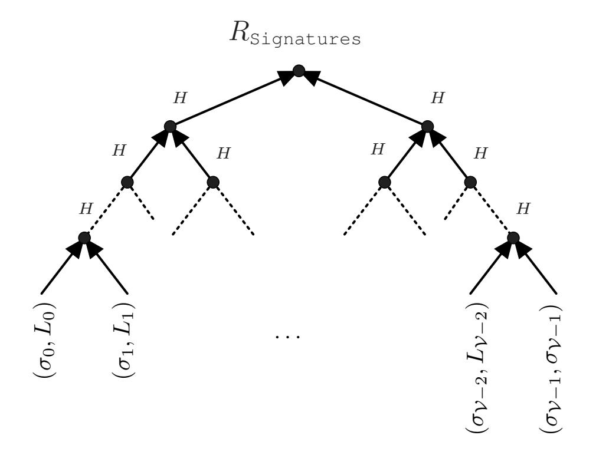
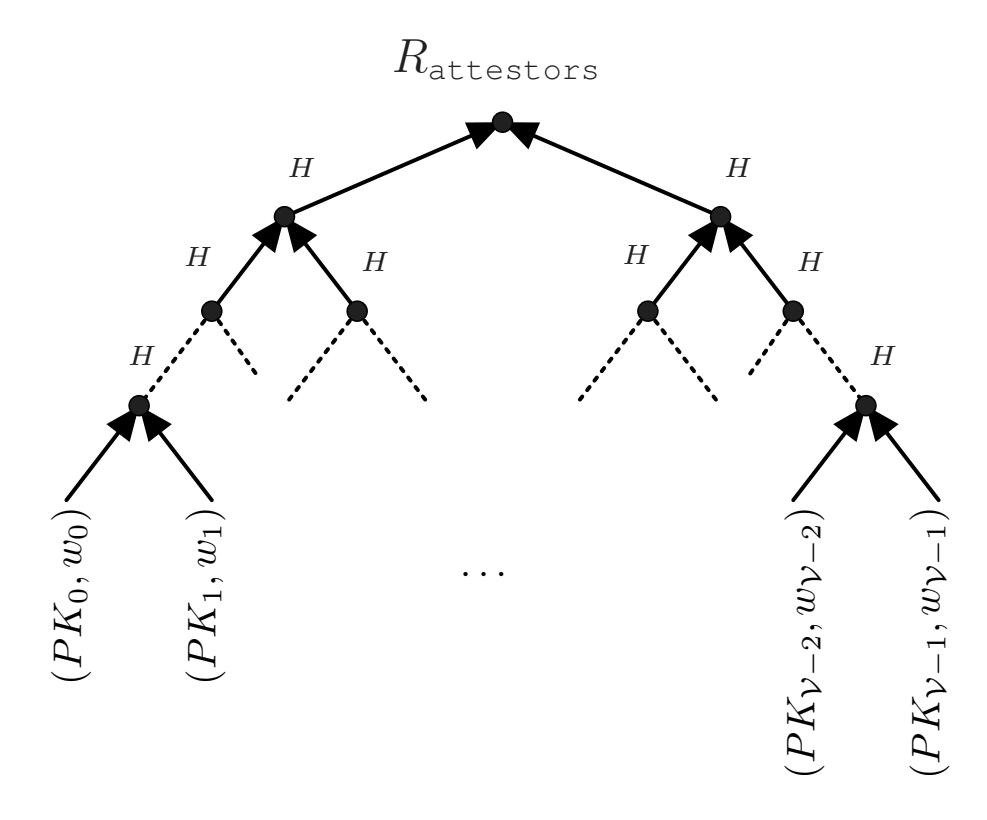
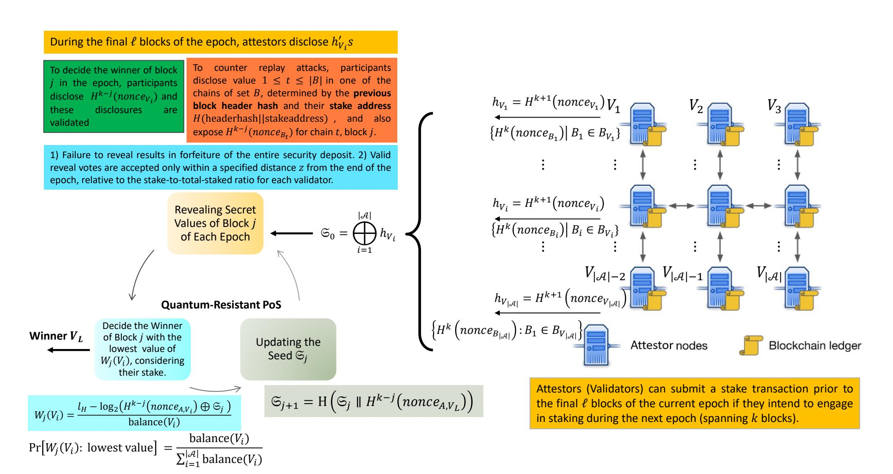
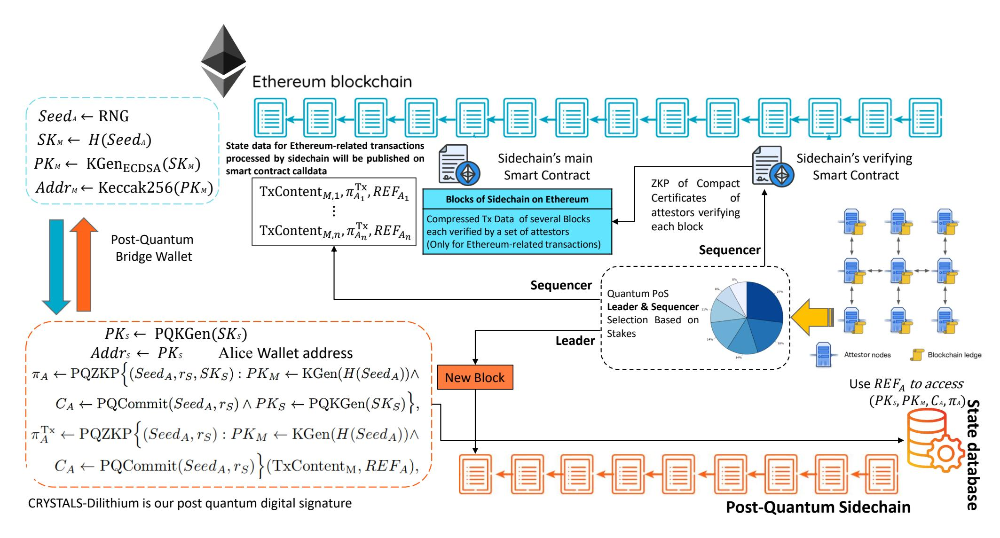

{0}------------------------------------------------

1

# NIROPoK-Based Post-Quantum Sidechain Design on Ethereum

Hassan Khodaiemehr *Member, IEEE*, Khadijeh Bagheri, Saeid Yazdinejad and Chen Feng *Member, IEEE*,

*Abstract*—This paper presents a pioneering approach to constructing sidechains on the Ethereum network with a focus on post-quantum security. Our framework integrates a novel quantum-resistant version of a non-interactive random oracle proof of knowledge (NIROPoK) scheme, alongside a quantumresistant proof-of-stake mechanism and a post-quantum bridge based on the Dilithium digital signature scheme. By harnessing these advanced cryptographic techniques, we establish a robust defense against quantum computing threats while ensuring enhanced privacy for blockchain transactions. By conducting a thorough analysis and implementing our approach, we demonstrate the feasibility and effectiveness of creating quantumresistant sidechains within the Ethereum ecosystem. Our proposed sidechain is also capable of securing *Ethereum transactions* from quantum threats using Ethereum's current architecture and security measures.

*Index Terms*—Ethereum, Post-quantum sidechain, proof of stake, Dilithium digital signature, quantum-resistant, zeroknowledge.

## I. INTRODUCTION

T HE rapid advancement of quantum computing poses a growing threat to blockchain security, as traditional cryptographic algorithms may soon be rendered insecure. This has motivated the development of post-quantum blockchain solutions. While native quantum-resistant Layer-1 blockchains, such as Abelian [2], quantum resistant ledger (QRL) [3], and QANplatform [4], as well as permissioned frameworks like PQFabric [5] and SodsBC [6], provide strong post-quantum security, there is a clear gap in permissionless quantumresistant sidechains and rollups for Ethereum. Current Layer-2 solutions, such as StarkNet, offer only partial quantum resistance, underscoring the need for more robust architectures that can safeguard decentralized applications against future quantum threats.

Sidechains, first introduced by Back *et al.* in 2014 [7], offer an attractive solution to overcome the limitations of a single decentralized blockchain. The concept is straightforward: establish a distinct blockchain tailored to specific functionalities and establish a means of interaction with the primary blockchain. This interaction entails the capability to transfer native assets of the mainchain (such as Ethereum) to and from the sidechain.

In our framework, we establish a hierarchical relationship between the mainchain and sidechains, where sidechain nodes

H. Khodaiemehr, K. Bagheri, S. Yazdinejad and C. Feng are with the School of Engineering, Faculty of Applied Science, University of British Columbia (UBC), Okanagan Campus, Kelowna, BC, Canada, e-mails: {hassan.khodaiemehr, khadijeh.bagheri, saeid.yazdinejad, chen.feng}@ubc.ca.

Some of the findings from this paper have been presented in CWIT2024 [1].

have direct visibility into the mainchain, while mainchain nodes rely on cryptographically authenticated compact certificates from sidechain maintainers. These certificates serve to authorize transfers originating from sidechains. Authentication and validation of these compact certificates are accomplished using NIROPoK, allowing for constant-sized proofs for any NP statement.

An essential feature of our approach is the empowerment of the sidechain to establish its own consensus and authentication mechanisms, thereby enabling the customization of its validation rules. Our objective is to enhance efficiency by consolidating multiple signatures into a single concise certificate while ensuring that verifiers only require access to a limited subset of signing public keys. We implement the notion of weighted attestors [8], assigning a specific weight to each attestor. Our aim is to ensure that attestors with a combined sufficient weight have furnished witnesses for their corresponding NP statements.

By introducing a post-quantum sidechain, we aim to address the vulnerabilities of existing blockchain networks to quantum computing attacks, providing a robust and secure solution that can be seamlessly integrated with existing infrastructures like Ethereum. This paper presents a comprehensive overview of our post-quantum sidechain design, detailing the cryptographic mechanisms employed, the architecture of the hierarchical relationship between the mainchain and sidechains, and the benefits of our approach in terms of security, efficiency, and scalability. We believe that our work will contribute significantly to the advancement of quantum-resistant blockchain technologies, paving the way for more secure and resilient decentralized systems in the quantum era [9], [10].

The remainder of this paper is organized as follows. Section II reviews the necessary background and introduces the core system components. Section III presents the design of our framework, describing the interaction between the mainchain and its sidechains. Section IV provides a security analysis of the consensus and authentication mechanisms used by the sidechain. Section V examines the complexity and performance characteristics of the system. Sections VI and VII describe the implementation of our post-quantum sidechain and evaluate its performance, including comparisons with existing approaches. Section VIII situates our work within the broader literature. Finally, Section IX concludes with a summary of our contributions and the broader significance of our results.

{1}------------------------------------------------

## II. FUNDAMENTALS AND ARCHITECTURAL COMPONENTS

This section lays the groundwork for understanding the core principles and architectural components of our post-quantum sidechain framework. We begin by exploring the essential concepts underpinning blockchain technology and the inherent vulnerabilities posed by quantum computing. We then delve into the specifics of our proposed solution, including the integration of advanced cryptographic techniques such as NIROPoKs and post-quantum wallet bridges based on Dilithium digital signature scheme and post-quantum non-interactive zero-knowledge proof systems. Furthermore, we discuss the hierarchical relationship between the mainchain and sidechains, detailing how these components interact to ensure robust security and efficient operation.

Authentication relies on lattice-based digital signatures instantiated using CRYSTALS-Dilithium, whose security is based on the hardness of the module-learning-with-errors (Module-LWE) problem [11], [12].

## A. Post-quantum Bridge Between Mainchain and Sidechain

In blockchain systems, digital signatures play a fundamental role in ensuring the authenticity and integrity of transactions, and they are central to the network's resilience against adversarial attacks. As quantum computing advances, traditional signature schemes based on integer factorization and discrete logarithm assumptions are expected to become vulnerable to efficient quantum attacks. To address this threat, the use of post-quantum digital signatures enables blockchain transactions to remain secure even in the presence of quantum-capable adversaries, thereby preserving the integrity of digital assets and communications in the emerging quantum era. In our design, authentication relies on lattice-based digital signatures instantiated using CRYSTALS-Dilithium, whose security is based on the hardness of Module-LWE problem [11], [12]. CRYSTALS-Dilithium is a post-quantum digital signature scheme, selected and standardized by NIST FIPS 204 [12], and specifically designed to withstand both classical and quantum attacks. By leveraging lattice-based assumptions, which currently admit no efficient quantum algorithms, Dilithium provides strong long-term security guarantees and significantly enhances the robustness of blockchain systems against future quantum-enabled cryptographic breaches.

We begin by briefly reviewing the CRYSTALS-Dilithium digital signature scheme. Let  $q=2^{23}-2^{13}+1,\ n=256$  and  $R_q=\frac{\mathbb{Z}_q[x]}{x^n+1}$ . Consider  $S_\eta$  as elements of  $R_q$  with small coefficients of size at most  $\eta$ . For each vector  $\mathbf{w}$  of elements in  $R_q$ , write each component of  $\mathbf{w}$  as  $w_i=w_{i,1}\cdot 2\gamma_2+w_{i,0}$ , where  $|w_{i,0}|\leq \gamma_2$ . Then, "high-order" bits of  $\mathbf{w}$ , denoted by  $\mathbf{w}_1$ , is the vector comprising all the  $w_{i,1}$ 's and "low-order" bits of  $\mathbf{w}$ , denoted by  $\mathbf{w}_0$ , is the vector comprising all the  $w_{i,0}$ 's. Using this notation, the three main algorithm of Dilithium digital signature is presented in Algorithm 1.

We now describe the post-quantum bridge between the mainchain and a sidechain S. Let  $PK_M \leftarrow \mathrm{KGen}(SK_M)$  denote the mainchain's digital signature key generation algorithm, which corresponds to the key generation algorithm of ECDSA in Ethereum and  $(PK_M, SK_M)$  represents the

## Algorithm 1 Dilithium Digital Signature

This scheme includes the following three algorithms:

```
1- Gen
\mathbf{A} \leftarrow R_q^{k \times \ell}
(\mathbf{s_1}, \mathbf{s_2}) \leftarrow S_{\eta}^{\ell} \times S_{\eta}^{k}
\mathbf{t} := \mathbf{A}\mathbf{s_1} + \mathbf{s_2}
return (PK = (A, t), SK = (A, t, s_1, s_2))
2- Sign(SK, M)
\mathbf{z} := \perp
while z = \perp do
       \mathbf{y} \leftarrow S_{\gamma_1-1}^{\ell}
       \mathbf{w_1} := \text{HighBits}(A\mathbf{y}, 2\gamma_2)
       c \in B_{\tau} := H(M \parallel \mathbf{w_1})
       \mathbf{z} := \mathbf{y} + c\mathbf{s_1}
       if \|\mathbf{z}\|_{\infty} \geq \gamma_1 - \beta or \|\text{LowBits}(\mathbf{A}\mathbf{y} - c\mathbf{s_2}, 2\gamma_2)\|_{\infty} \geq
\gamma_2 - \beta then
              \mathbf{z} := \perp
       end if
end while
return \sigma = (\mathbf{z}, c)
3- Verify(PK, M, \sigma = (\mathbf{z}, c))
\mathbf{w_1'} := \text{HighBits}(\mathbf{Az} - c\mathbf{t}, 2\gamma_2)
if \|\mathbf{z}\|_{\infty} < \gamma_1 - \beta and c = H(M \parallel \mathbf{w_1'}) then
       return true
end if
```

public-private key pair. Suppose Alice aims to establish a wallet on Ethereum and ensure her transactions are quantum-safe using the sidechain S. Initially, Alice generates a post-quantum public-private key pair  $(PK_S, SK_S)$  and derives the wallet address  $Addr_S$  from  $PK_S$  on Blockchain S. Let  $PK_S \leftarrow$  $PQKGen(SK_S)$  signify the post-quantum key generation algorithm of blockchain S, where we consider CRYSTALS-Dilithium as our post-quantum digital signature. Following this, Alice randomly generates a seed  $Seed_A$  and applies a quantum-safe one-way function F to produce a private key  $SK_M$  for mainchain, denoted as  $SK_M \leftarrow F(Seed_A)$ . Subsequently, Alice computes  $PK_M \leftarrow \mathrm{KGen}(SK_M)$  and employs mainchain's wallet generation hash function, which is Keccak256 for Ethereum, on  $PK_M$  to generate the corresponding wallet address  $Addr_M$ . Then, Alice utilizes a post-quantum non-interactive zero-knowledge (NIZK) proof system, denoted as PQZKP [13], to generate the following proof:

$$\pi_{A} \leftarrow \operatorname{PQZKP} \Big\{ (Seed_{A}, r_{S}, SK_{S}) : \\ PK_{M} \leftarrow \operatorname{KGen}(F(Seed_{A})) \land \\ C_{A} \leftarrow \operatorname{PQCommit}(Seed_{A}, r_{S}) \land \\ PK_{S} \leftarrow \operatorname{PQKGen}(SK_{S}) \Big\},$$

in which PQCommit is a post-quantum commitment scheme along with a random string  $r_S$ . A successful verification of  $\pi_A$  indicates that Alice, the prover, has: 1) generated  $PK_M$  from  $Seed_A$ , 2) ensured that the committed value of  $C_A$  remains consistent, 3) generated  $PK_S$  from  $SK_S$ . Throughout this process, Alice maintains confidentiality regarding her secrets

{2}------------------------------------------------

 $Seed_A$  and  $SK_S$ . Following the generation of  $\pi_A$ , Alice records a tuple  $(PK_S, PK_M, C_A, \pi_A)$  on the ledger of the sidechain S, enabling validators to verify the linkage between the wallets on both mainchain and sidechain.

#### B. Quantum-Resistant Proof of Stake Consensus Algorithm

As another crucial aspect of our scheme, we provide a brief overview of our consensus algorithm, rooted in the quantum resistant ledger proof-of-stake (QRL-PoS) [14] which provides a post-quantum secure variant of stake-based consensus.

Proof-of-stake (PoS) is a mechanism where validators demonstrate their commitment to the network by staking assets, such as ETH in Ethereum's case. Validators verify new blocks and occasionally propose new ones. If validators attempt to defraud the network, such as by proposing multiple conflicting blocks or attestations, a portion or all of their staked ETH can be forfeited as a penalty.

To become a validator in Ethereum, a user needs to stake 32 ETH into the deposit contract and run three distinct software components namely execution, consensus and a validator clients. After staking, the user joins an activation queue, regulating new validator additions. Upon activation, validators receive new blocks from peers in the Ethereum network. They then re-validate the transactions in the block, ensuring proposed changes to Ethereum's state are valid, and verify the block signature before broadcasting a vote (attestation) in favor of the block across the network. In contrast to proof-of-work (PoW), where block timing is dictated by mining difficulty, PoS operates at a consistent pace. In PoS Ethereum, time is divided into slots, each lasting 12 seconds, and epochs, which consist of 32 slots. In each slot, one validator is randomly chosen as the block proposer, responsible for crafting and disseminating a new block. Additionally, a committee of validators is randomly selected in each slot to vote on the proposed block's validity. Splitting the validator set into committees helps the management of the network load, ensuring every active validator attests in each epoch, though not necessarily in every slot.

Regrettably, the described version of PoS lacks quantum resistance [9]. Therefore, we examine the PoS algorithm selected by the Quantum Resistant Ledger project [14]. The underlying concept is as follows:

- All participants create hash-chains to generate random values.
- These random values, along with the stake, determine the winner of the block.
- To counter pre-mining attacks, where attackers optimize the hash-chain, a public seed is formed before each epoch transition, incorporating randomness from all participating stake validators.
- This seed is updated after each block, resetting the randomness for all participants and preventing any validator from predicting outcomes beyond a single block.
- To safeguard against long-range or hash-replay attacks, where a new chain is constructed, multiple hash-chains are utilized to bind stake validators to a single chain.

Now, we delve into the commitment procedure with more detail. Every participant intending to engage in staking during

the next epoch, which spans k blocks, can submit a stake transaction within the current epoch. Currently, QRL has set k=10000 as their parameter. This stake transaction includes: 1) The last member of a lengthy hash-chain A, denoted as  $h_A = H^{k+1}(nonce_A)$ , where  $nonce_A$  is a random number selected by the staker. 2) A collection of other extensive hash-chains B, represented as values  $h_{B_i} = H^k(nonce_{B_i})$ , with  $nonce_{B_i}$  being random numbers chosen by the staker. At first, QRL included 50 hash-chains in set B, but this number might be subject to increase based on their security assessment.

Stake participants retain all  $nonce_A$  and  $nonce_{B_i}$ 's as their confidential values. Stake transactions must occur prior to the final  $\ell$  blocks of the current epoch, which is set to  $\ell=1000$  by QRL, disallowing any additional stake transactions in the last 1000 blocks. Stake transactions with commitments similar to those in other addresses are rejected. During the final  $\ell$  blocks of the present epoch, all participants are required to disclose the initial value in hash-chain A, denoted as  $H^k(nonce_A)$ , which serves as the starting seed for the subsequent epoch as  $\mathfrak{S}_0 = \bigoplus_{i \in \mathcal{I}} h_i$ , where  $\oplus$  denotes the XOR and  $h_i$  represents the hash reveals of participant i in the staker set  $\mathcal{I}$ , comprising all stakers. Later in the epoch, the seed will undergo an update, and we designate the seed for block j in the epoch as  $\mathfrak{S}_j$ .

To deter seed manipulation, QRL implements the following mechanisms: 1) Failure to reveal results in forfeiture of the entire security deposit. 2) Valid reveal votes are accepted only within a specified distance z from the end of the epoch, relative to the stake-to-total-staked ratio for each validator. Essentially, accounts with lower stakes are required to declare their reveals earlier.

To decide the winner of block j in the epoch, participants disclose  $H^{k-j}(nonce_A)$  and these disclosures are validated against earlier commitments or the conclusion of the hash-chain stored in the transaction. While stake validators may experience temporary offline periods, each participant must accurately reveal the hash-chain index. Participants wait for a specified duration and gather all disclosures from others. To counter replay attacks, each participant also discloses a value  $1 \le t \le |B|$  in one of the chains of set B, determined by the previous block header hash and their stake address H(headerhash||stakeaddress). As a result, the participant also exposes  $H^{k-j}(nonce_{B_t})$  for chain t and block j.

The winner of block j is determined by the participant whose hash reveal of chain A, when combined with the current seed  $\mathfrak{S}j$  through XOR operation, yields the lowest value, considering their stake. Essentially, each participant's hash reveal  $HR_j(\mathcal{P}) = H^{k-j}(nonce_{A,\mathcal{P}})$  and balance  $bal(\mathcal{P})$  relative to the total balance T contribute to a weighted value. This value is computed using the following formula involving the output length  $l_H$  of the employed hash-function:

$$W_j(\mathcal{P}) = \frac{l_H - \log_2(HR_j(\mathcal{P}) \oplus \mathfrak{S}_j)}{bal(\mathcal{P})}.$$
 (1)

It can be proved that  $\Pr[W_j(\mathcal{P}) : \text{lowest value}] = \frac{bal(\mathcal{P})}{T}$  [15]. The seed  $\mathfrak{S}_j$  undergoes an update through the hash-reveal of the block winner, as  $\mathfrak{S}_j + 1 = H(\mathfrak{S}_j || HR_j(\mathcal{P}))$ . This update mechanism helps mitigate the risk of Sybil attacks from malicious stake validator accounts by making our

{3}------------------------------------------------

block selection algorithm random and probabilistic. The block winner signs the block header, which includes a Merkle tree root hash of the transaction list, timestamp, and the list of all reveals by stake validator participants. A Dilithium signature is appended to the block to ensure its accuracy and security. Additionally, the winner receives the newly minted coins. As a result, limiting security deposit requirements for staking is unnecessary because attackers gain no mathematical advantage from using Sybil stake validator addresses.

#### C. Transaction Mechanism

After outlining the consensus mechanism and establishing the linkage between the mainchain key pair  $(PK_M, SK_M)$  and the sidechain key pair  $(PK_S, SK_S)$ , we now explain how Alice can execute her mainchain transactions in a quantum-resistant manner [13].

Consider the case where Alice initiates a transfer of native assets (e.g., ETH) on the mainchain. This transaction includes a digital signature produced with her mainchain keys  $(PK_M, SK_M)$ . Because  $PK_M$  is publicly visible on the mainchain ledger, a quantum-capable adversary could, in principle, derive  $SK_M$  from  $PK_M$  by exploiting the vulnerability of classical signature schemes to quantum attacks. Possession of  $SK_M$  would allow the adversary to forge valid signatures under  $(PK_M, SK_M)$ , enabling them to craft fraudulent transactions and drain all assets stored in Alice's mainchain address  $Addr_A$ .

To mitigate this risk, we leverage Alice's knowledge of  $Seed_A$ , which remains secure against quantum adversaries, to render the transaction quantum-proof. Let  $TxContent_M$  denote the content of the transaction on the mainchain. Furthermore, assume that  $REF_A$  provides the necessary information for retrieving the tuple  $(PK_S, PK_M, C_A, \pi_A)$  from the sidechain ledger—such as the sidechain transaction hash and block height—both of which are accessible to Alice. Given these elements, Alice can compute the following proof [13]:

After delineating the consensus mechanism and establishing a connection between  $(PK_M, SK_M)$  on the mainchain and  $(PK_S, SK_S)$  on the sidechain, we describe how Alice can perform her mainchain transactions in a quantum-resistant way [13]. Let us consider a scenario where Alice sends native tokens like ETH on mainchain. In this transaction, a signature is included under  $(PK_M, SK_M)$ . Yet, a quantum-empowered adversary could potentially breach  $SK_M$  from  $PK_M$ , as it is retrievable from the mainchain's ledger. With this information, the adversary could fabricate a similar transaction with a valid signature under  $(PK_M, SK_M)$  and seize all the assets in Alice's wallet  $Addr_A$ .

Now, we leverage Alice's knowledge of  $Seed_A$ , which remains secure against extraction by a quantum-capable adversary, to render the transaction quantum-proof. Let  $TxContent_M$  denote the content of the transaction on the mainchain. Furthermore, assume that  $REF_A$  provides the necessary information for retrieving the tuple  $(PK_S, PK_M, C_A, \pi_A)$  from the sidechain ledger-such as the sidechain transaction hash and block height-both of which are

accessible to Alice. Given these elements, Alice can compute the following proof [13]:

$$\pi_A^{\operatorname{Tx}} \leftarrow \operatorname{PQZKP} \Big\{ (Seed_A, r_S) : PK_M \leftarrow \operatorname{KGen}(H(Seed_A)) \land \\ C_A \leftarrow \operatorname{PQCommit}(Seed_A, r_S) \Big\} (\operatorname{TxContent}_M, REF_A),$$

where  $(TxContent_M, REF_A)$  denotes the message component of the post-quantum NIZK proof system PQZKP. Storing  $\pi_A^{Tx}$  on mainchain can be accomplished by coupling it with TxContent<sub>M</sub>, perhaps within the metadata field of the transaction. Ethereum requires the creation of a smart contract as a prerequisite for adding metadata. Within this contractual agreement, clear guidelines dictate the location and method of storing metadata. Typically, metadata finds its place in a predefined variable, often presented as a string [16]. Similar to the approach for storing  $\pi_A$  on sidechain,  $\pi_A^{\mathrm{Tx}}$  can also be stored in the mainchain's ledger. For this sake, Alice initiates a transaction on sidechain to embed  $\pi_A^{\mathrm{Tx}}$ . This transaction can be a self-transfer of a negligible amount to herself. In this setup, an additional parameter,  $REF_A^M$ , housing the transaction's location information (such as its hash and block height) on sidechain's ledger, will be included [13].

Now, we only need to explain how transaction verification works. We know that validators on sidechain have already authenticated and recorded  $\pi_A$  on the sidechain's ledger, which can be retrieved from  $REF_A$ . There are three verifications that validators must conduct for each of Alice's transactions. Initially, the validator on mainchain conducts standard verification on  $TxContent_M$ . Subsequently, the validator verifies  $\pi_A$ . Lastly, the validator verifies  $\pi_A^{Tx}$ . If all three verification steps are successfully completed, the validator proceeds to draft the transaction ( $TxContent_M$ ,  $\pi_A^{Tx}$ ) for inclusion on the ledger of the mainchain [13].

Verification of  $\pi_A$  and  $\pi_A^{\rm Tx}$  is crucial in this process because  ${\rm TxContent_M}$  lacks quantum-proofing, making it susceptible to forgery by a quantum adversary. Failure to upgrade validators on the mainchain to verify  $\pi_A^{\rm Tx}$  and  $\pi_A$  would enable the scenario in which upon receiving assets from other sources, a quantum adversary can swiftly transfer them from Alice's wallet  $Addr_A$  on the mainchain. Despite the fact that the quantum adversary cannot generate a valid  $\pi_A^{\rm Tx}$ , if the mainchain validators only verify the part lacking quantum-resistance, i.e.,  ${\rm TxContent_M}$ , they would allow the quantum adversary to generate a valid  ${\rm TxContent_M}$ , leading to its continued recording on the ledger by the mainchain validators. Thus, without upgrading the mainchain validators, quantum adversaries could still extract digital assets from Alice's wallet  $Addr_A$  on the mainchain [13].

Given the challenge of requiring major Layer-1 blockchains like Ethereum to integrate additional post-quantum verification into their consensus protocols, a more practical approach involves incorporating Layer-2 features into our sidechain. Thus, our scheme would operate both as a sidechain and Layer-2 of the mainchain simultaneously. Through this approach, there is also the potential to consolidate proofs from transactions conducted by different users to achieve enhanced performance. This concept bears resemblance to the idea behind ZK-rollup.

{4}------------------------------------------------

#### D. NIROPoKs and Compact Certificates

Below, we will detail our utilization of compact certificates within our scheme. Compact certificates offer several advantages over alternatives such as aggregate signatures, multisignatures and threshold signatures. They are compatible with any underlying signature scheme and any NP statement. Unlike these alternatives, however, the verifier of aggregate signatures and multisignatures must possess knowledge of all participating public keys during the signing process, making achieving sublinear-size certificates and/or sublinear-time verification unfeasible. Compact certificates, unlike threshold signatures, operate independently of the number of participants, offering flexibility in attestor involvement. While threshold signatures rely on coordinated messaging during key generation and potentially computation, compact certificates do not require such coordination. Additionally, compact certificates support attestors with varying weights, a feature not inherent in threshold signatures. Furthermore, compact certificates are versatile, capable of handling any NP statement, unlike signature-specific schemes.

Initially, we require the definition of vector commitments. Vector commitments offer a method for committing to a list of values and subsequently revealing only a portion of those values efficiently. While these commitments are binding, they do not provide hiding properties.

**Definition 1.** [8] A vector commitment consists of the following deterministic algorithms:

- 1) Commit(A): on input a list A = (A[1], ..., A[n]) of values, outputs a concise commitment C together with decommitment information decom.
- 2) ComProve(i, A): on input an index i and the vector A, outputs a position-opening proof  $\pi_i$  attesting to the value A[i].
- 3) ComVerify $(C, i, v, \pi_i)$ : on input a commitment C, an index i, a value v, and a proof  $\pi_i$ , outputs T ("true" or "accept") if and only if v = A[i] and the proof  $\pi_i$  is consistent with a valid execution of Commit and ComProve.
- 4) Open(C, i, decom): an auxiliary opening algorithm that, given the commitment C, an index i, and the decommitment information decom, returns the value A[i] or  $\bot$  if the opening is invalid.

Since vector commitments do not provide hiding, all algorithms are assumed to be deterministic.

We require the following security property: if C was correctly generated as C = Commit(A) for some vector A, then no adversary running in time t on input A can produce a tuple  $(i, v, \pi_i^*)$  such that  $v \neq A[i]$  but

ComVerify
$$(C, i, v, \pi_i^*) = T$$
,

except with probability at most  $\operatorname{Insec^{com}}(t)$ . This captures the *position-binding* property: it is computationally infeasible to open the same commitment C to two different values at the same index.

A non-interactive random oracle proof of knowledge (NIROPoK) comprises a prover  $\mathbb{P}$  and a verifier  $\mathbb{V}$ , both

utilizing the same random oracle  $\rho: \{0,1\}^* \to \{0,1\}^{\lambda}$ . With an NP relation  $\mathcal{R}$ ,  $\mathbb{P}(x,w)$  generates a proof  $\pi$ , and  $\mathbb{V}(x,\pi)$  decides its validity. Security relies on a knowledge extractor  $\mathbb{E}$  that can retrieve witnesses from an adversarial prover  $\tilde{\mathbb{P}}$  as a black box and we denote it by  $\mathbb{E}^{\tilde{\mathbb{P}}}$ . While  $\mathbb{E}$  cannot interfere with the actions of  $\tilde{\mathbb{P}}$ , it can manipulate responses to random oracle queries at will, effectively "programming" the random oracle.

**Definition 2.** [8] A pair  $(\mathbb{P}, \mathbb{V})$  constitutes a NIROPoK with a knowledge error margin  $\epsilon$  for the relation  $\mathcal{R}$  if it adheres to the following conditions:

- 1) Completeness: If  $(x, w) \in \mathcal{R}$ , then  $\mathbb{V}(x, \mathbb{P}(x, w)) = T$ .
- 2) Proof of knowledge: There exists a knowledge extractor  $\mathbb{E}$  such that, for any x and adversary  $\mathbb{P}$  that, with probability  $\delta$  (calculated based on the random selection of  $\rho$ ), produces a valid proof  $\pi$  acceptable to  $\mathbb{V}(x,\pi)$ ,  $\mathbb{E}^{\mathbb{P}}$  generates w such that  $(x,w) \in \mathcal{R}$  with a probability of at least  $\delta \epsilon$ .

Consider  $\mathcal{R}^{compcert}$  as an NP relation featuring two-component inputs (input, globalinput) alongside a witness witnesses. For instance, in the context of signature applications, input represents an attestor's public key, globalinput signifies the message all the attestors sign, and witness denotes the attestor's signature. As per the definition of NP relations, there exists a polynomial-time algorithm verifying whether ((input, globalinput), witness)  $\in \mathcal{R}^{compcert}$  (e.g., authenticating the signatures). An attestor is delineated as a pair (input, weight), with attestors representing the roster of all potential attestors.

In a compact certificate scheme for  $\mathcal{R}^{compcert}$ , involving a prover  $\mathbb{P}$  and a verifier  $\mathbb{V}$  with access to the same random oracle  $\rho:\{0,1\}^*\to\{0,1\}^\lambda$ ,  $\mathbb{P}$  possesses knowledge of the list attestors, while  $\mathbb{V}$  is aware of the vector commitment  $C_{\text{attestors}}=\text{Commit}(\text{attestors}).$  Consider witnesses as a list of the same length as attestors, where for some (but not necessarily all) i,  $((\text{attestors}[i].\text{input},\text{globalinput}),\text{witnesses}[i]) \in \mathcal{R}^{compcert}$ . Such i's are referred to as valid. Let  $\mathfrak{W}$  represent a specific numerical target value. The tuple  $(\text{attestors},\text{globalinput},\text{witnesses},\mathfrak{W})$  is called sufficiently weighty if

$$\sum_{i \text{ is valid}} \text{attestors}[i].\text{weight} > \mathfrak{W}. \tag{2}$$

**Definition 3.** [8] The pair  $(\mathbb{P}, \mathbb{V})$  is called a compact certificate scheme with  $\epsilon$  as its knowledge error, if the following conditions hold:

1) Compact Completeness. For a sufficiently weighty input  $x = (attestors, globalinput, witnesses, \mathfrak{W}),$   $C_{attestors} = Commit(attestors)$  and  $cert = \mathbb{P}(x)$  we have

$$\mathbb{V}(C_{\text{attestors}}, \text{globalinput}, \mathfrak{W}, \text{cert}) = T.$$

Furthermore, the size of the certificate cert scales at most polylogarithmically with the size of the list of attestors.

{5}------------------------------------------------



Fig. 1. Merkle tree of signatures, showing the inclusion of signatures and the end of sub-intervals corresponding to each Attestor.

knowledge 2) Proof Knowledge. of  $\boldsymbol{A}$ extracthat operates  $\mathbb{E}$ exists on any given tor  $(attestors, globalinput, \mathfrak{W})$ and is designed for the scenario where  $C_{\text{attestors}}$ =Commit(attestors) and when faced with any adversary  $\mathbb{P}$ , producing a certificate cert with probability  $\delta$  (computed over the random choice of  $\rho$ ) such that  $V(C_{attestors}, globalinput, \mathfrak{W}, cert) = T$ ,  $\mathbb{E}^{\mathbb{P}}$  generates witnesses witnesses. This ensures that  $(attestors, globalinput, witnesses, \mathfrak{W})$ is sufficiently weighty with a probability of at least  $\delta - \epsilon$ .

In the context of digital signatures, input comprises a public key, attestors consist of pairs (PK, weight), globalinput represents a message M, witness is a signature of PK on M, and the compact certificate verifies that the prover possesses a set of sufficiently weighty signatures on M.

In the proposed compact certificate scheme outlined in [8], each element of the attestors, along with its corresponding signature will be associated with a leaf in a Merkle tree. Using a hash function, represented as a random oracle, applied to the root of this tree, the prover will determine which leaves to disclose. The certificate, cert, will include the Merkle tree root, the disclosed leaves along with their authentication paths in the Merkle tree (to provide the pertinent signatures to the verifier), which is depicted in Fig. 1, and vector commitment proofs generated by ComProve, which convey the relevant public keys and weights. In Fig. 2, we have depicted a vector commitment proof in the case of using Merkle trees. The proposed scheme in [8] provides a method for selecting which leaves to disclose, specifically targeting those from the attestors who provided signatures and considering their respective weights. This mechanism is crucial, as it incurs minimal expense and is resistant to manipulation by any adversaries.

At a high level, their mechanism operates as follows: the total weight of all contributing attestors who provide



Fig. 2. Merkle tree of attestors, showing the inclusion of weights and public keys.

attestations, termed  $W_{Sig}$ , is determined. This range, from 0 to  $W_{Sig}$ , is divided into subranges, with each contributing attestor assigned a subrange proportional to their weight. The Merkle leaf corresponding to each attestor's subrange stores the endpoints of their subrange. The hash function applied to the Merkle root selects a point within the range, and the prover must reveal the leaf containing that point. Through numerous such reveals, the verifier is assured that a significant portion of the range is covered by valid leaves, indicating the prover's knowledge of signatures for a substantial portion of  $W_{\mathsf{Sig}}$ . A notable aspect of this approach is that the verifier does not need to validate the claimed subranges individually. Rather, it verifies that each revealed subrange is of the correct length and matches the weight of its attestor, alongside validating the attestor's signature. An adversarial prover can manipulate subranges as desired, but overlapping subranges only complicate matters for the adversary, as it becomes harder to cover the entire range with valid signatures.

In environments like permissionless blockchain systems like our case, we integrate compact certificates to offer succinct offline proofs of block validity. Each block header in our scheme references the hash of the preceding one, ensuring a transitive commitment to all prior blocks, akin to conventional blockchains. Utilizing a "real-time" consensus mechanism, we reach an agreement on subsequent blocks. Compact certificates endorse every  $N^{th}$  block header, streamlining the authentication of future blocks by leaping forward N blocks at a time, where N is set around 128 or higher in [8] to spread the expense of gathering signatures for the compact certificate. Validating a compact certificate for a block header necessitates a commitment to the anticipated signers of that header. Hence, every  $N^{th}$  block header includes a Merkle commitment to the eligible participants' public keys and weights for forming the subsequent compact certificate. Integration of compact certificates enables any party to initiate from a confirmed valid block header and efficiently authenticate forthcoming blocks. This involves verifying the most recent block header, which

{6}------------------------------------------------

Prover 
$$\mathbb{P}$$
Knows  $M$  and  $\{\sigma_j\}_{j=0}^{\mathcal{V}-1}$ 
with Total Weight  $W_{\mathsf{Sig}}$ 
and  $\{(PK_j, w_j)\}_{j=0}^{\mathcal{V}-1}$ 

$$\mathcal{V} = |\text{attestors}|$$
  $\mathfrak{C} = |\text{Challenges}|$ 

 $\mathfrak{W} =$ Desired Treshold

$$\frac{R_{\text{Signatures}}, W_{\text{Sig}}}{\{c_i\}_{i=1}^{\mathfrak{C}}}$$

$$\frac{\{(\sigma_i, L_i), (PK_i, w_i), \mathcal{I}_i^{\text{sig}}, \mathcal{I}_i^{\text{att}}\}_{i=1}^{\mathfrak{C}}}$$

Verifier  $\mathbb{V}$ Knows  $\mathfrak{W}, M, R_{\mathtt{attestors}}$ Chooses challenges  $\{c_i\}_{i=1}^{\mathfrak{C}}$  from  $[0, W_{\mathsf{Sig}})$ .

 $\mathbb{V}$  returns T only if the following conditions hold:

- 1)  $W_{\mathsf{Sig}} \geq \mathfrak{W}$ ,
- 2)  $\sigma_i$  is valid for  $PK_i$  on M,
- 3) Merkle Path  $\mathcal{I}_i^{\text{sig}}$  starting from  $(\sigma_i, L_i)$  returns  $R_{\text{Signatures}}$ ,
- 4) Merkle Path  $\mathcal{I}_{i}^{\text{att}}$  starting from  $(PK_{i}, w_{i})$  returns  $R_{\text{attestors}}$ ,
- 5)  $L_i \leq c_i \leq L_i + w_i$ .

Fig. 3. A practical instance of compact certificates in an interactive scenario.

Knows 
$$M$$
 and  $\{\sigma_j\}_{j=0}^{\mathcal{V}-1}$  with Total Weight  $W_{\mathsf{Sig}}$  and  $\{(w_j, PK_j)\}_{j=0}^{\mathcal{V}-1}$  For  $i=1,\ldots,\mathfrak{C}$ ,  $\mathbb{P}$  computs  $c_i$  as the first  $\lfloor \log_2(W_{\mathsf{Sig}}) \rfloor + 1$  bits of  $H\left(R_{\mathsf{Signatures}}||M||i\right)$  Prover  $\mathbb{P}$  
$$\begin{cases} R_{\mathsf{Signatures}}, W_{\mathsf{Sig}}, (\sigma_i, L_i), (w_i, PK_i), \\ \mathcal{I}_i^{\mathsf{Sig}}, \mathcal{I}_i^{\mathsf{att}} \end{pmatrix}_{i=1}^{\mathfrak{C}}$$
 Verifier  $\mathbb{V}$  
$$\begin{cases} K_{\mathsf{nows}} \, \mathfrak{W}, R_{\mathsf{attestors}} \\ C_{\mathsf{omputes}} \, H\left(R_{\mathsf{Signatures}}||M||i\right) \\ \text{that gives } c_i \text{'s and checks} \\ 1) \, W_{\mathsf{Sig}} \geq \mathfrak{W} \\ 2) \, \sigma_i \text{ is valid for } PK_i \text{ on } M \\ 3) \, \mathsf{Path} \, \mathcal{I}_i^{\mathsf{sig}} \, \mathsf{vs} \, R_{\mathsf{Signatures}} \\ 4) \, \mathsf{Path} \, \mathcal{I}_i^{\mathsf{att}} \, \mathsf{vs} \, R_{\mathsf{attestors}} \\ 5) \, L_i \leq c_i \leq L_i + w_i \end{cases}$$

Fig. 4. A practical instance of compact certificates in a non-interactive scenario.

is a multiple of N, using previous-block hashes, transitioning forward by N block headers using compact certificates, and then stepping back to the precise block requiring validation using previous-block hashes.

Fig. 3 illustrates a practical instance of compact certificates in an interactive setting, where attestors engage in a challenge–response protocol before certificate generation. The figure highlights how the verifier issues randomness, how attestors reveal only the required openings and witnesses, and how the resulting transcript is compressed into a succinct certificate. This interactive flow demonstrates how compact certificates maintain soundness while keeping communication and verification costs logarithmic in the number of attestors.

Fig. 4 illustrates a practical instantiation of our compact certificate construction in the non-interactive setting. The diagram shows how attestor inputs, weights, and corresponding witnesses are committed into Merkle trees, and how only a small, pseudorandom subset of leaves is revealed together with their authentication paths. This structure enables the verifier to check the required weight threshold using logarithmic-size data, while maintaining non-interactivity through the Fiat–Shamir transform.

## III. FRAMEWORK DESIGN AND MAINCHAIN-SIDECHAIN RELATIONSHIP

In our setup, we consider N as the length of each epoch and the initial hurdle revolves around determining which nodes will participate in creating compact certificates. We assign the selected nodes as validators for the slots corresponding to blocks that are multiples of N, tasked with generating compact

certificates during those intervals. The process of constructing these certificates demands access to all attestor signatures, despite the significantly reduced size of the resulting certificate. Consequently, any node involved in creating a compact certificate must handle and retain numerous messages, scaling linearly with the number of attestors in the system. Mandating all nodes in a decentralized protocol to undertake this responsibility would entail bandwidth requirements that grow quadratically with the number of attestors, proving to be expensive particularly in scenarios with a high number of attestors. However, splitting the validator set into committees in our setting helps the management of the network load. Furthermore, we integrate a post-quantum commitment scheme and utilize the post-quantum Dilithium digital signature as fundamental components, ensuring the quantum resistance of our compact certificate scheme.

Fig. 5 illustrates the QPoS mechanism employed by the sidechain. The diagram highlights how validators generate hash-chain commitments, reveal chain elements across epochs, and participate in stake-weighted leader selection. It also shows how the evolving public seed prevents precomputation and replay attacks, ensuring that block proposers are chosen unpredictably while maintaining post-quantum security guarantees.

Fig. 6 presents the overall architecture of our sidechain, highlighting the interaction between the mainchain, the sidechain, and the post-quantum cryptographic components that bind them together. This architectural view clarifies the flow of information and trust across layers, emphasizing how the system maintains end-to-end post-quantum security while

{7}------------------------------------------------

remaining compatible with Ethereum's existing infrastructure.

In the rest of this section, we present the architectural design of our post-quantum sidechain framework and describe the hierarchical relationship between the mainchain (Ethereum) and the post-quantum sidechain. Our design integrates four core components: 1) a post-quantum wallet-binding bridge based on Dilithium and quantum-resistant commitments, 2) a quantum-resistant proof-of-stake (QPoS) consensus mechanism, 3) a NIROPoK-based compact certificate system for succinct block attestations, and 4) a Virgo-based [17], [18] post-quantum zero-knowledge rollup layer for scalable verification. Together, these components enable a secure, efficient, and quantum-resistant extension of Ethereum without requiring modifications to Ethereum's consensus protocol.

Our framework adopts a hierarchical model in which the sidechain is fully aware of the mainchain state, while the mainchain interacts with the sidechain only through cryptographically authenticated compact certificates. This asymmetry ensures that 1) the sidechain can track mainchain events (e.g., deposits, wallet bindings, and cross-chain messages), 2)the mainchain does not need to store or process sidechain blocks, and 3) cross-chain transfers remain secure even in the presence of quantum adversaries. The mainchain serves as the root of trust, while the sidechain provides enhanced functionality such as post-quantum transaction security, scalable execution, and privacy-preserving state transitions.

#### A. Post-Quantum Wallet Binding

To enable secure cross-chain asset transfers, each user binds their mainchain wallet  $(PK_M, SK_M)$  to a post-quantum sidechain wallet  $(PK_s, SK_s)$  using a tuple

 $(PK_s, PK_M, C_A, \pi_A)$ , where  $C_A$  is a lattice-based commitment to the secret seed and  $\pi_A$  is a Virgo-based post-quantum zero-knowledge proof demonstrating:

- 1)  $PK_M$  is derived from a quantum-secure seed  $Seed_A$ ,
- 2)  $PK_s$  is derived from a post-quantum secret key  $SK_s$ , and
- 3) the commitment  $C_A$  is consistent with the same  $\operatorname{Seed}_A$ . This binding is recorded on the sidechain and enables quantum-resistant authentication of mainchain transactions. The mainchain does not need to verify  $\pi_A$ ; instead, the sidechain validators enforce correctness and provide compact certificates to the mainchain when cross-chain withdrawals occur.

#### B. Sidechain Consensus and Block Production

The sidechain employs a quantum-resistant proof-of-stake consensus mechanism inspired by the QRL PoS protocol [3]. Each validator commits to a long hash-chain  $H^{k+1}(\text{nonce}_A)$  and reveals hash-chain values during block production. The randomness seed for each epoch is computed as the XOR of all validator reveals, ensuring: 1) unpredictability of block proposer selection, 2) resistance to precomputation and grinding attacks, 3) immunity to long-range attacks due to binding commitments, and 4) Sybil resistance proportional to stake. Each block header includes:

- the Merkle root of the transaction list,
- the list of hash-chain reveals,
- the updated randomness seed,
- Virgo proof  $\pi$  attesting to the correctness of state transitions, signature verifications, balance updates and crosschain message handling,



Fig. 5. Quantum-resistant proof of stake (QPoS) mechanism.

{8}------------------------------------------------



Fig. 6. The overall architecture of the quantum-resistant sidechain.

• The Dilithium signature from the block proposer.

This ensures that block validity is verifiable using only postquantum primitives.

#### C. Compact Certificates for Cross-Chain Verification

To allow the mainchain to verify sidechain state transitions without processing full blocks, we employ compact certificates based on NIROPoKs and vector commitments. For each sidechain block, a set of weighted attestors (stake validator participants of each epoch with total weight more than  $\mathfrak{W}$ ) sign the block header. The sequencer constructs a compact certificate containing:

- the Merkle root  $R_{attestors}$  of the attestor list,
- a small number of revealed leaves and authentication paths,
- NIROPoK proofs demonstrating knowledge of valid signatures from attestors whose cumulative weight exceeds the threshold  $\tau$ .

The verifier (mainchain smart contract) checks:

$$\mathbb{V}(R_{\text{attestors}}, \text{header}, \mathfrak{W}, \text{cert}) = T,$$

which requires only  $O(\log \mathcal{V})$  work, where  $\mathcal{V}$  is the number of attestors. This enables succinct verification of sidechain state transitions on Ethereum.

#### D. Mathematics of Virgo Proof System

Zero-knowledge proof systems are built on several foundational proof models that differ in how the prover and verifier interact and how the verifier accesses information. The classical interactive proof (IP) model allows the prover and verifier

to exchange multiple rounds of messages, with the verifier reading all prover messages in full [19]. The probabilistically checkable proof (PCP) model removes interaction entirely: the prover sends a single oracle, and the verifier checks correctness by querying only a few randomly chosen positions [20]. The interactive oracle proof (IOP) model combines these two ideas: the prover sends oracle messages across several rounds, and the verifier queries each oracle at only a small number of positions [21]. Finally, polynomial IOPs (PIOPs) specialize IOPs to polynomial oracles, enabling efficient low-degree testing and forming the basis of modern transparent proof systems such as scalable transparent arguments of knowledge (STARK) schemes, Aurora [22], and Virgo [18]. These models provide a spectrum of trade-offs between interaction, query complexity, and algebraic structure, and they underpin the design of contemporary succinct and post-quantum-secure proof systems.

Virgo is a transparent, publicly verifiable zero-knowledge proof system based on polynomial IOPs and Merklecommitment polynomial commitments. Its design combines the sum-check protocol with a linear-time polynomial commitment scheme, enabling succinct verification without a trusted setup. In this subsection, we summarize the mathematical components underlying Virgo.

a) Arithmetic Circuit Representation: Let  $\mathcal{C}$  be an arithmetic circuit over a finite field  $\mathbb{F}$  with  $\mathfrak{N}$  multiplication gates. Virgo represents Circ as a layered circuit with layers  $\mathcal{L}_0, \mathcal{L}_1, \ldots, \mathcal{L}_d$ , where  $\mathcal{L}_0$  contains the input wires and  $\mathcal{L}_d$  contains the output wires. Each layer is encoded as a multilinear extension (MLE) of its wire values. For a layer with m

{9}------------------------------------------------

wires, Virgo defines the multilinear extension

$$V(x_1, \dots, x_m) = \sum_{w \in \{0,1\}^m} v_w \prod_{i=1}^m (x_i^{w_i} (1 - x_i)^{1 - w_i}),$$

where  $v_w$  is the value of wire w.

b) Sum-Check Protocol: To verify that the circuit satisfies all gate constraints, Virgo applies the classical sum-check protocol to a polynomial  $F(x_1, \ldots, x_k)$ , whose evaluation encodes the correctness of all multiplication gates. Specifically, for each multiplication gate  $u = a \cdot b$ , Virgo constructs a polynomial F such that

$$\sum_{x \in \{0,1\}^k} F(x) = 0 \quad \Longleftrightarrow \quad \text{all gates are satisfied.}$$

The prover and verifier then execute the k-round sum-check protocol:

$$\sum_{x_1 \in \{0,1\}} \cdots \sum_{x_k \in \{0,1\}} F(x_1, \dots, x_k) = 0,$$

with the verifier sending random challenges  $r_1, \ldots, r_k \in \mathbb{F}$  and reducing the claim to a single evaluation of F at a random point.

c) Polynomial Commitment via Merkle Trees: Virgo replaces algebraic polynomial commitment (PC) schemes (e.g., KZG) with a hash-based commitment. Given a polynomial P represented by its evaluations on a hypercube, the prover constructs a Merkle tree over the evaluation table:

$$\mathsf{Com}(P) = \mathsf{MerkleRoot}(P(\{0,1\}^m)).$$

To open P at a point  $r \in \mathbb{F}^m$ , Virgo uses the multilinear extension:

$$P(r) = \sum_{w \in \{0,1\}^m} P(w) \prod_{i=1}^m \left( r_i^{w_i} (1 - r_i)^{1 - w_i} \right),$$

and provides Merkle authentication paths for the queried evaluations. This yields a transparent, post-quantum-secure commitment scheme.

d) Low-Degree Testing: Virgo incorporates a low-degree test to ensure that the committed multilinear extensions are consistent with valid circuit layers. The verifier checks that the claimed polynomial evaluations satisfy the recursive identity:

$$V(r_1, \dots, r_m) = r_m \cdot V(r_1, \dots, r_{m-1}, 1) + (1 - r_m) \cdot V(r_1, \dots, r_{m-1}, 0).$$
(3)

This guarantees that V is indeed a multilinear polynomial.

- e) End-to-End Verification: Putting the components together, Virgo verifies a computation by checking:
  - 1) The input layer  $\mathcal{L}_0$  matches the public input.
  - 2) The sum-check protocol confirms that all gate constraints hold.
  - 3) The Merkle-based polynomial commitment scheme (PCS) verifies all polynomial openings.
  - 4) The low-degree test ensures that all committed polynomials are valid multilinear extensions.

If all checks pass, the verifier accepts the proof. The resulting system achieves: 1) transparent setup, 2) post-quantum

security using hash-based commitments, 3) quasilinear prover time, 4) polylogarithmic verifier time and 5) succinct proofs. This makes Virgo a compelling alternative to succinct non-interactive arguments of knowledge (SNARK) schemes and STARKs for transparent, hash-based zero-knowledge proofs.

1) Virgo-Based Post-Quantum Rollup Layer: To improve scalability, the sidechain batches transactions into Virgo proofs. For each block, the sidechain prover (Leader) generates a Virgo proof  $\pi$  attesting to the correctness of: 1) state transitions, 2) signature verifications, 3) balance updates and cross-chain message handling. The proof  $\pi$  is included in the block header and contributes to the compact certificate. Since Virgo proofs have size  $O(\log^2 \mathfrak{N})$  with  $O(\mathfrak{N} \log \mathfrak{N})$  prover time and  $O(\log^2 \mathfrak{N})$  verifier time, the sidechain achieves high throughput while maintaining post-quantum security.

#### E. Cross-Chain Asset Transfer Workflow

The mainchain-sidechain interaction follows a secure, postquantum workflow:

- 1) **Deposit:** A user locks assets on the mainchain.
- 2) **Observation:** Sidechain validators detect the deposit event.
- 3) **Minting:** The sidechain mints corresponding assets to the user's post-quantum wallet.
- 4) **Withdrawal:** The user submits a withdrawal request on the sidechain.
- 5) **Certification:** Validators produce a compact certificate proving the withdrawal is valid.
- 6) **Verification:** The mainchain verifies the compact certificate and releases the locked assets.

This workflow ensures that cross-chain transfers remain secure even if the mainchain's classical cryptography is broken by a quantum adversary.

In summary, the proposed framework establishes a robust and efficient hierarchical relationship between Ethereum and a post-quantum sidechain. By combining Dilithium-based wallet binding, QPoS consensus, NIROPoK compact certificates, and Virgo-based rollups, the system achieves: 1) quantum-resistant authentication, 2) succinct cross-chain verification, 3) scalable execution, and 4) compatibility with existing Ethereum infrastructure. This design provides a practical pathway for integrating post-quantum security into the Ethereum ecosystem without requiring disruptive protocol changes.

#### IV. POST-QUANTUM SECURITY PROOFS

In this section, we provide a detailed post-quantum security analysis of our NIROPoK-based sidechain architecture, including formal, game-based security arguments. We focus on four main components: 1) the post-quantum bridge between the mainchain and sidechain, 2) the QPoS consensus, 3) the compact-certificate framework, and 4) the post-quantum zero-knowledge argument system instantiated via Virgo. We also assume a quantum polynomial-time (QPT) adversary with access to Shor-type and Grover-type algorithms, and we analyze security under standard lattice and hash-based assumptions.

{10}------------------------------------------------

#### A. Security Model and Assumptions

- 1) Adversarial Capabilities: We consider an adversary A with the following capabilities:
  - **QPT computation:** A runs in quantum polynomial time.
  - Shor's algorithm: A can break classical number-theoretic schemes (e.g., ECDSA).
  - Grover's algorithm: A can quadratically speed up bruteforce search over key spaces and hash preimages.
  - Network access: A observes and injects transactions and blocks on both mainchain and sidechain.
  - Corruptions: A can corrupt a subset of validators/attestors and obtain their secret keys.
- 2) Cryptographic Assumptions: Our security relies on the following post-quantum assumptions:
  - Module-LWE/Module-SIS: Underlying the CRYSTALS-Dilithium signature scheme and lattice-based commitments.
  - Collision-resistant hash functions: Used in Merkle trees, vector commitments, hash-chains, and Virgo.
  - Soundness and zero-knowledge of Virgo: Virgo is modeled as a transparent, hash-based interactive oracle proof or ZK-argument system whose soundness and zero-knowledge properties hold against QPT adversaries under the collision-resistance of the underlying hash function.
- 3) Security Goals: We target the following post-quantum security properties:
  - **PQ-Transaction Security:** An adversary cannot steal funds or forge valid quantum-protected transactions.
  - PQ-Consensus Security: An adversary cannot bias block selection, mount long-range attacks, or create alternative valid chains with non-negligible probability.
  - PQ-Attestation Security: An adversary cannot forge compact certificates with insufficient attestor weight.
  - **PQ-ZK Rollup Security:** An adversary cannot produce a valid Virgo proof for an invalid state transition, nor extract private data from proofs.

#### B. Security of the Post-Quantum Bridge and Transactions

The bridge links  $(PK_M, SK_M)$  on the mainchain and  $(PK_s, SK_s)$  on the sidechain via a post-quantum commitment  $C_A$  and a PQZKP proof  $\pi_A$ , and later via a transaction-level proof  $\pi_A^{\mathrm{Tx}}$ .

1) Game BRIDGE<sub>FORGE</sub>: We define the following security game between a challenger C and an adversary A:

**Setup:** C generates keys and parameters for Dilithium, the PQ commitment scheme, and the PQZKP system.

**Queries:** A may request:

- Key generation for honest users.
- PQZKP proofs for honestly generated tuples  $(PK_M, PK_s, C_A)$ .
- Virgo proofs for valid state transitions.

**Goal:** A outputs a forged tuple  $(PK_M^{\star}, PK_s^{\star}, C_A^{\star}, \pi_A^{\star})$  such that:

- 1)  $\pi_A^*$  verifies as a valid PQZKP proof, and
- 2)  $\mathcal{A}$  does not know the corresponding secrets  $(\operatorname{Seed}_A^{\star}, SK_s^{\star}).$

**Theorem 1.** If the PQ commitment scheme is binding and the PQZKP system is sound against QPT adversaries, then the advantage of any QPT adversary in  $BRIDGE_{FORGE}$  is negligible.

*Proof.* Let  $Adv_{\mathcal{A}}^{\mathsf{BRIDGE_{FORGE}}}(\lambda)$  denote the advantage of a QPT adversary  $\mathcal{A}$  in winning the  $\mathsf{BRIDGE_{FORGE}}$  game at security parameter  $\lambda$ . Assume, towards a contradiction, that there exists a QPT adversary  $\mathcal{A}$  and a polynomial  $p(\cdot)$  such that

$$\mathsf{Adv}^{\mathsf{BRIDGE}_{\mathsf{FORGE}}}_{\mathcal{A}}(\lambda) \geq \frac{1}{p(\lambda)},$$

for infinitely many  $\lambda$ . We construct a QPT reduction  $\mathcal{R}$  that, using  $\mathcal{A}$  as a subroutine, either breaks the binding of the commitment scheme or the soundness of the PQZKP system with non-negligible probability. In the BRIDGE<sub>FORGE</sub> experiment, the adversary  $\mathcal{A}$  outputs a pair  $(C_A^{\star}, \pi_A^{\star})$ , where  $C_A^{\star}$  is a commitment and  $\pi_A^{\star}$  is a PQZKP proof that is supposed to certify that  $C_A^{\star}$  is consistent with some valid witness  $w^{\star}$  for a statement  $x^{\star}$  in the NP relation R. The adversary wins if:

- 1) The verifier  $\mathbb{V}$  accepts  $\pi_A^{\star}$  as a valid proof for the statement  $x^{\star}$  (which is derived from  $C_A^{\star}$ ), and
- 2) The pair  $(C_A^{\star}, \pi_A^{\star})$  is *forged* in the sense required by the bridge definition (e.g., no corresponding honest witness was used, or the key relation is violated).

We now show how to use such an A to construct a reduction  $\mathcal{R}$  that contradicts either commitment binding or PQZKP soundness.

- a) Case 1: (Extractable inconsistency  $\Rightarrow$  breaking PQZKP soundness): Consider the event that  $\mathcal{A}$  outputs  $(C_A^{\star}, \pi_A^{\star})$  such that  $\mathbb{V}(x^{\star}, \pi_A^{\star}) = 1$ , but there exists no witness  $w^{\star}$  such that  $(x^{\star}, w^{\star}) \in R$  and  $w^{\star}$  is consistent with the semantics of  $C_A^{\star}$  (e.g., the committed key does not satisfy the required relation). In this case,  $\mathcal{R}$  defines a PQZKP soundness experiment as follows:
  - 1) The PQZKP challenger samples a statement  $x^*$  for which no witness exists (or for which  $\mathcal{R}$  does not know a witness).
  - 2)  $\mathcal{R}$  embeds  $x^*$  into the bridge environment so that any valid bridge proof  $\pi_A^*$  for  $x^*$  corresponds to a valid PQZKP proof for a false statement.
  - 3)  $\mathcal{R}$  runs  $\mathcal{A}$  as a black box and forwards  $\pi_A^{\star}$  to the PQZKP verifier.

If  $\mathcal{A}$  wins BRIDGE<sub>FORGE</sub> in this branch, then  $\mathbb{V}(x^\star,\pi_A^\star)=1$  for a statement  $x^\star$  that is false (or for which no valid witness exists), thereby breaking PQZKP soundness. Hence, in this case we obtain a QPT adversary against PQZKP soundness with advantage at least  $\mathsf{Adv}_{\mathcal{A}}^{\mathsf{BRIDGE}_{\mathsf{FORGE}}}(\lambda)$  up to a loss that is at most polynomial in  $\lambda$ .

b) Case 2: (Ambiguous openings  $\Rightarrow$  breaking commitment binding): Consider the complementary event in which  $\mathcal{A}$ 's success in BRIDGE<sub>FORGE</sub> relies on the ability to open the same commitment  $C_A^{\star}$  to two different values that correspond to different keys or witnesses. More concretely, suppose there exist  $w_0^{\star} \neq w_1^{\star}$  such that:

$$\operatorname{Open}(C_A^{\star}, \operatorname{decom}_0) = w_0^{\star}, \qquad \operatorname{Open}(C_A^{\star}, \operatorname{decom}_1) = w_1^{\star},$$

{11}------------------------------------------------

and both openings are accepted as valid by the bridge verification procedure (e.g., both are consistent with different key relations or different statements). Then,  $\mathcal{R}$  can use  $\mathcal{A}$  to break the binding of the commitment scheme:

- 1)  $\mathcal{R}$  receives a commitment C from the binding challenger.
- 2)  $\mathcal{R}$  embeds C as  $C_A^{\star}$  in the bridge game and runs  $\mathcal{A}$ .
- 3) Whenever  $\mathcal{A}$  outputs two valid openings  $(w_0^{\star}, \text{decom}_0)$  and  $(w_1^{\star}, \text{decom}_1)$  for the same commitment  $C_A^{\star} = C$  with  $w_0^{\star} \neq w_1^{\star}$ ,  $\mathcal{R}$  forwards these to the binding challenger.

By the definition of binding, the probability that a QPT adversary can produce two distinct valid openings for the same commitment must be negligible. Thus, if this event occurs with non-negligible probability, we obtain a contradiction to the binding of the commitment scheme.

Let  $Bad_{ZK}$  be the event that  $\mathcal{A}$  wins  $BRIDGE_{FORGE}$  by producing a valid proof for a false (or witness-less) statement, and let  $Bad_{COM}$  be the event that  $\mathcal{A}$  wins by effectively opening a commitment to two different values. Then

$$\mathsf{Adv}^{\mathsf{BRIDGE}}_{\mathcal{A}}(\lambda) \leq \Pr[\mathsf{Bad}_{\mathsf{ZK}}] + \Pr[\mathsf{Bad}_{\mathsf{COM}}].$$

Since both the commitment scheme and the PQZKP system are assumed secure against QPT adversaries, both probabilities  $\Pr[\mathsf{Bad}_{\mathsf{ZK}}]$  and  $\Pr[\mathsf{Bad}_{\mathsf{COM}}]$  must be negligible. Hence  $\mathsf{Adv}^{\mathsf{BRIDGE}}_{\mathcal{A}}(\lambda)$  is negligible contradicting our initial assumption and completes the proof.

2) Transaction-Level Security Game  $\mathsf{TX}_{\mathsf{FORGE}}$ : We define a second game where  $\mathcal{A}$  attempts to forge a quantum-protected transaction  $(\mathsf{TxContent}_M, \pi_A^{\mathsf{Tx}})$  that spends funds from an honest user without knowing the corresponding secrets.

**Theorem 2.** Under the same assumptions as above, and assuming the unforgeability of Dilithium, any QPT adversary has negligible advantage in TX<sub>FORGE</sub>.

*Proof.* Let  $\lambda$  be the security parameter and let  $\mathsf{Adv}_{\mathcal{A}}^{\mathsf{TX}_{\mathsf{FORGE}}}(\lambda)$  denote the advantage of a QPT adversary  $\mathcal{A}$  in winning the  $\mathsf{TX}_{\mathsf{FORGE}}$  game at parameter  $\lambda$ . Assume, towards a contradiction, that there exists a QPT adversary  $\mathcal{A}$  and a polynomial  $p(\cdot)$  such that

$$\mathsf{Adv}^{\mathsf{TX}_{\mathsf{FORGE}}}_{\mathcal{A}}(\lambda) \geq \frac{1}{p(\lambda)},$$

for infinitely many  $\lambda$ . In the TX<sub>FORGE</sub> experiment, the challenger initializes the system and honestly generates keys and state for all honest users. Let  $(PK_A, SK_A)$  denote the Dilithium key pair of an honest user A, and let  $w_A$  denote the secret witness information associated with A's funds. The adversary  $\mathcal{A}$  is given all public information, including  $PK_A$  and the ledger state, and may interact with oracles (e.g., transaction or signing oracles) as specified by the model. At the end of the game,  $\mathcal{A}$  outputs a purported forged transaction  $(\operatorname{TxContent}_M^\star, \pi_A^{\operatorname{Tx},\star}, \sigma_A^\star)$ , where  $\operatorname{TxContent}_M^\star$  encodes a transaction that spends funds attributed to A,  $\pi_A^{\operatorname{Tx},\star}$  is a PQZKP proof attesting to the correctness of the spend,  $\sigma_A^\star$  is a Dilithium signature under  $PK_A$  on  $\operatorname{TxContent}_M^\star$ . The adversary wins if:

1) The transaction verifies under the protocol's verification algorithm, i.e.,  $\mathbb{V}\left(\operatorname{TxContent}_{M}^{\star}, \pi_{A}^{\operatorname{Tx}, \star}, \sigma_{A}^{\star}\right) = 1$ , which in particular implies:

$$\operatorname{Ver}_{\mathsf{Dilithium}}(PK_A, \operatorname{TxContent}_M^{\star}, \sigma_A^{\star}) = 1,$$
  
 $\operatorname{Ver}_{\mathsf{PQZKP}}(x_A^{\star}, \pi_A^{\operatorname{Tx}, \star}) = 1,$ 

where  $x_A^{\star}$  is the statement derived from  $\operatorname{TxContent}_M^{\star}$  and the ledger state; and

2) The transaction is *forged*, i.e., it spends funds of A without A having access to the corresponding secrets (witness)  $w_A$  and without being the result of an honest signing query under  $SK_A$ .

We now construct a QPT reduction  $\mathcal{R}$  that, using  $\mathcal{A}$  as a subroutine, either breaks the unforgeability of Dilithium or the soundness of the PQZKP system.

a) Case 1: Signature forgery: Define the event  $\mathsf{Bad}_{\mathsf{SIG}}$  that  $\mathcal{A}$  wins  $\mathsf{TX}_{\mathsf{FORGE}}$  and the signature  $\sigma_A^\star$  constitutes a valid new Dilithium signature under  $PK_A$  on  $\mathsf{TxContent}_M^\star$  that was never obtained from any signing oracle. Formally,

$$\mathsf{Bad}_{\mathsf{SIG}} := \Big(\mathsf{Ver}_{\mathsf{Dilithium}}(PK_A, \mathsf{TxContent}_M^{\star}, \sigma_A^{\star}) = 1 \ \land \\ (\mathsf{TxContent}_M^{\star}, \sigma_A^{\star}) \notin \mathcal{Q}_{\mathsf{sign}}\Big),$$

where  $Q_{sign}$  is the set of all (message, signature) pairs returned by the signing oracle. We construct a reduction  $\mathcal{R}_{SIG}$  against Dilithium as follows:

- 1)  $\mathcal{R}_{\mathsf{SIG}}$  receives a Dilithium public key PK from the unforgeability challenger and is given access to a signing oracle  $\mathcal{O}_{\mathsf{sign}}(\cdot)$  for PK.
- 2)  $\mathcal{R}_{\mathsf{SIG}}$  embeds PK as the honest user's verification key  $PK_A$  in the  $\mathsf{TX}_{\mathsf{FORGE}}$  game and simulates the environment for  $\mathcal{A}$ , answering any signing queries by forwarding them to  $\mathcal{O}_{\mathsf{sign}}$ .
- 3) When  $\mathcal{A}$  outputs  $(\operatorname{TxContent}_M^{\star}, \pi_A^{\operatorname{Tx}, \star}, \sigma_A^{\star})$  that wins  $\operatorname{TX}_{\mathsf{FORGE}}$  and the event  $\operatorname{Bad}_{\mathsf{SIG}}$  occurs,  $\mathcal{R}_{\mathsf{SIG}}$  outputs  $(\operatorname{TxContent}_M^{\star}, \sigma_A^{\star})$  as a Dilithium forgery.

By construction, whenever  $\mathsf{Bad}_{\mathsf{SIG}}$  occurs,  $\mathcal{R}_{\mathsf{SIG}}$  outputs a valid existential forgery for Dilithium. Thus,

$$\Pr[\mathsf{Bad}_{\mathsf{SIG}}] \leq \mathsf{Adv}^{\mathsf{EUF\text{-}CMA}}_{\mathsf{Dilithium}}(\lambda),$$

where  $Adv_{Dilithium}^{EUF-CMA}(\lambda)$  denotes the standard EUF-CMA advantage against Dilithium, which is assumed negligible under Module-LWE / Module-SIS.

- b) Case 2: Proof forgery: Define the event  $\operatorname{Bad}_{\mathsf{ZK}}$  that  $\mathcal{A}$  wins  $\mathsf{TX}_{\mathsf{FORGE}}$  and the PQZKP proof  $\pi_A^{\mathsf{Tx},\star}$  is valid for a statement  $x_A^\star$  for which  $\mathcal{A}$  does not know a corresponding witness  $w_A^\star$  consistent with the ledger and the protocol's spending rules. In particular,  $x_A^\star$  encodes that the transaction spends funds belonging to A according to the protocol, but  $\mathcal{A}$  does not possess the required secret information. We construct a reduction  $\mathcal{R}_{\mathsf{ZK}}$  against PQZKP soundness as follows:
  - 1)  $\mathcal{R}_{ZK}$  participates in the PQZKP soundness experiment, receiving from the challenger a statement  $x^*$  for which no valid witness is known (or guaranteed not to exist).
  - 2)  $\mathcal{R}_{\mathsf{ZK}}$  embeds  $x^{\star}$  as the statement  $x_A^{\star}$  associated with spending funds in the  $\mathsf{TX}_{\mathsf{FORGE}}$  game, and simulates the rest of the environment for  $\mathcal{A}$ .

{12}------------------------------------------------

3) When  $\mathcal{A}$  outputs  $(\operatorname{TxContent}_M^\star, \pi_A^{\operatorname{Tx},\star}, \sigma_A^\star)$  that wins  $\operatorname{TX}_{\mathsf{FORGE}}$  and the event  $\operatorname{Bad}_{\mathsf{ZK}}$  occurs,  $\mathcal{R}_{\mathsf{ZK}}$  forwards  $(x^\star, \pi_A^{\operatorname{Tx},\star})$  to the PQZKP verifier.

By definition of Badzk, we have

$$\mathsf{Ver}_{\mathsf{PQZKP}}(x^{\star}, \pi_A^{\mathsf{Tx}, \star}) = 1,$$

for a statement  $x^*$  for which no valid witness is available to  $\mathcal{R}_{\mathsf{ZK}}$ , thereby breaking PQZKP soundness. Hence,

$$\Pr[\mathsf{Bad}_{\mathsf{ZK}}] \leq \mathsf{Adv}^{\mathsf{sound}}_{\mathsf{PQZKP}}(\lambda),$$

where  $Adv_{PQZKP}^{sound}(\lambda)$  is the soundness advantage of a QPT adversary against the PQZKP system, which is assumed negligible. Let Win denote the event that  $\mathcal{A}$  wins the TX<sub>FORGE</sub> game. By construction, any successful forgery must fall into one of the two cases above, so

$$\Pr[\mathsf{Win}] \leq \Pr[\mathsf{Bad}_{\mathsf{SIG}}] + \Pr[\mathsf{Bad}_{\mathsf{ZK}}].$$

Thus,

$$\mathsf{Adv}^{\mathsf{TX}_{\mathsf{FORGE}}}_{\mathcal{A}}(\lambda) = \Pr[\mathsf{Win}] \leq \mathsf{Adv}^{\mathsf{EUF-CMA}}_{\mathsf{Dilithium}}(\lambda) + \mathsf{Adv}^{\mathsf{sound}}_{\mathsf{PQZKP}}(\lambda).$$

Since both terms on the right-hand side are negligible in  $\lambda$ , this contradicts our initial assumption and therefore completes the proof.

#### C. Security of the QPoS Consensus

We now analyze the QPoS mechanism adapted from QRL, based on hash-chain commitments and Dilithium signatures.

1) Game CONS<sub>BIAS</sub>: In CONS<sub>BIAS</sub>,  $\mathcal{A}$  attempts to bias block selection beyond its stake fraction.

**Setup:** C initializes the stake distribution and hash-chain commitments for all validators.

Goal: A outputs a sequence of blocks and reveals such that its fraction of won blocks exceeds its stake fraction by a non-negligible amount.

**Theorem 3.** Assuming the hash function used in hash-chains is collision-resistant and modeled as a quantum-resistant random oracle (QROM), any QPT adversary has negligible advantage in CONS<sub>BIAS</sub> beyond its proportional stake.

Proof. Let  $\lambda$  be the security parameter. Let the set of validators (attestors) be  $\mathcal{I} = \{1, \dots, \mathcal{V}\}$ , and let  $w_i \in \mathbb{R}_{\geq 0}$  denote the stake of validator i, with total stake  $W_{\text{Sig}} = \sum_{i \in \mathcal{I}} w_i$ . Let  $\mathcal{A}$  control a subset  $\mathcal{I}_{\mathcal{A}} \subseteq \mathcal{I}$ , and define its stake fraction as  $\alpha = \frac{1}{W_{\text{Sig}}} \sum_{i \in \mathcal{I}_{\mathcal{A}}} w_i$ . We assume  $0 < \alpha < 1$ . Let k be the number of block slots (e.g., in an epoch) considered in the game CONS<sub>BIAS</sub>. For each slot  $j \in \{1, \dots, k\}$ , the protocol derives a randomness seed  $\mathfrak{S}_j$  from hash-chain reveals that were *committed* before the epoch. Concretely, each validator i commits to a hash-chain  $h_{i,0}, h_{i,1}, \dots, h_{i,k}$ , such that  $h_{i,j} = H(h_{i,j+1})$  for a hash function H modeled as a QROM and assumed collision-resistant. The commitment is typically the head  $h_{i,0}$ , published before the epoch. At slot j, each validator reveals a preimage  $h_{i,k-j}$ , and the seed  $\mathfrak{S}_j$  is computed using a function that is deterministic and publicly specified

$$\mathfrak{S}j = H(\mathfrak{S}_{j-1}||H^{k-j+1}(nonce_{A,\mathcal{P}_{j-1}})),$$

where  $\mathcal{P}_{j-1}$  represents the winner of slot j-1. In the ideal setting where  $\mathfrak{S}_j$  is uniformly random in  $\{0,1\}^{l_H}$  and independent across slots, the block winner at slot j is determined by a public function defined in (1) and we denote it by  $W_j := f(\mathfrak{S}_j, \text{stake distribution})$ , which selects a validator  $i \in \mathcal{I}$  with probability  $\Pr[W_j = i] = \frac{w_i}{W_{\text{Sig}}}$ . In particular, the probability that the winner at slot j is controlled by  $\mathcal{A}$  is  $\Pr[W_j \in \mathcal{I}_{\mathcal{A}}] = \alpha$ . Let  $X_j$  be the indicator random variable

$$X_j := \begin{cases} 1 & \text{if } W_j \in \mathcal{I}_{\mathcal{A}}, \\ 0 & \text{otherwise.} \end{cases}$$

Then, in the ideal model,  $\mathbb{E}[X_j] = \alpha$  and  $\mathbb{E}\left[\sum_{j=1}^k X_j\right] = \alpha k$ . By a standard Chernoff bound, for any  $\varepsilon > 0$ ,

$$\Pr\left[\frac{1}{k}\sum_{j=1}^{k}X_{j} \geq \alpha + \varepsilon\right] \leq \exp(-\Omega(\varepsilon^{2}k)).$$

Thus, in the ideal case, the fraction of blocks won by  $\mathcal{A}$  concentrates around  $\alpha$  and deviates by more than any fixed  $\varepsilon > 0$  only with negligible probability in k.

We now argue that, under the QROM and collisionresistance assumptions on H, the actual seeds  $\mathfrak{S}_i$ 's are computationally indistinguishable from independent uniform random variables from the perspective of any QPT adversary A, up to trivial Grover-type quadratic speedups. Each validator i commits to  $h_{i,0}$  before the epoch. For any slot j, the revealed value  $h_{i,\ell_j}$  must satisfy  $H^{(\ell_j)}(h_{i,\ell_j}) = h_{i,0}$ , where  $H^{(\ell_j)}$ denotes  $\ell_i$ -fold iteration of H. Due to the pre-commitment of  $h_{i,0}$  and the one-wayness of H in the QROM, a QPT adversary cannot, with more than negligible advantage, find alternative preimages or adapt its hash-chain after seeing other validators' reveals. Formally, any strategy that attempts to choose  $h_{i,\ell_j}$ after observing other reveals, in a way that significantly biases  $\mathfrak{S}_j$ , would either 1) require inverting H on a nonnegligible fraction of inputs, or 2) produce collisions in Hwith non-negligible probability. Both contradict the assumed one-wayness and collision-resistance of H in the QROM, up to the known  $O(2^{l_H/2})$  Grover-type lower bound, which is already accounted for in the choice of  $\lambda$ .

Thus, from the viewpoint of  $\mathcal{A}$ , each  $\mathfrak{S}_j$  is computationally indistinguishable from a uniform random variable in  $\{0,1\}^{l_H}$ , and the joint distribution  $(\mathfrak{S}_1,\ldots,\mathfrak{S}_k)$  is computationally indistinguishable from a sequence of independent uniforms, except with negligible probability in  $\lambda$ .

Let  $Y_j$  denote the indicator that  $\mathcal{A}$  wins slot j in the real protocol, and let  $\widehat{\alpha} := \frac{1}{k} \sum_{j=1}^k Y_j$  be the empirical fraction of blocks won by  $\mathcal{A}$  in the CONS<sub>BIAS</sub> game. By the indistinguishability of  $(\mathfrak{S}_j)_{j=1}^T$  from uniform, any QPT adversary  $\mathcal{A}$  that achieves

$$\Pr\left[\widehat{\alpha} \ge \alpha + \varepsilon\right] \ge \frac{1}{\operatorname{poly}(\lambda)},$$

for some non-negligible  $\varepsilon = \varepsilon(\lambda)$  would yield, via a standard hybrid argument, a QPT distinguisher  $\mathcal{D}$  that distinguishes the real  $(\mathfrak{S}_j)$  from ideal uniform randomness with non-negligible advantage. This contradicts the QROM-based pseudorandom behavior of H and the binding effect of pre-committed

{13}------------------------------------------------

hash-chains. Formally, let Real denote the distribution of  $(\mathfrak{S}_1, \ldots, \mathfrak{S}_k)$  in the actual protocol and Ideal the distribution of k independent uniform seeds. Suppose there exists  $\mathcal{A}$  and a polynomial  $p(\cdot)$  such that

$$\Pr_{\mathsf{Real}} \left[ \widehat{\alpha} \ge \alpha + \varepsilon \right] - \Pr_{\mathsf{Ideal}} \left[ \widehat{\alpha} \ge \alpha + \varepsilon \right] \ge \frac{1}{p(\lambda)}$$

for infinitely many  $\lambda$ . Then we can define a distinguisher  $\mathcal{D}$  that receives a sequence  $(\mathfrak{S}_1, \ldots, \mathfrak{S}_k)$  from either Real or Ideal, simulates the rest of the protocol for  $\mathcal{A}$  using these seeds, and outputs 1 if  $\widehat{\alpha} \geq \alpha + \varepsilon$  and 0 otherwise. By construction,

$$\begin{split} \left| \Pr_{\mathsf{Real}}[\mathcal{D} = 1] - \Pr_{\mathsf{Ideal}}[\mathcal{D} = 1] \right| = \\ \left| \Pr_{\mathsf{Real}}\left[\widehat{\alpha} \geq \alpha + \varepsilon\right] - \Pr_{\mathsf{Ideal}}\left[\widehat{\alpha} \geq \alpha + \varepsilon\right] \right| \geq \frac{1}{p(\lambda)}, \end{split}$$

which contradicts the indistinguishability of Real and Ideal under the QROM and collision-resistance assumptions on H. Moreover, in the ideal world, by the Chernoff bound,  $\Pr_{\mathsf{Ideal}}[\widehat{\alpha} \geq \alpha + \varepsilon]$  is negligible in k and hence in  $\lambda$  for  $k = \mathsf{poly}(\lambda)$ . Therefore, in the real world,  $\Pr_{\mathsf{Real}}[\widehat{\alpha} \geq \alpha + \varepsilon]$  must also be negligible. We conclude that for any QPT adversary  $\mathcal A$  and any non-negligible function  $\varepsilon(\lambda)$ , the probability that  $\mathcal A$  wins more than an  $\alpha + \varepsilon(\lambda)$  fraction of blocks in  $\mathsf{CONS}_{\mathsf{BIAS}}$  is negligible in  $\lambda$ . Equivalently,  $\mathcal A$ 's advantage in biasing block selection beyond its stake fraction is negligible. This proves the theorem.

2) Long-Range and Alternative-Chain Attacks: In a long-range attack, A attempts to construct an alternative chain with valid signatures and reveals.

**Theorem 4.** If Dilithium is unforgeable and hash-chains are binding, then any QPT adversary has negligible probability of constructing a valid alternative chain of length polynomial in the security parameter that overtakes the honest chain.

*Proof.* Let  $\lambda$  be the security parameter. Let  $k \in \mathbb{N}$  denote the (fixed) number of blocks per epoch, and let  $\mathfrak{T} = \mathfrak{T}(\lambda)$  be an upper bound (polynomial in  $\lambda$ ) on the total number of blocks considered in the execution (equivalently,  $\mathfrak{T}/k$  epochs). We model the blockchain as a sequence of blocks  $\mathcal{C} = (B_1, B_2, \dots, B_{\mathfrak{T}})$ , where each  $B_j$  contains a Dilithium signature  $\sigma_j$  under the public key  $PK_j$  of the validator j selected for slot j, and a hash-chain reveal  $h_{j,\ell_j}$  consistent with a prior commitment  $h_{j,0}$  such that  $H^{(\ell_j)}(h_{j,\ell_j}) = h_{j,0}$ .

An honest chain is one in which, for every block  $B_j$ , the signature  $\sigma_j$  is produced by the honest validator j using  $SK_j$ , and the reveal  $h_{j,\ell_j}$  is a valid preimage in the hash-chain committed to by j before the epoch. A valid alternative chain of length  $\mathfrak{L} \leq \mathfrak{T}$  is a sequence  $\mathcal{C}' = (B_1', B_2', \dots, B_{\mathfrak{L}}')$ , such that each  $B_j'$  passes the protocol's block validation rules. We say that  $\mathcal{C}'$  overtakes the honest chain if  $\mathfrak{L} \geq \mathfrak{T}$  and the protocol's chain selection rule prefers  $\mathcal{C}'$  over  $\mathcal{C}$  (e.g., by length or weight).

Let  $\mathcal{A}$  be a QPT adversary attempting to construct such an alternative chain  $\mathcal{C}'$  of length  $\mathfrak{L}=\operatorname{poly}(\lambda)$  that overtakes the honest chain. We show that the probability of success is negligible in  $\lambda$ . For each block  $B_j'$ , in  $\mathcal{C}'$ , with validator  $v_j'$ , there are two possibilities: 1)  $v_j'$  is corrupted by  $\mathcal{A}$ , in which

case  $\mathcal{A}$  knows  $SK_{v'_j}$  and can produce a valid signature and hash-chain reveal consistent with its own commitments. These blocks do not violate any security assumption. 2) The validator  $v'_j$  is honest (i.e., not controlled by  $\mathcal{A}$ ). In this case, for  $\mathcal{A}$  to include a valid block  $B'_j$  at position j in  $\mathcal{C}'$ , it must:

- 1) either forge a Dilithium signature under  $PK_{v_j^\prime}$  on the block header or content, or
- 2) produce a hash-chain reveal  $h'_{v'_j,\ell'_j}$  that is inconsistent with the honest commitment  $h_{v'_j,0}$  but still passes verification as a valid preimage.

Let us define the following events for a fixed honest validator v and a fixed block position j:

$$\mathsf{ForgeSig}_{v,j} := \Big(\mathsf{Ver}_{\mathsf{Dilithium}}(PK_v, m_j, \sigma'_j) = 1 \land \\ (m_j, \sigma'_j) \notin \mathcal{Q}_{\mathsf{sign}}^{(v)}\Big),$$

where  $m_j$  is the message being signed (e.g., the block header) and  $\mathcal{Q}_{\text{sign}}^{(v)}$  is the set of all (message, signature) pairs obtained from the signing oracle for v; and

$$\mathsf{BreakHash}_{v,j} := \Big( H^{(\ell'_j)}(h'_{v,\ell'_j}) = h_{v,0} \ \land$$
 
$$h'_{v,\ell'_j} \text{ is not on the honest chain of } v \Big).$$

By the EUF-CMA security of Dilithium, for any fixed honest validator v and any QPT adversary, the probability of ForgeSig $_{v,j}$  is bounded by

$$\Pr[\mathsf{ForgeSig}_{v,j}] \leq \mathsf{Adv}^{\mathsf{EUF\text{-}CMA}}_{\mathsf{Dilithium}}(\lambda),$$

which is negligible in  $\lambda$ . By the binding property of the hash-chain commitment (modeled via the collision-resistance and one-wayness of H), for any fixed honest validator v and any QPT adversary, the probability of BreakHash $_{v,j}$  is bounded by

$$\Pr[\mathsf{BreakHash}_{v,j}] \leq \mathsf{Adv}^{\mathsf{bind}}_{\mathsf{HashChain}}(\lambda),$$

which is also negligible in  $\lambda$ .

Thus, for any fixed honest validator v and block position j,

$$\begin{split} \Pr[\mathsf{ForgeSig}_{v,j} \vee \mathsf{BreakHash}_{v,j}] \\ & \leq \mathsf{Adv}^{\mathsf{EUF-CMA}}_{\mathsf{Dilithium}}(\lambda) + \mathsf{Adv}^{\mathsf{bind}}_{\mathsf{HashChain}}(\lambda) =: \mu(\lambda), \end{split}$$

where  $\mu(\lambda)$  is negligible in  $\lambda$ . Let Bad be the event that  $\mathcal{A}$  successfully constructs a valid alternative chain  $\mathcal{C}'$  of length  $\mathfrak{L} \leq \mathfrak{T} = \operatorname{poly}(\lambda)$  that overtakes the honest chain. For  $\mathcal{C}'$  to be valid and overtake  $\mathcal{C}$ , it must contain at least one block at some position j where the honest chain has a block produced by an honest validator, but  $\mathcal{C}'$  replaces it with a block that is not produced by that honest validator. At each such position j, for the block  $B'_j$  to be valid,  $\mathcal{A}$  must trigger either ForgeSig $_{v,j}$  or BreakHash $_{v,j}$  for some honest v. Then, by a union bound over all block positions and honest validators,

$$\begin{array}{ll} \Pr[\mathsf{Bad}] & \leq & \sum_{j=1}^{\mathfrak{L}} \sum_{v \in \mathcal{V}_{\mathrm{honest}}} \Pr[\mathsf{ForgeSig}_{v,j} \vee \mathsf{BreakHash}_{v,j}] \\ & \leq & \mathfrak{L} \cdot |\mathcal{V}_{\mathrm{honest}}| \cdot \mu(\lambda). \end{array}$$

Since  $\mathfrak{L} \leq \mathfrak{T} = \operatorname{poly}(\lambda)$  and  $|\mathcal{V}_{\operatorname{honest}}| \leq \operatorname{poly}(\lambda)$ , and  $\mu(\lambda)$  is negligible, the product  $\mathfrak{L} \cdot |\mathcal{V}_{\operatorname{honest}}| \cdot \mu(\lambda)$  is still negligible in

{14}------------------------------------------------

 $\lambda$ . Hence,  $\Pr[\mathsf{Bad}] \leq \operatorname{negl}(\lambda)$ . We conclude that any QPT adversary has only negligible probability of constructing a valid alternative chain of length  $\operatorname{poly}(\lambda)$  that overtakes the honest chain, unless it can either forge Dilithium signatures or break the binding of hash-chain commitments. This proves the theorem.

#### D. Post-Quantum Security of Compact Certificates

We now establish that when instantiated with 1) Dilithium as the underlying digital signature scheme, 2) Merkle-tree vector commitments constructed from a quantum-resistant hash function modeled as a QROM, and 3) the NIROPoK-style compact certificate construction of [8], the resulting compact certificate scheme remains secure against any QPT adversary. Crucially, we do *not* assume an abstract NIROPoK soundness theorem in the QROM; instead, we rely only on the concrete structure of the protocol and the post-quantum hardness of its underlying primitives.

1) Instantiation for Digital Signatures: In the signature setting, each attestor is a pair (input, weight) = (PK, w), where PK is a Dilithium public key and w is its associated weight. The global input is a message M, and a witness is a Dilithium signature  $\sigma$  on M under PK. Thus,

$$((input, globalinput), witness) = ((PK, M), \sigma),$$

belongs to  $\mathcal{R}^{compcert}$  exactly when  $\operatorname{Ver}_{\operatorname{Dilithium}}(PK, M, \sigma) = T$ . Let attestors  $= ((PK_0, w_0), \dots, (PK_{\mathcal{V}-1}, w_{\mathcal{V}-1}))$  and let witnesses  $= (\sigma_0, \dots, \sigma_{\mathcal{V}-1})$ , where some  $\sigma_i$  may be  $\bot$ . The tuple (attestors, M, witnesses,  $\mathfrak{W}$ ) is sufficiently weighty if  $W_{\operatorname{sig}} = \sum_{i: \sigma_i \neq \bot} w_i > \mathfrak{W}$ .

In the proposed compact certificate scheme of [8], each attestor  $(PK_i, w_i)$  and each corresponding signature  $\sigma_i$  is associated with a leaf in a Merkle tree. Specifically, we construct:

- a Merkle tree  $\mathcal{T}_{\texttt{attestors}}$  whose leaves are  $(PK_i, w_i)$  for  $i = 0, \dots, \mathcal{V} 1$ , with root  $R_{\texttt{attestors}}$ , and
- a Merkle tree  $\mathcal{T}_{\text{Signatures}}$  whose leaves are  $(\sigma_i, L_i)$  for  $i = 0, \dots, \mathcal{V} 1$ , where  $L_i$  is the left endpoint of the interval  $[L_i, R_i)$  encoding the attestor's weight, with root  $R_{\text{Signatures}}$ .

Using a hash function modeled as a random oracle, applied to  $R_{\text{Signatures}}$ , the prover determines which leaves of  $\mathcal{T}_{\text{Signatures}}$  must be disclosed. The certificate cert includes:

- the Merkle root  $R_{\text{Signatures}}$ ,
- the value  $W_{\text{sig}}$ , and
- a map  $\Theta_T$  of revealed indices i, where each entry contains:
  - the signature  $\sigma_i$  (if present),
  - the interval  $[L_i, R_i)$  encoding the attestor's weight,
  - the Merkle authentication path  $\mathcal{I}_i^{\text{sig}}$  proving that  $(\sigma_i, L_i)$  is a leaf of  $\mathcal{T}_{\text{Signatures}}$ , and
  - the Merkle authentication path  $\mathcal{I}_i^{\text{att}}$  proving that  $(PK_i, w_i)$  is a leaf of  $\mathcal{T}_{\text{attestors}}$ .

This mechanism ensures that the verifier receives only the necessary attestor information and signatures, while the Merkle authentication paths guarantee correctness. The selection

mechanism of [8] ensures that the prover must reveal leaves corresponding to attestors who actually signed, weighted proportionally to their stake. This selection is efficient and cannot be biased by an adversary. The verifier V checks:

$$\mathbb{V}(R_{\text{attestors}}, M, \mathfrak{W}, \text{cert}) \in \{T, F\}.$$

- 2) Assumptions Against QPT Adversaries: We assume the following primitives are secure against QPT adversaries:
  - 1) **Dilithium EUF-CMA security.** No QPT adversary can produce a new valid signature under a given public key  $PK_i$  except with negligible probability.
  - 2) Merkle-tree binding in the QROM. Let  $\rho$  be a quantum-accessible random oracle. No QPT adversary can produce two distinct authentication paths for the same Merkle root  $R_{\text{attestors}}$  or  $R_{\text{Signatures}}$  except with negligible probability.
  - 3) **Hash-based Fiat–Shamir soundness.** The Fiat–Shamir transform applied to the interactive protocol remains sound in the QROM, up to the standard  $O(Q^2/2^{\lambda})$  loss, where Q is the number of quantum queries.
  - 3) Post-Quantum Soundness of Compact Certificates:

**Theorem 5.** Let  $\tilde{\mathbb{P}}$  be any QPT adversarial prover that, on input (attestors,  $M, \mathfrak{W}$ ) and with access to the quantum random oracle  $\rho$ , outputs a certificate cert such that

$$\mathbb{V}(R_{attestors}, M, \mathfrak{W}, cert) = T.$$

If the tuple (attestors, M, witnesses,  $\mathfrak{W}$ ) is not sufficiently weighty, then one can construct a QPT algorithm that either:

- 1) forges a Dilithium signature (breaking EUF-CMA), or
- 2) produces two distinct Merkle openings for the same root (breaking Merkle binding), or
- 3) finds a collision in the hash function used in the Fiat—Shamir transform.

Hence, the success probability of  $\mathbb{P}$  is negligible in  $\lambda$ .

*Proof.* Let  $\lambda$  be the security parameter. Fix a list attestors =  $((PK_0, w_0), \ldots, (PK_{\mathcal{V}-1}, w_{\mathcal{V}-1}))$ , a message M, and a target threshold  $\mathfrak{W}$ . Let  $R_{\text{attestors}}$  be the Merkle root of the tree whose leaves are  $(PK_i, w_i)$ , and let  $\rho: \{0,1\}^* \to \{0,1\}^{\lambda}$  be a quantum-accessible random oracle.

Let  $\tilde{\mathbb{P}}$  be a QPT adversarial prover that, on input (attestors,  $M, \mathfrak{W}$ ) and oracle access to  $\rho$ , outputs a certificate cert =  $(R_{\text{Signatures}}, W_{\text{sig}}, \Theta_T)$  such that  $\mathbb{V}(R_{\text{attestors}}, M, \mathfrak{W}, \text{cert}) = T$ , but for which there exists no list witnesses such that (attestors, M, witnesses,  $\mathfrak{W}$ ) is sufficiently weighty. We show that such a  $\tilde{\mathbb{P}}$  yields a QPT algorithm that either (i) forges a Dilithium signature, (ii) breaks Merkle binding for  $R_{\text{attestors}}$  or  $R_{\text{Signatures}}$ , or (iii) breaks the Fiat-Shamir soundness in the QROM.

Step 1: Relating the non-interactive protocol to the interactive one. Recall the interactive public-coin protocol  $P_{\text{interactive}}$  from [8]. On common input  $x = (\text{attestors}, M, \mathfrak{W})$ , the prover sends the full list "sigs" of leaves  $(\sigma_i, L_i)$  and the

{15}------------------------------------------------

value  $W_{\rm sig}$ , and the verifier samples numReveals independent uniform challenges

$$coin_j \stackrel{\$}{\leftarrow} [0, W_{sig}),$$

and checks that each  $coin_j$  lies in some interval  $[L_i, R_i)$  corresponding to an attestor with a valid signature. The non-interactive protocol  $\mathbb{P}_{compcert}$  replaces these random challenges with Fiat-Shamir challenges

$$coin_j = \rho(j, R_{\text{Signatures}}, \mathfrak{W}, M, R_{\text{attestors}}) \pmod{W_{\text{sig}}},$$

and reveals only the corresponding leaves and Merkle authentication paths in both Merkle trees. Thus, any accepting non-interactive transcript corresponds to an accepting transcript of  $P_{\rm interactive}$  with the same challenge values.

Step 2: Information-theoretic soundness of the interactive protocol. Fix sigs and  $W_{\text{sig}}$ . Let  $S \subseteq \{0, \dots, \mathcal{V} - 1\}$  be the indices for which the prover actually knows valid signatures. The total known weight is

$$W_{\text{known}} := \sum_{i \in S} w_i \le \mathfrak{W}.$$

The interval  $[0, W_{\text{sig}})$  is partitioned into subintervals  $[L_i, R_i)$  of length  $w_i$ . A challenge  $\text{coin}_j$  is "good" if it falls into some interval corresponding to  $i \in S$ . Thus

$$p_{\text{good}} = \frac{W_{\text{known}}}{W_{\text{sig}}} \le \frac{\mathfrak{W}}{W_{\text{sig}}}.$$

Since the challenges are independent,

$$\Pr[\text{All challenges good}] \leq \left(\frac{\mathfrak{W}}{W_{\mathsf{sig}}}\right)^{\mathsf{numReveals}}.$$

Hence, in the interactive protocol, any prover lacking sufficient weight succeeds with probability at most the above bound.

Step 3: Fiat–Shamir in the QROM. Let  $\tilde{\mathbb{P}}$  succeed in the non-interactive protocol with probability  $\delta(\lambda)$ . By standard QROM analysis (e.g., the compressed oracle technique [23], [24]), the Fiat–Shamir challenges are computationally indistinguishable from uniform challenges except with probability  $O(Q^2/2^{\lambda})$ , where Q is the number of quantum queries to  $\rho$ . Thus, there exists a QPT prover for the interactive protocol that succeeds with probability at least  $\delta(\lambda) - O(Q^2/2^{\lambda})$ . Combining with Step 2,

$$\delta(\lambda) \leq O\left(\frac{Q^2}{2^{\lambda}}\right) + \left(\frac{\mathfrak{W}}{W_{\mathrm{sig}}}\right)^{\mathrm{numReveals}} +$$

Pr[Prover knows a sufficiently weighty witness list].

Step 4: Extraction and reduction to Dilithium. By the NIROPoK property of the compact certificate scheme, there exists a knowledge extractor  $\mathbb{E}^{\mathbb{P}}$  that, given black-box access to  $\mathbb{P}$  and the ability to program  $\rho$ , outputs a list witnesses\* such that (attestors, M, witnesses\*,  $\mathfrak{W}$ ) is sufficiently weighty with probability at least  $\delta(\lambda) - \epsilon(\lambda)$ . If  $\mathbb{P}$  does not actually know a sufficiently weighty set of signatures, then witnesses\* must contain at least one signature  $\sigma_i^*$  that was never obtained from any signing oracle, yet satisfies

$$Ver_{Dilithium}(PK_i, M, \sigma_i^*) = T.$$

A reduction  $\mathcal{R}$  embeds  $PK_i$  as the challenge key, forwards signing queries to the signing oracle, runs the extractor, and outputs  $(M, \sigma_i^*)$  as a Dilithium forgery, contradicting EUF-CMA security.

Step 5: Failure of extraction implies breaking Merkle binding. If extraction fails, then  $\tilde{\mathbb{P}}$  must have produced a certificate accepted by  $\mathbb{V}$  without corresponding to any valid witness list. This requires either:

- an incorrect Merkle authentication path in  $\mathcal{T}_{\text{Signatures}}$  or  $\mathcal{T}_{\text{attestors}}$ , violating Merkle binding, or
- a collision in the hash function used in the Fiat-Shamir transform.

Both events occur with negligible probability under our assumptions. Hence, any QPT adversary that produces a forged compact certificate without possessing a sufficiently weighty set of Dilithium signatures must break either Dilithium EUF-CMA, Merkle-tree binding, or the QROM Fiat-Shamir soundness. All such events occur with negligible probability. Hence the compact certificate scheme is post-quantum sound.

Corollary 6 (Post-Quantum Security of Epoch Certificates). Consider a fixed epoch consisting of k blocks  $B_1, \ldots, B_k$ , and let globalinput = M encode the epoch identifier together with the sequence of block headers. Let attestors be the list of validators and their weights, and let  $\mathfrak W$  be the target stake threshold for finalizing the epoch. Suppose the epoch certificate is defined as a compact certificate cert produced by  $\mathbb P_{\text{compcert}}$  for an input  $x = (\text{attestors}, M, \text{witnesses}, \mathfrak W)$ , where each witnesses[i] is a Dilithium signature of attestors[i].input on M (or  $\bot$ ), and  $\mathbb V$  verifies cert according to the compact certificate scheme. Under the assumptions that:

- Dilithium is EUF-CMA secure against QPT adversaries,
- the Merkle-trees used in the scheme are binding against QPT adversaries in the QROM,

any QPT adversary that produces a valid epoch certificate cert for which (attestors, M, witnesses,  $\mathfrak{W}$ ) is not sufficiently weighty succeeds only with negligible probability in the security parameter.

Proof. This is an immediate instantiation of the preceding theorem in the special case where globalinput = M encodes the k blocks of a single epoch and witnesses are Dilithium signatures on M. A forged epoch certificate is exactly a forged compact certificate for  $\mathcal{R}^{compcert}$  in the signature setting, and thus implies either a Dilithium forgery or a break of Merkle tree commitment binding, all of which occur with negligible probability.

#### E. SNARK Compression as a PQ-Preserving Optimization

We now consider an additional succinctness layer on top of epoch certificates. Let  $\operatorname{cert}_1, \ldots, \operatorname{cert}_{\mu}$  be epoch certificates, each produced by  $\mathbb{P}_{\operatorname{compcert}}$  and verified by  $\mathbb{V}$  as described previously. Each certificate contains the Merkle roots  $(R_{\operatorname{attestors}_j}, R_{\operatorname{Signatures}_j})$ , the claimed signed weight

{16}------------------------------------------------

 $W_{\mathrm{sig},j}$ , and the map of revealed leaves  $\Theta_{T,j}$ . We introduce a succinct non-interactive argument (SNARK) system (Prove<sub>SNARK</sub>, Verify<sub>SNARK</sub>) for the NP statement

$$\Phi = \bigwedge_{j=1}^{\mu} \Big( \mathbb{V}(R_{\text{attestors}_j}, M_j, \mathfrak{W}_j, \text{cert}_j) = T \Big), \tag{4}$$

i.e., "all  $\mu$  epoch certificates verify." In our design, the SNARK layer is treated purely as a performance optimization:

• The *canonical* verification path for security is

$$\forall j \in [\mu]: \ \mathbb{V}(R_{\mathtt{attestors}_j}, M_j, \mathfrak{W}_j, \mathtt{cert}_j) = T,$$

which is post-quantum secure by the corollary above.

• The SNARK proof  $\Pi$  is an optional accelerator: a verifier may accept  $\Pi$  as evidence that all  $cert_j$  verify, but the protocol's security definition is stated solely in terms of the underlying compact certificates, not the SNARK.

Formally, the SNARK proves

$$\Pi \leftarrow \mathsf{Prove}_{\mathsf{SNARK}} \left( \left\{ \left( R_{\mathsf{attestors}_j}, M_j, \mathfrak{W}_j, \mathsf{cert}_j \right) \right\}_{j=1}^{\mu} \right),$$

and the verifier checks  $\mathsf{Verify}_{\mathsf{SNARK}}(\Pi) = T$ . We now argue that, under this "SNARK as optimization" model, the post-quantum security of epoch certificates is preserved.

**Proposition 7.** Assume epoch certificates are post-quantum secure as established in the previous corollary, and the protocol's security definition is phrased in terms of the existence and validity of epoch certificates  $(cert_j)_{j=1}^{\mu}$ , independently of any SNARK. Then, even if the SNARK system (Provesnark, Verifysnark) is not post-quantum secure, the overall protocol remains post-quantum secure in the following sense: any QPT adversary that produces a sequence of forged epoch certificates violating the stake-based security condition must break either Dilithium EUF-CMA or Merkle-tree binding with non-negligible probability.

Proof. Let  $\lambda$  be the security parameter. Consider epochs indexed by  $j \in \{1,\ldots,\mu\}$ . For each epoch j, let attestors j denote the list of validators and weights,  $M_j$  the epoch message,  $\mathfrak{W}_j$  the required threshold, and witnesses j the (hypothetical) list of signatures. The tuple  $X_j = (\text{attestors}_j, M_j, \text{witnesses}_j, \mathfrak{W}_j)$  is sufficiently weighty if  $\sum_{i: \text{witnesses}_j[i] \neq \bot} \text{attestors}_j[i]$ .weight  $> \mathfrak{W}_j$ . An epoch certificate for epoch j is a compact certificate  $\text{cert}_j$  produced by  $\mathbb{P}_{\text{compcert}}$  on input  $x_j = (\text{attestors}_j, M_j, \text{witnesses}_j, \mathfrak{W}_j)$  and verified by

$$\mathbb{V}(R_{\mathtt{attestors}_i}, M_j, \mathfrak{W}_j, \mathtt{cert}_j) \in \{T, F\},$$

where  $R_{\texttt{attestors}_j}$  is the Merkle root of the attestor list. Epoch j is finalized only if  $\mathbb{V}(R_{\texttt{attestors}_j}, M_j, \mathfrak{W}_j, \texttt{cert}_j) = T$ . The SNARK proof  $\Pi$  is not part of this definition; it is only an optional succinct witness. The stake-based security property states that for all QPT adversaries  $\mathcal{A}$ ,

$$\Pr\Big[\exists j : \{\text{epoch } j \text{ finalized }\} \land (X_j \text{ not sufficiently weighty})\Big]$$
  
 $\leq \operatorname{negl}(\lambda).$ 

Using Corollary 6, for any QPT adversary,

$$\Pr\Big[\mathbb{V}(R_{\texttt{attestors}_j}, M_j, \mathfrak{W}_j, \texttt{cert}_j) = T \land \\ (X_j \text{ not sufficiently weighty})\Big] \leq \operatorname{negl}(\lambda), \quad (5)$$

unless the adversary breaks Dilithium EUF-CMA or Merkletree binding. Now let A be a QPT adversary against the full protocol, including both the compact certificate mechanism and the SNARK system (Prove<sub>SNARK</sub>, Verify<sub>SNARK</sub>). Assume, for contradiction, that A violates the stake-based security property with non-negligible probability  $\alpha(\lambda)$ . Then there exists an epoch  $j^*$  such that epoch  $j^*$  is finalized and  $X_{j^*}$  is not sufficiently weighty. Finalization implies the existence of a certificate  $\operatorname{cert}_{j^*}$  with  $\mathbb{V}(R_{\operatorname{attestors}_{j^*}}, M_{j^*}, \mathfrak{W}_{j^*}, \operatorname{cert}_{j^*}) = T$ . Thus A induces an adversary that forges an epoch certificate with probability at least  $\alpha(\lambda)$ , contradicting (5) unless it breaks Dilithium or Merkle binding. Finally, consider the SNARK layer. Let II be a SNARK proof for NP statement (4). A forged  $\Pi$  with  $\mathsf{Verify}_{\mathsf{SNARK}}(\Pi) = T$  does not violate the stakebased property, because correctness is defined solely by the existence of valid certificates accepted by V. If all certificates are valid, the stake condition holds regardless of II. If some epoch is finalized without a sufficiently weighty certificate, the violation already contradicts the post-quantum security of compact certificates, independent of the SNARK.

Hence, even if the SNARK is not post-quantum secure, any actual stake-based violation must arise from forging a compact certificate, which is post-quantum secure. The SNARK affects only performance, not security. This completes the proof.

1) Choice of SNARK in Practice: Because the SNARK is treated purely as an optimization, we are free to choose an Ethereum-friendly system (e.g., Groth16 with a suitable setup) that minimizes on-chain verification cost, without requiring it to be post-quantum secure. The post-quantum guarantees of the protocol remain anchored in the Dilithium-based compact certificates and the quantum-resistant commitments.

#### F. Security of Virgo-Based Post-Quantum ZK Rollup

We now analyze the post-quantum security of the ZK component of the rollup, assuming the ZK-SNARK used by the sidechain is instantiated with Virgo which is a transparent, hash-based IOP system that becomes non-interactive via the Fiat–Shamir transform in QROM [17], [18]. Let  $\rho:\{0,1\}^* \to \{0,1\}^{\lambda}$  be a quantum-accessible random oracle. For a constraint system or state transition instance x (e.g., encoding a batch of sidechain transactions and the corresponding pre-/post-state roots), let  $\operatorname{Prove}^{\rho}(x,w)$  and  $\operatorname{Verify}^{\rho}(x,\pi)$  denote Virgo's prover and verifier, respectively. Virgo inherits its security from hash-based commitments and information-theoretic (IT) soundness of IOP. Thus, when compiled via Fiat–Shamir in the QROM, Virgo yields a post-quantum secure ZK-argument for the language of valid sidechain state transitions.

1) Game VIRGO<sub>SOUND</sub>: Let  $\mathcal{L}$  be the NP language of valid sidechain state transitions (or constraint system instances), and let  $\mathfrak{R}$  be the corresponding witness relation. We define the soundness game "VIRGO<sub>SOUND</sub>" as follows:

{17}------------------------------------------------

**Setup:** The challenger fixes a quantum-accessible random oracle  $\rho$  and gives  $\mathcal{A}$  quantum query access to  $\rho$ .

**Challenge:** The adversary  $\mathcal{A}$  outputs a pair  $(x^*, \pi^*)$ , where  $x^*$  is intended to encode an invalid state transition or false constraint system instance.

Winning Condition: A wins if

$$x^{\star} \notin \mathcal{L}$$
 and  $\operatorname{Verify}^{\rho}(x^{\star}, \pi^{\star}) = 1.$ 

The soundness advantage of A is

$$\mathsf{Adv}^{\mathsf{VIRGO}_{\mathsf{SOUND}}}_{\mathcal{A}}(\lambda) := \Pr\left[x^{\star} \notin \mathcal{L} \ \land \ \mathsf{Verify}^{\rho}(x^{\star}, \pi^{\star}) = 1\right],$$

where the probability is over the randomness of A and the random oracle  $\rho$ .

**Theorem 8.** Assume that the underlying IOP for Virgo is IT-sound, i.e., for any prover, the probability of convincing the IOP verifier on  $x \notin \mathcal{L}$  is at most  $\operatorname{negl}(\lambda)$ , and the hash function H used in Virgo's commitments and Fiat-Shamir transform is collision-resistant against QPT adversaries. Then, for any QPT adversary  $\mathcal{A}$ ,  $\operatorname{Adv}_{\mathcal{A}}^{\operatorname{VIRGO}_{\operatorname{SOUND}}}(\lambda) \leq \operatorname{negl}(\lambda)$ .

*Proof.* Suppose, for contradiction, that there exists a QPT adversary  $\mathcal{A}$  such that  $\mathsf{Adv}^{\mathsf{VIRGO}_{\mathsf{SOUND}}}_{\mathcal{A}}(\lambda) \geq \epsilon(\lambda)$ , for some non-negligible function  $\epsilon(\lambda)$ . We construct a QPT algorithm  $\mathcal{B}$  that either breaks the IT-soundness of the underlying IOP, or finds a collision in H.

In the underlying IOP of Virgo, the verifier sends random challenges  $r_1, \ldots, r_t$  (derived in Virgo from  $\rho$ ), and the prover responds with messages that must satisfy a sequence of algebraic checks. For  $x \notin \mathcal{L}$ , IOP soundness guarantees that no prover can produce a transcript  $(\mathsf{msg}_1, \ldots, \mathsf{msg}_t)$  and verifier randomness  $(r_1, \ldots, r_t)$  that passes all checks except with probability at most  $\mathsf{negl}(\lambda)$ . Algorithm  $\mathcal{B}$  simulates the QROM for  $\mathcal{A}$  using the compressed oracle technique. It lazily samples answers to  $\mathcal{A}$ 's quantum queries to  $\rho$ , while internally interpreting certain queries as the Fiat–Shamir challenges for the IOP verifier. Whenever  $\mathcal{A}$  outputs  $(x^*, \pi^*)$  with  $x^* \notin \mathcal{L}$  and  $\mathsf{Verify}^\rho(x^*, \pi^*) = 1$ ,  $\mathcal{B}$  extracts from  $\pi^*$  an accepting IOP transcript  $(\mathsf{msg}_1, \ldots, \mathsf{msg}_t)$  and the corresponding challenge sequence  $(r_1, \ldots, r_t)$ . There are two cases:

- 1) No hash collision occurs: In this case, the simulated QROM is consistent with a true random oracle, and the extracted  $(\mathsf{msg}_1, \ldots, \mathsf{msg}_t, r_1, \ldots, r_t)$  is a valid accepting IOP transcript for  $x^\star$ . Since  $x^\star \notin \mathcal{L}$ , this contradicts the IT-soundness of the IOP, which bounds the success probability by  $\mathsf{negl}(\lambda)$ .
- 2) A hash collision occurs: If, during the simulation, two distinct inputs to H (or to  $\rho$  in the Fiat–Shamir domain) are mapped to the same output in a way that is necessary for  $\mathcal{A}$ 's success, then  $\mathcal{B}$  can extract a collision for H, contradicting its collision resistance against QPT adversaries.

Standard QROM analysis shows that the probability that  $\mathcal{B}$  fails to either obtain an accepting IOP transcript for  $x^* \notin \mathcal{L}$  or extract a collision, while  $\mathcal{A}$  still succeeds, is at most  $O(Q^2/2^{\lambda})$  with Q being the number of quantum queries to  $\rho$ . Thus,

$$\epsilon(\lambda) \le \operatorname{negl}(\lambda) + \operatorname{Adv}_H^{\operatorname{coll}}(\lambda) + O(Q^2/2^{\lambda}),$$

where  $\mathsf{Adv}^{\mathsf{coll}}_H(\lambda)$  is the collision advantage against H. By assumption, both  $\mathsf{Adv}^{\mathsf{coll}}_H(\lambda)$  and  $O(Q^2/2^{\lambda})$  are negligible, so  $\epsilon(\lambda)$  must also be negligible, a contradiction. Hence  $\mathsf{Adv}^{\mathsf{VIRGO}_{\mathsf{SOUND}}}_{\mathcal{A}}(\lambda) \leq \mathrm{negl}(\lambda)$ .

2) Game VIRGO<sub>ZK</sub>: We now formalize zero-knowledge for Virgo in the QROM. Let  $\mathcal{L}$  and  $\mathfrak{R}$  be as above. For any instance  $x \in \mathcal{L}$ , let w be a corresponding witness with  $(x, w) \in \mathfrak{R}$ . We define the ZK game VIRGO<sub>ZK</sub> as follows:

**Setup:** The challenger fixes a quantum-accessible random oracle  $\rho$  and gives  $\mathcal{A}$  quantum query access to  $\rho$ .

**Oracle Choice:** A hidden bit  $b \in \{0,1\}$  is sampled uniformly. If b=0, the challenger uses the real prover  $\text{Prove}^{\rho}(x,w)$ ; if b=1, it uses a simulator Simulate  $^{\rho}(x)$  guaranteed by Virgo's ZK property.

**Interaction:** The adversary  $\mathcal{A}$  adaptively chooses instances  $x \in \mathcal{L}$  (if b = 0, the challenger uses the corresponding witness w). For each query x, the challenger returns a proof

$$\pi_{\mathrm{real}} \leftarrow \operatorname{Prove}^{\rho}(x, w) \quad \text{if } b = 0,$$
 $\pi_{\mathrm{sim}} \leftarrow \operatorname{Simulate}^{\rho}(x) \quad \text{if } b = 1.$ 

**Output:** Finally,  $\mathcal{A}$  outputs a bit b'. It wins if b' = b. The zero-knowledge advantage of  $\mathcal{A}$  is

$$\mathsf{Adv}^{\mathsf{VIRGO}_{\mathsf{ZK}}}_{\mathcal{A}}(\lambda) := \left| \Pr[b' = b] - \frac{1}{2} \right|.$$

**Theorem 9.** If Virgo satisfies computational ZK in the QROM, then for any QPT adversary  $\mathcal{A}$ ,  $\mathsf{Adv}^{\mathsf{VIRGO}_{\mathsf{ZK}}}_{\mathcal{A}}(\lambda) \leq \mathrm{negl}(\lambda)$ .

*Proof.* By the definition of computational ZK for Virgo in the QROM, there exists a QPT simulator Simulate<sup> $\rho$ </sup> such that, for any QPT distinguisher  $\mathcal{D}$  with quantum access to  $\rho$ , the following two distributions are computationally indistinguishable:

- the distribution of  $(x, \pi_{\text{real}})$  where  $\pi_{\text{real}} \leftarrow \mathsf{Prove}^{\rho}(x, w)$  for  $(x, w) \in \mathfrak{R}$ , and
- the distribution of  $(x, \pi_{\text{sim}})$  where  $\pi_{\text{sim}} \leftarrow \mathsf{Simulate}^{\rho}(x)$ .

Assume, for contradiction, that there exists a QPT adversary  $\mathcal{A}$  such that  $\mathsf{Adv}^{\mathsf{VIRGO}_{\mathsf{ZK}}}_{\mathcal{A}}(\lambda) \geq \epsilon(\lambda)$ , for some non-negligible function  $\epsilon(\lambda)$ . We construct a QPT distinguisher  $\mathcal{D}$  that breaks Virgo's ZK property. Distinguisher  $\mathcal{D}$  is given black-box access to an oracle  $\mathcal{O}$  that, on input  $x \in \mathcal{L}$ , returns either  $\mathsf{Prove}^{\rho}(x,w)$  (real world) or  $\mathsf{Simulate}^{\rho}(x)$  (simulated world), and also has quantum access to  $\rho$ .  $\mathcal{D}$  internally runs  $\mathcal{A}$  and answers  $\mathcal{A}$ 's proof queries for instances x by forwarding them to  $\mathcal{O}$  and returning the resulting proof to  $\mathcal{A}$ . At the end,  $\mathcal{A}$  outputs a bit b', which  $\mathcal{D}$  also outputs as its own guess.

If  $\mathcal{O}$  is instantiated with the real prover, then the view of  $\mathcal{A}$  is exactly that of the b=0 world in VIRGO<sub>ZK</sub>. If  $\mathcal{O}$  is instantiated with the simulator, the view of  $\mathcal{A}$  is exactly that of the b=1 world. Thus,

$$\begin{split} \Big| \Pr[\mathcal{D} \text{ outputs } 0 \mid \mathcal{O} = \mathsf{real}] - \Pr[\mathcal{D} \text{ outputs } 0 \mid \mathcal{O} = \mathsf{sim}] \Big| \\ &= 2 \cdot \mathsf{Adv}_{\mathcal{A}}^{\mathsf{VIRGO}_{\mathsf{ZK}}}(\lambda) \geq 2\epsilon(\lambda), \end{split}$$

which is non-negligible. This contradicts the ZK property of Virgo in the QROM. Hence  $\mathsf{Adv}^{\mathsf{VIRGO}_{\mathsf{ZK}}}_{\mathcal{A}}(\lambda) \leq \mathrm{negl}(\lambda)$ .  $\square$ 

{18}------------------------------------------------

#### G. End-to-End Post-Quantum Security

Combining the above components, the sidechain achieves:

- Transaction Security: PQZKP authentication and Virgobased proofs bind transactions to lattice-based secrets, preventing unauthorized spending even if classical signatures (e.g., ECDSA) are broken by quantum adversaries.
- Consensus Security: The QPoS mechanism ensures that QPT adversaries cannot bias randomness, mount longrange attacks, or construct alternative valid chains with non-negligible probability.
- Attestation Security: Merkle-based compact certificates guarantee that only sufficiently weighted sets of attestors can certify blocks, and this guarantee holds against QPT adversaries.
- **Rollup Security:** Virgo provides post-quantum sound and zero-knowledge proofs of batched state transitions, ensuring that invalid rollup states are rejected and private data remains hidden.

Under standard lattice and hash-based assumptions, the proposed sidechain architecture achieves end-to-end post-quantum security across transactions, consensus, and cross-chain interactions with Ethereum.

#### V. PERFORMANCE AND COMPLEXITY ANALYSIS

In this section, we analyze the computational, communication, and storage complexity of the proposed sidechain architecture. Our analysis covers the four major components of the system: 1) the bridge 2) the QPoS consensus protocol, 3) the compact-certificate framework, and 4) the Virgo-based rollup. We evaluate both asymptotic complexity and practical performance considerations, highlighting the scalability and efficiency of the proposed design.

## A. Complexity of the Post-Quantum Bridge

The bridge relies on Dilithium signatures, lattice-based commitments, and a Virgo-style PQZKP proof for wallet binding and transaction authentication.

1) Key Generation and Commitment Costs: Dilithium key generation runs in time  $O(n^2 \log q)$ , where n = 256 and  $q \approx$  $2^{23}$  for Dilithium-II/III. This cost is negligible relative to block times [12]. The commitment  $C_A = \mathsf{PQCommit}(\mathrm{Seed}_A, r_s)$ is implemented using a standard Module-SIS lattice commitment. Internally, the commitment computes a lattice vector  $t = Ar_s + e \pmod{q}$ , where  $A \in \mathbb{Z}_q^{n \times n}$  is public,  $r_s$  is a short random vector, and e is a small noise vector. The dominant operation is a matrix-vector multiplication in the ring  $\mathbb{Z}_q[x]/(x^n+1)$ , which can be performed using an NTT in time  $O(n \log q)$ . The internal value t is a vector of n coefficients modulo q. However, the commitment scheme does not output t directly. Instead, the final commitment is defined as the hash digest  $C_A = H(t)$ , where H is a quantumresistant hash function such as SHAKE-256, standardized in NIST FIPS 202 [25]. Since the output length of SHAKE-256 is fixed and independent of n or q, the commitment has constant size. In practice, the digest length is chosen to be either 32 bytes (SHAKE-256/256) or 64 bytes (SHAKE-256/512).

- 2) Virgo-Based PQZKP Proof Generation: Virgo is a transparent, hash-based IOP system with prover complexity  $O(C + \mathfrak{N} \log \mathfrak{N})$ , verifier complexity  $O(D \log C + \log^2 \mathfrak{N})$  and the proof size of  $O(D \log C + \log^2 \mathfrak{N})$ , for a circuit of depth D with N inputs and C gates. In our wallet-binding proof,  $\mathfrak{N}$  is dominated by Dilithium key derivation constraints, commitment consistency constraints, and hash-based address derivation constraints. These properties make Virgo practical for client-side proof generation while ensuring that verification remains efficient for sidechain validators.
- 3) Bridge Storage Overhead: Each wallet-binding tuple  $(PK_s, PK_M, C_A, \pi_A)$  requires:
  - $PK_s$ : 1.312–2.592 KB (Dilithium),
  - $PK_M$ : 32 bytes (ECDSA),
  - $C_A$ : 32–64 bytes,
  - $\pi_A$ : 5–20 KB (Virgo proof, depending on parameters).

Thus, the total per-wallet overhead is approximately 6.376–22.688 KB, which is negligible relative to typical block sizes.

#### B. Complexity of the QPoS Consensus

The QPoS protocol relies on hash-chain commitments, Dilithium signatures, and stake-weighted randomness.

- 1) Hash-Chain Computation: Each validator computes a hash-chain of length k via  $H^{k+1}(\operatorname{nonce}_A)$ . Using a quantum-resistant hash function (e.g., SHA3-256), the cost is O(k), where k is the epoch size with  $k=10{,}000$  in QRL-like settings. This cost is incurred once per epoch and is amortized across all blocks in the epoch.
- 2) Block Eligibility and Reveal Costs: For each block, a validator computes:  $HR_j(\mathcal{P}) = H^{k-j}(\text{nonce}_{A,\mathcal{P}})$ , which is O(1) using precomputed hash-chain values. Given the block selection rule in (1), it requires constant-time operations. Thus, per-block validator overhead is O(1).
- 3) Signature Costs: Each block winner signs the block header using Dilithium. Signature generation costs  $O(n^2 \log q)$ , and verification costs a small number of NTT-based polynomial multiplications. For ring dimension n=256 and fixed parameters (k,l), the cost is  $O((k+l) n \log n) = O(n \log n)$ , since  $k,l \in \{4,6,8\}$  are constants. This makes verification extremely fast in practice.

#### C. Complexity of Compact Certificates

In the described setting of Section IV-D, each of the  $\mathcal{V}$  attestors contributes a Dilithium public key  $PK_i$ , a weight  $w_i$ , and an optional signature  $\sigma_i$  on the message M. These values populate two Merkle trees:  $\mathcal{T}_{\text{attestors}}$  and  $\mathcal{T}_{\text{Signatures}}$ . The compact certificate reveals only a small, pseudorandom subset of leaves, together with their authentication paths and NIROPoK-style consistency proofs.

1) Merkle Tree Construction: Constructing the two Merkle trees over V leaves requires O(V) hash operations. Each revealed leaf contributes an authentication path of size  $O(\log V)$ .

{19}------------------------------------------------

- 2) Certificate Size: A compact certificate contains:
- the Merkle root  $R_{\text{Signatures}}$  (32–64 bytes),
- the total revealed weight  $W_{\text{sig}}$ ,
- a map  $\Theta_T$  of revealed indices i, where each entry includes:
  - the Dilithium signature  $\sigma_i$  (if present),
  - the interval  $[L_i, R_i)$  encoding the attestor's weight,
  - the Merkle path  $\mathcal{I}_i^{\texttt{sig}}$  for  $\mathcal{T}_{\texttt{Signatures}},$
  - the Merkle path  $\mathcal{I}_i^{\mathtt{att}}$  for  $\mathcal{T}_{\mathtt{attestors}}$ .

Since the selection mechanism of [8] reveals only  $O(\log V)$  leaves, the total certificate size is  $O(\log V)$ , dominated by the authentication paths and a logarithmic number of signatures.

- 3) Verification Complexity: To verify a certificate, the verifier  $\mathbb{V}$  performs:
  - $O(\log V)$  Merkle path checks,
  - $O(\log V)$  Dilithium signature verifications,
  - $O(\log V)$  NIROPoK consistency checks,
  - O(1) checks of the Merkle roots and weight threshold.

Since Dilithium verification costs  $O(n \log n)$  with n = 256 fixed, each signature check is constant-time. Thus, the total verification cost is  $O(\log \mathcal{V})$ , making compact certificates scalable even for large validator sets.

## D. Complexity of Virgo-Based ZK Rollup

Virgo provides post-quantum transparent proofs for batched state transitions. For a batch of  $\mathfrak B$  transactions with constraint size  $\mathfrak N$ , the Virgo prover runs in  $O(\mathfrak N \log \mathfrak N)$ . If each transaction contributes O(1) constraints, then  $\mathfrak N = O(\mathfrak B)$ , giving  $O(\mathfrak B \log \mathfrak B)$ . Virgo's verifier runs in  $O(\log \mathfrak N) = O(\log \mathfrak B)$ , which is efficient for sidechain block verification. Virgo proofs have size  $O(\log \mathfrak N) = O(\log \mathfrak B)$ , typically 5–20 KB depending on parameters, significantly smaller than STARKs and requiring no trusted setup.

## E. End-to-End System Performance

Combining all the mentioned components yields the following end-to-end performance characteristics.

- a) Transaction Throughput: Batching via Virgo achieves throughput scaling as  $O(\mathfrak{B}/\log \mathfrak{B})$ , with prover performance being the primary bottleneck.
- b) Block Verification Time: Each block requires verifying:  $O(\log V) + O(\log \mathfrak{B})$ , coming respectively from the compact certificate and the Virgo proof. Verification is therefore sublinear in both the validator set size and the batch size.
- c) Storage Overhead: Per-block storage is dominated by the compact certificate of size  $O(\log \mathcal{V})$ , and the Virgo proof of size  $O(\log \mathfrak{B})$ . Both components are logarithmic and thus negligible relative to typical block payloads.
- d) Communication Overhead: Block propagation includes only  $O(\log \mathcal{V} + \log \mathfrak{B})$  additional data, arising from the compact certificate and the rollup proof. This overhead remains small even for large validator sets and large batches.

Hence, the resulting architecture provides:

- **logarithmic verification complexity** from both compact certificates and Virgo,
- logarithmic proof sizes for certificates and rollup proofs,

- linear or near-linear prover complexity  $O(\mathfrak{B} \log \mathfrak{B})$ ,
- constant-time consensus operations independent of V,
- minimal storage and communication overhead.

These properties show that the proposed architecture is not only secure against quantum adversaries but also highly scalable and efficient, making it suitable for deployment as a Layer-2 or sidechain solution for Ethereum.

#### VI. IMPLEMENTATION

The Rust implementation of our scheme can be found in [26]. We implemented the collective certificate of knowledge (CCOK) protocol as a core module within the NIROPoK post-quantum sidechain framework. The CCOK algorithm enables a set of weighted participants, each holding a public/private key pair, to collaboratively produce a certificate proving that a threshold of total weight has signed a given message. The implementation combines post-quantum signatures (Dilithium), Merkle commitments, and a deterministic coin-flip mechanism to minimize proof size while ensuring verifiability. This section describes the system architecture, cryptographic data structures, certificate construction pipeline, and verification logic, integrating both CCOK and the underlying NIROPoK execution environment.

#### A. System Architecture

The NIROPoK framework provides a PQ secure execution environment built in Rust. It includes a peer-to-peer networking layer, a Dilithium-based wallet system, a block production mechanism, and a hash-chain-based randomness beacon used for leader election and protocol fairness. CCOK is implemented as a self-contained module (ccok.rs) and interacts with the Dilithium signature subsystem, the Merkle commitment module, the hash-chain randomness engine, and the transaction and block validation pipeline. All cryptographic hashing uses Keccak256, and all serializable objects use canonical bincode encoding to ensure deterministic byte-level reproducibility.

#### B. Hash-Chain Randomness Integration

Our scheme employs a precomputed hash chain to ensure fairness and unpredictability in block production. At the start of each epoch, a new chain is generated via <code>HashChain::new()</code>, and the final hash is broadcast as a public commitment. During block production, specific hashes are revealed to derive unbiased randomness. CCOK integrates this mechanism by incorporating the signature-tree Merkle root into its deterministic coin-flip function. This ensures that reveal selection is unpredictable prior to commitment and is deterministic during verification.

#### C. Core Data Structures

*a)* SerializableSignature: A wrapper around a Dilithium signature providing byte-level serialization and length-checked deserialization.

{20}------------------------------------------------

- *b) Participant:* Represents a signer with a public key (hex-encoded) and an associated weight determining its contribution toward the threshold.
- *c) SigSlot:* A slot storing an optional signature and an accumulated weight value representing the prefix-sum of participant weights up to that slot.
  - *d) Params:* Configuration parameters:
  - msg: the message M to be signed,
  - proven\_weight: the minimum total weight required W,
  - security\_param: number of deterministic coin flips (controls number of reveals).
- *e) Reveal:* Contains the signature slot (including the actual signature) and the participant information for the revealed index.
  - *f) Certificate:* The final certificate includes:
  - sig\_commit: Merkle root of signature slots RSignatures,
  - signed\_weight: total collected weight WSig,
  - reveals: mapping from reveal positions to their data,
  - sig\_proofs and party\_proofs: Merkle proofs,
  - reveal\_positions: positions selected by coin flips,
  - reveal\_indices: original coin-flip indices.

## *D. Certificate Construction Pipeline*

The Builder orchestrates CCOK certificate generation through the following stages:

- *1) Signature Collection and Weight Accumulation:* Each participant signs the designated message using Dilithium. As signatures are added, the Builder updates the cumulative weight in each SigSlot. This cumulative weight is later used to map coin-flip outputs to participant indices.
- *2) Merkle Tree Construction:* Two Merkle trees are constructed: 1) the signature tree committing to all signature slots, and 2) the participants (attestors) tree committing to all participant descriptors. Both use H = Keccak256 hashing and canonical leaf serialization.
- *3) Deterministic Coin-Flipping:* For each coin index i, the Builder computes:

$$c_{i} = H\left(i \parallel W_{\mathsf{sig}} \parallel \mathfrak{W} \parallel R_{\mathsf{Signatures}} \parallel R_{\mathsf{attestors}} \parallel M\right).$$

The resulting value is reduced modulo the total signed weight. A binary search over cumulative weights determines the reveal position. Both the position and the coin index are recorded. This ensures unpredictability prior to commitment, deterministic reproducibility during verification and proportional reveal probability based on participant weight. In addition, for each reveal, Merkle proofs are generated for both the signature and participant trees. These proofs allow a verifier to reconstruct the committed roots from the revealed leaves.

The final certificate aggregates Merkle roots for signatures and participants, total signed weight, revealed signature/participant pairs and reveal indices and coin-flip positions.

## *E. Certificate Verification*

Verification proceeds as follows:

- *1) Weight Verification:* The verifier checks that the total signed weight meets the threshold.
- *2) Signature Verification:* For each revealed slot, we reconstruct the Dilithium signature and verify it against the participant's public key and the message.
- *3) Merkle Proof Verification:* The verifier reconstructs both Merkle roots from the revealed leaves and provided proofs, ensuring consistency with the committed roots.
- *4) Coin Choice Verification:* Using the stored coin indices and reveal positions, the verifier recomputes the coin flips and checks that the binary-search mapping matches the provided positions. This ensures honest reveal selection.
- *5) Proof Size Measurement:* A utility function computes the total byte-size of all Merkle proofs, useful for performance evaluation.

## *F. Integration of Proof System and Testing*

Our implementation includes a circuit-generation and proof-verification pipeline using expander-exec for zeroknowledge proof generation and benchmarking. CCOK integrates with this subsystem by enabling circuit generation for CCOK verification logic, witness construction from certificate components, and proof generation and verification for onchain or off-chain validation. Benchmarking is performed using hyperfine to measure verification latency, supporting forensic reproducibility and performance evaluation. The implementation includes a comprehensive test suite covering:

- certificate construction and verification,
- insufficient-weight rejection,
- duplicate-signature prevention,
- invalid-position handling,
- cumulative-weight correctness,
- deterministic coin-flip consistency,
- integration with NIROPoK's hash-chain randomness and proof system.

These tests validate correctness, robustness, and forensic auditability across the full execution environment.

## VII. IMPLEMENTATION RESULTS AND EVALUATION

In this section, we describe the Rust implementation of our prototype and report benchmark results obtained on a Mac-Book M3 Pro. The implementation realizes a non-interactive proof of knowledge for the Dilithium key-generation relation using an arithmetic circuit over the BN254 scalar field together with a hash-based polynomial commitment scheme [27].

## *A. Project goal and design constraints*

Our implementation is driven by the goal of matching the NIROPoK requirements from the abstract construction with a concrete, efficient realization tailored to the Dilithium key-generation relation. The high-level mapping from paper requirements to implementation features is summarized in Table I. A key design choice is that hashing is *not* performed inside the circuit. Instead, the SHA-256 digest of the secret key is computed off-circuit and provided as a public input. This significantly reduces the constraint count while preserving the binding and hiding properties required of the commitment.

{21}------------------------------------------------

TABLE I COMPARISON OF ABSTRACT REQUIREMENTS AND CONCRETE PROTOTYPE FEATURES.

| Step                           | NIROPoK requirement                                                    | Achieved in this prototype                                                                                              |
|--------------------------------|------------------------------------------------------------------------|-------------------------------------------------------------------------------------------------------------------------|
| Knowledge Statement            | Prover knows small-norm s1, s2 with t = A · s1 + s2<br>(mod q)         | Arithmetic circuit over BN254 encodes exactly this relation                                                             |
| Zero-Knowledge<br>Post-Quantum | No information about s1, s2 is leaked<br>Commitment must be hash-based | Expander-based Raw PCS with Merkle + SHA-256 (Fiat–Shamir)<br>Raw PCS uses only SHA-256, yielding a quantum-safe design |

TABLE II CIRCUIT INPUTS AND CONSTRAINT STRUCTURE FOR THE DILITHIUM NIROPOK PROTOTYPE.

| Category                   | Variables                                                              | Description                                                                                                                            |
|----------------------------|------------------------------------------------------------------------|----------------------------------------------------------------------------------------------------------------------------------------|
| Public<br>Public<br>Secret | 1,024 coefficients of t<br>4 limbs of SHA256(SK)<br>4,096 coefficients | Arranged as 4 × 256 coefficients<br>SHA-256 digest of the secret key, split into 4 field elements<br>s1[4 × 256] and s2[4 × 256]       |
| Constraint                 | Key-generation equation                                                | For each row k and coefficient n, t[k, n] = P3<br>j=0 A[k, j, n] · s1[j, n] + s2[k, n]; 4 multiplications per (k, n)<br>⇒ 4,096 gates  |
| Constraint                 | Range check                                                            | For each coefficient v ∈ {0, 1, 2, 3, 4}, v(v − 1)(v − 2)(v − 3)(v − 4) = 0; 4 extra multiplications per<br>coefficient ⇒ 16,384 gates |

## *B. Circuit contents and constraint system*

The circuit encodes the Dilithium key-generation relation t = A· s<sup>1</sup> +s<sup>2</sup> (mod q) together with small-norm constraints on the secret vectors. Its inputs and constraints are summarized in Table II. The small-norm condition is encoded via a degree-5 polynomial identity, which ensures that each coefficient of s<sup>1</sup> and s<sup>2</sup> lies in the set {0, 1, 2, 3, 4}. Although this incurs four multiplication gates per coefficient, it provides a compact and field-friendly way to enforce discrete range constraints compatible with the underlying arithmetic circuit. To reduce the resulting constraint system, we employ an expanderbased merging technique that identifies and merges structurally duplicate constraints. After merging, the circuit contains 8,192 unique multiplication constraints. For comparison, an earlier version of the circuit included an explicit mod-q quotient term k<sup>q</sup> · q, inflating the total to approximately 70,000 gates and yielding a proof size of nearly 9 MB. The current design therefore achieves a substantial reduction in both gate count and proof size.

## *C. Gate count and proof size*

The Raw PCS proof size grows approximately linearly with the number of multiplication gates. Empirically, the proof size can be approximated as

Raw PCS proof size ≈ 16 bytes × #mul gates.

Table III shows the relationship between circuit size and proof size for the current prototype and a hypothetical variant with explicit mod-q reduction. The current implementation therefore achieves a compact 140 kB proof while still enforcing the full small-norm Dilithium relation. This provides a practical baseline for further extensions, such as reintroducing the modq quotient or moving to more advanced commitment schemes.

## *D. Correctness checks and Rust tooling*

The entire system is implemented in Rust. We expose a command-line interface that generates and verifies NIROPoK proofs using the constructed circuit and witness files. A typical end-to-end sanity check uses the following commands:

## Command cargo run --release --bin circuits expander-exec prove \ -f SHA256 -p Raw -c circuit.txt -w witness.txt -o proof.bin expander-exec verify -p Raw -c circuit.txt -i proof.bin

These commands exercise the full pipeline: circuit instantiation, witness loading, Raw PCS commitment and opening, Fiat–Shamir challenges, and final verification of the NIROPoK transcript. On a MacBook M3 Pro, the prover and verifier runtimes for the optimized 8,192-gate circuit are approximately 0.7 s and 95 ms, respectively, demonstrating that the prototype is practical on commodity hardware.

## *E. Benchmark results*

We evaluated our implementation on an Apple MacBook M3 Pro, using the Raw PCS backend. Prover and verifier times were obtained using hyperfine with a warm-up of three runs. The results for the current circuit and the larger mod-q variant are shown in Table III. These results highlight several

TABLE III BENCHMARK RESULTS FOR RAW PCS ON MACBOOK M3 PRO.

| Variant         | # mul | Proof size | Prover time | Verifier time |
|-----------------|-------|------------|-------------|---------------|
| Current (no kq) | 8,192 | 140 KB     | 0.7 s       | 95 ms         |
| With mod-q      | ≈ 40K | 650 KB     | 3–4 s       | ∼ 0.4 s       |

key achievements of the Rust implementation:

- Compact, post-quantum proofs. The prototype delivers a ≈ 140 kB proof that is fully hash-based and hence quantum-resistant, avoiding elliptic-curve assumptions.
- Efficient constraint encoding. The expander-based merging and careful range-check design reduce the circuit to 8,192 multiplication gates, enabling sub-second proving and sub-100 ms verification on commodity hardware.

{22}------------------------------------------------

• Faithful modeling of Dilithium. The circuit enforces the exact small-norm secret-key relation used in Dilithium, providing a sound basis for integrating additional protocol features such as mod-q quotient enforcement and keygeneration bridging [26].

## *F. Roadmap to full implementation*

The current prototype captures the core NIROPoK relation for Dilithium keys, but several features remain to be integrated to reach full parity with the envisioned protocol. Table IV summarizes the main missing pieces and the planned approach for each.

TABLE IV ROADMAP FROM THE CURRENT PROTOTYPE TO FULL PROTOCOL PARITY.

| Missing piece                    | Planned integration                                                                                                                                                                               |
|----------------------------------|---------------------------------------------------------------------------------------------------------------------------------------------------------------------------------------------------|
| mod-q quotient                   | Introduce a secret kq[k][n] and assert t = A ·<br>s1 + s2 − kq · q, together with a range check<br>for kq.                                                                                        |
| Bridge (SeedA<br>→<br>SKM → PKM) | Add a separate circuit that hashes SeedA,<br>derives<br>an<br>ECDSA<br>key,<br>and<br>connects<br>via                                                                                             |
|                                  | NIROPoK aggregation.                                                                                                                                                                              |
| Smaller but PQ proof             | Replace the Raw PCS with a future fast Reed<br>Solomon interactive oracle proofs of proximity<br>(FRI)-based commitment scheme [28] to reduce<br>proof size while retaining post-quantum security |
|                                  |                                                                                                                                                                                                   |

## VIII. RELATED WORK

Zero-knowledge proof systems have evolved along several distinct lines, each optimizing different trade-offs among proof size, prover time, verifier time, and cryptographic assumptions. NIROPoK constructions differ from classical ZK-SNARKs and ZK-STARKs in both their algebraic structure and their security foundations, and they also contrast with prior latticebased proof systems.

- *1) ZK-SNARKs:* ZK-SNARKs such as Groth16 [29], PLONK [30], and Marlin [31] provide extremely short proofs (typically 100–300 bytes) and fast verification. However, they rely on elliptic-curve pairings and structured reference strings (SRS), and their security is not known to hold against quantum adversaries. Moreover, SNARK-friendly circuits often require nontrivial transformations of algebraic relations, whereas our NIROPoK directly encodes the Dilithium key-generation equation without approximation.
- *2) ZK-STARKs:* ZK-STARKs eliminate trusted setup and rely solely on hash functions and low-degree testing [32]. They offer post-quantum security and transparent setup, but proofs are typically larger (tens to hundreds of kilobytes) and prover time can be significantly higher. Our NIROPoK shares the hash-based, post-quantum security of STARKs but differs in two key respects: 1) it uses a Raw PCS rather than a FRIbased IOP [28], and 2) it is specialized to proving knowledge of algebraic relations rather than arbitrary computation. This specialization yields smaller proofs than typical STARKs for the same circuit size.

*3) Lattice-Based Proof Systems:* Zero-knowledge proofs over lattice assumptions have been studied extensively, including proofs of knowledge of short vectors in SIS and LWE instances. Early approaches, most notably the Lyubashevskystyle identification and signature schemes [33], rely on rejection sampling and yield interactive protocols with relatively large transcripts. Subsequent systems such as Ligero [34], Picnic [35], and other hash-based MPC-in-the-head [36] constructions achieve post-quantum security without relying on structured assumptions, but they typically suffer from large proof sizes or substantial prover overhead.

In contrast, our NIROPoK construction encodes the Dilithium verification relation *exactly* as an arithmetic circuit and employs a hash-based polynomial commitment scheme to obtain non-interactivity via the Fiat–Shamir transform. Because the protocol avoids rejection sampling entirely, it achieves a simpler prover structure and produces proofs of approximately 140 KB, which are competitive with or smaller than many existing lattice-based zero-knowledge systems for comparable witness sizes.

## *A. Positioning of NIROPoKs*

NIROPoKs occupy a distinct point in the design landscape:

- Like SNARKs, they provide succinct verification.
- Like STARKs, they rely only on hash functions and are post-quantum secure.
- Like lattice-based proofs, they naturally encode relations from lattice cryptography.

This combination makes NIROPoKs particularly attractive for proving knowledge of post-quantum secret keys, as demonstrated by our Dilithium implementation. Table V provides a qualitative comparison between four families of ZKP systems in terms of their underlying security assumptions, postquantum security, need for trusted setup, proof size, prover and verifier efficiency, circuit friendliness, and typical application domains.

## IX. CONCLUSIONS

In this paper, we have presented a pioneering approach to constructing sidechains on the Ethereum network with a focus on post-quantum security. Our framework integrates a novel quantum-resistant version of the NIROPoK schemes, a quantum-resistant PoS mechanism, and a post-quantum bridge based on the Dilithium digital signature scheme. By leveraging these advanced cryptographic techniques, we establish a robust defense against quantum computing threats, ensuring enhanced privacy and security for blockchain transactions. Our thorough analysis and implementation validate the feasibility and effectiveness of creating quantum-resistant sidechains within the Ethereum ecosystem. The proposed sidechain framework not only secures Ethereum transactions from quantum threats but also integrates seamlessly with Ethereum's current architecture and security measures. Our findings underscore the importance of preparing blockchain systems for the impending era of quantum computing, thereby ensuring the long-term security and viability of decentralized systems. Future research can build upon our framework to further enhance security

{23}------------------------------------------------

Property ZK-SNARKs ZK-STARKs NIROPoKs (This Work) Lattice-based ZK Security Assumption Pairings, elliptic curves Hash functions, low-degree testing (FRI/LDT) Hash-based PCS, Fiat–Shamir SIS/LWE hardness Post-Quantum Secure No (depends on assumptions) Yes Yes Yes Trusted Setup Often required (SRS) None (transparent) None (transparent) None Proof Size Very small (100–300 bytes) Medium (tens–hundreds of KB) Small–medium (∼140 KB) Large (hundreds of KB–MB) Prover Time Fast (optimized circuits) Moderate–high Low (specialized relation) High (rejection sampling / MPCitH) Verifier Time Very fast Fast Fast (sub-100 ms) Moderate Circuit Friendliness Requires SNARK-friendly arithmetic Requires AIR/trace form Direct encoding of algebraic relations Often specialized to SIS/LWE Best Use Cases General-purpose succinct Transparent, scalable proofs Knowledge of algebraic rela-Post-quantum signatures,

TABLE V COMPARISON OF ZK-SNARKS, ZK-STARKS, NIROPOKS, AND LATTICE-BASED ZERO-KNOWLEDGE PROOFS.

measures and explore additional applications of post-quantum cryptographic techniques in blockchain ecosystems.

proofs

## REFERENCES

- [1] H. Khodaiemehr and C. Feng, "Niropok-based post-quantum sidechain design on ethereum," in *18th Canadian Workshop on Information Theory(CWIT)*, 2024.
- [2] Abelian Foundation, https://www.abelianfoundation.org, 2019, accessed: Nov. 2, 2019.
- [3] Quantum Resistant Ledger Foundation, "Quantum resistant ledger (qrl) documentation," 2025. [Online]. Available: https://www.theqrl.org
- [4] QANplatform Team, "Quantum-resistant security on qanplatform," 2025. [Online]. Available: https://learn.qanplatform.com/technology/ technology-features/quantum-resistant-security
- [5] B. Das, A. Holcomb, M. Mosca, and G. Pereira, "Pqfabric: A permissioned blockchain secure from both classical and quantum attacks," in *2021 IEEE International Conf. on Blockchain and Cryptocurrency (ICBC)*, 2020, pp. 1–9.
- [6] S. Dolev, B. Guo, J. Niu, and Z. Wang, "SodsBC: A post-quantum by design asynchronous blockchain framework," *IEEE Transactions on Dependable and Secure Computing*, pp. 1–16, 2023. [Online]. Available: https://eprint.iacr.org/2020/205
- [7] A. Back, M. Corallo, L. Dashjr, M. Friedenbach, G. Maxwell, A. Miller, A. Poelstra, J. Timon, and P. Wuille, "Enabling blockchain ´ innovations with pegged sidechains," 2014. [Online]. Available: https://blockstream.com/sidechains.pdf
- [8] S. Micali, L. Reyzin, G. Vlachos, R. S. Wahby, and N. Zeldovich, "Compact certificates of collective knowledge," Cryptology ePrint Archive, 2020. [Online]. Available: https://eprint.iacr.org/2020/1568
- [9] H. Khodaiemehr, K. Bagheri, and C. Feng, "Navigating the quantum computing threat landscape for blockchains: A comprehensive survey," *Computer Science Review*, vol. 59, p. 100846, 2026. [Online]. Available: https://www.sciencedirect.com/science/article/pii/S1574013725001224
- [10] Y. Baseri, A. Hafid, Y. Shahsavari, D. Makrakis, and H. Khodaiemehr, "Blockchain security risk assessment in quantum era, migration strategies, and proactive defense," *IEEE Communications Surveys & Tutorials*, vol. 28, pp. 2925–2964, 2026.
- [11] V. Lyubashevsky, L. Ducas, E. Kiltz, T. Lepoint, V. Lyubashevsky, P. Schwabe, G. Seiler, and D. Stehle, "Crystals–dilithium: A lattice- ´ based digital signature scheme," in *Advances in Cryptology – CRYPTO*. Springer, 2018, pp. 238–268.
- [12] National Institute of Standards and Technology, "FIPS 204: Modulelattice-based digital signature standard," National Institute of Standards and Technology, Gaithersburg, MD, USA, Tech. Rep. FIPS 204, August 2024.
- [13] Abelian Foundation, "Post-quantum zero-knowledge (PQZK) bridge," https://docs.abelian.info/docs/technical-papers/pqzk-bridge/, May 2023.
- [14] Quantum Resistant Ledger Foundation, "QRL Proof-of-Stake algorithm," 2017.
- [15] BitFury Group, "Proof of stake versus proof of work," Whitepaper, 2015, appendix B. [Online]. Available: http://bitfury.com/content/ 5-white-papers-research/pos-vs-pow-1.0.2.pdf
- [16] LCX Team, "Metadata in blockchain transactions," November 2023. [Online]. Available: https://www.lcx.com/ metadata-in-blockchain-transactions-explained/

[17] J. Zhang, T. Xie, Y. Zhang, and D. Song, "Transparent polynomial delegation and its applications to zero knowledge proof," in *2020 IEEE Symposium on Security and Privacy (SP)*, 2020, pp. 859–876.

MPC-in-the-head

tions (e.g., Dilithium SK)

- [18] J. Zhang and T. Xie, "Virgo: Zero knowledge proofs system without trusted setup," University of California, Berkeley, Course Project Report CS262A-F19 Project 5, 2019, accessed: 2026-01-22. [Online]. Available: https://people.eecs.berkeley.edu/∼kubitron/courses/ cs262a-F19/projects/reports/project5 report ver2.pdf
- [19] S. Goldwasser, S. Micali, and C. Rackoff, "The knowledge complexity of interactive proof systems," *SIAM Journal on Computing*, vol. 18, no. 1, pp. 186–208, 1989.
- [20] S. Arora, C. Lund, R. Motwani, M. Sudan, and M. Szegedy, "Proof verification and the hardness of approximation problems," *Journal of the ACM*, vol. 45, no. 3, p. 501–555, May 1998. [Online]. Available: https://doi.org/10.1145/278298.278306
- [21] E. Ben-Sasson, A. Chiesa, and N. Spooner, "Interactive oracle proofs," in *Proceedings, Part II, of the 14th International Conference on Theory of Cryptography - Volume 9986*. Berlin, Heidelberg: Springer-Verlag, 2016, p. 31–60.
- [22] E. Ben-Sasson, I. Bentov, Y. Horesh, and M. Riabzev, "Aurora: Transparent succinct arguments for R1CS," in *Advances in Cryptology – EUROCRYPT 2019*, ser. Lecture Notes in Computer Science, vol. 11476. Springer, 2019, pp. 103–128.
- [23] M. Zhandry, "How to record quantum queries, and applications to quantum indifferentiability," in *Advances in Cryptology – CRYPTO 2019*, ser. Lecture Notes in Computer Science, A. Boldyreva and D. Micciancio, Eds., vol. 11693. Springer, 2019, pp. 239–268.
- [24] K.-M. Chung, S. Fehr, Y.-H. Huang, and T.-N. Liao, "On the compressed-oracle technique, and post-quantum security of proofs of sequential work," 2021. [Online]. Available: https://arxiv.org/abs/2010. 11658
- [25] National Institute of Standards and Technology, "FIPS 202: SHA-3 standard: Permutation-based hash and extendable-output functions," National Institute of Standards and Technology, U.S. Department of Commerce, Washington, DC, Tech. Rep. FIPS 202, 2015.
- [26] H. Khodaiemehr, K. Bagheri, S. Yazdinejad, and C. Feng, "NIROPoK: Post-quantum sidechain," https://github.com/Xm0onh/ NIROPoK-PostQuantum-Sidechain, 2025, accessed: 2026-01-30.
- [27] *Libra implementation*. [Online]. Available: https://github.com/ sunblaze-ucb/fastZKP/tree/Libra
- [28] E. Ben-Sasson, I. Bentov, Y. Horesh, and M. Riabzev, "Fast Reed-Solomon interactive oracle proofs of proximity," in *45th International Colloquium on Automata, Languages, and Programming (ICALP 2018)*, ser. Leibniz International Proceedings in Informatics (LIPIcs), I. Chatzigiannakis, C. Kaklamanis, D. Marx, and D. Sannella, Eds., vol. 107. Dagstuhl, Germany: Schloss Dagstuhl – Leibniz-Zentrum fur Informatik, ¨ 2018, pp. 14:1–14:17.
- [29] J. Groth, "On the size of pairing-based non-interactive arguments," in *Advances in Cryptology – EUROCRYPT 2016*, ser. Lecture Notes in Computer Science, vol. 9665. Springer, 2016, pp. 305–326.
- [30] A. Gabizon, Z. J. Williamson, and O. Ciobotaru, "PLONK: Permutations over lagrange-bases for oecumenical noninteractive arguments of knowledge," Cryptology ePrint Archive, Paper 2019/953, 2019. [Online]. Available: https://eprint.iacr.org/2019/953
- [31] A. Chiesa, Y. Hu, M. Maller, P. Mishra, N. Vesely, and N. Ward, "Marlin: Preprocessing zkSNARKs with universal and updatable SRS,"

{24}------------------------------------------------

- in *Advances in Cryptology EUROCRYPT 2020*. Springer, 2020, pp. 738–768.
- [32] E. Ben-Sasson, I. Bentov, Y. Horesh, and M. Riabzev, "Scalable, transparent, and post-quantum secure computational integrity," IACR Cryptology ePrint Archive, 2018. [Online]. Available: https://eprint.iacr. org/2018/046
- [33] V. Lyubashevsky, "Lattice signatures without trapdoors," in *Advances in Cryptology – EUROCRYPT 2012*, ser. LNCS, vol. 7237. Springer, 2012, pp. 738–755.
- [34] S. Ames, C. Hazay, Y. Ishai, and M. Venkitasubramaniam, "Ligero: Lightweight sublinear arguments without a trusted setup," in *Proceedings of the 2017 ACM SIGSAC Conference on Computer and Communications Security*, ser. CCS '17, New York, NY, USA, 2017, p. 2087–2104.
- [35] M. Chase, D. Derler, S. Goldfeder, J. Katz, V. Kolesnikov, C. Orlandi, S. Ramacher, C. Rechberger, D. Slamanig, X. Wang, and G. Zaverucha, "The picnic signature algorithm," NIST, Tech. Rep., 2017, submission to NIST PQC. [Online]. Available: https: //csrc.nist.gov/presentations/2019/picnic-round-2-presentation
- [36] Y. Ishai, E. Kushilevitz, R. Ostrovsky, and A. Sahai, "Zero-knowledge from secure multiparty computation," in *Proceedings of the 39th Annual ACM Symposium on Theory of Computing (STOC)*. ACM, 2007, pp. 21–30.