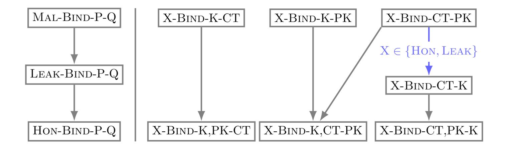
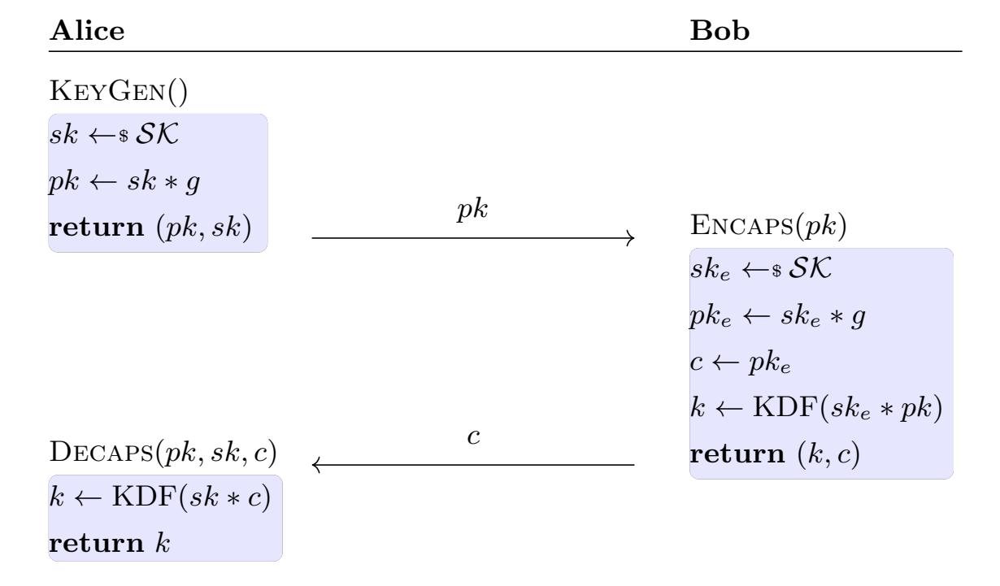
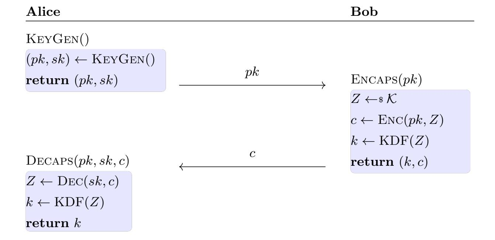
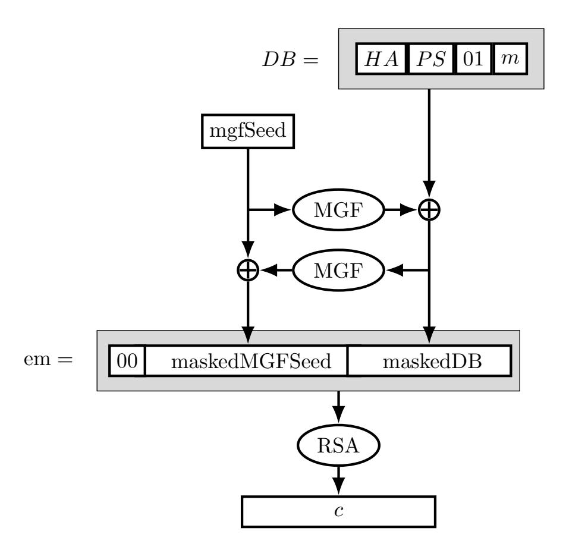

{0}------------------------------------------------

# <span id="page-0-0"></span>On the Binding Security of KEMs based on RSA and DH

Juliane Kr¨amer, Maximiliane Weish¨aupl, and Stefan Winderl

University of Regensburg, Germany firstname.lastname@ur.de

Abstract. Motivated by new attack vectors against KEMs, a framework for binding security has recently been introduced and has since been widely used for analyzing post-quantum schemes. However, KEMs based on classical schemes have not been analyzed yet. NIST recently published SP 800-227, where they illustrate how KEMs can be built from classical cryptographic schemes such as Diffie-Hellman (DH) or RSA. Following their descriptions, we analyze the binding security of the resulting KEMs based on (elliptic-curve) Diffie-Hellman, X25519, RSA, and RSA-OAEP. Due to structural similarities to the other DH schemes and since it has not been analyzed so far, we also include the post-quantum scheme CSIDH. Our analysis yields mixed results for the KEMs under consideration, with both binding attacks as well as proofs. Where possible, we propose minor modifications to the schemes, which improve their binding security. Further, we conclude from our results whether hybrid schemes, i.e., KEMs obtained by combining a classical and a post-quantum scheme, need to add the classical ciphertext in the key-derivation function to achieve IND-CCA security.

Keywords: KEM, KEM combiner, hybrid KEMs, binding security, C2PRI, Diffie-Hellman, FFDH, ECDH, X25519, CSIDH, RSA, RSA-KEM, RSA-OAEP

## 1 Introduction

Key-encapsulation mechanisms (KEMs) help to establish shared secrets over insecure channels. They consist of three steps: First, the sender generates a secret. Second, this secret is encapsulated in a ciphertext using the public key of the recipient. Third, the receiver decapsulates the ciphertext by using his secret key and obtains the secret, which is a common secret with the sender. As only the recipient is able to reverse the encapsulation (using his secret key), KEMs can be used securely even in unencrypted channels. KEMs can be classified into two categories depending on their rejection behavior during decapsulation: A KEM is said to be implicitly rejecting if decapsulation never returns ⊥, and explicitly rejecting otherwise.

<sup>⋆</sup> This work was funded by the BMFTR under the projects QUDIS (16KIS2091), 6G-RIC (16KISK033), and Quant-ID (16KISQ111).

{1}------------------------------------------------

<span id="page-1-0"></span>While some older cryptographic schemes such as RSA or finite field / ellipticcurve Diffie-Hellman were not originally designed as KEMs, nowadays they are often used as such and also the future of asymmetric cryptography regarding key establishment will likely be KEM-based. This is also reflected by the fact that NIST is standardizing post-quantum KEMs as part of their post-quantum cryptography (PQC) standardization process. The transition to post-quantum security is necessary as the security of currently used asymmetric cryptographic schemes is based on the factorization and discrete logarithm problems, which will become insecure once large-scale quantum computers are available. While the transition to PQC has already begun, its completion will take time—NIST has designated 2035 as the target year [MPR<sup>+</sup>24]. Until then, classical schemes, and in particular KEMs, will still be used alone or in combination with postquantum schemes. Such combinations can be achieved using KEM combiners, which merge two KEMs into a single one that remains secure as long as at least one of the underlying KEMs is secure. When a classical and a post-quantum KEM are combined in this way, the resulting construction is referred to as a hybrid KEM.

The standard security notions for KEMs are IND-CPA, i.e., security against a passive adversary, and IND-CCA, i.e., security against an active adversary. However, there are possible attack vectors that are not covered by these notions. A recent example is the re-encapsulation attack from [CDM24], which is based on the possibility of decapsulating a ciphertext to obtain the shared key and then re-encapsulating this shared secret under a different public key. Thus, the adversary Eve can trick Alice, who thinks she is sharing a key with Eve, into actually sharing a key with Bob. While this does not violate the standard security notions, it contradicts the implicit key agreement. If a KEM satisfies that a given shared secret binds the public key, this attack would not be possible. The reencapsulation attack motivated the introduction of new security notions known as binding notions [CDM24].

The binding notions are of the general form X-BIND-P-Q, which depends on the chosen adversarial model  $X \in \{Hon, Leak, Mal\}$ . Hon is the weakest setting, where the adversary can only access public keys and a decapsulation oracle, while Leak no longer needs the oracle, as the adversary can access the secret keys. Hon and Leak are both restricted to honestly generated key pairs, while in the Mal setting, the adversary is allowed to create the key pairs herself, which hence might be maliciously chosen. The components P and Q in X-BIND-P-Q are subsets  $P, Q \subseteq \{PK, CT, K\}$  that are non-empty and non-intersecting. In total, the notion X-BIND-P-Q translates to P binding Q in the attack scenario X. For example, we denote by Leak-BIND-K,PK-CT that the key k and public key k together bind the ciphertext k against a Leak adversary. In other words, it is negligible that an adversary can find for a given public and secret key two distinct ciphertexts which decapsulate to the same shared key.

The relevance of binding security was further increased when recent work showed a link to KEM combiners. X-Wing  $[BCD^+24]$  is a hybrid KEM that uses the classical scheme X25519 [Ber06] with the post-quantum KEM ML-KEM-

{2}------------------------------------------------

<span id="page-2-0"></span>768 [oST24] and is shown to be IND-CCA secure, even though it omits the large ML-KEM ciphertext in the key-derivation function (KDF) for the shared key. This choice is possible, as ML-KEM has been proven to satisfy a new notion called C2PRI (ciphertext second-preimage resistance). Later, [CHH<sup>+</sup>25] generalized this construction by introducing the KEM combiner QSI, which is IND-CCA secure if both KEMs are IND-CCA secure and fulfill C2PRI. The QSI combiner computes the shared secret only using the shared secrets of the two KEMs, hence further reducing the amount of necessary hashing. The notion C2PRI is closely connected to the notion LEAK-BIND-K,PK-CT: C2PRI behaves to LEAK-BIND-K,PK-CT as second-preimage resistance does to collision resistance. Thus, LEAK-BIND-K,PK-CT implies C2PRI.

Binding security has already been widely analyzed for many post-quantum schemes [CDM24, Sch24, KSW25b, KMSW25]. However, the same is not true for classical KEMs. Aside from the fact that the scheme X25519 was shown to be C2PRI [BCD<sup>+</sup>24] and the analysis of DHKEM in [CDM24], which is a KEM based on elliptic curves as defined in [ABH<sup>+</sup>21,BBLW22], there is no prior work on the binding security of classical schemes.<sup>1</sup>

## 1.1 Contribution

We analyze in total seven KEMs based on RSA and Diffie-Hellman. While these schemes were originally not designed as KEMs, the recent publication NIST SP 800-227 [ABC<sup>+</sup>25] explains how to convert RSASVE (Secret-Value Encapsulation), RSA-OAEP (Optimal Asymmetric Encryption Padding), FFDH (Finite Field Diffie-Hellman), and ECDH (Elliptic-Curve Diffie-Hellman) into KEMs. All of these schemes contain ciphertext and public-key validations, as well as validations for secret keys and consistency of the key pair. However, note that these KEMs are not standardized schemes, but are described as illustrative examples. Along with these four NIST KEMs, we consider RSA-KEM from [ISO06], XECDH-KEM based on X25519 [Ber06], and CSIDH-KEM based on CSIDH [CLM<sup>+</sup>18]. Our reasoning for including RSA-KEM is that it has fewer validation steps and allows more secrets (0, 1, n-1) than RSASVE-KEM. Note that CSIDH-KEM is not a classical KEM, but a post-quantum scheme. We decided to include it, since its binding security has not been analyzed,<sup>2</sup> and its binding analysis is similar to FFDH-KEM. Also, XECDH-KEM is included due to its popularity, see |ian26|. Our contribution can be categorized into four parts: general results on the binding security of KEMs, results on the binding security of specific KEMs, improving the binding security for specific KEMs, and C2PRI analysis of all considered KEMs with combiner implications.

<sup>&</sup>lt;sup>1</sup> Note that the fact that RSA-KEM does not achieve Hon-BIND-K-PK and Hon-BIND-K-CT has already been mentioned during a talk [SC25] in the NIST workshop on guidance for KEMs in February 2025. Also, it is mentioned without a proof in a draft by LAMPS [OGP<sup>+</sup>26] that RSA-OAEP and DH do not fulfill C2PRI.

<sup>&</sup>lt;sup>2</sup> This is probably due to the fact that prior works mostly focused on KEMs built using the FO-transform.

{3}------------------------------------------------

Results for General KEMs. One property that applies to all our schemes, if we omit validations, is that decapsulation does not use the public key. Under this assumption, we show that Mal-Bind-K,CT-PK, Mal-Bind-K,PK-CT, and all other stronger Mal notions cannot be satisfied in Theorem 10. If additionally to this assumption, Leak-Bind-CT-K is not fulfilled—which always holds for implicitly-rejecting KEMs—we show that the KEM cannot satisfy Mal-Bind-CT,PK-K by Theorem 14. On the other hand, we prove, which requirements are sufficient to achieve Mal-Bind-CT,PK-K for a general KEM in Theorem 17.

Furthermore, for correct KEMs, which derive the key independent of the public key and the ciphertext or fulfill some DH-related property, we prove that Hon-Bind-K-PK and Hon-Bind-K-CT do not hold by Theorem 12. This applies to all analyzed schemes, even if they use validations.

Scheme Analysis. An overview of the binding properties of the schemes under consideration can be found in Table 1. First, some of our KEMs do not use the public key during decapsulation, which significantly reduces the possible Mal notions as discussed above. Validation prevents these simple attacks and is one reason, why only the KEMs based on NIST schemes achieve any Mal notions, as none of the other schemes include comparable validations.

As mentioned above, we find that none of the KEMs fulfills Hon-Bind-K-PK or Hon-Bind-K-CT. This is expected, as in RSA the key is chosen independently of public key and ciphertext. For Diffie-Hellman, it is possible to either fix the public key or ciphertext and choose the other component, s.t. a fixed shared secret is the result of decapsulation, as they operate in cyclic groups.

For the notions X-BIND-K,CT-PK and X-BIND-K,PK-CT, we have the following results: For FFDH-KEM the notions depend on which type of validation (full or partial) is used for public keys or ciphertexts (see Table 2 for all cases). In the best case (full validation for both public key and ciphertext), FFDH-KEM satisfies both notions in the MAL setting, while in the worst case (partial validation for both public key and ciphertext), it achieves the same bindings as ECDH-KEM, i.e., Hon-Bind-K,PK-CT does not hold while Leak-Bind-K,CT-PK does. The ECDH-based KEM achieves only these notions, as it uses the y-coordinate of the shared secret, while omitting the x-coordinate. CSIDH-KEM also has no validation of the public key in Encaps and can thus only satisfy Leak notions. For the last DH-based KEM XECDH-KEM, there exist multiple public keys / ciphertexts which behave identical, as no validation is included. So, even the Hon notions do not hold.

RSASVE-KEM uses enough validations to achieve Mal-Bind-K,PK-CT. In contrast, for Mal-Bind-K,CT-PK we were able to use unconcealed messages for two different public keys, which share a prime, to break the notion. Leak-Bind-K,CT-PK is given as long as our Assumption 37 holds, i.e., it is hard to find messages which encrypt to the same value using different moduli. Our analysis of RSA-KEM is independent of this assumption, as it cannot fulfill Mal due to missing validations and the same ciphertext c=0

{4}------------------------------------------------

<span id="page-4-0"></span>decrypts to the same shared secrets for different public keys, which enables an attack against Hon-Bind-K,CT-PK. For RSA-OAEP-KEM we show that Hon-Bind-K,PK-CT does not hold due to the seed used for probabilistic encryption and Leak-Bind-K,CT-PK is satisfied due to the OAEP structure.

The notions Hon-Bind-CT-PK and Hon-Bind-CT-K are not fulfilled for implicitly-rejecting schemes. As RSA-OAEP-KEM is explicitly rejecting, we need a separate analysis here. Achieving Mal is not possible, as RSA-OAEP cannot offer full public-key validation and we can use a modulus  $n = p^s q$  with small primes p,q for greater ciphertext collision odds. A similar modulus was also used for attacks against Mal-Bind-CT,PK-K.

Improving Binding Security via Additional Inputs to the KDF. Next, our aim was to find ways to improve the binding security of schemes. More precisely, we focus on security with respect to notions in which the key binds (i.e., X-BIND-P-Q with  $K \in P$ ), as these include the notions exploited in the known binding attacks against protocols [CDM24, BJKS24]. To this end, we analyze which components can be additionally included in the key-derivation function (KDF) to obtain better binding security, while keeping the KDF computation as efficient as possible. If we additionally include some component z in the KDF of a KEM, we denote this scheme by KeM<sub>z</sub>. For all schemes, one can follow Table 5 and reach the desired binding security for X-BIND-K,CT-PK and X-BIND-K,PK-CT by adding the public key or ciphertext as input of the KDF. In the appendix we provide the concrete binding notions, obtained by using this table for each scheme (see Tables 8 and 9). For ECDH-KEM and RSA-OAEP-KEM, we show scheme-specific modifications which increase the binding security (see Table 3). ECDH-KEM can achieve better binding security by including the least significant bit (lsb) of the y-coordinate of the output key into the KDF. This is possible for elliptic curves on prime fields, as there always exist two points with the same x-coordinate. The output key consists only of the x-coordinate, hence is not uniquely determined without the lsb. For RSA-OAEP-KEM, we improve the binding security by including the seed used for probabilistic encryption. Then the output key binds the whole randomness used during encapsulation.

C2PRI Analysis and Combiner Implications. We analyze the KEMs with respect to the property C2PRI, which is closely related to the security of KEM combiners. We use that Leak-Bind-K,PK-CT already implies C2PRI to determine which schemes fulfill C2PRI. The results are shown in Table 7. In the cases where Leak-Bind-K,PK-CT does not hold, we argue for each scheme that C2PRI does not hold either. Lastly, we deduce which classical KEMs can be used in a hybrid combiner such that they are IND-CCA secure against classical and post-quantum adversaries.

{5}------------------------------------------------

<span id="page-5-1"></span><span id="page-5-0"></span>**Table 1.** Overview of the binding properties of the KEMs under consideration. The blue numbers reference the relevant theorems. If the notion does not hold in the HON setting, we use  $\checkmark$  and if it holds in the MAL setting, we use  $\checkmark$ . If the notion is fulfilled for Leak, but there exists a counterexample for MAL, we write  $\checkmark_L$ . Note that MAL notions are only fulfilled, if we include some checks on the keys in Decaps (see Section 3.2), otherwise only Leak security is given. Lastly,  $\checkmark_{\bigstar}$  denotes that the notion is fulfilled for MAL, if full validation is used for public keys and ciphertexts, otherwise the notions degrade (see Table 2).

| Notion         | FF  | DH | CS                    | IDH  | ΕC             | CDH | XE             | CDH  |                | SA<br>VE | R              | SA   |                | SA<br>AEP |
|----------------|-----|----|-----------------------|------|----------------|-----|----------------|------|----------------|----------|----------------|------|----------------|-----------|
| X-BIND-K-CT    | X   | 13 | X                     | 13   | Х              | 13  | X              | 13   | X              | 13       | Х              | 13   | X              | 13        |
| X-BIND-K-PK    | X   | 13 | X                     | 13   | X              | 13  | X              | 13   | X              | 13       | X              | 13   | X              | 13        |
| X-BIND-K,PK-CT | ✓ ★ | 21 | $\checkmark_{L}$      | 26   | X              | 28  | X              | 35   | 1              | 41       | $\checkmark_I$ | 44   | X              | 46        |
| X-BIND-K,CT-PK | ✓ ★ | 20 | $\checkmark_{L}$      | 25   | $\checkmark_I$ | 29  | X              | 35   | $\checkmark_1$ | 39       | X              | 43   | $\checkmark_L$ | 47        |
| X-BIND-CT-PK   | X   | 8  | X                     | 8    | X              | 8   | X              | 8    | X              | 8        | X              | 8    | $\checkmark_L$ | 47        |
| X-BIND-CT-K    | X   | 8  | X                     | 8    | X              | 8   | X              | 8    | X              | 8        | X              | 8    | $\checkmark_L$ | 47        |
| X-BIND-CT,PK-K | ✓   | 18 | <b>√</b> <sub>L</sub> | . 15 | ✓              | 18  | $\checkmark_L$ | , 15 | <b>√</b> 1     | 42       | <b>√</b> 1     | . 15 | $\checkmark_L$ | , 49      |

#### 1.2 Related Work

Prior to the binding framework by |CDM24| there were some closely related robustness notions, first formalized in [ABN10]. Simply put, robustness means that a ciphertext should not be decryptable under different public keys. In their work, they also analyzed the robustness of ElGamal Encryption and DHIES ABR98, which is an encryption scheme utilizing finite field DH, a MAC, and a symmetric encryption. These robustness notions have been revisited |FLPQ13| and extended [GNR19]. Also, robustness has been studied for post-quantum schemes and the FO-transformations in [GMP22, Xag22]. As far as we are aware, no robustness analysis has been conducted on the schemes we analyze in our work. As discussed above, the binding framework was introduced and used in [CDM24] to analyze post-quantum schemes. Further analysis of post-quantum KEMs has been done for ML-Kem |Sch24|, implicitly-rejecting KEMs |KSW25b|, and explicitly-rejecting KEMs |KMSW25|. Also, a security analysis on Signal's protocol |FG25| used the framework. In X-Wing |BCD<sup>+</sup>24|, they introduced the related notion C2PRI together with the combiner QSF. In [CHH<sup>+</sup>25], a variant of QSF, called QSI, is defined and the binding security of both combiners is analyzed. In [KSW25a], a similar analysis is conducted for a generic combiner, which allows application to several real-world combiners.

Concurrent Work. In [KLS26], they analyze the advantage of including the ciphertext or public key in the combiner KDF for several ECDH-based schemes, including X25519, NIST P-256, and DHKEM, which are also covered in our

{6}------------------------------------------------

<span id="page-6-2"></span><span id="page-6-0"></span>Table 2. Binding results for FFDH-KEM and for ECDH-KEMlsb with elliptic curves with cofactor h > 1 depending on which type of validation is used for the public key pk in Encaps and the ciphertext c in Decaps. Note that for cofactor h = 1 partial and full validation are equivalent. The Mal notions here also require the validations in Decaps (see Section [3.2\)](#page-13-1). If the security of the KEM does not hold in Hon-Bind-P-Q, we use ✗-Bind-P-Q. The blue references point to the respective theorems, where the first reference is for FFDH-KEM and the second one is for ECDH-KEMlsb.

| Validations | partial c                                           | full c                                                |
|-------------|-----------------------------------------------------|-------------------------------------------------------|
| partial pk  | Leak-Bind-K,CT-PK (24,33)<br>✗-Bind-K,PK-CT (23,33) | Leak-Bind-K,CT-PK (24,33)<br>Mal-Bind-K,PK-CT (21,32) |
| full pk     | Mal-Bind-K,CT-PK (20,32)<br>✗-Bind-K,PK-CT (23,33)  | Mal-Bind-K,CT-PK (20,32)<br>Mal-Bind-K,PK-CT (21,32)  |

analysis.[3](#page-0-0) While our results for these schemes agree, our works differ in several aspects: Firstly, we use the binding framework introduced by [\[CDM24\]](#page-52-0) and give a complete analysis of the schemes under consideration with respect to all notions from the framework—while [\[KLS26\]](#page-53-7) does not rely on the binding framework. Secondly, we cover additional schemes, namely FFDH, CSIDH, and three different RSA-based schemes and, moreover, derive results for general KEMs where possible. Thirdly, we propose scheme-specific variants for some of the KEMs with improved binding security as an alternative to including ciphertext and public key in the KDF. Note that, for the NIST P-curves, our proposal ECDH-KEMlsb+pk is more efficient than including ciphertext and public key in the KDF.

### 1.3 Overview

In Section [2,](#page-6-1) we give general background information on KEMs and the binding notions. Our main results are divided into four topics. First, we provide the results that hold for general KEMs in Section [3.](#page-12-1) Next, we analyze the KEMs based on Diffie-Hellman exchanges in Section [4](#page-18-1) and the KEMs based on RSA in Section [5.](#page-32-0) Lastly, in Section [6,](#page-47-0) we describe the implications of our results to combiners.

## <span id="page-6-1"></span>2 Background

First, we introduce our notation in Section [2.1.](#page-7-1) KEMs and KEM-related definitions, such as correctness and implicitly/explicitly rejecting, are introduced in Section [2.2.](#page-7-2) Afterwards, we explain the binding notions in Section [2.3](#page-8-0) and their implications in Section [2.4.](#page-9-0) Note that background for the specific schemes is given in their own sections.

<sup>3</sup> DHKEM is covered by ECDH-KEMpk+ct with partial validation and XECDH-KEMpk+ct depending on the curve.

{7}------------------------------------------------

<span id="page-7-0"></span>Table 3. Overview of the binding security of our modified KEM variants. For a KEM KEM, the notation  $KEM_x$  refers to the component x being an additional input to the KDF—for more details, we refer to Section 4.3 for ECDH and Section 5.3 for RSA-OAEP. The results that carry over from the unmodified case, i.e., where the modification does not yield additional binding notions, are marked in grey:  $\times$  denotes that the notion is not even given in the HON case,  $\checkmark$  stands for MAL security being fulfilled, and  $\checkmark_L$  means that LEAK security is given, while MAL is not. Note that sometimes MAL is only achieved by including key-pair validation, which we denote by  $\checkmark^{val}$ —if the validations are not included the security reduces to LEAK (see Section 3.2). Furthermore, some of the results for ECDH-KEM<sub>lsb</sub> and ECDH-KEM<sub>lsb+pk</sub> depend on the given validations; we use  $\checkmark^{1/2}_{\star}$  as placeholders and refer to Table 2 for the precise results.

| Notion         | $\mathrm{ECDH}_{\mathrm{lsb}}$                   | $\mathrm{ECDH}_{\mathrm{lsb+pk}}$ | $RSA$ - $OAEP_{seed}$ | $RSA-OAEP_{seed+pk}$ |
|----------------|--------------------------------------------------|-----------------------------------|-----------------------|----------------------|
| X-BIND-K-CT    | X                                                | <b>√</b> <sup>1</sup> 7           | X                     | $\checkmark^{val}$ 7 |
| X-BIND-K-PK    | X                                                | <b>√</b> 7                        | X                     | <b>√</b> 7           |
| X-BIND-K,PK-CT | $\checkmark^1_{\bigstar}$ 2                      | $\checkmark^1_{\bigstar}$         | $\checkmark^{val}$ 50 | $\checkmark^{val}$   |
| X-BIND-K,CT-PK | $\checkmark^{\stackrel{\circ}{\star}}_{\star}$ 2 | <b>√</b> 7                        | $\checkmark_L$        | <b>√</b> 7           |
| X-BIND-CT-PK   | X                                                | X                                 | $\checkmark_L$        | $\checkmark_L$       |
| X-BIND-CT-K    | X                                                | X                                 | $\checkmark_L$        | $\checkmark_L$       |
| X-BIND-CT,PK-K | <b>√</b> val                                     | <b>√</b> val                      | $\checkmark_L$        | $\checkmark_L$       |

#### <span id="page-7-1"></span>2.1 Notation

We use  $a \leftarrow B$  if a is uniformly sampled from the set B and  $a \leftarrow r$  to assign the value of r to a. For errors, the symbol  $\bot$  is used. Furthermore, len(x) is the bit length of x and [1, n] is a short notation for the set  $\{1, 2, ..., n\}$ . We denote by  $\mathbb{Z}_n^*$  the multiplicative group of  $\mathbb{Z}_n$ , especially  $\mathbb{Z}_p^* = \mathbb{Z}_p \setminus \{0\}$ . For a KEM KEM, we denote by KEM<sub>x</sub> the KEM which computes the shared secret as KDF(k, x). If multiple components x, y, z are added, i.e., KDF(k, x, y, z), we write KEM<sub>x+y+z</sub>. In pseudocodes, we omit conversions from bytes to integers and the other way around and assume that the variables are in the correct format.

#### <span id="page-7-2"></span>2.2 Key-Encapsulation Mechanisms

First, we define KEMs and correctness and then explain the difference between implicitly- and explicitly-rejecting KEMs.

**Definition 1 (KEM).** A KEM consists of three algorithms: KEYGEN, ENCAPS, and DECAPS.

-  $(pk, sk) \leftarrow \text{*} \text{KeyGen}()$ : The probabilistic algorithm KeyGen does not have an explicit input. It generates a key pair consisting of a public key pk and a secret key sk.

{8}------------------------------------------------

- <span id="page-8-3"></span> $-(k,c) \leftarrow \text{Encaps}(pk,r)$ : The encapsulation algorithm Encaps has a public key pk and randomness r as input and outputs a key k, also known as shared secret, and a ciphertext c.
- $k \leftarrow \text{Decaps}(pk, sk, c)$ : The deterministic decapsulation algorithm Decaps uses a public key pk, a secret key sk, and a ciphertext c as inputs and outputs a key k.

Note that we will not explicitly write the randomness r as an input to ENCAPS, unless it is required for an argument.

<span id="page-8-2"></span>**Definition 2 (Correctness).** A KEM is said to be correct if for all key pairs (pk, sk) generated by KEYGEN(), we have with overwhelming probability that ENCAPS(pk) = (k, c) implies DECAPS(pk, sk, c) = k.

All KEMs considered in this work are correct. Note that correctness only applies to the key pairs in the Hon and Leak setting, whereas in Mal the adversary is able to maliciously create key pairs herself.

<span id="page-8-1"></span>Implicitly- and Explicitly-Rejecting KEMs. We follow the convention from [CDM24] to distinguish implicitly- and explicitly-rejecting KEMs. A KEM is said to be implicitly rejecting if decapsulation never returns ⊥, and explicitly rejecting otherwise. In particular, this is in line with the explicitly- and implicitly-rejecting Fujisaki–Okamoto (FO) transform [FO99], as the latter does not return ⊥ in the rejection case, but instead a pseudorandom rejection key. Note that none of the KEMs we consider deploy the FO transform. We consider FFDH-KEM, ECDH-KEM, XECDH-KEM, RSASVE-KEM, RSA-KEM, and CSIDH-KEM as being implicitly rejecting, while RSA-OAEP-KEM is explicitly rejecting. While implicitly-rejecting FO-KEMs "hide" their rejection case by returning a rejection key, our implicitly-rejecting KEMs have no rejection case for valid inputs, as the respective group action always results in a key.

Implementations of the KEMs must contain validity checks for the inputs according to [BCR<sup>+</sup>18,BCR<sup>+</sup>19]. For sake of simplicity, we include these validity checks in the Encaps and Decaps algorithms,<sup>5</sup> however, they are not part of the actual KEM algorithms but should be performed by the caller. Since we include these checks in the KEM algorithms, our Decaps pseudocodes output  $\bot$ . Nevertheless, they do not qualify as explicitly-rejecting KEMs.

### <span id="page-8-0"></span>2.3 Binding Notions

The binding notions [CDM24] capture extra attack vectors, which are not covered by the standard notions IND-CPA and IND-CCA. The notion X-BIND-P-Q

<sup>&</sup>lt;sup>4</sup> Note that the definition of implicitly- and explicitly-rejecting KEMs from [CDM24] is not restricted to FO-KEMs (in particular, they classify DHKEM as an implicitly-rejecting KEM).

<sup>&</sup>lt;sup>5</sup> This is why we need to provide the public key as an input to DECAPS.

{9}------------------------------------------------

<span id="page-9-2"></span><span id="page-9-1"></span>**Table 4.** Explanations for all binding notions under consideration. Note that the given description covers only the Decaps-Decaps scenario of the Mal case, as in the other scenarios, the adversary is able to choose the encryption randomness instead of the ciphertext. Furthermore, in order for the adversary to win, the shared keys must be valid, i.e.,  $k, \overline{k} \neq \bot$ .

| Notion                                                                                                                                                                                            | Explanation                                                                                 |  |  |  |  |
|---------------------------------------------------------------------------------------------------------------------------------------------------------------------------------------------------|---------------------------------------------------------------------------------------------|--|--|--|--|
| X = Hon: the adversary has access to all public keys and Decaps oracles $X = Leak$ : the adversary knows both public and secret keys $X = Mal$ : the adversary chooses all public and secret keys |                                                                                             |  |  |  |  |
| It is impossible for the adversary to find                                                                                                                                                        |                                                                                             |  |  |  |  |
| X-BIND-K-CT                                                                                                                                                                                       | $\ldots c \neq \overline{c}, \text{ s.t. } k = \overline{k}.$                               |  |  |  |  |
| X-BIND-K-PK                                                                                                                                                                                       | $c$ and $\overline{c}$ , s.t. $k = \overline{k}$ when using $pk \neq \overline{pk}$ .       |  |  |  |  |
| X-BIND-K,PK-CT                                                                                                                                                                                    | $\ldots c \neq \overline{c}$ , s.t. $k = \overline{k}$ when using $pk = \overline{pk}$ .    |  |  |  |  |
| X-BIND-K,CT-PK                                                                                                                                                                                    | $c$ , s.t. $k = \overline{k}$ when using $pk \neq \overline{pk}$ .                          |  |  |  |  |
| X-BIND-CT-PK                                                                                                                                                                                      | $c$ , s.t. $k = \overline{k}$ or $k \neq \overline{k}$ when using $pk \neq \overline{pk}$ . |  |  |  |  |
| X-BIND-CT-K                                                                                                                                                                                       | $\ldots c$ , s.t. $k \neq \overline{k}$ .                                                   |  |  |  |  |
| X-BIND-CT,PK-K                                                                                                                                                                                    | $c$ , s.t. $k \neq \overline{k}$ when using $pk = \overline{pk}$ .                          |  |  |  |  |

says that P binds Q in the setting X, where  $P,Q \subsetneq \{PK,CT,K\}$  are non-intersecting and non-empty, and  $X \in \{HON, LEAK, MAL\}$ . In the settings HON and LEAK, key pairs are generated honestly and the adversary knows both public keys. While in HON the adversary has access to decapsulation oracles, in LEAK the adversary instead gets the corresponding secret keys. Lastly, in MAL the adversary creates the key pairs herself. Not all possible combinations for P,Q are interesting or useful, thus only the notions in Table 4 will be considered in this work. Note that we include the rarely considered binding notion X-BIND-CT,PK-K, called a "sanity check" in [CDM24] for completeness.

We say that the notion X-BIND-P-Q holds if the adversary has only a negligible chance to win the corresponding game shown in Fig. 1. Note that if the public key is neither included in P nor Q, the adversary can decide to play against the same or different public keys. This also applies to keys and ciphertexts. In Mal the adversary can freely choose between the three scenarios: Decaps-Decaps, Encaps-Decaps, and Encaps-Encaps, i.e., the adversary is free to choose the algorithms used to compute the key.

Note that our KEMs never achieve an Hon binding notion while failing against a Leak adversary. In particular, we do not have any Hon proofs in the paper. In addition, our Hon attacks never required the decapsulation oracle.

### <span id="page-9-0"></span>2.4 Existing Results for the Binding Notions

After introducing the binding notions, we next explain the dependencies between them. The following results are from [CDM24] or are direct implica-

{10}------------------------------------------------

```
X-BIND-P-Q for X \in \{ Hon, Leak \}
                                                                                            Mal-Bind-P-Q
                                                                                            g, st \leftarrow \mathcal{A}(st)
 (pk, sk) \leftarrow \text{\$} \text{KEYGEN}()
 (\overline{pk}, \overline{sk}) \leftarrow \text{\$} \text{KEYGEN}()
                                                                                            if q = 1 // Decaps-Decaps
if pk \in P
                                                                                                (pk, sk), (\overline{pk}, \overline{sk}), c, \overline{c} \leftarrow \mathcal{A}(st)
                                                                                                k \leftarrow \text{DECAPS}(pk, sk, c)
     b \leftarrow 0
 elseif pk \notin Q
                                                                                                \overline{k} \leftarrow \text{DECAPS}(\overline{pk}, \overline{sk}, \overline{c})
                                                                                            elseif g=2 // Encaps-Decaps
     b \leftarrow \{0,1\}, st \leftarrow \mathcal{A}()
                                                                                                (pk, sk), (\overline{pk}, \overline{sk}), r, \overline{c} \leftarrow \mathcal{A}(st)
if b = 0
                                                                                                (k,c) \leftarrow \text{Encaps}(pk,r)
     (pk, sk) \leftarrow (pk, sk)
                                                                                                \overline{k}, \leftarrow \text{DECAPS}(\overline{pk}, \overline{sk}, \overline{c})
if X = Hon
    c, \overline{c} \leftarrow \mathcal{A}^{D(pk,sk,\cdot),D(\overline{pk},\overline{sk},\cdot)}(pk,\overline{pk},st)
                                                                                            else // Encaps-Encaps
                                                                                                (pk, sk), (\overline{pk}, \overline{sk}), r, \overline{r} \leftarrow \mathcal{A}(st)
 elseif X = Leak
                                                                                                (k,c) \leftarrow \text{Encaps}(pk,r)
    c, \overline{c} \leftarrow \mathcal{A}(pk, sk, \overline{pk}, \overline{sk}, st)
                                                                                                (\overline{k}, \overline{c}) \leftarrow \text{Encaps}(\overline{pk}, \overline{r})
k \leftarrow \text{Decaps}(pk, sk, c)
                                                                                           if k = \bot \lor \overline{k} = \bot
\overline{k} \leftarrow \text{DECAPS}(\overline{pk}, \overline{sk}, \overline{c})
if k = \bot \lor \overline{k} = \bot
                                                                                                return 0
                                                                                            return (\forall p \in P : p = \overline{p}) \land (\exists q \in Q : q \neq \overline{q})
     return 0
 return (\forall p \in P : p = \overline{p}) \land (\exists q \in Q : q \neq \overline{q})
```

<span id="page-10-0"></span>**Fig. 1.** Games for binding notions. Let  $P, Q \subsetneq \{PK, CT, K\}$  be non-intersecting and non-empty. For all considered notions, we have |Q| = 1. Note that HON and LEAK only differ regarding the access to the secret key. In MAL the adversary can freely choose between the three scenarios and is even capable of creating the key pairs. We denote by  $p, \overline{p}, q, \overline{q}$  in the last line, the output of the adversary, e.g., for Q = PK we have q = pk and  $\overline{q} = \overline{pk}$ . The state of the adversary is denoted by st and the randomness for ENCAPS by st. The decapsulation oracles are denoted by st and st.

tions of their work. There is a strong hierarchy between the settings, namely Mal  $\Longrightarrow$  Leak  $\Longrightarrow$  Hon. If  $P \subset P'$  we have X-BIND-P-Q  $\Longrightarrow$  X-BIND-P'-Q for all attack settings X. These implications and more are visualized in Fig. 2.

To save space, we will not explicitly state theorems for each adversarial model if they follow directly by the hierarchy of the notions. For example, if a notion is not fulfilled against Hon, then Leak and Mal are also not satisfied. On the other hand, if a notion holds in the Mal setting, also Leak and Hon are implied.

<span id="page-10-1"></span>Theorem 3 (Adapted from [CDM24, Theorem 4.5]). For the adversarial model  $X \in \{HON, LEAK, MAL\}$ , any KEM which fulfills X-BIND-P-Q and X-BIND-P'-Q', also fulfills X-BIND-P'-R, if  $P \subset P', Q \subset (Q' \cup P')$  and  $R \subset R'$ .

<span id="page-10-2"></span>Corollary 4 (Adapted from [CDM24, Corollary 4.11]). For the adversarial model  $X \in \{HON, LEAK, MAL\}$ , any KEM which fulfills X-BIND-K-CT and X-BIND-K, CT-PK, also achieves X-BIND-K-PK.

{11}------------------------------------------------

<span id="page-11-4"></span>

<span id="page-11-1"></span>Fig. 2. Overview for binding notions adapted from Figure 8 in [CDM24]. For example if a KEM fulfills Mal-BIND-K-CT then it already satisfies Leak-BIND-K,PK-CT. The notions X-BIND-CT-PK and X-BIND-CT-K are only relevant for explicitly-rejecting KEMs, i.e., RSA-OAEP-KEM in our case. The blue implication does not hold for Mal (see Proposition A.10 in [CDM24]).

By changing the position of the ciphertext and public key, it is also possible to obtain the following corollary.

<span id="page-11-3"></span>Corollary 5. For the adversarial model  $X \in \{HON, LEAK, MAL\}$ , any KEM which fulfills the notions X-BIND-K-PK and X-BIND-K,PK-CT, also satisfies X-BIND-K-CT.

*Proof.* Use Theorem 3 with 
$$P = P' = \{K\}$$
,  $R = R' = \{CT\}$ ,  $Q' = \{PK\}$  and observe that  $Q = \{K, PK\} \subset (Q' \cup P')$ .

Better binding security can be obtained by including pk or c in the KDF. The following theorem results from combining the Theorems D.1, D.2, and D.3 from [CDM24]. Note that the theorem only holds, if the ciphertext / public key has an injective serialization and is inserted at a fixed position in the KDF.

<span id="page-11-2"></span>**Theorem 6.** Including the public key pk in the KDF<sup>6</sup> gives any KEM the properties Mal-Bind-K-PK and Mal-Bind-K,CT-PK. Analog, including the ciphertext c in the KDF yields Mal-Bind-K-CT and Mal-Bind-K,PK-CT security.

<span id="page-11-0"></span>Corollary 7. Let X be in {Hon, Leak, Mal} and Kem be a KEM.

- 1. If Kem fulfills X-Bind-K,PK-CT and we include the public key in the KDF, then Kem<sub>pk</sub> satisfies Mal-Bind-K-PK and X-Bind-K-CT.
- 2. If Kem fulfills X-Bind-K,CT-PK and we include the ciphertext in the KDF, then Kem<sub>ct</sub> satisfies Mal-Bind-K-CT and X-Bind-K-PK.

*Proof.* By including the ciphertext or the public key in the KDF the KEM achieves the corresponding MAL notion by Theorem 6. The missing notion follows by Corollary 4 or Corollary 5. □

If a rejection key is computed, then the pk also needs to be added in the corresponding KDF.

{12}------------------------------------------------

<span id="page-12-4"></span>On the one hand, some notions are also impossible to obtain for certain KEMs.

<span id="page-12-0"></span>Theorem 8 ([CDM24, Theorem 4.10]). An implicitly-rejecting KEM does not satisfy X-BIND-CT-PK or X-BIND-CT-K for  $X \in \{HON, LEAK, MAL\}$ .

Therefore, every KEM we analyze except RSA-OAEP-KEM will achieve neither Hon-Bind-CT-PK nor Hon-Bind-CT-K. On the other hand, some notions are always satisfied.

<span id="page-12-3"></span>**Theorem 9** ([KMSW25, Theorem 31]). Any KEM is LEAK-BIND-CT,PK-K secure.

### <span id="page-12-1"></span>3 General Results for KEMs

In this section, we present general results that hold for all or multiple of the KEMs under consideration. Firstly, in Section 3.1, we give general remarks on the KDF that are relevant for our analysis. Next, we prove that KEMs that do not validate their public key cannot achieve most MAL notions in Section 3.2. Furthermore, we show that the key neither binds the ciphertext nor the public key for all our KEMs in Section 3.3. Lastly, in Section 3.4, we give general requirements for the notion MAL-BIND-CT,PK-K to hold for our Diffie-Hellman-based KEMs and RSA-KEM.

### <span id="page-12-2"></span>3.1 Key-Derivation Functions (KDFs)

Improving the Binding Notions. Every KEM we analyze can achieve the notionsMal-Bind-K-PK and Mal-Bind-K-CT by including the public key and the ciphertext in the KDF by Theorem 6.7 Then, Mal-Bind-K,CT-PK and Mal-Bind-K,PK-CT are also satisfied by the hierarchy of notions as shown in Fig. 2—as well as all corresponding Leak and Hon notions. In Table 5, we also show which binding notions hold, if only the public key or ciphertext is included. Note that for ECDH-KEM (Section 4.3) and RSA-OAEP-KEM (Section 5.3), we have scheme-specific improvements, which require additional analyses.

In situations where including the ciphertext or public key in the KDF leads to the same binding security and both are of the same length, we advocate for including the public key. In general, it makes the KEM contributory, i.e., both the sender and the recipient contribute to the final shared secret, which is otherwise not the case for our RSA-based KEMs. In case static public keys are used, pre-hashing the public key can increase the performance by reducing necessary hashing.

<sup>&</sup>lt;sup>7</sup> In the draft by LAMPS [OGP<sup>+</sup>26] they also use this fact for their combiner KDF, to which they add both the classic public key and ciphertext.

{13}------------------------------------------------

<span id="page-13-2"></span><span id="page-13-0"></span>Table 5. Overview of the binding security of the KEM variants  $KEM_x$  with modified key derivation. More precisely,  $KEM_x$  with  $x \in \{pk, c, pk + c\}$  is obtained from KEM by additionally including x in the KDF. We denote by  $\checkmark$  that a notion holds in the MAL setting, by  $\checkmark_L$  that it holds in the LEAK (but not in the MAL) setting, and by  $\checkmark_H$  that it holds in the HON (but not in the LEAK) setting. Lastly,  $\checkmark$  denotes that not even HON security is given. We use  $A, B, C, D \in \{\mbox{$\chi$}, \mbox{$\chi$}_H, \mbox{$\zeta$}_L, \mbox{$\zeta$}_L\}$  as placeholders for the binding security that KEM achieves and derive the results for the modified versions  $KEM_x$  according to Corollary 7. For example, if  $C = \mbox{$\zeta$}_L$ , i.e., KEM achieves LEAK-BIND-K,PK-CT, the modified version  $KEM_{pk}$  fulfills LEAK-BIND-K-CT and LEAK-BIND-K,PK-CT.

| Notion         | KEM           | ${\rm Kem}_{\rm pk}$ | Kemct | $Kem_{pk+ct}$ |
|----------------|---------------|----------------------|-------|---------------|
| X-BIND-K-CT    | $\mid A \mid$ | C                    | ✓     | ✓             |
| X-BIND-K,PK-CT | C             | C                    | ✓     | ✓             |
| X-BIND-K-PK    | B             | ✓                    | D     | ✓             |
| X-BIND-K,CT-PK | D             | $\checkmark$         | D     | $\checkmark$  |

Collision Resistance of the KDF. We will assume that there is only a negligible chance that an adversary can find a collision for the KDF and therefore not mention collisions in proofs. Note that all considered KEMs use a KDF to obtain an output key from the shared secret, except CSIDH-KEM where we added the KDF.

#### <span id="page-13-1"></span>3.2 Achieving MAL Security via Validations

NIST requires a number of validations for the key pairs and ciphertexts of RSAand DH-based schemes [BCR<sup>+</sup>18, BCR<sup>+</sup>19]. Below we provide descriptions of these validations and then analyze how they affect MAL security.

Full/Partial Validation of Public Keys and Ciphertexts. According to NIST, public keys and ciphertexts should be validated. Thus, we include a check for ciphertexts in Decaps and for public keys in Encaps (see Section 2.2). NIST distinguishes between full and partial validation depending on the required security and whether static or ephemeral keys are used.

While the concrete checks for partial and full validation depend on the given scheme, we can make the following generalization. We call checks on the public key a full public-key validation if they ensure that the public key is in the image of KeyGen. Analogously, we call checks on the ciphertext a full ciphertext validation if they ensure that the ciphertext is in the image of Encaps. For checks that are a true subset of the full validation checks defined above, we speak of partial validation.

**Key-Pair Validation.** The NIST schemes that we analyze contain additional validations which should occur before the key exchange. These validations include a check for the secret key, the public key, and pair-wise consistency, i.e.,

{14}------------------------------------------------

<span id="page-14-1"></span>testing whether the public key and secret key "match". Note that NIST used this categorization for Diffie-Hellman exchanges [BCR<sup>+</sup>18], while it simply uses the term key-pair validation for RSA [BCR<sup>+</sup>19]. As the secret key is necessary for key-pair validation, we include these checks in DECAPS. Note that the public-key check in DECAPS can utilize the secret key and ensures the correctness of the public key, which might not be possible for the public-key check in ENCAPS, as is the case for RSASVE-KEM. Note that the public-key check in DECAPS also has access to the secret key and hence can validate the correctness of the public key better than in ENCAPS. We say that a KEM deploys key-pair validation if DECAPS contains checks that ensure the following properties:

- The key pair lies in the image of KEYGEN.
- Key-pair consistency: For a pair (pk, sk), we have with overwhelming probability that ENCAPS(pk) = (k, c) implies DECAPS(pk, sk, c) = k.
- Public-key uniqueness: For a given honestly generated secret key, there exists only a single public key such that key-pair consistency holds.
- Secret-key uniqueness: For a given honestly generated public key, there exists
  only a single secret key such that key-pair consistency holds.<sup>8</sup>

The KEMs which are based on NIST schemes (FFDH-KEM, ECDH-KEM, RSASVE-KEM, and RSA-OAEP-KEM) all apply key-pair validation. For DH-KEMs, the key-pair consistency check consists of recalculating the public key from the secret key. For RSA-KEMs, key-pair consistency is checked by encrypting a random message and decrypting it. The uniqueness required in the validation is clear for DH-based KEMs. For the RSA-based KEMs, note that d and e have sharp bounds, s.t. there exists at most one solution when calculating one from the other.

Validations and MAL Security. If the key-pair validation is not included in DECAPS, our considered KEMs have no security against MAL adversaries. The main problem is that the public key is not used during DECAPS, in contrast to FO-KEMs, where re-encryption checks are used. Thus, MAL adversaries can output key pairs which share the public key, while the secret keys are different and vise versa. This is formalized in the theorem below.<sup>9</sup>

<span id="page-14-0"></span>**Theorem 10.** Consider a KEM KEM where DECAPS does not use the public key.<sup>10</sup> Then KEM does not fulfill MAL-BIND-K,CT-PK, MAL-BIND-K,PK-CT, MAL-BIND-K-PK, MAL-BIND-K-CT, and MAL-BIND-CT-PK.

*Proof.* Mal-Bind-K,CT-PK: The adversary  $\mathcal{A}$  generates an honest key pair (pk, sk) and chooses  $\overline{pk} \neq pk$  for the second key pair, which she sets to be

<sup>&</sup>lt;sup>8</sup> Note that this property is not universally satisfied for all KEMs, e.g., RSAKEM [ISO06] does not impose bounds on d and e.

<sup>&</sup>lt;sup>9</sup> In [SC25] a similar attack against the notion class MAL-BIND-P-PK was briefly mentioned without a proof.

Note that we do not exclude the case where the public key is recomputed from the secret key during decapsulation, as our attack also applies then.

{15}------------------------------------------------

 $(\overline{pk}, sk)$ . Then,  $\mathcal{A}$  computes an honest ciphertext c under pk. In particular, c passes ciphertext validation in DECAPS. She wins MAL-BIND-K,CT-PK in the DECAPS-DECAPS setting, as the secret keys are identical, and the public keys are not used in DECAPS.

MAL-BIND-K,PK-CT:  $\mathcal{A}$  honestly generates two key pairs (pk, sk),  $(\overline{pk}, \overline{sk})$  with  $pk \neq \overline{pk}$ . She selects some randomness r, s.t.  $c \neq \overline{c}$  are different for (k, c) = Encaps(pk, r) and  $(\overline{k}, \overline{c}) = \text{Encaps}(\overline{pk}, r)$ . Then,  $\mathcal{A}$  outputs the key pairs (pk, sk) and  $(pk, \overline{sk})$ , and the ciphertexts c and  $\overline{c}$ . As decapsulation is independent of pk, both ciphertexts return the same key k.

By the hierarchy of notions, these attacks extend to attacks against the notions Mal-Bind-K-PK, Mal-Bind-K-CT, and Mal-Bind-CT-PK.

Note that all of our KEMs—when considered without key-pair validation—do not use the public key in Decaps. This yields the following corollary.

Corollary 11. FFDH-KEM, CSIDH-KEM, ECDH-KEM, XECDH-KEM, RSASVE-KEM, RSA-KEM, and RSA-OAEP-KEM, when considered without key-pair validation, do not fulfill Mal-Bind-K,CT-PK, Mal-Bind-K,PK-CT, Mal-Bind-K-PK, Mal-Bind-K-CT, and Mal-Bind-CT-PK.

Validations in Our Analysis. Note that the considered NIST schemes still fulfill the MAL notions if one omits secret-key validation, as long as full ciphertext validation is used. If only partial ciphertext validation is used, this is not true (see Theorem 20 for a counterexample). On the other hand, omitting either public-key validation or key-pair consistency always influences the binding notions. On one side, key-pair consistency alone cannot validate the public key. For example, FFDH-KEM uses the field  $\mathbb{Z}_p^*$  for a prime p. Let (pk, sk) be honestly generated, then (pk + p, sk) fulfills key-pair consistency, while pk + p is an invalid public key, as it is too large. On the other side, public-key validation cannot check the consistency with the secret key.

Thus, in the following analysis, we include key-pair validation in Decaps for the NIST-based KEMs, as otherwise none of the considered Mal notions can be achieved. To reduce confusion for public-key validation between Encaps and Decaps, public-key validation always refers to the one in Encaps, unless otherwise specified.

If the public keys agree, the secret keys are the same in Hon and Leak by design. In the Mal setting the adversary has the opportunity to use different secret keys for the same public key. Due to the discussion given above, we will assume that a Mal adversary chooses the same secret key, if the public keys agree, as the NIST schemes use key-pair validation (i.e., "non-matching" key pairs will not pass the checks s.t. the adversary cannot win). The remaining KEMs, i.e., CSIDH-KEM, XECDH-KEM, and RSA-KEM, do not satisfy any Mal notion due to missing key-pair validation, i.e., their analysis is not affected by this assumption.

{16}------------------------------------------------

### <span id="page-16-5"></span><span id="page-16-3"></span>3.3 HON-BIND-K-CT and HON-BIND-K-PK Analysis

Our schemes either derive the output key independently of the public key and ciphertext or are based on a Diffie-Hellman key exchange.

<span id="page-16-1"></span>**Theorem 12.** Consider a correct KEM KEM, which fulfills at least one of the following properties:

- 1. Kem derives the output key k independently of the public key and the ciphertext.
- 2. The ciphertext and public-key space of KEM agree. Also, for honestly generated key pairs (pk, sk),  $(\overline{pk}, \overline{sk})$ , and ciphertexts  $c = \overline{pk}$ ,  $\overline{c} = pk$ , it holds that DECAPS $(pk, sk, c) = \text{DECAPS}(\overline{pk}, \overline{sk}, \overline{c})$ .

Then Kem does not fulfill Hon-Bind-K-PK and Hon-Bind-K-CT.

*Proof.* Two honest key pairs (pk, sk),  $(\overline{pk}, \overline{sk})$  with  $pk \neq \overline{pk}$  are generated. We start with the case that property 1 holds. To break Hon-Bind-K-PK, the adversary chooses the same randomness r and calculates c from Encaps(pk, r) and  $\overline{c}$  from Encaps $(\overline{pk}, r)$ . As the KEM is correct, decapsulation of c and  $\overline{c}$  under sk and  $\overline{sk}$ , respectively, yields the same shared key k with overwhelming probability. Note that the above attack also applies to Hon-Bind-K-CT, as we can choose r such that the ciphertexts differ.

Next, if property 2 holds, the adversary can break Hon-Bind-K-PK and Hon-Bind-K-CT by choosing  $c=\overline{pk}$  and  $\overline{c}=pk$ . Then, the resulting keys are identical by assumption.

The first property is fulfilled by our RSA-based KEMs, while the second property holds for the our Diffie-Hellman KEMs. Thus, the theorem applies to all considered KEMs.

<span id="page-16-2"></span>Corollary 13. FFDH-KEM, CSIDH-KEM, ECDH-KEM, XECDH-KEM, RSASVE-KEM, RSA-KEM, and RSA-OAEP-KEM do not satisfy the notions Hon-Bind-K-PK and Hon-Bind-K-CT.

## <span id="page-16-4"></span>3.4 MAL-BIND-CT,PK-K Analysis

The notion X-BIND-CT,PK-K is rarely considered in related work (with the exception of [KMSW25]). For sake of completeness, we include it in our analysis with varying results across the KEMs considered in this work. Note that the corresponding Leak notion is always given for KEMs by Theorem 9.

<span id="page-16-0"></span>**Theorem 14.** Let Kem be a KEM where Decaps does not use the public key and Leak-Bind-CT-K security is not given. Then Kem does not satisfy Mal-Bind-CT,PK-K.

{17}------------------------------------------------

Proof. The adversary chooses the Decaps-Decaps scenario and thus needs to output two key pairs  $(pk, sk), (\overline{pk}, \overline{sk})$  with  $pk = \overline{pk}$  and a ciphertext c, s.t. Decaps $(pk, sk, c) = k \neq \overline{k} = \text{Decaps}(\overline{pk}, \overline{sk}, c)$ . Leak-Bind-CT-K does not specify whether the adversary has to play against one or two key pairs. As Decaps is deterministic for a given ciphertext and key pair, the adversary needs to play against two different key pairs to break this notion, as playing against a single key pair would result in the same key. Hence, as Leak-Bind-CT-K is not satisfied, the adversary can honestly generate two key pairs and find a ciphertext, which decrypts under the given key pairs to the same key. The adversary wins this notion by setting  $\overline{pk} = pk$  before outputting the key pairs.

LEAK-BIND-CT-PK is not fulfilled for any implicit KEM like CSIDH-KEM, XECDH-KEM, or RSA-KEM. Furthermore, these three KEMs do not use the public key in DECAPS. So, we can apply the theorem.

<span id="page-17-1"></span>Corollary 15. CSIDH-KEM, XECDH-KEM, and RSA-KEM do not achieve Mal-Bind-CT, PK-K.

Next, we state under which assumptions Mal-Bind-CT,PK-K holds for a general KEM. Note that correctness (see Definition 2) of the KEM is not enough to prove Mal-Bind-CT,PK-K security, as the adversary can choose the key pair herself rather than use a random honest key pair. This minor difference might enable an adversary to use honestly generated weak key pairs and break the notion. Hence, we introduce a new correctness definition.

**Definition 16 (Strong Correctness).** A KEM is said to be strongly correct if the adversary can only find a key pair (pk, sk) generated by KEYGEN(), with ENCAPS(pk) = (k, c) and DECAPS $(pk, sk, c) = \overline{k}$  for  $k \neq \overline{k}$ , with negligible probability.

Strong correctness implies correctness, and for most KEMs the definitions agree. Furthermore, all considered KEMs fulfill strong correctness as for honestly generated key pairs they always—not just with overwhelming probability—decapsulate to the same key resulting from encapsulation.

<span id="page-17-0"></span>**Theorem 17.** Consider a strongly correct KEM KEM that applies key-pair validation and includes full public-key validation in Encaps. Further, assume that for a honestly generated public key pk, KEM does not allow the choice of a randomness r for which Encaps(pk, r) lies outside the image of Encaps(pk). Then KEM satisfies Mal-Bind-CT,PK-K.

*Proof.* To show MAL security, we need to consider the three scenarios DECAPS-DECAPS, ENCAPS-DECAPS, and ENCAPS-ENCAPS. For the first scenario, observe that the secret keys agree by key-pair validation or more specific secret-key

This property excludes degenerate KEMs, e.g., where honestly generated randomnesses are between 0 and x, but the KEM always outputs k=0 for randomness x+1.

{18}------------------------------------------------

<span id="page-18-2"></span>uniqueness. As the ciphertexts and the secret keys are identical, decapsulation returns the same keys such that the adversary cannot win this scenario. In order to win the Encaps-Decaps scenario, the adversary needs to output a key pair (pk, sk) and a randomness r, s.t. Decaps(pk, sk, c) = k and Encaps(pk, r) = k(k,c) for  $k \neq k$ . As the KEM uses key-pair validation, we can assume that (pk,sk)is honestly generated. Due to the assumption on the randomness, we obtain k=k, using that the KEM is strongly correct. Lastly, assume that the adversary can break Encaps-Encaps, i.e., she can output randomnesses  $r, \bar{r}$  and a key pair (pk, sk), s.t. Encaps(pk, r) = (k, c) and Encaps $(pk, \overline{r}) = (k, c)$  with  $k \neq k$ . As Encaps with fixed randomness is deterministic, the randomnesses are different, i.e.,  $r \neq r'$ . Since Encars includes a full public-key validation, there exists an honestly generated secret key sk, s.t. (pk, sk) fulfills key-pair consistency. Note that the secret key is unique by key-pair validation. Using the assumption on the randomness and strong correctness, we get Decaps(pk, sk, c) = k and  $\overline{k} = \text{Decaps}(pk, sk, c)$ , i.e., the keys are identical, which is a contradiction. 

By our assumption, FFDH-KEM and ECDH-KEM both satisfy the key-pair validation, are strongly correct, and fulfill the randomness condition. As they also allow full public-key validation, we can apply the above theorem. Later, in Lemmas 22 and 31 we will see that MAL-BIND-CT,PK-K also holds for the two schemes if only partial public key validation is applied. Thus, FFDH-KEM and ECDH-KEM fulfill the notion independent of the applied form of public-key validation.

## <span id="page-18-0"></span>Corollary 18. FFDH-KEM and ECDH-KEM satisfy MAL-BIND-CT,PK-K.

RSASVE-KEM and RSA-OAEP-KEM do not satisfy the requirements from the previous Theorems 14 and 17 and can be attacked in the ENCAPS-ENCAPS scenario using a malicious public key with  $n = p^s q$  (see Theorem 42 and Theorem 49).

## <span id="page-18-1"></span>4 Results for Diffie-Hellman-based KEMs

In this section, we begin with the analysis of specific KEMs, here based on Diffie-Hellman key exchanges. First, we analyze the simplest variant FFDH-KEM in Section 4.1. Afterwards, we consider CSIDH-KEM in Section 4.2, as the shared key is used as a whole for key derivation, similar to FFDH-KEM. Then, we look at ECDH-KEM in Section 4.3 for specified curves and end the Diffie-Hellman exchanges with X25519 and X448, used in XECDH-KEM in Section 4.4.

Before we start with the analysis we briefly explain how to turn a general Diffie-Hellman key exchange into a KEM in Fig. 3 according to [ABC<sup>+</sup>25]. In a Diffie-Hellman key exchange two partners choose random secret keys, from which their public keys are computed by the respective group action on a public base element. After exchanging the public keys, both partners obtain the same shared secret by applying the group action of the secret key on the received public key. To turn this exchange into a KEM, one partner (Alice) first sends her public

{19}------------------------------------------------

<span id="page-19-1"></span><span id="page-19-0"></span>

Fig. 3. Blueprint for building a KEM from a Diffie-Hellman-based key exchange according to [ABC<sup>+</sup>25]. Here,  $\mathcal{SK}$  is the secret-key space, g is a group generator and \* denotes the group action. For example, in the case of FFDH-KEM,  $g \in \mathbb{Z}_p^*$  is an element of order q and  $\mathbb{Z}_q$  acts on  $\langle g \rangle$  via  $x * g = g^x$  for  $x \in \mathbb{Z}_q$ . The KEMs FFDH-KEM, XECDH-KEM, and CSIDH-KEM follow the above structure. The same is true for ECDH-KEM with the exception that the shared key also uses the cofactor.

key to the other partner, who generates an ephemeral key pair and calculates the shared key. Afterwards, the ephemeral public key is used as a ciphertext and sent back to Alice, who then also calculates the shared key.

Static or Ephemeral. If a public key is used for multiple key exchanges, it is called a static public key, while public keys that are only used once are called ephemeral. NIST offers two slightly different options for FFDH-KEM and ECDH-KEM in [ABC+25], depending on whether the public key is static or ephemeral. These options are static-ephemeral and ephemeral-ephemeral key exchanges. Static public keys mandate a full public-key validation, whereas ephemeral ones are free to use a partial validation if it is deemed secure. Therefore, we will differentiate between partial and full validation for public keys and ciphertexts. Partial validation is further motivated by [VAS+17] which observed, that until January 2016 many implementations did not validate subgroup orders, which are required for full public-key validation, despite known weaknesses.

So, we have four cases for both FFDH-KEM and ECDH-KEM, namely, all possible combinations of partial/full public-key validation and partial/full ciphertext validation. For FFDH-KEM the binding security differs for each case, while for ECDH-KEM it turns out that there is no difference. ECDH-KEM $_{\rm lsb}$ , which adds a single bit to the KDF in order to obtain different output keys for different shared secrets, has the same binding security as FFDH-KEM, if the

{20}------------------------------------------------

<span id="page-20-1"></span>underlying curve has a cofactor h > 1, i.e., there exist elements on the elliptic curve not contained in the cyclic group of prime order.

Symmetry in Notions for Diffie-Hellman. FFDH and ECDH are both "symmetric" schemes in the sense that each party contributes the same component and calculates the shared secret in the same way. This symmetry also translates to the binding notions.

If we assume that the validations are identical in Encaps and Decaps, e.g., both use partial or full validation, we find that Hon-Bind-K,PK-CT is seemingly equivalent to Mal-Bind-K,CT-PK for honestly generated key pairs, as in both cases the adversary is capable of selecting two components which are en/-decapsulated by some private component, i.e., if Hon-Bind-K,PK-CT is not satisfied, then Mal-Bind-K,CT-PK is also not fulfilled. On the other hand an attack against Mal-Bind-K,CT-PK for honestly generated keys in Encaps-Encaps or Encaps-Decaps reduces to Decaps-Decaps given enough validations, and hence apply to Hon-Bind-K,PK-CT. However, this has to be checked rigorously, which is left for future work.

### <span id="page-20-0"></span>4.1 FFDH-KEM

**Description of the Scheme.** This Diffie–Hellman key exchange is based on the discrete logarithm problem. It is the original finite field Diffie–Hellman (FFDH) key exchange, which uses groups  $\mathbb{Z}_p^* = \mathbb{Z}_p \setminus \{0\}$  of order p-1 where  $p \in \mathbb{N}$  is a prime. This prime p is usually a safe prime, i.e., the number (p-1)/2 = q is again (Sophie Germain) prime. The actual computation is performed not in the entire group  $\mathbb{Z}_p^*$ , but within a cyclic subgroup  $\langle g \rangle \subset \mathbb{Z}_p^*$  of order q, where g=2 is often chosen as a generator [Orm98, KK03, Gil16]. Further, we often denote the secret keys as x or  $\overline{x}$  and denote  $N=\operatorname{len}(q)$  and  $M=\min(2^N,q)$ .

We follow the approach described in NIST SP 800-227 [ABC<sup>+</sup>25] to turn the FFDH key exchange into a KEM and denote the result by FFDH-KEM. We give a description of FFDH-KEM in Fig. 4. This includes the partial or full public-key validation as prescribed in NIST SP 800-56ar3 [BCR<sup>+</sup>18]. Note that full public-key validation may be replaced by partial public-key validation for ephemeral keys, if the necessary security requirements for the use case are still met. Thus, we have four cases depending on whether the ciphertext or public key are fully or partially validated. We group these four cases by first showing positive results, i.e., MAL is possible given enough validation, and then negative results, i.e., under which conditions MAL is no longer obtainable.

Remark 19. According to NIST 800-56ar3 [BCR<sup>+</sup>18] it is not required to use safe primes. Our binding analysis does not depend on p being a safe prime, but holds for arbitrary primes p, q with (p-1)/q > 2, since in both cases elements of order  $\neq q$  exist in  $\mathbb{Z}_p$ . It is also possible to use self-generated FFDH groups for 112 bits security. This is not recommended, but allows backwards compatibility to older systems which cannot upgrade. For our analysis, we only consider approved safe groups. Otherwise, certain MAL notions might not hold.

{21}------------------------------------------------

<span id="page-21-1"></span>

| KeyGen()                                  | Encaps(pk,b)                                            | Decaps(pk, sk, c, b)                         |
|-------------------------------------------|---------------------------------------------------------|----------------------------------------------|
| $\overline{N \leftarrow \mathtt{len}(q)}$ | $\overline{\mathbf{if} \; \mathtt{Valid}(pk,b) = \bot}$ | $\mathbf{if} \; \mathtt{Valid}(pk,0) = \bot$ |
| $M \leftarrow \min(2^N, q)$               | $\mathbf{return} \perp$                                 | $\mathbf{return} \perp$                      |
| $c \leftarrow s [0, 2^{N+64} - 1]$        | $y \leftarrow pk$                                       | if $sk \notin [1, M-1]$                      |
| $x \leftarrow (c \mod (M-1)) + 1$         | $c' \leftarrow \$ [0, 2^{N+64} - 1]$                    | $\mathbf{return} \perp$                      |
| $y \leftarrow g^x \mod p$                 | $x' \leftarrow (c' \bmod (M-1)) + 1$                    | $\mathbf{if} \ pk \neq g^{sk} \bmod p$       |
| $sk \leftarrow x$                         | $y' \leftarrow g^{x'} \bmod p$                          | $\mathbf{return} \perp$                      |
| $pk \leftarrow y$                         | $c \leftarrow y'$                                       | $\mathbf{if} \ \mathtt{Valid}(c,b) = \bot$   |
| return $(pk, sk)$                         | $z \leftarrow y^{x'} \bmod p$                           | $\mathbf{return} \perp$                      |
| $\underline{{\tt Valid}(t,b)}$            | if $(z \le 1) \lor (z = p - 1)$<br>return $\bot$        | $x \leftarrow sk$ $y' \leftarrow c$          |
| <b>if</b> $(t < 2) \lor (t > p - 2)$      | $k \leftarrow \text{KDF}(z)$                            | $z \leftarrow (y')^x \bmod p$                |
| $\mathbf{return} \perp$                   | return $(k,c)$                                          | <b>if</b> $(z \le 1) \lor (z = p - 1)$       |
| if $b = 1 \land (t^q \neq 1 \bmod p)$     | (···, ··)                                               | $\mathbf{return} \perp$                      |
| $\mathbf{return} \perp$                   |                                                         | $k \leftarrow \text{KDF}(z)$                 |
| return $\top$                             |                                                         | $\mathbf{return}\ k$                         |

Fig. 4. FFDH-KEM over prime field  $\mathbb{Z}_p$  where g is the generator of the cyclic subgroup  $\langle g \rangle \subset \mathbb{Z}_p^*$  of prime order q. Details on the key-pair validation highlighted in blue are given in Section 3.2. The bit b is passed as input to indicate whether partial (b=0) or full (b=1) validation is used for the public keys and ciphertexts. We suppress this bit b outside of this figure, when it is clear from the context which kind of validation is used. Note that the key-pair validation in DECAPS does not require full public-key validation, as the subgroup is already checked by  $pk = g^{sk} \mod p$ .

Results Following from Prior Work and Our General Analysis. Independent of validations, we have that FFDH-KEM does not fulfill the notions Hon-Bind-K-PK and Hon-Bind-K-CT by Theorem 12. Since the KEM is implicitly-rejecting, Hon-Bind-CT-PK and Hon-Bind-CT-K are not satisfied by Theorem 8. If full public key validation is used, Mal-Bind-CT,PK-K holds by Theorem 17.

After applying the results from prior works and our general analysis, it remains to analyze the notions X-BIND-K,CT-PK and X-BIND-K,PK-CT, which depend on the chosen ciphertext and public-key validations. Also, it is still open wheter Mal-BIND-CT,PK-K holds given only partial public-key validation.

### <span id="page-21-0"></span>Positive Results on Binding Security.

**Theorem 20.** FFDH-KEM fulfills MAL-BIND-K,CT-PK, assuming full public-key validation and partial ciphertext validation.

{22}------------------------------------------------

*Proof.* We need to consider the following scenarios: DECAPS-DECAPS, ENCAPS-DECAPS, and ENCAPS-ENCAPS.

We start with the DECAPS-DECAPS scenario. In order to break the notion, the adversary has to output two key pairs (pk,sk),  $(\overline{pk},\overline{sk})$  with  $pk \neq \overline{pk}$ , and a ciphertext c, such that decapsulation of c under the key pairs yields the same shared key k. As we assume full public-key validation, the adversary fails unless there exist some  $x,\overline{x} \in \{1,\ldots,M-1\}$ , s.t.  $pk=g^x \mod p$  and  $\overline{pk}=g^{\overline{x}} \mod p$ . As  $c \in \mathbb{Z}_p^*$ , its order is in the set  $\{1,2,q,2q\}$  by Lagrange. Furthermore, partial validation prohibits elements of order 1 and 2. So, the order of c is at least q. As the secret keys  $x,\overline{x}$  are smaller than  $M \leq q$  by validation, we get  $c^x \neq c^{\overline{x}} \mod p$ . As the shared secret is calculated by  $c^{sk} \mod p$ , the adversary cannot succeed in this scenario.

For the ENCAPS-ENCAPS scenario, assume that the adversary can break the notion by outputting two randomnesses, two different public keys  $pk \neq \overline{pk}$  and one ciphertext c. ENCAPS uses full public-key validation, which implies that  $pk = g^x \neq g^{\overline{x}} = \overline{pk} \mod p$  are both of order q, i.e.,  $x \neq \overline{x} \mod q$ . As c results from ENCAPS, it is a generator of order q. Thus the shared key is calculated by  $c^x \neq c^{\overline{x}} \mod p$ , i.e., the keys do not agree.

The Encaps scenario works analogously, as the validation checks are present in Encaps and Decaps. Note that only fully validated ciphertexts need to be considered, as the ciphertext must be the result of an encapsulation—in particular, this does not depend on ciphertext validation.

<span id="page-22-0"></span>**Theorem 21.** FFDH-KEM fulfills Mal-Bind-K,PK-CT, if partial public-key validation and full ciphertext validation are used.

Proof. Assume  $\mathcal{A}$  is a successful Mal-Bind-K,PK-CT adversary in the Decaps-Decaps scenario, i.e., she outputs a key pair (pk, sk) and two different ciphertexts  $c, \overline{c}$ , s.t. the keys agree, which translates to  $c^{sk} = (\overline{c})^{sk} \mod p$ . As the ciphertexts are fully validated, there exist  $x, \overline{x}$ , s.t.  $c = g^x \mod p$  and  $\overline{c} = g^{\overline{x}} \mod p$ . Since the shared keys agree, we obtain  $(g^{sk})^x = (g^{sk})^{\overline{x}} \mod p$ . As the secret key is validated, i.e.,  $sk \in \{1, \ldots, M-1\}$ , we have that  $g^{sk}$  is a generator of order  $q \geq M$  and we get  $x = \overline{x} \mod M$ , which contradicts the assumption that the ciphertexts are different.

For the ENCAPS scenario, we note that the adversary needs to choose identical public keys to comply with the setting. This public key is of order q or 2q, as it passes partial public validation. Since the randomnesses are reduced mod M ( $M \leq q$ ), the randomnesses need to agree mod M in order to obtain the same keys. Thus, the ciphertexts will be identical, i.e., the adversary cannot win this scenario.

In Encaps-Decaps the adversary also needs to output a key pair (pk, sk). As Decaps includes checks, which are equivalent to a full public-key validation, the public key must pass full validation. So we have a similar situation, as in Decaps-Decaps and we can apply analog arguments.

{23}------------------------------------------------

The above theorems imply that, in order to fulfill both Mal-Bind-K,CT-PK and Mal-Bind-K,PK-CT simultaneously, it is sufficient to have full validation of public keys and ciphertexts.

<span id="page-23-2"></span>Lemma 22. FFDH-KEM fulfills the notion Mal-Bind-CT,PK-K, assuming partial public-key validation in Encaps.

Proof. We only need to consider the Encaps-Encaps scenario, as any scenario involving Decaps contains full public-key validation and was considered in Theorem [17.](#page-17-0) Let pk be a public key that passes partial public-key validation. It is enough to show that Encaps(pk, r) = (k, c) and Encaps(pk, r) = (k, c) with c = c implies k = k, i.e., the adversary is unable to find different keys for this setting.

In Encaps-Encaps the ciphertexts are honestly generated and hence there exist x, x ∈ {1, . . . , M − 1}, s.t. g <sup>x</sup> = c = c = g x . As g is of order q ≥ M, we get x = x. Furthermore, pk passes partial validation and hence pk is at least of order q. As x = x ≤ q, we have that k = KDF(pk<sup>x</sup> ) = KDF(pk<sup>x</sup> ) = k.

⊓⊔

⊓⊔

### <span id="page-23-1"></span>Negative Results on the Binding Security.

Theorem 23. FFDH-KEM does not fulfill Hon-Bind-K,PK-CT with partial ciphertext validation and full public-key validation.

Proof. Let x be an even private exponent. The adversary arbitrarily chooses c ∈ {2, . . . , p − 2} and computes c = p − c. Now both ciphertexts pass partial ciphertext validation and we get c <sup>x</sup> = (−c) <sup>x</sup> = (c) <sup>x</sup> mod p, as x is even.

Since about 50% of the exponents are even, the adversary has a non-negligible advantage. ⊓⊔

Note that under full ciphertext validation only one of the ciphertexts chosen in the above proof is valid. Thus, the attack only works when partial ciphertext validation is used, as is the case in the above theorem.

FFDH-KEM fulfills Leak-Bind-K,CT-PK regardless of which validations are chosen, as honest users have valid key pairs and the proof of Theorem [20](#page-21-0) handles both partial and full ciphertext validation.

<span id="page-23-0"></span>Theorem 24. FFDH-KEM does not fulfill Mal-Bind-K,CT-PK with partial public-key validation, even if full ciphertext validation is used.

Proof. The adversary uses in Encaps-Encaps the same idea as in Theorem [23](#page-23-1) by swapping the roles of the public key and ciphertext, i.e., she chooses some arbitrary public key pk. The public key pk = p − pk passes partial validation. Last, the adversary chooses the same even randomness for both encapsulations.

Now we have shown the binding security for each combination of partial/full validation of public key / ciphertext. See Table [2](#page-6-0) for a full overview.

{24}------------------------------------------------

#### <span id="page-24-1"></span><span id="page-24-0"></span>4.2 CSIDH-KEM

**Description of the Scheme.** CSIDH enables a post-quantum secure Diffie-Hellman key exchange and can be considered as a drop-in replacement for the existing classical DH exchanges.

First, we give a brief introduction to CSIDH [CLM<sup>+</sup>18]. Let p be a large public prime and denote by  $\pi : \mathbb{F}_p \to \mathbb{F}_p$  the Frobenius endomorphism. Similarly to ECDH there is a publicly known supersingular elliptic curve  $E_0 : y^2 = x^3 + x \mod p$  with endomorphism ring  $\mathcal{O} = \mathbb{Z}[\pi]$ . Denote the corresponding ideal class group of endormophisms by  $cl(\mathcal{O})$ .

The  $cl(\mathcal{O})$ -orbit of  $E_0$  includes all supersingular Montgomery curves  $E_A$ :  $y^2 = x^3 + Ax^2 + x$  and their  $\mathbb{F}_p$ -isomorphism is uniquely determined by A. Also, two elliptic curves are identified if they are isomorphic over  $\mathbb{F}_p$ . Furthermore, denote for an elliptic curve E by  $\operatorname{End}_p(E)$  the endomorphism subring of  $\operatorname{End}(E)$  that consists only of endomorphisms over  $\mathbb{F}_p$ .

Now, the group  $cl(\mathcal{O})$  acts freely and transitively on the set of elliptic curves over  $\mathbb{F}_p$  with  $\operatorname{End}_p(E) \cong \mathcal{O}$ , i.e., for two such curves  $E_A, E_B$  there exists a unique class ideal  $[\mathfrak{c}]$ , s.t  $[\mathfrak{c}]E_A = E_B$ . Note that  $[\mathfrak{c}]E_A$  corresponds to a supersingular curve of the form  $y^2 = x^3 + dx^2 + x$  that can be represented by the coefficient  $d \in \mathbb{F}_p$ . In addition, the group  $cl(\mathcal{O})$  is commutative and therefore the shared secret of the two parties is identical.

Next, we state some differences w.r.t. FFDH-KEM and ECDH-KEM. For a given curve  $[\mathfrak{a}]E$ , it is easy to calculate  $[\mathfrak{a}]^{-1}E$ , which is a hard problem for finite field DH, called the "inverse Diffie-Hellman problem". Furthermore, a public key may have different secret keys [OT20]. The second property is unproblematic for Hon and Leak, as in these scenarios the probability of public keys colliding is negligible.

In Fig. 5 we explain how to convert CSIDH to a KEM called CSIDH-KEM. We consider only the validations described by CSIDH, e.g., the public key is in  $\mathbb{F}_p$  and smooth ( $\neq \pm 2$ ). For details on the supersingularity check, see Algorithm 1 in [CLM<sup>+</sup>18]. We consider CSIDH with a small modification: At the end of the key derivation, we add a KDF, s.t. we can improve the binding security by including the ciphertext or public key into this KDF. This does not impact our binding analysis, as we assume that there are no collisions in the KDF.

Aside from our KEM there are already some other versions. CSIKE from [Qi22] works quite differently from our approach, and in [Yon19] they present two KEMs, CSIDH-PSEC-KEM and CSIDH-ECIES-KEM, which are obtained by using the transformations given in ISO/IEC 18033-2 [ISO06]. The CSIDH-ECIES-KEM is identical to our construction if we include the ciphertext in our KDF and remove our validation steps in Encaps.

Binding Results. Theorem 12 implies that CSIDH-KEM does not fulfill Hon-Bind-K-PK or Hon-Bind-K-CT. Also, it is implicitly rejecting and cannot achieve Hon-Bind-CT-PK and Hon-Bind-CT-K by Theorem 8. As keypair validation is not included, the adversary can proceed to break the Malnotions Mal-Bind-K,CT-PK and Mal-Bind-K,PK-CT by Theorem 10 and

{25}------------------------------------------------

<span id="page-25-3"></span><span id="page-25-2"></span>
$$\begin{array}{lll} \operatorname{KeyGen}() & & \operatorname{Encaps}(pk) \\ \hline [\mathfrak{a}] \leftarrow & s \operatorname{cl}(\mathcal{O}) & & \operatorname{if FullValid}(pk) = \bot \\ E_A: y^2 = x^3 + Ax^2 + x \leftarrow [\mathfrak{a}]E_0 & & \operatorname{return} \bot \\ sk \leftarrow [\mathfrak{a}] & & B \leftarrow pk \\ \hline pk \leftarrow A & & [\mathfrak{a}] \leftarrow & s \operatorname{cl}(\mathcal{O}) \\ \operatorname{return}(pk, sk) & & E_A: y^2 = x^3 + Ax^2 + x \leftarrow [\mathfrak{a}]E_0 \\ & & c \leftarrow A \\ & & E_S: y^2 = x^3 + Sx^2 + x \leftarrow [\mathfrak{a}]E_B \\ & k \leftarrow \operatorname{KDF}(S) \\ & \operatorname{return}(k, c) & \\ \hline \\ DECAPS(pk, sk, c) & & \operatorname{FullValid}(t) \\ \hline c \leftarrow t & & \operatorname{return} \bot \\ A \leftarrow c & & \operatorname{FullValid}(t) \\ \hline c \leftarrow t & & \operatorname{return} \bot \\ A \leftarrow c & & \operatorname{return} \bot \\ [\mathfrak{b}] \leftarrow sk & & \operatorname{if}(C < 0) \lor (C > p - 1) \\ & & \operatorname{return} \bot \\ \hline (E_S: y^2 = x^3 + Bx^2 + x \leftarrow [\mathfrak{b}]E_0 & & \operatorname{return} \bot \\ \hline (E_S: y^2 = x^3 + Sx^2 + x \leftarrow [\mathfrak{a}]E_B & & \operatorname{return} \bot \\ \hline (E_C: s \operatorname{not supersingular} & & \operatorname{return} \bot \\ \hline \text{return} \bot & & \operatorname{return} \bot \\ \hline \text{return} \bot & & \operatorname{return} \bot \\ \hline \text{return} \bot & & \operatorname{return} \bot \\ \hline \text{return} \bot & & \operatorname{return} \bot \\ \hline \end{array}$$

**Fig. 5.** Overview of the different routines in CSIDH-KEM.  $E_0$  is a public supersingular curve (see Section 4.2 for more details on the group (action)). The algorithm FullValid() is responsible for both full public-key and ciphertext validation. Furthermore, the supersingularity check is explained in Algorithm 1 in [CLM<sup>+</sup>18].

MAL-BIND-CT,PK-K by Corollary 15. Note that LEAK-BIND-CT,PK-K is given by Theorem 9.

Thus, it remains to verify if Leak-Bind-K,PK-CT and Leak-Bind-K,CT-PK are satisfied. The proofs are similar to Theorem 20 and Theorem 21, but differ in reasoning. Instead of using the generator of a cyclic subgroup for unique solutions in FFDH-KEM, we use that  $cl(\mathcal{O})$  acts freely and transitively in CSIDH-KEM.

#### <span id="page-25-1"></span>Theorem 25. CSIDH-KEM fulfills LEAK-BIND-K, CT-PK.

<span id="page-25-0"></span>Proof. Two honest key pairs  $(pk, sk) = (A, [\mathfrak{a}]), (\overline{pk}, \overline{sk}) = (B, [\mathfrak{b}])$  are generated with  $pk \neq \overline{pk}$  with overwhelming probability. The adversary is given all public and secret keys and has to find a valid ciphertext  $c = C \in \mathbb{F}_p$ , s.t. Decaps $(pk, sk, c) = \text{Decaps}(\overline{pk}, \overline{sk}, c)$ . As the ciphertext is validated, there exists an ideal  $[\mathfrak{c}]$  in  $cl(\mathcal{O})$  with  $E_C = [\mathfrak{c}]E_0 : y^2 = x^3 + Cx^2 + x$ . Thus, the shared keys are equal if  $[\mathfrak{a}]E_C = [\mathfrak{b}]E_C \iff [\mathfrak{c}]E_A = [\mathfrak{c}]E_B$ . As the public keys are different and the class  $cl(\mathcal{O})$  operates transitively, we have a contradiction  $[\mathfrak{c}]E_A \neq [\mathfrak{c}]E_B$ .

{26}------------------------------------------------

### <span id="page-26-1"></span>**Theorem 26.** CSIDH-KEM fulfills LEAK-BIND-K,PK-CT.

Proof. One key pair  $(pk, sk) = (C, [\mathfrak{c}])$  is honestly generated. The adversary is given the public and secret key and has to find two different validated ciphertexts  $c = A, \overline{c} = B \in \mathbb{F}_p$ , s.t.  $[\mathfrak{c}]E_A = [\mathfrak{c}]E_B$ . As the ciphertexts are different and the class  $cl(\mathcal{O})$  operates transitively, we have a contradiction  $[\mathfrak{c}]E_A \neq [\mathfrak{c}]E_B$ .

### <span id="page-26-0"></span>4.3 ECDH-KEM

**Description of the Scheme.** The most popular Diffie-Hellman key exchange variant uses elliptic curves. There are many different types of elliptic curves, such as curves over binary or prime fields, in Weierstraß or Montgomery form. We concentrate on curves over prime fields, as they are more widely deployed, e.g., Curve25519 and the NIST P-curves. For the analysis of the variants using the cryptosystems X25519 or X448, see Section 4.4. Let E be an elliptic curve over  $\mathbb{Z}_p$  with p prime. Denote by G the generator of the elliptic curve which is of prime order  $n \neq p$  in general). Furthermore, we have that the amount of points on the elliptic curve is given by |E| = hn where h is the cofactor. For the key exchange, Alice and Bob choose secret values  $d_A, d_B \in \{1, \ldots, n-1\}$ , send each other public keys  $d_AG$  and  $d_BG$ , and derive the shared secret by multiplying their secret by the cofactor and the received public key, i.e.,  $hd_Ad_BG = hd_Bd_AG$ . In Fig. 6, we describe this key exchange as a KEM called ECDH-KEM according to NIST SP 800-227 [ABC<sup>+</sup>25].

For our analysis, we differentiate between partial and full public-key validation. Full validation includes all checks from the partial validation, but additionally checks if a given point has prime order n. Partial public-key validation is equal to full public-key validation if the cofactor is 1, as partial validation ensures that a point is on the curve.

As NIST allows the use of Curve25519 for ECDHKEM, we also need to consider cofactor h > 1. For the binding security there is no difference between cofactor h = 1 or h > 1, as long as we use the full public-key validation. This is similar to the choice of using Sophie Germaine primes q = (p - 1)/2 or using primes (p - 1)/q > 2 for FFDH-KEM in Section 4.1. For all of these cases full public-key validation ensures that the public key is in a cyclic group of prime order, or in other words: honestly generated. As partial validations can influence the binding security for h > 1, we include the cofactor in our overview of curves for ECDH-KEM in Table 6.

The related schemes DHKEM [ABH<sup>+</sup>21,BBLW22] and ECDH-KEM both use a key exchange via elliptic curves. The main difference is that in DHKEM the KDF uses both public keys and the shared secret as input, whereas ECDH-KEM simply uses the shared secret as input to the KDF. Also, only partial public-key validation is used in DHKEM, while we consider both variants.

Remark 27 (Twists and Validation). One reason for public-key validation is the security against attacks on the twist of a curve. Each elliptic curve has a dual elliptic curve, called quadratic twist. In general this twist has a different number of points, as  $|E| + |E_{twist}| = 2p + 2$ . Therefore, twists can have different

{27}------------------------------------------------

<span id="page-27-3"></span><span id="page-27-2"></span>**Table 6.** Overview of elliptic curve families and curves over prime fields allowed by NIST SP 800-186 [CMR<sup>+</sup>23]. Note that only specific parameter sizes are allowed and that sec256kp1 by SECG was allowed just for blockchain-related applications. The listed curves are all compatible with ECDH-KEM. Also, the last two entries can be used more efficiently in XECDH-KEM. For a general overview of elliptic curves see [JS].

| Name                                                                 | Cofactor $h$ | Source                                       |
|----------------------------------------------------------------------|--------------|----------------------------------------------|
| NIST P-curves Brainpool regular Curves SECG Curves over prime fields | 1<br>1       | [CMR <sup>+</sup> 23]<br>[ML10]<br>[fECGS10] |
| Curve25519 Curve448                                                  | 8 4          | [Ber06]<br>[Ham15]                           |

cofactors, which might allow small group attacks. The attacks often require that an unaware user receives a point on the twist, instead of the regular curve. By validating whether the point is on the curve this attack can be prevented. For more details see [FLRV08].

**Binding Results.** The first part is independent of the cofactor of the curve and the choice between partial or full public-key validation, i.e., positive results pass with partial and negative results fail with full public-key validation.

Hon-Bind-K-PK and Hon-Bind-K-CT are not satisfied by ECDH-KEM, see Theorem 12. Also, the KEM is implicitly rejecting and hence does not fulfill Hon-Bind-CT-PK and Hon-Bind-CT-K by Theorem 8. Furthermore, Mal-Bind-CT,PK-K is given by Theorem 17 for full public-key validation. The remaining notions are X-Bind-K,CT-PK and X-Bind-K,PK-CT. Also, it is still open whether Mal-Bind-CT,PK-K holds given partial-public key validation. In contrast to FFDH-KEM, ECDH-KEM achieves weaker binding security, as only the x-coordinate of the shared secret is used, while the whole point is transmitted as public key / ciphertext.

<span id="page-27-0"></span>**Theorem 28.** ECDH-KEM does not satisfy Hon-Bind-K,PK-CT, even if full ciphertext validation is used.

Proof. A key pair (pk, sk) is honestly generated and the adversary learns only pk. The adversary chooses  $d \in \{1, \ldots, n-1\}$  and computes  $\overline{d} = n-d$ . The ciphertexts c = dG and  $\overline{c} = \overline{d}G$  share the x-coordinate. Hence, the keys will agree. These ciphertexts pass full ciphertext validation, as they are not the neutral element and are products of some valid coefficient with the generator—thereby they are on the curve.

<span id="page-27-1"></span>**Theorem 29.** ECDH-KEM using partial ciphertext validation fulfills the notion Leak-Bind-K,CT-PK.

{28}------------------------------------------------

<span id="page-28-1"></span>

| KeyGen()                               | Encaps(pk, b)                | Decaps(pk, sk, c, b) |
|----------------------------------------|------------------------------|----------------------|
| d ←\$ { 1, , n − 1 }                   | if Valid(pk, b) = ⊥          | if Valid(pk, 0) = ⊥  |
| Q ← d · G                              | return ⊥                     | return ⊥             |
| pk ← Q                                 | Q ← pk                       | if sk /∈ [1, n − 1]  |
| sk ← d                                 | ′ ←\$<br>{ 1, , n − 1 }<br>d | return ⊥             |
| return (pk, sk)                        | ′ ←\$<br>′<br>Q<br>d<br>· G  | if sk · G ̸= pk      |
|                                        | ′<br>c ← Q                   | return ⊥             |
| Valid(t, b)                            | ′<br>P ← h · d<br>· Q        | if Valid(c, b) = ⊥   |
| (xt, yt) ← t                           | if P = ∅                     | return ⊥             |
| if (xt, yt) ∈/ [0, p − 1] × [0, p − 1] | return ⊥                     | d ← sk               |
| return ⊥                               | k = KDF(xp)                  | ′ ←<br>Q<br>c        |
| if (t = ∅) ∨ (pk /∈ E)                 | return (k, c)                | ′<br>P ← h · d · Q   |
| return ⊥                               |                              | if P = ∅             |
| if (b = 1) ∧ (n · t ̸= ∅)              |                              | return ⊥             |
| return ⊥                               |                              | k = KDF(xp)          |
| return ⊤                               |                              | return k             |

Fig. 6. ECDH-KEM over prime field Z<sup>p</sup> with G being a generator of the elliptic curve E with |E| = hn, where h is the cofactor and n is prime. A point P on the elliptic curve is given by (x<sup>P</sup> , y<sup>P</sup> ). The neutral element is denoted by ∅. Details on the key-pair validation highlighted in blue are given in Section [3.2.](#page-13-1) The bit b is passed as input to indicate whether partial (b = 0) or full (b = 1) validation is used for the public keys and ciphertexts. We suppress this bit b outside of this figure, when it is clear from the context which kind of validation is used. Note that partial validation of the public key pk in Decaps is equivalent to full validation, as the subgroup is checked by sk ·G = pk.

Proof. Two honest key pairs (pk = dG, sk = d), (pk = dG, sk = d) are generated and the adversary knows all keys. The adversary has to find a ciphertext c, s.t. hdc = hdc. As the ciphertext is partially validated, there exists some b ∈ {1, . . . , n−1} with hc = bG. Thus, hc is a generator of the prime group. In order to get the same keys, the public keys need to have the same x-coordinate, which is not fulfilled with overwhelming probability, since they are honestly generated.

<span id="page-28-2"></span>Theorem 30. ECDH-KEM does not fulfill Mal-Bind-K,CT-PK, even if full ciphertext and public-key validation is used.

⊓⊔

Proof. An attack in the Decaps-Decaps setting can be written analogously to the one against Hon-Bind-K,PK-CT in Theorem [28](#page-27-0) by swapping the roles of ciphertext and public key. ⊓⊔

<span id="page-28-0"></span>Lemma 31. ECDH-KEM satisfies the notion Mal-Bind-CT,PK-K, assuming partial public-key validation in Encaps.

{29}------------------------------------------------

*Proof.* We only need to consider the ENCAPS-ENCAPS scenario, as any scenario involving DECAPS contains full public-key validation and was considered in Theorem 17. Let pk be a public key that passes partial public-key validation. It is enough to show that ENCAPS(pk, r) = (k, c) and ENCAPS $(pk, r) = (\overline{k}, \overline{c})$  with  $c = \overline{c}$  implies  $k = \overline{k}$ , i.e., the adversary is unable to obtain different keys.

As we are in the ENCAPS-ENCAPS setting, the ciphertexts  $c, \overline{c}$  are honestly generated and hence there exists  $d, \overline{d} \in \{1, \ldots, n-1\}$ , s.t.  $dG = c = \overline{c} = \overline{d}G$ . As G is of order n, we have  $d = \overline{d}$ . Furthermore, pk passes partial public-key validation and hence hpk must be of order n. As  $d = \overline{d} \leq n-1$ , we get  $k = \text{KDF}(d \cdot hpk) = \text{KDF}(\overline{d} \cdot hpk) = \overline{k}$ .

Better Bindings by Including a Single Bit. For curves with cofactor 1 or schemes that deploy full ciphertext and public-key validation, ECDH-KEM can achieve better binding security as follows. To fix the weakness created by omitting the y-coordinate of the shared secret, which the adversary uses in Hon-Bind-K,PK-CT (Theorem 28) and Mal-Bind-K,PK-CT (Theorem 30), we need to include the least significant bit (lsb) of the y-coordinate of the key P, which we denote by  $lsb_{y_P}$ . So instead of using KDF( $x_P$ ), we suggest using KDF( $x_P$ ,  $lsb_{y_P}$ ). Why is the least significant bit of  $y_P$  enough? Clearly, including the whole  $y_P$  will imply that any change to P will induce a new key. For each x-coordinate there are at most two points P and P on the elliptic curve. As p is prime and we have  $P = (x_P, -y_P)$ , only one point of both will have an odd y-value. Therefore, the last bit is enough to differentiate the coordinates. We will call this construction "ECDH-KEM<sub>lsb</sub>".

<span id="page-29-1"></span>We want to recall that we always assume at least partial validation for public key and ciphertext. Also, for cofactor h = 1 both validations are equivalent.

**Theorem 32.** If h = 1 or full public-key and ciphertext validation are used, then ECDH-KEM<sub>lsb</sub> fulfills MAL-BIND-K,PK-CT and MAL-BIND-K,CT-PK.

*Proof.* Note that by assumptions the public key for ENCAPS and the ciphertext for DECAPS always belong to the cyclic prime group. Furthermore, changing the public key or the ciphertext results in a different key due to the extra bit.

For Mal-Bind-K,PK-CT, we can argue analogously to the FFDH case in Theorem 21. For Mal-Bind-K,CT-PK, we can apply the ideas from Theorem 20 in FFDHKEM. Alternatively, for an attack in the Decape Setting, one can follow the strategy for Leak in Theorem 29.

If the cofactor is h > 1, the situation for ECDH-KEM<sub>lsb</sub> regarding the validations is the same as for FFDH-KEM. Each combination of partial/full validation of ciphertext and public key leads to different results on the binding security, as seen in Table 2. As the binding notion Leak-Bind-K,CT-PK still holds by Theorem 29, it suffices to consider Mal-Bind-K,CT-PK and X-Bind-K,PK-CT.

<span id="page-29-0"></span>**Theorem 33.** Let ECDH-KEM<sub>lsb</sub> use a curve with cofactor h > 1. If partial ciphertext validation is used, then Hon-Bind-K,PK-CT is not fulfilled, and if partial public-key validation is used, then Mal-Bind-K,CT-PK is not fulfilled.

{30}------------------------------------------------

<span id="page-30-1"></span>Proof. Hon-Bind-K,PK-CT: One key pair (pk, sk = d) is generated honestly and the adversary learns pk. The adversary needs to output two different ciphertexts  $c \neq \overline{c}$ , s.t. Decaps $(pk, sk, c) = \text{Decaps}(pk, sk, \overline{c})$ . The adversary arbitrarily chooses one valid ciphertext c. As the cofactor of the curve is h > 1, there exists a point Q of order h, i.e., hQ is the neutral element. The adversary chooses  $\overline{c} = c + Q$ , which passes partial, but not full ciphertext validation. The shared keys agree, as  $\text{Decaps}(pk, sk, \overline{c}) = hd\overline{c} = hdc + d(hQ) = hdc = \text{Decaps}(pk, sk, c)$ —without explictly writing the KDF.

MAL-BIND-K,CT-PK: By swapping the roles of public keys and ciphertexts, this follows analogously.

Remark 34 (Public Keys Using Only the x-Coordinate). NIST [oST25] plans to include a version of ECDH, for which public keys consist only of the x-coordinates instead of the whole point. For simplicity, we assume that only the x-coordinate is used during calculation or that the x-coordinate is always identified by the upper/lower point on the curve, when transmitting only the x-coordinates for public keys / ciphertexts in ECDH-KEM. This change is equivalent to removing the one bit information, which the adversary utilizes in the attacks in Mal-Bind-K,CT-PK and Hon-Bind-K,PK-CT. In other words, this version of ECDH-KEM would have the same binding security as ECDH-KEM<sub>lsb</sub>, i.e., it achieves Mal-Bind-K,PK-CT and Mal-Bind-K,CT-PK, unless a curve with cofactor h > 1 and only partial public-key/ciphertext validation are used—then the binding security does not improve.

### <span id="page-30-0"></span>4.4 XECDH-KEM

**Description of the Scheme.** One of the most deployed ECDH variants uses the scheme X25519 by [Ber06] (and, for larger parameters, X448 by [LHT16]). At its core, it works like a normal DH exchange over elliptic curves (see Section 4.3), but it has some slight differences. The public key consists only of the x-coordinate instead of the whole point. Furthermore, 5 bits of the 32 bytes of the X25519 secret key are set to fixed bits, which is called "clamping": the last three bits are zero and the first two bits are "01". The last three of these bits can be learned by an adversary (as the cofactor is 8) and thus they are set to one. The first bit is set to 0 as  $p = 2^{255} - 19$  would also have a leading zero if considered as 32 bytes, and the second bit is set to 1 to enable a constant-time implementation [Kle22]. To avoid confusion with ECDH-KEM, we call the KEM based on these systems XECDH-KEM. Furthermore, we will describe the case for X25519, while all attacks also apply to X448, as they only depend on the cofactor being h > 1.

We can complete the binding analysis by only using information regarding the cofactor and the validations. Thus, we provide only a high-level description of XECDH-KEM based on X25519 [Ber06] in Fig. 7.

By design, the original scheme [Ber06] does not include any validations. Also, follow-up work like X-Wing [BCD<sup>+</sup>24] (which is implemented by Google [TS25]) and RFC 7748 [LHT16] (which is a standard for elliptic-curve cryptography) do not require any validations. RFC 7748 includes an optional check for the output

{31}------------------------------------------------

```
KEYGEN()
                                             Encaps(pk)
a \leftarrow * \mathcal{SK}
                                             if (\operatorname{len}(pk)/8) \neq 32
pk \leftarrow Curve25519(a, 9)
                                                return \perp
                                             a' \leftarrow s \mathcal{SK}
sk \leftarrow a
return (pk, sk)
                                             c \leftarrow Curve25519(a', 9)
                                             k \leftarrow \text{KDF}(Curve25519(a', pk))
Decaps(pk, sk, c)
                                             return (k, c)
if (len(c)/8) \neq 32
   return \perp
k \leftarrow \text{KDF}(Curve25519(sk, c))
return k
```

**Fig. 7.** XECDH-KEM for X25519. The secret-key space is denoted by  $\mathcal{SK}$  and is given for X25519 by  $\{n \mid n \in 2^{254} + 8\{0,1,\ldots,2^{251}-1\}\}$ . On a low level the " $Curve25519(sk,pk_x)$ " function calculates the scalar multiplication " $sk \cdot pk$ " on the elliptic curve  $y^2 = x^3 + 486662x^2 + x \mod 2^{255} - 19$  using only the x-coordinates. Montgomery ladders can be used for this calculation (see [BL17]). Some notable changes for Curve448 include that the cofactor is 4, the public keys and ciphertexts have 56 bytes, and the secret-key space is given by  $\mathcal{SK} = \{n \mid n \in 2^{447} + 4\{0,1,\ldots,2^{445}-1\}\}$ .

key being equal to the neutral element, which would have improved the binding security. Thus, we also assume XECDH-KEM to not use any validations.

Binding Results. The notions Hon-Bind-K-PK and Hon-Bind-K-CT are not fulfilled by Theorem 12. Also, the KEM is implicitly rejecting which prevents Hon-Bind-CT-PK and Hon-Bind-CT-K by Theorem 8. Furthermore, XECDH-KEM only fulfills Leak-Bind-CT,PK-K by Corollary 15, as no validations are included in the KEM.

It remains to analyze X-BIND-K,PK-CT and X-BIND-K,CT-PK. The following attacks are possible, due to a lack of rejection for the neutral element as shared secret.

<span id="page-31-0"></span>**Theorem 35.** XECDH-KEM does not satisfy the notions Hon-Bind-K,PK-CT or Hon-Bind-K,CT-PK.

*Proof.* As XECDH-KEM has no validation for public keys, an adversary can use points of low order. Let  $Q \neq Q'$  be of order h (which is 8 for X25519) on the elliptic curve and sk be a valid secret key, i.e., sk = hk for some  $k \in \mathbb{N}$ . The shared key is calculated by the Curve25519 function which computes  $sk \cdot Q = k(hQ) = \emptyset = k(hQ') = sk \cdot Q'$  using only the x-coordinates, where  $\emptyset$  denotes the neutral element of the curve.

HON-BIND-K,PK-CT: The adversary needs to find different ciphertexts for an honestly generated key pair s.t. the output keys agree. The adversary chooses

 $<sup>\</sup>overline{^{12}}$  RFC 9180 [BBLW22] actually includes multiple validations for X25519.

{32}------------------------------------------------

<span id="page-32-2"></span>c = Q and  $\bar{c} = Q'$ . In both cases, Curve25519 returns the x-coordinate of the neutral element  $\emptyset$  (before the KDF), which by convention is 0.

HON-BIND-K,CT-PK: Two key pairs (pk, sk),  $(\overline{pk}, \overline{sk})$  are honestly generated and the adversary needs to find a single ciphertext c s.t. DECAPS $(pk, sk, c) = DECAPS(\overline{pk}, \overline{sk}, c)$ . The adversary chooses c = Q and the keys are in both cases the x-coordinate of  $\emptyset$ , as Q is of low order.

**Better Bindings.** As described in Section 3.1, adding both the public key and the ciphertext to the KDF leads to a construction similar to DHKEM which achieves binding security w.r.t. MAL-BIND-K-CT and MAL-BIND-K-PK according to [CDM24]. This only holds, if the public key has injective serialization, i.e., the public keys between  $2^{255} - 19$  and  $2^{255} - 1$  should not be reduced mod p as inputs for the KDF. Otherwise, these public keys would collide with the values 0 to 18 and MAL-BIND-K-PK cannot be achieved.

## <span id="page-32-0"></span>5 Results for RSA-based KEMs

We begin this chapter by giving some background information on RSA necessary for our analysis. Some attacks in the MAL setting use modulus  $n = p^s q$ , instead of pq. Hence, we briefly explain this so-called multi-power RSA. That this choice is possible, can be seen by the partial public-key validation, which we also describe below. Lastly, it might be unclear how to use different secret key-formats for such a modulus, hence we also explain them below.

Afterwards, we analyze specific KEMs based on RSA. First, we consider with RSASVE-KEM in Section 5.1 which is based on textbook RSA by NIST. Then, in Section 5.2, we look at RSA-KEM, which is based on ISO/IEC 18033-2:2006 [ISO06] and is quite similar to the previous KEM, but has fewer validations and allows the values  $\{0, 1, n-1\}$  as key material, which is not the case for RSASVE-KEM. Lastly, we consider RSA-OAEP-KEM in Section 5.3, which is again based on a NIST scheme and the most complex one of these three KEMs.

In Fig. 8, we describe how to convert a PKE, such as RSA, into a KEM. In ENCAPS, RSA is used to encrypt a random key material to obtain the ciphertext, and the shared key is obtained by applying a KDF to the random key material. In DECAPS, RSA decryption is applied to the ciphertext, and from the obtained key material the shared key is derived using the KDF. Note that the high-level description given in Fig. 8 does not contain validations.

<span id="page-32-1"></span>**Secret-Key Format.** NIST [BCR<sup>+</sup>19] lists three possible formats for secret keys: basic (n, d), prime factor (p, q, d), and CRT (Chinese remainder theorem) (n, e, d, p, q, dP, dQ, qInv). The CRT variant enables faster decryption by using smaller moduli, which we describe in the following. The parameters (n, e, d, p, q) are chosen as usual and the remaining ones are calculated by

$$dP = d \mod p - 1$$
,  $dQ = q \mod q - 1$ , and  $qInv = q^{-1} \mod p$ .

{33}------------------------------------------------

<span id="page-33-2"></span><span id="page-33-0"></span>

**Fig. 8.** Blueprint for building a KEM from a PKE, such as RSA-based schemes, according to [ABC $^+$ 25]. Here, KEYGEN, ENC, DEC, and  $\mathcal K$  denote the key generation, encryption, decryption, and key space, respectively, of the underlying RSA-based encryption scheme. The KEMs RSASVE-KEM, RSA-KEM, and RSA-OAEP-KEM follow the above structure.

Decrypting a ciphertext c is now possible by

$$m_p = c^{dP} \mod p, \quad m_q = c^{dQ} \mod q,$$
  
 $h = (m_p - m_q)q \mod p, \quad m = m_q + q \cdot h \mod n.$ 

Our analysis shows that the binding results are independent of the chosen format, i.e., all formats achieve the same notions. One of our MAL attacks uses the DECAPS-DECAPS scenario together with a modulus  $n = p^2q$  (Theorem 45), where we explain the attack using all key formats, as it is not obvious how the attack has to be changed depending on the format. Otherwise, we choose the basic format (n, d) for its simplicity, as all formats can be calculated from each other using the public key and are only used locally, e.g., during decapsulation.

<span id="page-33-1"></span>**Public Value e.** NIST [BCR<sup>+</sup>19] allows two different choices to generate the public encryption value e, either it is a fixed value  $e_{fix}$  or it is randomly chosen from an interval. In both cases, NIST mandates that e in RSASVE-KEM and RSA-OAEP-KEM must be between  $2^{16} + 1$  and  $2^{256} - 1$ . On the other hand for RSA-KEM the value e needs to be only a positive integer. In all cases e additionally needs to fulfill gcd(e, (p-1)(q-1)) = 1.

In 2012, it was analyzed which values for e are used for signatures in X.509 and encryption in PGP (see Table 10 in Appendix C) [LHA<sup>+</sup>12]. For RSA-KEM, we assume that honestly generated public encryption values follow the distribution given in the table for PGP. For RSASVE-KEM and RSA-OAEP-KEM we will also assume that  $e = 2^{16} + 1$  is mostly chosen, but the choice  $2^{127} + 3$  is also possible. For MAL the adversary is free to choose any value e, which passes

{34}------------------------------------------------

<span id="page-34-3"></span>the given validations. The choice of e only influences Leak-Bind-K,CT-PK and Hon-Bind-K,CT-PK of RSASVE-KEM as the corresponding statements rely on additional assumptions. All other results are independent of the chosen e.

<span id="page-34-1"></span>Partial Public-Key Validation ("Plausibility"). NIST defines plausibility tests for public keys in [\[Bar06\]](#page-51-10), which can be considered as partial public-key validation. Full public-key validation would additionally include the check if the primes are of the correct bit lengths. However, such a check is not possible as the prime factorization is secret. NIST states that it is possible to construct malicious public keys, which pass all checks but are not correctly generated. For our attacks in Mal we consider schemes that apply these plausibility checks, which are given in Fig. [10.](#page-36-1)

Multi-Power RSA. Multi-prime (n = p1p2p<sup>3</sup> . . .) and multi-power[13](#page-0-0) (n = p s q) RSA both can pass the public-key validation above, as the checks do not use the prime factorization. Multi-prime RSA is correct for all messages, while multipower RSA is not always correct [\[DLG25\]](#page-52-11), i.e., an adversary can encapsulate different key materials to the same ciphertext and decapsulate different ciphertexts to the same key material. For s ≥ 2 the following lemma shows these collisions for the different keys lp ̸= lp + pq; for ciphertext collisions replace e by d.

<span id="page-34-2"></span>Lemma 36. Let p, q be different primes and n = p s q with s ∈ N. Further, let e ≥ s. Then we have (lp) <sup>e</sup> = (lp+pq) <sup>e</sup> mod n and p s | (lp) <sup>e</sup> mod n for all l ∈ N.

Proof. Note that the first equation holds for e ∈ {0, 1} as it implies k = 0 or k = 1. By using the binomial theorem, we have

$$(lp + pq)^e = p^e(l+q)^e = p^e \sum_{i=0}^e {e \choose i} q^i l^{e-i} = (lp)^e \mod p^s q,$$

as all products with i ≥ 1 are a multiple of the modulus p s q, as e ≥ s. The second statement is clear, as e ≥ s. ⊓⊔

### <span id="page-34-0"></span>5.1 RSASVE-KEM

Description of the Scheme. RSASVE-KEM uses the RSA encryption scheme to transfer a key between two parties. The scheme is based on the hard problem of finding the prime factorization for a given number n. The recipient first generates primes p, q and calculates n = pq for the public key (n, e), where e = 2<sup>16</sup> + 1 is often used for the public encryption exponent. Furthermore, it is necessary that gcd(e,(p − 1)(q − 1)) = 1, in order to calculate the private key (n, d) as d = e <sup>−</sup><sup>1</sup> mod lcm(p − 1, q − 1). Now, a sender can randomly choose a secret z ∈ {2, . . . , n−2}, encrypt it using the public key to obtain the ciphertext

<sup>13</sup> Multi-power RSA can enable efficient en- and decryption (see [\[Tak98\]](#page-55-4)).

{35}------------------------------------------------

<span id="page-35-1"></span><span id="page-35-0"></span>

| KeyGen()                                                | Encaps(pk)                                        | Decaps(pk, sk, c)                     |
|---------------------------------------------------------|---------------------------------------------------|---------------------------------------|
| $\overline{(p,q) \leftarrow \texttt{GeneratePrimes}()}$ | $\overline{\text{if PartialValid}(pk)}$           | $\textbf{if ValidPair}(pk,sk) = \bot$ |
| $e \leftarrow 2^{16} + 1$ // Section 5                  | $\mathbf{return} \perp$                           | $\mathbf{return} \perp$               |
| $d \leftarrow e^{-1} \bmod \mathtt{lcm}(p-1, q-1)$      | $nLen \leftarrow \lceil \mathtt{len}(n)/8 \rceil$ | if $(c \le 1) \lor (c \ge n-1)$       |
| if $d \leq 2^{nBits/2}$                                 | $z \leftarrow \$ \{0,1\}^{nLen}$                  | $\mathbf{return} \perp$               |
| restart                                                 | if $(z \le 1) \lor (z \ge n-1)$                   | $z \leftarrow c^d \bmod n$            |
| $n \leftarrow pq$                                       | ${\bf resample} \ {\bf z}$                        | $k \leftarrow \text{KDF}(z)$          |
| $m \leftarrow \$ \{2, \ldots, n-2\}$                    | $c \leftarrow z^e \mod n$                         | $\mathbf{return}\ k$                  |
| $\mathbf{if} \ m^{ed} \neq m \bmod n$                   | $k \leftarrow \text{KDF}(Z)$                      |                                       |
| $\mathbf{return} \perp$                                 | $\mathbf{return}\ (k,c)$                          |                                       |
| $sk \leftarrow (n,d)$                                   |                                                   |                                       |
| $pk \leftarrow (n, e)$                                  |                                                   |                                       |
| $\mathbf{return}\ (pk,sk)$                              |                                                   |                                       |

**Fig. 9.** Overview of routines in RSASVE-KEM when using the basic secret-key format. The value nBits is the intended bit length of n. The partial public-key validation PartialValid and key-pair validation ValidPair are explained in Fig. 10 and check the primes given by GeneratePrimes. Details on the key-pair validation highlighted in blue are given in Section 3.2.

 $c = z^e \mod n$  and send it to the recipient. The recipient decrypts the ciphertext by  $c^d = z^{ed} = z \mod n$ . Note that d can only be calculated by knowing the prime factorization, which is private, i.e., an adversary is in general unable to decrypt the ciphertext. RSASVE-KEM from NIST SP 800-227 [ABC<sup>+</sup>25] uses this key exchange at its core and is described in Fig. 9. Furthermore, key-pair and public-key validation are taken from [BCR<sup>+</sup>19] and are explained in Fig. 10.

Binding Results. In Section 3 we have already seen that RSASVE-KEM does not fulfill Hon-Bind-K-PK and Hon-Bind-K-CT. Furthermore, it is implicitly rejecting, thus by Theorem 8 it does not satisfy Hon-Bind-CT-PK and Hon-Bind-CT-K. It remains to analyze security with respect to the notions X-Bind-K,CT-PK, X-Bind-K,PK-CT, and X-Bind-CT,PK-K. For the analysis of X-Bind-K,CT-PK we will introduce a new, seemingly hard problem, which already implies the Leak-notion. For Mal we use unconcealed messages, i.e, ciphertext equals plaintext. Thus, we split the analysis into: Leak-Bind-K,CT-PK, Mal-Bind-K,CT-PK, and other notions.

**LEAK-BIND-K,CT-PK.** To show LEAK-BIND-K,CT-PK security, we require a new assumption that we introduce below. While we can show that for honestly generated public keys  $pk \neq \overline{pk}$ , there exists on average only one ciphertext  $c \notin \{0,1\}$  that decapsulates to the same key under both public keys (assuming

{36}------------------------------------------------

```
PartialValid(pk)
(n, e) ← pk
if (nBits ̸= len(n))
  return ⊥
if (65537 > e) ∨ (e ≥ 2
                       256)
  return ⊥
if (n is even) ∨ (e is even)
  return ⊥
if (n is prime) ∨ (n is a power of a prime)
  return ⊥
if ∃ prime p < 752 : p | n
  return ⊥
return ⊤
                                               ValidPair(pk, sk)
                                               if (npk ̸= nsk) ∨ (nBits ̸= len(npk))
                                                 return ⊥
                                               (p, q) = RecoverPrimeFactors(npk, e, d)
                                               if p, q /∈ [2(nBits−1)/2
                                                                    , 2
                                                                       nBits/2 − 1]
                                                 return ⊥
                                               if |p − q| ≤ 2
                                                            nBits/2−100
                                                 return ⊥
                                               if npk ̸= pq
                                                 return ⊥
                                               if (65537 > e) ∨ (e ≥ 2
                                                                      256) ∨ (e is even)
                                                 return ⊥
                                               if (gcd(p − 1, e) ̸= 1) ∨ (gcd(q − 1, e) ̸= 1)
                                                 return ⊥
                                               if (1 ̸= de mod lcm(p − 1, q − 1))
                                                 return ⊥
                                               if (d ≤ 2
                                                        nBits/2
                                                               ) ∨ (d ≥ lcm(p − 1, q − 1))
                                                 return ⊥
                                               m ←$ { 2, . . . , n − 2 }
                                               if m
                                                   ed ̸= m mod n // consistency test
                                                 return ⊥
                                               return ⊤
```

Fig. 10. Partial public-key and key-pair validation for RSASVE-KEM and RSA-OAEP-KEM with the basic secret-key format (n, d), for the other formats see [\[BCR](#page-51-9)<sup>+</sup>19]. If a fixed encryption value ef ix is used, it also needs to be checked that e = ef ix in both validations. Furthermore, p and q are checked for primality during the prime recovery.

that RSA encryption is a random permutation), we cannot exclude that the adversary has an efficient algorithm to find such a ciphertext.

<span id="page-36-0"></span>Assumption 37 (Dual RSA Encryption Problem) Consider two honestly generated RSA key pairs ((n, e),(n, d)), ((n, e),(n, d)) with n ̸= n, n, n ≥ 2 2047 , and 2 min(e,e,d,d) > max(n, n). An adversary cannot find z ∈ {2, . . . , min(n, n) − 2}, s.t. z <sup>e</sup> mod n = c and z <sup>e</sup> mod n = c for c ∈ {2, . . . , min(n, n) − 2} with non-negligible probability.

Remark 38 (Justification of Assumption). A solution of the above problem depends on both the moduli and the encryption/decryption exponents. Furthermore, solutions are in general not a (near) multiple of a prime, i.e., knowledge 

{37}------------------------------------------------

<span id="page-37-1"></span>of the prime factorization does not seem to help. Note that, for some cases of  $pk \neq \overline{pk}$ , there exist no or multiple solutions to this problem. Assume that RSA encryption is a random permutation and  $n < \overline{n}$  with  $n \approx \overline{n}$  holds; further fix a pair (z,c) with  $z^e \mod n = c$ . Then, the probability of  $z^{\overline{e}} \mod \overline{n}$  being c is  $1/\overline{n}$ . Hence, the average number of solutions is given by  $n \cdot 1/\overline{n} \approx 1$ .

<span id="page-37-0"></span>**Theorem 39.** If Assumption 37 holds, then RSASVE-KEM fulfills the notion Leak-Bind-K,CT-PK.

Proof. Two key pairs (pk, sk),  $(\overline{pk}, \overline{sk})$  are generated honestly, i.e.,  $pk \neq \overline{pk}$  holds with overwhelming probability. The adversary is given both public keys pk = (n, e),  $\overline{pk} = (\overline{n}, e)$  and secret keys  $d, \overline{d}$ , where  $n \neq \overline{n}$  holds with overwhelming probability. The adversary has to find a ciphertext c, s.t.  $c^d \mod n$  and  $c^{\overline{d}} \mod \overline{n}$  have the same value in  $\mathbb{Z}$ . Note that short messages, i.e.,  $m^e < \min(n, \overline{n})$ , are not possible, as the encryption exponent is large enough for honestly generated key pairs, i.e.,  $m^e \geq 2^{2^{16}+1} > \min(n, \overline{n})$ . Now, by Assumption 37, the adversary can only win with negligible probability.

**MAL-BIND-K,CT-PK.** The adversary can break this notion by using so-called "unconcealed messages" [BB79]. Hence, we will be using the terminology of messages m instead of shared secrets z for this section. Unconcealed messages in RSA are messages m which do not change under en-/decryption, i.e.,  $m^e$  mod  $n = m = m^d \mod n$ .

Each RSA scheme (n, e, d) possesses at least nine unconcealed messages which only depend on n and its prime factors p, q. The first three unconcealed messages 0, 1, n-1 are excluded by validation in RSASVE-KEM and RSA-OAEP-KEM.

For the other six unconcealed messages the Bezout coefficients x, y are necessary. By the Lemma of Bezout, there exist  $x, y \in \mathbb{Z}$ , s.t. xp + yq = 1. These integers are not unique in general, i.e., x + kq, y - kp for  $k \in \mathbb{Z}$  would also fulfill the previous equation. In general, there exist two pairs of Bezout coefficients, s.t.  $|x_{\min}| < q$  and  $|y_{\min}| < p$ . We will reference them as the minimal coefficients. In our case, p and q are positive and the Euclidean algorithm returns a unique pair (x, y), s.t. |x| < q/2 and |y| < p/2 by [Ran13].

All nine unconcealed messages, which only depend on n, are given by the following equations and use minimal Bezout coefficients. Note that the equations for 0 < x < q on the left can be transferred to the right by using  $x \mapsto x - q$  (and  $y \mapsto y + p$ ), e.g., Equation (2<sup>+</sup>) holds for 0 < x < q if and only if Equation (2<sup>-</sup>) holds for -q < x < 0.

In our simulation with PyCryptodome we ran toy examples. We used  $e = 2^{16} + 1$  (in a second experiment we use the prime  $e = 2^8 + 1$ ) and random primes with 12 bits, of which 256 exist. We rejected cases, where e had no inverse or one of the primes appeared more than once in n = pq and  $\overline{n} = \overline{pq}$ . Then we checked for every  $z \in \{2, \ldots, \min(n, \overline{n}) - 2\}$  whether  $z^e \mod n = z^e \mod \overline{n}$ . In 10000 runs, we had only about 7553 (7404) solutions or an average of 0.76 (0.74). Also in 4745 (4869) cases there was no solution and in 3505 (3413) exactly one solution.

{38}------------------------------------------------

<span id="page-38-9"></span><span id="page-38-6"></span><span id="page-38-3"></span><span id="page-38-2"></span><span id="page-38-1"></span><span id="page-38-0"></span>
$$x_{\min} > 0 \qquad x_{\min} < 0$$

$$-1 + pq = -1 + qp \qquad (1^{+}) \qquad -1 + pq = -1 + qp \qquad (1^{-})$$

$$-1 + px = 0 - qy \qquad (2^{+}) \qquad -1 + p(q + x) = 0 + q(p - y) \qquad (2^{-})$$

$$-1 + p \cdot 2x = 1 - q \cdot 2y \qquad (3^{+}) \qquad -1 + p(q + 2x) = 1 + q(p - 2y) \qquad (3^{-})$$

$$0 + p(q - x) = -1 + q(p + y) \qquad (4^{+}) \qquad 0 - px = -1 + qy \qquad (4^{-})$$

$$0 + p \cdot 0 = 0 + q \cdot 0 \qquad (5^{+}) \qquad 0 + p \cdot 0 = 0 + q \cdot 0 \qquad (5^{-})$$

$$0 + px = 1 - qy \qquad (6^{+}) \qquad 0 + p(q + x) = 1 + q(p - y) \qquad (6^{-})$$

$$1 + p(q - 2x) = -1 + q(p + 2y) \qquad (7^{+}) \qquad 1 - p \cdot 2x = -1 + q \cdot 2y \qquad (7^{-})$$

$$1 + p(q - x) = 0 + q(p + y) \qquad (8^{+}) \qquad 1 - px = 0 + qy \qquad (8^{-})$$

$$1 + p \cdot 0 = 1 + q \cdot 0 \qquad (9^{+}) \qquad 1 + p \cdot 0 = 1 + q \cdot 0 \qquad (9^{-})$$

<span id="page-38-7"></span><span id="page-38-5"></span><span id="page-38-4"></span>The unconcealed messages given by Equations  $(1^+, 5^+, 9^+)$  correspond to the messages 0, 1, n-1 and do not pass the ciphertext validation. The other six unconcealed messages m depend on the prime factorization and can be used to determine the prime factors by using gcd(m+k,n) for  $k \in \{-1,0,1\}$ , as the six unconcealed messages contain only one prime factor.

The total number of unconcealed messages in  $\mathbb{Z}_n$  is given by the formula  $|\gcd(e-1,p-1)+1| \cdot |\gcd(e-1,q-1)+1|$ . Thus, there are at least nine messages that depend on n. Furthermore, more unconcealed messages may exist, but they also depend on e,d. In [Lim11] it was shown that for a random key pair the total number of unconcealed messages is  $\mathcal{O}((\log n)^3)$ , i.e., it is negligible to find them by random search.

### <span id="page-38-8"></span>**Theorem 40.** RSASVE-KEM does not fulfill Mal-Bind-K,CT-PK.

*Proof.* The idea of the proof is that in order to break this notion, the adversary constructs RSA key pairs (pk, sk) until a certain minimal Bezout coefficient is prime, which can then be used to get a second key pair, s.t., both key pairs share an unconcealed message.

Let n = pq. As described above, there exists a unique pair of Bezout coefficients given by the Euclidean algorithm (x, y), s.t. xp + yq = 1. W.l.o.g. p < q, hence |y| < |x|.

Let  $\overline{n} = (q - |x|)q$ . Note that the natural choice  $\hat{n} = xq$  (for x > 0) always has the wrong bit length, as p,q are of the same bit length and we have that |x| < q/2 by Proposition 1 in [Ran13]. So,  $\hat{n}$  will not pass validations in Encaps and Decaps, hence we choose  $\overline{n} = (q - |x|)q$  instead.

Case x < 0: If q + x is prime, then  $\overline{n} = (q + x)q$  is a product of primes and has the following Bezout coefficients

$$1 = xp + yq = \underbrace{(x+q)}_{=:\overline{p}} \underbrace{p}_{=:\overline{x}} + \underbrace{(y-p)}_{=:\overline{y}} q.$$

{39}------------------------------------------------

<span id="page-39-0"></span>Now,  $\overline{x}, \overline{y}$  are minimal Bezout coefficients, as  $\overline{x} > 0$  and  $\overline{x} - q < 0$ . Thus,  $\overline{n}$  has a unconcealed messages by  $(2^+)$ :

$$-1 + \overline{px} = 0 - q\overline{y} \iff -1 + (x+q)p = 0 - q(y-p),$$

which is identical to the unconcealed message  $(2^-)$  of n = pq. Note that n and  $\overline{n}$  also share the unconcealed message  $(7^+)$ .

Case x > 0: The adversary chooses  $\overline{p} = q - x$ . Then n and  $\overline{n}$  share the unconcealed messages  $(4^+)$  and  $(8^+)$ .

This construction depends on the probability that a "random" number  $\overline{p}$  is prime. According to the prime number theorem, a random k bit number has probability  $\mathcal{O}(1/\log(2^k))$  of being prime, where log is the natural logarithm. At the moment NIST allows 2048 bit modulus [BCR<sup>+</sup>19] for RSA. Thus, the adversary needs on the order of magnitude of  $\log(2^{1024}) \approx 709$  attempts to find such a prime.

Note, that  $\overline{n} = \overline{p}q$  has with high probability<sup>15</sup> the correct bit length, but for large |x| this does not hold, as the lower bound is given by  $\operatorname{len}(\overline{p}) \geq \operatorname{len}(q) - 1$ . The correct bit length is necessary to pass validation in the Encaps-Encaps scenario. Any scenario involving Decaps further requires additional validations, e.g.,  $2^{(\operatorname{len}(n)-1)/2} < \overline{p} < 2^{\operatorname{len}(n)/2}$  (see Fig. 10). Thus, the adversary can succeed easier in Encaps-Encaps. The additional overhead for passing the validations is in both scenarios not significant.<sup>16</sup>

To summarize, the adversary wins DECAPS-DECAPS by repeatedly generating honest key pairs (pk, sk) until q - |x| is prime, where x is a minimal Bezout coefficient with xp + qy = 1, and the corresponding key pair for  $\overline{n} = (q - |x|)q$  passes validation. As described above, she calculates an unconcealed message  $m \notin \{0, 1, n - 1, \overline{n} - 1\}$ , i.e.,  $m^e \mod n = m = m^e \mod \overline{n}$ . Then, the adversary outputs the ciphertext  $c = m^e \mod n$  and key pairs  $((n, e), (n, d)), ((\overline{n}, e), (\overline{n}, \overline{d}))$  and wins, as  $c^d \mod n = m = c^{\overline{d}} \mod \overline{n}$ , where  $\overline{d} := e^{-1} \mod \text{lcm}(\overline{p} - 1, q - 1)$ .

As the proof for Theorem 40 is constructive, we include an example in Appendix B.

Note that an easier proof is available for MAL-BIND-K,CT-PK using prime twins  $q_2 = q_1 + 2$ . Let  $e = 2^{16} + 1$ ,  $n = eq_1$ , and  $\overline{n} = eq_2$ . Then we have  $(q_1 + 1)^e \mod n = q_1 + 1 = (q_1 + 1)^e \mod \overline{n}$  by CRT and Fermat's little theorem. However, this attack works only in the ENCAPS-ENCAPS setting, due to less validations, while the one presented above can also be applied in the other two settings.

<sup>&</sup>lt;sup>15</sup> Using PyCryptodome, we created 10 000 key pairs for 2048-bit RSA, out of which 7522 had the correct bit-length.

In our experiments using PyCryptodome, we have seen for 2048 bit RSA that out of 100 000 created key pairs,  $\overline{p}$  was prime in 153 cases; further  $\overline{n}$  had the correct bit length in 117 cases, and passed the validations in DECAPS in 61 cases.

{40}------------------------------------------------

<span id="page-40-3"></span>Other Binding Notions. Next, we show our only positive result in the MAL setting for RSA-based KEMs.

### <span id="page-40-0"></span>**Theorem 41.** RSASVE-KEM fulfills MAL-BIND-K,PK-CT.

*Proof.* Firstly, note that RSASVE-KEM is secure in the DECAPS-DECAPS scenario: As key-pair validation is included in DECAPS, we only need to consider honestly generated key pairs. Since decapsulation is bijective for a fixed honestly generated public key, different ciphertexts result in different keys.

In Encaps-Decaps, the adversary is also restricted to honestly generated key pairs, as Decaps includes key-pair validation. Assume the adversary breaks this notion, i.e., she outputs a key pair ((n, e), (n, d)) and different ciphertexts, s.t. the keys agree. Thus  $z^e \mod n = c$  and  $\overline{c}^d \mod n = z$  holds. Due to encryption being bijective for honestly generated key pairs, we obtain  $\overline{c} \mod n = \overline{c}^{de} = z^e = c$ , which is a contradiction to the ciphertexts being different.

In Encaps-Encaps, we have no key-pair validation. Thus, the adversary can use "degenerate" choices for the public key like  $n=p^2q$ . However, to obtain the same keys, the adversary needs to use the same randomness z in Encaps, as  $k=\mathrm{KDF}(z)$ . Encaps is deterministic for a fixed public key pk, i.e., the adversary cannot obtain a different ciphertext. Thus an Mal-Bind-K,PK-CT attack is not possible.

Note that all KEMs fulfill Leak-BIND-CT,PK-K by Theorem 9, but Mal is not always fulfilled. RSASVE-KEM includes key-pair validation, which is why Theorem 14 does not apply directly. The following theorem also applies to RSA-KEM.

### <span id="page-40-1"></span>**Theorem 42.** RSASVE-KEM does not fulfill Mal-Bind-CT,PK-K.

*Proof.* The adversary uses the ENCAPS-ENCAPS scenario, as no key-pair validation is included there. Then, the adversary outputs the public modulus  $n = p^2q$  for some primes p, q, s.t. the modulus passes the plausibility tests (see Section 5). By Lemma 36, encapsulating randomnesses z = p and z = p + pq leads to the same ciphertext c. As the randomnesses are different, so are the output keys.  $\square$ 

### <span id="page-40-2"></span>5.2 RSA-KEM

**Description of the Scheme.** In this section, we consider RSA-KEM according to RFC 9690 [HT25], which in turn is based on the description in ISO/IEC 18033-2:2006 [ISO06].<sup>17</sup> It is almost identical to the previous RSASVE-KEM, so see Section 5.1 for an introduction to RSA The differences are that RSA-KEM has no public-key validation in ENCAPS or key-pair validation in DECAPS. In addition, the shared secrets  $z \in \{0, 1, n-1\}$  (before KDF) are allowed. This reduces the binding security, showing the importance of validation. A description of the KEM is shown in Fig. 11.

The final committee draft is freely available at [Sho04].

{41}------------------------------------------------

<span id="page-41-4"></span><span id="page-41-3"></span>

| KeyGen()                                        | $\mathrm{Encaps}(pk)$                   | Decaps(pk, sk, c)                            |
|-------------------------------------------------|-----------------------------------------|----------------------------------------------|
| $(p,q) \leftarrow \texttt{\$ GeneratePrimes}()$ | $z \leftarrow \$ \{0, \dots, n-1\}$     | $\overline{\mathbf{if}\ (c<0) \lor (c>n-1)}$ |
| $n \leftarrow pq$                               | $c \leftarrow z^e \mod n$               | $\mathbf{return} \perp$                      |
| $e \leftarrow 2^{16} + 1$ // Section 5          | $k \leftarrow \text{KDF}(z, keylength)$ | $z \leftarrow c^d \bmod n$                   |
| $d \leftarrow e^{-1} \bmod lcm(p-1, q-1)$       | $\mathbf{return}\ (k,c)$                | $k \leftarrow \text{KDF}(z, keylength)$      |
| $sk \leftarrow (n,d)$                           |                                         | $\mathbf{return}\ k$                         |
| $pk \leftarrow (n, e)$                          |                                         |                                              |
| $\mathbf{return}\ (pk,sk)$                      |                                         |                                              |

**Fig. 11.** RSA-KEM. The prime generation is described behind a paywall in [ISO20], but we will proceed analogously to RSASVE-KEM. The length of key is agreed before the key exchange and is set in *keylength*.

Binding Results. RSA-KEM shares many results on the binding security with RSASVE-KEM. The key binds neither the public key nor the ciphertext, i.e., Hon-Bind-K-PK and Hon-Bind-K-CT are not fulfilled (see Theorem 12). Since RSA-KEM is implicitly rejecting, Hon-Bind-CT-PK and Hon-Bind-CT-K are not fulfilled by Theorem 8. Leak-Bind-CT,PK-K is given by Corollary 15, as no key-pair validation is included. It remains to analyze X-Bind-K,CT-PK and X-Bind-K,PK-CT.

### <span id="page-41-1"></span>**Theorem 43.** RSA-KEM does not fulfill Hon-Bind-K,CT-PK.

*Proof.* Two honest key pairs (pk, sk),  $(\overline{pk}, \overline{sk})$  fulfill  $pk \neq \overline{pk}$  with overwhelming probability. The adversary is given both pk and  $\overline{pk}$ . By outputting the ciphertext c=0, the advesary wins, as RSA-decryption of this ciphertext returns the shared secret z=0 for both public keys.

### <span id="page-41-0"></span>Theorem 44. RSA-KEM fulfills LEAK-BIND-K,PK-CT.

*Proof.* An honest key pair (pk, sk) is generated and given to the adversary. The adversary needs to create two different ciphertexts  $c, \overline{c}$ , s.t. Decaps $(pk, sk, c) = \text{Decaps}(pk, sk, \overline{c})$ . Assuming such ciphertexts exist yields  $c^d \mod n = (\overline{c})^d \mod n$  and hence a contradiction as encrypting both sides is bijective and implies  $c = \overline{c}$ .

### <span id="page-41-2"></span>**Theorem 45.** RSA-KEM does not fulfill Mal-Bind-K,PK-CT.

*Proof.* The adversary cannot win in ENCAPS-ENCAPS, as the same key will always result in the same ciphertext and we assume that the adversary cannot find a collision in the KDF.

Thus, the adversary proceeds in the DECAPS-DECAPS scenario, i.e., a secret key is necessary for the proof and we explain all three secret-key variants: basic, prime factor, and CRT (see Section 5).

In RSA-KEM, no key-pair validation is conducted. Hence, the adversary can choose primes p, q and  $n = p^2q$ , s.t. n has the correct bit length. For the

{42}------------------------------------------------

<span id="page-42-1"></span>prime-factor and CRT case, the prime q should have the same bit length as p 2 and CRT further needs gcd(p(p − 1), q) = 1.

The adversary selects e arbitrarily with 1 = gcd(e,(p − 1)(q − 1)) and calculates d = e <sup>−</sup><sup>1</sup> mod lcm(p(p − 1),(q − 1)). The adversary outputs (n, d) for the basic variant and (p 2 , q, d) for the prime-factor variant. For CRT the adversary calculates dQ = d mod q − 1, dP = d mod p(p − 1). As gcd(p(p − 1), q) = 1 holds, there exists qInv = q <sup>−</sup><sup>1</sup> mod p(p − 1). Then, the adversary outputs (n, e, d, p<sup>2</sup> , q, dP, dQ, qInv) for CRT.

In all cases the adversary outputs the ciphertexts c = p and c = p+pq, which decapsulate to the same key by Lemma [36.](#page-34-2) ⊓⊔

### <span id="page-42-0"></span>5.3 RSA-OAEP-KEM

RSA-OAEP was standardized by NIST in [\[BCR](#page-51-9)+19]. It is a probabilistic encryption (and padding) scheme. The RSA-OAEP encryption consists of two main steps: OAEP encoding and RSA encryption. First, a message m is encoded along with a seed seed and a label A, using a hash function H and a mask-generation function MGF. Afterwards, the encoded message em is encrypted using RSA (see Section [5.1](#page-34-0) for an introduction to RSA). MGFs are similar to hash functions with output of variable length. As we assume that the adversary cannot find a collision in the KDF, we extend this to the MGF used in OAEP. Let nLen denote the byte length of the modulus n and HLen the output length of the hash function H. The byte length of the key material KLen can vary and must be agreed upon before the key exchange.

We follow NIST SP 800-227 [\[ABC](#page-51-4)+25] to transform RSA-OAEP [\[BCR](#page-51-9)+19] into a KEM. Note that in the description above, a message m was encoded to an encoded message em. When considering the KEM version of RSA-OAEP, the message is replaced by key material, however, we keep both notations m and em. The KeyGen, Encaps, and Decaps are analogous to RSASVE-KEM and are given in Fig. [12.](#page-43-2) Furthermore, partial public-key and key-pair validation are identical to RSASVE-KEM, (see Fig. [10\)](#page-36-1). The OAEP encoding and decoding are described in detail in Fig. [13,](#page-44-0) and Fig. [14](#page-45-1) gives a high-level overview for easier understanding.

RSA-OAEP-KEM is explicitly rejecting, i.e., a successful decryption needs to pass multiple checks as part of the OAEP decoding. The check which most likely rejects random ciphertexts in Decaps is that the hash of the agreed label is identical to the one inside the decrypted ciphertext. Randomly generated ciphertexts pass this check with negligible probability, as 2<sup>−</sup>HLen < 2 <sup>−</sup><sup>160</sup> [\[oST15a,](#page-54-11) [oST15b\]](#page-54-12). Furthermore, in Decaps it is checked that the bytes 0x01 and 0x00 appear at fixed positions. Note that it is possible to agree on shorter key materials in which case the remaining bytes are filled with zeros (P S in Fig. [13\)](#page-44-0). In case these bytes or the hashed label are not correct, RSA-OAEP-KEM returns ⊥.

Binding Security. RSA-OAEP-KEM cannot achieve Hon-Bind-K-PK and Hon-Bind-K-CT (see Theorem [12\)](#page-16-1). All other notions do not follow directly

{43}------------------------------------------------

<span id="page-43-2"></span>

| KeyGen()                                                | $\mathrm{Encaps}(pk)$                             | Decaps(pk, sk, c)                             |
|---------------------------------------------------------|---------------------------------------------------|-----------------------------------------------|
| $\overline{(p,q) \leftarrow \mathtt{GeneratePrimes}()}$ | $\overline{\text{if PartialValid}(pk)}$           | $\textbf{if ValidPair}(pk,sk) = \bot$         |
| $e \leftarrow 2^{16} + 1  /\!\!/ \text{ Section 5}$     | $\mathbf{return} \perp$                           | $\mathbf{return} \perp$                       |
| $d \leftarrow e^{-1} \mod \operatorname{lcm}(p-1, q-1)$ | $nLen \leftarrow \lceil \mathtt{len}(n)/8 \rceil$ | if $(c \le 1) \lor (c \ge n-1)$               |
| if $d \leq 2^{nBits/2}$                                 | $m \leftarrow \$ \{0,1\}^{nLen-2HLen-2}$          | $\mathbf{return} \perp$                       |
| restart                                                 | $em \leftarrow \text{OAEP.Enc}(pk, m)$            | $em \leftarrow c^d \bmod n$                   |
| $n \leftarrow pq$                                       | $c \leftarrow \operatorname{em}^e \bmod n$        | $m \leftarrow \text{OAEP.Dec}(sk, \text{em})$ |
| $m \leftarrow \$ \{2, \ldots, n-2\}$                    | $k \leftarrow \text{KDF}(K)$                      | $k \leftarrow \text{KDF}(K)$                  |
| if $m^{ed} \neq m \mod n$                               | $\mathbf{return}\ (k,c)$                          | $\mathbf{return}\ k$                          |
| $\mathbf{return} \perp$                                 |                                                   |                                               |
| $sk \leftarrow (n,d)$                                   |                                                   |                                               |
| $pk \leftarrow (n, e)$                                  |                                                   |                                               |
| $\mathbf{return}\ (pk,sk)$                              |                                                   |                                               |

Fig. 12. RSA-OAEP-KEM. The primes are generated analogously to RSASVE-KEM, see Fig. 9. Details on the key-pair validation highlighted in blue are given in Section 3.2. While key-pair validation does not provide additional binding security for RSA-OAEP-KEM, it does for RSA-OAEP-KEM<sub>seed</sub>. Both PartialValid and ValidPair are explained in Fig. 10, while the OAEP en-/decoding is given in Fig. 13. Note that it is possible to choose a smaller byte length for the key.

from previous theorems. The notions X-BIND-K,CT-PK, X-BIND-K,PK-CT, and X-BIND-CT,PK-K still need to be analyzed. As RSA-OAEP-KEM is explicitly rejecting, X-BIND-CT-PK and X-BIND-CT-K also must be studied. We start with results related to Hon, continue with LEAK, and end with MAL.

HON Binding Results. In contrast to both RSASVE-KEM and RSA-KEM, output keys and public keys from RSA-OAEP-KEM do not bind ciphertexts.

<span id="page-43-0"></span>**Theorem 46.** RSA-OAEP-KEM does not fulfill Hon-Bind-K,PK-CT.

Proof. One honest key pair (pk, sk) is generated and the adversary learns pk. The adversary has to create two different ciphertexts  $c, \overline{c}$ , s. t. Decaps $(pk, sk, c) = \text{Decaps}(pk, sk, \overline{c})$ . She chooses different seeds, but the same key material. So she gets em  $\neq \overline{\text{em}}$  with overwhelming probability. As RSA encryption is bijective, we get different ciphertexts  $c \neq \overline{c}$ .

**LEAK Binding Results.** OAEP-structure enables the following binding security.

<span id="page-43-1"></span>**Theorem 47.** RSA-OAEP-KEM fulfills the properties Leak-Bind-CT-PK, Leak-Bind-CT-K, and Leak-Bind-K, CT-PK.

{44}------------------------------------------------

### OAEP.Enc(pk, m, A)

```
nLen \leftarrow \lceil \operatorname{len}(n)/8 \rceil
KLen \leftarrow \lceil \operatorname{len}(m)/8 \rceil
if \ KLen > nLen-2HLen-2
return \perp
HA \leftarrow \operatorname{H}(A)
PS \leftarrow \{0\}^{nLen-KLen-2HLen-2}
DB \leftarrow HA||PS||0 \ge 01||m
\operatorname{mgfSeed} \leftarrow \$ \{0,1\}^{HLen}
\operatorname{dbMask} \leftarrow \operatorname{MGF}(\operatorname{mgfSeed}, nLen-HLen-1)
\operatorname{mgfSeedMask} \leftarrow \operatorname{MGF}(\operatorname{maskedDB}, HLen)
\operatorname{maskedMGFSeed} \leftarrow \operatorname{mgfSeed} \oplus \operatorname{mgfSeedMask}
\operatorname{em} \leftarrow 0 \ge 00||\operatorname{maskedMGFSeed}||\operatorname{maskedDB}
\operatorname{return} \operatorname{em}
```

## <span id="page-44-0"></span>OAEP.Dec(sk, em, A)

```
HA \leftarrow \mathrm{H}(A)
Y || \mathrm{maskedMGFSeed'}|| \mathrm{maskedDB'} \leftarrow \mathrm{em}
\mathrm{mgfSeedMask'} \leftarrow \mathrm{MGF}(\mathrm{maskedDB'}, HLen)
\mathrm{mgfSeed'} \leftarrow \mathrm{maskedMGFSeed'} \oplus \mathrm{mgfSeedMask'}
\mathrm{dbMask'} \leftarrow \mathrm{MGF}(\mathrm{mgfSeed'}, nLen-HLen-1)
DB' \leftarrow \mathrm{maskedDB'} \oplus \mathrm{dbMask'}
HA' || X \leftarrow DB'
\mathrm{if} \ Y \neq 0 \mathrm{x} 00
\mathrm{return} \ \bot
\mathrm{if} \ HA' \neq HA
\mathrm{return} \ \bot
\mathrm{if} \ X \neq PS || 0 \mathrm{x} 01 || K
\mathrm{return} \ \bot
\mathrm{return} \ \bot
\mathrm{return} \ \bot
```

**Fig. 13.** OAEP encoding and decoding in detail. In case no label A is given, the empty string will be used, as in our analysis. Concatenation is denoted by "||". HLen is the byte length of the output of the hash function H.

Proof. As Leak-Bind-CT-PK implies the other notions, we will only show that this notion holds. Two honest key pairs (pk, sk),  $(\overline{pk}, \overline{sk})$  are generated with  $pk \neq \overline{pk}$ . The adversary is given all public and secret keys and needs to create a ciphertext c, which can be successfully decapsulated by both key pairs. First, the adversary can use  $\operatorname{Encaps}(pk)$  to obtain a ciphertext c, which decapsulates under pk. If the adversary decapsulates c under  $\overline{pk}$ , she wins with probability at most  $(2^8)^{-HLen-2}$ , as the hashes of the labels and bytes  $0 \times 01$ ,  $0 \times 00$  need to agree. Second, she can try RSA-encrypting OAEP-encoded messages until she finds a ciphertext collision between the different public keys. This approach needs in the order of magnitude  $\operatorname{len}(n)/2 = (2^8)^{nLen/2} = (2^8)^{(KLen+2HLen+2)/2} \geq (2^8)^{HLen+2}$  RSA encryptions by the birthday attack, as the OAEP-messages are random. As both options are negligible, the adversary cannot win. Note that even if an adversary can find em with  $\operatorname{em}^e \operatorname{mod} n = \overline{\operatorname{em}^e} \operatorname{mod} \overline{n}$ , this em would be random and hence would not decapsulate with overwhelming probability.  $\square$ 

**MAL Binding Results.** Note that RSA allows only partial validation of the public keys, i.e., the choice  $n = p^s q$  can pass validation in ENCAPS for  $s \ge 2$ .

<span id="page-44-1"></span>**Theorem 48.** RSA-OAEP-KEM does not achieve Mal-Bind-CT-PK and Mal-Bind-K,CT-PK.

*Proof.* By hierarchy of the notions, it is enough to show that MAL-BIND-K,CT-PK is not fulfilled. The adversary is able to break the notion as follows. In Encaps-Encaps, the modulus n cannot efficiently be verified to be the product of two primes. The plausibility checks (see Section 5) allow the choice  $n = p^sq$ . For this proof, the adversary needs small primes  $p, q, \overline{q}$  and  $s, \overline{s} > 0$ , s.t. the bit lengths

{45}------------------------------------------------

<span id="page-45-2"></span>

<span id="page-45-1"></span>**Fig. 14.** RSA-OAEP encryption adapted from Figure 4 in [BCR<sup>+</sup>19]. MGF denotes a mask-generation function which behaves similar to a hash function. Furthermore, HA denotes the hash of the label A and PS is used for padding, in case the key material m is not of maximal length.

of  $n = p^s q$  and  $\overline{n} = p^{\overline{s}} \overline{q}$  agree. The smallest primes not detected by the plausibility checks are 757 and 761. Hence, the adversary can try primes p > 761 and exponents s until  $len(n) = len(p^s \cdot 757) = len(p^s \cdot 761)$  holds. Note that better choices might be possible.<sup>18</sup>

By Lemma 36, encrypting encoded messages em =  $i \cdot p$  leads to ciphertexts which are divisible by  $p^s$ , i.e., there are only q and  $\overline{q}$ , respectively, possible ciphertexts. So, the adversary chooses a fixed key material and brute-forces different seeds, until the OAEP encoded message em is divisible by p, which requires on average p attempts. The adversary encrypts this message under each public key p and p and p to obtain two ciphertexts. She puts the ciphertext belonging to p and p in two separate lists. She repeats the previous steps until there is a collision between the lists (for different keys).

For simplicity, we assume  $p \approx q \approx \overline{q}$  and by the birthday paradox we need to try about  $\mathcal{O}(\sqrt{p})$  messages, until a collision is found. As we need p tries to find suitable messages, we need in total  $\mathcal{O}(p \cdot \sqrt{p})$  messages.

<span id="page-45-0"></span>RSA-OAEP-KEM fulfills LEAK-BIND-CT,PK-K by Theorem 9, while the next theorem shows that MAL is not achieved.

NIST allows RSA-OAEP with  $2048+l\cdot 1024$  bits, where  $l\in\{0,1,2,4,6\}$ . The attack works with  $p=809, q=757, \overline{q}=761$ , and  $s=\overline{s}=211+l\cdot 106$ .

{46}------------------------------------------------

**Theorem 49.** RSA-OAEP-KEM does not fulfill the notions MAL-BIND-CT-K and MAL-BIND-CT,PK-K.

*Proof.* By hierarchy of the notions, we only show that MAL-BIND-CT,PK-K is not satisfied. The adversary proceeds analogously to Theorem 48, but chooses the same seed and brute-forces different key materials. Instead of playing against two different public keys, the adversary plays against a single public key with  $n = p^s q$ . Furthermore, she searches for collisions in a single list instead of a collision between two lists.

She can even omit the RSA encryption step by storing the encoded messages  $\operatorname{em} = ip$  along with  $i \operatorname{mod} q$ . Now, the adversary just needs to check, for a new encoded message jp whether  $j \operatorname{mod} q$  is already contained in the list. If this is the case, the ciphertexts will be identical by Lemma 36. So, by the birthday paradox she will need again about  $\mathcal{O}(p \cdot \sqrt{p})$  messages, assuming  $p \approx q$ .

Better Bindings. In contrast to RSASVE-KEM, the OAEP variant does not fulfill Hon-Bind-K,PK-CT, as the seed is variable. By including the seed in the KDF, RSA-OAEP-KEM<sub>seed</sub> becomes roughly analogous to RSASVE-KEM as any change in the KDF inputs (m, seed) translates to a different em with overwhelming probability.

## <span id="page-46-0"></span>Theorem 50. RSA-OAEP-KEM $_{\mathrm{seed}}$ fulfills Mal-Bind-K,PK-CT.

Proof. As we assume that the adversary cannot find a collision in the MGF, the adversary cannot find an encoded message em that works for different pairs of keys and seeds. Thus, the same arguments as in Theorem 41 for RSASVE-KEM also apply to RSA-OAEP-KEM. Note that in ENCAPS-ENCAPS we are in the same situation, since the whole randomness—for seed and key material—is used during key derivation. The other scenarios include DECAPS and hence are restricted to honestly generated key pairs, which induce bijective RSA endecryption. Thus, different ciphertexts translate to different encoded values em which again translate to different (m, seed)-pairs. Thus the output keys differ, as we have KDF(m, seed).

Note that the attacks for the other MAL notions still apply, as the key material can be brute-forced. In particular, the notion MAL-BIND-CT-PK can be brute-forced via key materials instead of seeds.

Remark 51. Theoretically one could think of adding the public key in the label of OAEP, which is hashed, instead of adding it in the KDF at the end. Note that similar options are also available for the seed, but not the ciphertext. This way encoded messages em directly depend on the given public key, i.e., with overwhelming probability a single em can only belong to one public key, given two key pairs.

This version does not reach the same binding properties as including the pk in the KDF. For example, the adversary can still break Mal-Bind-K,CT-PK in Theorem 48, if the public key is included in the label.

{47}------------------------------------------------

## <span id="page-47-1"></span><span id="page-47-0"></span>6 Application to KEM Combiners

After having analyzed the binding security of the individual KEMs, we now discuss the implications of our results for KEM combiners. We consider the KEM combiners QSF (Quantum Superiority Fighter) [BCD<sup>+</sup>24], which generalizes the scheme X-Wing, and QSI (Quantum Superiority Interceptor) [CHH<sup>+</sup>25]. Both combiners use that the ciphertext of a KEM can be omitted from the KDF, if the KEM fulfills C2PRI, which is implied by LEAK-BIND-K,PK-CT. Thus, we start this section with a brief overview of QSF, QSI, and the related definition of C2PRI. Then, we show whether the KEMs fulfill C2PRI and—if this is not the case—which components need to be added to the KDF to achieve the notion. Finally, we explain which KEMs can be used to obtain a combined KEM that is IND-CCA secure in the classical and post-quantum setting and close with a brief résumé.

### 6.1 QSF, QSI, and C2PRI

As both combiners QSF and QSI require KEMs with C2PRI, we start with its definition.

**Definition 52 (C2PRI,** [BCD<sup>+</sup>24]). A KEM is said to be ciphertext second-preimage resistant (C2PRI), if the following advantage of the adversary is negligible:

$$\mathbf{Adv}^{\mathrm{C2PRI}}_{\mathrm{Kem}}(\mathcal{A}) = \Pr \left[ \mathrm{DECAPS}(\overline{c}, sk) = k \wedge \overline{c} \neq c \, \left| \begin{matrix} (sk, pk) \leftarrow * \mathrm{KEYGEN}() \\ (k, c) \leftarrow * \mathrm{ENCAPS}(pk) \\ \overline{c} \leftarrow \mathcal{A}(sk, pk, k, c) \end{matrix} \right].$$

Furthermore, the QSF combiner utilizes nominal groups [ABH<sup>+</sup>21], of which we include a definition. Nominal groups are an abstraction of the algebraic features used in Diffie-Hellman protocols, including X25519.

**Definition 53 (Nominal Groups, adapted from [ABH**<sup>+</sup>**21]).** A nominal group  $\mathcal{N} = (\mathcal{G}, g, p, \mathcal{E}_H, \mathcal{E}_U, \exp)$  consists of an efficiently recognizable finite set  $\mathcal{G}$ , a base element  $g \in \mathcal{G}$ , a prime p, a finite set  $\mathcal{E}_H \subset \mathbb{Z}$ , a finite set  $\mathcal{E}_U \subset \mathbb{Z} \setminus p\mathbb{Z}$ , and an efficiently computable exponentiation function  $\exp : \mathcal{G} \times \mathbb{Z} \to \mathcal{G}$  with the following properties:

1.  $\exp(\exp(x,y),z) = \exp(x,yz)$  for all  $x \in \mathcal{G}$  and  $y,z \in \mathbb{Z}$ , 2.  $\exp(g,\cdot)$  is a bijection from  $\mathcal{E}_U$  to  $\{\exp(g,x) \mid x \in [1,p-1]\}$ .

The nominal group allows the computation of public key  $pk_{\text{NOM}} = \exp(g, sk_{\text{NOM}})$ , ciphertext  $c_{\text{NOM}} = \exp(g, \overline{sk}_{\text{NOM}})$ , and a key  $k_{\text{NOM}} = \exp(c_{\text{NOM}}, sk_{\text{NOM}})$ .

Next, we continue with a brief introduction of QSI and QSF. For more details, we refer to [CHH<sup>+</sup>25] and [BCD<sup>+</sup>24], respectively. QSI combines two KEMs KEM<sub>1</sub>, KEM<sub>2</sub> using a hash function H and an algorithm-specific label L. For the combined scheme, the shared secret is derived from the keys  $k_1, k_2$  of the KEMs KEM<sub>1</sub> and KEM<sub>2</sub> by  $k = H(k_1, k_2, L)$ . QSI is IND-CCA secure against classical

{48}------------------------------------------------

<span id="page-48-1"></span><span id="page-48-0"></span>**Table 7.** C2PRI overview for considered KEMs. Note that we shortened the names, e.g., RSA is RSA-KEM. For XECDH-KEM we refer to a theorem for ECDH-KEM, but the proof still applies. The result for XECDH-KEM $_{ct}$  aligns with the result in X-Wing [BCD<sup>+</sup>24]. The last row of the table denotes which component needs to be added in the KDF, s.t. the scheme achieves C2PRI, if this is not already the case for the KEM.

|       |             |             |                |             |             |             | RSA-OAEP            |
|-------|-------------|-------------|----------------|-------------|-------------|-------------|---------------------|
| Cabbi | <b>✓</b> 21 | <b>√</b> 26 | <b>x</b> 28    | <b>X</b> 33 | <b>√</b> 41 | <b>✓</b> 44 | <b>x</b> 46         |
| C2PRI |             |             | ct 6 or lsb 32 | ct 6        |             |             | ct $6$ or seed $50$ |

and post-quantum adversaries, if one KEM satisfies IND-CCA against a classical adversary, one KEM achieves IND-CCA against a post-quantum adversary, and both KEMs fulfill C2PRI [CHH<sup>+</sup>25].

The combiner QSF uses a KEM KEM, a nominal group  $\mathcal{N}$ , a hash function H and a label L. The key of the QSF-combined scheme is derived by  $\mathrm{H}(L, k_{\mathrm{KEM}}, k_{\mathrm{Nom}}, c_{\mathrm{Nom}}, pk_{\mathrm{Nom}})$ .

X-Wing [BCD<sup>+</sup>24] is a concrete instantiation of the QSF combiner, using X25519 as the nominal group, i.e., the classical component, and ML-KEM-768 [oST24] as the post-quantum KEM. It delivers better performance than a standard combined KEM by excluding the large ML-KEM-768 ciphertext from the key derivation, which is possible as ML-KEM achieves C2PRI. Further note that the public key of X25519 is included in the KDF, as it strengthens against multi-target attacks, while omitting the public key does not improve performance.

### 6.2 C2PRI for KEMS

In Table 7, we show which of our analyzed KEMs satisfy C2PRI. For this, we use that Leak-Bind-K,PK-CT implies C2PRI, which can be seen directly from the definitions, as Leak-Bind-K,PK-CT relates to C2PRI, as collision resistance relates to second-preimage resistance. Note that, for the schemes that do not achieve C2PRI, it can be achieved by including c in the KDF—however, this defeats the purpose of fewer hash calculations underlying QSF and QSI. As Leak-Bind-K,PK-CT is sufficient but not necessary for C2PRI, we include brief remarks to explain why C2PRI also does not hold for our KEMs, which do not achieve Leak-Bind-K,PK-CT. For ECDH-KEM (Theorem 28) and XECDH-KEM (Theorem 33), the second ciphertext can be constructed from an arbitrarily chosen ciphertext. Note that the proof for XECDH-KEM references ECDH-KEM, but the idea still applies, as the cofactor h > 1. In RSA-OAEP-KEM (Theorem 46), the adversary can choose the same key material and a different seed as in the given ciphertext.

{49}------------------------------------------------

### <span id="page-49-0"></span>6.3 Combiner Possibilities for KEMs

If the corresponding scheme can be interpreted as a nominal group (as is the case for FFDH, ECDH, XECDH) it is possible to use the scheme in a QSF-like construction, where the classical ciphertext can be omitted in case C2PRI is given. It is not straightforward to use one of the C2PRI KEMs in the QSF or QSI combiner and obtain an IND-CCA secure hybrid KEM, as all KEMs taken from NIST 800-227 (i.e., FFDH-KEM, ECDH-KEM, RSASVE-KEM, RSA-OAEP-KEM) are claimed to be at most IND-CPA secure [ABC+25]. Next, we explain which analyzed and similar schemes can be used to achieve IND-CCA security for the combined KEM.

For FFDH-KEM and ECDH-KEM, one can argue following the proof for X-Wing, as the classical component only needs to satisfy the Strong Diffie-Hellman assumption and is modeled as a nominal group. Note that the group action in finite field DH can be modeled as a nominal group. Thus, FFDH-KEM and ECDH-KEM<sub>lsb</sub> can be used without hashing the ciphertext. The post-quantum scheme CSIDH-KEM fulfills C2PRI, however, it cannot be directly modeled as a nominal group as exponentiation is not used. Thus, it is unclear whether a combined KEM using CSIDH fulfills IND-CCA. There is an IND-CCA proof for CSIDH-ECIES-KEM [Yon19], but this construction already includes the ciphertext in the KDF. XECDH-KEM<sub>ct</sub> can be used as a classical component, as X25519 is a nominal group by [ABH<sup>+</sup>21] and it was shown for QSF [BCD<sup>+</sup>24] that hashing the ciphertext leads to an IND-CCA combiner. Since XECDH-KEM<sub>ct</sub> hashes the ciphertext with the key before the QSI combiner KDF, our construction includes one more KDF call.

RSA-KEM is shown to be IND-CCA by [Sho01] and satisfies C2PRI. Thus, RSA-KEM can be used directly as a pre-quantum component for QSI. RSA-OAEP from [ISO06] (not RSA-OAEP introduced by NIST) is IND-CCA [FOPS01, Poi05]. This version lacks some validation tests and might not achieve the same binding sescurity, but the proof for LEAK-BIND-K,PK-CT and C2PRI still applies if the seed or ciphertext is included along the key in a post-processing KDF. So, it can also be used as a pre-quantum component for QSI. As, to our knowledge, there are no IND-CCA-proofs available for RSASVE-KEM and RSA-OAEP-KEM, we cannot specify whether they can be used to build an IND-CCA hybrid scheme.

## 6.4 Résumé

In summary, the schemes in Table 7, except CSIDH-KEM, RSASVE-KEM, and RSA-OAEP-KEM, can be used for an IND-CCA hybrid combiner without using the ciphertext, as long as C2PRI is satisfied. The key-pair validation in DECAPS that we included for MAL notions has no influence on this result, i.e., it can be omitted, if one does not need the additional binding security. Furthermore, the Diffie-Hellman schemes FFDH-KEM, ECDH-KEM, and XECDH-KEM can be used without the KEM structure, i.e, saving a key-derivation step in a hybrid scheme, as stated in X-Wing [BCD<sup>+</sup>24].

{50}------------------------------------------------

<span id="page-50-0"></span>In case key-pair validation is mandated for ECDH-KEM, we showed that including the ciphertext for NIST P-curves [\[CMR](#page-52-7)+23] or Brainpool curves [\[ML10\]](#page-54-8) is not necessary for C2PRI, i.e., it can be omitted, as long as a certain bit is included in the KDF of ECDH or the public keys use only x-coordinates.

For hash functions, the runtime depends on the amount of blocks that need to be hashed. The space obtained by removing the ciphertext might not reduce the number of blocks to process, but it may allow the inclusion of algorithm identifiers within a block (see [\[BDG20\]](#page-51-12)), which could further increase security without impacting performance.

{51}------------------------------------------------

## References

- <span id="page-51-4"></span>ABC<sup>+</sup>25. Gorjan Alagic, Elaine Barker, Lily Chen, Dustin Moody, Angela Robinson, Hamilton Silberg, and Noah Waller. Recommendations for Key-Encapsulation Mechanisms. Technical Report NIST Special Publication (SP) 800-227, National Institute of Standards and Technology, Gaithersburg, MD, 2025. [3,](#page-2-0) [19,](#page-18-2) [20,](#page-19-1) [21,](#page-20-1) [27,](#page-26-1) [34,](#page-33-2) [36,](#page-35-1) [43,](#page-42-1) [50](#page-49-0)
- <span id="page-51-2"></span>ABH<sup>+</sup>21. Jo¨el Alwen, Bruno Blanchet, Eduard Hauck, Eike Kiltz, Benjamin Lipp, and Doreen Riepel. Analysing the HPKE standard. In Anne Canteaut and Fran¸cois-Xavier Standaert, editors, EUROCRYPT 2021, Part I, volume 12696 of LNCS, pages 87–116. Springer, Cham, October 2021. [3,](#page-2-0) [27,](#page-26-1) [48,](#page-47-1) [50](#page-49-0)
- <span id="page-51-6"></span>ABN10. Michel Abdalla, Mihir Bellare, and Gregory Neven. Robust encryption. In Daniele Micciancio, editor, TCC 2010, volume 5978 of LNCS, pages 480–497. Springer, Berlin, Heidelberg, February 2010. [6](#page-5-1)
- <span id="page-51-7"></span>ABR98. Michel Abdalla, Mihir Bellare, and Phillip Rogaway. DHIES: An encryption scheme based on the Diffie-Hellman problem. Contributions to IEEE P1363a, September 1998. [6](#page-5-1)
- <span id="page-51-10"></span>Bar06. Elaine Barker. Recommendation for Obtaining Assurances for Digital Signature Applications. Technical Report NIST Special Publication (SP) 800- 89, National Institute of Standards and Technology, Gaithersburg, MD, 2006. [35](#page-34-3)
- <span id="page-51-11"></span>BB79. G.R. Blakley and I. Borosh. Rivest-Shamir-Adleman public key cryptosystems do not always conceal messages. Computers & Mathematics with Applications, 5(3):169–178, 1979. [38](#page-37-1)
- <span id="page-51-3"></span>BBLW22. Richard Barnes, Karthikeyan Bhargavan, Benjamin Lipp, and Christopher A. Wood. Hybrid Public Key Encryption. RFC 9180, February 2022. [3,](#page-2-0) [27,](#page-26-1) [32](#page-31-2)
- <span id="page-51-0"></span>BCD<sup>+</sup>24. Manuel Barbosa, Deirdre Connolly, Jo˜ao Diogo Duarte, Aaron Kaiser, Peter Schwabe, Karoline Varner, and Bas Westerbaan. X-Wing. CiC, 1(1):21, 2024. [2,](#page-1-0) [3,](#page-2-0) [6,](#page-5-1) [31,](#page-30-1) [48,](#page-47-1) [49,](#page-48-1) [50](#page-49-0)
- <span id="page-51-8"></span>BCR<sup>+</sup>18. Elaine Barker, Lily Chen, Allen Roginsky, Apostol Vassilev, and Richard Davis. Recommendation for pair-wise key establishment schemes using discrete logarithm cryptography. Technical Report NIST Special Publication (SP) 800-56Ar3, National Institute of Standards and Technology, Gaithersburg, MD, 2018. [9,](#page-8-3) [14,](#page-13-2) [15,](#page-14-1) [21](#page-20-1)
- <span id="page-51-9"></span>BCR<sup>+</sup>19. Elaine Barker, Lily Chen, Allen Roginsky, Apostol Vassilev, Richard Davis, and Scott Simon. Recommendation for Pair-Wise Key Establishment Using Integer Factorization Cryptography. Technical Report NIST Special Publication (SP) 800-56Br2, National Institute of Standards and Technology, Gaithersburg, MD, 2019. [9,](#page-8-3) [14,](#page-13-2) [15,](#page-14-1) [33,](#page-32-2) [34,](#page-33-2) [36,](#page-35-1) [37,](#page-36-2) [40,](#page-39-0) [43,](#page-42-1) [46](#page-45-2)
- <span id="page-51-12"></span>BDG20. Mihir Bellare, Hannah Davis, and Felix G¨unther. Separate your domains: NIST PQC KEMs, oracle cloning and read-only indifferentiability. In Anne Canteaut and Yuval Ishai, editors, EUROCRYPT 2020, Part II, volume 12106 of LNCS, pages 3–32. Springer, Cham, May 2020. [51](#page-50-0)
- <span id="page-51-1"></span>Ber06. Daniel J. Bernstein. Curve25519: New Diffie-Hellman speed records. In Moti Yung, Yevgeniy Dodis, Aggelos Kiayias, and Tal Malkin, editors, PKC 2006, volume 3958 of LNCS, pages 207–228. Springer, Berlin, Heidelberg, April 2006. [2,](#page-1-0) [3,](#page-2-0) [28,](#page-27-3) [31](#page-30-1)
- <span id="page-51-5"></span>BJKS24. Karthikeyan Bhargavan, Charlie Jacomme, Franziskus Kiefer, and Rolfe Schmidt. Formal verification of the PQXDH post-quantum key agreement protocol for end-to-end secure messaging. In Davide Balzarotti and

{52}------------------------------------------------

- Wenyuan Xu, editors, USENIX Security 2024. USENIX Association, August 2024. [5](#page-4-0)
- <span id="page-52-10"></span>BL17. Daniel J. Bernstein and Tanja Lange. Montgomery curves and the Montgomery ladder. Cryptology ePrint Archive, Report 2017/293, 2017. [32](#page-31-2)
- <span id="page-52-0"></span>CDM24. Cas Cremers, Alexander Dax, and Niklas Medinger. Keeping up with the KEMs: Stronger security notions for KEMs and automated analysis of KEM-based protocols. In Bo Luo, Xiaojing Liao, Jun Xu, Engin Kirda, and David Lie, editors, ACM CCS 2024, pages 1046–1060. ACM Press, October 2024. [2,](#page-1-0) [3,](#page-2-0) [5,](#page-4-0) [6,](#page-5-1) [7,](#page-6-2) [9,](#page-8-3) [10,](#page-9-2) [11,](#page-10-3) [12,](#page-11-4) [13,](#page-12-4) [33,](#page-32-2) [57](#page-56-1)
- <span id="page-52-1"></span>CHH<sup>+</sup>25. Deirdre Connolly, Kathrin H¨ovelmanns, Andreas H¨ulsing, Stavros Kousidis, and Matthias Meijers. Starfighters − on the general applicability of X-Wing. Cryptology ePrint Archive, Paper 2025/1397, 2025. [3,](#page-2-0) [6,](#page-5-1) [48,](#page-47-1) [49](#page-48-1)
- <span id="page-52-2"></span>CLM<sup>+</sup>18. Wouter Castryck, Tanja Lange, Chloe Martindale, Lorenz Panny, and Joost Renes. CSIDH: An efficient post-quantum commutative group action. In Thomas Peyrin and Steven Galbraith, editors, ASIACRYPT 2018, Part III, volume 11274 of LNCS, pages 395–427. Springer, Cham, December 2018. [3,](#page-2-0) [25,](#page-24-1) [26](#page-25-3)
- <span id="page-52-7"></span>CMR<sup>+</sup>23. Lily Chen, Dustin Moody, Karen Randall, Andrew Regenscheid, and Angela Robinson. Recommendations for Discrete Logarithm-based Cryptography: Elliptic Curve Domain Parameters. Technical Report NIST Special Publication (SP) 800-186, National Institute of Standards and Technology, Gaithersburg, MD, 2023. [28,](#page-27-3) [51](#page-50-0)
- <span id="page-52-11"></span>DLG25. Klaus Dohmen and Mandy Lange-Geisler. General Multi-Prime Multi-Power RSA - A Generalization of RSA and CRT-RSA to Regular Integers Modulo n. Cryptology ePrint Archive, Paper 2025/1157, 2025. [35](#page-34-3)
- <span id="page-52-8"></span>fECGS10. Standards for Efficient Cryptography Group (SECG). SEC 2: Recommended Elliptic Curve Domain Parameters (Version 2.0), January 2010. Accessed: 2025-17-12. [28](#page-27-3)
- <span id="page-52-4"></span>FG25. Rune Fiedler and Felix G¨unther. Security analysis of Signal's PQXDH handshake. In Tibor Jager and Jiaxin Pan, editors, PKC 2025, Part II, volume 15675 of LNCS, pages 137–169. Springer, Cham, May 2025. [6](#page-5-1)
- <span id="page-52-3"></span>FLPQ13. Pooya Farshim, Benoˆıt Libert, Kenneth G. Paterson, and Elizabeth A. Quaglia. Robust Encryption, Revisited. In Kaoru Kurosawa and Goichiro Hanaoka, editors, Public-Key Cryptography – PKC 2013, pages 352–368, Berlin, Heidelberg, 2013. Springer Berlin Heidelberg. [6](#page-5-1)
- <span id="page-52-9"></span>FLRV08. Pierre-Alain Fouque, Reynald Lercier, Denis R´eal, and Fr´ed´eric Valette. Fault Attack on Elliptic Curve Montgomery Ladder Implementation. In 2008 5th Workshop on Fault Diagnosis and Tolerance in Cryptography, pages 92–98, 2008. [28](#page-27-3)
- <span id="page-52-5"></span>FO99. Eiichiro Fujisaki and Tatsuaki Okamoto. Secure integration of asymmetric and symmetric encryption schemes. In Michael J. Wiener, editor, CRYPTO'99, volume 1666 of LNCS, pages 537–554. Springer, Berlin, Heidelberg, August 1999. [9](#page-8-3)
- <span id="page-52-12"></span>FOPS01. Eiichiro Fujisaki, Tatsuaki Okamoto, David Pointcheval, and Jacques Stern. RSA-OAEP is secure under the RSA assumption. In Joe Kilian, editor, CRYPTO 2001, volume 2139 of LNCS, pages 260–274. Springer, Berlin, Heidelberg, August 2001. [50](#page-49-0)
- <span id="page-52-6"></span>Gil16. Daniel Kahn Gillmor. Negotiated Finite Field Diffie-Hellman Ephemeral Parameters for Transport Layer Security (TLS). RFC 7919, August 2016. [21](#page-20-1)

{53}------------------------------------------------

- <span id="page-53-17"></span><span id="page-53-5"></span>GMP22. Paul Grubbs, Varun Maram, and Kenneth G. Paterson. Anonymous, robust post-quantum public key encryption. In Orr Dunkelman and Stefan Dziembowski, editors, EUROCRYPT 2022, Part III, volume 13277 of LNCS, pages 402–432. Springer, Cham, May / June 2022. [6](#page-5-1)
- <span id="page-53-4"></span>GNR19. R´emi G´eraud, David Naccache, and Razvan Rosie. Robust encryption, extended. In Mitsuru Matsui, editor, CT-RSA 2019, volume 11405 of LNCS, pages 149–168. Springer, Cham, March 2019. [6](#page-5-1)
- <span id="page-53-10"></span>Ham15. Mike Hamburg. Ed448-goldilocks, a new elliptic curve. Cryptology ePrint Archive, Report 2015/625, 2015. [28](#page-27-3)
- <span id="page-53-15"></span>HT25. Russ Housley and Sean Turner. Use of the RSA-KEM Algorithm in the Cryptographic Message Syntax (CMS). RFC 9690, February 2025. [41](#page-40-3)
- <span id="page-53-3"></span>ian26. Things that use X25519. [https://web.archive.org/web/](https://web.archive.org/web/20260131204238/https://ianix.com/pub/x25519-deployment.html) [20260131204238/https://ianix.com/pub/x25519-deployment.html](https://web.archive.org/web/20260131204238/https://ianix.com/pub/x25519-deployment.html), February 2026. Accessed: 2026-04-02. [3](#page-2-0)
- <span id="page-53-2"></span>ISO06. ISO/IEC 18033-2:2006: Information technology–security techniques– encryption algorithms–part 2: Asymmetric ciphers. International Organization for Standardization, Geneva, Switzerland, 44, 2006. For final committee draft see [\[Sho04\]](#page-55-5) [3,](#page-2-0) [15,](#page-14-1) [25,](#page-24-1) [33,](#page-32-2) [41,](#page-40-3) [50](#page-49-0)
- <span id="page-53-16"></span>ISO20. ISO/IEC 18032:2020:Information security — Prime number generation. International Organization for Standardization, Geneva, Switzerland, 2020. [42](#page-41-4)
- <span id="page-53-9"></span>JS. Jan Jancar and Vladimir Sedlacek. Standard curve database. [https://](https://std.neuromancer.sk/) [std.neuromancer.sk/](https://std.neuromancer.sk/). Accessed: 2025-11-23. [28](#page-27-3)
- <span id="page-53-8"></span>KK03. Mika Kojo and Tero Kivinen. More Modular Exponential (MODP) Diffie-Hellman groups for Internet Key Exchange (IKE). RFC 3526, May 2003. [21](#page-20-1)
- <span id="page-53-12"></span>Kle22. Martin Kleppmann. Implementing Curve25519/X25519: A tutorial on elliptic curve cryptography. [https://martin.kleppmann.com/papers/](https://martin.kleppmann.com/papers/curve25519.pdf) [curve25519.pdf](https://martin.kleppmann.com/papers/curve25519.pdf), 2022. Accessed: 2025-11-25. [31](#page-30-1)
- <span id="page-53-7"></span>KLS26. Taehun Kang, Changmin Lee, and Yongha Son. On the Necessity of Public Contexts in Hybrid KEMs: A Case Study of X-Wing. Cryptology ePrint Archive, Paper 2026/140, 2026. [6,](#page-5-1) [7](#page-6-2)
- <span id="page-53-1"></span>KMSW25. Juliane Kr¨amer, Yannick M¨unz, Patrick Struck, and Maximiliane Weish¨aupl. Binding Security of Explicitly-Rejecting KEMs via Plaintext Confirmation and Robust PKEs. Cryptology ePrint Archive, Paper 2025/2129, 2025. [3,](#page-2-0) [6,](#page-5-1) [13,](#page-12-4) [17](#page-16-5)
- <span id="page-53-6"></span>KSW25a. Juliane Kr¨amer, Patrick Struck, and Maximiliane Weish¨aupl. Binding Security of Combined KEMs: An Analysis of Real-World KEM Combiners. Cryptology ePrint Archive, Paper 2025/1416, 2025. [6](#page-5-1)
- <span id="page-53-0"></span>KSW25b. Juliane Kr¨amer, Patrick Struck, and Maximiliane Weish¨aupl. Binding Security of Implicitly-Rejecting KEMs and Application to BIKE and HQC. IACR Communications in Cryptology, 2(2), 2025. [3,](#page-2-0) [6](#page-5-1)
- <span id="page-53-13"></span>LHA<sup>+</sup>12. Arjen K. Lenstra, James P. Hughes, Maxime Augier, Joppe W. Bos, Thorsten Kleinjung, and Christophe Wachter. Ron was wrong, whit is right. Cryptology ePrint Archive, Report 2012/064, 2012. [34,](#page-33-2) [59](#page-58-2)
- <span id="page-53-11"></span>LHT16. Adam Langley, Mike Hamburg, and Sean Turner. Elliptic Curves for Security. RFC 7748, January 2016. [31](#page-30-1)
- <span id="page-53-14"></span>Lim11. Chae Hoon Lim. A note on the average number of RSA fixed points. Theoretical Computer Science, 412(35):4729–4737, 2011. [39](#page-38-9)

{54}------------------------------------------------

- <span id="page-54-8"></span>ML10. Johannes Merkle and Manfred Lochter. Elliptic Curve Cryptography (ECC) Brainpool Standard Curves and Curve Generation. RFC 5639, March 2010. [28,](#page-27-3) [51](#page-50-0)
- <span id="page-54-0"></span>MPR<sup>+</sup>24. Dustin Moody, Ray Perlner, Andrew Regenscheid, Angela Robinson, and David Cooper. Transition to Post-Quantum Cryptography Standards. Technical Report NIST Internal Report (IR) 8547, National Institute of Standards and Technology, Gaithersburg, MD, November 2024. [2](#page-1-0)
- <span id="page-54-4"></span>OGP<sup>+</sup>26. Mike Ounsworth, John Gray, Massimiliano Pala, Jan Klaußner, and Scott Fluhrer. Composite ML-KEM for use in X.509 Public Key Infrastructure. Internet-Draft draft-ietf-lamps-pq-composite-kem-12, Internet Engineering Task Force, January 2026. Work in Progress. [3,](#page-2-0) [13](#page-12-4)
- <span id="page-54-5"></span>Orm98. Hilarie Orman. The OAKLEY Key Determination Protocol. RFC 2412, November 1998. [21](#page-20-1)
- <span id="page-54-11"></span>oST15a. National Institute of Standards and Technology. Secure Hash Standard. Technical Report Federal Information Processing Standards Publication (FIPS) 180-4, U.S. Department of Commerce, Washington, D.C., August 2015. [43](#page-42-1)
- <span id="page-54-12"></span>oST15b. National Institute of Standards and Technology. SHA-3 Standard: Permutation-Based Hash and Extendable-Output Functions. Technical Report Federal Information Processing Standards Publication (FIPS) 202, U.S. Department of Commerce, Washington, D.C., August 2015. [43](#page-42-1)
- <span id="page-54-1"></span>oST24. National Institute of Standards and Technology. Module-Lattice-Based Key-Encapsulation Mechanism Standard. Technical Report Federal Information Processing Standards Publication (FIPS) 203, U.S. Department of Commerce, Washington, D.C., August 2024. [3,](#page-2-0) [49](#page-48-1)
- <span id="page-54-9"></span>oST25. National Institute of Standards and Technology. Nist proposes to update sp 800-56a and revise sp 800-56c. [https:](https://web.archive.org/web/20250808112439/https://csrc.nist.gov/News/2025/proposal-for-sp-800-56-reports) [//web.archive.org/web/20250808112439/https://csrc.nist.gov/](https://web.archive.org/web/20250808112439/https://csrc.nist.gov/News/2025/proposal-for-sp-800-56-reports) [News/2025/proposal-for-sp-800-56-reports](https://web.archive.org/web/20250808112439/https://csrc.nist.gov/News/2025/proposal-for-sp-800-56-reports), July 2025. Accessed: 2025-12-03. [31](#page-30-1)
- <span id="page-54-6"></span>OT20. Hiroshi Onuki and Tsuyoshi Takagi. On collisions related to an ideal class of order 3 in CSIDH. In Kazumaro Aoki and Akira Kanaoka, editors, IWSEC 20, volume 12231 of LNCS, pages 131–148. Springer, Cham, September 2020. [25](#page-24-1)
- <span id="page-54-14"></span>Poi05. David Pointcheval. Provable security for public key schemes. In Contemporary cryptology, pages 133–190. Springer, 2005. [50](#page-49-0)
- <span id="page-54-7"></span>Qi22. Mingping Qi. An efficient post-quantum KEM from CSIDH. Journal of Mathematical Cryptology, 16(1):103–113, 2022. [25](#page-24-1)
- <span id="page-54-10"></span>Ran13. S. A. Rankin. The Euclidean Algorithm and the Linear Diophantine Equation ax + by = gcd(a, b). The American Mathematical Monthly, 120(6):pp. 562–564, 2013. [38,](#page-37-1) [39](#page-38-9)
- <span id="page-54-3"></span>SC25. Sophie Schmieg and Deirdre Connolly. Misbinding KEMs. [https://web.archive.org/web/20250516152301/https://csrc.nist.](https://web.archive.org/web/20250516152301/https://csrc.nist.gov/csrc/media/Presentations/2025/misbinding-kems/images-media/misbinding-kems.pdf) [gov/csrc/media/Presentations/2025/misbinding-kems/images-media/](https://web.archive.org/web/20250516152301/https://csrc.nist.gov/csrc/media/Presentations/2025/misbinding-kems/images-media/misbinding-kems.pdf) [misbinding-kems.pdf](https://web.archive.org/web/20250516152301/https://csrc.nist.gov/csrc/media/Presentations/2025/misbinding-kems/images-media/misbinding-kems.pdf), February 2025. NIST Workshop on Guidance for KEMs. Accessed: 2025-11-11. [3,](#page-2-0) [15](#page-14-1)
- <span id="page-54-2"></span>Sch24. Sophie Schmieg. Unbindable kemmy schmidt: ML-KEM is neither MAL-BIND-K-CT nor MAL-BIND-K-PK. Cryptology ePrint Archive, Report 2024/523, 2024. [3,](#page-2-0) [6](#page-5-1)
- <span id="page-54-13"></span>Sho01. Victor Shoup. A proposal for an ISO standard for public key encryption. Cryptology ePrint Archive, Report 2001/112, 2001. [50](#page-49-0)

{55}------------------------------------------------

- <span id="page-55-5"></span>Sho04. Victor Shoup. 18033-2 encryption algorithms — part 2: Asymmetric ciphers (final committee draft). <https://shoup.net/iso/std6.pdf>, December 2004. Accessed: 2026-04-02. [41,](#page-40-3) [54](#page-53-17)
- <span id="page-55-4"></span>Tak98. Tsuyoshi Takagi. Fast RSA-type cryptosystem modulo p k q. In Hugo Krawczyk, editor, CRYPTO'98, volume 1462 of LNCS, pages 318–326. Springer, Berlin, Heidelberg, August 1998. [35](#page-34-3)
- <span id="page-55-3"></span>TS25. Ioanna Tzialla and Sophie Schmieg. Announcing quantumsafe Key Encapsulation Mechanisms in Cloud KMS. [https://web.archive.org/web/20251012001633/https:](https://web.archive.org/web/20251012001633/https://cloud.google.com/blog/products/identity-security/announcing-quantum-safe-key-encapsulation-mechanisms-in-cloud-kms) [//cloud.google.com/blog/products/identity-security/](https://web.archive.org/web/20251012001633/https://cloud.google.com/blog/products/identity-security/announcing-quantum-safe-key-encapsulation-mechanisms-in-cloud-kms) [announcing-quantum-safe-key-encapsulation-mechanisms-in-cloud-kms](https://web.archive.org/web/20251012001633/https://cloud.google.com/blog/products/identity-security/announcing-quantum-safe-key-encapsulation-mechanisms-in-cloud-kms), oct 2025. Accessed: 2025-11-25. [31](#page-30-1)
- <span id="page-55-1"></span>VAS<sup>+</sup>17. Luke Valenta, David Adrian, Antonio Sanso, Shaanan Cohney, Joshua Fried, Marcella Hastings, J. Alex Halderman, and Nadia Heninger. Measuring small subgroup attacks against Diffie-Hellman. In NDSS 2017. The Internet Society, February / March 2017. [20](#page-19-1)
- <span id="page-55-0"></span>Xag22. Keita Xagawa. Anonymity of NIST PQC round 3 KEMs. In Orr Dunkelman and Stefan Dziembowski, editors, EUROCRYPT 2022, Part III, volume 13277 of LNCS, pages 551–581. Springer, Cham, May / June 2022. [6](#page-5-1)
- <span id="page-55-2"></span>Yon19. Kazuki Yoneyama. Post-quantum variants of ISO/IEC standards: compact chosen ciphertext secure key encapsulation mechanism from isogeny. In Proceedings of the 5th ACM Workshop on Security Standardisation Research Workshop, pages 13–21, 2019. [25,](#page-24-1) [50](#page-49-0)

{56}------------------------------------------------

## <span id="page-56-1"></span>A Additional Overview of Binding Security with PK or CT Included in the KDF

In Tables 8 and 9 we give an overview of the binding security of all our considered KEMs and their possible modifications by including some component z in the KDF. For XECDH-KEM, we assume that public keys have injective serialization, as in [CDM24]. Otherwise, the public keys pk = 1 and  $\overline{pk} = pk + 2^{255} - 19$  are processed identical, despite  $pk \neq \overline{pk}$ .

<span id="page-56-0"></span>**Table 8.** Overview of the binding notions related to the key achieved by DH-based KEMs, based on Corollary 7. In the table we shorten the notions, i.e., K-CT is short for X-BIND-K-CT, and the names of some KEMs. Security in MAL is denoted by  $\checkmark$ . If security is given in LEAK, but not MAL, we use  $\checkmark_L$ . In case no HON security is given,  $\checkmark$  is used. The  $\checkmark_{\star}^{1/2}$  are given in Table 2 and depend on key-pair validation. Note that DHKEM adds the public key and ciphertext in its KDF and was analyzed in [CDM24].

|                               | IZ OM                     | Notion (X-                |                           | ,                         |
|-------------------------------|---------------------------|---------------------------|---------------------------|---------------------------|
|                               | K-CT                      | K,PK-CT                   | K-PK                      | K,CT-PK                   |
| $KEM_{pk+ct}$ DHKEM           | ✓                         | ✓                         | ✓                         | ✓                         |
| CSIDH                         | X                         | $\checkmark_L$            | X                         | $\checkmark_L$            |
| $CSIDH_{pk}$                  | $\checkmark_L$            | $\checkmark_L$            | $\checkmark$              | ✓                         |
| $CSIDH_{ct}$                  | ✓                         | ✓                         | $\checkmark_L$            | $\checkmark_L$            |
| ECDH                          | Х                         | Х                         | Х                         | $\checkmark_L$            |
| $\mathrm{ECDH}_{\mathrm{pk}}$ | X                         | ×                         | ✓                         | $\checkmark$              |
| $\mathrm{ECDH}_{\mathrm{ct}}$ | ✓                         | ✓                         | $\checkmark_L$            | $\checkmark_L$            |
| $ECDH_{lsb}$ FFDH             | X                         | $\checkmark^1_{\bigstar}$ | X                         | $\checkmark^2_{\bigstar}$ |
| $ECDH_{lsb+pk}$ $FFDH_{pk}$   | $\checkmark^1_{\bigstar}$ | <b>√</b> 1 ★              | ✓                         | 1                         |
| $ECDH_{lsb+ct}$ $FFDH_{ct}$   | 1                         | <b>√</b>                  | $\checkmark^2_{\bigstar}$ | $\checkmark^2_{\bigstar}$ |
| XECDH                         | X                         | Х                         | Х                         | Х                         |
| $XECDH_{pk}$                  | X                         | ×                         | ✓                         | $\checkmark$              |
| $XECDH_{ct}$                  | ✓                         | ✓                         | X                         | X                         |

{57}------------------------------------------------

<span id="page-57-0"></span>**Table 9.** Overview of the binding notions related to the key achieved by RSA-based KEMs, based on Corollary 7. In the table we shorten the notions, i.e., K-CT is short for X-BIND-K-CT. Security in MAL is denoted by  $\checkmark$ , and the names of some KEMs. If security is given in LEAK, but not MAL, we use  $\checkmark_L$ . In case no Hon security is given,  $\checkmark$  is used. MAL is sometimes only achieved by including key-pair validation, which we denote by  $\checkmark^{val}$ —otherwise it reduces to LEAK (see Section 3.2).

|                          | Notion (X-BIND)<br>K-CT K,PK-CT K-PK K,CT-PK |                    |                |                 |  |
|--------------------------|----------------------------------------------|--------------------|----------------|-----------------|--|
| ${\mathrm{KEM_{pk+ct}}}$ | ✓ ✓                                          | <u>√</u>           | ✓ /            | <b>✓</b>        |  |
| RSASVE                   | Х                                            | $\checkmark^{val}$ | ×              | $\checkmark_L$  |  |
| $RSASVE_{pk}$            | $\bm{\checkmark}^{val}$                      | $\checkmark^{val}$ | ✓              | ✓               |  |
| $RSASVE_{ct}$            | $\checkmark$                                 | $\checkmark$       | $\checkmark_L$ | $\checkmark_L$  |  |
| RSAKEM                   | Х                                            | $\checkmark_L$     | Х              | Х               |  |
| $RSAKEM_{pk}$            | $\bm{\prime}_L$                              | $\checkmark_L$     | ✓              | ✓               |  |
| $RSAKEM_{ct}$            | $\checkmark$                                 | $\checkmark$       | X              | X               |  |
| RSA-OAEP                 | Х                                            | Х                  | Х              | $\checkmark_L$  |  |
| $RSA-OAEP_{pk}$          | X                                            | X                  | ✓              | ✓               |  |
| $RSA-OAEP_{ct}$          | ✓                                            | $\checkmark$       | $\checkmark_L$ | $\bm{\prime}_L$ |  |
| $RSA$ - $OAEP_{seed}$    | X                                            | $\checkmark^{val}$ | X              | $\bm{\prime}_L$ |  |
| $RSA-OAEP_{seed+pk}$     | $\checkmark^{val}$                           | $\checkmark^{val}$ | ✓              | ✓               |  |
| $RSA-OAEP_{seed+ct}$     | ✓                                            | $\checkmark$       | $\checkmark_L$ | $\checkmark_L$  |  |

## <span id="page-57-1"></span>B Constructive Counterexample for RSASVE

Here, we give an example for unconcealed messages as used in Theorem 40 for a 1024 bit modulus n = pq with

- $p = \! 10632536857464915312078756023133867302717159441166676834506115 \\ 90785863635053303259625923048500058427814302087644313612873287 \\ 8061486208722811459591665112341,$
- $$\begin{split} q = &10948819093010952676242757112342717617364518045593001639292125\\ &02630603897335769979997963137105354576968503994415760199328810\\ &8748512827975932021552106644723, \end{split}$$
- $\overline{p} = 10517172622736031104524344195557111791808431737421951873673733$  46732669471330330220138092721699920233061095072973961383049671 7487605618790298691326610262359,

{58}------------------------------------------------

<span id="page-58-2"></span>m =11182422554756180149283897999799572158795834541246575688620955 26255986245057473501340394924266445980865118636686306474966810 46581335735325981712254984989959431873469481339725342437762456 72374661344904037013198450755531804579429118206022321740967183 4494715183893347738017394423568582749656785714982361218672418.

Let x, y be the Bezout coefficients given by the Euclidean algorithm, s.t., xp+yq = 1. The messages m and m′ = m+1 are both unconcealed in n = pq and n = pq, where p = q+x with x < 0, i.e., m<sup>e</sup> = m mod n and m<sup>e</sup> = m mod n. The primes (p, q) and (p, q) each fulfill the necessary bounds, i.e. 2511.<sup>5</sup> < . . . < 2 512 and the difference between the primes satisfies |p<sup>1</sup> −p2| > 2 <sup>1024</sup>/2−100. Note that the chosen modulus size is not accepted by NIST, but we chose it nevertheless due to space restrictions.

## <span id="page-58-1"></span>C Most Frequent RSA e Values

The public key in RSA is given by (n, e) where e can be chosen by the user. To obtain a better understanding of the most frequent values, we include Table [10](#page-58-0) from [\[LHA](#page-53-13)+12].

<span id="page-58-0"></span>Table 10. Most frequent RSA values e taken from Table 1 in [\[LHA](#page-53-13)<sup>+</sup>12] for X.509 signatures and PGP encryption values. 65537 = 2<sup>16</sup> + 1.

| X.509 |               | PGP      |               |
|-------|---------------|----------|---------------|
| e     | %             | e        | %             |
|       | 65537 98.4921 |          | 65537 48.8501 |
| 17    | 0.7633        |          | 17 39.5027    |
| 3     | 0.3772        | 41       | 7.5727        |
| 35    | 0.1410        | 19       | 2.4774        |
| 5     | 0.1176        | 257      | 0.3872        |
| 7     | 0.0631        | 23       | 0.2212        |
| 11    | 0.0220        | 11       | 0.1755        |
| 47    | 0.0101        | 3        | 0.0565        |
| 13    | 0.0042        | 21       | 0.0512        |
| 65535 | 0.0011        | 2127 + 3 | 0.0248        |
| other | 0.0083        | other    | 0.6807        |