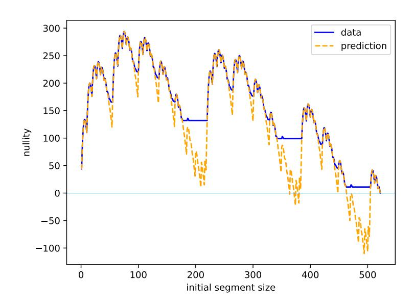
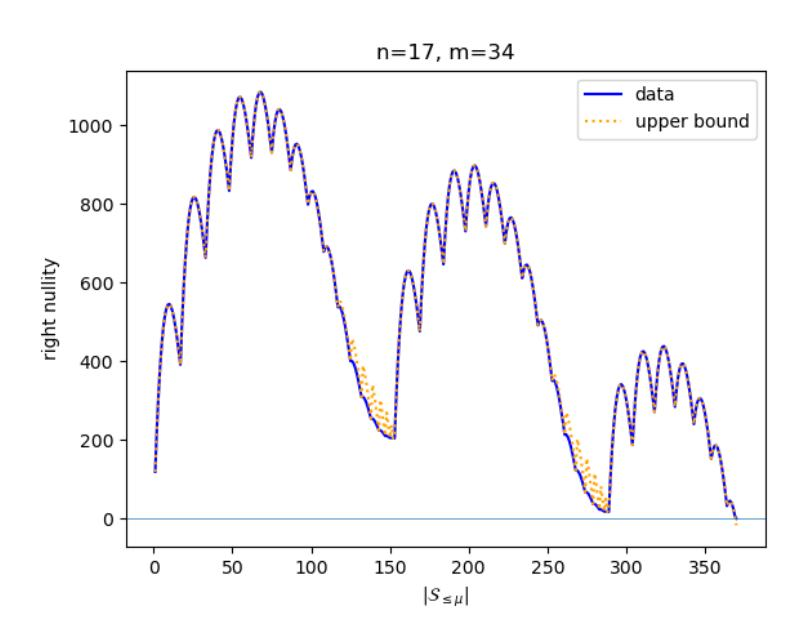
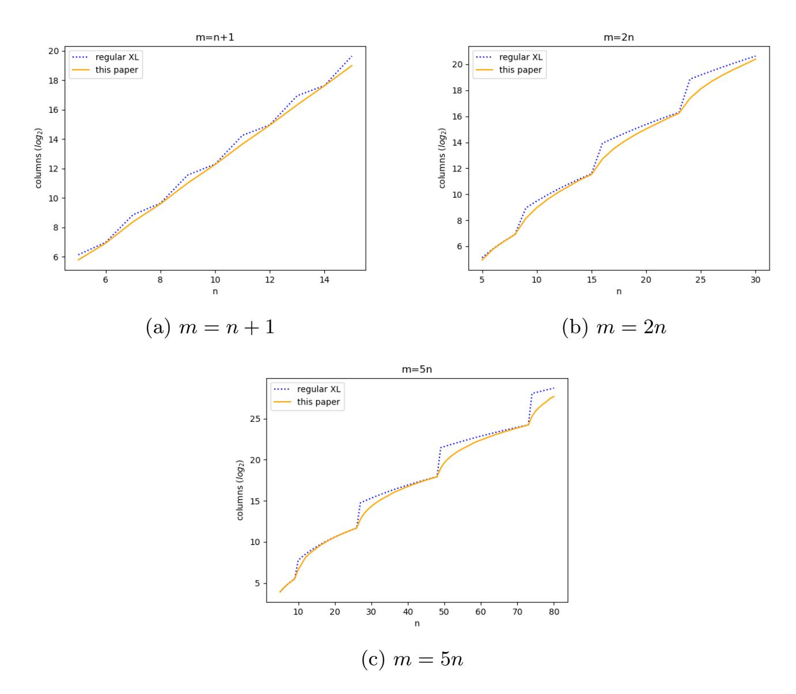

{0}------------------------------------------------

# Smoothing the degree of regularity for polynomial systems

Samuel Jaques1 , Lars Ran2 , Simona Samardjiska2 , and Melvin Seitner2

> 1University of Waterloo, Canada 2Radboud University, Netherlands

#### Abstract

The complexity of many algebraic algorithms for solving non-linear polynomial systems of equations over finite fields such as the XL (eXtended Linearization) algorithm or variants of the F4/F5 algorithms is directly determined by the so called degree of regularity. In essence, we need to form a Macaulay matrix at this degree, which can be thought of as the linearization of monomial multiples of the polynomials from the problem instance, and then solve the obtained linear system. Although the degree of regularity guarantees we can solve the system, it is a rather coarse parameter. This means that sometimes, we end up with a heavily overdetermined Macaulay matrix in order to provably deal with underdeterminedness in a lower degree.

To reduce this coarseness, and thus avoid unnecessary high time and memory complexity, we propose a technique for "smoothing" the degree of regularity that can be seen as operating at a degree in-between two integer values. Instead of the full Macaulay matrix, we consider specific submatrices that we show are sufficient to solve the given system. Under a mild assumption that generalizes the notion of semi-regularity, which we experimentally verify for a range of parameters, we show that our approach smooths the complexity of XL.

# 1 Introduction

Solving multivariate quadratic polynomial systems, known as the MQ problem is a well-known NP-hard problem [\[GJ79\]](#page-23-0) underlying the security of numerous cryptographic schemes whether that be by design or as a result of algebraic

This research has been partially supported by the Dutch government through the NWO grants OCNW.M.21.193 (ALPaQCa) and NGF.1623.23.020 (PQstrong), and by the Natural Sciences and Engineering Research Council of Canada (NSERC), funding reference number RGPIN-2024-03996.

{1}------------------------------------------------

modeling of the cryptosystem [KPG99, DS05, KSH11, CHR+16, Beu20, BFR24, KS99, FdVP08, FGO+13, AGH+19, GRS16, AG11, PST20, RS25, Ran25]. In addition, many optimization and classification problems can be modeled as a solution to this problem. Therefore, it is of particular importance to understand not only the asymptotic behavior of the state-of-the-art algorithms for solving it, but also their practical hardness for relevant parameters.

The best studied algorithms are algebraic ones, dating back to the works of Buchberger [B.65] and Lazard [Laz83]. Over the years, these received significant attention and refinements, resulting in several closely related algorithms – XL [CKPS00], F4/F5 [Fau99, Fau02], Crossbred [JV18] and their variants and extensions [YC04b, YC04a, CP03, BDMM09, MMDB08, BFP09, BFP12, FDS11]. In essence, the operation of all of these can be described as performing linear algebra on Macaulay matrices. For simplicity, and since our focus will be the XL (eXtended Linearization) [CKPS00], we briefly explain its inner working.

Given an instance  $\mathcal{F} = (f_1, \ldots, f_m) \in \mathbb{F}_q[X_1, \ldots, X_m]$  of the MQ-problem over a finite field  $\mathbb{F}_q$ , we first form a Macaulay matrix at degree d whose columns are indexed by all monomials  $\mu$  in the variables  $X_1, \ldots, X_m$  up to degree d, and whose rows are indexed by  $\nu \cdot f_i$  for all monomials  $\nu$  in the variables up to degree d-2. The matrix is then populated with the corresponding coefficients of the  $\nu \cdot f_i$ . Now, it is not hard to see that a solution to the polynomial system necessarily lies in the right kernel of the matrix, but it is hard to extract it if the nullity of the matrix is large. However, if d is sufficiently big that the right nullity of the Macaulay matrix is close to 1, finding this right kernel immediately solves the given polynomial system.

The difficulty in this seemingly simple approach is determining what the minimal degree d necessary for finding a solution is. A crude indication might be that we need to have at least as many rows as columns. Yet, that is not enough as there might be linear dependencies among the rows, whether that be for combinatorial or structural reasons. For a certain type of polynomial systems whose top homogeneous part only has the trivial relations coming from  $f_i f_j - f_j f_i = 0$  we can pretty well predict the required minimum d. Such types of systems are known as semi-regular, and the required d as the degree of regularity of the system [BFS15, BFSY].

A closer inspection of the values of the degree of regularity for various parameters reveal that its graph has a stepwise shape, i.e we observe jumps of the degree between close values of the number of variables. This discreteness has a visible impact in practice – it may happen that the required degree produces significantly overdetermined Macaulay matrix that unnecessarily increases the time and memory complexity.

In this paper, we ask the question of whether we can form a matrix that is in-between two consecutive-degree Macaulay matrices but which can be used in a similar manner as a Macaulay matrix to find a solution. In other words, we would like to smooth-out the discreteness of the degree of regularity. Note immediately that a simple partial enumeration can be considered in some sense to achieve the goal, and it has long been known that the approach can reduce

{2}------------------------------------------------

the complexity especially for small fields. For instance, this is done in HybridF5 based on the F5 algorithm [BFP09] and in FXL [CKPS00] based on the XL algorithm. Both first partially guess a few variables and then solve the smaller multivariate system, repeating until a solution is found. Here, we take a different approach and propose a smoothing technique that does not require fixing of variables and repeating the procedure, but finds an optimal submatrix of the  $d_{\rm reg}$  Macaulay matrix that is sufficient for solving the system.

#### 1.1 Our contribution

As a first contribution, we develop a strategy for achieving optimality of the choice of submatrix of the Macaulay matrix. We want to find an optimal choice for a set S of rows whose combined support defines a matrix of nullity at most one that minimizes the width of the matrix among all submatrices of same rank. Since finding the rank of an arbitrary submatrix is not trivial, as a proxy for the rank we consider the height of this submatrix. We then show, using a classical combinatorial result by Clements and Lindström [CL69] that choosing the rows indexed by initial segments of sets with respect to the grevlex monomial ordering optimizes the number of columns of the submatrix with respect to the number of rows. This results leads us to consider Macaulay matrices of initial segments as the basis of our improvement on XL.

We then proceed to estimating the nullity of such matrices. This is necessary in order to be able to determine the complexity of our improvement, just as this is necessary for the entire Macaulay matrix for determining the complexity of XL.

To achieve this, we first define the notion of monomial semi-regularity which naturally generalizes the standard notion of semi-regularity Based on experimental evidence, we conjecture that generic sequences of polynomials satisfy this property. Under this assumption, we prove an upper bound of the nullity of Macaulay matrices of initial segments. As a main tool in our analysis we use the relations between trivial syzygy matrices of initial segments to expose their structure, partition them and estimate their rank.

We perform an extensive set of experiments to verify the validity of our bound. Our experiments show that the bound becomes very quickly exact as the overdeterminnes of the system increases. We further estimate the improvements over XL, and demonstrate that we achieve the smoothing effect. Finally we compare, but also combine with FXL to achieve further improvement in the complexity.

### 2 Preliminaries

Denote  $[n] = \{1, ..., n\}$ . For a set S, we denote by  $\mathcal{P}(S)$  the set of all subsets of S, and by  $\mathcal{P}_k(S)$  the set of all subsets of S of size k.

Throughout the paper, let  $\mathbb{F}$  be a field and let  $\mathcal{R} = \mathbb{F}[\mathbf{X}]$  be the ring of polynomials in the variables  $\mathbf{X} = (X_1, \dots, X_n)$  over  $\mathbb{F}$ . We denote by  $\pi_i$  the

{3}------------------------------------------------

quotient map  $\mathbb{F}[X_1,\ldots,X_n] \xrightarrow{\pi_i} \mathbb{F}[X_1,\ldots,X_i]$  with kernel  $\langle X_{i+1},\ldots,X_n \rangle$ . For vectors,  $\mathbf{v} = (v_i)_{i \in I} \in \mathbb{F}^I$ , we define its support supp  $\mathbf{v}$  as the set of indices  $i \in I$  where  $v_i \neq 0$ .

Let  $\mathcal{M}$  denote the set of monomials in  $\mathcal{R}$  and denote by  $\mathcal{M}_d$  the set of monomials of degree d. We use a shorthand notation  $\binom{n}{d} = \binom{n+d-1}{d}$  for the size of  $\mathcal{M}_d$ . When we write a monomial as product of variables,  $\mu = X_{a_d} \cdots X_{a_1}$ , we assume  $n \geq a_d \geq \cdots \geq a_1 \geq 1$  unless otherwise indicated. We write  $\mathcal{R}_d = \langle \mathcal{M}_d \rangle_{\mathbb{F}}$  for the  $\mathbb{F}$ -linear span of  $\mathcal{M}_d$ . Similarly, for a set of monomials  $S \in \mathcal{M}$  we write  $\mathcal{R}_S = \langle S \rangle_{\mathbb{F}}$ .

We say that  $f \in \mathcal{R}$  is homogeneous of degree d if  $f \in \mathcal{R}_d$ . We call an ideal homogeneous if it is generated by homogeneous polynomials. For  $f \in \mathcal{R}$ , we define its support supp  $f \subset \mathcal{M}$  as the smallest set  $S \subset \mathcal{M}$  for which  $f \in \mathcal{R}_S$ . For a homogeneous ideal  $I \subset \mathcal{R}$  we will define  $I_d = I \cap \mathcal{R}_d$  and more generally  $I_S = I \cap \mathcal{R}_S$ . For a sequence of polynomials  $\mathcal{F} = (f_1, \ldots, f_m)$  in  $\mathcal{R}$  we denote  $\mathcal{F}_{(i)} = (f_1, \ldots, f_i)$ .

### 2.1 Regularity assumptions

Throughout this work, for a given sequence of polynomials  $\mathcal{F} = (f_1, \ldots, f_m)$  in  $\mathcal{R}$ , in order to make predictions, we would like to assume that there are no non-trivial relations among the  $f_i$  up to a certain degree. This is captured by the notion of semi-regularity. We will follow the definition given in [BFSY].

**Definition 2.1.** The degree of regularity of a homogeneous ideal I is given by

$$d_{reg} = \min \{ d \ge 0 \mid I_d = \mathcal{R}_d \} \cup \{ \infty \}.$$

By extension, we call the degree of regularity of a homogeneous system  $f_1, \ldots, f_m$  the degree of regularity of  $\langle f_1, \ldots, f_m \rangle$ . If the system is not clear from the context, we will write it explicitly as  $d_{reg}(\mathcal{F})$ .

**Definition 2.2.** A sequence  $f_1, \ldots, f_m$  of homogeneous polynomials in  $\mathcal{R}$  is d-regular if

$$gf_i \in \langle f_1, \dots, f_{i-1} \rangle$$
 and  $\deg(gf_i) < d_{reg} \implies g \in \langle f_1, \dots, f_{i-1} \rangle$ .

for all  $1 \le i \le m$ . We call a sequence of homogeneous polynomials  $f_1, \ldots, f_m$  a semi-regular system if it is  $d_{reg}$ -regular.

In [Frö85] it is conjectured that semi-regularity is a generic property among systems of degrees  $d_1, \ldots, d_m$  in n variables. In more practical terms, this means that random systems are likely semi-regular.

#### 2.2 Macaulay and relation matrices

Given a sequence of quadratic polynomials  $\mathcal{F} = (f_1, \ldots, f_m)$  in  $\mathcal{R}$  we can construct its Macaulay matrix to investigate its behavior in higher degrees using linear algebra. To get an even more fine-grained structure, we can also study its (higher order) relation matrices.

{4}------------------------------------------------

**Definition 2.3.** Let  $\mathcal{F} = (f_1, \ldots, f_m)$  be a homogeneous sequence of quadratic polynomials in  $\mathcal{R}$ . The degree d relation matrix of order  $0 \le c < m$  is the matrix  $\operatorname{Rel}_c^d(\mathcal{F}) \in \mathbb{F}^{\binom{m}{c+1}} \binom{n}{d-2c-2} \times \binom{m}{c} \binom{n}{d-2c}$  with

- rows labeled by pairs  $(\mu, S)$  with  $\mu \in \mathcal{M}_{d-2-2c}$  and  $S \in \mathcal{P}_{c+1}([m])$ ,
- columns labeled by pairs  $(\nu, T)$  with  $\nu \in \mathcal{M}_{d-2c}$  and  $T \in \mathcal{P}_c([m])$ ,
- where the coefficient of  $((\mu, \{i_1, \ldots, i_{c+1}\}), (\nu, \{i_1, \ldots, i_{c+1}\} \setminus \{i_{\ell}\}))$  is given by  $(-1)^{\ell+1}$  times the coefficient of  $\nu$  in  $\mu \cdot f_{\ell}$ , for any  $\ell \in [c+1]$ ,

that describes a linear map  $\operatorname{Rel}_c^d(\mathcal{F}): \mathcal{R}_{d-2c}^{\binom{m}{c}} \to \mathcal{R}_{d-2-2c}^{\binom{m}{c+1}}$ .

With this definition, it is easy to check that  $\operatorname{Rel}_0^d(\mathcal{F})$  is exactly the Macaulay matrix  $\operatorname{Mac}^d(\mathcal{F})$  of degree d of  $\mathcal{F}$  defined as the resultant matrix in [Mac16]. The characteristic feature of the Macaulay matrix is that

rowspace 
$$\operatorname{Mac}^d(\mathcal{F}) \cong \langle \mathcal{F} \rangle_d$$
.

as  $\mathbb{F}$  vector spaces. Similarly, the relation matrix  $\operatorname{Rel}_1^d(\mathcal{F})$  encodes the trivial syzygies and we obtain

rowspace 
$$\operatorname{Rel}_1^d(\mathcal{F}) \cong \langle f_i \otimes e_j - f_j \otimes e_i \mid 1 \leq i < j \leq m \rangle_{d-2}$$
.

as subspace of  $\mathcal{R}_{d-2}^m \cong \mathcal{R}_{d-2} \otimes \mathbb{F}^m$ . Likewise, the higher order relation matrices encode the syzygies between syzygies and so forth. Note that this implies that  $\operatorname{Rel}_c^d(\mathcal{F}) \circ \operatorname{Rel}_{c-1}^d(\mathcal{F}) = 0$  for any c > 0. For brevity we may write  $\operatorname{Rel}_c^d := \operatorname{Rel}_c^d(\mathcal{F})$  if  $\mathcal{F}$  is clear from the context. Also, because of their distinguished role, we write  $\operatorname{Mac}^d := \operatorname{Rel}_0^d$  and  $\operatorname{Rel}^d := \operatorname{Rel}_1^d$ .

We denote the space of syzygies of degree d and order c (resp. Koszul syzygies) by

$$\operatorname{Syz}_c^d = \operatorname{lker} \operatorname{Rel}_{c-1}^d$$
 and  $\operatorname{KSyz}_c^d = \operatorname{rowspace} \operatorname{Rel}_c^d$ .

where lker denotes the left kernel. We may refer to Koszul syzygies as trivial syzygies and to the first order syzygies simply as syzygies. In general we have  $KSyz_c^d \subseteq Syz_c^d$ . If the sequence  $(f_1, \ldots, f_m)$  is semi-regular however, and  $d < d_{reg}$ , then it holds that  $Syz_c^d = KSyz_c^d$  for any c > 0. Using inclusion-exclusion it follows that

$$\operatorname{null} \operatorname{Mac}^{d} = \sum_{c=0}^{m} (-1)^{c+1} \binom{m}{c} \left( \binom{n}{d-2c} \right).$$

which corresponds to the Hilbert series from [BFSY, Proposition 6].

$$\cdots \to \mathcal{R}^{\binom{m}{c+1}} \xrightarrow{d_c} \mathcal{R}^{\binom{m}{c}} \to \cdots \xrightarrow{d_1} \mathcal{R}^m \xrightarrow{d_0} \mathcal{R} \twoheadrightarrow \mathcal{R}/\langle \mathcal{F} \rangle.$$

&lt;sup>1In fact, these maps constitute the Koszul complex of  $\mathcal{R}/\langle \mathcal{F} \rangle$  by taking the differentials  $d_c = (\text{Rel}_c)^t$ 

{5}------------------------------------------------

#### 2.3 Monomial orders

The set  $\mathcal{M}$  can be ordered in a way that is compatible with multiplication by using a monomial order. In this paper, we will work mainly in the grevlex order which is defined by  $X_{a_d} \cdots X_{a_1} > X_{b_{d'}} \cdots X_{b_1}$  if and only if d > d' or d = d' and the first non-zero entry in  $(a_d - b_d, \ldots, a_1 - b_1)$  is negative. Given a polynomial  $f \in \mathcal{R}$  we define its leading monomial LM(f) to be the highest monomial in supp(f) with respect to grevlex.

In this paper, we will also need to specifically order the relation matrices  $\operatorname{Rel}_c^d$ . For any d, c, we equip the set  $\mathcal{M}_{d-2c} \times \mathcal{P}_c([m])$ , which indexes the rows of  $\operatorname{Rel}_{c-1}^d$  and columns of  $\operatorname{Rel}_c^d$ , with the following order:  $(\mu, S) < (\nu, T)$  if  $\mu < \nu$  in the grevlex order or  $\mu = \nu$  and the smallest element of  $(S \cup T) \setminus (S \cap T)$  lies in S. We order the rows and columns in descending order so that we also get the matrix relation  $\operatorname{Rel}_c^d \cdot \operatorname{Rel}_{c-1}^d = 0$ .

# 3 Running XL on submatrices of $Mac^d$

To smooth-out the complexity of the XL algorithm, we consider submatrices  $\mathbf{M}$  of  $\operatorname{Mac}^d$  such that  $\operatorname{Mac}^d$  can, up to reordering rows and columns, be partitioned as follows:

$$Mac^d = \begin{bmatrix} \mathbf{M'} & * \\ \hline \mathbf{0} & \mathbf{M} \end{bmatrix}$$

Let  $I \subseteq \mathcal{M}_{d-2}$  denote the set indexing the columns of  $\mathbf{M}$ . Then, for any  $\mathbf{v} \in \ker \operatorname{Mac}^d$ , we have  $(\mathbf{v}_i)_{i \in I} \in \ker \mathbf{M}$ . If the nullity of  $\mathbf{M}$  is sufficiently low, then we can solve the MQ-problem by finding the right kernel of  $\mathbf{M}$ , in the same manner the XL-algorithm solves the problem by finding the right kernel of  $\operatorname{Mac}^d$ . The complexity of this kernel finding depends heavily on the width |I| of  $\mathbf{M}$ . Thus, it would be preferable to use submatrices  $\mathbf{M}$  of  $\operatorname{Mac}^d$  with small width.

For an  $i \in [m]$  and  $\mu \in \mathcal{M}_{d-2}$ , the support of the row indexed by the pair  $(\mu, i)$  is  $\operatorname{supp}(\mu \cdot f_i) \subseteq \mu \cdot \mathcal{M}_2$ . Thus, for a set of rows of  $\operatorname{Mac}^d$  indexed by  $S \times [m]$  for some subset  $S \subseteq \mathcal{M}_{d-2}$ , their combined support is at most  $S \cdot \mathcal{M}_2$ . To help describe this support, we introduce some terminology and notation.

**Definition 3.1.** For an integer c > 0, let  $\partial^c : \mathcal{P}(\mathcal{M}) \to \mathcal{P}(\mathcal{M})$  be a mapping defined by  $\partial^c(S) = S \cdot \mathcal{M}_c$ , for every  $S \subseteq \mathcal{M}$ . We will refer to  $\partial^c$  as the  $c^{th}$  shadow of S and whenever c = 1 we will simply write  $\partial$  instead of  $\partial^1$ .

Note that, since  $(\mathcal{M}_1)^c = \mathcal{M}_c$ , one can describe  $\partial^c$  as the  $c^{\text{th}}$  iteration of  $\partial$ . We can now rephrase our earlier observation: For any  $S \subseteq M_{d-2}$ , the support of the rows of  $\text{Mac}^d$  indexed by  $S \times [m]$  is at most  $\partial^2(S)$ . Based on this observation, for  $S \subseteq \mathcal{M}_{d-2}$ , we denote by  $\text{Mac}^S$  the submatrix of  $\text{Mac}^d$  consisting of entries whose rows are labeled by  $(\mu, i) \in S \times [m]$ , and whose columns are labeled by  $\nu \in \partial^2(S)$ .

{6}------------------------------------------------

## 3.1 Initial segment induced submatrices of $Mac^d$

As indicated before, we would ideally use sets S that minimize  $|\partial^2(S)|$  among all  $T \subseteq \mathcal{M}_{d-2}$  that give matrices  $\operatorname{Mac}^T$  of the same rank. Unfortunately,  $\operatorname{rank}(\operatorname{Mac}^S)$  is rather hard to predict. Instead, we consider the height  $|S| \cdot m$  of  $\operatorname{Mac}^S$  as a proxy for its rank. This leaves us with the following question: What subsets  $S \subseteq \mathcal{M}_{d-2}$  of any fixed size minimize  $|\partial^2(S)|$ ? As we will show in this section, this minimum can be achieved by choosing  $S \subseteq \mathcal{M}_{d-2}$  to be an initial segment as defined in the following definition:

**Definition 3.2.** An initial segment of a totally ordered set X is a set of the form  $\{x \in X \mid x \leq M\}$  for some largest element  $M \in X$ . For  $\mu \in \mathcal{M}$ , we denote the initial segment of  $\mathcal{M}$  with largest element  $\mu$  as

$$\mathcal{S}_{\leq \mu} = \{ \nu \in \mathcal{M} \mid \nu \leq \mu \}.$$

We also regard the empty set as an initial segment, and may write  $-\infty := \max(\varnothing)$  and  $S_{\leq -\infty} := \varnothing$ . We may also use the notation  $S_{\leq \mu} := S_{\leq \mu} \setminus \{\mu\}$ .

To show that initial segments achieve this claimed minimum, we use a result by Clements-Lindström [CL69]. This result covers subsets  $F_d \subseteq \mathbb{Z}_{\geq 0}^n$  whose elements sum to d, equipped with the lexicographical ordering. Through the degree map, this corresponds to the reverse of the grevlex-ordering on  $\mathcal{M}_d$ . With that connection, we can rephrase Corollary 1 from [CL69] as follows:

**Lemma 3.3** ([CL69], Corollary 1). For  $S \subseteq \mathcal{M}_d$ , let init(S) denote the initial segment of  $\mathcal{M}_d$  of size |S|. Then, for any  $S \subseteq \mathcal{M}_d$ , it holds that

$$\partial (\operatorname{init}(S)) \subseteq \operatorname{init} (\partial (S)).$$

**Theorem 3.4.** Let S be and initial segment of  $\mathcal{M}_d$ . Then, for any c > 0, it holds that

$$\left|\partial^{c}(\mathcal{S})\right| = \min_{\substack{T \subseteq \mathcal{M}_d \\ |T| = |\mathcal{S}|}} \left|\partial^{c}(T)\right|.$$

*Proof.* We proof this statement by induction over c. The base case c=1 follows directly from Lemma 3.3. Now, let  $T \subseteq \mathcal{M}_d$  be of size  $|\mathcal{S}|$ . Then, by Lemma 3.3, we have  $\partial(\mathcal{S}) \subseteq \operatorname{init}(\partial(T))$ , hence  $\partial^c(\mathcal{S}) \subseteq \partial^{c-1}(\operatorname{init}(\partial(T)))$ . Per the induction hypothesis,  $|\partial^{c-1}(\operatorname{init}(\partial(T)))| \leq |\partial^{c-1}(\partial(T))| = |\partial^c(T)|$ . We conclude that  $\partial^c(\mathcal{S}) \leq |\partial^c(T)|$ .

This theorem shows that choosing  $\mathcal{S}$  to be an initial segment optimizes the number of columns of  $\operatorname{Mac}^{\mathcal{S}}$  with respect to the number of its rows. For this reason, we will limit our scope to submatrices of  $\operatorname{Mac}^d$  of the form  $\operatorname{Mac}^{\mathcal{S}}$ , where  $\mathcal{S} \subseteq \mathcal{M}$  is an initial segment. We will denote  $\operatorname{Mac}^{\mathcal{S}_{\leq \mu}}$  as  $\operatorname{Mac}^{\mu}$ .

Note that  $\operatorname{Mac}^{X_1^{d-2}} = \operatorname{Mac}^d$ , so this approach still encompasses the XL-algorithm as a special case. Additionally, we note that  $\mathcal{S}_{\leq X_n X_1^{d-3}} = X_n \cdot \mathcal{M}_{d-3}$ , and  $\partial^2(\mathcal{S}_{\leq X_n X_1^{d-3}}) = X_n \cdot \mathcal{M}_{d-1}$ . The entry of  $\operatorname{Mac}^{X_n X_1^{d-3}}$  indexed

{7}------------------------------------------------

by  $((X_n\mu, S), X_n\nu)$ , is precisely the entry of  $\operatorname{Mac}^{d-1}$  indexed by  $((\mu, S), \nu)$ . Hence,  $\operatorname{Mac}^{X_nX_1^{d-3}} = \operatorname{Mac}^{d-1}$ . Thus, monomials  $X_nX_1^{d-3} \leq \mu \leq X_1^{d-2}$ , give intermediate options between the Macaulay matrices of degrees d-1 and d.

In addition to minimizing the size of  $\partial^c(\mathcal{S})$ , initial segments have another nice property regarding shadows that we will use later, namely, taking shadows preserves the property of being an initial segment.

**Lemma 3.5.** For any  $\mu \in \mathcal{M}_d$ , it holds that  $\partial^c(\mathcal{S}_{\leq \mu}) = \mathcal{S}_{\leq \mu \cdot X_1^c}$ .

Proof. Write  $\mu = X_{a_1} \cdots X_{a_d}$ . Let  $\nu = X_{b_{d+c}} \cdots X_{b_1} \in \mathcal{S}_{\leq \mu \cdot X_1^c}$ , meaning the leftmost non-zero entry of  $(a_d - b_{c+d}, \dots, a_1 - b_{c+1}, 1 - b_c, \dots, 1 - b_1)$  is negative if it exists. Hence, the same applies to  $(a_d - b_{c+d}, \dots, a_1 - b_{c+1})$ , thus,  $\nu' = X_{b_{c+d}} \cdots X_{b_{c+1}} \leq \mu$ , and therefore  $\nu = \nu' \cdot X_{b_c} \cdots X_{b_1} \in \partial^c(\mathcal{S}_{\leq \mu})$ .

Conversely, let  $\nu = X_{b_c} \cdots X_{b_1} \in \mathcal{S}_{\leq \mu}$ , and  $\xi \in \mathcal{M}_c$ . Write  $\nu \cdot \xi = X_{b'_{c+d}} \cdots X_{b'_1} \in \partial^c(\mathcal{S}_{\leq \mu})$ . Since the indices  $b'_{c+d} \geq \cdots \geq b'_1$  include  $b_d \geq \cdots \geq b_1$ , we have  $b'_{c+i} \geq b_i$  for every  $i \in [d]$ . The leftmost non-zero entry of  $(a_d - b_d, \ldots, a_1 - b_1)$  is negative if it exists, so the same holds for  $(a_d - b'_{c+d}, \ldots, a_1 - b'_{c+1})$ . That property extends to  $(a_d - b'_{c+d}, \ldots, a_1 - b'_{c+1}, 1 - b'_c, \ldots, 1 - b'_1)$ , since the entries  $1 - b'_i$  for  $i \in [c]$  cannot be positive. We conclude  $\nu \cdot \xi \in \mathcal{S}_{\leq \mu}$ .

# 4 Nullities of Macaulay matrices

In order to use the matrices  $\operatorname{Mac}^{\mu}$  in a generalization of the XL-algorithm, we would like to be able to predict the nullity of  $\operatorname{Mac}^{\mu}$ , so that we can find a minimal  $\mu \in \mathcal{M}_{d-2}$  for which we expect  $\operatorname{Mac}^{\mu}$  to have sufficiently low nullity.

As discussed in section 3, for a monomial  $\mu \in \mathcal{M}_{d-2}$ , the Macaulay matrix  $\operatorname{Mac}^d$  can be partitioned as follows:

$$\mathrm{Mac}^d = \left[ \begin{array}{c|c} \mathbf{M}' & * \\ \hline \mathbf{0} & \mathrm{Mac}^\mu \end{array} \right]$$

From this partition, we see that any relation between the rows of  $\operatorname{Mac}^{\mu}$  corresponds uniquely to a relation between the  $|\mathcal{S}_{\leq \mu}| \cdot m$  rows of  $\operatorname{Mac}^d$  that contain  $\operatorname{Mac}^{\mu}$ . Thus, we can identify

$$\operatorname{Syz}^{\mu} := \operatorname{lker} \operatorname{Mac}^{\mu} \cong \operatorname{Syz}^{d} \cap \mathcal{R}^{m}_{\mathcal{S}_{\leq \mu}}.$$

Recall now that  $\operatorname{Syz}^d$  has a subset  $\operatorname{KSyz}^d$  of trivial syzygies. The overlap between these trivial syzygies and  $\operatorname{Syz}^\mu$  gives us a set  $\operatorname{KSyz}^\mu$  of trivial syzygies on  $\operatorname{Mac}^\mu$ . If we assume that all syzygies on  $\operatorname{Mac}^\mu$  are trivial, then we can determine the nullity of  $\operatorname{Mac}^\mu$  by determining the number of these trivial syzygies, since then

$$\operatorname{null} \operatorname{Mac}^{\mu} = \left| \partial^{2}(\mathcal{S}_{\leq \mu}) \right| - m |\mathcal{S}_{\leq \mu}| + \operatorname{dim}(\operatorname{KSyz}^{\mu}). \tag{1}$$

The assumption that all syzygies on  $\operatorname{Mac}^{\mu}$  are trivial is elaborated upon in section 4.1. The remainder of section 4 is largely spent determining (upper bounds for) the nullity of  $\operatorname{Mac}^{\mu}$  under that assumption.

{8}------------------------------------------------

#### 4.1 Regularity assumptions

The degree of regularity and the notion of semi-regularity as given in definitions 2.1 and 2.2 are too coarse for our approach. Still, we would like to work with the same assumption that no non-trivial relations occur in  $\operatorname{Mac}^{\mu}$  unless they combinatorially have to. We will therefore introduce the refinements of these notions tailored to initial segments.

Given a system  $\mathcal{F} = (f_1, \ldots, f_m)$  of homogeneous polynomials in  $\mathcal{R}$ , we associate a vector space to each monomial  $\mu \in \mathcal{M}$  with degree  $d = \deg \mu$  and  $1 \leq \ell \leq m$  given by

$$J_{\leq \mu, \ell} = \langle \nu \cdot f_i \mid 1 \leq i \leq \ell, \ \nu \in \mathcal{M}_{d-\deg f_i}, \ \mathrm{LM}(\nu \cdot f_i) \leq \mu \rangle_{\mathbb{F}}.$$

**Definition 4.1.** Given a sequence of polynomials  $f_1, \ldots, f_m$ , we define the monomial of regularity  $\mu_{reg}$  for the sequence as

$$\mu_{reg} = \min \left\{ \mu \in \mathcal{M} \mid J_{\leq \mu, m} = \mathcal{R}_{\mathcal{S}_{\leq \mu}} \right\} \cup \{\infty\}.$$

**Definition 4.2.** A sequence  $f_1, \ldots, f_m$  of homogeneous polynomials in  $\mathcal{R}$  is called  $\mu$ -regular if

$$gf_i \in J_{\leq \mu, i-1}$$
 and  $LM(gf_i) < \mu \implies g \in \langle f_1, \dots, f_{i-1} \rangle$ .

for all  $1 \le i \le m$ . Furthermore, we call the sequence monomial semi-regular if it is  $\mu_{reg}$ -regular.

Remark 4.3. As a sanity check for the soundness of our definition of  $\mu$ -regularity, note that  $I_d = J_{\leq X_1^d,m}$  and hence  $\mu$ -regular sequences are also  $(\deg \mu)$ -regular. However, if one were to find a sequence where  $\deg \mu_{reg} < d_{reg}$ , then the sequence could be monomial semi-regular but not semi-regular in general.

We conjecture that generic sequences are strongly semi-regular. Since strong semi-regular systems form an open set, this only requires the set to be non-empty just as in the semi-regular case. We tested this for random homogeneous quadratic systems of m equations and n variables and found strongly semi-regular sequences for each tested pair

$$(n,m) \in \{(n,n) \mid n \in \{5,\ldots,8\}\} \cup \{(n,n+1) \mid n \in \{5,\ldots,10\}\}\$$
  
 $\cup \{(n,2n) \mid n \in \{5,\ldots,16\}\}.$ 

Note that one could, in principle, define the monomial of regularity for any monomial order. However, we only conjecture the existence of monomial semi-regular sequences for the grevlex order.

Let us connect this to the Macaulay matrix  $\operatorname{Mac}^{\mu}$ . If we assume that  $\mathcal{F}$  is a homogeneous quadratic system such that  $\operatorname{LM}(f_i) = X_1^2$  for all i, then we have the following isomorphism:

$$J_{\leq X_1^2 \mu} = \text{rowspace Mac}^{\mu}$$

Furthermore, in this case, we know that  $\mu_{\text{reg}} = X_1^2 \mu$  for some  $\mu$ .

{9}------------------------------------------------

#### 4.2 Anti-shadows and $\partial$ -trivial syzygies

Let S be an initial segment of  $\mathcal{M}_{d-2}$  with largest element  $\mu$ . As outlined in the introduction of section 4, we want to find elements of  $KSyz^d = \text{rowspace Rel}^d$  whose support is contained in  $S \times [m]$ , as those elements give trivial syzygies on  $\text{Mac}^{\mu}$ . A simple approach to finding such trivial syzygies would be to forego considering the entire rowspace of  $\text{Rel}^d$ , and merely ask which rows of  $\text{Rel}^d$  have a support contained in  $S \times [m]$ . To help describe such rows, we introduce some more notation and terminology.

**Definition 4.4.** Given an integer c > 0, let  $\partial^{-c} : \mathcal{P}(\mathcal{M}) \to \mathcal{P}(\mathcal{M})$  be defined as follows:  $\partial^{-c}(S) = \max\{T \in \mathcal{P}(\mathcal{M}) | \partial^c(T) \subseteq S\}$ . We refer to  $\partial^{-c}(S)$  as the  $c^{th}$  anti-shadow of S.

Just as in the case of shadows (definition 3.1), for any  $c \geq 0$ , the map  $\partial^{-c}$  can be described as the  $c^{\text{th}}$  iteration of  $\partial^{-1}$ .

**Lemma 4.5.** For c > 0, any row of  $\operatorname{Rel}_c^d$  indexed by an element of  $\partial^{-2c}(\mathcal{S}) \times \mathcal{P}_{c+1}([m])$  has a support contained in  $\partial^{2-2c}(\mathcal{S}) \times \mathcal{P}_c([m])$ .

Proof. Let R be the row of  $\operatorname{Rel}_c^d$  indexed by  $(\mu, I) \in \partial^{-2c}(\mathcal{S}) \times \mathcal{P}_{c+1}([m])$ . An entry of R is non-zero if its index is of the form  $(\nu, I - \{i\})$  for some  $i \in I$  with  $\nu \in \operatorname{supp}(\mu \cdot f_i)$ . Since  $\operatorname{supp}(f_i) \subseteq \mathcal{M}_2$ , it holds that  $\operatorname{supp}(\mu \cdot f_i) \subseteq \partial^2(\{\mu\})$ . From the definition of anti-shadow, we have  $\partial^{-2c}(\mathcal{S}) = \partial^{-2}(\partial^{2-2c}(\mathcal{S}))$ , so  $\mu \in \partial^{-2c}(\mathcal{S})$  implies  $\partial^2(\{\mu\}) \subseteq \partial^{2-2c}(\mathcal{S})$ .

Let  $\mathrm{sRel}_c^{\mu}$  denote the submatrix of  $\mathrm{Rel}_c^d$  consisting of the entries whose rows are indexed by  $\partial^{-2c}(\mathcal{S}) \times \mathcal{P}_{c+1}([m])$ , and whose columns are indexed by  $\partial^{2-2c}(\mathcal{S}) \times \mathcal{P}_c([m])$ . Note that,  $\mathrm{sRel}_0^{\mu} = \mathrm{Mac}^{\mu}$ . We refer to the elements of rowspace  $\mathrm{sRel}^{\mu}$  as  $\partial$ -trivial syzygies on  $\mathrm{Mac}^{\mu}$ . By Lemma 4.5 we can partition  $\mathrm{sRel}_c^d(\mathcal{F})$  as follows:

$$\operatorname{Rel}_c^d = \left[ \begin{array}{c|c} \mathbf{R_c'} & * \\ \hline \mathbf{0} & \operatorname{sRel}_c^\mu \end{array} \right]$$

Since  $\operatorname{Rel}_{c+1}^d \cdot \operatorname{Rel}_c^d = 0$ , we find that  $\operatorname{sRel}_{c+1}^\mu \cdot \operatorname{sRel}_c^\mu = 0$ . One might now hope that rowspace  $\operatorname{sRel}_c^\mu$  contains all trivial syzygies on  $\operatorname{Mac}^\mu$ , and that rowspace  $\operatorname{sRel}_{c+1}^\mu = \operatorname{lker} \operatorname{sRel}_c^\mu$  if  $\mathcal F$  is monomial semi-regular and  $\mu X_1^2 < \mu_{\operatorname{reg}}$ . Unfortunately, this is not the case in general. If we do assume this to be the case, we can give the nullity of  $\operatorname{Mac}^\mu$  using the inclusion-exclusion principle.

**Theorem 4.6.** Let  $\mathcal{F} \subseteq \mathcal{R}$  be an instance of the MQ-problem, and let  $\mathcal{S}$  be an initial segment of  $\mathcal{M}_{d-2}$  with largest element  $\mu$ . Suppose that, for any  $c \geq 0$ , it holds that  $\operatorname{lker} \operatorname{sRel}_c^{\mu} = \operatorname{rowspace} \operatorname{sRel}_{c+1}^{\mu}$ . Then the nullity of  $\operatorname{Mac}^{\mu}$  can be given as

$$\operatorname{null} \operatorname{Mac}^{\mu} = \sum_{c \ge 0} (-1)^{c+1} \binom{m}{c} |\partial^{2-2c}(\mathcal{S})|. \tag{2}$$

{10}------------------------------------------------

Figure 1: Experimental Macaulay matrix nullities v.s. predictions from theorem 4.6, eq. (2), for n = 10, m = 11, q = 31

We are now interested to see when the premise of Theorem 4.6, that for every  $c \geq 0$  the left kernel of  $\mathrm{sRel}_c^{\mu}$  is given by  $\mathrm{sRel}_{c+1}^{\mu}$ , holds. In practice we find there are many choices of m, n, q and  $\mu$  where eq. (2) gives correct predictions. Consider fig. 1, in which we compare eq. (2) to experimentally found nullities of  $\mathrm{Mac}^{\mu}$  for randomly chosen  $\mathcal{F} \in \mathcal{R}_2^m$ , for the parameters n = 10, m = 11 and q = 31. We observe three types of behavior on different intervals.

- (i) On many intervals, we find eq. (2) matches the data.
- (ii) On some short intervals, we find discrepancies of sizes 1, 3, 6, ...,  $\binom{m}{2}$  between eq. (2) and the experimentally found nullities. Each of these intervals end at some  $\mu_0$  divisible  $X_1^2$ , where the prediction is accurate.
- (iii) On each of the remaining intervals, we see the nullity largely sticks to some constant lower bound, with some spikes upwards. These intervals each end at some  $\mu_0$  divisible by  $X_1^3$ . The lower bound on this interval is then null  $\operatorname{Mac}^{\mu_0}$ , which is accurately given by eq. (2).

This behavior was consistently observed for every choice of (n, m) mentioned in section 4.1. These experiments are discussed in more details in section 5.

We start with an explanation as to why the behavior described in point (ii) is expected.

**Example 4.7.** Any instance  $\mathcal{F}' \subseteq \mathcal{R}_{\leq 2}$  of the MQ-problem is equivalent to an instance  $\mathcal{F} = \{f_1, \ldots, f_m\} \subseteq \mathcal{R}_{\leq 2}$  where each polynomial  $f_i$  has a different leading monomial  $LM(f_i)$ .

Let  $\mu = X_{a_{d-2}} \cdots X_{a_1}$ , and write  $\mu_1 = X_{a_{d-2}} \cdots X_{a_3}$  and  $\mu_2 = X_{a_2} X_{a_1}$ , so that  $\mu = \mu_1 \mu_2$ . Suppose there are precisely  $1 \leq r \leq m-2$  elements of  $\mathcal{M}_2$  strictly larger then  $\mu_2$ . Then there are at least m-r elements  $i \in [m]$  so that

{11}------------------------------------------------

 $LM(f_i) < \mu_2$ . Choose two such  $i, j \in [m]$  with  $i \neq j$ , and consider the row of  $Rel^d$  indexed by  $(\mu_1, \{i, j\})$ . This row will have a support of

$$(\operatorname{supp}(\mu_1 f_j) \times \{i\}) \sqcup (\operatorname{supp}(\mu_1 f_i) \times \{j\}).$$

Since  $\mu_1 \cdot LM(f_i) < \mu_1\mu_2 = \mu$ , we have  $supp(\mu_1 f_i) \subseteq \mathcal{S}$ . Likewise, it holds that  $supp(\mu_1 f_j) \subseteq \mathcal{S}$ . Thus, the support of this row is a subset of  $\mathcal{S} \times [m]$ . However, as  $\mu_1 X_1^2 > \mu$ , we have  $\mu_1 \notin \partial^{-2}(\mathcal{S})$ . So this row is not included in  $sRel^{\mu}$ . Note that this does not necessarily imply that  $Mac^{\mu}$  has trivial syzygies which are not  $\partial$ -trivial, as these  $\binom{m-r}{2}$  rows may still lie in rowspace  $sRel^{\mu}$ .

In Theorem 4.20, we give a concrete condition on m, n and  $\mu$  that implies that  $\operatorname{lker} \operatorname{sRel}_c^{\mu} = \operatorname{rowspace} \operatorname{sRel}_{c+1}^{\mu}$ . This condition covers a significant portion of the parameters where we experimentally find that eq. (2) gives accurate predictions.

#### 4.2.1 Sizes of shadows and anti-shadows

In order to compute eq. (2), we need to be able to compute the size of  $S_{\leq \mu}$ , and its shadows and anti-shadows. We start with the size of  $S_{\leq \mu}$  itself.

**Lemma 4.8.** Let  $\mu = X_{a_d} \cdots X_{a_1}$ . Then the size of the initial segment of  $\mathcal{M}$  with  $\mu$  as its largest element is

$$\left|\mathcal{S}_{\leq\mu}\right| = \left(\binom{n}{d}\right) - \sum_{k=1}^{d} \left(\binom{a_k-1}{k}\right).$$

Proof. Let us consider the number of monomials  $\nu = X_{b_d} \cdots X_{b_1}$  that are strictly larger than  $\mu$ . This implies first non-zero entry of  $(b_d - a_d, \dots, b_1 - a_1)$  is negative. Fixing the index k of this first non-zero entry  $b_k - a_k$  implies  $b_i = a_i$  for any i > k, and reduces choosing  $\nu > \mu$  to choosing the degree k monomial  $X_{b_k} \cdots X_{b_1}$  in the variables  $(X_1, \dots, X_{a_k-1})$ . Thus,  $\mathcal{M}_d$  has  $\sum_{k=1}^d \binom{a_k-1}{k}$  elements  $\nu > \mu$ .

From Lemma 3.5, we know that  $\partial^c$  preserves the property of being an initial segment. We can show that the same holds for  $\partial^{-c}$ .

Corollary 4.9. Let  $S \subseteq \mathcal{M}_d$  be an initial segment, and let c > 0. Then  $\partial^{-c}(S)$  is an initial segment of  $\mathcal{M}_{d-c}$ .

*Proof.* If  $\partial^{-c}(\mathcal{S})$  is empty, it is the initial segment  $\mathcal{S}_{\leq -\infty}$ . Assume now that  $\partial^{-c}(\mathcal{S})$  is non-empty. Let  $\nu = \max(\partial^{-c}(\mathcal{S}))$ , so that  $\partial^{-c}(\mathcal{S}) \subseteq \mathcal{S}_{\leq \nu}$ . By definition 3.5,  $\partial^c(\mathcal{S}_{\leq \nu})$  is an initial segment with maximal element  $\nu \cdot X_n^c$ . Since  $\nu \in \partial^{-c}(\mathcal{S})$ , it holds that  $\nu \cdot X_n^c \in \mathcal{S}$ , so  $\partial^c(\mathcal{S}_{\leq \nu}) \subseteq \mathcal{S}$ . Hence, we have  $\mathcal{S}_{\leq \nu} \subseteq \partial^{-c}(\mathcal{S})$ , and therefore  $\mathcal{S}_{\leq \nu} = \partial^{-c}(\mathcal{S})$ .

Since an initial segment S can be uniquely described by  $\max(S)$ , it makes sense to view  $\partial^c$  as a map  $\mathcal{M}_d \sqcup \{-\infty\} \to \mathcal{M}_{d+c} \sqcup \{-\infty\}$ . For  $\mu \in \mathcal{M}_d \sqcup \{-\infty\}$  and  $c \in \mathbb{Z}$ , we define  $\partial^c(\mu) := \max(\partial^c(S_{\leq \mu}))$ , so that  $\partial^c(S_{\leq \mu}) = S_{\leq \partial^c(\mu)}$ .

{12}------------------------------------------------

**Lemma 4.10.** Let  $\mu = X_{a_d} \cdots X_{a_1}$  and  $c \in \mathbb{Z}$ .

- If  $c \ge 0$ , then  $\partial^c(\mu) = \mu \cdot X_1^c$
- If  $-d \le c < 0$ , and  $a_{-c} = 1$ , then  $\partial^c(\mu) = X_{a_d} \cdots X_{a_{1-c}}$ . If c = -d, we define  $X_{a_d} \cdots X_{a_{1-c}}$  to be 1.
- If  $-d \leq c < 0$ , and  $a_{-c} > 1$ , then  $\partial^c(\mu)$  is the monomial in  $\mathcal{M}_{d-c}$  directly preceding  $X_{a_d} \cdots X_{a_{1-c}}$ , or  $-\infty$  if no such preceding monomial exists.
- If c < -d, then  $\partial^c(\mu) = -\infty$ .

*Proof.* Clearly, if c < -d, then  $\partial^c(\mathcal{S}_{\leq \mu})$  is empty, so the lemma holds in that case. The case where  $c \geq 0$  follows directly from Lemma 3.5.

Now, suppose  $-d \leq c < 0$ . Then  $\partial^c(\mathcal{S}_{\leq \mu}) = \mathcal{S}_{\leq \partial^c(\mu)}$  is the largest initial segment such that  $\partial^{-c}(\mathcal{S}_{\leq \partial^c(\mu)}) = \mathcal{S}_{\leq \partial^c(\mu) \cdot X_1^{-c}} \subseteq \mathcal{S}_{\leq \mu}$ . Thus,  $\partial^c(\mu)$  is the largest monomial such that  $\partial^c(\mu) \cdot X_1^{-c} \leq \mu$ . If  $\mu$  is divisible by  $X_1^{-c}$ , then this is simply  $\mu/X_1^{-c}$ , which proves the second statement of the lemma.

Suppose finally that  $\mu$  is not divisible by  $X_1^{-c}$ , meaning  $a_{-c} > 1$ . Write  $\mu' = X_{a_{d-2}} \cdots X_{a_{1-c}}$ . Then  $\mu' \cdot X_1^{-c} > \mu$ , so  $\mu' \notin \partial^c(\mathcal{S}_{\leq \mu})$ . For any  $\nu < \mu'$  of degree d-c, it holds that  $\nu \cdot X_1^{-c} < \mu$ , hence  $\nu \in \partial^c(\mathcal{S}_{\leq \mu})$ . We conclude that  $\partial^c(\mathcal{S}_{\leq \mu}) = \mathcal{S}_{<\mu'}$ , which proves the third statement of the lemma.

Combined, Lemmas 4.8 and 4.10 allow us to easily express the sizes of shadows and anti-shadows of initial segments.

**Proposition 4.11.** Let  $\mu \in \mathcal{M}_d$ . Write  $\mu = X_{a_d} \cdots X_{a_{\ell+1}} \cdot X_1^{\ell}$ , where  $a_d \geq \cdots \geq a_{t+1} > 1$ . Then, for any  $c \in \mathbb{Z}$ , the initial segment  $\partial^c(\mathcal{S})$  has size

$$\left|\partial^{c}(\mathcal{S}_{\leq \mu})\right| = \left(\binom{n}{d+c}\right) - \sum_{k=\ell+1}^{d} \left(\binom{a_{k}-1}{k+c}\right).$$

*Proof.* If c < -d, then  $\partial^c(S_{\leq \mu})$  is empty, and the claim holds. If  $c \geq -\ell$ , then, by Lemma 4.10, we have  $\partial^c(\mu) = X_{a_d} \cdots X_{a_{\ell+1}} \cdot X_1^{\ell+c}$ . Then Lemma 4.8 gives us the claimed expression.

Now, suppose  $-d \leq c < -\ell$ . Then, by Lemma 4.10, we have  $\partial^c(\mathcal{S}) = \mathcal{S}_{\leq \mu'}$  for  $\mu' = X_{a_d} \cdots X_{a_{1-c}}$ . Thus, we have

$$\left|\partial^{c}(\mathcal{S}_{\leq \mu})\right| = \left|\mathcal{S}_{\leq \mu'}\right| - 1 = \left(\binom{n}{d+c}\right) - 1 - \sum_{k=1-c}^{d} \left(\binom{a_{k}-1}{k+c}\right).$$

Since  $\sum_{k=\ell+1}^{-c} \binom{a_k-1}{k+c} = \binom{a_{-c}-1}{0} = 1$ , we obtain the result.

With this, we can rewrite the RHS of eq. (2) as

$$\sum_{c>0} (-1)^{c+1} \binom{m}{c} \left( \binom{n}{d-2c} \right) - \sum_{k=1}^{d-\ell} \binom{a_k-1}{k+2-2c} \right).$$

{13}------------------------------------------------

#### Partitioning $Rel^d(\mathcal{F})$ 4.3

Following eq. (1), if we can upper bound the dimension of  $KSyz^{\mu}$ , we can upper bound the nullity  $\mathrm{Mac}^\mu$  for monomial semi-regular sequences as long as  $\mu X_1^2 <$  $\mu_{\rm reg}$ . In section 4.2, we described a submatrix sRel $\mu$  of Reld that gives a subspace of  $KSyz^{\mu}$ . However, this often does not describe all of  $KSyz^{\mu}$ . To better study the structure of  $KSyz^{\mu}$ , we give a partition of the  $c^{th}$  order trivial syzygy matrix  $\operatorname{Rel}_c^d$  which includes  $\operatorname{sRel}^\mu$ .

For the remainder of section 4.3 we fix a quadratic system  $\mathcal{F}$  and an initial segment S with top element  $\mu = X_{a_{d-2}} \cdots X_{a_1}$ . Also, denote  $\mu_{\ell} = X_{a_{d-2}} \cdots X_{a_{\ell+1}} X_1^{\ell}$ for  $0 \le \ell \le d - 2$  so that  $\mu = \mu_0 \le \mu_1 \le \dots \le \mu_{d-2} = X_1^{d-2}$ .

**Lemma 4.12.** For  $\ell \geq 1$ , we can partition  $\mathrm{sRel}_c^{\mu_\ell}$  as follows:

$$\operatorname{sRel}_{c}^{\mu_{\ell}} = \begin{bmatrix} \operatorname{Rel}_{c}^{\ell+2} (\pi_{a_{\ell}-1} \mathcal{F}) & * \\ 0 & \operatorname{sRel}_{c}^{\mu_{\ell-1}} \end{bmatrix}$$

*Proof.* If  $a_{\ell} = 1$ , then  $\mu_{\ell-1} = \mu_{\ell}$  and the lemma trivially holds. We assume, from here on, that  $a_{\ell} > 1$ . By Lemma 4.5, we know any row of  $\mathrm{sRel}_{c}^{\mu_{\ell}}$  that overlaps with  $\mathrm{sRel}_c^{\mu_{\ell-1}}$  has no non-zero entries outside of that overlap.

Write  $\nu = X_{a_d} \cdots X_{a_{\ell+1}}$ , so that  $\mu_{\ell-1} = \nu \cdot X_{a_\ell} \cdot X_1^{\ell-1}$ , and  $\mu_\ell = \nu \cdot X_1^{\ell}$ . The rows of  $\mathrm{sRel}_c^{\mu_\ell}$  that do not overlap with  $\mathrm{sRel}_c^{\mu_{\ell-1}}$  are those indexed by elements of  $\left(\partial^{-2c}(\mathcal{S}_{\leq \mu_{\ell}}) \setminus \partial^{-2c}(\mathcal{S}_{\leq \mu_{\ell-1}})\right) \times \mathcal{P}_c([m])$ . We claim that

$$\partial^{-2c}(\mathcal{S}_{\leq \mu_{\ell}}) \setminus \partial^{-2c}(\mathcal{S}_{\leq \mu_{\ell-1}}) = \nu \cdot \pi_{a_{\ell}-1}(\mathcal{M}_{\ell-2c}). \tag{3}$$

We prove this for three distinct cases. First, suppose  $2c > \ell$ , so that  $\mathcal{M}_{\ell-2c} = \varnothing$ . Then, by Lemma 4.10, we have  $\partial^{-2c}(S_{\leq \mu_{\ell-1}}) = \partial^{-2c}(\mu_{\ell}) = S_{< X_{a_d} \cdots X_{a_{2c+1}}}$ . Thus, the LHS of eq. (3) is also  $\varnothing$ .

Next, suppose  $2c = \ell$ . Then Lemma 4.10 tells us that  $\partial^{-2c}(\mu_{\ell}) = \nu$ , and  $\partial^{-2c}(\mathcal{S}_{\leq \mu_{\ell-1}}) = \mathcal{S}_{<\nu}$ . Thus, the LHS of eq. (3) is  $\{\nu\}$ . Since  $\mathcal{M}_0 = \{1\}$ , this is the same as the RHS.

Finally, suppose  $2c > \ell$ . Then, by Lemma 4.10, it holds that  $\partial^{-2c}(\mu_{\ell-1}) = \nu \cdot X_{a_{\ell}} \cdot X_1^{\ell-1-2c}$ , and  $\partial^{-2c}(\mu_{\ell}) = \nu \cdot X_1^{\ell-2c}$ . Thus

$$\partial^{-2c}(\mathcal{S}_{\leq \mu_{\ell}}) \setminus \partial^{-2c}(\mathcal{S}_{\leq \mu_{\ell}}) = \{ \xi \in \mathcal{M}_{d-2c} \mid \partial^{-2c}(\mu_{\ell-1}) < \xi \leq \partial^{-2c}(\mu_{\ell}) \}$$
$$= \nu \cdot \{ \xi \in \mathcal{M}_{\ell-2c} \mid X_{a_{\ell}} X_{1}^{\ell-2c-1} < \xi \leq X_{1}^{\ell-2c} \} = \nu \cdot \pi_{a_{\ell}-1}(\mathcal{M}_{\ell-2c}).$$

By the same argument, the columns of  $\mathrm{sRel}_c^{\mu_\ell}$  that do not overlap with

sRelc $\mu_{\ell-1}$  are indexed by  $(\nu \cdot \pi_{a_{\ell}-1}(\mathcal{M}_{\ell+2-2c})) \times \mathcal{P}_{c-1}([m])$ . The entry of sRelc $\mu_{\ell}$  indexed by  $((\nu \cdot \xi, S), (\nu \cdot \xi', T))$  is precisely the same as the entry of Relc $\ell+2$  indexed by  $((\xi, S), (\xi', T))$ . The submatrix of Relc $\ell+2$ , consisting of those entries indexed by  $((\xi, S), (\xi', T))$  where  $\xi, \xi' \in \pi_{a_{\ell}-1}(\mathcal{M})$  is precisely  $\operatorname{Rel}_c^{\ell+2}(\pi_{a_\ell-1}\mathcal{F})$ . Thus, the submatrix of  $\operatorname{sRel}_c^{\mu_\ell}$  consisting of entries from those rows and columns that do not overlap with  $\mathrm{sRel}_c^{\mu_{\ell-1}}$  is equal to  $\operatorname{Rel}_c^{\ell+2}(\pi_{a_{\ell}-1}\mathcal{F}).$ 

{14}------------------------------------------------

Combined, this gives us a partition of  $\mathrm{sRel}_c^{\mu_{d-2}} = \mathrm{Rel}_c^d$  that includes  $\mathrm{sRel}_c^{\mu_0} = \mathrm{sRel}_c^\mu$ . To save space, we denote  $\mathbf{R}_{c,a}^d = \mathrm{Rel}_c^d(\pi_{a-1}\mathcal{F})$ .

Corollary 4.13. The trivial syzygy matrix allows for the following partition:

| [                          | $\mathbf{R}_{c,a_{d-2}}^d$ | *                              | *   | *                      | *            |
|----------------------------|----------------------------|--------------------------------|-----|------------------------|--------------|
|                            | 0                          | $\mathbf{R}^{d-1}_{c,a_{d-3}}$ | *   | *                      | *            |
| $\operatorname{Rel}_c^d =$ | 0                          | 0                              | ••• | *                      | *            |
|                            | 0                          | 0                              | 0   | $\mathbf{R}^3_{c,a_1}$ | *            |
|                            | 0                          | 0                              | 0   | 0                      | $sRel^{\mu}$ |

With this decomposition of the relation matrix we are now able to express the dimension of  $\mathrm{KSyz}^\mu$  in terms of the dimension of standard trivial syzygy spaces.

**Theorem 4.14.** Let  $S \subseteq \mathcal{M}_{d-2}$  be an initial segment with largest element  $\mu = X_{a_{d-2}} \cdots X_{a_1}$ , with  $\mu X_1^2 < \mu_{reg}$ . Then

$$\dim \mathrm{KSyz}^{\mu} \leq \dim \mathrm{KSyz}^{d} - \sum_{1 \leq k \leq d-2} \dim \mathrm{KSyz}^{k+2} (\pi_{a_{k}-1} \mathcal{F}).$$

*Proof.* For simplicity, we write  $R_{\ell} = \mathcal{R}_{\mathcal{S}_{\leq \mu_{\ell}}}$  for the remainder of this proof. Recall that  $KSyz^{\mu_{\ell}} = KSyz^d \cap R_{\ell}^m$  and note that  $rowspace sRel^{\mu_{\ell}} \hookrightarrow KSyz^{\mu_{\ell}}$ . Then, by Lemma 4.12, we find

$$KSyz^{\ell+2}(\pi_{a_{\ell}-1}\mathcal{F}) \cong (rowspace \, sRel^{\mu_{\ell}}) \, / \, (R_{\ell-1}^m \cap rowspace \, sRel^{\mu_{\ell}})$$
$$\hookrightarrow KSyz^{\mu_{\ell}} \, / \, (R_{\ell-1}^m \cap KSyz^{\mu_{\ell}}) = KSyz^{\mu_{\ell}} \, / \, KSyz^{\mu_{\ell-1}}.$$

This leads to the following inequality:

$$\dim KSyz^{\mu_{\ell}} - \dim KSyz^{\mu_{\ell-1}} \ge \dim KSyz^{\ell+2}(\pi_{a_{\ell}-1}\mathcal{F})$$

The result now follows by considering the telescoping sum and noting that  $KSyz^{\mu_{d-2}} = KSyz^d$ .

Corollary 4.15. Let  $S \subseteq \mathcal{M}_{d-2}$  be an initial segment with largest element  $\mu = X_{a_{d-2}} \cdots X_{a_1}$ , with  $\mu X_1^2 < \mu_{reg}$ . Then

null 
$$\operatorname{Mac}^{\mu} \leq |\partial^{2} \mathcal{S}| - m|\mathcal{S}| + \dim \operatorname{KSyz}^{d} - \sum_{1 \leq k \leq d-2} \dim \operatorname{KSyz}^{k+2}(\pi_{a_{k}-1} \mathcal{F}).$$

#### 4.4 Bounding the rank of KSyz

In order to make full use of Corollary 4.15, we would like strong bounds on the dimensions of the vector spaces  $KSyz^{k+2}(\pi_{a_k-1}\mathcal{F})$ . Unfortunately, after projecting, k+2 might be much higher than the degree of regularity of  $\pi_{a_k-1}\mathcal{F}$  and our usual formulas might break. However, when we assume that each  $\pi_{a_k-1}\mathcal{F}$  is again semi-regular, we can still provide some bounds.

{15}------------------------------------------------

**Lemma 4.16.** Let  $\mathcal{F} = (f_1, \ldots, f_m)$  be a homogeneous quadratic sequence of polynomials in  $\mathcal{R}$ . Then for any c > 0 and d we have:

1. 
$$\dim \mathrm{KSyz}_c^d \ge \dim \mathrm{KSyz}_{c-1}^{d-2} \mathcal{F}_{(m-1)} + \dim \mathrm{KSyz}_c^d \mathcal{F}_{(m-1)}$$

2. 
$$\dim \operatorname{Syz}_{c+1}^d \leq \dim \operatorname{Syz}_c^{d-2} \mathcal{F}_{(m-1)} + \dim \operatorname{Syz}_{c+1}^d \mathcal{F}_{(m-1)}$$

*Proof.* We use the following decomposition of  $Rel_c$ ,

$$\operatorname{Rel}_c: \mathcal{R}^{\binom{m-1}{c-1}} \oplus \mathcal{R}^{\binom{m-1}{c}} \to \mathcal{R}^{\binom{m-1}{c}} \oplus \mathcal{R}^{\binom{m-1}{c+1}}$$

given in degree d by

$$\operatorname{Rel}_{c}^{d} = \begin{bmatrix} \operatorname{Rel}_{c-1}^{d-2} \mathcal{F}_{(m-1)} & (\cdot (-1)^{c} f_{m})^{t} \\ \mathbf{0} & \operatorname{Rel}_{c}^{d} \mathcal{F}_{(m-1)} \end{bmatrix}.$$

Here, the rowspace (resp. column space) is decomposed by whether  $m \in S$  or  $m \notin S$  where  $(S, \mu)$  is the label of the row (resp. column). Since  $\operatorname{Syz}_{c+1}^d$  and  $\operatorname{KSyz}_c^d$  are, respectively, the left kernel and rowspace of  $\operatorname{Rel}_c^d$ , the result follows.

In general, this gives us the following practical bound:

**Corollary 4.17.** Let  $\mathcal{F}$  be a sequence of homogeneous quadratic polynomials in  $\mathcal{R}$ , then

$$\dim \operatorname{KSyz}^d \mathcal{F} \geq \operatorname{rank} \operatorname{Mac}^{d-2} \mathcal{F}_{(m-1)} + \dim \operatorname{KSyz}^d \mathcal{F}_{(m-1)}.$$

In low enough degrees, we can be more precise.

**Lemma 4.18.** Let  $\mathcal{F}$  be a sequence of homogeneous quadratic polynomials in  $\mathcal{R}$  such that  $\mathcal{F}_{(m-1)}$  is d'-regular. Then, for c > 0 and d < d' + 2(c-1), we have

$$Syz_c^d = KSyz_c^d.$$

*Proof.* Note that d-regularity implies that  $\operatorname{Syz}_1^d \mathcal{F}_i = \operatorname{KSyz}_1^d \mathcal{F}_i$  for d < d' and any  $1 \le i < m$ . Also note that  $\operatorname{Syz}_c^d \mathcal{F}_{(0)} = \operatorname{KSyz}_c^d \mathcal{F}_{(0)} = 0$  for any c, d. We proceed by induction on c and m. By Lemma 4.16 and the induction hypothesis, we obtain

$$\dim \operatorname{Syz}_c^d - \dim \operatorname{KSyz}_c^d \le \dim \operatorname{Syz}_c^d \mathcal{F}_{(m-1)} - \dim \operatorname{KSyz}_c^d \mathcal{F}_{(m-1)}.$$

Hence  $\dim \operatorname{Syz}_c^d \leq \dim \operatorname{KSyz}_c^d$  and the result then follows from  $\operatorname{KSyz}_c^d \subseteq \operatorname{Syz}_c^d$ .

Corollary 4.19. Let  $\mathcal{F}$  be a homogeneous quadratic sequence in  $\mathcal{R}$  such that  $\mathcal{F}_{(m-1)}$  is semi-regular. If  $d < d_{reg}(\mathcal{F}_{(m-1)}) + 2$  then

$$\dim \mathrm{KSyz}^d(\mathcal{F}) = \sum_{c \ge 2} (-1)^c \binom{m}{c} \left( \binom{n}{d-2c} \right).$$

{16}------------------------------------------------

*Proof.* First, note that  $\dim \mathrm{KSyz}_{c-1}^d = \binom{m}{c} \, \binom{n}{d-2c} - \dim \mathrm{Syz}_c^d$  by rank-nullity. By Lemma 4.18 we find  $\dim \mathrm{Syz}_c^d = \dim \mathrm{KSyz}_c^d$  for any  $c \geq 2$ . Hence, we get the required alternating sum.

Together, Corollaries 4.17 and 4.19, give us exactly the tools that we need to use Corollary 4.15 on sequences for which each  $\pi_i \mathcal{F}$  is semi-regular again. In fig. 2, we plotted the upper bound described by these corollaries against the experimental nullities for n = 17, m = 34 in  $\mathbb{F}_{251}$ . These experiments are discussed in more detail in section 5.

Figure 2: Comparison experimental nullity with upper bound on the nullity.

In some instances, we can show premise of Theorem 4.6 is met, allowing us to predict the nullity exactly.

**Theorem 4.20.** Let  $\mathcal{F} = f_1, \ldots, f_m$  be a monomial-semi regular quadratic sequence in  $\mathbb{F}[X_1, \ldots, X_n]$  such that  $\pi_i \mathcal{F}$  is semi-regular for each  $1 \leq i \leq n$ . Let  $\mu = X_{a_{d-2}} \cdots X_{a_1}$ . Suppose  $\mu X_1^2 < \mu_{reg}$ , and that

$$k < d_{reg}(\pi_{a_k-1}\mathcal{F}_{(m-1)}) \quad \text{for all } 1 \le k \le d-2 \text{ where } a_k > 1.$$
 (4)

Then, for any  $c \geq 1$  it holds that

$$\operatorname{lker}\left(\operatorname{sRel}_{c-1}^{\mu}\right) = \operatorname{rowspace}\left(\operatorname{sRel}_{c}^{\mu}\right).$$

*Proof.* As in section 4.3, we denote  $\mu_{\ell} = X_{a_{d-2}} \cdots X_{a_{\ell+1}} X_1^{\ell}$  for  $0 \leq \ell \leq d-2$ , so that  $\mu = \mu_0 \leq \cdots \leq \mu_{d-2} = X_1^{d-2}$ . Note that, if eq. (4) holds for  $\mu$ , then it holds for each  $\mu_{\ell}$ .

Per the assumption that  $\mu X_1^2 < \mu_{\text{reg}}$ , the left kernel of  $\mathrm{sRel}_{c-1}^{\mu}$  is given by the elements of rowspace  $\mathrm{Rel}_c^d$  whose support is contained in  $\partial^{2-2c}(\mathcal{S}_{\leq \mu}) \times \mathcal{P}_c([m])$ . We will proof, by backwards induction over  $\ell$ , that any element of rowspace  $\mathrm{Rel}_c^d$  whose support is contained in  $\partial^{2-2c}(\mathcal{S}_{\leq \mu_{\ell}}) \times \mathcal{P}_c([m])$  lies in the rowspace of  $\mathrm{sRel}_c^{\mu_{\ell}}$ . If  $\ell = d-2$ , then  $\mathrm{sRel}_c^{\mu_{\ell}} = \mathrm{Rel}_c^d$ , so the base case holds.

{17}------------------------------------------------

Suppose now that the claim holds for some fixed  $0 < \ell \le d-2$ , and that  $a_{\ell} > 1$  so that  $\mu_{\ell-1} \ne \mu_{\ell}$ . Let  $\mathbf{v} \in \operatorname{rowspace} \operatorname{Rel}_c^d$ , and suppose  $\operatorname{supp}(\mathbf{v}) \subseteq \partial^{2-2c}(\mathcal{S}_{\le \mu_{\ell-1}}) \times \mathcal{P}_c([m])$ . This implies  $\operatorname{supp}(\mathbf{v}) \subseteq \partial^{2-2c}(\mathcal{S}_{\le \mu_{\ell}}) \times \mathcal{P}([m])$ , so the induction hypothesis tells us that  $\mathbf{v} \in \operatorname{rowspace} \operatorname{Rel}_c^{\mu_{\ell}}$ .

Choose **w** so that  $\mathbf{w}^{\top} \operatorname{Rel}_{c}^{\mu_{\ell}} = \mathbf{v}$ , and write  $\mathbf{w}'$  for the entries of **w** indexed by  $(\partial^{2c}(\mathcal{S}_{\leq \nu}) \setminus \partial^{2c}(\mathcal{S}_{\leq \mu})) \times \mathcal{P}_{c+1}([m])$ . By Lemma 4.12, the fact that **v** is only supported in the columns containing  $\operatorname{sRel}_{c}^{\mu_{\ell-1}}$  implies that  $\mathbf{w}' \in \operatorname{lker} \operatorname{Rel}_{c}^{\ell+2}(\pi_{a_{\ell}-1}(\mathcal{F}))$ .

Together with eq. (4), Lemma 4.18 implies that  $\operatorname{lker} \operatorname{Rel}_c^{\ell+2}(\pi_{a_{\ell}-1}(\mathcal{F}))$  is the rowspace of  $\operatorname{Rel}_{c+1}^{\ell+2}(\pi_{a_{\ell}-1}(\mathcal{F}))$ , which is a submatrix of  $\operatorname{sRel}_{c+1}^{\mu_{\ell}}$  by Lemma 4.12. Thus, any element of  $\operatorname{lker} \operatorname{Rel}_c^{\ell+2}(\pi_{a_{\ell}-1}(\mathcal{F}))$  can be extended into an element of rowspace  $\operatorname{sRel}_{c+1}^{\mu_{\ell}} \subseteq \operatorname{lker} \operatorname{sRel}_c^{\mu_{\ell}}$ .

In particular, by applying this to  $\mathbf{w}'$ , we find there exists a  $\mathbf{w}'' \in \operatorname{lker} \operatorname{sRel}_{c+1}^{\mu_{\ell}}$  that agrees with  $\mathbf{w}$  on any entries not indexed by  $\partial^{-2c}(\mathcal{S}_{\leq \mu_{\ell-1}}) \times \mathcal{P}_c([m])$ . We conclude that  $(\mathbf{w} - \mathbf{w}'') \operatorname{Rel}_c^{\mu_{\ell}} = \mathbf{w} \operatorname{sRel}_c^{\mu_{\ell}} = \mathbf{v}$  lies the rowspace of  $\operatorname{Rel}_c^{\mu_{\ell-1}}$ .  $\square$ 

# 5 Experimental data

Now that we have the tools in place to bound the monomial of regularity, we study how this new approach compares to classic XL and hybridization variants like FXL. Furthermore, we compare the bound on the monomial of regularity with the actual monomial of regularity in experiments.

Since we will be solving quadratic systems, there is one caveat that we must address. For systems that have a solution, the degree (and monomial) of regularity must be  $\infty$  since  $I_d$  can never equal  $\mathcal{R}_d$ . This does mean that random systems with a planted solution will not be monomial semi-regular. For semi-regularity this is addressed in [KY24] where the authors introduce the generalized degree of regularity. We expect a similar generalization can be made for the monomial of regularity. However, we will be pragmatic and assume that random systems are  $\mu$ -regular where  $\mu$  is the lowest such that null  $\operatorname{Mac}^{\mu} = 1$ . We experimentally verified this for the same (n, m) pairs as in section 4.1.

To test our predictions we ran some experiments using sagemath [The25]. The code for experiments and predictions can be found at:

#### https://github.com/LarsMath/monomial-of-regularity

In these experiments, we construct random quadratic systems with a planted solution. Then, we construct the  $\operatorname{Mac}^{\mu}$  sequentially, computing its nullity, until we reach 1. At these points we verified that we could extract the planted solution. In table 1, we compare the amount of columns  $(|\partial^2 \mathcal{S}_{\leq \mu}|)$  for the actual monomial of regularity, our prediction for the monomial of regularity and the columns of XL in degree  $d_{\text{reg}}$ . For the prediction we used Corollaries 4.15, 4.17, and 4.19. It seems that the bigger the difference m-n, the more precise the predictions are, with m=2n being correct in all tested cases. In this regime, we only included the results with the biggest improvements over XL. For higher n, m we cannot compute the actual monomial of regularity, but

{18}------------------------------------------------

| n  | m  | ˜dreg | experimental | prediction | XL    |
|----|----|-------|--------------|------------|-------|
| 5  | 5  | 5     | 100          | 119        | 126   |
| 6  | 6  | 6     | 321          | 427        | 462   |
| 7  | 7  | 7     | 1105         | 1561       | 1716  |
| 8  | 8  | 8     | 3822         | 5785       | 6435  |
| 8  | 9  | 5     | 701          | 770        | 792   |
| 9  | 10 | 6     | 1938         | 2057       | 3003  |
| 10 | 11 | 6     | 4255         | 4914       | 5005  |
| 11 | 12 | 7     | 11798        | 12922      | 19448 |
| 9  | 11 | 5     | 1034         | 1126       | 1287  |
| 10 | 12 | 6     | 2967         | 3002       | 5005  |
| 11 | 13 | 6     | 5815         | 6025       | 8008  |
| 12 | 14 | 6     | 10373        | 12285      | 12376 |
| 11 | 16 | 5     | 2137         | 2137       | 3003  |
| 12 | 18 | 5     | 3042         | 3045       | 4368  |
| 13 | 19 | 5     | 5270         | 5326       | 6188  |
| 14 | 21 | 5     | 7565         | 7705       | 8568  |
| 9  | 18 | 4     | 284          | 284        | 495   |
| 10 | 20 | 4     | 501          | 501        | 715   |
| 16 | 32 | 5     | 6722         | 6722       | 15504 |
| 17 | 34 | 5     | 11441        | 11441      | 20349 |

Table 1: Number of columns of Macµ for lowest µ with null Macµ = 1 for different values of m, n over F251.

we can still predict it. In fig. [3](#page-19-0) we plot the amount of columns for this approach and for classic XL for parameter sets with either m = n+ 1, m = 2n or m = 5n. One can clearly see the jumps in classic XL that are caused by the discreteness of dreg. In that sense, the monomial of regularity really smooths this complexity.

#### 5.1 Comparing to hybridization techniques

When the XL algorithm was introduced in [\[CKPS00\]](#page-22-3), the authors provided a hybrid variant FXL wherein one fixes variables before solving. This can also be considered to "smooth" complexity. However, the complexity of FXL is dependent on the field size, whereas our optimization is agnostic to it. Furthermore, if we allow for a similar hybridization technique, our approach is strictly more general.[2](#page-18-1)

Assuming both FXL and our approach are implemented using Wiedemann's algorithm for sparse linear algebra [\[Wie86\]](#page-24-7), we compare these algorithms using the following complexity estimates (in field operations) for the field Fq. The

2 In [\[CP03\]](#page-22-6), the authors introduce another hybridization technique, namely post-XL kernel enumeration. In our complexity analysis we always found null Macµ = 1 to be optimal, so we leave this out of further analysis.

{19}------------------------------------------------

Figure 3: Predicted amount of columns compared to classic XL for m = n + 1, m = 2n and m = 5n.

results of this comparison can be found in table [2.](#page-20-0) For FXL we estimate a cost of

$$\min \left\{ 3q^k \left( \binom{n-k}{2} \right) \right) \left( \binom{n-k}{d} \right)^2 : 0 \le k \le n, 2 \le d, \operatorname{Mac}^d = 1 \right\}, \quad (5)$$

and for our approach a cost of

$$\min \left\{ 3q^k \left( \binom{n-k}{2} \right) \left| \partial^2 \mathcal{S}_{\leq \mu} \right|^2 : k \leq n, \mu \in \pi_{n-k} \mathcal{M}, \operatorname{Mac}^{\mu} = 1 \right\}.$$
 (6)

# 6 Future work

Our paper leaves a number of open questions. Tightening the upper bounds for null Macµ would give a better estimate of µreg.

We have mainly focused on generalizing XL to allow for parameters in between integral degrees. However, it may be possible to similarly generalize other

{20}------------------------------------------------

| n   | m  | q   | FXL  |   |    | this paper |   |                            |
|-----|----|-----|------|---|----|------------|---|----------------------------|
|     |    |     | cost | k | d  | $\cos t$   | k | $ \mathcal{S}_{\leq \mu} $ |
| 10  | 10 | 31  | 35.1 | 1 | 6  | 34.0       | 1 | 274                        |
| 11  | 11 | 31  | 36.9 | 1 | 6  | 36.8       | 1 | 675                        |
| 12  | 12 | 31  | 41.1 | 1 | 7  | 39.9       | 1 | 1676                       |
| 13  | 13 | 31  | 42.7 | 1 | 7  | 42.7       | 2 | 609                        |
| 14  | 14 | 31  | 45.0 | 2 | 6  | 44.9       | 2 | 1325                       |
| 15  | 15 | 31  | 48.5 | 1 | 8  | 47.8       | 2 | 3145                       |
| 16  | 16 | 31  | 50.7 | 2 | 7  | 50.4       | 2 | 7026                       |
| 17  | 17 | 31  | 54.3 | 1 | 9  | 53.3       | 2 | 17823                      |
| 18  | 18 | 31  | 56.4 | 2 | 8  | 55.8       | 2 | 39471                      |
| 19  | 19 | 31  | 58.3 | 3 | 7  | 58.3       | 3 | 15358                      |
| 20  | 20 | 31  | 62.1 | 2 | 9  | 61.1       | 2 | 219794                     |
| 21  | 21 | 31  | 64.0 | 3 | 8  | 63.5       | 3 | 77922                      |
| 22  | 22 | 31  | 67.7 | 2 | 10 | 66.4       | 3 | 201442                     |
| 10  | 10 | 251 | 38.2 | 1 | 6  | 37.1       | 1 | 274                        |
| 11  | 11 | 251 | 39.9 | 1 | 6  | 39.9       | 1 | 675                        |
| 12  | 12 | 251 | 44.1 | 1 | 7  | 42.9       | 1 | 1676                       |
| 13  | 13 | 251 | 45.8 | 1 | 7  | 45.7       | 1 | 4222                       |
| 14  | 14 | 251 | 49.9 | 1 | 8  | 48.7       | 1 | 10410                      |
| 15  | 15 | 251 | 51.5 | 1 | 8  | 51.5       | 1 | 26594                      |
| 16  | 16 | 251 | 55.7 | 1 | 9  | 54.4       | 1 | 65354                      |
| 17  | 17 | 251 | 57.3 | 1 | 9  | 57.3       | 1 | 168542                     |
| 18  | 18 | 251 | 61.5 | 1 | 10 | 60.2       | 1 | 413699                     |
| 19  | 19 | 251 | 63.0 | 1 | 10 | 63.0       | 1 | 1074062                    |
| 20  | 20 | 251 | 67.2 | 1 | 11 | 65.8       | 1 | 2636337                    |
| 21  | 21 | 251 | 68.7 | 1 | 11 | 68.7       | 1 | 6878509                    |
| _22 | 22 | 251 | 72.9 | 1 | 12 | 71.5       | 1 | 16893514                   |

Table 2: Comparison with FXL over  $\mathbb{F}_q$  using formulas eq. (5) and eq. (6). All the costs are given in field operations  $\log_2$ .

variants of XL such as F4 [Fau99], F5 [Fau02] and Crossbred [JV18]. Crossbred seems particularly interesting, as it uses two different degrees as parameters. Techniques used in this paper could also be applied to polynomial systems of higher degrees.

As covered in section 3.1, our choice to limit our scope to initial segments is based on viewing the height of  $\operatorname{Mac}^S$  as a proxy for its rank. If one could characterize a family of sets  $S \subseteq \mathcal{M}_{d-2}$  that optimize the width of  $\operatorname{Mac}^S$  with respect to its rank or nullity, under some semi-regularity assumption, this may lead to an improvement to our approach.

Finally, the definition of  $J_{\leq\mu}$ , used in the definition of the monomial of regularity, depends on the choice of generators  $\mathcal{F}$ . Instead, one could define  $J_{\leq\mu}(I_2)$  or even  $J_{\leq\mu}(I_{d'})$ , which is an often strict superset of  $J_{\leq\mu}(\mathcal{F})$  still contained in  $\mathcal{R}_{\mathcal{S}_{<\mu}}$ . This gives something akin to degree falls. However, such methods would

{21}------------------------------------------------

require more extensive analysis.

# References

- [AG11] Sanjeev Arora and Rong Ge. New algorithms for learning in presence of errors. In ICALP (1), pages 403–415, 2011.
- [AGH+19] Nicolas Aragon, Philippe Gaborit, Adrien Hauteville, Olivier Ruatta, and Gilles Z´emor. Low rank parity check codes: New decoding algorithms and applications to cryptography. IEEE Trans. Inf. Theory, 65(12):7697–7717, 2019.
- [B.65] Buchberger B. Ein algorithmus zum auffinden der basiselemente des restklassenringes nach einem nulldimensionalen polynomideal. Ph. D. Thesis, Math. Inst., University of Innsbruck, 1965.
- [BDMM09] Johannes A Buchmann, Jintai Ding, Mohamed Saied Emam Mohamed, and Wael Said Abd Elmageed Mohamed. Mutantxl: Solving multivariate polynomial equations for cryptanalysis. Schloss Dagstuhl–Leibniz-Zentrum f¨ur Informatik, 2009.
- [Beu20] Ward Beullens. Sigma Protocols for MQ, PKP and SIS, and Fishy Signature Schemes. In EUROCRYPT (3), volume 12107 of Lecture Notes in Computer Science, pages 183–211. Springer, 2020.
- [BFP09] Luk Bettale, Jean-Charles Faug`ere, and Ludovic Perret. Hybrid approach for solving multivariate systems over finite fields. Journal of Mathematical Cryptology, volume 3(issue 3):177–197, 2009. <http://www-polsys.lip6.fr/~jcf/Papers/JMC2.pdf>.
- [BFP12] Luk Bettale, Jean-Charles Faug`ere, and Ludovic Perret. Solving polynomial systems over finite fields: improved analysis of the hybrid approach. In Joris van der Hoeven and Mark van Hoeij, editors, Proceedings of the 37th International Symposium on Symbolic and Algebraic Computation – ISSAC '12, pages 67–74. ACM, 2012. <https://hal.inria.fr/hal-00776070/document>.
- [BFR24] Ryad Benadjila, Thibauld Feneuil, and Matthieu Rivain. MQ on my Mind: Post-Quantum Signatures from the Non-Structured Multivariate Quadratic Problem . In 2024 IEEE 9th European Symposium on Security and Privacy (EuroS&P), pages 468–485, Los Alamitos, CA, USA, July 2024. IEEE Computer Society.
- [BFS15] Magali Bardet, Jean-Charles Faug`ere, and Bruno Salvy. On the complexity of the F5 Gr¨obner basis algorithm. Journal of Symbolic Computation, 70:49–70, 2015. [https://hal.inria.fr/](https://hal.inria.fr/hal-01064519/document) [hal-01064519/document](https://hal.inria.fr/hal-01064519/document).

{22}------------------------------------------------

- [BFSY] Magali Bardet, Jean-Charles Faug`ere, Bruno Salvy, and B-Y. Yang. Asymptotic behaviour of the degree of regularity of semi-regular polynomial systems.
- [CHR+16] Ming-Shing Chen, Andreas H¨ulsing, Joost Rijneveld, Simona Samardjiska, and Peter Schwabe. From 5-pass MQ-based identification to MQ-based signatures. In Jung Hee Cheon and Tsuyoshi Takagi, editors, Advances in Cryptology – ASIACRYPT 2016, volume 10032, pages 135–165, 2016. [http://eprint.iacr.org/2016/](http://eprint.iacr.org/2016/708) [708](http://eprint.iacr.org/2016/708).
- [CKPS00] Nicolas Courtois, Alexander Klimov, Jacques Patarin, and Adi Shamir. Efficient algorithms for solving overdefined systems of multivariate polynomial equations. In Bart Preneel, editor, Advances in Cryptology — EUROCRYPT 2000, pages 392–407, Berlin, Heidelberg, 2000. Springer Berlin Heidelberg.
- [CL69] G.F. Clements and B. Lindstr¨om. A generalization of a combinatorial theorem of macaulay. Journal of Combinatorial Theory, 7(3):230–238, 1969.
- [CP03] Nicolas T. Courtois and Jacques Patarin. About the xl algorithm over gf(2). In Marc Joye, editor, Topics in Cryptology — CT-RSA 2003, pages 141–157, Berlin, Heidelberg, 2003. Springer Berlin Heidelberg.
- [DS05] Jintai Ding and Dieter Schmidt. Rainbow, a New Multivariable Polynomial Signature Scheme. In John Ioannidis, Angelos D. Keromytis, and Moti Yung, editors, ACNS, volume 3531 of Lecture Notes in Computer Science, pages 164–175, 2005.
- [Fau99] Jean-Charles Faug`ere. A new efficient algorithm for computing Gr¨obner bases (F4). Journal of Pure and Applied Algebra, 139:61– 88, 1999. <http://www-polsys.lip6.fr/~jcf/Papers/F99a.pdf>.
- [Fau02] Jean-Charles Faug`ere. A new efficient algorithm for computing Gr¨obner bases without reduction to zero (F5). In Proceedings of the 2002 International Symposium on Symbolic and Algebraic Computation ISSAC, pages 75–83. ACM Press, 2002.
- [FDS11] Jean-Charles Faug`ere, Mohab Safey El Din, and Pierre-Jean Spaenlehauer. Gr¨obner bases of bihomogeneous ideals generated by polynomials of bidegree (1, 1): Algorithms and complexity. J. Symb. Comput., 46(4):406–437, 2011.
- [FdVP08] Jean-Charles Faug`ere, Fran¸coise Levy dit Vehel, and Ludovic Perret. Cryptanalysis of MinRank. In David Wagner, editor, CRYPTO, volume 5157 of Lecture Notes in Computer Science, pages 280–296. Springer, 2008.

{23}------------------------------------------------

- [FGO+13] Jean-Charles Faug`ere, Val´erie Gauthier-Uma˜na, Ayoub Otmani, Ludovic Perret, and Jean-Pierre Tillich. A Distinguisher for High-Rate McEliece Cryptosystems. IEEE Trans. Inf. Theory, 59(10):6830–6844, 2013.
- [Fr¨o85] Ralf Fr¨oberg. An inequality for hilbert series of graded algebras. MATHEMATICA SCANDINAVICA, 56:117–144, Dec. 1985.
- [GJ79] M. R. Garey and David S. Johnson. Computers and Intractability: A Guide to the Theory of NP-Completeness. W. H. Freeman, 1979.
- [GRS16] Philippe Gaborit, Olivier Ruatta, and Julien Schrek. On the complexity of the rank syndrome decoding problem. IEEE Trans. Inf. Theory, 62(2):1006–1019, 2016.
- [JV18] Antoine Joux and Vanessa Vitse. A Crossbred Algorithm for Solving Boolean Polynomial Systems. In Jerzy Kaczorowski, Josef Pieprzyk, and Jacek Pomyka la, editors, Number-Theoretic Methods in Cryptology, pages 3–21, Cham, 2018. Springer International Publishing.
- [KPG99] Aviad Kipnis, Jacques Patarin, and Louis Goubin. Unbalanced Oil and Vinegar Signature Schemes. In Advances in Cryptology – EUROCRYPT '99, volume 1592 of Lecture Notes in Computer Science, pages 206–222. Springer, 1999.
- [KS99] Aviad Kipnis and Adi Shamir. Cryptanalysis of the HFE Public Key Cryptosystem by Relinearization. In CRYPTO '99, volume 1666 of LNCS, pages 19–30. Springer, 1999.
- [KSH11] KoichiSakumoto, Taizo Shirai, and Harunaga Hiwatari. Public-key identification schemes based on multivariate quadratic polynomials. In Phillip Rogaway, editor, Advances in Cryptology – CRYPTO 2011, volume 6841, pages 706–723, 2011. [https://www.iacr.org/](https://www.iacr.org/archive/crypto2011/68410703/68410703.pdf) [archive/crypto2011/68410703/68410703.pdf](https://www.iacr.org/archive/crypto2011/68410703/68410703.pdf).
- [KY24] Momonari Kudo and Kazuhiro Yokoyama. The solving degrees for computing gr¨obner bases of affine semi-regular polynomial sequences. Cryptology ePrint Archive, Paper 2024/528, 2024.
- [Laz83] Daniel Lazard. Gr¨obner bases, gaussian elimination and resolution of systems of algebraic equations. In European Conference on Computer Algebra, pages 146–156. Springer, 1983.
- [Mac16] F.S. Macaulay. The Algebraic Theory of Modular Systems. Cambridge tracts in mathematics and mathematical physics, no. 19. Cambridge University Press, 1916.

{24}------------------------------------------------

- [MMDB08] Mohamed Saied Emam Mohamed, Wael Said Abd Elmageed Mohamed, Jintai Ding, and Johannes Buchmann. MXL2: Solving Polynomial Equations over GF(2) Using an Improved Mutant Strategy. In Johannes Buchmann and Jintai Ding, editors, PQCrypto, volume 5299 of Lecture Notes in Computer Science, pages 203–215. Springer, 2008.
- [PST20] Ray Perlner and Daniel Smith-Tone. Rainbow Band Separation is Better than we Thought. Cryptology ePrint Archive, Report 2020/702, 2020. <https://eprint.iacr.org/2020/702>.
- [Ran25] Lars Ran. Wedges, oil, and vinegar – an analysis of UOV in characteristic 2. Cryptology ePrint Archive, Paper 2025/1143, 2025.
- [RS25] Lars Ran and Simona Samardjiska. Rare structures in tensor graphs. In Kai-Min Chung and Yu Sasaki, editors, Advances in Cryptology – ASIACRYPT 2024, pages 66–96, Singapore, 2025. Springer Nature Singapore.
- [The25] The Sage Developers. SageMath, the Sage Mathematics Software System (Version 10.6), 2025. https://www.sagemath.org.
- [Wie86] D. Wiedemann. Solving sparse linear equations over finite fields. IEEE Transactions on Information Theory, 32(1):54–62, 1986.
- [YC04a] Bo-Yin Yang and Jiun-Ming Chen. All in the XL Family: Theory and Practice. In Choonsik Park and Seongtaek Chee, editors, ICISC '04, volume 3506 of Lecture Notes in Computer Science, pages 67– 86. Springer, 2004.
- [YC04b] Bo-Yin Yang and Jiun-Ming Chen. Theoretical analysis of XL over small fields. In Information Security and Privacy, pages 277–288, 2004. [http://www.iis.sinica.edu.tw/papers/byyang/2386-F.](http://www.iis.sinica.edu.tw/papers/byyang/2386-F.pdf) [pdf](http://www.iis.sinica.edu.tw/papers/byyang/2386-F.pdf).