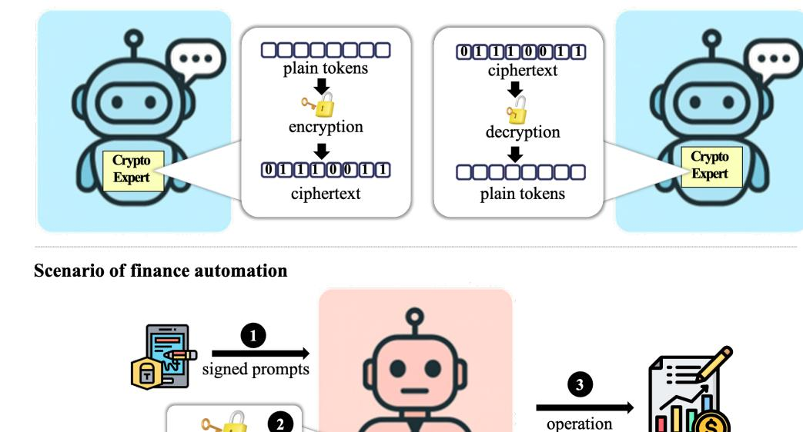
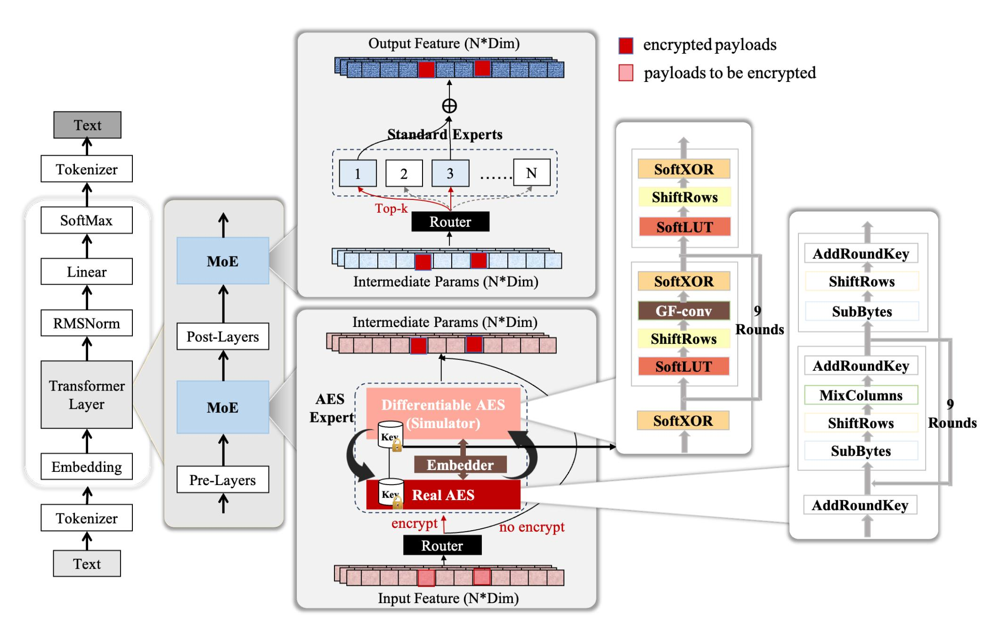
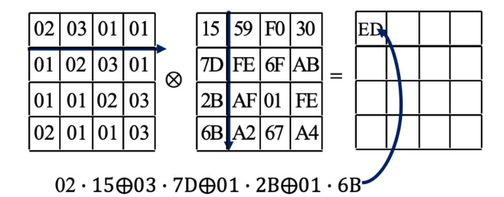
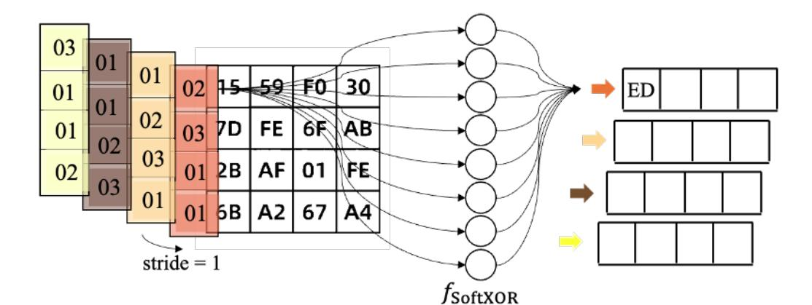
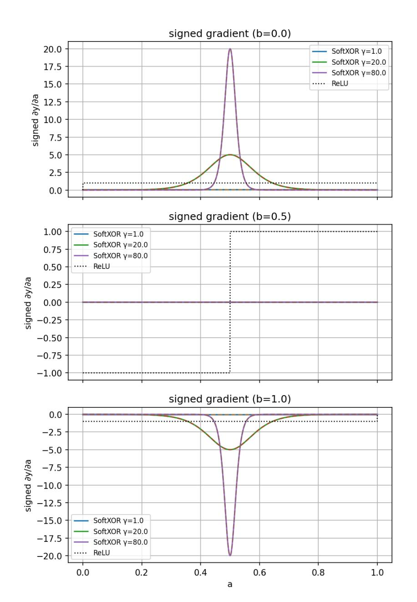

{0}------------------------------------------------

# A Built-in Crypto Expert for Artificial Intelligence: How Far is the Horizon?

Jiasi Weng, Jian Weng, Ming Li

*Abstract*—This paper proposes a built-in framework that embeds a dedicated "Crypto Expert" directly into large language models (LLMs) architecture. As an initial attempt, we design a differentiable proxy tailored to the Advanced Encryption Standard (AES) algorithm, using our customized neuron units, including **SoftXOR**, **SoftLUT** and **GF-conv** neurons. These units provide functional equivalence to the AES within the Boolean domain, while enabling stable gradients for backpropagation. By integrating this differentiable proxy as a specialized expert within a Mixture-of-Expert (MoE) LLM, the LLM learns to autonomously route and encrypt sensitive tokens during the training phase. After training, the differentiable proxy is seamlessly swapped for a real and discrete AES implementation to guarantee provable security at inference. Our empirical evaluations demonstrate that our approach significantly reduces neuron counts and latency compared to prior ReLU-based representation, mitigates continuous differential attacks, and enforces end-to-end data protection without degrading downstream task utility. We expect this attempt to serve as a catalyst for future research into the seamless fusion of formal cryptographic guarantees and deep learning computation graphs.

# I. INTRODUCTION

T HE rapid progress of large language models (LLMs), from early GPT variants [5, 32, 33] through GPT-4 [4] and the recent GPT-5.2<sup>1</sup> , Gemini 3.1 Pro<sup>2</sup> , has produced dramatic gains in natural language understanding, generation, and agentic behavior. A thriving ecosystem of publicly available GPT-based services attests to this transition from research prototypes to production components (*e.g.*, GPTStore.ai<sup>3</sup> , All-GPTs<sup>4</sup> ). Tooling ecosystems (for example, LangChain<sup>5</sup> ) have accelerated the construction of agentic stacks in which models not only generate text but also invoke external tools, plan multi-step procedures, and interact with environments. As single-agent capabilities increase, multi-agent orchestration and model-driven automation are becoming common in both research and deployed systems. For instance, in complex software engineering or financial analysis pipelines, multiple specialized agents now collaborate to automate end-to-end production [14, 22].

At the same time, agentic functionality substantially enlarges the attack surface. Modern taxonomies of LLM risks enumerate prompt injection, training-data poisoning, unsafe

Jiasi Weng, Jian Weng, Ming Li are all with the Guangzhou University, Guangzhou 510006, China (e-mail: wengjiasi@gmail.com, cryptjweng@gmail.com, limjnu@gmail.com).

tool integration, sensitive-data leakage, supply-chain weaknesses, and model theft, etc [28]. Agentic LLMs compound these problems by combining long-horizon reasoning, tool calls, and real-world effects, e.g., the recent "OpenClaw deletion nightmare"<sup>6</sup> ; failure modes can cascade from a single adversarial input to high-consequence outcomes [7]. Recent empirical audits and benchmark suites [41, 42, 45] consistently report low safety scores for representative agents and frequent violations of basic safety constraints, e.g., failures to enforce authorization or to avoid unsafe tool use. These observations underscore an urgent need for principled, systemlevel defenses that compose across training, deployment, and runtime tooling interfaces.

The fundamental tension arises from the fact that Artificial Intelligence (AI) research has traditionally prioritized the learning efficiency of data processing and algorithmic automation over security mechanisms. This performance-first design philosophy leads to a reactive patch-based security paradigm. Such post-hoc interventions often fail to harmonize with the underlying AI pipelines or the intricate trust architectures required among diverse agent developers, leaving models vulnerable to malicious attacks.

The field of cryptography provides a set of tools for building modules with provable security guarantees. By embedding cryptographic modules that function as dedicated "*Crypto Expert*" directly into the functional architecture of AI, we can move toward a security-by-design framework. As shown in Fig. 1, let us imagine two agents on a secret mission, they utilize built-in authenticated encryption to ensure message confidentiality and integrity, rather than relying on external firewalls. In scenarios involving financial autonomy, a builtin digital signature module for an agent could enforce multisignature authorization, requiring concurrent approval from a human administrator and an AI security auditor before executing high-risk commands. Furthermore, embedded authentication could serve as a gatekeeper for data integrity, mitigating poisoning attacks during both training and inference.

However, directly embedding cryptographic algorithms inside an LLM's computation graph confronts fundamental mismatches between the discrete algebraic domain of cryptography and the continuous, high-dimensional real-valued domain of neural networks. Concretely, the principal technical obstacles are summarized as following:

• Representation mismatch. LLMs operate on real-valued vectors, whereas cryptography relies on discrete elements (*e.g.*, bits and finite field elements). Directly feeding floats

<sup>6</sup>https://www.businessinsider.com/meta-ai-alignment-director-openclawemail-deletion-2026-2

<sup>1</sup>https://en.wikipedia.org/wiki/GPT-5.2

<sup>2</sup>https://blog.google/innovation-and-ai/models-and-research/geminimodels/gemini-3-1-pro/

<sup>3</sup>https://gptstore.ai/

<sup>4</sup>https://allgpts.co/

<sup>5</sup>https://www.langchain.com/

{1}------------------------------------------------



Fig. 1: Illustration of application scenarios for the so-called built-in "Crypto Expert". On the top, it describes secure endto-end communication between two AI agents enabled by such a "Crypto Expert". The bottom demonstrates how the "Crypto Expert" ensures transaction integrity and authorization in financial workflows. Specifically, the agent receives external instructions that have been digitally signed. The internal "Crypto Expert" executes a verification process to confirm the authenticity of the signature. Only upon confirming a valid signature does the agent proceed to the operation phase, such as executing financial settlements.

into crypto-algorithms triggers type errors, while naive rounding in LLMs training leads to catastrophic gradient loss.

- Non-Differentiability. Many cryptographic primitives are discrete and deterministic, relying on Boolean operations (*e.g.*, XOR) where derivatives are zero almost everywhere. This prevents the use of backpropagation to adjust parameters or maintain an end-to-end gradient flow, as the chain rule breaks at these logic gates.
- Dimensionality Mismatch. The high-dimensional hidden states of LLMs must be mapped to the rigid block sizes of cryptographic primitives (*e.g.*, 128-bit). Forcing this semantic space into a narrow bit-string often results in significant information loss.
- Deterministic vs. Probabilistic Contradiction. Cryptography demands strict mathematical definitions and provable security under specific threat models, while LLMs are inherently statistical approximators whose outputs are probabilistic and sensitive to minor perturbations.

The first step toward addressing these challenges is to express cryptographic primitives as neural networks. However, naive implementations suffer from the attack surface derived from the discrepancy between the discrete cryptographic logic and continuous neural computation. As shown by David Gerault *et al.* [11], a ReLU-based AES deep learning network (DNN) is vulnerable to a continuous form of differential attack. An adversary using arbitrarily small input perturbations can recover secret keys in practically linear time. This vulnerability arises from the ReLU-based AES networks' piecewise-linear structure, the sparsity of active "corners" in their activation space, and the lack of output quantization allow attackers to translate microscopic changes in floatingpoint ciphertexts back into bit-level information. Although sanitization techniques are presented, existing ReLU-based AES-DNN remain parameter-heavy and are prone to vanishing gradients in deep architectures.

In pursuit of building a true "Crypto Expert" within AI, we propose a new methodology by designing a differentiable cryptographic proxy utilizing specialized components tailored to the algebraic structure of the target cryptographic algorithms. This differentiable proxy is used during training or fine-tuning, allowing the model to learn cryptographic logic via gradient descent. After training is finished, the proxy is swapped for an exactly standard and discrete implementation for secure inference.

In this work, we build an AES Expert as a primary case study. We first design a differentiable AES proxy using customized primitives tailored to the AES algorithms, significantly reducing neuron count and latency compared to the previous ReLU-based representation. We then integrate this differentiable AES proxy into a Mixture-of-Experts (MoE) LLM [6, 25], specifically the MiniMind architecture<sup>7</sup> , enabling the model to internalize secure data handling.

In conclusion, this paper makes the following contributions:

- We present a family of differentiable cryptographic primitives tailored to the AES components, including a probabilistic polynomial SoftXOR for AddRoundKey, a SoftLUT for SubBytes, and a GF-conv neuron for MixColumns. These operators are designed to preserve AES algebraic structure, provide informative and stable gradients, as well as be efficient to evaluate within large models.
- We integrate an AES Expert into a MoE-based LLM and develop a fine-tuning pipeline that trains the router to forward sensitive tokens to the AES Expert, while the expert is trained to produce encrypted representations compatible with downstream tasks.
- We analyze security and optimization tradeoffs. Compared with prior ReLU-based constructions, our differentiable primitives substantially reduce neuron counts and produce smoother gradient signals, which improves convergence. Crucially, these primitives block existing continuous differential attacks.
- We provide empirical validation. We show that models trained with the AES Expert can learn to route and encrypt sensitive spans, while retaining downstream task utility after swapping in a standard AES implementation at inference.

We expect that our initial attempt can inspire further research into the fusion of rigorous cryptographic guarantees with deep learning computation graphs. We hope to pave the way for next-generation AI agents that possess intrinsic and mathematically verifiable security capabilities. Ultimately, shifting

<sup>7</sup>https://jingyaogong.github.io/minimind/

{2}------------------------------------------------

the paradigm from reactive, post-hoc patching to structural security-by-design will be crucial for the secure and safe deployment of AI agents in high-stakes, privacy-critical, and collaborative multi-agent environments.

#### II. RELATED WORK

### A. Neural Cryptography

Early explorations by Abadi and Andersen [3], attempt to enable two neural networks to learn symmetric encrypted communication under the eavesdropping of an adversarial network. However, such end-to-end learning approaches typically converge on pseudo-random encodings, rather than standard and provably secure cryptographic protocols. Shafi Goldwasser et al. [12] prove that cryptographic backdoors based on digital signature verification or pseudo-random functions can be embedded into DNNs, taking a computational complexity perspective. Their work demonstrated that cryptographic algorithms can act as hard-constraint triggers. Specifically, the model alters its predictive behavior only when the input contains a valid signature string. Based on standard cryptographic assumptions, this behavioral shift is undetectable via black-box auditing in polynomial time. Subsequently, David Gerault et al. [11] demonstrate how to construct the AES algorithm directly using ReLU-based DNN. Crucially, they expose the severe risks of continuous differential attacks that arise when discrete cryptographic logic is implemented within the continuous real-number domain of neural networks.

**Differences.** While Shafi Goldwasser *et al.* [12] prove the theoretical feasibility of embedding cryptographic logic into model weights, their objective was to expose undetectable malicious backdoors. Our work is different from their work from three aspects:

- **Differentiability.** We resolve the gradient propagation bottlenecks of cryptographic algorithms during training by moving away from the static and hard-coded parameter injection. This enables a dynamic embedding pipeline, that is, fully differentiable during training, and strictly replaceable by standard discrete implementations at deployment.
- Main-Task Compatibility. Unlike backdoor logic that stealthily hijacks the main task, our work investigates how the "Crypto Expert" can seamlessly collaborate with the LLM's primary task. For example, the expert provides end-to-end encryption protection for sensitive data without degrading the model's semantic understanding.
- **Visibility.** Instead of hiding malicious logic, our goal is to integrate cryptographic logic as a transparent "Crypto Expert" (except for the secret key) within an MoE architecture. By embedding this logic as an explicit expert, we expect to provide a verifiable security primitive rather than a concealed vulnerability.

#### B. Cryptography for AI

In the realm of privacy-preserving machine learning (PPML), cryptographic techniques such as Homomorphic Encryption (HE), Secure Multi-Party Computation (MPC), and

Trusted Execution Environments (TEE) have been widely deployed [8, 20, 21, 23, 24, 27, 30, 38–40, 44]. However, these technologies are primarily designed to protect the confidentiality of the training data or the model weights themselves. They are not care about the action authorization or operational constraints at inference of LLMs. More recently, in response to threats like Deepfakes, watermarking and digital signature-based provenance techniques are proposed [2, 10, 17, 18, 29, 31, 37, 43]. This trend underscores an urgent demand for models equipped with a built-in authentication mechanism to verify the integrity or the origin of AI-generated outputs.

#### III. BACKGROUND

### A. Some Basic Units in Neural Networks

Standard artificial neuron units form the foundation of deep learning, by computing a linear combination of inputs followed by a non-linear activation function, typically expressed as y = f(Wx + b). While powerful when stacked in deep multilayer perceptrons (MLPs), standard neurons rely purely on additive aggregations. To efficiently model complex logical interactions without requiring massive parameter counts, modern architectures often employ specialized neural units. In this work, our differentiable cryptographic modules draw direct inspiration from the following three neural paradigms:

**Sigma-Pi Neural Units.** Unlike standard neurons that strictly perform additive linear combinations, Sigma-Pi neural units introduce multiplicative interactions between inputs before applying the summation and activation [19, 26]. By directly multiplying inputs, Sigma-Pi units can naturally model polynomial functions, cross-feature interactions, and complex logical gating within a single layer. This work adopts this higher-order multiplicative structure to construct our continuous SoftXOR operator, leveraging probability polynomials to exactly model Boolean logic in the real-number domain.

**Attention.** Attention can describe a computation as a Key-Value-Query (KVQ) matching process [35]. Given a query matrix Q, a key matrix K, and a value matrix V, the standard scaled dot-product attention computes:

Attention
$$(Q, K, V) = \text{Softmax}\left(\frac{QK^{\top}}{\tau}\right)V,$$

where  $\tau$  is a temperature scaling factor. The term  $\operatorname{Softmax}(QK^{\top}/\tau)$  produces a soft probability distribution representing the similarity between queries and keys, which is then used to compute a weighted sum of the values V. Because attention acts as a differentiable dictionary lookup, it provides the perfect architectural foundation for our  $\operatorname{SoftLUT}$  module, allowing us to emulate the discrete AES SubBytes operation as a continuous key-value retrieval process.

Convolutional Neurons [36]. Convolutional neural networks are designed to process structured grid or sequence data by exploiting local connectivity and weight sharing. In a 1-Dimensional (1D) convolution, rather than connecting every input to every output, a dense, fixed-size filter  $\mathbf{k}$  of size m slides across the input sequence  $\mathbf{x}$ . The operation at position i is defined as  $y_i = \sum_{j=0}^{m-1} k_j \cdot x_{i+j}$ . In our work, we elevate this concept to operate over finite fields. By treating the fixed

{3}------------------------------------------------



Fig. 2: The pipeline of an MoE-based model embedded with a customized expert, *i.e.*, the AES Expert. The left column shows the architecture of an LLM, and we refer it to the MiniMind architecture, for example. The central column illustrates two distinct MoE stages: (1) a pre-MoE stage where a per-token router selects positions that require AES processing and (2) standard experts that perform soft-mixture processing after post-layers. The AES Expert (bottom central box) is a positioned, in-place module. When the router selects an <ENC\_PAYLOAD> token, the pipeline sends the raw payload bytes (*i.e.,* the payloads to be encrypted) and a per-configured key to the expert which returns an embedding that is written back to the parameter vectors, and when using the real AES implementation a ciphertext hex string is stored as metadata. In particular, training uses a Differentiable AES Simulator; during calibration we train a Embedder to map real ciphertexts into the simulator embedding space; at inference we replace the simulator with the Real AES (see the black curve arrow). The final user-visible output is produced by a small post-processing step. The inference script substitutes each <ENC\_PAYLOAD> placeholder with the corresponding <DEC>ciphertext</DEC> taken from the Real AES, so ciphertexts are visible in the generated response while the model itself only sees embeddings.

matrix coefficients of AES as a shared convolutional filter and replacing scalar multiplications with bit-wise matrix transformations, we design the GF-conv neuron to seamlessly and differentiably execute the AES MixColumns diffusion.

### *B. The Mixture of Experts*

The Mixture of Experts (MoE) architecture has established itself as a cornerstone of modern LLMs, widely recognized as a premier solution for scaling model capacity to unprecedented levels with minimal computational overhead [6, 25]. MoE is a routing-based architecture that distributes model capacity across multiple specialized sub-networks, commonly referred to as "experts". Given an input representation x (*e.g.*, the hidden vector of a specific token), an MoE layer consists of two primary components: a router network that outputs the routing weights or probabilities for each expert, and a set of expert networks {Ei(·)} N <sup>i</sup>=1, each capable of producing an output representation for the given input. Below, we outline three common MoE paradigms and their corresponding mathematical formulations.

SimpleMoE. The classical MoE [15, 16] computes the output as a dense convex combination of all available experts. Given an input x, N experts {E1, . . . , E<sup>N</sup> }, and a router network G that outputs an N-dimensional probability distribution (typically via a softmax function), the output is defined as:

$$y = \sum_{i=1}^{N} G(x)_i \cdot E_i(x).$$

While theoretically sound, the SimpleMoE requires evaluating every expert for every input. Consequently, the computational cost scales linearly with the number of experts, limiting its practical scalability.

SparseMoE. To decouple model capacity from computational cost, Shazeer *et al.* [34] introduced sparse gating. Instead 

{4}------------------------------------------------

of evaluating all experts, the router network enforces sparsity by retaining only the top-k routing weights and setting the remainder to zero. The output is formulated as:

$$y = \sum_{i \in \mathcal{T}_k(x)} G(x)_i \cdot E_i(x),$$

where Tk(x) denotes the set of indices corresponding to the top-k gating scores. This sparse routing allows the model to expand to thousands of experts while only querying a small subset (*e.g.*, k = 2) for any given input token.

SingleMoE. Pushing sparsity to its theoretical limit, Fedus *et al.* [9] introduced the Switch Transformer, which routes each input token to exactly one expert (k = 1). By selecting only the top-1 expert, the routing equation simplifies to:

$$y = G(x)_{\text{top-1}} \cdot E_{\text{top-1}}(x).$$

This extreme sparsity maximizes computational and communication efficiency during distributed training, while still leveraging the specialized representations learned across the diverse expert pool.

Motivations for Our Design. The modern sparse MoE framework provides an ideal substrate for integrating heterogeneous computational blocks. Because the router network learns to route tokens to the most appropriate expert based on the underlying input semantics, it is not strictly required that all experts share the exact same internal architecture (*e.g.*, standard Feed-Forward Networks). In this work, we exploit this architectural flexibility. By encapsulating our end-to-end differentiable cryptographic pipeline as a specialized AES Expert, we enable an LLM model to autonomously learn when to route data through standard neural transformations and when to trigger strict, bit-level cryptographic operations.

## *C. From Hard Decisions to Soft Decisions*

In classical digital logic and standard cryptographic implementations, operations are performed on discrete and binary variables (i.e., x ∈ {0, 1}). This paradigm relies on *hard decisions*, where a state is deterministically true or false. However, in information and coding theory, it has long been established that *soft decisions*, where variables are represented by continuous values denoting the probability or reliability of a bit, which preserves critical information and yields superior performance [1, 13]. In a soft decision framework, a "soft bit" is usually represented by a continuous probability p ∈ [0, 1], where values approaching the boundaries (0 or 1) indicate high certainty, and intermediate values indicate uncertainty.

Beyond classical error correction, the transition from hard to soft values is fundamentally required in the realm of deep learning and differentiable programming. Standard cryptographic operations, such as the bit-wise XOR in AES, operate strictly on non-continuous discrete domains. Mathematically, these step-like discrete functions exhibit gradients that are either zero or undefined almost everywhere. Consequently, embedding standard AES operations inside a neural network may obstruct the flow of gradients, rendering backpropagation impossible.

To resolve this, we adopt a soft decision paradigm as a continuous relaxation of discrete Boolean algebra. By relaxing binary bits into continuous probabilities p ∈ [0, 1], logical operations can be replaced by their algebraic, probabilistic equivalents. For instance, if two independent bits have the probabilities p<sup>1</sup> and p<sup>2</sup> of being 1, the probability of their XOR result being 1 is given by the polynomial p1(1 − p2) + p2(1−p1). By mapping rigid cryptographic operations into this continuous, probability-polynomial space, we obtain smooth, non-zero gradients. This continuous relaxation serves as the foundational principle for the differentiable cryptographic neurons designed in this work.

# IV. A DIFFERENTIABLE REPRESENTATION FOR THE AES *A. Design Overview*

We present an end-to-end pipeline that makes AES operations both differentiable for in-loop training and replaceable by a standard and discrete AES implementation at deployment. As depicted in Fig. 2, we encapsulate this functionality in a pluggable AES Expert module that exposes a differentiable AES simulator during training and is swapped for a standard AES implementation for inference. The differentiable simulator is built from a set of composable and differentiable primitives that are called cryptographic neurons in this paper tailored to cryptographic algorithms:

- **SoftXOR**. A probability-polynomial extension of bitwise XOR. Each real input is interpreted as a soft-bit in [0, 1] via a scaled sigmoid function, and XOR(a, b) is implemented as p<sup>a</sup> + p<sup>b</sup> − 2pap<sup>b</sup> with a sharpness hyperparameter γ that controls the soft-hard transition while preserving smooth and non-zero gradients.
- **SoftLUT**. A differentiable 256-entry SubBytes lookup implemented as a soft weighted aggregation with a temperature τ . This realizes the S-box as a continuous interpolation of discrete table values and allows controlled annealing toward one-hot behavior.
- **GF-conv**. A bit-level linear operator for MixColumns. The finite-field multiplication by constants is expressed as pre-computed 8 × 8 binary matrices, and column aggregation is implemented with the SoftXOR.
- **ShiftRows**. It is implemented as a fixed sparse permutation matrix, so that position re-ordering is linear and gradient-preserving.

These cryptographic neurons share a unified soft-bit tensor interface, which makes them directly composable into AESlike round pipelines. Each of them is designed to allow closed-form gradient expressions and to avoid trivial gradient collapse; in practice we schedule γ and τ during training to trade gradient smoothness for discreteness, recovering exact discrete behavior as γ → ∞ and τ → 0.

At the model level, the AES Expert is inserted as an MoE specialist and trained end-to-end. The MoE router learns to route sensitive tokens to the AES Expert, and the expert is optimized jointly under a composite loss that combines the downstream task objective, router supervision, auxiliary alignment losses, and scheduling regularizers for hyper-parameters γ, τ . We treat the training process as operated by a trusted 

{5}------------------------------------------------

trainer, so training-time gradient exposure is an accepted design assumption. In deployment, the differentiable simulator is replaced by a standard AES, which substantially reduces the applicability of continuous differential attacks at deployment. If the assumption of trusted trainer does not hold, the same pipeline allows standard hardening measures like trusted enclaves as mitigation.

#### B. Customized Differentiable Components for The AES

**SoftXOR for AddRoundKey.** The AddRoundKey operation performs a bit-wise XOR between each byte of the plaintext matrix and the corresponding round key. We note  $XOR(a,b), a,b \in \{0,1\}$  can be represented by the Boolean polynomial  $a \oplus b = a+b-2ab$ . This approach aligns with the theoretical framework of Sigma-pi Neural Units for switching circuit simulation [26], which advocates for representing complex Boolean operations through continuous sum-and-product formulations due to their architectural efficiency. To implement this switching logic within a differentiable neural environment, we interpret arbitrary real-valued inputs as soft bits. Each real input is viewed as the probability that the bit equals 1. Denote these probabilities by  $p_a$  and  $p_b$ . Based on this probabilistic interpretation, we have

$$\Pr(\text{XOR}(a,b)=1) = p_a(1-p_b) + (1-p_a)p_b = p_a + p_b - 2p_ap_b,$$
 which matches the above Boolean polynomial when  $p_a, p_b \in \{0,1\}.$ 

In practice, neural models produce unbounded real scores (e.g.), outputs of an embedding or linear projection), not probabilities. We therefore map a real score x to a soft-bit via a scaled sigmoid function, as following:

$$\sigma(\gamma, x) = \text{Sigmoid}(\gamma(x - 0.5)),$$

which centers the decision boundary at x=0.5 and uses  $\gamma>0$  to control sharpness. Using this mapping, we define the differentiable XOR as **SoftXOR**:

$$SoftXOR(a,b) = \sigma(\gamma,a) + \sigma(\gamma,b) - 2\sigma(\gamma,a)\sigma(\gamma,b).$$

Here,  $\gamma$  is a hyperparameter. A small  $\gamma$  yields a smooth, gently varying operator. A large  $\gamma$  makes  $\sigma(\gamma,\cdot)$  approach a step function, and thus SoftXOR approaches the discrete XOR. During training, we employ a curriculum learning strategy for  $\gamma$ , starting with a low value to explore the optimization landscape and progressively increasing it to harden the logic toward the end of training.

For comparison, ReLU-based XOR approximations yield piecewise constant gradients (e.g.,  $\pm 1$ ). Consequently, these gradients convey only directional signals, lacking meaningful continuous proximity information and risking zero-gradient dead zones. SoftXOR, however, provides a smooth and analytically differentiable extension of the Boolean XOR. It allows continuous gradients that are highly informative for backpropagation, offering richer magnitude information that reflects the distance to the target states, thereby facilitating more stable and efficient training.

**SoftLUT for SubBytes.** The SubBytes is implemented as a fixed and discrete lookup (i.e., the S-box). To replace this non-differentiable table lookup with a continuous approximation,

a direct continuous formulation is a radial basis function-style SoftLUT: for an input byte x, compute similarity weights by  $w_i = e^{-\beta(x-i)^2}$ ,  $(i=0,\ldots,255)$ , and normalize them with a softmax function, and return the weighted sum over the S-box outputs by Output  $=\sum_{i=0}^{255} \operatorname{Softmax}(\mathbf{w})_i \cdot \operatorname{SBOX}[i]$ . Although this approach is straightforward and intuitively appealing, it is not only computationally inefficient, but also imposes a fundamentally flawed similarity prior for binary fields. For instance, in the real number domain, the distance between 127 and 128 is merely 1, making them appear highly similar. In contrast, at the binary level, 127 (which is 01111111) and 128 (which is 10000000) differ in every single bit (a Hamming distance of 8), meaning they should be regarded as completely dissimilar.

We therefore represent SubBytes as a key-value query (KVQ) problem, like the attention in Transformer models [35], so we can exploit highly optimized matrix operations and obtain improved numerical stability. Concretely, rather than indexing by a scalar i, we represent each possible byte value as an 8-dimensional binary key vector and the corresponding Sbox output as an 8-dimensional binary value vector. Formally, we define  $K \in \{-1,1\}^{256 \times 8}$ , which is a static matrix where each row is the bipolar representation of one of the 256 possible 8-bit input patterns,  $V \in \mathbb{R}^{256 \times 8}$  which is the static matrix storing the corresponding 8-bit output patterns defined by the exact AES S-box mapping, and let a query matrix  $Q \in \mathbb{R}^{B \times 8}$  representing the continuous input states produced by the network for a batch of B bytes. To make matching both sharp and gradient-sensitive we operate in a bipolar similarity space. Define the bipolar embedding map  $\Phi: \mathbb{R} \to \mathbb{R}$  that maps bit-probabilities  $x \in [0,1]$  to  $\{-1,+1\}$ -centered values. Then, we compute scaled dot-product scores:

Scores = 
$$QK^{\top} \in \mathbb{R}^{B \times 256}$$
.

When a query exactly matches key, the corresponding score is maximal (e.g., 8 in the bipolar encoding); when it mismatches, the score is correspondingly lower (e.g., -8 for a full mismatch). This large dynamic range makes the correct index easy to separate and helps gradient-based optimizers converge quickly. We convert scores into a soft selection distribution with a temperature parameter  $\tau$ :

$$A = \text{Softmax}(\text{Scores}/\tau) \in \mathbb{R}^{B \times 256}, \text{Output} = AV \in \mathbb{R}^{B \times 8}.$$

The temperature  $\tau$  controls the soft-to-hard tradeoff. That is, a large  $\tau$  gives smooth, spread-out weights, which is useful early in training; annealing  $\tau \to 0$  concentrates A toward one-hot vectors and recovers exact table lookup. Because the core operations reduce to a single  $QK^{\top}$  matrix multiplication followed by a batched matrix multiplication with V, the KVQ formulation is efficient on GPUs and benefits from the same numerical tricks and hardware acceleration used in attention layers. To bridge the gap between continuous training and discrete inference, we employ a temperature annealing schedule on  $\tau$ . By gradually driving  $\tau \to 0$ , we force the attention weights A to converge into a one-hot distribution, thereby ensuring the SoftLUT's behavior is bit-identical to the standard S-box at deployment.

{6}------------------------------------------------





Fig. 3: Comparison between the standard AES MixColumns and our proposed differentiable GF-conv. (Left) The textbook MixColumns acts as a matrix multiplication over the discrete finite field GF(2<sup>8</sup> ). A single output byte (*e.g.*, ED) is computed via hard finite-field multiplications and additions. (Right) Our GF-conv reformulates this operation as a continuous, bit-wise 1D convolution using 4 distinct filters. Finite-field multiplications are replaced by bit-level matrix transformations, and field additions are relaxed into a differentiable 8-bit aggregation using fSoftXOR.

ShiftRows. Unlike other layers, ShiftRows involves no arithmetic operations but reorders bytes within the state matrix. We represent this as a constant, sparse permutation matrix PSR ∈ {0, 1} <sup>128</sup>×<sup>128</sup>. This formulation ensures that the operation is strictly linear and allows gradients to flow through the transformation without attenuation or distortion.

**GF-conv** for MixColumns. The MixColumns serves as the linear diffusion sub-layer in AES. Its core operation involves matrix multiplication over the finite field GF(2<sup>8</sup> ) for each 4-byte column. To embed this discrete algebraic operation into a differentiable computational graph, we leverage a key algebraic isomorphism that the multiplication of a byte x by a constant c in GF(2<sup>8</sup> ) is isomorphic to a bit-level linear transformation. By treating the byte as an 8-dimensional binary vector x, there exists a fixed 8 × 8 binary matrix M<sup>c</sup> such that the operation c · x is strictly equivalent to the matrix-vector product Mcx over the base field GF(2), where addition and multiplication correspond to bitwise XOR and AND, respectively. Building on this, we formulate MixColumns as a 1D convolution applied to a sequence of 4 bytes. The output of each column is obtained by applying M2, M3, M1, and M<sup>1</sup> to the four input bytes and aggregating them (*e.g.*, r<sup>0</sup> = M2a<sup>0</sup> ⊕ M3a<sup>1</sup> ⊕ M1a<sup>2</sup> ⊕ M1a3), as demonstrated in Fig. 3. This mirrors a 1D convolution, with the distinction that the filter elements are 8 × 8 bit-transformation matrices rather than scalars. We thus define this module as the convolutional GF neuron (GF-conv).

To convert these discrete operations into differentiable realvalued computations, we introduce two critical modifications. First, we expand each byte into a (B, 4, 8) soft-bit representation, where each bit is a real-valued probability in [0, 1]. Second, we replace the hard XOR operations with our previously defined **SoftXOR** to ensure continuous differentiability during bitwise aggregation. The specific MixColumns pipeline proceeds as follows:

1) Bitwise Masking: Instead of executing a standard realvalued matrix multiplication, we utilize the precomputed constant matrix M<sup>c</sup> as a binary selection mask. For the 8-bit vector of each input byte, M<sup>c</sup> dictates exactly which

- input bits contribute to each output bit. This masking process can be efficiently parallelized on GPUs using batched tensor indexing.
- 2) Bit Aggregation: The i-th bit of the transformed output represents the XOR sum of the selected input bits. To evaluate this over probabilities, we aggregate the selected soft-bits using a layer-wise **SoftXOR** folding implemented as a binary tree. This tree-structured reduction shortens the backpropagation path and substantially mitigates gradient vanishing, reducing the composition depth from O(n) to O(log n) compared to linear chaining. Finally, the four intermediate 8-bit vectors transformed by M2, M3, M1, and M<sup>1</sup> are mixed using **SoftXOR** to produce the final soft representation of the column.

If a byte-level output is required, the soft values can be reconstructed into bytes by weighting the j-th bit by 2 j . Mathematically, the entire pipeline constitutes a continuously differentiable computational graph mapping input softbit probabilities to output soft-bit probabilities. Analytical gradients can be computed at every step, allowing gradient signals to flow seamlessly from the ciphertext back to the plaintext or upstream embeddings.

Key Management. Effective key management is critical for safeguarding cryptographic components embedded within neural architectures. In our framework, the secret keys utilized by the AES Expert are maintained as part of its internal operational state. To mitigate the risk of key exposure and prevent unauthorized access during both the differentiable training and discrete inference phases, we can isolate the AES Expert within a Trusted Execution Environment (TEE). Leveraging the distributed routing capabilities inherent to MoE architectures, we can deploy the AES Expert on secure enclaves, while the remaining non-sensitive experts operate on standard compute nodes.

# V. ANALYSIS FOR THE DESIGN

We analyze in this section the correctness, the differentiability, and the sensitivity against continuous differential attacks. Finally, we also make a comparison between our soft AES simulator and the ReLU-based implementation.

{7}------------------------------------------------

#### A. Correctness

We define the correctness of a differentiable cryptographic component as its functional equivalence to the standard AES algorithm within the Boolean domain.

**SoftXOR.** If the inputs  $a,b \in \{0,1\}$  and the hyperparameter  $\gamma \to \infty$ , then  $\sigma(\gamma,a) \to a$  and  $\sigma(\gamma,b) \to b$ , so SoftXOR(a,b) recovers the exact Boolean XOR.

**SoftLUT**. Recall that the formulation computes scaled dot-product scores  $s_i = (q \cdot k_i)/\tau$ , applies  $A = \operatorname{Softmax}(s)$ , and yields y = AV. If the temperature  $\tau \to 0$ , then the softmax distribution concentrates on the maximizer of  $s_i$ , and y converges to the corresponding one-hot readout  $V_{i^\star}$ . Therefore, KVQ precisely recovers the exact S-box lookup in the small-temperature limit.

**GF-conv**. Every constant multiplication  $c \cdot x$  in the finite field  $\mathrm{GF}(2^8)$  can be expressed as a linear map over  $\mathbb{F}_2$ , denoted by  $c \cdot x \longleftrightarrow M_c x$ , where x is an 8-bit column vector and  $M_c \in \{0,1\}^{8 \times 8}$  is a fixed binary matrix. The subsequent algebraic aggregations (field additions) over the column are recovered in the  $\gamma \to \infty$  limit via SoftXOR reductions.

By composing the SoftLUT, SoftXOR, and  $M_c$  mappings round-by-round, the entire continuous pipeline converges pointwise (for a fixed plaintext and key) to the exact standard AES round mapping as  $\gamma \to \infty$  and  $\tau \to 0$ .



Fig. 4: The signed gradient comparison of SoftXOR and ReLU-based XOR approximations.

#### B. Sensitivity to Continuous Differential Attacks

As described by the previous work [11], when a ReLU-based DNN approximates the AES algorithm, its high-dimensional function domain is partitioned by neuron hyperplanes into numerous continuous piecewise-linear polytopes. Within any single polytope, the network's output behaves as a strictly local linear mapping, denoted as y = Wx + b. Continuous differential attacks exploit precisely this geometric characteristic. An attacker first selects a base plaintext to obtain the continuous floating-point output, and then applies a minute perturbation  $\epsilon$  to specific input bits. If the perturbation does not cross a decision boundary, the output difference  $\Delta y$  completely exposes the linear weights of that specific region. Conversely, once the perturbation crosses a boundary, the output exhibits a derivative-discontinuous "corner" response.

Similarly, if the trained differentiable AES simulator in this work is used directly during the deployment phase, it will equivalently be exposed to continuous differential attacks when the hyperparameters are pushed to their limits (i.e., the scaling factor  $\gamma \to \infty$  and the temperature coefficient  $\tau \to 0$ ) to approximate discrete logic. Specifically, a large  $\gamma$ forces the SoftXOR function to become exceptionally steep at the decision boundaries, causing its local behavior to highly degenerate into a piecewise-linear state akin to ReLU. In this state, a small perturbation  $\epsilon$  can produce measurable floatingpoint differences. The attacker can use this to statistically estimate the soft-bit probabilities  $(p_a, p_b)$ , and subsequently recover the key bits affected by AddRoundKey bit-by-bit. On the other hand, as  $\tau \to 0$ , the SoftLUT mechanism collapses into a nearly one-hot hard lookup mode. Under this limit, tiny input perturbations may trigger a switch in the retrieval index, leading to significant jumps in the output vector. By systematically manipulating the query inputs and analyzing the sudden mutational responses of the Softmax weights, the attacker may reconstruct the key-value mapping relationship, just as they would when facing an exact discrete lookup table.

Aware of the above threats, our methodology requires not deploying the differentiable simulator as a live oracle. Instead, we replace it at deployment time with the standard AES implementation and enforce strict input/output sanitization that guarantees binary inputs and quantized outputs, thereby removing the fine-grained continuous leakage that enables continuous differential attacks.

#### C. Differentiability and Analytic Gradients

**SoftXOR.** Let  $s_a = \sigma(\gamma, a)$  and  $s_b = \sigma(\gamma, b)$ . The partial derivatives of the SoftXOR function are given by:

$$\frac{\partial \operatorname{SoftXOR}(a, b)}{\partial a} = s'_{a}(1 - 2s_{b}),$$
$$\frac{\partial \operatorname{SoftXOR}(a, b)}{\partial b} = s'_{b}(1 - 2s_{a}),$$

where  $s_a' = \frac{\partial \sigma(\gamma, a)}{\partial a} = \gamma \sigma(\gamma, a) (1 - \sigma(\gamma, a))$ . Because the derivative of the sigmoid function achieves its global maximum at  $\sigma = 1/2$ , we obtain the uniform gradient bound:

$$\left| \frac{\partial \operatorname{SoftXOR}}{\partial a} \right| \le \max_{x} |s'_a(x)| \le \frac{\gamma}{4}.$$

{8}------------------------------------------------

TABLE I: Comparison of neuron counts.

| <b>AES Component</b> | [11]                             | Differentiable AES (Ours)             | Reduction     |
|----------------------|----------------------------------|---------------------------------------|---------------|
| AddRoundKey          | 384 (256 hidden + 128 out)       | 128 (no hidden layer)                 | 3.0×          |
| SubBytes             | 16,512 (16,384 hidden + 128 out) | <b>4,224</b> (4,096 hidden + 128 out) | <b>3.9</b> ×  |
| MixColumns           | 33,920 (33,792 hidden + 128 out) | <b>512</b> (384 hidden + 128 out)     | <b>66.2</b> × |
| Total (Per Round)    | 50,816                           | 4,864                                 | 10.4×         |

Thus, the per-input gradient magnitude of SoftXOR scales strictly linearly with  $\gamma$  and remains bounded for any finite  $\gamma$ . Fig. 4 demonstrates the signed gradient with different  $\gamma$  values, compared with the ReLU-based one.

**SoftLUT.** Let  $S = qK^{\top} \in \mathbb{R}^{B \times 256}$  be the unscaled score matrix. For a single query vector  $q \in \mathbb{R}^{1 \times 8}$ , the Jacobian of the output y with respect to q can be derived via the chain rule as:

 $\frac{\partial y}{\partial q} = \frac{1}{\tau} K^{\top} \big( \operatorname{diag}(A) - A^{\top} A \big) V,$ 

where  $A \in \mathbb{R}^{1 \times 256}$  is the attention probability vector, and  $(\operatorname{diag}(A) - A^{\top}A)$  is the standard Jacobian of the Softmax function. The norm of this overall Jacobian is fundamentally modulated by two competing factors. On one hand, the elements of the Softmax Jacobian are bounded by  $A_i(1 - A_i) \leq 1/4$ . On the other hand, the global multiplier  $1/\tau$  scales the entire expression.

**GF-conv**. An output bit in MixColumns is the XOR-sum of up to m input bits. Using the continuous relaxation of SoftXOR implemented via a binary reduction tree, the gradient of an output bit with respect to any input bit propagates through a unique path of length  $\mathcal{O}(\log_2 m)$ . The analytical gradient is the product of the local derivatives along this path. By the equivalent multi-variable polynomial representation of SoftXOR, the gradient amplitude is explicitly bounded by  $\mathcal{O}(\gamma)$  and does not explode with m.

#### D. Neuron Counts

The AES simulated with ReLU-based DNN proposed by David Gerault *et al.* [11] incurs prohibitive parameter overhead. The complexity stems from treating AES primitives as black-box Boolean functions, effectively forcing MLPs to memorize discrete truth tables. In contrast, our differentiable AES considers cryptographic structural priors directly into the neural design, replacing learned memorization with intrinsic algebraic logic. A quantitative comparison of the neuron counts for a single round required by both approaches is presented in TABLE I.

In the previous work [11], for AddRoundKey, their 2-layer MLP requires 256 hidden-layer neurons and 128 output neurons to perform a 128-bit XOR, totaling 384 neurons. Their SubBytes implementation is even more resource-intensive, utilizing 1,024 hidden-layer neurons per byte plus 128 global output neurons, resulting in a total of 16,512 neurons. Finally, modeling MixColumns as a general Boolean map for MUL2/MUL3 operations requires approximately 33,792 hidden neurons and 128 output neurons, totaling 33,920 neurons.

Unlike them, we employ a single scalar algebraic node per input bit, requiring only 128 neurons for AddRoundKey. For

SubBytes, we treat each input byte as an 8-dimensional query and compute its similarity to 256 static 8-dimensional keys. This lookup mechanism requires 256 hidden neurons and 8 output neurons per byte; across 16 bytes, this totals 4,224 neurons ( $16 \times 264$ ). For MixColumns, we apply three matrix multiplications ( $M_1$ ,  $M_2$ ,  $M_3$ ) to each 4-byte column. This process utilizes 96 hidden neurons and 32 output neurons via SoftXOR folding. Consequently, each column requires 128 neurons, totaling 512 neurons for the full 128-bit state.

#### VI. IMPLEMENTATION AND EXPERIMENTS

#### A. Implementation

We implement the differentiable AES prototype (128-bit key length) in Python, and encapsulate it as a modular AES Expert inside a MoE architecture. As a proof-of-concept (PoC) pipeline, we train an MoE model end-to-end with the differentiable AES Expert during training, and then substitute the differentiable module with a real AES implementation at inference. Finally, we integrate this pipeline into the MiniMind LLM to demonstrate semantics-preserving responses as the primary task while automatically encrypting sensitive tokens during generation.

The high-level logic of our MoE-based forward pass is detailed in Algorithm 1. This algorithm illustrates how the system dynamically routes tokens and intervenes with the AES Expert. To achieve backpropagation through the cryptographic operations, the designed differentiable AES module is implemented as Algorithm 2 shown. This module replaces discrete operations with continuous approximations, such as Softxor, SoftLut and GF-conv allowing gradients to flow through the encryption rounds. Furthermore, since the bit-level probabilities generated by the AES Expert reside in a different domain than the LLM's latent space, we employ an AES Expert Simulator (see Algorithm 3). This component projects the bit probabilities back into the continuous hidden space of the transformer, ensuring structural and numerical compatibility with the subsequent layers.

#### B. Experiments

Building upon our implementation, we conduct a comprehensive experimental evaluation. First, we compare the execution time of our differential AES against the ReLU-based baseline [11]. Second, we subject our differentiable AES to continuous differential attacks. Finally, we demonstrate the practical efficacy of our system through test interactions with both the standalone PoC implementation and the integrated MiniMind LLM.

{9}------------------------------------------------

### Algorithm 1 Our MoE-based model's Forward Function

```
Require: Token IDs X \in \mathbb{Z}^{B \times S}, Payload Mapping \mathcal{M}
Ensure: Logits L, Routing Mask M
  1: H \leftarrow \text{TokenEmbedding}(X)
  2: //Pre-processing Layers
  3: for all layer \in PreLayers do
         H \leftarrow \tanh(\operatorname{layer}(H))
  4:
  5: end for
  6: //Routing Decision
  7: Pro_{\text{router}} \leftarrow \text{RouterNet}(H)
  8: //Identify target tokens
  9: M \leftarrow (Pro_{\text{router}} > 0.8) \lor (X = \langle \text{ENC\_PAYLOAD} \rangle)
10: //AES Expert Intervention
11: if any(M) then
         P_{\text{batch}}, K_{\text{batch}}, \text{Idx} \leftarrow \text{ExtractPayloads}(X, M, \mathcal{M})
12:
         E_{\text{aes}}, \text{Meta}_{\text{aes}} \leftarrow \text{AESLayer}(P_{\text{batch}}, K_{\text{batch}}, \text{AES\_Expert})
13:
         //Dimension alignment
14:
         E_{\text{norm}} \leftarrow \text{PadOrTruncate}(E_{\text{aes}}, d_{\text{hidden}})
15:
         for all i, (b, s) \in \text{enumerate}(X) do
16:
            //Inject differentiable ciphertext embedding
17:
             H|b,s| \leftarrow E_{\text{norm}}|i|
18:
19:
            //Optional: store hex metadata
             SaveToHistory(Meta<sub>aes</sub>|i|)
20:
         end for
21:
22: end if
23: //Post-processing Layers
24: for all layer \in PostLayers do
         H \leftarrow \tanh(\operatorname{layer}(H))
25:
26: end for
27: //MoE Processing
28: W_{\text{exp}} \leftarrow \text{Softmax}(\text{MoERouter}(H))
29: H_{\text{moe}} \leftarrow \mathbf{0}
30: for e=1 to N_{\text{experts}} do
         H_{\text{moe}} \leftarrow H_{\text{moe}} + W_{\text{exp}}[e] \cdot \text{Expert}_e(H)
31:
32: end for
33: //LM Head projection
34: L \leftarrow \text{Linear}(H_{\text{moe}})
35: return L, M
```

Running Time Comparison with [11]. In Section V-D, we compared the number of neurons required by our proposed differentiable representation and [11]. We now evaluate the computational efficiency by comparing the inference latency across different batch sizes of plaintexts during encryption. As demonstrated in the benchmark results, we can see that the neuron representation is absolutely critical for efficiency.

TABLE II: Comparison on running time (ms)

| <b>Batch Size</b> | Ours (Float) | Ours (Integer) | [11]       |
|-------------------|--------------|----------------|------------|
| 1                 | 384.98       | 372.38         | 4,394.84   |
| 5                 | 373.53       | 372.70         | 22,984.36  |
| 10                | 379.61       | 393.37         | 63,208.37  |
| 20                | 626.30       | 752.18         | 118,234.94 |
| 50                | 836.46       | 827.26         | 127,356.10 |

As demonstrated in TABLE II, at a batch size of 1, our differentiable AES (both Integer and Float variants) requires

### **Algorithm 2** Differentiable AES Expert (DifferentiableAES)

```
Require: Plaintext bytes P_{\text{bytes}} \in \mathbb{Z}^{N \times 16}, Key bytes K_{\text{bytes}} \in
      \mathbb{Z}^{N \times 16}
Ensure: Bit probabilities B_{\text{out}} \in \mathbb{R}^{N \times 128}
  1: //Domain Conversion
  2: S_{\text{bits}} \leftarrow \text{ByteToBits}(P_{\text{bytes}})
  3: // Key Expansion
  4: \mathcal{K} \leftarrow \text{ExpandKeyAES128}(K_{\text{bytes}})
  5: W \leftarrow [\text{ByteToBits}(k) \text{ for } k \in \mathcal{K}]
  6: //Initial Round
  7: State \leftarrow SoftXOR(S_{\text{bits}}, W[0])
  8: //Main Rounds
  9: for r = 1 to 10 do
          S_{\text{flat}} \leftarrow \text{Flatten}(\text{State})
 10:
         //Differentiable S-Box approximation using Soft-bits
11:
          S_{\text{flat}} \leftarrow \text{SoftLUT}(S_{\text{flat}})
12:
          State \leftarrow Reshape(S_{\text{flat}}, (N, 4, 4, 8))
13:
          State \leftarrow ShiftRows(State)
14:
          if r \neq 10 then
 15:
             // Differential GF field multiplication
 16:
             State \leftarrow GF-conv(State)
17:
 18:
          end if
          State \leftarrow SoftXOR(State, W|r|)
19:
20: end for
21: //Output Generation
22: B_{\text{out}} \leftarrow \text{FlattenTo128Bits(State)}
23: return B_{\text{out}}
```

#### **Algorithm 3** The AES Expert Simulator

```
Require: Plaintext bytes P_{\text{bytes}}, Key bytes K_{\text{bytes}}

Ensure: Continuous Embedding E \in \mathbb{R}^{N \times d_{\text{hidden}}}

1: //Cryptographic Feature Extraction

2: B_{\text{probs}} \leftarrow \text{DifferentiableAES}(P_{\text{bytes}}, K_{\text{bytes}})

3: //Latent Space Projection with MLP Adapter

4: X \leftarrow \text{Linear}(B_{\text{probs}})

5: X \leftarrow \text{GELU}(X)

6: X \leftarrow \text{Linear}(X)

7: X \leftarrow \text{LayerNorm}(X)

8: //Output Bounding and Normalization

9: E \leftarrow \text{tanh}(X)

10: return E
```

approximately 372 to 385 ms, while the AES based on ReLU-enabled DNN [11] takes about 4394 ms. As the batch size increases to 10, ours demonstrates excellent parallelization, maintaining a highly stable latency about 379 to 393 ms. In contrast, [11]'s latency is up to over 63,208 ms, making it over 160 times slower. Even at a larger batch size of 50, our method completes the batch encryption in under 840 ms, whereas the baseline exceeds 127,356 ms. This running time difference highlights that our tensor-optimized differentiable AES representation not only reduces neuron counts but enables the use of the parallel processing capabilities of DNN.

Continuous Differential Attacks. David Gerault *et al.* introduced a continuous differential attack targeting ReLU-based neural network implementations of AES. In this chosen-

{10}------------------------------------------------

plaintext attack, the adversary can inject a microscopic continuous perturbation into the plaintext to observe whether the network blocks this deviation during the initial AddRoundKey layer. If the perturbation is blocked, the final ciphertexts will remain identical, creating a ciphertext collision. Attackers use this collision as a signal to confirm their key guess.

The fundamental vulnerability that makes this attack work is that ReLU activation functions contain flat regions where the gradient is zero (i.e., when x ≤ 0, max(0, x) = 0). In a standard ReLU-based S-box, only specific intermediate values (that is 82) will push the neurons into this flat zone. By carefully crafting plaintext pairs, the attacker ensures that if their key guess is correct, the perturbed input is shifted exactly into this flat zone. Because both the normal input and the perturbed input (±ϵ) evaluate to zero in this region, the tiny perturbation is perfectly erased. The subsequent layers process identical values, resulting in a ciphertext collision and allowing the attacker to recover the secret key byte by byte.

We evaluated this continuous differential attack against our proposed differentiable AES. Our experiments show that the attack fails completely. It yields exactly 256 ciphertext collisions per byte. Because every single key guess produces a collision, the attacker cannot distinguish the correct key from the incorrect ones. The primary reason for this failure lies in the design of our attention-based SoftLUT module, which fundamentally changes how continuous inputs are processed. Our module uses an extremely low Softmax temperature (τ = 0.01). This transforms the attention mechanism into a strict template-matching system. It contains a built-in dictionary of all 256 valid AES byte values. Consequently, whether the attacker's key guess is right or wrong, the network compares the perturbed intermediate state against this dictionary. Due to the extremely low temperature, the Softmax function aggressively filters out any tiny continuous perturbation and maps the state to the nearest exact AES byte match. Because the perturbation is automatically erased and rounded off for all 256 candidate keys, the network produces uniform ciphertext collisions across every single guess.

Fig. 5: Example of chatting with our PoC implementation.

Interaction with the PoC Implementation and that integrated with the MiniMind model. We build, train, and calibrate a MoE LM integrated with a differentiable AES simulator. Specifically, a custom tokenizer is constructed to pre-process raw text, isolating sensitive payloads encapsulated within <ENC> tags and collapsing them into a single <ENC\_PAYLOAD> semantic token. The core is the AES Expert, a differentiable module built from specialized cryptographic neurons that allow backpropagation to flow through the encryption pipeline. The routing logic is governed by a RouterNet, which is trained to distinguish between standard tokens and sensitive payloads. Furthermore, we construct the AESRealService, an execution environment for the discrete AES algorithm. To bridge the gap between simulation and reality, we extract embeddings from the soft simulator and train an embedder to align these continuous representations with the discrete outputs of a real AES encryption function. During training, there are two stages. We first conduct supervised routing training to teach the router to specifically flag the <ENC\_PAYLOAD> tokens. Subsequently, we jointly train the entire MoE model alongside the soft AES simulator. During the inference phase, the trained model intercepts the raw token output for a given prompt. If a payload is successfully routed and encrypted, the system injects the real AES ciphertext (wrapped in <DEC>...</DEC> tags) into a clean, pre-defined natural language template, as demonstrated in Fig. 5. This ensures deterministic cryptographic accuracy rather than relying solely on the LLM's generative output. Lastly, we integrated the PoC implementation with the MiniMind model, as shown in Fig. 6. In this integrated environment, the system achieves a throughput performance of approximately 410 tokens per second.

Fig. 6: Example of chatting with the implementation integrated with MiniMind.

# VII. DISCUSSION AND FUTURE WORK

Discussion. This paper integrates a "Crypto Expert" into an MoE model which offers a pragmatic path toward securityby-design. Specifically, during training, the model learns an encrypt-when-needed logic with a differentiable proxy, while at inference a formally discrete implementation is substituted. This method enables end-to-end learning, and supports posthoc cryptographic correctness via calibration. However, doing so also introduces new issues needed to be considered. Firstly, the router's misclassifications risk under protecting sensitive spans. Any *routing misclassification* represents a failure in the 

{11}------------------------------------------------

security gating mechanism, potentially leaving sensitive spans exposed in plaintext. Secondly, the differentiable proxy may expose continuous attack surfaces and deployment requires careful key management and auditing. The training process in this paper should be conducted within a trusted environment. Thirdly, we need to carefully define an explicit threat model. The neural integration should not be seen as a holistic replacement for established secure system architectures. Instead, a key-based "Crypto Expert" should be augmented by classical protections, such as a TEE for key isolation.

Future Work. Standing on top of the pipeline built by this paper, we will attempt to (a) transition from manual tagging (*e.g.*, <ENC> tags) toward a fully autonomous routing mechanism; (b) extend the simulator-to-real methodology to other cryptographic primitives, such as authenticated encryption, signatures, etc; (c) formalize replacement guarantees so that simulator-to-real swapping preserves downstream decisions within provable bounds; (d) harden differentiable proxies against potential continuous differential attacks; (e) integrate robust key management and auditing mechanisms suitable for production deployment.

### VIII. CONCLUSION

We propose a framework for embedding a "Crypto Expert" inside a MoE language model, and demonstrate this design using AES as a canonical case study. The core idea is to provide a differentiable proxy during training from specialized neuron primitives that preserve AES's algebraic structure while yielding stable gradients-and then replace the proxy with a formally correct, discrete AES implementation at inference. This simulator-to-real swapping enables end-to-end training of routing and handling policies within the LLM while delivering provable cryptographic correctness for deployed systems.

# REFERENCES

- [1] A viterbi algorithm with soft-decision outputs and its applications. In *1989 IEEE Global Telecommunications Conference and Exhibition'Communications Technology for the 1990s and Beyond'*, pages 1680–1686. IEEE, 1989.
- [2] Scott Aaronson. Neurocryptography, invited plenary talk at crypto'2023. https://www.scottaaronson.com/talks/neurocrypt.pptx, 2023.
- [3] Mart´ın Abadi and David G Andersen. Learning to protect communications with adversarial neural cryptography. *arXiv preprint arXiv:1610.06918*, 2016.
- [4] Josh Achiam, Steven Adler, Sandhini Agarwal, Lama Ahmad, Ilge Akkaya, Florencia Leoni Aleman, Diogo Almeida, Janko Altenschmidt, Sam Altman, Shyamal Anadkat, et al. Gpt-4 technical report. *arXiv preprint arXiv:2303.08774*, 2023.
- [5] Tom Brown, Benjamin Mann, Nick Ryder, Melanie Subbiah, Jared D Kaplan, Prafulla Dhariwal, Arvind Neelakantan, Pranav Shyam, Girish Sastry, Amanda Askell, et al. Language models are few-shot learners. *Advances in neural information processing systems*, 33:1877–1901, 2020.
- [6] Weilin Cai, Juyong Jiang, Fan Wang, Jing Tang, Sunghun Kim, and Jiayi Huang. A survey on mixture of experts in large language models. *IEEE Transactions on Knowledge and Data Engineering*, 2025.
- [7] Christian Schroder de Witt. Open challenges in multi-agent security: ¨ Towards secure systems of interacting AI agents. *CoRR*, abs/2505.02077, 2025.
- [8] Ye Dong, Wen-jie Lu, Xiaoyang Hou, Kang Yang, and Jian Liu. M&m: Secure two-party machine learning through modulus conversion and mixed-mode protocols. *IEEE Transactions on Dependable and Secure Computing*, 2025.
- [9] William Fedus, Barret Zoph, and Noam Shazeer. Switch transformers: Scaling to trillion parameter models with simple and efficient sparsity. *Journal of Machine Learning Research*, 23(120):1–39, 2022.

- [10] Pierre Fernandez, Antoine Chaffin, Karim Tit, Vivien Chappelier, and Teddy Furon. Three bricks to consolidate watermarks for large language models. In *2023 IEEE international workshop on information forensics and security (WIFS)*, pages 1–6. IEEE, 2023.
- [11] David Gerault, Anna Hambitzer, Eyal Ronen, and Adi Shamir. How to securely implement cryptography in deep neural networks. *Cryptology ePrint Archive*, 2025.
- [12] Shafi Goldwasser, Michael P Kim, Vinod Vaikuntanathan, and Or Zamir. Planting undetectable backdoors in machine learning models. In *2022 IEEE 63rd Annual Symposium on Foundations of Computer Science (FOCS)*, pages 931–942. IEEE, 2022.
- [13] Joachim Hagenauer. Soft is better than hard. In *Communications and Cryptography: Two Sides of One Tapestry*, pages 155–171. Springer, 1994.
- [14] Junda He, Christoph Treude, and David Lo. Llm-based multi-agent systems for software engineering: Literature review, vision, and the road ahead. *ACM Transactions on Software Engineering and Methodology*, 34(5):1–30, 2025.
- [15] Robert A Jacobs, Michael I Jordan, Steven J Nowlan, and Geoffrey E Hinton. Adaptive mixtures of local experts. *Neural computation*, 3(1):79–87, 1991.
- [16] Michael I Jordan and Robert A Jacobs. Hierarchical mixtures of experts and the em algorithm. *Neural computation*, 6(2):181–214, 1994.
- [17] John Kirchenbauer, Jonas Geiping, Yuxin Wen, Jonathan Katz, Ian Miers, and Tom Goldstein. A watermark for large language models. In *International conference on machine learning*, pages 17061–17084. PMLR, 2023.
- [18] John Kirchenbauer, Jonas Geiping, Yuxin Wen, Manli Shu, Khalid Saifullah, Kezhi Kong, Kasun Fernando, Aniruddha Saha, Micah Goldblum, and Tom Goldstein. On the reliability of watermarks for large language models. *arXiv preprint arXiv:2306.04634*, 2023.
- [19] Chien-Kuo Li. A sigma-pi-sigma neural network (spsnn). *Neural Processing Letters*, 17(1):1–19, 2003.
- [20] Zhengyi Li, Kang Yang, Jin Tan, Wen-jie Lu, Haoqi Wu, Xiao Wang, Yu Yu, Derun Zhao, Yancheng Zheng, Minyi Guo, et al. Nimbus: Secure and efficient two-party inference for transformers. *Advances in Neural Information Processing Systems*, 37:21572–21600, 2024.
- [21] Yizhong Liu, Zixiao Jia, Xiao Chen, Song Bian, Runhua Xu, Dawei Li, and Yuan Lu. Aion: Robust and efficient {Multi-Round}{Single-Mask} secure aggregation against malicious participants. In *34th USENIX Security Symposium (USENIX Security 25)*, pages 3025–3044, 2025.
- [22] Chen-Che Lu, Yun-Cheng Chou, and Teng-Ruei Chen. P1gpt: a multi-agent llm workflow module for multi-modal financial information analysis. *arXiv preprint arXiv:2510.23032*, 2025.
- [23] Payman Mohassel and Peter Rindal. Aby3: A mixed protocol framework for machine learning. In *Proceedings of the 2018 ACM SIGSAC conference on computer and communications security*, pages 35–52, 2018.
- [24] Payman Mohassel and Yupeng Zhang. Secureml: A system for scalable privacy-preserving machine learning. In *2017 IEEE symposium on security and privacy (SP)*, pages 19–38. IEEE, 2017.
- [25] Siyuan Mu and Sen Lin. A comprehensive survey of mixture-of-experts: Algorithms, theory, and applications. *arXiv preprint arXiv:2503.07137*, 2025.
- [26] R Neville and TJ Stonham. Generalization in sigma-pi networks. *Connection science*, 7(1):29–59, 1995.
- [27] Lucien KL Ng and Sherman SM Chow. Sok: Cryptographic neuralnetwork computation. In *2023 IEEE Symposium on Security and Privacy (SP)*, pages 497–514. IEEE, 2023.
- [28] OWASP. Owasp top 10 for llm applications 2025. https://genai.owasp. org/resource/owasp-top-10-for-llm-applications-2025/, 2025.
- [29] Julien Piet, Chawin Sitawarin, Vivian Fang, Norman Mu, and David Wagner. Markmywords: Analyzing and evaluating language model watermarks. In *2025 IEEE Conference on Secure and Trustworthy Machine Learning (SaTML)*, pages 68–91. IEEE, 2025.
- [30] Min Luo Wei Zhao Qi Feng, Lingyan Han and Debiao He. Quicknlp: Faster protocol of secure natural language processing for edge computing. *IEEE Transactions on Dependable and Secure Computing*, 2025.
- [31] Wenjie Qu, Wengrui Zheng, Tianyang Tao, Dong Yin, Yanze Jiang, Zhihua Tian, Wei Zou, Jinyuan Jia, and Jiaheng Zhang. Provably robust multi-bit watermarking for {AI-generated} text. In *34th USENIX Security Symposium (USENIX Security 25)*, pages 201–220, 2025.
- [32] Alec Radford, Karthik Narasimhan, Tim Salimans, Ilya Sutskever, et al. Improving language understanding by generative pre-training. 2018.
- [33] Alec Radford, Jeffrey Wu, Rewon Child, David Luan, Dario Amodei, Ilya Sutskever, et al. Language models are unsupervised multitask learners. *OpenAI blog*, 1(8):9, 2019.

{12}------------------------------------------------

- [34] Noam Shazeer, Azalia Mirhoseini, Krzysztof Maziarz, Andy Davis, Quoc Le, Geoffrey Hinton, and Jeff Dean. Outrageously large neural networks: The sparsely-gated mixture-of-experts layer. *arXiv preprint arXiv:1701.06538*, 2017.
- [35] Ashish Vaswani, Noam Shazeer, Niki Parmar, Jakob Uszkoreit, Llion Jones, Aidan N Gomez, Łukasz Kaiser, and Illia Polosukhin. Attention is all you need. *Advances in neural information processing systems*, 30, 2017.
- [36] Ragav Venkatesan and Baoxin Li. *Convolutional neural networks in visual computing: a concise guide*. CRC Press, 2017.
- [37] Lean Wang, Wenkai Yang, Deli Chen, Hao Zhou, Yankai Lin, Fandong Meng, Jie Zhou, and Xu Sun. Towards codable watermarking for injecting multi-bits information to llms. *arXiv preprint arXiv:2307.15992*, 2023.
- [38] Jiasi Weng, Jian Weng, Gui Tang, Anjia Yang, Ming Li, and Jia-Nan Liu. pvcnn: Privacy-preserving and verifiable convolutional neural network testing. *IEEE Transactions on Information Forensics and Security* , 18:2218–2233, 2023.
- [39] Guang Yan, Yuhui Zhang, Zimu Guo, Lutan Zhao, Xiaojun Chen, Chen Wang, Wenhao Wang, Dan Meng, and Rui Hou. Comet: Accelerating private inference for large language model by predicting activation sparsity. In *2025 IEEE Symposium on Security and Privacy (SP)*, pages 2827–2845. IEEE, 2025.
- [40] Linhan Yang, Jingwei Chen, Wangchen Dai, Shuai Wang, Wenyuan Wu, and Yong Feng. Arion: Attention-optimized transformer inference on encrypted data. *Cryptology ePrint Archive*, 2025.
- [41] Sheng Yin, Xianghe Pang, Yuanzhuo Ding, Menglan Chen, Yutong Bi, Yichen Xiong, Wenhao Huang, Zhen Xiang, Jing Shao, and Siheng Chen. Safeagentbench: A benchmark for safe task planning of embodied llm agents. *arXiv preprint arXiv:2412.13178*, 2024.
- [42] Zonghao Ying, Le Wang, Yisong Xiao, Jiakai Wang, Yuqing Ma, Jinyang Guo, Zhenfei Yin, Mingchuan Zhang, Aishan Liu, and Xianglong Liu. Agentsafe: Benchmarking the safety of embodied agents on hazardous instructions. *arXiv preprint arXiv:2506.14697*, 2025.
- [43] KiYoon Yoo, Wonhyuk Ahn, and Nojun Kwak. Advancing beyond identification: Multi-bit watermark for large language models. In *Proceedings of the 2024 Conference of the North American Chapter of the Association for Computational Linguistics: Human Language Technologies (Volume 1: Long Papers)*, pages 4031–4055, 2024.
- [44] Wenxuan Zeng, Tianshi Xu, Yi Chen, Yifan Zhou, Mingzhe Zhang, Jin Tan, Cheng Hong, and Meng Li. Towards efficient privacy-preserving machine learning: A systematic review from protocol, model, and system perspectives. *Cryptology ePrint Archive*, 2025.
- [45] Zhexin Zhang, Shiyao Cui, Yida Lu, Jingzhuo Zhou, Junxiao Yang, Hongning Wang, and Minlie Huang. Agent-safetybench: Evaluating the safety of llm agents. *arXiv preprint arXiv:2412.14470*, 2024.